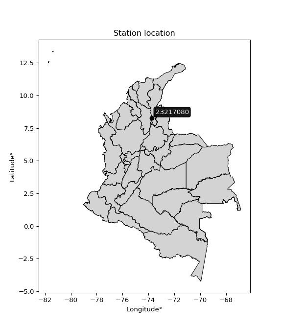

<div align="center">


</div>

# PMP Station (Rain, Pmax24h): 23217080

Probable Maximum Precipitation (PMP) is the greatest amount of rainfall for a specific duration that is meteorologically possible for a given location, acting as a "worst-case" scenario for extreme storms, crucial for designing safety-critical infrastructure like bridges, river deviations, dams, spillways, and nuclear plants to prevent catastrophic failure. PMP is calculated by hydrologists using meteorological data to determine the upper limit of extreme rainfall, often leading to the Probable Maximum Flood (PMF) for flood control design, and is increasingly being studied for climate change impacts.

<div align="center">

</img>

</div>


## A. General information


### 1. General running parameters

• app_version: _v20260103_. • runtime: _2026-01-03 07:24:50.581521_. • Python version: _3.14.0_. • SciPy version: _1.16.3_. • Pandas version: _2.3.3_. • NumPy version: _2.3.5_. • Stations dataset (station_dataset_file): _dataset/pmax24h_in/automatic_colombia_2003_2024.csv_. • Stations catalog (station_catalog_file): _dataset/CNE.xls_. • Minimum year to eval til year_max (date_min): _1900_. • Maximum year to eval since year_min (date_max): _2024_. • Creates, save and include plots into reports (create_plot): _False_. • Plot only fit distributions with Δo > Δ (plot_only_fit): _True_. • Eval low extreme values, if False, evaluates high extreme values (low_extreme): _False_. • Eval every SciPy distribution as logarithmic (pdist_logarithmic_on): _True_. • Standard deviation normalized (ddof): _1.0_. • Return periods to eval in years (Tr): _[2, 2.33, 5, 10, 15, 20, 25, 50, 75, 100, 200, 250, 500, 750, 1000]_. • Minimum data sample per station, 0 means any (minimum_sample): _5_. • Z-Score maximum threshold to adjust a value, 0 means disable (zscore_max): _3.5_. • Z-Score minimum threshold to adjust a value, 0 means disable (zscore_min): _-2.5_. • Avoid zeros, e.g. rain = 0 (avoid_zeros): _True_. • Avoid null values (avoid_nans): _True_. [:file_folder:Dataset file.](../../dataset/pmax24h_in/automatic_colombia_2003_2024.csv)

> Delta Degrees of Freedom (DDOF): is a parameter used in the formulas for calculating variance and standard deviation. When ddof=0, the divisor is $N$ (the total number of observations) and this is used when your data set is the entire population. When ddof=1, the divisor is $N-1$ and this is used when your data set is a sample drawn from a larger population. Using $N-1$ provides an unbiased estimate of the population variance (known as Bessel´s correction).


### 2. Station info and location

|   id |   CODIGO | NOMBRE                   | CATEGORIA    | TECNOLOGIA                              | ESTADO   | FECHA_INSTALACION   |   FECHA_SUSPENSION |   ALTITUD |   LATITUD |   LONGITUD | DEPARTAMENTO   | MUNICIPIO   | AREA_OPERATIVA                         | ENTIDAD                                                     | AREA_HIDROGRAFICA   | ZONA_HIDROGRAFICA   | SUBZONA_HIDROGRAFICA                             | CORRIENTE   | Catalogo   |   Version |
|-----:|---------:|:-------------------------|:-------------|:----------------------------------------|:---------|:--------------------|-------------------:|----------:|----------:|-----------:|:---------------|:------------|:---------------------------------------|:------------------------------------------------------------|:--------------------|:--------------------|:-------------------------------------------------|:------------|:-----------|----------:|
|    0 | 23217080 | GAMARRA - AUT [23217080] | Limnigráfica | Automática con Telemetría, Convencional | Activa   | 12/12/2011          |                nan |        40 |   8.28429 |   -73.7534 | Cesar          | Gamarra     | Area Operativa 08 - Santanderes-Arauca | INSTITUTO DE HIDROLOGIA METEOROLOGIA Y ESTUDIOS AMBIENTALES | Magdalena Cauca     | Medio Magdalena     | Quebrada El Carmen y Otros Directos al Magdalena | Magdalena   | CNE_IDEAM  |  20251226 |

<div align="center">

Dynamic map: [:earth_americas:Google](http://maps.google.com/maps?q=8.284286111,-73.75338889) [:earth_americas:OSM](https://www.openstreetmap.org/#map=18/8.284286111/-73.75338889&layers=P) [:earth_americas:Bing](https://www.bing.com/maps?cp=8.284286111~-73.75338889&lvl=18) [:earth_americas:Apple](https://maps.apple.com/frame?center=8.284286111%2C-73.75338889&span=0.003%2C0.006)

</div>


<div align="center">

```geojson
{
  "type": "Feature",
  "geometry": {
    "type": "Point", 
    "coordinates": [-73.75338889, 8.284286111]
  }, 
  "properties": {
    "Name": "23217080"
  }
}
```

</div>


### 3. Discrete values table and plot

<div align="center">

|               |           0 |           1 |           2 |           3 |          4 |          5 |           6 |          7 |           8 |         9 |        10 |           11 |        12 |
|:--------------|------------:|------------:|------------:|------------:|-----------:|-----------:|------------:|-----------:|------------:|----------:|----------:|-------------:|----------:|
| Date          | 2012        | 2013        | 2014        | 2015        | 2016       | 2017       | 2018        | 2019       | 2020        | 2021      | 2022      | 2023         | 2024      |
| Value         |   69.4      |   53.2      |  140.4      |  145.6      |   59.6     |  124.6     |   87.6      |  193.2     |  122.8      |  279.6    |    6.8    |  108.8       |   10      |
| Value_initial |   69.4      |   53.2      |  140.4      |  145.6      |   59.6     |  124.6     |   87.6      |  193.2     |  122.8      |  279.6    |    6.8    |  108.8       |   10      |
| count         |   13        |   13        |   13        |   13        |   13       |   13       |   13        |   13       |   13        |   13      |   13      |   13         |   13      |
| mean          |  107.815    |  107.815    |  107.815    |  107.815    |  107.815   |  107.815   |  107.815    |  107.815   |  107.815    |  107.815  |  107.815  |  107.815     |  107.815  |
| std           |   74.5884   |   74.5884   |   74.5884   |   74.5884   |   74.5884  |   74.5884  |   74.5884   |   74.5884  |   74.5884   |   74.5884 |   74.5884 |   74.5884    |   74.5884 |
| zscore        |   -0.515032 |   -0.732224 |    0.436859 |    0.506575 |   -0.64642 |    0.22503 |   -0.271026 |    1.14474 |    0.200898 |    2.3031 |   -1.3543 |    0.0132007 |   -1.3114 |


</div>


> The initial value (value_initial) correspond to the initial obtained or null completed value, and value (value) is adjusted only when the initial value is outside the valid range definite through the Z-Score value. If Z-Score is active, values out of range or outliers are replaced with the station mean value


### 4. Active continuous probability distributions from SciPy (44 of 104 available)

A Probability Density Function (PDF) describes the relative likelihood of a continuous random variable falling within a specific range, where the total area under its curve equals 1, and the area over any interval gives the actual probability for that range. Unlike discrete probabilities (like rolling a die), a PDF shows density, not direct probability for a single point (which is zero), with higher points indicating higher likelihood, often visualized as a bell curve for normal distributions.

A log of a probability density function (log-PDF) is simply the logarithm of the PDF´s value, denoted as $log(f(x))$, useful for converting multiplication of probabilities into addition, improving numerical stability with tiny numbers, and connecting to information theory concepts like entropy. Instead of dealing with very small probabilities (e.g., 0.000001), log-PDFs use negative numbers (e.g., $log(0.00001) ≈ -11.51$ that are easier for computers to handle, preventing underflow errors and simplifying complex calculations. In this study, each active probability distribution from SciPy is also evaluated in the $log$ form.

[scipy.stats](https://docs.scipy.org/doc/scipy/reference/stats.html) is a Python´s powerful submodule within the SciPy library for comprehensive statistical analysis, offering over 130 probability distributions (like Normal, Poisson), functions for descriptive stats (mean, variance), hypothesis testing (t-tests, chi-square), random variable generation, and statistical tests, making it essential for data science, modeling, and research. It provides tools to explore, model, and draw conclusions from data efficiently, working seamlessly with NumPy.

<div align="center">

|   id | p_dist             |   n_parameter | fit_method   | label                                                                       | active   | ref                                                                                                        |
|-----:|:-------------------|--------------:|:-------------|:----------------------------------------------------------------------------|:---------|:-----------------------------------------------------------------------------------------------------------|
|    0 | alpha              |             3 | MLE          | Alpha                                                                       | True     | [:mortar_board:](https://docs.scipy.org/doc/scipy/reference/generated/scipy.stats.alpha.html)              |
|    1 | betaprime          |             4 | MLE          | Beta prime                                                                  | True     | [:mortar_board:](https://docs.scipy.org/doc/scipy/reference/generated/scipy.stats.betaprime.html)          |
|    2 | chi2               |             3 | MLE          | Chi²                                                                        | True     | [:mortar_board:](https://docs.scipy.org/doc/scipy/reference/generated/scipy.stats.chi2.html)               |
|    3 | crystalball        |             4 | MLE          | Crystalball                                                                 | True     | [:mortar_board:](https://docs.scipy.org/doc/scipy/reference/generated/scipy.stats.crystalball.html)        |
|    4 | erlang             |             3 | MLE          | Erlang                                                                      | True     | [:mortar_board:](https://docs.scipy.org/doc/scipy/reference/generated/scipy.stats.erlang.html)             |
|    5 | expon              |             2 | MLE          | Exponential                                                                 | True     | [:mortar_board:](https://docs.scipy.org/doc/scipy/reference/generated/scipy.stats.expon.html)              |
|    6 | exponnorm          |             3 | MLE          | Exponentially modified Normal                                               | True     | [:mortar_board:](https://docs.scipy.org/doc/scipy/reference/generated/scipy.stats.exponnorm.html)          |
|    7 | f                  |             4 | MLE          | F                                                                           | True     | [:mortar_board:](https://docs.scipy.org/doc/scipy/reference/generated/scipy.stats.f.html)                  |
|    8 | fatiguelife        |             3 | MLE          | Fatigue-life (Birnbaum-Saunders)                                            | True     | [:mortar_board:](https://docs.scipy.org/doc/scipy/reference/generated/scipy.stats.fatiguelife.html)        |
|    9 | fisk               |             3 | MLE          | Fisk                                                                        | True     | [:mortar_board:](https://docs.scipy.org/doc/scipy/reference/generated/scipy.stats.fisk.html)               |
|   10 | gamma              |             3 | MLE          | Gamma                                                                       | True     | [:mortar_board:](https://docs.scipy.org/doc/scipy/reference/generated/scipy.stats.gamma.html)              |
|   11 | genexpon           |             5 | MLE          | Generalized exponential                                                     | True     | [:mortar_board:](https://docs.scipy.org/doc/scipy/reference/generated/scipy.stats.genexpon.html)           |
|   12 | genlogistic        |             3 | MLE          | Generalized logistic                                                        | True     | [:mortar_board:](https://docs.scipy.org/doc/scipy/reference/generated/scipy.stats.genlogistic.html)        |
|   13 | gibrat             |             2 | MM           | Gibrat                                                                      | True     | [:mortar_board:](https://docs.scipy.org/doc/scipy/reference/generated/scipy.stats.gibrat.html)             |
|   14 | gompertz           |             3 | MLE          | Gompertz (or truncated Gumbel)                                              | True     | [:mortar_board:](https://docs.scipy.org/doc/scipy/reference/generated/scipy.stats.gompertz.html)           |
|   15 | gumbel_l           |             2 | MM           | Gumbel Left Skew                                                            | True     | [:mortar_board:](https://docs.scipy.org/doc/scipy/reference/generated/scipy.stats.gumbel_l.html)           |
|   16 | gumbel_r           |             2 | MM           | Gumbel Right Skew                                                           | True     | [:mortar_board:](https://docs.scipy.org/doc/scipy/reference/generated/scipy.stats.gumbel_r.html)           |
|   17 | halflogistic       |             2 | MM           | Half-logistic                                                               | True     | [:mortar_board:](https://docs.scipy.org/doc/scipy/reference/generated/scipy.stats.halflogistic.html)       |
|   18 | halfnorm           |             2 | MM           | Half Normal                                                                 | True     | [:mortar_board:](https://docs.scipy.org/doc/scipy/reference/generated/scipy.stats.halfnorm.html)           |
|   19 | hypsecant          |             2 | MM           | hyperbolic secant                                                           | True     | [:mortar_board:](https://docs.scipy.org/doc/scipy/reference/generated/scipy.stats.hypsecant.html)          |
|   20 | invgamma           |             3 | MLE          | Inverted gamma                                                              | True     | [:mortar_board:](https://docs.scipy.org/doc/scipy/reference/generated/scipy.stats.invgamma.html)           |
|   21 | invgauss           |             3 | MLE          | Inverse Gaussian                                                            | True     | [:mortar_board:](https://docs.scipy.org/doc/scipy/reference/generated/scipy.stats.invgauss.html)           |
|   22 | invweibull         |             3 | MLE          | Inverted Weibull                                                            | True     | [:mortar_board:](https://docs.scipy.org/doc/scipy/reference/generated/scipy.stats.invweibull.html)         |
|   23 | johnsonsu          |             4 | MLE          | Johnson Su                                                                  | True     | [:mortar_board:](https://docs.scipy.org/doc/scipy/reference/generated/scipy.stats.johnsonsu.html)          |
|   24 | kstwobign          |             2 | MLE          | Limiting distribution of scaled Kolmogorov-Smirnov two-sided test statistic | True     | [:mortar_board:](https://docs.scipy.org/doc/scipy/reference/generated/scipy.stats.kstwobign.html)          |
|   25 | laplace            |             2 | MM           | Laplace                                                                     | True     | [:mortar_board:](https://docs.scipy.org/doc/scipy/reference/generated/scipy.stats.laplace.html)            |
|   26 | laplace_asymmetric |             3 | MLE          | Asymmetric Laplace                                                          | True     | [:mortar_board:](https://docs.scipy.org/doc/scipy/reference/generated/scipy.stats.laplace_asymmetric.html) |
|   27 | loggamma           |             3 | MLE          | Log gamma                                                                   | True     | [:mortar_board:](https://docs.scipy.org/doc/scipy/reference/generated/scipy.stats.loggamma.html)           |
|   28 | logistic           |             2 | MM           | Logistic (or Sech-squared)                                                  | True     | [:mortar_board:](https://docs.scipy.org/doc/scipy/reference/generated/scipy.stats.logistic.html)           |
|   29 | lognorm            |             3 | MLE          | Log Normal                                                                  | True     | [:mortar_board:](https://docs.scipy.org/doc/scipy/reference/generated/scipy.stats.lognorm.html)            |
|   30 | maxwell            |             2 | MM           | Maxwell                                                                     | True     | [:mortar_board:](https://docs.scipy.org/doc/scipy/reference/generated/scipy.stats.maxwell.html)            |
|   31 | mielke             |             4 | MLE          | Mielke Beta-Kappa / Dagum                                                   | True     | [:mortar_board:](https://docs.scipy.org/doc/scipy/reference/generated/scipy.stats.mielke.html)             |
|   32 | moyal              |             2 | MM           | Moyal                                                                       | True     | [:mortar_board:](https://docs.scipy.org/doc/scipy/reference/generated/scipy.stats.moyal.html)              |
|   33 | nakagami           |             3 | MLE          | Nakagami                                                                    | True     | [:mortar_board:](https://docs.scipy.org/doc/scipy/reference/generated/scipy.stats.nakagami.html)           |
|   34 | ncf                |             5 | MLE          | Non-central F distribution                                                  | True     | [:mortar_board:](https://docs.scipy.org/doc/scipy/reference/generated/scipy.stats.ncf.html)                |
|   35 | nct                |             4 | MLE          | Non-central Student’s t                                                     | True     | [:mortar_board:](https://docs.scipy.org/doc/scipy/reference/generated/scipy.stats.nct.html)                |
|   36 | norm               |             2 | MM           | Normal                                                                      | True     | [:mortar_board:](https://docs.scipy.org/doc/scipy/reference/generated/scipy.stats.norm.html)               |
|   37 | pearson3           |             3 | MM           | Pearson type III                                                            | True     | [:mortar_board:](https://docs.scipy.org/doc/scipy/reference/generated/scipy.stats.pearson3.html)           |
|   38 | rayleigh           |             2 | MM           | Rayleigh                                                                    | True     | [:mortar_board:](https://docs.scipy.org/doc/scipy/reference/generated/scipy.stats.rayleigh.html)           |
|   39 | rice               |             3 | MLE          | Rice                                                                        | True     | [:mortar_board:](https://docs.scipy.org/doc/scipy/reference/generated/scipy.stats.rice.html)               |
|   40 | t                  |             3 | MLE          | Student’s t                                                                 | True     | [:mortar_board:](https://docs.scipy.org/doc/scipy/reference/generated/scipy.stats.t.html)                  |
|   41 | truncnorm          |             4 | MLE          | Truncated normal                                                            | True     | [:mortar_board:](https://docs.scipy.org/doc/scipy/reference/generated/scipy.stats.truncnorm.html)          |
|   42 | wald               |             2 | MM           | Wald                                                                        | True     | [:mortar_board:](https://docs.scipy.org/doc/scipy/reference/generated/scipy.stats.wald.html)               |
|   43 | weibull_min        |             3 | MLE          | Weibull minimum                                                             | True     | [:mortar_board:](https://docs.scipy.org/doc/scipy/reference/generated/scipy.stats.weibull_min.html)        |

</div>

> **n_parameter:** # arguments & localization & scale.
>
> **Fit methods:** (MLE) maximum likelihood, (MM) L-moments.
>
>**Inactive** (With the only purpose of prevent loops, zero divisions, infinite values, over high estimated values or horizontal trending for recurrence intervals estimations, the follow distributions were disabled.)**:** foldnorm, gennorm, norminvgauss, powernorm, powerlognorm, skewnorm, genextreme, anglit, arcsine, argus, beta, bradford, burr, burr12, cauchy, cosine, halfcauchy, foldcauchy, skewcauchy, wrapcauchy, dgamma, gengamma, exponweib, exponpow, truncexpon, gausshyper, genhalflogistic, genhyperbolic, geninvgauss, halfgennorm, johnsonsb, kappa4, kappa3, ksone, kstwo, loglaplace, levy, levy_l, levy_stable, ncx2, pareto, genpareto, truncpareto, lomax, powerlaw, rdist, rel_breitwigner, recipinvgauss, semicircular, studentized_range, trapezoid, triang, truncweibull_min, tukeylambda, uniform, loguniform, vonmises, vonmises_line, weibull_max, dweibull, 


## B. Probability distributions vs. Empirical distributions

A continuous probability distribution (CPD) describes probabilities for variables that can take any value within a range (like rain any time), unlike discrete variables with specific outcomes (like temperature). It uses a Probability Density Function (PDF), a curve where the total area under it equals 1, and the probability of the variable falling within an interval (a to b) is found by calculating the area under the curve between those points. A key feature is that the probability of hitting any single exact value is zero, so probabilities are always expressed for ranges, e.g., $P(a ≤ X ≤ b)$.

<div align="center">

Distributions parameters from station values
|    |   station | p_dist                |   n |              loc |           scale | shape                  | shape1                | shape2                | shape3   |
|---:|----------:|:----------------------|----:|-----------------:|----------------:|:-----------------------|:----------------------|:----------------------|:---------|
|  0 |  23217080 | alpha                 |  13 |     -0.0516586   |    20.0365      | 2.8674014766999623e-10 |                       |                       |          |
|  1 |  23217080 | betaprime             |  13 |      6.8         | 14116           | 0.8919617796218127     | 146.68888389431308    |                       |          |
|  2 |  23217080 | chi2                  |  13 |    -24.0147      |    21.8086      | 6.044871375960602      |                       |                       |          |
|  3 |  23217080 | crystalball           |  13 |    107.815       |    71.6622      | 9053.033535098428      | 2941.6131691444702    |                       |          |
|  4 |  23217080 | erlang                |  13 |    -24.0147      |    43.6171      | 3.0224392349498244     |                       |                       |          |
|  5 |  23217080 | expon                 |  13 |      6.8         |   101.015       |                        |                       |                       |          |
|  6 |  23217080 | exponnorm             |  13 |     49.6814      |    44.1404      | 1.3170245933669573     |                       |                       |          |
|  7 |  23217080 | f                     |  13 |    -24.0432      |   131.856       | 6.0487494661842405     | 77192.84479058563     |                       |          |
|  8 |  23217080 | fatiguelife           |  13 |      6.79615     |     0.586629    | 7.1358208475639575     |                       |                       |          |
|  9 |  23217080 | fisk                  |  13 |   -121.187       |   219.458       | 5.600662221214842      |                       |                       |          |
| 10 |  23217080 | gamma                 |  13 |    -24.0147      |    43.6171      | 3.02243819325223       |                       |                       |          |
| 11 |  23217080 | genexpon              |  13 |      6.79986     |     2.55167     | 0.025203345513323823   | 1.600858350451775e-07 | 3.2617197368116972    |          |
| 12 |  23217080 | genlogistic           |  13 |   -247.997       |    58.4344      | 249.8808772602644      |                       |                       |          |
| 13 |  23217080 | gibrat                |  13 |     53.1462      |    33.1585      |                        |                       |                       |          |
| 14 |  23217080 | gompertz              |  13 |      6.8         |   175.825       | 1.0567235988329284     |                       |                       |          |
| 15 |  23217080 | gumbel_l              |  13 |    140.067       |    55.8748      |                        |                       |                       |          |
| 16 |  23217080 | gumbel_r              |  13 |     75.5636      |    55.8748      |                        |                       |                       |          |
| 17 |  23217080 | halflogistic          |  13 |     22.879       |    61.2686      |                        |                       |                       |          |
| 18 |  23217080 | halfnorm              |  13 |     12.9627      |   118.88        |                        |                       |                       |          |
| 19 |  23217080 | hypsecant             |  13 |    107.815       |    45.6216      |                        |                       |                       |          |
| 20 |  23217080 | invgamma              |  13 |   -199.077       |  5738.6         | 19.693297339631034     |                       |                       |          |
| 21 |  23217080 | invgauss              |  13 |    -43.5076      |   346.592       | 0.43631429609405703    |                       |                       |          |
| 22 |  23217080 | invweibull            |  13 |      6.65158     |     4.743       | 0.3842795484672349     |                       |                       |          |
| 23 |  23217080 | johnsonsu             |  13 |   -116.238       |    16.6524      | -10.221746425630382    | 3.151189854976151     |                       |          |
| 24 |  23217080 | kstwobign             |  13 |   -134.249       |   278.231       |                        |                       |                       |          |
| 25 |  23217080 | laplace               |  13 |    107.815       |    50.6728      |                        |                       |                       |          |
| 26 |  23217080 | laplace_asymmetric    |  13 |    108.8         |    55.3466      | 1.0089483583955903     |                       |                       |          |
| 27 |  23217080 | loggamma              |  13 | -20502.3         |  2811.9         | 1525.1473492831929     |                       |                       |          |
| 28 |  23217080 | logistic              |  13 |    107.815       |    39.5094      |                        |                       |                       |          |
| 29 |  23217080 | lognorm               |  13 |      6.8         |     3.88734     | 10.448389244842874     |                       |                       |          |
| 30 |  23217080 | maxwell               |  13 |    -61.9939      |   106.412       |                        |                       |                       |          |
| 31 |  23217080 | mielke                |  13 |      6.79999     |   174.782       | 0.6880318508132488     | 3.983912801623982     |                       |          |
| 32 |  23217080 | moyal                 |  13 |     66.8344      |    32.2593      |                        |                       |                       |          |
| 33 |  23217080 | nakagami              |  13 |      6.8         |   139.985       | 0.27918250216608415    |                       |                       |          |
| 34 |  23217080 | ncf                   |  13 |     -0.031149    |     2.89932e-05 | 1.2683978740977613e-06 | 4.071108631648513     | 2.9881796291133194    |          |
| 35 |  23217080 | nct                   |  13 |     -0.255186    |    55.3539      | 7.399721247401519      | 1.7391472310708829    |                       |          |
| 36 |  23217080 | norm                  |  13 |    107.815       |    71.6622      |                        |                       |                       |          |
| 37 |  23217080 | pearson3              |  13 |    107.815       |    71.6622      | 0.7277772670567236     |                       |                       |          |
| 38 |  23217080 | rayleigh              |  13 |    -29.2785      |   109.385       |                        |                       |                       |          |
| 39 |  23217080 | rice                  |  13 |    -21.8065      |   104.731       | 0.0005873247079116194  |                       |                       |          |
| 40 |  23217080 | t                     |  13 |    107.868       |    71.659       | 141.74166092771338     |                       |                       |          |
| 41 |  23217080 | truncnorm             |  13 |    116.293       |     5.72999     | -84.1347434011912      | 28.50030129897523     |                       |          |
| 42 |  23217080 | wald                  |  13 |     36.1532      |    71.6622      |                        |                       |                       |          |
| 43 |  23217080 | weibull_min           |  13 |     -2.20804     |   120.812       | 1.4734941014530158     |                       |                       |          |
| 44 |  23217080 | logalpha              |  13 |    -20.8874      |   575.563       | 22.904449506878606     |                       |                       |          |
| 45 |  23217080 | logbetaprime          |  13 |    -42.4544      |   799.542       | 2014.1770306686733     | 34430.535882152166    |                       |          |
| 46 |  23217080 | logchi2               |  13 |      1.91692     |     1.20199     | 1.2805624662922126     |                       |                       |          |
| 47 |  23217080 | logcrystalball        |  13 |      4.31858     |     1.04229     | 7.060322860942742      | 293.1407689239259     |                       |          |
| 48 |  23217080 | logerlang             |  13 |    -14.6735      |     0.0620581   | 305.6130318829031      |                       |                       |          |
| 49 |  23217080 | logexpon              |  13 |      1.91692     |     2.40166     |                        |                       |                       |          |
| 50 |  23217080 | logexponnorm          |  13 |      4.31784     |     1.04229     | 0.0006994370758443352  |                       |                       |          |
| 51 |  23217080 | logf                  |  13 |   -116.64        |   120.959       | 27689.285898756192     | 439442.67587714456    |                       |          |
| 52 |  23217080 | logfatiguelife        |  13 |   -790.452       |   794.767       | 0.0013104489584876292  |                       |                       |          |
| 53 |  23217080 | logfisk               |  13 |  -3124.85        |  3129.36        | 5755.617232588094      |                       |                       |          |
| 54 |  23217080 | loggamma              |  13 |    -15.4185      |     0.0594392   | 331.8893229825487      |                       |                       |          |
| 55 |  23217080 | loggenexpon           |  13 |      1.91647     |     0.00492104  | 0.00048181995485783893 | 1.6477372493424425    | 3.262985441136871e-06 |          |
| 56 |  23217080 | loggenlogistic        |  13 |      5.21495     |     0.197813    | 0.20696651683129252    |                       |                       |          |
| 57 |  23217080 | loggibrat             |  13 |      3.52343     |     0.482281    |                        |                       |                       |          |
| 58 |  23217080 | loggompertz           |  13 |      1.91692     |     0.762025    | 0.024999309231285266   |                       |                       |          |
| 59 |  23217080 | loggumbel_l           |  13 |      4.78766     |     0.812668    |                        |                       |                       |          |
| 60 |  23217080 | loggumbel_r           |  13 |      3.84949     |     0.812668    |                        |                       |                       |          |
| 61 |  23217080 | loghalflogistic       |  13 |      3.0832      |     0.89113     |                        |                       |                       |          |
| 62 |  23217080 | loghalfnorm           |  13 |      2.93898     |     1.72907     |                        |                       |                       |          |
| 63 |  23217080 | loghypsecant          |  13 |      4.31858     |     0.663541    |                        |                       |                       |          |
| 64 |  23217080 | loginvgamma           |  13 |    -20.7731      | 12925.1         | 515.9625230260749      |                       |                       |          |
| 65 |  23217080 | loginvgauss           |  13 |     -6.48789     |   943.645       | 0.011405698333732353   |                       |                       |          |
| 66 |  23217080 | loginvweibull         |  13 | -28632.6         | 28636.3         | 23517.462614809225     |                       |                       |          |
| 67 |  23217080 | logjohnsonsu          |  13 |      5.11161     |     0.482329    | 0.9462022505451277     | 1.0343097365208749    |                       |          |
| 68 |  23217080 | logkstwobign          |  13 |     -0.672072    |     5.70949     |                        |                       |                       |          |
| 69 |  23217080 | loglaplace            |  13 |      4.31858     |     0.737009    |                        |                       |                       |          |
| 70 |  23217080 | loglaplace_asymmetric |  13 |      4.9445      |     0.548565    | 1.7220613352176066     |                       |                       |          |
| 71 |  23217080 | logloggamma           |  13 |      5.31143     |     0.369302    | 0.3831972305951064     |                       |                       |          |
| 72 |  23217080 | loglogistic           |  13 |      4.31858     |     0.574643    |                        |                       |                       |          |
| 73 |  23217080 | loglognorm            |  13 |     -1.15896e+06 |     1.15897e+06 | 8.993246650510967e-07  |                       |                       |          |
| 74 |  23217080 | logmaxwell            |  13 |      1.84879     |     1.54771     |                        |                       |                       |          |
| 75 |  23217080 | logmielke             |  13 |     -1.39809e+06 |     1.3981e+06  | 1419708.424317916      | 7091794.399137713     |                       |          |
| 76 |  23217080 | logmoyal              |  13 |      3.72253     |     0.469194    |                        |                       |                       |          |
| 77 |  23217080 | lognakagami           |  13 |   -711.701       |   716.024       | 118064.00525757851     |                       |                       |          |
| 78 |  23217080 | logncf                |  13 |     -5.92959     |     0.355964    | 12.200676739786779     | 1614.41102819867      | 338.7871842396557     |          |
| 79 |  23217080 | lognct                |  13 |    -71.6913      |     1.02724     | 80795.28196370605      | 73.99284212469104     |                       |          |
| 80 |  23217080 | lognorm               |  13 |      4.31858     |     1.04229     |                        |                       |                       |          |
| 81 |  23217080 | logpearson3           |  13 |      4.31858     |     1.04229     | -1.232534399731891     |                       |                       |          |
| 82 |  23217080 | lograyleigh           |  13 |      2.32463     |     1.59094     |                        |                       |                       |          |
| 83 |  23217080 | logrice               |  13 |   -689.728       |     1.04222     | 665.9313491033733      |                       |                       |          |
| 84 |  23217080 | logt                  |  13 |      4.66223     |     0.504111    | 1.727107242856847      |                       |                       |          |
| 85 |  23217080 | logtruncnorm          |  13 |     -0.687349    |     4.42289     | 0.5777512481115046     | 1.4290906618374264    |                       |          |
| 86 |  23217080 | logwald               |  13 |      3.27631     |     1.04227     |                        |                       |                       |          |
| 87 |  23217080 | logweibull_min        |  13 |     -5.38664e+07 |     5.38664e+07 | 75863152.03578663      |                       |                       |          |

</div>

> **loc** (Location parameter): This shifts the distribution along the x-axis. For many common distributions, like the normal (Gaussian) distribution, loc represents the mean $μ$. For others, like the uniform distribution, it might represent the minimum value, or for the beta distribution, the left end of the support interval.
>
> **scale** (Scale parameter): This determines the width or spread of the distribution. For the normal distribution, scale represents the standard deviation $σ$. For a uniform distribution, it defines the length of the interval (from $loc$ to $loc + scale$).
>
> **shape** (Shape parameters): Refers to parameters that define the specific form of a probability distribution, distinct from its location (loc) and scale (scale). These parameters are required arguments for most distribution functions. For example, a normal (Gaussian) distribution is fully defined by its location (mean) and scale (standard deviation), so it has no specific shape parameters beyond loc and scale. However, other distributions have intrinsic properties that need specification, as Gamma distribution that takes a shape parameter, often named $a$ or $alpha$.


### 0. Cumulative distribution values - CDF (88 evaluated)

Cumulative Distribution Function (CDF), denoted as $F$<sub>$X$</sub>$(x)$, is a function that gives the probability that a random variable $X$ will take a value less than or equal to a specific value, $x$ (i.e., $(P(X≥x)$. It essentially "accumulates" probabilities from a given point up to the far right (positive infinity), providing a complete picture of the distribution´s probabilities for both discrete (like rain) and continuous (like temperature) variables, helping to find probabilities over ranges or above certain values. Each station is evaluated separately ordering the $x$ values ascending, calculating the CDF and PDF values for the activated distributions and their logarithmic forms.

<div align="center">

CDF ordered by x ascending and calculating $log(f(x))$ separately
|   id |   Station |   date |     x |   count |    mean |     std |     zscore |   Value_initial |   station |   m |      alpha |   alpha_pdf |   betaprime |   betaprime_pdf |      chi2 |    chi2_pdf |   crystalball |   crystalball_pdf |    erlang |   erlang_pdf |     expon |   expon_pdf |   exponnorm |   exponnorm_pdf |         f |      f_pdf |   fatiguelife |   fatiguelife_pdf |      fisk |    fisk_pdf |     gamma |   gamma_pdf |    genexpon |   genexpon_pdf |   genlogistic |   genlogistic_pdf |      gibrat |   gibrat_pdf |    gompertz |   gompertz_pdf |   gumbel_l |   gumbel_l_pdf |   gumbel_r |   gumbel_r_pdf |   halflogistic |   halflogistic_pdf |   halfnorm |   halfnorm_pdf |   hypsecant |   hypsecant_pdf |   invgamma |   invgamma_pdf |   invgauss |   invgauss_pdf |   invweibull |   invweibull_pdf |   johnsonsu |   johnsonsu_pdf |   kstwobign |   kstwobign_pdf |   laplace |   laplace_pdf |   laplace_asymmetric |   laplace_asymmetric_pdf |   loggamma |   loggamma_pdf |   logistic |   logistic_pdf |   lognorm |   lognorm_pdf |   maxwell |   maxwell_pdf |      mielke |   mielke_pdf |     moyal |   moyal_pdf |    nakagami |     nakagami_pdf |      ncf |     ncf_pdf |       nct |     nct_pdf |      norm |    norm_pdf |   pearson3 |   pearson3_pdf |   rayleigh |   rayleigh_pdf |      rice |    rice_pdf |         t |      t_pdf |   truncnorm |   truncnorm_pdf |     wald |   wald_pdf |   weibull_min |   weibull_min_pdf |   logalpha |   logalpha_pdf |   logbetaprime |   logbetaprime_pdf |     logchi2 |    logchi2_pdf |   logcrystalball |   logcrystalball_pdf |   logerlang |   logerlang_pdf |   logexpon |   logexpon_pdf |   logexponnorm |   logexponnorm_pdf |      logf |   logf_pdf |   logfatiguelife |   logfatiguelife_pdf |    logfisk |   logfisk_pdf |   loggenexpon |   loggenexpon_pdf |   loggenlogistic |   loggenlogistic_pdf |   loggibrat |   loggibrat_pdf |   loggompertz |   loggompertz_pdf |   loggumbel_l |   loggumbel_l_pdf |   loggumbel_r |   loggumbel_r_pdf |   loghalflogistic |   loghalflogistic_pdf |   loghalfnorm |   loghalfnorm_pdf |   loghypsecant |   loghypsecant_pdf |   loginvgamma |   loginvgamma_pdf |   loginvgauss |   loginvgauss_pdf |   loginvweibull |   loginvweibull_pdf |   logjohnsonsu |   logjohnsonsu_pdf |   logkstwobign |   logkstwobign_pdf |   loglaplace |   loglaplace_pdf |   loglaplace_asymmetric |   loglaplace_asymmetric_pdf |   logloggamma |   logloggamma_pdf |   loglogistic |   loglogistic_pdf |   loglognorm |   loglognorm_pdf |   logmaxwell |   logmaxwell_pdf |   logmielke |   logmielke_pdf |    logmoyal |   logmoyal_pdf |   lognakagami |   lognakagami_pdf |    logncf |   logncf_pdf |    lognct |   lognct_pdf |   logpearson3 |   logpearson3_pdf |   lograyleigh |   lograyleigh_pdf |   logrice |   logrice_pdf |      logt |   logt_pdf |   logtruncnorm |   logtruncnorm_pdf |   logwald |   logwald_pdf |   logweibull_min |   logweibull_min_pdf |
|-----:|----------:|-------:|------:|--------:|--------:|--------:|-----------:|----------------:|----------:|----:|-----------:|------------:|------------:|----------------:|----------:|------------:|--------------:|------------------:|----------:|-------------:|----------:|------------:|------------:|----------------:|----------:|-----------:|--------------:|------------------:|----------:|------------:|----------:|------------:|------------:|---------------:|--------------:|------------------:|------------:|-------------:|------------:|---------------:|-----------:|---------------:|-----------:|---------------:|---------------:|-------------------:|-----------:|---------------:|------------:|----------------:|-----------:|---------------:|-----------:|---------------:|-------------:|-----------------:|------------:|----------------:|------------:|----------------:|----------:|--------------:|---------------------:|-------------------------:|-----------:|---------------:|-----------:|---------------:|----------:|--------------:|----------:|--------------:|------------:|-------------:|----------:|------------:|------------:|-----------------:|---------:|------------:|----------:|------------:|----------:|------------:|-----------:|---------------:|-----------:|---------------:|----------:|------------:|----------:|-----------:|------------:|----------------:|---------:|-----------:|--------------:|------------------:|-----------:|---------------:|---------------:|-------------------:|------------:|---------------:|-----------------:|---------------------:|------------:|----------------:|-----------:|---------------:|---------------:|-------------------:|----------:|-----------:|-----------------:|---------------------:|-----------:|--------------:|--------------:|------------------:|-----------------:|---------------------:|------------:|----------------:|--------------:|------------------:|--------------:|------------------:|--------------:|------------------:|------------------:|----------------------:|--------------:|------------------:|---------------:|-------------------:|--------------:|------------------:|--------------:|------------------:|----------------:|--------------------:|---------------:|-------------------:|---------------:|-------------------:|-------------:|-----------------:|------------------------:|----------------------------:|--------------:|------------------:|--------------:|------------------:|-------------:|-----------------:|-------------:|-----------------:|------------:|----------------:|------------:|---------------:|--------------:|------------------:|----------:|-------------:|----------:|-------------:|--------------:|------------------:|--------------:|------------------:|----------:|--------------:|----------:|-----------:|---------------:|-------------------:|----------:|--------------:|-----------------:|---------------------:|
|    0 |  23217080 |   2022 |   6.8 |      13 | 107.815 | 74.5884 | -1.3543    |             6.8 |  23217080 |   1 | 0.00345195 | 0.00473356  |  6.6622e-16 |     0.669058    | 0.033662  | 0.00274329  |     0.0793281 |       0.00206135  | 0.033662  |  0.00274329  | 0         | 0.00989948  |   0.0491993 |     0.00200323  | 0.0336714 | 0.00274276 |     0.0428643 |      20.6056      | 0.0465286 | 0.00194133  | 0.0336621 | 0.0027433   | 1.38264e-06 |    0.00987717  |     0.0419372 |       0.0022618   | 0           |  0           | 2.91977e-10 |    0.0060101   |  0.0879672 |    0.00150299  |   0.032597 |    0.00199727  |       0        |        0           |   0        |    0           |   0.06927   |     0.00150641  |  0.0436981 |    0.00224464  |  0.0628691 |    0.00448899  |    0.0226883 |      0.222393    |   0.0426267 |     0.00230281  |   0.0406751 |     0.00248026  | 0.0681101 |   0.00134411  |            0.081198  |              0.00145407  |  0.0111116 |      0.0294194 |  0.0719749 |    0.0016906   | 0.0106053 |     0.0269153 | 0.0634885 |   0.00254279  | 1.03854e-05 |  0.715765    | 0.0112201 | 0.00125916  | 1.94141e-10 | 122049           | 0.273095 | 0.00689956  | 0.0531493 | 0.00191646  | 0.0793281 | 0.00206135  |  0.0507164 |    0.00237798  |  0.0529412 |     0.00285568 | 0.0366159 | 0.00251253  | 0.0803061 | 0.00205539 | 1.0661e-81  |    3.565e-81    | 0        | 0          |     0.0215745 |        0.0034907  | 0.00977886 |      0.0289274 |      0.0114611 |          0.0290484 | 6.02297e-11 | 173677         |        0.0106053 |            0.0269153 |   0.0116347 |       0.0306558 |   0        |      0.41638   |      0.0106055 |          0.0269158 | 0.0112921 |  0.0283523 |        0.0105597 |            0.026916  | 0.00833968 |     0.0152233 |   4.46003e-05 |          0.098007 |        0.0317254 |            0.0331934 |    0        |       0         |   9.34437e-11 |         0.0328064 |     0.028809  |         0.0349343 |   2.07303e-05 |       0.000275087 |          0        |              0        |      0        |          0        |      0.0170556 |          0.0256917 |     0.0107139 |         0.0292913 |     0.0115533 |         0.0339783 |       0.0132892 |            0.047159 |      0.041632  |          0.0284967 |      0.0137038 |          0.0582228 |    0.0192201 |        0.0260785 |               0.0303331 |                   0.03211   |     0.0332458 |         0.0344942 |     0.0150771 |         0.0258418 |    0.0106053 |        0.0269153 |  2.26721e-05 |      0.000997962 |   0.034703  |       0.0352394 | 7.41697e-12 |    3.78404e-10 |     0.0104588 |         0.0266301 | 0.0125967 |    0.0333444 | 0.0107011 |    0.0271239 |     0.0307157 |         0.0373438 |      0        |          0        | 0.0106009 |     0.0269074 | 0.0218872 |  0.0132121 |      0.0181457 |           0.369559 |  0        |     0         |        0.0179297 |            0.0250237 |
|    1 |  23217080 |   2024 |  10   |      13 | 107.815 | 74.5884 | -1.3114    |            10   |  23217080 |   2 | 0.0462225  | 0.0217      |  0.0492863  |     0.0134966   | 0.0430351 | 0.00311308  |     0.0861342 |       0.00219308  | 0.0430351 |  0.00311308  | 0.0311818 | 0.0095908   |   0.0559355 |     0.00220862  | 0.0430425 | 0.00311241 |     0.605471  |       0.0232754   | 0.0530639 | 0.0021452   | 0.0430352 | 0.00311308  | 0.0311142   |    0.00956993  |     0.0496091 |       0.00253469  | 0           |  0           | 0.0192213   |    0.00600285  |  0.0929038 |    0.00158297  |   0.03944  |    0.00228204  |       0        |        0           |   0        |    0           |   0.0742592 |     0.001613    |  0.0512862 |    0.00249927  |  0.0779191 |    0.0049081   |    0.318809  |      0.041826    |   0.0504205 |     0.00256949  |   0.0490972 |     0.00278404  | 0.07255   |   0.00143173  |            0.0859869 |              0.00153983  |  0.0286475 |      0.0649716 |  0.0775759 |    0.00181116  | 0.0265443 |     0.0589585 | 0.071925  |   0.00273     | 0.0637752   |  0.0137122   | 0.0158189 | 0.0016233   | 0.094274    |      0.0164479   | 0.294833 | 0.00668588  | 0.0595847 | 0.00210752  | 0.0861342 | 0.00219308  |  0.0586929 |    0.00260793  |  0.0624367 |     0.00307779 | 0.0450684 | 0.00276907  | 0.0870912 | 0.00218595 | 4.05045e-77 |    1.31509e-76  | 0        | 0          |     0.0335583 |        0.00398171 | 0.0277472  |      0.0682474 |      0.0285467 |          0.0628109 | 0.324229    |      0.487572  |        0.0265443 |            0.0589585 |   0.0298386 |       0.0672431 |   0.148352 |      0.354609  |      0.0265448 |          0.0589595 | 0.0279535 |  0.0612583 |        0.0265248 |            0.0591165 | 0.0168156  |     0.0304292 |   0.0529028   |          0.173911 |        0.0474951 |            0.0496928 |    0        |       0         |   0.016335    |         0.0535308 |     0.0458984 |         0.0551622 |   0.00121954  |       0.0100683   |          0        |              0        |      0        |          0        |      0.0304831 |          0.0458699 |     0.0283433 |         0.0656722 |     0.0322809 |         0.0775176 |       0.0429471 |            0.111028 |      0.0547234 |          0.040209  |      0.0510969 |          0.138964  |    0.0324349 |        0.0440089 |               0.0456268 |                   0.0482996 |     0.049603  |         0.0514586 |     0.0290784 |         0.0491311 |    0.0265443 |        0.0589586 |  0.00653352  |      0.0424539   |   0.0513389 |       0.0521325 | 5.5955e-06  |    0.000128455 |     0.0262541 |         0.0584945 | 0.0322191 |    0.0718559 | 0.0267478 |    0.0593104 |     0.0488194 |         0.0579143 |      0        |          0        | 0.0265362 |     0.0589474 | 0.0280812 |  0.019447  |      0.1569    |           0.349731 |  0        |     0         |        0.0306647 |            0.0425178 |
|    2 |  23217080 |   2013 |  53.2 |      13 | 107.815 | 74.5884 | -0.732224  |            53.2 |  23217080 |   3 | 0.706723   | 0.00525236  |  0.437112   |     0.00644089  | 0.256664  | 0.00606882  |     0.222993  |       0.00416384  | 0.256664  |  0.00606882  | 0.368297  | 0.00625353  |   0.219855  |     0.0053654   | 0.256639  | 0.00606843 |     0.890769  |       0.00254435  | 0.216278  | 0.00544376  | 0.256664  | 0.00606882  | 0.367646    |    0.00624592  |     0.237267  |       0.00582439  | 6.64556e-11 |  8.11901e-09 | 0.273217    |    0.00568718  |  0.190435  |    0.0030609   |   0.22488  |    0.00600563  |       0.242514 |        0.00768082  |   0.26499  |    0.00633803  |   0.186748  |     0.00386259  |  0.232761  |    0.00563701  |  0.34099   |    0.00618715  |    0.659833  |      0.00226479  |   0.235955  |     0.0057005   |   0.245577  |     0.00581166  | 0.170171  |   0.00335823  |            0.186384  |              0.00333771  |  0.384931  |      0.357007  |  0.200634  |    0.00405928  | 0.370495  |     0.362408  | 0.240239  |   0.00489056  | 0.401171    |  0.00591864  | 0.216714  | 0.00712304  | 0.416851    |      0.00489725  | 0.524532 | 0.00410387  | 0.217025  | 0.00521939  | 0.222993  | 0.00416384  |  0.235122  |    0.00532343  |  0.247439  |     0.0051876  | 0.226212  | 0.00529137  | 0.223399  | 0.00414823 | 1.68956e-28 |    3.27312e-28  | 0.100256 | 0.0141539  |     0.271728  |        0.00614099 | 0.40271    |      0.360389  |      0.376243  |          0.355855  | 0.744325    |      0.133211  |        0.370495  |            0.362408  |   0.391308  |       0.35798   |   0.575375 |      0.176805  |      0.370499  |          0.362409  | 0.373054  |  0.357895  |        0.371733  |            0.363228  | 0.270338   |     0.36286   |   0.488918    |          0.283356 |        0.272886  |            0.284976  |    0.472943 |       0.883256  |   0.293069    |         0.344939  |     0.307506  |         0.313118  |   0.424056    |       0.447653    |          0.461995 |              0.441328 |      0.450583 |          0.385754 |      0.341691  |          0.421598  |     0.385138  |         0.352306  |     0.415783  |         0.349606  |       0.450362  |            0.295034 |      0.241401  |          0.261059  |      0.478066  |          0.280503  |    0.313297  |        0.425093  |               0.267704  |                   0.283386  |     0.278974  |         0.283918  |     0.35445   |         0.398186  |    0.370496  |        0.362408  |  0.403512    |      0.378659    |   0.280174  |       0.284011  | 0.444346    |    0.485411    |     0.369246  |         0.362192  | 0.391659  |    0.342876  | 0.371061  |    0.361923  |     0.30354   |         0.293627  |      0.415756 |          0.380732 | 0.370486  |     0.362429  | 0.161478  |  0.253987  |      0.661503  |           0.252215 |  0.49573  |     0.644042  |        0.279557  |            0.33269   |
|    3 |  23217080 |   2016 |  59.6 |      13 | 107.815 | 74.5884 | -0.64642   |            59.6 |  23217080 |   4 | 0.736952   | 0.00424637  |  0.47671    |     0.00594191  | 0.295826  | 0.00615632  |     0.250532  |       0.00443938  | 0.295826  |  0.00615632  | 0.407078  | 0.00586962  |   0.255415  |     0.00573643  | 0.295799  | 0.00615609 |     0.905709  |       0.00213966  | 0.252442  | 0.00584627  | 0.295826  | 0.00615632  | 0.406383    |    0.00586331  |     0.275348  |       0.00606162  | 0.0508538   |  0.0161977   | 0.309356    |    0.00560473  |  0.210927  |    0.00334549  |   0.264293 |    0.00629432  |       0.291012 |        0.00746966  |   0.305167 |    0.00621457  |   0.212942  |     0.00432713  |  0.269697  |    0.00589279  |  0.37996   |    0.00598396  |    0.673217  |      0.00193331  |   0.273227  |     0.0059341   |   0.283312  |     0.00596737  | 0.19308   |   0.00381033  |            0.209017  |              0.00374302  |  0.425963  |      0.364757  |  0.227875  |    0.00445331  | 0.412331  |     0.373477  | 0.272218  |   0.00509638  | 0.438212    |  0.00566223  | 0.263287  | 0.00739972  | 0.447164    |      0.00458396  | 0.549847 | 0.00381082  | 0.251704  | 0.00560812  | 0.250533  | 0.00443938  |  0.269968  |    0.00555611  |  0.281149  |     0.00533973 | 0.260728  | 0.00548669  | 0.250838  | 0.00442401 | 2.20662e-23 |    3.8484e-23   | 0.194848 | 0.0148934  |     0.310986  |        0.00611858 | 0.44392    |      0.364477  |      0.41724   |          0.365293  | 0.758963    |      0.12463   |        0.412331  |            0.373477  |   0.432412  |       0.365036  |   0.594992 |      0.168637  |      0.412334  |          0.373478  | 0.414331  |  0.36818   |        0.413653  |            0.374145  | 0.31347    |     0.395868  |   0.520799    |          0.277749 |        0.307233  |            0.320376  |    0.562352 |       0.698402  |   0.334086    |         0.377159  |     0.344648  |         0.340779  |   0.474271    |       0.43535     |          0.510631 |              0.414786 |      0.493523 |          0.370077 |      0.391394  |          0.452061  |     0.425577  |         0.359036  |     0.455642  |         0.35155   |       0.483526  |            0.288545 |      0.273432  |          0.304053  |      0.509516  |          0.27301   |    0.365507  |        0.495933  |               0.301912  |                   0.319598  |     0.313044  |         0.316374  |     0.400867  |         0.417951  |    0.412331  |        0.373477  |  0.446579    |      0.37891     |   0.314346  |       0.31822   | 0.497982    |    0.457987    |     0.411063  |         0.373374  | 0.430953  |    0.348352  | 0.412834  |    0.372864  |     0.338336  |         0.319066  |      0.458826 |          0.376953 | 0.412324  |     0.3735    | 0.193978  |  0.320694  |      0.689766  |           0.245398 |  0.562795 |     0.540009  |        0.319397  |            0.368821  |
|    4 |  23217080 |   2012 |  69.4 |      13 | 107.815 | 74.5884 | -0.515032  |            69.4 |  23217080 |   5 | 0.772967   | 0.00317925  |  0.531556   |     0.00526771  | 0.356267  | 0.00615302  |     0.295958  |       0.00482192  | 0.356267  |  0.00615302  | 0.461898  | 0.00532693  |   0.313893  |     0.00616799  | 0.356238  | 0.00615301 |     0.924231  |       0.00166493  | 0.312174  | 0.00630988  | 0.356267  | 0.00615301  | 0.46115     |    0.00532236  |     0.335874  |       0.00625738  | 0.237931    |  0.0190359   | 0.363594    |    0.00546061  |  0.245962  |    0.00380984  |   0.327383 |    0.00654256  |       0.362401 |        0.00708899  |   0.365028 |    0.0059964   |   0.258975  |     0.00507074  |  0.328782  |    0.00613511  |  0.436816  |    0.00560974  |    0.690258  |      0.00156699  |   0.332545  |     0.00614164  |   0.34239   |     0.00606198  | 0.234276  |   0.00462332  |            0.249115  |              0.00446107  |  0.481896  |      0.368867  |  0.27442   |    0.00503965  | 0.469909  |     0.381667  | 0.323405  |   0.0053339   | 0.49198     |  0.00531834  | 0.336545  | 0.00748926  | 0.490061    |      0.00418397  | 0.585169 | 0.00340641  | 0.309083  | 0.00607274  | 0.295958  | 0.00482192  |  0.32571   |    0.00579625  |  0.334296  |     0.00549019 | 0.315591  | 0.00569099  | 0.296117  | 0.0048075  | 1.37451e-16 |    1.99164e-16  | 0.332428 | 0.012925   |     0.370419  |        0.0059943  | 0.499434   |      0.363673  |      0.473428  |          0.371672  | 0.777125    |      0.114164  |        0.469909  |            0.381667  |   0.488316  |       0.368215  |   0.619867 |      0.158279  |      0.469913  |          0.381667  | 0.471038  |  0.375576  |        0.471315  |            0.382091  | 0.376618   |     0.431847  |   0.562395    |          0.268408 |        0.359992  |            0.373945  |    0.653873 |       0.514872  |   0.3947      |         0.418637  |     0.39929   |         0.376719  |   0.538728    |       0.410041    |          0.570995 |              0.378152 |      0.548175 |          0.347702 |      0.462339  |          0.47636   |     0.480549  |         0.362019  |     0.509014  |         0.348615  |       0.526631  |            0.277334 |      0.324828  |          0.373579  |      0.550214  |          0.261414  |    0.449366  |        0.609716  |               0.354704  |                   0.375483  |     0.364758  |         0.363699  |     0.465819  |         0.433019  |    0.469909  |        0.381667  |  0.503903    |      0.373061    |   0.366633  |       0.369822  | 0.564489    |    0.414982    |     0.468638  |         0.381718  | 0.484203  |    0.350197  | 0.470307  |    0.380911  |     0.389525  |         0.353419  |      0.515495 |          0.366621 | 0.469906  |     0.381692  | 0.251027  |  0.432779  |      0.726431  |           0.236307 |  0.636192 |     0.429274  |        0.379222  |            0.416839  |
|    5 |  23217080 |   2018 |  87.6 |      13 | 107.815 | 74.5884 | -0.271026  |            87.6 |  23217080 |   6 | 0.819185   | 0.00202719  |  0.617692   |     0.00424061  | 0.465689  | 0.00581056  |     0.388936  |       0.00534983  | 0.465688  |  0.00581056  | 0.550616  | 0.00444867  |   0.429789  |     0.00645154  | 0.465663  | 0.00581085 |     0.948742  |       0.00107839  | 0.43066   | 0.00657721  | 0.465688  | 0.00581056  | 0.549809    |    0.00444665  |     0.449552  |       0.00614098  | 0.515283    |  0.0115706   | 0.460143    |    0.00513737  |  0.323629  |    0.00473327  |   0.44655  |    0.00644317  |       0.483984 |        0.0062492   |   0.469889 |    0.00551107  |   0.363355  |     0.0063441   |  0.441255  |    0.00613326  |  0.531909  |    0.00483304  |    0.71453   |      0.00114016  |   0.444626  |     0.00608758  |   0.45155   |     0.00586381  | 0.335516  |   0.00662122  |            0.3451    |              0.00617995  |  0.567227  |      0.361146  |  0.374805  |    0.00593089  | 0.558808  |     0.37859   | 0.422652  |   0.00551637  | 0.583526    |  0.00474925  | 0.468573  | 0.00689285  | 0.560663    |      0.00360156  | 0.641245 | 0.0027809   | 0.423871  | 0.00642596  | 0.388936  | 0.00534983  |  0.432641  |    0.00587905  |  0.434956  |     0.00551951 | 0.420527  | 0.00577994  | 0.388857  | 0.00533807 | 2.75583e-07 |    2.49797e-07  | 0.527013 | 0.00865861 |     0.475855  |        0.00555531 | 0.582751   |      0.349316  |      0.559784  |          0.367022  | 0.802036    |      0.100122  |        0.558808  |            0.37859   |   0.573338  |       0.359189  |   0.654999 |      0.143651  |      0.558811  |          0.37859   | 0.558443  |  0.372015  |        0.560263  |            0.378592  | 0.481119   |     0.459158  |   0.62292     |          0.250751 |        0.457804  |            0.468003  |    0.750879 |       0.334103  |   0.49864     |         0.470704  |     0.492762  |         0.423667  |   0.628499    |       0.359172    |          0.652518 |              0.322187 |      0.624958 |          0.311356 |      0.573316  |          0.467045  |     0.564155  |         0.35336   |     0.588616  |         0.33285   |       0.588826  |            0.256104 |      0.426777  |          0.506782  |      0.608793  |          0.241257  |    0.594395  |        0.550339  |               0.453875  |                   0.480463  |     0.458442  |         0.44129   |     0.566687  |         0.427314  |    0.558808  |        0.37859   |  0.5886      |      0.352072    |   0.463065  |       0.460174  | 0.653035    |    0.345502    |     0.557575  |         0.378867  | 0.564976  |    0.341126  | 0.559012  |    0.377707  |     0.477761  |         0.403365  |      0.598108 |          0.341088 | 0.558811  |     0.378615  | 0.374059  |  0.618978  |      0.779858  |           0.222535 |  0.721124 |     0.308254  |        0.48411   |            0.480881  |
|    6 |  23217080 |   2023 | 108.8 |      13 | 107.815 | 74.5884 |  0.0132007 |           108.8 |  23217080 |   7 | 0.853957   | 0.00132658  |  0.697371   |     0.00331785  | 0.581546  | 0.00508013  |     0.505481  |       0.00556646  | 0.581546  |  0.00508013  | 0.635689  | 0.00360649  |   0.56279   |     0.0059686   | 0.581528  | 0.00508055 |     0.966917  |       0.000672088 | 0.565243  | 0.00598436  | 0.581546  | 0.00508012  | 0.634862    |    0.00360656  |     0.573209  |       0.00545293  | 0.697719    |  0.00626878  | 0.564325    |    0.00467723  |  0.435289  |    0.0057754   |   0.575997 |    0.00568683  |       0.605118 |        0.00517257  |   0.579853 |    0.0048496   |   0.506869  |     0.00697556  |  0.566062  |    0.00556093  |  0.624873  |    0.00395104  |    0.735365  |      0.000850365 |   0.568124  |     0.0054897   |   0.569735  |     0.00523555  | 0.509622  |   0.00967735  |            0.504454  |              0.00903362  |  0.643425  |      0.339959  |  0.50623   |    0.00632662  | 0.639036  |     0.359269  | 0.538304  |   0.00532744  | 0.677288    |  0.00409006  | 0.601799  | 0.00563176  | 0.631221    |      0.00307485  | 0.693966 | 0.00221885  | 0.557202  | 0.00602409  | 0.505481  | 0.00556646  |  0.553823  |    0.00547802  |  0.549195  |     0.00520234 | 0.540484  | 0.00547157  | 0.50518   | 0.00555695 | 0.0954777   |    0.0296063    | 0.673527 | 0.00545368 |     0.58636   |        0.00484684 | 0.655882   |      0.323851  |      0.637488  |          0.3478    | 0.822485    |      0.0888507 |        0.639036  |            0.359269  |   0.649004  |       0.337053  |   0.684769 |      0.131256  |      0.63904   |          0.359268  | 0.637278  |  0.353121  |        0.64045   |            0.358886  | 0.580067   |     0.447992  |   0.675226    |          0.231568 |        0.569045  |            0.556316  |    0.81135  |       0.231695  |   0.603784    |         0.494367  |     0.587794  |         0.449519  |   0.70068     |       0.306687    |          0.716918 |              0.272703 |      0.68866  |          0.276411 |      0.669338  |          0.413417  |     0.638666  |         0.332342  |     0.658218  |         0.308047  |       0.641932  |            0.233679 |      0.551254  |          0.638467  |      0.658902  |          0.221001  |    0.697733  |        0.410127  |               0.570919  |                   0.604363  |     0.561645  |         0.508866  |     0.655996  |         0.392705  |    0.639036  |        0.359269  |  0.661822    |      0.322254    |   0.572241  |       0.545335  | 0.721212    |    0.284695    |     0.637883  |         0.359723  | 0.636923  |    0.321123  | 0.639048  |    0.358388  |     0.569489  |         0.441002  |      0.66872  |          0.309526 | 0.639044  |     0.359291  | 0.518785  |  0.687411  |      0.826716  |           0.209917 |  0.779109 |     0.231373  |        0.59266   |            0.515227  |
|    7 |  23217080 |   2020 | 122.8 |      13 | 107.815 | 74.5884 |  0.200898  |           122.8 |  23217080 |   8 | 0.870443   | 0.00104526  |  0.740306   |     0.00282972  | 0.648736  | 0.00451336  |     0.582815  |       0.0054466   | 0.648736  |  0.00451336  | 0.682837  | 0.00313975  |   0.642008  |     0.00531843  | 0.648724  | 0.00451379 |     0.975042  |       0.000498229 | 0.64415   | 0.0052617   | 0.648736  | 0.00451336  | 0.682019    |    0.00314078  |     0.645295  |       0.00483316  | 0.771028    |  0.00434846  | 0.62742     |    0.00433138  |  0.52009   |    0.00630569  |   0.650908 |    0.0050021   |       0.672577 |        0.00446918  |   0.644479 |    0.00437988  |   0.60272   |     0.00661703  |  0.639996  |    0.00498416  |  0.676457  |    0.00342727  |    0.746332  |      0.000722466 |   0.641061  |     0.00491497  |   0.639372  |     0.00470364  | 0.628     |   0.00734122  |            0.616076  |              0.0069988   |  0.683593  |      0.323201  |  0.593696  |    0.0061054   | 0.681543  |     0.342406  | 0.610794  |   0.00500592  | 0.731347    |  0.00362907  | 0.674465  | 0.0047558   | 0.672174    |      0.00278145  | 0.722905 | 0.00192406  | 0.637525  | 0.0054188   | 0.582815  | 0.0054466   |  0.627386  |    0.00501122  |  0.619577  |     0.00483524 | 0.614502  | 0.00508226  | 0.582383  | 0.00543725 | 0.871922    |    0.0365395    | 0.739945 | 0.0041122  |     0.650622  |        0.00433069 | 0.694009   |      0.305727  |      0.678645  |          0.33165   | 0.832894    |      0.0831989 |        0.681543  |            0.342406  |   0.688796  |       0.319913  |   0.700263 |      0.124804  |      0.681547  |          0.342405  | 0.679074  |  0.336841  |        0.682899  |            0.341835  | 0.633129   |     0.42717   |   0.702564    |          0.220054 |        0.638711  |            0.591664  |    0.836863 |       0.191442  |   0.66361     |         0.49198   |     0.642483  |         0.4525    |   0.736033    |       0.277579    |          0.748349 |              0.246863 |      0.720934 |          0.256868 |      0.716952  |          0.372537  |     0.677941  |         0.31612   |     0.694493  |         0.290997  |       0.66943   |            0.220629 |      0.631772  |          0.685774  |      0.684953  |          0.209423  |    0.743514  |        0.348009  |               0.648968  |                   0.686985  |     0.625046  |         0.536887  |     0.701855  |         0.364147  |    0.681543  |        0.342406  |  0.699654    |      0.302533    |   0.640531  |       0.580153  | 0.753783    |    0.253891    |     0.68045   |         0.342939  | 0.674901  |    0.305962  | 0.681451  |    0.341576  |     0.623786  |         0.455079  |      0.705001 |          0.289735 | 0.681554  |     0.342424  | 0.599951  |  0.644547  |      0.851705  |           0.202972 |  0.805077 |     0.198697  |        0.655285  |            0.517057  |
|    8 |  23217080 |   2017 | 124.6 |      13 | 107.815 | 74.5884 |  0.22503   |           124.6 |  23217080 |   9 | 0.872298   | 0.00101568  |  0.745348   |     0.00277278  | 0.656793  | 0.00443896  |     0.592592  |       0.00541636  | 0.656793  |  0.00443896  | 0.688439  | 0.0030843   |   0.651496  |     0.00522382  | 0.656782  | 0.00443938 |     0.975922  |       0.000479697 | 0.65353   | 0.00515955  | 0.656793  | 0.00443896  | 0.687622    |    0.00308544  |     0.653919  |       0.00474944  | 0.778682    |  0.00415804  | 0.635175    |    0.00428488  |  0.531487  |    0.00635748  |   0.659829 |    0.00490991  |       0.680542 |        0.00438122  |   0.652307 |    0.00431854  |   0.614553  |     0.00653022  |  0.648895  |    0.00490381  |  0.682569  |    0.00336401  |    0.74762   |      0.000708469 |   0.649836  |     0.00483568  |   0.647774  |     0.00463214  | 0.640982  |   0.00708503  |            0.628469  |              0.00677287  |  0.68828   |      0.320986  |  0.604637  |    0.00605048  | 0.686509  |     0.340124  | 0.619759  |   0.00495546  | 0.737825    |  0.00356838  | 0.682927  | 0.00464714  | 0.677149    |      0.00274608  | 0.726337 | 0.00188983  | 0.647198  | 0.00532899  | 0.592592  | 0.00541636  |  0.636346  |    0.00494348  |  0.628232  |     0.00478116 | 0.623598  | 0.00502412  | 0.592144  | 0.00540696 | 0.926424    |    0.0243454    | 0.747219 | 0.00397082 |     0.658357  |        0.00426358 | 0.698441   |      0.303399  |      0.683456  |          0.329483  | 0.8341      |      0.0825477 |        0.686509  |            0.340124  |   0.693435  |       0.31766   |   0.702074 |      0.12405   |      0.686513  |          0.340123  | 0.683959  |  0.334644  |        0.687856  |            0.339532  | 0.639322   |     0.424065  |   0.705755    |          0.218642 |        0.647342  |            0.594458  |    0.839617 |       0.187213  |   0.67076     |         0.490805  |     0.649066  |         0.452193  |   0.740047    |       0.27414     |          0.751919 |              0.243857 |      0.724655 |          0.25453  |      0.722336  |          0.367372  |     0.682525  |         0.313989  |     0.698711  |         0.288827  |       0.672629  |            0.21905  |      0.641772  |          0.688576  |      0.687991  |          0.208028  |    0.748529  |        0.341205  |               0.659042  |                   0.697649  |     0.632877  |         0.539441  |     0.707127  |         0.360395  |    0.686509  |        0.340124  |  0.704038    |      0.300052    |   0.648995  |       0.582993  | 0.757452    |    0.25036     |     0.685424  |         0.340665  | 0.679339  |    0.303978  | 0.686405  |    0.339302  |     0.630417  |         0.456318  |      0.709199 |          0.287284 | 0.68652   |     0.340142  | 0.609269  |  0.636011  |      0.854652  |           0.202142 |  0.807942 |     0.195163  |        0.662804  |            0.516252  |
|    9 |  23217080 |   2014 | 140.4 |      13 | 107.815 | 74.5884 |  0.436859  |           140.4 |  23217080 |  10 | 0.88656    | 0.000802213 |  0.785487   |     0.00232222  | 0.721783  | 0.00379056  |     0.675337  |       0.00502025  | 0.721783  |  0.00379056  | 0.733551  | 0.00263771  |   0.72719   |     0.00434998  | 0.721778  | 0.00379093 |     0.98238   |       0.000345563 | 0.727806  | 0.00424147  | 0.721783  | 0.00379056  | 0.732758    |    0.00263961  |     0.723105  |       0.00400927  | 0.833358    |  0.00286322  | 0.699558    |    0.00386047  |  0.634312  |    0.00658388  |   0.730983 |    0.0040996   |       0.743859 |        0.00364521  |   0.716271 |    0.00377831  |   0.710169  |     0.00551078  |  0.720646  |    0.00417424  |  0.73156   |    0.00284972  |    0.757946  |      0.000603533 |   0.720613  |     0.00412025  |   0.715943  |     0.00399612  | 0.737154  |   0.00518712  |            0.721448  |              0.00507789  |  0.725457  |      0.30143   |  0.695239  |    0.00536281  | 0.725921  |     0.319605  | 0.694164  |   0.00444451  | 0.789955    |  0.00302952  | 0.74916   | 0.00375717  | 0.718193    |      0.00245469  | 0.753997 | 0.00162016  | 0.724814  | 0.0044839   | 0.675337  | 0.00502025  |  0.709485  |    0.00430375  |  0.699743  |     0.00425798 | 0.698616  | 0.00445692  | 0.674733  | 0.00500998 | 0.999987    |    9.98504e-06  | 0.801449 | 0.00295528 |     0.721088  |        0.00367972 | 0.733481   |      0.283339  |      0.721662  |          0.310118  | 0.843645    |      0.0774198 |        0.725921  |            0.319605  |   0.730199  |       0.297854  |   0.716522 |      0.118035  |      0.725924  |          0.319603  | 0.722763  |  0.314919  |        0.727188  |            0.318861  | 0.688256   |     0.394571  |   0.731159    |          0.206877 |        0.718961  |            0.599475  |    0.860071 |       0.156572  |   0.728459    |         0.47345   |     0.702656  |         0.443771  |   0.77112     |       0.246623    |          0.779597 |              0.220073 |      0.753904 |          0.235501 |      0.763633  |          0.324374  |     0.718915  |         0.295269  |     0.732097  |         0.27025   |       0.698006  |            0.206085 |      0.723963  |          0.677351  |      0.712143  |          0.196591  |    0.786136  |        0.290178  |               0.747825  |                   0.791632  |     0.69816   |         0.551224  |     0.748236  |         0.327819  |    0.725921  |        0.319604  |  0.738616    |      0.279024    |   0.719316  |       0.589551  | 0.785673    |    0.222825    |     0.724904  |         0.320206  | 0.714611  |    0.286593  | 0.725723  |    0.318867  |     0.685319  |         0.462016  |      0.742278 |          0.266761 | 0.725934  |     0.319619  | 0.680242  |  0.548829  |      0.878381  |           0.195383 |  0.829628 |     0.168891  |        0.723664  |            0.500539  |
|   10 |  23217080 |   2015 | 145.6 |      13 | 107.815 | 74.5884 |  0.506575  |           145.6 |  23217080 |  11 | 0.890584   | 0.000746487 |  0.797219   |     0.00219142  | 0.740953  | 0.00358324  |     0.700994  |       0.00484454  | 0.740953  |  0.00358324  | 0.74692   | 0.00250536  |   0.749056  |     0.00406054  | 0.74095   | 0.00358358 |     0.984084  |       0.000310717 | 0.749089  | 0.00394573  | 0.740953  | 0.00358324  | 0.746138    |    0.00250746  |     0.743331  |       0.00377092  | 0.847415    |  0.00255072  | 0.719257    |    0.00371564  |  0.668488  |    0.00655071  |   0.751625 |    0.00384077  |       0.762223 |        0.0034195   |   0.735459 |    0.00360179  |   0.737811  |     0.00511887  |  0.741724  |    0.00393295  |  0.745977  |    0.00269636  |    0.761009  |      0.000574807 |   0.741425  |     0.00388478  |   0.736182  |     0.00378833  | 0.762789  |   0.00468123  |            0.74664   |              0.00461865  |  0.736304  |      0.295044  |  0.722389  |    0.00507583  | 0.737421  |     0.312787  | 0.716788  |   0.00425574  | 0.805249    |  0.0028528   | 0.768003  | 0.00349272  | 0.730724    |      0.00236542  | 0.762217 | 0.00154225  | 0.747387  | 0.00419806  | 0.700994  | 0.00484454  |  0.731292  |    0.00408313  |  0.721402  |     0.0040719  | 0.721267  | 0.0042541   | 0.700336  | 0.00483395 | 1           |    1.45345e-07  | 0.816121 | 0.00269292 |     0.739735  |        0.00349244 | 0.74367    |      0.276943  |      0.732825  |          0.303719  | 0.846434    |      0.0759305 |        0.737421  |            0.312787  |   0.740915  |       0.291414  |   0.720782 |      0.116261  |      0.737424  |          0.312785  | 0.734097  |  0.308375  |        0.73866   |            0.312004  | 0.702422   |     0.384389  |   0.738617    |          0.203245 |        0.740662  |            0.593254  |    0.865617 |       0.148505  |   0.745534    |         0.465366  |     0.718711  |         0.439022  |   0.779942    |       0.238527    |          0.787475 |              0.213147 |      0.762364 |          0.229775 |      0.775192  |          0.311329  |     0.729543  |         0.289183  |     0.741819  |         0.264364  |       0.70543   |            0.202148 |      0.748303  |          0.660066  |      0.71923   |          0.193121  |    0.796433  |        0.276207  |               0.775032  |                   0.706223  |     0.718207  |         0.550904  |     0.75997   |         0.317441  |    0.737421  |        0.312787  |  0.748644    |      0.27243     |   0.740672  |       0.584226  | 0.793632    |    0.214946    |     0.736426  |         0.313403  | 0.724931  |    0.280953  | 0.737197  |    0.312081  |     0.702124  |         0.461969  |      0.751864 |          0.260404 | 0.737434  |     0.3128    | 0.699658  |  0.518792  |      0.88545   |           0.193342 |  0.835639 |     0.161762  |        0.741724  |            0.492411  |
|   11 |  23217080 |   2019 | 193.2 |      13 | 107.815 | 74.5884 |  1.14474   |           193.2 |  23217080 |  12 | 0.917422   | 0.000425777 |  0.878341   |     0.00129785  | 0.871064  | 0.0019842   |     0.883269  |       0.00273746  | 0.871064  |  0.0019842   | 0.842016  | 0.00156396  |   0.887158  |     0.00193119  | 0.871072  | 0.00198431 |     0.993616  |       0.000120739 | 0.882181  | 0.00185161  | 0.871064  | 0.0019842   | 0.84136     |    0.00156692  |     0.876876  |       0.00197114  | 0.925169    |  0.00100898  | 0.863826    |    0.00236261  |  0.924838  |    0.00348149  |   0.885324 |    0.00192993  |       0.88316  |        0.0017956   |   0.870512 |    0.00212661  |   0.9028    |     0.00209762  |  0.881007  |    0.0020396   |  0.84643   |    0.00161398  |    0.783582  |      0.000393654 |   0.87964   |     0.00203848  |   0.874728  |     0.002118    | 0.907279  |   0.00182979  |            0.893613  |              0.00193939  |  0.812261  |      0.241037  |  0.896703  |    0.00234441  | 0.817744  |     0.253726  | 0.875637  |   0.00243137  | 0.905758    |  0.00145851  | 0.887825  | 0.00172714  | 0.825897    |      0.00166562  | 0.821866 | 0.00101196  | 0.89083   | 0.00199471  | 0.883269  | 0.00273746  |  0.879151  |    0.00220632  |  0.873609  |     0.0023501  | 0.878431  | 0.00238299  | 0.88214   | 0.002731   | 1           |    5.31021e-41  | 0.904425 | 0.00124121 |     0.868799  |        0.00200936 | 0.814704   |      0.224874  |      0.811122  |          0.248634  | 0.866379    |      0.0653913 |        0.817744  |            0.253726  |   0.81582   |       0.237323  |   0.751805 |      0.103343  |      0.817747  |          0.253724  | 0.813504  |  0.251718  |        0.81873   |            0.252755  | 0.798831   |     0.295493  |   0.792075    |          0.174707 |        0.887355  |            0.407265  |    0.900304 |       0.10062   |   0.863982    |         0.360556  |     0.83411   |         0.366705  |   0.839055    |       0.181177    |          0.840672 |              0.16455  |      0.821216 |          0.186892 |      0.849655  |          0.218249  |     0.804228  |         0.238023  |     0.809914  |         0.216786  |       0.758345  |            0.172265 |      0.897463  |          0.365524  |      0.77009   |          0.166689  |    0.861316  |        0.188171  |               0.907428  |                   0.290605  |     0.865353  |         0.461651  |     0.838181  |         0.236031  |    0.817744  |        0.253726  |  0.818309    |      0.220028    |   0.886176  |       0.407799  | 0.846553    |    0.16149     |     0.816935  |         0.254404  | 0.797814  |    0.233566  | 0.81736   |    0.253313  |     0.829198  |         0.424517  |      0.818488 |          0.210771 | 0.81776   |     0.253729  | 0.814425  |  0.303525  |      0.937923  |           0.177763 |  0.874679 |     0.117172  |        0.866845  |            0.378106  |
|   12 |  23217080 |   2021 | 279.6 |      13 | 107.815 | 74.5884 |  2.3031    |           279.6 |  23217080 |  13 | 0.942882   | 0.000203898 |  0.951216   |     0.000512079 | 0.968665  | 0.000538808 |     0.991738  |       0.000314649 | 0.968665  |  0.000538808 | 0.932833  | 0.000664915 |   0.97444   |     0.000439676 | 0.968672  | 0.00053875 |     0.998717  |       2.34769e-05 | 0.966854  | 0.000447839 | 0.968665  | 0.000538808 | 0.932425    |    0.000667456 |     0.970486  |       0.000497515 | 0.972649    |  0.00027823  | 0.980351    |    0.000557263 |  0.999995  |    1.15108e-06 |   0.974386 |    0.000452495 |       0.970162 |        0.000479737 |   0.975097 |    0.000542553 |   0.98526   |     0.000322978 |  0.974798  |    0.000464905 |  0.937205  |    0.000639542 |    0.81002   |      0.000240281 |   0.974309  |     0.000475597 |   0.976049  |     0.000512167 | 0.983147  |   0.000332586 |            0.977978  |              0.000401452 |  0.887831  |      0.168633  |  0.987232  |    0.000319044 | 0.896425  |     0.172739  | 0.983854  |   0.000447031 | 0.973291    |  0.000356159 | 0.970512  | 0.000456844 | 0.929135    |      0.000799915 | 0.885463 | 0.000528241 | 0.977385  | 0.000400459 | 0.991738  | 0.000314649 |  0.979267  |    0.000461829 |  0.981442  |     0.00047908 | 0.984096  | 0.000437035 | 0.991072  | 0.00032637 | 1           |    2.89188e-178 | 0.96628  | 0.00038163 |     0.9693    |        0.00055917 | 0.885341   |      0.158502  |      0.888962  |          0.17314   | 0.88837     |      0.0539979 |        0.896425  |            0.172739  |   0.890106  |       0.165498  |   0.78721  |      0.0886015 |      0.896426  |          0.172738  | 0.892021  |  0.173729  |        0.897053  |            0.171823  | 0.886818   |     0.18454   |   0.849876    |          0.138432 |        0.976707  |            0.109988  |    0.930013 |       0.0636272 |   0.961458    |         0.165949  |     0.941048  |         0.205366  |   0.894625    |       0.12258     |          0.891842 |              0.114808 |      0.880834 |          0.137038 |      0.912781  |          0.129806  |     0.87944   |         0.169637  |     0.878667  |         0.156222  |       0.8153    |            0.136715 |      0.972342  |          0.0925736 |      0.825671  |          0.134612  |    0.916013  |        0.113957  |               0.97099   |                   0.0910678 |     0.980783  |         0.149328  |     0.907878  |         0.145543  |    0.896424  |        0.172739  |  0.887381    |      0.155062    |   0.976333  |       0.111797  | 0.896161    |    0.11003     |     0.895862  |         0.173374  | 0.872266  |    0.169798  | 0.895965  |    0.17273   |     0.958177  |         0.247011  |      0.884979 |          0.150359 | 0.896439  |     0.172733  | 0.893218  |  0.144206  |      1         |           0.158303 |  0.91042  |     0.0791685 |        0.966403  |            0.160559  |


</div>

An Empirical Distribution Function (EDF) is a step-function estimate of a true cumulative distribution function (CDF) based on observed sample data, representing the proportion of data points less than or equal to a given value. It is calculated by ordering your data and jumping up by $1/n$ (where $n$ is sample size) at each unique data point, allowing analysis without assuming an underlying population distribution, and it gets closer to the true CDF as the sample size grows. For the empirical probability calculations, the parameter $m$ correspond to the order number which means the position of the $x$ values in an ascending order list.


### 1. Empirical - EDF California (1923)

California´s estimates the true probability distribution of water-related data (like rainfall, streamflow) using observed samples, crucial for risk assessment.

<div align="center">


$P=m/n$


</div>


**1.1. Empirical values**

<div align="center">

|                | 0                   | 1                   | 2                   | 3                  | 4                   | 5                   | 6                  | 7                  | 8                  | 9                  | 10                 | 11                 | 12             |
|:---------------|:--------------------|:--------------------|:--------------------|:-------------------|:--------------------|:--------------------|:-------------------|:-------------------|:-------------------|:-------------------|:-------------------|:-------------------|:---------------|
| date           | 2022                | 2024                | 2013                | 2016               | 2012                | 2018                | 2023               | 2020               | 2017               | 2014               | 2015               | 2019               | 2021           |
| x              | 6.8                 | 10.0                | 53.2                | 59.6               | 69.4                | 87.6                | 108.8              | 122.8              | 124.6              | 140.4              | 145.6              | 193.2              | 279.6          |
| m              | 1                   | 2                   | 3                   | 4                  | 5                   | 6                   | 7                  | 8                  | 9                  | 10                 | 11                 | 12                 | 13             |
| empirical_dist | edf_california      | edf_california      | edf_california      | edf_california     | edf_california      | edf_california      | edf_california     | edf_california     | edf_california     | edf_california     | edf_california     | edf_california     | edf_california |
| empirical      | 0.07692307692307693 | 0.15384615384615385 | 0.23076923076923078 | 0.3076923076923077 | 0.38461538461538464 | 0.46153846153846156 | 0.5384615384615384 | 0.6153846153846154 | 0.6923076923076923 | 0.7692307692307693 | 0.8461538461538461 | 0.9230769230769231 | 1.0            |
| empirical_tr   | 1.0833333333333333  | 1.1818181818181819  | 1.3                 | 1.4444444444444444 | 1.625               | 1.8571428571428572  | 2.1666666666666665 | 2.6                | 3.25               | 4.333333333333334  | 6.5                | 13.000000000000009 | inf            |

</div>


**1.2. Kolmogorov-Smirnov fit test (sorted by Δ)**


<div align="center">

|                | 0                   | 1                   | 2                   | 3                   | 4                   | 5                   | 6                   | 7                   | 8                   | 9                     | 10                  | 11                  | 12                  | 13                  | 14                  | 15                  | 16                  | 17                  | 18                  | 19                  | 20                  | 21                  | 22                  | 23                  | 24                  | 25                  | 26                  | 27                  | 28                  | 29                  | 30                  | 31                  | 32                  | 33                  | 34                  | 35                  | 36                  | 37                  | 38                  | 39                  | 40                  | 41                  | 42                  | 43                  | 44                  | 45                  | 46                  | 47                  | 48                  | 49                  | 50                  | 51                  | 52                  | 53                  | 54                  | 55                  | 56                  | 57                  | 58                  | 59                  | 60                  | 61                  | 62                  | 63                  | 64                  | 65                  | 66                  | 67                  | 68                  | 69                  | 70                  | 71                  | 72                  | 73                  | 74                  | 75                  | 76                  | 77                  | 78                  | 79                  | 80                  | 81                  | 82                  | 83                  | 84                  | 85                  | 86                  | 87                  |
|:---------------|:--------------------|:--------------------|:--------------------|:--------------------|:--------------------|:--------------------|:--------------------|:--------------------|:--------------------|:----------------------|:--------------------|:--------------------|:--------------------|:--------------------|:--------------------|:--------------------|:--------------------|:--------------------|:--------------------|:--------------------|:--------------------|:--------------------|:--------------------|:--------------------|:--------------------|:--------------------|:--------------------|:--------------------|:--------------------|:--------------------|:--------------------|:--------------------|:--------------------|:--------------------|:--------------------|:--------------------|:--------------------|:--------------------|:--------------------|:--------------------|:--------------------|:--------------------|:--------------------|:--------------------|:--------------------|:--------------------|:--------------------|:--------------------|:--------------------|:--------------------|:--------------------|:--------------------|:--------------------|:--------------------|:--------------------|:--------------------|:--------------------|:--------------------|:--------------------|:--------------------|:--------------------|:--------------------|:--------------------|:--------------------|:--------------------|:--------------------|:--------------------|:--------------------|:--------------------|:--------------------|:--------------------|:--------------------|:--------------------|:--------------------|:--------------------|:--------------------|:--------------------|:--------------------|:--------------------|:--------------------|:--------------------|:--------------------|:--------------------|:--------------------|:--------------------|:--------------------|:--------------------|:--------------------|
| station        | 23217080            | 23217080            | 23217080            | 23217080            | 23217080            | 23217080            | 23217080            | 23217080            | 23217080            | 23217080              | 23217080            | 23217080            | 23217080            | 23217080            | 23217080            | 23217080            | 23217080            | 23217080            | 23217080            | 23217080            | 23217080            | 23217080            | 23217080            | 23217080            | 23217080            | 23217080            | 23217080            | 23217080            | 23217080            | 23217080            | 23217080            | 23217080            | 23217080            | 23217080            | 23217080            | 23217080            | 23217080            | 23217080            | 23217080            | 23217080            | 23217080            | 23217080            | 23217080            | 23217080            | 23217080            | 23217080            | 23217080            | 23217080            | 23217080            | 23217080            | 23217080            | 23217080            | 23217080            | 23217080            | 23217080            | 23217080            | 23217080            | 23217080            | 23217080            | 23217080            | 23217080            | 23217080            | 23217080            | 23217080            | 23217080            | 23217080            | 23217080            | 23217080            | 23217080            | 23217080            | 23217080            | 23217080            | 23217080            | 23217080            | 23217080            | 23217080            | 23217080            | 23217080            | 23217080            | 23217080            | 23217080            | 23217080            | 23217080            | 23217080            | 23217080            | 23217080            | 23217080            | 23217080            |
| empirical_dist | edf_california      | edf_california      | edf_california      | edf_california      | edf_california      | edf_california      | edf_california      | edf_california      | edf_california      | edf_california        | edf_california      | edf_california      | edf_california      | edf_california      | edf_california      | edf_california      | edf_california      | edf_california      | edf_california      | edf_california      | edf_california      | edf_california      | edf_california      | edf_california      | edf_california      | edf_california      | edf_california      | edf_california      | edf_california      | edf_california      | edf_california      | edf_california      | edf_california      | edf_california      | edf_california      | edf_california      | edf_california      | edf_california      | edf_california      | edf_california      | edf_california      | edf_california      | edf_california      | edf_california      | edf_california      | edf_california      | edf_california      | edf_california      | edf_california      | edf_california      | edf_california      | edf_california      | edf_california      | edf_california      | edf_california      | edf_california      | edf_california      | edf_california      | edf_california      | edf_california      | edf_california      | edf_california      | edf_california      | edf_california      | edf_california      | edf_california      | edf_california      | edf_california      | edf_california      | edf_california      | edf_california      | edf_california      | edf_california      | edf_california      | edf_california      | edf_california      | edf_california      | edf_california      | edf_california      | edf_california      | edf_california      | edf_california      | edf_california      | edf_california      | edf_california      | edf_california      | edf_california      | edf_california      |
| p_dist         | exponnorm           | nct                 | logjohnsonsu        | fisk                | genlogistic         | invgamma            | johnsonsu           | logmielke           | loggenlogistic      | loglaplace_asymmetric | kstwobign           | invgauss            | f                   | gamma               | erlang              | chi2                | gumbel_r            | pearson3            | weibull_min         | logweibull_min      | logistic            | rayleigh            | loglogistic         | rice                | hypsecant           | loggumbel_l         | logloggamma         | maxwell             | loghypsecant        | gompertz            | laplace_asymmetric  | genexpon            | loggompertz         | expon               | moyal               | lognakagami         | logrice             | lognorm             | lognorm             | logcrystalball      | loglognorm          | logexponnorm        | lognct              | logfatiguelife      | logf                | logfisk             | logpearson3         | norm                | crystalball         | logbetaprime        | t                   | logt                | laplace             | halflogistic        | wald                | halfnorm            | loggamma            | loggamma            | loginvgamma         | loglaplace          | logerlang           | logncf              | mielke              | logalpha            | logmaxwell          | gumbel_l            | lograyleigh         | loginvgauss         | nakagami            | loggumbel_r         | betaprime           | logmoyal            | loginvweibull       | loghalfnorm         | loghalflogistic     | logkstwobign        | gibrat              | loggenexpon         | logwald             | loggibrat           | ncf                 | logexpon            | invweibull          | logtruncnorm        | truncnorm           | alpha               | logchi2             | fatiguelife         |
| delta          | 0.09791066755009614 | 0.09876733811879301 | 0.0991227479908397  | 0.10078222989238678 | 0.10423701251483372 | 0.10443030040312762 | 0.10472879606964791 | 0.10548210419823711 | 0.10635107560093487 | 0.10821935383934057   | 0.10997180841145482 | 0.1102206835947358  | 0.11080361071121257 | 0.11081095946144631 | 0.11081102357128111 | 0.11081103205370887 | 0.11440612635041267 | 0.11486189471867891 | 0.1202878195096938  | 0.12318149153390089 | 0.12376457560882537 | 0.12475134827460221 | 0.12476777265454732 | 0.1248866809098339  | 0.12564018638418778 | 0.12744239849415717 | 0.1279467676875774  | 0.12936557270909577 | 0.13087675446179858 | 0.1346248700813611  | 0.1355007165704106  | 0.13687667828546207 | 0.1375111717110111  | 0.13752779525456138 | 0.13802722198231615 | 0.1384768753270274  | 0.1397169049601713  | 0.139726163211901   | 0.139726163211901   | 0.13972626250143838 | 0.13972638383131147 | 0.13972954174817398 | 0.14029143762939178 | 0.14096341047699823 | 0.14228447175701675 | 0.143731906096076   | 0.1440301382749517  | 0.14516028993588004 | 0.14516030083324583 | 0.14547419310301168 | 0.14581801996364108 | 0.1464963016243891  | 0.1503389772506387  | 0.15384615384615385 | 0.15384615384615385 | 0.15384615384615385 | 0.15416178605184533 | 0.15416178605184533 | 0.15436913387280743 | 0.159271076461735   | 0.16053885319226718 | 0.16088986190947469 | 0.17040149419192652 | 0.17194112499939668 | 0.1727426478475625  | 0.1776661255091153  | 0.18498716042378144 | 0.1850135949512703  | 0.18608177692301486 | 0.19328675279588275 | 0.20634295655727053 | 0.2135763824749452  | 0.21959302442918588 | 0.21981417847223012 | 0.23122603786464735 | 0.24729715313652006 | 0.2568385406784996  | 0.25814834941283166 | 0.2649607382476541  | 0.28934006089331754 | 0.2937632093354415  | 0.3446059127140932  | 0.4290637172970421  | 0.4307333431294948  | 0.4615381859558065  | 0.47595349445391805 | 0.5135558583818511  | 0.6599994448769926  |
| deltao         | 0.35149047353100005 | 0.35149047353100005 | 0.35149047353100005 | 0.35149047353100005 | 0.35149047353100005 | 0.35149047353100005 | 0.35149047353100005 | 0.35149047353100005 | 0.35149047353100005 | 0.35149047353100005   | 0.35149047353100005 | 0.35149047353100005 | 0.35149047353100005 | 0.35149047353100005 | 0.35149047353100005 | 0.35149047353100005 | 0.35149047353100005 | 0.35149047353100005 | 0.35149047353100005 | 0.35149047353100005 | 0.35149047353100005 | 0.35149047353100005 | 0.35149047353100005 | 0.35149047353100005 | 0.35149047353100005 | 0.35149047353100005 | 0.35149047353100005 | 0.35149047353100005 | 0.35149047353100005 | 0.35149047353100005 | 0.35149047353100005 | 0.35149047353100005 | 0.35149047353100005 | 0.35149047353100005 | 0.35149047353100005 | 0.35149047353100005 | 0.35149047353100005 | 0.35149047353100005 | 0.35149047353100005 | 0.35149047353100005 | 0.35149047353100005 | 0.35149047353100005 | 0.35149047353100005 | 0.35149047353100005 | 0.35149047353100005 | 0.35149047353100005 | 0.35149047353100005 | 0.35149047353100005 | 0.35149047353100005 | 0.35149047353100005 | 0.35149047353100005 | 0.35149047353100005 | 0.35149047353100005 | 0.35149047353100005 | 0.35149047353100005 | 0.35149047353100005 | 0.35149047353100005 | 0.35149047353100005 | 0.35149047353100005 | 0.35149047353100005 | 0.35149047353100005 | 0.35149047353100005 | 0.35149047353100005 | 0.35149047353100005 | 0.35149047353100005 | 0.35149047353100005 | 0.35149047353100005 | 0.35149047353100005 | 0.35149047353100005 | 0.35149047353100005 | 0.35149047353100005 | 0.35149047353100005 | 0.35149047353100005 | 0.35149047353100005 | 0.35149047353100005 | 0.35149047353100005 | 0.35149047353100005 | 0.35149047353100005 | 0.35149047353100005 | 0.35149047353100005 | 0.35149047353100005 | 0.35149047353100005 | 0.35149047353100005 | 0.35149047353100005 | 0.35149047353100005 | 0.35149047353100005 | 0.35149047353100005 | 0.35149047353100005 |
| eval           | Δo > Δ              | Δo > Δ              | Δo > Δ              | Δo > Δ              | Δo > Δ              | Δo > Δ              | Δo > Δ              | Δo > Δ              | Δo > Δ              | Δo > Δ                | Δo > Δ              | Δo > Δ              | Δo > Δ              | Δo > Δ              | Δo > Δ              | Δo > Δ              | Δo > Δ              | Δo > Δ              | Δo > Δ              | Δo > Δ              | Δo > Δ              | Δo > Δ              | Δo > Δ              | Δo > Δ              | Δo > Δ              | Δo > Δ              | Δo > Δ              | Δo > Δ              | Δo > Δ              | Δo > Δ              | Δo > Δ              | Δo > Δ              | Δo > Δ              | Δo > Δ              | Δo > Δ              | Δo > Δ              | Δo > Δ              | Δo > Δ              | Δo > Δ              | Δo > Δ              | Δo > Δ              | Δo > Δ              | Δo > Δ              | Δo > Δ              | Δo > Δ              | Δo > Δ              | Δo > Δ              | Δo > Δ              | Δo > Δ              | Δo > Δ              | Δo > Δ              | Δo > Δ              | Δo > Δ              | Δo > Δ              | Δo > Δ              | Δo > Δ              | Δo > Δ              | Δo > Δ              | Δo > Δ              | Δo > Δ              | Δo > Δ              | Δo > Δ              | Δo > Δ              | Δo > Δ              | Δo > Δ              | Δo > Δ              | Δo > Δ              | Δo > Δ              | Δo > Δ              | Δo > Δ              | Δo > Δ              | Δo > Δ              | Δo > Δ              | Δo > Δ              | Δo > Δ              | Δo > Δ              | Δo > Δ              | Δo > Δ              | Δo > Δ              | Δo > Δ              | Δo > Δ              | Δo > Δ              | Δo <= Δ             | Δo <= Δ             | Δo <= Δ             | Δo <= Δ             | Δo <= Δ             | Δo <= Δ             |
| fit            | 1                   | 1                   | 1                   | 1                   | 1                   | 1                   | 1                   | 1                   | 1                   | 1                     | 1                   | 1                   | 1                   | 1                   | 1                   | 1                   | 1                   | 1                   | 1                   | 1                   | 1                   | 1                   | 1                   | 1                   | 1                   | 1                   | 1                   | 1                   | 1                   | 1                   | 1                   | 1                   | 1                   | 1                   | 1                   | 1                   | 1                   | 1                   | 1                   | 1                   | 1                   | 1                   | 1                   | 1                   | 1                   | 1                   | 1                   | 1                   | 1                   | 1                   | 1                   | 1                   | 1                   | 1                   | 1                   | 1                   | 1                   | 1                   | 1                   | 1                   | 1                   | 1                   | 1                   | 1                   | 1                   | 1                   | 1                   | 1                   | 1                   | 1                   | 1                   | 1                   | 1                   | 1                   | 1                   | 1                   | 1                   | 1                   | 1                   | 1                   | 1                   | 1                   | 0                   | 0                   | 0                   | 0                   | 0                   | 0                   |
| n              | 13                  | 13                  | 13                  | 13                  | 13                  | 13                  | 13                  | 13                  | 13                  | 13                    | 13                  | 13                  | 13                  | 13                  | 13                  | 13                  | 13                  | 13                  | 13                  | 13                  | 13                  | 13                  | 13                  | 13                  | 13                  | 13                  | 13                  | 13                  | 13                  | 13                  | 13                  | 13                  | 13                  | 13                  | 13                  | 13                  | 13                  | 13                  | 13                  | 13                  | 13                  | 13                  | 13                  | 13                  | 13                  | 13                  | 13                  | 13                  | 13                  | 13                  | 13                  | 13                  | 13                  | 13                  | 13                  | 13                  | 13                  | 13                  | 13                  | 13                  | 13                  | 13                  | 13                  | 13                  | 13                  | 13                  | 13                  | 13                  | 13                  | 13                  | 13                  | 13                  | 13                  | 13                  | 13                  | 13                  | 13                  | 13                  | 13                  | 13                  | 13                  | 13                  | 13                  | 13                  | 13                  | 13                  | 13                  | 13                  |
| best_fit       | 1                   | 0                   | 0                   | 0                   | 0                   | 0                   | 0                   | 0                   | 0                   | 0                     | 0                   | 0                   | 0                   | 0                   | 0                   | 0                   | 0                   | 0                   | 0                   | 0                   | 0                   | 0                   | 0                   | 0                   | 0                   | 0                   | 0                   | 0                   | 0                   | 0                   | 0                   | 0                   | 0                   | 0                   | 0                   | 0                   | 0                   | 0                   | 0                   | 0                   | 0                   | 0                   | 0                   | 0                   | 0                   | 0                   | 0                   | 0                   | 0                   | 0                   | 0                   | 0                   | 0                   | 0                   | 0                   | 0                   | 0                   | 0                   | 0                   | 0                   | 0                   | 0                   | 0                   | 0                   | 0                   | 0                   | 0                   | 0                   | 0                   | 0                   | 0                   | 0                   | 0                   | 0                   | 0                   | 0                   | 0                   | 0                   | 0                   | 0                   | 0                   | 0                   | 0                   | 0                   | 0                   | 0                   | 0                   | 0                   |
| best_fit_sort  | 1                   | 2                   | 3                   | 4                   | 5                   | 6                   | 7                   | 8                   | 9                   | 10                    | 11                  | 12                  | 13                  | 14                  | 15                  | 16                  | 17                  | 18                  | 19                  | 20                  | 21                  | 22                  | 23                  | 24                  | 25                  | 26                  | 27                  | 28                  | 29                  | 30                  | 31                  | 32                  | 33                  | 34                  | 35                  | 36                  | 37                  | 38                  | 39                  | 40                  | 41                  | 42                  | 43                  | 44                  | 45                  | 46                  | 47                  | 48                  | 49                  | 50                  | 51                  | 52                  | 53                  | 54                  | 55                  | 56                  | 57                  | 58                  | 59                  | 60                  | 61                  | 62                  | 63                  | 64                  | 65                  | 66                  | 67                  | 68                  | 69                  | 70                  | 71                  | 72                  | 73                  | 74                  | 75                  | 76                  | 77                  | 78                  | 79                  | 80                  | 81                  | 82                  | 83                  | 84                  | 85                  | 86                  | 87                  | 88                  |

</div>


**1.3. Best fit**

<div align="center">

|   id |   station | empirical_dist   | p_dist    |     delta |   deltao | eval   |   fit |   n |   best_fit |   best_fit_sort |
|-----:|----------:|:-----------------|:----------|----------:|---------:|:-------|------:|----:|-----------:|----------------:|
|    0 |  23217080 | edf_california   | exponnorm | 0.0979107 |  0.35149 | Δo > Δ |     1 |  13 |          1 |               1 |

</div>


### 2. Empirical - EDF Hazen (1930)

Hazen method for plotting positions is a formula used to estimate the empirical cumulative probability distribution of flood events or other hydrological data. This formula often results in biased estimations, particularly when extrapolating to extreme events (high return periods).

<div align="center">


$P=(m-0.5)/n$


</div>


**2.1. Empirical values**

<div align="center">

|                | 0                    | 1                   | 2                   | 3                  | 4                   | 5                  | 6         | 7                  | 8                  | 9                  | 10                 | 11                 | 12                 |
|:---------------|:---------------------|:--------------------|:--------------------|:-------------------|:--------------------|:-------------------|:----------|:-------------------|:-------------------|:-------------------|:-------------------|:-------------------|:-------------------|
| date           | 2022                 | 2024                | 2013                | 2016               | 2012                | 2018               | 2023      | 2020               | 2017               | 2014               | 2015               | 2019               | 2021               |
| x              | 6.8                  | 10.0                | 53.2                | 59.6               | 69.4                | 87.6               | 108.8     | 122.8              | 124.6              | 140.4              | 145.6              | 193.2              | 279.6              |
| m              | 1                    | 2                   | 3                   | 4                  | 5                   | 6                  | 7         | 8                  | 9                  | 10                 | 11                 | 12                 | 13                 |
| empirical_dist | edf_hazen            | edf_hazen           | edf_hazen           | edf_hazen          | edf_hazen           | edf_hazen          | edf_hazen | edf_hazen          | edf_hazen          | edf_hazen          | edf_hazen          | edf_hazen          | edf_hazen          |
| empirical      | 0.038461538461538464 | 0.11538461538461539 | 0.19230769230769232 | 0.2692307692307692 | 0.34615384615384615 | 0.4230769230769231 | 0.5       | 0.5769230769230769 | 0.6538461538461539 | 0.7307692307692307 | 0.8076923076923077 | 0.8846153846153846 | 0.9615384615384616 |
| empirical_tr   | 1.04                 | 1.1304347826086958  | 1.2380952380952381  | 1.3684210526315788 | 1.5294117647058822  | 1.7333333333333334 | 2.0       | 2.3636363636363633 | 2.888888888888889  | 3.7142857142857135 | 5.2                | 8.666666666666664  | 26.000000000000018 |

</div>


**2.2. Kolmogorov-Smirnov fit test (sorted by Δ)**


<div align="center">

|                | 0                    | 1                   | 2                   | 3                   | 4                   | 5                   | 6                   | 7                   | 8                     | 9                   | 10                  | 11                  | 12                  | 13                  | 14                  | 15                  | 16                  | 17                  | 18                  | 19                  | 20                  | 21                  | 22                  | 23                  | 24                  | 25                  | 26                  | 27                  | 28                  | 29                  | 30                  | 31                  | 32                  | 33                  | 34                  | 35                  | 36                  | 37                  | 38                  | 39                  | 40                  | 41                  | 42                  | 43                  | 44                  | 45                  | 46                  | 47                  | 48                  | 49                  | 50                  | 51                  | 52                  | 53                  | 54                  | 55                  | 56                  | 57                  | 58                  | 59                  | 60                  | 61                  | 62                  | 63                  | 64                  | 65                  | 66                  | 67                  | 68                  | 69                  | 70                  | 71                  | 72                  | 73                  | 74                  | 75                  | 76                  | 77                  | 78                  | 79                  | 80                  | 81                  | 82                  | 83                  | 84                  | 85                  | 86                  | 87                  |
|:---------------|:---------------------|:--------------------|:--------------------|:--------------------|:--------------------|:--------------------|:--------------------|:--------------------|:----------------------|:--------------------|:--------------------|:--------------------|:--------------------|:--------------------|:--------------------|:--------------------|:--------------------|:--------------------|:--------------------|:--------------------|:--------------------|:--------------------|:--------------------|:--------------------|:--------------------|:--------------------|:--------------------|:--------------------|:--------------------|:--------------------|:--------------------|:--------------------|:--------------------|:--------------------|:--------------------|:--------------------|:--------------------|:--------------------|:--------------------|:--------------------|:--------------------|:--------------------|:--------------------|:--------------------|:--------------------|:--------------------|:--------------------|:--------------------|:--------------------|:--------------------|:--------------------|:--------------------|:--------------------|:--------------------|:--------------------|:--------------------|:--------------------|:--------------------|:--------------------|:--------------------|:--------------------|:--------------------|:--------------------|:--------------------|:--------------------|:--------------------|:--------------------|:--------------------|:--------------------|:--------------------|:--------------------|:--------------------|:--------------------|:--------------------|:--------------------|:--------------------|:--------------------|:--------------------|:--------------------|:--------------------|:--------------------|:--------------------|:--------------------|:--------------------|:--------------------|:--------------------|:--------------------|:--------------------|
| station        | 23217080             | 23217080            | 23217080            | 23217080            | 23217080            | 23217080            | 23217080            | 23217080            | 23217080              | 23217080            | 23217080            | 23217080            | 23217080            | 23217080            | 23217080            | 23217080            | 23217080            | 23217080            | 23217080            | 23217080            | 23217080            | 23217080            | 23217080            | 23217080            | 23217080            | 23217080            | 23217080            | 23217080            | 23217080            | 23217080            | 23217080            | 23217080            | 23217080            | 23217080            | 23217080            | 23217080            | 23217080            | 23217080            | 23217080            | 23217080            | 23217080            | 23217080            | 23217080            | 23217080            | 23217080            | 23217080            | 23217080            | 23217080            | 23217080            | 23217080            | 23217080            | 23217080            | 23217080            | 23217080            | 23217080            | 23217080            | 23217080            | 23217080            | 23217080            | 23217080            | 23217080            | 23217080            | 23217080            | 23217080            | 23217080            | 23217080            | 23217080            | 23217080            | 23217080            | 23217080            | 23217080            | 23217080            | 23217080            | 23217080            | 23217080            | 23217080            | 23217080            | 23217080            | 23217080            | 23217080            | 23217080            | 23217080            | 23217080            | 23217080            | 23217080            | 23217080            | 23217080            | 23217080            |
| empirical_dist | edf_hazen            | edf_hazen           | edf_hazen           | edf_hazen           | edf_hazen           | edf_hazen           | edf_hazen           | edf_hazen           | edf_hazen             | edf_hazen           | edf_hazen           | edf_hazen           | edf_hazen           | edf_hazen           | edf_hazen           | edf_hazen           | edf_hazen           | edf_hazen           | edf_hazen           | edf_hazen           | edf_hazen           | edf_hazen           | edf_hazen           | edf_hazen           | edf_hazen           | edf_hazen           | edf_hazen           | edf_hazen           | edf_hazen           | edf_hazen           | edf_hazen           | edf_hazen           | edf_hazen           | edf_hazen           | edf_hazen           | edf_hazen           | edf_hazen           | edf_hazen           | edf_hazen           | edf_hazen           | edf_hazen           | edf_hazen           | edf_hazen           | edf_hazen           | edf_hazen           | edf_hazen           | edf_hazen           | edf_hazen           | edf_hazen           | edf_hazen           | edf_hazen           | edf_hazen           | edf_hazen           | edf_hazen           | edf_hazen           | edf_hazen           | edf_hazen           | edf_hazen           | edf_hazen           | edf_hazen           | edf_hazen           | edf_hazen           | edf_hazen           | edf_hazen           | edf_hazen           | edf_hazen           | edf_hazen           | edf_hazen           | edf_hazen           | edf_hazen           | edf_hazen           | edf_hazen           | edf_hazen           | edf_hazen           | edf_hazen           | edf_hazen           | edf_hazen           | edf_hazen           | edf_hazen           | edf_hazen           | edf_hazen           | edf_hazen           | edf_hazen           | edf_hazen           | edf_hazen           | edf_hazen           | edf_hazen           | edf_hazen           |
| p_dist         | nct                  | logjohnsonsu        | exponnorm           | invgamma            | fisk                | johnsonsu           | kstwobign           | genlogistic         | loglaplace_asymmetric | gumbel_r            | pearson3            | loggenlogistic      | f                   | erlang              | gamma               | chi2                | logistic            | rayleigh            | weibull_min         | rice                | hypsecant           | logmielke           | logloggamma         | maxwell             | logweibull_min      | gompertz            | laplace_asymmetric  | moyal               | loggompertz         | logfisk             | norm                | crystalball         | t                   | logt                | logpearson3         | laplace             | loggumbel_l         | halflogistic        | halfnorm            | gumbel_l            | invgauss            | loglogistic         | loghypsecant        | wald                | genexpon            | expon               | lognakagami         | logrice             | lognorm             | lognorm             | logcrystalball      | loglognorm          | logexponnorm        | lognct              | logfatiguelife      | logf                | logbetaprime        | loggamma            | loggamma            | loginvgamma         | loglaplace          | logerlang           | logncf              | mielke              | logalpha            | logmaxwell          | gibrat              | lograyleigh         | loginvgauss         | nakagami            | loggumbel_r         | betaprime           | logmoyal            | loginvweibull       | loghalfnorm         | loghalflogistic     | logkstwobign        | loggenexpon         | logwald             | loggibrat           | ncf                 | logexpon            | truncnorm           | invweibull          | logtruncnorm        | alpha               | logchi2             | fatiguelife         |
| delta          | 0.060601445210668126 | 0.06066120952930123 | 0.06508505504277551 | 0.06606173957418249 | 0.0672272271987624  | 0.06812375739985121 | 0.07151026994991638 | 0.07320888528478597 | 0.07539669688651754   | 0.07599735641231398 | 0.07640035625714048 | 0.08057820612367936 | 0.08152795891571163 | 0.0815456872226824  | 0.08154573403899734 | 0.08154580123917299 | 0.08530303714728693 | 0.08628980981306378 | 0.08636028437429388 | 0.08642514244829547 | 0.08717864792264929 | 0.08786672118236058 | 0.08948522922603896 | 0.09090403424755733 | 0.09266031803057395 | 0.09616333161982263 | 0.09703917810887211 | 0.10179922121306273 | 0.10378363146218317 | 0.10527036763453756 | 0.1066987514743416  | 0.10669876237170739 | 0.10735648150210264 | 0.10803476316285066 | 0.11123264972608812 | 0.1118774387891002  | 0.11519851093730452 | 0.11538461538461539 | 0.11538461538461539 | 0.13920458704757688 | 0.14868222205627427 | 0.16214214419977893 | 0.16933829292333702 | 0.17352730714794073 | 0.17533821674700054 | 0.17598933371609984 | 0.17693841378856587 | 0.17817844342170977 | 0.17818770167343947 | 0.17818770167343947 | 0.17818780096297684 | 0.17818792229284994 | 0.17819108020971244 | 0.17875297609093024 | 0.1794249489385367  | 0.18074601021855521 | 0.18393573156455015 | 0.1926233245133838  | 0.1926233245133838  | 0.1928306723343459  | 0.19773261492327343 | 0.19900039165380565 | 0.19935140037101315 | 0.20886303265346498 | 0.21040266346093514 | 0.21120418630910096 | 0.21837700221696107 | 0.2234486988853199  | 0.22347513341280875 | 0.22454331538455333 | 0.23174829125742122 | 0.244804495018809   | 0.2520379209364837  | 0.25805456289072437 | 0.2582757169337686  | 0.2696875763261858  | 0.28575869159805856 | 0.29660988787437015 | 0.30342227670919253 | 0.32780159935485603 | 0.33222474779697997 | 0.3830674511756317  | 0.423076647494268   | 0.4675252557585806  | 0.4691948815910333  | 0.5144150329154565  | 0.5520173968433896  | 0.6984609833385311  |
| deltao         | 0.35149047353100005  | 0.35149047353100005 | 0.35149047353100005 | 0.35149047353100005 | 0.35149047353100005 | 0.35149047353100005 | 0.35149047353100005 | 0.35149047353100005 | 0.35149047353100005   | 0.35149047353100005 | 0.35149047353100005 | 0.35149047353100005 | 0.35149047353100005 | 0.35149047353100005 | 0.35149047353100005 | 0.35149047353100005 | 0.35149047353100005 | 0.35149047353100005 | 0.35149047353100005 | 0.35149047353100005 | 0.35149047353100005 | 0.35149047353100005 | 0.35149047353100005 | 0.35149047353100005 | 0.35149047353100005 | 0.35149047353100005 | 0.35149047353100005 | 0.35149047353100005 | 0.35149047353100005 | 0.35149047353100005 | 0.35149047353100005 | 0.35149047353100005 | 0.35149047353100005 | 0.35149047353100005 | 0.35149047353100005 | 0.35149047353100005 | 0.35149047353100005 | 0.35149047353100005 | 0.35149047353100005 | 0.35149047353100005 | 0.35149047353100005 | 0.35149047353100005 | 0.35149047353100005 | 0.35149047353100005 | 0.35149047353100005 | 0.35149047353100005 | 0.35149047353100005 | 0.35149047353100005 | 0.35149047353100005 | 0.35149047353100005 | 0.35149047353100005 | 0.35149047353100005 | 0.35149047353100005 | 0.35149047353100005 | 0.35149047353100005 | 0.35149047353100005 | 0.35149047353100005 | 0.35149047353100005 | 0.35149047353100005 | 0.35149047353100005 | 0.35149047353100005 | 0.35149047353100005 | 0.35149047353100005 | 0.35149047353100005 | 0.35149047353100005 | 0.35149047353100005 | 0.35149047353100005 | 0.35149047353100005 | 0.35149047353100005 | 0.35149047353100005 | 0.35149047353100005 | 0.35149047353100005 | 0.35149047353100005 | 0.35149047353100005 | 0.35149047353100005 | 0.35149047353100005 | 0.35149047353100005 | 0.35149047353100005 | 0.35149047353100005 | 0.35149047353100005 | 0.35149047353100005 | 0.35149047353100005 | 0.35149047353100005 | 0.35149047353100005 | 0.35149047353100005 | 0.35149047353100005 | 0.35149047353100005 | 0.35149047353100005 |
| eval           | Δo > Δ               | Δo > Δ              | Δo > Δ              | Δo > Δ              | Δo > Δ              | Δo > Δ              | Δo > Δ              | Δo > Δ              | Δo > Δ                | Δo > Δ              | Δo > Δ              | Δo > Δ              | Δo > Δ              | Δo > Δ              | Δo > Δ              | Δo > Δ              | Δo > Δ              | Δo > Δ              | Δo > Δ              | Δo > Δ              | Δo > Δ              | Δo > Δ              | Δo > Δ              | Δo > Δ              | Δo > Δ              | Δo > Δ              | Δo > Δ              | Δo > Δ              | Δo > Δ              | Δo > Δ              | Δo > Δ              | Δo > Δ              | Δo > Δ              | Δo > Δ              | Δo > Δ              | Δo > Δ              | Δo > Δ              | Δo > Δ              | Δo > Δ              | Δo > Δ              | Δo > Δ              | Δo > Δ              | Δo > Δ              | Δo > Δ              | Δo > Δ              | Δo > Δ              | Δo > Δ              | Δo > Δ              | Δo > Δ              | Δo > Δ              | Δo > Δ              | Δo > Δ              | Δo > Δ              | Δo > Δ              | Δo > Δ              | Δo > Δ              | Δo > Δ              | Δo > Δ              | Δo > Δ              | Δo > Δ              | Δo > Δ              | Δo > Δ              | Δo > Δ              | Δo > Δ              | Δo > Δ              | Δo > Δ              | Δo > Δ              | Δo > Δ              | Δo > Δ              | Δo > Δ              | Δo > Δ              | Δo > Δ              | Δo > Δ              | Δo > Δ              | Δo > Δ              | Δo > Δ              | Δo > Δ              | Δo > Δ              | Δo > Δ              | Δo > Δ              | Δo > Δ              | Δo <= Δ             | Δo <= Δ             | Δo <= Δ             | Δo <= Δ             | Δo <= Δ             | Δo <= Δ             | Δo <= Δ             |
| fit            | 1                    | 1                   | 1                   | 1                   | 1                   | 1                   | 1                   | 1                   | 1                     | 1                   | 1                   | 1                   | 1                   | 1                   | 1                   | 1                   | 1                   | 1                   | 1                   | 1                   | 1                   | 1                   | 1                   | 1                   | 1                   | 1                   | 1                   | 1                   | 1                   | 1                   | 1                   | 1                   | 1                   | 1                   | 1                   | 1                   | 1                   | 1                   | 1                   | 1                   | 1                   | 1                   | 1                   | 1                   | 1                   | 1                   | 1                   | 1                   | 1                   | 1                   | 1                   | 1                   | 1                   | 1                   | 1                   | 1                   | 1                   | 1                   | 1                   | 1                   | 1                   | 1                   | 1                   | 1                   | 1                   | 1                   | 1                   | 1                   | 1                   | 1                   | 1                   | 1                   | 1                   | 1                   | 1                   | 1                   | 1                   | 1                   | 1                   | 1                   | 1                   | 0                   | 0                   | 0                   | 0                   | 0                   | 0                   | 0                   |
| n              | 13                   | 13                  | 13                  | 13                  | 13                  | 13                  | 13                  | 13                  | 13                    | 13                  | 13                  | 13                  | 13                  | 13                  | 13                  | 13                  | 13                  | 13                  | 13                  | 13                  | 13                  | 13                  | 13                  | 13                  | 13                  | 13                  | 13                  | 13                  | 13                  | 13                  | 13                  | 13                  | 13                  | 13                  | 13                  | 13                  | 13                  | 13                  | 13                  | 13                  | 13                  | 13                  | 13                  | 13                  | 13                  | 13                  | 13                  | 13                  | 13                  | 13                  | 13                  | 13                  | 13                  | 13                  | 13                  | 13                  | 13                  | 13                  | 13                  | 13                  | 13                  | 13                  | 13                  | 13                  | 13                  | 13                  | 13                  | 13                  | 13                  | 13                  | 13                  | 13                  | 13                  | 13                  | 13                  | 13                  | 13                  | 13                  | 13                  | 13                  | 13                  | 13                  | 13                  | 13                  | 13                  | 13                  | 13                  | 13                  |
| best_fit       | 1                    | 0                   | 0                   | 0                   | 0                   | 0                   | 0                   | 0                   | 0                     | 0                   | 0                   | 0                   | 0                   | 0                   | 0                   | 0                   | 0                   | 0                   | 0                   | 0                   | 0                   | 0                   | 0                   | 0                   | 0                   | 0                   | 0                   | 0                   | 0                   | 0                   | 0                   | 0                   | 0                   | 0                   | 0                   | 0                   | 0                   | 0                   | 0                   | 0                   | 0                   | 0                   | 0                   | 0                   | 0                   | 0                   | 0                   | 0                   | 0                   | 0                   | 0                   | 0                   | 0                   | 0                   | 0                   | 0                   | 0                   | 0                   | 0                   | 0                   | 0                   | 0                   | 0                   | 0                   | 0                   | 0                   | 0                   | 0                   | 0                   | 0                   | 0                   | 0                   | 0                   | 0                   | 0                   | 0                   | 0                   | 0                   | 0                   | 0                   | 0                   | 0                   | 0                   | 0                   | 0                   | 0                   | 0                   | 0                   |
| best_fit_sort  | 1                    | 2                   | 3                   | 4                   | 5                   | 6                   | 7                   | 8                   | 9                     | 10                  | 11                  | 12                  | 13                  | 14                  | 15                  | 16                  | 17                  | 18                  | 19                  | 20                  | 21                  | 22                  | 23                  | 24                  | 25                  | 26                  | 27                  | 28                  | 29                  | 30                  | 31                  | 32                  | 33                  | 34                  | 35                  | 36                  | 37                  | 38                  | 39                  | 40                  | 41                  | 42                  | 43                  | 44                  | 45                  | 46                  | 47                  | 48                  | 49                  | 50                  | 51                  | 52                  | 53                  | 54                  | 55                  | 56                  | 57                  | 58                  | 59                  | 60                  | 61                  | 62                  | 63                  | 64                  | 65                  | 66                  | 67                  | 68                  | 69                  | 70                  | 71                  | 72                  | 73                  | 74                  | 75                  | 76                  | 77                  | 78                  | 79                  | 80                  | 81                  | 82                  | 83                  | 84                  | 85                  | 86                  | 87                  | 88                  |

</div>


**2.3. Best fit**

<div align="center">

|   id |   station | empirical_dist   | p_dist   |     delta |   deltao | eval   |   fit |   n |   best_fit |   best_fit_sort |
|-----:|----------:|:-----------------|:---------|----------:|---------:|:-------|------:|----:|-----------:|----------------:|
|    0 |  23217080 | edf_hazen        | nct      | 0.0606014 |  0.35149 | Δo > Δ |     1 |  13 |          1 |               1 |

</div>


### 3. Empirical - EDF Weibull (1939)

Weibull plotting position formula is an empirical method used to estimate the non-exceedance probability or plotting position for a set of observed data, is often recommended or widely used in practice, particularly in flood frequency analysis.

<div align="center">


$P=m/(n+1)$


</div>


**3.1. Empirical values**

<div align="center">

|                | 0                   | 1                   | 2                   | 3                  | 4                   | 5                   | 6           | 7                  | 8                  | 9                  | 10                 | 11                 | 12                 |
|:---------------|:--------------------|:--------------------|:--------------------|:-------------------|:--------------------|:--------------------|:------------|:-------------------|:-------------------|:-------------------|:-------------------|:-------------------|:-------------------|
| date           | 2022                | 2024                | 2013                | 2016               | 2012                | 2018                | 2023        | 2020               | 2017               | 2014               | 2015               | 2019               | 2021               |
| x              | 6.8                 | 10.0                | 53.2                | 59.6               | 69.4                | 87.6                | 108.8       | 122.8              | 124.6              | 140.4              | 145.6              | 193.2              | 279.6              |
| m              | 1                   | 2                   | 3                   | 4                  | 5                   | 6                   | 7           | 8                  | 9                  | 10                 | 11                 | 12                 | 13                 |
| empirical_dist | edf_weibull         | edf_weibull         | edf_weibull         | edf_weibull        | edf_weibull         | edf_weibull         | edf_weibull | edf_weibull        | edf_weibull        | edf_weibull        | edf_weibull        | edf_weibull        | edf_weibull        |
| empirical      | 0.07142857142857142 | 0.14285714285714285 | 0.21428571428571427 | 0.2857142857142857 | 0.35714285714285715 | 0.42857142857142855 | 0.5         | 0.5714285714285714 | 0.6428571428571429 | 0.7142857142857143 | 0.7857142857142857 | 0.8571428571428571 | 0.9285714285714286 |
| empirical_tr   | 1.0769230769230769  | 1.1666666666666665  | 1.2727272727272727  | 1.4                | 1.5555555555555558  | 1.75                | 2.0         | 2.333333333333333  | 2.8000000000000003 | 3.5                | 4.666666666666666  | 6.999999999999997  | 14.000000000000007 |

</div>


**3.2. Kolmogorov-Smirnov fit test (sorted by Δ)**


<div align="center">

|                | 0                   | 1                   | 2                   | 3                   | 4                   | 5                   | 6                   | 7                   | 8                   | 9                   | 10                  | 11                  | 12                  | 13                  | 14                  | 15                  | 16                  | 17                  | 18                  | 19                  | 20                    | 21                  | 22                  | 23                  | 24                  | 25                  | 26                  | 27                  | 28                  | 29                  | 30                  | 31                  | 32                  | 33                  | 34                  | 35                  | 36                  | 37                  | 38                  | 39                  | 40                  | 41                  | 42                  | 43                  | 44                  | 45                  | 46                  | 47                  | 48                  | 49                  | 50                  | 51                  | 52                  | 53                  | 54                  | 55                  | 56                  | 57                  | 58                  | 59                  | 60                  | 61                  | 62                  | 63                  | 64                  | 65                  | 66                  | 67                  | 68                  | 69                  | 70                  | 71                  | 72                  | 73                  | 74                  | 75                  | 76                  | 77                  | 78                  | 79                  | 80                  | 81                  | 82                  | 83                  | 84                  | 85                  | 86                  | 87                  |
|:---------------|:--------------------|:--------------------|:--------------------|:--------------------|:--------------------|:--------------------|:--------------------|:--------------------|:--------------------|:--------------------|:--------------------|:--------------------|:--------------------|:--------------------|:--------------------|:--------------------|:--------------------|:--------------------|:--------------------|:--------------------|:----------------------|:--------------------|:--------------------|:--------------------|:--------------------|:--------------------|:--------------------|:--------------------|:--------------------|:--------------------|:--------------------|:--------------------|:--------------------|:--------------------|:--------------------|:--------------------|:--------------------|:--------------------|:--------------------|:--------------------|:--------------------|:--------------------|:--------------------|:--------------------|:--------------------|:--------------------|:--------------------|:--------------------|:--------------------|:--------------------|:--------------------|:--------------------|:--------------------|:--------------------|:--------------------|:--------------------|:--------------------|:--------------------|:--------------------|:--------------------|:--------------------|:--------------------|:--------------------|:--------------------|:--------------------|:--------------------|:--------------------|:--------------------|:--------------------|:--------------------|:--------------------|:--------------------|:--------------------|:--------------------|:--------------------|:--------------------|:--------------------|:--------------------|:--------------------|:--------------------|:--------------------|:--------------------|:--------------------|:--------------------|:--------------------|:--------------------|:--------------------|:--------------------|
| station        | 23217080            | 23217080            | 23217080            | 23217080            | 23217080            | 23217080            | 23217080            | 23217080            | 23217080            | 23217080            | 23217080            | 23217080            | 23217080            | 23217080            | 23217080            | 23217080            | 23217080            | 23217080            | 23217080            | 23217080            | 23217080              | 23217080            | 23217080            | 23217080            | 23217080            | 23217080            | 23217080            | 23217080            | 23217080            | 23217080            | 23217080            | 23217080            | 23217080            | 23217080            | 23217080            | 23217080            | 23217080            | 23217080            | 23217080            | 23217080            | 23217080            | 23217080            | 23217080            | 23217080            | 23217080            | 23217080            | 23217080            | 23217080            | 23217080            | 23217080            | 23217080            | 23217080            | 23217080            | 23217080            | 23217080            | 23217080            | 23217080            | 23217080            | 23217080            | 23217080            | 23217080            | 23217080            | 23217080            | 23217080            | 23217080            | 23217080            | 23217080            | 23217080            | 23217080            | 23217080            | 23217080            | 23217080            | 23217080            | 23217080            | 23217080            | 23217080            | 23217080            | 23217080            | 23217080            | 23217080            | 23217080            | 23217080            | 23217080            | 23217080            | 23217080            | 23217080            | 23217080            | 23217080            |
| empirical_dist | edf_weibull         | edf_weibull         | edf_weibull         | edf_weibull         | edf_weibull         | edf_weibull         | edf_weibull         | edf_weibull         | edf_weibull         | edf_weibull         | edf_weibull         | edf_weibull         | edf_weibull         | edf_weibull         | edf_weibull         | edf_weibull         | edf_weibull         | edf_weibull         | edf_weibull         | edf_weibull         | edf_weibull           | edf_weibull         | edf_weibull         | edf_weibull         | edf_weibull         | edf_weibull         | edf_weibull         | edf_weibull         | edf_weibull         | edf_weibull         | edf_weibull         | edf_weibull         | edf_weibull         | edf_weibull         | edf_weibull         | edf_weibull         | edf_weibull         | edf_weibull         | edf_weibull         | edf_weibull         | edf_weibull         | edf_weibull         | edf_weibull         | edf_weibull         | edf_weibull         | edf_weibull         | edf_weibull         | edf_weibull         | edf_weibull         | edf_weibull         | edf_weibull         | edf_weibull         | edf_weibull         | edf_weibull         | edf_weibull         | edf_weibull         | edf_weibull         | edf_weibull         | edf_weibull         | edf_weibull         | edf_weibull         | edf_weibull         | edf_weibull         | edf_weibull         | edf_weibull         | edf_weibull         | edf_weibull         | edf_weibull         | edf_weibull         | edf_weibull         | edf_weibull         | edf_weibull         | edf_weibull         | edf_weibull         | edf_weibull         | edf_weibull         | edf_weibull         | edf_weibull         | edf_weibull         | edf_weibull         | edf_weibull         | edf_weibull         | edf_weibull         | edf_weibull         | edf_weibull         | edf_weibull         | edf_weibull         | edf_weibull         |
| p_dist         | maxwell             | rayleigh            | logistic            | nct                 | pearson3            | norm                | crystalball         | t                   | exponnorm           | logjohnsonsu        | fisk                | logmielke           | invgamma            | johnsonsu           | genlogistic         | logloggamma         | kstwobign           | logpearson3         | loggenlogistic      | loggumbel_l         | loglaplace_asymmetric | rice                | hypsecant           | f                   | gamma               | erlang              | chi2                | gumbel_r            | laplace_asymmetric  | weibull_min         | logweibull_min      | logt                | gumbel_l            | laplace             | gompertz            | logfisk             | loggompertz         | invgauss            | moyal               | halfnorm            | halflogistic        | genexpon            | expon               | lognakagami         | loglogistic         | logrice             | lognorm             | lognorm             | logcrystalball      | loglognorm          | logexponnorm        | lognct              | logfatiguelife      | logf                | logbetaprime        | loghypsecant        | loggamma            | loggamma            | loginvgamma         | wald                | logerlang           | logncf              | mielke              | logalpha            | logmaxwell          | loglaplace          | lograyleigh         | loginvgauss         | nakagami            | loggumbel_r         | betaprime           | logmoyal            | gibrat              | loginvweibull       | loghalfnorm         | loghalflogistic     | logkstwobign        | loggenexpon         | logwald             | ncf                 | loggibrat           | logexpon            | truncnorm           | invweibull          | logtruncnorm        | alpha               | logchi2             | fatiguelife         |
| delta          | 0.07093214927798068 | 0.08042048032504531 | 0.0827224083140159  | 0.08327246583038184 | 0.08416424961473878 | 0.08472072949631959 | 0.08472074039368538 | 0.08537845952408063 | 0.08692165656108514 | 0.0881337370018287  | 0.08979321890337577 | 0.091518213761108   | 0.09157092542752197 | 0.09243661307651929 | 0.09324800152582272 | 0.09325414680323887 | 0.09375989827604582 | 0.0940377588860786  | 0.09536206461192387 | 0.09695870346926733 | 0.09723034285032957   | 0.09778872784354929 | 0.0981676589116603  | 0.09981459972220157 | 0.0998219484724353  | 0.09982201258227011 | 0.09982202106469787 | 0.10341711536140166 | 0.10802818909788311 | 0.1092988085206828  | 0.11219248054488988 | 0.11477589415675654 | 0.11722656506955487 | 0.1228664497781112  | 0.12363585909235009 | 0.12604152205232033 | 0.1265221607220001  | 0.1267042000782523  | 0.12703821099330515 | 0.14285714285714285 | 0.14285714285714285 | 0.15336019476897858 | 0.1540113117380779  | 0.1549603918105439  | 0.15599620553615523 | 0.15620042144368781 | 0.15620967969541752 | 0.15620967969541752 | 0.1562097789849549  | 0.15620990031482798 | 0.1562130582316905  | 0.1567749541129083  | 0.15744692696051474 | 0.15876798824053326 | 0.1619577095865282  | 0.16933829292333702 | 0.17064530253536184 | 0.17064530253536184 | 0.17085265035632394 | 0.17352730714794073 | 0.1770223696757837  | 0.1773733783929912  | 0.18688501067544303 | 0.18842464148291319 | 0.189226164331079   | 0.19773261492327343 | 0.20147067690729795 | 0.2014971114347868  | 0.20256529340653137 | 0.20977026927939926 | 0.22282647304078704 | 0.2300598989584617  | 0.23486051870047756 | 0.2360765409127024  | 0.23629769495574662 | 0.24770955434816386 | 0.26378066962003655 | 0.27463186589634814 | 0.2925525139492396  | 0.31024672581895796 | 0.32230709386035056 | 0.36108942919760967 | 0.42857115298877346 | 0.4455472337805586  | 0.4472168596130113  | 0.4924370109374345  | 0.5300393748653676  | 0.6764829613605091  |
| deltao         | 0.35149047353100005 | 0.35149047353100005 | 0.35149047353100005 | 0.35149047353100005 | 0.35149047353100005 | 0.35149047353100005 | 0.35149047353100005 | 0.35149047353100005 | 0.35149047353100005 | 0.35149047353100005 | 0.35149047353100005 | 0.35149047353100005 | 0.35149047353100005 | 0.35149047353100005 | 0.35149047353100005 | 0.35149047353100005 | 0.35149047353100005 | 0.35149047353100005 | 0.35149047353100005 | 0.35149047353100005 | 0.35149047353100005   | 0.35149047353100005 | 0.35149047353100005 | 0.35149047353100005 | 0.35149047353100005 | 0.35149047353100005 | 0.35149047353100005 | 0.35149047353100005 | 0.35149047353100005 | 0.35149047353100005 | 0.35149047353100005 | 0.35149047353100005 | 0.35149047353100005 | 0.35149047353100005 | 0.35149047353100005 | 0.35149047353100005 | 0.35149047353100005 | 0.35149047353100005 | 0.35149047353100005 | 0.35149047353100005 | 0.35149047353100005 | 0.35149047353100005 | 0.35149047353100005 | 0.35149047353100005 | 0.35149047353100005 | 0.35149047353100005 | 0.35149047353100005 | 0.35149047353100005 | 0.35149047353100005 | 0.35149047353100005 | 0.35149047353100005 | 0.35149047353100005 | 0.35149047353100005 | 0.35149047353100005 | 0.35149047353100005 | 0.35149047353100005 | 0.35149047353100005 | 0.35149047353100005 | 0.35149047353100005 | 0.35149047353100005 | 0.35149047353100005 | 0.35149047353100005 | 0.35149047353100005 | 0.35149047353100005 | 0.35149047353100005 | 0.35149047353100005 | 0.35149047353100005 | 0.35149047353100005 | 0.35149047353100005 | 0.35149047353100005 | 0.35149047353100005 | 0.35149047353100005 | 0.35149047353100005 | 0.35149047353100005 | 0.35149047353100005 | 0.35149047353100005 | 0.35149047353100005 | 0.35149047353100005 | 0.35149047353100005 | 0.35149047353100005 | 0.35149047353100005 | 0.35149047353100005 | 0.35149047353100005 | 0.35149047353100005 | 0.35149047353100005 | 0.35149047353100005 | 0.35149047353100005 | 0.35149047353100005 |
| eval           | Δo > Δ              | Δo > Δ              | Δo > Δ              | Δo > Δ              | Δo > Δ              | Δo > Δ              | Δo > Δ              | Δo > Δ              | Δo > Δ              | Δo > Δ              | Δo > Δ              | Δo > Δ              | Δo > Δ              | Δo > Δ              | Δo > Δ              | Δo > Δ              | Δo > Δ              | Δo > Δ              | Δo > Δ              | Δo > Δ              | Δo > Δ                | Δo > Δ              | Δo > Δ              | Δo > Δ              | Δo > Δ              | Δo > Δ              | Δo > Δ              | Δo > Δ              | Δo > Δ              | Δo > Δ              | Δo > Δ              | Δo > Δ              | Δo > Δ              | Δo > Δ              | Δo > Δ              | Δo > Δ              | Δo > Δ              | Δo > Δ              | Δo > Δ              | Δo > Δ              | Δo > Δ              | Δo > Δ              | Δo > Δ              | Δo > Δ              | Δo > Δ              | Δo > Δ              | Δo > Δ              | Δo > Δ              | Δo > Δ              | Δo > Δ              | Δo > Δ              | Δo > Δ              | Δo > Δ              | Δo > Δ              | Δo > Δ              | Δo > Δ              | Δo > Δ              | Δo > Δ              | Δo > Δ              | Δo > Δ              | Δo > Δ              | Δo > Δ              | Δo > Δ              | Δo > Δ              | Δo > Δ              | Δo > Δ              | Δo > Δ              | Δo > Δ              | Δo > Δ              | Δo > Δ              | Δo > Δ              | Δo > Δ              | Δo > Δ              | Δo > Δ              | Δo > Δ              | Δo > Δ              | Δo > Δ              | Δo > Δ              | Δo > Δ              | Δo > Δ              | Δo > Δ              | Δo <= Δ             | Δo <= Δ             | Δo <= Δ             | Δo <= Δ             | Δo <= Δ             | Δo <= Δ             | Δo <= Δ             |
| fit            | 1                   | 1                   | 1                   | 1                   | 1                   | 1                   | 1                   | 1                   | 1                   | 1                   | 1                   | 1                   | 1                   | 1                   | 1                   | 1                   | 1                   | 1                   | 1                   | 1                   | 1                     | 1                   | 1                   | 1                   | 1                   | 1                   | 1                   | 1                   | 1                   | 1                   | 1                   | 1                   | 1                   | 1                   | 1                   | 1                   | 1                   | 1                   | 1                   | 1                   | 1                   | 1                   | 1                   | 1                   | 1                   | 1                   | 1                   | 1                   | 1                   | 1                   | 1                   | 1                   | 1                   | 1                   | 1                   | 1                   | 1                   | 1                   | 1                   | 1                   | 1                   | 1                   | 1                   | 1                   | 1                   | 1                   | 1                   | 1                   | 1                   | 1                   | 1                   | 1                   | 1                   | 1                   | 1                   | 1                   | 1                   | 1                   | 1                   | 1                   | 1                   | 0                   | 0                   | 0                   | 0                   | 0                   | 0                   | 0                   |
| n              | 13                  | 13                  | 13                  | 13                  | 13                  | 13                  | 13                  | 13                  | 13                  | 13                  | 13                  | 13                  | 13                  | 13                  | 13                  | 13                  | 13                  | 13                  | 13                  | 13                  | 13                    | 13                  | 13                  | 13                  | 13                  | 13                  | 13                  | 13                  | 13                  | 13                  | 13                  | 13                  | 13                  | 13                  | 13                  | 13                  | 13                  | 13                  | 13                  | 13                  | 13                  | 13                  | 13                  | 13                  | 13                  | 13                  | 13                  | 13                  | 13                  | 13                  | 13                  | 13                  | 13                  | 13                  | 13                  | 13                  | 13                  | 13                  | 13                  | 13                  | 13                  | 13                  | 13                  | 13                  | 13                  | 13                  | 13                  | 13                  | 13                  | 13                  | 13                  | 13                  | 13                  | 13                  | 13                  | 13                  | 13                  | 13                  | 13                  | 13                  | 13                  | 13                  | 13                  | 13                  | 13                  | 13                  | 13                  | 13                  |
| best_fit       | 1                   | 0                   | 0                   | 0                   | 0                   | 0                   | 0                   | 0                   | 0                   | 0                   | 0                   | 0                   | 0                   | 0                   | 0                   | 0                   | 0                   | 0                   | 0                   | 0                   | 0                     | 0                   | 0                   | 0                   | 0                   | 0                   | 0                   | 0                   | 0                   | 0                   | 0                   | 0                   | 0                   | 0                   | 0                   | 0                   | 0                   | 0                   | 0                   | 0                   | 0                   | 0                   | 0                   | 0                   | 0                   | 0                   | 0                   | 0                   | 0                   | 0                   | 0                   | 0                   | 0                   | 0                   | 0                   | 0                   | 0                   | 0                   | 0                   | 0                   | 0                   | 0                   | 0                   | 0                   | 0                   | 0                   | 0                   | 0                   | 0                   | 0                   | 0                   | 0                   | 0                   | 0                   | 0                   | 0                   | 0                   | 0                   | 0                   | 0                   | 0                   | 0                   | 0                   | 0                   | 0                   | 0                   | 0                   | 0                   |
| best_fit_sort  | 1                   | 2                   | 3                   | 4                   | 5                   | 6                   | 7                   | 8                   | 9                   | 10                  | 11                  | 12                  | 13                  | 14                  | 15                  | 16                  | 17                  | 18                  | 19                  | 20                  | 21                    | 22                  | 23                  | 24                  | 25                  | 26                  | 27                  | 28                  | 29                  | 30                  | 31                  | 32                  | 33                  | 34                  | 35                  | 36                  | 37                  | 38                  | 39                  | 40                  | 41                  | 42                  | 43                  | 44                  | 45                  | 46                  | 47                  | 48                  | 49                  | 50                  | 51                  | 52                  | 53                  | 54                  | 55                  | 56                  | 57                  | 58                  | 59                  | 60                  | 61                  | 62                  | 63                  | 64                  | 65                  | 66                  | 67                  | 68                  | 69                  | 70                  | 71                  | 72                  | 73                  | 74                  | 75                  | 76                  | 77                  | 78                  | 79                  | 80                  | 81                  | 82                  | 83                  | 84                  | 85                  | 86                  | 87                  | 88                  |

</div>


**3.3. Best fit**

<div align="center">

|   id |   station | empirical_dist   | p_dist   |     delta |   deltao | eval   |   fit |   n |   best_fit |   best_fit_sort |
|-----:|----------:|:-----------------|:---------|----------:|---------:|:-------|------:|----:|-----------:|----------------:|
|    0 |  23217080 | edf_weibull      | maxwell  | 0.0709321 |  0.35149 | Δo > Δ |     1 |  13 |          1 |               1 |

</div>


### 4. Empirical - EDF Beard (1943)

The Beard formula (or Beard´s plotting position formula) in hydrology is used to estimate the empirical non-exceedance probability _(P)_ of a flood event (or other extreme hydrological data point) within a given dataset.

<div align="center">


$P=(m-0.31)/(n+0.38)$


</div>


**4.1. Empirical values**

<div align="center">

|                | 0                    | 1                   | 2                   | 3                   | 4                  | 5                  | 6         | 7                  | 8                  | 9                  | 10                 | 11                 | 12                 |
|:---------------|:---------------------|:--------------------|:--------------------|:--------------------|:-------------------|:-------------------|:----------|:-------------------|:-------------------|:-------------------|:-------------------|:-------------------|:-------------------|
| date           | 2022                 | 2024                | 2013                | 2016                | 2012               | 2018               | 2023      | 2020               | 2017               | 2014               | 2015               | 2019               | 2021               |
| x              | 6.8                  | 10.0                | 53.2                | 59.6                | 69.4               | 87.6               | 108.8     | 122.8              | 124.6              | 140.4              | 145.6              | 193.2              | 279.6              |
| m              | 1                    | 2                   | 3                   | 4                   | 5                  | 6                  | 7         | 8                  | 9                  | 10                 | 11                 | 12                 | 13                 |
| empirical_dist | edf_beard            | edf_beard           | edf_beard           | edf_beard           | edf_beard          | edf_beard          | edf_beard | edf_beard          | edf_beard          | edf_beard          | edf_beard          | edf_beard          | edf_beard          |
| empirical      | 0.051569506726457395 | 0.12630792227204782 | 0.20104633781763825 | 0.27578475336322866 | 0.3505231689088191 | 0.4252615844544096 | 0.5       | 0.5747384155455905 | 0.6494768310911808 | 0.7242152466367712 | 0.7989536621823616 | 0.8736920777279521 | 0.9484304932735426 |
| empirical_tr   | 1.0543735224586288   | 1.1445680068434558  | 1.2516370439663236  | 1.3808049535603715  | 1.5397008055235901 | 1.739921976592978  | 2.0       | 2.351493848857645  | 2.852878464818763  | 3.6260162601626    | 4.973977695167283  | 7.917159763313605  | 19.391304347826072 |

</div>


**4.2. Kolmogorov-Smirnov fit test (sorted by Δ)**


<div align="center">

|                | 0                   | 1                   | 2                   | 3                   | 4                   | 5                   | 6                   | 7                   | 8                   | 9                   | 10                  | 11                  | 12                  | 13                    | 14                  | 15                  | 16                  | 17                  | 18                  | 19                  | 20                  | 21                  | 22                  | 23                  | 24                  | 25                  | 26                  | 27                  | 28                  | 29                  | 30                  | 31                  | 32                  | 33                  | 34                  | 35                  | 36                  | 37                  | 38                  | 39                  | 40                  | 41                  | 42                  | 43                  | 44                  | 45                  | 46                  | 47                  | 48                  | 49                  | 50                  | 51                  | 52                  | 53                  | 54                  | 55                  | 56                  | 57                  | 58                  | 59                  | 60                  | 61                  | 62                  | 63                  | 64                  | 65                  | 66                  | 67                  | 68                  | 69                  | 70                  | 71                  | 72                  | 73                  | 74                  | 75                  | 76                  | 77                  | 78                  | 79                  | 80                  | 81                  | 82                  | 83                  | 84                  | 85                  | 86                  | 87                  |
|:---------------|:--------------------|:--------------------|:--------------------|:--------------------|:--------------------|:--------------------|:--------------------|:--------------------|:--------------------|:--------------------|:--------------------|:--------------------|:--------------------|:----------------------|:--------------------|:--------------------|:--------------------|:--------------------|:--------------------|:--------------------|:--------------------|:--------------------|:--------------------|:--------------------|:--------------------|:--------------------|:--------------------|:--------------------|:--------------------|:--------------------|:--------------------|:--------------------|:--------------------|:--------------------|:--------------------|:--------------------|:--------------------|:--------------------|:--------------------|:--------------------|:--------------------|:--------------------|:--------------------|:--------------------|:--------------------|:--------------------|:--------------------|:--------------------|:--------------------|:--------------------|:--------------------|:--------------------|:--------------------|:--------------------|:--------------------|:--------------------|:--------------------|:--------------------|:--------------------|:--------------------|:--------------------|:--------------------|:--------------------|:--------------------|:--------------------|:--------------------|:--------------------|:--------------------|:--------------------|:--------------------|:--------------------|:--------------------|:--------------------|:--------------------|:--------------------|:--------------------|:--------------------|:--------------------|:--------------------|:--------------------|:--------------------|:--------------------|:--------------------|:--------------------|:--------------------|:--------------------|:--------------------|:--------------------|
| station        | 23217080            | 23217080            | 23217080            | 23217080            | 23217080            | 23217080            | 23217080            | 23217080            | 23217080            | 23217080            | 23217080            | 23217080            | 23217080            | 23217080              | 23217080            | 23217080            | 23217080            | 23217080            | 23217080            | 23217080            | 23217080            | 23217080            | 23217080            | 23217080            | 23217080            | 23217080            | 23217080            | 23217080            | 23217080            | 23217080            | 23217080            | 23217080            | 23217080            | 23217080            | 23217080            | 23217080            | 23217080            | 23217080            | 23217080            | 23217080            | 23217080            | 23217080            | 23217080            | 23217080            | 23217080            | 23217080            | 23217080            | 23217080            | 23217080            | 23217080            | 23217080            | 23217080            | 23217080            | 23217080            | 23217080            | 23217080            | 23217080            | 23217080            | 23217080            | 23217080            | 23217080            | 23217080            | 23217080            | 23217080            | 23217080            | 23217080            | 23217080            | 23217080            | 23217080            | 23217080            | 23217080            | 23217080            | 23217080            | 23217080            | 23217080            | 23217080            | 23217080            | 23217080            | 23217080            | 23217080            | 23217080            | 23217080            | 23217080            | 23217080            | 23217080            | 23217080            | 23217080            | 23217080            |
| empirical_dist | edf_beard           | edf_beard           | edf_beard           | edf_beard           | edf_beard           | edf_beard           | edf_beard           | edf_beard           | edf_beard           | edf_beard           | edf_beard           | edf_beard           | edf_beard           | edf_beard             | edf_beard           | edf_beard           | edf_beard           | edf_beard           | edf_beard           | edf_beard           | edf_beard           | edf_beard           | edf_beard           | edf_beard           | edf_beard           | edf_beard           | edf_beard           | edf_beard           | edf_beard           | edf_beard           | edf_beard           | edf_beard           | edf_beard           | edf_beard           | edf_beard           | edf_beard           | edf_beard           | edf_beard           | edf_beard           | edf_beard           | edf_beard           | edf_beard           | edf_beard           | edf_beard           | edf_beard           | edf_beard           | edf_beard           | edf_beard           | edf_beard           | edf_beard           | edf_beard           | edf_beard           | edf_beard           | edf_beard           | edf_beard           | edf_beard           | edf_beard           | edf_beard           | edf_beard           | edf_beard           | edf_beard           | edf_beard           | edf_beard           | edf_beard           | edf_beard           | edf_beard           | edf_beard           | edf_beard           | edf_beard           | edf_beard           | edf_beard           | edf_beard           | edf_beard           | edf_beard           | edf_beard           | edf_beard           | edf_beard           | edf_beard           | edf_beard           | edf_beard           | edf_beard           | edf_beard           | edf_beard           | edf_beard           | edf_beard           | edf_beard           | edf_beard           | edf_beard           |
| p_dist         | nct                 | pearson3            | exponnorm           | logjohnsonsu        | fisk                | invgamma            | johnsonsu           | logistic            | genlogistic         | kstwobign           | rayleigh            | loggenlogistic      | logmielke           | loglaplace_asymmetric | logloggamma         | rice                | maxwell             | f                   | gamma               | erlang              | chi2                | gumbel_r            | hypsecant           | weibull_min         | logweibull_min      | norm                | crystalball         | t                   | logt                | laplace_asymmetric  | logpearson3         | loggumbel_l         | gompertz            | logfisk             | loggompertz         | moyal               | laplace             | halflogistic        | halfnorm            | gumbel_l            | invgauss            | loglogistic         | genexpon            | expon               | lognakagami         | loghypsecant        | logrice             | lognorm             | lognorm             | logcrystalball      | loglognorm          | logexponnorm        | lognct              | logfatiguelife      | logf                | wald                | logbetaprime        | loggamma            | loggamma            | loginvgamma         | logerlang           | logncf              | loglaplace          | mielke              | logalpha            | logmaxwell          | lograyleigh         | loginvgauss         | nakagami            | loggumbel_r         | gibrat              | betaprime           | logmoyal            | loginvweibull       | loghalfnorm         | loghalflogistic     | logkstwobign        | loggenexpon         | logwald             | ncf                 | loggibrat           | logexpon            | truncnorm           | invweibull          | logtruncnorm        | alpha               | logchi2             | fatiguelife         |
| delta          | 0.0667232452452868  | 0.0676617107471944  | 0.0703724359759901  | 0.07158451641673366 | 0.07324399831828074 | 0.07502170484242694 | 0.07588739249142426 | 0.07656439163734086 | 0.07669878094072768 | 0.07721067769095079 | 0.0775511643031177  | 0.07881284402682884 | 0.07912807567241464 | 0.08068112226523454   | 0.08074658371609289 | 0.08123950725845426 | 0.08216538873761126 | 0.08326537913710653 | 0.08327272788734028 | 0.08327279199717508 | 0.08327280047960284 | 0.08686789477630663 | 0.09154797067762227 | 0.09274958793558777 | 0.09564325995979485 | 0.09796010596439553 | 0.09796011686176131 | 0.09861783599215657 | 0.09949655268219176 | 0.10140850086384509 | 0.10249400421614219 | 0.10645986542735858 | 0.10708663850725506 | 0.1094923014672253  | 0.10997294013690506 | 0.11048899040821011 | 0.11624676154407318 | 0.12630792227204782 | 0.12630792227204782 | 0.1304659415376308  | 0.13994357654632833 | 0.15599620553615523 | 0.1665995712370546  | 0.1672506882061539  | 0.16819976827861993 | 0.16933829292333702 | 0.16943979791176383 | 0.16944905616349354 | 0.16944905616349354 | 0.1694491554530309  | 0.169449276782904   | 0.1694524346997665  | 0.1700143305809843  | 0.17068630342859076 | 0.17200736470860928 | 0.17352730714794073 | 0.1751970860546042  | 0.18388467900343786 | 0.18388467900343786 | 0.18409202682439996 | 0.1902617461438597  | 0.1906127548610672  | 0.19773261492327343 | 0.20012438714351904 | 0.2016640179509892  | 0.20246554079915502 | 0.21471005337537397 | 0.21473648790286282 | 0.2158046698746074  | 0.22300964574747528 | 0.22493098634942052 | 0.23606584950886306 | 0.24329927542653773 | 0.2493159173807784  | 0.24953707142382264 | 0.2609489308162399  | 0.2770200460881126  | 0.2878712423644242  | 0.29586235806625855 | 0.323486102287034   | 0.3256169379773695  | 0.3743288056656857  | 0.4252613088717545  | 0.45878661024863465 | 0.4604562360810873  | 0.5056763874055106  | 0.5432787513334436  | 0.6897223378285852  |
| deltao         | 0.35149047353100005 | 0.35149047353100005 | 0.35149047353100005 | 0.35149047353100005 | 0.35149047353100005 | 0.35149047353100005 | 0.35149047353100005 | 0.35149047353100005 | 0.35149047353100005 | 0.35149047353100005 | 0.35149047353100005 | 0.35149047353100005 | 0.35149047353100005 | 0.35149047353100005   | 0.35149047353100005 | 0.35149047353100005 | 0.35149047353100005 | 0.35149047353100005 | 0.35149047353100005 | 0.35149047353100005 | 0.35149047353100005 | 0.35149047353100005 | 0.35149047353100005 | 0.35149047353100005 | 0.35149047353100005 | 0.35149047353100005 | 0.35149047353100005 | 0.35149047353100005 | 0.35149047353100005 | 0.35149047353100005 | 0.35149047353100005 | 0.35149047353100005 | 0.35149047353100005 | 0.35149047353100005 | 0.35149047353100005 | 0.35149047353100005 | 0.35149047353100005 | 0.35149047353100005 | 0.35149047353100005 | 0.35149047353100005 | 0.35149047353100005 | 0.35149047353100005 | 0.35149047353100005 | 0.35149047353100005 | 0.35149047353100005 | 0.35149047353100005 | 0.35149047353100005 | 0.35149047353100005 | 0.35149047353100005 | 0.35149047353100005 | 0.35149047353100005 | 0.35149047353100005 | 0.35149047353100005 | 0.35149047353100005 | 0.35149047353100005 | 0.35149047353100005 | 0.35149047353100005 | 0.35149047353100005 | 0.35149047353100005 | 0.35149047353100005 | 0.35149047353100005 | 0.35149047353100005 | 0.35149047353100005 | 0.35149047353100005 | 0.35149047353100005 | 0.35149047353100005 | 0.35149047353100005 | 0.35149047353100005 | 0.35149047353100005 | 0.35149047353100005 | 0.35149047353100005 | 0.35149047353100005 | 0.35149047353100005 | 0.35149047353100005 | 0.35149047353100005 | 0.35149047353100005 | 0.35149047353100005 | 0.35149047353100005 | 0.35149047353100005 | 0.35149047353100005 | 0.35149047353100005 | 0.35149047353100005 | 0.35149047353100005 | 0.35149047353100005 | 0.35149047353100005 | 0.35149047353100005 | 0.35149047353100005 | 0.35149047353100005 |
| eval           | Δo > Δ              | Δo > Δ              | Δo > Δ              | Δo > Δ              | Δo > Δ              | Δo > Δ              | Δo > Δ              | Δo > Δ              | Δo > Δ              | Δo > Δ              | Δo > Δ              | Δo > Δ              | Δo > Δ              | Δo > Δ                | Δo > Δ              | Δo > Δ              | Δo > Δ              | Δo > Δ              | Δo > Δ              | Δo > Δ              | Δo > Δ              | Δo > Δ              | Δo > Δ              | Δo > Δ              | Δo > Δ              | Δo > Δ              | Δo > Δ              | Δo > Δ              | Δo > Δ              | Δo > Δ              | Δo > Δ              | Δo > Δ              | Δo > Δ              | Δo > Δ              | Δo > Δ              | Δo > Δ              | Δo > Δ              | Δo > Δ              | Δo > Δ              | Δo > Δ              | Δo > Δ              | Δo > Δ              | Δo > Δ              | Δo > Δ              | Δo > Δ              | Δo > Δ              | Δo > Δ              | Δo > Δ              | Δo > Δ              | Δo > Δ              | Δo > Δ              | Δo > Δ              | Δo > Δ              | Δo > Δ              | Δo > Δ              | Δo > Δ              | Δo > Δ              | Δo > Δ              | Δo > Δ              | Δo > Δ              | Δo > Δ              | Δo > Δ              | Δo > Δ              | Δo > Δ              | Δo > Δ              | Δo > Δ              | Δo > Δ              | Δo > Δ              | Δo > Δ              | Δo > Δ              | Δo > Δ              | Δo > Δ              | Δo > Δ              | Δo > Δ              | Δo > Δ              | Δo > Δ              | Δo > Δ              | Δo > Δ              | Δo > Δ              | Δo > Δ              | Δo > Δ              | Δo <= Δ             | Δo <= Δ             | Δo <= Δ             | Δo <= Δ             | Δo <= Δ             | Δo <= Δ             | Δo <= Δ             |
| fit            | 1                   | 1                   | 1                   | 1                   | 1                   | 1                   | 1                   | 1                   | 1                   | 1                   | 1                   | 1                   | 1                   | 1                     | 1                   | 1                   | 1                   | 1                   | 1                   | 1                   | 1                   | 1                   | 1                   | 1                   | 1                   | 1                   | 1                   | 1                   | 1                   | 1                   | 1                   | 1                   | 1                   | 1                   | 1                   | 1                   | 1                   | 1                   | 1                   | 1                   | 1                   | 1                   | 1                   | 1                   | 1                   | 1                   | 1                   | 1                   | 1                   | 1                   | 1                   | 1                   | 1                   | 1                   | 1                   | 1                   | 1                   | 1                   | 1                   | 1                   | 1                   | 1                   | 1                   | 1                   | 1                   | 1                   | 1                   | 1                   | 1                   | 1                   | 1                   | 1                   | 1                   | 1                   | 1                   | 1                   | 1                   | 1                   | 1                   | 1                   | 1                   | 0                   | 0                   | 0                   | 0                   | 0                   | 0                   | 0                   |
| n              | 13                  | 13                  | 13                  | 13                  | 13                  | 13                  | 13                  | 13                  | 13                  | 13                  | 13                  | 13                  | 13                  | 13                    | 13                  | 13                  | 13                  | 13                  | 13                  | 13                  | 13                  | 13                  | 13                  | 13                  | 13                  | 13                  | 13                  | 13                  | 13                  | 13                  | 13                  | 13                  | 13                  | 13                  | 13                  | 13                  | 13                  | 13                  | 13                  | 13                  | 13                  | 13                  | 13                  | 13                  | 13                  | 13                  | 13                  | 13                  | 13                  | 13                  | 13                  | 13                  | 13                  | 13                  | 13                  | 13                  | 13                  | 13                  | 13                  | 13                  | 13                  | 13                  | 13                  | 13                  | 13                  | 13                  | 13                  | 13                  | 13                  | 13                  | 13                  | 13                  | 13                  | 13                  | 13                  | 13                  | 13                  | 13                  | 13                  | 13                  | 13                  | 13                  | 13                  | 13                  | 13                  | 13                  | 13                  | 13                  |
| best_fit       | 1                   | 0                   | 0                   | 0                   | 0                   | 0                   | 0                   | 0                   | 0                   | 0                   | 0                   | 0                   | 0                   | 0                     | 0                   | 0                   | 0                   | 0                   | 0                   | 0                   | 0                   | 0                   | 0                   | 0                   | 0                   | 0                   | 0                   | 0                   | 0                   | 0                   | 0                   | 0                   | 0                   | 0                   | 0                   | 0                   | 0                   | 0                   | 0                   | 0                   | 0                   | 0                   | 0                   | 0                   | 0                   | 0                   | 0                   | 0                   | 0                   | 0                   | 0                   | 0                   | 0                   | 0                   | 0                   | 0                   | 0                   | 0                   | 0                   | 0                   | 0                   | 0                   | 0                   | 0                   | 0                   | 0                   | 0                   | 0                   | 0                   | 0                   | 0                   | 0                   | 0                   | 0                   | 0                   | 0                   | 0                   | 0                   | 0                   | 0                   | 0                   | 0                   | 0                   | 0                   | 0                   | 0                   | 0                   | 0                   |
| best_fit_sort  | 1                   | 2                   | 3                   | 4                   | 5                   | 6                   | 7                   | 8                   | 9                   | 10                  | 11                  | 12                  | 13                  | 14                    | 15                  | 16                  | 17                  | 18                  | 19                  | 20                  | 21                  | 22                  | 23                  | 24                  | 25                  | 26                  | 27                  | 28                  | 29                  | 30                  | 31                  | 32                  | 33                  | 34                  | 35                  | 36                  | 37                  | 38                  | 39                  | 40                  | 41                  | 42                  | 43                  | 44                  | 45                  | 46                  | 47                  | 48                  | 49                  | 50                  | 51                  | 52                  | 53                  | 54                  | 55                  | 56                  | 57                  | 58                  | 59                  | 60                  | 61                  | 62                  | 63                  | 64                  | 65                  | 66                  | 67                  | 68                  | 69                  | 70                  | 71                  | 72                  | 73                  | 74                  | 75                  | 76                  | 77                  | 78                  | 79                  | 80                  | 81                  | 82                  | 83                  | 84                  | 85                  | 86                  | 87                  | 88                  |

</div>


**4.3. Best fit**

<div align="center">

|   id |   station | empirical_dist   | p_dist   |     delta |   deltao | eval   |   fit |   n |   best_fit |   best_fit_sort |
|-----:|----------:|:-----------------|:---------|----------:|---------:|:-------|------:|----:|-----------:|----------------:|
|    0 |  23217080 | edf_beard        | nct      | 0.0667232 |  0.35149 | Δo > Δ |     1 |  13 |          1 |               1 |

</div>


### 5. Empirical - EDF Chegodayev (1955)

The Chegodayev formula is an empirical plotting position formula used in hydrological frequency analysis to estimate the exceedance probability or return period of a specific event from a set of observed data. It is primarily used for plotting observed data points on probability paper to fit a theoretical distribution, particularly for analyzing extreme events like maximum flood flows or rainfall intensities. The constant _b_ value in the generalized plotting position formula is 0.3.

<div align="center">


$P=(m-b)/(n+1-2b)$


</div>


**5.1. Empirical values**

<div align="center">

|                | 0                   | 1                   | 2                   | 3                   | 4                   | 5                  | 6              | 7                  | 8                  | 9                  | 10                 | 11                 | 12                 |
|:---------------|:--------------------|:--------------------|:--------------------|:--------------------|:--------------------|:-------------------|:---------------|:-------------------|:-------------------|:-------------------|:-------------------|:-------------------|:-------------------|
| date           | 2022                | 2024                | 2013                | 2016                | 2012                | 2018               | 2023           | 2020               | 2017               | 2014               | 2015               | 2019               | 2021               |
| x              | 6.8                 | 10.0                | 53.2                | 59.6                | 69.4                | 87.6               | 108.8          | 122.8              | 124.6              | 140.4              | 145.6              | 193.2              | 279.6              |
| m              | 1                   | 2                   | 3                   | 4                   | 5                   | 6                  | 7              | 8                  | 9                  | 10                 | 11                 | 12                 | 13                 |
| empirical_dist | edf_chegodayev      | edf_chegodayev      | edf_chegodayev      | edf_chegodayev      | edf_chegodayev      | edf_chegodayev     | edf_chegodayev | edf_chegodayev     | edf_chegodayev     | edf_chegodayev     | edf_chegodayev     | edf_chegodayev     | edf_chegodayev     |
| empirical      | 0.05223880597014925 | 0.12686567164179105 | 0.20149253731343283 | 0.27611940298507465 | 0.35074626865671643 | 0.4253731343283582 | 0.5            | 0.5746268656716418 | 0.6492537313432835 | 0.7238805970149254 | 0.7985074626865671 | 0.8731343283582089 | 0.9477611940298507 |
| empirical_tr   | 1.0551181102362206  | 1.1452991452991454  | 1.252336448598131   | 1.3814432989690721  | 1.5402298850574714  | 1.7402597402597402 | 2.0            | 2.350877192982456  | 2.851063829787233  | 3.6216216216216215 | 4.962962962962962  | 7.882352941176468  | 19.142857142857128 |

</div>


**5.2. Kolmogorov-Smirnov fit test (sorted by Δ)**


<div align="center">

|                | 0                   | 1                   | 2                   | 3                   | 4                   | 5                   | 6                   | 7                   | 8                   | 9                   | 10                  | 11                  | 12                  | 13                  | 14                    | 15                  | 16                  | 17                  | 18                  | 19                  | 20                  | 21                  | 22                  | 23                  | 24                  | 25                  | 26                  | 27                  | 28                  | 29                  | 30                  | 31                  | 32                  | 33                  | 34                  | 35                  | 36                  | 37                  | 38                  | 39                  | 40                  | 41                  | 42                  | 43                  | 44                  | 45                  | 46                  | 47                  | 48                  | 49                  | 50                  | 51                  | 52                  | 53                  | 54                  | 55                  | 56                  | 57                  | 58                  | 59                  | 60                  | 61                  | 62                  | 63                  | 64                  | 65                  | 66                  | 67                  | 68                  | 69                  | 70                  | 71                  | 72                  | 73                  | 74                  | 75                  | 76                  | 77                  | 78                  | 79                  | 80                  | 81                  | 82                  | 83                  | 84                  | 85                  | 86                  | 87                  |
|:---------------|:--------------------|:--------------------|:--------------------|:--------------------|:--------------------|:--------------------|:--------------------|:--------------------|:--------------------|:--------------------|:--------------------|:--------------------|:--------------------|:--------------------|:----------------------|:--------------------|:--------------------|:--------------------|:--------------------|:--------------------|:--------------------|:--------------------|:--------------------|:--------------------|:--------------------|:--------------------|:--------------------|:--------------------|:--------------------|:--------------------|:--------------------|:--------------------|:--------------------|:--------------------|:--------------------|:--------------------|:--------------------|:--------------------|:--------------------|:--------------------|:--------------------|:--------------------|:--------------------|:--------------------|:--------------------|:--------------------|:--------------------|:--------------------|:--------------------|:--------------------|:--------------------|:--------------------|:--------------------|:--------------------|:--------------------|:--------------------|:--------------------|:--------------------|:--------------------|:--------------------|:--------------------|:--------------------|:--------------------|:--------------------|:--------------------|:--------------------|:--------------------|:--------------------|:--------------------|:--------------------|:--------------------|:--------------------|:--------------------|:--------------------|:--------------------|:--------------------|:--------------------|:--------------------|:--------------------|:--------------------|:--------------------|:--------------------|:--------------------|:--------------------|:--------------------|:--------------------|:--------------------|:--------------------|
| station        | 23217080            | 23217080            | 23217080            | 23217080            | 23217080            | 23217080            | 23217080            | 23217080            | 23217080            | 23217080            | 23217080            | 23217080            | 23217080            | 23217080            | 23217080              | 23217080            | 23217080            | 23217080            | 23217080            | 23217080            | 23217080            | 23217080            | 23217080            | 23217080            | 23217080            | 23217080            | 23217080            | 23217080            | 23217080            | 23217080            | 23217080            | 23217080            | 23217080            | 23217080            | 23217080            | 23217080            | 23217080            | 23217080            | 23217080            | 23217080            | 23217080            | 23217080            | 23217080            | 23217080            | 23217080            | 23217080            | 23217080            | 23217080            | 23217080            | 23217080            | 23217080            | 23217080            | 23217080            | 23217080            | 23217080            | 23217080            | 23217080            | 23217080            | 23217080            | 23217080            | 23217080            | 23217080            | 23217080            | 23217080            | 23217080            | 23217080            | 23217080            | 23217080            | 23217080            | 23217080            | 23217080            | 23217080            | 23217080            | 23217080            | 23217080            | 23217080            | 23217080            | 23217080            | 23217080            | 23217080            | 23217080            | 23217080            | 23217080            | 23217080            | 23217080            | 23217080            | 23217080            | 23217080            |
| empirical_dist | edf_chegodayev      | edf_chegodayev      | edf_chegodayev      | edf_chegodayev      | edf_chegodayev      | edf_chegodayev      | edf_chegodayev      | edf_chegodayev      | edf_chegodayev      | edf_chegodayev      | edf_chegodayev      | edf_chegodayev      | edf_chegodayev      | edf_chegodayev      | edf_chegodayev        | edf_chegodayev      | edf_chegodayev      | edf_chegodayev      | edf_chegodayev      | edf_chegodayev      | edf_chegodayev      | edf_chegodayev      | edf_chegodayev      | edf_chegodayev      | edf_chegodayev      | edf_chegodayev      | edf_chegodayev      | edf_chegodayev      | edf_chegodayev      | edf_chegodayev      | edf_chegodayev      | edf_chegodayev      | edf_chegodayev      | edf_chegodayev      | edf_chegodayev      | edf_chegodayev      | edf_chegodayev      | edf_chegodayev      | edf_chegodayev      | edf_chegodayev      | edf_chegodayev      | edf_chegodayev      | edf_chegodayev      | edf_chegodayev      | edf_chegodayev      | edf_chegodayev      | edf_chegodayev      | edf_chegodayev      | edf_chegodayev      | edf_chegodayev      | edf_chegodayev      | edf_chegodayev      | edf_chegodayev      | edf_chegodayev      | edf_chegodayev      | edf_chegodayev      | edf_chegodayev      | edf_chegodayev      | edf_chegodayev      | edf_chegodayev      | edf_chegodayev      | edf_chegodayev      | edf_chegodayev      | edf_chegodayev      | edf_chegodayev      | edf_chegodayev      | edf_chegodayev      | edf_chegodayev      | edf_chegodayev      | edf_chegodayev      | edf_chegodayev      | edf_chegodayev      | edf_chegodayev      | edf_chegodayev      | edf_chegodayev      | edf_chegodayev      | edf_chegodayev      | edf_chegodayev      | edf_chegodayev      | edf_chegodayev      | edf_chegodayev      | edf_chegodayev      | edf_chegodayev      | edf_chegodayev      | edf_chegodayev      | edf_chegodayev      | edf_chegodayev      | edf_chegodayev      |
| p_dist         | nct                 | pearson3            | exponnorm           | logjohnsonsu        | fisk                | invgamma            | logistic            | johnsonsu           | rayleigh            | genlogistic         | kstwobign           | logmielke           | loggenlogistic      | logloggamma         | loglaplace_asymmetric | maxwell             | rice                | f                   | gamma               | erlang              | chi2                | gumbel_r            | hypsecant           | weibull_min         | logweibull_min      | norm                | crystalball         | t                   | logt                | laplace_asymmetric  | logpearson3         | loggumbel_l         | gompertz            | logfisk             | loggompertz         | moyal               | laplace             | halflogistic        | halfnorm            | gumbel_l            | invgauss            | loglogistic         | genexpon            | expon               | lognakagami         | logrice             | lognorm             | lognorm             | logcrystalball      | loglognorm          | logexponnorm        | loghypsecant        | lognct              | logfatiguelife      | logf                | wald                | logbetaprime        | loggamma            | loggamma            | loginvgamma         | logerlang           | logncf              | loglaplace          | mielke              | logalpha            | logmaxwell          | lograyleigh         | loginvgauss         | nakagami            | loggumbel_r         | gibrat              | betaprime           | logmoyal            | loginvweibull       | loghalfnorm         | loghalflogistic     | logkstwobign        | loggenexpon         | logwald             | ncf                 | loggibrat           | logexpon            | truncnorm           | invweibull          | logtruncnorm        | alpha               | logchi2             | fatiguelife         |
| delta          | 0.06728099461503004 | 0.06817277839938699 | 0.07093018534573334 | 0.0721422657864769  | 0.07380174768802397 | 0.07557945421217017 | 0.07632581982787517 | 0.07644514186116749 | 0.0771049648073232  | 0.07725653031047092 | 0.07776842706069402 | 0.07868187617662006 | 0.07937059339657207 | 0.0803003842202984  | 0.08123887163497777   | 0.08171918924181676 | 0.08179725662819749 | 0.08382312850684977 | 0.08383047725708351 | 0.08383054136691831 | 0.08383054984934607 | 0.08742564414604986 | 0.09177107042551957 | 0.093307337305331   | 0.09620100932953808 | 0.09751390646860103 | 0.09751391736596682 | 0.09817163649636207 | 0.09971965243008907 | 0.1016316006117424  | 0.1020478047203476  | 0.106013665931564   | 0.10764438787699829 | 0.11005005083696853 | 0.1105306895066483  | 0.11104673977795335 | 0.11646986129197048 | 0.12686567164179105 | 0.12686567164179105 | 0.1300197420418363  | 0.13949737705053375 | 0.15599620553615523 | 0.16615337174126002 | 0.16680448871035933 | 0.16775356878282535 | 0.16899359841596925 | 0.16900285666769896 | 0.16900285666769896 | 0.16900295595723633 | 0.16900307728710942 | 0.16900623520397193 | 0.16933829292333702 | 0.16956813108518973 | 0.17024010393279618 | 0.1715611652128147  | 0.17352730714794073 | 0.17475088655880963 | 0.18343847950764328 | 0.18343847950764328 | 0.18364582732860538 | 0.18981554664806513 | 0.19016655536527263 | 0.19773261492327343 | 0.19967818764772446 | 0.20121781845519462 | 0.20201934130336044 | 0.21426385387957939 | 0.21429028840706824 | 0.2153584703788128  | 0.2225634462516807  | 0.2252656359712665  | 0.23561965001306848 | 0.24285307593074315 | 0.24886971788498383 | 0.24909087192802806 | 0.2605027313204453  | 0.276573846592318   | 0.2874250428686296  | 0.2957508081923099  | 0.3230399027912394  | 0.3255053881034209  | 0.3738826061698911  | 0.42537285874570313 | 0.45834041075284004 | 0.4600100365852927  | 0.505230187909716   | 0.542832551837649   | 0.6892761383327906  |
| deltao         | 0.35149047353100005 | 0.35149047353100005 | 0.35149047353100005 | 0.35149047353100005 | 0.35149047353100005 | 0.35149047353100005 | 0.35149047353100005 | 0.35149047353100005 | 0.35149047353100005 | 0.35149047353100005 | 0.35149047353100005 | 0.35149047353100005 | 0.35149047353100005 | 0.35149047353100005 | 0.35149047353100005   | 0.35149047353100005 | 0.35149047353100005 | 0.35149047353100005 | 0.35149047353100005 | 0.35149047353100005 | 0.35149047353100005 | 0.35149047353100005 | 0.35149047353100005 | 0.35149047353100005 | 0.35149047353100005 | 0.35149047353100005 | 0.35149047353100005 | 0.35149047353100005 | 0.35149047353100005 | 0.35149047353100005 | 0.35149047353100005 | 0.35149047353100005 | 0.35149047353100005 | 0.35149047353100005 | 0.35149047353100005 | 0.35149047353100005 | 0.35149047353100005 | 0.35149047353100005 | 0.35149047353100005 | 0.35149047353100005 | 0.35149047353100005 | 0.35149047353100005 | 0.35149047353100005 | 0.35149047353100005 | 0.35149047353100005 | 0.35149047353100005 | 0.35149047353100005 | 0.35149047353100005 | 0.35149047353100005 | 0.35149047353100005 | 0.35149047353100005 | 0.35149047353100005 | 0.35149047353100005 | 0.35149047353100005 | 0.35149047353100005 | 0.35149047353100005 | 0.35149047353100005 | 0.35149047353100005 | 0.35149047353100005 | 0.35149047353100005 | 0.35149047353100005 | 0.35149047353100005 | 0.35149047353100005 | 0.35149047353100005 | 0.35149047353100005 | 0.35149047353100005 | 0.35149047353100005 | 0.35149047353100005 | 0.35149047353100005 | 0.35149047353100005 | 0.35149047353100005 | 0.35149047353100005 | 0.35149047353100005 | 0.35149047353100005 | 0.35149047353100005 | 0.35149047353100005 | 0.35149047353100005 | 0.35149047353100005 | 0.35149047353100005 | 0.35149047353100005 | 0.35149047353100005 | 0.35149047353100005 | 0.35149047353100005 | 0.35149047353100005 | 0.35149047353100005 | 0.35149047353100005 | 0.35149047353100005 | 0.35149047353100005 |
| eval           | Δo > Δ              | Δo > Δ              | Δo > Δ              | Δo > Δ              | Δo > Δ              | Δo > Δ              | Δo > Δ              | Δo > Δ              | Δo > Δ              | Δo > Δ              | Δo > Δ              | Δo > Δ              | Δo > Δ              | Δo > Δ              | Δo > Δ                | Δo > Δ              | Δo > Δ              | Δo > Δ              | Δo > Δ              | Δo > Δ              | Δo > Δ              | Δo > Δ              | Δo > Δ              | Δo > Δ              | Δo > Δ              | Δo > Δ              | Δo > Δ              | Δo > Δ              | Δo > Δ              | Δo > Δ              | Δo > Δ              | Δo > Δ              | Δo > Δ              | Δo > Δ              | Δo > Δ              | Δo > Δ              | Δo > Δ              | Δo > Δ              | Δo > Δ              | Δo > Δ              | Δo > Δ              | Δo > Δ              | Δo > Δ              | Δo > Δ              | Δo > Δ              | Δo > Δ              | Δo > Δ              | Δo > Δ              | Δo > Δ              | Δo > Δ              | Δo > Δ              | Δo > Δ              | Δo > Δ              | Δo > Δ              | Δo > Δ              | Δo > Δ              | Δo > Δ              | Δo > Δ              | Δo > Δ              | Δo > Δ              | Δo > Δ              | Δo > Δ              | Δo > Δ              | Δo > Δ              | Δo > Δ              | Δo > Δ              | Δo > Δ              | Δo > Δ              | Δo > Δ              | Δo > Δ              | Δo > Δ              | Δo > Δ              | Δo > Δ              | Δo > Δ              | Δo > Δ              | Δo > Δ              | Δo > Δ              | Δo > Δ              | Δo > Δ              | Δo > Δ              | Δo > Δ              | Δo <= Δ             | Δo <= Δ             | Δo <= Δ             | Δo <= Δ             | Δo <= Δ             | Δo <= Δ             | Δo <= Δ             |
| fit            | 1                   | 1                   | 1                   | 1                   | 1                   | 1                   | 1                   | 1                   | 1                   | 1                   | 1                   | 1                   | 1                   | 1                   | 1                     | 1                   | 1                   | 1                   | 1                   | 1                   | 1                   | 1                   | 1                   | 1                   | 1                   | 1                   | 1                   | 1                   | 1                   | 1                   | 1                   | 1                   | 1                   | 1                   | 1                   | 1                   | 1                   | 1                   | 1                   | 1                   | 1                   | 1                   | 1                   | 1                   | 1                   | 1                   | 1                   | 1                   | 1                   | 1                   | 1                   | 1                   | 1                   | 1                   | 1                   | 1                   | 1                   | 1                   | 1                   | 1                   | 1                   | 1                   | 1                   | 1                   | 1                   | 1                   | 1                   | 1                   | 1                   | 1                   | 1                   | 1                   | 1                   | 1                   | 1                   | 1                   | 1                   | 1                   | 1                   | 1                   | 1                   | 0                   | 0                   | 0                   | 0                   | 0                   | 0                   | 0                   |
| n              | 13                  | 13                  | 13                  | 13                  | 13                  | 13                  | 13                  | 13                  | 13                  | 13                  | 13                  | 13                  | 13                  | 13                  | 13                    | 13                  | 13                  | 13                  | 13                  | 13                  | 13                  | 13                  | 13                  | 13                  | 13                  | 13                  | 13                  | 13                  | 13                  | 13                  | 13                  | 13                  | 13                  | 13                  | 13                  | 13                  | 13                  | 13                  | 13                  | 13                  | 13                  | 13                  | 13                  | 13                  | 13                  | 13                  | 13                  | 13                  | 13                  | 13                  | 13                  | 13                  | 13                  | 13                  | 13                  | 13                  | 13                  | 13                  | 13                  | 13                  | 13                  | 13                  | 13                  | 13                  | 13                  | 13                  | 13                  | 13                  | 13                  | 13                  | 13                  | 13                  | 13                  | 13                  | 13                  | 13                  | 13                  | 13                  | 13                  | 13                  | 13                  | 13                  | 13                  | 13                  | 13                  | 13                  | 13                  | 13                  |
| best_fit       | 1                   | 0                   | 0                   | 0                   | 0                   | 0                   | 0                   | 0                   | 0                   | 0                   | 0                   | 0                   | 0                   | 0                   | 0                     | 0                   | 0                   | 0                   | 0                   | 0                   | 0                   | 0                   | 0                   | 0                   | 0                   | 0                   | 0                   | 0                   | 0                   | 0                   | 0                   | 0                   | 0                   | 0                   | 0                   | 0                   | 0                   | 0                   | 0                   | 0                   | 0                   | 0                   | 0                   | 0                   | 0                   | 0                   | 0                   | 0                   | 0                   | 0                   | 0                   | 0                   | 0                   | 0                   | 0                   | 0                   | 0                   | 0                   | 0                   | 0                   | 0                   | 0                   | 0                   | 0                   | 0                   | 0                   | 0                   | 0                   | 0                   | 0                   | 0                   | 0                   | 0                   | 0                   | 0                   | 0                   | 0                   | 0                   | 0                   | 0                   | 0                   | 0                   | 0                   | 0                   | 0                   | 0                   | 0                   | 0                   |
| best_fit_sort  | 1                   | 2                   | 3                   | 4                   | 5                   | 6                   | 7                   | 8                   | 9                   | 10                  | 11                  | 12                  | 13                  | 14                  | 15                    | 16                  | 17                  | 18                  | 19                  | 20                  | 21                  | 22                  | 23                  | 24                  | 25                  | 26                  | 27                  | 28                  | 29                  | 30                  | 31                  | 32                  | 33                  | 34                  | 35                  | 36                  | 37                  | 38                  | 39                  | 40                  | 41                  | 42                  | 43                  | 44                  | 45                  | 46                  | 47                  | 48                  | 49                  | 50                  | 51                  | 52                  | 53                  | 54                  | 55                  | 56                  | 57                  | 58                  | 59                  | 60                  | 61                  | 62                  | 63                  | 64                  | 65                  | 66                  | 67                  | 68                  | 69                  | 70                  | 71                  | 72                  | 73                  | 74                  | 75                  | 76                  | 77                  | 78                  | 79                  | 80                  | 81                  | 82                  | 83                  | 84                  | 85                  | 86                  | 87                  | 88                  |

</div>


**5.3. Best fit**

<div align="center">

|   id |   station | empirical_dist   | p_dist   |    delta |   deltao | eval   |   fit |   n |   best_fit |   best_fit_sort |
|-----:|----------:|:-----------------|:---------|---------:|---------:|:-------|------:|----:|-----------:|----------------:|
|    0 |  23217080 | edf_chegodayev   | nct      | 0.067281 |  0.35149 | Δo > Δ |     1 |  13 |          1 |               1 |

</div>


### 6. Empirical - EDF Blom (1958)

The Blom formula is a specific "plotting position" formula used in hydrology and statistical analysis to estimate the empirical cumulative probability (or non-exceedance probability) of a data series. It is particularly recommended for data that are approximately normally distributed. The constant _a_ is set to 0.375 (or 3/8).

<div align="center">


$P=(m-a)/(n+1-2a)$


</div>


**6.1. Empirical values**

<div align="center">

|                | 0                   | 1                   | 2                   | 3                   | 4                  | 5                   | 6        | 7                  | 8                  | 9                  | 10                 | 11                 | 12                 |
|:---------------|:--------------------|:--------------------|:--------------------|:--------------------|:-------------------|:--------------------|:---------|:-------------------|:-------------------|:-------------------|:-------------------|:-------------------|:-------------------|
| date           | 2022                | 2024                | 2013                | 2016                | 2012               | 2018                | 2023     | 2020               | 2017               | 2014               | 2015               | 2019               | 2021               |
| x              | 6.8                 | 10.0                | 53.2                | 59.6                | 69.4               | 87.6                | 108.8    | 122.8              | 124.6              | 140.4              | 145.6              | 193.2              | 279.6              |
| m              | 1                   | 2                   | 3                   | 4                   | 5                  | 6                   | 7        | 8                  | 9                  | 10                 | 11                 | 12                 | 13                 |
| empirical_dist | edf_blom            | edf_blom            | edf_blom            | edf_blom            | edf_blom           | edf_blom            | edf_blom | edf_blom           | edf_blom           | edf_blom           | edf_blom           | edf_blom           | edf_blom           |
| empirical      | 0.04716981132075472 | 0.12264150943396226 | 0.19811320754716982 | 0.27358490566037735 | 0.3490566037735849 | 0.42452830188679247 | 0.5      | 0.5754716981132075 | 0.6509433962264151 | 0.7264150943396226 | 0.8018867924528302 | 0.8773584905660378 | 0.9528301886792453 |
| empirical_tr   | 1.0495049504950495  | 1.139784946236559   | 1.2470588235294118  | 1.3766233766233766  | 1.5362318840579712 | 1.737704918032787   | 2.0      | 2.3555555555555556 | 2.8648648648648645 | 3.6551724137931028 | 5.047619047619048  | 8.153846153846155  | 21.200000000000006 |

</div>


**6.2. Kolmogorov-Smirnov fit test (sorted by Δ)**


<div align="center">

|                | 0                   | 1                   | 2                   | 3                   | 4                   | 5                   | 6                   | 7                   | 8                   | 9                   | 10                    | 11                  | 12                  | 13                  | 14                  | 15                  | 16                  | 17                  | 18                  | 19                  | 20                  | 21                  | 22                  | 23                  | 24                  | 25                  | 26                  | 27                  | 28                  | 29                  | 30                  | 31                  | 32                  | 33                  | 34                  | 35                  | 36                  | 37                  | 38                  | 39                  | 40                  | 41                  | 42                  | 43                  | 44                  | 45                  | 46                  | 47                  | 48                  | 49                  | 50                  | 51                  | 52                  | 53                  | 54                  | 55                  | 56                  | 57                  | 58                  | 59                  | 60                  | 61                  | 62                  | 63                  | 64                  | 65                  | 66                  | 67                  | 68                  | 69                  | 70                  | 71                  | 72                  | 73                  | 74                  | 75                  | 76                  | 77                  | 78                  | 79                  | 80                  | 81                  | 82                  | 83                  | 84                  | 85                  | 86                  | 87                  |
|:---------------|:--------------------|:--------------------|:--------------------|:--------------------|:--------------------|:--------------------|:--------------------|:--------------------|:--------------------|:--------------------|:----------------------|:--------------------|:--------------------|:--------------------|:--------------------|:--------------------|:--------------------|:--------------------|:--------------------|:--------------------|:--------------------|:--------------------|:--------------------|:--------------------|:--------------------|:--------------------|:--------------------|:--------------------|:--------------------|:--------------------|:--------------------|:--------------------|:--------------------|:--------------------|:--------------------|:--------------------|:--------------------|:--------------------|:--------------------|:--------------------|:--------------------|:--------------------|:--------------------|:--------------------|:--------------------|:--------------------|:--------------------|:--------------------|:--------------------|:--------------------|:--------------------|:--------------------|:--------------------|:--------------------|:--------------------|:--------------------|:--------------------|:--------------------|:--------------------|:--------------------|:--------------------|:--------------------|:--------------------|:--------------------|:--------------------|:--------------------|:--------------------|:--------------------|:--------------------|:--------------------|:--------------------|:--------------------|:--------------------|:--------------------|:--------------------|:--------------------|:--------------------|:--------------------|:--------------------|:--------------------|:--------------------|:--------------------|:--------------------|:--------------------|:--------------------|:--------------------|:--------------------|:--------------------|
| station        | 23217080            | 23217080            | 23217080            | 23217080            | 23217080            | 23217080            | 23217080            | 23217080            | 23217080            | 23217080            | 23217080              | 23217080            | 23217080            | 23217080            | 23217080            | 23217080            | 23217080            | 23217080            | 23217080            | 23217080            | 23217080            | 23217080            | 23217080            | 23217080            | 23217080            | 23217080            | 23217080            | 23217080            | 23217080            | 23217080            | 23217080            | 23217080            | 23217080            | 23217080            | 23217080            | 23217080            | 23217080            | 23217080            | 23217080            | 23217080            | 23217080            | 23217080            | 23217080            | 23217080            | 23217080            | 23217080            | 23217080            | 23217080            | 23217080            | 23217080            | 23217080            | 23217080            | 23217080            | 23217080            | 23217080            | 23217080            | 23217080            | 23217080            | 23217080            | 23217080            | 23217080            | 23217080            | 23217080            | 23217080            | 23217080            | 23217080            | 23217080            | 23217080            | 23217080            | 23217080            | 23217080            | 23217080            | 23217080            | 23217080            | 23217080            | 23217080            | 23217080            | 23217080            | 23217080            | 23217080            | 23217080            | 23217080            | 23217080            | 23217080            | 23217080            | 23217080            | 23217080            | 23217080            |
| empirical_dist | edf_blom            | edf_blom            | edf_blom            | edf_blom            | edf_blom            | edf_blom            | edf_blom            | edf_blom            | edf_blom            | edf_blom            | edf_blom              | edf_blom            | edf_blom            | edf_blom            | edf_blom            | edf_blom            | edf_blom            | edf_blom            | edf_blom            | edf_blom            | edf_blom            | edf_blom            | edf_blom            | edf_blom            | edf_blom            | edf_blom            | edf_blom            | edf_blom            | edf_blom            | edf_blom            | edf_blom            | edf_blom            | edf_blom            | edf_blom            | edf_blom            | edf_blom            | edf_blom            | edf_blom            | edf_blom            | edf_blom            | edf_blom            | edf_blom            | edf_blom            | edf_blom            | edf_blom            | edf_blom            | edf_blom            | edf_blom            | edf_blom            | edf_blom            | edf_blom            | edf_blom            | edf_blom            | edf_blom            | edf_blom            | edf_blom            | edf_blom            | edf_blom            | edf_blom            | edf_blom            | edf_blom            | edf_blom            | edf_blom            | edf_blom            | edf_blom            | edf_blom            | edf_blom            | edf_blom            | edf_blom            | edf_blom            | edf_blom            | edf_blom            | edf_blom            | edf_blom            | edf_blom            | edf_blom            | edf_blom            | edf_blom            | edf_blom            | edf_blom            | edf_blom            | edf_blom            | edf_blom            | edf_blom            | edf_blom            | edf_blom            | edf_blom            | edf_blom            |
| p_dist         | nct                 | exponnorm           | logjohnsonsu        | fisk                | pearson3            | invgamma            | johnsonsu           | genlogistic         | kstwobign           | loggenlogistic      | loglaplace_asymmetric | logistic            | rayleigh            | rice                | f                   | erlang              | gamma               | chi2                | logmielke           | gumbel_r            | logloggamma         | maxwell             | weibull_min         | hypsecant           | logweibull_min      | laplace_asymmetric  | norm                | crystalball         | t                   | logt                | gompertz            | logpearson3         | logfisk             | loggompertz         | moyal               | loggumbel_l         | laplace             | halflogistic        | halfnorm            | gumbel_l            | invgauss            | loglogistic         | loghypsecant        | genexpon            | expon               | lognakagami         | logrice             | lognorm             | lognorm             | logcrystalball      | loglognorm          | logexponnorm        | lognct              | wald                | logfatiguelife      | logf                | logbetaprime        | loggamma            | loggamma            | loginvgamma         | logerlang           | logncf              | loglaplace          | mielke              | logalpha            | logmaxwell          | lograyleigh         | loginvgauss         | nakagami            | gibrat              | loggumbel_r         | betaprime           | logmoyal            | loginvweibull       | loghalfnorm         | loghalflogistic     | logkstwobign        | loggenexpon         | logwald             | loggibrat           | ncf                 | logexpon            | truncnorm           | invweibull          | logtruncnorm        | alpha               | logchi2             | fatiguelife         |
| delta          | 0.06305683240720125 | 0.06670602313790455 | 0.06791810357864811 | 0.06957758548019519 | 0.070594841017663   | 0.07135529200434139 | 0.07222097965333871 | 0.07320888528478597 | 0.07354426485286523 | 0.07514643118874328 | 0.07701470942714898   | 0.07949752190780945 | 0.0804842945735863  | 0.08061962720881799 | 0.08152795891571163 | 0.0815456872226824  | 0.08154573403899734 | 0.08154580123917299 | 0.08206120594288308 | 0.08320148193822108 | 0.08367971398656149 | 0.08509851900807985 | 0.08908317509750222 | 0.09008140554238803 | 0.09266031803057395 | 0.09994193572861085 | 0.10089323623486413 | 0.10089324713222991 | 0.10155096626262516 | 0.10222924792337318 | 0.1034202256691695  | 0.10542713448661062 | 0.10582588862913975 | 0.10630652729881951 | 0.10682257757012456 | 0.10939299569782701 | 0.11478019640883894 | 0.12264150943396226 | 0.12264150943396226 | 0.1333990718080994  | 0.14287670681679676 | 0.15633662896030143 | 0.16933829292333702 | 0.16953270150752303 | 0.17018381847662234 | 0.17113289854908836 | 0.17237292818223227 | 0.17238218643396197 | 0.17238218643396197 | 0.17238228572349934 | 0.17238240705337243 | 0.17238556497023494 | 0.17294746085145274 | 0.17352730714794073 | 0.1736194336990592  | 0.1749404949790777  | 0.17813021632507264 | 0.1868178092739063  | 0.1868178092739063  | 0.1870251570948684  | 0.19319487641432814 | 0.19354588513153564 | 0.19773261492327343 | 0.20305751741398748 | 0.20459714822145764 | 0.20539867106962345 | 0.2176431836458424  | 0.21766961817333125 | 0.21873780014507582 | 0.2227311386465692  | 0.22594277601794371 | 0.2389989797793315  | 0.24623240569700616 | 0.25224904765124684 | 0.2524702016942911  | 0.2638820610867083  | 0.279953176358581   | 0.2908043726348926  | 0.29761676146971505 | 0.32635022054498664 | 0.32641923255750244 | 0.37726193593615415 | 0.4245280263041374  | 0.4617197405191031  | 0.46338936635155575 | 0.5086095176759791  | 0.5462118816039121  | 0.6926554680990535  |
| deltao         | 0.35149047353100005 | 0.35149047353100005 | 0.35149047353100005 | 0.35149047353100005 | 0.35149047353100005 | 0.35149047353100005 | 0.35149047353100005 | 0.35149047353100005 | 0.35149047353100005 | 0.35149047353100005 | 0.35149047353100005   | 0.35149047353100005 | 0.35149047353100005 | 0.35149047353100005 | 0.35149047353100005 | 0.35149047353100005 | 0.35149047353100005 | 0.35149047353100005 | 0.35149047353100005 | 0.35149047353100005 | 0.35149047353100005 | 0.35149047353100005 | 0.35149047353100005 | 0.35149047353100005 | 0.35149047353100005 | 0.35149047353100005 | 0.35149047353100005 | 0.35149047353100005 | 0.35149047353100005 | 0.35149047353100005 | 0.35149047353100005 | 0.35149047353100005 | 0.35149047353100005 | 0.35149047353100005 | 0.35149047353100005 | 0.35149047353100005 | 0.35149047353100005 | 0.35149047353100005 | 0.35149047353100005 | 0.35149047353100005 | 0.35149047353100005 | 0.35149047353100005 | 0.35149047353100005 | 0.35149047353100005 | 0.35149047353100005 | 0.35149047353100005 | 0.35149047353100005 | 0.35149047353100005 | 0.35149047353100005 | 0.35149047353100005 | 0.35149047353100005 | 0.35149047353100005 | 0.35149047353100005 | 0.35149047353100005 | 0.35149047353100005 | 0.35149047353100005 | 0.35149047353100005 | 0.35149047353100005 | 0.35149047353100005 | 0.35149047353100005 | 0.35149047353100005 | 0.35149047353100005 | 0.35149047353100005 | 0.35149047353100005 | 0.35149047353100005 | 0.35149047353100005 | 0.35149047353100005 | 0.35149047353100005 | 0.35149047353100005 | 0.35149047353100005 | 0.35149047353100005 | 0.35149047353100005 | 0.35149047353100005 | 0.35149047353100005 | 0.35149047353100005 | 0.35149047353100005 | 0.35149047353100005 | 0.35149047353100005 | 0.35149047353100005 | 0.35149047353100005 | 0.35149047353100005 | 0.35149047353100005 | 0.35149047353100005 | 0.35149047353100005 | 0.35149047353100005 | 0.35149047353100005 | 0.35149047353100005 | 0.35149047353100005 |
| eval           | Δo > Δ              | Δo > Δ              | Δo > Δ              | Δo > Δ              | Δo > Δ              | Δo > Δ              | Δo > Δ              | Δo > Δ              | Δo > Δ              | Δo > Δ              | Δo > Δ                | Δo > Δ              | Δo > Δ              | Δo > Δ              | Δo > Δ              | Δo > Δ              | Δo > Δ              | Δo > Δ              | Δo > Δ              | Δo > Δ              | Δo > Δ              | Δo > Δ              | Δo > Δ              | Δo > Δ              | Δo > Δ              | Δo > Δ              | Δo > Δ              | Δo > Δ              | Δo > Δ              | Δo > Δ              | Δo > Δ              | Δo > Δ              | Δo > Δ              | Δo > Δ              | Δo > Δ              | Δo > Δ              | Δo > Δ              | Δo > Δ              | Δo > Δ              | Δo > Δ              | Δo > Δ              | Δo > Δ              | Δo > Δ              | Δo > Δ              | Δo > Δ              | Δo > Δ              | Δo > Δ              | Δo > Δ              | Δo > Δ              | Δo > Δ              | Δo > Δ              | Δo > Δ              | Δo > Δ              | Δo > Δ              | Δo > Δ              | Δo > Δ              | Δo > Δ              | Δo > Δ              | Δo > Δ              | Δo > Δ              | Δo > Δ              | Δo > Δ              | Δo > Δ              | Δo > Δ              | Δo > Δ              | Δo > Δ              | Δo > Δ              | Δo > Δ              | Δo > Δ              | Δo > Δ              | Δo > Δ              | Δo > Δ              | Δo > Δ              | Δo > Δ              | Δo > Δ              | Δo > Δ              | Δo > Δ              | Δo > Δ              | Δo > Δ              | Δo > Δ              | Δo > Δ              | Δo <= Δ             | Δo <= Δ             | Δo <= Δ             | Δo <= Δ             | Δo <= Δ             | Δo <= Δ             | Δo <= Δ             |
| fit            | 1                   | 1                   | 1                   | 1                   | 1                   | 1                   | 1                   | 1                   | 1                   | 1                   | 1                     | 1                   | 1                   | 1                   | 1                   | 1                   | 1                   | 1                   | 1                   | 1                   | 1                   | 1                   | 1                   | 1                   | 1                   | 1                   | 1                   | 1                   | 1                   | 1                   | 1                   | 1                   | 1                   | 1                   | 1                   | 1                   | 1                   | 1                   | 1                   | 1                   | 1                   | 1                   | 1                   | 1                   | 1                   | 1                   | 1                   | 1                   | 1                   | 1                   | 1                   | 1                   | 1                   | 1                   | 1                   | 1                   | 1                   | 1                   | 1                   | 1                   | 1                   | 1                   | 1                   | 1                   | 1                   | 1                   | 1                   | 1                   | 1                   | 1                   | 1                   | 1                   | 1                   | 1                   | 1                   | 1                   | 1                   | 1                   | 1                   | 1                   | 1                   | 0                   | 0                   | 0                   | 0                   | 0                   | 0                   | 0                   |
| n              | 13                  | 13                  | 13                  | 13                  | 13                  | 13                  | 13                  | 13                  | 13                  | 13                  | 13                    | 13                  | 13                  | 13                  | 13                  | 13                  | 13                  | 13                  | 13                  | 13                  | 13                  | 13                  | 13                  | 13                  | 13                  | 13                  | 13                  | 13                  | 13                  | 13                  | 13                  | 13                  | 13                  | 13                  | 13                  | 13                  | 13                  | 13                  | 13                  | 13                  | 13                  | 13                  | 13                  | 13                  | 13                  | 13                  | 13                  | 13                  | 13                  | 13                  | 13                  | 13                  | 13                  | 13                  | 13                  | 13                  | 13                  | 13                  | 13                  | 13                  | 13                  | 13                  | 13                  | 13                  | 13                  | 13                  | 13                  | 13                  | 13                  | 13                  | 13                  | 13                  | 13                  | 13                  | 13                  | 13                  | 13                  | 13                  | 13                  | 13                  | 13                  | 13                  | 13                  | 13                  | 13                  | 13                  | 13                  | 13                  |
| best_fit       | 1                   | 0                   | 0                   | 0                   | 0                   | 0                   | 0                   | 0                   | 0                   | 0                   | 0                     | 0                   | 0                   | 0                   | 0                   | 0                   | 0                   | 0                   | 0                   | 0                   | 0                   | 0                   | 0                   | 0                   | 0                   | 0                   | 0                   | 0                   | 0                   | 0                   | 0                   | 0                   | 0                   | 0                   | 0                   | 0                   | 0                   | 0                   | 0                   | 0                   | 0                   | 0                   | 0                   | 0                   | 0                   | 0                   | 0                   | 0                   | 0                   | 0                   | 0                   | 0                   | 0                   | 0                   | 0                   | 0                   | 0                   | 0                   | 0                   | 0                   | 0                   | 0                   | 0                   | 0                   | 0                   | 0                   | 0                   | 0                   | 0                   | 0                   | 0                   | 0                   | 0                   | 0                   | 0                   | 0                   | 0                   | 0                   | 0                   | 0                   | 0                   | 0                   | 0                   | 0                   | 0                   | 0                   | 0                   | 0                   |
| best_fit_sort  | 1                   | 2                   | 3                   | 4                   | 5                   | 6                   | 7                   | 8                   | 9                   | 10                  | 11                    | 12                  | 13                  | 14                  | 15                  | 16                  | 17                  | 18                  | 19                  | 20                  | 21                  | 22                  | 23                  | 24                  | 25                  | 26                  | 27                  | 28                  | 29                  | 30                  | 31                  | 32                  | 33                  | 34                  | 35                  | 36                  | 37                  | 38                  | 39                  | 40                  | 41                  | 42                  | 43                  | 44                  | 45                  | 46                  | 47                  | 48                  | 49                  | 50                  | 51                  | 52                  | 53                  | 54                  | 55                  | 56                  | 57                  | 58                  | 59                  | 60                  | 61                  | 62                  | 63                  | 64                  | 65                  | 66                  | 67                  | 68                  | 69                  | 70                  | 71                  | 72                  | 73                  | 74                  | 75                  | 76                  | 77                  | 78                  | 79                  | 80                  | 81                  | 82                  | 83                  | 84                  | 85                  | 86                  | 87                  | 88                  |

</div>


**6.3. Best fit**

<div align="center">

|   id |   station | empirical_dist   | p_dist   |     delta |   deltao | eval   |   fit |   n |   best_fit |   best_fit_sort |
|-----:|----------:|:-----------------|:---------|----------:|---------:|:-------|------:|----:|-----------:|----------------:|
|    0 |  23217080 | edf_blom         | nct      | 0.0630568 |  0.35149 | Δo > Δ |     1 |  13 |          1 |               1 |

</div>


### 7. Empirical - EDF Tukey (1962)

In hydrology, the Tukey formula is used as a plotting position formula to estimate the empirical probability or frequency of a flood event (or other hydrological data). The formula parameter is given as _c=0.333_ (or 1/3).

<div align="center">


$P=(m-c)/(n+1-2c)$


</div>


**7.1. Empirical values**

<div align="center">

|                | 0                  | 1                  | 2         | 3                  | 4                  | 5                  | 6         | 7                 | 8                 | 9                  | 10                | 11        | 12                 |
|:---------------|:-------------------|:-------------------|:----------|:-------------------|:-------------------|:-------------------|:----------|:------------------|:------------------|:-------------------|:------------------|:----------|:-------------------|
| date           | 2022               | 2024               | 2013      | 2016               | 2012               | 2018               | 2023      | 2020              | 2017              | 2014               | 2015              | 2019      | 2021               |
| x              | 6.8                | 10.0               | 53.2      | 59.6               | 69.4               | 87.6               | 108.8     | 122.8             | 124.6             | 140.4              | 145.6             | 193.2     | 279.6              |
| m              | 1                  | 2                  | 3         | 4                  | 5                  | 6                  | 7         | 8                 | 9                 | 10                 | 11                | 12        | 13                 |
| empirical_dist | edf_tukey          | edf_tukey          | edf_tukey | edf_tukey          | edf_tukey          | edf_tukey          | edf_tukey | edf_tukey         | edf_tukey         | edf_tukey          | edf_tukey         | edf_tukey | edf_tukey          |
| empirical      | 0.05               | 0.125              | 0.2       | 0.275              | 0.35               | 0.425              | 0.5       | 0.575             | 0.65              | 0.725              | 0.8               | 0.875     | 0.95               |
| empirical_tr   | 1.0526315789473684 | 1.1428571428571428 | 1.25      | 1.3793103448275863 | 1.5384615384615383 | 1.7391304347826089 | 2.0       | 2.352941176470588 | 2.857142857142857 | 3.6363636363636362 | 5.000000000000001 | 8.0       | 19.999999999999982 |

</div>


**7.2. Kolmogorov-Smirnov fit test (sorted by Δ)**


<div align="center">

|                | 0                   | 1                   | 2                   | 3                   | 4                   | 5                   | 6                   | 7                   | 8                   | 9                   | 10                  | 11                  | 12                    | 13                  | 14                  | 15                  | 16                  | 17                  | 18                  | 19                  | 20                  | 21                  | 22                  | 23                  | 24                  | 25                  | 26                  | 27                  | 28                  | 29                  | 30                  | 31                  | 32                  | 33                  | 34                  | 35                  | 36                  | 37                  | 38                  | 39                  | 40                  | 41                  | 42                  | 43                  | 44                  | 45                  | 46                  | 47                  | 48                  | 49                  | 50                  | 51                  | 52                  | 53                  | 54                  | 55                  | 56                  | 57                  | 58                  | 59                  | 60                  | 61                  | 62                  | 63                  | 64                  | 65                  | 66                  | 67                  | 68                  | 69                  | 70                  | 71                  | 72                  | 73                  | 74                  | 75                  | 76                  | 77                  | 78                  | 79                  | 80                  | 81                  | 82                  | 83                  | 84                  | 85                  | 86                  | 87                  |
|:---------------|:--------------------|:--------------------|:--------------------|:--------------------|:--------------------|:--------------------|:--------------------|:--------------------|:--------------------|:--------------------|:--------------------|:--------------------|:----------------------|:--------------------|:--------------------|:--------------------|:--------------------|:--------------------|:--------------------|:--------------------|:--------------------|:--------------------|:--------------------|:--------------------|:--------------------|:--------------------|:--------------------|:--------------------|:--------------------|:--------------------|:--------------------|:--------------------|:--------------------|:--------------------|:--------------------|:--------------------|:--------------------|:--------------------|:--------------------|:--------------------|:--------------------|:--------------------|:--------------------|:--------------------|:--------------------|:--------------------|:--------------------|:--------------------|:--------------------|:--------------------|:--------------------|:--------------------|:--------------------|:--------------------|:--------------------|:--------------------|:--------------------|:--------------------|:--------------------|:--------------------|:--------------------|:--------------------|:--------------------|:--------------------|:--------------------|:--------------------|:--------------------|:--------------------|:--------------------|:--------------------|:--------------------|:--------------------|:--------------------|:--------------------|:--------------------|:--------------------|:--------------------|:--------------------|:--------------------|:--------------------|:--------------------|:--------------------|:--------------------|:--------------------|:--------------------|:--------------------|:--------------------|:--------------------|
| station        | 23217080            | 23217080            | 23217080            | 23217080            | 23217080            | 23217080            | 23217080            | 23217080            | 23217080            | 23217080            | 23217080            | 23217080            | 23217080              | 23217080            | 23217080            | 23217080            | 23217080            | 23217080            | 23217080            | 23217080            | 23217080            | 23217080            | 23217080            | 23217080            | 23217080            | 23217080            | 23217080            | 23217080            | 23217080            | 23217080            | 23217080            | 23217080            | 23217080            | 23217080            | 23217080            | 23217080            | 23217080            | 23217080            | 23217080            | 23217080            | 23217080            | 23217080            | 23217080            | 23217080            | 23217080            | 23217080            | 23217080            | 23217080            | 23217080            | 23217080            | 23217080            | 23217080            | 23217080            | 23217080            | 23217080            | 23217080            | 23217080            | 23217080            | 23217080            | 23217080            | 23217080            | 23217080            | 23217080            | 23217080            | 23217080            | 23217080            | 23217080            | 23217080            | 23217080            | 23217080            | 23217080            | 23217080            | 23217080            | 23217080            | 23217080            | 23217080            | 23217080            | 23217080            | 23217080            | 23217080            | 23217080            | 23217080            | 23217080            | 23217080            | 23217080            | 23217080            | 23217080            | 23217080            |
| empirical_dist | edf_tukey           | edf_tukey           | edf_tukey           | edf_tukey           | edf_tukey           | edf_tukey           | edf_tukey           | edf_tukey           | edf_tukey           | edf_tukey           | edf_tukey           | edf_tukey           | edf_tukey             | edf_tukey           | edf_tukey           | edf_tukey           | edf_tukey           | edf_tukey           | edf_tukey           | edf_tukey           | edf_tukey           | edf_tukey           | edf_tukey           | edf_tukey           | edf_tukey           | edf_tukey           | edf_tukey           | edf_tukey           | edf_tukey           | edf_tukey           | edf_tukey           | edf_tukey           | edf_tukey           | edf_tukey           | edf_tukey           | edf_tukey           | edf_tukey           | edf_tukey           | edf_tukey           | edf_tukey           | edf_tukey           | edf_tukey           | edf_tukey           | edf_tukey           | edf_tukey           | edf_tukey           | edf_tukey           | edf_tukey           | edf_tukey           | edf_tukey           | edf_tukey           | edf_tukey           | edf_tukey           | edf_tukey           | edf_tukey           | edf_tukey           | edf_tukey           | edf_tukey           | edf_tukey           | edf_tukey           | edf_tukey           | edf_tukey           | edf_tukey           | edf_tukey           | edf_tukey           | edf_tukey           | edf_tukey           | edf_tukey           | edf_tukey           | edf_tukey           | edf_tukey           | edf_tukey           | edf_tukey           | edf_tukey           | edf_tukey           | edf_tukey           | edf_tukey           | edf_tukey           | edf_tukey           | edf_tukey           | edf_tukey           | edf_tukey           | edf_tukey           | edf_tukey           | edf_tukey           | edf_tukey           | edf_tukey           | edf_tukey           |
| p_dist         | nct                 | pearson3            | exponnorm           | logjohnsonsu        | fisk                | invgamma            | johnsonsu           | genlogistic         | kstwobign           | loggenlogistic      | logistic            | rayleigh            | loglaplace_asymmetric | rice                | logmielke           | logloggamma         | f                   | gamma               | erlang              | chi2                | maxwell             | gumbel_r            | hypsecant           | weibull_min         | logweibull_min      | norm                | crystalball         | t                   | logt                | laplace_asymmetric  | logpearson3         | gompertz            | loggumbel_l         | logfisk             | loggompertz         | moyal               | laplace             | halflogistic        | halfnorm            | gumbel_l            | invgauss            | loglogistic         | genexpon            | expon               | lognakagami         | loghypsecant        | logrice             | lognorm             | lognorm             | logcrystalball      | loglognorm          | logexponnorm        | lognct              | logfatiguelife      | logf                | wald                | logbetaprime        | loggamma            | loggamma            | loginvgamma         | logerlang           | logncf              | loglaplace          | mielke              | logalpha            | logmaxwell          | lograyleigh         | loginvgauss         | nakagami            | loggumbel_r         | gibrat              | betaprime           | logmoyal            | loginvweibull       | loghalfnorm         | loghalflogistic     | logkstwobign        | loggenexpon         | logwald             | ncf                 | loggibrat           | logexpon            | truncnorm           | invweibull          | logtruncnorm        | alpha               | logchi2             | fatiguelife         |
| delta          | 0.06541532297323899 | 0.06870804856483281 | 0.06906451370394229 | 0.07027659414468584 | 0.07193607604623292 | 0.07371378257037912 | 0.07457947021937644 | 0.07539085866867987 | 0.07590275541890297 | 0.07750492175478102 | 0.07761072945497927 | 0.07859750212075611 | 0.07937319999318672   | 0.07993158498640644 | 0.08017441349005289 | 0.0817929215337313  | 0.08195745686505872 | 0.08196480561529246 | 0.08196486972512726 | 0.08196487820755502 | 0.08321172655524967 | 0.08555997250425881 | 0.09102480176880312 | 0.09144166566353995 | 0.09433533768774703 | 0.09900644378203394 | 0.09900645467939972 | 0.09966417380979498 | 0.10034245547054299 | 0.10088533195502594 | 0.10354034203378043 | 0.10577871623520724 | 0.10750620324499682 | 0.10818437919517748 | 0.10866501786485724 | 0.1091810681361623  | 0.11572359263525403 | 0.125               | 0.125               | 0.1315122793552692  | 0.14098991436396657 | 0.15599620553615523 | 0.16764590905469284 | 0.16829702602379215 | 0.16924610609625818 | 0.16933829292333702 | 0.17048613572940208 | 0.17049539398113178 | 0.17049539398113178 | 0.17049549327066915 | 0.17049561460054224 | 0.17049877251740475 | 0.17106066839862255 | 0.171732641246229   | 0.17305370252624752 | 0.17352730714794073 | 0.17624342387224246 | 0.1849310168210761  | 0.1849310168210761  | 0.1851383646420382  | 0.19130808396149795 | 0.19165909267870546 | 0.19773261492327343 | 0.2011707249611573  | 0.20271035576862745 | 0.20351187861679326 | 0.2157563911930122  | 0.21578282572050106 | 0.21685100769224563 | 0.22405598356511353 | 0.22414623298619188 | 0.2371121873265013  | 0.24434561324417597 | 0.25036225519841665 | 0.2505834092414609  | 0.2619952686338781  | 0.27806638390575084 | 0.28891758018206243 | 0.29612394252066815 | 0.32453244010467225 | 0.3258785224317791  | 0.37537514348332396 | 0.4249997244173449  | 0.4598329480662729  | 0.46150257389872557 | 0.5067227252231488  | 0.5443250891510818  | 0.6907686756462235  |
| deltao         | 0.35149047353100005 | 0.35149047353100005 | 0.35149047353100005 | 0.35149047353100005 | 0.35149047353100005 | 0.35149047353100005 | 0.35149047353100005 | 0.35149047353100005 | 0.35149047353100005 | 0.35149047353100005 | 0.35149047353100005 | 0.35149047353100005 | 0.35149047353100005   | 0.35149047353100005 | 0.35149047353100005 | 0.35149047353100005 | 0.35149047353100005 | 0.35149047353100005 | 0.35149047353100005 | 0.35149047353100005 | 0.35149047353100005 | 0.35149047353100005 | 0.35149047353100005 | 0.35149047353100005 | 0.35149047353100005 | 0.35149047353100005 | 0.35149047353100005 | 0.35149047353100005 | 0.35149047353100005 | 0.35149047353100005 | 0.35149047353100005 | 0.35149047353100005 | 0.35149047353100005 | 0.35149047353100005 | 0.35149047353100005 | 0.35149047353100005 | 0.35149047353100005 | 0.35149047353100005 | 0.35149047353100005 | 0.35149047353100005 | 0.35149047353100005 | 0.35149047353100005 | 0.35149047353100005 | 0.35149047353100005 | 0.35149047353100005 | 0.35149047353100005 | 0.35149047353100005 | 0.35149047353100005 | 0.35149047353100005 | 0.35149047353100005 | 0.35149047353100005 | 0.35149047353100005 | 0.35149047353100005 | 0.35149047353100005 | 0.35149047353100005 | 0.35149047353100005 | 0.35149047353100005 | 0.35149047353100005 | 0.35149047353100005 | 0.35149047353100005 | 0.35149047353100005 | 0.35149047353100005 | 0.35149047353100005 | 0.35149047353100005 | 0.35149047353100005 | 0.35149047353100005 | 0.35149047353100005 | 0.35149047353100005 | 0.35149047353100005 | 0.35149047353100005 | 0.35149047353100005 | 0.35149047353100005 | 0.35149047353100005 | 0.35149047353100005 | 0.35149047353100005 | 0.35149047353100005 | 0.35149047353100005 | 0.35149047353100005 | 0.35149047353100005 | 0.35149047353100005 | 0.35149047353100005 | 0.35149047353100005 | 0.35149047353100005 | 0.35149047353100005 | 0.35149047353100005 | 0.35149047353100005 | 0.35149047353100005 | 0.35149047353100005 |
| eval           | Δo > Δ              | Δo > Δ              | Δo > Δ              | Δo > Δ              | Δo > Δ              | Δo > Δ              | Δo > Δ              | Δo > Δ              | Δo > Δ              | Δo > Δ              | Δo > Δ              | Δo > Δ              | Δo > Δ                | Δo > Δ              | Δo > Δ              | Δo > Δ              | Δo > Δ              | Δo > Δ              | Δo > Δ              | Δo > Δ              | Δo > Δ              | Δo > Δ              | Δo > Δ              | Δo > Δ              | Δo > Δ              | Δo > Δ              | Δo > Δ              | Δo > Δ              | Δo > Δ              | Δo > Δ              | Δo > Δ              | Δo > Δ              | Δo > Δ              | Δo > Δ              | Δo > Δ              | Δo > Δ              | Δo > Δ              | Δo > Δ              | Δo > Δ              | Δo > Δ              | Δo > Δ              | Δo > Δ              | Δo > Δ              | Δo > Δ              | Δo > Δ              | Δo > Δ              | Δo > Δ              | Δo > Δ              | Δo > Δ              | Δo > Δ              | Δo > Δ              | Δo > Δ              | Δo > Δ              | Δo > Δ              | Δo > Δ              | Δo > Δ              | Δo > Δ              | Δo > Δ              | Δo > Δ              | Δo > Δ              | Δo > Δ              | Δo > Δ              | Δo > Δ              | Δo > Δ              | Δo > Δ              | Δo > Δ              | Δo > Δ              | Δo > Δ              | Δo > Δ              | Δo > Δ              | Δo > Δ              | Δo > Δ              | Δo > Δ              | Δo > Δ              | Δo > Δ              | Δo > Δ              | Δo > Δ              | Δo > Δ              | Δo > Δ              | Δo > Δ              | Δo > Δ              | Δo <= Δ             | Δo <= Δ             | Δo <= Δ             | Δo <= Δ             | Δo <= Δ             | Δo <= Δ             | Δo <= Δ             |
| fit            | 1                   | 1                   | 1                   | 1                   | 1                   | 1                   | 1                   | 1                   | 1                   | 1                   | 1                   | 1                   | 1                     | 1                   | 1                   | 1                   | 1                   | 1                   | 1                   | 1                   | 1                   | 1                   | 1                   | 1                   | 1                   | 1                   | 1                   | 1                   | 1                   | 1                   | 1                   | 1                   | 1                   | 1                   | 1                   | 1                   | 1                   | 1                   | 1                   | 1                   | 1                   | 1                   | 1                   | 1                   | 1                   | 1                   | 1                   | 1                   | 1                   | 1                   | 1                   | 1                   | 1                   | 1                   | 1                   | 1                   | 1                   | 1                   | 1                   | 1                   | 1                   | 1                   | 1                   | 1                   | 1                   | 1                   | 1                   | 1                   | 1                   | 1                   | 1                   | 1                   | 1                   | 1                   | 1                   | 1                   | 1                   | 1                   | 1                   | 1                   | 1                   | 0                   | 0                   | 0                   | 0                   | 0                   | 0                   | 0                   |
| n              | 13                  | 13                  | 13                  | 13                  | 13                  | 13                  | 13                  | 13                  | 13                  | 13                  | 13                  | 13                  | 13                    | 13                  | 13                  | 13                  | 13                  | 13                  | 13                  | 13                  | 13                  | 13                  | 13                  | 13                  | 13                  | 13                  | 13                  | 13                  | 13                  | 13                  | 13                  | 13                  | 13                  | 13                  | 13                  | 13                  | 13                  | 13                  | 13                  | 13                  | 13                  | 13                  | 13                  | 13                  | 13                  | 13                  | 13                  | 13                  | 13                  | 13                  | 13                  | 13                  | 13                  | 13                  | 13                  | 13                  | 13                  | 13                  | 13                  | 13                  | 13                  | 13                  | 13                  | 13                  | 13                  | 13                  | 13                  | 13                  | 13                  | 13                  | 13                  | 13                  | 13                  | 13                  | 13                  | 13                  | 13                  | 13                  | 13                  | 13                  | 13                  | 13                  | 13                  | 13                  | 13                  | 13                  | 13                  | 13                  |
| best_fit       | 1                   | 0                   | 0                   | 0                   | 0                   | 0                   | 0                   | 0                   | 0                   | 0                   | 0                   | 0                   | 0                     | 0                   | 0                   | 0                   | 0                   | 0                   | 0                   | 0                   | 0                   | 0                   | 0                   | 0                   | 0                   | 0                   | 0                   | 0                   | 0                   | 0                   | 0                   | 0                   | 0                   | 0                   | 0                   | 0                   | 0                   | 0                   | 0                   | 0                   | 0                   | 0                   | 0                   | 0                   | 0                   | 0                   | 0                   | 0                   | 0                   | 0                   | 0                   | 0                   | 0                   | 0                   | 0                   | 0                   | 0                   | 0                   | 0                   | 0                   | 0                   | 0                   | 0                   | 0                   | 0                   | 0                   | 0                   | 0                   | 0                   | 0                   | 0                   | 0                   | 0                   | 0                   | 0                   | 0                   | 0                   | 0                   | 0                   | 0                   | 0                   | 0                   | 0                   | 0                   | 0                   | 0                   | 0                   | 0                   |
| best_fit_sort  | 1                   | 2                   | 3                   | 4                   | 5                   | 6                   | 7                   | 8                   | 9                   | 10                  | 11                  | 12                  | 13                    | 14                  | 15                  | 16                  | 17                  | 18                  | 19                  | 20                  | 21                  | 22                  | 23                  | 24                  | 25                  | 26                  | 27                  | 28                  | 29                  | 30                  | 31                  | 32                  | 33                  | 34                  | 35                  | 36                  | 37                  | 38                  | 39                  | 40                  | 41                  | 42                  | 43                  | 44                  | 45                  | 46                  | 47                  | 48                  | 49                  | 50                  | 51                  | 52                  | 53                  | 54                  | 55                  | 56                  | 57                  | 58                  | 59                  | 60                  | 61                  | 62                  | 63                  | 64                  | 65                  | 66                  | 67                  | 68                  | 69                  | 70                  | 71                  | 72                  | 73                  | 74                  | 75                  | 76                  | 77                  | 78                  | 79                  | 80                  | 81                  | 82                  | 83                  | 84                  | 85                  | 86                  | 87                  | 88                  |

</div>


**7.3. Best fit**

<div align="center">

|   id |   station | empirical_dist   | p_dist   |     delta |   deltao | eval   |   fit |   n |   best_fit |   best_fit_sort |
|-----:|----------:|:-----------------|:---------|----------:|---------:|:-------|------:|----:|-----------:|----------------:|
|    0 |  23217080 | edf_tukey        | nct      | 0.0654153 |  0.35149 | Δo > Δ |     1 |  13 |          1 |               1 |

</div>


### 8. Empirical - EDF Gringorten (1963)

Gringorten plotting position formula is essential for estimating the probability and return periods of extreme events like floods and heavy rainfall. The constant _a=0.44_.

<div align="center">


$P=(m-a)/(n+1-2a)$


</div>


**8.1. Empirical values**

<div align="center">

|                | 0                    | 1                   | 2                  | 3                   | 4                  | 5                   | 6              | 7                  | 8                  | 9                  | 10                 | 11                 | 12                 |
|:---------------|:---------------------|:--------------------|:-------------------|:--------------------|:-------------------|:--------------------|:---------------|:-------------------|:-------------------|:-------------------|:-------------------|:-------------------|:-------------------|
| date           | 2022                 | 2024                | 2013               | 2016                | 2012               | 2018                | 2023           | 2020               | 2017               | 2014               | 2015               | 2019               | 2021               |
| x              | 6.8                  | 10.0                | 53.2               | 59.6                | 69.4               | 87.6                | 108.8          | 122.8              | 124.6              | 140.4              | 145.6              | 193.2              | 279.6              |
| m              | 1                    | 2                   | 3                  | 4                   | 5                  | 6                   | 7              | 8                  | 9                  | 10                 | 11                 | 12                 | 13                 |
| empirical_dist | edf_gringorten       | edf_gringorten      | edf_gringorten     | edf_gringorten      | edf_gringorten     | edf_gringorten      | edf_gringorten | edf_gringorten     | edf_gringorten     | edf_gringorten     | edf_gringorten     | edf_gringorten     | edf_gringorten     |
| empirical      | 0.042682926829268296 | 0.11890243902439025 | 0.1951219512195122 | 0.27134146341463417 | 0.3475609756097561 | 0.42378048780487804 | 0.5            | 0.5762195121951219 | 0.6524390243902439 | 0.728658536585366  | 0.8048780487804879 | 0.8810975609756099 | 0.9573170731707318 |
| empirical_tr   | 1.0445859872611465   | 1.1349480968858132  | 1.2424242424242424 | 1.3723849372384938  | 1.5327102803738317 | 1.7354497354497356  | 2.0            | 2.359712230215827  | 2.8771929824561404 | 3.6853932584269677 | 5.125000000000001  | 8.410256410256418  | 23.42857142857147  |

</div>


**8.2. Kolmogorov-Smirnov fit test (sorted by Δ)**


<div align="center">

|                | 0                   | 1                   | 2                   | 3                   | 4                   | 5                   | 6                   | 7                   | 8                     | 9                   | 10                  | 11                  | 12                  | 13                  | 14                  | 15                  | 16                  | 17                  | 18                  | 19                  | 20                  | 21                  | 22                  | 23                  | 24                  | 25                  | 26                  | 27                  | 28                  | 29                  | 30                  | 31                  | 32                  | 33                  | 34                  | 35                  | 36                  | 37                  | 38                  | 39                  | 40                  | 41                  | 42                  | 43                  | 44                  | 45                  | 46                  | 47                  | 48                  | 49                  | 50                  | 51                  | 52                  | 53                  | 54                  | 55                  | 56                  | 57                  | 58                  | 59                  | 60                  | 61                  | 62                  | 63                  | 64                  | 65                  | 66                  | 67                  | 68                  | 69                  | 70                  | 71                  | 72                  | 73                  | 74                  | 75                  | 76                  | 77                  | 78                  | 79                  | 80                  | 81                  | 82                  | 83                  | 84                  | 85                  | 86                  | 87                  |
|:---------------|:--------------------|:--------------------|:--------------------|:--------------------|:--------------------|:--------------------|:--------------------|:--------------------|:----------------------|:--------------------|:--------------------|:--------------------|:--------------------|:--------------------|:--------------------|:--------------------|:--------------------|:--------------------|:--------------------|:--------------------|:--------------------|:--------------------|:--------------------|:--------------------|:--------------------|:--------------------|:--------------------|:--------------------|:--------------------|:--------------------|:--------------------|:--------------------|:--------------------|:--------------------|:--------------------|:--------------------|:--------------------|:--------------------|:--------------------|:--------------------|:--------------------|:--------------------|:--------------------|:--------------------|:--------------------|:--------------------|:--------------------|:--------------------|:--------------------|:--------------------|:--------------------|:--------------------|:--------------------|:--------------------|:--------------------|:--------------------|:--------------------|:--------------------|:--------------------|:--------------------|:--------------------|:--------------------|:--------------------|:--------------------|:--------------------|:--------------------|:--------------------|:--------------------|:--------------------|:--------------------|:--------------------|:--------------------|:--------------------|:--------------------|:--------------------|:--------------------|:--------------------|:--------------------|:--------------------|:--------------------|:--------------------|:--------------------|:--------------------|:--------------------|:--------------------|:--------------------|:--------------------|:--------------------|
| station        | 23217080            | 23217080            | 23217080            | 23217080            | 23217080            | 23217080            | 23217080            | 23217080            | 23217080              | 23217080            | 23217080            | 23217080            | 23217080            | 23217080            | 23217080            | 23217080            | 23217080            | 23217080            | 23217080            | 23217080            | 23217080            | 23217080            | 23217080            | 23217080            | 23217080            | 23217080            | 23217080            | 23217080            | 23217080            | 23217080            | 23217080            | 23217080            | 23217080            | 23217080            | 23217080            | 23217080            | 23217080            | 23217080            | 23217080            | 23217080            | 23217080            | 23217080            | 23217080            | 23217080            | 23217080            | 23217080            | 23217080            | 23217080            | 23217080            | 23217080            | 23217080            | 23217080            | 23217080            | 23217080            | 23217080            | 23217080            | 23217080            | 23217080            | 23217080            | 23217080            | 23217080            | 23217080            | 23217080            | 23217080            | 23217080            | 23217080            | 23217080            | 23217080            | 23217080            | 23217080            | 23217080            | 23217080            | 23217080            | 23217080            | 23217080            | 23217080            | 23217080            | 23217080            | 23217080            | 23217080            | 23217080            | 23217080            | 23217080            | 23217080            | 23217080            | 23217080            | 23217080            | 23217080            |
| empirical_dist | edf_gringorten      | edf_gringorten      | edf_gringorten      | edf_gringorten      | edf_gringorten      | edf_gringorten      | edf_gringorten      | edf_gringorten      | edf_gringorten        | edf_gringorten      | edf_gringorten      | edf_gringorten      | edf_gringorten      | edf_gringorten      | edf_gringorten      | edf_gringorten      | edf_gringorten      | edf_gringorten      | edf_gringorten      | edf_gringorten      | edf_gringorten      | edf_gringorten      | edf_gringorten      | edf_gringorten      | edf_gringorten      | edf_gringorten      | edf_gringorten      | edf_gringorten      | edf_gringorten      | edf_gringorten      | edf_gringorten      | edf_gringorten      | edf_gringorten      | edf_gringorten      | edf_gringorten      | edf_gringorten      | edf_gringorten      | edf_gringorten      | edf_gringorten      | edf_gringorten      | edf_gringorten      | edf_gringorten      | edf_gringorten      | edf_gringorten      | edf_gringorten      | edf_gringorten      | edf_gringorten      | edf_gringorten      | edf_gringorten      | edf_gringorten      | edf_gringorten      | edf_gringorten      | edf_gringorten      | edf_gringorten      | edf_gringorten      | edf_gringorten      | edf_gringorten      | edf_gringorten      | edf_gringorten      | edf_gringorten      | edf_gringorten      | edf_gringorten      | edf_gringorten      | edf_gringorten      | edf_gringorten      | edf_gringorten      | edf_gringorten      | edf_gringorten      | edf_gringorten      | edf_gringorten      | edf_gringorten      | edf_gringorten      | edf_gringorten      | edf_gringorten      | edf_gringorten      | edf_gringorten      | edf_gringorten      | edf_gringorten      | edf_gringorten      | edf_gringorten      | edf_gringorten      | edf_gringorten      | edf_gringorten      | edf_gringorten      | edf_gringorten      | edf_gringorten      | edf_gringorten      | edf_gringorten      |
| p_dist         | nct                 | logjohnsonsu        | exponnorm           | invgamma            | fisk                | johnsonsu           | kstwobign           | genlogistic         | loglaplace_asymmetric | pearson3            | loggenlogistic      | gumbel_r            | f                   | erlang              | gamma               | chi2                | logistic            | rayleigh            | rice                | logmielke           | weibull_min         | logloggamma         | maxwell             | hypsecant           | logweibull_min      | laplace_asymmetric  | gompertz            | logfisk             | moyal               | loggompertz         | norm                | crystalball         | t                   | logt                | logpearson3         | loggumbel_l         | laplace             | halflogistic        | halfnorm            | gumbel_l            | invgauss            | loglogistic         | loghypsecant        | genexpon            | expon               | wald                | lognakagami         | logrice             | lognorm             | lognorm             | logcrystalball      | loglognorm          | logexponnorm        | lognct              | logfatiguelife      | logf                | logbetaprime        | loggamma            | loggamma            | loginvgamma         | logerlang           | logncf              | loglaplace          | mielke              | logalpha            | logmaxwell          | gibrat              | lograyleigh         | loginvgauss         | nakagami            | loggumbel_r         | betaprime           | logmoyal            | loginvweibull       | loghalfnorm         | loghalflogistic     | logkstwobign        | loggenexpon         | logwald             | loggibrat           | ncf                 | logexpon            | truncnorm           | invweibull          | logtruncnorm        | alpha               | logchi2             | fatiguelife         |
| delta          | 0.06130500993862309 | 0.06417903316907608 | 0.06578861977073047 | 0.06761622159476938 | 0.06793079192671736 | 0.0684819092437667  | 0.06980519444329322 | 0.07320888528478597 | 0.07327563901757697   | 0.07358609734532062 | 0.07776394721185947 | 0.07946241152864905 | 0.08152795891571163 | 0.0815456872226824  | 0.08154573403899734 | 0.08154580123917299 | 0.08248877823546708 | 0.08347555090124392 | 0.08361088353647561 | 0.0850524622705407  | 0.08636028437429388 | 0.08667097031421911 | 0.08808977533573747 | 0.08858577737855922 | 0.09266031803057395 | 0.09844630756478204 | 0.0996811552595975  | 0.10245610872271771 | 0.10308350716055255 | 0.10378363146218317 | 0.10388449256252175 | 0.10388450345988753 | 0.10454222259028279 | 0.1052205042510308  | 0.10841839081426824 | 0.11238425202548463 | 0.11328456824501013 | 0.11890243902439025 | 0.11890243902439025 | 0.13639032813575702 | 0.14586796314445438 | 0.15932788528795905 | 0.16933829292333702 | 0.17252395783518065 | 0.17317507480427996 | 0.17352730714794073 | 0.17412415487674598 | 0.1753641845098899  | 0.1753734427616196  | 0.1753734427616196  | 0.17537354205115696 | 0.17537366338103005 | 0.17537682129789256 | 0.17593871717911036 | 0.1766106900267168  | 0.17793175130673533 | 0.18112147265273026 | 0.1898090656015639  | 0.1898090656015639  | 0.190016413422526   | 0.19618613274198576 | 0.19653714145919327 | 0.19773261492327343 | 0.2060487737416451  | 0.20758840454911526 | 0.20838992739728107 | 0.22048769640082602 | 0.22063443997350002 | 0.22066087450098887 | 0.22172905647273344 | 0.22893403234560133 | 0.2419902361069891  | 0.24922366202466378 | 0.25524030397890446 | 0.2554614580219487  | 0.26687331741436593 | 0.28294443268623864 | 0.29379562896255024 | 0.3006080177973727  | 0.32709803462690107 | 0.32941048888516006 | 0.38025319226381177 | 0.42378021222222295 | 0.4647109968467607  | 0.4663806226792134  | 0.5116007740036366  | 0.5492031379315696  | 0.6956467244267113  |
| deltao         | 0.35149047353100005 | 0.35149047353100005 | 0.35149047353100005 | 0.35149047353100005 | 0.35149047353100005 | 0.35149047353100005 | 0.35149047353100005 | 0.35149047353100005 | 0.35149047353100005   | 0.35149047353100005 | 0.35149047353100005 | 0.35149047353100005 | 0.35149047353100005 | 0.35149047353100005 | 0.35149047353100005 | 0.35149047353100005 | 0.35149047353100005 | 0.35149047353100005 | 0.35149047353100005 | 0.35149047353100005 | 0.35149047353100005 | 0.35149047353100005 | 0.35149047353100005 | 0.35149047353100005 | 0.35149047353100005 | 0.35149047353100005 | 0.35149047353100005 | 0.35149047353100005 | 0.35149047353100005 | 0.35149047353100005 | 0.35149047353100005 | 0.35149047353100005 | 0.35149047353100005 | 0.35149047353100005 | 0.35149047353100005 | 0.35149047353100005 | 0.35149047353100005 | 0.35149047353100005 | 0.35149047353100005 | 0.35149047353100005 | 0.35149047353100005 | 0.35149047353100005 | 0.35149047353100005 | 0.35149047353100005 | 0.35149047353100005 | 0.35149047353100005 | 0.35149047353100005 | 0.35149047353100005 | 0.35149047353100005 | 0.35149047353100005 | 0.35149047353100005 | 0.35149047353100005 | 0.35149047353100005 | 0.35149047353100005 | 0.35149047353100005 | 0.35149047353100005 | 0.35149047353100005 | 0.35149047353100005 | 0.35149047353100005 | 0.35149047353100005 | 0.35149047353100005 | 0.35149047353100005 | 0.35149047353100005 | 0.35149047353100005 | 0.35149047353100005 | 0.35149047353100005 | 0.35149047353100005 | 0.35149047353100005 | 0.35149047353100005 | 0.35149047353100005 | 0.35149047353100005 | 0.35149047353100005 | 0.35149047353100005 | 0.35149047353100005 | 0.35149047353100005 | 0.35149047353100005 | 0.35149047353100005 | 0.35149047353100005 | 0.35149047353100005 | 0.35149047353100005 | 0.35149047353100005 | 0.35149047353100005 | 0.35149047353100005 | 0.35149047353100005 | 0.35149047353100005 | 0.35149047353100005 | 0.35149047353100005 | 0.35149047353100005 |
| eval           | Δo > Δ              | Δo > Δ              | Δo > Δ              | Δo > Δ              | Δo > Δ              | Δo > Δ              | Δo > Δ              | Δo > Δ              | Δo > Δ                | Δo > Δ              | Δo > Δ              | Δo > Δ              | Δo > Δ              | Δo > Δ              | Δo > Δ              | Δo > Δ              | Δo > Δ              | Δo > Δ              | Δo > Δ              | Δo > Δ              | Δo > Δ              | Δo > Δ              | Δo > Δ              | Δo > Δ              | Δo > Δ              | Δo > Δ              | Δo > Δ              | Δo > Δ              | Δo > Δ              | Δo > Δ              | Δo > Δ              | Δo > Δ              | Δo > Δ              | Δo > Δ              | Δo > Δ              | Δo > Δ              | Δo > Δ              | Δo > Δ              | Δo > Δ              | Δo > Δ              | Δo > Δ              | Δo > Δ              | Δo > Δ              | Δo > Δ              | Δo > Δ              | Δo > Δ              | Δo > Δ              | Δo > Δ              | Δo > Δ              | Δo > Δ              | Δo > Δ              | Δo > Δ              | Δo > Δ              | Δo > Δ              | Δo > Δ              | Δo > Δ              | Δo > Δ              | Δo > Δ              | Δo > Δ              | Δo > Δ              | Δo > Δ              | Δo > Δ              | Δo > Δ              | Δo > Δ              | Δo > Δ              | Δo > Δ              | Δo > Δ              | Δo > Δ              | Δo > Δ              | Δo > Δ              | Δo > Δ              | Δo > Δ              | Δo > Δ              | Δo > Δ              | Δo > Δ              | Δo > Δ              | Δo > Δ              | Δo > Δ              | Δo > Δ              | Δo > Δ              | Δo > Δ              | Δo <= Δ             | Δo <= Δ             | Δo <= Δ             | Δo <= Δ             | Δo <= Δ             | Δo <= Δ             | Δo <= Δ             |
| fit            | 1                   | 1                   | 1                   | 1                   | 1                   | 1                   | 1                   | 1                   | 1                     | 1                   | 1                   | 1                   | 1                   | 1                   | 1                   | 1                   | 1                   | 1                   | 1                   | 1                   | 1                   | 1                   | 1                   | 1                   | 1                   | 1                   | 1                   | 1                   | 1                   | 1                   | 1                   | 1                   | 1                   | 1                   | 1                   | 1                   | 1                   | 1                   | 1                   | 1                   | 1                   | 1                   | 1                   | 1                   | 1                   | 1                   | 1                   | 1                   | 1                   | 1                   | 1                   | 1                   | 1                   | 1                   | 1                   | 1                   | 1                   | 1                   | 1                   | 1                   | 1                   | 1                   | 1                   | 1                   | 1                   | 1                   | 1                   | 1                   | 1                   | 1                   | 1                   | 1                   | 1                   | 1                   | 1                   | 1                   | 1                   | 1                   | 1                   | 1                   | 1                   | 0                   | 0                   | 0                   | 0                   | 0                   | 0                   | 0                   |
| n              | 13                  | 13                  | 13                  | 13                  | 13                  | 13                  | 13                  | 13                  | 13                    | 13                  | 13                  | 13                  | 13                  | 13                  | 13                  | 13                  | 13                  | 13                  | 13                  | 13                  | 13                  | 13                  | 13                  | 13                  | 13                  | 13                  | 13                  | 13                  | 13                  | 13                  | 13                  | 13                  | 13                  | 13                  | 13                  | 13                  | 13                  | 13                  | 13                  | 13                  | 13                  | 13                  | 13                  | 13                  | 13                  | 13                  | 13                  | 13                  | 13                  | 13                  | 13                  | 13                  | 13                  | 13                  | 13                  | 13                  | 13                  | 13                  | 13                  | 13                  | 13                  | 13                  | 13                  | 13                  | 13                  | 13                  | 13                  | 13                  | 13                  | 13                  | 13                  | 13                  | 13                  | 13                  | 13                  | 13                  | 13                  | 13                  | 13                  | 13                  | 13                  | 13                  | 13                  | 13                  | 13                  | 13                  | 13                  | 13                  |
| best_fit       | 1                   | 0                   | 0                   | 0                   | 0                   | 0                   | 0                   | 0                   | 0                     | 0                   | 0                   | 0                   | 0                   | 0                   | 0                   | 0                   | 0                   | 0                   | 0                   | 0                   | 0                   | 0                   | 0                   | 0                   | 0                   | 0                   | 0                   | 0                   | 0                   | 0                   | 0                   | 0                   | 0                   | 0                   | 0                   | 0                   | 0                   | 0                   | 0                   | 0                   | 0                   | 0                   | 0                   | 0                   | 0                   | 0                   | 0                   | 0                   | 0                   | 0                   | 0                   | 0                   | 0                   | 0                   | 0                   | 0                   | 0                   | 0                   | 0                   | 0                   | 0                   | 0                   | 0                   | 0                   | 0                   | 0                   | 0                   | 0                   | 0                   | 0                   | 0                   | 0                   | 0                   | 0                   | 0                   | 0                   | 0                   | 0                   | 0                   | 0                   | 0                   | 0                   | 0                   | 0                   | 0                   | 0                   | 0                   | 0                   |
| best_fit_sort  | 1                   | 2                   | 3                   | 4                   | 5                   | 6                   | 7                   | 8                   | 9                     | 10                  | 11                  | 12                  | 13                  | 14                  | 15                  | 16                  | 17                  | 18                  | 19                  | 20                  | 21                  | 22                  | 23                  | 24                  | 25                  | 26                  | 27                  | 28                  | 29                  | 30                  | 31                  | 32                  | 33                  | 34                  | 35                  | 36                  | 37                  | 38                  | 39                  | 40                  | 41                  | 42                  | 43                  | 44                  | 45                  | 46                  | 47                  | 48                  | 49                  | 50                  | 51                  | 52                  | 53                  | 54                  | 55                  | 56                  | 57                  | 58                  | 59                  | 60                  | 61                  | 62                  | 63                  | 64                  | 65                  | 66                  | 67                  | 68                  | 69                  | 70                  | 71                  | 72                  | 73                  | 74                  | 75                  | 76                  | 77                  | 78                  | 79                  | 80                  | 81                  | 82                  | 83                  | 84                  | 85                  | 86                  | 87                  | 88                  |

</div>


**8.3. Best fit**

<div align="center">

|   id |   station | empirical_dist   | p_dist   |    delta |   deltao | eval   |   fit |   n |   best_fit |   best_fit_sort |
|-----:|----------:|:-----------------|:---------|---------:|---------:|:-------|------:|----:|-----------:|----------------:|
|    0 |  23217080 | edf_gringorten   | nct      | 0.061305 |  0.35149 | Δo > Δ |     1 |  13 |          1 |               1 |

</div>


### 9. Empirical - EDF Filliben (1975)

The specific values of the constants (0.3175) (often denoted as $alpha$) and (0.365) are derived from a method proposed by James J. Filliben in a 1975 paper. This particular formula is the mean value of the $i$-th order statistic of the normal distribution and is considered a robust and effective plotting position formula for the normal probability plot correlation coefficient test for normality.

<div align="center">


$P=(m-0.3175)/(n+0.365)$


</div>


**9.1. Empirical values**

<div align="center">

|                | 0                    | 1                   | 2                   | 3                  | 4                  | 5                   | 6            | 7                  | 8                  | 9                  | 10                | 11                 | 12                 |
|:---------------|:---------------------|:--------------------|:--------------------|:-------------------|:-------------------|:--------------------|:-------------|:-------------------|:-------------------|:-------------------|:------------------|:-------------------|:-------------------|
| date           | 2022                 | 2024                | 2013                | 2016               | 2012               | 2018                | 2023         | 2020               | 2017               | 2014               | 2015              | 2019               | 2021               |
| x              | 6.8                  | 10.0                | 53.2                | 59.6               | 69.4               | 87.6                | 108.8        | 122.8              | 124.6              | 140.4              | 145.6             | 193.2              | 279.6              |
| m              | 1                    | 2                   | 3                   | 4                  | 5                  | 6                   | 7            | 8                  | 9                  | 10                 | 11                | 12                 | 13                 |
| empirical_dist | edf_filliben         | edf_filliben        | edf_filliben        | edf_filliben       | edf_filliben       | edf_filliben        | edf_filliben | edf_filliben       | edf_filliben       | edf_filliben       | edf_filliben      | edf_filliben       | edf_filliben       |
| empirical      | 0.051066217732884396 | 0.12588851477740368 | 0.20071081182192294 | 0.2755331088664422 | 0.3503554059109615 | 0.42517770295548074 | 0.5          | 0.5748222970445193 | 0.6496445940890385 | 0.7244668911335578 | 0.799289188178077 | 0.8741114852225963 | 0.9489337822671156 |
| empirical_tr   | 1.0538143110585454   | 1.1440188315857052  | 1.2511116311724784  | 1.3803253292021689 | 1.5393031960840773 | 1.7396680767979174  | 2.0          | 2.351957765068192  | 2.8542445274959958 | 3.6293279022403255 | 4.982292637465051 | 7.943536404160473  | 19.582417582417566 |

</div>


**9.2. Kolmogorov-Smirnov fit test (sorted by Δ)**


<div align="center">

|                | 0                   | 1                   | 2                   | 3                   | 4                   | 5                   | 6                   | 7                   | 8                   | 9                   | 10                  | 11                  | 12                  | 13                    | 14                  | 15                  | 16                  | 17                  | 18                  | 19                  | 20                  | 21                  | 22                  | 23                  | 24                  | 25                  | 26                  | 27                  | 28                  | 29                  | 30                  | 31                  | 32                  | 33                  | 34                  | 35                  | 36                  | 37                  | 38                  | 39                  | 40                  | 41                  | 42                  | 43                  | 44                  | 45                  | 46                  | 47                  | 48                  | 49                  | 50                  | 51                  | 52                  | 53                  | 54                  | 55                  | 56                  | 57                  | 58                  | 59                  | 60                  | 61                  | 62                  | 63                  | 64                  | 65                  | 66                  | 67                  | 68                  | 69                  | 70                  | 71                  | 72                  | 73                  | 74                  | 75                  | 76                  | 77                  | 78                  | 79                  | 80                  | 81                  | 82                  | 83                  | 84                  | 85                  | 86                  | 87                  |
|:---------------|:--------------------|:--------------------|:--------------------|:--------------------|:--------------------|:--------------------|:--------------------|:--------------------|:--------------------|:--------------------|:--------------------|:--------------------|:--------------------|:----------------------|:--------------------|:--------------------|:--------------------|:--------------------|:--------------------|:--------------------|:--------------------|:--------------------|:--------------------|:--------------------|:--------------------|:--------------------|:--------------------|:--------------------|:--------------------|:--------------------|:--------------------|:--------------------|:--------------------|:--------------------|:--------------------|:--------------------|:--------------------|:--------------------|:--------------------|:--------------------|:--------------------|:--------------------|:--------------------|:--------------------|:--------------------|:--------------------|:--------------------|:--------------------|:--------------------|:--------------------|:--------------------|:--------------------|:--------------------|:--------------------|:--------------------|:--------------------|:--------------------|:--------------------|:--------------------|:--------------------|:--------------------|:--------------------|:--------------------|:--------------------|:--------------------|:--------------------|:--------------------|:--------------------|:--------------------|:--------------------|:--------------------|:--------------------|:--------------------|:--------------------|:--------------------|:--------------------|:--------------------|:--------------------|:--------------------|:--------------------|:--------------------|:--------------------|:--------------------|:--------------------|:--------------------|:--------------------|:--------------------|:--------------------|
| station        | 23217080            | 23217080            | 23217080            | 23217080            | 23217080            | 23217080            | 23217080            | 23217080            | 23217080            | 23217080            | 23217080            | 23217080            | 23217080            | 23217080              | 23217080            | 23217080            | 23217080            | 23217080            | 23217080            | 23217080            | 23217080            | 23217080            | 23217080            | 23217080            | 23217080            | 23217080            | 23217080            | 23217080            | 23217080            | 23217080            | 23217080            | 23217080            | 23217080            | 23217080            | 23217080            | 23217080            | 23217080            | 23217080            | 23217080            | 23217080            | 23217080            | 23217080            | 23217080            | 23217080            | 23217080            | 23217080            | 23217080            | 23217080            | 23217080            | 23217080            | 23217080            | 23217080            | 23217080            | 23217080            | 23217080            | 23217080            | 23217080            | 23217080            | 23217080            | 23217080            | 23217080            | 23217080            | 23217080            | 23217080            | 23217080            | 23217080            | 23217080            | 23217080            | 23217080            | 23217080            | 23217080            | 23217080            | 23217080            | 23217080            | 23217080            | 23217080            | 23217080            | 23217080            | 23217080            | 23217080            | 23217080            | 23217080            | 23217080            | 23217080            | 23217080            | 23217080            | 23217080            | 23217080            |
| empirical_dist | edf_filliben        | edf_filliben        | edf_filliben        | edf_filliben        | edf_filliben        | edf_filliben        | edf_filliben        | edf_filliben        | edf_filliben        | edf_filliben        | edf_filliben        | edf_filliben        | edf_filliben        | edf_filliben          | edf_filliben        | edf_filliben        | edf_filliben        | edf_filliben        | edf_filliben        | edf_filliben        | edf_filliben        | edf_filliben        | edf_filliben        | edf_filliben        | edf_filliben        | edf_filliben        | edf_filliben        | edf_filliben        | edf_filliben        | edf_filliben        | edf_filliben        | edf_filliben        | edf_filliben        | edf_filliben        | edf_filliben        | edf_filliben        | edf_filliben        | edf_filliben        | edf_filliben        | edf_filliben        | edf_filliben        | edf_filliben        | edf_filliben        | edf_filliben        | edf_filliben        | edf_filliben        | edf_filliben        | edf_filliben        | edf_filliben        | edf_filliben        | edf_filliben        | edf_filliben        | edf_filliben        | edf_filliben        | edf_filliben        | edf_filliben        | edf_filliben        | edf_filliben        | edf_filliben        | edf_filliben        | edf_filliben        | edf_filliben        | edf_filliben        | edf_filliben        | edf_filliben        | edf_filliben        | edf_filliben        | edf_filliben        | edf_filliben        | edf_filliben        | edf_filliben        | edf_filliben        | edf_filliben        | edf_filliben        | edf_filliben        | edf_filliben        | edf_filliben        | edf_filliben        | edf_filliben        | edf_filliben        | edf_filliben        | edf_filliben        | edf_filliben        | edf_filliben        | edf_filliben        | edf_filliben        | edf_filliben        | edf_filliben        |
| p_dist         | nct                 | pearson3            | exponnorm           | logjohnsonsu        | fisk                | invgamma            | johnsonsu           | genlogistic         | kstwobign           | logistic            | rayleigh            | loggenlogistic      | logmielke           | loglaplace_asymmetric | rice                | logloggamma         | maxwell             | f                   | gamma               | erlang              | chi2                | gumbel_r            | hypsecant           | weibull_min         | logweibull_min      | norm                | crystalball         | t                   | logt                | laplace_asymmetric  | logpearson3         | gompertz            | loggumbel_l         | logfisk             | loggompertz         | moyal               | laplace             | halflogistic        | halfnorm            | gumbel_l            | invgauss            | loglogistic         | genexpon            | expon               | lognakagami         | loghypsecant        | logrice             | lognorm             | lognorm             | logcrystalball      | loglognorm          | logexponnorm        | lognct              | logfatiguelife      | logf                | wald                | logbetaprime        | loggamma            | loggamma            | loginvgamma         | logerlang           | logncf              | loglaplace          | mielke              | logalpha            | logmaxwell          | lograyleigh         | loginvgauss         | nakagami            | loggumbel_r         | gibrat              | betaprime           | logmoyal            | loginvweibull       | loghalfnorm         | loghalflogistic     | logkstwobign        | loggenexpon         | logwald             | ncf                 | loggibrat           | logexpon            | truncnorm           | invweibull          | logtruncnorm        | alpha               | logchi2             | fatiguelife         |
| delta          | 0.06630383775064266 | 0.0679972367429098  | 0.06995302848134596 | 0.07116510892208952 | 0.0728245908236366  | 0.0746022973477828  | 0.07546798499678012 | 0.07627937344608354 | 0.07679127019630665 | 0.07689991763305626 | 0.0778866902988331  | 0.0783934365321847  | 0.07946360166812996 | 0.0802617147705904    | 0.08082009976381012 | 0.08108210971180829 | 0.08250091473332666 | 0.0828459716424624  | 0.08285332039269613 | 0.08285338450253094 | 0.0828533929849587  | 0.08644848728166249 | 0.09138020767976462 | 0.09233018044094363 | 0.09522385246515071 | 0.09829563196011093 | 0.09829564285747672 | 0.09895336198787197 | 0.09963164364861998 | 0.10124073786598745 | 0.1028295302118575  | 0.10666723101261091 | 0.1067953914230739  | 0.10907289397258116 | 0.10955353264226092 | 0.11006958291356597 | 0.11607899854621553 | 0.12588851477740368 | 0.12588851477740368 | 0.1308014675333462  | 0.14027910254204365 | 0.15599620553615523 | 0.16693509723276992 | 0.16758621420186923 | 0.16853529427433525 | 0.16933829292333702 | 0.16977532390747915 | 0.16978458215920886 | 0.16978458215920886 | 0.16978468144874623 | 0.16978480277861932 | 0.16978796069548183 | 0.17034985657669963 | 0.17102182942430608 | 0.1723428907043246  | 0.17352730714794073 | 0.17553261205031953 | 0.18422020499915318 | 0.18422020499915318 | 0.18442755282011528 | 0.19059727213957503 | 0.19094828085678253 | 0.19773261492327343 | 0.20045991313923436 | 0.20199954394670452 | 0.20280106679487034 | 0.21504557937108928 | 0.21507201389857813 | 0.2161401958703227  | 0.2233451717431906  | 0.22467934185263408 | 0.23640137550457838 | 0.24363480142225305 | 0.24965144337649373 | 0.24987259741953796 | 0.2612844568119552  | 0.2773555720838279  | 0.2882067683601395  | 0.2959462395651874  | 0.3238216282827493  | 0.32570081947629836 | 0.374664331661401   | 0.42517742737282566 | 0.45912213624434994 | 0.4607917620768026  | 0.5060119134012259  | 0.5436142773291589  | 0.6900578638243005  |
| deltao         | 0.35149047353100005 | 0.35149047353100005 | 0.35149047353100005 | 0.35149047353100005 | 0.35149047353100005 | 0.35149047353100005 | 0.35149047353100005 | 0.35149047353100005 | 0.35149047353100005 | 0.35149047353100005 | 0.35149047353100005 | 0.35149047353100005 | 0.35149047353100005 | 0.35149047353100005   | 0.35149047353100005 | 0.35149047353100005 | 0.35149047353100005 | 0.35149047353100005 | 0.35149047353100005 | 0.35149047353100005 | 0.35149047353100005 | 0.35149047353100005 | 0.35149047353100005 | 0.35149047353100005 | 0.35149047353100005 | 0.35149047353100005 | 0.35149047353100005 | 0.35149047353100005 | 0.35149047353100005 | 0.35149047353100005 | 0.35149047353100005 | 0.35149047353100005 | 0.35149047353100005 | 0.35149047353100005 | 0.35149047353100005 | 0.35149047353100005 | 0.35149047353100005 | 0.35149047353100005 | 0.35149047353100005 | 0.35149047353100005 | 0.35149047353100005 | 0.35149047353100005 | 0.35149047353100005 | 0.35149047353100005 | 0.35149047353100005 | 0.35149047353100005 | 0.35149047353100005 | 0.35149047353100005 | 0.35149047353100005 | 0.35149047353100005 | 0.35149047353100005 | 0.35149047353100005 | 0.35149047353100005 | 0.35149047353100005 | 0.35149047353100005 | 0.35149047353100005 | 0.35149047353100005 | 0.35149047353100005 | 0.35149047353100005 | 0.35149047353100005 | 0.35149047353100005 | 0.35149047353100005 | 0.35149047353100005 | 0.35149047353100005 | 0.35149047353100005 | 0.35149047353100005 | 0.35149047353100005 | 0.35149047353100005 | 0.35149047353100005 | 0.35149047353100005 | 0.35149047353100005 | 0.35149047353100005 | 0.35149047353100005 | 0.35149047353100005 | 0.35149047353100005 | 0.35149047353100005 | 0.35149047353100005 | 0.35149047353100005 | 0.35149047353100005 | 0.35149047353100005 | 0.35149047353100005 | 0.35149047353100005 | 0.35149047353100005 | 0.35149047353100005 | 0.35149047353100005 | 0.35149047353100005 | 0.35149047353100005 | 0.35149047353100005 |
| eval           | Δo > Δ              | Δo > Δ              | Δo > Δ              | Δo > Δ              | Δo > Δ              | Δo > Δ              | Δo > Δ              | Δo > Δ              | Δo > Δ              | Δo > Δ              | Δo > Δ              | Δo > Δ              | Δo > Δ              | Δo > Δ                | Δo > Δ              | Δo > Δ              | Δo > Δ              | Δo > Δ              | Δo > Δ              | Δo > Δ              | Δo > Δ              | Δo > Δ              | Δo > Δ              | Δo > Δ              | Δo > Δ              | Δo > Δ              | Δo > Δ              | Δo > Δ              | Δo > Δ              | Δo > Δ              | Δo > Δ              | Δo > Δ              | Δo > Δ              | Δo > Δ              | Δo > Δ              | Δo > Δ              | Δo > Δ              | Δo > Δ              | Δo > Δ              | Δo > Δ              | Δo > Δ              | Δo > Δ              | Δo > Δ              | Δo > Δ              | Δo > Δ              | Δo > Δ              | Δo > Δ              | Δo > Δ              | Δo > Δ              | Δo > Δ              | Δo > Δ              | Δo > Δ              | Δo > Δ              | Δo > Δ              | Δo > Δ              | Δo > Δ              | Δo > Δ              | Δo > Δ              | Δo > Δ              | Δo > Δ              | Δo > Δ              | Δo > Δ              | Δo > Δ              | Δo > Δ              | Δo > Δ              | Δo > Δ              | Δo > Δ              | Δo > Δ              | Δo > Δ              | Δo > Δ              | Δo > Δ              | Δo > Δ              | Δo > Δ              | Δo > Δ              | Δo > Δ              | Δo > Δ              | Δo > Δ              | Δo > Δ              | Δo > Δ              | Δo > Δ              | Δo > Δ              | Δo <= Δ             | Δo <= Δ             | Δo <= Δ             | Δo <= Δ             | Δo <= Δ             | Δo <= Δ             | Δo <= Δ             |
| fit            | 1                   | 1                   | 1                   | 1                   | 1                   | 1                   | 1                   | 1                   | 1                   | 1                   | 1                   | 1                   | 1                   | 1                     | 1                   | 1                   | 1                   | 1                   | 1                   | 1                   | 1                   | 1                   | 1                   | 1                   | 1                   | 1                   | 1                   | 1                   | 1                   | 1                   | 1                   | 1                   | 1                   | 1                   | 1                   | 1                   | 1                   | 1                   | 1                   | 1                   | 1                   | 1                   | 1                   | 1                   | 1                   | 1                   | 1                   | 1                   | 1                   | 1                   | 1                   | 1                   | 1                   | 1                   | 1                   | 1                   | 1                   | 1                   | 1                   | 1                   | 1                   | 1                   | 1                   | 1                   | 1                   | 1                   | 1                   | 1                   | 1                   | 1                   | 1                   | 1                   | 1                   | 1                   | 1                   | 1                   | 1                   | 1                   | 1                   | 1                   | 1                   | 0                   | 0                   | 0                   | 0                   | 0                   | 0                   | 0                   |
| n              | 13                  | 13                  | 13                  | 13                  | 13                  | 13                  | 13                  | 13                  | 13                  | 13                  | 13                  | 13                  | 13                  | 13                    | 13                  | 13                  | 13                  | 13                  | 13                  | 13                  | 13                  | 13                  | 13                  | 13                  | 13                  | 13                  | 13                  | 13                  | 13                  | 13                  | 13                  | 13                  | 13                  | 13                  | 13                  | 13                  | 13                  | 13                  | 13                  | 13                  | 13                  | 13                  | 13                  | 13                  | 13                  | 13                  | 13                  | 13                  | 13                  | 13                  | 13                  | 13                  | 13                  | 13                  | 13                  | 13                  | 13                  | 13                  | 13                  | 13                  | 13                  | 13                  | 13                  | 13                  | 13                  | 13                  | 13                  | 13                  | 13                  | 13                  | 13                  | 13                  | 13                  | 13                  | 13                  | 13                  | 13                  | 13                  | 13                  | 13                  | 13                  | 13                  | 13                  | 13                  | 13                  | 13                  | 13                  | 13                  |
| best_fit       | 1                   | 0                   | 0                   | 0                   | 0                   | 0                   | 0                   | 0                   | 0                   | 0                   | 0                   | 0                   | 0                   | 0                     | 0                   | 0                   | 0                   | 0                   | 0                   | 0                   | 0                   | 0                   | 0                   | 0                   | 0                   | 0                   | 0                   | 0                   | 0                   | 0                   | 0                   | 0                   | 0                   | 0                   | 0                   | 0                   | 0                   | 0                   | 0                   | 0                   | 0                   | 0                   | 0                   | 0                   | 0                   | 0                   | 0                   | 0                   | 0                   | 0                   | 0                   | 0                   | 0                   | 0                   | 0                   | 0                   | 0                   | 0                   | 0                   | 0                   | 0                   | 0                   | 0                   | 0                   | 0                   | 0                   | 0                   | 0                   | 0                   | 0                   | 0                   | 0                   | 0                   | 0                   | 0                   | 0                   | 0                   | 0                   | 0                   | 0                   | 0                   | 0                   | 0                   | 0                   | 0                   | 0                   | 0                   | 0                   |
| best_fit_sort  | 1                   | 2                   | 3                   | 4                   | 5                   | 6                   | 7                   | 8                   | 9                   | 10                  | 11                  | 12                  | 13                  | 14                    | 15                  | 16                  | 17                  | 18                  | 19                  | 20                  | 21                  | 22                  | 23                  | 24                  | 25                  | 26                  | 27                  | 28                  | 29                  | 30                  | 31                  | 32                  | 33                  | 34                  | 35                  | 36                  | 37                  | 38                  | 39                  | 40                  | 41                  | 42                  | 43                  | 44                  | 45                  | 46                  | 47                  | 48                  | 49                  | 50                  | 51                  | 52                  | 53                  | 54                  | 55                  | 56                  | 57                  | 58                  | 59                  | 60                  | 61                  | 62                  | 63                  | 64                  | 65                  | 66                  | 67                  | 68                  | 69                  | 70                  | 71                  | 72                  | 73                  | 74                  | 75                  | 76                  | 77                  | 78                  | 79                  | 80                  | 81                  | 82                  | 83                  | 84                  | 85                  | 86                  | 87                  | 88                  |

</div>


**9.3. Best fit**

<div align="center">

|   id |   station | empirical_dist   | p_dist   |     delta |   deltao | eval   |   fit |   n |   best_fit |   best_fit_sort |
|-----:|----------:|:-----------------|:---------|----------:|---------:|:-------|------:|----:|-----------:|----------------:|
|    0 |  23217080 | edf_filliben     | nct      | 0.0663038 |  0.35149 | Δo > Δ |     1 |  13 |          1 |               1 |

</div>


### 10. Empirical - EDF Jenkinson (1977)

The Jenkinson formula in hydrology is an empirical plotting position formula used to estimate the non-exceedance probability _(P)_ or return period _(T)_ of a given ordered observation within a sample. It is a widely used method in the frequency analysis of extreme events such as floods and rainfall, as it provides a distribution-free way to plot data. _a≈0.31_ and _b≈0.38_ are constants derived to approximate the median of the probability distribution for the given rank.

<div align="center">


$P=(m-a)/(n+b)$


</div>


**10.1. Empirical values**

<div align="center">

|                | 0                    | 1                   | 2                   | 3                   | 4                  | 5                  | 6             | 7                  | 8                  | 9                  | 10                 | 11                 | 12                 |
|:---------------|:---------------------|:--------------------|:--------------------|:--------------------|:-------------------|:-------------------|:--------------|:-------------------|:-------------------|:-------------------|:-------------------|:-------------------|:-------------------|
| date           | 2022                 | 2024                | 2013                | 2016                | 2012               | 2018               | 2023          | 2020               | 2017               | 2014               | 2015               | 2019               | 2021               |
| x              | 6.8                  | 10.0                | 53.2                | 59.6                | 69.4               | 87.6               | 108.8         | 122.8              | 124.6              | 140.4              | 145.6              | 193.2              | 279.6              |
| m              | 1                    | 2                   | 3                   | 4                   | 5                  | 6                  | 7             | 8                  | 9                  | 10                 | 11                 | 12                 | 13                 |
| empirical_dist | edf_jenkinson        | edf_jenkinson       | edf_jenkinson       | edf_jenkinson       | edf_jenkinson      | edf_jenkinson      | edf_jenkinson | edf_jenkinson      | edf_jenkinson      | edf_jenkinson      | edf_jenkinson      | edf_jenkinson      | edf_jenkinson      |
| empirical      | 0.051569506726457395 | 0.12630792227204782 | 0.20104633781763825 | 0.27578475336322866 | 0.3505231689088191 | 0.4252615844544096 | 0.5           | 0.5747384155455905 | 0.6494768310911808 | 0.7242152466367712 | 0.7989536621823616 | 0.8736920777279521 | 0.9484304932735426 |
| empirical_tr   | 1.0543735224586288   | 1.1445680068434558  | 1.2516370439663236  | 1.3808049535603715  | 1.5397008055235901 | 1.739921976592978  | 2.0           | 2.351493848857645  | 2.852878464818763  | 3.6260162601626    | 4.973977695167283  | 7.917159763313605  | 19.391304347826072 |

</div>


**10.2. Kolmogorov-Smirnov fit test (sorted by Δ)**


<div align="center">

|                | 0                   | 1                   | 2                   | 3                   | 4                   | 5                   | 6                   | 7                   | 8                   | 9                   | 10                  | 11                  | 12                  | 13                    | 14                  | 15                  | 16                  | 17                  | 18                  | 19                  | 20                  | 21                  | 22                  | 23                  | 24                  | 25                  | 26                  | 27                  | 28                  | 29                  | 30                  | 31                  | 32                  | 33                  | 34                  | 35                  | 36                  | 37                  | 38                  | 39                  | 40                  | 41                  | 42                  | 43                  | 44                  | 45                  | 46                  | 47                  | 48                  | 49                  | 50                  | 51                  | 52                  | 53                  | 54                  | 55                  | 56                  | 57                  | 58                  | 59                  | 60                  | 61                  | 62                  | 63                  | 64                  | 65                  | 66                  | 67                  | 68                  | 69                  | 70                  | 71                  | 72                  | 73                  | 74                  | 75                  | 76                  | 77                  | 78                  | 79                  | 80                  | 81                  | 82                  | 83                  | 84                  | 85                  | 86                  | 87                  |
|:---------------|:--------------------|:--------------------|:--------------------|:--------------------|:--------------------|:--------------------|:--------------------|:--------------------|:--------------------|:--------------------|:--------------------|:--------------------|:--------------------|:----------------------|:--------------------|:--------------------|:--------------------|:--------------------|:--------------------|:--------------------|:--------------------|:--------------------|:--------------------|:--------------------|:--------------------|:--------------------|:--------------------|:--------------------|:--------------------|:--------------------|:--------------------|:--------------------|:--------------------|:--------------------|:--------------------|:--------------------|:--------------------|:--------------------|:--------------------|:--------------------|:--------------------|:--------------------|:--------------------|:--------------------|:--------------------|:--------------------|:--------------------|:--------------------|:--------------------|:--------------------|:--------------------|:--------------------|:--------------------|:--------------------|:--------------------|:--------------------|:--------------------|:--------------------|:--------------------|:--------------------|:--------------------|:--------------------|:--------------------|:--------------------|:--------------------|:--------------------|:--------------------|:--------------------|:--------------------|:--------------------|:--------------------|:--------------------|:--------------------|:--------------------|:--------------------|:--------------------|:--------------------|:--------------------|:--------------------|:--------------------|:--------------------|:--------------------|:--------------------|:--------------------|:--------------------|:--------------------|:--------------------|:--------------------|
| station        | 23217080            | 23217080            | 23217080            | 23217080            | 23217080            | 23217080            | 23217080            | 23217080            | 23217080            | 23217080            | 23217080            | 23217080            | 23217080            | 23217080              | 23217080            | 23217080            | 23217080            | 23217080            | 23217080            | 23217080            | 23217080            | 23217080            | 23217080            | 23217080            | 23217080            | 23217080            | 23217080            | 23217080            | 23217080            | 23217080            | 23217080            | 23217080            | 23217080            | 23217080            | 23217080            | 23217080            | 23217080            | 23217080            | 23217080            | 23217080            | 23217080            | 23217080            | 23217080            | 23217080            | 23217080            | 23217080            | 23217080            | 23217080            | 23217080            | 23217080            | 23217080            | 23217080            | 23217080            | 23217080            | 23217080            | 23217080            | 23217080            | 23217080            | 23217080            | 23217080            | 23217080            | 23217080            | 23217080            | 23217080            | 23217080            | 23217080            | 23217080            | 23217080            | 23217080            | 23217080            | 23217080            | 23217080            | 23217080            | 23217080            | 23217080            | 23217080            | 23217080            | 23217080            | 23217080            | 23217080            | 23217080            | 23217080            | 23217080            | 23217080            | 23217080            | 23217080            | 23217080            | 23217080            |
| empirical_dist | edf_jenkinson       | edf_jenkinson       | edf_jenkinson       | edf_jenkinson       | edf_jenkinson       | edf_jenkinson       | edf_jenkinson       | edf_jenkinson       | edf_jenkinson       | edf_jenkinson       | edf_jenkinson       | edf_jenkinson       | edf_jenkinson       | edf_jenkinson         | edf_jenkinson       | edf_jenkinson       | edf_jenkinson       | edf_jenkinson       | edf_jenkinson       | edf_jenkinson       | edf_jenkinson       | edf_jenkinson       | edf_jenkinson       | edf_jenkinson       | edf_jenkinson       | edf_jenkinson       | edf_jenkinson       | edf_jenkinson       | edf_jenkinson       | edf_jenkinson       | edf_jenkinson       | edf_jenkinson       | edf_jenkinson       | edf_jenkinson       | edf_jenkinson       | edf_jenkinson       | edf_jenkinson       | edf_jenkinson       | edf_jenkinson       | edf_jenkinson       | edf_jenkinson       | edf_jenkinson       | edf_jenkinson       | edf_jenkinson       | edf_jenkinson       | edf_jenkinson       | edf_jenkinson       | edf_jenkinson       | edf_jenkinson       | edf_jenkinson       | edf_jenkinson       | edf_jenkinson       | edf_jenkinson       | edf_jenkinson       | edf_jenkinson       | edf_jenkinson       | edf_jenkinson       | edf_jenkinson       | edf_jenkinson       | edf_jenkinson       | edf_jenkinson       | edf_jenkinson       | edf_jenkinson       | edf_jenkinson       | edf_jenkinson       | edf_jenkinson       | edf_jenkinson       | edf_jenkinson       | edf_jenkinson       | edf_jenkinson       | edf_jenkinson       | edf_jenkinson       | edf_jenkinson       | edf_jenkinson       | edf_jenkinson       | edf_jenkinson       | edf_jenkinson       | edf_jenkinson       | edf_jenkinson       | edf_jenkinson       | edf_jenkinson       | edf_jenkinson       | edf_jenkinson       | edf_jenkinson       | edf_jenkinson       | edf_jenkinson       | edf_jenkinson       | edf_jenkinson       |
| p_dist         | nct                 | pearson3            | exponnorm           | logjohnsonsu        | fisk                | invgamma            | johnsonsu           | logistic            | genlogistic         | kstwobign           | rayleigh            | loggenlogistic      | logmielke           | loglaplace_asymmetric | logloggamma         | rice                | maxwell             | f                   | gamma               | erlang              | chi2                | gumbel_r            | hypsecant           | weibull_min         | logweibull_min      | norm                | crystalball         | t                   | logt                | laplace_asymmetric  | logpearson3         | loggumbel_l         | gompertz            | logfisk             | loggompertz         | moyal               | laplace             | halflogistic        | halfnorm            | gumbel_l            | invgauss            | loglogistic         | genexpon            | expon               | lognakagami         | loghypsecant        | logrice             | lognorm             | lognorm             | logcrystalball      | loglognorm          | logexponnorm        | lognct              | logfatiguelife      | logf                | wald                | logbetaprime        | loggamma            | loggamma            | loginvgamma         | logerlang           | logncf              | loglaplace          | mielke              | logalpha            | logmaxwell          | lograyleigh         | loginvgauss         | nakagami            | loggumbel_r         | gibrat              | betaprime           | logmoyal            | loginvweibull       | loghalfnorm         | loghalflogistic     | logkstwobign        | loggenexpon         | logwald             | ncf                 | loggibrat           | logexpon            | truncnorm           | invweibull          | logtruncnorm        | alpha               | logchi2             | fatiguelife         |
| delta          | 0.0667232452452868  | 0.0676617107471944  | 0.0703724359759901  | 0.07158451641673366 | 0.07324399831828074 | 0.07502170484242694 | 0.07588739249142426 | 0.07656439163734086 | 0.07669878094072768 | 0.07721067769095079 | 0.0775511643031177  | 0.07881284402682884 | 0.07912807567241464 | 0.08068112226523454   | 0.08074658371609289 | 0.08123950725845426 | 0.08216538873761126 | 0.08326537913710653 | 0.08327272788734028 | 0.08327279199717508 | 0.08327280047960284 | 0.08686789477630663 | 0.09154797067762227 | 0.09274958793558777 | 0.09564325995979485 | 0.09796010596439553 | 0.09796011686176131 | 0.09861783599215657 | 0.09949655268219176 | 0.10140850086384509 | 0.10249400421614219 | 0.10645986542735858 | 0.10708663850725506 | 0.1094923014672253  | 0.10997294013690506 | 0.11048899040821011 | 0.11624676154407318 | 0.12630792227204782 | 0.12630792227204782 | 0.1304659415376308  | 0.13994357654632833 | 0.15599620553615523 | 0.1665995712370546  | 0.1672506882061539  | 0.16819976827861993 | 0.16933829292333702 | 0.16943979791176383 | 0.16944905616349354 | 0.16944905616349354 | 0.1694491554530309  | 0.169449276782904   | 0.1694524346997665  | 0.1700143305809843  | 0.17068630342859076 | 0.17200736470860928 | 0.17352730714794073 | 0.1751970860546042  | 0.18388467900343786 | 0.18388467900343786 | 0.18409202682439996 | 0.1902617461438597  | 0.1906127548610672  | 0.19773261492327343 | 0.20012438714351904 | 0.2016640179509892  | 0.20246554079915502 | 0.21471005337537397 | 0.21473648790286282 | 0.2158046698746074  | 0.22300964574747528 | 0.22493098634942052 | 0.23606584950886306 | 0.24329927542653773 | 0.2493159173807784  | 0.24953707142382264 | 0.2609489308162399  | 0.2770200460881126  | 0.2878712423644242  | 0.29586235806625855 | 0.323486102287034   | 0.3256169379773695  | 0.3743288056656857  | 0.4252613088717545  | 0.45878661024863465 | 0.4604562360810873  | 0.5056763874055106  | 0.5432787513334436  | 0.6897223378285852  |
| deltao         | 0.35149047353100005 | 0.35149047353100005 | 0.35149047353100005 | 0.35149047353100005 | 0.35149047353100005 | 0.35149047353100005 | 0.35149047353100005 | 0.35149047353100005 | 0.35149047353100005 | 0.35149047353100005 | 0.35149047353100005 | 0.35149047353100005 | 0.35149047353100005 | 0.35149047353100005   | 0.35149047353100005 | 0.35149047353100005 | 0.35149047353100005 | 0.35149047353100005 | 0.35149047353100005 | 0.35149047353100005 | 0.35149047353100005 | 0.35149047353100005 | 0.35149047353100005 | 0.35149047353100005 | 0.35149047353100005 | 0.35149047353100005 | 0.35149047353100005 | 0.35149047353100005 | 0.35149047353100005 | 0.35149047353100005 | 0.35149047353100005 | 0.35149047353100005 | 0.35149047353100005 | 0.35149047353100005 | 0.35149047353100005 | 0.35149047353100005 | 0.35149047353100005 | 0.35149047353100005 | 0.35149047353100005 | 0.35149047353100005 | 0.35149047353100005 | 0.35149047353100005 | 0.35149047353100005 | 0.35149047353100005 | 0.35149047353100005 | 0.35149047353100005 | 0.35149047353100005 | 0.35149047353100005 | 0.35149047353100005 | 0.35149047353100005 | 0.35149047353100005 | 0.35149047353100005 | 0.35149047353100005 | 0.35149047353100005 | 0.35149047353100005 | 0.35149047353100005 | 0.35149047353100005 | 0.35149047353100005 | 0.35149047353100005 | 0.35149047353100005 | 0.35149047353100005 | 0.35149047353100005 | 0.35149047353100005 | 0.35149047353100005 | 0.35149047353100005 | 0.35149047353100005 | 0.35149047353100005 | 0.35149047353100005 | 0.35149047353100005 | 0.35149047353100005 | 0.35149047353100005 | 0.35149047353100005 | 0.35149047353100005 | 0.35149047353100005 | 0.35149047353100005 | 0.35149047353100005 | 0.35149047353100005 | 0.35149047353100005 | 0.35149047353100005 | 0.35149047353100005 | 0.35149047353100005 | 0.35149047353100005 | 0.35149047353100005 | 0.35149047353100005 | 0.35149047353100005 | 0.35149047353100005 | 0.35149047353100005 | 0.35149047353100005 |
| eval           | Δo > Δ              | Δo > Δ              | Δo > Δ              | Δo > Δ              | Δo > Δ              | Δo > Δ              | Δo > Δ              | Δo > Δ              | Δo > Δ              | Δo > Δ              | Δo > Δ              | Δo > Δ              | Δo > Δ              | Δo > Δ                | Δo > Δ              | Δo > Δ              | Δo > Δ              | Δo > Δ              | Δo > Δ              | Δo > Δ              | Δo > Δ              | Δo > Δ              | Δo > Δ              | Δo > Δ              | Δo > Δ              | Δo > Δ              | Δo > Δ              | Δo > Δ              | Δo > Δ              | Δo > Δ              | Δo > Δ              | Δo > Δ              | Δo > Δ              | Δo > Δ              | Δo > Δ              | Δo > Δ              | Δo > Δ              | Δo > Δ              | Δo > Δ              | Δo > Δ              | Δo > Δ              | Δo > Δ              | Δo > Δ              | Δo > Δ              | Δo > Δ              | Δo > Δ              | Δo > Δ              | Δo > Δ              | Δo > Δ              | Δo > Δ              | Δo > Δ              | Δo > Δ              | Δo > Δ              | Δo > Δ              | Δo > Δ              | Δo > Δ              | Δo > Δ              | Δo > Δ              | Δo > Δ              | Δo > Δ              | Δo > Δ              | Δo > Δ              | Δo > Δ              | Δo > Δ              | Δo > Δ              | Δo > Δ              | Δo > Δ              | Δo > Δ              | Δo > Δ              | Δo > Δ              | Δo > Δ              | Δo > Δ              | Δo > Δ              | Δo > Δ              | Δo > Δ              | Δo > Δ              | Δo > Δ              | Δo > Δ              | Δo > Δ              | Δo > Δ              | Δo > Δ              | Δo <= Δ             | Δo <= Δ             | Δo <= Δ             | Δo <= Δ             | Δo <= Δ             | Δo <= Δ             | Δo <= Δ             |
| fit            | 1                   | 1                   | 1                   | 1                   | 1                   | 1                   | 1                   | 1                   | 1                   | 1                   | 1                   | 1                   | 1                   | 1                     | 1                   | 1                   | 1                   | 1                   | 1                   | 1                   | 1                   | 1                   | 1                   | 1                   | 1                   | 1                   | 1                   | 1                   | 1                   | 1                   | 1                   | 1                   | 1                   | 1                   | 1                   | 1                   | 1                   | 1                   | 1                   | 1                   | 1                   | 1                   | 1                   | 1                   | 1                   | 1                   | 1                   | 1                   | 1                   | 1                   | 1                   | 1                   | 1                   | 1                   | 1                   | 1                   | 1                   | 1                   | 1                   | 1                   | 1                   | 1                   | 1                   | 1                   | 1                   | 1                   | 1                   | 1                   | 1                   | 1                   | 1                   | 1                   | 1                   | 1                   | 1                   | 1                   | 1                   | 1                   | 1                   | 1                   | 1                   | 0                   | 0                   | 0                   | 0                   | 0                   | 0                   | 0                   |
| n              | 13                  | 13                  | 13                  | 13                  | 13                  | 13                  | 13                  | 13                  | 13                  | 13                  | 13                  | 13                  | 13                  | 13                    | 13                  | 13                  | 13                  | 13                  | 13                  | 13                  | 13                  | 13                  | 13                  | 13                  | 13                  | 13                  | 13                  | 13                  | 13                  | 13                  | 13                  | 13                  | 13                  | 13                  | 13                  | 13                  | 13                  | 13                  | 13                  | 13                  | 13                  | 13                  | 13                  | 13                  | 13                  | 13                  | 13                  | 13                  | 13                  | 13                  | 13                  | 13                  | 13                  | 13                  | 13                  | 13                  | 13                  | 13                  | 13                  | 13                  | 13                  | 13                  | 13                  | 13                  | 13                  | 13                  | 13                  | 13                  | 13                  | 13                  | 13                  | 13                  | 13                  | 13                  | 13                  | 13                  | 13                  | 13                  | 13                  | 13                  | 13                  | 13                  | 13                  | 13                  | 13                  | 13                  | 13                  | 13                  |
| best_fit       | 1                   | 0                   | 0                   | 0                   | 0                   | 0                   | 0                   | 0                   | 0                   | 0                   | 0                   | 0                   | 0                   | 0                     | 0                   | 0                   | 0                   | 0                   | 0                   | 0                   | 0                   | 0                   | 0                   | 0                   | 0                   | 0                   | 0                   | 0                   | 0                   | 0                   | 0                   | 0                   | 0                   | 0                   | 0                   | 0                   | 0                   | 0                   | 0                   | 0                   | 0                   | 0                   | 0                   | 0                   | 0                   | 0                   | 0                   | 0                   | 0                   | 0                   | 0                   | 0                   | 0                   | 0                   | 0                   | 0                   | 0                   | 0                   | 0                   | 0                   | 0                   | 0                   | 0                   | 0                   | 0                   | 0                   | 0                   | 0                   | 0                   | 0                   | 0                   | 0                   | 0                   | 0                   | 0                   | 0                   | 0                   | 0                   | 0                   | 0                   | 0                   | 0                   | 0                   | 0                   | 0                   | 0                   | 0                   | 0                   |
| best_fit_sort  | 1                   | 2                   | 3                   | 4                   | 5                   | 6                   | 7                   | 8                   | 9                   | 10                  | 11                  | 12                  | 13                  | 14                    | 15                  | 16                  | 17                  | 18                  | 19                  | 20                  | 21                  | 22                  | 23                  | 24                  | 25                  | 26                  | 27                  | 28                  | 29                  | 30                  | 31                  | 32                  | 33                  | 34                  | 35                  | 36                  | 37                  | 38                  | 39                  | 40                  | 41                  | 42                  | 43                  | 44                  | 45                  | 46                  | 47                  | 48                  | 49                  | 50                  | 51                  | 52                  | 53                  | 54                  | 55                  | 56                  | 57                  | 58                  | 59                  | 60                  | 61                  | 62                  | 63                  | 64                  | 65                  | 66                  | 67                  | 68                  | 69                  | 70                  | 71                  | 72                  | 73                  | 74                  | 75                  | 76                  | 77                  | 78                  | 79                  | 80                  | 81                  | 82                  | 83                  | 84                  | 85                  | 86                  | 87                  | 88                  |

</div>


**10.3. Best fit**

<div align="center">

|   id |   station | empirical_dist   | p_dist   |     delta |   deltao | eval   |   fit |   n |   best_fit |   best_fit_sort |
|-----:|----------:|:-----------------|:---------|----------:|---------:|:-------|------:|----:|-----------:|----------------:|
|    0 |  23217080 | edf_jenkinson    | nct      | 0.0667232 |  0.35149 | Δo > Δ |     1 |  13 |          1 |               1 |

</div>


### 11. Empirical - EDF Cunnane (1978)

Cunnane´s work in statistical hydrology has focused on the performance and evaluation of different probability distributions (such as GEV, Gumbel, Lognormal) for flood frequency estimation. _b_ is a constant, typically set to 0.4.

<div align="center">


$P=(m-b)/(n+1-2b)$


</div>


**11.1. Empirical values**

<div align="center">

|                | 0                    | 1                   | 2                  | 3                   | 4                   | 5                   | 6           | 7                  | 8                  | 9                  | 10                 | 11                 | 12                 |
|:---------------|:---------------------|:--------------------|:-------------------|:--------------------|:--------------------|:--------------------|:------------|:-------------------|:-------------------|:-------------------|:-------------------|:-------------------|:-------------------|
| date           | 2022                 | 2024                | 2013               | 2016                | 2012                | 2018                | 2023        | 2020               | 2017               | 2014               | 2015               | 2019               | 2021               |
| x              | 6.8                  | 10.0                | 53.2               | 59.6                | 69.4                | 87.6                | 108.8       | 122.8              | 124.6              | 140.4              | 145.6              | 193.2              | 279.6              |
| m              | 1                    | 2                   | 3                  | 4                   | 5                   | 6                   | 7           | 8                  | 9                  | 10                 | 11                 | 12                 | 13                 |
| empirical_dist | edf_cunnane          | edf_cunnane         | edf_cunnane        | edf_cunnane         | edf_cunnane         | edf_cunnane         | edf_cunnane | edf_cunnane        | edf_cunnane        | edf_cunnane        | edf_cunnane        | edf_cunnane        | edf_cunnane        |
| empirical      | 0.045454545454545456 | 0.12121212121212123 | 0.196969696969697  | 0.27272727272727276 | 0.34848484848484845 | 0.42424242424242425 | 0.5         | 0.5757575757575758 | 0.6515151515151515 | 0.7272727272727273 | 0.8030303030303031 | 0.8787878787878788 | 0.9545454545454546 |
| empirical_tr   | 1.0476190476190477   | 1.1379310344827587  | 1.2452830188679247 | 1.375               | 1.5348837209302324  | 1.7368421052631582  | 2.0         | 2.357142857142857  | 2.869565217391304  | 3.666666666666667  | 5.076923076923078  | 8.25               | 22.00000000000002  |

</div>


**11.2. Kolmogorov-Smirnov fit test (sorted by Δ)**


<div align="center">

|                | 0                    | 1                   | 2                   | 3                   | 4                   | 5                   | 6                   | 7                   | 8                   | 9                     | 10                  | 11                  | 12                  | 13                  | 14                  | 15                  | 16                  | 17                  | 18                  | 19                  | 20                  | 21                  | 22                  | 23                  | 24                  | 25                  | 26                  | 27                  | 28                  | 29                  | 30                  | 31                  | 32                  | 33                  | 34                  | 35                  | 36                  | 37                  | 38                  | 39                  | 40                  | 41                  | 42                  | 43                  | 44                  | 45                  | 46                  | 47                  | 48                  | 49                  | 50                  | 51                  | 52                  | 53                  | 54                  | 55                  | 56                  | 57                  | 58                  | 59                  | 60                  | 61                  | 62                  | 63                  | 64                  | 65                  | 66                  | 67                  | 68                  | 69                  | 70                  | 71                  | 72                  | 73                  | 74                  | 75                  | 76                  | 77                  | 78                  | 79                  | 80                  | 81                  | 82                  | 83                  | 84                  | 85                  | 86                  | 87                  |
|:---------------|:---------------------|:--------------------|:--------------------|:--------------------|:--------------------|:--------------------|:--------------------|:--------------------|:--------------------|:----------------------|:--------------------|:--------------------|:--------------------|:--------------------|:--------------------|:--------------------|:--------------------|:--------------------|:--------------------|:--------------------|:--------------------|:--------------------|:--------------------|:--------------------|:--------------------|:--------------------|:--------------------|:--------------------|:--------------------|:--------------------|:--------------------|:--------------------|:--------------------|:--------------------|:--------------------|:--------------------|:--------------------|:--------------------|:--------------------|:--------------------|:--------------------|:--------------------|:--------------------|:--------------------|:--------------------|:--------------------|:--------------------|:--------------------|:--------------------|:--------------------|:--------------------|:--------------------|:--------------------|:--------------------|:--------------------|:--------------------|:--------------------|:--------------------|:--------------------|:--------------------|:--------------------|:--------------------|:--------------------|:--------------------|:--------------------|:--------------------|:--------------------|:--------------------|:--------------------|:--------------------|:--------------------|:--------------------|:--------------------|:--------------------|:--------------------|:--------------------|:--------------------|:--------------------|:--------------------|:--------------------|:--------------------|:--------------------|:--------------------|:--------------------|:--------------------|:--------------------|:--------------------|:--------------------|
| station        | 23217080             | 23217080            | 23217080            | 23217080            | 23217080            | 23217080            | 23217080            | 23217080            | 23217080            | 23217080              | 23217080            | 23217080            | 23217080            | 23217080            | 23217080            | 23217080            | 23217080            | 23217080            | 23217080            | 23217080            | 23217080            | 23217080            | 23217080            | 23217080            | 23217080            | 23217080            | 23217080            | 23217080            | 23217080            | 23217080            | 23217080            | 23217080            | 23217080            | 23217080            | 23217080            | 23217080            | 23217080            | 23217080            | 23217080            | 23217080            | 23217080            | 23217080            | 23217080            | 23217080            | 23217080            | 23217080            | 23217080            | 23217080            | 23217080            | 23217080            | 23217080            | 23217080            | 23217080            | 23217080            | 23217080            | 23217080            | 23217080            | 23217080            | 23217080            | 23217080            | 23217080            | 23217080            | 23217080            | 23217080            | 23217080            | 23217080            | 23217080            | 23217080            | 23217080            | 23217080            | 23217080            | 23217080            | 23217080            | 23217080            | 23217080            | 23217080            | 23217080            | 23217080            | 23217080            | 23217080            | 23217080            | 23217080            | 23217080            | 23217080            | 23217080            | 23217080            | 23217080            | 23217080            |
| empirical_dist | edf_cunnane          | edf_cunnane         | edf_cunnane         | edf_cunnane         | edf_cunnane         | edf_cunnane         | edf_cunnane         | edf_cunnane         | edf_cunnane         | edf_cunnane           | edf_cunnane         | edf_cunnane         | edf_cunnane         | edf_cunnane         | edf_cunnane         | edf_cunnane         | edf_cunnane         | edf_cunnane         | edf_cunnane         | edf_cunnane         | edf_cunnane         | edf_cunnane         | edf_cunnane         | edf_cunnane         | edf_cunnane         | edf_cunnane         | edf_cunnane         | edf_cunnane         | edf_cunnane         | edf_cunnane         | edf_cunnane         | edf_cunnane         | edf_cunnane         | edf_cunnane         | edf_cunnane         | edf_cunnane         | edf_cunnane         | edf_cunnane         | edf_cunnane         | edf_cunnane         | edf_cunnane         | edf_cunnane         | edf_cunnane         | edf_cunnane         | edf_cunnane         | edf_cunnane         | edf_cunnane         | edf_cunnane         | edf_cunnane         | edf_cunnane         | edf_cunnane         | edf_cunnane         | edf_cunnane         | edf_cunnane         | edf_cunnane         | edf_cunnane         | edf_cunnane         | edf_cunnane         | edf_cunnane         | edf_cunnane         | edf_cunnane         | edf_cunnane         | edf_cunnane         | edf_cunnane         | edf_cunnane         | edf_cunnane         | edf_cunnane         | edf_cunnane         | edf_cunnane         | edf_cunnane         | edf_cunnane         | edf_cunnane         | edf_cunnane         | edf_cunnane         | edf_cunnane         | edf_cunnane         | edf_cunnane         | edf_cunnane         | edf_cunnane         | edf_cunnane         | edf_cunnane         | edf_cunnane         | edf_cunnane         | edf_cunnane         | edf_cunnane         | edf_cunnane         | edf_cunnane         | edf_cunnane         |
| p_dist         | nct                  | exponnorm           | logjohnsonsu        | fisk                | invgamma            | johnsonsu           | pearson3            | kstwobign           | genlogistic         | loglaplace_asymmetric | loggenlogistic      | logistic            | f                   | erlang              | gamma               | chi2                | rayleigh            | rice                | gumbel_r            | logmielke           | logloggamma         | maxwell             | weibull_min         | hypsecant           | logweibull_min      | laplace_asymmetric  | gompertz            | norm                | crystalball         | t                   | logt                | logfisk             | loggompertz         | moyal               | logpearson3         | loggumbel_l         | laplace             | halflogistic        | halfnorm            | gumbel_l            | invgauss            | loglogistic         | loghypsecant        | genexpon            | expon               | lognakagami         | logrice             | lognorm             | lognorm             | logcrystalball      | loglognorm          | wald                | logexponnorm        | lognct              | logfatiguelife      | logf                | logbetaprime        | loggamma            | loggamma            | loginvgamma         | logerlang           | logncf              | loglaplace          | mielke              | logalpha            | logmaxwell          | lograyleigh         | loginvgauss         | nakagami            | gibrat              | loggumbel_r         | betaprime           | logmoyal            | loginvweibull       | loghalfnorm         | loghalflogistic     | logkstwobign        | loggenexpon         | logwald             | loggibrat           | ncf                 | logexpon            | truncnorm           | invweibull          | logtruncnorm        | alpha               | logchi2             | fatiguelife         |
| delta          | 0.061766946376169196 | 0.06625055620827658 | 0.06648871535680706 | 0.06839272836426347 | 0.06992590378250035 | 0.07079159143149767 | 0.07173835159513586 | 0.0721148766310242  | 0.07320888528478597 | 0.07558532120530795   | 0.07591620146167469 | 0.08064103248528232 | 0.08152795891571163 | 0.0815456872226824  | 0.08154573403899734 | 0.08154580123917299 | 0.08162780515105916 | 0.08176313778629085 | 0.08177209371638003 | 0.08320471652035591 | 0.08482322456403435 | 0.08624202958555272 | 0.0876537868756612  | 0.0895096502536516  | 0.09266031803057395 | 0.09937018043987442 | 0.10199083744732848 | 0.10203674681233699 | 0.10203675770970277 | 0.10269447684009803 | 0.10337275850084604 | 0.10439650040729873 | 0.10487713907697847 | 0.10539318934828353 | 0.10657064506408345 | 0.11053650627529985 | 0.1142084411201025  | 0.12121212121212123 | 0.12121212121212123 | 0.13454258238557226 | 0.1440202173942696  | 0.15748013953777426 | 0.16933829292333702 | 0.17067621208499587 | 0.17132732905409517 | 0.1722764091265612  | 0.1735164387597051  | 0.1735256970114348  | 0.1735256970114348  | 0.17352579630097217 | 0.17352591763084527 | 0.17352730714794073 | 0.17352907554770777 | 0.17409097142892557 | 0.17476294427653202 | 0.17608400555655054 | 0.17927372690254548 | 0.18796131985137912 | 0.18796131985137912 | 0.18816866767234122 | 0.19433838699180098 | 0.19468939570900848 | 0.19773261492327343 | 0.2042010279914603  | 0.20574065879893047 | 0.20654218164709628 | 0.21878669422331523 | 0.21881312875080408 | 0.21988131072254866 | 0.22187350571346462 | 0.22708628659541655 | 0.24014249035680432 | 0.247375916274479   | 0.25339255822871964 | 0.2536137122717639  | 0.26502557166418117 | 0.28109668693605383 | 0.2919478832123654  | 0.2987602720471879  | 0.32663609818935485 | 0.32756274313497524 | 0.37840544651362695 | 0.42424214865976917 | 0.4628632510965759  | 0.46453287692902856 | 0.5097530282534518  | 0.5473553921813848  | 0.6937989786765264  |
| deltao         | 0.35149047353100005  | 0.35149047353100005 | 0.35149047353100005 | 0.35149047353100005 | 0.35149047353100005 | 0.35149047353100005 | 0.35149047353100005 | 0.35149047353100005 | 0.35149047353100005 | 0.35149047353100005   | 0.35149047353100005 | 0.35149047353100005 | 0.35149047353100005 | 0.35149047353100005 | 0.35149047353100005 | 0.35149047353100005 | 0.35149047353100005 | 0.35149047353100005 | 0.35149047353100005 | 0.35149047353100005 | 0.35149047353100005 | 0.35149047353100005 | 0.35149047353100005 | 0.35149047353100005 | 0.35149047353100005 | 0.35149047353100005 | 0.35149047353100005 | 0.35149047353100005 | 0.35149047353100005 | 0.35149047353100005 | 0.35149047353100005 | 0.35149047353100005 | 0.35149047353100005 | 0.35149047353100005 | 0.35149047353100005 | 0.35149047353100005 | 0.35149047353100005 | 0.35149047353100005 | 0.35149047353100005 | 0.35149047353100005 | 0.35149047353100005 | 0.35149047353100005 | 0.35149047353100005 | 0.35149047353100005 | 0.35149047353100005 | 0.35149047353100005 | 0.35149047353100005 | 0.35149047353100005 | 0.35149047353100005 | 0.35149047353100005 | 0.35149047353100005 | 0.35149047353100005 | 0.35149047353100005 | 0.35149047353100005 | 0.35149047353100005 | 0.35149047353100005 | 0.35149047353100005 | 0.35149047353100005 | 0.35149047353100005 | 0.35149047353100005 | 0.35149047353100005 | 0.35149047353100005 | 0.35149047353100005 | 0.35149047353100005 | 0.35149047353100005 | 0.35149047353100005 | 0.35149047353100005 | 0.35149047353100005 | 0.35149047353100005 | 0.35149047353100005 | 0.35149047353100005 | 0.35149047353100005 | 0.35149047353100005 | 0.35149047353100005 | 0.35149047353100005 | 0.35149047353100005 | 0.35149047353100005 | 0.35149047353100005 | 0.35149047353100005 | 0.35149047353100005 | 0.35149047353100005 | 0.35149047353100005 | 0.35149047353100005 | 0.35149047353100005 | 0.35149047353100005 | 0.35149047353100005 | 0.35149047353100005 | 0.35149047353100005 |
| eval           | Δo > Δ               | Δo > Δ              | Δo > Δ              | Δo > Δ              | Δo > Δ              | Δo > Δ              | Δo > Δ              | Δo > Δ              | Δo > Δ              | Δo > Δ                | Δo > Δ              | Δo > Δ              | Δo > Δ              | Δo > Δ              | Δo > Δ              | Δo > Δ              | Δo > Δ              | Δo > Δ              | Δo > Δ              | Δo > Δ              | Δo > Δ              | Δo > Δ              | Δo > Δ              | Δo > Δ              | Δo > Δ              | Δo > Δ              | Δo > Δ              | Δo > Δ              | Δo > Δ              | Δo > Δ              | Δo > Δ              | Δo > Δ              | Δo > Δ              | Δo > Δ              | Δo > Δ              | Δo > Δ              | Δo > Δ              | Δo > Δ              | Δo > Δ              | Δo > Δ              | Δo > Δ              | Δo > Δ              | Δo > Δ              | Δo > Δ              | Δo > Δ              | Δo > Δ              | Δo > Δ              | Δo > Δ              | Δo > Δ              | Δo > Δ              | Δo > Δ              | Δo > Δ              | Δo > Δ              | Δo > Δ              | Δo > Δ              | Δo > Δ              | Δo > Δ              | Δo > Δ              | Δo > Δ              | Δo > Δ              | Δo > Δ              | Δo > Δ              | Δo > Δ              | Δo > Δ              | Δo > Δ              | Δo > Δ              | Δo > Δ              | Δo > Δ              | Δo > Δ              | Δo > Δ              | Δo > Δ              | Δo > Δ              | Δo > Δ              | Δo > Δ              | Δo > Δ              | Δo > Δ              | Δo > Δ              | Δo > Δ              | Δo > Δ              | Δo > Δ              | Δo > Δ              | Δo <= Δ             | Δo <= Δ             | Δo <= Δ             | Δo <= Δ             | Δo <= Δ             | Δo <= Δ             | Δo <= Δ             |
| fit            | 1                    | 1                   | 1                   | 1                   | 1                   | 1                   | 1                   | 1                   | 1                   | 1                     | 1                   | 1                   | 1                   | 1                   | 1                   | 1                   | 1                   | 1                   | 1                   | 1                   | 1                   | 1                   | 1                   | 1                   | 1                   | 1                   | 1                   | 1                   | 1                   | 1                   | 1                   | 1                   | 1                   | 1                   | 1                   | 1                   | 1                   | 1                   | 1                   | 1                   | 1                   | 1                   | 1                   | 1                   | 1                   | 1                   | 1                   | 1                   | 1                   | 1                   | 1                   | 1                   | 1                   | 1                   | 1                   | 1                   | 1                   | 1                   | 1                   | 1                   | 1                   | 1                   | 1                   | 1                   | 1                   | 1                   | 1                   | 1                   | 1                   | 1                   | 1                   | 1                   | 1                   | 1                   | 1                   | 1                   | 1                   | 1                   | 1                   | 1                   | 1                   | 0                   | 0                   | 0                   | 0                   | 0                   | 0                   | 0                   |
| n              | 13                   | 13                  | 13                  | 13                  | 13                  | 13                  | 13                  | 13                  | 13                  | 13                    | 13                  | 13                  | 13                  | 13                  | 13                  | 13                  | 13                  | 13                  | 13                  | 13                  | 13                  | 13                  | 13                  | 13                  | 13                  | 13                  | 13                  | 13                  | 13                  | 13                  | 13                  | 13                  | 13                  | 13                  | 13                  | 13                  | 13                  | 13                  | 13                  | 13                  | 13                  | 13                  | 13                  | 13                  | 13                  | 13                  | 13                  | 13                  | 13                  | 13                  | 13                  | 13                  | 13                  | 13                  | 13                  | 13                  | 13                  | 13                  | 13                  | 13                  | 13                  | 13                  | 13                  | 13                  | 13                  | 13                  | 13                  | 13                  | 13                  | 13                  | 13                  | 13                  | 13                  | 13                  | 13                  | 13                  | 13                  | 13                  | 13                  | 13                  | 13                  | 13                  | 13                  | 13                  | 13                  | 13                  | 13                  | 13                  |
| best_fit       | 1                    | 0                   | 0                   | 0                   | 0                   | 0                   | 0                   | 0                   | 0                   | 0                     | 0                   | 0                   | 0                   | 0                   | 0                   | 0                   | 0                   | 0                   | 0                   | 0                   | 0                   | 0                   | 0                   | 0                   | 0                   | 0                   | 0                   | 0                   | 0                   | 0                   | 0                   | 0                   | 0                   | 0                   | 0                   | 0                   | 0                   | 0                   | 0                   | 0                   | 0                   | 0                   | 0                   | 0                   | 0                   | 0                   | 0                   | 0                   | 0                   | 0                   | 0                   | 0                   | 0                   | 0                   | 0                   | 0                   | 0                   | 0                   | 0                   | 0                   | 0                   | 0                   | 0                   | 0                   | 0                   | 0                   | 0                   | 0                   | 0                   | 0                   | 0                   | 0                   | 0                   | 0                   | 0                   | 0                   | 0                   | 0                   | 0                   | 0                   | 0                   | 0                   | 0                   | 0                   | 0                   | 0                   | 0                   | 0                   |
| best_fit_sort  | 1                    | 2                   | 3                   | 4                   | 5                   | 6                   | 7                   | 8                   | 9                   | 10                    | 11                  | 12                  | 13                  | 14                  | 15                  | 16                  | 17                  | 18                  | 19                  | 20                  | 21                  | 22                  | 23                  | 24                  | 25                  | 26                  | 27                  | 28                  | 29                  | 30                  | 31                  | 32                  | 33                  | 34                  | 35                  | 36                  | 37                  | 38                  | 39                  | 40                  | 41                  | 42                  | 43                  | 44                  | 45                  | 46                  | 47                  | 48                  | 49                  | 50                  | 51                  | 52                  | 53                  | 54                  | 55                  | 56                  | 57                  | 58                  | 59                  | 60                  | 61                  | 62                  | 63                  | 64                  | 65                  | 66                  | 67                  | 68                  | 69                  | 70                  | 71                  | 72                  | 73                  | 74                  | 75                  | 76                  | 77                  | 78                  | 79                  | 80                  | 81                  | 82                  | 83                  | 84                  | 85                  | 86                  | 87                  | 88                  |

</div>


**11.3. Best fit**

<div align="center">

|   id |   station | empirical_dist   | p_dist   |     delta |   deltao | eval   |   fit |   n |   best_fit |   best_fit_sort |
|-----:|----------:|:-----------------|:---------|----------:|---------:|:-------|------:|----:|-----------:|----------------:|
|    0 |  23217080 | edf_cunnane      | nct      | 0.0617669 |  0.35149 | Δo > Δ |     1 |  13 |          1 |               1 |

</div>


### 12. Empirical - EDF Adamowski (1981)

The Adamowski formula in hydrology refers to a specific plotting position formula used for estimating the non-parametric empirical distribution of hydrological events (like flood peaks) to calculate their return periods. This formula provides an alternative to traditional parametric methods (like the Gumbel or Log Pearson Type III distributions). 

<div align="center">


$P=(m-0.25)/(n+0.5)$


</div>


**12.1. Empirical values**

<div align="center">

|                | 0                   | 1                   | 2                  | 3                  | 4                   | 5                   | 6             | 7                  | 8                  | 9                  | 10                 | 11                 | 12                 |
|:---------------|:--------------------|:--------------------|:-------------------|:-------------------|:--------------------|:--------------------|:--------------|:-------------------|:-------------------|:-------------------|:-------------------|:-------------------|:-------------------|
| date           | 2022                | 2024                | 2013               | 2016               | 2012                | 2018                | 2023          | 2020               | 2017               | 2014               | 2015               | 2019               | 2021               |
| x              | 6.8                 | 10.0                | 53.2               | 59.6               | 69.4                | 87.6                | 108.8         | 122.8              | 124.6              | 140.4              | 145.6              | 193.2              | 279.6              |
| m              | 1                   | 2                   | 3                  | 4                  | 5                   | 6                   | 7             | 8                  | 9                  | 10                 | 11                 | 12                 | 13                 |
| empirical_dist | edf_adamowski       | edf_adamowski       | edf_adamowski      | edf_adamowski      | edf_adamowski       | edf_adamowski       | edf_adamowski | edf_adamowski      | edf_adamowski      | edf_adamowski      | edf_adamowski      | edf_adamowski      | edf_adamowski      |
| empirical      | 0.05555555555555555 | 0.12962962962962962 | 0.2037037037037037 | 0.2777777777777778 | 0.35185185185185186 | 0.42592592592592593 | 0.5           | 0.5740740740740741 | 0.6481481481481481 | 0.7222222222222222 | 0.7962962962962963 | 0.8703703703703703 | 0.9444444444444444 |
| empirical_tr   | 1.0588235294117647  | 1.148936170212766   | 1.255813953488372  | 1.3846153846153846 | 1.542857142857143   | 1.7419354838709677  | 2.0           | 2.3478260869565215 | 2.8421052631578947 | 3.5999999999999996 | 4.909090909090908  | 7.714285714285713  | 17.999999999999993 |

</div>


**12.2. Kolmogorov-Smirnov fit test (sorted by Δ)**


<div align="center">

|                | 0                   | 1                   | 2                   | 3                   | 4                   | 5                   | 6                   | 7                   | 8                   | 9                   | 10                  | 11                  | 12                  | 13                  | 14                  | 15                    | 16                  | 17                  | 18                  | 19                  | 20                  | 21                  | 22                  | 23                  | 24                  | 25                  | 26                  | 27                  | 28                  | 29                  | 30                  | 31                  | 32                  | 33                  | 34                  | 35                  | 36                  | 37                  | 38                  | 39                  | 40                  | 41                  | 42                  | 43                  | 44                  | 45                  | 46                  | 47                  | 48                  | 49                  | 50                  | 51                  | 52                  | 53                  | 54                  | 55                  | 56                  | 57                  | 58                  | 59                  | 60                  | 61                  | 62                  | 63                  | 64                  | 65                  | 66                  | 67                  | 68                  | 69                  | 70                  | 71                  | 72                  | 73                  | 74                  | 75                  | 76                  | 77                  | 78                  | 79                  | 80                  | 81                  | 82                  | 83                  | 84                  | 85                  | 86                  | 87                  |
|:---------------|:--------------------|:--------------------|:--------------------|:--------------------|:--------------------|:--------------------|:--------------------|:--------------------|:--------------------|:--------------------|:--------------------|:--------------------|:--------------------|:--------------------|:--------------------|:----------------------|:--------------------|:--------------------|:--------------------|:--------------------|:--------------------|:--------------------|:--------------------|:--------------------|:--------------------|:--------------------|:--------------------|:--------------------|:--------------------|:--------------------|:--------------------|:--------------------|:--------------------|:--------------------|:--------------------|:--------------------|:--------------------|:--------------------|:--------------------|:--------------------|:--------------------|:--------------------|:--------------------|:--------------------|:--------------------|:--------------------|:--------------------|:--------------------|:--------------------|:--------------------|:--------------------|:--------------------|:--------------------|:--------------------|:--------------------|:--------------------|:--------------------|:--------------------|:--------------------|:--------------------|:--------------------|:--------------------|:--------------------|:--------------------|:--------------------|:--------------------|:--------------------|:--------------------|:--------------------|:--------------------|:--------------------|:--------------------|:--------------------|:--------------------|:--------------------|:--------------------|:--------------------|:--------------------|:--------------------|:--------------------|:--------------------|:--------------------|:--------------------|:--------------------|:--------------------|:--------------------|:--------------------|:--------------------|
| station        | 23217080            | 23217080            | 23217080            | 23217080            | 23217080            | 23217080            | 23217080            | 23217080            | 23217080            | 23217080            | 23217080            | 23217080            | 23217080            | 23217080            | 23217080            | 23217080              | 23217080            | 23217080            | 23217080            | 23217080            | 23217080            | 23217080            | 23217080            | 23217080            | 23217080            | 23217080            | 23217080            | 23217080            | 23217080            | 23217080            | 23217080            | 23217080            | 23217080            | 23217080            | 23217080            | 23217080            | 23217080            | 23217080            | 23217080            | 23217080            | 23217080            | 23217080            | 23217080            | 23217080            | 23217080            | 23217080            | 23217080            | 23217080            | 23217080            | 23217080            | 23217080            | 23217080            | 23217080            | 23217080            | 23217080            | 23217080            | 23217080            | 23217080            | 23217080            | 23217080            | 23217080            | 23217080            | 23217080            | 23217080            | 23217080            | 23217080            | 23217080            | 23217080            | 23217080            | 23217080            | 23217080            | 23217080            | 23217080            | 23217080            | 23217080            | 23217080            | 23217080            | 23217080            | 23217080            | 23217080            | 23217080            | 23217080            | 23217080            | 23217080            | 23217080            | 23217080            | 23217080            | 23217080            |
| empirical_dist | edf_adamowski       | edf_adamowski       | edf_adamowski       | edf_adamowski       | edf_adamowski       | edf_adamowski       | edf_adamowski       | edf_adamowski       | edf_adamowski       | edf_adamowski       | edf_adamowski       | edf_adamowski       | edf_adamowski       | edf_adamowski       | edf_adamowski       | edf_adamowski         | edf_adamowski       | edf_adamowski       | edf_adamowski       | edf_adamowski       | edf_adamowski       | edf_adamowski       | edf_adamowski       | edf_adamowski       | edf_adamowski       | edf_adamowski       | edf_adamowski       | edf_adamowski       | edf_adamowski       | edf_adamowski       | edf_adamowski       | edf_adamowski       | edf_adamowski       | edf_adamowski       | edf_adamowski       | edf_adamowski       | edf_adamowski       | edf_adamowski       | edf_adamowski       | edf_adamowski       | edf_adamowski       | edf_adamowski       | edf_adamowski       | edf_adamowski       | edf_adamowski       | edf_adamowski       | edf_adamowski       | edf_adamowski       | edf_adamowski       | edf_adamowski       | edf_adamowski       | edf_adamowski       | edf_adamowski       | edf_adamowski       | edf_adamowski       | edf_adamowski       | edf_adamowski       | edf_adamowski       | edf_adamowski       | edf_adamowski       | edf_adamowski       | edf_adamowski       | edf_adamowski       | edf_adamowski       | edf_adamowski       | edf_adamowski       | edf_adamowski       | edf_adamowski       | edf_adamowski       | edf_adamowski       | edf_adamowski       | edf_adamowski       | edf_adamowski       | edf_adamowski       | edf_adamowski       | edf_adamowski       | edf_adamowski       | edf_adamowski       | edf_adamowski       | edf_adamowski       | edf_adamowski       | edf_adamowski       | edf_adamowski       | edf_adamowski       | edf_adamowski       | edf_adamowski       | edf_adamowski       | edf_adamowski       |
| p_dist         | nct                 | pearson3            | exponnorm           | rayleigh            | logjohnsonsu        | fisk                | logistic            | logmielke           | invgamma            | johnsonsu           | maxwell             | genlogistic         | logloggamma         | kstwobign           | loggenlogistic      | loglaplace_asymmetric | rice                | f                   | gamma               | erlang              | chi2                | gumbel_r            | hypsecant           | norm                | crystalball         | t                   | weibull_min         | logweibull_min      | logpearson3         | logt                | laplace_asymmetric  | loggumbel_l         | gompertz            | logfisk             | loggompertz         | moyal               | laplace             | gumbel_l            | halflogistic        | halfnorm            | invgauss            | loglogistic         | genexpon            | expon               | lognakagami         | logrice             | lognorm             | lognorm             | logcrystalball      | loglognorm          | logexponnorm        | lognct              | logfatiguelife      | loghypsecant        | logf                | logbetaprime        | wald                | loggamma            | loggamma            | loginvgamma         | logerlang           | logncf              | mielke              | loglaplace          | logalpha            | logmaxwell          | lograyleigh         | loginvgauss         | nakagami            | loggumbel_r         | gibrat              | betaprime           | logmoyal            | loginvweibull       | loghalfnorm         | loghalflogistic     | logkstwobign        | loggenexpon         | logwald             | ncf                 | loggibrat           | logexpon            | truncnorm           | invweibull          | logtruncnorm        | alpha               | logchi2             | fatiguelife         |
| delta          | 0.07004495260286861 | 0.07093673638722556 | 0.07369414333357191 | 0.07489379841705235 | 0.07490622377431547 | 0.07656570567586254 | 0.0774314030230106  | 0.07829070053359477 | 0.07834341220000875 | 0.07920909984900606 | 0.0795080228515459  | 0.08002048829830949 | 0.08002663357572565 | 0.08053238504853259 | 0.08213455138441064 | 0.08400282962281634   | 0.08456121461603607 | 0.08658708649468834 | 0.08659443524492208 | 0.08659449935475688 | 0.08659450783718464 | 0.09018960213388844 | 0.092876653620655   | 0.09530274007833017 | 0.09530275097569596 | 0.09596047010609121 | 0.09607129529316957 | 0.09896496731737665 | 0.09983663833007675 | 0.10154838092924331 | 0.10273718380687782 | 0.10380249954129314 | 0.11040834586483686 | 0.1128140088248071  | 0.11329464749448687 | 0.11381069776579192 | 0.11757544448710591 | 0.12780857565156545 | 0.12962962962962962 | 0.12962962962962962 | 0.1372862106602629  | 0.15599620553615523 | 0.16394220535098916 | 0.16459332232008847 | 0.1655424023925545  | 0.1667824320256984  | 0.1667916902774281  | 0.1667916902774281  | 0.16679178956696547 | 0.16679191089683856 | 0.16679506881370107 | 0.16735696469491887 | 0.16802893754252532 | 0.16933829292333702 | 0.16934999882254384 | 0.17253972016853877 | 0.17352730714794073 | 0.18122731311737242 | 0.18122731311737242 | 0.18143466093833452 | 0.18760438025779427 | 0.18795538897500177 | 0.1974670212574536  | 0.19773261492327343 | 0.19900665206492377 | 0.19980817491308958 | 0.21205268748930853 | 0.21207912201679738 | 0.21314730398854195 | 0.22035227986140984 | 0.22692401076396965 | 0.23340848362279762 | 0.2406419095404723  | 0.24665855149471297 | 0.2468797055377572  | 0.25829156493017447 | 0.2743626802020471  | 0.2852138764783587  | 0.2951980165947422  | 0.32082873640096854 | 0.3249525965058532  | 0.37167143977962025 | 0.42592565034327085 | 0.4561292443625692  | 0.45779887019502186 | 0.5030190215194451  | 0.5406213854473781  | 0.6870649719425197  |
| deltao         | 0.35149047353100005 | 0.35149047353100005 | 0.35149047353100005 | 0.35149047353100005 | 0.35149047353100005 | 0.35149047353100005 | 0.35149047353100005 | 0.35149047353100005 | 0.35149047353100005 | 0.35149047353100005 | 0.35149047353100005 | 0.35149047353100005 | 0.35149047353100005 | 0.35149047353100005 | 0.35149047353100005 | 0.35149047353100005   | 0.35149047353100005 | 0.35149047353100005 | 0.35149047353100005 | 0.35149047353100005 | 0.35149047353100005 | 0.35149047353100005 | 0.35149047353100005 | 0.35149047353100005 | 0.35149047353100005 | 0.35149047353100005 | 0.35149047353100005 | 0.35149047353100005 | 0.35149047353100005 | 0.35149047353100005 | 0.35149047353100005 | 0.35149047353100005 | 0.35149047353100005 | 0.35149047353100005 | 0.35149047353100005 | 0.35149047353100005 | 0.35149047353100005 | 0.35149047353100005 | 0.35149047353100005 | 0.35149047353100005 | 0.35149047353100005 | 0.35149047353100005 | 0.35149047353100005 | 0.35149047353100005 | 0.35149047353100005 | 0.35149047353100005 | 0.35149047353100005 | 0.35149047353100005 | 0.35149047353100005 | 0.35149047353100005 | 0.35149047353100005 | 0.35149047353100005 | 0.35149047353100005 | 0.35149047353100005 | 0.35149047353100005 | 0.35149047353100005 | 0.35149047353100005 | 0.35149047353100005 | 0.35149047353100005 | 0.35149047353100005 | 0.35149047353100005 | 0.35149047353100005 | 0.35149047353100005 | 0.35149047353100005 | 0.35149047353100005 | 0.35149047353100005 | 0.35149047353100005 | 0.35149047353100005 | 0.35149047353100005 | 0.35149047353100005 | 0.35149047353100005 | 0.35149047353100005 | 0.35149047353100005 | 0.35149047353100005 | 0.35149047353100005 | 0.35149047353100005 | 0.35149047353100005 | 0.35149047353100005 | 0.35149047353100005 | 0.35149047353100005 | 0.35149047353100005 | 0.35149047353100005 | 0.35149047353100005 | 0.35149047353100005 | 0.35149047353100005 | 0.35149047353100005 | 0.35149047353100005 | 0.35149047353100005 |
| eval           | Δo > Δ              | Δo > Δ              | Δo > Δ              | Δo > Δ              | Δo > Δ              | Δo > Δ              | Δo > Δ              | Δo > Δ              | Δo > Δ              | Δo > Δ              | Δo > Δ              | Δo > Δ              | Δo > Δ              | Δo > Δ              | Δo > Δ              | Δo > Δ                | Δo > Δ              | Δo > Δ              | Δo > Δ              | Δo > Δ              | Δo > Δ              | Δo > Δ              | Δo > Δ              | Δo > Δ              | Δo > Δ              | Δo > Δ              | Δo > Δ              | Δo > Δ              | Δo > Δ              | Δo > Δ              | Δo > Δ              | Δo > Δ              | Δo > Δ              | Δo > Δ              | Δo > Δ              | Δo > Δ              | Δo > Δ              | Δo > Δ              | Δo > Δ              | Δo > Δ              | Δo > Δ              | Δo > Δ              | Δo > Δ              | Δo > Δ              | Δo > Δ              | Δo > Δ              | Δo > Δ              | Δo > Δ              | Δo > Δ              | Δo > Δ              | Δo > Δ              | Δo > Δ              | Δo > Δ              | Δo > Δ              | Δo > Δ              | Δo > Δ              | Δo > Δ              | Δo > Δ              | Δo > Δ              | Δo > Δ              | Δo > Δ              | Δo > Δ              | Δo > Δ              | Δo > Δ              | Δo > Δ              | Δo > Δ              | Δo > Δ              | Δo > Δ              | Δo > Δ              | Δo > Δ              | Δo > Δ              | Δo > Δ              | Δo > Δ              | Δo > Δ              | Δo > Δ              | Δo > Δ              | Δo > Δ              | Δo > Δ              | Δo > Δ              | Δo > Δ              | Δo > Δ              | Δo <= Δ             | Δo <= Δ             | Δo <= Δ             | Δo <= Δ             | Δo <= Δ             | Δo <= Δ             | Δo <= Δ             |
| fit            | 1                   | 1                   | 1                   | 1                   | 1                   | 1                   | 1                   | 1                   | 1                   | 1                   | 1                   | 1                   | 1                   | 1                   | 1                   | 1                     | 1                   | 1                   | 1                   | 1                   | 1                   | 1                   | 1                   | 1                   | 1                   | 1                   | 1                   | 1                   | 1                   | 1                   | 1                   | 1                   | 1                   | 1                   | 1                   | 1                   | 1                   | 1                   | 1                   | 1                   | 1                   | 1                   | 1                   | 1                   | 1                   | 1                   | 1                   | 1                   | 1                   | 1                   | 1                   | 1                   | 1                   | 1                   | 1                   | 1                   | 1                   | 1                   | 1                   | 1                   | 1                   | 1                   | 1                   | 1                   | 1                   | 1                   | 1                   | 1                   | 1                   | 1                   | 1                   | 1                   | 1                   | 1                   | 1                   | 1                   | 1                   | 1                   | 1                   | 1                   | 1                   | 0                   | 0                   | 0                   | 0                   | 0                   | 0                   | 0                   |
| n              | 13                  | 13                  | 13                  | 13                  | 13                  | 13                  | 13                  | 13                  | 13                  | 13                  | 13                  | 13                  | 13                  | 13                  | 13                  | 13                    | 13                  | 13                  | 13                  | 13                  | 13                  | 13                  | 13                  | 13                  | 13                  | 13                  | 13                  | 13                  | 13                  | 13                  | 13                  | 13                  | 13                  | 13                  | 13                  | 13                  | 13                  | 13                  | 13                  | 13                  | 13                  | 13                  | 13                  | 13                  | 13                  | 13                  | 13                  | 13                  | 13                  | 13                  | 13                  | 13                  | 13                  | 13                  | 13                  | 13                  | 13                  | 13                  | 13                  | 13                  | 13                  | 13                  | 13                  | 13                  | 13                  | 13                  | 13                  | 13                  | 13                  | 13                  | 13                  | 13                  | 13                  | 13                  | 13                  | 13                  | 13                  | 13                  | 13                  | 13                  | 13                  | 13                  | 13                  | 13                  | 13                  | 13                  | 13                  | 13                  |
| best_fit       | 1                   | 0                   | 0                   | 0                   | 0                   | 0                   | 0                   | 0                   | 0                   | 0                   | 0                   | 0                   | 0                   | 0                   | 0                   | 0                     | 0                   | 0                   | 0                   | 0                   | 0                   | 0                   | 0                   | 0                   | 0                   | 0                   | 0                   | 0                   | 0                   | 0                   | 0                   | 0                   | 0                   | 0                   | 0                   | 0                   | 0                   | 0                   | 0                   | 0                   | 0                   | 0                   | 0                   | 0                   | 0                   | 0                   | 0                   | 0                   | 0                   | 0                   | 0                   | 0                   | 0                   | 0                   | 0                   | 0                   | 0                   | 0                   | 0                   | 0                   | 0                   | 0                   | 0                   | 0                   | 0                   | 0                   | 0                   | 0                   | 0                   | 0                   | 0                   | 0                   | 0                   | 0                   | 0                   | 0                   | 0                   | 0                   | 0                   | 0                   | 0                   | 0                   | 0                   | 0                   | 0                   | 0                   | 0                   | 0                   |
| best_fit_sort  | 1                   | 2                   | 3                   | 4                   | 5                   | 6                   | 7                   | 8                   | 9                   | 10                  | 11                  | 12                  | 13                  | 14                  | 15                  | 16                    | 17                  | 18                  | 19                  | 20                  | 21                  | 22                  | 23                  | 24                  | 25                  | 26                  | 27                  | 28                  | 29                  | 30                  | 31                  | 32                  | 33                  | 34                  | 35                  | 36                  | 37                  | 38                  | 39                  | 40                  | 41                  | 42                  | 43                  | 44                  | 45                  | 46                  | 47                  | 48                  | 49                  | 50                  | 51                  | 52                  | 53                  | 54                  | 55                  | 56                  | 57                  | 58                  | 59                  | 60                  | 61                  | 62                  | 63                  | 64                  | 65                  | 66                  | 67                  | 68                  | 69                  | 70                  | 71                  | 72                  | 73                  | 74                  | 75                  | 76                  | 77                  | 78                  | 79                  | 80                  | 81                  | 82                  | 83                  | 84                  | 85                  | 86                  | 87                  | 88                  |

</div>


**12.3. Best fit**

<div align="center">

|   id |   station | empirical_dist   | p_dist   |    delta |   deltao | eval   |   fit |   n |   best_fit |   best_fit_sort |
|-----:|----------:|:-----------------|:---------|---------:|---------:|:-------|------:|----:|-----------:|----------------:|
|    0 |  23217080 | edf_adamowski    | nct      | 0.070045 |  0.35149 | Δo > Δ |     1 |  13 |          1 |               1 |

</div>


## C. Best fit & Estimate extreme values for specific return periods - Tr

Best fit in probability distribution analysis means finding the theoretical distribution (like Normal, Poisson, Exponential) that most accurately mirrors your real-world data´s patterns (shape, center, spread) for better predictions, using methods like visual checks (Q-Q plots), goodness-of-fit tests (Kolmogorov-Smirnov, Chi-Squared), and information criteria (AIC) to score and select the simplest, most representative model.


### 1. Best fit (ordered by delta Δ)

<div align="center">

|   id |   station | empirical_dist   | p_dist    |     delta |   deltao | eval   |   fit |   n |   best_fit |   best_fit_sort |
|-----:|----------:|:-----------------|:----------|----------:|---------:|:-------|------:|----:|-----------:|----------------:|
|    0 |  23217080 | edf_hazen        | nct       | 0.0606014 |  0.35149 | Δo > Δ |     1 |  13 |          1 |               1 |
|    1 |  23217080 | edf_gringorten   | nct       | 0.061305  |  0.35149 | Δo > Δ |     1 |  13 |          1 |               2 |
|    2 |  23217080 | edf_cunnane      | nct       | 0.0617669 |  0.35149 | Δo > Δ |     1 |  13 |          1 |               3 |
|    3 |  23217080 | edf_blom         | nct       | 0.0630568 |  0.35149 | Δo > Δ |     1 |  13 |          1 |               4 |
|    4 |  23217080 | edf_tukey        | nct       | 0.0654153 |  0.35149 | Δo > Δ |     1 |  13 |          1 |               5 |
|    5 |  23217080 | edf_filliben     | nct       | 0.0663038 |  0.35149 | Δo > Δ |     1 |  13 |          1 |               6 |
|    6 |  23217080 | edf_beard        | nct       | 0.0667232 |  0.35149 | Δo > Δ |     1 |  13 |          1 |               7 |
|    7 |  23217080 | edf_jenkinson    | nct       | 0.0667232 |  0.35149 | Δo > Δ |     1 |  13 |          1 |               8 |
|    8 |  23217080 | edf_chegodayev   | nct       | 0.067281  |  0.35149 | Δo > Δ |     1 |  13 |          1 |               9 |
|    9 |  23217080 | edf_adamowski    | nct       | 0.070045  |  0.35149 | Δo > Δ |     1 |  13 |          1 |              10 |
|   10 |  23217080 | edf_weibull      | maxwell   | 0.0709321 |  0.35149 | Δo > Δ |     1 |  13 |          1 |              11 |
|   11 |  23217080 | edf_california   | exponnorm | 0.0979107 |  0.35149 | Δo > Δ |     1 |  13 |          1 |              12 |

</div>

:file_folder:Tables: [bestfit_23217080.csv](table/bestfit_23217080.csv) | [extreme_23217080.csv](table/extreme_23217080.csv)


### 2. Extreme values

In hydrology, a return period (or recurrence interval $Tr$) is the statistical average time between extreme events like floods or droughts of a specific magnitude, indicating how rare an event is, with a 100-year flood, for example, having a 1% chance of occurring in any given year, not that it happens exactly every century. It is a key tool for infrastructure design (like bridges or dams) and risk assessment, calculated from historical data to determine the probability of future events, although it is important to remember it is statistical average, and events can cluster or be missed.

> risk_rate: assuming the return period as the project useful life.

|   id |      tr |   prob_l |     prob_g |      alpha |   betaprime |     chi2 |   crystalball |   erlang |    expon |   exponnorm |        f |   fatiguelife |     fisk |    gamma |   genexpon |   genlogistic |   gibrat |   gompertz |   gumbel_l |   gumbel_r |   halflogistic |   halfnorm |   hypsecant |   invgamma |   invgauss |       invweibull |   johnsonsu |   kstwobign |   laplace |   laplace_asymmetric |   loggamma |   logistic |   lognorm |   maxwell |   mielke |    moyal |   nakagami |       ncf |      nct |    norm |   pearson3 |   rayleigh |    rice |       t |   truncnorm |     wald |   weibull_min |   logalpha |   logbetaprime |          logchi2 |   logcrystalball |   logerlang |         logexpon |   logexponnorm |      logf |   logfatiguelife |   logfisk |   loggenexpon |   loggenlogistic |        loggibrat |   loggompertz |   loggumbel_l |   loggumbel_r |   loghalflogistic |   loghalfnorm |   loghypsecant |   loginvgamma |   loginvgauss |   loginvweibull |   logjohnsonsu |   logkstwobign |   loglaplace |   loglaplace_asymmetric |   logloggamma |   loglogistic |   loglognorm |   logmaxwell |   logmielke |   logmoyal |   lognakagami |    logncf |    lognct |   logpearson3 |   lograyleigh |   logrice |             logt |   logtruncnorm |     logwald |   logweibull_min |   station |   n |   risk_rate |
|-----:|--------:|---------:|-----------:|-----------:|------------:|---------:|--------------:|---------:|---------:|------------:|---------:|--------------:|---------:|---------:|-----------:|--------------:|---------:|-----------:|-----------:|-----------:|---------------:|-----------:|------------:|-----------:|-----------:|-----------------:|------------:|------------:|----------:|---------------------:|-----------:|-----------:|----------:|----------:|---------:|---------:|-----------:|----------:|---------:|--------:|-----------:|-----------:|--------:|--------:|------------:|---------:|--------------:|-----------:|---------------:|-----------------:|-----------------:|------------:|-----------------:|---------------:|----------:|-----------------:|----------:|--------------:|-----------------:|-----------------:|--------------:|--------------:|--------------:|------------------:|--------------:|---------------:|--------------:|--------------:|----------------:|---------------:|---------------:|-------------:|------------------------:|--------------:|--------------:|-------------:|-------------:|------------:|-----------:|--------------:|----------:|----------:|--------------:|--------------:|----------:|-----------------:|---------------:|------------:|-----------------:|----------:|----:|------------:|
|    0 |    2    | 0.5      | 0.5        |    29.6545 |     63.6182 |  93.5962 |       107.815 |  93.5962 |  76.8185 |     98.5826 |  93.6004 |       7.38278 |  98.2706 |  93.5962 |    76.976  |       95.9538 |  86.3047 |    95.4804 |    119.588 |    96.0424 |        90.1895 |    93.1462 |     107.815 |    97.3228 |    81.1821 |     18.9619      |     96.8396 |     96.0075 |   107.815 |              108.305 |    72.8916 |    107.815 |   75.0818 |   101.686 |  70.9151 |  92.2417 |    71.8005 |   47.4208 |  99.5285 | 107.815 |    99.1945 |    99.5126 | 101.505 | 107.868 |     116.293 |  84.5855 |       91.9991 |    69.5082 |        74.5382 |     15.8614      |          75.0817 |     71.6382 |     35.9318      |        75.0811 |   74.9546 |          74.8013 |   91.2737 |       55.3287 |          95.5385 |     54.9106      |       87.8533 |       89.1044 |       63.2659 |           58.1026 |       60.6559 |        75.0818 |       73.2332 |       67.631  |         63.1261 |        100.102 |        57.5673 |      75.0818 |                 95.9869 |       95.9517 |       75.0818 |      75.0817 |      68.6784 |     94.6679 |    59.8635 |       75.3301 |   72.6048 |   75.0157 |       92.4987 |       66.5412 |    75.082 |    105.872       |        29.264  |     53.5557 |          90.5204 |  23217080 |  13 |    0.75     |
|    1 |    2.33 | 0.570815 | 0.429185   |    35.2954 |     77.2095 | 106.705  |       120.604 | 106.705  |  92.2457 |    110.151  | 106.708  |       8.74396 | 109.734  | 106.705  |    92.4379 |      108.362  |  92.7827 |   110.193  |    130.714 |   107.892  |       102.373  |   106.948  |     118.05  |   109.657  |    95.9605 |     28.0286      |    109.291  |    109.006  |   115.554 |              116.687 |    88.4757 |    119.083 |   90.4299 |   114.972 |  84.9462 | 103.459  |    90.45   |   65.2842 | 111.076  | 120.604 |   111.928  |   112.995  | 114.414 | 120.679 |     117.316 |  92.9708 |      105.63   |    84.6701 |        90.2796 |     20.5429      |          90.4298 |     86.9873 |     51.8527      |        90.429  |   90.5701 |          90.0814 |  106.583  |       71.6207 |         109.147  |     60.3358      |      101.758  |      104.755  |       75.1656 |           69.3671 |       74.1403 |        87.1326 |       89.2701 |       83.0702 |         81.7263 |        112.144 |        75.1662 |      84.0267 |                108.781  |      110.769  |       88.4515 |      90.4298 |      83.3187 |    108.516  |    70.472  |       90.7239 |   89.1152 |   90.3874 |      109.128  |       80.9569 |    90.429 |    117.466       |        37.6649 |     60.5023 |         104.268  |  23217080 |  13 |    0.729209 |
|    2 |    5    | 0.8      | 0.2        |    79.0356 |    146.878  | 163.853  |       168.128 | 163.853  | 169.378  |    159.41   | 163.852  |      29.1125  | 159.905  | 163.853  |   169.744  |      162.24   | 130.078  |   169.52   |    166.657 |   159.372  |       157.5    |   165.314  |     159.102 |   161.954  |   168.155  |    241.731       |    162.248  |    164.223  |   154.246 |              158.573 |   183.806  |    162.587 |  180.511  |   167.265 | 143.78   | 155.418  |   178.505  |  173.357  | 159.346  | 168.128 |   164.233  |   166.972  | 166.094 | 168.36  |     121.116 | 139.912  |      164.659  |   181.277  |       184.895  |     85.8467      |         180.51   |    181.058  |    324.484       |       180.509  |  183.32   |         179.804  |  193.967  |      202.289  |         161.408  |    103.791       |      164.407  |      176.69   |      158.927  |          154.658  |      173.273  |       158.304  |      189.822  |      184.71   |        250.967  |        158.025 |       233.407  |     147.509  |                151.16   |      169.354  |      166.535  |     180.511  |     178.26   |    161.631  |   150.045  |      181.086  |  195.023  |  180.749  |      180.595  |      177.501  |   180.5   |    184.633       |        96.0049 |    119.75   |         164.633  |  23217080 |  13 |    0.67232  |
|    3 |   10    | 0.9      | 0.1        |   159.397  |    211.615  | 209.488  |       199.654 | 209.488  | 239.397  |    200.253  | 209.482  |      57.0221  | 203.699  | 209.488  |   239.92   |      206.104  | 172.591  |   210.152  |    186.669 |   201.302  |       203.281  |   208.503  |     191.884 |   203.264  |   234.304  |   1663.61        |    204.041  |    206.263  |   189.37  |              196.596 |   301.455  |    194.626 |  285.523  |   204.066 | 189.37   | 200.657  |   248.167  |  310.005  | 197.994  | 199.654 |   203.413  |   205.458  | 202.943 | 200.133 |     123.637 | 189.728  |      210.571  |   308.212  |       298.739  |    351.263       |         285.523  |    297.454  |   1714.6         |       285.52   |  293.119  |         284.489  |  301.489  |      425.32   |         199.542  |    192.618       |      215.238  |      236.383  |      292.45   |          300.991  |      324.746  |       255.01   |      318.355  |      323.857  |        625.88   |        194.561 |       553.068  |     245.856  |                188.508  |      209.226  |      265.389  |     285.523  |     304.446  |    200.154  |   289.717  |      286.455  |  334.255  |  286.306  |      231.187  |      310.671  |   285.498 |    293.721       |       157.112  |    247.134  |         212.304  |  23217080 |  13 |    0.651322 |
|    4 |   15    | 0.933333 | 0.0666667  |   239.472  |    249.919  | 234.671  |       215.386 | 234.671  | 280.355  |    223.862  | 234.663  |      75.2717  | 230.367  | 234.671  |   280.97   |      230.849  | 201.914  |   230.188  |    195.731 |   224.959  |       229.189  |   230.979  |     210.592 |   226.218  |   273.732  |   4993.21        |    227.18   |    228.582  |   209.916 |              218.838 |   386.999  |    212.083 |  358.935  |   222.948 | 215.741  | 226.911  |   284.983  |  413.599  | 220.031  | 215.386 |   224.345  |   225.288  | 221.93  | 216.055 |     124.895 | 221.717  |      235.331  |   404.969  |       380.032  |    823.608       |         358.935  |    382.235  |   4540.2         |       358.931  |  370.654  |         357.722  |  383.393  |      624.08   |         221.046  |    295.068       |      243.256  |      269.688  |      412.554  |          438.738  |      450.313  |       334.757  |      414.188  |      432.765  |       1048.12   |        217.665 |       874.339  |     331.484  |                214.498  |      229.035  |      342.097  |     358.935  |     400.664  |    221.795  |   424.436  |      360.134  |  439.932  |  360.198  |      255.575  |      414.532  |   358.898 |    412.234       |       188.295  |    393.543  |         238.218  |  23217080 |  13 |    0.644736 |
|    5 |   20    | 0.95     | 0.05       |   319.476  |    277.254  | 252.053  |       225.689 | 252.053  | 309.415  |    240.591  | 252.043  |      88.7827  | 250.068  | 252.053  |   310.096  |      248.173  | 224.916  |   243.134  |    201.372 |   241.523  |       247.34   |   245.964  |     223.79  |   242.188  |   302.067  |  10791.8         |    243.229  |    243.616  |   224.494 |              234.619 |   456.261  |    224.148 |  416.959  |   235.48  | 234.965  | 245.505  |   309.632  |  500.448  | 235.675  | 225.689 |   238.56   |   238.469  | 234.549 | 226.512 |     125.718 | 245.556  |      252.177  |   485.735  |       445.115  |   1521.33        |         416.959  |    450.955  |   9060.13        |       416.955  |  432.307  |         415.632  |  452.677  |      805.36   |         236.484  |    412.304       |      262.534  |      292.748  |      524.936  |          571.299  |      559.974  |       405.596  |      493.012  |      525.106  |       1503.82   |        235.746 |      1190.33   |     409.773  |                235.084  |      241.929  |      407.72   |     416.96   |     480.768  |    237.305  |   556.238  |      418.379  |  527.77   |  418.65   |      270.868  |      502.125  |   416.912 |    547.727       |       206.93   |    556.631  |         255.922  |  23217080 |  13 |    0.641514 |
|    6 |   25    | 0.96     | 0.04       |   399.452  |    298.539  | 265.304  |       233.273 | 265.304  | 331.956  |    253.565  | 265.293  |      99.5177  | 265.882  | 265.304  |   332.688  |      261.517  | 244.091  |   252.559  |    205.387 |   254.281  |       261.326  |   257.113  |     234.004 |   254.449  |   324.25   |  19544.9         |    255.52   |    254.878  |   235.801 |              246.86  |   515.326  |    233.378 |  465.586  |   244.783 | 250.352  | 259.917  |   328.002  |  576.693  | 247.881  | 233.273 |   249.282  |   248.261  | 243.925 | 234.226 |     126.325 | 264.65   |      264.888  |   556.189  |       500.161  |   2459.23        |         465.585  |    509.603  |  15483.8         |       465.581  |  484.195  |         464.179  |  514.021  |      973.431  |         248.698  |    544.934       |      277.186  |      310.349  |      631.969  |          700.169  |      658.557  |       470.556  |      561.013  |      606.554  |       1985.92   |        251.074 |      1499.78   |     483.022  |                252.403  |      251.373  |      466.298  |     465.587  |     550.428  |    249.564  |   685.956  |      467.195  |  604.109  |  467.663  |      281.692  |      578.987  |   465.53  |    704.165       |       219.279  |    734.808  |         269.316  |  23217080 |  13 |    0.639603 |
|    7 |   50    | 0.98     | 0.02       |   799.207  |    365.065  | 305.417  |       254.991 | 305.417  | 401.975  |    293.861  | 305.401  |     133.96    | 318.492  | 305.417  |   402.864  |      302.623  | 311.686  |   278.975  |    216.283 |   293.584  |       304.416  |   289.519  |     265.671 |   292.116  |   394.267  | 121860           |    293.085  |    287.946  |   270.925 |              284.883 |   732.1    |    261.579 |  638.534  |   271.764 | 301.901  | 304.658  |   381.467  |  874.138  | 286.566  | 254.992 |   281.214  |   276.688  | 271.143 | 256.404 |     128.061 | 326.992  |      302.685  |   825.99   |       699.18   |  11145.4         |         638.533  |    725.151  |  81818           |       638.528  |  670.145  |         636.954  |  757.923  |     1688      |         288.726  |   1456.52        |      321.263  |      363.648  |     1119.32   |         1310.35   |     1055.1    |       745.834  |      815.929  |      924.602  |       4677.3    |        308.773 |      2956.22   |     805.06   |                314.766  |      278.159  |      702.739  |     638.536  |     814.947  |    289.686  |  1314.94   |      640.859  |  894.043  |  642.168  |      310.251  |      875.442  |   638.444 |   1921.21        |       247.031  |   1819.52   |         309.315  |  23217080 |  13 |    0.63583  |
|    8 |   75    | 0.986667 | 0.0133333  |  1198.91   |    404.242  | 328.281  |       266.645 | 328.281  | 442.933  |    317.432  | 328.263  |     154.702   | 352.076  | 328.281  |   443.914  |      326.514  | 357.339  |   292.768  |    221.794 |   316.428  |       329.464  |   307.16   |     284.177 |   314.017  |   435.963  | 353106           |    314.779  |    306.141  |   291.471 |              307.125 |   885.236  |    277.867 |  756.472  |   286.433 | 335.435  | 330.822  |   410.576  | 1101.07   | 309.965  | 266.645 |   299.106  |   292.153  | 285.95  | 268.363 |     128.993 | 365.354  |      323.789  |  1026.14   |       837.41   |  27275           |         756.471  |    877.663  | 216650           |       756.464  |  798.019  |         754.861  |  948.5    |     2277.73   |         314.076  |   2829.41        |      346.179  |      393.992  |     1560.45   |         1886.3    |     1363.72   |       976.2    |     1000.4    |     1165.52   |       7695.56   |        352.281 |      4294.23   |    1085.45   |                358.164  |      292.361  |      890.586  |     756.474  |    1008.76   |    315.067  |  1923.86   |      759.315  | 1106.83   |  761.304  |      323.902  |     1096.26   |   756.357 |   4245.67        |       257.303  |   3178.86   |         331.75   |  23217080 |  13 |    0.634587 |
|    9 |  100    | 0.99     | 0.01       |  1598.59   |    432.146  | 344.283  |       274.527 | 344.283  | 471.993  |    334.156  | 344.263  |     169.626   | 377.321  | 344.283  |   473.04   |      343.424  | 392.705  |   301.936  |    225.398 |   332.596  |       347.193  |   319.178  |     297.305 |   329.555  |   465.857  | 749768           |    330.1    |    318.607  |   306.049 |              322.906 |  1007.2    |    289.366 |  848.357  |   296.425 | 361.071  | 349.384  |   430.397  | 1291.72   | 327.004  | 274.527 |   311.51   |   302.689  | 296.038 | 276.477 |     129.623 | 393.324  |      338.378  |  1190.65   |       946.334  |  51673           |         848.356  |    999.252  | 432334           |       848.348  |  898.161  |         846.767  | 1111.26   |     2793.69   |         333.12   |   4732.51        |      363.52   |      415.197  |     1974.14   |         2441.15   |     1624.19   |      1181.57   |     1149.58   |     1366.06   |      10946.9    |        389.142 |      5546.02   |    1341.81   |                392.537  |      301.895  |     1052.72   |     848.36   |    1166.55   |    334.123  |  2520.13   |      851.619  | 1280.4    |  854.188  |      332.426  |     1277.81   |   848.221 |   8409.96        |       262.65   |   4774.67   |         347.299  |  23217080 |  13 |    0.633968 |
|   10 |  200    | 0.995    | 0.005      |  3197.3    |    499.724  | 382.204  |       292.405 | 382.204  | 542.012  |    374.451  | 382.18   |     206.159   | 443.505  | 382.204  |   543.216  |      384.075  | 488.923  |   322.242  |    233.232 |   371.466  |       389.815  |   346.663  |     328.93  |   367.134  |   538.865  |      4.58278e+06 |    366.898  |    347.319  |   341.172 |              360.929 |  1352.29   |    316.951 | 1100.29   |   319.285 | 430.221  | 394.106  |   475.687  | 1878.36   | 369.819  | 292.405 |   340.56   |   326.797  | 319.12  | 294.967 |     131.053 | 462.994  |      372.378  |  1678.25   |      1249.83   | 243669           |        1100.29   |   1343.76   |      2.28449e+06 |      1100.28   | 1174.74   |        1098.93   | 1624.87   |     4458.02   |         383.192  |  19180.8         |      404.293  |      465.307  |     3474.59   |         4537.57   |     2422.44   |      1871.64   |     1581.14   |     1971.04   |      25541.9    |        506.427 |      9996.85   |    2236.41   |                489.525  |      323.306  |     1572.37   |    1100.3    |    1626.67   |    384.195  |  4829.63   |     1104.77   | 1788.58   | 1109.12   |      349.6    |     1814.44   |  1100.1   |  75184           |       270.95   |  13152.6    |         383.654  |  23217080 |  13 |    0.633042 |
|   11 |  250    | 0.996    | 0.004      |  3996.64   |    521.578  | 394.245  |       297.868 | 394.245  | 564.552  |    387.424  | 394.221  |     218.065   | 466.563  | 394.245  |   565.808  |      397.143  | 523.446  |   328.31   |    235.537 |   383.962  |       403.517  |   355.119  |     339.111 |   379.305  |   562.645  |      8.20129e+06 |    378.736  |    356.204  |   352.48  |              373.17  |  1480.44   |    325.807 | 1191.3    |   326.322 | 454.999  | 408.503  |   489.605  | 2113.82   | 384.198  | 297.868 |   349.692  |   334.218  | 326.225 | 300.641 |     131.49  | 486.043  |      383.013  |  1867.01   |      1361.02   | 402632           |        1191.3    |   1471.85   |      3.90422e+06 |      1191.28   | 1275.28   |        1190.08   | 1835.68   |     5147.96   |         400.718  |  31691.1         |      417.144  |      481.171  |     4167.12   |         5538.3    |     2739.46   |      2170.34   |     1744.59   |     2208.74   |      33538.9    |        555.626 |     11996.4    |    2636.18   |                525.588  |      329.788  |     1788.52   |    1191.3    |    1801.97   |    401.712  |  5954.62   |     1196.23   | 1983.04   | 1201.29   |      354.253  |     2021.24   |  1191.08  | 187122           |       272.652  |  18390.7    |         395.058  |  23217080 |  13 |    0.632858 |
|   12 |  500    | 0.998    | 0.002      |  7993.36   |    589.758  | 431.213  |       314.071 | 431.213  | 634.571  |    427.719  | 431.186  |     255.415   | 544.236  | 431.213  |   635.984  |      437.706  | 642.757  |   345.924  |    242.145 |   422.747  |       446.046  |   380.33   |     370.733 |   417.448  |   637.298  |      4.99318e+07 |    415.575  |    382.833  |   387.603 |              411.193 |  1939.15   |    353.272 | 1507.87   |   347.32  | 541.089  | 453.225  |   531.052  | 3033.67   | 430.975  | 314.071 |   377.483  |   356.36   | 347.425 | 317.543 |     132.785 | 559.331  |      415.205  |  2573.3    |      1753.44   |      1.93075e+06 |        1507.86   |   1930.95   |      2.06302e+07 |      1507.85   | 1627.29   |        1507.34   | 2679.84   |     7909.26   |         460.14   | 179716           |      456.307  |      529.709  |     7325.34   |        10280.7    |     3952.89   |      3437.77   |     2341.86   |     3111.58   |      78112.9    |        761.875 |     20718.9    |    4393.77   |                655.449  |      348.848  |     2666.73   |    1507.87   |    2445.59   |    461.081  | 11411.4    |     1514.46   | 2701.09   | 1522.19   |      366.469  |     2789.18   |  1507.57  |      7.64528e+06 |       276.097  |  53397.1    |         429.664  |  23217080 |  13 |    0.632489 |
|   13 |  750    | 0.998667 | 0.00133333 | 11990.1    |    629.84   | 452.569  |       323.071 | 452.569  | 675.529  |    451.29   | 452.541  |     277.482   | 594.281  | 452.569  |   677.034  |      461.418  | 721.661  |   355.465  |    245.676 |   445.421  |       470.909  |   394.414  |     389.231 |   440.046  |   681.481  |      1.43546e+08 |    437.21   |    397.792  |   408.149 |              433.435 |  2254.88   |    369.318 | 1718.76   |   359.064 | 598.667  | 479.385  |   554.173  | 3736.13   | 459.966  | 323.071 |   393.381  |   368.741  | 359.279 | 326.982 |     133.505 | 603.273  |      433.499  |  3085.07   |      2019.21   |      4.85292e+06 |        1718.76   |   2247.4    |      5.46279e+07 |      1718.74   | 1863.53   |        1718.86   | 3342.84   |    10056.6    |         498.759  | 566242           |      478.732  |      557.628  |    10187.1    |        14759.4    |     4851.55   |      4499.05   |     2762.85   |     3776.55   |     128049      |        936.021 |     28163.3    |    5924.04   |                745.818  |      359.33   |     3367.72   |    1718.77   |    2901.14   |    499.648  | 16694.8    |     1726.52   | 3213.12   | 1736.19   |      372.277  |     3339.53   |  1718.4   |      1.48591e+08 |       277.258  | 101175      |         449.385  |  23217080 |  13 |    0.632366 |
|   14 | 1000    | 0.999    | 0.001      | 15986.8    |    658.365  | 467.614  |       329.268 | 467.614  | 704.59   |    468.014  | 467.585  |     293.223   | 632.037  | 467.614  |   706.16   |      478.239  | 782.043  |   361.934  |    248.053 |   461.505  |       488.545  |   404.141  |     402.356 |   456.229  |   713.041  |      3.03602e+08 |    452.615  |    408.156  |   422.727 |              449.216 |  2502.61   |    380.697 | 1880.87   |   367.182 | 643.169  | 497.945  |   570.127  | 4326.54   | 481.333  | 329.268 |   404.519  |   377.297  | 367.472 | 333.502 |     134     | 634.881  |      446.261  |  3500.11   |      2225.62   |      9.34964e+06 |        1880.87   |   2495.93   |      1.09012e+08 |      1880.85   | 2045.94   |        1881.53   | 3910.25   |    11872.6    |         528.066  |      1.36275e+06 |      494.446  |      577.242  |    12871.9    |        19075.3    |     5588.83   |      5445.32   |     3098.2    |     4321.23   |     181820      |       1094.46  |     34837.2    |    7323.16   |                817.395  |      366.503  |     3973.88   |    1880.88   |    3264.69   |    528.908  | 21868.6    |     1889.56   | 3623.93   | 1900.79   |      375.895  |     3782.08   |  1880.47  |      1.93995e+09 |       277.841  | 160224      |         463.166  |  23217080 |  13 |    0.632305 |

<sub>**APP DISCLAIMER**: NO WARRANTY - This software is provided by [github.com/rcfdtools](https://github.com/rcfdtools) "as is", without any express or implied warranty, including warranties of merchantability, fitness for a particular purpose, or non-infringement. There is no guarantee that the software will be error-free or operate without interruption. LIMITATION OF LIABILITY - Neither the authors nor copyright holders will be liable for claims or damages arising from the software or its use. You are responsible for determining if the software is appropriate for your use and assume all associated risks, including errors, legal compliance, and data loss. NO PROFESSIONAL ADVICE - The software provides general information and does not offer professional advice. It should not replace consultation with professional advisors.</sub>