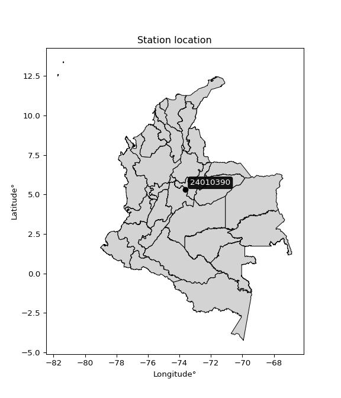

<div align="center">


</div>

# PMP Station (Rain, Pmax24h): 24010390

Probable Maximum Precipitation (PMP) is the greatest amount of rainfall for a specific duration that is meteorologically possible for a given location, acting as a "worst-case" scenario for extreme storms, crucial for designing safety-critical infrastructure like bridges, river deviations, dams, spillways, and nuclear plants to prevent catastrophic failure. PMP is calculated by hydrologists using meteorological data to determine the upper limit of extreme rainfall, often leading to the Probable Maximum Flood (PMF) for flood control design, and is increasingly being studied for climate change impacts. Probable Maximum Precipitation (PMP) is the theoretical upper limit of rainfall, a deterministic estimate for extreme events, while probability distributions (like GEV, Gumbel) describe the likelihood and frequency of various precipitation amounts, including rare ones, showing how often events occur, with PMP representing the extreme end of these distributions, used for critical infrastructure design to ensure safety against the worst conceivable weather, unlike standard statistical forecasts which cover typical probabilities.

The most common probability distributions in hydrology, used for analyzing floods, rainfall, and streamflow, include the Normal, Log-Normal, Gumbel, Gamma (including Log-Pearson Type III), and Generalized Extreme Value (GEV) distributions, often chosen based on the data´s skewness and whether modeling extremes or general conditions, with Gumbel and GEV popular for extreme events like floods, while the Normal distribution serves as a baseline, though often requiring transformations for skewed hydrological data. These distributions help in designing water infrastructure, managing water resources, and forecasting hydrologic events.

> Hydrological data often isn´t perfectly normal (it´s skewed), so different distributions are needed for different applications, such as: **Flood Frequency Analysis**: Using Gumbel, GEV, or Log-Pearson Type III for predicting extreme flood magnitudes and their return periods, **Rainfall Analysis**: Normal for annual totals, but Log-Normal, Weibull, or GEV for intensity or extreme daily rainfall, **Streamflow Modeling**: Gamma and Log-Normal for maximum flows, GEV for minimum flows, and Kappa for daily flows.

<div align="center">

</img>

</div>


## A. General information


### 1. General running parameters

• app_version: _v20260108_. • runtime: _2026-01-08 13:24:42.400241_. • Python version: _3.14.0_. • SciPy version: _1.16.3_. • Pandas version: _2.3.3_. • NumPy version: _2.3.5_. • Stations dataset (station_dataset_file): _dataset/pmax24h_in/automatic_colombia_2003_2024.csv_. • Stations catalog (station_catalog_file): _dataset/CNE.xls_. • Minimum year to eval til year_max (date_min): _1900_. • Maximum year to eval since year_min (date_max): _2024_. • Creates, save and include plots into reports (create_plot): _False_. • Plot only fit distributions with Δo > Δ (plot_only_fit): _True_. • Plot only simple graphs avoiding multiple CDFs and multiple Extreme values plots (plot_only_simple): _True_. • Eval low extreme values, if False, evaluates high extreme values (low_extreme): _False_. • Eval every SciPy distribution as logarithmic (pdist_logarithmic_on): _True_. • Standard deviation normalized (ddof): _1.0_. • Return periods to eval in years (Tr): _[2, 2.33, 5, 10, 15, 20, 25, 50, 75, 100, 200, 250, 500, 750, 1000]_. • Minimum data sample per station, 0 means any (minimum_sample): _5_. • Z-Score maximum threshold to adjust a value, 0 means disable (zscore_max): _3.5_. • Z-Score minimum threshold to adjust a value, 0 means disable (zscore_min): _-2.5_. • Avoid zeros, e.g. rain = 0 (avoid_zeros): _True_. • Avoid null values (avoid_nans): _True_. 

:file_folder:Table: [dataset.csv](../../dataset/pmax24h_in/automatic_colombia_2003_2024.csv)

> Delta Degrees of Freedom (DDOF): is a parameter used in the formulas for calculating variance and standard deviation. When ddof=0, the divisor is $N$ (the total number of observations) and this is used when your data set is the entire population. When ddof=1, the divisor is $N-1$ and this is used when your data set is a sample drawn from a larger population. Using $N-1$ provides an unbiased estimate of the population variance (known as Bessel´s correction).


### 2. Station info and location

|   id |   CODIGO | NOMBRE                        | CATEGORIA     | TECNOLOGIA                | ESTADO   | FECHA_INSTALACION   |   FECHA_SUSPENSION |   ALTITUD |   LATITUD |   LONGITUD | DEPARTAMENTO   | MUNICIPIO   | AREA_OPERATIVA                            | ENTIDAD                                       | AREA_HIDROGRAFICA   | ZONA_HIDROGRAFICA   | SUBZONA_HIDROGRAFICA   |   CORRIENTE | Catalogo   |   Version |
|-----:|---------:|:------------------------------|:--------------|:--------------------------|:---------|:--------------------|-------------------:|----------:|----------:|-----------:|:---------------|:------------|:------------------------------------------|:----------------------------------------------|:--------------------|:--------------------|:-----------------------|------------:|:-----------|----------:|
|    0 | 24010390 | EL TRIANGULO - AUT [24010390] | Pluviográfica | Automática con Telemetría | Activa   | 15/01/1963          |                nan |      2879 |   5.30531 |   -73.6193 | Cundinamarca   | Lenguazaque | Area Operativa 11 - Cundinamarca-Amazonas | CORPORACION AUTONOMA REGIONAL DE CUNDINAMARCA | Magdalena Cauca     | Sogamoso            | Río Suárez             |         nan | CNE_OE     |  20251226 |

<div align="center">

Dynamic map: [:earth_americas:Google](http://maps.google.com/maps?q=5.305305556,-73.61930556) [:earth_americas:OSM](https://www.openstreetmap.org/#map=18/5.305305556/-73.61930556&layers=P) [:earth_americas:Bing](https://www.bing.com/maps?cp=5.305305556~-73.61930556&lvl=18) [:earth_americas:Apple](https://maps.apple.com/frame?center=5.305305556%2C-73.61930556&span=0.003%2C0.006)

</div>


<div align="center">

```geojson
{
  "type": "Feature",
  "geometry": {
    "type": "Point", 
    "coordinates": [-73.61930556, 5.305305556]
  }, 
  "properties": {
    "Name": "24010390"
  }
}
```

</div>


### 3. Discrete values table and plot

<div align="center">

|               |           0 |           1 |             2 |          3 |          4 |           5 |           6 |           7 |          8 |          9 |
|:--------------|------------:|------------:|--------------:|-----------:|-----------:|------------:|------------:|------------:|-----------:|-----------:|
| Date          | 2012        | 2013        | 2014          | 2015       | 2016       | 2017        | 2018        | 2019        | 2020       | 2021       |
| Value         |   23.6      |   28.9      |   24.6        |   12.3     |   20.1     |   27.8      |   28.3      |   22.8      |   41.7     |   15.8     |
| Value_initial |   23.6      |   28.9      |   24.6        |   12.3     |   20.1     |   27.8      |   28.3      |   22.8      |   41.7     |   15.8     |
| count         |   10        |   10        |   10          |   10       |   10       |   10        |   10        |   10        |   10       |   10       |
| mean          |   24.59     |   24.59     |   24.59       |   24.59    |   24.59    |   24.59     |   24.59     |   24.59     |   24.59    |   24.59    |
| std           |    8.08324  |    8.08324  |    8.08324    |    8.08324 |    8.08324 |    8.08324  |    8.08324  |    8.08324  |    8.08324 |    8.08324 |
| zscore        |   -0.122476 |    0.533202 |    0.00123713 |   -1.52043 |   -0.55547 |    0.397118 |    0.458974 |   -0.221446 |    2.11673 |   -1.08744 |


</div>


> The initial value (value_initial) correspond to the initial obtained or null completed value, and value (value) is adjusted only when the initial value is outside the valid range (outlier) definite through the Z-Score value. If Z-Score is active, values out of range or outliers are replaced with the station mean value. A Z-Score (or standard score) measures how many standard deviations a data point is from the mean of a dataset, indicating its relative position; positive scores mean above the mean, negative mean below, and a score of zero is exactly at the mean, allowing for comparison of values from different distributions. It´s calculated using the formula $z=(x–μ)/σ$, where $x$ is the data point, $μ$ is the mean, and $σ$ is the standard deviation, helping identify outliers and understand probability.
>
> <sub>**Note**: In this study, "completing" (filling gaps in) and "extending" (forecasting or lengthening the historical record) rainfall data series are avoided for certain critical analyses because they introduce artificial bias and uncertainty, which can distort the statistics of rare events (extremes), alter day-to-day variability, and compromise the integrity and homogeneity of the original data. Some reasons against Completing/Extending rainfall data are: **Distortion of Extremes and Variability**: The primary issue is that most gap-filling or extension methods rely on averaging or regression with nearby stations, which inherently smooths the data. Rainfall is highly variable in space and time, with a large percentage of zero values and occasional large storms. Infilling methods often underestimate the highest values and overestimate the lowest (zero) values, which severely distorts analyses focused on flood frequency, drought severity, and intensity-duration-frequency (IDF) curves, **Loss of Data Homogeneity**: Infilled or extended data are synthetic estimates, not actual measurements. Combining these estimates with observed data can violate the assumption of data homogeneity, which requires that the data properties do not change over time. Inhomogeneity can lead to incorrect conclusions about long-term trends or changes in climate patterns, **Propagation of Errors**: Errors and biases from the original data (e.g., wind-induced undercatch, instrument errors, site changes) or the data used for imputation can propagate through the analysis, leading to unreliable hydrological models and inaccurate predictions, **Compromised Statistical Integrity**: For statistical analyses, especially those involving the frequency of events, using artificial data can introduce time bias or autocorrelation that doesn´t exist in reality, making it difficult to assess the true probability of events, **Difficulty in Validation**: It is difficult to accurately validate the quality of filled or extended data, especially for past periods where ground-truth measurements are unavailable. The reliability of imputation techniques heavily depends on the density of the surrounding station network and the complexity of the local topography.</sub>


### 4. Active continuous probability distributions from SciPy (43 of 104 available)

A Probability Density Function (PDF) describes the relative likelihood of a continuous random variable falling within a specific range, where the total area under its curve equals 1, and the area over any interval gives the actual probability for that range. Unlike discrete probabilities (like rolling a die), a PDF shows density, not direct probability for a single point (which is zero), with higher points indicating higher likelihood, often visualized as a bell curve for normal distributions.

A log of a probability density function (log-PDF) is simply the logarithm of the PDF´s value, denoted as $log(f(x))$, useful for converting multiplication of probabilities into addition, improving numerical stability with tiny numbers, and connecting to information theory concepts like entropy. Instead of dealing with very small probabilities (e.g., 0.000001), log-PDFs use negative numbers (e.g., $log(0.00001) ≈ -11.51$ that are easier for computers to handle, preventing underflow errors and simplifying complex calculations. In this study, each active probability distribution from SciPy is also evaluated in the $log$ form.

[scipy.stats](https://docs.scipy.org/doc/scipy/reference/stats.html) is a Python´s powerful submodule within the SciPy library for comprehensive statistical analysis, offering over 130 probability distributions (like Normal, Poisson), functions for descriptive stats (mean, variance), hypothesis testing (t-tests, chi-square), random variable generation, and statistical tests, making it essential for data science, modeling, and research. It provides tools to explore, model, and draw conclusions from data efficiently, working seamlessly with NumPy.

<div align="center">

|   id | p_dist             |   n_parameter | fit_method   | label                                                                       | active   | ref                                                                                                        |
|-----:|:-------------------|--------------:|:-------------|:----------------------------------------------------------------------------|:---------|:-----------------------------------------------------------------------------------------------------------|
|    0 | alpha              |             3 | MLE          | Alpha                                                                       | True     | [:mortar_board:](https://docs.scipy.org/doc/scipy/reference/generated/scipy.stats.alpha.html)              |
|    1 | betaprime          |             4 | MLE          | Beta prime                                                                  | True     | [:mortar_board:](https://docs.scipy.org/doc/scipy/reference/generated/scipy.stats.betaprime.html)          |
|    2 | chi2               |             3 | MLE          | Chi²                                                                        | True     | [:mortar_board:](https://docs.scipy.org/doc/scipy/reference/generated/scipy.stats.chi2.html)               |
|    3 | crystalball        |             4 | MLE          | Crystalball                                                                 | True     | [:mortar_board:](https://docs.scipy.org/doc/scipy/reference/generated/scipy.stats.crystalball.html)        |
|    4 | erlang             |             3 | MLE          | Erlang                                                                      | True     | [:mortar_board:](https://docs.scipy.org/doc/scipy/reference/generated/scipy.stats.erlang.html)             |
|    5 | expon              |             2 | MLE          | Exponential                                                                 | True     | [:mortar_board:](https://docs.scipy.org/doc/scipy/reference/generated/scipy.stats.expon.html)              |
|    6 | exponnorm          |             3 | MLE          | Exponentially modified Normal                                               | True     | [:mortar_board:](https://docs.scipy.org/doc/scipy/reference/generated/scipy.stats.exponnorm.html)          |
|    7 | f                  |             4 | MLE          | F                                                                           | True     | [:mortar_board:](https://docs.scipy.org/doc/scipy/reference/generated/scipy.stats.f.html)                  |
|    8 | fatiguelife        |             3 | MLE          | Fatigue-life (Birnbaum-Saunders)                                            | True     | [:mortar_board:](https://docs.scipy.org/doc/scipy/reference/generated/scipy.stats.fatiguelife.html)        |
|    9 | fisk               |             3 | MLE          | Fisk                                                                        | True     | [:mortar_board:](https://docs.scipy.org/doc/scipy/reference/generated/scipy.stats.fisk.html)               |
|   10 | gamma              |             3 | MLE          | Gamma                                                                       | True     | [:mortar_board:](https://docs.scipy.org/doc/scipy/reference/generated/scipy.stats.gamma.html)              |
|   11 | genexpon           |             5 | MLE          | Generalized exponential                                                     | True     | [:mortar_board:](https://docs.scipy.org/doc/scipy/reference/generated/scipy.stats.genexpon.html)           |
|   12 | genlogistic        |             3 | MLE          | Generalized logistic                                                        | True     | [:mortar_board:](https://docs.scipy.org/doc/scipy/reference/generated/scipy.stats.genlogistic.html)        |
|   13 | gibrat             |             2 | MM           | Gibrat                                                                      | True     | [:mortar_board:](https://docs.scipy.org/doc/scipy/reference/generated/scipy.stats.gibrat.html)             |
|   14 | gompertz           |             3 | MLE          | Gompertz (or truncated Gumbel)                                              | True     | [:mortar_board:](https://docs.scipy.org/doc/scipy/reference/generated/scipy.stats.gompertz.html)           |
|   15 | gumbel_l           |             2 | MM           | Gumbel Left Skew                                                            | True     | [:mortar_board:](https://docs.scipy.org/doc/scipy/reference/generated/scipy.stats.gumbel_l.html)           |
|   16 | gumbel_r           |             2 | MM           | Gumbel Right Skew                                                           | True     | [:mortar_board:](https://docs.scipy.org/doc/scipy/reference/generated/scipy.stats.gumbel_r.html)           |
|   17 | halflogistic       |             2 | MM           | Half-logistic                                                               | True     | [:mortar_board:](https://docs.scipy.org/doc/scipy/reference/generated/scipy.stats.halflogistic.html)       |
|   18 | halfnorm           |             2 | MM           | Half Normal                                                                 | True     | [:mortar_board:](https://docs.scipy.org/doc/scipy/reference/generated/scipy.stats.halfnorm.html)           |
|   19 | hypsecant          |             2 | MM           | hyperbolic secant                                                           | True     | [:mortar_board:](https://docs.scipy.org/doc/scipy/reference/generated/scipy.stats.hypsecant.html)          |
|   20 | invgamma           |             3 | MLE          | Inverted gamma                                                              | True     | [:mortar_board:](https://docs.scipy.org/doc/scipy/reference/generated/scipy.stats.invgamma.html)           |
|   21 | invgauss           |             3 | MLE          | Inverse Gaussian                                                            | True     | [:mortar_board:](https://docs.scipy.org/doc/scipy/reference/generated/scipy.stats.invgauss.html)           |
|   22 | invweibull         |             3 | MLE          | Inverted Weibull                                                            | True     | [:mortar_board:](https://docs.scipy.org/doc/scipy/reference/generated/scipy.stats.invweibull.html)         |
|   23 | kstwobign          |             2 | MLE          | Limiting distribution of scaled Kolmogorov-Smirnov two-sided test statistic | True     | [:mortar_board:](https://docs.scipy.org/doc/scipy/reference/generated/scipy.stats.kstwobign.html)          |
|   24 | laplace            |             2 | MM           | Laplace                                                                     | True     | [:mortar_board:](https://docs.scipy.org/doc/scipy/reference/generated/scipy.stats.laplace.html)            |
|   25 | laplace_asymmetric |             3 | MLE          | Asymmetric Laplace                                                          | True     | [:mortar_board:](https://docs.scipy.org/doc/scipy/reference/generated/scipy.stats.laplace_asymmetric.html) |
|   26 | loggamma           |             3 | MLE          | Log gamma                                                                   | True     | [:mortar_board:](https://docs.scipy.org/doc/scipy/reference/generated/scipy.stats.loggamma.html)           |
|   27 | logistic           |             2 | MM           | Logistic (or Sech-squared)                                                  | True     | [:mortar_board:](https://docs.scipy.org/doc/scipy/reference/generated/scipy.stats.logistic.html)           |
|   28 | lognorm            |             3 | MLE          | Log Normal                                                                  | True     | [:mortar_board:](https://docs.scipy.org/doc/scipy/reference/generated/scipy.stats.lognorm.html)            |
|   29 | maxwell            |             2 | MM           | Maxwell                                                                     | True     | [:mortar_board:](https://docs.scipy.org/doc/scipy/reference/generated/scipy.stats.maxwell.html)            |
|   30 | mielke             |             4 | MLE          | Mielke Beta-Kappa / Dagum                                                   | True     | [:mortar_board:](https://docs.scipy.org/doc/scipy/reference/generated/scipy.stats.mielke.html)             |
|   31 | moyal              |             2 | MM           | Moyal                                                                       | True     | [:mortar_board:](https://docs.scipy.org/doc/scipy/reference/generated/scipy.stats.moyal.html)              |
|   32 | nakagami           |             3 | MLE          | Nakagami                                                                    | True     | [:mortar_board:](https://docs.scipy.org/doc/scipy/reference/generated/scipy.stats.nakagami.html)           |
|   33 | ncf                |             5 | MLE          | Non-central F distribution                                                  | True     | [:mortar_board:](https://docs.scipy.org/doc/scipy/reference/generated/scipy.stats.ncf.html)                |
|   34 | nct                |             4 | MLE          | Non-central Student’s t                                                     | True     | [:mortar_board:](https://docs.scipy.org/doc/scipy/reference/generated/scipy.stats.nct.html)                |
|   35 | norm               |             2 | MM           | Normal                                                                      | True     | [:mortar_board:](https://docs.scipy.org/doc/scipy/reference/generated/scipy.stats.norm.html)               |
|   36 | pearson3           |             3 | MM           | Pearson type III                                                            | True     | [:mortar_board:](https://docs.scipy.org/doc/scipy/reference/generated/scipy.stats.pearson3.html)           |
|   37 | rayleigh           |             2 | MM           | Rayleigh                                                                    | True     | [:mortar_board:](https://docs.scipy.org/doc/scipy/reference/generated/scipy.stats.rayleigh.html)           |
|   38 | rice               |             3 | MLE          | Rice                                                                        | True     | [:mortar_board:](https://docs.scipy.org/doc/scipy/reference/generated/scipy.stats.rice.html)               |
|   39 | t                  |             3 | MLE          | Student’s t                                                                 | True     | [:mortar_board:](https://docs.scipy.org/doc/scipy/reference/generated/scipy.stats.t.html)                  |
|   40 | truncnorm          |             4 | MLE          | Truncated normal                                                            | True     | [:mortar_board:](https://docs.scipy.org/doc/scipy/reference/generated/scipy.stats.truncnorm.html)          |
|   41 | wald               |             2 | MM           | Wald                                                                        | True     | [:mortar_board:](https://docs.scipy.org/doc/scipy/reference/generated/scipy.stats.wald.html)               |
|   42 | weibull_min        |             3 | MLE          | Weibull minimum                                                             | True     | [:mortar_board:](https://docs.scipy.org/doc/scipy/reference/generated/scipy.stats.weibull_min.html)        |

</div>

> **n_parameter:** # arguments & localization & scale.
>
> **Fit methods:** (MLE) maximum likelihood, (MM) L-moments.
>
>**Inactive** (With the only purpose of prevent loops, zero divisions, infinite values, over high estimated values or horizontal trending for recurrence intervals estimations, the follow distributions were disabled.)**:** foldnorm, gennorm, norminvgauss, powernorm, powerlognorm, skewnorm, genextreme, anglit, arcsine, argus, beta, bradford, burr, burr12, cauchy, cosine, halfcauchy, foldcauchy, skewcauchy, wrapcauchy, dgamma, gengamma, exponweib, exponpow, truncexpon, gausshyper, genhalflogistic, genhyperbolic, geninvgauss, halfgennorm, johnsonsb, johnsonsu, kappa4, kappa3, ksone, kstwo, loglaplace, levy, levy_l, levy_stable, ncx2, pareto, genpareto, truncpareto, lomax, powerlaw, rdist, rel_breitwigner, recipinvgauss, semicircular, studentized_range, trapezoid, triang, truncweibull_min, tukeylambda, uniform, loguniform, vonmises, vonmises_line, weibull_max, dweibull, 


## B. Probability (PDF) vs. Empirical (EDF) distributions functions

A continuous probability distribution (CPD) describes probabilities for variables that can take any value within a range (like rain any time), unlike discrete variables with specific outcomes (like temperature). It uses a Probability Density Function (PDF), a curve where the total area under it equals 1, and the probability of the variable falling within an interval (a to b) is found by calculating the area under the curve between those points. A key feature is that the probability of hitting any single exact value is zero, so probabilities are always expressed for ranges, e.g., $P(a ≤ X ≤ b)$.

<div align="center">

Distributions parameters from station values
|    |   station | p_dist                |   n |               loc |            scale | shape                 | shape1                | shape2                 | shape3   |
|---:|----------:|:----------------------|----:|------------------:|-----------------:|:----------------------|:----------------------|:-----------------------|:---------|
|  0 |  24010390 | alpha                 |  10 |     -54.4919      |    829.842       | 10.589551972059294    |                       |                        |          |
|  1 |  24010390 | betaprime             |  10 |      -0.341664    |     36.8758      | 17.63608704702976     | 27.026960374780046    |                        |          |
|  2 |  24010390 | chi2                  |  10 |      -0.542479    |      1.17999     | 21.298858217122522    |                       |                        |          |
|  3 |  24010390 | crystalball           |  10 |      24.59        |      7.66844     | 572.5283433649402     | 885.5690190021401     |                        |          |
|  4 |  24010390 | erlang                |  10 |      -0.542527    |      2.35998     | 10.649458545391159    |                       |                        |          |
|  5 |  24010390 | expon                 |  10 |      12.3         |     12.29        |                       |                       |                        |          |
|  6 |  24010390 | exponnorm             |  10 |      19.0089      |      5.33512     | 1.046110865600152     |                       |                        |          |
|  7 |  24010390 | f                     |  10 |      -0.645014    |     25.2367      | 21.623112087850103    | 4069.1075020953836    |                        |          |
|  8 |  24010390 | fatiguelife           |  10 |     -13.8516      |     37.6955      | 0.19895662015947657   |                       |                        |          |
|  9 |  24010390 | fisk                  |  10 |     -20.4672      |     44.4942      | 10.668141322986568    |                       |                        |          |
| 10 |  24010390 | gamma                 |  10 |      -0.542495    |      2.35998     | 10.649451904474063    |                       |                        |          |
| 11 |  24010390 | genexpon              |  10 |      12.208       |      0.309262    | 0.02469208387737129   | 0.0003266949661148735 | 0.5833277444207543     |          |
| 12 |  24010390 | genlogistic           |  10 |      19.1056      |      5.14908     | 2.1086518166519843    |                       |                        |          |
| 13 |  24010390 | gibrat                |  10 |      18.74        |      3.54823     |                       |                       |                        |          |
| 14 |  24010390 | gompertz              |  10 |      12.2728      |     15.3821      | 0.5103690532352487    |                       |                        |          |
| 15 |  24010390 | gumbel_l              |  10 |      28.0412      |      5.97905     |                       |                       |                        |          |
| 16 |  24010390 | gumbel_r              |  10 |      21.1388      |      5.97905     |                       |                       |                        |          |
| 17 |  24010390 | halflogistic          |  10 |      15.5012      |      6.5562      |                       |                       |                        |          |
| 18 |  24010390 | halfnorm              |  10 |      14.44        |     12.7212      |                       |                       |                        |          |
| 19 |  24010390 | hypsecant             |  10 |      24.59        |      4.88188     |                       |                       |                        |          |
| 20 |  24010390 | invgamma              |  10 |     -27.5596      |   2456.38        | 48.10208905459352     |                       |                        |          |
| 21 |  24010390 | invgauss              |  10 |     -12.1865      |    835.024       | 0.04404840738300875   |                       |                        |          |
| 22 |  24010390 | invweibull            |  10 | -179601           | 179622           | 26914.549017348123    |                       |                        |          |
| 23 |  24010390 | kstwobign             |  10 |      -2.9544      |     31.6506      |                       |                       |                        |          |
| 24 |  24010390 | laplace               |  10 |      24.59        |      5.4224      |                       |                       |                        |          |
| 25 |  24010390 | laplace_asymmetric    |  10 |      23.6         |      5.60462     | 0.9155602531892237    |                       |                        |          |
| 26 |  24010390 | loggamma              |  10 |   -1835.3         |    263.833       | 1152.3964139761545    |                       |                        |          |
| 27 |  24010390 | logistic              |  10 |      24.59        |      4.22783     |                       |                       |                        |          |
| 28 |  24010390 | lognorm               |  10 |      12.3         |      0.31137     | 10.945195273230611    |                       |                        |          |
| 29 |  24010390 | maxwell               |  10 |       6.41903     |     11.387       |                       |                       |                        |          |
| 30 |  24010390 | mielke                |  10 |      -0.0552935   |     27.396       | 4.071783648375514     | 7.439762824614185     |                        |          |
| 31 |  24010390 | moyal                 |  10 |      20.2047      |      3.45201     |                       |                       |                        |          |
| 32 |  24010390 | nakagami              |  10 |      15.8         |     13.2877      | 0.36064286378870425   |                       |                        |          |
| 33 |  24010390 | ncf                   |  10 |      -0.388214    |     24.412       | 27.449943817918623    | 83.52412948613937     | 5.7268030029652595e-09 |          |
| 34 |  24010390 | nct                   |  10 |     -20.0211      |      4.50691     | 29.066734993782823    | 9.63360461398769      |                        |          |
| 35 |  24010390 | norm                  |  10 |      24.59        |      7.66844     |                       |                       |                        |          |
| 36 |  24010390 | pearson3              |  10 |      24.59        |      7.66841     | 0.5634547859073666    |                       |                        |          |
| 37 |  24010390 | rayleigh              |  10 |       9.91984     |     11.7051      |                       |                       |                        |          |
| 38 |  24010390 | rice                  |  10 |       9.55109     |      9.99358     | 0.9237960559347416    |                       |                        |          |
| 39 |  24010390 | t                     |  10 |      24.6125      |      7.65093     | 32.72874090910547     |                       |                        |          |
| 40 |  24010390 | truncnorm             |  10 |      24.59        |      7.66843     | -91.27263270945946    | 346.06322539236214    |                        |          |
| 41 |  24010390 | wald                  |  10 |      16.9216      |      7.66844     |                       |                       |                        |          |
| 42 |  24010390 | weibull_min           |  10 |       9.75128     |     16.704       | 2.00055161116736      |                       |                        |          |
| 43 |  24010390 | logalpha              |  10 |      -6.8238      |    302.911       | 30.41141644892354     |                       |                        |          |
| 44 |  24010390 | logbetaprime          |  10 |     -11.5992      |     32.0153      | 3018.8933588058126    | 6552.59763098893      |                        |          |
| 45 |  24010390 | logchi2               |  10 |       2.5096      |      0.973212    | 1.0188511470972677    |                       |                        |          |
| 46 |  24010390 | logcrystalball        |  10 |       3.15233     |      0.322247    | 86.55054266116558     | 239.9872261201211     |                        |          |
| 47 |  24010390 | logerlang             |  10 |      -2.58133     |      0.0187524   | 305.6664946046119     |                       |                        |          |
| 48 |  24010390 | logexpon              |  10 |       2.5096      |      0.642733    |                       |                       |                        |          |
| 49 |  24010390 | logexponnorm          |  10 |       3.15202     |      0.322246    | 0.0009643544739184556 |                       |                        |          |
| 50 |  24010390 | logf                  |  10 |    -209.466       |    212.618       | 2388346.9892932633    | 1360367.4941893937    |                        |          |
| 51 |  24010390 | logfatiguelife        |  10 |     -80.933       |     84.0851      | 0.0038398457751641297 |                       |                        |          |
| 52 |  24010390 | logfisk               |  10 |      -1.52075e+07 |      1.52075e+07 | 84763970.25389858     |                       |                        |          |
| 53 |  24010390 | loggamma              |  10 |      -2.55858     |      0.0188546   | 302.8220013790972     |                       |                        |          |
| 54 |  24010390 | loggenexpon           |  10 |       2.49786     |      0.012602    | 0.004862402695395182  | 3.467976101759429     | 0.0001284669014620233  |          |
| 55 |  24010390 | loggenlogistic        |  10 |       3.30874     |      0.1346      | 0.5462044779370873    |                       |                        |          |
| 56 |  24010390 | loggibrat             |  10 |       2.90653     |      0.14909     |                       |                       |                        |          |
| 57 |  24010390 | loggompertz           |  10 |       2.5085      |      0.36824     | 0.1403161502711858    |                       |                        |          |
| 58 |  24010390 | loggumbel_l           |  10 |       3.29736     |      0.251254    |                       |                       |                        |          |
| 59 |  24010390 | loggumbel_r           |  10 |       3.0073      |      0.251254    |                       |                       |                        |          |
| 60 |  24010390 | loghalflogistic       |  10 |       2.77037     |      0.275524    |                       |                       |                        |          |
| 61 |  24010390 | loghalfnorm           |  10 |       2.72582     |      0.534559    |                       |                       |                        |          |
| 62 |  24010390 | loghypsecant          |  10 |       3.15233     |      0.205148    |                       |                       |                        |          |
| 63 |  24010390 | loginvgamma           |  10 |      -2.66974     |   1842.81        | 317.75475880507884    |                       |                        |          |
| 64 |  24010390 | loginvgauss           |  10 |       0.37527     |    184.342       | 0.015039140988833528  |                       |                        |          |
| 65 |  24010390 | loginvweibull         |  10 |      -5.50246e+06 |      5.50247e+06 | 16521937.3090011      |                       |                        |          |
| 66 |  24010390 | logkstwobign          |  10 |       1.7893      |      1.5614      |                       |                       |                        |          |
| 67 |  24010390 | loglaplace            |  10 |       3.15233     |      0.227863    |                       |                       |                        |          |
| 68 |  24010390 | loglaplace_asymmetric |  10 |       3.20275     |      0.236662    | 1.1121555803883458    |                       |                        |          |
| 69 |  24010390 | logloggamma           |  10 |       1.52119     |      0.846074    | 7.369000712372424     |                       |                        |          |
| 70 |  24010390 | loglogistic           |  10 |       3.15233     |      0.177664    |                       |                       |                        |          |
| 71 |  24010390 | loglognorm            |  10 |       2.5096      |      0.0201047   | 10.488758256656034    |                       |                        |          |
| 72 |  24010390 | logmaxwell            |  10 |       2.38874     |      0.478508    |                       |                       |                        |          |
| 73 |  24010390 | logmielke             |  10 |      -0.106399    |      3.45725     | 11.841556493593128    | 27.627311512667752    |                        |          |
| 74 |  24010390 | logmoyal              |  10 |       2.96805     |      0.145062    |                       |                       |                        |          |
| 75 |  24010390 | lognakagami           |  10 |       2.66977     |      0.594653    | 1.1130535210977053    |                       |                        |          |
| 76 |  24010390 | logncf                |  10 |      -3.14505     |      6.29303     | 286.4169048406724     | 1234.9810503344886    | 0.059804034282811835   |          |
| 77 |  24010390 | lognct                |  10 |      -2.43132     |      0.241553    | 294.8374108882863     | 23.0573003679877      |                        |          |
| 78 |  24010390 | lognorm               |  10 |       3.15233     |      0.322246    |                       |                       |                        |          |
| 79 |  24010390 | logpearson3           |  10 |       3.15233     |      0.322246    | -0.3420774536730343   |                       |                        |          |
| 80 |  24010390 | lograyleigh           |  10 |       2.53587     |      0.491867    |                       |                       |                        |          |
| 81 |  24010390 | logrice               |  10 |       2.31877     |      0.347516    | 2.147860932400304     |                       |                        |          |
| 82 |  24010390 | logt                  |  10 |       3.15233     |      0.322248    | 116075282.83336137    |                       |                        |          |
| 83 |  24010390 | logtruncnorm          |  10 |      -0.129503    |      1.31898     | 2.19071051257384      | 2.9264996304788093    |                        |          |
| 84 |  24010390 | logwald               |  10 |       2.83009     |      0.322239    |                       |                       |                        |          |
| 85 |  24010390 | logweibull_min        |  10 |       1.76705     |      1.50959     | 4.980896487823221     |                       |                        |          |

</div>

> **loc** (Location parameter): This shifts the distribution along the x-axis. For many common distributions, like the normal (Gaussian) distribution, loc represents the mean $μ$. For others, like the uniform distribution, it might represent the minimum value, or for the beta distribution, the left end of the support interval.
>
> **scale** (Scale parameter): This determines the width or spread of the distribution. For the normal distribution, scale represents the standard deviation $σ$. For a uniform distribution, it defines the length of the interval (from $loc$ to $loc + scale$).
>
> **shape** (Shape parameters): Refers to parameters that define the specific form of a probability distribution, distinct from its location (loc) and scale (scale). These parameters are required arguments for most distribution functions. For example, a normal (Gaussian) distribution is fully defined by its location (mean) and scale (standard deviation), so it has no specific shape parameters beyond loc and scale. However, other distributions have intrinsic properties that need specification, as Gamma distribution that takes a shape parameter, often named $a$ or $alpha$.


### 0. Cumulative distribution values - CDF (86 evaluated)

Cumulative Distribution Function (CDF), denoted as $F$<sub>$X$</sub>$(x)$, is a function that gives the probability that a random variable $X$ will take a value less than or equal to a specific value, $x$ (i.e., $(P(X≥x)$. It essentially "accumulates" probabilities from a given point up to the far right (positive infinity), providing a complete picture of the distribution´s probabilities for both discrete (like rain) and continuous (like temperature) variables, helping to find probabilities over ranges or above certain values. Each station is evaluated separately ordering the $x$ values ascending, calculating the CDF and PDF values for the activated distributions and their logarithmic forms.

<div align="center">

CDF ordered by x ascending and calculating $log(f(x))$ separately
|   id |   Station |   date |    x |   count |   mean |     std |      zscore |   Value_initial |   station |   m |     alpha |   alpha_pdf |   betaprime |   betaprime_pdf |      chi2 |   chi2_pdf |   crystalball |   crystalball_pdf |    erlang |   erlang_pdf |    expon |   expon_pdf |   exponnorm |   exponnorm_pdf |         f |     f_pdf |   fatiguelife |   fatiguelife_pdf |      fisk |   fisk_pdf |     gamma |   gamma_pdf |   genexpon |   genexpon_pdf |   genlogistic |   genlogistic_pdf |   gibrat |   gibrat_pdf |    gompertz |   gompertz_pdf |   gumbel_l |   gumbel_l_pdf |   gumbel_r |   gumbel_r_pdf |   halflogistic |   halflogistic_pdf |   halfnorm |   halfnorm_pdf |   hypsecant |   hypsecant_pdf |   invgamma |   invgamma_pdf |   invgauss |   invgauss_pdf |   invweibull |   invweibull_pdf |   kstwobign |   kstwobign_pdf |   laplace |   laplace_pdf |   laplace_asymmetric |   laplace_asymmetric_pdf |   loggamma |   loggamma_pdf |   logistic |   logistic_pdf |   lognorm |   lognorm_pdf |   maxwell |   maxwell_pdf |    mielke |   mielke_pdf |     moyal |   moyal_pdf |    nakagami |   nakagami_pdf |       ncf |    ncf_pdf |      nct |    nct_pdf |      norm |   norm_pdf |   pearson3 |   pearson3_pdf |   rayleigh |   rayleigh_pdf |      rice |   rice_pdf |         t |      t_pdf |   truncnorm |   truncnorm_pdf |     wald |   wald_pdf |   weibull_min |   weibull_min_pdf |   logalpha |   logalpha_pdf |   logbetaprime |   logbetaprime_pdf |     logchi2 |   logchi2_pdf |   logcrystalball |   logcrystalball_pdf |   logerlang |   logerlang_pdf |   logexpon |   logexpon_pdf |   logexponnorm |   logexponnorm_pdf |      logf |   logf_pdf |   logfatiguelife |   logfatiguelife_pdf |   logfisk |   logfisk_pdf |   loggenexpon |   loggenexpon_pdf |   loggenlogistic |   loggenlogistic_pdf |   loggibrat |   loggibrat_pdf |   loggompertz |   loggompertz_pdf |   loggumbel_l |   loggumbel_l_pdf |   loggumbel_r |   loggumbel_r_pdf |   loghalflogistic |   loghalflogistic_pdf |   loghalfnorm |   loghalfnorm_pdf |   loghypsecant |   loghypsecant_pdf |   loginvgamma |   loginvgamma_pdf |   loginvgauss |   loginvgauss_pdf |   loginvweibull |   loginvweibull_pdf |   logkstwobign |   logkstwobign_pdf |   loglaplace |   loglaplace_pdf |   loglaplace_asymmetric |   loglaplace_asymmetric_pdf |   logloggamma |   logloggamma_pdf |   loglogistic |   loglogistic_pdf |   loglognorm |   loglognorm_pdf |   logmaxwell |   logmaxwell_pdf |   logmielke |   logmielke_pdf |    logmoyal |   logmoyal_pdf |   lognakagami |   lognakagami_pdf |   logncf |   logncf_pdf |    lognct |   lognct_pdf |   logpearson3 |   logpearson3_pdf |   lograyleigh |   lograyleigh_pdf |   logrice |   logrice_pdf |      logt |   logt_pdf |   logtruncnorm |   logtruncnorm_pdf |   logwald |   logwald_pdf |   logweibull_min |   logweibull_min_pdf |
|-----:|----------:|-------:|-----:|--------:|-------:|--------:|------------:|----------------:|----------:|----:|----------:|------------:|------------:|----------------:|----------:|-----------:|--------------:|------------------:|----------:|-------------:|---------:|------------:|------------:|----------------:|----------:|----------:|--------------:|------------------:|----------:|-----------:|----------:|------------:|-----------:|---------------:|--------------:|------------------:|---------:|-------------:|------------:|---------------:|-----------:|---------------:|-----------:|---------------:|---------------:|-------------------:|-----------:|---------------:|------------:|----------------:|-----------:|---------------:|-----------:|---------------:|-------------:|-----------------:|------------:|----------------:|----------:|--------------:|---------------------:|-------------------------:|-----------:|---------------:|-----------:|---------------:|----------:|--------------:|----------:|--------------:|----------:|-------------:|----------:|------------:|------------:|---------------:|----------:|-----------:|---------:|-----------:|----------:|-----------:|-----------:|---------------:|-----------:|---------------:|----------:|-----------:|----------:|-----------:|------------:|----------------:|---------:|-----------:|--------------:|------------------:|-----------:|---------------:|---------------:|-------------------:|------------:|--------------:|-----------------:|---------------------:|------------:|----------------:|-----------:|---------------:|---------------:|-------------------:|----------:|-----------:|-----------------:|---------------------:|----------:|--------------:|--------------:|------------------:|-----------------:|---------------------:|------------:|----------------:|--------------:|------------------:|--------------:|------------------:|--------------:|------------------:|------------------:|----------------------:|--------------:|------------------:|---------------:|-------------------:|--------------:|------------------:|--------------:|------------------:|----------------:|--------------------:|---------------:|-------------------:|-------------:|-----------------:|------------------------:|----------------------------:|--------------:|------------------:|--------------:|------------------:|-------------:|-----------------:|-------------:|-----------------:|------------:|----------------:|------------:|---------------:|--------------:|------------------:|---------:|-------------:|----------:|-------------:|--------------:|------------------:|--------------:|------------------:|----------:|--------------:|----------:|-----------:|---------------:|-------------------:|----------:|--------------:|-----------------:|---------------------:|
|    0 |  24010390 |   2015 | 12.3 |      10 |  24.59 | 8.08324 | -1.52043    |            12.3 |  24010390 |   1 | 0.0332724 |  0.0137875  |   0.0223309 |      0.0127729  | 0.0311815 | 0.0144197  |     0.0545033 |        0.0144028  | 0.0311817 |   0.0144198  | 0        |  0.081367   |   0.0337042 |      0.0126465  | 0.0309829 | 0.0143395 |     0.0323013 |        0.0141349  | 0.0368368 | 0.0115513  | 0.0311815 |  0.0144197  | 0.00732976 |     0.0794238  |     0.0374212 |        0.0120984  | 0        |   0          | 0.000903159 |      0.0332082 |  0.0693596 |    0.0111885   |  0.0124572 |     0.00913699 |      0         |         0          |  0         |     0          |   0.0512408 |      0.0104508  |  0.0329307 |     0.0139041  |  0.0315075 |     0.0141564  |    0.0254359 |       0.0139943  |   0.0256748 |       0.0161951 | 0.051836  |    0.0095596  |            0.0504187 |               0.00982558 |  0.0220053 |       0.17328  |  0.0518121 |     0.0116201  | 0.0230466 |      0.169383 | 0.0338419 |    0.0163566  | 0.0390128 |   0.0128227  | 0.0016765 |  0.00260624 | 0           |      0         | 0.0274443 | 0.014075   | 0.033966 | 0.0138236  | 0.0545034 | 0.0144028  |  0.0328832 |     0.014402   |  0.0204622 |     0.0170168  | 0.0244245 |  0.0175775 | 0.0585797 | 0.0143258  |   0.0545032 |      0.0144028  | 0        | 0          |     0.0229887 |        0.0178353  |  0.0205226 |       0.172084 |      0.0221135 |           0.168906 | 1.21331e-08 |   1.39182e+07 |        0.0230467 |             0.169384 |   0.0220014 |        0.173321 |   0        |       1.55586  |      0.0230465 |           0.169383 | 0.0230661 |   0.169677 |        0.0228856 |             0.169354 | 0.0245473 |      0.133463 |    0.00471359 |          0.416815 |        0.0389936 |             0.157819 |    0        |        0        |   0.000420124 |          0.382026 |     0.0425542 |         0.165711  |   0.000710799 |         0.0205078 |          0        |              0        |     0         |          0        |      0.0277303 |           0.135001 |     0.0190788 |          0.166293 |     0.0186801 |          0.176401 |       0.0153472 |            0.192477 |       0.016498 |           0.242655 |    0.029782  |         0.130702 |                0.039717 |                    0.150898 |     0.0323007 |          0.178884 |     0.0261427 |          0.1433   |   0.00135946 |       9.5762e+11 |   0.00420392 |         0.103028 |   0.0368109 |        0.166553 | 1.19841e-06 |    0.000101238 |     0         |          0        | 0.130744 |     0.39575  | 0.0228258 |     0.179224 |     0.0314477 |          0.180813 |     0         |          0        | 0.0164397 |      0.186667 | 0.0230468 |   0.169383 |    0           |           0        |  0        |      0        |        0.0287667 |             0.190161 |
|    1 |  24010390 |   2021 | 15.8 |      10 |  24.59 | 8.08324 | -1.08744    |            15.8 |  24010390 |   2 | 0.111973  |  0.0319857  |   0.104981  |      0.0352679  | 0.114118  | 0.0334864  |     0.125844  |        0.0269707  | 0.114118  |   0.0334864  | 0.247824 |  0.0612023  |   0.106261  |      0.0300122  | 0.113588  | 0.0333914 |     0.11327   |        0.0327836  | 0.101464  | 0.0268178  | 0.114117  |  0.0334864  | 0.251759   |     0.0605305  |     0.105898  |        0.0284142  | 0        |   0          | 0.123252    |      0.0365873 |  0.121094  |    0.018974    |  0.0869657 |     0.0355225  |      0.0227851 |         0.0762241  |  0.0851406 |     0.0623635  |   0.104235  |      0.0209718  |  0.11241   |     0.0322648  |  0.113247  |     0.0331816  |    0.113822  |       0.0370638  |   0.126003  |       0.0404959 | 0.0988452 |    0.018229   |            0.0997274 |               0.0194349  |  0.114916  |       0.619945 |  0.111147  |     0.0233673  | 0.111714  |      0.590016 | 0.121798  |    0.0338714  | 0.106874  |   0.0269848  | 0.0584013 |  0.0364793  | 2.76172e-12 |   1121.39      | 0.112354  | 0.0349894  | 0.112635 | 0.0319527  | 0.125844  | 0.0269707  |  0.114494  |     0.0327951  |  0.118546  |     0.0378302  | 0.120636  |  0.0364457 | 0.12887   | 0.0264758  |   0.125844  |      0.0269707  | 0        | 0          |     0.122828  |        0.0380202  |  0.116027  |       0.644188 |      0.112046  |           0.601201 | 0.380244    |   0.709833    |        0.111715  |             0.590018 |   0.114973  |        0.620491 |   0.322674 |       1.05382  |      0.111714  |           0.590016 | 0.111838  |   0.590326 |        0.111778  |             0.591872 | 0.0922424 |      0.466716 |    0.179191   |          0.919557 |        0.106891  |             0.426529 |    0        |        0        |   0.128453    |          0.657498 |     0.111136  |         0.416782  |   0.0688535   |         0.733266  |          0        |              0        |     0.0510019 |          1.48955  |      0.0933712 |           0.448641 |     0.113929  |          0.647076 |     0.120905  |          0.690939 |       0.13956   |            0.825217 |       0.165675 |           0.918904 |    0.0893766 |         0.392239 |                0.10284  |                    0.390721 |     0.114835  |          0.523189 |     0.0990139 |          0.502129 |   0.595014   |       0.147563   |   0.104024   |         0.742885 |   0.108426  |        0.44541  | 0.0405171   |    0.691207    |     0.0158668 |          0.386703 | 0.253283 |     0.576225 | 0.117886  |     0.628906 |     0.115447  |          0.532535 |     0.0986192 |          0.835087 | 0.114415  |      0.637774 | 0.111714  |   0.590014 |    4.90188e-06 |           2.19203  |  0        |      0        |        0.116725  |             0.549933 |
|    2 |  24010390 |   2016 | 20.1 |      10 |  24.59 | 8.08324 | -0.55547    |            20.1 |  24010390 |   3 | 0.296138  |  0.0515518  |   0.306794  |      0.0550883  | 0.302262  | 0.051575   |     0.2791    |        0.0438287  | 0.302262  |   0.051575   | 0.469886 |  0.0431338  |   0.287243  |      0.052638   | 0.301464  | 0.0515548 |     0.299441  |        0.0514996  | 0.271755  | 0.0520438  | 0.302262  |  0.051575   | 0.471595   |     0.042747   |     0.281447  |        0.0520817  | 0.168796 |   0.185216   | 0.287211    |      0.0393389 |  0.232765  |    0.034       |  0.304299  |     0.060551   |      0.337016  |         0.0676016  |  0.34363   |     0.0568101  |   0.241484  |      0.0448552  |  0.297301  |     0.0515398  |  0.301209  |     0.0518028  |    0.319522  |       0.0546248  |   0.336423  |       0.0532694 | 0.218451  |    0.0402868  |            0.23054   |               0.0449275  |  0.328897  |       1.12197  |  0.256925  |     0.0451567  | 0.319004  |      1.10829  | 0.30463   |    0.049147   | 0.271751  |   0.0498211  | 0.309972  |  0.0700793  | 0.34125     |      0.0556713 | 0.308778  | 0.0533068  | 0.296842 | 0.0516255  | 0.2791    | 0.0438287  |  0.299517  |     0.0510298  |  0.314911  |     0.050904   | 0.310008  |  0.049452  | 0.279688  | 0.0432957  |   0.2791    |      0.0438287  | 0.285055 | 0.128924   |     0.31868   |        0.0505396  |  0.336989  |       1.14596  |      0.322146  |           1.11519  | 0.515057    |   0.450752    |        0.319005  |             1.10829  |   0.329165  |        1.12307  |   0.534253 |       0.724635 |      0.319004  |           1.10829  | 0.319     |   1.10662  |        0.319469  |             1.10881  | 0.279915  |      1.12347  |    0.421967   |          1.03639  |        0.271791  |             1.00136  |    0.323043 |        3.81157  |   0.325501    |          0.978303 |     0.26441   |         0.899037  |   0.35824     |         1.46366   |          0.395259 |              1.53121  |     0.39293   |          1.30772  |      0.283643  |           1.20678  |     0.3368    |          1.15621  |     0.350594  |          1.15374  |       0.384468  |            1.1035   |       0.416123 |           1.06451  |    0.257042  |         1.12806  |                0.256648 |                    0.975088 |     0.300694  |          1.02596  |     0.298727  |          1.17913  |   0.619696   |       0.0739333  |   0.348666   |         1.20383  |   0.276293  |        1.00061  | 0.371586    |    1.64852     |     0.243171  |          1.38285  | 0.406125 |     0.676754 | 0.332308  |     1.11339  |     0.303239  |          1.029    |     0.360187  |          1.22933  | 0.329806  |      1.1167   | 0.319003  |   1.10829  |    0.432763    |           1.44539  |  0.390334 |      2.60702  |        0.306434  |             1.02464  |
|    3 |  24010390 |   2019 | 22.8 |      10 |  24.59 | 8.08324 | -0.221446   |            22.8 |  24010390 |   4 | 0.4416    |  0.0548215  |   0.458154  |      0.0555315  | 0.446225  | 0.053791   |     0.407716  |        0.0506258  | 0.446225  |   0.053791   | 0.574442 |  0.0346264  |   0.438603  |      0.0578249  | 0.445443  | 0.0538201 |     0.443871  |        0.054172   | 0.425965  | 0.0602896  | 0.446225  |  0.053791   | 0.575277   |     0.0343594  |     0.432567  |        0.0580942  | 0.553593 |   0.0973726  | 0.394355    |      0.0398393 |  0.34045   |    0.0459108   |  0.468875  |     0.0593965  |      0.505476  |         0.0567778  |  0.488931  |     0.0505396  |   0.385818  |      0.0610522  |  0.442407  |     0.054591   |  0.446025  |     0.054146   |    0.467058  |       0.0532784  |   0.477995  |       0.0506031 | 0.359422  |    0.0662846  |            0.390176  |               0.0760375  |  0.478121  |       1.21741  |  0.395707  |     0.0565593  | 0.468375  |      1.23411  | 0.44189   |    0.0515242  | 0.42138   |   0.0595936  | 0.492295  |  0.0626896  | 0.477196    |      0.0456649 | 0.455744  | 0.0541952  | 0.442587 | 0.0549441  | 0.407716  | 0.0506258  |  0.442693  |     0.0537648  |  0.454159  |     0.0513142  | 0.446462  |  0.0507564 | 0.407105  | 0.0502725  |   0.407716  |      0.0506258  | 0.556054 | 0.0748061  |     0.45673   |        0.0508198  |  0.487972  |       1.21992  |      0.47161   |           1.22819  | 0.567019    |   0.377698    |        0.468376  |             1.23411  |   0.478521  |        1.21834  |   0.617189 |       0.595599 |      0.468375  |           1.23411  | 0.468087  |   1.23139  |        0.468754  |             1.23218  | 0.439705  |      1.37319  |    0.548992   |          0.967195 |        0.421404  |             1.35857  |    0.651783 |        1.67871  |   0.457615    |          1.10777  |     0.397777  |         1.21552   |   0.537078    |         1.32875   |          0.569476 |              1.22621  |     0.546772  |          1.12664  |      0.460425  |           1.53963  |     0.488889  |          1.22647  |     0.499769  |          1.18453  |       0.519593  |            1.02145  |       0.544619 |           0.962173 |    0.446922  |         1.96136  |                0.414293 |                    1.57403  |     0.443608  |          1.22162  |     0.464079  |          1.39989  |   0.627962   |       0.0584311  |   0.502403   |         1.20742  |   0.424829  |        1.3448   | 0.562819    |    1.34607     |     0.428393  |          1.50262  | 0.492278 |     0.684892 | 0.479695  |     1.19762  |     0.445916  |          1.21466  |     0.514019  |          1.18694  | 0.478096  |      1.20964  | 0.468373  |   1.23411  |    0.595527    |           1.14686  |  0.634466 |      1.39671  |        0.447899  |             1.20139  |
|    4 |  24010390 |   2012 | 23.6 |      10 |  24.59 | 8.08324 | -0.122476   |            23.6 |  24010390 |   5 | 0.485272  |  0.0542497  |   0.502048  |      0.0541055  | 0.489001  | 0.0530528  |     0.448639  |        0.0515922  | 0.489001  |   0.0530528  | 0.60126  |  0.0324442  |   0.484761  |      0.0574245  | 0.488247  | 0.0530922 |     0.486985  |        0.0535122  | 0.474302  | 0.0603622  | 0.489001  |  0.0530529  | 0.601894   |     0.0322061  |     0.478986  |        0.0577992  | 0.623467 |   0.0781229  | 0.426202    |      0.0397593 |  0.378602  |    0.0494477   |  0.515528  |     0.0571278  |      0.549487  |         0.0532369  |  0.528513  |     0.0483976  |   0.435888  |      0.0638842  |  0.48588   |     0.0539856  |  0.48908   |     0.0533916  |    0.509003  |       0.0515039  |   0.517799  |       0.0488534 | 0.416561  |    0.0768222  |            0.456005  |               0.088866   |  0.520064  |       1.2128   |  0.441725  |     0.0583288  | 0.511035  |      1.23753  | 0.482974  |    0.0511049  | 0.469495  |   0.0605136  | 0.540847  |  0.0586207  | 0.512751    |      0.0432495 | 0.498667  | 0.0530184  | 0.486357 | 0.0543705  | 0.448639  | 0.0515922  |  0.485508  |     0.0531758  |  0.494886  |     0.0504348  | 0.486864  |  0.0501809 | 0.447764  | 0.0512815  |   0.448639  |      0.0515922  | 0.611191 | 0.063401   |     0.497058  |        0.0499335  |  0.529886  |       1.20866  |      0.514003  |           1.22803  | 0.579758    |   0.361298    |        0.511035  |             1.23753  |   0.520494  |        1.21362  |   0.637188 |       0.564484 |      0.511035  |           1.23753  | 0.51065   |   1.23468  |        0.511336  |             1.23496  | 0.487468  |      1.39258  |    0.581837   |          0.936949 |        0.469514  |             1.42796  |    0.703887 |        1.35691  |   0.496221    |          1.12994  |     0.441074  |         1.2941    |   0.581649    |         1.25446   |          0.610256 |              1.1389   |     0.584675  |          1.07119  |      0.513827  |           1.55014  |     0.531002  |          1.21361  |     0.540296  |          1.16388  |       0.554157  |            0.982233 |       0.577148 |           0.923798 |    0.519183  |         2.11012  |                0.472292 |                    1.79439  |     0.486263  |          1.24987  |     0.512541  |          1.40627  |   0.629921   |       0.0552446  |   0.543611   |         1.18066  |   0.472462  |        1.41442  | 0.607387    |    1.23831     |     0.479918  |          1.4821   | 0.515846 |     0.681513 | 0.52092   |     1.19106  |     0.488286  |          1.24039  |     0.554372  |          1.15191  | 0.519787  |      1.20607  | 0.511033  |   1.23753  |    0.633824    |           1.07481  |  0.678915 |      1.18793  |        0.4898    |             1.22662  |
|    5 |  24010390 |   2014 | 24.6 |      10 |  24.59 | 8.08324 |  0.00123713 |            24.6 |  24010390 |   6 | 0.538808  |  0.052672   |   0.554955  |      0.051587   | 0.54128   | 0.0513768  |     0.50052   |        0.0520239  | 0.541281  |   0.0513768  | 0.63242  |  0.0299089  |   0.541456  |      0.0557629  | 0.540571  | 0.0514258 |     0.539755  |        0.0518914  | 0.534072  | 0.0589043  | 0.54128   |  0.0513769  | 0.632832   |     0.0297033  |     0.53609   |        0.056194   | 0.692064 |   0.0600276  | 0.465846    |      0.0394985 |  0.43016   |    0.0536001   |  0.570911  |     0.0535215  |      0.600487  |         0.0487641  |  0.575519  |     0.0455932  |   0.500652  |      0.0652022  |  0.539141  |     0.0523901  |  0.541677  |     0.0516686  |    0.559153  |       0.0487051  |   0.565397  |       0.0462829 | 0.500921  |    0.0920402  |            0.537992  |               0.0754728  |  0.569983  |       1.18986  |  0.500591  |     0.0591319  | 0.562159  |      1.22295  | 0.53355   |    0.0499321  | 0.529944  |   0.0600891  | 0.596755  |  0.0531582  | 0.554573    |      0.0404254 | 0.550653  | 0.0508334  | 0.540008 | 0.0527802  | 0.50052   | 0.0520239  |  0.537994  |     0.0516622  |  0.54455   |     0.0488002  | 0.53646   |  0.0489134 | 0.499353  | 0.0517462  |   0.50052   |      0.0520239  | 0.668621 | 0.0519224  |     0.546223  |        0.0483073  |  0.579473  |       1.17812  |      0.564651  |           1.20963  | 0.594369    |   0.343125    |        0.56216   |             1.22294  |   0.570444  |        1.1905   |   0.659873 |       0.529188 |      0.562159  |           1.22295  | 0.561656  |   1.22008  |        0.56234   |             1.21975  | 0.54517   |      1.38208  |    0.61988    |          0.895655 |        0.529957  |             1.47807  |    0.753817 |        1.06401  |   0.54349     |          1.14606  |     0.496521  |         1.37508   |   0.631672    |         1.15493   |          0.655362 |              1.0353   |     0.62771   |          1.00252  |      0.577447  |           1.50591  |     0.580753  |          1.18104  |     0.587834  |          1.12467  |       0.593839  |            0.929251 |       0.614468 |           0.8743   |    0.599241  |         1.75877  |                0.552951 |                    2.10084  |     0.538523  |          1.26516  |     0.570468  |          1.3792   |   0.632142   |       0.0518348  |   0.591714   |         1.13537  |   0.532394  |        1.46741  | 0.656084    |    1.1091      |     0.540473  |          1.43194  | 0.543992 |     0.674386 | 0.569904  |     1.16673  |     0.540099  |          1.25323  |     0.601124  |          1.09948  | 0.569465  |      1.18509  | 0.562157  |   1.22294  |    0.676716    |           0.993171 |  0.723841 |      0.985017 |        0.54105   |             1.24007  |
|    6 |  24010390 |   2017 | 27.8 |      10 |  24.59 | 8.08324 |  0.397118   |            27.8 |  24010390 |   7 | 0.693371  |  0.0430249  |   0.702877  |      0.0403379  | 0.692027  | 0.0420675  |     0.662245  |        0.04766    | 0.692027  |   0.0420675  | 0.716683 |  0.0230527  |   0.70337   |      0.0442439  | 0.691496  | 0.0421254 |     0.692102  |        0.042499   | 0.704393  | 0.0460221  | 0.692027  |  0.0420675  | 0.716575   |     0.0229286  |     0.699383  |        0.0446714  | 0.82573  |   0.0283765  | 0.58939     |      0.0373845 |  0.617284  |    0.0614786   |  0.720209  |     0.0395351  |      0.73428   |         0.0351448  |  0.706383  |     0.0361333  |   0.695668  |      0.0532665  |  0.692896  |     0.0428318  |  0.692984  |     0.0421172  |    0.697741  |       0.0376268  |   0.698405  |       0.0366501 | 0.723387  |    0.051013   |            0.72608   |               0.0447471  |  0.706845  |       1.02771  |  0.681192  |     0.0513667  | 0.703999  |      1.07239  | 0.682549  |    0.0423825  | 0.707121  |   0.0484895  | 0.739264  |  0.0363919  | 0.670704    |      0.0323644 | 0.697746  | 0.0405066  | 0.694787 | 0.0430445  | 0.662245  | 0.04766    |  0.69019   |     0.0426204  |  0.68861   |     0.0406374  | 0.68242   |  0.0416101 | 0.66016   | 0.0473304  |   0.662245  |      0.04766    | 0.793621 | 0.0289462  |     0.688868  |        0.0402642  |  0.713819  |       1.00041  |      0.70442   |           1.05345  | 0.633435    |   0.297543    |        0.703999  |             1.07238  |   0.707346  |        1.02771  |   0.718804 |       0.437501 |      0.703999  |           1.07239  | 0.703183  |   1.07034  |        0.703729  |             1.06855  | 0.703244  |      1.16321  |    0.720913   |          0.752599 |        0.707128  |             1.34803  |    0.848999 |        0.559592 |   0.682816    |          1.10993  |     0.672558  |         1.45498   |   0.754004    |         0.847343  |          0.764336 |              0.754545 |     0.737695  |          0.796321 |      0.740979  |           1.1278   |     0.715119  |          0.998177 |     0.714968  |          0.940734 |       0.696988  |            0.755476 |       0.711963 |           0.719185 |    0.765682  |         1.02833  |                0.748363 |                    1.18253  |     0.690032  |          1.18004  |     0.725534  |          1.12085  |   0.637964   |       0.0438262  |   0.719427   |         0.941276 |   0.709091  |        1.34974  | 0.770165    |    0.769912    |     0.700816  |          1.16756  | 0.624345 |     0.63559  | 0.703988  |     1.00699  |     0.689964  |          1.16668  |     0.723929  |          0.900521 | 0.706196  |      1.03037  | 0.703996  |   1.07239  |    0.784849    |           0.782404 |  0.817789 |      0.592319 |        0.689696  |             1.1609   |
|    7 |  24010390 |   2018 | 28.3 |      10 |  24.59 | 8.08324 |  0.458974   |            28.3 |  24010390 |   8 | 0.714414  |  0.0411419  |   0.722562  |      0.0384024  | 0.712619  | 0.0402921  |     0.685737  |        0.0462783  | 0.712619  |   0.040292   | 0.727978 |  0.0221336  |   0.724927  |      0.0419762  | 0.712117  | 0.0403491 |     0.712901  |        0.0406874  | 0.726761  | 0.0434406  | 0.712619  |  0.0402921  | 0.727811   |     0.0220196  |     0.721156  |        0.0424117  | 0.839192 |   0.0255348  | 0.607956    |      0.0368734 |  0.648039  |    0.0614696   |  0.739424  |     0.0373336  |      0.751366  |         0.0332089  |  0.724077  |     0.0346454  |   0.721501  |      0.0500428  |  0.71385   |     0.0409748  |  0.713591  |     0.0403043  |    0.716104  |       0.0358296  |   0.716341  |       0.0350937 | 0.747753  |    0.0465195  |            0.747564  |               0.0412375  |  0.724876  |       0.994968 |  0.706308  |     0.0490647  | 0.722825  |      1.03947  | 0.703356  |    0.0408356  | 0.730694  |   0.0457828  | 0.756883  |  0.0341032  | 0.686596    |      0.0312076 | 0.717541  | 0.0386717  | 0.715837 | 0.0411457  | 0.685737  | 0.0462783  |  0.711061  |     0.0408513  |  0.708546  |     0.0390993  | 0.702862  |  0.040146  | 0.683481  | 0.0459282  |   0.685736  |      0.0462783  | 0.807498 | 0.0266003  |     0.708624  |        0.0387527  |  0.731352  |       0.966557 |      0.722909  |           1.02056  | 0.638686    |   0.291719    |        0.722825  |             1.03947  |   0.725376  |        0.994879 |   0.726495 |       0.425534 |      0.722825  |           1.03947  | 0.721974  |   1.03764  |        0.722487  |             1.03572  | 0.723552  |      1.1149   |    0.734128   |          0.730144 |        0.730702  |             1.29569  |    0.858557 |        0.513667 |   0.702454    |          1.09285  |     0.698363  |         1.43886   |   0.768727    |         0.804722  |          0.777458 |              0.717832 |     0.751625  |          0.766677 |      0.760483  |           1.06043  |     0.732608  |          0.963788 |     0.73145   |          0.908275 |       0.710225  |            0.729702 |       0.724581 |           0.696472 |    0.783314  |         0.95095  |                0.768584 |                    1.0875   |     0.71082   |          1.15174  |     0.745056  |          1.06914  |   0.638737   |       0.0428573  |   0.735912   |         0.908114 |   0.7327    |        1.29791  | 0.78351     |    0.727613    |     0.721206  |          1.11996  | 0.635608 |     0.627957 | 0.721659  |     0.975341 |     0.71052   |          1.13898  |     0.739694  |          0.868274 | 0.724283  |      0.998597 | 0.722822  |   1.03947  |    0.798551    |           0.755126 |  0.827989 |      0.552597 |        0.710161  |             1.13457  |
|    8 |  24010390 |   2013 | 28.9 |      10 |  24.59 | 8.08324 |  0.533202   |            28.9 |  24010390 |   9 | 0.738408  |  0.0388281  |   0.744907  |      0.0360845  | 0.736143  | 0.0381143  |     0.712957  |        0.044423   | 0.736143  |   0.0381143  | 0.740939 |  0.021079   |   0.749285  |      0.0392113  | 0.735674  | 0.0381698 |     0.736648  |        0.0384626  | 0.751887  | 0.0403137  | 0.736143  |  0.0381143  | 0.740707   |     0.0209763  |     0.745779  |        0.039662   | 0.853603 |   0.0225783  | 0.62988     |      0.0361961 |  0.684773  |    0.0608654   |  0.761047  |     0.0347565  |      0.770616  |         0.0309746  |  0.744332  |     0.0328734  |   0.750334  |      0.0460567  |  0.737752  |     0.0386935  |  0.73711   |     0.038085   |    0.736962  |       0.0337028  |   0.73684   |       0.0332415 | 0.774176  |    0.0416465  |            0.771133  |               0.0373874  |  0.745328  |       0.954398 |  0.734863  |     0.046085   | 0.744203  |      0.998099 | 0.727281  |    0.038901   | 0.75716   |   0.0424267  | 0.776557  |  0.0315045  | 0.704912    |      0.0298511 | 0.740079  | 0.0364563  | 0.739827 | 0.0388135  | 0.712957  | 0.044423   |  0.73492   |     0.0386703  |  0.73144   |     0.0372042  | 0.726404  |  0.0383162 | 0.710485  | 0.0440493  |   0.712957  |      0.044423   | 0.822688 | 0.0240852  |     0.731319  |        0.0368908  |  0.751198  |       0.925083 |      0.743893  |           0.979503 | 0.644737    |   0.285093    |        0.744204  |             0.998097 |   0.745825  |        0.954199 |   0.735279 |       0.411868 |      0.744204  |           0.998099 | 0.743317  |   0.996538 |        0.743789  |             0.994497 | 0.746322  |      1.05527  |    0.749167   |          0.703478 |        0.757169  |             1.22617  |    0.868818 |        0.465485 |   0.725136    |          1.06873  |     0.728259  |         1.40914   |   0.785096    |         0.756019  |          0.792078 |              0.67619  |     0.767347  |          0.732155 |      0.781904  |           0.981865 |     0.75239   |          0.921773 |     0.750095  |          0.869069 |       0.725218  |            0.699616 |       0.738914 |           0.669941 |    0.802374  |         0.867303 |                0.790311 |                    0.985402 |     0.734594  |          1.11382  |     0.766831  |          1.0064   |   0.639624   |       0.0417695  |   0.754547   |         0.868256 |   0.759215  |        1.22831  | 0.798274    |    0.680303    |     0.744102  |          1.06252  | 0.648683 |     0.618409 | 0.741715  |     0.936245 |     0.734035  |          1.102    |     0.757508  |          0.829882 | 0.744822  |      0.959055 | 0.744201  |   0.9981   |    0.814066    |           0.724066 |  0.839127 |      0.509931 |        0.733601  |             1.09919  |
|    9 |  24010390 |   2020 | 41.7 |      10 |  24.59 | 8.08324 |  2.11673    |            41.7 |  24010390 |  10 | 0.975154  |  0.00521448 |   0.968433  |      0.00559496 | 0.974553  | 0.00547477 |     0.987167  |        0.00431684 | 0.974553  |   0.00547477 | 0.908571 |  0.00743933 |   0.972918  |      0.00485052 | 0.974471  | 0.0054862 |     0.975076  |        0.00537407 | 0.972566  | 0.00457865 | 0.974553  |  0.00547476 | 0.907938   |     0.00744764 |     0.974297  |        0.00489668 | 0.969071 |   0.00303935 | 0.947495    |      0.0118008 |  0.999946  |    8.92548e-05 |  0.968409  |     0.00519928 |      0.963887  |         0.00540872 |  0.967878  |     0.00631366 |   0.980874  |      0.00391549 |  0.975131  |     0.00527469 |  0.97404   |     0.00545537 |    0.956145  |       0.00642426 |   0.962668  |       0.0066564 | 0.97869   |    0.00393001 |            0.97172   |               0.00461979 |  0.95807   |       0.255888 |  0.982825  |     0.00399253 | 0.963608  |      0.247574 | 0.977708  |    0.00553623 | 0.976973  |   0.00397014 | 0.964548  |  0.00513163 | 0.936514    |      0.0089048 | 0.969142  | 0.00572099 | 0.975521 | 0.00515302 | 0.987167  | 0.00431684 |  0.975813  |     0.00537854 |  0.974923  |     0.00581677 | 0.977537  |  0.0056726 | 0.983761  | 0.00473095 |   0.987167  |      0.00431684 | 0.961384 | 0.00414566 |     0.974255  |        0.00589953 |  0.956478  |       0.250907 |      0.960752  |           0.252812 | 0.731918    |   0.198193    |        0.963608  |             0.247574 |   0.958293  |        0.255027 |   0.850364 |       0.232813 |      0.963608  |           0.247573 | 0.962994  |   0.249672 |        0.9629    |             0.249305 | 0.957823  |      0.225173 |    0.925576   |          0.284466 |        0.976976  |             0.165519 |    0.956329 |        0.11229  |   0.976128    |          0.251232 |     0.996326  |         0.0819849 |   0.945324    |         0.211552  |          0.940501 |              0.209525 |     0.939819  |          0.25521  |      0.962034  |           0.184628 |     0.956348  |          0.249325 |     0.947636  |          0.261677 |       0.898665  |            0.288306 |       0.909124 |           0.289354 |    0.960462  |         0.173515 |                0.962566 |                    0.175913 |     0.975721  |          0.226004 |     0.962827  |          0.201455 |   0.652288   |       0.0288551  |   0.951063   |         0.257197 |   0.976829  |        0.160464 | 0.942426    |    0.198103    |     0.963747  |          0.235849 | 0.836421 |     0.394005 | 0.953595  |     0.265758 |     0.975065  |          0.231751 |     0.947632  |          0.258587 | 0.959504  |      0.256482 | 0.963607  |   0.247579 |    1           |           0.333617 |  0.944226 |      0.148992 |        0.975366  |             0.231449 |


</div>

An Empirical Distribution Function (EDF) is a step-function estimate of a true cumulative distribution function (CDF) based on observed sample data, representing the proportion of data points less than or equal to a given value. It is calculated by ordering your data and jumping up by $1/n$ (where $n$ is sample size) at each unique data point, allowing analysis without assuming an underlying population distribution, and it gets closer to the true CDF as the sample size grows. For the empirical probability calculations, the parameter $m$ correspond to the order number which means the position of the $x$ values in an ascending order list.

The Kolmogorov-Smirnov (K-S) test is a non-parametric statistical test used to determine if a sample data set comes from a specific theoretical distribution (one-sample) or if two different samples come from the same underlying distribution (two-sample), by comparing their cumulative distribution functions (CDFs). It calculates the maximum vertical difference (D statistic) between these functions, with a small p-value indicating a significant difference and rejection of the null hypothesis (that the data/samples match).


### 1. EDF California (1923)

California´s estimates the true probability distribution of water-related data (like rainfall, streamflow) using observed samples, crucial for risk assessment.

<div align="center">


$P=m/n$


</div>


**1.1. Empirical values**

<div align="center">

|                | 0                  | 1              | 2                  | 3                  | 4              | 5              | 6                 | 7                 | 8                  | 9              |
|:---------------|:-------------------|:---------------|:-------------------|:-------------------|:---------------|:---------------|:------------------|:------------------|:-------------------|:---------------|
| date           | 2015               | 2021           | 2016               | 2019               | 2012           | 2014           | 2017              | 2018              | 2013               | 2020           |
| x              | 12.3               | 15.8           | 20.1               | 22.8               | 23.6           | 24.6           | 27.8              | 28.3              | 28.9               | 41.7           |
| m              | 1                  | 2              | 3                  | 4                  | 5              | 6              | 7                 | 8                 | 9                  | 10             |
| empirical_dist | edf_california     | edf_california | edf_california     | edf_california     | edf_california | edf_california | edf_california    | edf_california    | edf_california     | edf_california |
| empirical      | 0.1                | 0.2            | 0.3                | 0.4                | 0.5            | 0.6            | 0.7               | 0.8               | 0.9                | 1.0            |
| empirical_tr   | 1.1111111111111112 | 1.25           | 1.4285714285714286 | 1.6666666666666667 | 2.0            | 2.5            | 3.333333333333333 | 5.000000000000001 | 10.000000000000002 | inf            |

</div>


**1.2. Kolmogorov-Smirnov fit test (sorted by Δ)**


<div align="center">

|                | 0                     | 1                  | 2                   | 3                   | 4                   | 5                  | 6                   | 7                  | 8                   | 9                   | 10                  | 11                 | 12                 | 13                  | 14                  | 15                  | 16                 | 17                 | 18                  | 19                  | 20                  | 21                  | 22                  | 23                  | 24                  | 25                  | 26                  | 27                  | 28                  | 29                 | 30                  | 31                  | 32                 | 33                 | 34                  | 35                 | 36                  | 37                  | 38                  | 39                  | 40                  | 41                 | 42                  | 43                 | 44                 | 45                  | 46                  | 47                  | 48                 | 49                 | 50                  | 51                  | 52                  | 53                 | 54                 | 55                  | 56                  | 57                  | 58                  | 59                  | 60                  | 61                  | 62                  | 63                  | 64                  | 65                  | 66                  | 67                 | 68                  | 69                  | 70                  | 71                 | 72                  | 73                  | 74                 | 75                 | 76                 | 77                 | 78                  | 79                  | 80                 | 81                 | 82                 | 83                 | 84                  | 85                 |
|:---------------|:----------------------|:-------------------|:--------------------|:--------------------|:--------------------|:-------------------|:--------------------|:-------------------|:--------------------|:--------------------|:--------------------|:-------------------|:-------------------|:--------------------|:--------------------|:--------------------|:-------------------|:-------------------|:--------------------|:--------------------|:--------------------|:--------------------|:--------------------|:--------------------|:--------------------|:--------------------|:--------------------|:--------------------|:--------------------|:-------------------|:--------------------|:--------------------|:-------------------|:-------------------|:--------------------|:-------------------|:--------------------|:--------------------|:--------------------|:--------------------|:--------------------|:-------------------|:--------------------|:-------------------|:-------------------|:--------------------|:--------------------|:--------------------|:-------------------|:-------------------|:--------------------|:--------------------|:--------------------|:-------------------|:-------------------|:--------------------|:--------------------|:--------------------|:--------------------|:--------------------|:--------------------|:--------------------|:--------------------|:--------------------|:--------------------|:--------------------|:--------------------|:-------------------|:--------------------|:--------------------|:--------------------|:-------------------|:--------------------|:--------------------|:-------------------|:-------------------|:-------------------|:-------------------|:--------------------|:--------------------|:-------------------|:-------------------|:-------------------|:-------------------|:--------------------|:-------------------|
| station        | 24010390              | 24010390           | 24010390            | 24010390            | 24010390            | 24010390           | 24010390            | 24010390           | 24010390            | 24010390            | 24010390            | 24010390           | 24010390           | 24010390            | 24010390            | 24010390            | 24010390           | 24010390           | 24010390            | 24010390            | 24010390            | 24010390            | 24010390            | 24010390            | 24010390            | 24010390            | 24010390            | 24010390            | 24010390            | 24010390           | 24010390            | 24010390            | 24010390           | 24010390           | 24010390            | 24010390           | 24010390            | 24010390            | 24010390            | 24010390            | 24010390            | 24010390           | 24010390            | 24010390           | 24010390           | 24010390            | 24010390            | 24010390            | 24010390           | 24010390           | 24010390            | 24010390            | 24010390            | 24010390           | 24010390           | 24010390            | 24010390            | 24010390            | 24010390            | 24010390            | 24010390            | 24010390            | 24010390            | 24010390            | 24010390            | 24010390            | 24010390            | 24010390           | 24010390            | 24010390            | 24010390            | 24010390           | 24010390            | 24010390            | 24010390           | 24010390           | 24010390           | 24010390           | 24010390            | 24010390            | 24010390           | 24010390           | 24010390           | 24010390           | 24010390            | 24010390           |
| empirical_dist | edf_california        | edf_california     | edf_california      | edf_california      | edf_california      | edf_california     | edf_california      | edf_california     | edf_california      | edf_california      | edf_california      | edf_california     | edf_california     | edf_california      | edf_california      | edf_california      | edf_california     | edf_california     | edf_california      | edf_california      | edf_california      | edf_california      | edf_california      | edf_california      | edf_california      | edf_california      | edf_california      | edf_california      | edf_california      | edf_california     | edf_california      | edf_california      | edf_california     | edf_california     | edf_california      | edf_california     | edf_california      | edf_california      | edf_california      | edf_california      | edf_california      | edf_california     | edf_california      | edf_california     | edf_california     | edf_california      | edf_california      | edf_california      | edf_california     | edf_california     | edf_california      | edf_california      | edf_california      | edf_california     | edf_california     | edf_california      | edf_california      | edf_california      | edf_california      | edf_california      | edf_california      | edf_california      | edf_california      | edf_california      | edf_california      | edf_california      | edf_california      | edf_california     | edf_california      | edf_california      | edf_california      | edf_california     | edf_california      | edf_california      | edf_california     | edf_california     | edf_california     | edf_california     | edf_california      | edf_california      | edf_california     | edf_california     | edf_california     | edf_california     | edf_california      | edf_california     |
| p_dist         | loglaplace_asymmetric | loglaplace         | loghypsecant        | laplace             | laplace_asymmetric  | loglogistic        | loggumbel_r         | gumbel_r           | logmielke           | moyal               | lograyleigh         | loggenlogistic     | mielke             | logmaxwell          | loginvgamma         | fisk                | logalpha           | loghalfnorm        | hypsecant           | loginvgauss         | exponnorm           | loggenexpon         | logfisk             | logerlang           | genlogistic         | loggamma            | loggamma            | betaprime           | logrice             | halfnorm           | logcrystalball      | logexponnorm        | lognorm            | lognorm            | logt                | logbetaprime       | logfatiguelife      | logf                | lognct              | ncf                 | nct                 | logkstwobign       | alpha               | invgamma           | logmoyal           | invgauss            | invweibull          | kstwobign           | fatiguelife        | erlang             | gamma               | chi2                | f                   | pearson3           | logistic           | logloggamma         | logpearson3         | logweibull_min      | rayleigh            | weibull_min         | loggumbel_l         | maxwell             | rice                | expon               | loginvweibull       | loggompertz         | genexpon            | halflogistic       | lognakagami         | norm                | crystalball         | truncnorm          | t                   | logtruncnorm        | nakagami           | loghalflogistic    | wald               | gibrat             | gumbel_l            | logexpon            | logwald            | logncf             | loggibrat          | logchi2            | gompertz            | loglognorm         |
| delta          | 0.10968942567325801   | 0.1106234495441708 | 0.11809636173569393 | 0.12582435156864002 | 0.12886749464004643 | 0.1331689389400702 | 0.13707798173707975 | 0.1389525233316915 | 0.14078518237715665 | 0.14159868617614282 | 0.14249162779063818 | 0.1428308707727184 | 0.142839644019368  | 0.14545296749735714 | 0.14760990634150473 | 0.14811287908644888 | 0.1488021042178994 | 0.148998064122764  | 0.14966627868416005 | 0.14990462681266192 | 0.15071541833858282 | 0.15083264043426603 | 0.15367847238189658 | 0.15417464670257952 | 0.15422109653858673 | 0.15467227525899663 | 0.15467227525899663 | 0.15509266063977722 | 0.15517781664092556 | 0.1556678843409951 | 0.15579613392514347 | 0.15579630119228416 | 0.1557966298756842 | 0.1557966298756842 | 0.15579911815777636 | 0.1561066522929756 | 0.15621132611066446 | 0.15668278859562335 | 0.15828549357970378 | 0.15992051912947924 | 0.16017338586129337 | 0.161086153917244  | 0.16159229695123112 | 0.1622475843143053 | 0.1628187027904645 | 0.16289011569991352 | 0.16303799707432187 | 0.16315987001581445 | 0.1633522504550592 | 0.1638572315478618 | 0.16385731050034458 | 0.16385734603229596 | 0.16432578635231188 | 0.1650804369379545 | 0.1651373707840017 | 0.16540573091879351 | 0.16596485427254348 | 0.16639936802099442 | 0.16856040885123746 | 0.16868089935149655 | 0.17174092493251025 | 0.17271908120511614 | 0.17359603111048982 | 0.17444161810123548 | 0.17478205170083605 | 0.17486392993835997 | 0.17527681886768132 | 0.1772149410991025 | 0.18413322161681828 | 0.18704293399788752 | 0.18704297881501453 | 0.1870430605744532 | 0.18951545716424822 | 0.19999509811964342 | 0.1999999999972383 | 0.2                | 0.2                | 0.2                | 0.21522720605587609 | 0.23425303574980588 | 0.2344657033503985 | 0.2513168848514783 | 0.2517830507825628 | 0.268081617346155  | 0.27011956245397706 | 0.3950139217013568 |
| deltao         | 0.3942745923300002    | 0.3942745923300002 | 0.3942745923300002  | 0.3942745923300002  | 0.3942745923300002  | 0.3942745923300002 | 0.3942745923300002  | 0.3942745923300002 | 0.3942745923300002  | 0.3942745923300002  | 0.3942745923300002  | 0.3942745923300002 | 0.3942745923300002 | 0.3942745923300002  | 0.3942745923300002  | 0.3942745923300002  | 0.3942745923300002 | 0.3942745923300002 | 0.3942745923300002  | 0.3942745923300002  | 0.3942745923300002  | 0.3942745923300002  | 0.3942745923300002  | 0.3942745923300002  | 0.3942745923300002  | 0.3942745923300002  | 0.3942745923300002  | 0.3942745923300002  | 0.3942745923300002  | 0.3942745923300002 | 0.3942745923300002  | 0.3942745923300002  | 0.3942745923300002 | 0.3942745923300002 | 0.3942745923300002  | 0.3942745923300002 | 0.3942745923300002  | 0.3942745923300002  | 0.3942745923300002  | 0.3942745923300002  | 0.3942745923300002  | 0.3942745923300002 | 0.3942745923300002  | 0.3942745923300002 | 0.3942745923300002 | 0.3942745923300002  | 0.3942745923300002  | 0.3942745923300002  | 0.3942745923300002 | 0.3942745923300002 | 0.3942745923300002  | 0.3942745923300002  | 0.3942745923300002  | 0.3942745923300002 | 0.3942745923300002 | 0.3942745923300002  | 0.3942745923300002  | 0.3942745923300002  | 0.3942745923300002  | 0.3942745923300002  | 0.3942745923300002  | 0.3942745923300002  | 0.3942745923300002  | 0.3942745923300002  | 0.3942745923300002  | 0.3942745923300002  | 0.3942745923300002  | 0.3942745923300002 | 0.3942745923300002  | 0.3942745923300002  | 0.3942745923300002  | 0.3942745923300002 | 0.3942745923300002  | 0.3942745923300002  | 0.3942745923300002 | 0.3942745923300002 | 0.3942745923300002 | 0.3942745923300002 | 0.3942745923300002  | 0.3942745923300002  | 0.3942745923300002 | 0.3942745923300002 | 0.3942745923300002 | 0.3942745923300002 | 0.3942745923300002  | 0.3942745923300002 |
| eval           | Δo > Δ                | Δo > Δ             | Δo > Δ              | Δo > Δ              | Δo > Δ              | Δo > Δ             | Δo > Δ              | Δo > Δ             | Δo > Δ              | Δo > Δ              | Δo > Δ              | Δo > Δ             | Δo > Δ             | Δo > Δ              | Δo > Δ              | Δo > Δ              | Δo > Δ             | Δo > Δ             | Δo > Δ              | Δo > Δ              | Δo > Δ              | Δo > Δ              | Δo > Δ              | Δo > Δ              | Δo > Δ              | Δo > Δ              | Δo > Δ              | Δo > Δ              | Δo > Δ              | Δo > Δ             | Δo > Δ              | Δo > Δ              | Δo > Δ             | Δo > Δ             | Δo > Δ              | Δo > Δ             | Δo > Δ              | Δo > Δ              | Δo > Δ              | Δo > Δ              | Δo > Δ              | Δo > Δ             | Δo > Δ              | Δo > Δ             | Δo > Δ             | Δo > Δ              | Δo > Δ              | Δo > Δ              | Δo > Δ             | Δo > Δ             | Δo > Δ              | Δo > Δ              | Δo > Δ              | Δo > Δ             | Δo > Δ             | Δo > Δ              | Δo > Δ              | Δo > Δ              | Δo > Δ              | Δo > Δ              | Δo > Δ              | Δo > Δ              | Δo > Δ              | Δo > Δ              | Δo > Δ              | Δo > Δ              | Δo > Δ              | Δo > Δ             | Δo > Δ              | Δo > Δ              | Δo > Δ              | Δo > Δ             | Δo > Δ              | Δo > Δ              | Δo > Δ             | Δo > Δ             | Δo > Δ             | Δo > Δ             | Δo > Δ              | Δo > Δ              | Δo > Δ             | Δo > Δ             | Δo > Δ             | Δo > Δ             | Δo > Δ              | Δo <= Δ            |
| fit            | 1                     | 1                  | 1                   | 1                   | 1                   | 1                  | 1                   | 1                  | 1                   | 1                   | 1                   | 1                  | 1                  | 1                   | 1                   | 1                   | 1                  | 1                  | 1                   | 1                   | 1                   | 1                   | 1                   | 1                   | 1                   | 1                   | 1                   | 1                   | 1                   | 1                  | 1                   | 1                   | 1                  | 1                  | 1                   | 1                  | 1                   | 1                   | 1                   | 1                   | 1                   | 1                  | 1                   | 1                  | 1                  | 1                   | 1                   | 1                   | 1                  | 1                  | 1                   | 1                   | 1                   | 1                  | 1                  | 1                   | 1                   | 1                   | 1                   | 1                   | 1                   | 1                   | 1                   | 1                   | 1                   | 1                   | 1                   | 1                  | 1                   | 1                   | 1                   | 1                  | 1                   | 1                   | 1                  | 1                  | 1                  | 1                  | 1                   | 1                   | 1                  | 1                  | 1                  | 1                  | 1                   | 0                  |
| n              | 10                    | 10                 | 10                  | 10                  | 10                  | 10                 | 10                  | 10                 | 10                  | 10                  | 10                  | 10                 | 10                 | 10                  | 10                  | 10                  | 10                 | 10                 | 10                  | 10                  | 10                  | 10                  | 10                  | 10                  | 10                  | 10                  | 10                  | 10                  | 10                  | 10                 | 10                  | 10                  | 10                 | 10                 | 10                  | 10                 | 10                  | 10                  | 10                  | 10                  | 10                  | 10                 | 10                  | 10                 | 10                 | 10                  | 10                  | 10                  | 10                 | 10                 | 10                  | 10                  | 10                  | 10                 | 10                 | 10                  | 10                  | 10                  | 10                  | 10                  | 10                  | 10                  | 10                  | 10                  | 10                  | 10                  | 10                  | 10                 | 10                  | 10                  | 10                  | 10                 | 10                  | 10                  | 10                 | 10                 | 10                 | 10                 | 10                  | 10                  | 10                 | 10                 | 10                 | 10                 | 10                  | 10                 |
| best_fit       | 1                     | 0                  | 0                   | 0                   | 0                   | 0                  | 0                   | 0                  | 0                   | 0                   | 0                   | 0                  | 0                  | 0                   | 0                   | 0                   | 0                  | 0                  | 0                   | 0                   | 0                   | 0                   | 0                   | 0                   | 0                   | 0                   | 0                   | 0                   | 0                   | 0                  | 0                   | 0                   | 0                  | 0                  | 0                   | 0                  | 0                   | 0                   | 0                   | 0                   | 0                   | 0                  | 0                   | 0                  | 0                  | 0                   | 0                   | 0                   | 0                  | 0                  | 0                   | 0                   | 0                   | 0                  | 0                  | 0                   | 0                   | 0                   | 0                   | 0                   | 0                   | 0                   | 0                   | 0                   | 0                   | 0                   | 0                   | 0                  | 0                   | 0                   | 0                   | 0                  | 0                   | 0                   | 0                  | 0                  | 0                  | 0                  | 0                   | 0                   | 0                  | 0                  | 0                  | 0                  | 0                   | 0                  |
| best_fit_sort  | 1                     | 2                  | 3                   | 4                   | 5                   | 6                  | 7                   | 8                  | 9                   | 10                  | 11                  | 12                 | 13                 | 14                  | 15                  | 16                  | 17                 | 18                 | 19                  | 20                  | 21                  | 22                  | 23                  | 24                  | 25                  | 26                  | 27                  | 28                  | 29                  | 30                 | 31                  | 32                  | 33                 | 34                 | 35                  | 36                 | 37                  | 38                  | 39                  | 40                  | 41                  | 42                 | 43                  | 44                 | 45                 | 46                  | 47                  | 48                  | 49                 | 50                 | 51                  | 52                  | 53                  | 54                 | 55                 | 56                  | 57                  | 58                  | 59                  | 60                  | 61                  | 62                  | 63                  | 64                  | 65                  | 66                  | 67                  | 68                 | 69                  | 70                  | 71                  | 72                 | 73                  | 74                  | 75                 | 76                 | 77                 | 78                 | 79                  | 80                  | 81                 | 82                 | 83                 | 84                 | 85                  | 86                 |

</div>


<div align="center">

</img>

</div>


**1.3. Best fit**

<div align="center">

|   id |   station | empirical_dist   | p_dist                |    delta |   deltao | eval   |   fit |   n |   best_fit |   best_fit_sort |
|-----:|----------:|:-----------------|:----------------------|---------:|---------:|:-------|------:|----:|-----------:|----------------:|
|    0 |  24010390 | edf_california   | loglaplace_asymmetric | 0.109689 | 0.394275 | Δo > Δ |     1 |  10 |          1 |               1 |

</div>


### 2. EDF Hazen (1930)

Hazen method for plotting positions is a formula used to estimate the empirical cumulative probability distribution of flood events or other hydrological data. This formula often results in biased estimations, particularly when extrapolating to extreme events (high return periods).

<div align="center">


$P=(m-0.5)/n$


</div>


**2.1. Empirical values**

<div align="center">

|                | 0                  | 1                  | 2                  | 3                  | 4                  | 5                  | 6                 | 7         | 8                 | 9                  |
|:---------------|:-------------------|:-------------------|:-------------------|:-------------------|:-------------------|:-------------------|:------------------|:----------|:------------------|:-------------------|
| date           | 2015               | 2021               | 2016               | 2019               | 2012               | 2014               | 2017              | 2018      | 2013              | 2020               |
| x              | 12.3               | 15.8               | 20.1               | 22.8               | 23.6               | 24.6               | 27.8              | 28.3      | 28.9              | 41.7               |
| m              | 1                  | 2                  | 3                  | 4                  | 5                  | 6                  | 7                 | 8         | 9                 | 10                 |
| empirical_dist | edf_hazen          | edf_hazen          | edf_hazen          | edf_hazen          | edf_hazen          | edf_hazen          | edf_hazen         | edf_hazen | edf_hazen         | edf_hazen          |
| empirical      | 0.05               | 0.15               | 0.25               | 0.35               | 0.45               | 0.55               | 0.65              | 0.75      | 0.85              | 0.95               |
| empirical_tr   | 1.0526315789473684 | 1.1764705882352942 | 1.3333333333333333 | 1.5384615384615383 | 1.8181818181818181 | 2.2222222222222223 | 2.857142857142857 | 4.0       | 6.666666666666666 | 19.999999999999982 |

</div>


**2.2. Kolmogorov-Smirnov fit test (sorted by Δ)**


<div align="center">

|                | 0                   | 1                   | 2                  | 3                   | 4                   | 5                   | 6                     | 7                  | 8                   | 9                   | 10                  | 11                  | 12                 | 13                  | 14                 | 15                  | 16                  | 17                  | 18                  | 19                  | 20                  | 21                  | 22                  | 23                  | 24                  | 25                  | 26                  | 27                  | 28                  | 29                  | 30                  | 31                  | 32                 | 33                  | 34                  | 35                  | 36                  | 37                  | 38                 | 39                  | 40                 | 41                  | 42                  | 43                 | 44                  | 45                  | 46                  | 47                  | 48                  | 49                  | 50                  | 51                  | 52                  | 53                  | 54                  | 55                  | 56                  | 57                  | 58                  | 59                  | 60                  | 61                 | 62                 | 63                  | 64                  | 65                  | 66                  | 67                 | 68                 | 69                 | 70                  | 71                  | 72                  | 73                 | 74                  | 75                  | 76                 | 77                 | 78                  | 79                  | 80                 | 81                  | 82                  | 83                  | 84                  | 85                 |
|:---------------|:--------------------|:--------------------|:-------------------|:--------------------|:--------------------|:--------------------|:----------------------|:-------------------|:--------------------|:--------------------|:--------------------|:--------------------|:-------------------|:--------------------|:-------------------|:--------------------|:--------------------|:--------------------|:--------------------|:--------------------|:--------------------|:--------------------|:--------------------|:--------------------|:--------------------|:--------------------|:--------------------|:--------------------|:--------------------|:--------------------|:--------------------|:--------------------|:-------------------|:--------------------|:--------------------|:--------------------|:--------------------|:--------------------|:-------------------|:--------------------|:-------------------|:--------------------|:--------------------|:-------------------|:--------------------|:--------------------|:--------------------|:--------------------|:--------------------|:--------------------|:--------------------|:--------------------|:--------------------|:--------------------|:--------------------|:--------------------|:--------------------|:--------------------|:--------------------|:--------------------|:--------------------|:-------------------|:-------------------|:--------------------|:--------------------|:--------------------|:--------------------|:-------------------|:-------------------|:-------------------|:--------------------|:--------------------|:--------------------|:-------------------|:--------------------|:--------------------|:-------------------|:-------------------|:--------------------|:--------------------|:-------------------|:--------------------|:--------------------|:--------------------|:--------------------|:-------------------|
| station        | 24010390            | 24010390            | 24010390           | 24010390            | 24010390            | 24010390            | 24010390              | 24010390           | 24010390            | 24010390            | 24010390            | 24010390            | 24010390           | 24010390            | 24010390           | 24010390            | 24010390            | 24010390            | 24010390            | 24010390            | 24010390            | 24010390            | 24010390            | 24010390            | 24010390            | 24010390            | 24010390            | 24010390            | 24010390            | 24010390            | 24010390            | 24010390            | 24010390           | 24010390            | 24010390            | 24010390            | 24010390            | 24010390            | 24010390           | 24010390            | 24010390           | 24010390            | 24010390            | 24010390           | 24010390            | 24010390            | 24010390            | 24010390            | 24010390            | 24010390            | 24010390            | 24010390            | 24010390            | 24010390            | 24010390            | 24010390            | 24010390            | 24010390            | 24010390            | 24010390            | 24010390            | 24010390           | 24010390           | 24010390            | 24010390            | 24010390            | 24010390            | 24010390           | 24010390           | 24010390           | 24010390            | 24010390            | 24010390            | 24010390           | 24010390            | 24010390            | 24010390           | 24010390           | 24010390            | 24010390            | 24010390           | 24010390            | 24010390            | 24010390            | 24010390            | 24010390           |
| empirical_dist | edf_hazen           | edf_hazen           | edf_hazen          | edf_hazen           | edf_hazen           | edf_hazen           | edf_hazen             | edf_hazen          | edf_hazen           | edf_hazen           | edf_hazen           | edf_hazen           | edf_hazen          | edf_hazen           | edf_hazen          | edf_hazen           | edf_hazen           | edf_hazen           | edf_hazen           | edf_hazen           | edf_hazen           | edf_hazen           | edf_hazen           | edf_hazen           | edf_hazen           | edf_hazen           | edf_hazen           | edf_hazen           | edf_hazen           | edf_hazen           | edf_hazen           | edf_hazen           | edf_hazen          | edf_hazen           | edf_hazen           | edf_hazen           | edf_hazen           | edf_hazen           | edf_hazen          | edf_hazen           | edf_hazen          | edf_hazen           | edf_hazen           | edf_hazen          | edf_hazen           | edf_hazen           | edf_hazen           | edf_hazen           | edf_hazen           | edf_hazen           | edf_hazen           | edf_hazen           | edf_hazen           | edf_hazen           | edf_hazen           | edf_hazen           | edf_hazen           | edf_hazen           | edf_hazen           | edf_hazen           | edf_hazen           | edf_hazen          | edf_hazen          | edf_hazen           | edf_hazen           | edf_hazen           | edf_hazen           | edf_hazen          | edf_hazen          | edf_hazen          | edf_hazen           | edf_hazen           | edf_hazen           | edf_hazen          | edf_hazen           | edf_hazen           | edf_hazen          | edf_hazen          | edf_hazen           | edf_hazen           | edf_hazen          | edf_hazen           | edf_hazen           | edf_hazen           | edf_hazen           | edf_hazen          |
| p_dist         | laplace             | laplace_asymmetric  | logmielke          | loggenlogistic      | mielke              | fisk                | loglaplace_asymmetric | hypsecant          | exponnorm           | logfisk             | genlogistic         | betaprime           | ncf                | nct                 | loghypsecant       | alpha               | invgamma            | invgauss            | fatiguelife         | erlang              | gamma               | chi2                | loglogistic         | f                   | pearson3            | logistic            | logloggamma         | loglaplace          | logpearson3         | logweibull_min      | invweibull          | logf                | logt               | lognorm             | lognorm             | logexponnorm        | logcrystalball      | rayleigh            | weibull_min        | logfatiguelife      | gumbel_r           | logbetaprime        | loggumbel_l         | maxwell            | rice                | loggompertz         | kstwobign           | logrice             | loggamma            | loggamma            | logerlang           | lognct              | lognakagami         | norm                | crystalball         | truncnorm           | logalpha            | loginvgamma         | halfnorm            | t                   | moyal               | loginvgauss        | nakagami           | logmaxwell          | halflogistic        | lograyleigh         | gumbel_l            | loginvweibull      | loggumbel_r        | logkstwobign       | loghalfnorm         | loggenexpon         | logncf              | gibrat             | wald                | logmoyal            | loghalflogistic    | gompertz           | expon               | genexpon            | logtruncnorm       | logchi2             | logexpon            | logwald             | loggibrat           | loglognorm         |
| delta          | 0.07582435156863998 | 0.07886749464004639 | 0.0907851823771566 | 0.09283087077271834 | 0.09283964401936795 | 0.09811287908644883 | 0.09836284430779274   | 0.09966627868416   | 0.10071541833858277 | 0.10367847238189654 | 0.10422109653858669 | 0.10815437009910611 | 0.1099205191294792 | 0.11017338586129333 | 0.1104249639565894 | 0.11159229695123107 | 0.11224758431430526 | 0.11289011569991347 | 0.11335225045505914 | 0.11385723154786176 | 0.11385731050034453 | 0.11385734603229591 | 0.11407858328094822 | 0.11432578635231183 | 0.11508043693795444 | 0.11513737078400166 | 0.11540573091879347 | 0.11568203404285204 | 0.11596485427254344 | 0.11639936802099438 | 0.11705810521589982 | 0.11808686954534642 | 0.1183733639090419 | 0.11837521954418273 | 0.11837521954418273 | 0.11837533746706008 | 0.11837598456388049 | 0.11856040885123742 | 0.1186808993514965 | 0.11875447830835706 | 0.1188745171521356 | 0.12161000055424886 | 0.12174092493251021 | 0.1227190812051161 | 0.12359603111048978 | 0.12486392993835993 | 0.12799525801789724 | 0.12809627326042133 | 0.12812084763388976 | 0.12812084763388976 | 0.12852134816963717 | 0.12969476534497287 | 0.13413322161681823 | 0.13704293399788747 | 0.13704297881501448 | 0.13704306057445315 | 0.13797171874150033 | 0.13888925013049963 | 0.13893143704069977 | 0.13951545716424818 | 0.14229530983188932 | 0.149769339241262  | 0.1499999999972383 | 0.15240251773584212 | 0.15547610953577473 | 0.16401909008909576 | 0.16522720605587604 | 0.1695928292360982 | 0.1870779817370798 | 0.1946189370164586 | 0.19677247646999207 | 0.19899193974894958 | 0.20131688485147825 | 0.2035932769800105 | 0.20605401352708486 | 0.21281870279046455 | 0.2194756566097572 | 0.220119562453977  | 0.22444161810123553 | 0.22527681886768136 | 0.2455271775421577 | 0.26505666632716973 | 0.28425303574980587 | 0.28446570335039856 | 0.30178305078256284 | 0.4450139217013568 |
| deltao         | 0.3942745923300002  | 0.3942745923300002  | 0.3942745923300002 | 0.3942745923300002  | 0.3942745923300002  | 0.3942745923300002  | 0.3942745923300002    | 0.3942745923300002 | 0.3942745923300002  | 0.3942745923300002  | 0.3942745923300002  | 0.3942745923300002  | 0.3942745923300002 | 0.3942745923300002  | 0.3942745923300002 | 0.3942745923300002  | 0.3942745923300002  | 0.3942745923300002  | 0.3942745923300002  | 0.3942745923300002  | 0.3942745923300002  | 0.3942745923300002  | 0.3942745923300002  | 0.3942745923300002  | 0.3942745923300002  | 0.3942745923300002  | 0.3942745923300002  | 0.3942745923300002  | 0.3942745923300002  | 0.3942745923300002  | 0.3942745923300002  | 0.3942745923300002  | 0.3942745923300002 | 0.3942745923300002  | 0.3942745923300002  | 0.3942745923300002  | 0.3942745923300002  | 0.3942745923300002  | 0.3942745923300002 | 0.3942745923300002  | 0.3942745923300002 | 0.3942745923300002  | 0.3942745923300002  | 0.3942745923300002 | 0.3942745923300002  | 0.3942745923300002  | 0.3942745923300002  | 0.3942745923300002  | 0.3942745923300002  | 0.3942745923300002  | 0.3942745923300002  | 0.3942745923300002  | 0.3942745923300002  | 0.3942745923300002  | 0.3942745923300002  | 0.3942745923300002  | 0.3942745923300002  | 0.3942745923300002  | 0.3942745923300002  | 0.3942745923300002  | 0.3942745923300002  | 0.3942745923300002 | 0.3942745923300002 | 0.3942745923300002  | 0.3942745923300002  | 0.3942745923300002  | 0.3942745923300002  | 0.3942745923300002 | 0.3942745923300002 | 0.3942745923300002 | 0.3942745923300002  | 0.3942745923300002  | 0.3942745923300002  | 0.3942745923300002 | 0.3942745923300002  | 0.3942745923300002  | 0.3942745923300002 | 0.3942745923300002 | 0.3942745923300002  | 0.3942745923300002  | 0.3942745923300002 | 0.3942745923300002  | 0.3942745923300002  | 0.3942745923300002  | 0.3942745923300002  | 0.3942745923300002 |
| eval           | Δo > Δ              | Δo > Δ              | Δo > Δ             | Δo > Δ              | Δo > Δ              | Δo > Δ              | Δo > Δ                | Δo > Δ             | Δo > Δ              | Δo > Δ              | Δo > Δ              | Δo > Δ              | Δo > Δ             | Δo > Δ              | Δo > Δ             | Δo > Δ              | Δo > Δ              | Δo > Δ              | Δo > Δ              | Δo > Δ              | Δo > Δ              | Δo > Δ              | Δo > Δ              | Δo > Δ              | Δo > Δ              | Δo > Δ              | Δo > Δ              | Δo > Δ              | Δo > Δ              | Δo > Δ              | Δo > Δ              | Δo > Δ              | Δo > Δ             | Δo > Δ              | Δo > Δ              | Δo > Δ              | Δo > Δ              | Δo > Δ              | Δo > Δ             | Δo > Δ              | Δo > Δ             | Δo > Δ              | Δo > Δ              | Δo > Δ             | Δo > Δ              | Δo > Δ              | Δo > Δ              | Δo > Δ              | Δo > Δ              | Δo > Δ              | Δo > Δ              | Δo > Δ              | Δo > Δ              | Δo > Δ              | Δo > Δ              | Δo > Δ              | Δo > Δ              | Δo > Δ              | Δo > Δ              | Δo > Δ              | Δo > Δ              | Δo > Δ             | Δo > Δ             | Δo > Δ              | Δo > Δ              | Δo > Δ              | Δo > Δ              | Δo > Δ             | Δo > Δ             | Δo > Δ             | Δo > Δ              | Δo > Δ              | Δo > Δ              | Δo > Δ             | Δo > Δ              | Δo > Δ              | Δo > Δ             | Δo > Δ             | Δo > Δ              | Δo > Δ              | Δo > Δ             | Δo > Δ              | Δo > Δ              | Δo > Δ              | Δo > Δ              | Δo <= Δ            |
| fit            | 1                   | 1                   | 1                  | 1                   | 1                   | 1                   | 1                     | 1                  | 1                   | 1                   | 1                   | 1                   | 1                  | 1                   | 1                  | 1                   | 1                   | 1                   | 1                   | 1                   | 1                   | 1                   | 1                   | 1                   | 1                   | 1                   | 1                   | 1                   | 1                   | 1                   | 1                   | 1                   | 1                  | 1                   | 1                   | 1                   | 1                   | 1                   | 1                  | 1                   | 1                  | 1                   | 1                   | 1                  | 1                   | 1                   | 1                   | 1                   | 1                   | 1                   | 1                   | 1                   | 1                   | 1                   | 1                   | 1                   | 1                   | 1                   | 1                   | 1                   | 1                   | 1                  | 1                  | 1                   | 1                   | 1                   | 1                   | 1                  | 1                  | 1                  | 1                   | 1                   | 1                   | 1                  | 1                   | 1                   | 1                  | 1                  | 1                   | 1                   | 1                  | 1                   | 1                   | 1                   | 1                   | 0                  |
| n              | 10                  | 10                  | 10                 | 10                  | 10                  | 10                  | 10                    | 10                 | 10                  | 10                  | 10                  | 10                  | 10                 | 10                  | 10                 | 10                  | 10                  | 10                  | 10                  | 10                  | 10                  | 10                  | 10                  | 10                  | 10                  | 10                  | 10                  | 10                  | 10                  | 10                  | 10                  | 10                  | 10                 | 10                  | 10                  | 10                  | 10                  | 10                  | 10                 | 10                  | 10                 | 10                  | 10                  | 10                 | 10                  | 10                  | 10                  | 10                  | 10                  | 10                  | 10                  | 10                  | 10                  | 10                  | 10                  | 10                  | 10                  | 10                  | 10                  | 10                  | 10                  | 10                 | 10                 | 10                  | 10                  | 10                  | 10                  | 10                 | 10                 | 10                 | 10                  | 10                  | 10                  | 10                 | 10                  | 10                  | 10                 | 10                 | 10                  | 10                  | 10                 | 10                  | 10                  | 10                  | 10                  | 10                 |
| best_fit       | 1                   | 0                   | 0                  | 0                   | 0                   | 0                   | 0                     | 0                  | 0                   | 0                   | 0                   | 0                   | 0                  | 0                   | 0                  | 0                   | 0                   | 0                   | 0                   | 0                   | 0                   | 0                   | 0                   | 0                   | 0                   | 0                   | 0                   | 0                   | 0                   | 0                   | 0                   | 0                   | 0                  | 0                   | 0                   | 0                   | 0                   | 0                   | 0                  | 0                   | 0                  | 0                   | 0                   | 0                  | 0                   | 0                   | 0                   | 0                   | 0                   | 0                   | 0                   | 0                   | 0                   | 0                   | 0                   | 0                   | 0                   | 0                   | 0                   | 0                   | 0                   | 0                  | 0                  | 0                   | 0                   | 0                   | 0                   | 0                  | 0                  | 0                  | 0                   | 0                   | 0                   | 0                  | 0                   | 0                   | 0                  | 0                  | 0                   | 0                   | 0                  | 0                   | 0                   | 0                   | 0                   | 0                  |
| best_fit_sort  | 1                   | 2                   | 3                  | 4                   | 5                   | 6                   | 7                     | 8                  | 9                   | 10                  | 11                  | 12                  | 13                 | 14                  | 15                 | 16                  | 17                  | 18                  | 19                  | 20                  | 21                  | 22                  | 23                  | 24                  | 25                  | 26                  | 27                  | 28                  | 29                  | 30                  | 31                  | 32                  | 33                 | 34                  | 35                  | 36                  | 37                  | 38                  | 39                 | 40                  | 41                 | 42                  | 43                  | 44                 | 45                  | 46                  | 47                  | 48                  | 49                  | 50                  | 51                  | 52                  | 53                  | 54                  | 55                  | 56                  | 57                  | 58                  | 59                  | 60                  | 61                  | 62                 | 63                 | 64                  | 65                  | 66                  | 67                  | 68                 | 69                 | 70                 | 71                  | 72                  | 73                  | 74                 | 75                  | 76                  | 77                 | 78                 | 79                  | 80                  | 81                 | 82                  | 83                  | 84                  | 85                  | 86                 |

</div>


<div align="center">

</img>

</div>


**2.3. Best fit**

<div align="center">

|   id |   station | empirical_dist   | p_dist   |     delta |   deltao | eval   |   fit |   n |   best_fit |   best_fit_sort |
|-----:|----------:|:-----------------|:---------|----------:|---------:|:-------|------:|----:|-----------:|----------------:|
|    0 |  24010390 | edf_hazen        | laplace  | 0.0758244 | 0.394275 | Δo > Δ |     1 |  10 |          1 |               1 |

</div>


### 3. EDF Weibull (1939)

Weibull plotting position formula is an empirical method used to estimate the non-exceedance probability or plotting position for a set of observed data, is often recommended or widely used in practice, particularly in flood frequency analysis.

<div align="center">


$P=m/(n+1)$


</div>


**3.1. Empirical values**

<div align="center">

|                | 0                   | 1                   | 2                  | 3                   | 4                   | 5                  | 6                  | 7                  | 8                  | 9                  |
|:---------------|:--------------------|:--------------------|:-------------------|:--------------------|:--------------------|:-------------------|:-------------------|:-------------------|:-------------------|:-------------------|
| date           | 2015                | 2021                | 2016               | 2019                | 2012                | 2014               | 2017               | 2018               | 2013               | 2020               |
| x              | 12.3                | 15.8                | 20.1               | 22.8                | 23.6                | 24.6               | 27.8               | 28.3               | 28.9               | 41.7               |
| m              | 1                   | 2                   | 3                  | 4                   | 5                   | 6                  | 7                  | 8                  | 9                  | 10                 |
| empirical_dist | edf_weibull         | edf_weibull         | edf_weibull        | edf_weibull         | edf_weibull         | edf_weibull        | edf_weibull        | edf_weibull        | edf_weibull        | edf_weibull        |
| empirical      | 0.09090909090909091 | 0.18181818181818182 | 0.2727272727272727 | 0.36363636363636365 | 0.45454545454545453 | 0.5454545454545454 | 0.6363636363636364 | 0.7272727272727273 | 0.8181818181818182 | 0.9090909090909091 |
| empirical_tr   | 1.1                 | 1.2222222222222223  | 1.375              | 1.5714285714285714  | 1.8333333333333335  | 2.1999999999999997 | 2.75               | 3.666666666666667  | 5.500000000000002  | 10.999999999999996 |

</div>


**3.2. Kolmogorov-Smirnov fit test (sorted by Δ)**


<div align="center">

|                | 0                   | 1                   | 2                   | 3                   | 4                   | 5                   | 6                   | 7                   | 8                   | 9                   | 10                 | 11                 | 12                  | 13                  | 14                  | 15                  | 16                 | 17                  | 18                  | 19                  | 20                  | 21                 | 22                  | 23                  | 24                  | 25                  | 26                  | 27                  | 28                  | 29                  | 30                  | 31                  | 32                  | 33                  | 34                  | 35                  | 36                  | 37                  | 38                  | 39                  | 40                  | 41                  | 42                  | 43                  | 44                 | 45                  | 46                  | 47                 | 48                    | 49                  | 50                  | 51                  | 52                  | 53                 | 54                 | 55                  | 56                  | 57                 | 58                  | 59                 | 60                 | 61                  | 62                  | 63                 | 64                  | 65                 | 66                 | 67                 | 68                  | 69                  | 70                  | 71                 | 72                 | 73                  | 74                  | 75                 | 76                  | 77                  | 78                  | 79                 | 80                  | 81                  | 82                  | 83                 | 84                 | 85                 |
|:---------------|:--------------------|:--------------------|:--------------------|:--------------------|:--------------------|:--------------------|:--------------------|:--------------------|:--------------------|:--------------------|:-------------------|:-------------------|:--------------------|:--------------------|:--------------------|:--------------------|:-------------------|:--------------------|:--------------------|:--------------------|:--------------------|:-------------------|:--------------------|:--------------------|:--------------------|:--------------------|:--------------------|:--------------------|:--------------------|:--------------------|:--------------------|:--------------------|:--------------------|:--------------------|:--------------------|:--------------------|:--------------------|:--------------------|:--------------------|:--------------------|:--------------------|:--------------------|:--------------------|:--------------------|:-------------------|:--------------------|:--------------------|:-------------------|:----------------------|:--------------------|:--------------------|:--------------------|:--------------------|:-------------------|:-------------------|:--------------------|:--------------------|:-------------------|:--------------------|:-------------------|:-------------------|:--------------------|:--------------------|:-------------------|:--------------------|:-------------------|:-------------------|:-------------------|:--------------------|:--------------------|:--------------------|:-------------------|:-------------------|:--------------------|:--------------------|:-------------------|:--------------------|:--------------------|:--------------------|:-------------------|:--------------------|:--------------------|:--------------------|:-------------------|:-------------------|:-------------------|
| station        | 24010390            | 24010390            | 24010390            | 24010390            | 24010390            | 24010390            | 24010390            | 24010390            | 24010390            | 24010390            | 24010390           | 24010390           | 24010390            | 24010390            | 24010390            | 24010390            | 24010390           | 24010390            | 24010390            | 24010390            | 24010390            | 24010390           | 24010390            | 24010390            | 24010390            | 24010390            | 24010390            | 24010390            | 24010390            | 24010390            | 24010390            | 24010390            | 24010390            | 24010390            | 24010390            | 24010390            | 24010390            | 24010390            | 24010390            | 24010390            | 24010390            | 24010390            | 24010390            | 24010390            | 24010390           | 24010390            | 24010390            | 24010390           | 24010390              | 24010390            | 24010390            | 24010390            | 24010390            | 24010390           | 24010390           | 24010390            | 24010390            | 24010390           | 24010390            | 24010390           | 24010390           | 24010390            | 24010390            | 24010390           | 24010390            | 24010390           | 24010390           | 24010390           | 24010390            | 24010390            | 24010390            | 24010390           | 24010390           | 24010390            | 24010390            | 24010390           | 24010390            | 24010390            | 24010390            | 24010390           | 24010390            | 24010390            | 24010390            | 24010390           | 24010390           | 24010390           |
| empirical_dist | edf_weibull         | edf_weibull         | edf_weibull         | edf_weibull         | edf_weibull         | edf_weibull         | edf_weibull         | edf_weibull         | edf_weibull         | edf_weibull         | edf_weibull        | edf_weibull        | edf_weibull         | edf_weibull         | edf_weibull         | edf_weibull         | edf_weibull        | edf_weibull         | edf_weibull         | edf_weibull         | edf_weibull         | edf_weibull        | edf_weibull         | edf_weibull         | edf_weibull         | edf_weibull         | edf_weibull         | edf_weibull         | edf_weibull         | edf_weibull         | edf_weibull         | edf_weibull         | edf_weibull         | edf_weibull         | edf_weibull         | edf_weibull         | edf_weibull         | edf_weibull         | edf_weibull         | edf_weibull         | edf_weibull         | edf_weibull         | edf_weibull         | edf_weibull         | edf_weibull        | edf_weibull         | edf_weibull         | edf_weibull        | edf_weibull           | edf_weibull         | edf_weibull         | edf_weibull         | edf_weibull         | edf_weibull        | edf_weibull        | edf_weibull         | edf_weibull         | edf_weibull        | edf_weibull         | edf_weibull        | edf_weibull        | edf_weibull         | edf_weibull         | edf_weibull        | edf_weibull         | edf_weibull        | edf_weibull        | edf_weibull        | edf_weibull         | edf_weibull         | edf_weibull         | edf_weibull        | edf_weibull        | edf_weibull         | edf_weibull         | edf_weibull        | edf_weibull         | edf_weibull         | edf_weibull         | edf_weibull        | edf_weibull         | edf_weibull         | edf_weibull         | edf_weibull        | edf_weibull        | edf_weibull        |
| p_dist         | logmielke           | loggenlogistic      | mielke              | exponnorm           | genlogistic         | hypsecant           | nct                 | alpha               | fisk                | invgamma            | fatiguelife        | invgauss           | f                   | gamma               | chi2                | erlang              | pearson3           | logistic            | logloggamma         | logpearson3         | logweibull_min      | laplace            | logfisk             | laplace_asymmetric  | loggumbel_l         | rayleigh            | maxwell             | rice                | ncf                 | weibull_min         | loggompertz         | betaprime           | loglogistic         | invweibull          | logf                | loghypsecant        | logt                | lognorm             | lognorm             | logexponnorm        | logcrystalball      | logfatiguelife      | norm                | crystalball         | truncnorm          | gumbel_r            | t                   | logbetaprime       | loglaplace_asymmetric | kstwobign           | logrice             | loggamma            | loggamma            | logerlang          | lognct             | logalpha            | loginvgamma         | halfnorm           | moyal               | loglaplace         | gumbel_l           | loginvgauss         | logmaxwell          | lograyleigh        | loginvweibull       | halflogistic       | lognakagami        | logncf             | loggumbel_r         | logkstwobign        | nakagami            | loghalfnorm        | loggenexpon        | gompertz            | gibrat              | wald               | logmoyal            | loghalflogistic     | expon               | genexpon           | logtruncnorm        | logchi2             | logexpon            | logwald            | loggibrat          | loglognorm         |
| delta          | 0.07339253754232099 | 0.07492684792757995 | 0.07494416348238225 | 0.07555681775908737 | 0.07592060208534193 | 0.07758364583500292 | 0.07895057497812591 | 0.07977411513304933 | 0.08035407641735316 | 0.08042940249612351 | 0.0815340686368774 | 0.0823884263189083 | 0.08250760453413009 | 0.08258849453693007 | 0.08258857957579258 | 0.08258884453987203 | 0.0832622551197727 | 0.08331918896581991 | 0.08358754910061172 | 0.08414667245436169 | 0.08458118620281263 | 0.0870233143831366 | 0.08957582993440857 | 0.08971609414550963 | 0.08992274311432846 | 0.09052305472898947 | 0.09090089938693435 | 0.09177784929230803 | 0.09210811271917707 | 0.09309394760344325 | 0.09397848169142864 | 0.09451800646274244 | 0.10044221964458455 | 0.10342174157953615 | 0.10445050590898275 | 0.10461558588693509 | 0.10473700027267824 | 0.10473885590781906 | 0.10473885590781906 | 0.10473897383069641 | 0.10473962092751682 | 0.10511811467199339 | 0.10522475217970573 | 0.10522479699683274 | 0.1052248787562714 | 0.10523815351577193 | 0.10769727534606643 | 0.1079736369178852 | 0.11199920794415641   | 0.11435889438153357 | 0.11445990962405767 | 0.11448448399752609 | 0.11448448399752609 | 0.1148849845332735 | 0.1160584017086092 | 0.12433535510513666 | 0.12525288649413596 | 0.1252950734043361 | 0.12865894619552565 | 0.1293183976792157 | 0.1334090242376943 | 0.13613297560489834 | 0.13876615409947846 | 0.1503827264527321 | 0.15595646559973453 | 0.1590331229172843 | 0.1659514034350001 | 0.1694987030332965 | 0.17344161810071612 | 0.18098257338009494 | 0.18181818181542012 | 0.1831361128336284 | 0.1853555761125859 | 0.18830138063579527 | 0.18995691334364684 | 0.1924176498907212 | 0.19918233915410088 | 0.20583929297339354 | 0.21080525446487186 | 0.2116404552313177 | 0.23189081390579402 | 0.24232939359989702 | 0.26152576302253316 | 0.2708293397140349 | 0.2881466871461992 | 0.413195739883175  |
| deltao         | 0.3942745923300002  | 0.3942745923300002  | 0.3942745923300002  | 0.3942745923300002  | 0.3942745923300002  | 0.3942745923300002  | 0.3942745923300002  | 0.3942745923300002  | 0.3942745923300002  | 0.3942745923300002  | 0.3942745923300002 | 0.3942745923300002 | 0.3942745923300002  | 0.3942745923300002  | 0.3942745923300002  | 0.3942745923300002  | 0.3942745923300002 | 0.3942745923300002  | 0.3942745923300002  | 0.3942745923300002  | 0.3942745923300002  | 0.3942745923300002 | 0.3942745923300002  | 0.3942745923300002  | 0.3942745923300002  | 0.3942745923300002  | 0.3942745923300002  | 0.3942745923300002  | 0.3942745923300002  | 0.3942745923300002  | 0.3942745923300002  | 0.3942745923300002  | 0.3942745923300002  | 0.3942745923300002  | 0.3942745923300002  | 0.3942745923300002  | 0.3942745923300002  | 0.3942745923300002  | 0.3942745923300002  | 0.3942745923300002  | 0.3942745923300002  | 0.3942745923300002  | 0.3942745923300002  | 0.3942745923300002  | 0.3942745923300002 | 0.3942745923300002  | 0.3942745923300002  | 0.3942745923300002 | 0.3942745923300002    | 0.3942745923300002  | 0.3942745923300002  | 0.3942745923300002  | 0.3942745923300002  | 0.3942745923300002 | 0.3942745923300002 | 0.3942745923300002  | 0.3942745923300002  | 0.3942745923300002 | 0.3942745923300002  | 0.3942745923300002 | 0.3942745923300002 | 0.3942745923300002  | 0.3942745923300002  | 0.3942745923300002 | 0.3942745923300002  | 0.3942745923300002 | 0.3942745923300002 | 0.3942745923300002 | 0.3942745923300002  | 0.3942745923300002  | 0.3942745923300002  | 0.3942745923300002 | 0.3942745923300002 | 0.3942745923300002  | 0.3942745923300002  | 0.3942745923300002 | 0.3942745923300002  | 0.3942745923300002  | 0.3942745923300002  | 0.3942745923300002 | 0.3942745923300002  | 0.3942745923300002  | 0.3942745923300002  | 0.3942745923300002 | 0.3942745923300002 | 0.3942745923300002 |
| eval           | Δo > Δ              | Δo > Δ              | Δo > Δ              | Δo > Δ              | Δo > Δ              | Δo > Δ              | Δo > Δ              | Δo > Δ              | Δo > Δ              | Δo > Δ              | Δo > Δ             | Δo > Δ             | Δo > Δ              | Δo > Δ              | Δo > Δ              | Δo > Δ              | Δo > Δ             | Δo > Δ              | Δo > Δ              | Δo > Δ              | Δo > Δ              | Δo > Δ             | Δo > Δ              | Δo > Δ              | Δo > Δ              | Δo > Δ              | Δo > Δ              | Δo > Δ              | Δo > Δ              | Δo > Δ              | Δo > Δ              | Δo > Δ              | Δo > Δ              | Δo > Δ              | Δo > Δ              | Δo > Δ              | Δo > Δ              | Δo > Δ              | Δo > Δ              | Δo > Δ              | Δo > Δ              | Δo > Δ              | Δo > Δ              | Δo > Δ              | Δo > Δ             | Δo > Δ              | Δo > Δ              | Δo > Δ             | Δo > Δ                | Δo > Δ              | Δo > Δ              | Δo > Δ              | Δo > Δ              | Δo > Δ             | Δo > Δ             | Δo > Δ              | Δo > Δ              | Δo > Δ             | Δo > Δ              | Δo > Δ             | Δo > Δ             | Δo > Δ              | Δo > Δ              | Δo > Δ             | Δo > Δ              | Δo > Δ             | Δo > Δ             | Δo > Δ             | Δo > Δ              | Δo > Δ              | Δo > Δ              | Δo > Δ             | Δo > Δ             | Δo > Δ              | Δo > Δ              | Δo > Δ             | Δo > Δ              | Δo > Δ              | Δo > Δ              | Δo > Δ             | Δo > Δ              | Δo > Δ              | Δo > Δ              | Δo > Δ             | Δo > Δ             | Δo <= Δ            |
| fit            | 1                   | 1                   | 1                   | 1                   | 1                   | 1                   | 1                   | 1                   | 1                   | 1                   | 1                  | 1                  | 1                   | 1                   | 1                   | 1                   | 1                  | 1                   | 1                   | 1                   | 1                   | 1                  | 1                   | 1                   | 1                   | 1                   | 1                   | 1                   | 1                   | 1                   | 1                   | 1                   | 1                   | 1                   | 1                   | 1                   | 1                   | 1                   | 1                   | 1                   | 1                   | 1                   | 1                   | 1                   | 1                  | 1                   | 1                   | 1                  | 1                     | 1                   | 1                   | 1                   | 1                   | 1                  | 1                  | 1                   | 1                   | 1                  | 1                   | 1                  | 1                  | 1                   | 1                   | 1                  | 1                   | 1                  | 1                  | 1                  | 1                   | 1                   | 1                   | 1                  | 1                  | 1                   | 1                   | 1                  | 1                   | 1                   | 1                   | 1                  | 1                   | 1                   | 1                   | 1                  | 1                  | 0                  |
| n              | 10                  | 10                  | 10                  | 10                  | 10                  | 10                  | 10                  | 10                  | 10                  | 10                  | 10                 | 10                 | 10                  | 10                  | 10                  | 10                  | 10                 | 10                  | 10                  | 10                  | 10                  | 10                 | 10                  | 10                  | 10                  | 10                  | 10                  | 10                  | 10                  | 10                  | 10                  | 10                  | 10                  | 10                  | 10                  | 10                  | 10                  | 10                  | 10                  | 10                  | 10                  | 10                  | 10                  | 10                  | 10                 | 10                  | 10                  | 10                 | 10                    | 10                  | 10                  | 10                  | 10                  | 10                 | 10                 | 10                  | 10                  | 10                 | 10                  | 10                 | 10                 | 10                  | 10                  | 10                 | 10                  | 10                 | 10                 | 10                 | 10                  | 10                  | 10                  | 10                 | 10                 | 10                  | 10                  | 10                 | 10                  | 10                  | 10                  | 10                 | 10                  | 10                  | 10                  | 10                 | 10                 | 10                 |
| best_fit       | 1                   | 0                   | 0                   | 0                   | 0                   | 0                   | 0                   | 0                   | 0                   | 0                   | 0                  | 0                  | 0                   | 0                   | 0                   | 0                   | 0                  | 0                   | 0                   | 0                   | 0                   | 0                  | 0                   | 0                   | 0                   | 0                   | 0                   | 0                   | 0                   | 0                   | 0                   | 0                   | 0                   | 0                   | 0                   | 0                   | 0                   | 0                   | 0                   | 0                   | 0                   | 0                   | 0                   | 0                   | 0                  | 0                   | 0                   | 0                  | 0                     | 0                   | 0                   | 0                   | 0                   | 0                  | 0                  | 0                   | 0                   | 0                  | 0                   | 0                  | 0                  | 0                   | 0                   | 0                  | 0                   | 0                  | 0                  | 0                  | 0                   | 0                   | 0                   | 0                  | 0                  | 0                   | 0                   | 0                  | 0                   | 0                   | 0                   | 0                  | 0                   | 0                   | 0                   | 0                  | 0                  | 0                  |
| best_fit_sort  | 1                   | 2                   | 3                   | 4                   | 5                   | 6                   | 7                   | 8                   | 9                   | 10                  | 11                 | 12                 | 13                  | 14                  | 15                  | 16                  | 17                 | 18                  | 19                  | 20                  | 21                  | 22                 | 23                  | 24                  | 25                  | 26                  | 27                  | 28                  | 29                  | 30                  | 31                  | 32                  | 33                  | 34                  | 35                  | 36                  | 37                  | 38                  | 39                  | 40                  | 41                  | 42                  | 43                  | 44                  | 45                 | 46                  | 47                  | 48                 | 49                    | 50                  | 51                  | 52                  | 53                  | 54                 | 55                 | 56                  | 57                  | 58                 | 59                  | 60                 | 61                 | 62                  | 63                  | 64                 | 65                  | 66                 | 67                 | 68                 | 69                  | 70                  | 71                  | 72                 | 73                 | 74                  | 75                  | 76                 | 77                  | 78                  | 79                  | 80                 | 81                  | 82                  | 83                  | 84                 | 85                 | 86                 |

</div>


<div align="center">

</img>

</div>


**3.3. Best fit**

<div align="center">

|   id |   station | empirical_dist   | p_dist    |     delta |   deltao | eval   |   fit |   n |   best_fit |   best_fit_sort |
|-----:|----------:|:-----------------|:----------|----------:|---------:|:-------|------:|----:|-----------:|----------------:|
|    0 |  24010390 | edf_weibull      | logmielke | 0.0733925 | 0.394275 | Δo > Δ |     1 |  10 |          1 |               1 |

</div>


### 4. EDF Beard (1943)

The Beard formula (or Beard´s plotting position formula) in hydrology is used to estimate the empirical non-exceedance probability _(P)_ of a flood event (or other extreme hydrological data point) within a given dataset.

<div align="center">


$P=(m-0.31)/(n+0.38)$


</div>


**4.1. Empirical values**

<div align="center">

|                | 0                   | 1                   | 2                  | 3                   | 4                   | 5                  | 6                  | 7                  | 8                  | 9                  |
|:---------------|:--------------------|:--------------------|:-------------------|:--------------------|:--------------------|:-------------------|:-------------------|:-------------------|:-------------------|:-------------------|
| date           | 2015                | 2021                | 2016               | 2019                | 2012                | 2014               | 2017               | 2018               | 2013               | 2020               |
| x              | 12.3                | 15.8                | 20.1               | 22.8                | 23.6                | 24.6               | 27.8               | 28.3               | 28.9               | 41.7               |
| m              | 1                   | 2                   | 3                  | 4                   | 5                   | 6                  | 7                  | 8                  | 9                  | 10                 |
| empirical_dist | edf_beard           | edf_beard           | edf_beard          | edf_beard           | edf_beard           | edf_beard          | edf_beard          | edf_beard          | edf_beard          | edf_beard          |
| empirical      | 0.06647398843930635 | 0.16281310211946048 | 0.2591522157996146 | 0.35549132947976875 | 0.45183044315992293 | 0.5481695568400771 | 0.6445086705202312 | 0.7408477842003853 | 0.8371868978805393 | 0.9335260115606935 |
| empirical_tr   | 1.0712074303405574  | 1.1944764096662832  | 1.3498049414824447 | 1.5515695067264574  | 1.8242530755711774  | 2.213219616204691  | 2.813008130081301  | 3.8587360594795537 | 6.142011834319521  | 15.043478260869529 |

</div>


**4.2. Kolmogorov-Smirnov fit test (sorted by Δ)**


<div align="center">

|                | 0                   | 1                   | 2                   | 3                   | 4                   | 5                  | 6                   | 7                   | 8                   | 9                   | 10                 | 11                  | 12                  | 13                  | 14                  | 15                  | 16                  | 17                 | 18                  | 19                 | 20                  | 21                  | 22                  | 23                  | 24                  | 25                  | 26                    | 27                  | 28                  | 29                  | 30                  | 31                  | 32                  | 33                  | 34                  | 35                 | 36                  | 37                  | 38                  | 39                  | 40                  | 41                  | 42                  | 43                  | 44                 | 45                  | 46                  | 47                  | 48                  | 49                  | 50                 | 51                 | 52                  | 53                  | 54                  | 55                  | 56                  | 57                  | 58                 | 59                  | 60                  | 61                  | 62                  | 63                  | 64                 | 65                 | 66                  | 67                  | 68                  | 69                  | 70                  | 71                 | 72                 | 73                  | 74                 | 75                  | 76                  | 77                  | 78                  | 79                 | 80                  | 81                 | 82                  | 83                 | 84                 | 85                 |
|:---------------|:--------------------|:--------------------|:--------------------|:--------------------|:--------------------|:-------------------|:--------------------|:--------------------|:--------------------|:--------------------|:-------------------|:--------------------|:--------------------|:--------------------|:--------------------|:--------------------|:--------------------|:-------------------|:--------------------|:-------------------|:--------------------|:--------------------|:--------------------|:--------------------|:--------------------|:--------------------|:----------------------|:--------------------|:--------------------|:--------------------|:--------------------|:--------------------|:--------------------|:--------------------|:--------------------|:-------------------|:--------------------|:--------------------|:--------------------|:--------------------|:--------------------|:--------------------|:--------------------|:--------------------|:-------------------|:--------------------|:--------------------|:--------------------|:--------------------|:--------------------|:-------------------|:-------------------|:--------------------|:--------------------|:--------------------|:--------------------|:--------------------|:--------------------|:-------------------|:--------------------|:--------------------|:--------------------|:--------------------|:--------------------|:-------------------|:-------------------|:--------------------|:--------------------|:--------------------|:--------------------|:--------------------|:-------------------|:-------------------|:--------------------|:-------------------|:--------------------|:--------------------|:--------------------|:--------------------|:-------------------|:--------------------|:-------------------|:--------------------|:-------------------|:-------------------|:-------------------|
| station        | 24010390            | 24010390            | 24010390            | 24010390            | 24010390            | 24010390           | 24010390            | 24010390            | 24010390            | 24010390            | 24010390           | 24010390            | 24010390            | 24010390            | 24010390            | 24010390            | 24010390            | 24010390           | 24010390            | 24010390           | 24010390            | 24010390            | 24010390            | 24010390            | 24010390            | 24010390            | 24010390              | 24010390            | 24010390            | 24010390            | 24010390            | 24010390            | 24010390            | 24010390            | 24010390            | 24010390           | 24010390            | 24010390            | 24010390            | 24010390            | 24010390            | 24010390            | 24010390            | 24010390            | 24010390           | 24010390            | 24010390            | 24010390            | 24010390            | 24010390            | 24010390           | 24010390           | 24010390            | 24010390            | 24010390            | 24010390            | 24010390            | 24010390            | 24010390           | 24010390            | 24010390            | 24010390            | 24010390            | 24010390            | 24010390           | 24010390           | 24010390            | 24010390            | 24010390            | 24010390            | 24010390            | 24010390           | 24010390           | 24010390            | 24010390           | 24010390            | 24010390            | 24010390            | 24010390            | 24010390           | 24010390            | 24010390           | 24010390            | 24010390           | 24010390           | 24010390           |
| empirical_dist | edf_beard           | edf_beard           | edf_beard           | edf_beard           | edf_beard           | edf_beard          | edf_beard           | edf_beard           | edf_beard           | edf_beard           | edf_beard          | edf_beard           | edf_beard           | edf_beard           | edf_beard           | edf_beard           | edf_beard           | edf_beard          | edf_beard           | edf_beard          | edf_beard           | edf_beard           | edf_beard           | edf_beard           | edf_beard           | edf_beard           | edf_beard             | edf_beard           | edf_beard           | edf_beard           | edf_beard           | edf_beard           | edf_beard           | edf_beard           | edf_beard           | edf_beard          | edf_beard           | edf_beard           | edf_beard           | edf_beard           | edf_beard           | edf_beard           | edf_beard           | edf_beard           | edf_beard          | edf_beard           | edf_beard           | edf_beard           | edf_beard           | edf_beard           | edf_beard          | edf_beard          | edf_beard           | edf_beard           | edf_beard           | edf_beard           | edf_beard           | edf_beard           | edf_beard          | edf_beard           | edf_beard           | edf_beard           | edf_beard           | edf_beard           | edf_beard          | edf_beard          | edf_beard           | edf_beard           | edf_beard           | edf_beard           | edf_beard           | edf_beard          | edf_beard          | edf_beard           | edf_beard          | edf_beard           | edf_beard           | edf_beard           | edf_beard           | edf_beard          | edf_beard           | edf_beard          | edf_beard           | edf_beard          | edf_beard          | edf_beard          |
| p_dist         | logmielke           | laplace             | loggenlogistic      | mielke              | laplace_asymmetric  | fisk               | hypsecant           | exponnorm           | logfisk             | genlogistic         | nct                | alpha               | invgamma            | invgauss            | ncf                 | fatiguelife         | erlang              | gamma              | chi2                | f                  | pearson3            | logistic            | logloggamma         | betaprime           | logpearson3         | logweibull_min      | loglaplace_asymmetric | loghypsecant        | rayleigh            | weibull_min         | loglogistic         | loggumbel_l         | maxwell             | rice                | invweibull          | loggompertz        | logf                | logt                | lognorm             | lognorm             | logexponnorm        | logcrystalball      | logfatiguelife      | gumbel_r            | logbetaprime       | loglaplace          | kstwobign           | logrice             | loggamma            | loggamma            | logerlang          | lognct             | norm                | crystalball         | truncnorm           | t                   | logalpha            | loginvgamma         | halfnorm           | moyal               | loginvgauss         | logmaxwell          | lognakagami         | halflogistic        | gumbel_l           | lograyleigh        | nakagami            | loginvweibull       | loggumbel_r         | logncf              | logkstwobign        | loghalfnorm        | loggenexpon        | gibrat              | wald               | gompertz            | logmoyal            | loghalflogistic     | expon               | genexpon           | logtruncnorm        | logchi2            | logexpon            | logwald            | loggibrat          | loglognorm         |
| delta          | 0.07797208025769597 | 0.07887828022654175 | 0.08001776865325771 | 0.08002654189990732 | 0.08157105998891478 | 0.0852997769669882 | 0.08685317656469937 | 0.08790231621912215 | 0.09086537026243591 | 0.09140799441912606 | 0.0973602837418327 | 0.09877919483177044 | 0.09943448219484463 | 0.10007701358045284 | 0.10025314687577197 | 0.10053914833559852 | 0.10104412942840113 | 0.1010442083808839 | 0.10104424391283529 | 0.1015126842328512 | 0.10226733481849382 | 0.10232426866454103 | 0.10259262879933284 | 0.10266304061933734 | 0.10315175215308281 | 0.10358626590153375 | 0.10385417378756157   | 0.10493363447682064 | 0.10574730673177679 | 0.10586779723203588 | 0.10858725380117945 | 0.10892782281304958 | 0.10990597908565547 | 0.11078292899102915 | 0.11156677573613105 | 0.1120508278188993 | 0.11259554006557765 | 0.11288203442927314 | 0.11288389006441396 | 0.11288389006441396 | 0.11288400798729131 | 0.11288465508411172 | 0.11326314882858829 | 0.11338318767236683 | 0.1161186710744801 | 0.12117336352262087 | 0.12250392853812847 | 0.12260494378065256 | 0.12262951815412099 | 0.12262951815412099 | 0.1230300186898684 | 0.1242034358652041 | 0.12422983187842684 | 0.12422987669555385 | 0.12422995845499252 | 0.12670235504478755 | 0.13248038926173156 | 0.13339792065073086 | 0.133440107560931  | 0.13680398035212055 | 0.14427800976149324 | 0.14691118825607336 | 0.14694632373627875 | 0.14998478005600596 | 0.1524141039364154 | 0.158527760609327  | 0.16281310211669878 | 0.16410149975632943 | 0.18158665225731102 | 0.18850378273201762 | 0.18912760753668983 | 0.1912811469902233 | 0.1935006102691808 | 0.19810194750024174 | 0.2005626840473161 | 0.20730646033451638 | 0.20732737331069578 | 0.21398432712998844 | 0.21895028862146676 | 0.2197854893879126 | 0.24003584806238892 | 0.2559044505275551 | 0.27510081995019126 | 0.2789743738706298 | 0.2962917213027941 | 0.4322008195818963 |
| deltao         | 0.3942745923300002  | 0.3942745923300002  | 0.3942745923300002  | 0.3942745923300002  | 0.3942745923300002  | 0.3942745923300002 | 0.3942745923300002  | 0.3942745923300002  | 0.3942745923300002  | 0.3942745923300002  | 0.3942745923300002 | 0.3942745923300002  | 0.3942745923300002  | 0.3942745923300002  | 0.3942745923300002  | 0.3942745923300002  | 0.3942745923300002  | 0.3942745923300002 | 0.3942745923300002  | 0.3942745923300002 | 0.3942745923300002  | 0.3942745923300002  | 0.3942745923300002  | 0.3942745923300002  | 0.3942745923300002  | 0.3942745923300002  | 0.3942745923300002    | 0.3942745923300002  | 0.3942745923300002  | 0.3942745923300002  | 0.3942745923300002  | 0.3942745923300002  | 0.3942745923300002  | 0.3942745923300002  | 0.3942745923300002  | 0.3942745923300002 | 0.3942745923300002  | 0.3942745923300002  | 0.3942745923300002  | 0.3942745923300002  | 0.3942745923300002  | 0.3942745923300002  | 0.3942745923300002  | 0.3942745923300002  | 0.3942745923300002 | 0.3942745923300002  | 0.3942745923300002  | 0.3942745923300002  | 0.3942745923300002  | 0.3942745923300002  | 0.3942745923300002 | 0.3942745923300002 | 0.3942745923300002  | 0.3942745923300002  | 0.3942745923300002  | 0.3942745923300002  | 0.3942745923300002  | 0.3942745923300002  | 0.3942745923300002 | 0.3942745923300002  | 0.3942745923300002  | 0.3942745923300002  | 0.3942745923300002  | 0.3942745923300002  | 0.3942745923300002 | 0.3942745923300002 | 0.3942745923300002  | 0.3942745923300002  | 0.3942745923300002  | 0.3942745923300002  | 0.3942745923300002  | 0.3942745923300002 | 0.3942745923300002 | 0.3942745923300002  | 0.3942745923300002 | 0.3942745923300002  | 0.3942745923300002  | 0.3942745923300002  | 0.3942745923300002  | 0.3942745923300002 | 0.3942745923300002  | 0.3942745923300002 | 0.3942745923300002  | 0.3942745923300002 | 0.3942745923300002 | 0.3942745923300002 |
| eval           | Δo > Δ              | Δo > Δ              | Δo > Δ              | Δo > Δ              | Δo > Δ              | Δo > Δ             | Δo > Δ              | Δo > Δ              | Δo > Δ              | Δo > Δ              | Δo > Δ             | Δo > Δ              | Δo > Δ              | Δo > Δ              | Δo > Δ              | Δo > Δ              | Δo > Δ              | Δo > Δ             | Δo > Δ              | Δo > Δ             | Δo > Δ              | Δo > Δ              | Δo > Δ              | Δo > Δ              | Δo > Δ              | Δo > Δ              | Δo > Δ                | Δo > Δ              | Δo > Δ              | Δo > Δ              | Δo > Δ              | Δo > Δ              | Δo > Δ              | Δo > Δ              | Δo > Δ              | Δo > Δ             | Δo > Δ              | Δo > Δ              | Δo > Δ              | Δo > Δ              | Δo > Δ              | Δo > Δ              | Δo > Δ              | Δo > Δ              | Δo > Δ             | Δo > Δ              | Δo > Δ              | Δo > Δ              | Δo > Δ              | Δo > Δ              | Δo > Δ             | Δo > Δ             | Δo > Δ              | Δo > Δ              | Δo > Δ              | Δo > Δ              | Δo > Δ              | Δo > Δ              | Δo > Δ             | Δo > Δ              | Δo > Δ              | Δo > Δ              | Δo > Δ              | Δo > Δ              | Δo > Δ             | Δo > Δ             | Δo > Δ              | Δo > Δ              | Δo > Δ              | Δo > Δ              | Δo > Δ              | Δo > Δ             | Δo > Δ             | Δo > Δ              | Δo > Δ             | Δo > Δ              | Δo > Δ              | Δo > Δ              | Δo > Δ              | Δo > Δ             | Δo > Δ              | Δo > Δ             | Δo > Δ              | Δo > Δ             | Δo > Δ             | Δo <= Δ            |
| fit            | 1                   | 1                   | 1                   | 1                   | 1                   | 1                  | 1                   | 1                   | 1                   | 1                   | 1                  | 1                   | 1                   | 1                   | 1                   | 1                   | 1                   | 1                  | 1                   | 1                  | 1                   | 1                   | 1                   | 1                   | 1                   | 1                   | 1                     | 1                   | 1                   | 1                   | 1                   | 1                   | 1                   | 1                   | 1                   | 1                  | 1                   | 1                   | 1                   | 1                   | 1                   | 1                   | 1                   | 1                   | 1                  | 1                   | 1                   | 1                   | 1                   | 1                   | 1                  | 1                  | 1                   | 1                   | 1                   | 1                   | 1                   | 1                   | 1                  | 1                   | 1                   | 1                   | 1                   | 1                   | 1                  | 1                  | 1                   | 1                   | 1                   | 1                   | 1                   | 1                  | 1                  | 1                   | 1                  | 1                   | 1                   | 1                   | 1                   | 1                  | 1                   | 1                  | 1                   | 1                  | 1                  | 0                  |
| n              | 10                  | 10                  | 10                  | 10                  | 10                  | 10                 | 10                  | 10                  | 10                  | 10                  | 10                 | 10                  | 10                  | 10                  | 10                  | 10                  | 10                  | 10                 | 10                  | 10                 | 10                  | 10                  | 10                  | 10                  | 10                  | 10                  | 10                    | 10                  | 10                  | 10                  | 10                  | 10                  | 10                  | 10                  | 10                  | 10                 | 10                  | 10                  | 10                  | 10                  | 10                  | 10                  | 10                  | 10                  | 10                 | 10                  | 10                  | 10                  | 10                  | 10                  | 10                 | 10                 | 10                  | 10                  | 10                  | 10                  | 10                  | 10                  | 10                 | 10                  | 10                  | 10                  | 10                  | 10                  | 10                 | 10                 | 10                  | 10                  | 10                  | 10                  | 10                  | 10                 | 10                 | 10                  | 10                 | 10                  | 10                  | 10                  | 10                  | 10                 | 10                  | 10                 | 10                  | 10                 | 10                 | 10                 |
| best_fit       | 1                   | 0                   | 0                   | 0                   | 0                   | 0                  | 0                   | 0                   | 0                   | 0                   | 0                  | 0                   | 0                   | 0                   | 0                   | 0                   | 0                   | 0                  | 0                   | 0                  | 0                   | 0                   | 0                   | 0                   | 0                   | 0                   | 0                     | 0                   | 0                   | 0                   | 0                   | 0                   | 0                   | 0                   | 0                   | 0                  | 0                   | 0                   | 0                   | 0                   | 0                   | 0                   | 0                   | 0                   | 0                  | 0                   | 0                   | 0                   | 0                   | 0                   | 0                  | 0                  | 0                   | 0                   | 0                   | 0                   | 0                   | 0                   | 0                  | 0                   | 0                   | 0                   | 0                   | 0                   | 0                  | 0                  | 0                   | 0                   | 0                   | 0                   | 0                   | 0                  | 0                  | 0                   | 0                  | 0                   | 0                   | 0                   | 0                   | 0                  | 0                   | 0                  | 0                   | 0                  | 0                  | 0                  |
| best_fit_sort  | 1                   | 2                   | 3                   | 4                   | 5                   | 6                  | 7                   | 8                   | 9                   | 10                  | 11                 | 12                  | 13                  | 14                  | 15                  | 16                  | 17                  | 18                 | 19                  | 20                 | 21                  | 22                  | 23                  | 24                  | 25                  | 26                  | 27                    | 28                  | 29                  | 30                  | 31                  | 32                  | 33                  | 34                  | 35                  | 36                 | 37                  | 38                  | 39                  | 40                  | 41                  | 42                  | 43                  | 44                  | 45                 | 46                  | 47                  | 48                  | 49                  | 50                  | 51                 | 52                 | 53                  | 54                  | 55                  | 56                  | 57                  | 58                  | 59                 | 60                  | 61                  | 62                  | 63                  | 64                  | 65                 | 66                 | 67                  | 68                  | 69                  | 70                  | 71                  | 72                 | 73                 | 74                  | 75                 | 76                  | 77                  | 78                  | 79                  | 80                 | 81                  | 82                 | 83                  | 84                 | 85                 | 86                 |

</div>


<div align="center">

</img>

</div>


**4.3. Best fit**

<div align="center">

|   id |   station | empirical_dist   | p_dist    |     delta |   deltao | eval   |   fit |   n |   best_fit |   best_fit_sort |
|-----:|----------:|:-----------------|:----------|----------:|---------:|:-------|------:|----:|-----------:|----------------:|
|    0 |  24010390 | edf_beard        | logmielke | 0.0779721 | 0.394275 | Δo > Δ |     1 |  10 |          1 |               1 |

</div>


### 5. EDF Chegodayev (1955)

The Chegodayev formula is an empirical plotting position formula used in hydrological frequency analysis to estimate the exceedance probability or return period of a specific event from a set of observed data. It is primarily used for plotting observed data points on probability paper to fit a theoretical distribution, particularly for analyzing extreme events like maximum flood flows or rainfall intensities. The constant _b_ value in the generalized plotting position formula is 0.3.

<div align="center">


$P=(m-b)/(n+1-2b)$


</div>


**5.1. Empirical values**

<div align="center">

|                | 0                  | 1                   | 2                   | 3                  | 4                  | 5                  | 6                  | 7                  | 8                  | 9                  |
|:---------------|:-------------------|:--------------------|:--------------------|:-------------------|:-------------------|:-------------------|:-------------------|:-------------------|:-------------------|:-------------------|
| date           | 2015               | 2021                | 2016                | 2019               | 2012               | 2014               | 2017               | 2018               | 2013               | 2020               |
| x              | 12.3               | 15.8                | 20.1                | 22.8               | 23.6               | 24.6               | 27.8               | 28.3               | 28.9               | 41.7               |
| m              | 1                  | 2                   | 3                   | 4                  | 5                  | 6                  | 7                  | 8                  | 9                  | 10                 |
| empirical_dist | edf_chegodayev     | edf_chegodayev      | edf_chegodayev      | edf_chegodayev     | edf_chegodayev     | edf_chegodayev     | edf_chegodayev     | edf_chegodayev     | edf_chegodayev     | edf_chegodayev     |
| empirical      | 0.0673076923076923 | 0.16346153846153846 | 0.25961538461538464 | 0.3557692307692308 | 0.4519230769230769 | 0.5480769230769231 | 0.6442307692307693 | 0.7403846153846154 | 0.8365384615384615 | 0.9326923076923076 |
| empirical_tr   | 1.0721649484536082 | 1.1954022988505746  | 1.3506493506493507  | 1.5522388059701495 | 1.8245614035087718 | 2.2127659574468086 | 2.810810810810811  | 3.8518518518518525 | 6.117647058823526  | 14.857142857142836 |

</div>


**5.2. Kolmogorov-Smirnov fit test (sorted by Δ)**


<div align="center">

|                | 0                   | 1                   | 2                   | 3                   | 4                   | 5                   | 6                   | 7                   | 8                   | 9                   | 10                 | 11                  | 12                  | 13                  | 14                  | 15                  | 16                  | 17                  | 18                  | 19                 | 20                  | 21                  | 22                  | 23                  | 24                  | 25                  | 26                    | 27                 | 28                 | 29                  | 30                  | 31                  | 32                  | 33                  | 34                  | 35                 | 36                  | 37                 | 38                  | 39                  | 40                  | 41                  | 42                  | 43                  | 44                  | 45                 | 46                  | 47                  | 48                  | 49                  | 50                  | 51                  | 52                  | 53                  | 54                  | 55                  | 56                  | 57                  | 58                  | 59                 | 60                 | 61                  | 62                 | 63                  | 64                  | 65                  | 66                  | 67                 | 68                 | 69                  | 70                 | 71                  | 72                  | 73                 | 74                  | 75                 | 76                  | 77                 | 78                  | 79                  | 80                 | 81                 | 82                  | 83                  | 84                  | 85                  |
|:---------------|:--------------------|:--------------------|:--------------------|:--------------------|:--------------------|:--------------------|:--------------------|:--------------------|:--------------------|:--------------------|:-------------------|:--------------------|:--------------------|:--------------------|:--------------------|:--------------------|:--------------------|:--------------------|:--------------------|:-------------------|:--------------------|:--------------------|:--------------------|:--------------------|:--------------------|:--------------------|:----------------------|:-------------------|:-------------------|:--------------------|:--------------------|:--------------------|:--------------------|:--------------------|:--------------------|:-------------------|:--------------------|:-------------------|:--------------------|:--------------------|:--------------------|:--------------------|:--------------------|:--------------------|:--------------------|:-------------------|:--------------------|:--------------------|:--------------------|:--------------------|:--------------------|:--------------------|:--------------------|:--------------------|:--------------------|:--------------------|:--------------------|:--------------------|:--------------------|:-------------------|:-------------------|:--------------------|:-------------------|:--------------------|:--------------------|:--------------------|:--------------------|:-------------------|:-------------------|:--------------------|:-------------------|:--------------------|:--------------------|:-------------------|:--------------------|:-------------------|:--------------------|:-------------------|:--------------------|:--------------------|:-------------------|:-------------------|:--------------------|:--------------------|:--------------------|:--------------------|
| station        | 24010390            | 24010390            | 24010390            | 24010390            | 24010390            | 24010390            | 24010390            | 24010390            | 24010390            | 24010390            | 24010390           | 24010390            | 24010390            | 24010390            | 24010390            | 24010390            | 24010390            | 24010390            | 24010390            | 24010390           | 24010390            | 24010390            | 24010390            | 24010390            | 24010390            | 24010390            | 24010390              | 24010390           | 24010390           | 24010390            | 24010390            | 24010390            | 24010390            | 24010390            | 24010390            | 24010390           | 24010390            | 24010390           | 24010390            | 24010390            | 24010390            | 24010390            | 24010390            | 24010390            | 24010390            | 24010390           | 24010390            | 24010390            | 24010390            | 24010390            | 24010390            | 24010390            | 24010390            | 24010390            | 24010390            | 24010390            | 24010390            | 24010390            | 24010390            | 24010390           | 24010390           | 24010390            | 24010390           | 24010390            | 24010390            | 24010390            | 24010390            | 24010390           | 24010390           | 24010390            | 24010390           | 24010390            | 24010390            | 24010390           | 24010390            | 24010390           | 24010390            | 24010390           | 24010390            | 24010390            | 24010390           | 24010390           | 24010390            | 24010390            | 24010390            | 24010390            |
| empirical_dist | edf_chegodayev      | edf_chegodayev      | edf_chegodayev      | edf_chegodayev      | edf_chegodayev      | edf_chegodayev      | edf_chegodayev      | edf_chegodayev      | edf_chegodayev      | edf_chegodayev      | edf_chegodayev     | edf_chegodayev      | edf_chegodayev      | edf_chegodayev      | edf_chegodayev      | edf_chegodayev      | edf_chegodayev      | edf_chegodayev      | edf_chegodayev      | edf_chegodayev     | edf_chegodayev      | edf_chegodayev      | edf_chegodayev      | edf_chegodayev      | edf_chegodayev      | edf_chegodayev      | edf_chegodayev        | edf_chegodayev     | edf_chegodayev     | edf_chegodayev      | edf_chegodayev      | edf_chegodayev      | edf_chegodayev      | edf_chegodayev      | edf_chegodayev      | edf_chegodayev     | edf_chegodayev      | edf_chegodayev     | edf_chegodayev      | edf_chegodayev      | edf_chegodayev      | edf_chegodayev      | edf_chegodayev      | edf_chegodayev      | edf_chegodayev      | edf_chegodayev     | edf_chegodayev      | edf_chegodayev      | edf_chegodayev      | edf_chegodayev      | edf_chegodayev      | edf_chegodayev      | edf_chegodayev      | edf_chegodayev      | edf_chegodayev      | edf_chegodayev      | edf_chegodayev      | edf_chegodayev      | edf_chegodayev      | edf_chegodayev     | edf_chegodayev     | edf_chegodayev      | edf_chegodayev     | edf_chegodayev      | edf_chegodayev      | edf_chegodayev      | edf_chegodayev      | edf_chegodayev     | edf_chegodayev     | edf_chegodayev      | edf_chegodayev     | edf_chegodayev      | edf_chegodayev      | edf_chegodayev     | edf_chegodayev      | edf_chegodayev     | edf_chegodayev      | edf_chegodayev     | edf_chegodayev      | edf_chegodayev      | edf_chegodayev     | edf_chegodayev     | edf_chegodayev      | edf_chegodayev      | edf_chegodayev      | edf_chegodayev      |
| p_dist         | logmielke           | laplace             | loggenlogistic      | mielke              | laplace_asymmetric  | fisk                | hypsecant           | exponnorm           | logfisk             | genlogistic         | nct                | alpha               | invgamma            | invgauss            | fatiguelife         | ncf                 | erlang              | gamma               | chi2                | f                  | pearson3            | logistic            | logloggamma         | betaprime           | logpearson3         | logweibull_min      | loglaplace_asymmetric | loghypsecant       | rayleigh           | weibull_min         | loggumbel_l         | loglogistic         | maxwell             | rice                | invweibull          | loggompertz        | logf                | logt               | lognorm             | lognorm             | logexponnorm        | logcrystalball      | logfatiguelife      | gumbel_r            | logbetaprime        | loglaplace         | kstwobign           | logrice             | loggamma            | loggamma            | logerlang           | norm                | crystalball         | truncnorm           | lognct              | t                   | logalpha            | loginvgamma         | halfnorm            | moyal              | loginvgauss        | logmaxwell          | lognakagami        | halflogistic        | gumbel_l            | lograyleigh         | nakagami            | loginvweibull      | loggumbel_r        | logncf              | logkstwobign       | loghalfnorm         | loggenexpon         | gibrat             | wald                | gompertz           | logmoyal            | loghalflogistic    | expon               | genexpon            | logtruncnorm       | logchi2            | logexpon            | logwald             | loggibrat           | loglognorm          |
| delta          | 0.07732364391561808 | 0.07915618151600368 | 0.07936933231117982 | 0.07937810555782943 | 0.08184896127837671 | 0.08465134062491031 | 0.08620474022262148 | 0.08725387987704425 | 0.09021693392035801 | 0.09075955807704816 | 0.0967118473997548 | 0.09813075848969255 | 0.09878604585276674 | 0.09942857723837495 | 0.09989071199352062 | 0.09997524558630994 | 0.10039569308632323 | 0.10039577203880601 | 0.10039580757075739 | 0.1008642478907733 | 0.10161889847641592 | 0.10167583232246313 | 0.10194419245725495 | 0.10238513932987531 | 0.10250331581100491 | 0.10293782955945585 | 0.10413207507702349   | 0.1046557331873586 | 0.1050988703896989 | 0.10521936088995798 | 0.10827938647097168 | 0.10830935251171742 | 0.10925754274357757 | 0.11013449264895125 | 0.11128887444666902 | 0.1114023914768214 | 0.11231763877611561 | 0.1126041331398111 | 0.11260598877495193 | 0.11260598877495193 | 0.11260610669782928 | 0.11260675379464968 | 0.11298524753912625 | 0.11310528638290479 | 0.11584076978501806 | 0.1214512648120828 | 0.12222602724866644 | 0.12232704249119053 | 0.12235161686465895 | 0.12235161686465895 | 0.12275211740040637 | 0.12358139553634895 | 0.12358144035347596 | 0.12358152211291462 | 0.12392553457574207 | 0.12605391870270966 | 0.13220248797226952 | 0.13312001936126883 | 0.13316220627146896 | 0.1365260790626585 | 0.1440001084720312 | 0.14663328696661132 | 0.1475947600783567 | 0.14970687876654393 | 0.15176566759433752 | 0.15824985931986496 | 0.16346153845877676 | 0.1638235984668674 | 0.181308750967849  | 0.18785534638993973 | 0.1888497062472278 | 0.19100324570076127 | 0.19322270897971877 | 0.1978240462107797 | 0.20028478275785405 | 0.2066580239924385 | 0.20704947202123375 | 0.2137064258405264 | 0.21867238733200473 | 0.21950758809845056 | 0.2397579467729269 | 0.2554412817117851 | 0.27463765113442123 | 0.27869647258116775 | 0.29601382001333204 | 0.43155238323981837 |
| deltao         | 0.3942745923300002  | 0.3942745923300002  | 0.3942745923300002  | 0.3942745923300002  | 0.3942745923300002  | 0.3942745923300002  | 0.3942745923300002  | 0.3942745923300002  | 0.3942745923300002  | 0.3942745923300002  | 0.3942745923300002 | 0.3942745923300002  | 0.3942745923300002  | 0.3942745923300002  | 0.3942745923300002  | 0.3942745923300002  | 0.3942745923300002  | 0.3942745923300002  | 0.3942745923300002  | 0.3942745923300002 | 0.3942745923300002  | 0.3942745923300002  | 0.3942745923300002  | 0.3942745923300002  | 0.3942745923300002  | 0.3942745923300002  | 0.3942745923300002    | 0.3942745923300002 | 0.3942745923300002 | 0.3942745923300002  | 0.3942745923300002  | 0.3942745923300002  | 0.3942745923300002  | 0.3942745923300002  | 0.3942745923300002  | 0.3942745923300002 | 0.3942745923300002  | 0.3942745923300002 | 0.3942745923300002  | 0.3942745923300002  | 0.3942745923300002  | 0.3942745923300002  | 0.3942745923300002  | 0.3942745923300002  | 0.3942745923300002  | 0.3942745923300002 | 0.3942745923300002  | 0.3942745923300002  | 0.3942745923300002  | 0.3942745923300002  | 0.3942745923300002  | 0.3942745923300002  | 0.3942745923300002  | 0.3942745923300002  | 0.3942745923300002  | 0.3942745923300002  | 0.3942745923300002  | 0.3942745923300002  | 0.3942745923300002  | 0.3942745923300002 | 0.3942745923300002 | 0.3942745923300002  | 0.3942745923300002 | 0.3942745923300002  | 0.3942745923300002  | 0.3942745923300002  | 0.3942745923300002  | 0.3942745923300002 | 0.3942745923300002 | 0.3942745923300002  | 0.3942745923300002 | 0.3942745923300002  | 0.3942745923300002  | 0.3942745923300002 | 0.3942745923300002  | 0.3942745923300002 | 0.3942745923300002  | 0.3942745923300002 | 0.3942745923300002  | 0.3942745923300002  | 0.3942745923300002 | 0.3942745923300002 | 0.3942745923300002  | 0.3942745923300002  | 0.3942745923300002  | 0.3942745923300002  |
| eval           | Δo > Δ              | Δo > Δ              | Δo > Δ              | Δo > Δ              | Δo > Δ              | Δo > Δ              | Δo > Δ              | Δo > Δ              | Δo > Δ              | Δo > Δ              | Δo > Δ             | Δo > Δ              | Δo > Δ              | Δo > Δ              | Δo > Δ              | Δo > Δ              | Δo > Δ              | Δo > Δ              | Δo > Δ              | Δo > Δ             | Δo > Δ              | Δo > Δ              | Δo > Δ              | Δo > Δ              | Δo > Δ              | Δo > Δ              | Δo > Δ                | Δo > Δ             | Δo > Δ             | Δo > Δ              | Δo > Δ              | Δo > Δ              | Δo > Δ              | Δo > Δ              | Δo > Δ              | Δo > Δ             | Δo > Δ              | Δo > Δ             | Δo > Δ              | Δo > Δ              | Δo > Δ              | Δo > Δ              | Δo > Δ              | Δo > Δ              | Δo > Δ              | Δo > Δ             | Δo > Δ              | Δo > Δ              | Δo > Δ              | Δo > Δ              | Δo > Δ              | Δo > Δ              | Δo > Δ              | Δo > Δ              | Δo > Δ              | Δo > Δ              | Δo > Δ              | Δo > Δ              | Δo > Δ              | Δo > Δ             | Δo > Δ             | Δo > Δ              | Δo > Δ             | Δo > Δ              | Δo > Δ              | Δo > Δ              | Δo > Δ              | Δo > Δ             | Δo > Δ             | Δo > Δ              | Δo > Δ             | Δo > Δ              | Δo > Δ              | Δo > Δ             | Δo > Δ              | Δo > Δ             | Δo > Δ              | Δo > Δ             | Δo > Δ              | Δo > Δ              | Δo > Δ             | Δo > Δ             | Δo > Δ              | Δo > Δ              | Δo > Δ              | Δo <= Δ             |
| fit            | 1                   | 1                   | 1                   | 1                   | 1                   | 1                   | 1                   | 1                   | 1                   | 1                   | 1                  | 1                   | 1                   | 1                   | 1                   | 1                   | 1                   | 1                   | 1                   | 1                  | 1                   | 1                   | 1                   | 1                   | 1                   | 1                   | 1                     | 1                  | 1                  | 1                   | 1                   | 1                   | 1                   | 1                   | 1                   | 1                  | 1                   | 1                  | 1                   | 1                   | 1                   | 1                   | 1                   | 1                   | 1                   | 1                  | 1                   | 1                   | 1                   | 1                   | 1                   | 1                   | 1                   | 1                   | 1                   | 1                   | 1                   | 1                   | 1                   | 1                  | 1                  | 1                   | 1                  | 1                   | 1                   | 1                   | 1                   | 1                  | 1                  | 1                   | 1                  | 1                   | 1                   | 1                  | 1                   | 1                  | 1                   | 1                  | 1                   | 1                   | 1                  | 1                  | 1                   | 1                   | 1                   | 0                   |
| n              | 10                  | 10                  | 10                  | 10                  | 10                  | 10                  | 10                  | 10                  | 10                  | 10                  | 10                 | 10                  | 10                  | 10                  | 10                  | 10                  | 10                  | 10                  | 10                  | 10                 | 10                  | 10                  | 10                  | 10                  | 10                  | 10                  | 10                    | 10                 | 10                 | 10                  | 10                  | 10                  | 10                  | 10                  | 10                  | 10                 | 10                  | 10                 | 10                  | 10                  | 10                  | 10                  | 10                  | 10                  | 10                  | 10                 | 10                  | 10                  | 10                  | 10                  | 10                  | 10                  | 10                  | 10                  | 10                  | 10                  | 10                  | 10                  | 10                  | 10                 | 10                 | 10                  | 10                 | 10                  | 10                  | 10                  | 10                  | 10                 | 10                 | 10                  | 10                 | 10                  | 10                  | 10                 | 10                  | 10                 | 10                  | 10                 | 10                  | 10                  | 10                 | 10                 | 10                  | 10                  | 10                  | 10                  |
| best_fit       | 1                   | 0                   | 0                   | 0                   | 0                   | 0                   | 0                   | 0                   | 0                   | 0                   | 0                  | 0                   | 0                   | 0                   | 0                   | 0                   | 0                   | 0                   | 0                   | 0                  | 0                   | 0                   | 0                   | 0                   | 0                   | 0                   | 0                     | 0                  | 0                  | 0                   | 0                   | 0                   | 0                   | 0                   | 0                   | 0                  | 0                   | 0                  | 0                   | 0                   | 0                   | 0                   | 0                   | 0                   | 0                   | 0                  | 0                   | 0                   | 0                   | 0                   | 0                   | 0                   | 0                   | 0                   | 0                   | 0                   | 0                   | 0                   | 0                   | 0                  | 0                  | 0                   | 0                  | 0                   | 0                   | 0                   | 0                   | 0                  | 0                  | 0                   | 0                  | 0                   | 0                   | 0                  | 0                   | 0                  | 0                   | 0                  | 0                   | 0                   | 0                  | 0                  | 0                   | 0                   | 0                   | 0                   |
| best_fit_sort  | 1                   | 2                   | 3                   | 4                   | 5                   | 6                   | 7                   | 8                   | 9                   | 10                  | 11                 | 12                  | 13                  | 14                  | 15                  | 16                  | 17                  | 18                  | 19                  | 20                 | 21                  | 22                  | 23                  | 24                  | 25                  | 26                  | 27                    | 28                 | 29                 | 30                  | 31                  | 32                  | 33                  | 34                  | 35                  | 36                 | 37                  | 38                 | 39                  | 40                  | 41                  | 42                  | 43                  | 44                  | 45                  | 46                 | 47                  | 48                  | 49                  | 50                  | 51                  | 52                  | 53                  | 54                  | 55                  | 56                  | 57                  | 58                  | 59                  | 60                 | 61                 | 62                  | 63                 | 64                  | 65                  | 66                  | 67                  | 68                 | 69                 | 70                  | 71                 | 72                  | 73                  | 74                 | 75                  | 76                 | 77                  | 78                 | 79                  | 80                  | 81                 | 82                 | 83                  | 84                  | 85                  | 86                  |

</div>


<div align="center">

</img>

</div>


**5.3. Best fit**

<div align="center">

|   id |   station | empirical_dist   | p_dist    |     delta |   deltao | eval   |   fit |   n |   best_fit |   best_fit_sort |
|-----:|----------:|:-----------------|:----------|----------:|---------:|:-------|------:|----:|-----------:|----------------:|
|    0 |  24010390 | edf_chegodayev   | logmielke | 0.0773236 | 0.394275 | Δo > Δ |     1 |  10 |          1 |               1 |

</div>


### 6. EDF Blom (1958)

The Blom formula is a specific "plotting position" formula used in hydrology and statistical analysis to estimate the empirical cumulative probability (or non-exceedance probability) of a data series. It is particularly recommended for data that are approximately normally distributed. The constant _a_ is set to 0.375 (or 3/8).

<div align="center">


$P=(m-a)/(n+1-2a)$


</div>


**6.1. Empirical values**

<div align="center">

|                | 0                   | 1                   | 2                   | 3                   | 4                   | 5                  | 6                  | 7                  | 8                  | 9                  |
|:---------------|:--------------------|:--------------------|:--------------------|:--------------------|:--------------------|:-------------------|:-------------------|:-------------------|:-------------------|:-------------------|
| date           | 2015                | 2021                | 2016                | 2019                | 2012                | 2014               | 2017               | 2018               | 2013               | 2020               |
| x              | 12.3                | 15.8                | 20.1                | 22.8                | 23.6                | 24.6               | 27.8               | 28.3               | 28.9               | 41.7               |
| m              | 1                   | 2                   | 3                   | 4                   | 5                   | 6                  | 7                  | 8                  | 9                  | 10                 |
| empirical_dist | edf_blom            | edf_blom            | edf_blom            | edf_blom            | edf_blom            | edf_blom           | edf_blom           | edf_blom           | edf_blom           | edf_blom           |
| empirical      | 0.06097560975609756 | 0.15853658536585366 | 0.25609756097560976 | 0.35365853658536583 | 0.45121951219512196 | 0.5487804878048781 | 0.6463414634146342 | 0.7439024390243902 | 0.8414634146341463 | 0.9390243902439024 |
| empirical_tr   | 1.064935064935065   | 1.1884057971014492  | 1.3442622950819672  | 1.5471698113207546  | 1.8222222222222222  | 2.2162162162162162 | 2.827586206896552  | 3.9047619047619047 | 6.307692307692307  | 16.399999999999984 |

</div>


**6.2. Kolmogorov-Smirnov fit test (sorted by Δ)**


<div align="center">

|                | 0                   | 1                   | 2                   | 3                   | 4                   | 5                   | 6                   | 7                   | 8                   | 9                   | 10                  | 11                    | 12                  | 13                  | 14                 | 15                  | 16                  | 17                  | 18                  | 19                  | 20                  | 21                  | 22                  | 23                  | 24                  | 25                 | 26                  | 27                  | 28                  | 29                  | 30                  | 31                  | 32                  | 33                  | 34                  | 35                  | 36                  | 37                  | 38                  | 39                  | 40                  | 41                 | 42                  | 43                  | 44                  | 45                 | 46                  | 47                  | 48                 | 49                 | 50                  | 51                  | 52                 | 53                  | 54                  | 55                  | 56                  | 57                  | 58                 | 59                  | 60                 | 61                  | 62                  | 63                  | 64                  | 65                  | 66                 | 67                  | 68                  | 69                  | 70                  | 71                  | 72                  | 73                  | 74                 | 75                 | 76                  | 77                  | 78                  | 79                 | 80                  | 81                  | 82                 | 83                 | 84                 | 85                 |
|:---------------|:--------------------|:--------------------|:--------------------|:--------------------|:--------------------|:--------------------|:--------------------|:--------------------|:--------------------|:--------------------|:--------------------|:----------------------|:--------------------|:--------------------|:-------------------|:--------------------|:--------------------|:--------------------|:--------------------|:--------------------|:--------------------|:--------------------|:--------------------|:--------------------|:--------------------|:-------------------|:--------------------|:--------------------|:--------------------|:--------------------|:--------------------|:--------------------|:--------------------|:--------------------|:--------------------|:--------------------|:--------------------|:--------------------|:--------------------|:--------------------|:--------------------|:-------------------|:--------------------|:--------------------|:--------------------|:-------------------|:--------------------|:--------------------|:-------------------|:-------------------|:--------------------|:--------------------|:-------------------|:--------------------|:--------------------|:--------------------|:--------------------|:--------------------|:-------------------|:--------------------|:-------------------|:--------------------|:--------------------|:--------------------|:--------------------|:--------------------|:-------------------|:--------------------|:--------------------|:--------------------|:--------------------|:--------------------|:--------------------|:--------------------|:-------------------|:-------------------|:--------------------|:--------------------|:--------------------|:-------------------|:--------------------|:--------------------|:-------------------|:-------------------|:-------------------|:-------------------|
| station        | 24010390            | 24010390            | 24010390            | 24010390            | 24010390            | 24010390            | 24010390            | 24010390            | 24010390            | 24010390            | 24010390            | 24010390              | 24010390            | 24010390            | 24010390           | 24010390            | 24010390            | 24010390            | 24010390            | 24010390            | 24010390            | 24010390            | 24010390            | 24010390            | 24010390            | 24010390           | 24010390            | 24010390            | 24010390            | 24010390            | 24010390            | 24010390            | 24010390            | 24010390            | 24010390            | 24010390            | 24010390            | 24010390            | 24010390            | 24010390            | 24010390            | 24010390           | 24010390            | 24010390            | 24010390            | 24010390           | 24010390            | 24010390            | 24010390           | 24010390           | 24010390            | 24010390            | 24010390           | 24010390            | 24010390            | 24010390            | 24010390            | 24010390            | 24010390           | 24010390            | 24010390           | 24010390            | 24010390            | 24010390            | 24010390            | 24010390            | 24010390           | 24010390            | 24010390            | 24010390            | 24010390            | 24010390            | 24010390            | 24010390            | 24010390           | 24010390           | 24010390            | 24010390            | 24010390            | 24010390           | 24010390            | 24010390            | 24010390           | 24010390           | 24010390           | 24010390           |
| empirical_dist | edf_blom            | edf_blom            | edf_blom            | edf_blom            | edf_blom            | edf_blom            | edf_blom            | edf_blom            | edf_blom            | edf_blom            | edf_blom            | edf_blom              | edf_blom            | edf_blom            | edf_blom           | edf_blom            | edf_blom            | edf_blom            | edf_blom            | edf_blom            | edf_blom            | edf_blom            | edf_blom            | edf_blom            | edf_blom            | edf_blom           | edf_blom            | edf_blom            | edf_blom            | edf_blom            | edf_blom            | edf_blom            | edf_blom            | edf_blom            | edf_blom            | edf_blom            | edf_blom            | edf_blom            | edf_blom            | edf_blom            | edf_blom            | edf_blom           | edf_blom            | edf_blom            | edf_blom            | edf_blom           | edf_blom            | edf_blom            | edf_blom           | edf_blom           | edf_blom            | edf_blom            | edf_blom           | edf_blom            | edf_blom            | edf_blom            | edf_blom            | edf_blom            | edf_blom           | edf_blom            | edf_blom           | edf_blom            | edf_blom            | edf_blom            | edf_blom            | edf_blom            | edf_blom           | edf_blom            | edf_blom            | edf_blom            | edf_blom            | edf_blom            | edf_blom            | edf_blom            | edf_blom           | edf_blom           | edf_blom            | edf_blom            | edf_blom            | edf_blom           | edf_blom            | edf_blom            | edf_blom           | edf_blom           | edf_blom           | edf_blom           |
| p_dist         | laplace             | laplace_asymmetric  | logmielke           | loggenlogistic      | mielke              | fisk                | hypsecant           | exponnorm           | logfisk             | genlogistic         | nct                 | loglaplace_asymmetric | ncf                 | alpha               | invgamma           | invgauss            | betaprime           | fatiguelife         | erlang              | gamma               | chi2                | f                   | pearson3            | logistic            | loghypsecant        | logloggamma        | logpearson3         | logweibull_min      | rayleigh            | weibull_min         | loglogistic         | loggumbel_l         | invweibull          | maxwell             | logf                | logt                | lognorm             | lognorm             | logexponnorm        | logcrystalball      | rice                | logfatiguelife     | gumbel_r            | loggompertz         | logbetaprime        | loglaplace         | kstwobign           | logrice             | loggamma           | loggamma           | logerlang           | lognct              | norm               | crystalball         | truncnorm           | t                   | logalpha            | loginvgamma         | halfnorm           | moyal               | lognakagami        | loginvgauss         | logmaxwell          | halflogistic        | gumbel_l            | nakagami            | lograyleigh        | loginvweibull       | loggumbel_r         | logkstwobign        | logncf              | loghalfnorm         | loggenexpon         | gibrat              | wald               | logmoyal           | gompertz            | loghalflogistic     | expon               | genexpon           | logtruncnorm        | logchi2             | logexpon           | logwald            | loggibrat          | loglognorm         |
| delta          | 0.07704548733213878 | 0.07973826709451182 | 0.08224859701130294 | 0.08429428540686468 | 0.08430305865351428 | 0.08957629372059517 | 0.09112969331830634 | 0.09217883297272911 | 0.09514188701604287 | 0.09568451117273302 | 0.10163680049543966 | 0.1020213808931586    | 0.10208593977017488 | 0.10305571158537741 | 0.1037109989484516 | 0.10435353033405981 | 0.10449583351374025 | 0.10481566508920548 | 0.10532064618200809 | 0.10532072513449087 | 0.10532076066644225 | 0.10578920098645817 | 0.10654385157210078 | 0.10660078541814799 | 0.10676642737122355 | 0.1068691455529398 | 0.10742826890668977 | 0.10786278265514071 | 0.11002382348538375 | 0.11014431398564284 | 0.11042004669558236 | 0.11320433956665654 | 0.11339956863053396 | 0.11418249583926243 | 0.11442833295998056 | 0.11471482732367605 | 0.11471668295881687 | 0.11471668295881687 | 0.11471680088169423 | 0.11471744797851463 | 0.11505944574463611 | 0.1150959417229912 | 0.11521598056676974 | 0.11632734457250626 | 0.11795146396888301 | 0.1193405706282179 | 0.12433672143253138 | 0.12443773667505548 | 0.1244623110485239 | 0.1244623110485239 | 0.12486281158427132 | 0.12603622875960702 | 0.1285063486320338 | 0.12850639344916082 | 0.12850647520859948 | 0.13097887179839451 | 0.13431318215613447 | 0.13523071354513377 | 0.1352729004553339 | 0.13863677324652346 | 0.1426698069826719 | 0.14611080265589615 | 0.14874398115047627 | 0.15181757295040887 | 0.15669062069002238 | 0.15853658536309195 | 0.1603605535037299 | 0.16593429265073234 | 0.18341944515171393 | 0.19096040043109275 | 0.19278029948562458 | 0.19311393988462622 | 0.19533340316358372 | 0.19993474039464465 | 0.202395476941719  | 0.2091601662050987 | 0.21158297708812335 | 0.21581712002439135 | 0.22078308151586967 | 0.2216182822823155 | 0.24186864095679184 | 0.25895910535155997 | 0.2781554747741961 | 0.2808071667650327 | 0.298124514197197  | 0.4364773363355031 |
| deltao         | 0.3942745923300002  | 0.3942745923300002  | 0.3942745923300002  | 0.3942745923300002  | 0.3942745923300002  | 0.3942745923300002  | 0.3942745923300002  | 0.3942745923300002  | 0.3942745923300002  | 0.3942745923300002  | 0.3942745923300002  | 0.3942745923300002    | 0.3942745923300002  | 0.3942745923300002  | 0.3942745923300002 | 0.3942745923300002  | 0.3942745923300002  | 0.3942745923300002  | 0.3942745923300002  | 0.3942745923300002  | 0.3942745923300002  | 0.3942745923300002  | 0.3942745923300002  | 0.3942745923300002  | 0.3942745923300002  | 0.3942745923300002 | 0.3942745923300002  | 0.3942745923300002  | 0.3942745923300002  | 0.3942745923300002  | 0.3942745923300002  | 0.3942745923300002  | 0.3942745923300002  | 0.3942745923300002  | 0.3942745923300002  | 0.3942745923300002  | 0.3942745923300002  | 0.3942745923300002  | 0.3942745923300002  | 0.3942745923300002  | 0.3942745923300002  | 0.3942745923300002 | 0.3942745923300002  | 0.3942745923300002  | 0.3942745923300002  | 0.3942745923300002 | 0.3942745923300002  | 0.3942745923300002  | 0.3942745923300002 | 0.3942745923300002 | 0.3942745923300002  | 0.3942745923300002  | 0.3942745923300002 | 0.3942745923300002  | 0.3942745923300002  | 0.3942745923300002  | 0.3942745923300002  | 0.3942745923300002  | 0.3942745923300002 | 0.3942745923300002  | 0.3942745923300002 | 0.3942745923300002  | 0.3942745923300002  | 0.3942745923300002  | 0.3942745923300002  | 0.3942745923300002  | 0.3942745923300002 | 0.3942745923300002  | 0.3942745923300002  | 0.3942745923300002  | 0.3942745923300002  | 0.3942745923300002  | 0.3942745923300002  | 0.3942745923300002  | 0.3942745923300002 | 0.3942745923300002 | 0.3942745923300002  | 0.3942745923300002  | 0.3942745923300002  | 0.3942745923300002 | 0.3942745923300002  | 0.3942745923300002  | 0.3942745923300002 | 0.3942745923300002 | 0.3942745923300002 | 0.3942745923300002 |
| eval           | Δo > Δ              | Δo > Δ              | Δo > Δ              | Δo > Δ              | Δo > Δ              | Δo > Δ              | Δo > Δ              | Δo > Δ              | Δo > Δ              | Δo > Δ              | Δo > Δ              | Δo > Δ                | Δo > Δ              | Δo > Δ              | Δo > Δ             | Δo > Δ              | Δo > Δ              | Δo > Δ              | Δo > Δ              | Δo > Δ              | Δo > Δ              | Δo > Δ              | Δo > Δ              | Δo > Δ              | Δo > Δ              | Δo > Δ             | Δo > Δ              | Δo > Δ              | Δo > Δ              | Δo > Δ              | Δo > Δ              | Δo > Δ              | Δo > Δ              | Δo > Δ              | Δo > Δ              | Δo > Δ              | Δo > Δ              | Δo > Δ              | Δo > Δ              | Δo > Δ              | Δo > Δ              | Δo > Δ             | Δo > Δ              | Δo > Δ              | Δo > Δ              | Δo > Δ             | Δo > Δ              | Δo > Δ              | Δo > Δ             | Δo > Δ             | Δo > Δ              | Δo > Δ              | Δo > Δ             | Δo > Δ              | Δo > Δ              | Δo > Δ              | Δo > Δ              | Δo > Δ              | Δo > Δ             | Δo > Δ              | Δo > Δ             | Δo > Δ              | Δo > Δ              | Δo > Δ              | Δo > Δ              | Δo > Δ              | Δo > Δ             | Δo > Δ              | Δo > Δ              | Δo > Δ              | Δo > Δ              | Δo > Δ              | Δo > Δ              | Δo > Δ              | Δo > Δ             | Δo > Δ             | Δo > Δ              | Δo > Δ              | Δo > Δ              | Δo > Δ             | Δo > Δ              | Δo > Δ              | Δo > Δ             | Δo > Δ             | Δo > Δ             | Δo <= Δ            |
| fit            | 1                   | 1                   | 1                   | 1                   | 1                   | 1                   | 1                   | 1                   | 1                   | 1                   | 1                   | 1                     | 1                   | 1                   | 1                  | 1                   | 1                   | 1                   | 1                   | 1                   | 1                   | 1                   | 1                   | 1                   | 1                   | 1                  | 1                   | 1                   | 1                   | 1                   | 1                   | 1                   | 1                   | 1                   | 1                   | 1                   | 1                   | 1                   | 1                   | 1                   | 1                   | 1                  | 1                   | 1                   | 1                   | 1                  | 1                   | 1                   | 1                  | 1                  | 1                   | 1                   | 1                  | 1                   | 1                   | 1                   | 1                   | 1                   | 1                  | 1                   | 1                  | 1                   | 1                   | 1                   | 1                   | 1                   | 1                  | 1                   | 1                   | 1                   | 1                   | 1                   | 1                   | 1                   | 1                  | 1                  | 1                   | 1                   | 1                   | 1                  | 1                   | 1                   | 1                  | 1                  | 1                  | 0                  |
| n              | 10                  | 10                  | 10                  | 10                  | 10                  | 10                  | 10                  | 10                  | 10                  | 10                  | 10                  | 10                    | 10                  | 10                  | 10                 | 10                  | 10                  | 10                  | 10                  | 10                  | 10                  | 10                  | 10                  | 10                  | 10                  | 10                 | 10                  | 10                  | 10                  | 10                  | 10                  | 10                  | 10                  | 10                  | 10                  | 10                  | 10                  | 10                  | 10                  | 10                  | 10                  | 10                 | 10                  | 10                  | 10                  | 10                 | 10                  | 10                  | 10                 | 10                 | 10                  | 10                  | 10                 | 10                  | 10                  | 10                  | 10                  | 10                  | 10                 | 10                  | 10                 | 10                  | 10                  | 10                  | 10                  | 10                  | 10                 | 10                  | 10                  | 10                  | 10                  | 10                  | 10                  | 10                  | 10                 | 10                 | 10                  | 10                  | 10                  | 10                 | 10                  | 10                  | 10                 | 10                 | 10                 | 10                 |
| best_fit       | 1                   | 0                   | 0                   | 0                   | 0                   | 0                   | 0                   | 0                   | 0                   | 0                   | 0                   | 0                     | 0                   | 0                   | 0                  | 0                   | 0                   | 0                   | 0                   | 0                   | 0                   | 0                   | 0                   | 0                   | 0                   | 0                  | 0                   | 0                   | 0                   | 0                   | 0                   | 0                   | 0                   | 0                   | 0                   | 0                   | 0                   | 0                   | 0                   | 0                   | 0                   | 0                  | 0                   | 0                   | 0                   | 0                  | 0                   | 0                   | 0                  | 0                  | 0                   | 0                   | 0                  | 0                   | 0                   | 0                   | 0                   | 0                   | 0                  | 0                   | 0                  | 0                   | 0                   | 0                   | 0                   | 0                   | 0                  | 0                   | 0                   | 0                   | 0                   | 0                   | 0                   | 0                   | 0                  | 0                  | 0                   | 0                   | 0                   | 0                  | 0                   | 0                   | 0                  | 0                  | 0                  | 0                  |
| best_fit_sort  | 1                   | 2                   | 3                   | 4                   | 5                   | 6                   | 7                   | 8                   | 9                   | 10                  | 11                  | 12                    | 13                  | 14                  | 15                 | 16                  | 17                  | 18                  | 19                  | 20                  | 21                  | 22                  | 23                  | 24                  | 25                  | 26                 | 27                  | 28                  | 29                  | 30                  | 31                  | 32                  | 33                  | 34                  | 35                  | 36                  | 37                  | 38                  | 39                  | 40                  | 41                  | 42                 | 43                  | 44                  | 45                  | 46                 | 47                  | 48                  | 49                 | 50                 | 51                  | 52                  | 53                 | 54                  | 55                  | 56                  | 57                  | 58                  | 59                 | 60                  | 61                 | 62                  | 63                  | 64                  | 65                  | 66                  | 67                 | 68                  | 69                  | 70                  | 71                  | 72                  | 73                  | 74                  | 75                 | 76                 | 77                  | 78                  | 79                  | 80                 | 81                  | 82                  | 83                 | 84                 | 85                 | 86                 |

</div>


<div align="center">

</img>

</div>


**6.3. Best fit**

<div align="center">

|   id |   station | empirical_dist   | p_dist   |     delta |   deltao | eval   |   fit |   n |   best_fit |   best_fit_sort |
|-----:|----------:|:-----------------|:---------|----------:|---------:|:-------|------:|----:|-----------:|----------------:|
|    0 |  24010390 | edf_blom         | laplace  | 0.0770455 | 0.394275 | Δo > Δ |     1 |  10 |          1 |               1 |

</div>


### 7. EDF Tukey (1962)

In hydrology, the Tukey formula is used as a plotting position formula to estimate the empirical probability or frequency of a flood event (or other hydrological data). The formula parameter is given as _c=0.333_ (or 1/3).

<div align="center">


$P=(m-c)/(n+1-2c)$


</div>


**7.1. Empirical values**

<div align="center">

|                | 0                   | 1                   | 2                   | 3                  | 4                   | 5                  | 6                  | 7                  | 8                  | 9                  |
|:---------------|:--------------------|:--------------------|:--------------------|:-------------------|:--------------------|:-------------------|:-------------------|:-------------------|:-------------------|:-------------------|
| date           | 2015                | 2021                | 2016                | 2019               | 2012                | 2014               | 2017               | 2018               | 2013               | 2020               |
| x              | 12.3                | 15.8                | 20.1                | 22.8               | 23.6                | 24.6               | 27.8               | 28.3               | 28.9               | 41.7               |
| m              | 1                   | 2                   | 3                   | 4                  | 5                   | 6                  | 7                  | 8                  | 9                  | 10                 |
| empirical_dist | edf_tukey           | edf_tukey           | edf_tukey           | edf_tukey          | edf_tukey           | edf_tukey          | edf_tukey          | edf_tukey          | edf_tukey          | edf_tukey          |
| empirical      | 0.06451612903225806 | 0.16129032258064516 | 0.25806451612903225 | 0.3548387096774194 | 0.45161290322580644 | 0.5483870967741935 | 0.6451612903225806 | 0.7419354838709677 | 0.8387096774193549 | 0.9354838709677419 |
| empirical_tr   | 1.0689655172413792  | 1.1923076923076923  | 1.3478260869565217  | 1.55               | 1.823529411764706   | 2.214285714285714  | 2.818181818181818  | 3.875              | 6.200000000000001  | 15.499999999999988 |

</div>


**7.2. Kolmogorov-Smirnov fit test (sorted by Δ)**


<div align="center">

|                | 0                   | 1                  | 2                   | 3                   | 4                   | 5                   | 6                  | 7                   | 8                   | 9                   | 10                  | 11                  | 12                  | 13                  | 14                  | 15                  | 16                  | 17                  | 18                  | 19                  | 20                    | 21                  | 22                  | 23                  | 24                  | 25                  | 26                  | 27                  | 28                  | 29                 | 30                  | 31                 | 32                  | 33                  | 34                  | 35                  | 36                  | 37                  | 38                  | 39                  | 40                  | 41                  | 42                  | 43                 | 44                  | 45                  | 46                  | 47                  | 48                  | 49                  | 50                  | 51                  | 52                  | 53                  | 54                  | 55                  | 56                  | 57                  | 58                  | 59                  | 60                  | 61                 | 62                  | 63                  | 64                  | 65                  | 66                  | 67                 | 68                 | 69                 | 70                  | 71                  | 72                  | 73                 | 74                  | 75                  | 76                 | 77                 | 78                  | 79                  | 80                 | 81                 | 82                 | 83                  | 84                  | 85                 |
|:---------------|:--------------------|:-------------------|:--------------------|:--------------------|:--------------------|:--------------------|:-------------------|:--------------------|:--------------------|:--------------------|:--------------------|:--------------------|:--------------------|:--------------------|:--------------------|:--------------------|:--------------------|:--------------------|:--------------------|:--------------------|:----------------------|:--------------------|:--------------------|:--------------------|:--------------------|:--------------------|:--------------------|:--------------------|:--------------------|:-------------------|:--------------------|:-------------------|:--------------------|:--------------------|:--------------------|:--------------------|:--------------------|:--------------------|:--------------------|:--------------------|:--------------------|:--------------------|:--------------------|:-------------------|:--------------------|:--------------------|:--------------------|:--------------------|:--------------------|:--------------------|:--------------------|:--------------------|:--------------------|:--------------------|:--------------------|:--------------------|:--------------------|:--------------------|:--------------------|:--------------------|:--------------------|:-------------------|:--------------------|:--------------------|:--------------------|:--------------------|:--------------------|:-------------------|:-------------------|:-------------------|:--------------------|:--------------------|:--------------------|:-------------------|:--------------------|:--------------------|:-------------------|:-------------------|:--------------------|:--------------------|:-------------------|:-------------------|:-------------------|:--------------------|:--------------------|:-------------------|
| station        | 24010390            | 24010390           | 24010390            | 24010390            | 24010390            | 24010390            | 24010390           | 24010390            | 24010390            | 24010390            | 24010390            | 24010390            | 24010390            | 24010390            | 24010390            | 24010390            | 24010390            | 24010390            | 24010390            | 24010390            | 24010390              | 24010390            | 24010390            | 24010390            | 24010390            | 24010390            | 24010390            | 24010390            | 24010390            | 24010390           | 24010390            | 24010390           | 24010390            | 24010390            | 24010390            | 24010390            | 24010390            | 24010390            | 24010390            | 24010390            | 24010390            | 24010390            | 24010390            | 24010390           | 24010390            | 24010390            | 24010390            | 24010390            | 24010390            | 24010390            | 24010390            | 24010390            | 24010390            | 24010390            | 24010390            | 24010390            | 24010390            | 24010390            | 24010390            | 24010390            | 24010390            | 24010390           | 24010390            | 24010390            | 24010390            | 24010390            | 24010390            | 24010390           | 24010390           | 24010390           | 24010390            | 24010390            | 24010390            | 24010390           | 24010390            | 24010390            | 24010390           | 24010390           | 24010390            | 24010390            | 24010390           | 24010390           | 24010390           | 24010390            | 24010390            | 24010390           |
| empirical_dist | edf_tukey           | edf_tukey          | edf_tukey           | edf_tukey           | edf_tukey           | edf_tukey           | edf_tukey          | edf_tukey           | edf_tukey           | edf_tukey           | edf_tukey           | edf_tukey           | edf_tukey           | edf_tukey           | edf_tukey           | edf_tukey           | edf_tukey           | edf_tukey           | edf_tukey           | edf_tukey           | edf_tukey             | edf_tukey           | edf_tukey           | edf_tukey           | edf_tukey           | edf_tukey           | edf_tukey           | edf_tukey           | edf_tukey           | edf_tukey          | edf_tukey           | edf_tukey          | edf_tukey           | edf_tukey           | edf_tukey           | edf_tukey           | edf_tukey           | edf_tukey           | edf_tukey           | edf_tukey           | edf_tukey           | edf_tukey           | edf_tukey           | edf_tukey          | edf_tukey           | edf_tukey           | edf_tukey           | edf_tukey           | edf_tukey           | edf_tukey           | edf_tukey           | edf_tukey           | edf_tukey           | edf_tukey           | edf_tukey           | edf_tukey           | edf_tukey           | edf_tukey           | edf_tukey           | edf_tukey           | edf_tukey           | edf_tukey          | edf_tukey           | edf_tukey           | edf_tukey           | edf_tukey           | edf_tukey           | edf_tukey          | edf_tukey          | edf_tukey          | edf_tukey           | edf_tukey           | edf_tukey           | edf_tukey          | edf_tukey           | edf_tukey           | edf_tukey          | edf_tukey          | edf_tukey           | edf_tukey           | edf_tukey          | edf_tukey          | edf_tukey          | edf_tukey           | edf_tukey           | edf_tukey          |
| p_dist         | laplace             | logmielke          | laplace_asymmetric  | loggenlogistic      | mielke              | fisk                | hypsecant          | exponnorm           | logfisk             | genlogistic         | nct                 | alpha               | ncf                 | invgamma            | invgauss            | fatiguelife         | erlang              | gamma               | chi2                | f                   | loglaplace_asymmetric | betaprime           | pearson3            | logistic            | logloggamma         | logpearson3         | logweibull_min      | loghypsecant        | rayleigh            | weibull_min        | loglogistic         | loggumbel_l        | maxwell             | invweibull          | rice                | logf                | logt                | lognorm             | lognorm             | logexponnorm        | logcrystalball      | loggompertz         | logfatiguelife      | gumbel_r           | logbetaprime        | loglaplace          | kstwobign           | logrice             | loggamma            | loggamma            | logerlang           | lognct              | norm                | crystalball         | truncnorm           | t                   | logalpha            | loginvgamma         | halfnorm            | moyal               | loginvgauss         | lognakagami        | logmaxwell          | halflogistic        | gumbel_l            | lograyleigh         | nakagami            | loginvweibull      | loggumbel_r        | logkstwobign       | logncf              | loghalfnorm         | loggenexpon         | gibrat             | wald                | logmoyal            | gompertz           | loghalflogistic    | expon               | genexpon            | logtruncnorm       | logchi2            | logexpon           | logwald             | loggibrat           | loglognorm         |
| delta          | 0.07822566042419232 | 0.0794948597965115 | 0.08091844018656535 | 0.08154054819207324 | 0.08154932143872284 | 0.08682255650580373 | 0.0883759561035149 | 0.08942509575793767 | 0.09238814980125143 | 0.09293077395794158 | 0.09888306328064822 | 0.10030197437058597 | 0.10090576667812134 | 0.10095726173366015 | 0.10159979311926837 | 0.10206192787441404 | 0.10256690896721665 | 0.10256698791969943 | 0.10256702345165081 | 0.10303546377166672 | 0.10320155398521214   | 0.10331566042168672 | 0.10379011435730934 | 0.10384704820335655 | 0.10411540833814836 | 0.10467453169189833 | 0.10510904544034927 | 0.10558625427917001 | 0.10727008627059231 | 0.1073905767708514 | 0.10923987360352883 | 0.1104506023518651 | 0.11142875862447099 | 0.11221939553848043 | 0.11230570852984467 | 0.11324815986792702 | 0.11353465423162251 | 0.11353650986676334 | 0.11353650986676334 | 0.11353662778964069 | 0.11353727488646109 | 0.11357360735771482 | 0.11391576863093766 | 0.1140358074747162 | 0.11677129087682947 | 0.12052074372027144 | 0.12315654834047784 | 0.12325756358300194 | 0.12328213795647036 | 0.12328213795647036 | 0.12368263849221778 | 0.12485605566755348 | 0.12575261141724237 | 0.12575265623436938 | 0.12575273799380804 | 0.12822513458360307 | 0.13313300906408093 | 0.13405054045308024 | 0.13409272736328037 | 0.13745660015446992 | 0.14493062956384262 | 0.1454235441974634 | 0.14756380805842273 | 0.15063739985835534 | 0.15393688347523093 | 0.15918038041167637 | 0.16129032257788345 | 0.1647541195586788 | 0.1822392720596604 | 0.1897802273390392 | 0.19002656227083314 | 0.19193376679257268 | 0.19415323007153018 | 0.1987545673025911 | 0.20121530384966546 | 0.20797999311304516 | 0.2088292398733319 | 0.2146369469323378 | 0.21960290842381613 | 0.22043810919026197 | 0.2406884678647383 | 0.2569921501981375 | 0.2761885196207736 | 0.27962699367297916 | 0.29694434110514345 | 0.4337235991207117 |
| deltao         | 0.3942745923300002  | 0.3942745923300002 | 0.3942745923300002  | 0.3942745923300002  | 0.3942745923300002  | 0.3942745923300002  | 0.3942745923300002 | 0.3942745923300002  | 0.3942745923300002  | 0.3942745923300002  | 0.3942745923300002  | 0.3942745923300002  | 0.3942745923300002  | 0.3942745923300002  | 0.3942745923300002  | 0.3942745923300002  | 0.3942745923300002  | 0.3942745923300002  | 0.3942745923300002  | 0.3942745923300002  | 0.3942745923300002    | 0.3942745923300002  | 0.3942745923300002  | 0.3942745923300002  | 0.3942745923300002  | 0.3942745923300002  | 0.3942745923300002  | 0.3942745923300002  | 0.3942745923300002  | 0.3942745923300002 | 0.3942745923300002  | 0.3942745923300002 | 0.3942745923300002  | 0.3942745923300002  | 0.3942745923300002  | 0.3942745923300002  | 0.3942745923300002  | 0.3942745923300002  | 0.3942745923300002  | 0.3942745923300002  | 0.3942745923300002  | 0.3942745923300002  | 0.3942745923300002  | 0.3942745923300002 | 0.3942745923300002  | 0.3942745923300002  | 0.3942745923300002  | 0.3942745923300002  | 0.3942745923300002  | 0.3942745923300002  | 0.3942745923300002  | 0.3942745923300002  | 0.3942745923300002  | 0.3942745923300002  | 0.3942745923300002  | 0.3942745923300002  | 0.3942745923300002  | 0.3942745923300002  | 0.3942745923300002  | 0.3942745923300002  | 0.3942745923300002  | 0.3942745923300002 | 0.3942745923300002  | 0.3942745923300002  | 0.3942745923300002  | 0.3942745923300002  | 0.3942745923300002  | 0.3942745923300002 | 0.3942745923300002 | 0.3942745923300002 | 0.3942745923300002  | 0.3942745923300002  | 0.3942745923300002  | 0.3942745923300002 | 0.3942745923300002  | 0.3942745923300002  | 0.3942745923300002 | 0.3942745923300002 | 0.3942745923300002  | 0.3942745923300002  | 0.3942745923300002 | 0.3942745923300002 | 0.3942745923300002 | 0.3942745923300002  | 0.3942745923300002  | 0.3942745923300002 |
| eval           | Δo > Δ              | Δo > Δ             | Δo > Δ              | Δo > Δ              | Δo > Δ              | Δo > Δ              | Δo > Δ             | Δo > Δ              | Δo > Δ              | Δo > Δ              | Δo > Δ              | Δo > Δ              | Δo > Δ              | Δo > Δ              | Δo > Δ              | Δo > Δ              | Δo > Δ              | Δo > Δ              | Δo > Δ              | Δo > Δ              | Δo > Δ                | Δo > Δ              | Δo > Δ              | Δo > Δ              | Δo > Δ              | Δo > Δ              | Δo > Δ              | Δo > Δ              | Δo > Δ              | Δo > Δ             | Δo > Δ              | Δo > Δ             | Δo > Δ              | Δo > Δ              | Δo > Δ              | Δo > Δ              | Δo > Δ              | Δo > Δ              | Δo > Δ              | Δo > Δ              | Δo > Δ              | Δo > Δ              | Δo > Δ              | Δo > Δ             | Δo > Δ              | Δo > Δ              | Δo > Δ              | Δo > Δ              | Δo > Δ              | Δo > Δ              | Δo > Δ              | Δo > Δ              | Δo > Δ              | Δo > Δ              | Δo > Δ              | Δo > Δ              | Δo > Δ              | Δo > Δ              | Δo > Δ              | Δo > Δ              | Δo > Δ              | Δo > Δ             | Δo > Δ              | Δo > Δ              | Δo > Δ              | Δo > Δ              | Δo > Δ              | Δo > Δ             | Δo > Δ             | Δo > Δ             | Δo > Δ              | Δo > Δ              | Δo > Δ              | Δo > Δ             | Δo > Δ              | Δo > Δ              | Δo > Δ             | Δo > Δ             | Δo > Δ              | Δo > Δ              | Δo > Δ             | Δo > Δ             | Δo > Δ             | Δo > Δ              | Δo > Δ              | Δo <= Δ            |
| fit            | 1                   | 1                  | 1                   | 1                   | 1                   | 1                   | 1                  | 1                   | 1                   | 1                   | 1                   | 1                   | 1                   | 1                   | 1                   | 1                   | 1                   | 1                   | 1                   | 1                   | 1                     | 1                   | 1                   | 1                   | 1                   | 1                   | 1                   | 1                   | 1                   | 1                  | 1                   | 1                  | 1                   | 1                   | 1                   | 1                   | 1                   | 1                   | 1                   | 1                   | 1                   | 1                   | 1                   | 1                  | 1                   | 1                   | 1                   | 1                   | 1                   | 1                   | 1                   | 1                   | 1                   | 1                   | 1                   | 1                   | 1                   | 1                   | 1                   | 1                   | 1                   | 1                  | 1                   | 1                   | 1                   | 1                   | 1                   | 1                  | 1                  | 1                  | 1                   | 1                   | 1                   | 1                  | 1                   | 1                   | 1                  | 1                  | 1                   | 1                   | 1                  | 1                  | 1                  | 1                   | 1                   | 0                  |
| n              | 10                  | 10                 | 10                  | 10                  | 10                  | 10                  | 10                 | 10                  | 10                  | 10                  | 10                  | 10                  | 10                  | 10                  | 10                  | 10                  | 10                  | 10                  | 10                  | 10                  | 10                    | 10                  | 10                  | 10                  | 10                  | 10                  | 10                  | 10                  | 10                  | 10                 | 10                  | 10                 | 10                  | 10                  | 10                  | 10                  | 10                  | 10                  | 10                  | 10                  | 10                  | 10                  | 10                  | 10                 | 10                  | 10                  | 10                  | 10                  | 10                  | 10                  | 10                  | 10                  | 10                  | 10                  | 10                  | 10                  | 10                  | 10                  | 10                  | 10                  | 10                  | 10                 | 10                  | 10                  | 10                  | 10                  | 10                  | 10                 | 10                 | 10                 | 10                  | 10                  | 10                  | 10                 | 10                  | 10                  | 10                 | 10                 | 10                  | 10                  | 10                 | 10                 | 10                 | 10                  | 10                  | 10                 |
| best_fit       | 1                   | 0                  | 0                   | 0                   | 0                   | 0                   | 0                  | 0                   | 0                   | 0                   | 0                   | 0                   | 0                   | 0                   | 0                   | 0                   | 0                   | 0                   | 0                   | 0                   | 0                     | 0                   | 0                   | 0                   | 0                   | 0                   | 0                   | 0                   | 0                   | 0                  | 0                   | 0                  | 0                   | 0                   | 0                   | 0                   | 0                   | 0                   | 0                   | 0                   | 0                   | 0                   | 0                   | 0                  | 0                   | 0                   | 0                   | 0                   | 0                   | 0                   | 0                   | 0                   | 0                   | 0                   | 0                   | 0                   | 0                   | 0                   | 0                   | 0                   | 0                   | 0                  | 0                   | 0                   | 0                   | 0                   | 0                   | 0                  | 0                  | 0                  | 0                   | 0                   | 0                   | 0                  | 0                   | 0                   | 0                  | 0                  | 0                   | 0                   | 0                  | 0                  | 0                  | 0                   | 0                   | 0                  |
| best_fit_sort  | 1                   | 2                  | 3                   | 4                   | 5                   | 6                   | 7                  | 8                   | 9                   | 10                  | 11                  | 12                  | 13                  | 14                  | 15                  | 16                  | 17                  | 18                  | 19                  | 20                  | 21                    | 22                  | 23                  | 24                  | 25                  | 26                  | 27                  | 28                  | 29                  | 30                 | 31                  | 32                 | 33                  | 34                  | 35                  | 36                  | 37                  | 38                  | 39                  | 40                  | 41                  | 42                  | 43                  | 44                 | 45                  | 46                  | 47                  | 48                  | 49                  | 50                  | 51                  | 52                  | 53                  | 54                  | 55                  | 56                  | 57                  | 58                  | 59                  | 60                  | 61                  | 62                 | 63                  | 64                  | 65                  | 66                  | 67                  | 68                 | 69                 | 70                 | 71                  | 72                  | 73                  | 74                 | 75                  | 76                  | 77                 | 78                 | 79                  | 80                  | 81                 | 82                 | 83                 | 84                  | 85                  | 86                 |

</div>


<div align="center">

</img>

</div>


**7.3. Best fit**

<div align="center">

|   id |   station | empirical_dist   | p_dist   |     delta |   deltao | eval   |   fit |   n |   best_fit |   best_fit_sort |
|-----:|----------:|:-----------------|:---------|----------:|---------:|:-------|------:|----:|-----------:|----------------:|
|    0 |  24010390 | edf_tukey        | laplace  | 0.0782257 | 0.394275 | Δo > Δ |     1 |  10 |          1 |               1 |

</div>


### 8. EDF Gringorten (1963)

Gringorten plotting position formula is essential for estimating the probability and return periods of extreme events like floods and heavy rainfall. The constant _a=0.44_.

<div align="center">


$P=(m-a)/(n+1-2a)$


</div>


**8.1. Empirical values**

<div align="center">

|                | 0                   | 1                   | 2                  | 3                   | 4                  | 5                 | 6                  | 7                  | 8                  | 9                  |
|:---------------|:--------------------|:--------------------|:-------------------|:--------------------|:-------------------|:------------------|:-------------------|:-------------------|:-------------------|:-------------------|
| date           | 2015                | 2021                | 2016               | 2019                | 2012               | 2014              | 2017               | 2018               | 2013               | 2020               |
| x              | 12.3                | 15.8                | 20.1               | 22.8                | 23.6               | 24.6              | 27.8               | 28.3               | 28.9               | 41.7               |
| m              | 1                   | 2                   | 3                  | 4                   | 5                  | 6                 | 7                  | 8                  | 9                  | 10                 |
| empirical_dist | edf_gringorten      | edf_gringorten      | edf_gringorten     | edf_gringorten      | edf_gringorten     | edf_gringorten    | edf_gringorten     | edf_gringorten     | edf_gringorten     | edf_gringorten     |
| empirical      | 0.05533596837944665 | 0.15415019762845852 | 0.2529644268774704 | 0.35177865612648224 | 0.4505928853754941 | 0.549407114624506 | 0.6482213438735178 | 0.7470355731225297 | 0.8458498023715416 | 0.9446640316205535 |
| empirical_tr   | 1.0585774058577406  | 1.1822429906542056  | 1.3386243386243388 | 1.542682926829268   | 1.8201438848920866 | 2.219298245614035 | 2.842696629213483  | 3.9531250000000004 | 6.487179487179492  | 18.071428571428605 |

</div>


**8.2. Kolmogorov-Smirnov fit test (sorted by Δ)**


<div align="center">

|                | 0                   | 1                   | 2                   | 3                   | 4                   | 5                   | 6                   | 7                   | 8                   | 9                   | 10                    | 11                  | 12                  | 13                  | 14                  | 15                 | 16                  | 17                  | 18                  | 19                 | 20                  | 21                  | 22                  | 23                  | 24                 | 25                 | 26                  | 27                  | 28                  | 29                  | 30                  | 31                  | 32                  | 33                  | 34                  | 35                  | 36                  | 37                  | 38                 | 39                  | 40                  | 41                  | 42                  | 43                  | 44                 | 45                  | 46                  | 47                  | 48                 | 49                 | 50                  | 51                  | 52                 | 53                  | 54                  | 55                  | 56                  | 57                  | 58                 | 59                  | 60                  | 61                  | 62                  | 63                  | 64                  | 65                  | 66                 | 67                  | 68                  | 69                  | 70                  | 71                 | 72                  | 73                  | 74                 | 75                 | 76                  | 77                  | 78                  | 79                 | 80                  | 81                  | 82                 | 83                 | 84                 | 85                 |
|:---------------|:--------------------|:--------------------|:--------------------|:--------------------|:--------------------|:--------------------|:--------------------|:--------------------|:--------------------|:--------------------|:----------------------|:--------------------|:--------------------|:--------------------|:--------------------|:-------------------|:--------------------|:--------------------|:--------------------|:-------------------|:--------------------|:--------------------|:--------------------|:--------------------|:-------------------|:-------------------|:--------------------|:--------------------|:--------------------|:--------------------|:--------------------|:--------------------|:--------------------|:--------------------|:--------------------|:--------------------|:--------------------|:--------------------|:-------------------|:--------------------|:--------------------|:--------------------|:--------------------|:--------------------|:-------------------|:--------------------|:--------------------|:--------------------|:-------------------|:-------------------|:--------------------|:--------------------|:-------------------|:--------------------|:--------------------|:--------------------|:--------------------|:--------------------|:-------------------|:--------------------|:--------------------|:--------------------|:--------------------|:--------------------|:--------------------|:--------------------|:-------------------|:--------------------|:--------------------|:--------------------|:--------------------|:-------------------|:--------------------|:--------------------|:-------------------|:-------------------|:--------------------|:--------------------|:--------------------|:-------------------|:--------------------|:--------------------|:-------------------|:-------------------|:-------------------|:-------------------|
| station        | 24010390            | 24010390            | 24010390            | 24010390            | 24010390            | 24010390            | 24010390            | 24010390            | 24010390            | 24010390            | 24010390              | 24010390            | 24010390            | 24010390            | 24010390            | 24010390           | 24010390            | 24010390            | 24010390            | 24010390           | 24010390            | 24010390            | 24010390            | 24010390            | 24010390           | 24010390           | 24010390            | 24010390            | 24010390            | 24010390            | 24010390            | 24010390            | 24010390            | 24010390            | 24010390            | 24010390            | 24010390            | 24010390            | 24010390           | 24010390            | 24010390            | 24010390            | 24010390            | 24010390            | 24010390           | 24010390            | 24010390            | 24010390            | 24010390           | 24010390           | 24010390            | 24010390            | 24010390           | 24010390            | 24010390            | 24010390            | 24010390            | 24010390            | 24010390           | 24010390            | 24010390            | 24010390            | 24010390            | 24010390            | 24010390            | 24010390            | 24010390           | 24010390            | 24010390            | 24010390            | 24010390            | 24010390           | 24010390            | 24010390            | 24010390           | 24010390           | 24010390            | 24010390            | 24010390            | 24010390           | 24010390            | 24010390            | 24010390           | 24010390           | 24010390           | 24010390           |
| empirical_dist | edf_gringorten      | edf_gringorten      | edf_gringorten      | edf_gringorten      | edf_gringorten      | edf_gringorten      | edf_gringorten      | edf_gringorten      | edf_gringorten      | edf_gringorten      | edf_gringorten        | edf_gringorten      | edf_gringorten      | edf_gringorten      | edf_gringorten      | edf_gringorten     | edf_gringorten      | edf_gringorten      | edf_gringorten      | edf_gringorten     | edf_gringorten      | edf_gringorten      | edf_gringorten      | edf_gringorten      | edf_gringorten     | edf_gringorten     | edf_gringorten      | edf_gringorten      | edf_gringorten      | edf_gringorten      | edf_gringorten      | edf_gringorten      | edf_gringorten      | edf_gringorten      | edf_gringorten      | edf_gringorten      | edf_gringorten      | edf_gringorten      | edf_gringorten     | edf_gringorten      | edf_gringorten      | edf_gringorten      | edf_gringorten      | edf_gringorten      | edf_gringorten     | edf_gringorten      | edf_gringorten      | edf_gringorten      | edf_gringorten     | edf_gringorten     | edf_gringorten      | edf_gringorten      | edf_gringorten     | edf_gringorten      | edf_gringorten      | edf_gringorten      | edf_gringorten      | edf_gringorten      | edf_gringorten     | edf_gringorten      | edf_gringorten      | edf_gringorten      | edf_gringorten      | edf_gringorten      | edf_gringorten      | edf_gringorten      | edf_gringorten     | edf_gringorten      | edf_gringorten      | edf_gringorten      | edf_gringorten      | edf_gringorten     | edf_gringorten      | edf_gringorten      | edf_gringorten     | edf_gringorten     | edf_gringorten      | edf_gringorten      | edf_gringorten      | edf_gringorten     | edf_gringorten      | edf_gringorten      | edf_gringorten     | edf_gringorten     | edf_gringorten     | edf_gringorten     |
| p_dist         | laplace             | laplace_asymmetric  | logmielke           | loggenlogistic      | mielke              | fisk                | hypsecant           | exponnorm           | logfisk             | genlogistic         | loglaplace_asymmetric | ncf                 | nct                 | betaprime           | alpha               | invgamma           | loghypsecant        | invgauss            | fatiguelife         | erlang             | gamma               | chi2                | f                   | pearson3            | logistic           | logloggamma        | logpearson3         | logweibull_min      | loglogistic         | rayleigh            | weibull_min         | invweibull          | logf                | logt                | lognorm             | lognorm             | logexponnorm        | logcrystalball      | logfatiguelife     | gumbel_r            | loglaplace          | loggumbel_l         | maxwell             | rice                | logbetaprime       | loggompertz         | kstwobign           | logrice             | loggamma           | loggamma           | logerlang           | lognct              | norm               | crystalball         | truncnorm           | t                   | logalpha            | loginvgamma         | halfnorm           | lognakagami         | moyal               | loginvgauss         | logmaxwell          | halflogistic        | nakagami            | gumbel_l            | lograyleigh        | loginvweibull       | loggumbel_r         | logkstwobign        | loghalfnorm         | logncf             | loggenexpon         | gibrat              | wald               | logmoyal           | gompertz            | loghalflogistic     | expon               | genexpon           | logtruncnorm        | logchi2             | logexpon           | logwald            | loggibrat          | loglognorm         |
| delta          | 0.07516560687325513 | 0.07785838663562816 | 0.08663498474869824 | 0.08868067314425998 | 0.08868944639090959 | 0.09396268145799047 | 0.09551608105570164 | 0.09656522071012441 | 0.09952827475343817 | 0.10007089891012833 | 0.10014150043427494   | 0.10577032150102084 | 0.10602318823283496 | 0.10637571397262385 | 0.10744209932277271 | 0.1080973866858469 | 0.10864630783010715 | 0.10873991807145511 | 0.10920205282660078 | 0.1097070339194034 | 0.10970711287188617 | 0.10970714840383755 | 0.11017558872385347 | 0.11093023930949608 | 0.1109871731555433 | 0.1112555332903351 | 0.11181465664408508 | 0.11224917039253601 | 0.11229992715446596 | 0.11441021122277906 | 0.11453070172303814 | 0.11527944908941756 | 0.11630821341886416 | 0.11659470778255965 | 0.11659656341770047 | 0.11659656341770047 | 0.11659668134057782 | 0.11659732843739823 | 0.1169758221818748 | 0.11709586102565334 | 0.11746069016933425 | 0.11759072730405185 | 0.11856888357665774 | 0.11944583348203142 | 0.1198313444277666 | 0.12071373230990157 | 0.12621660189141498 | 0.12631761713393908 | 0.1263421915074075 | 0.1263421915074075 | 0.12674269204315491 | 0.12791610921849061 | 0.1328927363694291 | 0.13289278118655612 | 0.13289286294599478 | 0.13536525953578982 | 0.13619306261501807 | 0.13711059400401737 | 0.1371527809142175 | 0.13828341924527676 | 0.14051665370540706 | 0.14799068311477975 | 0.15062386160935987 | 0.15369745340929247 | 0.15415019762569682 | 0.16107700842741768 | 0.1622404339626135 | 0.16781417310961594 | 0.18529932561059753 | 0.19284028088997635 | 0.19499382034350982 | 0.1971666872230199 | 0.19721328362246732 | 0.20181462085352825 | 0.2042753574006026 | 0.2110400466639823 | 0.21596936482551865 | 0.21769700048327495 | 0.22266296197475327 | 0.2234981627411991 | 0.24374852141567543 | 0.26209223944969934 | 0.2812886088723355 | 0.2826870472239163 | 0.3000043946560806 | 0.4408637240728983 |
| deltao         | 0.3942745923300002  | 0.3942745923300002  | 0.3942745923300002  | 0.3942745923300002  | 0.3942745923300002  | 0.3942745923300002  | 0.3942745923300002  | 0.3942745923300002  | 0.3942745923300002  | 0.3942745923300002  | 0.3942745923300002    | 0.3942745923300002  | 0.3942745923300002  | 0.3942745923300002  | 0.3942745923300002  | 0.3942745923300002 | 0.3942745923300002  | 0.3942745923300002  | 0.3942745923300002  | 0.3942745923300002 | 0.3942745923300002  | 0.3942745923300002  | 0.3942745923300002  | 0.3942745923300002  | 0.3942745923300002 | 0.3942745923300002 | 0.3942745923300002  | 0.3942745923300002  | 0.3942745923300002  | 0.3942745923300002  | 0.3942745923300002  | 0.3942745923300002  | 0.3942745923300002  | 0.3942745923300002  | 0.3942745923300002  | 0.3942745923300002  | 0.3942745923300002  | 0.3942745923300002  | 0.3942745923300002 | 0.3942745923300002  | 0.3942745923300002  | 0.3942745923300002  | 0.3942745923300002  | 0.3942745923300002  | 0.3942745923300002 | 0.3942745923300002  | 0.3942745923300002  | 0.3942745923300002  | 0.3942745923300002 | 0.3942745923300002 | 0.3942745923300002  | 0.3942745923300002  | 0.3942745923300002 | 0.3942745923300002  | 0.3942745923300002  | 0.3942745923300002  | 0.3942745923300002  | 0.3942745923300002  | 0.3942745923300002 | 0.3942745923300002  | 0.3942745923300002  | 0.3942745923300002  | 0.3942745923300002  | 0.3942745923300002  | 0.3942745923300002  | 0.3942745923300002  | 0.3942745923300002 | 0.3942745923300002  | 0.3942745923300002  | 0.3942745923300002  | 0.3942745923300002  | 0.3942745923300002 | 0.3942745923300002  | 0.3942745923300002  | 0.3942745923300002 | 0.3942745923300002 | 0.3942745923300002  | 0.3942745923300002  | 0.3942745923300002  | 0.3942745923300002 | 0.3942745923300002  | 0.3942745923300002  | 0.3942745923300002 | 0.3942745923300002 | 0.3942745923300002 | 0.3942745923300002 |
| eval           | Δo > Δ              | Δo > Δ              | Δo > Δ              | Δo > Δ              | Δo > Δ              | Δo > Δ              | Δo > Δ              | Δo > Δ              | Δo > Δ              | Δo > Δ              | Δo > Δ                | Δo > Δ              | Δo > Δ              | Δo > Δ              | Δo > Δ              | Δo > Δ             | Δo > Δ              | Δo > Δ              | Δo > Δ              | Δo > Δ             | Δo > Δ              | Δo > Δ              | Δo > Δ              | Δo > Δ              | Δo > Δ             | Δo > Δ             | Δo > Δ              | Δo > Δ              | Δo > Δ              | Δo > Δ              | Δo > Δ              | Δo > Δ              | Δo > Δ              | Δo > Δ              | Δo > Δ              | Δo > Δ              | Δo > Δ              | Δo > Δ              | Δo > Δ             | Δo > Δ              | Δo > Δ              | Δo > Δ              | Δo > Δ              | Δo > Δ              | Δo > Δ             | Δo > Δ              | Δo > Δ              | Δo > Δ              | Δo > Δ             | Δo > Δ             | Δo > Δ              | Δo > Δ              | Δo > Δ             | Δo > Δ              | Δo > Δ              | Δo > Δ              | Δo > Δ              | Δo > Δ              | Δo > Δ             | Δo > Δ              | Δo > Δ              | Δo > Δ              | Δo > Δ              | Δo > Δ              | Δo > Δ              | Δo > Δ              | Δo > Δ             | Δo > Δ              | Δo > Δ              | Δo > Δ              | Δo > Δ              | Δo > Δ             | Δo > Δ              | Δo > Δ              | Δo > Δ             | Δo > Δ             | Δo > Δ              | Δo > Δ              | Δo > Δ              | Δo > Δ             | Δo > Δ              | Δo > Δ              | Δo > Δ             | Δo > Δ             | Δo > Δ             | Δo <= Δ            |
| fit            | 1                   | 1                   | 1                   | 1                   | 1                   | 1                   | 1                   | 1                   | 1                   | 1                   | 1                     | 1                   | 1                   | 1                   | 1                   | 1                  | 1                   | 1                   | 1                   | 1                  | 1                   | 1                   | 1                   | 1                   | 1                  | 1                  | 1                   | 1                   | 1                   | 1                   | 1                   | 1                   | 1                   | 1                   | 1                   | 1                   | 1                   | 1                   | 1                  | 1                   | 1                   | 1                   | 1                   | 1                   | 1                  | 1                   | 1                   | 1                   | 1                  | 1                  | 1                   | 1                   | 1                  | 1                   | 1                   | 1                   | 1                   | 1                   | 1                  | 1                   | 1                   | 1                   | 1                   | 1                   | 1                   | 1                   | 1                  | 1                   | 1                   | 1                   | 1                   | 1                  | 1                   | 1                   | 1                  | 1                  | 1                   | 1                   | 1                   | 1                  | 1                   | 1                   | 1                  | 1                  | 1                  | 0                  |
| n              | 10                  | 10                  | 10                  | 10                  | 10                  | 10                  | 10                  | 10                  | 10                  | 10                  | 10                    | 10                  | 10                  | 10                  | 10                  | 10                 | 10                  | 10                  | 10                  | 10                 | 10                  | 10                  | 10                  | 10                  | 10                 | 10                 | 10                  | 10                  | 10                  | 10                  | 10                  | 10                  | 10                  | 10                  | 10                  | 10                  | 10                  | 10                  | 10                 | 10                  | 10                  | 10                  | 10                  | 10                  | 10                 | 10                  | 10                  | 10                  | 10                 | 10                 | 10                  | 10                  | 10                 | 10                  | 10                  | 10                  | 10                  | 10                  | 10                 | 10                  | 10                  | 10                  | 10                  | 10                  | 10                  | 10                  | 10                 | 10                  | 10                  | 10                  | 10                  | 10                 | 10                  | 10                  | 10                 | 10                 | 10                  | 10                  | 10                  | 10                 | 10                  | 10                  | 10                 | 10                 | 10                 | 10                 |
| best_fit       | 1                   | 0                   | 0                   | 0                   | 0                   | 0                   | 0                   | 0                   | 0                   | 0                   | 0                     | 0                   | 0                   | 0                   | 0                   | 0                  | 0                   | 0                   | 0                   | 0                  | 0                   | 0                   | 0                   | 0                   | 0                  | 0                  | 0                   | 0                   | 0                   | 0                   | 0                   | 0                   | 0                   | 0                   | 0                   | 0                   | 0                   | 0                   | 0                  | 0                   | 0                   | 0                   | 0                   | 0                   | 0                  | 0                   | 0                   | 0                   | 0                  | 0                  | 0                   | 0                   | 0                  | 0                   | 0                   | 0                   | 0                   | 0                   | 0                  | 0                   | 0                   | 0                   | 0                   | 0                   | 0                   | 0                   | 0                  | 0                   | 0                   | 0                   | 0                   | 0                  | 0                   | 0                   | 0                  | 0                  | 0                   | 0                   | 0                   | 0                  | 0                   | 0                   | 0                  | 0                  | 0                  | 0                  |
| best_fit_sort  | 1                   | 2                   | 3                   | 4                   | 5                   | 6                   | 7                   | 8                   | 9                   | 10                  | 11                    | 12                  | 13                  | 14                  | 15                  | 16                 | 17                  | 18                  | 19                  | 20                 | 21                  | 22                  | 23                  | 24                  | 25                 | 26                 | 27                  | 28                  | 29                  | 30                  | 31                  | 32                  | 33                  | 34                  | 35                  | 36                  | 37                  | 38                  | 39                 | 40                  | 41                  | 42                  | 43                  | 44                  | 45                 | 46                  | 47                  | 48                  | 49                 | 50                 | 51                  | 52                  | 53                 | 54                  | 55                  | 56                  | 57                  | 58                  | 59                 | 60                  | 61                  | 62                  | 63                  | 64                  | 65                  | 66                  | 67                 | 68                  | 69                  | 70                  | 71                  | 72                 | 73                  | 74                  | 75                 | 76                 | 77                  | 78                  | 79                  | 80                 | 81                  | 82                  | 83                 | 84                 | 85                 | 86                 |

</div>


<div align="center">

</img>

</div>


**8.3. Best fit**

<div align="center">

|   id |   station | empirical_dist   | p_dist   |     delta |   deltao | eval   |   fit |   n |   best_fit |   best_fit_sort |
|-----:|----------:|:-----------------|:---------|----------:|---------:|:-------|------:|----:|-----------:|----------------:|
|    0 |  24010390 | edf_gringorten   | laplace  | 0.0751656 | 0.394275 | Δo > Δ |     1 |  10 |          1 |               1 |

</div>


### 9. EDF Filliben (1975)

The specific values of the constants (0.3175) (often denoted as $alpha$) and (0.365) are derived from a method proposed by James J. Filliben in a 1975 paper. This particular formula is the mean value of the $i$-th order statistic of the normal distribution and is considered a robust and effective plotting position formula for the normal probability plot correlation coefficient test for normality.

<div align="center">


$P=(m-0.3175)/(n+0.365)$


</div>


**9.1. Empirical values**

<div align="center">

|                | 0                   | 1                  | 2                   | 3                  | 4                  | 5                  | 6                  | 7                  | 8                  | 9                  |
|:---------------|:--------------------|:-------------------|:--------------------|:-------------------|:-------------------|:-------------------|:-------------------|:-------------------|:-------------------|:-------------------|
| date           | 2015                | 2021               | 2016                | 2019               | 2012               | 2014               | 2017               | 2018               | 2013               | 2020               |
| x              | 12.3                | 15.8               | 20.1                | 22.8               | 23.6               | 24.6               | 27.8               | 28.3               | 28.9               | 41.7               |
| m              | 1                   | 2                  | 3                   | 4                  | 5                  | 6                  | 7                  | 8                  | 9                  | 10                 |
| empirical_dist | edf_filliben        | edf_filliben       | edf_filliben        | edf_filliben       | edf_filliben       | edf_filliben       | edf_filliben       | edf_filliben       | edf_filliben       | edf_filliben       |
| empirical      | 0.06584659913169319 | 0.1623251326579836 | 0.25880366618427403 | 0.3552821997105644 | 0.4517607332368548 | 0.5482392667631452 | 0.6447178002894356 | 0.741196333815726  | 0.8376748673420163 | 0.9341534008683067 |
| empirical_tr   | 1.0704879938032532  | 1.193780593147135  | 1.3491701919947936  | 1.5510662177328844 | 1.8240211174659038 | 2.2135611318739987 | 2.814663951120163  | 3.8639328984156576 | 6.1604754829123305 | 15.186813186813156 |

</div>


**9.2. Kolmogorov-Smirnov fit test (sorted by Δ)**


<div align="center">

|                | 0                   | 1                   | 2                   | 3                   | 4                   | 5                  | 6                   | 7                   | 8                   | 9                   | 10                 | 11                  | 12                  | 13                  | 14                  | 15                  | 16                  | 17                 | 18                  | 19                 | 20                  | 21                  | 22                  | 23                  | 24                  | 25                    | 26                  | 27                  | 28                  | 29                  | 30                  | 31                  | 32                  | 33                  | 34                 | 35                 | 36                  | 37                  | 38                 | 39                 | 40                  | 41                  | 42                  | 43                  | 44                  | 45                  | 46                  | 47                 | 48                  | 49                  | 50                  | 51                  | 52                  | 53                  | 54                  | 55                  | 56                 | 57                 | 58                  | 59                 | 60                  | 61                  | 62                 | 63                 | 64                 | 65                  | 66                 | 67                  | 68                  | 69                  | 70                  | 71                  | 72                  | 73                  | 74                  | 75                  | 76                  | 77                  | 78                 | 79                  | 80                  | 81                 | 82                  | 83                  | 84                 | 85                 |
|:---------------|:--------------------|:--------------------|:--------------------|:--------------------|:--------------------|:-------------------|:--------------------|:--------------------|:--------------------|:--------------------|:-------------------|:--------------------|:--------------------|:--------------------|:--------------------|:--------------------|:--------------------|:-------------------|:--------------------|:-------------------|:--------------------|:--------------------|:--------------------|:--------------------|:--------------------|:----------------------|:--------------------|:--------------------|:--------------------|:--------------------|:--------------------|:--------------------|:--------------------|:--------------------|:-------------------|:-------------------|:--------------------|:--------------------|:-------------------|:-------------------|:--------------------|:--------------------|:--------------------|:--------------------|:--------------------|:--------------------|:--------------------|:-------------------|:--------------------|:--------------------|:--------------------|:--------------------|:--------------------|:--------------------|:--------------------|:--------------------|:-------------------|:-------------------|:--------------------|:-------------------|:--------------------|:--------------------|:-------------------|:-------------------|:-------------------|:--------------------|:-------------------|:--------------------|:--------------------|:--------------------|:--------------------|:--------------------|:--------------------|:--------------------|:--------------------|:--------------------|:--------------------|:--------------------|:-------------------|:--------------------|:--------------------|:-------------------|:--------------------|:--------------------|:-------------------|:-------------------|
| station        | 24010390            | 24010390            | 24010390            | 24010390            | 24010390            | 24010390           | 24010390            | 24010390            | 24010390            | 24010390            | 24010390           | 24010390            | 24010390            | 24010390            | 24010390            | 24010390            | 24010390            | 24010390           | 24010390            | 24010390           | 24010390            | 24010390            | 24010390            | 24010390            | 24010390            | 24010390              | 24010390            | 24010390            | 24010390            | 24010390            | 24010390            | 24010390            | 24010390            | 24010390            | 24010390           | 24010390           | 24010390            | 24010390            | 24010390           | 24010390           | 24010390            | 24010390            | 24010390            | 24010390            | 24010390            | 24010390            | 24010390            | 24010390           | 24010390            | 24010390            | 24010390            | 24010390            | 24010390            | 24010390            | 24010390            | 24010390            | 24010390           | 24010390           | 24010390            | 24010390           | 24010390            | 24010390            | 24010390           | 24010390           | 24010390           | 24010390            | 24010390           | 24010390            | 24010390            | 24010390            | 24010390            | 24010390            | 24010390            | 24010390            | 24010390            | 24010390            | 24010390            | 24010390            | 24010390           | 24010390            | 24010390            | 24010390           | 24010390            | 24010390            | 24010390           | 24010390           |
| empirical_dist | edf_filliben        | edf_filliben        | edf_filliben        | edf_filliben        | edf_filliben        | edf_filliben       | edf_filliben        | edf_filliben        | edf_filliben        | edf_filliben        | edf_filliben       | edf_filliben        | edf_filliben        | edf_filliben        | edf_filliben        | edf_filliben        | edf_filliben        | edf_filliben       | edf_filliben        | edf_filliben       | edf_filliben        | edf_filliben        | edf_filliben        | edf_filliben        | edf_filliben        | edf_filliben          | edf_filliben        | edf_filliben        | edf_filliben        | edf_filliben        | edf_filliben        | edf_filliben        | edf_filliben        | edf_filliben        | edf_filliben       | edf_filliben       | edf_filliben        | edf_filliben        | edf_filliben       | edf_filliben       | edf_filliben        | edf_filliben        | edf_filliben        | edf_filliben        | edf_filliben        | edf_filliben        | edf_filliben        | edf_filliben       | edf_filliben        | edf_filliben        | edf_filliben        | edf_filliben        | edf_filliben        | edf_filliben        | edf_filliben        | edf_filliben        | edf_filliben       | edf_filliben       | edf_filliben        | edf_filliben       | edf_filliben        | edf_filliben        | edf_filliben       | edf_filliben       | edf_filliben       | edf_filliben        | edf_filliben       | edf_filliben        | edf_filliben        | edf_filliben        | edf_filliben        | edf_filliben        | edf_filliben        | edf_filliben        | edf_filliben        | edf_filliben        | edf_filliben        | edf_filliben        | edf_filliben       | edf_filliben        | edf_filliben        | edf_filliben       | edf_filliben        | edf_filliben        | edf_filliben       | edf_filliben       |
| p_dist         | logmielke           | laplace             | loggenlogistic      | mielke              | laplace_asymmetric  | fisk               | hypsecant           | exponnorm           | logfisk             | genlogistic         | nct                | alpha               | invgamma            | ncf                 | invgauss            | fatiguelife         | erlang              | gamma              | chi2                | f                  | pearson3            | logistic            | betaprime           | logloggamma         | logpearson3         | loglaplace_asymmetric | logweibull_min      | loghypsecant        | rayleigh            | weibull_min         | loglogistic         | loggumbel_l         | maxwell             | rice                | invweibull         | loggompertz        | logf                | logt                | lognorm            | lognorm            | logexponnorm        | logcrystalball      | logfatiguelife      | gumbel_r            | logbetaprime        | loglaplace          | kstwobign           | logrice            | loggamma            | loggamma            | logerlang           | lognct              | norm                | crystalball         | truncnorm           | t                   | logalpha           | loginvgamma        | halfnorm            | moyal              | loginvgauss         | lognakagami         | logmaxwell         | halflogistic       | gumbel_l           | lograyleigh         | nakagami           | loginvweibull       | loggumbel_r         | logncf              | logkstwobign        | loghalfnorm         | loggenexpon         | gibrat              | wald                | logmoyal            | gompertz            | loghalflogistic     | expon              | genexpon            | logtruncnorm        | logchi2            | logexpon            | logwald             | loggibrat          | loglognorm         |
| delta          | 0.07846004971917298 | 0.07866915045733736 | 0.08050573811473472 | 0.08051451136138432 | 0.08136193021971039 | 0.0857877464284652 | 0.08734114602617638 | 0.08839028568059915 | 0.09135333972391291 | 0.09189596388060306 | 0.0978482532033097 | 0.09926716429324745 | 0.09992245165632163 | 0.10046227664497631 | 0.10056498304192985 | 0.10102711779707552 | 0.10153209888987813 | 0.1015321778423609 | 0.10153221337431229 | 0.1020006536943282 | 0.10275530427997082 | 0.10281223812601803 | 0.10287217038854168 | 0.10308059826080984 | 0.10363972161455981 | 0.10364504401835717   | 0.10407423536301075 | 0.10514276424602498 | 0.10623527619325379 | 0.10635576669351288 | 0.10879638357038379 | 0.10941579227452658 | 0.11039394854713247 | 0.11127089845250615 | 0.1117759055053354 | 0.1125387972803763 | 0.11280466983478199 | 0.11309116419847748 | 0.1130930198336183 | 0.1130930198336183 | 0.11309313775649565 | 0.11309378485331606 | 0.11347227859779263 | 0.11359231744157117 | 0.11632780084368444 | 0.12096423375341647 | 0.12271305830733281 | 0.1228140735498569 | 0.12283864792332533 | 0.12283864792332533 | 0.12323914845907274 | 0.12441256563440845 | 0.12471780133990384 | 0.12471784615703085 | 0.12471792791646952 | 0.12719032450626455 | 0.1326895190309359 | 0.1336070504199352 | 0.13364923733013534 | 0.1370131101213249 | 0.14448713953069758 | 0.14645835427480186 | 0.1471203180252777 | 0.1501939098252103 | 0.1529020733978924 | 0.15873689037853134 | 0.1623251326552219 | 0.16431062952553377 | 0.18179578202651536 | 0.18899175219349462 | 0.18933673730589418 | 0.19149027675942765 | 0.19370974003838515 | 0.19831107726944608 | 0.20077181381652043 | 0.20753650307990013 | 0.20779442979599339 | 0.21419345689919278 | 0.2191594183906711 | 0.21999461915711693 | 0.24024497783159326 | 0.2562530001428957 | 0.27544936956553184 | 0.27918350363983413 | 0.2965008510719984 | 0.4326887890433732 |
| deltao         | 0.3942745923300002  | 0.3942745923300002  | 0.3942745923300002  | 0.3942745923300002  | 0.3942745923300002  | 0.3942745923300002 | 0.3942745923300002  | 0.3942745923300002  | 0.3942745923300002  | 0.3942745923300002  | 0.3942745923300002 | 0.3942745923300002  | 0.3942745923300002  | 0.3942745923300002  | 0.3942745923300002  | 0.3942745923300002  | 0.3942745923300002  | 0.3942745923300002 | 0.3942745923300002  | 0.3942745923300002 | 0.3942745923300002  | 0.3942745923300002  | 0.3942745923300002  | 0.3942745923300002  | 0.3942745923300002  | 0.3942745923300002    | 0.3942745923300002  | 0.3942745923300002  | 0.3942745923300002  | 0.3942745923300002  | 0.3942745923300002  | 0.3942745923300002  | 0.3942745923300002  | 0.3942745923300002  | 0.3942745923300002 | 0.3942745923300002 | 0.3942745923300002  | 0.3942745923300002  | 0.3942745923300002 | 0.3942745923300002 | 0.3942745923300002  | 0.3942745923300002  | 0.3942745923300002  | 0.3942745923300002  | 0.3942745923300002  | 0.3942745923300002  | 0.3942745923300002  | 0.3942745923300002 | 0.3942745923300002  | 0.3942745923300002  | 0.3942745923300002  | 0.3942745923300002  | 0.3942745923300002  | 0.3942745923300002  | 0.3942745923300002  | 0.3942745923300002  | 0.3942745923300002 | 0.3942745923300002 | 0.3942745923300002  | 0.3942745923300002 | 0.3942745923300002  | 0.3942745923300002  | 0.3942745923300002 | 0.3942745923300002 | 0.3942745923300002 | 0.3942745923300002  | 0.3942745923300002 | 0.3942745923300002  | 0.3942745923300002  | 0.3942745923300002  | 0.3942745923300002  | 0.3942745923300002  | 0.3942745923300002  | 0.3942745923300002  | 0.3942745923300002  | 0.3942745923300002  | 0.3942745923300002  | 0.3942745923300002  | 0.3942745923300002 | 0.3942745923300002  | 0.3942745923300002  | 0.3942745923300002 | 0.3942745923300002  | 0.3942745923300002  | 0.3942745923300002 | 0.3942745923300002 |
| eval           | Δo > Δ              | Δo > Δ              | Δo > Δ              | Δo > Δ              | Δo > Δ              | Δo > Δ             | Δo > Δ              | Δo > Δ              | Δo > Δ              | Δo > Δ              | Δo > Δ             | Δo > Δ              | Δo > Δ              | Δo > Δ              | Δo > Δ              | Δo > Δ              | Δo > Δ              | Δo > Δ             | Δo > Δ              | Δo > Δ             | Δo > Δ              | Δo > Δ              | Δo > Δ              | Δo > Δ              | Δo > Δ              | Δo > Δ                | Δo > Δ              | Δo > Δ              | Δo > Δ              | Δo > Δ              | Δo > Δ              | Δo > Δ              | Δo > Δ              | Δo > Δ              | Δo > Δ             | Δo > Δ             | Δo > Δ              | Δo > Δ              | Δo > Δ             | Δo > Δ             | Δo > Δ              | Δo > Δ              | Δo > Δ              | Δo > Δ              | Δo > Δ              | Δo > Δ              | Δo > Δ              | Δo > Δ             | Δo > Δ              | Δo > Δ              | Δo > Δ              | Δo > Δ              | Δo > Δ              | Δo > Δ              | Δo > Δ              | Δo > Δ              | Δo > Δ             | Δo > Δ             | Δo > Δ              | Δo > Δ             | Δo > Δ              | Δo > Δ              | Δo > Δ             | Δo > Δ             | Δo > Δ             | Δo > Δ              | Δo > Δ             | Δo > Δ              | Δo > Δ              | Δo > Δ              | Δo > Δ              | Δo > Δ              | Δo > Δ              | Δo > Δ              | Δo > Δ              | Δo > Δ              | Δo > Δ              | Δo > Δ              | Δo > Δ             | Δo > Δ              | Δo > Δ              | Δo > Δ             | Δo > Δ              | Δo > Δ              | Δo > Δ             | Δo <= Δ            |
| fit            | 1                   | 1                   | 1                   | 1                   | 1                   | 1                  | 1                   | 1                   | 1                   | 1                   | 1                  | 1                   | 1                   | 1                   | 1                   | 1                   | 1                   | 1                  | 1                   | 1                  | 1                   | 1                   | 1                   | 1                   | 1                   | 1                     | 1                   | 1                   | 1                   | 1                   | 1                   | 1                   | 1                   | 1                   | 1                  | 1                  | 1                   | 1                   | 1                  | 1                  | 1                   | 1                   | 1                   | 1                   | 1                   | 1                   | 1                   | 1                  | 1                   | 1                   | 1                   | 1                   | 1                   | 1                   | 1                   | 1                   | 1                  | 1                  | 1                   | 1                  | 1                   | 1                   | 1                  | 1                  | 1                  | 1                   | 1                  | 1                   | 1                   | 1                   | 1                   | 1                   | 1                   | 1                   | 1                   | 1                   | 1                   | 1                   | 1                  | 1                   | 1                   | 1                  | 1                   | 1                   | 1                  | 0                  |
| n              | 10                  | 10                  | 10                  | 10                  | 10                  | 10                 | 10                  | 10                  | 10                  | 10                  | 10                 | 10                  | 10                  | 10                  | 10                  | 10                  | 10                  | 10                 | 10                  | 10                 | 10                  | 10                  | 10                  | 10                  | 10                  | 10                    | 10                  | 10                  | 10                  | 10                  | 10                  | 10                  | 10                  | 10                  | 10                 | 10                 | 10                  | 10                  | 10                 | 10                 | 10                  | 10                  | 10                  | 10                  | 10                  | 10                  | 10                  | 10                 | 10                  | 10                  | 10                  | 10                  | 10                  | 10                  | 10                  | 10                  | 10                 | 10                 | 10                  | 10                 | 10                  | 10                  | 10                 | 10                 | 10                 | 10                  | 10                 | 10                  | 10                  | 10                  | 10                  | 10                  | 10                  | 10                  | 10                  | 10                  | 10                  | 10                  | 10                 | 10                  | 10                  | 10                 | 10                  | 10                  | 10                 | 10                 |
| best_fit       | 1                   | 0                   | 0                   | 0                   | 0                   | 0                  | 0                   | 0                   | 0                   | 0                   | 0                  | 0                   | 0                   | 0                   | 0                   | 0                   | 0                   | 0                  | 0                   | 0                  | 0                   | 0                   | 0                   | 0                   | 0                   | 0                     | 0                   | 0                   | 0                   | 0                   | 0                   | 0                   | 0                   | 0                   | 0                  | 0                  | 0                   | 0                   | 0                  | 0                  | 0                   | 0                   | 0                   | 0                   | 0                   | 0                   | 0                   | 0                  | 0                   | 0                   | 0                   | 0                   | 0                   | 0                   | 0                   | 0                   | 0                  | 0                  | 0                   | 0                  | 0                   | 0                   | 0                  | 0                  | 0                  | 0                   | 0                  | 0                   | 0                   | 0                   | 0                   | 0                   | 0                   | 0                   | 0                   | 0                   | 0                   | 0                   | 0                  | 0                   | 0                   | 0                  | 0                   | 0                   | 0                  | 0                  |
| best_fit_sort  | 1                   | 2                   | 3                   | 4                   | 5                   | 6                  | 7                   | 8                   | 9                   | 10                  | 11                 | 12                  | 13                  | 14                  | 15                  | 16                  | 17                  | 18                 | 19                  | 20                 | 21                  | 22                  | 23                  | 24                  | 25                  | 26                    | 27                  | 28                  | 29                  | 30                  | 31                  | 32                  | 33                  | 34                  | 35                 | 36                 | 37                  | 38                  | 39                 | 40                 | 41                  | 42                  | 43                  | 44                  | 45                  | 46                  | 47                  | 48                 | 49                  | 50                  | 51                  | 52                  | 53                  | 54                  | 55                  | 56                  | 57                 | 58                 | 59                  | 60                 | 61                  | 62                  | 63                 | 64                 | 65                 | 66                  | 67                 | 68                  | 69                  | 70                  | 71                  | 72                  | 73                  | 74                  | 75                  | 76                  | 77                  | 78                  | 79                 | 80                  | 81                  | 82                 | 83                  | 84                  | 85                 | 86                 |

</div>


<div align="center">

</img>

</div>


**9.3. Best fit**

<div align="center">

|   id |   station | empirical_dist   | p_dist    |   delta |   deltao | eval   |   fit |   n |   best_fit |   best_fit_sort |
|-----:|----------:|:-----------------|:----------|--------:|---------:|:-------|------:|----:|-----------:|----------------:|
|    0 |  24010390 | edf_filliben     | logmielke | 0.07846 | 0.394275 | Δo > Δ |     1 |  10 |          1 |               1 |

</div>


### 10. EDF Jenkinson (1977)

The Jenkinson formula in hydrology is an empirical plotting position formula used to estimate the non-exceedance probability _(P)_ or return period _(T)_ of a given ordered observation within a sample. It is a widely used method in the frequency analysis of extreme events such as floods and rainfall, as it provides a distribution-free way to plot data. _a≈0.31_ and _b≈0.38_ are constants derived to approximate the median of the probability distribution for the given rank.

<div align="center">


$P=(m-a)/(n+b)$


</div>


**10.1. Empirical values**

<div align="center">

|                | 0                   | 1                   | 2                  | 3                   | 4                   | 5                  | 6                  | 7                  | 8                  | 9                  |
|:---------------|:--------------------|:--------------------|:-------------------|:--------------------|:--------------------|:-------------------|:-------------------|:-------------------|:-------------------|:-------------------|
| date           | 2015                | 2021                | 2016               | 2019                | 2012                | 2014               | 2017               | 2018               | 2013               | 2020               |
| x              | 12.3                | 15.8                | 20.1               | 22.8                | 23.6                | 24.6               | 27.8               | 28.3               | 28.9               | 41.7               |
| m              | 1                   | 2                   | 3                  | 4                   | 5                   | 6                  | 7                  | 8                  | 9                  | 10                 |
| empirical_dist | edf_jenkinson       | edf_jenkinson       | edf_jenkinson      | edf_jenkinson       | edf_jenkinson       | edf_jenkinson      | edf_jenkinson      | edf_jenkinson      | edf_jenkinson      | edf_jenkinson      |
| empirical      | 0.06647398843930635 | 0.16281310211946048 | 0.2591522157996146 | 0.35549132947976875 | 0.45183044315992293 | 0.5481695568400771 | 0.6445086705202312 | 0.7408477842003853 | 0.8371868978805393 | 0.9335260115606935 |
| empirical_tr   | 1.0712074303405574  | 1.1944764096662832  | 1.3498049414824447 | 1.5515695067264574  | 1.8242530755711774  | 2.213219616204691  | 2.813008130081301  | 3.8587360594795537 | 6.142011834319521  | 15.043478260869529 |

</div>


**10.2. Kolmogorov-Smirnov fit test (sorted by Δ)**


<div align="center">

|                | 0                   | 1                   | 2                   | 3                   | 4                   | 5                  | 6                   | 7                   | 8                   | 9                   | 10                 | 11                  | 12                  | 13                  | 14                  | 15                  | 16                  | 17                 | 18                  | 19                 | 20                  | 21                  | 22                  | 23                  | 24                  | 25                  | 26                    | 27                  | 28                  | 29                  | 30                  | 31                  | 32                  | 33                  | 34                  | 35                 | 36                  | 37                  | 38                  | 39                  | 40                  | 41                  | 42                  | 43                  | 44                 | 45                  | 46                  | 47                  | 48                  | 49                  | 50                 | 51                 | 52                  | 53                  | 54                  | 55                  | 56                  | 57                  | 58                 | 59                  | 60                  | 61                  | 62                  | 63                  | 64                 | 65                 | 66                  | 67                  | 68                  | 69                  | 70                  | 71                 | 72                 | 73                  | 74                 | 75                  | 76                  | 77                  | 78                  | 79                 | 80                  | 81                 | 82                  | 83                 | 84                 | 85                 |
|:---------------|:--------------------|:--------------------|:--------------------|:--------------------|:--------------------|:-------------------|:--------------------|:--------------------|:--------------------|:--------------------|:-------------------|:--------------------|:--------------------|:--------------------|:--------------------|:--------------------|:--------------------|:-------------------|:--------------------|:-------------------|:--------------------|:--------------------|:--------------------|:--------------------|:--------------------|:--------------------|:----------------------|:--------------------|:--------------------|:--------------------|:--------------------|:--------------------|:--------------------|:--------------------|:--------------------|:-------------------|:--------------------|:--------------------|:--------------------|:--------------------|:--------------------|:--------------------|:--------------------|:--------------------|:-------------------|:--------------------|:--------------------|:--------------------|:--------------------|:--------------------|:-------------------|:-------------------|:--------------------|:--------------------|:--------------------|:--------------------|:--------------------|:--------------------|:-------------------|:--------------------|:--------------------|:--------------------|:--------------------|:--------------------|:-------------------|:-------------------|:--------------------|:--------------------|:--------------------|:--------------------|:--------------------|:-------------------|:-------------------|:--------------------|:-------------------|:--------------------|:--------------------|:--------------------|:--------------------|:-------------------|:--------------------|:-------------------|:--------------------|:-------------------|:-------------------|:-------------------|
| station        | 24010390            | 24010390            | 24010390            | 24010390            | 24010390            | 24010390           | 24010390            | 24010390            | 24010390            | 24010390            | 24010390           | 24010390            | 24010390            | 24010390            | 24010390            | 24010390            | 24010390            | 24010390           | 24010390            | 24010390           | 24010390            | 24010390            | 24010390            | 24010390            | 24010390            | 24010390            | 24010390              | 24010390            | 24010390            | 24010390            | 24010390            | 24010390            | 24010390            | 24010390            | 24010390            | 24010390           | 24010390            | 24010390            | 24010390            | 24010390            | 24010390            | 24010390            | 24010390            | 24010390            | 24010390           | 24010390            | 24010390            | 24010390            | 24010390            | 24010390            | 24010390           | 24010390           | 24010390            | 24010390            | 24010390            | 24010390            | 24010390            | 24010390            | 24010390           | 24010390            | 24010390            | 24010390            | 24010390            | 24010390            | 24010390           | 24010390           | 24010390            | 24010390            | 24010390            | 24010390            | 24010390            | 24010390           | 24010390           | 24010390            | 24010390           | 24010390            | 24010390            | 24010390            | 24010390            | 24010390           | 24010390            | 24010390           | 24010390            | 24010390           | 24010390           | 24010390           |
| empirical_dist | edf_jenkinson       | edf_jenkinson       | edf_jenkinson       | edf_jenkinson       | edf_jenkinson       | edf_jenkinson      | edf_jenkinson       | edf_jenkinson       | edf_jenkinson       | edf_jenkinson       | edf_jenkinson      | edf_jenkinson       | edf_jenkinson       | edf_jenkinson       | edf_jenkinson       | edf_jenkinson       | edf_jenkinson       | edf_jenkinson      | edf_jenkinson       | edf_jenkinson      | edf_jenkinson       | edf_jenkinson       | edf_jenkinson       | edf_jenkinson       | edf_jenkinson       | edf_jenkinson       | edf_jenkinson         | edf_jenkinson       | edf_jenkinson       | edf_jenkinson       | edf_jenkinson       | edf_jenkinson       | edf_jenkinson       | edf_jenkinson       | edf_jenkinson       | edf_jenkinson      | edf_jenkinson       | edf_jenkinson       | edf_jenkinson       | edf_jenkinson       | edf_jenkinson       | edf_jenkinson       | edf_jenkinson       | edf_jenkinson       | edf_jenkinson      | edf_jenkinson       | edf_jenkinson       | edf_jenkinson       | edf_jenkinson       | edf_jenkinson       | edf_jenkinson      | edf_jenkinson      | edf_jenkinson       | edf_jenkinson       | edf_jenkinson       | edf_jenkinson       | edf_jenkinson       | edf_jenkinson       | edf_jenkinson      | edf_jenkinson       | edf_jenkinson       | edf_jenkinson       | edf_jenkinson       | edf_jenkinson       | edf_jenkinson      | edf_jenkinson      | edf_jenkinson       | edf_jenkinson       | edf_jenkinson       | edf_jenkinson       | edf_jenkinson       | edf_jenkinson      | edf_jenkinson      | edf_jenkinson       | edf_jenkinson      | edf_jenkinson       | edf_jenkinson       | edf_jenkinson       | edf_jenkinson       | edf_jenkinson      | edf_jenkinson       | edf_jenkinson      | edf_jenkinson       | edf_jenkinson      | edf_jenkinson      | edf_jenkinson      |
| p_dist         | logmielke           | laplace             | loggenlogistic      | mielke              | laplace_asymmetric  | fisk               | hypsecant           | exponnorm           | logfisk             | genlogistic         | nct                | alpha               | invgamma            | invgauss            | ncf                 | fatiguelife         | erlang              | gamma              | chi2                | f                  | pearson3            | logistic            | logloggamma         | betaprime           | logpearson3         | logweibull_min      | loglaplace_asymmetric | loghypsecant        | rayleigh            | weibull_min         | loglogistic         | loggumbel_l         | maxwell             | rice                | invweibull          | loggompertz        | logf                | logt                | lognorm             | lognorm             | logexponnorm        | logcrystalball      | logfatiguelife      | gumbel_r            | logbetaprime       | loglaplace          | kstwobign           | logrice             | loggamma            | loggamma            | logerlang          | lognct             | norm                | crystalball         | truncnorm           | t                   | logalpha            | loginvgamma         | halfnorm           | moyal               | loginvgauss         | logmaxwell          | lognakagami         | halflogistic        | gumbel_l           | lograyleigh        | nakagami            | loginvweibull       | loggumbel_r         | logncf              | logkstwobign        | loghalfnorm        | loggenexpon        | gibrat              | wald               | gompertz            | logmoyal            | loghalflogistic     | expon               | genexpon           | logtruncnorm        | logchi2            | logexpon            | logwald            | loggibrat          | loglognorm         |
| delta          | 0.07797208025769597 | 0.07887828022654175 | 0.08001776865325771 | 0.08002654189990732 | 0.08157105998891478 | 0.0852997769669882 | 0.08685317656469937 | 0.08790231621912215 | 0.09086537026243591 | 0.09140799441912606 | 0.0973602837418327 | 0.09877919483177044 | 0.09943448219484463 | 0.10007701358045284 | 0.10025314687577197 | 0.10053914833559852 | 0.10104412942840113 | 0.1010442083808839 | 0.10104424391283529 | 0.1015126842328512 | 0.10226733481849382 | 0.10232426866454103 | 0.10259262879933284 | 0.10266304061933734 | 0.10315175215308281 | 0.10358626590153375 | 0.10385417378756157   | 0.10493363447682064 | 0.10574730673177679 | 0.10586779723203588 | 0.10858725380117945 | 0.10892782281304958 | 0.10990597908565547 | 0.11078292899102915 | 0.11156677573613105 | 0.1120508278188993 | 0.11259554006557765 | 0.11288203442927314 | 0.11288389006441396 | 0.11288389006441396 | 0.11288400798729131 | 0.11288465508411172 | 0.11326314882858829 | 0.11338318767236683 | 0.1161186710744801 | 0.12117336352262087 | 0.12250392853812847 | 0.12260494378065256 | 0.12262951815412099 | 0.12262951815412099 | 0.1230300186898684 | 0.1242034358652041 | 0.12422983187842684 | 0.12422987669555385 | 0.12422995845499252 | 0.12670235504478755 | 0.13248038926173156 | 0.13339792065073086 | 0.133440107560931  | 0.13680398035212055 | 0.14427800976149324 | 0.14691118825607336 | 0.14694632373627875 | 0.14998478005600596 | 0.1524141039364154 | 0.158527760609327  | 0.16281310211669878 | 0.16410149975632943 | 0.18158665225731102 | 0.18850378273201762 | 0.18912760753668983 | 0.1912811469902233 | 0.1935006102691808 | 0.19810194750024174 | 0.2005626840473161 | 0.20730646033451638 | 0.20732737331069578 | 0.21398432712998844 | 0.21895028862146676 | 0.2197854893879126 | 0.24003584806238892 | 0.2559044505275551 | 0.27510081995019126 | 0.2789743738706298 | 0.2962917213027941 | 0.4322008195818963 |
| deltao         | 0.3942745923300002  | 0.3942745923300002  | 0.3942745923300002  | 0.3942745923300002  | 0.3942745923300002  | 0.3942745923300002 | 0.3942745923300002  | 0.3942745923300002  | 0.3942745923300002  | 0.3942745923300002  | 0.3942745923300002 | 0.3942745923300002  | 0.3942745923300002  | 0.3942745923300002  | 0.3942745923300002  | 0.3942745923300002  | 0.3942745923300002  | 0.3942745923300002 | 0.3942745923300002  | 0.3942745923300002 | 0.3942745923300002  | 0.3942745923300002  | 0.3942745923300002  | 0.3942745923300002  | 0.3942745923300002  | 0.3942745923300002  | 0.3942745923300002    | 0.3942745923300002  | 0.3942745923300002  | 0.3942745923300002  | 0.3942745923300002  | 0.3942745923300002  | 0.3942745923300002  | 0.3942745923300002  | 0.3942745923300002  | 0.3942745923300002 | 0.3942745923300002  | 0.3942745923300002  | 0.3942745923300002  | 0.3942745923300002  | 0.3942745923300002  | 0.3942745923300002  | 0.3942745923300002  | 0.3942745923300002  | 0.3942745923300002 | 0.3942745923300002  | 0.3942745923300002  | 0.3942745923300002  | 0.3942745923300002  | 0.3942745923300002  | 0.3942745923300002 | 0.3942745923300002 | 0.3942745923300002  | 0.3942745923300002  | 0.3942745923300002  | 0.3942745923300002  | 0.3942745923300002  | 0.3942745923300002  | 0.3942745923300002 | 0.3942745923300002  | 0.3942745923300002  | 0.3942745923300002  | 0.3942745923300002  | 0.3942745923300002  | 0.3942745923300002 | 0.3942745923300002 | 0.3942745923300002  | 0.3942745923300002  | 0.3942745923300002  | 0.3942745923300002  | 0.3942745923300002  | 0.3942745923300002 | 0.3942745923300002 | 0.3942745923300002  | 0.3942745923300002 | 0.3942745923300002  | 0.3942745923300002  | 0.3942745923300002  | 0.3942745923300002  | 0.3942745923300002 | 0.3942745923300002  | 0.3942745923300002 | 0.3942745923300002  | 0.3942745923300002 | 0.3942745923300002 | 0.3942745923300002 |
| eval           | Δo > Δ              | Δo > Δ              | Δo > Δ              | Δo > Δ              | Δo > Δ              | Δo > Δ             | Δo > Δ              | Δo > Δ              | Δo > Δ              | Δo > Δ              | Δo > Δ             | Δo > Δ              | Δo > Δ              | Δo > Δ              | Δo > Δ              | Δo > Δ              | Δo > Δ              | Δo > Δ             | Δo > Δ              | Δo > Δ             | Δo > Δ              | Δo > Δ              | Δo > Δ              | Δo > Δ              | Δo > Δ              | Δo > Δ              | Δo > Δ                | Δo > Δ              | Δo > Δ              | Δo > Δ              | Δo > Δ              | Δo > Δ              | Δo > Δ              | Δo > Δ              | Δo > Δ              | Δo > Δ             | Δo > Δ              | Δo > Δ              | Δo > Δ              | Δo > Δ              | Δo > Δ              | Δo > Δ              | Δo > Δ              | Δo > Δ              | Δo > Δ             | Δo > Δ              | Δo > Δ              | Δo > Δ              | Δo > Δ              | Δo > Δ              | Δo > Δ             | Δo > Δ             | Δo > Δ              | Δo > Δ              | Δo > Δ              | Δo > Δ              | Δo > Δ              | Δo > Δ              | Δo > Δ             | Δo > Δ              | Δo > Δ              | Δo > Δ              | Δo > Δ              | Δo > Δ              | Δo > Δ             | Δo > Δ             | Δo > Δ              | Δo > Δ              | Δo > Δ              | Δo > Δ              | Δo > Δ              | Δo > Δ             | Δo > Δ             | Δo > Δ              | Δo > Δ             | Δo > Δ              | Δo > Δ              | Δo > Δ              | Δo > Δ              | Δo > Δ             | Δo > Δ              | Δo > Δ             | Δo > Δ              | Δo > Δ             | Δo > Δ             | Δo <= Δ            |
| fit            | 1                   | 1                   | 1                   | 1                   | 1                   | 1                  | 1                   | 1                   | 1                   | 1                   | 1                  | 1                   | 1                   | 1                   | 1                   | 1                   | 1                   | 1                  | 1                   | 1                  | 1                   | 1                   | 1                   | 1                   | 1                   | 1                   | 1                     | 1                   | 1                   | 1                   | 1                   | 1                   | 1                   | 1                   | 1                   | 1                  | 1                   | 1                   | 1                   | 1                   | 1                   | 1                   | 1                   | 1                   | 1                  | 1                   | 1                   | 1                   | 1                   | 1                   | 1                  | 1                  | 1                   | 1                   | 1                   | 1                   | 1                   | 1                   | 1                  | 1                   | 1                   | 1                   | 1                   | 1                   | 1                  | 1                  | 1                   | 1                   | 1                   | 1                   | 1                   | 1                  | 1                  | 1                   | 1                  | 1                   | 1                   | 1                   | 1                   | 1                  | 1                   | 1                  | 1                   | 1                  | 1                  | 0                  |
| n              | 10                  | 10                  | 10                  | 10                  | 10                  | 10                 | 10                  | 10                  | 10                  | 10                  | 10                 | 10                  | 10                  | 10                  | 10                  | 10                  | 10                  | 10                 | 10                  | 10                 | 10                  | 10                  | 10                  | 10                  | 10                  | 10                  | 10                    | 10                  | 10                  | 10                  | 10                  | 10                  | 10                  | 10                  | 10                  | 10                 | 10                  | 10                  | 10                  | 10                  | 10                  | 10                  | 10                  | 10                  | 10                 | 10                  | 10                  | 10                  | 10                  | 10                  | 10                 | 10                 | 10                  | 10                  | 10                  | 10                  | 10                  | 10                  | 10                 | 10                  | 10                  | 10                  | 10                  | 10                  | 10                 | 10                 | 10                  | 10                  | 10                  | 10                  | 10                  | 10                 | 10                 | 10                  | 10                 | 10                  | 10                  | 10                  | 10                  | 10                 | 10                  | 10                 | 10                  | 10                 | 10                 | 10                 |
| best_fit       | 1                   | 0                   | 0                   | 0                   | 0                   | 0                  | 0                   | 0                   | 0                   | 0                   | 0                  | 0                   | 0                   | 0                   | 0                   | 0                   | 0                   | 0                  | 0                   | 0                  | 0                   | 0                   | 0                   | 0                   | 0                   | 0                   | 0                     | 0                   | 0                   | 0                   | 0                   | 0                   | 0                   | 0                   | 0                   | 0                  | 0                   | 0                   | 0                   | 0                   | 0                   | 0                   | 0                   | 0                   | 0                  | 0                   | 0                   | 0                   | 0                   | 0                   | 0                  | 0                  | 0                   | 0                   | 0                   | 0                   | 0                   | 0                   | 0                  | 0                   | 0                   | 0                   | 0                   | 0                   | 0                  | 0                  | 0                   | 0                   | 0                   | 0                   | 0                   | 0                  | 0                  | 0                   | 0                  | 0                   | 0                   | 0                   | 0                   | 0                  | 0                   | 0                  | 0                   | 0                  | 0                  | 0                  |
| best_fit_sort  | 1                   | 2                   | 3                   | 4                   | 5                   | 6                  | 7                   | 8                   | 9                   | 10                  | 11                 | 12                  | 13                  | 14                  | 15                  | 16                  | 17                  | 18                 | 19                  | 20                 | 21                  | 22                  | 23                  | 24                  | 25                  | 26                  | 27                    | 28                  | 29                  | 30                  | 31                  | 32                  | 33                  | 34                  | 35                  | 36                 | 37                  | 38                  | 39                  | 40                  | 41                  | 42                  | 43                  | 44                  | 45                 | 46                  | 47                  | 48                  | 49                  | 50                  | 51                 | 52                 | 53                  | 54                  | 55                  | 56                  | 57                  | 58                  | 59                 | 60                  | 61                  | 62                  | 63                  | 64                  | 65                 | 66                 | 67                  | 68                  | 69                  | 70                  | 71                  | 72                 | 73                 | 74                  | 75                 | 76                  | 77                  | 78                  | 79                  | 80                 | 81                  | 82                 | 83                  | 84                 | 85                 | 86                 |

</div>


<div align="center">

</img>

</div>


**10.3. Best fit**

<div align="center">

|   id |   station | empirical_dist   | p_dist    |     delta |   deltao | eval   |   fit |   n |   best_fit |   best_fit_sort |
|-----:|----------:|:-----------------|:----------|----------:|---------:|:-------|------:|----:|-----------:|----------------:|
|    0 |  24010390 | edf_jenkinson    | logmielke | 0.0779721 | 0.394275 | Δo > Δ |     1 |  10 |          1 |               1 |

</div>


### 11. EDF Cunnane (1978)

Cunnane´s work in statistical hydrology has focused on the performance and evaluation of different probability distributions (such as GEV, Gumbel, Lognormal) for flood frequency estimation. _b_ is a constant, typically set to 0.4.

<div align="center">


$P=(m-b)/(n+1-2b)$


</div>


**11.1. Empirical values**

<div align="center">

|                | 0                    | 1                   | 2                   | 3                   | 4                   | 5                  | 6                  | 7                  | 8                  | 9                  |
|:---------------|:---------------------|:--------------------|:--------------------|:--------------------|:--------------------|:-------------------|:-------------------|:-------------------|:-------------------|:-------------------|
| date           | 2015                 | 2021                | 2016                | 2019                | 2012                | 2014               | 2017               | 2018               | 2013               | 2020               |
| x              | 12.3                 | 15.8                | 20.1                | 22.8                | 23.6                | 24.6               | 27.8               | 28.3               | 28.9               | 41.7               |
| m              | 1                    | 2                   | 3                   | 4                   | 5                   | 6                  | 7                  | 8                  | 9                  | 10                 |
| empirical_dist | edf_cunnane          | edf_cunnane         | edf_cunnane         | edf_cunnane         | edf_cunnane         | edf_cunnane        | edf_cunnane        | edf_cunnane        | edf_cunnane        | edf_cunnane        |
| empirical      | 0.058823529411764705 | 0.15686274509803924 | 0.25490196078431376 | 0.35294117647058826 | 0.45098039215686275 | 0.5490196078431373 | 0.6470588235294118 | 0.7450980392156863 | 0.8431372549019608 | 0.9411764705882353 |
| empirical_tr   | 1.0625               | 1.1860465116279069  | 1.3421052631578947  | 1.5454545454545456  | 1.8214285714285712  | 2.217391304347826  | 2.8333333333333335 | 3.9230769230769234 | 6.375              | 16.999999999999996 |

</div>


**11.2. Kolmogorov-Smirnov fit test (sorted by Δ)**


<div align="center">

|                | 0                   | 1                   | 2                   | 3                   | 4                   | 5                   | 6                   | 7                   | 8                   | 9                  | 10                    | 11                  | 12                  | 13                  | 14                  | 15                  | 16                  | 17                  | 18                  | 19                  | 20                  | 21                  | 22                  | 23                  | 24                  | 25                  | 26                  | 27                  | 28                  | 29                  | 30                  | 31                  | 32                  | 33                  | 34                  | 35                  | 36                  | 37                 | 38                  | 39                  | 40                  | 41                  | 42                  | 43                  | 44                  | 45                  | 46                  | 47                  | 48                  | 49                  | 50                 | 51                 | 52                  | 53                 | 54                  | 55                 | 56                  | 57                  | 58                 | 59                  | 60                  | 61                  | 62                  | 63                  | 64                  | 65                  | 66                  | 67                  | 68                 | 69                  | 70                 | 71                  | 72                 | 73                  | 74                  | 75                  | 76                  | 77                  | 78                  | 79                  | 80                 | 81                  | 82                 | 83                 | 84                  | 85                 |
|:---------------|:--------------------|:--------------------|:--------------------|:--------------------|:--------------------|:--------------------|:--------------------|:--------------------|:--------------------|:-------------------|:----------------------|:--------------------|:--------------------|:--------------------|:--------------------|:--------------------|:--------------------|:--------------------|:--------------------|:--------------------|:--------------------|:--------------------|:--------------------|:--------------------|:--------------------|:--------------------|:--------------------|:--------------------|:--------------------|:--------------------|:--------------------|:--------------------|:--------------------|:--------------------|:--------------------|:--------------------|:--------------------|:-------------------|:--------------------|:--------------------|:--------------------|:--------------------|:--------------------|:--------------------|:--------------------|:--------------------|:--------------------|:--------------------|:--------------------|:--------------------|:-------------------|:-------------------|:--------------------|:-------------------|:--------------------|:-------------------|:--------------------|:--------------------|:-------------------|:--------------------|:--------------------|:--------------------|:--------------------|:--------------------|:--------------------|:--------------------|:--------------------|:--------------------|:-------------------|:--------------------|:-------------------|:--------------------|:-------------------|:--------------------|:--------------------|:--------------------|:--------------------|:--------------------|:--------------------|:--------------------|:-------------------|:--------------------|:-------------------|:-------------------|:--------------------|:-------------------|
| station        | 24010390            | 24010390            | 24010390            | 24010390            | 24010390            | 24010390            | 24010390            | 24010390            | 24010390            | 24010390           | 24010390              | 24010390            | 24010390            | 24010390            | 24010390            | 24010390            | 24010390            | 24010390            | 24010390            | 24010390            | 24010390            | 24010390            | 24010390            | 24010390            | 24010390            | 24010390            | 24010390            | 24010390            | 24010390            | 24010390            | 24010390            | 24010390            | 24010390            | 24010390            | 24010390            | 24010390            | 24010390            | 24010390           | 24010390            | 24010390            | 24010390            | 24010390            | 24010390            | 24010390            | 24010390            | 24010390            | 24010390            | 24010390            | 24010390            | 24010390            | 24010390           | 24010390           | 24010390            | 24010390           | 24010390            | 24010390           | 24010390            | 24010390            | 24010390           | 24010390            | 24010390            | 24010390            | 24010390            | 24010390            | 24010390            | 24010390            | 24010390            | 24010390            | 24010390           | 24010390            | 24010390           | 24010390            | 24010390           | 24010390            | 24010390            | 24010390            | 24010390            | 24010390            | 24010390            | 24010390            | 24010390           | 24010390            | 24010390           | 24010390           | 24010390            | 24010390           |
| empirical_dist | edf_cunnane         | edf_cunnane         | edf_cunnane         | edf_cunnane         | edf_cunnane         | edf_cunnane         | edf_cunnane         | edf_cunnane         | edf_cunnane         | edf_cunnane        | edf_cunnane           | edf_cunnane         | edf_cunnane         | edf_cunnane         | edf_cunnane         | edf_cunnane         | edf_cunnane         | edf_cunnane         | edf_cunnane         | edf_cunnane         | edf_cunnane         | edf_cunnane         | edf_cunnane         | edf_cunnane         | edf_cunnane         | edf_cunnane         | edf_cunnane         | edf_cunnane         | edf_cunnane         | edf_cunnane         | edf_cunnane         | edf_cunnane         | edf_cunnane         | edf_cunnane         | edf_cunnane         | edf_cunnane         | edf_cunnane         | edf_cunnane        | edf_cunnane         | edf_cunnane         | edf_cunnane         | edf_cunnane         | edf_cunnane         | edf_cunnane         | edf_cunnane         | edf_cunnane         | edf_cunnane         | edf_cunnane         | edf_cunnane         | edf_cunnane         | edf_cunnane        | edf_cunnane        | edf_cunnane         | edf_cunnane        | edf_cunnane         | edf_cunnane        | edf_cunnane         | edf_cunnane         | edf_cunnane        | edf_cunnane         | edf_cunnane         | edf_cunnane         | edf_cunnane         | edf_cunnane         | edf_cunnane         | edf_cunnane         | edf_cunnane         | edf_cunnane         | edf_cunnane        | edf_cunnane         | edf_cunnane        | edf_cunnane         | edf_cunnane        | edf_cunnane         | edf_cunnane         | edf_cunnane         | edf_cunnane         | edf_cunnane         | edf_cunnane         | edf_cunnane         | edf_cunnane        | edf_cunnane         | edf_cunnane        | edf_cunnane        | edf_cunnane         | edf_cunnane        |
| p_dist         | laplace             | laplace_asymmetric  | logmielke           | loggenlogistic      | mielke              | fisk                | hypsecant           | exponnorm           | logfisk             | genlogistic        | loglaplace_asymmetric | ncf                 | nct                 | alpha               | betaprime           | invgamma            | invgauss            | fatiguelife         | erlang              | gamma               | chi2                | f                   | loghypsecant        | pearson3            | logistic            | logloggamma         | logpearson3         | logweibull_min      | loglogistic         | rayleigh            | weibull_min         | invweibull          | loggumbel_l         | logf                | logt                | lognorm             | lognorm             | logexponnorm       | logcrystalball      | logfatiguelife      | maxwell             | gumbel_r            | rice                | loggompertz         | loglaplace          | logbetaprime        | kstwobign           | logrice             | loggamma            | loggamma            | logerlang          | lognct             | norm                | crystalball        | truncnorm           | t                  | logalpha            | loginvgamma         | halfnorm           | moyal               | lognakagami         | loginvgauss         | logmaxwell          | halflogistic        | nakagami            | gumbel_l            | lograyleigh         | loginvweibull       | loggumbel_r        | logkstwobign        | loghalfnorm        | logncf              | loggenexpon        | gibrat              | wald                | logmoyal            | gompertz            | loghalflogistic     | expon               | genexpon            | logtruncnorm       | logchi2             | logexpon           | logwald            | loggibrat           | loglognorm         |
| delta          | 0.07632812721736115 | 0.07902090697973418 | 0.08392243727911741 | 0.08596812567467915 | 0.08597689892132876 | 0.09125013398840964 | 0.09280353358612081 | 0.09385267324054358 | 0.09681572728385734 | 0.0973583514405475 | 0.10130402077838097   | 0.10305777403144001 | 0.10331064076325414 | 0.10472955185319188 | 0.10521319362851783 | 0.10538483921626607 | 0.10602737060187428 | 0.10648950535701995 | 0.10699448644982257 | 0.10699456540230534 | 0.10699460093425672 | 0.10746304125427264 | 0.10748378748600113 | 0.10821769183991525 | 0.10827462568596247 | 0.10854298582075428 | 0.10910210917450425 | 0.10953662292295518 | 0.11113740681035994 | 0.11169766375319823 | 0.11181815425345731 | 0.11411692874531154 | 0.11487817983447102 | 0.11514569307475814 | 0.11543218743845363 | 0.11543404307359445 | 0.11543404307359445 | 0.1154341609964718 | 0.11543480809329221 | 0.11581330183776878 | 0.11585633610707691 | 0.11593334068154731 | 0.11673328601245059 | 0.11800118484032074 | 0.11862321051344027 | 0.11866882408366058 | 0.12505408154730896 | 0.12515509678983305 | 0.12517967116330148 | 0.12517967116330148 | 0.1255801716990489 | 0.1267535888743846 | 0.13018018889984828 | 0.1301802337169753 | 0.13018031547641395 | 0.132652712066209  | 0.13503054227091205 | 0.13594807365991135 | 0.1359902605701115 | 0.13935413336130104 | 0.14099596671485748 | 0.14682816277067373 | 0.14946134126525384 | 0.15253493306518645 | 0.15686274509527753 | 0.15836446095783685 | 0.16107791361850748 | 0.16665165276550992 | 0.1841368052664915 | 0.19167776054587032 | 0.1938312999994038 | 0.19445413975343906 | 0.1960507632783613 | 0.20065210050942223 | 0.20311283705649658 | 0.20987752631987627 | 0.21325681735593782 | 0.21653448013916893 | 0.22150044163064725 | 0.22233564239709308 | 0.2425860010715694 | 0.26015470554285597 | 0.2793510749654921 | 0.2815245268798103 | 0.29884187431197456 | 0.4381511766033176 |
| deltao         | 0.3942745923300002  | 0.3942745923300002  | 0.3942745923300002  | 0.3942745923300002  | 0.3942745923300002  | 0.3942745923300002  | 0.3942745923300002  | 0.3942745923300002  | 0.3942745923300002  | 0.3942745923300002 | 0.3942745923300002    | 0.3942745923300002  | 0.3942745923300002  | 0.3942745923300002  | 0.3942745923300002  | 0.3942745923300002  | 0.3942745923300002  | 0.3942745923300002  | 0.3942745923300002  | 0.3942745923300002  | 0.3942745923300002  | 0.3942745923300002  | 0.3942745923300002  | 0.3942745923300002  | 0.3942745923300002  | 0.3942745923300002  | 0.3942745923300002  | 0.3942745923300002  | 0.3942745923300002  | 0.3942745923300002  | 0.3942745923300002  | 0.3942745923300002  | 0.3942745923300002  | 0.3942745923300002  | 0.3942745923300002  | 0.3942745923300002  | 0.3942745923300002  | 0.3942745923300002 | 0.3942745923300002  | 0.3942745923300002  | 0.3942745923300002  | 0.3942745923300002  | 0.3942745923300002  | 0.3942745923300002  | 0.3942745923300002  | 0.3942745923300002  | 0.3942745923300002  | 0.3942745923300002  | 0.3942745923300002  | 0.3942745923300002  | 0.3942745923300002 | 0.3942745923300002 | 0.3942745923300002  | 0.3942745923300002 | 0.3942745923300002  | 0.3942745923300002 | 0.3942745923300002  | 0.3942745923300002  | 0.3942745923300002 | 0.3942745923300002  | 0.3942745923300002  | 0.3942745923300002  | 0.3942745923300002  | 0.3942745923300002  | 0.3942745923300002  | 0.3942745923300002  | 0.3942745923300002  | 0.3942745923300002  | 0.3942745923300002 | 0.3942745923300002  | 0.3942745923300002 | 0.3942745923300002  | 0.3942745923300002 | 0.3942745923300002  | 0.3942745923300002  | 0.3942745923300002  | 0.3942745923300002  | 0.3942745923300002  | 0.3942745923300002  | 0.3942745923300002  | 0.3942745923300002 | 0.3942745923300002  | 0.3942745923300002 | 0.3942745923300002 | 0.3942745923300002  | 0.3942745923300002 |
| eval           | Δo > Δ              | Δo > Δ              | Δo > Δ              | Δo > Δ              | Δo > Δ              | Δo > Δ              | Δo > Δ              | Δo > Δ              | Δo > Δ              | Δo > Δ             | Δo > Δ                | Δo > Δ              | Δo > Δ              | Δo > Δ              | Δo > Δ              | Δo > Δ              | Δo > Δ              | Δo > Δ              | Δo > Δ              | Δo > Δ              | Δo > Δ              | Δo > Δ              | Δo > Δ              | Δo > Δ              | Δo > Δ              | Δo > Δ              | Δo > Δ              | Δo > Δ              | Δo > Δ              | Δo > Δ              | Δo > Δ              | Δo > Δ              | Δo > Δ              | Δo > Δ              | Δo > Δ              | Δo > Δ              | Δo > Δ              | Δo > Δ             | Δo > Δ              | Δo > Δ              | Δo > Δ              | Δo > Δ              | Δo > Δ              | Δo > Δ              | Δo > Δ              | Δo > Δ              | Δo > Δ              | Δo > Δ              | Δo > Δ              | Δo > Δ              | Δo > Δ             | Δo > Δ             | Δo > Δ              | Δo > Δ             | Δo > Δ              | Δo > Δ             | Δo > Δ              | Δo > Δ              | Δo > Δ             | Δo > Δ              | Δo > Δ              | Δo > Δ              | Δo > Δ              | Δo > Δ              | Δo > Δ              | Δo > Δ              | Δo > Δ              | Δo > Δ              | Δo > Δ             | Δo > Δ              | Δo > Δ             | Δo > Δ              | Δo > Δ             | Δo > Δ              | Δo > Δ              | Δo > Δ              | Δo > Δ              | Δo > Δ              | Δo > Δ              | Δo > Δ              | Δo > Δ             | Δo > Δ              | Δo > Δ             | Δo > Δ             | Δo > Δ              | Δo <= Δ            |
| fit            | 1                   | 1                   | 1                   | 1                   | 1                   | 1                   | 1                   | 1                   | 1                   | 1                  | 1                     | 1                   | 1                   | 1                   | 1                   | 1                   | 1                   | 1                   | 1                   | 1                   | 1                   | 1                   | 1                   | 1                   | 1                   | 1                   | 1                   | 1                   | 1                   | 1                   | 1                   | 1                   | 1                   | 1                   | 1                   | 1                   | 1                   | 1                  | 1                   | 1                   | 1                   | 1                   | 1                   | 1                   | 1                   | 1                   | 1                   | 1                   | 1                   | 1                   | 1                  | 1                  | 1                   | 1                  | 1                   | 1                  | 1                   | 1                   | 1                  | 1                   | 1                   | 1                   | 1                   | 1                   | 1                   | 1                   | 1                   | 1                   | 1                  | 1                   | 1                  | 1                   | 1                  | 1                   | 1                   | 1                   | 1                   | 1                   | 1                   | 1                   | 1                  | 1                   | 1                  | 1                  | 1                   | 0                  |
| n              | 10                  | 10                  | 10                  | 10                  | 10                  | 10                  | 10                  | 10                  | 10                  | 10                 | 10                    | 10                  | 10                  | 10                  | 10                  | 10                  | 10                  | 10                  | 10                  | 10                  | 10                  | 10                  | 10                  | 10                  | 10                  | 10                  | 10                  | 10                  | 10                  | 10                  | 10                  | 10                  | 10                  | 10                  | 10                  | 10                  | 10                  | 10                 | 10                  | 10                  | 10                  | 10                  | 10                  | 10                  | 10                  | 10                  | 10                  | 10                  | 10                  | 10                  | 10                 | 10                 | 10                  | 10                 | 10                  | 10                 | 10                  | 10                  | 10                 | 10                  | 10                  | 10                  | 10                  | 10                  | 10                  | 10                  | 10                  | 10                  | 10                 | 10                  | 10                 | 10                  | 10                 | 10                  | 10                  | 10                  | 10                  | 10                  | 10                  | 10                  | 10                 | 10                  | 10                 | 10                 | 10                  | 10                 |
| best_fit       | 1                   | 0                   | 0                   | 0                   | 0                   | 0                   | 0                   | 0                   | 0                   | 0                  | 0                     | 0                   | 0                   | 0                   | 0                   | 0                   | 0                   | 0                   | 0                   | 0                   | 0                   | 0                   | 0                   | 0                   | 0                   | 0                   | 0                   | 0                   | 0                   | 0                   | 0                   | 0                   | 0                   | 0                   | 0                   | 0                   | 0                   | 0                  | 0                   | 0                   | 0                   | 0                   | 0                   | 0                   | 0                   | 0                   | 0                   | 0                   | 0                   | 0                   | 0                  | 0                  | 0                   | 0                  | 0                   | 0                  | 0                   | 0                   | 0                  | 0                   | 0                   | 0                   | 0                   | 0                   | 0                   | 0                   | 0                   | 0                   | 0                  | 0                   | 0                  | 0                   | 0                  | 0                   | 0                   | 0                   | 0                   | 0                   | 0                   | 0                   | 0                  | 0                   | 0                  | 0                  | 0                   | 0                  |
| best_fit_sort  | 1                   | 2                   | 3                   | 4                   | 5                   | 6                   | 7                   | 8                   | 9                   | 10                 | 11                    | 12                  | 13                  | 14                  | 15                  | 16                  | 17                  | 18                  | 19                  | 20                  | 21                  | 22                  | 23                  | 24                  | 25                  | 26                  | 27                  | 28                  | 29                  | 30                  | 31                  | 32                  | 33                  | 34                  | 35                  | 36                  | 37                  | 38                 | 39                  | 40                  | 41                  | 42                  | 43                  | 44                  | 45                  | 46                  | 47                  | 48                  | 49                  | 50                  | 51                 | 52                 | 53                  | 54                 | 55                  | 56                 | 57                  | 58                  | 59                 | 60                  | 61                  | 62                  | 63                  | 64                  | 65                  | 66                  | 67                  | 68                  | 69                 | 70                  | 71                 | 72                  | 73                 | 74                  | 75                  | 76                  | 77                  | 78                  | 79                  | 80                  | 81                 | 82                  | 83                 | 84                 | 85                  | 86                 |

</div>


<div align="center">

</img>

</div>


**11.3. Best fit**

<div align="center">

|   id |   station | empirical_dist   | p_dist   |     delta |   deltao | eval   |   fit |   n |   best_fit |   best_fit_sort |
|-----:|----------:|:-----------------|:---------|----------:|---------:|:-------|------:|----:|-----------:|----------------:|
|    0 |  24010390 | edf_cunnane      | laplace  | 0.0763281 | 0.394275 | Δo > Δ |     1 |  10 |          1 |               1 |

</div>


### 12. EDF Adamowski (1981)

The Adamowski formula in hydrology refers to a specific plotting position formula used for estimating the non-parametric empirical distribution of hydrological events (like flood peaks) to calculate their return periods. This formula provides an alternative to traditional parametric methods (like the Gumbel or Log Pearson Type III distributions). 

<div align="center">


$P=(m-0.25)/(n+0.5)$


</div>


**12.1. Empirical values**

<div align="center">

|                | 0                   | 1                   | 2                  | 3                   | 4                  | 5                  | 6                  | 7                  | 8                  | 9                  |
|:---------------|:--------------------|:--------------------|:-------------------|:--------------------|:-------------------|:-------------------|:-------------------|:-------------------|:-------------------|:-------------------|
| date           | 2015                | 2021                | 2016               | 2019                | 2012               | 2014               | 2017               | 2018               | 2013               | 2020               |
| x              | 12.3                | 15.8                | 20.1               | 22.8                | 23.6               | 24.6               | 27.8               | 28.3               | 28.9               | 41.7               |
| m              | 1                   | 2                   | 3                  | 4                   | 5                  | 6                  | 7                  | 8                  | 9                  | 10                 |
| empirical_dist | edf_adamowski       | edf_adamowski       | edf_adamowski      | edf_adamowski       | edf_adamowski      | edf_adamowski      | edf_adamowski      | edf_adamowski      | edf_adamowski      | edf_adamowski      |
| empirical      | 0.07142857142857142 | 0.16666666666666666 | 0.2619047619047619 | 0.35714285714285715 | 0.4523809523809524 | 0.5476190476190477 | 0.6428571428571429 | 0.7380952380952381 | 0.8333333333333334 | 0.9285714285714286 |
| empirical_tr   | 1.0769230769230769  | 1.2                 | 1.3548387096774193 | 1.5555555555555558  | 1.826086956521739  | 2.210526315789474  | 2.8000000000000003 | 3.818181818181819  | 6.000000000000002  | 14.000000000000007 |

</div>


**12.2. Kolmogorov-Smirnov fit test (sorted by Δ)**


<div align="center">

|                | 0                  | 1                   | 2                   | 3                   | 4                   | 5                  | 6                   | 7                   | 8                   | 9                   | 10                  | 11                  | 12                  | 13                  | 14                  | 15                  | 16                  | 17                 | 18                  | 19                  | 20                  | 21                  | 22                  | 23                  | 24                  | 25                  | 26                  | 27                 | 28                  | 29                 | 30                    | 31                  | 32                  | 33                  | 34                  | 35                  | 36                  | 37                  | 38                  | 39                  | 40                  | 41                  | 42                  | 43                  | 44                  | 45                  | 46                  | 47                  | 48                  | 49                  | 50                  | 51                  | 52                 | 53                 | 54                  | 55                  | 56                  | 57                  | 58                 | 59                  | 60                  | 61                  | 62                  | 63                  | 64                 | 65                 | 66                  | 67                  | 68                  | 69                  | 70                  | 71                 | 72                 | 73                  | 74                  | 75                 | 76                  | 77                  | 78                  | 79                 | 80                  | 81                 | 82                  | 83                 | 84                  | 85                 |
|:---------------|:-------------------|:--------------------|:--------------------|:--------------------|:--------------------|:-------------------|:--------------------|:--------------------|:--------------------|:--------------------|:--------------------|:--------------------|:--------------------|:--------------------|:--------------------|:--------------------|:--------------------|:-------------------|:--------------------|:--------------------|:--------------------|:--------------------|:--------------------|:--------------------|:--------------------|:--------------------|:--------------------|:-------------------|:--------------------|:-------------------|:----------------------|:--------------------|:--------------------|:--------------------|:--------------------|:--------------------|:--------------------|:--------------------|:--------------------|:--------------------|:--------------------|:--------------------|:--------------------|:--------------------|:--------------------|:--------------------|:--------------------|:--------------------|:--------------------|:--------------------|:--------------------|:--------------------|:-------------------|:-------------------|:--------------------|:--------------------|:--------------------|:--------------------|:-------------------|:--------------------|:--------------------|:--------------------|:--------------------|:--------------------|:-------------------|:-------------------|:--------------------|:--------------------|:--------------------|:--------------------|:--------------------|:-------------------|:-------------------|:--------------------|:--------------------|:-------------------|:--------------------|:--------------------|:--------------------|:-------------------|:--------------------|:-------------------|:--------------------|:-------------------|:--------------------|:-------------------|
| station        | 24010390           | 24010390            | 24010390            | 24010390            | 24010390            | 24010390           | 24010390            | 24010390            | 24010390            | 24010390            | 24010390            | 24010390            | 24010390            | 24010390            | 24010390            | 24010390            | 24010390            | 24010390           | 24010390            | 24010390            | 24010390            | 24010390            | 24010390            | 24010390            | 24010390            | 24010390            | 24010390            | 24010390           | 24010390            | 24010390           | 24010390              | 24010390            | 24010390            | 24010390            | 24010390            | 24010390            | 24010390            | 24010390            | 24010390            | 24010390            | 24010390            | 24010390            | 24010390            | 24010390            | 24010390            | 24010390            | 24010390            | 24010390            | 24010390            | 24010390            | 24010390            | 24010390            | 24010390           | 24010390           | 24010390            | 24010390            | 24010390            | 24010390            | 24010390           | 24010390            | 24010390            | 24010390            | 24010390            | 24010390            | 24010390           | 24010390           | 24010390            | 24010390            | 24010390            | 24010390            | 24010390            | 24010390           | 24010390           | 24010390            | 24010390            | 24010390           | 24010390            | 24010390            | 24010390            | 24010390           | 24010390            | 24010390           | 24010390            | 24010390           | 24010390            | 24010390           |
| empirical_dist | edf_adamowski      | edf_adamowski       | edf_adamowski       | edf_adamowski       | edf_adamowski       | edf_adamowski      | edf_adamowski       | edf_adamowski       | edf_adamowski       | edf_adamowski       | edf_adamowski       | edf_adamowski       | edf_adamowski       | edf_adamowski       | edf_adamowski       | edf_adamowski       | edf_adamowski       | edf_adamowski      | edf_adamowski       | edf_adamowski       | edf_adamowski       | edf_adamowski       | edf_adamowski       | edf_adamowski       | edf_adamowski       | edf_adamowski       | edf_adamowski       | edf_adamowski      | edf_adamowski       | edf_adamowski      | edf_adamowski         | edf_adamowski       | edf_adamowski       | edf_adamowski       | edf_adamowski       | edf_adamowski       | edf_adamowski       | edf_adamowski       | edf_adamowski       | edf_adamowski       | edf_adamowski       | edf_adamowski       | edf_adamowski       | edf_adamowski       | edf_adamowski       | edf_adamowski       | edf_adamowski       | edf_adamowski       | edf_adamowski       | edf_adamowski       | edf_adamowski       | edf_adamowski       | edf_adamowski      | edf_adamowski      | edf_adamowski       | edf_adamowski       | edf_adamowski       | edf_adamowski       | edf_adamowski      | edf_adamowski       | edf_adamowski       | edf_adamowski       | edf_adamowski       | edf_adamowski       | edf_adamowski      | edf_adamowski      | edf_adamowski       | edf_adamowski       | edf_adamowski       | edf_adamowski       | edf_adamowski       | edf_adamowski      | edf_adamowski      | edf_adamowski       | edf_adamowski       | edf_adamowski      | edf_adamowski       | edf_adamowski       | edf_adamowski       | edf_adamowski      | edf_adamowski       | edf_adamowski      | edf_adamowski       | edf_adamowski      | edf_adamowski       | edf_adamowski      |
| p_dist         | logmielke          | loggenlogistic      | mielke              | laplace             | fisk                | hypsecant          | laplace_asymmetric  | exponnorm           | logfisk             | genlogistic         | nct                 | alpha               | invgamma            | invgauss            | fatiguelife         | erlang              | gamma               | chi2               | f                   | pearson3            | logistic            | ncf                 | logloggamma         | logpearson3         | logweibull_min      | betaprime           | rayleigh            | weibull_min        | loghypsecant        | loggumbel_l        | loglaplace_asymmetric | maxwell             | rice                | loglogistic         | loggompertz         | invweibull          | logf                | logt                | lognorm             | lognorm             | logexponnorm        | logcrystalball      | logfatiguelife      | gumbel_r            | logbetaprime        | norm                | crystalball         | truncnorm           | kstwobign           | logrice             | loggamma            | loggamma            | logerlang          | lognct             | loglaplace          | t                   | logalpha            | loginvgamma         | halfnorm           | moyal               | loginvgauss         | logmaxwell          | halflogistic        | gumbel_l            | lognakagami        | lograyleigh        | loginvweibull       | nakagami            | loggumbel_r         | logncf              | logkstwobign        | loghalfnorm        | loggenexpon        | gibrat              | wald                | gompertz           | logmoyal            | loghalflogistic     | expon               | genexpon           | logtruncnorm        | logchi2            | logexpon            | logwald            | loggibrat           | loglognorm         |
| delta          | 0.07411851571049   | 0.07616420410605174 | 0.07617297735270134 | 0.08052980788963005 | 0.08144621241978223 | 0.0829996120174934 | 0.08322258765200308 | 0.08404875167191617 | 0.08701180571522993 | 0.08755442987192008 | 0.09350671919462672 | 0.09492563028456447 | 0.09558091764763865 | 0.09622344903324687 | 0.09668558378839254 | 0.09719056488119515 | 0.09719064383367793 | 0.0971906793656293 | 0.09765911968564522 | 0.09841377027128784 | 0.09847070411733505 | 0.09860161921268357 | 0.09873906425212686 | 0.09929818760587683 | 0.09973270135432777 | 0.10101151295624894 | 0.10189374218457081 | 0.1020142326848299 | 0.10328210681373223 | 0.1050742582658436 | 0.10550570145064986   | 0.10605241453844949 | 0.10692936444382317 | 0.10693572613809105 | 0.10819726327169332 | 0.10991524807304265 | 0.11094401240248924 | 0.11123050676618473 | 0.11123236240132556 | 0.11123236240132556 | 0.11123248032420291 | 0.11123312742102331 | 0.11161162116549989 | 0.11173166000927842 | 0.11446714341139169 | 0.12037626733122087 | 0.12037631214834787 | 0.12037639390778654 | 0.12085240087504007 | 0.12095341611756416 | 0.12097799049103258 | 0.12097799049103258 | 0.12137849102678   | 0.1225519082021157 | 0.12282489118570916 | 0.12284879049758157 | 0.13082886159864315 | 0.13174639298764246 | 0.1317885798978426 | 0.13515245268903214 | 0.14262648209840484 | 0.14525966059298495 | 0.14833325239291756 | 0.14856053938920943 | 0.1507998882834849 | 0.1568762329462386 | 0.16244997209324102 | 0.16666666666390495 | 0.17993512459422262 | 0.18465021818481164 | 0.18747607987360143 | 0.1896296193271349 | 0.1918490826060924 | 0.19645041983715333 | 0.19891115638422768 | 0.2034528957873104 | 0.20567584564760738 | 0.21233279946690004 | 0.21729876095837836 | 0.2181339617248242 | 0.23838432039930052 | 0.2531519044224078 | 0.27234827384504395 | 0.2773228462075414 | 0.29464019363970567 | 0.4283472550346902 |
| deltao         | 0.3942745923300002 | 0.3942745923300002  | 0.3942745923300002  | 0.3942745923300002  | 0.3942745923300002  | 0.3942745923300002 | 0.3942745923300002  | 0.3942745923300002  | 0.3942745923300002  | 0.3942745923300002  | 0.3942745923300002  | 0.3942745923300002  | 0.3942745923300002  | 0.3942745923300002  | 0.3942745923300002  | 0.3942745923300002  | 0.3942745923300002  | 0.3942745923300002 | 0.3942745923300002  | 0.3942745923300002  | 0.3942745923300002  | 0.3942745923300002  | 0.3942745923300002  | 0.3942745923300002  | 0.3942745923300002  | 0.3942745923300002  | 0.3942745923300002  | 0.3942745923300002 | 0.3942745923300002  | 0.3942745923300002 | 0.3942745923300002    | 0.3942745923300002  | 0.3942745923300002  | 0.3942745923300002  | 0.3942745923300002  | 0.3942745923300002  | 0.3942745923300002  | 0.3942745923300002  | 0.3942745923300002  | 0.3942745923300002  | 0.3942745923300002  | 0.3942745923300002  | 0.3942745923300002  | 0.3942745923300002  | 0.3942745923300002  | 0.3942745923300002  | 0.3942745923300002  | 0.3942745923300002  | 0.3942745923300002  | 0.3942745923300002  | 0.3942745923300002  | 0.3942745923300002  | 0.3942745923300002 | 0.3942745923300002 | 0.3942745923300002  | 0.3942745923300002  | 0.3942745923300002  | 0.3942745923300002  | 0.3942745923300002 | 0.3942745923300002  | 0.3942745923300002  | 0.3942745923300002  | 0.3942745923300002  | 0.3942745923300002  | 0.3942745923300002 | 0.3942745923300002 | 0.3942745923300002  | 0.3942745923300002  | 0.3942745923300002  | 0.3942745923300002  | 0.3942745923300002  | 0.3942745923300002 | 0.3942745923300002 | 0.3942745923300002  | 0.3942745923300002  | 0.3942745923300002 | 0.3942745923300002  | 0.3942745923300002  | 0.3942745923300002  | 0.3942745923300002 | 0.3942745923300002  | 0.3942745923300002 | 0.3942745923300002  | 0.3942745923300002 | 0.3942745923300002  | 0.3942745923300002 |
| eval           | Δo > Δ             | Δo > Δ              | Δo > Δ              | Δo > Δ              | Δo > Δ              | Δo > Δ             | Δo > Δ              | Δo > Δ              | Δo > Δ              | Δo > Δ              | Δo > Δ              | Δo > Δ              | Δo > Δ              | Δo > Δ              | Δo > Δ              | Δo > Δ              | Δo > Δ              | Δo > Δ             | Δo > Δ              | Δo > Δ              | Δo > Δ              | Δo > Δ              | Δo > Δ              | Δo > Δ              | Δo > Δ              | Δo > Δ              | Δo > Δ              | Δo > Δ             | Δo > Δ              | Δo > Δ             | Δo > Δ                | Δo > Δ              | Δo > Δ              | Δo > Δ              | Δo > Δ              | Δo > Δ              | Δo > Δ              | Δo > Δ              | Δo > Δ              | Δo > Δ              | Δo > Δ              | Δo > Δ              | Δo > Δ              | Δo > Δ              | Δo > Δ              | Δo > Δ              | Δo > Δ              | Δo > Δ              | Δo > Δ              | Δo > Δ              | Δo > Δ              | Δo > Δ              | Δo > Δ             | Δo > Δ             | Δo > Δ              | Δo > Δ              | Δo > Δ              | Δo > Δ              | Δo > Δ             | Δo > Δ              | Δo > Δ              | Δo > Δ              | Δo > Δ              | Δo > Δ              | Δo > Δ             | Δo > Δ             | Δo > Δ              | Δo > Δ              | Δo > Δ              | Δo > Δ              | Δo > Δ              | Δo > Δ             | Δo > Δ             | Δo > Δ              | Δo > Δ              | Δo > Δ             | Δo > Δ              | Δo > Δ              | Δo > Δ              | Δo > Δ             | Δo > Δ              | Δo > Δ             | Δo > Δ              | Δo > Δ             | Δo > Δ              | Δo <= Δ            |
| fit            | 1                  | 1                   | 1                   | 1                   | 1                   | 1                  | 1                   | 1                   | 1                   | 1                   | 1                   | 1                   | 1                   | 1                   | 1                   | 1                   | 1                   | 1                  | 1                   | 1                   | 1                   | 1                   | 1                   | 1                   | 1                   | 1                   | 1                   | 1                  | 1                   | 1                  | 1                     | 1                   | 1                   | 1                   | 1                   | 1                   | 1                   | 1                   | 1                   | 1                   | 1                   | 1                   | 1                   | 1                   | 1                   | 1                   | 1                   | 1                   | 1                   | 1                   | 1                   | 1                   | 1                  | 1                  | 1                   | 1                   | 1                   | 1                   | 1                  | 1                   | 1                   | 1                   | 1                   | 1                   | 1                  | 1                  | 1                   | 1                   | 1                   | 1                   | 1                   | 1                  | 1                  | 1                   | 1                   | 1                  | 1                   | 1                   | 1                   | 1                  | 1                   | 1                  | 1                   | 1                  | 1                   | 0                  |
| n              | 10                 | 10                  | 10                  | 10                  | 10                  | 10                 | 10                  | 10                  | 10                  | 10                  | 10                  | 10                  | 10                  | 10                  | 10                  | 10                  | 10                  | 10                 | 10                  | 10                  | 10                  | 10                  | 10                  | 10                  | 10                  | 10                  | 10                  | 10                 | 10                  | 10                 | 10                    | 10                  | 10                  | 10                  | 10                  | 10                  | 10                  | 10                  | 10                  | 10                  | 10                  | 10                  | 10                  | 10                  | 10                  | 10                  | 10                  | 10                  | 10                  | 10                  | 10                  | 10                  | 10                 | 10                 | 10                  | 10                  | 10                  | 10                  | 10                 | 10                  | 10                  | 10                  | 10                  | 10                  | 10                 | 10                 | 10                  | 10                  | 10                  | 10                  | 10                  | 10                 | 10                 | 10                  | 10                  | 10                 | 10                  | 10                  | 10                  | 10                 | 10                  | 10                 | 10                  | 10                 | 10                  | 10                 |
| best_fit       | 1                  | 0                   | 0                   | 0                   | 0                   | 0                  | 0                   | 0                   | 0                   | 0                   | 0                   | 0                   | 0                   | 0                   | 0                   | 0                   | 0                   | 0                  | 0                   | 0                   | 0                   | 0                   | 0                   | 0                   | 0                   | 0                   | 0                   | 0                  | 0                   | 0                  | 0                     | 0                   | 0                   | 0                   | 0                   | 0                   | 0                   | 0                   | 0                   | 0                   | 0                   | 0                   | 0                   | 0                   | 0                   | 0                   | 0                   | 0                   | 0                   | 0                   | 0                   | 0                   | 0                  | 0                  | 0                   | 0                   | 0                   | 0                   | 0                  | 0                   | 0                   | 0                   | 0                   | 0                   | 0                  | 0                  | 0                   | 0                   | 0                   | 0                   | 0                   | 0                  | 0                  | 0                   | 0                   | 0                  | 0                   | 0                   | 0                   | 0                  | 0                   | 0                  | 0                   | 0                  | 0                   | 0                  |
| best_fit_sort  | 1                  | 2                   | 3                   | 4                   | 5                   | 6                  | 7                   | 8                   | 9                   | 10                  | 11                  | 12                  | 13                  | 14                  | 15                  | 16                  | 17                  | 18                 | 19                  | 20                  | 21                  | 22                  | 23                  | 24                  | 25                  | 26                  | 27                  | 28                 | 29                  | 30                 | 31                    | 32                  | 33                  | 34                  | 35                  | 36                  | 37                  | 38                  | 39                  | 40                  | 41                  | 42                  | 43                  | 44                  | 45                  | 46                  | 47                  | 48                  | 49                  | 50                  | 51                  | 52                  | 53                 | 54                 | 55                  | 56                  | 57                  | 58                  | 59                 | 60                  | 61                  | 62                  | 63                  | 64                  | 65                 | 66                 | 67                  | 68                  | 69                  | 70                  | 71                  | 72                 | 73                 | 74                  | 75                  | 76                 | 77                  | 78                  | 79                  | 80                 | 81                  | 82                 | 83                  | 84                 | 85                  | 86                 |

</div>


<div align="center">

</img>

</div>


**12.3. Best fit**

<div align="center">

|   id |   station | empirical_dist   | p_dist    |     delta |   deltao | eval   |   fit |   n |   best_fit |   best_fit_sort |
|-----:|----------:|:-----------------|:----------|----------:|---------:|:-------|------:|----:|-----------:|----------------:|
|    0 |  24010390 | edf_adamowski    | logmielke | 0.0741185 | 0.394275 | Δo > Δ |     1 |  10 |          1 |               1 |

</div>


## C. Best fit & Estimate extreme values for specific return periods - Tr

Best fit in probability distribution analysis means finding the theoretical distribution (like Normal, Poisson, Exponential) that most accurately mirrors your real-world data´s patterns (shape, center, spread) for better predictions, using methods like visual checks (Q-Q plots), goodness-of-fit tests (Kolmogorov-Smirnov, Chi-Squared), and information criteria (AIC) to score and select the simplest, most representative model.


### 1. Best fit (ordered by delta Δ)

:file_folder:Table: [bestfit_24010390.csv](table/bestfit_24010390.csv)

<div align="center">

|   id |   station | empirical_dist   | p_dist                |     delta |   deltao | eval   |   fit |   n |   best_fit |   best_fit_sort |
|-----:|----------:|:-----------------|:----------------------|----------:|---------:|:-------|------:|----:|-----------:|----------------:|
|    0 |  24010390 | edf_weibull      | logmielke             | 0.0733925 | 0.394275 | Δo > Δ |     1 |  10 |          1 |               1 |
|    1 |  24010390 | edf_adamowski    | logmielke             | 0.0741185 | 0.394275 | Δo > Δ |     1 |  10 |          1 |               2 |
|    2 |  24010390 | edf_gringorten   | laplace               | 0.0751656 | 0.394275 | Δo > Δ |     1 |  10 |          1 |               3 |
|    3 |  24010390 | edf_hazen        | laplace               | 0.0758244 | 0.394275 | Δo > Δ |     1 |  10 |          1 |               4 |
|    4 |  24010390 | edf_cunnane      | laplace               | 0.0763281 | 0.394275 | Δo > Δ |     1 |  10 |          1 |               5 |
|    5 |  24010390 | edf_blom         | laplace               | 0.0770455 | 0.394275 | Δo > Δ |     1 |  10 |          1 |               6 |
|    6 |  24010390 | edf_chegodayev   | logmielke             | 0.0773236 | 0.394275 | Δo > Δ |     1 |  10 |          1 |               7 |
|    7 |  24010390 | edf_jenkinson    | logmielke             | 0.0779721 | 0.394275 | Δo > Δ |     1 |  10 |          1 |               8 |
|    8 |  24010390 | edf_beard        | logmielke             | 0.0779721 | 0.394275 | Δo > Δ |     1 |  10 |          1 |               9 |
|    9 |  24010390 | edf_tukey        | laplace               | 0.0782257 | 0.394275 | Δo > Δ |     1 |  10 |          1 |              10 |
|   10 |  24010390 | edf_filliben     | logmielke             | 0.07846   | 0.394275 | Δo > Δ |     1 |  10 |          1 |              11 |
|   11 |  24010390 | edf_california   | loglaplace_asymmetric | 0.109689  | 0.394275 | Δo > Δ |     1 |  10 |          1 |              12 |

</div>


### 2. Extreme values and % difference analysis

In hydrology, a return period (or recurrence interval $Tr$) is the statistical average time between extreme events like floods or droughts of a specific magnitude, indicating how rare an event is, with a 100-year flood, for example, having a 1% chance of occurring in any given year, not that it happens exactly every century. It is a key tool for infrastructure design (like bridges or dams) and risk assessment, calculated from historical data to determine the probability of future events, although it is important to remember it is statistical average, and events can cluster or be missed.

> risk_rate: assuming the return period as the project useful life.

:file_folder:Table: [extreme_24010390.csv](table/extreme_24010390.csv), all PDFs.  
:file_folder:Table: [extremepdiff_24010390.csv](table/extremepdiff_24010390.csv), % difference between bestfit and most used PDFs in Hydrology.

<div align="center">

Extreme values table for only best fit PDFs
|   id |      tr |   prob_l |     prob_g |   alpha |   betaprime |    chi2 |   crystalball |   erlang |   expon |   exponnorm |       f |   fatiguelife |    fisk |   gamma |   genexpon |   genlogistic |   gibrat |   gompertz |   gumbel_l |   gumbel_r |   halflogistic |   halfnorm |   hypsecant |   invgamma |   invgauss |   invweibull |   kstwobign |   laplace |   laplace_asymmetric |   loggamma |   logistic |   lognorm |   maxwell |   mielke |   moyal |   nakagami |     ncf |     nct |    norm |   pearson3 |   rayleigh |    rice |       t |   truncnorm |    wald |   weibull_min |   logalpha |   logbetaprime |     logchi2 |   logcrystalball |   logerlang |   logexpon |   logexponnorm |    logf |   logfatiguelife |   logfisk |   loggenexpon |   loggenlogistic |   loggibrat |   loggompertz |   loggumbel_l |   loggumbel_r |   loghalflogistic |   loghalfnorm |   loghypsecant |   loginvgamma |   loginvgauss |   loginvweibull |   logkstwobign |   loglaplace |   loglaplace_asymmetric |   logloggamma |   loglogistic |    loglognorm |   logmaxwell |   logmielke |   logmoyal |   lognakagami |   logncf |   lognct |   logpearson3 |   lograyleigh |   logrice |    logt |   logtruncnorm |   logwald |   logweibull_min |   station |   n |   risk_rate |
|-----:|--------:|---------:|-----------:|--------:|------------:|--------:|--------------:|---------:|--------:|------------:|--------:|--------------:|--------:|--------:|-----------:|--------------:|---------:|-----------:|-----------:|-----------:|---------------:|-----------:|------------:|-----------:|-----------:|-------------:|------------:|----------:|---------------------:|-----------:|-----------:|----------:|----------:|---------:|--------:|-----------:|--------:|--------:|--------:|-----------:|-----------:|--------:|--------:|------------:|--------:|--------------:|-----------:|---------------:|------------:|-----------------:|------------:|-----------:|---------------:|--------:|-----------------:|----------:|--------------:|-----------------:|------------:|--------------:|--------------:|--------------:|------------------:|--------------:|---------------:|--------------:|--------------:|----------------:|---------------:|-------------:|------------------------:|--------------:|--------------:|--------------:|-------------:|------------:|-----------:|--------------:|---------:|---------:|--------------:|--------------:|----------:|--------:|---------------:|----------:|-----------------:|----------:|----:|------------:|
|    0 |    2    | 0.5      | 0.5        | 23.8723 |     23.5622 | 23.8079 |       24.59   |  23.8079 | 20.8188 |     23.8661 | 23.822  |       23.8439 | 24.027  | 23.8079 |    20.783  |       23.9648 |  22.2882 |    25.4686 |    25.8498 |    23.3302 |        22.7039 |    23.0203 |     24.59   |    23.8623 |    23.8051 |      23.4259 |     23.2388 |   24.59   |              24.1162 |    23.2135 |    24.59   |   23.3906 |   23.9341 |  24.1038 | 22.9235 |    23.3081 | 23.6251 | 23.8516 | 24.59   |    23.8734 |    23.7015 | 23.8625 | 24.6125 |     24.59   | 22.1042 |       23.659  |    23.0261 |        23.3326 |     19.4558 |          23.3905 |     23.2055 |    19.2038 |        23.3906 | 23.3974 |          23.3844 |   23.8132 |       21.6947 |          24.1035 |     21.2343 |       23.679  |       24.6622 |       22.1845 |           21.6081 |       21.8975 |        23.3906 |       23.0076 |       22.8044 |         22.3709 |        21.7905 |      23.3906 |                 23.9568 |       23.8602 |       23.3906 |  12.5498      |      22.7547 |     24.0589 |    21.8085 |       23.9234 |  23.0587 |  23.19   |       23.8235 |       22.5334 |   23.2166 | 23.3906 |        21.1008 |   21.0705 |          23.7967 |  24010390 |  10 |    0.75     |
|    1 |    2.33 | 0.570815 | 0.429185   | 25.2155 |     24.9102 | 25.1821 |       25.9584 |  25.1821 | 22.6957 |     25.1327 | 25.1956 |       25.2062 | 25.2325 | 25.1821 |    22.6708 |       25.2266 |  22.9814 |    27.3062 |    27.0404 |    24.5982 |        24.0076 |    24.4972 |     25.6852 |    25.2124 |    25.171  |      24.8413 |     24.7175 |   25.4181 |              25.0511 |    24.6172 |    25.7957 |   24.7751 |   25.3559 |  25.2868 | 24.1238 |    25.0074 | 25.0008 | 25.1909 | 25.9584 |    25.2436 |    25.1443 | 25.311  | 25.9886 |     25.9584 | 23.0015 |       25.1145 |    24.4204 |        24.7259 |     23.0318 |          24.775  |     24.6077 |    21.1844 |        24.7751 | 24.7857 |          24.7718 |   25.0633 |       23.3256 |          25.2867 |     21.8619 |       25.1925 |       25.9275 |       23.3986 |           22.825  |       23.2995 |        24.4922 |       24.3946 |       24.2332 |         24.0081 |        23.4395 |      24.2189 |                 24.8144 |       25.236  |       24.6062 |  14.017       |      24.1556 |     25.2494 |    22.9368 |       25.1333 |  25.6054 |  24.6192 |       25.2107 |       23.9418 |   24.628  | 24.7751 |        22.3234 |   21.8802 |          25.1976 |  24010390 |  10 |    0.729209 |
|    2 |    5    | 0.8      | 0.2        | 30.6381 |     30.5736 | 30.7382 |       31.0439 |  30.7382 | 32.08   |     30.3098 | 30.7501 |       30.7064 | 30.2014 | 30.7382 |    32.1095 |       30.3956 |  26.9723 |    34.176  |    30.8865 |    30.107  |        29.9066 |    30.7428 |     30.0781 |    30.6634 |    30.7121 |      30.9904 |     30.9987 |   29.5585 |              29.7253 |    30.7277 |    30.451  |   30.6779 |   30.9516 |  29.9885 | 29.6839 |    32.5616 | 30.7073 | 30.596  | 31.0439 |    30.7461 |    30.9202 | 31.0055 | 31.1368 |     31.0439 | 28.0246 |       30.9412 |    30.5732 |        30.727  |     62.7624 |          30.6779 |     30.71   |    34.6064 |        30.6779 | 30.7117 |          30.6995 |   30.5376 |       31.2367 |          29.9882 |     25.8532 |       31.115  |       30.4757 |       29.4935 |           29.2465 |       30.292  |        29.4577 |       30.5362 |       30.7363 |         32.6302 |        31.9538 |      28.8215 |                 29.1924 |       30.7618 |       29.923  |   4.31225e+60 |      30.5591 |     29.9307 |    28.9737 |       30.5907 |  38.2572 |  30.902  |       30.7993 |       30.5187 |   30.7331 | 30.678  |        28.3545 |   27.0222 |          30.8144 |  24010390 |  10 |    0.67232  |
|    3 |   10    | 0.9      | 0.1        | 34.6617 |     34.9811 | 34.8262 |       34.4175 |  34.8262 | 40.5988 |     34.3682 | 34.838  |       34.7584 | 34.2031 | 34.8262 |    40.6776 |       34.4052 |  31.5215 |    38.5278 |    33.0279 |    34.5939 |        34.8055 |    35.3644 |     33.586  |    34.6977 |    34.8183 |      35.999  |     35.7811 |   33.317  |              33.9685 |    35.7064 |    33.8795 |   35.3503 |   34.8896 |  33.6856 | 34.5248 |    38.3274 | 35.0665 | 34.6076 | 34.4175 |    34.7632 |    35.0386 | 34.9735 | 34.6196 |     34.4175 | 33.3553 |       35.0955 |    35.6886 |        35.546  |    178.018  |          35.3503 |     35.6808 |    54.0304 |        35.3503 | 35.4096 |          35.4056 |   35.3199 |       38.5102 |          33.685  |     31.2989 |       35.1835 |       33.3452 |       35.6133 |           35.9322 |       36.785  |        34.1364 |       35.6668 |       36.3751 |         41.8947 |        40.456  |      33.7528 |                 33.832  |       34.7891 |       34.5601 | inf           |      36.0587 |     33.5994 |    35.51   |       35.1726 |  50.4812 |  36.0961 |       34.8731 |       36.2849 |   35.6437 | 35.3504 |        33.1044 |   33.8068 |          34.8764 |  24010390 |  10 |    0.651322 |
|    4 |   15    | 0.933333 | 0.0666667  | 36.8152 |     37.4038 | 36.9896 |       36.101  |  36.9896 | 45.5819 |     36.66   | 37.0018 |       36.9076 | 36.5149 | 36.9895 |    45.6896 |       36.63   |  34.6593 |    40.599  |    33.9977 |    37.1253 |        37.5779 |    37.7695 |     35.5879 |    36.8497 |    37.0037 |      38.8248 |     38.3199 |   35.5156 |              36.4505 |    38.5205 |    35.7475 |   37.9417 |   36.9101 |  35.8255 | 37.3342 |    41.35   | 37.4325 | 36.7555 | 36.101  |    36.8801 |    37.1605 | 36.9923 | 36.3899 |     36.101  | 36.7784 |       37.2359 |    38.6209 |        38.2441 |    338.877  |          37.9417 |     38.49   |    70.1161 |        37.9417 | 38.0177 |          38.0207 |   38.2336 |       42.9057 |          35.8248 |     35.7099 |       37.2303 |       34.7322 |       39.6106 |           40.3722 |       40.697  |        37.1324 |       38.6171 |       39.6966 |         48.2388 |        45.854  |      37.0198 |                 36.8807 |       36.9073 |       37.3823 | inf           |      39.2541 |     35.7398 |    39.9598 |       37.7919 |  58.1662 |  39.0619 |       37.0102 |       39.669  |   38.3912 | 37.9419 |        35.3289 |   39.0368 |          36.9988 |  24010390 |  10 |    0.644736 |
|    5 |   20    | 0.95     | 0.05       | 38.2828 |     39.0781 | 38.4515 |       37.2035 |  38.4515 | 49.1175 |     38.2733 | 38.4643 |       38.3625 | 38.1696 | 38.4515 |    49.2457 |       38.1781 |  37.1207 |    41.916  |    34.6014 |    38.8978 |        39.5202 |    39.373  |     37.0002 |    38.3124 |    38.4857 |      40.8034 |     40.0302 |   37.0755 |              38.2116 |    40.4961 |    37.0386 |   39.7409 |   38.2511 |  37.3668 | 39.3239 |    43.3693 | 39.0556 | 38.2196 | 37.2035 |    38.3075 |    38.571  | 38.3254 | 37.5637 |     37.2035 | 39.3293 |       38.6585 |    40.6971 |        40.1279 |    540.962  |          39.7409 |     40.4619 |    84.3568 |        39.7409 | 39.8295 |          39.8384 |   40.3869 |       46.1045 |          37.366  |     39.6008 |       38.5731 |       35.6245 |       42.6735 |           43.806  |       43.5336 |        39.4029 |       40.7099 |       42.086  |         53.2443 |        49.8906 |      39.5278 |                 39.209  |       38.3336 |       39.4665 | inf           |      41.5296 |     37.2944 |    43.4446 |       39.6391 |  63.9006 |  41.1567 |       38.4458 |       42.0911 |   40.3078 | 39.741  |        36.6319 |   43.4538 |          38.4224 |  24010390 |  10 |    0.641514 |
|    6 |   25    | 0.96     | 0.04       | 39.3936 |     40.3575 | 39.5507 |       38.015  |  39.5507 | 51.86   |     39.5215 | 39.5641 |       39.4579 | 39.4678 | 39.5507 |    52.0041 |       39.3667 |  39.1726 |    42.8651 |    35.0309 |    40.263  |        41.0167 |    40.5661 |     38.0932 |    39.4173 |    39.603  |      42.3275 |     41.3112 |   38.2855 |              39.5775 |    42.022  |    38.0263 |   41.1196 |   39.2466 |  38.5835 | 40.8661 |    44.8729 | 40.289  | 39.328  | 38.015  |    39.3792 |    39.6189 | 39.3117 | 38.436  |     38.015  | 41.3725 |       39.7155 |    42.3107 |        41.5772 |    781.597  |          41.1196 |     41.9848 |    97.366  |        41.1196 | 41.2185 |          41.2324 |   42.1156 |       48.6362 |          38.5827 |     43.1667 |       39.5619 |       36.2734 |       45.1934 |           46.6494 |       45.7718 |        41.2548 |       42.3385 |       43.964  |         57.4513 |        53.1454 |      41.5897 |                 41.1157 |       39.4035 |       41.139  | inf           |      43.3038 |     38.5305 |    46.3534 |       41.0695 |  68.523  |  42.7819 |       39.5204 |       43.986  |   41.7812 | 41.1198 |        37.4902 |   47.3496 |          39.4872 |  24010390 |  10 |    0.639603 |
|    7 |   50    | 0.98     | 0.02       | 42.727  |     44.2547 | 42.8075 |       40.339  |  42.8075 | 60.3788 |     43.3922 | 42.8236 |       42.7115 | 43.615  | 42.8075 |    60.5722 |       43.0138 |  46.4058 |    45.4873 |    36.197  |    44.4687 |        45.6277 |    44.0339 |     41.4818 |    42.7195 |    42.9283 |      47.0224 |     45.073  |   42.044  |              43.8207 |    46.7544 |    41.044  |   45.338  |   42.1338 |  42.5236 | 45.6538 |    49.2463 | 44.0117 | 42.6543 | 40.339  |    42.5473 |    42.6607 | 42.1561 | 40.977  |     40.339  | 48.0437 |       42.7836 |    47.3701 |        46.042  |   2509.52   |          45.338  |     46.7077 |   152.016  |        45.338  | 45.4713 |          45.5036 |   47.8693 |       56.8083 |          42.5231 |     58.4979 |       42.3914 |       38.0951 |       53.9298 |           56.6242 |       52.9521 |        47.5684 |       47.4562 |       49.9673 |         72.617  |        63.9824 |      48.7056 |                 47.6503 |       42.5603 |       46.7011 | inf           |      48.8897 |     42.5956 |    56.6835 |       45.5198 |  83.9426 |  47.862  |       42.6777 |       49.9837 |   46.313  | 45.3382 |        39.4172 |   62.6703 |          42.6148 |  24010390 |  10 |    0.63583  |
|    8 |   75    | 0.986667 | 0.0133333  | 44.6151 |     46.4981 | 44.6224 |       41.586  |  44.6224 | 65.3619 |     45.6553 | 44.6405 |       44.5302 | 46.1398 | 44.6224 |    65.5842 |       45.1273 |  51.2911 |    46.8367 |    36.7866 |    46.9132 |        48.3081 |    45.9216 |     43.4622 |    44.5799 |    44.7912 |      49.7514 |     47.1427 |   44.2426 |              46.3027 |    49.5339 |    42.7869 |   47.7771 |   43.7036 |  44.9667 | 48.4535 |    51.6273 | 46.1316 | 44.5385 | 41.586  |    44.3083 |    44.3157 | 43.6929 | 42.37   |     41.586  | 52.1488 |       44.4528 |    50.3802 |        48.6441 |   5031.49   |          47.7771 |     49.4812 |   197.274  |        47.7771 | 47.9323 |          47.9773 |   51.544  |       61.8219 |          44.9664 |     71.8271 |       43.9065 |       39.0508 |       59.7643 |           63.3755 |       57.3236 |        51.6963 |       50.5088 |       53.6189 |         83.2094 |        70.8604 |      53.4199 |                 51.9442 |       44.3111 |       50.2499 | inf           |      52.2234 |     45.1685 |    63.7606 |       48.1398 |  93.7726 |  50.8735 |       44.4185 |       53.5833 |   48.9486 | 47.7774 |        40.1332 |   74.4696 |          44.3404 |  24010390 |  10 |    0.634587 |
|    9 |  100    | 0.99     | 0.01       | 45.9343 |     48.0798 | 45.8768 |       42.4294 |  45.8768 | 68.8975 |     47.2609 | 45.8965 |       45.7897 | 47.982  | 45.8768 |    69.1403 |       46.6214 |  55.0755 |    47.727  |    37.1723 |    48.6433 |        50.2052 |    47.2075 |     44.8669 |    45.875  |    46.0829 |      51.6829 |     48.5608 |   45.8026 |              48.0638 |    51.5169 |    44.0174 |   49.5008 |   44.7728 |  46.7717 | 50.4398 |    53.2489 | 47.6162 | 45.8548 | 42.4294 |    45.5238 |    45.4431 | 44.736  | 43.3253 |     42.4294 | 55.1418 |       45.5899 |    52.5451 |        50.4919 |   8281.96   |          49.5008 |     51.4598 |   237.34   |        49.5008 | 49.6722 |          49.7271 |   54.307  |       65.4904 |          46.7719 |     84.2069 |       44.9293 |       39.6889 |       64.2712 |           68.635  |       60.5065 |        54.8399 |       52.7076 |       56.2807 |         91.6275 |        75.9951 |      57.039  |                 55.2235 |       45.5178 |       52.9167 | inf           |      54.6234 |     47.0968 |    69.3111 |       50.0105 | 101.14   |  53.0345 |       45.6136 |       56.1831 |   50.8173 | 49.5011 |        40.5072 |   84.4502 |          45.5263 |  24010390 |  10 |    0.633968 |
|   10 |  200    | 0.995    | 0.005      | 49.0607 |     51.8723 | 48.8034 |       44.3426 |  48.8034 | 77.4163 |     51.1295 | 48.8276 |       48.7362 | 52.6116 | 48.8034 |    77.7085 |       50.2095 |  65.3715 |    49.6816 |    38.0106 |    52.8027 |        54.766  |    50.1487 |     48.2511 |    48.928  |    49.1099 |      56.3264 |     51.827  |   49.5611 |              52.3069 |    56.3472 |    46.9692 |   53.6448 |   47.219  |  51.3935 | 55.2255 |    56.956  | 51.1435 | 48.9736 | 44.3426 |    48.3547 |    48.0228 | 47.1116 | 45.5352 |     44.3426 | 62.597  |       48.1918 |    57.878  |        54.9637 |  27896.2    |          53.6448 |     56.2788 |   370.555  |        53.6447 | 53.8581 |          53.9394 |   61.554  |       74.7304 |          51.395  |    129.787  |       47.2425 |       41.112  |       76.5467 |           83.1356 |       68.4664 |        63.2205 |       58.1357 |       62.9603 |        115.517  |        89.2818 |      66.7984 |                 64.0002 |       48.3224 |       59.905  | inf           |      60.5371 |     52.1444 |    84.7503 |       54.569  | 120.337  |  58.3408 |       48.3743 |       62.6159 |   55.3301 | 53.645  |        41.0897 |  115.52   |          48.272  |  24010390 |  10 |    0.633042 |
|   11 |  250    | 0.996    | 0.004      | 50.0553 |     53.0908 | 49.7204 |       44.9272 |  49.7204 | 80.1588 |     52.3748 | 49.7463 |       49.6618 | 54.1633 | 49.7203 |    80.4668 |       51.3623 |  69.0658 |    50.2614 |    38.2573 |    54.1399 |        56.2323 |    51.0536 |     49.3405 |    49.894  |    50.0621 |      57.8193 |     52.8378 |   50.7711 |              53.6729 |    57.9211 |    47.9169 |   54.9791 |   47.972  |  52.9701 | 56.7661 |    58.0958 | 52.2673 | 49.9654 | 44.9272 |    49.2403 |    48.8169 | 47.84   | 46.2233 |     44.9272 | 65.0635 |       48.9927 |    59.634  |        56.4124 |  41387.3    |          54.979  |     57.8489 |   427.701  |        54.979  | 55.2067 |          55.2974 |   64.0798 |       77.8306 |          52.9722 |    151.581  |       47.9473 |       41.5403 |       80.9711 |           88.4194 |       71.1198 |        66.1819 |       59.9264 |       65.1968 |        124.449  |        93.8467 |      70.2826 |                 67.1125 |       49.1982 |       62.3388 | inf           |      62.4833 |     53.9034 |    90.4185 |       56.0542 | 126.98   |  60.0829 |       49.2311 |       64.7406 |   56.7889 | 54.9793 |        41.2095 |  128.135  |          49.1265 |  24010390 |  10 |    0.632858 |
|   12 |  500    | 0.998    | 0.002      | 53.1206 |     56.8796 | 52.5024 |       46.661  |  52.5024 | 88.6775 |     56.2434 | 52.5341 |       52.4771 | 59.1883 | 52.5023 |    89.0349 |       54.939  |  81.833  |    51.9347 |    38.9644 |    58.2903 |        60.7833 |    53.7514 |     52.7244 |    52.8546 |    52.9624 |      62.4529 |     55.8669 |   54.5296 |              57.916  |    62.8798 |    50.8558 |   59.1342 |   50.2189 |  58.17   | 61.5516 |    61.4923 | 55.733  | 53.0202 | 46.661  |    51.9235 |    51.1863 | 50.006  | 48.3025 |     46.661  | 72.9059 |       51.3824 |    65.2242 |        60.9504 | 142234      |          59.1342 |     62.7951 |   667.763  |        59.1341 | 59.4089 |          59.5313 |   72.5915 |       87.8714 |          58.1745 |    259.193  |       50.0304 |       42.7931 |       96.3995 |          107.055  |       79.657  |        76.295  |       65.6379 |       72.4343 |        156.817  |       108.973  |      82.3079 |                 77.7789 |       51.8465 |       70.5335 | inf           |      68.6707 |     59.8419 |   110.559  |       60.7304 | 149.172  |  65.6126 |       51.8057 |       71.5183 |   61.3487 | 59.1345 |        41.4524 |  178.151  |          51.7028 |  24010390 |  10 |    0.632489 |
|   13 |  750    | 0.998667 | 0.00133333 | 54.9023 |     59.1034 | 54.0886 |       47.6241 |  54.0886 | 93.6607 |     58.5063 | 54.1241 |       54.087  | 62.2792 | 54.0886 |    94.047  |       57.0293 |  90.2764 |    52.8352 |    39.3423 |    60.7166 |        63.4438 |    55.2585 |     54.7038 |    54.5633 |    54.6235 |      65.1618 |     57.5686 |   56.7282 |              60.3981 |    65.8346 |    52.5729 |   61.5767 |   51.4757 |  61.4391 | 64.3509 |    63.3883 | 57.7474 | 54.7943 | 47.6241 |    53.451  |    52.5112 | 51.2127 | 49.4843 |     47.6241 | 77.608  |       52.7186 |    68.5968 |        63.6366 | 294469      |          61.5766 |     65.7422 |   866.567  |        61.5766 | 61.8807 |          62.0236 |   78.0783 |       94.0438 |          61.4454 |    369.574  |       51.1829 |       43.4781 |      106.747  |          119.72   |       84.865  |        82.9127 |       69.0912 |       76.8847 |        179.509  |       118.516  |      90.2747 |                 84.7877 |       53.3509 |       75.8109 | inf           |      72.3948 |     63.6847 |   124.36   |       63.5135 | 163.318  |  68.937  |       53.2565 |       75.613  |   64.0403 | 61.577  |        41.5344 |  217.071  |          53.1613 |  24010390 |  10 |    0.632366 |
|   14 | 1000    | 0.999    | 0.001      | 56.1637 |     60.6865 | 55.1977 |       48.2872 |  55.1977 | 97.1963 |     60.1119 | 55.2362 |       55.2149 | 64.5436 | 55.1977 |    97.6031 |       58.5119 |  96.7378 |    53.4436 |    39.5966 |    62.4377 |        65.331  |    56.2993 |     56.1082 |    55.7674 |    55.7882 |      67.0833 |     58.7476 |   58.2881 |              62.1591 |    67.9574 |    53.7906 |   63.3167 |   52.3443 |  63.8676 | 66.3371 |    64.6971 | 59.1729 | 56.0495 | 48.2872 |    54.5181 |    53.4268 | 52.0449 | 50.3098 |     48.2872 | 80.9903 |       53.642  |    71.0388 |        65.5585 | 494552      |          63.3167 |     67.8593 |  1042.57   |        63.3166 | 63.6423 |          63.8006 |   82.2189 |       98.5622 |          63.8755 |    484.853  |       51.9744 |       43.9453 |      114.753  |          129.601  |       88.6591 |        87.9533 |       71.595  |       80.1453 |        197.569  |       125.613  |      96.3906 |                 90.1404 |       54.4003 |       79.7911 | inf           |      75.0861 |     66.5947 |   135.185  |       65.5111 | 173.913  |  71.3388 |       54.2634 |       78.5788 |   65.9627 | 63.317  |        41.5756 |  250.224  |          54.1769 |  24010390 |  10 |    0.632305 |


</div>


<div align="center">

</img>

</div>


<sub>**APP DISCLAIMER**: NO WARRANTY - This software is provided by [github.com/rcfdtools](https://github.com/rcfdtools) "as is", without any express or implied warranty, including warranties of merchantability, fitness for a particular purpose, or non-infringement. There is no guarantee that the software will be error-free or operate without interruption. LIMITATION OF LIABILITY - Neither the authors nor copyright holders will be liable for claims or damages arising from the software or its use. You are responsible for determining if the software is appropriate for your use and assume all associated risks, including errors, legal compliance, and data loss. NO PROFESSIONAL ADVICE - The software provides general information and does not offer professional advice. It should not replace consultation with professional advisors.</sub>