<div align="center">


</div>

# PMax24h Station (Rain): 2401500040

Maximum Precipitation in 24 hours (PMax24h) is the greatest amount of rainfall for a specific duration that is meteorologically possible for a given location, acting as a "worst-case" scenario for extreme storms, crucial for designing safety-critical infrastructure like bridges, river deviations, dams, spillways, and nuclear plants to prevent catastrophic failure. The PMax24h is related with the Probable Maximum Precipitation (PMP) and it is calculated by hydrologists using meteorological data to determine the upper limit of extreme rainfall, often leading to the Probable Maximum Flood (PMF) for flood control design, and is increasingly being studied for climate change impacts. Probable Maximum Precipitation (PMP) is the theoretical upper limit of rainfall, a deterministic estimate for extreme events, while probability distributions (like GEV, Gumbel) describe the likelihood and frequency of various precipitation amounts, including rare ones, showing how often events occur, with PMP representing the extreme end of these distributions, used for critical infrastructure design to ensure safety against the worst conceivable weather, unlike standard statistical forecasts which cover typical probabilities.

The most common probability distributions in hydrology, used for analyzing floods, rainfall, and streamflow, include the Normal, Log-Normal, Gumbel, Gamma (including Log-Pearson Type III), and Generalized Extreme Value (GEV) distributions, often chosen based on the data´s skewness and whether modeling extremes or general conditions, with Gumbel and GEV popular for extreme events like floods, while the Normal distribution serves as a baseline, though often requiring transformations for skewed hydrological data. These distributions help in designing water infrastructure, managing water resources, and forecasting hydrologic events.

> Hydrological data often isn´t perfectly normal (it´s skewed), so different distributions are needed for different applications, such as: **Flood Frequency Analysis**: Using Gumbel, GEV, or Log-Pearson Type III for predicting extreme flood magnitudes and their return periods, **Rainfall Analysis**: Normal for annual totals, but Log-Normal, Weibull, or GEV for intensity or extreme daily rainfall, **Streamflow Modeling**: Gamma and Log-Normal for maximum flows, GEV for minimum flows, and Kappa for daily flows.

<div align="center">

</img>

</div>


## A. General information


### 1. General running parameters

• app_version: _v20260312_. • runtime: _2026-03-12 07:15:23.203550_. • Python version: _3.14.0_. • SciPy version: _1.16.3_. • Pandas version: _2.3.3_. • NumPy version: _2.3.5_. • Stations dataset (station_dataset_file): _dataset/pmax24h_in/automatic_colombia_2003_2025.csv_. • Stations catalog (station_catalog_file): _dataset/CNE.xls_. • Minimum year to eval til year_max (date_min): _1900_. • Maximum year to eval since year_min (date_max): _2025_. • Creates, save and include plots into reports (create_plot): _True_. • Plot only fit distributions with Δo > Δ (plot_only_fit): _True_. • Plot only simple graphs avoiding multiple CDFs and multiple Extreme values plots (plot_only_simple): _True_. • Eval low extreme values, if False, evaluates high extreme values (low_extreme): _False_. • Eval every SciPy distribution as logarithmic (pdist_logarithmic_on): _True_. • Standard deviation normalized (ddof): _1.0_. • Return periods to eval in years (Tr): _[2, 2.33, 5, 10, 15, 20, 25, 50, 75, 100, 200, 250, 500, 750, 1000]_. • Minimum data sample per station, 0 means any (minimum_sample): _5_. • Z-Score maximum threshold to adjust a value, 0 means disable (zscore_max): _3.5_. • Z-Score minimum threshold to adjust a value, 0 means disable (zscore_min): _-2.5_. • Avoid zeros, e.g. rain = 0 (avoid_zeros): _True_. • Avoid null values (avoid_nans): _True_. 

:file_folder:Table: [dataset.csv](../../dataset/pmax24h_in/automatic_colombia_2003_2025.csv)

> Delta Degrees of Freedom (DDOF): is a parameter used in the formulas for calculating variance and standard deviation. When ddof=0, the divisor is $N$ (the total number of observations) and this is used when your data set is the entire population. When ddof=1, the divisor is $N-1$ and this is used when your data set is a sample drawn from a larger population. Using $N-1$ provides an unbiased estimate of the population variance (known as Bessel´s correction).


### 2. Station info and location

|   id |     CODIGO | NOMBRE                | CATEGORIA               | TECNOLOGIA                              | ESTADO           | FECHA_INSTALACION   |   FECHA_SUSPENSION |   ALTITUD |   LATITUD |   LONGITUD | DEPARTAMENTO   | MUNICIPIO   | AREA_OPERATIVA                            | ENTIDAD                                                     | AREA_HIDROGRAFICA   | ZONA_HIDROGRAFICA   | SUBZONA_HIDROGRAFICA   |   CORRIENTE | Catalogo   |   Version |
|-----:|-----------:|:----------------------|:------------------------|:----------------------------------------|:-----------------|:--------------------|-------------------:|----------:|----------:|-----------:|:---------------|:------------|:------------------------------------------|:------------------------------------------------------------|:--------------------|:--------------------|:-----------------------|------------:|:-----------|----------:|
|    0 | 2401500040 | CUCUNUBA [2401500040] | Climatológica Principal | Automática con Telemetría, Convencional | En Mantenimiento | 13/03/2018          |                nan |      2818 |   5.21957 |   -73.7823 | Cundinamarca   | Cucunubá    | Area Operativa 11 - Cundinamarca-Amazonas | INSTITUTO DE HIDROLOGIA METEOROLOGIA Y ESTUDIOS AMBIENTALES | Magdalena Cauca     | Sogamoso            | Río Suárez             |         nan | CNE_IDEAM  |  20251226 |

<div align="center">

Dynamic map: [:earth_americas:Google](http://maps.google.com/maps?q=5.21957,-73.78229) [:earth_americas:OSM](https://www.openstreetmap.org/#map=18/5.21957/-73.78229&layers=P) [:earth_americas:Bing](https://www.bing.com/maps?cp=5.21957~-73.78229&lvl=18) [:earth_americas:Apple](https://maps.apple.com/frame?center=5.21957%2C-73.78229&span=0.003%2C0.006)

</div>


<div align="center">

```geojson
{
  "type": "Feature",
  "geometry": {
    "type": "Point", 
    "coordinates": [-73.78229, 5.21957]
  }, 
  "properties": {
    "Name": "2401500040"
  }
}
```

</div>


### 3. Discrete values table and plot

<div align="center">

|               |          0 |           1 |          2 |          3 |           4 |         5 |           6 |
|:--------------|-----------:|------------:|-----------:|-----------:|------------:|----------:|------------:|
| Date          | 2019       | 2020        | 2021       | 2022       | 2023        | 2024      | 2025        |
| Value         |   75       |   58.4      |   47.2     |   34       |   36        |   75.2    |   44.8      |
| Value_initial |   75       |   58.4      |   47.2     |   34       |   36        |   75.2    |   44.8      |
| count         |    7       |    7        |    7       |    7       |    7        |    7      |    7        |
| mean          |   52.9429  |   52.9429   |   52.9429  |   52.9429  |   52.9429   |   52.9429 |   52.9429   |
| std           |   17.1117  |   17.1117   |   17.1117  |   17.1117  |   17.1117   |   17.1117 |   17.1117   |
| zscore        |    1.28901 |    0.318913 |   -0.33561 |   -1.10701 |   -0.990134 |    1.3007 |   -0.475865 |


</div>


<div align="center">

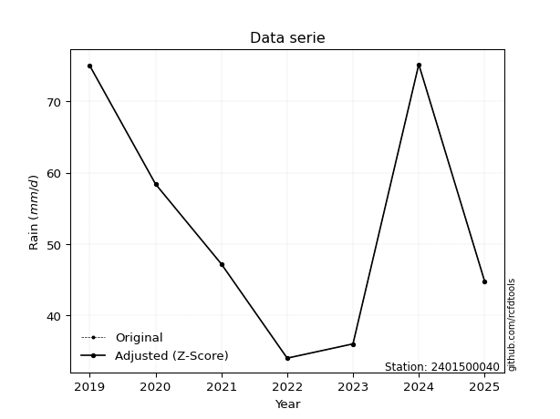</img>

</div>


> The initial value (value_initial) correspond to the initial obtained or null completed value, and value (value) is adjusted only when the initial value is outside the valid range (outlier) definite through the Z-Score value. If Z-Score is active, values out of range or outliers are replaced with the station mean value. A Z-Score (or standard score) measures how many standard deviations a data point is from the mean of a dataset, indicating its relative position; positive scores mean above the mean, negative mean below, and a score of zero is exactly at the mean, allowing for comparison of values from different distributions. It´s calculated using the formula $z=(x–μ)/σ$, where $x$ is the data point, $μ$ is the mean, and $σ$ is the standard deviation, helping identify outliers and understand probability.
>
> <sub>**Note**: In this study, "completing" (filling gaps in) and "extending" (forecasting or lengthening the historical record) rainfall data series are avoided for certain critical analyses because they introduce artificial bias and uncertainty, which can distort the statistics of rare events (extremes), alter day-to-day variability, and compromise the integrity and homogeneity of the original data. Some reasons against Completing/Extending rainfall data are: **Distortion of Extremes and Variability**: The primary issue is that most gap-filling or extension methods rely on averaging or regression with nearby stations, which inherently smooths the data. Rainfall is highly variable in space and time, with a large percentage of zero values and occasional large storms. Infilling methods often underestimate the highest values and overestimate the lowest (zero) values, which severely distorts analyses focused on flood frequency, drought severity, and intensity-duration-frequency (IDF) curves, **Loss of Data Homogeneity**: Infilled or extended data are synthetic estimates, not actual measurements. Combining these estimates with observed data can violate the assumption of data homogeneity, which requires that the data properties do not change over time. Inhomogeneity can lead to incorrect conclusions about long-term trends or changes in climate patterns, **Propagation of Errors**: Errors and biases from the original data (e.g., wind-induced undercatch, instrument errors, site changes) or the data used for imputation can propagate through the analysis, leading to unreliable hydrological models and inaccurate predictions, **Compromised Statistical Integrity**: For statistical analyses, especially those involving the frequency of events, using artificial data can introduce time bias or autocorrelation that doesn´t exist in reality, making it difficult to assess the true probability of events, **Difficulty in Validation**: It is difficult to accurately validate the quality of filled or extended data, especially for past periods where ground-truth measurements are unavailable. The reliability of imputation techniques heavily depends on the density of the surrounding station network and the complexity of the local topography.</sub>


### 4. Active continuous probability distributions from SciPy (80 of 104 available)

A Probability Density Function (PDF) describes the relative likelihood of a continuous random variable falling within a specific range, where the total area under its curve equals 1, and the area over any interval gives the actual probability for that range. Unlike discrete probabilities (like rolling a die), a PDF shows density, not direct probability for a single point (which is zero), with higher points indicating higher likelihood, often visualized as a bell curve for normal distributions.

A log of a probability density function (log-PDF) is simply the logarithm of the PDF´s value, denoted as $log(f(x))$, useful for converting multiplication of probabilities into addition, improving numerical stability with tiny numbers, and connecting to information theory concepts like entropy. Instead of dealing with very small probabilities (e.g., 0.000001), log-PDFs use negative numbers (e.g., $log(0.00001) ≈ -11.51$ that are easier for computers to handle, preventing underflow errors and simplifying complex calculations. In this study, each active probability distribution from SciPy is also evaluated in the $log$ form.

[scipy.stats](https://docs.scipy.org/doc/scipy/reference/stats.html) is a Python´s powerful submodule within the SciPy library for comprehensive statistical analysis, offering over 130 probability distributions (like Normal, Poisson, etc.), functions for descriptive stats (mean, variance), hypothesis testing (t-tests, chi-square), random variable generation, and statistical tests, making it essential for data science, modeling, and research. It provides tools to explore, model, and draw conclusions from data efficiently, working seamlessly with [NumPy](https://numpy.org/).

<div align="center">

|   id | p_dist           |   n_parameter | fit_method   | label                                                                       | active   | ref                                                                                                      |
|-----:|:-----------------|--------------:|:-------------|:----------------------------------------------------------------------------|:---------|:---------------------------------------------------------------------------------------------------------|
|    0 | alpha            |             3 | MLE          | Alpha                                                                       | True     | [:mortar_board:](https://docs.scipy.org/doc/scipy/reference/generated/scipy.stats.alpha.html)            |
|    1 | anglit           |             2 | MM           | Anglit                                                                      | True     | [:mortar_board:](https://docs.scipy.org/doc/scipy/reference/generated/scipy.stats.anglit.html)           |
|    2 | arcsine          |             2 | MM           | Arcsine                                                                     | True     | [:mortar_board:](https://docs.scipy.org/doc/scipy/reference/generated/scipy.stats.arcsine.html)          |
|    3 | argus            |             3 | MLE          | Argus                                                                       | True     | [:mortar_board:](https://docs.scipy.org/doc/scipy/reference/generated/scipy.stats.argus.html)            |
|    4 | beta             |             4 | MLE          | Beta                                                                        | True     | [:mortar_board:](https://docs.scipy.org/doc/scipy/reference/generated/scipy.stats.beta.html)             |
|    5 | betaprime        |             4 | MLE          | Beta prime                                                                  | True     | [:mortar_board:](https://docs.scipy.org/doc/scipy/reference/generated/scipy.stats.betaprime.html)        |
|    6 | bradford         |             3 | MLE          | Bradford                                                                    | True     | [:mortar_board:](https://docs.scipy.org/doc/scipy/reference/generated/scipy.stats.bradford.html)         |
|    7 | burr             |             4 | MLE          | Burr (Type III)                                                             | True     | [:mortar_board:](https://docs.scipy.org/doc/scipy/reference/generated/scipy.stats.burr.html)             |
|    8 | burr12           |             4 | MLE          | Burr (Type III) 12                                                          | True     | [:mortar_board:](https://docs.scipy.org/doc/scipy/reference/generated/scipy.stats.burr12.html)           |
|    9 | cosine           |             2 | MLE          | Cosine                                                                      | True     | [:mortar_board:](https://docs.scipy.org/doc/scipy/reference/generated/scipy.stats.cosine.html)           |
|   10 | crystalball      |             4 | MLE          | Crystalball                                                                 | True     | [:mortar_board:](https://docs.scipy.org/doc/scipy/reference/generated/scipy.stats.crystalball.html)      |
|   11 | dgamma           |             3 | MLE          | Double gamma                                                                | True     | [:mortar_board:](https://docs.scipy.org/doc/scipy/reference/generated/scipy.stats.dgamma.html)           |
|   12 | dweibull         |             3 | MLE          | Double Weibull                                                              | True     | [:mortar_board:](https://docs.scipy.org/doc/scipy/reference/generated/scipy.stats.dweibull.html)         |
|   13 | erlang           |             3 | MLE          | Erlang                                                                      | True     | [:mortar_board:](https://docs.scipy.org/doc/scipy/reference/generated/scipy.stats.erlang.html)           |
|   14 | exponnorm        |             3 | MLE          | Exponentially modified Normal                                               | True     | [:mortar_board:](https://docs.scipy.org/doc/scipy/reference/generated/scipy.stats.exponnorm.html)        |
|   15 | exponpow         |             3 | MLE          | Exponential power                                                           | True     | [:mortar_board:](https://docs.scipy.org/doc/scipy/reference/generated/scipy.stats.exponpow.html)         |
|   16 | exponweib        |             4 | MLE          | Exponentiated Weibull                                                       | True     | [:mortar_board:](https://docs.scipy.org/doc/scipy/reference/generated/scipy.stats.exponweib.html)        |
|   17 | f                |             4 | MLE          | F                                                                           | True     | [:mortar_board:](https://docs.scipy.org/doc/scipy/reference/generated/scipy.stats.f.html)                |
|   18 | fatiguelife      |             3 | MLE          | Fatigue-life (Birnbaum-Saunders)                                            | True     | [:mortar_board:](https://docs.scipy.org/doc/scipy/reference/generated/scipy.stats.fatiguelife.html)      |
|   19 | foldnorm         |             3 | MM           | Fold Normal                                                                 | True     | [:mortar_board:](https://docs.scipy.org/doc/scipy/reference/generated/scipy.stats.foldnorm.html)         |
|   20 | gamma            |             3 | MLE          | Gamma                                                                       | True     | [:mortar_board:](https://docs.scipy.org/doc/scipy/reference/generated/scipy.stats.gamma.html)            |
|   21 | gausshyper       |             6 | MLE          | Gauss hypergeometric                                                        | True     | [:mortar_board:](https://docs.scipy.org/doc/scipy/reference/generated/scipy.stats.gausshyper.html)       |
|   22 | genexpon         |             5 | MLE          | Generalized exponential                                                     | True     | [:mortar_board:](https://docs.scipy.org/doc/scipy/reference/generated/scipy.stats.genexpon.html)         |
|   23 | genextreme       |             3 | MLE          | Generalized exponential                                                     | True     | [:mortar_board:](https://docs.scipy.org/doc/scipy/reference/generated/scipy.stats.genextreme.html)       |
|   24 | gengamma         |             4 | MLE          | Generalized gamma                                                           | True     | [:mortar_board:](https://docs.scipy.org/doc/scipy/reference/generated/scipy.stats.gengamma.html)         |
|   25 | genhalflogistic  |             3 | MLE          | Generalized half-logistic                                                   | True     | [:mortar_board:](https://docs.scipy.org/doc/scipy/reference/generated/scipy.stats.genhalflogistic.html)  |
|   26 | genlogistic      |             3 | MLE          | Generalized logistic                                                        | True     | [:mortar_board:](https://docs.scipy.org/doc/scipy/reference/generated/scipy.stats.genlogistic.html)      |
|   27 | gennorm          |             3 | MLE          | Generalized Normal                                                          | True     | [:mortar_board:](https://docs.scipy.org/doc/scipy/reference/generated/scipy.stats.gennorm.html)          |
|   28 | genpareto        |             3 | MLE          | Generalized Pareto                                                          | True     | [:mortar_board:](https://docs.scipy.org/doc/scipy/reference/generated/scipy.stats.genpareto.html)        |
|   29 | gompertz         |             3 | MLE          | Gompertz (or truncated Gumbel)                                              | True     | [:mortar_board:](https://docs.scipy.org/doc/scipy/reference/generated/scipy.stats.gompertz.html)         |
|   30 | gumbel_l         |             2 | MM           | Gumbel Left Skew                                                            | True     | [:mortar_board:](https://docs.scipy.org/doc/scipy/reference/generated/scipy.stats.gumbel_l.html)         |
|   31 | gumbel_r         |             2 | MM           | Gumbel Right Skew                                                           | True     | [:mortar_board:](https://docs.scipy.org/doc/scipy/reference/generated/scipy.stats.gumbel_r.html)         |
|   32 | halfgennorm      |             3 | MLE          | Upper half of a generalized normal                                          | True     | [:mortar_board:](https://docs.scipy.org/doc/scipy/reference/generated/scipy.stats.halfgennorm.html)      |
|   33 | halflogistic     |             2 | MM           | Half-logistic                                                               | True     | [:mortar_board:](https://docs.scipy.org/doc/scipy/reference/generated/scipy.stats.halflogistic.html)     |
|   34 | halfnorm         |             2 | MM           | Half Normal                                                                 | True     | [:mortar_board:](https://docs.scipy.org/doc/scipy/reference/generated/scipy.stats.halfnorm.html)         |
|   35 | hypsecant        |             2 | MM           | hyperbolic secant                                                           | True     | [:mortar_board:](https://docs.scipy.org/doc/scipy/reference/generated/scipy.stats.hypsecant.html)        |
|   36 | invgamma         |             3 | MLE          | Inverted gamma                                                              | True     | [:mortar_board:](https://docs.scipy.org/doc/scipy/reference/generated/scipy.stats.invgamma.html)         |
|   37 | invgauss         |             3 | MLE          | Inverse Gaussian                                                            | True     | [:mortar_board:](https://docs.scipy.org/doc/scipy/reference/generated/scipy.stats.invgauss.html)         |
|   38 | invweibull       |             3 | MLE          | Inverted Weibull                                                            | True     | [:mortar_board:](https://docs.scipy.org/doc/scipy/reference/generated/scipy.stats.invweibull.html)       |
|   39 | johnsonsb        |             4 | MLE          | Johnson SB                                                                  | True     | [:mortar_board:](https://docs.scipy.org/doc/scipy/reference/generated/scipy.stats.johnsonsb.html)        |
|   40 | johnsonsu        |             4 | MLE          | Johnson Su                                                                  | True     | [:mortar_board:](https://docs.scipy.org/doc/scipy/reference/generated/scipy.stats.johnsonsu.html)        |
|   41 | kappa3           |             3 | MLE          | Kappa 3                                                                     | True     | [:mortar_board:](https://docs.scipy.org/doc/scipy/reference/generated/scipy.stats.kappa3.html)           |
|   42 | kappa4           |             4 | MLE          | Kappa 4                                                                     | True     | [:mortar_board:](https://docs.scipy.org/doc/scipy/reference/generated/scipy.stats.kappa4.html)           |
|   43 | ksone            |             3 | MLE          | Kolmogorov-Smirnov one-sided test statistic distribution                    | True     | [:mortar_board:](https://docs.scipy.org/doc/scipy/reference/generated/scipy.stats.ksone.html)            |
|   44 | kstwobign        |             2 | MLE          | Limiting distribution of scaled Kolmogorov-Smirnov two-sided test statistic | True     | [:mortar_board:](https://docs.scipy.org/doc/scipy/reference/generated/scipy.stats.kstwobign.html)        |
|   45 | laplace          |             2 | MM           | Laplace                                                                     | True     | [:mortar_board:](https://docs.scipy.org/doc/scipy/reference/generated/scipy.stats.laplace.html)          |
|   46 | levy_l           |             2 | MLE          | Left-skewed Levy                                                            | True     | [:mortar_board:](https://docs.scipy.org/doc/scipy/reference/generated/scipy.stats.levy_l.html)           |
|   47 | loggamma         |             3 | MLE          | Log gamma                                                                   | True     | [:mortar_board:](https://docs.scipy.org/doc/scipy/reference/generated/scipy.stats.loggamma.html)         |
|   48 | logistic         |             2 | MM           | Logistic (or Sech-squared)                                                  | True     | [:mortar_board:](https://docs.scipy.org/doc/scipy/reference/generated/scipy.stats.logistic.html)         |
|   49 | loglaplace       |             3 | MLE          | Log-Laplace                                                                 | True     | [:mortar_board:](https://docs.scipy.org/doc/scipy/reference/generated/scipy.stats.loglaplace.html)       |
|   50 | lomax            |             3 | MLE          | Lomax (Pareto of the second kind)                                           | True     | [:mortar_board:](https://docs.scipy.org/doc/scipy/reference/generated/scipy.stats.lomax.html)            |
|   51 | maxwell          |             2 | MM           | Maxwell                                                                     | True     | [:mortar_board:](https://docs.scipy.org/doc/scipy/reference/generated/scipy.stats.maxwell.html)          |
|   52 | mielke           |             4 | MLE          | Mielke Beta-Kappa / Dagum                                                   | True     | [:mortar_board:](https://docs.scipy.org/doc/scipy/reference/generated/scipy.stats.mielke.html)           |
|   53 | moyal            |             2 | MM           | Moyal                                                                       | True     | [:mortar_board:](https://docs.scipy.org/doc/scipy/reference/generated/scipy.stats.moyal.html)            |
|   54 | nakagami         |             3 | MLE          | Nakagami                                                                    | True     | [:mortar_board:](https://docs.scipy.org/doc/scipy/reference/generated/scipy.stats.nakagami.html)         |
|   55 | ncf              |             5 | MLE          | Non-central F distribution                                                  | True     | [:mortar_board:](https://docs.scipy.org/doc/scipy/reference/generated/scipy.stats.ncf.html)              |
|   56 | nct              |             4 | MLE          | Non-central Student’s t                                                     | True     | [:mortar_board:](https://docs.scipy.org/doc/scipy/reference/generated/scipy.stats.nct.html)              |
|   57 | norm             |             2 | MM           | Normal                                                                      | True     | [:mortar_board:](https://docs.scipy.org/doc/scipy/reference/generated/scipy.stats.norm.html)             |
|   58 | pearson3         |             3 | MM           | Pearson type III                                                            | True     | [:mortar_board:](https://docs.scipy.org/doc/scipy/reference/generated/scipy.stats.pearson3.html)         |
|   59 | powerlaw         |             3 | MLE          | Power-function                                                              | True     | [:mortar_board:](https://docs.scipy.org/doc/scipy/reference/generated/scipy.stats.powerlaw.html)         |
|   60 | rayleigh         |             2 | MM           | Rayleigh                                                                    | True     | [:mortar_board:](https://docs.scipy.org/doc/scipy/reference/generated/scipy.stats.rayleigh.html)         |
|   61 | rdist            |             3 | MLE          | R-distributed (symmetric beta)                                              | True     | [:mortar_board:](https://docs.scipy.org/doc/scipy/reference/generated/scipy.stats.rdist.html)            |
|   62 | rice             |             3 | MLE          | Rice                                                                        | True     | [:mortar_board:](https://docs.scipy.org/doc/scipy/reference/generated/scipy.stats.rice.html)             |
|   63 | semicircular     |             2 | MM           | Semicircular                                                                | True     | [:mortar_board:](https://docs.scipy.org/doc/scipy/reference/generated/scipy.stats.semicircular.html)     |
|   64 | skewnorm         |             3 | MLE          | Skew normal                                                                 | True     | [:mortar_board:](https://docs.scipy.org/doc/scipy/reference/generated/scipy.stats.skewnorm.html)         |
|   65 | t                |             3 | MLE          | Student’s t                                                                 | True     | [:mortar_board:](https://docs.scipy.org/doc/scipy/reference/generated/scipy.stats.t.html)                |
|   66 | trapezoid        |             4 | MLE          | Trapezoid                                                                   | True     | [:mortar_board:](https://docs.scipy.org/doc/scipy/reference/generated/scipy.stats.trapezoid.html)        |
|   67 | triang           |             3 | MLE          | Triangular                                                                  | True     | [:mortar_board:](https://docs.scipy.org/doc/scipy/reference/generated/scipy.stats.triang.html)           |
|   68 | truncexpon       |             3 | MLE          | Truncated exponential                                                       | True     | [:mortar_board:](https://docs.scipy.org/doc/scipy/reference/generated/scipy.stats.truncexpon.html)       |
|   69 | truncnorm        |             4 | MLE          | Truncated normal                                                            | True     | [:mortar_board:](https://docs.scipy.org/doc/scipy/reference/generated/scipy.stats.truncnorm.html)        |
|   70 | truncpareto      |             4 | MLE          | Upper truncated Pareto                                                      | True     | [:mortar_board:](https://docs.scipy.org/doc/scipy/reference/generated/scipy.stats.truncpareto.html)      |
|   71 | truncweibull_min |             5 | MLE          | Doubly truncated Weibull minimum                                            | True     | [:mortar_board:](https://docs.scipy.org/doc/scipy/reference/generated/scipy.stats.truncweibull_min.html) |
|   72 | tukeylambda      |             3 | MLE          | Tukey-Lamdba                                                                | True     | [:mortar_board:](https://docs.scipy.org/doc/scipy/reference/generated/scipy.stats.tukeylambda.html)      |
|   73 | uniform          |             2 | MLE          | Uniform                                                                     | True     | [:mortar_board:](https://docs.scipy.org/doc/scipy/reference/generated/scipy.stats.uniform.html)          |
|   74 | vonmises         |             3 | MLE          | Von Mises                                                                   | True     | [:mortar_board:](https://docs.scipy.org/doc/scipy/reference/generated/scipy.stats.vonmises.html)         |
|   75 | vonmises_line    |             3 | MLE          | Von Mises line                                                              | True     | [:mortar_board:](https://docs.scipy.org/doc/scipy/reference/generated/scipy.stats.vonmises_line.html)    |
|   76 | wald             |             2 | MM           | Wald                                                                        | True     | [:mortar_board:](https://docs.scipy.org/doc/scipy/reference/generated/scipy.stats.wald.html)             |
|   77 | weibull_max      |             3 | MLE          | Weibull maximum                                                             | True     | [:mortar_board:](https://docs.scipy.org/doc/scipy/reference/generated/scipy.stats.weibull_max.html)      |
|   78 | weibull_min      |             3 | MLE          | Weibull minimum                                                             | True     | [:mortar_board:](https://docs.scipy.org/doc/scipy/reference/generated/scipy.stats.weibull_min.html)      |
|   79 | wrapcauchy       |             3 | MLE          | Wrapped  Cauchy                                                             | True     | [:mortar_board:](https://docs.scipy.org/doc/scipy/reference/generated/scipy.stats.wrapcauchy.html)       |

</div>

> **n_parameter:** # arguments & localization & scale.
>
> **Fit methods:** (MLE) maximum likelihood, (MM) L-moments.
>
>**Inactive** (With the only purpose of prevent loops, zero divisions, infinite values, over high estimated values or horizontal trending for recurrence intervals estimations, the follow distributions were disabled.)**:** lognorm, norminvgauss, powernorm, powerlognorm, cauchy, halfcauchy, foldcauchy, skewcauchy, chi2, expon, fisk, genhyperbolic, geninvgauss, gibrat, kstwo, laplace_asymmetric, levy, levy_stable, ncx2, pareto, rel_breitwigner, recipinvgauss, studentized_range, loguniform, 


## B. Probability (PDF) vs. Empirical (EDF) distributions functions

A continuous probability distribution (CPD) describes probabilities for variables that can take any value within a range (like rain any time), unlike discrete variables with specific outcomes (like temperature). It uses a Probability Density Function (PDF), a curve where the total area under it equals 1, and the probability of the variable falling within an interval (a to b) is found by calculating the area under the curve between those points. A key feature is that the probability of hitting any single exact value is zero, so probabilities are always expressed for ranges, e.g., $P(a ≤ X ≤ b)$.

<div align="center">

Distributions parameters from station values
|     |    station | p_dist              |   n |              loc |           scale | shape                  | shape1                | shape2               | shape3             |
|----:|-----------:|:--------------------|----:|-----------------:|----------------:|:-----------------------|:----------------------|:---------------------|:-------------------|
|   0 | 2401500040 | alpha               |   7 |    -19.4602      |   327.966       | 4.745837937369647      |                       |                      |                    |
|   1 | 2401500040 | anglit              |   7 |     52.9429      |    46.3452      |                        |                       |                      |                    |
|   2 | 2401500040 | arcsine             |   7 |     30.5384      |    44.8089      |                        |                       |                      |                    |
|   3 | 2401500040 | argus               |   7 |     20.3054      |    58.9607      | 1.275925326371248e-05  |                       |                      |                    |
|   4 | 2401500040 | beta                |   7 |     34           |    41.2024      | 0.37653363262466694    | 0.5184686459480157    |                      |                    |
|   5 | 2401500040 | betaprime           |   7 |     -0.266135    |     4.28311     | 145.06199521831996     | 12.65930394285802     |                      |                    |
|   6 | 2401500040 | bradford            |   7 |     34           |    41.2         | 1.0832602680341563     |                       |                      |                    |
|   7 | 2401500040 | burr                |   7 |     -1.43054     |     7.87485     | 3.99816314622836       | 1081.0490019016875    |                      |                    |
|   8 | 2401500040 | burr12              |   7 |     -4.4679      |    38.3134      | 969.5596148791657      | 0.002813496241096395  |                      |                    |
|   9 | 2401500040 | cosine              |   7 |     53.6731      |    12.6486      |                        |                       |                      |                    |
|  10 | 2401500040 | crystalball         |   7 |     52.9429      |    15.8423      | 21604.245002191645     | 138.5751592426669     |                      |                    |
|  11 | 2401500040 | dgamma              |   7 |     53.357       |     4.10452     | 3.4789929673519295     |                       |                      |                    |
|  12 | 2401500040 | dweibull            |   7 |     54.0884      |    16.2669      | 2.3318691909362803     |                       |                      |                    |
|  13 | 2401500040 | erlang              |   7 |     34           |    19.7082      | 0.5651672300496251     |                       |                      |                    |
|  14 | 2401500040 | exponnorm           |   7 |     33.9773      |     0.00743755  | 2539.2454566985343     |                       |                      |                    |
|  15 | 2401500040 | exponpow            |   7 |     34           |    36.2237      | 0.4211965434196827     |                       |                      |                    |
|  16 | 2401500040 | exponweib           |   7 |     34           |     1.25428     | 1.21242855003222       | 0.3155868079841669    |                      |                    |
|  17 | 2401500040 | f                   |   7 |     -1.28825     |    50.0351      | 533.1107093184453      | 25.42426005725924     |                      |                    |
|  18 | 2401500040 | fatiguelife         |   7 |     34           |     0.000155385 | 334.9517771668543      |                       |                      |                    |
|  19 | 2401500040 | foldnorm            |   7 |     24.4315      |    17.1426      | 1.6187142055856705     |                       |                      |                    |
|  20 | 2401500040 | gamma               |   7 |     34           |    15.0311      | 0.7383616152424439     |                       |                      |                    |
|  21 | 2401500040 | gausshyper          |   7 |     33.3624      |    41.8376      | 0.46520876001621647    | 0.27596864000078536   | 1.4587818962893317   | 2.2651822014129106 |
|  22 | 2401500040 | genexpon            |   7 |     33.9956      |     0.0105486   | 0.000560741199909672   | 4.959359577191306e-08 | 0.17386492325194847  |                    |
|  23 | 2401500040 | genextreme          |   7 |     44.5005      |    11.9087      | -0.13143882884937558   |                       |                      |                    |
|  24 | 2401500040 | gengamma            |   7 |     34           |     1.24927     | 1.2457714096495298     | 0.2750293420270757    |                      |                    |
|  25 | 2401500040 | genhalflogistic     |   7 |     32.6128      |    44.6731      | 1.0489779839383517     |                       |                      |                    |
|  26 | 2401500040 | genlogistic         |   7 |    -44.8145      |    12.7208      | 1199.1531891011723     |                       |                      |                    |
|  27 | 2401500040 | gennorm             |   7 |     54.6         |    20.6001      | 4803789.693501782      |                       |                      |                    |
|  28 | 2401500040 | genpareto           |   7 |     -0.0796483   |   158.843       | -2.110041432685099     |                       |                      |                    |
|  29 | 2401500040 | gompertz            |   7 |     34           |    49.9203      | 1.8558122447584582     |                       |                      |                    |
|  30 | 2401500040 | gumbel_l            |   7 |     60.0728      |    12.3522      |                        |                       |                      |                    |
|  31 | 2401500040 | gumbel_r            |   7 |     45.813       |    12.3522      |                        |                       |                      |                    |
|  32 | 2401500040 | halfgennorm         |   7 |     34           |     1.34858     | 0.40501948219379025    |                       |                      |                    |
|  33 | 2401500040 | halflogistic        |   7 |     34.166       |    13.5446      |                        |                       |                      |                    |
|  34 | 2401500040 | halfnorm            |   7 |     31.9738      |    26.2808      |                        |                       |                      |                    |
|  35 | 2401500040 | hypsecant           |   7 |     52.9429      |    10.0855      |                        |                       |                      |                    |
|  36 | 2401500040 | invgamma            |   7 |     17.0997      |   145.25        | 4.982031960410881      |                       |                      |                    |
|  37 | 2401500040 | invgauss            |   7 |     28.4256      |    32.3403      | 0.7581029432019856     |                       |                      |                    |
|  38 | 2401500040 | invweibull          |   7 |     34           |     1.3515      | 0.05118548750308288    |                       |                      |                    |
|  39 | 2401500040 | johnsonsb           |   7 |     34           |    41.2         | 0.8952286430174254     | 0.20588832259846299   |                      |                    |
|  40 | 2401500040 | johnsonsu           |   7 |      5.9637e+08  |     2.34659e+07 | 151296772.1528266      | 38509192.04234867     |                      |                    |
|  41 | 2401500040 | kappa3              |   7 |     34           |    41.179       | 3800.6066441930093     |                       |                      |                    |
|  42 | 2401500040 | kappa4              |   7 |     28.964       |    48.5023      | 1.1161937300597076     | 1.04774510030747      |                      |                    |
|  43 | 2401500040 | ksone               |   7 |     25.5031      |    54.8795      | 1.0                    |                       |                      |                    |
|  44 | 2401500040 | kstwobign           |   7 |      1.62427     |    58.6666      |                        |                       |                      |                    |
|  45 | 2401500040 | laplace             |   7 |     52.9429      |    11.2022      |                        |                       |                      |                    |
|  46 | 2401500040 | levy_l              |   7 |     76.1247      |     3.2679      |                        |                       |                      |                    |
|  47 | 2401500040 | loggamma            |   7 |  -3319.57        |   491.273       | 958.4625564432818      |                       |                      |                    |
|  48 | 2401500040 | logistic            |   7 |     52.9429      |     8.73434     |                        |                       |                      |                    |
|  49 | 2401500040 | loglaplace          |   7 |     -0.135176    |    47.3352      | 3.9145801752245557     |                       |                      |                    |
|  50 | 2401500040 | lomax               |   7 |     34           |     9.49728e+10 | 2596273938.7397437     |                       |                      |                    |
|  51 | 2401500040 | maxwell             |   7 |     15.4032      |    23.5245      |                        |                       |                      |                    |
|  52 | 2401500040 | mielke              |   7 |     -5.44951     |    11.6456      | 2304.767513606763      | 4.349966726458959     |                      |                    |
|  53 | 2401500040 | moyal               |   7 |     43.8832      |     7.13156     |                        |                       |                      |                    |
|  54 | 2401500040 | nakagami            |   7 |     34           |    28.4888      | 0.42820228351614265    |                       |                      |                    |
|  55 | 2401500040 | ncf                 |   7 |     -2.76243     |    50.2645      | 226.83697345406063     | 28.755040038021306    | 7.310738807803766    |                    |
|  56 | 2401500040 | nct                 |   7 |     -0.205443    |     1.11018     | 6.3514676642567505     | 42.140411767497       |                      |                    |
|  57 | 2401500040 | norm                |   7 |     52.9429      |    15.8423      |                        |                       |                      |                    |
|  58 | 2401500040 | pearson3            |   7 |     52.9429      |    15.8423      | 0.3423839632778096     |                       |                      |                    |
|  59 | 2401500040 | powerlaw            |   7 |     34           |    41.2         | 0.16537719046760527    |                       |                      |                    |
|  60 | 2401500040 | rayleigh            |   7 |     22.6355      |    24.1817      |                        |                       |                      |                    |
|  61 | 2401500040 | rdist               |   7 |     53.5255      |    21.6745      | 1.0269804818718038     |                       |                      |                    |
|  62 | 2401500040 | rice                |   7 |     25.5281      |    21.522       | 0.4054672762220294     |                       |                      |                    |
|  63 | 2401500040 | semicircular        |   7 |     52.9429      |    31.6847      |                        |                       |                      |                    |
|  64 | 2401500040 | skewnorm            |   7 |     34           |    24.6914      | 24508246.84006284      |                       |                      |                    |
|  65 | 2401500040 | t                   |   7 |     52.9442      |    15.8384      | 1316746.0235481684     |                       |                      |                    |
|  66 | 2401500040 | trapezoid           |   7 |      8.13397     |    67.2133      | 1.0                    | 1.0                   |                      |                    |
|  67 | 2401500040 | triang              |   7 |     15.9533      |    59.783       | 0.9910277995535697     |                       |                      |                    |
|  68 | 2401500040 | truncexpon          |   7 |     33.9822      |    42.5024      | 0.9697762481643233     |                       |                      |                    |
|  69 | 2401500040 | truncnorm           |   7 |     52.9429      |    15.8423      | -248.15709050157898    | 1488.0351116293473    |                      |                    |
|  70 | 2401500040 | truncpareto         |   7 |     22.093       |    11.907       | 2.3276004651336008e-08 | 4.4601629322310234    |                      |                    |
|  71 | 2401500040 | truncweibull_min    |   7 |     33.9283      |    35.1464      | 0.6531333623484075     | 0.00204084447621001   | 1.174281470270873    |                    |
|  72 | 2401500040 | tukeylambda         |   7 |     54.6903      |    23.6631      | 1.1436826793573398     |                       |                      |                    |
|  73 | 2401500040 | uniform             |   7 |     34           |    41.2         |                        |                       |                      |                    |
|  74 | 2401500040 | vonmises            |   7 |      1.03645     |     1           | 0.18909430344169406    |                       |                      |                    |
|  75 | 2401500040 | vonmises_line       |   7 |     54.6         |     6.55719     | 0.3729395852402708     |                       |                      |                    |
|  76 | 2401500040 | wald                |   7 |     37.1005      |    15.8423      |                        |                       |                      |                    |
|  77 | 2401500040 | weibull_max         |   7 |     75.2         |     1.4136      | 0.30418248483674826    |                       |                      |                    |
|  78 | 2401500040 | weibull_min         |   7 |     34           |    32.3706      | 0.17184730911225485    |                       |                      |                    |
|  79 | 2401500040 | wrapcauchy          |   7 |     34           |     6.55718     | 0.525                  |                       |                      |                    |
|  80 | 2401500040 | logalpha            |   7 |     -0.679677    |    70.8415      | 15.451255540389823     |                       |                      |                    |
|  81 | 2401500040 | loganglit           |   7 |      3.92449     |     0.87485     |                        |                       |                      |                    |
|  82 | 2401500040 | logarcsine          |   7 |      3.50157     |     0.84585     |                        |                       |                      |                    |
|  83 | 2401500040 | logargus            |   7 |      3.29735     |     1.10131     | 4.776509390529301e-05  |                       |                      |                    |
|  84 | 2401500040 | logbeta             |   7 |      3.52636     |     0.871436    | 0.5431208120591116     | 0.624197042692063     |                      |                    |
|  85 | 2401500040 | logbetaprime        |   7 |      0.504464    |     0.783178    | 692.1663336749452      | 159.51504874223133    |                      |                    |
|  86 | 2401500040 | logbradford         |   7 |      3.52636     |     0.793792    | 1.2629316763990073     |                       |                      |                    |
|  87 | 2401500040 | logburr             |   7 |     -2.55058     |     4.65281     | 25.028070503471625     | 2131.2885388403715    |                      |                    |
|  88 | 2401500040 | logburr12           |   7 |      2.39628     |     5.2471      | 5.771677211118881      | 826.7123732157465     |                      |                    |
|  89 | 2401500040 | logcosine           |   7 |      3.92854     |     0.23893     |                        |                       |                      |                    |
|  90 | 2401500040 | logcrystalball      |   7 |      3.92449     |     0.299054    | 357.0239360300769      | 18.005923999277265    |                      |                    |
|  91 | 2401500040 | logdgamma           |   7 |      3.96295     |     0.0777618   | 3.493113045366549      |                       |                      |                    |
|  92 | 2401500040 | logdweibull         |   7 |      3.96262     |     0.307749    | 2.262748250186802      |                       |                      |                    |
|  93 | 2401500040 | logerlang           |   7 |      0.705574    |     0.0278501   | 115.5514902095149      |                       |                      |                    |
|  94 | 2401500040 | logexponnorm        |   7 |      3.90143     |     0.298163    | 0.07734259433193374    |                       |                      |                    |
|  95 | 2401500040 | logexponpow         |   7 |      3.52636     |     0.461533    | 0.6684676767683115     |                       |                      |                    |
|  96 | 2401500040 | logexponweib        |   7 |      3.52636     |     0.537345    | 0.3703633313905116     | 1.4394739090293678    |                      |                    |
|  97 | 2401500040 | logf                |   7 |      2.21435     |     1.677       | 159.75650687599273     | 107.18934797809294    |                      |                    |
|  98 | 2401500040 | logfatiguelife      |   7 |      3.29116     |     0.549847    | 0.5492793630281003     |                       |                      |                    |
|  99 | 2401500040 | logfoldnorm         |   7 |      3.49353     |     0.371038    | 0.993081380216702      |                       |                      |                    |
| 100 | 2401500040 | loggamma            |   7 |      0.56741     |     0.0264736   | 126.75276730448974     |                       |                      |                    |
| 101 | 2401500040 | loggausshyper       |   7 |      3.49667     |     0.823485    | 1.3480004419445444     | 0.4409649286288825    | 1.3213694322332799   | 2.264482115741023  |
| 102 | 2401500040 | loggenexpon         |   7 |      3.52636     |     0.153666    | 0.2656960167068113     | 3.543324548095237     | 0.017086611200389075 |                    |
| 103 | 2401500040 | loggenextreme       |   7 |      3.98836     |     0.430272    | 1.2968129676187061     |                       |                      |                    |
| 104 | 2401500040 | loggengamma         |   7 |      3.52636     |     0.924987    | 0.38676707473765903    | 1.4060488380737963    |                      |                    |
| 105 | 2401500040 | loggenhalflogistic  |   7 |      3.5238      |     0.817102    | 1.0260585468280214     |                       |                      |                    |
| 106 | 2401500040 | loggenlogistic      |   7 |      2.14798     |     0.257181    | 564.748471307506       |                       |                      |                    |
| 107 | 2401500040 | loggennorm          |   7 |      3.92326     |     0.396899    | 1609676.4992826963     |                       |                      |                    |
| 108 | 2401500040 | loggenpareto        |   7 |     -0.00146027  |     7.81274     | -1.8078314068468035    |                       |                      |                    |
| 109 | 2401500040 | loggompertz         |   7 |      3.52636     |     0.588086    | 0.80907284894791       |                       |                      |                    |
| 110 | 2401500040 | loggumbel_l         |   7 |      4.05908     |     0.233171    |                        |                       |                      |                    |
| 111 | 2401500040 | loggumbel_r         |   7 |      3.7899      |     0.233171    |                        |                       |                      |                    |
| 112 | 2401500040 | loghalfgennorm      |   7 |      3.52636     |     0.577038    | 1.4689921623107076     |                       |                      |                    |
| 113 | 2401500040 | loghalflogistic     |   7 |      3.57007     |     0.255665    |                        |                       |                      |                    |
| 114 | 2401500040 | loghalfnorm         |   7 |      3.52867     |     0.496085    |                        |                       |                      |                    |
| 115 | 2401500040 | loghypsecant        |   7 |      3.92449     |     0.190383    |                        |                       |                      |                    |
| 116 | 2401500040 | loginvgamma         |   7 |     -0.37354     |   887.057       | 207.4172077476743      |                       |                      |                    |
| 117 | 2401500040 | loginvgauss         |   7 |      3.10902     |     4.99825     | 0.16315233760338288    |                       |                      |                    |
| 118 | 2401500040 | loginvweibull       |   7 |     -1.33576e+07 |     1.33576e+07 | 51892694.22774849      |                       |                      |                    |
| 119 | 2401500040 | logjohnsonsb        |   7 |      3.52636     |     0.793793    | 0.4361003281914289     | 0.12169849088131385   |                      |                    |
| 120 | 2401500040 | logjohnsonsu        |   7 |      6.3591e+06  |     2.99741e+06 | 35100269.82288852      | 23451763.892619       |                      |                    |
| 121 | 2401500040 | logkappa3           |   7 |      3.52568     |     0.781985    | 119.76341313477036     |                       |                      |                    |
| 122 | 2401500040 | logkappa4           |   7 |      3.46656     |     0.903019    | 1.071042536266444      | 1.0579103465570667    |                      |                    |
| 123 | 2401500040 | logksone            |   7 |      3.40652     |     1.03595     | 1.0                    |                       |                      |                    |
| 124 | 2401500040 | logkstwobign        |   7 |      2.89434     |     1.17557     |                        |                       |                      |                    |
| 125 | 2401500040 | loglaplace          |   7 |      3.92449     |     0.211462    |                        |                       |                      |                    |
| 126 | 2401500040 | loglevy_l           |   7 |      4.3356      |     0.0537783   |                        |                       |                      |                    |
| 127 | 2401500040 | logloggamma         |   7 |    -51.6344      |     8.35847     | 770.9228389019486      |                       |                      |                    |
| 128 | 2401500040 | loglogistic         |   7 |      3.92449     |     0.164877    |                        |                       |                      |                    |
| 129 | 2401500040 | logloglaplace       |   7 |     -0.174232    |     4.02863     | 16.005463918870355     |                       |                      |                    |
| 130 | 2401500040 | loglomax            |   7 |      3.52636     |    24.567       | 62.24549696645453      |                       |                      |                    |
| 131 | 2401500040 | logmaxwell          |   7 |      3.21586     |     0.444068    |                        |                       |                      |                    |
| 132 | 2401500040 | logmielke           |   7 | -33341.1         | 33343.8         | 8222495.020252401      | 130197.95694215578    |                      |                    |
| 133 | 2401500040 | logmoyal            |   7 |      3.75347     |     0.134621    |                        |                       |                      |                    |
| 134 | 2401500040 | lognakagami         |   7 |      3.52636     |     0.67161     | 0.1097024529404291     |                       |                      |                    |
| 135 | 2401500040 | logncf              |   7 |      1.44808     |     2.45719     | 305.18304375113576     | 248.32238860586477    | 0.004502109683753308 |                    |
| 136 | 2401500040 | lognct              |   7 |     -1.67996     |     0.102605    | 199.71148953244972     | 54.4113884413502      |                      |                    |
| 137 | 2401500040 | lognorm             |   7 |      3.92449     |     0.299053    |                        |                       |                      |                    |
| 138 | 2401500040 | logpearson3         |   7 |      3.92449     |     0.299053    | 0.11013919800235077    |                       |                      |                    |
| 139 | 2401500040 | logpowerlaw         |   7 |      3.52636     |     0.793791    | 0.1746590508325514     |                       |                      |                    |
| 140 | 2401500040 | lograyleigh         |   7 |      3.35238     |     0.456475    |                        |                       |                      |                    |
| 141 | 2401500040 | logrdist            |   7 |      3.944       |     0.417639    | 1.0357235150802055     |                       |                      |                    |
| 142 | 2401500040 | logrice             |   7 |      3.3726      |     0.378634    | 0.8650786155630454     |                       |                      |                    |
| 143 | 2401500040 | logsemicircular     |   7 |      3.92449     |     0.598106    |                        |                       |                      |                    |
| 144 | 2401500040 | logskewnorm         |   7 |      3.79637     |     0.325344    | 0.5670967093418451     |                       |                      |                    |
| 145 | 2401500040 | logt                |   7 |      3.92449     |     0.299053    | 4673182924.498184      |                       |                      |                    |
| 146 | 2401500040 | logtrapezoid        |   7 |      3.07864     |     1.26877     | 1.0                    | 1.0                   |                      |                    |
| 147 | 2401500040 | logtriang           |   7 |      3.24476     |     1.07539     | 0.9999999865865346     |                       |                      |                    |
| 148 | 2401500040 | logtruncexpon       |   7 |      3.51517     |     0.762776    | 1.0553309137752862     |                       |                      |                    |
| 149 | 2401500040 | logtruncnorm        |   7 |     -0.0538096   |     1.33777     | 2.676217093560366      | 3.2695918731141287    |                      |                    |
| 150 | 2401500040 | logtruncpareto      |   7 |      3.52602     |     0.000343341 | 0.16856755525686       | 2312.96201245353      |                      |                    |
| 151 | 2401500040 | logtruncweibull_min |   7 |      3.52558     |     1.01733     | 0.9979777899579736     | 0.0007703477923074199 | 0.7810400523608445   |                    |
| 152 | 2401500040 | logtukeylambda      |   7 |      3.9252      |     0.455813    | 1.1428406987350879     |                       |                      |                    |
| 153 | 2401500040 | loguniform          |   7 |      3.52636     |     0.793791    |                        |                       |                      |                    |
| 154 | 2401500040 | logvonmises         |   7 |     -2.3592      |     1           | 11.581777672778557     |                       |                      |                    |
| 155 | 2401500040 | logvonmises_line    |   7 |      3.92326     |     0.126337    | 0.2846942431397999     |                       |                      |                    |
| 156 | 2401500040 | logwald             |   7 |      3.62542     |     0.299072    |                        |                       |                      |                    |
| 157 | 2401500040 | logweibull_max      |   7 |      4.32015     |     0.310776    | 0.5852532485918156     |                       |                      |                    |
| 158 | 2401500040 | logweibull_min      |   7 |      3.52636     |     0.319349    | 0.3945189015411189     |                       |                      |                    |
| 159 | 2401500040 | logwrapcauchy       |   7 |      3.52636     |     0.126336    | 0.5187912064124712     |                       |                      |                    |

</div>

> **loc** (Location parameter): This shifts the distribution along the x-axis. For many common distributions, like the normal (Gaussian) distribution, loc represents the mean $μ$. For others, like the uniform distribution, it might represent the minimum value, or for the beta distribution, the left end of the support interval.
>
> **scale** (Scale parameter): This determines the width or spread of the distribution. For the normal distribution, scale represents the standard deviation $σ$. For a uniform distribution, it defines the length of the interval (from $loc$ to $loc + scale$).
>
> **shape** (Shape parameters): Refers to parameters that define the specific form of a probability distribution, distinct from its location (loc) and scale (scale). These parameters are required arguments for most distribution functions. For example, a normal (Gaussian) distribution is fully defined by its location (mean) and scale (standard deviation), so it has no specific shape parameters beyond loc and scale. However, other distributions have intrinsic properties that need specification, as Gamma distribution that takes a shape parameter, often named $a$ or $alpha$.


### 0. Cumulative distribution values - CDF (160 evaluated)

Cumulative Distribution Function (CDF), denoted as $F$<sub>$X$</sub>$(x)$, is a function that gives the probability that a random variable $X$ will take a value less than or equal to a specific value, $x$ (i.e., $(P(X≥x)$. It essentially "accumulates" probabilities from a given point up to the far right (positive infinity), providing a complete picture of the distribution´s probabilities for both discrete (like rain) and continuous (like temperature) variables, helping to find probabilities over ranges or above certain values. Each station is evaluated separately ordering the $x$ values ascending, calculating the CDF and PDF values for the activated distributions and their logarithmic forms.

<div align="center">

CDF ordered by x ascending and calculating $log(f(x))$ separately
|   id |    Station |   date |    x |   count |    mean |     std |    zscore |   Value_initial |    station |   m |     alpha |   alpha_pdf |   anglit |   anglit_pdf |   arcsine |   arcsine_pdf |    argus |   argus_pdf |        beta |    beta_pdf |   betaprime |   betaprime_pdf |    bradford |   bradford_pdf |      burr |   burr_pdf |    burr12 |   burr12_pdf |    cosine |   cosine_pdf |   crystalball |   crystalball_pdf |   dgamma |   dgamma_pdf |   dweibull |   dweibull_pdf |      erlang |      erlang_pdf |   exponnorm |   exponnorm_pdf |    exponpow |   exponpow_pdf |   exponweib |   exponweib_pdf |         f |      f_pdf |   fatiguelife |   fatiguelife_pdf |   foldnorm |   foldnorm_pdf |       gamma |    gamma_pdf |   gausshyper |   gausshyper_pdf |   genexpon |   genexpon_pdf |   genextreme |   genextreme_pdf |    gengamma |   gengamma_pdf |   genhalflogistic |   genhalflogistic_pdf |   genlogistic |   genlogistic_pdf |     gennorm |   gennorm_pdf |   genpareto |   genpareto_pdf |    gompertz |   gompertz_pdf |   gumbel_l |   gumbel_l_pdf |   gumbel_r |   gumbel_r_pdf |   halfgennorm |   halfgennorm_pdf |   halflogistic |   halflogistic_pdf |   halfnorm |   halfnorm_pdf |   hypsecant |   hypsecant_pdf |   invgamma |   invgamma_pdf |   invgauss |   invgauss_pdf |   invweibull |   invweibull_pdf |   johnsonsb |   johnsonsb_pdf |   johnsonsu |   johnsonsu_pdf |      kappa3 |   kappa3_pdf |      kappa4 |   kappa4_pdf |    ksone |   ksone_pdf |   kstwobign |   kstwobign_pdf |   laplace |   laplace_pdf |   levy_l |   levy_l_pdf |   loggamma |   loggamma_pdf |   logistic |   logistic_pdf |   loglaplace |   loglaplace_pdf |       lomax |   lomax_pdf |   maxwell |   maxwell_pdf |   mielke |   mielke_pdf |     moyal |   moyal_pdf |    nakagami |   nakagami_pdf |       ncf |    ncf_pdf |       nct |    nct_pdf |     norm |   norm_pdf |   pearson3 |   pearson3_pdf |   powerlaw |   powerlaw_pdf |   rayleigh |   rayleigh_pdf |    rdist |      rdist_pdf |      rice |   rice_pdf |   semicircular |   semicircular_pdf |   skewnorm |   skewnorm_pdf |        t |      t_pdf |   trapezoid |   trapezoid_pdf |   triang |   triang_pdf |   truncexpon |   truncexpon_pdf |   truncnorm |   truncnorm_pdf |   truncpareto |   truncpareto_pdf |   truncweibull_min |   truncweibull_min_pdf |   tukeylambda |   tukeylambda_pdf |   uniform |   uniform_pdf |   vonmises |   vonmises_pdf |   vonmises_line |   vonmises_line_pdf |     wald |   wald_pdf |   weibull_max |   weibull_max_pdf |   weibull_min |   weibull_min_pdf |   wrapcauchy |   wrapcauchy_pdf |   logalpha |   logalpha_pdf |   loganglit |   loganglit_pdf |   logarcsine |   logarcsine_pdf |   logargus |   logargus_pdf |     logbeta |   logbeta_pdf |   logbetaprime |   logbetaprime_pdf |   logbradford |   logbradford_pdf |   logburr |   logburr_pdf |   logburr12 |   logburr12_pdf |   logcosine |   logcosine_pdf |   logcrystalball |   logcrystalball_pdf |   logdgamma |   logdgamma_pdf |   logdweibull |   logdweibull_pdf |   logerlang |   logerlang_pdf |   logexponnorm |   logexponnorm_pdf |   logexponpow |   logexponpow_pdf |   logexponweib |   logexponweib_pdf |      logf |   logf_pdf |   logfatiguelife |   logfatiguelife_pdf |   logfoldnorm |   logfoldnorm_pdf |   loggausshyper |   loggausshyper_pdf |   loggenexpon |   loggenexpon_pdf |   loggenextreme |   loggenextreme_pdf |   loggengamma |   loggengamma_pdf |   loggenhalflogistic |   loggenhalflogistic_pdf |   loggenlogistic |   loggenlogistic_pdf |   loggennorm |   loggennorm_pdf |   loggenpareto |   loggenpareto_pdf |   loggompertz |   loggompertz_pdf |   loggumbel_l |   loggumbel_l_pdf |   loggumbel_r |   loggumbel_r_pdf |   loghalfgennorm |   loghalfgennorm_pdf |   loghalflogistic |   loghalflogistic_pdf |   loghalfnorm |   loghalfnorm_pdf |   loghypsecant |   loghypsecant_pdf |   loginvgamma |   loginvgamma_pdf |   loginvgauss |   loginvgauss_pdf |   loginvweibull |   loginvweibull_pdf |   logjohnsonsb |   logjohnsonsb_pdf |   logjohnsonsu |   logjohnsonsu_pdf |   logkappa3 |   logkappa3_pdf |   logkappa4 |   logkappa4_pdf |   logksone |   logksone_pdf |   logkstwobign |   logkstwobign_pdf |   loglevy_l |   loglevy_l_pdf |   logloggamma |   logloggamma_pdf |   loglogistic |   loglogistic_pdf |   logloglaplace |   logloglaplace_pdf |    loglomax |   loglomax_pdf |   logmaxwell |   logmaxwell_pdf |   logmielke |   logmielke_pdf |   logmoyal |   logmoyal_pdf |   lognakagami |   lognakagami_pdf |    logncf |   logncf_pdf |    lognct |   lognct_pdf |   lognorm |   lognorm_pdf |   logpearson3 |   logpearson3_pdf |   logpowerlaw |   logpowerlaw_pdf |   lograyleigh |   lograyleigh_pdf |    logrdist |   logrdist_pdf |   logrice |   logrice_pdf |   logsemicircular |   logsemicircular_pdf |   logskewnorm |   logskewnorm_pdf |      logt |   logt_pdf |   logtrapezoid |   logtrapezoid_pdf |   logtriang |   logtriang_pdf |   logtruncexpon |   logtruncexpon_pdf |   logtruncnorm |   logtruncnorm_pdf |   logtruncpareto |   logtruncpareto_pdf |   logtruncweibull_min |   logtruncweibull_min_pdf |   logtukeylambda |   logtukeylambda_pdf |   loguniform |   loguniform_pdf |   logvonmises |   logvonmises_pdf |   logvonmises_line |   logvonmises_line_pdf |   logwald |   logwald_pdf |   logweibull_max |   logweibull_max_pdf |   logweibull_min |   logweibull_min_pdf |   logwrapcauchy |   logwrapcauchy_pdf |
|-----:|-----------:|-------:|-----:|--------:|--------:|--------:|----------:|----------------:|-----------:|----:|----------:|------------:|---------:|-------------:|----------:|--------------:|---------:|------------:|------------:|------------:|------------:|----------------:|------------:|---------------:|----------:|-----------:|----------:|-------------:|----------:|-------------:|--------------:|------------------:|---------:|-------------:|-----------:|---------------:|------------:|----------------:|------------:|----------------:|------------:|---------------:|------------:|----------------:|----------:|-----------:|--------------:|------------------:|-----------:|---------------:|------------:|-------------:|-------------:|-----------------:|-----------:|---------------:|-------------:|-----------------:|------------:|---------------:|------------------:|----------------------:|--------------:|------------------:|------------:|--------------:|------------:|----------------:|------------:|---------------:|-----------:|---------------:|-----------:|---------------:|--------------:|------------------:|---------------:|-------------------:|-----------:|---------------:|------------:|----------------:|-----------:|---------------:|-----------:|---------------:|-------------:|-----------------:|------------:|----------------:|------------:|----------------:|------------:|-------------:|------------:|-------------:|---------:|------------:|------------:|----------------:|----------:|--------------:|---------:|-------------:|-----------:|---------------:|-----------:|---------------:|-------------:|-----------------:|------------:|------------:|----------:|--------------:|---------:|-------------:|----------:|------------:|------------:|---------------:|----------:|-----------:|----------:|-----------:|---------:|-----------:|-----------:|---------------:|-----------:|---------------:|-----------:|---------------:|---------:|---------------:|----------:|-----------:|---------------:|-------------------:|-----------:|---------------:|---------:|-----------:|------------:|----------------:|---------:|-------------:|-------------:|-----------------:|------------:|----------------:|--------------:|------------------:|-------------------:|-----------------------:|--------------:|------------------:|----------:|--------------:|-----------:|---------------:|----------------:|--------------------:|---------:|-----------:|--------------:|------------------:|--------------:|------------------:|-------------:|-----------------:|-----------:|---------------:|------------:|----------------:|-------------:|-----------------:|-----------:|---------------:|------------:|--------------:|---------------:|-------------------:|--------------:|------------------:|----------:|--------------:|------------:|----------------:|------------:|----------------:|-----------------:|---------------------:|------------:|----------------:|--------------:|------------------:|------------:|----------------:|---------------:|-------------------:|--------------:|------------------:|---------------:|-------------------:|----------:|-----------:|-----------------:|---------------------:|--------------:|------------------:|----------------:|--------------------:|--------------:|------------------:|----------------:|--------------------:|--------------:|------------------:|---------------------:|-------------------------:|-----------------:|---------------------:|-------------:|-----------------:|---------------:|-------------------:|--------------:|------------------:|--------------:|------------------:|--------------:|------------------:|-----------------:|---------------------:|------------------:|----------------------:|--------------:|------------------:|---------------:|-------------------:|--------------:|------------------:|--------------:|------------------:|----------------:|--------------------:|---------------:|-------------------:|---------------:|-------------------:|------------:|----------------:|------------:|----------------:|-----------:|---------------:|---------------:|-------------------:|------------:|----------------:|--------------:|------------------:|--------------:|------------------:|----------------:|--------------------:|------------:|---------------:|-------------:|-----------------:|------------:|----------------:|-----------:|---------------:|--------------:|------------------:|----------:|-------------:|----------:|-------------:|----------:|--------------:|--------------:|------------------:|--------------:|------------------:|--------------:|------------------:|------------:|---------------:|----------:|--------------:|------------------:|----------------------:|--------------:|------------------:|----------:|-----------:|---------------:|-------------------:|------------:|----------------:|----------------:|--------------------:|---------------:|-------------------:|-----------------:|---------------------:|----------------------:|--------------------------:|-----------------:|---------------------:|-------------:|-----------------:|--------------:|------------------:|-------------------:|-----------------------:|----------:|--------------:|-----------------:|---------------------:|-----------------:|---------------------:|----------------:|--------------------:|
|    0 | 2401500040 |   2022 | 34   |       7 | 52.9429 | 17.1117 | -1.10701  |            34   | 2401500040 |   1 | 0.0824271 |  0.0174491  | 0.135292 |    0.0147603 |  0.179305 |     0.0266066 | 0.07982  |   0.0114948 | 8.18588e-07 | 4.33789e+07 |   0.0857161 |      0.0171808  | 7.85623e-07 |      0.0358243 | 0.0712019 | 0.0212039  | 0.0109737 |   0.0687454  | 0.0933216 |    0.0127771 |      0.115905 |        0.0123205  | 0.109902 |    0.0156969 |  0.0974113 |      0.0184953 | 2.10216e-09 | 167207          |  0.00120311 |      0.052827   | 2.42157e-07 |    1.43546e+07 | 3.53824e-06 |     1.90531e+08 | 0.0857966 | 0.0171667  |     0.0287791 |        1.6253e+08 |   0.129704 |     0.0154383  | 5.27467e-12 | 548.118      |     0.160907 |      0.114368    | 0.00023549 |     0.0531459  |    0.0778662 |       0.0188796  | 1.16437e-05 |    5.61431e+08 |         0.0157836 |             0.0115664 |     0.0870268 |        0.0166863  | 1.42994e-06 |     0.0242718 |    0.248488 |     0.00864466  | 2.43016e-14 |     0.0371755  |   0.114094 |     0.0086885  |   0.074113 |     0.0156129  |    2.4035e-11 |        0.230828   |      0         |         0          |  0.0614541 |     0.0302699  |   0.0965675 |      0.00942865 |   0.069277 |     0.0211545  |  0.0531486 |     0.0305095  |   0.00555117 |      1.03847e+11 | 6.16056e-07 |  20446          |    0.110814 |      0.0121968  | 4.60742e-13 |    0.0242316 | 9.46122e-15 |    0.883129  | 0.154828 |   0.0182218 |   0.0790634 |      0.017343   | 0.0921684 |    0.00822769 | 0.219391 |   0.00253742 |  0.0873465 |       0.579573 |   0.102589 |      0.0105406 |    0.0760857 |         0.359807 | 8.90695e-10 |  0.027337   |  0.109299 |    0.0155079  |      nan |          nan | 0.0455494 |  0.0151518  | 3.40599e-14 |     4.10517    | 0.0877138 | 0.016842   | 0.0784645 | 0.0187002  | 0.115905 | 0.0123205  |   0.109247 |     0.0137683  | 0.00247234 |    5.75432e+10 |   0.104552 |     0.0174026  | 0.138702 |      0.0336898 | 0.0688832 | 0.0156902  |       0.143472 |          0.0161061 |  0         |     0.0323143  | 0.115831 | 0.012318   |    0.148098 |       0.0114511 | 0.09195  |    0.0101903 |  0.000673802 |        0.0378818 |    0.115905 |      0.0123205  |      0        |         0.05617   |        5.83638e-11 |             0.239631   |   7.10543e-15 |         0.0418717 | 0         |     0.0242718 |    5.77628 |       0.158434 |     5.12166e-07 |           0.0161497 | 0        | 0          |     0.0614635 |       0.00126576  |    0.00203552 |       4.91797e+10 |     0        |       0.0779254  |  0.0820291 |       0.606686 |    0.105196 |        0.701392 |     0.109536 |         2.23093  |  0.0641562 |       0.554067 | 3.59492e-09 |   4.39659e+06 |      0.0852006 |           0.601426 |   9.02555e-08 |          1.94819  | 0.0695235 |      0.762917 |    0.11054  |        0.532104 |   0.0739525 |        0.591365 |         0.091545 |             0.549918 |   0.0641024 |        0.524469 |      0.055263 |          0.63131  |   0.0877434 |        0.581296 |      0.0915229 |           0.550031 |   9.15798e-11 |     137851        |    9.09789e-09 |         1.0922e+07 | 0.0794855 |   0.645391 |        0.0555943 |             0.947852 |     0.0431129 |          1.31324  |       0.0139153 |          0.610013   |   8.53042e-09 |          1.72904  |        0.140937 |            0.268272 |    5.2609e-09 |       6.44228e+06 |           0.00156858 |                 0.61389  |        0.0706715 |             0.726416 |  3.49583e-06 |          1.25976 |       0.608334 |        0.27293     |   3.14793e-10 |          1.37577  |     0.0967959 |          0.394356 |     0.0452106 |          0.600381 |      2.83605e-09 |             1.91463  |         0         |              0        |     0         |          0        |      0.0782502 |           0.406887 |     0.0850414 |          0.592866 |     0.0632465 |          0.793778 |       0.0703505 |            0.725422 |    6.20458e-05 |        6.92248e+10 |      0.0920696 |           0.550931 | 0.000839011 |         1.22871 | 4.09742e-05 |         2.27892 |   0.115686 |       0.965297 |       0.065306 |           0.778729 |    0.20343  |        0.122932 |     0.0941524 |          0.548881 |     0.0820573 |          0.45685  |        0.12841  |            0.555386 | 1.35698e-12 |       2.5337   |    0.0786777 |         0.687939 |   0.0711503 |        0.719102 |  0.0200962 |       0.462143 |   0.000386933 |       1.91167e+11 | 0.0819779 |     0.604738 | 0.0864304 |     0.587667 | 0.0915446 |      0.549916 |     0.0890174 |          0.56669  |      0.002168 |       8.52668e+11 |     0.0700547 |          0.776448 | 2.46467e-09 |    2.75271e+07 | 0.0552736 |      0.700462 |          0.110033 |              0.794316 |     0.0907814 |          0.55432  | 0.0915452 |   0.549919 |       0.124521 |           0.556246 |   0.0685691 |        0.487    |       0.0223397 |            1.98169  |    1.18927e-06 |           2.60772  |         0        |          673.441     |           4.16879e-07 |                  1.83672  |      7.10543e-15 |              2.17317 |    0         |          1.25978 |       1.09195 |          0.543846 |        1.11838e-06 |               0.928735 |  0        |      0        |         0.17707  |          0.226013    |       1.3763e-06 |          1.22267e+09 |     1.02015e-05 |            3.97609  |
|    1 | 2401500040 |   2023 | 36   |       7 | 52.9429 | 17.1117 | -0.990134 |            36   | 2401500040 |   2 | 0.121464  |  0.0215125  | 0.166133 |    0.0160621 |  0.22704  |     0.0217137 | 0.104378 |   0.0130553 | 0.227296    | 0.0435457   |   0.123838  |      0.0208704  | 0.0698291   |      0.0340346 | 0.119803  | 0.027127   | 0.138637  |   0.0580626  | 0.120859  |    0.0147557 |      0.14243  |        0.0142143  | 0.145047 |    0.0194992 |  0.138904  |      0.0229355 | 0.297374    |      0.0787211  |  0.101567   |      0.047572   | 0.290664    |    0.0592476   | 0.633318    |     0.064231    | 0.123884  | 0.0208505  |     0.632576  |        0.031901   |   0.161709 |     0.0165836  | 0.232758    |   0.0795354  |     0.300621 |      0.047985    | 0.10108    |     0.0477891  |    0.120507  |       0.0236299  | 0.581122    |    0.0570593   |         0.0394834 |             0.0121406 |     0.124104  |        0.0203395  | 0.5         |     0.0242718 |    0.266004 |     0.00887395  | 0.0730545   |     0.0358683  |   0.132757 |     0.0100004  |   0.109353 |     0.019593   |    0.207146   |        0.0714281  |      0.0675988 |         0.0367463  |  0.121758  |     0.0300058  |   0.117313  |      0.0113703  |   0.117619 |     0.0269031  |  0.124468  |     0.0392635  |   0.375259   |      0.00941316  | 0.611259    |      0.0414745  |    0.13716  |      0.0141621  | 0.0484632   |    0.0242316 | 0.0637771   |    0.0286016 | 0.191271 |   0.0182218 |   0.117679  |      0.0211784  | 0.110184  |    0.00983592 | 0.224649 |   0.00272421 |  0.125067  |       0.741916 |   0.12567  |      0.0125799 |    0.0996995 |         0.471476 | 0.0532063   |  0.0258825  |  0.142558 |    0.0177222  |      nan |          nan | 0.0822222 |  0.0214725  | 0.080637    |     0.034478   | 0.124982  | 0.0203665  | 0.120532  | 0.0232401  | 0.14243  | 0.0142143  |   0.139025 |     0.0160063  | 0.60634    |    0.0501374   |   0.14163  |     0.0196178  | 0.196013 |      0.0250619 | 0.103317  | 0.0186795  |       0.17658  |          0.0169785 |  0.0645582 |     0.0322085  | 0.142352 | 0.0142126  |    0.171886 |       0.0123366 | 0.11346  |    0.0113196 |  0.0746825   |        0.0361406 |    0.14243  |      0.0142143  |      0.103844 |         0.048092  |        0.196346    |             0.0648853  |   0.0538122   |         0.0256243 | 0.0485437 |     0.0242718 |    6.05329 |       0.132587 |     0.0324868   |           0.0164301 | 0        | 0          |     0.0640937 |       0.00136643  |    0.461921   |       0.0286533   |     0.145912 |       0.0641469  |  0.121861  |       0.788204 |    0.148539 |        0.813015 |     0.201508 |         1.27219  |  0.099551  |       0.683512 | 0.167021    |   1.61362     |      0.124484  |           0.774284 |   0.10658     |          1.78579  | 0.121303  |      1.04353  |    0.144211 |        0.64784  |   0.112298  |        0.750333 |         0.127108 |             0.696422 |   0.100822  |        0.770926 |      0.100654 |          0.962994 |   0.12555   |        0.743139 |      0.127094  |           0.696606 |   0.244859    |          2.79991  |    0.3006      |         2.74843    | 0.122077  |   0.845008 |        0.121169  |             1.31727  |     0.118158  |          1.31242  |       0.05445   |          0.772374   |   0.097881    |          1.69159  |        0.157282 |            0.304548 |    0.246403   |       2.31078     |           0.0379669  |                 0.660573 |        0.119713  |             0.986203 |  0.5         |          1.25977 |       0.624194 |        0.282198    |   0.0792672   |          1.39602  |     0.121982  |          0.489854 |     0.0886326 |          0.921125 |      0.107968    |             1.85156  |         0.0263021 |              1.95433  |     0.0880347 |          1.59856  |      0.105218  |           0.542653 |     0.123768  |          0.763588 |     0.117264  |          1.08658  |       0.119346  |            0.985587 |    0.549741    |        0.90819     |      0.127677  |           0.69692  | 0.0710699   |         1.22871 | 0.0815207   |         1.33399 |   0.170861 |       0.965297 |       0.118052 |           1.05845  |    0.210843 |        0.136863 |     0.129544  |          0.691421 |     0.112242  |          0.604353 |        0.164112 |            0.699008 | 0.134678    |       2.18738  |    0.123384  |         0.874242 |   0.119665  |        0.975499 |  0.0601184 |       0.95173  |   0.482303    |       1.85001     | 0.121654  |     0.784677 | 0.124739  |     0.754233 | 0.127107  |      0.696421 |     0.125796  |          0.721976 |      0.631582 |       1.92993     |     0.120316  |          0.975792 | 0.162839    |    1.5091      | 0.101677  |      0.917578 |          0.157822 |              0.874489 |     0.126674  |          0.703514 | 0.127108  |   0.696424 |       0.158345 |           0.627259 |   0.0992303 |        0.58585  |       0.13147   |            1.83862  |    0.140806    |           2.32383  |         0.793092 |            1.69612   |           0.101382    |                  1.72078  |      0.0782584   |              1.30327 |    0.0720069 |          1.25978 |       1.12716 |          0.69051  |        0.0536009   |               0.955723 |  0        |      0        |         0.190687 |          0.251055    |       0.39785    |          2.10821     |     0.19998     |            2.7405   |
|    2 | 2401500040 |   2025 | 44.8 |       7 | 52.9429 | 17.1117 | -0.475865 |            44.8 | 2401500040 |   3 | 0.360217  |  0.0297196  | 0.327893 |    0.0202587 |  0.381599 |     0.0152503 | 0.24737  |   0.0192277 | 0.442799    | 0.0171983   |   0.353511  |      0.0287322  | 0.340562    |      0.0279014 | 0.40144   | 0.0316735  | 0.496404  |   0.027883   | 0.285638  |    0.0221944 |      0.303628 |        0.022066   | 0.378045 |    0.0288206 |  0.381418  |      0.0259222 | 0.6648      |      0.0241938  |  0.436204   |      0.029853   | 0.561033    |    0.0187495   | 0.833979    |     0.00941551  | 0.353393  | 0.0287224  |     0.784383  |        0.0106651  |   0.330902 |     0.0216649  | 0.644327    |   0.0284891  |     0.528561 |      0.0158322   | 0.436954   |     0.0299331  |    0.377114  |       0.0307803  | 0.769638    |    0.00961988  |         0.159317  |             0.0152814 |     0.351622  |        0.0288783  | 0.5         |     0.0242718 |    0.349321 |     0.0101438   | 0.361246    |     0.0294814  |   0.252048 |     0.0175853  |   0.337745 |     0.0296797  |    0.547616   |        0.0226296  |      0.37356   |         0.0317636  |  0.374481  |     0.0269513  |   0.26709   |      0.0234825  |   0.395672 |     0.0314046  |  0.453775  |     0.0307061  |   0.406943   |      0.00173403  | 0.75243     |      0.00816761 |    0.299664 |      0.0224227  | 0.261701    |    0.0242316 | 0.290361    |    0.024262  | 0.351623 |   0.0182218 |   0.349151  |      0.0287529  | 0.241703  |    0.0215764  | 0.253298 |   0.00390445 |  0.351758  |       1.27557  |   0.282462 |      0.0232047 |    0.280433  |         1.32616  | 0.255647    |  0.0203484  |  0.331864 |    0.02426    |      nan |          nan | 0.348376  |  0.0337955  | 0.335809    |     0.0255014  | 0.349862  | 0.0283532  | 0.372422  | 0.0303674  | 0.303628 | 0.022066   |   0.318335 |     0.0239364  | 0.801378   |    0.0122713   |   0.342991 |     0.0249031  | 0.365773 |      0.0163025 | 0.308932  | 0.0265179  |       0.33821  |          0.0194175 |  0.338179  |     0.0293664  | 0.303555 | 0.0220691  |    0.297589 |       0.0162324 | 0.234936 |    0.0162886 |  0.361954    |        0.0293816 |    0.303628 |      0.022066   |      0.431752 |         0.0294541 |        0.542371    |             0.02685    |   0.268046    |         0.0236909 | 0.262136  |     0.0242718 |    7.45837 |       0.18972  |     0.203658    |           0.0241251 | 0.352549 | 0.0566354  |     0.0786341 |       0.00200083  |    0.563116   |       0.00575654  |     0.41057  |       0.0129697  |  0.361323  |       1.32106  |    0.362038 |        1.09868  |     0.406632 |         0.78622  |  0.298028  |       1.1098   | 0.408151    |   0.884152    |      0.358882  |           1.29789  |   0.445549    |          1.35397  | 0.415583  |      1.43735  |    0.338429 |        1.12177  |   0.335563  |        1.24127  |         0.341307 |             1.22703  |   0.381461  |        1.50807  |      0.397686 |          1.28432  |   0.352012  |        1.27178  |      0.341349  |           1.22726  |   0.643607    |          1.24388  |    0.654331    |         1.03789    | 0.374154  |   1.35354  |        0.447002  |             1.40957  |     0.401985  |          1.26469  |       0.237068  |          0.863714   |   0.436456    |          1.36691  |        0.2442   |            0.512547 |    0.555007   |       0.957941    |           0.206607   |                 0.900679 |        0.403358  |             1.42284  |  0.5         |          1.25977 |       0.690722 |        0.3303      |   0.383824    |          1.35507  |     0.282744  |          1.02226  |     0.387288  |          1.57557  |      0.462886    |             1.36527  |         0.425178  |              1.60214  |     0.418634  |          1.38154  |      0.308312  |           1.37783  |     0.356271  |          1.29576  |     0.414958  |          1.42505  |       0.402949  |            1.42287  |    0.640362    |        0.252869    |      0.341667  |           1.22459  | 0.339775    |         1.22871 | 0.357283    |         1.22443 |   0.381961 |       0.965297 |       0.410173 |           1.41731  |    0.249155 |        0.225812 |     0.341299  |          1.21273  |     0.322641  |          1.3255   |        0.405825 |            1.63348  | 0.500936    |       1.25044  |    0.372684  |         1.31013  |   0.401462  |        1.42032  |  0.404039  |       1.74579  |   0.680057    |       0.531957    | 0.359902  |     1.31536  | 0.354455  |     1.2845   | 0.341307  |      1.22703  |     0.346932  |          1.25338  |      0.831429 |       0.526438    |     0.384632  |          1.32844  | 0.387115    |    0.82837     | 0.362973  |      1.35982  |          0.370756 |              1.04191  |     0.342985  |          1.23598  | 0.341308  |   1.22703  |       0.325228 |           0.898959 |   0.268704  |        0.964054 |       0.481052  |            1.38032  |    0.549469    |           1.47018  |         0.927573 |            0.271047  |           0.439267    |                  1.38301  |      0.350762    |              1.21803 |    0.347507  |          1.25978 |       1.34109 |          1.23208  |        0.309295    |               1.45422  |  0.439669 |      2.54802  |         0.259647 |          0.395616    |       0.610879   |          0.525283    |     0.44808     |            0.493466 |
|    3 | 2401500040 |   2021 | 47.2 |       7 | 52.9429 | 17.1117 | -0.33561  |            47.2 | 2401500040 |   4 | 0.430882  |  0.0290016  | 0.37735  |    0.020918  |  0.417488 |     0.0146985 | 0.295255 |   0.020654  | 0.482266    | 0.0157887   |   0.422136  |      0.028303   | 0.405932    |      0.0265944 | 0.474471  | 0.0290731  | 0.557683  |   0.0233525  | 0.340609  |    0.0235535 |      0.358489 |        0.0235807  | 0.441192 |    0.0228699 |  0.436933  |      0.0199425 | 0.717122    |      0.01963    |  0.503486   |      0.0262904  | 0.602487    |    0.0159395   | 0.853783    |     0.00724385  | 0.422003  | 0.0283003  |     0.807891  |        0.00900524 |   0.384099 |     0.0226129  | 0.70588     |   0.0230427  |     0.563665 |      0.0135599   | 0.504399   |     0.0263475  |    0.44941   |       0.0293103  | 0.790146    |    0.00760817  |         0.197265  |             0.0163609 |     0.420819  |        0.0286232  | 0.5         |     0.0242718 |    0.374193 |     0.0105923   | 0.429768    |     0.027615   |   0.297211 |     0.0200671  |   0.409105 |     0.0296021  |    0.596824   |        0.0185898  |      0.447164  |         0.0295336  |  0.437657  |     0.0256692  |   0.327818  |      0.0270551  |   0.468314 |     0.02902    |  0.522463  |     0.0266017  |   0.410699   |      0.00141721  | 0.770472    |      0.00696094 |    0.3555   |      0.0240333  | 0.319857    |    0.0242316 | 0.348067    |    0.0238454 | 0.395355 |   0.0182218 |   0.417793  |      0.0283115  | 0.299452  |    0.0267315  | 0.263223 |   0.00438134 |  0.419901  |       1.32934  |   0.341301 |      0.0257392 |    0.358928  |         1.69736  | 0.302916    |  0.0190562  |  0.390912 |    0.0248559  |      nan |          nan | 0.428061  |  0.0323853  | 0.395237    |     0.0240354  | 0.417784  | 0.028098   | 0.443949  | 0.0290852  | 0.358489 | 0.0235807  |   0.377186 |     0.0250081  | 0.828419   |    0.0103789   |   0.403068 |     0.0250759  | 0.404019 |      0.0156208 | 0.373346  | 0.0270497  |       0.385247 |          0.0197596 |  0.407074  |     0.0280114  | 0.358425 | 0.023585   |    0.337822 |       0.0172949 | 0.275655 |    0.0176438 |  0.430516    |        0.0277685 |    0.358489 |      0.0235807  |      0.49895  |         0.0266386 |        0.602593    |             0.0234862  |   0.3247      |         0.0235311 | 0.320388  |     0.0242718 |    7.87105 |       0.141537 |     0.265595    |           0.0275074 | 0.473718 | 0.0446283  |     0.0837326 |       0.00225603  |    0.575626   |       0.00473554  |     0.438044 |       0.0101924  |  0.431326  |       1.35432  |    0.420218 |        1.12841  |     0.446998 |         0.763195 |  0.358048  |       1.18857  | 0.453212    |   0.8455      |      0.427822  |           1.33718  |   0.514243    |          1.2801   | 0.488937  |      1.36683  |    0.399403 |        1.21168  |   0.402009  |        1.30041  |         0.407339 |             1.29787  |   0.451403  |        1.10879  |      0.455152 |          0.894294 |   0.419927  |        1.32444  |      0.407391  |           1.29803  |   0.703737    |          1.06509  |    0.704408    |         0.886465   | 0.445263  |   1.364    |        0.51747   |             1.28837  |     0.46715   |          1.23075  |       0.282462  |          0.876785   |   0.505135    |          1.26436  |        0.272827 |            0.586721 |    0.60186    |       0.841689    |           0.255582   |                 0.977913 |        0.476495  |             1.37255  |  0.5         |          1.25977 |       0.708367 |        0.346353    |   0.453507    |          1.31335  |     0.340108  |          1.17641  |     0.468432  |          1.52353  |      0.530798    |             1.2378   |         0.505044  |              1.45685  |     0.488552  |          1.29649  |      0.385363  |           1.56468  |     0.425227  |          1.33995  |     0.487578  |          1.35206  |       0.47609   |            1.37265  |    0.653002    |        0.233458    |      0.407558  |           1.29494  | 0.403896    |         1.22871 | 0.42098     |         1.2173  |   0.432335 |       0.965297 |       0.482728 |           1.35736  |    0.261847 |        0.262087 |     0.406612  |          1.28486  |     0.395285  |          1.44978  |        0.5      |            1.98647  | 0.562045    |       1.09503  |    0.441506  |         1.32124  |   0.47455   |        1.37303  |  0.491828  |       1.60843  |   0.705877    |       0.461115    | 0.429641  |     1.35005  | 0.422914  |     1.33232  | 0.407338  |      1.29787  |     0.414091  |          1.3142   |      0.856975 |       0.45629     |     0.453777  |          1.31598  | 0.429501    |    0.79882     | 0.434229  |      1.36485  |          0.42556  |              1.05706  |     0.409418  |          1.3041   | 0.40734   |   1.29787  |       0.373833 |           0.963794 |   0.321369  |        1.05431  |       0.550676  |            1.28904  |    0.622017    |           1.31282  |         0.940342 |            0.221417  |           0.509608    |                  1.31337  |      0.414191    |              1.21332 |    0.413249  |          1.25978 |       1.40745 |          1.30531  |        0.388525    |               1.57491  |  0.555504 |      1.92104  |         0.281626 |          0.448429    |       0.636015   |          0.442416    |     0.471886    |            0.426972 |
|    4 | 2401500040 |   2020 | 58.4 |       7 | 52.9429 | 17.1117 |  0.318913 |            58.4 | 2401500040 |   5 | 0.70319   |  0.0187189  | 0.616665 |    0.0209816 |  0.57832  |     0.0146486 | 0.555365 |   0.0250915 | 0.642655    | 0.0137661   |   0.694887  |      0.0193241  | 0.675314    |      0.0218236 | 0.722099  | 0.0157088  | 0.741001  |   0.011238   | 0.617579  |    0.0242971 |      0.634752 |        0.0237315  | 0.535789 |    0.018292  |  0.522104  |      0.0116865 | 0.864135    |      0.00851324 |  0.725604   |      0.0145293  | 0.736025    |    0.00899682  | 0.90627     |     0.00306618  | 0.694844  | 0.0193373  |     0.881607  |        0.00480371 |   0.641467 |     0.0218253  | 0.874236    |   0.00931371 |     0.684759 |      0.00925963  | 0.726761   |     0.0145262  |    0.713473  |       0.0175366  | 0.847963    |    0.00357258  |         0.416436  |             0.023452  |     0.698422  |        0.0197038  | 0.5         |     0.0242718 |    0.508752 |     0.013858    | 0.68956     |     0.0188152  |   0.582449 |     0.0295224  |   0.697012 |     0.0203678  |    0.74261    |        0.00912387 |      0.713657  |         0.0181139  |  0.685359  |     0.0183124  |   0.664396  |      0.0274445  |   0.719305 |     0.016188   |  0.738038  |     0.0134601  |   0.42217    |      0.000763706 | 0.834491    |      0.005147   |    0.637634 |      0.0241933  | 0.591251    |    0.0242316 | 0.608544    |    0.0228715 | 0.599439 |   0.0182218 |   0.693838  |      0.0199814  | 0.692812  |    0.0274221  | 0.332355 |   0.00881331 |  0.693885  |       1.14435  |   0.651308 |      0.0260015 |    0.745527  |         1.20339  | 0.486766    |  0.0140303  |  0.657976 |    0.0213224  |      nan |          nan | 0.717805  |  0.0189385  | 0.628172    |     0.0176216  | 0.691811  | 0.0196311  | 0.709341  | 0.0178563  | 0.634752 | 0.0237315  |   0.653486 |     0.0224053  | 0.917013   |    0.00621529  |   0.665025 |     0.0204875  | 0.573529 |      0.0153413 | 0.659162  | 0.0223601  |       0.609102 |          0.0197921 |  0.676945  |     0.0198309  | 0.634753 | 0.0237373  |    0.559292 |       0.0222533 | 0.508681 |    0.023968  |  0.70392     |        0.0213358 |    0.634752 |      0.0237315  |      0.745651 |         0.0184211 |        0.809048    |             0.014645   |   0.586649    |         0.0233865 | 0.592233  |     0.0242718 |    9.65221 |       0.179589 |     0.626776    |           0.032037  | 0.776334 | 0.0154562  |     0.119648  |       0.00459961  |    0.614258   |       0.00258794  |     0.529476 |       0.00816174 |  0.701185  |       1.0911   |    0.660371 |        1.08266  |     0.609651 |         0.799616 |  0.634493  |       1.36167  | 0.626537    |   0.811006    |      0.697431  |           1.10399  |   0.760333    |          1.04704  | 0.729317  |      0.870548 |    0.673467 |        1.26144  |   0.679771  |        1.223    |         0.683529 |             1.19023  |   0.54406   |        1.06088  |      0.541745 |          0.863465 |   0.692764  |        1.13993  |      0.683574  |           1.19001  |   0.870019    |          0.543026 |    0.845519    |         0.482225   | 0.709007  |   1.03847  |        0.73588   |             0.778412 |     0.704437  |          0.965342 |       0.481466  |          1.03128    |   0.728304    |          0.835501 |        0.444442 |            1.09922  |    0.744337   |       0.528295    |           0.507295   |                 1.43135  |        0.723222  |             0.910973 |  0.5         |          1.25977 |       0.791995 |        0.45507     |   0.705016    |          1.0182   |     0.645111  |          1.57673  |     0.737641  |          0.962653 |      0.742683    |             0.771066 |         0.749785  |              0.856244 |     0.722428  |          0.892032 |      0.71911   |           1.29123  |     0.697045  |          1.11834  |     0.726856  |          0.877656 |       0.722869  |            0.91136  |    0.70148     |        0.245025    |      0.683124  |           1.18803  | 0.665514    |         1.22871 | 0.679312    |         1.21663 |   0.637869 |       0.965297 |       0.727628 |           0.917653 |    0.345642 |        0.602262 |     0.681498  |          1.1921   |     0.703966  |          1.26396  |        0.780735 |            0.827395 | 0.742245    |       0.639003 |    0.701408  |         1.05097  |   0.722048  |        0.915773 |  0.755254  |       0.879956 |   0.784334    |       0.298323    | 0.699524  |     1.09545  | 0.694937  |     1.12641  | 0.683529  |      1.19023  |     0.688564  |          1.16171  |      0.935215 |       0.301954    |     0.706681  |          1.0064   | 0.597699    |    0.815985    | 0.701191  |      1.07511  |          0.650564 |              1.0336   |     0.685308  |          1.1818   | 0.68353   |   1.19023  |       0.607208 |           1.22833  |   0.585056  |        1.42254  |       0.790162  |            0.975072 |    0.844728    |           0.814268 |         0.975194 |            0.123469  |           0.761797    |                  1.06434  |      0.672548    |              1.22051 |    0.681484  |          1.25978 |       1.68505 |          1.19208  |        0.723432    |               1.39039  |  0.80622  |      0.687543 |         0.412199 |          0.845607    |       0.708037   |          0.262142    |     0.563796    |            0.540909 |
|    5 | 2401500040 |   2019 | 75   |       7 | 52.9429 | 17.1117 |  1.28901  |            75   | 2401500040 |   6 | 0.89864   |  0.00651457 | 0.907249 |    0.0125184 |  0.94388  |     0.0810035 | 0.947911 |   0.0176275 | 0.967416    | 0.083646    |   0.901271  |      0.00697734 | 0.996556    |      0.0172398 | 0.884856  | 0.00566208 | 0.86332   |   0.00469173 | 0.926449  |    0.0111351 |      0.918083 |        0.00955337 | 0.921473 |    0.0118607 |  0.917039  |      0.0166171 | 0.950141    |      0.00292607 |  0.886068   |      0.0060327  | 0.845541    |    0.00479429  | 0.94029     |     0.00137386  | 0.901372  | 0.0069802  |     0.937432  |        0.00230201 |   0.908428 |     0.00959587 | 0.962319    |   0.0026948  |     0.921551 |      0.108878    | 0.886948   |     0.00601014 |    0.895856  |       0.00618954 | 0.889747    |    0.0017944   |         0.988008  |             0.0568158 |     0.90724   |        0.00694252 | 0.5         |     0.0242718 |    0.939836 |     0.142566    | 0.905894    |     0.00795364 |   0.964858 |     0.00952613 |   0.910149 |     0.00693703 |    0.846858   |        0.00428497 |      0.906474  |         0.00658212 |  0.898405  |     0.00794831 |   0.928836  |      0.00699742 |   0.888282 |     0.00587978 |  0.882942  |     0.00538915 |   0.431823   |      0.000452703 | 0.976769    |      0.056844   |    0.922664 |      0.00934932 | 0.993495    |    0.0242316 | 0.992987    |    0.0261487 | 0.90192  |   0.0182218 |   0.912451  |      0.00746398 | 0.930202  |    0.00623076 | 0.911719 |   0.141433   |  0.90393   |       0.531001 |   0.925899 |      0.0078552 |    0.922045  |         0.368648 | 0.673987    |  0.00891223 |  0.90705  |    0.00879339 |      nan |          nan | 0.910143  |  0.00627323 | 0.84807     |     0.00922412 | 0.902382  | 0.00710759 | 0.896129  | 0.00634035 | 0.918083 | 0.00955337 |   0.911643 |     0.00877174 | 0.999196   |    0.00403035  |   0.904114 |     0.0085865  | 0.95933  |      0.104575  | 0.913112  | 0.0086131  |       0.904183 |          0.0144243 |  0.903186  |     0.00814074 | 0.918123 | 0.00955223 |    0.989692 |       0.0296022 | 0.984348 |    0.0333414 |  0.997119    |        0.0144374 |    0.918083 |      0.00955337 |      0.997477 |         0.0126413 |        0.998223    |             0.00890679 |   0.988962    |         0.0277703 | 0.995146  |     0.0242718 |   12.2418  |       0.161842 |     0.99677     |           0.0161525 | 0.920503 | 0.00453853 |     0.576002  |       0.483267    |    0.647056   |       0.00154064  |     0.984426 |       0.0777571  |  0.898832  |       0.502104 |    0.891176 |        0.711935 |     0.879534 |         2.03699  |  0.946503  |       0.950758 | 0.854783    |   1.16008     |      0.899076  |           0.514697 |   0.997704    |          0.86253  | 0.882753  |      0.401163 |    0.918062 |        0.614903 |   0.91798   |        0.628116 |         0.9056   |             0.562545 |   0.87845   |        0.89649  |      0.874258 |          1.10674  |   0.902511  |        0.532853 |      0.905584  |           0.562381 |   0.958996    |          0.208328 |    0.931388    |         0.231738   | 0.895731  |   0.477679 |        0.875905  |             0.381137 |     0.889546  |          0.512267 |       0.934225  |         10.9051     |   0.883194    |          0.428771 |        0.976073 |            6.84462  |    0.847939   |       0.318595    |           0.9923     |                 2.80723  |        0.884686  |             0.421424 |  0.5         |          1.25977 |       0.983241 |        3.48099     |   0.89945     |          0.531088 |     0.951636  |          0.628272 |     0.90116   |          0.402222 |      0.884037    |             0.390561 |         0.897987  |              0.37866  |     0.888184  |          0.454315 |      0.919634  |           0.41766  |     0.901176  |          0.517999 |     0.883645  |          0.415312 |       0.884449  |            0.421906 |    0.870535    |        9.66223     |      0.905072  |           0.563515 | 0.972605    |         1.18422 | 0.995721    |         1.51917 |   0.879359 |       0.965297 |       0.893342 |           0.439147 |    0.915108 |        8.60017  |     0.905188  |          0.569396 |     0.915567  |          0.468861 |        0.912377 |            0.312231 | 0.860944    |       0.341333 |    0.895655  |         0.50968  |   0.884429  |        0.423696 |  0.902034  |       0.362024 |   0.846063    |       0.204467    | 0.898619  |     0.507226 | 0.901274  |     0.524252 | 0.9056    |      0.562545 |     0.903535  |          0.545591 |      0.999413 |       0.220643    |     0.893012  |          0.495538 | 0.857926    |    1.69558     | 0.898996  |      0.514016 |          0.885869 |              0.802371 |     0.905034  |          0.556304 | 0.905601  |   0.562543 |       0.953381 |           1.53914  |   0.995053  |        1.85519  |       0.998133  |            0.702423 |    0.998802    |           0.44976  |         0.999789 |            0.0792038 |           0.997787    |                  0.8319   |      0.990093    |              1.44727 |    0.996645  |          1.25978 |       1.90579 |          0.55393  |        0.997519    |               0.928794 |  0.914641 |      0.260939 |         0.94017  |         12.747       |       0.760767   |          0.170638    |     0.989408    |            3.97213  |
|    6 | 2401500040 |   2024 | 75.2 |       7 | 52.9429 | 17.1117 |  1.3007   |            75.2 | 2401500040 |   7 | 0.899934  |  0.00642656 | 0.909738 |    0.0123662 |  0.963479 |     0.124102  | 0.951402 |   0.0172874 | 0.99675     | 0.708779    |   0.902657  |      0.00688212 | 1           |      0.0171963 | 0.885982  | 0.00559572 | 0.864254  |   0.00464798 | 0.928656  |    0.0109377 |      0.919977 |        0.00938617 | 0.923815 |    0.0115572 |  0.920317  |      0.0161641 | 0.950723    |      0.0028904  |  0.887268   |      0.00596915 | 0.846496    |    0.00476151  | 0.940563    |     0.00136305  | 0.902759  | 0.00688486 |     0.937891  |        0.00228328 |   0.910333 |     0.00944733 | 0.962854    |   0.0026558  |     1        |      4.86686e+08 | 0.888144   |     0.00594658 |    0.897086  |       0.00611062 | 0.890105    |    0.00178242  |         1         |             0.248841  |     0.908619  |        0.00684461 | 0.999999    |     0.0242717 |    1        |     1.55723e+06 | 0.907474    |     0.00785145 |   0.966727 |     0.00916667 |   0.911526 |     0.00683595 |    0.847712   |        0.0042514  |      0.907782  |         0.00649454 |  0.899985  |     0.00784967 |   0.930222  |      0.00686335 |   0.889451 |     0.00580969 |  0.884014  |     0.0053338  |   0.431913   |      0.000450487 | 0.999999    |      3.41875    |    0.924516 |      0.00917841 | 0.998341    |    0.0241876 | 0.998355    |    0.028005  | 0.905564 |   0.0182218 |   0.913934  |      0.00735772 | 0.931437  |    0.00612051 | 0.939871 |   0.138563   |  0.905336  |       0.525022 |   0.927455 |      0.0077032 |    0.92302   |         0.364035 | 0.675765    |  0.00886363 |  0.908796 |    0.00866356 |      nan |          nan | 0.911389  |  0.00618697 | 0.849906    |     0.00913808 | 0.903793  | 0.00700926 | 0.897388  | 0.00625858 | 0.919977 | 0.00938617 |   0.913383 |     0.0086326  | 1          |    0.00401401  |   0.905819 |     0.00846601 | 1        | 314483         | 0.914821  | 0.00847827 |       0.907055 |          0.0143002 |  0.904803  |     0.00803171 | 0.920016 | 0.00938498 |    0.995622 |       0.0296908 | 0.991028 |    0.0334543 |  1           |        0.0143696 |    0.919977 |      0.00938617 |      1        |         0.0125937 |        1           |             0.00886057 |   0.994599    |         0.028719  | 1         |     0.0242718 |   12.2748  |       0.167893 |     1           |           0.0161497 | 0.921405 | 0.00447942 |     0.999945  |       1.18204e+09 |    0.647364   |       0.00153311  |     1        |       0.0779254  |  0.900162  |       0.496749 |    0.893065 |        0.706478 |     0.88508  |         2.13068  |  0.949018  |       0.93806  | 0.85789     |   1.17307     |      0.900439  |           0.509181 |   0.999999    |          0.860915 | 0.883816  |      0.397614 |    0.919689 |        0.606678 |   0.919643  |        0.620706 |         0.907089 |             0.555978 |   0.880819  |        0.882622 |      0.877185 |          1.09124  |   0.903922  |        0.526922 |      0.907073  |           0.555817 |   0.959548    |          0.20596  |    0.932002    |         0.229867   | 0.896997  |   0.472812 |        0.876916  |             0.378128 |     0.890904  |          0.507674 |       1         |          3.6632e+08 |   0.884331    |          0.42532  |        1        |        10421.3      |    0.848786   |       0.316899    |           1          |                 6.22227  |        0.885803  |             0.417611 |  0.999995    |          1.25977 |       1        |        1.72394e+06 |   0.900858    |          0.52603  |     0.95329   |          0.613758 |     0.902225  |          0.398124 |      0.885073    |             0.387501 |         0.89899   |              0.375133 |     0.889388  |          0.450447 |      0.920738  |           0.412038 |     0.902548  |          0.512335 |     0.884746  |          0.411689 |       0.885568  |            0.418092 |    0.975469    |     2584.42        |      0.906564  |           0.556968 | 0.975733    |         1.16336 | 1           |         8.27299 |   0.88193  |       0.965297 |       0.894506 |           0.435173 |    0.937896 |        8.4526   |     0.906695  |          0.562762 |     0.916807  |          0.462599 |        0.913204 |            0.309099 | 0.86185     |       0.339074 |    0.897005  |         0.504575 |   0.885552  |        0.419854 |  0.902994  |       0.358514 |   0.846607    |       0.203722    | 0.899963  |     0.501824 | 0.902662  |     0.518491 | 0.90709   |      0.555978 |     0.90498   |          0.539405 |      1        |       0.220032    |     0.894325  |          0.490806 | 0.862506    |    1.74439     | 0.900358  |      0.508715 |          0.888    |              0.798216 |     0.906507  |          0.54986  | 0.90709   |   0.555976 |       0.957484 |           1.54245  |   1         |        1.85979  |       1         |            0.699975 |    0.999996    |           0.446843 |         1        |            0.0788935 |           1           |                  0.829722 |      0.993989    |              1.48155 |    1         |          1.25978 |       1.90726 |          0.547397 |        0.999992    |               0.928735 |  0.915333 |      0.258502 |         1        |          2.02746e+06 |       0.761221   |          0.169968    |     0.999994    |            3.97609  |


</div>

An Empirical Distribution Function (EDF) is a step-function estimate of a true cumulative distribution function (CDF) based on observed sample data, representing the proportion of data points less than or equal to a given value. It is calculated by ordering your data and jumping up by $1/n$ (where $n$ is sample size) at each unique data point, allowing analysis without assuming an underlying population distribution, and it gets closer to the true CDF as the sample size grows. For the empirical probability calculations, the parameter $m$ correspond to the order number which means the position of the $x$ values in an ascending order list.

The Kolmogorov-Smirnov (K-S) test is a non-parametric statistical test used to determine if a sample data set comes from a specific theoretical distribution (one-sample) or if two different samples come from the same underlying distribution (two-sample), by comparing their cumulative distribution functions (CDFs). It calculates the maximum vertical difference (D statistic) between these functions, with a small p-value indicating a significant difference and rejection of the null hypothesis (that the data/samples match).


### 1. EDF California (1923)

California´s estimates the true probability distribution of water-related data (like rainfall, streamflow) using observed samples, crucial for risk assessment.

<div align="center">


$P=m/n$


</div>


**1.1. Empirical values**

<div align="center">

|                | 0                   | 1                  | 2                   | 3                  | 4                  | 5                  | 6              |
|:---------------|:--------------------|:-------------------|:--------------------|:-------------------|:-------------------|:-------------------|:---------------|
| date           | 2022                | 2023               | 2025                | 2021               | 2020               | 2019               | 2024           |
| x              | 34.0                | 36.0               | 44.8                | 47.2               | 58.4               | 75.0               | 75.2           |
| m              | 1                   | 2                  | 3                   | 4                  | 5                  | 6                  | 7              |
| empirical_dist | edf_california      | edf_california     | edf_california      | edf_california     | edf_california     | edf_california     | edf_california |
| empirical      | 0.14285714285714285 | 0.2857142857142857 | 0.42857142857142855 | 0.5714285714285714 | 0.7142857142857143 | 0.8571428571428571 | 1.0            |
| empirical_tr   | 1.1666666666666665  | 1.4                | 1.75                | 2.333333333333333  | 3.5                | 6.999999999999997  | inf            |

</div>


**1.2. Kolmogorov-Smirnov fit test (sorted by Δ)**


<div align="center">

|                | 0                   | 1                   | 2                   | 3                   | 4                   | 5                   | 6                   | 7                   | 8                   | 9                   | 10                  | 11                  | 12                  | 13                  | 14                  | 15                  | 16                  | 17                  | 18                  | 19                  | 20                  | 21                  | 22                  | 23                  | 24                  | 25                  | 26                  | 27                  | 28                  | 29                  | 30                  | 31                  | 32                  | 33                  | 34                  | 35                  | 36                  | 37                  | 38                  | 39                  | 40                  | 41                  | 42                  | 43                  | 44                  | 45                  | 46                  | 47                  | 48                  | 49                  | 50                  | 51                  | 52                  | 53                  | 54                  | 55                  | 56                  | 57                  | 58                  | 59                  | 60                  | 61                  | 62                  | 63                  | 64                  | 65                  | 66                  | 67                  | 68                  | 69                  | 70                  | 71                  | 72                  | 73                  | 74                  | 75                  | 76                  | 77                  | 78                  | 79                  | 80                  | 81                  | 82                  | 83                  | 84                  | 85                  | 86                  | 87                  | 88                  | 89                  | 90                  | 91                  | 92                  | 93                  | 94                  | 95                  | 96                  | 97                  | 98                  | 99                  | 100                 | 101                 | 102                 | 103                 | 104                 | 105                 | 106                 | 107                 | 108                 | 109                 | 110                 | 111                 | 112                 | 113                 | 114                 | 115                 | 116                 | 117                 | 118                 | 119                 | 120                 | 121                 | 122                 | 123                 | 124                 | 125                 | 126                 | 127                 | 128                 | 129                 | 130                 | 131                 | 132                 | 133                 | 134                 | 135                 | 136                 | 137                 | 138                 | 139                 | 140                 | 141                 | 142                 | 143                 | 144                 | 145                 | 146                 | 147                 | 148                 | 149                 | 150                 | 151                 | 152                 | 153                 | 154                 | 155                 | 156                 | 157                 | 158                 | 159                 |
|:---------------|:--------------------|:--------------------|:--------------------|:--------------------|:--------------------|:--------------------|:--------------------|:--------------------|:--------------------|:--------------------|:--------------------|:--------------------|:--------------------|:--------------------|:--------------------|:--------------------|:--------------------|:--------------------|:--------------------|:--------------------|:--------------------|:--------------------|:--------------------|:--------------------|:--------------------|:--------------------|:--------------------|:--------------------|:--------------------|:--------------------|:--------------------|:--------------------|:--------------------|:--------------------|:--------------------|:--------------------|:--------------------|:--------------------|:--------------------|:--------------------|:--------------------|:--------------------|:--------------------|:--------------------|:--------------------|:--------------------|:--------------------|:--------------------|:--------------------|:--------------------|:--------------------|:--------------------|:--------------------|:--------------------|:--------------------|:--------------------|:--------------------|:--------------------|:--------------------|:--------------------|:--------------------|:--------------------|:--------------------|:--------------------|:--------------------|:--------------------|:--------------------|:--------------------|:--------------------|:--------------------|:--------------------|:--------------------|:--------------------|:--------------------|:--------------------|:--------------------|:--------------------|:--------------------|:--------------------|:--------------------|:--------------------|:--------------------|:--------------------|:--------------------|:--------------------|:--------------------|:--------------------|:--------------------|:--------------------|:--------------------|:--------------------|:--------------------|:--------------------|:--------------------|:--------------------|:--------------------|:--------------------|:--------------------|:--------------------|:--------------------|:--------------------|:--------------------|:--------------------|:--------------------|:--------------------|:--------------------|:--------------------|:--------------------|:--------------------|:--------------------|:--------------------|:--------------------|:--------------------|:--------------------|:--------------------|:--------------------|:--------------------|:--------------------|:--------------------|:--------------------|:--------------------|:--------------------|:--------------------|:--------------------|:--------------------|:--------------------|:--------------------|:--------------------|:--------------------|:--------------------|:--------------------|:--------------------|:--------------------|:--------------------|:--------------------|:--------------------|:--------------------|:--------------------|:--------------------|:--------------------|:--------------------|:--------------------|:--------------------|:--------------------|:--------------------|:--------------------|:--------------------|:--------------------|:--------------------|:--------------------|:--------------------|:--------------------|:--------------------|:--------------------|:--------------------|:--------------------|:--------------------|:--------------------|:--------------------|:--------------------|
| station        | 2401500040          | 2401500040          | 2401500040          | 2401500040          | 2401500040          | 2401500040          | 2401500040          | 2401500040          | 2401500040          | 2401500040          | 2401500040          | 2401500040          | 2401500040          | 2401500040          | 2401500040          | 2401500040          | 2401500040          | 2401500040          | 2401500040          | 2401500040          | 2401500040          | 2401500040          | 2401500040          | 2401500040          | 2401500040          | 2401500040          | 2401500040          | 2401500040          | 2401500040          | 2401500040          | 2401500040          | 2401500040          | 2401500040          | 2401500040          | 2401500040          | 2401500040          | 2401500040          | 2401500040          | 2401500040          | 2401500040          | 2401500040          | 2401500040          | 2401500040          | 2401500040          | 2401500040          | 2401500040          | 2401500040          | 2401500040          | 2401500040          | 2401500040          | 2401500040          | 2401500040          | 2401500040          | 2401500040          | 2401500040          | 2401500040          | 2401500040          | 2401500040          | 2401500040          | 2401500040          | 2401500040          | 2401500040          | 2401500040          | 2401500040          | 2401500040          | 2401500040          | 2401500040          | 2401500040          | 2401500040          | 2401500040          | 2401500040          | 2401500040          | 2401500040          | 2401500040          | 2401500040          | 2401500040          | 2401500040          | 2401500040          | 2401500040          | 2401500040          | 2401500040          | 2401500040          | 2401500040          | 2401500040          | 2401500040          | 2401500040          | 2401500040          | 2401500040          | 2401500040          | 2401500040          | 2401500040          | 2401500040          | 2401500040          | 2401500040          | 2401500040          | 2401500040          | 2401500040          | 2401500040          | 2401500040          | 2401500040          | 2401500040          | 2401500040          | 2401500040          | 2401500040          | 2401500040          | 2401500040          | 2401500040          | 2401500040          | 2401500040          | 2401500040          | 2401500040          | 2401500040          | 2401500040          | 2401500040          | 2401500040          | 2401500040          | 2401500040          | 2401500040          | 2401500040          | 2401500040          | 2401500040          | 2401500040          | 2401500040          | 2401500040          | 2401500040          | 2401500040          | 2401500040          | 2401500040          | 2401500040          | 2401500040          | 2401500040          | 2401500040          | 2401500040          | 2401500040          | 2401500040          | 2401500040          | 2401500040          | 2401500040          | 2401500040          | 2401500040          | 2401500040          | 2401500040          | 2401500040          | 2401500040          | 2401500040          | 2401500040          | 2401500040          | 2401500040          | 2401500040          | 2401500040          | 2401500040          | 2401500040          | 2401500040          | 2401500040          | 2401500040          | 2401500040          | 2401500040          | 2401500040          | 2401500040          | 2401500040          |
| empirical_dist | edf_california      | edf_california      | edf_california      | edf_california      | edf_california      | edf_california      | edf_california      | edf_california      | edf_california      | edf_california      | edf_california      | edf_california      | edf_california      | edf_california      | edf_california      | edf_california      | edf_california      | edf_california      | edf_california      | edf_california      | edf_california      | edf_california      | edf_california      | edf_california      | edf_california      | edf_california      | edf_california      | edf_california      | edf_california      | edf_california      | edf_california      | edf_california      | edf_california      | edf_california      | edf_california      | edf_california      | edf_california      | edf_california      | edf_california      | edf_california      | edf_california      | edf_california      | edf_california      | edf_california      | edf_california      | edf_california      | edf_california      | edf_california      | edf_california      | edf_california      | edf_california      | edf_california      | edf_california      | edf_california      | edf_california      | edf_california      | edf_california      | edf_california      | edf_california      | edf_california      | edf_california      | edf_california      | edf_california      | edf_california      | edf_california      | edf_california      | edf_california      | edf_california      | edf_california      | edf_california      | edf_california      | edf_california      | edf_california      | edf_california      | edf_california      | edf_california      | edf_california      | edf_california      | edf_california      | edf_california      | edf_california      | edf_california      | edf_california      | edf_california      | edf_california      | edf_california      | edf_california      | edf_california      | edf_california      | edf_california      | edf_california      | edf_california      | edf_california      | edf_california      | edf_california      | edf_california      | edf_california      | edf_california      | edf_california      | edf_california      | edf_california      | edf_california      | edf_california      | edf_california      | edf_california      | edf_california      | edf_california      | edf_california      | edf_california      | edf_california      | edf_california      | edf_california      | edf_california      | edf_california      | edf_california      | edf_california      | edf_california      | edf_california      | edf_california      | edf_california      | edf_california      | edf_california      | edf_california      | edf_california      | edf_california      | edf_california      | edf_california      | edf_california      | edf_california      | edf_california      | edf_california      | edf_california      | edf_california      | edf_california      | edf_california      | edf_california      | edf_california      | edf_california      | edf_california      | edf_california      | edf_california      | edf_california      | edf_california      | edf_california      | edf_california      | edf_california      | edf_california      | edf_california      | edf_california      | edf_california      | edf_california      | edf_california      | edf_california      | edf_california      | edf_california      | edf_california      | edf_california      | edf_california      | edf_california      | edf_california      |
| p_dist         | gausshyper          | logloglaplace       | logarcsine          | logksone            | beta                | logbeta             | logrdist            | truncweibull_min    | logtruncnorm        | logsemicircular     | burr12              | logwrapcauchy       | loglomax            | loganglit           | loggengamma         | halfgennorm         | exponpow            | arcsine             | logtruncexpon       | logpearson3         | logerlang           | loggamma            | loggamma            | ncf                 | lognct              | logbetaprime        | invgauss            | genlogistic         | f                   | betaprime           | loginvgamma         | logskewnorm         | logmaxwell          | logf                | logalpha            | logjohnsonsu        | halfnorm            | logexponnorm        | logncf              | logt                | logcrystalball      | lognorm             | alpha               | logburr             | logfatiguelife      | logloggamma         | nct                 | genextreme          | lograyleigh         | burr                | loggenlogistic      | logmielke           | loginvweibull       | rdist               | logfoldnorm         | logkstwobign        | kstwobign           | invgamma            | rayleigh            | loginvgauss         | logburr12           | logcosine           | ksone               | loglogistic         | gumbel_r            | loghalfgennorm      | dgamma              | logbradford         | maxwell             | truncpareto         | logrice             | exponnorm           | logtruncweibull_min | genexpon            | wrapcauchy          | logdgamma           | logdweibull         | loghypsecant        | semicircular        | foldnorm            | loggenexpon         | dweibull            | anglit              | pearson3            | loggumbel_r         | logtrapezoid        | loghalfnorm         | rice                | moyal               | logkappa4           | nakagami            | genpareto           | loggompertz         | logtukeylambda      | truncexpon          | loglaplace          | loglaplace          | gompertz            | truncnorm           | crystalball         | norm                | t                   | logargus            | loguniform          | logkappa3           | logexponpow         | gamma               | bradford            | johnsonsu           | halflogistic        | skewnorm            | kappa4              | logmoyal            | logexponweib        | logistic            | cosine              | loggumbel_l         | logvonmises_line    | trapezoid           | erlang              | logweibull_min      | hypsecant           | tukeylambda         | logtriang           | uniform             | lognakagami         | kappa3              | loghalflogistic     | logjohnsonsb        | laplace             | gumbel_l            | argus               | logwald             | wald                | loggausshyper       | triang              | loggenextreme       | logweibull_max      | vonmises_line       | loggenhalflogistic  | lomax               | johnsonsb           | gengamma            | weibull_min         | fatiguelife         | gennorm             | loggennorm          | loglevy_l           | powerlaw            | genhalflogistic     | levy_l              | logpowerlaw         | exponweib           | loggenpareto        | logtruncpareto      | invweibull          | weibull_max         | logvonmises         | vonmises            | mielke              |
| delta          | 0.09998949178350297 | 0.12160179195488888 | 0.12443096129137715 | 0.13909308296732237 | 0.1428563242693397  | 0.1428571392622209  | 0.1428571403924771  | 0.14285714279877904 | 0.14490778914109342 | 0.145868216337374   | 0.14707738768336068 | 0.150489881105223   | 0.15103587959275655 | 0.15121078444358715 | 0.15121441915071465 | 0.1522884142113018  | 0.1535039002175198  | 0.15394085666219487 | 0.1542443743087218  | 0.1599186188349642  | 0.16016389625309022 | 0.16064708340932074 | 0.16064708340932074 | 0.16073195689409714 | 0.1609756173831286  | 0.16123069879583374 | 0.16124580513072412 | 0.1616104284071295  | 0.16183043227162264 | 0.1618763910178324  | 0.16194638042058007 | 0.16201064965639306 | 0.16233008290863998 | 0.16363690303013279 | 0.16385312703702948 | 0.1638708807814816  | 0.16395580484047206 | 0.1640374147185072  | 0.1640600197484421  | 0.1640887655788439  | 0.16408968332972823 | 0.164090078235054   | 0.16425006902413558 | 0.16441165266388408 | 0.16454576655737158 | 0.1648169103299058  | 0.1651819554785557  | 0.16520695084077364 | 0.16539782729058602 | 0.16591152246947266 | 0.16600121663208142 | 0.16604977179616487 | 0.166368058808978   | 0.16740922365381544 | 0.16755609361430263 | 0.1676618219159518  | 0.16803485879279878 | 0.16809545834234105 | 0.16836061173360672 | 0.1684503891451403  | 0.172025552939295   | 0.17341581879993367 | 0.1760734999575742  | 0.17614319274395274 | 0.176361649718616   | 0.1777462391729906  | 0.17849715904695873 | 0.1791346640366095  | 0.18051671195199015 | 0.18187002762045876 | 0.184037678346675   | 0.18414684999379738 | 0.18433231277650114 | 0.1846345880837115  | 0.1848099785382028  | 0.18489181380144332 | 0.18506039874212873 | 0.1860653250487891  | 0.18618118758754848 | 0.18732920294887123 | 0.18783326978499842 | 0.19218168960065818 | 0.19407893451480723 | 0.19424216487892249 | 0.1970817169201105  | 0.19759559266498822 | 0.19767962075198472 | 0.19808231837829793 | 0.20349210269139065 | 0.20419361713748563 | 0.20507727882785082 | 0.20553361381397706 | 0.206447131764521   | 0.20745583744050677 | 0.21103175358470613 | 0.21250084664654806 | 0.21250084664654806 | 0.21265977246521306 | 0.21293960349217778 | 0.21293960522824945 | 0.2129396084383779  | 0.21300382936775342 | 0.21338097468390882 | 0.2137073783727774  | 0.2146443650078018  | 0.21503596327599223 | 0.21575557656007965 | 0.21588517842425162 | 0.21592851125097007 | 0.21811547259545072 | 0.221156071592577   | 0.2233615917508177  | 0.22559589384511305 | 0.2257595629855354  | 0.2301279279356031  | 0.23081929169847692 | 0.2313204186381006  | 0.23211337110184338 | 0.2336067214133763  | 0.23622864723914422 | 0.23877902612846236 | 0.2436104059371525  | 0.24672871607728042 | 0.2500597541205411  | 0.25104022191400827 | 0.25148535235535835 | 0.25157164632400725 | 0.2594121502570582  | 0.2640265610630922  | 0.27197639095162807 | 0.27421741004308264 | 0.27617407006378547 | 0.2857142857142857  | 0.2857142857142857  | 0.28896625182999924 | 0.2957739182885692  | 0.29860150675250585 | 0.30208665759969683 | 0.3058337267376848  | 0.3158465513902868  | 0.3242354801123837  | 0.3255446836077316  | 0.3410665395942896  | 0.3526361711703263  | 0.3558112297354917  | 0.3571428571428571  | 0.3571428571428571  | 0.36864336232676764 | 0.372806824346029   | 0.37416386639660437 | 0.3819304829712694  | 0.4028573871838593  | 0.40540728428812217 | 0.46547697775926206 | 0.5073781466764175  | 0.5680867638281273  | 0.5946378121688629  | 1.0486499697096874  | 11.384660988598384  | nan                 |
| deltao         | 0.48442053926100004 | 0.48442053926100004 | 0.48442053926100004 | 0.48442053926100004 | 0.48442053926100004 | 0.48442053926100004 | 0.48442053926100004 | 0.48442053926100004 | 0.48442053926100004 | 0.48442053926100004 | 0.48442053926100004 | 0.48442053926100004 | 0.48442053926100004 | 0.48442053926100004 | 0.48442053926100004 | 0.48442053926100004 | 0.48442053926100004 | 0.48442053926100004 | 0.48442053926100004 | 0.48442053926100004 | 0.48442053926100004 | 0.48442053926100004 | 0.48442053926100004 | 0.48442053926100004 | 0.48442053926100004 | 0.48442053926100004 | 0.48442053926100004 | 0.48442053926100004 | 0.48442053926100004 | 0.48442053926100004 | 0.48442053926100004 | 0.48442053926100004 | 0.48442053926100004 | 0.48442053926100004 | 0.48442053926100004 | 0.48442053926100004 | 0.48442053926100004 | 0.48442053926100004 | 0.48442053926100004 | 0.48442053926100004 | 0.48442053926100004 | 0.48442053926100004 | 0.48442053926100004 | 0.48442053926100004 | 0.48442053926100004 | 0.48442053926100004 | 0.48442053926100004 | 0.48442053926100004 | 0.48442053926100004 | 0.48442053926100004 | 0.48442053926100004 | 0.48442053926100004 | 0.48442053926100004 | 0.48442053926100004 | 0.48442053926100004 | 0.48442053926100004 | 0.48442053926100004 | 0.48442053926100004 | 0.48442053926100004 | 0.48442053926100004 | 0.48442053926100004 | 0.48442053926100004 | 0.48442053926100004 | 0.48442053926100004 | 0.48442053926100004 | 0.48442053926100004 | 0.48442053926100004 | 0.48442053926100004 | 0.48442053926100004 | 0.48442053926100004 | 0.48442053926100004 | 0.48442053926100004 | 0.48442053926100004 | 0.48442053926100004 | 0.48442053926100004 | 0.48442053926100004 | 0.48442053926100004 | 0.48442053926100004 | 0.48442053926100004 | 0.48442053926100004 | 0.48442053926100004 | 0.48442053926100004 | 0.48442053926100004 | 0.48442053926100004 | 0.48442053926100004 | 0.48442053926100004 | 0.48442053926100004 | 0.48442053926100004 | 0.48442053926100004 | 0.48442053926100004 | 0.48442053926100004 | 0.48442053926100004 | 0.48442053926100004 | 0.48442053926100004 | 0.48442053926100004 | 0.48442053926100004 | 0.48442053926100004 | 0.48442053926100004 | 0.48442053926100004 | 0.48442053926100004 | 0.48442053926100004 | 0.48442053926100004 | 0.48442053926100004 | 0.48442053926100004 | 0.48442053926100004 | 0.48442053926100004 | 0.48442053926100004 | 0.48442053926100004 | 0.48442053926100004 | 0.48442053926100004 | 0.48442053926100004 | 0.48442053926100004 | 0.48442053926100004 | 0.48442053926100004 | 0.48442053926100004 | 0.48442053926100004 | 0.48442053926100004 | 0.48442053926100004 | 0.48442053926100004 | 0.48442053926100004 | 0.48442053926100004 | 0.48442053926100004 | 0.48442053926100004 | 0.48442053926100004 | 0.48442053926100004 | 0.48442053926100004 | 0.48442053926100004 | 0.48442053926100004 | 0.48442053926100004 | 0.48442053926100004 | 0.48442053926100004 | 0.48442053926100004 | 0.48442053926100004 | 0.48442053926100004 | 0.48442053926100004 | 0.48442053926100004 | 0.48442053926100004 | 0.48442053926100004 | 0.48442053926100004 | 0.48442053926100004 | 0.48442053926100004 | 0.48442053926100004 | 0.48442053926100004 | 0.48442053926100004 | 0.48442053926100004 | 0.48442053926100004 | 0.48442053926100004 | 0.48442053926100004 | 0.48442053926100004 | 0.48442053926100004 | 0.48442053926100004 | 0.48442053926100004 | 0.48442053926100004 | 0.48442053926100004 | 0.48442053926100004 | 0.48442053926100004 | 0.48442053926100004 | 0.48442053926100004 | 0.48442053926100004 | 0.48442053926100004 |
| eval           | Δo > Δ              | Δo > Δ              | Δo > Δ              | Δo > Δ              | Δo > Δ              | Δo > Δ              | Δo > Δ              | Δo > Δ              | Δo > Δ              | Δo > Δ              | Δo > Δ              | Δo > Δ              | Δo > Δ              | Δo > Δ              | Δo > Δ              | Δo > Δ              | Δo > Δ              | Δo > Δ              | Δo > Δ              | Δo > Δ              | Δo > Δ              | Δo > Δ              | Δo > Δ              | Δo > Δ              | Δo > Δ              | Δo > Δ              | Δo > Δ              | Δo > Δ              | Δo > Δ              | Δo > Δ              | Δo > Δ              | Δo > Δ              | Δo > Δ              | Δo > Δ              | Δo > Δ              | Δo > Δ              | Δo > Δ              | Δo > Δ              | Δo > Δ              | Δo > Δ              | Δo > Δ              | Δo > Δ              | Δo > Δ              | Δo > Δ              | Δo > Δ              | Δo > Δ              | Δo > Δ              | Δo > Δ              | Δo > Δ              | Δo > Δ              | Δo > Δ              | Δo > Δ              | Δo > Δ              | Δo > Δ              | Δo > Δ              | Δo > Δ              | Δo > Δ              | Δo > Δ              | Δo > Δ              | Δo > Δ              | Δo > Δ              | Δo > Δ              | Δo > Δ              | Δo > Δ              | Δo > Δ              | Δo > Δ              | Δo > Δ              | Δo > Δ              | Δo > Δ              | Δo > Δ              | Δo > Δ              | Δo > Δ              | Δo > Δ              | Δo > Δ              | Δo > Δ              | Δo > Δ              | Δo > Δ              | Δo > Δ              | Δo > Δ              | Δo > Δ              | Δo > Δ              | Δo > Δ              | Δo > Δ              | Δo > Δ              | Δo > Δ              | Δo > Δ              | Δo > Δ              | Δo > Δ              | Δo > Δ              | Δo > Δ              | Δo > Δ              | Δo > Δ              | Δo > Δ              | Δo > Δ              | Δo > Δ              | Δo > Δ              | Δo > Δ              | Δo > Δ              | Δo > Δ              | Δo > Δ              | Δo > Δ              | Δo > Δ              | Δo > Δ              | Δo > Δ              | Δo > Δ              | Δo > Δ              | Δo > Δ              | Δo > Δ              | Δo > Δ              | Δo > Δ              | Δo > Δ              | Δo > Δ              | Δo > Δ              | Δo > Δ              | Δo > Δ              | Δo > Δ              | Δo > Δ              | Δo > Δ              | Δo > Δ              | Δo > Δ              | Δo > Δ              | Δo > Δ              | Δo > Δ              | Δo > Δ              | Δo > Δ              | Δo > Δ              | Δo > Δ              | Δo > Δ              | Δo > Δ              | Δo > Δ              | Δo > Δ              | Δo > Δ              | Δo > Δ              | Δo > Δ              | Δo > Δ              | Δo > Δ              | Δo > Δ              | Δo > Δ              | Δo > Δ              | Δo > Δ              | Δo > Δ              | Δo > Δ              | Δo > Δ              | Δo > Δ              | Δo > Δ              | Δo > Δ              | Δo > Δ              | Δo > Δ              | Δo > Δ              | Δo > Δ              | Δo > Δ              | Δo > Δ              | Δo > Δ              | Δo > Δ              | Δo <= Δ             | Δo <= Δ             | Δo <= Δ             | Δo <= Δ             | Δo <= Δ             | Δo <= Δ             |
| fit            | 1                   | 1                   | 1                   | 1                   | 1                   | 1                   | 1                   | 1                   | 1                   | 1                   | 1                   | 1                   | 1                   | 1                   | 1                   | 1                   | 1                   | 1                   | 1                   | 1                   | 1                   | 1                   | 1                   | 1                   | 1                   | 1                   | 1                   | 1                   | 1                   | 1                   | 1                   | 1                   | 1                   | 1                   | 1                   | 1                   | 1                   | 1                   | 1                   | 1                   | 1                   | 1                   | 1                   | 1                   | 1                   | 1                   | 1                   | 1                   | 1                   | 1                   | 1                   | 1                   | 1                   | 1                   | 1                   | 1                   | 1                   | 1                   | 1                   | 1                   | 1                   | 1                   | 1                   | 1                   | 1                   | 1                   | 1                   | 1                   | 1                   | 1                   | 1                   | 1                   | 1                   | 1                   | 1                   | 1                   | 1                   | 1                   | 1                   | 1                   | 1                   | 1                   | 1                   | 1                   | 1                   | 1                   | 1                   | 1                   | 1                   | 1                   | 1                   | 1                   | 1                   | 1                   | 1                   | 1                   | 1                   | 1                   | 1                   | 1                   | 1                   | 1                   | 1                   | 1                   | 1                   | 1                   | 1                   | 1                   | 1                   | 1                   | 1                   | 1                   | 1                   | 1                   | 1                   | 1                   | 1                   | 1                   | 1                   | 1                   | 1                   | 1                   | 1                   | 1                   | 1                   | 1                   | 1                   | 1                   | 1                   | 1                   | 1                   | 1                   | 1                   | 1                   | 1                   | 1                   | 1                   | 1                   | 1                   | 1                   | 1                   | 1                   | 1                   | 1                   | 1                   | 1                   | 1                   | 1                   | 1                   | 1                   | 1                   | 1                   | 1                   | 1                   | 0                   | 0                   | 0                   | 0                   | 0                   | 0                   |
| n              | 7                   | 7                   | 7                   | 7                   | 7                   | 7                   | 7                   | 7                   | 7                   | 7                   | 7                   | 7                   | 7                   | 7                   | 7                   | 7                   | 7                   | 7                   | 7                   | 7                   | 7                   | 7                   | 7                   | 7                   | 7                   | 7                   | 7                   | 7                   | 7                   | 7                   | 7                   | 7                   | 7                   | 7                   | 7                   | 7                   | 7                   | 7                   | 7                   | 7                   | 7                   | 7                   | 7                   | 7                   | 7                   | 7                   | 7                   | 7                   | 7                   | 7                   | 7                   | 7                   | 7                   | 7                   | 7                   | 7                   | 7                   | 7                   | 7                   | 7                   | 7                   | 7                   | 7                   | 7                   | 7                   | 7                   | 7                   | 7                   | 7                   | 7                   | 7                   | 7                   | 7                   | 7                   | 7                   | 7                   | 7                   | 7                   | 7                   | 7                   | 7                   | 7                   | 7                   | 7                   | 7                   | 7                   | 7                   | 7                   | 7                   | 7                   | 7                   | 7                   | 7                   | 7                   | 7                   | 7                   | 7                   | 7                   | 7                   | 7                   | 7                   | 7                   | 7                   | 7                   | 7                   | 7                   | 7                   | 7                   | 7                   | 7                   | 7                   | 7                   | 7                   | 7                   | 7                   | 7                   | 7                   | 7                   | 7                   | 7                   | 7                   | 7                   | 7                   | 7                   | 7                   | 7                   | 7                   | 7                   | 7                   | 7                   | 7                   | 7                   | 7                   | 7                   | 7                   | 7                   | 7                   | 7                   | 7                   | 7                   | 7                   | 7                   | 7                   | 7                   | 7                   | 7                   | 7                   | 7                   | 7                   | 7                   | 7                   | 7                   | 7                   | 7                   | 7                   | 7                   | 7                   | 7                   | 7                   | 7                   |
| best_fit       | 1                   | 0                   | 0                   | 0                   | 0                   | 0                   | 0                   | 0                   | 0                   | 0                   | 0                   | 0                   | 0                   | 0                   | 0                   | 0                   | 0                   | 0                   | 0                   | 0                   | 0                   | 0                   | 0                   | 0                   | 0                   | 0                   | 0                   | 0                   | 0                   | 0                   | 0                   | 0                   | 0                   | 0                   | 0                   | 0                   | 0                   | 0                   | 0                   | 0                   | 0                   | 0                   | 0                   | 0                   | 0                   | 0                   | 0                   | 0                   | 0                   | 0                   | 0                   | 0                   | 0                   | 0                   | 0                   | 0                   | 0                   | 0                   | 0                   | 0                   | 0                   | 0                   | 0                   | 0                   | 0                   | 0                   | 0                   | 0                   | 0                   | 0                   | 0                   | 0                   | 0                   | 0                   | 0                   | 0                   | 0                   | 0                   | 0                   | 0                   | 0                   | 0                   | 0                   | 0                   | 0                   | 0                   | 0                   | 0                   | 0                   | 0                   | 0                   | 0                   | 0                   | 0                   | 0                   | 0                   | 0                   | 0                   | 0                   | 0                   | 0                   | 0                   | 0                   | 0                   | 0                   | 0                   | 0                   | 0                   | 0                   | 0                   | 0                   | 0                   | 0                   | 0                   | 0                   | 0                   | 0                   | 0                   | 0                   | 0                   | 0                   | 0                   | 0                   | 0                   | 0                   | 0                   | 0                   | 0                   | 0                   | 0                   | 0                   | 0                   | 0                   | 0                   | 0                   | 0                   | 0                   | 0                   | 0                   | 0                   | 0                   | 0                   | 0                   | 0                   | 0                   | 0                   | 0                   | 0                   | 0                   | 0                   | 0                   | 0                   | 0                   | 0                   | 0                   | 0                   | 0                   | 0                   | 0                   | 0                   |
| best_fit_sort  | 1                   | 2                   | 3                   | 4                   | 5                   | 6                   | 7                   | 8                   | 9                   | 10                  | 11                  | 12                  | 13                  | 14                  | 15                  | 16                  | 17                  | 18                  | 19                  | 20                  | 21                  | 22                  | 23                  | 24                  | 25                  | 26                  | 27                  | 28                  | 29                  | 30                  | 31                  | 32                  | 33                  | 34                  | 35                  | 36                  | 37                  | 38                  | 39                  | 40                  | 41                  | 42                  | 43                  | 44                  | 45                  | 46                  | 47                  | 48                  | 49                  | 50                  | 51                  | 52                  | 53                  | 54                  | 55                  | 56                  | 57                  | 58                  | 59                  | 60                  | 61                  | 62                  | 63                  | 64                  | 65                  | 66                  | 67                  | 68                  | 69                  | 70                  | 71                  | 72                  | 73                  | 74                  | 75                  | 76                  | 77                  | 78                  | 79                  | 80                  | 81                  | 82                  | 83                  | 84                  | 85                  | 86                  | 87                  | 88                  | 89                  | 90                  | 91                  | 92                  | 93                  | 94                  | 95                  | 96                  | 97                  | 98                  | 99                  | 100                 | 101                 | 102                 | 103                 | 104                 | 105                 | 106                 | 107                 | 108                 | 109                 | 110                 | 111                 | 112                 | 113                 | 114                 | 115                 | 116                 | 117                 | 118                 | 119                 | 120                 | 121                 | 122                 | 123                 | 124                 | 125                 | 126                 | 127                 | 128                 | 129                 | 130                 | 131                 | 132                 | 133                 | 134                 | 135                 | 136                 | 137                 | 138                 | 139                 | 140                 | 141                 | 142                 | 143                 | 144                 | 145                 | 146                 | 147                 | 148                 | 149                 | 150                 | 151                 | 152                 | 153                 | 154                 | 155                 | 156                 | 157                 | 158                 | 159                 | 160                 |

</div>


**1.3. Best fit**

<div align="center">

|   id |    station | empirical_dist   | p_dist     |     delta |   deltao | eval   |   fit |   n |   best_fit |   best_fit_sort |
|-----:|-----------:|:-----------------|:-----------|----------:|---------:|:-------|------:|----:|-----------:|----------------:|
|    0 | 2401500040 | edf_california   | gausshyper | 0.0999895 | 0.484421 | Δo > Δ |     1 |   7 |          1 |               1 |

</div>


<div align="center">

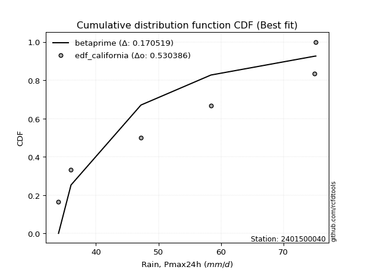</img>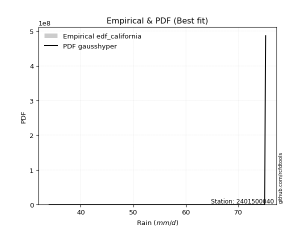</img>

</div>


### 2. EDF Hazen (1930)

Hazen method for plotting positions is a formula used to estimate the empirical cumulative probability distribution of flood events or other hydrological data. This formula often results in biased estimations, particularly when extrapolating to extreme events (high return periods).

<div align="center">


$P=(m-0.5)/n$


</div>


**2.1. Empirical values**

<div align="center">

|                | 0                   | 1                   | 2                   | 3         | 4                  | 5                  | 6                  |
|:---------------|:--------------------|:--------------------|:--------------------|:----------|:-------------------|:-------------------|:-------------------|
| date           | 2022                | 2023                | 2025                | 2021      | 2020               | 2019               | 2024               |
| x              | 34.0                | 36.0                | 44.8                | 47.2      | 58.4               | 75.0               | 75.2               |
| m              | 1                   | 2                   | 3                   | 4         | 5                  | 6                  | 7                  |
| empirical_dist | edf_hazen           | edf_hazen           | edf_hazen           | edf_hazen | edf_hazen          | edf_hazen          | edf_hazen          |
| empirical      | 0.07142857142857142 | 0.21428571428571427 | 0.35714285714285715 | 0.5       | 0.6428571428571429 | 0.7857142857142857 | 0.9285714285714286 |
| empirical_tr   | 1.0769230769230769  | 1.2727272727272727  | 1.5555555555555558  | 2.0       | 2.8000000000000003 | 4.666666666666666  | 14.000000000000007 |

</div>


**2.2. Kolmogorov-Smirnov fit test (sorted by Δ)**


<div align="center">

|                | 0                   | 1                   | 2                   | 3                   | 4                   | 5                   | 6                   | 7                   | 8                   | 9                   | 10                  | 11                  | 12                  | 13                  | 14                  | 15                  | 16                  | 17                  | 18                  | 19                  | 20                  | 21                  | 22                  | 23                  | 24                  | 25                  | 26                  | 27                  | 28                  | 29                  | 30                  | 31                  | 32                  | 33                  | 34                  | 35                  | 36                  | 37                  | 38                  | 39                  | 40                  | 41                  | 42                  | 43                  | 44                  | 45                  | 46                  | 47                  | 48                  | 49                  | 50                  | 51                  | 52                  | 53                  | 54                  | 55                  | 56                  | 57                  | 58                  | 59                  | 60                  | 61                  | 62                  | 63                  | 64                  | 65                  | 66                  | 67                  | 68                  | 69                  | 70                  | 71                  | 72                  | 73                  | 74                  | 75                  | 76                  | 77                  | 78                  | 79                  | 80                  | 81                  | 82                  | 83                  | 84                  | 85                  | 86                  | 87                  | 88                  | 89                  | 90                  | 91                  | 92                  | 93                  | 94                  | 95                  | 96                  | 97                  | 98                  | 99                  | 100                 | 101                 | 102                 | 103                 | 104                 | 105                 | 106                 | 107                 | 108                 | 109                 | 110                 | 111                 | 112                 | 113                 | 114                 | 115                 | 116                 | 117                 | 118                 | 119                 | 120                 | 121                 | 122                 | 123                 | 124                 | 125                 | 126                 | 127                 | 128                 | 129                 | 130                 | 131                 | 132                 | 133                 | 134                 | 135                 | 136                 | 137                 | 138                 | 139                 | 140                 | 141                 | 142                 | 143                 | 144                 | 145                 | 146                 | 147                 | 148                 | 149                 | 150                 | 151                 | 152                 | 153                 | 154                 | 155                 | 156                 | 157                 | 158                 | 159                 |
|:---------------|:--------------------|:--------------------|:--------------------|:--------------------|:--------------------|:--------------------|:--------------------|:--------------------|:--------------------|:--------------------|:--------------------|:--------------------|:--------------------|:--------------------|:--------------------|:--------------------|:--------------------|:--------------------|:--------------------|:--------------------|:--------------------|:--------------------|:--------------------|:--------------------|:--------------------|:--------------------|:--------------------|:--------------------|:--------------------|:--------------------|:--------------------|:--------------------|:--------------------|:--------------------|:--------------------|:--------------------|:--------------------|:--------------------|:--------------------|:--------------------|:--------------------|:--------------------|:--------------------|:--------------------|:--------------------|:--------------------|:--------------------|:--------------------|:--------------------|:--------------------|:--------------------|:--------------------|:--------------------|:--------------------|:--------------------|:--------------------|:--------------------|:--------------------|:--------------------|:--------------------|:--------------------|:--------------------|:--------------------|:--------------------|:--------------------|:--------------------|:--------------------|:--------------------|:--------------------|:--------------------|:--------------------|:--------------------|:--------------------|:--------------------|:--------------------|:--------------------|:--------------------|:--------------------|:--------------------|:--------------------|:--------------------|:--------------------|:--------------------|:--------------------|:--------------------|:--------------------|:--------------------|:--------------------|:--------------------|:--------------------|:--------------------|:--------------------|:--------------------|:--------------------|:--------------------|:--------------------|:--------------------|:--------------------|:--------------------|:--------------------|:--------------------|:--------------------|:--------------------|:--------------------|:--------------------|:--------------------|:--------------------|:--------------------|:--------------------|:--------------------|:--------------------|:--------------------|:--------------------|:--------------------|:--------------------|:--------------------|:--------------------|:--------------------|:--------------------|:--------------------|:--------------------|:--------------------|:--------------------|:--------------------|:--------------------|:--------------------|:--------------------|:--------------------|:--------------------|:--------------------|:--------------------|:--------------------|:--------------------|:--------------------|:--------------------|:--------------------|:--------------------|:--------------------|:--------------------|:--------------------|:--------------------|:--------------------|:--------------------|:--------------------|:--------------------|:--------------------|:--------------------|:--------------------|:--------------------|:--------------------|:--------------------|:--------------------|:--------------------|:--------------------|:--------------------|:--------------------|:--------------------|:--------------------|:--------------------|:--------------------|
| station        | 2401500040          | 2401500040          | 2401500040          | 2401500040          | 2401500040          | 2401500040          | 2401500040          | 2401500040          | 2401500040          | 2401500040          | 2401500040          | 2401500040          | 2401500040          | 2401500040          | 2401500040          | 2401500040          | 2401500040          | 2401500040          | 2401500040          | 2401500040          | 2401500040          | 2401500040          | 2401500040          | 2401500040          | 2401500040          | 2401500040          | 2401500040          | 2401500040          | 2401500040          | 2401500040          | 2401500040          | 2401500040          | 2401500040          | 2401500040          | 2401500040          | 2401500040          | 2401500040          | 2401500040          | 2401500040          | 2401500040          | 2401500040          | 2401500040          | 2401500040          | 2401500040          | 2401500040          | 2401500040          | 2401500040          | 2401500040          | 2401500040          | 2401500040          | 2401500040          | 2401500040          | 2401500040          | 2401500040          | 2401500040          | 2401500040          | 2401500040          | 2401500040          | 2401500040          | 2401500040          | 2401500040          | 2401500040          | 2401500040          | 2401500040          | 2401500040          | 2401500040          | 2401500040          | 2401500040          | 2401500040          | 2401500040          | 2401500040          | 2401500040          | 2401500040          | 2401500040          | 2401500040          | 2401500040          | 2401500040          | 2401500040          | 2401500040          | 2401500040          | 2401500040          | 2401500040          | 2401500040          | 2401500040          | 2401500040          | 2401500040          | 2401500040          | 2401500040          | 2401500040          | 2401500040          | 2401500040          | 2401500040          | 2401500040          | 2401500040          | 2401500040          | 2401500040          | 2401500040          | 2401500040          | 2401500040          | 2401500040          | 2401500040          | 2401500040          | 2401500040          | 2401500040          | 2401500040          | 2401500040          | 2401500040          | 2401500040          | 2401500040          | 2401500040          | 2401500040          | 2401500040          | 2401500040          | 2401500040          | 2401500040          | 2401500040          | 2401500040          | 2401500040          | 2401500040          | 2401500040          | 2401500040          | 2401500040          | 2401500040          | 2401500040          | 2401500040          | 2401500040          | 2401500040          | 2401500040          | 2401500040          | 2401500040          | 2401500040          | 2401500040          | 2401500040          | 2401500040          | 2401500040          | 2401500040          | 2401500040          | 2401500040          | 2401500040          | 2401500040          | 2401500040          | 2401500040          | 2401500040          | 2401500040          | 2401500040          | 2401500040          | 2401500040          | 2401500040          | 2401500040          | 2401500040          | 2401500040          | 2401500040          | 2401500040          | 2401500040          | 2401500040          | 2401500040          | 2401500040          | 2401500040          | 2401500040          | 2401500040          |
| empirical_dist | edf_hazen           | edf_hazen           | edf_hazen           | edf_hazen           | edf_hazen           | edf_hazen           | edf_hazen           | edf_hazen           | edf_hazen           | edf_hazen           | edf_hazen           | edf_hazen           | edf_hazen           | edf_hazen           | edf_hazen           | edf_hazen           | edf_hazen           | edf_hazen           | edf_hazen           | edf_hazen           | edf_hazen           | edf_hazen           | edf_hazen           | edf_hazen           | edf_hazen           | edf_hazen           | edf_hazen           | edf_hazen           | edf_hazen           | edf_hazen           | edf_hazen           | edf_hazen           | edf_hazen           | edf_hazen           | edf_hazen           | edf_hazen           | edf_hazen           | edf_hazen           | edf_hazen           | edf_hazen           | edf_hazen           | edf_hazen           | edf_hazen           | edf_hazen           | edf_hazen           | edf_hazen           | edf_hazen           | edf_hazen           | edf_hazen           | edf_hazen           | edf_hazen           | edf_hazen           | edf_hazen           | edf_hazen           | edf_hazen           | edf_hazen           | edf_hazen           | edf_hazen           | edf_hazen           | edf_hazen           | edf_hazen           | edf_hazen           | edf_hazen           | edf_hazen           | edf_hazen           | edf_hazen           | edf_hazen           | edf_hazen           | edf_hazen           | edf_hazen           | edf_hazen           | edf_hazen           | edf_hazen           | edf_hazen           | edf_hazen           | edf_hazen           | edf_hazen           | edf_hazen           | edf_hazen           | edf_hazen           | edf_hazen           | edf_hazen           | edf_hazen           | edf_hazen           | edf_hazen           | edf_hazen           | edf_hazen           | edf_hazen           | edf_hazen           | edf_hazen           | edf_hazen           | edf_hazen           | edf_hazen           | edf_hazen           | edf_hazen           | edf_hazen           | edf_hazen           | edf_hazen           | edf_hazen           | edf_hazen           | edf_hazen           | edf_hazen           | edf_hazen           | edf_hazen           | edf_hazen           | edf_hazen           | edf_hazen           | edf_hazen           | edf_hazen           | edf_hazen           | edf_hazen           | edf_hazen           | edf_hazen           | edf_hazen           | edf_hazen           | edf_hazen           | edf_hazen           | edf_hazen           | edf_hazen           | edf_hazen           | edf_hazen           | edf_hazen           | edf_hazen           | edf_hazen           | edf_hazen           | edf_hazen           | edf_hazen           | edf_hazen           | edf_hazen           | edf_hazen           | edf_hazen           | edf_hazen           | edf_hazen           | edf_hazen           | edf_hazen           | edf_hazen           | edf_hazen           | edf_hazen           | edf_hazen           | edf_hazen           | edf_hazen           | edf_hazen           | edf_hazen           | edf_hazen           | edf_hazen           | edf_hazen           | edf_hazen           | edf_hazen           | edf_hazen           | edf_hazen           | edf_hazen           | edf_hazen           | edf_hazen           | edf_hazen           | edf_hazen           | edf_hazen           | edf_hazen           | edf_hazen           | edf_hazen           | edf_hazen           |
| p_dist         | logbeta             | logrdist            | logfatiguelife      | logksone            | logarcsine          | logburr             | invgauss            | loginvgauss         | logmielke           | loginvweibull       | loggenlogistic      | burr                | logsemicircular     | invgamma            | logfoldnorm         | loganglit           | loghalfgennorm      | lograyleigh         | logkstwobign        | logmaxwell          | logf                | genextreme          | nct                 | halfnorm            | exponnorm           | logncf              | alpha               | logalpha            | genexpon            | logrice             | logbetaprime        | logdgamma           | logdweibull         | loginvgamma         | betaprime           | lognct              | f                   | ksone               | loggenexpon         | ncf                 | logerlang           | logpearson3         | loggamma            | loggamma            | rayleigh            | semicircular        | logskewnorm         | logjohnsonsu        | logloggamma         | logexponnorm        | logcrystalball      | lognorm             | logt                | maxwell             | genlogistic         | anglit              | foldnorm            | gumbel_r            | loggumbel_r         | pearson3            | loghalfnorm         | kstwobign           | rice                | loglogistic         | dweibull            | moyal               | logcosine           | logburr12           | nakagami            | loghypsecant        | loggompertz         | dgamma              | logloglaplace       | burr12              | loglaplace          | loglaplace          | gompertz            | truncnorm           | crystalball         | norm                | t                   | loglomax            | johnsonsu           | halflogistic        | skewnorm            | logmoyal            | arcsine             | logistic            | cosine              | logargus            | loggumbel_l         | logtrapezoid        | gausshyper          | hypsecant           | rdist               | genpareto           | beta                | logkappa3           | loghalflogistic     | halfgennorm         | loggengamma         | wrapcauchy          | laplace             | gumbel_l            | tukeylambda         | logwrapcauchy       | exponpow            | trapezoid           | logtukeylambda      | argus               | kappa4              | kappa3              | logtriang           | uniform             | logkappa4           | bradford            | loguniform          | truncexpon          | truncpareto         | logvonmises_line    | logbradford         | logtruncweibull_min | logtruncexpon       | truncweibull_min    | logtruncnorm        | wald                | logwald             | loggausshyper       | triang              | loggenextreme       | logweibull_max      | vonmises_line       | loggenhalflogistic  | lomax               | logweibull_min      | weibull_min         | loggennorm          | gennorm             | logexponpow         | gamma               | logexponweib        | loglevy_l           | genhalflogistic     | erlang              | levy_l              | lognakagami         | logjohnsonsb        | johnsonsb           | gengamma            | fatiguelife         | powerlaw            | logpowerlaw         | exponweib           | invweibull          | weibull_max         | loggenpareto        | logtruncpareto      | logvonmises         | vonmises            | mielke              |
| delta          | 0.0714285678336495  | 0.0722117515174614  | 0.09311719512880015 | 0.09364480607478631 | 0.0938194060781049  | 0.09703850830830651 | 0.0972276330911972  | 0.09793053645292504 | 0.09871454558231807 | 0.09873478001402392 | 0.09897141005345922 | 0.09914166217568643 | 0.10015462762859528 | 0.1025674074192402  | 0.10383142942306023 | 0.10546184364594491 | 0.10631766774441916 | 0.10729733602490499 | 0.1076277400506982  | 0.10994043158579303 | 0.11001692606525326 | 0.11014203638234943 | 0.1104143170338574  | 0.11269116819363079 | 0.11271827856522595 | 0.11290482396989143 | 0.11292581704122662 | 0.11311734377606031 | 0.11320601665514007 | 0.1132816537590633  | 0.11336151898742142 | 0.1134632423728719  | 0.11363182731355731 | 0.11546210579630312 | 0.1155570160491467  | 0.11555939491081146 | 0.11565804342571206 | 0.11620553928268096 | 0.11640469835642701 | 0.11666744149884645 | 0.11679689645640368 | 0.11782075438432138 | 0.11821581518981494 | 0.11821581518981494 | 0.11839987965027932 | 0.11846851938436909 | 0.11932007300114866 | 0.11935731148926532 | 0.11947346662768366 | 0.1198699033238032  | 0.11988563655925366 | 0.11988590459582082 | 0.1198863682306196  | 0.12133592024653506 | 0.12152615000047962 | 0.12265036308623584 | 0.12271415450245027 | 0.12443471844914578 | 0.12565314549153908 | 0.12592870985183002 | 0.1262510493234133  | 0.12673716182525774 | 0.12739793737589944 | 0.12985257874288525 | 0.1313248475741261  | 0.13206353126281922 | 0.1322656014353114  | 0.13234800987792394 | 0.1336487073992794  | 0.1339192666474901  | 0.13501856033594956 | 0.13575901550319458 | 0.13787811165337183 | 0.1392614196772743  | 0.14107227521797666 | 0.14107227521797666 | 0.14123120103664163 | 0.14151103206360638 | 0.14151103379967805 | 0.1415110370098065  | 0.14157525793918202 | 0.1437928630034359  | 0.14449993982239867 | 0.1466869011668793  | 0.14972750016400557 | 0.15416732241654163 | 0.1581660887281563  | 0.1586993565070317  | 0.15939072026990553 | 0.16078832939380006 | 0.1659217128283772  | 0.16766624093167826 | 0.17141806321207437 | 0.1721818345085811  | 0.17361531448543222 | 0.17705944139081706 | 0.18170156401568827 | 0.18689119637949136 | 0.18798357882848676 | 0.190473272392023   | 0.19786458830629444 | 0.1987118656427691  | 0.20054781952305667 | 0.20278883861451125 | 0.2032472379185738  | 0.2036940968510862  | 0.20388980691969044 | 0.20397807310334493 | 0.20437849215052395 | 0.20474549863521407 | 0.20727297407045575 | 0.20778070892770384 | 0.20933889484278434 | 0.20943134535367536 | 0.21000634429675014 | 0.21084170070585284 | 0.2109307777788808  | 0.21140502469707145 | 0.21176222226268004 | 0.2118043647996909  | 0.21198958483721786 | 0.21207316758462857 | 0.21241833076751693 | 0.21250898351031478 | 0.21308768276729428 | 0.21428571428571427 | 0.21428571428571427 | 0.21753768040142785 | 0.2243453468599978  | 0.22717293532393446 | 0.23065808617112543 | 0.23440515530911338 | 0.24441797996171538 | 0.2528069086838123  | 0.2537363189938298  | 0.2812075997417549  | 0.2857142857142857  | 0.2857142857142857  | 0.2864645347045636  | 0.28718414798865105 | 0.2971881344141068  | 0.29721479089819625 | 0.302735294968033   | 0.3076572186677156  | 0.310501911542698   | 0.32291392378392975 | 0.3354551324916636  | 0.396973255036303   | 0.412495111022861   | 0.42723980116406307 | 0.4442353957746004  | 0.47428595861243067 | 0.47683585571669357 | 0.49665819239955583 | 0.5232092407402915  | 0.5369055491878335  | 0.5788067181049888  | 1.120078541138259   | 11.456089560026955  | nan                 |
| deltao         | 0.48442053926100004 | 0.48442053926100004 | 0.48442053926100004 | 0.48442053926100004 | 0.48442053926100004 | 0.48442053926100004 | 0.48442053926100004 | 0.48442053926100004 | 0.48442053926100004 | 0.48442053926100004 | 0.48442053926100004 | 0.48442053926100004 | 0.48442053926100004 | 0.48442053926100004 | 0.48442053926100004 | 0.48442053926100004 | 0.48442053926100004 | 0.48442053926100004 | 0.48442053926100004 | 0.48442053926100004 | 0.48442053926100004 | 0.48442053926100004 | 0.48442053926100004 | 0.48442053926100004 | 0.48442053926100004 | 0.48442053926100004 | 0.48442053926100004 | 0.48442053926100004 | 0.48442053926100004 | 0.48442053926100004 | 0.48442053926100004 | 0.48442053926100004 | 0.48442053926100004 | 0.48442053926100004 | 0.48442053926100004 | 0.48442053926100004 | 0.48442053926100004 | 0.48442053926100004 | 0.48442053926100004 | 0.48442053926100004 | 0.48442053926100004 | 0.48442053926100004 | 0.48442053926100004 | 0.48442053926100004 | 0.48442053926100004 | 0.48442053926100004 | 0.48442053926100004 | 0.48442053926100004 | 0.48442053926100004 | 0.48442053926100004 | 0.48442053926100004 | 0.48442053926100004 | 0.48442053926100004 | 0.48442053926100004 | 0.48442053926100004 | 0.48442053926100004 | 0.48442053926100004 | 0.48442053926100004 | 0.48442053926100004 | 0.48442053926100004 | 0.48442053926100004 | 0.48442053926100004 | 0.48442053926100004 | 0.48442053926100004 | 0.48442053926100004 | 0.48442053926100004 | 0.48442053926100004 | 0.48442053926100004 | 0.48442053926100004 | 0.48442053926100004 | 0.48442053926100004 | 0.48442053926100004 | 0.48442053926100004 | 0.48442053926100004 | 0.48442053926100004 | 0.48442053926100004 | 0.48442053926100004 | 0.48442053926100004 | 0.48442053926100004 | 0.48442053926100004 | 0.48442053926100004 | 0.48442053926100004 | 0.48442053926100004 | 0.48442053926100004 | 0.48442053926100004 | 0.48442053926100004 | 0.48442053926100004 | 0.48442053926100004 | 0.48442053926100004 | 0.48442053926100004 | 0.48442053926100004 | 0.48442053926100004 | 0.48442053926100004 | 0.48442053926100004 | 0.48442053926100004 | 0.48442053926100004 | 0.48442053926100004 | 0.48442053926100004 | 0.48442053926100004 | 0.48442053926100004 | 0.48442053926100004 | 0.48442053926100004 | 0.48442053926100004 | 0.48442053926100004 | 0.48442053926100004 | 0.48442053926100004 | 0.48442053926100004 | 0.48442053926100004 | 0.48442053926100004 | 0.48442053926100004 | 0.48442053926100004 | 0.48442053926100004 | 0.48442053926100004 | 0.48442053926100004 | 0.48442053926100004 | 0.48442053926100004 | 0.48442053926100004 | 0.48442053926100004 | 0.48442053926100004 | 0.48442053926100004 | 0.48442053926100004 | 0.48442053926100004 | 0.48442053926100004 | 0.48442053926100004 | 0.48442053926100004 | 0.48442053926100004 | 0.48442053926100004 | 0.48442053926100004 | 0.48442053926100004 | 0.48442053926100004 | 0.48442053926100004 | 0.48442053926100004 | 0.48442053926100004 | 0.48442053926100004 | 0.48442053926100004 | 0.48442053926100004 | 0.48442053926100004 | 0.48442053926100004 | 0.48442053926100004 | 0.48442053926100004 | 0.48442053926100004 | 0.48442053926100004 | 0.48442053926100004 | 0.48442053926100004 | 0.48442053926100004 | 0.48442053926100004 | 0.48442053926100004 | 0.48442053926100004 | 0.48442053926100004 | 0.48442053926100004 | 0.48442053926100004 | 0.48442053926100004 | 0.48442053926100004 | 0.48442053926100004 | 0.48442053926100004 | 0.48442053926100004 | 0.48442053926100004 | 0.48442053926100004 | 0.48442053926100004 | 0.48442053926100004 |
| eval           | Δo > Δ              | Δo > Δ              | Δo > Δ              | Δo > Δ              | Δo > Δ              | Δo > Δ              | Δo > Δ              | Δo > Δ              | Δo > Δ              | Δo > Δ              | Δo > Δ              | Δo > Δ              | Δo > Δ              | Δo > Δ              | Δo > Δ              | Δo > Δ              | Δo > Δ              | Δo > Δ              | Δo > Δ              | Δo > Δ              | Δo > Δ              | Δo > Δ              | Δo > Δ              | Δo > Δ              | Δo > Δ              | Δo > Δ              | Δo > Δ              | Δo > Δ              | Δo > Δ              | Δo > Δ              | Δo > Δ              | Δo > Δ              | Δo > Δ              | Δo > Δ              | Δo > Δ              | Δo > Δ              | Δo > Δ              | Δo > Δ              | Δo > Δ              | Δo > Δ              | Δo > Δ              | Δo > Δ              | Δo > Δ              | Δo > Δ              | Δo > Δ              | Δo > Δ              | Δo > Δ              | Δo > Δ              | Δo > Δ              | Δo > Δ              | Δo > Δ              | Δo > Δ              | Δo > Δ              | Δo > Δ              | Δo > Δ              | Δo > Δ              | Δo > Δ              | Δo > Δ              | Δo > Δ              | Δo > Δ              | Δo > Δ              | Δo > Δ              | Δo > Δ              | Δo > Δ              | Δo > Δ              | Δo > Δ              | Δo > Δ              | Δo > Δ              | Δo > Δ              | Δo > Δ              | Δo > Δ              | Δo > Δ              | Δo > Δ              | Δo > Δ              | Δo > Δ              | Δo > Δ              | Δo > Δ              | Δo > Δ              | Δo > Δ              | Δo > Δ              | Δo > Δ              | Δo > Δ              | Δo > Δ              | Δo > Δ              | Δo > Δ              | Δo > Δ              | Δo > Δ              | Δo > Δ              | Δo > Δ              | Δo > Δ              | Δo > Δ              | Δo > Δ              | Δo > Δ              | Δo > Δ              | Δo > Δ              | Δo > Δ              | Δo > Δ              | Δo > Δ              | Δo > Δ              | Δo > Δ              | Δo > Δ              | Δo > Δ              | Δo > Δ              | Δo > Δ              | Δo > Δ              | Δo > Δ              | Δo > Δ              | Δo > Δ              | Δo > Δ              | Δo > Δ              | Δo > Δ              | Δo > Δ              | Δo > Δ              | Δo > Δ              | Δo > Δ              | Δo > Δ              | Δo > Δ              | Δo > Δ              | Δo > Δ              | Δo > Δ              | Δo > Δ              | Δo > Δ              | Δo > Δ              | Δo > Δ              | Δo > Δ              | Δo > Δ              | Δo > Δ              | Δo > Δ              | Δo > Δ              | Δo > Δ              | Δo > Δ              | Δo > Δ              | Δo > Δ              | Δo > Δ              | Δo > Δ              | Δo > Δ              | Δo > Δ              | Δo > Δ              | Δo > Δ              | Δo > Δ              | Δo > Δ              | Δo > Δ              | Δo > Δ              | Δo > Δ              | Δo > Δ              | Δo > Δ              | Δo > Δ              | Δo > Δ              | Δo > Δ              | Δo > Δ              | Δo > Δ              | Δo > Δ              | Δo > Δ              | Δo <= Δ             | Δo <= Δ             | Δo <= Δ             | Δo <= Δ             | Δo <= Δ             | Δo <= Δ             | Δo <= Δ             |
| fit            | 1                   | 1                   | 1                   | 1                   | 1                   | 1                   | 1                   | 1                   | 1                   | 1                   | 1                   | 1                   | 1                   | 1                   | 1                   | 1                   | 1                   | 1                   | 1                   | 1                   | 1                   | 1                   | 1                   | 1                   | 1                   | 1                   | 1                   | 1                   | 1                   | 1                   | 1                   | 1                   | 1                   | 1                   | 1                   | 1                   | 1                   | 1                   | 1                   | 1                   | 1                   | 1                   | 1                   | 1                   | 1                   | 1                   | 1                   | 1                   | 1                   | 1                   | 1                   | 1                   | 1                   | 1                   | 1                   | 1                   | 1                   | 1                   | 1                   | 1                   | 1                   | 1                   | 1                   | 1                   | 1                   | 1                   | 1                   | 1                   | 1                   | 1                   | 1                   | 1                   | 1                   | 1                   | 1                   | 1                   | 1                   | 1                   | 1                   | 1                   | 1                   | 1                   | 1                   | 1                   | 1                   | 1                   | 1                   | 1                   | 1                   | 1                   | 1                   | 1                   | 1                   | 1                   | 1                   | 1                   | 1                   | 1                   | 1                   | 1                   | 1                   | 1                   | 1                   | 1                   | 1                   | 1                   | 1                   | 1                   | 1                   | 1                   | 1                   | 1                   | 1                   | 1                   | 1                   | 1                   | 1                   | 1                   | 1                   | 1                   | 1                   | 1                   | 1                   | 1                   | 1                   | 1                   | 1                   | 1                   | 1                   | 1                   | 1                   | 1                   | 1                   | 1                   | 1                   | 1                   | 1                   | 1                   | 1                   | 1                   | 1                   | 1                   | 1                   | 1                   | 1                   | 1                   | 1                   | 1                   | 1                   | 1                   | 1                   | 1                   | 1                   | 0                   | 0                   | 0                   | 0                   | 0                   | 0                   | 0                   |
| n              | 7                   | 7                   | 7                   | 7                   | 7                   | 7                   | 7                   | 7                   | 7                   | 7                   | 7                   | 7                   | 7                   | 7                   | 7                   | 7                   | 7                   | 7                   | 7                   | 7                   | 7                   | 7                   | 7                   | 7                   | 7                   | 7                   | 7                   | 7                   | 7                   | 7                   | 7                   | 7                   | 7                   | 7                   | 7                   | 7                   | 7                   | 7                   | 7                   | 7                   | 7                   | 7                   | 7                   | 7                   | 7                   | 7                   | 7                   | 7                   | 7                   | 7                   | 7                   | 7                   | 7                   | 7                   | 7                   | 7                   | 7                   | 7                   | 7                   | 7                   | 7                   | 7                   | 7                   | 7                   | 7                   | 7                   | 7                   | 7                   | 7                   | 7                   | 7                   | 7                   | 7                   | 7                   | 7                   | 7                   | 7                   | 7                   | 7                   | 7                   | 7                   | 7                   | 7                   | 7                   | 7                   | 7                   | 7                   | 7                   | 7                   | 7                   | 7                   | 7                   | 7                   | 7                   | 7                   | 7                   | 7                   | 7                   | 7                   | 7                   | 7                   | 7                   | 7                   | 7                   | 7                   | 7                   | 7                   | 7                   | 7                   | 7                   | 7                   | 7                   | 7                   | 7                   | 7                   | 7                   | 7                   | 7                   | 7                   | 7                   | 7                   | 7                   | 7                   | 7                   | 7                   | 7                   | 7                   | 7                   | 7                   | 7                   | 7                   | 7                   | 7                   | 7                   | 7                   | 7                   | 7                   | 7                   | 7                   | 7                   | 7                   | 7                   | 7                   | 7                   | 7                   | 7                   | 7                   | 7                   | 7                   | 7                   | 7                   | 7                   | 7                   | 7                   | 7                   | 7                   | 7                   | 7                   | 7                   | 7                   |
| best_fit       | 1                   | 0                   | 0                   | 0                   | 0                   | 0                   | 0                   | 0                   | 0                   | 0                   | 0                   | 0                   | 0                   | 0                   | 0                   | 0                   | 0                   | 0                   | 0                   | 0                   | 0                   | 0                   | 0                   | 0                   | 0                   | 0                   | 0                   | 0                   | 0                   | 0                   | 0                   | 0                   | 0                   | 0                   | 0                   | 0                   | 0                   | 0                   | 0                   | 0                   | 0                   | 0                   | 0                   | 0                   | 0                   | 0                   | 0                   | 0                   | 0                   | 0                   | 0                   | 0                   | 0                   | 0                   | 0                   | 0                   | 0                   | 0                   | 0                   | 0                   | 0                   | 0                   | 0                   | 0                   | 0                   | 0                   | 0                   | 0                   | 0                   | 0                   | 0                   | 0                   | 0                   | 0                   | 0                   | 0                   | 0                   | 0                   | 0                   | 0                   | 0                   | 0                   | 0                   | 0                   | 0                   | 0                   | 0                   | 0                   | 0                   | 0                   | 0                   | 0                   | 0                   | 0                   | 0                   | 0                   | 0                   | 0                   | 0                   | 0                   | 0                   | 0                   | 0                   | 0                   | 0                   | 0                   | 0                   | 0                   | 0                   | 0                   | 0                   | 0                   | 0                   | 0                   | 0                   | 0                   | 0                   | 0                   | 0                   | 0                   | 0                   | 0                   | 0                   | 0                   | 0                   | 0                   | 0                   | 0                   | 0                   | 0                   | 0                   | 0                   | 0                   | 0                   | 0                   | 0                   | 0                   | 0                   | 0                   | 0                   | 0                   | 0                   | 0                   | 0                   | 0                   | 0                   | 0                   | 0                   | 0                   | 0                   | 0                   | 0                   | 0                   | 0                   | 0                   | 0                   | 0                   | 0                   | 0                   | 0                   |
| best_fit_sort  | 1                   | 2                   | 3                   | 4                   | 5                   | 6                   | 7                   | 8                   | 9                   | 10                  | 11                  | 12                  | 13                  | 14                  | 15                  | 16                  | 17                  | 18                  | 19                  | 20                  | 21                  | 22                  | 23                  | 24                  | 25                  | 26                  | 27                  | 28                  | 29                  | 30                  | 31                  | 32                  | 33                  | 34                  | 35                  | 36                  | 37                  | 38                  | 39                  | 40                  | 41                  | 42                  | 43                  | 44                  | 45                  | 46                  | 47                  | 48                  | 49                  | 50                  | 51                  | 52                  | 53                  | 54                  | 55                  | 56                  | 57                  | 58                  | 59                  | 60                  | 61                  | 62                  | 63                  | 64                  | 65                  | 66                  | 67                  | 68                  | 69                  | 70                  | 71                  | 72                  | 73                  | 74                  | 75                  | 76                  | 77                  | 78                  | 79                  | 80                  | 81                  | 82                  | 83                  | 84                  | 85                  | 86                  | 87                  | 88                  | 89                  | 90                  | 91                  | 92                  | 93                  | 94                  | 95                  | 96                  | 97                  | 98                  | 99                  | 100                 | 101                 | 102                 | 103                 | 104                 | 105                 | 106                 | 107                 | 108                 | 109                 | 110                 | 111                 | 112                 | 113                 | 114                 | 115                 | 116                 | 117                 | 118                 | 119                 | 120                 | 121                 | 122                 | 123                 | 124                 | 125                 | 126                 | 127                 | 128                 | 129                 | 130                 | 131                 | 132                 | 133                 | 134                 | 135                 | 136                 | 137                 | 138                 | 139                 | 140                 | 141                 | 142                 | 143                 | 144                 | 145                 | 146                 | 147                 | 148                 | 149                 | 150                 | 151                 | 152                 | 153                 | 154                 | 155                 | 156                 | 157                 | 158                 | 159                 | 160                 |

</div>


**2.3. Best fit**

<div align="center">

|   id |    station | empirical_dist   | p_dist   |     delta |   deltao | eval   |   fit |   n |   best_fit |   best_fit_sort |
|-----:|-----------:|:-----------------|:---------|----------:|---------:|:-------|------:|----:|-----------:|----------------:|
|    0 | 2401500040 | edf_hazen        | logbeta  | 0.0714286 | 0.484421 | Δo > Δ |     1 |   7 |          1 |               1 |

</div>


<div align="center">

</img>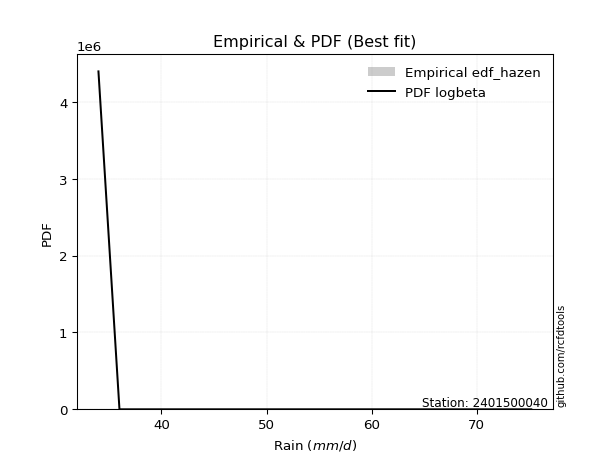</img>

</div>


### 3. EDF Weibull (1939)

Weibull plotting position formula is an empirical method used to estimate the non-exceedance probability or plotting position for a set of observed data, is often recommended or widely used in practice, particularly in flood frequency analysis.

<div align="center">


$P=m/(n+1)$


</div>


**3.1. Empirical values**

<div align="center">

|                | 0                  | 1                  | 2           | 3           | 4                  | 5           | 6           |
|:---------------|:-------------------|:-------------------|:------------|:------------|:-------------------|:------------|:------------|
| date           | 2022               | 2023               | 2025        | 2021        | 2020               | 2019        | 2024        |
| x              | 34.0               | 36.0               | 44.8        | 47.2        | 58.4               | 75.0        | 75.2        |
| m              | 1                  | 2                  | 3           | 4           | 5                  | 6           | 7           |
| empirical_dist | edf_weibull        | edf_weibull        | edf_weibull | edf_weibull | edf_weibull        | edf_weibull | edf_weibull |
| empirical      | 0.125              | 0.25               | 0.375       | 0.5         | 0.625              | 0.75        | 0.875       |
| empirical_tr   | 1.1428571428571428 | 1.3333333333333333 | 1.6         | 2.0         | 2.6666666666666665 | 4.0         | 8.0         |

</div>


**3.2. Kolmogorov-Smirnov fit test (sorted by Δ)**


<div align="center">

|                | 0                   | 1                   | 2                   | 3                   | 4                   | 5                   | 6                   | 7                   | 8                   | 9                   | 10                  | 11                  | 12                  | 13                  | 14                  | 15                  | 16                  | 17                  | 18                  | 19                  | 20                  | 21                  | 22                  | 23                  | 24                  | 25                  | 26                  | 27                  | 28                  | 29                  | 30                  | 31                  | 32                  | 33                  | 34                  | 35                  | 36                  | 37                  | 38                  | 39                  | 40                  | 41                  | 42                  | 43                  | 44                  | 45                  | 46                  | 47                  | 48                  | 49                  | 50                  | 51                  | 52                  | 53                  | 54                  | 55                  | 56                  | 57                  | 58                  | 59                  | 60                  | 61                  | 62                  | 63                  | 64                  | 65                  | 66                  | 67                  | 68                  | 69                  | 70                  | 71                  | 72                  | 73                  | 74                  | 75                  | 76                  | 77                  | 78                  | 79                  | 80                  | 81                  | 82                  | 83                  | 84                  | 85                  | 86                  | 87                  | 88                  | 89                  | 90                  | 91                  | 92                  | 93                  | 94                  | 95                  | 96                  | 97                  | 98                  | 99                  | 100                 | 101                 | 102                 | 103                 | 104                 | 105                 | 106                 | 107                 | 108                 | 109                 | 110                 | 111                 | 112                 | 113                 | 114                 | 115                 | 116                 | 117                 | 118                 | 119                 | 120                 | 121                 | 122                 | 123                 | 124                 | 125                 | 126                 | 127                 | 128                 | 129                 | 130                 | 131                 | 132                 | 133                 | 134                 | 135                 | 136                 | 137                 | 138                 | 139                 | 140                 | 141                 | 142                 | 143                 | 144                 | 145                 | 146                 | 147                 | 148                 | 149                 | 150                 | 151                 | 152                 | 153                 | 154                 | 155                 | 156                 | 157                 | 158                 | 159                 |
|:---------------|:--------------------|:--------------------|:--------------------|:--------------------|:--------------------|:--------------------|:--------------------|:--------------------|:--------------------|:--------------------|:--------------------|:--------------------|:--------------------|:--------------------|:--------------------|:--------------------|:--------------------|:--------------------|:--------------------|:--------------------|:--------------------|:--------------------|:--------------------|:--------------------|:--------------------|:--------------------|:--------------------|:--------------------|:--------------------|:--------------------|:--------------------|:--------------------|:--------------------|:--------------------|:--------------------|:--------------------|:--------------------|:--------------------|:--------------------|:--------------------|:--------------------|:--------------------|:--------------------|:--------------------|:--------------------|:--------------------|:--------------------|:--------------------|:--------------------|:--------------------|:--------------------|:--------------------|:--------------------|:--------------------|:--------------------|:--------------------|:--------------------|:--------------------|:--------------------|:--------------------|:--------------------|:--------------------|:--------------------|:--------------------|:--------------------|:--------------------|:--------------------|:--------------------|:--------------------|:--------------------|:--------------------|:--------------------|:--------------------|:--------------------|:--------------------|:--------------------|:--------------------|:--------------------|:--------------------|:--------------------|:--------------------|:--------------------|:--------------------|:--------------------|:--------------------|:--------------------|:--------------------|:--------------------|:--------------------|:--------------------|:--------------------|:--------------------|:--------------------|:--------------------|:--------------------|:--------------------|:--------------------|:--------------------|:--------------------|:--------------------|:--------------------|:--------------------|:--------------------|:--------------------|:--------------------|:--------------------|:--------------------|:--------------------|:--------------------|:--------------------|:--------------------|:--------------------|:--------------------|:--------------------|:--------------------|:--------------------|:--------------------|:--------------------|:--------------------|:--------------------|:--------------------|:--------------------|:--------------------|:--------------------|:--------------------|:--------------------|:--------------------|:--------------------|:--------------------|:--------------------|:--------------------|:--------------------|:--------------------|:--------------------|:--------------------|:--------------------|:--------------------|:--------------------|:--------------------|:--------------------|:--------------------|:--------------------|:--------------------|:--------------------|:--------------------|:--------------------|:--------------------|:--------------------|:--------------------|:--------------------|:--------------------|:--------------------|:--------------------|:--------------------|:--------------------|:--------------------|:--------------------|:--------------------|:--------------------|:--------------------|
| station        | 2401500040          | 2401500040          | 2401500040          | 2401500040          | 2401500040          | 2401500040          | 2401500040          | 2401500040          | 2401500040          | 2401500040          | 2401500040          | 2401500040          | 2401500040          | 2401500040          | 2401500040          | 2401500040          | 2401500040          | 2401500040          | 2401500040          | 2401500040          | 2401500040          | 2401500040          | 2401500040          | 2401500040          | 2401500040          | 2401500040          | 2401500040          | 2401500040          | 2401500040          | 2401500040          | 2401500040          | 2401500040          | 2401500040          | 2401500040          | 2401500040          | 2401500040          | 2401500040          | 2401500040          | 2401500040          | 2401500040          | 2401500040          | 2401500040          | 2401500040          | 2401500040          | 2401500040          | 2401500040          | 2401500040          | 2401500040          | 2401500040          | 2401500040          | 2401500040          | 2401500040          | 2401500040          | 2401500040          | 2401500040          | 2401500040          | 2401500040          | 2401500040          | 2401500040          | 2401500040          | 2401500040          | 2401500040          | 2401500040          | 2401500040          | 2401500040          | 2401500040          | 2401500040          | 2401500040          | 2401500040          | 2401500040          | 2401500040          | 2401500040          | 2401500040          | 2401500040          | 2401500040          | 2401500040          | 2401500040          | 2401500040          | 2401500040          | 2401500040          | 2401500040          | 2401500040          | 2401500040          | 2401500040          | 2401500040          | 2401500040          | 2401500040          | 2401500040          | 2401500040          | 2401500040          | 2401500040          | 2401500040          | 2401500040          | 2401500040          | 2401500040          | 2401500040          | 2401500040          | 2401500040          | 2401500040          | 2401500040          | 2401500040          | 2401500040          | 2401500040          | 2401500040          | 2401500040          | 2401500040          | 2401500040          | 2401500040          | 2401500040          | 2401500040          | 2401500040          | 2401500040          | 2401500040          | 2401500040          | 2401500040          | 2401500040          | 2401500040          | 2401500040          | 2401500040          | 2401500040          | 2401500040          | 2401500040          | 2401500040          | 2401500040          | 2401500040          | 2401500040          | 2401500040          | 2401500040          | 2401500040          | 2401500040          | 2401500040          | 2401500040          | 2401500040          | 2401500040          | 2401500040          | 2401500040          | 2401500040          | 2401500040          | 2401500040          | 2401500040          | 2401500040          | 2401500040          | 2401500040          | 2401500040          | 2401500040          | 2401500040          | 2401500040          | 2401500040          | 2401500040          | 2401500040          | 2401500040          | 2401500040          | 2401500040          | 2401500040          | 2401500040          | 2401500040          | 2401500040          | 2401500040          | 2401500040          | 2401500040          |
| empirical_dist | edf_weibull         | edf_weibull         | edf_weibull         | edf_weibull         | edf_weibull         | edf_weibull         | edf_weibull         | edf_weibull         | edf_weibull         | edf_weibull         | edf_weibull         | edf_weibull         | edf_weibull         | edf_weibull         | edf_weibull         | edf_weibull         | edf_weibull         | edf_weibull         | edf_weibull         | edf_weibull         | edf_weibull         | edf_weibull         | edf_weibull         | edf_weibull         | edf_weibull         | edf_weibull         | edf_weibull         | edf_weibull         | edf_weibull         | edf_weibull         | edf_weibull         | edf_weibull         | edf_weibull         | edf_weibull         | edf_weibull         | edf_weibull         | edf_weibull         | edf_weibull         | edf_weibull         | edf_weibull         | edf_weibull         | edf_weibull         | edf_weibull         | edf_weibull         | edf_weibull         | edf_weibull         | edf_weibull         | edf_weibull         | edf_weibull         | edf_weibull         | edf_weibull         | edf_weibull         | edf_weibull         | edf_weibull         | edf_weibull         | edf_weibull         | edf_weibull         | edf_weibull         | edf_weibull         | edf_weibull         | edf_weibull         | edf_weibull         | edf_weibull         | edf_weibull         | edf_weibull         | edf_weibull         | edf_weibull         | edf_weibull         | edf_weibull         | edf_weibull         | edf_weibull         | edf_weibull         | edf_weibull         | edf_weibull         | edf_weibull         | edf_weibull         | edf_weibull         | edf_weibull         | edf_weibull         | edf_weibull         | edf_weibull         | edf_weibull         | edf_weibull         | edf_weibull         | edf_weibull         | edf_weibull         | edf_weibull         | edf_weibull         | edf_weibull         | edf_weibull         | edf_weibull         | edf_weibull         | edf_weibull         | edf_weibull         | edf_weibull         | edf_weibull         | edf_weibull         | edf_weibull         | edf_weibull         | edf_weibull         | edf_weibull         | edf_weibull         | edf_weibull         | edf_weibull         | edf_weibull         | edf_weibull         | edf_weibull         | edf_weibull         | edf_weibull         | edf_weibull         | edf_weibull         | edf_weibull         | edf_weibull         | edf_weibull         | edf_weibull         | edf_weibull         | edf_weibull         | edf_weibull         | edf_weibull         | edf_weibull         | edf_weibull         | edf_weibull         | edf_weibull         | edf_weibull         | edf_weibull         | edf_weibull         | edf_weibull         | edf_weibull         | edf_weibull         | edf_weibull         | edf_weibull         | edf_weibull         | edf_weibull         | edf_weibull         | edf_weibull         | edf_weibull         | edf_weibull         | edf_weibull         | edf_weibull         | edf_weibull         | edf_weibull         | edf_weibull         | edf_weibull         | edf_weibull         | edf_weibull         | edf_weibull         | edf_weibull         | edf_weibull         | edf_weibull         | edf_weibull         | edf_weibull         | edf_weibull         | edf_weibull         | edf_weibull         | edf_weibull         | edf_weibull         | edf_weibull         | edf_weibull         | edf_weibull         | edf_weibull         |
| p_dist         | burr12              | logbeta             | logrdist            | loglomax            | logfatiguelife      | logksone            | logarcsine          | logburr             | invgauss            | loginvgauss         | logmielke           | loginvweibull       | loggenlogistic      | burr                | logsemicircular     | invgamma            | logfoldnorm         | loganglit           | loghalfgennorm      | lograyleigh         | logkstwobign        | logmaxwell          | logf                | genextreme          | nct                 | halfnorm            | exponnorm           | logncf              | alpha               | logalpha            | genexpon            | logrice             | logbetaprime        | logdgamma           | logdweibull         | loginvgamma         | betaprime           | lognct              | f                   | ksone               | loggenexpon         | ncf                 | logerlang           | logpearson3         | loggamma            | loggamma            | rayleigh            | semicircular        | logskewnorm         | logjohnsonsu        | logloggamma         | logexponnorm        | logcrystalball      | lognorm             | logt                | maxwell             | genlogistic         | anglit              | foldnorm            | gumbel_r            | loggumbel_r         | pearson3            | loghalfnorm         | logloglaplace       | kstwobign           | rice                | loglogistic         | dweibull            | moyal               | logcosine           | logburr12           | norm                | crystalball         | truncnorm           | t                   | nakagami            | loghypsecant        | loggompertz         | dgamma              | gausshyper          | loglaplace          | loglaplace          | halfgennorm         | johnsonsu           | logistic            | cosine              | gompertz            | hypsecant           | loggengamma         | halflogistic        | skewnorm            | exponpow            | genpareto           | logmoyal            | arcsine             | logargus            | lomax               | laplace             | loggumbel_l         | logtrapezoid        | argus               | rdist               | gumbel_l            | beta                | loggausshyper       | logweibull_max      | logkappa3           | loghalflogistic     | loggenextreme       | weibull_min         | triang              | wrapcauchy          | logweibull_min      | tukeylambda         | logwrapcauchy       | trapezoid           | logtukeylambda      | kappa4              | kappa3              | loggenhalflogistic  | logtriang           | uniform             | logkappa4           | bradford            | loguniform          | vonmises_line       | truncexpon          | truncpareto         | logvonmises_line    | logbradford         | logtruncweibull_min | logtruncexpon       | truncweibull_min    | logtruncnorm        | wald                | loggennorm          | logwald             | gennorm             | logexponpow         | gamma               | logexponweib        | loglevy_l           | erlang              | levy_l              | logjohnsonsb        | genhalflogistic     | lognakagami         | johnsonsb           | gengamma            | fatiguelife         | powerlaw            | invweibull          | logpowerlaw         | exponweib           | loggenpareto        | weibull_max         | logtruncpareto      | logvonmises         | vonmises            | mielke              |
| delta          | 0.12140427682013144 | 0.12499999640507807 | 0.12499999753533424 | 0.12593572014629306 | 0.12883148084308588 | 0.129359091789072   | 0.1295336917923906  | 0.1327527940225922  | 0.1329419188054829  | 0.13364482216721074 | 0.13442883129660377 | 0.1344490657283096  | 0.13468569576774492 | 0.13485594788997213 | 0.13586891334288098 | 0.1382816931335259  | 0.13954571513734593 | 0.1411761293602306  | 0.1420319534587049  | 0.1430116217391907  | 0.1433420257649839  | 0.14565471730007873 | 0.14573121177953896 | 0.14585632209663513 | 0.1461286027481431  | 0.14840545390791648 | 0.14843256427951168 | 0.14861910968417713 | 0.14864010275551232 | 0.148831629490346   | 0.1489203023694258  | 0.148995939473349   | 0.14907580470170712 | 0.14917752808715762 | 0.14934611302784304 | 0.15117639151058881 | 0.1512713017634324  | 0.15127368062509716 | 0.15137232913999776 | 0.15191982499696666 | 0.15211898407071273 | 0.15238172721313215 | 0.15251118217068937 | 0.15353504009860708 | 0.15393010090410064 | 0.15393010090410064 | 0.15411416536456501 | 0.15418280509865478 | 0.15503435871543436 | 0.15507159720355101 | 0.15518775234196935 | 0.1555841890380889  | 0.15559992227353936 | 0.15560019031010652 | 0.1556006539449053  | 0.15705020596082075 | 0.15724043571476531 | 0.1572491836793738  | 0.15842844021673597 | 0.16014900416343147 | 0.1613674312058248  | 0.16164299556611572 | 0.16196533503769903 | 0.16237665874718443 | 0.16245144753954344 | 0.16311222309018514 | 0.16556686445717095 | 0.1670391332884118  | 0.16777781697710495 | 0.1679798871495971  | 0.16806229559220964 | 0.16808286951062135 | 0.16808287296782376 | 0.16808287636548636 | 0.16812257349338022 | 0.16936299311356512 | 0.1696335523617758  | 0.1707328460502353  | 0.17147330121748028 | 0.17155080853172822 | 0.17204469184671145 | 0.17204469184671145 | 0.17261612953488015 | 0.1726635905474666  | 0.1758990417937678  | 0.17644921467928376 | 0.17694548675092736 | 0.17883583678866377 | 0.1800074454491516  | 0.18240118688116502 | 0.1854417858782913  | 0.1860326640625476  | 0.18983583276720561 | 0.18988160813082736 | 0.193880374442442   | 0.19650261510808575 | 0.19923548011238368 | 0.20054781952305667 | 0.2016359985426629  | 0.20338052664596395 | 0.20474549863521407 | 0.2093296001997179  | 0.21485763608104613 | 0.21741584972997396 | 0.21753768040142785 | 0.21837360503600262 | 0.22260548209377706 | 0.2236978645427725  | 0.22717293532393446 | 0.2276361711703263  | 0.23434823284512374 | 0.2344261513570548  | 0.23587917613668696 | 0.2389615236328595  | 0.2394083825653719  | 0.23969235881763062 | 0.24009277786480965 | 0.24298725978474145 | 0.24349499464198954 | 0.24441797996171538 | 0.24505318055707004 | 0.24514563106796106 | 0.24572063001103583 | 0.24655598642013854 | 0.2466450634931665  | 0.24676979810726718 | 0.24711931041135715 | 0.24747650797696574 | 0.2475186505139766  | 0.24770387055150356 | 0.24778745329891427 | 0.24813261648180263 | 0.24822326922460047 | 0.24880196848157998 | 0.25                | 0.25                | 0.25                | 0.25                | 0.2686073918474208  | 0.2693270051315082  | 0.27933099155696395 | 0.27935764804105334 | 0.28980007581057277 | 0.2926447686855551  | 0.2997408467773779  | 0.302735294968033   | 0.3050567809267869  | 0.3774296986472989  | 0.39463796816571817 | 0.4093826583069202  | 0.42637825291745757 | 0.44308676382812723 | 0.4564288157552878  | 0.4589787128595507  | 0.4833341206164049  | 0.5053520978831486  | 0.5525734874964205  | 1.1557928268525446  | 11.491803845741241  | nan                 |
| deltao         | 0.48442053926100004 | 0.48442053926100004 | 0.48442053926100004 | 0.48442053926100004 | 0.48442053926100004 | 0.48442053926100004 | 0.48442053926100004 | 0.48442053926100004 | 0.48442053926100004 | 0.48442053926100004 | 0.48442053926100004 | 0.48442053926100004 | 0.48442053926100004 | 0.48442053926100004 | 0.48442053926100004 | 0.48442053926100004 | 0.48442053926100004 | 0.48442053926100004 | 0.48442053926100004 | 0.48442053926100004 | 0.48442053926100004 | 0.48442053926100004 | 0.48442053926100004 | 0.48442053926100004 | 0.48442053926100004 | 0.48442053926100004 | 0.48442053926100004 | 0.48442053926100004 | 0.48442053926100004 | 0.48442053926100004 | 0.48442053926100004 | 0.48442053926100004 | 0.48442053926100004 | 0.48442053926100004 | 0.48442053926100004 | 0.48442053926100004 | 0.48442053926100004 | 0.48442053926100004 | 0.48442053926100004 | 0.48442053926100004 | 0.48442053926100004 | 0.48442053926100004 | 0.48442053926100004 | 0.48442053926100004 | 0.48442053926100004 | 0.48442053926100004 | 0.48442053926100004 | 0.48442053926100004 | 0.48442053926100004 | 0.48442053926100004 | 0.48442053926100004 | 0.48442053926100004 | 0.48442053926100004 | 0.48442053926100004 | 0.48442053926100004 | 0.48442053926100004 | 0.48442053926100004 | 0.48442053926100004 | 0.48442053926100004 | 0.48442053926100004 | 0.48442053926100004 | 0.48442053926100004 | 0.48442053926100004 | 0.48442053926100004 | 0.48442053926100004 | 0.48442053926100004 | 0.48442053926100004 | 0.48442053926100004 | 0.48442053926100004 | 0.48442053926100004 | 0.48442053926100004 | 0.48442053926100004 | 0.48442053926100004 | 0.48442053926100004 | 0.48442053926100004 | 0.48442053926100004 | 0.48442053926100004 | 0.48442053926100004 | 0.48442053926100004 | 0.48442053926100004 | 0.48442053926100004 | 0.48442053926100004 | 0.48442053926100004 | 0.48442053926100004 | 0.48442053926100004 | 0.48442053926100004 | 0.48442053926100004 | 0.48442053926100004 | 0.48442053926100004 | 0.48442053926100004 | 0.48442053926100004 | 0.48442053926100004 | 0.48442053926100004 | 0.48442053926100004 | 0.48442053926100004 | 0.48442053926100004 | 0.48442053926100004 | 0.48442053926100004 | 0.48442053926100004 | 0.48442053926100004 | 0.48442053926100004 | 0.48442053926100004 | 0.48442053926100004 | 0.48442053926100004 | 0.48442053926100004 | 0.48442053926100004 | 0.48442053926100004 | 0.48442053926100004 | 0.48442053926100004 | 0.48442053926100004 | 0.48442053926100004 | 0.48442053926100004 | 0.48442053926100004 | 0.48442053926100004 | 0.48442053926100004 | 0.48442053926100004 | 0.48442053926100004 | 0.48442053926100004 | 0.48442053926100004 | 0.48442053926100004 | 0.48442053926100004 | 0.48442053926100004 | 0.48442053926100004 | 0.48442053926100004 | 0.48442053926100004 | 0.48442053926100004 | 0.48442053926100004 | 0.48442053926100004 | 0.48442053926100004 | 0.48442053926100004 | 0.48442053926100004 | 0.48442053926100004 | 0.48442053926100004 | 0.48442053926100004 | 0.48442053926100004 | 0.48442053926100004 | 0.48442053926100004 | 0.48442053926100004 | 0.48442053926100004 | 0.48442053926100004 | 0.48442053926100004 | 0.48442053926100004 | 0.48442053926100004 | 0.48442053926100004 | 0.48442053926100004 | 0.48442053926100004 | 0.48442053926100004 | 0.48442053926100004 | 0.48442053926100004 | 0.48442053926100004 | 0.48442053926100004 | 0.48442053926100004 | 0.48442053926100004 | 0.48442053926100004 | 0.48442053926100004 | 0.48442053926100004 | 0.48442053926100004 | 0.48442053926100004 | 0.48442053926100004 | 0.48442053926100004 |
| eval           | Δo > Δ              | Δo > Δ              | Δo > Δ              | Δo > Δ              | Δo > Δ              | Δo > Δ              | Δo > Δ              | Δo > Δ              | Δo > Δ              | Δo > Δ              | Δo > Δ              | Δo > Δ              | Δo > Δ              | Δo > Δ              | Δo > Δ              | Δo > Δ              | Δo > Δ              | Δo > Δ              | Δo > Δ              | Δo > Δ              | Δo > Δ              | Δo > Δ              | Δo > Δ              | Δo > Δ              | Δo > Δ              | Δo > Δ              | Δo > Δ              | Δo > Δ              | Δo > Δ              | Δo > Δ              | Δo > Δ              | Δo > Δ              | Δo > Δ              | Δo > Δ              | Δo > Δ              | Δo > Δ              | Δo > Δ              | Δo > Δ              | Δo > Δ              | Δo > Δ              | Δo > Δ              | Δo > Δ              | Δo > Δ              | Δo > Δ              | Δo > Δ              | Δo > Δ              | Δo > Δ              | Δo > Δ              | Δo > Δ              | Δo > Δ              | Δo > Δ              | Δo > Δ              | Δo > Δ              | Δo > Δ              | Δo > Δ              | Δo > Δ              | Δo > Δ              | Δo > Δ              | Δo > Δ              | Δo > Δ              | Δo > Δ              | Δo > Δ              | Δo > Δ              | Δo > Δ              | Δo > Δ              | Δo > Δ              | Δo > Δ              | Δo > Δ              | Δo > Δ              | Δo > Δ              | Δo > Δ              | Δo > Δ              | Δo > Δ              | Δo > Δ              | Δo > Δ              | Δo > Δ              | Δo > Δ              | Δo > Δ              | Δo > Δ              | Δo > Δ              | Δo > Δ              | Δo > Δ              | Δo > Δ              | Δo > Δ              | Δo > Δ              | Δo > Δ              | Δo > Δ              | Δo > Δ              | Δo > Δ              | Δo > Δ              | Δo > Δ              | Δo > Δ              | Δo > Δ              | Δo > Δ              | Δo > Δ              | Δo > Δ              | Δo > Δ              | Δo > Δ              | Δo > Δ              | Δo > Δ              | Δo > Δ              | Δo > Δ              | Δo > Δ              | Δo > Δ              | Δo > Δ              | Δo > Δ              | Δo > Δ              | Δo > Δ              | Δo > Δ              | Δo > Δ              | Δo > Δ              | Δo > Δ              | Δo > Δ              | Δo > Δ              | Δo > Δ              | Δo > Δ              | Δo > Δ              | Δo > Δ              | Δo > Δ              | Δo > Δ              | Δo > Δ              | Δo > Δ              | Δo > Δ              | Δo > Δ              | Δo > Δ              | Δo > Δ              | Δo > Δ              | Δo > Δ              | Δo > Δ              | Δo > Δ              | Δo > Δ              | Δo > Δ              | Δo > Δ              | Δo > Δ              | Δo > Δ              | Δo > Δ              | Δo > Δ              | Δo > Δ              | Δo > Δ              | Δo > Δ              | Δo > Δ              | Δo > Δ              | Δo > Δ              | Δo > Δ              | Δo > Δ              | Δo > Δ              | Δo > Δ              | Δo > Δ              | Δo > Δ              | Δo > Δ              | Δo > Δ              | Δo > Δ              | Δo > Δ              | Δo > Δ              | Δo > Δ              | Δo <= Δ             | Δo <= Δ             | Δo <= Δ             | Δo <= Δ             | Δo <= Δ             |
| fit            | 1                   | 1                   | 1                   | 1                   | 1                   | 1                   | 1                   | 1                   | 1                   | 1                   | 1                   | 1                   | 1                   | 1                   | 1                   | 1                   | 1                   | 1                   | 1                   | 1                   | 1                   | 1                   | 1                   | 1                   | 1                   | 1                   | 1                   | 1                   | 1                   | 1                   | 1                   | 1                   | 1                   | 1                   | 1                   | 1                   | 1                   | 1                   | 1                   | 1                   | 1                   | 1                   | 1                   | 1                   | 1                   | 1                   | 1                   | 1                   | 1                   | 1                   | 1                   | 1                   | 1                   | 1                   | 1                   | 1                   | 1                   | 1                   | 1                   | 1                   | 1                   | 1                   | 1                   | 1                   | 1                   | 1                   | 1                   | 1                   | 1                   | 1                   | 1                   | 1                   | 1                   | 1                   | 1                   | 1                   | 1                   | 1                   | 1                   | 1                   | 1                   | 1                   | 1                   | 1                   | 1                   | 1                   | 1                   | 1                   | 1                   | 1                   | 1                   | 1                   | 1                   | 1                   | 1                   | 1                   | 1                   | 1                   | 1                   | 1                   | 1                   | 1                   | 1                   | 1                   | 1                   | 1                   | 1                   | 1                   | 1                   | 1                   | 1                   | 1                   | 1                   | 1                   | 1                   | 1                   | 1                   | 1                   | 1                   | 1                   | 1                   | 1                   | 1                   | 1                   | 1                   | 1                   | 1                   | 1                   | 1                   | 1                   | 1                   | 1                   | 1                   | 1                   | 1                   | 1                   | 1                   | 1                   | 1                   | 1                   | 1                   | 1                   | 1                   | 1                   | 1                   | 1                   | 1                   | 1                   | 1                   | 1                   | 1                   | 1                   | 1                   | 1                   | 1                   | 0                   | 0                   | 0                   | 0                   | 0                   |
| n              | 7                   | 7                   | 7                   | 7                   | 7                   | 7                   | 7                   | 7                   | 7                   | 7                   | 7                   | 7                   | 7                   | 7                   | 7                   | 7                   | 7                   | 7                   | 7                   | 7                   | 7                   | 7                   | 7                   | 7                   | 7                   | 7                   | 7                   | 7                   | 7                   | 7                   | 7                   | 7                   | 7                   | 7                   | 7                   | 7                   | 7                   | 7                   | 7                   | 7                   | 7                   | 7                   | 7                   | 7                   | 7                   | 7                   | 7                   | 7                   | 7                   | 7                   | 7                   | 7                   | 7                   | 7                   | 7                   | 7                   | 7                   | 7                   | 7                   | 7                   | 7                   | 7                   | 7                   | 7                   | 7                   | 7                   | 7                   | 7                   | 7                   | 7                   | 7                   | 7                   | 7                   | 7                   | 7                   | 7                   | 7                   | 7                   | 7                   | 7                   | 7                   | 7                   | 7                   | 7                   | 7                   | 7                   | 7                   | 7                   | 7                   | 7                   | 7                   | 7                   | 7                   | 7                   | 7                   | 7                   | 7                   | 7                   | 7                   | 7                   | 7                   | 7                   | 7                   | 7                   | 7                   | 7                   | 7                   | 7                   | 7                   | 7                   | 7                   | 7                   | 7                   | 7                   | 7                   | 7                   | 7                   | 7                   | 7                   | 7                   | 7                   | 7                   | 7                   | 7                   | 7                   | 7                   | 7                   | 7                   | 7                   | 7                   | 7                   | 7                   | 7                   | 7                   | 7                   | 7                   | 7                   | 7                   | 7                   | 7                   | 7                   | 7                   | 7                   | 7                   | 7                   | 7                   | 7                   | 7                   | 7                   | 7                   | 7                   | 7                   | 7                   | 7                   | 7                   | 7                   | 7                   | 7                   | 7                   | 7                   |
| best_fit       | 1                   | 0                   | 0                   | 0                   | 0                   | 0                   | 0                   | 0                   | 0                   | 0                   | 0                   | 0                   | 0                   | 0                   | 0                   | 0                   | 0                   | 0                   | 0                   | 0                   | 0                   | 0                   | 0                   | 0                   | 0                   | 0                   | 0                   | 0                   | 0                   | 0                   | 0                   | 0                   | 0                   | 0                   | 0                   | 0                   | 0                   | 0                   | 0                   | 0                   | 0                   | 0                   | 0                   | 0                   | 0                   | 0                   | 0                   | 0                   | 0                   | 0                   | 0                   | 0                   | 0                   | 0                   | 0                   | 0                   | 0                   | 0                   | 0                   | 0                   | 0                   | 0                   | 0                   | 0                   | 0                   | 0                   | 0                   | 0                   | 0                   | 0                   | 0                   | 0                   | 0                   | 0                   | 0                   | 0                   | 0                   | 0                   | 0                   | 0                   | 0                   | 0                   | 0                   | 0                   | 0                   | 0                   | 0                   | 0                   | 0                   | 0                   | 0                   | 0                   | 0                   | 0                   | 0                   | 0                   | 0                   | 0                   | 0                   | 0                   | 0                   | 0                   | 0                   | 0                   | 0                   | 0                   | 0                   | 0                   | 0                   | 0                   | 0                   | 0                   | 0                   | 0                   | 0                   | 0                   | 0                   | 0                   | 0                   | 0                   | 0                   | 0                   | 0                   | 0                   | 0                   | 0                   | 0                   | 0                   | 0                   | 0                   | 0                   | 0                   | 0                   | 0                   | 0                   | 0                   | 0                   | 0                   | 0                   | 0                   | 0                   | 0                   | 0                   | 0                   | 0                   | 0                   | 0                   | 0                   | 0                   | 0                   | 0                   | 0                   | 0                   | 0                   | 0                   | 0                   | 0                   | 0                   | 0                   | 0                   |
| best_fit_sort  | 1                   | 2                   | 3                   | 4                   | 5                   | 6                   | 7                   | 8                   | 9                   | 10                  | 11                  | 12                  | 13                  | 14                  | 15                  | 16                  | 17                  | 18                  | 19                  | 20                  | 21                  | 22                  | 23                  | 24                  | 25                  | 26                  | 27                  | 28                  | 29                  | 30                  | 31                  | 32                  | 33                  | 34                  | 35                  | 36                  | 37                  | 38                  | 39                  | 40                  | 41                  | 42                  | 43                  | 44                  | 45                  | 46                  | 47                  | 48                  | 49                  | 50                  | 51                  | 52                  | 53                  | 54                  | 55                  | 56                  | 57                  | 58                  | 59                  | 60                  | 61                  | 62                  | 63                  | 64                  | 65                  | 66                  | 67                  | 68                  | 69                  | 70                  | 71                  | 72                  | 73                  | 74                  | 75                  | 76                  | 77                  | 78                  | 79                  | 80                  | 81                  | 82                  | 83                  | 84                  | 85                  | 86                  | 87                  | 88                  | 89                  | 90                  | 91                  | 92                  | 93                  | 94                  | 95                  | 96                  | 97                  | 98                  | 99                  | 100                 | 101                 | 102                 | 103                 | 104                 | 105                 | 106                 | 107                 | 108                 | 109                 | 110                 | 111                 | 112                 | 113                 | 114                 | 115                 | 116                 | 117                 | 118                 | 119                 | 120                 | 121                 | 122                 | 123                 | 124                 | 125                 | 126                 | 127                 | 128                 | 129                 | 130                 | 131                 | 132                 | 133                 | 134                 | 135                 | 136                 | 137                 | 138                 | 139                 | 140                 | 141                 | 142                 | 143                 | 144                 | 145                 | 146                 | 147                 | 148                 | 149                 | 150                 | 151                 | 152                 | 153                 | 154                 | 155                 | 156                 | 157                 | 158                 | 159                 | 160                 |

</div>


**3.3. Best fit**

<div align="center">

|   id |    station | empirical_dist   | p_dist   |    delta |   deltao | eval   |   fit |   n |   best_fit |   best_fit_sort |
|-----:|-----------:|:-----------------|:---------|---------:|---------:|:-------|------:|----:|-----------:|----------------:|
|    0 | 2401500040 | edf_weibull      | burr12   | 0.121404 | 0.484421 | Δo > Δ |     1 |   7 |          1 |               1 |

</div>


<div align="center">

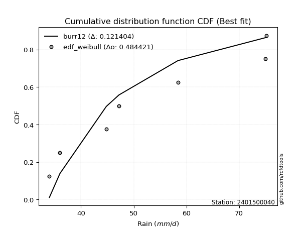</img>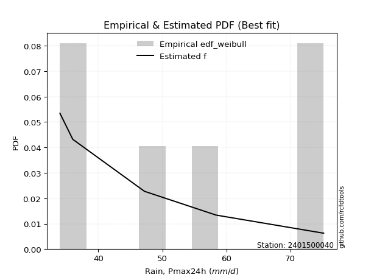</img>

</div>


### 4. EDF Beard (1943)

The Beard formula (or Beard´s plotting position formula) in hydrology is used to estimate the empirical non-exceedance probability _(P)_ of a flood event (or other extreme hydrological data point) within a given dataset.

<div align="center">


$P=(m-0.31)/(n+0.38)$


</div>


**4.1. Empirical values**

<div align="center">

|                | 0                   | 1                   | 2                   | 3         | 4                  | 5                  | 6                  |
|:---------------|:--------------------|:--------------------|:--------------------|:----------|:-------------------|:-------------------|:-------------------|
| date           | 2022                | 2023                | 2025                | 2021      | 2020               | 2019               | 2024               |
| x              | 34.0                | 36.0                | 44.8                | 47.2      | 58.4               | 75.0               | 75.2               |
| m              | 1                   | 2                   | 3                   | 4         | 5                  | 6                  | 7                  |
| empirical_dist | edf_beard           | edf_beard           | edf_beard           | edf_beard | edf_beard          | edf_beard          | edf_beard          |
| empirical      | 0.09349593495934959 | 0.22899728997289973 | 0.36449864498644985 | 0.5       | 0.6355013550135502 | 0.7710027100271003 | 0.9065040650406505 |
| empirical_tr   | 1.1031390134529149  | 1.29701230228471    | 1.5735607675906182  | 2.0       | 2.743494423791822  | 4.366863905325444  | 10.695652173913055 |

</div>


**4.2. Kolmogorov-Smirnov fit test (sorted by Δ)**


<div align="center">

|                | 0                   | 1                   | 2                   | 3                   | 4                   | 5                   | 6                   | 7                   | 8                   | 9                   | 10                  | 11                  | 12                  | 13                  | 14                  | 15                  | 16                  | 17                  | 18                  | 19                  | 20                  | 21                  | 22                  | 23                  | 24                  | 25                  | 26                  | 27                  | 28                  | 29                  | 30                  | 31                  | 32                  | 33                  | 34                  | 35                  | 36                  | 37                  | 38                  | 39                  | 40                  | 41                  | 42                  | 43                  | 44                  | 45                  | 46                  | 47                  | 48                  | 49                  | 50                  | 51                  | 52                  | 53                  | 54                  | 55                  | 56                  | 57                  | 58                  | 59                  | 60                  | 61                  | 62                  | 63                  | 64                  | 65                  | 66                  | 67                  | 68                  | 69                  | 70                  | 71                  | 72                  | 73                  | 74                  | 75                  | 76                  | 77                  | 78                  | 79                  | 80                  | 81                  | 82                  | 83                  | 84                  | 85                  | 86                  | 87                  | 88                  | 89                  | 90                  | 91                  | 92                  | 93                  | 94                  | 95                  | 96                  | 97                  | 98                  | 99                  | 100                 | 101                 | 102                 | 103                 | 104                 | 105                 | 106                 | 107                 | 108                 | 109                 | 110                 | 111                 | 112                 | 113                 | 114                 | 115                 | 116                 | 117                 | 118                 | 119                 | 120                 | 121                 | 122                 | 123                 | 124                 | 125                 | 126                 | 127                 | 128                 | 129                 | 130                 | 131                 | 132                 | 133                 | 134                 | 135                 | 136                 | 137                 | 138                 | 139                 | 140                 | 141                 | 142                 | 143                 | 144                 | 145                 | 146                 | 147                 | 148                 | 149                 | 150                 | 151                 | 152                 | 153                 | 154                 | 155                 | 156                 | 157                 | 158                 | 159                 |
|:---------------|:--------------------|:--------------------|:--------------------|:--------------------|:--------------------|:--------------------|:--------------------|:--------------------|:--------------------|:--------------------|:--------------------|:--------------------|:--------------------|:--------------------|:--------------------|:--------------------|:--------------------|:--------------------|:--------------------|:--------------------|:--------------------|:--------------------|:--------------------|:--------------------|:--------------------|:--------------------|:--------------------|:--------------------|:--------------------|:--------------------|:--------------------|:--------------------|:--------------------|:--------------------|:--------------------|:--------------------|:--------------------|:--------------------|:--------------------|:--------------------|:--------------------|:--------------------|:--------------------|:--------------------|:--------------------|:--------------------|:--------------------|:--------------------|:--------------------|:--------------------|:--------------------|:--------------------|:--------------------|:--------------------|:--------------------|:--------------------|:--------------------|:--------------------|:--------------------|:--------------------|:--------------------|:--------------------|:--------------------|:--------------------|:--------------------|:--------------------|:--------------------|:--------------------|:--------------------|:--------------------|:--------------------|:--------------------|:--------------------|:--------------------|:--------------------|:--------------------|:--------------------|:--------------------|:--------------------|:--------------------|:--------------------|:--------------------|:--------------------|:--------------------|:--------------------|:--------------------|:--------------------|:--------------------|:--------------------|:--------------------|:--------------------|:--------------------|:--------------------|:--------------------|:--------------------|:--------------------|:--------------------|:--------------------|:--------------------|:--------------------|:--------------------|:--------------------|:--------------------|:--------------------|:--------------------|:--------------------|:--------------------|:--------------------|:--------------------|:--------------------|:--------------------|:--------------------|:--------------------|:--------------------|:--------------------|:--------------------|:--------------------|:--------------------|:--------------------|:--------------------|:--------------------|:--------------------|:--------------------|:--------------------|:--------------------|:--------------------|:--------------------|:--------------------|:--------------------|:--------------------|:--------------------|:--------------------|:--------------------|:--------------------|:--------------------|:--------------------|:--------------------|:--------------------|:--------------------|:--------------------|:--------------------|:--------------------|:--------------------|:--------------------|:--------------------|:--------------------|:--------------------|:--------------------|:--------------------|:--------------------|:--------------------|:--------------------|:--------------------|:--------------------|:--------------------|:--------------------|:--------------------|:--------------------|:--------------------|:--------------------|
| station        | 2401500040          | 2401500040          | 2401500040          | 2401500040          | 2401500040          | 2401500040          | 2401500040          | 2401500040          | 2401500040          | 2401500040          | 2401500040          | 2401500040          | 2401500040          | 2401500040          | 2401500040          | 2401500040          | 2401500040          | 2401500040          | 2401500040          | 2401500040          | 2401500040          | 2401500040          | 2401500040          | 2401500040          | 2401500040          | 2401500040          | 2401500040          | 2401500040          | 2401500040          | 2401500040          | 2401500040          | 2401500040          | 2401500040          | 2401500040          | 2401500040          | 2401500040          | 2401500040          | 2401500040          | 2401500040          | 2401500040          | 2401500040          | 2401500040          | 2401500040          | 2401500040          | 2401500040          | 2401500040          | 2401500040          | 2401500040          | 2401500040          | 2401500040          | 2401500040          | 2401500040          | 2401500040          | 2401500040          | 2401500040          | 2401500040          | 2401500040          | 2401500040          | 2401500040          | 2401500040          | 2401500040          | 2401500040          | 2401500040          | 2401500040          | 2401500040          | 2401500040          | 2401500040          | 2401500040          | 2401500040          | 2401500040          | 2401500040          | 2401500040          | 2401500040          | 2401500040          | 2401500040          | 2401500040          | 2401500040          | 2401500040          | 2401500040          | 2401500040          | 2401500040          | 2401500040          | 2401500040          | 2401500040          | 2401500040          | 2401500040          | 2401500040          | 2401500040          | 2401500040          | 2401500040          | 2401500040          | 2401500040          | 2401500040          | 2401500040          | 2401500040          | 2401500040          | 2401500040          | 2401500040          | 2401500040          | 2401500040          | 2401500040          | 2401500040          | 2401500040          | 2401500040          | 2401500040          | 2401500040          | 2401500040          | 2401500040          | 2401500040          | 2401500040          | 2401500040          | 2401500040          | 2401500040          | 2401500040          | 2401500040          | 2401500040          | 2401500040          | 2401500040          | 2401500040          | 2401500040          | 2401500040          | 2401500040          | 2401500040          | 2401500040          | 2401500040          | 2401500040          | 2401500040          | 2401500040          | 2401500040          | 2401500040          | 2401500040          | 2401500040          | 2401500040          | 2401500040          | 2401500040          | 2401500040          | 2401500040          | 2401500040          | 2401500040          | 2401500040          | 2401500040          | 2401500040          | 2401500040          | 2401500040          | 2401500040          | 2401500040          | 2401500040          | 2401500040          | 2401500040          | 2401500040          | 2401500040          | 2401500040          | 2401500040          | 2401500040          | 2401500040          | 2401500040          | 2401500040          | 2401500040          | 2401500040          | 2401500040          |
| empirical_dist | edf_beard           | edf_beard           | edf_beard           | edf_beard           | edf_beard           | edf_beard           | edf_beard           | edf_beard           | edf_beard           | edf_beard           | edf_beard           | edf_beard           | edf_beard           | edf_beard           | edf_beard           | edf_beard           | edf_beard           | edf_beard           | edf_beard           | edf_beard           | edf_beard           | edf_beard           | edf_beard           | edf_beard           | edf_beard           | edf_beard           | edf_beard           | edf_beard           | edf_beard           | edf_beard           | edf_beard           | edf_beard           | edf_beard           | edf_beard           | edf_beard           | edf_beard           | edf_beard           | edf_beard           | edf_beard           | edf_beard           | edf_beard           | edf_beard           | edf_beard           | edf_beard           | edf_beard           | edf_beard           | edf_beard           | edf_beard           | edf_beard           | edf_beard           | edf_beard           | edf_beard           | edf_beard           | edf_beard           | edf_beard           | edf_beard           | edf_beard           | edf_beard           | edf_beard           | edf_beard           | edf_beard           | edf_beard           | edf_beard           | edf_beard           | edf_beard           | edf_beard           | edf_beard           | edf_beard           | edf_beard           | edf_beard           | edf_beard           | edf_beard           | edf_beard           | edf_beard           | edf_beard           | edf_beard           | edf_beard           | edf_beard           | edf_beard           | edf_beard           | edf_beard           | edf_beard           | edf_beard           | edf_beard           | edf_beard           | edf_beard           | edf_beard           | edf_beard           | edf_beard           | edf_beard           | edf_beard           | edf_beard           | edf_beard           | edf_beard           | edf_beard           | edf_beard           | edf_beard           | edf_beard           | edf_beard           | edf_beard           | edf_beard           | edf_beard           | edf_beard           | edf_beard           | edf_beard           | edf_beard           | edf_beard           | edf_beard           | edf_beard           | edf_beard           | edf_beard           | edf_beard           | edf_beard           | edf_beard           | edf_beard           | edf_beard           | edf_beard           | edf_beard           | edf_beard           | edf_beard           | edf_beard           | edf_beard           | edf_beard           | edf_beard           | edf_beard           | edf_beard           | edf_beard           | edf_beard           | edf_beard           | edf_beard           | edf_beard           | edf_beard           | edf_beard           | edf_beard           | edf_beard           | edf_beard           | edf_beard           | edf_beard           | edf_beard           | edf_beard           | edf_beard           | edf_beard           | edf_beard           | edf_beard           | edf_beard           | edf_beard           | edf_beard           | edf_beard           | edf_beard           | edf_beard           | edf_beard           | edf_beard           | edf_beard           | edf_beard           | edf_beard           | edf_beard           | edf_beard           | edf_beard           | edf_beard           | edf_beard           |
| p_dist         | logbeta             | logrdist            | logfatiguelife      | logksone            | logarcsine          | logburr             | invgauss            | loginvgauss         | logmielke           | loginvweibull       | loggenlogistic      | burr                | logsemicircular     | invgamma            | logfoldnorm         | loganglit           | loghalfgennorm      | lograyleigh         | logkstwobign        | logmaxwell          | logf                | genextreme          | nct                 | halfnorm            | exponnorm           | logncf              | alpha               | logalpha            | genexpon            | logrice             | logbetaprime        | logdgamma           | logdweibull         | loginvgamma         | betaprime           | lognct              | f                   | ksone               | loggenexpon         | ncf                 | logerlang           | burr12              | logpearson3         | loggamma            | loggamma            | rayleigh            | semicircular        | logskewnorm         | logjohnsonsu        | logloggamma         | logexponnorm        | logcrystalball      | lognorm             | logt                | maxwell             | genlogistic         | anglit              | loglomax            | foldnorm            | gumbel_r            | loggumbel_r         | pearson3            | loghalfnorm         | kstwobign           | rice                | loglogistic         | logloglaplace       | dweibull            | moyal               | logcosine           | logburr12           | norm                | crystalball         | truncnorm           | t                   | nakagami            | loghypsecant        | loggompertz         | dgamma              | loglaplace          | loglaplace          | johnsonsu           | gompertz            | logistic            | cosine              | halflogistic        | gausshyper          | skewnorm            | genpareto           | logmoyal            | hypsecant           | arcsine             | logargus            | loggumbel_l         | logtrapezoid        | halfgennorm         | rdist               | loggengamma         | beta                | exponpow            | laplace             | logkappa3           | loghalflogistic     | gumbel_l            | argus               | wrapcauchy          | loggausshyper       | tukeylambda         | logwrapcauchy       | trapezoid           | logtukeylambda      | kappa4              | kappa3              | logweibull_max      | logtriang           | uniform             | triang              | logkappa4           | bradford            | loguniform          | truncexpon          | truncpareto         | logvonmises_line    | logbradford         | logtruncweibull_min | logtruncexpon       | loggenextreme       | truncweibull_min    | logtruncnorm        | logwald             | wald                | lomax               | vonmises_line       | loggenhalflogistic  | logweibull_min      | weibull_min         | loggennorm          | gennorm             | logexponpow         | gamma               | logexponweib        | loglevy_l           | erlang              | genhalflogistic     | levy_l              | lognakagami         | logjohnsonsb        | johnsonsb           | gengamma            | fatiguelife         | powerlaw            | logpowerlaw         | exponweib           | invweibull          | loggenpareto        | weibull_max         | logtruncpareto      | logvonmises         | vonmises            | mielke              |
| delta          | 0.09349593136442766 | 0.09349593249468383 | 0.1078287708159856  | 0.10835638176197171 | 0.1085309817652903  | 0.11175008399549191 | 0.11193920877838259 | 0.11264211214011044 | 0.11342612126950347 | 0.11344635570120931 | 0.11368298574064462 | 0.11385323786287183 | 0.11486620331578068 | 0.1172789831064256  | 0.11854300511024563 | 0.1201734193331303  | 0.12102924343160461 | 0.12200891171209038 | 0.12233931573788359 | 0.12465200727297843 | 0.12472850175243866 | 0.12485361206953483 | 0.1251258927210428  | 0.12740274388081618 | 0.1274298542524114  | 0.12761639965707683 | 0.127637392728412   | 0.1278289194632457  | 0.12791759234232553 | 0.1279932294462487  | 0.1280730946746068  | 0.12817481806005737 | 0.12834340300074276 | 0.1301736814834885  | 0.1302685917363321  | 0.13027097059799686 | 0.13036961911289746 | 0.13091711496986635 | 0.13111627404361248 | 0.13137901718603184 | 0.13150847214358907 | 0.1319056318336816  | 0.13253233007150678 | 0.13292739087700034 | 0.13292739087700034 | 0.1331114553374647  | 0.13318009507155448 | 0.13403164868833406 | 0.1340688871764507  | 0.13418504231486905 | 0.1345814790109886  | 0.13459721224643906 | 0.13459748028300622 | 0.134597943917805   | 0.13604749593372045 | 0.136237725687665   | 0.1362464736522735  | 0.1364370751598432  | 0.13742573018963566 | 0.13914629413633117 | 0.14036472117872453 | 0.14064028553901542 | 0.14096262501059875 | 0.14144873751244313 | 0.14210951306308484 | 0.14456415443007065 | 0.14523389949696452 | 0.1460364232613115  | 0.14677510695000467 | 0.1469771771224968  | 0.14705958556510934 | 0.14708015948352104 | 0.14708016294072346 | 0.14708016633838605 | 0.14711986346627992 | 0.14836028308646484 | 0.1486308423346755  | 0.149730136023135   | 0.15047059119037998 | 0.15104198181961115 | 0.15104198181961115 | 0.1516608805203663  | 0.1559427767238271  | 0.1586993565070317  | 0.15939072026990553 | 0.16139847685406475 | 0.16406227536848167 | 0.16443907585119102 | 0.1688331227401053  | 0.16887889810372708 | 0.1721818345085811  | 0.1728776644153417  | 0.17549990508098545 | 0.1806332885155626  | 0.18237781661886365 | 0.1831174845484303  | 0.1883268901726176  | 0.19050880046270174 | 0.19641313970287366 | 0.19653401907609774 | 0.20054781952305667 | 0.20160277206667676 | 0.20269515451567222 | 0.20278883861451125 | 0.20474549863521407 | 0.2134234413299545  | 0.21753768040142785 | 0.2179588136057592  | 0.2184056725382716  | 0.21868964879053032 | 0.21909006783770935 | 0.22198454975764115 | 0.22249228461488924 | 0.22330229832753273 | 0.22405047052996974 | 0.22414292104086075 | 0.2243453468599978  | 0.22471791998393553 | 0.22555327639303824 | 0.2256423534660662  | 0.22611660038425685 | 0.22647379794986544 | 0.2265159404868763  | 0.22670116052440326 | 0.22678474327181397 | 0.22712990645470232 | 0.22717293532393446 | 0.22722055919750017 | 0.22779925845447968 | 0.22899728997289973 | 0.22899728997289973 | 0.2307395451530342  | 0.23440515530911338 | 0.24441797996171538 | 0.24638053115023711 | 0.2591402362109768  | 0.2710027100271003  | 0.2710027100271003  | 0.2791087468609709  | 0.27982836014505835 | 0.2898323465705141  | 0.28985900305460355 | 0.3003014308241229  | 0.302735294968033   | 0.3031461236991053  | 0.31555813594033705 | 0.3207435568044782  | 0.38793105366084907 | 0.4051393231792683  | 0.4198840133204704  | 0.4368796079310077  | 0.46693017076883797 | 0.46948006787310087 | 0.47459082886877774 | 0.5148381856570553  | 0.5158534528966988  | 0.5640951424178035  | 1.1347901168254442  | 11.470801135714142  | nan                 |
| deltao         | 0.48442053926100004 | 0.48442053926100004 | 0.48442053926100004 | 0.48442053926100004 | 0.48442053926100004 | 0.48442053926100004 | 0.48442053926100004 | 0.48442053926100004 | 0.48442053926100004 | 0.48442053926100004 | 0.48442053926100004 | 0.48442053926100004 | 0.48442053926100004 | 0.48442053926100004 | 0.48442053926100004 | 0.48442053926100004 | 0.48442053926100004 | 0.48442053926100004 | 0.48442053926100004 | 0.48442053926100004 | 0.48442053926100004 | 0.48442053926100004 | 0.48442053926100004 | 0.48442053926100004 | 0.48442053926100004 | 0.48442053926100004 | 0.48442053926100004 | 0.48442053926100004 | 0.48442053926100004 | 0.48442053926100004 | 0.48442053926100004 | 0.48442053926100004 | 0.48442053926100004 | 0.48442053926100004 | 0.48442053926100004 | 0.48442053926100004 | 0.48442053926100004 | 0.48442053926100004 | 0.48442053926100004 | 0.48442053926100004 | 0.48442053926100004 | 0.48442053926100004 | 0.48442053926100004 | 0.48442053926100004 | 0.48442053926100004 | 0.48442053926100004 | 0.48442053926100004 | 0.48442053926100004 | 0.48442053926100004 | 0.48442053926100004 | 0.48442053926100004 | 0.48442053926100004 | 0.48442053926100004 | 0.48442053926100004 | 0.48442053926100004 | 0.48442053926100004 | 0.48442053926100004 | 0.48442053926100004 | 0.48442053926100004 | 0.48442053926100004 | 0.48442053926100004 | 0.48442053926100004 | 0.48442053926100004 | 0.48442053926100004 | 0.48442053926100004 | 0.48442053926100004 | 0.48442053926100004 | 0.48442053926100004 | 0.48442053926100004 | 0.48442053926100004 | 0.48442053926100004 | 0.48442053926100004 | 0.48442053926100004 | 0.48442053926100004 | 0.48442053926100004 | 0.48442053926100004 | 0.48442053926100004 | 0.48442053926100004 | 0.48442053926100004 | 0.48442053926100004 | 0.48442053926100004 | 0.48442053926100004 | 0.48442053926100004 | 0.48442053926100004 | 0.48442053926100004 | 0.48442053926100004 | 0.48442053926100004 | 0.48442053926100004 | 0.48442053926100004 | 0.48442053926100004 | 0.48442053926100004 | 0.48442053926100004 | 0.48442053926100004 | 0.48442053926100004 | 0.48442053926100004 | 0.48442053926100004 | 0.48442053926100004 | 0.48442053926100004 | 0.48442053926100004 | 0.48442053926100004 | 0.48442053926100004 | 0.48442053926100004 | 0.48442053926100004 | 0.48442053926100004 | 0.48442053926100004 | 0.48442053926100004 | 0.48442053926100004 | 0.48442053926100004 | 0.48442053926100004 | 0.48442053926100004 | 0.48442053926100004 | 0.48442053926100004 | 0.48442053926100004 | 0.48442053926100004 | 0.48442053926100004 | 0.48442053926100004 | 0.48442053926100004 | 0.48442053926100004 | 0.48442053926100004 | 0.48442053926100004 | 0.48442053926100004 | 0.48442053926100004 | 0.48442053926100004 | 0.48442053926100004 | 0.48442053926100004 | 0.48442053926100004 | 0.48442053926100004 | 0.48442053926100004 | 0.48442053926100004 | 0.48442053926100004 | 0.48442053926100004 | 0.48442053926100004 | 0.48442053926100004 | 0.48442053926100004 | 0.48442053926100004 | 0.48442053926100004 | 0.48442053926100004 | 0.48442053926100004 | 0.48442053926100004 | 0.48442053926100004 | 0.48442053926100004 | 0.48442053926100004 | 0.48442053926100004 | 0.48442053926100004 | 0.48442053926100004 | 0.48442053926100004 | 0.48442053926100004 | 0.48442053926100004 | 0.48442053926100004 | 0.48442053926100004 | 0.48442053926100004 | 0.48442053926100004 | 0.48442053926100004 | 0.48442053926100004 | 0.48442053926100004 | 0.48442053926100004 | 0.48442053926100004 | 0.48442053926100004 | 0.48442053926100004 | 0.48442053926100004 |
| eval           | Δo > Δ              | Δo > Δ              | Δo > Δ              | Δo > Δ              | Δo > Δ              | Δo > Δ              | Δo > Δ              | Δo > Δ              | Δo > Δ              | Δo > Δ              | Δo > Δ              | Δo > Δ              | Δo > Δ              | Δo > Δ              | Δo > Δ              | Δo > Δ              | Δo > Δ              | Δo > Δ              | Δo > Δ              | Δo > Δ              | Δo > Δ              | Δo > Δ              | Δo > Δ              | Δo > Δ              | Δo > Δ              | Δo > Δ              | Δo > Δ              | Δo > Δ              | Δo > Δ              | Δo > Δ              | Δo > Δ              | Δo > Δ              | Δo > Δ              | Δo > Δ              | Δo > Δ              | Δo > Δ              | Δo > Δ              | Δo > Δ              | Δo > Δ              | Δo > Δ              | Δo > Δ              | Δo > Δ              | Δo > Δ              | Δo > Δ              | Δo > Δ              | Δo > Δ              | Δo > Δ              | Δo > Δ              | Δo > Δ              | Δo > Δ              | Δo > Δ              | Δo > Δ              | Δo > Δ              | Δo > Δ              | Δo > Δ              | Δo > Δ              | Δo > Δ              | Δo > Δ              | Δo > Δ              | Δo > Δ              | Δo > Δ              | Δo > Δ              | Δo > Δ              | Δo > Δ              | Δo > Δ              | Δo > Δ              | Δo > Δ              | Δo > Δ              | Δo > Δ              | Δo > Δ              | Δo > Δ              | Δo > Δ              | Δo > Δ              | Δo > Δ              | Δo > Δ              | Δo > Δ              | Δo > Δ              | Δo > Δ              | Δo > Δ              | Δo > Δ              | Δo > Δ              | Δo > Δ              | Δo > Δ              | Δo > Δ              | Δo > Δ              | Δo > Δ              | Δo > Δ              | Δo > Δ              | Δo > Δ              | Δo > Δ              | Δo > Δ              | Δo > Δ              | Δo > Δ              | Δo > Δ              | Δo > Δ              | Δo > Δ              | Δo > Δ              | Δo > Δ              | Δo > Δ              | Δo > Δ              | Δo > Δ              | Δo > Δ              | Δo > Δ              | Δo > Δ              | Δo > Δ              | Δo > Δ              | Δo > Δ              | Δo > Δ              | Δo > Δ              | Δo > Δ              | Δo > Δ              | Δo > Δ              | Δo > Δ              | Δo > Δ              | Δo > Δ              | Δo > Δ              | Δo > Δ              | Δo > Δ              | Δo > Δ              | Δo > Δ              | Δo > Δ              | Δo > Δ              | Δo > Δ              | Δo > Δ              | Δo > Δ              | Δo > Δ              | Δo > Δ              | Δo > Δ              | Δo > Δ              | Δo > Δ              | Δo > Δ              | Δo > Δ              | Δo > Δ              | Δo > Δ              | Δo > Δ              | Δo > Δ              | Δo > Δ              | Δo > Δ              | Δo > Δ              | Δo > Δ              | Δo > Δ              | Δo > Δ              | Δo > Δ              | Δo > Δ              | Δo > Δ              | Δo > Δ              | Δo > Δ              | Δo > Δ              | Δo > Δ              | Δo > Δ              | Δo > Δ              | Δo > Δ              | Δo > Δ              | Δo > Δ              | Δo <= Δ             | Δo <= Δ             | Δo <= Δ             | Δo <= Δ             | Δo <= Δ             | Δo <= Δ             |
| fit            | 1                   | 1                   | 1                   | 1                   | 1                   | 1                   | 1                   | 1                   | 1                   | 1                   | 1                   | 1                   | 1                   | 1                   | 1                   | 1                   | 1                   | 1                   | 1                   | 1                   | 1                   | 1                   | 1                   | 1                   | 1                   | 1                   | 1                   | 1                   | 1                   | 1                   | 1                   | 1                   | 1                   | 1                   | 1                   | 1                   | 1                   | 1                   | 1                   | 1                   | 1                   | 1                   | 1                   | 1                   | 1                   | 1                   | 1                   | 1                   | 1                   | 1                   | 1                   | 1                   | 1                   | 1                   | 1                   | 1                   | 1                   | 1                   | 1                   | 1                   | 1                   | 1                   | 1                   | 1                   | 1                   | 1                   | 1                   | 1                   | 1                   | 1                   | 1                   | 1                   | 1                   | 1                   | 1                   | 1                   | 1                   | 1                   | 1                   | 1                   | 1                   | 1                   | 1                   | 1                   | 1                   | 1                   | 1                   | 1                   | 1                   | 1                   | 1                   | 1                   | 1                   | 1                   | 1                   | 1                   | 1                   | 1                   | 1                   | 1                   | 1                   | 1                   | 1                   | 1                   | 1                   | 1                   | 1                   | 1                   | 1                   | 1                   | 1                   | 1                   | 1                   | 1                   | 1                   | 1                   | 1                   | 1                   | 1                   | 1                   | 1                   | 1                   | 1                   | 1                   | 1                   | 1                   | 1                   | 1                   | 1                   | 1                   | 1                   | 1                   | 1                   | 1                   | 1                   | 1                   | 1                   | 1                   | 1                   | 1                   | 1                   | 1                   | 1                   | 1                   | 1                   | 1                   | 1                   | 1                   | 1                   | 1                   | 1                   | 1                   | 1                   | 1                   | 0                   | 0                   | 0                   | 0                   | 0                   | 0                   |
| n              | 7                   | 7                   | 7                   | 7                   | 7                   | 7                   | 7                   | 7                   | 7                   | 7                   | 7                   | 7                   | 7                   | 7                   | 7                   | 7                   | 7                   | 7                   | 7                   | 7                   | 7                   | 7                   | 7                   | 7                   | 7                   | 7                   | 7                   | 7                   | 7                   | 7                   | 7                   | 7                   | 7                   | 7                   | 7                   | 7                   | 7                   | 7                   | 7                   | 7                   | 7                   | 7                   | 7                   | 7                   | 7                   | 7                   | 7                   | 7                   | 7                   | 7                   | 7                   | 7                   | 7                   | 7                   | 7                   | 7                   | 7                   | 7                   | 7                   | 7                   | 7                   | 7                   | 7                   | 7                   | 7                   | 7                   | 7                   | 7                   | 7                   | 7                   | 7                   | 7                   | 7                   | 7                   | 7                   | 7                   | 7                   | 7                   | 7                   | 7                   | 7                   | 7                   | 7                   | 7                   | 7                   | 7                   | 7                   | 7                   | 7                   | 7                   | 7                   | 7                   | 7                   | 7                   | 7                   | 7                   | 7                   | 7                   | 7                   | 7                   | 7                   | 7                   | 7                   | 7                   | 7                   | 7                   | 7                   | 7                   | 7                   | 7                   | 7                   | 7                   | 7                   | 7                   | 7                   | 7                   | 7                   | 7                   | 7                   | 7                   | 7                   | 7                   | 7                   | 7                   | 7                   | 7                   | 7                   | 7                   | 7                   | 7                   | 7                   | 7                   | 7                   | 7                   | 7                   | 7                   | 7                   | 7                   | 7                   | 7                   | 7                   | 7                   | 7                   | 7                   | 7                   | 7                   | 7                   | 7                   | 7                   | 7                   | 7                   | 7                   | 7                   | 7                   | 7                   | 7                   | 7                   | 7                   | 7                   | 7                   |
| best_fit       | 1                   | 0                   | 0                   | 0                   | 0                   | 0                   | 0                   | 0                   | 0                   | 0                   | 0                   | 0                   | 0                   | 0                   | 0                   | 0                   | 0                   | 0                   | 0                   | 0                   | 0                   | 0                   | 0                   | 0                   | 0                   | 0                   | 0                   | 0                   | 0                   | 0                   | 0                   | 0                   | 0                   | 0                   | 0                   | 0                   | 0                   | 0                   | 0                   | 0                   | 0                   | 0                   | 0                   | 0                   | 0                   | 0                   | 0                   | 0                   | 0                   | 0                   | 0                   | 0                   | 0                   | 0                   | 0                   | 0                   | 0                   | 0                   | 0                   | 0                   | 0                   | 0                   | 0                   | 0                   | 0                   | 0                   | 0                   | 0                   | 0                   | 0                   | 0                   | 0                   | 0                   | 0                   | 0                   | 0                   | 0                   | 0                   | 0                   | 0                   | 0                   | 0                   | 0                   | 0                   | 0                   | 0                   | 0                   | 0                   | 0                   | 0                   | 0                   | 0                   | 0                   | 0                   | 0                   | 0                   | 0                   | 0                   | 0                   | 0                   | 0                   | 0                   | 0                   | 0                   | 0                   | 0                   | 0                   | 0                   | 0                   | 0                   | 0                   | 0                   | 0                   | 0                   | 0                   | 0                   | 0                   | 0                   | 0                   | 0                   | 0                   | 0                   | 0                   | 0                   | 0                   | 0                   | 0                   | 0                   | 0                   | 0                   | 0                   | 0                   | 0                   | 0                   | 0                   | 0                   | 0                   | 0                   | 0                   | 0                   | 0                   | 0                   | 0                   | 0                   | 0                   | 0                   | 0                   | 0                   | 0                   | 0                   | 0                   | 0                   | 0                   | 0                   | 0                   | 0                   | 0                   | 0                   | 0                   | 0                   |
| best_fit_sort  | 1                   | 2                   | 3                   | 4                   | 5                   | 6                   | 7                   | 8                   | 9                   | 10                  | 11                  | 12                  | 13                  | 14                  | 15                  | 16                  | 17                  | 18                  | 19                  | 20                  | 21                  | 22                  | 23                  | 24                  | 25                  | 26                  | 27                  | 28                  | 29                  | 30                  | 31                  | 32                  | 33                  | 34                  | 35                  | 36                  | 37                  | 38                  | 39                  | 40                  | 41                  | 42                  | 43                  | 44                  | 45                  | 46                  | 47                  | 48                  | 49                  | 50                  | 51                  | 52                  | 53                  | 54                  | 55                  | 56                  | 57                  | 58                  | 59                  | 60                  | 61                  | 62                  | 63                  | 64                  | 65                  | 66                  | 67                  | 68                  | 69                  | 70                  | 71                  | 72                  | 73                  | 74                  | 75                  | 76                  | 77                  | 78                  | 79                  | 80                  | 81                  | 82                  | 83                  | 84                  | 85                  | 86                  | 87                  | 88                  | 89                  | 90                  | 91                  | 92                  | 93                  | 94                  | 95                  | 96                  | 97                  | 98                  | 99                  | 100                 | 101                 | 102                 | 103                 | 104                 | 105                 | 106                 | 107                 | 108                 | 109                 | 110                 | 111                 | 112                 | 113                 | 114                 | 115                 | 116                 | 117                 | 118                 | 119                 | 120                 | 121                 | 122                 | 123                 | 124                 | 125                 | 126                 | 127                 | 128                 | 129                 | 130                 | 131                 | 132                 | 133                 | 134                 | 135                 | 136                 | 137                 | 138                 | 139                 | 140                 | 141                 | 142                 | 143                 | 144                 | 145                 | 146                 | 147                 | 148                 | 149                 | 150                 | 151                 | 152                 | 153                 | 154                 | 155                 | 156                 | 157                 | 158                 | 159                 | 160                 |

</div>


**4.3. Best fit**

<div align="center">

|   id |    station | empirical_dist   | p_dist   |     delta |   deltao | eval   |   fit |   n |   best_fit |   best_fit_sort |
|-----:|-----------:|:-----------------|:---------|----------:|---------:|:-------|------:|----:|-----------:|----------------:|
|    0 | 2401500040 | edf_beard        | logbeta  | 0.0934959 | 0.484421 | Δo > Δ |     1 |   7 |          1 |               1 |

</div>


<div align="center">

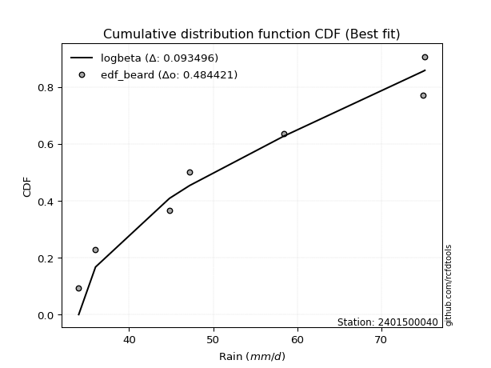</img></img>

</div>


### 5. EDF Chegodayev (1955)

The Chegodayev formula is an empirical plotting position formula used in hydrological frequency analysis to estimate the exceedance probability or return period of a specific event from a set of observed data. It is primarily used for plotting observed data points on probability paper to fit a theoretical distribution, particularly for analyzing extreme events like maximum flood flows or rainfall intensities. The constant _b_ value in the generalized plotting position formula is 0.3.

<div align="center">


$P=(m-b)/(n+1-2b)$


</div>


**5.1. Empirical values**

<div align="center">

|                | 0                   | 1                   | 2                   | 3              | 4                  | 5                  | 6                  |
|:---------------|:--------------------|:--------------------|:--------------------|:---------------|:-------------------|:-------------------|:-------------------|
| date           | 2022                | 2023                | 2025                | 2021           | 2020               | 2019               | 2024               |
| x              | 34.0                | 36.0                | 44.8                | 47.2           | 58.4               | 75.0               | 75.2               |
| m              | 1                   | 2                   | 3                   | 4              | 5                  | 6                  | 7                  |
| empirical_dist | edf_chegodayev      | edf_chegodayev      | edf_chegodayev      | edf_chegodayev | edf_chegodayev     | edf_chegodayev     | edf_chegodayev     |
| empirical      | 0.09459459459459459 | 0.22972972972972971 | 0.36486486486486486 | 0.5            | 0.6351351351351351 | 0.7702702702702703 | 0.9054054054054054 |
| empirical_tr   | 1.1044776119402986  | 1.2982456140350878  | 1.574468085106383   | 2.0            | 2.7407407407407405 | 4.352941176470589  | 10.571428571428568 |

</div>


**5.2. Kolmogorov-Smirnov fit test (sorted by Δ)**


<div align="center">

|                | 0                   | 1                   | 2                   | 3                   | 4                   | 5                   | 6                   | 7                   | 8                   | 9                   | 10                  | 11                  | 12                  | 13                  | 14                  | 15                  | 16                  | 17                  | 18                  | 19                  | 20                  | 21                  | 22                  | 23                  | 24                  | 25                  | 26                  | 27                  | 28                  | 29                  | 30                  | 31                  | 32                  | 33                  | 34                  | 35                  | 36                  | 37                  | 38                  | 39                  | 40                  | 41                  | 42                  | 43                  | 44                  | 45                  | 46                  | 47                  | 48                  | 49                  | 50                  | 51                  | 52                  | 53                  | 54                  | 55                  | 56                  | 57                  | 58                  | 59                  | 60                  | 61                  | 62                  | 63                  | 64                  | 65                  | 66                  | 67                  | 68                  | 69                  | 70                  | 71                  | 72                  | 73                  | 74                  | 75                  | 76                  | 77                  | 78                  | 79                  | 80                  | 81                  | 82                  | 83                  | 84                  | 85                  | 86                  | 87                  | 88                  | 89                  | 90                  | 91                  | 92                  | 93                  | 94                  | 95                  | 96                  | 97                  | 98                  | 99                  | 100                 | 101                 | 102                 | 103                 | 104                 | 105                 | 106                 | 107                 | 108                 | 109                 | 110                 | 111                 | 112                 | 113                 | 114                 | 115                 | 116                 | 117                 | 118                 | 119                 | 120                 | 121                 | 122                 | 123                 | 124                 | 125                 | 126                 | 127                 | 128                 | 129                 | 130                 | 131                 | 132                 | 133                 | 134                 | 135                 | 136                 | 137                 | 138                 | 139                 | 140                 | 141                 | 142                 | 143                 | 144                 | 145                 | 146                 | 147                 | 148                 | 149                 | 150                 | 151                 | 152                 | 153                 | 154                 | 155                 | 156                 | 157                 | 158                 | 159                 |
|:---------------|:--------------------|:--------------------|:--------------------|:--------------------|:--------------------|:--------------------|:--------------------|:--------------------|:--------------------|:--------------------|:--------------------|:--------------------|:--------------------|:--------------------|:--------------------|:--------------------|:--------------------|:--------------------|:--------------------|:--------------------|:--------------------|:--------------------|:--------------------|:--------------------|:--------------------|:--------------------|:--------------------|:--------------------|:--------------------|:--------------------|:--------------------|:--------------------|:--------------------|:--------------------|:--------------------|:--------------------|:--------------------|:--------------------|:--------------------|:--------------------|:--------------------|:--------------------|:--------------------|:--------------------|:--------------------|:--------------------|:--------------------|:--------------------|:--------------------|:--------------------|:--------------------|:--------------------|:--------------------|:--------------------|:--------------------|:--------------------|:--------------------|:--------------------|:--------------------|:--------------------|:--------------------|:--------------------|:--------------------|:--------------------|:--------------------|:--------------------|:--------------------|:--------------------|:--------------------|:--------------------|:--------------------|:--------------------|:--------------------|:--------------------|:--------------------|:--------------------|:--------------------|:--------------------|:--------------------|:--------------------|:--------------------|:--------------------|:--------------------|:--------------------|:--------------------|:--------------------|:--------------------|:--------------------|:--------------------|:--------------------|:--------------------|:--------------------|:--------------------|:--------------------|:--------------------|:--------------------|:--------------------|:--------------------|:--------------------|:--------------------|:--------------------|:--------------------|:--------------------|:--------------------|:--------------------|:--------------------|:--------------------|:--------------------|:--------------------|:--------------------|:--------------------|:--------------------|:--------------------|:--------------------|:--------------------|:--------------------|:--------------------|:--------------------|:--------------------|:--------------------|:--------------------|:--------------------|:--------------------|:--------------------|:--------------------|:--------------------|:--------------------|:--------------------|:--------------------|:--------------------|:--------------------|:--------------------|:--------------------|:--------------------|:--------------------|:--------------------|:--------------------|:--------------------|:--------------------|:--------------------|:--------------------|:--------------------|:--------------------|:--------------------|:--------------------|:--------------------|:--------------------|:--------------------|:--------------------|:--------------------|:--------------------|:--------------------|:--------------------|:--------------------|:--------------------|:--------------------|:--------------------|:--------------------|:--------------------|:--------------------|
| station        | 2401500040          | 2401500040          | 2401500040          | 2401500040          | 2401500040          | 2401500040          | 2401500040          | 2401500040          | 2401500040          | 2401500040          | 2401500040          | 2401500040          | 2401500040          | 2401500040          | 2401500040          | 2401500040          | 2401500040          | 2401500040          | 2401500040          | 2401500040          | 2401500040          | 2401500040          | 2401500040          | 2401500040          | 2401500040          | 2401500040          | 2401500040          | 2401500040          | 2401500040          | 2401500040          | 2401500040          | 2401500040          | 2401500040          | 2401500040          | 2401500040          | 2401500040          | 2401500040          | 2401500040          | 2401500040          | 2401500040          | 2401500040          | 2401500040          | 2401500040          | 2401500040          | 2401500040          | 2401500040          | 2401500040          | 2401500040          | 2401500040          | 2401500040          | 2401500040          | 2401500040          | 2401500040          | 2401500040          | 2401500040          | 2401500040          | 2401500040          | 2401500040          | 2401500040          | 2401500040          | 2401500040          | 2401500040          | 2401500040          | 2401500040          | 2401500040          | 2401500040          | 2401500040          | 2401500040          | 2401500040          | 2401500040          | 2401500040          | 2401500040          | 2401500040          | 2401500040          | 2401500040          | 2401500040          | 2401500040          | 2401500040          | 2401500040          | 2401500040          | 2401500040          | 2401500040          | 2401500040          | 2401500040          | 2401500040          | 2401500040          | 2401500040          | 2401500040          | 2401500040          | 2401500040          | 2401500040          | 2401500040          | 2401500040          | 2401500040          | 2401500040          | 2401500040          | 2401500040          | 2401500040          | 2401500040          | 2401500040          | 2401500040          | 2401500040          | 2401500040          | 2401500040          | 2401500040          | 2401500040          | 2401500040          | 2401500040          | 2401500040          | 2401500040          | 2401500040          | 2401500040          | 2401500040          | 2401500040          | 2401500040          | 2401500040          | 2401500040          | 2401500040          | 2401500040          | 2401500040          | 2401500040          | 2401500040          | 2401500040          | 2401500040          | 2401500040          | 2401500040          | 2401500040          | 2401500040          | 2401500040          | 2401500040          | 2401500040          | 2401500040          | 2401500040          | 2401500040          | 2401500040          | 2401500040          | 2401500040          | 2401500040          | 2401500040          | 2401500040          | 2401500040          | 2401500040          | 2401500040          | 2401500040          | 2401500040          | 2401500040          | 2401500040          | 2401500040          | 2401500040          | 2401500040          | 2401500040          | 2401500040          | 2401500040          | 2401500040          | 2401500040          | 2401500040          | 2401500040          | 2401500040          | 2401500040          | 2401500040          |
| empirical_dist | edf_chegodayev      | edf_chegodayev      | edf_chegodayev      | edf_chegodayev      | edf_chegodayev      | edf_chegodayev      | edf_chegodayev      | edf_chegodayev      | edf_chegodayev      | edf_chegodayev      | edf_chegodayev      | edf_chegodayev      | edf_chegodayev      | edf_chegodayev      | edf_chegodayev      | edf_chegodayev      | edf_chegodayev      | edf_chegodayev      | edf_chegodayev      | edf_chegodayev      | edf_chegodayev      | edf_chegodayev      | edf_chegodayev      | edf_chegodayev      | edf_chegodayev      | edf_chegodayev      | edf_chegodayev      | edf_chegodayev      | edf_chegodayev      | edf_chegodayev      | edf_chegodayev      | edf_chegodayev      | edf_chegodayev      | edf_chegodayev      | edf_chegodayev      | edf_chegodayev      | edf_chegodayev      | edf_chegodayev      | edf_chegodayev      | edf_chegodayev      | edf_chegodayev      | edf_chegodayev      | edf_chegodayev      | edf_chegodayev      | edf_chegodayev      | edf_chegodayev      | edf_chegodayev      | edf_chegodayev      | edf_chegodayev      | edf_chegodayev      | edf_chegodayev      | edf_chegodayev      | edf_chegodayev      | edf_chegodayev      | edf_chegodayev      | edf_chegodayev      | edf_chegodayev      | edf_chegodayev      | edf_chegodayev      | edf_chegodayev      | edf_chegodayev      | edf_chegodayev      | edf_chegodayev      | edf_chegodayev      | edf_chegodayev      | edf_chegodayev      | edf_chegodayev      | edf_chegodayev      | edf_chegodayev      | edf_chegodayev      | edf_chegodayev      | edf_chegodayev      | edf_chegodayev      | edf_chegodayev      | edf_chegodayev      | edf_chegodayev      | edf_chegodayev      | edf_chegodayev      | edf_chegodayev      | edf_chegodayev      | edf_chegodayev      | edf_chegodayev      | edf_chegodayev      | edf_chegodayev      | edf_chegodayev      | edf_chegodayev      | edf_chegodayev      | edf_chegodayev      | edf_chegodayev      | edf_chegodayev      | edf_chegodayev      | edf_chegodayev      | edf_chegodayev      | edf_chegodayev      | edf_chegodayev      | edf_chegodayev      | edf_chegodayev      | edf_chegodayev      | edf_chegodayev      | edf_chegodayev      | edf_chegodayev      | edf_chegodayev      | edf_chegodayev      | edf_chegodayev      | edf_chegodayev      | edf_chegodayev      | edf_chegodayev      | edf_chegodayev      | edf_chegodayev      | edf_chegodayev      | edf_chegodayev      | edf_chegodayev      | edf_chegodayev      | edf_chegodayev      | edf_chegodayev      | edf_chegodayev      | edf_chegodayev      | edf_chegodayev      | edf_chegodayev      | edf_chegodayev      | edf_chegodayev      | edf_chegodayev      | edf_chegodayev      | edf_chegodayev      | edf_chegodayev      | edf_chegodayev      | edf_chegodayev      | edf_chegodayev      | edf_chegodayev      | edf_chegodayev      | edf_chegodayev      | edf_chegodayev      | edf_chegodayev      | edf_chegodayev      | edf_chegodayev      | edf_chegodayev      | edf_chegodayev      | edf_chegodayev      | edf_chegodayev      | edf_chegodayev      | edf_chegodayev      | edf_chegodayev      | edf_chegodayev      | edf_chegodayev      | edf_chegodayev      | edf_chegodayev      | edf_chegodayev      | edf_chegodayev      | edf_chegodayev      | edf_chegodayev      | edf_chegodayev      | edf_chegodayev      | edf_chegodayev      | edf_chegodayev      | edf_chegodayev      | edf_chegodayev      | edf_chegodayev      | edf_chegodayev      | edf_chegodayev      | edf_chegodayev      |
| p_dist         | logbeta             | logrdist            | logfatiguelife      | logksone            | logarcsine          | logburr             | invgauss            | loginvgauss         | logmielke           | loginvweibull       | loggenlogistic      | burr                | logsemicircular     | invgamma            | logfoldnorm         | loganglit           | loghalfgennorm      | lograyleigh         | logkstwobign        | logmaxwell          | logf                | genextreme          | nct                 | halfnorm            | exponnorm           | logncf              | alpha               | logalpha            | genexpon            | logrice             | logbetaprime        | logdgamma           | logdweibull         | loginvgamma         | betaprime           | lognct              | f                   | burr12              | ksone               | loggenexpon         | ncf                 | logerlang           | logpearson3         | loggamma            | loggamma            | rayleigh            | semicircular        | logskewnorm         | logjohnsonsu        | logloggamma         | logexponnorm        | logcrystalball      | lognorm             | logt                | loglomax            | maxwell             | genlogistic         | anglit              | foldnorm            | gumbel_r            | loggumbel_r         | pearson3            | loghalfnorm         | kstwobign           | rice                | loglogistic         | logloglaplace       | dweibull            | moyal               | logcosine           | logburr12           | norm                | crystalball         | truncnorm           | t                   | nakagami            | loghypsecant        | loggompertz         | dgamma              | loglaplace          | loglaplace          | johnsonsu           | gompertz            | logistic            | cosine              | halflogistic        | gausshyper          | skewnorm            | genpareto           | logmoyal            | hypsecant           | arcsine             | logargus            | loggumbel_l         | halfgennorm         | logtrapezoid        | rdist               | loggengamma         | exponpow            | beta                | laplace             | logkappa3           | gumbel_l            | loghalflogistic     | argus               | wrapcauchy          | loggausshyper       | tukeylambda         | logwrapcauchy       | trapezoid           | logtukeylambda      | kappa4              | logweibull_max      | kappa3              | triang              | logtriang           | uniform             | logkappa4           | bradford            | loguniform          | truncexpon          | loggenextreme       | truncpareto         | logvonmises_line    | logbradford         | logtruncweibull_min | logtruncexpon       | truncweibull_min    | logtruncnorm        | lomax               | wald                | logwald             | vonmises_line       | loggenhalflogistic  | logweibull_min      | weibull_min         | loggennorm          | gennorm             | logexponpow         | gamma               | logexponweib        | loglevy_l           | erlang              | genhalflogistic     | levy_l              | lognakagami         | logjohnsonsb        | johnsonsb           | gengamma            | fatiguelife         | powerlaw            | logpowerlaw         | exponweib           | invweibull          | loggenpareto        | weibull_max         | logtruncpareto      | logvonmises         | vonmises            | mielke              |
| delta          | 0.09459459099967266 | 0.09459459212992882 | 0.10856121057281559 | 0.10908882151880173 | 0.10926342152212032 | 0.11248252375232193 | 0.11267164853521261 | 0.11337455189694046 | 0.11415856102633348 | 0.11417879545803933 | 0.11441542549747463 | 0.11458567761970184 | 0.1155986430726107  | 0.11801142286325561 | 0.11927544486707564 | 0.12090585908996032 | 0.1217616831884346  | 0.1227413514689204  | 0.12307175549471361 | 0.12538444702980844 | 0.12546094150926868 | 0.12558605182636484 | 0.12585833247787281 | 0.1281351836376462  | 0.1281622940092414  | 0.12834883941390685 | 0.12836983248524203 | 0.12856135922007572 | 0.12865003209915551 | 0.1287256692030787  | 0.12880553443143683 | 0.12890725781688733 | 0.12907584275757275 | 0.13090612124031853 | 0.1310010314931621  | 0.13100341035482688 | 0.13110205886972748 | 0.13153941195526658 | 0.13164955472669637 | 0.13184871380044244 | 0.13211145694286186 | 0.1322409119004191  | 0.1332647698283368  | 0.13365983063383036 | 0.13365983063383036 | 0.13384389509429473 | 0.1339125348283845  | 0.13476408844516408 | 0.13480132693328073 | 0.13491748207169907 | 0.13531391876781862 | 0.13532965200326907 | 0.13532992003983624 | 0.135330383674635   | 0.1360708552814282  | 0.13677993569055047 | 0.13697016544449503 | 0.1369789134091035  | 0.13815816994646568 | 0.1398787338931612  | 0.14109716093555452 | 0.14137272529584544 | 0.14169506476742874 | 0.14218117726927315 | 0.14284195281991485 | 0.14529659418690066 | 0.14560011937537964 | 0.14676886301814152 | 0.14750754670683466 | 0.14770961687932682 | 0.14779202532193936 | 0.14781259924035106 | 0.14781260269755347 | 0.14781260609521607 | 0.14785230322310994 | 0.14909272284329483 | 0.1493632820915055  | 0.15046257577996502 | 0.15120303094721    | 0.15177442157644117 | 0.15177442157644117 | 0.15239332027719632 | 0.15667521648065708 | 0.1586993565070317  | 0.15939072026990553 | 0.16213091661089474 | 0.16369605549006666 | 0.165171515608021   | 0.16956556249693533 | 0.16961133786055707 | 0.1721818345085811  | 0.1736101041721717  | 0.17623234483781547 | 0.1813657282723926  | 0.1827512646700153  | 0.18311025637569367 | 0.18905932992944763 | 0.19014258058428674 | 0.19616779919768274 | 0.19714557945970368 | 0.20054781952305667 | 0.20233521182350678 | 0.20278883861451125 | 0.2034275942725022  | 0.20474549863521407 | 0.21415588108678452 | 0.21753768040142785 | 0.2186912533625892  | 0.2191381122951016  | 0.21942208854736034 | 0.21982250759453936 | 0.22271698951447116 | 0.22293607844911761 | 0.22322472437171925 | 0.2243453468599978  | 0.22478291028679975 | 0.22487536079769077 | 0.22545035974076555 | 0.22628571614986825 | 0.22637479322289622 | 0.22684904014108687 | 0.22717293532393446 | 0.22720623770669546 | 0.2272483802437063  | 0.22743360028123327 | 0.227517183028644   | 0.22786234621153234 | 0.2279529989543302  | 0.2285316982113097  | 0.22964088551778905 | 0.22972972972972971 | 0.22972972972972971 | 0.23440515530911338 | 0.24441797996171538 | 0.2460143112718221  | 0.2580415765757317  | 0.2702702702702703  | 0.2702702702702703  | 0.2787425269825559  | 0.27946214026664334 | 0.2894661266920991  | 0.28949278317618843 | 0.2999352109457079  | 0.302735294968033   | 0.3027799038206902  | 0.31519191606192204 | 0.3200111170476482  | 0.38756483378243406 | 0.4047731033008533  | 0.41951779344205536 | 0.4365133880525927  | 0.46656395089042296 | 0.46911384799468586 | 0.4734921692335326  | 0.5137395260218103  | 0.5154872330182837  | 0.5633627026609734  | 1.1355225565822744  | 11.471533575470971  | nan                 |
| deltao         | 0.48442053926100004 | 0.48442053926100004 | 0.48442053926100004 | 0.48442053926100004 | 0.48442053926100004 | 0.48442053926100004 | 0.48442053926100004 | 0.48442053926100004 | 0.48442053926100004 | 0.48442053926100004 | 0.48442053926100004 | 0.48442053926100004 | 0.48442053926100004 | 0.48442053926100004 | 0.48442053926100004 | 0.48442053926100004 | 0.48442053926100004 | 0.48442053926100004 | 0.48442053926100004 | 0.48442053926100004 | 0.48442053926100004 | 0.48442053926100004 | 0.48442053926100004 | 0.48442053926100004 | 0.48442053926100004 | 0.48442053926100004 | 0.48442053926100004 | 0.48442053926100004 | 0.48442053926100004 | 0.48442053926100004 | 0.48442053926100004 | 0.48442053926100004 | 0.48442053926100004 | 0.48442053926100004 | 0.48442053926100004 | 0.48442053926100004 | 0.48442053926100004 | 0.48442053926100004 | 0.48442053926100004 | 0.48442053926100004 | 0.48442053926100004 | 0.48442053926100004 | 0.48442053926100004 | 0.48442053926100004 | 0.48442053926100004 | 0.48442053926100004 | 0.48442053926100004 | 0.48442053926100004 | 0.48442053926100004 | 0.48442053926100004 | 0.48442053926100004 | 0.48442053926100004 | 0.48442053926100004 | 0.48442053926100004 | 0.48442053926100004 | 0.48442053926100004 | 0.48442053926100004 | 0.48442053926100004 | 0.48442053926100004 | 0.48442053926100004 | 0.48442053926100004 | 0.48442053926100004 | 0.48442053926100004 | 0.48442053926100004 | 0.48442053926100004 | 0.48442053926100004 | 0.48442053926100004 | 0.48442053926100004 | 0.48442053926100004 | 0.48442053926100004 | 0.48442053926100004 | 0.48442053926100004 | 0.48442053926100004 | 0.48442053926100004 | 0.48442053926100004 | 0.48442053926100004 | 0.48442053926100004 | 0.48442053926100004 | 0.48442053926100004 | 0.48442053926100004 | 0.48442053926100004 | 0.48442053926100004 | 0.48442053926100004 | 0.48442053926100004 | 0.48442053926100004 | 0.48442053926100004 | 0.48442053926100004 | 0.48442053926100004 | 0.48442053926100004 | 0.48442053926100004 | 0.48442053926100004 | 0.48442053926100004 | 0.48442053926100004 | 0.48442053926100004 | 0.48442053926100004 | 0.48442053926100004 | 0.48442053926100004 | 0.48442053926100004 | 0.48442053926100004 | 0.48442053926100004 | 0.48442053926100004 | 0.48442053926100004 | 0.48442053926100004 | 0.48442053926100004 | 0.48442053926100004 | 0.48442053926100004 | 0.48442053926100004 | 0.48442053926100004 | 0.48442053926100004 | 0.48442053926100004 | 0.48442053926100004 | 0.48442053926100004 | 0.48442053926100004 | 0.48442053926100004 | 0.48442053926100004 | 0.48442053926100004 | 0.48442053926100004 | 0.48442053926100004 | 0.48442053926100004 | 0.48442053926100004 | 0.48442053926100004 | 0.48442053926100004 | 0.48442053926100004 | 0.48442053926100004 | 0.48442053926100004 | 0.48442053926100004 | 0.48442053926100004 | 0.48442053926100004 | 0.48442053926100004 | 0.48442053926100004 | 0.48442053926100004 | 0.48442053926100004 | 0.48442053926100004 | 0.48442053926100004 | 0.48442053926100004 | 0.48442053926100004 | 0.48442053926100004 | 0.48442053926100004 | 0.48442053926100004 | 0.48442053926100004 | 0.48442053926100004 | 0.48442053926100004 | 0.48442053926100004 | 0.48442053926100004 | 0.48442053926100004 | 0.48442053926100004 | 0.48442053926100004 | 0.48442053926100004 | 0.48442053926100004 | 0.48442053926100004 | 0.48442053926100004 | 0.48442053926100004 | 0.48442053926100004 | 0.48442053926100004 | 0.48442053926100004 | 0.48442053926100004 | 0.48442053926100004 | 0.48442053926100004 | 0.48442053926100004 | 0.48442053926100004 |
| eval           | Δo > Δ              | Δo > Δ              | Δo > Δ              | Δo > Δ              | Δo > Δ              | Δo > Δ              | Δo > Δ              | Δo > Δ              | Δo > Δ              | Δo > Δ              | Δo > Δ              | Δo > Δ              | Δo > Δ              | Δo > Δ              | Δo > Δ              | Δo > Δ              | Δo > Δ              | Δo > Δ              | Δo > Δ              | Δo > Δ              | Δo > Δ              | Δo > Δ              | Δo > Δ              | Δo > Δ              | Δo > Δ              | Δo > Δ              | Δo > Δ              | Δo > Δ              | Δo > Δ              | Δo > Δ              | Δo > Δ              | Δo > Δ              | Δo > Δ              | Δo > Δ              | Δo > Δ              | Δo > Δ              | Δo > Δ              | Δo > Δ              | Δo > Δ              | Δo > Δ              | Δo > Δ              | Δo > Δ              | Δo > Δ              | Δo > Δ              | Δo > Δ              | Δo > Δ              | Δo > Δ              | Δo > Δ              | Δo > Δ              | Δo > Δ              | Δo > Δ              | Δo > Δ              | Δo > Δ              | Δo > Δ              | Δo > Δ              | Δo > Δ              | Δo > Δ              | Δo > Δ              | Δo > Δ              | Δo > Δ              | Δo > Δ              | Δo > Δ              | Δo > Δ              | Δo > Δ              | Δo > Δ              | Δo > Δ              | Δo > Δ              | Δo > Δ              | Δo > Δ              | Δo > Δ              | Δo > Δ              | Δo > Δ              | Δo > Δ              | Δo > Δ              | Δo > Δ              | Δo > Δ              | Δo > Δ              | Δo > Δ              | Δo > Δ              | Δo > Δ              | Δo > Δ              | Δo > Δ              | Δo > Δ              | Δo > Δ              | Δo > Δ              | Δo > Δ              | Δo > Δ              | Δo > Δ              | Δo > Δ              | Δo > Δ              | Δo > Δ              | Δo > Δ              | Δo > Δ              | Δo > Δ              | Δo > Δ              | Δo > Δ              | Δo > Δ              | Δo > Δ              | Δo > Δ              | Δo > Δ              | Δo > Δ              | Δo > Δ              | Δo > Δ              | Δo > Δ              | Δo > Δ              | Δo > Δ              | Δo > Δ              | Δo > Δ              | Δo > Δ              | Δo > Δ              | Δo > Δ              | Δo > Δ              | Δo > Δ              | Δo > Δ              | Δo > Δ              | Δo > Δ              | Δo > Δ              | Δo > Δ              | Δo > Δ              | Δo > Δ              | Δo > Δ              | Δo > Δ              | Δo > Δ              | Δo > Δ              | Δo > Δ              | Δo > Δ              | Δo > Δ              | Δo > Δ              | Δo > Δ              | Δo > Δ              | Δo > Δ              | Δo > Δ              | Δo > Δ              | Δo > Δ              | Δo > Δ              | Δo > Δ              | Δo > Δ              | Δo > Δ              | Δo > Δ              | Δo > Δ              | Δo > Δ              | Δo > Δ              | Δo > Δ              | Δo > Δ              | Δo > Δ              | Δo > Δ              | Δo > Δ              | Δo > Δ              | Δo > Δ              | Δo > Δ              | Δo > Δ              | Δo > Δ              | Δo > Δ              | Δo > Δ              | Δo <= Δ             | Δo <= Δ             | Δo <= Δ             | Δo <= Δ             | Δo <= Δ             | Δo <= Δ             |
| fit            | 1                   | 1                   | 1                   | 1                   | 1                   | 1                   | 1                   | 1                   | 1                   | 1                   | 1                   | 1                   | 1                   | 1                   | 1                   | 1                   | 1                   | 1                   | 1                   | 1                   | 1                   | 1                   | 1                   | 1                   | 1                   | 1                   | 1                   | 1                   | 1                   | 1                   | 1                   | 1                   | 1                   | 1                   | 1                   | 1                   | 1                   | 1                   | 1                   | 1                   | 1                   | 1                   | 1                   | 1                   | 1                   | 1                   | 1                   | 1                   | 1                   | 1                   | 1                   | 1                   | 1                   | 1                   | 1                   | 1                   | 1                   | 1                   | 1                   | 1                   | 1                   | 1                   | 1                   | 1                   | 1                   | 1                   | 1                   | 1                   | 1                   | 1                   | 1                   | 1                   | 1                   | 1                   | 1                   | 1                   | 1                   | 1                   | 1                   | 1                   | 1                   | 1                   | 1                   | 1                   | 1                   | 1                   | 1                   | 1                   | 1                   | 1                   | 1                   | 1                   | 1                   | 1                   | 1                   | 1                   | 1                   | 1                   | 1                   | 1                   | 1                   | 1                   | 1                   | 1                   | 1                   | 1                   | 1                   | 1                   | 1                   | 1                   | 1                   | 1                   | 1                   | 1                   | 1                   | 1                   | 1                   | 1                   | 1                   | 1                   | 1                   | 1                   | 1                   | 1                   | 1                   | 1                   | 1                   | 1                   | 1                   | 1                   | 1                   | 1                   | 1                   | 1                   | 1                   | 1                   | 1                   | 1                   | 1                   | 1                   | 1                   | 1                   | 1                   | 1                   | 1                   | 1                   | 1                   | 1                   | 1                   | 1                   | 1                   | 1                   | 1                   | 1                   | 0                   | 0                   | 0                   | 0                   | 0                   | 0                   |
| n              | 7                   | 7                   | 7                   | 7                   | 7                   | 7                   | 7                   | 7                   | 7                   | 7                   | 7                   | 7                   | 7                   | 7                   | 7                   | 7                   | 7                   | 7                   | 7                   | 7                   | 7                   | 7                   | 7                   | 7                   | 7                   | 7                   | 7                   | 7                   | 7                   | 7                   | 7                   | 7                   | 7                   | 7                   | 7                   | 7                   | 7                   | 7                   | 7                   | 7                   | 7                   | 7                   | 7                   | 7                   | 7                   | 7                   | 7                   | 7                   | 7                   | 7                   | 7                   | 7                   | 7                   | 7                   | 7                   | 7                   | 7                   | 7                   | 7                   | 7                   | 7                   | 7                   | 7                   | 7                   | 7                   | 7                   | 7                   | 7                   | 7                   | 7                   | 7                   | 7                   | 7                   | 7                   | 7                   | 7                   | 7                   | 7                   | 7                   | 7                   | 7                   | 7                   | 7                   | 7                   | 7                   | 7                   | 7                   | 7                   | 7                   | 7                   | 7                   | 7                   | 7                   | 7                   | 7                   | 7                   | 7                   | 7                   | 7                   | 7                   | 7                   | 7                   | 7                   | 7                   | 7                   | 7                   | 7                   | 7                   | 7                   | 7                   | 7                   | 7                   | 7                   | 7                   | 7                   | 7                   | 7                   | 7                   | 7                   | 7                   | 7                   | 7                   | 7                   | 7                   | 7                   | 7                   | 7                   | 7                   | 7                   | 7                   | 7                   | 7                   | 7                   | 7                   | 7                   | 7                   | 7                   | 7                   | 7                   | 7                   | 7                   | 7                   | 7                   | 7                   | 7                   | 7                   | 7                   | 7                   | 7                   | 7                   | 7                   | 7                   | 7                   | 7                   | 7                   | 7                   | 7                   | 7                   | 7                   | 7                   |
| best_fit       | 1                   | 0                   | 0                   | 0                   | 0                   | 0                   | 0                   | 0                   | 0                   | 0                   | 0                   | 0                   | 0                   | 0                   | 0                   | 0                   | 0                   | 0                   | 0                   | 0                   | 0                   | 0                   | 0                   | 0                   | 0                   | 0                   | 0                   | 0                   | 0                   | 0                   | 0                   | 0                   | 0                   | 0                   | 0                   | 0                   | 0                   | 0                   | 0                   | 0                   | 0                   | 0                   | 0                   | 0                   | 0                   | 0                   | 0                   | 0                   | 0                   | 0                   | 0                   | 0                   | 0                   | 0                   | 0                   | 0                   | 0                   | 0                   | 0                   | 0                   | 0                   | 0                   | 0                   | 0                   | 0                   | 0                   | 0                   | 0                   | 0                   | 0                   | 0                   | 0                   | 0                   | 0                   | 0                   | 0                   | 0                   | 0                   | 0                   | 0                   | 0                   | 0                   | 0                   | 0                   | 0                   | 0                   | 0                   | 0                   | 0                   | 0                   | 0                   | 0                   | 0                   | 0                   | 0                   | 0                   | 0                   | 0                   | 0                   | 0                   | 0                   | 0                   | 0                   | 0                   | 0                   | 0                   | 0                   | 0                   | 0                   | 0                   | 0                   | 0                   | 0                   | 0                   | 0                   | 0                   | 0                   | 0                   | 0                   | 0                   | 0                   | 0                   | 0                   | 0                   | 0                   | 0                   | 0                   | 0                   | 0                   | 0                   | 0                   | 0                   | 0                   | 0                   | 0                   | 0                   | 0                   | 0                   | 0                   | 0                   | 0                   | 0                   | 0                   | 0                   | 0                   | 0                   | 0                   | 0                   | 0                   | 0                   | 0                   | 0                   | 0                   | 0                   | 0                   | 0                   | 0                   | 0                   | 0                   | 0                   |
| best_fit_sort  | 1                   | 2                   | 3                   | 4                   | 5                   | 6                   | 7                   | 8                   | 9                   | 10                  | 11                  | 12                  | 13                  | 14                  | 15                  | 16                  | 17                  | 18                  | 19                  | 20                  | 21                  | 22                  | 23                  | 24                  | 25                  | 26                  | 27                  | 28                  | 29                  | 30                  | 31                  | 32                  | 33                  | 34                  | 35                  | 36                  | 37                  | 38                  | 39                  | 40                  | 41                  | 42                  | 43                  | 44                  | 45                  | 46                  | 47                  | 48                  | 49                  | 50                  | 51                  | 52                  | 53                  | 54                  | 55                  | 56                  | 57                  | 58                  | 59                  | 60                  | 61                  | 62                  | 63                  | 64                  | 65                  | 66                  | 67                  | 68                  | 69                  | 70                  | 71                  | 72                  | 73                  | 74                  | 75                  | 76                  | 77                  | 78                  | 79                  | 80                  | 81                  | 82                  | 83                  | 84                  | 85                  | 86                  | 87                  | 88                  | 89                  | 90                  | 91                  | 92                  | 93                  | 94                  | 95                  | 96                  | 97                  | 98                  | 99                  | 100                 | 101                 | 102                 | 103                 | 104                 | 105                 | 106                 | 107                 | 108                 | 109                 | 110                 | 111                 | 112                 | 113                 | 114                 | 115                 | 116                 | 117                 | 118                 | 119                 | 120                 | 121                 | 122                 | 123                 | 124                 | 125                 | 126                 | 127                 | 128                 | 129                 | 130                 | 131                 | 132                 | 133                 | 134                 | 135                 | 136                 | 137                 | 138                 | 139                 | 140                 | 141                 | 142                 | 143                 | 144                 | 145                 | 146                 | 147                 | 148                 | 149                 | 150                 | 151                 | 152                 | 153                 | 154                 | 155                 | 156                 | 157                 | 158                 | 159                 | 160                 |

</div>


**5.3. Best fit**

<div align="center">

|   id |    station | empirical_dist   | p_dist   |     delta |   deltao | eval   |   fit |   n |   best_fit |   best_fit_sort |
|-----:|-----------:|:-----------------|:---------|----------:|---------:|:-------|------:|----:|-----------:|----------------:|
|    0 | 2401500040 | edf_chegodayev   | logbeta  | 0.0945946 | 0.484421 | Δo > Δ |     1 |   7 |          1 |               1 |

</div>


<div align="center">

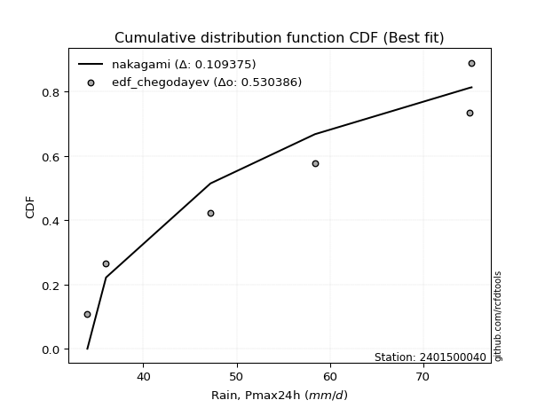</img>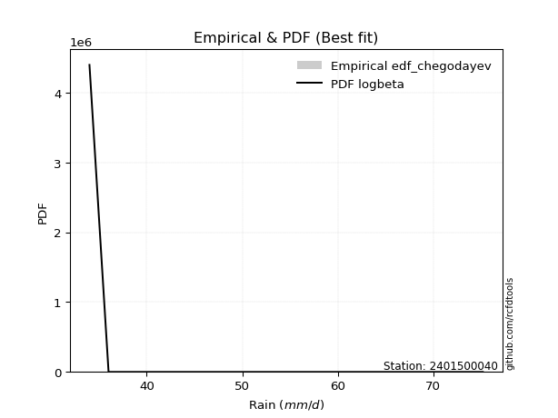</img>

</div>


### 6. EDF Blom (1958)

The Blom formula is a specific "plotting position" formula used in hydrology and statistical analysis to estimate the empirical cumulative probability (or non-exceedance probability) of a data series. It is particularly recommended for data that are approximately normally distributed. The constant _a_ is set to 0.375 (or 3/8).

<div align="center">


$P=(m-a)/(n+1-2a)$


</div>


**6.1. Empirical values**

<div align="center">

|                | 0                   | 1                   | 2                  | 3        | 4                  | 5                  | 6                  |
|:---------------|:--------------------|:--------------------|:-------------------|:---------|:-------------------|:-------------------|:-------------------|
| date           | 2022                | 2023                | 2025               | 2021     | 2020               | 2019               | 2024               |
| x              | 34.0                | 36.0                | 44.8               | 47.2     | 58.4               | 75.0               | 75.2               |
| m              | 1                   | 2                   | 3                  | 4        | 5                  | 6                  | 7                  |
| empirical_dist | edf_blom            | edf_blom            | edf_blom           | edf_blom | edf_blom           | edf_blom           | edf_blom           |
| empirical      | 0.08620689655172414 | 0.22413793103448276 | 0.3620689655172414 | 0.5      | 0.6379310344827587 | 0.7758620689655172 | 0.9137931034482759 |
| empirical_tr   | 1.0943396226415094  | 1.288888888888889   | 1.5675675675675675 | 2.0      | 2.7619047619047623 | 4.461538461538462  | 11.600000000000007 |

</div>


**6.2. Kolmogorov-Smirnov fit test (sorted by Δ)**


<div align="center">

|                | 0                   | 1                   | 2                   | 3                   | 4                   | 5                   | 6                   | 7                   | 8                   | 9                   | 10                  | 11                  | 12                  | 13                  | 14                  | 15                  | 16                  | 17                  | 18                  | 19                  | 20                  | 21                  | 22                  | 23                  | 24                  | 25                  | 26                  | 27                  | 28                  | 29                  | 30                  | 31                  | 32                  | 33                  | 34                  | 35                  | 36                  | 37                  | 38                  | 39                  | 40                  | 41                  | 42                  | 43                  | 44                  | 45                  | 46                  | 47                  | 48                  | 49                  | 50                  | 51                  | 52                  | 53                  | 54                  | 55                  | 56                  | 57                  | 58                  | 59                  | 60                  | 61                  | 62                  | 63                  | 64                  | 65                  | 66                  | 67                  | 68                  | 69                  | 70                  | 71                  | 72                  | 73                  | 74                  | 75                  | 76                  | 77                  | 78                  | 79                  | 80                  | 81                  | 82                  | 83                  | 84                  | 85                  | 86                  | 87                  | 88                  | 89                  | 90                  | 91                  | 92                  | 93                  | 94                  | 95                  | 96                  | 97                  | 98                  | 99                  | 100                 | 101                 | 102                 | 103                 | 104                 | 105                 | 106                 | 107                 | 108                 | 109                 | 110                 | 111                 | 112                 | 113                 | 114                 | 115                 | 116                 | 117                 | 118                 | 119                 | 120                 | 121                 | 122                 | 123                 | 124                 | 125                 | 126                 | 127                 | 128                 | 129                 | 130                 | 131                 | 132                 | 133                 | 134                 | 135                 | 136                 | 137                 | 138                 | 139                 | 140                 | 141                 | 142                 | 143                 | 144                 | 145                 | 146                 | 147                 | 148                 | 149                 | 150                 | 151                 | 152                 | 153                 | 154                 | 155                 | 156                 | 157                 | 158                 | 159                 |
|:---------------|:--------------------|:--------------------|:--------------------|:--------------------|:--------------------|:--------------------|:--------------------|:--------------------|:--------------------|:--------------------|:--------------------|:--------------------|:--------------------|:--------------------|:--------------------|:--------------------|:--------------------|:--------------------|:--------------------|:--------------------|:--------------------|:--------------------|:--------------------|:--------------------|:--------------------|:--------------------|:--------------------|:--------------------|:--------------------|:--------------------|:--------------------|:--------------------|:--------------------|:--------------------|:--------------------|:--------------------|:--------------------|:--------------------|:--------------------|:--------------------|:--------------------|:--------------------|:--------------------|:--------------------|:--------------------|:--------------------|:--------------------|:--------------------|:--------------------|:--------------------|:--------------------|:--------------------|:--------------------|:--------------------|:--------------------|:--------------------|:--------------------|:--------------------|:--------------------|:--------------------|:--------------------|:--------------------|:--------------------|:--------------------|:--------------------|:--------------------|:--------------------|:--------------------|:--------------------|:--------------------|:--------------------|:--------------------|:--------------------|:--------------------|:--------------------|:--------------------|:--------------------|:--------------------|:--------------------|:--------------------|:--------------------|:--------------------|:--------------------|:--------------------|:--------------------|:--------------------|:--------------------|:--------------------|:--------------------|:--------------------|:--------------------|:--------------------|:--------------------|:--------------------|:--------------------|:--------------------|:--------------------|:--------------------|:--------------------|:--------------------|:--------------------|:--------------------|:--------------------|:--------------------|:--------------------|:--------------------|:--------------------|:--------------------|:--------------------|:--------------------|:--------------------|:--------------------|:--------------------|:--------------------|:--------------------|:--------------------|:--------------------|:--------------------|:--------------------|:--------------------|:--------------------|:--------------------|:--------------------|:--------------------|:--------------------|:--------------------|:--------------------|:--------------------|:--------------------|:--------------------|:--------------------|:--------------------|:--------------------|:--------------------|:--------------------|:--------------------|:--------------------|:--------------------|:--------------------|:--------------------|:--------------------|:--------------------|:--------------------|:--------------------|:--------------------|:--------------------|:--------------------|:--------------------|:--------------------|:--------------------|:--------------------|:--------------------|:--------------------|:--------------------|:--------------------|:--------------------|:--------------------|:--------------------|:--------------------|:--------------------|
| station        | 2401500040          | 2401500040          | 2401500040          | 2401500040          | 2401500040          | 2401500040          | 2401500040          | 2401500040          | 2401500040          | 2401500040          | 2401500040          | 2401500040          | 2401500040          | 2401500040          | 2401500040          | 2401500040          | 2401500040          | 2401500040          | 2401500040          | 2401500040          | 2401500040          | 2401500040          | 2401500040          | 2401500040          | 2401500040          | 2401500040          | 2401500040          | 2401500040          | 2401500040          | 2401500040          | 2401500040          | 2401500040          | 2401500040          | 2401500040          | 2401500040          | 2401500040          | 2401500040          | 2401500040          | 2401500040          | 2401500040          | 2401500040          | 2401500040          | 2401500040          | 2401500040          | 2401500040          | 2401500040          | 2401500040          | 2401500040          | 2401500040          | 2401500040          | 2401500040          | 2401500040          | 2401500040          | 2401500040          | 2401500040          | 2401500040          | 2401500040          | 2401500040          | 2401500040          | 2401500040          | 2401500040          | 2401500040          | 2401500040          | 2401500040          | 2401500040          | 2401500040          | 2401500040          | 2401500040          | 2401500040          | 2401500040          | 2401500040          | 2401500040          | 2401500040          | 2401500040          | 2401500040          | 2401500040          | 2401500040          | 2401500040          | 2401500040          | 2401500040          | 2401500040          | 2401500040          | 2401500040          | 2401500040          | 2401500040          | 2401500040          | 2401500040          | 2401500040          | 2401500040          | 2401500040          | 2401500040          | 2401500040          | 2401500040          | 2401500040          | 2401500040          | 2401500040          | 2401500040          | 2401500040          | 2401500040          | 2401500040          | 2401500040          | 2401500040          | 2401500040          | 2401500040          | 2401500040          | 2401500040          | 2401500040          | 2401500040          | 2401500040          | 2401500040          | 2401500040          | 2401500040          | 2401500040          | 2401500040          | 2401500040          | 2401500040          | 2401500040          | 2401500040          | 2401500040          | 2401500040          | 2401500040          | 2401500040          | 2401500040          | 2401500040          | 2401500040          | 2401500040          | 2401500040          | 2401500040          | 2401500040          | 2401500040          | 2401500040          | 2401500040          | 2401500040          | 2401500040          | 2401500040          | 2401500040          | 2401500040          | 2401500040          | 2401500040          | 2401500040          | 2401500040          | 2401500040          | 2401500040          | 2401500040          | 2401500040          | 2401500040          | 2401500040          | 2401500040          | 2401500040          | 2401500040          | 2401500040          | 2401500040          | 2401500040          | 2401500040          | 2401500040          | 2401500040          | 2401500040          | 2401500040          | 2401500040          | 2401500040          |
| empirical_dist | edf_blom            | edf_blom            | edf_blom            | edf_blom            | edf_blom            | edf_blom            | edf_blom            | edf_blom            | edf_blom            | edf_blom            | edf_blom            | edf_blom            | edf_blom            | edf_blom            | edf_blom            | edf_blom            | edf_blom            | edf_blom            | edf_blom            | edf_blom            | edf_blom            | edf_blom            | edf_blom            | edf_blom            | edf_blom            | edf_blom            | edf_blom            | edf_blom            | edf_blom            | edf_blom            | edf_blom            | edf_blom            | edf_blom            | edf_blom            | edf_blom            | edf_blom            | edf_blom            | edf_blom            | edf_blom            | edf_blom            | edf_blom            | edf_blom            | edf_blom            | edf_blom            | edf_blom            | edf_blom            | edf_blom            | edf_blom            | edf_blom            | edf_blom            | edf_blom            | edf_blom            | edf_blom            | edf_blom            | edf_blom            | edf_blom            | edf_blom            | edf_blom            | edf_blom            | edf_blom            | edf_blom            | edf_blom            | edf_blom            | edf_blom            | edf_blom            | edf_blom            | edf_blom            | edf_blom            | edf_blom            | edf_blom            | edf_blom            | edf_blom            | edf_blom            | edf_blom            | edf_blom            | edf_blom            | edf_blom            | edf_blom            | edf_blom            | edf_blom            | edf_blom            | edf_blom            | edf_blom            | edf_blom            | edf_blom            | edf_blom            | edf_blom            | edf_blom            | edf_blom            | edf_blom            | edf_blom            | edf_blom            | edf_blom            | edf_blom            | edf_blom            | edf_blom            | edf_blom            | edf_blom            | edf_blom            | edf_blom            | edf_blom            | edf_blom            | edf_blom            | edf_blom            | edf_blom            | edf_blom            | edf_blom            | edf_blom            | edf_blom            | edf_blom            | edf_blom            | edf_blom            | edf_blom            | edf_blom            | edf_blom            | edf_blom            | edf_blom            | edf_blom            | edf_blom            | edf_blom            | edf_blom            | edf_blom            | edf_blom            | edf_blom            | edf_blom            | edf_blom            | edf_blom            | edf_blom            | edf_blom            | edf_blom            | edf_blom            | edf_blom            | edf_blom            | edf_blom            | edf_blom            | edf_blom            | edf_blom            | edf_blom            | edf_blom            | edf_blom            | edf_blom            | edf_blom            | edf_blom            | edf_blom            | edf_blom            | edf_blom            | edf_blom            | edf_blom            | edf_blom            | edf_blom            | edf_blom            | edf_blom            | edf_blom            | edf_blom            | edf_blom            | edf_blom            | edf_blom            | edf_blom            | edf_blom            | edf_blom            |
| p_dist         | logbeta             | logrdist            | logfatiguelife      | logksone            | logarcsine          | logburr             | invgauss            | loginvgauss         | logmielke           | loginvweibull       | loggenlogistic      | burr                | logsemicircular     | invgamma            | logfoldnorm         | loganglit           | loghalfgennorm      | lograyleigh         | logkstwobign        | logmaxwell          | logf                | genextreme          | nct                 | halfnorm            | exponnorm           | logncf              | alpha               | logalpha            | genexpon            | logrice             | logbetaprime        | logdgamma           | logdweibull         | loginvgamma         | betaprime           | lognct              | f                   | ksone               | loggenexpon         | ncf                 | logerlang           | logpearson3         | loggamma            | loggamma            | rayleigh            | semicircular        | logskewnorm         | logjohnsonsu        | logloggamma         | logexponnorm        | logcrystalball      | lognorm             | logt                | maxwell             | genlogistic         | anglit              | foldnorm            | gumbel_r            | burr12              | loggumbel_r         | pearson3            | loghalfnorm         | kstwobign           | rice                | loglomax            | loglogistic         | dweibull            | moyal               | logcosine           | logburr12           | norm                | crystalball         | truncnorm           | t                   | logloglaplace       | nakagami            | loghypsecant        | loggompertz         | dgamma              | loglaplace          | loglaplace          | johnsonsu           | gompertz            | halflogistic        | logistic            | cosine              | skewnorm            | genpareto           | logmoyal            | gausshyper          | arcsine             | logargus            | hypsecant           | loggumbel_l         | logtrapezoid        | rdist               | halfgennorm         | beta                | loggengamma         | logkappa3           | loghalflogistic     | exponpow            | laplace             | gumbel_l            | argus               | wrapcauchy          | tukeylambda         | logwrapcauchy       | trapezoid           | logtukeylambda      | kappa4              | loggausshyper       | kappa3              | logtriang           | uniform             | logkappa4           | bradford            | loguniform          | truncexpon          | truncpareto         | logvonmises_line    | logbradford         | logtruncweibull_min | logtruncexpon       | truncweibull_min    | logtruncnorm        | wald                | logwald             | triang              | logweibull_max      | loggenextreme       | vonmises_line       | lomax               | loggenhalflogistic  | logweibull_min      | weibull_min         | loggennorm          | gennorm             | logexponpow         | gamma               | logexponweib        | loglevy_l           | erlang              | genhalflogistic     | levy_l              | lognakagami         | logjohnsonsb        | johnsonsb           | gengamma            | fatiguelife         | powerlaw            | logpowerlaw         | exponweib           | invweibull          | weibull_max         | loggenpareto        | logtruncpareto      | logvonmises         | vonmises            | mielke              |
| delta          | 0.08620689295680221 | 0.08620689408705838 | 0.10296941187756864 | 0.10349702282355477 | 0.10367162282687337 | 0.10689072505707498 | 0.10707984983996566 | 0.1077827532016935  | 0.10856676233108653 | 0.10858699676279238 | 0.10882362680222768 | 0.10899387892445489 | 0.11000684437736374 | 0.11241962416800866 | 0.11368364617182869 | 0.11531406039471337 | 0.11616988449318764 | 0.11714955277367345 | 0.11747995679946666 | 0.11979264833456149 | 0.11986914281402172 | 0.11999425313111789 | 0.12026653378262586 | 0.12254338494239925 | 0.12257049531399444 | 0.1227570407186599  | 0.12277803378999508 | 0.12296956052482877 | 0.12305823340390856 | 0.12313387050783176 | 0.12321373573618988 | 0.1233154591216404  | 0.1234840440623258  | 0.12531432254507158 | 0.12540923279791516 | 0.12541161165957992 | 0.12551026017448053 | 0.12605775603144942 | 0.1262569151051955  | 0.1265196582476149  | 0.12664911320517214 | 0.12767297113308984 | 0.1280680319385834  | 0.1280680319385834  | 0.12825209639904778 | 0.12832073613313755 | 0.12917228974991712 | 0.12920952823803378 | 0.12932568337645212 | 0.12972212007257167 | 0.12973785330802212 | 0.12973812134458929 | 0.12973858497938806 | 0.13118813699530352 | 0.13137836674924808 | 0.13138711471385656 | 0.13256637125121873 | 0.13428693519791424 | 0.13433531130289006 | 0.13550536224030757 | 0.13578092660059848 | 0.1361032660721818  | 0.1365893785740262  | 0.1372501541246679  | 0.13886675462905168 | 0.1397047954916537  | 0.14117706432289456 | 0.1419157480115877  | 0.14211781818407987 | 0.1422002266266924  | 0.1422208005451041  | 0.14222080400230652 | 0.14222080739996912 | 0.14226050452786299 | 0.14280422002775606 | 0.14350092414804788 | 0.14377148339625856 | 0.14487077708471807 | 0.14561123225196304 | 0.1461826228811942  | 0.1461826228811942  | 0.14680152158194937 | 0.15108341778541012 | 0.15653911791564779 | 0.1586993565070317  | 0.15939072026990553 | 0.15957971691277406 | 0.16397376380168838 | 0.16401953916531012 | 0.16649195483769014 | 0.16801830547692476 | 0.17064054614256852 | 0.1721818345085811  | 0.17577392957714566 | 0.17751845768044672 | 0.18346753123420068 | 0.18554716401763877 | 0.19155378076445673 | 0.1929384799319102  | 0.19674341312825983 | 0.19783579557725525 | 0.1989636985453062  | 0.20054781952305667 | 0.20278883861451125 | 0.20474549863521407 | 0.20856408239153756 | 0.21309945466734226 | 0.21354631359985465 | 0.2138302898521134  | 0.2142307088992924  | 0.2171251908192242  | 0.21753768040142785 | 0.2176329256764723  | 0.2191911115915528  | 0.21928356210244382 | 0.2198585610455186  | 0.2206939174546213  | 0.22078299452764927 | 0.22125724144583991 | 0.2216144390114485  | 0.22165658154845935 | 0.22184180158598632 | 0.22192538433339704 | 0.2222705475162854  | 0.22236120025908324 | 0.22293989951606275 | 0.22413793103448276 | 0.22413793103448276 | 0.2243453468599978  | 0.2257319777967412  | 0.22717293532393446 | 0.23440515530911338 | 0.2380285835606596  | 0.24441797996171538 | 0.24881021061944558 | 0.2664292746186022  | 0.27586206896551724 | 0.27586206896551724 | 0.2815384263301794  | 0.2822580396142668  | 0.29226202603972257 | 0.292288682523812   | 0.3027311102933314  | 0.302735294968033   | 0.3055758031683138  | 0.3179878154095455  | 0.3256029157428951  | 0.39036073313005754 | 0.4075690026484768  | 0.42231369278967884 | 0.4393092874002162  | 0.46935985023804644 | 0.47190974734230934 | 0.48187986727640314 | 0.5182831323659073  | 0.5221272240646808  | 0.5689545013562204  | 1.1299307578870272  | 11.465941776775724  | nan                 |
| deltao         | 0.48442053926100004 | 0.48442053926100004 | 0.48442053926100004 | 0.48442053926100004 | 0.48442053926100004 | 0.48442053926100004 | 0.48442053926100004 | 0.48442053926100004 | 0.48442053926100004 | 0.48442053926100004 | 0.48442053926100004 | 0.48442053926100004 | 0.48442053926100004 | 0.48442053926100004 | 0.48442053926100004 | 0.48442053926100004 | 0.48442053926100004 | 0.48442053926100004 | 0.48442053926100004 | 0.48442053926100004 | 0.48442053926100004 | 0.48442053926100004 | 0.48442053926100004 | 0.48442053926100004 | 0.48442053926100004 | 0.48442053926100004 | 0.48442053926100004 | 0.48442053926100004 | 0.48442053926100004 | 0.48442053926100004 | 0.48442053926100004 | 0.48442053926100004 | 0.48442053926100004 | 0.48442053926100004 | 0.48442053926100004 | 0.48442053926100004 | 0.48442053926100004 | 0.48442053926100004 | 0.48442053926100004 | 0.48442053926100004 | 0.48442053926100004 | 0.48442053926100004 | 0.48442053926100004 | 0.48442053926100004 | 0.48442053926100004 | 0.48442053926100004 | 0.48442053926100004 | 0.48442053926100004 | 0.48442053926100004 | 0.48442053926100004 | 0.48442053926100004 | 0.48442053926100004 | 0.48442053926100004 | 0.48442053926100004 | 0.48442053926100004 | 0.48442053926100004 | 0.48442053926100004 | 0.48442053926100004 | 0.48442053926100004 | 0.48442053926100004 | 0.48442053926100004 | 0.48442053926100004 | 0.48442053926100004 | 0.48442053926100004 | 0.48442053926100004 | 0.48442053926100004 | 0.48442053926100004 | 0.48442053926100004 | 0.48442053926100004 | 0.48442053926100004 | 0.48442053926100004 | 0.48442053926100004 | 0.48442053926100004 | 0.48442053926100004 | 0.48442053926100004 | 0.48442053926100004 | 0.48442053926100004 | 0.48442053926100004 | 0.48442053926100004 | 0.48442053926100004 | 0.48442053926100004 | 0.48442053926100004 | 0.48442053926100004 | 0.48442053926100004 | 0.48442053926100004 | 0.48442053926100004 | 0.48442053926100004 | 0.48442053926100004 | 0.48442053926100004 | 0.48442053926100004 | 0.48442053926100004 | 0.48442053926100004 | 0.48442053926100004 | 0.48442053926100004 | 0.48442053926100004 | 0.48442053926100004 | 0.48442053926100004 | 0.48442053926100004 | 0.48442053926100004 | 0.48442053926100004 | 0.48442053926100004 | 0.48442053926100004 | 0.48442053926100004 | 0.48442053926100004 | 0.48442053926100004 | 0.48442053926100004 | 0.48442053926100004 | 0.48442053926100004 | 0.48442053926100004 | 0.48442053926100004 | 0.48442053926100004 | 0.48442053926100004 | 0.48442053926100004 | 0.48442053926100004 | 0.48442053926100004 | 0.48442053926100004 | 0.48442053926100004 | 0.48442053926100004 | 0.48442053926100004 | 0.48442053926100004 | 0.48442053926100004 | 0.48442053926100004 | 0.48442053926100004 | 0.48442053926100004 | 0.48442053926100004 | 0.48442053926100004 | 0.48442053926100004 | 0.48442053926100004 | 0.48442053926100004 | 0.48442053926100004 | 0.48442053926100004 | 0.48442053926100004 | 0.48442053926100004 | 0.48442053926100004 | 0.48442053926100004 | 0.48442053926100004 | 0.48442053926100004 | 0.48442053926100004 | 0.48442053926100004 | 0.48442053926100004 | 0.48442053926100004 | 0.48442053926100004 | 0.48442053926100004 | 0.48442053926100004 | 0.48442053926100004 | 0.48442053926100004 | 0.48442053926100004 | 0.48442053926100004 | 0.48442053926100004 | 0.48442053926100004 | 0.48442053926100004 | 0.48442053926100004 | 0.48442053926100004 | 0.48442053926100004 | 0.48442053926100004 | 0.48442053926100004 | 0.48442053926100004 | 0.48442053926100004 | 0.48442053926100004 | 0.48442053926100004 |
| eval           | Δo > Δ              | Δo > Δ              | Δo > Δ              | Δo > Δ              | Δo > Δ              | Δo > Δ              | Δo > Δ              | Δo > Δ              | Δo > Δ              | Δo > Δ              | Δo > Δ              | Δo > Δ              | Δo > Δ              | Δo > Δ              | Δo > Δ              | Δo > Δ              | Δo > Δ              | Δo > Δ              | Δo > Δ              | Δo > Δ              | Δo > Δ              | Δo > Δ              | Δo > Δ              | Δo > Δ              | Δo > Δ              | Δo > Δ              | Δo > Δ              | Δo > Δ              | Δo > Δ              | Δo > Δ              | Δo > Δ              | Δo > Δ              | Δo > Δ              | Δo > Δ              | Δo > Δ              | Δo > Δ              | Δo > Δ              | Δo > Δ              | Δo > Δ              | Δo > Δ              | Δo > Δ              | Δo > Δ              | Δo > Δ              | Δo > Δ              | Δo > Δ              | Δo > Δ              | Δo > Δ              | Δo > Δ              | Δo > Δ              | Δo > Δ              | Δo > Δ              | Δo > Δ              | Δo > Δ              | Δo > Δ              | Δo > Δ              | Δo > Δ              | Δo > Δ              | Δo > Δ              | Δo > Δ              | Δo > Δ              | Δo > Δ              | Δo > Δ              | Δo > Δ              | Δo > Δ              | Δo > Δ              | Δo > Δ              | Δo > Δ              | Δo > Δ              | Δo > Δ              | Δo > Δ              | Δo > Δ              | Δo > Δ              | Δo > Δ              | Δo > Δ              | Δo > Δ              | Δo > Δ              | Δo > Δ              | Δo > Δ              | Δo > Δ              | Δo > Δ              | Δo > Δ              | Δo > Δ              | Δo > Δ              | Δo > Δ              | Δo > Δ              | Δo > Δ              | Δo > Δ              | Δo > Δ              | Δo > Δ              | Δo > Δ              | Δo > Δ              | Δo > Δ              | Δo > Δ              | Δo > Δ              | Δo > Δ              | Δo > Δ              | Δo > Δ              | Δo > Δ              | Δo > Δ              | Δo > Δ              | Δo > Δ              | Δo > Δ              | Δo > Δ              | Δo > Δ              | Δo > Δ              | Δo > Δ              | Δo > Δ              | Δo > Δ              | Δo > Δ              | Δo > Δ              | Δo > Δ              | Δo > Δ              | Δo > Δ              | Δo > Δ              | Δo > Δ              | Δo > Δ              | Δo > Δ              | Δo > Δ              | Δo > Δ              | Δo > Δ              | Δo > Δ              | Δo > Δ              | Δo > Δ              | Δo > Δ              | Δo > Δ              | Δo > Δ              | Δo > Δ              | Δo > Δ              | Δo > Δ              | Δo > Δ              | Δo > Δ              | Δo > Δ              | Δo > Δ              | Δo > Δ              | Δo > Δ              | Δo > Δ              | Δo > Δ              | Δo > Δ              | Δo > Δ              | Δo > Δ              | Δo > Δ              | Δo > Δ              | Δo > Δ              | Δo > Δ              | Δo > Δ              | Δo > Δ              | Δo > Δ              | Δo > Δ              | Δo > Δ              | Δo > Δ              | Δo > Δ              | Δo > Δ              | Δo > Δ              | Δo > Δ              | Δo <= Δ             | Δo <= Δ             | Δo <= Δ             | Δo <= Δ             | Δo <= Δ             | Δo <= Δ             |
| fit            | 1                   | 1                   | 1                   | 1                   | 1                   | 1                   | 1                   | 1                   | 1                   | 1                   | 1                   | 1                   | 1                   | 1                   | 1                   | 1                   | 1                   | 1                   | 1                   | 1                   | 1                   | 1                   | 1                   | 1                   | 1                   | 1                   | 1                   | 1                   | 1                   | 1                   | 1                   | 1                   | 1                   | 1                   | 1                   | 1                   | 1                   | 1                   | 1                   | 1                   | 1                   | 1                   | 1                   | 1                   | 1                   | 1                   | 1                   | 1                   | 1                   | 1                   | 1                   | 1                   | 1                   | 1                   | 1                   | 1                   | 1                   | 1                   | 1                   | 1                   | 1                   | 1                   | 1                   | 1                   | 1                   | 1                   | 1                   | 1                   | 1                   | 1                   | 1                   | 1                   | 1                   | 1                   | 1                   | 1                   | 1                   | 1                   | 1                   | 1                   | 1                   | 1                   | 1                   | 1                   | 1                   | 1                   | 1                   | 1                   | 1                   | 1                   | 1                   | 1                   | 1                   | 1                   | 1                   | 1                   | 1                   | 1                   | 1                   | 1                   | 1                   | 1                   | 1                   | 1                   | 1                   | 1                   | 1                   | 1                   | 1                   | 1                   | 1                   | 1                   | 1                   | 1                   | 1                   | 1                   | 1                   | 1                   | 1                   | 1                   | 1                   | 1                   | 1                   | 1                   | 1                   | 1                   | 1                   | 1                   | 1                   | 1                   | 1                   | 1                   | 1                   | 1                   | 1                   | 1                   | 1                   | 1                   | 1                   | 1                   | 1                   | 1                   | 1                   | 1                   | 1                   | 1                   | 1                   | 1                   | 1                   | 1                   | 1                   | 1                   | 1                   | 1                   | 0                   | 0                   | 0                   | 0                   | 0                   | 0                   |
| n              | 7                   | 7                   | 7                   | 7                   | 7                   | 7                   | 7                   | 7                   | 7                   | 7                   | 7                   | 7                   | 7                   | 7                   | 7                   | 7                   | 7                   | 7                   | 7                   | 7                   | 7                   | 7                   | 7                   | 7                   | 7                   | 7                   | 7                   | 7                   | 7                   | 7                   | 7                   | 7                   | 7                   | 7                   | 7                   | 7                   | 7                   | 7                   | 7                   | 7                   | 7                   | 7                   | 7                   | 7                   | 7                   | 7                   | 7                   | 7                   | 7                   | 7                   | 7                   | 7                   | 7                   | 7                   | 7                   | 7                   | 7                   | 7                   | 7                   | 7                   | 7                   | 7                   | 7                   | 7                   | 7                   | 7                   | 7                   | 7                   | 7                   | 7                   | 7                   | 7                   | 7                   | 7                   | 7                   | 7                   | 7                   | 7                   | 7                   | 7                   | 7                   | 7                   | 7                   | 7                   | 7                   | 7                   | 7                   | 7                   | 7                   | 7                   | 7                   | 7                   | 7                   | 7                   | 7                   | 7                   | 7                   | 7                   | 7                   | 7                   | 7                   | 7                   | 7                   | 7                   | 7                   | 7                   | 7                   | 7                   | 7                   | 7                   | 7                   | 7                   | 7                   | 7                   | 7                   | 7                   | 7                   | 7                   | 7                   | 7                   | 7                   | 7                   | 7                   | 7                   | 7                   | 7                   | 7                   | 7                   | 7                   | 7                   | 7                   | 7                   | 7                   | 7                   | 7                   | 7                   | 7                   | 7                   | 7                   | 7                   | 7                   | 7                   | 7                   | 7                   | 7                   | 7                   | 7                   | 7                   | 7                   | 7                   | 7                   | 7                   | 7                   | 7                   | 7                   | 7                   | 7                   | 7                   | 7                   | 7                   |
| best_fit       | 1                   | 0                   | 0                   | 0                   | 0                   | 0                   | 0                   | 0                   | 0                   | 0                   | 0                   | 0                   | 0                   | 0                   | 0                   | 0                   | 0                   | 0                   | 0                   | 0                   | 0                   | 0                   | 0                   | 0                   | 0                   | 0                   | 0                   | 0                   | 0                   | 0                   | 0                   | 0                   | 0                   | 0                   | 0                   | 0                   | 0                   | 0                   | 0                   | 0                   | 0                   | 0                   | 0                   | 0                   | 0                   | 0                   | 0                   | 0                   | 0                   | 0                   | 0                   | 0                   | 0                   | 0                   | 0                   | 0                   | 0                   | 0                   | 0                   | 0                   | 0                   | 0                   | 0                   | 0                   | 0                   | 0                   | 0                   | 0                   | 0                   | 0                   | 0                   | 0                   | 0                   | 0                   | 0                   | 0                   | 0                   | 0                   | 0                   | 0                   | 0                   | 0                   | 0                   | 0                   | 0                   | 0                   | 0                   | 0                   | 0                   | 0                   | 0                   | 0                   | 0                   | 0                   | 0                   | 0                   | 0                   | 0                   | 0                   | 0                   | 0                   | 0                   | 0                   | 0                   | 0                   | 0                   | 0                   | 0                   | 0                   | 0                   | 0                   | 0                   | 0                   | 0                   | 0                   | 0                   | 0                   | 0                   | 0                   | 0                   | 0                   | 0                   | 0                   | 0                   | 0                   | 0                   | 0                   | 0                   | 0                   | 0                   | 0                   | 0                   | 0                   | 0                   | 0                   | 0                   | 0                   | 0                   | 0                   | 0                   | 0                   | 0                   | 0                   | 0                   | 0                   | 0                   | 0                   | 0                   | 0                   | 0                   | 0                   | 0                   | 0                   | 0                   | 0                   | 0                   | 0                   | 0                   | 0                   | 0                   |
| best_fit_sort  | 1                   | 2                   | 3                   | 4                   | 5                   | 6                   | 7                   | 8                   | 9                   | 10                  | 11                  | 12                  | 13                  | 14                  | 15                  | 16                  | 17                  | 18                  | 19                  | 20                  | 21                  | 22                  | 23                  | 24                  | 25                  | 26                  | 27                  | 28                  | 29                  | 30                  | 31                  | 32                  | 33                  | 34                  | 35                  | 36                  | 37                  | 38                  | 39                  | 40                  | 41                  | 42                  | 43                  | 44                  | 45                  | 46                  | 47                  | 48                  | 49                  | 50                  | 51                  | 52                  | 53                  | 54                  | 55                  | 56                  | 57                  | 58                  | 59                  | 60                  | 61                  | 62                  | 63                  | 64                  | 65                  | 66                  | 67                  | 68                  | 69                  | 70                  | 71                  | 72                  | 73                  | 74                  | 75                  | 76                  | 77                  | 78                  | 79                  | 80                  | 81                  | 82                  | 83                  | 84                  | 85                  | 86                  | 87                  | 88                  | 89                  | 90                  | 91                  | 92                  | 93                  | 94                  | 95                  | 96                  | 97                  | 98                  | 99                  | 100                 | 101                 | 102                 | 103                 | 104                 | 105                 | 106                 | 107                 | 108                 | 109                 | 110                 | 111                 | 112                 | 113                 | 114                 | 115                 | 116                 | 117                 | 118                 | 119                 | 120                 | 121                 | 122                 | 123                 | 124                 | 125                 | 126                 | 127                 | 128                 | 129                 | 130                 | 131                 | 132                 | 133                 | 134                 | 135                 | 136                 | 137                 | 138                 | 139                 | 140                 | 141                 | 142                 | 143                 | 144                 | 145                 | 146                 | 147                 | 148                 | 149                 | 150                 | 151                 | 152                 | 153                 | 154                 | 155                 | 156                 | 157                 | 158                 | 159                 | 160                 |

</div>


**6.3. Best fit**

<div align="center">

|   id |    station | empirical_dist   | p_dist   |     delta |   deltao | eval   |   fit |   n |   best_fit |   best_fit_sort |
|-----:|-----------:|:-----------------|:---------|----------:|---------:|:-------|------:|----:|-----------:|----------------:|
|    0 | 2401500040 | edf_blom         | logbeta  | 0.0862069 | 0.484421 | Δo > Δ |     1 |   7 |          1 |               1 |

</div>


<div align="center">

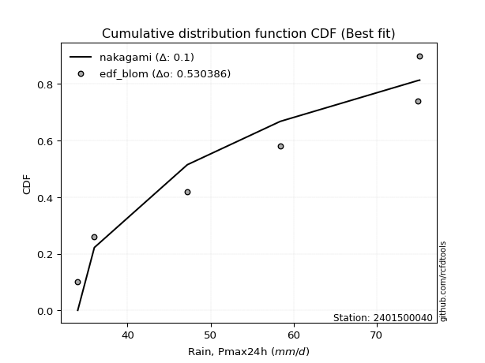</img>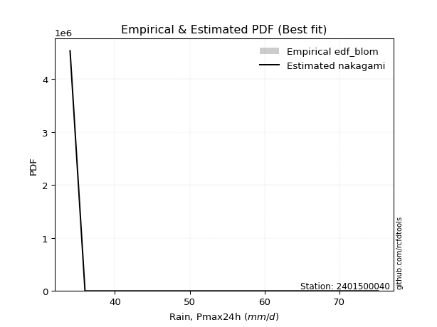</img>

</div>


### 7. EDF Tukey (1962)

In hydrology, the Tukey formula is used as a plotting position formula to estimate the empirical probability or frequency of a flood event (or other hydrological data). The formula parameter is given as _c=0.333_ (or 1/3).

<div align="center">


$P=(m-c)/(n+1-2c)$


</div>


**7.1. Empirical values**

<div align="center">

|                | 0                   | 1                   | 2                   | 3         | 4                  | 5                  | 6                  |
|:---------------|:--------------------|:--------------------|:--------------------|:----------|:-------------------|:-------------------|:-------------------|
| date           | 2022                | 2023                | 2025                | 2021      | 2020               | 2019               | 2024               |
| x              | 34.0                | 36.0                | 44.8                | 47.2      | 58.4               | 75.0               | 75.2               |
| m              | 1                   | 2                   | 3                   | 4         | 5                  | 6                  | 7                  |
| empirical_dist | edf_tukey           | edf_tukey           | edf_tukey           | edf_tukey | edf_tukey          | edf_tukey          | edf_tukey          |
| empirical      | 0.09090909090909091 | 0.22727272727272727 | 0.36363636363636365 | 0.5       | 0.6363636363636364 | 0.7727272727272727 | 0.9090909090909091 |
| empirical_tr   | 1.1                 | 1.2941176470588236  | 1.5714285714285714  | 2.0       | 2.75               | 4.3999999999999995 | 10.999999999999996 |

</div>


**7.2. Kolmogorov-Smirnov fit test (sorted by Δ)**


<div align="center">

|                | 0                   | 1                   | 2                   | 3                   | 4                   | 5                   | 6                   | 7                   | 8                   | 9                   | 10                  | 11                  | 12                  | 13                  | 14                  | 15                  | 16                  | 17                  | 18                  | 19                  | 20                  | 21                  | 22                  | 23                  | 24                  | 25                  | 26                  | 27                  | 28                  | 29                  | 30                  | 31                  | 32                  | 33                  | 34                  | 35                  | 36                  | 37                  | 38                  | 39                  | 40                  | 41                  | 42                  | 43                  | 44                  | 45                  | 46                  | 47                  | 48                  | 49                  | 50                  | 51                  | 52                  | 53                  | 54                  | 55                  | 56                  | 57                  | 58                  | 59                  | 60                  | 61                  | 62                  | 63                  | 64                  | 65                  | 66                  | 67                  | 68                  | 69                  | 70                  | 71                  | 72                  | 73                  | 74                  | 75                  | 76                  | 77                  | 78                  | 79                  | 80                  | 81                  | 82                  | 83                  | 84                  | 85                  | 86                  | 87                  | 88                  | 89                  | 90                  | 91                  | 92                  | 93                  | 94                  | 95                  | 96                  | 97                  | 98                  | 99                  | 100                 | 101                 | 102                 | 103                 | 104                 | 105                 | 106                 | 107                 | 108                 | 109                 | 110                 | 111                 | 112                 | 113                 | 114                 | 115                 | 116                 | 117                 | 118                 | 119                 | 120                 | 121                 | 122                 | 123                 | 124                 | 125                 | 126                 | 127                 | 128                 | 129                 | 130                 | 131                 | 132                 | 133                 | 134                 | 135                 | 136                 | 137                 | 138                 | 139                 | 140                 | 141                 | 142                 | 143                 | 144                 | 145                 | 146                 | 147                 | 148                 | 149                 | 150                 | 151                 | 152                 | 153                 | 154                 | 155                 | 156                 | 157                 | 158                 | 159                 |
|:---------------|:--------------------|:--------------------|:--------------------|:--------------------|:--------------------|:--------------------|:--------------------|:--------------------|:--------------------|:--------------------|:--------------------|:--------------------|:--------------------|:--------------------|:--------------------|:--------------------|:--------------------|:--------------------|:--------------------|:--------------------|:--------------------|:--------------------|:--------------------|:--------------------|:--------------------|:--------------------|:--------------------|:--------------------|:--------------------|:--------------------|:--------------------|:--------------------|:--------------------|:--------------------|:--------------------|:--------------------|:--------------------|:--------------------|:--------------------|:--------------------|:--------------------|:--------------------|:--------------------|:--------------------|:--------------------|:--------------------|:--------------------|:--------------------|:--------------------|:--------------------|:--------------------|:--------------------|:--------------------|:--------------------|:--------------------|:--------------------|:--------------------|:--------------------|:--------------------|:--------------------|:--------------------|:--------------------|:--------------------|:--------------------|:--------------------|:--------------------|:--------------------|:--------------------|:--------------------|:--------------------|:--------------------|:--------------------|:--------------------|:--------------------|:--------------------|:--------------------|:--------------------|:--------------------|:--------------------|:--------------------|:--------------------|:--------------------|:--------------------|:--------------------|:--------------------|:--------------------|:--------------------|:--------------------|:--------------------|:--------------------|:--------------------|:--------------------|:--------------------|:--------------------|:--------------------|:--------------------|:--------------------|:--------------------|:--------------------|:--------------------|:--------------------|:--------------------|:--------------------|:--------------------|:--------------------|:--------------------|:--------------------|:--------------------|:--------------------|:--------------------|:--------------------|:--------------------|:--------------------|:--------------------|:--------------------|:--------------------|:--------------------|:--------------------|:--------------------|:--------------------|:--------------------|:--------------------|:--------------------|:--------------------|:--------------------|:--------------------|:--------------------|:--------------------|:--------------------|:--------------------|:--------------------|:--------------------|:--------------------|:--------------------|:--------------------|:--------------------|:--------------------|:--------------------|:--------------------|:--------------------|:--------------------|:--------------------|:--------------------|:--------------------|:--------------------|:--------------------|:--------------------|:--------------------|:--------------------|:--------------------|:--------------------|:--------------------|:--------------------|:--------------------|:--------------------|:--------------------|:--------------------|:--------------------|:--------------------|:--------------------|
| station        | 2401500040          | 2401500040          | 2401500040          | 2401500040          | 2401500040          | 2401500040          | 2401500040          | 2401500040          | 2401500040          | 2401500040          | 2401500040          | 2401500040          | 2401500040          | 2401500040          | 2401500040          | 2401500040          | 2401500040          | 2401500040          | 2401500040          | 2401500040          | 2401500040          | 2401500040          | 2401500040          | 2401500040          | 2401500040          | 2401500040          | 2401500040          | 2401500040          | 2401500040          | 2401500040          | 2401500040          | 2401500040          | 2401500040          | 2401500040          | 2401500040          | 2401500040          | 2401500040          | 2401500040          | 2401500040          | 2401500040          | 2401500040          | 2401500040          | 2401500040          | 2401500040          | 2401500040          | 2401500040          | 2401500040          | 2401500040          | 2401500040          | 2401500040          | 2401500040          | 2401500040          | 2401500040          | 2401500040          | 2401500040          | 2401500040          | 2401500040          | 2401500040          | 2401500040          | 2401500040          | 2401500040          | 2401500040          | 2401500040          | 2401500040          | 2401500040          | 2401500040          | 2401500040          | 2401500040          | 2401500040          | 2401500040          | 2401500040          | 2401500040          | 2401500040          | 2401500040          | 2401500040          | 2401500040          | 2401500040          | 2401500040          | 2401500040          | 2401500040          | 2401500040          | 2401500040          | 2401500040          | 2401500040          | 2401500040          | 2401500040          | 2401500040          | 2401500040          | 2401500040          | 2401500040          | 2401500040          | 2401500040          | 2401500040          | 2401500040          | 2401500040          | 2401500040          | 2401500040          | 2401500040          | 2401500040          | 2401500040          | 2401500040          | 2401500040          | 2401500040          | 2401500040          | 2401500040          | 2401500040          | 2401500040          | 2401500040          | 2401500040          | 2401500040          | 2401500040          | 2401500040          | 2401500040          | 2401500040          | 2401500040          | 2401500040          | 2401500040          | 2401500040          | 2401500040          | 2401500040          | 2401500040          | 2401500040          | 2401500040          | 2401500040          | 2401500040          | 2401500040          | 2401500040          | 2401500040          | 2401500040          | 2401500040          | 2401500040          | 2401500040          | 2401500040          | 2401500040          | 2401500040          | 2401500040          | 2401500040          | 2401500040          | 2401500040          | 2401500040          | 2401500040          | 2401500040          | 2401500040          | 2401500040          | 2401500040          | 2401500040          | 2401500040          | 2401500040          | 2401500040          | 2401500040          | 2401500040          | 2401500040          | 2401500040          | 2401500040          | 2401500040          | 2401500040          | 2401500040          | 2401500040          | 2401500040          | 2401500040          |
| empirical_dist | edf_tukey           | edf_tukey           | edf_tukey           | edf_tukey           | edf_tukey           | edf_tukey           | edf_tukey           | edf_tukey           | edf_tukey           | edf_tukey           | edf_tukey           | edf_tukey           | edf_tukey           | edf_tukey           | edf_tukey           | edf_tukey           | edf_tukey           | edf_tukey           | edf_tukey           | edf_tukey           | edf_tukey           | edf_tukey           | edf_tukey           | edf_tukey           | edf_tukey           | edf_tukey           | edf_tukey           | edf_tukey           | edf_tukey           | edf_tukey           | edf_tukey           | edf_tukey           | edf_tukey           | edf_tukey           | edf_tukey           | edf_tukey           | edf_tukey           | edf_tukey           | edf_tukey           | edf_tukey           | edf_tukey           | edf_tukey           | edf_tukey           | edf_tukey           | edf_tukey           | edf_tukey           | edf_tukey           | edf_tukey           | edf_tukey           | edf_tukey           | edf_tukey           | edf_tukey           | edf_tukey           | edf_tukey           | edf_tukey           | edf_tukey           | edf_tukey           | edf_tukey           | edf_tukey           | edf_tukey           | edf_tukey           | edf_tukey           | edf_tukey           | edf_tukey           | edf_tukey           | edf_tukey           | edf_tukey           | edf_tukey           | edf_tukey           | edf_tukey           | edf_tukey           | edf_tukey           | edf_tukey           | edf_tukey           | edf_tukey           | edf_tukey           | edf_tukey           | edf_tukey           | edf_tukey           | edf_tukey           | edf_tukey           | edf_tukey           | edf_tukey           | edf_tukey           | edf_tukey           | edf_tukey           | edf_tukey           | edf_tukey           | edf_tukey           | edf_tukey           | edf_tukey           | edf_tukey           | edf_tukey           | edf_tukey           | edf_tukey           | edf_tukey           | edf_tukey           | edf_tukey           | edf_tukey           | edf_tukey           | edf_tukey           | edf_tukey           | edf_tukey           | edf_tukey           | edf_tukey           | edf_tukey           | edf_tukey           | edf_tukey           | edf_tukey           | edf_tukey           | edf_tukey           | edf_tukey           | edf_tukey           | edf_tukey           | edf_tukey           | edf_tukey           | edf_tukey           | edf_tukey           | edf_tukey           | edf_tukey           | edf_tukey           | edf_tukey           | edf_tukey           | edf_tukey           | edf_tukey           | edf_tukey           | edf_tukey           | edf_tukey           | edf_tukey           | edf_tukey           | edf_tukey           | edf_tukey           | edf_tukey           | edf_tukey           | edf_tukey           | edf_tukey           | edf_tukey           | edf_tukey           | edf_tukey           | edf_tukey           | edf_tukey           | edf_tukey           | edf_tukey           | edf_tukey           | edf_tukey           | edf_tukey           | edf_tukey           | edf_tukey           | edf_tukey           | edf_tukey           | edf_tukey           | edf_tukey           | edf_tukey           | edf_tukey           | edf_tukey           | edf_tukey           | edf_tukey           | edf_tukey           | edf_tukey           | edf_tukey           |
| p_dist         | logbeta             | logrdist            | logfatiguelife      | logksone            | logarcsine          | logburr             | invgauss            | loginvgauss         | logmielke           | loginvweibull       | loggenlogistic      | burr                | logsemicircular     | invgamma            | logfoldnorm         | loganglit           | loghalfgennorm      | lograyleigh         | logkstwobign        | logmaxwell          | logf                | genextreme          | nct                 | halfnorm            | exponnorm           | logncf              | alpha               | logalpha            | genexpon            | logrice             | logbetaprime        | logdgamma           | logdweibull         | loginvgamma         | betaprime           | lognct              | f                   | ksone               | loggenexpon         | ncf                 | logerlang           | logpearson3         | loggamma            | loggamma            | rayleigh            | semicircular        | logskewnorm         | logjohnsonsu        | logloggamma         | burr12              | logexponnorm        | logcrystalball      | lognorm             | logt                | maxwell             | genlogistic         | anglit              | foldnorm            | loglomax            | gumbel_r            | loggumbel_r         | pearson3            | loghalfnorm         | kstwobign           | rice                | loglogistic         | dweibull            | logloglaplace       | moyal               | logcosine           | logburr12           | norm                | crystalball         | truncnorm           | t                   | nakagami            | loghypsecant        | loggompertz         | dgamma              | loglaplace          | loglaplace          | johnsonsu           | gompertz            | logistic            | cosine              | halflogistic        | skewnorm            | gausshyper          | genpareto           | logmoyal            | arcsine             | hypsecant           | logargus            | loggumbel_l         | logtrapezoid        | halfgennorm         | rdist               | loggengamma         | beta                | exponpow            | logkappa3           | laplace             | loghalflogistic     | gumbel_l            | argus               | wrapcauchy          | tukeylambda         | logwrapcauchy       | trapezoid           | logtukeylambda      | loggausshyper       | kappa4              | kappa3              | logtriang           | uniform             | logkappa4           | bradford            | loguniform          | logweibull_max      | triang              | truncexpon          | truncpareto         | logvonmises_line    | logbradford         | logtruncweibull_min | logtruncexpon       | truncweibull_min    | logtruncnorm        | loggenextreme       | logwald             | wald                | lomax               | vonmises_line       | loggenhalflogistic  | logweibull_min      | weibull_min         | loggennorm          | gennorm             | logexponpow         | gamma               | logexponweib        | loglevy_l           | erlang              | genhalflogistic     | levy_l              | lognakagami         | logjohnsonsb        | johnsonsb           | gengamma            | fatiguelife         | powerlaw            | logpowerlaw         | exponweib           | invweibull          | weibull_max         | loggenpareto        | logtruncpareto      | logvonmises         | vonmises            | mielke              |
| delta          | 0.09090908731416898 | 0.09090908844442515 | 0.10610420811581314 | 0.1066318190617993  | 0.1068064190651179  | 0.1100255212953195  | 0.11021464607821019 | 0.11091754943993803 | 0.11170155856933106 | 0.1117217930010369  | 0.11195842304047221 | 0.11212867516269942 | 0.11314164061560827 | 0.11555442040625319 | 0.11681844241007322 | 0.1184488566329579  | 0.11930468073143215 | 0.12028434901191798 | 0.12061475303771119 | 0.12292744457280602 | 0.12300393905226625 | 0.12312904936936242 | 0.12340133002087039 | 0.12567818118064378 | 0.12570529155223895 | 0.12589183695690442 | 0.1259128300282396  | 0.1261043567630733  | 0.12619302964215307 | 0.12626866674607629 | 0.1263485319744344  | 0.1264502553598849  | 0.1266188403005703  | 0.1284491187833161  | 0.1285440290361597  | 0.12854640789782446 | 0.12864505641272506 | 0.12919255226969395 | 0.12939171134344002 | 0.12965445448585944 | 0.12978390944341667 | 0.13080776737133437 | 0.13120282817682793 | 0.13120282817682793 | 0.1313868926372923  | 0.13145553237138208 | 0.13230708598816165 | 0.1323443244762783  | 0.13246047961469665 | 0.1327679131837678  | 0.1328569163108162  | 0.13287264954626665 | 0.13287291758283382 | 0.1328733812176326  | 0.13432293323354805 | 0.1345131629874926  | 0.1345219109521011  | 0.13570116748946326 | 0.13729935650992942 | 0.13742173143615877 | 0.13864015847855207 | 0.13891572283884301 | 0.1392380623104263  | 0.13972417481227073 | 0.14038495036291243 | 0.14283959172989824 | 0.1443118605611391  | 0.14437161814687838 | 0.14505054424983221 | 0.1452526144223244  | 0.14533502286493694 | 0.14535559678334864 | 0.14535560024055105 | 0.14535560363821365 | 0.14539530076610752 | 0.14663572038629238 | 0.1469062796345031  | 0.14800557332296255 | 0.14874602849020757 | 0.14931741911943874 | 0.14931741911943874 | 0.1499363178201939  | 0.15421821402365463 | 0.1586993565070317  | 0.15939072026990553 | 0.1596739141538923  | 0.16271451315101856 | 0.16492455671856787 | 0.1671085600399329  | 0.16715433540355462 | 0.1711531017151693  | 0.1721818345085811  | 0.17377534238081305 | 0.1789087258153902  | 0.18065325391869125 | 0.1839797658985165  | 0.1866023274724452  | 0.19137108181278795 | 0.19468857700270126 | 0.19739630042618395 | 0.19987820936650436 | 0.20054781952305667 | 0.20097059181549976 | 0.20278883861451125 | 0.20474549863521407 | 0.2116988786297821  | 0.2162342509055868  | 0.21668110983809918 | 0.21696508609035792 | 0.21736550513753694 | 0.21753768040142785 | 0.22025998705746874 | 0.22076772191471683 | 0.22232590782979733 | 0.22241835834068835 | 0.22299335728376313 | 0.22382871369286583 | 0.2239177907658938  | 0.22416457967761888 | 0.2243453468599978  | 0.22439203768408444 | 0.22474923524969304 | 0.22479137778670388 | 0.22497659782423085 | 0.22506018057164157 | 0.22540534375452992 | 0.22549599649732777 | 0.22607469575430728 | 0.22717293532393446 | 0.22727272727272727 | 0.22727272727272727 | 0.23332638920329274 | 0.23440515530911338 | 0.24441797996171538 | 0.24724281250032332 | 0.26172708026123537 | 0.2727272727272727  | 0.2727272727272727  | 0.2799710282110571  | 0.28069064149514455 | 0.2906946279206003  | 0.2907212844046897  | 0.3011637121742091  | 0.302735294968033   | 0.30400840504919147 | 0.31642041729042325 | 0.3224681195046506  | 0.38879333501093527 | 0.4060016045293545  | 0.4207462946705566  | 0.4377418892810939  | 0.4677924521189242  | 0.4703423492231871  | 0.4771776729190363  | 0.516715734246785   | 0.517425029707314   | 0.5658197051179759  | 1.1330655541252719  | 11.469076573013968  | nan                 |
| deltao         | 0.48442053926100004 | 0.48442053926100004 | 0.48442053926100004 | 0.48442053926100004 | 0.48442053926100004 | 0.48442053926100004 | 0.48442053926100004 | 0.48442053926100004 | 0.48442053926100004 | 0.48442053926100004 | 0.48442053926100004 | 0.48442053926100004 | 0.48442053926100004 | 0.48442053926100004 | 0.48442053926100004 | 0.48442053926100004 | 0.48442053926100004 | 0.48442053926100004 | 0.48442053926100004 | 0.48442053926100004 | 0.48442053926100004 | 0.48442053926100004 | 0.48442053926100004 | 0.48442053926100004 | 0.48442053926100004 | 0.48442053926100004 | 0.48442053926100004 | 0.48442053926100004 | 0.48442053926100004 | 0.48442053926100004 | 0.48442053926100004 | 0.48442053926100004 | 0.48442053926100004 | 0.48442053926100004 | 0.48442053926100004 | 0.48442053926100004 | 0.48442053926100004 | 0.48442053926100004 | 0.48442053926100004 | 0.48442053926100004 | 0.48442053926100004 | 0.48442053926100004 | 0.48442053926100004 | 0.48442053926100004 | 0.48442053926100004 | 0.48442053926100004 | 0.48442053926100004 | 0.48442053926100004 | 0.48442053926100004 | 0.48442053926100004 | 0.48442053926100004 | 0.48442053926100004 | 0.48442053926100004 | 0.48442053926100004 | 0.48442053926100004 | 0.48442053926100004 | 0.48442053926100004 | 0.48442053926100004 | 0.48442053926100004 | 0.48442053926100004 | 0.48442053926100004 | 0.48442053926100004 | 0.48442053926100004 | 0.48442053926100004 | 0.48442053926100004 | 0.48442053926100004 | 0.48442053926100004 | 0.48442053926100004 | 0.48442053926100004 | 0.48442053926100004 | 0.48442053926100004 | 0.48442053926100004 | 0.48442053926100004 | 0.48442053926100004 | 0.48442053926100004 | 0.48442053926100004 | 0.48442053926100004 | 0.48442053926100004 | 0.48442053926100004 | 0.48442053926100004 | 0.48442053926100004 | 0.48442053926100004 | 0.48442053926100004 | 0.48442053926100004 | 0.48442053926100004 | 0.48442053926100004 | 0.48442053926100004 | 0.48442053926100004 | 0.48442053926100004 | 0.48442053926100004 | 0.48442053926100004 | 0.48442053926100004 | 0.48442053926100004 | 0.48442053926100004 | 0.48442053926100004 | 0.48442053926100004 | 0.48442053926100004 | 0.48442053926100004 | 0.48442053926100004 | 0.48442053926100004 | 0.48442053926100004 | 0.48442053926100004 | 0.48442053926100004 | 0.48442053926100004 | 0.48442053926100004 | 0.48442053926100004 | 0.48442053926100004 | 0.48442053926100004 | 0.48442053926100004 | 0.48442053926100004 | 0.48442053926100004 | 0.48442053926100004 | 0.48442053926100004 | 0.48442053926100004 | 0.48442053926100004 | 0.48442053926100004 | 0.48442053926100004 | 0.48442053926100004 | 0.48442053926100004 | 0.48442053926100004 | 0.48442053926100004 | 0.48442053926100004 | 0.48442053926100004 | 0.48442053926100004 | 0.48442053926100004 | 0.48442053926100004 | 0.48442053926100004 | 0.48442053926100004 | 0.48442053926100004 | 0.48442053926100004 | 0.48442053926100004 | 0.48442053926100004 | 0.48442053926100004 | 0.48442053926100004 | 0.48442053926100004 | 0.48442053926100004 | 0.48442053926100004 | 0.48442053926100004 | 0.48442053926100004 | 0.48442053926100004 | 0.48442053926100004 | 0.48442053926100004 | 0.48442053926100004 | 0.48442053926100004 | 0.48442053926100004 | 0.48442053926100004 | 0.48442053926100004 | 0.48442053926100004 | 0.48442053926100004 | 0.48442053926100004 | 0.48442053926100004 | 0.48442053926100004 | 0.48442053926100004 | 0.48442053926100004 | 0.48442053926100004 | 0.48442053926100004 | 0.48442053926100004 | 0.48442053926100004 | 0.48442053926100004 | 0.48442053926100004 |
| eval           | Δo > Δ              | Δo > Δ              | Δo > Δ              | Δo > Δ              | Δo > Δ              | Δo > Δ              | Δo > Δ              | Δo > Δ              | Δo > Δ              | Δo > Δ              | Δo > Δ              | Δo > Δ              | Δo > Δ              | Δo > Δ              | Δo > Δ              | Δo > Δ              | Δo > Δ              | Δo > Δ              | Δo > Δ              | Δo > Δ              | Δo > Δ              | Δo > Δ              | Δo > Δ              | Δo > Δ              | Δo > Δ              | Δo > Δ              | Δo > Δ              | Δo > Δ              | Δo > Δ              | Δo > Δ              | Δo > Δ              | Δo > Δ              | Δo > Δ              | Δo > Δ              | Δo > Δ              | Δo > Δ              | Δo > Δ              | Δo > Δ              | Δo > Δ              | Δo > Δ              | Δo > Δ              | Δo > Δ              | Δo > Δ              | Δo > Δ              | Δo > Δ              | Δo > Δ              | Δo > Δ              | Δo > Δ              | Δo > Δ              | Δo > Δ              | Δo > Δ              | Δo > Δ              | Δo > Δ              | Δo > Δ              | Δo > Δ              | Δo > Δ              | Δo > Δ              | Δo > Δ              | Δo > Δ              | Δo > Δ              | Δo > Δ              | Δo > Δ              | Δo > Δ              | Δo > Δ              | Δo > Δ              | Δo > Δ              | Δo > Δ              | Δo > Δ              | Δo > Δ              | Δo > Δ              | Δo > Δ              | Δo > Δ              | Δo > Δ              | Δo > Δ              | Δo > Δ              | Δo > Δ              | Δo > Δ              | Δo > Δ              | Δo > Δ              | Δo > Δ              | Δo > Δ              | Δo > Δ              | Δo > Δ              | Δo > Δ              | Δo > Δ              | Δo > Δ              | Δo > Δ              | Δo > Δ              | Δo > Δ              | Δo > Δ              | Δo > Δ              | Δo > Δ              | Δo > Δ              | Δo > Δ              | Δo > Δ              | Δo > Δ              | Δo > Δ              | Δo > Δ              | Δo > Δ              | Δo > Δ              | Δo > Δ              | Δo > Δ              | Δo > Δ              | Δo > Δ              | Δo > Δ              | Δo > Δ              | Δo > Δ              | Δo > Δ              | Δo > Δ              | Δo > Δ              | Δo > Δ              | Δo > Δ              | Δo > Δ              | Δo > Δ              | Δo > Δ              | Δo > Δ              | Δo > Δ              | Δo > Δ              | Δo > Δ              | Δo > Δ              | Δo > Δ              | Δo > Δ              | Δo > Δ              | Δo > Δ              | Δo > Δ              | Δo > Δ              | Δo > Δ              | Δo > Δ              | Δo > Δ              | Δo > Δ              | Δo > Δ              | Δo > Δ              | Δo > Δ              | Δo > Δ              | Δo > Δ              | Δo > Δ              | Δo > Δ              | Δo > Δ              | Δo > Δ              | Δo > Δ              | Δo > Δ              | Δo > Δ              | Δo > Δ              | Δo > Δ              | Δo > Δ              | Δo > Δ              | Δo > Δ              | Δo > Δ              | Δo > Δ              | Δo > Δ              | Δo > Δ              | Δo > Δ              | Δo > Δ              | Δo > Δ              | Δo <= Δ             | Δo <= Δ             | Δo <= Δ             | Δo <= Δ             | Δo <= Δ             | Δo <= Δ             |
| fit            | 1                   | 1                   | 1                   | 1                   | 1                   | 1                   | 1                   | 1                   | 1                   | 1                   | 1                   | 1                   | 1                   | 1                   | 1                   | 1                   | 1                   | 1                   | 1                   | 1                   | 1                   | 1                   | 1                   | 1                   | 1                   | 1                   | 1                   | 1                   | 1                   | 1                   | 1                   | 1                   | 1                   | 1                   | 1                   | 1                   | 1                   | 1                   | 1                   | 1                   | 1                   | 1                   | 1                   | 1                   | 1                   | 1                   | 1                   | 1                   | 1                   | 1                   | 1                   | 1                   | 1                   | 1                   | 1                   | 1                   | 1                   | 1                   | 1                   | 1                   | 1                   | 1                   | 1                   | 1                   | 1                   | 1                   | 1                   | 1                   | 1                   | 1                   | 1                   | 1                   | 1                   | 1                   | 1                   | 1                   | 1                   | 1                   | 1                   | 1                   | 1                   | 1                   | 1                   | 1                   | 1                   | 1                   | 1                   | 1                   | 1                   | 1                   | 1                   | 1                   | 1                   | 1                   | 1                   | 1                   | 1                   | 1                   | 1                   | 1                   | 1                   | 1                   | 1                   | 1                   | 1                   | 1                   | 1                   | 1                   | 1                   | 1                   | 1                   | 1                   | 1                   | 1                   | 1                   | 1                   | 1                   | 1                   | 1                   | 1                   | 1                   | 1                   | 1                   | 1                   | 1                   | 1                   | 1                   | 1                   | 1                   | 1                   | 1                   | 1                   | 1                   | 1                   | 1                   | 1                   | 1                   | 1                   | 1                   | 1                   | 1                   | 1                   | 1                   | 1                   | 1                   | 1                   | 1                   | 1                   | 1                   | 1                   | 1                   | 1                   | 1                   | 1                   | 0                   | 0                   | 0                   | 0                   | 0                   | 0                   |
| n              | 7                   | 7                   | 7                   | 7                   | 7                   | 7                   | 7                   | 7                   | 7                   | 7                   | 7                   | 7                   | 7                   | 7                   | 7                   | 7                   | 7                   | 7                   | 7                   | 7                   | 7                   | 7                   | 7                   | 7                   | 7                   | 7                   | 7                   | 7                   | 7                   | 7                   | 7                   | 7                   | 7                   | 7                   | 7                   | 7                   | 7                   | 7                   | 7                   | 7                   | 7                   | 7                   | 7                   | 7                   | 7                   | 7                   | 7                   | 7                   | 7                   | 7                   | 7                   | 7                   | 7                   | 7                   | 7                   | 7                   | 7                   | 7                   | 7                   | 7                   | 7                   | 7                   | 7                   | 7                   | 7                   | 7                   | 7                   | 7                   | 7                   | 7                   | 7                   | 7                   | 7                   | 7                   | 7                   | 7                   | 7                   | 7                   | 7                   | 7                   | 7                   | 7                   | 7                   | 7                   | 7                   | 7                   | 7                   | 7                   | 7                   | 7                   | 7                   | 7                   | 7                   | 7                   | 7                   | 7                   | 7                   | 7                   | 7                   | 7                   | 7                   | 7                   | 7                   | 7                   | 7                   | 7                   | 7                   | 7                   | 7                   | 7                   | 7                   | 7                   | 7                   | 7                   | 7                   | 7                   | 7                   | 7                   | 7                   | 7                   | 7                   | 7                   | 7                   | 7                   | 7                   | 7                   | 7                   | 7                   | 7                   | 7                   | 7                   | 7                   | 7                   | 7                   | 7                   | 7                   | 7                   | 7                   | 7                   | 7                   | 7                   | 7                   | 7                   | 7                   | 7                   | 7                   | 7                   | 7                   | 7                   | 7                   | 7                   | 7                   | 7                   | 7                   | 7                   | 7                   | 7                   | 7                   | 7                   | 7                   |
| best_fit       | 1                   | 0                   | 0                   | 0                   | 0                   | 0                   | 0                   | 0                   | 0                   | 0                   | 0                   | 0                   | 0                   | 0                   | 0                   | 0                   | 0                   | 0                   | 0                   | 0                   | 0                   | 0                   | 0                   | 0                   | 0                   | 0                   | 0                   | 0                   | 0                   | 0                   | 0                   | 0                   | 0                   | 0                   | 0                   | 0                   | 0                   | 0                   | 0                   | 0                   | 0                   | 0                   | 0                   | 0                   | 0                   | 0                   | 0                   | 0                   | 0                   | 0                   | 0                   | 0                   | 0                   | 0                   | 0                   | 0                   | 0                   | 0                   | 0                   | 0                   | 0                   | 0                   | 0                   | 0                   | 0                   | 0                   | 0                   | 0                   | 0                   | 0                   | 0                   | 0                   | 0                   | 0                   | 0                   | 0                   | 0                   | 0                   | 0                   | 0                   | 0                   | 0                   | 0                   | 0                   | 0                   | 0                   | 0                   | 0                   | 0                   | 0                   | 0                   | 0                   | 0                   | 0                   | 0                   | 0                   | 0                   | 0                   | 0                   | 0                   | 0                   | 0                   | 0                   | 0                   | 0                   | 0                   | 0                   | 0                   | 0                   | 0                   | 0                   | 0                   | 0                   | 0                   | 0                   | 0                   | 0                   | 0                   | 0                   | 0                   | 0                   | 0                   | 0                   | 0                   | 0                   | 0                   | 0                   | 0                   | 0                   | 0                   | 0                   | 0                   | 0                   | 0                   | 0                   | 0                   | 0                   | 0                   | 0                   | 0                   | 0                   | 0                   | 0                   | 0                   | 0                   | 0                   | 0                   | 0                   | 0                   | 0                   | 0                   | 0                   | 0                   | 0                   | 0                   | 0                   | 0                   | 0                   | 0                   | 0                   |
| best_fit_sort  | 1                   | 2                   | 3                   | 4                   | 5                   | 6                   | 7                   | 8                   | 9                   | 10                  | 11                  | 12                  | 13                  | 14                  | 15                  | 16                  | 17                  | 18                  | 19                  | 20                  | 21                  | 22                  | 23                  | 24                  | 25                  | 26                  | 27                  | 28                  | 29                  | 30                  | 31                  | 32                  | 33                  | 34                  | 35                  | 36                  | 37                  | 38                  | 39                  | 40                  | 41                  | 42                  | 43                  | 44                  | 45                  | 46                  | 47                  | 48                  | 49                  | 50                  | 51                  | 52                  | 53                  | 54                  | 55                  | 56                  | 57                  | 58                  | 59                  | 60                  | 61                  | 62                  | 63                  | 64                  | 65                  | 66                  | 67                  | 68                  | 69                  | 70                  | 71                  | 72                  | 73                  | 74                  | 75                  | 76                  | 77                  | 78                  | 79                  | 80                  | 81                  | 82                  | 83                  | 84                  | 85                  | 86                  | 87                  | 88                  | 89                  | 90                  | 91                  | 92                  | 93                  | 94                  | 95                  | 96                  | 97                  | 98                  | 99                  | 100                 | 101                 | 102                 | 103                 | 104                 | 105                 | 106                 | 107                 | 108                 | 109                 | 110                 | 111                 | 112                 | 113                 | 114                 | 115                 | 116                 | 117                 | 118                 | 119                 | 120                 | 121                 | 122                 | 123                 | 124                 | 125                 | 126                 | 127                 | 128                 | 129                 | 130                 | 131                 | 132                 | 133                 | 134                 | 135                 | 136                 | 137                 | 138                 | 139                 | 140                 | 141                 | 142                 | 143                 | 144                 | 145                 | 146                 | 147                 | 148                 | 149                 | 150                 | 151                 | 152                 | 153                 | 154                 | 155                 | 156                 | 157                 | 158                 | 159                 | 160                 |

</div>


**7.3. Best fit**

<div align="center">

|   id |    station | empirical_dist   | p_dist   |     delta |   deltao | eval   |   fit |   n |   best_fit |   best_fit_sort |
|-----:|-----------:|:-----------------|:---------|----------:|---------:|:-------|------:|----:|-----------:|----------------:|
|    0 | 2401500040 | edf_tukey        | logbeta  | 0.0909091 | 0.484421 | Δo > Δ |     1 |   7 |          1 |               1 |

</div>


<div align="center">

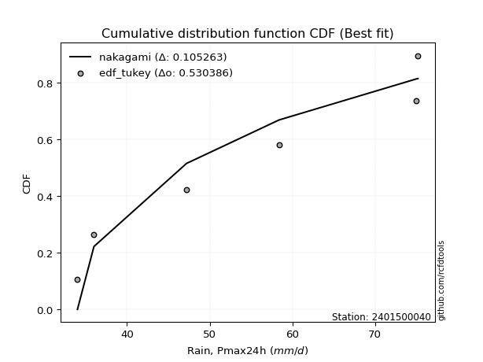</img>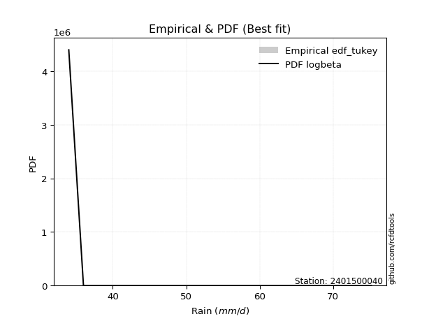</img>

</div>


### 8. EDF Gringorten (1963)

Gringorten plotting position formula is essential for estimating the probability and return periods of extreme events like floods and heavy rainfall. The constant _a=0.44_.

<div align="center">


$P=(m-a)/(n+1-2a)$


</div>


**8.1. Empirical values**

<div align="center">

|                | 0                   | 1                   | 2                  | 3              | 4                  | 5                  | 6                  |
|:---------------|:--------------------|:--------------------|:-------------------|:---------------|:-------------------|:-------------------|:-------------------|
| date           | 2022                | 2023                | 2025               | 2021           | 2020               | 2019               | 2024               |
| x              | 34.0                | 36.0                | 44.8               | 47.2           | 58.4               | 75.0               | 75.2               |
| m              | 1                   | 2                   | 3                  | 4              | 5                  | 6                  | 7                  |
| empirical_dist | edf_gringorten      | edf_gringorten      | edf_gringorten     | edf_gringorten | edf_gringorten     | edf_gringorten     | edf_gringorten     |
| empirical      | 0.07865168539325844 | 0.21910112359550563 | 0.3595505617977528 | 0.5            | 0.6404494382022471 | 0.7808988764044943 | 0.9213483146067415 |
| empirical_tr   | 1.0853658536585364  | 1.2805755395683454  | 1.5614035087719298 | 2.0            | 2.781249999999999  | 4.564102564102562  | 12.714285714285701 |

</div>


**8.2. Kolmogorov-Smirnov fit test (sorted by Δ)**


<div align="center">

|                | 0                   | 1                   | 2                   | 3                   | 4                   | 5                   | 6                   | 7                   | 8                   | 9                   | 10                  | 11                  | 12                  | 13                  | 14                  | 15                  | 16                  | 17                  | 18                  | 19                  | 20                  | 21                  | 22                  | 23                  | 24                  | 25                  | 26                  | 27                  | 28                  | 29                  | 30                  | 31                  | 32                  | 33                  | 34                  | 35                  | 36                  | 37                  | 38                  | 39                  | 40                  | 41                  | 42                  | 43                  | 44                  | 45                  | 46                  | 47                  | 48                  | 49                  | 50                  | 51                  | 52                  | 53                  | 54                  | 55                  | 56                  | 57                  | 58                  | 59                  | 60                  | 61                  | 62                  | 63                  | 64                  | 65                  | 66                  | 67                  | 68                  | 69                  | 70                  | 71                  | 72                  | 73                  | 74                  | 75                  | 76                  | 77                  | 78                  | 79                  | 80                  | 81                  | 82                  | 83                  | 84                  | 85                  | 86                  | 87                  | 88                  | 89                  | 90                  | 91                  | 92                  | 93                  | 94                  | 95                  | 96                  | 97                  | 98                  | 99                  | 100                 | 101                 | 102                 | 103                 | 104                 | 105                 | 106                 | 107                 | 108                 | 109                 | 110                 | 111                 | 112                 | 113                 | 114                 | 115                 | 116                 | 117                 | 118                 | 119                 | 120                 | 121                 | 122                 | 123                 | 124                 | 125                 | 126                 | 127                 | 128                 | 129                 | 130                 | 131                 | 132                 | 133                 | 134                 | 135                 | 136                 | 137                 | 138                 | 139                 | 140                 | 141                 | 142                 | 143                 | 144                 | 145                 | 146                 | 147                 | 148                 | 149                 | 150                 | 151                 | 152                 | 153                 | 154                 | 155                 | 156                 | 157                 | 158                 | 159                 |
|:---------------|:--------------------|:--------------------|:--------------------|:--------------------|:--------------------|:--------------------|:--------------------|:--------------------|:--------------------|:--------------------|:--------------------|:--------------------|:--------------------|:--------------------|:--------------------|:--------------------|:--------------------|:--------------------|:--------------------|:--------------------|:--------------------|:--------------------|:--------------------|:--------------------|:--------------------|:--------------------|:--------------------|:--------------------|:--------------------|:--------------------|:--------------------|:--------------------|:--------------------|:--------------------|:--------------------|:--------------------|:--------------------|:--------------------|:--------------------|:--------------------|:--------------------|:--------------------|:--------------------|:--------------------|:--------------------|:--------------------|:--------------------|:--------------------|:--------------------|:--------------------|:--------------------|:--------------------|:--------------------|:--------------------|:--------------------|:--------------------|:--------------------|:--------------------|:--------------------|:--------------------|:--------------------|:--------------------|:--------------------|:--------------------|:--------------------|:--------------------|:--------------------|:--------------------|:--------------------|:--------------------|:--------------------|:--------------------|:--------------------|:--------------------|:--------------------|:--------------------|:--------------------|:--------------------|:--------------------|:--------------------|:--------------------|:--------------------|:--------------------|:--------------------|:--------------------|:--------------------|:--------------------|:--------------------|:--------------------|:--------------------|:--------------------|:--------------------|:--------------------|:--------------------|:--------------------|:--------------------|:--------------------|:--------------------|:--------------------|:--------------------|:--------------------|:--------------------|:--------------------|:--------------------|:--------------------|:--------------------|:--------------------|:--------------------|:--------------------|:--------------------|:--------------------|:--------------------|:--------------------|:--------------------|:--------------------|:--------------------|:--------------------|:--------------------|:--------------------|:--------------------|:--------------------|:--------------------|:--------------------|:--------------------|:--------------------|:--------------------|:--------------------|:--------------------|:--------------------|:--------------------|:--------------------|:--------------------|:--------------------|:--------------------|:--------------------|:--------------------|:--------------------|:--------------------|:--------------------|:--------------------|:--------------------|:--------------------|:--------------------|:--------------------|:--------------------|:--------------------|:--------------------|:--------------------|:--------------------|:--------------------|:--------------------|:--------------------|:--------------------|:--------------------|:--------------------|:--------------------|:--------------------|:--------------------|:--------------------|:--------------------|
| station        | 2401500040          | 2401500040          | 2401500040          | 2401500040          | 2401500040          | 2401500040          | 2401500040          | 2401500040          | 2401500040          | 2401500040          | 2401500040          | 2401500040          | 2401500040          | 2401500040          | 2401500040          | 2401500040          | 2401500040          | 2401500040          | 2401500040          | 2401500040          | 2401500040          | 2401500040          | 2401500040          | 2401500040          | 2401500040          | 2401500040          | 2401500040          | 2401500040          | 2401500040          | 2401500040          | 2401500040          | 2401500040          | 2401500040          | 2401500040          | 2401500040          | 2401500040          | 2401500040          | 2401500040          | 2401500040          | 2401500040          | 2401500040          | 2401500040          | 2401500040          | 2401500040          | 2401500040          | 2401500040          | 2401500040          | 2401500040          | 2401500040          | 2401500040          | 2401500040          | 2401500040          | 2401500040          | 2401500040          | 2401500040          | 2401500040          | 2401500040          | 2401500040          | 2401500040          | 2401500040          | 2401500040          | 2401500040          | 2401500040          | 2401500040          | 2401500040          | 2401500040          | 2401500040          | 2401500040          | 2401500040          | 2401500040          | 2401500040          | 2401500040          | 2401500040          | 2401500040          | 2401500040          | 2401500040          | 2401500040          | 2401500040          | 2401500040          | 2401500040          | 2401500040          | 2401500040          | 2401500040          | 2401500040          | 2401500040          | 2401500040          | 2401500040          | 2401500040          | 2401500040          | 2401500040          | 2401500040          | 2401500040          | 2401500040          | 2401500040          | 2401500040          | 2401500040          | 2401500040          | 2401500040          | 2401500040          | 2401500040          | 2401500040          | 2401500040          | 2401500040          | 2401500040          | 2401500040          | 2401500040          | 2401500040          | 2401500040          | 2401500040          | 2401500040          | 2401500040          | 2401500040          | 2401500040          | 2401500040          | 2401500040          | 2401500040          | 2401500040          | 2401500040          | 2401500040          | 2401500040          | 2401500040          | 2401500040          | 2401500040          | 2401500040          | 2401500040          | 2401500040          | 2401500040          | 2401500040          | 2401500040          | 2401500040          | 2401500040          | 2401500040          | 2401500040          | 2401500040          | 2401500040          | 2401500040          | 2401500040          | 2401500040          | 2401500040          | 2401500040          | 2401500040          | 2401500040          | 2401500040          | 2401500040          | 2401500040          | 2401500040          | 2401500040          | 2401500040          | 2401500040          | 2401500040          | 2401500040          | 2401500040          | 2401500040          | 2401500040          | 2401500040          | 2401500040          | 2401500040          | 2401500040          | 2401500040          | 2401500040          |
| empirical_dist | edf_gringorten      | edf_gringorten      | edf_gringorten      | edf_gringorten      | edf_gringorten      | edf_gringorten      | edf_gringorten      | edf_gringorten      | edf_gringorten      | edf_gringorten      | edf_gringorten      | edf_gringorten      | edf_gringorten      | edf_gringorten      | edf_gringorten      | edf_gringorten      | edf_gringorten      | edf_gringorten      | edf_gringorten      | edf_gringorten      | edf_gringorten      | edf_gringorten      | edf_gringorten      | edf_gringorten      | edf_gringorten      | edf_gringorten      | edf_gringorten      | edf_gringorten      | edf_gringorten      | edf_gringorten      | edf_gringorten      | edf_gringorten      | edf_gringorten      | edf_gringorten      | edf_gringorten      | edf_gringorten      | edf_gringorten      | edf_gringorten      | edf_gringorten      | edf_gringorten      | edf_gringorten      | edf_gringorten      | edf_gringorten      | edf_gringorten      | edf_gringorten      | edf_gringorten      | edf_gringorten      | edf_gringorten      | edf_gringorten      | edf_gringorten      | edf_gringorten      | edf_gringorten      | edf_gringorten      | edf_gringorten      | edf_gringorten      | edf_gringorten      | edf_gringorten      | edf_gringorten      | edf_gringorten      | edf_gringorten      | edf_gringorten      | edf_gringorten      | edf_gringorten      | edf_gringorten      | edf_gringorten      | edf_gringorten      | edf_gringorten      | edf_gringorten      | edf_gringorten      | edf_gringorten      | edf_gringorten      | edf_gringorten      | edf_gringorten      | edf_gringorten      | edf_gringorten      | edf_gringorten      | edf_gringorten      | edf_gringorten      | edf_gringorten      | edf_gringorten      | edf_gringorten      | edf_gringorten      | edf_gringorten      | edf_gringorten      | edf_gringorten      | edf_gringorten      | edf_gringorten      | edf_gringorten      | edf_gringorten      | edf_gringorten      | edf_gringorten      | edf_gringorten      | edf_gringorten      | edf_gringorten      | edf_gringorten      | edf_gringorten      | edf_gringorten      | edf_gringorten      | edf_gringorten      | edf_gringorten      | edf_gringorten      | edf_gringorten      | edf_gringorten      | edf_gringorten      | edf_gringorten      | edf_gringorten      | edf_gringorten      | edf_gringorten      | edf_gringorten      | edf_gringorten      | edf_gringorten      | edf_gringorten      | edf_gringorten      | edf_gringorten      | edf_gringorten      | edf_gringorten      | edf_gringorten      | edf_gringorten      | edf_gringorten      | edf_gringorten      | edf_gringorten      | edf_gringorten      | edf_gringorten      | edf_gringorten      | edf_gringorten      | edf_gringorten      | edf_gringorten      | edf_gringorten      | edf_gringorten      | edf_gringorten      | edf_gringorten      | edf_gringorten      | edf_gringorten      | edf_gringorten      | edf_gringorten      | edf_gringorten      | edf_gringorten      | edf_gringorten      | edf_gringorten      | edf_gringorten      | edf_gringorten      | edf_gringorten      | edf_gringorten      | edf_gringorten      | edf_gringorten      | edf_gringorten      | edf_gringorten      | edf_gringorten      | edf_gringorten      | edf_gringorten      | edf_gringorten      | edf_gringorten      | edf_gringorten      | edf_gringorten      | edf_gringorten      | edf_gringorten      | edf_gringorten      | edf_gringorten      | edf_gringorten      | edf_gringorten      |
| p_dist         | logbeta             | logrdist            | logfatiguelife      | logksone            | logarcsine          | logburr             | invgauss            | loginvgauss         | logmielke           | loginvweibull       | loggenlogistic      | burr                | logsemicircular     | invgamma            | logfoldnorm         | loganglit           | loghalfgennorm      | lograyleigh         | logkstwobign        | logmaxwell          | logf                | genextreme          | nct                 | halfnorm            | exponnorm           | logncf              | alpha               | logalpha            | genexpon            | logrice             | logbetaprime        | logdgamma           | logdweibull         | loginvgamma         | betaprime           | lognct              | f                   | ksone               | loggenexpon         | ncf                 | logerlang           | logpearson3         | loggamma            | loggamma            | rayleigh            | semicircular        | logskewnorm         | logjohnsonsu        | logloggamma         | logexponnorm        | logcrystalball      | lognorm             | logt                | maxwell             | genlogistic         | anglit              | foldnorm            | gumbel_r            | loggumbel_r         | pearson3            | loghalfnorm         | kstwobign           | rice                | loglogistic         | dweibull            | burr12              | moyal               | logcosine           | logburr12           | nakagami            | loghypsecant        | loggompertz         | logloglaplace       | dgamma              | loglaplace          | loglaplace          | loglomax            | truncnorm           | crystalball         | norm                | t                   | johnsonsu           | gompertz            | halflogistic        | skewnorm            | logistic            | logmoyal            | cosine              | arcsine             | logargus            | gausshyper          | genpareto           | loggumbel_l         | hypsecant           | logtrapezoid        | rdist               | beta                | halfgennorm         | logkappa3           | loghalflogistic     | loggengamma         | laplace             | exponpow            | gumbel_l            | wrapcauchy          | argus               | tukeylambda         | logwrapcauchy       | trapezoid           | logtukeylambda      | kappa4              | kappa3              | logtriang           | uniform             | logkappa4           | bradford            | loguniform          | truncexpon          | truncpareto         | logvonmises_line    | logbradford         | logtruncweibull_min | logtruncexpon       | truncweibull_min    | loggausshyper       | logtruncnorm        | wald                | logwald             | triang              | loggenextreme       | logweibull_max      | vonmises_line       | loggenhalflogistic  | lomax               | logweibull_min      | weibull_min         | loggennorm          | gennorm             | logexponpow         | gamma               | logexponweib        | loglevy_l           | genhalflogistic     | erlang              | levy_l              | lognakagami         | logjohnsonsb        | johnsonsb           | gengamma            | fatiguelife         | powerlaw            | logpowerlaw         | exponweib           | invweibull          | weibull_max         | loggenpareto        | logtruncpareto      | logvonmises         | vonmises            | mielke              |
| delta          | 0.07865168179833651 | 0.07865168292859268 | 0.0979326044385915  | 0.09846021538457772 | 0.09863481538789631 | 0.10185391761809792 | 0.1020430424009886  | 0.10274594576271645 | 0.10352995489210948 | 0.10355018932381532 | 0.10378681936325063 | 0.10395707148547784 | 0.10497003693838669 | 0.1073828167290316  | 0.10864683873285164 | 0.11027725295573632 | 0.11113307705421051 | 0.1121127453346964  | 0.1124431493604896  | 0.11475584089558444 | 0.11483233537504467 | 0.11495744569214084 | 0.11522972634364881 | 0.1175065775034222  | 0.1175336878750173  | 0.11772023327968284 | 0.11774122635101802 | 0.11793275308585172 | 0.11802142596493143 | 0.1180970630688547  | 0.11817692829721282 | 0.11827865168266326 | 0.11844723662334866 | 0.12027751510609452 | 0.1203724253589381  | 0.12037480422060287 | 0.12047345273550347 | 0.12102094859247237 | 0.12122010766621837 | 0.12148285080863785 | 0.12161230576619508 | 0.12263616369411279 | 0.12303122449960635 | 0.12303122449960635 | 0.12321528896007072 | 0.1232839286941605  | 0.12413548231094007 | 0.12417272079905672 | 0.12428887593747506 | 0.12468531263359461 | 0.12470104586904507 | 0.12470131390561223 | 0.12470177754041101 | 0.12615132955632646 | 0.12634155931027102 | 0.1263503072748795  | 0.12752956381224168 | 0.12925012775893718 | 0.13046855480133043 | 0.13074411916162143 | 0.13106645863320465 | 0.13155257113504915 | 0.13221334668569085 | 0.13466798805267666 | 0.1361402568839175  | 0.13685371502237864 | 0.13687894057261057 | 0.13708101074510282 | 0.13716341918771535 | 0.13846411670907074 | 0.1387346759572815  | 0.1398339696457409  | 0.14028581630826764 | 0.140574424812986   | 0.14114581544221716 | 0.14114581544221716 | 0.14138515834854026 | 0.14151103206360638 | 0.14151103379967805 | 0.1415110370098065  | 0.14157525793918202 | 0.14449993982239867 | 0.146046610346433   | 0.15150231047667065 | 0.15454290947379692 | 0.1586993565070317  | 0.15898273172633298 | 0.15939072026990553 | 0.1629814980379477  | 0.16560373870359146 | 0.16901035855717872 | 0.16983632742613003 | 0.1707371221381686  | 0.1721818345085811  | 0.17248165024146966 | 0.17843072379522362 | 0.18651697332547967 | 0.18806556773712735 | 0.19170660568928277 | 0.19279898813827812 | 0.1954568836513988  | 0.20054781952305667 | 0.2014821022647948  | 0.20278883861451125 | 0.2035272749525605  | 0.20474549863521407 | 0.2080626472283652  | 0.2085095061608776  | 0.20879348241313633 | 0.20919390146031536 | 0.21208838338024716 | 0.21259611823749525 | 0.21415430415257575 | 0.21424675466346677 | 0.21482175360654154 | 0.21565711001564425 | 0.21574618708867221 | 0.21622043400686286 | 0.21657763157247145 | 0.2166197741094823  | 0.21680499414700927 | 0.21688857689441998 | 0.21723374007730833 | 0.21732439282010618 | 0.21753768040142785 | 0.2179030920770857  | 0.21910112359550563 | 0.21910112359550563 | 0.2243453468599978  | 0.22717293532393446 | 0.22825038151622962 | 0.23440515530911338 | 0.24441797996171538 | 0.24558379471912517 | 0.25132861433893416 | 0.2739844857770678  | 0.2808988764044944  | 0.2808988764044944  | 0.284056830049668   | 0.2847764433337554  | 0.29478042975921115 | 0.29480708624330043 | 0.302735294968033   | 0.30524951401281997 | 0.3080942068878022  | 0.3205062191290341  | 0.3306397231818723  | 0.3928791368495461  | 0.41008740636796537 | 0.4248320965091674  | 0.44182769111970477 | 0.471878253957535   | 0.4744281510617979  | 0.4894350784348687  | 0.5208015360853957  | 0.5296824352231465  | 0.5739913087951976  | 1.1248939504480502  | 11.460904969336747  | nan                 |
| deltao         | 0.48442053926100004 | 0.48442053926100004 | 0.48442053926100004 | 0.48442053926100004 | 0.48442053926100004 | 0.48442053926100004 | 0.48442053926100004 | 0.48442053926100004 | 0.48442053926100004 | 0.48442053926100004 | 0.48442053926100004 | 0.48442053926100004 | 0.48442053926100004 | 0.48442053926100004 | 0.48442053926100004 | 0.48442053926100004 | 0.48442053926100004 | 0.48442053926100004 | 0.48442053926100004 | 0.48442053926100004 | 0.48442053926100004 | 0.48442053926100004 | 0.48442053926100004 | 0.48442053926100004 | 0.48442053926100004 | 0.48442053926100004 | 0.48442053926100004 | 0.48442053926100004 | 0.48442053926100004 | 0.48442053926100004 | 0.48442053926100004 | 0.48442053926100004 | 0.48442053926100004 | 0.48442053926100004 | 0.48442053926100004 | 0.48442053926100004 | 0.48442053926100004 | 0.48442053926100004 | 0.48442053926100004 | 0.48442053926100004 | 0.48442053926100004 | 0.48442053926100004 | 0.48442053926100004 | 0.48442053926100004 | 0.48442053926100004 | 0.48442053926100004 | 0.48442053926100004 | 0.48442053926100004 | 0.48442053926100004 | 0.48442053926100004 | 0.48442053926100004 | 0.48442053926100004 | 0.48442053926100004 | 0.48442053926100004 | 0.48442053926100004 | 0.48442053926100004 | 0.48442053926100004 | 0.48442053926100004 | 0.48442053926100004 | 0.48442053926100004 | 0.48442053926100004 | 0.48442053926100004 | 0.48442053926100004 | 0.48442053926100004 | 0.48442053926100004 | 0.48442053926100004 | 0.48442053926100004 | 0.48442053926100004 | 0.48442053926100004 | 0.48442053926100004 | 0.48442053926100004 | 0.48442053926100004 | 0.48442053926100004 | 0.48442053926100004 | 0.48442053926100004 | 0.48442053926100004 | 0.48442053926100004 | 0.48442053926100004 | 0.48442053926100004 | 0.48442053926100004 | 0.48442053926100004 | 0.48442053926100004 | 0.48442053926100004 | 0.48442053926100004 | 0.48442053926100004 | 0.48442053926100004 | 0.48442053926100004 | 0.48442053926100004 | 0.48442053926100004 | 0.48442053926100004 | 0.48442053926100004 | 0.48442053926100004 | 0.48442053926100004 | 0.48442053926100004 | 0.48442053926100004 | 0.48442053926100004 | 0.48442053926100004 | 0.48442053926100004 | 0.48442053926100004 | 0.48442053926100004 | 0.48442053926100004 | 0.48442053926100004 | 0.48442053926100004 | 0.48442053926100004 | 0.48442053926100004 | 0.48442053926100004 | 0.48442053926100004 | 0.48442053926100004 | 0.48442053926100004 | 0.48442053926100004 | 0.48442053926100004 | 0.48442053926100004 | 0.48442053926100004 | 0.48442053926100004 | 0.48442053926100004 | 0.48442053926100004 | 0.48442053926100004 | 0.48442053926100004 | 0.48442053926100004 | 0.48442053926100004 | 0.48442053926100004 | 0.48442053926100004 | 0.48442053926100004 | 0.48442053926100004 | 0.48442053926100004 | 0.48442053926100004 | 0.48442053926100004 | 0.48442053926100004 | 0.48442053926100004 | 0.48442053926100004 | 0.48442053926100004 | 0.48442053926100004 | 0.48442053926100004 | 0.48442053926100004 | 0.48442053926100004 | 0.48442053926100004 | 0.48442053926100004 | 0.48442053926100004 | 0.48442053926100004 | 0.48442053926100004 | 0.48442053926100004 | 0.48442053926100004 | 0.48442053926100004 | 0.48442053926100004 | 0.48442053926100004 | 0.48442053926100004 | 0.48442053926100004 | 0.48442053926100004 | 0.48442053926100004 | 0.48442053926100004 | 0.48442053926100004 | 0.48442053926100004 | 0.48442053926100004 | 0.48442053926100004 | 0.48442053926100004 | 0.48442053926100004 | 0.48442053926100004 | 0.48442053926100004 | 0.48442053926100004 | 0.48442053926100004 |
| eval           | Δo > Δ              | Δo > Δ              | Δo > Δ              | Δo > Δ              | Δo > Δ              | Δo > Δ              | Δo > Δ              | Δo > Δ              | Δo > Δ              | Δo > Δ              | Δo > Δ              | Δo > Δ              | Δo > Δ              | Δo > Δ              | Δo > Δ              | Δo > Δ              | Δo > Δ              | Δo > Δ              | Δo > Δ              | Δo > Δ              | Δo > Δ              | Δo > Δ              | Δo > Δ              | Δo > Δ              | Δo > Δ              | Δo > Δ              | Δo > Δ              | Δo > Δ              | Δo > Δ              | Δo > Δ              | Δo > Δ              | Δo > Δ              | Δo > Δ              | Δo > Δ              | Δo > Δ              | Δo > Δ              | Δo > Δ              | Δo > Δ              | Δo > Δ              | Δo > Δ              | Δo > Δ              | Δo > Δ              | Δo > Δ              | Δo > Δ              | Δo > Δ              | Δo > Δ              | Δo > Δ              | Δo > Δ              | Δo > Δ              | Δo > Δ              | Δo > Δ              | Δo > Δ              | Δo > Δ              | Δo > Δ              | Δo > Δ              | Δo > Δ              | Δo > Δ              | Δo > Δ              | Δo > Δ              | Δo > Δ              | Δo > Δ              | Δo > Δ              | Δo > Δ              | Δo > Δ              | Δo > Δ              | Δo > Δ              | Δo > Δ              | Δo > Δ              | Δo > Δ              | Δo > Δ              | Δo > Δ              | Δo > Δ              | Δo > Δ              | Δo > Δ              | Δo > Δ              | Δo > Δ              | Δo > Δ              | Δo > Δ              | Δo > Δ              | Δo > Δ              | Δo > Δ              | Δo > Δ              | Δo > Δ              | Δo > Δ              | Δo > Δ              | Δo > Δ              | Δo > Δ              | Δo > Δ              | Δo > Δ              | Δo > Δ              | Δo > Δ              | Δo > Δ              | Δo > Δ              | Δo > Δ              | Δo > Δ              | Δo > Δ              | Δo > Δ              | Δo > Δ              | Δo > Δ              | Δo > Δ              | Δo > Δ              | Δo > Δ              | Δo > Δ              | Δo > Δ              | Δo > Δ              | Δo > Δ              | Δo > Δ              | Δo > Δ              | Δo > Δ              | Δo > Δ              | Δo > Δ              | Δo > Δ              | Δo > Δ              | Δo > Δ              | Δo > Δ              | Δo > Δ              | Δo > Δ              | Δo > Δ              | Δo > Δ              | Δo > Δ              | Δo > Δ              | Δo > Δ              | Δo > Δ              | Δo > Δ              | Δo > Δ              | Δo > Δ              | Δo > Δ              | Δo > Δ              | Δo > Δ              | Δo > Δ              | Δo > Δ              | Δo > Δ              | Δo > Δ              | Δo > Δ              | Δo > Δ              | Δo > Δ              | Δo > Δ              | Δo > Δ              | Δo > Δ              | Δo > Δ              | Δo > Δ              | Δo > Δ              | Δo > Δ              | Δo > Δ              | Δo > Δ              | Δo > Δ              | Δo > Δ              | Δo > Δ              | Δo > Δ              | Δo > Δ              | Δo > Δ              | Δo > Δ              | Δo > Δ              | Δo <= Δ             | Δo <= Δ             | Δo <= Δ             | Δo <= Δ             | Δo <= Δ             | Δo <= Δ             | Δo <= Δ             |
| fit            | 1                   | 1                   | 1                   | 1                   | 1                   | 1                   | 1                   | 1                   | 1                   | 1                   | 1                   | 1                   | 1                   | 1                   | 1                   | 1                   | 1                   | 1                   | 1                   | 1                   | 1                   | 1                   | 1                   | 1                   | 1                   | 1                   | 1                   | 1                   | 1                   | 1                   | 1                   | 1                   | 1                   | 1                   | 1                   | 1                   | 1                   | 1                   | 1                   | 1                   | 1                   | 1                   | 1                   | 1                   | 1                   | 1                   | 1                   | 1                   | 1                   | 1                   | 1                   | 1                   | 1                   | 1                   | 1                   | 1                   | 1                   | 1                   | 1                   | 1                   | 1                   | 1                   | 1                   | 1                   | 1                   | 1                   | 1                   | 1                   | 1                   | 1                   | 1                   | 1                   | 1                   | 1                   | 1                   | 1                   | 1                   | 1                   | 1                   | 1                   | 1                   | 1                   | 1                   | 1                   | 1                   | 1                   | 1                   | 1                   | 1                   | 1                   | 1                   | 1                   | 1                   | 1                   | 1                   | 1                   | 1                   | 1                   | 1                   | 1                   | 1                   | 1                   | 1                   | 1                   | 1                   | 1                   | 1                   | 1                   | 1                   | 1                   | 1                   | 1                   | 1                   | 1                   | 1                   | 1                   | 1                   | 1                   | 1                   | 1                   | 1                   | 1                   | 1                   | 1                   | 1                   | 1                   | 1                   | 1                   | 1                   | 1                   | 1                   | 1                   | 1                   | 1                   | 1                   | 1                   | 1                   | 1                   | 1                   | 1                   | 1                   | 1                   | 1                   | 1                   | 1                   | 1                   | 1                   | 1                   | 1                   | 1                   | 1                   | 1                   | 1                   | 0                   | 0                   | 0                   | 0                   | 0                   | 0                   | 0                   |
| n              | 7                   | 7                   | 7                   | 7                   | 7                   | 7                   | 7                   | 7                   | 7                   | 7                   | 7                   | 7                   | 7                   | 7                   | 7                   | 7                   | 7                   | 7                   | 7                   | 7                   | 7                   | 7                   | 7                   | 7                   | 7                   | 7                   | 7                   | 7                   | 7                   | 7                   | 7                   | 7                   | 7                   | 7                   | 7                   | 7                   | 7                   | 7                   | 7                   | 7                   | 7                   | 7                   | 7                   | 7                   | 7                   | 7                   | 7                   | 7                   | 7                   | 7                   | 7                   | 7                   | 7                   | 7                   | 7                   | 7                   | 7                   | 7                   | 7                   | 7                   | 7                   | 7                   | 7                   | 7                   | 7                   | 7                   | 7                   | 7                   | 7                   | 7                   | 7                   | 7                   | 7                   | 7                   | 7                   | 7                   | 7                   | 7                   | 7                   | 7                   | 7                   | 7                   | 7                   | 7                   | 7                   | 7                   | 7                   | 7                   | 7                   | 7                   | 7                   | 7                   | 7                   | 7                   | 7                   | 7                   | 7                   | 7                   | 7                   | 7                   | 7                   | 7                   | 7                   | 7                   | 7                   | 7                   | 7                   | 7                   | 7                   | 7                   | 7                   | 7                   | 7                   | 7                   | 7                   | 7                   | 7                   | 7                   | 7                   | 7                   | 7                   | 7                   | 7                   | 7                   | 7                   | 7                   | 7                   | 7                   | 7                   | 7                   | 7                   | 7                   | 7                   | 7                   | 7                   | 7                   | 7                   | 7                   | 7                   | 7                   | 7                   | 7                   | 7                   | 7                   | 7                   | 7                   | 7                   | 7                   | 7                   | 7                   | 7                   | 7                   | 7                   | 7                   | 7                   | 7                   | 7                   | 7                   | 7                   | 7                   |
| best_fit       | 1                   | 0                   | 0                   | 0                   | 0                   | 0                   | 0                   | 0                   | 0                   | 0                   | 0                   | 0                   | 0                   | 0                   | 0                   | 0                   | 0                   | 0                   | 0                   | 0                   | 0                   | 0                   | 0                   | 0                   | 0                   | 0                   | 0                   | 0                   | 0                   | 0                   | 0                   | 0                   | 0                   | 0                   | 0                   | 0                   | 0                   | 0                   | 0                   | 0                   | 0                   | 0                   | 0                   | 0                   | 0                   | 0                   | 0                   | 0                   | 0                   | 0                   | 0                   | 0                   | 0                   | 0                   | 0                   | 0                   | 0                   | 0                   | 0                   | 0                   | 0                   | 0                   | 0                   | 0                   | 0                   | 0                   | 0                   | 0                   | 0                   | 0                   | 0                   | 0                   | 0                   | 0                   | 0                   | 0                   | 0                   | 0                   | 0                   | 0                   | 0                   | 0                   | 0                   | 0                   | 0                   | 0                   | 0                   | 0                   | 0                   | 0                   | 0                   | 0                   | 0                   | 0                   | 0                   | 0                   | 0                   | 0                   | 0                   | 0                   | 0                   | 0                   | 0                   | 0                   | 0                   | 0                   | 0                   | 0                   | 0                   | 0                   | 0                   | 0                   | 0                   | 0                   | 0                   | 0                   | 0                   | 0                   | 0                   | 0                   | 0                   | 0                   | 0                   | 0                   | 0                   | 0                   | 0                   | 0                   | 0                   | 0                   | 0                   | 0                   | 0                   | 0                   | 0                   | 0                   | 0                   | 0                   | 0                   | 0                   | 0                   | 0                   | 0                   | 0                   | 0                   | 0                   | 0                   | 0                   | 0                   | 0                   | 0                   | 0                   | 0                   | 0                   | 0                   | 0                   | 0                   | 0                   | 0                   | 0                   |
| best_fit_sort  | 1                   | 2                   | 3                   | 4                   | 5                   | 6                   | 7                   | 8                   | 9                   | 10                  | 11                  | 12                  | 13                  | 14                  | 15                  | 16                  | 17                  | 18                  | 19                  | 20                  | 21                  | 22                  | 23                  | 24                  | 25                  | 26                  | 27                  | 28                  | 29                  | 30                  | 31                  | 32                  | 33                  | 34                  | 35                  | 36                  | 37                  | 38                  | 39                  | 40                  | 41                  | 42                  | 43                  | 44                  | 45                  | 46                  | 47                  | 48                  | 49                  | 50                  | 51                  | 52                  | 53                  | 54                  | 55                  | 56                  | 57                  | 58                  | 59                  | 60                  | 61                  | 62                  | 63                  | 64                  | 65                  | 66                  | 67                  | 68                  | 69                  | 70                  | 71                  | 72                  | 73                  | 74                  | 75                  | 76                  | 77                  | 78                  | 79                  | 80                  | 81                  | 82                  | 83                  | 84                  | 85                  | 86                  | 87                  | 88                  | 89                  | 90                  | 91                  | 92                  | 93                  | 94                  | 95                  | 96                  | 97                  | 98                  | 99                  | 100                 | 101                 | 102                 | 103                 | 104                 | 105                 | 106                 | 107                 | 108                 | 109                 | 110                 | 111                 | 112                 | 113                 | 114                 | 115                 | 116                 | 117                 | 118                 | 119                 | 120                 | 121                 | 122                 | 123                 | 124                 | 125                 | 126                 | 127                 | 128                 | 129                 | 130                 | 131                 | 132                 | 133                 | 134                 | 135                 | 136                 | 137                 | 138                 | 139                 | 140                 | 141                 | 142                 | 143                 | 144                 | 145                 | 146                 | 147                 | 148                 | 149                 | 150                 | 151                 | 152                 | 153                 | 154                 | 155                 | 156                 | 157                 | 158                 | 159                 | 160                 |

</div>


**8.3. Best fit**

<div align="center">

|   id |    station | empirical_dist   | p_dist   |     delta |   deltao | eval   |   fit |   n |   best_fit |   best_fit_sort |
|-----:|-----------:|:-----------------|:---------|----------:|---------:|:-------|------:|----:|-----------:|----------------:|
|    0 | 2401500040 | edf_gringorten   | logbeta  | 0.0786517 | 0.484421 | Δo > Δ |     1 |   7 |          1 |               1 |

</div>


<div align="center">

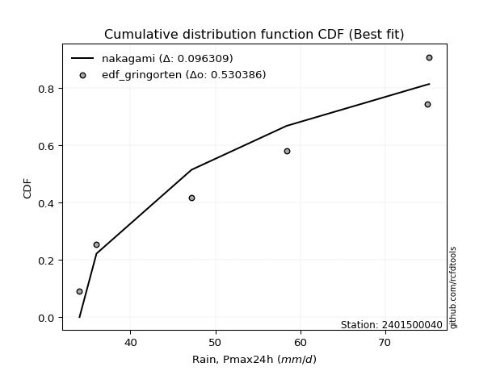</img>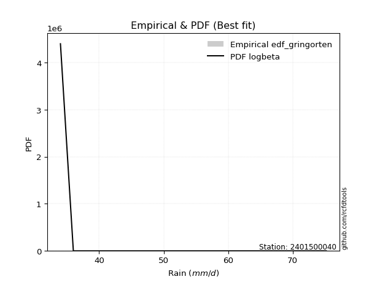</img>

</div>


### 9. EDF Filliben (1975)

The specific values of the constants (0.3175) (often denoted as $alpha$) and (0.365) are derived from a method proposed by James J. Filliben in a 1975 paper. This particular formula is the mean value of the $i$-th order statistic of the normal distribution and is considered a robust and effective plotting position formula for the normal probability plot correlation coefficient test for normality.

<div align="center">


$P=(m-0.3175)/(n+0.365)$


</div>


**9.1. Empirical values**

<div align="center">

|                | 0                   | 1                   | 2                   | 3            | 4                  | 5                  | 6                  |
|:---------------|:--------------------|:--------------------|:--------------------|:-------------|:-------------------|:-------------------|:-------------------|
| date           | 2022                | 2023                | 2025                | 2021         | 2020               | 2019               | 2024               |
| x              | 34.0                | 36.0                | 44.8                | 47.2         | 58.4               | 75.0               | 75.2               |
| m              | 1                   | 2                   | 3                   | 4            | 5                  | 6                  | 7                  |
| empirical_dist | edf_filliben        | edf_filliben        | edf_filliben        | edf_filliben | edf_filliben       | edf_filliben       | edf_filliben       |
| empirical      | 0.09266802443991853 | 0.22844534962661237 | 0.36422267481330617 | 0.5          | 0.6357773251866938 | 0.7715546503733877 | 0.9073319755600815 |
| empirical_tr   | 1.1021324354657687  | 1.2960844698636163  | 1.5728777362520021  | 2.0          | 2.7455731593662627 | 4.377414561664191  | 10.791208791208794 |

</div>


**9.2. Kolmogorov-Smirnov fit test (sorted by Δ)**


<div align="center">

|                | 0                   | 1                   | 2                   | 3                   | 4                   | 5                   | 6                   | 7                   | 8                   | 9                   | 10                  | 11                  | 12                  | 13                  | 14                  | 15                  | 16                  | 17                  | 18                  | 19                  | 20                  | 21                  | 22                  | 23                  | 24                  | 25                  | 26                  | 27                  | 28                  | 29                  | 30                  | 31                  | 32                  | 33                  | 34                  | 35                  | 36                  | 37                  | 38                  | 39                  | 40                  | 41                  | 42                  | 43                  | 44                  | 45                  | 46                  | 47                  | 48                  | 49                  | 50                  | 51                  | 52                  | 53                  | 54                  | 55                  | 56                  | 57                  | 58                  | 59                  | 60                  | 61                  | 62                  | 63                  | 64                  | 65                  | 66                  | 67                  | 68                  | 69                  | 70                  | 71                  | 72                  | 73                  | 74                  | 75                  | 76                  | 77                  | 78                  | 79                  | 80                  | 81                  | 82                  | 83                  | 84                  | 85                  | 86                  | 87                  | 88                  | 89                  | 90                  | 91                  | 92                  | 93                  | 94                  | 95                  | 96                  | 97                  | 98                  | 99                  | 100                 | 101                 | 102                 | 103                 | 104                 | 105                 | 106                 | 107                 | 108                 | 109                 | 110                 | 111                 | 112                 | 113                 | 114                 | 115                 | 116                 | 117                 | 118                 | 119                 | 120                 | 121                 | 122                 | 123                 | 124                 | 125                 | 126                 | 127                 | 128                 | 129                 | 130                 | 131                 | 132                 | 133                 | 134                 | 135                 | 136                 | 137                 | 138                 | 139                 | 140                 | 141                 | 142                 | 143                 | 144                 | 145                 | 146                 | 147                 | 148                 | 149                 | 150                 | 151                 | 152                 | 153                 | 154                 | 155                 | 156                 | 157                 | 158                 | 159                 |
|:---------------|:--------------------|:--------------------|:--------------------|:--------------------|:--------------------|:--------------------|:--------------------|:--------------------|:--------------------|:--------------------|:--------------------|:--------------------|:--------------------|:--------------------|:--------------------|:--------------------|:--------------------|:--------------------|:--------------------|:--------------------|:--------------------|:--------------------|:--------------------|:--------------------|:--------------------|:--------------------|:--------------------|:--------------------|:--------------------|:--------------------|:--------------------|:--------------------|:--------------------|:--------------------|:--------------------|:--------------------|:--------------------|:--------------------|:--------------------|:--------------------|:--------------------|:--------------------|:--------------------|:--------------------|:--------------------|:--------------------|:--------------------|:--------------------|:--------------------|:--------------------|:--------------------|:--------------------|:--------------------|:--------------------|:--------------------|:--------------------|:--------------------|:--------------------|:--------------------|:--------------------|:--------------------|:--------------------|:--------------------|:--------------------|:--------------------|:--------------------|:--------------------|:--------------------|:--------------------|:--------------------|:--------------------|:--------------------|:--------------------|:--------------------|:--------------------|:--------------------|:--------------------|:--------------------|:--------------------|:--------------------|:--------------------|:--------------------|:--------------------|:--------------------|:--------------------|:--------------------|:--------------------|:--------------------|:--------------------|:--------------------|:--------------------|:--------------------|:--------------------|:--------------------|:--------------------|:--------------------|:--------------------|:--------------------|:--------------------|:--------------------|:--------------------|:--------------------|:--------------------|:--------------------|:--------------------|:--------------------|:--------------------|:--------------------|:--------------------|:--------------------|:--------------------|:--------------------|:--------------------|:--------------------|:--------------------|:--------------------|:--------------------|:--------------------|:--------------------|:--------------------|:--------------------|:--------------------|:--------------------|:--------------------|:--------------------|:--------------------|:--------------------|:--------------------|:--------------------|:--------------------|:--------------------|:--------------------|:--------------------|:--------------------|:--------------------|:--------------------|:--------------------|:--------------------|:--------------------|:--------------------|:--------------------|:--------------------|:--------------------|:--------------------|:--------------------|:--------------------|:--------------------|:--------------------|:--------------------|:--------------------|:--------------------|:--------------------|:--------------------|:--------------------|:--------------------|:--------------------|:--------------------|:--------------------|:--------------------|:--------------------|
| station        | 2401500040          | 2401500040          | 2401500040          | 2401500040          | 2401500040          | 2401500040          | 2401500040          | 2401500040          | 2401500040          | 2401500040          | 2401500040          | 2401500040          | 2401500040          | 2401500040          | 2401500040          | 2401500040          | 2401500040          | 2401500040          | 2401500040          | 2401500040          | 2401500040          | 2401500040          | 2401500040          | 2401500040          | 2401500040          | 2401500040          | 2401500040          | 2401500040          | 2401500040          | 2401500040          | 2401500040          | 2401500040          | 2401500040          | 2401500040          | 2401500040          | 2401500040          | 2401500040          | 2401500040          | 2401500040          | 2401500040          | 2401500040          | 2401500040          | 2401500040          | 2401500040          | 2401500040          | 2401500040          | 2401500040          | 2401500040          | 2401500040          | 2401500040          | 2401500040          | 2401500040          | 2401500040          | 2401500040          | 2401500040          | 2401500040          | 2401500040          | 2401500040          | 2401500040          | 2401500040          | 2401500040          | 2401500040          | 2401500040          | 2401500040          | 2401500040          | 2401500040          | 2401500040          | 2401500040          | 2401500040          | 2401500040          | 2401500040          | 2401500040          | 2401500040          | 2401500040          | 2401500040          | 2401500040          | 2401500040          | 2401500040          | 2401500040          | 2401500040          | 2401500040          | 2401500040          | 2401500040          | 2401500040          | 2401500040          | 2401500040          | 2401500040          | 2401500040          | 2401500040          | 2401500040          | 2401500040          | 2401500040          | 2401500040          | 2401500040          | 2401500040          | 2401500040          | 2401500040          | 2401500040          | 2401500040          | 2401500040          | 2401500040          | 2401500040          | 2401500040          | 2401500040          | 2401500040          | 2401500040          | 2401500040          | 2401500040          | 2401500040          | 2401500040          | 2401500040          | 2401500040          | 2401500040          | 2401500040          | 2401500040          | 2401500040          | 2401500040          | 2401500040          | 2401500040          | 2401500040          | 2401500040          | 2401500040          | 2401500040          | 2401500040          | 2401500040          | 2401500040          | 2401500040          | 2401500040          | 2401500040          | 2401500040          | 2401500040          | 2401500040          | 2401500040          | 2401500040          | 2401500040          | 2401500040          | 2401500040          | 2401500040          | 2401500040          | 2401500040          | 2401500040          | 2401500040          | 2401500040          | 2401500040          | 2401500040          | 2401500040          | 2401500040          | 2401500040          | 2401500040          | 2401500040          | 2401500040          | 2401500040          | 2401500040          | 2401500040          | 2401500040          | 2401500040          | 2401500040          | 2401500040          | 2401500040          | 2401500040          |
| empirical_dist | edf_filliben        | edf_filliben        | edf_filliben        | edf_filliben        | edf_filliben        | edf_filliben        | edf_filliben        | edf_filliben        | edf_filliben        | edf_filliben        | edf_filliben        | edf_filliben        | edf_filliben        | edf_filliben        | edf_filliben        | edf_filliben        | edf_filliben        | edf_filliben        | edf_filliben        | edf_filliben        | edf_filliben        | edf_filliben        | edf_filliben        | edf_filliben        | edf_filliben        | edf_filliben        | edf_filliben        | edf_filliben        | edf_filliben        | edf_filliben        | edf_filliben        | edf_filliben        | edf_filliben        | edf_filliben        | edf_filliben        | edf_filliben        | edf_filliben        | edf_filliben        | edf_filliben        | edf_filliben        | edf_filliben        | edf_filliben        | edf_filliben        | edf_filliben        | edf_filliben        | edf_filliben        | edf_filliben        | edf_filliben        | edf_filliben        | edf_filliben        | edf_filliben        | edf_filliben        | edf_filliben        | edf_filliben        | edf_filliben        | edf_filliben        | edf_filliben        | edf_filliben        | edf_filliben        | edf_filliben        | edf_filliben        | edf_filliben        | edf_filliben        | edf_filliben        | edf_filliben        | edf_filliben        | edf_filliben        | edf_filliben        | edf_filliben        | edf_filliben        | edf_filliben        | edf_filliben        | edf_filliben        | edf_filliben        | edf_filliben        | edf_filliben        | edf_filliben        | edf_filliben        | edf_filliben        | edf_filliben        | edf_filliben        | edf_filliben        | edf_filliben        | edf_filliben        | edf_filliben        | edf_filliben        | edf_filliben        | edf_filliben        | edf_filliben        | edf_filliben        | edf_filliben        | edf_filliben        | edf_filliben        | edf_filliben        | edf_filliben        | edf_filliben        | edf_filliben        | edf_filliben        | edf_filliben        | edf_filliben        | edf_filliben        | edf_filliben        | edf_filliben        | edf_filliben        | edf_filliben        | edf_filliben        | edf_filliben        | edf_filliben        | edf_filliben        | edf_filliben        | edf_filliben        | edf_filliben        | edf_filliben        | edf_filliben        | edf_filliben        | edf_filliben        | edf_filliben        | edf_filliben        | edf_filliben        | edf_filliben        | edf_filliben        | edf_filliben        | edf_filliben        | edf_filliben        | edf_filliben        | edf_filliben        | edf_filliben        | edf_filliben        | edf_filliben        | edf_filliben        | edf_filliben        | edf_filliben        | edf_filliben        | edf_filliben        | edf_filliben        | edf_filliben        | edf_filliben        | edf_filliben        | edf_filliben        | edf_filliben        | edf_filliben        | edf_filliben        | edf_filliben        | edf_filliben        | edf_filliben        | edf_filliben        | edf_filliben        | edf_filliben        | edf_filliben        | edf_filliben        | edf_filliben        | edf_filliben        | edf_filliben        | edf_filliben        | edf_filliben        | edf_filliben        | edf_filliben        | edf_filliben        | edf_filliben        | edf_filliben        |
| p_dist         | logbeta             | logrdist            | logfatiguelife      | logksone            | logarcsine          | logburr             | invgauss            | loginvgauss         | logmielke           | loginvweibull       | loggenlogistic      | burr                | logsemicircular     | invgamma            | logfoldnorm         | loganglit           | loghalfgennorm      | lograyleigh         | logkstwobign        | logmaxwell          | logf                | genextreme          | nct                 | halfnorm            | exponnorm           | logncf              | alpha               | logalpha            | genexpon            | logrice             | logbetaprime        | logdgamma           | logdweibull         | loginvgamma         | betaprime           | lognct              | f                   | ksone               | loggenexpon         | ncf                 | logerlang           | logpearson3         | burr12              | loggamma            | loggamma            | rayleigh            | semicircular        | logskewnorm         | logjohnsonsu        | logloggamma         | logexponnorm        | logcrystalball      | lognorm             | logt                | maxwell             | genlogistic         | anglit              | loglomax            | foldnorm            | gumbel_r            | loggumbel_r         | pearson3            | loghalfnorm         | kstwobign           | rice                | loglogistic         | logloglaplace       | dweibull            | moyal               | logcosine           | logburr12           | norm                | crystalball         | truncnorm           | t                   | nakagami            | loghypsecant        | loggompertz         | dgamma              | loglaplace          | loglaplace          | johnsonsu           | gompertz            | logistic            | cosine              | halflogistic        | skewnorm            | gausshyper          | genpareto           | logmoyal            | hypsecant           | arcsine             | logargus            | loggumbel_l         | logtrapezoid        | halfgennorm         | rdist               | loggengamma         | beta                | exponpow            | laplace             | logkappa3           | loghalflogistic     | gumbel_l            | argus               | wrapcauchy          | tukeylambda         | loggausshyper       | logwrapcauchy       | trapezoid           | logtukeylambda      | kappa4              | kappa3              | logtriang           | logweibull_max      | uniform             | logkappa4           | triang              | bradford            | loguniform          | truncexpon          | truncpareto         | logvonmises_line    | logbradford         | logtruncweibull_min | logtruncexpon       | truncweibull_min    | loggenextreme       | logtruncnorm        | logwald             | wald                | lomax               | vonmises_line       | loggenhalflogistic  | logweibull_min      | weibull_min         | loggennorm          | gennorm             | logexponpow         | gamma               | logexponweib        | loglevy_l           | erlang              | genhalflogistic     | levy_l              | lognakagami         | logjohnsonsb        | johnsonsb           | gengamma            | fatiguelife         | powerlaw            | logpowerlaw         | exponweib           | invweibull          | loggenpareto        | weibull_max         | logtruncpareto      | logvonmises         | vonmises            | mielke              |
| delta          | 0.0926680208449966  | 0.09266802197525277 | 0.10727683046969824 | 0.10780444141568435 | 0.10797904141900294 | 0.11119814364920455 | 0.11138726843209523 | 0.11209017179382308 | 0.1128741809232161  | 0.11289441535492195 | 0.11313104539435725 | 0.11330129751658446 | 0.11431426296949332 | 0.11672704276013823 | 0.11799106476395826 | 0.11962147898684294 | 0.12047730308531725 | 0.12145697136580302 | 0.12178737539159623 | 0.12410006692669107 | 0.1241765614061513  | 0.12430167172324746 | 0.12457395237475544 | 0.12685080353452882 | 0.12687791390612405 | 0.12706445931078947 | 0.12708545238212465 | 0.12727697911695834 | 0.12736565199603817 | 0.12744128909996133 | 0.12752115432831945 | 0.12762287771377    | 0.1277914626544554  | 0.12962174113720115 | 0.12971665139004473 | 0.1297190302517095  | 0.1298176787666101  | 0.130365174623579   | 0.13056433369732512 | 0.13082707683974448 | 0.1309565317973017  | 0.13198038972521942 | 0.13218160200682527 | 0.13237545053071298 | 0.13237545053071298 | 0.13255951499117735 | 0.13262815472526712 | 0.1334797083420467  | 0.13351694683016335 | 0.1336331019685817  | 0.13402953866470124 | 0.1340452719001517  | 0.13404553993671886 | 0.13404600357151764 | 0.1354955555874331  | 0.13568578534137765 | 0.13569453330598613 | 0.1367130453329869  | 0.1368737898433483  | 0.1385943537900438  | 0.13981278083243717 | 0.14008834519272806 | 0.1404106846643114  | 0.14089679716615577 | 0.14155757271679748 | 0.14401221408378329 | 0.1449579293238209  | 0.14548448291502414 | 0.14622316660371731 | 0.14642523677620944 | 0.14650764521882198 | 0.14652821913723368 | 0.1465282225944361  | 0.1465282259920987  | 0.14656792311999256 | 0.14780834274017748 | 0.14807890198838813 | 0.14917819567684765 | 0.14991865084409262 | 0.1504900414733238  | 0.1504900414733238  | 0.15110894017407894 | 0.15539083637753973 | 0.1586993565070317  | 0.15939072026990553 | 0.1608465365077774  | 0.16388713550490366 | 0.16433824554162535 | 0.16828118239381795 | 0.16832695775743972 | 0.1721818345085811  | 0.17232572406905433 | 0.1749479647346981  | 0.18008134816927523 | 0.1818258762725763  | 0.18339345472157398 | 0.18777494982633025 | 0.19078477063584542 | 0.1958611993565863  | 0.19680998924924142 | 0.20054781952305667 | 0.2010508317203894  | 0.20214321416938485 | 0.20278883861451125 | 0.20474549863521407 | 0.21287150098366714 | 0.21740687325947183 | 0.21753768040142785 | 0.21785373219198423 | 0.21813770844424296 | 0.21853812749142199 | 0.2214326094113538  | 0.22194034426860187 | 0.22349853018368238 | 0.22357826850067636 | 0.2235909806945734  | 0.22416597963764817 | 0.2243453468599978  | 0.22500133604675088 | 0.22509041311977884 | 0.2255646600379695  | 0.22592185760357808 | 0.22596400014058893 | 0.2261492201781159  | 0.2262328029255266  | 0.22657796610841496 | 0.2266686188512128  | 0.22717293532393446 | 0.22724731810819232 | 0.22844534962661237 | 0.22844534962661237 | 0.23156745567246517 | 0.23440515530911338 | 0.24441797996171538 | 0.2466565013233808  | 0.2599681467304078  | 0.27155465037338766 | 0.27155465037338766 | 0.2793847170341146  | 0.28010433031820203 | 0.2901083167436578  | 0.2901349732277472  | 0.3005774009972666  | 0.302735294968033   | 0.30342209387224894 | 0.31583410611348073 | 0.32129549715076555 | 0.38820702383399275 | 0.405415293352412   | 0.42015998349361405 | 0.4371555781041514  | 0.46720614094198165 | 0.46975603804624455 | 0.4754187393882087  | 0.5156660961764864  | 0.5161294230698424  | 0.5646470827640908  | 1.134238176479157   | 11.470249195367854  | nan                 |
| deltao         | 0.48442053926100004 | 0.48442053926100004 | 0.48442053926100004 | 0.48442053926100004 | 0.48442053926100004 | 0.48442053926100004 | 0.48442053926100004 | 0.48442053926100004 | 0.48442053926100004 | 0.48442053926100004 | 0.48442053926100004 | 0.48442053926100004 | 0.48442053926100004 | 0.48442053926100004 | 0.48442053926100004 | 0.48442053926100004 | 0.48442053926100004 | 0.48442053926100004 | 0.48442053926100004 | 0.48442053926100004 | 0.48442053926100004 | 0.48442053926100004 | 0.48442053926100004 | 0.48442053926100004 | 0.48442053926100004 | 0.48442053926100004 | 0.48442053926100004 | 0.48442053926100004 | 0.48442053926100004 | 0.48442053926100004 | 0.48442053926100004 | 0.48442053926100004 | 0.48442053926100004 | 0.48442053926100004 | 0.48442053926100004 | 0.48442053926100004 | 0.48442053926100004 | 0.48442053926100004 | 0.48442053926100004 | 0.48442053926100004 | 0.48442053926100004 | 0.48442053926100004 | 0.48442053926100004 | 0.48442053926100004 | 0.48442053926100004 | 0.48442053926100004 | 0.48442053926100004 | 0.48442053926100004 | 0.48442053926100004 | 0.48442053926100004 | 0.48442053926100004 | 0.48442053926100004 | 0.48442053926100004 | 0.48442053926100004 | 0.48442053926100004 | 0.48442053926100004 | 0.48442053926100004 | 0.48442053926100004 | 0.48442053926100004 | 0.48442053926100004 | 0.48442053926100004 | 0.48442053926100004 | 0.48442053926100004 | 0.48442053926100004 | 0.48442053926100004 | 0.48442053926100004 | 0.48442053926100004 | 0.48442053926100004 | 0.48442053926100004 | 0.48442053926100004 | 0.48442053926100004 | 0.48442053926100004 | 0.48442053926100004 | 0.48442053926100004 | 0.48442053926100004 | 0.48442053926100004 | 0.48442053926100004 | 0.48442053926100004 | 0.48442053926100004 | 0.48442053926100004 | 0.48442053926100004 | 0.48442053926100004 | 0.48442053926100004 | 0.48442053926100004 | 0.48442053926100004 | 0.48442053926100004 | 0.48442053926100004 | 0.48442053926100004 | 0.48442053926100004 | 0.48442053926100004 | 0.48442053926100004 | 0.48442053926100004 | 0.48442053926100004 | 0.48442053926100004 | 0.48442053926100004 | 0.48442053926100004 | 0.48442053926100004 | 0.48442053926100004 | 0.48442053926100004 | 0.48442053926100004 | 0.48442053926100004 | 0.48442053926100004 | 0.48442053926100004 | 0.48442053926100004 | 0.48442053926100004 | 0.48442053926100004 | 0.48442053926100004 | 0.48442053926100004 | 0.48442053926100004 | 0.48442053926100004 | 0.48442053926100004 | 0.48442053926100004 | 0.48442053926100004 | 0.48442053926100004 | 0.48442053926100004 | 0.48442053926100004 | 0.48442053926100004 | 0.48442053926100004 | 0.48442053926100004 | 0.48442053926100004 | 0.48442053926100004 | 0.48442053926100004 | 0.48442053926100004 | 0.48442053926100004 | 0.48442053926100004 | 0.48442053926100004 | 0.48442053926100004 | 0.48442053926100004 | 0.48442053926100004 | 0.48442053926100004 | 0.48442053926100004 | 0.48442053926100004 | 0.48442053926100004 | 0.48442053926100004 | 0.48442053926100004 | 0.48442053926100004 | 0.48442053926100004 | 0.48442053926100004 | 0.48442053926100004 | 0.48442053926100004 | 0.48442053926100004 | 0.48442053926100004 | 0.48442053926100004 | 0.48442053926100004 | 0.48442053926100004 | 0.48442053926100004 | 0.48442053926100004 | 0.48442053926100004 | 0.48442053926100004 | 0.48442053926100004 | 0.48442053926100004 | 0.48442053926100004 | 0.48442053926100004 | 0.48442053926100004 | 0.48442053926100004 | 0.48442053926100004 | 0.48442053926100004 | 0.48442053926100004 | 0.48442053926100004 | 0.48442053926100004 |
| eval           | Δo > Δ              | Δo > Δ              | Δo > Δ              | Δo > Δ              | Δo > Δ              | Δo > Δ              | Δo > Δ              | Δo > Δ              | Δo > Δ              | Δo > Δ              | Δo > Δ              | Δo > Δ              | Δo > Δ              | Δo > Δ              | Δo > Δ              | Δo > Δ              | Δo > Δ              | Δo > Δ              | Δo > Δ              | Δo > Δ              | Δo > Δ              | Δo > Δ              | Δo > Δ              | Δo > Δ              | Δo > Δ              | Δo > Δ              | Δo > Δ              | Δo > Δ              | Δo > Δ              | Δo > Δ              | Δo > Δ              | Δo > Δ              | Δo > Δ              | Δo > Δ              | Δo > Δ              | Δo > Δ              | Δo > Δ              | Δo > Δ              | Δo > Δ              | Δo > Δ              | Δo > Δ              | Δo > Δ              | Δo > Δ              | Δo > Δ              | Δo > Δ              | Δo > Δ              | Δo > Δ              | Δo > Δ              | Δo > Δ              | Δo > Δ              | Δo > Δ              | Δo > Δ              | Δo > Δ              | Δo > Δ              | Δo > Δ              | Δo > Δ              | Δo > Δ              | Δo > Δ              | Δo > Δ              | Δo > Δ              | Δo > Δ              | Δo > Δ              | Δo > Δ              | Δo > Δ              | Δo > Δ              | Δo > Δ              | Δo > Δ              | Δo > Δ              | Δo > Δ              | Δo > Δ              | Δo > Δ              | Δo > Δ              | Δo > Δ              | Δo > Δ              | Δo > Δ              | Δo > Δ              | Δo > Δ              | Δo > Δ              | Δo > Δ              | Δo > Δ              | Δo > Δ              | Δo > Δ              | Δo > Δ              | Δo > Δ              | Δo > Δ              | Δo > Δ              | Δo > Δ              | Δo > Δ              | Δo > Δ              | Δo > Δ              | Δo > Δ              | Δo > Δ              | Δo > Δ              | Δo > Δ              | Δo > Δ              | Δo > Δ              | Δo > Δ              | Δo > Δ              | Δo > Δ              | Δo > Δ              | Δo > Δ              | Δo > Δ              | Δo > Δ              | Δo > Δ              | Δo > Δ              | Δo > Δ              | Δo > Δ              | Δo > Δ              | Δo > Δ              | Δo > Δ              | Δo > Δ              | Δo > Δ              | Δo > Δ              | Δo > Δ              | Δo > Δ              | Δo > Δ              | Δo > Δ              | Δo > Δ              | Δo > Δ              | Δo > Δ              | Δo > Δ              | Δo > Δ              | Δo > Δ              | Δo > Δ              | Δo > Δ              | Δo > Δ              | Δo > Δ              | Δo > Δ              | Δo > Δ              | Δo > Δ              | Δo > Δ              | Δo > Δ              | Δo > Δ              | Δo > Δ              | Δo > Δ              | Δo > Δ              | Δo > Δ              | Δo > Δ              | Δo > Δ              | Δo > Δ              | Δo > Δ              | Δo > Δ              | Δo > Δ              | Δo > Δ              | Δo > Δ              | Δo > Δ              | Δo > Δ              | Δo > Δ              | Δo > Δ              | Δo > Δ              | Δo > Δ              | Δo > Δ              | Δo > Δ              | Δo > Δ              | Δo <= Δ             | Δo <= Δ             | Δo <= Δ             | Δo <= Δ             | Δo <= Δ             | Δo <= Δ             |
| fit            | 1                   | 1                   | 1                   | 1                   | 1                   | 1                   | 1                   | 1                   | 1                   | 1                   | 1                   | 1                   | 1                   | 1                   | 1                   | 1                   | 1                   | 1                   | 1                   | 1                   | 1                   | 1                   | 1                   | 1                   | 1                   | 1                   | 1                   | 1                   | 1                   | 1                   | 1                   | 1                   | 1                   | 1                   | 1                   | 1                   | 1                   | 1                   | 1                   | 1                   | 1                   | 1                   | 1                   | 1                   | 1                   | 1                   | 1                   | 1                   | 1                   | 1                   | 1                   | 1                   | 1                   | 1                   | 1                   | 1                   | 1                   | 1                   | 1                   | 1                   | 1                   | 1                   | 1                   | 1                   | 1                   | 1                   | 1                   | 1                   | 1                   | 1                   | 1                   | 1                   | 1                   | 1                   | 1                   | 1                   | 1                   | 1                   | 1                   | 1                   | 1                   | 1                   | 1                   | 1                   | 1                   | 1                   | 1                   | 1                   | 1                   | 1                   | 1                   | 1                   | 1                   | 1                   | 1                   | 1                   | 1                   | 1                   | 1                   | 1                   | 1                   | 1                   | 1                   | 1                   | 1                   | 1                   | 1                   | 1                   | 1                   | 1                   | 1                   | 1                   | 1                   | 1                   | 1                   | 1                   | 1                   | 1                   | 1                   | 1                   | 1                   | 1                   | 1                   | 1                   | 1                   | 1                   | 1                   | 1                   | 1                   | 1                   | 1                   | 1                   | 1                   | 1                   | 1                   | 1                   | 1                   | 1                   | 1                   | 1                   | 1                   | 1                   | 1                   | 1                   | 1                   | 1                   | 1                   | 1                   | 1                   | 1                   | 1                   | 1                   | 1                   | 1                   | 0                   | 0                   | 0                   | 0                   | 0                   | 0                   |
| n              | 7                   | 7                   | 7                   | 7                   | 7                   | 7                   | 7                   | 7                   | 7                   | 7                   | 7                   | 7                   | 7                   | 7                   | 7                   | 7                   | 7                   | 7                   | 7                   | 7                   | 7                   | 7                   | 7                   | 7                   | 7                   | 7                   | 7                   | 7                   | 7                   | 7                   | 7                   | 7                   | 7                   | 7                   | 7                   | 7                   | 7                   | 7                   | 7                   | 7                   | 7                   | 7                   | 7                   | 7                   | 7                   | 7                   | 7                   | 7                   | 7                   | 7                   | 7                   | 7                   | 7                   | 7                   | 7                   | 7                   | 7                   | 7                   | 7                   | 7                   | 7                   | 7                   | 7                   | 7                   | 7                   | 7                   | 7                   | 7                   | 7                   | 7                   | 7                   | 7                   | 7                   | 7                   | 7                   | 7                   | 7                   | 7                   | 7                   | 7                   | 7                   | 7                   | 7                   | 7                   | 7                   | 7                   | 7                   | 7                   | 7                   | 7                   | 7                   | 7                   | 7                   | 7                   | 7                   | 7                   | 7                   | 7                   | 7                   | 7                   | 7                   | 7                   | 7                   | 7                   | 7                   | 7                   | 7                   | 7                   | 7                   | 7                   | 7                   | 7                   | 7                   | 7                   | 7                   | 7                   | 7                   | 7                   | 7                   | 7                   | 7                   | 7                   | 7                   | 7                   | 7                   | 7                   | 7                   | 7                   | 7                   | 7                   | 7                   | 7                   | 7                   | 7                   | 7                   | 7                   | 7                   | 7                   | 7                   | 7                   | 7                   | 7                   | 7                   | 7                   | 7                   | 7                   | 7                   | 7                   | 7                   | 7                   | 7                   | 7                   | 7                   | 7                   | 7                   | 7                   | 7                   | 7                   | 7                   | 7                   |
| best_fit       | 1                   | 0                   | 0                   | 0                   | 0                   | 0                   | 0                   | 0                   | 0                   | 0                   | 0                   | 0                   | 0                   | 0                   | 0                   | 0                   | 0                   | 0                   | 0                   | 0                   | 0                   | 0                   | 0                   | 0                   | 0                   | 0                   | 0                   | 0                   | 0                   | 0                   | 0                   | 0                   | 0                   | 0                   | 0                   | 0                   | 0                   | 0                   | 0                   | 0                   | 0                   | 0                   | 0                   | 0                   | 0                   | 0                   | 0                   | 0                   | 0                   | 0                   | 0                   | 0                   | 0                   | 0                   | 0                   | 0                   | 0                   | 0                   | 0                   | 0                   | 0                   | 0                   | 0                   | 0                   | 0                   | 0                   | 0                   | 0                   | 0                   | 0                   | 0                   | 0                   | 0                   | 0                   | 0                   | 0                   | 0                   | 0                   | 0                   | 0                   | 0                   | 0                   | 0                   | 0                   | 0                   | 0                   | 0                   | 0                   | 0                   | 0                   | 0                   | 0                   | 0                   | 0                   | 0                   | 0                   | 0                   | 0                   | 0                   | 0                   | 0                   | 0                   | 0                   | 0                   | 0                   | 0                   | 0                   | 0                   | 0                   | 0                   | 0                   | 0                   | 0                   | 0                   | 0                   | 0                   | 0                   | 0                   | 0                   | 0                   | 0                   | 0                   | 0                   | 0                   | 0                   | 0                   | 0                   | 0                   | 0                   | 0                   | 0                   | 0                   | 0                   | 0                   | 0                   | 0                   | 0                   | 0                   | 0                   | 0                   | 0                   | 0                   | 0                   | 0                   | 0                   | 0                   | 0                   | 0                   | 0                   | 0                   | 0                   | 0                   | 0                   | 0                   | 0                   | 0                   | 0                   | 0                   | 0                   | 0                   |
| best_fit_sort  | 1                   | 2                   | 3                   | 4                   | 5                   | 6                   | 7                   | 8                   | 9                   | 10                  | 11                  | 12                  | 13                  | 14                  | 15                  | 16                  | 17                  | 18                  | 19                  | 20                  | 21                  | 22                  | 23                  | 24                  | 25                  | 26                  | 27                  | 28                  | 29                  | 30                  | 31                  | 32                  | 33                  | 34                  | 35                  | 36                  | 37                  | 38                  | 39                  | 40                  | 41                  | 42                  | 43                  | 44                  | 45                  | 46                  | 47                  | 48                  | 49                  | 50                  | 51                  | 52                  | 53                  | 54                  | 55                  | 56                  | 57                  | 58                  | 59                  | 60                  | 61                  | 62                  | 63                  | 64                  | 65                  | 66                  | 67                  | 68                  | 69                  | 70                  | 71                  | 72                  | 73                  | 74                  | 75                  | 76                  | 77                  | 78                  | 79                  | 80                  | 81                  | 82                  | 83                  | 84                  | 85                  | 86                  | 87                  | 88                  | 89                  | 90                  | 91                  | 92                  | 93                  | 94                  | 95                  | 96                  | 97                  | 98                  | 99                  | 100                 | 101                 | 102                 | 103                 | 104                 | 105                 | 106                 | 107                 | 108                 | 109                 | 110                 | 111                 | 112                 | 113                 | 114                 | 115                 | 116                 | 117                 | 118                 | 119                 | 120                 | 121                 | 122                 | 123                 | 124                 | 125                 | 126                 | 127                 | 128                 | 129                 | 130                 | 131                 | 132                 | 133                 | 134                 | 135                 | 136                 | 137                 | 138                 | 139                 | 140                 | 141                 | 142                 | 143                 | 144                 | 145                 | 146                 | 147                 | 148                 | 149                 | 150                 | 151                 | 152                 | 153                 | 154                 | 155                 | 156                 | 157                 | 158                 | 159                 | 160                 |

</div>


**9.3. Best fit**

<div align="center">

|   id |    station | empirical_dist   | p_dist   |    delta |   deltao | eval   |   fit |   n |   best_fit |   best_fit_sort |
|-----:|-----------:|:-----------------|:---------|---------:|---------:|:-------|------:|----:|-----------:|----------------:|
|    0 | 2401500040 | edf_filliben     | logbeta  | 0.092668 | 0.484421 | Δo > Δ |     1 |   7 |          1 |               1 |

</div>


<div align="center">

</img>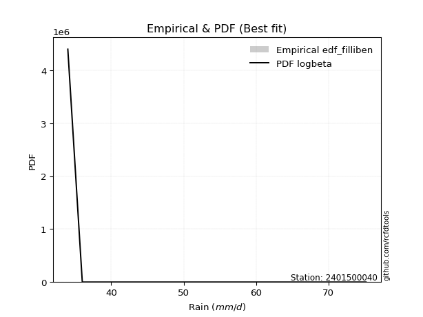</img>

</div>


### 10. EDF Jenkinson (1977)

The Jenkinson formula in hydrology is an empirical plotting position formula used to estimate the non-exceedance probability _(P)_ or return period _(T)_ of a given ordered observation within a sample. It is a widely used method in the frequency analysis of extreme events such as floods and rainfall, as it provides a distribution-free way to plot data. _a≈0.31_ and _b≈0.38_ are constants derived to approximate the median of the probability distribution for the given rank.

<div align="center">


$P=(m-a)/(n+b)$


</div>


**10.1. Empirical values**

<div align="center">

|                | 0                   | 1                   | 2                   | 3             | 4                  | 5                  | 6                  |
|:---------------|:--------------------|:--------------------|:--------------------|:--------------|:-------------------|:-------------------|:-------------------|
| date           | 2022                | 2023                | 2025                | 2021          | 2020               | 2019               | 2024               |
| x              | 34.0                | 36.0                | 44.8                | 47.2          | 58.4               | 75.0               | 75.2               |
| m              | 1                   | 2                   | 3                   | 4             | 5                  | 6                  | 7                  |
| empirical_dist | edf_jenkinson       | edf_jenkinson       | edf_jenkinson       | edf_jenkinson | edf_jenkinson      | edf_jenkinson      | edf_jenkinson      |
| empirical      | 0.09349593495934959 | 0.22899728997289973 | 0.36449864498644985 | 0.5           | 0.6355013550135502 | 0.7710027100271003 | 0.9065040650406505 |
| empirical_tr   | 1.1031390134529149  | 1.29701230228471    | 1.5735607675906182  | 2.0           | 2.743494423791822  | 4.366863905325444  | 10.695652173913055 |

</div>


**10.2. Kolmogorov-Smirnov fit test (sorted by Δ)**


<div align="center">

|                | 0                   | 1                   | 2                   | 3                   | 4                   | 5                   | 6                   | 7                   | 8                   | 9                   | 10                  | 11                  | 12                  | 13                  | 14                  | 15                  | 16                  | 17                  | 18                  | 19                  | 20                  | 21                  | 22                  | 23                  | 24                  | 25                  | 26                  | 27                  | 28                  | 29                  | 30                  | 31                  | 32                  | 33                  | 34                  | 35                  | 36                  | 37                  | 38                  | 39                  | 40                  | 41                  | 42                  | 43                  | 44                  | 45                  | 46                  | 47                  | 48                  | 49                  | 50                  | 51                  | 52                  | 53                  | 54                  | 55                  | 56                  | 57                  | 58                  | 59                  | 60                  | 61                  | 62                  | 63                  | 64                  | 65                  | 66                  | 67                  | 68                  | 69                  | 70                  | 71                  | 72                  | 73                  | 74                  | 75                  | 76                  | 77                  | 78                  | 79                  | 80                  | 81                  | 82                  | 83                  | 84                  | 85                  | 86                  | 87                  | 88                  | 89                  | 90                  | 91                  | 92                  | 93                  | 94                  | 95                  | 96                  | 97                  | 98                  | 99                  | 100                 | 101                 | 102                 | 103                 | 104                 | 105                 | 106                 | 107                 | 108                 | 109                 | 110                 | 111                 | 112                 | 113                 | 114                 | 115                 | 116                 | 117                 | 118                 | 119                 | 120                 | 121                 | 122                 | 123                 | 124                 | 125                 | 126                 | 127                 | 128                 | 129                 | 130                 | 131                 | 132                 | 133                 | 134                 | 135                 | 136                 | 137                 | 138                 | 139                 | 140                 | 141                 | 142                 | 143                 | 144                 | 145                 | 146                 | 147                 | 148                 | 149                 | 150                 | 151                 | 152                 | 153                 | 154                 | 155                 | 156                 | 157                 | 158                 | 159                 |
|:---------------|:--------------------|:--------------------|:--------------------|:--------------------|:--------------------|:--------------------|:--------------------|:--------------------|:--------------------|:--------------------|:--------------------|:--------------------|:--------------------|:--------------------|:--------------------|:--------------------|:--------------------|:--------------------|:--------------------|:--------------------|:--------------------|:--------------------|:--------------------|:--------------------|:--------------------|:--------------------|:--------------------|:--------------------|:--------------------|:--------------------|:--------------------|:--------------------|:--------------------|:--------------------|:--------------------|:--------------------|:--------------------|:--------------------|:--------------------|:--------------------|:--------------------|:--------------------|:--------------------|:--------------------|:--------------------|:--------------------|:--------------------|:--------------------|:--------------------|:--------------------|:--------------------|:--------------------|:--------------------|:--------------------|:--------------------|:--------------------|:--------------------|:--------------------|:--------------------|:--------------------|:--------------------|:--------------------|:--------------------|:--------------------|:--------------------|:--------------------|:--------------------|:--------------------|:--------------------|:--------------------|:--------------------|:--------------------|:--------------------|:--------------------|:--------------------|:--------------------|:--------------------|:--------------------|:--------------------|:--------------------|:--------------------|:--------------------|:--------------------|:--------------------|:--------------------|:--------------------|:--------------------|:--------------------|:--------------------|:--------------------|:--------------------|:--------------------|:--------------------|:--------------------|:--------------------|:--------------------|:--------------------|:--------------------|:--------------------|:--------------------|:--------------------|:--------------------|:--------------------|:--------------------|:--------------------|:--------------------|:--------------------|:--------------------|:--------------------|:--------------------|:--------------------|:--------------------|:--------------------|:--------------------|:--------------------|:--------------------|:--------------------|:--------------------|:--------------------|:--------------------|:--------------------|:--------------------|:--------------------|:--------------------|:--------------------|:--------------------|:--------------------|:--------------------|:--------------------|:--------------------|:--------------------|:--------------------|:--------------------|:--------------------|:--------------------|:--------------------|:--------------------|:--------------------|:--------------------|:--------------------|:--------------------|:--------------------|:--------------------|:--------------------|:--------------------|:--------------------|:--------------------|:--------------------|:--------------------|:--------------------|:--------------------|:--------------------|:--------------------|:--------------------|:--------------------|:--------------------|:--------------------|:--------------------|:--------------------|:--------------------|
| station        | 2401500040          | 2401500040          | 2401500040          | 2401500040          | 2401500040          | 2401500040          | 2401500040          | 2401500040          | 2401500040          | 2401500040          | 2401500040          | 2401500040          | 2401500040          | 2401500040          | 2401500040          | 2401500040          | 2401500040          | 2401500040          | 2401500040          | 2401500040          | 2401500040          | 2401500040          | 2401500040          | 2401500040          | 2401500040          | 2401500040          | 2401500040          | 2401500040          | 2401500040          | 2401500040          | 2401500040          | 2401500040          | 2401500040          | 2401500040          | 2401500040          | 2401500040          | 2401500040          | 2401500040          | 2401500040          | 2401500040          | 2401500040          | 2401500040          | 2401500040          | 2401500040          | 2401500040          | 2401500040          | 2401500040          | 2401500040          | 2401500040          | 2401500040          | 2401500040          | 2401500040          | 2401500040          | 2401500040          | 2401500040          | 2401500040          | 2401500040          | 2401500040          | 2401500040          | 2401500040          | 2401500040          | 2401500040          | 2401500040          | 2401500040          | 2401500040          | 2401500040          | 2401500040          | 2401500040          | 2401500040          | 2401500040          | 2401500040          | 2401500040          | 2401500040          | 2401500040          | 2401500040          | 2401500040          | 2401500040          | 2401500040          | 2401500040          | 2401500040          | 2401500040          | 2401500040          | 2401500040          | 2401500040          | 2401500040          | 2401500040          | 2401500040          | 2401500040          | 2401500040          | 2401500040          | 2401500040          | 2401500040          | 2401500040          | 2401500040          | 2401500040          | 2401500040          | 2401500040          | 2401500040          | 2401500040          | 2401500040          | 2401500040          | 2401500040          | 2401500040          | 2401500040          | 2401500040          | 2401500040          | 2401500040          | 2401500040          | 2401500040          | 2401500040          | 2401500040          | 2401500040          | 2401500040          | 2401500040          | 2401500040          | 2401500040          | 2401500040          | 2401500040          | 2401500040          | 2401500040          | 2401500040          | 2401500040          | 2401500040          | 2401500040          | 2401500040          | 2401500040          | 2401500040          | 2401500040          | 2401500040          | 2401500040          | 2401500040          | 2401500040          | 2401500040          | 2401500040          | 2401500040          | 2401500040          | 2401500040          | 2401500040          | 2401500040          | 2401500040          | 2401500040          | 2401500040          | 2401500040          | 2401500040          | 2401500040          | 2401500040          | 2401500040          | 2401500040          | 2401500040          | 2401500040          | 2401500040          | 2401500040          | 2401500040          | 2401500040          | 2401500040          | 2401500040          | 2401500040          | 2401500040          | 2401500040          | 2401500040          |
| empirical_dist | edf_jenkinson       | edf_jenkinson       | edf_jenkinson       | edf_jenkinson       | edf_jenkinson       | edf_jenkinson       | edf_jenkinson       | edf_jenkinson       | edf_jenkinson       | edf_jenkinson       | edf_jenkinson       | edf_jenkinson       | edf_jenkinson       | edf_jenkinson       | edf_jenkinson       | edf_jenkinson       | edf_jenkinson       | edf_jenkinson       | edf_jenkinson       | edf_jenkinson       | edf_jenkinson       | edf_jenkinson       | edf_jenkinson       | edf_jenkinson       | edf_jenkinson       | edf_jenkinson       | edf_jenkinson       | edf_jenkinson       | edf_jenkinson       | edf_jenkinson       | edf_jenkinson       | edf_jenkinson       | edf_jenkinson       | edf_jenkinson       | edf_jenkinson       | edf_jenkinson       | edf_jenkinson       | edf_jenkinson       | edf_jenkinson       | edf_jenkinson       | edf_jenkinson       | edf_jenkinson       | edf_jenkinson       | edf_jenkinson       | edf_jenkinson       | edf_jenkinson       | edf_jenkinson       | edf_jenkinson       | edf_jenkinson       | edf_jenkinson       | edf_jenkinson       | edf_jenkinson       | edf_jenkinson       | edf_jenkinson       | edf_jenkinson       | edf_jenkinson       | edf_jenkinson       | edf_jenkinson       | edf_jenkinson       | edf_jenkinson       | edf_jenkinson       | edf_jenkinson       | edf_jenkinson       | edf_jenkinson       | edf_jenkinson       | edf_jenkinson       | edf_jenkinson       | edf_jenkinson       | edf_jenkinson       | edf_jenkinson       | edf_jenkinson       | edf_jenkinson       | edf_jenkinson       | edf_jenkinson       | edf_jenkinson       | edf_jenkinson       | edf_jenkinson       | edf_jenkinson       | edf_jenkinson       | edf_jenkinson       | edf_jenkinson       | edf_jenkinson       | edf_jenkinson       | edf_jenkinson       | edf_jenkinson       | edf_jenkinson       | edf_jenkinson       | edf_jenkinson       | edf_jenkinson       | edf_jenkinson       | edf_jenkinson       | edf_jenkinson       | edf_jenkinson       | edf_jenkinson       | edf_jenkinson       | edf_jenkinson       | edf_jenkinson       | edf_jenkinson       | edf_jenkinson       | edf_jenkinson       | edf_jenkinson       | edf_jenkinson       | edf_jenkinson       | edf_jenkinson       | edf_jenkinson       | edf_jenkinson       | edf_jenkinson       | edf_jenkinson       | edf_jenkinson       | edf_jenkinson       | edf_jenkinson       | edf_jenkinson       | edf_jenkinson       | edf_jenkinson       | edf_jenkinson       | edf_jenkinson       | edf_jenkinson       | edf_jenkinson       | edf_jenkinson       | edf_jenkinson       | edf_jenkinson       | edf_jenkinson       | edf_jenkinson       | edf_jenkinson       | edf_jenkinson       | edf_jenkinson       | edf_jenkinson       | edf_jenkinson       | edf_jenkinson       | edf_jenkinson       | edf_jenkinson       | edf_jenkinson       | edf_jenkinson       | edf_jenkinson       | edf_jenkinson       | edf_jenkinson       | edf_jenkinson       | edf_jenkinson       | edf_jenkinson       | edf_jenkinson       | edf_jenkinson       | edf_jenkinson       | edf_jenkinson       | edf_jenkinson       | edf_jenkinson       | edf_jenkinson       | edf_jenkinson       | edf_jenkinson       | edf_jenkinson       | edf_jenkinson       | edf_jenkinson       | edf_jenkinson       | edf_jenkinson       | edf_jenkinson       | edf_jenkinson       | edf_jenkinson       | edf_jenkinson       | edf_jenkinson       | edf_jenkinson       | edf_jenkinson       |
| p_dist         | logbeta             | logrdist            | logfatiguelife      | logksone            | logarcsine          | logburr             | invgauss            | loginvgauss         | logmielke           | loginvweibull       | loggenlogistic      | burr                | logsemicircular     | invgamma            | logfoldnorm         | loganglit           | loghalfgennorm      | lograyleigh         | logkstwobign        | logmaxwell          | logf                | genextreme          | nct                 | halfnorm            | exponnorm           | logncf              | alpha               | logalpha            | genexpon            | logrice             | logbetaprime        | logdgamma           | logdweibull         | loginvgamma         | betaprime           | lognct              | f                   | ksone               | loggenexpon         | ncf                 | logerlang           | burr12              | logpearson3         | loggamma            | loggamma            | rayleigh            | semicircular        | logskewnorm         | logjohnsonsu        | logloggamma         | logexponnorm        | logcrystalball      | lognorm             | logt                | maxwell             | genlogistic         | anglit              | loglomax            | foldnorm            | gumbel_r            | loggumbel_r         | pearson3            | loghalfnorm         | kstwobign           | rice                | loglogistic         | logloglaplace       | dweibull            | moyal               | logcosine           | logburr12           | norm                | crystalball         | truncnorm           | t                   | nakagami            | loghypsecant        | loggompertz         | dgamma              | loglaplace          | loglaplace          | johnsonsu           | gompertz            | logistic            | cosine              | halflogistic        | gausshyper          | skewnorm            | genpareto           | logmoyal            | hypsecant           | arcsine             | logargus            | loggumbel_l         | logtrapezoid        | halfgennorm         | rdist               | loggengamma         | beta                | exponpow            | laplace             | logkappa3           | loghalflogistic     | gumbel_l            | argus               | wrapcauchy          | loggausshyper       | tukeylambda         | logwrapcauchy       | trapezoid           | logtukeylambda      | kappa4              | kappa3              | logweibull_max      | logtriang           | uniform             | triang              | logkappa4           | bradford            | loguniform          | truncexpon          | truncpareto         | logvonmises_line    | logbradford         | logtruncweibull_min | logtruncexpon       | loggenextreme       | truncweibull_min    | logtruncnorm        | logwald             | wald                | lomax               | vonmises_line       | loggenhalflogistic  | logweibull_min      | weibull_min         | loggennorm          | gennorm             | logexponpow         | gamma               | logexponweib        | loglevy_l           | erlang              | genhalflogistic     | levy_l              | lognakagami         | logjohnsonsb        | johnsonsb           | gengamma            | fatiguelife         | powerlaw            | logpowerlaw         | exponweib           | invweibull          | loggenpareto        | weibull_max         | logtruncpareto      | logvonmises         | vonmises            | mielke              |
| delta          | 0.09349593136442766 | 0.09349593249468383 | 0.1078287708159856  | 0.10835638176197171 | 0.1085309817652903  | 0.11175008399549191 | 0.11193920877838259 | 0.11264211214011044 | 0.11342612126950347 | 0.11344635570120931 | 0.11368298574064462 | 0.11385323786287183 | 0.11486620331578068 | 0.1172789831064256  | 0.11854300511024563 | 0.1201734193331303  | 0.12102924343160461 | 0.12200891171209038 | 0.12233931573788359 | 0.12465200727297843 | 0.12472850175243866 | 0.12485361206953483 | 0.1251258927210428  | 0.12740274388081618 | 0.1274298542524114  | 0.12761639965707683 | 0.127637392728412   | 0.1278289194632457  | 0.12791759234232553 | 0.1279932294462487  | 0.1280730946746068  | 0.12817481806005737 | 0.12834340300074276 | 0.1301736814834885  | 0.1302685917363321  | 0.13027097059799686 | 0.13036961911289746 | 0.13091711496986635 | 0.13111627404361248 | 0.13137901718603184 | 0.13150847214358907 | 0.1319056318336816  | 0.13253233007150678 | 0.13292739087700034 | 0.13292739087700034 | 0.1331114553374647  | 0.13318009507155448 | 0.13403164868833406 | 0.1340688871764507  | 0.13418504231486905 | 0.1345814790109886  | 0.13459721224643906 | 0.13459748028300622 | 0.134597943917805   | 0.13604749593372045 | 0.136237725687665   | 0.1362464736522735  | 0.1364370751598432  | 0.13742573018963566 | 0.13914629413633117 | 0.14036472117872453 | 0.14064028553901542 | 0.14096262501059875 | 0.14144873751244313 | 0.14210951306308484 | 0.14456415443007065 | 0.14523389949696452 | 0.1460364232613115  | 0.14677510695000467 | 0.1469771771224968  | 0.14705958556510934 | 0.14708015948352104 | 0.14708016294072346 | 0.14708016633838605 | 0.14711986346627992 | 0.14836028308646484 | 0.1486308423346755  | 0.149730136023135   | 0.15047059119037998 | 0.15104198181961115 | 0.15104198181961115 | 0.1516608805203663  | 0.1559427767238271  | 0.1586993565070317  | 0.15939072026990553 | 0.16139847685406475 | 0.16406227536848167 | 0.16443907585119102 | 0.1688331227401053  | 0.16887889810372708 | 0.1721818345085811  | 0.1728776644153417  | 0.17549990508098545 | 0.1806332885155626  | 0.18237781661886365 | 0.1831174845484303  | 0.1883268901726176  | 0.19050880046270174 | 0.19641313970287366 | 0.19653401907609774 | 0.20054781952305667 | 0.20160277206667676 | 0.20269515451567222 | 0.20278883861451125 | 0.20474549863521407 | 0.2134234413299545  | 0.21753768040142785 | 0.2179588136057592  | 0.2184056725382716  | 0.21868964879053032 | 0.21909006783770935 | 0.22198454975764115 | 0.22249228461488924 | 0.22330229832753273 | 0.22405047052996974 | 0.22414292104086075 | 0.2243453468599978  | 0.22471791998393553 | 0.22555327639303824 | 0.2256423534660662  | 0.22611660038425685 | 0.22647379794986544 | 0.2265159404868763  | 0.22670116052440326 | 0.22678474327181397 | 0.22712990645470232 | 0.22717293532393446 | 0.22722055919750017 | 0.22779925845447968 | 0.22899728997289973 | 0.22899728997289973 | 0.2307395451530342  | 0.23440515530911338 | 0.24441797996171538 | 0.24638053115023711 | 0.2591402362109768  | 0.2710027100271003  | 0.2710027100271003  | 0.2791087468609709  | 0.27982836014505835 | 0.2898323465705141  | 0.28985900305460355 | 0.3003014308241229  | 0.302735294968033   | 0.3031461236991053  | 0.31555813594033705 | 0.3207435568044782  | 0.38793105366084907 | 0.4051393231792683  | 0.4198840133204704  | 0.4368796079310077  | 0.46693017076883797 | 0.46948006787310087 | 0.47459082886877774 | 0.5148381856570553  | 0.5158534528966988  | 0.5640951424178035  | 1.1347901168254442  | 11.470801135714142  | nan                 |
| deltao         | 0.48442053926100004 | 0.48442053926100004 | 0.48442053926100004 | 0.48442053926100004 | 0.48442053926100004 | 0.48442053926100004 | 0.48442053926100004 | 0.48442053926100004 | 0.48442053926100004 | 0.48442053926100004 | 0.48442053926100004 | 0.48442053926100004 | 0.48442053926100004 | 0.48442053926100004 | 0.48442053926100004 | 0.48442053926100004 | 0.48442053926100004 | 0.48442053926100004 | 0.48442053926100004 | 0.48442053926100004 | 0.48442053926100004 | 0.48442053926100004 | 0.48442053926100004 | 0.48442053926100004 | 0.48442053926100004 | 0.48442053926100004 | 0.48442053926100004 | 0.48442053926100004 | 0.48442053926100004 | 0.48442053926100004 | 0.48442053926100004 | 0.48442053926100004 | 0.48442053926100004 | 0.48442053926100004 | 0.48442053926100004 | 0.48442053926100004 | 0.48442053926100004 | 0.48442053926100004 | 0.48442053926100004 | 0.48442053926100004 | 0.48442053926100004 | 0.48442053926100004 | 0.48442053926100004 | 0.48442053926100004 | 0.48442053926100004 | 0.48442053926100004 | 0.48442053926100004 | 0.48442053926100004 | 0.48442053926100004 | 0.48442053926100004 | 0.48442053926100004 | 0.48442053926100004 | 0.48442053926100004 | 0.48442053926100004 | 0.48442053926100004 | 0.48442053926100004 | 0.48442053926100004 | 0.48442053926100004 | 0.48442053926100004 | 0.48442053926100004 | 0.48442053926100004 | 0.48442053926100004 | 0.48442053926100004 | 0.48442053926100004 | 0.48442053926100004 | 0.48442053926100004 | 0.48442053926100004 | 0.48442053926100004 | 0.48442053926100004 | 0.48442053926100004 | 0.48442053926100004 | 0.48442053926100004 | 0.48442053926100004 | 0.48442053926100004 | 0.48442053926100004 | 0.48442053926100004 | 0.48442053926100004 | 0.48442053926100004 | 0.48442053926100004 | 0.48442053926100004 | 0.48442053926100004 | 0.48442053926100004 | 0.48442053926100004 | 0.48442053926100004 | 0.48442053926100004 | 0.48442053926100004 | 0.48442053926100004 | 0.48442053926100004 | 0.48442053926100004 | 0.48442053926100004 | 0.48442053926100004 | 0.48442053926100004 | 0.48442053926100004 | 0.48442053926100004 | 0.48442053926100004 | 0.48442053926100004 | 0.48442053926100004 | 0.48442053926100004 | 0.48442053926100004 | 0.48442053926100004 | 0.48442053926100004 | 0.48442053926100004 | 0.48442053926100004 | 0.48442053926100004 | 0.48442053926100004 | 0.48442053926100004 | 0.48442053926100004 | 0.48442053926100004 | 0.48442053926100004 | 0.48442053926100004 | 0.48442053926100004 | 0.48442053926100004 | 0.48442053926100004 | 0.48442053926100004 | 0.48442053926100004 | 0.48442053926100004 | 0.48442053926100004 | 0.48442053926100004 | 0.48442053926100004 | 0.48442053926100004 | 0.48442053926100004 | 0.48442053926100004 | 0.48442053926100004 | 0.48442053926100004 | 0.48442053926100004 | 0.48442053926100004 | 0.48442053926100004 | 0.48442053926100004 | 0.48442053926100004 | 0.48442053926100004 | 0.48442053926100004 | 0.48442053926100004 | 0.48442053926100004 | 0.48442053926100004 | 0.48442053926100004 | 0.48442053926100004 | 0.48442053926100004 | 0.48442053926100004 | 0.48442053926100004 | 0.48442053926100004 | 0.48442053926100004 | 0.48442053926100004 | 0.48442053926100004 | 0.48442053926100004 | 0.48442053926100004 | 0.48442053926100004 | 0.48442053926100004 | 0.48442053926100004 | 0.48442053926100004 | 0.48442053926100004 | 0.48442053926100004 | 0.48442053926100004 | 0.48442053926100004 | 0.48442053926100004 | 0.48442053926100004 | 0.48442053926100004 | 0.48442053926100004 | 0.48442053926100004 | 0.48442053926100004 | 0.48442053926100004 |
| eval           | Δo > Δ              | Δo > Δ              | Δo > Δ              | Δo > Δ              | Δo > Δ              | Δo > Δ              | Δo > Δ              | Δo > Δ              | Δo > Δ              | Δo > Δ              | Δo > Δ              | Δo > Δ              | Δo > Δ              | Δo > Δ              | Δo > Δ              | Δo > Δ              | Δo > Δ              | Δo > Δ              | Δo > Δ              | Δo > Δ              | Δo > Δ              | Δo > Δ              | Δo > Δ              | Δo > Δ              | Δo > Δ              | Δo > Δ              | Δo > Δ              | Δo > Δ              | Δo > Δ              | Δo > Δ              | Δo > Δ              | Δo > Δ              | Δo > Δ              | Δo > Δ              | Δo > Δ              | Δo > Δ              | Δo > Δ              | Δo > Δ              | Δo > Δ              | Δo > Δ              | Δo > Δ              | Δo > Δ              | Δo > Δ              | Δo > Δ              | Δo > Δ              | Δo > Δ              | Δo > Δ              | Δo > Δ              | Δo > Δ              | Δo > Δ              | Δo > Δ              | Δo > Δ              | Δo > Δ              | Δo > Δ              | Δo > Δ              | Δo > Δ              | Δo > Δ              | Δo > Δ              | Δo > Δ              | Δo > Δ              | Δo > Δ              | Δo > Δ              | Δo > Δ              | Δo > Δ              | Δo > Δ              | Δo > Δ              | Δo > Δ              | Δo > Δ              | Δo > Δ              | Δo > Δ              | Δo > Δ              | Δo > Δ              | Δo > Δ              | Δo > Δ              | Δo > Δ              | Δo > Δ              | Δo > Δ              | Δo > Δ              | Δo > Δ              | Δo > Δ              | Δo > Δ              | Δo > Δ              | Δo > Δ              | Δo > Δ              | Δo > Δ              | Δo > Δ              | Δo > Δ              | Δo > Δ              | Δo > Δ              | Δo > Δ              | Δo > Δ              | Δo > Δ              | Δo > Δ              | Δo > Δ              | Δo > Δ              | Δo > Δ              | Δo > Δ              | Δo > Δ              | Δo > Δ              | Δo > Δ              | Δo > Δ              | Δo > Δ              | Δo > Δ              | Δo > Δ              | Δo > Δ              | Δo > Δ              | Δo > Δ              | Δo > Δ              | Δo > Δ              | Δo > Δ              | Δo > Δ              | Δo > Δ              | Δo > Δ              | Δo > Δ              | Δo > Δ              | Δo > Δ              | Δo > Δ              | Δo > Δ              | Δo > Δ              | Δo > Δ              | Δo > Δ              | Δo > Δ              | Δo > Δ              | Δo > Δ              | Δo > Δ              | Δo > Δ              | Δo > Δ              | Δo > Δ              | Δo > Δ              | Δo > Δ              | Δo > Δ              | Δo > Δ              | Δo > Δ              | Δo > Δ              | Δo > Δ              | Δo > Δ              | Δo > Δ              | Δo > Δ              | Δo > Δ              | Δo > Δ              | Δo > Δ              | Δo > Δ              | Δo > Δ              | Δo > Δ              | Δo > Δ              | Δo > Δ              | Δo > Δ              | Δo > Δ              | Δo > Δ              | Δo > Δ              | Δo > Δ              | Δo > Δ              | Δo > Δ              | Δo > Δ              | Δo <= Δ             | Δo <= Δ             | Δo <= Δ             | Δo <= Δ             | Δo <= Δ             | Δo <= Δ             |
| fit            | 1                   | 1                   | 1                   | 1                   | 1                   | 1                   | 1                   | 1                   | 1                   | 1                   | 1                   | 1                   | 1                   | 1                   | 1                   | 1                   | 1                   | 1                   | 1                   | 1                   | 1                   | 1                   | 1                   | 1                   | 1                   | 1                   | 1                   | 1                   | 1                   | 1                   | 1                   | 1                   | 1                   | 1                   | 1                   | 1                   | 1                   | 1                   | 1                   | 1                   | 1                   | 1                   | 1                   | 1                   | 1                   | 1                   | 1                   | 1                   | 1                   | 1                   | 1                   | 1                   | 1                   | 1                   | 1                   | 1                   | 1                   | 1                   | 1                   | 1                   | 1                   | 1                   | 1                   | 1                   | 1                   | 1                   | 1                   | 1                   | 1                   | 1                   | 1                   | 1                   | 1                   | 1                   | 1                   | 1                   | 1                   | 1                   | 1                   | 1                   | 1                   | 1                   | 1                   | 1                   | 1                   | 1                   | 1                   | 1                   | 1                   | 1                   | 1                   | 1                   | 1                   | 1                   | 1                   | 1                   | 1                   | 1                   | 1                   | 1                   | 1                   | 1                   | 1                   | 1                   | 1                   | 1                   | 1                   | 1                   | 1                   | 1                   | 1                   | 1                   | 1                   | 1                   | 1                   | 1                   | 1                   | 1                   | 1                   | 1                   | 1                   | 1                   | 1                   | 1                   | 1                   | 1                   | 1                   | 1                   | 1                   | 1                   | 1                   | 1                   | 1                   | 1                   | 1                   | 1                   | 1                   | 1                   | 1                   | 1                   | 1                   | 1                   | 1                   | 1                   | 1                   | 1                   | 1                   | 1                   | 1                   | 1                   | 1                   | 1                   | 1                   | 1                   | 0                   | 0                   | 0                   | 0                   | 0                   | 0                   |
| n              | 7                   | 7                   | 7                   | 7                   | 7                   | 7                   | 7                   | 7                   | 7                   | 7                   | 7                   | 7                   | 7                   | 7                   | 7                   | 7                   | 7                   | 7                   | 7                   | 7                   | 7                   | 7                   | 7                   | 7                   | 7                   | 7                   | 7                   | 7                   | 7                   | 7                   | 7                   | 7                   | 7                   | 7                   | 7                   | 7                   | 7                   | 7                   | 7                   | 7                   | 7                   | 7                   | 7                   | 7                   | 7                   | 7                   | 7                   | 7                   | 7                   | 7                   | 7                   | 7                   | 7                   | 7                   | 7                   | 7                   | 7                   | 7                   | 7                   | 7                   | 7                   | 7                   | 7                   | 7                   | 7                   | 7                   | 7                   | 7                   | 7                   | 7                   | 7                   | 7                   | 7                   | 7                   | 7                   | 7                   | 7                   | 7                   | 7                   | 7                   | 7                   | 7                   | 7                   | 7                   | 7                   | 7                   | 7                   | 7                   | 7                   | 7                   | 7                   | 7                   | 7                   | 7                   | 7                   | 7                   | 7                   | 7                   | 7                   | 7                   | 7                   | 7                   | 7                   | 7                   | 7                   | 7                   | 7                   | 7                   | 7                   | 7                   | 7                   | 7                   | 7                   | 7                   | 7                   | 7                   | 7                   | 7                   | 7                   | 7                   | 7                   | 7                   | 7                   | 7                   | 7                   | 7                   | 7                   | 7                   | 7                   | 7                   | 7                   | 7                   | 7                   | 7                   | 7                   | 7                   | 7                   | 7                   | 7                   | 7                   | 7                   | 7                   | 7                   | 7                   | 7                   | 7                   | 7                   | 7                   | 7                   | 7                   | 7                   | 7                   | 7                   | 7                   | 7                   | 7                   | 7                   | 7                   | 7                   | 7                   |
| best_fit       | 1                   | 0                   | 0                   | 0                   | 0                   | 0                   | 0                   | 0                   | 0                   | 0                   | 0                   | 0                   | 0                   | 0                   | 0                   | 0                   | 0                   | 0                   | 0                   | 0                   | 0                   | 0                   | 0                   | 0                   | 0                   | 0                   | 0                   | 0                   | 0                   | 0                   | 0                   | 0                   | 0                   | 0                   | 0                   | 0                   | 0                   | 0                   | 0                   | 0                   | 0                   | 0                   | 0                   | 0                   | 0                   | 0                   | 0                   | 0                   | 0                   | 0                   | 0                   | 0                   | 0                   | 0                   | 0                   | 0                   | 0                   | 0                   | 0                   | 0                   | 0                   | 0                   | 0                   | 0                   | 0                   | 0                   | 0                   | 0                   | 0                   | 0                   | 0                   | 0                   | 0                   | 0                   | 0                   | 0                   | 0                   | 0                   | 0                   | 0                   | 0                   | 0                   | 0                   | 0                   | 0                   | 0                   | 0                   | 0                   | 0                   | 0                   | 0                   | 0                   | 0                   | 0                   | 0                   | 0                   | 0                   | 0                   | 0                   | 0                   | 0                   | 0                   | 0                   | 0                   | 0                   | 0                   | 0                   | 0                   | 0                   | 0                   | 0                   | 0                   | 0                   | 0                   | 0                   | 0                   | 0                   | 0                   | 0                   | 0                   | 0                   | 0                   | 0                   | 0                   | 0                   | 0                   | 0                   | 0                   | 0                   | 0                   | 0                   | 0                   | 0                   | 0                   | 0                   | 0                   | 0                   | 0                   | 0                   | 0                   | 0                   | 0                   | 0                   | 0                   | 0                   | 0                   | 0                   | 0                   | 0                   | 0                   | 0                   | 0                   | 0                   | 0                   | 0                   | 0                   | 0                   | 0                   | 0                   | 0                   |
| best_fit_sort  | 1                   | 2                   | 3                   | 4                   | 5                   | 6                   | 7                   | 8                   | 9                   | 10                  | 11                  | 12                  | 13                  | 14                  | 15                  | 16                  | 17                  | 18                  | 19                  | 20                  | 21                  | 22                  | 23                  | 24                  | 25                  | 26                  | 27                  | 28                  | 29                  | 30                  | 31                  | 32                  | 33                  | 34                  | 35                  | 36                  | 37                  | 38                  | 39                  | 40                  | 41                  | 42                  | 43                  | 44                  | 45                  | 46                  | 47                  | 48                  | 49                  | 50                  | 51                  | 52                  | 53                  | 54                  | 55                  | 56                  | 57                  | 58                  | 59                  | 60                  | 61                  | 62                  | 63                  | 64                  | 65                  | 66                  | 67                  | 68                  | 69                  | 70                  | 71                  | 72                  | 73                  | 74                  | 75                  | 76                  | 77                  | 78                  | 79                  | 80                  | 81                  | 82                  | 83                  | 84                  | 85                  | 86                  | 87                  | 88                  | 89                  | 90                  | 91                  | 92                  | 93                  | 94                  | 95                  | 96                  | 97                  | 98                  | 99                  | 100                 | 101                 | 102                 | 103                 | 104                 | 105                 | 106                 | 107                 | 108                 | 109                 | 110                 | 111                 | 112                 | 113                 | 114                 | 115                 | 116                 | 117                 | 118                 | 119                 | 120                 | 121                 | 122                 | 123                 | 124                 | 125                 | 126                 | 127                 | 128                 | 129                 | 130                 | 131                 | 132                 | 133                 | 134                 | 135                 | 136                 | 137                 | 138                 | 139                 | 140                 | 141                 | 142                 | 143                 | 144                 | 145                 | 146                 | 147                 | 148                 | 149                 | 150                 | 151                 | 152                 | 153                 | 154                 | 155                 | 156                 | 157                 | 158                 | 159                 | 160                 |

</div>


**10.3. Best fit**

<div align="center">

|   id |    station | empirical_dist   | p_dist   |     delta |   deltao | eval   |   fit |   n |   best_fit |   best_fit_sort |
|-----:|-----------:|:-----------------|:---------|----------:|---------:|:-------|------:|----:|-----------:|----------------:|
|    0 | 2401500040 | edf_jenkinson    | logbeta  | 0.0934959 | 0.484421 | Δo > Δ |     1 |   7 |          1 |               1 |

</div>


<div align="center">

</img>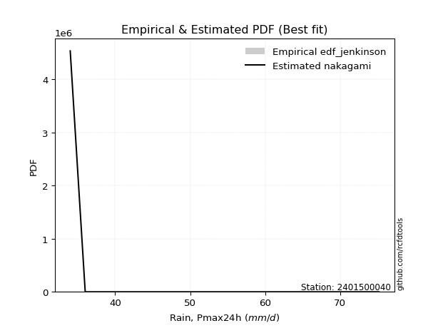</img>

</div>


### 11. EDF Cunnane (1978)

Cunnane´s work in statistical hydrology has focused on the performance and evaluation of different probability distributions (such as GEV, Gumbel, Lognormal) for flood frequency estimation. _b_ is a constant, typically set to 0.4.

<div align="center">


$P=(m-b)/(n+1-2b)$


</div>


**11.1. Empirical values**

<div align="center">

|                | 0                   | 1                   | 2                  | 3           | 4                  | 5                  | 6                  |
|:---------------|:--------------------|:--------------------|:-------------------|:------------|:-------------------|:-------------------|:-------------------|
| date           | 2022                | 2023                | 2025               | 2021        | 2020               | 2019               | 2024               |
| x              | 34.0                | 36.0                | 44.8               | 47.2        | 58.4               | 75.0               | 75.2               |
| m              | 1                   | 2                   | 3                  | 4           | 5                  | 6                  | 7                  |
| empirical_dist | edf_cunnane         | edf_cunnane         | edf_cunnane        | edf_cunnane | edf_cunnane        | edf_cunnane        | edf_cunnane        |
| empirical      | 0.08333333333333333 | 0.22222222222222224 | 0.3611111111111111 | 0.5         | 0.6388888888888888 | 0.7777777777777777 | 0.9166666666666666 |
| empirical_tr   | 1.090909090909091   | 1.2857142857142856  | 1.565217391304348  | 2.0         | 2.7692307692307687 | 4.499999999999998  | 11.999999999999995 |

</div>


**11.2. Kolmogorov-Smirnov fit test (sorted by Δ)**


<div align="center">

|                | 0                   | 1                   | 2                   | 3                   | 4                   | 5                   | 6                   | 7                   | 8                   | 9                   | 10                  | 11                  | 12                  | 13                  | 14                  | 15                  | 16                  | 17                  | 18                  | 19                  | 20                  | 21                  | 22                  | 23                  | 24                  | 25                  | 26                  | 27                  | 28                  | 29                  | 30                  | 31                  | 32                  | 33                  | 34                  | 35                  | 36                  | 37                  | 38                  | 39                  | 40                  | 41                  | 42                  | 43                  | 44                  | 45                  | 46                  | 47                  | 48                  | 49                  | 50                  | 51                  | 52                  | 53                  | 54                  | 55                  | 56                  | 57                  | 58                  | 59                  | 60                  | 61                  | 62                  | 63                  | 64                  | 65                  | 66                  | 67                  | 68                  | 69                  | 70                  | 71                  | 72                  | 73                  | 74                  | 75                  | 76                  | 77                  | 78                  | 79                  | 80                  | 81                  | 82                  | 83                  | 84                  | 85                  | 86                  | 87                  | 88                  | 89                  | 90                  | 91                  | 92                  | 93                  | 94                  | 95                  | 96                  | 97                  | 98                  | 99                  | 100                 | 101                 | 102                 | 103                 | 104                 | 105                 | 106                 | 107                 | 108                 | 109                 | 110                 | 111                 | 112                 | 113                 | 114                 | 115                 | 116                 | 117                 | 118                 | 119                 | 120                 | 121                 | 122                 | 123                 | 124                 | 125                 | 126                 | 127                 | 128                 | 129                 | 130                 | 131                 | 132                 | 133                 | 134                 | 135                 | 136                 | 137                 | 138                 | 139                 | 140                 | 141                 | 142                 | 143                 | 144                 | 145                 | 146                 | 147                 | 148                 | 149                 | 150                 | 151                 | 152                 | 153                 | 154                 | 155                 | 156                 | 157                 | 158                 | 159                 |
|:---------------|:--------------------|:--------------------|:--------------------|:--------------------|:--------------------|:--------------------|:--------------------|:--------------------|:--------------------|:--------------------|:--------------------|:--------------------|:--------------------|:--------------------|:--------------------|:--------------------|:--------------------|:--------------------|:--------------------|:--------------------|:--------------------|:--------------------|:--------------------|:--------------------|:--------------------|:--------------------|:--------------------|:--------------------|:--------------------|:--------------------|:--------------------|:--------------------|:--------------------|:--------------------|:--------------------|:--------------------|:--------------------|:--------------------|:--------------------|:--------------------|:--------------------|:--------------------|:--------------------|:--------------------|:--------------------|:--------------------|:--------------------|:--------------------|:--------------------|:--------------------|:--------------------|:--------------------|:--------------------|:--------------------|:--------------------|:--------------------|:--------------------|:--------------------|:--------------------|:--------------------|:--------------------|:--------------------|:--------------------|:--------------------|:--------------------|:--------------------|:--------------------|:--------------------|:--------------------|:--------------------|:--------------------|:--------------------|:--------------------|:--------------------|:--------------------|:--------------------|:--------------------|:--------------------|:--------------------|:--------------------|:--------------------|:--------------------|:--------------------|:--------------------|:--------------------|:--------------------|:--------------------|:--------------------|:--------------------|:--------------------|:--------------------|:--------------------|:--------------------|:--------------------|:--------------------|:--------------------|:--------------------|:--------------------|:--------------------|:--------------------|:--------------------|:--------------------|:--------------------|:--------------------|:--------------------|:--------------------|:--------------------|:--------------------|:--------------------|:--------------------|:--------------------|:--------------------|:--------------------|:--------------------|:--------------------|:--------------------|:--------------------|:--------------------|:--------------------|:--------------------|:--------------------|:--------------------|:--------------------|:--------------------|:--------------------|:--------------------|:--------------------|:--------------------|:--------------------|:--------------------|:--------------------|:--------------------|:--------------------|:--------------------|:--------------------|:--------------------|:--------------------|:--------------------|:--------------------|:--------------------|:--------------------|:--------------------|:--------------------|:--------------------|:--------------------|:--------------------|:--------------------|:--------------------|:--------------------|:--------------------|:--------------------|:--------------------|:--------------------|:--------------------|:--------------------|:--------------------|:--------------------|:--------------------|:--------------------|:--------------------|
| station        | 2401500040          | 2401500040          | 2401500040          | 2401500040          | 2401500040          | 2401500040          | 2401500040          | 2401500040          | 2401500040          | 2401500040          | 2401500040          | 2401500040          | 2401500040          | 2401500040          | 2401500040          | 2401500040          | 2401500040          | 2401500040          | 2401500040          | 2401500040          | 2401500040          | 2401500040          | 2401500040          | 2401500040          | 2401500040          | 2401500040          | 2401500040          | 2401500040          | 2401500040          | 2401500040          | 2401500040          | 2401500040          | 2401500040          | 2401500040          | 2401500040          | 2401500040          | 2401500040          | 2401500040          | 2401500040          | 2401500040          | 2401500040          | 2401500040          | 2401500040          | 2401500040          | 2401500040          | 2401500040          | 2401500040          | 2401500040          | 2401500040          | 2401500040          | 2401500040          | 2401500040          | 2401500040          | 2401500040          | 2401500040          | 2401500040          | 2401500040          | 2401500040          | 2401500040          | 2401500040          | 2401500040          | 2401500040          | 2401500040          | 2401500040          | 2401500040          | 2401500040          | 2401500040          | 2401500040          | 2401500040          | 2401500040          | 2401500040          | 2401500040          | 2401500040          | 2401500040          | 2401500040          | 2401500040          | 2401500040          | 2401500040          | 2401500040          | 2401500040          | 2401500040          | 2401500040          | 2401500040          | 2401500040          | 2401500040          | 2401500040          | 2401500040          | 2401500040          | 2401500040          | 2401500040          | 2401500040          | 2401500040          | 2401500040          | 2401500040          | 2401500040          | 2401500040          | 2401500040          | 2401500040          | 2401500040          | 2401500040          | 2401500040          | 2401500040          | 2401500040          | 2401500040          | 2401500040          | 2401500040          | 2401500040          | 2401500040          | 2401500040          | 2401500040          | 2401500040          | 2401500040          | 2401500040          | 2401500040          | 2401500040          | 2401500040          | 2401500040          | 2401500040          | 2401500040          | 2401500040          | 2401500040          | 2401500040          | 2401500040          | 2401500040          | 2401500040          | 2401500040          | 2401500040          | 2401500040          | 2401500040          | 2401500040          | 2401500040          | 2401500040          | 2401500040          | 2401500040          | 2401500040          | 2401500040          | 2401500040          | 2401500040          | 2401500040          | 2401500040          | 2401500040          | 2401500040          | 2401500040          | 2401500040          | 2401500040          | 2401500040          | 2401500040          | 2401500040          | 2401500040          | 2401500040          | 2401500040          | 2401500040          | 2401500040          | 2401500040          | 2401500040          | 2401500040          | 2401500040          | 2401500040          | 2401500040          | 2401500040          |
| empirical_dist | edf_cunnane         | edf_cunnane         | edf_cunnane         | edf_cunnane         | edf_cunnane         | edf_cunnane         | edf_cunnane         | edf_cunnane         | edf_cunnane         | edf_cunnane         | edf_cunnane         | edf_cunnane         | edf_cunnane         | edf_cunnane         | edf_cunnane         | edf_cunnane         | edf_cunnane         | edf_cunnane         | edf_cunnane         | edf_cunnane         | edf_cunnane         | edf_cunnane         | edf_cunnane         | edf_cunnane         | edf_cunnane         | edf_cunnane         | edf_cunnane         | edf_cunnane         | edf_cunnane         | edf_cunnane         | edf_cunnane         | edf_cunnane         | edf_cunnane         | edf_cunnane         | edf_cunnane         | edf_cunnane         | edf_cunnane         | edf_cunnane         | edf_cunnane         | edf_cunnane         | edf_cunnane         | edf_cunnane         | edf_cunnane         | edf_cunnane         | edf_cunnane         | edf_cunnane         | edf_cunnane         | edf_cunnane         | edf_cunnane         | edf_cunnane         | edf_cunnane         | edf_cunnane         | edf_cunnane         | edf_cunnane         | edf_cunnane         | edf_cunnane         | edf_cunnane         | edf_cunnane         | edf_cunnane         | edf_cunnane         | edf_cunnane         | edf_cunnane         | edf_cunnane         | edf_cunnane         | edf_cunnane         | edf_cunnane         | edf_cunnane         | edf_cunnane         | edf_cunnane         | edf_cunnane         | edf_cunnane         | edf_cunnane         | edf_cunnane         | edf_cunnane         | edf_cunnane         | edf_cunnane         | edf_cunnane         | edf_cunnane         | edf_cunnane         | edf_cunnane         | edf_cunnane         | edf_cunnane         | edf_cunnane         | edf_cunnane         | edf_cunnane         | edf_cunnane         | edf_cunnane         | edf_cunnane         | edf_cunnane         | edf_cunnane         | edf_cunnane         | edf_cunnane         | edf_cunnane         | edf_cunnane         | edf_cunnane         | edf_cunnane         | edf_cunnane         | edf_cunnane         | edf_cunnane         | edf_cunnane         | edf_cunnane         | edf_cunnane         | edf_cunnane         | edf_cunnane         | edf_cunnane         | edf_cunnane         | edf_cunnane         | edf_cunnane         | edf_cunnane         | edf_cunnane         | edf_cunnane         | edf_cunnane         | edf_cunnane         | edf_cunnane         | edf_cunnane         | edf_cunnane         | edf_cunnane         | edf_cunnane         | edf_cunnane         | edf_cunnane         | edf_cunnane         | edf_cunnane         | edf_cunnane         | edf_cunnane         | edf_cunnane         | edf_cunnane         | edf_cunnane         | edf_cunnane         | edf_cunnane         | edf_cunnane         | edf_cunnane         | edf_cunnane         | edf_cunnane         | edf_cunnane         | edf_cunnane         | edf_cunnane         | edf_cunnane         | edf_cunnane         | edf_cunnane         | edf_cunnane         | edf_cunnane         | edf_cunnane         | edf_cunnane         | edf_cunnane         | edf_cunnane         | edf_cunnane         | edf_cunnane         | edf_cunnane         | edf_cunnane         | edf_cunnane         | edf_cunnane         | edf_cunnane         | edf_cunnane         | edf_cunnane         | edf_cunnane         | edf_cunnane         | edf_cunnane         | edf_cunnane         | edf_cunnane         | edf_cunnane         |
| p_dist         | logbeta             | logrdist            | logfatiguelife      | logksone            | logarcsine          | logburr             | invgauss            | loginvgauss         | logmielke           | loginvweibull       | loggenlogistic      | burr                | logsemicircular     | invgamma            | logfoldnorm         | loganglit           | loghalfgennorm      | lograyleigh         | logkstwobign        | logmaxwell          | logf                | genextreme          | nct                 | halfnorm            | exponnorm           | logncf              | alpha               | logalpha            | genexpon            | logrice             | logbetaprime        | logdgamma           | logdweibull         | loginvgamma         | betaprime           | lognct              | f                   | ksone               | loggenexpon         | ncf                 | logerlang           | logpearson3         | loggamma            | loggamma            | rayleigh            | semicircular        | logskewnorm         | logjohnsonsu        | logloggamma         | logexponnorm        | logcrystalball      | lognorm             | logt                | maxwell             | genlogistic         | anglit              | foldnorm            | gumbel_r            | loggumbel_r         | pearson3            | loghalfnorm         | kstwobign           | burr12              | rice                | loglogistic         | dweibull            | loglomax            | moyal               | logcosine           | logburr12           | truncnorm           | crystalball         | norm                | t                   | nakagami            | logloglaplace       | loghypsecant        | loggompertz         | dgamma              | loglaplace          | loglaplace          | johnsonsu           | gompertz            | halflogistic        | skewnorm            | logistic            | cosine              | logmoyal            | genpareto           | arcsine             | gausshyper          | logargus            | hypsecant           | loggumbel_l         | logtrapezoid        | rdist               | halfgennorm         | beta                | loggengamma         | logkappa3           | loghalflogistic     | exponpow            | laplace             | gumbel_l            | argus               | wrapcauchy          | tukeylambda         | logwrapcauchy       | trapezoid           | logtukeylambda      | kappa4              | kappa3              | logtriang           | uniform             | loggausshyper       | logkappa4           | bradford            | loguniform          | truncexpon          | truncpareto         | logvonmises_line    | logbradford         | logtruncweibull_min | logtruncexpon       | truncweibull_min    | logtruncnorm        | wald                | logwald             | triang              | logweibull_max      | loggenextreme       | vonmises_line       | lomax               | loggenhalflogistic  | logweibull_min      | weibull_min         | loggennorm          | gennorm             | logexponpow         | gamma               | logexponweib        | loglevy_l           | genhalflogistic     | erlang              | levy_l              | lognakagami         | logjohnsonsb        | johnsonsb           | gengamma            | fatiguelife         | powerlaw            | logpowerlaw         | exponweib           | invweibull          | weibull_max         | loggenpareto        | logtruncpareto      | logvonmises         | vonmises            | mielke              |
| delta          | 0.0833333297384114  | 0.08333333086866757 | 0.10105370306530811 | 0.10158131401129433 | 0.10175591401461292 | 0.10497501624481453 | 0.10516414102770522 | 0.10586704438943306 | 0.10665105351882609 | 0.10667128795053193 | 0.10690791798996724 | 0.10707817011219445 | 0.1080911355651033  | 0.11050391535574822 | 0.11176793735956825 | 0.11339835158245293 | 0.11425417568092712 | 0.11523384396141301 | 0.11556424798720621 | 0.11787693952230105 | 0.11795343400176128 | 0.11807854431885745 | 0.11835082497036542 | 0.1206276761301388  | 0.12065478650173392 | 0.12084133190639945 | 0.12086232497773464 | 0.12105385171256833 | 0.12114252459164804 | 0.12121816169557131 | 0.12129802692392944 | 0.12139975030937987 | 0.12156833525006527 | 0.12339861373281114 | 0.12349352398565472 | 0.12349590284731948 | 0.12359455136222008 | 0.12414204721918898 | 0.12434120629293498 | 0.12460394943535447 | 0.1247334043929117  | 0.1257572623208294  | 0.12615232312632296 | 0.12615232312632296 | 0.12633638758678734 | 0.1264050273208771  | 0.12725658093765668 | 0.12729381942577334 | 0.12740997456419167 | 0.12780641126031123 | 0.12782214449576168 | 0.12782241253232884 | 0.12782287616712762 | 0.12927242818304308 | 0.12946265793698764 | 0.12947140590159611 | 0.1306506624389583  | 0.1323712263856538  | 0.13358965342804704 | 0.13386521778833804 | 0.13418755725992126 | 0.13467366976176576 | 0.13529316570902034 | 0.13533444531240746 | 0.13778908667939327 | 0.13926135551063412 | 0.13982460903518196 | 0.1400000391993272  | 0.14020210937181943 | 0.14028451781443196 | 0.14151103206360638 | 0.14151103379967805 | 0.1415110370098065  | 0.14157525793918202 | 0.14158521533578736 | 0.1418463656216259  | 0.14185577458399812 | 0.14295506827245752 | 0.1436955234397026  | 0.14426691406893377 | 0.14426691406893377 | 0.14488581276968893 | 0.1491677089731496  | 0.15462340910338726 | 0.15766400810051354 | 0.1586993565070317  | 0.15939072026990553 | 0.1621038303530496  | 0.16515467948605517 | 0.16610259666466431 | 0.1674498092438204  | 0.16872483733030808 | 0.1721818345085811  | 0.17385822076488522 | 0.17560274886818628 | 0.18155182242194023 | 0.18650501842376904 | 0.18963807195219629 | 0.1938963343380405  | 0.19482770431599938 | 0.19592008676499473 | 0.1999215529514365  | 0.20054781952305667 | 0.20278883861451125 | 0.20474549863521407 | 0.20664837357927712 | 0.21118374585508182 | 0.2116306047875942  | 0.21191458103985295 | 0.21231500008703197 | 0.21520948200696377 | 0.21571721686421186 | 0.21727540277929236 | 0.21736785329018338 | 0.21753768040142785 | 0.21794285223325816 | 0.21877820864236086 | 0.21886728571538883 | 0.21934153263357947 | 0.21969873019918806 | 0.2197408727361989  | 0.21992609277372588 | 0.2200096755211366  | 0.22035483870402495 | 0.2204454914468228  | 0.2210241907038023  | 0.22222222222222224 | 0.22222222222222224 | 0.2243453468599978  | 0.22668983220287137 | 0.22717293532393446 | 0.23440515530911338 | 0.2409021467790503  | 0.24441797996171538 | 0.24976806502557586 | 0.26930283783699294 | 0.2777777777777778  | 0.2777777777777778  | 0.28249628073630967 | 0.2832158940203971  | 0.29321988044585284 | 0.2932465369299422  | 0.302735294968033   | 0.30368896469946166 | 0.30653365757444395 | 0.3189456698156758  | 0.3275186245551557  | 0.3913185875361878  | 0.40852685705460706 | 0.4232715471958091  | 0.44026714180634646 | 0.4703177046441767  | 0.4728676017484396  | 0.48475343049479386 | 0.5192409867720374  | 0.5250007872830715  | 0.5708702101684809  | 1.128015049074767   | 11.464026067963463  | nan                 |
| deltao         | 0.48442053926100004 | 0.48442053926100004 | 0.48442053926100004 | 0.48442053926100004 | 0.48442053926100004 | 0.48442053926100004 | 0.48442053926100004 | 0.48442053926100004 | 0.48442053926100004 | 0.48442053926100004 | 0.48442053926100004 | 0.48442053926100004 | 0.48442053926100004 | 0.48442053926100004 | 0.48442053926100004 | 0.48442053926100004 | 0.48442053926100004 | 0.48442053926100004 | 0.48442053926100004 | 0.48442053926100004 | 0.48442053926100004 | 0.48442053926100004 | 0.48442053926100004 | 0.48442053926100004 | 0.48442053926100004 | 0.48442053926100004 | 0.48442053926100004 | 0.48442053926100004 | 0.48442053926100004 | 0.48442053926100004 | 0.48442053926100004 | 0.48442053926100004 | 0.48442053926100004 | 0.48442053926100004 | 0.48442053926100004 | 0.48442053926100004 | 0.48442053926100004 | 0.48442053926100004 | 0.48442053926100004 | 0.48442053926100004 | 0.48442053926100004 | 0.48442053926100004 | 0.48442053926100004 | 0.48442053926100004 | 0.48442053926100004 | 0.48442053926100004 | 0.48442053926100004 | 0.48442053926100004 | 0.48442053926100004 | 0.48442053926100004 | 0.48442053926100004 | 0.48442053926100004 | 0.48442053926100004 | 0.48442053926100004 | 0.48442053926100004 | 0.48442053926100004 | 0.48442053926100004 | 0.48442053926100004 | 0.48442053926100004 | 0.48442053926100004 | 0.48442053926100004 | 0.48442053926100004 | 0.48442053926100004 | 0.48442053926100004 | 0.48442053926100004 | 0.48442053926100004 | 0.48442053926100004 | 0.48442053926100004 | 0.48442053926100004 | 0.48442053926100004 | 0.48442053926100004 | 0.48442053926100004 | 0.48442053926100004 | 0.48442053926100004 | 0.48442053926100004 | 0.48442053926100004 | 0.48442053926100004 | 0.48442053926100004 | 0.48442053926100004 | 0.48442053926100004 | 0.48442053926100004 | 0.48442053926100004 | 0.48442053926100004 | 0.48442053926100004 | 0.48442053926100004 | 0.48442053926100004 | 0.48442053926100004 | 0.48442053926100004 | 0.48442053926100004 | 0.48442053926100004 | 0.48442053926100004 | 0.48442053926100004 | 0.48442053926100004 | 0.48442053926100004 | 0.48442053926100004 | 0.48442053926100004 | 0.48442053926100004 | 0.48442053926100004 | 0.48442053926100004 | 0.48442053926100004 | 0.48442053926100004 | 0.48442053926100004 | 0.48442053926100004 | 0.48442053926100004 | 0.48442053926100004 | 0.48442053926100004 | 0.48442053926100004 | 0.48442053926100004 | 0.48442053926100004 | 0.48442053926100004 | 0.48442053926100004 | 0.48442053926100004 | 0.48442053926100004 | 0.48442053926100004 | 0.48442053926100004 | 0.48442053926100004 | 0.48442053926100004 | 0.48442053926100004 | 0.48442053926100004 | 0.48442053926100004 | 0.48442053926100004 | 0.48442053926100004 | 0.48442053926100004 | 0.48442053926100004 | 0.48442053926100004 | 0.48442053926100004 | 0.48442053926100004 | 0.48442053926100004 | 0.48442053926100004 | 0.48442053926100004 | 0.48442053926100004 | 0.48442053926100004 | 0.48442053926100004 | 0.48442053926100004 | 0.48442053926100004 | 0.48442053926100004 | 0.48442053926100004 | 0.48442053926100004 | 0.48442053926100004 | 0.48442053926100004 | 0.48442053926100004 | 0.48442053926100004 | 0.48442053926100004 | 0.48442053926100004 | 0.48442053926100004 | 0.48442053926100004 | 0.48442053926100004 | 0.48442053926100004 | 0.48442053926100004 | 0.48442053926100004 | 0.48442053926100004 | 0.48442053926100004 | 0.48442053926100004 | 0.48442053926100004 | 0.48442053926100004 | 0.48442053926100004 | 0.48442053926100004 | 0.48442053926100004 | 0.48442053926100004 | 0.48442053926100004 |
| eval           | Δo > Δ              | Δo > Δ              | Δo > Δ              | Δo > Δ              | Δo > Δ              | Δo > Δ              | Δo > Δ              | Δo > Δ              | Δo > Δ              | Δo > Δ              | Δo > Δ              | Δo > Δ              | Δo > Δ              | Δo > Δ              | Δo > Δ              | Δo > Δ              | Δo > Δ              | Δo > Δ              | Δo > Δ              | Δo > Δ              | Δo > Δ              | Δo > Δ              | Δo > Δ              | Δo > Δ              | Δo > Δ              | Δo > Δ              | Δo > Δ              | Δo > Δ              | Δo > Δ              | Δo > Δ              | Δo > Δ              | Δo > Δ              | Δo > Δ              | Δo > Δ              | Δo > Δ              | Δo > Δ              | Δo > Δ              | Δo > Δ              | Δo > Δ              | Δo > Δ              | Δo > Δ              | Δo > Δ              | Δo > Δ              | Δo > Δ              | Δo > Δ              | Δo > Δ              | Δo > Δ              | Δo > Δ              | Δo > Δ              | Δo > Δ              | Δo > Δ              | Δo > Δ              | Δo > Δ              | Δo > Δ              | Δo > Δ              | Δo > Δ              | Δo > Δ              | Δo > Δ              | Δo > Δ              | Δo > Δ              | Δo > Δ              | Δo > Δ              | Δo > Δ              | Δo > Δ              | Δo > Δ              | Δo > Δ              | Δo > Δ              | Δo > Δ              | Δo > Δ              | Δo > Δ              | Δo > Δ              | Δo > Δ              | Δo > Δ              | Δo > Δ              | Δo > Δ              | Δo > Δ              | Δo > Δ              | Δo > Δ              | Δo > Δ              | Δo > Δ              | Δo > Δ              | Δo > Δ              | Δo > Δ              | Δo > Δ              | Δo > Δ              | Δo > Δ              | Δo > Δ              | Δo > Δ              | Δo > Δ              | Δo > Δ              | Δo > Δ              | Δo > Δ              | Δo > Δ              | Δo > Δ              | Δo > Δ              | Δo > Δ              | Δo > Δ              | Δo > Δ              | Δo > Δ              | Δo > Δ              | Δo > Δ              | Δo > Δ              | Δo > Δ              | Δo > Δ              | Δo > Δ              | Δo > Δ              | Δo > Δ              | Δo > Δ              | Δo > Δ              | Δo > Δ              | Δo > Δ              | Δo > Δ              | Δo > Δ              | Δo > Δ              | Δo > Δ              | Δo > Δ              | Δo > Δ              | Δo > Δ              | Δo > Δ              | Δo > Δ              | Δo > Δ              | Δo > Δ              | Δo > Δ              | Δo > Δ              | Δo > Δ              | Δo > Δ              | Δo > Δ              | Δo > Δ              | Δo > Δ              | Δo > Δ              | Δo > Δ              | Δo > Δ              | Δo > Δ              | Δo > Δ              | Δo > Δ              | Δo > Δ              | Δo > Δ              | Δo > Δ              | Δo > Δ              | Δo > Δ              | Δo > Δ              | Δo > Δ              | Δo > Δ              | Δo > Δ              | Δo > Δ              | Δo > Δ              | Δo > Δ              | Δo > Δ              | Δo > Δ              | Δo > Δ              | Δo > Δ              | Δo > Δ              | Δo > Δ              | Δo <= Δ             | Δo <= Δ             | Δo <= Δ             | Δo <= Δ             | Δo <= Δ             | Δo <= Δ             | Δo <= Δ             |
| fit            | 1                   | 1                   | 1                   | 1                   | 1                   | 1                   | 1                   | 1                   | 1                   | 1                   | 1                   | 1                   | 1                   | 1                   | 1                   | 1                   | 1                   | 1                   | 1                   | 1                   | 1                   | 1                   | 1                   | 1                   | 1                   | 1                   | 1                   | 1                   | 1                   | 1                   | 1                   | 1                   | 1                   | 1                   | 1                   | 1                   | 1                   | 1                   | 1                   | 1                   | 1                   | 1                   | 1                   | 1                   | 1                   | 1                   | 1                   | 1                   | 1                   | 1                   | 1                   | 1                   | 1                   | 1                   | 1                   | 1                   | 1                   | 1                   | 1                   | 1                   | 1                   | 1                   | 1                   | 1                   | 1                   | 1                   | 1                   | 1                   | 1                   | 1                   | 1                   | 1                   | 1                   | 1                   | 1                   | 1                   | 1                   | 1                   | 1                   | 1                   | 1                   | 1                   | 1                   | 1                   | 1                   | 1                   | 1                   | 1                   | 1                   | 1                   | 1                   | 1                   | 1                   | 1                   | 1                   | 1                   | 1                   | 1                   | 1                   | 1                   | 1                   | 1                   | 1                   | 1                   | 1                   | 1                   | 1                   | 1                   | 1                   | 1                   | 1                   | 1                   | 1                   | 1                   | 1                   | 1                   | 1                   | 1                   | 1                   | 1                   | 1                   | 1                   | 1                   | 1                   | 1                   | 1                   | 1                   | 1                   | 1                   | 1                   | 1                   | 1                   | 1                   | 1                   | 1                   | 1                   | 1                   | 1                   | 1                   | 1                   | 1                   | 1                   | 1                   | 1                   | 1                   | 1                   | 1                   | 1                   | 1                   | 1                   | 1                   | 1                   | 1                   | 0                   | 0                   | 0                   | 0                   | 0                   | 0                   | 0                   |
| n              | 7                   | 7                   | 7                   | 7                   | 7                   | 7                   | 7                   | 7                   | 7                   | 7                   | 7                   | 7                   | 7                   | 7                   | 7                   | 7                   | 7                   | 7                   | 7                   | 7                   | 7                   | 7                   | 7                   | 7                   | 7                   | 7                   | 7                   | 7                   | 7                   | 7                   | 7                   | 7                   | 7                   | 7                   | 7                   | 7                   | 7                   | 7                   | 7                   | 7                   | 7                   | 7                   | 7                   | 7                   | 7                   | 7                   | 7                   | 7                   | 7                   | 7                   | 7                   | 7                   | 7                   | 7                   | 7                   | 7                   | 7                   | 7                   | 7                   | 7                   | 7                   | 7                   | 7                   | 7                   | 7                   | 7                   | 7                   | 7                   | 7                   | 7                   | 7                   | 7                   | 7                   | 7                   | 7                   | 7                   | 7                   | 7                   | 7                   | 7                   | 7                   | 7                   | 7                   | 7                   | 7                   | 7                   | 7                   | 7                   | 7                   | 7                   | 7                   | 7                   | 7                   | 7                   | 7                   | 7                   | 7                   | 7                   | 7                   | 7                   | 7                   | 7                   | 7                   | 7                   | 7                   | 7                   | 7                   | 7                   | 7                   | 7                   | 7                   | 7                   | 7                   | 7                   | 7                   | 7                   | 7                   | 7                   | 7                   | 7                   | 7                   | 7                   | 7                   | 7                   | 7                   | 7                   | 7                   | 7                   | 7                   | 7                   | 7                   | 7                   | 7                   | 7                   | 7                   | 7                   | 7                   | 7                   | 7                   | 7                   | 7                   | 7                   | 7                   | 7                   | 7                   | 7                   | 7                   | 7                   | 7                   | 7                   | 7                   | 7                   | 7                   | 7                   | 7                   | 7                   | 7                   | 7                   | 7                   | 7                   |
| best_fit       | 1                   | 0                   | 0                   | 0                   | 0                   | 0                   | 0                   | 0                   | 0                   | 0                   | 0                   | 0                   | 0                   | 0                   | 0                   | 0                   | 0                   | 0                   | 0                   | 0                   | 0                   | 0                   | 0                   | 0                   | 0                   | 0                   | 0                   | 0                   | 0                   | 0                   | 0                   | 0                   | 0                   | 0                   | 0                   | 0                   | 0                   | 0                   | 0                   | 0                   | 0                   | 0                   | 0                   | 0                   | 0                   | 0                   | 0                   | 0                   | 0                   | 0                   | 0                   | 0                   | 0                   | 0                   | 0                   | 0                   | 0                   | 0                   | 0                   | 0                   | 0                   | 0                   | 0                   | 0                   | 0                   | 0                   | 0                   | 0                   | 0                   | 0                   | 0                   | 0                   | 0                   | 0                   | 0                   | 0                   | 0                   | 0                   | 0                   | 0                   | 0                   | 0                   | 0                   | 0                   | 0                   | 0                   | 0                   | 0                   | 0                   | 0                   | 0                   | 0                   | 0                   | 0                   | 0                   | 0                   | 0                   | 0                   | 0                   | 0                   | 0                   | 0                   | 0                   | 0                   | 0                   | 0                   | 0                   | 0                   | 0                   | 0                   | 0                   | 0                   | 0                   | 0                   | 0                   | 0                   | 0                   | 0                   | 0                   | 0                   | 0                   | 0                   | 0                   | 0                   | 0                   | 0                   | 0                   | 0                   | 0                   | 0                   | 0                   | 0                   | 0                   | 0                   | 0                   | 0                   | 0                   | 0                   | 0                   | 0                   | 0                   | 0                   | 0                   | 0                   | 0                   | 0                   | 0                   | 0                   | 0                   | 0                   | 0                   | 0                   | 0                   | 0                   | 0                   | 0                   | 0                   | 0                   | 0                   | 0                   |
| best_fit_sort  | 1                   | 2                   | 3                   | 4                   | 5                   | 6                   | 7                   | 8                   | 9                   | 10                  | 11                  | 12                  | 13                  | 14                  | 15                  | 16                  | 17                  | 18                  | 19                  | 20                  | 21                  | 22                  | 23                  | 24                  | 25                  | 26                  | 27                  | 28                  | 29                  | 30                  | 31                  | 32                  | 33                  | 34                  | 35                  | 36                  | 37                  | 38                  | 39                  | 40                  | 41                  | 42                  | 43                  | 44                  | 45                  | 46                  | 47                  | 48                  | 49                  | 50                  | 51                  | 52                  | 53                  | 54                  | 55                  | 56                  | 57                  | 58                  | 59                  | 60                  | 61                  | 62                  | 63                  | 64                  | 65                  | 66                  | 67                  | 68                  | 69                  | 70                  | 71                  | 72                  | 73                  | 74                  | 75                  | 76                  | 77                  | 78                  | 79                  | 80                  | 81                  | 82                  | 83                  | 84                  | 85                  | 86                  | 87                  | 88                  | 89                  | 90                  | 91                  | 92                  | 93                  | 94                  | 95                  | 96                  | 97                  | 98                  | 99                  | 100                 | 101                 | 102                 | 103                 | 104                 | 105                 | 106                 | 107                 | 108                 | 109                 | 110                 | 111                 | 112                 | 113                 | 114                 | 115                 | 116                 | 117                 | 118                 | 119                 | 120                 | 121                 | 122                 | 123                 | 124                 | 125                 | 126                 | 127                 | 128                 | 129                 | 130                 | 131                 | 132                 | 133                 | 134                 | 135                 | 136                 | 137                 | 138                 | 139                 | 140                 | 141                 | 142                 | 143                 | 144                 | 145                 | 146                 | 147                 | 148                 | 149                 | 150                 | 151                 | 152                 | 153                 | 154                 | 155                 | 156                 | 157                 | 158                 | 159                 | 160                 |

</div>


**11.3. Best fit**

<div align="center">

|   id |    station | empirical_dist   | p_dist   |     delta |   deltao | eval   |   fit |   n |   best_fit |   best_fit_sort |
|-----:|-----------:|:-----------------|:---------|----------:|---------:|:-------|------:|----:|-----------:|----------------:|
|    0 | 2401500040 | edf_cunnane      | logbeta  | 0.0833333 | 0.484421 | Δo > Δ |     1 |   7 |          1 |               1 |

</div>


<div align="center">

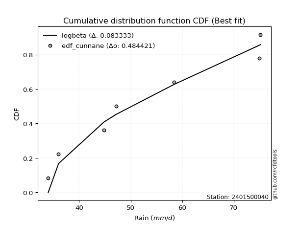</img>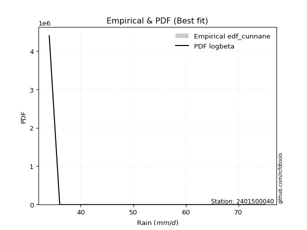</img>

</div>


### 12. EDF Adamowski (1981)

The Adamowski formula in hydrology refers to a specific plotting position formula used for estimating the non-parametric empirical distribution of hydrological events (like flood peaks) to calculate their return periods. This formula provides an alternative to traditional parametric methods (like the Gumbel or Log Pearson Type III distributions). 

<div align="center">


$P=(m-0.25)/(n+0.5)$


</div>


**12.1. Empirical values**

<div align="center">

|                | 0                  | 1                   | 2                   | 3             | 4                  | 5                  | 6                  |
|:---------------|:-------------------|:--------------------|:--------------------|:--------------|:-------------------|:-------------------|:-------------------|
| date           | 2022               | 2023                | 2025                | 2021          | 2020               | 2019               | 2024               |
| x              | 34.0               | 36.0                | 44.8                | 47.2          | 58.4               | 75.0               | 75.2               |
| m              | 1                  | 2                   | 3                   | 4             | 5                  | 6                  | 7                  |
| empirical_dist | edf_adamowski      | edf_adamowski       | edf_adamowski       | edf_adamowski | edf_adamowski      | edf_adamowski      | edf_adamowski      |
| empirical      | 0.1                | 0.23333333333333334 | 0.36666666666666664 | 0.5           | 0.6333333333333333 | 0.7666666666666667 | 0.9                |
| empirical_tr   | 1.1111111111111112 | 1.3043478260869565  | 1.5789473684210527  | 2.0           | 2.727272727272727  | 4.2857142857142865 | 10.000000000000002 |

</div>


**12.2. Kolmogorov-Smirnov fit test (sorted by Δ)**


<div align="center">

|                | 0                   | 1                   | 2                   | 3                   | 4                   | 5                   | 6                   | 7                   | 8                   | 9                   | 10                  | 11                  | 12                  | 13                  | 14                  | 15                  | 16                  | 17                  | 18                  | 19                  | 20                  | 21                  | 22                  | 23                  | 24                  | 25                  | 26                  | 27                  | 28                  | 29                  | 30                  | 31                  | 32                  | 33                  | 34                  | 35                  | 36                  | 37                  | 38                  | 39                  | 40                  | 41                  | 42                  | 43                  | 44                  | 45                  | 46                  | 47                  | 48                  | 49                  | 50                  | 51                  | 52                  | 53                  | 54                  | 55                  | 56                  | 57                  | 58                  | 59                  | 60                  | 61                  | 62                  | 63                  | 64                  | 65                  | 66                  | 67                  | 68                  | 69                  | 70                  | 71                  | 72                  | 73                  | 74                  | 75                  | 76                  | 77                  | 78                  | 79                  | 80                  | 81                  | 82                  | 83                  | 84                  | 85                  | 86                  | 87                  | 88                  | 89                  | 90                  | 91                  | 92                  | 93                  | 94                  | 95                  | 96                  | 97                  | 98                  | 99                  | 100                 | 101                 | 102                 | 103                 | 104                 | 105                 | 106                 | 107                 | 108                 | 109                 | 110                 | 111                 | 112                 | 113                 | 114                 | 115                 | 116                 | 117                 | 118                 | 119                 | 120                 | 121                 | 122                 | 123                 | 124                 | 125                 | 126                 | 127                 | 128                 | 129                 | 130                 | 131                 | 132                 | 133                 | 134                 | 135                 | 136                 | 137                 | 138                 | 139                 | 140                 | 141                 | 142                 | 143                 | 144                 | 145                 | 146                 | 147                 | 148                 | 149                 | 150                 | 151                 | 152                 | 153                 | 154                 | 155                 | 156                 | 157                 | 158                 | 159                 |
|:---------------|:--------------------|:--------------------|:--------------------|:--------------------|:--------------------|:--------------------|:--------------------|:--------------------|:--------------------|:--------------------|:--------------------|:--------------------|:--------------------|:--------------------|:--------------------|:--------------------|:--------------------|:--------------------|:--------------------|:--------------------|:--------------------|:--------------------|:--------------------|:--------------------|:--------------------|:--------------------|:--------------------|:--------------------|:--------------------|:--------------------|:--------------------|:--------------------|:--------------------|:--------------------|:--------------------|:--------------------|:--------------------|:--------------------|:--------------------|:--------------------|:--------------------|:--------------------|:--------------------|:--------------------|:--------------------|:--------------------|:--------------------|:--------------------|:--------------------|:--------------------|:--------------------|:--------------------|:--------------------|:--------------------|:--------------------|:--------------------|:--------------------|:--------------------|:--------------------|:--------------------|:--------------------|:--------------------|:--------------------|:--------------------|:--------------------|:--------------------|:--------------------|:--------------------|:--------------------|:--------------------|:--------------------|:--------------------|:--------------------|:--------------------|:--------------------|:--------------------|:--------------------|:--------------------|:--------------------|:--------------------|:--------------------|:--------------------|:--------------------|:--------------------|:--------------------|:--------------------|:--------------------|:--------------------|:--------------------|:--------------------|:--------------------|:--------------------|:--------------------|:--------------------|:--------------------|:--------------------|:--------------------|:--------------------|:--------------------|:--------------------|:--------------------|:--------------------|:--------------------|:--------------------|:--------------------|:--------------------|:--------------------|:--------------------|:--------------------|:--------------------|:--------------------|:--------------------|:--------------------|:--------------------|:--------------------|:--------------------|:--------------------|:--------------------|:--------------------|:--------------------|:--------------------|:--------------------|:--------------------|:--------------------|:--------------------|:--------------------|:--------------------|:--------------------|:--------------------|:--------------------|:--------------------|:--------------------|:--------------------|:--------------------|:--------------------|:--------------------|:--------------------|:--------------------|:--------------------|:--------------------|:--------------------|:--------------------|:--------------------|:--------------------|:--------------------|:--------------------|:--------------------|:--------------------|:--------------------|:--------------------|:--------------------|:--------------------|:--------------------|:--------------------|:--------------------|:--------------------|:--------------------|:--------------------|:--------------------|:--------------------|
| station        | 2401500040          | 2401500040          | 2401500040          | 2401500040          | 2401500040          | 2401500040          | 2401500040          | 2401500040          | 2401500040          | 2401500040          | 2401500040          | 2401500040          | 2401500040          | 2401500040          | 2401500040          | 2401500040          | 2401500040          | 2401500040          | 2401500040          | 2401500040          | 2401500040          | 2401500040          | 2401500040          | 2401500040          | 2401500040          | 2401500040          | 2401500040          | 2401500040          | 2401500040          | 2401500040          | 2401500040          | 2401500040          | 2401500040          | 2401500040          | 2401500040          | 2401500040          | 2401500040          | 2401500040          | 2401500040          | 2401500040          | 2401500040          | 2401500040          | 2401500040          | 2401500040          | 2401500040          | 2401500040          | 2401500040          | 2401500040          | 2401500040          | 2401500040          | 2401500040          | 2401500040          | 2401500040          | 2401500040          | 2401500040          | 2401500040          | 2401500040          | 2401500040          | 2401500040          | 2401500040          | 2401500040          | 2401500040          | 2401500040          | 2401500040          | 2401500040          | 2401500040          | 2401500040          | 2401500040          | 2401500040          | 2401500040          | 2401500040          | 2401500040          | 2401500040          | 2401500040          | 2401500040          | 2401500040          | 2401500040          | 2401500040          | 2401500040          | 2401500040          | 2401500040          | 2401500040          | 2401500040          | 2401500040          | 2401500040          | 2401500040          | 2401500040          | 2401500040          | 2401500040          | 2401500040          | 2401500040          | 2401500040          | 2401500040          | 2401500040          | 2401500040          | 2401500040          | 2401500040          | 2401500040          | 2401500040          | 2401500040          | 2401500040          | 2401500040          | 2401500040          | 2401500040          | 2401500040          | 2401500040          | 2401500040          | 2401500040          | 2401500040          | 2401500040          | 2401500040          | 2401500040          | 2401500040          | 2401500040          | 2401500040          | 2401500040          | 2401500040          | 2401500040          | 2401500040          | 2401500040          | 2401500040          | 2401500040          | 2401500040          | 2401500040          | 2401500040          | 2401500040          | 2401500040          | 2401500040          | 2401500040          | 2401500040          | 2401500040          | 2401500040          | 2401500040          | 2401500040          | 2401500040          | 2401500040          | 2401500040          | 2401500040          | 2401500040          | 2401500040          | 2401500040          | 2401500040          | 2401500040          | 2401500040          | 2401500040          | 2401500040          | 2401500040          | 2401500040          | 2401500040          | 2401500040          | 2401500040          | 2401500040          | 2401500040          | 2401500040          | 2401500040          | 2401500040          | 2401500040          | 2401500040          | 2401500040          | 2401500040          |
| empirical_dist | edf_adamowski       | edf_adamowski       | edf_adamowski       | edf_adamowski       | edf_adamowski       | edf_adamowski       | edf_adamowski       | edf_adamowski       | edf_adamowski       | edf_adamowski       | edf_adamowski       | edf_adamowski       | edf_adamowski       | edf_adamowski       | edf_adamowski       | edf_adamowski       | edf_adamowski       | edf_adamowski       | edf_adamowski       | edf_adamowski       | edf_adamowski       | edf_adamowski       | edf_adamowski       | edf_adamowski       | edf_adamowski       | edf_adamowski       | edf_adamowski       | edf_adamowski       | edf_adamowski       | edf_adamowski       | edf_adamowski       | edf_adamowski       | edf_adamowski       | edf_adamowski       | edf_adamowski       | edf_adamowski       | edf_adamowski       | edf_adamowski       | edf_adamowski       | edf_adamowski       | edf_adamowski       | edf_adamowski       | edf_adamowski       | edf_adamowski       | edf_adamowski       | edf_adamowski       | edf_adamowski       | edf_adamowski       | edf_adamowski       | edf_adamowski       | edf_adamowski       | edf_adamowski       | edf_adamowski       | edf_adamowski       | edf_adamowski       | edf_adamowski       | edf_adamowski       | edf_adamowski       | edf_adamowski       | edf_adamowski       | edf_adamowski       | edf_adamowski       | edf_adamowski       | edf_adamowski       | edf_adamowski       | edf_adamowski       | edf_adamowski       | edf_adamowski       | edf_adamowski       | edf_adamowski       | edf_adamowski       | edf_adamowski       | edf_adamowski       | edf_adamowski       | edf_adamowski       | edf_adamowski       | edf_adamowski       | edf_adamowski       | edf_adamowski       | edf_adamowski       | edf_adamowski       | edf_adamowski       | edf_adamowski       | edf_adamowski       | edf_adamowski       | edf_adamowski       | edf_adamowski       | edf_adamowski       | edf_adamowski       | edf_adamowski       | edf_adamowski       | edf_adamowski       | edf_adamowski       | edf_adamowski       | edf_adamowski       | edf_adamowski       | edf_adamowski       | edf_adamowski       | edf_adamowski       | edf_adamowski       | edf_adamowski       | edf_adamowski       | edf_adamowski       | edf_adamowski       | edf_adamowski       | edf_adamowski       | edf_adamowski       | edf_adamowski       | edf_adamowski       | edf_adamowski       | edf_adamowski       | edf_adamowski       | edf_adamowski       | edf_adamowski       | edf_adamowski       | edf_adamowski       | edf_adamowski       | edf_adamowski       | edf_adamowski       | edf_adamowski       | edf_adamowski       | edf_adamowski       | edf_adamowski       | edf_adamowski       | edf_adamowski       | edf_adamowski       | edf_adamowski       | edf_adamowski       | edf_adamowski       | edf_adamowski       | edf_adamowski       | edf_adamowski       | edf_adamowski       | edf_adamowski       | edf_adamowski       | edf_adamowski       | edf_adamowski       | edf_adamowski       | edf_adamowski       | edf_adamowski       | edf_adamowski       | edf_adamowski       | edf_adamowski       | edf_adamowski       | edf_adamowski       | edf_adamowski       | edf_adamowski       | edf_adamowski       | edf_adamowski       | edf_adamowski       | edf_adamowski       | edf_adamowski       | edf_adamowski       | edf_adamowski       | edf_adamowski       | edf_adamowski       | edf_adamowski       | edf_adamowski       | edf_adamowski       | edf_adamowski       |
| p_dist         | logbeta             | logrdist            | logfatiguelife      | logksone            | logarcsine          | logburr             | invgauss            | loginvgauss         | logmielke           | loginvweibull       | loggenlogistic      | burr                | logsemicircular     | invgamma            | logfoldnorm         | loganglit           | loghalfgennorm      | lograyleigh         | logkstwobign        | logmaxwell          | logf                | genextreme          | nct                 | burr12              | halfnorm            | exponnorm           | logncf              | alpha               | logalpha            | genexpon            | logrice             | logbetaprime        | logdgamma           | logdweibull         | loglomax            | loginvgamma         | betaprime           | lognct              | f                   | ksone               | loggenexpon         | ncf                 | logerlang           | logpearson3         | loggamma            | loggamma            | rayleigh            | semicircular        | logskewnorm         | logjohnsonsu        | logloggamma         | logexponnorm        | logcrystalball      | lognorm             | logt                | maxwell             | genlogistic         | anglit              | foldnorm            | gumbel_r            | loggumbel_r         | pearson3            | loghalfnorm         | kstwobign           | rice                | logloglaplace       | loglogistic         | dweibull            | moyal               | logcosine           | logburr12           | norm                | crystalball         | truncnorm           | t                   | nakagami            | loghypsecant        | loggompertz         | dgamma              | loglaplace          | loglaplace          | johnsonsu           | logistic            | cosine              | gompertz            | gausshyper          | halflogistic        | skewnorm            | hypsecant           | genpareto           | logmoyal            | arcsine             | logargus            | halfgennorm         | loggumbel_l         | logtrapezoid        | loggengamma         | rdist               | exponpow            | laplace             | beta                | gumbel_l            | argus               | logkappa3           | loghalflogistic     | loggausshyper       | wrapcauchy          | logweibull_max      | tukeylambda         | logwrapcauchy       | trapezoid           | logtukeylambda      | lomax               | triang              | kappa4              | kappa3              | loggenextreme       | logtriang           | uniform             | logkappa4           | bradford            | loguniform          | truncexpon          | truncpareto         | logvonmises_line    | logbradford         | logtruncweibull_min | logtruncexpon       | truncweibull_min    | logtruncnorm        | wald                | logwald             | vonmises_line       | logweibull_min      | loggenhalflogistic  | weibull_min         | loggennorm          | gennorm             | logexponpow         | gamma               | logexponweib        | loglevy_l           | erlang              | levy_l              | genhalflogistic     | lognakagami         | logjohnsonsb        | johnsonsb           | gengamma            | fatiguelife         | powerlaw            | logpowerlaw         | exponweib           | invweibull          | loggenpareto        | weibull_max         | logtruncpareto      | logvonmises         | vonmises            | mielke              |
| delta          | 0.09999999640507808 | 0.09999999753533424 | 0.11216481417641921 | 0.1126924251224053  | 0.11286702512572389 | 0.1160861273559255  | 0.11627525213881618 | 0.11697815550054402 | 0.11776216462993705 | 0.1177823990616429  | 0.1180190291010782  | 0.11818928122330541 | 0.11920224667621426 | 0.12161502646685918 | 0.12287904847067921 | 0.12450946269356389 | 0.12536528679203823 | 0.12634495507252397 | 0.12667535909831718 | 0.128988050633412   | 0.12906454511287224 | 0.1291896554299684  | 0.12946193608147638 | 0.1297376101534648  | 0.13173878724124977 | 0.13176589761284502 | 0.1319524430175104  | 0.1319734360888456  | 0.1321649628236793  | 0.13225363570275914 | 0.13232927280668227 | 0.1324091380350404  | 0.13251086142049096 | 0.13267944636117637 | 0.13426905347962642 | 0.1345097248439221  | 0.13460463509676568 | 0.13460701395843044 | 0.13470566247333104 | 0.13525315833029994 | 0.13545231740404606 | 0.13571506054646543 | 0.13584451550402266 | 0.13686837343194036 | 0.13726343423743392 | 0.13726343423743392 | 0.1374474986978983  | 0.13751613843198807 | 0.13836769204876764 | 0.1384049305368843  | 0.13852108567530264 | 0.1389175223714222  | 0.13893325560687264 | 0.1389335236434398  | 0.13893398727823858 | 0.14038353929415404 | 0.1405737690480986  | 0.14058251701270708 | 0.14176177355006925 | 0.14348233749676476 | 0.14470076453915814 | 0.144976328899449   | 0.14529866837103236 | 0.14578478087287672 | 0.14644555642351842 | 0.14740192117718143 | 0.14890019779050423 | 0.15037246662174508 | 0.15111115031043829 | 0.1513132204829304  | 0.15139562892554292 | 0.15141620284395463 | 0.15141620630115704 | 0.15141620969881964 | 0.1514559068267135  | 0.15269632644689846 | 0.15296688569510908 | 0.15406617938356865 | 0.15480663455081356 | 0.15537802518004473 | 0.15537802518004473 | 0.1559969238807999  | 0.1592323751271011  | 0.15978254801261704 | 0.1602788200842607  | 0.16189425368826488 | 0.16573452021449836 | 0.16877511921162464 | 0.1721818345085811  | 0.1731691661005389  | 0.1732149414641607  | 0.17721370777577528 | 0.17983594844141904 | 0.1809494628682135  | 0.18496933187599618 | 0.18671385997929724 | 0.18834077878248495 | 0.1926629335330512  | 0.19436599739588095 | 0.20054781952305667 | 0.20074918306330725 | 0.20278883861451125 | 0.20474549863521407 | 0.20593881542711034 | 0.20703119787610583 | 0.21753768040142785 | 0.21775948469038808 | 0.22113427664731583 | 0.22229485696619278 | 0.22274171589870517 | 0.2230256921509639  | 0.22342611119814293 | 0.2242354801123837  | 0.2243453468599978  | 0.22632059311807473 | 0.22682832797532282 | 0.22717293532393446 | 0.22838651389040332 | 0.22847896440129434 | 0.22905396334436912 | 0.22988931975347182 | 0.2299783968264998  | 0.23045264374469043 | 0.23080984131029902 | 0.23085198384730987 | 0.23103720388483684 | 0.23112078663224755 | 0.2314659498151359  | 0.23155660255793376 | 0.23213530181491326 | 0.23333333333333334 | 0.23333333333333334 | 0.23440515530911338 | 0.24421250947002032 | 0.24441797996171538 | 0.25263617117032633 | 0.2666666666666667  | 0.2666666666666667  | 0.27694072518075413 | 0.27766033846484156 | 0.2876643248902973  | 0.28769098137438665 | 0.2981334091439061  | 0.3009781020188884  | 0.302735294968033   | 0.31339011426012026 | 0.31640751344404455 | 0.3857630319806323  | 0.4029713014990515  | 0.4177159916402536  | 0.4347115862507909  | 0.4647621490886212  | 0.4673120461928841  | 0.46808676382812725 | 0.5083341206164049  | 0.5136854312164819  | 0.5609068208297538  | 1.139126160185878   | 11.475137179074574  | nan                 |
| deltao         | 0.48442053926100004 | 0.48442053926100004 | 0.48442053926100004 | 0.48442053926100004 | 0.48442053926100004 | 0.48442053926100004 | 0.48442053926100004 | 0.48442053926100004 | 0.48442053926100004 | 0.48442053926100004 | 0.48442053926100004 | 0.48442053926100004 | 0.48442053926100004 | 0.48442053926100004 | 0.48442053926100004 | 0.48442053926100004 | 0.48442053926100004 | 0.48442053926100004 | 0.48442053926100004 | 0.48442053926100004 | 0.48442053926100004 | 0.48442053926100004 | 0.48442053926100004 | 0.48442053926100004 | 0.48442053926100004 | 0.48442053926100004 | 0.48442053926100004 | 0.48442053926100004 | 0.48442053926100004 | 0.48442053926100004 | 0.48442053926100004 | 0.48442053926100004 | 0.48442053926100004 | 0.48442053926100004 | 0.48442053926100004 | 0.48442053926100004 | 0.48442053926100004 | 0.48442053926100004 | 0.48442053926100004 | 0.48442053926100004 | 0.48442053926100004 | 0.48442053926100004 | 0.48442053926100004 | 0.48442053926100004 | 0.48442053926100004 | 0.48442053926100004 | 0.48442053926100004 | 0.48442053926100004 | 0.48442053926100004 | 0.48442053926100004 | 0.48442053926100004 | 0.48442053926100004 | 0.48442053926100004 | 0.48442053926100004 | 0.48442053926100004 | 0.48442053926100004 | 0.48442053926100004 | 0.48442053926100004 | 0.48442053926100004 | 0.48442053926100004 | 0.48442053926100004 | 0.48442053926100004 | 0.48442053926100004 | 0.48442053926100004 | 0.48442053926100004 | 0.48442053926100004 | 0.48442053926100004 | 0.48442053926100004 | 0.48442053926100004 | 0.48442053926100004 | 0.48442053926100004 | 0.48442053926100004 | 0.48442053926100004 | 0.48442053926100004 | 0.48442053926100004 | 0.48442053926100004 | 0.48442053926100004 | 0.48442053926100004 | 0.48442053926100004 | 0.48442053926100004 | 0.48442053926100004 | 0.48442053926100004 | 0.48442053926100004 | 0.48442053926100004 | 0.48442053926100004 | 0.48442053926100004 | 0.48442053926100004 | 0.48442053926100004 | 0.48442053926100004 | 0.48442053926100004 | 0.48442053926100004 | 0.48442053926100004 | 0.48442053926100004 | 0.48442053926100004 | 0.48442053926100004 | 0.48442053926100004 | 0.48442053926100004 | 0.48442053926100004 | 0.48442053926100004 | 0.48442053926100004 | 0.48442053926100004 | 0.48442053926100004 | 0.48442053926100004 | 0.48442053926100004 | 0.48442053926100004 | 0.48442053926100004 | 0.48442053926100004 | 0.48442053926100004 | 0.48442053926100004 | 0.48442053926100004 | 0.48442053926100004 | 0.48442053926100004 | 0.48442053926100004 | 0.48442053926100004 | 0.48442053926100004 | 0.48442053926100004 | 0.48442053926100004 | 0.48442053926100004 | 0.48442053926100004 | 0.48442053926100004 | 0.48442053926100004 | 0.48442053926100004 | 0.48442053926100004 | 0.48442053926100004 | 0.48442053926100004 | 0.48442053926100004 | 0.48442053926100004 | 0.48442053926100004 | 0.48442053926100004 | 0.48442053926100004 | 0.48442053926100004 | 0.48442053926100004 | 0.48442053926100004 | 0.48442053926100004 | 0.48442053926100004 | 0.48442053926100004 | 0.48442053926100004 | 0.48442053926100004 | 0.48442053926100004 | 0.48442053926100004 | 0.48442053926100004 | 0.48442053926100004 | 0.48442053926100004 | 0.48442053926100004 | 0.48442053926100004 | 0.48442053926100004 | 0.48442053926100004 | 0.48442053926100004 | 0.48442053926100004 | 0.48442053926100004 | 0.48442053926100004 | 0.48442053926100004 | 0.48442053926100004 | 0.48442053926100004 | 0.48442053926100004 | 0.48442053926100004 | 0.48442053926100004 | 0.48442053926100004 | 0.48442053926100004 | 0.48442053926100004 |
| eval           | Δo > Δ              | Δo > Δ              | Δo > Δ              | Δo > Δ              | Δo > Δ              | Δo > Δ              | Δo > Δ              | Δo > Δ              | Δo > Δ              | Δo > Δ              | Δo > Δ              | Δo > Δ              | Δo > Δ              | Δo > Δ              | Δo > Δ              | Δo > Δ              | Δo > Δ              | Δo > Δ              | Δo > Δ              | Δo > Δ              | Δo > Δ              | Δo > Δ              | Δo > Δ              | Δo > Δ              | Δo > Δ              | Δo > Δ              | Δo > Δ              | Δo > Δ              | Δo > Δ              | Δo > Δ              | Δo > Δ              | Δo > Δ              | Δo > Δ              | Δo > Δ              | Δo > Δ              | Δo > Δ              | Δo > Δ              | Δo > Δ              | Δo > Δ              | Δo > Δ              | Δo > Δ              | Δo > Δ              | Δo > Δ              | Δo > Δ              | Δo > Δ              | Δo > Δ              | Δo > Δ              | Δo > Δ              | Δo > Δ              | Δo > Δ              | Δo > Δ              | Δo > Δ              | Δo > Δ              | Δo > Δ              | Δo > Δ              | Δo > Δ              | Δo > Δ              | Δo > Δ              | Δo > Δ              | Δo > Δ              | Δo > Δ              | Δo > Δ              | Δo > Δ              | Δo > Δ              | Δo > Δ              | Δo > Δ              | Δo > Δ              | Δo > Δ              | Δo > Δ              | Δo > Δ              | Δo > Δ              | Δo > Δ              | Δo > Δ              | Δo > Δ              | Δo > Δ              | Δo > Δ              | Δo > Δ              | Δo > Δ              | Δo > Δ              | Δo > Δ              | Δo > Δ              | Δo > Δ              | Δo > Δ              | Δo > Δ              | Δo > Δ              | Δo > Δ              | Δo > Δ              | Δo > Δ              | Δo > Δ              | Δo > Δ              | Δo > Δ              | Δo > Δ              | Δo > Δ              | Δo > Δ              | Δo > Δ              | Δo > Δ              | Δo > Δ              | Δo > Δ              | Δo > Δ              | Δo > Δ              | Δo > Δ              | Δo > Δ              | Δo > Δ              | Δo > Δ              | Δo > Δ              | Δo > Δ              | Δo > Δ              | Δo > Δ              | Δo > Δ              | Δo > Δ              | Δo > Δ              | Δo > Δ              | Δo > Δ              | Δo > Δ              | Δo > Δ              | Δo > Δ              | Δo > Δ              | Δo > Δ              | Δo > Δ              | Δo > Δ              | Δo > Δ              | Δo > Δ              | Δo > Δ              | Δo > Δ              | Δo > Δ              | Δo > Δ              | Δo > Δ              | Δo > Δ              | Δo > Δ              | Δo > Δ              | Δo > Δ              | Δo > Δ              | Δo > Δ              | Δo > Δ              | Δo > Δ              | Δo > Δ              | Δo > Δ              | Δo > Δ              | Δo > Δ              | Δo > Δ              | Δo > Δ              | Δo > Δ              | Δo > Δ              | Δo > Δ              | Δo > Δ              | Δo > Δ              | Δo > Δ              | Δo > Δ              | Δo > Δ              | Δo > Δ              | Δo > Δ              | Δo > Δ              | Δo > Δ              | Δo > Δ              | Δo <= Δ             | Δo <= Δ             | Δo <= Δ             | Δo <= Δ             | Δo <= Δ             | Δo <= Δ             |
| fit            | 1                   | 1                   | 1                   | 1                   | 1                   | 1                   | 1                   | 1                   | 1                   | 1                   | 1                   | 1                   | 1                   | 1                   | 1                   | 1                   | 1                   | 1                   | 1                   | 1                   | 1                   | 1                   | 1                   | 1                   | 1                   | 1                   | 1                   | 1                   | 1                   | 1                   | 1                   | 1                   | 1                   | 1                   | 1                   | 1                   | 1                   | 1                   | 1                   | 1                   | 1                   | 1                   | 1                   | 1                   | 1                   | 1                   | 1                   | 1                   | 1                   | 1                   | 1                   | 1                   | 1                   | 1                   | 1                   | 1                   | 1                   | 1                   | 1                   | 1                   | 1                   | 1                   | 1                   | 1                   | 1                   | 1                   | 1                   | 1                   | 1                   | 1                   | 1                   | 1                   | 1                   | 1                   | 1                   | 1                   | 1                   | 1                   | 1                   | 1                   | 1                   | 1                   | 1                   | 1                   | 1                   | 1                   | 1                   | 1                   | 1                   | 1                   | 1                   | 1                   | 1                   | 1                   | 1                   | 1                   | 1                   | 1                   | 1                   | 1                   | 1                   | 1                   | 1                   | 1                   | 1                   | 1                   | 1                   | 1                   | 1                   | 1                   | 1                   | 1                   | 1                   | 1                   | 1                   | 1                   | 1                   | 1                   | 1                   | 1                   | 1                   | 1                   | 1                   | 1                   | 1                   | 1                   | 1                   | 1                   | 1                   | 1                   | 1                   | 1                   | 1                   | 1                   | 1                   | 1                   | 1                   | 1                   | 1                   | 1                   | 1                   | 1                   | 1                   | 1                   | 1                   | 1                   | 1                   | 1                   | 1                   | 1                   | 1                   | 1                   | 1                   | 1                   | 0                   | 0                   | 0                   | 0                   | 0                   | 0                   |
| n              | 7                   | 7                   | 7                   | 7                   | 7                   | 7                   | 7                   | 7                   | 7                   | 7                   | 7                   | 7                   | 7                   | 7                   | 7                   | 7                   | 7                   | 7                   | 7                   | 7                   | 7                   | 7                   | 7                   | 7                   | 7                   | 7                   | 7                   | 7                   | 7                   | 7                   | 7                   | 7                   | 7                   | 7                   | 7                   | 7                   | 7                   | 7                   | 7                   | 7                   | 7                   | 7                   | 7                   | 7                   | 7                   | 7                   | 7                   | 7                   | 7                   | 7                   | 7                   | 7                   | 7                   | 7                   | 7                   | 7                   | 7                   | 7                   | 7                   | 7                   | 7                   | 7                   | 7                   | 7                   | 7                   | 7                   | 7                   | 7                   | 7                   | 7                   | 7                   | 7                   | 7                   | 7                   | 7                   | 7                   | 7                   | 7                   | 7                   | 7                   | 7                   | 7                   | 7                   | 7                   | 7                   | 7                   | 7                   | 7                   | 7                   | 7                   | 7                   | 7                   | 7                   | 7                   | 7                   | 7                   | 7                   | 7                   | 7                   | 7                   | 7                   | 7                   | 7                   | 7                   | 7                   | 7                   | 7                   | 7                   | 7                   | 7                   | 7                   | 7                   | 7                   | 7                   | 7                   | 7                   | 7                   | 7                   | 7                   | 7                   | 7                   | 7                   | 7                   | 7                   | 7                   | 7                   | 7                   | 7                   | 7                   | 7                   | 7                   | 7                   | 7                   | 7                   | 7                   | 7                   | 7                   | 7                   | 7                   | 7                   | 7                   | 7                   | 7                   | 7                   | 7                   | 7                   | 7                   | 7                   | 7                   | 7                   | 7                   | 7                   | 7                   | 7                   | 7                   | 7                   | 7                   | 7                   | 7                   | 7                   |
| best_fit       | 1                   | 0                   | 0                   | 0                   | 0                   | 0                   | 0                   | 0                   | 0                   | 0                   | 0                   | 0                   | 0                   | 0                   | 0                   | 0                   | 0                   | 0                   | 0                   | 0                   | 0                   | 0                   | 0                   | 0                   | 0                   | 0                   | 0                   | 0                   | 0                   | 0                   | 0                   | 0                   | 0                   | 0                   | 0                   | 0                   | 0                   | 0                   | 0                   | 0                   | 0                   | 0                   | 0                   | 0                   | 0                   | 0                   | 0                   | 0                   | 0                   | 0                   | 0                   | 0                   | 0                   | 0                   | 0                   | 0                   | 0                   | 0                   | 0                   | 0                   | 0                   | 0                   | 0                   | 0                   | 0                   | 0                   | 0                   | 0                   | 0                   | 0                   | 0                   | 0                   | 0                   | 0                   | 0                   | 0                   | 0                   | 0                   | 0                   | 0                   | 0                   | 0                   | 0                   | 0                   | 0                   | 0                   | 0                   | 0                   | 0                   | 0                   | 0                   | 0                   | 0                   | 0                   | 0                   | 0                   | 0                   | 0                   | 0                   | 0                   | 0                   | 0                   | 0                   | 0                   | 0                   | 0                   | 0                   | 0                   | 0                   | 0                   | 0                   | 0                   | 0                   | 0                   | 0                   | 0                   | 0                   | 0                   | 0                   | 0                   | 0                   | 0                   | 0                   | 0                   | 0                   | 0                   | 0                   | 0                   | 0                   | 0                   | 0                   | 0                   | 0                   | 0                   | 0                   | 0                   | 0                   | 0                   | 0                   | 0                   | 0                   | 0                   | 0                   | 0                   | 0                   | 0                   | 0                   | 0                   | 0                   | 0                   | 0                   | 0                   | 0                   | 0                   | 0                   | 0                   | 0                   | 0                   | 0                   | 0                   |
| best_fit_sort  | 1                   | 2                   | 3                   | 4                   | 5                   | 6                   | 7                   | 8                   | 9                   | 10                  | 11                  | 12                  | 13                  | 14                  | 15                  | 16                  | 17                  | 18                  | 19                  | 20                  | 21                  | 22                  | 23                  | 24                  | 25                  | 26                  | 27                  | 28                  | 29                  | 30                  | 31                  | 32                  | 33                  | 34                  | 35                  | 36                  | 37                  | 38                  | 39                  | 40                  | 41                  | 42                  | 43                  | 44                  | 45                  | 46                  | 47                  | 48                  | 49                  | 50                  | 51                  | 52                  | 53                  | 54                  | 55                  | 56                  | 57                  | 58                  | 59                  | 60                  | 61                  | 62                  | 63                  | 64                  | 65                  | 66                  | 67                  | 68                  | 69                  | 70                  | 71                  | 72                  | 73                  | 74                  | 75                  | 76                  | 77                  | 78                  | 79                  | 80                  | 81                  | 82                  | 83                  | 84                  | 85                  | 86                  | 87                  | 88                  | 89                  | 90                  | 91                  | 92                  | 93                  | 94                  | 95                  | 96                  | 97                  | 98                  | 99                  | 100                 | 101                 | 102                 | 103                 | 104                 | 105                 | 106                 | 107                 | 108                 | 109                 | 110                 | 111                 | 112                 | 113                 | 114                 | 115                 | 116                 | 117                 | 118                 | 119                 | 120                 | 121                 | 122                 | 123                 | 124                 | 125                 | 126                 | 127                 | 128                 | 129                 | 130                 | 131                 | 132                 | 133                 | 134                 | 135                 | 136                 | 137                 | 138                 | 139                 | 140                 | 141                 | 142                 | 143                 | 144                 | 145                 | 146                 | 147                 | 148                 | 149                 | 150                 | 151                 | 152                 | 153                 | 154                 | 155                 | 156                 | 157                 | 158                 | 159                 | 160                 |

</div>


**12.3. Best fit**

<div align="center">

|   id |    station | empirical_dist   | p_dist   |   delta |   deltao | eval   |   fit |   n |   best_fit |   best_fit_sort |
|-----:|-----------:|:-----------------|:---------|--------:|---------:|:-------|------:|----:|-----------:|----------------:|
|    0 | 2401500040 | edf_adamowski    | logbeta  |     0.1 | 0.484421 | Δo > Δ |     1 |   7 |          1 |               1 |

</div>


<div align="center">

</img>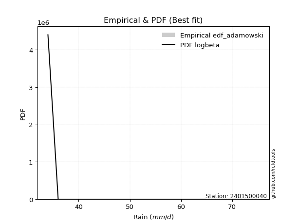</img>

</div>


## C. Best fit & Estimate extreme values for specific return periods - Tr

Best fit in probability distribution analysis means finding the theoretical distribution (like Normal, Poisson, Exponential, etc.) that most accurately mirrors your real-world data´s patterns (shape, center, spread) for better predictions, using methods like visual checks (Q-Q plots), goodness-of-fit tests (Kolmogorov-Smirnov, Chi-Squared), and information criteria (AIC) to score and select the simplest, most representative model.


### 1. Best fit (ordered by delta Δ)

:file_folder:Table: [bestfit_2401500040.csv](table/bestfit_2401500040.csv)

<div align="center">

|   id |    station | empirical_dist   | p_dist     |     delta |   deltao | eval   |   fit |   n |   best_fit |   best_fit_sort |
|-----:|-----------:|:-----------------|:-----------|----------:|---------:|:-------|------:|----:|-----------:|----------------:|
|    0 | 2401500040 | edf_hazen        | logbeta    | 0.0714286 | 0.484421 | Δo > Δ |     1 |   7 |          1 |               1 |
|    1 | 2401500040 | edf_gringorten   | logbeta    | 0.0786517 | 0.484421 | Δo > Δ |     1 |   7 |          1 |               2 |
|    2 | 2401500040 | edf_cunnane      | logbeta    | 0.0833333 | 0.484421 | Δo > Δ |     1 |   7 |          1 |               3 |
|    3 | 2401500040 | edf_blom         | logbeta    | 0.0862069 | 0.484421 | Δo > Δ |     1 |   7 |          1 |               4 |
|    4 | 2401500040 | edf_tukey        | logbeta    | 0.0909091 | 0.484421 | Δo > Δ |     1 |   7 |          1 |               5 |
|    5 | 2401500040 | edf_filliben     | logbeta    | 0.092668  | 0.484421 | Δo > Δ |     1 |   7 |          1 |               6 |
|    6 | 2401500040 | edf_beard        | logbeta    | 0.0934959 | 0.484421 | Δo > Δ |     1 |   7 |          1 |               7 |
|    7 | 2401500040 | edf_jenkinson    | logbeta    | 0.0934959 | 0.484421 | Δo > Δ |     1 |   7 |          1 |               8 |
|    8 | 2401500040 | edf_chegodayev   | logbeta    | 0.0945946 | 0.484421 | Δo > Δ |     1 |   7 |          1 |               9 |
|    9 | 2401500040 | edf_california   | gausshyper | 0.0999895 | 0.484421 | Δo > Δ |     1 |   7 |          1 |              10 |
|   10 | 2401500040 | edf_adamowski    | logbeta    | 0.1       | 0.484421 | Δo > Δ |     1 |   7 |          1 |              11 |
|   11 | 2401500040 | edf_weibull      | burr12     | 0.121404  | 0.484421 | Δo > Δ |     1 |   7 |          1 |              12 |

</div>


### 2. Extreme values and % difference analysis

In hydrology, a return period (or recurrence interval $Tr$) is the statistical average time between extreme events like floods or droughts of a specific magnitude, indicating how rare an event is, with a 100-year flood, for example, having a 1% chance of occurring in any given year, not that it happens exactly every century. It is a key tool for infrastructure design (like bridges or dams) and risk assessment, calculated from historical data to determine the probability of future events, although it is important to remember it is statistical average, and events can cluster or be missed.

The extreme value porcentage difference is evaluated as $pdiff = 1 - (ETrBf / ETr) * 100$, where _ETrBf_ correspond to the bestfit extreme value for a specific recurrence interval and _ETr_ correspond to the extreme value for one of the most used PDFsused in hydrology.

> risk_rate: assuming the return period as the project useful life.

:file_folder:Table: [extreme_2401500040.csv](table/extreme_2401500040.csv), all PDFs.  
:file_folder:Table: [extremepdiff_2401500040.csv](table/extremepdiff_2401500040.csv), % difference between bestfit and most used PDFs in Hydrology.

<div align="center">

Extreme values table for only best fit PDFs
|   id |      tr |   prob_l |     prob_g |    alpha |   anglit |   arcsine |   argus |    beta |   betaprime |   bradford |     burr |   burr12 |   cosine |   crystalball |   dgamma |   dweibull |   erlang |   exponnorm |   exponpow |   exponweib |        f |   fatiguelife |   foldnorm |    gamma |   gausshyper |   genexpon |   genextreme |   gengamma |   genhalflogistic |   genlogistic |   gennorm |   genpareto |   gompertz |   gumbel_l |   gumbel_r |   halfgennorm |   halflogistic |   halfnorm |   hypsecant |   invgamma |   invgauss |       invweibull |   johnsonsb |   johnsonsu |   kappa3 |   kappa4 |   ksone |   kstwobign |   laplace |   levy_l |   loggamma |   logistic |   loglaplace |    lomax |   maxwell |   mielke |    moyal |   nakagami |      ncf |      nct |     norm |   pearson3 |   powerlaw |   rayleigh |   rdist |     rice |   semicircular |   skewnorm |        t |   trapezoid |   triang |   truncexpon |   truncnorm |   truncpareto |   truncweibull_min |   tukeylambda |   uniform |   vonmises |   vonmises_line |     wald |   weibull_max |      weibull_min |   wrapcauchy |   logalpha |   loganglit |   logarcsine |   logargus |   logbeta |   logbetaprime |   logbradford |   logburr |   logburr12 |   logcosine |   logcrystalball |   logdgamma |   logdweibull |   logerlang |   logexponnorm |   logexponpow |   logexponweib |     logf |   logfatiguelife |   logfoldnorm |   loggausshyper |   loggenexpon |   loggenextreme |   loggengamma |   loggenhalflogistic |   loggenlogistic |   loggennorm |   loggenpareto |   loggompertz |   loggumbel_l |   loggumbel_r |   loghalfgennorm |   loghalflogistic |   loghalfnorm |   loghypsecant |   loginvgamma |   loginvgauss |   loginvweibull |   logjohnsonsb |   logjohnsonsu |   logkappa3 |   logkappa4 |   logksone |   logkstwobign |   loglevy_l |   logloggamma |   loglogistic |   logloglaplace |   loglomax |   logmaxwell |   logmielke |   logmoyal |   lognakagami |   logncf |   lognct |   lognorm |   logpearson3 |   logpowerlaw |   lograyleigh |   logrdist |   logrice |   logsemicircular |   logskewnorm |     logt |   logtrapezoid |   logtriang |   logtruncexpon |   logtruncnorm |   logtruncpareto |   logtruncweibull_min |   logtukeylambda |   loguniform |   logvonmises |   logvonmises_line |   logwald |   logweibull_max |   logweibull_min |   logwrapcauchy |    station |   n |   risk_rate |
|-----:|--------:|---------:|-----------:|---------:|---------:|----------:|--------:|--------:|------------:|-----------:|---------:|---------:|---------:|--------------:|---------:|-----------:|---------:|------------:|-----------:|------------:|---------:|--------------:|-----------:|---------:|-------------:|-----------:|-------------:|-----------:|------------------:|--------------:|----------:|------------:|-----------:|-----------:|-----------:|--------------:|---------------:|-----------:|------------:|-----------:|-----------:|-----------------:|------------:|------------:|---------:|---------:|--------:|------------:|----------:|---------:|-----------:|-----------:|-------------:|---------:|----------:|---------:|---------:|-----------:|---------:|---------:|---------:|-----------:|-----------:|-----------:|--------:|---------:|---------------:|-----------:|---------:|------------:|---------:|-------------:|------------:|--------------:|-------------------:|--------------:|----------:|-----------:|----------------:|---------:|--------------:|-----------------:|-------------:|-----------:|------------:|-------------:|-----------:|----------:|---------------:|--------------:|----------:|------------:|------------:|-----------------:|------------:|--------------:|------------:|---------------:|--------------:|---------------:|---------:|-----------------:|--------------:|----------------:|--------------:|----------------:|--------------:|---------------------:|-----------------:|-------------:|---------------:|--------------:|--------------:|--------------:|-----------------:|------------------:|--------------:|---------------:|--------------:|--------------:|----------------:|---------------:|---------------:|------------:|------------:|-----------:|---------------:|------------:|--------------:|--------------:|----------------:|-----------:|-------------:|------------:|-----------:|--------------:|---------:|---------:|----------:|--------------:|--------------:|--------------:|-----------:|----------:|------------------:|--------------:|---------:|---------------:|------------:|----------------:|---------------:|-----------------:|----------------------:|-----------------:|-------------:|--------------:|-------------------:|----------:|-----------------:|-----------------:|----------------:|-----------:|----:|------------:|
|    0 |    2    | 0.5      | 0.5        |  49.6458 |  52.9429 |   52.9429 | 56.1717 | 48.3416 |     50.0184 |    50.8621 |  48.095  |  44.9296 |  53.6731 |       52.9429 |  53.357  |    54.0884 |  39.6066 |     47.0679 |    41.9016 |     34.6987 |  50.0232 |       34.0002 |    52.2063 |  40.6624 |      43.1089 |    47.0338 |      48.9721 |    34.97   |           61.7479 |       50.0265 |      54.6 |     57.7622 |    49.8428 |    55.5455 |    50.3402 |       42.8739 |        49.0463 |    49.6999 |     52.9429 |    48.3163 |    46.3765 |   1774.1         |     34.526  |     52.9424 |  34      |  53.6786 | 52.9429 |     50.1752 |   52.9429 |  68.9415 |    50.1085 |    52.9429 |      50.6273 |  59.3556 |   51.5879 |  48.122  |  49.5    |    51.8187 |  50.1921 |  49.1802 |  52.9429 |    52.0404 |    34.6232 |    51.1074 | 53.5255 |  51.9157 |        52.9429 |    50.6541 |  52.9442 |     55.661  |  58.0363 |      49.7789 |     52.9429 |       47.2395 |            43.2943 |       54.6903 |   54.6    |    1.03645 |         54.6    |  47.8074 |       74.7763 |     37.8361      |      54.6    |    49.658  |     50.6273 |      50.6273 |    52.8409 |   49.9327 |        49.814  |       46.6807 |   47.5856 |     51.1174 |     50.8327 |          50.6273 |     52.6121 |       52.5949 |     50.1196 |        50.625  |       40.5762 |        39.7022 |  49.1458 |          46.5722 |       48.4883 |         59.4453 |       47.0093 |         61.1834 |       42.4699 |              58.1016 |          48.0229 |      50.5648 |        21.8852 |       48.9243 |       53.1767 |       48.2001 |          46.0668 |           47.0374 |       47.6211 |        50.6273 |       49.9    |       47.6383 |         48.0372 |        34.7374 |        50.6272 |     51.04   |     50.373  |    50.6273 |        47.8088 |     67.8563 |       50.6852 |       50.6273 |         47.2    |    44.7665 |      49.3488 |     48.0917 |    47.4416 |       36.3695 |  49.7267 |  49.9975 |   50.6273 |       50.3502 |       34.5139 |       48.9032 |    51.6246 |   49.5499 |           50.6273 |       50.5384 |  50.6273 |        53.2928 |     54.8815 |         45.4249 |        43.3679 |          34.1606 |               46.8572 |          50.6633 |      50.5648 |     0.0944955 |            50.565  |   45.9496 |          63.689  |     38.5704      |         50.5648 | 2401500040 |   7 |    0.75     |
|    1 |    2.33 | 0.570815 | 0.429185   |  52.3458 |  56.2359 |   57.8862 | 59.0144 | 53.2018 |     52.7669 |    53.7907 |  50.7937 |  47.774  |  56.4988 |       55.7699 |  60.0195 |    61.355  |  41.4986 |     49.9521 |    45.3318 |     35.2288 |  52.7714 |       34.5555 |    55.2535 |  42.4866 |      47.7355 |    49.9065 |      51.6595 |    35.827  |           64.2806 |       52.725  |      54.6 |     62.566  |    52.7476 |    58.0051 |    52.9598 |       45.8729 |        51.7397 |    52.7511 |     55.2054 |    51.0299 |    49.127  | 109675           |     35.2297 |     55.7081 |  34      |  56.7529 | 56.8292 |     52.9161 |   54.6537 |  70.8963 |    52.8564 |    55.4337 |      52.289  |  64.9422 |   54.5251 |  50.8002 |  51.9798 |    55.2981 |  52.9468 |  51.8891 |  55.7699 |    54.8802 |    35.3883 |    54.0879 | 58.223  |  54.6743 |        56.4747 |    53.5207 |  55.7705 |     58.9152 |  60.9177 |      52.5789 |     55.7699 |       50.0481 |            45.8936 |       57.7227 |   57.5176 |    1.40966 |         56.6929 |  49.6612 |       74.989  |     46.2213      |      62.8377 |    52.3907 |     53.8743 |      55.579  |    55.7225 |   54.4986 |        52.5725 |       49.3839 |   50.2551 |     53.954  |     53.6197 |          53.4025 |     59.7362 |       60.1445 |     52.8808 |        53.4001 |       42.4481 |        41.7057 |  51.8707 |          49.2843 |       51.4903 |         63.3151 |       49.8343 |         64.2945 |       45.5618 |              60.9347 |          50.7164 |      50.5648 |        29.4769 |       51.7909 |       55.7039 |       50.6435 |          48.8037 |           49.4906 |       50.4443 |        52.8364 |       52.6452 |       50.345  |         50.7325 |        37.0271 |        53.4092 |     54.0681 |     53.4046 |    54.481  |        50.508  |     70.0747 |       53.4799 |       53.0646 |         49.0587 |    47.5835 |      52.1622 |     50.7897 |    49.7152 |       38.4639 |  52.4684 |  52.7526 |   53.4025 |       53.1178 |       35.1066 |       51.7336 |    56.4864 |   52.3032 |           54.1177 |       53.3087 |  53.4024 |        56.6692 |     57.8147 |         47.951  |        45.4658 |          34.2736 |               49.5066 |          53.7127 |      53.4886 |     0.0996428 |            52.8072 |   47.586  |          66.988  |     41.9001      |         59.1411 | 2401500040 |   7 |    0.729209 |
|    2 |    5    | 0.8      | 0.2        |  64.5428 |  67.8544 |   71.0684 | 68.1329 | 68.9215 |     64.8329 |    64.3829 |  64.3306 |  64.6492 |  66.6817 |       66.2761 |  68.2118 |    69.7568 |  52.3545 |     64.3727 |    66.8074 |     41.8407 |  64.8303 |       46.3486 |    66.6095 |  52.2071 |      70.0956 |    64.2693 |      64.2453 |    48.5742 |           70.9509 |       64.4471 |      54.6 |     72.6776 |    65.1733 |    65.951  |    64.3405 |       65.9773 |        63.9266 |    65.654  |     64.2808 |    64.334  |    63.7572 |      7.20085e+12 |     51.9332 |     65.9862 |  34      |  66.7936 | 69.4067 |     64.5588 |   63.2074 |  74.135  |    64.7764 |    65.0512 |      61.4517 |  92.8739 |   66.0854 |  64.075  |  63.4664 |    70.3208 |  64.9103 |  64.4231 |  66.2761 |    65.945  |    44.6882 |    66.0205 | 70.8906 |  65.7071 |        68.5273 |    65.6433 |  66.2741 |     68.2514 |  69.1845 |      63.1601 |     66.2761 |       61.4735 |            57.7889 |       67.4365 |   66.96   |    2.73592 |         64.5523 |  60.0385 |       75.1898 |    550.194       |      72.2814 |    64.6688 |     67.0859 |      71.282  |    66.0694 |   71.2437 |        64.829  |       60.6926 |   64.0499 |     65.1021 |     64.9923 |          65.1167 |     69.7942 |       70.7184 |     64.8816 |        65.1155 |       52.4556 |        53.7142 |  64.4686 |          64.1128 |       65.1906 |         72.7819 |       64.2856 |         71.7161 |       65.7583 |              69.1717 |          64.2821 |      50.5648 |        59.4201 |       64.7365 |       64.7182 |       62.7804 |          63.4117 |           62.2912 |       64.356  |        62.7096 |       64.7539 |       64.1878 |         64.3109 |        73.1697 |        65.1558 |     65.155  |     64.4491 |    69.0807 |        63.7794 |     73.9108 |       65.22   |       63.6283 |         59.8449 |    64.7062 |      64.8827 |     64.3506 |    61.7529 |       61.6994 |  64.7527 |  64.8382 |   65.1167 |       65.0039 |       42.419  |       64.8033 |    72.0638 |   64.7364 |           67.9435 |       65.0681 |  65.1166 |        67.5905 |     67.1292 |         58.9962 |        55.4554 |          36.1532 |               60.5737 |          64.7725 |      64.1608 |     0.121431  |            61.9257 |   57.884  |          73.42   |     98.8175      |         71.0216 | 2401500040 |   7 |    0.67232  |
|    3 |   10    | 0.9      | 0.1        |  75.2102 |  74.4307 |   74.2508 | 72.53   | 73.4697 |     74.8189 |    69.5931 |  77.9089 | inf      |  72.8338 |       73.2456 |  73.3693 |    74.0381 |  63.3568 |     77.4633 |    89.2618 |     56.4745 |  74.8047 |       62.6319 |    74.15   |  61.5098 |      74.722  |    77.3075 |      75.6843 |    81.3143 |           73.2596 |       73.9938 |      54.6 |     74.6157 |    74.276  |    70.3749 |    73.61   |       91.5596 |        74.0474 |    75.2019 |     71.5278 |    77.1221 |    78.4536 |      1.67706e+19 |     69.7284 |     72.8044 |  71.1416 |  71.1348 | 74.8946 |     73.4232 |   70.9721 |  74.9169 |    74.4554 |    72.1342 |      71.1526 | 118.23   |   74.221  |  77.1678 |  73.4672 |    81.5835 |  74.6687 |  75.623  |  73.2456 |    73.7375 |    55.7877 |    74.5287 | 74.0548 |  73.5609 |        74.7118 |    74.6137 |  73.2419 |     71.8981 |  72.4135 |      68.7552 |     73.2456 |       67.8246 |            65.3619 |       71.5455 |   71.08   |    3.4254  |         69.3049 |  71.0512 |       75.1991 |   4182.84        |      73.8773 |    75.1755 |     75.9529 |      75.6953 |    71.7249 |   77.7175 |        75.1353 |       67.2632 |   78.5639 |     72.9684 |     73.0016 |          74.2727 |     76.9721 |       76.892  |     74.6508 |        74.2745 |       62.092  |        66.943  |  75.6852 |          80.444  |       76.6036 |         74.685  |       78.1985 |         73.864  |       91.424  |              72.3369 |          77.9684 |      50.5648 |        70.3078 |       75.0779 |       70.3549 |       74.7853 |          78.3409 |           75.4037 |       77.0658 |        71.9028 |       74.8307 |       78.2325 |         78.0145 |        75.1429 |        74.3408 |     70.6795 |     69.8073 |    76.621  |        76.1768 |     74.868  |       74.3329 |       72.7306 |         72.2811 |    85.8123 |      75.6528 |     78.0055 |    74.584  |      103.684  |  75.2056 |  74.8189 |   74.2727 |       74.5222 |       52.4885 |       76.0936 |    76.6339 |   75.1472 |           76.357  |       74.3372 |  74.2726 |        72.4073 |     71.1625 |         65.9701 |        62.8761 |          41.2323 |               67.105  |          70.112  |      69.4615 |     0.138634  |            67.7511 |   71.2604 |          74.7019 |    478.72        |         73.2759 | 2401500040 |   7 |    0.651322 |
|    4 |   15    | 0.933333 | 0.0666667  |  81.6154 |  77.2389 |   74.8577 | 74.2016 | 74.4022 |     80.5347 |    71.4165 |  86.7719 | inf      |  75.6362 |       76.7236 |  76.0717 |    76.056  |  70.0844 |     85.1208 |   102.836  |     70.3978 |  80.5118 |       73.2814 |    77.9132 |  67.0715 |      75.0888 |    84.9344 |      82.6537 |   115.062  |           73.9548 |       79.3797 |      54.6 |     74.9516 |    78.9206 |    72.3784 |    78.8397 |      109.799  |        79.7748 |    80.1706 |     75.6636 |    85.1943 |    87.6322 |      6.55919e+22 |     73.1365 |     76.2068 |  72.5172 |  72.5555 | 76.724  |     78.1292 |   75.5142 |  75.1531 |    79.9182 |    75.9933 |      77.5224 | 133.062  |   78.3952 |  85.614  |  79.2713 |    87.4631 |  80.2025 |  82.383  |  76.7236 |    77.7633 |    61.1466 |    78.9125 | 74.6776 |  77.603  |        77.1235 |    79.2818 |  76.719  |     73.0682 |  73.4496 |      70.7967 |     76.7236 |       70.1616 |            68.3473 |       72.876  |   72.4533 |    3.67151 |         71.167  |  78.1231 |       75.1998 |  10695.8         |      74.333  |    81.3291 |     80.0877 |      76.5676 |    73.9998 |   79.3825 |        81.0938 |       69.7408 |   88.4006 |     77.0213 |     76.9701 |          79.3125 |     81.0224 |       80.0018 |     80.1735 |        79.3167 |       67.8983 |        75.6406 |  82.4305 |          91.6774 |       83.068  |         74.9938 |       86.7894 |         74.4256 |      110.265  |              73.332  |          86.9382 |      50.5648 |        72.8084 |       80.6855 |       73.0667 |       82.5449 |          87.943  |           84.0125 |       84.6436 |        77.7413 |       80.6157 |       87.4103 |         86.9973 |        75.1908 |        79.3977 |     72.6233 |     71.6383 |    79.3131 |        83.7098 |     75.1596 |       79.3257 |       78.2266 |         81.033  |   101.369  |      81.8551 |     86.9461 |    83.2201 |      139.342  |  81.2977 |  80.5199 |   79.3125 |       79.8456 |       58.0389 |       82.6584 |    77.5762 |   81.0803 |           79.9135 |       79.469  |  79.3124 |        74.0243 |     72.5073 |         68.7449 |        66.2064 |          45.8075 |               69.604  |          71.9337 |      71.3239 |     0.148202  |            70.0652 |   81.4381 |          74.958  |   1837.22        |         73.9332 | 2401500040 |   7 |    0.644736 |
|    5 |   20    | 0.95     | 0.05       |  86.3014 |  78.8908 |   75.0715 | 75.1192 | 74.7414 |     84.5802 |    72.3451 |  93.5604 | inf      |  77.3595 |       79.0012 |  77.902  |    77.3499 |  74.9519 |     90.5539 |   112.522  |     83.2178 |  84.5503 |       81.1661 |    80.3777 |  71.0563 |      75.1607 |    90.3457 |      87.7696 |   147.516  |           74.2874 |       83.1508 |      54.6 |     75.0647 |    81.9721 |    73.6255 |    82.5015 |      124.229  |        83.7876 |    83.4832 |     78.5812 |    91.2475 |    94.3806 |      2.14826e+25 |     74.147  |     78.435  |  73.205  |  73.2561 | 77.6386 |     81.2993 |   78.7369 |  75.2741 |    83.7509 |    78.6606 |      82.3848 | 143.585  |   81.1655 |  92.0366 |  83.3818 |    91.3866 |  84.0981 |  87.3243 |  79.0012 |    80.4497 |    64.2132 |    81.8263 | 74.9012 |  80.2878 |        78.4612 |    82.3942 |  78.996  |     73.6454 |  73.9607 |      71.8555 |     79.0012 |       71.3745 |            69.943  |       73.529  |   73.14   |    3.79683 |         72.1452 |  83.3931 |       75.1999 |  19219.7         |      74.5536 |    85.7455 |     82.6245 |      76.8772 |    75.279  |   80.0715 |        85.3355 |       71.0401 |   96.127  |     79.7194 |     79.517  |          82.7969 |     83.8854 |       82.0667 |     84.0518 |        82.8031 |       72.0839 |        82.2479 |  87.3489 |         100.538  |       87.6027 |         75.0925 |       93.1108 |         74.6719 |      125.616  |              73.8172 |          93.826  |      50.5648 |        73.7689 |       84.5037 |       74.8071 |       88.4523 |          95.1844 |           90.6232 |       90.1055 |        82.143  |       84.7167 |       94.435  |         93.8956 |        75.1973 |        82.8943 |     73.616  |     72.5545 |    80.6944 |        89.1997 |     75.3093 |       82.7682 |       82.2662 |         88.0341 |   114.163  |      86.2496 |     93.8077 |    89.9346 |      170.493  |  85.6555 |  84.5491 |   82.7968 |       83.5607 |       61.4452 |       87.3322 |    77.9193 |   85.2561 |           81.9571 |       83.0294 |  82.7967 |        74.8353 |     73.18   |         70.2366 |        68.1123 |          49.4819 |               70.924  |          72.8452 |      72.2738 |     0.154867  |            71.2913 |   89.9568 |          75.0541 |   5881.2         |         74.2534 | 2401500040 |   7 |    0.641514 |
|    6 |   25    | 0.96     | 0.04       |  90.0383 |  80.0103 |   75.1706 | 75.7109 | 74.9021 |     87.7239 |    72.9078 |  99.1435 | inf      |  78.5681 |       80.6778 |  79.2826 |    78.2912 |  78.7722 |     94.7682 |   120.033  |     95.0527 |  87.6882 |       87.4308 |    82.1919 |  74.1656 |      75.1825 |    94.5431 |      91.8483 |   178.358  |           74.4817 |       86.0555 |      54.6 |     75.1155 |    84.2169 |    74.5129 |    85.322  |      136.283  |        86.8793 |    85.948  |     80.8392 |    96.1492 |    99.7406 |      1.85986e+27 |     74.5637 |     80.0752 |  73.6177 |  73.6721 | 78.1874 |     83.6738 |   81.2366 |  75.35   |    86.7101 |    80.7011 |      86.3655 | 151.748  |   83.2222 |  97.2907 |  86.5679 |    94.3069 |  87.1138 |  91.2547 |  80.6778 |    82.4526 |    66.1881 |    83.9912 | 75.0064 |  82.2816 |        79.329  |    84.7099 |  80.6723 |     73.9893 |  74.2652 |      72.5037 |     80.6778 |       72.1169 |            70.936  |       73.9156 |   73.552  |    3.87258 |         72.7446 |  87.6142 |       75.2    |  29177.5         |      74.6842 |    89.2123 |     84.3891 |      77.0212 |    76.1156 |   80.4291 |        88.6452 |       71.84   |  102.606  |     81.7273 |     81.3533 |          85.4593 |     86.1117 |       83.6044 |     87.0483 |        85.4672 |       75.3662 |        87.6286 |  91.2538 |         107.976  |       91.1015 |         75.1351 |       98.151  |         74.8069 |      138.778  |              74.1038 |          99.5011 |      50.5648 |        74.241  |       87.384  |       76.0708 |       93.2893 |         101.061  |           96.0691 |       94.3967 |        85.72   |       87.9068 |      100.207  |         99.5799 |        75.199  |        85.5663 |     74.2202 |     73.1021 |    81.5347 |        93.5465 |     75.4035 |       85.3935 |       85.4967 |         93.9755 |   125.237  |      89.664  |     99.4594 |    95.5095 |      198.396  |  89.0676 |  87.6768 |   85.4592 |       86.4183 |       63.7335 |       90.975  |    78.0819 |   88.4848 |           83.3107 |       85.7568 |  85.4591 |        75.3227 |     73.5837 |         71.1682 |        69.3495 |          52.409  |               71.7402 |          73.3903 |      72.8498 |     0.15999   |            72.0474 |   97.4185 |          75.1012 |  16461.9         |         74.4438 | 2401500040 |   7 |    0.639603 |
|    7 |   50    | 0.98     | 0.02       | 102.365  |  82.766  |   75.3031 | 77.0525 | 75.1233 |     97.5833 |    74.0455 | 118.49   | inf      |  81.7328 |       85.479  |  83.4033 |    80.9437 |  90.8406 |    107.859  |   143.204  |    143.924  |  97.5269 |      107.531  |    87.3872 |  83.9067 |      75.1986 |   107.581  |     105.211  |   312.058  |           74.8565 |       95.0035 |      54.6 |     75.1804 |    90.6083 |    76.9219 |    94.0106 |      178.594  |        96.4053 |    93.1121 |     87.84   |   112.668  |   117.026  |      1.72849e+33 |     75.0522 |     84.7722 |  74.4431 |  74.4889 | 79.285  |     90.6465 |   89.0014 |  75.5209 |    95.8843 |    86.9353 |      99.9992 | 177.103  |   89.187  | 115.323  |  96.4588 |   102.798  |  96.5099 | 104.102  |  85.479  |    88.3084 |    70.4622 |    90.2755 | 75.1497 |  88.0646 |        81.3114 |    91.4407 |  85.4723 |     74.6718 |  74.8694 |      73.8305 |     85.479  |       73.6354 |            73.0071 |       74.6721 |   74.376  |    4.02497 |         73.9643 | 101.396  |       75.2    |  90691.8         |      74.943  |   100.282  |     88.8952 |      77.214  |    78.0471 |   80.9925 |        99.0973 |       73.4871 |  125.913  |     87.5769 |     86.3649 |          93.5664 |     93.1134 |       88.1048 |     96.3484 |        93.5807 |       85.7492 |       105.832  | 103.974  |         134.693  |      101.924  |         75.1865 |      114.619  |         75.0419 |      187.654  |              74.6653 |         119.233  |      50.5648 |        74.9248 |       95.9369 |       79.6099 |      109.916  |         120.869  |          114.994  |      108.066  |        97.8306 |       97.9283 |      120.169  |        119.345  |        75.2001 |        93.704  |     75.4813 |     74.1842 |    83.2416 |       107.574  |     75.6159 |       93.3607 |       96.1742 |        115.794  |   167.32   |     100.35   |    119.098  |   115.115  |      309.265  |  99.9098 |  97.4657 |   93.5664 |       95.2198 |       68.9544 |      102.433  |    78.3056 |   98.5044 |           86.4875 |       94.0977 |  93.5663 |        76.2993 |     74.3916 |         73.1199 |        72.0728 |          60.8207 |               73.4297 |          74.4688 |      74.0156 |     0.175769  |            73.6007 |  126.367  |          75.1703 | 857564           |         74.8224 | 2401500040 |   7 |    0.63583  |
|    8 |   75    | 0.986667 | 0.0133333  | 110.196  |  83.9788 |   75.3277 | 77.5845 | 75.1662 |    103.453  |    74.4284 | 131.402  | inf      |  83.2441 |       88.0552 |  85.7224 |    82.3454 |  98.0143 |    115.516  |   156.569  |    182.238  | 103.383  |      119.636  |    90.1748 |  89.6521 |      75.1997 |   115.208  |     113.564  |   421.999  |           74.9763 |      100.204  |      54.6 |     75.1917 |    93.9997 |    78.14   |    99.0607 |      206.819  |       101.943  |    97.0119 |     91.9311 |   123.347  |   127.537  |      5.0887e+36  |     75.1328 |     87.2925 |  74.7182 |  74.7542 | 79.6509 |     94.4829 |   93.5435 |  75.5912 |   101.271  |    90.536  |     108.952  | 191.936  |   92.4299 | 127.225  | 102.243  |   107.42   | 102.062  | 112.129  |  88.0552 |    91.5242 |    71.9881 |    93.6944 | 75.1772 |  91.2078 |        82.1034 |    95.1047 |  88.0479 |     74.8977 |  75.0695 |      74.2821 |     88.0552 |       74.1518 |            73.7241 |       74.917  |   74.6507 |    4.07595 |         74.3752 | 109.877  |       75.2    | 160964           |      75.0288 |   107.013  |     90.9538 |      77.2498 |    78.8266 |   81.1256 |       105.37   |       74.0506 |  142.2    |     90.7754 |     88.866  |          98.2291 |     97.3007 |       90.5859 |    101.816  |        98.2476 |       91.9487 |       117.584  | 111.89   |         153.255  |      108.256  |         75.1946 |      124.857  |         75.1069 |      222.735  |              74.848  |         132.453  |      50.5648 |        75.0677 |      100.7    |       81.4617 |      120.91   |         133.632  |          127.664  |      116.321  |       105.685  |      103.905  |      133.46   |        132.59   |        75.2002 |        98.3849 |     75.9588 |     74.5367 |    83.8185 |       116.17   |     75.7033 |       97.9249 |      102.938  |        131.394  |   198.517  |     106.685  |    132.247  |   128.396  |      394.023  | 106.463  | 103.279  |   98.229  |      100.349  |       70.9114 |      109.262  |    78.3489 |  104.386  |           87.7902 |       98.9191 |  98.2289 |        76.6254 |     74.661  |         73.7984 |        73.0655 |          64.736  |               74.0105 |          74.8213 |      74.4083 |     0.184978  |            74.1294 |  148.308  |          75.1852 |      1.52523e+07 |         74.9482 | 2401500040 |   7 |    0.634587 |
|    9 |  100    | 0.99     | 0.01       | 116.089  |  84.7    |   75.3362 | 77.8815 | 75.1816 |    107.678  |    74.6206 | 141.372  | inf      |  84.1913 |       89.7976 |  87.3354 |    83.2863 | 103.146  |    120.949  |   165.944  |    214.368  | 107.597  |      128.346  |    92.0603 |  93.7456 |      75.1999 |   120.619  |     119.754  |   516.763  |           75.0349 |      103.885  |      54.6 |     75.1955 |    96.2735 |    78.9368 |   102.635  |      228.429  |       105.862  |    99.6687 |     94.8332 |   131.431  |   135.155  |      1.4514e+39  |     75.1606 |     88.9971 |  74.8558 |  74.8847 | 79.8338 |     97.1114 |   96.7662 |  75.6322 |   105.114  |    93.0782 |     115.785  | 202.459  |   94.6388 | 136.351  | 106.346  |   110.568  | 106.04   | 118.083  |  89.7976 |    93.7286 |    72.7707 |    96.0236 | 75.187  |  93.348  |        82.5469 |    97.6007 |  89.7898 |     75.0104 |  75.1693 |      74.5097 |     89.7976 |       74.4119 |            74.0877 |       75.0373 |   74.788  |    4.10147 |         74.5811 | 116.06   |       75.2    | 234272           |      75.0716 |   111.923  |     92.2004 |      77.2624 |    79.2651 |   81.1794 |       109.905  |       74.3352 |  155.173  |     92.9619 |     90.4704 |         101.514  |    100.324  |       92.2926 |    105.72   |       101.536  |       96.4017 |       126.449  | 117.747  |         167.95   |      112.762  |         75.1972 |      132.408  |         75.136  |      251.002  |              74.9383 |         142.686  |      50.5648 |        75.1213 |      103.986  |       82.6963 |      129.35   |         143.255  |          137.466  |      122.303  |       111.637  |      108.211  |      143.707  |        142.843  |        75.2002 |       101.683  |     76.234  |     74.7102 |    84.1084 |       122.452  |     75.7545 |      101.133  |      107.999  |        144.003  |   224.27   |     111.227  |    142.421  |   138.737  |      464.622  | 111.223  | 107.455  |  101.514  |      103.992  |       71.9351 |      114.173  |    78.3645 |  108.578  |           88.5282 |      102.326  | 101.513  |        76.7886 |     74.7957 |         74.1431 |        73.5798 |          66.9821 |               74.3044 |          74.9952 |      74.6054 |     0.19153   |            74.3956 |  166.671  |          75.191  |      1.53915e+08 |         75.0112 | 2401500040 |   7 |    0.633968 |
|   10 |  200    | 0.995    | 0.005      | 131.671  |  86.0624 |   75.3445 | 78.3977 | 75.1969 |    118.098  |    74.9098 | 168.512  | inf      |  86.1174 |       93.75   |  91.1319 |    85.4019 | 115.627  |    134.04   |   188.127  |    310.697  | 117.988  |      149.667  |    96.337  | 103.658  |      75.2    |   133.658  |     135.634  |   811.525  |           75.1204 |      112.735  |      54.6 |     75.1989 |   101.361  |    80.6687 |   111.228  |      285.991  |       115.284  |   105.745  |    101.825  |   152.831  |   153.999  |      1.15956e+45 |     75.1883 |     92.8636 |  75.0621 |  75.0764 | 80.1082 |    103.165  |  104.531  |  75.71   |   114.476  |    99.1764 |     134.063  | 227.815  |   99.6924 | 160.943  | 116.233  |   117.768  | 115.79   | 133.405  |  93.75   |    98.8174 |    73.97   |   101.353  | 75.1966 |  98.2413 |        83.3201 |   103.309  |  93.7413 |     75.1791 |  75.336  |      74.8535 |     93.75   |       74.8045 |            74.6398 |       75.2139 |   74.994  |    4.13975 |         74.8904 | 131.462  |       75.2    | 529692           |      75.1358 |   124.262  |     94.6025 |      77.2745 |    80.0331 |   81.2412 |       121.167  |       74.7655 |  192.215  |     97.9906 |     93.8225 |         109.377  |    107.814  |       96.2551 |    115.241  |       109.408  |      107.311  |       149.724  | 132.769  |         209.407  |      123.692  |         75.1994 |      151.633  |         75.174  |      332.505  |              75.0717 |         170.64   |      50.5648 |        75.1775 |      111.62   |       85.4445 |      152.129  |         168.524  |          164.224  |      137.167  |       127.386  |      118.843  |      171.548  |        170.855  |        75.2002 |       109.579  |     76.7742 |     74.9643 |    84.5452 |       138.246  |     75.8516 |      108.786  |      121.175  |        180.819  |   301.593  |     122.361  |    170.199  |   167.203  |      676.531  | 123.117  | 117.731  |  109.377  |      112.81   |       73.53   |      126.257  |    78.3799 |  118.77   |           89.8298 |      110.517  | 109.377  |        77.0335 |     74.9979 |         74.6672 |        74.3751 |          70.7836 |               74.7495 |          75.2511 |      74.9021 |     0.207452  |            74.7969 |  222.913  |          75.1973 |      1.06561e+11 |         75.1056 | 2401500040 |   7 |    0.633042 |
|   11 |  250    | 0.996    | 0.004      | 137.172  |  86.4092 |   75.3455 | 78.5185 | 75.1988 |    121.534  |    74.9678 | 178.289  | inf      |  86.6454 |       94.9578 |  92.3309 |    86.0438 | 119.676  |    138.254  |   195.14   |    347.941  | 121.413  |      156.615  |    97.644  | 106.861  |      75.2    |   137.855  |     141.056  |   928.936  |           75.137  |      115.58   |      54.6 |     75.1993 |   102.894  |    81.1783 |   113.991  |      306.199  |       118.314  |   107.614  |    104.075  |   160.351  |   160.199  |      9.15928e+46 |     75.1919 |     94.0452 |  75.1034 |  75.1138 | 80.1631 |    105.039  |  107.031  |  75.7303 |   117.527  |   101.134  |     140.541  | 235.977  |  101.248  | 169.721  | 119.416  |   119.982  | 118.986  | 138.657  |  94.9578 |   100.397  |    74.2135 |   102.994  | 75.1978 |  99.7465 |        83.5014 |   105.066  |  94.9488 |     75.2127 |  75.3782 |      74.9225 |     94.9578 |       74.8833 |            74.7512 |       75.2485 |   75.0352 |    4.14741 |         74.9523 | 136.558  |       75.2    | 673400           |      75.1487 |   128.402  |     95.2237 |      77.2759 |    80.2139 |   81.2503 |       124.902  |       74.8521 |  206.171  |     99.5462 |     94.7629 |         111.9    |    110.294  |       97.4923 |    118.346  |       111.934  |      110.876  |       157.828  | 137.903  |         224.826  |      127.24   |         75.1996 |      158.145  |         75.1806 |      363.326  |              75.098  |         180.743  |      50.5648 |        75.185  |      114      |       86.2704 |      160.273  |         177.326  |          173.888  |      142.093  |       132.915  |      122.352  |      181.563  |        180.979  |        75.2002 |       112.112  |     76.9257 |     75.0138 |    84.6328 |       143.535  |     75.8768 |      111.234  |      125.737  |        194.983  |   332.003  |     126.007  |    180.234  |   177.557  |      759.11   | 127.084  | 121.111  |  111.899  |      115.667  |       73.8579 |      130.229  |    78.3819 |  122.083  |           90.1378 |      113.155  | 111.899  |        77.0825 |     75.0383 |         74.7731 |        74.5377 |          71.6139 |               74.8392 |          75.3013 |      74.9616 |     0.212634  |            74.8775 |  245.42   |          75.1981 |      1.1867e+12  |         75.1245 | 2401500040 |   7 |    0.632858 |
|   12 |  500    | 0.998    | 0.002      | 156.126  |  87.2689 |   75.3469 | 78.7963 | 75.2014 |    132.489  |    75.0838 | 212.363  | inf      |  88.0504 |       98.5397 |  95.9963 |    87.936  | 132.331  |    151.345  |   216.517  |    485.288  | 132.334  |      178.412  |   101.52   | 116.846  |      75.2    |   150.893  |     158.935  |  1374.68   |           75.1696 |      124.41   |      54.6 |     75.1998 |   107.377  |    82.6391 |   122.565  |      374.285  |       127.716  |   113.188  |    111.066  |   185.909  |   179.828  |      7.10439e+52 |     75.1973 |     97.5493 |  75.1859 |  75.1873 | 80.2728 |    110.654  |  114.795  |  75.7825 |   127.143  |   107.206  |     162.727  | 261.333  |  105.89   | 200.028  | 129.302  |   126.583  | 129.122  | 156.07   |  98.5397 |   105.15   |    74.7043 |   107.888  | 75.1994 | 104.235  |        83.9191 |   110.302  |  98.5297 |     75.2801 |  75.4831 |      75.061  |     98.5397 |       75.0414 |            74.9749 |       75.3163 |   75.1176 |    4.16272 |         75.0762 | 152.759  |       75.2    |      1.34008e+06 |      75.1743 |   141.839  |     96.7818 |      77.2779 |    80.6311 |   81.2646 |       136.881  |       75.0258 |  257.314  |    104.211  |     97.3118 |         119.727  |    118.233  |      101.237  |    128.143  |       119.772  |      122.111  |       185.058  | 154.879  |         280.382  |      138.372  |         75.1999 |      179.437  |         75.1921 |      475.963  |              75.1499 |         216.069  |      50.5648 |        75.1957 |      121.183  |       88.6824 |      188.431  |         206.916  |          207.655  |      157.857  |       151.665  |      133.551  |      216.423  |        216.386  |        75.2002 |       119.974  |     77.3596 |     75.1105 |    84.8084 |       160.628  |     75.9422 |      118.808  |      141.006  |        248.141  |   448.434  |     137.547  |    215.302  |   213.987  |     1068.63   | 139.883  | 131.863  |  119.727  |      124.621  |       74.5228 |      142.835  |    78.3845 |  132.494  |           90.8513 |      121.37   | 119.727  |        77.1805 |     75.1191 |         74.9858 |        74.8667 |          73.3518 |               75.0192 |          75.3998 |      75.0807 |     0.228967  |            75.0389 |  333.228  |          75.1994 |      5.74656e+15 |         75.1623 | 2401500040 |   7 |    0.632489 |
|   13 |  750    | 0.998667 | 0.00133333 | 168.776  |  87.6496 |   75.3471 | 78.9079 | 75.202  |    139.112  |    75.1225 | 235.202  | inf      |  88.7313 |      100.529  |  98.1044 |    88.9804 | 139.782  |    159.002  |   228.736  |    582.163  | 138.934  |      191.291  |   103.673  | 122.706  |      75.2    |   158.52   |     170.168  |  1698.95   |           75.1801 |      129.572  |      54.6 |     75.1999 |   109.824  |    83.4198 |   127.577  |      417.897  |       133.212  |   116.301  |    115.155  |   202.551  |   191.544  |      1.97068e+56 |     75.1985 |     99.4959 |  75.2135 |  75.2111 | 80.3094 |    113.808  |  119.338  |  75.8073 |   132.875  |   110.753  |     177.295  | 276.165  |  108.486  | 220.119  | 135.086  |   130.269  | 135.21   | 167.093  | 100.529  |   107.834  |    74.8689 |   110.626  | 75.1997 | 106.743  |        84.0872 |   113.227  | 100.519  |     75.3025 |  75.5296 |      75.1073 |    100.529  |       75.0942 |            75.0498 |       75.3383 |   75.1451 |    4.16783 |         75.1174 | 162.474  |       75.2    |      1.93578e+06 |      75.1829 |   150.137  |     97.4797 |      77.2782 |    80.7994 |   81.2679 |       144.173  |       75.0838 |  293.745  |    106.836  |     98.5715 |         124.31   |    123.055  |      103.368  |    133.99   |       124.362  |      128.794  |       202.527  | 165.593  |         319.081  |      144.972  |         75.2    |      192.67   |         75.1953 |      555.475  |              75.167  |         239.838  |      50.5648 |        75.1979 |      125.25   |       89.999  |      207.131  |         225.912  |          230.357  |      167.413  |       163.836  |      140.328  |      239.762  |        240.211  |        75.2002 |       124.577  |     77.598  |     75.1417 |    84.867  |       171.108  |     75.9732 |      123.226  |      150.772  |        287.13   |   535.484  |     144.456  |    238.884  |   238.671  |     1292.39   | 147.728  | 138.344  |  124.309  |      129.924  |       74.7471 |      150.409  |    78.385  |  138.677  |           91.14   |      126.201  | 124.309  |        77.2131 |     75.1461 |         75.0571 |        74.9774 |          73.9552 |               75.0793 |          75.4319 |      75.1205 |     0.238716  |            75.0928 |  400.299  |          75.1997 |      1.70422e+18 |         75.1749 | 2401500040 |   7 |    0.632366 |
|   14 | 1000    | 0.999    | 0.001      | 178.597  |  87.8764 |   75.3472 | 78.9706 | 75.2021 |    143.914  |    75.1419 | 252.867  | inf      |  89.1608 |      101.899  |  99.586  |    89.6969 | 145.087  |    164.435  |   237.279  |    658.934  | 143.72   |      200.478  |   105.155  | 126.873  |      75.2    |   163.931  |     178.507  |  1960.73   |           75.1853 |      133.234  |      54.6 |     75.2    |   111.49   |    83.9452 |   131.133  |      450.562  |       137.111  |   118.451  |    118.057  |   215.191  |   199.953  |      5.45674e+58 |     75.199  |    100.836  |  75.2274 |  75.2228 | 80.3277 |    115.993  |  122.56   |  75.8229 |   136.995  |   113.269  |     188.415  | 286.689  |  110.281  | 235.551  | 139.189  |   132.814  | 139.607  | 175.32   | 101.899  |   109.701  |    74.9515 |   112.517  | 75.1999 | 108.475  |        84.1816 |   115.248  | 101.889  |     75.3137 |  75.5573 |      75.1305 |    101.899  |       75.1207 |            75.0873 |       75.3492 |   75.1588 |    4.17038 |         75.1381 | 169.461  |       75.2    |      2.47947e+06 |      75.1872 |   156.235  |     97.898  |      77.2783 |    80.8941 |   81.2693 |       149.483  |       75.1128 |  323.097  |    108.656  |     99.3745 |         127.566  |    126.561  |      104.857  |    138.195  |       127.624  |      133.584  |       215.659  | 173.577  |         349.756  |      149.698  |         75.2    |      202.423  |         75.1968 |      618.923  |              75.1754 |         258.266  |      50.5648 |        75.1988 |      128.08   |       90.8961 |      221.511  |         240.199  |          247.948  |      174.348  |       173.06   |      145.245  |      257.804  |        258.685  |        75.2002 |       127.849  |     77.7634 |     75.157  |    84.8963 |       178.767  |     75.9927 |      126.36   |      158.104  |        319.178  |   607.739  |     149.433  |    257.161  |   257.892  |     1473.12   | 153.465  | 143.035  |  127.566  |      133.72   |       74.8598 |      155.877  |    78.3852 |  143.108  |           91.3026 |      129.643  | 127.566  |        77.2295 |     75.1596 |         75.0927 |        75.033  |          74.2615 |               75.1095 |          75.4477 |      75.1403 |     0.245734  |            75.1197 |  456.744  |          75.1998 |      1.35781e+20 |         75.1812 | 2401500040 |   7 |    0.632305 |


</div>


<div align="center">

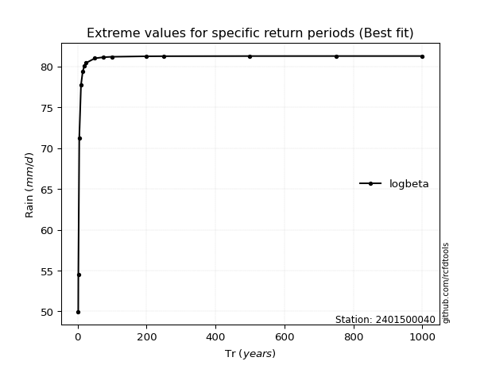</img>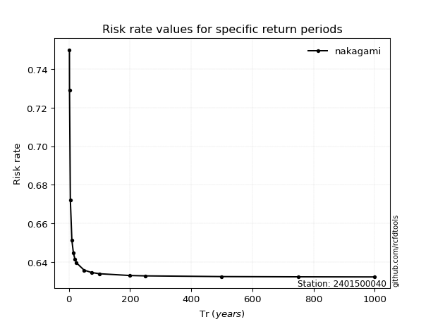</img>

</div>


<sub>**APP DISCLAIMER**: NO WARRANTY - This software is provided by [github.com/rcfdtools](https://github.com/rcfdtools) "as is", without any express or implied warranty, including warranties of merchantability, fitness for a particular purpose, or non-infringement. There is no guarantee that the software will be error-free or operate without interruption. LIMITATION OF LIABILITY - Neither the authors nor copyright holders will be liable for claims or damages arising from the software or its use. You are responsible for determining if the software is appropriate for your use and assume all associated risks, including errors, legal compliance, and data loss. NO PROFESSIONAL ADVICE - The software provides general information and does not offer professional advice. It should not replace consultation with professional advisors.</sub>