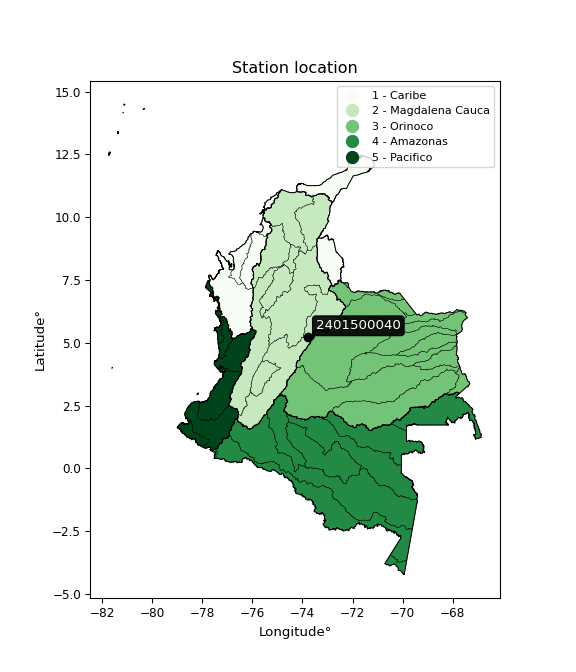

<div align="center">


</div>

# PMP Station (Rain, Pmax24h): 2401500040

Probable Maximum Precipitation (PMP) is the greatest amount of rainfall for a specific duration that is meteorologically possible for a given location, acting as a "worst-case" scenario for extreme storms, crucial for designing safety-critical infrastructure like bridges, river deviations, dams, spillways, and nuclear plants to prevent catastrophic failure. PMP is calculated by hydrologists using meteorological data to determine the upper limit of extreme rainfall, often leading to the Probable Maximum Flood (PMF) for flood control design, and is increasingly being studied for climate change impacts. Probable Maximum Precipitation (PMP) is the theoretical upper limit of rainfall, a deterministic estimate for extreme events, while probability distributions (like GEV, Gumbel) describe the likelihood and frequency of various precipitation amounts, including rare ones, showing how often events occur, with PMP representing the extreme end of these distributions, used for critical infrastructure design to ensure safety against the worst conceivable weather, unlike standard statistical forecasts which cover typical probabilities.

The most common probability distributions in hydrology, used for analyzing floods, rainfall, and streamflow, include the Normal, Log-Normal, Gumbel, Gamma (including Log-Pearson Type III), and Generalized Extreme Value (GEV) distributions, often chosen based on the data´s skewness and whether modeling extremes or general conditions, with Gumbel and GEV popular for extreme events like floods, while the Normal distribution serves as a baseline, though often requiring transformations for skewed hydrological data. These distributions help in designing water infrastructure, managing water resources, and forecasting hydrologic events.

> Hydrological data often isn´t perfectly normal (it´s skewed), so different distributions are needed for different applications, such as: **Flood Frequency Analysis**: Using Gumbel, GEV, or Log-Pearson Type III for predicting extreme flood magnitudes and their return periods, **Rainfall Analysis**: Normal for annual totals, but Log-Normal, Weibull, or GEV for intensity or extreme daily rainfall, **Streamflow Modeling**: Gamma and Log-Normal for maximum flows, GEV for minimum flows, and Kappa for daily flows.

<div align="center">

</img>

</div>


## A. General information


### 1. General running parameters

• app_version: _v20260108_. • runtime: _2026-01-08 18:05:13.093906_. • Python version: _3.14.0_. • SciPy version: _1.16.3_. • Pandas version: _2.3.3_. • NumPy version: _2.3.5_. • Stations dataset (station_dataset_file): _dataset/pmax24h_in/automatic_colombia_2003_2024.csv_. • Stations catalog (station_catalog_file): _dataset/CNE.xls_. • Minimum year to eval til year_max (date_min): _1900_. • Maximum year to eval since year_min (date_max): _2024_. • Creates, save and include plots into reports (create_plot): _False_. • Plot only fit distributions with Δo > Δ (plot_only_fit): _True_. • Plot only simple graphs avoiding multiple CDFs and multiple Extreme values plots (plot_only_simple): _False_. • Eval low extreme values, if False, evaluates high extreme values (low_extreme): _False_. • Eval every SciPy distribution as logarithmic (pdist_logarithmic_on): _True_. • Standard deviation normalized (ddof): _1.0_. • Return periods to eval in years (Tr): _[2, 2.33, 5, 10, 15, 20, 25, 50, 75, 100, 200, 250, 500, 750, 1000]_. • Minimum data sample per station, 0 means any (minimum_sample): _5_. • Z-Score maximum threshold to adjust a value, 0 means disable (zscore_max): _3.5_. • Z-Score minimum threshold to adjust a value, 0 means disable (zscore_min): _-2.5_. • Avoid zeros, e.g. rain = 0 (avoid_zeros): _True_. • Avoid null values (avoid_nans): _True_. 

:file_folder:Table: [dataset.csv](../../dataset/pmax24h_in/automatic_colombia_2003_2024.csv)

> Delta Degrees of Freedom (DDOF): is a parameter used in the formulas for calculating variance and standard deviation. When ddof=0, the divisor is $N$ (the total number of observations) and this is used when your data set is the entire population. When ddof=1, the divisor is $N-1$ and this is used when your data set is a sample drawn from a larger population. Using $N-1$ provides an unbiased estimate of the population variance (known as Bessel´s correction).


### 2. Station info and location

|   id |     CODIGO | NOMBRE                | CATEGORIA               | TECNOLOGIA                              | ESTADO           | FECHA_INSTALACION   |   FECHA_SUSPENSION |   ALTITUD |   LATITUD |   LONGITUD | DEPARTAMENTO   | MUNICIPIO   | AREA_OPERATIVA                            | ENTIDAD                                                     | AREA_HIDROGRAFICA   | ZONA_HIDROGRAFICA   | SUBZONA_HIDROGRAFICA   |   CORRIENTE | Catalogo   |   Version |
|-----:|-----------:|:----------------------|:------------------------|:----------------------------------------|:-----------------|:--------------------|-------------------:|----------:|----------:|-----------:|:---------------|:------------|:------------------------------------------|:------------------------------------------------------------|:--------------------|:--------------------|:-----------------------|------------:|:-----------|----------:|
|    0 | 2401500040 | CUCUNUBA [2401500040] | Climatológica Principal | Automática con Telemetría, Convencional | En Mantenimiento | 13/03/2018          |                nan |      2818 |   5.21957 |   -73.7823 | Cundinamarca   | Cucunubá    | Area Operativa 11 - Cundinamarca-Amazonas | INSTITUTO DE HIDROLOGIA METEOROLOGIA Y ESTUDIOS AMBIENTALES | Magdalena Cauca     | Sogamoso            | Río Suárez             |         nan | CNE_IDEAM  |  20251226 |

<div align="center">

Dynamic map: [:earth_americas:Google](http://maps.google.com/maps?q=5.21957,-73.78229) [:earth_americas:OSM](https://www.openstreetmap.org/#map=18/5.21957/-73.78229&layers=P) [:earth_americas:Bing](https://www.bing.com/maps?cp=5.21957~-73.78229&lvl=18) [:earth_americas:Apple](https://maps.apple.com/frame?center=5.21957%2C-73.78229&span=0.003%2C0.006)

</div>


<div align="center">

```geojson
{
  "type": "Feature",
  "geometry": {
    "type": "Point", 
    "coordinates": [-73.78229, 5.21957]
  }, 
  "properties": {
    "Name": "2401500040"
  }
}
```

</div>


### 3. Discrete values table and plot

<div align="center">

|               |          0 |           1 |           2 |          3 |           4 |          5 |
|:--------------|-----------:|------------:|------------:|-----------:|------------:|-----------:|
| Date          | 2019       | 2020        | 2021        | 2022       | 2023        | 2024       |
| Value         |   75       |   58.4      |   47.2      |   34       |   36        |   75.2     |
| Value_initial |   75       |   58.4      |   47.2      |   34       |   36        |   75.2     |
| count         |    6       |    6        |    6        |    6       |    6        |    6       |
| mean          |   54.3     |   54.3      |   54.3      |   54.3     |   54.3      |   54.3     |
| std           |   18.3276  |   18.3276   |   18.3276   |   18.3276  |   18.3276   |   18.3276  |
| zscore        |    1.12945 |    0.223707 |   -0.387394 |   -1.10762 |   -0.998495 |    1.14036 |


</div>


> The initial value (value_initial) correspond to the initial obtained or null completed value, and value (value) is adjusted only when the initial value is outside the valid range (outlier) definite through the Z-Score value. If Z-Score is active, values out of range or outliers are replaced with the station mean value. A Z-Score (or standard score) measures how many standard deviations a data point is from the mean of a dataset, indicating its relative position; positive scores mean above the mean, negative mean below, and a score of zero is exactly at the mean, allowing for comparison of values from different distributions. It´s calculated using the formula $z=(x–μ)/σ$, where $x$ is the data point, $μ$ is the mean, and $σ$ is the standard deviation, helping identify outliers and understand probability.
>
> <sub>**Note**: In this study, "completing" (filling gaps in) and "extending" (forecasting or lengthening the historical record) rainfall data series are avoided for certain critical analyses because they introduce artificial bias and uncertainty, which can distort the statistics of rare events (extremes), alter day-to-day variability, and compromise the integrity and homogeneity of the original data. Some reasons against Completing/Extending rainfall data are: **Distortion of Extremes and Variability**: The primary issue is that most gap-filling or extension methods rely on averaging or regression with nearby stations, which inherently smooths the data. Rainfall is highly variable in space and time, with a large percentage of zero values and occasional large storms. Infilling methods often underestimate the highest values and overestimate the lowest (zero) values, which severely distorts analyses focused on flood frequency, drought severity, and intensity-duration-frequency (IDF) curves, **Loss of Data Homogeneity**: Infilled or extended data are synthetic estimates, not actual measurements. Combining these estimates with observed data can violate the assumption of data homogeneity, which requires that the data properties do not change over time. Inhomogeneity can lead to incorrect conclusions about long-term trends or changes in climate patterns, **Propagation of Errors**: Errors and biases from the original data (e.g., wind-induced undercatch, instrument errors, site changes) or the data used for imputation can propagate through the analysis, leading to unreliable hydrological models and inaccurate predictions, **Compromised Statistical Integrity**: For statistical analyses, especially those involving the frequency of events, using artificial data can introduce time bias or autocorrelation that doesn´t exist in reality, making it difficult to assess the true probability of events, **Difficulty in Validation**: It is difficult to accurately validate the quality of filled or extended data, especially for past periods where ground-truth measurements are unavailable. The reliability of imputation techniques heavily depends on the density of the surrounding station network and the complexity of the local topography.</sub>


### 4. Active continuous probability distributions from SciPy (43 of 104 available)

A Probability Density Function (PDF) describes the relative likelihood of a continuous random variable falling within a specific range, where the total area under its curve equals 1, and the area over any interval gives the actual probability for that range. Unlike discrete probabilities (like rolling a die), a PDF shows density, not direct probability for a single point (which is zero), with higher points indicating higher likelihood, often visualized as a bell curve for normal distributions.

A log of a probability density function (log-PDF) is simply the logarithm of the PDF´s value, denoted as $log(f(x))$, useful for converting multiplication of probabilities into addition, improving numerical stability with tiny numbers, and connecting to information theory concepts like entropy. Instead of dealing with very small probabilities (e.g., 0.000001), log-PDFs use negative numbers (e.g., $log(0.00001) ≈ -11.51$ that are easier for computers to handle, preventing underflow errors and simplifying complex calculations. In this study, each active probability distribution from SciPy is also evaluated in the $log$ form.

[scipy.stats](https://docs.scipy.org/doc/scipy/reference/stats.html) is a Python´s powerful submodule within the SciPy library for comprehensive statistical analysis, offering over 130 probability distributions (like Normal, Poisson), functions for descriptive stats (mean, variance), hypothesis testing (t-tests, chi-square), random variable generation, and statistical tests, making it essential for data science, modeling, and research. It provides tools to explore, model, and draw conclusions from data efficiently, working seamlessly with NumPy.

<div align="center">

|   id | p_dist             |   n_parameter | fit_method   | label                                                                       | active   | ref                                                                                                        |
|-----:|:-------------------|--------------:|:-------------|:----------------------------------------------------------------------------|:---------|:-----------------------------------------------------------------------------------------------------------|
|    0 | alpha              |             3 | MLE          | Alpha                                                                       | True     | [:mortar_board:](https://docs.scipy.org/doc/scipy/reference/generated/scipy.stats.alpha.html)              |
|    1 | betaprime          |             4 | MLE          | Beta prime                                                                  | True     | [:mortar_board:](https://docs.scipy.org/doc/scipy/reference/generated/scipy.stats.betaprime.html)          |
|    2 | chi2               |             3 | MLE          | Chi²                                                                        | True     | [:mortar_board:](https://docs.scipy.org/doc/scipy/reference/generated/scipy.stats.chi2.html)               |
|    3 | crystalball        |             4 | MLE          | Crystalball                                                                 | True     | [:mortar_board:](https://docs.scipy.org/doc/scipy/reference/generated/scipy.stats.crystalball.html)        |
|    4 | erlang             |             3 | MLE          | Erlang                                                                      | True     | [:mortar_board:](https://docs.scipy.org/doc/scipy/reference/generated/scipy.stats.erlang.html)             |
|    5 | expon              |             2 | MLE          | Exponential                                                                 | True     | [:mortar_board:](https://docs.scipy.org/doc/scipy/reference/generated/scipy.stats.expon.html)              |
|    6 | exponnorm          |             3 | MLE          | Exponentially modified Normal                                               | True     | [:mortar_board:](https://docs.scipy.org/doc/scipy/reference/generated/scipy.stats.exponnorm.html)          |
|    7 | f                  |             4 | MLE          | F                                                                           | True     | [:mortar_board:](https://docs.scipy.org/doc/scipy/reference/generated/scipy.stats.f.html)                  |
|    8 | fatiguelife        |             3 | MLE          | Fatigue-life (Birnbaum-Saunders)                                            | True     | [:mortar_board:](https://docs.scipy.org/doc/scipy/reference/generated/scipy.stats.fatiguelife.html)        |
|    9 | fisk               |             3 | MLE          | Fisk                                                                        | True     | [:mortar_board:](https://docs.scipy.org/doc/scipy/reference/generated/scipy.stats.fisk.html)               |
|   10 | gamma              |             3 | MLE          | Gamma                                                                       | True     | [:mortar_board:](https://docs.scipy.org/doc/scipy/reference/generated/scipy.stats.gamma.html)              |
|   11 | genexpon           |             5 | MLE          | Generalized exponential                                                     | True     | [:mortar_board:](https://docs.scipy.org/doc/scipy/reference/generated/scipy.stats.genexpon.html)           |
|   12 | genlogistic        |             3 | MLE          | Generalized logistic                                                        | True     | [:mortar_board:](https://docs.scipy.org/doc/scipy/reference/generated/scipy.stats.genlogistic.html)        |
|   13 | gibrat             |             2 | MM           | Gibrat                                                                      | True     | [:mortar_board:](https://docs.scipy.org/doc/scipy/reference/generated/scipy.stats.gibrat.html)             |
|   14 | gompertz           |             3 | MLE          | Gompertz (or truncated Gumbel)                                              | True     | [:mortar_board:](https://docs.scipy.org/doc/scipy/reference/generated/scipy.stats.gompertz.html)           |
|   15 | gumbel_l           |             2 | MM           | Gumbel Left Skew                                                            | True     | [:mortar_board:](https://docs.scipy.org/doc/scipy/reference/generated/scipy.stats.gumbel_l.html)           |
|   16 | gumbel_r           |             2 | MM           | Gumbel Right Skew                                                           | True     | [:mortar_board:](https://docs.scipy.org/doc/scipy/reference/generated/scipy.stats.gumbel_r.html)           |
|   17 | halflogistic       |             2 | MM           | Half-logistic                                                               | True     | [:mortar_board:](https://docs.scipy.org/doc/scipy/reference/generated/scipy.stats.halflogistic.html)       |
|   18 | halfnorm           |             2 | MM           | Half Normal                                                                 | True     | [:mortar_board:](https://docs.scipy.org/doc/scipy/reference/generated/scipy.stats.halfnorm.html)           |
|   19 | hypsecant          |             2 | MM           | hyperbolic secant                                                           | True     | [:mortar_board:](https://docs.scipy.org/doc/scipy/reference/generated/scipy.stats.hypsecant.html)          |
|   20 | invgamma           |             3 | MLE          | Inverted gamma                                                              | True     | [:mortar_board:](https://docs.scipy.org/doc/scipy/reference/generated/scipy.stats.invgamma.html)           |
|   21 | invgauss           |             3 | MLE          | Inverse Gaussian                                                            | True     | [:mortar_board:](https://docs.scipy.org/doc/scipy/reference/generated/scipy.stats.invgauss.html)           |
|   22 | invweibull         |             3 | MLE          | Inverted Weibull                                                            | True     | [:mortar_board:](https://docs.scipy.org/doc/scipy/reference/generated/scipy.stats.invweibull.html)         |
|   23 | kstwobign          |             2 | MLE          | Limiting distribution of scaled Kolmogorov-Smirnov two-sided test statistic | True     | [:mortar_board:](https://docs.scipy.org/doc/scipy/reference/generated/scipy.stats.kstwobign.html)          |
|   24 | laplace            |             2 | MM           | Laplace                                                                     | True     | [:mortar_board:](https://docs.scipy.org/doc/scipy/reference/generated/scipy.stats.laplace.html)            |
|   25 | laplace_asymmetric |             3 | MLE          | Asymmetric Laplace                                                          | True     | [:mortar_board:](https://docs.scipy.org/doc/scipy/reference/generated/scipy.stats.laplace_asymmetric.html) |
|   26 | loggamma           |             3 | MLE          | Log gamma                                                                   | True     | [:mortar_board:](https://docs.scipy.org/doc/scipy/reference/generated/scipy.stats.loggamma.html)           |
|   27 | logistic           |             2 | MM           | Logistic (or Sech-squared)                                                  | True     | [:mortar_board:](https://docs.scipy.org/doc/scipy/reference/generated/scipy.stats.logistic.html)           |
|   28 | lognorm            |             3 | MLE          | Log Normal                                                                  | True     | [:mortar_board:](https://docs.scipy.org/doc/scipy/reference/generated/scipy.stats.lognorm.html)            |
|   29 | maxwell            |             2 | MM           | Maxwell                                                                     | True     | [:mortar_board:](https://docs.scipy.org/doc/scipy/reference/generated/scipy.stats.maxwell.html)            |
|   30 | mielke             |             4 | MLE          | Mielke Beta-Kappa / Dagum                                                   | True     | [:mortar_board:](https://docs.scipy.org/doc/scipy/reference/generated/scipy.stats.mielke.html)             |
|   31 | moyal              |             2 | MM           | Moyal                                                                       | True     | [:mortar_board:](https://docs.scipy.org/doc/scipy/reference/generated/scipy.stats.moyal.html)              |
|   32 | nakagami           |             3 | MLE          | Nakagami                                                                    | True     | [:mortar_board:](https://docs.scipy.org/doc/scipy/reference/generated/scipy.stats.nakagami.html)           |
|   33 | ncf                |             5 | MLE          | Non-central F distribution                                                  | True     | [:mortar_board:](https://docs.scipy.org/doc/scipy/reference/generated/scipy.stats.ncf.html)                |
|   34 | nct                |             4 | MLE          | Non-central Student’s t                                                     | True     | [:mortar_board:](https://docs.scipy.org/doc/scipy/reference/generated/scipy.stats.nct.html)                |
|   35 | norm               |             2 | MM           | Normal                                                                      | True     | [:mortar_board:](https://docs.scipy.org/doc/scipy/reference/generated/scipy.stats.norm.html)               |
|   36 | pearson3           |             3 | MM           | Pearson type III                                                            | True     | [:mortar_board:](https://docs.scipy.org/doc/scipy/reference/generated/scipy.stats.pearson3.html)           |
|   37 | rayleigh           |             2 | MM           | Rayleigh                                                                    | True     | [:mortar_board:](https://docs.scipy.org/doc/scipy/reference/generated/scipy.stats.rayleigh.html)           |
|   38 | rice               |             3 | MLE          | Rice                                                                        | True     | [:mortar_board:](https://docs.scipy.org/doc/scipy/reference/generated/scipy.stats.rice.html)               |
|   39 | t                  |             3 | MLE          | Student’s t                                                                 | True     | [:mortar_board:](https://docs.scipy.org/doc/scipy/reference/generated/scipy.stats.t.html)                  |
|   40 | truncnorm          |             4 | MLE          | Truncated normal                                                            | True     | [:mortar_board:](https://docs.scipy.org/doc/scipy/reference/generated/scipy.stats.truncnorm.html)          |
|   41 | wald               |             2 | MM           | Wald                                                                        | True     | [:mortar_board:](https://docs.scipy.org/doc/scipy/reference/generated/scipy.stats.wald.html)               |
|   42 | weibull_min        |             3 | MLE          | Weibull minimum                                                             | True     | [:mortar_board:](https://docs.scipy.org/doc/scipy/reference/generated/scipy.stats.weibull_min.html)        |

</div>

> **n_parameter:** # arguments & localization & scale.
>
> **Fit methods:** (MLE) maximum likelihood, (MM) L-moments.
>
>**Inactive** (With the only purpose of prevent loops, zero divisions, infinite values, over high estimated values or horizontal trending for recurrence intervals estimations, the follow distributions were disabled.)**:** foldnorm, gennorm, norminvgauss, powernorm, powerlognorm, skewnorm, genextreme, anglit, arcsine, argus, beta, bradford, burr, burr12, cauchy, cosine, halfcauchy, foldcauchy, skewcauchy, wrapcauchy, dgamma, gengamma, exponweib, exponpow, truncexpon, gausshyper, genhalflogistic, genhyperbolic, geninvgauss, halfgennorm, johnsonsb, johnsonsu, kappa4, kappa3, ksone, kstwo, loglaplace, levy, levy_l, levy_stable, ncx2, pareto, genpareto, truncpareto, lomax, powerlaw, rdist, rel_breitwigner, recipinvgauss, semicircular, studentized_range, trapezoid, triang, truncweibull_min, tukeylambda, uniform, loguniform, vonmises, vonmises_line, weibull_max, dweibull, 


## B. Probability (PDF) vs. Empirical (EDF) distributions functions

A continuous probability distribution (CPD) describes probabilities for variables that can take any value within a range (like rain any time), unlike discrete variables with specific outcomes (like temperature). It uses a Probability Density Function (PDF), a curve where the total area under it equals 1, and the probability of the variable falling within an interval (a to b) is found by calculating the area under the curve between those points. A key feature is that the probability of hitting any single exact value is zero, so probabilities are always expressed for ranges, e.g., $P(a ≤ X ≤ b)$.

<div align="center">

Distributions parameters from station values
|    |    station | p_dist                |   n |              loc |           scale | shape                 | shape1                 | shape2                | shape3   |
|---:|-----------:|:----------------------|----:|-----------------:|----------------:|:----------------------|:-----------------------|:----------------------|:---------|
|  0 | 2401500040 | alpha                 |   6 |   -117.573       |  1758.93        | 10.331429397422024    |                        |                       |          |
|  1 | 2401500040 | betaprime             |   6 |     33.9998      |   205.956       | 0.6256984966932998    | 10.458233294719902     |                       |          |
|  2 | 2401500040 | chi2                  |   6 |     34           |     1.08395     | 0.9859198052665537    |                        |                       |          |
|  3 | 2401500040 | crystalball           |   6 |     54.3         |    16.7307      | 7659.475357007152     | 6854.6139764588215     |                       |          |
|  4 | 2401500040 | erlang                |   6 |   -118.351       |     1.60916     | 107.23429528179622    |                        |                       |          |
|  5 | 2401500040 | expon                 |   6 |     34           |    20.3         |                       |                        |                       |          |
|  6 | 2401500040 | exponnorm             |   6 |     53.0938      |    16.6872      | 0.07228502524185873   |                        |                       |          |
|  7 | 2401500040 | f                     |   6 |     33.0942      |    21.3966      | 1.7778224999634622    | 2002.4995418443143     |                       |          |
|  8 | 2401500040 | fatiguelife           |   6 |     34           |     2.75674e-05 | 760.0035515304862     |                        |                       |          |
|  9 | 2401500040 | fisk                  |   6 |     34           |    17.5144      | 0.8295829629132505    |                        |                       |          |
| 10 | 2401500040 | gamma                 |   6 |   -105.654       |     1.72704     | 92.62127569875011     |                        |                       |          |
| 11 | 2401500040 | genexpon              |   6 |     34           |     3.14743     | 0.1382694146057203    | 1.0876161023370909e-06 | 1.7190403161398993    |          |
| 12 | 2401500040 | genlogistic           |   6 |    -46.7477      |    14.1114      | 720.4042151329395     |                        |                       |          |
| 13 | 2401500040 | gibrat                |   6 |     41.5365      |     7.74143     |                       |                        |                       |          |
| 14 | 2401500040 | gompertz              |   6 |     34           |    43.4594      | 1.3910494289219364    |                        |                       |          |
| 15 | 2401500040 | gumbel_l              |   6 |     61.8297      |    13.0449      |                       |                        |                       |          |
| 16 | 2401500040 | gumbel_r              |   6 |     46.7703      |    13.0449      |                       |                        |                       |          |
| 17 | 2401500040 | halflogistic          |   6 |     34.4703      |    14.3041      |                       |                        |                       |          |
| 18 | 2401500040 | halfnorm              |   6 |     32.1551      |    27.7545      |                       |                        |                       |          |
| 19 | 2401500040 | hypsecant             |   6 |     54.3         |    10.6511      |                       |                        |                       |          |
| 20 | 2401500040 | invgamma              |   6 |     -5.50292     |   682.067       | 12.37330699627021     |                        |                       |          |
| 21 | 2401500040 | invgauss              |   6 |     29.6198      |    21.6196      | 1.1415686494581965    |                        |                       |          |
| 22 | 2401500040 | invweibull            |   6 |     34           |     1.44468     | 0.06730199028566627   |                        |                       |          |
| 23 | 2401500040 | kstwobign             |   6 |     -1.90738     |    64.0763      |                       |                        |                       |          |
| 24 | 2401500040 | laplace               |   6 |     54.3         |    11.8304      |                       |                        |                       |          |
| 25 | 2401500040 | laplace_asymmetric    |   6 |     47.2         |    13.9096      | 0.7768396563029418    |                        |                       |          |
| 26 | 2401500040 | loggamma              |   6 |  -4340.56        |   611.503       | 1322.6144722701881    |                        |                       |          |
| 27 | 2401500040 | logistic              |   6 |     54.3         |     9.22412     |                       |                        |                       |          |
| 28 | 2401500040 | lognorm               |   6 |     34           |     0.0444676   | 13.217016030526935    |                        |                       |          |
| 29 | 2401500040 | maxwell               |   6 |     14.6552      |    24.8437      |                       |                        |                       |          |
| 30 | 2401500040 | mielke                |   6 |      0.139713    |     9.03516     | 929.4459454487951     | 3.5237151201660795     |                       |          |
| 31 | 2401500040 | moyal                 |   6 |     44.7323      |     7.53147     |                       |                        |                       |          |
| 32 | 2401500040 | nakagami              |   6 |     34           |    33.2206      | 0.2245878459057269    |                        |                       |          |
| 33 | 2401500040 | ncf                   |   6 |     -0.0192721   |     6.57324e-06 | 7.564296298434185e-07 | 10.885970487162048     | 5.233051479116412     |          |
| 34 | 2401500040 | nct                   |   6 |     -0.259448    |     1.46656     | 5.49441945845117      | 32.18387980777961      |                       |          |
| 35 | 2401500040 | norm                  |   6 |     54.3         |    16.7307      |                       |                        |                       |          |
| 36 | 2401500040 | pearson3              |   6 |     54.3         |    16.7306      | 0.11451239641838261   |                        |                       |          |
| 37 | 2401500040 | rayleigh              |   6 |     22.2932      |    25.5378      |                       |                        |                       |          |
| 38 | 2401500040 | rice                  |   6 |     24.3044      |    21.3321      | 0.7696261570176612    |                        |                       |          |
| 39 | 2401500040 | t                     |   6 |     54.3007      |    16.7313      | 3648250.60217936      |                        |                       |          |
| 40 | 2401500040 | truncnorm             |   6 |     17.1586      |    63.0453      | -1605.6856428619317   | 0.920629950749041      |                       |          |
| 41 | 2401500040 | wald                  |   6 |     37.5693      |    16.7307      |                       |                        |                       |          |
| 42 | 2401500040 | weibull_min           |   6 |     34           |    28.7987      | 0.485856309903553     |                        |                       |          |
| 43 | 2401500040 | logalpha              |   6 |     -3.11494     |   155.342       | 22.049023558582014    |                        |                       |          |
| 44 | 2401500040 | logbetaprime          |   6 |     -3.00626     |    15.6915      | 628.6351659013019     | 1420.3516947609683     |                       |          |
| 45 | 2401500040 | logchi2               |   6 |      3.52636     |     0.962755    | 1.0519999304808623    |                        |                       |          |
| 46 | 2401500040 | logcrystalball        |   6 |      3.94487     |     0.318485    | 17.2095906118537      | 3.781497562921741      |                       |          |
| 47 | 2401500040 | logerlang             |   6 |     -6.32645     |     0.00990892  | 1036.5513053077325    |                        |                       |          |
| 48 | 2401500040 | logexpon              |   6 |      3.52636     |     0.418511    |                       |                        |                       |          |
| 49 | 2401500040 | logexponnorm          |   6 |      3.94438     |     0.318482    | 0.0015521605476160048 |                        |                       |          |
| 50 | 2401500040 | logf                  |   6 |   -111.768       |   115.712       | 961144.24720586       | 363915.7669833666      |                       |          |
| 51 | 2401500040 | logfatiguelife        |   6 |      3.52636     |     2.75742e-06 | 469.63860427511077    |                        |                       |          |
| 52 | 2401500040 | logfisk               |   6 |     -1.63737e+07 |     1.63737e+07 | 82750648.35766321     |                        |                       |          |
| 53 | 2401500040 | loggamma              |   6 |     -6.32418     |     0.00991792  | 1035.4010087233119    |                        |                       |          |
| 54 | 2401500040 | loggenexpon           |   6 |      3.52613     |     0.0102673   | 0.017209101166230867  | 3.0384177816004927     | 7.414663851120726e-05 |          |
| 55 | 2401500040 | loggenlogistic        |   6 |      2.04693     |     0.282949    | 467.2744878708821     |                        |                       |          |
| 56 | 2401500040 | loggibrat             |   6 |      3.70188     |     0.14738     |                       |                        |                       |          |
| 57 | 2401500040 | loggompertz           |   6 |      3.52636     |     0.575846    | 0.7186362800479436    |                        |                       |          |
| 58 | 2401500040 | loggumbel_l           |   6 |      4.08821     |     0.248319    |                       |                        |                       |          |
| 59 | 2401500040 | loggumbel_r           |   6 |      3.80154     |     0.248319    |                       |                        |                       |          |
| 60 | 2401500040 | loghalflogistic       |   6 |      3.56741     |     0.272282    |                       |                        |                       |          |
| 61 | 2401500040 | loghalfnorm           |   6 |      3.52333     |     0.528328    |                       |                        |                       |          |
| 62 | 2401500040 | loghypsecant          |   6 |      3.94487     |     0.202752    |                       |                        |                       |          |
| 63 | 2401500040 | loginvgamma           |   6 |     -4.22379     |  5319.7         | 652.2154122419365     |                        |                       |          |
| 64 | 2401500040 | loginvgauss           |   6 |      2.7669      |    14.092       | 0.08356614010924651   |                        |                       |          |
| 65 | 2401500040 | loginvweibull         |   6 |     -1.56047e+07 |     1.56047e+07 | 55180131.79446365     |                        |                       |          |
| 66 | 2401500040 | logkstwobign          |   6 |      2.82581     |     1.27413     |                       |                        |                       |          |
| 67 | 2401500040 | loglaplace            |   6 |      3.94487     |     0.225201    |                       |                        |                       |          |
| 68 | 2401500040 | loglaplace_asymmetric |   6 |      4.06732     |     0.280661    | 1.2164224760858104    |                        |                       |          |
| 69 | 2401500040 | logloggamma           |   6 |      4.32018     |     1.30084e-06 | 3.470237940475008e-06 |                        |                       |          |
| 70 | 2401500040 | loglogistic           |   6 |      3.94487     |     0.175588    |                       |                        |                       |          |
| 71 | 2401500040 | loglognorm            |   6 |      3.52636     |     0.00118922  | 12.828742781570284    |                        |                       |          |
| 72 | 2401500040 | logmaxwell            |   6 |      3.1902      |     0.472918    |                       |                        |                       |          |
| 73 | 2401500040 | logmielke             |   6 | -62833           | 62835.6         | 15556077.53886192     | 223220.91393449545     |                       |          |
| 74 | 2401500040 | logmoyal              |   6 |      3.76274     |     0.143367    |                       |                        |                       |          |
| 75 | 2401500040 | lognakagami           |   6 |      3.52636     |     0.595875    | 0.4691528742655846    |                        |                       |          |
| 76 | 2401500040 | logncf                |   6 |    -31.8071      |    22.134       | 121327.60097296076    | 30381.065624275005     | 74633.68036499637     |          |
| 77 | 2401500040 | lognct                |   6 |     -0.515322    |     0.160989    | 131.8159746856805     | 27.539551854248018     |                       |          |
| 78 | 2401500040 | lognorm               |   6 |      3.94487     |     0.318482    |                       |                        |                       |          |
| 79 | 2401500040 | logpearson3           |   6 |      3.94487     |     0.318482    | -0.07636643753211916  |                        |                       |          |
| 80 | 2401500040 | lograyleigh           |   6 |      3.3356      |     0.486131    |                       |                        |                       |          |
| 81 | 2401500040 | logrice               |   6 |      3.34373     |     0.388202    | 1.034882777017999     |                        |                       |          |
| 82 | 2401500040 | logt                  |   6 |      3.94487     |     0.318482    | 1994240026.7201734    |                        |                       |          |
| 83 | 2401500040 | logtruncnorm          |   6 |     -0.104404    |     1.24135     | 2.9248560895325735    | 3.564358663173312      |                       |          |
| 84 | 2401500040 | logwald               |   6 |      3.62635     |     0.318518    |                       |                        |                       |          |
| 85 | 2401500040 | logweibull_min        |   6 |      3.52636     |     0.228789    | 0.3157640564676596    |                        |                       |          |

</div>

> **loc** (Location parameter): This shifts the distribution along the x-axis. For many common distributions, like the normal (Gaussian) distribution, loc represents the mean $μ$. For others, like the uniform distribution, it might represent the minimum value, or for the beta distribution, the left end of the support interval.
>
> **scale** (Scale parameter): This determines the width or spread of the distribution. For the normal distribution, scale represents the standard deviation $σ$. For a uniform distribution, it defines the length of the interval (from $loc$ to $loc + scale$).
>
> **shape** (Shape parameters): Refers to parameters that define the specific form of a probability distribution, distinct from its location (loc) and scale (scale). These parameters are required arguments for most distribution functions. For example, a normal (Gaussian) distribution is fully defined by its location (mean) and scale (standard deviation), so it has no specific shape parameters beyond loc and scale. However, other distributions have intrinsic properties that need specification, as Gamma distribution that takes a shape parameter, often named $a$ or $alpha$.


### 0. Cumulative distribution values - CDF (86 evaluated)

Cumulative Distribution Function (CDF), denoted as $F$<sub>$X$</sub>$(x)$, is a function that gives the probability that a random variable $X$ will take a value less than or equal to a specific value, $x$ (i.e., $(P(X≥x)$. It essentially "accumulates" probabilities from a given point up to the far right (positive infinity), providing a complete picture of the distribution´s probabilities for both discrete (like rain) and continuous (like temperature) variables, helping to find probabilities over ranges or above certain values. Each station is evaluated separately ordering the $x$ values ascending, calculating the CDF and PDF values for the activated distributions and their logarithmic forms.

<div align="center">

CDF ordered by x ascending and calculating $log(f(x))$ separately
|   id |    Station |   date |    x |   count |   mean |     std |    zscore |   Value_initial |    station |   m |    alpha |   alpha_pdf |   betaprime |   betaprime_pdf |        chi2 |    chi2_pdf |   crystalball |   crystalball_pdf |   erlang |   erlang_pdf |     expon |   expon_pdf |   exponnorm |   exponnorm_pdf |         f |      f_pdf |   fatiguelife |   fatiguelife_pdf |        fisk |    fisk_pdf |    gamma |   gamma_pdf |    genexpon |   genexpon_pdf |   genlogistic |   genlogistic_pdf |   gibrat |   gibrat_pdf |    gompertz |   gompertz_pdf |   gumbel_l |   gumbel_l_pdf |   gumbel_r |   gumbel_r_pdf |   halflogistic |   halflogistic_pdf |   halfnorm |   halfnorm_pdf |   hypsecant |   hypsecant_pdf |   invgamma |   invgamma_pdf |   invgauss |   invgauss_pdf |   invweibull |   invweibull_pdf |   kstwobign |   kstwobign_pdf |   laplace |   laplace_pdf |   laplace_asymmetric |   laplace_asymmetric_pdf |   loggamma |   loggamma_pdf |   logistic |   logistic_pdf |   lognorm |   lognorm_pdf |   maxwell |   maxwell_pdf |   mielke |   mielke_pdf |     moyal |   moyal_pdf |    nakagami |   nakagami_pdf |      ncf |    ncf_pdf |       nct |    nct_pdf |     norm |   norm_pdf |   pearson3 |   pearson3_pdf |   rayleigh |   rayleigh_pdf |     rice |   rice_pdf |        t |     t_pdf |   truncnorm |   truncnorm_pdf |     wald |   wald_pdf |   weibull_min |   weibull_min_pdf |   logalpha |   logalpha_pdf |   logbetaprime |   logbetaprime_pdf |     logchi2 |   logchi2_pdf |   logcrystalball |   logcrystalball_pdf |   logerlang |   logerlang_pdf |   logexpon |   logexpon_pdf |   logexponnorm |   logexponnorm_pdf |      logf |   logf_pdf |   logfatiguelife |   logfatiguelife_pdf |   logfisk |   logfisk_pdf |   loggenexpon |   loggenexpon_pdf |   loggenlogistic |   loggenlogistic_pdf |   loggibrat |   loggibrat_pdf |   loggompertz |   loggompertz_pdf |   loggumbel_l |   loggumbel_l_pdf |   loggumbel_r |   loggumbel_r_pdf |   loghalflogistic |   loghalflogistic_pdf |   loghalfnorm |   loghalfnorm_pdf |   loghypsecant |   loghypsecant_pdf |   loginvgamma |   loginvgamma_pdf |   loginvgauss |   loginvgauss_pdf |   loginvweibull |   loginvweibull_pdf |   logkstwobign |   logkstwobign_pdf |   loglaplace |   loglaplace_pdf |   loglaplace_asymmetric |   loglaplace_asymmetric_pdf |   logloggamma |   logloggamma_pdf |   loglogistic |   loglogistic_pdf |   loglognorm |   loglognorm_pdf |   logmaxwell |   logmaxwell_pdf |   logmielke |   logmielke_pdf |   logmoyal |   logmoyal_pdf |   lognakagami |   lognakagami_pdf |    logncf |   logncf_pdf |    lognct |   lognct_pdf |   logpearson3 |   logpearson3_pdf |   lograyleigh |   lograyleigh_pdf |   logrice |   logrice_pdf |      logt |   logt_pdf |   logtruncnorm |   logtruncnorm_pdf |   logwald |   logwald_pdf |   logweibull_min |   logweibull_min_pdf |
|-----:|-----------:|-------:|-----:|--------:|-------:|--------:|----------:|----------------:|-----------:|----:|---------:|------------:|------------:|----------------:|------------:|------------:|--------------:|------------------:|---------:|-------------:|----------:|------------:|------------:|----------------:|----------:|-----------:|--------------:|------------------:|------------:|------------:|---------:|------------:|------------:|---------------:|--------------:|------------------:|---------:|-------------:|------------:|---------------:|-----------:|---------------:|-----------:|---------------:|---------------:|-------------------:|-----------:|---------------:|------------:|----------------:|-----------:|---------------:|-----------:|---------------:|-------------:|-----------------:|------------:|----------------:|----------:|--------------:|---------------------:|-------------------------:|-----------:|---------------:|-----------:|---------------:|----------:|--------------:|----------:|--------------:|---------:|-------------:|----------:|------------:|------------:|---------------:|---------:|-----------:|----------:|-----------:|---------:|-----------:|-----------:|---------------:|-----------:|---------------:|---------:|-----------:|---------:|----------:|------------:|----------------:|---------:|-----------:|--------------:|------------------:|-----------:|---------------:|---------------:|-------------------:|------------:|--------------:|-----------------:|---------------------:|------------:|----------------:|-----------:|---------------:|---------------:|-------------------:|----------:|-----------:|-----------------:|---------------------:|----------:|--------------:|--------------:|------------------:|-----------------:|---------------------:|------------:|----------------:|--------------:|------------------:|--------------:|------------------:|--------------:|------------------:|------------------:|----------------------:|--------------:|------------------:|---------------:|-------------------:|--------------:|------------------:|--------------:|------------------:|----------------:|--------------------:|---------------:|-------------------:|-------------:|-----------------:|------------------------:|----------------------------:|--------------:|------------------:|--------------:|------------------:|-------------:|-----------------:|-------------:|-----------------:|------------:|----------------:|-----------:|---------------:|--------------:|------------------:|----------:|-------------:|----------:|-------------:|--------------:|------------------:|--------------:|------------------:|----------:|--------------:|----------:|-----------:|---------------:|-------------------:|----------:|--------------:|-----------------:|---------------------:|
|    0 | 2401500040 |   2022 | 34   |       6 |   54.3 | 18.3276 | -1.10762  |            34   | 2401500040 |   1 | 0.101497 |  0.0135827  | 0.000769609 |      2.70825    | 8.17155e-08 | 5.66925e+06 |      0.1125   |         0.0114213 | 0.109183 |    0.0121979 | 0         |  0.0492611  |    0.112487 |       0.0114236 | 0.0555535 | 0.0534397  |      0.104615 |       3.76163e+09 | 1.61022e-12 | 12.5332     | 0.106998 |   0.0121433 | 2.13781e-06 |     0.0439308  |      0.095011 |        0.0158218  | 0        |   0          | 2.51538e-13 |     0.032008   |   0.111691 |     0.00806506 |  0.0698322 |     0.0142485  |      0         |         0          |  0.0529981 |     0.0286845  |   0.0939692 |      0.00869489 |  0.0912433 |     0.0163377  |   0.059477 |     0.0381055  |  0.000102806 |      8.94176e+09 |   0.0879906 |      0.0168035  | 0.0898992 |    0.007599   |             0.110935 |               0.0102665  |  0.0935594 |       0.538419 |  0.0996831 |     0.00972953 | 0.0944095 |      0.528267 |  0.105014 |    0.0143801  |      nan |          nan | 0.0414422 |  0.0135083  | 7.17509e-08 |    4.53579e+06 | 0.461432 | 0.00983153 | 0.0856323 | 0.0185473  | 0.1125   |  0.0114213 |   0.110582 |      0.011837  |  0.0997394 |     0.01616    | 0.074081 | 0.0147304  | 0.112501 | 0.0114209 |    0.736952 |      0.00743393 | 0        | 0          |   2.61132e-08 |       1.78557e+06 |  0.0899189 |       0.571547 |       0.102723 |           0.567225 | 6.71128e-09 |   7.94916e+06 |        0.0944113 |             0.52827  |   0.0935863 |        0.538713 |   0        |       2.38942  |      0.0944101 |           0.528268 | 0.0942269 |   0.529674 |        0.0951898 |          1.52001e+10 |  0.105394 |      0.476512 |   0.000389598 |          1.67596  |        0.0822223 |             0.724054 |    0        |        0        |   1.59901e-09 |          1.24797  |     0.0988473 |          0.377709 |     0.0483748 |          0.590032 |         0         |              0        |    0.00458222 |          1.51018  |      0.0803736 |           0.392215 |     0.0919488 |          0.55304  |     0.0802086 |          0.702421 |       0.0820316 |            0.725375 |      0.0770054 |           0.787255 |    0.0779616 |         0.346187 |                0.122356 |                    0.358392 |      0.120315 |          0.320961 |     0.0844412 |          0.440296 |    0.0128532 |       5.8184e+12 |    0.0822652 |         0.662143 |    0.082651 |        0.719068 |  0.0225779 |       0.471167 |   5.06001e-15 |         10.6912   | 0.0945658 |     0.534601 | 0.0895216 |     0.573882 |     0.0958783 |          0.517164 |     0.0741041 |          0.747397 | 0.0631242 |      0.673283 | 0.0944094 |   0.528267 |    5.40334e-06 |           2.895    |  0        |      0        |      2.26196e-05 |          1.60832e+10 |
|    1 | 2401500040 |   2023 | 36   |       6 |   54.3 | 18.3276 | -0.998495 |            36   | 2401500040 |   2 | 0.130944 |  0.0158561  | 0.253127    |      0.0741015  | 0.828617    | 0.106272    |      0.137022 |         0.01311   | 0.135444 |    0.0140679 | 0.0938244 |  0.0446392  |    0.137014 |       0.013113  | 0.150649  | 0.0432028  |      0.638481 |       0.0331959   | 0.14184     |  0.0504889  | 0.133171 |   0.0140349 | 0.0841148   |     0.0402359  |      0.129617 |        0.0187405  | 0        |   0          | 0.0634121   |     0.0313902  |   0.128954 |     0.0092187  |  0.101945  |     0.017844   |      0.0534208 |         0.0348552  |  0.11018   |     0.0284734  |   0.113008  |      0.0103885  |  0.127036  |     0.0193952  |   0.145303 |     0.0453453  |  0.375932    |      0.0123766   |   0.124791  |      0.0199164  | 0.106457  |    0.00899864 |             0.133491 |               0.0123539  |  0.128112  |       0.672044 |  0.120901  |     0.0115224  | 0.128269  |      0.658087 |  0.135807 |    0.0163903  |      nan |          nan | 0.0741736 |  0.0192088  | 0.22187     |    0.0497963   | 0.480802 | 0.00953762 | 0.126664  | 0.0223563  | 0.137022 |  0.01311   |   0.136032 |      0.0136203 |  0.134146  |     0.0181977  | 0.106045 | 0.0171863  | 0.137022 | 0.0131095 |    0.751755 |      0.00736749 | 0        | 0          |   0.23941     |       0.0505639   |  0.126797  |       0.719813 |       0.138804 |           0.696067 | 0.175401    |   1.58297     |        0.128271  |             0.658088 |   0.128159  |        0.672438 |   0.12766  |       2.08439  |      0.12827   |           0.658088 | 0.128185  |   0.660104 |        0.620408  |          1.0208      |  0.135896 |      0.593468 |   0.0949027   |          1.62804  |        0.129724  |             0.934313 |    0        |        0        |   0.0722491   |          1.27862  |     0.122799  |          0.462833 |     0.0901727 |          0.873706 |         0.0295745 |              1.83472  |    0.0907069  |          1.50044  |      0.106124  |           0.513776 |     0.127519  |          0.692831 |     0.126154  |          0.902041 |       0.129636  |            0.936543 |      0.128757  |           1.01567  |    0.100487  |         0.446211 |                0.144656 |                    0.42371  |      0.140133 |          0.37383  |     0.113251  |          0.571936 |    0.618622  |       0.519827   |    0.124843  |         0.825784 |    0.129818 |        0.927868 |  0.061714  |       0.907651 |   0.0876357   |          1.43439  | 0.128832  |     0.665882 | 0.126583  |     0.723903 |     0.128962  |          0.642143 |     0.121944  |          0.921152 | 0.10678   |      0.850318 | 0.128269  |   0.658087 |    0.154767    |           2.52754  |  0        |      0        |      0.475523    |          1.86985     |
|    2 | 2401500040 |   2021 | 47.2 |       6 |   54.3 | 18.3276 | -0.387394 |            47.2 | 2401500040 |   3 | 0.365639 |  0.0243655  | 0.670519    |      0.0204442  | 0.99953     | 0.000232906 |      0.335648 |         0.0217916 | 0.346819 |    0.0227697 | 0.478083  |  0.0257102  |    0.335682 |       0.0217951 | 0.499838  | 0.0227565  |      0.818717 |       0.00909011  | 0.441614    |  0.0154976  | 0.344826 |   0.0228391 | 0.440042    |     0.0245996  |      0.396695 |        0.025975   | 0.377311 |   0.0670834  | 0.389631    |     0.0264704  |   0.278046 |     0.0180307  |  0.379996  |     0.0281859  |      0.417753  |         0.0288547  |  0.41223   |     0.0248199  |   0.301982  |      0.0242865  |  0.399836  |     0.0261151  |   0.54086  |     0.0239164  |  0.42246     |      0.00185599  |   0.40034   |      0.0260948  | 0.274365  |    0.0231915  |             0.376356 |               0.03483    |  0.392087  |       1.21115  |  0.31654   |     0.023454   | 0.388171  |      1.2031   |  0.366629 |    0.0233679  |      nan |          nan | 0.395942  |  0.0313619  | 0.514609    |    0.0170109   | 0.578412 | 0.00790581 | 0.427366  | 0.0268902  | 0.335648 |  0.0217916 |   0.341368 |      0.0222951 |  0.378488  |     0.0237357  | 0.351421 | 0.0247779  | 0.335638 | 0.0217906 |    0.831703 |      0.00687716 | 0.427714 | 0.0466921  |   0.495673    |       0.0127069   |  0.405042  |       1.23958  |       0.401892 |           1.17497  | 0.419434    |   0.600744    |        0.388171  |             1.20308  |   0.392284  |        1.21173  |   0.543338 |       1.09116  |      0.388171  |           1.20309  | 0.388724  |   1.20457  |        0.768651  |          0.341027    |  0.382055 |      1.19316  |   0.485864    |          1.22201  |        0.456052  |             1.26443  |    0.513648 |        2.6143   |   0.42401     |          1.27062  |     0.322952  |          1.06338  |     0.445627  |          1.4505   |         0.483083  |              1.40779  |    0.4691     |          1.24099  |      0.362447  |           1.42563  |     0.397666  |          1.22337  |     0.445846  |          1.27138  |       0.456602  |            1.26576  |      0.467654  |           1.26673  |    0.334569  |         1.48565  |                0.319825 |                    0.936799 |      0.288645 |          0.770014 |     0.373956  |          1.33331  |    0.66933   |       0.0861266  |    0.421863  |         1.24122  |    0.455191 |        1.26549  |  0.467586  |       1.5526   |   0.432479    |          1.12197  | 0.390541  |     1.20456  | 0.406606  |     1.24617  |     0.383697  |          1.19039  |     0.434166  |          1.24217  | 0.411282  |      1.26909  | 0.38817   |   1.2031   |    0.655238    |           1.29066  |  0.525795 |      1.95426  |      0.673883    |          0.351746    |
|    3 | 2401500040 |   2020 | 58.4 |       6 |   54.3 | 18.3276 |  0.223707 |            58.4 | 2401500040 |   4 | 0.63156  |  0.0214167  | 0.82713     |      0.00934925 | 0.999998    | 9.73189e-07 |      0.596794 |         0.0231396 | 0.61097  |    0.0226379 | 0.699399  |  0.0148079  |    0.596841 |       0.0231379 | 0.697024  | 0.0133911  |      0.892121 |       0.00470353  | 0.568333    |  0.00834107 | 0.609781 |   0.0226956 | 0.657651    |     0.0150398  |      0.658215 |        0.019502   | 0.781882 |   0.0174718  | 0.649271    |     0.0196817  |   0.536434 |     0.0273205  |  0.663628  |     0.0208595  |      0.683931  |         0.0186044  |  0.655652  |     0.0183839  |   0.619611  |      0.0278     |  0.65956   |     0.0191787  |   0.731553 |     0.0118902  |  0.437465    |      0.000997608 |   0.661565  |      0.0195896  | 0.646444  |    0.0298854  |             0.666358 |               0.0186336  |  0.652694  |       1.14821  |  0.609328  |     0.0258071  | 0.649682  |      1.1634   |  0.6236   |    0.0211299  |      nan |          nan | 0.686519  |  0.0197058  | 0.66787     |    0.0111311   | 0.658476 | 0.00642557 | 0.677874  | 0.0174095  | 0.596794 |  0.0231396 |   0.603719 |      0.0228196 |  0.631937  |     0.0203773  | 0.621387 | 0.0219898  | 0.596774 | 0.023139  |    0.905179 |      0.00622003 | 0.75028  | 0.0167547  |   0.602527    |       0.00730218  |  0.662926  |       1.09973  |       0.651631 |           1.09365  | 0.526416    |   0.424318    |        0.64968   |             1.16339  |   0.652967  |        1.14827  |   0.725436 |       0.656049 |      0.649682  |           1.1634   | 0.650158  |   1.16132  |        0.827188  |          0.222917    |  0.644568 |      1.15784  |   0.704667    |          0.835924 |        0.690657  |             0.903059 |    0.818078 |        0.722848 |   0.673711    |          1.0418   |     0.601209  |          1.47639  |     0.709707  |          0.980031 |         0.724947  |              0.87125  |    0.696822   |          0.888842 |      0.681511  |           1.32154  |     0.656986  |          1.12621  |     0.687528  |          0.952114 |       0.691267  |            0.902548 |      0.701531  |           0.90379  |    0.709706  |         1.28905  |                0.596717 |                    1.74784  |      0.509387 |          1.35888  |     0.667597  |          1.26382  |    0.683339  |       0.0513033  |    0.671352  |         1.0393   |    0.69038  |        0.906269 |  0.729576  |       0.906145 |   0.643127    |          0.851926 | 0.65095   |     1.1529   | 0.665218  |     1.09952  |     0.645655  |          1.17973  |     0.677869  |          0.997402 | 0.667526  |      1.07373  | 0.649682  |   1.1634   |    0.86601     |           0.73597  |  0.785863 |      0.72894  |      0.73078     |          0.206214    |
|    4 | 2401500040 |   2019 | 75   |       6 |   54.3 | 18.3276 |  1.12945  |            75   | 2401500040 |   5 | 0.884465 |  0.00923681 | 0.925399    |      0.00356004 | 1           | 3.53536e-10 |      0.892002 |         0.0110915 | 0.891199 |    0.010379  | 0.867305  |  0.00653668 |    0.891992 |       0.0110888 | 0.853356  | 0.00635518 |      0.945714 |       0.00215451  | 0.669428    |  0.00447761 | 0.890521 |   0.0103975 | 0.834897    |     0.0072532  |      0.878968 |        0.00803481 | 0.928385 |   0.00408331 | 0.887204    |     0.00927408 |   0.935722 |     0.0135236  |  0.891491  |     0.00784954 |      0.888911  |         0.00733482 |  0.877341  |     0.00873245 |   0.909447  |      0.00838754 |  0.876039  |     0.00789663 |   0.863029 |     0.00513168 |  0.450058    |      0.000589823 |   0.887883  |      0.00839604 | 0.91309   |    0.00734637 |             0.867977 |               0.00737335 |  0.877823  |       0.619897 |  0.904142  |     0.00939595 | 0.878995  |      0.631806 |  0.883419 |    0.00991782 |      nan |          nan | 0.89335   |  0.007038   | 0.812383    |    0.0067056   | 0.749664 | 0.00464546 | 0.869049  | 0.00696544 | 0.892002 |  0.0110915 |   0.890307 |      0.0107166 |  0.881139  |     0.00960599 | 0.888287 | 0.0099776  | 0.891986 | 0.0110923 |    0.99899  |      0.00505749 | 0.908396 | 0.00506114 |   0.694936    |       0.00429192  |  0.874612  |       0.580128 |       0.868316 |           0.612371 | 0.617167    |   0.311183    |        0.878992  |             0.63181  |   0.878026  |        0.619387 |   0.848979 |       0.360852 |      0.878994  |           0.631807 | 0.878853  |   0.629944 |        0.872967  |          0.150064    |  0.865249 |      0.589248 |   0.863895    |          0.457658 |        0.858203  |             0.463724 |    0.923582 |        0.233249 |   0.880012    |          0.591556 |     0.919354  |          0.817664 |     0.882312  |          0.444885 |         0.880366  |              0.413093 |    0.867202   |          0.487972 |      0.899514  |           0.487422 |     0.876071  |          0.602489 |     0.865667  |          0.491699 |       0.85861   |            0.462834 |      0.871055  |           0.473541 |    0.904416  |         0.424441 |                0.863632 |                    0.591037 |      0.992858 |          2.64863  |     0.893033  |          0.544028 |    0.693813  |       0.0345725  |    0.871846  |         0.559546 |    0.858482 |        0.464833 |  0.885131  |       0.397831 |   0.815897    |          0.535779 | 0.8778    |     0.625972 | 0.876123  |     0.575519 |     0.880021  |          0.647469 |     0.869947  |          0.540353 | 0.875052  |      0.576413 | 0.878995  |   0.631806 |    0.999009    |           0.366355 |  0.902478 |      0.285873 |      0.772266    |          0.134487    |
|    5 | 2401500040 |   2024 | 75.2 |       6 |   54.3 | 18.3276 |  1.14036  |            75.2 | 2401500040 |   6 | 0.8863   |  0.00911323 | 0.926107    |      0.00352182 | 1           | 3.21585e-10 |      0.894204 |         0.0109279 | 0.89326  |    0.01023   | 0.868606  |  0.0064726  |    0.894194 |       0.0109252 | 0.854621  | 0.00629931 |      0.946143 |       0.00213581  | 0.670321    |  0.00444976 | 0.892585 |   0.0102486 | 0.836341    |     0.00718975 |      0.880565 |        0.00793615 | 0.929196 |   0.00402372 | 0.889048    |     0.00916455 |   0.938391 |     0.0131624  |  0.893051  |     0.00774363 |      0.890369  |         0.00724415 |  0.879078  |     0.00863563 |   0.911109  |      0.00823762 |  0.877609  |     0.00780098 |   0.86405  |     0.00508519 |  0.450175    |      0.000586921 |   0.889552  |      0.00829276 | 0.914546  |    0.00722322 |             0.869444 |               0.00729145 |  0.879466  |       0.613922 |  0.906005  |     0.00923235 | 0.880669  |      0.625633 |  0.88539  |    0.00979002 |      nan |          nan | 0.894748  |  0.00694681 | 0.81372     |    0.00666531  | 0.750591 | 0.00462705 | 0.870434  | 0.00688598 | 0.894204 |  0.0109279 |   0.892435 |      0.0105622 |  0.883048  |     0.00948755 | 0.890269 | 0.00984317 | 0.894188 | 0.0109287 |    1        |      0.00504276 | 0.909402 | 0.00499685 |   0.695792    |       0.00426918  |  0.87615   |       0.574734 |       0.869939 |           0.60695  | 0.617995    |   0.310258    |        0.880667  |             0.625637 |   0.879668  |        0.61341  |   0.849937 |       0.358563 |      0.880669  |           0.625634 | 0.880522  |   0.6238   |        0.873366  |          0.149484    |  0.86681  |      0.583471 |   0.865109    |          0.454338 |        0.859433  |             0.46004  |    0.9242   |        0.230813 |   0.881581    |          0.586529 |     0.921514  |          0.804346 |     0.883492  |          0.440727 |         0.881461  |              0.409549 |    0.868497   |          0.484282 |      0.900804  |           0.48137  |     0.877668  |          0.59679  |     0.866971  |          0.487628 |       0.859837  |            0.459151 |      0.872312  |           0.469777 |    0.905539  |         0.419451 |                0.865197 |                    0.584255 |      0.999936 |          2.66751  |     0.894473  |          0.537569 |    0.693905  |       0.0344519  |    0.87333   |         0.554688 |    0.859715 |        0.461127 |  0.886186  |       0.394229 |   0.81732     |          0.532689 | 0.879459  |     0.619929 | 0.877649  |     0.570122 |     0.881737  |          0.641062 |     0.87138   |          0.535848 | 0.87658   |      0.571251 | 0.880669  |   0.625634 |    0.999981    |           0.363565 |  0.903236 |      0.283293 |      0.772623    |          0.133968    |


</div>

An Empirical Distribution Function (EDF) is a step-function estimate of a true cumulative distribution function (CDF) based on observed sample data, representing the proportion of data points less than or equal to a given value. It is calculated by ordering your data and jumping up by $1/n$ (where $n$ is sample size) at each unique data point, allowing analysis without assuming an underlying population distribution, and it gets closer to the true CDF as the sample size grows. For the empirical probability calculations, the parameter $m$ correspond to the order number which means the position of the $x$ values in an ascending order list.

The Kolmogorov-Smirnov (K-S) test is a non-parametric statistical test used to determine if a sample data set comes from a specific theoretical distribution (one-sample) or if two different samples come from the same underlying distribution (two-sample), by comparing their cumulative distribution functions (CDFs). It calculates the maximum vertical difference (D statistic) between these functions, with a small p-value indicating a significant difference and rejection of the null hypothesis (that the data/samples match).


### 1. EDF California (1923)

California´s estimates the true probability distribution of water-related data (like rainfall, streamflow) using observed samples, crucial for risk assessment.

<div align="center">


$P=m/n$


</div>


**1.1. Empirical values**

<div align="center">

|                | 0                   | 1                  | 2              | 3                  | 4                  | 5              |
|:---------------|:--------------------|:-------------------|:---------------|:-------------------|:-------------------|:---------------|
| date           | 2022                | 2023               | 2021           | 2020               | 2019               | 2024           |
| x              | 34.0                | 36.0               | 47.2           | 58.4               | 75.0               | 75.2           |
| m              | 1                   | 2                  | 3              | 4                  | 5                  | 6              |
| empirical_dist | edf_california      | edf_california     | edf_california | edf_california     | edf_california     | edf_california |
| empirical      | 0.16666666666666666 | 0.3333333333333333 | 0.5            | 0.6666666666666666 | 0.8333333333333334 | 1.0            |
| empirical_tr   | 1.2                 | 1.4999999999999998 | 2.0            | 2.9999999999999996 | 6.000000000000002  | inf            |

</div>


**1.2. Kolmogorov-Smirnov fit test (sorted by Δ)**


<div align="center">

|                | 0                  | 1                   | 2                   | 3                   | 4                     | 5                   | 6                   | 7                   | 8                   | 9                   | 10                 | 11                  | 12                  | 13                | 14                  | 15                  | 16                 | 17                 | 18                  | 19                  | 20                  | 21                 | 22                  | 23                  | 24                  | 25                  | 26                  | 27                  | 28                  | 29                  | 30                  | 31                  | 32                  | 33                  | 34                  | 35                  | 36                 | 37                  | 38                  | 39                 | 40                 | 41                  | 42                 | 43                 | 44                  | 45                  | 46                 | 47                  | 48                  | 49                | 50                  | 51                  | 52                  | 53                  | 54                  | 55                 | 56                 | 57                  | 58                  | 59                | 60                  | 61                  | 62                  | 63                 | 64                  | 65                  | 66                 | 67                 | 68                  | 69                 | 70                 | 71                 | 72                 | 73                 | 74                  | 75                | 76                 | 77                 | 78                 | 79                 | 80                 | 81                  | 82                 | 83                 | 84                 | 85             |
|:---------------|:-------------------|:--------------------|:--------------------|:--------------------|:----------------------|:--------------------|:--------------------|:--------------------|:--------------------|:--------------------|:-------------------|:--------------------|:--------------------|:------------------|:--------------------|:--------------------|:-------------------|:-------------------|:--------------------|:--------------------|:--------------------|:-------------------|:--------------------|:--------------------|:--------------------|:--------------------|:--------------------|:--------------------|:--------------------|:--------------------|:--------------------|:--------------------|:--------------------|:--------------------|:--------------------|:--------------------|:-------------------|:--------------------|:--------------------|:-------------------|:-------------------|:--------------------|:-------------------|:-------------------|:--------------------|:--------------------|:-------------------|:--------------------|:--------------------|:------------------|:--------------------|:--------------------|:--------------------|:--------------------|:--------------------|:-------------------|:-------------------|:--------------------|:--------------------|:------------------|:--------------------|:--------------------|:--------------------|:-------------------|:--------------------|:--------------------|:-------------------|:-------------------|:--------------------|:-------------------|:-------------------|:-------------------|:-------------------|:-------------------|:--------------------|:------------------|:-------------------|:-------------------|:-------------------|:-------------------|:-------------------|:--------------------|:-------------------|:-------------------|:-------------------|:---------------|
| station        | 2401500040         | 2401500040          | 2401500040          | 2401500040          | 2401500040            | 2401500040          | 2401500040          | 2401500040          | 2401500040          | 2401500040          | 2401500040         | 2401500040          | 2401500040          | 2401500040        | 2401500040          | 2401500040          | 2401500040         | 2401500040         | 2401500040          | 2401500040          | 2401500040          | 2401500040         | 2401500040          | 2401500040          | 2401500040          | 2401500040          | 2401500040          | 2401500040          | 2401500040          | 2401500040          | 2401500040          | 2401500040          | 2401500040          | 2401500040          | 2401500040          | 2401500040          | 2401500040         | 2401500040          | 2401500040          | 2401500040         | 2401500040         | 2401500040          | 2401500040         | 2401500040         | 2401500040          | 2401500040          | 2401500040         | 2401500040          | 2401500040          | 2401500040        | 2401500040          | 2401500040          | 2401500040          | 2401500040          | 2401500040          | 2401500040         | 2401500040         | 2401500040          | 2401500040          | 2401500040        | 2401500040          | 2401500040          | 2401500040          | 2401500040         | 2401500040          | 2401500040          | 2401500040         | 2401500040         | 2401500040          | 2401500040         | 2401500040         | 2401500040         | 2401500040         | 2401500040         | 2401500040          | 2401500040        | 2401500040         | 2401500040         | 2401500040         | 2401500040         | 2401500040         | 2401500040          | 2401500040         | 2401500040         | 2401500040         | 2401500040     |
| empirical_dist | edf_california     | edf_california      | edf_california      | edf_california      | edf_california        | edf_california      | edf_california      | edf_california      | edf_california      | edf_california      | edf_california     | edf_california      | edf_california      | edf_california    | edf_california      | edf_california      | edf_california     | edf_california     | edf_california      | edf_california      | edf_california      | edf_california     | edf_california      | edf_california      | edf_california      | edf_california      | edf_california      | edf_california      | edf_california      | edf_california      | edf_california      | edf_california      | edf_california      | edf_california      | edf_california      | edf_california      | edf_california     | edf_california      | edf_california      | edf_california     | edf_california     | edf_california      | edf_california     | edf_california     | edf_california      | edf_california      | edf_california     | edf_california      | edf_california      | edf_california    | edf_california      | edf_california      | edf_california      | edf_california      | edf_california      | edf_california     | edf_california     | edf_california      | edf_california      | edf_california    | edf_california      | edf_california      | edf_california      | edf_california     | edf_california      | edf_california      | edf_california     | edf_california     | edf_california      | edf_california     | edf_california     | edf_california     | edf_california     | edf_california     | edf_california      | edf_california    | edf_california     | edf_california     | edf_california     | edf_california     | edf_california     | edf_california      | edf_california     | edf_california     | edf_california     | edf_california |
| p_dist         | betaprime          | f                   | nakagami            | invgauss            | loglaplace_asymmetric | logbetaprime        | crystalball         | norm                | t                   | exponnorm           | pearson3           | logfisk             | maxwell             | erlang            | rayleigh            | logtruncnorm        | laplace_asymmetric | gamma              | alpha               | logmielke           | loggenlogistic      | loginvweibull      | genlogistic         | logpearson3         | logncf              | logkstwobign        | logcrystalball      | logexponnorm        | lognorm             | lognorm             | logt                | logf                | logerlang           | loggamma            | loggamma            | logexpon            | loginvgamma        | invgamma            | logalpha            | nct                | lognct             | loginvgauss         | logmaxwell         | kstwobign          | loggumbel_l         | logloggamma         | lograyleigh        | logistic            | loglogistic         | hypsecant         | gumbel_l            | halfnorm            | logrice             | laplace             | loghypsecant        | rice               | logweibull_min     | gumbel_r            | loglaplace          | loggenexpon       | expon               | loghalfnorm         | loggumbel_r         | lognakagami        | genexpon            | moyal               | loggompertz        | gompertz           | logmoyal            | halflogistic       | logfatiguelife     | ncf                | loghalflogistic    | weibull_min        | loglognorm          | fatiguelife       | fisk               | loggibrat          | wald               | gibrat             | logwald            | logchi2             | chi2               | invweibull         | truncnorm          | mielke         |
| delta          | 0.1705186910295221 | 0.18268433597439374 | 0.18627985907785327 | 0.18803005703898673 | 0.18867752563881532   | 0.19452937308746968 | 0.19631131161905396 | 0.19631131383148698 | 0.19631173400545943 | 0.19631942040450756 | 0.1973010109861785 | 0.19743730528582215 | 0.19752682298447974 | 0.197889091946135 | 0.19918778682804372 | 0.19934307992197575 | 0.1998428093273111 | 0.2001624396696647 | 0.20238914780368444 | 0.20351563247158935 | 0.20360966632840397 | 0.2036973514929933 | 0.20371584098921344 | 0.20437094417827603 | 0.20450102234969364 | 0.20457654509796835 | 0.20506188503707834 | 0.20506318193475143 | 0.20506385696177826 | 0.20506385696177826 | 0.20506396857866288 | 0.20514817205947614 | 0.20517479521621435 | 0.20522130969550462 | 0.20522130969550462 | 0.20567362795713673 | 0.2058143969572302 | 0.20629711944179405 | 0.20653642002905942 | 0.2066692101570547 | 0.2067502906218889 | 0.20717914239622223 | 0.2084904729129194 | 0.2085425944430802 | 0.21053398263287665 | 0.21135450560494978 | 0.2113892709541489 | 0.21243262400563948 | 0.22008220247256072 | 0.220325307708228 | 0.22195400133707194 | 0.22315290636977786 | 0.22655357041906657 | 0.22687585858525122 | 0.22720928732852363 | 0.2272886045873977 | 0.2273769811099362 | 0.23138882503426023 | 0.23284638074234515 | 0.238430664187766 | 0.23950893808839763 | 0.24262640319539858 | 0.24316066048575122 | 0.2456976679597144 | 0.24921851818032842 | 0.25915975113041895 | 0.2610842112283701 | 0.2699212174931309 | 0.27161931202313166 | 0.2799125140549994 | 0.2870743981697736 | 0.2947656034637315 | 0.3037588618077309 | 0.3042082179309713 | 0.30609529173573735 | 0.318716555403306 | 0.3296794279000995 | 0.3333333333333333 | 0.3333333333333333 | 0.3333333333333333 | 0.3333333333333333 | 0.38200519150461254 | 0.4995295367075624 | 0.5498246027096085 | 0.5702852771401877 | nan            |
| deltao         | 0.530385761606     | 0.530385761606      | 0.530385761606      | 0.530385761606      | 0.530385761606        | 0.530385761606      | 0.530385761606      | 0.530385761606      | 0.530385761606      | 0.530385761606      | 0.530385761606     | 0.530385761606      | 0.530385761606      | 0.530385761606    | 0.530385761606      | 0.530385761606      | 0.530385761606     | 0.530385761606     | 0.530385761606      | 0.530385761606      | 0.530385761606      | 0.530385761606     | 0.530385761606      | 0.530385761606      | 0.530385761606      | 0.530385761606      | 0.530385761606      | 0.530385761606      | 0.530385761606      | 0.530385761606      | 0.530385761606      | 0.530385761606      | 0.530385761606      | 0.530385761606      | 0.530385761606      | 0.530385761606      | 0.530385761606     | 0.530385761606      | 0.530385761606      | 0.530385761606     | 0.530385761606     | 0.530385761606      | 0.530385761606     | 0.530385761606     | 0.530385761606      | 0.530385761606      | 0.530385761606     | 0.530385761606      | 0.530385761606      | 0.530385761606    | 0.530385761606      | 0.530385761606      | 0.530385761606      | 0.530385761606      | 0.530385761606      | 0.530385761606     | 0.530385761606     | 0.530385761606      | 0.530385761606      | 0.530385761606    | 0.530385761606      | 0.530385761606      | 0.530385761606      | 0.530385761606     | 0.530385761606      | 0.530385761606      | 0.530385761606     | 0.530385761606     | 0.530385761606      | 0.530385761606     | 0.530385761606     | 0.530385761606     | 0.530385761606     | 0.530385761606     | 0.530385761606      | 0.530385761606    | 0.530385761606     | 0.530385761606     | 0.530385761606     | 0.530385761606     | 0.530385761606     | 0.530385761606      | 0.530385761606     | 0.530385761606     | 0.530385761606     | 0.530385761606 |
| eval           | Δo > Δ             | Δo > Δ              | Δo > Δ              | Δo > Δ              | Δo > Δ                | Δo > Δ              | Δo > Δ              | Δo > Δ              | Δo > Δ              | Δo > Δ              | Δo > Δ             | Δo > Δ              | Δo > Δ              | Δo > Δ            | Δo > Δ              | Δo > Δ              | Δo > Δ             | Δo > Δ             | Δo > Δ              | Δo > Δ              | Δo > Δ              | Δo > Δ             | Δo > Δ              | Δo > Δ              | Δo > Δ              | Δo > Δ              | Δo > Δ              | Δo > Δ              | Δo > Δ              | Δo > Δ              | Δo > Δ              | Δo > Δ              | Δo > Δ              | Δo > Δ              | Δo > Δ              | Δo > Δ              | Δo > Δ             | Δo > Δ              | Δo > Δ              | Δo > Δ             | Δo > Δ             | Δo > Δ              | Δo > Δ             | Δo > Δ             | Δo > Δ              | Δo > Δ              | Δo > Δ             | Δo > Δ              | Δo > Δ              | Δo > Δ            | Δo > Δ              | Δo > Δ              | Δo > Δ              | Δo > Δ              | Δo > Δ              | Δo > Δ             | Δo > Δ             | Δo > Δ              | Δo > Δ              | Δo > Δ            | Δo > Δ              | Δo > Δ              | Δo > Δ              | Δo > Δ             | Δo > Δ              | Δo > Δ              | Δo > Δ             | Δo > Δ             | Δo > Δ              | Δo > Δ             | Δo > Δ             | Δo > Δ             | Δo > Δ             | Δo > Δ             | Δo > Δ              | Δo > Δ            | Δo > Δ             | Δo > Δ             | Δo > Δ             | Δo > Δ             | Δo > Δ             | Δo > Δ              | Δo > Δ             | Δo <= Δ            | Δo <= Δ            | Δo <= Δ        |
| fit            | 1                  | 1                   | 1                   | 1                   | 1                     | 1                   | 1                   | 1                   | 1                   | 1                   | 1                  | 1                   | 1                   | 1                 | 1                   | 1                   | 1                  | 1                  | 1                   | 1                   | 1                   | 1                  | 1                   | 1                   | 1                   | 1                   | 1                   | 1                   | 1                   | 1                   | 1                   | 1                   | 1                   | 1                   | 1                   | 1                   | 1                  | 1                   | 1                   | 1                  | 1                  | 1                   | 1                  | 1                  | 1                   | 1                   | 1                  | 1                   | 1                   | 1                 | 1                   | 1                   | 1                   | 1                   | 1                   | 1                  | 1                  | 1                   | 1                   | 1                 | 1                   | 1                   | 1                   | 1                  | 1                   | 1                   | 1                  | 1                  | 1                   | 1                  | 1                  | 1                  | 1                  | 1                  | 1                   | 1                 | 1                  | 1                  | 1                  | 1                  | 1                  | 1                   | 1                  | 0                  | 0                  | 0              |
| n              | 6                  | 6                   | 6                   | 6                   | 6                     | 6                   | 6                   | 6                   | 6                   | 6                   | 6                  | 6                   | 6                   | 6                 | 6                   | 6                   | 6                  | 6                  | 6                   | 6                   | 6                   | 6                  | 6                   | 6                   | 6                   | 6                   | 6                   | 6                   | 6                   | 6                   | 6                   | 6                   | 6                   | 6                   | 6                   | 6                   | 6                  | 6                   | 6                   | 6                  | 6                  | 6                   | 6                  | 6                  | 6                   | 6                   | 6                  | 6                   | 6                   | 6                 | 6                   | 6                   | 6                   | 6                   | 6                   | 6                  | 6                  | 6                   | 6                   | 6                 | 6                   | 6                   | 6                   | 6                  | 6                   | 6                   | 6                  | 6                  | 6                   | 6                  | 6                  | 6                  | 6                  | 6                  | 6                   | 6                 | 6                  | 6                  | 6                  | 6                  | 6                  | 6                   | 6                  | 6                  | 6                  | 6              |
| best_fit       | 1                  | 0                   | 0                   | 0                   | 0                     | 0                   | 0                   | 0                   | 0                   | 0                   | 0                  | 0                   | 0                   | 0                 | 0                   | 0                   | 0                  | 0                  | 0                   | 0                   | 0                   | 0                  | 0                   | 0                   | 0                   | 0                   | 0                   | 0                   | 0                   | 0                   | 0                   | 0                   | 0                   | 0                   | 0                   | 0                   | 0                  | 0                   | 0                   | 0                  | 0                  | 0                   | 0                  | 0                  | 0                   | 0                   | 0                  | 0                   | 0                   | 0                 | 0                   | 0                   | 0                   | 0                   | 0                   | 0                  | 0                  | 0                   | 0                   | 0                 | 0                   | 0                   | 0                   | 0                  | 0                   | 0                   | 0                  | 0                  | 0                   | 0                  | 0                  | 0                  | 0                  | 0                  | 0                   | 0                 | 0                  | 0                  | 0                  | 0                  | 0                  | 0                   | 0                  | 0                  | 0                  | 0              |
| best_fit_sort  | 1                  | 2                   | 3                   | 4                   | 5                     | 6                   | 7                   | 8                   | 9                   | 10                  | 11                 | 12                  | 13                  | 14                | 15                  | 16                  | 17                 | 18                 | 19                  | 20                  | 21                  | 22                 | 23                  | 24                  | 25                  | 26                  | 27                  | 28                  | 29                  | 30                  | 31                  | 32                  | 33                  | 34                  | 35                  | 36                  | 37                 | 38                  | 39                  | 40                 | 41                 | 42                  | 43                 | 44                 | 45                  | 46                  | 47                 | 48                  | 49                  | 50                | 51                  | 52                  | 53                  | 54                  | 55                  | 56                 | 57                 | 58                  | 59                  | 60                | 61                  | 62                  | 63                  | 64                 | 65                  | 66                  | 67                 | 68                 | 69                  | 70                 | 71                 | 72                 | 73                 | 74                 | 75                  | 76                | 77                 | 78                 | 79                 | 80                 | 81                 | 82                  | 83                 | 84                 | 85                 | 86             |

</div>


**1.3. Best fit**

<div align="center">

|   id |    station | empirical_dist   | p_dist    |    delta |   deltao | eval   |   fit |   n |   best_fit |   best_fit_sort |
|-----:|-----------:|:-----------------|:----------|---------:|---------:|:-------|------:|----:|-----------:|----------------:|
|    0 | 2401500040 | edf_california   | betaprime | 0.170519 | 0.530386 | Δo > Δ |     1 |   6 |          1 |               1 |

</div>


### 2. EDF Hazen (1930)

Hazen method for plotting positions is a formula used to estimate the empirical cumulative probability distribution of flood events or other hydrological data. This formula often results in biased estimations, particularly when extrapolating to extreme events (high return periods).

<div align="center">


$P=(m-0.5)/n$


</div>


**2.1. Empirical values**

<div align="center">

|                | 0                   | 1                  | 2                  | 3                  | 4         | 5                  |
|:---------------|:--------------------|:-------------------|:-------------------|:-------------------|:----------|:-------------------|
| date           | 2022                | 2023               | 2021               | 2020               | 2019      | 2024               |
| x              | 34.0                | 36.0               | 47.2               | 58.4               | 75.0      | 75.2               |
| m              | 1                   | 2                  | 3                  | 4                  | 5         | 6                  |
| empirical_dist | edf_hazen           | edf_hazen          | edf_hazen          | edf_hazen          | edf_hazen | edf_hazen          |
| empirical      | 0.08333333333333333 | 0.25               | 0.4166666666666667 | 0.5833333333333334 | 0.75      | 0.9166666666666666 |
| empirical_tr   | 1.090909090909091   | 1.3333333333333333 | 1.7142857142857144 | 2.4000000000000004 | 4.0       | 11.999999999999995 |

</div>


**2.2. Kolmogorov-Smirnov fit test (sorted by Δ)**


<div align="center">

|                | 0                  | 1                     | 2                   | 3                   | 4                   | 5                   | 6                   | 7                   | 8                | 9                   | 10                  | 11                  | 12                  | 13                  | 14                  | 15                  | 16                  | 17                 | 18                  | 19                  | 20                  | 21                  | 22                 | 23                 | 24                  | 25                  | 26                  | 27                 | 28                 | 29                 | 30                  | 31                  | 32                  | 33                | 34                  | 35                 | 36                  | 37                  | 38                 | 39                  | 40                  | 41                  | 42                  | 43                  | 44                  | 45                  | 46                 | 47                  | 48                  | 49                 | 50                  | 51                 | 52                 | 53                  | 54                  | 55                 | 56                  | 57                 | 58                 | 59                  | 60                  | 61                  | 62                  | 63                  | 64                  | 65                  | 66                 | 67                  | 68                  | 69                  | 70             | 71             | 72             | 73             | 74                 | 75                  | 76                | 77                  | 78                 | 79                 | 80                  | 81                 | 82                  | 83                 | 84                | 85             |
|:---------------|:-------------------|:----------------------|:--------------------|:--------------------|:--------------------|:--------------------|:--------------------|:--------------------|:-----------------|:--------------------|:--------------------|:--------------------|:--------------------|:--------------------|:--------------------|:--------------------|:--------------------|:-------------------|:--------------------|:--------------------|:--------------------|:--------------------|:-------------------|:-------------------|:--------------------|:--------------------|:--------------------|:-------------------|:-------------------|:-------------------|:--------------------|:--------------------|:--------------------|:------------------|:--------------------|:-------------------|:--------------------|:--------------------|:-------------------|:--------------------|:--------------------|:--------------------|:--------------------|:--------------------|:--------------------|:--------------------|:-------------------|:--------------------|:--------------------|:-------------------|:--------------------|:-------------------|:-------------------|:--------------------|:--------------------|:-------------------|:--------------------|:-------------------|:-------------------|:--------------------|:--------------------|:--------------------|:--------------------|:--------------------|:--------------------|:--------------------|:-------------------|:--------------------|:--------------------|:--------------------|:---------------|:---------------|:---------------|:---------------|:-------------------|:--------------------|:------------------|:--------------------|:-------------------|:-------------------|:--------------------|:-------------------|:--------------------|:-------------------|:------------------|:---------------|
| station        | 2401500040         | 2401500040            | 2401500040          | 2401500040          | 2401500040          | 2401500040          | 2401500040          | 2401500040          | 2401500040       | 2401500040          | 2401500040          | 2401500040          | 2401500040          | 2401500040          | 2401500040          | 2401500040          | 2401500040          | 2401500040         | 2401500040          | 2401500040          | 2401500040          | 2401500040          | 2401500040         | 2401500040         | 2401500040          | 2401500040          | 2401500040          | 2401500040         | 2401500040         | 2401500040         | 2401500040          | 2401500040          | 2401500040          | 2401500040        | 2401500040          | 2401500040         | 2401500040          | 2401500040          | 2401500040         | 2401500040          | 2401500040          | 2401500040          | 2401500040          | 2401500040          | 2401500040          | 2401500040          | 2401500040         | 2401500040          | 2401500040          | 2401500040         | 2401500040          | 2401500040         | 2401500040         | 2401500040          | 2401500040          | 2401500040         | 2401500040          | 2401500040         | 2401500040         | 2401500040          | 2401500040          | 2401500040          | 2401500040          | 2401500040          | 2401500040          | 2401500040          | 2401500040         | 2401500040          | 2401500040          | 2401500040          | 2401500040     | 2401500040     | 2401500040     | 2401500040     | 2401500040         | 2401500040          | 2401500040        | 2401500040          | 2401500040         | 2401500040         | 2401500040          | 2401500040         | 2401500040          | 2401500040         | 2401500040        | 2401500040     |
| empirical_dist | edf_hazen          | edf_hazen             | edf_hazen           | edf_hazen           | edf_hazen           | edf_hazen           | edf_hazen           | edf_hazen           | edf_hazen        | edf_hazen           | edf_hazen           | edf_hazen           | edf_hazen           | edf_hazen           | edf_hazen           | edf_hazen           | edf_hazen           | edf_hazen          | edf_hazen           | edf_hazen           | edf_hazen           | edf_hazen           | edf_hazen          | edf_hazen          | edf_hazen           | edf_hazen           | edf_hazen           | edf_hazen          | edf_hazen          | edf_hazen          | edf_hazen           | edf_hazen           | edf_hazen           | edf_hazen         | edf_hazen           | edf_hazen          | edf_hazen           | edf_hazen           | edf_hazen          | edf_hazen           | edf_hazen           | edf_hazen           | edf_hazen           | edf_hazen           | edf_hazen           | edf_hazen           | edf_hazen          | edf_hazen           | edf_hazen           | edf_hazen          | edf_hazen           | edf_hazen          | edf_hazen          | edf_hazen           | edf_hazen           | edf_hazen          | edf_hazen           | edf_hazen          | edf_hazen          | edf_hazen           | edf_hazen           | edf_hazen           | edf_hazen           | edf_hazen           | edf_hazen           | edf_hazen           | edf_hazen          | edf_hazen           | edf_hazen           | edf_hazen           | edf_hazen      | edf_hazen      | edf_hazen      | edf_hazen      | edf_hazen          | edf_hazen           | edf_hazen         | edf_hazen           | edf_hazen          | edf_hazen          | edf_hazen           | edf_hazen          | edf_hazen           | edf_hazen          | edf_hazen         | edf_hazen      |
| p_dist         | nakagami           | loglaplace_asymmetric | f                   | logfisk             | laplace_asymmetric  | logbetaprime        | logmielke           | loggenlogistic      | loginvweibull    | logkstwobign        | nct                 | loginvgauss         | logalpha            | logmaxwell          | invgamma            | loginvgamma         | lognct              | logncf             | loggamma            | loggamma            | logerlang           | lograyleigh         | logf               | genlogistic        | logcrystalball      | logexponnorm        | logt                | lognorm            | lognorm            | logpearson3        | rayleigh            | maxwell             | alpha               | kstwobign         | halfnorm            | pearson3           | gamma               | erlang              | t                  | exponnorm           | norm                | crystalball         | logexpon            | loglogistic         | logrice             | rice                | gumbel_r           | invgauss            | loghypsecant        | logistic           | loglaplace          | loggenexpon        | expon              | loghalfnorm         | hypsecant           | loggumbel_r        | lognakagami         | laplace            | genexpon           | loggumbel_l         | moyal               | loggompertz         | gumbel_l            | gompertz            | logmoyal            | halflogistic        | loghalflogistic    | weibull_min         | logloggamma         | fisk                | gibrat         | logwald        | wald           | loggibrat      | betaprime          | logweibull_min      | logtruncnorm      | logchi2             | loglognorm         | logfatiguelife     | ncf                 | fatiguelife        | invweibull          | chi2               | truncnorm         | mielke         |
| delta          | 0.1029465257445199 | 0.11363188376215594   | 0.11369046440007335 | 0.11524877591463112 | 0.11797745036034146 | 0.11831558486817606 | 0.12018229913825604 | 0.12027633299507065 | 0.12036401815966 | 0.12124321176463504 | 0.12333587682372138 | 0.12384580906288892 | 0.12461245843934243 | 0.12515713957958607 | 0.12603889881353447 | 0.12607120127877047 | 0.12612348542753093 | 0.1277995587995998 | 0.12782275233877993 | 0.12782275233877993 | 0.12802609454531855 | 0.12805593762081557 | 0.1288527974918745 | 0.1289682309587049 | 0.12899244030531254 | 0.12899448178488016 | 0.12899495645479986 | 0.1289950754556607 | 0.1289950754556607 | 0.1300212211615368 | 0.13113868780844118 | 0.13341890004132362 | 0.13446480619038237 | 0.137883122469326 | 0.13981957303644454 | 0.1403069126977481 | 0.14052050616902267 | 0.14119906436333451 | 0.1419855634774574 | 0.14199225812513327 | 0.14200206709788799 | 0.14200206741978005 | 0.14210289492929695 | 0.14303319806738823 | 0.14322023708573325 | 0.14395527125406438 | 0.1480554917009269 | 0.14821931418971757 | 0.14951363525495653 | 0.1541417430775709 | 0.15441561813477844 | 0.1550973308544327 | 0.1561756047550643 | 0.15929306986206526 | 0.15944699331737477 | 0.1598273271524179 | 0.16236433462638108 | 0.1630895398220864 | 0.1658851848469951 | 0.16935381330725807 | 0.17582641779708563 | 0.17775087789503682 | 0.18572216681729992 | 0.18658788415979763 | 0.18828597868979835 | 0.19657918072166608 | 0.2204255284743976 | 0.22087488459763793 | 0.24285758796522827 | 0.24634609456676615 | 0.25           | 0.25           | 0.25           | 0.25           | 0.2538520243628554 | 0.25721624812640403 | 0.282676413255309 | 0.29867185817127917 | 0.3686218282788115 | 0.3704077315031069 | 0.37809893679706486 | 0.4020498887366393 | 0.46649126937627516 | 0.5828628700408958 | 0.653618610473521 | nan            |
| deltao         | 0.530385761606     | 0.530385761606        | 0.530385761606      | 0.530385761606      | 0.530385761606      | 0.530385761606      | 0.530385761606      | 0.530385761606      | 0.530385761606   | 0.530385761606      | 0.530385761606      | 0.530385761606      | 0.530385761606      | 0.530385761606      | 0.530385761606      | 0.530385761606      | 0.530385761606      | 0.530385761606     | 0.530385761606      | 0.530385761606      | 0.530385761606      | 0.530385761606      | 0.530385761606     | 0.530385761606     | 0.530385761606      | 0.530385761606      | 0.530385761606      | 0.530385761606     | 0.530385761606     | 0.530385761606     | 0.530385761606      | 0.530385761606      | 0.530385761606      | 0.530385761606    | 0.530385761606      | 0.530385761606     | 0.530385761606      | 0.530385761606      | 0.530385761606     | 0.530385761606      | 0.530385761606      | 0.530385761606      | 0.530385761606      | 0.530385761606      | 0.530385761606      | 0.530385761606      | 0.530385761606     | 0.530385761606      | 0.530385761606      | 0.530385761606     | 0.530385761606      | 0.530385761606     | 0.530385761606     | 0.530385761606      | 0.530385761606      | 0.530385761606     | 0.530385761606      | 0.530385761606     | 0.530385761606     | 0.530385761606      | 0.530385761606      | 0.530385761606      | 0.530385761606      | 0.530385761606      | 0.530385761606      | 0.530385761606      | 0.530385761606     | 0.530385761606      | 0.530385761606      | 0.530385761606      | 0.530385761606 | 0.530385761606 | 0.530385761606 | 0.530385761606 | 0.530385761606     | 0.530385761606      | 0.530385761606    | 0.530385761606      | 0.530385761606     | 0.530385761606     | 0.530385761606      | 0.530385761606     | 0.530385761606      | 0.530385761606     | 0.530385761606    | 0.530385761606 |
| eval           | Δo > Δ             | Δo > Δ                | Δo > Δ              | Δo > Δ              | Δo > Δ              | Δo > Δ              | Δo > Δ              | Δo > Δ              | Δo > Δ           | Δo > Δ              | Δo > Δ              | Δo > Δ              | Δo > Δ              | Δo > Δ              | Δo > Δ              | Δo > Δ              | Δo > Δ              | Δo > Δ             | Δo > Δ              | Δo > Δ              | Δo > Δ              | Δo > Δ              | Δo > Δ             | Δo > Δ             | Δo > Δ              | Δo > Δ              | Δo > Δ              | Δo > Δ             | Δo > Δ             | Δo > Δ             | Δo > Δ              | Δo > Δ              | Δo > Δ              | Δo > Δ            | Δo > Δ              | Δo > Δ             | Δo > Δ              | Δo > Δ              | Δo > Δ             | Δo > Δ              | Δo > Δ              | Δo > Δ              | Δo > Δ              | Δo > Δ              | Δo > Δ              | Δo > Δ              | Δo > Δ             | Δo > Δ              | Δo > Δ              | Δo > Δ             | Δo > Δ              | Δo > Δ             | Δo > Δ             | Δo > Δ              | Δo > Δ              | Δo > Δ             | Δo > Δ              | Δo > Δ             | Δo > Δ             | Δo > Δ              | Δo > Δ              | Δo > Δ              | Δo > Δ              | Δo > Δ              | Δo > Δ              | Δo > Δ              | Δo > Δ             | Δo > Δ              | Δo > Δ              | Δo > Δ              | Δo > Δ         | Δo > Δ         | Δo > Δ         | Δo > Δ         | Δo > Δ             | Δo > Δ              | Δo > Δ            | Δo > Δ              | Δo > Δ             | Δo > Δ             | Δo > Δ              | Δo > Δ             | Δo > Δ              | Δo <= Δ            | Δo <= Δ           | Δo <= Δ        |
| fit            | 1                  | 1                     | 1                   | 1                   | 1                   | 1                   | 1                   | 1                   | 1                | 1                   | 1                   | 1                   | 1                   | 1                   | 1                   | 1                   | 1                   | 1                  | 1                   | 1                   | 1                   | 1                   | 1                  | 1                  | 1                   | 1                   | 1                   | 1                  | 1                  | 1                  | 1                   | 1                   | 1                   | 1                 | 1                   | 1                  | 1                   | 1                   | 1                  | 1                   | 1                   | 1                   | 1                   | 1                   | 1                   | 1                   | 1                  | 1                   | 1                   | 1                  | 1                   | 1                  | 1                  | 1                   | 1                   | 1                  | 1                   | 1                  | 1                  | 1                   | 1                   | 1                   | 1                   | 1                   | 1                   | 1                   | 1                  | 1                   | 1                   | 1                   | 1              | 1              | 1              | 1              | 1                  | 1                   | 1                 | 1                   | 1                  | 1                  | 1                   | 1                  | 1                   | 0                  | 0                 | 0              |
| n              | 6                  | 6                     | 6                   | 6                   | 6                   | 6                   | 6                   | 6                   | 6                | 6                   | 6                   | 6                   | 6                   | 6                   | 6                   | 6                   | 6                   | 6                  | 6                   | 6                   | 6                   | 6                   | 6                  | 6                  | 6                   | 6                   | 6                   | 6                  | 6                  | 6                  | 6                   | 6                   | 6                   | 6                 | 6                   | 6                  | 6                   | 6                   | 6                  | 6                   | 6                   | 6                   | 6                   | 6                   | 6                   | 6                   | 6                  | 6                   | 6                   | 6                  | 6                   | 6                  | 6                  | 6                   | 6                   | 6                  | 6                   | 6                  | 6                  | 6                   | 6                   | 6                   | 6                   | 6                   | 6                   | 6                   | 6                  | 6                   | 6                   | 6                   | 6              | 6              | 6              | 6              | 6                  | 6                   | 6                 | 6                   | 6                  | 6                  | 6                   | 6                  | 6                   | 6                  | 6                 | 6              |
| best_fit       | 1                  | 0                     | 0                   | 0                   | 0                   | 0                   | 0                   | 0                   | 0                | 0                   | 0                   | 0                   | 0                   | 0                   | 0                   | 0                   | 0                   | 0                  | 0                   | 0                   | 0                   | 0                   | 0                  | 0                  | 0                   | 0                   | 0                   | 0                  | 0                  | 0                  | 0                   | 0                   | 0                   | 0                 | 0                   | 0                  | 0                   | 0                   | 0                  | 0                   | 0                   | 0                   | 0                   | 0                   | 0                   | 0                   | 0                  | 0                   | 0                   | 0                  | 0                   | 0                  | 0                  | 0                   | 0                   | 0                  | 0                   | 0                  | 0                  | 0                   | 0                   | 0                   | 0                   | 0                   | 0                   | 0                   | 0                  | 0                   | 0                   | 0                   | 0              | 0              | 0              | 0              | 0                  | 0                   | 0                 | 0                   | 0                  | 0                  | 0                   | 0                  | 0                   | 0                  | 0                 | 0              |
| best_fit_sort  | 1                  | 2                     | 3                   | 4                   | 5                   | 6                   | 7                   | 8                   | 9                | 10                  | 11                  | 12                  | 13                  | 14                  | 15                  | 16                  | 17                  | 18                 | 19                  | 20                  | 21                  | 22                  | 23                 | 24                 | 25                  | 26                  | 27                  | 28                 | 29                 | 30                 | 31                  | 32                  | 33                  | 34                | 35                  | 36                 | 37                  | 38                  | 39                 | 40                  | 41                  | 42                  | 43                  | 44                  | 45                  | 46                  | 47                 | 48                  | 49                  | 50                 | 51                  | 52                 | 53                 | 54                  | 55                  | 56                 | 57                  | 58                 | 59                 | 60                  | 61                  | 62                  | 63                  | 64                  | 65                  | 66                  | 67                 | 68                  | 69                  | 70                  | 71             | 72             | 73             | 74             | 75                 | 76                  | 77                | 78                  | 79                 | 80                 | 81                  | 82                 | 83                  | 84                 | 85                | 86             |

</div>


**2.3. Best fit**

<div align="center">

|   id |    station | empirical_dist   | p_dist   |    delta |   deltao | eval   |   fit |   n |   best_fit |   best_fit_sort |
|-----:|-----------:|:-----------------|:---------|---------:|---------:|:-------|------:|----:|-----------:|----------------:|
|    0 | 2401500040 | edf_hazen        | nakagami | 0.102947 | 0.530386 | Δo > Δ |     1 |   6 |          1 |               1 |

</div>


### 3. EDF Weibull (1939)

Weibull plotting position formula is an empirical method used to estimate the non-exceedance probability or plotting position for a set of observed data, is often recommended or widely used in practice, particularly in flood frequency analysis.

<div align="center">


$P=m/(n+1)$


</div>


**3.1. Empirical values**

<div align="center">

|                | 0                   | 1                  | 2                   | 3                  | 4                  | 5                  |
|:---------------|:--------------------|:-------------------|:--------------------|:-------------------|:-------------------|:-------------------|
| date           | 2022                | 2023               | 2021                | 2020               | 2019               | 2024               |
| x              | 34.0                | 36.0               | 47.2                | 58.4               | 75.0               | 75.2               |
| m              | 1                   | 2                  | 3                   | 4                  | 5                  | 6                  |
| empirical_dist | edf_weibull         | edf_weibull        | edf_weibull         | edf_weibull        | edf_weibull        | edf_weibull        |
| empirical      | 0.14285714285714285 | 0.2857142857142857 | 0.42857142857142855 | 0.5714285714285714 | 0.7142857142857143 | 0.8571428571428571 |
| empirical_tr   | 1.1666666666666665  | 1.4                | 1.75                | 2.333333333333333  | 3.5                | 6.999999999999997  |

</div>


**3.2. Kolmogorov-Smirnov fit test (sorted by Δ)**


<div align="center">

|                | 0                   | 1                   | 2                     | 3                   | 4                   | 5                   | 6                   | 7                   | 8                  | 9                   | 10                 | 11                  | 12                  | 13                  | 14                  | 15                  | 16                 | 17                  | 18                  | 19                  | 20                 | 21                  | 22                  | 23                  | 24                  | 25                 | 26                 | 27                  | 28                  | 29                  | 30                 | 31                 | 32                 | 33                  | 34                  | 35                  | 36                 | 37                  | 38                  | 39                  | 40                 | 41                 | 42                  | 43                  | 44                  | 45                  | 46                  | 47                  | 48                 | 49                  | 50                  | 51                 | 52                  | 53                 | 54               | 55                  | 56                  | 57                 | 58                  | 59                 | 60                 | 61                  | 62                  | 63                  | 64                  | 65                  | 66                  | 67                  | 68                  | 69                  | 70                 | 71                  | 72                  | 73                 | 74                 | 75                 | 76                 | 77                | 78                 | 79                 | 80                 | 81                  | 82                  | 83                 | 84                 | 85             |
|:---------------|:--------------------|:--------------------|:----------------------|:--------------------|:--------------------|:--------------------|:--------------------|:--------------------|:-------------------|:--------------------|:-------------------|:--------------------|:--------------------|:--------------------|:--------------------|:--------------------|:-------------------|:--------------------|:--------------------|:--------------------|:-------------------|:--------------------|:--------------------|:--------------------|:--------------------|:-------------------|:-------------------|:--------------------|:--------------------|:--------------------|:-------------------|:-------------------|:-------------------|:--------------------|:--------------------|:--------------------|:-------------------|:--------------------|:--------------------|:--------------------|:-------------------|:-------------------|:--------------------|:--------------------|:--------------------|:--------------------|:--------------------|:--------------------|:-------------------|:--------------------|:--------------------|:-------------------|:--------------------|:-------------------|:-----------------|:--------------------|:--------------------|:-------------------|:--------------------|:-------------------|:-------------------|:--------------------|:--------------------|:--------------------|:--------------------|:--------------------|:--------------------|:--------------------|:--------------------|:--------------------|:-------------------|:--------------------|:--------------------|:-------------------|:-------------------|:-------------------|:-------------------|:------------------|:-------------------|:-------------------|:-------------------|:--------------------|:--------------------|:-------------------|:-------------------|:---------------|
| station        | 2401500040          | 2401500040          | 2401500040            | 2401500040          | 2401500040          | 2401500040          | 2401500040          | 2401500040          | 2401500040         | 2401500040          | 2401500040         | 2401500040          | 2401500040          | 2401500040          | 2401500040          | 2401500040          | 2401500040         | 2401500040          | 2401500040          | 2401500040          | 2401500040         | 2401500040          | 2401500040          | 2401500040          | 2401500040          | 2401500040         | 2401500040         | 2401500040          | 2401500040          | 2401500040          | 2401500040         | 2401500040         | 2401500040         | 2401500040          | 2401500040          | 2401500040          | 2401500040         | 2401500040          | 2401500040          | 2401500040          | 2401500040         | 2401500040         | 2401500040          | 2401500040          | 2401500040          | 2401500040          | 2401500040          | 2401500040          | 2401500040         | 2401500040          | 2401500040          | 2401500040         | 2401500040          | 2401500040         | 2401500040       | 2401500040          | 2401500040          | 2401500040         | 2401500040          | 2401500040         | 2401500040         | 2401500040          | 2401500040          | 2401500040          | 2401500040          | 2401500040          | 2401500040          | 2401500040          | 2401500040          | 2401500040          | 2401500040         | 2401500040          | 2401500040          | 2401500040         | 2401500040         | 2401500040         | 2401500040         | 2401500040        | 2401500040         | 2401500040         | 2401500040         | 2401500040          | 2401500040          | 2401500040         | 2401500040         | 2401500040     |
| empirical_dist | edf_weibull         | edf_weibull         | edf_weibull           | edf_weibull         | edf_weibull         | edf_weibull         | edf_weibull         | edf_weibull         | edf_weibull        | edf_weibull         | edf_weibull        | edf_weibull         | edf_weibull         | edf_weibull         | edf_weibull         | edf_weibull         | edf_weibull        | edf_weibull         | edf_weibull         | edf_weibull         | edf_weibull        | edf_weibull         | edf_weibull         | edf_weibull         | edf_weibull         | edf_weibull        | edf_weibull        | edf_weibull         | edf_weibull         | edf_weibull         | edf_weibull        | edf_weibull        | edf_weibull        | edf_weibull         | edf_weibull         | edf_weibull         | edf_weibull        | edf_weibull         | edf_weibull         | edf_weibull         | edf_weibull        | edf_weibull        | edf_weibull         | edf_weibull         | edf_weibull         | edf_weibull         | edf_weibull         | edf_weibull         | edf_weibull        | edf_weibull         | edf_weibull         | edf_weibull        | edf_weibull         | edf_weibull        | edf_weibull      | edf_weibull         | edf_weibull         | edf_weibull        | edf_weibull         | edf_weibull        | edf_weibull        | edf_weibull         | edf_weibull         | edf_weibull         | edf_weibull         | edf_weibull         | edf_weibull         | edf_weibull         | edf_weibull         | edf_weibull         | edf_weibull        | edf_weibull         | edf_weibull         | edf_weibull        | edf_weibull        | edf_weibull        | edf_weibull        | edf_weibull       | edf_weibull        | edf_weibull        | edf_weibull        | edf_weibull         | edf_weibull         | edf_weibull        | edf_weibull        | edf_weibull    |
| p_dist         | f                   | nakagami            | loglaplace_asymmetric | logfisk             | laplace_asymmetric  | logbetaprime        | logmielke           | loggenlogistic      | loginvweibull      | logkstwobign        | logexpon           | nct                 | loginvgauss         | invgauss            | logalpha            | logmaxwell          | weibull_min        | invgamma            | loginvgamma         | lognct              | logncf             | loggamma            | loggamma            | logerlang           | lograyleigh         | logf               | genlogistic        | logcrystalball      | logexponnorm        | logt                | lognorm            | lognorm            | logpearson3        | rayleigh            | maxwell             | alpha               | kstwobign          | halfnorm            | pearson3            | gamma               | erlang             | t                  | exponnorm           | norm                | crystalball         | loglogistic         | logrice             | rice                | gumbel_r           | loghypsecant        | fisk                | logistic           | loglaplace          | loggenexpon        | expon            | loghalfnorm         | hypsecant           | loggumbel_r        | lognakagami         | laplace            | genexpon           | loggumbel_l         | moyal               | loggompertz         | gumbel_l            | gompertz            | logmoyal            | halflogistic        | logchi2             | logweibull_min      | betaprime          | loghalflogistic     | logloggamma         | gibrat             | logwald            | loggibrat          | wald               | logtruncnorm      | ncf                | loglognorm         | logfatiguelife     | fatiguelife         | invweibull          | chi2               | truncnorm          | mielke         |
| delta          | 0.13907023369830884 | 0.14285707110626303 | 0.14934616947644164   | 0.15096306162891682 | 0.15369173607462716 | 0.15402987058246176 | 0.15589658485254174 | 0.15599061870935635 | 0.1560783038739457 | 0.15695749747892074 | 0.1580545803380891 | 0.15905016253800708 | 0.15956009477717462 | 0.16012407609447954 | 0.16032674415362813 | 0.16087142529387177 | 0.1613510750738284 | 0.16175318452782017 | 0.16178548699305617 | 0.16183777114181663 | 0.1635138445138855 | 0.16353703805306563 | 0.16353703805306563 | 0.16374038025960425 | 0.16377022333510127 | 0.1645670832061602 | 0.1646825166729906 | 0.16470672601959824 | 0.16470876749916585 | 0.16470924216908556 | 0.1647093611699464 | 0.1647093611699464 | 0.1657355068758225 | 0.16685297352272688 | 0.16913318575560932 | 0.17017909190466807 | 0.1735974081836117 | 0.17553385875073024 | 0.17602119841203379 | 0.17623479188330837 | 0.1769133500776202 | 0.1776998491917431 | 0.17770654383941897 | 0.17771635281217368 | 0.17771635313406575 | 0.17874748378167393 | 0.17893452280001895 | 0.17966955696835007 | 0.1837697774152126 | 0.18522792096924223 | 0.18682228504295662 | 0.1898560287918566 | 0.19012990384906414 | 0.1908116165687184 | 0.19188989046935 | 0.19500735557635096 | 0.19516127903166047 | 0.1955416128667036 | 0.19807862034066678 | 0.1988038255363721 | 0.2015994705612808 | 0.20506809902154377 | 0.21154070351137133 | 0.21346516360932252 | 0.22143645253158561 | 0.22230216987408333 | 0.22400026440408405 | 0.23229346643595178 | 0.23914804864746964 | 0.24531148622164217 | 0.2557012996468708 | 0.25613981418868326 | 0.27857187367951397 | 0.2857142857142857 | 0.2857142857142857 | 0.2857142857142857 | 0.2857142857142857 | 0.294581175160071 | 0.3185751272732553 | 0.3329075425645258 | 0.3400799147407278 | 0.39014512683187746 | 0.40696745985246563 | 0.5709581081361339 | 0.5940948009497116 | nan            |
| deltao         | 0.530385761606      | 0.530385761606      | 0.530385761606        | 0.530385761606      | 0.530385761606      | 0.530385761606      | 0.530385761606      | 0.530385761606      | 0.530385761606     | 0.530385761606      | 0.530385761606     | 0.530385761606      | 0.530385761606      | 0.530385761606      | 0.530385761606      | 0.530385761606      | 0.530385761606     | 0.530385761606      | 0.530385761606      | 0.530385761606      | 0.530385761606     | 0.530385761606      | 0.530385761606      | 0.530385761606      | 0.530385761606      | 0.530385761606     | 0.530385761606     | 0.530385761606      | 0.530385761606      | 0.530385761606      | 0.530385761606     | 0.530385761606     | 0.530385761606     | 0.530385761606      | 0.530385761606      | 0.530385761606      | 0.530385761606     | 0.530385761606      | 0.530385761606      | 0.530385761606      | 0.530385761606     | 0.530385761606     | 0.530385761606      | 0.530385761606      | 0.530385761606      | 0.530385761606      | 0.530385761606      | 0.530385761606      | 0.530385761606     | 0.530385761606      | 0.530385761606      | 0.530385761606     | 0.530385761606      | 0.530385761606     | 0.530385761606   | 0.530385761606      | 0.530385761606      | 0.530385761606     | 0.530385761606      | 0.530385761606     | 0.530385761606     | 0.530385761606      | 0.530385761606      | 0.530385761606      | 0.530385761606      | 0.530385761606      | 0.530385761606      | 0.530385761606      | 0.530385761606      | 0.530385761606      | 0.530385761606     | 0.530385761606      | 0.530385761606      | 0.530385761606     | 0.530385761606     | 0.530385761606     | 0.530385761606     | 0.530385761606    | 0.530385761606     | 0.530385761606     | 0.530385761606     | 0.530385761606      | 0.530385761606      | 0.530385761606     | 0.530385761606     | 0.530385761606 |
| eval           | Δo > Δ              | Δo > Δ              | Δo > Δ                | Δo > Δ              | Δo > Δ              | Δo > Δ              | Δo > Δ              | Δo > Δ              | Δo > Δ             | Δo > Δ              | Δo > Δ             | Δo > Δ              | Δo > Δ              | Δo > Δ              | Δo > Δ              | Δo > Δ              | Δo > Δ             | Δo > Δ              | Δo > Δ              | Δo > Δ              | Δo > Δ             | Δo > Δ              | Δo > Δ              | Δo > Δ              | Δo > Δ              | Δo > Δ             | Δo > Δ             | Δo > Δ              | Δo > Δ              | Δo > Δ              | Δo > Δ             | Δo > Δ             | Δo > Δ             | Δo > Δ              | Δo > Δ              | Δo > Δ              | Δo > Δ             | Δo > Δ              | Δo > Δ              | Δo > Δ              | Δo > Δ             | Δo > Δ             | Δo > Δ              | Δo > Δ              | Δo > Δ              | Δo > Δ              | Δo > Δ              | Δo > Δ              | Δo > Δ             | Δo > Δ              | Δo > Δ              | Δo > Δ             | Δo > Δ              | Δo > Δ             | Δo > Δ           | Δo > Δ              | Δo > Δ              | Δo > Δ             | Δo > Δ              | Δo > Δ             | Δo > Δ             | Δo > Δ              | Δo > Δ              | Δo > Δ              | Δo > Δ              | Δo > Δ              | Δo > Δ              | Δo > Δ              | Δo > Δ              | Δo > Δ              | Δo > Δ             | Δo > Δ              | Δo > Δ              | Δo > Δ             | Δo > Δ             | Δo > Δ             | Δo > Δ             | Δo > Δ            | Δo > Δ             | Δo > Δ             | Δo > Δ             | Δo > Δ              | Δo > Δ              | Δo <= Δ            | Δo <= Δ            | Δo <= Δ        |
| fit            | 1                   | 1                   | 1                     | 1                   | 1                   | 1                   | 1                   | 1                   | 1                  | 1                   | 1                  | 1                   | 1                   | 1                   | 1                   | 1                   | 1                  | 1                   | 1                   | 1                   | 1                  | 1                   | 1                   | 1                   | 1                   | 1                  | 1                  | 1                   | 1                   | 1                   | 1                  | 1                  | 1                  | 1                   | 1                   | 1                   | 1                  | 1                   | 1                   | 1                   | 1                  | 1                  | 1                   | 1                   | 1                   | 1                   | 1                   | 1                   | 1                  | 1                   | 1                   | 1                  | 1                   | 1                  | 1                | 1                   | 1                   | 1                  | 1                   | 1                  | 1                  | 1                   | 1                   | 1                   | 1                   | 1                   | 1                   | 1                   | 1                   | 1                   | 1                  | 1                   | 1                   | 1                  | 1                  | 1                  | 1                  | 1                 | 1                  | 1                  | 1                  | 1                   | 1                   | 0                  | 0                  | 0              |
| n              | 6                   | 6                   | 6                     | 6                   | 6                   | 6                   | 6                   | 6                   | 6                  | 6                   | 6                  | 6                   | 6                   | 6                   | 6                   | 6                   | 6                  | 6                   | 6                   | 6                   | 6                  | 6                   | 6                   | 6                   | 6                   | 6                  | 6                  | 6                   | 6                   | 6                   | 6                  | 6                  | 6                  | 6                   | 6                   | 6                   | 6                  | 6                   | 6                   | 6                   | 6                  | 6                  | 6                   | 6                   | 6                   | 6                   | 6                   | 6                   | 6                  | 6                   | 6                   | 6                  | 6                   | 6                  | 6                | 6                   | 6                   | 6                  | 6                   | 6                  | 6                  | 6                   | 6                   | 6                   | 6                   | 6                   | 6                   | 6                   | 6                   | 6                   | 6                  | 6                   | 6                   | 6                  | 6                  | 6                  | 6                  | 6                 | 6                  | 6                  | 6                  | 6                   | 6                   | 6                  | 6                  | 6              |
| best_fit       | 1                   | 0                   | 0                     | 0                   | 0                   | 0                   | 0                   | 0                   | 0                  | 0                   | 0                  | 0                   | 0                   | 0                   | 0                   | 0                   | 0                  | 0                   | 0                   | 0                   | 0                  | 0                   | 0                   | 0                   | 0                   | 0                  | 0                  | 0                   | 0                   | 0                   | 0                  | 0                  | 0                  | 0                   | 0                   | 0                   | 0                  | 0                   | 0                   | 0                   | 0                  | 0                  | 0                   | 0                   | 0                   | 0                   | 0                   | 0                   | 0                  | 0                   | 0                   | 0                  | 0                   | 0                  | 0                | 0                   | 0                   | 0                  | 0                   | 0                  | 0                  | 0                   | 0                   | 0                   | 0                   | 0                   | 0                   | 0                   | 0                   | 0                   | 0                  | 0                   | 0                   | 0                  | 0                  | 0                  | 0                  | 0                 | 0                  | 0                  | 0                  | 0                   | 0                   | 0                  | 0                  | 0              |
| best_fit_sort  | 1                   | 2                   | 3                     | 4                   | 5                   | 6                   | 7                   | 8                   | 9                  | 10                  | 11                 | 12                  | 13                  | 14                  | 15                  | 16                  | 17                 | 18                  | 19                  | 20                  | 21                 | 22                  | 23                  | 24                  | 25                  | 26                 | 27                 | 28                  | 29                  | 30                  | 31                 | 32                 | 33                 | 34                  | 35                  | 36                  | 37                 | 38                  | 39                  | 40                  | 41                 | 42                 | 43                  | 44                  | 45                  | 46                  | 47                  | 48                  | 49                 | 50                  | 51                  | 52                 | 53                  | 54                 | 55               | 56                  | 57                  | 58                 | 59                  | 60                 | 61                 | 62                  | 63                  | 64                  | 65                  | 66                  | 67                  | 68                  | 69                  | 70                  | 71                 | 72                  | 73                  | 74                 | 75                 | 76                 | 77                 | 78                | 79                 | 80                 | 81                 | 82                  | 83                  | 84                 | 85                 | 86             |

</div>


**3.3. Best fit**

<div align="center">

|   id |    station | empirical_dist   | p_dist   |   delta |   deltao | eval   |   fit |   n |   best_fit |   best_fit_sort |
|-----:|-----------:|:-----------------|:---------|--------:|---------:|:-------|------:|----:|-----------:|----------------:|
|    0 | 2401500040 | edf_weibull      | f        | 0.13907 | 0.530386 | Δo > Δ |     1 |   6 |          1 |               1 |

</div>


### 4. EDF Beard (1943)

The Beard formula (or Beard´s plotting position formula) in hydrology is used to estimate the empirical non-exceedance probability _(P)_ of a flood event (or other extreme hydrological data point) within a given dataset.

<div align="center">


$P=(m-0.31)/(n+0.38)$


</div>


**4.1. Empirical values**

<div align="center">

|                | 0                   | 1                   | 2                  | 3                  | 4                  | 5                  |
|:---------------|:--------------------|:--------------------|:-------------------|:-------------------|:-------------------|:-------------------|
| date           | 2022                | 2023                | 2021               | 2020               | 2019               | 2024               |
| x              | 34.0                | 36.0                | 47.2               | 58.4               | 75.0               | 75.2               |
| m              | 1                   | 2                   | 3                  | 4                  | 5                  | 6                  |
| empirical_dist | edf_beard           | edf_beard           | edf_beard          | edf_beard          | edf_beard          | edf_beard          |
| empirical      | 0.10815047021943573 | 0.26489028213166144 | 0.4216300940438871 | 0.5783699059561128 | 0.7351097178683387 | 0.8918495297805643 |
| empirical_tr   | 1.1212653778558874  | 1.3603411513859276  | 1.7289972899728996 | 2.3717472118959106 | 3.7751479289940844 | 9.246376811594207  |

</div>


**4.2. Kolmogorov-Smirnov fit test (sorted by Δ)**


<div align="center">

|                | 0                  | 1                   | 2                     | 3                   | 4                  | 5                   | 6                   | 7                  | 8                   | 9                   | 10                  | 11                  | 12                  | 13                 | 14                 | 15                 | 16                  | 17                  | 18                  | 19                  | 20                  | 21                | 22                  | 23                  | 24                  | 25                  | 26                  | 27                  | 28                  | 29                  | 30                 | 31                 | 32                  | 33                 | 34                  | 35                  | 36                  | 37                 | 38                | 39                  | 40                 | 41                 | 42                 | 43                  | 44                  | 45                 | 46                 | 47                  | 48                  | 49                  | 50                  | 51                  | 52                  | 53                 | 54                 | 55                  | 56                  | 57                  | 58                  | 59                 | 60                  | 61                  | 62                 | 63                  | 64                  | 65                 | 66                  | 67                  | 68                  | 69                  | 70                 | 71                 | 72                  | 73                  | 74                  | 75                  | 76                  | 77                  | 78                 | 79                 | 80                  | 81                 | 82                  | 83                 | 84                 | 85             |
|:---------------|:-------------------|:--------------------|:----------------------|:--------------------|:-------------------|:--------------------|:--------------------|:-------------------|:--------------------|:--------------------|:--------------------|:--------------------|:--------------------|:-------------------|:-------------------|:-------------------|:--------------------|:--------------------|:--------------------|:--------------------|:--------------------|:------------------|:--------------------|:--------------------|:--------------------|:--------------------|:--------------------|:--------------------|:--------------------|:--------------------|:-------------------|:-------------------|:--------------------|:-------------------|:--------------------|:--------------------|:--------------------|:-------------------|:------------------|:--------------------|:-------------------|:-------------------|:-------------------|:--------------------|:--------------------|:-------------------|:-------------------|:--------------------|:--------------------|:--------------------|:--------------------|:--------------------|:--------------------|:-------------------|:-------------------|:--------------------|:--------------------|:--------------------|:--------------------|:-------------------|:--------------------|:--------------------|:-------------------|:--------------------|:--------------------|:-------------------|:--------------------|:--------------------|:--------------------|:--------------------|:-------------------|:-------------------|:--------------------|:--------------------|:--------------------|:--------------------|:--------------------|:--------------------|:-------------------|:-------------------|:--------------------|:-------------------|:--------------------|:-------------------|:-------------------|:---------------|
| station        | 2401500040         | 2401500040          | 2401500040            | 2401500040          | 2401500040         | 2401500040          | 2401500040          | 2401500040         | 2401500040          | 2401500040          | 2401500040          | 2401500040          | 2401500040          | 2401500040         | 2401500040         | 2401500040         | 2401500040          | 2401500040          | 2401500040          | 2401500040          | 2401500040          | 2401500040        | 2401500040          | 2401500040          | 2401500040          | 2401500040          | 2401500040          | 2401500040          | 2401500040          | 2401500040          | 2401500040         | 2401500040         | 2401500040          | 2401500040         | 2401500040          | 2401500040          | 2401500040          | 2401500040         | 2401500040        | 2401500040          | 2401500040         | 2401500040         | 2401500040         | 2401500040          | 2401500040          | 2401500040         | 2401500040         | 2401500040          | 2401500040          | 2401500040          | 2401500040          | 2401500040          | 2401500040          | 2401500040         | 2401500040         | 2401500040          | 2401500040          | 2401500040          | 2401500040          | 2401500040         | 2401500040          | 2401500040          | 2401500040         | 2401500040          | 2401500040          | 2401500040         | 2401500040          | 2401500040          | 2401500040          | 2401500040          | 2401500040         | 2401500040         | 2401500040          | 2401500040          | 2401500040          | 2401500040          | 2401500040          | 2401500040          | 2401500040         | 2401500040         | 2401500040          | 2401500040         | 2401500040          | 2401500040         | 2401500040         | 2401500040     |
| empirical_dist | edf_beard          | edf_beard           | edf_beard             | edf_beard           | edf_beard          | edf_beard           | edf_beard           | edf_beard          | edf_beard           | edf_beard           | edf_beard           | edf_beard           | edf_beard           | edf_beard          | edf_beard          | edf_beard          | edf_beard           | edf_beard           | edf_beard           | edf_beard           | edf_beard           | edf_beard         | edf_beard           | edf_beard           | edf_beard           | edf_beard           | edf_beard           | edf_beard           | edf_beard           | edf_beard           | edf_beard          | edf_beard          | edf_beard           | edf_beard          | edf_beard           | edf_beard           | edf_beard           | edf_beard          | edf_beard         | edf_beard           | edf_beard          | edf_beard          | edf_beard          | edf_beard           | edf_beard           | edf_beard          | edf_beard          | edf_beard           | edf_beard           | edf_beard           | edf_beard           | edf_beard           | edf_beard           | edf_beard          | edf_beard          | edf_beard           | edf_beard           | edf_beard           | edf_beard           | edf_beard          | edf_beard           | edf_beard           | edf_beard          | edf_beard           | edf_beard           | edf_beard          | edf_beard           | edf_beard           | edf_beard           | edf_beard           | edf_beard          | edf_beard          | edf_beard           | edf_beard           | edf_beard           | edf_beard           | edf_beard           | edf_beard           | edf_beard          | edf_beard          | edf_beard           | edf_beard          | edf_beard           | edf_beard          | edf_beard          | edf_beard      |
| p_dist         | nakagami           | f                   | loglaplace_asymmetric | logfisk             | laplace_asymmetric | logbetaprime        | logmielke           | loggenlogistic     | loginvweibull       | logkstwobign        | nct                 | loginvgauss         | logalpha            | logmaxwell         | invgamma           | loginvgamma        | lognct              | logncf              | loggamma            | loggamma            | logerlang           | lograyleigh       | logf                | genlogistic         | logcrystalball      | logexponnorm        | logt                | lognorm             | lognorm             | logpearson3         | rayleigh           | logexpon           | maxwell             | alpha              | kstwobign           | invgauss            | halfnorm            | pearson3           | gamma             | erlang              | t                  | exponnorm          | norm               | crystalball         | loglogistic         | logrice            | rice               | gumbel_r            | loghypsecant        | logistic            | loglaplace          | loggenexpon         | expon               | loghalfnorm        | hypsecant          | loggumbel_r         | lognakagami         | laplace             | genexpon            | loggumbel_l        | moyal               | loggompertz         | weibull_min        | gumbel_l            | gompertz            | logmoyal           | halflogistic        | fisk                | loghalflogistic     | betaprime           | logweibull_min     | logloggamma        | gibrat              | loggibrat           | logwald             | wald                | logchi2             | logtruncnorm        | ncf                | loglognorm         | logfatiguelife      | fatiguelife        | invweibull          | chi2               | truncnorm          | mielke         |
| delta          | 0.1081503984685559 | 0.11865389177729391 | 0.12852216589381726   | 0.13013905804629244 | 0.1328677324920028 | 0.13320586699983739 | 0.13507258126991747 | 0.1351666151267321 | 0.13525430029132143 | 0.13613349389629648 | 0.13822615895538282 | 0.13873609119455035 | 0.13950274057100376 | 0.1400474217112475 | 0.1409291809451958 | 0.1409614834104318 | 0.14101376755919226 | 0.14268984093126114 | 0.14271303447044126 | 0.14271303447044126 | 0.14291637667697987 | 0.142946219752477 | 0.14374307962353583 | 0.14385851309036624 | 0.14388272243697386 | 0.14388476391654148 | 0.14388523858646118 | 0.14388535758732202 | 0.14388535758732202 | 0.14491150329319813 | 0.1460289699401025 | 0.1470663223065175 | 0.14830918217298494 | 0.1493550883220437 | 0.15277340460098732 | 0.15318274156693812 | 0.15470985516810598 | 0.1551971948294094 | 0.155410788300684 | 0.15608934649499584 | 0.1568758456091187 | 0.1568825402567946 | 0.1568923492295493 | 0.15689234955144138 | 0.15792348019904956 | 0.1581105192173947 | 0.1588455533857258 | 0.16294577383258835 | 0.16440391738661786 | 0.16903202520923222 | 0.16930590026643977 | 0.16998761298609413 | 0.17106588688672575 | 0.1741833519937267 | 0.1743372754490361 | 0.17471760928407934 | 0.17725461675804252 | 0.17797982195374773 | 0.18077546697865654 | 0.1842440954389194 | 0.19071669992874707 | 0.19264116002669826 | 0.1960577477115356 | 0.20061244894896124 | 0.20147816629145907 | 0.2031762608214598 | 0.21146946285332752 | 0.22152895768066383 | 0.23531581060605902 | 0.24888859698563498 | 0.2522528207491836 | 0.2577478700968896 | 0.26489028213166144 | 0.26489028213166144 | 0.26489028213166144 | 0.26489028213166144 | 0.27385472128517685 | 0.28763984063252956 | 0.3532817999109624 | 0.3537315461471501 | 0.35551744937144547 | 0.3970864613594189 | 0.44167413249017284 | 0.5778994426636752 | 0.6288014735874187 | nan            |
| deltao         | 0.530385761606     | 0.530385761606      | 0.530385761606        | 0.530385761606      | 0.530385761606     | 0.530385761606      | 0.530385761606      | 0.530385761606     | 0.530385761606      | 0.530385761606      | 0.530385761606      | 0.530385761606      | 0.530385761606      | 0.530385761606     | 0.530385761606     | 0.530385761606     | 0.530385761606      | 0.530385761606      | 0.530385761606      | 0.530385761606      | 0.530385761606      | 0.530385761606    | 0.530385761606      | 0.530385761606      | 0.530385761606      | 0.530385761606      | 0.530385761606      | 0.530385761606      | 0.530385761606      | 0.530385761606      | 0.530385761606     | 0.530385761606     | 0.530385761606      | 0.530385761606     | 0.530385761606      | 0.530385761606      | 0.530385761606      | 0.530385761606     | 0.530385761606    | 0.530385761606      | 0.530385761606     | 0.530385761606     | 0.530385761606     | 0.530385761606      | 0.530385761606      | 0.530385761606     | 0.530385761606     | 0.530385761606      | 0.530385761606      | 0.530385761606      | 0.530385761606      | 0.530385761606      | 0.530385761606      | 0.530385761606     | 0.530385761606     | 0.530385761606      | 0.530385761606      | 0.530385761606      | 0.530385761606      | 0.530385761606     | 0.530385761606      | 0.530385761606      | 0.530385761606     | 0.530385761606      | 0.530385761606      | 0.530385761606     | 0.530385761606      | 0.530385761606      | 0.530385761606      | 0.530385761606      | 0.530385761606     | 0.530385761606     | 0.530385761606      | 0.530385761606      | 0.530385761606      | 0.530385761606      | 0.530385761606      | 0.530385761606      | 0.530385761606     | 0.530385761606     | 0.530385761606      | 0.530385761606     | 0.530385761606      | 0.530385761606     | 0.530385761606     | 0.530385761606 |
| eval           | Δo > Δ             | Δo > Δ              | Δo > Δ                | Δo > Δ              | Δo > Δ             | Δo > Δ              | Δo > Δ              | Δo > Δ             | Δo > Δ              | Δo > Δ              | Δo > Δ              | Δo > Δ              | Δo > Δ              | Δo > Δ             | Δo > Δ             | Δo > Δ             | Δo > Δ              | Δo > Δ              | Δo > Δ              | Δo > Δ              | Δo > Δ              | Δo > Δ            | Δo > Δ              | Δo > Δ              | Δo > Δ              | Δo > Δ              | Δo > Δ              | Δo > Δ              | Δo > Δ              | Δo > Δ              | Δo > Δ             | Δo > Δ             | Δo > Δ              | Δo > Δ             | Δo > Δ              | Δo > Δ              | Δo > Δ              | Δo > Δ             | Δo > Δ            | Δo > Δ              | Δo > Δ             | Δo > Δ             | Δo > Δ             | Δo > Δ              | Δo > Δ              | Δo > Δ             | Δo > Δ             | Δo > Δ              | Δo > Δ              | Δo > Δ              | Δo > Δ              | Δo > Δ              | Δo > Δ              | Δo > Δ             | Δo > Δ             | Δo > Δ              | Δo > Δ              | Δo > Δ              | Δo > Δ              | Δo > Δ             | Δo > Δ              | Δo > Δ              | Δo > Δ             | Δo > Δ              | Δo > Δ              | Δo > Δ             | Δo > Δ              | Δo > Δ              | Δo > Δ              | Δo > Δ              | Δo > Δ             | Δo > Δ             | Δo > Δ              | Δo > Δ              | Δo > Δ              | Δo > Δ              | Δo > Δ              | Δo > Δ              | Δo > Δ             | Δo > Δ             | Δo > Δ              | Δo > Δ             | Δo > Δ              | Δo <= Δ            | Δo <= Δ            | Δo <= Δ        |
| fit            | 1                  | 1                   | 1                     | 1                   | 1                  | 1                   | 1                   | 1                  | 1                   | 1                   | 1                   | 1                   | 1                   | 1                  | 1                  | 1                  | 1                   | 1                   | 1                   | 1                   | 1                   | 1                 | 1                   | 1                   | 1                   | 1                   | 1                   | 1                   | 1                   | 1                   | 1                  | 1                  | 1                   | 1                  | 1                   | 1                   | 1                   | 1                  | 1                 | 1                   | 1                  | 1                  | 1                  | 1                   | 1                   | 1                  | 1                  | 1                   | 1                   | 1                   | 1                   | 1                   | 1                   | 1                  | 1                  | 1                   | 1                   | 1                   | 1                   | 1                  | 1                   | 1                   | 1                  | 1                   | 1                   | 1                  | 1                   | 1                   | 1                   | 1                   | 1                  | 1                  | 1                   | 1                   | 1                   | 1                   | 1                   | 1                   | 1                  | 1                  | 1                   | 1                  | 1                   | 0                  | 0                  | 0              |
| n              | 6                  | 6                   | 6                     | 6                   | 6                  | 6                   | 6                   | 6                  | 6                   | 6                   | 6                   | 6                   | 6                   | 6                  | 6                  | 6                  | 6                   | 6                   | 6                   | 6                   | 6                   | 6                 | 6                   | 6                   | 6                   | 6                   | 6                   | 6                   | 6                   | 6                   | 6                  | 6                  | 6                   | 6                  | 6                   | 6                   | 6                   | 6                  | 6                 | 6                   | 6                  | 6                  | 6                  | 6                   | 6                   | 6                  | 6                  | 6                   | 6                   | 6                   | 6                   | 6                   | 6                   | 6                  | 6                  | 6                   | 6                   | 6                   | 6                   | 6                  | 6                   | 6                   | 6                  | 6                   | 6                   | 6                  | 6                   | 6                   | 6                   | 6                   | 6                  | 6                  | 6                   | 6                   | 6                   | 6                   | 6                   | 6                   | 6                  | 6                  | 6                   | 6                  | 6                   | 6                  | 6                  | 6              |
| best_fit       | 1                  | 0                   | 0                     | 0                   | 0                  | 0                   | 0                   | 0                  | 0                   | 0                   | 0                   | 0                   | 0                   | 0                  | 0                  | 0                  | 0                   | 0                   | 0                   | 0                   | 0                   | 0                 | 0                   | 0                   | 0                   | 0                   | 0                   | 0                   | 0                   | 0                   | 0                  | 0                  | 0                   | 0                  | 0                   | 0                   | 0                   | 0                  | 0                 | 0                   | 0                  | 0                  | 0                  | 0                   | 0                   | 0                  | 0                  | 0                   | 0                   | 0                   | 0                   | 0                   | 0                   | 0                  | 0                  | 0                   | 0                   | 0                   | 0                   | 0                  | 0                   | 0                   | 0                  | 0                   | 0                   | 0                  | 0                   | 0                   | 0                   | 0                   | 0                  | 0                  | 0                   | 0                   | 0                   | 0                   | 0                   | 0                   | 0                  | 0                  | 0                   | 0                  | 0                   | 0                  | 0                  | 0              |
| best_fit_sort  | 1                  | 2                   | 3                     | 4                   | 5                  | 6                   | 7                   | 8                  | 9                   | 10                  | 11                  | 12                  | 13                  | 14                 | 15                 | 16                 | 17                  | 18                  | 19                  | 20                  | 21                  | 22                | 23                  | 24                  | 25                  | 26                  | 27                  | 28                  | 29                  | 30                  | 31                 | 32                 | 33                  | 34                 | 35                  | 36                  | 37                  | 38                 | 39                | 40                  | 41                 | 42                 | 43                 | 44                  | 45                  | 46                 | 47                 | 48                  | 49                  | 50                  | 51                  | 52                  | 53                  | 54                 | 55                 | 56                  | 57                  | 58                  | 59                  | 60                 | 61                  | 62                  | 63                 | 64                  | 65                  | 66                 | 67                  | 68                  | 69                  | 70                  | 71                 | 72                 | 73                  | 74                  | 75                  | 76                  | 77                  | 78                  | 79                 | 80                 | 81                  | 82                 | 83                  | 84                 | 85                 | 86             |

</div>


**4.3. Best fit**

<div align="center">

|   id |    station | empirical_dist   | p_dist   |   delta |   deltao | eval   |   fit |   n |   best_fit |   best_fit_sort |
|-----:|-----------:|:-----------------|:---------|--------:|---------:|:-------|------:|----:|-----------:|----------------:|
|    0 | 2401500040 | edf_beard        | nakagami | 0.10815 | 0.530386 | Δo > Δ |     1 |   6 |          1 |               1 |

</div>


### 5. EDF Chegodayev (1955)

The Chegodayev formula is an empirical plotting position formula used in hydrological frequency analysis to estimate the exceedance probability or return period of a specific event from a set of observed data. It is primarily used for plotting observed data points on probability paper to fit a theoretical distribution, particularly for analyzing extreme events like maximum flood flows or rainfall intensities. The constant _b_ value in the generalized plotting position formula is 0.3.

<div align="center">


$P=(m-b)/(n+1-2b)$


</div>


**5.1. Empirical values**

<div align="center">

|                | 0                   | 1                  | 2                  | 3                  | 4                 | 5                 |
|:---------------|:--------------------|:-------------------|:-------------------|:-------------------|:------------------|:------------------|
| date           | 2022                | 2023               | 2021               | 2020               | 2019              | 2024              |
| x              | 34.0                | 36.0               | 47.2               | 58.4               | 75.0              | 75.2              |
| m              | 1                   | 2                  | 3                  | 4                  | 5                 | 6                 |
| empirical_dist | edf_chegodayev      | edf_chegodayev     | edf_chegodayev     | edf_chegodayev     | edf_chegodayev    | edf_chegodayev    |
| empirical      | 0.10937499999999999 | 0.265625           | 0.421875           | 0.578125           | 0.734375          | 0.890625          |
| empirical_tr   | 1.1228070175438596  | 1.3617021276595744 | 1.7297297297297298 | 2.3703703703703702 | 3.764705882352941 | 9.142857142857142 |

</div>


**5.2. Kolmogorov-Smirnov fit test (sorted by Δ)**


<div align="center">

|                | 0                   | 1                   | 2                     | 3                   | 4                   | 5                   | 6                   | 7                   | 8                | 9                   | 10                  | 11                  | 12                  | 13                  | 14                  | 15                  | 16                  | 17                 | 18                  | 19                  | 20                  | 21                  | 22                 | 23                 | 24                  | 25                  | 26                  | 27                 | 28                 | 29                 | 30                  | 31                  | 32                  | 33                  | 34                  | 35                | 36                  | 37                 | 38                  | 39                  | 40                 | 41                  | 42                  | 43                  | 44                  | 45                  | 46                  | 47                 | 48                  | 49                 | 50                  | 51                 | 52                 | 53                  | 54                  | 55                 | 56                  | 57                 | 58                 | 59                  | 60                  | 61                  | 62                 | 63                  | 64                  | 65                  | 66                  | 67                  | 68                 | 69                  | 70                 | 71                  | 72             | 73             | 74             | 75             | 76                  | 77                 | 78                  | 79                 | 80                 | 81                | 82                  | 83                 | 84                 | 85             |
|:---------------|:--------------------|:--------------------|:----------------------|:--------------------|:--------------------|:--------------------|:--------------------|:--------------------|:-----------------|:--------------------|:--------------------|:--------------------|:--------------------|:--------------------|:--------------------|:--------------------|:--------------------|:-------------------|:--------------------|:--------------------|:--------------------|:--------------------|:-------------------|:-------------------|:--------------------|:--------------------|:--------------------|:-------------------|:-------------------|:-------------------|:--------------------|:--------------------|:--------------------|:--------------------|:--------------------|:------------------|:--------------------|:-------------------|:--------------------|:--------------------|:-------------------|:--------------------|:--------------------|:--------------------|:--------------------|:--------------------|:--------------------|:-------------------|:--------------------|:-------------------|:--------------------|:-------------------|:-------------------|:--------------------|:--------------------|:-------------------|:--------------------|:-------------------|:-------------------|:--------------------|:--------------------|:--------------------|:-------------------|:--------------------|:--------------------|:--------------------|:--------------------|:--------------------|:-------------------|:--------------------|:-------------------|:--------------------|:---------------|:---------------|:---------------|:---------------|:--------------------|:-------------------|:--------------------|:-------------------|:-------------------|:------------------|:--------------------|:-------------------|:-------------------|:---------------|
| station        | 2401500040          | 2401500040          | 2401500040            | 2401500040          | 2401500040          | 2401500040          | 2401500040          | 2401500040          | 2401500040       | 2401500040          | 2401500040          | 2401500040          | 2401500040          | 2401500040          | 2401500040          | 2401500040          | 2401500040          | 2401500040         | 2401500040          | 2401500040          | 2401500040          | 2401500040          | 2401500040         | 2401500040         | 2401500040          | 2401500040          | 2401500040          | 2401500040         | 2401500040         | 2401500040         | 2401500040          | 2401500040          | 2401500040          | 2401500040          | 2401500040          | 2401500040        | 2401500040          | 2401500040         | 2401500040          | 2401500040          | 2401500040         | 2401500040          | 2401500040          | 2401500040          | 2401500040          | 2401500040          | 2401500040          | 2401500040         | 2401500040          | 2401500040         | 2401500040          | 2401500040         | 2401500040         | 2401500040          | 2401500040          | 2401500040         | 2401500040          | 2401500040         | 2401500040         | 2401500040          | 2401500040          | 2401500040          | 2401500040         | 2401500040          | 2401500040          | 2401500040          | 2401500040          | 2401500040          | 2401500040         | 2401500040          | 2401500040         | 2401500040          | 2401500040     | 2401500040     | 2401500040     | 2401500040     | 2401500040          | 2401500040         | 2401500040          | 2401500040         | 2401500040         | 2401500040        | 2401500040          | 2401500040         | 2401500040         | 2401500040     |
| empirical_dist | edf_chegodayev      | edf_chegodayev      | edf_chegodayev        | edf_chegodayev      | edf_chegodayev      | edf_chegodayev      | edf_chegodayev      | edf_chegodayev      | edf_chegodayev   | edf_chegodayev      | edf_chegodayev      | edf_chegodayev      | edf_chegodayev      | edf_chegodayev      | edf_chegodayev      | edf_chegodayev      | edf_chegodayev      | edf_chegodayev     | edf_chegodayev      | edf_chegodayev      | edf_chegodayev      | edf_chegodayev      | edf_chegodayev     | edf_chegodayev     | edf_chegodayev      | edf_chegodayev      | edf_chegodayev      | edf_chegodayev     | edf_chegodayev     | edf_chegodayev     | edf_chegodayev      | edf_chegodayev      | edf_chegodayev      | edf_chegodayev      | edf_chegodayev      | edf_chegodayev    | edf_chegodayev      | edf_chegodayev     | edf_chegodayev      | edf_chegodayev      | edf_chegodayev     | edf_chegodayev      | edf_chegodayev      | edf_chegodayev      | edf_chegodayev      | edf_chegodayev      | edf_chegodayev      | edf_chegodayev     | edf_chegodayev      | edf_chegodayev     | edf_chegodayev      | edf_chegodayev     | edf_chegodayev     | edf_chegodayev      | edf_chegodayev      | edf_chegodayev     | edf_chegodayev      | edf_chegodayev     | edf_chegodayev     | edf_chegodayev      | edf_chegodayev      | edf_chegodayev      | edf_chegodayev     | edf_chegodayev      | edf_chegodayev      | edf_chegodayev      | edf_chegodayev      | edf_chegodayev      | edf_chegodayev     | edf_chegodayev      | edf_chegodayev     | edf_chegodayev      | edf_chegodayev | edf_chegodayev | edf_chegodayev | edf_chegodayev | edf_chegodayev      | edf_chegodayev     | edf_chegodayev      | edf_chegodayev     | edf_chegodayev     | edf_chegodayev    | edf_chegodayev      | edf_chegodayev     | edf_chegodayev     | edf_chegodayev |
| p_dist         | nakagami            | f                   | loglaplace_asymmetric | logfisk             | laplace_asymmetric  | logbetaprime        | logmielke           | loggenlogistic      | loginvweibull    | logkstwobign        | nct                 | loginvgauss         | logalpha            | logmaxwell          | invgamma            | loginvgamma         | lognct              | logncf             | loggamma            | loggamma            | logerlang           | lograyleigh         | logf               | genlogistic        | logcrystalball      | logexponnorm        | logt                | lognorm            | lognorm            | logpearson3        | rayleigh            | logexpon            | maxwell             | alpha               | invgauss            | kstwobign         | halfnorm            | pearson3           | gamma               | erlang              | t                  | exponnorm           | norm                | crystalball         | loglogistic         | logrice             | rice                | gumbel_r           | loghypsecant        | logistic           | loglaplace          | loggenexpon        | expon              | loghalfnorm         | hypsecant           | loggumbel_r        | lognakagami         | laplace            | genexpon           | loggumbel_l         | moyal               | loggompertz         | weibull_min        | gumbel_l            | gompertz            | logmoyal            | halflogistic        | fisk                | loghalflogistic    | betaprime           | logweibull_min     | logloggamma         | gibrat         | loggibrat      | logwald        | wald           | logchi2             | logtruncnorm       | ncf                 | loglognorm         | logfatiguelife     | fatiguelife       | invweibull          | chi2               | truncnorm          | mielke         |
| delta          | 0.10937492824912015 | 0.11898094798402314 | 0.12925688376215594   | 0.13087377591463112 | 0.13360245036034146 | 0.13394058486817606 | 0.13580729913825604 | 0.13590133299507065 | 0.13598901815966 | 0.13686821176463504 | 0.13896087682372138 | 0.13947080906288892 | 0.14023745843934243 | 0.14078213957958607 | 0.14166389881353447 | 0.14169620127877047 | 0.14174848542753093 | 0.1434245587995998 | 0.14344775233877993 | 0.14344775233877993 | 0.14365109454531855 | 0.14368093762081557 | 0.1444777974918745 | 0.1445932309587049 | 0.14461744030531254 | 0.14461948178488016 | 0.14461995645479986 | 0.1446200754556607 | 0.1446200754556607 | 0.1456462211615368 | 0.14676368780844118 | 0.14731122826263032 | 0.14904390004132362 | 0.15008980619038237 | 0.15342764752305094 | 0.153508122469326 | 0.15544457303644454 | 0.1559319126977481 | 0.15614550616902267 | 0.15682406436333451 | 0.1576105634774574 | 0.15761725812513327 | 0.15762706709788799 | 0.15762706741978005 | 0.15865819806738823 | 0.15884523708573325 | 0.15958027125406438 | 0.1636804917009269 | 0.16513863525495653 | 0.1697667430775709 | 0.17004061813477844 | 0.1707223308544327 | 0.1718006047550643 | 0.17491806986206526 | 0.17507199331737477 | 0.1754523271524179 | 0.17798933462638108 | 0.1787145398220864 | 0.1815101848469951 | 0.18497881330725807 | 0.19145141779708563 | 0.19337587789503682 | 0.1948332179309713 | 0.20134716681729992 | 0.20221288415979763 | 0.20391097868979835 | 0.21220418072166608 | 0.22030442790009952 | 0.2360505284743976 | 0.24900487107544222 | 0.2520079147930707 | 0.25848258796522827 | 0.265625       | 0.265625       | 0.265625       | 0.265625       | 0.27263019150461254 | 0.2878847465886424 | 0.35205727013039817 | 0.3529968282788115 | 0.3547827315031069 | 0.396841555403306 | 0.44044960270960853 | 0.5776545367075624 | 0.6275769438068544 | nan            |
| deltao         | 0.530385761606      | 0.530385761606      | 0.530385761606        | 0.530385761606      | 0.530385761606      | 0.530385761606      | 0.530385761606      | 0.530385761606      | 0.530385761606   | 0.530385761606      | 0.530385761606      | 0.530385761606      | 0.530385761606      | 0.530385761606      | 0.530385761606      | 0.530385761606      | 0.530385761606      | 0.530385761606     | 0.530385761606      | 0.530385761606      | 0.530385761606      | 0.530385761606      | 0.530385761606     | 0.530385761606     | 0.530385761606      | 0.530385761606      | 0.530385761606      | 0.530385761606     | 0.530385761606     | 0.530385761606     | 0.530385761606      | 0.530385761606      | 0.530385761606      | 0.530385761606      | 0.530385761606      | 0.530385761606    | 0.530385761606      | 0.530385761606     | 0.530385761606      | 0.530385761606      | 0.530385761606     | 0.530385761606      | 0.530385761606      | 0.530385761606      | 0.530385761606      | 0.530385761606      | 0.530385761606      | 0.530385761606     | 0.530385761606      | 0.530385761606     | 0.530385761606      | 0.530385761606     | 0.530385761606     | 0.530385761606      | 0.530385761606      | 0.530385761606     | 0.530385761606      | 0.530385761606     | 0.530385761606     | 0.530385761606      | 0.530385761606      | 0.530385761606      | 0.530385761606     | 0.530385761606      | 0.530385761606      | 0.530385761606      | 0.530385761606      | 0.530385761606      | 0.530385761606     | 0.530385761606      | 0.530385761606     | 0.530385761606      | 0.530385761606 | 0.530385761606 | 0.530385761606 | 0.530385761606 | 0.530385761606      | 0.530385761606     | 0.530385761606      | 0.530385761606     | 0.530385761606     | 0.530385761606    | 0.530385761606      | 0.530385761606     | 0.530385761606     | 0.530385761606 |
| eval           | Δo > Δ              | Δo > Δ              | Δo > Δ                | Δo > Δ              | Δo > Δ              | Δo > Δ              | Δo > Δ              | Δo > Δ              | Δo > Δ           | Δo > Δ              | Δo > Δ              | Δo > Δ              | Δo > Δ              | Δo > Δ              | Δo > Δ              | Δo > Δ              | Δo > Δ              | Δo > Δ             | Δo > Δ              | Δo > Δ              | Δo > Δ              | Δo > Δ              | Δo > Δ             | Δo > Δ             | Δo > Δ              | Δo > Δ              | Δo > Δ              | Δo > Δ             | Δo > Δ             | Δo > Δ             | Δo > Δ              | Δo > Δ              | Δo > Δ              | Δo > Δ              | Δo > Δ              | Δo > Δ            | Δo > Δ              | Δo > Δ             | Δo > Δ              | Δo > Δ              | Δo > Δ             | Δo > Δ              | Δo > Δ              | Δo > Δ              | Δo > Δ              | Δo > Δ              | Δo > Δ              | Δo > Δ             | Δo > Δ              | Δo > Δ             | Δo > Δ              | Δo > Δ             | Δo > Δ             | Δo > Δ              | Δo > Δ              | Δo > Δ             | Δo > Δ              | Δo > Δ             | Δo > Δ             | Δo > Δ              | Δo > Δ              | Δo > Δ              | Δo > Δ             | Δo > Δ              | Δo > Δ              | Δo > Δ              | Δo > Δ              | Δo > Δ              | Δo > Δ             | Δo > Δ              | Δo > Δ             | Δo > Δ              | Δo > Δ         | Δo > Δ         | Δo > Δ         | Δo > Δ         | Δo > Δ              | Δo > Δ             | Δo > Δ              | Δo > Δ             | Δo > Δ             | Δo > Δ            | Δo > Δ              | Δo <= Δ            | Δo <= Δ            | Δo <= Δ        |
| fit            | 1                   | 1                   | 1                     | 1                   | 1                   | 1                   | 1                   | 1                   | 1                | 1                   | 1                   | 1                   | 1                   | 1                   | 1                   | 1                   | 1                   | 1                  | 1                   | 1                   | 1                   | 1                   | 1                  | 1                  | 1                   | 1                   | 1                   | 1                  | 1                  | 1                  | 1                   | 1                   | 1                   | 1                   | 1                   | 1                 | 1                   | 1                  | 1                   | 1                   | 1                  | 1                   | 1                   | 1                   | 1                   | 1                   | 1                   | 1                  | 1                   | 1                  | 1                   | 1                  | 1                  | 1                   | 1                   | 1                  | 1                   | 1                  | 1                  | 1                   | 1                   | 1                   | 1                  | 1                   | 1                   | 1                   | 1                   | 1                   | 1                  | 1                   | 1                  | 1                   | 1              | 1              | 1              | 1              | 1                   | 1                  | 1                   | 1                  | 1                  | 1                 | 1                   | 0                  | 0                  | 0              |
| n              | 6                   | 6                   | 6                     | 6                   | 6                   | 6                   | 6                   | 6                   | 6                | 6                   | 6                   | 6                   | 6                   | 6                   | 6                   | 6                   | 6                   | 6                  | 6                   | 6                   | 6                   | 6                   | 6                  | 6                  | 6                   | 6                   | 6                   | 6                  | 6                  | 6                  | 6                   | 6                   | 6                   | 6                   | 6                   | 6                 | 6                   | 6                  | 6                   | 6                   | 6                  | 6                   | 6                   | 6                   | 6                   | 6                   | 6                   | 6                  | 6                   | 6                  | 6                   | 6                  | 6                  | 6                   | 6                   | 6                  | 6                   | 6                  | 6                  | 6                   | 6                   | 6                   | 6                  | 6                   | 6                   | 6                   | 6                   | 6                   | 6                  | 6                   | 6                  | 6                   | 6              | 6              | 6              | 6              | 6                   | 6                  | 6                   | 6                  | 6                  | 6                 | 6                   | 6                  | 6                  | 6              |
| best_fit       | 1                   | 0                   | 0                     | 0                   | 0                   | 0                   | 0                   | 0                   | 0                | 0                   | 0                   | 0                   | 0                   | 0                   | 0                   | 0                   | 0                   | 0                  | 0                   | 0                   | 0                   | 0                   | 0                  | 0                  | 0                   | 0                   | 0                   | 0                  | 0                  | 0                  | 0                   | 0                   | 0                   | 0                   | 0                   | 0                 | 0                   | 0                  | 0                   | 0                   | 0                  | 0                   | 0                   | 0                   | 0                   | 0                   | 0                   | 0                  | 0                   | 0                  | 0                   | 0                  | 0                  | 0                   | 0                   | 0                  | 0                   | 0                  | 0                  | 0                   | 0                   | 0                   | 0                  | 0                   | 0                   | 0                   | 0                   | 0                   | 0                  | 0                   | 0                  | 0                   | 0              | 0              | 0              | 0              | 0                   | 0                  | 0                   | 0                  | 0                  | 0                 | 0                   | 0                  | 0                  | 0              |
| best_fit_sort  | 1                   | 2                   | 3                     | 4                   | 5                   | 6                   | 7                   | 8                   | 9                | 10                  | 11                  | 12                  | 13                  | 14                  | 15                  | 16                  | 17                  | 18                 | 19                  | 20                  | 21                  | 22                  | 23                 | 24                 | 25                  | 26                  | 27                  | 28                 | 29                 | 30                 | 31                  | 32                  | 33                  | 34                  | 35                  | 36                | 37                  | 38                 | 39                  | 40                  | 41                 | 42                  | 43                  | 44                  | 45                  | 46                  | 47                  | 48                 | 49                  | 50                 | 51                  | 52                 | 53                 | 54                  | 55                  | 56                 | 57                  | 58                 | 59                 | 60                  | 61                  | 62                  | 63                 | 64                  | 65                  | 66                  | 67                  | 68                  | 69                 | 70                  | 71                 | 72                  | 73             | 74             | 75             | 76             | 77                  | 78                 | 79                  | 80                 | 81                 | 82                | 83                  | 84                 | 85                 | 86             |

</div>


**5.3. Best fit**

<div align="center">

|   id |    station | empirical_dist   | p_dist   |    delta |   deltao | eval   |   fit |   n |   best_fit |   best_fit_sort |
|-----:|-----------:|:-----------------|:---------|---------:|---------:|:-------|------:|----:|-----------:|----------------:|
|    0 | 2401500040 | edf_chegodayev   | nakagami | 0.109375 | 0.530386 | Δo > Δ |     1 |   6 |          1 |               1 |

</div>


### 6. EDF Blom (1958)

The Blom formula is a specific "plotting position" formula used in hydrology and statistical analysis to estimate the empirical cumulative probability (or non-exceedance probability) of a data series. It is particularly recommended for data that are approximately normally distributed. The constant _a_ is set to 0.375 (or 3/8).

<div align="center">


$P=(m-a)/(n+1-2a)$


</div>


**6.1. Empirical values**

<div align="center">

|                | 0                  | 1                  | 2                  | 3                 | 4                 | 5                  |
|:---------------|:-------------------|:-------------------|:-------------------|:------------------|:------------------|:-------------------|
| date           | 2022               | 2023               | 2021               | 2020              | 2019              | 2024               |
| x              | 34.0               | 36.0               | 47.2               | 58.4              | 75.0              | 75.2               |
| m              | 1                  | 2                  | 3                  | 4                 | 5                 | 6                  |
| empirical_dist | edf_blom           | edf_blom           | edf_blom           | edf_blom          | edf_blom          | edf_blom           |
| empirical      | 0.1                | 0.26               | 0.42               | 0.58              | 0.74              | 0.9                |
| empirical_tr   | 1.1111111111111112 | 1.3513513513513513 | 1.7241379310344827 | 2.380952380952381 | 3.846153846153846 | 10.000000000000002 |

</div>


**6.2. Kolmogorov-Smirnov fit test (sorted by Δ)**


<div align="center">

|                | 0                   | 1                   | 2                     | 3                   | 4                   | 5                   | 6                   | 7                   | 8                | 9                   | 10                 | 11                  | 12                  | 13                  | 14                  | 15                  | 16                  | 17                  | 18                  | 19                  | 20                  | 21                  | 22                 | 23                  | 24                  | 25                  | 26                  | 27                 | 28                 | 29                 | 30                 | 31                  | 32                  | 33                  | 34                | 35                  | 36                 | 37                  | 38                  | 39                  | 40                 | 41                  | 42                | 43                  | 44                  | 45                  | 46                  | 47                  | 48                  | 49                 | 50                  | 51                 | 52                  | 53                  | 54                  | 55                 | 56                 | 57                 | 58                 | 59                  | 60                  | 61                  | 62                  | 63                  | 64                  | 65                  | 66                 | 67                  | 68                 | 69                 | 70                 | 71                  | 72             | 73             | 74             | 75             | 76                  | 77                 | 78                 | 79                 | 80                  | 81                | 82                  | 83                 | 84                 | 85             |
|:---------------|:--------------------|:--------------------|:----------------------|:--------------------|:--------------------|:--------------------|:--------------------|:--------------------|:-----------------|:--------------------|:-------------------|:--------------------|:--------------------|:--------------------|:--------------------|:--------------------|:--------------------|:--------------------|:--------------------|:--------------------|:--------------------|:--------------------|:-------------------|:--------------------|:--------------------|:--------------------|:--------------------|:-------------------|:-------------------|:-------------------|:-------------------|:--------------------|:--------------------|:--------------------|:------------------|:--------------------|:-------------------|:--------------------|:--------------------|:--------------------|:-------------------|:--------------------|:------------------|:--------------------|:--------------------|:--------------------|:--------------------|:--------------------|:--------------------|:-------------------|:--------------------|:-------------------|:--------------------|:--------------------|:--------------------|:-------------------|:-------------------|:-------------------|:-------------------|:--------------------|:--------------------|:--------------------|:--------------------|:--------------------|:--------------------|:--------------------|:-------------------|:--------------------|:-------------------|:-------------------|:-------------------|:--------------------|:---------------|:---------------|:---------------|:---------------|:--------------------|:-------------------|:-------------------|:-------------------|:--------------------|:------------------|:--------------------|:-------------------|:-------------------|:---------------|
| station        | 2401500040          | 2401500040          | 2401500040            | 2401500040          | 2401500040          | 2401500040          | 2401500040          | 2401500040          | 2401500040       | 2401500040          | 2401500040         | 2401500040          | 2401500040          | 2401500040          | 2401500040          | 2401500040          | 2401500040          | 2401500040          | 2401500040          | 2401500040          | 2401500040          | 2401500040          | 2401500040         | 2401500040          | 2401500040          | 2401500040          | 2401500040          | 2401500040         | 2401500040         | 2401500040         | 2401500040         | 2401500040          | 2401500040          | 2401500040          | 2401500040        | 2401500040          | 2401500040         | 2401500040          | 2401500040          | 2401500040          | 2401500040         | 2401500040          | 2401500040        | 2401500040          | 2401500040          | 2401500040          | 2401500040          | 2401500040          | 2401500040          | 2401500040         | 2401500040          | 2401500040         | 2401500040          | 2401500040          | 2401500040          | 2401500040         | 2401500040         | 2401500040         | 2401500040         | 2401500040          | 2401500040          | 2401500040          | 2401500040          | 2401500040          | 2401500040          | 2401500040          | 2401500040         | 2401500040          | 2401500040         | 2401500040         | 2401500040         | 2401500040          | 2401500040     | 2401500040     | 2401500040     | 2401500040     | 2401500040          | 2401500040         | 2401500040         | 2401500040         | 2401500040          | 2401500040        | 2401500040          | 2401500040         | 2401500040         | 2401500040     |
| empirical_dist | edf_blom            | edf_blom            | edf_blom              | edf_blom            | edf_blom            | edf_blom            | edf_blom            | edf_blom            | edf_blom         | edf_blom            | edf_blom           | edf_blom            | edf_blom            | edf_blom            | edf_blom            | edf_blom            | edf_blom            | edf_blom            | edf_blom            | edf_blom            | edf_blom            | edf_blom            | edf_blom           | edf_blom            | edf_blom            | edf_blom            | edf_blom            | edf_blom           | edf_blom           | edf_blom           | edf_blom           | edf_blom            | edf_blom            | edf_blom            | edf_blom          | edf_blom            | edf_blom           | edf_blom            | edf_blom            | edf_blom            | edf_blom           | edf_blom            | edf_blom          | edf_blom            | edf_blom            | edf_blom            | edf_blom            | edf_blom            | edf_blom            | edf_blom           | edf_blom            | edf_blom           | edf_blom            | edf_blom            | edf_blom            | edf_blom           | edf_blom           | edf_blom           | edf_blom           | edf_blom            | edf_blom            | edf_blom            | edf_blom            | edf_blom            | edf_blom            | edf_blom            | edf_blom           | edf_blom            | edf_blom           | edf_blom           | edf_blom           | edf_blom            | edf_blom       | edf_blom       | edf_blom       | edf_blom       | edf_blom            | edf_blom           | edf_blom           | edf_blom           | edf_blom            | edf_blom          | edf_blom            | edf_blom           | edf_blom           | edf_blom       |
| p_dist         | nakagami            | f                   | loglaplace_asymmetric | logfisk             | laplace_asymmetric  | logbetaprime        | logmielke           | loggenlogistic      | loginvweibull    | logkstwobign        | nct                | loginvgauss         | logalpha            | logmaxwell          | invgamma            | loginvgamma         | lognct              | logncf              | loggamma            | loggamma            | logerlang           | lograyleigh         | logf               | genlogistic         | logcrystalball      | logexponnorm        | logt                | lognorm            | lognorm            | logpearson3        | rayleigh           | maxwell             | alpha               | logexpon            | kstwobign         | halfnorm            | pearson3           | gamma               | erlang              | invgauss            | t                  | exponnorm           | norm              | crystalball         | loglogistic         | logrice             | rice                | gumbel_r            | loghypsecant        | logistic           | loglaplace          | loggenexpon        | expon               | loghalfnorm         | hypsecant           | loggumbel_r        | lognakagami        | laplace            | genexpon           | loggumbel_l         | moyal               | loggompertz         | gumbel_l            | gompertz            | logmoyal            | weibull_min         | halflogistic       | fisk                | loghalflogistic    | betaprime          | logloggamma        | logweibull_min      | gibrat         | loggibrat      | logwald        | wald           | logchi2             | logtruncnorm       | loglognorm         | logfatiguelife     | ncf                 | fatiguelife       | invweibull          | chi2               | truncnorm          | mielke         |
| delta          | 0.09999992824912017 | 0.11702379773340676 | 0.12363188376215595   | 0.12524877591463113 | 0.12797745036034147 | 0.12831558486817607 | 0.13018229913825605 | 0.13027633299507066 | 0.13036401815966 | 0.13124321176463505 | 0.1333358768237214 | 0.13384580906288893 | 0.13461245843934244 | 0.13515713957958608 | 0.13603889881353448 | 0.13607120127877048 | 0.13612348542753094 | 0.13779955879959982 | 0.13782275233877994 | 0.13782275233877994 | 0.13802609454531856 | 0.13805593762081558 | 0.1388527974918745 | 0.13896823095870492 | 0.13899244030531255 | 0.13899448178488016 | 0.13899495645479987 | 0.1389950754556607 | 0.1389950754556607 | 0.1400212211615368 | 0.1411386878084412 | 0.14341890004132363 | 0.14446480619038238 | 0.14543622826263036 | 0.147883122469326 | 0.14981957303644455 | 0.1503069126977481 | 0.15052050616902268 | 0.15119906436333452 | 0.15155264752305098 | 0.1519855634774574 | 0.15199225812513328 | 0.152002067097888 | 0.15200206741978006 | 0.15303319806738824 | 0.15322023708573326 | 0.15395527125406439 | 0.15805549170092692 | 0.15951363525495654 | 0.1641417430775709 | 0.16441561813477845 | 0.1650973308544327 | 0.16617560475506432 | 0.16929306986206527 | 0.16944699331737478 | 0.1698273271524179 | 0.1723643346263811 | 0.1730895398220864 | 0.1758851848469951 | 0.17935381330725808 | 0.18582641779708564 | 0.18775087789503683 | 0.19572216681729993 | 0.19658788415979764 | 0.19828597868979836 | 0.20420821793097133 | 0.2065791807216661 | 0.22967942790009954 | 0.2304255284743976 | 0.2505186910295221 | 0.2528575879652283 | 0.25388291479307074 | 0.26           | 0.26           | 0.26           | 0.26           | 0.28200519150461256 | 0.2860097465886424 | 0.3586218282788115 | 0.3604077315031069 | 0.36143227013039814 | 0.398716555403306 | 0.44982460270960856 | 0.5795295367075624 | 0.6369519438068544 | nan            |
| deltao         | 0.530385761606      | 0.530385761606      | 0.530385761606        | 0.530385761606      | 0.530385761606      | 0.530385761606      | 0.530385761606      | 0.530385761606      | 0.530385761606   | 0.530385761606      | 0.530385761606     | 0.530385761606      | 0.530385761606      | 0.530385761606      | 0.530385761606      | 0.530385761606      | 0.530385761606      | 0.530385761606      | 0.530385761606      | 0.530385761606      | 0.530385761606      | 0.530385761606      | 0.530385761606     | 0.530385761606      | 0.530385761606      | 0.530385761606      | 0.530385761606      | 0.530385761606     | 0.530385761606     | 0.530385761606     | 0.530385761606     | 0.530385761606      | 0.530385761606      | 0.530385761606      | 0.530385761606    | 0.530385761606      | 0.530385761606     | 0.530385761606      | 0.530385761606      | 0.530385761606      | 0.530385761606     | 0.530385761606      | 0.530385761606    | 0.530385761606      | 0.530385761606      | 0.530385761606      | 0.530385761606      | 0.530385761606      | 0.530385761606      | 0.530385761606     | 0.530385761606      | 0.530385761606     | 0.530385761606      | 0.530385761606      | 0.530385761606      | 0.530385761606     | 0.530385761606     | 0.530385761606     | 0.530385761606     | 0.530385761606      | 0.530385761606      | 0.530385761606      | 0.530385761606      | 0.530385761606      | 0.530385761606      | 0.530385761606      | 0.530385761606     | 0.530385761606      | 0.530385761606     | 0.530385761606     | 0.530385761606     | 0.530385761606      | 0.530385761606 | 0.530385761606 | 0.530385761606 | 0.530385761606 | 0.530385761606      | 0.530385761606     | 0.530385761606     | 0.530385761606     | 0.530385761606      | 0.530385761606    | 0.530385761606      | 0.530385761606     | 0.530385761606     | 0.530385761606 |
| eval           | Δo > Δ              | Δo > Δ              | Δo > Δ                | Δo > Δ              | Δo > Δ              | Δo > Δ              | Δo > Δ              | Δo > Δ              | Δo > Δ           | Δo > Δ              | Δo > Δ             | Δo > Δ              | Δo > Δ              | Δo > Δ              | Δo > Δ              | Δo > Δ              | Δo > Δ              | Δo > Δ              | Δo > Δ              | Δo > Δ              | Δo > Δ              | Δo > Δ              | Δo > Δ             | Δo > Δ              | Δo > Δ              | Δo > Δ              | Δo > Δ              | Δo > Δ             | Δo > Δ             | Δo > Δ             | Δo > Δ             | Δo > Δ              | Δo > Δ              | Δo > Δ              | Δo > Δ            | Δo > Δ              | Δo > Δ             | Δo > Δ              | Δo > Δ              | Δo > Δ              | Δo > Δ             | Δo > Δ              | Δo > Δ            | Δo > Δ              | Δo > Δ              | Δo > Δ              | Δo > Δ              | Δo > Δ              | Δo > Δ              | Δo > Δ             | Δo > Δ              | Δo > Δ             | Δo > Δ              | Δo > Δ              | Δo > Δ              | Δo > Δ             | Δo > Δ             | Δo > Δ             | Δo > Δ             | Δo > Δ              | Δo > Δ              | Δo > Δ              | Δo > Δ              | Δo > Δ              | Δo > Δ              | Δo > Δ              | Δo > Δ             | Δo > Δ              | Δo > Δ             | Δo > Δ             | Δo > Δ             | Δo > Δ              | Δo > Δ         | Δo > Δ         | Δo > Δ         | Δo > Δ         | Δo > Δ              | Δo > Δ             | Δo > Δ             | Δo > Δ             | Δo > Δ              | Δo > Δ            | Δo > Δ              | Δo <= Δ            | Δo <= Δ            | Δo <= Δ        |
| fit            | 1                   | 1                   | 1                     | 1                   | 1                   | 1                   | 1                   | 1                   | 1                | 1                   | 1                  | 1                   | 1                   | 1                   | 1                   | 1                   | 1                   | 1                   | 1                   | 1                   | 1                   | 1                   | 1                  | 1                   | 1                   | 1                   | 1                   | 1                  | 1                  | 1                  | 1                  | 1                   | 1                   | 1                   | 1                 | 1                   | 1                  | 1                   | 1                   | 1                   | 1                  | 1                   | 1                 | 1                   | 1                   | 1                   | 1                   | 1                   | 1                   | 1                  | 1                   | 1                  | 1                   | 1                   | 1                   | 1                  | 1                  | 1                  | 1                  | 1                   | 1                   | 1                   | 1                   | 1                   | 1                   | 1                   | 1                  | 1                   | 1                  | 1                  | 1                  | 1                   | 1              | 1              | 1              | 1              | 1                   | 1                  | 1                  | 1                  | 1                   | 1                 | 1                   | 0                  | 0                  | 0              |
| n              | 6                   | 6                   | 6                     | 6                   | 6                   | 6                   | 6                   | 6                   | 6                | 6                   | 6                  | 6                   | 6                   | 6                   | 6                   | 6                   | 6                   | 6                   | 6                   | 6                   | 6                   | 6                   | 6                  | 6                   | 6                   | 6                   | 6                   | 6                  | 6                  | 6                  | 6                  | 6                   | 6                   | 6                   | 6                 | 6                   | 6                  | 6                   | 6                   | 6                   | 6                  | 6                   | 6                 | 6                   | 6                   | 6                   | 6                   | 6                   | 6                   | 6                  | 6                   | 6                  | 6                   | 6                   | 6                   | 6                  | 6                  | 6                  | 6                  | 6                   | 6                   | 6                   | 6                   | 6                   | 6                   | 6                   | 6                  | 6                   | 6                  | 6                  | 6                  | 6                   | 6              | 6              | 6              | 6              | 6                   | 6                  | 6                  | 6                  | 6                   | 6                 | 6                   | 6                  | 6                  | 6              |
| best_fit       | 1                   | 0                   | 0                     | 0                   | 0                   | 0                   | 0                   | 0                   | 0                | 0                   | 0                  | 0                   | 0                   | 0                   | 0                   | 0                   | 0                   | 0                   | 0                   | 0                   | 0                   | 0                   | 0                  | 0                   | 0                   | 0                   | 0                   | 0                  | 0                  | 0                  | 0                  | 0                   | 0                   | 0                   | 0                 | 0                   | 0                  | 0                   | 0                   | 0                   | 0                  | 0                   | 0                 | 0                   | 0                   | 0                   | 0                   | 0                   | 0                   | 0                  | 0                   | 0                  | 0                   | 0                   | 0                   | 0                  | 0                  | 0                  | 0                  | 0                   | 0                   | 0                   | 0                   | 0                   | 0                   | 0                   | 0                  | 0                   | 0                  | 0                  | 0                  | 0                   | 0              | 0              | 0              | 0              | 0                   | 0                  | 0                  | 0                  | 0                   | 0                 | 0                   | 0                  | 0                  | 0              |
| best_fit_sort  | 1                   | 2                   | 3                     | 4                   | 5                   | 6                   | 7                   | 8                   | 9                | 10                  | 11                 | 12                  | 13                  | 14                  | 15                  | 16                  | 17                  | 18                  | 19                  | 20                  | 21                  | 22                  | 23                 | 24                  | 25                  | 26                  | 27                  | 28                 | 29                 | 30                 | 31                 | 32                  | 33                  | 34                  | 35                | 36                  | 37                 | 38                  | 39                  | 40                  | 41                 | 42                  | 43                | 44                  | 45                  | 46                  | 47                  | 48                  | 49                  | 50                 | 51                  | 52                 | 53                  | 54                  | 55                  | 56                 | 57                 | 58                 | 59                 | 60                  | 61                  | 62                  | 63                  | 64                  | 65                  | 66                  | 67                 | 68                  | 69                 | 70                 | 71                 | 72                  | 73             | 74             | 75             | 76             | 77                  | 78                 | 79                 | 80                 | 81                  | 82                | 83                  | 84                 | 85                 | 86             |

</div>


**6.3. Best fit**

<div align="center">

|   id |    station | empirical_dist   | p_dist   |     delta |   deltao | eval   |   fit |   n |   best_fit |   best_fit_sort |
|-----:|-----------:|:-----------------|:---------|----------:|---------:|:-------|------:|----:|-----------:|----------------:|
|    0 | 2401500040 | edf_blom         | nakagami | 0.0999999 | 0.530386 | Δo > Δ |     1 |   6 |          1 |               1 |

</div>


### 7. EDF Tukey (1962)

In hydrology, the Tukey formula is used as a plotting position formula to estimate the empirical probability or frequency of a flood event (or other hydrological data). The formula parameter is given as _c=0.333_ (or 1/3).

<div align="center">


$P=(m-c)/(n+1-2c)$


</div>


**7.1. Empirical values**

<div align="center">

|                | 0                   | 1                  | 2                   | 3                  | 4                  | 5                  |
|:---------------|:--------------------|:-------------------|:--------------------|:-------------------|:-------------------|:-------------------|
| date           | 2022                | 2023               | 2021                | 2020               | 2019               | 2024               |
| x              | 34.0                | 36.0               | 47.2                | 58.4               | 75.0               | 75.2               |
| m              | 1                   | 2                  | 3                   | 4                  | 5                  | 6                  |
| empirical_dist | edf_tukey           | edf_tukey          | edf_tukey           | edf_tukey          | edf_tukey          | edf_tukey          |
| empirical      | 0.10526315789473684 | 0.2631578947368421 | 0.42105263157894735 | 0.5789473684210527 | 0.7368421052631579 | 0.8947368421052632 |
| empirical_tr   | 1.1176470588235294  | 1.357142857142857  | 1.7272727272727273  | 2.375              | 3.7999999999999994 | 9.5                |

</div>


**7.2. Kolmogorov-Smirnov fit test (sorted by Δ)**


<div align="center">

|                | 0                 | 1                   | 2                     | 3                   | 4                  | 5                  | 6                   | 7                   | 8                  | 9                   | 10                  | 11                | 12                  | 13                  | 14                  | 15                  | 16                  | 17                  | 18                  | 19                  | 20                 | 21                  | 22                  | 23                  | 24                  | 25                 | 26                | 27                  | 28                  | 29                  | 30                  | 31                  | 32                  | 33                  | 34                  | 35                  | 36                  | 37                  | 38                  | 39                  | 40                  | 41                  | 42                  | 43                 | 44                  | 45                  | 46                  | 47                | 48                  | 49                  | 50                 | 51                 | 52                 | 53                  | 54                  | 55               | 56                  | 57                  | 58                 | 59                  | 60                  | 61                  | 62                  | 63                  | 64                  | 65                  | 66                  | 67                  | 68                  | 69                  | 70                 | 71                 | 72                 | 73                 | 74                 | 75                 | 76                 | 77                 | 78                 | 79                  | 80                 | 81                  | 82                 | 83                | 84                 | 85             |
|:---------------|:------------------|:--------------------|:----------------------|:--------------------|:-------------------|:-------------------|:--------------------|:--------------------|:-------------------|:--------------------|:--------------------|:------------------|:--------------------|:--------------------|:--------------------|:--------------------|:--------------------|:--------------------|:--------------------|:--------------------|:-------------------|:--------------------|:--------------------|:--------------------|:--------------------|:-------------------|:------------------|:--------------------|:--------------------|:--------------------|:--------------------|:--------------------|:--------------------|:--------------------|:--------------------|:--------------------|:--------------------|:--------------------|:--------------------|:--------------------|:--------------------|:--------------------|:--------------------|:-------------------|:--------------------|:--------------------|:--------------------|:------------------|:--------------------|:--------------------|:-------------------|:-------------------|:-------------------|:--------------------|:--------------------|:-----------------|:--------------------|:--------------------|:-------------------|:--------------------|:--------------------|:--------------------|:--------------------|:--------------------|:--------------------|:--------------------|:--------------------|:--------------------|:--------------------|:--------------------|:-------------------|:-------------------|:-------------------|:-------------------|:-------------------|:-------------------|:-------------------|:-------------------|:-------------------|:--------------------|:-------------------|:--------------------|:-------------------|:------------------|:-------------------|:---------------|
| station        | 2401500040        | 2401500040          | 2401500040            | 2401500040          | 2401500040         | 2401500040         | 2401500040          | 2401500040          | 2401500040         | 2401500040          | 2401500040          | 2401500040        | 2401500040          | 2401500040          | 2401500040          | 2401500040          | 2401500040          | 2401500040          | 2401500040          | 2401500040          | 2401500040         | 2401500040          | 2401500040          | 2401500040          | 2401500040          | 2401500040         | 2401500040        | 2401500040          | 2401500040          | 2401500040          | 2401500040          | 2401500040          | 2401500040          | 2401500040          | 2401500040          | 2401500040          | 2401500040          | 2401500040          | 2401500040          | 2401500040          | 2401500040          | 2401500040          | 2401500040          | 2401500040         | 2401500040          | 2401500040          | 2401500040          | 2401500040        | 2401500040          | 2401500040          | 2401500040         | 2401500040         | 2401500040         | 2401500040          | 2401500040          | 2401500040       | 2401500040          | 2401500040          | 2401500040         | 2401500040          | 2401500040          | 2401500040          | 2401500040          | 2401500040          | 2401500040          | 2401500040          | 2401500040          | 2401500040          | 2401500040          | 2401500040          | 2401500040         | 2401500040         | 2401500040         | 2401500040         | 2401500040         | 2401500040         | 2401500040         | 2401500040         | 2401500040         | 2401500040          | 2401500040         | 2401500040          | 2401500040         | 2401500040        | 2401500040         | 2401500040     |
| empirical_dist | edf_tukey         | edf_tukey           | edf_tukey             | edf_tukey           | edf_tukey          | edf_tukey          | edf_tukey           | edf_tukey           | edf_tukey          | edf_tukey           | edf_tukey           | edf_tukey         | edf_tukey           | edf_tukey           | edf_tukey           | edf_tukey           | edf_tukey           | edf_tukey           | edf_tukey           | edf_tukey           | edf_tukey          | edf_tukey           | edf_tukey           | edf_tukey           | edf_tukey           | edf_tukey          | edf_tukey         | edf_tukey           | edf_tukey           | edf_tukey           | edf_tukey           | edf_tukey           | edf_tukey           | edf_tukey           | edf_tukey           | edf_tukey           | edf_tukey           | edf_tukey           | edf_tukey           | edf_tukey           | edf_tukey           | edf_tukey           | edf_tukey           | edf_tukey          | edf_tukey           | edf_tukey           | edf_tukey           | edf_tukey         | edf_tukey           | edf_tukey           | edf_tukey          | edf_tukey          | edf_tukey          | edf_tukey           | edf_tukey           | edf_tukey        | edf_tukey           | edf_tukey           | edf_tukey          | edf_tukey           | edf_tukey           | edf_tukey           | edf_tukey           | edf_tukey           | edf_tukey           | edf_tukey           | edf_tukey           | edf_tukey           | edf_tukey           | edf_tukey           | edf_tukey          | edf_tukey          | edf_tukey          | edf_tukey          | edf_tukey          | edf_tukey          | edf_tukey          | edf_tukey          | edf_tukey          | edf_tukey           | edf_tukey          | edf_tukey           | edf_tukey          | edf_tukey         | edf_tukey          | edf_tukey      |
| p_dist         | nakagami          | f                   | loglaplace_asymmetric | logfisk             | laplace_asymmetric | logbetaprime       | logmielke           | loggenlogistic      | loginvweibull      | logkstwobign        | nct                 | loginvgauss       | logalpha            | logmaxwell          | invgamma            | loginvgamma         | lognct              | logncf              | loggamma            | loggamma            | logerlang          | lograyleigh         | logf                | genlogistic         | logcrystalball      | logexponnorm       | logt              | lognorm             | lognorm             | logpearson3         | rayleigh            | logexpon            | maxwell             | alpha               | kstwobign           | invgauss            | halfnorm            | pearson3            | gamma               | erlang              | t                   | exponnorm           | norm                | crystalball        | loglogistic         | logrice             | rice                | gumbel_r          | loghypsecant        | logistic            | loglaplace         | loggenexpon        | expon              | loghalfnorm         | hypsecant           | loggumbel_r      | lognakagami         | laplace             | genexpon           | loggumbel_l         | moyal               | loggompertz         | gumbel_l            | weibull_min         | gompertz            | logmoyal            | halflogistic        | fisk                | loghalflogistic     | betaprime           | logweibull_min     | logloggamma        | gibrat             | loggibrat          | logwald            | wald               | logchi2            | logtruncnorm       | loglognorm         | ncf                 | logfatiguelife     | fatiguelife         | invweibull         | chi2              | truncnorm          | mielke         |
| delta          | 0.105263086143857 | 0.11807642931235407 | 0.12678977849899808   | 0.12840667065147326 | 0.1311353450971836 | 0.1314734796050182 | 0.13334019387509813 | 0.13343422773191274 | 0.1335219128965021 | 0.13440110650147713 | 0.13649377156056347 | 0.137003703799731 | 0.13777035317618458 | 0.13831503431642816 | 0.13919679355037662 | 0.13922909601561262 | 0.13928138016437308 | 0.14095745353644196 | 0.14098064707562208 | 0.14098064707562208 | 0.1411839892821607 | 0.14121383235765766 | 0.14201069222871665 | 0.14212612569554706 | 0.14215033504215469 | 0.1421523765217223 | 0.142152851191642 | 0.14215297019250284 | 0.14215297019250284 | 0.14317911589837895 | 0.14429658254528333 | 0.14648885984157767 | 0.14657679477816576 | 0.14762270092722451 | 0.15104101720616814 | 0.15260527910199828 | 0.15297746777328664 | 0.15346480743459023 | 0.15367840090586482 | 0.15435695910017666 | 0.15514345821429953 | 0.15515015286197542 | 0.15515996183473013 | 0.1551599621566222 | 0.15619109280423038 | 0.15637813182257534 | 0.15711316599090647 | 0.161213386437769 | 0.16267152999179868 | 0.16729963781441304 | 0.1675735128716206 | 0.1682552255912748 | 0.1693334994919064 | 0.17245096459890735 | 0.17260488805421692 | 0.17298522188926 | 0.17552222936322318 | 0.17624743455892855 | 0.1790430795838372 | 0.18251170804410022 | 0.18898431253392772 | 0.19090877263187891 | 0.19888006155414206 | 0.19894506003623447 | 0.19974577889663972 | 0.20144387342664044 | 0.20973707545850817 | 0.22441627000536268 | 0.23358342321123968 | 0.24946605945057476 | 0.2528302832141234 | 0.2560154827020704 | 0.2631578947368421 | 0.2631578947368421 | 0.2631578947368421 | 0.2631578947368421 | 0.2767420336098757 | 0.2870623781675897 | 0.3554639335419694 | 0.35616911223566133 | 0.3572498367662648 | 0.39766392382435867 | 0.4445614448148717 | 0.578476905128615 | 0.6316887859121175 | nan            |
| deltao         | 0.530385761606    | 0.530385761606      | 0.530385761606        | 0.530385761606      | 0.530385761606     | 0.530385761606     | 0.530385761606      | 0.530385761606      | 0.530385761606     | 0.530385761606      | 0.530385761606      | 0.530385761606    | 0.530385761606      | 0.530385761606      | 0.530385761606      | 0.530385761606      | 0.530385761606      | 0.530385761606      | 0.530385761606      | 0.530385761606      | 0.530385761606     | 0.530385761606      | 0.530385761606      | 0.530385761606      | 0.530385761606      | 0.530385761606     | 0.530385761606    | 0.530385761606      | 0.530385761606      | 0.530385761606      | 0.530385761606      | 0.530385761606      | 0.530385761606      | 0.530385761606      | 0.530385761606      | 0.530385761606      | 0.530385761606      | 0.530385761606      | 0.530385761606      | 0.530385761606      | 0.530385761606      | 0.530385761606      | 0.530385761606      | 0.530385761606     | 0.530385761606      | 0.530385761606      | 0.530385761606      | 0.530385761606    | 0.530385761606      | 0.530385761606      | 0.530385761606     | 0.530385761606     | 0.530385761606     | 0.530385761606      | 0.530385761606      | 0.530385761606   | 0.530385761606      | 0.530385761606      | 0.530385761606     | 0.530385761606      | 0.530385761606      | 0.530385761606      | 0.530385761606      | 0.530385761606      | 0.530385761606      | 0.530385761606      | 0.530385761606      | 0.530385761606      | 0.530385761606      | 0.530385761606      | 0.530385761606     | 0.530385761606     | 0.530385761606     | 0.530385761606     | 0.530385761606     | 0.530385761606     | 0.530385761606     | 0.530385761606     | 0.530385761606     | 0.530385761606      | 0.530385761606     | 0.530385761606      | 0.530385761606     | 0.530385761606    | 0.530385761606     | 0.530385761606 |
| eval           | Δo > Δ            | Δo > Δ              | Δo > Δ                | Δo > Δ              | Δo > Δ             | Δo > Δ             | Δo > Δ              | Δo > Δ              | Δo > Δ             | Δo > Δ              | Δo > Δ              | Δo > Δ            | Δo > Δ              | Δo > Δ              | Δo > Δ              | Δo > Δ              | Δo > Δ              | Δo > Δ              | Δo > Δ              | Δo > Δ              | Δo > Δ             | Δo > Δ              | Δo > Δ              | Δo > Δ              | Δo > Δ              | Δo > Δ             | Δo > Δ            | Δo > Δ              | Δo > Δ              | Δo > Δ              | Δo > Δ              | Δo > Δ              | Δo > Δ              | Δo > Δ              | Δo > Δ              | Δo > Δ              | Δo > Δ              | Δo > Δ              | Δo > Δ              | Δo > Δ              | Δo > Δ              | Δo > Δ              | Δo > Δ              | Δo > Δ             | Δo > Δ              | Δo > Δ              | Δo > Δ              | Δo > Δ            | Δo > Δ              | Δo > Δ              | Δo > Δ             | Δo > Δ             | Δo > Δ             | Δo > Δ              | Δo > Δ              | Δo > Δ           | Δo > Δ              | Δo > Δ              | Δo > Δ             | Δo > Δ              | Δo > Δ              | Δo > Δ              | Δo > Δ              | Δo > Δ              | Δo > Δ              | Δo > Δ              | Δo > Δ              | Δo > Δ              | Δo > Δ              | Δo > Δ              | Δo > Δ             | Δo > Δ             | Δo > Δ             | Δo > Δ             | Δo > Δ             | Δo > Δ             | Δo > Δ             | Δo > Δ             | Δo > Δ             | Δo > Δ              | Δo > Δ             | Δo > Δ              | Δo > Δ             | Δo <= Δ           | Δo <= Δ            | Δo <= Δ        |
| fit            | 1                 | 1                   | 1                     | 1                   | 1                  | 1                  | 1                   | 1                   | 1                  | 1                   | 1                   | 1                 | 1                   | 1                   | 1                   | 1                   | 1                   | 1                   | 1                   | 1                   | 1                  | 1                   | 1                   | 1                   | 1                   | 1                  | 1                 | 1                   | 1                   | 1                   | 1                   | 1                   | 1                   | 1                   | 1                   | 1                   | 1                   | 1                   | 1                   | 1                   | 1                   | 1                   | 1                   | 1                  | 1                   | 1                   | 1                   | 1                 | 1                   | 1                   | 1                  | 1                  | 1                  | 1                   | 1                   | 1                | 1                   | 1                   | 1                  | 1                   | 1                   | 1                   | 1                   | 1                   | 1                   | 1                   | 1                   | 1                   | 1                   | 1                   | 1                  | 1                  | 1                  | 1                  | 1                  | 1                  | 1                  | 1                  | 1                  | 1                   | 1                  | 1                   | 1                  | 0                 | 0                  | 0              |
| n              | 6                 | 6                   | 6                     | 6                   | 6                  | 6                  | 6                   | 6                   | 6                  | 6                   | 6                   | 6                 | 6                   | 6                   | 6                   | 6                   | 6                   | 6                   | 6                   | 6                   | 6                  | 6                   | 6                   | 6                   | 6                   | 6                  | 6                 | 6                   | 6                   | 6                   | 6                   | 6                   | 6                   | 6                   | 6                   | 6                   | 6                   | 6                   | 6                   | 6                   | 6                   | 6                   | 6                   | 6                  | 6                   | 6                   | 6                   | 6                 | 6                   | 6                   | 6                  | 6                  | 6                  | 6                   | 6                   | 6                | 6                   | 6                   | 6                  | 6                   | 6                   | 6                   | 6                   | 6                   | 6                   | 6                   | 6                   | 6                   | 6                   | 6                   | 6                  | 6                  | 6                  | 6                  | 6                  | 6                  | 6                  | 6                  | 6                  | 6                   | 6                  | 6                   | 6                  | 6                 | 6                  | 6              |
| best_fit       | 1                 | 0                   | 0                     | 0                   | 0                  | 0                  | 0                   | 0                   | 0                  | 0                   | 0                   | 0                 | 0                   | 0                   | 0                   | 0                   | 0                   | 0                   | 0                   | 0                   | 0                  | 0                   | 0                   | 0                   | 0                   | 0                  | 0                 | 0                   | 0                   | 0                   | 0                   | 0                   | 0                   | 0                   | 0                   | 0                   | 0                   | 0                   | 0                   | 0                   | 0                   | 0                   | 0                   | 0                  | 0                   | 0                   | 0                   | 0                 | 0                   | 0                   | 0                  | 0                  | 0                  | 0                   | 0                   | 0                | 0                   | 0                   | 0                  | 0                   | 0                   | 0                   | 0                   | 0                   | 0                   | 0                   | 0                   | 0                   | 0                   | 0                   | 0                  | 0                  | 0                  | 0                  | 0                  | 0                  | 0                  | 0                  | 0                  | 0                   | 0                  | 0                   | 0                  | 0                 | 0                  | 0              |
| best_fit_sort  | 1                 | 2                   | 3                     | 4                   | 5                  | 6                  | 7                   | 8                   | 9                  | 10                  | 11                  | 12                | 13                  | 14                  | 15                  | 16                  | 17                  | 18                  | 19                  | 20                  | 21                 | 22                  | 23                  | 24                  | 25                  | 26                 | 27                | 28                  | 29                  | 30                  | 31                  | 32                  | 33                  | 34                  | 35                  | 36                  | 37                  | 38                  | 39                  | 40                  | 41                  | 42                  | 43                  | 44                 | 45                  | 46                  | 47                  | 48                | 49                  | 50                  | 51                 | 52                 | 53                 | 54                  | 55                  | 56               | 57                  | 58                  | 59                 | 60                  | 61                  | 62                  | 63                  | 64                  | 65                  | 66                  | 67                  | 68                  | 69                  | 70                  | 71                 | 72                 | 73                 | 74                 | 75                 | 76                 | 77                 | 78                 | 79                 | 80                  | 81                 | 82                  | 83                 | 84                | 85                 | 86             |

</div>


**7.3. Best fit**

<div align="center">

|   id |    station | empirical_dist   | p_dist   |    delta |   deltao | eval   |   fit |   n |   best_fit |   best_fit_sort |
|-----:|-----------:|:-----------------|:---------|---------:|---------:|:-------|------:|----:|-----------:|----------------:|
|    0 | 2401500040 | edf_tukey        | nakagami | 0.105263 | 0.530386 | Δo > Δ |     1 |   6 |          1 |               1 |

</div>


### 8. EDF Gringorten (1963)

Gringorten plotting position formula is essential for estimating the probability and return periods of extreme events like floods and heavy rainfall. The constant _a=0.44_.

<div align="center">


$P=(m-a)/(n+1-2a)$


</div>


**8.1. Empirical values**

<div align="center">

|                | 0                   | 1                  | 2                   | 3                  | 4                  | 5                  |
|:---------------|:--------------------|:-------------------|:--------------------|:-------------------|:-------------------|:-------------------|
| date           | 2022                | 2023               | 2021                | 2020               | 2019               | 2024               |
| x              | 34.0                | 36.0               | 47.2                | 58.4               | 75.0               | 75.2               |
| m              | 1                   | 2                  | 3                   | 4                  | 5                  | 6                  |
| empirical_dist | edf_gringorten      | edf_gringorten     | edf_gringorten      | edf_gringorten     | edf_gringorten     | edf_gringorten     |
| empirical      | 0.09150326797385622 | 0.2549019607843137 | 0.41830065359477125 | 0.5816993464052288 | 0.7450980392156862 | 0.9084967320261437 |
| empirical_tr   | 1.1007194244604317  | 1.3421052631578947 | 1.7191011235955058  | 2.3906250000000004 | 3.9230769230769216 | 10.928571428571415 |

</div>


**8.2. Kolmogorov-Smirnov fit test (sorted by Δ)**


<div align="center">

|                | 0                   | 1                   | 2                     | 3                   | 4                   | 5                   | 6                   | 7                   | 8                  | 9                   | 10                 | 11                  | 12                  | 13                  | 14                 | 15                 | 16                  | 17                  | 18                  | 19                  | 20                  | 21                  | 22                  | 23                  | 24                  | 25                  | 26                  | 27                 | 28                 | 29                  | 30                | 31                  | 32                 | 33                 | 34                  | 35                  | 36                 | 37                 | 38                  | 39                 | 40                 | 41                 | 42                  | 43                  | 44                  | 45                  | 46                  | 47                  | 48                  | 49                 | 50                  | 51                 | 52                  | 53                  | 54                 | 55                 | 56                 | 57                  | 58                 | 59                 | 60                  | 61                  | 62                  | 63                  | 64                  | 65                 | 66                  | 67                 | 68                 | 69                 | 70                  | 71                 | 72                 | 73                 | 74                 | 75                  | 76                 | 77                 | 78                 | 79                 | 80                  | 81                  | 82                 | 83                 | 84                 | 85             |
|:---------------|:--------------------|:--------------------|:----------------------|:--------------------|:--------------------|:--------------------|:--------------------|:--------------------|:-------------------|:--------------------|:-------------------|:--------------------|:--------------------|:--------------------|:-------------------|:-------------------|:--------------------|:--------------------|:--------------------|:--------------------|:--------------------|:--------------------|:--------------------|:--------------------|:--------------------|:--------------------|:--------------------|:-------------------|:-------------------|:--------------------|:------------------|:--------------------|:-------------------|:-------------------|:--------------------|:--------------------|:-------------------|:-------------------|:--------------------|:-------------------|:-------------------|:-------------------|:--------------------|:--------------------|:--------------------|:--------------------|:--------------------|:--------------------|:--------------------|:-------------------|:--------------------|:-------------------|:--------------------|:--------------------|:-------------------|:-------------------|:-------------------|:--------------------|:-------------------|:-------------------|:--------------------|:--------------------|:--------------------|:--------------------|:--------------------|:-------------------|:--------------------|:-------------------|:-------------------|:-------------------|:--------------------|:-------------------|:-------------------|:-------------------|:-------------------|:--------------------|:-------------------|:-------------------|:-------------------|:-------------------|:--------------------|:--------------------|:-------------------|:-------------------|:-------------------|:---------------|
| station        | 2401500040          | 2401500040          | 2401500040            | 2401500040          | 2401500040          | 2401500040          | 2401500040          | 2401500040          | 2401500040         | 2401500040          | 2401500040         | 2401500040          | 2401500040          | 2401500040          | 2401500040         | 2401500040         | 2401500040          | 2401500040          | 2401500040          | 2401500040          | 2401500040          | 2401500040          | 2401500040          | 2401500040          | 2401500040          | 2401500040          | 2401500040          | 2401500040         | 2401500040         | 2401500040          | 2401500040        | 2401500040          | 2401500040         | 2401500040         | 2401500040          | 2401500040          | 2401500040         | 2401500040         | 2401500040          | 2401500040         | 2401500040         | 2401500040         | 2401500040          | 2401500040          | 2401500040          | 2401500040          | 2401500040          | 2401500040          | 2401500040          | 2401500040         | 2401500040          | 2401500040         | 2401500040          | 2401500040          | 2401500040         | 2401500040         | 2401500040         | 2401500040          | 2401500040         | 2401500040         | 2401500040          | 2401500040          | 2401500040          | 2401500040          | 2401500040          | 2401500040         | 2401500040          | 2401500040         | 2401500040         | 2401500040         | 2401500040          | 2401500040         | 2401500040         | 2401500040         | 2401500040         | 2401500040          | 2401500040         | 2401500040         | 2401500040         | 2401500040         | 2401500040          | 2401500040          | 2401500040         | 2401500040         | 2401500040         | 2401500040     |
| empirical_dist | edf_gringorten      | edf_gringorten      | edf_gringorten        | edf_gringorten      | edf_gringorten      | edf_gringorten      | edf_gringorten      | edf_gringorten      | edf_gringorten     | edf_gringorten      | edf_gringorten     | edf_gringorten      | edf_gringorten      | edf_gringorten      | edf_gringorten     | edf_gringorten     | edf_gringorten      | edf_gringorten      | edf_gringorten      | edf_gringorten      | edf_gringorten      | edf_gringorten      | edf_gringorten      | edf_gringorten      | edf_gringorten      | edf_gringorten      | edf_gringorten      | edf_gringorten     | edf_gringorten     | edf_gringorten      | edf_gringorten    | edf_gringorten      | edf_gringorten     | edf_gringorten     | edf_gringorten      | edf_gringorten      | edf_gringorten     | edf_gringorten     | edf_gringorten      | edf_gringorten     | edf_gringorten     | edf_gringorten     | edf_gringorten      | edf_gringorten      | edf_gringorten      | edf_gringorten      | edf_gringorten      | edf_gringorten      | edf_gringorten      | edf_gringorten     | edf_gringorten      | edf_gringorten     | edf_gringorten      | edf_gringorten      | edf_gringorten     | edf_gringorten     | edf_gringorten     | edf_gringorten      | edf_gringorten     | edf_gringorten     | edf_gringorten      | edf_gringorten      | edf_gringorten      | edf_gringorten      | edf_gringorten      | edf_gringorten     | edf_gringorten      | edf_gringorten     | edf_gringorten     | edf_gringorten     | edf_gringorten      | edf_gringorten     | edf_gringorten     | edf_gringorten     | edf_gringorten     | edf_gringorten      | edf_gringorten     | edf_gringorten     | edf_gringorten     | edf_gringorten     | edf_gringorten      | edf_gringorten      | edf_gringorten     | edf_gringorten     | edf_gringorten     | edf_gringorten |
| p_dist         | nakagami            | f                   | loglaplace_asymmetric | logfisk             | laplace_asymmetric  | logbetaprime        | logmielke           | loggenlogistic      | loginvweibull      | logkstwobign        | nct                | loginvgauss         | logalpha            | logmaxwell          | invgamma           | loginvgamma        | lognct              | logncf              | loggamma            | loggamma            | logerlang           | lograyleigh         | logf                | genlogistic         | logcrystalball      | logexponnorm        | logt                | lognorm            | lognorm            | logpearson3         | rayleigh          | maxwell             | alpha              | kstwobign          | logexpon            | halfnorm            | pearson3           | gamma              | erlang              | t                  | exponnorm          | norm               | crystalball         | loglogistic         | logrice             | rice                | invgauss            | gumbel_r            | loghypsecant        | logistic           | loglaplace          | loggenexpon        | expon               | loghalfnorm         | hypsecant          | loggumbel_r        | lognakagami        | laplace             | genexpon           | loggumbel_l        | moyal               | loggompertz         | gumbel_l            | gompertz            | logmoyal            | halflogistic       | weibull_min         | loghalflogistic    | fisk               | logloggamma        | betaprime           | logwald            | gibrat             | loggibrat          | wald               | logweibull_min      | logtruncnorm       | logchi2            | loglognorm         | logfatiguelife     | ncf                 | fatiguelife         | invweibull         | chi2               | truncnorm          | mielke         |
| delta          | 0.09630864702709357 | 0.11532445132817792 | 0.11853384454646976   | 0.12015073669894494 | 0.12287941114465528 | 0.12321754565248988 | 0.12508425992256975 | 0.12517829377938436 | 0.1252659789439737 | 0.12614517254894875 | 0.1282378376080351 | 0.12874776984720263 | 0.12951441922365625 | 0.13005910036389978 | 0.1309408595978483 | 0.1309731620630843 | 0.13102544621184475 | 0.13270151958391363 | 0.13272471312309375 | 0.13272471312309375 | 0.13292805532963237 | 0.13295789840512928 | 0.13375475827618832 | 0.13387019174301873 | 0.13389440108962636 | 0.13389644256919397 | 0.13389691723911368 | 0.1338970362399745 | 0.1338970362399745 | 0.13492318194585062 | 0.136040648592755 | 0.13832086082563744 | 0.1393667669746962 | 0.1427850832536398 | 0.14373688185740152 | 0.14472153382075825 | 0.1452088734820619 | 0.1454224669533365 | 0.14610102514764833 | 0.1468875242617712 | 0.1468942189094471 | 0.1469040278822018 | 0.14690402820409387 | 0.14793515885170205 | 0.14812219787004696 | 0.14885723203837808 | 0.14985330111782214 | 0.15295745248524062 | 0.15441559603927035 | 0.1590437038618847 | 0.15931757891909226 | 0.1599992916387464 | 0.16107756553937802 | 0.16419503064637897 | 0.1643489541016886 | 0.1647292879367316 | 0.1672662954106948 | 0.16799150060640022 | 0.1707871456313088 | 0.1742557740915719 | 0.18072837858139934 | 0.18265283867935053 | 0.19062412760161374 | 0.19148984494411134 | 0.19318793947411206 | 0.2014811415059798 | 0.21270494995711497 | 0.2253274892587113 | 0.2381761599262432 | 0.2477595487495421 | 0.25221803743475085 | 0.2549019607843137 | 0.2549019607843137 | 0.2549019607843137 | 0.2549019607843137 | 0.25558226119829947 | 0.2843104001834136 | 0.2905019235307562 | 0.3637198674944978 | 0.3655057707187932 | 0.36992900215654195 | 0.40041590180853476 | 0.4583213347357522 | 0.5812288831127912 | 0.6454486758329981 | nan            |
| deltao         | 0.530385761606      | 0.530385761606      | 0.530385761606        | 0.530385761606      | 0.530385761606      | 0.530385761606      | 0.530385761606      | 0.530385761606      | 0.530385761606     | 0.530385761606      | 0.530385761606     | 0.530385761606      | 0.530385761606      | 0.530385761606      | 0.530385761606     | 0.530385761606     | 0.530385761606      | 0.530385761606      | 0.530385761606      | 0.530385761606      | 0.530385761606      | 0.530385761606      | 0.530385761606      | 0.530385761606      | 0.530385761606      | 0.530385761606      | 0.530385761606      | 0.530385761606     | 0.530385761606     | 0.530385761606      | 0.530385761606    | 0.530385761606      | 0.530385761606     | 0.530385761606     | 0.530385761606      | 0.530385761606      | 0.530385761606     | 0.530385761606     | 0.530385761606      | 0.530385761606     | 0.530385761606     | 0.530385761606     | 0.530385761606      | 0.530385761606      | 0.530385761606      | 0.530385761606      | 0.530385761606      | 0.530385761606      | 0.530385761606      | 0.530385761606     | 0.530385761606      | 0.530385761606     | 0.530385761606      | 0.530385761606      | 0.530385761606     | 0.530385761606     | 0.530385761606     | 0.530385761606      | 0.530385761606     | 0.530385761606     | 0.530385761606      | 0.530385761606      | 0.530385761606      | 0.530385761606      | 0.530385761606      | 0.530385761606     | 0.530385761606      | 0.530385761606     | 0.530385761606     | 0.530385761606     | 0.530385761606      | 0.530385761606     | 0.530385761606     | 0.530385761606     | 0.530385761606     | 0.530385761606      | 0.530385761606     | 0.530385761606     | 0.530385761606     | 0.530385761606     | 0.530385761606      | 0.530385761606      | 0.530385761606     | 0.530385761606     | 0.530385761606     | 0.530385761606 |
| eval           | Δo > Δ              | Δo > Δ              | Δo > Δ                | Δo > Δ              | Δo > Δ              | Δo > Δ              | Δo > Δ              | Δo > Δ              | Δo > Δ             | Δo > Δ              | Δo > Δ             | Δo > Δ              | Δo > Δ              | Δo > Δ              | Δo > Δ             | Δo > Δ             | Δo > Δ              | Δo > Δ              | Δo > Δ              | Δo > Δ              | Δo > Δ              | Δo > Δ              | Δo > Δ              | Δo > Δ              | Δo > Δ              | Δo > Δ              | Δo > Δ              | Δo > Δ             | Δo > Δ             | Δo > Δ              | Δo > Δ            | Δo > Δ              | Δo > Δ             | Δo > Δ             | Δo > Δ              | Δo > Δ              | Δo > Δ             | Δo > Δ             | Δo > Δ              | Δo > Δ             | Δo > Δ             | Δo > Δ             | Δo > Δ              | Δo > Δ              | Δo > Δ              | Δo > Δ              | Δo > Δ              | Δo > Δ              | Δo > Δ              | Δo > Δ             | Δo > Δ              | Δo > Δ             | Δo > Δ              | Δo > Δ              | Δo > Δ             | Δo > Δ             | Δo > Δ             | Δo > Δ              | Δo > Δ             | Δo > Δ             | Δo > Δ              | Δo > Δ              | Δo > Δ              | Δo > Δ              | Δo > Δ              | Δo > Δ             | Δo > Δ              | Δo > Δ             | Δo > Δ             | Δo > Δ             | Δo > Δ              | Δo > Δ             | Δo > Δ             | Δo > Δ             | Δo > Δ             | Δo > Δ              | Δo > Δ             | Δo > Δ             | Δo > Δ             | Δo > Δ             | Δo > Δ              | Δo > Δ              | Δo > Δ             | Δo <= Δ            | Δo <= Δ            | Δo <= Δ        |
| fit            | 1                   | 1                   | 1                     | 1                   | 1                   | 1                   | 1                   | 1                   | 1                  | 1                   | 1                  | 1                   | 1                   | 1                   | 1                  | 1                  | 1                   | 1                   | 1                   | 1                   | 1                   | 1                   | 1                   | 1                   | 1                   | 1                   | 1                   | 1                  | 1                  | 1                   | 1                 | 1                   | 1                  | 1                  | 1                   | 1                   | 1                  | 1                  | 1                   | 1                  | 1                  | 1                  | 1                   | 1                   | 1                   | 1                   | 1                   | 1                   | 1                   | 1                  | 1                   | 1                  | 1                   | 1                   | 1                  | 1                  | 1                  | 1                   | 1                  | 1                  | 1                   | 1                   | 1                   | 1                   | 1                   | 1                  | 1                   | 1                  | 1                  | 1                  | 1                   | 1                  | 1                  | 1                  | 1                  | 1                   | 1                  | 1                  | 1                  | 1                  | 1                   | 1                   | 1                  | 0                  | 0                  | 0              |
| n              | 6                   | 6                   | 6                     | 6                   | 6                   | 6                   | 6                   | 6                   | 6                  | 6                   | 6                  | 6                   | 6                   | 6                   | 6                  | 6                  | 6                   | 6                   | 6                   | 6                   | 6                   | 6                   | 6                   | 6                   | 6                   | 6                   | 6                   | 6                  | 6                  | 6                   | 6                 | 6                   | 6                  | 6                  | 6                   | 6                   | 6                  | 6                  | 6                   | 6                  | 6                  | 6                  | 6                   | 6                   | 6                   | 6                   | 6                   | 6                   | 6                   | 6                  | 6                   | 6                  | 6                   | 6                   | 6                  | 6                  | 6                  | 6                   | 6                  | 6                  | 6                   | 6                   | 6                   | 6                   | 6                   | 6                  | 6                   | 6                  | 6                  | 6                  | 6                   | 6                  | 6                  | 6                  | 6                  | 6                   | 6                  | 6                  | 6                  | 6                  | 6                   | 6                   | 6                  | 6                  | 6                  | 6              |
| best_fit       | 1                   | 0                   | 0                     | 0                   | 0                   | 0                   | 0                   | 0                   | 0                  | 0                   | 0                  | 0                   | 0                   | 0                   | 0                  | 0                  | 0                   | 0                   | 0                   | 0                   | 0                   | 0                   | 0                   | 0                   | 0                   | 0                   | 0                   | 0                  | 0                  | 0                   | 0                 | 0                   | 0                  | 0                  | 0                   | 0                   | 0                  | 0                  | 0                   | 0                  | 0                  | 0                  | 0                   | 0                   | 0                   | 0                   | 0                   | 0                   | 0                   | 0                  | 0                   | 0                  | 0                   | 0                   | 0                  | 0                  | 0                  | 0                   | 0                  | 0                  | 0                   | 0                   | 0                   | 0                   | 0                   | 0                  | 0                   | 0                  | 0                  | 0                  | 0                   | 0                  | 0                  | 0                  | 0                  | 0                   | 0                  | 0                  | 0                  | 0                  | 0                   | 0                   | 0                  | 0                  | 0                  | 0              |
| best_fit_sort  | 1                   | 2                   | 3                     | 4                   | 5                   | 6                   | 7                   | 8                   | 9                  | 10                  | 11                 | 12                  | 13                  | 14                  | 15                 | 16                 | 17                  | 18                  | 19                  | 20                  | 21                  | 22                  | 23                  | 24                  | 25                  | 26                  | 27                  | 28                 | 29                 | 30                  | 31                | 32                  | 33                 | 34                 | 35                  | 36                  | 37                 | 38                 | 39                  | 40                 | 41                 | 42                 | 43                  | 44                  | 45                  | 46                  | 47                  | 48                  | 49                  | 50                 | 51                  | 52                 | 53                  | 54                  | 55                 | 56                 | 57                 | 58                  | 59                 | 60                 | 61                  | 62                  | 63                  | 64                  | 65                  | 66                 | 67                  | 68                 | 69                 | 70                 | 71                  | 72                 | 73                 | 74                 | 75                 | 76                  | 77                 | 78                 | 79                 | 80                 | 81                  | 82                  | 83                 | 84                 | 85                 | 86             |

</div>


**8.3. Best fit**

<div align="center">

|   id |    station | empirical_dist   | p_dist   |     delta |   deltao | eval   |   fit |   n |   best_fit |   best_fit_sort |
|-----:|-----------:|:-----------------|:---------|----------:|---------:|:-------|------:|----:|-----------:|----------------:|
|    0 | 2401500040 | edf_gringorten   | nakagami | 0.0963086 | 0.530386 | Δo > Δ |     1 |   6 |          1 |               1 |

</div>


### 9. EDF Filliben (1975)

The specific values of the constants (0.3175) (often denoted as $alpha$) and (0.365) are derived from a method proposed by James J. Filliben in a 1975 paper. This particular formula is the mean value of the $i$-th order statistic of the normal distribution and is considered a robust and effective plotting position formula for the normal probability plot correlation coefficient test for normality.

<div align="center">


$P=(m-0.3175)/(n+0.365)$


</div>


**9.1. Empirical values**

<div align="center">

|                | 0                   | 1                   | 2                  | 3                  | 4                  | 5                  |
|:---------------|:--------------------|:--------------------|:-------------------|:-------------------|:-------------------|:-------------------|
| date           | 2022                | 2023                | 2021               | 2020               | 2019               | 2024               |
| x              | 34.0                | 36.0                | 47.2               | 58.4               | 75.0               | 75.2               |
| m              | 1                   | 2                   | 3                  | 4                  | 5                  | 6                  |
| empirical_dist | edf_filliben        | edf_filliben        | edf_filliben       | edf_filliben       | edf_filliben       | edf_filliben       |
| empirical      | 0.10722702278083267 | 0.26433621366849963 | 0.4214454045561665 | 0.5785545954438335 | 0.7356637863315004 | 0.8927729772191673 |
| empirical_tr   | 1.1201055873295205  | 1.3593166043780034  | 1.7284453496266123 | 2.3727865796831313 | 3.783060921248143  | 9.326007326007321  |

</div>


**9.2. Kolmogorov-Smirnov fit test (sorted by Δ)**


<div align="center">

|                | 0                   | 1                   | 2                     | 3                  | 4                   | 5                   | 6                   | 7                   | 8                   | 9                   | 10                | 11                  | 12                | 13                 | 14                  | 15                  | 16                 | 17                 | 18                 | 19                 | 20                  | 21                 | 22                  | 23                  | 24                  | 25                  | 26                  | 27                  | 28                  | 29                  | 30                  | 31                  | 32                 | 33                  | 34                  | 35                  | 36                  | 37                  | 38                  | 39                 | 40                  | 41                  | 42                  | 43                  | 44                 | 45                  | 46                | 47                  | 48                 | 49                  | 50                  | 51                  | 52                  | 53                 | 54                  | 55                  | 56                  | 57                  | 58                  | 59                  | 60                  | 61                  | 62                  | 63                 | 64                  | 65                  | 66                 | 67                  | 68                  | 69                  | 70                 | 71                  | 72                  | 73                  | 74                  | 75                  | 76                 | 77                 | 78                 | 79                 | 80                 | 81                 | 82                 | 83                 | 84                 | 85             |
|:---------------|:--------------------|:--------------------|:----------------------|:-------------------|:--------------------|:--------------------|:--------------------|:--------------------|:--------------------|:--------------------|:------------------|:--------------------|:------------------|:-------------------|:--------------------|:--------------------|:-------------------|:-------------------|:-------------------|:-------------------|:--------------------|:-------------------|:--------------------|:--------------------|:--------------------|:--------------------|:--------------------|:--------------------|:--------------------|:--------------------|:--------------------|:--------------------|:-------------------|:--------------------|:--------------------|:--------------------|:--------------------|:--------------------|:--------------------|:-------------------|:--------------------|:--------------------|:--------------------|:--------------------|:-------------------|:--------------------|:------------------|:--------------------|:-------------------|:--------------------|:--------------------|:--------------------|:--------------------|:-------------------|:--------------------|:--------------------|:--------------------|:--------------------|:--------------------|:--------------------|:--------------------|:--------------------|:--------------------|:-------------------|:--------------------|:--------------------|:-------------------|:--------------------|:--------------------|:--------------------|:-------------------|:--------------------|:--------------------|:--------------------|:--------------------|:--------------------|:-------------------|:-------------------|:-------------------|:-------------------|:-------------------|:-------------------|:-------------------|:-------------------|:-------------------|:---------------|
| station        | 2401500040          | 2401500040          | 2401500040            | 2401500040         | 2401500040          | 2401500040          | 2401500040          | 2401500040          | 2401500040          | 2401500040          | 2401500040        | 2401500040          | 2401500040        | 2401500040         | 2401500040          | 2401500040          | 2401500040         | 2401500040         | 2401500040         | 2401500040         | 2401500040          | 2401500040         | 2401500040          | 2401500040          | 2401500040          | 2401500040          | 2401500040          | 2401500040          | 2401500040          | 2401500040          | 2401500040          | 2401500040          | 2401500040         | 2401500040          | 2401500040          | 2401500040          | 2401500040          | 2401500040          | 2401500040          | 2401500040         | 2401500040          | 2401500040          | 2401500040          | 2401500040          | 2401500040         | 2401500040          | 2401500040        | 2401500040          | 2401500040         | 2401500040          | 2401500040          | 2401500040          | 2401500040          | 2401500040         | 2401500040          | 2401500040          | 2401500040          | 2401500040          | 2401500040          | 2401500040          | 2401500040          | 2401500040          | 2401500040          | 2401500040         | 2401500040          | 2401500040          | 2401500040         | 2401500040          | 2401500040          | 2401500040          | 2401500040         | 2401500040          | 2401500040          | 2401500040          | 2401500040          | 2401500040          | 2401500040         | 2401500040         | 2401500040         | 2401500040         | 2401500040         | 2401500040         | 2401500040         | 2401500040         | 2401500040         | 2401500040     |
| empirical_dist | edf_filliben        | edf_filliben        | edf_filliben          | edf_filliben       | edf_filliben        | edf_filliben        | edf_filliben        | edf_filliben        | edf_filliben        | edf_filliben        | edf_filliben      | edf_filliben        | edf_filliben      | edf_filliben       | edf_filliben        | edf_filliben        | edf_filliben       | edf_filliben       | edf_filliben       | edf_filliben       | edf_filliben        | edf_filliben       | edf_filliben        | edf_filliben        | edf_filliben        | edf_filliben        | edf_filliben        | edf_filliben        | edf_filliben        | edf_filliben        | edf_filliben        | edf_filliben        | edf_filliben       | edf_filliben        | edf_filliben        | edf_filliben        | edf_filliben        | edf_filliben        | edf_filliben        | edf_filliben       | edf_filliben        | edf_filliben        | edf_filliben        | edf_filliben        | edf_filliben       | edf_filliben        | edf_filliben      | edf_filliben        | edf_filliben       | edf_filliben        | edf_filliben        | edf_filliben        | edf_filliben        | edf_filliben       | edf_filliben        | edf_filliben        | edf_filliben        | edf_filliben        | edf_filliben        | edf_filliben        | edf_filliben        | edf_filliben        | edf_filliben        | edf_filliben       | edf_filliben        | edf_filliben        | edf_filliben       | edf_filliben        | edf_filliben        | edf_filliben        | edf_filliben       | edf_filliben        | edf_filliben        | edf_filliben        | edf_filliben        | edf_filliben        | edf_filliben       | edf_filliben       | edf_filliben       | edf_filliben       | edf_filliben       | edf_filliben       | edf_filliben       | edf_filliben       | edf_filliben       | edf_filliben   |
| p_dist         | nakagami            | f                   | loglaplace_asymmetric | logfisk            | laplace_asymmetric  | logbetaprime        | logmielke           | loggenlogistic      | loginvweibull       | logkstwobign        | nct               | loginvgauss         | logalpha          | logmaxwell         | invgamma            | loginvgamma         | lognct             | logncf             | loggamma           | loggamma           | logerlang           | lograyleigh        | logf                | genlogistic         | logcrystalball      | logexponnorm        | logt                | lognorm             | lognorm             | logpearson3         | rayleigh            | logexpon            | maxwell            | alpha               | kstwobign           | invgauss            | halfnorm            | pearson3            | gamma               | erlang             | t                   | exponnorm           | norm                | crystalball         | loglogistic        | logrice             | rice              | gumbel_r            | loghypsecant       | logistic            | loglaplace          | loggenexpon         | expon               | loghalfnorm        | hypsecant           | loggumbel_r         | lognakagami         | laplace             | genexpon            | loggumbel_l         | moyal               | loggompertz         | weibull_min         | gumbel_l           | gompertz            | logmoyal            | halflogistic       | fisk                | loghalflogistic     | betaprime           | logweibull_min     | logloggamma         | gibrat              | loggibrat           | logwald             | wald                | logchi2            | logtruncnorm       | ncf                | loglognorm         | logfatiguelife     | fatiguelife        | invweibull         | chi2               | truncnorm          | mielke         |
| delta          | 0.10722695102995283 | 0.11846920228957325 | 0.12796809743065551   | 0.1295849895831307 | 0.13231366402884104 | 0.13265179853667564 | 0.13451851280675567 | 0.13461254666357028 | 0.13470023182815963 | 0.13557942543313467 | 0.137672090492221 | 0.13818202273138855 | 0.138948672107842 | 0.1394933532480857 | 0.14037511248203405 | 0.14040741494727005 | 0.1404596990960305 | 0.1421357724680994 | 0.1421589660072795 | 0.1421589660072795 | 0.14236230821381812 | 0.1423921512893152 | 0.14318901116037408 | 0.14330444462720449 | 0.14332865397381211 | 0.14333069545337973 | 0.14333117012329943 | 0.14333128912416027 | 0.14333128912416027 | 0.14435743483003638 | 0.14547490147694075 | 0.14688163281879685 | 0.1477551137098232 | 0.14880101985888194 | 0.15221933613782557 | 0.15299805207921746 | 0.15415578670494418 | 0.15464312636624766 | 0.15485671983752225 | 0.1555352780318341 | 0.15632177714595696 | 0.15632847179363285 | 0.15633828076638756 | 0.15633828108827963 | 0.1573694117358878 | 0.15755645075423289 | 0.158291484922564 | 0.16239170536942654 | 0.1638498489234561 | 0.16847795674607047 | 0.16875183180327802 | 0.16943354452293233 | 0.17051181842356394 | 0.1736292835305649 | 0.17378320698587435 | 0.17416354082091753 | 0.17670054829488072 | 0.17742575349058598 | 0.18022139851549474 | 0.18369002697575765 | 0.19016263146558526 | 0.19208709156353646 | 0.19698119515013857 | 0.2000583804857995 | 0.20092409782829726 | 0.20262219235829798 | 0.2109153943901657 | 0.22245240511926678 | 0.23476174214289722 | 0.24907328647335558 | 0.2524375102369042 | 0.25719380163372785 | 0.26433621366849963 | 0.26433621366849963 | 0.26433621366849963 | 0.26433621366849963 | 0.2747781687237798 | 0.2874551511448089 | 0.3542052473495655 | 0.3542856146103119 | 0.3560715178346073 | 0.3972711508471395 | 0.4425975799287758 | 0.5780841321513959 | 0.6297249210260217 | nan            |
| deltao         | 0.530385761606      | 0.530385761606      | 0.530385761606        | 0.530385761606     | 0.530385761606      | 0.530385761606      | 0.530385761606      | 0.530385761606      | 0.530385761606      | 0.530385761606      | 0.530385761606    | 0.530385761606      | 0.530385761606    | 0.530385761606     | 0.530385761606      | 0.530385761606      | 0.530385761606     | 0.530385761606     | 0.530385761606     | 0.530385761606     | 0.530385761606      | 0.530385761606     | 0.530385761606      | 0.530385761606      | 0.530385761606      | 0.530385761606      | 0.530385761606      | 0.530385761606      | 0.530385761606      | 0.530385761606      | 0.530385761606      | 0.530385761606      | 0.530385761606     | 0.530385761606      | 0.530385761606      | 0.530385761606      | 0.530385761606      | 0.530385761606      | 0.530385761606      | 0.530385761606     | 0.530385761606      | 0.530385761606      | 0.530385761606      | 0.530385761606      | 0.530385761606     | 0.530385761606      | 0.530385761606    | 0.530385761606      | 0.530385761606     | 0.530385761606      | 0.530385761606      | 0.530385761606      | 0.530385761606      | 0.530385761606     | 0.530385761606      | 0.530385761606      | 0.530385761606      | 0.530385761606      | 0.530385761606      | 0.530385761606      | 0.530385761606      | 0.530385761606      | 0.530385761606      | 0.530385761606     | 0.530385761606      | 0.530385761606      | 0.530385761606     | 0.530385761606      | 0.530385761606      | 0.530385761606      | 0.530385761606     | 0.530385761606      | 0.530385761606      | 0.530385761606      | 0.530385761606      | 0.530385761606      | 0.530385761606     | 0.530385761606     | 0.530385761606     | 0.530385761606     | 0.530385761606     | 0.530385761606     | 0.530385761606     | 0.530385761606     | 0.530385761606     | 0.530385761606 |
| eval           | Δo > Δ              | Δo > Δ              | Δo > Δ                | Δo > Δ             | Δo > Δ              | Δo > Δ              | Δo > Δ              | Δo > Δ              | Δo > Δ              | Δo > Δ              | Δo > Δ            | Δo > Δ              | Δo > Δ            | Δo > Δ             | Δo > Δ              | Δo > Δ              | Δo > Δ             | Δo > Δ             | Δo > Δ             | Δo > Δ             | Δo > Δ              | Δo > Δ             | Δo > Δ              | Δo > Δ              | Δo > Δ              | Δo > Δ              | Δo > Δ              | Δo > Δ              | Δo > Δ              | Δo > Δ              | Δo > Δ              | Δo > Δ              | Δo > Δ             | Δo > Δ              | Δo > Δ              | Δo > Δ              | Δo > Δ              | Δo > Δ              | Δo > Δ              | Δo > Δ             | Δo > Δ              | Δo > Δ              | Δo > Δ              | Δo > Δ              | Δo > Δ             | Δo > Δ              | Δo > Δ            | Δo > Δ              | Δo > Δ             | Δo > Δ              | Δo > Δ              | Δo > Δ              | Δo > Δ              | Δo > Δ             | Δo > Δ              | Δo > Δ              | Δo > Δ              | Δo > Δ              | Δo > Δ              | Δo > Δ              | Δo > Δ              | Δo > Δ              | Δo > Δ              | Δo > Δ             | Δo > Δ              | Δo > Δ              | Δo > Δ             | Δo > Δ              | Δo > Δ              | Δo > Δ              | Δo > Δ             | Δo > Δ              | Δo > Δ              | Δo > Δ              | Δo > Δ              | Δo > Δ              | Δo > Δ             | Δo > Δ             | Δo > Δ             | Δo > Δ             | Δo > Δ             | Δo > Δ             | Δo > Δ             | Δo <= Δ            | Δo <= Δ            | Δo <= Δ        |
| fit            | 1                   | 1                   | 1                     | 1                  | 1                   | 1                   | 1                   | 1                   | 1                   | 1                   | 1                 | 1                   | 1                 | 1                  | 1                   | 1                   | 1                  | 1                  | 1                  | 1                  | 1                   | 1                  | 1                   | 1                   | 1                   | 1                   | 1                   | 1                   | 1                   | 1                   | 1                   | 1                   | 1                  | 1                   | 1                   | 1                   | 1                   | 1                   | 1                   | 1                  | 1                   | 1                   | 1                   | 1                   | 1                  | 1                   | 1                 | 1                   | 1                  | 1                   | 1                   | 1                   | 1                   | 1                  | 1                   | 1                   | 1                   | 1                   | 1                   | 1                   | 1                   | 1                   | 1                   | 1                  | 1                   | 1                   | 1                  | 1                   | 1                   | 1                   | 1                  | 1                   | 1                   | 1                   | 1                   | 1                   | 1                  | 1                  | 1                  | 1                  | 1                  | 1                  | 1                  | 0                  | 0                  | 0              |
| n              | 6                   | 6                   | 6                     | 6                  | 6                   | 6                   | 6                   | 6                   | 6                   | 6                   | 6                 | 6                   | 6                 | 6                  | 6                   | 6                   | 6                  | 6                  | 6                  | 6                  | 6                   | 6                  | 6                   | 6                   | 6                   | 6                   | 6                   | 6                   | 6                   | 6                   | 6                   | 6                   | 6                  | 6                   | 6                   | 6                   | 6                   | 6                   | 6                   | 6                  | 6                   | 6                   | 6                   | 6                   | 6                  | 6                   | 6                 | 6                   | 6                  | 6                   | 6                   | 6                   | 6                   | 6                  | 6                   | 6                   | 6                   | 6                   | 6                   | 6                   | 6                   | 6                   | 6                   | 6                  | 6                   | 6                   | 6                  | 6                   | 6                   | 6                   | 6                  | 6                   | 6                   | 6                   | 6                   | 6                   | 6                  | 6                  | 6                  | 6                  | 6                  | 6                  | 6                  | 6                  | 6                  | 6              |
| best_fit       | 1                   | 0                   | 0                     | 0                  | 0                   | 0                   | 0                   | 0                   | 0                   | 0                   | 0                 | 0                   | 0                 | 0                  | 0                   | 0                   | 0                  | 0                  | 0                  | 0                  | 0                   | 0                  | 0                   | 0                   | 0                   | 0                   | 0                   | 0                   | 0                   | 0                   | 0                   | 0                   | 0                  | 0                   | 0                   | 0                   | 0                   | 0                   | 0                   | 0                  | 0                   | 0                   | 0                   | 0                   | 0                  | 0                   | 0                 | 0                   | 0                  | 0                   | 0                   | 0                   | 0                   | 0                  | 0                   | 0                   | 0                   | 0                   | 0                   | 0                   | 0                   | 0                   | 0                   | 0                  | 0                   | 0                   | 0                  | 0                   | 0                   | 0                   | 0                  | 0                   | 0                   | 0                   | 0                   | 0                   | 0                  | 0                  | 0                  | 0                  | 0                  | 0                  | 0                  | 0                  | 0                  | 0              |
| best_fit_sort  | 1                   | 2                   | 3                     | 4                  | 5                   | 6                   | 7                   | 8                   | 9                   | 10                  | 11                | 12                  | 13                | 14                 | 15                  | 16                  | 17                 | 18                 | 19                 | 20                 | 21                  | 22                 | 23                  | 24                  | 25                  | 26                  | 27                  | 28                  | 29                  | 30                  | 31                  | 32                  | 33                 | 34                  | 35                  | 36                  | 37                  | 38                  | 39                  | 40                 | 41                  | 42                  | 43                  | 44                  | 45                 | 46                  | 47                | 48                  | 49                 | 50                  | 51                  | 52                  | 53                  | 54                 | 55                  | 56                  | 57                  | 58                  | 59                  | 60                  | 61                  | 62                  | 63                  | 64                 | 65                  | 66                  | 67                 | 68                  | 69                  | 70                  | 71                 | 72                  | 73                  | 74                  | 75                  | 76                  | 77                 | 78                 | 79                 | 80                 | 81                 | 82                 | 83                 | 84                 | 85                 | 86             |

</div>


**9.3. Best fit**

<div align="center">

|   id |    station | empirical_dist   | p_dist   |    delta |   deltao | eval   |   fit |   n |   best_fit |   best_fit_sort |
|-----:|-----------:|:-----------------|:---------|---------:|---------:|:-------|------:|----:|-----------:|----------------:|
|    0 | 2401500040 | edf_filliben     | nakagami | 0.107227 | 0.530386 | Δo > Δ |     1 |   6 |          1 |               1 |

</div>


### 10. EDF Jenkinson (1977)

The Jenkinson formula in hydrology is an empirical plotting position formula used to estimate the non-exceedance probability _(P)_ or return period _(T)_ of a given ordered observation within a sample. It is a widely used method in the frequency analysis of extreme events such as floods and rainfall, as it provides a distribution-free way to plot data. _a≈0.31_ and _b≈0.38_ are constants derived to approximate the median of the probability distribution for the given rank.

<div align="center">


$P=(m-a)/(n+b)$


</div>


**10.1. Empirical values**

<div align="center">

|                | 0                   | 1                   | 2                  | 3                  | 4                  | 5                  |
|:---------------|:--------------------|:--------------------|:-------------------|:-------------------|:-------------------|:-------------------|
| date           | 2022                | 2023                | 2021               | 2020               | 2019               | 2024               |
| x              | 34.0                | 36.0                | 47.2               | 58.4               | 75.0               | 75.2               |
| m              | 1                   | 2                   | 3                  | 4                  | 5                  | 6                  |
| empirical_dist | edf_jenkinson       | edf_jenkinson       | edf_jenkinson      | edf_jenkinson      | edf_jenkinson      | edf_jenkinson      |
| empirical      | 0.10815047021943573 | 0.26489028213166144 | 0.4216300940438871 | 0.5783699059561128 | 0.7351097178683387 | 0.8918495297805643 |
| empirical_tr   | 1.1212653778558874  | 1.3603411513859276  | 1.7289972899728996 | 2.3717472118959106 | 3.7751479289940844 | 9.246376811594207  |

</div>


**10.2. Kolmogorov-Smirnov fit test (sorted by Δ)**


<div align="center">

|                | 0                  | 1                   | 2                     | 3                   | 4                  | 5                   | 6                   | 7                  | 8                   | 9                   | 10                  | 11                  | 12                  | 13                 | 14                 | 15                 | 16                  | 17                  | 18                  | 19                  | 20                  | 21                | 22                  | 23                  | 24                  | 25                  | 26                  | 27                  | 28                  | 29                  | 30                 | 31                 | 32                  | 33                 | 34                  | 35                  | 36                  | 37                 | 38                | 39                  | 40                 | 41                 | 42                 | 43                  | 44                  | 45                 | 46                 | 47                  | 48                  | 49                  | 50                  | 51                  | 52                  | 53                 | 54                 | 55                  | 56                  | 57                  | 58                  | 59                 | 60                  | 61                  | 62                 | 63                  | 64                  | 65                 | 66                  | 67                  | 68                  | 69                  | 70                 | 71                 | 72                  | 73                  | 74                  | 75                  | 76                  | 77                  | 78                 | 79                 | 80                  | 81                 | 82                  | 83                 | 84                 | 85             |
|:---------------|:-------------------|:--------------------|:----------------------|:--------------------|:-------------------|:--------------------|:--------------------|:-------------------|:--------------------|:--------------------|:--------------------|:--------------------|:--------------------|:-------------------|:-------------------|:-------------------|:--------------------|:--------------------|:--------------------|:--------------------|:--------------------|:------------------|:--------------------|:--------------------|:--------------------|:--------------------|:--------------------|:--------------------|:--------------------|:--------------------|:-------------------|:-------------------|:--------------------|:-------------------|:--------------------|:--------------------|:--------------------|:-------------------|:------------------|:--------------------|:-------------------|:-------------------|:-------------------|:--------------------|:--------------------|:-------------------|:-------------------|:--------------------|:--------------------|:--------------------|:--------------------|:--------------------|:--------------------|:-------------------|:-------------------|:--------------------|:--------------------|:--------------------|:--------------------|:-------------------|:--------------------|:--------------------|:-------------------|:--------------------|:--------------------|:-------------------|:--------------------|:--------------------|:--------------------|:--------------------|:-------------------|:-------------------|:--------------------|:--------------------|:--------------------|:--------------------|:--------------------|:--------------------|:-------------------|:-------------------|:--------------------|:-------------------|:--------------------|:-------------------|:-------------------|:---------------|
| station        | 2401500040         | 2401500040          | 2401500040            | 2401500040          | 2401500040         | 2401500040          | 2401500040          | 2401500040         | 2401500040          | 2401500040          | 2401500040          | 2401500040          | 2401500040          | 2401500040         | 2401500040         | 2401500040         | 2401500040          | 2401500040          | 2401500040          | 2401500040          | 2401500040          | 2401500040        | 2401500040          | 2401500040          | 2401500040          | 2401500040          | 2401500040          | 2401500040          | 2401500040          | 2401500040          | 2401500040         | 2401500040         | 2401500040          | 2401500040         | 2401500040          | 2401500040          | 2401500040          | 2401500040         | 2401500040        | 2401500040          | 2401500040         | 2401500040         | 2401500040         | 2401500040          | 2401500040          | 2401500040         | 2401500040         | 2401500040          | 2401500040          | 2401500040          | 2401500040          | 2401500040          | 2401500040          | 2401500040         | 2401500040         | 2401500040          | 2401500040          | 2401500040          | 2401500040          | 2401500040         | 2401500040          | 2401500040          | 2401500040         | 2401500040          | 2401500040          | 2401500040         | 2401500040          | 2401500040          | 2401500040          | 2401500040          | 2401500040         | 2401500040         | 2401500040          | 2401500040          | 2401500040          | 2401500040          | 2401500040          | 2401500040          | 2401500040         | 2401500040         | 2401500040          | 2401500040         | 2401500040          | 2401500040         | 2401500040         | 2401500040     |
| empirical_dist | edf_jenkinson      | edf_jenkinson       | edf_jenkinson         | edf_jenkinson       | edf_jenkinson      | edf_jenkinson       | edf_jenkinson       | edf_jenkinson      | edf_jenkinson       | edf_jenkinson       | edf_jenkinson       | edf_jenkinson       | edf_jenkinson       | edf_jenkinson      | edf_jenkinson      | edf_jenkinson      | edf_jenkinson       | edf_jenkinson       | edf_jenkinson       | edf_jenkinson       | edf_jenkinson       | edf_jenkinson     | edf_jenkinson       | edf_jenkinson       | edf_jenkinson       | edf_jenkinson       | edf_jenkinson       | edf_jenkinson       | edf_jenkinson       | edf_jenkinson       | edf_jenkinson      | edf_jenkinson      | edf_jenkinson       | edf_jenkinson      | edf_jenkinson       | edf_jenkinson       | edf_jenkinson       | edf_jenkinson      | edf_jenkinson     | edf_jenkinson       | edf_jenkinson      | edf_jenkinson      | edf_jenkinson      | edf_jenkinson       | edf_jenkinson       | edf_jenkinson      | edf_jenkinson      | edf_jenkinson       | edf_jenkinson       | edf_jenkinson       | edf_jenkinson       | edf_jenkinson       | edf_jenkinson       | edf_jenkinson      | edf_jenkinson      | edf_jenkinson       | edf_jenkinson       | edf_jenkinson       | edf_jenkinson       | edf_jenkinson      | edf_jenkinson       | edf_jenkinson       | edf_jenkinson      | edf_jenkinson       | edf_jenkinson       | edf_jenkinson      | edf_jenkinson       | edf_jenkinson       | edf_jenkinson       | edf_jenkinson       | edf_jenkinson      | edf_jenkinson      | edf_jenkinson       | edf_jenkinson       | edf_jenkinson       | edf_jenkinson       | edf_jenkinson       | edf_jenkinson       | edf_jenkinson      | edf_jenkinson      | edf_jenkinson       | edf_jenkinson      | edf_jenkinson       | edf_jenkinson      | edf_jenkinson      | edf_jenkinson  |
| p_dist         | nakagami           | f                   | loglaplace_asymmetric | logfisk             | laplace_asymmetric | logbetaprime        | logmielke           | loggenlogistic     | loginvweibull       | logkstwobign        | nct                 | loginvgauss         | logalpha            | logmaxwell         | invgamma           | loginvgamma        | lognct              | logncf              | loggamma            | loggamma            | logerlang           | lograyleigh       | logf                | genlogistic         | logcrystalball      | logexponnorm        | logt                | lognorm             | lognorm             | logpearson3         | rayleigh           | logexpon           | maxwell             | alpha              | kstwobign           | invgauss            | halfnorm            | pearson3           | gamma             | erlang              | t                  | exponnorm          | norm               | crystalball         | loglogistic         | logrice            | rice               | gumbel_r            | loghypsecant        | logistic            | loglaplace          | loggenexpon         | expon               | loghalfnorm        | hypsecant          | loggumbel_r         | lognakagami         | laplace             | genexpon            | loggumbel_l        | moyal               | loggompertz         | weibull_min        | gumbel_l            | gompertz            | logmoyal           | halflogistic        | fisk                | loghalflogistic     | betaprime           | logweibull_min     | logloggamma        | gibrat              | loggibrat           | logwald             | wald                | logchi2             | logtruncnorm        | ncf                | loglognorm         | logfatiguelife      | fatiguelife        | invweibull          | chi2               | truncnorm          | mielke         |
| delta          | 0.1081503984685559 | 0.11865389177729391 | 0.12852216589381726   | 0.13013905804629244 | 0.1328677324920028 | 0.13320586699983739 | 0.13507258126991747 | 0.1351666151267321 | 0.13525430029132143 | 0.13613349389629648 | 0.13822615895538282 | 0.13873609119455035 | 0.13950274057100376 | 0.1400474217112475 | 0.1409291809451958 | 0.1409614834104318 | 0.14101376755919226 | 0.14268984093126114 | 0.14271303447044126 | 0.14271303447044126 | 0.14291637667697987 | 0.142946219752477 | 0.14374307962353583 | 0.14385851309036624 | 0.14388272243697386 | 0.14388476391654148 | 0.14388523858646118 | 0.14388535758732202 | 0.14388535758732202 | 0.14491150329319813 | 0.1460289699401025 | 0.1470663223065175 | 0.14830918217298494 | 0.1493550883220437 | 0.15277340460098732 | 0.15318274156693812 | 0.15470985516810598 | 0.1551971948294094 | 0.155410788300684 | 0.15608934649499584 | 0.1568758456091187 | 0.1568825402567946 | 0.1568923492295493 | 0.15689234955144138 | 0.15792348019904956 | 0.1581105192173947 | 0.1588455533857258 | 0.16294577383258835 | 0.16440391738661786 | 0.16903202520923222 | 0.16930590026643977 | 0.16998761298609413 | 0.17106588688672575 | 0.1741833519937267 | 0.1743372754490361 | 0.17471760928407934 | 0.17725461675804252 | 0.17797982195374773 | 0.18077546697865654 | 0.1842440954389194 | 0.19071669992874707 | 0.19264116002669826 | 0.1960577477115356 | 0.20061244894896124 | 0.20147816629145907 | 0.2031762608214598 | 0.21146946285332752 | 0.22152895768066383 | 0.23531581060605902 | 0.24888859698563498 | 0.2522528207491836 | 0.2577478700968896 | 0.26489028213166144 | 0.26489028213166144 | 0.26489028213166144 | 0.26489028213166144 | 0.27385472128517685 | 0.28763984063252956 | 0.3532817999109624 | 0.3537315461471501 | 0.35551744937144547 | 0.3970864613594189 | 0.44167413249017284 | 0.5778994426636752 | 0.6288014735874187 | nan            |
| deltao         | 0.530385761606     | 0.530385761606      | 0.530385761606        | 0.530385761606      | 0.530385761606     | 0.530385761606      | 0.530385761606      | 0.530385761606     | 0.530385761606      | 0.530385761606      | 0.530385761606      | 0.530385761606      | 0.530385761606      | 0.530385761606     | 0.530385761606     | 0.530385761606     | 0.530385761606      | 0.530385761606      | 0.530385761606      | 0.530385761606      | 0.530385761606      | 0.530385761606    | 0.530385761606      | 0.530385761606      | 0.530385761606      | 0.530385761606      | 0.530385761606      | 0.530385761606      | 0.530385761606      | 0.530385761606      | 0.530385761606     | 0.530385761606     | 0.530385761606      | 0.530385761606     | 0.530385761606      | 0.530385761606      | 0.530385761606      | 0.530385761606     | 0.530385761606    | 0.530385761606      | 0.530385761606     | 0.530385761606     | 0.530385761606     | 0.530385761606      | 0.530385761606      | 0.530385761606     | 0.530385761606     | 0.530385761606      | 0.530385761606      | 0.530385761606      | 0.530385761606      | 0.530385761606      | 0.530385761606      | 0.530385761606     | 0.530385761606     | 0.530385761606      | 0.530385761606      | 0.530385761606      | 0.530385761606      | 0.530385761606     | 0.530385761606      | 0.530385761606      | 0.530385761606     | 0.530385761606      | 0.530385761606      | 0.530385761606     | 0.530385761606      | 0.530385761606      | 0.530385761606      | 0.530385761606      | 0.530385761606     | 0.530385761606     | 0.530385761606      | 0.530385761606      | 0.530385761606      | 0.530385761606      | 0.530385761606      | 0.530385761606      | 0.530385761606     | 0.530385761606     | 0.530385761606      | 0.530385761606     | 0.530385761606      | 0.530385761606     | 0.530385761606     | 0.530385761606 |
| eval           | Δo > Δ             | Δo > Δ              | Δo > Δ                | Δo > Δ              | Δo > Δ             | Δo > Δ              | Δo > Δ              | Δo > Δ             | Δo > Δ              | Δo > Δ              | Δo > Δ              | Δo > Δ              | Δo > Δ              | Δo > Δ             | Δo > Δ             | Δo > Δ             | Δo > Δ              | Δo > Δ              | Δo > Δ              | Δo > Δ              | Δo > Δ              | Δo > Δ            | Δo > Δ              | Δo > Δ              | Δo > Δ              | Δo > Δ              | Δo > Δ              | Δo > Δ              | Δo > Δ              | Δo > Δ              | Δo > Δ             | Δo > Δ             | Δo > Δ              | Δo > Δ             | Δo > Δ              | Δo > Δ              | Δo > Δ              | Δo > Δ             | Δo > Δ            | Δo > Δ              | Δo > Δ             | Δo > Δ             | Δo > Δ             | Δo > Δ              | Δo > Δ              | Δo > Δ             | Δo > Δ             | Δo > Δ              | Δo > Δ              | Δo > Δ              | Δo > Δ              | Δo > Δ              | Δo > Δ              | Δo > Δ             | Δo > Δ             | Δo > Δ              | Δo > Δ              | Δo > Δ              | Δo > Δ              | Δo > Δ             | Δo > Δ              | Δo > Δ              | Δo > Δ             | Δo > Δ              | Δo > Δ              | Δo > Δ             | Δo > Δ              | Δo > Δ              | Δo > Δ              | Δo > Δ              | Δo > Δ             | Δo > Δ             | Δo > Δ              | Δo > Δ              | Δo > Δ              | Δo > Δ              | Δo > Δ              | Δo > Δ              | Δo > Δ             | Δo > Δ             | Δo > Δ              | Δo > Δ             | Δo > Δ              | Δo <= Δ            | Δo <= Δ            | Δo <= Δ        |
| fit            | 1                  | 1                   | 1                     | 1                   | 1                  | 1                   | 1                   | 1                  | 1                   | 1                   | 1                   | 1                   | 1                   | 1                  | 1                  | 1                  | 1                   | 1                   | 1                   | 1                   | 1                   | 1                 | 1                   | 1                   | 1                   | 1                   | 1                   | 1                   | 1                   | 1                   | 1                  | 1                  | 1                   | 1                  | 1                   | 1                   | 1                   | 1                  | 1                 | 1                   | 1                  | 1                  | 1                  | 1                   | 1                   | 1                  | 1                  | 1                   | 1                   | 1                   | 1                   | 1                   | 1                   | 1                  | 1                  | 1                   | 1                   | 1                   | 1                   | 1                  | 1                   | 1                   | 1                  | 1                   | 1                   | 1                  | 1                   | 1                   | 1                   | 1                   | 1                  | 1                  | 1                   | 1                   | 1                   | 1                   | 1                   | 1                   | 1                  | 1                  | 1                   | 1                  | 1                   | 0                  | 0                  | 0              |
| n              | 6                  | 6                   | 6                     | 6                   | 6                  | 6                   | 6                   | 6                  | 6                   | 6                   | 6                   | 6                   | 6                   | 6                  | 6                  | 6                  | 6                   | 6                   | 6                   | 6                   | 6                   | 6                 | 6                   | 6                   | 6                   | 6                   | 6                   | 6                   | 6                   | 6                   | 6                  | 6                  | 6                   | 6                  | 6                   | 6                   | 6                   | 6                  | 6                 | 6                   | 6                  | 6                  | 6                  | 6                   | 6                   | 6                  | 6                  | 6                   | 6                   | 6                   | 6                   | 6                   | 6                   | 6                  | 6                  | 6                   | 6                   | 6                   | 6                   | 6                  | 6                   | 6                   | 6                  | 6                   | 6                   | 6                  | 6                   | 6                   | 6                   | 6                   | 6                  | 6                  | 6                   | 6                   | 6                   | 6                   | 6                   | 6                   | 6                  | 6                  | 6                   | 6                  | 6                   | 6                  | 6                  | 6              |
| best_fit       | 1                  | 0                   | 0                     | 0                   | 0                  | 0                   | 0                   | 0                  | 0                   | 0                   | 0                   | 0                   | 0                   | 0                  | 0                  | 0                  | 0                   | 0                   | 0                   | 0                   | 0                   | 0                 | 0                   | 0                   | 0                   | 0                   | 0                   | 0                   | 0                   | 0                   | 0                  | 0                  | 0                   | 0                  | 0                   | 0                   | 0                   | 0                  | 0                 | 0                   | 0                  | 0                  | 0                  | 0                   | 0                   | 0                  | 0                  | 0                   | 0                   | 0                   | 0                   | 0                   | 0                   | 0                  | 0                  | 0                   | 0                   | 0                   | 0                   | 0                  | 0                   | 0                   | 0                  | 0                   | 0                   | 0                  | 0                   | 0                   | 0                   | 0                   | 0                  | 0                  | 0                   | 0                   | 0                   | 0                   | 0                   | 0                   | 0                  | 0                  | 0                   | 0                  | 0                   | 0                  | 0                  | 0              |
| best_fit_sort  | 1                  | 2                   | 3                     | 4                   | 5                  | 6                   | 7                   | 8                  | 9                   | 10                  | 11                  | 12                  | 13                  | 14                 | 15                 | 16                 | 17                  | 18                  | 19                  | 20                  | 21                  | 22                | 23                  | 24                  | 25                  | 26                  | 27                  | 28                  | 29                  | 30                  | 31                 | 32                 | 33                  | 34                 | 35                  | 36                  | 37                  | 38                 | 39                | 40                  | 41                 | 42                 | 43                 | 44                  | 45                  | 46                 | 47                 | 48                  | 49                  | 50                  | 51                  | 52                  | 53                  | 54                 | 55                 | 56                  | 57                  | 58                  | 59                  | 60                 | 61                  | 62                  | 63                 | 64                  | 65                  | 66                 | 67                  | 68                  | 69                  | 70                  | 71                 | 72                 | 73                  | 74                  | 75                  | 76                  | 77                  | 78                  | 79                 | 80                 | 81                  | 82                 | 83                  | 84                 | 85                 | 86             |

</div>


**10.3. Best fit**

<div align="center">

|   id |    station | empirical_dist   | p_dist   |   delta |   deltao | eval   |   fit |   n |   best_fit |   best_fit_sort |
|-----:|-----------:|:-----------------|:---------|--------:|---------:|:-------|------:|----:|-----------:|----------------:|
|    0 | 2401500040 | edf_jenkinson    | nakagami | 0.10815 | 0.530386 | Δo > Δ |     1 |   6 |          1 |               1 |

</div>


### 11. EDF Cunnane (1978)

Cunnane´s work in statistical hydrology has focused on the performance and evaluation of different probability distributions (such as GEV, Gumbel, Lognormal) for flood frequency estimation. _b_ is a constant, typically set to 0.4.

<div align="center">


$P=(m-b)/(n+1-2b)$


</div>


**11.1. Empirical values**

<div align="center">

|                | 0                  | 1                   | 2                   | 3                  | 4                  | 5                  |
|:---------------|:-------------------|:--------------------|:--------------------|:-------------------|:-------------------|:-------------------|
| date           | 2022               | 2023                | 2021                | 2020               | 2019               | 2024               |
| x              | 34.0               | 36.0                | 47.2                | 58.4               | 75.0               | 75.2               |
| m              | 1                  | 2                   | 3                   | 4                  | 5                  | 6                  |
| empirical_dist | edf_cunnane        | edf_cunnane         | edf_cunnane         | edf_cunnane        | edf_cunnane        | edf_cunnane        |
| empirical      | 0.0967741935483871 | 0.25806451612903225 | 0.41935483870967744 | 0.5806451612903226 | 0.7419354838709676 | 0.9032258064516128 |
| empirical_tr   | 1.1071428571428572 | 1.3478260869565217  | 1.7222222222222225  | 2.384615384615385  | 3.8749999999999982 | 10.333333333333318 |

</div>


**11.2. Kolmogorov-Smirnov fit test (sorted by Δ)**


<div align="center">

|                | 0                   | 1                  | 2                     | 3                   | 4                   | 5                   | 6                  | 7                  | 8                   | 9                  | 10                  | 11                  | 12                 | 13                  | 14                  | 15                  | 16                 | 17                  | 18                 | 19                 | 20                 | 21                  | 22                  | 23                  | 24                 | 25                  | 26                  | 27                  | 28                  | 29                  | 30                  | 31                  | 32                  | 33                 | 34                  | 35                 | 36                  | 37                  | 38                  | 39                  | 40                  | 41                  | 42                  | 43                  | 44                 | 45                 | 46                  | 47                  | 48                 | 49                  | 50                 | 51                  | 52                  | 53                 | 54                  | 55                  | 56                  | 57                  | 58                  | 59                  | 60                  | 61                  | 62                  | 63                  | 64                 | 65                  | 66                  | 67                  | 68                 | 69                  | 70                  | 71                 | 72                  | 73                  | 74                  | 75                  | 76                 | 77                  | 78                  | 79                  | 80                 | 81                 | 82                 | 83                | 84                 | 85             |
|:---------------|:--------------------|:-------------------|:----------------------|:--------------------|:--------------------|:--------------------|:-------------------|:-------------------|:--------------------|:-------------------|:--------------------|:--------------------|:-------------------|:--------------------|:--------------------|:--------------------|:-------------------|:--------------------|:-------------------|:-------------------|:-------------------|:--------------------|:--------------------|:--------------------|:-------------------|:--------------------|:--------------------|:--------------------|:--------------------|:--------------------|:--------------------|:--------------------|:--------------------|:-------------------|:--------------------|:-------------------|:--------------------|:--------------------|:--------------------|:--------------------|:--------------------|:--------------------|:--------------------|:--------------------|:-------------------|:-------------------|:--------------------|:--------------------|:-------------------|:--------------------|:-------------------|:--------------------|:--------------------|:-------------------|:--------------------|:--------------------|:--------------------|:--------------------|:--------------------|:--------------------|:--------------------|:--------------------|:--------------------|:--------------------|:-------------------|:--------------------|:--------------------|:--------------------|:-------------------|:--------------------|:--------------------|:-------------------|:--------------------|:--------------------|:--------------------|:--------------------|:-------------------|:--------------------|:--------------------|:--------------------|:-------------------|:-------------------|:-------------------|:------------------|:-------------------|:---------------|
| station        | 2401500040          | 2401500040         | 2401500040            | 2401500040          | 2401500040          | 2401500040          | 2401500040         | 2401500040         | 2401500040          | 2401500040         | 2401500040          | 2401500040          | 2401500040         | 2401500040          | 2401500040          | 2401500040          | 2401500040         | 2401500040          | 2401500040         | 2401500040         | 2401500040         | 2401500040          | 2401500040          | 2401500040          | 2401500040         | 2401500040          | 2401500040          | 2401500040          | 2401500040          | 2401500040          | 2401500040          | 2401500040          | 2401500040          | 2401500040         | 2401500040          | 2401500040         | 2401500040          | 2401500040          | 2401500040          | 2401500040          | 2401500040          | 2401500040          | 2401500040          | 2401500040          | 2401500040         | 2401500040         | 2401500040          | 2401500040          | 2401500040         | 2401500040          | 2401500040         | 2401500040          | 2401500040          | 2401500040         | 2401500040          | 2401500040          | 2401500040          | 2401500040          | 2401500040          | 2401500040          | 2401500040          | 2401500040          | 2401500040          | 2401500040          | 2401500040         | 2401500040          | 2401500040          | 2401500040          | 2401500040         | 2401500040          | 2401500040          | 2401500040         | 2401500040          | 2401500040          | 2401500040          | 2401500040          | 2401500040         | 2401500040          | 2401500040          | 2401500040          | 2401500040         | 2401500040         | 2401500040         | 2401500040        | 2401500040         | 2401500040     |
| empirical_dist | edf_cunnane         | edf_cunnane        | edf_cunnane           | edf_cunnane         | edf_cunnane         | edf_cunnane         | edf_cunnane        | edf_cunnane        | edf_cunnane         | edf_cunnane        | edf_cunnane         | edf_cunnane         | edf_cunnane        | edf_cunnane         | edf_cunnane         | edf_cunnane         | edf_cunnane        | edf_cunnane         | edf_cunnane        | edf_cunnane        | edf_cunnane        | edf_cunnane         | edf_cunnane         | edf_cunnane         | edf_cunnane        | edf_cunnane         | edf_cunnane         | edf_cunnane         | edf_cunnane         | edf_cunnane         | edf_cunnane         | edf_cunnane         | edf_cunnane         | edf_cunnane        | edf_cunnane         | edf_cunnane        | edf_cunnane         | edf_cunnane         | edf_cunnane         | edf_cunnane         | edf_cunnane         | edf_cunnane         | edf_cunnane         | edf_cunnane         | edf_cunnane        | edf_cunnane        | edf_cunnane         | edf_cunnane         | edf_cunnane        | edf_cunnane         | edf_cunnane        | edf_cunnane         | edf_cunnane         | edf_cunnane        | edf_cunnane         | edf_cunnane         | edf_cunnane         | edf_cunnane         | edf_cunnane         | edf_cunnane         | edf_cunnane         | edf_cunnane         | edf_cunnane         | edf_cunnane         | edf_cunnane        | edf_cunnane         | edf_cunnane         | edf_cunnane         | edf_cunnane        | edf_cunnane         | edf_cunnane         | edf_cunnane        | edf_cunnane         | edf_cunnane         | edf_cunnane         | edf_cunnane         | edf_cunnane        | edf_cunnane         | edf_cunnane         | edf_cunnane         | edf_cunnane        | edf_cunnane        | edf_cunnane        | edf_cunnane       | edf_cunnane        | edf_cunnane    |
| p_dist         | nakagami            | f                  | loglaplace_asymmetric | logfisk             | laplace_asymmetric  | logbetaprime        | logmielke          | loggenlogistic     | loginvweibull       | logkstwobign       | nct                 | loginvgauss         | logalpha           | logmaxwell          | invgamma            | loginvgamma         | lognct             | logncf              | loggamma           | loggamma           | logerlang          | lograyleigh         | logf                | genlogistic         | logcrystalball     | logexponnorm        | logt                | lognorm             | lognorm             | logpearson3         | rayleigh            | maxwell             | alpha               | logexpon           | kstwobign           | halfnorm           | pearson3            | gamma               | erlang              | t                   | exponnorm           | norm                | crystalball         | invgauss            | loglogistic        | logrice            | rice                | gumbel_r            | loghypsecant       | logistic            | loglaplace         | loggenexpon         | expon               | loghalfnorm        | hypsecant           | loggumbel_r         | lognakagami         | laplace             | genexpon            | loggumbel_l         | moyal               | loggompertz         | gumbel_l            | gompertz            | logmoyal           | halflogistic        | weibull_min         | loghalflogistic     | fisk               | logloggamma         | betaprime           | logweibull_min     | gibrat              | loggibrat           | logwald             | wald                | logchi2            | logtruncnorm        | loglognorm          | logfatiguelife      | ncf                | fatiguelife        | invweibull         | chi2              | truncnorm          | mielke         |
| delta          | 0.09677412179750726 | 0.1163786364430841 | 0.1216963998911883    | 0.12331329204366348 | 0.12604196648937382 | 0.12638010099720842 | 0.1282468152672883 | 0.1283408491241029 | 0.12842853428869225 | 0.1293077278936673 | 0.13140039295275363 | 0.13191032519192117 | 0.1326769745683748 | 0.13322165570861833 | 0.13410341494256683 | 0.13413571740780283 | 0.1341880015565633 | 0.13586407492863217 | 0.1358872684678123 | 0.1358872684678123 | 0.1360906106743509 | 0.13612045374984783 | 0.13691731362090687 | 0.13703274708773727 | 0.1370569564343449 | 0.13705899791391252 | 0.13705947258383222 | 0.13705959158469305 | 0.13705959158469305 | 0.13808573729056917 | 0.13920320393747354 | 0.14148341617035598 | 0.14252932231941473 | 0.1447910669723077 | 0.14594763859835835 | 0.1478840891654768 | 0.14837142882678045 | 0.14858502229805504 | 0.14926358049236688 | 0.15005007960648975 | 0.15005677425416564 | 0.15006658322692035 | 0.15006658354881242 | 0.15090748623272832 | 0.1510977141964206 | 0.1512847532147655 | 0.15201978738309663 | 0.15612000782995916 | 0.1575781513839889 | 0.16220625920660325 | 0.1624801342638108 | 0.16316184698346495 | 0.16424012088409656 | 0.1673575859910975 | 0.16751150944640714 | 0.16789184328145015 | 0.17042885075541334 | 0.17115405595111877 | 0.17394970097602735 | 0.17741832943629043 | 0.18389093392611788 | 0.18581539402406907 | 0.19378668294633228 | 0.19465240028882988 | 0.1963504948188306 | 0.20464369685069833 | 0.20743402438258407 | 0.22849004460342984 | 0.2329052343517123 | 0.25092210409426063 | 0.25116385231984467 | 0.2545280760833933 | 0.25806451612903225 | 0.25806451612903225 | 0.25806451612903225 | 0.25806451612903225 | 0.2852309979562253 | 0.28536458529831976 | 0.36055731214977926 | 0.36234321537407466 | 0.3646580765820111 | 0.3993617166936286 | 0.4530504091612213 | 0.580174697997885 | 0.6401777502584672 | nan            |
| deltao         | 0.530385761606      | 0.530385761606     | 0.530385761606        | 0.530385761606      | 0.530385761606      | 0.530385761606      | 0.530385761606     | 0.530385761606     | 0.530385761606      | 0.530385761606     | 0.530385761606      | 0.530385761606      | 0.530385761606     | 0.530385761606      | 0.530385761606      | 0.530385761606      | 0.530385761606     | 0.530385761606      | 0.530385761606     | 0.530385761606     | 0.530385761606     | 0.530385761606      | 0.530385761606      | 0.530385761606      | 0.530385761606     | 0.530385761606      | 0.530385761606      | 0.530385761606      | 0.530385761606      | 0.530385761606      | 0.530385761606      | 0.530385761606      | 0.530385761606      | 0.530385761606     | 0.530385761606      | 0.530385761606     | 0.530385761606      | 0.530385761606      | 0.530385761606      | 0.530385761606      | 0.530385761606      | 0.530385761606      | 0.530385761606      | 0.530385761606      | 0.530385761606     | 0.530385761606     | 0.530385761606      | 0.530385761606      | 0.530385761606     | 0.530385761606      | 0.530385761606     | 0.530385761606      | 0.530385761606      | 0.530385761606     | 0.530385761606      | 0.530385761606      | 0.530385761606      | 0.530385761606      | 0.530385761606      | 0.530385761606      | 0.530385761606      | 0.530385761606      | 0.530385761606      | 0.530385761606      | 0.530385761606     | 0.530385761606      | 0.530385761606      | 0.530385761606      | 0.530385761606     | 0.530385761606      | 0.530385761606      | 0.530385761606     | 0.530385761606      | 0.530385761606      | 0.530385761606      | 0.530385761606      | 0.530385761606     | 0.530385761606      | 0.530385761606      | 0.530385761606      | 0.530385761606     | 0.530385761606     | 0.530385761606     | 0.530385761606    | 0.530385761606     | 0.530385761606 |
| eval           | Δo > Δ              | Δo > Δ             | Δo > Δ                | Δo > Δ              | Δo > Δ              | Δo > Δ              | Δo > Δ             | Δo > Δ             | Δo > Δ              | Δo > Δ             | Δo > Δ              | Δo > Δ              | Δo > Δ             | Δo > Δ              | Δo > Δ              | Δo > Δ              | Δo > Δ             | Δo > Δ              | Δo > Δ             | Δo > Δ             | Δo > Δ             | Δo > Δ              | Δo > Δ              | Δo > Δ              | Δo > Δ             | Δo > Δ              | Δo > Δ              | Δo > Δ              | Δo > Δ              | Δo > Δ              | Δo > Δ              | Δo > Δ              | Δo > Δ              | Δo > Δ             | Δo > Δ              | Δo > Δ             | Δo > Δ              | Δo > Δ              | Δo > Δ              | Δo > Δ              | Δo > Δ              | Δo > Δ              | Δo > Δ              | Δo > Δ              | Δo > Δ             | Δo > Δ             | Δo > Δ              | Δo > Δ              | Δo > Δ             | Δo > Δ              | Δo > Δ             | Δo > Δ              | Δo > Δ              | Δo > Δ             | Δo > Δ              | Δo > Δ              | Δo > Δ              | Δo > Δ              | Δo > Δ              | Δo > Δ              | Δo > Δ              | Δo > Δ              | Δo > Δ              | Δo > Δ              | Δo > Δ             | Δo > Δ              | Δo > Δ              | Δo > Δ              | Δo > Δ             | Δo > Δ              | Δo > Δ              | Δo > Δ             | Δo > Δ              | Δo > Δ              | Δo > Δ              | Δo > Δ              | Δo > Δ             | Δo > Δ              | Δo > Δ              | Δo > Δ              | Δo > Δ             | Δo > Δ             | Δo > Δ             | Δo <= Δ           | Δo <= Δ            | Δo <= Δ        |
| fit            | 1                   | 1                  | 1                     | 1                   | 1                   | 1                   | 1                  | 1                  | 1                   | 1                  | 1                   | 1                   | 1                  | 1                   | 1                   | 1                   | 1                  | 1                   | 1                  | 1                  | 1                  | 1                   | 1                   | 1                   | 1                  | 1                   | 1                   | 1                   | 1                   | 1                   | 1                   | 1                   | 1                   | 1                  | 1                   | 1                  | 1                   | 1                   | 1                   | 1                   | 1                   | 1                   | 1                   | 1                   | 1                  | 1                  | 1                   | 1                   | 1                  | 1                   | 1                  | 1                   | 1                   | 1                  | 1                   | 1                   | 1                   | 1                   | 1                   | 1                   | 1                   | 1                   | 1                   | 1                   | 1                  | 1                   | 1                   | 1                   | 1                  | 1                   | 1                   | 1                  | 1                   | 1                   | 1                   | 1                   | 1                  | 1                   | 1                   | 1                   | 1                  | 1                  | 1                  | 0                 | 0                  | 0              |
| n              | 6                   | 6                  | 6                     | 6                   | 6                   | 6                   | 6                  | 6                  | 6                   | 6                  | 6                   | 6                   | 6                  | 6                   | 6                   | 6                   | 6                  | 6                   | 6                  | 6                  | 6                  | 6                   | 6                   | 6                   | 6                  | 6                   | 6                   | 6                   | 6                   | 6                   | 6                   | 6                   | 6                   | 6                  | 6                   | 6                  | 6                   | 6                   | 6                   | 6                   | 6                   | 6                   | 6                   | 6                   | 6                  | 6                  | 6                   | 6                   | 6                  | 6                   | 6                  | 6                   | 6                   | 6                  | 6                   | 6                   | 6                   | 6                   | 6                   | 6                   | 6                   | 6                   | 6                   | 6                   | 6                  | 6                   | 6                   | 6                   | 6                  | 6                   | 6                   | 6                  | 6                   | 6                   | 6                   | 6                   | 6                  | 6                   | 6                   | 6                   | 6                  | 6                  | 6                  | 6                 | 6                  | 6              |
| best_fit       | 1                   | 0                  | 0                     | 0                   | 0                   | 0                   | 0                  | 0                  | 0                   | 0                  | 0                   | 0                   | 0                  | 0                   | 0                   | 0                   | 0                  | 0                   | 0                  | 0                  | 0                  | 0                   | 0                   | 0                   | 0                  | 0                   | 0                   | 0                   | 0                   | 0                   | 0                   | 0                   | 0                   | 0                  | 0                   | 0                  | 0                   | 0                   | 0                   | 0                   | 0                   | 0                   | 0                   | 0                   | 0                  | 0                  | 0                   | 0                   | 0                  | 0                   | 0                  | 0                   | 0                   | 0                  | 0                   | 0                   | 0                   | 0                   | 0                   | 0                   | 0                   | 0                   | 0                   | 0                   | 0                  | 0                   | 0                   | 0                   | 0                  | 0                   | 0                   | 0                  | 0                   | 0                   | 0                   | 0                   | 0                  | 0                   | 0                   | 0                   | 0                  | 0                  | 0                  | 0                 | 0                  | 0              |
| best_fit_sort  | 1                   | 2                  | 3                     | 4                   | 5                   | 6                   | 7                  | 8                  | 9                   | 10                 | 11                  | 12                  | 13                 | 14                  | 15                  | 16                  | 17                 | 18                  | 19                 | 20                 | 21                 | 22                  | 23                  | 24                  | 25                 | 26                  | 27                  | 28                  | 29                  | 30                  | 31                  | 32                  | 33                  | 34                 | 35                  | 36                 | 37                  | 38                  | 39                  | 40                  | 41                  | 42                  | 43                  | 44                  | 45                 | 46                 | 47                  | 48                  | 49                 | 50                  | 51                 | 52                  | 53                  | 54                 | 55                  | 56                  | 57                  | 58                  | 59                  | 60                  | 61                  | 62                  | 63                  | 64                  | 65                 | 66                  | 67                  | 68                  | 69                 | 70                  | 71                  | 72                 | 73                  | 74                  | 75                  | 76                  | 77                 | 78                  | 79                  | 80                  | 81                 | 82                 | 83                 | 84                | 85                 | 86             |

</div>


**11.3. Best fit**

<div align="center">

|   id |    station | empirical_dist   | p_dist   |     delta |   deltao | eval   |   fit |   n |   best_fit |   best_fit_sort |
|-----:|-----------:|:-----------------|:---------|----------:|---------:|:-------|------:|----:|-----------:|----------------:|
|    0 | 2401500040 | edf_cunnane      | nakagami | 0.0967741 | 0.530386 | Δo > Δ |     1 |   6 |          1 |               1 |

</div>


### 12. EDF Adamowski (1981)

The Adamowski formula in hydrology refers to a specific plotting position formula used for estimating the non-parametric empirical distribution of hydrological events (like flood peaks) to calculate their return periods. This formula provides an alternative to traditional parametric methods (like the Gumbel or Log Pearson Type III distributions). 

<div align="center">


$P=(m-0.25)/(n+0.5)$


</div>


**12.1. Empirical values**

<div align="center">

|                | 0                   | 1                  | 2                  | 3                  | 4                  | 5                  |
|:---------------|:--------------------|:-------------------|:-------------------|:-------------------|:-------------------|:-------------------|
| date           | 2022                | 2023               | 2021               | 2020               | 2019               | 2024               |
| x              | 34.0                | 36.0               | 47.2               | 58.4               | 75.0               | 75.2               |
| m              | 1                   | 2                  | 3                  | 4                  | 5                  | 6                  |
| empirical_dist | edf_adamowski       | edf_adamowski      | edf_adamowski      | edf_adamowski      | edf_adamowski      | edf_adamowski      |
| empirical      | 0.11538461538461539 | 0.2692307692307692 | 0.4230769230769231 | 0.5769230769230769 | 0.7307692307692307 | 0.8846153846153846 |
| empirical_tr   | 1.1304347826086958  | 1.3684210526315788 | 1.7333333333333334 | 2.3636363636363633 | 3.7142857142857135 | 8.666666666666664  |

</div>


**12.2. Kolmogorov-Smirnov fit test (sorted by Δ)**


<div align="center">

|                | 0                   | 1                   | 2                     | 3                  | 4                   | 5                   | 6                   | 7                   | 8                   | 9                   | 10                 | 11                  | 12                 | 13                 | 14                  | 15                  | 16                 | 17                  | 18                 | 19                 | 20                  | 21                 | 22                  | 23                  | 24                 | 25                  | 26                  | 27                  | 28                  | 29                  | 30                  | 31                  | 32                 | 33                  | 34                  | 35                  | 36                  | 37                  | 38                  | 39                 | 40                  | 41                  | 42                  | 43                  | 44                 | 45                  | 46                 | 47                  | 48                 | 49                  | 50                  | 51                  | 52                  | 53                  | 54                  | 55                  | 56                 | 57                  | 58                  | 59                  | 60                  | 61                  | 62                  | 63                 | 64                  | 65                  | 66                 | 67                 | 68                 | 69                  | 70                  | 71                  | 72                 | 73                 | 74                 | 75                 | 76                 | 77                 | 78                 | 79                 | 80                 | 81                  | 82                 | 83                 | 84                 | 85             |
|:---------------|:--------------------|:--------------------|:----------------------|:-------------------|:--------------------|:--------------------|:--------------------|:--------------------|:--------------------|:--------------------|:-------------------|:--------------------|:-------------------|:-------------------|:--------------------|:--------------------|:-------------------|:--------------------|:-------------------|:-------------------|:--------------------|:-------------------|:--------------------|:--------------------|:-------------------|:--------------------|:--------------------|:--------------------|:--------------------|:--------------------|:--------------------|:--------------------|:-------------------|:--------------------|:--------------------|:--------------------|:--------------------|:--------------------|:--------------------|:-------------------|:--------------------|:--------------------|:--------------------|:--------------------|:-------------------|:--------------------|:-------------------|:--------------------|:-------------------|:--------------------|:--------------------|:--------------------|:--------------------|:--------------------|:--------------------|:--------------------|:-------------------|:--------------------|:--------------------|:--------------------|:--------------------|:--------------------|:--------------------|:-------------------|:--------------------|:--------------------|:-------------------|:-------------------|:-------------------|:--------------------|:--------------------|:--------------------|:-------------------|:-------------------|:-------------------|:-------------------|:-------------------|:-------------------|:-------------------|:-------------------|:-------------------|:--------------------|:-------------------|:-------------------|:-------------------|:---------------|
| station        | 2401500040          | 2401500040          | 2401500040            | 2401500040         | 2401500040          | 2401500040          | 2401500040          | 2401500040          | 2401500040          | 2401500040          | 2401500040         | 2401500040          | 2401500040         | 2401500040         | 2401500040          | 2401500040          | 2401500040         | 2401500040          | 2401500040         | 2401500040         | 2401500040          | 2401500040         | 2401500040          | 2401500040          | 2401500040         | 2401500040          | 2401500040          | 2401500040          | 2401500040          | 2401500040          | 2401500040          | 2401500040          | 2401500040         | 2401500040          | 2401500040          | 2401500040          | 2401500040          | 2401500040          | 2401500040          | 2401500040         | 2401500040          | 2401500040          | 2401500040          | 2401500040          | 2401500040         | 2401500040          | 2401500040         | 2401500040          | 2401500040         | 2401500040          | 2401500040          | 2401500040          | 2401500040          | 2401500040          | 2401500040          | 2401500040          | 2401500040         | 2401500040          | 2401500040          | 2401500040          | 2401500040          | 2401500040          | 2401500040          | 2401500040         | 2401500040          | 2401500040          | 2401500040         | 2401500040         | 2401500040         | 2401500040          | 2401500040          | 2401500040          | 2401500040         | 2401500040         | 2401500040         | 2401500040         | 2401500040         | 2401500040         | 2401500040         | 2401500040         | 2401500040         | 2401500040          | 2401500040         | 2401500040         | 2401500040         | 2401500040     |
| empirical_dist | edf_adamowski       | edf_adamowski       | edf_adamowski         | edf_adamowski      | edf_adamowski       | edf_adamowski       | edf_adamowski       | edf_adamowski       | edf_adamowski       | edf_adamowski       | edf_adamowski      | edf_adamowski       | edf_adamowski      | edf_adamowski      | edf_adamowski       | edf_adamowski       | edf_adamowski      | edf_adamowski       | edf_adamowski      | edf_adamowski      | edf_adamowski       | edf_adamowski      | edf_adamowski       | edf_adamowski       | edf_adamowski      | edf_adamowski       | edf_adamowski       | edf_adamowski       | edf_adamowski       | edf_adamowski       | edf_adamowski       | edf_adamowski       | edf_adamowski      | edf_adamowski       | edf_adamowski       | edf_adamowski       | edf_adamowski       | edf_adamowski       | edf_adamowski       | edf_adamowski      | edf_adamowski       | edf_adamowski       | edf_adamowski       | edf_adamowski       | edf_adamowski      | edf_adamowski       | edf_adamowski      | edf_adamowski       | edf_adamowski      | edf_adamowski       | edf_adamowski       | edf_adamowski       | edf_adamowski       | edf_adamowski       | edf_adamowski       | edf_adamowski       | edf_adamowski      | edf_adamowski       | edf_adamowski       | edf_adamowski       | edf_adamowski       | edf_adamowski       | edf_adamowski       | edf_adamowski      | edf_adamowski       | edf_adamowski       | edf_adamowski      | edf_adamowski      | edf_adamowski      | edf_adamowski       | edf_adamowski       | edf_adamowski       | edf_adamowski      | edf_adamowski      | edf_adamowski      | edf_adamowski      | edf_adamowski      | edf_adamowski      | edf_adamowski      | edf_adamowski      | edf_adamowski      | edf_adamowski       | edf_adamowski      | edf_adamowski      | edf_adamowski      | edf_adamowski  |
| p_dist         | nakagami            | f                   | loglaplace_asymmetric | logfisk            | laplace_asymmetric  | logbetaprime        | logmielke           | loggenlogistic      | loginvweibull       | logkstwobign        | nct                | loginvgauss         | logalpha           | logmaxwell         | invgamma            | loginvgamma         | lognct             | logncf              | loggamma           | loggamma           | logerlang           | lograyleigh        | logf                | genlogistic         | logcrystalball     | logexponnorm        | logt                | lognorm             | lognorm             | logexpon            | logpearson3         | rayleigh            | maxwell            | alpha               | invgauss            | kstwobign           | halfnorm            | pearson3            | gamma               | erlang             | t                   | exponnorm           | norm                | crystalball         | loglogistic        | logrice             | rice               | gumbel_r            | loghypsecant       | logistic            | loglaplace          | loggenexpon         | expon               | loghalfnorm         | hypsecant           | loggumbel_r         | lognakagami        | laplace             | genexpon            | loggumbel_l         | weibull_min         | moyal               | loggompertz         | gumbel_l           | gompertz            | logmoyal            | fisk               | halflogistic       | loghalflogistic    | betaprime           | logweibull_min      | logloggamma         | logchi2            | gibrat             | logwald            | loggibrat          | wald               | logtruncnorm       | ncf                | loglognorm         | logfatiguelife     | fatiguelife         | invweibull         | chi2               | truncnorm          | mielke         |
| delta          | 0.11538454363373556 | 0.12258671721479242 | 0.1328626529929252    | 0.1344795451454004 | 0.13720821959111074 | 0.13754635409894533 | 0.13941306836902526 | 0.13950710222583987 | 0.13959478739042921 | 0.14047398099540426 | 0.1425666460544906 | 0.14307657829365814 | 0.1438432276701117 | 0.1443879088103553 | 0.14526966804430375 | 0.14530197050953975 | 0.1453542546583002 | 0.14703032803036908 | 0.1470535215695492 | 0.1470535215695492 | 0.14725686377608782 | 0.1472867068515848 | 0.14808356672264378 | 0.14819900018947418 | 0.1482232095360818 | 0.14822525101564943 | 0.14822572568556913 | 0.14822584468642996 | 0.14822584468642996 | 0.14851315133955345 | 0.14925199039230608 | 0.15036945703921045 | 0.1526496692720929 | 0.15369557542115164 | 0.15462957059997406 | 0.15711389170009527 | 0.15905034226721376 | 0.15953768192851736 | 0.15975127539979195 | 0.1604298335941038 | 0.16121633270822666 | 0.16122302735590255 | 0.16123283632865726 | 0.16123283665054933 | 0.1622639672981575 | 0.16245100631650247 | 0.1631860404848336 | 0.16728626093169613 | 0.1687444044857258 | 0.17337251230834017 | 0.17364638736554772 | 0.17432810008520191 | 0.17540637398583353 | 0.17852383909283448 | 0.17867776254814405 | 0.17905809638318712 | 0.1815951038571503 | 0.18232030905285568 | 0.18511595407776432 | 0.18858458253802735 | 0.18882360254635588 | 0.19505718702785485 | 0.19698164712580604 | 0.2049529360480692 | 0.20581865339056685 | 0.20751674792056757 | 0.2142948125154841 | 0.2158099499524353 | 0.2396562977051668 | 0.25020679415236535 | 0.25080599171614765 | 0.26208835719599755 | 0.2666205761199971 | 0.2692307692307692 | 0.2692307692307692 | 0.2692307692307692 | 0.2692307692307692 | 0.2890866696655655 | 0.3460476547457828 | 0.3493910590480423 | 0.3511769622723377 | 0.39563963232638294 | 0.4344399873249931 | 0.5764526136306394 | 0.6215673284222389 | nan            |
| deltao         | 0.530385761606      | 0.530385761606      | 0.530385761606        | 0.530385761606     | 0.530385761606      | 0.530385761606      | 0.530385761606      | 0.530385761606      | 0.530385761606      | 0.530385761606      | 0.530385761606     | 0.530385761606      | 0.530385761606     | 0.530385761606     | 0.530385761606      | 0.530385761606      | 0.530385761606     | 0.530385761606      | 0.530385761606     | 0.530385761606     | 0.530385761606      | 0.530385761606     | 0.530385761606      | 0.530385761606      | 0.530385761606     | 0.530385761606      | 0.530385761606      | 0.530385761606      | 0.530385761606      | 0.530385761606      | 0.530385761606      | 0.530385761606      | 0.530385761606     | 0.530385761606      | 0.530385761606      | 0.530385761606      | 0.530385761606      | 0.530385761606      | 0.530385761606      | 0.530385761606     | 0.530385761606      | 0.530385761606      | 0.530385761606      | 0.530385761606      | 0.530385761606     | 0.530385761606      | 0.530385761606     | 0.530385761606      | 0.530385761606     | 0.530385761606      | 0.530385761606      | 0.530385761606      | 0.530385761606      | 0.530385761606      | 0.530385761606      | 0.530385761606      | 0.530385761606     | 0.530385761606      | 0.530385761606      | 0.530385761606      | 0.530385761606      | 0.530385761606      | 0.530385761606      | 0.530385761606     | 0.530385761606      | 0.530385761606      | 0.530385761606     | 0.530385761606     | 0.530385761606     | 0.530385761606      | 0.530385761606      | 0.530385761606      | 0.530385761606     | 0.530385761606     | 0.530385761606     | 0.530385761606     | 0.530385761606     | 0.530385761606     | 0.530385761606     | 0.530385761606     | 0.530385761606     | 0.530385761606      | 0.530385761606     | 0.530385761606     | 0.530385761606     | 0.530385761606 |
| eval           | Δo > Δ              | Δo > Δ              | Δo > Δ                | Δo > Δ             | Δo > Δ              | Δo > Δ              | Δo > Δ              | Δo > Δ              | Δo > Δ              | Δo > Δ              | Δo > Δ             | Δo > Δ              | Δo > Δ             | Δo > Δ             | Δo > Δ              | Δo > Δ              | Δo > Δ             | Δo > Δ              | Δo > Δ             | Δo > Δ             | Δo > Δ              | Δo > Δ             | Δo > Δ              | Δo > Δ              | Δo > Δ             | Δo > Δ              | Δo > Δ              | Δo > Δ              | Δo > Δ              | Δo > Δ              | Δo > Δ              | Δo > Δ              | Δo > Δ             | Δo > Δ              | Δo > Δ              | Δo > Δ              | Δo > Δ              | Δo > Δ              | Δo > Δ              | Δo > Δ             | Δo > Δ              | Δo > Δ              | Δo > Δ              | Δo > Δ              | Δo > Δ             | Δo > Δ              | Δo > Δ             | Δo > Δ              | Δo > Δ             | Δo > Δ              | Δo > Δ              | Δo > Δ              | Δo > Δ              | Δo > Δ              | Δo > Δ              | Δo > Δ              | Δo > Δ             | Δo > Δ              | Δo > Δ              | Δo > Δ              | Δo > Δ              | Δo > Δ              | Δo > Δ              | Δo > Δ             | Δo > Δ              | Δo > Δ              | Δo > Δ             | Δo > Δ             | Δo > Δ             | Δo > Δ              | Δo > Δ              | Δo > Δ              | Δo > Δ             | Δo > Δ             | Δo > Δ             | Δo > Δ             | Δo > Δ             | Δo > Δ             | Δo > Δ             | Δo > Δ             | Δo > Δ             | Δo > Δ              | Δo > Δ             | Δo <= Δ            | Δo <= Δ            | Δo <= Δ        |
| fit            | 1                   | 1                   | 1                     | 1                  | 1                   | 1                   | 1                   | 1                   | 1                   | 1                   | 1                  | 1                   | 1                  | 1                  | 1                   | 1                   | 1                  | 1                   | 1                  | 1                  | 1                   | 1                  | 1                   | 1                   | 1                  | 1                   | 1                   | 1                   | 1                   | 1                   | 1                   | 1                   | 1                  | 1                   | 1                   | 1                   | 1                   | 1                   | 1                   | 1                  | 1                   | 1                   | 1                   | 1                   | 1                  | 1                   | 1                  | 1                   | 1                  | 1                   | 1                   | 1                   | 1                   | 1                   | 1                   | 1                   | 1                  | 1                   | 1                   | 1                   | 1                   | 1                   | 1                   | 1                  | 1                   | 1                   | 1                  | 1                  | 1                  | 1                   | 1                   | 1                   | 1                  | 1                  | 1                  | 1                  | 1                  | 1                  | 1                  | 1                  | 1                  | 1                   | 1                  | 0                  | 0                  | 0              |
| n              | 6                   | 6                   | 6                     | 6                  | 6                   | 6                   | 6                   | 6                   | 6                   | 6                   | 6                  | 6                   | 6                  | 6                  | 6                   | 6                   | 6                  | 6                   | 6                  | 6                  | 6                   | 6                  | 6                   | 6                   | 6                  | 6                   | 6                   | 6                   | 6                   | 6                   | 6                   | 6                   | 6                  | 6                   | 6                   | 6                   | 6                   | 6                   | 6                   | 6                  | 6                   | 6                   | 6                   | 6                   | 6                  | 6                   | 6                  | 6                   | 6                  | 6                   | 6                   | 6                   | 6                   | 6                   | 6                   | 6                   | 6                  | 6                   | 6                   | 6                   | 6                   | 6                   | 6                   | 6                  | 6                   | 6                   | 6                  | 6                  | 6                  | 6                   | 6                   | 6                   | 6                  | 6                  | 6                  | 6                  | 6                  | 6                  | 6                  | 6                  | 6                  | 6                   | 6                  | 6                  | 6                  | 6              |
| best_fit       | 1                   | 0                   | 0                     | 0                  | 0                   | 0                   | 0                   | 0                   | 0                   | 0                   | 0                  | 0                   | 0                  | 0                  | 0                   | 0                   | 0                  | 0                   | 0                  | 0                  | 0                   | 0                  | 0                   | 0                   | 0                  | 0                   | 0                   | 0                   | 0                   | 0                   | 0                   | 0                   | 0                  | 0                   | 0                   | 0                   | 0                   | 0                   | 0                   | 0                  | 0                   | 0                   | 0                   | 0                   | 0                  | 0                   | 0                  | 0                   | 0                  | 0                   | 0                   | 0                   | 0                   | 0                   | 0                   | 0                   | 0                  | 0                   | 0                   | 0                   | 0                   | 0                   | 0                   | 0                  | 0                   | 0                   | 0                  | 0                  | 0                  | 0                   | 0                   | 0                   | 0                  | 0                  | 0                  | 0                  | 0                  | 0                  | 0                  | 0                  | 0                  | 0                   | 0                  | 0                  | 0                  | 0              |
| best_fit_sort  | 1                   | 2                   | 3                     | 4                  | 5                   | 6                   | 7                   | 8                   | 9                   | 10                  | 11                 | 12                  | 13                 | 14                 | 15                  | 16                  | 17                 | 18                  | 19                 | 20                 | 21                  | 22                 | 23                  | 24                  | 25                 | 26                  | 27                  | 28                  | 29                  | 30                  | 31                  | 32                  | 33                 | 34                  | 35                  | 36                  | 37                  | 38                  | 39                  | 40                 | 41                  | 42                  | 43                  | 44                  | 45                 | 46                  | 47                 | 48                  | 49                 | 50                  | 51                  | 52                  | 53                  | 54                  | 55                  | 56                  | 57                 | 58                  | 59                  | 60                  | 61                  | 62                  | 63                  | 64                 | 65                  | 66                  | 67                 | 68                 | 69                 | 70                  | 71                  | 72                  | 73                 | 74                 | 75                 | 76                 | 77                 | 78                 | 79                 | 80                 | 81                 | 82                  | 83                 | 84                 | 85                 | 86             |

</div>


**12.3. Best fit**

<div align="center">

|   id |    station | empirical_dist   | p_dist   |    delta |   deltao | eval   |   fit |   n |   best_fit |   best_fit_sort |
|-----:|-----------:|:-----------------|:---------|---------:|---------:|:-------|------:|----:|-----------:|----------------:|
|    0 | 2401500040 | edf_adamowski    | nakagami | 0.115385 | 0.530386 | Δo > Δ |     1 |   6 |          1 |               1 |

</div>


## C. Best fit & Estimate extreme values for specific return periods - Tr

Best fit in probability distribution analysis means finding the theoretical distribution (like Normal, Poisson, Exponential) that most accurately mirrors your real-world data´s patterns (shape, center, spread) for better predictions, using methods like visual checks (Q-Q plots), goodness-of-fit tests (Kolmogorov-Smirnov, Chi-Squared), and information criteria (AIC) to score and select the simplest, most representative model.


### 1. Best fit (ordered by delta Δ)

:file_folder:Table: [bestfit_2401500040.csv](table/bestfit_2401500040.csv)

<div align="center">

|   id |    station | empirical_dist   | p_dist    |     delta |   deltao | eval   |   fit |   n |   best_fit |   best_fit_sort |
|-----:|-----------:|:-----------------|:----------|----------:|---------:|:-------|------:|----:|-----------:|----------------:|
|    0 | 2401500040 | edf_gringorten   | nakagami  | 0.0963086 | 0.530386 | Δo > Δ |     1 |   6 |          1 |               1 |
|    1 | 2401500040 | edf_cunnane      | nakagami  | 0.0967741 | 0.530386 | Δo > Δ |     1 |   6 |          1 |               2 |
|    2 | 2401500040 | edf_blom         | nakagami  | 0.0999999 | 0.530386 | Δo > Δ |     1 |   6 |          1 |               3 |
|    3 | 2401500040 | edf_hazen        | nakagami  | 0.102947  | 0.530386 | Δo > Δ |     1 |   6 |          1 |               4 |
|    4 | 2401500040 | edf_tukey        | nakagami  | 0.105263  | 0.530386 | Δo > Δ |     1 |   6 |          1 |               5 |
|    5 | 2401500040 | edf_filliben     | nakagami  | 0.107227  | 0.530386 | Δo > Δ |     1 |   6 |          1 |               6 |
|    6 | 2401500040 | edf_beard        | nakagami  | 0.10815   | 0.530386 | Δo > Δ |     1 |   6 |          1 |               7 |
|    7 | 2401500040 | edf_jenkinson    | nakagami  | 0.10815   | 0.530386 | Δo > Δ |     1 |   6 |          1 |               8 |
|    8 | 2401500040 | edf_chegodayev   | nakagami  | 0.109375  | 0.530386 | Δo > Δ |     1 |   6 |          1 |               9 |
|    9 | 2401500040 | edf_adamowski    | nakagami  | 0.115385  | 0.530386 | Δo > Δ |     1 |   6 |          1 |              10 |
|   10 | 2401500040 | edf_weibull      | f         | 0.13907   | 0.530386 | Δo > Δ |     1 |   6 |          1 |              11 |
|   11 | 2401500040 | edf_california   | betaprime | 0.170519  | 0.530386 | Δo > Δ |     1 |   6 |          1 |              12 |

</div>


### 2. Extreme values and % difference analysis

In hydrology, a return period (or recurrence interval $Tr$) is the statistical average time between extreme events like floods or droughts of a specific magnitude, indicating how rare an event is, with a 100-year flood, for example, having a 1% chance of occurring in any given year, not that it happens exactly every century. It is a key tool for infrastructure design (like bridges or dams) and risk assessment, calculated from historical data to determine the probability of future events, although it is important to remember it is statistical average, and events can cluster or be missed.

> risk_rate: assuming the return period as the project useful life.

:file_folder:Table: [extreme_2401500040.csv](table/extreme_2401500040.csv), all PDFs.  
:file_folder:Table: [extremepdiff_2401500040.csv](table/extremepdiff_2401500040.csv), % difference between bestfit and most used PDFs in Hydrology.

<div align="center">

Extreme values table for only best fit PDFs
|   id |      tr |   prob_l |     prob_g |    alpha |   betaprime |    chi2 |   crystalball |   erlang |    expon |   exponnorm |        f |   fatiguelife |       fisk |    gamma |   genexpon |   genlogistic |   gibrat |   gompertz |   gumbel_l |   gumbel_r |   halflogistic |   halfnorm |   hypsecant |   invgamma |   invgauss |     invweibull |   kstwobign |   laplace |   laplace_asymmetric |   loggamma |   logistic |   lognorm |   maxwell |   mielke |    moyal |   nakagami |      ncf |      nct |     norm |   pearson3 |   rayleigh |     rice |        t |   truncnorm |     wald |   weibull_min |   logalpha |   logbetaprime |          logchi2 |   logcrystalball |   logerlang |   logexpon |   logexponnorm |     logf |   logfatiguelife |   logfisk |   loggenexpon |   loggenlogistic |   loggibrat |   loggompertz |   loggumbel_l |   loggumbel_r |   loghalflogistic |   loghalfnorm |   loghypsecant |   loginvgamma |   loginvgauss |   loginvweibull |   logkstwobign |   loglaplace |   loglaplace_asymmetric |   logloggamma |   loglogistic |    loglognorm |   logmaxwell |   logmielke |   logmoyal |   lognakagami |   logncf |   lognct |   logpearson3 |   lograyleigh |   logrice |     logt |   logtruncnorm |   logwald |   logweibull_min |    station |   n |   risk_rate |
|-----:|--------:|---------:|-----------:|---------:|------------:|--------:|--------------:|---------:|---------:|------------:|---------:|--------------:|-----------:|---------:|-----------:|--------------:|---------:|-----------:|-----------:|-----------:|---------------:|-----------:|------------:|-----------:|-----------:|---------------:|------------:|----------:|---------------------:|-----------:|-----------:|----------:|----------:|---------:|---------:|-----------:|---------:|---------:|---------:|-----------:|-----------:|---------:|---------:|------------:|---------:|--------------:|-----------:|---------------:|-----------------:|-----------------:|------------:|-----------:|---------------:|---------:|-----------------:|----------:|--------------:|-----------------:|------------:|--------------:|--------------:|--------------:|------------------:|--------------:|---------------:|--------------:|--------------:|----------------:|---------------:|-------------:|------------------------:|--------------:|--------------:|--------------:|-------------:|------------:|-----------:|--------------:|---------:|---------:|--------------:|--------------:|----------:|---------:|---------------:|----------:|-----------------:|-----------:|----:|------------:|
|    0 |    2    | 0.5      | 0.5        |  52.6772 |     40.9089 | 34.4801 |       54.3    |  53.6693 |  48.0709 |     54.2979 |  47.2071 |       34      |    51.5144 |  53.7318 |    49.778  |       51.2679 |  49.278  |    51.5717 |    57.0486 |    51.5514 |        50.185  |    50.8752 |     54.3    |    51.1396 |    45.5844 |  368.85        |     51.1205 |   54.3    |              51.1566 |    51.4976 |    54.3    |   51.6697 |   52.8691 |  48.9002 |  50.6641 |    46.3584 |  38.0453 |  50.0004 |  54.3    |    53.9808 |    52.3616 |  53.1901 |  54.3007 |     2.92465 |  48.8766 |       47.5443 |    50.925  |        51.2448 |     55.019       |          51.6697 |     51.4877 |    45.4426 |        51.6697 |  51.6442 |          34.0001 |   51.9113 |       47.754  |          48.8955 |     46.9585 |       50.1592 |       54.4451 |       49.0358 |           47.7769 |       48.4086 |        51.6697 |       51.2512 |       49.2829 |         48.872  |        48.4364 |      51.6697 |                 54.9786 |       57.9942 |       51.6697 |  34.0405      |      50.2813 |     48.9277 |    48.2144 |       50.2322 |  51.5773 |  50.8441 |       51.8795 |       49.7979 |   50.6342 |  51.6697 |        42.4984 |   46.6009 |     36.5263      | 2401500040 |   6 |    0.75     |
|    1 |    2.33 | 0.570815 | 0.429185   |  55.6695 |     43.104  | 34.6617 |       57.2856 |  56.6546 |  51.1711 |     57.2835 |  50.584  |       34.5071 |    58.6996 |  56.71   |    53.2543 |       54.2618 |  50.7904 |    54.645  |    59.6461 |    54.3179 |        53.0294 |    54.0975 |     56.6894 |    54.1478 |    48.5088 | 7856.69        |     54.1141 |   56.1068 |              53.8911 |    54.5207 |    56.9305 |   54.6913 |   55.9709 |  51.9287 |  53.2829 |    50.7724 |  46.2472 |  53.0002 |  57.2856 |    56.9746 |    55.5093 |  56.1633 |  57.2864 |    12.2317  |  50.8343 |       54.4054 |    53.9383 |        54.3909 |     65.37        |          54.6914 |     54.5091 |    48.4419 |        54.6913 |  54.6654 |          34.6651 |   54.9247 |       50.8028 |          51.9215 |     48.3302 |       53.2156 |       57.2048 |       51.6873 |           50.435  |       51.4709 |        54.0741 |       54.2737 |       52.2903 |         51.8927 |        51.4072 |      53.4777 |                 57.5219 |       60.9465 |       54.3229 |  34.4013      |      53.3396 |     51.9516 |    50.6789 |       53.9121 |  54.6075 |  53.8405 |       54.9055 |       52.8729 |   53.6469 |  54.6913 |        44.4297 |   48.3705 |     38.9007      | 2401500040 |   6 |    0.729209 |
|    2 |    5    | 0.8      | 0.2        |  67.7761 |     55.7391 | 35.754  |       68.3809 |  68.0505 |  66.6716 |     68.3801 |  67.8627 |       45.2788 |   127.14   |  68.1017 |    70.6353 |       67.2667 |  59.4976 |    67.4079 |    68.0376 |    66.3368 |        65.8997 |    67.7239 |     66.2737 |    67.379  |    65.3194 |    6.89869e+09 |     66.8304 |   65.1401 |              67.5631 |    67.5199 |    67.0874 |   67.553  |   68.1795 |  67.4175 |  65.4136 |    73.2028 |  87.2047 |  67.1462 |  68.3809 |    68.2797 |    68.111  |  67.9429 |  68.3822 |    42.6647  |  61.7935 |      110.693  |    67.3531 |        68.1392 |    179.985       |          67.5532 |     67.5004 |    66.6815 |        67.553  |  67.5452 |          52.3083 |   68.2951 |       66.5899 |          67.3922 |     57.0441 |       66.9023 |       67.1129 |       64.9749 |           64.4361 |       66.7134 |        64.8969 |       67.4741 |       67.028  |         67.3385 |        66.1972 |      63.5115 |                 68.6574 |       69.1673 |       65.9099 |   5.91736e+26 |      67.2945 |     67.3805 |    63.8431 |       72.8733 |  67.5795 |  67.1889 |       67.6283 |       67.2068 |   67.2319 |  67.553  |        53.8912 |   59.5925 |     95.4898      | 2401500040 |   6 |    0.67232  |
|    3 |   10    | 0.9      | 0.1        |  76.7863 |     68.9795 | 36.8999 |       75.7413 |  75.8753 |  80.7425 |     75.7424 |  83.8631 |       60.1517 |   281.551  |  75.9433 |    86.4133 |       77.8574 |  69.4229 |    76.4404 |    72.7096 |    76.1261 |        76.5879 |    77.8072 |     73.9271 |    78.3581 |    83.6759 |    4.79971e+14 |     76.5123 |   73.3403 |              79.9742 |    77.9365 |    74.5675 |   77.713  |   76.7713 |  83.3906 |  75.9753 |    91.7217 | 126.777  |  80.1285 |  75.7413 |    75.9358 |    77.0963 |  76.2239 |  75.7428 |    57.571   |  73.4238 |      194.285  |    78.6586 |        79.4021 |    511.61        |          77.7133 |     77.9099 |    89.123  |        77.7131 |  77.7415 |          92.3164 |   80.1817 |       81.9944 |          83.3375 |     68.9086 |       77.7354 |       73.3551 |       78.2843 |           78.9747 |       80.8301 |        75.0751 |       78.2898 |       81.1662 |         83.2584 |        80.2509 |      74.2411 |                 80.5644 |       72.2896 |       75.9958 | inf           |      79.2518 |     83.2495 |    78.06   |       91.1824 |  77.9091 |  78.4494 |       77.504  |       79.7436 |   78.6018 |  77.713  |        61.3544 |   74.362  |    842.736       | 2401500040 |   6 |    0.651322 |
|    4 |   15    | 0.933333 | 0.0666667  |  81.6183 |     77.3738 | 37.6097 |       79.4142 |  79.8598 |  88.9734 |     79.4167 |  93.3035 |       69.8788 |   455.665  |  79.9424 |    95.6428 |       83.8323 |  76.2689 |    80.967  |    74.8254 |    81.6491 |        82.6365 |    83.0545 |     78.2948 |    84.6531 |    95.6358 |    2.58991e+17 |     81.6522 |   78.1371 |              87.2342 |    83.7615 |    78.643  |   83.3409 |   81.1796 |  94.021  |  82.1048 |   101.602  | 151.66   |  88.1068 |  79.4142 |    79.8034 |    81.726  |  80.4549 |  79.4159 |    63.0404  |  80.8923 |      257.808  |    85.2028 |        85.7912 |    973.265       |          83.3414 |     83.7306 |   105.605  |        83.341  |  83.3977 |         133.854  |   87.5071 |       91.5747 |          93.9446 |     78.5012 |       83.582  |       76.3699 |       86.9629 |           88.6117 |       89.3209 |        81.5838 |       84.4293 |       90.0733 |         93.8484 |        88.8867 |      81.3393 |                 88.4651 |       73.2818 |       82.1263 | inf           |      86.1893 |     93.7939 |    87.7207 |      102.478  |  83.6614 |  84.9719 |       82.911  |       87.0903 |   85.0852 |  83.341  |        64.8812 |   85.7237 |   7273.95        | 2401500040 |   6 |    0.644736 |
|    5 |   20    | 0.95     | 0.05       |  84.915  |     83.6039 | 38.1261 |       81.8196 |  82.4982 |  94.8134 |     81.823  | 100.028  |       77.0806 |   643.31   |  82.5924 |   102.191  |       88.0157 |  81.6391 |    83.9147 |    76.1424 |    85.5161 |        86.8744 |    86.553  |     81.3761 |    89.1129 |   104.611  |    2.11938e+19 |     85.1146 |   81.5405 |              92.3852 |    87.8253 |    81.4599 |   87.2456 |   84.1053 | 102.262  |  86.4459 |   108.233  | 170.247  |  94.0021 |  81.8196 |    82.3532 |    84.8031 |  83.2545 |  81.8213 |    65.9076  |  86.4577 |      309.5    |    89.8644 |        90.2862 |   1551.96        |          87.2461 |     87.7914 |   119.117  |        87.2457 |  87.3253 |         176.235  |   92.9578 |       98.6501 |         102.165  |     86.9515 |       87.5535 |       78.3087 |       93.606  |           96.0561 |       95.4718 |        86.5122 |       88.7509 |       96.7434 |        102.055  |        95.222  |      86.7834 |                 94.5363 |       73.7697 |       86.6503 | inf           |      91.1255 |    101.96   |    95.2774 |      110.779  |  87.6648 |  89.6201 |       86.6367 |       92.3441 |   89.6512 |  87.2456 |        66.9619 |   95.3052 |  54919.5         | 2401500040 |   6 |    0.641514 |
|    6 |   25    | 0.96     | 0.04       |  87.4125 |     88.5905 | 38.5327 |       83.5902 |  84.4551 |  99.3432 |     83.5945 | 105.257  |       82.8027 |   841.491  |  84.559  |   107.271  |       91.238  |  86.1159 |    86.071  |    77.0796 |    88.4948 |        90.1394 |    89.1559 |     83.7607 |    92.5811 |   111.831  |    6.30467e+20 |     87.708  |   84.1804 |              96.3807 |    90.9504 |    83.6148 |   90.2364 |   86.2773 | 109.099  |  89.8106 |   113.18   | 185.248  |  98.7282 |  83.5902 |    84.2388 |    87.0894 |  85.3283 |  83.592  |    67.6772  |  90.9156 |      353.404  |    93.5032 |        93.7633 |   2239.76        |          90.237  |     90.9141 |   130.777  |        90.2365 |  90.3355 |         219.285  |   97.3556 |      104.305  |         108.984  |     94.6874 |       90.5449 |       79.7182 |       99.0669 |          102.215  |      100.322  |        90.5297 |       92.0955 |      102.139  |        108.863  |       100.261  |      91.2559 |                 99.531  |       74.0598 |       90.2786 | inf           |      94.9722 |    108.732  |   101.58   |      117.389  |  90.7379 |  93.2495 |       89.4764 |       96.4517 |   93.1834 |  90.2364 |        68.3398 |  103.747  | 362568           | 2401500040 |   6 |    0.639603 |
|    7 |   50    | 0.98     | 0.02       |  94.9174 |    104.935  | 39.8232 |       88.6607 |  90.1281 | 113.414  |     88.6677 | 121.56   |      101.162  |  1942.98   |  90.2651 |   123.049  |      101.164  | 101.897  |    92.1586 |    79.6236 |    97.6706 |       100.199  |    96.7218 |     91.154  |   103.471  |   135.557  |    2.1811e+25  |     95.3237 |   92.3806 |             108.792  |   100.57   |    90.1986 |   99.3802 |   92.5765 | 133.174  | 100.256  |   127.588  | 235.47   | 114.39   |  88.6607 |    89.6791 |    93.7261 |  91.32   |  88.6627 |    71.3421  | 105.47   |      511.162  |   105.003  |       104.576  |   7156.38        |          99.3809 |    100.526  |   174.79   |        99.3804 |  99.5481 |         442.124  |  112.124  |      122.848  |         132.985  |    127.871  |       99.4067 |       83.6738 |      117.974  |          123.789  |      115.862  |       104.211  |      102.506  |      120.285  |        132.821  |       116.655  |     106.673  |                116.792  |       74.6344 |      102.333  | inf           |     107.071  |    132.547  |   123.926  |      138.932  | 100.169  | 104.725  |       98.0852 |      109.44   |  104.156  |  99.3802 |        71.4578 |  136.872  |      1.00295e+09 | 2401500040 |   6 |    0.63583  |
|    8 |   75    | 0.986667 | 0.0133333  |  99.1754 |    115.099  | 40.5935 |       91.3813 |  93.2145 | 121.645  |     91.39   | 131.131  |      112.218  |  3171.73   |  93.3725 |   132.278  |      106.934  | 112.556  |    95.3605 |    80.9101 |   103.004  |       106.047  |   100.84   |     95.4746 |   109.964  |   150.246  |    9.48252e+27 |     99.5139 |   97.1774 |             116.052  |   106.171  |    94.0012 |  104.663  |   96.0013 | 149.541  | 106.365  |   135.434  | 267.67   | 124.334  |  91.3813 |    92.623  |    97.3367 |  94.563  |  91.3834 |    72.605   | 114.427  |      618.547  |   111.909  |       110.946  |  14296.7         |         104.663  |    106.123  |   207.115  |       104.663  | 104.877  |         674.449  |  121.653  |      134.419  |         149.294  |    156.638  |      104.329  |       85.7482 |      130.58   |          138.365  |      125.311  |       113.144  |      108.647  |      131.988  |        149.101  |       126.79   |     116.872  |                128.246  |       74.8244 |      110.015  | inf           |     114.284  |    148.717  |   139.207  |      152.278  | 105.642  | 111.621  |      103.01   |      117.226  |  110.606  | 104.663  |        72.6262 |  162.318  |      5.49086e+11 | 2401500040 |   6 |    0.634587 |
|    9 |  100    | 0.99     | 0.01       | 102.153  |    122.585  | 41.1457 |       93.2215 |  95.3189 | 127.485  |     93.2313 | 137.936  |      120.174  |  4490.41   |  95.4925 |   138.827  |      111.017  | 120.812  |    97.4973 |    81.7516 |   106.779  |       110.186  |   103.646  |     98.5394 |   114.641  |   160.987  |    6.98513e+29 |    102.385  |  100.581  |             121.203  |   110.147  |    96.686  |  108.394  |   98.334  | 162.328  | 110.698  |   140.775  | 291.913  | 131.782  |  93.2215 |    94.624  |    99.7965 |  96.7662 |  93.2236 |    73.2448  | 120.957  |      701.543  |   116.906  |       115.5    |  23466.5         |         108.395  |    110.095  |   233.615  |       108.394  | 108.643  |         913.935  |  128.865  |      142.97   |         162.032  |    183.301  |      107.721  |       87.1328 |      140.308  |          149.707  |      132.186  |       119.941  |      113.04   |      140.833  |        161.815  |       134.239  |     124.694  |                137.047  |       74.919  |      115.783  | inf           |     119.473  |    161.339  |   151.177  |      162.096  | 109.518  | 116.612  |      106.468  |      122.846  |  115.208  | 108.394  |        73.2387 |  183.805  |      1.13057e+14 | 2401500040 |   6 |    0.633968 |
|   10 |  200    | 0.995    | 0.005      | 109.222  |    141.583  | 42.492  |       97.3955 | 100.143  | 141.556  |     97.4083 | 154.369  |      139.648  | 10373.3    | 100.356  |   154.605  |      120.834  | 143.276  |   102.251  |    83.5806 |   115.854  |       120.137  |   110.063  |    105.923  |   126.19   |   187.838  |    2.15394e+34 |    108.997  |  108.781  |             133.614  |   119.761  |   103.126  |  117.358  |  103.671  | 197.728  | 121.139  |   152.973  | 355.571  | 151.217  |  97.3955 |    99.1925 |   105.425  | 101.789  |  97.3978 |    74.2156  | 137.222  |      924.859  |   129.318  |       126.62   |  78447.5         |         117.359  |    119.701  |   312.238  |       117.358  | 117.701  |        1922.85   |  147.955  |      164.788  |         197.282  |    281.122  |      115.587  |       90.2199 |      166.766  |          180.928  |      149.36   |       138.041  |      123.783  |      164.192  |        196.996  |       153.102  |     145.76   |                160.815  |       75.0606 |      130.884  | inf           |     132.249  |    196.243  |   184.419  |      186.995  | 118.864  | 129.016  |      114.706  |      136.739  |  126.408  | 117.358  |        74.1962 |  250.519  |      1.12919e+21 | 2401500040 |   6 |    0.633042 |
|   11 |  250    | 0.996    | 0.004      | 111.473  |    147.995  | 42.9296 |       98.671  | 101.631  | 146.086  |     98.6849 | 159.67   |      145.995  | 13580.7    | 101.857  |   159.684  |      123.99   | 151.336  |   103.677  |    84.1187 |   118.771  |       123.336  |   112.037  |    108.3    |   130.002  |   196.745  |    5.97584e+35 |    111.043  |  111.421  |             137.609  |   122.874  |   105.194  |  120.242  |  105.314  | 210.675  | 124.501  |   156.72   | 377.775  | 157.963  |  98.671  |   100.597  |   107.157  | 103.331  |  98.6734 |    74.4113  | 142.604  |     1003.8    |   133.437  |       130.253  | 116081           |         120.243  |    122.811  |   342.802  |       120.242  | 120.619  |        2450.31   |  154.665  |      172.192  |         210.169  |    327.744  |      118.036  |       91.1489 |      176.289  |          192.288  |      155.08   |       144.43   |      127.297  |      172.382  |        209.858  |       159.461  |     153.271  |                169.311  |       75.0889 |      136.138  | inf           |     136.45   |    208.995  |   196.604  |      195.398  | 121.882  | 133.134  |      117.338  |      141.324  |  130.053  | 120.242  |        74.3936 |  277.545  |      5.98733e+23 | 2401500040 |   6 |    0.632858 |
|   12 |  500    | 0.998    | 0.002      | 118.421  |    168.869  | 44.2993 |      102.454  | 106.084  | 160.157  |    102.471  | 176.164  |      165.904  | 31349.1    | 106.351  |   175.462  |      133.785  | 179.191  |   107.83   |    85.6614 |   127.826  |       133.265  |   117.923  |    115.683  |   142.169  |   225.127  |    1.80174e+40 |    117.176  |  119.621  |             150.02   |   132.618  |   111.606  |  129.22   |  110.216  | 256.516  | 134.941  |   167.871  | 452.651  | 180.615  | 102.454  |   104.784  |   112.327  | 107.918  | 102.456  |    74.8045  | 159.714  |     1271.07   |   146.655  |       141.724  | 395490           |         129.221  |    132.546  |   458.171  |       129.22   | 129.707  |        5241.68   |  177.472  |      196.434  |         255.781  |    556.984  |      125.417  |       93.8653 |      209.452  |          232.292  |      173.466  |       166.224  |      138.407  |      200.153  |        255.375  |       180.141  |     179.165  |                198.674  |       75.1454 |      153.812  | inf           |     149.797  |    254.099  |   239.833  |      222.757  | 131.305  | 146.355  |      125.467  |      155.937  |  141.522  | 129.22   |        74.7945 |  384.416  |      7.64454e+33 | 2401500040 |   6 |    0.632489 |
|   13 |  750    | 0.998667 | 0.00133333 | 122.466  |    181.773  | 45.107  |      104.555  | 108.583  | 168.387  |    104.574  | 185.831  |      177.667  | 51127.8    | 108.875  |   184.692  |      139.512  | 197.613  |   110.088  |    86.4859 |   133.12   |       139.07   |   121.211  |    120.001  |   149.535  |   242.182  |    7.48655e+42 |    120.621  |  124.418  |             157.28   |   138.382  |   115.352  |  134.493  |  112.958  | 287.809  | 141.049  |   174.087  | 500.961  | 195.166  | 104.555  |   107.125  |   115.217  | 110.475  | 104.558  |    74.9361  | 169.973  |     1442.93   |   154.704  |       148.579  | 814405           |         134.495  |    138.305  |   542.904  |       134.494  | 135.052  |        8214.78   |  192.322  |      211.521  |         286.903  |    790.958  |      129.59   |       95.3501 |      231.658  |          259.43   |      184.671  |       180.466  |      145.057  |      218.185  |        286.429  |       192.914  |     196.295  |                218.157  |       75.1642 |      165.181  | inf           |     157.823  |    284.85   |   269.402  |      239.674  | 136.862  | 154.41   |      130.201  |      164.759  |  148.342  | 134.493  |        74.93   |  467.328  |      1.12855e+41 | 2401500040 |   6 |    0.632366 |
|   14 | 1000    | 0.999    | 0.001      | 125.333  |    191.251  | 45.6826 |      106.002  | 110.313  | 174.227  |    106.022  | 192.697  |      186.058  | 72335.5    | 110.624  |   191.24   |      143.574  | 211.71   |   111.621  |    87.0408 |   136.875  |       143.187  |   123.482  |    123.065  |   154.88   |   254.464  |    5.39198e+44 |    123.008  |  127.821  |             162.431  |   142.504  |   118.009  |  138.249  |  114.853  | 312.295  | 145.382  |   178.374  | 537.44   | 206.128  | 106.002  |   108.742  |   117.215  | 112.239  | 106.004  |    75.002   | 177.352  |     1571.85   |   160.568  |       153.512  |      1.36241e+06 |         138.25   |    142.423  |   612.367  |       138.249  | 138.86   |       11318.4    |  203.601  |      222.648  |         311.248  |   1034.45   |      132.491  |       96.3626 |      248.823  |          280.582  |      192.829  |       191.306  |      149.848  |      231.857  |        310.721  |       202.29   |     209.433  |                233.129  |       75.1736 |      173.75   | inf           |     163.62   |    308.893  |   292.566  |      252.1    | 140.828  | 160.279  |      133.554  |      171.144  |  153.234  | 138.249  |        74.9981 |  537.819  |      5.64804e+46 | 2401500040 |   6 |    0.632305 |


</div>


<sub>**APP DISCLAIMER**: NO WARRANTY - This software is provided by [github.com/rcfdtools](https://github.com/rcfdtools) "as is", without any express or implied warranty, including warranties of merchantability, fitness for a particular purpose, or non-infringement. There is no guarantee that the software will be error-free or operate without interruption. LIMITATION OF LIABILITY - Neither the authors nor copyright holders will be liable for claims or damages arising from the software or its use. You are responsible for determining if the software is appropriate for your use and assume all associated risks, including errors, legal compliance, and data loss. NO PROFESSIONAL ADVICE - The software provides general information and does not offer professional advice. It should not replace consultation with professional advisors.</sub>