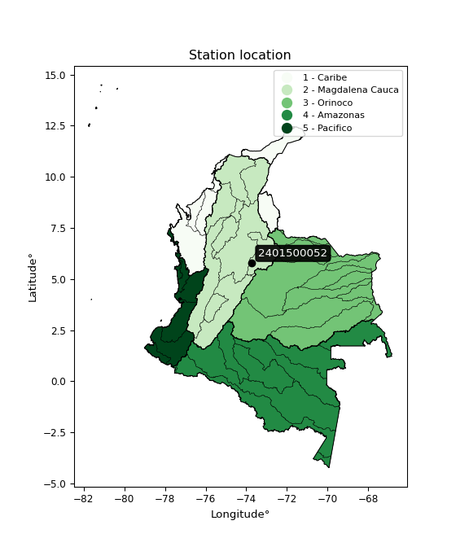

<div align="center">


</div>

# PMP Station (Rain, Pmax24h): 2401500052

Probable Maximum Precipitation (PMP) is the greatest amount of rainfall for a specific duration that is meteorologically possible for a given location, acting as a "worst-case" scenario for extreme storms, crucial for designing safety-critical infrastructure like bridges, river deviations, dams, spillways, and nuclear plants to prevent catastrophic failure. PMP is calculated by hydrologists using meteorological data to determine the upper limit of extreme rainfall, often leading to the Probable Maximum Flood (PMF) for flood control design, and is increasingly being studied for climate change impacts. Probable Maximum Precipitation (PMP) is the theoretical upper limit of rainfall, a deterministic estimate for extreme events, while probability distributions (like GEV, Gumbel) describe the likelihood and frequency of various precipitation amounts, including rare ones, showing how often events occur, with PMP representing the extreme end of these distributions, used for critical infrastructure design to ensure safety against the worst conceivable weather, unlike standard statistical forecasts which cover typical probabilities.

The most common probability distributions in hydrology, used for analyzing floods, rainfall, and streamflow, include the Normal, Log-Normal, Gumbel, Gamma (including Log-Pearson Type III), and Generalized Extreme Value (GEV) distributions, often chosen based on the data´s skewness and whether modeling extremes or general conditions, with Gumbel and GEV popular for extreme events like floods, while the Normal distribution serves as a baseline, though often requiring transformations for skewed hydrological data. These distributions help in designing water infrastructure, managing water resources, and forecasting hydrologic events.

> Hydrological data often isn´t perfectly normal (it´s skewed), so different distributions are needed for different applications, such as: **Flood Frequency Analysis**: Using Gumbel, GEV, or Log-Pearson Type III for predicting extreme flood magnitudes and their return periods, **Rainfall Analysis**: Normal for annual totals, but Log-Normal, Weibull, or GEV for intensity or extreme daily rainfall, **Streamflow Modeling**: Gamma and Log-Normal for maximum flows, GEV for minimum flows, and Kappa for daily flows.

<div align="center">

</img>

</div>


## A. General information


### 1. General running parameters

• app_version: _v20260113_. • runtime: _2026-01-17 18:24:04.630693_. • Python version: _3.14.0_. • SciPy version: _1.16.3_. • Pandas version: _2.3.3_. • NumPy version: _2.3.5_. • Stations dataset (station_dataset_file): _dataset/pmax24h_in/automatic_colombia_2003_2025.csv_. • Stations catalog (station_catalog_file): _dataset/CNE.xls_. • Minimum year to eval til year_max (date_min): _1900_. • Maximum year to eval since year_min (date_max): _2025_. • Creates, save and include plots into reports (create_plot): _False_. • Plot only fit distributions with Δo > Δ (plot_only_fit): _True_. • Plot only simple graphs avoiding multiple CDFs and multiple Extreme values plots (plot_only_simple): _True_. • Eval low extreme values, if False, evaluates high extreme values (low_extreme): _False_. • Eval every SciPy distribution as logarithmic (pdist_logarithmic_on): _True_. • Standard deviation normalized (ddof): _1.0_. • Return periods to eval in years (Tr): _[2, 2.33, 5, 10, 15, 20, 25, 50, 75, 100, 200, 250, 500, 750, 1000]_. • Minimum data sample per station, 0 means any (minimum_sample): _5_. • Z-Score maximum threshold to adjust a value, 0 means disable (zscore_max): _3.5_. • Z-Score minimum threshold to adjust a value, 0 means disable (zscore_min): _-2.5_. • Avoid zeros, e.g. rain = 0 (avoid_zeros): _True_. • Avoid null values (avoid_nans): _True_. 

:file_folder:Table: [dataset.csv](../../dataset/pmax24h_in/automatic_colombia_2003_2025.csv)

> Delta Degrees of Freedom (DDOF): is a parameter used in the formulas for calculating variance and standard deviation. When ddof=0, the divisor is $N$ (the total number of observations) and this is used when your data set is the entire population. When ddof=1, the divisor is $N-1$ and this is used when your data set is a sample drawn from a larger population. Using $N-1$ provides an unbiased estimate of the population variance (known as Bessel´s correction).


### 2. Station info and location

|   id |     CODIGO | NOMBRE                               | CATEGORIA               | TECNOLOGIA                | ESTADO   | FECHA_INSTALACION   |   FECHA_SUSPENSION |   ALTITUD |   LATITUD |   LONGITUD | DEPARTAMENTO   | MUNICIPIO       | AREA_OPERATIVA                         | ENTIDAD                                                     | AREA_HIDROGRAFICA   | ZONA_HIDROGRAFICA   | SUBZONA_HIDROGRAFICA   |   CORRIENTE | Catalogo   |   Version |
|-----:|-----------:|:-------------------------------------|:------------------------|:--------------------------|:---------|:--------------------|-------------------:|----------:|----------:|-----------:|:---------------|:----------------|:---------------------------------------|:------------------------------------------------------------|:--------------------|:--------------------|:-----------------------|------------:|:-----------|----------:|
|    0 | 2401500052 | PUENTE GUILLERMO - AUT  [2401500052] | Climatológica Principal | Automática con Telemetría | Activa   | 31/10/2017          |                nan |      2246 |   5.79642 |   -73.7267 | Santander      | Puente Nacional | Area Operativa 08 - Santanderes-Arauca | INSTITUTO DE HIDROLOGIA METEOROLOGIA Y ESTUDIOS AMBIENTALES | Magdalena Cauca     | Sogamoso            | Río Suárez             |         nan | CNE_IDEAM  |  20251226 |

<div align="center">

Dynamic map: [:earth_americas:Google](http://maps.google.com/maps?q=5.796416667,-73.726666667) [:earth_americas:OSM](https://www.openstreetmap.org/#map=18/5.796416667/-73.726666667&layers=P) [:earth_americas:Bing](https://www.bing.com/maps?cp=5.796416667~-73.726666667&lvl=18) [:earth_americas:Apple](https://maps.apple.com/frame?center=5.796416667%2C-73.726666667&span=0.003%2C0.006)

</div>


<div align="center">

```geojson
{
  "type": "Feature",
  "geometry": {
    "type": "Point", 
    "coordinates": [-73.726666667, 5.796416667]
  }, 
  "properties": {
    "Name": "2401500052"
  }
}
```

</div>


### 3. Discrete values table and plot

<div align="center">

|               |           0 |            1 |          2 |           3 |          4 |          5 |           6 |
|:--------------|------------:|-------------:|-----------:|------------:|-----------:|-----------:|------------:|
| Date          | 2019        | 2020         | 2021       | 2022        | 2023       | 2024       | 2025        |
| Value         |   71.4      |   80.6       |    1.2     |   37.4      |   70.4     |  248.4     |   61.6      |
| Value_initial |   71.4      |   80.6       |    1.2     |   37.4      |   70.4     |  248.4     |   61.6      |
| count         |    7        |    7         |    7       |    7        |    7       |    7       |    7        |
| mean          |   81.5714   |   81.5714    |   81.5714  |   81.5714   |   81.5714  |   81.5714  |   81.5714   |
| std           |   78.3906   |   78.3906    |   78.3906  |   78.3906   |   78.3906  |   78.3906  |   78.3906   |
| zscore        |   -0.129753 |   -0.0123922 |   -1.02527 |   -0.563479 |   -0.14251 |    2.12817 |   -0.254768 |


</div>


> The initial value (value_initial) correspond to the initial obtained or null completed value, and value (value) is adjusted only when the initial value is outside the valid range (outlier) definite through the Z-Score value. If Z-Score is active, values out of range or outliers are replaced with the station mean value. A Z-Score (or standard score) measures how many standard deviations a data point is from the mean of a dataset, indicating its relative position; positive scores mean above the mean, negative mean below, and a score of zero is exactly at the mean, allowing for comparison of values from different distributions. It´s calculated using the formula $z=(x–μ)/σ$, where $x$ is the data point, $μ$ is the mean, and $σ$ is the standard deviation, helping identify outliers and understand probability.
>
> <sub>**Note**: In this study, "completing" (filling gaps in) and "extending" (forecasting or lengthening the historical record) rainfall data series are avoided for certain critical analyses because they introduce artificial bias and uncertainty, which can distort the statistics of rare events (extremes), alter day-to-day variability, and compromise the integrity and homogeneity of the original data. Some reasons against Completing/Extending rainfall data are: **Distortion of Extremes and Variability**: The primary issue is that most gap-filling or extension methods rely on averaging or regression with nearby stations, which inherently smooths the data. Rainfall is highly variable in space and time, with a large percentage of zero values and occasional large storms. Infilling methods often underestimate the highest values and overestimate the lowest (zero) values, which severely distorts analyses focused on flood frequency, drought severity, and intensity-duration-frequency (IDF) curves, **Loss of Data Homogeneity**: Infilled or extended data are synthetic estimates, not actual measurements. Combining these estimates with observed data can violate the assumption of data homogeneity, which requires that the data properties do not change over time. Inhomogeneity can lead to incorrect conclusions about long-term trends or changes in climate patterns, **Propagation of Errors**: Errors and biases from the original data (e.g., wind-induced undercatch, instrument errors, site changes) or the data used for imputation can propagate through the analysis, leading to unreliable hydrological models and inaccurate predictions, **Compromised Statistical Integrity**: For statistical analyses, especially those involving the frequency of events, using artificial data can introduce time bias or autocorrelation that doesn´t exist in reality, making it difficult to assess the true probability of events, **Difficulty in Validation**: It is difficult to accurately validate the quality of filled or extended data, especially for past periods where ground-truth measurements are unavailable. The reliability of imputation techniques heavily depends on the density of the surrounding station network and the complexity of the local topography.</sub>


### 4. Active continuous probability distributions from SciPy (80 of 104 available)

A Probability Density Function (PDF) describes the relative likelihood of a continuous random variable falling within a specific range, where the total area under its curve equals 1, and the area over any interval gives the actual probability for that range. Unlike discrete probabilities (like rolling a die), a PDF shows density, not direct probability for a single point (which is zero), with higher points indicating higher likelihood, often visualized as a bell curve for normal distributions.

A log of a probability density function (log-PDF) is simply the logarithm of the PDF´s value, denoted as $log(f(x))$, useful for converting multiplication of probabilities into addition, improving numerical stability with tiny numbers, and connecting to information theory concepts like entropy. Instead of dealing with very small probabilities (e.g., 0.000001), log-PDFs use negative numbers (e.g., $log(0.00001) ≈ -11.51$ that are easier for computers to handle, preventing underflow errors and simplifying complex calculations. In this study, each active probability distribution from SciPy is also evaluated in the $log$ form.

[scipy.stats](https://docs.scipy.org/doc/scipy/reference/stats.html) is a Python´s powerful submodule within the SciPy library for comprehensive statistical analysis, offering over 130 probability distributions (like Normal, Poisson), functions for descriptive stats (mean, variance), hypothesis testing (t-tests, chi-square), random variable generation, and statistical tests, making it essential for data science, modeling, and research. It provides tools to explore, model, and draw conclusions from data efficiently, working seamlessly with NumPy.

<div align="center">

|   id | p_dist           |   n_parameter | fit_method   | label                                                                       | active   | ref                                                                                                      |
|-----:|:-----------------|--------------:|:-------------|:----------------------------------------------------------------------------|:---------|:---------------------------------------------------------------------------------------------------------|
|    0 | alpha            |             3 | MLE          | Alpha                                                                       | True     | [:mortar_board:](https://docs.scipy.org/doc/scipy/reference/generated/scipy.stats.alpha.html)            |
|    1 | anglit           |             2 | MM           | Anglit                                                                      | True     | [:mortar_board:](https://docs.scipy.org/doc/scipy/reference/generated/scipy.stats.anglit.html)           |
|    2 | arcsine          |             2 | MM           | Arcsine                                                                     | True     | [:mortar_board:](https://docs.scipy.org/doc/scipy/reference/generated/scipy.stats.arcsine.html)          |
|    3 | argus            |             3 | MLE          | Argus                                                                       | True     | [:mortar_board:](https://docs.scipy.org/doc/scipy/reference/generated/scipy.stats.argus.html)            |
|    4 | beta             |             4 | MLE          | Beta                                                                        | True     | [:mortar_board:](https://docs.scipy.org/doc/scipy/reference/generated/scipy.stats.beta.html)             |
|    5 | betaprime        |             4 | MLE          | Beta prime                                                                  | True     | [:mortar_board:](https://docs.scipy.org/doc/scipy/reference/generated/scipy.stats.betaprime.html)        |
|    6 | bradford         |             3 | MLE          | Bradford                                                                    | True     | [:mortar_board:](https://docs.scipy.org/doc/scipy/reference/generated/scipy.stats.bradford.html)         |
|    7 | burr             |             4 | MLE          | Burr (Type III)                                                             | True     | [:mortar_board:](https://docs.scipy.org/doc/scipy/reference/generated/scipy.stats.burr.html)             |
|    8 | burr12           |             4 | MLE          | Burr (Type III) 12                                                          | True     | [:mortar_board:](https://docs.scipy.org/doc/scipy/reference/generated/scipy.stats.burr12.html)           |
|    9 | cosine           |             2 | MLE          | Cosine                                                                      | True     | [:mortar_board:](https://docs.scipy.org/doc/scipy/reference/generated/scipy.stats.cosine.html)           |
|   10 | crystalball      |             4 | MLE          | Crystalball                                                                 | True     | [:mortar_board:](https://docs.scipy.org/doc/scipy/reference/generated/scipy.stats.crystalball.html)      |
|   11 | dgamma           |             3 | MLE          | Double gamma                                                                | True     | [:mortar_board:](https://docs.scipy.org/doc/scipy/reference/generated/scipy.stats.dgamma.html)           |
|   12 | dweibull         |             3 | MLE          | Double Weibull                                                              | True     | [:mortar_board:](https://docs.scipy.org/doc/scipy/reference/generated/scipy.stats.dweibull.html)         |
|   13 | erlang           |             3 | MLE          | Erlang                                                                      | True     | [:mortar_board:](https://docs.scipy.org/doc/scipy/reference/generated/scipy.stats.erlang.html)           |
|   14 | exponnorm        |             3 | MLE          | Exponentially modified Normal                                               | True     | [:mortar_board:](https://docs.scipy.org/doc/scipy/reference/generated/scipy.stats.exponnorm.html)        |
|   15 | exponpow         |             3 | MLE          | Exponential power                                                           | True     | [:mortar_board:](https://docs.scipy.org/doc/scipy/reference/generated/scipy.stats.exponpow.html)         |
|   16 | exponweib        |             4 | MLE          | Exponentiated Weibull                                                       | True     | [:mortar_board:](https://docs.scipy.org/doc/scipy/reference/generated/scipy.stats.exponweib.html)        |
|   17 | f                |             4 | MLE          | F                                                                           | True     | [:mortar_board:](https://docs.scipy.org/doc/scipy/reference/generated/scipy.stats.f.html)                |
|   18 | fatiguelife      |             3 | MLE          | Fatigue-life (Birnbaum-Saunders)                                            | True     | [:mortar_board:](https://docs.scipy.org/doc/scipy/reference/generated/scipy.stats.fatiguelife.html)      |
|   19 | foldnorm         |             3 | MM           | Fold Normal                                                                 | True     | [:mortar_board:](https://docs.scipy.org/doc/scipy/reference/generated/scipy.stats.foldnorm.html)         |
|   20 | gamma            |             3 | MLE          | Gamma                                                                       | True     | [:mortar_board:](https://docs.scipy.org/doc/scipy/reference/generated/scipy.stats.gamma.html)            |
|   21 | gausshyper       |             6 | MLE          | Gauss hypergeometric                                                        | True     | [:mortar_board:](https://docs.scipy.org/doc/scipy/reference/generated/scipy.stats.gausshyper.html)       |
|   22 | genexpon         |             5 | MLE          | Generalized exponential                                                     | True     | [:mortar_board:](https://docs.scipy.org/doc/scipy/reference/generated/scipy.stats.genexpon.html)         |
|   23 | genextreme       |             3 | MLE          | Generalized exponential                                                     | True     | [:mortar_board:](https://docs.scipy.org/doc/scipy/reference/generated/scipy.stats.genextreme.html)       |
|   24 | gengamma         |             4 | MLE          | Generalized gamma                                                           | True     | [:mortar_board:](https://docs.scipy.org/doc/scipy/reference/generated/scipy.stats.gengamma.html)         |
|   25 | genhalflogistic  |             3 | MLE          | Generalized half-logistic                                                   | True     | [:mortar_board:](https://docs.scipy.org/doc/scipy/reference/generated/scipy.stats.genhalflogistic.html)  |
|   26 | genlogistic      |             3 | MLE          | Generalized logistic                                                        | True     | [:mortar_board:](https://docs.scipy.org/doc/scipy/reference/generated/scipy.stats.genlogistic.html)      |
|   27 | gennorm          |             3 | MLE          | Generalized Normal                                                          | True     | [:mortar_board:](https://docs.scipy.org/doc/scipy/reference/generated/scipy.stats.gennorm.html)          |
|   28 | genpareto        |             3 | MLE          | Generalized Pareto                                                          | True     | [:mortar_board:](https://docs.scipy.org/doc/scipy/reference/generated/scipy.stats.genpareto.html)        |
|   29 | gompertz         |             3 | MLE          | Gompertz (or truncated Gumbel)                                              | True     | [:mortar_board:](https://docs.scipy.org/doc/scipy/reference/generated/scipy.stats.gompertz.html)         |
|   30 | gumbel_l         |             2 | MM           | Gumbel Left Skew                                                            | True     | [:mortar_board:](https://docs.scipy.org/doc/scipy/reference/generated/scipy.stats.gumbel_l.html)         |
|   31 | gumbel_r         |             2 | MM           | Gumbel Right Skew                                                           | True     | [:mortar_board:](https://docs.scipy.org/doc/scipy/reference/generated/scipy.stats.gumbel_r.html)         |
|   32 | halfgennorm      |             3 | MLE          | Upper half of a generalized normal                                          | True     | [:mortar_board:](https://docs.scipy.org/doc/scipy/reference/generated/scipy.stats.halfgennorm.html)      |
|   33 | halflogistic     |             2 | MM           | Half-logistic                                                               | True     | [:mortar_board:](https://docs.scipy.org/doc/scipy/reference/generated/scipy.stats.halflogistic.html)     |
|   34 | halfnorm         |             2 | MM           | Half Normal                                                                 | True     | [:mortar_board:](https://docs.scipy.org/doc/scipy/reference/generated/scipy.stats.halfnorm.html)         |
|   35 | hypsecant        |             2 | MM           | hyperbolic secant                                                           | True     | [:mortar_board:](https://docs.scipy.org/doc/scipy/reference/generated/scipy.stats.hypsecant.html)        |
|   36 | invgamma         |             3 | MLE          | Inverted gamma                                                              | True     | [:mortar_board:](https://docs.scipy.org/doc/scipy/reference/generated/scipy.stats.invgamma.html)         |
|   37 | invgauss         |             3 | MLE          | Inverse Gaussian                                                            | True     | [:mortar_board:](https://docs.scipy.org/doc/scipy/reference/generated/scipy.stats.invgauss.html)         |
|   38 | invweibull       |             3 | MLE          | Inverted Weibull                                                            | True     | [:mortar_board:](https://docs.scipy.org/doc/scipy/reference/generated/scipy.stats.invweibull.html)       |
|   39 | johnsonsb        |             4 | MLE          | Johnson SB                                                                  | True     | [:mortar_board:](https://docs.scipy.org/doc/scipy/reference/generated/scipy.stats.johnsonsb.html)        |
|   40 | johnsonsu        |             4 | MLE          | Johnson Su                                                                  | True     | [:mortar_board:](https://docs.scipy.org/doc/scipy/reference/generated/scipy.stats.johnsonsu.html)        |
|   41 | kappa3           |             3 | MLE          | Kappa 3                                                                     | True     | [:mortar_board:](https://docs.scipy.org/doc/scipy/reference/generated/scipy.stats.kappa3.html)           |
|   42 | kappa4           |             4 | MLE          | Kappa 4                                                                     | True     | [:mortar_board:](https://docs.scipy.org/doc/scipy/reference/generated/scipy.stats.kappa4.html)           |
|   43 | ksone            |             3 | MLE          | Kolmogorov-Smirnov one-sided test statistic distribution                    | True     | [:mortar_board:](https://docs.scipy.org/doc/scipy/reference/generated/scipy.stats.ksone.html)            |
|   44 | kstwobign        |             2 | MLE          | Limiting distribution of scaled Kolmogorov-Smirnov two-sided test statistic | True     | [:mortar_board:](https://docs.scipy.org/doc/scipy/reference/generated/scipy.stats.kstwobign.html)        |
|   45 | laplace          |             2 | MM           | Laplace                                                                     | True     | [:mortar_board:](https://docs.scipy.org/doc/scipy/reference/generated/scipy.stats.laplace.html)          |
|   46 | levy_l           |             2 | MLE          | Left-skewed Levy                                                            | True     | [:mortar_board:](https://docs.scipy.org/doc/scipy/reference/generated/scipy.stats.levy_l.html)           |
|   47 | loggamma         |             3 | MLE          | Log gamma                                                                   | True     | [:mortar_board:](https://docs.scipy.org/doc/scipy/reference/generated/scipy.stats.loggamma.html)         |
|   48 | logistic         |             2 | MM           | Logistic (or Sech-squared)                                                  | True     | [:mortar_board:](https://docs.scipy.org/doc/scipy/reference/generated/scipy.stats.logistic.html)         |
|   49 | loglaplace       |             3 | MLE          | Log-Laplace                                                                 | True     | [:mortar_board:](https://docs.scipy.org/doc/scipy/reference/generated/scipy.stats.loglaplace.html)       |
|   50 | lomax            |             3 | MLE          | Lomax (Pareto of the second kind)                                           | True     | [:mortar_board:](https://docs.scipy.org/doc/scipy/reference/generated/scipy.stats.lomax.html)            |
|   51 | maxwell          |             2 | MM           | Maxwell                                                                     | True     | [:mortar_board:](https://docs.scipy.org/doc/scipy/reference/generated/scipy.stats.maxwell.html)          |
|   52 | mielke           |             4 | MLE          | Mielke Beta-Kappa / Dagum                                                   | True     | [:mortar_board:](https://docs.scipy.org/doc/scipy/reference/generated/scipy.stats.mielke.html)           |
|   53 | moyal            |             2 | MM           | Moyal                                                                       | True     | [:mortar_board:](https://docs.scipy.org/doc/scipy/reference/generated/scipy.stats.moyal.html)            |
|   54 | nakagami         |             3 | MLE          | Nakagami                                                                    | True     | [:mortar_board:](https://docs.scipy.org/doc/scipy/reference/generated/scipy.stats.nakagami.html)         |
|   55 | ncf              |             5 | MLE          | Non-central F distribution                                                  | True     | [:mortar_board:](https://docs.scipy.org/doc/scipy/reference/generated/scipy.stats.ncf.html)              |
|   56 | nct              |             4 | MLE          | Non-central Student’s t                                                     | True     | [:mortar_board:](https://docs.scipy.org/doc/scipy/reference/generated/scipy.stats.nct.html)              |
|   57 | norm             |             2 | MM           | Normal                                                                      | True     | [:mortar_board:](https://docs.scipy.org/doc/scipy/reference/generated/scipy.stats.norm.html)             |
|   58 | pearson3         |             3 | MM           | Pearson type III                                                            | True     | [:mortar_board:](https://docs.scipy.org/doc/scipy/reference/generated/scipy.stats.pearson3.html)         |
|   59 | powerlaw         |             3 | MLE          | Power-function                                                              | True     | [:mortar_board:](https://docs.scipy.org/doc/scipy/reference/generated/scipy.stats.powerlaw.html)         |
|   60 | rayleigh         |             2 | MM           | Rayleigh                                                                    | True     | [:mortar_board:](https://docs.scipy.org/doc/scipy/reference/generated/scipy.stats.rayleigh.html)         |
|   61 | rdist            |             3 | MLE          | R-distributed (symmetric beta)                                              | True     | [:mortar_board:](https://docs.scipy.org/doc/scipy/reference/generated/scipy.stats.rdist.html)            |
|   62 | rice             |             3 | MLE          | Rice                                                                        | True     | [:mortar_board:](https://docs.scipy.org/doc/scipy/reference/generated/scipy.stats.rice.html)             |
|   63 | semicircular     |             2 | MM           | Semicircular                                                                | True     | [:mortar_board:](https://docs.scipy.org/doc/scipy/reference/generated/scipy.stats.semicircular.html)     |
|   64 | skewnorm         |             3 | MLE          | Skew normal                                                                 | True     | [:mortar_board:](https://docs.scipy.org/doc/scipy/reference/generated/scipy.stats.skewnorm.html)         |
|   65 | t                |             3 | MLE          | Student’s t                                                                 | True     | [:mortar_board:](https://docs.scipy.org/doc/scipy/reference/generated/scipy.stats.t.html)                |
|   66 | trapezoid        |             4 | MLE          | Trapezoid                                                                   | True     | [:mortar_board:](https://docs.scipy.org/doc/scipy/reference/generated/scipy.stats.trapezoid.html)        |
|   67 | triang           |             3 | MLE          | Triangular                                                                  | True     | [:mortar_board:](https://docs.scipy.org/doc/scipy/reference/generated/scipy.stats.triang.html)           |
|   68 | truncexpon       |             3 | MLE          | Truncated exponential                                                       | True     | [:mortar_board:](https://docs.scipy.org/doc/scipy/reference/generated/scipy.stats.truncexpon.html)       |
|   69 | truncnorm        |             4 | MLE          | Truncated normal                                                            | True     | [:mortar_board:](https://docs.scipy.org/doc/scipy/reference/generated/scipy.stats.truncnorm.html)        |
|   70 | truncpareto      |             4 | MLE          | Upper truncated Pareto                                                      | True     | [:mortar_board:](https://docs.scipy.org/doc/scipy/reference/generated/scipy.stats.truncpareto.html)      |
|   71 | truncweibull_min |             5 | MLE          | Doubly truncated Weibull minimum                                            | True     | [:mortar_board:](https://docs.scipy.org/doc/scipy/reference/generated/scipy.stats.truncweibull_min.html) |
|   72 | tukeylambda      |             3 | MLE          | Tukey-Lamdba                                                                | True     | [:mortar_board:](https://docs.scipy.org/doc/scipy/reference/generated/scipy.stats.tukeylambda.html)      |
|   73 | uniform          |             2 | MLE          | Uniform                                                                     | True     | [:mortar_board:](https://docs.scipy.org/doc/scipy/reference/generated/scipy.stats.uniform.html)          |
|   74 | vonmises         |             3 | MLE          | Von Mises                                                                   | True     | [:mortar_board:](https://docs.scipy.org/doc/scipy/reference/generated/scipy.stats.vonmises.html)         |
|   75 | vonmises_line    |             3 | MLE          | Von Mises line                                                              | True     | [:mortar_board:](https://docs.scipy.org/doc/scipy/reference/generated/scipy.stats.vonmises_line.html)    |
|   76 | wald             |             2 | MM           | Wald                                                                        | True     | [:mortar_board:](https://docs.scipy.org/doc/scipy/reference/generated/scipy.stats.wald.html)             |
|   77 | weibull_max      |             3 | MLE          | Weibull maximum                                                             | True     | [:mortar_board:](https://docs.scipy.org/doc/scipy/reference/generated/scipy.stats.weibull_max.html)      |
|   78 | weibull_min      |             3 | MLE          | Weibull minimum                                                             | True     | [:mortar_board:](https://docs.scipy.org/doc/scipy/reference/generated/scipy.stats.weibull_min.html)      |
|   79 | wrapcauchy       |             3 | MLE          | Wrapped  Cauchy                                                             | True     | [:mortar_board:](https://docs.scipy.org/doc/scipy/reference/generated/scipy.stats.wrapcauchy.html)       |

</div>

> **n_parameter:** # arguments & localization & scale.
>
> **Fit methods:** (MLE) maximum likelihood, (MM) L-moments.
>
>**Inactive** (With the only purpose of prevent loops, zero divisions, infinite values, over high estimated values or horizontal trending for recurrence intervals estimations, the follow distributions were disabled.)**:** lognorm, norminvgauss, powernorm, powerlognorm, cauchy, halfcauchy, foldcauchy, skewcauchy, chi2, expon, fisk, genhyperbolic, geninvgauss, gibrat, kstwo, laplace_asymmetric, levy, levy_stable, ncx2, pareto, rel_breitwigner, recipinvgauss, studentized_range, loguniform, 


## B. Probability (PDF) vs. Empirical (EDF) distributions functions

A continuous probability distribution (CPD) describes probabilities for variables that can take any value within a range (like rain any time), unlike discrete variables with specific outcomes (like temperature). It uses a Probability Density Function (PDF), a curve where the total area under it equals 1, and the probability of the variable falling within an interval (a to b) is found by calculating the area under the curve between those points. A key feature is that the probability of hitting any single exact value is zero, so probabilities are always expressed for ranges, e.g., $P(a ≤ X ≤ b)$.

<div align="center">

Distributions parameters from station values
|     |    station | p_dist              |   n |              loc |           scale | shape                  | shape1                | shape2             | shape3             |
|----:|-----------:|:--------------------|----:|-----------------:|----------------:|:-----------------------|:----------------------|:-------------------|:-------------------|
|   0 | 2401500052 | alpha               |   7 |   -124.262       |   682.527       | 3.641179595776746      |                       |                    |                    |
|   1 | 2401500052 | anglit              |   7 |     81.5714      |   212.313       |                        |                       |                    |                    |
|   2 | 2401500052 | arcsine             |   7 |    -21.0659      |   205.275       |                        |                       |                    |                    |
|   3 | 2401500052 | argus               |   7 |    -92.3602      |   353.94        | 6.152951111296224e-07  |                       |                    |                    |
|   4 | 2401500052 | beta                |   7 |      1.2         |   283.085       | 0.4404984603931543     | 0.6609982695465128    |                    |                    |
|   5 | 2401500052 | betaprime           |   7 |      1.2         |   730.955       | 0.9018010958830504     | 9.519430666778725     |                    |                    |
|   6 | 2401500052 | bradford            |   7 |      1.19999     |   247.2         | 2.1592756075580373     |                       |                    |                    |
|   7 | 2401500052 | burr                |   7 |      1.2         |   193.418       | 3.474419941968957      | 0.14904841643502814   |                    |                    |
|   8 | 2401500052 | burr12              |   7 |      1.2         |  1866.07        | 0.973827895341912      | 24.597724974710044    |                    |                    |
|   9 | 2401500052 | cosine              |   7 |     97.2309      |    66.353       |                        |                       |                    |                    |
|  10 | 2401500052 | crystalball         |   7 |     81.5714      |    72.5756      | 5233.768697347199      | 9890.46284377282      |                    |                    |
|  11 | 2401500052 | dgamma              |   7 |     70.4         |    61.6033      | 0.6671899322837086     |                       |                    |                    |
|  12 | 2401500052 | dweibull            |   7 |     70.4         |    69.2904      | 0.6396974669098154     |                       |                    |                    |
|  13 | 2401500052 | erlang              |   7 |      1.2         |    84.8315      | 0.6661234355423937     |                       |                    |                    |
|  14 | 2401500052 | exponnorm           |   7 |     21.465       |    24.8067      | 2.422990379183852      |                       |                    |                    |
|  15 | 2401500052 | exponpow            |   7 |      1.2         |   128.316       | 0.659178483964218      |                       |                    |                    |
|  16 | 2401500052 | exponweib           |   7 |    -12.338       |    37.2912      | 3.3917534402440523     | 0.778425673126296     |                    |                    |
|  17 | 2401500052 | f                   |   7 |      1.2         |    84.8849      | 1.2066511330815657     | 14.699077398976874    |                    |                    |
|  18 | 2401500052 | fatiguelife         |   7 |    -32.0396      |    95.6005      | 0.6140754558997756     |                       |                    |                    |
|  19 | 2401500052 | foldnorm            |   7 |    -20.2226      |   126.329       | 0.0060241671090860305  |                       |                    |                    |
|  20 | 2401500052 | gamma               |   7 |      1.2         |   195.992       | 0.1519846067033579     |                       |                    |                    |
|  21 | 2401500052 | gausshyper          |   7 |    -23.0315      |   271.431       | 1.0020880799559986     | 0.9353734430039895    | 1.1444146754942004 | 1.1002145322226866 |
|  22 | 2401500052 | genexpon            |   7 |      1.2         |   160.245       | 1.4736042879108964     | 0.894655314853923     | 2.9799933156564924 |                    |
|  23 | 2401500052 | genextreme          |   7 |      2.3005      |     5.367       | -4.875791596694972     |                       |                    |                    |
|  24 | 2401500052 | gengamma            |   7 |    -12.7311      |     5.25103     | 5.025524485951355      | 0.5816361413878288    |                    |                    |
|  25 | 2401500052 | genhalflogistic     |   7 |    -24.2439      |   286.924       | 1.0523750942493335     |                       |                    |                    |
|  26 | 2401500052 | genlogistic         |   7 |   -272.792       |    46.4853      | 1075.6771987697298     |                       |                    |                    |
|  27 | 2401500052 | gennorm             |   7 |     70.4         |     0.0107015   | 0.21817099766081977    |                       |                    |                    |
|  28 | 2401500052 | genpareto           |   7 |      1.2         |    91.645       | -0.13716812259281996   |                       |                    |                    |
|  29 | 2401500052 | gompertz            |   7 |      1.19913     |   561.241       | 6.334028433315101      |                       |                    |                    |
|  30 | 2401500052 | gumbel_l            |   7 |    114.234       |    56.587       |                        |                       |                    |                    |
|  31 | 2401500052 | gumbel_r            |   7 |     48.9086      |    56.587       |                        |                       |                    |                    |
|  32 | 2401500052 | halfgennorm         |   7 |      1.2         |     3.76715     | 0.3871317003989654     |                       |                    |                    |
|  33 | 2401500052 | halflogistic        |   7 |     -4.44751     |    62.0495      |                        |                       |                    |                    |
|  34 | 2401500052 | halfnorm            |   7 |    -14.4902      |   120.395       |                        |                       |                    |                    |
|  35 | 2401500052 | hypsecant           |   7 |     81.5714      |    46.2031      |                        |                       |                    |                    |
|  36 | 2401500052 | invgamma            |   7 |    -60.5015      |   642.357       | 5.5202763994287025     |                       |                    |                    |
|  37 | 2401500052 | invgauss            |   7 |    -35.4899      |   312.326       | 0.3748051018625461     |                       |                    |                    |
|  38 | 2401500052 | invweibull          |   7 |      1.2         |     4.50372     | 0.043855748393125664   |                       |                    |                    |
|  39 | 2401500052 | johnsonsb           |   7 |      0.567315    |   247.833       | -0.5972047847354804    | 0.11748435720366071   |                    |                    |
|  40 | 2401500052 | johnsonsu           |   7 |     70.9199      |     0.88965     | 0.12953280356429028    | 0.26753342428838434   |                    |                    |
|  41 | 2401500052 | kappa3              |   7 |      1.2         |    76.0369      | 2.847942647558031      |                       |                    |                    |
|  42 | 2401500052 | kappa4              |   7 |    -22.2071      |   268.008       | 1.0956388591829758     | 0.9880313676083704    |                    |                    |
|  43 | 2401500052 | ksone               |   7 |    -23.52        |   296.64        | 1.0                    |                       |                    |                    |
|  44 | 2401500052 | kstwobign           |   7 |   -124.419       |   239.812       |                        |                       |                    |                    |
|  45 | 2401500052 | laplace             |   7 |     81.5714      |    51.3187      |                        |                       |                    |                    |
|  46 | 2401500052 | levy_l              |   7 |    268.458       |    89.5078      |                        |                       |                    |                    |
|  47 | 2401500052 | loggamma            |   7 | -21656.3         |  2959.75        | 1547.7400868581208     |                       |                    |                    |
|  48 | 2401500052 | logistic            |   7 |     81.5714      |    40.013       |                        |                       |                    |                    |
|  49 | 2401500052 | loglaplace          |   7 |     -0.297683    |    70.6977      | 1.1622859302497548     |                       |                    |                    |
|  50 | 2401500052 | lomax               |   7 |      1.18397     | 36412.4         | 454.34432892986246     |                       |                    |                    |
|  51 | 2401500052 | maxwell             |   7 |    -90.4022      |   107.769       |                        |                       |                    |                    |
|  52 | 2401500052 | mielke              |   7 |      1.2         |   205.157       | 0.4660373045474405     | 3.3010125779325863    |                    |                    |
|  53 | 2401500052 | moyal               |   7 |     40.068       |    32.6705      |                        |                       |                    |                    |
|  54 | 2401500052 | nakagami            |   7 |     37.4         |    75.9117      | 0.29036014348210115    |                       |                    |                    |
|  55 | 2401500052 | ncf                 |   7 |     -0.012141    |     1.81685e-05 | 1.2953764756563275e-06 | 5.260799859586658     | 3.8718225205053916 |                    |
|  56 | 2401500052 | nct                 |   7 |     -0.292082    |     0.0720065   | 0.31442294313236707    | 54.736141621461144    |                    |                    |
|  57 | 2401500052 | norm                |   7 |     81.5714      |    72.5756      |                        |                       |                    |                    |
|  58 | 2401500052 | pearson3            |   7 |     81.5714      |    72.5756      | 1.5050506664869014     |                       |                    |                    |
|  59 | 2401500052 | powerlaw            |   7 |      1.2         |   247.2         | 0.14417548354655094    |                       |                    |                    |
|  60 | 2401500052 | rayleigh            |   7 |    -57.2699      |   110.779       |                        |                       |                    |                    |
|  61 | 2401500052 | rdist               |   7 |    -23.2366      |   103.837       | 1.2363553478616283     |                       |                    |                    |
|  62 | 2401500052 | rice                |   7 |    -31.6411      |    95.0902      | 0.00045748699025068836 |                       |                    |                    |
|  63 | 2401500052 | semicircular        |   7 |     81.5714      |   145.151       |                        |                       |                    |                    |
|  64 | 2401500052 | skewnorm            |   7 |      1.19999     |   108.287       | 40011937.27460246      |                       |                    |                    |
|  65 | 2401500052 | t                   |   7 |     69.5902      |     9.42082     | 0.6752848699127874     |                       |                    |                    |
|  66 | 2401500052 | trapezoid           |   7 |    -24.696       |   296.64        | 1.0                    | 1.0                   |                    |                    |
|  67 | 2401500052 | triang              |   7 |    -26.5562      |   274.956       | 0.9999999190396273     |                       |                    |                    |
|  68 | 2401500052 | truncexpon          |   7 |      1.19999     |   331.486       | 0.7457319923146706     |                       |                    |                    |
|  69 | 2401500052 | truncnorm           |   7 |   -216.385       |   169.77        | 1.2816507851512289     | 247.8393666840965     |                    |                    |
|  70 | 2401500052 | truncpareto         |   7 |      1.12582     |     0.0741812   | 0.1679575516390787     | 3333.3810241789133    |                    |                    |
|  71 | 2401500052 | truncweibull_min    |   7 |    -14.1463      |   190.405       | 1.2148205545901525     | 0.0008423653190586977 | 1.3788818800613196 |                    |
|  72 | 2401500052 | tukeylambda         |   7 |    -23.449       |   121.164       | 1.1644916432085766     |                       |                    |                    |
|  73 | 2401500052 | uniform             |   7 |      1.2         |   247.2         |                        |                       |                    |                    |
|  74 | 2401500052 | vonmises            |   7 |      0.387224    |     1           | 0.2393986824697736     |                       |                    |                    |
|  75 | 2401500052 | vonmises_line       |   7 |     65.748       |    58.1399      | 1.56647027832161       |                       |                    |                    |
|  76 | 2401500052 | wald                |   7 |      8.99581     |    72.5756      |                        |                       |                    |                    |
|  77 | 2401500052 | weibull_max         |   7 |    248.4         |     1.70266     | 0.19434844322185607    |                       |                    |                    |
|  78 | 2401500052 | weibull_min         |   7 |      1.2         |    96.8664      | 0.17106865170060842    |                       |                    |                    |
|  79 | 2401500052 | wrapcauchy          |   7 |      1.17573     |    39.347       | 0.21934494496420237    |                       |                    |                    |
|  80 | 2401500052 | logalpha            |   7 |      0.00299897  |     0.472374    | 4.763932612942442e-08  |                       |                    |                    |
|  81 | 2401500052 | loganglit           |   7 |      3.76452     |     4.54929     |                        |                       |                    |                    |
|  82 | 2401500052 | logarcsine          |   7 |      1.56529     |     4.39846     |                        |                       |                    |                    |
|  83 | 2401500052 | logargus            |   7 |     -1.81931     |     7.45775     | 2.414323895110414      |                       |                    |                    |
|  84 | 2401500052 | logbeta             |   7 |     -0.363403    |     5.87844     | 1.0625422546403436     | 0.2510058200684373    |                    |                    |
|  85 | 2401500052 | logbetaprime        |   7 |    -37.2179      |  1593.5         | 654.398048754397       | 25449.828754530114    |                    |                    |
|  86 | 2401500052 | logbradford         |   7 |     -0.47345     |     5.9885      | 9.673234949314122e-05  |                       |                    |                    |
|  87 | 2401500052 | logburr             |   7 |    -14.0046      |    19.551       | 2104.0081143780953     | 0.004762034969158254  |                    |                    |
|  88 | 2401500052 | logburr12           |   7 | -20021.2         | 20039.5         | 23847.243617762535     | 14378689.260390893    |                    |                    |
|  89 | 2401500052 | logcosine           |   7 |      3.42672     |     1.4234      |                        |                       |                    |                    |
|  90 | 2401500052 | logcrystalball      |   7 |      3.76453     |     1.55508     | 502.2117369272967      | 30.11785500160595     |                    |                    |
|  91 | 2401500052 | logdgamma           |   7 |      4.2683      |     1.19131     | 0.5729048845479072     |                       |                    |                    |
|  92 | 2401500052 | logdweibull         |   7 |      4.2683      |     1.02764     | 0.48734671752005665    |                       |                    |                    |
|  93 | 2401500052 | logerlang           |   7 |    -22.0136      |     0.109295    | 235.55039430832846     |                       |                    |                    |
|  94 | 2401500052 | logexponnorm        |   7 |      3.76364     |     1.55508     | 0.0005690655996681716  |                       |                    |                    |
|  95 | 2401500052 | logexponpow         |   7 |      0.182322    |     5.21873     | 0.879389715873341      |                       |                    |                    |
|  96 | 2401500052 | logexponweib        |   7 |     -3.39949     |     8.95078     | 0.006309117988975481   | 607.6742125682424     |                    |                    |
|  97 | 2401500052 | logf                |   7 |  -3131.42        |  3135.19        | 29775725.596960127     | 11141032.905290663    |                    |                    |
|  98 | 2401500052 | logfatiguelife      |   7 |  -1275.13        |  1278.89        | 0.0012130510152025386  |                       |                    |                    |
|  99 | 2401500052 | logfoldnorm         |   7 |      0.34303     |     1.32085     | 2.6278810340145204     |                       |                    |                    |
| 100 | 2401500052 | loggamma            |   7 |    -23.13        |     0.102762    | 261.5339580907952      |                       |                    |                    |
| 101 | 2401500052 | loggausshyper       |   7 |     -0.362705    |     5.87775     | 1.123274209478833      | 0.7317453352602279    | 1.0610275986890552 | 1.049939395944373  |
| 102 | 2401500052 | loggenexpon         |   7 |      0.182322    |     1.11373e+08 | 10792961.794582233     | 87115221.34638795     | 12986829.736293558 |                    |
| 103 | 2401500052 | loggenextreme       |   7 |      3.71037     |     1.9576      | 1.0847435399391459     |                       |                    |                    |
| 104 | 2401500052 | loggengamma         |   7 |     -3.09726e+07 |     3.09726e+07 | 0.4157743520911291     | 55574636.626884185    |                    |                    |
| 105 | 2401500052 | loggenhalflogistic  |   7 |     -0.340225    |     8.94394     | 1.5275033539905558     |                       |                    |                    |
| 106 | 2401500052 | loggenlogistic      |   7 |      4.83959     |     0.339965    | 0.28040719547275694    |                       |                    |                    |
| 107 | 2401500052 | loggennorm          |   7 |      4.25419     |     0.0121415   | 0.3394581370876365     |                       |                    |                    |
| 108 | 2401500052 | loggenpareto        |   7 |     -0.00572483  |     8.39666     | -1.5209229969324047    |                       |                    |                    |
| 109 | 2401500052 | loggompertz         |   7 |      0.182321    |     1.05473     | 0.0189932911812788     |                       |                    |                    |
| 110 | 2401500052 | loggumbel_l         |   7 |      4.46439     |     1.21249     |                        |                       |                    |                    |
| 111 | 2401500052 | loggumbel_r         |   7 |      3.06466     |     1.21249     |                        |                       |                    |                    |
| 112 | 2401500052 | loghalfgennorm      |   7 |      0.182322    |     3.8267      | 1.3868869026066752     |                       |                    |                    |
| 113 | 2401500052 | loghalflogistic     |   7 |      1.92146     |     1.3295      |                        |                       |                    |                    |
| 114 | 2401500052 | loghalfnorm         |   7 |      1.7062      |     2.57972     |                        |                       |                    |                    |
| 115 | 2401500052 | loghypsecant        |   7 |      3.76453     |     0.989994    |                        |                       |                    |                    |
| 116 | 2401500052 | loginvgamma         |   7 |    -29.632       | 13711.7         | 411.6046130939112      |                       |                    |                    |
| 117 | 2401500052 | loginvgauss         |   7 |    -12.1214      |  1324.56        | 0.011996750726522471   |                       |                    |                    |
| 118 | 2401500052 | loginvweibull       |   7 |     -4.3838e+06  |     4.3838e+06  | 2288422.5772168776     |                       |                    |                    |
| 119 | 2401500052 | logjohnsonsb        |   7 |      0.182322    |     5.33272     | 0.1273365985308786     | 0.2233077464407618    |                    |                    |
| 120 | 2401500052 | logjohnsonsu        |   7 |      4.26295     |     0.0109394   | 0.22630994202442528    | 0.2505132244203978    |                    |                    |
| 121 | 2401500052 | logkappa3           |   7 |      0.182307    |     5.33273     | 3633633.461235845      |                       |                    |                    |
| 122 | 2401500052 | logkappa4           |   7 |     -0.301833    |     6.48683     | 1.0810191592289886     | 1.1080464536638108    |                    |                    |
| 123 | 2401500052 | logksone            |   7 |     -0.35095     |     6.39926     | 1.0                    |                       |                    |                    |
| 124 | 2401500052 | logkstwobign        |   7 |     -4.02695     |     8.91718     |                        |                       |                    |                    |
| 125 | 2401500052 | loglaplace          |   7 |      3.76453     |     1.09961     |                        |                       |                    |                    |
| 126 | 2401500052 | loglevy_l           |   7 |      5.67914     |     0.729937    |                        |                       |                    |                    |
| 127 | 2401500052 | logloggamma         |   7 |      5.1161      |     0.568266    | 0.42662140872781495    |                       |                    |                    |
| 128 | 2401500052 | loglogistic         |   7 |      3.76453     |     0.85736     |                        |                       |                    |                    |
| 129 | 2401500052 | logloglaplace       |   7 |     -1.21553e+08 |     1.21553e+08 | 134340736.84129947     |                       |                    |                    |
| 130 | 2401500052 | loglomax            |   7 |      0.182322    |    60.5808      | 17.510307521591727     |                       |                    |                    |
| 131 | 2401500052 | logmaxwell          |   7 |      0.0796436   |     2.30916     |                        |                       |                    |                    |
| 132 | 2401500052 | logmielke           |   7 |     -7.72324     |    13.2383      | 6.5562475436693095     | 6959640.813249813     |                    |                    |
| 133 | 2401500052 | logmoyal            |   7 |      2.87523     |     0.700031    |                        |                       |                    |                    |
| 134 | 2401500052 | lognakagami         |   7 |      0.182322    |     4.488       | 0.22419634631889152    |                       |                    |                    |
| 135 | 2401500052 | logncf              |   7 |    -96.2716      |    99.5997      | 10918.5916566073       | 29058.736573148984    | 44.8667383492334   |                    |
| 136 | 2401500052 | lognct              |   7 |    108.775       |     1.52453     | 63659.1941600375       | -68.87962898548531    |                    |                    |
| 137 | 2401500052 | lognorm             |   7 |      3.76453     |     1.55508     |                        |                       |                    |                    |
| 138 | 2401500052 | logpearson3         |   7 |      3.76453     |     1.55507     | -1.5222442800486378    |                       |                    |                    |
| 139 | 2401500052 | logpowerlaw         |   7 |      0.182322    |     5.33272     | 0.16944325617629194    |                       |                    |                    |
| 140 | 2401500052 | lograyleigh         |   7 |      0.789548    |     2.37369     |                        |                       |                    |                    |
| 141 | 2401500052 | logrdist            |   7 |      0.636238    |     2.98543     | 1.095126908040644      |                       |                    |                    |
| 142 | 2401500052 | logrice             |   7 |   -320.78        |     1.55509     | 208.69600261548186     |                       |                    |                    |
| 143 | 2401500052 | logsemicircular     |   7 |      3.76453     |     3.11012     |                        |                       |                    |                    |
| 144 | 2401500052 | logskewnorm         |   7 |      5.51504     |     2.34155     | -28340949.13794951     |                       |                    |                    |
| 145 | 2401500052 | logt                |   7 |      4.26116     |     0.0295671   | 0.33052357299104196    |                       |                    |                    |
| 146 | 2401500052 | logtrapezoid        |   7 |     -0.665594    |     6.59764     | 1.0                    | 1.0                   |                    |                    |
| 147 | 2401500052 | logtriang           |   7 |     -0.768914    |     6.28422     | 0.9999999995151949     |                       |                    |                    |
| 148 | 2401500052 | logtruncexpon       |   7 |     -0.10693     |     8.32885     | 0.6749996808654377     |                       |                    |                    |
| 149 | 2401500052 | logtruncnorm        |   7 |      0.760939    |     3.62942     | -0.15942447929057751   | 12.250414336408355    |                    |                    |
| 150 | 2401500052 | logtruncpareto      |   7 |      0.178358    |     0.00396322  | 0.16779192054891448    | 1346.5530502728552    |                    |                    |
| 151 | 2401500052 | logtruncweibull_min |   7 |     -0.286504    |    10.9064      | 2.0204120714222435     | 0.0023213403540467098 | 0.5319397453759624 |                    |
| 152 | 2401500052 | logtukeylambda      |   7 |      1.01        |     3.80758     | 1.16857740149372       |                       |                    |                    |
| 153 | 2401500052 | loguniform          |   7 |      0.182322    |     5.33272     |                        |                       |                    |                    |
| 154 | 2401500052 | logvonmises         |   7 |     -1.77256     |     1           | 1.809984386633379      |                       |                    |                    |
| 155 | 2401500052 | logvonmises_line    |   7 |      4.10615     |     1.24899     | 1.5835835569078234     |                       |                    |                    |
| 156 | 2401500052 | logwald             |   7 |      2.20941     |     1.5551      |                        |                       |                    |                    |
| 157 | 2401500052 | logweibull_max      |   7 |      5.51504     |     1.87363     | 0.9867661097863194     |                       |                    |                    |
| 158 | 2401500052 | logweibull_min      |   7 |     -8.54013e+07 |     8.54013e+07 | 85710081.11825788      |                       |                    |                    |
| 159 | 2401500052 | logwrapcauchy       |   7 |      0.182322    |     0.849244    | 0.20249721803306048    |                       |                    |                    |

</div>

> **loc** (Location parameter): This shifts the distribution along the x-axis. For many common distributions, like the normal (Gaussian) distribution, loc represents the mean $μ$. For others, like the uniform distribution, it might represent the minimum value, or for the beta distribution, the left end of the support interval.
>
> **scale** (Scale parameter): This determines the width or spread of the distribution. For the normal distribution, scale represents the standard deviation $σ$. For a uniform distribution, it defines the length of the interval (from $loc$ to $loc + scale$).
>
> **shape** (Shape parameters): Refers to parameters that define the specific form of a probability distribution, distinct from its location (loc) and scale (scale). These parameters are required arguments for most distribution functions. For example, a normal (Gaussian) distribution is fully defined by its location (mean) and scale (standard deviation), so it has no specific shape parameters beyond loc and scale. However, other distributions have intrinsic properties that need specification, as Gamma distribution that takes a shape parameter, often named $a$ or $alpha$.


### 0. Cumulative distribution values - CDF (160 evaluated)

Cumulative Distribution Function (CDF), denoted as $F$<sub>$X$</sub>$(x)$, is a function that gives the probability that a random variable $X$ will take a value less than or equal to a specific value, $x$ (i.e., $(P(X≥x)$. It essentially "accumulates" probabilities from a given point up to the far right (positive infinity), providing a complete picture of the distribution´s probabilities for both discrete (like rain) and continuous (like temperature) variables, helping to find probabilities over ranges or above certain values. Each station is evaluated separately ordering the $x$ values ascending, calculating the CDF and PDF values for the activated distributions and their logarithmic forms.

<div align="center">

CDF ordered by x ascending and calculating $log(f(x))$ separately
|   id |    Station |   date |     x |   count |    mean |     std |     zscore |   Value_initial |    station |   m |     alpha |   alpha_pdf |   anglit |   anglit_pdf |   arcsine |   arcsine_pdf |    argus |   argus_pdf |        beta |   beta_pdf |   betaprime |   betaprime_pdf |    bradford |   bradford_pdf |        burr |       burr_pdf |      burr12 |   burr12_pdf |   cosine |   cosine_pdf |   crystalball |   crystalball_pdf |    dgamma |    dgamma_pdf |   dweibull |   dweibull_pdf |      erlang |    erlang_pdf |   exponnorm |   exponnorm_pdf |    exponpow |   exponpow_pdf |   exponweib |   exponweib_pdf |           f |         f_pdf |   fatiguelife |   fatiguelife_pdf |   foldnorm |   foldnorm_pdf |      gamma |   gamma_pdf |   gausshyper |   gausshyper_pdf |    genexpon |   genexpon_pdf |   genextreme |   genextreme_pdf |   gengamma |   gengamma_pdf |   genhalflogistic |   genhalflogistic_pdf |   genlogistic |   genlogistic_pdf |   gennorm |   gennorm_pdf |   genpareto |   genpareto_pdf |    gompertz |   gompertz_pdf |   gumbel_l |   gumbel_l_pdf |   gumbel_r |   gumbel_r_pdf |   halfgennorm |   halfgennorm_pdf |   halflogistic |   halflogistic_pdf |   halfnorm |   halfnorm_pdf |   hypsecant |   hypsecant_pdf |   invgamma |   invgamma_pdf |   invgauss |   invgauss_pdf |   invweibull |   invweibull_pdf |   johnsonsb |   johnsonsb_pdf |   johnsonsu |   johnsonsu_pdf |      kappa3 |   kappa3_pdf |      kappa4 |   kappa4_pdf |     ksone |   ksone_pdf |   kstwobign |   kstwobign_pdf |   laplace |   laplace_pdf |   levy_l |   levy_l_pdf |   loggamma |   loggamma_pdf |   logistic |   logistic_pdf |   loglaplace |   loglaplace_pdf |       lomax |   lomax_pdf |   maxwell |   maxwell_pdf |      mielke |       mielke_pdf |     moyal |   moyal_pdf |    nakagami |    nakagami_pdf |      ncf |     ncf_pdf |       nct |     nct_pdf |     norm |    norm_pdf |   pearson3 |   pearson3_pdf |   powerlaw |   powerlaw_pdf |   rayleigh |   rayleigh_pdf |    rdist |     rdist_pdf |     rice |    rice_pdf |   semicircular |   semicircular_pdf |   skewnorm |   skewnorm_pdf |        t |       t_pdf |   trapezoid |   trapezoid_pdf |    triang |   triang_pdf |   truncexpon |   truncexpon_pdf |   truncnorm |   truncnorm_pdf |   truncpareto |   truncpareto_pdf |   truncweibull_min |   truncweibull_min_pdf |   tukeylambda |   tukeylambda_pdf |   uniform |   uniform_pdf |   vonmises |   vonmises_pdf |   vonmises_line |   vonmises_line_pdf |     wald |    wald_pdf |   weibull_max |   weibull_max_pdf |   weibull_min |   weibull_min_pdf |   wrapcauchy |   wrapcauchy_pdf |   logalpha |   logalpha_pdf |   loganglit |   loganglit_pdf |   logarcsine |   logarcsine_pdf |   logargus |   logargus_pdf |   logbeta |   logbeta_pdf |   logbetaprime |   logbetaprime_pdf |   logbradford |   logbradford_pdf |   logburr |   logburr_pdf |   logburr12 |   logburr12_pdf |   logcosine |   logcosine_pdf |   logcrystalball |   logcrystalball_pdf |   logdgamma |   logdgamma_pdf |   logdweibull |   logdweibull_pdf |   logerlang |   logerlang_pdf |   logexponnorm |   logexponnorm_pdf |   logexponpow |   logexponpow_pdf |   logexponweib |   logexponweib_pdf |      logf |   logf_pdf |   logfatiguelife |   logfatiguelife_pdf |   logfoldnorm |   logfoldnorm_pdf |   loggausshyper |   loggausshyper_pdf |   loggenexpon |   loggenexpon_pdf |   loggenextreme |   loggenextreme_pdf |   loggengamma |   loggengamma_pdf |   loggenhalflogistic |   loggenhalflogistic_pdf |   loggenlogistic |   loggenlogistic_pdf |   loggennorm |   loggennorm_pdf |   loggenpareto |   loggenpareto_pdf |   loggompertz |   loggompertz_pdf |   loggumbel_l |   loggumbel_l_pdf |   loggumbel_r |   loggumbel_r_pdf |   loghalfgennorm |   loghalfgennorm_pdf |   loghalflogistic |   loghalflogistic_pdf |   loghalfnorm |   loghalfnorm_pdf |   loghypsecant |   loghypsecant_pdf |   loginvgamma |   loginvgamma_pdf |   loginvgauss |   loginvgauss_pdf |   loginvweibull |   loginvweibull_pdf |   logjohnsonsb |   logjohnsonsb_pdf |   logjohnsonsu |   logjohnsonsu_pdf |   logkappa3 |   logkappa3_pdf |   logkappa4 |   logkappa4_pdf |   logksone |   logksone_pdf |   logkstwobign |   logkstwobign_pdf |   loglevy_l |   loglevy_l_pdf |   logloggamma |   logloggamma_pdf |   loglogistic |   loglogistic_pdf |   logloglaplace |   logloglaplace_pdf |    loglomax |   loglomax_pdf |   logmaxwell |   logmaxwell_pdf |   logmielke |   logmielke_pdf |    logmoyal |   logmoyal_pdf |   lognakagami |   lognakagami_pdf |    logncf |   logncf_pdf |    lognct |   lognct_pdf |   lognorm |   lognorm_pdf |   logpearson3 |   logpearson3_pdf |   logpowerlaw |   logpowerlaw_pdf |   lograyleigh |   lograyleigh_pdf |   logrdist |   logrdist_pdf |   logrice |   logrice_pdf |   logsemicircular |   logsemicircular_pdf |   logskewnorm |   logskewnorm_pdf |      logt |   logt_pdf |   logtrapezoid |   logtrapezoid_pdf |   logtriang |   logtriang_pdf |   logtruncexpon |   logtruncexpon_pdf |   logtruncnorm |   logtruncnorm_pdf |   logtruncpareto |   logtruncpareto_pdf |   logtruncweibull_min |   logtruncweibull_min_pdf |   logtukeylambda |   logtukeylambda_pdf |   loguniform |   loguniform_pdf |   logvonmises |   logvonmises_pdf |   logvonmises_line |   logvonmises_line_pdf |   logwald |   logwald_pdf |   logweibull_max |   logweibull_max_pdf |   logweibull_min |   logweibull_min_pdf |   logwrapcauchy |   logwrapcauchy_pdf |
|-----:|-----------:|-------:|------:|--------:|--------:|--------:|-----------:|----------------:|-----------:|----:|----------:|------------:|---------:|-------------:|----------:|--------------:|---------:|------------:|------------:|-----------:|------------:|----------------:|------------:|---------------:|------------:|---------------:|------------:|-------------:|---------:|-------------:|--------------:|------------------:|----------:|--------------:|-----------:|---------------:|------------:|--------------:|------------:|----------------:|------------:|---------------:|------------:|----------------:|------------:|--------------:|--------------:|------------------:|-----------:|---------------:|-----------:|------------:|-------------:|-----------------:|------------:|---------------:|-------------:|-----------------:|-----------:|---------------:|------------------:|----------------------:|--------------:|------------------:|----------:|--------------:|------------:|----------------:|------------:|---------------:|-----------:|---------------:|-----------:|---------------:|--------------:|------------------:|---------------:|-------------------:|-----------:|---------------:|------------:|----------------:|-----------:|---------------:|-----------:|---------------:|-------------:|-----------------:|------------:|----------------:|------------:|----------------:|------------:|-------------:|------------:|-------------:|----------:|------------:|------------:|----------------:|----------:|--------------:|---------:|-------------:|-----------:|---------------:|-----------:|---------------:|-------------:|-----------------:|------------:|------------:|----------:|--------------:|------------:|-----------------:|----------:|------------:|------------:|----------------:|---------:|------------:|----------:|------------:|---------:|------------:|-----------:|---------------:|-----------:|---------------:|-----------:|---------------:|---------:|--------------:|---------:|------------:|---------------:|-------------------:|-----------:|---------------:|---------:|------------:|------------:|----------------:|----------:|-------------:|-------------:|-----------------:|------------:|----------------:|--------------:|------------------:|-------------------:|-----------------------:|--------------:|------------------:|----------:|--------------:|-----------:|---------------:|----------------:|--------------------:|---------:|------------:|--------------:|------------------:|--------------:|------------------:|-------------:|-----------------:|-----------:|---------------:|------------:|----------------:|-------------:|-----------------:|-----------:|---------------:|----------:|--------------:|---------------:|-------------------:|--------------:|------------------:|----------:|--------------:|------------:|----------------:|------------:|----------------:|-----------------:|---------------------:|------------:|----------------:|--------------:|------------------:|------------:|----------------:|---------------:|-------------------:|--------------:|------------------:|---------------:|-------------------:|----------:|-----------:|-----------------:|---------------------:|--------------:|------------------:|----------------:|--------------------:|--------------:|------------------:|----------------:|--------------------:|--------------:|------------------:|---------------------:|-------------------------:|-----------------:|---------------------:|-------------:|-----------------:|---------------:|-------------------:|--------------:|------------------:|--------------:|------------------:|--------------:|------------------:|-----------------:|---------------------:|------------------:|----------------------:|--------------:|------------------:|---------------:|-------------------:|--------------:|------------------:|--------------:|------------------:|----------------:|--------------------:|---------------:|-------------------:|---------------:|-------------------:|------------:|----------------:|------------:|----------------:|-----------:|---------------:|---------------:|-------------------:|------------:|----------------:|--------------:|------------------:|--------------:|------------------:|----------------:|--------------------:|------------:|---------------:|-------------:|-----------------:|------------:|----------------:|------------:|---------------:|--------------:|------------------:|----------:|-------------:|----------:|-------------:|----------:|--------------:|--------------:|------------------:|--------------:|------------------:|--------------:|------------------:|-----------:|---------------:|----------:|--------------:|------------------:|----------------------:|--------------:|------------------:|----------:|-----------:|---------------:|-------------------:|------------:|----------------:|----------------:|--------------------:|---------------:|-------------------:|-----------------:|---------------------:|----------------------:|--------------------------:|-----------------:|---------------------:|-------------:|-----------------:|--------------:|------------------:|-------------------:|-----------------------:|----------:|--------------:|-----------------:|---------------------:|-----------------:|---------------------:|----------------:|--------------------:|
|    0 | 2401500052 |   2021 |   1.2 |       7 | 81.5714 | 78.3906 | -1.02527   |             1.2 | 2401500052 |   1 | 0.0360185 | 0.00343031  | 0.15659  |   0.00342338 |  0.213657 |    0.00498647 | 0.10296  |  0.00216084 | 8.32481e-09 | 1.6515e+07 | 2.85215e-13 |     0.283217    | 4.44621e-08 |     0.00759333 | 8.56036e-07 | 1193.39        | 1.88624e-10 |  0.0255375   | 0.111717 |  0.00269414  |      0.134057 |       0.00297726  | 0.0970488 |   0.00187651  |   0.184093 |    0.00170037  | 4.53593e-09 | 139.201       |   0.0400719 |     0.00277702  | 1.95783e-12 | 5812.17        |   0.0328194 |     0.00505607  | 7.63692e-08 | 240.269       |     0.0358125 |       0.00440829  |   0.134656 |    0.00622565  | 0.00200872 | 1.37492e+12 |     0.12509  |       0.0049204  | 1.04335e-13 |    0.00919594  |    0.0036042 |     17.1767      |  0.0328305 |     0.00496937 |         0.0465129 |            0.00191783 |     0.0518233 |       0.00329528  | 0.0735976 |   0.000883883 | 8.04282e-13 |     0.0109117   | 9.83872e-06 |     0.0112857  |   0.126869 |    0.00209337  |  0.0979241 |     0.00402094 |   1.38765e-12 |       0.0727928   |      0.0454767 |        0.00804141  |   0.103689 |    0.00657116  |    0.110664 |     0.00234722  |   0.035889 |    0.00373334  |  0.0357745 |    0.00426624  |    0.0055724 |      5.71203e+12 |   0.0970837 |     0.0319717   |    0.110714 |     0.000724836 | 3.06368e-13 |  0.00910701  | 2.74217e-15 |   0.0920581  | 0.0833333 |  0.00337109 |   0.0533658 |     0.00339528  |  0.104427 |   0.00203486  | 0.437219 |  0.000730666 |  0.0130012 |      0.0221588 |   0.1183   |    0.00260677  |    0.0192381 |        0.0174954 | 0.000200037 | 0.0124752   |  0.132097 |   0.00372727  | 4.25554e-08 | 633455           | 0.0698692 |  0.00428084 | 0           |     0           | 0.156349 | 0.00993231  | 0.0343433 | 0.0767192   | 0.134057 | 0.00297726  |  0.0588017 |    0.00579328  | 0.00250105 |    1.62395e+12 |   0.130024 |    0.00414498  | 0.587155 |    0.00361888 | 0.057896 | 0.00342173  |       0.166446 |         0.00365219 |   0        |    0.00736823  | 0.081405 | 0.000797411 |  0.00762089 |     0.000588577 | 0.0101904 |  0.000734281 |  7.11241e-08 |       0.00573942 | 3.55482e-15 |     0.0103379   |      0        |       3.04337     |          0.0591695 |             0.00459331 |      0.61414  |        0.00464202 |  0        |    0.00404531 |   0.657977 |       0.184968 |        0.12301  |         0.00320374  | 0        | 0           |     0.0719868 |       0.000148919 |   0.000959812 |       7.39108e+11 |  0.000153344 |       0.00631795 | 0.00843328 |      0.364884  |    0        |        0        |     0        |         0        |  0.0272179 |      0.0296028 | 0.0200363 |   0.0404317   |      0.0119217 |          0.0203794 |      0.10951  |          0.166993 | 0.0402263 |     0.0284093 |  0.00604235 |      0.00717518 |   0.0163845 |       0.0390543 |        0.0106239 |            0.0180675 |  0.00558581 |       0.0051655 |     0.0704655 |       0.0164687   |   0.0139294 |       0.0233953 |      0.0106239 |          0.0180675 |   6.44516e-16 |        20.4204    |      0.0298567 |          0.0319578 | 0.0106172 |  0.0180571 |        0.0104663 |            0.0179266 |      0        |          0        |       0.0768593 |            0.153208 |   4.69777e-11 |         0.0969083 |       0.0661967 |           0.0310706 |     0.0281322 |         0.0209854 |            0.0305894 |                0.0613243 |        0.0214643 |            0.0177039 |    0.0119299 |        0.0054846 |       0.022528 |           0.120517 |   4.09106e-09 |         0.0180078 |     0.0288332 |          0.023434 |   2.09212e-05 |       0.000185915 |      2.47277e-09 |            0.286288  |          0        |             0         |      0        |          0        |      0.0170734 |          0.0172377 |     0.0104515 |         0.0195639 |     0.0109846 |         0.0216736 |       0.0164533 |           0.0352766 |    3.59341e-06 |        668.46      |      0.0762464 |          0.0088    | 2.64927e-06 |         0.18752 | 1.74245e-15 |        2.4399   |  0.0833333 |       0.156268 |      0.0209195 |          0.0500634 |    0.284446 |       0.0247486 |     0.0277877 |         0.0208589 |      0.015095 |         0.0173406 |      0.00555323 |          0.00613743 | 6.60331e-11 |      0.289041  |  2.33686e-05 |      0.000682503 |   0.0340455 |       0.0282346 | 7.68286e-12 |    2.62337e-10 |     1.507e-08 |       2.43456e+08 | 0.0115639 |    0.0196448 | 0.0105904 |    0.0180008 | 0.0106239 |     0.0180675 |     0.0335491 |         0.0247413 |    0.00117872 |        7.1959e+12 |      0        |          0        |   0.448302 |         0.1147 | 0.0106239 |     0.0180675 |          0        |              0        |     0.0227607 |         0.0254779 | 0.0673827 | 0.00546022 |      0.0165169 |          0.0389588 |   0.0229126 |       0.0481743 |        0.069539 |            0.23626  |    8.05349e-09 |          0.192659  |         0        |           60.3524    |            0.00708464 |                  0.030589 |         0.377666 |             0.148232 |     0        |         0.187522 |      0.975602 |         0.0403311 |        3.13491e-11 |               0.015097 |  0        |      0        |        0.0603816 |            0.0313634 |        0.0143651 |             0.014313 |     3.00602e-10 |            0.282579 |
|    1 | 2401500052 |   2022 |  37.4 |       7 | 81.5714 | 78.3906 | -0.563479  |            37.4 | 2401500052 |   2 | 0.280737  | 0.00880305  | 0.297903 |   0.00430814 |  0.358385 |    0.00343576 | 0.194677 |  0.00289108 | 0.322389    | 0.00405259 | 0.417129    |     0.00790302  | 0.238844    |     0.00576911 | 0.419681    |    0.005986    | 0.407515    |  0.00825462  | 0.23165  |  0.0038864   |      0.271386 |       0.00456754  | 0.201545  |   0.00432101  |   0.268387 |    0.00323696  | 0.53397     |   0.00754455  |   0.246163  |     0.00821076  | 0.419458    |    0.00708679  |   0.318798  |     0.00848743  | 0.438949    |   0.00615142  |     0.300531  |       0.00826493  |   0.351698 |    0.00569183  | 0.810436   | 0.00289597  |     0.291756 |       0.00431464 | 0.32153     |    0.00809497  |    0.613545  |      0.00169807  |  0.311258  |     0.00828892 |         0.121178  |            0.00221867 |     0.256773  |       0.00750514  | 0.126341  |   0.00243111  | 0.333761    |     0.00768624  | 0.344278    |     0.00789338 |   0.226805 |    0.00351466  |  0.2936    |     0.00635867 |   0.537528    |       0.00659582  |      0.324985  |        0.00720702  |   0.33353  |    0.00603939  |    0.23364  |     0.00461482  |   0.288322 |    0.00864222  |  0.298639  |    0.00835089  |    0.401459  |      0.000443878 |   0.211198  |     0.00108335  |    0.152245 |     0.00187874  | 0.3249      |  0.00860994  | 0.174525    |   0.00439597 | 0.205367  |  0.00337109 |   0.24729   |     0.00675307  |  0.211427 |   0.00411988  | 0.466321 |  0.0008854   |  0.478429  |      0.240421  |   0.249005 |    0.00467352  |    0.439085  |        0.399311  | 0.363435    | 0.00793499  |  0.295953 |   0.00515414  | 0.445347    |      0.00571475  | 0.297561  |  0.00739372 | 3.82036e-10 | 31223.5         | 0.464421 | 0.00675063  | 0.605152  | 0.00328889  | 0.271386 | 0.00456754  |  0.317345  |    0.007368    | 0.758069   |    0.0030192   |   0.30591  |    0.00535439  | 0.725682 |    0.00415225 | 0.231705 | 0.0058663   |       0.309301 |         0.00417789 |   0.261844 |    0.0069678   | 0.134164 | 0.00271725  |  0.0438195  |     0.00141135  | 0.054105  |  0.00169194  |  0.196824    |       0.00514566 | 0.325155    |     0.00768906  |      0.869082 |       0.00219969  |          0.239415  |             0.00509032 |      0.783726 |        0.00474857 |  0.14644  |    0.00404531 |   6.36566  |       0.18882  |        0.295771 |         0.00637257  | 0.261898 | 0.0139864   |     0.077962  |       0.000183224 |   0.570457    |       0.00171531  |  0.209763    |       0.00492009 | 0.896141   |      0.0285382 |    0.468621 |        0.219381 |     0.47931  |         0.145043 |  0.358661  |      0.218475  | 0.23487   |   0.0994392   |      0.471914  |          0.245858  |      0.683841 |          0.166984 | 0.354042  |     0.201249  |  0.305332   |      0.301392   |   0.543529  |       0.222579  |        0.463403  |            0.255461  |  0.171218   |       0.203648  |     0.225135  |       0.135388    |   0.482697  |       0.238253  |      0.463403  |          0.255461  |   0.632035    |         0.13039   |      0.394194  |          0.215248  | 0.462245  |  0.255092  |        0.464549  |            0.256168  |      0.442094 |          0.298848 |       0.616001  |            0.161269 |   0.553954    |         0.158495  |       0.351613  |           0.178942  |     0.359028  |         0.255461  |            0.3536    |                0.151267  |        0.363403  |            0.291629  |    0.127228  |        0.160007  |       0.505211 |           0.171821 |   0.37887     |         0.291628  |     0.392897  |          0.249882 |   0.531706    |       0.277       |      0.708536    |            0.120853  |          0.564503 |             0.256237  |      0.542222 |          0.234773 |      0.454227  |          0.318209  |     0.479059  |         0.243186  |     0.487823  |         0.231601  |       0.50558   |           0.180008  |    0.602813    |          0.070518  |      0.166719  |          0.097609  | 0.644951    |         0.18752 | 0.626055    |        0.178411 |  0.620794  |       0.156268 |      0.546362  |          0.168137  |    0.448577 |       0.0967195 |     0.359737  |         0.256704  |      0.45844  |         0.289578  |      0.248525   |          0.27467    | 0.619746    |      0.104004  |  0.49753     |      0.250706    |   0.363519  |       0.210078  | 0.557368    |    0.281508    |     0.679706  |       0.0795326   | 0.471905  |    0.250908  | 0.463153  |    0.255816  | 0.463403  |     0.255461  |     0.365162  |         0.22767   |    0.92838    |        0.0457376  |      0.509232 |          0.246685 |   1        |    732514      | 0.463403  |     0.255461  |          0.470767 |              0.204477 |     0.418748  |         0.245731  | 0.124306  | 0.0642225  |      0.422264  |          0.196985  |   0.488138  |       0.222357  |        0.735237 |            0.156333 |    0.617832    |          0.143021  |         0.967537 |            0.0223171 |            0.484816   |                  0.235217 |         0.8924   |             0.157481 |     0.644952 |         0.187522 |      1.15001  |         0.248649  |        0.332969    |               0.318626 |  0.628784 |      0.295053 |        0.364075  |            0.191717  |        0.366568  |             0.290272 |     0.599668    |            0.139308 |
|    2 | 2401500052 |   2025 |  61.6 |       7 | 81.5714 | 78.3906 | -0.254768  |            61.6 | 2401500052 |   3 | 0.48768   | 0.00787953  | 0.406488 |   0.00462693 |  0.437665 |    0.00316174 | 0.269941 |  0.00331988 | 0.408027    | 0.00315157 | 0.576219    |     0.00543746  | 0.368317    |     0.00497079 | 0.545908    |    0.00459986  | 0.575096    |  0.00576264  | 0.333119 |  0.00445962  |      0.391589 |       0.00529269  | 0.357085  |   0.00993654  |   0.38279  |    0.00743296  | 0.679511    |   0.00478092  |   0.452396  |     0.00823144  | 0.567313    |    0.00528094  |   0.505903  |     0.0068482   | 0.561637    |   0.00420296  |     0.486538  |       0.00693433  |   0.48281  |    0.00512079  | 0.863172   | 0.00165818  |     0.39213  |       0.00399002 | 0.498459    |    0.00650158  |    0.644157  |      0.000962001 |  0.495306  |     0.00679349 |         0.177746  |            0.00246309 |     0.445742  |       0.00774505  | 0.243222  |   0.0103185   | 0.498816    |     0.00601228  | 0.513103    |     0.00611937 |   0.32598  |    0.00469892  |  0.449738  |     0.00635095 |   0.659945    |       0.00389666  |      0.487073  |        0.00614638  |   0.472615 |    0.00542745  |    0.366504 |     0.00629232  |   0.487718 |    0.00751428  |  0.487177  |    0.00703268  |    0.409676  |      0.000265451 |   0.233115  |     0.000781316 |    0.246681 |     0.00901621  | 0.518657    |  0.00726319  | 0.278297    |   0.00419793 | 0.286947  |  0.00337109 |   0.415846  |     0.00693176  |  0.338811 |   0.0066021   | 0.489333 |  0.00102181  |  0.596851  |      0.230783  |   0.377747 |    0.00587444  |    0.63833   |        0.328909  | 0.529157    | 0.00586532  |  0.425385 |   0.00544725  | 0.564206    |      0.00427778  | 0.471981  |  0.00678114 | 0.397295    |     0.00931792  | 0.602018 | 0.00472901  | 0.662112  | 0.00171558  | 0.391589 | 0.00529269  |  0.48432   |    0.00633084  | 0.816137   |    0.00194813  |   0.437689 |    0.00544667  | 0.838024 |    0.00539173 | 0.381676 | 0.00637605  |       0.412684 |         0.0043442  |   0.423003 |    0.00630675  | 0.300275 | 0.0168877   |  0.0846295  |     0.00196138  | 0.102796  |  0.00233215  |  0.316913    |       0.00478339 | 0.492205    |     0.0061506   |      0.908163 |       0.0012109   |          0.360639  |             0.00489462 |      0.900684 |        0.00495132 |  0.244337 |    0.00404531 |  10.2047   |       0.155096 |        0.468315 |         0.00761836  | 0.531277 | 0.00845452  |     0.082758  |       0.000214552 |   0.602426    |       0.00103862  |  0.313617    |       0.00372835 | 0.908668   |      0.0220834 |    0.577966 |        0.217126 |     0.551775 |         0.146673 |  0.483541  |      0.283967  | 0.290527  |   0.125971    |      0.593494  |          0.237689  |      0.767164 |          0.166982 | 0.468304  |     0.258871  |  0.483159   |      0.40623    |   0.652147  |       0.210599  |        0.590571  |            0.249902  |  0.337678   |       0.581773  |     0.339053  |       0.434761    |   0.59986   |       0.228019  |      0.590572  |          0.249901  |   0.693653    |         0.116583  |      0.512893  |          0.261481  | 0.589742  |  0.249655  |        0.59198   |            0.250221  |      0.591777 |          0.294006 |       0.698038  |            0.168312 |   0.629202    |         0.142734  |       0.454582  |           0.23694   |     0.50685   |         0.336522  |            0.437945  |                0.189727  |        0.535301  |            0.393981  |    0.297129  |        0.768783  |       0.59536  |           0.190801 |   0.539663    |         0.346887  |     0.529118  |          0.292492 |   0.657995    |       0.227144    |      0.763814    |            0.10112   |          0.678904 |             0.202741  |      0.650695 |          0.199595 |      0.612115  |          0.301789  |     0.598345  |         0.231444  |     0.600558  |         0.217424  |       0.591176  |           0.162215  |    0.640277    |          0.0811057 |      0.277466  |          0.588315  | 0.738522    |         0.18752 | 0.715825    |        0.181705 |  0.69877   |       0.156268 |      0.625903  |          0.150237  |    0.506259 |       0.138611  |     0.508126  |         0.337361  |      0.602379 |         0.279368  |      0.431397   |          0.47678    | 0.668082    |      0.0900815 |  0.617909    |      0.22885     |   0.482045  |       0.266838  | 0.68119     |    0.215185    |     0.717168  |       0.0708425   | 0.596178  |    0.243156  | 0.590528  |    0.250354  | 0.590571  |     0.249902  |     0.493642  |         0.287526  |    0.949938   |        0.0408702  |      0.626448 |          0.220849 |   1        |         0      | 0.590571  |     0.249902  |          0.572737 |              0.203347 |     0.551514  |         0.285386  | 0.204863  | 0.477959   |      0.526278  |          0.219912  |   0.605397  |       0.247627  |        0.810955 |            0.147242 |    0.685261    |          0.127126  |         0.977819 |            0.0190547 |            0.607704   |                  0.25687  |         0.973476 |             0.170785 |     0.738524 |         0.187522 |      1.31892  |         0.423876  |        0.505202    |               0.358367 |  0.745734 |      0.184309 |        0.473725  |            0.25047   |        0.529241  |             0.355956 |     0.675575    |            0.167758 |
|    3 | 2401500052 |   2023 |  70.4 |       7 | 81.5714 | 78.3906 | -0.14251   |            70.4 | 2401500052 |   4 | 0.553753  | 0.00712153  | 0.447479 |   0.00468398 |  0.465285 |    0.00311984 | 0.299784 |  0.00346115 | 0.434888    | 0.00296084 | 0.621108    |     0.00478129  | 0.410995    |     0.00473265 | 0.584842    |    0.00425694  | 0.622708    |  0.00507416  | 0.373026 |  0.00460377  |      0.438833 |       0.00543218  | 0.5       | 959.742       |   0.5      | 1615.31        | 0.718575    |   0.00411849  |   0.521977  |     0.00754919  | 0.611588    |    0.00479167  |   0.563151  |     0.0061645   | 0.596507    |   0.00373649  |     0.544803  |       0.00630564  |   0.526836 |    0.00488303  | 0.876638   | 0.00141267  |     0.426775 |       0.003885   | 0.553085    |    0.00591597  |    0.651998  |      0.000826507 |  0.552271  |     0.00615355 |         0.199855  |            0.00256258 |     0.512373  |       0.00736832  | 0.5       |   0.77965     | 0.549375    |     0.00548519  | 0.564462    |     0.00556039 |   0.369266 |    0.005137    |  0.504594  |     0.00609934 |   0.691625    |       0.00332623  |      0.539271  |        0.00571468  |   0.519249 |    0.00516861  |    0.423775 |     0.00669278  |   0.550734 |    0.00679855  |  0.546223  |    0.00638409  |    0.411856  |      0.000231542 |   0.239742  |     0.00072776  |    0.492398 |     0.10356     | 0.579715    |  0.00660419  | 0.315005    |   0.00414606 | 0.316613  |  0.00337109 |   0.475869  |     0.00668953  |  0.402188 |   0.00783708  | 0.498578 |  0.00108023  |  0.627288  |      0.224882  |   0.430651 |    0.00612777  |    0.679688  |        0.291297  | 0.578038    | 0.00525514  |  0.47323  |   0.00541496  | 0.600297    |      0.00393394  | 0.52959   |  0.00629997 | 0.473034    |     0.00797678  | 0.641039 | 0.00415275  | 0.675938  | 0.00144075  | 0.438833 | 0.00543218  |  0.537962  |    0.00585751  | 0.832299   |    0.00173406  |   0.48526  |    0.00535499  | 0.890448 |    0.00671923 | 0.437728 | 0.00634527  |       0.451052 |         0.0043729  |   0.477204 |    0.00600739  | 0.52503  | 0.0307218   |  0.10277    |     0.00216139  | 0.124344  |  0.00256495  |  0.358453    |       0.00465807 | 0.544074    |     0.00564252  |      0.917999 |       0.00103323  |          0.403233  |             0.0047833  |      0.944922 |        0.00512163 |  0.279935 |    0.00404531 |  11.6736   |       0.182151 |        0.535523 |         0.00761055  | 0.598882 | 0.0069651   |     0.0847055 |       0.000228307 |   0.610966    |       0.000907956 |  0.344963    |       0.00340635 | 0.911525   |      0.0207263 |    0.606808 |        0.214741 |     0.571473 |         0.148464 |  0.522733  |      0.3031    | 0.308003  |   0.136085    |      0.624859  |          0.23185   |      0.789461 |          0.166982 | 0.504043  |     0.276589  |  0.538733   |      0.425035   |   0.679922  |       0.205259  |        0.623575  |            0.244134  |  0.45599    |       1.77418   |     0.441828  |       1.88824     |   0.629924  |       0.222081  |      0.623575  |          0.244133  |   0.708974    |         0.112901  |      0.548697  |          0.274854  | 0.622715  |  0.243935  |        0.625017  |            0.24433   |      0.630514 |          0.285724 |       0.720696  |            0.17114  |   0.64796     |         0.138202  |       0.487479  |           0.256093  |     0.553094  |         0.355681  |            0.464188  |                0.203674  |        0.589224  |            0.41231   |    0.5       |        7.34021   |       0.621275 |           0.197494 |   0.586487    |         0.353659  |     0.568649  |          0.299132 |   0.687351    |       0.212534    |      0.776991    |            0.0962602 |          0.705063 |             0.189126  |      0.676701 |          0.189901 |      0.651388  |          0.285843  |     0.628833  |         0.224988  |     0.629172  |         0.210995  |       0.612474  |           0.156744  |    0.651408    |          0.0857879 |      0.517032  |          7.12629   | 0.763562    |         0.18752 | 0.74017     |        0.182952 |  0.719637  |       0.156268 |      0.645623  |          0.145106  |    0.525836 |       0.155103  |     0.554461  |         0.356185  |      0.639025 |         0.269049  |      0.5        |          0.552599   | 0.679884    |      0.0866992 |  0.64791     |      0.22035     |   0.518811  |       0.283989  | 0.708802    |    0.198498    |     0.726486  |       0.0687283   | 0.628262  |    0.237144  | 0.623592  |    0.244588  | 0.623575  |     0.244134  |     0.533086  |         0.303156  |    0.95532    |        0.0397538  |      0.65535  |          0.211929 |   1        |         0      | 0.623575  |     0.244134  |          0.599814 |              0.20214  |     0.590255  |         0.294764  | 0.446062  | 7.23037    |      0.556052  |          0.226047  |   0.638914  |       0.25439   |        0.83046  |            0.1449   |    0.701946    |          0.122786  |         0.980315 |            0.0183277 |            0.642362   |                  0.262189 |         0.997189 |             0.191562 |     0.763564 |         0.187522 |      1.3779   |         0.457669  |        0.552865    |               0.354445 |  0.768946 |      0.163849 |        0.508403  |            0.269163  |        0.577453  |             0.365321 |     0.698669    |            0.178349 |
|    4 | 2401500052 |   2019 |  71.4 |       7 | 81.5714 | 78.3906 | -0.129753  |            71.4 | 2401500052 |   5 | 0.560829  | 0.00703076  | 0.452166 |   0.00468843 |  0.468403 |    0.00311665 | 0.303253 |  0.00347666 | 0.43784     | 0.00294183 | 0.625855    |     0.00471282  | 0.415715    |     0.00470702 | 0.589081    |    0.00422081  | 0.627746    |  0.00500179  | 0.377637 |  0.00461775  |      0.444271 |       0.0054432   | 0.5352    |   0.0232572   |   0.532147 |    0.0198889   | 0.72266     |   0.00405077  |   0.529482  |     0.00746107  | 0.616354    |    0.00473967  |   0.569277  |     0.0060879   | 0.60022     |   0.00368861  |     0.551073  |       0.0062339   |   0.531705 |    0.00485523  | 0.878038   | 0.00138848  |     0.430654 |       0.00387347 | 0.558968    |    0.00585062  |    0.652818  |      0.000813361 |  0.558389  |     0.00608138 |         0.202423  |            0.00257428 |     0.519715  |       0.00731493  | 0.594052  |   0.0528692   | 0.554832    |     0.00542784  | 0.569992    |     0.00549958 |   0.374428 |    0.0051858   |  0.510676  |     0.00606473 |   0.694923    |       0.00326955  |      0.544961  |        0.00566497  |   0.524402 |    0.00513825  |    0.430485 |     0.00672573  |   0.557491 |    0.00671465  |  0.55257   |    0.00630984  |    0.412086  |      0.000228227 |   0.240467  |     0.000722729 |    0.605528 |     0.101862    | 0.58628     |  0.00652622  | 0.319149    |   0.0041406  | 0.319984  |  0.00337109 |   0.482541  |     0.00665484  |  0.410102 |   0.00799129  | 0.499662 |  0.00108722  |  0.630455  |      0.224187  |   0.436789 |    0.00614811  |    0.68377   |        0.287585  | 0.58326     | 0.00518996  |  0.478641 |   0.0054069   | 0.604213    |      0.00389811  | 0.535861  |  0.00624136 | 0.480947    |     0.00785101  | 0.645162 | 0.00409222  | 0.677366  | 0.00141441  | 0.444271 | 0.0054432   |  0.543792  |    0.00580282  | 0.834022   |    0.0017129   |   0.490608 |    0.00534086  | 0.897292 |    0.00697578 | 0.444068 | 0.0063352   |       0.455426 |         0.00437513 |   0.483194 |    0.00597179  | 0.555278 | 0.0296516   |  0.104942   |     0.00218412  | 0.126922  |  0.0025914   |  0.363104    |       0.00464404 | 0.549689    |     0.00558655  |      0.919024 |       0.00101608  |          0.40801   |             0.00476973 |      0.950058 |        0.00515049 |  0.283981 |    0.00404531 |  11.8372   |       0.145288 |        0.543124 |         0.00759242  | 0.605773 | 0.00681592  |     0.0849347 |       0.000229966 |   0.611867    |       0.000895142 |  0.348353    |       0.00337374 | 0.911816   |      0.0205903 |    0.609835 |        0.214446 |     0.573568 |         0.148691 |  0.527022  |      0.30514   | 0.309931  |   0.137263    |      0.628124  |          0.231152  |      0.791817 |          0.166982 | 0.507958  |     0.278522  |  0.544739   |      0.426606   |   0.682813  |       0.204646  |        0.627013  |            0.243427  |  0.5        |  780121         |     0.5       |       1.25094e+07 |   0.633052  |       0.221384  |      0.627013  |          0.243427  |   0.710564    |         0.112512  |      0.552584  |          0.276292  | 0.626151  |  0.243235  |        0.628458  |            0.24361   |      0.634536 |          0.284693 |       0.723113  |            0.17147  |   0.649906    |         0.137718  |       0.491107  |           0.258225  |     0.558124  |         0.357536  |            0.467072  |                0.205273  |        0.59505   |            0.413729  |    0.548287  |        2.56408   |       0.624066 |           0.198257 |   0.591478    |         0.354094  |     0.572872  |          0.299669 |   0.690338    |       0.210989    |      0.778345    |            0.0957572 |          0.70772  |             0.187714  |      0.679372 |          0.188876 |      0.655407  |          0.283962  |     0.632001  |         0.224236  |     0.632143  |         0.210262  |       0.614681  |           0.156154  |    0.652622    |          0.0863481 |      0.634726  |          7.73448   | 0.766207    |         0.18752 | 0.742751    |        0.183095 |  0.721841  |       0.156268 |      0.647665  |          0.14456   |    0.528037 |       0.157032  |     0.559498  |         0.357998  |      0.642811 |         0.267805  |      0.507734   |          0.544052   | 0.681104    |      0.0863499 |  0.651012    |      0.219401    |   0.52283   |       0.285852  | 0.711589    |    0.196782    |     0.727454  |       0.0685096   | 0.631602  |    0.236421  | 0.627037  |    0.243881  | 0.627013  |     0.243427  |     0.537373  |         0.304765  |    0.95588    |        0.0396398  |      0.658332 |          0.210951 |   1        |         0      | 0.627013  |     0.243427  |          0.602664 |              0.20199  |     0.59442   |         0.295717  | 0.555161  | 7.19649    |      0.559245  |          0.226695  |   0.642507  |       0.255104  |        0.832502 |            0.144655 |    0.703675    |          0.122327  |         0.980573 |            0.0182539 |            0.646064   |                  0.262739 |         1        |             0.261557 |     0.766209 |         0.187522 |      1.38438  |         0.460561  |        0.557858    |               0.353661 |  0.771243 |      0.161856 |        0.512214  |            0.271221  |        0.58261   |             0.366007 |     0.701193    |            0.179542 |
|    5 | 2401500052 |   2020 |  80.6 |       7 | 81.5714 | 78.3906 | -0.0123922 |            80.6 | 2401500052 |   6 | 0.621626  | 0.00618533  | 0.495425 |   0.00470984 |  0.496987 |    0.00310144 | 0.335876 |  0.00361374 | 0.464168    | 0.00278739 | 0.666482    |     0.00413382  | 0.457976    |     0.00448367 | 0.626451    |    0.00390856  | 0.670864    |  0.0043862   | 0.420634 |  0.00472227  |      0.49466  |       0.00549643  | 0.65633   |   0.00924754  |   0.627205 |    0.00686388  | 0.757259    |   0.00348804  |   0.594238  |     0.00660818  | 0.657853    |    0.00429022  |   0.622108  |     0.00540394  | 0.632261    |   0.00328845  |     0.605416  |       0.00558381  |   0.575176 |    0.00459326  | 0.88988    | 0.00119344  |     0.465814 |       0.003771   | 0.610078    |    0.00526539  |    0.659799  |      0.00070868  |  0.61133   |     0.00543281 |         0.226615  |            0.00268603 |     0.584506  |       0.0067504   | 0.770229  |   0.00895641  | 0.602416    |     0.00492341  | 0.618095    |     0.00496509 |   0.424147 |    0.0056164   |  0.564858  |     0.0057016  |   0.722808    |       0.00280985  |      0.594967  |        0.00520564  |   0.570365 |    0.00485145  |    0.493308 |     0.00688785  |   0.615707 |    0.00594289  |  0.607504  |    0.00563614  |    0.414058  |      0.000201657 |   0.24693   |     0.000684449 |    0.829993 |     0.0069646   | 0.642973    |  0.00579584  | 0.357022    |   0.00409379 | 0.350998  |  0.00337109 |   0.54212   |     0.00628259  |  0.490624 |   0.00956034  | 0.509972 |  0.00115513  |  0.657241  |      0.217678  |   0.493931 |    0.00624705  |    0.716773  |        0.257571  | 0.628369    | 0.00462702  |  0.527916 |   0.00529342  | 0.638637    |      0.003592    | 0.590732  |  0.00568271 | 0.548387    |     0.00685135  | 0.680391 | 0.00357911  | 0.68938   | 0.00120697  | 0.49466  | 0.00549643  |  0.594858  |    0.00529888  | 0.848963   |    0.00154156  |   0.539041 |    0.00517862  | 1        | 2576.71       | 0.501739 | 0.00618497  |       0.495739 |         0.00438581 |   0.536585 |    0.00563141  | 0.743314 | 0.0122752   |  0.125998   |     0.00239322  | 0.151882  |  0.00283479  |  0.405241    |       0.00451692 | 0.598772    |     0.00508875  |      0.927718 |       0.000880081 |          0.451294  |             0.00463784 |      1        |        0.0082146  |  0.321197 |    0.00404531 |  13.2284   |       0.160777 |        0.6117   |         0.00726969  | 0.662708 | 0.00560865  |     0.0871238 |       0.000246259 |   0.61961     |       0.000792149 |  0.378129    |       0.00310999 | 0.914243   |      0.0194747 |    0.635658 |        0.21157  |     0.591721 |         0.150961 |  0.56507   |      0.322701  | 0.327224  |   0.14843     |      0.655751  |          0.224563  |      0.812055 |          0.166982 | 0.542743  |     0.295634  |  0.597098   |      0.43616    |   0.707281  |       0.199009  |        0.656118  |            0.236638  |  0.646117   |       0.647123  |     0.648655  |       0.498476    |   0.659499  |       0.214888  |      0.656118  |          0.236638  |   0.723998    |         0.109181  |      0.586828  |          0.288848  | 0.655235  |  0.236494  |        0.657579  |            0.236709  |      0.668455 |          0.27469  |       0.744079  |            0.174606 |   0.666344    |         0.133526  |       0.523554  |           0.277495  |     0.602348  |         0.371635  |            0.492833  |                0.220185  |        0.645715  |            0.420661  |    0.704228  |        0.761032  |       0.648513 |           0.205324 |   0.634517    |         0.355365  |     0.609411  |          0.302842 |   0.715107    |       0.197768    |      0.789692    |            0.0915151 |          0.729746 |             0.175807  |      0.70173  |          0.180066 |      0.688792  |          0.266613  |     0.658765  |         0.217262  |     0.657229  |         0.203575  |       0.633297  |           0.15102   |    0.663405    |          0.091787  |      0.844647  |          0.470656  | 0.788934    |         0.18752 | 0.765021    |        0.184432 |  0.740781  |       0.156268 |      0.6649    |          0.139836  |    0.548147 |       0.175365  |     0.603753  |         0.371683  |      0.674575 |         0.256046  |      0.569448   |          0.475846   | 0.69139     |      0.0834082 |  0.677094    |      0.210896    |   0.558463  |       0.302279  | 0.734563    |    0.182435    |     0.735645  |       0.0666638   | 0.659852  |    0.229562  | 0.656197  |    0.237083  | 0.656118  |     0.236638  |     0.575129  |         0.318107  |    0.960626   |        0.038689   |      0.683379 |          0.202297 |   1        |         0      | 0.656118  |     0.236638  |          0.62706  |              0.200518 |     0.630743  |         0.303573  | 0.788971  | 0.53812    |      0.587058  |          0.232264  |   0.673798  |       0.261242  |        0.849907 |            0.142565 |    0.718262    |          0.118376  |         0.982747 |            0.0176419 |            0.67819    |                  0.267367 |         1        |             0        |     0.788937 |         0.187522 |      1.44144  |         0.479176  |        0.600195    |               0.344154 |  0.789872 |      0.145902 |        0.546187  |            0.289602  |        0.627214  |             0.369177 |     0.723599    |            0.190366 |
|    6 | 2401500052 |   2024 | 248.4 |       7 | 81.5714 | 78.3906 |  2.12817   |           248.4 | 2401500052 |   7 | 0.964959  | 0.000381337 | 1        |   0          |  1        |    0          | 0.98024  |  0.00220616 | 0.862113    | 0.00265986 | 0.947735    |     0.000520194 | 1           |     0.0024035  | 0.948444    |    0.000593924 | 0.959878    |  0.000476465 | 0.983556 |  0.000839743 |      0.989239 |       0.000391491 | 0.986773  |   0.000234299 |   0.919679 |    0.000527833 | 0.974317    |   0.000330257 |   0.975038  |     0.000415303 | 0.974466    |    0.000489655 |   0.964406  |     0.000476736 | 0.896059    |   0.000686286 |     0.966993  |       0.000490985 |   0.966524 |    0.000658632 | 0.974196   | 0.000193513 |     1        |       0.0240417  | 0.965132    |    0.000513358 |    0.719342  |      0.000196602 |  0.963732  |     0.0004978  |         1         |            0.043381   |     0.985571  |       0.000308139 | 0.97087   |   0.000187134 | 0.965552    |     0.000596638 | 0.969963    |     0.00052659 |   0.999978 |    4.23328e-06 |  0.970989  |     0.00050517 |   0.920679    |       0.000465811 |      0.966581  |        0.000529585 |   0.971005 |    0.000610927 |    0.982796 |     0.000372182 |   0.96582  |    0.000425811 |  0.96652   |    0.000482262 |    0.432183  |      6.4322e-05  |   0.9999    |     1.6916e+09  |    0.958343 |     0.000134245 | 0.967348    |  0.000353013 | 0.997782    |   0.00346879 | 0.916667  |  0.00337109 |   0.984087  |     0.000412639 |  0.980629 |   0.000377464 | 0.965351 |  0.00451237  |  0.856041  |      0.130806  |   0.984773 |    0.000374751 |    0.898235  |        0.0925464 | 0.953777    | 0.000572873 |  0.980417 |   0.000522627 | 0.940824    |      0.000622274 | 0.967106  |  0.00050314 | 0.98447     |     0.000410743 | 0.925835 | 0.000504121 | 0.781783  | 0.000275883 | 0.989239 | 0.000391491 |  0.96641   |    0.000533628 | 1          |    0.000583234 |   0.97778  |    0.000553442 | 1        |    0          | 0.986918 | 0.000405155 |       1        |         0          |   0.977559 |    0.000544191 | 0.957363 | 0.000160832 |  0.847562   |     0.00620706  | 1         |  0.00727389  |  1           |       0.00272271 | 0.969063    |     0.000554061 |      1        |       0.000233763 |          1         |             0.00202205 |      1        |        0          |  1        |    0.00404531 |  39.9786   |       0.123938 |        1        |         0.000333406 | 0.963464 | 0.000411882 |     0.997901  |       1.43347e+10 |   0.690818    |       0.000251154 |  1           |       0.00631795 | 0.931706   |      0.0123596 |    0.847917 |        0.157871 |     0.793038 |         0.239102 |  0.97611   |      0.27709   | 0.999899  |   3.88585e+10 |      0.860202  |          0.13319   |      0.999998 |          0.166979 | 0.983912  |     0.488282  |  0.96897    |      0.12832    |   0.891803  |       0.123383  |        0.869849  |            0.136145  |  0.9122     |       0.092968  |     0.833359  |       0.0715729   |   0.855812  |       0.129451  |      0.869849  |          0.136145  |   0.829825    |         0.0792511 |      0.984301  |          0.405597  | 0.869067  |  0.136438  |        0.870911  |            0.135512  |      0.90109  |          0.131808 |       1         |         1964.26     |   0.794426    |         0.0943778 |       1         |           9.00943   |     0.965054  |         0.152553  |            1         |            72312.1       |        0.964607  |            0.0959465 |    0.933712  |        0.058301  |       1        |       34706.6      |   0.948299    |         0.146137  |     0.907321  |          0.181813 |   0.875877    |       0.0957365   |      0.873151    |            0.0587052 |          0.874401 |             0.0885376 |      0.860178 |          0.103993 |      0.892404  |          0.106625  |     0.855711  |         0.128809  |     0.843341  |         0.124572  |       0.775811  |           0.102804  |    0.999996    |        213.65      |      0.943794  |          0.0226404 | 0.999996    |         0.18752 | 0.989534    |        0.25253  |  0.916667  |       0.156268 |      0.797696  |          0.0968039 |    0.965059 |       0.55462   |     0.964731  |         0.151958  |      0.885111 |         0.118607  |      0.875896   |          0.13716    | 0.771739    |      0.0606388 |  0.863769    |      0.119928    |   0.999989  |       0.49524   | 0.879381    |    0.0854934   |     0.802009  |       0.051903    | 0.867315  |    0.133135  | 0.870253  |    0.136222  | 0.869849  |     0.136145  |     0.951331  |         0.261706  |    1          |        0.0317743  |      0.862153 |          0.115611 |   1        |         0      | 0.869849  |     0.136145  |          0.838378 |              0.169192 |     1         |         0.34075   | 0.900491  | 0.0262279  |      0.877585  |          0.283979  |   0.999916  |       0.318244  |        1        |            0.124544 |    0.831151    |          0.0827428 |         1        |            0.0133787 |            1          |                  0.301881 |         1        |             0        |     1        |         0.187522 |      1.87643  |         0.209883  |        0.881765    |               0.144975 |  0.898356 |      0.061442 |        1         |            0.840096  |        0.952804  |             0.144631 |     0.999084    |            0.282577 |


</div>

An Empirical Distribution Function (EDF) is a step-function estimate of a true cumulative distribution function (CDF) based on observed sample data, representing the proportion of data points less than or equal to a given value. It is calculated by ordering your data and jumping up by $1/n$ (where $n$ is sample size) at each unique data point, allowing analysis without assuming an underlying population distribution, and it gets closer to the true CDF as the sample size grows. For the empirical probability calculations, the parameter $m$ correspond to the order number which means the position of the $x$ values in an ascending order list.

The Kolmogorov-Smirnov (K-S) test is a non-parametric statistical test used to determine if a sample data set comes from a specific theoretical distribution (one-sample) or if two different samples come from the same underlying distribution (two-sample), by comparing their cumulative distribution functions (CDFs). It calculates the maximum vertical difference (D statistic) between these functions, with a small p-value indicating a significant difference and rejection of the null hypothesis (that the data/samples match).


### 1. EDF California (1923)

California´s estimates the true probability distribution of water-related data (like rainfall, streamflow) using observed samples, crucial for risk assessment.

<div align="center">


$P=m/n$


</div>


**1.1. Empirical values**

<div align="center">

|                | 0                   | 1                  | 2                   | 3                  | 4                  | 5                  | 6              |
|:---------------|:--------------------|:-------------------|:--------------------|:-------------------|:-------------------|:-------------------|:---------------|
| date           | 2021                | 2022               | 2025                | 2023               | 2019               | 2020               | 2024           |
| x              | 1.2                 | 37.4               | 61.6                | 70.4               | 71.4               | 80.6               | 248.4          |
| m              | 1                   | 2                  | 3                   | 4                  | 5                  | 6                  | 7              |
| empirical_dist | edf_california      | edf_california     | edf_california      | edf_california     | edf_california     | edf_california     | edf_california |
| empirical      | 0.14285714285714285 | 0.2857142857142857 | 0.42857142857142855 | 0.5714285714285714 | 0.7142857142857143 | 0.8571428571428571 | 1.0            |
| empirical_tr   | 1.1666666666666665  | 1.4                | 1.75                | 2.333333333333333  | 3.5                | 6.999999999999997  | inf            |

</div>


**1.2. Kolmogorov-Smirnov fit test (sorted by Δ)**


<div align="center">

|                | 0                   | 1                   | 2                   | 3                   | 4                   | 5                   | 6                   | 7                   | 8                   | 9                   | 10                  | 11                  | 12                  | 13                  | 14                  | 15                  | 16                  | 17                  | 18                  | 19                  | 20                  | 21                  | 22                  | 23                  | 24                  | 25                  | 26                  | 27                  | 28                  | 29                  | 30                  | 31                  | 32                  | 33                  | 34                  | 35                  | 36                  | 37                  | 38                  | 39                  | 40                  | 41                  | 42                  | 43                  | 44                  | 45                  | 46                  | 47                  | 48                  | 49                  | 50                  | 51                  | 52                  | 53                  | 54                  | 55                  | 56                  | 57                  | 58                  | 59                  | 60                  | 61                  | 62                  | 63                  | 64                  | 65                  | 66                  | 67                  | 68                  | 69                  | 70                  | 71                  | 72                  | 73                  | 74                  | 75                  | 76                  | 77                  | 78                  | 79                  | 80                  | 81                  | 82                  | 83                  | 84                  | 85                  | 86                  | 87                  | 88                  | 89                  | 90                  | 91                  | 92                  | 93                  | 94                  | 95                  | 96                  | 97                  | 98                  | 99                  | 100                 | 101                 | 102                 | 103                 | 104                 | 105                 | 106                 | 107                 | 108                 | 109                 | 110                 | 111                 | 112                 | 113                 | 114                 | 115                 | 116                 | 117                 | 118                 | 119                 | 120                 | 121                 | 122                 | 123                 | 124                 | 125                 | 126                 | 127                 | 128                 | 129                 | 130                 | 131                 | 132                 | 133                 | 134                 | 135                 | 136                 | 137                 | 138                 | 139                 | 140                 | 141                 | 142                 | 143                 | 144                 | 145                 | 146                 | 147                 | 148                 | 149                 | 150                 | 151                 | 152                 | 153                 | 154                 | 155                 | 156                 | 157                 | 158                 | 159                 |
|:---------------|:--------------------|:--------------------|:--------------------|:--------------------|:--------------------|:--------------------|:--------------------|:--------------------|:--------------------|:--------------------|:--------------------|:--------------------|:--------------------|:--------------------|:--------------------|:--------------------|:--------------------|:--------------------|:--------------------|:--------------------|:--------------------|:--------------------|:--------------------|:--------------------|:--------------------|:--------------------|:--------------------|:--------------------|:--------------------|:--------------------|:--------------------|:--------------------|:--------------------|:--------------------|:--------------------|:--------------------|:--------------------|:--------------------|:--------------------|:--------------------|:--------------------|:--------------------|:--------------------|:--------------------|:--------------------|:--------------------|:--------------------|:--------------------|:--------------------|:--------------------|:--------------------|:--------------------|:--------------------|:--------------------|:--------------------|:--------------------|:--------------------|:--------------------|:--------------------|:--------------------|:--------------------|:--------------------|:--------------------|:--------------------|:--------------------|:--------------------|:--------------------|:--------------------|:--------------------|:--------------------|:--------------------|:--------------------|:--------------------|:--------------------|:--------------------|:--------------------|:--------------------|:--------------------|:--------------------|:--------------------|:--------------------|:--------------------|:--------------------|:--------------------|:--------------------|:--------------------|:--------------------|:--------------------|:--------------------|:--------------------|:--------------------|:--------------------|:--------------------|:--------------------|:--------------------|:--------------------|:--------------------|:--------------------|:--------------------|:--------------------|:--------------------|:--------------------|:--------------------|:--------------------|:--------------------|:--------------------|:--------------------|:--------------------|:--------------------|:--------------------|:--------------------|:--------------------|:--------------------|:--------------------|:--------------------|:--------------------|:--------------------|:--------------------|:--------------------|:--------------------|:--------------------|:--------------------|:--------------------|:--------------------|:--------------------|:--------------------|:--------------------|:--------------------|:--------------------|:--------------------|:--------------------|:--------------------|:--------------------|:--------------------|:--------------------|:--------------------|:--------------------|:--------------------|:--------------------|:--------------------|:--------------------|:--------------------|:--------------------|:--------------------|:--------------------|:--------------------|:--------------------|:--------------------|:--------------------|:--------------------|:--------------------|:--------------------|:--------------------|:--------------------|:--------------------|:--------------------|:--------------------|:--------------------|:--------------------|:--------------------|
| station        | 2401500052          | 2401500052          | 2401500052          | 2401500052          | 2401500052          | 2401500052          | 2401500052          | 2401500052          | 2401500052          | 2401500052          | 2401500052          | 2401500052          | 2401500052          | 2401500052          | 2401500052          | 2401500052          | 2401500052          | 2401500052          | 2401500052          | 2401500052          | 2401500052          | 2401500052          | 2401500052          | 2401500052          | 2401500052          | 2401500052          | 2401500052          | 2401500052          | 2401500052          | 2401500052          | 2401500052          | 2401500052          | 2401500052          | 2401500052          | 2401500052          | 2401500052          | 2401500052          | 2401500052          | 2401500052          | 2401500052          | 2401500052          | 2401500052          | 2401500052          | 2401500052          | 2401500052          | 2401500052          | 2401500052          | 2401500052          | 2401500052          | 2401500052          | 2401500052          | 2401500052          | 2401500052          | 2401500052          | 2401500052          | 2401500052          | 2401500052          | 2401500052          | 2401500052          | 2401500052          | 2401500052          | 2401500052          | 2401500052          | 2401500052          | 2401500052          | 2401500052          | 2401500052          | 2401500052          | 2401500052          | 2401500052          | 2401500052          | 2401500052          | 2401500052          | 2401500052          | 2401500052          | 2401500052          | 2401500052          | 2401500052          | 2401500052          | 2401500052          | 2401500052          | 2401500052          | 2401500052          | 2401500052          | 2401500052          | 2401500052          | 2401500052          | 2401500052          | 2401500052          | 2401500052          | 2401500052          | 2401500052          | 2401500052          | 2401500052          | 2401500052          | 2401500052          | 2401500052          | 2401500052          | 2401500052          | 2401500052          | 2401500052          | 2401500052          | 2401500052          | 2401500052          | 2401500052          | 2401500052          | 2401500052          | 2401500052          | 2401500052          | 2401500052          | 2401500052          | 2401500052          | 2401500052          | 2401500052          | 2401500052          | 2401500052          | 2401500052          | 2401500052          | 2401500052          | 2401500052          | 2401500052          | 2401500052          | 2401500052          | 2401500052          | 2401500052          | 2401500052          | 2401500052          | 2401500052          | 2401500052          | 2401500052          | 2401500052          | 2401500052          | 2401500052          | 2401500052          | 2401500052          | 2401500052          | 2401500052          | 2401500052          | 2401500052          | 2401500052          | 2401500052          | 2401500052          | 2401500052          | 2401500052          | 2401500052          | 2401500052          | 2401500052          | 2401500052          | 2401500052          | 2401500052          | 2401500052          | 2401500052          | 2401500052          | 2401500052          | 2401500052          | 2401500052          | 2401500052          | 2401500052          | 2401500052          | 2401500052          |
| empirical_dist | edf_california      | edf_california      | edf_california      | edf_california      | edf_california      | edf_california      | edf_california      | edf_california      | edf_california      | edf_california      | edf_california      | edf_california      | edf_california      | edf_california      | edf_california      | edf_california      | edf_california      | edf_california      | edf_california      | edf_california      | edf_california      | edf_california      | edf_california      | edf_california      | edf_california      | edf_california      | edf_california      | edf_california      | edf_california      | edf_california      | edf_california      | edf_california      | edf_california      | edf_california      | edf_california      | edf_california      | edf_california      | edf_california      | edf_california      | edf_california      | edf_california      | edf_california      | edf_california      | edf_california      | edf_california      | edf_california      | edf_california      | edf_california      | edf_california      | edf_california      | edf_california      | edf_california      | edf_california      | edf_california      | edf_california      | edf_california      | edf_california      | edf_california      | edf_california      | edf_california      | edf_california      | edf_california      | edf_california      | edf_california      | edf_california      | edf_california      | edf_california      | edf_california      | edf_california      | edf_california      | edf_california      | edf_california      | edf_california      | edf_california      | edf_california      | edf_california      | edf_california      | edf_california      | edf_california      | edf_california      | edf_california      | edf_california      | edf_california      | edf_california      | edf_california      | edf_california      | edf_california      | edf_california      | edf_california      | edf_california      | edf_california      | edf_california      | edf_california      | edf_california      | edf_california      | edf_california      | edf_california      | edf_california      | edf_california      | edf_california      | edf_california      | edf_california      | edf_california      | edf_california      | edf_california      | edf_california      | edf_california      | edf_california      | edf_california      | edf_california      | edf_california      | edf_california      | edf_california      | edf_california      | edf_california      | edf_california      | edf_california      | edf_california      | edf_california      | edf_california      | edf_california      | edf_california      | edf_california      | edf_california      | edf_california      | edf_california      | edf_california      | edf_california      | edf_california      | edf_california      | edf_california      | edf_california      | edf_california      | edf_california      | edf_california      | edf_california      | edf_california      | edf_california      | edf_california      | edf_california      | edf_california      | edf_california      | edf_california      | edf_california      | edf_california      | edf_california      | edf_california      | edf_california      | edf_california      | edf_california      | edf_california      | edf_california      | edf_california      | edf_california      | edf_california      | edf_california      | edf_california      | edf_california      | edf_california      | edf_california      |
| p_dist         | logjohnsonsu        | t                   | loggennorm          | ncf                 | johnsonsu           | loglogistic         | loghypsecant        | gennorm             | burr12              | logfoldnorm         | betaprime           | wald                | logncf              | logerlang           | loginvgamma         | logtruncweibull_min | exponpow            | logfatiguelife      | loggamma            | loggamma            | dgamma              | lognct              | logexponnorm        | lognorm             | logrice             | logcrystalball      | logbetaprime        | logf                | loginvgauss         | logtriang           | loglaplace          | loglaplace          | loggenlogistic      | logmaxwell          | kappa3              | logdweibull         | logdgamma           | mielke              | loggenpareto        | loganglit           | loggompertz         | lograyleigh         | logt                | loginvweibull       | f                   | logskewnorm         | lomax               | logweibull_min      | dweibull            | logsemicircular     | burr                | exponweib           | alpha               | gompertz            | invgamma            | vonmises_line       | gengamma            | loggumbel_r         | genexpon            | loggumbel_l         | invgauss            | erlang              | fatiguelife         | halfgennorm         | logloggamma         | genpareto           | loggengamma         | loghalfnorm         | logvonmises_line    | logcosine           | truncnorm           | logburr12           | logkstwobign        | halflogistic        | pearson3            | exponnorm           | logarcsine          | moyal               | loggenexpon         | logtrapezoid        | logexponweib        | logmoyal            | genlogistic         | loghalflogistic     | foldnorm            | logpearson3         | halfnorm            | logloglaplace       | logargus            | gumbel_r            | logmielke           | nakagami            | loglevy_l           | weibull_min         | logweibull_max      | logwrapcauchy       | logburr             | kstwobign           | logjohnsonsb        | rayleigh            | nct                 | skewnorm            | genextreme          | maxwell             | loggausshyper       | logtruncnorm        | loggenextreme       | loglomax            | logksone            | logkappa4           | logwald             | logexponpow         | levy_l              | rice                | logkappa3           | loguniform          | arcsine             | semicircular        | anglit              | norm                | crystalball         | logistic            | hypsecant           | loggenhalflogistic  | laplace             | gausshyper          | beta                | lognakagami         | logbradford         | bradford            | truncweibull_min    | loghalfgennorm      | gumbel_l            | cosine              | rdist               | logtruncexpon       | truncexpon          | powerlaw            | wrapcauchy          | tukeylambda         | kappa4              | ksone               | argus               | gamma               | logbeta             | uniform             | invweibull          | truncpareto         | logtukeylambda      | johnsonsb           | logalpha            | genhalflogistic     | logpowerlaw         | logtruncpareto      | triang              | logrdist            | trapezoid           | weibull_max         | logvonmises         | vonmises            |
| delta          | 0.151105755192332   | 0.1590079977330987  | 0.16599874357513    | 0.17870666031180704 | 0.181890695696811   | 0.1825680347462192  | 0.18354313588729293 | 0.18534918604969208 | 0.18627929535313403 | 0.18868752403899158 | 0.19066105381675047 | 0.19443473022861013 | 0.1972905004926887  | 0.19764367408726846 | 0.19837767800857165 | 0.19910176746163005 | 0.1992895699709839  | 0.19956407248177332 | 0.19990142740687378 | 0.19990142740687378 | 0.2008132848199905  | 0.20094611890287228 | 0.20102461497430102 | 0.20102490063767997 | 0.20102495503208795 | 0.2010249570536201  | 0.20139169507803412 | 0.20190784558407604 | 0.2021091605400847  | 0.20242334463989659 | 0.20975841256174982 | 0.20975841256174982 | 0.211427836760388   | 0.21181613814848493 | 0.21416990525704038 | 0.2142856914875494  | 0.21428571307628685 | 0.21850583351678732 | 0.21949691648256253 | 0.22148481932505992 | 0.22262568756346168 | 0.223517388753942   | 0.22370829193458577 | 0.22418885889864282 | 0.22488143597745558 | 0.22640003470686343 | 0.22877428706198366 | 0.2299292687160156  | 0.2299380058913908  | 0.23008300789914649 | 0.2306920882908644  | 0.23503505447770234 | 0.23551708203456512 | 0.23904774345522284 | 0.24143561764478982 | 0.24544330277308024 | 0.24581326015730276 | 0.24599131954642361 | 0.2470649888293298  | 0.24773204536254412 | 0.24963879763818075 | 0.2509391401891415  | 0.2517265417557981  | 0.25181341768454024 | 0.2533893856296049  | 0.2547270625610524  | 0.2547951292286459  | 0.2565078444302431  | 0.25694747037332655 | 0.2578147676907938  | 0.2583712411178075  | 0.2600449474597971  | 0.26064819171406295 | 0.2621762157150914  | 0.2622844781032394  | 0.26290442870284614 | 0.2654215020694717  | 0.26641070946843615 | 0.2682394744908786  | 0.2700845207202752  | 0.2703146271633322  | 0.27165331545602533 | 0.272636357533692   | 0.27878874587406954 | 0.28196658999990154 | 0.28201388738734956 | 0.28677814346660424 | 0.2876951399948411  | 0.29207317275390887 | 0.2922850621249402  | 0.29867953288116267 | 0.3087562745208724  | 0.3089961077904867  | 0.3091818311835658  | 0.3109554472426369  | 0.3139536257148663  | 0.314399941944595   | 0.3150225289025298  | 0.3170984765761232  | 0.3181018232052085  | 0.3194372313695941  | 0.3205575560829842  | 0.3278308479816827  | 0.32922715684425186 | 0.33028632364292176 | 0.3321175882964471  | 0.33358901546418085 | 0.33403216766109234 | 0.3350792814698129  | 0.34034058555002644 | 0.34306995893710734 | 0.3463208180987424  | 0.3471710246569518  | 0.35540434038092816 | 0.3592364963113698  | 0.3592379949066328  | 0.36015561646443073 | 0.36140343058663094 | 0.36171823330905606 | 0.36248256372310683 | 0.36248256860247213 | 0.36321201199118885 | 0.36383489369455885 | 0.3643102093178673  | 0.3665185059009121  | 0.39132895711334664 | 0.39297515253454557 | 0.39399219108828676 | 0.39812662052410397 | 0.3991671659403762  | 0.40584905276068894 | 0.4228219210812846  | 0.43299567990839993 | 0.4365086115122601  | 0.444297580463563   | 0.44952295934907827 | 0.45190156575062046 | 0.4723545481704663  | 0.47901342361334925 | 0.49801154295458516 | 0.5001205655782837  | 0.5061450146401603  | 0.5212664989231269  | 0.5247214545744383  | 0.5299188371864925  | 0.5359454461396209  | 0.5678174383346262  | 0.5833676760322977  | 0.6066854458246088  | 0.6102130117735503  | 0.6104266106303027  | 0.6305279574124997  | 0.6426656234303824  | 0.6818226573695155  | 0.7052605333646982  | 0.714285712512101   | 0.7311446626213177  | 0.770019045751677   | 0.890352753351445   | 38.97860443157112   |
| deltao         | 0.48442053926100004 | 0.48442053926100004 | 0.48442053926100004 | 0.48442053926100004 | 0.48442053926100004 | 0.48442053926100004 | 0.48442053926100004 | 0.48442053926100004 | 0.48442053926100004 | 0.48442053926100004 | 0.48442053926100004 | 0.48442053926100004 | 0.48442053926100004 | 0.48442053926100004 | 0.48442053926100004 | 0.48442053926100004 | 0.48442053926100004 | 0.48442053926100004 | 0.48442053926100004 | 0.48442053926100004 | 0.48442053926100004 | 0.48442053926100004 | 0.48442053926100004 | 0.48442053926100004 | 0.48442053926100004 | 0.48442053926100004 | 0.48442053926100004 | 0.48442053926100004 | 0.48442053926100004 | 0.48442053926100004 | 0.48442053926100004 | 0.48442053926100004 | 0.48442053926100004 | 0.48442053926100004 | 0.48442053926100004 | 0.48442053926100004 | 0.48442053926100004 | 0.48442053926100004 | 0.48442053926100004 | 0.48442053926100004 | 0.48442053926100004 | 0.48442053926100004 | 0.48442053926100004 | 0.48442053926100004 | 0.48442053926100004 | 0.48442053926100004 | 0.48442053926100004 | 0.48442053926100004 | 0.48442053926100004 | 0.48442053926100004 | 0.48442053926100004 | 0.48442053926100004 | 0.48442053926100004 | 0.48442053926100004 | 0.48442053926100004 | 0.48442053926100004 | 0.48442053926100004 | 0.48442053926100004 | 0.48442053926100004 | 0.48442053926100004 | 0.48442053926100004 | 0.48442053926100004 | 0.48442053926100004 | 0.48442053926100004 | 0.48442053926100004 | 0.48442053926100004 | 0.48442053926100004 | 0.48442053926100004 | 0.48442053926100004 | 0.48442053926100004 | 0.48442053926100004 | 0.48442053926100004 | 0.48442053926100004 | 0.48442053926100004 | 0.48442053926100004 | 0.48442053926100004 | 0.48442053926100004 | 0.48442053926100004 | 0.48442053926100004 | 0.48442053926100004 | 0.48442053926100004 | 0.48442053926100004 | 0.48442053926100004 | 0.48442053926100004 | 0.48442053926100004 | 0.48442053926100004 | 0.48442053926100004 | 0.48442053926100004 | 0.48442053926100004 | 0.48442053926100004 | 0.48442053926100004 | 0.48442053926100004 | 0.48442053926100004 | 0.48442053926100004 | 0.48442053926100004 | 0.48442053926100004 | 0.48442053926100004 | 0.48442053926100004 | 0.48442053926100004 | 0.48442053926100004 | 0.48442053926100004 | 0.48442053926100004 | 0.48442053926100004 | 0.48442053926100004 | 0.48442053926100004 | 0.48442053926100004 | 0.48442053926100004 | 0.48442053926100004 | 0.48442053926100004 | 0.48442053926100004 | 0.48442053926100004 | 0.48442053926100004 | 0.48442053926100004 | 0.48442053926100004 | 0.48442053926100004 | 0.48442053926100004 | 0.48442053926100004 | 0.48442053926100004 | 0.48442053926100004 | 0.48442053926100004 | 0.48442053926100004 | 0.48442053926100004 | 0.48442053926100004 | 0.48442053926100004 | 0.48442053926100004 | 0.48442053926100004 | 0.48442053926100004 | 0.48442053926100004 | 0.48442053926100004 | 0.48442053926100004 | 0.48442053926100004 | 0.48442053926100004 | 0.48442053926100004 | 0.48442053926100004 | 0.48442053926100004 | 0.48442053926100004 | 0.48442053926100004 | 0.48442053926100004 | 0.48442053926100004 | 0.48442053926100004 | 0.48442053926100004 | 0.48442053926100004 | 0.48442053926100004 | 0.48442053926100004 | 0.48442053926100004 | 0.48442053926100004 | 0.48442053926100004 | 0.48442053926100004 | 0.48442053926100004 | 0.48442053926100004 | 0.48442053926100004 | 0.48442053926100004 | 0.48442053926100004 | 0.48442053926100004 | 0.48442053926100004 | 0.48442053926100004 | 0.48442053926100004 | 0.48442053926100004 | 0.48442053926100004 | 0.48442053926100004 |
| eval           | Δo > Δ              | Δo > Δ              | Δo > Δ              | Δo > Δ              | Δo > Δ              | Δo > Δ              | Δo > Δ              | Δo > Δ              | Δo > Δ              | Δo > Δ              | Δo > Δ              | Δo > Δ              | Δo > Δ              | Δo > Δ              | Δo > Δ              | Δo > Δ              | Δo > Δ              | Δo > Δ              | Δo > Δ              | Δo > Δ              | Δo > Δ              | Δo > Δ              | Δo > Δ              | Δo > Δ              | Δo > Δ              | Δo > Δ              | Δo > Δ              | Δo > Δ              | Δo > Δ              | Δo > Δ              | Δo > Δ              | Δo > Δ              | Δo > Δ              | Δo > Δ              | Δo > Δ              | Δo > Δ              | Δo > Δ              | Δo > Δ              | Δo > Δ              | Δo > Δ              | Δo > Δ              | Δo > Δ              | Δo > Δ              | Δo > Δ              | Δo > Δ              | Δo > Δ              | Δo > Δ              | Δo > Δ              | Δo > Δ              | Δo > Δ              | Δo > Δ              | Δo > Δ              | Δo > Δ              | Δo > Δ              | Δo > Δ              | Δo > Δ              | Δo > Δ              | Δo > Δ              | Δo > Δ              | Δo > Δ              | Δo > Δ              | Δo > Δ              | Δo > Δ              | Δo > Δ              | Δo > Δ              | Δo > Δ              | Δo > Δ              | Δo > Δ              | Δo > Δ              | Δo > Δ              | Δo > Δ              | Δo > Δ              | Δo > Δ              | Δo > Δ              | Δo > Δ              | Δo > Δ              | Δo > Δ              | Δo > Δ              | Δo > Δ              | Δo > Δ              | Δo > Δ              | Δo > Δ              | Δo > Δ              | Δo > Δ              | Δo > Δ              | Δo > Δ              | Δo > Δ              | Δo > Δ              | Δo > Δ              | Δo > Δ              | Δo > Δ              | Δo > Δ              | Δo > Δ              | Δo > Δ              | Δo > Δ              | Δo > Δ              | Δo > Δ              | Δo > Δ              | Δo > Δ              | Δo > Δ              | Δo > Δ              | Δo > Δ              | Δo > Δ              | Δo > Δ              | Δo > Δ              | Δo > Δ              | Δo > Δ              | Δo > Δ              | Δo > Δ              | Δo > Δ              | Δo > Δ              | Δo > Δ              | Δo > Δ              | Δo > Δ              | Δo > Δ              | Δo > Δ              | Δo > Δ              | Δo > Δ              | Δo > Δ              | Δo > Δ              | Δo > Δ              | Δo > Δ              | Δo > Δ              | Δo > Δ              | Δo > Δ              | Δo > Δ              | Δo > Δ              | Δo > Δ              | Δo > Δ              | Δo > Δ              | Δo > Δ              | Δo > Δ              | Δo > Δ              | Δo > Δ              | Δo > Δ              | Δo > Δ              | Δo > Δ              | Δo > Δ              | Δo > Δ              | Δo <= Δ             | Δo <= Δ             | Δo <= Δ             | Δo <= Δ             | Δo <= Δ             | Δo <= Δ             | Δo <= Δ             | Δo <= Δ             | Δo <= Δ             | Δo <= Δ             | Δo <= Δ             | Δo <= Δ             | Δo <= Δ             | Δo <= Δ             | Δo <= Δ             | Δo <= Δ             | Δo <= Δ             | Δo <= Δ             | Δo <= Δ             | Δo <= Δ             | Δo <= Δ             |
| fit            | 1                   | 1                   | 1                   | 1                   | 1                   | 1                   | 1                   | 1                   | 1                   | 1                   | 1                   | 1                   | 1                   | 1                   | 1                   | 1                   | 1                   | 1                   | 1                   | 1                   | 1                   | 1                   | 1                   | 1                   | 1                   | 1                   | 1                   | 1                   | 1                   | 1                   | 1                   | 1                   | 1                   | 1                   | 1                   | 1                   | 1                   | 1                   | 1                   | 1                   | 1                   | 1                   | 1                   | 1                   | 1                   | 1                   | 1                   | 1                   | 1                   | 1                   | 1                   | 1                   | 1                   | 1                   | 1                   | 1                   | 1                   | 1                   | 1                   | 1                   | 1                   | 1                   | 1                   | 1                   | 1                   | 1                   | 1                   | 1                   | 1                   | 1                   | 1                   | 1                   | 1                   | 1                   | 1                   | 1                   | 1                   | 1                   | 1                   | 1                   | 1                   | 1                   | 1                   | 1                   | 1                   | 1                   | 1                   | 1                   | 1                   | 1                   | 1                   | 1                   | 1                   | 1                   | 1                   | 1                   | 1                   | 1                   | 1                   | 1                   | 1                   | 1                   | 1                   | 1                   | 1                   | 1                   | 1                   | 1                   | 1                   | 1                   | 1                   | 1                   | 1                   | 1                   | 1                   | 1                   | 1                   | 1                   | 1                   | 1                   | 1                   | 1                   | 1                   | 1                   | 1                   | 1                   | 1                   | 1                   | 1                   | 1                   | 1                   | 1                   | 1                   | 1                   | 1                   | 1                   | 1                   | 1                   | 1                   | 0                   | 0                   | 0                   | 0                   | 0                   | 0                   | 0                   | 0                   | 0                   | 0                   | 0                   | 0                   | 0                   | 0                   | 0                   | 0                   | 0                   | 0                   | 0                   | 0                   | 0                   |
| n              | 7                   | 7                   | 7                   | 7                   | 7                   | 7                   | 7                   | 7                   | 7                   | 7                   | 7                   | 7                   | 7                   | 7                   | 7                   | 7                   | 7                   | 7                   | 7                   | 7                   | 7                   | 7                   | 7                   | 7                   | 7                   | 7                   | 7                   | 7                   | 7                   | 7                   | 7                   | 7                   | 7                   | 7                   | 7                   | 7                   | 7                   | 7                   | 7                   | 7                   | 7                   | 7                   | 7                   | 7                   | 7                   | 7                   | 7                   | 7                   | 7                   | 7                   | 7                   | 7                   | 7                   | 7                   | 7                   | 7                   | 7                   | 7                   | 7                   | 7                   | 7                   | 7                   | 7                   | 7                   | 7                   | 7                   | 7                   | 7                   | 7                   | 7                   | 7                   | 7                   | 7                   | 7                   | 7                   | 7                   | 7                   | 7                   | 7                   | 7                   | 7                   | 7                   | 7                   | 7                   | 7                   | 7                   | 7                   | 7                   | 7                   | 7                   | 7                   | 7                   | 7                   | 7                   | 7                   | 7                   | 7                   | 7                   | 7                   | 7                   | 7                   | 7                   | 7                   | 7                   | 7                   | 7                   | 7                   | 7                   | 7                   | 7                   | 7                   | 7                   | 7                   | 7                   | 7                   | 7                   | 7                   | 7                   | 7                   | 7                   | 7                   | 7                   | 7                   | 7                   | 7                   | 7                   | 7                   | 7                   | 7                   | 7                   | 7                   | 7                   | 7                   | 7                   | 7                   | 7                   | 7                   | 7                   | 7                   | 7                   | 7                   | 7                   | 7                   | 7                   | 7                   | 7                   | 7                   | 7                   | 7                   | 7                   | 7                   | 7                   | 7                   | 7                   | 7                   | 7                   | 7                   | 7                   | 7                   | 7                   |
| best_fit       | 1                   | 0                   | 0                   | 0                   | 0                   | 0                   | 0                   | 0                   | 0                   | 0                   | 0                   | 0                   | 0                   | 0                   | 0                   | 0                   | 0                   | 0                   | 0                   | 0                   | 0                   | 0                   | 0                   | 0                   | 0                   | 0                   | 0                   | 0                   | 0                   | 0                   | 0                   | 0                   | 0                   | 0                   | 0                   | 0                   | 0                   | 0                   | 0                   | 0                   | 0                   | 0                   | 0                   | 0                   | 0                   | 0                   | 0                   | 0                   | 0                   | 0                   | 0                   | 0                   | 0                   | 0                   | 0                   | 0                   | 0                   | 0                   | 0                   | 0                   | 0                   | 0                   | 0                   | 0                   | 0                   | 0                   | 0                   | 0                   | 0                   | 0                   | 0                   | 0                   | 0                   | 0                   | 0                   | 0                   | 0                   | 0                   | 0                   | 0                   | 0                   | 0                   | 0                   | 0                   | 0                   | 0                   | 0                   | 0                   | 0                   | 0                   | 0                   | 0                   | 0                   | 0                   | 0                   | 0                   | 0                   | 0                   | 0                   | 0                   | 0                   | 0                   | 0                   | 0                   | 0                   | 0                   | 0                   | 0                   | 0                   | 0                   | 0                   | 0                   | 0                   | 0                   | 0                   | 0                   | 0                   | 0                   | 0                   | 0                   | 0                   | 0                   | 0                   | 0                   | 0                   | 0                   | 0                   | 0                   | 0                   | 0                   | 0                   | 0                   | 0                   | 0                   | 0                   | 0                   | 0                   | 0                   | 0                   | 0                   | 0                   | 0                   | 0                   | 0                   | 0                   | 0                   | 0                   | 0                   | 0                   | 0                   | 0                   | 0                   | 0                   | 0                   | 0                   | 0                   | 0                   | 0                   | 0                   | 0                   |
| best_fit_sort  | 1                   | 2                   | 3                   | 4                   | 5                   | 6                   | 7                   | 8                   | 9                   | 10                  | 11                  | 12                  | 13                  | 14                  | 15                  | 16                  | 17                  | 18                  | 19                  | 20                  | 21                  | 22                  | 23                  | 24                  | 25                  | 26                  | 27                  | 28                  | 29                  | 30                  | 31                  | 32                  | 33                  | 34                  | 35                  | 36                  | 37                  | 38                  | 39                  | 40                  | 41                  | 42                  | 43                  | 44                  | 45                  | 46                  | 47                  | 48                  | 49                  | 50                  | 51                  | 52                  | 53                  | 54                  | 55                  | 56                  | 57                  | 58                  | 59                  | 60                  | 61                  | 62                  | 63                  | 64                  | 65                  | 66                  | 67                  | 68                  | 69                  | 70                  | 71                  | 72                  | 73                  | 74                  | 75                  | 76                  | 77                  | 78                  | 79                  | 80                  | 81                  | 82                  | 83                  | 84                  | 85                  | 86                  | 87                  | 88                  | 89                  | 90                  | 91                  | 92                  | 93                  | 94                  | 95                  | 96                  | 97                  | 98                  | 99                  | 100                 | 101                 | 102                 | 103                 | 104                 | 105                 | 106                 | 107                 | 108                 | 109                 | 110                 | 111                 | 112                 | 113                 | 114                 | 115                 | 116                 | 117                 | 118                 | 119                 | 120                 | 121                 | 122                 | 123                 | 124                 | 125                 | 126                 | 127                 | 128                 | 129                 | 130                 | 131                 | 132                 | 133                 | 134                 | 135                 | 136                 | 137                 | 138                 | 139                 | 140                 | 141                 | 142                 | 143                 | 144                 | 145                 | 146                 | 147                 | 148                 | 149                 | 150                 | 151                 | 152                 | 153                 | 154                 | 155                 | 156                 | 157                 | 158                 | 159                 | 160                 |

</div>


**1.3. Best fit**

<div align="center">

|   id |    station | empirical_dist   | p_dist       |    delta |   deltao | eval   |   fit |   n |   best_fit |   best_fit_sort |
|-----:|-----------:|:-----------------|:-------------|---------:|---------:|:-------|------:|----:|-----------:|----------------:|
|    0 | 2401500052 | edf_california   | logjohnsonsu | 0.151106 | 0.484421 | Δo > Δ |     1 |   7 |          1 |               1 |

</div>


### 2. EDF Hazen (1930)

Hazen method for plotting positions is a formula used to estimate the empirical cumulative probability distribution of flood events or other hydrological data. This formula often results in biased estimations, particularly when extrapolating to extreme events (high return periods).

<div align="center">


$P=(m-0.5)/n$


</div>


**2.1. Empirical values**

<div align="center">

|                | 0                   | 1                   | 2                   | 3         | 4                  | 5                  | 6                  |
|:---------------|:--------------------|:--------------------|:--------------------|:----------|:-------------------|:-------------------|:-------------------|
| date           | 2021                | 2022                | 2025                | 2023      | 2019               | 2020               | 2024               |
| x              | 1.2                 | 37.4                | 61.6                | 70.4      | 71.4               | 80.6               | 248.4              |
| m              | 1                   | 2                   | 3                   | 4         | 5                  | 6                  | 7                  |
| empirical_dist | edf_hazen           | edf_hazen           | edf_hazen           | edf_hazen | edf_hazen          | edf_hazen          | edf_hazen          |
| empirical      | 0.07142857142857142 | 0.21428571428571427 | 0.35714285714285715 | 0.5       | 0.6428571428571429 | 0.7857142857142857 | 0.9285714285714286 |
| empirical_tr   | 1.0769230769230769  | 1.2727272727272727  | 1.5555555555555558  | 2.0       | 2.8000000000000003 | 4.666666666666666  | 14.000000000000007 |

</div>


**2.2. Kolmogorov-Smirnov fit test (sorted by Δ)**


<div align="center">

|                | 0                   | 1                   | 2                   | 3                   | 4                   | 5                   | 6                   | 7                   | 8                   | 9                   | 10                  | 11                  | 12                  | 13                  | 14                  | 15                  | 16                  | 17                  | 18                  | 19                  | 20                  | 21                  | 22                  | 23                  | 24                  | 25                  | 26                  | 27                  | 28                  | 29                  | 30                  | 31                  | 32                  | 33                  | 34                  | 35                  | 36                  | 37                  | 38                  | 39                  | 40                  | 41                  | 42                  | 43                  | 44                  | 45                  | 46                  | 47                  | 48                  | 49                  | 50                  | 51                  | 52                  | 53                  | 54                  | 55                  | 56                  | 57                  | 58                  | 59                  | 60                  | 61                  | 62                  | 63                  | 64                  | 65                  | 66                  | 67                  | 68                  | 69                  | 70                  | 71                  | 72                  | 73                  | 74                  | 75                  | 76                  | 77                  | 78                  | 79                  | 80                  | 81                  | 82                  | 83                  | 84                  | 85                  | 86                  | 87                  | 88                  | 89                  | 90                  | 91                  | 92                  | 93                  | 94                  | 95                  | 96                  | 97                  | 98                  | 99                  | 100                 | 101                 | 102                 | 103                 | 104                 | 105                 | 106                 | 107                 | 108                 | 109                 | 110                 | 111                 | 112                 | 113                 | 114                 | 115                 | 116                 | 117                 | 118                 | 119                 | 120                 | 121                 | 122                 | 123                 | 124                 | 125                 | 126                 | 127                 | 128                 | 129                 | 130                 | 131                 | 132                 | 133                 | 134                 | 135                 | 136                 | 137                 | 138                 | 139                 | 140                 | 141                 | 142                 | 143                 | 144                 | 145                 | 146                 | 147                 | 148                 | 149                 | 150                 | 151                 | 152                 | 153                 | 154                 | 155                 | 156                 | 157                 | 158                 | 159                 |
|:---------------|:--------------------|:--------------------|:--------------------|:--------------------|:--------------------|:--------------------|:--------------------|:--------------------|:--------------------|:--------------------|:--------------------|:--------------------|:--------------------|:--------------------|:--------------------|:--------------------|:--------------------|:--------------------|:--------------------|:--------------------|:--------------------|:--------------------|:--------------------|:--------------------|:--------------------|:--------------------|:--------------------|:--------------------|:--------------------|:--------------------|:--------------------|:--------------------|:--------------------|:--------------------|:--------------------|:--------------------|:--------------------|:--------------------|:--------------------|:--------------------|:--------------------|:--------------------|:--------------------|:--------------------|:--------------------|:--------------------|:--------------------|:--------------------|:--------------------|:--------------------|:--------------------|:--------------------|:--------------------|:--------------------|:--------------------|:--------------------|:--------------------|:--------------------|:--------------------|:--------------------|:--------------------|:--------------------|:--------------------|:--------------------|:--------------------|:--------------------|:--------------------|:--------------------|:--------------------|:--------------------|:--------------------|:--------------------|:--------------------|:--------------------|:--------------------|:--------------------|:--------------------|:--------------------|:--------------------|:--------------------|:--------------------|:--------------------|:--------------------|:--------------------|:--------------------|:--------------------|:--------------------|:--------------------|:--------------------|:--------------------|:--------------------|:--------------------|:--------------------|:--------------------|:--------------------|:--------------------|:--------------------|:--------------------|:--------------------|:--------------------|:--------------------|:--------------------|:--------------------|:--------------------|:--------------------|:--------------------|:--------------------|:--------------------|:--------------------|:--------------------|:--------------------|:--------------------|:--------------------|:--------------------|:--------------------|:--------------------|:--------------------|:--------------------|:--------------------|:--------------------|:--------------------|:--------------------|:--------------------|:--------------------|:--------------------|:--------------------|:--------------------|:--------------------|:--------------------|:--------------------|:--------------------|:--------------------|:--------------------|:--------------------|:--------------------|:--------------------|:--------------------|:--------------------|:--------------------|:--------------------|:--------------------|:--------------------|:--------------------|:--------------------|:--------------------|:--------------------|:--------------------|:--------------------|:--------------------|:--------------------|:--------------------|:--------------------|:--------------------|:--------------------|:--------------------|:--------------------|:--------------------|:--------------------|:--------------------|:--------------------|
| station        | 2401500052          | 2401500052          | 2401500052          | 2401500052          | 2401500052          | 2401500052          | 2401500052          | 2401500052          | 2401500052          | 2401500052          | 2401500052          | 2401500052          | 2401500052          | 2401500052          | 2401500052          | 2401500052          | 2401500052          | 2401500052          | 2401500052          | 2401500052          | 2401500052          | 2401500052          | 2401500052          | 2401500052          | 2401500052          | 2401500052          | 2401500052          | 2401500052          | 2401500052          | 2401500052          | 2401500052          | 2401500052          | 2401500052          | 2401500052          | 2401500052          | 2401500052          | 2401500052          | 2401500052          | 2401500052          | 2401500052          | 2401500052          | 2401500052          | 2401500052          | 2401500052          | 2401500052          | 2401500052          | 2401500052          | 2401500052          | 2401500052          | 2401500052          | 2401500052          | 2401500052          | 2401500052          | 2401500052          | 2401500052          | 2401500052          | 2401500052          | 2401500052          | 2401500052          | 2401500052          | 2401500052          | 2401500052          | 2401500052          | 2401500052          | 2401500052          | 2401500052          | 2401500052          | 2401500052          | 2401500052          | 2401500052          | 2401500052          | 2401500052          | 2401500052          | 2401500052          | 2401500052          | 2401500052          | 2401500052          | 2401500052          | 2401500052          | 2401500052          | 2401500052          | 2401500052          | 2401500052          | 2401500052          | 2401500052          | 2401500052          | 2401500052          | 2401500052          | 2401500052          | 2401500052          | 2401500052          | 2401500052          | 2401500052          | 2401500052          | 2401500052          | 2401500052          | 2401500052          | 2401500052          | 2401500052          | 2401500052          | 2401500052          | 2401500052          | 2401500052          | 2401500052          | 2401500052          | 2401500052          | 2401500052          | 2401500052          | 2401500052          | 2401500052          | 2401500052          | 2401500052          | 2401500052          | 2401500052          | 2401500052          | 2401500052          | 2401500052          | 2401500052          | 2401500052          | 2401500052          | 2401500052          | 2401500052          | 2401500052          | 2401500052          | 2401500052          | 2401500052          | 2401500052          | 2401500052          | 2401500052          | 2401500052          | 2401500052          | 2401500052          | 2401500052          | 2401500052          | 2401500052          | 2401500052          | 2401500052          | 2401500052          | 2401500052          | 2401500052          | 2401500052          | 2401500052          | 2401500052          | 2401500052          | 2401500052          | 2401500052          | 2401500052          | 2401500052          | 2401500052          | 2401500052          | 2401500052          | 2401500052          | 2401500052          | 2401500052          | 2401500052          | 2401500052          | 2401500052          | 2401500052          | 2401500052          | 2401500052          |
| empirical_dist | edf_hazen           | edf_hazen           | edf_hazen           | edf_hazen           | edf_hazen           | edf_hazen           | edf_hazen           | edf_hazen           | edf_hazen           | edf_hazen           | edf_hazen           | edf_hazen           | edf_hazen           | edf_hazen           | edf_hazen           | edf_hazen           | edf_hazen           | edf_hazen           | edf_hazen           | edf_hazen           | edf_hazen           | edf_hazen           | edf_hazen           | edf_hazen           | edf_hazen           | edf_hazen           | edf_hazen           | edf_hazen           | edf_hazen           | edf_hazen           | edf_hazen           | edf_hazen           | edf_hazen           | edf_hazen           | edf_hazen           | edf_hazen           | edf_hazen           | edf_hazen           | edf_hazen           | edf_hazen           | edf_hazen           | edf_hazen           | edf_hazen           | edf_hazen           | edf_hazen           | edf_hazen           | edf_hazen           | edf_hazen           | edf_hazen           | edf_hazen           | edf_hazen           | edf_hazen           | edf_hazen           | edf_hazen           | edf_hazen           | edf_hazen           | edf_hazen           | edf_hazen           | edf_hazen           | edf_hazen           | edf_hazen           | edf_hazen           | edf_hazen           | edf_hazen           | edf_hazen           | edf_hazen           | edf_hazen           | edf_hazen           | edf_hazen           | edf_hazen           | edf_hazen           | edf_hazen           | edf_hazen           | edf_hazen           | edf_hazen           | edf_hazen           | edf_hazen           | edf_hazen           | edf_hazen           | edf_hazen           | edf_hazen           | edf_hazen           | edf_hazen           | edf_hazen           | edf_hazen           | edf_hazen           | edf_hazen           | edf_hazen           | edf_hazen           | edf_hazen           | edf_hazen           | edf_hazen           | edf_hazen           | edf_hazen           | edf_hazen           | edf_hazen           | edf_hazen           | edf_hazen           | edf_hazen           | edf_hazen           | edf_hazen           | edf_hazen           | edf_hazen           | edf_hazen           | edf_hazen           | edf_hazen           | edf_hazen           | edf_hazen           | edf_hazen           | edf_hazen           | edf_hazen           | edf_hazen           | edf_hazen           | edf_hazen           | edf_hazen           | edf_hazen           | edf_hazen           | edf_hazen           | edf_hazen           | edf_hazen           | edf_hazen           | edf_hazen           | edf_hazen           | edf_hazen           | edf_hazen           | edf_hazen           | edf_hazen           | edf_hazen           | edf_hazen           | edf_hazen           | edf_hazen           | edf_hazen           | edf_hazen           | edf_hazen           | edf_hazen           | edf_hazen           | edf_hazen           | edf_hazen           | edf_hazen           | edf_hazen           | edf_hazen           | edf_hazen           | edf_hazen           | edf_hazen           | edf_hazen           | edf_hazen           | edf_hazen           | edf_hazen           | edf_hazen           | edf_hazen           | edf_hazen           | edf_hazen           | edf_hazen           | edf_hazen           | edf_hazen           | edf_hazen           | edf_hazen           | edf_hazen           | edf_hazen           | edf_hazen           |
| p_dist         | logjohnsonsu        | t                   | loggennorm          | johnsonsu           | gennorm             | dgamma              | logdweibull         | logdgamma           | logt                | dweibull            | kappa3              | exponweib           | alpha               | gompertz            | invgamma            | lomax               | logweibull_min      | vonmises_line       | wald                | gengamma            | genexpon            | loggenlogistic      | invgauss            | loggumbel_l         | fatiguelife         | logloggamma         | loggompertz         | genpareto           | loggengamma         | logvonmises_line    | truncnorm           | logburr12           | halflogistic        | pearson3            | exponnorm           | moyal               | logexponweib        | genlogistic         | logskewnorm         | burr                | logtrapezoid        | exponpow            | foldnorm            | logpearson3         | halfnorm            | logloglaplace       | burr12              | betaprime           | logargus            | gumbel_r            | f                   | logmielke           | mielke              | logfoldnorm         | nakagami            | loglevy_l           | logweibull_max      | logburr             | kstwobign           | loglogistic         | rayleigh            | logf                | lognct              | logrice             | logcrystalball      | lognorm             | logexponnorm        | skewnorm            | ncf                 | logfatiguelife      | loganglit           | loghypsecant        | logsemicircular     | logncf              | logbetaprime        | maxwell             | loggenextreme       | loggamma            | loggamma            | loginvgamma         | logarcsine          | logerlang           | logtruncweibull_min | loginvgauss         | logtriang           | loglaplace          | loglaplace          | logmaxwell          | rice                | arcsine             | semicircular        | anglit              | loggenpareto        | norm                | crystalball         | loginvweibull       | logistic            | hypsecant           | loggenhalflogistic  | lograyleigh         | laplace             | loggumbel_r         | gausshyper          | beta                | erlang              | halfgennorm         | bradford            | loghalfnorm         | logcosine           | logkstwobign        | truncweibull_min    | loggenexpon         | logmoyal            | loghalflogistic     | weibull_min         | gumbel_l            | cosine              | levy_l              | truncexpon          | logwrapcauchy       | logjohnsonsb        | nct                 | genextreme          | loggausshyper       | logtruncnorm        | loglomax            | logksone            | wrapcauchy          | logkappa4           | logwald             | logexponpow         | kappa4              | logkappa3           | loguniform          | ksone               | argus               | logbeta             | uniform             | lognakagami         | logbradford         | loghalfgennorm      | invweibull          | rdist               | logtruncexpon       | johnsonsb           | powerlaw            | genhalflogistic     | tukeylambda         | gamma               | triang              | truncpareto         | trapezoid           | logtukeylambda      | logalpha            | weibull_max         | logpowerlaw         | logtruncpareto      | logrdist            | logvonmises         | vonmises            |
| delta          | 0.0796771837637606  | 0.08757942630452731 | 0.0945701721465586  | 0.11046212426823959 | 0.11392061462112069 | 0.1293847133914191  | 0.142857120058978   | 0.14285714164771546 | 0.15227972050601438 | 0.1585094344628194  | 0.16151397872821754 | 0.16360648304913095 | 0.16408851060599372 | 0.16761917202665144 | 0.17000704621621843 | 0.17201395756125631 | 0.17209792144926012 | 0.17401473134450884 | 0.17413457533687698 | 0.17438468872873136 | 0.17563641740075842 | 0.17815856927150192 | 0.17821022620960936 | 0.17861116128771007 | 0.18029797032722672 | 0.1819608142010335  | 0.18251975782608726 | 0.18329849113248098 | 0.1833665578000745  | 0.18551889894475515 | 0.18694266968923612 | 0.18861637603122572 | 0.19074764428652002 | 0.190855906674668   | 0.19147585727427474 | 0.19498213803986475 | 0.1988860557347608  | 0.20120778610512058 | 0.20446223143834832 | 0.20539505839195119 | 0.20797786989024034 | 0.21017003743399304 | 0.21053801857133014 | 0.21058531595877816 | 0.21534957203803284 | 0.2162665685662697  | 0.21795356379763647 | 0.21907617615965919 | 0.22064460132533747 | 0.2208564906963688  | 0.224663099664953   | 0.22725096145259127 | 0.23106083529677293 | 0.23463424513496384 | 0.237327703092301   | 0.2375675363619153  | 0.2395268758140655  | 0.24297137051602358 | 0.2435939574739584  | 0.24523587890647275 | 0.24667325177663713 | 0.247959692994263   | 0.2488677306620529  | 0.24911731895727948 | 0.2491173231833074  | 0.24911735780385255 | 0.24911770597908608 | 0.2491289846544128  | 0.25013523174037844 | 0.25026325841641717 | 0.25433508201578414 | 0.2549717073158643  | 0.256481545287622   | 0.2576192614234477  | 0.2576280541808841  | 0.25779858541568046 | 0.26216044403560945 | 0.2641427989135279  | 0.2641427989135279  | 0.2647732713413614  | 0.2650238891318071  | 0.2684111811764144  | 0.2705303388902015  | 0.27353773196865616 | 0.27385191606846804 | 0.2811869839903212  | 0.2811869839903212  | 0.2832447095770564  | 0.28397576895235677 | 0.28872704503585933 | 0.28997485915805954 | 0.29028966188048466 | 0.29092548791113393 | 0.29105399229453544 | 0.29105399717390074 | 0.29129431672972783 | 0.29178344056261746 | 0.29240632226598745 | 0.2928816378892959  | 0.2949459601825134  | 0.2950899344723407  | 0.317419890974995   | 0.31990038568477525 | 0.32154658110597417 | 0.3223677116177129  | 0.32324198911311164 | 0.3277385945118048  | 0.3279364158588145  | 0.3292433391193652  | 0.33207676314263435 | 0.33442048133211755 | 0.33966804591945    | 0.34308188688459673 | 0.35021731730264094 | 0.35617156459209787 | 0.36156710847982854 | 0.3650800400836887  | 0.3657900020101914  | 0.38047299432204906 | 0.3853821971434377  | 0.3885270480046946  | 0.3908658027981655  | 0.3992594194102541  | 0.40171489507149316 | 0.4035461597250185  | 0.40546073908966374 | 0.4065078528983843  | 0.40758485218477786 | 0.41176915697859784 | 0.41449853036567874 | 0.4177493895273138  | 0.42869199414971226 | 0.4306650677399412  | 0.43066656633520417 | 0.43471644321158887 | 0.44983792749455553 | 0.45849026575792107 | 0.4645168747110495  | 0.46542076251685816 | 0.46955519195267537 | 0.494250492509856   | 0.4963888669060548  | 0.5157261518921344  | 0.5209515307776497  | 0.5387844403449789  | 0.5437831195990377  | 0.5590993859839283  | 0.5694401143831566  | 0.5961500260030097  | 0.6338319619361268  | 0.6547962474608691  | 0.6597160911927463  | 0.6781140172531802  | 0.6818551820588741  | 0.6985904743231056  | 0.7140941948589538  | 0.7532512287980869  | 0.7857142839406724  | 0.9617813247800164  | 39.05003300299969   |
| deltao         | 0.48442053926100004 | 0.48442053926100004 | 0.48442053926100004 | 0.48442053926100004 | 0.48442053926100004 | 0.48442053926100004 | 0.48442053926100004 | 0.48442053926100004 | 0.48442053926100004 | 0.48442053926100004 | 0.48442053926100004 | 0.48442053926100004 | 0.48442053926100004 | 0.48442053926100004 | 0.48442053926100004 | 0.48442053926100004 | 0.48442053926100004 | 0.48442053926100004 | 0.48442053926100004 | 0.48442053926100004 | 0.48442053926100004 | 0.48442053926100004 | 0.48442053926100004 | 0.48442053926100004 | 0.48442053926100004 | 0.48442053926100004 | 0.48442053926100004 | 0.48442053926100004 | 0.48442053926100004 | 0.48442053926100004 | 0.48442053926100004 | 0.48442053926100004 | 0.48442053926100004 | 0.48442053926100004 | 0.48442053926100004 | 0.48442053926100004 | 0.48442053926100004 | 0.48442053926100004 | 0.48442053926100004 | 0.48442053926100004 | 0.48442053926100004 | 0.48442053926100004 | 0.48442053926100004 | 0.48442053926100004 | 0.48442053926100004 | 0.48442053926100004 | 0.48442053926100004 | 0.48442053926100004 | 0.48442053926100004 | 0.48442053926100004 | 0.48442053926100004 | 0.48442053926100004 | 0.48442053926100004 | 0.48442053926100004 | 0.48442053926100004 | 0.48442053926100004 | 0.48442053926100004 | 0.48442053926100004 | 0.48442053926100004 | 0.48442053926100004 | 0.48442053926100004 | 0.48442053926100004 | 0.48442053926100004 | 0.48442053926100004 | 0.48442053926100004 | 0.48442053926100004 | 0.48442053926100004 | 0.48442053926100004 | 0.48442053926100004 | 0.48442053926100004 | 0.48442053926100004 | 0.48442053926100004 | 0.48442053926100004 | 0.48442053926100004 | 0.48442053926100004 | 0.48442053926100004 | 0.48442053926100004 | 0.48442053926100004 | 0.48442053926100004 | 0.48442053926100004 | 0.48442053926100004 | 0.48442053926100004 | 0.48442053926100004 | 0.48442053926100004 | 0.48442053926100004 | 0.48442053926100004 | 0.48442053926100004 | 0.48442053926100004 | 0.48442053926100004 | 0.48442053926100004 | 0.48442053926100004 | 0.48442053926100004 | 0.48442053926100004 | 0.48442053926100004 | 0.48442053926100004 | 0.48442053926100004 | 0.48442053926100004 | 0.48442053926100004 | 0.48442053926100004 | 0.48442053926100004 | 0.48442053926100004 | 0.48442053926100004 | 0.48442053926100004 | 0.48442053926100004 | 0.48442053926100004 | 0.48442053926100004 | 0.48442053926100004 | 0.48442053926100004 | 0.48442053926100004 | 0.48442053926100004 | 0.48442053926100004 | 0.48442053926100004 | 0.48442053926100004 | 0.48442053926100004 | 0.48442053926100004 | 0.48442053926100004 | 0.48442053926100004 | 0.48442053926100004 | 0.48442053926100004 | 0.48442053926100004 | 0.48442053926100004 | 0.48442053926100004 | 0.48442053926100004 | 0.48442053926100004 | 0.48442053926100004 | 0.48442053926100004 | 0.48442053926100004 | 0.48442053926100004 | 0.48442053926100004 | 0.48442053926100004 | 0.48442053926100004 | 0.48442053926100004 | 0.48442053926100004 | 0.48442053926100004 | 0.48442053926100004 | 0.48442053926100004 | 0.48442053926100004 | 0.48442053926100004 | 0.48442053926100004 | 0.48442053926100004 | 0.48442053926100004 | 0.48442053926100004 | 0.48442053926100004 | 0.48442053926100004 | 0.48442053926100004 | 0.48442053926100004 | 0.48442053926100004 | 0.48442053926100004 | 0.48442053926100004 | 0.48442053926100004 | 0.48442053926100004 | 0.48442053926100004 | 0.48442053926100004 | 0.48442053926100004 | 0.48442053926100004 | 0.48442053926100004 | 0.48442053926100004 | 0.48442053926100004 | 0.48442053926100004 | 0.48442053926100004 |
| eval           | Δo > Δ              | Δo > Δ              | Δo > Δ              | Δo > Δ              | Δo > Δ              | Δo > Δ              | Δo > Δ              | Δo > Δ              | Δo > Δ              | Δo > Δ              | Δo > Δ              | Δo > Δ              | Δo > Δ              | Δo > Δ              | Δo > Δ              | Δo > Δ              | Δo > Δ              | Δo > Δ              | Δo > Δ              | Δo > Δ              | Δo > Δ              | Δo > Δ              | Δo > Δ              | Δo > Δ              | Δo > Δ              | Δo > Δ              | Δo > Δ              | Δo > Δ              | Δo > Δ              | Δo > Δ              | Δo > Δ              | Δo > Δ              | Δo > Δ              | Δo > Δ              | Δo > Δ              | Δo > Δ              | Δo > Δ              | Δo > Δ              | Δo > Δ              | Δo > Δ              | Δo > Δ              | Δo > Δ              | Δo > Δ              | Δo > Δ              | Δo > Δ              | Δo > Δ              | Δo > Δ              | Δo > Δ              | Δo > Δ              | Δo > Δ              | Δo > Δ              | Δo > Δ              | Δo > Δ              | Δo > Δ              | Δo > Δ              | Δo > Δ              | Δo > Δ              | Δo > Δ              | Δo > Δ              | Δo > Δ              | Δo > Δ              | Δo > Δ              | Δo > Δ              | Δo > Δ              | Δo > Δ              | Δo > Δ              | Δo > Δ              | Δo > Δ              | Δo > Δ              | Δo > Δ              | Δo > Δ              | Δo > Δ              | Δo > Δ              | Δo > Δ              | Δo > Δ              | Δo > Δ              | Δo > Δ              | Δo > Δ              | Δo > Δ              | Δo > Δ              | Δo > Δ              | Δo > Δ              | Δo > Δ              | Δo > Δ              | Δo > Δ              | Δo > Δ              | Δo > Δ              | Δo > Δ              | Δo > Δ              | Δo > Δ              | Δo > Δ              | Δo > Δ              | Δo > Δ              | Δo > Δ              | Δo > Δ              | Δo > Δ              | Δo > Δ              | Δo > Δ              | Δo > Δ              | Δo > Δ              | Δo > Δ              | Δo > Δ              | Δo > Δ              | Δo > Δ              | Δo > Δ              | Δo > Δ              | Δo > Δ              | Δo > Δ              | Δo > Δ              | Δo > Δ              | Δo > Δ              | Δo > Δ              | Δo > Δ              | Δo > Δ              | Δo > Δ              | Δo > Δ              | Δo > Δ              | Δo > Δ              | Δo > Δ              | Δo > Δ              | Δo > Δ              | Δo > Δ              | Δo > Δ              | Δo > Δ              | Δo > Δ              | Δo > Δ              | Δo > Δ              | Δo > Δ              | Δo > Δ              | Δo > Δ              | Δo > Δ              | Δo > Δ              | Δo > Δ              | Δo > Δ              | Δo > Δ              | Δo > Δ              | Δo > Δ              | Δo > Δ              | Δo > Δ              | Δo > Δ              | Δo <= Δ             | Δo <= Δ             | Δo <= Δ             | Δo <= Δ             | Δo <= Δ             | Δo <= Δ             | Δo <= Δ             | Δo <= Δ             | Δo <= Δ             | Δo <= Δ             | Δo <= Δ             | Δo <= Δ             | Δo <= Δ             | Δo <= Δ             | Δo <= Δ             | Δo <= Δ             | Δo <= Δ             | Δo <= Δ             | Δo <= Δ             | Δo <= Δ             |
| fit            | 1                   | 1                   | 1                   | 1                   | 1                   | 1                   | 1                   | 1                   | 1                   | 1                   | 1                   | 1                   | 1                   | 1                   | 1                   | 1                   | 1                   | 1                   | 1                   | 1                   | 1                   | 1                   | 1                   | 1                   | 1                   | 1                   | 1                   | 1                   | 1                   | 1                   | 1                   | 1                   | 1                   | 1                   | 1                   | 1                   | 1                   | 1                   | 1                   | 1                   | 1                   | 1                   | 1                   | 1                   | 1                   | 1                   | 1                   | 1                   | 1                   | 1                   | 1                   | 1                   | 1                   | 1                   | 1                   | 1                   | 1                   | 1                   | 1                   | 1                   | 1                   | 1                   | 1                   | 1                   | 1                   | 1                   | 1                   | 1                   | 1                   | 1                   | 1                   | 1                   | 1                   | 1                   | 1                   | 1                   | 1                   | 1                   | 1                   | 1                   | 1                   | 1                   | 1                   | 1                   | 1                   | 1                   | 1                   | 1                   | 1                   | 1                   | 1                   | 1                   | 1                   | 1                   | 1                   | 1                   | 1                   | 1                   | 1                   | 1                   | 1                   | 1                   | 1                   | 1                   | 1                   | 1                   | 1                   | 1                   | 1                   | 1                   | 1                   | 1                   | 1                   | 1                   | 1                   | 1                   | 1                   | 1                   | 1                   | 1                   | 1                   | 1                   | 1                   | 1                   | 1                   | 1                   | 1                   | 1                   | 1                   | 1                   | 1                   | 1                   | 1                   | 1                   | 1                   | 1                   | 1                   | 1                   | 1                   | 1                   | 0                   | 0                   | 0                   | 0                   | 0                   | 0                   | 0                   | 0                   | 0                   | 0                   | 0                   | 0                   | 0                   | 0                   | 0                   | 0                   | 0                   | 0                   | 0                   | 0                   |
| n              | 7                   | 7                   | 7                   | 7                   | 7                   | 7                   | 7                   | 7                   | 7                   | 7                   | 7                   | 7                   | 7                   | 7                   | 7                   | 7                   | 7                   | 7                   | 7                   | 7                   | 7                   | 7                   | 7                   | 7                   | 7                   | 7                   | 7                   | 7                   | 7                   | 7                   | 7                   | 7                   | 7                   | 7                   | 7                   | 7                   | 7                   | 7                   | 7                   | 7                   | 7                   | 7                   | 7                   | 7                   | 7                   | 7                   | 7                   | 7                   | 7                   | 7                   | 7                   | 7                   | 7                   | 7                   | 7                   | 7                   | 7                   | 7                   | 7                   | 7                   | 7                   | 7                   | 7                   | 7                   | 7                   | 7                   | 7                   | 7                   | 7                   | 7                   | 7                   | 7                   | 7                   | 7                   | 7                   | 7                   | 7                   | 7                   | 7                   | 7                   | 7                   | 7                   | 7                   | 7                   | 7                   | 7                   | 7                   | 7                   | 7                   | 7                   | 7                   | 7                   | 7                   | 7                   | 7                   | 7                   | 7                   | 7                   | 7                   | 7                   | 7                   | 7                   | 7                   | 7                   | 7                   | 7                   | 7                   | 7                   | 7                   | 7                   | 7                   | 7                   | 7                   | 7                   | 7                   | 7                   | 7                   | 7                   | 7                   | 7                   | 7                   | 7                   | 7                   | 7                   | 7                   | 7                   | 7                   | 7                   | 7                   | 7                   | 7                   | 7                   | 7                   | 7                   | 7                   | 7                   | 7                   | 7                   | 7                   | 7                   | 7                   | 7                   | 7                   | 7                   | 7                   | 7                   | 7                   | 7                   | 7                   | 7                   | 7                   | 7                   | 7                   | 7                   | 7                   | 7                   | 7                   | 7                   | 7                   | 7                   |
| best_fit       | 1                   | 0                   | 0                   | 0                   | 0                   | 0                   | 0                   | 0                   | 0                   | 0                   | 0                   | 0                   | 0                   | 0                   | 0                   | 0                   | 0                   | 0                   | 0                   | 0                   | 0                   | 0                   | 0                   | 0                   | 0                   | 0                   | 0                   | 0                   | 0                   | 0                   | 0                   | 0                   | 0                   | 0                   | 0                   | 0                   | 0                   | 0                   | 0                   | 0                   | 0                   | 0                   | 0                   | 0                   | 0                   | 0                   | 0                   | 0                   | 0                   | 0                   | 0                   | 0                   | 0                   | 0                   | 0                   | 0                   | 0                   | 0                   | 0                   | 0                   | 0                   | 0                   | 0                   | 0                   | 0                   | 0                   | 0                   | 0                   | 0                   | 0                   | 0                   | 0                   | 0                   | 0                   | 0                   | 0                   | 0                   | 0                   | 0                   | 0                   | 0                   | 0                   | 0                   | 0                   | 0                   | 0                   | 0                   | 0                   | 0                   | 0                   | 0                   | 0                   | 0                   | 0                   | 0                   | 0                   | 0                   | 0                   | 0                   | 0                   | 0                   | 0                   | 0                   | 0                   | 0                   | 0                   | 0                   | 0                   | 0                   | 0                   | 0                   | 0                   | 0                   | 0                   | 0                   | 0                   | 0                   | 0                   | 0                   | 0                   | 0                   | 0                   | 0                   | 0                   | 0                   | 0                   | 0                   | 0                   | 0                   | 0                   | 0                   | 0                   | 0                   | 0                   | 0                   | 0                   | 0                   | 0                   | 0                   | 0                   | 0                   | 0                   | 0                   | 0                   | 0                   | 0                   | 0                   | 0                   | 0                   | 0                   | 0                   | 0                   | 0                   | 0                   | 0                   | 0                   | 0                   | 0                   | 0                   | 0                   |
| best_fit_sort  | 1                   | 2                   | 3                   | 4                   | 5                   | 6                   | 7                   | 8                   | 9                   | 10                  | 11                  | 12                  | 13                  | 14                  | 15                  | 16                  | 17                  | 18                  | 19                  | 20                  | 21                  | 22                  | 23                  | 24                  | 25                  | 26                  | 27                  | 28                  | 29                  | 30                  | 31                  | 32                  | 33                  | 34                  | 35                  | 36                  | 37                  | 38                  | 39                  | 40                  | 41                  | 42                  | 43                  | 44                  | 45                  | 46                  | 47                  | 48                  | 49                  | 50                  | 51                  | 52                  | 53                  | 54                  | 55                  | 56                  | 57                  | 58                  | 59                  | 60                  | 61                  | 62                  | 63                  | 64                  | 65                  | 66                  | 67                  | 68                  | 69                  | 70                  | 71                  | 72                  | 73                  | 74                  | 75                  | 76                  | 77                  | 78                  | 79                  | 80                  | 81                  | 82                  | 83                  | 84                  | 85                  | 86                  | 87                  | 88                  | 89                  | 90                  | 91                  | 92                  | 93                  | 94                  | 95                  | 96                  | 97                  | 98                  | 99                  | 100                 | 101                 | 102                 | 103                 | 104                 | 105                 | 106                 | 107                 | 108                 | 109                 | 110                 | 111                 | 112                 | 113                 | 114                 | 115                 | 116                 | 117                 | 118                 | 119                 | 120                 | 121                 | 122                 | 123                 | 124                 | 125                 | 126                 | 127                 | 128                 | 129                 | 130                 | 131                 | 132                 | 133                 | 134                 | 135                 | 136                 | 137                 | 138                 | 139                 | 140                 | 141                 | 142                 | 143                 | 144                 | 145                 | 146                 | 147                 | 148                 | 149                 | 150                 | 151                 | 152                 | 153                 | 154                 | 155                 | 156                 | 157                 | 158                 | 159                 | 160                 |

</div>


**2.3. Best fit**

<div align="center">

|   id |    station | empirical_dist   | p_dist       |     delta |   deltao | eval   |   fit |   n |   best_fit |   best_fit_sort |
|-----:|-----------:|:-----------------|:-------------|----------:|---------:|:-------|------:|----:|-----------:|----------------:|
|    0 | 2401500052 | edf_hazen        | logjohnsonsu | 0.0796772 | 0.484421 | Δo > Δ |     1 |   7 |          1 |               1 |

</div>


### 3. EDF Weibull (1939)

Weibull plotting position formula is an empirical method used to estimate the non-exceedance probability or plotting position for a set of observed data, is often recommended or widely used in practice, particularly in flood frequency analysis.

<div align="center">


$P=m/(n+1)$


</div>


**3.1. Empirical values**

<div align="center">

|                | 0                  | 1                  | 2           | 3           | 4                  | 5           | 6           |
|:---------------|:-------------------|:-------------------|:------------|:------------|:-------------------|:------------|:------------|
| date           | 2021               | 2022               | 2025        | 2023        | 2019               | 2020        | 2024        |
| x              | 1.2                | 37.4               | 61.6        | 70.4        | 71.4               | 80.6        | 248.4       |
| m              | 1                  | 2                  | 3           | 4           | 5                  | 6           | 7           |
| empirical_dist | edf_weibull        | edf_weibull        | edf_weibull | edf_weibull | edf_weibull        | edf_weibull | edf_weibull |
| empirical      | 0.125              | 0.25               | 0.375       | 0.5         | 0.625              | 0.75        | 0.875       |
| empirical_tr   | 1.1428571428571428 | 1.3333333333333333 | 1.6         | 2.0         | 2.6666666666666665 | 4.0         | 8.0         |

</div>


**3.2. Kolmogorov-Smirnov fit test (sorted by Δ)**


<div align="center">

|                | 0                   | 1                   | 2                   | 3                   | 4                   | 5                   | 6                   | 7                   | 8                   | 9                   | 10                  | 11                  | 12                  | 13                  | 14                  | 15                  | 16                  | 17                  | 18                  | 19                  | 20                  | 21                  | 22                  | 23                  | 24                  | 25                  | 26                  | 27                  | 28                  | 29                  | 30                  | 31                  | 32                  | 33                  | 34                  | 35                  | 36                  | 37                  | 38                  | 39                  | 40                  | 41                  | 42                  | 43                  | 44                  | 45                  | 46                  | 47                  | 48                  | 49                  | 50                  | 51                  | 52                  | 53                  | 54                  | 55                  | 56                  | 57                  | 58                  | 59                  | 60                  | 61                  | 62                  | 63                  | 64                  | 65                  | 66                  | 67                  | 68                  | 69                  | 70                  | 71                  | 72                  | 73                  | 74                  | 75                  | 76                  | 77                  | 78                  | 79                  | 80                  | 81                  | 82                  | 83                  | 84                  | 85                  | 86                  | 87                  | 88                  | 89                  | 90                  | 91                  | 92                  | 93                  | 94                  | 95                  | 96                  | 97                  | 98                  | 99                  | 100                 | 101                 | 102                 | 103                 | 104                 | 105                 | 106                 | 107                 | 108                 | 109                 | 110                 | 111                 | 112                 | 113                 | 114                 | 115                 | 116                 | 117                 | 118                 | 119                 | 120                 | 121                 | 122                 | 123                 | 124                 | 125                 | 126                 | 127                 | 128                 | 129                 | 130                 | 131                 | 132                 | 133                 | 134                 | 135                 | 136                 | 137                 | 138                 | 139                 | 140                 | 141                 | 142                 | 143                 | 144                 | 145                 | 146                 | 147                 | 148                 | 149                 | 150                 | 151                 | 152                 | 153                 | 154                 | 155                 | 156                 | 157                 | 158                 | 159                 |
|:---------------|:--------------------|:--------------------|:--------------------|:--------------------|:--------------------|:--------------------|:--------------------|:--------------------|:--------------------|:--------------------|:--------------------|:--------------------|:--------------------|:--------------------|:--------------------|:--------------------|:--------------------|:--------------------|:--------------------|:--------------------|:--------------------|:--------------------|:--------------------|:--------------------|:--------------------|:--------------------|:--------------------|:--------------------|:--------------------|:--------------------|:--------------------|:--------------------|:--------------------|:--------------------|:--------------------|:--------------------|:--------------------|:--------------------|:--------------------|:--------------------|:--------------------|:--------------------|:--------------------|:--------------------|:--------------------|:--------------------|:--------------------|:--------------------|:--------------------|:--------------------|:--------------------|:--------------------|:--------------------|:--------------------|:--------------------|:--------------------|:--------------------|:--------------------|:--------------------|:--------------------|:--------------------|:--------------------|:--------------------|:--------------------|:--------------------|:--------------------|:--------------------|:--------------------|:--------------------|:--------------------|:--------------------|:--------------------|:--------------------|:--------------------|:--------------------|:--------------------|:--------------------|:--------------------|:--------------------|:--------------------|:--------------------|:--------------------|:--------------------|:--------------------|:--------------------|:--------------------|:--------------------|:--------------------|:--------------------|:--------------------|:--------------------|:--------------------|:--------------------|:--------------------|:--------------------|:--------------------|:--------------------|:--------------------|:--------------------|:--------------------|:--------------------|:--------------------|:--------------------|:--------------------|:--------------------|:--------------------|:--------------------|:--------------------|:--------------------|:--------------------|:--------------------|:--------------------|:--------------------|:--------------------|:--------------------|:--------------------|:--------------------|:--------------------|:--------------------|:--------------------|:--------------------|:--------------------|:--------------------|:--------------------|:--------------------|:--------------------|:--------------------|:--------------------|:--------------------|:--------------------|:--------------------|:--------------------|:--------------------|:--------------------|:--------------------|:--------------------|:--------------------|:--------------------|:--------------------|:--------------------|:--------------------|:--------------------|:--------------------|:--------------------|:--------------------|:--------------------|:--------------------|:--------------------|:--------------------|:--------------------|:--------------------|:--------------------|:--------------------|:--------------------|:--------------------|:--------------------|:--------------------|:--------------------|:--------------------|:--------------------|
| station        | 2401500052          | 2401500052          | 2401500052          | 2401500052          | 2401500052          | 2401500052          | 2401500052          | 2401500052          | 2401500052          | 2401500052          | 2401500052          | 2401500052          | 2401500052          | 2401500052          | 2401500052          | 2401500052          | 2401500052          | 2401500052          | 2401500052          | 2401500052          | 2401500052          | 2401500052          | 2401500052          | 2401500052          | 2401500052          | 2401500052          | 2401500052          | 2401500052          | 2401500052          | 2401500052          | 2401500052          | 2401500052          | 2401500052          | 2401500052          | 2401500052          | 2401500052          | 2401500052          | 2401500052          | 2401500052          | 2401500052          | 2401500052          | 2401500052          | 2401500052          | 2401500052          | 2401500052          | 2401500052          | 2401500052          | 2401500052          | 2401500052          | 2401500052          | 2401500052          | 2401500052          | 2401500052          | 2401500052          | 2401500052          | 2401500052          | 2401500052          | 2401500052          | 2401500052          | 2401500052          | 2401500052          | 2401500052          | 2401500052          | 2401500052          | 2401500052          | 2401500052          | 2401500052          | 2401500052          | 2401500052          | 2401500052          | 2401500052          | 2401500052          | 2401500052          | 2401500052          | 2401500052          | 2401500052          | 2401500052          | 2401500052          | 2401500052          | 2401500052          | 2401500052          | 2401500052          | 2401500052          | 2401500052          | 2401500052          | 2401500052          | 2401500052          | 2401500052          | 2401500052          | 2401500052          | 2401500052          | 2401500052          | 2401500052          | 2401500052          | 2401500052          | 2401500052          | 2401500052          | 2401500052          | 2401500052          | 2401500052          | 2401500052          | 2401500052          | 2401500052          | 2401500052          | 2401500052          | 2401500052          | 2401500052          | 2401500052          | 2401500052          | 2401500052          | 2401500052          | 2401500052          | 2401500052          | 2401500052          | 2401500052          | 2401500052          | 2401500052          | 2401500052          | 2401500052          | 2401500052          | 2401500052          | 2401500052          | 2401500052          | 2401500052          | 2401500052          | 2401500052          | 2401500052          | 2401500052          | 2401500052          | 2401500052          | 2401500052          | 2401500052          | 2401500052          | 2401500052          | 2401500052          | 2401500052          | 2401500052          | 2401500052          | 2401500052          | 2401500052          | 2401500052          | 2401500052          | 2401500052          | 2401500052          | 2401500052          | 2401500052          | 2401500052          | 2401500052          | 2401500052          | 2401500052          | 2401500052          | 2401500052          | 2401500052          | 2401500052          | 2401500052          | 2401500052          | 2401500052          | 2401500052          | 2401500052          | 2401500052          |
| empirical_dist | edf_weibull         | edf_weibull         | edf_weibull         | edf_weibull         | edf_weibull         | edf_weibull         | edf_weibull         | edf_weibull         | edf_weibull         | edf_weibull         | edf_weibull         | edf_weibull         | edf_weibull         | edf_weibull         | edf_weibull         | edf_weibull         | edf_weibull         | edf_weibull         | edf_weibull         | edf_weibull         | edf_weibull         | edf_weibull         | edf_weibull         | edf_weibull         | edf_weibull         | edf_weibull         | edf_weibull         | edf_weibull         | edf_weibull         | edf_weibull         | edf_weibull         | edf_weibull         | edf_weibull         | edf_weibull         | edf_weibull         | edf_weibull         | edf_weibull         | edf_weibull         | edf_weibull         | edf_weibull         | edf_weibull         | edf_weibull         | edf_weibull         | edf_weibull         | edf_weibull         | edf_weibull         | edf_weibull         | edf_weibull         | edf_weibull         | edf_weibull         | edf_weibull         | edf_weibull         | edf_weibull         | edf_weibull         | edf_weibull         | edf_weibull         | edf_weibull         | edf_weibull         | edf_weibull         | edf_weibull         | edf_weibull         | edf_weibull         | edf_weibull         | edf_weibull         | edf_weibull         | edf_weibull         | edf_weibull         | edf_weibull         | edf_weibull         | edf_weibull         | edf_weibull         | edf_weibull         | edf_weibull         | edf_weibull         | edf_weibull         | edf_weibull         | edf_weibull         | edf_weibull         | edf_weibull         | edf_weibull         | edf_weibull         | edf_weibull         | edf_weibull         | edf_weibull         | edf_weibull         | edf_weibull         | edf_weibull         | edf_weibull         | edf_weibull         | edf_weibull         | edf_weibull         | edf_weibull         | edf_weibull         | edf_weibull         | edf_weibull         | edf_weibull         | edf_weibull         | edf_weibull         | edf_weibull         | edf_weibull         | edf_weibull         | edf_weibull         | edf_weibull         | edf_weibull         | edf_weibull         | edf_weibull         | edf_weibull         | edf_weibull         | edf_weibull         | edf_weibull         | edf_weibull         | edf_weibull         | edf_weibull         | edf_weibull         | edf_weibull         | edf_weibull         | edf_weibull         | edf_weibull         | edf_weibull         | edf_weibull         | edf_weibull         | edf_weibull         | edf_weibull         | edf_weibull         | edf_weibull         | edf_weibull         | edf_weibull         | edf_weibull         | edf_weibull         | edf_weibull         | edf_weibull         | edf_weibull         | edf_weibull         | edf_weibull         | edf_weibull         | edf_weibull         | edf_weibull         | edf_weibull         | edf_weibull         | edf_weibull         | edf_weibull         | edf_weibull         | edf_weibull         | edf_weibull         | edf_weibull         | edf_weibull         | edf_weibull         | edf_weibull         | edf_weibull         | edf_weibull         | edf_weibull         | edf_weibull         | edf_weibull         | edf_weibull         | edf_weibull         | edf_weibull         | edf_weibull         | edf_weibull         | edf_weibull         | edf_weibull         |
| p_dist         | logjohnsonsu        | dgamma              | t                   | loggennorm          | dweibull            | logdweibull         | logdgamma           | johnsonsu           | alpha               | exponweib           | gennorm             | invgamma            | gompertz            | vonmises_line       | gengamma            | genexpon            | invgauss            | kappa3              | fatiguelife         | logloggamma         | genpareto           | loggengamma         | logvonmises_line    | truncnorm           | logburr12           | loggumbel_l         | lomax               | logweibull_min      | halflogistic        | pearson3            | exponnorm           | wald                | moyal               | loggenlogistic      | logexponweib        | loggompertz         | genlogistic         | logt                | burr                | logtrapezoid        | foldnorm            | logpearson3         | logskewnorm         | halfnorm            | logloglaplace       | logargus            | gumbel_r            | f                   | logmielke           | exponpow            | mielke              | burr12              | betaprime           | loglevy_l           | logweibull_max      | logburr             | kstwobign           | rayleigh            | skewnorm            | logf                | lognct              | logcrystalball      | logrice             | lognorm             | logexponnorm        | logfoldnorm         | logfatiguelife      | loganglit           | logsemicircular     | logncf              | logbetaprime        | maxwell             | loggenextreme       | ncf                 | loglogistic         | loggamma            | loggamma            | loginvgamma         | logarcsine          | logerlang           | logtruncweibull_min | loghypsecant        | loginvgauss         | logtriang           | logmaxwell          | rice                | nakagami            | arcsine             | semicircular        | anglit              | loggenpareto        | norm                | crystalball         | loginvweibull       | logistic            | hypsecant           | loggenhalflogistic  | lograyleigh         | laplace             | loglaplace          | loglaplace          | loggumbel_r         | gausshyper          | beta                | halfgennorm         | bradford            | loghalfnorm         | logcosine           | logkstwobign        | truncweibull_min    | loggenexpon         | erlang              | logmoyal            | levy_l              | loghalflogistic     | weibull_min         | gumbel_l            | cosine              | truncexpon          | logwrapcauchy       | logjohnsonsb        | nct                 | genextreme          | loggausshyper       | logtruncnorm        | loglomax            | logksone            | wrapcauchy          | logkappa4           | logwald             | logexponpow         | kappa4              | logkappa3           | loguniform          | ksone               | argus               | logbeta             | uniform             | lognakagami         | logbradford         | invweibull          | loghalfgennorm      | rdist               | logtruncexpon       | johnsonsb           | powerlaw            | genhalflogistic     | tukeylambda         | gamma               | triang              | truncpareto         | trapezoid           | logtukeylambda      | logalpha            | weibull_max         | logpowerlaw         | logtruncpareto      | logrdist            | logvonmises         | vonmises            |
| delta          | 0.09753432662090344 | 0.11177261895334134 | 0.11583614780095006 | 0.12277207062877787 | 0.1227951487485337  | 0.12499997720183509 | 0.12499999879057255 | 0.12831926712538244 | 0.12837422489170802 | 0.13090330565875608 | 0.13177775747826354 | 0.13429276050193273 | 0.13810264443678566 | 0.13830044563022315 | 0.13867040301444566 | 0.13992213168647272 | 0.14249594049532366 | 0.1436568358710747  | 0.14458368461294102 | 0.1462465284867478  | 0.14758420541819528 | 0.1476522720857888  | 0.14980461323046945 | 0.15122838397495042 | 0.15290209031694002 | 0.15411826623879676 | 0.15415681470411347 | 0.15424077859211727 | 0.15503335857223433 | 0.1551416209603823  | 0.15576157155998904 | 0.15627743247973414 | 0.15926785232557905 | 0.16030142641435907 | 0.16317177002047512 | 0.1646626149689444  | 0.16549350039083488 | 0.17013686336315723 | 0.17090826638375334 | 0.1722635841759546  | 0.17482373285704444 | 0.17487103024449246 | 0.1765140951560753  | 0.17963528632374715 | 0.180552282851984   | 0.18493031561105178 | 0.18514220498208311 | 0.18894881395066726 | 0.19153667573830557 | 0.1923128945768502  | 0.1953465495824872  | 0.20009642094049362 | 0.20121903330251634 | 0.2018532506476296  | 0.2038125900997798  | 0.20725708480173788 | 0.2078796717596727  | 0.21095896606235143 | 0.2134146989401271  | 0.21474218492872432 | 0.21552838117405737 | 0.21557114099154884 | 0.21557114132556754 | 0.2155711915674654  | 0.21557150687119586 | 0.216777102277821   | 0.21697952889134153 | 0.2186207963014984  | 0.22076725957333632 | 0.22190497570916196 | 0.22191376846659838 | 0.22208429970139476 | 0.22644615832132375 | 0.2270180906946947  | 0.2273787360493299  | 0.22842851319924218 | 0.22842851319924218 | 0.22905898562707572 | 0.22930960341752132 | 0.23269689546212868 | 0.23481605317591575 | 0.23711456445872148 | 0.2378234462543704  | 0.23813763035418228 | 0.24753042386277063 | 0.24826148323807107 | 0.24999999961796376 | 0.25301275932157363 | 0.25426057344377384 | 0.25457537616619896 | 0.25521120219684823 | 0.25533970658024974 | 0.25533971145961504 | 0.25558003101544213 | 0.25606915484833176 | 0.25669203655170175 | 0.2571673521750102  | 0.2592316744682277  | 0.259375648758055   | 0.26332984113317837 | 0.26332984113317837 | 0.2829945276986501  | 0.28418609997048955 | 0.2858322953916885  | 0.28752770339882594 | 0.2920243087975191  | 0.2922221301445288  | 0.2935290534050795  | 0.29636247742834865 | 0.29870619561783185 | 0.3039537602051643  | 0.30451056876057003 | 0.30736760117031103 | 0.3122185734387628  | 0.31450303158835524 | 0.32045727887781217 | 0.32585282276554284 | 0.329365754369403   | 0.34475870860776336 | 0.349667911429152   | 0.3528127622904089  | 0.3551515170838798  | 0.3635451336959684  | 0.36600060935720746 | 0.3678318740107328  | 0.36974645337537804 | 0.3707935671840986  | 0.37187056647049216 | 0.37605487126431214 | 0.37878424465139304 | 0.3820351038130281  | 0.39297770843542656 | 0.3949507820256555  | 0.39495228062091847 | 0.39900215749730317 | 0.41412364178026984 | 0.42277598004363537 | 0.4288025889967638  | 0.42970647680257246 | 0.43384090623838967 | 0.4428174383346262  | 0.4585362067955703  | 0.47568201853708725 | 0.48523724506336396 | 0.5030701546306932  | 0.508068833884752   | 0.5233851002696426  | 0.5337258286688709  | 0.560435740288724   | 0.5981176762218412  | 0.6190819617465834  | 0.6240018054784606  | 0.6423997315388945  | 0.6461408963445884  | 0.6628761886088199  | 0.6783799091446681  | 0.7175369430838012  | 0.7499999982263867  | 1.0014303423062862  | 39.10360443157112   |
| deltao         | 0.48442053926100004 | 0.48442053926100004 | 0.48442053926100004 | 0.48442053926100004 | 0.48442053926100004 | 0.48442053926100004 | 0.48442053926100004 | 0.48442053926100004 | 0.48442053926100004 | 0.48442053926100004 | 0.48442053926100004 | 0.48442053926100004 | 0.48442053926100004 | 0.48442053926100004 | 0.48442053926100004 | 0.48442053926100004 | 0.48442053926100004 | 0.48442053926100004 | 0.48442053926100004 | 0.48442053926100004 | 0.48442053926100004 | 0.48442053926100004 | 0.48442053926100004 | 0.48442053926100004 | 0.48442053926100004 | 0.48442053926100004 | 0.48442053926100004 | 0.48442053926100004 | 0.48442053926100004 | 0.48442053926100004 | 0.48442053926100004 | 0.48442053926100004 | 0.48442053926100004 | 0.48442053926100004 | 0.48442053926100004 | 0.48442053926100004 | 0.48442053926100004 | 0.48442053926100004 | 0.48442053926100004 | 0.48442053926100004 | 0.48442053926100004 | 0.48442053926100004 | 0.48442053926100004 | 0.48442053926100004 | 0.48442053926100004 | 0.48442053926100004 | 0.48442053926100004 | 0.48442053926100004 | 0.48442053926100004 | 0.48442053926100004 | 0.48442053926100004 | 0.48442053926100004 | 0.48442053926100004 | 0.48442053926100004 | 0.48442053926100004 | 0.48442053926100004 | 0.48442053926100004 | 0.48442053926100004 | 0.48442053926100004 | 0.48442053926100004 | 0.48442053926100004 | 0.48442053926100004 | 0.48442053926100004 | 0.48442053926100004 | 0.48442053926100004 | 0.48442053926100004 | 0.48442053926100004 | 0.48442053926100004 | 0.48442053926100004 | 0.48442053926100004 | 0.48442053926100004 | 0.48442053926100004 | 0.48442053926100004 | 0.48442053926100004 | 0.48442053926100004 | 0.48442053926100004 | 0.48442053926100004 | 0.48442053926100004 | 0.48442053926100004 | 0.48442053926100004 | 0.48442053926100004 | 0.48442053926100004 | 0.48442053926100004 | 0.48442053926100004 | 0.48442053926100004 | 0.48442053926100004 | 0.48442053926100004 | 0.48442053926100004 | 0.48442053926100004 | 0.48442053926100004 | 0.48442053926100004 | 0.48442053926100004 | 0.48442053926100004 | 0.48442053926100004 | 0.48442053926100004 | 0.48442053926100004 | 0.48442053926100004 | 0.48442053926100004 | 0.48442053926100004 | 0.48442053926100004 | 0.48442053926100004 | 0.48442053926100004 | 0.48442053926100004 | 0.48442053926100004 | 0.48442053926100004 | 0.48442053926100004 | 0.48442053926100004 | 0.48442053926100004 | 0.48442053926100004 | 0.48442053926100004 | 0.48442053926100004 | 0.48442053926100004 | 0.48442053926100004 | 0.48442053926100004 | 0.48442053926100004 | 0.48442053926100004 | 0.48442053926100004 | 0.48442053926100004 | 0.48442053926100004 | 0.48442053926100004 | 0.48442053926100004 | 0.48442053926100004 | 0.48442053926100004 | 0.48442053926100004 | 0.48442053926100004 | 0.48442053926100004 | 0.48442053926100004 | 0.48442053926100004 | 0.48442053926100004 | 0.48442053926100004 | 0.48442053926100004 | 0.48442053926100004 | 0.48442053926100004 | 0.48442053926100004 | 0.48442053926100004 | 0.48442053926100004 | 0.48442053926100004 | 0.48442053926100004 | 0.48442053926100004 | 0.48442053926100004 | 0.48442053926100004 | 0.48442053926100004 | 0.48442053926100004 | 0.48442053926100004 | 0.48442053926100004 | 0.48442053926100004 | 0.48442053926100004 | 0.48442053926100004 | 0.48442053926100004 | 0.48442053926100004 | 0.48442053926100004 | 0.48442053926100004 | 0.48442053926100004 | 0.48442053926100004 | 0.48442053926100004 | 0.48442053926100004 | 0.48442053926100004 | 0.48442053926100004 | 0.48442053926100004 | 0.48442053926100004 |
| eval           | Δo > Δ              | Δo > Δ              | Δo > Δ              | Δo > Δ              | Δo > Δ              | Δo > Δ              | Δo > Δ              | Δo > Δ              | Δo > Δ              | Δo > Δ              | Δo > Δ              | Δo > Δ              | Δo > Δ              | Δo > Δ              | Δo > Δ              | Δo > Δ              | Δo > Δ              | Δo > Δ              | Δo > Δ              | Δo > Δ              | Δo > Δ              | Δo > Δ              | Δo > Δ              | Δo > Δ              | Δo > Δ              | Δo > Δ              | Δo > Δ              | Δo > Δ              | Δo > Δ              | Δo > Δ              | Δo > Δ              | Δo > Δ              | Δo > Δ              | Δo > Δ              | Δo > Δ              | Δo > Δ              | Δo > Δ              | Δo > Δ              | Δo > Δ              | Δo > Δ              | Δo > Δ              | Δo > Δ              | Δo > Δ              | Δo > Δ              | Δo > Δ              | Δo > Δ              | Δo > Δ              | Δo > Δ              | Δo > Δ              | Δo > Δ              | Δo > Δ              | Δo > Δ              | Δo > Δ              | Δo > Δ              | Δo > Δ              | Δo > Δ              | Δo > Δ              | Δo > Δ              | Δo > Δ              | Δo > Δ              | Δo > Δ              | Δo > Δ              | Δo > Δ              | Δo > Δ              | Δo > Δ              | Δo > Δ              | Δo > Δ              | Δo > Δ              | Δo > Δ              | Δo > Δ              | Δo > Δ              | Δo > Δ              | Δo > Δ              | Δo > Δ              | Δo > Δ              | Δo > Δ              | Δo > Δ              | Δo > Δ              | Δo > Δ              | Δo > Δ              | Δo > Δ              | Δo > Δ              | Δo > Δ              | Δo > Δ              | Δo > Δ              | Δo > Δ              | Δo > Δ              | Δo > Δ              | Δo > Δ              | Δo > Δ              | Δo > Δ              | Δo > Δ              | Δo > Δ              | Δo > Δ              | Δo > Δ              | Δo > Δ              | Δo > Δ              | Δo > Δ              | Δo > Δ              | Δo > Δ              | Δo > Δ              | Δo > Δ              | Δo > Δ              | Δo > Δ              | Δo > Δ              | Δo > Δ              | Δo > Δ              | Δo > Δ              | Δo > Δ              | Δo > Δ              | Δo > Δ              | Δo > Δ              | Δo > Δ              | Δo > Δ              | Δo > Δ              | Δo > Δ              | Δo > Δ              | Δo > Δ              | Δo > Δ              | Δo > Δ              | Δo > Δ              | Δo > Δ              | Δo > Δ              | Δo > Δ              | Δo > Δ              | Δo > Δ              | Δo > Δ              | Δo > Δ              | Δo > Δ              | Δo > Δ              | Δo > Δ              | Δo > Δ              | Δo > Δ              | Δo > Δ              | Δo > Δ              | Δo > Δ              | Δo > Δ              | Δo > Δ              | Δo > Δ              | Δo > Δ              | Δo > Δ              | Δo > Δ              | Δo > Δ              | Δo <= Δ             | Δo <= Δ             | Δo <= Δ             | Δo <= Δ             | Δo <= Δ             | Δo <= Δ             | Δo <= Δ             | Δo <= Δ             | Δo <= Δ             | Δo <= Δ             | Δo <= Δ             | Δo <= Δ             | Δo <= Δ             | Δo <= Δ             | Δo <= Δ             | Δo <= Δ             | Δo <= Δ             |
| fit            | 1                   | 1                   | 1                   | 1                   | 1                   | 1                   | 1                   | 1                   | 1                   | 1                   | 1                   | 1                   | 1                   | 1                   | 1                   | 1                   | 1                   | 1                   | 1                   | 1                   | 1                   | 1                   | 1                   | 1                   | 1                   | 1                   | 1                   | 1                   | 1                   | 1                   | 1                   | 1                   | 1                   | 1                   | 1                   | 1                   | 1                   | 1                   | 1                   | 1                   | 1                   | 1                   | 1                   | 1                   | 1                   | 1                   | 1                   | 1                   | 1                   | 1                   | 1                   | 1                   | 1                   | 1                   | 1                   | 1                   | 1                   | 1                   | 1                   | 1                   | 1                   | 1                   | 1                   | 1                   | 1                   | 1                   | 1                   | 1                   | 1                   | 1                   | 1                   | 1                   | 1                   | 1                   | 1                   | 1                   | 1                   | 1                   | 1                   | 1                   | 1                   | 1                   | 1                   | 1                   | 1                   | 1                   | 1                   | 1                   | 1                   | 1                   | 1                   | 1                   | 1                   | 1                   | 1                   | 1                   | 1                   | 1                   | 1                   | 1                   | 1                   | 1                   | 1                   | 1                   | 1                   | 1                   | 1                   | 1                   | 1                   | 1                   | 1                   | 1                   | 1                   | 1                   | 1                   | 1                   | 1                   | 1                   | 1                   | 1                   | 1                   | 1                   | 1                   | 1                   | 1                   | 1                   | 1                   | 1                   | 1                   | 1                   | 1                   | 1                   | 1                   | 1                   | 1                   | 1                   | 1                   | 1                   | 1                   | 1                   | 1                   | 1                   | 1                   | 0                   | 0                   | 0                   | 0                   | 0                   | 0                   | 0                   | 0                   | 0                   | 0                   | 0                   | 0                   | 0                   | 0                   | 0                   | 0                   | 0                   |
| n              | 7                   | 7                   | 7                   | 7                   | 7                   | 7                   | 7                   | 7                   | 7                   | 7                   | 7                   | 7                   | 7                   | 7                   | 7                   | 7                   | 7                   | 7                   | 7                   | 7                   | 7                   | 7                   | 7                   | 7                   | 7                   | 7                   | 7                   | 7                   | 7                   | 7                   | 7                   | 7                   | 7                   | 7                   | 7                   | 7                   | 7                   | 7                   | 7                   | 7                   | 7                   | 7                   | 7                   | 7                   | 7                   | 7                   | 7                   | 7                   | 7                   | 7                   | 7                   | 7                   | 7                   | 7                   | 7                   | 7                   | 7                   | 7                   | 7                   | 7                   | 7                   | 7                   | 7                   | 7                   | 7                   | 7                   | 7                   | 7                   | 7                   | 7                   | 7                   | 7                   | 7                   | 7                   | 7                   | 7                   | 7                   | 7                   | 7                   | 7                   | 7                   | 7                   | 7                   | 7                   | 7                   | 7                   | 7                   | 7                   | 7                   | 7                   | 7                   | 7                   | 7                   | 7                   | 7                   | 7                   | 7                   | 7                   | 7                   | 7                   | 7                   | 7                   | 7                   | 7                   | 7                   | 7                   | 7                   | 7                   | 7                   | 7                   | 7                   | 7                   | 7                   | 7                   | 7                   | 7                   | 7                   | 7                   | 7                   | 7                   | 7                   | 7                   | 7                   | 7                   | 7                   | 7                   | 7                   | 7                   | 7                   | 7                   | 7                   | 7                   | 7                   | 7                   | 7                   | 7                   | 7                   | 7                   | 7                   | 7                   | 7                   | 7                   | 7                   | 7                   | 7                   | 7                   | 7                   | 7                   | 7                   | 7                   | 7                   | 7                   | 7                   | 7                   | 7                   | 7                   | 7                   | 7                   | 7                   | 7                   |
| best_fit       | 1                   | 0                   | 0                   | 0                   | 0                   | 0                   | 0                   | 0                   | 0                   | 0                   | 0                   | 0                   | 0                   | 0                   | 0                   | 0                   | 0                   | 0                   | 0                   | 0                   | 0                   | 0                   | 0                   | 0                   | 0                   | 0                   | 0                   | 0                   | 0                   | 0                   | 0                   | 0                   | 0                   | 0                   | 0                   | 0                   | 0                   | 0                   | 0                   | 0                   | 0                   | 0                   | 0                   | 0                   | 0                   | 0                   | 0                   | 0                   | 0                   | 0                   | 0                   | 0                   | 0                   | 0                   | 0                   | 0                   | 0                   | 0                   | 0                   | 0                   | 0                   | 0                   | 0                   | 0                   | 0                   | 0                   | 0                   | 0                   | 0                   | 0                   | 0                   | 0                   | 0                   | 0                   | 0                   | 0                   | 0                   | 0                   | 0                   | 0                   | 0                   | 0                   | 0                   | 0                   | 0                   | 0                   | 0                   | 0                   | 0                   | 0                   | 0                   | 0                   | 0                   | 0                   | 0                   | 0                   | 0                   | 0                   | 0                   | 0                   | 0                   | 0                   | 0                   | 0                   | 0                   | 0                   | 0                   | 0                   | 0                   | 0                   | 0                   | 0                   | 0                   | 0                   | 0                   | 0                   | 0                   | 0                   | 0                   | 0                   | 0                   | 0                   | 0                   | 0                   | 0                   | 0                   | 0                   | 0                   | 0                   | 0                   | 0                   | 0                   | 0                   | 0                   | 0                   | 0                   | 0                   | 0                   | 0                   | 0                   | 0                   | 0                   | 0                   | 0                   | 0                   | 0                   | 0                   | 0                   | 0                   | 0                   | 0                   | 0                   | 0                   | 0                   | 0                   | 0                   | 0                   | 0                   | 0                   | 0                   |
| best_fit_sort  | 1                   | 2                   | 3                   | 4                   | 5                   | 6                   | 7                   | 8                   | 9                   | 10                  | 11                  | 12                  | 13                  | 14                  | 15                  | 16                  | 17                  | 18                  | 19                  | 20                  | 21                  | 22                  | 23                  | 24                  | 25                  | 26                  | 27                  | 28                  | 29                  | 30                  | 31                  | 32                  | 33                  | 34                  | 35                  | 36                  | 37                  | 38                  | 39                  | 40                  | 41                  | 42                  | 43                  | 44                  | 45                  | 46                  | 47                  | 48                  | 49                  | 50                  | 51                  | 52                  | 53                  | 54                  | 55                  | 56                  | 57                  | 58                  | 59                  | 60                  | 61                  | 62                  | 63                  | 64                  | 65                  | 66                  | 67                  | 68                  | 69                  | 70                  | 71                  | 72                  | 73                  | 74                  | 75                  | 76                  | 77                  | 78                  | 79                  | 80                  | 81                  | 82                  | 83                  | 84                  | 85                  | 86                  | 87                  | 88                  | 89                  | 90                  | 91                  | 92                  | 93                  | 94                  | 95                  | 96                  | 97                  | 98                  | 99                  | 100                 | 101                 | 102                 | 103                 | 104                 | 105                 | 106                 | 107                 | 108                 | 109                 | 110                 | 111                 | 112                 | 113                 | 114                 | 115                 | 116                 | 117                 | 118                 | 119                 | 120                 | 121                 | 122                 | 123                 | 124                 | 125                 | 126                 | 127                 | 128                 | 129                 | 130                 | 131                 | 132                 | 133                 | 134                 | 135                 | 136                 | 137                 | 138                 | 139                 | 140                 | 141                 | 142                 | 143                 | 144                 | 145                 | 146                 | 147                 | 148                 | 149                 | 150                 | 151                 | 152                 | 153                 | 154                 | 155                 | 156                 | 157                 | 158                 | 159                 | 160                 |

</div>


**3.3. Best fit**

<div align="center">

|   id |    station | empirical_dist   | p_dist       |     delta |   deltao | eval   |   fit |   n |   best_fit |   best_fit_sort |
|-----:|-----------:|:-----------------|:-------------|----------:|---------:|:-------|------:|----:|-----------:|----------------:|
|    0 | 2401500052 | edf_weibull      | logjohnsonsu | 0.0975343 | 0.484421 | Δo > Δ |     1 |   7 |          1 |               1 |

</div>


### 4. EDF Beard (1943)

The Beard formula (or Beard´s plotting position formula) in hydrology is used to estimate the empirical non-exceedance probability _(P)_ of a flood event (or other extreme hydrological data point) within a given dataset.

<div align="center">


$P=(m-0.31)/(n+0.38)$


</div>


**4.1. Empirical values**

<div align="center">

|                | 0                   | 1                   | 2                   | 3         | 4                  | 5                  | 6                  |
|:---------------|:--------------------|:--------------------|:--------------------|:----------|:-------------------|:-------------------|:-------------------|
| date           | 2021                | 2022                | 2025                | 2023      | 2019               | 2020               | 2024               |
| x              | 1.2                 | 37.4                | 61.6                | 70.4      | 71.4               | 80.6               | 248.4              |
| m              | 1                   | 2                   | 3                   | 4         | 5                  | 6                  | 7                  |
| empirical_dist | edf_beard           | edf_beard           | edf_beard           | edf_beard | edf_beard          | edf_beard          | edf_beard          |
| empirical      | 0.09349593495934959 | 0.22899728997289973 | 0.36449864498644985 | 0.5       | 0.6355013550135502 | 0.7710027100271003 | 0.9065040650406505 |
| empirical_tr   | 1.1031390134529149  | 1.29701230228471    | 1.5735607675906182  | 2.0       | 2.743494423791822  | 4.366863905325444  | 10.695652173913055 |

</div>


**4.2. Kolmogorov-Smirnov fit test (sorted by Δ)**


<div align="center">

|                | 0                   | 1                   | 2                   | 3                   | 4                   | 5                   | 6                   | 7                   | 8                   | 9                   | 10                  | 11                  | 12                  | 13                  | 14                  | 15                  | 16                  | 17                  | 18                  | 19                  | 20                  | 21                  | 22                  | 23                  | 24                  | 25                  | 26                  | 27                  | 28                  | 29                  | 30                  | 31                  | 32                  | 33                  | 34                  | 35                  | 36                  | 37                  | 38                  | 39                  | 40                  | 41                  | 42                  | 43                  | 44                  | 45                  | 46                  | 47                  | 48                  | 49                  | 50                  | 51                  | 52                  | 53                  | 54                  | 55                  | 56                  | 57                  | 58                  | 59                  | 60                  | 61                  | 62                  | 63                  | 64                  | 65                  | 66                  | 67                  | 68                  | 69                  | 70                  | 71                  | 72                  | 73                  | 74                  | 75                  | 76                  | 77                  | 78                  | 79                  | 80                  | 81                  | 82                  | 83                  | 84                  | 85                  | 86                  | 87                  | 88                  | 89                  | 90                  | 91                  | 92                  | 93                  | 94                  | 95                  | 96                  | 97                  | 98                  | 99                  | 100                 | 101                 | 102                 | 103                 | 104                 | 105                 | 106                 | 107                 | 108                 | 109                 | 110                 | 111                 | 112                 | 113                 | 114                 | 115                 | 116                 | 117                 | 118                 | 119                 | 120                 | 121                 | 122                 | 123                 | 124                 | 125                 | 126                 | 127                 | 128                 | 129                 | 130                 | 131                 | 132                 | 133                 | 134                 | 135                 | 136                 | 137                 | 138                 | 139                 | 140                 | 141                 | 142                 | 143                 | 144                 | 145                 | 146                 | 147                 | 148                 | 149                 | 150                 | 151                 | 152                 | 153                 | 154                 | 155                 | 156                 | 157                 | 158                 | 159                 |
|:---------------|:--------------------|:--------------------|:--------------------|:--------------------|:--------------------|:--------------------|:--------------------|:--------------------|:--------------------|:--------------------|:--------------------|:--------------------|:--------------------|:--------------------|:--------------------|:--------------------|:--------------------|:--------------------|:--------------------|:--------------------|:--------------------|:--------------------|:--------------------|:--------------------|:--------------------|:--------------------|:--------------------|:--------------------|:--------------------|:--------------------|:--------------------|:--------------------|:--------------------|:--------------------|:--------------------|:--------------------|:--------------------|:--------------------|:--------------------|:--------------------|:--------------------|:--------------------|:--------------------|:--------------------|:--------------------|:--------------------|:--------------------|:--------------------|:--------------------|:--------------------|:--------------------|:--------------------|:--------------------|:--------------------|:--------------------|:--------------------|:--------------------|:--------------------|:--------------------|:--------------------|:--------------------|:--------------------|:--------------------|:--------------------|:--------------------|:--------------------|:--------------------|:--------------------|:--------------------|:--------------------|:--------------------|:--------------------|:--------------------|:--------------------|:--------------------|:--------------------|:--------------------|:--------------------|:--------------------|:--------------------|:--------------------|:--------------------|:--------------------|:--------------------|:--------------------|:--------------------|:--------------------|:--------------------|:--------------------|:--------------------|:--------------------|:--------------------|:--------------------|:--------------------|:--------------------|:--------------------|:--------------------|:--------------------|:--------------------|:--------------------|:--------------------|:--------------------|:--------------------|:--------------------|:--------------------|:--------------------|:--------------------|:--------------------|:--------------------|:--------------------|:--------------------|:--------------------|:--------------------|:--------------------|:--------------------|:--------------------|:--------------------|:--------------------|:--------------------|:--------------------|:--------------------|:--------------------|:--------------------|:--------------------|:--------------------|:--------------------|:--------------------|:--------------------|:--------------------|:--------------------|:--------------------|:--------------------|:--------------------|:--------------------|:--------------------|:--------------------|:--------------------|:--------------------|:--------------------|:--------------------|:--------------------|:--------------------|:--------------------|:--------------------|:--------------------|:--------------------|:--------------------|:--------------------|:--------------------|:--------------------|:--------------------|:--------------------|:--------------------|:--------------------|:--------------------|:--------------------|:--------------------|:--------------------|:--------------------|:--------------------|
| station        | 2401500052          | 2401500052          | 2401500052          | 2401500052          | 2401500052          | 2401500052          | 2401500052          | 2401500052          | 2401500052          | 2401500052          | 2401500052          | 2401500052          | 2401500052          | 2401500052          | 2401500052          | 2401500052          | 2401500052          | 2401500052          | 2401500052          | 2401500052          | 2401500052          | 2401500052          | 2401500052          | 2401500052          | 2401500052          | 2401500052          | 2401500052          | 2401500052          | 2401500052          | 2401500052          | 2401500052          | 2401500052          | 2401500052          | 2401500052          | 2401500052          | 2401500052          | 2401500052          | 2401500052          | 2401500052          | 2401500052          | 2401500052          | 2401500052          | 2401500052          | 2401500052          | 2401500052          | 2401500052          | 2401500052          | 2401500052          | 2401500052          | 2401500052          | 2401500052          | 2401500052          | 2401500052          | 2401500052          | 2401500052          | 2401500052          | 2401500052          | 2401500052          | 2401500052          | 2401500052          | 2401500052          | 2401500052          | 2401500052          | 2401500052          | 2401500052          | 2401500052          | 2401500052          | 2401500052          | 2401500052          | 2401500052          | 2401500052          | 2401500052          | 2401500052          | 2401500052          | 2401500052          | 2401500052          | 2401500052          | 2401500052          | 2401500052          | 2401500052          | 2401500052          | 2401500052          | 2401500052          | 2401500052          | 2401500052          | 2401500052          | 2401500052          | 2401500052          | 2401500052          | 2401500052          | 2401500052          | 2401500052          | 2401500052          | 2401500052          | 2401500052          | 2401500052          | 2401500052          | 2401500052          | 2401500052          | 2401500052          | 2401500052          | 2401500052          | 2401500052          | 2401500052          | 2401500052          | 2401500052          | 2401500052          | 2401500052          | 2401500052          | 2401500052          | 2401500052          | 2401500052          | 2401500052          | 2401500052          | 2401500052          | 2401500052          | 2401500052          | 2401500052          | 2401500052          | 2401500052          | 2401500052          | 2401500052          | 2401500052          | 2401500052          | 2401500052          | 2401500052          | 2401500052          | 2401500052          | 2401500052          | 2401500052          | 2401500052          | 2401500052          | 2401500052          | 2401500052          | 2401500052          | 2401500052          | 2401500052          | 2401500052          | 2401500052          | 2401500052          | 2401500052          | 2401500052          | 2401500052          | 2401500052          | 2401500052          | 2401500052          | 2401500052          | 2401500052          | 2401500052          | 2401500052          | 2401500052          | 2401500052          | 2401500052          | 2401500052          | 2401500052          | 2401500052          | 2401500052          | 2401500052          | 2401500052          | 2401500052          |
| empirical_dist | edf_beard           | edf_beard           | edf_beard           | edf_beard           | edf_beard           | edf_beard           | edf_beard           | edf_beard           | edf_beard           | edf_beard           | edf_beard           | edf_beard           | edf_beard           | edf_beard           | edf_beard           | edf_beard           | edf_beard           | edf_beard           | edf_beard           | edf_beard           | edf_beard           | edf_beard           | edf_beard           | edf_beard           | edf_beard           | edf_beard           | edf_beard           | edf_beard           | edf_beard           | edf_beard           | edf_beard           | edf_beard           | edf_beard           | edf_beard           | edf_beard           | edf_beard           | edf_beard           | edf_beard           | edf_beard           | edf_beard           | edf_beard           | edf_beard           | edf_beard           | edf_beard           | edf_beard           | edf_beard           | edf_beard           | edf_beard           | edf_beard           | edf_beard           | edf_beard           | edf_beard           | edf_beard           | edf_beard           | edf_beard           | edf_beard           | edf_beard           | edf_beard           | edf_beard           | edf_beard           | edf_beard           | edf_beard           | edf_beard           | edf_beard           | edf_beard           | edf_beard           | edf_beard           | edf_beard           | edf_beard           | edf_beard           | edf_beard           | edf_beard           | edf_beard           | edf_beard           | edf_beard           | edf_beard           | edf_beard           | edf_beard           | edf_beard           | edf_beard           | edf_beard           | edf_beard           | edf_beard           | edf_beard           | edf_beard           | edf_beard           | edf_beard           | edf_beard           | edf_beard           | edf_beard           | edf_beard           | edf_beard           | edf_beard           | edf_beard           | edf_beard           | edf_beard           | edf_beard           | edf_beard           | edf_beard           | edf_beard           | edf_beard           | edf_beard           | edf_beard           | edf_beard           | edf_beard           | edf_beard           | edf_beard           | edf_beard           | edf_beard           | edf_beard           | edf_beard           | edf_beard           | edf_beard           | edf_beard           | edf_beard           | edf_beard           | edf_beard           | edf_beard           | edf_beard           | edf_beard           | edf_beard           | edf_beard           | edf_beard           | edf_beard           | edf_beard           | edf_beard           | edf_beard           | edf_beard           | edf_beard           | edf_beard           | edf_beard           | edf_beard           | edf_beard           | edf_beard           | edf_beard           | edf_beard           | edf_beard           | edf_beard           | edf_beard           | edf_beard           | edf_beard           | edf_beard           | edf_beard           | edf_beard           | edf_beard           | edf_beard           | edf_beard           | edf_beard           | edf_beard           | edf_beard           | edf_beard           | edf_beard           | edf_beard           | edf_beard           | edf_beard           | edf_beard           | edf_beard           | edf_beard           | edf_beard           | edf_beard           |
| p_dist         | logjohnsonsu        | t                   | loggennorm          | dgamma              | johnsonsu           | gennorm             | logdweibull         | logdgamma           | dweibull            | exponweib           | alpha               | gompertz            | kappa3              | invgamma            | vonmises_line       | logt                | gengamma            | genexpon            | invgauss            | loggumbel_l         | lomax               | logweibull_min      | fatiguelife         | wald                | logloggamma         | genpareto           | loggengamma         | loggenlogistic      | logvonmises_line    | truncnorm           | logburr12           | loggompertz         | halflogistic        | pearson3            | exponnorm           | moyal               | logexponweib        | genlogistic         | logskewnorm         | burr                | logtrapezoid        | foldnorm            | logpearson3         | halfnorm            | logloglaplace       | exponpow            | logargus            | gumbel_r            | f                   | burr12              | betaprime           | logmielke           | mielke              | loglevy_l           | logweibull_max      | logfoldnorm         | logburr             | kstwobign           | nakagami            | rayleigh            | logf                | lognct              | logrice             | logcrystalball      | lognorm             | logexponnorm        | skewnorm            | logfatiguelife      | ncf                 | loglogistic         | loganglit           | logsemicircular     | logncf              | logbetaprime        | maxwell             | loggenextreme       | loghypsecant        | loggamma            | loggamma            | loginvgamma         | logarcsine          | logerlang           | logtruncweibull_min | loginvgauss         | logtriang           | logmaxwell          | rice                | loglaplace          | loglaplace          | arcsine             | semicircular        | anglit              | loggenpareto        | norm                | crystalball         | loginvweibull       | logistic            | hypsecant           | loggenhalflogistic  | lograyleigh         | laplace             | loggumbel_r         | gausshyper          | beta                | halfgennorm         | bradford            | loghalfnorm         | logcosine           | erlang              | logkstwobign        | truncweibull_min    | loggenexpon         | logmoyal            | loghalflogistic     | weibull_min         | levy_l              | gumbel_l            | cosine              | truncexpon          | logwrapcauchy       | logjohnsonsb        | nct                 | genextreme          | loggausshyper       | logtruncnorm        | loglomax            | logksone            | wrapcauchy          | logkappa4           | logwald             | logexponpow         | kappa4              | logkappa3           | loguniform          | ksone               | argus               | logbeta             | uniform             | lognakagami         | logbradford         | invweibull          | loghalfgennorm      | rdist               | logtruncexpon       | johnsonsb           | powerlaw            | genhalflogistic     | tukeylambda         | gamma               | triang              | truncpareto         | trapezoid           | logtukeylambda      | logalpha            | weibull_max         | logpowerlaw         | logtruncpareto      | logrdist            | logvonmises         | vonmises            |
| delta          | 0.0870329716073533  | 0.09483343777384978 | 0.1017693606016776  | 0.11467313770423371 | 0.11781791211183229 | 0.12127640246471338 | 0.1355013322153853  | 0.13550135380412276 | 0.143797858775634   | 0.14889490736194555 | 0.14937693491880832 | 0.15290759633946605 | 0.15415819088462485 | 0.15529547052903303 | 0.15930315565732345 | 0.15963550834960707 | 0.15967311304154597 | 0.16092484171357302 | 0.16349865052242396 | 0.16461962125234691 | 0.16465816971766362 | 0.16474213360566742 | 0.16558639464004132 | 0.1667787874932843  | 0.1672492385138481  | 0.16858691544529558 | 0.1686549821128891  | 0.17080278142790922 | 0.17080732325756975 | 0.17223109400205072 | 0.17390480034404032 | 0.17516396998249456 | 0.17603606859933463 | 0.1761443309874826  | 0.17676428158708934 | 0.18027056235267935 | 0.18417448004757542 | 0.18649621041793518 | 0.18975065575116287 | 0.19068348270476573 | 0.19326629420305488 | 0.19582644288414475 | 0.19587374027159277 | 0.20063799635084745 | 0.2015549928790843  | 0.20281424959040034 | 0.20593302563815208 | 0.20614491500918342 | 0.20995152397776753 | 0.21059777595404378 | 0.2117203883160665  | 0.21253938576540587 | 0.21634925960958748 | 0.2228559606747299  | 0.2248153001268801  | 0.22727845729137114 | 0.22825979482883818 | 0.228882381786773   | 0.2289972895908635  | 0.23196167608945173 | 0.23324811730707753 | 0.23415615497486744 | 0.23440574327009403 | 0.23440574749612195 | 0.2344057821166671  | 0.23440613029190063 | 0.2344174089672274  | 0.2355516827292317  | 0.23751944570824485 | 0.23788009106288005 | 0.23962350632859866 | 0.2417699696004366  | 0.24290768573626223 | 0.24291647849369866 | 0.24308700972849506 | 0.24744886834842406 | 0.24761591947227163 | 0.24943122322634245 | 0.24943122322634245 | 0.250061695654176   | 0.25031231344462157 | 0.253699605489229   | 0.255818763203016   | 0.25882615628147065 | 0.25914034038128253 | 0.2685331338898709  | 0.26926419326517137 | 0.2738311961467285  | 0.2738311961467285  | 0.27401546934867393 | 0.27526328347087414 | 0.27557808619329927 | 0.27621391222394853 | 0.27634241660735004 | 0.27634242148671534 | 0.27658274104254243 | 0.27707186487543206 | 0.27769474657880205 | 0.2781700622021105  | 0.280234384495328   | 0.2803783587851553  | 0.3027083152878096  | 0.30518880999758985 | 0.3068350054187888  | 0.30853041342592624 | 0.3130270188246194  | 0.3132248401716291  | 0.3145317634321798  | 0.3150119237741202  | 0.31736518745544895 | 0.31970890564493215 | 0.3249564702322646  | 0.32837031119741134 | 0.33550574161545554 | 0.34145998890491247 | 0.3437226384794132  | 0.34685553279264314 | 0.3503684643965033  | 0.36576141863486367 | 0.3706706214562523  | 0.3738154723175092  | 0.3761542271109801  | 0.3845478437230687  | 0.38700331938430776 | 0.3888345840378331  | 0.39074916340247834 | 0.3917962772111989  | 0.39287327649759246 | 0.39705758129141244 | 0.39978695467849334 | 0.4030378138401284  | 0.41398041846252687 | 0.4159534920527558  | 0.4159549906480188  | 0.42000486752440347 | 0.43512635180737014 | 0.44377869007073567 | 0.4498052990238641  | 0.45070918682967276 | 0.45484361626548997 | 0.47432150337527673 | 0.4795389168226706  | 0.49668472856418755 | 0.5062399550904643  | 0.5240728646577935  | 0.5290715439118523  | 0.5443878102967429  | 0.5547285386959712  | 0.5814384503158243  | 0.6191203862489414  | 0.6400846717736837  | 0.6450045155055609  | 0.6634024415659948  | 0.6671436063716887  | 0.6838788986359202  | 0.6993826191717684  | 0.7385396531109015  | 0.771002708253487   | 0.9699262772656357  | 39.07210036653047   |
| deltao         | 0.48442053926100004 | 0.48442053926100004 | 0.48442053926100004 | 0.48442053926100004 | 0.48442053926100004 | 0.48442053926100004 | 0.48442053926100004 | 0.48442053926100004 | 0.48442053926100004 | 0.48442053926100004 | 0.48442053926100004 | 0.48442053926100004 | 0.48442053926100004 | 0.48442053926100004 | 0.48442053926100004 | 0.48442053926100004 | 0.48442053926100004 | 0.48442053926100004 | 0.48442053926100004 | 0.48442053926100004 | 0.48442053926100004 | 0.48442053926100004 | 0.48442053926100004 | 0.48442053926100004 | 0.48442053926100004 | 0.48442053926100004 | 0.48442053926100004 | 0.48442053926100004 | 0.48442053926100004 | 0.48442053926100004 | 0.48442053926100004 | 0.48442053926100004 | 0.48442053926100004 | 0.48442053926100004 | 0.48442053926100004 | 0.48442053926100004 | 0.48442053926100004 | 0.48442053926100004 | 0.48442053926100004 | 0.48442053926100004 | 0.48442053926100004 | 0.48442053926100004 | 0.48442053926100004 | 0.48442053926100004 | 0.48442053926100004 | 0.48442053926100004 | 0.48442053926100004 | 0.48442053926100004 | 0.48442053926100004 | 0.48442053926100004 | 0.48442053926100004 | 0.48442053926100004 | 0.48442053926100004 | 0.48442053926100004 | 0.48442053926100004 | 0.48442053926100004 | 0.48442053926100004 | 0.48442053926100004 | 0.48442053926100004 | 0.48442053926100004 | 0.48442053926100004 | 0.48442053926100004 | 0.48442053926100004 | 0.48442053926100004 | 0.48442053926100004 | 0.48442053926100004 | 0.48442053926100004 | 0.48442053926100004 | 0.48442053926100004 | 0.48442053926100004 | 0.48442053926100004 | 0.48442053926100004 | 0.48442053926100004 | 0.48442053926100004 | 0.48442053926100004 | 0.48442053926100004 | 0.48442053926100004 | 0.48442053926100004 | 0.48442053926100004 | 0.48442053926100004 | 0.48442053926100004 | 0.48442053926100004 | 0.48442053926100004 | 0.48442053926100004 | 0.48442053926100004 | 0.48442053926100004 | 0.48442053926100004 | 0.48442053926100004 | 0.48442053926100004 | 0.48442053926100004 | 0.48442053926100004 | 0.48442053926100004 | 0.48442053926100004 | 0.48442053926100004 | 0.48442053926100004 | 0.48442053926100004 | 0.48442053926100004 | 0.48442053926100004 | 0.48442053926100004 | 0.48442053926100004 | 0.48442053926100004 | 0.48442053926100004 | 0.48442053926100004 | 0.48442053926100004 | 0.48442053926100004 | 0.48442053926100004 | 0.48442053926100004 | 0.48442053926100004 | 0.48442053926100004 | 0.48442053926100004 | 0.48442053926100004 | 0.48442053926100004 | 0.48442053926100004 | 0.48442053926100004 | 0.48442053926100004 | 0.48442053926100004 | 0.48442053926100004 | 0.48442053926100004 | 0.48442053926100004 | 0.48442053926100004 | 0.48442053926100004 | 0.48442053926100004 | 0.48442053926100004 | 0.48442053926100004 | 0.48442053926100004 | 0.48442053926100004 | 0.48442053926100004 | 0.48442053926100004 | 0.48442053926100004 | 0.48442053926100004 | 0.48442053926100004 | 0.48442053926100004 | 0.48442053926100004 | 0.48442053926100004 | 0.48442053926100004 | 0.48442053926100004 | 0.48442053926100004 | 0.48442053926100004 | 0.48442053926100004 | 0.48442053926100004 | 0.48442053926100004 | 0.48442053926100004 | 0.48442053926100004 | 0.48442053926100004 | 0.48442053926100004 | 0.48442053926100004 | 0.48442053926100004 | 0.48442053926100004 | 0.48442053926100004 | 0.48442053926100004 | 0.48442053926100004 | 0.48442053926100004 | 0.48442053926100004 | 0.48442053926100004 | 0.48442053926100004 | 0.48442053926100004 | 0.48442053926100004 | 0.48442053926100004 | 0.48442053926100004 | 0.48442053926100004 |
| eval           | Δo > Δ              | Δo > Δ              | Δo > Δ              | Δo > Δ              | Δo > Δ              | Δo > Δ              | Δo > Δ              | Δo > Δ              | Δo > Δ              | Δo > Δ              | Δo > Δ              | Δo > Δ              | Δo > Δ              | Δo > Δ              | Δo > Δ              | Δo > Δ              | Δo > Δ              | Δo > Δ              | Δo > Δ              | Δo > Δ              | Δo > Δ              | Δo > Δ              | Δo > Δ              | Δo > Δ              | Δo > Δ              | Δo > Δ              | Δo > Δ              | Δo > Δ              | Δo > Δ              | Δo > Δ              | Δo > Δ              | Δo > Δ              | Δo > Δ              | Δo > Δ              | Δo > Δ              | Δo > Δ              | Δo > Δ              | Δo > Δ              | Δo > Δ              | Δo > Δ              | Δo > Δ              | Δo > Δ              | Δo > Δ              | Δo > Δ              | Δo > Δ              | Δo > Δ              | Δo > Δ              | Δo > Δ              | Δo > Δ              | Δo > Δ              | Δo > Δ              | Δo > Δ              | Δo > Δ              | Δo > Δ              | Δo > Δ              | Δo > Δ              | Δo > Δ              | Δo > Δ              | Δo > Δ              | Δo > Δ              | Δo > Δ              | Δo > Δ              | Δo > Δ              | Δo > Δ              | Δo > Δ              | Δo > Δ              | Δo > Δ              | Δo > Δ              | Δo > Δ              | Δo > Δ              | Δo > Δ              | Δo > Δ              | Δo > Δ              | Δo > Δ              | Δo > Δ              | Δo > Δ              | Δo > Δ              | Δo > Δ              | Δo > Δ              | Δo > Δ              | Δo > Δ              | Δo > Δ              | Δo > Δ              | Δo > Δ              | Δo > Δ              | Δo > Δ              | Δo > Δ              | Δo > Δ              | Δo > Δ              | Δo > Δ              | Δo > Δ              | Δo > Δ              | Δo > Δ              | Δo > Δ              | Δo > Δ              | Δo > Δ              | Δo > Δ              | Δo > Δ              | Δo > Δ              | Δo > Δ              | Δo > Δ              | Δo > Δ              | Δo > Δ              | Δo > Δ              | Δo > Δ              | Δo > Δ              | Δo > Δ              | Δo > Δ              | Δo > Δ              | Δo > Δ              | Δo > Δ              | Δo > Δ              | Δo > Δ              | Δo > Δ              | Δo > Δ              | Δo > Δ              | Δo > Δ              | Δo > Δ              | Δo > Δ              | Δo > Δ              | Δo > Δ              | Δo > Δ              | Δo > Δ              | Δo > Δ              | Δo > Δ              | Δo > Δ              | Δo > Δ              | Δo > Δ              | Δo > Δ              | Δo > Δ              | Δo > Δ              | Δo > Δ              | Δo > Δ              | Δo > Δ              | Δo > Δ              | Δo > Δ              | Δo > Δ              | Δo > Δ              | Δo > Δ              | Δo > Δ              | Δo > Δ              | Δo > Δ              | Δo <= Δ             | Δo <= Δ             | Δo <= Δ             | Δo <= Δ             | Δo <= Δ             | Δo <= Δ             | Δo <= Δ             | Δo <= Δ             | Δo <= Δ             | Δo <= Δ             | Δo <= Δ             | Δo <= Δ             | Δo <= Δ             | Δo <= Δ             | Δo <= Δ             | Δo <= Δ             | Δo <= Δ             | Δo <= Δ             |
| fit            | 1                   | 1                   | 1                   | 1                   | 1                   | 1                   | 1                   | 1                   | 1                   | 1                   | 1                   | 1                   | 1                   | 1                   | 1                   | 1                   | 1                   | 1                   | 1                   | 1                   | 1                   | 1                   | 1                   | 1                   | 1                   | 1                   | 1                   | 1                   | 1                   | 1                   | 1                   | 1                   | 1                   | 1                   | 1                   | 1                   | 1                   | 1                   | 1                   | 1                   | 1                   | 1                   | 1                   | 1                   | 1                   | 1                   | 1                   | 1                   | 1                   | 1                   | 1                   | 1                   | 1                   | 1                   | 1                   | 1                   | 1                   | 1                   | 1                   | 1                   | 1                   | 1                   | 1                   | 1                   | 1                   | 1                   | 1                   | 1                   | 1                   | 1                   | 1                   | 1                   | 1                   | 1                   | 1                   | 1                   | 1                   | 1                   | 1                   | 1                   | 1                   | 1                   | 1                   | 1                   | 1                   | 1                   | 1                   | 1                   | 1                   | 1                   | 1                   | 1                   | 1                   | 1                   | 1                   | 1                   | 1                   | 1                   | 1                   | 1                   | 1                   | 1                   | 1                   | 1                   | 1                   | 1                   | 1                   | 1                   | 1                   | 1                   | 1                   | 1                   | 1                   | 1                   | 1                   | 1                   | 1                   | 1                   | 1                   | 1                   | 1                   | 1                   | 1                   | 1                   | 1                   | 1                   | 1                   | 1                   | 1                   | 1                   | 1                   | 1                   | 1                   | 1                   | 1                   | 1                   | 1                   | 1                   | 1                   | 1                   | 1                   | 1                   | 0                   | 0                   | 0                   | 0                   | 0                   | 0                   | 0                   | 0                   | 0                   | 0                   | 0                   | 0                   | 0                   | 0                   | 0                   | 0                   | 0                   | 0                   |
| n              | 7                   | 7                   | 7                   | 7                   | 7                   | 7                   | 7                   | 7                   | 7                   | 7                   | 7                   | 7                   | 7                   | 7                   | 7                   | 7                   | 7                   | 7                   | 7                   | 7                   | 7                   | 7                   | 7                   | 7                   | 7                   | 7                   | 7                   | 7                   | 7                   | 7                   | 7                   | 7                   | 7                   | 7                   | 7                   | 7                   | 7                   | 7                   | 7                   | 7                   | 7                   | 7                   | 7                   | 7                   | 7                   | 7                   | 7                   | 7                   | 7                   | 7                   | 7                   | 7                   | 7                   | 7                   | 7                   | 7                   | 7                   | 7                   | 7                   | 7                   | 7                   | 7                   | 7                   | 7                   | 7                   | 7                   | 7                   | 7                   | 7                   | 7                   | 7                   | 7                   | 7                   | 7                   | 7                   | 7                   | 7                   | 7                   | 7                   | 7                   | 7                   | 7                   | 7                   | 7                   | 7                   | 7                   | 7                   | 7                   | 7                   | 7                   | 7                   | 7                   | 7                   | 7                   | 7                   | 7                   | 7                   | 7                   | 7                   | 7                   | 7                   | 7                   | 7                   | 7                   | 7                   | 7                   | 7                   | 7                   | 7                   | 7                   | 7                   | 7                   | 7                   | 7                   | 7                   | 7                   | 7                   | 7                   | 7                   | 7                   | 7                   | 7                   | 7                   | 7                   | 7                   | 7                   | 7                   | 7                   | 7                   | 7                   | 7                   | 7                   | 7                   | 7                   | 7                   | 7                   | 7                   | 7                   | 7                   | 7                   | 7                   | 7                   | 7                   | 7                   | 7                   | 7                   | 7                   | 7                   | 7                   | 7                   | 7                   | 7                   | 7                   | 7                   | 7                   | 7                   | 7                   | 7                   | 7                   | 7                   |
| best_fit       | 1                   | 0                   | 0                   | 0                   | 0                   | 0                   | 0                   | 0                   | 0                   | 0                   | 0                   | 0                   | 0                   | 0                   | 0                   | 0                   | 0                   | 0                   | 0                   | 0                   | 0                   | 0                   | 0                   | 0                   | 0                   | 0                   | 0                   | 0                   | 0                   | 0                   | 0                   | 0                   | 0                   | 0                   | 0                   | 0                   | 0                   | 0                   | 0                   | 0                   | 0                   | 0                   | 0                   | 0                   | 0                   | 0                   | 0                   | 0                   | 0                   | 0                   | 0                   | 0                   | 0                   | 0                   | 0                   | 0                   | 0                   | 0                   | 0                   | 0                   | 0                   | 0                   | 0                   | 0                   | 0                   | 0                   | 0                   | 0                   | 0                   | 0                   | 0                   | 0                   | 0                   | 0                   | 0                   | 0                   | 0                   | 0                   | 0                   | 0                   | 0                   | 0                   | 0                   | 0                   | 0                   | 0                   | 0                   | 0                   | 0                   | 0                   | 0                   | 0                   | 0                   | 0                   | 0                   | 0                   | 0                   | 0                   | 0                   | 0                   | 0                   | 0                   | 0                   | 0                   | 0                   | 0                   | 0                   | 0                   | 0                   | 0                   | 0                   | 0                   | 0                   | 0                   | 0                   | 0                   | 0                   | 0                   | 0                   | 0                   | 0                   | 0                   | 0                   | 0                   | 0                   | 0                   | 0                   | 0                   | 0                   | 0                   | 0                   | 0                   | 0                   | 0                   | 0                   | 0                   | 0                   | 0                   | 0                   | 0                   | 0                   | 0                   | 0                   | 0                   | 0                   | 0                   | 0                   | 0                   | 0                   | 0                   | 0                   | 0                   | 0                   | 0                   | 0                   | 0                   | 0                   | 0                   | 0                   | 0                   |
| best_fit_sort  | 1                   | 2                   | 3                   | 4                   | 5                   | 6                   | 7                   | 8                   | 9                   | 10                  | 11                  | 12                  | 13                  | 14                  | 15                  | 16                  | 17                  | 18                  | 19                  | 20                  | 21                  | 22                  | 23                  | 24                  | 25                  | 26                  | 27                  | 28                  | 29                  | 30                  | 31                  | 32                  | 33                  | 34                  | 35                  | 36                  | 37                  | 38                  | 39                  | 40                  | 41                  | 42                  | 43                  | 44                  | 45                  | 46                  | 47                  | 48                  | 49                  | 50                  | 51                  | 52                  | 53                  | 54                  | 55                  | 56                  | 57                  | 58                  | 59                  | 60                  | 61                  | 62                  | 63                  | 64                  | 65                  | 66                  | 67                  | 68                  | 69                  | 70                  | 71                  | 72                  | 73                  | 74                  | 75                  | 76                  | 77                  | 78                  | 79                  | 80                  | 81                  | 82                  | 83                  | 84                  | 85                  | 86                  | 87                  | 88                  | 89                  | 90                  | 91                  | 92                  | 93                  | 94                  | 95                  | 96                  | 97                  | 98                  | 99                  | 100                 | 101                 | 102                 | 103                 | 104                 | 105                 | 106                 | 107                 | 108                 | 109                 | 110                 | 111                 | 112                 | 113                 | 114                 | 115                 | 116                 | 117                 | 118                 | 119                 | 120                 | 121                 | 122                 | 123                 | 124                 | 125                 | 126                 | 127                 | 128                 | 129                 | 130                 | 131                 | 132                 | 133                 | 134                 | 135                 | 136                 | 137                 | 138                 | 139                 | 140                 | 141                 | 142                 | 143                 | 144                 | 145                 | 146                 | 147                 | 148                 | 149                 | 150                 | 151                 | 152                 | 153                 | 154                 | 155                 | 156                 | 157                 | 158                 | 159                 | 160                 |

</div>


**4.3. Best fit**

<div align="center">

|   id |    station | empirical_dist   | p_dist       |    delta |   deltao | eval   |   fit |   n |   best_fit |   best_fit_sort |
|-----:|-----------:|:-----------------|:-------------|---------:|---------:|:-------|------:|----:|-----------:|----------------:|
|    0 | 2401500052 | edf_beard        | logjohnsonsu | 0.087033 | 0.484421 | Δo > Δ |     1 |   7 |          1 |               1 |

</div>


### 5. EDF Chegodayev (1955)

The Chegodayev formula is an empirical plotting position formula used in hydrological frequency analysis to estimate the exceedance probability or return period of a specific event from a set of observed data. It is primarily used for plotting observed data points on probability paper to fit a theoretical distribution, particularly for analyzing extreme events like maximum flood flows or rainfall intensities. The constant _b_ value in the generalized plotting position formula is 0.3.

<div align="center">


$P=(m-b)/(n+1-2b)$


</div>


**5.1. Empirical values**

<div align="center">

|                | 0                   | 1                   | 2                   | 3              | 4                  | 5                  | 6                  |
|:---------------|:--------------------|:--------------------|:--------------------|:---------------|:-------------------|:-------------------|:-------------------|
| date           | 2021                | 2022                | 2025                | 2023           | 2019               | 2020               | 2024               |
| x              | 1.2                 | 37.4                | 61.6                | 70.4           | 71.4               | 80.6               | 248.4              |
| m              | 1                   | 2                   | 3                   | 4              | 5                  | 6                  | 7                  |
| empirical_dist | edf_chegodayev      | edf_chegodayev      | edf_chegodayev      | edf_chegodayev | edf_chegodayev     | edf_chegodayev     | edf_chegodayev     |
| empirical      | 0.09459459459459459 | 0.22972972972972971 | 0.36486486486486486 | 0.5            | 0.6351351351351351 | 0.7702702702702703 | 0.9054054054054054 |
| empirical_tr   | 1.1044776119402986  | 1.2982456140350878  | 1.574468085106383   | 2.0            | 2.7407407407407405 | 4.352941176470589  | 10.571428571428568 |

</div>


**5.2. Kolmogorov-Smirnov fit test (sorted by Δ)**


<div align="center">

|                | 0                   | 1                   | 2                   | 3                   | 4                   | 5                   | 6                   | 7                   | 8                   | 9                   | 10                  | 11                  | 12                  | 13                  | 14                  | 15                  | 16                  | 17                  | 18                  | 19                  | 20                  | 21                  | 22                  | 23                  | 24                  | 25                  | 26                  | 27                  | 28                  | 29                  | 30                  | 31                  | 32                  | 33                  | 34                  | 35                  | 36                  | 37                  | 38                  | 39                  | 40                  | 41                  | 42                  | 43                  | 44                  | 45                  | 46                  | 47                  | 48                  | 49                  | 50                  | 51                  | 52                  | 53                  | 54                  | 55                  | 56                  | 57                  | 58                  | 59                  | 60                  | 61                  | 62                  | 63                  | 64                  | 65                  | 66                  | 67                  | 68                  | 69                  | 70                  | 71                  | 72                  | 73                  | 74                  | 75                  | 76                  | 77                  | 78                  | 79                  | 80                  | 81                  | 82                  | 83                  | 84                  | 85                  | 86                  | 87                  | 88                  | 89                  | 90                  | 91                  | 92                  | 93                  | 94                  | 95                  | 96                  | 97                  | 98                  | 99                  | 100                 | 101                 | 102                 | 103                 | 104                 | 105                 | 106                 | 107                 | 108                 | 109                 | 110                 | 111                 | 112                 | 113                 | 114                 | 115                 | 116                 | 117                 | 118                 | 119                 | 120                 | 121                 | 122                 | 123                 | 124                 | 125                 | 126                 | 127                 | 128                 | 129                 | 130                 | 131                 | 132                 | 133                 | 134                 | 135                 | 136                 | 137                 | 138                 | 139                 | 140                 | 141                 | 142                 | 143                 | 144                 | 145                 | 146                 | 147                 | 148                 | 149                 | 150                 | 151                 | 152                 | 153                 | 154                 | 155                 | 156                 | 157                 | 158                 | 159                 |
|:---------------|:--------------------|:--------------------|:--------------------|:--------------------|:--------------------|:--------------------|:--------------------|:--------------------|:--------------------|:--------------------|:--------------------|:--------------------|:--------------------|:--------------------|:--------------------|:--------------------|:--------------------|:--------------------|:--------------------|:--------------------|:--------------------|:--------------------|:--------------------|:--------------------|:--------------------|:--------------------|:--------------------|:--------------------|:--------------------|:--------------------|:--------------------|:--------------------|:--------------------|:--------------------|:--------------------|:--------------------|:--------------------|:--------------------|:--------------------|:--------------------|:--------------------|:--------------------|:--------------------|:--------------------|:--------------------|:--------------------|:--------------------|:--------------------|:--------------------|:--------------------|:--------------------|:--------------------|:--------------------|:--------------------|:--------------------|:--------------------|:--------------------|:--------------------|:--------------------|:--------------------|:--------------------|:--------------------|:--------------------|:--------------------|:--------------------|:--------------------|:--------------------|:--------------------|:--------------------|:--------------------|:--------------------|:--------------------|:--------------------|:--------------------|:--------------------|:--------------------|:--------------------|:--------------------|:--------------------|:--------------------|:--------------------|:--------------------|:--------------------|:--------------------|:--------------------|:--------------------|:--------------------|:--------------------|:--------------------|:--------------------|:--------------------|:--------------------|:--------------------|:--------------------|:--------------------|:--------------------|:--------------------|:--------------------|:--------------------|:--------------------|:--------------------|:--------------------|:--------------------|:--------------------|:--------------------|:--------------------|:--------------------|:--------------------|:--------------------|:--------------------|:--------------------|:--------------------|:--------------------|:--------------------|:--------------------|:--------------------|:--------------------|:--------------------|:--------------------|:--------------------|:--------------------|:--------------------|:--------------------|:--------------------|:--------------------|:--------------------|:--------------------|:--------------------|:--------------------|:--------------------|:--------------------|:--------------------|:--------------------|:--------------------|:--------------------|:--------------------|:--------------------|:--------------------|:--------------------|:--------------------|:--------------------|:--------------------|:--------------------|:--------------------|:--------------------|:--------------------|:--------------------|:--------------------|:--------------------|:--------------------|:--------------------|:--------------------|:--------------------|:--------------------|:--------------------|:--------------------|:--------------------|:--------------------|:--------------------|:--------------------|
| station        | 2401500052          | 2401500052          | 2401500052          | 2401500052          | 2401500052          | 2401500052          | 2401500052          | 2401500052          | 2401500052          | 2401500052          | 2401500052          | 2401500052          | 2401500052          | 2401500052          | 2401500052          | 2401500052          | 2401500052          | 2401500052          | 2401500052          | 2401500052          | 2401500052          | 2401500052          | 2401500052          | 2401500052          | 2401500052          | 2401500052          | 2401500052          | 2401500052          | 2401500052          | 2401500052          | 2401500052          | 2401500052          | 2401500052          | 2401500052          | 2401500052          | 2401500052          | 2401500052          | 2401500052          | 2401500052          | 2401500052          | 2401500052          | 2401500052          | 2401500052          | 2401500052          | 2401500052          | 2401500052          | 2401500052          | 2401500052          | 2401500052          | 2401500052          | 2401500052          | 2401500052          | 2401500052          | 2401500052          | 2401500052          | 2401500052          | 2401500052          | 2401500052          | 2401500052          | 2401500052          | 2401500052          | 2401500052          | 2401500052          | 2401500052          | 2401500052          | 2401500052          | 2401500052          | 2401500052          | 2401500052          | 2401500052          | 2401500052          | 2401500052          | 2401500052          | 2401500052          | 2401500052          | 2401500052          | 2401500052          | 2401500052          | 2401500052          | 2401500052          | 2401500052          | 2401500052          | 2401500052          | 2401500052          | 2401500052          | 2401500052          | 2401500052          | 2401500052          | 2401500052          | 2401500052          | 2401500052          | 2401500052          | 2401500052          | 2401500052          | 2401500052          | 2401500052          | 2401500052          | 2401500052          | 2401500052          | 2401500052          | 2401500052          | 2401500052          | 2401500052          | 2401500052          | 2401500052          | 2401500052          | 2401500052          | 2401500052          | 2401500052          | 2401500052          | 2401500052          | 2401500052          | 2401500052          | 2401500052          | 2401500052          | 2401500052          | 2401500052          | 2401500052          | 2401500052          | 2401500052          | 2401500052          | 2401500052          | 2401500052          | 2401500052          | 2401500052          | 2401500052          | 2401500052          | 2401500052          | 2401500052          | 2401500052          | 2401500052          | 2401500052          | 2401500052          | 2401500052          | 2401500052          | 2401500052          | 2401500052          | 2401500052          | 2401500052          | 2401500052          | 2401500052          | 2401500052          | 2401500052          | 2401500052          | 2401500052          | 2401500052          | 2401500052          | 2401500052          | 2401500052          | 2401500052          | 2401500052          | 2401500052          | 2401500052          | 2401500052          | 2401500052          | 2401500052          | 2401500052          | 2401500052          | 2401500052          | 2401500052          |
| empirical_dist | edf_chegodayev      | edf_chegodayev      | edf_chegodayev      | edf_chegodayev      | edf_chegodayev      | edf_chegodayev      | edf_chegodayev      | edf_chegodayev      | edf_chegodayev      | edf_chegodayev      | edf_chegodayev      | edf_chegodayev      | edf_chegodayev      | edf_chegodayev      | edf_chegodayev      | edf_chegodayev      | edf_chegodayev      | edf_chegodayev      | edf_chegodayev      | edf_chegodayev      | edf_chegodayev      | edf_chegodayev      | edf_chegodayev      | edf_chegodayev      | edf_chegodayev      | edf_chegodayev      | edf_chegodayev      | edf_chegodayev      | edf_chegodayev      | edf_chegodayev      | edf_chegodayev      | edf_chegodayev      | edf_chegodayev      | edf_chegodayev      | edf_chegodayev      | edf_chegodayev      | edf_chegodayev      | edf_chegodayev      | edf_chegodayev      | edf_chegodayev      | edf_chegodayev      | edf_chegodayev      | edf_chegodayev      | edf_chegodayev      | edf_chegodayev      | edf_chegodayev      | edf_chegodayev      | edf_chegodayev      | edf_chegodayev      | edf_chegodayev      | edf_chegodayev      | edf_chegodayev      | edf_chegodayev      | edf_chegodayev      | edf_chegodayev      | edf_chegodayev      | edf_chegodayev      | edf_chegodayev      | edf_chegodayev      | edf_chegodayev      | edf_chegodayev      | edf_chegodayev      | edf_chegodayev      | edf_chegodayev      | edf_chegodayev      | edf_chegodayev      | edf_chegodayev      | edf_chegodayev      | edf_chegodayev      | edf_chegodayev      | edf_chegodayev      | edf_chegodayev      | edf_chegodayev      | edf_chegodayev      | edf_chegodayev      | edf_chegodayev      | edf_chegodayev      | edf_chegodayev      | edf_chegodayev      | edf_chegodayev      | edf_chegodayev      | edf_chegodayev      | edf_chegodayev      | edf_chegodayev      | edf_chegodayev      | edf_chegodayev      | edf_chegodayev      | edf_chegodayev      | edf_chegodayev      | edf_chegodayev      | edf_chegodayev      | edf_chegodayev      | edf_chegodayev      | edf_chegodayev      | edf_chegodayev      | edf_chegodayev      | edf_chegodayev      | edf_chegodayev      | edf_chegodayev      | edf_chegodayev      | edf_chegodayev      | edf_chegodayev      | edf_chegodayev      | edf_chegodayev      | edf_chegodayev      | edf_chegodayev      | edf_chegodayev      | edf_chegodayev      | edf_chegodayev      | edf_chegodayev      | edf_chegodayev      | edf_chegodayev      | edf_chegodayev      | edf_chegodayev      | edf_chegodayev      | edf_chegodayev      | edf_chegodayev      | edf_chegodayev      | edf_chegodayev      | edf_chegodayev      | edf_chegodayev      | edf_chegodayev      | edf_chegodayev      | edf_chegodayev      | edf_chegodayev      | edf_chegodayev      | edf_chegodayev      | edf_chegodayev      | edf_chegodayev      | edf_chegodayev      | edf_chegodayev      | edf_chegodayev      | edf_chegodayev      | edf_chegodayev      | edf_chegodayev      | edf_chegodayev      | edf_chegodayev      | edf_chegodayev      | edf_chegodayev      | edf_chegodayev      | edf_chegodayev      | edf_chegodayev      | edf_chegodayev      | edf_chegodayev      | edf_chegodayev      | edf_chegodayev      | edf_chegodayev      | edf_chegodayev      | edf_chegodayev      | edf_chegodayev      | edf_chegodayev      | edf_chegodayev      | edf_chegodayev      | edf_chegodayev      | edf_chegodayev      | edf_chegodayev      | edf_chegodayev      | edf_chegodayev      | edf_chegodayev      | edf_chegodayev      |
| p_dist         | logjohnsonsu        | t                   | loggennorm          | dgamma              | johnsonsu           | gennorm             | logdweibull         | logdgamma           | dweibull            | exponweib           | alpha               | gompertz            | kappa3              | invgamma            | vonmises_line       | gengamma            | logt                | genexpon            | invgauss            | loggumbel_l         | lomax               | logweibull_min      | fatiguelife         | wald                | logloggamma         | genpareto           | loggengamma         | logvonmises_line    | loggenlogistic      | truncnorm           | logburr12           | loggompertz         | halflogistic        | pearson3            | exponnorm           | moyal               | logexponweib        | genlogistic         | logskewnorm         | burr                | logtrapezoid        | foldnorm            | logpearson3         | halfnorm            | logloglaplace       | exponpow            | logargus            | gumbel_r            | f                   | burr12              | betaprime           | logmielke           | mielke              | loglevy_l           | logweibull_max      | logfoldnorm         | logburr             | kstwobign           | nakagami            | rayleigh            | logf                | lognct              | logrice             | logcrystalball      | lognorm             | logexponnorm        | skewnorm            | logfatiguelife      | ncf                 | loglogistic         | loganglit           | logsemicircular     | logncf              | logbetaprime        | maxwell             | loggenextreme       | loghypsecant        | loggamma            | loggamma            | loginvgamma         | logarcsine          | logerlang           | logtruncweibull_min | loginvgauss         | logtriang           | logmaxwell          | rice                | arcsine             | loglaplace          | loglaplace          | semicircular        | anglit              | loggenpareto        | norm                | crystalball         | loginvweibull       | logistic            | hypsecant           | loggenhalflogistic  | lograyleigh         | laplace             | loggumbel_r         | gausshyper          | beta                | halfgennorm         | bradford            | loghalfnorm         | logcosine           | erlang              | logkstwobign        | truncweibull_min    | loggenexpon         | logmoyal            | loghalflogistic     | weibull_min         | levy_l              | gumbel_l            | cosine              | truncexpon          | logwrapcauchy       | logjohnsonsb        | nct                 | genextreme          | loggausshyper       | logtruncnorm        | loglomax            | logksone            | wrapcauchy          | logkappa4           | logwald             | logexponpow         | kappa4              | logkappa3           | loguniform          | ksone               | argus               | logbeta             | uniform             | lognakagami         | logbradford         | invweibull          | loghalfgennorm      | rdist               | logtruncexpon       | johnsonsb           | powerlaw            | genhalflogistic     | tukeylambda         | gamma               | triang              | truncpareto         | trapezoid           | logtukeylambda      | logalpha            | weibull_max         | logpowerlaw         | logtruncpareto      | logrdist            | logvonmises         | vonmises            |
| delta          | 0.0873991914857683  | 0.09556587753067977 | 0.10250180035850759 | 0.11394069794740369 | 0.1181841319902473  | 0.12164262234312839 | 0.13513511233697018 | 0.13513513392570764 | 0.14306541901880399 | 0.14816246760511553 | 0.1486444951619783  | 0.15217515658263603 | 0.15379197100620984 | 0.15456303077220301 | 0.15857071590049343 | 0.15894067328471595 | 0.16000172822802208 | 0.160192401956743   | 0.16276621076559394 | 0.1642534013739319  | 0.1642919498392486  | 0.1643759137272524  | 0.1648539548832113  | 0.16641256761486928 | 0.16651679875701808 | 0.16785447568846557 | 0.16792254235605908 | 0.17007488350073974 | 0.17043656154949421 | 0.1714986542452207  | 0.1731723605872103  | 0.17479775010407955 | 0.1753036288425046  | 0.1754118912306526  | 0.17603184183025933 | 0.17953812259584934 | 0.1834420402907454  | 0.18576377066110517 | 0.18901821599433288 | 0.18995104294793574 | 0.1925338544462249  | 0.19509400312731473 | 0.19514130051476275 | 0.19990555659401743 | 0.20082255312225428 | 0.20244802971198533 | 0.20520058588132206 | 0.2054124752523534  | 0.20921908422093755 | 0.21023155607562877 | 0.21135416843765148 | 0.21180694600857586 | 0.2156168198527575  | 0.22212352091789989 | 0.2240828603700501  | 0.22691223741295613 | 0.22752735507200816 | 0.228149942029943   | 0.22972972934769348 | 0.2312292363326217  | 0.23251567755024755 | 0.23342371521803745 | 0.23367330351326404 | 0.23367330773929196 | 0.2336733423598371  | 0.23367369053507064 | 0.2336849692103974  | 0.2348192429724017  | 0.23715322582982984 | 0.23751387118446504 | 0.23889106657176867 | 0.2410375298436066  | 0.24217524597943224 | 0.24218403873686867 | 0.24235456997166505 | 0.24671642859159404 | 0.24724969959385662 | 0.24869878346951246 | 0.24869878346951246 | 0.249329255897346   | 0.2495798736877916  | 0.25296716573239897 | 0.25508632344618604 | 0.2580937165246407  | 0.25840790062445257 | 0.2678006941330409  | 0.26853175350834135 | 0.2732830295918439  | 0.2734649762683135  | 0.2734649762683135  | 0.2745308437140441  | 0.27484564643646925 | 0.2754814724671185  | 0.27560997685052    | 0.2756099817298853  | 0.2758503012857124  | 0.27633942511860204 | 0.27696230682197204 | 0.2774376224452805  | 0.279501944738498   | 0.2796459190283253  | 0.3019758755309796  | 0.30445637024075983 | 0.30610256566195876 | 0.3077979736690962  | 0.3122945790677894  | 0.3124924004147991  | 0.3137993236753498  | 0.3146457038957052  | 0.31663274769861893 | 0.31897646588810213 | 0.3242240304754346  | 0.3276378714405813  | 0.3347733018586255  | 0.34072754914808245 | 0.34262397884416823 | 0.3461230930358131  | 0.3496360246396733  | 0.36502897887803365 | 0.3699381816994223  | 0.3730830325606792  | 0.3754217873541501  | 0.3838154039662387  | 0.38627087962747775 | 0.3881021442810031  | 0.3900167236456483  | 0.3910638374543689  | 0.39214083674076244 | 0.3963251415345824  | 0.39905451492166333 | 0.40230537408329836 | 0.41324797870569685 | 0.41522105229592576 | 0.41522255089118876 | 0.41927242776757345 | 0.4343939120505401  | 0.44304625031390565 | 0.4490728592670341  | 0.44997674707284274 | 0.45411117650865995 | 0.4732228437400316  | 0.47880647706584056 | 0.49595228880735753 | 0.5055075153336342  | 0.5233404249009634  | 0.5283391041550223  | 0.5436553705399129  | 0.5539960989391411  | 0.5807060105589943  | 0.6183879464921114  | 0.6393522320168536  | 0.6442720757487309  | 0.6626700018091648  | 0.6664111666148587  | 0.6831464588790902  | 0.6986501794149383  | 0.7378072133540715  | 0.770270268496657   | 0.9710249369008809  | 39.07319902616572   |
| deltao         | 0.48442053926100004 | 0.48442053926100004 | 0.48442053926100004 | 0.48442053926100004 | 0.48442053926100004 | 0.48442053926100004 | 0.48442053926100004 | 0.48442053926100004 | 0.48442053926100004 | 0.48442053926100004 | 0.48442053926100004 | 0.48442053926100004 | 0.48442053926100004 | 0.48442053926100004 | 0.48442053926100004 | 0.48442053926100004 | 0.48442053926100004 | 0.48442053926100004 | 0.48442053926100004 | 0.48442053926100004 | 0.48442053926100004 | 0.48442053926100004 | 0.48442053926100004 | 0.48442053926100004 | 0.48442053926100004 | 0.48442053926100004 | 0.48442053926100004 | 0.48442053926100004 | 0.48442053926100004 | 0.48442053926100004 | 0.48442053926100004 | 0.48442053926100004 | 0.48442053926100004 | 0.48442053926100004 | 0.48442053926100004 | 0.48442053926100004 | 0.48442053926100004 | 0.48442053926100004 | 0.48442053926100004 | 0.48442053926100004 | 0.48442053926100004 | 0.48442053926100004 | 0.48442053926100004 | 0.48442053926100004 | 0.48442053926100004 | 0.48442053926100004 | 0.48442053926100004 | 0.48442053926100004 | 0.48442053926100004 | 0.48442053926100004 | 0.48442053926100004 | 0.48442053926100004 | 0.48442053926100004 | 0.48442053926100004 | 0.48442053926100004 | 0.48442053926100004 | 0.48442053926100004 | 0.48442053926100004 | 0.48442053926100004 | 0.48442053926100004 | 0.48442053926100004 | 0.48442053926100004 | 0.48442053926100004 | 0.48442053926100004 | 0.48442053926100004 | 0.48442053926100004 | 0.48442053926100004 | 0.48442053926100004 | 0.48442053926100004 | 0.48442053926100004 | 0.48442053926100004 | 0.48442053926100004 | 0.48442053926100004 | 0.48442053926100004 | 0.48442053926100004 | 0.48442053926100004 | 0.48442053926100004 | 0.48442053926100004 | 0.48442053926100004 | 0.48442053926100004 | 0.48442053926100004 | 0.48442053926100004 | 0.48442053926100004 | 0.48442053926100004 | 0.48442053926100004 | 0.48442053926100004 | 0.48442053926100004 | 0.48442053926100004 | 0.48442053926100004 | 0.48442053926100004 | 0.48442053926100004 | 0.48442053926100004 | 0.48442053926100004 | 0.48442053926100004 | 0.48442053926100004 | 0.48442053926100004 | 0.48442053926100004 | 0.48442053926100004 | 0.48442053926100004 | 0.48442053926100004 | 0.48442053926100004 | 0.48442053926100004 | 0.48442053926100004 | 0.48442053926100004 | 0.48442053926100004 | 0.48442053926100004 | 0.48442053926100004 | 0.48442053926100004 | 0.48442053926100004 | 0.48442053926100004 | 0.48442053926100004 | 0.48442053926100004 | 0.48442053926100004 | 0.48442053926100004 | 0.48442053926100004 | 0.48442053926100004 | 0.48442053926100004 | 0.48442053926100004 | 0.48442053926100004 | 0.48442053926100004 | 0.48442053926100004 | 0.48442053926100004 | 0.48442053926100004 | 0.48442053926100004 | 0.48442053926100004 | 0.48442053926100004 | 0.48442053926100004 | 0.48442053926100004 | 0.48442053926100004 | 0.48442053926100004 | 0.48442053926100004 | 0.48442053926100004 | 0.48442053926100004 | 0.48442053926100004 | 0.48442053926100004 | 0.48442053926100004 | 0.48442053926100004 | 0.48442053926100004 | 0.48442053926100004 | 0.48442053926100004 | 0.48442053926100004 | 0.48442053926100004 | 0.48442053926100004 | 0.48442053926100004 | 0.48442053926100004 | 0.48442053926100004 | 0.48442053926100004 | 0.48442053926100004 | 0.48442053926100004 | 0.48442053926100004 | 0.48442053926100004 | 0.48442053926100004 | 0.48442053926100004 | 0.48442053926100004 | 0.48442053926100004 | 0.48442053926100004 | 0.48442053926100004 | 0.48442053926100004 | 0.48442053926100004 | 0.48442053926100004 |
| eval           | Δo > Δ              | Δo > Δ              | Δo > Δ              | Δo > Δ              | Δo > Δ              | Δo > Δ              | Δo > Δ              | Δo > Δ              | Δo > Δ              | Δo > Δ              | Δo > Δ              | Δo > Δ              | Δo > Δ              | Δo > Δ              | Δo > Δ              | Δo > Δ              | Δo > Δ              | Δo > Δ              | Δo > Δ              | Δo > Δ              | Δo > Δ              | Δo > Δ              | Δo > Δ              | Δo > Δ              | Δo > Δ              | Δo > Δ              | Δo > Δ              | Δo > Δ              | Δo > Δ              | Δo > Δ              | Δo > Δ              | Δo > Δ              | Δo > Δ              | Δo > Δ              | Δo > Δ              | Δo > Δ              | Δo > Δ              | Δo > Δ              | Δo > Δ              | Δo > Δ              | Δo > Δ              | Δo > Δ              | Δo > Δ              | Δo > Δ              | Δo > Δ              | Δo > Δ              | Δo > Δ              | Δo > Δ              | Δo > Δ              | Δo > Δ              | Δo > Δ              | Δo > Δ              | Δo > Δ              | Δo > Δ              | Δo > Δ              | Δo > Δ              | Δo > Δ              | Δo > Δ              | Δo > Δ              | Δo > Δ              | Δo > Δ              | Δo > Δ              | Δo > Δ              | Δo > Δ              | Δo > Δ              | Δo > Δ              | Δo > Δ              | Δo > Δ              | Δo > Δ              | Δo > Δ              | Δo > Δ              | Δo > Δ              | Δo > Δ              | Δo > Δ              | Δo > Δ              | Δo > Δ              | Δo > Δ              | Δo > Δ              | Δo > Δ              | Δo > Δ              | Δo > Δ              | Δo > Δ              | Δo > Δ              | Δo > Δ              | Δo > Δ              | Δo > Δ              | Δo > Δ              | Δo > Δ              | Δo > Δ              | Δo > Δ              | Δo > Δ              | Δo > Δ              | Δo > Δ              | Δo > Δ              | Δo > Δ              | Δo > Δ              | Δo > Δ              | Δo > Δ              | Δo > Δ              | Δo > Δ              | Δo > Δ              | Δo > Δ              | Δo > Δ              | Δo > Δ              | Δo > Δ              | Δo > Δ              | Δo > Δ              | Δo > Δ              | Δo > Δ              | Δo > Δ              | Δo > Δ              | Δo > Δ              | Δo > Δ              | Δo > Δ              | Δo > Δ              | Δo > Δ              | Δo > Δ              | Δo > Δ              | Δo > Δ              | Δo > Δ              | Δo > Δ              | Δo > Δ              | Δo > Δ              | Δo > Δ              | Δo > Δ              | Δo > Δ              | Δo > Δ              | Δo > Δ              | Δo > Δ              | Δo > Δ              | Δo > Δ              | Δo > Δ              | Δo > Δ              | Δo > Δ              | Δo > Δ              | Δo > Δ              | Δo > Δ              | Δo > Δ              | Δo > Δ              | Δo > Δ              | Δo > Δ              | Δo > Δ              | Δo <= Δ             | Δo <= Δ             | Δo <= Δ             | Δo <= Δ             | Δo <= Δ             | Δo <= Δ             | Δo <= Δ             | Δo <= Δ             | Δo <= Δ             | Δo <= Δ             | Δo <= Δ             | Δo <= Δ             | Δo <= Δ             | Δo <= Δ             | Δo <= Δ             | Δo <= Δ             | Δo <= Δ             | Δo <= Δ             |
| fit            | 1                   | 1                   | 1                   | 1                   | 1                   | 1                   | 1                   | 1                   | 1                   | 1                   | 1                   | 1                   | 1                   | 1                   | 1                   | 1                   | 1                   | 1                   | 1                   | 1                   | 1                   | 1                   | 1                   | 1                   | 1                   | 1                   | 1                   | 1                   | 1                   | 1                   | 1                   | 1                   | 1                   | 1                   | 1                   | 1                   | 1                   | 1                   | 1                   | 1                   | 1                   | 1                   | 1                   | 1                   | 1                   | 1                   | 1                   | 1                   | 1                   | 1                   | 1                   | 1                   | 1                   | 1                   | 1                   | 1                   | 1                   | 1                   | 1                   | 1                   | 1                   | 1                   | 1                   | 1                   | 1                   | 1                   | 1                   | 1                   | 1                   | 1                   | 1                   | 1                   | 1                   | 1                   | 1                   | 1                   | 1                   | 1                   | 1                   | 1                   | 1                   | 1                   | 1                   | 1                   | 1                   | 1                   | 1                   | 1                   | 1                   | 1                   | 1                   | 1                   | 1                   | 1                   | 1                   | 1                   | 1                   | 1                   | 1                   | 1                   | 1                   | 1                   | 1                   | 1                   | 1                   | 1                   | 1                   | 1                   | 1                   | 1                   | 1                   | 1                   | 1                   | 1                   | 1                   | 1                   | 1                   | 1                   | 1                   | 1                   | 1                   | 1                   | 1                   | 1                   | 1                   | 1                   | 1                   | 1                   | 1                   | 1                   | 1                   | 1                   | 1                   | 1                   | 1                   | 1                   | 1                   | 1                   | 1                   | 1                   | 1                   | 1                   | 0                   | 0                   | 0                   | 0                   | 0                   | 0                   | 0                   | 0                   | 0                   | 0                   | 0                   | 0                   | 0                   | 0                   | 0                   | 0                   | 0                   | 0                   |
| n              | 7                   | 7                   | 7                   | 7                   | 7                   | 7                   | 7                   | 7                   | 7                   | 7                   | 7                   | 7                   | 7                   | 7                   | 7                   | 7                   | 7                   | 7                   | 7                   | 7                   | 7                   | 7                   | 7                   | 7                   | 7                   | 7                   | 7                   | 7                   | 7                   | 7                   | 7                   | 7                   | 7                   | 7                   | 7                   | 7                   | 7                   | 7                   | 7                   | 7                   | 7                   | 7                   | 7                   | 7                   | 7                   | 7                   | 7                   | 7                   | 7                   | 7                   | 7                   | 7                   | 7                   | 7                   | 7                   | 7                   | 7                   | 7                   | 7                   | 7                   | 7                   | 7                   | 7                   | 7                   | 7                   | 7                   | 7                   | 7                   | 7                   | 7                   | 7                   | 7                   | 7                   | 7                   | 7                   | 7                   | 7                   | 7                   | 7                   | 7                   | 7                   | 7                   | 7                   | 7                   | 7                   | 7                   | 7                   | 7                   | 7                   | 7                   | 7                   | 7                   | 7                   | 7                   | 7                   | 7                   | 7                   | 7                   | 7                   | 7                   | 7                   | 7                   | 7                   | 7                   | 7                   | 7                   | 7                   | 7                   | 7                   | 7                   | 7                   | 7                   | 7                   | 7                   | 7                   | 7                   | 7                   | 7                   | 7                   | 7                   | 7                   | 7                   | 7                   | 7                   | 7                   | 7                   | 7                   | 7                   | 7                   | 7                   | 7                   | 7                   | 7                   | 7                   | 7                   | 7                   | 7                   | 7                   | 7                   | 7                   | 7                   | 7                   | 7                   | 7                   | 7                   | 7                   | 7                   | 7                   | 7                   | 7                   | 7                   | 7                   | 7                   | 7                   | 7                   | 7                   | 7                   | 7                   | 7                   | 7                   |
| best_fit       | 1                   | 0                   | 0                   | 0                   | 0                   | 0                   | 0                   | 0                   | 0                   | 0                   | 0                   | 0                   | 0                   | 0                   | 0                   | 0                   | 0                   | 0                   | 0                   | 0                   | 0                   | 0                   | 0                   | 0                   | 0                   | 0                   | 0                   | 0                   | 0                   | 0                   | 0                   | 0                   | 0                   | 0                   | 0                   | 0                   | 0                   | 0                   | 0                   | 0                   | 0                   | 0                   | 0                   | 0                   | 0                   | 0                   | 0                   | 0                   | 0                   | 0                   | 0                   | 0                   | 0                   | 0                   | 0                   | 0                   | 0                   | 0                   | 0                   | 0                   | 0                   | 0                   | 0                   | 0                   | 0                   | 0                   | 0                   | 0                   | 0                   | 0                   | 0                   | 0                   | 0                   | 0                   | 0                   | 0                   | 0                   | 0                   | 0                   | 0                   | 0                   | 0                   | 0                   | 0                   | 0                   | 0                   | 0                   | 0                   | 0                   | 0                   | 0                   | 0                   | 0                   | 0                   | 0                   | 0                   | 0                   | 0                   | 0                   | 0                   | 0                   | 0                   | 0                   | 0                   | 0                   | 0                   | 0                   | 0                   | 0                   | 0                   | 0                   | 0                   | 0                   | 0                   | 0                   | 0                   | 0                   | 0                   | 0                   | 0                   | 0                   | 0                   | 0                   | 0                   | 0                   | 0                   | 0                   | 0                   | 0                   | 0                   | 0                   | 0                   | 0                   | 0                   | 0                   | 0                   | 0                   | 0                   | 0                   | 0                   | 0                   | 0                   | 0                   | 0                   | 0                   | 0                   | 0                   | 0                   | 0                   | 0                   | 0                   | 0                   | 0                   | 0                   | 0                   | 0                   | 0                   | 0                   | 0                   | 0                   |
| best_fit_sort  | 1                   | 2                   | 3                   | 4                   | 5                   | 6                   | 7                   | 8                   | 9                   | 10                  | 11                  | 12                  | 13                  | 14                  | 15                  | 16                  | 17                  | 18                  | 19                  | 20                  | 21                  | 22                  | 23                  | 24                  | 25                  | 26                  | 27                  | 28                  | 29                  | 30                  | 31                  | 32                  | 33                  | 34                  | 35                  | 36                  | 37                  | 38                  | 39                  | 40                  | 41                  | 42                  | 43                  | 44                  | 45                  | 46                  | 47                  | 48                  | 49                  | 50                  | 51                  | 52                  | 53                  | 54                  | 55                  | 56                  | 57                  | 58                  | 59                  | 60                  | 61                  | 62                  | 63                  | 64                  | 65                  | 66                  | 67                  | 68                  | 69                  | 70                  | 71                  | 72                  | 73                  | 74                  | 75                  | 76                  | 77                  | 78                  | 79                  | 80                  | 81                  | 82                  | 83                  | 84                  | 85                  | 86                  | 87                  | 88                  | 89                  | 90                  | 91                  | 92                  | 93                  | 94                  | 95                  | 96                  | 97                  | 98                  | 99                  | 100                 | 101                 | 102                 | 103                 | 104                 | 105                 | 106                 | 107                 | 108                 | 109                 | 110                 | 111                 | 112                 | 113                 | 114                 | 115                 | 116                 | 117                 | 118                 | 119                 | 120                 | 121                 | 122                 | 123                 | 124                 | 125                 | 126                 | 127                 | 128                 | 129                 | 130                 | 131                 | 132                 | 133                 | 134                 | 135                 | 136                 | 137                 | 138                 | 139                 | 140                 | 141                 | 142                 | 143                 | 144                 | 145                 | 146                 | 147                 | 148                 | 149                 | 150                 | 151                 | 152                 | 153                 | 154                 | 155                 | 156                 | 157                 | 158                 | 159                 | 160                 |

</div>


**5.3. Best fit**

<div align="center">

|   id |    station | empirical_dist   | p_dist       |     delta |   deltao | eval   |   fit |   n |   best_fit |   best_fit_sort |
|-----:|-----------:|:-----------------|:-------------|----------:|---------:|:-------|------:|----:|-----------:|----------------:|
|    0 | 2401500052 | edf_chegodayev   | logjohnsonsu | 0.0873992 | 0.484421 | Δo > Δ |     1 |   7 |          1 |               1 |

</div>


### 6. EDF Blom (1958)

The Blom formula is a specific "plotting position" formula used in hydrology and statistical analysis to estimate the empirical cumulative probability (or non-exceedance probability) of a data series. It is particularly recommended for data that are approximately normally distributed. The constant _a_ is set to 0.375 (or 3/8).

<div align="center">


$P=(m-a)/(n+1-2a)$


</div>


**6.1. Empirical values**

<div align="center">

|                | 0                   | 1                   | 2                  | 3        | 4                  | 5                  | 6                  |
|:---------------|:--------------------|:--------------------|:-------------------|:---------|:-------------------|:-------------------|:-------------------|
| date           | 2021                | 2022                | 2025               | 2023     | 2019               | 2020               | 2024               |
| x              | 1.2                 | 37.4                | 61.6               | 70.4     | 71.4               | 80.6               | 248.4              |
| m              | 1                   | 2                   | 3                  | 4        | 5                  | 6                  | 7                  |
| empirical_dist | edf_blom            | edf_blom            | edf_blom           | edf_blom | edf_blom           | edf_blom           | edf_blom           |
| empirical      | 0.08620689655172414 | 0.22413793103448276 | 0.3620689655172414 | 0.5      | 0.6379310344827587 | 0.7758620689655172 | 0.9137931034482759 |
| empirical_tr   | 1.0943396226415094  | 1.288888888888889   | 1.5675675675675675 | 2.0      | 2.7619047619047623 | 4.461538461538462  | 11.600000000000007 |

</div>


**6.2. Kolmogorov-Smirnov fit test (sorted by Δ)**


<div align="center">

|                | 0                   | 1                   | 2                   | 3                   | 4                   | 5                   | 6                   | 7                   | 8                   | 9                   | 10                  | 11                  | 12                  | 13                  | 14                  | 15                  | 16                  | 17                  | 18                  | 19                  | 20                  | 21                  | 22                  | 23                  | 24                  | 25                  | 26                  | 27                  | 28                  | 29                  | 30                  | 31                  | 32                  | 33                  | 34                  | 35                  | 36                  | 37                  | 38                  | 39                  | 40                  | 41                  | 42                  | 43                  | 44                  | 45                  | 46                  | 47                  | 48                  | 49                  | 50                  | 51                  | 52                  | 53                  | 54                  | 55                  | 56                  | 57                  | 58                  | 59                  | 60                  | 61                  | 62                  | 63                  | 64                  | 65                  | 66                  | 67                  | 68                  | 69                  | 70                  | 71                  | 72                  | 73                  | 74                  | 75                  | 76                  | 77                  | 78                  | 79                  | 80                  | 81                  | 82                  | 83                  | 84                  | 85                  | 86                  | 87                  | 88                  | 89                  | 90                  | 91                  | 92                  | 93                  | 94                  | 95                  | 96                  | 97                  | 98                  | 99                  | 100                 | 101                 | 102                 | 103                 | 104                 | 105                 | 106                 | 107                 | 108                 | 109                 | 110                 | 111                 | 112                 | 113                 | 114                 | 115                 | 116                 | 117                 | 118                 | 119                 | 120                 | 121                 | 122                 | 123                 | 124                 | 125                 | 126                 | 127                 | 128                 | 129                 | 130                 | 131                 | 132                 | 133                 | 134                 | 135                 | 136                 | 137                 | 138                 | 139                 | 140                 | 141                 | 142                 | 143                 | 144                 | 145                 | 146                 | 147                 | 148                 | 149                 | 150                 | 151                 | 152                 | 153                 | 154                 | 155                 | 156                 | 157                 | 158                 | 159                 |
|:---------------|:--------------------|:--------------------|:--------------------|:--------------------|:--------------------|:--------------------|:--------------------|:--------------------|:--------------------|:--------------------|:--------------------|:--------------------|:--------------------|:--------------------|:--------------------|:--------------------|:--------------------|:--------------------|:--------------------|:--------------------|:--------------------|:--------------------|:--------------------|:--------------------|:--------------------|:--------------------|:--------------------|:--------------------|:--------------------|:--------------------|:--------------------|:--------------------|:--------------------|:--------------------|:--------------------|:--------------------|:--------------------|:--------------------|:--------------------|:--------------------|:--------------------|:--------------------|:--------------------|:--------------------|:--------------------|:--------------------|:--------------------|:--------------------|:--------------------|:--------------------|:--------------------|:--------------------|:--------------------|:--------------------|:--------------------|:--------------------|:--------------------|:--------------------|:--------------------|:--------------------|:--------------------|:--------------------|:--------------------|:--------------------|:--------------------|:--------------------|:--------------------|:--------------------|:--------------------|:--------------------|:--------------------|:--------------------|:--------------------|:--------------------|:--------------------|:--------------------|:--------------------|:--------------------|:--------------------|:--------------------|:--------------------|:--------------------|:--------------------|:--------------------|:--------------------|:--------------------|:--------------------|:--------------------|:--------------------|:--------------------|:--------------------|:--------------------|:--------------------|:--------------------|:--------------------|:--------------------|:--------------------|:--------------------|:--------------------|:--------------------|:--------------------|:--------------------|:--------------------|:--------------------|:--------------------|:--------------------|:--------------------|:--------------------|:--------------------|:--------------------|:--------------------|:--------------------|:--------------------|:--------------------|:--------------------|:--------------------|:--------------------|:--------------------|:--------------------|:--------------------|:--------------------|:--------------------|:--------------------|:--------------------|:--------------------|:--------------------|:--------------------|:--------------------|:--------------------|:--------------------|:--------------------|:--------------------|:--------------------|:--------------------|:--------------------|:--------------------|:--------------------|:--------------------|:--------------------|:--------------------|:--------------------|:--------------------|:--------------------|:--------------------|:--------------------|:--------------------|:--------------------|:--------------------|:--------------------|:--------------------|:--------------------|:--------------------|:--------------------|:--------------------|:--------------------|:--------------------|:--------------------|:--------------------|:--------------------|:--------------------|
| station        | 2401500052          | 2401500052          | 2401500052          | 2401500052          | 2401500052          | 2401500052          | 2401500052          | 2401500052          | 2401500052          | 2401500052          | 2401500052          | 2401500052          | 2401500052          | 2401500052          | 2401500052          | 2401500052          | 2401500052          | 2401500052          | 2401500052          | 2401500052          | 2401500052          | 2401500052          | 2401500052          | 2401500052          | 2401500052          | 2401500052          | 2401500052          | 2401500052          | 2401500052          | 2401500052          | 2401500052          | 2401500052          | 2401500052          | 2401500052          | 2401500052          | 2401500052          | 2401500052          | 2401500052          | 2401500052          | 2401500052          | 2401500052          | 2401500052          | 2401500052          | 2401500052          | 2401500052          | 2401500052          | 2401500052          | 2401500052          | 2401500052          | 2401500052          | 2401500052          | 2401500052          | 2401500052          | 2401500052          | 2401500052          | 2401500052          | 2401500052          | 2401500052          | 2401500052          | 2401500052          | 2401500052          | 2401500052          | 2401500052          | 2401500052          | 2401500052          | 2401500052          | 2401500052          | 2401500052          | 2401500052          | 2401500052          | 2401500052          | 2401500052          | 2401500052          | 2401500052          | 2401500052          | 2401500052          | 2401500052          | 2401500052          | 2401500052          | 2401500052          | 2401500052          | 2401500052          | 2401500052          | 2401500052          | 2401500052          | 2401500052          | 2401500052          | 2401500052          | 2401500052          | 2401500052          | 2401500052          | 2401500052          | 2401500052          | 2401500052          | 2401500052          | 2401500052          | 2401500052          | 2401500052          | 2401500052          | 2401500052          | 2401500052          | 2401500052          | 2401500052          | 2401500052          | 2401500052          | 2401500052          | 2401500052          | 2401500052          | 2401500052          | 2401500052          | 2401500052          | 2401500052          | 2401500052          | 2401500052          | 2401500052          | 2401500052          | 2401500052          | 2401500052          | 2401500052          | 2401500052          | 2401500052          | 2401500052          | 2401500052          | 2401500052          | 2401500052          | 2401500052          | 2401500052          | 2401500052          | 2401500052          | 2401500052          | 2401500052          | 2401500052          | 2401500052          | 2401500052          | 2401500052          | 2401500052          | 2401500052          | 2401500052          | 2401500052          | 2401500052          | 2401500052          | 2401500052          | 2401500052          | 2401500052          | 2401500052          | 2401500052          | 2401500052          | 2401500052          | 2401500052          | 2401500052          | 2401500052          | 2401500052          | 2401500052          | 2401500052          | 2401500052          | 2401500052          | 2401500052          | 2401500052          | 2401500052          | 2401500052          |
| empirical_dist | edf_blom            | edf_blom            | edf_blom            | edf_blom            | edf_blom            | edf_blom            | edf_blom            | edf_blom            | edf_blom            | edf_blom            | edf_blom            | edf_blom            | edf_blom            | edf_blom            | edf_blom            | edf_blom            | edf_blom            | edf_blom            | edf_blom            | edf_blom            | edf_blom            | edf_blom            | edf_blom            | edf_blom            | edf_blom            | edf_blom            | edf_blom            | edf_blom            | edf_blom            | edf_blom            | edf_blom            | edf_blom            | edf_blom            | edf_blom            | edf_blom            | edf_blom            | edf_blom            | edf_blom            | edf_blom            | edf_blom            | edf_blom            | edf_blom            | edf_blom            | edf_blom            | edf_blom            | edf_blom            | edf_blom            | edf_blom            | edf_blom            | edf_blom            | edf_blom            | edf_blom            | edf_blom            | edf_blom            | edf_blom            | edf_blom            | edf_blom            | edf_blom            | edf_blom            | edf_blom            | edf_blom            | edf_blom            | edf_blom            | edf_blom            | edf_blom            | edf_blom            | edf_blom            | edf_blom            | edf_blom            | edf_blom            | edf_blom            | edf_blom            | edf_blom            | edf_blom            | edf_blom            | edf_blom            | edf_blom            | edf_blom            | edf_blom            | edf_blom            | edf_blom            | edf_blom            | edf_blom            | edf_blom            | edf_blom            | edf_blom            | edf_blom            | edf_blom            | edf_blom            | edf_blom            | edf_blom            | edf_blom            | edf_blom            | edf_blom            | edf_blom            | edf_blom            | edf_blom            | edf_blom            | edf_blom            | edf_blom            | edf_blom            | edf_blom            | edf_blom            | edf_blom            | edf_blom            | edf_blom            | edf_blom            | edf_blom            | edf_blom            | edf_blom            | edf_blom            | edf_blom            | edf_blom            | edf_blom            | edf_blom            | edf_blom            | edf_blom            | edf_blom            | edf_blom            | edf_blom            | edf_blom            | edf_blom            | edf_blom            | edf_blom            | edf_blom            | edf_blom            | edf_blom            | edf_blom            | edf_blom            | edf_blom            | edf_blom            | edf_blom            | edf_blom            | edf_blom            | edf_blom            | edf_blom            | edf_blom            | edf_blom            | edf_blom            | edf_blom            | edf_blom            | edf_blom            | edf_blom            | edf_blom            | edf_blom            | edf_blom            | edf_blom            | edf_blom            | edf_blom            | edf_blom            | edf_blom            | edf_blom            | edf_blom            | edf_blom            | edf_blom            | edf_blom            | edf_blom            | edf_blom            | edf_blom            | edf_blom            |
| p_dist         | logjohnsonsu        | t                   | loggennorm          | johnsonsu           | gennorm             | dgamma              | logdweibull         | logdgamma           | dweibull            | exponweib           | alpha               | kappa3              | logt                | gompertz            | invgamma            | vonmises_line       | gengamma            | genexpon            | lomax               | logweibull_min      | invgauss            | loggumbel_l         | wald                | fatiguelife         | logloggamma         | loggenlogistic      | genpareto           | loggengamma         | logvonmises_line    | truncnorm           | loggompertz         | logburr12           | halflogistic        | pearson3            | exponnorm           | moyal               | logexponweib        | genlogistic         | logskewnorm         | burr                | logtrapezoid        | foldnorm            | logpearson3         | exponpow            | halfnorm            | logloglaplace       | logargus            | gumbel_r            | burr12              | betaprime           | f                   | logmielke           | mielke              | nakagami            | loglevy_l           | logweibull_max      | logfoldnorm         | logburr             | kstwobign           | rayleigh            | logf                | lognct              | logrice             | logcrystalball      | lognorm             | logexponnorm        | skewnorm            | ncf                 | loglogistic         | logfatiguelife      | loganglit           | logsemicircular     | logncf              | logbetaprime        | maxwell             | loghypsecant        | loggenextreme       | loggamma            | loggamma            | loginvgamma         | logarcsine          | logerlang           | logtruncweibull_min | loginvgauss         | logtriang           | logmaxwell          | rice                | loglaplace          | loglaplace          | arcsine             | semicircular        | anglit              | loggenpareto        | norm                | crystalball         | loginvweibull       | logistic            | hypsecant           | loggenhalflogistic  | lograyleigh         | laplace             | loggumbel_r         | gausshyper          | beta                | halfgennorm         | erlang              | bradford            | loghalfnorm         | logcosine           | logkstwobign        | truncweibull_min    | loggenexpon         | logmoyal            | loghalflogistic     | weibull_min         | levy_l              | gumbel_l            | cosine              | truncexpon          | logwrapcauchy       | logjohnsonsb        | nct                 | genextreme          | loggausshyper       | logtruncnorm        | loglomax            | logksone            | wrapcauchy          | logkappa4           | logwald             | logexponpow         | kappa4              | logkappa3           | loguniform          | ksone               | argus               | logbeta             | uniform             | lognakagami         | logbradford         | invweibull          | loghalfgennorm      | rdist               | logtruncexpon       | johnsonsb           | powerlaw            | genhalflogistic     | tukeylambda         | gamma               | triang              | truncpareto         | trapezoid           | logtukeylambda      | logalpha            | weibull_max         | logpowerlaw         | logtruncpareto      | logrdist            | logvonmises         | vonmises            |
| delta          | 0.08460329213814483 | 0.08997407883543282 | 0.09691000166326064 | 0.11538823264262382 | 0.11884672299550492 | 0.11953249664265064 | 0.13793101168459376 | 0.13793103327333123 | 0.14865721771405094 | 0.15375426630036249 | 0.15423629385722526 | 0.1565878703538333  | 0.1572058288803986  | 0.15776695527788298 | 0.16015482946744997 | 0.16416251459574038 | 0.1645324719799629  | 0.16578420065198995 | 0.16708784918687208 | 0.16717181307487589 | 0.1683580094608409  | 0.16875894453894158 | 0.16920846696249275 | 0.17044575357845826 | 0.17210859745226503 | 0.1732324608971177  | 0.17344627438371252 | 0.17351434105130603 | 0.1756666821959867  | 0.17709045294046766 | 0.17759364945170303 | 0.17876415928245726 | 0.18089542753775156 | 0.18100368992589955 | 0.18162364052550628 | 0.1851299212910963  | 0.18903383898599235 | 0.19135556935635212 | 0.19461001468957984 | 0.1955428416431827  | 0.19812565314147185 | 0.20068580182256168 | 0.2007330992100097  | 0.2052439290596088  | 0.20549735528926438 | 0.20641435181750123 | 0.21079238457656901 | 0.21100427394760035 | 0.21302745542325224 | 0.21415006778527496 | 0.2148108829161845  | 0.2173987447038228  | 0.22120861854800444 | 0.22747548634353254 | 0.22771531961314684 | 0.22967465906529705 | 0.2297081367605796  | 0.23311915376725512 | 0.23374174072518994 | 0.23682103502786866 | 0.2381074762454945  | 0.2390155139132844  | 0.239265102208511   | 0.2392651064345389  | 0.23926514105508406 | 0.2392654892303176  | 0.23927676790564434 | 0.24028301499160998 | 0.24030977053208852 | 0.24041104166764865 | 0.24448286526701563 | 0.24662932853885355 | 0.2477670446746792  | 0.24777583743211562 | 0.247946368666912   | 0.2500455989414801  | 0.252308227286841   | 0.2542905821647594  | 0.2542905821647594  | 0.25492105459259295 | 0.25517167238303856 | 0.2585589644276459  | 0.260678122141433   | 0.26368551521988765 | 0.2639996993196995  | 0.27339249282828787 | 0.2741235522035883  | 0.276260875615937   | 0.276260875615937   | 0.27887482828709087 | 0.2801226424092911  | 0.2804374451317162  | 0.28107327116236547 | 0.281201775545767   | 0.2812017804251323  | 0.28144209998095937 | 0.281931223813849   | 0.282554105517219   | 0.2830294211405274  | 0.28509374343374494 | 0.28523771772357226 | 0.30756767422622655 | 0.3100481689360068  | 0.3116943643572057  | 0.3133897723643432  | 0.31744160324332865 | 0.31788637776303635 | 0.31808419911004604 | 0.31939112237059675 | 0.3222245463938659  | 0.3245682645833491  | 0.32981582917068153 | 0.33322967013582827 | 0.3403651005538725  | 0.3463193478433294  | 0.35101167688703866 | 0.3517148917310601  | 0.35522782333492026 | 0.3706207775732806  | 0.3755299803946692  | 0.37867483125592616 | 0.38101358604939706 | 0.38940720266148565 | 0.3918626783227247  | 0.39369394297625004 | 0.3956085223408953  | 0.39665563614961585 | 0.3977326354360094  | 0.4019169402298294  | 0.4046463136169103  | 0.4078971727785453  | 0.4188397774009438  | 0.4208128509911727  | 0.4208143495864357  | 0.4248642264628204  | 0.4399857107457871  | 0.4486380490091526  | 0.45466465796228106 | 0.4555685457680897  | 0.4597029752039069  | 0.48161054178290214 | 0.4843982757610875  | 0.5015440875026045  | 0.5110993140288812  | 0.5289322235962104  | 0.5339309028502692  | 0.5492471692351598  | 0.5595878976343881  | 0.5862978092542412  | 0.6239797451873583  | 0.6449440307121006  | 0.6498638744439779  | 0.6682618005044118  | 0.6720029653101056  | 0.6887382575743372  | 0.7042419781101853  | 0.7433990120493185  | 0.775862067191904   | 0.9626372388580103  | 39.06481132812284   |
| deltao         | 0.48442053926100004 | 0.48442053926100004 | 0.48442053926100004 | 0.48442053926100004 | 0.48442053926100004 | 0.48442053926100004 | 0.48442053926100004 | 0.48442053926100004 | 0.48442053926100004 | 0.48442053926100004 | 0.48442053926100004 | 0.48442053926100004 | 0.48442053926100004 | 0.48442053926100004 | 0.48442053926100004 | 0.48442053926100004 | 0.48442053926100004 | 0.48442053926100004 | 0.48442053926100004 | 0.48442053926100004 | 0.48442053926100004 | 0.48442053926100004 | 0.48442053926100004 | 0.48442053926100004 | 0.48442053926100004 | 0.48442053926100004 | 0.48442053926100004 | 0.48442053926100004 | 0.48442053926100004 | 0.48442053926100004 | 0.48442053926100004 | 0.48442053926100004 | 0.48442053926100004 | 0.48442053926100004 | 0.48442053926100004 | 0.48442053926100004 | 0.48442053926100004 | 0.48442053926100004 | 0.48442053926100004 | 0.48442053926100004 | 0.48442053926100004 | 0.48442053926100004 | 0.48442053926100004 | 0.48442053926100004 | 0.48442053926100004 | 0.48442053926100004 | 0.48442053926100004 | 0.48442053926100004 | 0.48442053926100004 | 0.48442053926100004 | 0.48442053926100004 | 0.48442053926100004 | 0.48442053926100004 | 0.48442053926100004 | 0.48442053926100004 | 0.48442053926100004 | 0.48442053926100004 | 0.48442053926100004 | 0.48442053926100004 | 0.48442053926100004 | 0.48442053926100004 | 0.48442053926100004 | 0.48442053926100004 | 0.48442053926100004 | 0.48442053926100004 | 0.48442053926100004 | 0.48442053926100004 | 0.48442053926100004 | 0.48442053926100004 | 0.48442053926100004 | 0.48442053926100004 | 0.48442053926100004 | 0.48442053926100004 | 0.48442053926100004 | 0.48442053926100004 | 0.48442053926100004 | 0.48442053926100004 | 0.48442053926100004 | 0.48442053926100004 | 0.48442053926100004 | 0.48442053926100004 | 0.48442053926100004 | 0.48442053926100004 | 0.48442053926100004 | 0.48442053926100004 | 0.48442053926100004 | 0.48442053926100004 | 0.48442053926100004 | 0.48442053926100004 | 0.48442053926100004 | 0.48442053926100004 | 0.48442053926100004 | 0.48442053926100004 | 0.48442053926100004 | 0.48442053926100004 | 0.48442053926100004 | 0.48442053926100004 | 0.48442053926100004 | 0.48442053926100004 | 0.48442053926100004 | 0.48442053926100004 | 0.48442053926100004 | 0.48442053926100004 | 0.48442053926100004 | 0.48442053926100004 | 0.48442053926100004 | 0.48442053926100004 | 0.48442053926100004 | 0.48442053926100004 | 0.48442053926100004 | 0.48442053926100004 | 0.48442053926100004 | 0.48442053926100004 | 0.48442053926100004 | 0.48442053926100004 | 0.48442053926100004 | 0.48442053926100004 | 0.48442053926100004 | 0.48442053926100004 | 0.48442053926100004 | 0.48442053926100004 | 0.48442053926100004 | 0.48442053926100004 | 0.48442053926100004 | 0.48442053926100004 | 0.48442053926100004 | 0.48442053926100004 | 0.48442053926100004 | 0.48442053926100004 | 0.48442053926100004 | 0.48442053926100004 | 0.48442053926100004 | 0.48442053926100004 | 0.48442053926100004 | 0.48442053926100004 | 0.48442053926100004 | 0.48442053926100004 | 0.48442053926100004 | 0.48442053926100004 | 0.48442053926100004 | 0.48442053926100004 | 0.48442053926100004 | 0.48442053926100004 | 0.48442053926100004 | 0.48442053926100004 | 0.48442053926100004 | 0.48442053926100004 | 0.48442053926100004 | 0.48442053926100004 | 0.48442053926100004 | 0.48442053926100004 | 0.48442053926100004 | 0.48442053926100004 | 0.48442053926100004 | 0.48442053926100004 | 0.48442053926100004 | 0.48442053926100004 | 0.48442053926100004 | 0.48442053926100004 | 0.48442053926100004 |
| eval           | Δo > Δ              | Δo > Δ              | Δo > Δ              | Δo > Δ              | Δo > Δ              | Δo > Δ              | Δo > Δ              | Δo > Δ              | Δo > Δ              | Δo > Δ              | Δo > Δ              | Δo > Δ              | Δo > Δ              | Δo > Δ              | Δo > Δ              | Δo > Δ              | Δo > Δ              | Δo > Δ              | Δo > Δ              | Δo > Δ              | Δo > Δ              | Δo > Δ              | Δo > Δ              | Δo > Δ              | Δo > Δ              | Δo > Δ              | Δo > Δ              | Δo > Δ              | Δo > Δ              | Δo > Δ              | Δo > Δ              | Δo > Δ              | Δo > Δ              | Δo > Δ              | Δo > Δ              | Δo > Δ              | Δo > Δ              | Δo > Δ              | Δo > Δ              | Δo > Δ              | Δo > Δ              | Δo > Δ              | Δo > Δ              | Δo > Δ              | Δo > Δ              | Δo > Δ              | Δo > Δ              | Δo > Δ              | Δo > Δ              | Δo > Δ              | Δo > Δ              | Δo > Δ              | Δo > Δ              | Δo > Δ              | Δo > Δ              | Δo > Δ              | Δo > Δ              | Δo > Δ              | Δo > Δ              | Δo > Δ              | Δo > Δ              | Δo > Δ              | Δo > Δ              | Δo > Δ              | Δo > Δ              | Δo > Δ              | Δo > Δ              | Δo > Δ              | Δo > Δ              | Δo > Δ              | Δo > Δ              | Δo > Δ              | Δo > Δ              | Δo > Δ              | Δo > Δ              | Δo > Δ              | Δo > Δ              | Δo > Δ              | Δo > Δ              | Δo > Δ              | Δo > Δ              | Δo > Δ              | Δo > Δ              | Δo > Δ              | Δo > Δ              | Δo > Δ              | Δo > Δ              | Δo > Δ              | Δo > Δ              | Δo > Δ              | Δo > Δ              | Δo > Δ              | Δo > Δ              | Δo > Δ              | Δo > Δ              | Δo > Δ              | Δo > Δ              | Δo > Δ              | Δo > Δ              | Δo > Δ              | Δo > Δ              | Δo > Δ              | Δo > Δ              | Δo > Δ              | Δo > Δ              | Δo > Δ              | Δo > Δ              | Δo > Δ              | Δo > Δ              | Δo > Δ              | Δo > Δ              | Δo > Δ              | Δo > Δ              | Δo > Δ              | Δo > Δ              | Δo > Δ              | Δo > Δ              | Δo > Δ              | Δo > Δ              | Δo > Δ              | Δo > Δ              | Δo > Δ              | Δo > Δ              | Δo > Δ              | Δo > Δ              | Δo > Δ              | Δo > Δ              | Δo > Δ              | Δo > Δ              | Δo > Δ              | Δo > Δ              | Δo > Δ              | Δo > Δ              | Δo > Δ              | Δo > Δ              | Δo > Δ              | Δo > Δ              | Δo > Δ              | Δo > Δ              | Δo > Δ              | Δo > Δ              | Δo > Δ              | Δo <= Δ             | Δo <= Δ             | Δo <= Δ             | Δo <= Δ             | Δo <= Δ             | Δo <= Δ             | Δo <= Δ             | Δo <= Δ             | Δo <= Δ             | Δo <= Δ             | Δo <= Δ             | Δo <= Δ             | Δo <= Δ             | Δo <= Δ             | Δo <= Δ             | Δo <= Δ             | Δo <= Δ             | Δo <= Δ             |
| fit            | 1                   | 1                   | 1                   | 1                   | 1                   | 1                   | 1                   | 1                   | 1                   | 1                   | 1                   | 1                   | 1                   | 1                   | 1                   | 1                   | 1                   | 1                   | 1                   | 1                   | 1                   | 1                   | 1                   | 1                   | 1                   | 1                   | 1                   | 1                   | 1                   | 1                   | 1                   | 1                   | 1                   | 1                   | 1                   | 1                   | 1                   | 1                   | 1                   | 1                   | 1                   | 1                   | 1                   | 1                   | 1                   | 1                   | 1                   | 1                   | 1                   | 1                   | 1                   | 1                   | 1                   | 1                   | 1                   | 1                   | 1                   | 1                   | 1                   | 1                   | 1                   | 1                   | 1                   | 1                   | 1                   | 1                   | 1                   | 1                   | 1                   | 1                   | 1                   | 1                   | 1                   | 1                   | 1                   | 1                   | 1                   | 1                   | 1                   | 1                   | 1                   | 1                   | 1                   | 1                   | 1                   | 1                   | 1                   | 1                   | 1                   | 1                   | 1                   | 1                   | 1                   | 1                   | 1                   | 1                   | 1                   | 1                   | 1                   | 1                   | 1                   | 1                   | 1                   | 1                   | 1                   | 1                   | 1                   | 1                   | 1                   | 1                   | 1                   | 1                   | 1                   | 1                   | 1                   | 1                   | 1                   | 1                   | 1                   | 1                   | 1                   | 1                   | 1                   | 1                   | 1                   | 1                   | 1                   | 1                   | 1                   | 1                   | 1                   | 1                   | 1                   | 1                   | 1                   | 1                   | 1                   | 1                   | 1                   | 1                   | 1                   | 1                   | 0                   | 0                   | 0                   | 0                   | 0                   | 0                   | 0                   | 0                   | 0                   | 0                   | 0                   | 0                   | 0                   | 0                   | 0                   | 0                   | 0                   | 0                   |
| n              | 7                   | 7                   | 7                   | 7                   | 7                   | 7                   | 7                   | 7                   | 7                   | 7                   | 7                   | 7                   | 7                   | 7                   | 7                   | 7                   | 7                   | 7                   | 7                   | 7                   | 7                   | 7                   | 7                   | 7                   | 7                   | 7                   | 7                   | 7                   | 7                   | 7                   | 7                   | 7                   | 7                   | 7                   | 7                   | 7                   | 7                   | 7                   | 7                   | 7                   | 7                   | 7                   | 7                   | 7                   | 7                   | 7                   | 7                   | 7                   | 7                   | 7                   | 7                   | 7                   | 7                   | 7                   | 7                   | 7                   | 7                   | 7                   | 7                   | 7                   | 7                   | 7                   | 7                   | 7                   | 7                   | 7                   | 7                   | 7                   | 7                   | 7                   | 7                   | 7                   | 7                   | 7                   | 7                   | 7                   | 7                   | 7                   | 7                   | 7                   | 7                   | 7                   | 7                   | 7                   | 7                   | 7                   | 7                   | 7                   | 7                   | 7                   | 7                   | 7                   | 7                   | 7                   | 7                   | 7                   | 7                   | 7                   | 7                   | 7                   | 7                   | 7                   | 7                   | 7                   | 7                   | 7                   | 7                   | 7                   | 7                   | 7                   | 7                   | 7                   | 7                   | 7                   | 7                   | 7                   | 7                   | 7                   | 7                   | 7                   | 7                   | 7                   | 7                   | 7                   | 7                   | 7                   | 7                   | 7                   | 7                   | 7                   | 7                   | 7                   | 7                   | 7                   | 7                   | 7                   | 7                   | 7                   | 7                   | 7                   | 7                   | 7                   | 7                   | 7                   | 7                   | 7                   | 7                   | 7                   | 7                   | 7                   | 7                   | 7                   | 7                   | 7                   | 7                   | 7                   | 7                   | 7                   | 7                   | 7                   |
| best_fit       | 1                   | 0                   | 0                   | 0                   | 0                   | 0                   | 0                   | 0                   | 0                   | 0                   | 0                   | 0                   | 0                   | 0                   | 0                   | 0                   | 0                   | 0                   | 0                   | 0                   | 0                   | 0                   | 0                   | 0                   | 0                   | 0                   | 0                   | 0                   | 0                   | 0                   | 0                   | 0                   | 0                   | 0                   | 0                   | 0                   | 0                   | 0                   | 0                   | 0                   | 0                   | 0                   | 0                   | 0                   | 0                   | 0                   | 0                   | 0                   | 0                   | 0                   | 0                   | 0                   | 0                   | 0                   | 0                   | 0                   | 0                   | 0                   | 0                   | 0                   | 0                   | 0                   | 0                   | 0                   | 0                   | 0                   | 0                   | 0                   | 0                   | 0                   | 0                   | 0                   | 0                   | 0                   | 0                   | 0                   | 0                   | 0                   | 0                   | 0                   | 0                   | 0                   | 0                   | 0                   | 0                   | 0                   | 0                   | 0                   | 0                   | 0                   | 0                   | 0                   | 0                   | 0                   | 0                   | 0                   | 0                   | 0                   | 0                   | 0                   | 0                   | 0                   | 0                   | 0                   | 0                   | 0                   | 0                   | 0                   | 0                   | 0                   | 0                   | 0                   | 0                   | 0                   | 0                   | 0                   | 0                   | 0                   | 0                   | 0                   | 0                   | 0                   | 0                   | 0                   | 0                   | 0                   | 0                   | 0                   | 0                   | 0                   | 0                   | 0                   | 0                   | 0                   | 0                   | 0                   | 0                   | 0                   | 0                   | 0                   | 0                   | 0                   | 0                   | 0                   | 0                   | 0                   | 0                   | 0                   | 0                   | 0                   | 0                   | 0                   | 0                   | 0                   | 0                   | 0                   | 0                   | 0                   | 0                   | 0                   |
| best_fit_sort  | 1                   | 2                   | 3                   | 4                   | 5                   | 6                   | 7                   | 8                   | 9                   | 10                  | 11                  | 12                  | 13                  | 14                  | 15                  | 16                  | 17                  | 18                  | 19                  | 20                  | 21                  | 22                  | 23                  | 24                  | 25                  | 26                  | 27                  | 28                  | 29                  | 30                  | 31                  | 32                  | 33                  | 34                  | 35                  | 36                  | 37                  | 38                  | 39                  | 40                  | 41                  | 42                  | 43                  | 44                  | 45                  | 46                  | 47                  | 48                  | 49                  | 50                  | 51                  | 52                  | 53                  | 54                  | 55                  | 56                  | 57                  | 58                  | 59                  | 60                  | 61                  | 62                  | 63                  | 64                  | 65                  | 66                  | 67                  | 68                  | 69                  | 70                  | 71                  | 72                  | 73                  | 74                  | 75                  | 76                  | 77                  | 78                  | 79                  | 80                  | 81                  | 82                  | 83                  | 84                  | 85                  | 86                  | 87                  | 88                  | 89                  | 90                  | 91                  | 92                  | 93                  | 94                  | 95                  | 96                  | 97                  | 98                  | 99                  | 100                 | 101                 | 102                 | 103                 | 104                 | 105                 | 106                 | 107                 | 108                 | 109                 | 110                 | 111                 | 112                 | 113                 | 114                 | 115                 | 116                 | 117                 | 118                 | 119                 | 120                 | 121                 | 122                 | 123                 | 124                 | 125                 | 126                 | 127                 | 128                 | 129                 | 130                 | 131                 | 132                 | 133                 | 134                 | 135                 | 136                 | 137                 | 138                 | 139                 | 140                 | 141                 | 142                 | 143                 | 144                 | 145                 | 146                 | 147                 | 148                 | 149                 | 150                 | 151                 | 152                 | 153                 | 154                 | 155                 | 156                 | 157                 | 158                 | 159                 | 160                 |

</div>


**6.3. Best fit**

<div align="center">

|   id |    station | empirical_dist   | p_dist       |     delta |   deltao | eval   |   fit |   n |   best_fit |   best_fit_sort |
|-----:|-----------:|:-----------------|:-------------|----------:|---------:|:-------|------:|----:|-----------:|----------------:|
|    0 | 2401500052 | edf_blom         | logjohnsonsu | 0.0846033 | 0.484421 | Δo > Δ |     1 |   7 |          1 |               1 |

</div>


### 7. EDF Tukey (1962)

In hydrology, the Tukey formula is used as a plotting position formula to estimate the empirical probability or frequency of a flood event (or other hydrological data). The formula parameter is given as _c=0.333_ (or 1/3).

<div align="center">


$P=(m-c)/(n+1-2c)$


</div>


**7.1. Empirical values**

<div align="center">

|                | 0                   | 1                   | 2                   | 3         | 4                  | 5                  | 6                  |
|:---------------|:--------------------|:--------------------|:--------------------|:----------|:-------------------|:-------------------|:-------------------|
| date           | 2021                | 2022                | 2025                | 2023      | 2019               | 2020               | 2024               |
| x              | 1.2                 | 37.4                | 61.6                | 70.4      | 71.4               | 80.6               | 248.4              |
| m              | 1                   | 2                   | 3                   | 4         | 5                  | 6                  | 7                  |
| empirical_dist | edf_tukey           | edf_tukey           | edf_tukey           | edf_tukey | edf_tukey          | edf_tukey          | edf_tukey          |
| empirical      | 0.09090909090909091 | 0.22727272727272727 | 0.36363636363636365 | 0.5       | 0.6363636363636364 | 0.7727272727272727 | 0.9090909090909091 |
| empirical_tr   | 1.1                 | 1.2941176470588236  | 1.5714285714285714  | 2.0       | 2.75               | 4.3999999999999995 | 10.999999999999996 |

</div>


**7.2. Kolmogorov-Smirnov fit test (sorted by Δ)**


<div align="center">

|                | 0                   | 1                   | 2                   | 3                   | 4                   | 5                   | 6                   | 7                   | 8                   | 9                   | 10                  | 11                  | 12                  | 13                  | 14                  | 15                  | 16                  | 17                  | 18                  | 19                  | 20                  | 21                  | 22                  | 23                  | 24                  | 25                  | 26                  | 27                  | 28                  | 29                  | 30                  | 31                  | 32                  | 33                  | 34                  | 35                  | 36                  | 37                  | 38                  | 39                  | 40                  | 41                  | 42                  | 43                  | 44                  | 45                  | 46                  | 47                  | 48                  | 49                  | 50                  | 51                  | 52                  | 53                  | 54                  | 55                  | 56                  | 57                  | 58                  | 59                  | 60                  | 61                  | 62                  | 63                  | 64                  | 65                  | 66                  | 67                  | 68                  | 69                  | 70                  | 71                  | 72                  | 73                  | 74                  | 75                  | 76                  | 77                  | 78                  | 79                  | 80                  | 81                  | 82                  | 83                  | 84                  | 85                  | 86                  | 87                  | 88                  | 89                  | 90                  | 91                  | 92                  | 93                  | 94                  | 95                  | 96                  | 97                  | 98                  | 99                  | 100                 | 101                 | 102                 | 103                 | 104                 | 105                 | 106                 | 107                 | 108                 | 109                 | 110                 | 111                 | 112                 | 113                 | 114                 | 115                 | 116                 | 117                 | 118                 | 119                 | 120                 | 121                 | 122                 | 123                 | 124                 | 125                 | 126                 | 127                 | 128                 | 129                 | 130                 | 131                 | 132                 | 133                 | 134                 | 135                 | 136                 | 137                 | 138                 | 139                 | 140                 | 141                 | 142                 | 143                 | 144                 | 145                 | 146                 | 147                 | 148                 | 149                 | 150                 | 151                 | 152                 | 153                 | 154                 | 155                 | 156                 | 157                 | 158                 | 159                 |
|:---------------|:--------------------|:--------------------|:--------------------|:--------------------|:--------------------|:--------------------|:--------------------|:--------------------|:--------------------|:--------------------|:--------------------|:--------------------|:--------------------|:--------------------|:--------------------|:--------------------|:--------------------|:--------------------|:--------------------|:--------------------|:--------------------|:--------------------|:--------------------|:--------------------|:--------------------|:--------------------|:--------------------|:--------------------|:--------------------|:--------------------|:--------------------|:--------------------|:--------------------|:--------------------|:--------------------|:--------------------|:--------------------|:--------------------|:--------------------|:--------------------|:--------------------|:--------------------|:--------------------|:--------------------|:--------------------|:--------------------|:--------------------|:--------------------|:--------------------|:--------------------|:--------------------|:--------------------|:--------------------|:--------------------|:--------------------|:--------------------|:--------------------|:--------------------|:--------------------|:--------------------|:--------------------|:--------------------|:--------------------|:--------------------|:--------------------|:--------------------|:--------------------|:--------------------|:--------------------|:--------------------|:--------------------|:--------------------|:--------------------|:--------------------|:--------------------|:--------------------|:--------------------|:--------------------|:--------------------|:--------------------|:--------------------|:--------------------|:--------------------|:--------------------|:--------------------|:--------------------|:--------------------|:--------------------|:--------------------|:--------------------|:--------------------|:--------------------|:--------------------|:--------------------|:--------------------|:--------------------|:--------------------|:--------------------|:--------------------|:--------------------|:--------------------|:--------------------|:--------------------|:--------------------|:--------------------|:--------------------|:--------------------|:--------------------|:--------------------|:--------------------|:--------------------|:--------------------|:--------------------|:--------------------|:--------------------|:--------------------|:--------------------|:--------------------|:--------------------|:--------------------|:--------------------|:--------------------|:--------------------|:--------------------|:--------------------|:--------------------|:--------------------|:--------------------|:--------------------|:--------------------|:--------------------|:--------------------|:--------------------|:--------------------|:--------------------|:--------------------|:--------------------|:--------------------|:--------------------|:--------------------|:--------------------|:--------------------|:--------------------|:--------------------|:--------------------|:--------------------|:--------------------|:--------------------|:--------------------|:--------------------|:--------------------|:--------------------|:--------------------|:--------------------|:--------------------|:--------------------|:--------------------|:--------------------|:--------------------|:--------------------|
| station        | 2401500052          | 2401500052          | 2401500052          | 2401500052          | 2401500052          | 2401500052          | 2401500052          | 2401500052          | 2401500052          | 2401500052          | 2401500052          | 2401500052          | 2401500052          | 2401500052          | 2401500052          | 2401500052          | 2401500052          | 2401500052          | 2401500052          | 2401500052          | 2401500052          | 2401500052          | 2401500052          | 2401500052          | 2401500052          | 2401500052          | 2401500052          | 2401500052          | 2401500052          | 2401500052          | 2401500052          | 2401500052          | 2401500052          | 2401500052          | 2401500052          | 2401500052          | 2401500052          | 2401500052          | 2401500052          | 2401500052          | 2401500052          | 2401500052          | 2401500052          | 2401500052          | 2401500052          | 2401500052          | 2401500052          | 2401500052          | 2401500052          | 2401500052          | 2401500052          | 2401500052          | 2401500052          | 2401500052          | 2401500052          | 2401500052          | 2401500052          | 2401500052          | 2401500052          | 2401500052          | 2401500052          | 2401500052          | 2401500052          | 2401500052          | 2401500052          | 2401500052          | 2401500052          | 2401500052          | 2401500052          | 2401500052          | 2401500052          | 2401500052          | 2401500052          | 2401500052          | 2401500052          | 2401500052          | 2401500052          | 2401500052          | 2401500052          | 2401500052          | 2401500052          | 2401500052          | 2401500052          | 2401500052          | 2401500052          | 2401500052          | 2401500052          | 2401500052          | 2401500052          | 2401500052          | 2401500052          | 2401500052          | 2401500052          | 2401500052          | 2401500052          | 2401500052          | 2401500052          | 2401500052          | 2401500052          | 2401500052          | 2401500052          | 2401500052          | 2401500052          | 2401500052          | 2401500052          | 2401500052          | 2401500052          | 2401500052          | 2401500052          | 2401500052          | 2401500052          | 2401500052          | 2401500052          | 2401500052          | 2401500052          | 2401500052          | 2401500052          | 2401500052          | 2401500052          | 2401500052          | 2401500052          | 2401500052          | 2401500052          | 2401500052          | 2401500052          | 2401500052          | 2401500052          | 2401500052          | 2401500052          | 2401500052          | 2401500052          | 2401500052          | 2401500052          | 2401500052          | 2401500052          | 2401500052          | 2401500052          | 2401500052          | 2401500052          | 2401500052          | 2401500052          | 2401500052          | 2401500052          | 2401500052          | 2401500052          | 2401500052          | 2401500052          | 2401500052          | 2401500052          | 2401500052          | 2401500052          | 2401500052          | 2401500052          | 2401500052          | 2401500052          | 2401500052          | 2401500052          | 2401500052          | 2401500052          | 2401500052          |
| empirical_dist | edf_tukey           | edf_tukey           | edf_tukey           | edf_tukey           | edf_tukey           | edf_tukey           | edf_tukey           | edf_tukey           | edf_tukey           | edf_tukey           | edf_tukey           | edf_tukey           | edf_tukey           | edf_tukey           | edf_tukey           | edf_tukey           | edf_tukey           | edf_tukey           | edf_tukey           | edf_tukey           | edf_tukey           | edf_tukey           | edf_tukey           | edf_tukey           | edf_tukey           | edf_tukey           | edf_tukey           | edf_tukey           | edf_tukey           | edf_tukey           | edf_tukey           | edf_tukey           | edf_tukey           | edf_tukey           | edf_tukey           | edf_tukey           | edf_tukey           | edf_tukey           | edf_tukey           | edf_tukey           | edf_tukey           | edf_tukey           | edf_tukey           | edf_tukey           | edf_tukey           | edf_tukey           | edf_tukey           | edf_tukey           | edf_tukey           | edf_tukey           | edf_tukey           | edf_tukey           | edf_tukey           | edf_tukey           | edf_tukey           | edf_tukey           | edf_tukey           | edf_tukey           | edf_tukey           | edf_tukey           | edf_tukey           | edf_tukey           | edf_tukey           | edf_tukey           | edf_tukey           | edf_tukey           | edf_tukey           | edf_tukey           | edf_tukey           | edf_tukey           | edf_tukey           | edf_tukey           | edf_tukey           | edf_tukey           | edf_tukey           | edf_tukey           | edf_tukey           | edf_tukey           | edf_tukey           | edf_tukey           | edf_tukey           | edf_tukey           | edf_tukey           | edf_tukey           | edf_tukey           | edf_tukey           | edf_tukey           | edf_tukey           | edf_tukey           | edf_tukey           | edf_tukey           | edf_tukey           | edf_tukey           | edf_tukey           | edf_tukey           | edf_tukey           | edf_tukey           | edf_tukey           | edf_tukey           | edf_tukey           | edf_tukey           | edf_tukey           | edf_tukey           | edf_tukey           | edf_tukey           | edf_tukey           | edf_tukey           | edf_tukey           | edf_tukey           | edf_tukey           | edf_tukey           | edf_tukey           | edf_tukey           | edf_tukey           | edf_tukey           | edf_tukey           | edf_tukey           | edf_tukey           | edf_tukey           | edf_tukey           | edf_tukey           | edf_tukey           | edf_tukey           | edf_tukey           | edf_tukey           | edf_tukey           | edf_tukey           | edf_tukey           | edf_tukey           | edf_tukey           | edf_tukey           | edf_tukey           | edf_tukey           | edf_tukey           | edf_tukey           | edf_tukey           | edf_tukey           | edf_tukey           | edf_tukey           | edf_tukey           | edf_tukey           | edf_tukey           | edf_tukey           | edf_tukey           | edf_tukey           | edf_tukey           | edf_tukey           | edf_tukey           | edf_tukey           | edf_tukey           | edf_tukey           | edf_tukey           | edf_tukey           | edf_tukey           | edf_tukey           | edf_tukey           | edf_tukey           | edf_tukey           | edf_tukey           | edf_tukey           |
| p_dist         | logjohnsonsu        | t                   | loggennorm          | dgamma              | johnsonsu           | gennorm             | logdweibull         | logdgamma           | dweibull            | exponweib           | alpha               | gompertz            | kappa3              | invgamma            | logt                | vonmises_line       | gengamma            | genexpon            | invgauss            | lomax               | logweibull_min      | loggumbel_l         | fatiguelife         | wald                | logloggamma         | genpareto           | loggengamma         | loggenlogistic      | logvonmises_line    | truncnorm           | logburr12           | loggompertz         | halflogistic        | pearson3            | exponnorm           | moyal               | logexponweib        | genlogistic         | logskewnorm         | burr                | logtrapezoid        | foldnorm            | logpearson3         | halfnorm            | logloglaplace       | exponpow            | logargus            | gumbel_r            | burr12              | f                   | betaprime           | logmielke           | mielke              | loglevy_l           | logweibull_max      | nakagami            | logfoldnorm         | logburr             | kstwobign           | rayleigh            | logf                | lognct              | logrice             | logcrystalball      | lognorm             | logexponnorm        | skewnorm            | logfatiguelife      | ncf                 | loglogistic         | loganglit           | logsemicircular     | logncf              | logbetaprime        | maxwell             | loghypsecant        | loggenextreme       | loggamma            | loggamma            | loginvgamma         | logarcsine          | logerlang           | logtruncweibull_min | loginvgauss         | logtriang           | logmaxwell          | rice                | loglaplace          | loglaplace          | arcsine             | semicircular        | anglit              | loggenpareto        | norm                | crystalball         | loginvweibull       | logistic            | hypsecant           | loggenhalflogistic  | lograyleigh         | laplace             | loggumbel_r         | gausshyper          | beta                | halfgennorm         | bradford            | loghalfnorm         | erlang              | logcosine           | logkstwobign        | truncweibull_min    | loggenexpon         | logmoyal            | loghalflogistic     | weibull_min         | levy_l              | gumbel_l            | cosine              | truncexpon          | logwrapcauchy       | logjohnsonsb        | nct                 | genextreme          | loggausshyper       | logtruncnorm        | loglomax            | logksone            | wrapcauchy          | logkappa4           | logwald             | logexponpow         | kappa4              | logkappa3           | loguniform          | ksone               | argus               | logbeta             | uniform             | lognakagami         | logbradford         | invweibull          | loghalfgennorm      | rdist               | logtruncexpon       | johnsonsb           | powerlaw            | genhalflogistic     | tukeylambda         | gamma               | triang              | truncpareto         | trapezoid           | logtukeylambda      | logalpha            | weibull_max         | logpowerlaw         | logtruncpareto      | logrdist            | logvonmises         | vonmises            |
| delta          | 0.08617069025726709 | 0.09310887507367732 | 0.10004479790150514 | 0.11639770040440611 | 0.11695563076174609 | 0.12041412111462718 | 0.13636361356547144 | 0.1363636351542089  | 0.1455224214758064  | 0.15061947006211795 | 0.15110149761898073 | 0.15463215903963845 | 0.15502047223471105 | 0.15702003322920544 | 0.15877322699952087 | 0.16102771835749585 | 0.16139767574171837 | 0.16264940441374542 | 0.16522321322259637 | 0.16552045106774982 | 0.16560441495575362 | 0.16562414830069708 | 0.16731095734021373 | 0.1676410688433705  | 0.1689738012140205  | 0.170311478145468   | 0.1703795448130615  | 0.17166506277799543 | 0.17253188595774216 | 0.17395565670222313 | 0.17562936304421273 | 0.17602625133258076 | 0.17776063129950703 | 0.17786889368765502 | 0.17848884428726175 | 0.18199512505285176 | 0.18589904274774782 | 0.1882207731181076  | 0.19147521845133533 | 0.1924080454049382  | 0.19499085690322734 | 0.19755100558431715 | 0.19759830297176517 | 0.20236255905101985 | 0.2032795555792567  | 0.20367653094048654 | 0.20765758833832448 | 0.20786947770935582 | 0.21146005730412998 | 0.21167608667794    | 0.2125826696661527  | 0.21426394846557828 | 0.21807382230975994 | 0.2245805233749023  | 0.22653986282705252 | 0.22727272689069103 | 0.22814073864145734 | 0.22998435752901059 | 0.2306069444869454  | 0.23368623878962413 | 0.23497268000725    | 0.2358807176750399  | 0.2361303059702665  | 0.2361303101962944  | 0.23613034481683956 | 0.2361306929920731  | 0.2361419716673998  | 0.23727624542940415 | 0.23838172705833105 | 0.23874237241296625 | 0.24134806902877112 | 0.24349453230060905 | 0.2446322484364347  | 0.24464104119387112 | 0.24481157242866747 | 0.24847820082235783 | 0.24917343104859646 | 0.2511557859265149  | 0.2511557859265149  | 0.2517862583543484  | 0.2520368761447941  | 0.2554241681894014  | 0.2575433259031885  | 0.26055071898164317 | 0.26086490308145505 | 0.2702576965900434  | 0.2709887559653438  | 0.2746934774968147  | 0.2746934774968147  | 0.27574003204884634 | 0.27698784617104655 | 0.27730264889347167 | 0.27793847492412094 | 0.27806697930752244 | 0.27806698418688774 | 0.27830730374271484 | 0.27879642757560447 | 0.27941930927897446 | 0.2798946249022829  | 0.2819589471955004  | 0.28210292148532773 | 0.304432877987982   | 0.30691337269776225 | 0.3085595681189612  | 0.31025497612609865 | 0.3147515815247918  | 0.3149494028718015  | 0.3158742051242064  | 0.3162563261323522  | 0.31908975015562135 | 0.32143346834510456 | 0.326681032932437   | 0.33009487389758374 | 0.33723030431562795 | 0.3431845516050849  | 0.34630948252967186 | 0.34858009549281554 | 0.3520930270966757  | 0.36748598133503607 | 0.3723951841564247  | 0.37554003501768163 | 0.3778787898111525  | 0.3862724064232411  | 0.38872788208448017 | 0.3905591467380055  | 0.39247372610265074 | 0.3935208399113713  | 0.39459783919776487 | 0.39878214399158485 | 0.40151151737866575 | 0.4047623765403008  | 0.41570498116269927 | 0.4176780547529282  | 0.4176795533481912  | 0.4217294302245759  | 0.43685091450754254 | 0.4455032527709081  | 0.45152986172403653 | 0.45243374952984516 | 0.4565681789656624  | 0.4769083474255353  | 0.481263479522843   | 0.49840929126435995 | 0.5079645177906367  | 0.5257974273579659  | 0.5307961066120247  | 0.5461123729969153  | 0.5564531013961436  | 0.5831630130159967  | 0.6208449489491139  | 0.6418092344738561  | 0.6467290782057333  | 0.6651270042661672  | 0.6688681690718611  | 0.6856034613360926  | 0.7011071818719408  | 0.7402642158110739  | 0.7727272709536595  | 0.9673394332153772  | 39.069513522480214  |
| deltao         | 0.48442053926100004 | 0.48442053926100004 | 0.48442053926100004 | 0.48442053926100004 | 0.48442053926100004 | 0.48442053926100004 | 0.48442053926100004 | 0.48442053926100004 | 0.48442053926100004 | 0.48442053926100004 | 0.48442053926100004 | 0.48442053926100004 | 0.48442053926100004 | 0.48442053926100004 | 0.48442053926100004 | 0.48442053926100004 | 0.48442053926100004 | 0.48442053926100004 | 0.48442053926100004 | 0.48442053926100004 | 0.48442053926100004 | 0.48442053926100004 | 0.48442053926100004 | 0.48442053926100004 | 0.48442053926100004 | 0.48442053926100004 | 0.48442053926100004 | 0.48442053926100004 | 0.48442053926100004 | 0.48442053926100004 | 0.48442053926100004 | 0.48442053926100004 | 0.48442053926100004 | 0.48442053926100004 | 0.48442053926100004 | 0.48442053926100004 | 0.48442053926100004 | 0.48442053926100004 | 0.48442053926100004 | 0.48442053926100004 | 0.48442053926100004 | 0.48442053926100004 | 0.48442053926100004 | 0.48442053926100004 | 0.48442053926100004 | 0.48442053926100004 | 0.48442053926100004 | 0.48442053926100004 | 0.48442053926100004 | 0.48442053926100004 | 0.48442053926100004 | 0.48442053926100004 | 0.48442053926100004 | 0.48442053926100004 | 0.48442053926100004 | 0.48442053926100004 | 0.48442053926100004 | 0.48442053926100004 | 0.48442053926100004 | 0.48442053926100004 | 0.48442053926100004 | 0.48442053926100004 | 0.48442053926100004 | 0.48442053926100004 | 0.48442053926100004 | 0.48442053926100004 | 0.48442053926100004 | 0.48442053926100004 | 0.48442053926100004 | 0.48442053926100004 | 0.48442053926100004 | 0.48442053926100004 | 0.48442053926100004 | 0.48442053926100004 | 0.48442053926100004 | 0.48442053926100004 | 0.48442053926100004 | 0.48442053926100004 | 0.48442053926100004 | 0.48442053926100004 | 0.48442053926100004 | 0.48442053926100004 | 0.48442053926100004 | 0.48442053926100004 | 0.48442053926100004 | 0.48442053926100004 | 0.48442053926100004 | 0.48442053926100004 | 0.48442053926100004 | 0.48442053926100004 | 0.48442053926100004 | 0.48442053926100004 | 0.48442053926100004 | 0.48442053926100004 | 0.48442053926100004 | 0.48442053926100004 | 0.48442053926100004 | 0.48442053926100004 | 0.48442053926100004 | 0.48442053926100004 | 0.48442053926100004 | 0.48442053926100004 | 0.48442053926100004 | 0.48442053926100004 | 0.48442053926100004 | 0.48442053926100004 | 0.48442053926100004 | 0.48442053926100004 | 0.48442053926100004 | 0.48442053926100004 | 0.48442053926100004 | 0.48442053926100004 | 0.48442053926100004 | 0.48442053926100004 | 0.48442053926100004 | 0.48442053926100004 | 0.48442053926100004 | 0.48442053926100004 | 0.48442053926100004 | 0.48442053926100004 | 0.48442053926100004 | 0.48442053926100004 | 0.48442053926100004 | 0.48442053926100004 | 0.48442053926100004 | 0.48442053926100004 | 0.48442053926100004 | 0.48442053926100004 | 0.48442053926100004 | 0.48442053926100004 | 0.48442053926100004 | 0.48442053926100004 | 0.48442053926100004 | 0.48442053926100004 | 0.48442053926100004 | 0.48442053926100004 | 0.48442053926100004 | 0.48442053926100004 | 0.48442053926100004 | 0.48442053926100004 | 0.48442053926100004 | 0.48442053926100004 | 0.48442053926100004 | 0.48442053926100004 | 0.48442053926100004 | 0.48442053926100004 | 0.48442053926100004 | 0.48442053926100004 | 0.48442053926100004 | 0.48442053926100004 | 0.48442053926100004 | 0.48442053926100004 | 0.48442053926100004 | 0.48442053926100004 | 0.48442053926100004 | 0.48442053926100004 | 0.48442053926100004 | 0.48442053926100004 | 0.48442053926100004 | 0.48442053926100004 |
| eval           | Δo > Δ              | Δo > Δ              | Δo > Δ              | Δo > Δ              | Δo > Δ              | Δo > Δ              | Δo > Δ              | Δo > Δ              | Δo > Δ              | Δo > Δ              | Δo > Δ              | Δo > Δ              | Δo > Δ              | Δo > Δ              | Δo > Δ              | Δo > Δ              | Δo > Δ              | Δo > Δ              | Δo > Δ              | Δo > Δ              | Δo > Δ              | Δo > Δ              | Δo > Δ              | Δo > Δ              | Δo > Δ              | Δo > Δ              | Δo > Δ              | Δo > Δ              | Δo > Δ              | Δo > Δ              | Δo > Δ              | Δo > Δ              | Δo > Δ              | Δo > Δ              | Δo > Δ              | Δo > Δ              | Δo > Δ              | Δo > Δ              | Δo > Δ              | Δo > Δ              | Δo > Δ              | Δo > Δ              | Δo > Δ              | Δo > Δ              | Δo > Δ              | Δo > Δ              | Δo > Δ              | Δo > Δ              | Δo > Δ              | Δo > Δ              | Δo > Δ              | Δo > Δ              | Δo > Δ              | Δo > Δ              | Δo > Δ              | Δo > Δ              | Δo > Δ              | Δo > Δ              | Δo > Δ              | Δo > Δ              | Δo > Δ              | Δo > Δ              | Δo > Δ              | Δo > Δ              | Δo > Δ              | Δo > Δ              | Δo > Δ              | Δo > Δ              | Δo > Δ              | Δo > Δ              | Δo > Δ              | Δo > Δ              | Δo > Δ              | Δo > Δ              | Δo > Δ              | Δo > Δ              | Δo > Δ              | Δo > Δ              | Δo > Δ              | Δo > Δ              | Δo > Δ              | Δo > Δ              | Δo > Δ              | Δo > Δ              | Δo > Δ              | Δo > Δ              | Δo > Δ              | Δo > Δ              | Δo > Δ              | Δo > Δ              | Δo > Δ              | Δo > Δ              | Δo > Δ              | Δo > Δ              | Δo > Δ              | Δo > Δ              | Δo > Δ              | Δo > Δ              | Δo > Δ              | Δo > Δ              | Δo > Δ              | Δo > Δ              | Δo > Δ              | Δo > Δ              | Δo > Δ              | Δo > Δ              | Δo > Δ              | Δo > Δ              | Δo > Δ              | Δo > Δ              | Δo > Δ              | Δo > Δ              | Δo > Δ              | Δo > Δ              | Δo > Δ              | Δo > Δ              | Δo > Δ              | Δo > Δ              | Δo > Δ              | Δo > Δ              | Δo > Δ              | Δo > Δ              | Δo > Δ              | Δo > Δ              | Δo > Δ              | Δo > Δ              | Δo > Δ              | Δo > Δ              | Δo > Δ              | Δo > Δ              | Δo > Δ              | Δo > Δ              | Δo > Δ              | Δo > Δ              | Δo > Δ              | Δo > Δ              | Δo > Δ              | Δo > Δ              | Δo > Δ              | Δo > Δ              | Δo > Δ              | Δo > Δ              | Δo <= Δ             | Δo <= Δ             | Δo <= Δ             | Δo <= Δ             | Δo <= Δ             | Δo <= Δ             | Δo <= Δ             | Δo <= Δ             | Δo <= Δ             | Δo <= Δ             | Δo <= Δ             | Δo <= Δ             | Δo <= Δ             | Δo <= Δ             | Δo <= Δ             | Δo <= Δ             | Δo <= Δ             | Δo <= Δ             |
| fit            | 1                   | 1                   | 1                   | 1                   | 1                   | 1                   | 1                   | 1                   | 1                   | 1                   | 1                   | 1                   | 1                   | 1                   | 1                   | 1                   | 1                   | 1                   | 1                   | 1                   | 1                   | 1                   | 1                   | 1                   | 1                   | 1                   | 1                   | 1                   | 1                   | 1                   | 1                   | 1                   | 1                   | 1                   | 1                   | 1                   | 1                   | 1                   | 1                   | 1                   | 1                   | 1                   | 1                   | 1                   | 1                   | 1                   | 1                   | 1                   | 1                   | 1                   | 1                   | 1                   | 1                   | 1                   | 1                   | 1                   | 1                   | 1                   | 1                   | 1                   | 1                   | 1                   | 1                   | 1                   | 1                   | 1                   | 1                   | 1                   | 1                   | 1                   | 1                   | 1                   | 1                   | 1                   | 1                   | 1                   | 1                   | 1                   | 1                   | 1                   | 1                   | 1                   | 1                   | 1                   | 1                   | 1                   | 1                   | 1                   | 1                   | 1                   | 1                   | 1                   | 1                   | 1                   | 1                   | 1                   | 1                   | 1                   | 1                   | 1                   | 1                   | 1                   | 1                   | 1                   | 1                   | 1                   | 1                   | 1                   | 1                   | 1                   | 1                   | 1                   | 1                   | 1                   | 1                   | 1                   | 1                   | 1                   | 1                   | 1                   | 1                   | 1                   | 1                   | 1                   | 1                   | 1                   | 1                   | 1                   | 1                   | 1                   | 1                   | 1                   | 1                   | 1                   | 1                   | 1                   | 1                   | 1                   | 1                   | 1                   | 1                   | 1                   | 0                   | 0                   | 0                   | 0                   | 0                   | 0                   | 0                   | 0                   | 0                   | 0                   | 0                   | 0                   | 0                   | 0                   | 0                   | 0                   | 0                   | 0                   |
| n              | 7                   | 7                   | 7                   | 7                   | 7                   | 7                   | 7                   | 7                   | 7                   | 7                   | 7                   | 7                   | 7                   | 7                   | 7                   | 7                   | 7                   | 7                   | 7                   | 7                   | 7                   | 7                   | 7                   | 7                   | 7                   | 7                   | 7                   | 7                   | 7                   | 7                   | 7                   | 7                   | 7                   | 7                   | 7                   | 7                   | 7                   | 7                   | 7                   | 7                   | 7                   | 7                   | 7                   | 7                   | 7                   | 7                   | 7                   | 7                   | 7                   | 7                   | 7                   | 7                   | 7                   | 7                   | 7                   | 7                   | 7                   | 7                   | 7                   | 7                   | 7                   | 7                   | 7                   | 7                   | 7                   | 7                   | 7                   | 7                   | 7                   | 7                   | 7                   | 7                   | 7                   | 7                   | 7                   | 7                   | 7                   | 7                   | 7                   | 7                   | 7                   | 7                   | 7                   | 7                   | 7                   | 7                   | 7                   | 7                   | 7                   | 7                   | 7                   | 7                   | 7                   | 7                   | 7                   | 7                   | 7                   | 7                   | 7                   | 7                   | 7                   | 7                   | 7                   | 7                   | 7                   | 7                   | 7                   | 7                   | 7                   | 7                   | 7                   | 7                   | 7                   | 7                   | 7                   | 7                   | 7                   | 7                   | 7                   | 7                   | 7                   | 7                   | 7                   | 7                   | 7                   | 7                   | 7                   | 7                   | 7                   | 7                   | 7                   | 7                   | 7                   | 7                   | 7                   | 7                   | 7                   | 7                   | 7                   | 7                   | 7                   | 7                   | 7                   | 7                   | 7                   | 7                   | 7                   | 7                   | 7                   | 7                   | 7                   | 7                   | 7                   | 7                   | 7                   | 7                   | 7                   | 7                   | 7                   | 7                   |
| best_fit       | 1                   | 0                   | 0                   | 0                   | 0                   | 0                   | 0                   | 0                   | 0                   | 0                   | 0                   | 0                   | 0                   | 0                   | 0                   | 0                   | 0                   | 0                   | 0                   | 0                   | 0                   | 0                   | 0                   | 0                   | 0                   | 0                   | 0                   | 0                   | 0                   | 0                   | 0                   | 0                   | 0                   | 0                   | 0                   | 0                   | 0                   | 0                   | 0                   | 0                   | 0                   | 0                   | 0                   | 0                   | 0                   | 0                   | 0                   | 0                   | 0                   | 0                   | 0                   | 0                   | 0                   | 0                   | 0                   | 0                   | 0                   | 0                   | 0                   | 0                   | 0                   | 0                   | 0                   | 0                   | 0                   | 0                   | 0                   | 0                   | 0                   | 0                   | 0                   | 0                   | 0                   | 0                   | 0                   | 0                   | 0                   | 0                   | 0                   | 0                   | 0                   | 0                   | 0                   | 0                   | 0                   | 0                   | 0                   | 0                   | 0                   | 0                   | 0                   | 0                   | 0                   | 0                   | 0                   | 0                   | 0                   | 0                   | 0                   | 0                   | 0                   | 0                   | 0                   | 0                   | 0                   | 0                   | 0                   | 0                   | 0                   | 0                   | 0                   | 0                   | 0                   | 0                   | 0                   | 0                   | 0                   | 0                   | 0                   | 0                   | 0                   | 0                   | 0                   | 0                   | 0                   | 0                   | 0                   | 0                   | 0                   | 0                   | 0                   | 0                   | 0                   | 0                   | 0                   | 0                   | 0                   | 0                   | 0                   | 0                   | 0                   | 0                   | 0                   | 0                   | 0                   | 0                   | 0                   | 0                   | 0                   | 0                   | 0                   | 0                   | 0                   | 0                   | 0                   | 0                   | 0                   | 0                   | 0                   | 0                   |
| best_fit_sort  | 1                   | 2                   | 3                   | 4                   | 5                   | 6                   | 7                   | 8                   | 9                   | 10                  | 11                  | 12                  | 13                  | 14                  | 15                  | 16                  | 17                  | 18                  | 19                  | 20                  | 21                  | 22                  | 23                  | 24                  | 25                  | 26                  | 27                  | 28                  | 29                  | 30                  | 31                  | 32                  | 33                  | 34                  | 35                  | 36                  | 37                  | 38                  | 39                  | 40                  | 41                  | 42                  | 43                  | 44                  | 45                  | 46                  | 47                  | 48                  | 49                  | 50                  | 51                  | 52                  | 53                  | 54                  | 55                  | 56                  | 57                  | 58                  | 59                  | 60                  | 61                  | 62                  | 63                  | 64                  | 65                  | 66                  | 67                  | 68                  | 69                  | 70                  | 71                  | 72                  | 73                  | 74                  | 75                  | 76                  | 77                  | 78                  | 79                  | 80                  | 81                  | 82                  | 83                  | 84                  | 85                  | 86                  | 87                  | 88                  | 89                  | 90                  | 91                  | 92                  | 93                  | 94                  | 95                  | 96                  | 97                  | 98                  | 99                  | 100                 | 101                 | 102                 | 103                 | 104                 | 105                 | 106                 | 107                 | 108                 | 109                 | 110                 | 111                 | 112                 | 113                 | 114                 | 115                 | 116                 | 117                 | 118                 | 119                 | 120                 | 121                 | 122                 | 123                 | 124                 | 125                 | 126                 | 127                 | 128                 | 129                 | 130                 | 131                 | 132                 | 133                 | 134                 | 135                 | 136                 | 137                 | 138                 | 139                 | 140                 | 141                 | 142                 | 143                 | 144                 | 145                 | 146                 | 147                 | 148                 | 149                 | 150                 | 151                 | 152                 | 153                 | 154                 | 155                 | 156                 | 157                 | 158                 | 159                 | 160                 |

</div>


**7.3. Best fit**

<div align="center">

|   id |    station | empirical_dist   | p_dist       |     delta |   deltao | eval   |   fit |   n |   best_fit |   best_fit_sort |
|-----:|-----------:|:-----------------|:-------------|----------:|---------:|:-------|------:|----:|-----------:|----------------:|
|    0 | 2401500052 | edf_tukey        | logjohnsonsu | 0.0861707 | 0.484421 | Δo > Δ |     1 |   7 |          1 |               1 |

</div>


### 8. EDF Gringorten (1963)

Gringorten plotting position formula is essential for estimating the probability and return periods of extreme events like floods and heavy rainfall. The constant _a=0.44_.

<div align="center">


$P=(m-a)/(n+1-2a)$


</div>


**8.1. Empirical values**

<div align="center">

|                | 0                   | 1                   | 2                  | 3              | 4                  | 5                  | 6                  |
|:---------------|:--------------------|:--------------------|:-------------------|:---------------|:-------------------|:-------------------|:-------------------|
| date           | 2021                | 2022                | 2025               | 2023           | 2019               | 2020               | 2024               |
| x              | 1.2                 | 37.4                | 61.6               | 70.4           | 71.4               | 80.6               | 248.4              |
| m              | 1                   | 2                   | 3                  | 4              | 5                  | 6                  | 7                  |
| empirical_dist | edf_gringorten      | edf_gringorten      | edf_gringorten     | edf_gringorten | edf_gringorten     | edf_gringorten     | edf_gringorten     |
| empirical      | 0.07865168539325844 | 0.21910112359550563 | 0.3595505617977528 | 0.5            | 0.6404494382022471 | 0.7808988764044943 | 0.9213483146067415 |
| empirical_tr   | 1.0853658536585364  | 1.2805755395683454  | 1.5614035087719298 | 2.0            | 2.781249999999999  | 4.564102564102562  | 12.714285714285701 |

</div>


**8.2. Kolmogorov-Smirnov fit test (sorted by Δ)**


<div align="center">

|                | 0                   | 1                   | 2                   | 3                   | 4                   | 5                   | 6                   | 7                   | 8                   | 9                   | 10                  | 11                  | 12                  | 13                  | 14                  | 15                  | 16                  | 17                  | 18                  | 19                  | 20                  | 21                  | 22                  | 23                  | 24                  | 25                  | 26                  | 27                  | 28                  | 29                  | 30                  | 31                  | 32                  | 33                  | 34                  | 35                  | 36                  | 37                  | 38                  | 39                  | 40                  | 41                  | 42                  | 43                  | 44                  | 45                  | 46                  | 47                  | 48                  | 49                  | 50                  | 51                  | 52                  | 53                  | 54                  | 55                  | 56                  | 57                  | 58                  | 59                  | 60                  | 61                  | 62                  | 63                  | 64                  | 65                  | 66                  | 67                  | 68                  | 69                  | 70                  | 71                  | 72                  | 73                  | 74                  | 75                  | 76                  | 77                  | 78                  | 79                  | 80                  | 81                  | 82                  | 83                  | 84                  | 85                  | 86                  | 87                  | 88                  | 89                  | 90                  | 91                  | 92                  | 93                  | 94                  | 95                  | 96                  | 97                  | 98                  | 99                  | 100                 | 101                 | 102                 | 103                 | 104                 | 105                 | 106                 | 107                 | 108                 | 109                 | 110                 | 111                 | 112                 | 113                 | 114                 | 115                 | 116                 | 117                 | 118                 | 119                 | 120                 | 121                 | 122                 | 123                 | 124                 | 125                 | 126                 | 127                 | 128                 | 129                 | 130                 | 131                 | 132                 | 133                 | 134                 | 135                 | 136                 | 137                 | 138                 | 139                 | 140                 | 141                 | 142                 | 143                 | 144                 | 145                 | 146                 | 147                 | 148                 | 149                 | 150                 | 151                 | 152                 | 153                 | 154                 | 155                 | 156                 | 157                 | 158                 | 159                 |
|:---------------|:--------------------|:--------------------|:--------------------|:--------------------|:--------------------|:--------------------|:--------------------|:--------------------|:--------------------|:--------------------|:--------------------|:--------------------|:--------------------|:--------------------|:--------------------|:--------------------|:--------------------|:--------------------|:--------------------|:--------------------|:--------------------|:--------------------|:--------------------|:--------------------|:--------------------|:--------------------|:--------------------|:--------------------|:--------------------|:--------------------|:--------------------|:--------------------|:--------------------|:--------------------|:--------------------|:--------------------|:--------------------|:--------------------|:--------------------|:--------------------|:--------------------|:--------------------|:--------------------|:--------------------|:--------------------|:--------------------|:--------------------|:--------------------|:--------------------|:--------------------|:--------------------|:--------------------|:--------------------|:--------------------|:--------------------|:--------------------|:--------------------|:--------------------|:--------------------|:--------------------|:--------------------|:--------------------|:--------------------|:--------------------|:--------------------|:--------------------|:--------------------|:--------------------|:--------------------|:--------------------|:--------------------|:--------------------|:--------------------|:--------------------|:--------------------|:--------------------|:--------------------|:--------------------|:--------------------|:--------------------|:--------------------|:--------------------|:--------------------|:--------------------|:--------------------|:--------------------|:--------------------|:--------------------|:--------------------|:--------------------|:--------------------|:--------------------|:--------------------|:--------------------|:--------------------|:--------------------|:--------------------|:--------------------|:--------------------|:--------------------|:--------------------|:--------------------|:--------------------|:--------------------|:--------------------|:--------------------|:--------------------|:--------------------|:--------------------|:--------------------|:--------------------|:--------------------|:--------------------|:--------------------|:--------------------|:--------------------|:--------------------|:--------------------|:--------------------|:--------------------|:--------------------|:--------------------|:--------------------|:--------------------|:--------------------|:--------------------|:--------------------|:--------------------|:--------------------|:--------------------|:--------------------|:--------------------|:--------------------|:--------------------|:--------------------|:--------------------|:--------------------|:--------------------|:--------------------|:--------------------|:--------------------|:--------------------|:--------------------|:--------------------|:--------------------|:--------------------|:--------------------|:--------------------|:--------------------|:--------------------|:--------------------|:--------------------|:--------------------|:--------------------|:--------------------|:--------------------|:--------------------|:--------------------|:--------------------|:--------------------|
| station        | 2401500052          | 2401500052          | 2401500052          | 2401500052          | 2401500052          | 2401500052          | 2401500052          | 2401500052          | 2401500052          | 2401500052          | 2401500052          | 2401500052          | 2401500052          | 2401500052          | 2401500052          | 2401500052          | 2401500052          | 2401500052          | 2401500052          | 2401500052          | 2401500052          | 2401500052          | 2401500052          | 2401500052          | 2401500052          | 2401500052          | 2401500052          | 2401500052          | 2401500052          | 2401500052          | 2401500052          | 2401500052          | 2401500052          | 2401500052          | 2401500052          | 2401500052          | 2401500052          | 2401500052          | 2401500052          | 2401500052          | 2401500052          | 2401500052          | 2401500052          | 2401500052          | 2401500052          | 2401500052          | 2401500052          | 2401500052          | 2401500052          | 2401500052          | 2401500052          | 2401500052          | 2401500052          | 2401500052          | 2401500052          | 2401500052          | 2401500052          | 2401500052          | 2401500052          | 2401500052          | 2401500052          | 2401500052          | 2401500052          | 2401500052          | 2401500052          | 2401500052          | 2401500052          | 2401500052          | 2401500052          | 2401500052          | 2401500052          | 2401500052          | 2401500052          | 2401500052          | 2401500052          | 2401500052          | 2401500052          | 2401500052          | 2401500052          | 2401500052          | 2401500052          | 2401500052          | 2401500052          | 2401500052          | 2401500052          | 2401500052          | 2401500052          | 2401500052          | 2401500052          | 2401500052          | 2401500052          | 2401500052          | 2401500052          | 2401500052          | 2401500052          | 2401500052          | 2401500052          | 2401500052          | 2401500052          | 2401500052          | 2401500052          | 2401500052          | 2401500052          | 2401500052          | 2401500052          | 2401500052          | 2401500052          | 2401500052          | 2401500052          | 2401500052          | 2401500052          | 2401500052          | 2401500052          | 2401500052          | 2401500052          | 2401500052          | 2401500052          | 2401500052          | 2401500052          | 2401500052          | 2401500052          | 2401500052          | 2401500052          | 2401500052          | 2401500052          | 2401500052          | 2401500052          | 2401500052          | 2401500052          | 2401500052          | 2401500052          | 2401500052          | 2401500052          | 2401500052          | 2401500052          | 2401500052          | 2401500052          | 2401500052          | 2401500052          | 2401500052          | 2401500052          | 2401500052          | 2401500052          | 2401500052          | 2401500052          | 2401500052          | 2401500052          | 2401500052          | 2401500052          | 2401500052          | 2401500052          | 2401500052          | 2401500052          | 2401500052          | 2401500052          | 2401500052          | 2401500052          | 2401500052          | 2401500052          | 2401500052          |
| empirical_dist | edf_gringorten      | edf_gringorten      | edf_gringorten      | edf_gringorten      | edf_gringorten      | edf_gringorten      | edf_gringorten      | edf_gringorten      | edf_gringorten      | edf_gringorten      | edf_gringorten      | edf_gringorten      | edf_gringorten      | edf_gringorten      | edf_gringorten      | edf_gringorten      | edf_gringorten      | edf_gringorten      | edf_gringorten      | edf_gringorten      | edf_gringorten      | edf_gringorten      | edf_gringorten      | edf_gringorten      | edf_gringorten      | edf_gringorten      | edf_gringorten      | edf_gringorten      | edf_gringorten      | edf_gringorten      | edf_gringorten      | edf_gringorten      | edf_gringorten      | edf_gringorten      | edf_gringorten      | edf_gringorten      | edf_gringorten      | edf_gringorten      | edf_gringorten      | edf_gringorten      | edf_gringorten      | edf_gringorten      | edf_gringorten      | edf_gringorten      | edf_gringorten      | edf_gringorten      | edf_gringorten      | edf_gringorten      | edf_gringorten      | edf_gringorten      | edf_gringorten      | edf_gringorten      | edf_gringorten      | edf_gringorten      | edf_gringorten      | edf_gringorten      | edf_gringorten      | edf_gringorten      | edf_gringorten      | edf_gringorten      | edf_gringorten      | edf_gringorten      | edf_gringorten      | edf_gringorten      | edf_gringorten      | edf_gringorten      | edf_gringorten      | edf_gringorten      | edf_gringorten      | edf_gringorten      | edf_gringorten      | edf_gringorten      | edf_gringorten      | edf_gringorten      | edf_gringorten      | edf_gringorten      | edf_gringorten      | edf_gringorten      | edf_gringorten      | edf_gringorten      | edf_gringorten      | edf_gringorten      | edf_gringorten      | edf_gringorten      | edf_gringorten      | edf_gringorten      | edf_gringorten      | edf_gringorten      | edf_gringorten      | edf_gringorten      | edf_gringorten      | edf_gringorten      | edf_gringorten      | edf_gringorten      | edf_gringorten      | edf_gringorten      | edf_gringorten      | edf_gringorten      | edf_gringorten      | edf_gringorten      | edf_gringorten      | edf_gringorten      | edf_gringorten      | edf_gringorten      | edf_gringorten      | edf_gringorten      | edf_gringorten      | edf_gringorten      | edf_gringorten      | edf_gringorten      | edf_gringorten      | edf_gringorten      | edf_gringorten      | edf_gringorten      | edf_gringorten      | edf_gringorten      | edf_gringorten      | edf_gringorten      | edf_gringorten      | edf_gringorten      | edf_gringorten      | edf_gringorten      | edf_gringorten      | edf_gringorten      | edf_gringorten      | edf_gringorten      | edf_gringorten      | edf_gringorten      | edf_gringorten      | edf_gringorten      | edf_gringorten      | edf_gringorten      | edf_gringorten      | edf_gringorten      | edf_gringorten      | edf_gringorten      | edf_gringorten      | edf_gringorten      | edf_gringorten      | edf_gringorten      | edf_gringorten      | edf_gringorten      | edf_gringorten      | edf_gringorten      | edf_gringorten      | edf_gringorten      | edf_gringorten      | edf_gringorten      | edf_gringorten      | edf_gringorten      | edf_gringorten      | edf_gringorten      | edf_gringorten      | edf_gringorten      | edf_gringorten      | edf_gringorten      | edf_gringorten      | edf_gringorten      | edf_gringorten      | edf_gringorten      |
| p_dist         | logjohnsonsu        | t                   | loggennorm          | johnsonsu           | gennorm             | dgamma              | logdweibull         | logdgamma           | dweibull            | logt                | exponweib           | kappa3              | alpha               | gompertz            | invgamma            | vonmises_line       | gengamma            | lomax               | logweibull_min      | genexpon            | wald                | invgauss            | loggumbel_l         | fatiguelife         | loggenlogistic      | logloggamma         | genpareto           | loggengamma         | loggompertz         | logvonmises_line    | truncnorm           | logburr12           | halflogistic        | pearson3            | exponnorm           | moyal               | logexponweib        | genlogistic         | logskewnorm         | burr                | logtrapezoid        | foldnorm            | logpearson3         | exponpow            | halfnorm            | logloglaplace       | burr12              | logargus            | gumbel_r            | betaprime           | f                   | logmielke           | mielke              | logfoldnorm         | nakagami            | loglevy_l           | logweibull_max      | logburr             | kstwobign           | rayleigh            | loglogistic         | logf                | lognct              | logrice             | logcrystalball      | lognorm             | logexponnorm        | skewnorm            | ncf                 | logfatiguelife      | loganglit           | logsemicircular     | loghypsecant        | logncf              | logbetaprime        | maxwell             | loggenextreme       | loggamma            | loggamma            | loginvgamma         | logarcsine          | logerlang           | logtruncweibull_min | loginvgauss         | logtriang           | logmaxwell          | loglaplace          | loglaplace          | rice                | arcsine             | semicircular        | anglit              | loggenpareto        | norm                | crystalball         | loginvweibull       | logistic            | hypsecant           | loggenhalflogistic  | lograyleigh         | laplace             | loggumbel_r         | gausshyper          | beta                | halfgennorm         | erlang              | bradford            | loghalfnorm         | logcosine           | logkstwobign        | truncweibull_min    | loggenexpon         | logmoyal            | loghalflogistic     | weibull_min         | gumbel_l            | levy_l              | cosine              | truncexpon          | logwrapcauchy       | logjohnsonsb        | nct                 | genextreme          | loggausshyper       | logtruncnorm        | loglomax            | logksone            | wrapcauchy          | logkappa4           | logwald             | logexponpow         | kappa4              | logkappa3           | loguniform          | ksone               | argus               | logbeta             | uniform             | lognakagami         | logbradford         | invweibull          | loghalfgennorm      | rdist               | logtruncexpon       | johnsonsb           | powerlaw            | genhalflogistic     | tukeylambda         | gamma               | triang              | truncpareto         | trapezoid           | logtukeylambda      | logalpha            | weibull_max         | logpowerlaw         | logtruncpareto      | logrdist            | logvonmises         | vonmises            |
| delta          | 0.08208488841865624 | 0.0851717216496315  | 0.09216246749166279 | 0.11286982892313524 | 0.11632831927601633 | 0.1245693040816277  | 0.14044941540408218 | 0.14044943699281964 | 0.153694025153028   | 0.15468742516091002 | 0.15879107373933954 | 0.1591062740733219  | 0.1592731012962023  | 0.16280376271686003 | 0.16519163690642702 | 0.16919932203471744 | 0.16956927941893996 | 0.16960625290636067 | 0.16969021679436447 | 0.170821008090967   | 0.17172687068198134 | 0.17339481689981795 | 0.17379575197791872 | 0.1754825610174353  | 0.17575086461660627 | 0.1771454048912421  | 0.17848308182268957 | 0.17855114849028308 | 0.1801120531711916  | 0.18070348963496374 | 0.1821272603794447  | 0.1838009667214343  | 0.18593223497672862 | 0.1860404973648766  | 0.18666044796448333 | 0.19016672873007334 | 0.1940706464249694  | 0.19639237679532917 | 0.19964682212855697 | 0.20057964908215983 | 0.20316246058044898 | 0.20572260926153874 | 0.20576990664898676 | 0.2077623327790974  | 0.21053416272824144 | 0.21145115925647828 | 0.21554585914274083 | 0.21582919201554607 | 0.2160410813865774  | 0.21666847150476354 | 0.21984769035516163 | 0.22243555214279986 | 0.22624542598698158 | 0.2322265404800682  | 0.2325122937825096  | 0.2327521270521239  | 0.2347114665042741  | 0.23815596120623217 | 0.238778548164167   | 0.24185784246684572 | 0.2428281742515771  | 0.24314428368447163 | 0.24405232135226154 | 0.24430190964748813 | 0.24430191387351605 | 0.2443019484940612  | 0.24430229666929473 | 0.2443135753446214  | 0.24531982243058711 | 0.2454478491066258  | 0.24951967270599276 | 0.2516661359778307  | 0.2525640026609687  | 0.2528038521136563  | 0.2528126448710928  | 0.25298317610588905 | 0.25734503472581804 | 0.2593273896037366  | 0.2593273896037366  | 0.2599578620315701  | 0.26020847982201567 | 0.2635957718666231  | 0.2657149295804101  | 0.26872232265886475 | 0.26903650675867663 | 0.278429300267265   | 0.27877927933542557 | 0.27877927933542557 | 0.27916035964256536 | 0.2839116357260679  | 0.28515944984826813 | 0.28547425257069325 | 0.28611007860134263 | 0.286238582984744   | 0.28623858786410933 | 0.28647890741993653 | 0.28696803125282605 | 0.28759091295619604 | 0.2880662285795045  | 0.2901305508727221  | 0.2902745251625493  | 0.3126044816652037  | 0.31508497637498384 | 0.31673117179618276 | 0.31842657980332034 | 0.31996000696281723 | 0.3229231852020134  | 0.3231210065490232  | 0.3244279298095739  | 0.32726135383284305 | 0.32960507202232614 | 0.3348526366096587  | 0.33826647757480544 | 0.34540190799284964 | 0.35135615528230657 | 0.35675169917003713 | 0.35856688804550435 | 0.3602646307738973  | 0.37565758501225766 | 0.3805667878336464  | 0.3837116386949033  | 0.3860503934883742  | 0.3944440101004628  | 0.39689948576170186 | 0.3987307504152272  | 0.40064532977987244 | 0.401692443588593   | 0.40276944287498645 | 0.40695374766880654 | 0.40968312105588744 | 0.4129339802175225  | 0.42387658483992086 | 0.4258496584301499  | 0.4258511570254129  | 0.42990103390179746 | 0.4450225181847641  | 0.45367485644812966 | 0.4597014654012581  | 0.46060535320706686 | 0.46473978264288407 | 0.4891657529413677  | 0.4894350832000647  | 0.5085030379274474  | 0.5161361214678584  | 0.5339690310351874  | 0.5389677102892464  | 0.5542839766741369  | 0.5646247050733653  | 0.5913346166932184  | 0.6290165526263354  | 0.6499808381510778  | 0.6549006818829549  | 0.6732986079433889  | 0.6770397727490828  | 0.6937750650133142  | 0.7092787855491625  | 0.7484358194882956  | 0.7808988746308811  | 0.9593736201251208  | 39.05725611696438   |
| deltao         | 0.48442053926100004 | 0.48442053926100004 | 0.48442053926100004 | 0.48442053926100004 | 0.48442053926100004 | 0.48442053926100004 | 0.48442053926100004 | 0.48442053926100004 | 0.48442053926100004 | 0.48442053926100004 | 0.48442053926100004 | 0.48442053926100004 | 0.48442053926100004 | 0.48442053926100004 | 0.48442053926100004 | 0.48442053926100004 | 0.48442053926100004 | 0.48442053926100004 | 0.48442053926100004 | 0.48442053926100004 | 0.48442053926100004 | 0.48442053926100004 | 0.48442053926100004 | 0.48442053926100004 | 0.48442053926100004 | 0.48442053926100004 | 0.48442053926100004 | 0.48442053926100004 | 0.48442053926100004 | 0.48442053926100004 | 0.48442053926100004 | 0.48442053926100004 | 0.48442053926100004 | 0.48442053926100004 | 0.48442053926100004 | 0.48442053926100004 | 0.48442053926100004 | 0.48442053926100004 | 0.48442053926100004 | 0.48442053926100004 | 0.48442053926100004 | 0.48442053926100004 | 0.48442053926100004 | 0.48442053926100004 | 0.48442053926100004 | 0.48442053926100004 | 0.48442053926100004 | 0.48442053926100004 | 0.48442053926100004 | 0.48442053926100004 | 0.48442053926100004 | 0.48442053926100004 | 0.48442053926100004 | 0.48442053926100004 | 0.48442053926100004 | 0.48442053926100004 | 0.48442053926100004 | 0.48442053926100004 | 0.48442053926100004 | 0.48442053926100004 | 0.48442053926100004 | 0.48442053926100004 | 0.48442053926100004 | 0.48442053926100004 | 0.48442053926100004 | 0.48442053926100004 | 0.48442053926100004 | 0.48442053926100004 | 0.48442053926100004 | 0.48442053926100004 | 0.48442053926100004 | 0.48442053926100004 | 0.48442053926100004 | 0.48442053926100004 | 0.48442053926100004 | 0.48442053926100004 | 0.48442053926100004 | 0.48442053926100004 | 0.48442053926100004 | 0.48442053926100004 | 0.48442053926100004 | 0.48442053926100004 | 0.48442053926100004 | 0.48442053926100004 | 0.48442053926100004 | 0.48442053926100004 | 0.48442053926100004 | 0.48442053926100004 | 0.48442053926100004 | 0.48442053926100004 | 0.48442053926100004 | 0.48442053926100004 | 0.48442053926100004 | 0.48442053926100004 | 0.48442053926100004 | 0.48442053926100004 | 0.48442053926100004 | 0.48442053926100004 | 0.48442053926100004 | 0.48442053926100004 | 0.48442053926100004 | 0.48442053926100004 | 0.48442053926100004 | 0.48442053926100004 | 0.48442053926100004 | 0.48442053926100004 | 0.48442053926100004 | 0.48442053926100004 | 0.48442053926100004 | 0.48442053926100004 | 0.48442053926100004 | 0.48442053926100004 | 0.48442053926100004 | 0.48442053926100004 | 0.48442053926100004 | 0.48442053926100004 | 0.48442053926100004 | 0.48442053926100004 | 0.48442053926100004 | 0.48442053926100004 | 0.48442053926100004 | 0.48442053926100004 | 0.48442053926100004 | 0.48442053926100004 | 0.48442053926100004 | 0.48442053926100004 | 0.48442053926100004 | 0.48442053926100004 | 0.48442053926100004 | 0.48442053926100004 | 0.48442053926100004 | 0.48442053926100004 | 0.48442053926100004 | 0.48442053926100004 | 0.48442053926100004 | 0.48442053926100004 | 0.48442053926100004 | 0.48442053926100004 | 0.48442053926100004 | 0.48442053926100004 | 0.48442053926100004 | 0.48442053926100004 | 0.48442053926100004 | 0.48442053926100004 | 0.48442053926100004 | 0.48442053926100004 | 0.48442053926100004 | 0.48442053926100004 | 0.48442053926100004 | 0.48442053926100004 | 0.48442053926100004 | 0.48442053926100004 | 0.48442053926100004 | 0.48442053926100004 | 0.48442053926100004 | 0.48442053926100004 | 0.48442053926100004 | 0.48442053926100004 | 0.48442053926100004 | 0.48442053926100004 |
| eval           | Δo > Δ              | Δo > Δ              | Δo > Δ              | Δo > Δ              | Δo > Δ              | Δo > Δ              | Δo > Δ              | Δo > Δ              | Δo > Δ              | Δo > Δ              | Δo > Δ              | Δo > Δ              | Δo > Δ              | Δo > Δ              | Δo > Δ              | Δo > Δ              | Δo > Δ              | Δo > Δ              | Δo > Δ              | Δo > Δ              | Δo > Δ              | Δo > Δ              | Δo > Δ              | Δo > Δ              | Δo > Δ              | Δo > Δ              | Δo > Δ              | Δo > Δ              | Δo > Δ              | Δo > Δ              | Δo > Δ              | Δo > Δ              | Δo > Δ              | Δo > Δ              | Δo > Δ              | Δo > Δ              | Δo > Δ              | Δo > Δ              | Δo > Δ              | Δo > Δ              | Δo > Δ              | Δo > Δ              | Δo > Δ              | Δo > Δ              | Δo > Δ              | Δo > Δ              | Δo > Δ              | Δo > Δ              | Δo > Δ              | Δo > Δ              | Δo > Δ              | Δo > Δ              | Δo > Δ              | Δo > Δ              | Δo > Δ              | Δo > Δ              | Δo > Δ              | Δo > Δ              | Δo > Δ              | Δo > Δ              | Δo > Δ              | Δo > Δ              | Δo > Δ              | Δo > Δ              | Δo > Δ              | Δo > Δ              | Δo > Δ              | Δo > Δ              | Δo > Δ              | Δo > Δ              | Δo > Δ              | Δo > Δ              | Δo > Δ              | Δo > Δ              | Δo > Δ              | Δo > Δ              | Δo > Δ              | Δo > Δ              | Δo > Δ              | Δo > Δ              | Δo > Δ              | Δo > Δ              | Δo > Δ              | Δo > Δ              | Δo > Δ              | Δo > Δ              | Δo > Δ              | Δo > Δ              | Δo > Δ              | Δo > Δ              | Δo > Δ              | Δo > Δ              | Δo > Δ              | Δo > Δ              | Δo > Δ              | Δo > Δ              | Δo > Δ              | Δo > Δ              | Δo > Δ              | Δo > Δ              | Δo > Δ              | Δo > Δ              | Δo > Δ              | Δo > Δ              | Δo > Δ              | Δo > Δ              | Δo > Δ              | Δo > Δ              | Δo > Δ              | Δo > Δ              | Δo > Δ              | Δo > Δ              | Δo > Δ              | Δo > Δ              | Δo > Δ              | Δo > Δ              | Δo > Δ              | Δo > Δ              | Δo > Δ              | Δo > Δ              | Δo > Δ              | Δo > Δ              | Δo > Δ              | Δo > Δ              | Δo > Δ              | Δo > Δ              | Δo > Δ              | Δo > Δ              | Δo > Δ              | Δo > Δ              | Δo > Δ              | Δo > Δ              | Δo > Δ              | Δo > Δ              | Δo > Δ              | Δo > Δ              | Δo > Δ              | Δo > Δ              | Δo > Δ              | Δo > Δ              | Δo <= Δ             | Δo <= Δ             | Δo <= Δ             | Δo <= Δ             | Δo <= Δ             | Δo <= Δ             | Δo <= Δ             | Δo <= Δ             | Δo <= Δ             | Δo <= Δ             | Δo <= Δ             | Δo <= Δ             | Δo <= Δ             | Δo <= Δ             | Δo <= Δ             | Δo <= Δ             | Δo <= Δ             | Δo <= Δ             | Δo <= Δ             | Δo <= Δ             |
| fit            | 1                   | 1                   | 1                   | 1                   | 1                   | 1                   | 1                   | 1                   | 1                   | 1                   | 1                   | 1                   | 1                   | 1                   | 1                   | 1                   | 1                   | 1                   | 1                   | 1                   | 1                   | 1                   | 1                   | 1                   | 1                   | 1                   | 1                   | 1                   | 1                   | 1                   | 1                   | 1                   | 1                   | 1                   | 1                   | 1                   | 1                   | 1                   | 1                   | 1                   | 1                   | 1                   | 1                   | 1                   | 1                   | 1                   | 1                   | 1                   | 1                   | 1                   | 1                   | 1                   | 1                   | 1                   | 1                   | 1                   | 1                   | 1                   | 1                   | 1                   | 1                   | 1                   | 1                   | 1                   | 1                   | 1                   | 1                   | 1                   | 1                   | 1                   | 1                   | 1                   | 1                   | 1                   | 1                   | 1                   | 1                   | 1                   | 1                   | 1                   | 1                   | 1                   | 1                   | 1                   | 1                   | 1                   | 1                   | 1                   | 1                   | 1                   | 1                   | 1                   | 1                   | 1                   | 1                   | 1                   | 1                   | 1                   | 1                   | 1                   | 1                   | 1                   | 1                   | 1                   | 1                   | 1                   | 1                   | 1                   | 1                   | 1                   | 1                   | 1                   | 1                   | 1                   | 1                   | 1                   | 1                   | 1                   | 1                   | 1                   | 1                   | 1                   | 1                   | 1                   | 1                   | 1                   | 1                   | 1                   | 1                   | 1                   | 1                   | 1                   | 1                   | 1                   | 1                   | 1                   | 1                   | 1                   | 1                   | 1                   | 0                   | 0                   | 0                   | 0                   | 0                   | 0                   | 0                   | 0                   | 0                   | 0                   | 0                   | 0                   | 0                   | 0                   | 0                   | 0                   | 0                   | 0                   | 0                   | 0                   |
| n              | 7                   | 7                   | 7                   | 7                   | 7                   | 7                   | 7                   | 7                   | 7                   | 7                   | 7                   | 7                   | 7                   | 7                   | 7                   | 7                   | 7                   | 7                   | 7                   | 7                   | 7                   | 7                   | 7                   | 7                   | 7                   | 7                   | 7                   | 7                   | 7                   | 7                   | 7                   | 7                   | 7                   | 7                   | 7                   | 7                   | 7                   | 7                   | 7                   | 7                   | 7                   | 7                   | 7                   | 7                   | 7                   | 7                   | 7                   | 7                   | 7                   | 7                   | 7                   | 7                   | 7                   | 7                   | 7                   | 7                   | 7                   | 7                   | 7                   | 7                   | 7                   | 7                   | 7                   | 7                   | 7                   | 7                   | 7                   | 7                   | 7                   | 7                   | 7                   | 7                   | 7                   | 7                   | 7                   | 7                   | 7                   | 7                   | 7                   | 7                   | 7                   | 7                   | 7                   | 7                   | 7                   | 7                   | 7                   | 7                   | 7                   | 7                   | 7                   | 7                   | 7                   | 7                   | 7                   | 7                   | 7                   | 7                   | 7                   | 7                   | 7                   | 7                   | 7                   | 7                   | 7                   | 7                   | 7                   | 7                   | 7                   | 7                   | 7                   | 7                   | 7                   | 7                   | 7                   | 7                   | 7                   | 7                   | 7                   | 7                   | 7                   | 7                   | 7                   | 7                   | 7                   | 7                   | 7                   | 7                   | 7                   | 7                   | 7                   | 7                   | 7                   | 7                   | 7                   | 7                   | 7                   | 7                   | 7                   | 7                   | 7                   | 7                   | 7                   | 7                   | 7                   | 7                   | 7                   | 7                   | 7                   | 7                   | 7                   | 7                   | 7                   | 7                   | 7                   | 7                   | 7                   | 7                   | 7                   | 7                   |
| best_fit       | 1                   | 0                   | 0                   | 0                   | 0                   | 0                   | 0                   | 0                   | 0                   | 0                   | 0                   | 0                   | 0                   | 0                   | 0                   | 0                   | 0                   | 0                   | 0                   | 0                   | 0                   | 0                   | 0                   | 0                   | 0                   | 0                   | 0                   | 0                   | 0                   | 0                   | 0                   | 0                   | 0                   | 0                   | 0                   | 0                   | 0                   | 0                   | 0                   | 0                   | 0                   | 0                   | 0                   | 0                   | 0                   | 0                   | 0                   | 0                   | 0                   | 0                   | 0                   | 0                   | 0                   | 0                   | 0                   | 0                   | 0                   | 0                   | 0                   | 0                   | 0                   | 0                   | 0                   | 0                   | 0                   | 0                   | 0                   | 0                   | 0                   | 0                   | 0                   | 0                   | 0                   | 0                   | 0                   | 0                   | 0                   | 0                   | 0                   | 0                   | 0                   | 0                   | 0                   | 0                   | 0                   | 0                   | 0                   | 0                   | 0                   | 0                   | 0                   | 0                   | 0                   | 0                   | 0                   | 0                   | 0                   | 0                   | 0                   | 0                   | 0                   | 0                   | 0                   | 0                   | 0                   | 0                   | 0                   | 0                   | 0                   | 0                   | 0                   | 0                   | 0                   | 0                   | 0                   | 0                   | 0                   | 0                   | 0                   | 0                   | 0                   | 0                   | 0                   | 0                   | 0                   | 0                   | 0                   | 0                   | 0                   | 0                   | 0                   | 0                   | 0                   | 0                   | 0                   | 0                   | 0                   | 0                   | 0                   | 0                   | 0                   | 0                   | 0                   | 0                   | 0                   | 0                   | 0                   | 0                   | 0                   | 0                   | 0                   | 0                   | 0                   | 0                   | 0                   | 0                   | 0                   | 0                   | 0                   | 0                   |
| best_fit_sort  | 1                   | 2                   | 3                   | 4                   | 5                   | 6                   | 7                   | 8                   | 9                   | 10                  | 11                  | 12                  | 13                  | 14                  | 15                  | 16                  | 17                  | 18                  | 19                  | 20                  | 21                  | 22                  | 23                  | 24                  | 25                  | 26                  | 27                  | 28                  | 29                  | 30                  | 31                  | 32                  | 33                  | 34                  | 35                  | 36                  | 37                  | 38                  | 39                  | 40                  | 41                  | 42                  | 43                  | 44                  | 45                  | 46                  | 47                  | 48                  | 49                  | 50                  | 51                  | 52                  | 53                  | 54                  | 55                  | 56                  | 57                  | 58                  | 59                  | 60                  | 61                  | 62                  | 63                  | 64                  | 65                  | 66                  | 67                  | 68                  | 69                  | 70                  | 71                  | 72                  | 73                  | 74                  | 75                  | 76                  | 77                  | 78                  | 79                  | 80                  | 81                  | 82                  | 83                  | 84                  | 85                  | 86                  | 87                  | 88                  | 89                  | 90                  | 91                  | 92                  | 93                  | 94                  | 95                  | 96                  | 97                  | 98                  | 99                  | 100                 | 101                 | 102                 | 103                 | 104                 | 105                 | 106                 | 107                 | 108                 | 109                 | 110                 | 111                 | 112                 | 113                 | 114                 | 115                 | 116                 | 117                 | 118                 | 119                 | 120                 | 121                 | 122                 | 123                 | 124                 | 125                 | 126                 | 127                 | 128                 | 129                 | 130                 | 131                 | 132                 | 133                 | 134                 | 135                 | 136                 | 137                 | 138                 | 139                 | 140                 | 141                 | 142                 | 143                 | 144                 | 145                 | 146                 | 147                 | 148                 | 149                 | 150                 | 151                 | 152                 | 153                 | 154                 | 155                 | 156                 | 157                 | 158                 | 159                 | 160                 |

</div>


**8.3. Best fit**

<div align="center">

|   id |    station | empirical_dist   | p_dist       |     delta |   deltao | eval   |   fit |   n |   best_fit |   best_fit_sort |
|-----:|-----------:|:-----------------|:-------------|----------:|---------:|:-------|------:|----:|-----------:|----------------:|
|    0 | 2401500052 | edf_gringorten   | logjohnsonsu | 0.0820849 | 0.484421 | Δo > Δ |     1 |   7 |          1 |               1 |

</div>


### 9. EDF Filliben (1975)

The specific values of the constants (0.3175) (often denoted as $alpha$) and (0.365) are derived from a method proposed by James J. Filliben in a 1975 paper. This particular formula is the mean value of the $i$-th order statistic of the normal distribution and is considered a robust and effective plotting position formula for the normal probability plot correlation coefficient test for normality.

<div align="center">


$P=(m-0.3175)/(n+0.365)$


</div>


**9.1. Empirical values**

<div align="center">

|                | 0                   | 1                   | 2                   | 3            | 4                  | 5                  | 6                  |
|:---------------|:--------------------|:--------------------|:--------------------|:-------------|:-------------------|:-------------------|:-------------------|
| date           | 2021                | 2022                | 2025                | 2023         | 2019               | 2020               | 2024               |
| x              | 1.2                 | 37.4                | 61.6                | 70.4         | 71.4               | 80.6               | 248.4              |
| m              | 1                   | 2                   | 3                   | 4            | 5                  | 6                  | 7                  |
| empirical_dist | edf_filliben        | edf_filliben        | edf_filliben        | edf_filliben | edf_filliben       | edf_filliben       | edf_filliben       |
| empirical      | 0.09266802443991853 | 0.22844534962661237 | 0.36422267481330617 | 0.5          | 0.6357773251866938 | 0.7715546503733877 | 0.9073319755600815 |
| empirical_tr   | 1.1021324354657687  | 1.2960844698636163  | 1.5728777362520021  | 2.0          | 2.7455731593662627 | 4.377414561664191  | 10.791208791208794 |

</div>


**9.2. Kolmogorov-Smirnov fit test (sorted by Δ)**


<div align="center">

|                | 0                   | 1                   | 2                   | 3                   | 4                   | 5                   | 6                   | 7                   | 8                   | 9                   | 10                  | 11                  | 12                  | 13                  | 14                  | 15                  | 16                  | 17                  | 18                  | 19                  | 20                  | 21                  | 22                  | 23                  | 24                  | 25                  | 26                  | 27                  | 28                  | 29                  | 30                  | 31                  | 32                  | 33                  | 34                  | 35                  | 36                  | 37                  | 38                  | 39                  | 40                  | 41                  | 42                  | 43                  | 44                  | 45                  | 46                  | 47                  | 48                  | 49                  | 50                  | 51                  | 52                  | 53                  | 54                  | 55                  | 56                  | 57                  | 58                  | 59                  | 60                  | 61                  | 62                  | 63                  | 64                  | 65                  | 66                  | 67                  | 68                  | 69                  | 70                  | 71                  | 72                  | 73                  | 74                  | 75                  | 76                  | 77                  | 78                  | 79                  | 80                  | 81                  | 82                  | 83                  | 84                  | 85                  | 86                  | 87                  | 88                  | 89                  | 90                  | 91                  | 92                  | 93                  | 94                  | 95                  | 96                  | 97                  | 98                  | 99                  | 100                 | 101                 | 102                 | 103                 | 104                 | 105                 | 106                 | 107                 | 108                 | 109                 | 110                 | 111                 | 112                 | 113                 | 114                 | 115                 | 116                 | 117                 | 118                 | 119                 | 120                 | 121                 | 122                 | 123                 | 124                 | 125                 | 126                 | 127                 | 128                 | 129                 | 130                 | 131                 | 132                 | 133                 | 134                 | 135                 | 136                 | 137                 | 138                 | 139                 | 140                 | 141                 | 142                 | 143                 | 144                 | 145                 | 146                 | 147                 | 148                 | 149                 | 150                 | 151                 | 152                 | 153                 | 154                 | 155                 | 156                 | 157                 | 158                 | 159                 |
|:---------------|:--------------------|:--------------------|:--------------------|:--------------------|:--------------------|:--------------------|:--------------------|:--------------------|:--------------------|:--------------------|:--------------------|:--------------------|:--------------------|:--------------------|:--------------------|:--------------------|:--------------------|:--------------------|:--------------------|:--------------------|:--------------------|:--------------------|:--------------------|:--------------------|:--------------------|:--------------------|:--------------------|:--------------------|:--------------------|:--------------------|:--------------------|:--------------------|:--------------------|:--------------------|:--------------------|:--------------------|:--------------------|:--------------------|:--------------------|:--------------------|:--------------------|:--------------------|:--------------------|:--------------------|:--------------------|:--------------------|:--------------------|:--------------------|:--------------------|:--------------------|:--------------------|:--------------------|:--------------------|:--------------------|:--------------------|:--------------------|:--------------------|:--------------------|:--------------------|:--------------------|:--------------------|:--------------------|:--------------------|:--------------------|:--------------------|:--------------------|:--------------------|:--------------------|:--------------------|:--------------------|:--------------------|:--------------------|:--------------------|:--------------------|:--------------------|:--------------------|:--------------------|:--------------------|:--------------------|:--------------------|:--------------------|:--------------------|:--------------------|:--------------------|:--------------------|:--------------------|:--------------------|:--------------------|:--------------------|:--------------------|:--------------------|:--------------------|:--------------------|:--------------------|:--------------------|:--------------------|:--------------------|:--------------------|:--------------------|:--------------------|:--------------------|:--------------------|:--------------------|:--------------------|:--------------------|:--------------------|:--------------------|:--------------------|:--------------------|:--------------------|:--------------------|:--------------------|:--------------------|:--------------------|:--------------------|:--------------------|:--------------------|:--------------------|:--------------------|:--------------------|:--------------------|:--------------------|:--------------------|:--------------------|:--------------------|:--------------------|:--------------------|:--------------------|:--------------------|:--------------------|:--------------------|:--------------------|:--------------------|:--------------------|:--------------------|:--------------------|:--------------------|:--------------------|:--------------------|:--------------------|:--------------------|:--------------------|:--------------------|:--------------------|:--------------------|:--------------------|:--------------------|:--------------------|:--------------------|:--------------------|:--------------------|:--------------------|:--------------------|:--------------------|:--------------------|:--------------------|:--------------------|:--------------------|:--------------------|:--------------------|
| station        | 2401500052          | 2401500052          | 2401500052          | 2401500052          | 2401500052          | 2401500052          | 2401500052          | 2401500052          | 2401500052          | 2401500052          | 2401500052          | 2401500052          | 2401500052          | 2401500052          | 2401500052          | 2401500052          | 2401500052          | 2401500052          | 2401500052          | 2401500052          | 2401500052          | 2401500052          | 2401500052          | 2401500052          | 2401500052          | 2401500052          | 2401500052          | 2401500052          | 2401500052          | 2401500052          | 2401500052          | 2401500052          | 2401500052          | 2401500052          | 2401500052          | 2401500052          | 2401500052          | 2401500052          | 2401500052          | 2401500052          | 2401500052          | 2401500052          | 2401500052          | 2401500052          | 2401500052          | 2401500052          | 2401500052          | 2401500052          | 2401500052          | 2401500052          | 2401500052          | 2401500052          | 2401500052          | 2401500052          | 2401500052          | 2401500052          | 2401500052          | 2401500052          | 2401500052          | 2401500052          | 2401500052          | 2401500052          | 2401500052          | 2401500052          | 2401500052          | 2401500052          | 2401500052          | 2401500052          | 2401500052          | 2401500052          | 2401500052          | 2401500052          | 2401500052          | 2401500052          | 2401500052          | 2401500052          | 2401500052          | 2401500052          | 2401500052          | 2401500052          | 2401500052          | 2401500052          | 2401500052          | 2401500052          | 2401500052          | 2401500052          | 2401500052          | 2401500052          | 2401500052          | 2401500052          | 2401500052          | 2401500052          | 2401500052          | 2401500052          | 2401500052          | 2401500052          | 2401500052          | 2401500052          | 2401500052          | 2401500052          | 2401500052          | 2401500052          | 2401500052          | 2401500052          | 2401500052          | 2401500052          | 2401500052          | 2401500052          | 2401500052          | 2401500052          | 2401500052          | 2401500052          | 2401500052          | 2401500052          | 2401500052          | 2401500052          | 2401500052          | 2401500052          | 2401500052          | 2401500052          | 2401500052          | 2401500052          | 2401500052          | 2401500052          | 2401500052          | 2401500052          | 2401500052          | 2401500052          | 2401500052          | 2401500052          | 2401500052          | 2401500052          | 2401500052          | 2401500052          | 2401500052          | 2401500052          | 2401500052          | 2401500052          | 2401500052          | 2401500052          | 2401500052          | 2401500052          | 2401500052          | 2401500052          | 2401500052          | 2401500052          | 2401500052          | 2401500052          | 2401500052          | 2401500052          | 2401500052          | 2401500052          | 2401500052          | 2401500052          | 2401500052          | 2401500052          | 2401500052          | 2401500052          | 2401500052          | 2401500052          |
| empirical_dist | edf_filliben        | edf_filliben        | edf_filliben        | edf_filliben        | edf_filliben        | edf_filliben        | edf_filliben        | edf_filliben        | edf_filliben        | edf_filliben        | edf_filliben        | edf_filliben        | edf_filliben        | edf_filliben        | edf_filliben        | edf_filliben        | edf_filliben        | edf_filliben        | edf_filliben        | edf_filliben        | edf_filliben        | edf_filliben        | edf_filliben        | edf_filliben        | edf_filliben        | edf_filliben        | edf_filliben        | edf_filliben        | edf_filliben        | edf_filliben        | edf_filliben        | edf_filliben        | edf_filliben        | edf_filliben        | edf_filliben        | edf_filliben        | edf_filliben        | edf_filliben        | edf_filliben        | edf_filliben        | edf_filliben        | edf_filliben        | edf_filliben        | edf_filliben        | edf_filliben        | edf_filliben        | edf_filliben        | edf_filliben        | edf_filliben        | edf_filliben        | edf_filliben        | edf_filliben        | edf_filliben        | edf_filliben        | edf_filliben        | edf_filliben        | edf_filliben        | edf_filliben        | edf_filliben        | edf_filliben        | edf_filliben        | edf_filliben        | edf_filliben        | edf_filliben        | edf_filliben        | edf_filliben        | edf_filliben        | edf_filliben        | edf_filliben        | edf_filliben        | edf_filliben        | edf_filliben        | edf_filliben        | edf_filliben        | edf_filliben        | edf_filliben        | edf_filliben        | edf_filliben        | edf_filliben        | edf_filliben        | edf_filliben        | edf_filliben        | edf_filliben        | edf_filliben        | edf_filliben        | edf_filliben        | edf_filliben        | edf_filliben        | edf_filliben        | edf_filliben        | edf_filliben        | edf_filliben        | edf_filliben        | edf_filliben        | edf_filliben        | edf_filliben        | edf_filliben        | edf_filliben        | edf_filliben        | edf_filliben        | edf_filliben        | edf_filliben        | edf_filliben        | edf_filliben        | edf_filliben        | edf_filliben        | edf_filliben        | edf_filliben        | edf_filliben        | edf_filliben        | edf_filliben        | edf_filliben        | edf_filliben        | edf_filliben        | edf_filliben        | edf_filliben        | edf_filliben        | edf_filliben        | edf_filliben        | edf_filliben        | edf_filliben        | edf_filliben        | edf_filliben        | edf_filliben        | edf_filliben        | edf_filliben        | edf_filliben        | edf_filliben        | edf_filliben        | edf_filliben        | edf_filliben        | edf_filliben        | edf_filliben        | edf_filliben        | edf_filliben        | edf_filliben        | edf_filliben        | edf_filliben        | edf_filliben        | edf_filliben        | edf_filliben        | edf_filliben        | edf_filliben        | edf_filliben        | edf_filliben        | edf_filliben        | edf_filliben        | edf_filliben        | edf_filliben        | edf_filliben        | edf_filliben        | edf_filliben        | edf_filliben        | edf_filliben        | edf_filliben        | edf_filliben        | edf_filliben        | edf_filliben        | edf_filliben        | edf_filliben        |
| p_dist         | logjohnsonsu        | t                   | loggennorm          | dgamma              | johnsonsu           | gennorm             | logdweibull         | logdgamma           | dweibull            | exponweib           | alpha               | gompertz            | kappa3              | invgamma            | logt                | vonmises_line       | gengamma            | genexpon            | invgauss            | loggumbel_l         | lomax               | logweibull_min      | fatiguelife         | wald                | logloggamma         | genpareto           | loggengamma         | loggenlogistic      | logvonmises_line    | truncnorm           | logburr12           | loggompertz         | halflogistic        | pearson3            | exponnorm           | moyal               | logexponweib        | genlogistic         | logskewnorm         | burr                | logtrapezoid        | foldnorm            | logpearson3         | halfnorm            | logloglaplace       | exponpow            | logargus            | gumbel_r            | f                   | burr12              | betaprime           | logmielke           | mielke              | loglevy_l           | logweibull_max      | logfoldnorm         | nakagami            | logburr             | kstwobign           | rayleigh            | logf                | lognct              | logrice             | logcrystalball      | lognorm             | logexponnorm        | skewnorm            | logfatiguelife      | ncf                 | loglogistic         | loganglit           | logsemicircular     | logncf              | logbetaprime        | maxwell             | loghypsecant        | loggenextreme       | loggamma            | loggamma            | loginvgamma         | logarcsine          | logerlang           | logtruncweibull_min | loginvgauss         | logtriang           | logmaxwell          | rice                | loglaplace          | loglaplace          | arcsine             | semicircular        | anglit              | loggenpareto        | norm                | crystalball         | loginvweibull       | logistic            | hypsecant           | loggenhalflogistic  | lograyleigh         | laplace             | loggumbel_r         | gausshyper          | beta                | halfgennorm         | bradford            | loghalfnorm         | logcosine           | erlang              | logkstwobign        | truncweibull_min    | loggenexpon         | logmoyal            | loghalflogistic     | weibull_min         | levy_l              | gumbel_l            | cosine              | truncexpon          | logwrapcauchy       | logjohnsonsb        | nct                 | genextreme          | loggausshyper       | logtruncnorm        | loglomax            | logksone            | wrapcauchy          | logkappa4           | logwald             | logexponpow         | kappa4              | logkappa3           | loguniform          | ksone               | argus               | logbeta             | uniform             | lognakagami         | logbradford         | invweibull          | loghalfgennorm      | rdist               | logtruncexpon       | johnsonsb           | powerlaw            | genhalflogistic     | tukeylambda         | gamma               | triang              | truncpareto         | trapezoid           | logtukeylambda      | logalpha            | weibull_max         | logpowerlaw         | logtruncpareto      | logrdist            | logvonmises         | vonmises            |
| delta          | 0.08675700143420961 | 0.09428149742756242 | 0.10121742025539024 | 0.11522507805052107 | 0.11754194193868861 | 0.1210004322915697  | 0.13577730238852892 | 0.13577732397726638 | 0.14434979912192136 | 0.1494468477082329  | 0.14992887526509568 | 0.1534595366857534  | 0.15443416105776853 | 0.1558474108753204  | 0.1593595381764634  | 0.1598550960036108  | 0.16022505338783333 | 0.16147678205986038 | 0.16405059086871132 | 0.1648955914254906  | 0.1649341398908073  | 0.1650181037788111  | 0.16613833498632868 | 0.16705475766642797 | 0.16780117886013546 | 0.16913885579158294 | 0.16920692245917646 | 0.1710787516010529  | 0.17135926360385711 | 0.17278303434833808 | 0.17445674069032768 | 0.17543994015563824 | 0.176588008945622   | 0.17669627133376997 | 0.1773162219333767  | 0.18082250269896671 | 0.18472642039386278 | 0.18704815076422254 | 0.19030259609745023 | 0.1912354230510531  | 0.19381823454934224 | 0.1963783832304321  | 0.19642568061788013 | 0.2011899366971348  | 0.20210693322537165 | 0.20309021976354402 | 0.20648496598443944 | 0.20669685535547078 | 0.2105034643240549  | 0.21087374612718746 | 0.21199635848921017 | 0.21309132611169324 | 0.21690119995587484 | 0.22340790102101726 | 0.22536724047316747 | 0.22755442746451482 | 0.22844534924457613 | 0.22881173517512554 | 0.22943432213306036 | 0.2325136164357391  | 0.2338000576533649  | 0.2347080953211548  | 0.2349576836163814  | 0.2349576878424093  | 0.23495772246295446 | 0.234958070638188   | 0.23496934931351476 | 0.23610362307551905 | 0.23779541588138853 | 0.23815606123602373 | 0.24017544667488602 | 0.24232190994672395 | 0.2434596260825496  | 0.24346841883998602 | 0.24363895007478242 | 0.2478918896454153  | 0.24800080869471142 | 0.2499831635726298  | 0.2499831635726298  | 0.2506136360004634  | 0.25086425379090893 | 0.25425154583551635 | 0.25637070354930336 | 0.259378096627758   | 0.2596922807275699  | 0.26908507423615824 | 0.26981613361145873 | 0.2741071663198722  | 0.2741071663198722  | 0.2745674096949613  | 0.2758152238171615  | 0.2761300265395866  | 0.2767658525702359  | 0.2768943569536374  | 0.2768943618330027  | 0.2771346813888298  | 0.2776238052217194  | 0.2782466869250894  | 0.27872200254839785 | 0.28078632484161536 | 0.2809302991314427  | 0.303260255634097   | 0.3057407503438772  | 0.30738694576507614 | 0.3090823537722136  | 0.3135789591709068  | 0.31377678051791646 | 0.3150837037784672  | 0.31528789394726386 | 0.3179171278017363  | 0.3202608459912195  | 0.32550841057855195 | 0.3289222515436987  | 0.3360576819617429  | 0.34201192925119983 | 0.3445505489988443  | 0.3474074731389305  | 0.3509204047427907  | 0.366313358981151   | 0.37122256180253965 | 0.3743674126637966  | 0.3767061674572675  | 0.3850997840693561  | 0.3875552597305951  | 0.38938652438412047 | 0.3913011037487657  | 0.3923482175574863  | 0.3934252168438798  | 0.3976095216376998  | 0.4003388950247807  | 0.40358975418641574 | 0.4145323588088142  | 0.41650543239904314 | 0.41650693099430613 | 0.42055680787069083 | 0.4356782921536575  | 0.44433063041702303 | 0.4503572393701515  | 0.4512611271759601  | 0.45539555661177733 | 0.4751494138947077  | 0.48009085716895794 | 0.4972366689104749  | 0.5067918954367516  | 0.5246248050040808  | 0.5296234842581397  | 0.5449397506430302  | 0.5552804790422585  | 0.5819903906621117  | 0.6196723265952289  | 0.640636612119971   | 0.6455564558518483  | 0.6639543819122822  | 0.667695546717976   | 0.6844308389822076  | 0.6999345595180557  | 0.7390915934571889  | 0.7715546485997744  | 0.9690983667462048  | 39.07127245601104   |
| deltao         | 0.48442053926100004 | 0.48442053926100004 | 0.48442053926100004 | 0.48442053926100004 | 0.48442053926100004 | 0.48442053926100004 | 0.48442053926100004 | 0.48442053926100004 | 0.48442053926100004 | 0.48442053926100004 | 0.48442053926100004 | 0.48442053926100004 | 0.48442053926100004 | 0.48442053926100004 | 0.48442053926100004 | 0.48442053926100004 | 0.48442053926100004 | 0.48442053926100004 | 0.48442053926100004 | 0.48442053926100004 | 0.48442053926100004 | 0.48442053926100004 | 0.48442053926100004 | 0.48442053926100004 | 0.48442053926100004 | 0.48442053926100004 | 0.48442053926100004 | 0.48442053926100004 | 0.48442053926100004 | 0.48442053926100004 | 0.48442053926100004 | 0.48442053926100004 | 0.48442053926100004 | 0.48442053926100004 | 0.48442053926100004 | 0.48442053926100004 | 0.48442053926100004 | 0.48442053926100004 | 0.48442053926100004 | 0.48442053926100004 | 0.48442053926100004 | 0.48442053926100004 | 0.48442053926100004 | 0.48442053926100004 | 0.48442053926100004 | 0.48442053926100004 | 0.48442053926100004 | 0.48442053926100004 | 0.48442053926100004 | 0.48442053926100004 | 0.48442053926100004 | 0.48442053926100004 | 0.48442053926100004 | 0.48442053926100004 | 0.48442053926100004 | 0.48442053926100004 | 0.48442053926100004 | 0.48442053926100004 | 0.48442053926100004 | 0.48442053926100004 | 0.48442053926100004 | 0.48442053926100004 | 0.48442053926100004 | 0.48442053926100004 | 0.48442053926100004 | 0.48442053926100004 | 0.48442053926100004 | 0.48442053926100004 | 0.48442053926100004 | 0.48442053926100004 | 0.48442053926100004 | 0.48442053926100004 | 0.48442053926100004 | 0.48442053926100004 | 0.48442053926100004 | 0.48442053926100004 | 0.48442053926100004 | 0.48442053926100004 | 0.48442053926100004 | 0.48442053926100004 | 0.48442053926100004 | 0.48442053926100004 | 0.48442053926100004 | 0.48442053926100004 | 0.48442053926100004 | 0.48442053926100004 | 0.48442053926100004 | 0.48442053926100004 | 0.48442053926100004 | 0.48442053926100004 | 0.48442053926100004 | 0.48442053926100004 | 0.48442053926100004 | 0.48442053926100004 | 0.48442053926100004 | 0.48442053926100004 | 0.48442053926100004 | 0.48442053926100004 | 0.48442053926100004 | 0.48442053926100004 | 0.48442053926100004 | 0.48442053926100004 | 0.48442053926100004 | 0.48442053926100004 | 0.48442053926100004 | 0.48442053926100004 | 0.48442053926100004 | 0.48442053926100004 | 0.48442053926100004 | 0.48442053926100004 | 0.48442053926100004 | 0.48442053926100004 | 0.48442053926100004 | 0.48442053926100004 | 0.48442053926100004 | 0.48442053926100004 | 0.48442053926100004 | 0.48442053926100004 | 0.48442053926100004 | 0.48442053926100004 | 0.48442053926100004 | 0.48442053926100004 | 0.48442053926100004 | 0.48442053926100004 | 0.48442053926100004 | 0.48442053926100004 | 0.48442053926100004 | 0.48442053926100004 | 0.48442053926100004 | 0.48442053926100004 | 0.48442053926100004 | 0.48442053926100004 | 0.48442053926100004 | 0.48442053926100004 | 0.48442053926100004 | 0.48442053926100004 | 0.48442053926100004 | 0.48442053926100004 | 0.48442053926100004 | 0.48442053926100004 | 0.48442053926100004 | 0.48442053926100004 | 0.48442053926100004 | 0.48442053926100004 | 0.48442053926100004 | 0.48442053926100004 | 0.48442053926100004 | 0.48442053926100004 | 0.48442053926100004 | 0.48442053926100004 | 0.48442053926100004 | 0.48442053926100004 | 0.48442053926100004 | 0.48442053926100004 | 0.48442053926100004 | 0.48442053926100004 | 0.48442053926100004 | 0.48442053926100004 | 0.48442053926100004 | 0.48442053926100004 |
| eval           | Δo > Δ              | Δo > Δ              | Δo > Δ              | Δo > Δ              | Δo > Δ              | Δo > Δ              | Δo > Δ              | Δo > Δ              | Δo > Δ              | Δo > Δ              | Δo > Δ              | Δo > Δ              | Δo > Δ              | Δo > Δ              | Δo > Δ              | Δo > Δ              | Δo > Δ              | Δo > Δ              | Δo > Δ              | Δo > Δ              | Δo > Δ              | Δo > Δ              | Δo > Δ              | Δo > Δ              | Δo > Δ              | Δo > Δ              | Δo > Δ              | Δo > Δ              | Δo > Δ              | Δo > Δ              | Δo > Δ              | Δo > Δ              | Δo > Δ              | Δo > Δ              | Δo > Δ              | Δo > Δ              | Δo > Δ              | Δo > Δ              | Δo > Δ              | Δo > Δ              | Δo > Δ              | Δo > Δ              | Δo > Δ              | Δo > Δ              | Δo > Δ              | Δo > Δ              | Δo > Δ              | Δo > Δ              | Δo > Δ              | Δo > Δ              | Δo > Δ              | Δo > Δ              | Δo > Δ              | Δo > Δ              | Δo > Δ              | Δo > Δ              | Δo > Δ              | Δo > Δ              | Δo > Δ              | Δo > Δ              | Δo > Δ              | Δo > Δ              | Δo > Δ              | Δo > Δ              | Δo > Δ              | Δo > Δ              | Δo > Δ              | Δo > Δ              | Δo > Δ              | Δo > Δ              | Δo > Δ              | Δo > Δ              | Δo > Δ              | Δo > Δ              | Δo > Δ              | Δo > Δ              | Δo > Δ              | Δo > Δ              | Δo > Δ              | Δo > Δ              | Δo > Δ              | Δo > Δ              | Δo > Δ              | Δo > Δ              | Δo > Δ              | Δo > Δ              | Δo > Δ              | Δo > Δ              | Δo > Δ              | Δo > Δ              | Δo > Δ              | Δo > Δ              | Δo > Δ              | Δo > Δ              | Δo > Δ              | Δo > Δ              | Δo > Δ              | Δo > Δ              | Δo > Δ              | Δo > Δ              | Δo > Δ              | Δo > Δ              | Δo > Δ              | Δo > Δ              | Δo > Δ              | Δo > Δ              | Δo > Δ              | Δo > Δ              | Δo > Δ              | Δo > Δ              | Δo > Δ              | Δo > Δ              | Δo > Δ              | Δo > Δ              | Δo > Δ              | Δo > Δ              | Δo > Δ              | Δo > Δ              | Δo > Δ              | Δo > Δ              | Δo > Δ              | Δo > Δ              | Δo > Δ              | Δo > Δ              | Δo > Δ              | Δo > Δ              | Δo > Δ              | Δo > Δ              | Δo > Δ              | Δo > Δ              | Δo > Δ              | Δo > Δ              | Δo > Δ              | Δo > Δ              | Δo > Δ              | Δo > Δ              | Δo > Δ              | Δo > Δ              | Δo > Δ              | Δo > Δ              | Δo > Δ              | Δo > Δ              | Δo <= Δ             | Δo <= Δ             | Δo <= Δ             | Δo <= Δ             | Δo <= Δ             | Δo <= Δ             | Δo <= Δ             | Δo <= Δ             | Δo <= Δ             | Δo <= Δ             | Δo <= Δ             | Δo <= Δ             | Δo <= Δ             | Δo <= Δ             | Δo <= Δ             | Δo <= Δ             | Δo <= Δ             | Δo <= Δ             |
| fit            | 1                   | 1                   | 1                   | 1                   | 1                   | 1                   | 1                   | 1                   | 1                   | 1                   | 1                   | 1                   | 1                   | 1                   | 1                   | 1                   | 1                   | 1                   | 1                   | 1                   | 1                   | 1                   | 1                   | 1                   | 1                   | 1                   | 1                   | 1                   | 1                   | 1                   | 1                   | 1                   | 1                   | 1                   | 1                   | 1                   | 1                   | 1                   | 1                   | 1                   | 1                   | 1                   | 1                   | 1                   | 1                   | 1                   | 1                   | 1                   | 1                   | 1                   | 1                   | 1                   | 1                   | 1                   | 1                   | 1                   | 1                   | 1                   | 1                   | 1                   | 1                   | 1                   | 1                   | 1                   | 1                   | 1                   | 1                   | 1                   | 1                   | 1                   | 1                   | 1                   | 1                   | 1                   | 1                   | 1                   | 1                   | 1                   | 1                   | 1                   | 1                   | 1                   | 1                   | 1                   | 1                   | 1                   | 1                   | 1                   | 1                   | 1                   | 1                   | 1                   | 1                   | 1                   | 1                   | 1                   | 1                   | 1                   | 1                   | 1                   | 1                   | 1                   | 1                   | 1                   | 1                   | 1                   | 1                   | 1                   | 1                   | 1                   | 1                   | 1                   | 1                   | 1                   | 1                   | 1                   | 1                   | 1                   | 1                   | 1                   | 1                   | 1                   | 1                   | 1                   | 1                   | 1                   | 1                   | 1                   | 1                   | 1                   | 1                   | 1                   | 1                   | 1                   | 1                   | 1                   | 1                   | 1                   | 1                   | 1                   | 1                   | 1                   | 0                   | 0                   | 0                   | 0                   | 0                   | 0                   | 0                   | 0                   | 0                   | 0                   | 0                   | 0                   | 0                   | 0                   | 0                   | 0                   | 0                   | 0                   |
| n              | 7                   | 7                   | 7                   | 7                   | 7                   | 7                   | 7                   | 7                   | 7                   | 7                   | 7                   | 7                   | 7                   | 7                   | 7                   | 7                   | 7                   | 7                   | 7                   | 7                   | 7                   | 7                   | 7                   | 7                   | 7                   | 7                   | 7                   | 7                   | 7                   | 7                   | 7                   | 7                   | 7                   | 7                   | 7                   | 7                   | 7                   | 7                   | 7                   | 7                   | 7                   | 7                   | 7                   | 7                   | 7                   | 7                   | 7                   | 7                   | 7                   | 7                   | 7                   | 7                   | 7                   | 7                   | 7                   | 7                   | 7                   | 7                   | 7                   | 7                   | 7                   | 7                   | 7                   | 7                   | 7                   | 7                   | 7                   | 7                   | 7                   | 7                   | 7                   | 7                   | 7                   | 7                   | 7                   | 7                   | 7                   | 7                   | 7                   | 7                   | 7                   | 7                   | 7                   | 7                   | 7                   | 7                   | 7                   | 7                   | 7                   | 7                   | 7                   | 7                   | 7                   | 7                   | 7                   | 7                   | 7                   | 7                   | 7                   | 7                   | 7                   | 7                   | 7                   | 7                   | 7                   | 7                   | 7                   | 7                   | 7                   | 7                   | 7                   | 7                   | 7                   | 7                   | 7                   | 7                   | 7                   | 7                   | 7                   | 7                   | 7                   | 7                   | 7                   | 7                   | 7                   | 7                   | 7                   | 7                   | 7                   | 7                   | 7                   | 7                   | 7                   | 7                   | 7                   | 7                   | 7                   | 7                   | 7                   | 7                   | 7                   | 7                   | 7                   | 7                   | 7                   | 7                   | 7                   | 7                   | 7                   | 7                   | 7                   | 7                   | 7                   | 7                   | 7                   | 7                   | 7                   | 7                   | 7                   | 7                   |
| best_fit       | 1                   | 0                   | 0                   | 0                   | 0                   | 0                   | 0                   | 0                   | 0                   | 0                   | 0                   | 0                   | 0                   | 0                   | 0                   | 0                   | 0                   | 0                   | 0                   | 0                   | 0                   | 0                   | 0                   | 0                   | 0                   | 0                   | 0                   | 0                   | 0                   | 0                   | 0                   | 0                   | 0                   | 0                   | 0                   | 0                   | 0                   | 0                   | 0                   | 0                   | 0                   | 0                   | 0                   | 0                   | 0                   | 0                   | 0                   | 0                   | 0                   | 0                   | 0                   | 0                   | 0                   | 0                   | 0                   | 0                   | 0                   | 0                   | 0                   | 0                   | 0                   | 0                   | 0                   | 0                   | 0                   | 0                   | 0                   | 0                   | 0                   | 0                   | 0                   | 0                   | 0                   | 0                   | 0                   | 0                   | 0                   | 0                   | 0                   | 0                   | 0                   | 0                   | 0                   | 0                   | 0                   | 0                   | 0                   | 0                   | 0                   | 0                   | 0                   | 0                   | 0                   | 0                   | 0                   | 0                   | 0                   | 0                   | 0                   | 0                   | 0                   | 0                   | 0                   | 0                   | 0                   | 0                   | 0                   | 0                   | 0                   | 0                   | 0                   | 0                   | 0                   | 0                   | 0                   | 0                   | 0                   | 0                   | 0                   | 0                   | 0                   | 0                   | 0                   | 0                   | 0                   | 0                   | 0                   | 0                   | 0                   | 0                   | 0                   | 0                   | 0                   | 0                   | 0                   | 0                   | 0                   | 0                   | 0                   | 0                   | 0                   | 0                   | 0                   | 0                   | 0                   | 0                   | 0                   | 0                   | 0                   | 0                   | 0                   | 0                   | 0                   | 0                   | 0                   | 0                   | 0                   | 0                   | 0                   | 0                   |
| best_fit_sort  | 1                   | 2                   | 3                   | 4                   | 5                   | 6                   | 7                   | 8                   | 9                   | 10                  | 11                  | 12                  | 13                  | 14                  | 15                  | 16                  | 17                  | 18                  | 19                  | 20                  | 21                  | 22                  | 23                  | 24                  | 25                  | 26                  | 27                  | 28                  | 29                  | 30                  | 31                  | 32                  | 33                  | 34                  | 35                  | 36                  | 37                  | 38                  | 39                  | 40                  | 41                  | 42                  | 43                  | 44                  | 45                  | 46                  | 47                  | 48                  | 49                  | 50                  | 51                  | 52                  | 53                  | 54                  | 55                  | 56                  | 57                  | 58                  | 59                  | 60                  | 61                  | 62                  | 63                  | 64                  | 65                  | 66                  | 67                  | 68                  | 69                  | 70                  | 71                  | 72                  | 73                  | 74                  | 75                  | 76                  | 77                  | 78                  | 79                  | 80                  | 81                  | 82                  | 83                  | 84                  | 85                  | 86                  | 87                  | 88                  | 89                  | 90                  | 91                  | 92                  | 93                  | 94                  | 95                  | 96                  | 97                  | 98                  | 99                  | 100                 | 101                 | 102                 | 103                 | 104                 | 105                 | 106                 | 107                 | 108                 | 109                 | 110                 | 111                 | 112                 | 113                 | 114                 | 115                 | 116                 | 117                 | 118                 | 119                 | 120                 | 121                 | 122                 | 123                 | 124                 | 125                 | 126                 | 127                 | 128                 | 129                 | 130                 | 131                 | 132                 | 133                 | 134                 | 135                 | 136                 | 137                 | 138                 | 139                 | 140                 | 141                 | 142                 | 143                 | 144                 | 145                 | 146                 | 147                 | 148                 | 149                 | 150                 | 151                 | 152                 | 153                 | 154                 | 155                 | 156                 | 157                 | 158                 | 159                 | 160                 |

</div>


**9.3. Best fit**

<div align="center">

|   id |    station | empirical_dist   | p_dist       |    delta |   deltao | eval   |   fit |   n |   best_fit |   best_fit_sort |
|-----:|-----------:|:-----------------|:-------------|---------:|---------:|:-------|------:|----:|-----------:|----------------:|
|    0 | 2401500052 | edf_filliben     | logjohnsonsu | 0.086757 | 0.484421 | Δo > Δ |     1 |   7 |          1 |               1 |

</div>


### 10. EDF Jenkinson (1977)

The Jenkinson formula in hydrology is an empirical plotting position formula used to estimate the non-exceedance probability _(P)_ or return period _(T)_ of a given ordered observation within a sample. It is a widely used method in the frequency analysis of extreme events such as floods and rainfall, as it provides a distribution-free way to plot data. _a≈0.31_ and _b≈0.38_ are constants derived to approximate the median of the probability distribution for the given rank.

<div align="center">


$P=(m-a)/(n+b)$


</div>


**10.1. Empirical values**

<div align="center">

|                | 0                   | 1                   | 2                   | 3             | 4                  | 5                  | 6                  |
|:---------------|:--------------------|:--------------------|:--------------------|:--------------|:-------------------|:-------------------|:-------------------|
| date           | 2021                | 2022                | 2025                | 2023          | 2019               | 2020               | 2024               |
| x              | 1.2                 | 37.4                | 61.6                | 70.4          | 71.4               | 80.6               | 248.4              |
| m              | 1                   | 2                   | 3                   | 4             | 5                  | 6                  | 7                  |
| empirical_dist | edf_jenkinson       | edf_jenkinson       | edf_jenkinson       | edf_jenkinson | edf_jenkinson      | edf_jenkinson      | edf_jenkinson      |
| empirical      | 0.09349593495934959 | 0.22899728997289973 | 0.36449864498644985 | 0.5           | 0.6355013550135502 | 0.7710027100271003 | 0.9065040650406505 |
| empirical_tr   | 1.1031390134529149  | 1.29701230228471    | 1.5735607675906182  | 2.0           | 2.743494423791822  | 4.366863905325444  | 10.695652173913055 |

</div>


**10.2. Kolmogorov-Smirnov fit test (sorted by Δ)**


<div align="center">

|                | 0                   | 1                   | 2                   | 3                   | 4                   | 5                   | 6                   | 7                   | 8                   | 9                   | 10                  | 11                  | 12                  | 13                  | 14                  | 15                  | 16                  | 17                  | 18                  | 19                  | 20                  | 21                  | 22                  | 23                  | 24                  | 25                  | 26                  | 27                  | 28                  | 29                  | 30                  | 31                  | 32                  | 33                  | 34                  | 35                  | 36                  | 37                  | 38                  | 39                  | 40                  | 41                  | 42                  | 43                  | 44                  | 45                  | 46                  | 47                  | 48                  | 49                  | 50                  | 51                  | 52                  | 53                  | 54                  | 55                  | 56                  | 57                  | 58                  | 59                  | 60                  | 61                  | 62                  | 63                  | 64                  | 65                  | 66                  | 67                  | 68                  | 69                  | 70                  | 71                  | 72                  | 73                  | 74                  | 75                  | 76                  | 77                  | 78                  | 79                  | 80                  | 81                  | 82                  | 83                  | 84                  | 85                  | 86                  | 87                  | 88                  | 89                  | 90                  | 91                  | 92                  | 93                  | 94                  | 95                  | 96                  | 97                  | 98                  | 99                  | 100                 | 101                 | 102                 | 103                 | 104                 | 105                 | 106                 | 107                 | 108                 | 109                 | 110                 | 111                 | 112                 | 113                 | 114                 | 115                 | 116                 | 117                 | 118                 | 119                 | 120                 | 121                 | 122                 | 123                 | 124                 | 125                 | 126                 | 127                 | 128                 | 129                 | 130                 | 131                 | 132                 | 133                 | 134                 | 135                 | 136                 | 137                 | 138                 | 139                 | 140                 | 141                 | 142                 | 143                 | 144                 | 145                 | 146                 | 147                 | 148                 | 149                 | 150                 | 151                 | 152                 | 153                 | 154                 | 155                 | 156                 | 157                 | 158                 | 159                 |
|:---------------|:--------------------|:--------------------|:--------------------|:--------------------|:--------------------|:--------------------|:--------------------|:--------------------|:--------------------|:--------------------|:--------------------|:--------------------|:--------------------|:--------------------|:--------------------|:--------------------|:--------------------|:--------------------|:--------------------|:--------------------|:--------------------|:--------------------|:--------------------|:--------------------|:--------------------|:--------------------|:--------------------|:--------------------|:--------------------|:--------------------|:--------------------|:--------------------|:--------------------|:--------------------|:--------------------|:--------------------|:--------------------|:--------------------|:--------------------|:--------------------|:--------------------|:--------------------|:--------------------|:--------------------|:--------------------|:--------------------|:--------------------|:--------------------|:--------------------|:--------------------|:--------------------|:--------------------|:--------------------|:--------------------|:--------------------|:--------------------|:--------------------|:--------------------|:--------------------|:--------------------|:--------------------|:--------------------|:--------------------|:--------------------|:--------------------|:--------------------|:--------------------|:--------------------|:--------------------|:--------------------|:--------------------|:--------------------|:--------------------|:--------------------|:--------------------|:--------------------|:--------------------|:--------------------|:--------------------|:--------------------|:--------------------|:--------------------|:--------------------|:--------------------|:--------------------|:--------------------|:--------------------|:--------------------|:--------------------|:--------------------|:--------------------|:--------------------|:--------------------|:--------------------|:--------------------|:--------------------|:--------------------|:--------------------|:--------------------|:--------------------|:--------------------|:--------------------|:--------------------|:--------------------|:--------------------|:--------------------|:--------------------|:--------------------|:--------------------|:--------------------|:--------------------|:--------------------|:--------------------|:--------------------|:--------------------|:--------------------|:--------------------|:--------------------|:--------------------|:--------------------|:--------------------|:--------------------|:--------------------|:--------------------|:--------------------|:--------------------|:--------------------|:--------------------|:--------------------|:--------------------|:--------------------|:--------------------|:--------------------|:--------------------|:--------------------|:--------------------|:--------------------|:--------------------|:--------------------|:--------------------|:--------------------|:--------------------|:--------------------|:--------------------|:--------------------|:--------------------|:--------------------|:--------------------|:--------------------|:--------------------|:--------------------|:--------------------|:--------------------|:--------------------|:--------------------|:--------------------|:--------------------|:--------------------|:--------------------|:--------------------|
| station        | 2401500052          | 2401500052          | 2401500052          | 2401500052          | 2401500052          | 2401500052          | 2401500052          | 2401500052          | 2401500052          | 2401500052          | 2401500052          | 2401500052          | 2401500052          | 2401500052          | 2401500052          | 2401500052          | 2401500052          | 2401500052          | 2401500052          | 2401500052          | 2401500052          | 2401500052          | 2401500052          | 2401500052          | 2401500052          | 2401500052          | 2401500052          | 2401500052          | 2401500052          | 2401500052          | 2401500052          | 2401500052          | 2401500052          | 2401500052          | 2401500052          | 2401500052          | 2401500052          | 2401500052          | 2401500052          | 2401500052          | 2401500052          | 2401500052          | 2401500052          | 2401500052          | 2401500052          | 2401500052          | 2401500052          | 2401500052          | 2401500052          | 2401500052          | 2401500052          | 2401500052          | 2401500052          | 2401500052          | 2401500052          | 2401500052          | 2401500052          | 2401500052          | 2401500052          | 2401500052          | 2401500052          | 2401500052          | 2401500052          | 2401500052          | 2401500052          | 2401500052          | 2401500052          | 2401500052          | 2401500052          | 2401500052          | 2401500052          | 2401500052          | 2401500052          | 2401500052          | 2401500052          | 2401500052          | 2401500052          | 2401500052          | 2401500052          | 2401500052          | 2401500052          | 2401500052          | 2401500052          | 2401500052          | 2401500052          | 2401500052          | 2401500052          | 2401500052          | 2401500052          | 2401500052          | 2401500052          | 2401500052          | 2401500052          | 2401500052          | 2401500052          | 2401500052          | 2401500052          | 2401500052          | 2401500052          | 2401500052          | 2401500052          | 2401500052          | 2401500052          | 2401500052          | 2401500052          | 2401500052          | 2401500052          | 2401500052          | 2401500052          | 2401500052          | 2401500052          | 2401500052          | 2401500052          | 2401500052          | 2401500052          | 2401500052          | 2401500052          | 2401500052          | 2401500052          | 2401500052          | 2401500052          | 2401500052          | 2401500052          | 2401500052          | 2401500052          | 2401500052          | 2401500052          | 2401500052          | 2401500052          | 2401500052          | 2401500052          | 2401500052          | 2401500052          | 2401500052          | 2401500052          | 2401500052          | 2401500052          | 2401500052          | 2401500052          | 2401500052          | 2401500052          | 2401500052          | 2401500052          | 2401500052          | 2401500052          | 2401500052          | 2401500052          | 2401500052          | 2401500052          | 2401500052          | 2401500052          | 2401500052          | 2401500052          | 2401500052          | 2401500052          | 2401500052          | 2401500052          | 2401500052          | 2401500052          | 2401500052          |
| empirical_dist | edf_jenkinson       | edf_jenkinson       | edf_jenkinson       | edf_jenkinson       | edf_jenkinson       | edf_jenkinson       | edf_jenkinson       | edf_jenkinson       | edf_jenkinson       | edf_jenkinson       | edf_jenkinson       | edf_jenkinson       | edf_jenkinson       | edf_jenkinson       | edf_jenkinson       | edf_jenkinson       | edf_jenkinson       | edf_jenkinson       | edf_jenkinson       | edf_jenkinson       | edf_jenkinson       | edf_jenkinson       | edf_jenkinson       | edf_jenkinson       | edf_jenkinson       | edf_jenkinson       | edf_jenkinson       | edf_jenkinson       | edf_jenkinson       | edf_jenkinson       | edf_jenkinson       | edf_jenkinson       | edf_jenkinson       | edf_jenkinson       | edf_jenkinson       | edf_jenkinson       | edf_jenkinson       | edf_jenkinson       | edf_jenkinson       | edf_jenkinson       | edf_jenkinson       | edf_jenkinson       | edf_jenkinson       | edf_jenkinson       | edf_jenkinson       | edf_jenkinson       | edf_jenkinson       | edf_jenkinson       | edf_jenkinson       | edf_jenkinson       | edf_jenkinson       | edf_jenkinson       | edf_jenkinson       | edf_jenkinson       | edf_jenkinson       | edf_jenkinson       | edf_jenkinson       | edf_jenkinson       | edf_jenkinson       | edf_jenkinson       | edf_jenkinson       | edf_jenkinson       | edf_jenkinson       | edf_jenkinson       | edf_jenkinson       | edf_jenkinson       | edf_jenkinson       | edf_jenkinson       | edf_jenkinson       | edf_jenkinson       | edf_jenkinson       | edf_jenkinson       | edf_jenkinson       | edf_jenkinson       | edf_jenkinson       | edf_jenkinson       | edf_jenkinson       | edf_jenkinson       | edf_jenkinson       | edf_jenkinson       | edf_jenkinson       | edf_jenkinson       | edf_jenkinson       | edf_jenkinson       | edf_jenkinson       | edf_jenkinson       | edf_jenkinson       | edf_jenkinson       | edf_jenkinson       | edf_jenkinson       | edf_jenkinson       | edf_jenkinson       | edf_jenkinson       | edf_jenkinson       | edf_jenkinson       | edf_jenkinson       | edf_jenkinson       | edf_jenkinson       | edf_jenkinson       | edf_jenkinson       | edf_jenkinson       | edf_jenkinson       | edf_jenkinson       | edf_jenkinson       | edf_jenkinson       | edf_jenkinson       | edf_jenkinson       | edf_jenkinson       | edf_jenkinson       | edf_jenkinson       | edf_jenkinson       | edf_jenkinson       | edf_jenkinson       | edf_jenkinson       | edf_jenkinson       | edf_jenkinson       | edf_jenkinson       | edf_jenkinson       | edf_jenkinson       | edf_jenkinson       | edf_jenkinson       | edf_jenkinson       | edf_jenkinson       | edf_jenkinson       | edf_jenkinson       | edf_jenkinson       | edf_jenkinson       | edf_jenkinson       | edf_jenkinson       | edf_jenkinson       | edf_jenkinson       | edf_jenkinson       | edf_jenkinson       | edf_jenkinson       | edf_jenkinson       | edf_jenkinson       | edf_jenkinson       | edf_jenkinson       | edf_jenkinson       | edf_jenkinson       | edf_jenkinson       | edf_jenkinson       | edf_jenkinson       | edf_jenkinson       | edf_jenkinson       | edf_jenkinson       | edf_jenkinson       | edf_jenkinson       | edf_jenkinson       | edf_jenkinson       | edf_jenkinson       | edf_jenkinson       | edf_jenkinson       | edf_jenkinson       | edf_jenkinson       | edf_jenkinson       | edf_jenkinson       | edf_jenkinson       | edf_jenkinson       | edf_jenkinson       |
| p_dist         | logjohnsonsu        | t                   | loggennorm          | dgamma              | johnsonsu           | gennorm             | logdweibull         | logdgamma           | dweibull            | exponweib           | alpha               | gompertz            | kappa3              | invgamma            | vonmises_line       | logt                | gengamma            | genexpon            | invgauss            | loggumbel_l         | lomax               | logweibull_min      | fatiguelife         | wald                | logloggamma         | genpareto           | loggengamma         | loggenlogistic      | logvonmises_line    | truncnorm           | logburr12           | loggompertz         | halflogistic        | pearson3            | exponnorm           | moyal               | logexponweib        | genlogistic         | logskewnorm         | burr                | logtrapezoid        | foldnorm            | logpearson3         | halfnorm            | logloglaplace       | exponpow            | logargus            | gumbel_r            | f                   | burr12              | betaprime           | logmielke           | mielke              | loglevy_l           | logweibull_max      | logfoldnorm         | logburr             | kstwobign           | nakagami            | rayleigh            | logf                | lognct              | logrice             | logcrystalball      | lognorm             | logexponnorm        | skewnorm            | logfatiguelife      | ncf                 | loglogistic         | loganglit           | logsemicircular     | logncf              | logbetaprime        | maxwell             | loggenextreme       | loghypsecant        | loggamma            | loggamma            | loginvgamma         | logarcsine          | logerlang           | logtruncweibull_min | loginvgauss         | logtriang           | logmaxwell          | rice                | loglaplace          | loglaplace          | arcsine             | semicircular        | anglit              | loggenpareto        | norm                | crystalball         | loginvweibull       | logistic            | hypsecant           | loggenhalflogistic  | lograyleigh         | laplace             | loggumbel_r         | gausshyper          | beta                | halfgennorm         | bradford            | loghalfnorm         | logcosine           | erlang              | logkstwobign        | truncweibull_min    | loggenexpon         | logmoyal            | loghalflogistic     | weibull_min         | levy_l              | gumbel_l            | cosine              | truncexpon          | logwrapcauchy       | logjohnsonsb        | nct                 | genextreme          | loggausshyper       | logtruncnorm        | loglomax            | logksone            | wrapcauchy          | logkappa4           | logwald             | logexponpow         | kappa4              | logkappa3           | loguniform          | ksone               | argus               | logbeta             | uniform             | lognakagami         | logbradford         | invweibull          | loghalfgennorm      | rdist               | logtruncexpon       | johnsonsb           | powerlaw            | genhalflogistic     | tukeylambda         | gamma               | triang              | truncpareto         | trapezoid           | logtukeylambda      | logalpha            | weibull_max         | logpowerlaw         | logtruncpareto      | logrdist            | logvonmises         | vonmises            |
| delta          | 0.0870329716073533  | 0.09483343777384978 | 0.1017693606016776  | 0.11467313770423371 | 0.11781791211183229 | 0.12127640246471338 | 0.1355013322153853  | 0.13550135380412276 | 0.143797858775634   | 0.14889490736194555 | 0.14937693491880832 | 0.15290759633946605 | 0.15415819088462485 | 0.15529547052903303 | 0.15930315565732345 | 0.15963550834960707 | 0.15967311304154597 | 0.16092484171357302 | 0.16349865052242396 | 0.16461962125234691 | 0.16465816971766362 | 0.16474213360566742 | 0.16558639464004132 | 0.1667787874932843  | 0.1672492385138481  | 0.16858691544529558 | 0.1686549821128891  | 0.17080278142790922 | 0.17080732325756975 | 0.17223109400205072 | 0.17390480034404032 | 0.17516396998249456 | 0.17603606859933463 | 0.1761443309874826  | 0.17676428158708934 | 0.18027056235267935 | 0.18417448004757542 | 0.18649621041793518 | 0.18975065575116287 | 0.19068348270476573 | 0.19326629420305488 | 0.19582644288414475 | 0.19587374027159277 | 0.20063799635084745 | 0.2015549928790843  | 0.20281424959040034 | 0.20593302563815208 | 0.20614491500918342 | 0.20995152397776753 | 0.21059777595404378 | 0.2117203883160665  | 0.21253938576540587 | 0.21634925960958748 | 0.2228559606747299  | 0.2248153001268801  | 0.22727845729137114 | 0.22825979482883818 | 0.228882381786773   | 0.2289972895908635  | 0.23196167608945173 | 0.23324811730707753 | 0.23415615497486744 | 0.23440574327009403 | 0.23440574749612195 | 0.2344057821166671  | 0.23440613029190063 | 0.2344174089672274  | 0.2355516827292317  | 0.23751944570824485 | 0.23788009106288005 | 0.23962350632859866 | 0.2417699696004366  | 0.24290768573626223 | 0.24291647849369866 | 0.24308700972849506 | 0.24744886834842406 | 0.24761591947227163 | 0.24943122322634245 | 0.24943122322634245 | 0.250061695654176   | 0.25031231344462157 | 0.253699605489229   | 0.255818763203016   | 0.25882615628147065 | 0.25914034038128253 | 0.2685331338898709  | 0.26926419326517137 | 0.2738311961467285  | 0.2738311961467285  | 0.27401546934867393 | 0.27526328347087414 | 0.27557808619329927 | 0.27621391222394853 | 0.27634241660735004 | 0.27634242148671534 | 0.27658274104254243 | 0.27707186487543206 | 0.27769474657880205 | 0.2781700622021105  | 0.280234384495328   | 0.2803783587851553  | 0.3027083152878096  | 0.30518880999758985 | 0.3068350054187888  | 0.30853041342592624 | 0.3130270188246194  | 0.3132248401716291  | 0.3145317634321798  | 0.3150119237741202  | 0.31736518745544895 | 0.31970890564493215 | 0.3249564702322646  | 0.32837031119741134 | 0.33550574161545554 | 0.34145998890491247 | 0.3437226384794132  | 0.34685553279264314 | 0.3503684643965033  | 0.36576141863486367 | 0.3706706214562523  | 0.3738154723175092  | 0.3761542271109801  | 0.3845478437230687  | 0.38700331938430776 | 0.3888345840378331  | 0.39074916340247834 | 0.3917962772111989  | 0.39287327649759246 | 0.39705758129141244 | 0.39978695467849334 | 0.4030378138401284  | 0.41398041846252687 | 0.4159534920527558  | 0.4159549906480188  | 0.42000486752440347 | 0.43512635180737014 | 0.44377869007073567 | 0.4498052990238641  | 0.45070918682967276 | 0.45484361626548997 | 0.47432150337527673 | 0.4795389168226706  | 0.49668472856418755 | 0.5062399550904643  | 0.5240728646577935  | 0.5290715439118523  | 0.5443878102967429  | 0.5547285386959712  | 0.5814384503158243  | 0.6191203862489414  | 0.6400846717736837  | 0.6450045155055609  | 0.6634024415659948  | 0.6671436063716887  | 0.6838788986359202  | 0.6993826191717684  | 0.7385396531109015  | 0.771002708253487   | 0.9699262772656357  | 39.07210036653047   |
| deltao         | 0.48442053926100004 | 0.48442053926100004 | 0.48442053926100004 | 0.48442053926100004 | 0.48442053926100004 | 0.48442053926100004 | 0.48442053926100004 | 0.48442053926100004 | 0.48442053926100004 | 0.48442053926100004 | 0.48442053926100004 | 0.48442053926100004 | 0.48442053926100004 | 0.48442053926100004 | 0.48442053926100004 | 0.48442053926100004 | 0.48442053926100004 | 0.48442053926100004 | 0.48442053926100004 | 0.48442053926100004 | 0.48442053926100004 | 0.48442053926100004 | 0.48442053926100004 | 0.48442053926100004 | 0.48442053926100004 | 0.48442053926100004 | 0.48442053926100004 | 0.48442053926100004 | 0.48442053926100004 | 0.48442053926100004 | 0.48442053926100004 | 0.48442053926100004 | 0.48442053926100004 | 0.48442053926100004 | 0.48442053926100004 | 0.48442053926100004 | 0.48442053926100004 | 0.48442053926100004 | 0.48442053926100004 | 0.48442053926100004 | 0.48442053926100004 | 0.48442053926100004 | 0.48442053926100004 | 0.48442053926100004 | 0.48442053926100004 | 0.48442053926100004 | 0.48442053926100004 | 0.48442053926100004 | 0.48442053926100004 | 0.48442053926100004 | 0.48442053926100004 | 0.48442053926100004 | 0.48442053926100004 | 0.48442053926100004 | 0.48442053926100004 | 0.48442053926100004 | 0.48442053926100004 | 0.48442053926100004 | 0.48442053926100004 | 0.48442053926100004 | 0.48442053926100004 | 0.48442053926100004 | 0.48442053926100004 | 0.48442053926100004 | 0.48442053926100004 | 0.48442053926100004 | 0.48442053926100004 | 0.48442053926100004 | 0.48442053926100004 | 0.48442053926100004 | 0.48442053926100004 | 0.48442053926100004 | 0.48442053926100004 | 0.48442053926100004 | 0.48442053926100004 | 0.48442053926100004 | 0.48442053926100004 | 0.48442053926100004 | 0.48442053926100004 | 0.48442053926100004 | 0.48442053926100004 | 0.48442053926100004 | 0.48442053926100004 | 0.48442053926100004 | 0.48442053926100004 | 0.48442053926100004 | 0.48442053926100004 | 0.48442053926100004 | 0.48442053926100004 | 0.48442053926100004 | 0.48442053926100004 | 0.48442053926100004 | 0.48442053926100004 | 0.48442053926100004 | 0.48442053926100004 | 0.48442053926100004 | 0.48442053926100004 | 0.48442053926100004 | 0.48442053926100004 | 0.48442053926100004 | 0.48442053926100004 | 0.48442053926100004 | 0.48442053926100004 | 0.48442053926100004 | 0.48442053926100004 | 0.48442053926100004 | 0.48442053926100004 | 0.48442053926100004 | 0.48442053926100004 | 0.48442053926100004 | 0.48442053926100004 | 0.48442053926100004 | 0.48442053926100004 | 0.48442053926100004 | 0.48442053926100004 | 0.48442053926100004 | 0.48442053926100004 | 0.48442053926100004 | 0.48442053926100004 | 0.48442053926100004 | 0.48442053926100004 | 0.48442053926100004 | 0.48442053926100004 | 0.48442053926100004 | 0.48442053926100004 | 0.48442053926100004 | 0.48442053926100004 | 0.48442053926100004 | 0.48442053926100004 | 0.48442053926100004 | 0.48442053926100004 | 0.48442053926100004 | 0.48442053926100004 | 0.48442053926100004 | 0.48442053926100004 | 0.48442053926100004 | 0.48442053926100004 | 0.48442053926100004 | 0.48442053926100004 | 0.48442053926100004 | 0.48442053926100004 | 0.48442053926100004 | 0.48442053926100004 | 0.48442053926100004 | 0.48442053926100004 | 0.48442053926100004 | 0.48442053926100004 | 0.48442053926100004 | 0.48442053926100004 | 0.48442053926100004 | 0.48442053926100004 | 0.48442053926100004 | 0.48442053926100004 | 0.48442053926100004 | 0.48442053926100004 | 0.48442053926100004 | 0.48442053926100004 | 0.48442053926100004 | 0.48442053926100004 | 0.48442053926100004 |
| eval           | Δo > Δ              | Δo > Δ              | Δo > Δ              | Δo > Δ              | Δo > Δ              | Δo > Δ              | Δo > Δ              | Δo > Δ              | Δo > Δ              | Δo > Δ              | Δo > Δ              | Δo > Δ              | Δo > Δ              | Δo > Δ              | Δo > Δ              | Δo > Δ              | Δo > Δ              | Δo > Δ              | Δo > Δ              | Δo > Δ              | Δo > Δ              | Δo > Δ              | Δo > Δ              | Δo > Δ              | Δo > Δ              | Δo > Δ              | Δo > Δ              | Δo > Δ              | Δo > Δ              | Δo > Δ              | Δo > Δ              | Δo > Δ              | Δo > Δ              | Δo > Δ              | Δo > Δ              | Δo > Δ              | Δo > Δ              | Δo > Δ              | Δo > Δ              | Δo > Δ              | Δo > Δ              | Δo > Δ              | Δo > Δ              | Δo > Δ              | Δo > Δ              | Δo > Δ              | Δo > Δ              | Δo > Δ              | Δo > Δ              | Δo > Δ              | Δo > Δ              | Δo > Δ              | Δo > Δ              | Δo > Δ              | Δo > Δ              | Δo > Δ              | Δo > Δ              | Δo > Δ              | Δo > Δ              | Δo > Δ              | Δo > Δ              | Δo > Δ              | Δo > Δ              | Δo > Δ              | Δo > Δ              | Δo > Δ              | Δo > Δ              | Δo > Δ              | Δo > Δ              | Δo > Δ              | Δo > Δ              | Δo > Δ              | Δo > Δ              | Δo > Δ              | Δo > Δ              | Δo > Δ              | Δo > Δ              | Δo > Δ              | Δo > Δ              | Δo > Δ              | Δo > Δ              | Δo > Δ              | Δo > Δ              | Δo > Δ              | Δo > Δ              | Δo > Δ              | Δo > Δ              | Δo > Δ              | Δo > Δ              | Δo > Δ              | Δo > Δ              | Δo > Δ              | Δo > Δ              | Δo > Δ              | Δo > Δ              | Δo > Δ              | Δo > Δ              | Δo > Δ              | Δo > Δ              | Δo > Δ              | Δo > Δ              | Δo > Δ              | Δo > Δ              | Δo > Δ              | Δo > Δ              | Δo > Δ              | Δo > Δ              | Δo > Δ              | Δo > Δ              | Δo > Δ              | Δo > Δ              | Δo > Δ              | Δo > Δ              | Δo > Δ              | Δo > Δ              | Δo > Δ              | Δo > Δ              | Δo > Δ              | Δo > Δ              | Δo > Δ              | Δo > Δ              | Δo > Δ              | Δo > Δ              | Δo > Δ              | Δo > Δ              | Δo > Δ              | Δo > Δ              | Δo > Δ              | Δo > Δ              | Δo > Δ              | Δo > Δ              | Δo > Δ              | Δo > Δ              | Δo > Δ              | Δo > Δ              | Δo > Δ              | Δo > Δ              | Δo > Δ              | Δo > Δ              | Δo > Δ              | Δo > Δ              | Δo > Δ              | Δo <= Δ             | Δo <= Δ             | Δo <= Δ             | Δo <= Δ             | Δo <= Δ             | Δo <= Δ             | Δo <= Δ             | Δo <= Δ             | Δo <= Δ             | Δo <= Δ             | Δo <= Δ             | Δo <= Δ             | Δo <= Δ             | Δo <= Δ             | Δo <= Δ             | Δo <= Δ             | Δo <= Δ             | Δo <= Δ             |
| fit            | 1                   | 1                   | 1                   | 1                   | 1                   | 1                   | 1                   | 1                   | 1                   | 1                   | 1                   | 1                   | 1                   | 1                   | 1                   | 1                   | 1                   | 1                   | 1                   | 1                   | 1                   | 1                   | 1                   | 1                   | 1                   | 1                   | 1                   | 1                   | 1                   | 1                   | 1                   | 1                   | 1                   | 1                   | 1                   | 1                   | 1                   | 1                   | 1                   | 1                   | 1                   | 1                   | 1                   | 1                   | 1                   | 1                   | 1                   | 1                   | 1                   | 1                   | 1                   | 1                   | 1                   | 1                   | 1                   | 1                   | 1                   | 1                   | 1                   | 1                   | 1                   | 1                   | 1                   | 1                   | 1                   | 1                   | 1                   | 1                   | 1                   | 1                   | 1                   | 1                   | 1                   | 1                   | 1                   | 1                   | 1                   | 1                   | 1                   | 1                   | 1                   | 1                   | 1                   | 1                   | 1                   | 1                   | 1                   | 1                   | 1                   | 1                   | 1                   | 1                   | 1                   | 1                   | 1                   | 1                   | 1                   | 1                   | 1                   | 1                   | 1                   | 1                   | 1                   | 1                   | 1                   | 1                   | 1                   | 1                   | 1                   | 1                   | 1                   | 1                   | 1                   | 1                   | 1                   | 1                   | 1                   | 1                   | 1                   | 1                   | 1                   | 1                   | 1                   | 1                   | 1                   | 1                   | 1                   | 1                   | 1                   | 1                   | 1                   | 1                   | 1                   | 1                   | 1                   | 1                   | 1                   | 1                   | 1                   | 1                   | 1                   | 1                   | 0                   | 0                   | 0                   | 0                   | 0                   | 0                   | 0                   | 0                   | 0                   | 0                   | 0                   | 0                   | 0                   | 0                   | 0                   | 0                   | 0                   | 0                   |
| n              | 7                   | 7                   | 7                   | 7                   | 7                   | 7                   | 7                   | 7                   | 7                   | 7                   | 7                   | 7                   | 7                   | 7                   | 7                   | 7                   | 7                   | 7                   | 7                   | 7                   | 7                   | 7                   | 7                   | 7                   | 7                   | 7                   | 7                   | 7                   | 7                   | 7                   | 7                   | 7                   | 7                   | 7                   | 7                   | 7                   | 7                   | 7                   | 7                   | 7                   | 7                   | 7                   | 7                   | 7                   | 7                   | 7                   | 7                   | 7                   | 7                   | 7                   | 7                   | 7                   | 7                   | 7                   | 7                   | 7                   | 7                   | 7                   | 7                   | 7                   | 7                   | 7                   | 7                   | 7                   | 7                   | 7                   | 7                   | 7                   | 7                   | 7                   | 7                   | 7                   | 7                   | 7                   | 7                   | 7                   | 7                   | 7                   | 7                   | 7                   | 7                   | 7                   | 7                   | 7                   | 7                   | 7                   | 7                   | 7                   | 7                   | 7                   | 7                   | 7                   | 7                   | 7                   | 7                   | 7                   | 7                   | 7                   | 7                   | 7                   | 7                   | 7                   | 7                   | 7                   | 7                   | 7                   | 7                   | 7                   | 7                   | 7                   | 7                   | 7                   | 7                   | 7                   | 7                   | 7                   | 7                   | 7                   | 7                   | 7                   | 7                   | 7                   | 7                   | 7                   | 7                   | 7                   | 7                   | 7                   | 7                   | 7                   | 7                   | 7                   | 7                   | 7                   | 7                   | 7                   | 7                   | 7                   | 7                   | 7                   | 7                   | 7                   | 7                   | 7                   | 7                   | 7                   | 7                   | 7                   | 7                   | 7                   | 7                   | 7                   | 7                   | 7                   | 7                   | 7                   | 7                   | 7                   | 7                   | 7                   |
| best_fit       | 1                   | 0                   | 0                   | 0                   | 0                   | 0                   | 0                   | 0                   | 0                   | 0                   | 0                   | 0                   | 0                   | 0                   | 0                   | 0                   | 0                   | 0                   | 0                   | 0                   | 0                   | 0                   | 0                   | 0                   | 0                   | 0                   | 0                   | 0                   | 0                   | 0                   | 0                   | 0                   | 0                   | 0                   | 0                   | 0                   | 0                   | 0                   | 0                   | 0                   | 0                   | 0                   | 0                   | 0                   | 0                   | 0                   | 0                   | 0                   | 0                   | 0                   | 0                   | 0                   | 0                   | 0                   | 0                   | 0                   | 0                   | 0                   | 0                   | 0                   | 0                   | 0                   | 0                   | 0                   | 0                   | 0                   | 0                   | 0                   | 0                   | 0                   | 0                   | 0                   | 0                   | 0                   | 0                   | 0                   | 0                   | 0                   | 0                   | 0                   | 0                   | 0                   | 0                   | 0                   | 0                   | 0                   | 0                   | 0                   | 0                   | 0                   | 0                   | 0                   | 0                   | 0                   | 0                   | 0                   | 0                   | 0                   | 0                   | 0                   | 0                   | 0                   | 0                   | 0                   | 0                   | 0                   | 0                   | 0                   | 0                   | 0                   | 0                   | 0                   | 0                   | 0                   | 0                   | 0                   | 0                   | 0                   | 0                   | 0                   | 0                   | 0                   | 0                   | 0                   | 0                   | 0                   | 0                   | 0                   | 0                   | 0                   | 0                   | 0                   | 0                   | 0                   | 0                   | 0                   | 0                   | 0                   | 0                   | 0                   | 0                   | 0                   | 0                   | 0                   | 0                   | 0                   | 0                   | 0                   | 0                   | 0                   | 0                   | 0                   | 0                   | 0                   | 0                   | 0                   | 0                   | 0                   | 0                   | 0                   |
| best_fit_sort  | 1                   | 2                   | 3                   | 4                   | 5                   | 6                   | 7                   | 8                   | 9                   | 10                  | 11                  | 12                  | 13                  | 14                  | 15                  | 16                  | 17                  | 18                  | 19                  | 20                  | 21                  | 22                  | 23                  | 24                  | 25                  | 26                  | 27                  | 28                  | 29                  | 30                  | 31                  | 32                  | 33                  | 34                  | 35                  | 36                  | 37                  | 38                  | 39                  | 40                  | 41                  | 42                  | 43                  | 44                  | 45                  | 46                  | 47                  | 48                  | 49                  | 50                  | 51                  | 52                  | 53                  | 54                  | 55                  | 56                  | 57                  | 58                  | 59                  | 60                  | 61                  | 62                  | 63                  | 64                  | 65                  | 66                  | 67                  | 68                  | 69                  | 70                  | 71                  | 72                  | 73                  | 74                  | 75                  | 76                  | 77                  | 78                  | 79                  | 80                  | 81                  | 82                  | 83                  | 84                  | 85                  | 86                  | 87                  | 88                  | 89                  | 90                  | 91                  | 92                  | 93                  | 94                  | 95                  | 96                  | 97                  | 98                  | 99                  | 100                 | 101                 | 102                 | 103                 | 104                 | 105                 | 106                 | 107                 | 108                 | 109                 | 110                 | 111                 | 112                 | 113                 | 114                 | 115                 | 116                 | 117                 | 118                 | 119                 | 120                 | 121                 | 122                 | 123                 | 124                 | 125                 | 126                 | 127                 | 128                 | 129                 | 130                 | 131                 | 132                 | 133                 | 134                 | 135                 | 136                 | 137                 | 138                 | 139                 | 140                 | 141                 | 142                 | 143                 | 144                 | 145                 | 146                 | 147                 | 148                 | 149                 | 150                 | 151                 | 152                 | 153                 | 154                 | 155                 | 156                 | 157                 | 158                 | 159                 | 160                 |

</div>


**10.3. Best fit**

<div align="center">

|   id |    station | empirical_dist   | p_dist       |    delta |   deltao | eval   |   fit |   n |   best_fit |   best_fit_sort |
|-----:|-----------:|:-----------------|:-------------|---------:|---------:|:-------|------:|----:|-----------:|----------------:|
|    0 | 2401500052 | edf_jenkinson    | logjohnsonsu | 0.087033 | 0.484421 | Δo > Δ |     1 |   7 |          1 |               1 |

</div>


### 11. EDF Cunnane (1978)

Cunnane´s work in statistical hydrology has focused on the performance and evaluation of different probability distributions (such as GEV, Gumbel, Lognormal) for flood frequency estimation. _b_ is a constant, typically set to 0.4.

<div align="center">


$P=(m-b)/(n+1-2b)$


</div>


**11.1. Empirical values**

<div align="center">

|                | 0                   | 1                   | 2                  | 3           | 4                  | 5                  | 6                  |
|:---------------|:--------------------|:--------------------|:-------------------|:------------|:-------------------|:-------------------|:-------------------|
| date           | 2021                | 2022                | 2025               | 2023        | 2019               | 2020               | 2024               |
| x              | 1.2                 | 37.4                | 61.6               | 70.4        | 71.4               | 80.6               | 248.4              |
| m              | 1                   | 2                   | 3                  | 4           | 5                  | 6                  | 7                  |
| empirical_dist | edf_cunnane         | edf_cunnane         | edf_cunnane        | edf_cunnane | edf_cunnane        | edf_cunnane        | edf_cunnane        |
| empirical      | 0.08333333333333333 | 0.22222222222222224 | 0.3611111111111111 | 0.5         | 0.6388888888888888 | 0.7777777777777777 | 0.9166666666666666 |
| empirical_tr   | 1.090909090909091   | 1.2857142857142856  | 1.565217391304348  | 2.0         | 2.7692307692307687 | 4.499999999999998  | 11.999999999999995 |

</div>


**11.2. Kolmogorov-Smirnov fit test (sorted by Δ)**


<div align="center">

|                | 0                   | 1                   | 2                   | 3                   | 4                   | 5                   | 6                   | 7                   | 8                   | 9                   | 10                  | 11                  | 12                  | 13                  | 14                  | 15                  | 16                  | 17                  | 18                  | 19                  | 20                  | 21                  | 22                  | 23                  | 24                  | 25                  | 26                  | 27                  | 28                  | 29                  | 30                  | 31                  | 32                  | 33                  | 34                  | 35                  | 36                  | 37                  | 38                  | 39                  | 40                  | 41                  | 42                  | 43                  | 44                  | 45                  | 46                  | 47                  | 48                  | 49                  | 50                  | 51                  | 52                  | 53                  | 54                  | 55                  | 56                  | 57                  | 58                  | 59                  | 60                  | 61                  | 62                  | 63                  | 64                  | 65                  | 66                  | 67                  | 68                  | 69                  | 70                  | 71                  | 72                  | 73                  | 74                  | 75                  | 76                  | 77                  | 78                  | 79                  | 80                  | 81                  | 82                  | 83                  | 84                  | 85                  | 86                  | 87                  | 88                  | 89                  | 90                  | 91                  | 92                  | 93                  | 94                  | 95                  | 96                  | 97                  | 98                  | 99                  | 100                 | 101                 | 102                 | 103                 | 104                 | 105                 | 106                 | 107                 | 108                 | 109                 | 110                 | 111                 | 112                 | 113                 | 114                 | 115                 | 116                 | 117                 | 118                 | 119                 | 120                 | 121                 | 122                 | 123                 | 124                 | 125                 | 126                 | 127                 | 128                 | 129                 | 130                 | 131                 | 132                 | 133                 | 134                 | 135                 | 136                 | 137                 | 138                 | 139                 | 140                 | 141                 | 142                 | 143                 | 144                 | 145                 | 146                 | 147                 | 148                 | 149                 | 150                 | 151                 | 152                 | 153                 | 154                 | 155                 | 156                 | 157                 | 158                 | 159                 |
|:---------------|:--------------------|:--------------------|:--------------------|:--------------------|:--------------------|:--------------------|:--------------------|:--------------------|:--------------------|:--------------------|:--------------------|:--------------------|:--------------------|:--------------------|:--------------------|:--------------------|:--------------------|:--------------------|:--------------------|:--------------------|:--------------------|:--------------------|:--------------------|:--------------------|:--------------------|:--------------------|:--------------------|:--------------------|:--------------------|:--------------------|:--------------------|:--------------------|:--------------------|:--------------------|:--------------------|:--------------------|:--------------------|:--------------------|:--------------------|:--------------------|:--------------------|:--------------------|:--------------------|:--------------------|:--------------------|:--------------------|:--------------------|:--------------------|:--------------------|:--------------------|:--------------------|:--------------------|:--------------------|:--------------------|:--------------------|:--------------------|:--------------------|:--------------------|:--------------------|:--------------------|:--------------------|:--------------------|:--------------------|:--------------------|:--------------------|:--------------------|:--------------------|:--------------------|:--------------------|:--------------------|:--------------------|:--------------------|:--------------------|:--------------------|:--------------------|:--------------------|:--------------------|:--------------------|:--------------------|:--------------------|:--------------------|:--------------------|:--------------------|:--------------------|:--------------------|:--------------------|:--------------------|:--------------------|:--------------------|:--------------------|:--------------------|:--------------------|:--------------------|:--------------------|:--------------------|:--------------------|:--------------------|:--------------------|:--------------------|:--------------------|:--------------------|:--------------------|:--------------------|:--------------------|:--------------------|:--------------------|:--------------------|:--------------------|:--------------------|:--------------------|:--------------------|:--------------------|:--------------------|:--------------------|:--------------------|:--------------------|:--------------------|:--------------------|:--------------------|:--------------------|:--------------------|:--------------------|:--------------------|:--------------------|:--------------------|:--------------------|:--------------------|:--------------------|:--------------------|:--------------------|:--------------------|:--------------------|:--------------------|:--------------------|:--------------------|:--------------------|:--------------------|:--------------------|:--------------------|:--------------------|:--------------------|:--------------------|:--------------------|:--------------------|:--------------------|:--------------------|:--------------------|:--------------------|:--------------------|:--------------------|:--------------------|:--------------------|:--------------------|:--------------------|:--------------------|:--------------------|:--------------------|:--------------------|:--------------------|:--------------------|
| station        | 2401500052          | 2401500052          | 2401500052          | 2401500052          | 2401500052          | 2401500052          | 2401500052          | 2401500052          | 2401500052          | 2401500052          | 2401500052          | 2401500052          | 2401500052          | 2401500052          | 2401500052          | 2401500052          | 2401500052          | 2401500052          | 2401500052          | 2401500052          | 2401500052          | 2401500052          | 2401500052          | 2401500052          | 2401500052          | 2401500052          | 2401500052          | 2401500052          | 2401500052          | 2401500052          | 2401500052          | 2401500052          | 2401500052          | 2401500052          | 2401500052          | 2401500052          | 2401500052          | 2401500052          | 2401500052          | 2401500052          | 2401500052          | 2401500052          | 2401500052          | 2401500052          | 2401500052          | 2401500052          | 2401500052          | 2401500052          | 2401500052          | 2401500052          | 2401500052          | 2401500052          | 2401500052          | 2401500052          | 2401500052          | 2401500052          | 2401500052          | 2401500052          | 2401500052          | 2401500052          | 2401500052          | 2401500052          | 2401500052          | 2401500052          | 2401500052          | 2401500052          | 2401500052          | 2401500052          | 2401500052          | 2401500052          | 2401500052          | 2401500052          | 2401500052          | 2401500052          | 2401500052          | 2401500052          | 2401500052          | 2401500052          | 2401500052          | 2401500052          | 2401500052          | 2401500052          | 2401500052          | 2401500052          | 2401500052          | 2401500052          | 2401500052          | 2401500052          | 2401500052          | 2401500052          | 2401500052          | 2401500052          | 2401500052          | 2401500052          | 2401500052          | 2401500052          | 2401500052          | 2401500052          | 2401500052          | 2401500052          | 2401500052          | 2401500052          | 2401500052          | 2401500052          | 2401500052          | 2401500052          | 2401500052          | 2401500052          | 2401500052          | 2401500052          | 2401500052          | 2401500052          | 2401500052          | 2401500052          | 2401500052          | 2401500052          | 2401500052          | 2401500052          | 2401500052          | 2401500052          | 2401500052          | 2401500052          | 2401500052          | 2401500052          | 2401500052          | 2401500052          | 2401500052          | 2401500052          | 2401500052          | 2401500052          | 2401500052          | 2401500052          | 2401500052          | 2401500052          | 2401500052          | 2401500052          | 2401500052          | 2401500052          | 2401500052          | 2401500052          | 2401500052          | 2401500052          | 2401500052          | 2401500052          | 2401500052          | 2401500052          | 2401500052          | 2401500052          | 2401500052          | 2401500052          | 2401500052          | 2401500052          | 2401500052          | 2401500052          | 2401500052          | 2401500052          | 2401500052          | 2401500052          | 2401500052          | 2401500052          |
| empirical_dist | edf_cunnane         | edf_cunnane         | edf_cunnane         | edf_cunnane         | edf_cunnane         | edf_cunnane         | edf_cunnane         | edf_cunnane         | edf_cunnane         | edf_cunnane         | edf_cunnane         | edf_cunnane         | edf_cunnane         | edf_cunnane         | edf_cunnane         | edf_cunnane         | edf_cunnane         | edf_cunnane         | edf_cunnane         | edf_cunnane         | edf_cunnane         | edf_cunnane         | edf_cunnane         | edf_cunnane         | edf_cunnane         | edf_cunnane         | edf_cunnane         | edf_cunnane         | edf_cunnane         | edf_cunnane         | edf_cunnane         | edf_cunnane         | edf_cunnane         | edf_cunnane         | edf_cunnane         | edf_cunnane         | edf_cunnane         | edf_cunnane         | edf_cunnane         | edf_cunnane         | edf_cunnane         | edf_cunnane         | edf_cunnane         | edf_cunnane         | edf_cunnane         | edf_cunnane         | edf_cunnane         | edf_cunnane         | edf_cunnane         | edf_cunnane         | edf_cunnane         | edf_cunnane         | edf_cunnane         | edf_cunnane         | edf_cunnane         | edf_cunnane         | edf_cunnane         | edf_cunnane         | edf_cunnane         | edf_cunnane         | edf_cunnane         | edf_cunnane         | edf_cunnane         | edf_cunnane         | edf_cunnane         | edf_cunnane         | edf_cunnane         | edf_cunnane         | edf_cunnane         | edf_cunnane         | edf_cunnane         | edf_cunnane         | edf_cunnane         | edf_cunnane         | edf_cunnane         | edf_cunnane         | edf_cunnane         | edf_cunnane         | edf_cunnane         | edf_cunnane         | edf_cunnane         | edf_cunnane         | edf_cunnane         | edf_cunnane         | edf_cunnane         | edf_cunnane         | edf_cunnane         | edf_cunnane         | edf_cunnane         | edf_cunnane         | edf_cunnane         | edf_cunnane         | edf_cunnane         | edf_cunnane         | edf_cunnane         | edf_cunnane         | edf_cunnane         | edf_cunnane         | edf_cunnane         | edf_cunnane         | edf_cunnane         | edf_cunnane         | edf_cunnane         | edf_cunnane         | edf_cunnane         | edf_cunnane         | edf_cunnane         | edf_cunnane         | edf_cunnane         | edf_cunnane         | edf_cunnane         | edf_cunnane         | edf_cunnane         | edf_cunnane         | edf_cunnane         | edf_cunnane         | edf_cunnane         | edf_cunnane         | edf_cunnane         | edf_cunnane         | edf_cunnane         | edf_cunnane         | edf_cunnane         | edf_cunnane         | edf_cunnane         | edf_cunnane         | edf_cunnane         | edf_cunnane         | edf_cunnane         | edf_cunnane         | edf_cunnane         | edf_cunnane         | edf_cunnane         | edf_cunnane         | edf_cunnane         | edf_cunnane         | edf_cunnane         | edf_cunnane         | edf_cunnane         | edf_cunnane         | edf_cunnane         | edf_cunnane         | edf_cunnane         | edf_cunnane         | edf_cunnane         | edf_cunnane         | edf_cunnane         | edf_cunnane         | edf_cunnane         | edf_cunnane         | edf_cunnane         | edf_cunnane         | edf_cunnane         | edf_cunnane         | edf_cunnane         | edf_cunnane         | edf_cunnane         | edf_cunnane         | edf_cunnane         | edf_cunnane         |
| p_dist         | logjohnsonsu        | t                   | loggennorm          | johnsonsu           | gennorm             | dgamma              | logdweibull         | logdgamma           | dweibull            | exponweib           | alpha               | logt                | kappa3              | gompertz            | invgamma            | vonmises_line       | gengamma            | genexpon            | lomax               | logweibull_min      | wald                | invgauss            | loggumbel_l         | fatiguelife         | logloggamma         | loggenlogistic      | genpareto           | loggengamma         | logvonmises_line    | loggompertz         | truncnorm           | logburr12           | halflogistic        | pearson3            | exponnorm           | moyal               | logexponweib        | genlogistic         | logskewnorm         | burr                | logtrapezoid        | foldnorm            | logpearson3         | exponpow            | halfnorm            | logloglaplace       | logargus            | gumbel_r            | burr12              | betaprime           | f                   | logmielke           | mielke              | nakagami            | loglevy_l           | logfoldnorm         | logweibull_max      | logburr             | kstwobign           | rayleigh            | logf                | lognct              | logrice             | logcrystalball      | lognorm             | logexponnorm        | skewnorm            | loglogistic         | ncf                 | logfatiguelife      | loganglit           | logsemicircular     | logncf              | logbetaprime        | maxwell             | loghypsecant        | loggenextreme       | loggamma            | loggamma            | loginvgamma         | logarcsine          | logerlang           | logtruncweibull_min | loginvgauss         | logtriang           | logmaxwell          | rice                | loglaplace          | loglaplace          | arcsine             | semicircular        | anglit              | loggenpareto        | norm                | crystalball         | loginvweibull       | logistic            | hypsecant           | loggenhalflogistic  | lograyleigh         | laplace             | loggumbel_r         | gausshyper          | beta                | halfgennorm         | erlang              | bradford            | loghalfnorm         | logcosine           | logkstwobign        | truncweibull_min    | loggenexpon         | logmoyal            | loghalflogistic     | weibull_min         | gumbel_l            | levy_l              | cosine              | truncexpon          | logwrapcauchy       | logjohnsonsb        | nct                 | genextreme          | loggausshyper       | logtruncnorm        | loglomax            | logksone            | wrapcauchy          | logkappa4           | logwald             | logexponpow         | kappa4              | logkappa3           | loguniform          | ksone               | argus               | logbeta             | uniform             | lognakagami         | logbradford         | invweibull          | loghalfgennorm      | rdist               | logtruncexpon       | johnsonsb           | powerlaw            | genhalflogistic     | tukeylambda         | gamma               | triang              | truncpareto         | trapezoid           | logtukeylambda      | logalpha            | weibull_max         | logpowerlaw         | logtruncpareto      | logrdist            | logvonmises         | vonmises            |
| delta          | 0.08364543773201455 | 0.0880583700231723  | 0.09499429285100011 | 0.11443037823649355 | 0.11788886858937464 | 0.12144820545491108 | 0.13888886609072393 | 0.1388888876794614  | 0.15057292652631138 | 0.15566997511262293 | 0.1561520026694857  | 0.15624797447426833 | 0.1575457247599636  | 0.15968266409014342 | 0.1620705382797104  | 0.16607822340800082 | 0.16644818079222334 | 0.1676999094642504  | 0.16804570359300236 | 0.16812966748100616 | 0.17016632136862303 | 0.17027371827310134 | 0.1706746533512021  | 0.1723614623907187  | 0.17402430626452547 | 0.17419031530324797 | 0.17536198319597296 | 0.17543004986356647 | 0.17758239100824713 | 0.1785515038578333  | 0.1790061617527281  | 0.1806798680947177  | 0.182811136350012   | 0.18291939873816    | 0.18353934933776672 | 0.18704563010335673 | 0.1909495477982528  | 0.19327127816861256 | 0.19652572350184036 | 0.19745855045544322 | 0.20004136195373237 | 0.20260151063482212 | 0.20264880802227014 | 0.20620178346573909 | 0.20741306410152482 | 0.20833006062976167 | 0.21270809338882946 | 0.2129199827598608  | 0.21398530982938252 | 0.21510792219140523 | 0.21672659172844502 | 0.21931445351608325 | 0.22312432736026497 | 0.22939119515579298 | 0.22963102842540728 | 0.23066599116670988 | 0.2315903678775575  | 0.23503486257951556 | 0.23565744953745038 | 0.2387367438401291  | 0.24002318505775502 | 0.24093122272554493 | 0.24118081102077152 | 0.24118081524679943 | 0.2411808498673446  | 0.24118119804257812 | 0.24119247671790478 | 0.2412676249382188  | 0.2421987238038705  | 0.24232675047990918 | 0.24639857407927615 | 0.24854503735111408 | 0.24968275348693972 | 0.24969154624437614 | 0.24986207747917244 | 0.2510034533476104  | 0.25422393609910143 | 0.25620629097701997 | 0.25620629097701997 | 0.2568367634048535  | 0.25708738119529906 | 0.2604746732399065  | 0.2625938309536935  | 0.26560122403214814 | 0.26591540813196    | 0.27530820164054837 | 0.27603926101584875 | 0.27721873002206726 | 0.27721873002206726 | 0.2807905370993513  | 0.2820383512215515  | 0.28235315394397664 | 0.282988979974626   | 0.2831174843580274  | 0.2831174892373927  | 0.2833578087932199  | 0.28384693262610944 | 0.28446981432947943 | 0.28494512995278787 | 0.2870094522460055  | 0.2871534265358327  | 0.3094833830384871  | 0.3119638777482672  | 0.31361007316946615 | 0.31530548117660373 | 0.31839945764945893 | 0.3198020865752968  | 0.3199999079223066  | 0.3213068311828573  | 0.32414025520612644 | 0.32648397339560953 | 0.3317315379829421  | 0.3351453789480888  | 0.34228080936613303 | 0.34823505665558996 | 0.3536306005433205  | 0.3538852401054295  | 0.3571435321471807  | 0.37253648638554104 | 0.3774456892069298  | 0.3805905400681867  | 0.3829292948616576  | 0.3913229114737462  | 0.39377838713498525 | 0.3956096517885106  | 0.3975242311531558  | 0.3985713449618764  | 0.39964834424826984 | 0.40383264904208993 | 0.40656202242917083 | 0.40981288159080587 | 0.42075548621320424 | 0.42272855980343327 | 0.42273005839869626 | 0.42677993527508085 | 0.4419014195580475  | 0.45055375782141305 | 0.4565803667745415  | 0.45748425458035025 | 0.46161868401616746 | 0.48448410500129285 | 0.48631398457334807 | 0.5038213899873725  | 0.5130150228411418  | 0.5308479324084708  | 0.5358466116625298  | 0.5511628780474203  | 0.5615036064466487  | 0.5882135180665018  | 0.6258954539996189  | 0.6468597395243612  | 0.6517795832562383  | 0.6701775093166723  | 0.6739186741223662  | 0.6906539663865976  | 0.7061576869224458  | 0.745314720861579   | 0.7777777760041645  | 0.9597636756396196  | 39.06193776490446   |
| deltao         | 0.48442053926100004 | 0.48442053926100004 | 0.48442053926100004 | 0.48442053926100004 | 0.48442053926100004 | 0.48442053926100004 | 0.48442053926100004 | 0.48442053926100004 | 0.48442053926100004 | 0.48442053926100004 | 0.48442053926100004 | 0.48442053926100004 | 0.48442053926100004 | 0.48442053926100004 | 0.48442053926100004 | 0.48442053926100004 | 0.48442053926100004 | 0.48442053926100004 | 0.48442053926100004 | 0.48442053926100004 | 0.48442053926100004 | 0.48442053926100004 | 0.48442053926100004 | 0.48442053926100004 | 0.48442053926100004 | 0.48442053926100004 | 0.48442053926100004 | 0.48442053926100004 | 0.48442053926100004 | 0.48442053926100004 | 0.48442053926100004 | 0.48442053926100004 | 0.48442053926100004 | 0.48442053926100004 | 0.48442053926100004 | 0.48442053926100004 | 0.48442053926100004 | 0.48442053926100004 | 0.48442053926100004 | 0.48442053926100004 | 0.48442053926100004 | 0.48442053926100004 | 0.48442053926100004 | 0.48442053926100004 | 0.48442053926100004 | 0.48442053926100004 | 0.48442053926100004 | 0.48442053926100004 | 0.48442053926100004 | 0.48442053926100004 | 0.48442053926100004 | 0.48442053926100004 | 0.48442053926100004 | 0.48442053926100004 | 0.48442053926100004 | 0.48442053926100004 | 0.48442053926100004 | 0.48442053926100004 | 0.48442053926100004 | 0.48442053926100004 | 0.48442053926100004 | 0.48442053926100004 | 0.48442053926100004 | 0.48442053926100004 | 0.48442053926100004 | 0.48442053926100004 | 0.48442053926100004 | 0.48442053926100004 | 0.48442053926100004 | 0.48442053926100004 | 0.48442053926100004 | 0.48442053926100004 | 0.48442053926100004 | 0.48442053926100004 | 0.48442053926100004 | 0.48442053926100004 | 0.48442053926100004 | 0.48442053926100004 | 0.48442053926100004 | 0.48442053926100004 | 0.48442053926100004 | 0.48442053926100004 | 0.48442053926100004 | 0.48442053926100004 | 0.48442053926100004 | 0.48442053926100004 | 0.48442053926100004 | 0.48442053926100004 | 0.48442053926100004 | 0.48442053926100004 | 0.48442053926100004 | 0.48442053926100004 | 0.48442053926100004 | 0.48442053926100004 | 0.48442053926100004 | 0.48442053926100004 | 0.48442053926100004 | 0.48442053926100004 | 0.48442053926100004 | 0.48442053926100004 | 0.48442053926100004 | 0.48442053926100004 | 0.48442053926100004 | 0.48442053926100004 | 0.48442053926100004 | 0.48442053926100004 | 0.48442053926100004 | 0.48442053926100004 | 0.48442053926100004 | 0.48442053926100004 | 0.48442053926100004 | 0.48442053926100004 | 0.48442053926100004 | 0.48442053926100004 | 0.48442053926100004 | 0.48442053926100004 | 0.48442053926100004 | 0.48442053926100004 | 0.48442053926100004 | 0.48442053926100004 | 0.48442053926100004 | 0.48442053926100004 | 0.48442053926100004 | 0.48442053926100004 | 0.48442053926100004 | 0.48442053926100004 | 0.48442053926100004 | 0.48442053926100004 | 0.48442053926100004 | 0.48442053926100004 | 0.48442053926100004 | 0.48442053926100004 | 0.48442053926100004 | 0.48442053926100004 | 0.48442053926100004 | 0.48442053926100004 | 0.48442053926100004 | 0.48442053926100004 | 0.48442053926100004 | 0.48442053926100004 | 0.48442053926100004 | 0.48442053926100004 | 0.48442053926100004 | 0.48442053926100004 | 0.48442053926100004 | 0.48442053926100004 | 0.48442053926100004 | 0.48442053926100004 | 0.48442053926100004 | 0.48442053926100004 | 0.48442053926100004 | 0.48442053926100004 | 0.48442053926100004 | 0.48442053926100004 | 0.48442053926100004 | 0.48442053926100004 | 0.48442053926100004 | 0.48442053926100004 | 0.48442053926100004 | 0.48442053926100004 |
| eval           | Δo > Δ              | Δo > Δ              | Δo > Δ              | Δo > Δ              | Δo > Δ              | Δo > Δ              | Δo > Δ              | Δo > Δ              | Δo > Δ              | Δo > Δ              | Δo > Δ              | Δo > Δ              | Δo > Δ              | Δo > Δ              | Δo > Δ              | Δo > Δ              | Δo > Δ              | Δo > Δ              | Δo > Δ              | Δo > Δ              | Δo > Δ              | Δo > Δ              | Δo > Δ              | Δo > Δ              | Δo > Δ              | Δo > Δ              | Δo > Δ              | Δo > Δ              | Δo > Δ              | Δo > Δ              | Δo > Δ              | Δo > Δ              | Δo > Δ              | Δo > Δ              | Δo > Δ              | Δo > Δ              | Δo > Δ              | Δo > Δ              | Δo > Δ              | Δo > Δ              | Δo > Δ              | Δo > Δ              | Δo > Δ              | Δo > Δ              | Δo > Δ              | Δo > Δ              | Δo > Δ              | Δo > Δ              | Δo > Δ              | Δo > Δ              | Δo > Δ              | Δo > Δ              | Δo > Δ              | Δo > Δ              | Δo > Δ              | Δo > Δ              | Δo > Δ              | Δo > Δ              | Δo > Δ              | Δo > Δ              | Δo > Δ              | Δo > Δ              | Δo > Δ              | Δo > Δ              | Δo > Δ              | Δo > Δ              | Δo > Δ              | Δo > Δ              | Δo > Δ              | Δo > Δ              | Δo > Δ              | Δo > Δ              | Δo > Δ              | Δo > Δ              | Δo > Δ              | Δo > Δ              | Δo > Δ              | Δo > Δ              | Δo > Δ              | Δo > Δ              | Δo > Δ              | Δo > Δ              | Δo > Δ              | Δo > Δ              | Δo > Δ              | Δo > Δ              | Δo > Δ              | Δo > Δ              | Δo > Δ              | Δo > Δ              | Δo > Δ              | Δo > Δ              | Δo > Δ              | Δo > Δ              | Δo > Δ              | Δo > Δ              | Δo > Δ              | Δo > Δ              | Δo > Δ              | Δo > Δ              | Δo > Δ              | Δo > Δ              | Δo > Δ              | Δo > Δ              | Δo > Δ              | Δo > Δ              | Δo > Δ              | Δo > Δ              | Δo > Δ              | Δo > Δ              | Δo > Δ              | Δo > Δ              | Δo > Δ              | Δo > Δ              | Δo > Δ              | Δo > Δ              | Δo > Δ              | Δo > Δ              | Δo > Δ              | Δo > Δ              | Δo > Δ              | Δo > Δ              | Δo > Δ              | Δo > Δ              | Δo > Δ              | Δo > Δ              | Δo > Δ              | Δo > Δ              | Δo > Δ              | Δo > Δ              | Δo > Δ              | Δo > Δ              | Δo > Δ              | Δo > Δ              | Δo > Δ              | Δo > Δ              | Δo > Δ              | Δo > Δ              | Δo > Δ              | Δo > Δ              | Δo <= Δ             | Δo <= Δ             | Δo <= Δ             | Δo <= Δ             | Δo <= Δ             | Δo <= Δ             | Δo <= Δ             | Δo <= Δ             | Δo <= Δ             | Δo <= Δ             | Δo <= Δ             | Δo <= Δ             | Δo <= Δ             | Δo <= Δ             | Δo <= Δ             | Δo <= Δ             | Δo <= Δ             | Δo <= Δ             | Δo <= Δ             | Δo <= Δ             |
| fit            | 1                   | 1                   | 1                   | 1                   | 1                   | 1                   | 1                   | 1                   | 1                   | 1                   | 1                   | 1                   | 1                   | 1                   | 1                   | 1                   | 1                   | 1                   | 1                   | 1                   | 1                   | 1                   | 1                   | 1                   | 1                   | 1                   | 1                   | 1                   | 1                   | 1                   | 1                   | 1                   | 1                   | 1                   | 1                   | 1                   | 1                   | 1                   | 1                   | 1                   | 1                   | 1                   | 1                   | 1                   | 1                   | 1                   | 1                   | 1                   | 1                   | 1                   | 1                   | 1                   | 1                   | 1                   | 1                   | 1                   | 1                   | 1                   | 1                   | 1                   | 1                   | 1                   | 1                   | 1                   | 1                   | 1                   | 1                   | 1                   | 1                   | 1                   | 1                   | 1                   | 1                   | 1                   | 1                   | 1                   | 1                   | 1                   | 1                   | 1                   | 1                   | 1                   | 1                   | 1                   | 1                   | 1                   | 1                   | 1                   | 1                   | 1                   | 1                   | 1                   | 1                   | 1                   | 1                   | 1                   | 1                   | 1                   | 1                   | 1                   | 1                   | 1                   | 1                   | 1                   | 1                   | 1                   | 1                   | 1                   | 1                   | 1                   | 1                   | 1                   | 1                   | 1                   | 1                   | 1                   | 1                   | 1                   | 1                   | 1                   | 1                   | 1                   | 1                   | 1                   | 1                   | 1                   | 1                   | 1                   | 1                   | 1                   | 1                   | 1                   | 1                   | 1                   | 1                   | 1                   | 1                   | 1                   | 1                   | 1                   | 0                   | 0                   | 0                   | 0                   | 0                   | 0                   | 0                   | 0                   | 0                   | 0                   | 0                   | 0                   | 0                   | 0                   | 0                   | 0                   | 0                   | 0                   | 0                   | 0                   |
| n              | 7                   | 7                   | 7                   | 7                   | 7                   | 7                   | 7                   | 7                   | 7                   | 7                   | 7                   | 7                   | 7                   | 7                   | 7                   | 7                   | 7                   | 7                   | 7                   | 7                   | 7                   | 7                   | 7                   | 7                   | 7                   | 7                   | 7                   | 7                   | 7                   | 7                   | 7                   | 7                   | 7                   | 7                   | 7                   | 7                   | 7                   | 7                   | 7                   | 7                   | 7                   | 7                   | 7                   | 7                   | 7                   | 7                   | 7                   | 7                   | 7                   | 7                   | 7                   | 7                   | 7                   | 7                   | 7                   | 7                   | 7                   | 7                   | 7                   | 7                   | 7                   | 7                   | 7                   | 7                   | 7                   | 7                   | 7                   | 7                   | 7                   | 7                   | 7                   | 7                   | 7                   | 7                   | 7                   | 7                   | 7                   | 7                   | 7                   | 7                   | 7                   | 7                   | 7                   | 7                   | 7                   | 7                   | 7                   | 7                   | 7                   | 7                   | 7                   | 7                   | 7                   | 7                   | 7                   | 7                   | 7                   | 7                   | 7                   | 7                   | 7                   | 7                   | 7                   | 7                   | 7                   | 7                   | 7                   | 7                   | 7                   | 7                   | 7                   | 7                   | 7                   | 7                   | 7                   | 7                   | 7                   | 7                   | 7                   | 7                   | 7                   | 7                   | 7                   | 7                   | 7                   | 7                   | 7                   | 7                   | 7                   | 7                   | 7                   | 7                   | 7                   | 7                   | 7                   | 7                   | 7                   | 7                   | 7                   | 7                   | 7                   | 7                   | 7                   | 7                   | 7                   | 7                   | 7                   | 7                   | 7                   | 7                   | 7                   | 7                   | 7                   | 7                   | 7                   | 7                   | 7                   | 7                   | 7                   | 7                   |
| best_fit       | 1                   | 0                   | 0                   | 0                   | 0                   | 0                   | 0                   | 0                   | 0                   | 0                   | 0                   | 0                   | 0                   | 0                   | 0                   | 0                   | 0                   | 0                   | 0                   | 0                   | 0                   | 0                   | 0                   | 0                   | 0                   | 0                   | 0                   | 0                   | 0                   | 0                   | 0                   | 0                   | 0                   | 0                   | 0                   | 0                   | 0                   | 0                   | 0                   | 0                   | 0                   | 0                   | 0                   | 0                   | 0                   | 0                   | 0                   | 0                   | 0                   | 0                   | 0                   | 0                   | 0                   | 0                   | 0                   | 0                   | 0                   | 0                   | 0                   | 0                   | 0                   | 0                   | 0                   | 0                   | 0                   | 0                   | 0                   | 0                   | 0                   | 0                   | 0                   | 0                   | 0                   | 0                   | 0                   | 0                   | 0                   | 0                   | 0                   | 0                   | 0                   | 0                   | 0                   | 0                   | 0                   | 0                   | 0                   | 0                   | 0                   | 0                   | 0                   | 0                   | 0                   | 0                   | 0                   | 0                   | 0                   | 0                   | 0                   | 0                   | 0                   | 0                   | 0                   | 0                   | 0                   | 0                   | 0                   | 0                   | 0                   | 0                   | 0                   | 0                   | 0                   | 0                   | 0                   | 0                   | 0                   | 0                   | 0                   | 0                   | 0                   | 0                   | 0                   | 0                   | 0                   | 0                   | 0                   | 0                   | 0                   | 0                   | 0                   | 0                   | 0                   | 0                   | 0                   | 0                   | 0                   | 0                   | 0                   | 0                   | 0                   | 0                   | 0                   | 0                   | 0                   | 0                   | 0                   | 0                   | 0                   | 0                   | 0                   | 0                   | 0                   | 0                   | 0                   | 0                   | 0                   | 0                   | 0                   | 0                   |
| best_fit_sort  | 1                   | 2                   | 3                   | 4                   | 5                   | 6                   | 7                   | 8                   | 9                   | 10                  | 11                  | 12                  | 13                  | 14                  | 15                  | 16                  | 17                  | 18                  | 19                  | 20                  | 21                  | 22                  | 23                  | 24                  | 25                  | 26                  | 27                  | 28                  | 29                  | 30                  | 31                  | 32                  | 33                  | 34                  | 35                  | 36                  | 37                  | 38                  | 39                  | 40                  | 41                  | 42                  | 43                  | 44                  | 45                  | 46                  | 47                  | 48                  | 49                  | 50                  | 51                  | 52                  | 53                  | 54                  | 55                  | 56                  | 57                  | 58                  | 59                  | 60                  | 61                  | 62                  | 63                  | 64                  | 65                  | 66                  | 67                  | 68                  | 69                  | 70                  | 71                  | 72                  | 73                  | 74                  | 75                  | 76                  | 77                  | 78                  | 79                  | 80                  | 81                  | 82                  | 83                  | 84                  | 85                  | 86                  | 87                  | 88                  | 89                  | 90                  | 91                  | 92                  | 93                  | 94                  | 95                  | 96                  | 97                  | 98                  | 99                  | 100                 | 101                 | 102                 | 103                 | 104                 | 105                 | 106                 | 107                 | 108                 | 109                 | 110                 | 111                 | 112                 | 113                 | 114                 | 115                 | 116                 | 117                 | 118                 | 119                 | 120                 | 121                 | 122                 | 123                 | 124                 | 125                 | 126                 | 127                 | 128                 | 129                 | 130                 | 131                 | 132                 | 133                 | 134                 | 135                 | 136                 | 137                 | 138                 | 139                 | 140                 | 141                 | 142                 | 143                 | 144                 | 145                 | 146                 | 147                 | 148                 | 149                 | 150                 | 151                 | 152                 | 153                 | 154                 | 155                 | 156                 | 157                 | 158                 | 159                 | 160                 |

</div>


**11.3. Best fit**

<div align="center">

|   id |    station | empirical_dist   | p_dist       |     delta |   deltao | eval   |   fit |   n |   best_fit |   best_fit_sort |
|-----:|-----------:|:-----------------|:-------------|----------:|---------:|:-------|------:|----:|-----------:|----------------:|
|    0 | 2401500052 | edf_cunnane      | logjohnsonsu | 0.0836454 | 0.484421 | Δo > Δ |     1 |   7 |          1 |               1 |

</div>


### 12. EDF Adamowski (1981)

The Adamowski formula in hydrology refers to a specific plotting position formula used for estimating the non-parametric empirical distribution of hydrological events (like flood peaks) to calculate their return periods. This formula provides an alternative to traditional parametric methods (like the Gumbel or Log Pearson Type III distributions). 

<div align="center">


$P=(m-0.25)/(n+0.5)$


</div>


**12.1. Empirical values**

<div align="center">

|                | 0                  | 1                   | 2                   | 3             | 4                  | 5                  | 6                  |
|:---------------|:-------------------|:--------------------|:--------------------|:--------------|:-------------------|:-------------------|:-------------------|
| date           | 2021               | 2022                | 2025                | 2023          | 2019               | 2020               | 2024               |
| x              | 1.2                | 37.4                | 61.6                | 70.4          | 71.4               | 80.6               | 248.4              |
| m              | 1                  | 2                   | 3                   | 4             | 5                  | 6                  | 7                  |
| empirical_dist | edf_adamowski      | edf_adamowski       | edf_adamowski       | edf_adamowski | edf_adamowski      | edf_adamowski      | edf_adamowski      |
| empirical      | 0.1                | 0.23333333333333334 | 0.36666666666666664 | 0.5           | 0.6333333333333333 | 0.7666666666666667 | 0.9                |
| empirical_tr   | 1.1111111111111112 | 1.3043478260869565  | 1.5789473684210527  | 2.0           | 2.727272727272727  | 4.2857142857142865 | 10.000000000000002 |

</div>


**12.2. Kolmogorov-Smirnov fit test (sorted by Δ)**


<div align="center">

|                | 0                   | 1                   | 2                   | 3                   | 4                   | 5                   | 6                   | 7                   | 8                   | 9                   | 10                  | 11                  | 12                  | 13                  | 14                  | 15                  | 16                  | 17                  | 18                  | 19                  | 20                  | 21                  | 22                  | 23                  | 24                  | 25                  | 26                  | 27                  | 28                  | 29                  | 30                  | 31                  | 32                  | 33                  | 34                  | 35                  | 36                  | 37                  | 38                  | 39                  | 40                  | 41                  | 42                  | 43                  | 44                  | 45                  | 46                  | 47                  | 48                  | 49                  | 50                  | 51                  | 52                  | 53                  | 54                  | 55                  | 56                  | 57                  | 58                  | 59                  | 60                  | 61                  | 62                  | 63                  | 64                  | 65                  | 66                  | 67                  | 68                  | 69                  | 70                  | 71                  | 72                  | 73                  | 74                  | 75                  | 76                  | 77                  | 78                  | 79                  | 80                  | 81                  | 82                  | 83                  | 84                  | 85                  | 86                  | 87                  | 88                  | 89                  | 90                  | 91                  | 92                  | 93                  | 94                  | 95                  | 96                  | 97                  | 98                  | 99                  | 100                 | 101                 | 102                 | 103                 | 104                 | 105                 | 106                 | 107                 | 108                 | 109                 | 110                 | 111                 | 112                 | 113                 | 114                 | 115                 | 116                 | 117                 | 118                 | 119                 | 120                 | 121                 | 122                 | 123                 | 124                 | 125                 | 126                 | 127                 | 128                 | 129                 | 130                 | 131                 | 132                 | 133                 | 134                 | 135                 | 136                 | 137                 | 138                 | 139                 | 140                 | 141                 | 142                 | 143                 | 144                 | 145                 | 146                 | 147                 | 148                 | 149                 | 150                 | 151                 | 152                 | 153                 | 154                 | 155                 | 156                 | 157                 | 158                 | 159                 |
|:---------------|:--------------------|:--------------------|:--------------------|:--------------------|:--------------------|:--------------------|:--------------------|:--------------------|:--------------------|:--------------------|:--------------------|:--------------------|:--------------------|:--------------------|:--------------------|:--------------------|:--------------------|:--------------------|:--------------------|:--------------------|:--------------------|:--------------------|:--------------------|:--------------------|:--------------------|:--------------------|:--------------------|:--------------------|:--------------------|:--------------------|:--------------------|:--------------------|:--------------------|:--------------------|:--------------------|:--------------------|:--------------------|:--------------------|:--------------------|:--------------------|:--------------------|:--------------------|:--------------------|:--------------------|:--------------------|:--------------------|:--------------------|:--------------------|:--------------------|:--------------------|:--------------------|:--------------------|:--------------------|:--------------------|:--------------------|:--------------------|:--------------------|:--------------------|:--------------------|:--------------------|:--------------------|:--------------------|:--------------------|:--------------------|:--------------------|:--------------------|:--------------------|:--------------------|:--------------------|:--------------------|:--------------------|:--------------------|:--------------------|:--------------------|:--------------------|:--------------------|:--------------------|:--------------------|:--------------------|:--------------------|:--------------------|:--------------------|:--------------------|:--------------------|:--------------------|:--------------------|:--------------------|:--------------------|:--------------------|:--------------------|:--------------------|:--------------------|:--------------------|:--------------------|:--------------------|:--------------------|:--------------------|:--------------------|:--------------------|:--------------------|:--------------------|:--------------------|:--------------------|:--------------------|:--------------------|:--------------------|:--------------------|:--------------------|:--------------------|:--------------------|:--------------------|:--------------------|:--------------------|:--------------------|:--------------------|:--------------------|:--------------------|:--------------------|:--------------------|:--------------------|:--------------------|:--------------------|:--------------------|:--------------------|:--------------------|:--------------------|:--------------------|:--------------------|:--------------------|:--------------------|:--------------------|:--------------------|:--------------------|:--------------------|:--------------------|:--------------------|:--------------------|:--------------------|:--------------------|:--------------------|:--------------------|:--------------------|:--------------------|:--------------------|:--------------------|:--------------------|:--------------------|:--------------------|:--------------------|:--------------------|:--------------------|:--------------------|:--------------------|:--------------------|:--------------------|:--------------------|:--------------------|:--------------------|:--------------------|:--------------------|
| station        | 2401500052          | 2401500052          | 2401500052          | 2401500052          | 2401500052          | 2401500052          | 2401500052          | 2401500052          | 2401500052          | 2401500052          | 2401500052          | 2401500052          | 2401500052          | 2401500052          | 2401500052          | 2401500052          | 2401500052          | 2401500052          | 2401500052          | 2401500052          | 2401500052          | 2401500052          | 2401500052          | 2401500052          | 2401500052          | 2401500052          | 2401500052          | 2401500052          | 2401500052          | 2401500052          | 2401500052          | 2401500052          | 2401500052          | 2401500052          | 2401500052          | 2401500052          | 2401500052          | 2401500052          | 2401500052          | 2401500052          | 2401500052          | 2401500052          | 2401500052          | 2401500052          | 2401500052          | 2401500052          | 2401500052          | 2401500052          | 2401500052          | 2401500052          | 2401500052          | 2401500052          | 2401500052          | 2401500052          | 2401500052          | 2401500052          | 2401500052          | 2401500052          | 2401500052          | 2401500052          | 2401500052          | 2401500052          | 2401500052          | 2401500052          | 2401500052          | 2401500052          | 2401500052          | 2401500052          | 2401500052          | 2401500052          | 2401500052          | 2401500052          | 2401500052          | 2401500052          | 2401500052          | 2401500052          | 2401500052          | 2401500052          | 2401500052          | 2401500052          | 2401500052          | 2401500052          | 2401500052          | 2401500052          | 2401500052          | 2401500052          | 2401500052          | 2401500052          | 2401500052          | 2401500052          | 2401500052          | 2401500052          | 2401500052          | 2401500052          | 2401500052          | 2401500052          | 2401500052          | 2401500052          | 2401500052          | 2401500052          | 2401500052          | 2401500052          | 2401500052          | 2401500052          | 2401500052          | 2401500052          | 2401500052          | 2401500052          | 2401500052          | 2401500052          | 2401500052          | 2401500052          | 2401500052          | 2401500052          | 2401500052          | 2401500052          | 2401500052          | 2401500052          | 2401500052          | 2401500052          | 2401500052          | 2401500052          | 2401500052          | 2401500052          | 2401500052          | 2401500052          | 2401500052          | 2401500052          | 2401500052          | 2401500052          | 2401500052          | 2401500052          | 2401500052          | 2401500052          | 2401500052          | 2401500052          | 2401500052          | 2401500052          | 2401500052          | 2401500052          | 2401500052          | 2401500052          | 2401500052          | 2401500052          | 2401500052          | 2401500052          | 2401500052          | 2401500052          | 2401500052          | 2401500052          | 2401500052          | 2401500052          | 2401500052          | 2401500052          | 2401500052          | 2401500052          | 2401500052          | 2401500052          | 2401500052          | 2401500052          |
| empirical_dist | edf_adamowski       | edf_adamowski       | edf_adamowski       | edf_adamowski       | edf_adamowski       | edf_adamowski       | edf_adamowski       | edf_adamowski       | edf_adamowski       | edf_adamowski       | edf_adamowski       | edf_adamowski       | edf_adamowski       | edf_adamowski       | edf_adamowski       | edf_adamowski       | edf_adamowski       | edf_adamowski       | edf_adamowski       | edf_adamowski       | edf_adamowski       | edf_adamowski       | edf_adamowski       | edf_adamowski       | edf_adamowski       | edf_adamowski       | edf_adamowski       | edf_adamowski       | edf_adamowski       | edf_adamowski       | edf_adamowski       | edf_adamowski       | edf_adamowski       | edf_adamowski       | edf_adamowski       | edf_adamowski       | edf_adamowski       | edf_adamowski       | edf_adamowski       | edf_adamowski       | edf_adamowski       | edf_adamowski       | edf_adamowski       | edf_adamowski       | edf_adamowski       | edf_adamowski       | edf_adamowski       | edf_adamowski       | edf_adamowski       | edf_adamowski       | edf_adamowski       | edf_adamowski       | edf_adamowski       | edf_adamowski       | edf_adamowski       | edf_adamowski       | edf_adamowski       | edf_adamowski       | edf_adamowski       | edf_adamowski       | edf_adamowski       | edf_adamowski       | edf_adamowski       | edf_adamowski       | edf_adamowski       | edf_adamowski       | edf_adamowski       | edf_adamowski       | edf_adamowski       | edf_adamowski       | edf_adamowski       | edf_adamowski       | edf_adamowski       | edf_adamowski       | edf_adamowski       | edf_adamowski       | edf_adamowski       | edf_adamowski       | edf_adamowski       | edf_adamowski       | edf_adamowski       | edf_adamowski       | edf_adamowski       | edf_adamowski       | edf_adamowski       | edf_adamowski       | edf_adamowski       | edf_adamowski       | edf_adamowski       | edf_adamowski       | edf_adamowski       | edf_adamowski       | edf_adamowski       | edf_adamowski       | edf_adamowski       | edf_adamowski       | edf_adamowski       | edf_adamowski       | edf_adamowski       | edf_adamowski       | edf_adamowski       | edf_adamowski       | edf_adamowski       | edf_adamowski       | edf_adamowski       | edf_adamowski       | edf_adamowski       | edf_adamowski       | edf_adamowski       | edf_adamowski       | edf_adamowski       | edf_adamowski       | edf_adamowski       | edf_adamowski       | edf_adamowski       | edf_adamowski       | edf_adamowski       | edf_adamowski       | edf_adamowski       | edf_adamowski       | edf_adamowski       | edf_adamowski       | edf_adamowski       | edf_adamowski       | edf_adamowski       | edf_adamowski       | edf_adamowski       | edf_adamowski       | edf_adamowski       | edf_adamowski       | edf_adamowski       | edf_adamowski       | edf_adamowski       | edf_adamowski       | edf_adamowski       | edf_adamowski       | edf_adamowski       | edf_adamowski       | edf_adamowski       | edf_adamowski       | edf_adamowski       | edf_adamowski       | edf_adamowski       | edf_adamowski       | edf_adamowski       | edf_adamowski       | edf_adamowski       | edf_adamowski       | edf_adamowski       | edf_adamowski       | edf_adamowski       | edf_adamowski       | edf_adamowski       | edf_adamowski       | edf_adamowski       | edf_adamowski       | edf_adamowski       | edf_adamowski       | edf_adamowski       | edf_adamowski       |
| p_dist         | logjohnsonsu        | t                   | loggennorm          | dgamma              | johnsonsu           | gennorm             | logdweibull         | logdgamma           | dweibull            | exponweib           | alpha               | gompertz            | invgamma            | kappa3              | vonmises_line       | gengamma            | genexpon            | invgauss            | fatiguelife         | logt                | loggumbel_l         | lomax               | logweibull_min      | logloggamma         | genpareto           | loggengamma         | wald                | logvonmises_line    | truncnorm           | loggenlogistic      | logburr12           | halflogistic        | pearson3            | exponnorm           | loggompertz         | moyal               | logexponweib        | genlogistic         | logskewnorm         | burr                | logtrapezoid        | foldnorm            | logpearson3         | halfnorm            | logloglaplace       | exponpow            | logargus            | gumbel_r            | f                   | logmielke           | burr12              | betaprime           | mielke              | loglevy_l           | logweibull_max      | logburr             | kstwobign           | logfoldnorm         | rayleigh            | logf                | lognct              | logrice             | logcrystalball      | lognorm             | logexponnorm        | skewnorm            | logfatiguelife      | nakagami            | loganglit           | ncf                 | loglogistic         | logsemicircular     | logncf              | logbetaprime        | maxwell             | loggenextreme       | loggamma            | loggamma            | loghypsecant        | loginvgamma         | logarcsine          | logerlang           | logtruncweibull_min | loginvgauss         | logtriang           | logmaxwell          | rice                | arcsine             | semicircular        | anglit              | loglaplace          | loglaplace          | loggenpareto        | norm                | crystalball         | loginvweibull       | logistic            | hypsecant           | loggenhalflogistic  | lograyleigh         | laplace             | loggumbel_r         | gausshyper          | beta                | halfgennorm         | bradford            | loghalfnorm         | logcosine           | erlang              | logkstwobign        | truncweibull_min    | loggenexpon         | logmoyal            | loghalflogistic     | weibull_min         | levy_l              | gumbel_l            | cosine              | truncexpon          | logwrapcauchy       | logjohnsonsb        | nct                 | genextreme          | loggausshyper       | logtruncnorm        | loglomax            | logksone            | wrapcauchy          | logkappa4           | logwald             | logexponpow         | kappa4              | logkappa3           | loguniform          | ksone               | argus               | logbeta             | uniform             | lognakagami         | logbradford         | invweibull          | loghalfgennorm      | rdist               | logtruncexpon       | johnsonsb           | powerlaw            | genhalflogistic     | tukeylambda         | gamma               | triang              | truncpareto         | trapezoid           | logtukeylambda      | logalpha            | weibull_max         | logpowerlaw         | logtruncpareto      | logrdist            | logvonmises         | vonmises            |
| delta          | 0.08920099328757009 | 0.0991694811342834  | 0.10610540396211121 | 0.11033709434380012 | 0.11998593379204908 | 0.12344442414493018 | 0.1333333105351684  | 0.13333333212390586 | 0.13946181541520042 | 0.14455886400151197 | 0.14504089155837474 | 0.14857155297903246 | 0.15095942716859945 | 0.15199016920440805 | 0.15496711229688986 | 0.15533706968111238 | 0.15658879835313944 | 0.15916260716199038 | 0.16125035127960774 | 0.16180353002982387 | 0.16245159957213012 | 0.16249014803744682 | 0.16257411192545063 | 0.16291319515341451 | 0.164250872084862   | 0.1643189387524555  | 0.1646107658130675  | 0.16647127989713617 | 0.16789505064161714 | 0.16863475974769243 | 0.16956875698360674 | 0.17170002523890104 | 0.17180828762704903 | 0.17242823822665576 | 0.17299594830227777 | 0.17593451899224577 | 0.17983843668714183 | 0.1821601670575016  | 0.18541461239072926 | 0.18634743934433212 | 0.18893025084262127 | 0.19149039952371116 | 0.19153769691115918 | 0.19630195299041386 | 0.1972189495186507  | 0.20064622791018355 | 0.2015969822777185  | 0.20180887164874983 | 0.20561548061733392 | 0.2082033424049723  | 0.20842975427382698 | 0.2095523666358497  | 0.21201321624915387 | 0.21851991731429632 | 0.22047925676644653 | 0.2239237514684046  | 0.22454633842633942 | 0.22511043561115435 | 0.22762563272901815 | 0.22891207394664392 | 0.22982011161443383 | 0.23006969990966042 | 0.23006970413568834 | 0.2300697387562335  | 0.23007008693146702 | 0.23008136560679382 | 0.23121563936879808 | 0.2333333329512971  | 0.23528746296816505 | 0.23535142402802806 | 0.23571206938266326 | 0.23743392624000298 | 0.23857164237582862 | 0.23858043513326505 | 0.23875096636806148 | 0.24311282498799047 | 0.24509517986590884 | 0.24509517986590884 | 0.24544789779205484 | 0.24572565229374238 | 0.245976270084188   | 0.24936356212879535 | 0.2514827198425824  | 0.25449011292103707 | 0.25480429702084895 | 0.2641970905294373  | 0.2649281499047378  | 0.26967942598824035 | 0.27092724011044056 | 0.2712420428328657  | 0.2716631744665117  | 0.2716631744665117  | 0.2718778688635149  | 0.27200637324691646 | 0.27200637812628176 | 0.2722466976821088  | 0.2727358215149985  | 0.27335870321836847 | 0.2738340188416769  | 0.27589834113489436 | 0.27604231542472174 | 0.298372271927376   | 0.30085276663715627 | 0.3024989620583552  | 0.3041943700654926  | 0.30869097546418583 | 0.30888879681119547 | 0.3101957200717462  | 0.3128439020939034  | 0.3130291440950153  | 0.31537286228449857 | 0.32062042687183095 | 0.3240342678369777  | 0.3311696982550219  | 0.33712394554447883 | 0.3372185734387628  | 0.34251948943220956 | 0.34603242103606974 | 0.3614253752744301  | 0.36633457809581865 | 0.3694794289570756  | 0.3718181837505465  | 0.3802118003626351  | 0.3826672760238741  | 0.38449854067739947 | 0.3864131200420447  | 0.3874602338507653  | 0.3885372331371589  | 0.3927215379309788  | 0.3954509113180597  | 0.39870177047969474 | 0.4096443751020933  | 0.41161744869232214 | 0.41161894728758514 | 0.4156688241639699  | 0.43079030844693655 | 0.4394426467103021  | 0.44546925566343054 | 0.4463731434692391  | 0.45050757290505633 | 0.46781743833462625 | 0.47520287346223694 | 0.4923486852037539  | 0.5019039117300306  | 0.5197368212973599  | 0.5247355005514187  | 0.5400517669363093  | 0.5503924953355375  | 0.5771024069553907  | 0.6147843428885078  | 0.6357486284132501  | 0.6406684721451273  | 0.6590663982055611  | 0.6628075630112551  | 0.6795428552754866  | 0.6950465758113347  | 0.7342036097504678  | 0.7666666648930534  | 0.9764303423062862  | 39.07860443157112   |
| deltao         | 0.48442053926100004 | 0.48442053926100004 | 0.48442053926100004 | 0.48442053926100004 | 0.48442053926100004 | 0.48442053926100004 | 0.48442053926100004 | 0.48442053926100004 | 0.48442053926100004 | 0.48442053926100004 | 0.48442053926100004 | 0.48442053926100004 | 0.48442053926100004 | 0.48442053926100004 | 0.48442053926100004 | 0.48442053926100004 | 0.48442053926100004 | 0.48442053926100004 | 0.48442053926100004 | 0.48442053926100004 | 0.48442053926100004 | 0.48442053926100004 | 0.48442053926100004 | 0.48442053926100004 | 0.48442053926100004 | 0.48442053926100004 | 0.48442053926100004 | 0.48442053926100004 | 0.48442053926100004 | 0.48442053926100004 | 0.48442053926100004 | 0.48442053926100004 | 0.48442053926100004 | 0.48442053926100004 | 0.48442053926100004 | 0.48442053926100004 | 0.48442053926100004 | 0.48442053926100004 | 0.48442053926100004 | 0.48442053926100004 | 0.48442053926100004 | 0.48442053926100004 | 0.48442053926100004 | 0.48442053926100004 | 0.48442053926100004 | 0.48442053926100004 | 0.48442053926100004 | 0.48442053926100004 | 0.48442053926100004 | 0.48442053926100004 | 0.48442053926100004 | 0.48442053926100004 | 0.48442053926100004 | 0.48442053926100004 | 0.48442053926100004 | 0.48442053926100004 | 0.48442053926100004 | 0.48442053926100004 | 0.48442053926100004 | 0.48442053926100004 | 0.48442053926100004 | 0.48442053926100004 | 0.48442053926100004 | 0.48442053926100004 | 0.48442053926100004 | 0.48442053926100004 | 0.48442053926100004 | 0.48442053926100004 | 0.48442053926100004 | 0.48442053926100004 | 0.48442053926100004 | 0.48442053926100004 | 0.48442053926100004 | 0.48442053926100004 | 0.48442053926100004 | 0.48442053926100004 | 0.48442053926100004 | 0.48442053926100004 | 0.48442053926100004 | 0.48442053926100004 | 0.48442053926100004 | 0.48442053926100004 | 0.48442053926100004 | 0.48442053926100004 | 0.48442053926100004 | 0.48442053926100004 | 0.48442053926100004 | 0.48442053926100004 | 0.48442053926100004 | 0.48442053926100004 | 0.48442053926100004 | 0.48442053926100004 | 0.48442053926100004 | 0.48442053926100004 | 0.48442053926100004 | 0.48442053926100004 | 0.48442053926100004 | 0.48442053926100004 | 0.48442053926100004 | 0.48442053926100004 | 0.48442053926100004 | 0.48442053926100004 | 0.48442053926100004 | 0.48442053926100004 | 0.48442053926100004 | 0.48442053926100004 | 0.48442053926100004 | 0.48442053926100004 | 0.48442053926100004 | 0.48442053926100004 | 0.48442053926100004 | 0.48442053926100004 | 0.48442053926100004 | 0.48442053926100004 | 0.48442053926100004 | 0.48442053926100004 | 0.48442053926100004 | 0.48442053926100004 | 0.48442053926100004 | 0.48442053926100004 | 0.48442053926100004 | 0.48442053926100004 | 0.48442053926100004 | 0.48442053926100004 | 0.48442053926100004 | 0.48442053926100004 | 0.48442053926100004 | 0.48442053926100004 | 0.48442053926100004 | 0.48442053926100004 | 0.48442053926100004 | 0.48442053926100004 | 0.48442053926100004 | 0.48442053926100004 | 0.48442053926100004 | 0.48442053926100004 | 0.48442053926100004 | 0.48442053926100004 | 0.48442053926100004 | 0.48442053926100004 | 0.48442053926100004 | 0.48442053926100004 | 0.48442053926100004 | 0.48442053926100004 | 0.48442053926100004 | 0.48442053926100004 | 0.48442053926100004 | 0.48442053926100004 | 0.48442053926100004 | 0.48442053926100004 | 0.48442053926100004 | 0.48442053926100004 | 0.48442053926100004 | 0.48442053926100004 | 0.48442053926100004 | 0.48442053926100004 | 0.48442053926100004 | 0.48442053926100004 | 0.48442053926100004 | 0.48442053926100004 |
| eval           | Δo > Δ              | Δo > Δ              | Δo > Δ              | Δo > Δ              | Δo > Δ              | Δo > Δ              | Δo > Δ              | Δo > Δ              | Δo > Δ              | Δo > Δ              | Δo > Δ              | Δo > Δ              | Δo > Δ              | Δo > Δ              | Δo > Δ              | Δo > Δ              | Δo > Δ              | Δo > Δ              | Δo > Δ              | Δo > Δ              | Δo > Δ              | Δo > Δ              | Δo > Δ              | Δo > Δ              | Δo > Δ              | Δo > Δ              | Δo > Δ              | Δo > Δ              | Δo > Δ              | Δo > Δ              | Δo > Δ              | Δo > Δ              | Δo > Δ              | Δo > Δ              | Δo > Δ              | Δo > Δ              | Δo > Δ              | Δo > Δ              | Δo > Δ              | Δo > Δ              | Δo > Δ              | Δo > Δ              | Δo > Δ              | Δo > Δ              | Δo > Δ              | Δo > Δ              | Δo > Δ              | Δo > Δ              | Δo > Δ              | Δo > Δ              | Δo > Δ              | Δo > Δ              | Δo > Δ              | Δo > Δ              | Δo > Δ              | Δo > Δ              | Δo > Δ              | Δo > Δ              | Δo > Δ              | Δo > Δ              | Δo > Δ              | Δo > Δ              | Δo > Δ              | Δo > Δ              | Δo > Δ              | Δo > Δ              | Δo > Δ              | Δo > Δ              | Δo > Δ              | Δo > Δ              | Δo > Δ              | Δo > Δ              | Δo > Δ              | Δo > Δ              | Δo > Δ              | Δo > Δ              | Δo > Δ              | Δo > Δ              | Δo > Δ              | Δo > Δ              | Δo > Δ              | Δo > Δ              | Δo > Δ              | Δo > Δ              | Δo > Δ              | Δo > Δ              | Δo > Δ              | Δo > Δ              | Δo > Δ              | Δo > Δ              | Δo > Δ              | Δo > Δ              | Δo > Δ              | Δo > Δ              | Δo > Δ              | Δo > Δ              | Δo > Δ              | Δo > Δ              | Δo > Δ              | Δo > Δ              | Δo > Δ              | Δo > Δ              | Δo > Δ              | Δo > Δ              | Δo > Δ              | Δo > Δ              | Δo > Δ              | Δo > Δ              | Δo > Δ              | Δo > Δ              | Δo > Δ              | Δo > Δ              | Δo > Δ              | Δo > Δ              | Δo > Δ              | Δo > Δ              | Δo > Δ              | Δo > Δ              | Δo > Δ              | Δo > Δ              | Δo > Δ              | Δo > Δ              | Δo > Δ              | Δo > Δ              | Δo > Δ              | Δo > Δ              | Δo > Δ              | Δo > Δ              | Δo > Δ              | Δo > Δ              | Δo > Δ              | Δo > Δ              | Δo > Δ              | Δo > Δ              | Δo > Δ              | Δo > Δ              | Δo > Δ              | Δo > Δ              | Δo > Δ              | Δo > Δ              | Δo > Δ              | Δo > Δ              | Δo <= Δ             | Δo <= Δ             | Δo <= Δ             | Δo <= Δ             | Δo <= Δ             | Δo <= Δ             | Δo <= Δ             | Δo <= Δ             | Δo <= Δ             | Δo <= Δ             | Δo <= Δ             | Δo <= Δ             | Δo <= Δ             | Δo <= Δ             | Δo <= Δ             | Δo <= Δ             | Δo <= Δ             | Δo <= Δ             |
| fit            | 1                   | 1                   | 1                   | 1                   | 1                   | 1                   | 1                   | 1                   | 1                   | 1                   | 1                   | 1                   | 1                   | 1                   | 1                   | 1                   | 1                   | 1                   | 1                   | 1                   | 1                   | 1                   | 1                   | 1                   | 1                   | 1                   | 1                   | 1                   | 1                   | 1                   | 1                   | 1                   | 1                   | 1                   | 1                   | 1                   | 1                   | 1                   | 1                   | 1                   | 1                   | 1                   | 1                   | 1                   | 1                   | 1                   | 1                   | 1                   | 1                   | 1                   | 1                   | 1                   | 1                   | 1                   | 1                   | 1                   | 1                   | 1                   | 1                   | 1                   | 1                   | 1                   | 1                   | 1                   | 1                   | 1                   | 1                   | 1                   | 1                   | 1                   | 1                   | 1                   | 1                   | 1                   | 1                   | 1                   | 1                   | 1                   | 1                   | 1                   | 1                   | 1                   | 1                   | 1                   | 1                   | 1                   | 1                   | 1                   | 1                   | 1                   | 1                   | 1                   | 1                   | 1                   | 1                   | 1                   | 1                   | 1                   | 1                   | 1                   | 1                   | 1                   | 1                   | 1                   | 1                   | 1                   | 1                   | 1                   | 1                   | 1                   | 1                   | 1                   | 1                   | 1                   | 1                   | 1                   | 1                   | 1                   | 1                   | 1                   | 1                   | 1                   | 1                   | 1                   | 1                   | 1                   | 1                   | 1                   | 1                   | 1                   | 1                   | 1                   | 1                   | 1                   | 1                   | 1                   | 1                   | 1                   | 1                   | 1                   | 1                   | 1                   | 0                   | 0                   | 0                   | 0                   | 0                   | 0                   | 0                   | 0                   | 0                   | 0                   | 0                   | 0                   | 0                   | 0                   | 0                   | 0                   | 0                   | 0                   |
| n              | 7                   | 7                   | 7                   | 7                   | 7                   | 7                   | 7                   | 7                   | 7                   | 7                   | 7                   | 7                   | 7                   | 7                   | 7                   | 7                   | 7                   | 7                   | 7                   | 7                   | 7                   | 7                   | 7                   | 7                   | 7                   | 7                   | 7                   | 7                   | 7                   | 7                   | 7                   | 7                   | 7                   | 7                   | 7                   | 7                   | 7                   | 7                   | 7                   | 7                   | 7                   | 7                   | 7                   | 7                   | 7                   | 7                   | 7                   | 7                   | 7                   | 7                   | 7                   | 7                   | 7                   | 7                   | 7                   | 7                   | 7                   | 7                   | 7                   | 7                   | 7                   | 7                   | 7                   | 7                   | 7                   | 7                   | 7                   | 7                   | 7                   | 7                   | 7                   | 7                   | 7                   | 7                   | 7                   | 7                   | 7                   | 7                   | 7                   | 7                   | 7                   | 7                   | 7                   | 7                   | 7                   | 7                   | 7                   | 7                   | 7                   | 7                   | 7                   | 7                   | 7                   | 7                   | 7                   | 7                   | 7                   | 7                   | 7                   | 7                   | 7                   | 7                   | 7                   | 7                   | 7                   | 7                   | 7                   | 7                   | 7                   | 7                   | 7                   | 7                   | 7                   | 7                   | 7                   | 7                   | 7                   | 7                   | 7                   | 7                   | 7                   | 7                   | 7                   | 7                   | 7                   | 7                   | 7                   | 7                   | 7                   | 7                   | 7                   | 7                   | 7                   | 7                   | 7                   | 7                   | 7                   | 7                   | 7                   | 7                   | 7                   | 7                   | 7                   | 7                   | 7                   | 7                   | 7                   | 7                   | 7                   | 7                   | 7                   | 7                   | 7                   | 7                   | 7                   | 7                   | 7                   | 7                   | 7                   | 7                   |
| best_fit       | 1                   | 0                   | 0                   | 0                   | 0                   | 0                   | 0                   | 0                   | 0                   | 0                   | 0                   | 0                   | 0                   | 0                   | 0                   | 0                   | 0                   | 0                   | 0                   | 0                   | 0                   | 0                   | 0                   | 0                   | 0                   | 0                   | 0                   | 0                   | 0                   | 0                   | 0                   | 0                   | 0                   | 0                   | 0                   | 0                   | 0                   | 0                   | 0                   | 0                   | 0                   | 0                   | 0                   | 0                   | 0                   | 0                   | 0                   | 0                   | 0                   | 0                   | 0                   | 0                   | 0                   | 0                   | 0                   | 0                   | 0                   | 0                   | 0                   | 0                   | 0                   | 0                   | 0                   | 0                   | 0                   | 0                   | 0                   | 0                   | 0                   | 0                   | 0                   | 0                   | 0                   | 0                   | 0                   | 0                   | 0                   | 0                   | 0                   | 0                   | 0                   | 0                   | 0                   | 0                   | 0                   | 0                   | 0                   | 0                   | 0                   | 0                   | 0                   | 0                   | 0                   | 0                   | 0                   | 0                   | 0                   | 0                   | 0                   | 0                   | 0                   | 0                   | 0                   | 0                   | 0                   | 0                   | 0                   | 0                   | 0                   | 0                   | 0                   | 0                   | 0                   | 0                   | 0                   | 0                   | 0                   | 0                   | 0                   | 0                   | 0                   | 0                   | 0                   | 0                   | 0                   | 0                   | 0                   | 0                   | 0                   | 0                   | 0                   | 0                   | 0                   | 0                   | 0                   | 0                   | 0                   | 0                   | 0                   | 0                   | 0                   | 0                   | 0                   | 0                   | 0                   | 0                   | 0                   | 0                   | 0                   | 0                   | 0                   | 0                   | 0                   | 0                   | 0                   | 0                   | 0                   | 0                   | 0                   | 0                   |
| best_fit_sort  | 1                   | 2                   | 3                   | 4                   | 5                   | 6                   | 7                   | 8                   | 9                   | 10                  | 11                  | 12                  | 13                  | 14                  | 15                  | 16                  | 17                  | 18                  | 19                  | 20                  | 21                  | 22                  | 23                  | 24                  | 25                  | 26                  | 27                  | 28                  | 29                  | 30                  | 31                  | 32                  | 33                  | 34                  | 35                  | 36                  | 37                  | 38                  | 39                  | 40                  | 41                  | 42                  | 43                  | 44                  | 45                  | 46                  | 47                  | 48                  | 49                  | 50                  | 51                  | 52                  | 53                  | 54                  | 55                  | 56                  | 57                  | 58                  | 59                  | 60                  | 61                  | 62                  | 63                  | 64                  | 65                  | 66                  | 67                  | 68                  | 69                  | 70                  | 71                  | 72                  | 73                  | 74                  | 75                  | 76                  | 77                  | 78                  | 79                  | 80                  | 81                  | 82                  | 83                  | 84                  | 85                  | 86                  | 87                  | 88                  | 89                  | 90                  | 91                  | 92                  | 93                  | 94                  | 95                  | 96                  | 97                  | 98                  | 99                  | 100                 | 101                 | 102                 | 103                 | 104                 | 105                 | 106                 | 107                 | 108                 | 109                 | 110                 | 111                 | 112                 | 113                 | 114                 | 115                 | 116                 | 117                 | 118                 | 119                 | 120                 | 121                 | 122                 | 123                 | 124                 | 125                 | 126                 | 127                 | 128                 | 129                 | 130                 | 131                 | 132                 | 133                 | 134                 | 135                 | 136                 | 137                 | 138                 | 139                 | 140                 | 141                 | 142                 | 143                 | 144                 | 145                 | 146                 | 147                 | 148                 | 149                 | 150                 | 151                 | 152                 | 153                 | 154                 | 155                 | 156                 | 157                 | 158                 | 159                 | 160                 |

</div>


**12.3. Best fit**

<div align="center">

|   id |    station | empirical_dist   | p_dist       |    delta |   deltao | eval   |   fit |   n |   best_fit |   best_fit_sort |
|-----:|-----------:|:-----------------|:-------------|---------:|---------:|:-------|------:|----:|-----------:|----------------:|
|    0 | 2401500052 | edf_adamowski    | logjohnsonsu | 0.089201 | 0.484421 | Δo > Δ |     1 |   7 |          1 |               1 |

</div>


## C. Best fit & Estimate extreme values for specific return periods - Tr

Best fit in probability distribution analysis means finding the theoretical distribution (like Normal, Poisson, Exponential) that most accurately mirrors your real-world data´s patterns (shape, center, spread) for better predictions, using methods like visual checks (Q-Q plots), goodness-of-fit tests (Kolmogorov-Smirnov, Chi-Squared), and information criteria (AIC) to score and select the simplest, most representative model.


### 1. Best fit (ordered by delta Δ)

:file_folder:Table: [bestfit_2401500052.csv](table/bestfit_2401500052.csv)

<div align="center">

|   id |    station | empirical_dist   | p_dist       |     delta |   deltao | eval   |   fit |   n |   best_fit |   best_fit_sort |
|-----:|-----------:|:-----------------|:-------------|----------:|---------:|:-------|------:|----:|-----------:|----------------:|
|    0 | 2401500052 | edf_hazen        | logjohnsonsu | 0.0796772 | 0.484421 | Δo > Δ |     1 |   7 |          1 |               1 |
|    1 | 2401500052 | edf_gringorten   | logjohnsonsu | 0.0820849 | 0.484421 | Δo > Δ |     1 |   7 |          1 |               2 |
|    2 | 2401500052 | edf_cunnane      | logjohnsonsu | 0.0836454 | 0.484421 | Δo > Δ |     1 |   7 |          1 |               3 |
|    3 | 2401500052 | edf_blom         | logjohnsonsu | 0.0846033 | 0.484421 | Δo > Δ |     1 |   7 |          1 |               4 |
|    4 | 2401500052 | edf_tukey        | logjohnsonsu | 0.0861707 | 0.484421 | Δo > Δ |     1 |   7 |          1 |               5 |
|    5 | 2401500052 | edf_filliben     | logjohnsonsu | 0.086757  | 0.484421 | Δo > Δ |     1 |   7 |          1 |               6 |
|    6 | 2401500052 | edf_beard        | logjohnsonsu | 0.087033  | 0.484421 | Δo > Δ |     1 |   7 |          1 |               7 |
|    7 | 2401500052 | edf_jenkinson    | logjohnsonsu | 0.087033  | 0.484421 | Δo > Δ |     1 |   7 |          1 |               8 |
|    8 | 2401500052 | edf_chegodayev   | logjohnsonsu | 0.0873992 | 0.484421 | Δo > Δ |     1 |   7 |          1 |               9 |
|    9 | 2401500052 | edf_adamowski    | logjohnsonsu | 0.089201  | 0.484421 | Δo > Δ |     1 |   7 |          1 |              10 |
|   10 | 2401500052 | edf_weibull      | logjohnsonsu | 0.0975343 | 0.484421 | Δo > Δ |     1 |   7 |          1 |              11 |
|   11 | 2401500052 | edf_california   | logjohnsonsu | 0.151106  | 0.484421 | Δo > Δ |     1 |   7 |          1 |              12 |

</div>


### 2. Extreme values and % difference analysis

In hydrology, a return period (or recurrence interval $Tr$) is the statistical average time between extreme events like floods or droughts of a specific magnitude, indicating how rare an event is, with a 100-year flood, for example, having a 1% chance of occurring in any given year, not that it happens exactly every century. It is a key tool for infrastructure design (like bridges or dams) and risk assessment, calculated from historical data to determine the probability of future events, although it is important to remember it is statistical average, and events can cluster or be missed.

The extreme value porcentage difference is evaluated as $pdiff = 1 - (ETrBf / ETr) * 100$, where _ETrBf_ correspond to the bestfit extreme value for a specific recurrence interval and _ETr_ correspond to the extreme value for one of the most used PDFsused in hydrology.

> risk_rate: assuming the return period as the project useful life.

:file_folder:Table: [extreme_2401500052.csv](table/extreme_2401500052.csv), all PDFs.  
:file_folder:Table: [extremepdiff_2401500052.csv](table/extremepdiff_2401500052.csv), % difference between bestfit and most used PDFs in Hydrology.

<div align="center">

Extreme values table for only best fit PDFs
|   id |      tr |   prob_l |     prob_g |     alpha |   anglit |   arcsine |   argus |     beta |   betaprime |   bradford |     burr |   burr12 |   cosine |   crystalball |   dgamma |   dweibull |   erlang |   exponnorm |   exponpow |   exponweib |         f |   fatiguelife |   foldnorm |     gamma |   gausshyper |   genexpon |       genextreme |   gengamma |   genhalflogistic |   genlogistic |   gennorm |   genpareto |   gompertz |   gumbel_l |   gumbel_r |   halfgennorm |   halflogistic |   halfnorm |   hypsecant |   invgamma |   invgauss |      invweibull |   johnsonsb |   johnsonsu |   kappa3 |   kappa4 |   ksone |   kstwobign |   laplace |   levy_l |   loggamma |   logistic |   loglaplace |    lomax |   maxwell |   mielke |    moyal |   nakagami |       ncf |              nct |     norm |   pearson3 |   powerlaw |   rayleigh |    rdist |     rice |   semicircular |   skewnorm |          t |   trapezoid |   triang |   truncexpon |   truncnorm |   truncpareto |   truncweibull_min |   tukeylambda |   uniform |   vonmises |   vonmises_line |     wald |   weibull_max |      weibull_min |   wrapcauchy |         logalpha |   loganglit |   logarcsine |   logargus |   logbeta |   logbetaprime |   logbradford |   logburr |   logburr12 |   logcosine |   logcrystalball |   logdgamma |     logdweibull |   logerlang |   logexponnorm |   logexponpow |   logexponweib |      logf |   logfatiguelife |   logfoldnorm |   loggausshyper |      loggenexpon |   loggenextreme |   loggengamma |   loggenhalflogistic |   loggenlogistic |       loggennorm |   loggenpareto |   loggompertz |   loggumbel_l |   loggumbel_r |   loghalfgennorm |   loghalflogistic |   loghalfnorm |   loghypsecant |   loginvgamma |   loginvgauss |    loginvweibull |   logjohnsonsb |      logjohnsonsu |   logkappa3 |   logkappa4 |   logksone |   logkstwobign |   loglevy_l |   logloggamma |   loglogistic |   logloglaplace |         loglomax |   logmaxwell |   logmielke |    logmoyal |      lognakagami |    logncf |    lognct |   lognorm |   logpearson3 |   logpowerlaw |   lograyleigh |   logrdist |   logrice |   logsemicircular |   logskewnorm |            logt |   logtrapezoid |   logtriang |   logtruncexpon |   logtruncnorm |   logtruncpareto |   logtruncweibull_min |   logtukeylambda |   loguniform |   logvonmises |   logvonmises_line |          logwald |   logweibull_max |   logweibull_min |   logwrapcauchy |    station |   n |   risk_rate |
|-----:|--------:|---------:|-----------:|----------:|---------:|----------:|--------:|---------:|------------:|-----------:|---------:|---------:|---------:|--------------:|---------:|-----------:|---------:|------------:|-----------:|------------:|----------:|--------------:|-----------:|----------:|-------------:|-----------:|-----------------:|-----------:|------------------:|--------------:|----------:|------------:|-----------:|-----------:|-----------:|--------------:|---------------:|-----------:|------------:|-----------:|-----------:|----------------:|------------:|------------:|---------:|---------:|--------:|------------:|----------:|---------:|-----------:|-----------:|-------------:|---------:|----------:|---------:|---------:|-----------:|----------:|-----------------:|---------:|-----------:|-----------:|-----------:|---------:|---------:|---------------:|-----------:|-----------:|------------:|---------:|-------------:|------------:|--------------:|-------------------:|--------------:|----------:|-----------:|----------------:|---------:|--------------:|-----------------:|-------------:|-----------------:|------------:|-------------:|-----------:|----------:|---------------:|--------------:|----------:|------------:|------------:|-----------------:|------------:|----------------:|------------:|---------------:|--------------:|---------------:|----------:|-----------------:|--------------:|----------------:|-----------------:|----------------:|--------------:|---------------------:|-----------------:|-----------------:|---------------:|--------------:|--------------:|--------------:|-----------------:|------------------:|--------------:|---------------:|--------------:|--------------:|-----------------:|---------------:|------------------:|------------:|------------:|-----------:|---------------:|------------:|--------------:|--------------:|----------------:|-----------------:|-------------:|------------:|------------:|-----------------:|----------:|----------:|----------:|--------------:|--------------:|--------------:|-----------:|----------:|------------------:|--------------:|----------------:|---------------:|------------:|----------------:|---------------:|-----------------:|----------------------:|-----------------:|-------------:|--------------:|-------------------:|-----------------:|-----------------:|-----------------:|----------------:|-----------:|----:|------------:|
|    0 |    2    | 0.5      | 0.5        |   63.1763 |  81.5714 |   81.5714 | 122.945 |  93.8854 |     48.8774 |     90.203 |  52.0624 |  49.6728 |  97.2309 |       81.5714 |  70.4    |    70.4    |  33.1013 |     67.5354 |    49.7003 |     60.7422 |   48.2964 |       63.5609 |    64.9866 |   2.50026 |      89.7837 |    61.8373 |      7.77313     |    62.2935 |           162.6   |       68.7304 |   70.4    |     61.7971 |    59.4831 |    93.4945 |    69.6484 |       32.1006 |        63.7209 |    66.7153 |     81.5714 |    63.2487 |    63.4409 | 19191.1         |     246.873 |     70.4721 |  59.0626 |  116.175 | 124.8   |     74.0426 |   81.5714 |  71.7104 |    40.9113 |    81.5714 |      43.1433 |  56.7771 |   75.3643 |  47.6649 |  65.7992 |    73.8738 |   42.8812 |     17.4498      |  81.5714 |    64.103  |    3.21886 |    73.1628 | -23.2366 |  80.3191 |        81.5714 |    74.2386 |    69.5902 |     185.06  |  167.867 |      102.272 |     62.8752 |       2.30924 |             91.291 |     -23.449   |   124.8   |   0.387224 |         65.748  |  58.0454 |       248.142 |     12.5685      |      124.788 |     2.02049      |     43.1429 |      43.1431 |    65.2225 |   176.354 |        41.9227 |       12.4377 |   69.3747 |     64.186  |     30.7754 |          43.1433 |     71.4    |    71.4         |     40.2182 |        43.1432 |       14.8656 |        58.609  |   43.2602 |          42.9357 |       45.3345 |         17.9983 |     26.8641      |         73.8764 |       60.3531 |              83.2404 |          56.2161 |     70.4         |        36.2797 |       54.8637 |       55.7012 |       33.4166 |      9.52806     |           29.4314 |       31.3808 |        43.1433 |       40.7661 |       39.4218 |     36.2613      |        8.23517 |     70.2223       |     1.19998 |     18.3558 |    17.265  |         28.579 |     58.8306 |       60.1261 |       43.1433 |         70.4    |     13.8532      |      37.7704 | 0.000442423 |     30.7711 |      6.35044     |   41.8257 |   43.1762 |   43.1433 |       62.9711 |       1.31196 |       36.0299 |    1.88936 |   43.1433 |           43.1436 |       51.1973 |   70.8922       |        54.5785 |     39.4368 |         9.37871 |        17.4331 |          1.25906 |               39.8779 |          2.74559 |      17.265  |      0.169897 |            60.7124 |     26.0603      |          68.2179 |          56.6899 |         17.293  | 2401500052 |   7 |    0.75     |
|    1 |    2.33 | 0.570815 | 0.429185   |   72.8338 |  96.6572 |  104.218  | 140.009 | 122.385  |     60.6135 |    107.473 |  67.1508 |  60.8611 | 112.054  |       94.5226 |  73.3041 |    74.0721 |  42.5472 |     77.1408 |    62.2657 |     71.6531 |   63.8173 |       74.6268 |    79.6534 |   4.33356 |     109.57   |    73.4483 |     19.6867      |    73.4687 |           178.801 |       78.5917 |   71.0142 |     74.3914 |    71.5499 |   104.762  |    81.6491 |       42.794  |        76.0595 |    80.6929 |     91.9362 |    73.4097 |    74.3424 |     2.41664e+06 |     248.064 |     71.0835 |  69.063  |  134.223 | 145.807 |     85.2466 |   89.4089 | 125.252  |    55.0828 |    92.9823 |      51.0323 |  69.0374 |   88.8197 |  63.157  |  77.1594 |    83.9506 |   55.3052 |     28.6047      |  94.5226 |    76.1641 |    6.25947 |    86.8172 |  -3.3325 |  92.0397 |        97.7511 |    86.8105 |    71.9313 |     199.422 |  181.18  |      119.446 |     75.2553 |       3.11969 |            107.615 |      -8.14468 |   142.306 |   0.744274 |         75.0685 |  66.5376 |       248.313 |     37.6094      |      151.516 |     2.30788      |     59.6065 |      70.089  |    82.0422 |   206.207 |        56.0321 |       19.007  |   88.4392 |     75.8681 |     42.2965 |          56.9419 |     73.7716 |    72.9692      |     54.3024 |        56.9418 |       23.8897 |        76.2101 |   57.1238 |          56.632  |       57.3845 |         28.1995 |     41.6429      |         94.7837 |       73.9636 |             110.844  |          67.3074 |     72.1017      |        54.0553 |       67.3416 |       70.9116 |       43.2151 |     14.2407      |           38.3378 |       42.3385 |        53.8721 |       54.7585 |       53.8188 |     54.4352      |       23.3948  |     70.8699       |     1.19998 |     27.4093 |    27.1628 |         43.349 |     91.0399 |       73.6806 |       55.0933 |         80.8324 |     24.0618      |      50.3921 | 0.000442423 |     39.2515 |     11.5275      |   55.5427 |   56.9595 |   56.9419 |       79.512  |       1.45826 |       48.2755 |    3.51168 |   56.9419 |           61.0206 |       65.873  |   71.5608       |        75.1191 |     53.4613 |        13.8908  |        27.2142 |          1.29944 |               53.2694 |          4.43519 |      25.1868 |      0.196759 |            74.0732 |     31.2613      |          87.5873 |          69.1308 |         30.2239 | 2401500052 |   7 |    0.729209 |
|    2 |    5    | 0.8      | 0.2        |  119.503  | 149.883  |  164.607  | 194.747 | 223.416  |    123.27   |    174.067 | 136.414  | 118.568  | 165.472  |      142.653  | 103.759  |   130.84   |  94.2166 |    123.321  |   121.646  |    124.688  |  155.336  |      127.36   |   141.678  |  33.9744  |     180.709  |   128.511  |   1652.6         |   127.298  |           221.399 |      121.428  |   84.528  |    133.551  |   128.272  |   141.163  |   133.786  |      115.779  |       131.889  |   139.803  |    133.512  |   122.462  |   126.554  |     3.21491e+15 |     248.399 |     77.2589 | 115.684  |  194.299 | 213.792 |    132.839  |  128.594  | 213.959  |   169.591  |   137.041  |     118.165  | 130.398  |  141.779  | 137.491  | 129.781  |   131.017  |  125.638  |    327.855       | 142.653  |   131.631  |   53.7874  |   141.482  |  54.1216 | 138.962  |       152.966  |   139.976  |    86.686  |     240.627 |  219.372 |      182.05  |    132.291  |      17.2896  |            170.11  |      40.8207  |   198.96  |   2.0365   |        111.093  | 114.077  |       248.399 |   1565.46        |      214.138 |     6.47229      |    186.467  |     255.631  |   153.636  |   246.206 |       166.717  |       74.9864 |  166.624  |    130.215  |    133.036  |         159.703  |    119.956  |   168.542       |    169.156  |       159.702  |      174.029  |       155.275  |  160.487  |         158.543  |      137.789  |        110.002  |    263.677       |        174.235  |      135.667  |             202.532  |         118.28   |     97.2816      |       154.1    |      131.264  |      154.686  |      132.068  |     90.432       |          126.808  |      150.242  |       131.296  |      169.106  |      180.698  |    317.981       |      201.524   |     75.6606       |     1.19998 |     97.3114 |   117.738  |        254.41  |    187.673  |      135.35   |      141.61   |        161.3    |    409.3         |     156.741  | 0.000442423 |    121.208  |    239.009       |  160.33   |  159.41   |  159.703  |      155.258  |       5.00917 |      155.747  |   19.507   |  159.703  |          199.195  |      137.251  |   82.462        |       187.825  |    127.978  |        57.2021  |       174.425  |          2.04514 |              125.463  |         20.5651  |      85.4983 |      0.345854 |           159.735  |     86.5763      |         164.89   |         131.231  |        116.236  | 2401500052 |   7 |    0.67232  |
|    3 |   10    | 0.9      | 0.1        |  164.905  | 180.01   |  179.185  | 221.143 | 261.828  |    185.507  |    209.098 | 193.104  | 173.244  | 197.745  |      174.581  | 138.053  |   216.199  | 144.699  |    164.984  |   169.27   |    173.228  |  254.275  |      174.014  |   187.574  |  89.6872  |     214.744  |   176.536  |  64108.2         |   175.807  |           236.101 |      156.315  |  117      |    182.144  |   175.225  |   161.43   |   176.25   |      210.529  |       178.254  |   183.543  |    166.711  |   168.626  |   173.367  |     8.67955e+22 |     248.4   |    103.897  | 159.96   |  221.3   | 243.456 |    169.074  |  164.166  | 235.375  |   363.654  |   169.489  |     253.224  | 186.188  |  179.049  | 200.019  | 175.596  |   168.016  |  206.741  |   2974.64        | 174.581  |   178.322  |  120.235   |   180.459  |  71.7852 | 172.419  |       181.297  |   179.317  |   119.85   |     256.721 |  234.29  |      213.568 |    178.569  |      55.2766  |            204.991 |      61.4618  |   223.68  |   2.73857  |        138.2    | 164.528  |       248.4   |  12693.6         |      232.26  |    43.0387       |    355.592  |     349.363  |   198.466  |   248.261 |       347.364  |      136.48   |  208.896  |    175.906  |    265.852  |         316.537  |    219.89   |  1093.12        |    365.943  |       316.536  |      714.2    |       202.079  |  318.516  |         314.001  |      246.363  |        179.912  |   1071.64        |        212.281  |      184.177  |             232.721  |         165.091  |    162.866       |       210.328  |      190.805  |      238.806  |      328.063  |    412.599       |          342.439  |      383.548  |       267.419  |      367.398  |      423.753  |   1338.82        |      241.015   |    102.734        |     1.19998 |    163.709  |   223.271  |        978.795 |    223.486  |      184.09   |      283.819  |        302.003  |   5979.76        |     348.34   | 0.000442423 |    323.498  |   2923.63        |  325.612  |  315.386  |  316.537  |      208.42   |      21.028   |      359.027  |   30.9906  |  316.537  |          365.526  |      185.082  |  243.838        |       268.668  |    179.975  |       115.41    |       677.465  |          5.44766 |              177.521  |         39.2453  |     145.732  |      0.524848 |           284.587  |    255.2         |         205.101  |         187.507  |        173.78   | 2401500052 |   7 |    0.651322 |
|    4 |   15    | 0.933333 | 0.0666667  |  194.516  | 192.874  |  181.966  | 231.178 | 271.969  |    224.273  |    221.7   | 226.486  | 206.18   | 212.446  |      190.514  | 159.309  |   277.555  | 175.131  |    189.355  |   194.594  |    202.28   |  318.385  |      201.208  |   211.458  | 131.715   |     226.28   |   204.285  | 505168           |   204.535  |           240.519 |      175.997  |  148.158  |    208.499  |   200.974  |   170.608  |   200.208  |      278.89   |       204.492  |   206.305  |    185.658  |   197.361  |   200.963  |     1.35266e+27 |     248.4   |    145.85   | 188.928  |  230.428 | 253.344 |    188.311  |  184.974  | 241.845  |   534.811  |   187.168  |     395.49   | 218.863  |  198.172  | 237.16   | 202.185  |   187.542  |  264.392  |  10802.2         | 190.514  |   204.741  |  154.388   |   200.542  |  76.0029 | 189.658  |       192.346  |   199.789  |   161.682  |     261.885 |  239.077 |      224.777 |    203.761  |      87.2906  |            218.285 |      68.1244  |   231.92  |   2.99503  |        153.579  | 196.925  |       248.4   |  32758.9         |      237.756 |   284.265        |    468.454  |     370.811  |   217.361  |   248.372 |       502.66   |      166.634  |  224.121  |    201.575  |    364.417  |         445.338  |    323.417  |  5404.15        |    540.732  |       445.337  |     1450.86   |       219.566  |  448.45   |         441.663  |      329.237  |        206.156  |   2270.66        |        224.927  |      210.078  |             240.054  |         195.122  |    246.798       |       227.067  |      226.112  |      290.706  |      548.153  |    953.928       |          600.813  |      624.649  |       401.331  |      545.809  |      658.225  |   3012.72        |      245.601   |    172.422        |     1.19998 |    192.88   |   276.357  |       2001.42  |    235.594  |      210.2    |      414.531  |        435.854  |  30174.3         |     524.751  | 0.000442423 |    571.874  |  11122           |  464.434  |  443.267  |  445.338  |      232.648  |      41.7374  |      552.09   |   34.1781  |  445.338  |          463.157  |      204.213  | 4788.61         |       301.367  |    200.781  |       147.858   |      1367.2    |         11.2449  |              198.775  |         48.3423  |     174.082  |      0.662999 |           394.844  |    510.931       |         219.275  |         220.397  |        196.451  | 2401500052 |   7 |    0.644736 |
|    5 |   20    | 0.95     | 0.05       |  217.416  | 200.442  |  182.945  | 236.686 | 276.273  |    252.862  |    228.184 | 251.066  | 229.967  | 221.487  |      200.948  | 174.735  |   325.613  | 197.013  |    206.647  |   211.566  |    223.243  |  366.619  |      220.507  |   227.382  | 164.727   |     232.026  |   223.893  |      2.14369e+06 |   225.146  |           242.63  |      189.777  |  176.91   |    226.33   |   218.553  |   176.321  |   216.983  |      333.332  |       222.875  |   221.48   |    199.024  |   218.729  |   220.686  |     1.16629e+30 |     248.4   |    199.167  | 211.427  |  235.023 | 258.288 |    201.269  |  199.737  | 245.158  |   689.753  |   199.387  |     542.65   | 242.064  |  210.863  | 264.633  | 221.016  |   200.609  |  310.823  |  26969.8         | 200.948  |   223.198  |  174.397   |   213.89   |  77.7078 | 201.116  |       198.474  |   213.439  |   210.775  |     264.433 |  241.438 |      230.527 |    220.922  |     111.386   |            225.33  |      71.3887  |   236.04  |   3.12653  |        164.55   | 221.067  |       248.4   |  59105.9         |      240.447 |  1874.42         |    550.922  |     378.673  |   228.174  |   248.391 |       641.036  |      184.125  |  231.949  |    219.411  |    442.411  |         556.91   |    429.132  | 21118.5         |    699.64   |       556.909  |     2302.76   |       228.683  |  561.083  |         552.254  |      398.088  |        218.965  |   3781.33        |        231.151  |      227.552  |             243.059  |         218.223  |    349.892       |       234.409  |      251.341  |      328.562  |      785.24   |   1697.84        |          890.845  |      864.682  |       534.419  |      709.574  |      883.15   |   5316.01        |      246.924   |    342.939        |     1.19998 |    208.757  |   307.461  |       3240.42  |    242.046  |      227.845  |      538.598  |        565.441  |  97353.9         |     688.735  | 0.000442423 |    856.116  |  27266.4         |  586.366  |  553.927  |  556.909  |      247.145  |      61.6935  |      734.896  |   35.4564  |  556.91   |          528.145  |      214.478  |    1.65732e+06  |       318.935  |    211.915  |       167.83    |      2180.9    |         18.7423  |              210.248  |         53.5392  |     190.262  |      0.783107 |           498.783  |    857.088       |         226.487  |         243.721  |        208.621  | 2401500052 |   7 |    0.641514 |
|    6 |   25    | 0.96     | 0.04       |  236.481  | 205.571  |  183.399  | 240.238 | 278.553  |    275.67   |    232.135 | 270.891  | 248.657  | 227.827  |      208.629  | 186.855  |   365.317  | 214.124  |    220.059  |   224.211  |    239.713  |  405.613  |      235.488  |   239.23   | 191.856   |     235.45   |   239.071  |      6.52644e+06 |   241.278  |           243.862 |      200.392  |  203.494  |    239.684  |   231.818  |   180.386  |   229.904  |      379.014  |       237.038  |   232.772  |    209.368  |   235.928  |   236.073  |     2.12814e+32 |     248.4   |    261.4    | 230.198  |  237.792 | 261.254 |    210.975  |  211.189  | 247.237  |   832.596  |   208.735  |     693.557  | 260.07   |  220.285  | 286.864  | 235.612  |   210.347  |  350.406  |  54839.8         | 208.629  |   237.377  |  187.444   |   223.808  |  78.5821 | 209.629  |       202.449  |   223.595  |   266.15   |     265.951 |  242.845 |      234.025 |    233.866  |     129.615   |            229.7   |      73.3185  |   238.512 |   3.20625  |        173.106  | 240.405  |       248.4   |  89953.5         |      242.049 | 12351.6          |    614.914  |     382.378  |   235.315  |   248.396 |       767.151  |      195.489  |  236.715  |    233.056  |    506.864  |         656.538  |    536.595  | 69359.4         |    846.587  |       656.537  |     3229.21   |       234.276  |  661.711  |         651.013  |      457.814  |        226.317  |   5555.22        |        234.83   |      240.65   |             244.619  |         237.381  |    473.673       |       238.353  |      271.002  |      358.466  |     1035.72   |   2630.94        |         1206.7    |     1101.36   |       667.023  |      862.17   |     1099.62   |   8232.9         |      247.48    |    784.747        |     1.19998 |    218.629  |   327.78   |       4648.87  |    246.185  |      241.088  |      658.037  |        691.947  | 244760           |     842.807  | 0.000442423 |   1170.46   |  53232.7         |  696.344  |  652.668  |  656.538  |      257.021  |      79.3078  |      908.9    |   36.0943  |  656.538  |          575.106  |      220.876  |    2.70474e+10  |       329.885  |    218.839  |       181.255   |      3085.31   |         27.1799  |              217.419  |         56.8697  |     200.684  |      0.89254  |           598.615  |   1297.1         |         230.85   |         261.808  |        216.223  | 2401500052 |   7 |    0.639603 |
|    7 |   50    | 0.98     | 0.02       |  304.955  | 218.195  |  184.006  | 248.291 | 282.268  |    350.165  |    240.174 | 338.278  | 308.037  | 244.428  |      230.623  | 225.173  |   501.26   | 267.9    |    261.722  |   260.922  |    292.065  |  535.76   |      282.124  |   273.668  | 282.945   |     242.18   |   286.114  |      2.01445e+08 |   292.267  |           246.235 |      233.09   |  313.713  |    278.651  |   271.131  |   191.422  |   269.707  |      540.603  |       280.678  |   265.591  |    241.439  |   293.276  |   284.383  |     1.96639e+39 |     248.4   |    662.24   | 297.437  |  243.367 | 267.187 |    239.478  |  246.76   | 251.919  |  1433.51   |   237.295  |    1486.27   | 316.058  |  247.61   | 362.902  | 280.923  |   238.684  |  496.69   | 497167           | 230.623  |   280.8    |  216.078   |   252.597  |  79.9414 | 234.34   |       211.531  |   253.114  |   618.45   |     268.963 |  245.637 |      241.135 |    272.248  |     177.777   |            238.791 |      77.0873  |   243.456 |   3.36704  |        199.029  | 303.542  |       248.4   | 281268           |      245.232 |     1.53009e+08  |    805.923  |     387.382  |   251.996  |   248.4   |      1286.61   |      220.363  |  246.436  |    274.529  |    723.7    |        1051.81   |   1093.44   |     5.85169e+06 |   1468.2    |      1051.81   |     8397.29   |       245.808  | 1061.31   |        1042.91   |      683.183  |        239.571  |  17454.8         |        241.978  |      279.143  |             247.102  |         305.37   |   1464.58        |       244.852  |      332.528  |      454.09   |     2430.17   |   9806.93        |         3073.83   |     2225.04   |      1326.12   |     1517.78   |     2087.99   |  31677.7         |      248.163   | 223591            |     1.19998 |    238.843  |   372.534  |      13416.2   |    255.767  |      280.077  |     1213.44   |       1295.54   |      4.62918e+06 |    1513.58   | 0.000442423 |   3090.35   | 373596           | 1140.77   | 1043.88   | 1051.81   |      281.275  |     136.41    |     1684.29   |   37.0266  | 1051.81   |          698.65   |      234.239  |    5.33583e+71  |       352.741  |    233.258  |       211.872   |      8438.56   |         69.2051  |              232.436  |         63.9804  |     223.271  |      1.35328  |          1043.32   |   5017.79        |         239.635  |         317.961  |        232.166  | 2401500052 |   7 |    0.63583  |
|    8 |   75    | 0.986667 | 0.0133333  |  353.46   | 223.751  |  184.119  | 251.485 | 283.191  |    396.401  |    242.895 | 382.909  | 343.705  | 252.356  |      242.425  | 247.95   |   589.059  | 299.711  |    286.093  |   280.806  |    323.522  |  618.443  |      309.487  |   292.415  | 340.036   |     244.358  |   313.59   |      1.47876e+09 |   322.745  |           246.992 |      252.096  |  400.656  |    299.785  |   292.913  |   197.003  |   292.843  |      649.274  |       306.045  |   283.457  |    260.181  |   329.902  |   313.001  |     2.19979e+43 |     248.4   |   1156.84   | 344.338  |  245.241 | 269.165 |    255.16   |  267.568  | 253.843  |  1923.86   |   253.79   |    2321.28   | 348.849  |  262.466  | 413.641  | 307.421  |   254.113  |  601.69   |      1.8053e+06  | 242.425  |   305.847  |  226.424   |   268.259  |  80.2581 | 247.785  |       215.159  |   269.183  |  1070.16   |     269.96  |  246.561 |      243.539 |    293.571  |     198.32    |            241.933 |      78.3043  |   245.104 |   3.4209   |        212.308  | 342.393  |       248.4   | 500594           |      246.289 |     1.89295e+12  |    907.812  |     388.317  |   258.801  |   248.4   |      1700.9    |      229.339  |  249.821  |    298.234  |    857.868  |        1354.44   |   1674.16   |     1.32318e+08 |   1978.44   |      1354.44   |    13891.5    |       249.866  | 1367.57   |        1343.05   |      846.874  |        243.285  |  33133.4         |        244.259  |      300.336  |             247.704  |         352.365  |   3255.95        |       246.478  |      368.803  |      511.768  |     3989.57   |  20601.5         |         5293.4    |     3262.8    |      1981.49   |     2065.82   |     2970.17   |  69325.6         |      248.285   |      3.51734e+08  |     1.19998 |    245.558  |   388.77   |      24036.7   |    259.811  |      301.587  |     1727.89   |       1869.73   |      2.72979e+07 |    2080.91   | 0.000442423 |   5452.33   |      1.0794e+06  | 1487.93   | 1342.97   | 1354.44   |      291.797  |     165.487   |     2355.95   |   37.2214  | 1354.44   |          755.128  |      238.868  |    1.36592e+240 |       360.652  |    238.238  |       223.333   |     14575.7    |        101.358   |              237.649  |         66.4604  |     231.351  |      1.71995  |          1390.71   |  11536           |         242.573  |         350.792  |        237.717  | 2401500052 |   7 |    0.634587 |
|    9 |  100    | 0.99     | 0.01       |  392.866  | 227.055  |  184.158  | 253.268 | 283.577  |    430.45   |    244.263 | 417.431  | 369.432  | 257.325  |      250.407  | 264.237  |   654.838  | 322.41   |    303.385  |   294.289  |    346.209  |  680.173  |      328.941  |   305.185  | 381.9     |     245.424  |   333.074  |      6.0623e+09  |   344.671  |           247.362 |      265.547  |  473.935  |    314.084  |   307.87   |   200.653  |   309.217  |      732.871  |       324      |   295.628  |    273.476  |   357.421  |   333.463  |     1.61401e+46 |     248.4   |   1709.02   | 381.68   |  246.182 | 270.154 |    265.904  |  282.331  | 254.968  |  2349.93   |   265.436  |    3185.01   | 372.132  |  272.585  | 453.082  | 326.219  |   264.619  |  686.556  |      4.5072e+06  | 250.407  |   323.488  |  231.755   |   278.929  |  80.3853 | 256.944  |       217.191  |   280.129  |  1601.62   |     270.457 |  247.022 |      244.747 |    308.251  |     209.631   |            243.527 |      78.9015  |   245.928 |   3.44786  |        220.213  | 370.72   |       248.4   | 729872           |      246.817 |     2.34109e+16  |    974.406  |     388.645  |   262.647  |   248.4   |      2055.75   |      233.964  |  251.627  |    314.835  |    954.366  |        1607.09   |   2272.56   |     1.53166e+09 |   2423.41   |      1607.09   |    19443      |       252.016  | 1623.4    |        1593.68   |      979.287  |        244.935  |  51658.9         |        245.368  |      314.86   |             247.952  |         389.592  |   6126.07        |       247.158  |      394.654  |      553.401  |     5666.3    |  34510.9         |         7776.94   |     4234.93   |      2634.56   |     2549.68   |     3782.29   | 120679           |      248.33    |      1.72392e+12  |     1.19998 |    248.858  |   397.152  |      35841.5   |    262.205  |      316.345  |     2217.63   |       2425.64   |      9.85874e+07 |    2584.74   | 0.000442423 |   8156.74   |      2.22269e+06 | 1781.43   | 1592.42   | 1607.09   |      297.964  |     182.716   |     2961.16   |   37.2943  | 1607.09   |          788.726  |      241.216  |  inf            |       364.663  |    240.761  |       229.323   |     21142.4    |        124.598   |              240.296  |         67.712   |     235.501  |      2.01363  |          1652.17   |  21166.8         |         244.041  |         374.079  |        240.54   | 2401500052 |   7 |    0.633968 |
|   10 |  200    | 0.995    | 0.005      |  510.897  | 233.296  |  184.196  | 256.367 | 284.037  |    516.921  |    246.326 | 512.2    | 432.862  | 267.429  |      268.514  | 303.832  |   824.597  | 377.466  |    345.047  |   324.885  |    402.087  |  839.891  |      375.947  |   334.394  | 486.543   |     246.979  |   380      |      1.80187e+11 |   398.549  |           247.901 |      297.885  |  695.612  |    346.303  |   342.351  |   208.587  |   348.582  |      956.965  |       367.165  |   323.464  |    305.504  |   429.497  |   383.27   |     1.25001e+53 |     248.4   |   4233.19   | 488.184  |  247.602 | 271.637 |    290.652  |  317.903  | 257.099  |  3711.15   |   293.373  |    6825.37   | 428.291  |  295.736  | 562.141  | 371.511  |   288.626  |  933.303  |      4.08613e+07 | 268.514  |   365.619  |  239.953   |   303.344  |  80.53   | 277.901  |       220.733  |   305.166  |  4345.73   |     271.201 |  247.712 |      246.569 |    342.255  |     228.051   |            245.945 |      79.7768  |   247.164 |   3.48833  |        233.654  | 441.278  |       248.4   |      1.65653e+06 |      247.609 |     5.4724e+32   |   1113.84   |     388.961  |   269.411  |   248.4   |      3166      |      241.075  |  254.82   |    354.178  |   1185.35   |        2368.81   |   4789.67   |     1.2583e+12  |   3852.53   |      2368.81   |    41118      |       255.646  | 2395.4    |        2349.56   |     1361.51   |        247.05   | 146078           |        246.97   |      348.329  |             248.245  |         495.055  |  35468.9         |       247.966  |      457.293  |      655.951  |    13171      | 115784           |        19610      |     7689.16   |      5233.01   |     4133.78   |     6610.99   | 457501           |      248.377   |      9.22763e+29  |     1.19998 |    253.649  |   410.065  |      89955.3   |    266.801  |      350.401  |     4035.12   |       4541.53   |      2.37561e+09 |    4244.77   | 0.000442423 |  21527.3    |      1.1569e+07  | 2682.55   | 2343.49   | 2368.81   |      309.336  |     212.639   |     4996.44   |   37.3702  | 2368.81   |          850.915  |      244.782  |  inf            |       370.751  |    244.588  |       238.648   |     49443.9    |        173.491   |              244.317  |         69.5885  |     241.864  |      2.71876  |          2218.71   |  95996.3         |         246.237  |         430.166  |        244.835  | 2401500052 |   7 |    0.633042 |
|   11 |  250    | 0.996    | 0.004      |  558.027  | 234.885  |  184.201  | 257.092 | 284.108  |    546.146  |    246.74  | 546.706  | 453.721  | 270.199  |      274.047  | 316.668  |   882.499  | 395.285  |    358.46   |   334.22   |    420.43   |  894.77   |      391.119  |   343.38   | 521.192   |     247.28   |   395.103  |      5.36167e+11 |   416.213  |           248.005 |      308.281  |  782.085  |    356.04   |   353.016  |   210.921  |   361.238  |     1036.07   |       381.042  |   332.027  |    315.815  |   454.585  |   399.45   |     2.0494e+55  |     248.4   |   5605.62   | 528.233  |  247.888 | 271.933 |    298.31   |  329.354  | 257.653  |  4271.08   |   302.341  |    8723.46   | 446.389  |  302.863  | 602.113  | 386.092  |   296.004  | 1027.55   |      8.30859e+07 | 274.047  |   379.085  |  241.623   |   310.86   |  80.5512 | 284.352  |       221.564  |   312.868  |  6020.21   |     271.35  |  247.85  |      246.934 |    352.826  |     231.959   |            246.433 |      79.9477  |   247.411 |   3.49643  |        236.533  | 464.62   |       248.4   |      2.10828e+06 |      247.767 |     8.36553e+40  |   1152.4    |     388.999  |   271.009  |   248.4   |      3614.65   |      242.523  |  255.64   |    366.663  |   1257.91   |        2666.98   |   6103.27   |     1.39476e+13 |   4443.01   |      2666.98   |    51489.5    |       256.503  | 2697.83   |        2645.56   |     1505.76   |        247.404  | 202505           |        247.277  |      358.69   |             248.29   |         534.489  |  67149.2         |       248.091  |      477.557  |      689.596  |    17273.7    | 169439           |        26400.3    |     9237.78   |      6526.72   |     4799.49   |     7863.35   | 702191           |      248.384   |      9.24432e+39  |     1.19998 |    254.568  |   412.698  |     119593     |    268.01   |      360.958  |     4890.1    |       5557.6    |      6.79879e+09 |    4945.05   | 0.000442423 |  29421.9    |      1.92014e+07 | 3040.85   | 2637.16   | 2666.98   |      312.152  |     219.287   |     5869.45   |   37.3801  | 2666.98   |          866.201  |      245.501  |  inf            |       371.978  |    245.359  |       240.564   |     64195.4    |        185.972   |              245.129  |         69.9608  |     243.158  |      2.91456  |          2363.94   | 158298           |         246.674  |         448.217  |        245.703  | 2401500052 |   7 |    0.632858 |
|   12 |  500    | 0.998    | 0.002      |  746.588  | 238.823  |  184.207  | 258.759 | 284.223  |    641.476  |    247.569 | 668.638  | 519.894  | 277.569  |      290.456  | 356.766  |  1071.97   | 450.883  |    400.122  |   361.811  |    478.47   | 1076.7    |      438.363  |   370.171  | 631.25    |     247.866  |   442.011  |      1.58191e+13 |   472.076  |           248.21  |      340.549  | 1104.4    |    384.454  |   384.906  |   217.613  |   400.518  |     1303.97   |       424.114  |   357.56   |    347.841  |   539.022  |   450.131  |     1.53338e+62 |     248.4   |  12956.8    | 674.375  |  248.463 | 272.527 |    321.262  |  364.926  | 259.085  |  6495.02   |   330.157  |   18694      | 502.662  |  324.129  | 744.347  | 431.383  |   317.978  | 1376.78   |      7.53238e+08 | 290.456  |   420.66   |  244.991   |   333.284  |  80.5841 | 303.6    |       223.477  |   335.832  | 16678.6    |     271.647 |  248.125 |      247.666 |    384.621  |     240.015   |            247.414 |      80.2828  |   247.906 |   3.51262  |        242.418  | 538.842  |       248.4   |      4.20879e+06 |      248.083 |     6.98138e+81  |   1253.88   |     389.05   |   274.704  |   248.4   |      5363.17   |      245.446  |  257.851  |    404.948  |   1473.4    |        3790.65   |  13034.5    |     5.27463e+16 |   6799.24   |      3790.65   |    99203.5    |       258.573  | 3838.45   |        3761.47   |     2029.79   |        248.013  | 546958           |        247.87   |      389.755  |             248.362  |         677.573  | 618675           |       248.292  |      540.78   |      795.917  |    40078.4    | 539474           |        66436.7    |    15964.8    |     12963.4    |     7507.64   |    13257.4    |      2.65434e+06 |      248.394   |      6.82313e+95  |     1.19998 |    256.333  |   418.013  |     280767     |    271.159  |      392.643  |     8874.74   |      10405.5    |      1.94369e+11 |    7799.43   | 0.000442423 |  77648.6    |      8.67439e+07 | 4413.56   | 3742.52   | 3790.65   |      318.938  |     233.318   |     9490.04   |   37.3944  | 3790.66   |          902.448  |      246.946  |  inf            |       374.444  |    246.908  |       244.447   |    139733      |        214.426   |              246.759  |         70.6967  |     245.765  |      3.37478  |          2691.59   | 776548           |         247.544  |         504.27   |        247.449  | 2401500052 |   7 |    0.632489 |
|   13 |  750    | 0.998667 | 0.00133333 |  899.022  | 240.567  |  184.208  | 259.43  | 284.252  |    700.577  |    247.846 | 751.812  | 559.585  | 281.141  |      299.571  | 380.358  |  1189.3    | 483.557  |    424.493  |   377.056  |    513.137  | 1191.63   |      466.076  |   385.138  | 697.089   |     248.054  |   469.449  |      1.14412e+14 |   505.453  |           248.276 |      359.413  | 1334.75   |    399.865  |   402.754  |   221.19   |   423.481  |     1476.57   |       449.293  |   371.823  |    366.574  |   593.386  |   480.056  |     1.60027e+66 |     248.4   |  20677.2    | 777.724  |  248.656 | 272.724 |    334.155  |  385.734  | 259.765  |  8210.92   |   346.407  |   29196.7    | 535.619  |  336.023  | 842.159  | 457.877  |   330.238  | 1627.95   |      2.73513e+09 | 299.571  |   444.822  |  246.123   |   345.823  |  80.5918 | 314.364  |       224.247  |   348.662  | 30346.4    |     271.746 |  248.217 |      247.911 |    402.551  |     242.772   |            247.742 |      80.3918  |   248.07  |   3.51802  |        244.406  | 583.344  |       248.4   |      6.08995e+06 |      248.189 |     5.82549e+122 |   1301.62   |     389.059  |   276.198  |   248.4   |      6684.16   |      246.428  |  259.004  |    427.023  |   1590.73   |        4608.27   |  20389.4    |     1.12008e+19 |   8626.59   |      4608.26   |   141756      |       259.494  | 4669.14   |        4573.83   |     2396.07   |        248.178  | 965528           |        248.059  |      407.215  |             248.38   |         778.119  |      2.69759e+06 |       248.342  |      577.945  |      859.309  |    65553.3    |      1.04545e+06 |       113950      |    21671.9    |     19366.3    |     9654.98   |    17812.1    |      5.77515e+06 |      248.397   |      1.03088e+157 |     1.19998 |    256.889  |   419.801  |     453484     |    272.665  |      410.474  |    12571.2    |      15017.4    |      1.4708e+12  |   10063.4    | 0.000442423 | 136985      |      2.01058e+08 | 5431      | 4545.72   | 4608.26   |      321.83   |     238.225   |    12415.2    |   37.3973  | 4608.27   |          917.462  |      247.43   |  inf            |       375.269  |    247.426  |       245.757   |    215697      |        225.08    |              247.305  |         70.9374  |     246.64   |      3.54959  |          2812.34   |      2.01508e+06 |         247.832  |         537.048  |        248.033  | 2401500052 |   7 |    0.632366 |
|   14 | 1000    | 0.999    | 0.001      | 1034.72   | 241.606  |  184.208  | 259.806 | 284.263  |    744.075  |    247.984 | 816.91   | 588.191  | 283.394  |      305.847  | 397.149  |  1275.35   | 506.798  |    441.785  |   387.51   |    538.043  | 1277.2    |      485.771  |   395.474  | 744.361   |     248.145  |   488.915  |      4.65588e+14 |   529.447  |           248.308 |      372.794  | 1518.94   |    410.291  |   415.081  |   223.597  |   439.769  |     1606.29   |       467.154  |   381.674  |    379.866  |   634.388  |   501.405  |     1.13423e+69 |     248.4   |  28540.1    | 860.456  |  248.753 | 272.823 |    343.088  |  400.497  | 260.192  |  9655.48   |   357.932  |   40060.6    | 559.021  |  344.244  | 919.113  | 476.674  |   338.698  | 1831.13   |      6.82868e+09 | 305.847  |   461.903  |  246.691   |   354.488  |  80.5948 | 321.802  |       224.68   |   357.522  | 46427.8    |     271.796 |  248.263 |      248.033 |    414.998  |     244.165   |            247.906 |      80.4454  |   248.153 |   3.52072  |        245.403  | 615.355  |       248.4   |      7.8092e+06  |      248.242 |     4.86081e+163 |   1330.93   |     389.062  |   277.038  |   248.4   |      7781.55   |      246.92   |  259.786  |    442.554  |   1669.51   |        5271.55   |  28045.5    |     6.39187e+20 |  10170      |      5271.55   |   180687      |       260.057  | 5343.4    |        5233.08   |     2685.98   |        248.25   |      1.43773e+06 |        248.15   |      419.315  |             248.387  |         858.289  |      8.31358e+06 |       248.362  |      604.389  |      904.793  |    92932.9    |      1.66092e+06 |       167077      |    26764.8    |     25747.6    |    11495.2    |    21875.3    |      1.0024e+07  |      248.398   |      9.52714e+220 |     1.19998 |    257.156  |   420.697  |     632139     |    273.616  |      422.841  |    16092.3    |      19482.3    |      6.36239e+12 |   12001.7    | 0.000442423 | 204925      |      3.59014e+08 | 6266.09   | 5196.75   | 5271.55   |      323.511  |     240.723   |    14948.3    |   37.3984  | 5271.55   |          926.006  |      247.672  |  inf            |       375.683  |    247.686  |       246.414   |    291067      |        230.65    |              247.578  |         71.0564  |     247.079  |      3.64107  |          2874.93   |      4.00112e+06 |         247.976  |         560.3    |        248.326  | 2401500052 |   7 |    0.632305 |


</div>


<sub>**APP DISCLAIMER**: NO WARRANTY - This software is provided by [github.com/rcfdtools](https://github.com/rcfdtools) "as is", without any express or implied warranty, including warranties of merchantability, fitness for a particular purpose, or non-infringement. There is no guarantee that the software will be error-free or operate without interruption. LIMITATION OF LIABILITY - Neither the authors nor copyright holders will be liable for claims or damages arising from the software or its use. You are responsible for determining if the software is appropriate for your use and assume all associated risks, including errors, legal compliance, and data loss. NO PROFESSIONAL ADVICE - The software provides general information and does not offer professional advice. It should not replace consultation with professional advisors.</sub>