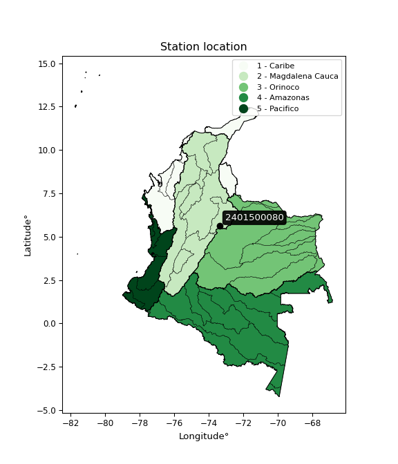

<div align="center">


</div>

# PMP Station (Rain, Pmax24h): 2401500080

Probable Maximum Precipitation (PMP) is the greatest amount of rainfall for a specific duration that is meteorologically possible for a given location, acting as a "worst-case" scenario for extreme storms, crucial for designing safety-critical infrastructure like bridges, river deviations, dams, spillways, and nuclear plants to prevent catastrophic failure. PMP is calculated by hydrologists using meteorological data to determine the upper limit of extreme rainfall, often leading to the Probable Maximum Flood (PMF) for flood control design, and is increasingly being studied for climate change impacts. Probable Maximum Precipitation (PMP) is the theoretical upper limit of rainfall, a deterministic estimate for extreme events, while probability distributions (like GEV, Gumbel) describe the likelihood and frequency of various precipitation amounts, including rare ones, showing how often events occur, with PMP representing the extreme end of these distributions, used for critical infrastructure design to ensure safety against the worst conceivable weather, unlike standard statistical forecasts which cover typical probabilities.

The most common probability distributions in hydrology, used for analyzing floods, rainfall, and streamflow, include the Normal, Log-Normal, Gumbel, Gamma (including Log-Pearson Type III), and Generalized Extreme Value (GEV) distributions, often chosen based on the data´s skewness and whether modeling extremes or general conditions, with Gumbel and GEV popular for extreme events like floods, while the Normal distribution serves as a baseline, though often requiring transformations for skewed hydrological data. These distributions help in designing water infrastructure, managing water resources, and forecasting hydrologic events.

> Hydrological data often isn´t perfectly normal (it´s skewed), so different distributions are needed for different applications, such as: **Flood Frequency Analysis**: Using Gumbel, GEV, or Log-Pearson Type III for predicting extreme flood magnitudes and their return periods, **Rainfall Analysis**: Normal for annual totals, but Log-Normal, Weibull, or GEV for intensity or extreme daily rainfall, **Streamflow Modeling**: Gamma and Log-Normal for maximum flows, GEV for minimum flows, and Kappa for daily flows.

<div align="center">

</img>

</div>


## A. General information


### 1. General running parameters

• app_version: _v20260113_. • runtime: _2026-01-17 18:24:04.630693_. • Python version: _3.14.0_. • SciPy version: _1.16.3_. • Pandas version: _2.3.3_. • NumPy version: _2.3.5_. • Stations dataset (station_dataset_file): _dataset/pmax24h_in/automatic_colombia_2003_2025.csv_. • Stations catalog (station_catalog_file): _dataset/CNE.xls_. • Minimum year to eval til year_max (date_min): _1900_. • Maximum year to eval since year_min (date_max): _2025_. • Creates, save and include plots into reports (create_plot): _False_. • Plot only fit distributions with Δo > Δ (plot_only_fit): _True_. • Plot only simple graphs avoiding multiple CDFs and multiple Extreme values plots (plot_only_simple): _True_. • Eval low extreme values, if False, evaluates high extreme values (low_extreme): _False_. • Eval every SciPy distribution as logarithmic (pdist_logarithmic_on): _True_. • Standard deviation normalized (ddof): _1.0_. • Return periods to eval in years (Tr): _[2, 2.33, 5, 10, 15, 20, 25, 50, 75, 100, 200, 250, 500, 750, 1000]_. • Minimum data sample per station, 0 means any (minimum_sample): _5_. • Z-Score maximum threshold to adjust a value, 0 means disable (zscore_max): _3.5_. • Z-Score minimum threshold to adjust a value, 0 means disable (zscore_min): _-2.5_. • Avoid zeros, e.g. rain = 0 (avoid_zeros): _True_. • Avoid null values (avoid_nans): _True_. 

:file_folder:Table: [dataset.csv](../../dataset/pmax24h_in/automatic_colombia_2003_2025.csv)

> Delta Degrees of Freedom (DDOF): is a parameter used in the formulas for calculating variance and standard deviation. When ddof=0, the divisor is $N$ (the total number of observations) and this is used when your data set is the entire population. When ddof=1, the divisor is $N-1$ and this is used when your data set is a sample drawn from a larger population. Using $N-1$ provides an unbiased estimate of the population variance (known as Bessel´s correction).


### 2. Station info and location

|   id |     CODIGO | NOMBRE                     | CATEGORIA               | TECNOLOGIA                | ESTADO           | FECHA_INSTALACION   |   FECHA_SUSPENSION |   ALTITUD |   LATITUD |   LONGITUD | DEPARTAMENTO   | MUNICIPIO   | AREA_OPERATIVA                              | ENTIDAD                                                     | AREA_HIDROGRAFICA   | ZONA_HIDROGRAFICA   | SUBZONA_HIDROGRAFICA   |   CORRIENTE | Catalogo   |   Version |
|-----:|-----------:|:---------------------------|:------------------------|:--------------------------|:-----------------|:--------------------|-------------------:|----------:|----------:|-----------:|:---------------|:------------|:--------------------------------------------|:------------------------------------------------------------|:--------------------|:--------------------|:-----------------------|------------:|:-----------|----------:|
|    0 | 2401500080 | PANELAS - AUT [2401500080] | Climatológica Principal | Automática con Telemetría | En Mantenimiento | 12/10/2017          |                nan |      3194 |   5.63438 |   -73.3865 | Boyacá         | Motavita    | Area Operativa 06 - Boyacá-Casanare-Vichada | INSTITUTO DE HIDROLOGIA METEOROLOGIA Y ESTUDIOS AMBIENTALES | Magdalena Cauca     | Sogamoso            | Río Suárez             |         nan | CNE_IDEAM  |  20251226 |

<div align="center">

Dynamic map: [:earth_americas:Google](http://maps.google.com/maps?q=5.634380556,-73.386469444) [:earth_americas:OSM](https://www.openstreetmap.org/#map=18/5.634380556/-73.386469444&layers=P) [:earth_americas:Bing](https://www.bing.com/maps?cp=5.634380556~-73.386469444&lvl=18) [:earth_americas:Apple](https://maps.apple.com/frame?center=5.634380556%2C-73.386469444&span=0.003%2C0.006)

</div>


<div align="center">

```geojson
{
  "type": "Feature",
  "geometry": {
    "type": "Point", 
    "coordinates": [-73.386469444, 5.634380556]
  }, 
  "properties": {
    "Name": "2401500080"
  }
}
```

</div>


### 3. Discrete values table and plot

<div align="center">

|               |          0 |           1 |           2 |          3 |           4 |          5 |           6 |
|:--------------|-----------:|------------:|------------:|-----------:|------------:|-----------:|------------:|
| Date          | 2019       | 2020        | 2021        | 2022       | 2023        | 2024       | 2025        |
| Value         |   46.6     |   33.6      |   28.4      |   27.6     |   37.6      |   48.4     |   32.6      |
| Value_initial |   46.6     |   33.6      |   28.4      |   27.6     |   37.6      |   48.4     |   32.6      |
| count         |    7       |    7        |    7        |    7       |    7        |    7       |    7        |
| mean          |   36.4     |   36.4      |   36.4      |   36.4     |   36.4      |   36.4     |   36.4      |
| std           |    8.29859 |    8.29859  |    8.29859  |    8.29859 |    8.29859  |    8.29859 |    8.29859  |
| zscore        |    1.22912 |   -0.337407 |   -0.964019 |   -1.06042 |    0.144603 |    1.44603 |   -0.457909 |


</div>


> The initial value (value_initial) correspond to the initial obtained or null completed value, and value (value) is adjusted only when the initial value is outside the valid range (outlier) definite through the Z-Score value. If Z-Score is active, values out of range or outliers are replaced with the station mean value. A Z-Score (or standard score) measures how many standard deviations a data point is from the mean of a dataset, indicating its relative position; positive scores mean above the mean, negative mean below, and a score of zero is exactly at the mean, allowing for comparison of values from different distributions. It´s calculated using the formula $z=(x–μ)/σ$, where $x$ is the data point, $μ$ is the mean, and $σ$ is the standard deviation, helping identify outliers and understand probability.
>
> <sub>**Note**: In this study, "completing" (filling gaps in) and "extending" (forecasting or lengthening the historical record) rainfall data series are avoided for certain critical analyses because they introduce artificial bias and uncertainty, which can distort the statistics of rare events (extremes), alter day-to-day variability, and compromise the integrity and homogeneity of the original data. Some reasons against Completing/Extending rainfall data are: **Distortion of Extremes and Variability**: The primary issue is that most gap-filling or extension methods rely on averaging or regression with nearby stations, which inherently smooths the data. Rainfall is highly variable in space and time, with a large percentage of zero values and occasional large storms. Infilling methods often underestimate the highest values and overestimate the lowest (zero) values, which severely distorts analyses focused on flood frequency, drought severity, and intensity-duration-frequency (IDF) curves, **Loss of Data Homogeneity**: Infilled or extended data are synthetic estimates, not actual measurements. Combining these estimates with observed data can violate the assumption of data homogeneity, which requires that the data properties do not change over time. Inhomogeneity can lead to incorrect conclusions about long-term trends or changes in climate patterns, **Propagation of Errors**: Errors and biases from the original data (e.g., wind-induced undercatch, instrument errors, site changes) or the data used for imputation can propagate through the analysis, leading to unreliable hydrological models and inaccurate predictions, **Compromised Statistical Integrity**: For statistical analyses, especially those involving the frequency of events, using artificial data can introduce time bias or autocorrelation that doesn´t exist in reality, making it difficult to assess the true probability of events, **Difficulty in Validation**: It is difficult to accurately validate the quality of filled or extended data, especially for past periods where ground-truth measurements are unavailable. The reliability of imputation techniques heavily depends on the density of the surrounding station network and the complexity of the local topography.</sub>


### 4. Active continuous probability distributions from SciPy (80 of 104 available)

A Probability Density Function (PDF) describes the relative likelihood of a continuous random variable falling within a specific range, where the total area under its curve equals 1, and the area over any interval gives the actual probability for that range. Unlike discrete probabilities (like rolling a die), a PDF shows density, not direct probability for a single point (which is zero), with higher points indicating higher likelihood, often visualized as a bell curve for normal distributions.

A log of a probability density function (log-PDF) is simply the logarithm of the PDF´s value, denoted as $log(f(x))$, useful for converting multiplication of probabilities into addition, improving numerical stability with tiny numbers, and connecting to information theory concepts like entropy. Instead of dealing with very small probabilities (e.g., 0.000001), log-PDFs use negative numbers (e.g., $log(0.00001) ≈ -11.51$ that are easier for computers to handle, preventing underflow errors and simplifying complex calculations. In this study, each active probability distribution from SciPy is also evaluated in the $log$ form.

[scipy.stats](https://docs.scipy.org/doc/scipy/reference/stats.html) is a Python´s powerful submodule within the SciPy library for comprehensive statistical analysis, offering over 130 probability distributions (like Normal, Poisson), functions for descriptive stats (mean, variance), hypothesis testing (t-tests, chi-square), random variable generation, and statistical tests, making it essential for data science, modeling, and research. It provides tools to explore, model, and draw conclusions from data efficiently, working seamlessly with NumPy.

<div align="center">

|   id | p_dist           |   n_parameter | fit_method   | label                                                                       | active   | ref                                                                                                      |
|-----:|:-----------------|--------------:|:-------------|:----------------------------------------------------------------------------|:---------|:---------------------------------------------------------------------------------------------------------|
|    0 | alpha            |             3 | MLE          | Alpha                                                                       | True     | [:mortar_board:](https://docs.scipy.org/doc/scipy/reference/generated/scipy.stats.alpha.html)            |
|    1 | anglit           |             2 | MM           | Anglit                                                                      | True     | [:mortar_board:](https://docs.scipy.org/doc/scipy/reference/generated/scipy.stats.anglit.html)           |
|    2 | arcsine          |             2 | MM           | Arcsine                                                                     | True     | [:mortar_board:](https://docs.scipy.org/doc/scipy/reference/generated/scipy.stats.arcsine.html)          |
|    3 | argus            |             3 | MLE          | Argus                                                                       | True     | [:mortar_board:](https://docs.scipy.org/doc/scipy/reference/generated/scipy.stats.argus.html)            |
|    4 | beta             |             4 | MLE          | Beta                                                                        | True     | [:mortar_board:](https://docs.scipy.org/doc/scipy/reference/generated/scipy.stats.beta.html)             |
|    5 | betaprime        |             4 | MLE          | Beta prime                                                                  | True     | [:mortar_board:](https://docs.scipy.org/doc/scipy/reference/generated/scipy.stats.betaprime.html)        |
|    6 | bradford         |             3 | MLE          | Bradford                                                                    | True     | [:mortar_board:](https://docs.scipy.org/doc/scipy/reference/generated/scipy.stats.bradford.html)         |
|    7 | burr             |             4 | MLE          | Burr (Type III)                                                             | True     | [:mortar_board:](https://docs.scipy.org/doc/scipy/reference/generated/scipy.stats.burr.html)             |
|    8 | burr12           |             4 | MLE          | Burr (Type III) 12                                                          | True     | [:mortar_board:](https://docs.scipy.org/doc/scipy/reference/generated/scipy.stats.burr12.html)           |
|    9 | cosine           |             2 | MLE          | Cosine                                                                      | True     | [:mortar_board:](https://docs.scipy.org/doc/scipy/reference/generated/scipy.stats.cosine.html)           |
|   10 | crystalball      |             4 | MLE          | Crystalball                                                                 | True     | [:mortar_board:](https://docs.scipy.org/doc/scipy/reference/generated/scipy.stats.crystalball.html)      |
|   11 | dgamma           |             3 | MLE          | Double gamma                                                                | True     | [:mortar_board:](https://docs.scipy.org/doc/scipy/reference/generated/scipy.stats.dgamma.html)           |
|   12 | dweibull         |             3 | MLE          | Double Weibull                                                              | True     | [:mortar_board:](https://docs.scipy.org/doc/scipy/reference/generated/scipy.stats.dweibull.html)         |
|   13 | erlang           |             3 | MLE          | Erlang                                                                      | True     | [:mortar_board:](https://docs.scipy.org/doc/scipy/reference/generated/scipy.stats.erlang.html)           |
|   14 | exponnorm        |             3 | MLE          | Exponentially modified Normal                                               | True     | [:mortar_board:](https://docs.scipy.org/doc/scipy/reference/generated/scipy.stats.exponnorm.html)        |
|   15 | exponpow         |             3 | MLE          | Exponential power                                                           | True     | [:mortar_board:](https://docs.scipy.org/doc/scipy/reference/generated/scipy.stats.exponpow.html)         |
|   16 | exponweib        |             4 | MLE          | Exponentiated Weibull                                                       | True     | [:mortar_board:](https://docs.scipy.org/doc/scipy/reference/generated/scipy.stats.exponweib.html)        |
|   17 | f                |             4 | MLE          | F                                                                           | True     | [:mortar_board:](https://docs.scipy.org/doc/scipy/reference/generated/scipy.stats.f.html)                |
|   18 | fatiguelife      |             3 | MLE          | Fatigue-life (Birnbaum-Saunders)                                            | True     | [:mortar_board:](https://docs.scipy.org/doc/scipy/reference/generated/scipy.stats.fatiguelife.html)      |
|   19 | foldnorm         |             3 | MM           | Fold Normal                                                                 | True     | [:mortar_board:](https://docs.scipy.org/doc/scipy/reference/generated/scipy.stats.foldnorm.html)         |
|   20 | gamma            |             3 | MLE          | Gamma                                                                       | True     | [:mortar_board:](https://docs.scipy.org/doc/scipy/reference/generated/scipy.stats.gamma.html)            |
|   21 | gausshyper       |             6 | MLE          | Gauss hypergeometric                                                        | True     | [:mortar_board:](https://docs.scipy.org/doc/scipy/reference/generated/scipy.stats.gausshyper.html)       |
|   22 | genexpon         |             5 | MLE          | Generalized exponential                                                     | True     | [:mortar_board:](https://docs.scipy.org/doc/scipy/reference/generated/scipy.stats.genexpon.html)         |
|   23 | genextreme       |             3 | MLE          | Generalized exponential                                                     | True     | [:mortar_board:](https://docs.scipy.org/doc/scipy/reference/generated/scipy.stats.genextreme.html)       |
|   24 | gengamma         |             4 | MLE          | Generalized gamma                                                           | True     | [:mortar_board:](https://docs.scipy.org/doc/scipy/reference/generated/scipy.stats.gengamma.html)         |
|   25 | genhalflogistic  |             3 | MLE          | Generalized half-logistic                                                   | True     | [:mortar_board:](https://docs.scipy.org/doc/scipy/reference/generated/scipy.stats.genhalflogistic.html)  |
|   26 | genlogistic      |             3 | MLE          | Generalized logistic                                                        | True     | [:mortar_board:](https://docs.scipy.org/doc/scipy/reference/generated/scipy.stats.genlogistic.html)      |
|   27 | gennorm          |             3 | MLE          | Generalized Normal                                                          | True     | [:mortar_board:](https://docs.scipy.org/doc/scipy/reference/generated/scipy.stats.gennorm.html)          |
|   28 | genpareto        |             3 | MLE          | Generalized Pareto                                                          | True     | [:mortar_board:](https://docs.scipy.org/doc/scipy/reference/generated/scipy.stats.genpareto.html)        |
|   29 | gompertz         |             3 | MLE          | Gompertz (or truncated Gumbel)                                              | True     | [:mortar_board:](https://docs.scipy.org/doc/scipy/reference/generated/scipy.stats.gompertz.html)         |
|   30 | gumbel_l         |             2 | MM           | Gumbel Left Skew                                                            | True     | [:mortar_board:](https://docs.scipy.org/doc/scipy/reference/generated/scipy.stats.gumbel_l.html)         |
|   31 | gumbel_r         |             2 | MM           | Gumbel Right Skew                                                           | True     | [:mortar_board:](https://docs.scipy.org/doc/scipy/reference/generated/scipy.stats.gumbel_r.html)         |
|   32 | halfgennorm      |             3 | MLE          | Upper half of a generalized normal                                          | True     | [:mortar_board:](https://docs.scipy.org/doc/scipy/reference/generated/scipy.stats.halfgennorm.html)      |
|   33 | halflogistic     |             2 | MM           | Half-logistic                                                               | True     | [:mortar_board:](https://docs.scipy.org/doc/scipy/reference/generated/scipy.stats.halflogistic.html)     |
|   34 | halfnorm         |             2 | MM           | Half Normal                                                                 | True     | [:mortar_board:](https://docs.scipy.org/doc/scipy/reference/generated/scipy.stats.halfnorm.html)         |
|   35 | hypsecant        |             2 | MM           | hyperbolic secant                                                           | True     | [:mortar_board:](https://docs.scipy.org/doc/scipy/reference/generated/scipy.stats.hypsecant.html)        |
|   36 | invgamma         |             3 | MLE          | Inverted gamma                                                              | True     | [:mortar_board:](https://docs.scipy.org/doc/scipy/reference/generated/scipy.stats.invgamma.html)         |
|   37 | invgauss         |             3 | MLE          | Inverse Gaussian                                                            | True     | [:mortar_board:](https://docs.scipy.org/doc/scipy/reference/generated/scipy.stats.invgauss.html)         |
|   38 | invweibull       |             3 | MLE          | Inverted Weibull                                                            | True     | [:mortar_board:](https://docs.scipy.org/doc/scipy/reference/generated/scipy.stats.invweibull.html)       |
|   39 | johnsonsb        |             4 | MLE          | Johnson SB                                                                  | True     | [:mortar_board:](https://docs.scipy.org/doc/scipy/reference/generated/scipy.stats.johnsonsb.html)        |
|   40 | johnsonsu        |             4 | MLE          | Johnson Su                                                                  | True     | [:mortar_board:](https://docs.scipy.org/doc/scipy/reference/generated/scipy.stats.johnsonsu.html)        |
|   41 | kappa3           |             3 | MLE          | Kappa 3                                                                     | True     | [:mortar_board:](https://docs.scipy.org/doc/scipy/reference/generated/scipy.stats.kappa3.html)           |
|   42 | kappa4           |             4 | MLE          | Kappa 4                                                                     | True     | [:mortar_board:](https://docs.scipy.org/doc/scipy/reference/generated/scipy.stats.kappa4.html)           |
|   43 | ksone            |             3 | MLE          | Kolmogorov-Smirnov one-sided test statistic distribution                    | True     | [:mortar_board:](https://docs.scipy.org/doc/scipy/reference/generated/scipy.stats.ksone.html)            |
|   44 | kstwobign        |             2 | MLE          | Limiting distribution of scaled Kolmogorov-Smirnov two-sided test statistic | True     | [:mortar_board:](https://docs.scipy.org/doc/scipy/reference/generated/scipy.stats.kstwobign.html)        |
|   45 | laplace          |             2 | MM           | Laplace                                                                     | True     | [:mortar_board:](https://docs.scipy.org/doc/scipy/reference/generated/scipy.stats.laplace.html)          |
|   46 | levy_l           |             2 | MLE          | Left-skewed Levy                                                            | True     | [:mortar_board:](https://docs.scipy.org/doc/scipy/reference/generated/scipy.stats.levy_l.html)           |
|   47 | loggamma         |             3 | MLE          | Log gamma                                                                   | True     | [:mortar_board:](https://docs.scipy.org/doc/scipy/reference/generated/scipy.stats.loggamma.html)         |
|   48 | logistic         |             2 | MM           | Logistic (or Sech-squared)                                                  | True     | [:mortar_board:](https://docs.scipy.org/doc/scipy/reference/generated/scipy.stats.logistic.html)         |
|   49 | loglaplace       |             3 | MLE          | Log-Laplace                                                                 | True     | [:mortar_board:](https://docs.scipy.org/doc/scipy/reference/generated/scipy.stats.loglaplace.html)       |
|   50 | lomax            |             3 | MLE          | Lomax (Pareto of the second kind)                                           | True     | [:mortar_board:](https://docs.scipy.org/doc/scipy/reference/generated/scipy.stats.lomax.html)            |
|   51 | maxwell          |             2 | MM           | Maxwell                                                                     | True     | [:mortar_board:](https://docs.scipy.org/doc/scipy/reference/generated/scipy.stats.maxwell.html)          |
|   52 | mielke           |             4 | MLE          | Mielke Beta-Kappa / Dagum                                                   | True     | [:mortar_board:](https://docs.scipy.org/doc/scipy/reference/generated/scipy.stats.mielke.html)           |
|   53 | moyal            |             2 | MM           | Moyal                                                                       | True     | [:mortar_board:](https://docs.scipy.org/doc/scipy/reference/generated/scipy.stats.moyal.html)            |
|   54 | nakagami         |             3 | MLE          | Nakagami                                                                    | True     | [:mortar_board:](https://docs.scipy.org/doc/scipy/reference/generated/scipy.stats.nakagami.html)         |
|   55 | ncf              |             5 | MLE          | Non-central F distribution                                                  | True     | [:mortar_board:](https://docs.scipy.org/doc/scipy/reference/generated/scipy.stats.ncf.html)              |
|   56 | nct              |             4 | MLE          | Non-central Student’s t                                                     | True     | [:mortar_board:](https://docs.scipy.org/doc/scipy/reference/generated/scipy.stats.nct.html)              |
|   57 | norm             |             2 | MM           | Normal                                                                      | True     | [:mortar_board:](https://docs.scipy.org/doc/scipy/reference/generated/scipy.stats.norm.html)             |
|   58 | pearson3         |             3 | MM           | Pearson type III                                                            | True     | [:mortar_board:](https://docs.scipy.org/doc/scipy/reference/generated/scipy.stats.pearson3.html)         |
|   59 | powerlaw         |             3 | MLE          | Power-function                                                              | True     | [:mortar_board:](https://docs.scipy.org/doc/scipy/reference/generated/scipy.stats.powerlaw.html)         |
|   60 | rayleigh         |             2 | MM           | Rayleigh                                                                    | True     | [:mortar_board:](https://docs.scipy.org/doc/scipy/reference/generated/scipy.stats.rayleigh.html)         |
|   61 | rdist            |             3 | MLE          | R-distributed (symmetric beta)                                              | True     | [:mortar_board:](https://docs.scipy.org/doc/scipy/reference/generated/scipy.stats.rdist.html)            |
|   62 | rice             |             3 | MLE          | Rice                                                                        | True     | [:mortar_board:](https://docs.scipy.org/doc/scipy/reference/generated/scipy.stats.rice.html)             |
|   63 | semicircular     |             2 | MM           | Semicircular                                                                | True     | [:mortar_board:](https://docs.scipy.org/doc/scipy/reference/generated/scipy.stats.semicircular.html)     |
|   64 | skewnorm         |             3 | MLE          | Skew normal                                                                 | True     | [:mortar_board:](https://docs.scipy.org/doc/scipy/reference/generated/scipy.stats.skewnorm.html)         |
|   65 | t                |             3 | MLE          | Student’s t                                                                 | True     | [:mortar_board:](https://docs.scipy.org/doc/scipy/reference/generated/scipy.stats.t.html)                |
|   66 | trapezoid        |             4 | MLE          | Trapezoid                                                                   | True     | [:mortar_board:](https://docs.scipy.org/doc/scipy/reference/generated/scipy.stats.trapezoid.html)        |
|   67 | triang           |             3 | MLE          | Triangular                                                                  | True     | [:mortar_board:](https://docs.scipy.org/doc/scipy/reference/generated/scipy.stats.triang.html)           |
|   68 | truncexpon       |             3 | MLE          | Truncated exponential                                                       | True     | [:mortar_board:](https://docs.scipy.org/doc/scipy/reference/generated/scipy.stats.truncexpon.html)       |
|   69 | truncnorm        |             4 | MLE          | Truncated normal                                                            | True     | [:mortar_board:](https://docs.scipy.org/doc/scipy/reference/generated/scipy.stats.truncnorm.html)        |
|   70 | truncpareto      |             4 | MLE          | Upper truncated Pareto                                                      | True     | [:mortar_board:](https://docs.scipy.org/doc/scipy/reference/generated/scipy.stats.truncpareto.html)      |
|   71 | truncweibull_min |             5 | MLE          | Doubly truncated Weibull minimum                                            | True     | [:mortar_board:](https://docs.scipy.org/doc/scipy/reference/generated/scipy.stats.truncweibull_min.html) |
|   72 | tukeylambda      |             3 | MLE          | Tukey-Lamdba                                                                | True     | [:mortar_board:](https://docs.scipy.org/doc/scipy/reference/generated/scipy.stats.tukeylambda.html)      |
|   73 | uniform          |             2 | MLE          | Uniform                                                                     | True     | [:mortar_board:](https://docs.scipy.org/doc/scipy/reference/generated/scipy.stats.uniform.html)          |
|   74 | vonmises         |             3 | MLE          | Von Mises                                                                   | True     | [:mortar_board:](https://docs.scipy.org/doc/scipy/reference/generated/scipy.stats.vonmises.html)         |
|   75 | vonmises_line    |             3 | MLE          | Von Mises line                                                              | True     | [:mortar_board:](https://docs.scipy.org/doc/scipy/reference/generated/scipy.stats.vonmises_line.html)    |
|   76 | wald             |             2 | MM           | Wald                                                                        | True     | [:mortar_board:](https://docs.scipy.org/doc/scipy/reference/generated/scipy.stats.wald.html)             |
|   77 | weibull_max      |             3 | MLE          | Weibull maximum                                                             | True     | [:mortar_board:](https://docs.scipy.org/doc/scipy/reference/generated/scipy.stats.weibull_max.html)      |
|   78 | weibull_min      |             3 | MLE          | Weibull minimum                                                             | True     | [:mortar_board:](https://docs.scipy.org/doc/scipy/reference/generated/scipy.stats.weibull_min.html)      |
|   79 | wrapcauchy       |             3 | MLE          | Wrapped  Cauchy                                                             | True     | [:mortar_board:](https://docs.scipy.org/doc/scipy/reference/generated/scipy.stats.wrapcauchy.html)       |

</div>

> **n_parameter:** # arguments & localization & scale.
>
> **Fit methods:** (MLE) maximum likelihood, (MM) L-moments.
>
>**Inactive** (With the only purpose of prevent loops, zero divisions, infinite values, over high estimated values or horizontal trending for recurrence intervals estimations, the follow distributions were disabled.)**:** lognorm, norminvgauss, powernorm, powerlognorm, cauchy, halfcauchy, foldcauchy, skewcauchy, chi2, expon, fisk, genhyperbolic, geninvgauss, gibrat, kstwo, laplace_asymmetric, levy, levy_stable, ncx2, pareto, rel_breitwigner, recipinvgauss, studentized_range, loguniform, 


## B. Probability (PDF) vs. Empirical (EDF) distributions functions

A continuous probability distribution (CPD) describes probabilities for variables that can take any value within a range (like rain any time), unlike discrete variables with specific outcomes (like temperature). It uses a Probability Density Function (PDF), a curve where the total area under it equals 1, and the probability of the variable falling within an interval (a to b) is found by calculating the area under the curve between those points. A key feature is that the probability of hitting any single exact value is zero, so probabilities are always expressed for ranges, e.g., $P(a ≤ X ≤ b)$.

<div align="center">

Distributions parameters from station values
|     |    station | p_dist              |   n |             loc |            scale | shape                  | shape1                | shape2                | shape3             |
|----:|-----------:|:--------------------|----:|----------------:|-----------------:|:-----------------------|:----------------------|:----------------------|:-------------------|
|   0 | 2401500080 | alpha               |   7 |     9.14075     |     95.8483      | 3.7913636613819426     |                       |                       |                    |
|   1 | 2401500080 | anglit              |   7 |    36.4         |     22.4759      |                        |                       |                       |                    |
|   2 | 2401500080 | arcsine             |   7 |    25.5346      |     21.7309      |                        |                       |                       |                    |
|   3 | 2401500080 | argus               |   7 |    20.4092      |     29.482       | 7.521729602142572e-06  |                       |                       |                    |
|   4 | 2401500080 | beta                |   7 |    27.6         |     21.144       | 0.3681301073392138     | 0.5925887075803369    |                       |                    |
|   5 | 2401500080 | betaprime           |   7 |    -1.11        |      2.53968     | 391.0692204388663      | 27.487021417242985    |                       |                    |
|   6 | 2401500080 | bradford            |   7 |    27.6         |     20.8         | 8.832735392833737      |                       |                       |                    |
|   7 | 2401500080 | burr                |   7 |    -0.68733     |     10.9893      | 6.056955101276165      | 776.7317056601061     |                       |                    |
|   8 | 2401500080 | burr12              |   7 |     4.14158     |     23.3779      | 1112.067393938095      | 0.003053050016490968  |                       |                    |
|   9 | 2401500080 | cosine              |   7 |    36.9035      |      6.18262     |                        |                       |                       |                    |
|  10 | 2401500080 | crystalball         |   7 |    36.4         |      7.68301     | 3745.779385923237      | 869.4579761440141     |                       |                    |
|  11 | 2401500080 | dgamma              |   7 |    35.8406      |      2.89822     | 2.279273981160735      |                       |                       |                    |
|  12 | 2401500080 | dweibull            |   7 |    36.166       |      7.46927     | 1.7553102670755623     |                       |                       |                    |
|  13 | 2401500080 | erlang              |   7 |    27.6         |     10.1211      | 0.39580592370629064    |                       |                       |                    |
|  14 | 2401500080 | exponnorm           |   7 |    27.5873      |      0.00380092  | 2331.793099302391      |                       |                       |                    |
|  15 | 2401500080 | exponpow            |   7 |    27.6         |     18.6121      | 0.8579849885606214     |                       |                       |                    |
|  16 | 2401500080 | exponweib           |   7 |    27.6         |      1.40564     | 1.0932253793074693     | 0.35813435160168183   |                       |                    |
|  17 | 2401500080 | f                   |   7 |    23.1276      |      9.82201     | 26.48844472138329      | 6.677875871314036     |                       |                    |
|  18 | 2401500080 | fatiguelife         |   7 |    27.6         |      1.25674e-05 | 759.5474936086559      |                       |                       |                    |
|  19 | 2401500080 | foldnorm            |   7 |    23.8207      |      8.71432     | 1.3642041138875975     |                       |                       |                    |
|  20 | 2401500080 | gamma               |   7 |    27.6         |      7.46273     | 0.6605284017456055     |                       |                       |                    |
|  21 | 2401500080 | gausshyper          |   7 |    27.521       |     20.879       | 1.0551380112020199     | 0.9571016512212556    | 1.0700541895308298    | 0.9905729268023518 |
|  22 | 2401500080 | genexpon            |   7 |    27.6         |     18.3458      | 1.9763781150675357     | 0.23320999792273417   | 1.376315834982525     |                    |
|  23 | 2401500080 | genextreme          |   7 |    31.9246      |      5.13325     | -0.2899616896471258    |                       |                       |                    |
|  24 | 2401500080 | gengamma            |   7 |    27.6         |      1.39758     | 1.0985293067262059     | 0.3980064847382161    |                       |                    |
|  25 | 2401500080 | genhalflogistic     |   7 |    26.2188      |     23.928       | 1.0787511447365885     |                       |                       |                    |
|  26 | 2401500080 | genlogistic         |   7 |    -9.19836     |      5.95099     | 1159.7870456036899     |                       |                       |                    |
|  27 | 2401500080 | gennorm             |   7 |    33.6         |      6.225       | 1.0008261912701573     |                       |                       |                    |
|  28 | 2401500080 | genpareto           |   7 |    -0.402504    |     96.8475      | -1.984479096762739     |                       |                       |                    |
|  29 | 2401500080 | gompertz            |   7 |    27.6         |     33.3646      | 2.9659956488303107     |                       |                       |                    |
|  30 | 2401500080 | gumbel_l            |   7 |    39.8578      |      5.99041     |                        |                       |                       |                    |
|  31 | 2401500080 | gumbel_r            |   7 |    32.9422      |      5.99041     |                        |                       |                       |                    |
|  32 | 2401500080 | halfgennorm         |   7 |    27.6         |      1.28915     | 0.4714435399111856     |                       |                       |                    |
|  33 | 2401500080 | halflogistic        |   7 |    27.2939      |      6.5687      |                        |                       |                       |                    |
|  34 | 2401500080 | halfnorm            |   7 |    26.2307      |     12.7453      |                        |                       |                       |                    |
|  35 | 2401500080 | hypsecant           |   7 |    36.4         |      4.89115     |                        |                       |                       |                    |
|  36 | 2401500080 | invgamma            |   7 |    21.8046      |     38.8564      | 3.566596757715832      |                       |                       |                    |
|  37 | 2401500080 | invgauss            |   7 |    25.5013      |     11.3403      | 0.9610518543671809     |                       |                       |                    |
|  38 | 2401500080 | invweibull          |   7 |    14.2204      |     17.7042      | 3.44889801015307       |                       |                       |                    |
|  39 | 2401500080 | johnsonsb           |   7 |    27.6         |     28.1072      | 0.7598822591006226     | 0.10835306085828057   |                       |                    |
|  40 | 2401500080 | johnsonsu           |   7 |     1.72255e+08 |      2.25465e+08 | 26028367.21008444      | 36955895.57083063     |                       |                    |
|  41 | 2401500080 | kappa3              |   7 |    27.6         |     20.7989      | 38471.903271706724     |                       |                       |                    |
|  42 | 2401500080 | kappa4              |   7 |    24.5536      |     26.1589      | 1.1326929471084584     | 1.096840332981572     |                       |                    |
|  43 | 2401500080 | ksone               |   7 |    23.0926      |     26.6147      | 1.0                    |                       |                       |                    |
|  44 | 2401500080 | kstwobign           |   7 |    12.1531      |     27.7663      |                        |                       |                       |                    |
|  45 | 2401500080 | laplace             |   7 |    36.4         |      5.43271     |                        |                       |                       |                    |
|  46 | 2401500080 | levy_l              |   7 |    49.3401      |      4.04418     |                        |                       |                       |                    |
|  47 | 2401500080 | loggamma            |   7 | -1773.38        |    258.136       | 1109.112575848695      |                       |                       |                    |
|  48 | 2401500080 | logistic            |   7 |    36.4         |      4.23586     |                        |                       |                       |                    |
|  49 | 2401500080 | loglaplace          |   7 |    -0.110561    |     33.7106      | 5.8530727802943545     |                       |                       |                    |
|  50 | 2401500080 | lomax               |   7 |    27.6         |     68.5519      | 8.462910890044174      |                       |                       |                    |
|  51 | 2401500080 | maxwell             |   7 |    18.1945      |     11.4086      |                        |                       |                       |                    |
|  52 | 2401500080 | mielke              |   7 |    -1.62354     |     13.5128      | 1911.3653054209035     | 6.222559513909754     |                       |                    |
|  53 | 2401500080 | moyal               |   7 |    32.0064      |      3.45857     |                        |                       |                       |                    |
|  54 | 2401500080 | nakagami            |   7 |    27.6         |     16.3058      | 0.3145319155166333     |                       |                       |                    |
|  55 | 2401500080 | ncf                 |   7 |     0.0982247   |     17.4516      | 2958.1905496341897     | 50.674271570397536    | 2925.2937049540196    |                    |
|  56 | 2401500080 | nct                 |   7 |    -0.466685    |      0.868591    | 13.317810139872899     | 40.00437567922809     |                       |                    |
|  57 | 2401500080 | norm                |   7 |    36.4         |      7.68301     |                        |                       |                       |                    |
|  58 | 2401500080 | pearson3            |   7 |    36.4         |      7.683       | 0.4790143225598894     |                       |                       |                    |
|  59 | 2401500080 | powerlaw            |   7 |    27.6         |     20.8         | 0.16258008204198984    |                       |                       |                    |
|  60 | 2401500080 | rayleigh            |   7 |    21.702       |     11.7273      |                        |                       |                       |                    |
|  61 | 2401500080 | rdist               |   7 |    32.6023      |      5.00226     | 1.226525007691031      |                       |                       |                    |
|  62 | 2401500080 | rice                |   7 |    23.3978      |     10.6791      | 0.0015915662467796006  |                       |                       |                    |
|  63 | 2401500080 | semicircular        |   7 |    36.4         |     15.366       |                        |                       |                       |                    |
|  64 | 2401500080 | skewnorm            |   7 |    27.6         |     11.6828      | 37402325.23083073      |                       |                       |                    |
|  65 | 2401500080 | t                   |   7 |    36.4         |      7.68299     | 321621885.8573327      |                       |                       |                    |
|  66 | 2401500080 | trapezoid           |   7 |    25.52        |     24.96        | 1.0                    | 1.0                   |                       |                    |
|  67 | 2401500080 | triang              |   7 |    18.4885      |     29.9115      | 0.9999998999798856     |                       |                       |                    |
|  68 | 2401500080 | truncexpon          |   7 |    27.5998      |     24.2866      | 0.8564448953125816     |                       |                       |                    |
|  69 | 2401500080 | truncnorm           |   7 |    17.2507      |     14.9924      | 0.6903034121961908     | 543.1626783260197     |                       |                    |
|  70 | 2401500080 | truncpareto         |   7 |    25.2451      |      2.35487     | 4.3255015791806375e-09 | 9.832757524036172     |                       |                    |
|  71 | 2401500080 | truncweibull_min    |   7 |    27.6         |     25.9689      | 0.3511313771599849     | 8.033694840213714e-15 | 0.9650425644871605    |                    |
|  72 | 2401500080 | tukeylambda         |   7 |    38.0001      |     11.792       | 1.133842774259191      |                       |                       |                    |
|  73 | 2401500080 | uniform             |   7 |    27.6         |     20.8         |                        |                       |                       |                    |
|  74 | 2401500080 | vonmises            |   7 |     2.47228     |      1           | 0.844301259903515      |                       |                       |                    |
|  75 | 2401500080 | vonmises_line       |   7 |    38           |      3.31045     | 0.016349634182880296   |                       |                       |                    |
|  76 | 2401500080 | wald                |   7 |    28.717       |      7.68302     |                        |                       |                       |                    |
|  77 | 2401500080 | weibull_max         |   7 |    48.4         |      1.31671     | 0.36227883087982793    |                       |                       |                    |
|  78 | 2401500080 | weibull_min         |   7 |    27.6         |      4.41256     | 0.5815073843171434     |                       |                       |                    |
|  79 | 2401500080 | wrapcauchy          |   7 |    27.6         |      3.31042     | 0.525                  |                       |                       |                    |
|  80 | 2401500080 | logalpha            |   7 |     1.20298     |     27.7762      | 11.798870330297639     |                       |                       |                    |
|  81 | 2401500080 | loganglit           |   7 |     3.57302     |      0.602337    |                        |                       |                       |                    |
|  82 | 2401500080 | logarcsine          |   7 |     3.28187     |      0.5823      |                        |                       |                       |                    |
|  83 | 2401500080 | logargus            |   7 |     3.14128     |      0.780185    | 0.00010185524604596735 |                       |                       |                    |
|  84 | 2401500080 | logbeta             |   7 |     3.31782     |      0.598013    | 0.48782337108409995    | 0.7121504574331416    |                       |                    |
|  85 | 2401500080 | logbetaprime        |   7 |     1.98885     |     15.2759      | 66.49780866459298      | 643.5707719425861     |                       |                    |
|  86 | 2401500080 | logbradford         |   7 |     3.31782     |      0.561686    | 1.0510413086167718     |                       |                       |                    |
|  87 | 2401500080 | logburr             |   7 |     0.0889777   |      2.47117     | 20.538220338984253     | 624.9376015807879     |                       |                    |
|  88 | 2401500080 | logburr12           |   7 |    -0.569964    |      3.88249     | 291.352386926543       | 0.055965754514076455  |                       |                    |
|  89 | 2401500080 | logcosine           |   7 |     3.58178     |      0.165417    |                        |                       |                       |                    |
|  90 | 2401500080 | logcrystalball      |   7 |     3.57302     |      0.205899    | 31.48330866291001      | 2.1835124591452724    |                       |                    |
|  91 | 2401500080 | logdgamma           |   7 |     3.51453     |      0.484426    | 0.2708622809933568     |                       |                       |                    |
|  92 | 2401500080 | logdweibull         |   7 |     3.5817      |      0.203921    | 1.8945687173295565     |                       |                       |                    |
|  93 | 2401500080 | logerlang           |   7 |     3.31782     |      0.205526    | 0.8134726452103915     |                       |                       |                    |
|  94 | 2401500080 | logexponnorm        |   7 |     3.31754     |      8.02284e-05 | 3185.8125148307936     |                       |                       |                    |
|  95 | 2401500080 | logexponpow         |   7 |     3.31782     |      0.567632    | 0.45865673368064763    |                       |                       |                    |
|  96 | 2401500080 | logexponweib        |   7 |     3.31782     |      0.378652    | 0.4433216347349805     | 1.5752213249519713    |                       |                    |
|  97 | 2401500080 | logf                |   7 |     3.31782     |      0.240445    | 1.0897600993269254     | 887.7957339667761     |                       |                    |
|  98 | 2401500080 | logfatiguelife      |   7 |     3.29078     |      0.161757    | 1.1780938625458761     |                       |                       |                    |
|  99 | 2401500080 | logfoldnorm         |   7 |     3.21456     |      0.225676    | 1.5342242296421995     |                       |                       |                    |
| 100 | 2401500080 | loggamma            |   7 |     3.31782     |      0.371065    | 0.46549843074058217    |                       |                       |                    |
| 101 | 2401500080 | loggausshyper       |   7 |     3.30696     |      0.572542    | 1.010011076745251      | 0.833148012596086     | 1.0698196141245213    | 1.1952501146354064 |
| 102 | 2401500080 | loggenexpon         |   7 |     3.31782     |     24.1686      | 71.46591410864056      | 373.87021981940507    | 7.033276867059225     |                    |
| 103 | 2401500080 | loggenextreme       |   7 |     3.47807     |      0.171904    | 0.04292885524029802    |                       |                       |                    |
| 104 | 2401500080 | loggengamma         |   7 |     3.31782     |      1.0295      | 0.24493911796096524    | 1.4644321846649322    |                       |                    |
| 105 | 2401500080 | loggenhalflogistic  |   7 |     3.2917      |      0.63715     | 1.0839530239979358     |                       |                       |                    |
| 106 | 2401500080 | loggenlogistic      |   7 |     2.38141     |      0.168179    | 662.0072373365706      |                       |                       |                    |
| 107 | 2401500080 | loggennorm          |   7 |     3.59866     |      0.280843    | 4374005.699767604      |                       |                       |                    |
| 108 | 2401500080 | loggenpareto        |   7 |    -0.000580804 |     12.9851      | -3.346610355637949     |                       |                       |                    |
| 109 | 2401500080 | loggompertz         |   7 |     3.31782     |      0.556555    | 1.4360343768127404     |                       |                       |                    |
| 110 | 2401500080 | loggumbel_l         |   7 |     3.66569     |      0.160539    |                        |                       |                       |                    |
| 111 | 2401500080 | loggumbel_r         |   7 |     3.48036     |      0.160539    |                        |                       |                       |                    |
| 112 | 2401500080 | loghalfgennorm      |   7 |     3.31782     |      0.403582    | 1.5817290335514604     |                       |                       |                    |
| 113 | 2401500080 | loghalflogistic     |   7 |     3.32902     |      0.176008    |                        |                       |                       |                    |
| 114 | 2401500080 | loghalfnorm         |   7 |     3.30049     |      0.341565    |                        |                       |                       |                    |
| 115 | 2401500080 | loghypsecant        |   7 |     3.57302     |      0.131079    |                        |                       |                       |                    |
| 116 | 2401500080 | loginvgamma         |   7 |    -2.97977     |   6704.15        | 1024.1348995795893     |                       |                       |                    |
| 117 | 2401500080 | loginvgauss         |   7 |     3.20547     |      0.7607      | 0.4831888009717188     |                       |                       |                    |
| 118 | 2401500080 | loginvweibull       |   7 |    -2.71748e+06 |      2.71748e+06 | 16133710.418038584     |                       |                       |                    |
| 119 | 2401500080 | logjohnsonsb        |   7 |     3.27152     |      0.607977    | -0.4883597277909025    | 0.11921179724616113   |                       |                    |
| 120 | 2401500080 | logjohnsonsu        |   7 |     4.56662e+06 | 383689           | 65538014.58808842      | 20663994.411964037    |                       |                    |
| 121 | 2401500080 | logkappa3           |   7 |     3.31344     |      2.10501     | 39.842801909276005     |                       |                       |                    |
| 122 | 2401500080 | logkappa4           |   7 |     3.29817     |      0.625248    | 1.0324780366303519     | 1.0755501955731859    |                       |                    |
| 123 | 2401500080 | logksone            |   7 |     3.21639     |      0.713255    | 1.0                    |                       |                       |                    |
| 124 | 2401500080 | logkstwobign        |   7 |     2.89321     |      0.77718     |                        |                       |                       |                    |
| 125 | 2401500080 | loglaplace          |   7 |     3.57302     |      0.145593    |                        |                       |                       |                    |
| 126 | 2401500080 | loglevy_l           |   7 |     3.90175     |      0.0950078   |                        |                       |                       |                    |
| 127 | 2401500080 | logloggamma         |   7 |   -55.0059      |      8.00791     | 1503.2749382080056     |                       |                       |                    |
| 128 | 2401500080 | loglogistic         |   7 |     3.57302     |      0.113518    |                        |                       |                       |                    |
| 129 | 2401500080 | logloglaplace       |   7 |    -0.215788    |      3.73031     | 22.119087208158774     |                       |                       |                    |
| 130 | 2401500080 | loglomax            |   7 |     3.31782     |      6.7663      | 27.138843287703885     |                       |                       |                    |
| 131 | 2401500080 | logmaxwell          |   7 |     3.08513     |      0.305742    |                        |                       |                       |                    |
| 132 | 2401500080 | logmielke           |   7 |   -30.786       |     33.4951      | 21179.077361602547     | 205.30273741185817    |                       |                    |
| 133 | 2401500080 | logmoyal            |   7 |     3.45527     |      0.0926871   |                        |                       |                       |                    |
| 134 | 2401500080 | lognakagami         |   7 |     3.31782     |      0.356005    | 0.1399634171022472     |                       |                       |                    |
| 135 | 2401500080 | logncf              |   7 |    -3.55419     |      7.1244      | 459.1209643211672      | 506.831369391067      | 3.796929030981853e-06 |                    |
| 136 | 2401500080 | lognct              |   7 |     2.62164     |      0.0112891   | 11.495132532041419     | 78.48278755445398     |                       |                    |
| 137 | 2401500080 | lognorm             |   7 |     3.57302     |      0.205899    |                        |                       |                       |                    |
| 138 | 2401500080 | logpearson3         |   7 |     3.57302     |      0.205899    | 0.31356209460988893    |                       |                       |                    |
| 139 | 2401500080 | logpowerlaw         |   7 |     3.31782     |      0.561684    | 0.17205707173614526    |                       |                       |                    |
| 140 | 2401500080 | lograyleigh         |   7 |     3.17912     |      0.314284    |                        |                       |                       |                    |
| 141 | 2401500080 | logrdist            |   7 |     3.57659     |      0.258774    | 1.237792833322346      |                       |                       |                    |
| 142 | 2401500080 | logrice             |   7 |     3.21057     |      0.277461    | 0.507069716453652      |                       |                       |                    |
| 143 | 2401500080 | logsemicircular     |   7 |     3.57302     |      0.411798    |                        |                       |                       |                    |
| 144 | 2401500080 | logskewnorm         |   7 |     3.31782     |      0.327948    | 8772539.817658145      |                       |                       |                    |
| 145 | 2401500080 | logt                |   7 |     3.57301     |      0.205905    | 32982724.740928866     |                       |                       |                    |
| 146 | 2401500080 | logtrapezoid        |   7 |     3.26165     |      0.674021    | 1.0                    | 1.0                   |                       |                    |
| 147 | 2401500080 | logtriang           |   7 |     3.09262     |      0.786885    | 0.999996975617462      |                       |                       |                    |
| 148 | 2401500080 | logtruncexpon       |   7 |     3.31782     |      0.623478    | 0.9008948723712147     |                       |                       |                    |
| 149 | 2401500080 | logtruncnorm        |   7 |    -1.33884     |      1.40054     | 3.324889290516581      | 3.7259383420493695    |                       |                    |
| 150 | 2401500080 | logtruncpareto      |   7 |     3.31761     |      0.000209496 | 0.00719549224818521    | 2682.118815750583     |                       |                    |
| 151 | 2401500080 | logtruncweibull_min |   7 |     3.31774     |      0.894214    | 0.5998969383722634     | 4.255137232581516e-07 | 0.6358021751539298    |                    |
| 152 | 2401500080 | logtukeylambda      |   7 |     3.59994     |      0.297579    | 1.054790042650002      |                       |                       |                    |
| 153 | 2401500080 | loguniform          |   7 |     3.31782     |      0.561684    |                        |                       |                       |                    |
| 154 | 2401500080 | logvonmises         |   7 |    -2.71063     |      1           | 23.985962070799747     |                       |                       |                    |
| 155 | 2401500080 | logvonmises_line    |   7 |     3.48945     |      0.124156    | 0.8682094297920846     |                       |                       |                    |
| 156 | 2401500080 | logwald             |   7 |     3.36713     |      0.205888    |                        |                       |                       |                    |
| 157 | 2401500080 | logweibull_max      |   7 |     3.90648     |      0.359713    | 1.3737070042356372     |                       |                       |                    |
| 158 | 2401500080 | logweibull_min      |   7 |     3.31782     |      0.250644    | 0.49868544828355565    |                       |                       |                    |
| 159 | 2401500080 | logwrapcauchy       |   7 |     3.31782     |      0.0893948   | 0.5249999999999986     |                       |                       |                    |

</div>

> **loc** (Location parameter): This shifts the distribution along the x-axis. For many common distributions, like the normal (Gaussian) distribution, loc represents the mean $μ$. For others, like the uniform distribution, it might represent the minimum value, or for the beta distribution, the left end of the support interval.
>
> **scale** (Scale parameter): This determines the width or spread of the distribution. For the normal distribution, scale represents the standard deviation $σ$. For a uniform distribution, it defines the length of the interval (from $loc$ to $loc + scale$).
>
> **shape** (Shape parameters): Refers to parameters that define the specific form of a probability distribution, distinct from its location (loc) and scale (scale). These parameters are required arguments for most distribution functions. For example, a normal (Gaussian) distribution is fully defined by its location (mean) and scale (standard deviation), so it has no specific shape parameters beyond loc and scale. However, other distributions have intrinsic properties that need specification, as Gamma distribution that takes a shape parameter, often named $a$ or $alpha$.


### 0. Cumulative distribution values - CDF (160 evaluated)

Cumulative Distribution Function (CDF), denoted as $F$<sub>$X$</sub>$(x)$, is a function that gives the probability that a random variable $X$ will take a value less than or equal to a specific value, $x$ (i.e., $(P(X≥x)$. It essentially "accumulates" probabilities from a given point up to the far right (positive infinity), providing a complete picture of the distribution´s probabilities for both discrete (like rain) and continuous (like temperature) variables, helping to find probabilities over ranges or above certain values. Each station is evaluated separately ordering the $x$ values ascending, calculating the CDF and PDF values for the activated distributions and their logarithmic forms.

<div align="center">

CDF ordered by x ascending and calculating $log(f(x))$ separately
|   id |    Station |   date |    x |   count |   mean |     std |    zscore |   Value_initial |    station |   m |     alpha |   alpha_pdf |   anglit |   anglit_pdf |   arcsine |   arcsine_pdf |     argus |   argus_pdf |        beta |    beta_pdf |   betaprime |   betaprime_pdf |    bradford |   bradford_pdf |      burr |   burr_pdf |    burr12 |   burr12_pdf |   cosine |   cosine_pdf |   crystalball |   crystalball_pdf |   dgamma |   dgamma_pdf |   dweibull |   dweibull_pdf |      erlang |   erlang_pdf |   exponnorm |   exponnorm_pdf |    exponpow |   exponpow_pdf |   exponweib |   exponweib_pdf |         f |      f_pdf |   fatiguelife |   fatiguelife_pdf |   foldnorm |   foldnorm_pdf |       gamma |      gamma_pdf |   gausshyper |   gausshyper_pdf |    genexpon |   genexpon_pdf |   genextreme |   genextreme_pdf |    gengamma |   gengamma_pdf |   genhalflogistic |   genhalflogistic_pdf |   genlogistic |   genlogistic_pdf |   gennorm |   gennorm_pdf |   genpareto |   genpareto_pdf |   gompertz |   gompertz_pdf |   gumbel_l |   gumbel_l_pdf |   gumbel_r |   gumbel_r_pdf |   halfgennorm |   halfgennorm_pdf |   halflogistic |   halflogistic_pdf |   halfnorm |   halfnorm_pdf |   hypsecant |   hypsecant_pdf |   invgamma |   invgamma_pdf |   invgauss |   invgauss_pdf |   invweibull |   invweibull_pdf |   johnsonsb |   johnsonsb_pdf |   johnsonsu |   johnsonsu_pdf |      kappa3 |   kappa3_pdf |      kappa4 |   kappa4_pdf |    ksone |   ksone_pdf |   kstwobign |   kstwobign_pdf |   laplace |   laplace_pdf |   levy_l |   levy_l_pdf |    loggamma |   loggamma_pdf |   logistic |   logistic_pdf |   loglaplace |   loglaplace_pdf |       lomax |   lomax_pdf |   maxwell |   maxwell_pdf |   mielke |   mielke_pdf |     moyal |   moyal_pdf |    nakagami |   nakagami_pdf |      ncf |   ncf_pdf |       nct |   nct_pdf |     norm |   norm_pdf |   pearson3 |   pearson3_pdf |   powerlaw |   powerlaw_pdf |   rayleigh |   rayleigh_pdf |       rdist |     rdist_pdf |      rice |   rice_pdf |   semicircular |   semicircular_pdf |   skewnorm |   skewnorm_pdf |        t |     t_pdf |   trapezoid |   trapezoid_pdf |    triang |   triang_pdf |   truncexpon |   truncexpon_pdf |   truncnorm |   truncnorm_pdf |   truncpareto |   truncpareto_pdf |   truncweibull_min |   truncweibull_min_pdf |   tukeylambda |   tukeylambda_pdf |   uniform |   uniform_pdf |   vonmises |   vonmises_pdf |   vonmises_line |   vonmises_line_pdf |     wald |   wald_pdf |   weibull_max |   weibull_max_pdf |   weibull_min |   weibull_min_pdf |   wrapcauchy |   wrapcauchy_pdf |   logalpha |   logalpha_pdf |   loganglit |   loganglit_pdf |   logarcsine |   logarcsine_pdf |   logargus |   logargus_pdf |     logbeta |   logbeta_pdf |   logbetaprime |   logbetaprime_pdf |   logbradford |   logbradford_pdf |   logburr |   logburr_pdf |   logburr12 |   logburr12_pdf |   logcosine |   logcosine_pdf |   logcrystalball |   logcrystalball_pdf |   logdgamma |   logdgamma_pdf |   logdweibull |   logdweibull_pdf |   logerlang |   logerlang_pdf |   logexponnorm |   logexponnorm_pdf |   logexponpow |   logexponpow_pdf |   logexponweib |   logexponweib_pdf |        logf |     logf_pdf |   logfatiguelife |   logfatiguelife_pdf |   logfoldnorm |   logfoldnorm_pdf |   loggausshyper |   loggausshyper_pdf |   loggenexpon |   loggenexpon_pdf |   loggenextreme |   loggenextreme_pdf |   loggengamma |   loggengamma_pdf |   loggenhalflogistic |   loggenhalflogistic_pdf |   loggenlogistic |   loggenlogistic_pdf |   loggennorm |   loggennorm_pdf |   loggenpareto |   loggenpareto_pdf |   loggompertz |   loggompertz_pdf |   loggumbel_l |   loggumbel_l_pdf |   loggumbel_r |   loggumbel_r_pdf |   loghalfgennorm |   loghalfgennorm_pdf |   loghalflogistic |   loghalflogistic_pdf |   loghalfnorm |   loghalfnorm_pdf |   loghypsecant |   loghypsecant_pdf |   loginvgamma |   loginvgamma_pdf |   loginvgauss |   loginvgauss_pdf |   loginvweibull |   loginvweibull_pdf |   logjohnsonsb |   logjohnsonsb_pdf |   logjohnsonsu |   logjohnsonsu_pdf |   logkappa3 |   logkappa3_pdf |   logkappa4 |   logkappa4_pdf |   logksone |   logksone_pdf |   logkstwobign |   logkstwobign_pdf |   loglevy_l |   loglevy_l_pdf |   logloggamma |   logloggamma_pdf |   loglogistic |   loglogistic_pdf |   logloglaplace |   logloglaplace_pdf |    loglomax |   loglomax_pdf |   logmaxwell |   logmaxwell_pdf |   logmielke |   logmielke_pdf |   logmoyal |   logmoyal_pdf |   lognakagami |   lognakagami_pdf |   logncf |   logncf_pdf |    lognct |   lognct_pdf |   lognorm |   lognorm_pdf |   logpearson3 |   logpearson3_pdf |   logpowerlaw |   logpowerlaw_pdf |   lograyleigh |   lograyleigh_pdf |   logrdist |   logrdist_pdf |   logrice |   logrice_pdf |   logsemicircular |   logsemicircular_pdf |   logskewnorm |   logskewnorm_pdf |     logt |   logt_pdf |   logtrapezoid |   logtrapezoid_pdf |   logtriang |   logtriang_pdf |   logtruncexpon |   logtruncexpon_pdf |   logtruncnorm |   logtruncnorm_pdf |   logtruncpareto |   logtruncpareto_pdf |   logtruncweibull_min |   logtruncweibull_min_pdf |   logtukeylambda |   logtukeylambda_pdf |   loguniform |   loguniform_pdf |   logvonmises |   logvonmises_pdf |   logvonmises_line |   logvonmises_line_pdf |   logwald |   logwald_pdf |   logweibull_max |   logweibull_max_pdf |   logweibull_min |   logweibull_min_pdf |   logwrapcauchy |   logwrapcauchy_pdf |
|-----:|-----------:|-------:|-----:|--------:|-------:|--------:|----------:|----------------:|-----------:|----:|----------:|------------:|---------:|-------------:|----------:|--------------:|----------:|------------:|------------:|------------:|------------:|----------------:|------------:|---------------:|----------:|-----------:|----------:|-------------:|---------:|-------------:|--------------:|------------------:|---------:|-------------:|-----------:|---------------:|------------:|-------------:|------------:|----------------:|------------:|---------------:|------------:|----------------:|----------:|-----------:|--------------:|------------------:|-----------:|---------------:|------------:|---------------:|-------------:|-----------------:|------------:|---------------:|-------------:|-----------------:|------------:|---------------:|------------------:|----------------------:|--------------:|------------------:|----------:|--------------:|------------:|----------------:|-----------:|---------------:|-----------:|---------------:|-----------:|---------------:|--------------:|------------------:|---------------:|-------------------:|-----------:|---------------:|------------:|----------------:|-----------:|---------------:|-----------:|---------------:|-------------:|-----------------:|------------:|----------------:|------------:|----------------:|------------:|-------------:|------------:|-------------:|---------:|------------:|------------:|----------------:|----------:|--------------:|---------:|-------------:|------------:|---------------:|-----------:|---------------:|-------------:|-----------------:|------------:|------------:|----------:|--------------:|---------:|-------------:|----------:|------------:|------------:|---------------:|---------:|----------:|----------:|----------:|---------:|-----------:|-----------:|---------------:|-----------:|---------------:|-----------:|---------------:|------------:|--------------:|----------:|-----------:|---------------:|-------------------:|-----------:|---------------:|---------:|----------:|------------:|----------------:|----------:|-------------:|-------------:|-----------------:|------------:|----------------:|--------------:|------------------:|-------------------:|-----------------------:|--------------:|------------------:|----------:|--------------:|-----------:|---------------:|----------------:|--------------------:|---------:|-----------:|--------------:|------------------:|--------------:|------------------:|-------------:|-----------------:|-----------:|---------------:|------------:|----------------:|-------------:|-----------------:|-----------:|---------------:|------------:|--------------:|---------------:|-------------------:|--------------:|------------------:|----------:|--------------:|------------:|----------------:|------------:|----------------:|-----------------:|---------------------:|------------:|----------------:|--------------:|------------------:|------------:|----------------:|---------------:|-------------------:|--------------:|------------------:|---------------:|-------------------:|------------:|-------------:|-----------------:|---------------------:|--------------:|------------------:|----------------:|--------------------:|--------------:|------------------:|----------------:|--------------------:|--------------:|------------------:|---------------------:|-------------------------:|-----------------:|---------------------:|-------------:|-----------------:|---------------:|-------------------:|--------------:|------------------:|--------------:|------------------:|--------------:|------------------:|-----------------:|---------------------:|------------------:|----------------------:|--------------:|------------------:|---------------:|-------------------:|--------------:|------------------:|--------------:|------------------:|----------------:|--------------------:|---------------:|-------------------:|---------------:|-------------------:|------------:|----------------:|------------:|----------------:|-----------:|---------------:|---------------:|-------------------:|------------:|----------------:|--------------:|------------------:|--------------:|------------------:|----------------:|--------------------:|------------:|---------------:|-------------:|-----------------:|------------:|----------------:|-----------:|---------------:|--------------:|------------------:|---------:|-------------:|----------:|-------------:|----------:|--------------:|--------------:|------------------:|--------------:|------------------:|--------------:|------------------:|-----------:|---------------:|----------:|--------------:|------------------:|----------------------:|--------------:|------------------:|---------:|-----------:|---------------:|-------------------:|------------:|----------------:|----------------:|--------------------:|---------------:|-------------------:|-----------------:|---------------------:|----------------------:|--------------------------:|-----------------:|---------------------:|-------------:|-----------------:|--------------:|------------------:|-------------------:|-----------------------:|----------:|--------------:|-----------------:|---------------------:|-----------------:|---------------------:|----------------:|--------------------:|
|    0 | 2401500080 |   2022 | 27.6 |       7 |   36.4 | 8.29859 | -1.06042  |            27.6 | 2401500080 |   1 | 0.0806039 |  0.0420576  | 0.147273 |    0.0315341 |  0.199517 |     0.0499451 | 0.0878937 |   0.0240695 | 1.19182e-06 | 1.23495e+08 |    0.103718 |       0.0339611 | 1.01316e-07 |      0.185784  | 0.0799735 |  0.0431863 | 0.0116733 |   0.139987   | 0.101697 |    0.0274403 |      0.126025 |         0.0269465 | 0.142986 |    0.0331859 |   0.140154 |      0.0365277 | 8.60561e-07 |  9.58747e+07 |  0.00143733 |       0.112622  | 3.25936e-14 |      7.8714    |  1.9268e-06 |     2.12339e+08 | 0.0698437 | 0.0547883  |     0.0406566 |       1.06153e+10 |   0.139954 |      0.0387874 | 8.39602e-11 | 15610.1        |   0.00398029 |        0.0530867 | 7.29487e-13 |      0.107729  |    0.0722732 |       0.0489482  | 3.97561e-07 |    4.89266e+07 |         0.0297897 |             0.0222638 |      0.091608 |         0.0367568 |  0.190535 |    0.0306478  |    0.349328 |       0.0157635 | 1.8823e-09 |      0.0888965 |   0.12122  |      0.0189564 |  0.0872034 |      0.0355124 |   4.69353e-13 |        0.34584    |      0.0232992 |          0.0760773 |  0.0855558 |      0.062242  |    0.104375 |       0.0209592 |  0.0669064 |      0.0523205 |  0.0525722 |     0.0759137  |    0.0722762 |       0.0489482  | 0.000671549 |     7.11885e+10 |    0.125862 |       0.0269407 | 1.77217e-11 |    0.0480662 | 8.21224e-15 |    2.86202   | 0.169356 |   0.0375732 |   0.0836693 |       0.0377669 | 0.0989672 |     0.0182169 | 0.333754 |   0.00721173 | 4.36637e-07 |    3.26919e+07 |   0.111303 |      0.0233517 |    0.0866377 |         0.59507  | 4.38592e-14 |   0.123453  |  0.122025 |     0.033839  |      nan |          nan | 0.0586456 |   0.0365012 | 1.09077e-10 |  19313.9       | 0.10145  | 0.0347875 | 0.0974504 | 0.0360206 | 0.126025 |  0.0269465 |   0.117219 |      0.0317548 | 0.00273223 |    1.25033e+11 |   0.118799 |      0.0377906 | 1.14646e-10 | 63299.1       | 0.0744986 |  0.0341023 |       0.15646  |          0.0339634 |  0         |      0.0682955 | 0.126025 | 0.0269466 |  0.00694444 |      0.00667735 | 0.0927901 |    0.0203677 |  1.24834e-05 |        0.0715668 | 2.23299e-11 |       0.0855846 |      0        |         0.185785  |        9.53475e-06 |            1.37004e+07 |   7.10543e-15 |         0.0837333 | 0         |     0.0480769 |    4.49843 |      0.312099  |     2.73038e-06 |           0.0472938 | 0        | 0          |     0.0660198 |       0.00312516  |   1.66975e-09 |   273304          |     0        |        0.154352  |  0.0909185 |       1.01615  |    0.125224 |         1.09896 |     0.15984  |          2.27146 |  0.0758111 |       0.847527 | 3.37444e-08 |   3.70675e+07 |       0.10222  |           0.993633 |   1.40176e-06 |           2.6049  | 0.0766985 |      1.25022  |   0.0497127 |        2.38308  |   0.0869203 |        0.938122 |         0.107588 |             0.898797 |   0.0995802 |     0.398245    |     0.0979927 |           1.14656 | 1.25683e-12 |     2302.23     |     0.00106845 |           3.90701  |    1.1783e-07 |       1.21696e+08 |    3.74456e-11 |       58883.1      | 7.19096e-06 | 30306.7      |         0.041866 |             4.00836  |      0.117611 |          1.23334  |       0.0243332 |             2.24037 |   4.93957e-09 |          2.95697  |       0.0825389 |            1.15162  |   3.39423e-06 |       2.74156e+09 |            0.0209624 |                 0.820874 |        0.0802169 |             1.20112  |  1.59226e-06 |          1.78035 |       0.438701 |         0.298605   |   3.82002e-11 |          2.58022  |      0.108217 |          0.636221 |     0.0637763 |          1.09342  |      5.46178e-09 |             2.76064  |         0         |              0        |     0.0404517 |          2.33296  |      0.0902417 |           0.679265 |      0.104322 |          0.931659 |     0.0567436 |          1.80648  |       0.0796646 |            1.19658  |       0.215961 |        0.816557    |       0.124919 |           0.927798 |  0.00189332 |        0.433092 | 9.99395e-09 |         2.91628 |   0.142196 |        1.40202 |      0.0735608 |           1.25882  |    0.31332  |        0.254048 |      0.109218 |          0.896121 |     0.0955095 |          0.761001 |        0.150856 |            0.944304 | 3.62098e-11 |       4.01088  |    0.0988265 |         1.13149  |   0.0799846 |         1.20147 |  0.0358057 |       0.997944 |   5.45724e-05 |       3.43991e+10 | 0.346782 |     0.58884  | 0.0827378 |     1.23107  |  0.107586 |      0.898786 |      0.100782 |          0.990652 |     0.0025211 |       9.76771e+11 |     0.0927797 |          1.27385  | 9.3657e-11 |    1.00878e+06 | 0.0635947 |      1.14778  |          0.132423 |               1.21328 |     0         |          2.43296  | 0.107601 |   0.898851 |     0.00694444 |           0.247272 |   0.0819034 |        0.727395 |     2.75316e-07 |             2.70111 |    8.17697e-06 |           3.28312  |      8.80563e-06 |           621.948    |            0.00653534 |                 53.0503   |      7.10543e-15 |              2.87758 |    0         |          1.78036 |       1.10794 |          0.896195 |           0.151842 |               1.25944  |  0        |      0        |         0.139845 |             0.641986 |      6.21895e-08 |          3.49175e+07 |        0        |            5.71589  |
|    1 | 2401500080 |   2021 | 28.4 |       7 |   36.4 | 8.29859 | -0.964019 |            28.4 | 2401500080 |   2 | 0.117943  |  0.0510659  | 0.173373 |    0.0336867 |  0.236581 |     0.0432934 | 0.108145  |   0.0265479 | 0.22995     | 0.107039    |    0.132951 |       0.0390744 | 0.127952    |      0.138674  | 0.118364  |  0.0525251 | 0.117972  |   0.123448   | 0.124974 |    0.0307405 |      0.148878 |         0.0301956 | 0.171594 |    0.0383792 |   0.171371 |      0.0414756 | 0.403625    |  0.188653    |  0.0876226  |       0.102943  | 0.0671514   |      0.0719075 |  0.528813   |     0.167299    | 0.11911   | 0.0674436  |     0.63012   |       0.07838     |   0.171415 |      0.0398833 | 0.243238    |     0.18818    |   0.0496187  |        0.0583677 | 0.0828486   |      0.0994834 |    0.116435  |       0.0609024  | 0.505584    |    0.183839    |         0.0479405 |             0.0231217 |      0.123706 |         0.0434036 |  0.2167   |    0.0348541  |    0.362061 |       0.0160732 | 0.0694474  |      0.0847303 |   0.137296 |      0.0212685 |  0.118299  |      0.042153  |   0.163625    |        0.15562    |      0.0839999 |          0.0755815 |  0.135149  |      0.061702  |    0.122501 |       0.0244317 |  0.114316  |      0.0653752 |  0.122466  |     0.0948833  |    0.116438  |       0.0609018  | 0.647048    |     0.051794    |    0.148711 |       0.0301939 | 0.0384529   |    0.0480662 | 0.0519942   |    0.057479  | 0.199414 |   0.0375732 |   0.116662  |       0.0445674 | 0.114668  |     0.0211071 | 0.339677 |   0.00760187 | 0.334134    |    5.16351     |   0.1314   |      0.0269447 |    0.105424  |         0.724103 | 0.0935235   |   0.110616  |  0.150583 |     0.0375101 |      nan |          nan | 0.0921183 |   0.0470329 | 0.116497    |      0.0915521 | 0.131487 | 0.0402519 | 0.128652  | 0.0419068 | 0.148878 |  0.0301956 |   0.144259 |      0.0358212 | 0.588781   |    0.119655    |   0.150498 |      0.0413726 | 0.150021    |     0.117341  | 0.1039    |  0.039305  |       0.184207 |          0.0353725 |  0.0545938 |      0.0681356 | 0.148878 | 0.0301957 |  0.0133136  |      0.00924556 | 0.1098    |    0.0221561 |  0.0563332   |        0.0692478 | 0.0671904   |       0.0823721 |      0.127952 |         0.138674  |        0.406684    |            0.153498    |   0.0430474   |         0.0513795 | 0.0384615 |     0.0480769 |    4.72828 |      0.242329  |     0.0378438   |           0.0473163 | 0        | 0          |     0.0686004 |       0.00332956  |   0.309591    |        0.18592    |     0.118318 |        0.135966  |  0.123018  |       1.23073  |    0.158264 |         1.21191 |     0.216027 |          1.74157 |  0.101864  |       0.975361 | 0.184628    |   3.1822      |       0.133278 |           1.18069  |   0.0725105   |           2.47269 | 0.117237  |      1.58178  |   0.135754  |        3.33288  |   0.116097  |        1.1038   |         0.135517 |             1.05726  |   0.111987  |     0.473661    |     0.134688  |           1.42235 | 0.202018    |        5.32242  |     0.106726   |           3.49492  |    0.250993   |       3.93444     |    0.163923    |           3.97216  | 0.247538    |     4.5256   |         0.171035 |             4.444    |      0.153965 |          1.31317  |       0.0871796 |             2.15462 |   0.0827024   |          2.82993  |       0.119448  |            1.42947  |   0.304336    |       3.8044      |            0.0450184 |                 0.863498 |        0.118905  |             1.50312  |  0.5         |          1.78036 |       0.44739  |         0.309739   |   0.0728602   |          2.51825  |      0.127894 |          0.743389 |     0.099897  |          1.43345  |      0.0784195   |             2.71907  |         0.0492911 |              2.83388  |     0.106894  |          2.31497  |      0.111815  |           0.835599 |      0.133358 |          1.10163  |     0.11704   |          2.35718  |       0.118223  |            1.49867  |       0.235032 |        0.558082    |       0.153413 |           1.06718  |  0.0142682  |        0.433092 | 0.0521541   |         1.77112 |   0.182257 |        1.40202 |      0.114176  |           1.57632  |    0.320842 |        0.27276  |      0.137033 |          1.05198  |     0.119577  |          0.927417 |        0.180272 |            1.11938  | 0.108066    |       3.5624   |    0.133922  |         1.32271  |   0.118719  |         1.5061  |  0.0719755 |       1.53461  |   0.400214    |       3.9177      | 0.363718 |     0.596441 | 0.12221   |     1.52728  |  0.135515 |      1.05725  |      0.131745 |          1.1769   |     0.599017  |       3.60703     |     0.132052  |          1.46978  | 0.1177     |    2.58387     | 0.100038  |      1.3975   |          0.16823  |               1.29077 |     0.0694304 |          2.42374  | 0.135532 |   1.0573   |     0.015807   |           0.373062 |   0.104006  |        0.819688 |     0.0754383   |             2.58012 |    0.0907009   |           3.06716  |      0.630239    |             4.3696   |            0.223298   |                  4.39063  |      0.0531734   |              1.81793 |    0.0508709 |          1.78036 |       1.1358  |          1.05508  |           0.191525 |               1.52338  |  0        |      0        |         0.159255 |             0.717622 |      0.287235    |          4.21214     |        0.15201  |            4.62561  |
|    2 | 2401500080 |   2025 | 32.6 |       7 |   36.4 | 8.29859 | -0.457909 |            32.6 | 2401500080 |   3 | 0.384266  |  0.0665399  | 0.334133 |    0.0419727 |  0.386272 |     0.0312704 | 0.245176  |   0.0383109 | 0.46252     | 0.0369459   |    0.34016  |       0.0561339 | 0.498257    |      0.0594843 | 0.389266  |  0.0667877 | 0.487102  |   0.0611907  | 0.287166 |    0.0454961 |      0.310442 |         0.0459472 | 0.383395 |    0.0564499 |   0.380495 |      0.0511561 | 0.7483      |  0.0411696   |  0.431971   |       0.0640901 | 0.317733    |      0.0523984 |  0.776099   |     0.0249813   | 0.427978  | 0.0668823  |     0.796854  |       0.0234676   |   0.351785 |      0.0457072 | 0.664983    |     0.0575406  |   0.28767    |        0.0538551 | 0.422593    |      0.0644996 |    0.415253  |       0.0684831  | 0.781323    |    0.0277363   |         0.155951  |             0.0286219 |      0.35619  |         0.0617592 |  0.425763 |    0.0684421  |    0.43351  |       0.0180671 | 0.380917   |      0.0639318 |   0.2575   |      0.0369033 |  0.346874  |      0.0613093 |   0.528455    |        0.0520059  |      0.383278  |          0.0649366 |  0.382739  |      0.0552535 |    0.274379 |       0.0494036 |  0.42282   |      0.0681727 |  0.477445  |     0.0644593  |    0.415253  |       0.0684828  | 0.723752    |     0.0088151   |    0.310322 |       0.0459712 | 0.240331    |    0.0480662 | 0.264477    |    0.0472941 | 0.357222 |   0.0375732 |   0.349896  |       0.0607508 | 0.248425  |     0.0457277 | 0.376938 |   0.0103808  | 0.680087    |    1.388       |   0.289646 |      0.0485737 |    0.271867  |         1.86731  | 0.448873    |   0.0634129 |  0.339335 |     0.050244  |      nan |          nan | 0.358745  |   0.0694774 | 0.366432    |      0.0450746 | 0.345756 | 0.0579041 | 0.350189  | 0.0589662 | 0.310442 |  0.0459472 |   0.331838 |      0.0513256 | 0.793136   |    0.0257896   |   0.350651 |      0.051455  | 0.499834    |     0.0731137 | 0.310139  |  0.0556654 |       0.344184 |          0.0401435 |  0.331333  |      0.0623187 | 0.310443 | 0.0459474 |  0.0804595  |      0.0227287  | 0.222571  |    0.0315447 |  0.323415    |        0.0582507 | 0.375664    |       0.0643074 |      0.498258 |         0.0594843 |        0.683985    |            0.0358192   |   0.247429    |         0.0473186 | 0.240385  |     0.0480769 |    5.17028 |      0.169772  |     0.237789    |           0.0480259 | 0.369704 | 0.113453   |     0.0854233 |       0.00481861  |   0.658833    |        0.0426693  |     0.398285 |        0.0287287 |  0.353246  |       1.98342  |    0.354846 |         1.5887  |     0.401447 |          1.14786 |  0.275481  |       1.5185   | 0.447077    |   1.39752     |       0.351661 |           1.89695  |   0.37755     |           1.98612 | 0.400307  |      2.21526  |   0.506372  |        1.9853   |   0.317772  |        1.76204  |         0.333297 |             1.76584  |   0.242076  |     2.2012      |     0.390735  |           1.87425 | 0.644515    |        1.95835  |     0.479249   |           2.03743  |    0.535986   |       1.2875      |    0.530918    |           1.93555  | 0.582684    |     1.48412  |         0.560573 |             1.73654  |      0.364163 |          1.71171  |       0.356993  |             1.7865  |   0.425196    |          2.12023  |       0.381236  |            2.14197  |   0.565597    |       1.15226     |            0.18112   |                 1.12894  |        0.391167  |             2.18159  |  0.5         |          1.78036 |       0.494677 |         0.382086   |   0.393938    |          2.10909  |      0.276101 |          1.45693  |     0.376945  |          2.29084  |      0.418919    |             2.15757  |         0.414589  |              2.3525   |     0.409542  |          2.02104  |      0.299362  |           1.96173  |      0.339055 |          1.81967  |     0.460413  |          2.18253  |       0.390049  |            2.18021  |       0.287004 |        0.293589    |       0.344582 |           1.66058  |  0.0740016  |        0.433092 | 0.290262    |         1.71068 |   0.375628 |        1.40202 |      0.390608  |           2.15776  |    0.36669  |        0.406896 |      0.333455 |          1.75403  |     0.314007  |          1.89755  |        0.417684 |            2.4969   | 0.483001    |       2.02382  |    0.364102  |         1.89697  |   0.391969  |         2.18927 |  0.392546  |       2.55339  |   0.65311     |       1.06894     | 0.447674 |     0.616253 | 0.394573  |     2.16326  |  0.333294 |      1.76583  |      0.348879 |          1.88157  |     0.81122   |       0.838313    |     0.37592   |          1.92825  | 0.366543   |    1.49763     | 0.348693  |      2.04409  |          0.363929 |               1.50966 |     0.38833   |          2.13877  | 0.333315 |   1.76582  |     0.109133   |           0.980246 |   0.247782  |        1.26519  |     0.394684    |             2.06808 |    0.450579    |           2.19562  |      0.849757    |             0.744964 |            0.573149   |                  1.71123  |      0.297905    |              1.75333 |    0.296424  |          1.78036 |       1.33369 |          1.77028  |           0.486893 |               2.54864  |  0.422621 |      3.8337   |         0.287657 |             1.16626  |      0.557568    |          1.08063     |        0.427529 |            0.817488 |
|    3 | 2401500080 |   2020 | 33.6 |       7 |   36.4 | 8.29859 | -0.337407 |            33.6 | 2401500080 |   4 | 0.449374  |  0.0634045  | 0.376707 |    0.0431183 |  0.417036 |     0.0303197 | 0.284705  |   0.0407168 | 0.497801    | 0.0337946   |    0.396768 |       0.056864  | 0.554031    |      0.0523646 | 0.454428  |  0.0632828 | 0.54385   |   0.0525731  | 0.333908 |    0.0478965 |      0.357764 |         0.048589  | 0.437179 |    0.0497155 |   0.428942 |      0.0449775 | 0.78539     |  0.0334061   |  0.492578   |       0.0572519 | 0.368864    |      0.0498943 |  0.798451   |     0.02003     | 0.491585  | 0.0602756  |     0.818509  |       0.0199953   |   0.397939 |      0.0465398 | 0.717189    |     0.0473042  |   0.340794   |        0.0523978 | 0.483785    |      0.05799   |    0.4809    |       0.0626556  | 0.806063    |    0.0220902   |         0.185371  |             0.0302414 |      0.417831 |         0.0612494 |  0.500003 |    0.0803489  |    0.45187  |       0.0186627 | 0.44253    |      0.0593206 |   0.296595 |      0.0413116 |  0.408195  |      0.0610554 |   0.576214    |        0.0438731  |      0.446256  |          0.06096   |  0.436868  |      0.0529657 |    0.326987 |       0.0556999 |  0.487813  |      0.061722  |  0.537396  |     0.0556587  |    0.4809    |       0.0626555  | 0.731901    |     0.00756477  |    0.357671 |       0.0486182 | 0.288397    |    0.0480662 | 0.311381    |    0.0465485 | 0.394795 |   0.0375732 |   0.410386  |       0.0600012 | 0.298632  |     0.0549692 | 0.387767 |   0.0112985  | 0.718595    |    1.17035     |   0.34051  |      0.0530147 |    0.334567  |         2.29796  | 0.508393    |   0.0558058 |  0.390148 |     0.0512441 |      nan |          nan | 0.427065  |   0.0668316 | 0.409701    |      0.0415824 | 0.40404  | 0.0584281 | 0.409234  | 0.0588797 | 0.357764 |  0.048589  |   0.383965 |      0.0527632 | 0.816998   |    0.0221379   |   0.402297 |      0.0517085 | 0.573329    |     0.0742706 | 0.366402  |  0.0566813 |       0.38464  |          0.0407367 |  0.39245   |      0.0598574 | 0.357766 | 0.0485892 |  0.104793   |      0.0259389  | 0.255234  |    0.0337801 |  0.380483    |        0.055901  | 0.437779    |       0.0599291 |      0.554031 |         0.0523645 |        0.717088    |            0.0306646   |   0.294591    |         0.0470222 | 0.288462  |     0.0480769 |    5.41108 |      0.301421  |     0.285933    |           0.0482618 | 0.472345 | 0.0923134  |     0.0904871 |       0.00532157  |   0.697496    |        0.0350544  |     0.423813 |        0.022808  |  0.413937  |       2.02541  |    0.403496 |         1.62898 |     0.435608 |          1.11604 |  0.322849  |       1.61543  | 0.487914    |   1.3102      |       0.41002  |           1.95875  |   0.436301    |           1.90404 | 0.466121  |      2.1319   |   0.562657  |        1.74592  |   0.372347  |        1.84585  |         0.388172 |             1.86093  |   0.499953  |     2.85571e+10 |     0.442573  |           1.52279 | 0.698691    |        1.63884  |     0.537308   |           1.81027  |    0.572475   |       1.13407     |    0.586261    |           1.73232  | 0.624394    |     1.28459  |         0.608944 |             1.47592  |      0.416674 |          1.7603   |       0.410068  |             1.72799 |   0.486818    |          1.95914  |       0.445685  |            2.11446  |   0.59826     |       1.01571     |            0.216354  |                 1.2047   |        0.456409  |             2.12738  |  0.5         |          1.78036 |       0.506544 |         0.404      |   0.456009    |          1.99869  |      0.32295  |          1.64481  |     0.445625  |          2.24362  |      0.481779    |             2.00289  |         0.483063  |              2.17789  |     0.469097  |          1.91955  |      0.362445  |           2.20514  |      0.395388 |          1.90289  |     0.52304   |          1.96297  |       0.455262  |            2.12686  |       0.295686 |        0.282266    |       0.395985 |           1.73738  |  0.087087   |        0.433092 | 0.341949    |         1.71113 |   0.417989 |        1.40202 |      0.454968  |           2.0947   |    0.379637 |        0.45141  |      0.387988 |          1.85022  |     0.373954  |          2.06233  |        0.5      |            2.96477  | 0.540553    |       1.79073  |    0.421861  |         1.9199   |   0.457418  |         2.13332 |  0.467583  |       2.40155  |   0.683317    |       0.93657     | 0.466304 |     0.616788 | 0.459211  |     2.10619  |  0.388169 |      1.86093  |      0.40674  |          1.94129  |     0.834833  |       0.730205    |     0.434164  |          1.92137  | 0.411086   |    1.45445     | 0.410731  |      2.0552   |          0.409875 |               1.53027 |     0.451375  |          2.03239  | 0.388189 |   1.8609   |     0.14076    |           1.11326  |   0.287483  |        1.36278  |     0.455679    |             1.97025 |    0.514508    |           2.03794  |      0.87043     |             0.629908 |            0.622173   |                  1.54056  |      0.350817    |              1.74948 |    0.350215  |          1.78036 |       1.38872 |          1.86655  |           0.563576 |               2.50593  |  0.525761 |      3.02359  |         0.324602 |             1.28003  |      0.587773    |          0.926102    |        0.449983 |            0.680931 |
|    4 | 2401500080 |   2023 | 37.6 |       7 |   36.4 | 8.29859 |  0.144603 |            37.6 | 2401500080 |   5 | 0.664067  |  0.0431661  | 0.553289 |    0.0442388 |  0.535227 |     0.029476  | 0.463813  |   0.0482032 | 0.618397    | 0.0277291   |    0.613318 |       0.0490493 | 0.725183    |      0.0354111 | 0.667402  |  0.042682  | 0.703949  |   0.0300419  | 0.53582  |    0.0513214 |      0.562058 |         0.0512958 | 0.540396 |    0.0430808 |   0.526851 |      0.0319683 | 0.880075    |  0.0165252   |  0.676879   |       0.0364574 | 0.549905    |      0.0407535 |  0.855796   |     0.0103572   | 0.682314  | 0.0364442  |     0.879886  |       0.0117544   |   0.58429  |      0.0453128 | 0.851708    |     0.0232706  |   0.539523   |        0.047145  | 0.672082    |      0.0375262 |    0.681626  |       0.0385387  | 0.86847     |    0.0110787   |         0.321733  |             0.0384742 |      0.640391 |         0.0479504 |  0.737172 |    0.0422685  |    0.532341 |       0.0218202 | 0.645325   |      0.0425482 |   0.496407 |      0.0576685 |  0.631576  |      0.0484495 |   0.708774    |        0.0250054  |      0.655276  |          0.0434343 |  0.627627  |      0.0420532 |    0.577323 |       0.063168  |  0.683762  |      0.0374636 |  0.706958  |     0.0317431  |    0.681626  |       0.0385389  | 0.756645    |     0.00526821  |    0.562102 |       0.0513303 | 0.480662    |    0.0480662 | 0.493907    |    0.0450193 | 0.545088 |   0.0375732 |   0.629601  |       0.0479464 | 0.599095  |     0.0737947 | 0.442744 |   0.0167887  | 0.819168    |    0.678733    |   0.570354 |      0.0578513 |    0.654902  |         2.3703   | 0.684116    |   0.0340322 |  0.59162  |     0.0476248 |      nan |          nan | 0.655992  |   0.0465294 | 0.555088    |      0.031896  | 0.624291 | 0.0492948 | 0.626901  | 0.0478297 | 0.562058 |  0.0512958 |   0.5925   |      0.0492249 | 0.887747   |    0.014433    |   0.601034 |      0.0461191 | 0.993795    |     0.84067   | 0.587008  |  0.0514316 |       0.549666 |          0.0413039 |  0.607979  |      0.0473474 | 0.56206  | 0.0512958 |  0.234231   |      0.03878    | 0.408237  |    0.0427217 |  0.586644    |        0.0474123 | 0.643506    |       0.0432337 |      0.725183 |         0.0354111 |        0.814215    |            0.019574    |   0.481387    |         0.0465272 | 0.480769  |     0.0480769 |    6.03442 |      0.0659108 |     0.480454    |           0.04886   | 0.723757 | 0.0413289  |     0.117258  |       0.00843065  |   0.799956    |        0.0187196  |     0.494003 |        0.0150242 |  0.633126  |       1.77986  |    0.589143 |         1.6336  |     0.559361 |          1.11258 |  0.520767  |       1.87342  | 0.624092    |   1.14252     |       0.627265 |           1.81054  |   0.635506    |           1.65017 | 0.674866  |      1.54007  |   0.719166  |        1.09108  |   0.58648   |        1.88856  |         0.603413 |             1.8721   |   0.855776  |     0.712312    |     0.528095  |           1.14136 | 0.834919    |        0.87142  |     0.70203    |           1.1658   |    0.677439   |       0.771863    |    0.7461      |           1.14636  | 0.739278    |     0.810384 |         0.737289 |             0.878984 |      0.61499  |          1.69952  |       0.594647  |             1.56904 |   0.674738    |          1.39474  |       0.66127   |            1.65244  |   0.692709    |       0.69934     |            0.371166  |                 1.57518  |        0.669004  |             1.5985   |  0.5         |          1.78036 |       0.557986 |         0.523091   |   0.655893    |          1.54745  |      0.54428  |          2.23086  |     0.669565  |          1.673    |      0.674582    |             1.4324   |         0.689235  |              1.49128  |     0.660893  |          1.47923  |      0.627535  |           2.23605  |      0.611827 |          1.85025  |     0.701403  |          1.24684  |       0.667946  |            1.60031  |       0.327228 |        0.291437    |       0.596161 |           1.74636  |  0.1358     |        0.433092 | 0.535253    |         1.73063 |   0.575685 |        1.40202 |      0.665315  |           1.60311  |    0.443503 |        0.718303 |      0.602534 |          1.87142  |     0.616695  |          2.08233  |        0.740821 |            1.49184  | 0.702583    |       1.14078  |    0.629631  |         1.70443  |   0.670235  |         1.59682 |  0.69212   |       1.57585  |   0.769747    |       0.635082    | 0.535303 |     0.607073 | 0.669542  |     1.58181  |  0.603409 |      1.8721   |      0.622019 |          1.79615  |     0.902383  |       0.502158    |     0.637752  |          1.64257  | 0.57204    |    1.4431      | 0.63013   |      1.7738   |          0.583215 |               1.53261 |     0.654215  |          1.55998  | 0.603424 |   1.87203  |     0.293824   |           1.60842  |   0.461197  |        1.72609  |     0.658448    |             1.64502 |    0.714398    |           1.53789  |      0.926385    |             0.399611 |            0.770122   |                  1.13387  |      0.547243    |              1.74567 |    0.550467  |          1.78036 |       1.60457 |          1.8756   |           0.799929 |               1.57742  |  0.755029 |      1.32972  |         0.493114 |             1.71366  |      0.670559    |          0.58999     |        0.515839 |            0.567308 |
|    5 | 2401500080 |   2019 | 46.6 |       7 |   36.4 | 8.29859 |  1.22912  |            46.6 | 2401500080 |   6 | 0.89121   |  0.0127491  | 0.894027 |    0.0273897 |  0.888022 |     0.0850188 | 0.903212  |   0.0415047 | 0.874587    | 0.0361769   |    0.902248 |       0.0169028 | 0.964595    |      0.0204871 | 0.893519  |  0.0128847 | 0.868142  |   0.010544   | 0.908764 |    0.0258055 |      0.907846 |         0.0215104 | 0.922455 |    0.0195743 |   0.917196 |      0.0250481 | 0.962351    |  0.00460829  |  0.882954   |       0.0132062 | 0.829199    |      0.0217246 |  0.914193   |     0.00409391  | 0.875567  | 0.0116296  |     0.947257  |       0.0045843   |   0.894279 |      0.0209816 | 0.9621      |     0.00560303 |   0.926014   |        0.0401949 | 0.884638    |      0.0135418 |    0.882798  |       0.0117215  | 0.929103    |    0.00408296  |         0.822358  |             0.0833597 |      0.906433 |         0.0149626 |  0.938218 |    0.00994186 |    0.810412 |       0.0530752 | 0.897293   |      0.0161361 |   0.954122 |      0.0236019 |  0.902767  |      0.0154154 |   0.851633    |        0.00988313 |      0.899493  |          0.014532  |  0.889997  |      0.0174565 |    0.921298 |       0.0159271 |  0.880849  |      0.0116699 |  0.879349  |     0.0109549  |    0.8828    |       0.0117216  | 0.799423    |     0.00493594  |    0.907998 |       0.021499  | 0.913257    |    0.0480662 | 0.904424    |    0.0486619 | 0.883247 |   0.0375732 |   0.907923  |       0.0164512 | 0.923515  |     0.0140786 | 0.775589 |   0.0845641  | 0.915663    |    0.287192    |   0.917436 |      0.0178823 |    0.920966  |         0.542842 | 0.873861    |   0.0121928 |  0.897692 |     0.0195387 |      nan |          nan | 0.903481  |   0.0138853 | 0.776909    |      0.0184605 | 0.908208 | 0.0161311 | 0.899837  | 0.0157847 | 0.907846 |  0.0215104 |   0.900841 |      0.018895  | 0.985392   |    0.00843185  |   0.894993 |      0.0190101 | 1           |     0         | 0.905605  |  0.0192049 |       0.889088 |          0.0309861 |  0.896118  |      0.0181994 | 0.907847 | 0.0215102 |  0.713267   |      0.0676724  | 0.883266  |    0.0628403 |  0.943215    |        0.0327305 | 0.897398    |       0.0159848 |      0.964595 |         0.0204871 |        0.943129    |            0.0107715   |   0.90667     |         0.0494479 | 0.913462  |     0.0480769 |    7.54525 |      0.309334  |     0.914799    |           0.0474054 | 0.915691 | 0.0100135  |     0.326303  |       0.0735499   |   0.903411    |        0.00690944 |     0.767619 |        0.0923625 |  0.898327  |       0.708677 |    0.889099 |         1.04264 |     0.873835 |          2.83189 |  0.914389  |       1.52125  | 0.870868    |   1.28962     |       0.904149 |           0.743943 |   0.951012    |           1.31553 | 0.889267  |      0.571126 |   0.875458  |        0.460325 |   0.909138  |        0.962249 |         0.903957 |             0.827503 |   0.938172  |     0.210024    |     0.897354  |           1.18473 | 0.945906    |        0.278013 |     0.871312   |           0.503489 |    0.802425   |       0.437145    |    0.911417    |           0.471449 | 0.861631    |     0.392185 |         0.865717 |             0.397912 |      0.893291 |          0.815311 |       0.925267  |             1.67789 |   0.881888    |          0.607565 |       0.896781  |            0.625077 |   0.807527    |       0.408356    |            0.852318  |                 3.32945  |        0.893835  |             0.596448 |  0.5         |          1.78036 |       0.749199 |         1.9774     |   0.893999    |          0.700956 |      0.949787 |          0.935664 |     0.899984  |          0.590751 |      0.885726    |             0.609625 |         0.896896  |              0.555593 |     0.886853  |          0.666026 |      0.918411  |           0.615646 |      0.902937 |          0.794601 |     0.876518  |          0.498375 |       0.893267  |            0.598586 |       0.434395 |        1.32016     |       0.887065 |           0.864006 |  0.22874    |        0.433092 | 0.920918    |         1.94269 |   0.876554 |        1.40202 |      0.898252  |           0.638793 |    0.79118  |        3.78411  |      0.904195 |          0.832633 |     0.914195  |          0.691016 |        0.922089 |            0.424734 | 0.867807    |       0.492115 |    0.894166  |         0.748406 |   0.894204  |       nan       |  0.900977  |       0.531429 |   0.872453    |       0.356658    | 0.659723 |     0.543907 | 0.892301  |     0.591871 |  0.903955 |      0.827514 |      0.899068 |          0.758237 |     0.988052  |       0.324563    |     0.891564  |          0.727273 | 1          |    0           | 0.899219  |      0.738826 |          0.883531 |               1.17189 |     0.889769  |          0.679535 | 0.903956 |   0.827484 |     0.740354   |           2.55315  |   0.905984  |        2.41924  |     0.957122    |             1.16598 |    0.968165    |           0.882846 |      0.991401    |             0.235061 |            0.967446   |                  0.754343 |      0.925312    |              1.80355 |    0.932526  |          1.78036 |       1.90433 |          0.820039 |           0.982741 |               0.467676 |  0.913891 |      0.382884 |         0.909282 |             1.83087  |      0.764065    |          0.324409    |        0.807544 |            4.04809  |
|    6 | 2401500080 |   2024 | 48.4 |       7 |   36.4 | 8.29859 |  1.44603  |            48.4 | 2401500080 |   7 | 0.911551  |  0.00997526 | 0.938074 |    0.0214471 |  1        |     0         | 0.969039  |   0.0303363 | 0.958474    | 0.072003    |    0.928755 |       0.0127089 | 1           |      0.0188945 | 0.914123  |  0.0101272 | 0.88548   |   0.00878521 | 0.948515 |    0.0184137 |      0.940843 |         0.0153338 | 0.951256 |    0.0128204 |   0.953615 |      0.0158237 | 0.969749    |  0.00365218  |  0.904467   |       0.0107789 | 0.865249    |      0.01837   |  0.921059   |     0.00355488  | 0.894459  | 0.00945038 |     0.954845  |       0.00386998  |   0.927339 |      0.0158603 | 0.970928    |     0.00426901 |   1          |        0.162855  | 0.906643    |      0.0109947 |    0.90173   |       0.00941178 | 0.935906    |    0.00349816  |         1         |             1.22136   |      0.929975 |         0.0113446 |  0.953756 |    0.0074422  |    1        |  848818         | 0.923192   |      0.0127362 |   0.984423 |      0.0108225 |  0.927055  |      0.0117216 |   0.868102    |        0.00846415 |      0.922652  |          0.0113199 |  0.918037  |      0.0137912 |    0.945385 |       0.0111113 |  0.899747  |      0.009422  |  0.897318  |     0.00908102 |    0.901731  |       0.00941182 | 0.808731    |     0.00545973  |    0.94097  |       0.0153184 | 0.999776    |    0.0480574 | 0.999734    |    0.0848478 | 0.950878 |   0.0375732 |   0.933807  |       0.012447  | 0.945086  |     0.010108  | 0.961932 |   0.102428   | 0.92582     |    0.249803    |   0.944431 |      0.0123898 |    0.93908   |         0.418429 | 0.893818    |   0.010057  |  0.928415 |     0.0147316 |      nan |          nan | 0.925522  |   0.0107359 | 0.80826     |      0.0164005 | 0.933409 | 0.0120335 | 0.924725  | 0.0120173 | 0.940843 |  0.0153338 |   0.930392 |      0.0140953 | 1          |    0.00781635  |   0.925083 |      0.0145433 | 1           |     0         | 0.935474  |  0.0141465 |       0.940526 |          0.0258774 |  0.924988  |      0.0139985 | 0.940844 | 0.0153336 |  0.840278   |      0.0734509  | 1         |    0.066864  |  1           |        0.0303924 | 0.922981    |       0.012546  |      1        |         0.0188945 |        0.961682    |            0.00986742  |   0.99999     |         0.0698573 | 1         |     0.0480769 |    7.91566 |      0.0985026 |     0.999996    |           0.0472938 | 0.931692 | 0.00786621 |     0.999993  |       3.45535e+08 |   0.914872    |        0.00586318 |     1        |        0.154352  |  0.922361  |       0.563493 |    0.925433 |         0.87224 |     1        |          0       |  0.966133  |       1.17717  | 0.923486    |   1.52843     |       0.929227 |           0.583399 |   0.999998    |           1.27004 | 0.908941  |      0.470171 |   0.891672  |        0.396984 |   0.941447  |        0.743729 |         0.931691 |             0.639937 |   0.945529  |     0.179297    |     0.935578  |           0.83985 | 0.955466    |        0.228203 |     0.889047   |           0.434103 |    0.818266   |       0.399516    |    0.927808    |           0.395315 | 0.875652    |     0.348691 |         0.879886 |             0.35095  |      0.921051 |          0.652252 |       1         |           419.843   |   0.903077    |          0.512688 |       0.918166  |            0.506819 |   0.822363    |       0.375139    |            1         |                54.0112   |        0.914306  |             0.487026 |  0.999999    |          1.78035 |       0.999983 |         1.1851e+10 |   0.918214    |          0.578938 |      0.97736  |          0.53421  |     0.92015   |          0.476981 |      0.906919    |             0.511006 |         0.916031  |              0.457045 |     0.909955  |          0.555236 |      0.93875   |           0.464397 |      0.929652 |          0.619127 |     0.893972  |          0.424736 |       0.913814  |            0.488971 |       0.99993  |        2.49634e+11 |       0.916508 |           0.692297 |  0.245154   |        0.433092 | 1           |        21.1179  |   0.92969  |        1.40202 |      0.92018   |           0.52126  |    0.961218 |        4.38074  |      0.932088 |          0.643199 |     0.937016  |          0.51989  |        0.936572 |            0.342583 | 0.88516     |       0.425305 |    0.919711  |         0.602648 | nan         |       nan       |  0.919217  |       0.434294 |   0.885343    |       0.324098    | 0.680039 |     0.527979 | 0.91262   |     0.483623 |  0.931689 |      0.639947 |      0.924731 |          0.599737 |     1         |       0.306324    |     0.916512  |          0.591981 | 1          |    0           | 0.924319  |      0.589136 |          0.925418 |               1.03255 |     0.913236  |          0.561244 | 0.931689 |   0.639927 |     0.840278   |           2.71999  |   0.999991  |        2.54166  |     0.999995    |             1.09722 |    1           |           0.798466 |      1           |             0.219097 |            0.995202   |                  0.711127 |      0.99497     |              1.92244 |    1         |          1.78036 |       1.9318  |          0.633444 |           1        |               0.449277 |  0.927092 |      0.31623  |         0.97191  |             1.40989  |      0.77584     |          0.297611    |        1        |            5.71589  |


</div>

An Empirical Distribution Function (EDF) is a step-function estimate of a true cumulative distribution function (CDF) based on observed sample data, representing the proportion of data points less than or equal to a given value. It is calculated by ordering your data and jumping up by $1/n$ (where $n$ is sample size) at each unique data point, allowing analysis without assuming an underlying population distribution, and it gets closer to the true CDF as the sample size grows. For the empirical probability calculations, the parameter $m$ correspond to the order number which means the position of the $x$ values in an ascending order list.

The Kolmogorov-Smirnov (K-S) test is a non-parametric statistical test used to determine if a sample data set comes from a specific theoretical distribution (one-sample) or if two different samples come from the same underlying distribution (two-sample), by comparing their cumulative distribution functions (CDFs). It calculates the maximum vertical difference (D statistic) between these functions, with a small p-value indicating a significant difference and rejection of the null hypothesis (that the data/samples match).


### 1. EDF California (1923)

California´s estimates the true probability distribution of water-related data (like rainfall, streamflow) using observed samples, crucial for risk assessment.

<div align="center">


$P=m/n$


</div>


**1.1. Empirical values**

<div align="center">

|                | 0                   | 1                  | 2                   | 3                  | 4                  | 5                  | 6              |
|:---------------|:--------------------|:-------------------|:--------------------|:-------------------|:-------------------|:-------------------|:---------------|
| date           | 2022                | 2021               | 2025                | 2020               | 2023               | 2019               | 2024           |
| x              | 27.6                | 28.4               | 32.6                | 33.6               | 37.6               | 46.6               | 48.4           |
| m              | 1                   | 2                  | 3                   | 4                  | 5                  | 6                  | 7              |
| empirical_dist | edf_california      | edf_california     | edf_california      | edf_california     | edf_california     | edf_california     | edf_california |
| empirical      | 0.14285714285714285 | 0.2857142857142857 | 0.42857142857142855 | 0.5714285714285714 | 0.7142857142857143 | 0.8571428571428571 | 1.0            |
| empirical_tr   | 1.1666666666666665  | 1.4                | 1.75                | 2.333333333333333  | 3.5                | 6.999999999999997  | inf            |

</div>


**1.2. Kolmogorov-Smirnov fit test (sorted by Δ)**


<div align="center">

|                | 0                   | 1                   | 2                   | 3                   | 4                   | 5                   | 6                   | 7                   | 8                   | 9                   | 10                  | 11                  | 12                  | 13                  | 14                  | 15                  | 16                  | 17                  | 18                  | 19                  | 20                  | 21                  | 22                  | 23                  | 24                  | 25                  | 26                  | 27                  | 28                  | 29                  | 30                  | 31                  | 32                  | 33                  | 34                  | 35                  | 36                  | 37                  | 38                  | 39                  | 40                  | 41                  | 42                  | 43                  | 44                  | 45                  | 46                  | 47                  | 48                  | 49                  | 50                  | 51                  | 52                  | 53                  | 54                  | 55                  | 56                  | 57                  | 58                  | 59                  | 60                  | 61                  | 62                  | 63                  | 64                  | 65                  | 66                  | 67                  | 68                  | 69                  | 70                  | 71                  | 72                  | 73                  | 74                  | 75                  | 76                  | 77                  | 78                  | 79                  | 80                  | 81                  | 82                  | 83                  | 84                  | 85                  | 86                  | 87                  | 88                  | 89                  | 90                  | 91                  | 92                  | 93                  | 94                  | 95                  | 96                  | 97                  | 98                  | 99                  | 100                 | 101                 | 102                 | 103                 | 104                 | 105                 | 106                 | 107                 | 108                 | 109                 | 110                 | 111                 | 112                 | 113                 | 114                 | 115                 | 116                 | 117                 | 118                 | 119                 | 120                 | 121                 | 122                 | 123                 | 124                 | 125                 | 126                 | 127                 | 128                 | 129                 | 130                 | 131                 | 132                 | 133                 | 134                 | 135                 | 136                 | 137                 | 138                 | 139                 | 140                 | 141                 | 142                 | 143                 | 144                 | 145                 | 146                 | 147                 | 148                 | 149                 | 150                 | 151                 | 152                 | 153                 | 154                 | 155                 | 156                 | 157                 | 158                 | 159                 |
|:---------------|:--------------------|:--------------------|:--------------------|:--------------------|:--------------------|:--------------------|:--------------------|:--------------------|:--------------------|:--------------------|:--------------------|:--------------------|:--------------------|:--------------------|:--------------------|:--------------------|:--------------------|:--------------------|:--------------------|:--------------------|:--------------------|:--------------------|:--------------------|:--------------------|:--------------------|:--------------------|:--------------------|:--------------------|:--------------------|:--------------------|:--------------------|:--------------------|:--------------------|:--------------------|:--------------------|:--------------------|:--------------------|:--------------------|:--------------------|:--------------------|:--------------------|:--------------------|:--------------------|:--------------------|:--------------------|:--------------------|:--------------------|:--------------------|:--------------------|:--------------------|:--------------------|:--------------------|:--------------------|:--------------------|:--------------------|:--------------------|:--------------------|:--------------------|:--------------------|:--------------------|:--------------------|:--------------------|:--------------------|:--------------------|:--------------------|:--------------------|:--------------------|:--------------------|:--------------------|:--------------------|:--------------------|:--------------------|:--------------------|:--------------------|:--------------------|:--------------------|:--------------------|:--------------------|:--------------------|:--------------------|:--------------------|:--------------------|:--------------------|:--------------------|:--------------------|:--------------------|:--------------------|:--------------------|:--------------------|:--------------------|:--------------------|:--------------------|:--------------------|:--------------------|:--------------------|:--------------------|:--------------------|:--------------------|:--------------------|:--------------------|:--------------------|:--------------------|:--------------------|:--------------------|:--------------------|:--------------------|:--------------------|:--------------------|:--------------------|:--------------------|:--------------------|:--------------------|:--------------------|:--------------------|:--------------------|:--------------------|:--------------------|:--------------------|:--------------------|:--------------------|:--------------------|:--------------------|:--------------------|:--------------------|:--------------------|:--------------------|:--------------------|:--------------------|:--------------------|:--------------------|:--------------------|:--------------------|:--------------------|:--------------------|:--------------------|:--------------------|:--------------------|:--------------------|:--------------------|:--------------------|:--------------------|:--------------------|:--------------------|:--------------------|:--------------------|:--------------------|:--------------------|:--------------------|:--------------------|:--------------------|:--------------------|:--------------------|:--------------------|:--------------------|:--------------------|:--------------------|:--------------------|:--------------------|:--------------------|:--------------------|
| station        | 2401500080          | 2401500080          | 2401500080          | 2401500080          | 2401500080          | 2401500080          | 2401500080          | 2401500080          | 2401500080          | 2401500080          | 2401500080          | 2401500080          | 2401500080          | 2401500080          | 2401500080          | 2401500080          | 2401500080          | 2401500080          | 2401500080          | 2401500080          | 2401500080          | 2401500080          | 2401500080          | 2401500080          | 2401500080          | 2401500080          | 2401500080          | 2401500080          | 2401500080          | 2401500080          | 2401500080          | 2401500080          | 2401500080          | 2401500080          | 2401500080          | 2401500080          | 2401500080          | 2401500080          | 2401500080          | 2401500080          | 2401500080          | 2401500080          | 2401500080          | 2401500080          | 2401500080          | 2401500080          | 2401500080          | 2401500080          | 2401500080          | 2401500080          | 2401500080          | 2401500080          | 2401500080          | 2401500080          | 2401500080          | 2401500080          | 2401500080          | 2401500080          | 2401500080          | 2401500080          | 2401500080          | 2401500080          | 2401500080          | 2401500080          | 2401500080          | 2401500080          | 2401500080          | 2401500080          | 2401500080          | 2401500080          | 2401500080          | 2401500080          | 2401500080          | 2401500080          | 2401500080          | 2401500080          | 2401500080          | 2401500080          | 2401500080          | 2401500080          | 2401500080          | 2401500080          | 2401500080          | 2401500080          | 2401500080          | 2401500080          | 2401500080          | 2401500080          | 2401500080          | 2401500080          | 2401500080          | 2401500080          | 2401500080          | 2401500080          | 2401500080          | 2401500080          | 2401500080          | 2401500080          | 2401500080          | 2401500080          | 2401500080          | 2401500080          | 2401500080          | 2401500080          | 2401500080          | 2401500080          | 2401500080          | 2401500080          | 2401500080          | 2401500080          | 2401500080          | 2401500080          | 2401500080          | 2401500080          | 2401500080          | 2401500080          | 2401500080          | 2401500080          | 2401500080          | 2401500080          | 2401500080          | 2401500080          | 2401500080          | 2401500080          | 2401500080          | 2401500080          | 2401500080          | 2401500080          | 2401500080          | 2401500080          | 2401500080          | 2401500080          | 2401500080          | 2401500080          | 2401500080          | 2401500080          | 2401500080          | 2401500080          | 2401500080          | 2401500080          | 2401500080          | 2401500080          | 2401500080          | 2401500080          | 2401500080          | 2401500080          | 2401500080          | 2401500080          | 2401500080          | 2401500080          | 2401500080          | 2401500080          | 2401500080          | 2401500080          | 2401500080          | 2401500080          | 2401500080          | 2401500080          | 2401500080          | 2401500080          |
| empirical_dist | edf_california      | edf_california      | edf_california      | edf_california      | edf_california      | edf_california      | edf_california      | edf_california      | edf_california      | edf_california      | edf_california      | edf_california      | edf_california      | edf_california      | edf_california      | edf_california      | edf_california      | edf_california      | edf_california      | edf_california      | edf_california      | edf_california      | edf_california      | edf_california      | edf_california      | edf_california      | edf_california      | edf_california      | edf_california      | edf_california      | edf_california      | edf_california      | edf_california      | edf_california      | edf_california      | edf_california      | edf_california      | edf_california      | edf_california      | edf_california      | edf_california      | edf_california      | edf_california      | edf_california      | edf_california      | edf_california      | edf_california      | edf_california      | edf_california      | edf_california      | edf_california      | edf_california      | edf_california      | edf_california      | edf_california      | edf_california      | edf_california      | edf_california      | edf_california      | edf_california      | edf_california      | edf_california      | edf_california      | edf_california      | edf_california      | edf_california      | edf_california      | edf_california      | edf_california      | edf_california      | edf_california      | edf_california      | edf_california      | edf_california      | edf_california      | edf_california      | edf_california      | edf_california      | edf_california      | edf_california      | edf_california      | edf_california      | edf_california      | edf_california      | edf_california      | edf_california      | edf_california      | edf_california      | edf_california      | edf_california      | edf_california      | edf_california      | edf_california      | edf_california      | edf_california      | edf_california      | edf_california      | edf_california      | edf_california      | edf_california      | edf_california      | edf_california      | edf_california      | edf_california      | edf_california      | edf_california      | edf_california      | edf_california      | edf_california      | edf_california      | edf_california      | edf_california      | edf_california      | edf_california      | edf_california      | edf_california      | edf_california      | edf_california      | edf_california      | edf_california      | edf_california      | edf_california      | edf_california      | edf_california      | edf_california      | edf_california      | edf_california      | edf_california      | edf_california      | edf_california      | edf_california      | edf_california      | edf_california      | edf_california      | edf_california      | edf_california      | edf_california      | edf_california      | edf_california      | edf_california      | edf_california      | edf_california      | edf_california      | edf_california      | edf_california      | edf_california      | edf_california      | edf_california      | edf_california      | edf_california      | edf_california      | edf_california      | edf_california      | edf_california      | edf_california      | edf_california      | edf_california      | edf_california      | edf_california      | edf_california      |
| p_dist         | gennorm             | logloglaplace       | logvonmises_line    | logfatiguelife      | beta                | logbeta             | logexponweib        | halfgennorm         | logtruncweibull_min | logburr12           | halfnorm            | logmaxwell          | logksone            | lograyleigh         | logf                | logfoldnorm         | logarcsine          | truncpareto         | bradford            | logbetaprime        | logsemicircular     | genlogistic         | nct                 | logalpha            | invgauss            | lognct              | logpearson3         | loggenextreme       | f                   | loggenlogistic      | logmielke           | burr                | ncf                 | gumbel_r            | loginvweibull       | burr12              | alpha               | loganglit           | logrdist            | logburr             | loginvgauss         | kstwobign           | rayleigh            | invweibull          | genextreme          | invgamma            | logkstwobign        | foldnorm            | dgamma              | betaprime           | logjohnsonsu        | loginvgamma         | ksone               | loggengamma         | loglomax            | loghalfnorm         | logexponnorm        | arcsine             | maxwell             | logexponpow         | logt                | logcrystalball      | lognorm             | logloggamma         | logrice             | loggumbel_r         | logdweibull         | logdgamma           | semicircular        | dweibull            | pearson3            | nakagami            | lomax               | moyal               | anglit              | logtruncnorm        | loglogistic         | exponnorm           | logwrapcauchy       | loggausshyper       | logcosine           | halflogistic        | genexpon            | loggenexpon         | rice                | genpareto           | loghalfgennorm      | loghypsecant        | logtruncexpon       | loggompertz         | logbradford         | t                   | norm                | crystalball         | logmoyal            | johnsonsu           | logerlang           | gompertz            | logskewnorm         | truncnorm           | exponpow            | wrapcauchy          | logweibull_min      | lognakagami         | truncexpon          | weibull_min         | logistic            | skewnorm            | logtukeylambda      | logkappa4           | loguniform          | gausshyper          | gamma               | loghalflogistic     | loglaplace          | loglaplace          | cosine              | hypsecant           | logweibull_max      | loggumbel_l         | logargus            | loggamma            | loggamma            | truncweibull_min    | kappa4              | loglevy_l           | levy_l              | laplace             | gumbel_l            | tukeylambda         | rdist               | uniform             | kappa3              | logtriang           | vonmises_line       | wald                | logwald             | argus               | loggenpareto        | triang              | erlang              | logncf              | exponweib           | gengamma            | loggenhalflogistic  | loggennorm          | johnsonsb           | powerlaw            | fatiguelife         | logpowerlaw         | genhalflogistic     | logtruncpareto      | logjohnsonsb        | logtrapezoid        | trapezoid           | weibull_max         | logkappa3           | logvonmises         | vonmises            | mielke              |
| delta          | 0.08107555016749646 | 0.10544260124847202 | 0.12559857301708688 | 0.13200158610973028 | 0.14285595103926163 | 0.14285710911278818 | 0.1428571428196973  | 0.1428571428566735  | 0.1445778561286722  | 0.14996025654228856 | 0.15056492161917018 | 0.1517927263368858  | 0.15343991952366942 | 0.1536624156687164  | 0.15411263130086245 | 0.15475441695462233 | 0.1549251996144272  | 0.15776257149875425 | 0.15776265221538463 | 0.16140880714774358 | 0.16155398487504458 | 0.16200808098200856 | 0.16219452276505664 | 0.1626965979609361  | 0.1632486389193204  | 0.16350415806785096 | 0.16468881180352368 | 0.1662659804405761  | 0.16660442888356364 | 0.16680957127177987 | 0.16699526449838747 | 0.16734998327785006 | 0.16738862573095564 | 0.16741528405238215 | 0.16749104944315807 | 0.16774223014501677 | 0.16777102618749362 | 0.16793259929193421 | 0.16801403430130837 | 0.16847693523409407 | 0.16867471542170687 | 0.16905252230062023 | 0.1691313347540493  | 0.1692764666222436  | 0.16927920944728142 | 0.17139811994733473 | 0.17153820506022954 | 0.17348937215129956 | 0.17388970630385592 | 0.17466033061551978 | 0.1754434868181124  | 0.1760406160799487  | 0.17663354507292667 | 0.17763695912222988 | 0.177648267442889   | 0.17882058429059544 | 0.17898850054554494 | 0.1790590027981075  | 0.1812805921759682  | 0.18173405152849764 | 0.1832395375433491  | 0.18325632007594705 | 0.1832600286555907  | 0.18344083743857353 | 0.18567632551003305 | 0.18581724279264913 | 0.1861907485829869  | 0.18649505070262307 | 0.18678844210524526 | 0.18743517725153558 | 0.18746360750375113 | 0.19174026604938577 | 0.19219076010158376 | 0.1935960169435466  | 0.19472174001332793 | 0.19501342611311695 | 0.19747490895825914 | 0.19809171199686504 | 0.19844666362422914 | 0.19853463807486993 | 0.19908123020077906 | 0.20171434966491064 | 0.20286567192627764 | 0.20301188675930543 | 0.20502697709997736 | 0.20647070558252767 | 0.20729477696540793 | 0.2089836608384772  | 0.2102759448827132  | 0.21285413505039674 | 0.21320374416883187 | 0.21366238188212222 | 0.21366410464582752 | 0.21366412295897558 | 0.21373876233744404 | 0.2137571100808846  | 0.2159438207501287  | 0.21626689094998772 | 0.21628388920711944 | 0.21852389023379826 | 0.2185628491509844  | 0.2202822149287338  | 0.2241595937789751  | 0.22453828200002152 | 0.22938105119748411 | 0.23026190128271856 | 0.230918578016852   | 0.2311204471423992  | 0.2325408613321268  | 0.23356018964411993 | 0.2348433861366312  | 0.23609556016321565 | 0.23641177865282775 | 0.2364231905786033  | 0.23686189660884238 | 0.23686189660884238 | 0.23752024413590855 | 0.24444129136599202 | 0.2468261109282554  | 0.24847856578920618 | 0.24857909074762863 | 0.2515156424311235  | 0.2515156424311235  | 0.2554131272320384  | 0.2600475934394118  | 0.27078307778228206 | 0.27154209443554655 | 0.27279685673622006 | 0.2748336741492914  | 0.27683742461055716 | 0.2795089346590468  | 0.2829670329670329  | 0.2830315718153161  | 0.283945848262022   | 0.2854951503818896  | 0.2857142857142857  | 0.2857142857142857  | 0.2867239248333938  | 0.29584370509999586 | 0.3161949361749993  | 0.31972824014088413 | 0.31996116446239387 | 0.34752732199544595 | 0.3527520578428635  | 0.3550749785317348  | 0.3571428571428571  | 0.361334120749633   | 0.36456474091691343 | 0.3682825782239328  | 0.3826490551733594  | 0.3925528040782879  | 0.4211854014614205  | 0.4227477920340124  | 0.43066903315566196 | 0.48005453414107263 | 0.5970275452298375  | 0.7548457786865457  | 1.0471889342755722  | 6.915661036018084   | nan                 |
| deltao         | 0.48442053926100004 | 0.48442053926100004 | 0.48442053926100004 | 0.48442053926100004 | 0.48442053926100004 | 0.48442053926100004 | 0.48442053926100004 | 0.48442053926100004 | 0.48442053926100004 | 0.48442053926100004 | 0.48442053926100004 | 0.48442053926100004 | 0.48442053926100004 | 0.48442053926100004 | 0.48442053926100004 | 0.48442053926100004 | 0.48442053926100004 | 0.48442053926100004 | 0.48442053926100004 | 0.48442053926100004 | 0.48442053926100004 | 0.48442053926100004 | 0.48442053926100004 | 0.48442053926100004 | 0.48442053926100004 | 0.48442053926100004 | 0.48442053926100004 | 0.48442053926100004 | 0.48442053926100004 | 0.48442053926100004 | 0.48442053926100004 | 0.48442053926100004 | 0.48442053926100004 | 0.48442053926100004 | 0.48442053926100004 | 0.48442053926100004 | 0.48442053926100004 | 0.48442053926100004 | 0.48442053926100004 | 0.48442053926100004 | 0.48442053926100004 | 0.48442053926100004 | 0.48442053926100004 | 0.48442053926100004 | 0.48442053926100004 | 0.48442053926100004 | 0.48442053926100004 | 0.48442053926100004 | 0.48442053926100004 | 0.48442053926100004 | 0.48442053926100004 | 0.48442053926100004 | 0.48442053926100004 | 0.48442053926100004 | 0.48442053926100004 | 0.48442053926100004 | 0.48442053926100004 | 0.48442053926100004 | 0.48442053926100004 | 0.48442053926100004 | 0.48442053926100004 | 0.48442053926100004 | 0.48442053926100004 | 0.48442053926100004 | 0.48442053926100004 | 0.48442053926100004 | 0.48442053926100004 | 0.48442053926100004 | 0.48442053926100004 | 0.48442053926100004 | 0.48442053926100004 | 0.48442053926100004 | 0.48442053926100004 | 0.48442053926100004 | 0.48442053926100004 | 0.48442053926100004 | 0.48442053926100004 | 0.48442053926100004 | 0.48442053926100004 | 0.48442053926100004 | 0.48442053926100004 | 0.48442053926100004 | 0.48442053926100004 | 0.48442053926100004 | 0.48442053926100004 | 0.48442053926100004 | 0.48442053926100004 | 0.48442053926100004 | 0.48442053926100004 | 0.48442053926100004 | 0.48442053926100004 | 0.48442053926100004 | 0.48442053926100004 | 0.48442053926100004 | 0.48442053926100004 | 0.48442053926100004 | 0.48442053926100004 | 0.48442053926100004 | 0.48442053926100004 | 0.48442053926100004 | 0.48442053926100004 | 0.48442053926100004 | 0.48442053926100004 | 0.48442053926100004 | 0.48442053926100004 | 0.48442053926100004 | 0.48442053926100004 | 0.48442053926100004 | 0.48442053926100004 | 0.48442053926100004 | 0.48442053926100004 | 0.48442053926100004 | 0.48442053926100004 | 0.48442053926100004 | 0.48442053926100004 | 0.48442053926100004 | 0.48442053926100004 | 0.48442053926100004 | 0.48442053926100004 | 0.48442053926100004 | 0.48442053926100004 | 0.48442053926100004 | 0.48442053926100004 | 0.48442053926100004 | 0.48442053926100004 | 0.48442053926100004 | 0.48442053926100004 | 0.48442053926100004 | 0.48442053926100004 | 0.48442053926100004 | 0.48442053926100004 | 0.48442053926100004 | 0.48442053926100004 | 0.48442053926100004 | 0.48442053926100004 | 0.48442053926100004 | 0.48442053926100004 | 0.48442053926100004 | 0.48442053926100004 | 0.48442053926100004 | 0.48442053926100004 | 0.48442053926100004 | 0.48442053926100004 | 0.48442053926100004 | 0.48442053926100004 | 0.48442053926100004 | 0.48442053926100004 | 0.48442053926100004 | 0.48442053926100004 | 0.48442053926100004 | 0.48442053926100004 | 0.48442053926100004 | 0.48442053926100004 | 0.48442053926100004 | 0.48442053926100004 | 0.48442053926100004 | 0.48442053926100004 | 0.48442053926100004 | 0.48442053926100004 | 0.48442053926100004 |
| eval           | Δo > Δ              | Δo > Δ              | Δo > Δ              | Δo > Δ              | Δo > Δ              | Δo > Δ              | Δo > Δ              | Δo > Δ              | Δo > Δ              | Δo > Δ              | Δo > Δ              | Δo > Δ              | Δo > Δ              | Δo > Δ              | Δo > Δ              | Δo > Δ              | Δo > Δ              | Δo > Δ              | Δo > Δ              | Δo > Δ              | Δo > Δ              | Δo > Δ              | Δo > Δ              | Δo > Δ              | Δo > Δ              | Δo > Δ              | Δo > Δ              | Δo > Δ              | Δo > Δ              | Δo > Δ              | Δo > Δ              | Δo > Δ              | Δo > Δ              | Δo > Δ              | Δo > Δ              | Δo > Δ              | Δo > Δ              | Δo > Δ              | Δo > Δ              | Δo > Δ              | Δo > Δ              | Δo > Δ              | Δo > Δ              | Δo > Δ              | Δo > Δ              | Δo > Δ              | Δo > Δ              | Δo > Δ              | Δo > Δ              | Δo > Δ              | Δo > Δ              | Δo > Δ              | Δo > Δ              | Δo > Δ              | Δo > Δ              | Δo > Δ              | Δo > Δ              | Δo > Δ              | Δo > Δ              | Δo > Δ              | Δo > Δ              | Δo > Δ              | Δo > Δ              | Δo > Δ              | Δo > Δ              | Δo > Δ              | Δo > Δ              | Δo > Δ              | Δo > Δ              | Δo > Δ              | Δo > Δ              | Δo > Δ              | Δo > Δ              | Δo > Δ              | Δo > Δ              | Δo > Δ              | Δo > Δ              | Δo > Δ              | Δo > Δ              | Δo > Δ              | Δo > Δ              | Δo > Δ              | Δo > Δ              | Δo > Δ              | Δo > Δ              | Δo > Δ              | Δo > Δ              | Δo > Δ              | Δo > Δ              | Δo > Δ              | Δo > Δ              | Δo > Δ              | Δo > Δ              | Δo > Δ              | Δo > Δ              | Δo > Δ              | Δo > Δ              | Δo > Δ              | Δo > Δ              | Δo > Δ              | Δo > Δ              | Δo > Δ              | Δo > Δ              | Δo > Δ              | Δo > Δ              | Δo > Δ              | Δo > Δ              | Δo > Δ              | Δo > Δ              | Δo > Δ              | Δo > Δ              | Δo > Δ              | Δo > Δ              | Δo > Δ              | Δo > Δ              | Δo > Δ              | Δo > Δ              | Δo > Δ              | Δo > Δ              | Δo > Δ              | Δo > Δ              | Δo > Δ              | Δo > Δ              | Δo > Δ              | Δo > Δ              | Δo > Δ              | Δo > Δ              | Δo > Δ              | Δo > Δ              | Δo > Δ              | Δo > Δ              | Δo > Δ              | Δo > Δ              | Δo > Δ              | Δo > Δ              | Δo > Δ              | Δo > Δ              | Δo > Δ              | Δo > Δ              | Δo > Δ              | Δo > Δ              | Δo > Δ              | Δo > Δ              | Δo > Δ              | Δo > Δ              | Δo > Δ              | Δo > Δ              | Δo > Δ              | Δo > Δ              | Δo > Δ              | Δo > Δ              | Δo > Δ              | Δo > Δ              | Δo > Δ              | Δo > Δ              | Δo <= Δ             | Δo <= Δ             | Δo <= Δ             | Δo <= Δ             | Δo <= Δ             |
| fit            | 1                   | 1                   | 1                   | 1                   | 1                   | 1                   | 1                   | 1                   | 1                   | 1                   | 1                   | 1                   | 1                   | 1                   | 1                   | 1                   | 1                   | 1                   | 1                   | 1                   | 1                   | 1                   | 1                   | 1                   | 1                   | 1                   | 1                   | 1                   | 1                   | 1                   | 1                   | 1                   | 1                   | 1                   | 1                   | 1                   | 1                   | 1                   | 1                   | 1                   | 1                   | 1                   | 1                   | 1                   | 1                   | 1                   | 1                   | 1                   | 1                   | 1                   | 1                   | 1                   | 1                   | 1                   | 1                   | 1                   | 1                   | 1                   | 1                   | 1                   | 1                   | 1                   | 1                   | 1                   | 1                   | 1                   | 1                   | 1                   | 1                   | 1                   | 1                   | 1                   | 1                   | 1                   | 1                   | 1                   | 1                   | 1                   | 1                   | 1                   | 1                   | 1                   | 1                   | 1                   | 1                   | 1                   | 1                   | 1                   | 1                   | 1                   | 1                   | 1                   | 1                   | 1                   | 1                   | 1                   | 1                   | 1                   | 1                   | 1                   | 1                   | 1                   | 1                   | 1                   | 1                   | 1                   | 1                   | 1                   | 1                   | 1                   | 1                   | 1                   | 1                   | 1                   | 1                   | 1                   | 1                   | 1                   | 1                   | 1                   | 1                   | 1                   | 1                   | 1                   | 1                   | 1                   | 1                   | 1                   | 1                   | 1                   | 1                   | 1                   | 1                   | 1                   | 1                   | 1                   | 1                   | 1                   | 1                   | 1                   | 1                   | 1                   | 1                   | 1                   | 1                   | 1                   | 1                   | 1                   | 1                   | 1                   | 1                   | 1                   | 1                   | 1                   | 1                   | 0                   | 0                   | 0                   | 0                   | 0                   |
| n              | 7                   | 7                   | 7                   | 7                   | 7                   | 7                   | 7                   | 7                   | 7                   | 7                   | 7                   | 7                   | 7                   | 7                   | 7                   | 7                   | 7                   | 7                   | 7                   | 7                   | 7                   | 7                   | 7                   | 7                   | 7                   | 7                   | 7                   | 7                   | 7                   | 7                   | 7                   | 7                   | 7                   | 7                   | 7                   | 7                   | 7                   | 7                   | 7                   | 7                   | 7                   | 7                   | 7                   | 7                   | 7                   | 7                   | 7                   | 7                   | 7                   | 7                   | 7                   | 7                   | 7                   | 7                   | 7                   | 7                   | 7                   | 7                   | 7                   | 7                   | 7                   | 7                   | 7                   | 7                   | 7                   | 7                   | 7                   | 7                   | 7                   | 7                   | 7                   | 7                   | 7                   | 7                   | 7                   | 7                   | 7                   | 7                   | 7                   | 7                   | 7                   | 7                   | 7                   | 7                   | 7                   | 7                   | 7                   | 7                   | 7                   | 7                   | 7                   | 7                   | 7                   | 7                   | 7                   | 7                   | 7                   | 7                   | 7                   | 7                   | 7                   | 7                   | 7                   | 7                   | 7                   | 7                   | 7                   | 7                   | 7                   | 7                   | 7                   | 7                   | 7                   | 7                   | 7                   | 7                   | 7                   | 7                   | 7                   | 7                   | 7                   | 7                   | 7                   | 7                   | 7                   | 7                   | 7                   | 7                   | 7                   | 7                   | 7                   | 7                   | 7                   | 7                   | 7                   | 7                   | 7                   | 7                   | 7                   | 7                   | 7                   | 7                   | 7                   | 7                   | 7                   | 7                   | 7                   | 7                   | 7                   | 7                   | 7                   | 7                   | 7                   | 7                   | 7                   | 7                   | 7                   | 7                   | 7                   | 7                   |
| best_fit       | 1                   | 0                   | 0                   | 0                   | 0                   | 0                   | 0                   | 0                   | 0                   | 0                   | 0                   | 0                   | 0                   | 0                   | 0                   | 0                   | 0                   | 0                   | 0                   | 0                   | 0                   | 0                   | 0                   | 0                   | 0                   | 0                   | 0                   | 0                   | 0                   | 0                   | 0                   | 0                   | 0                   | 0                   | 0                   | 0                   | 0                   | 0                   | 0                   | 0                   | 0                   | 0                   | 0                   | 0                   | 0                   | 0                   | 0                   | 0                   | 0                   | 0                   | 0                   | 0                   | 0                   | 0                   | 0                   | 0                   | 0                   | 0                   | 0                   | 0                   | 0                   | 0                   | 0                   | 0                   | 0                   | 0                   | 0                   | 0                   | 0                   | 0                   | 0                   | 0                   | 0                   | 0                   | 0                   | 0                   | 0                   | 0                   | 0                   | 0                   | 0                   | 0                   | 0                   | 0                   | 0                   | 0                   | 0                   | 0                   | 0                   | 0                   | 0                   | 0                   | 0                   | 0                   | 0                   | 0                   | 0                   | 0                   | 0                   | 0                   | 0                   | 0                   | 0                   | 0                   | 0                   | 0                   | 0                   | 0                   | 0                   | 0                   | 0                   | 0                   | 0                   | 0                   | 0                   | 0                   | 0                   | 0                   | 0                   | 0                   | 0                   | 0                   | 0                   | 0                   | 0                   | 0                   | 0                   | 0                   | 0                   | 0                   | 0                   | 0                   | 0                   | 0                   | 0                   | 0                   | 0                   | 0                   | 0                   | 0                   | 0                   | 0                   | 0                   | 0                   | 0                   | 0                   | 0                   | 0                   | 0                   | 0                   | 0                   | 0                   | 0                   | 0                   | 0                   | 0                   | 0                   | 0                   | 0                   | 0                   |
| best_fit_sort  | 1                   | 2                   | 3                   | 4                   | 5                   | 6                   | 7                   | 8                   | 9                   | 10                  | 11                  | 12                  | 13                  | 14                  | 15                  | 16                  | 17                  | 18                  | 19                  | 20                  | 21                  | 22                  | 23                  | 24                  | 25                  | 26                  | 27                  | 28                  | 29                  | 30                  | 31                  | 32                  | 33                  | 34                  | 35                  | 36                  | 37                  | 38                  | 39                  | 40                  | 41                  | 42                  | 43                  | 44                  | 45                  | 46                  | 47                  | 48                  | 49                  | 50                  | 51                  | 52                  | 53                  | 54                  | 55                  | 56                  | 57                  | 58                  | 59                  | 60                  | 61                  | 62                  | 63                  | 64                  | 65                  | 66                  | 67                  | 68                  | 69                  | 70                  | 71                  | 72                  | 73                  | 74                  | 75                  | 76                  | 77                  | 78                  | 79                  | 80                  | 81                  | 82                  | 83                  | 84                  | 85                  | 86                  | 87                  | 88                  | 89                  | 90                  | 91                  | 92                  | 93                  | 94                  | 95                  | 96                  | 97                  | 98                  | 99                  | 100                 | 101                 | 102                 | 103                 | 104                 | 105                 | 106                 | 107                 | 108                 | 109                 | 110                 | 111                 | 112                 | 113                 | 114                 | 115                 | 116                 | 117                 | 118                 | 119                 | 120                 | 121                 | 122                 | 123                 | 124                 | 125                 | 126                 | 127                 | 128                 | 129                 | 130                 | 131                 | 132                 | 133                 | 134                 | 135                 | 136                 | 137                 | 138                 | 139                 | 140                 | 141                 | 142                 | 143                 | 144                 | 145                 | 146                 | 147                 | 148                 | 149                 | 150                 | 151                 | 152                 | 153                 | 154                 | 155                 | 156                 | 157                 | 158                 | 159                 | 160                 |

</div>


**1.3. Best fit**

<div align="center">

|   id |    station | empirical_dist   | p_dist   |     delta |   deltao | eval   |   fit |   n |   best_fit |   best_fit_sort |
|-----:|-----------:|:-----------------|:---------|----------:|---------:|:-------|------:|----:|-----------:|----------------:|
|    0 | 2401500080 | edf_california   | gennorm  | 0.0810756 | 0.484421 | Δo > Δ |     1 |   7 |          1 |               1 |

</div>


### 2. EDF Hazen (1930)

Hazen method for plotting positions is a formula used to estimate the empirical cumulative probability distribution of flood events or other hydrological data. This formula often results in biased estimations, particularly when extrapolating to extreme events (high return periods).

<div align="center">


$P=(m-0.5)/n$


</div>


**2.1. Empirical values**

<div align="center">

|                | 0                   | 1                   | 2                   | 3         | 4                  | 5                  | 6                  |
|:---------------|:--------------------|:--------------------|:--------------------|:----------|:-------------------|:-------------------|:-------------------|
| date           | 2022                | 2021                | 2025                | 2020      | 2023               | 2019               | 2024               |
| x              | 27.6                | 28.4                | 32.6                | 33.6      | 37.6               | 46.6               | 48.4               |
| m              | 1                   | 2                   | 3                   | 4         | 5                  | 6                  | 7                  |
| empirical_dist | edf_hazen           | edf_hazen           | edf_hazen           | edf_hazen | edf_hazen          | edf_hazen          | edf_hazen          |
| empirical      | 0.07142857142857142 | 0.21428571428571427 | 0.35714285714285715 | 0.5       | 0.6428571428571429 | 0.7857142857142857 | 0.9285714285714286 |
| empirical_tr   | 1.0769230769230769  | 1.2727272727272727  | 1.5555555555555558  | 2.0       | 2.8000000000000003 | 4.666666666666666  | 14.000000000000007 |

</div>


**2.2. Kolmogorov-Smirnov fit test (sorted by Δ)**


<div align="center">

|                | 0                   | 1                   | 2                   | 3                   | 4                   | 5                   | 6                   | 7                   | 8                   | 9                   | 10                  | 11                  | 12                  | 13                  | 14                  | 15                  | 16                  | 17                  | 18                  | 19                  | 20                  | 21                  | 22                  | 23                  | 24                  | 25                  | 26                  | 27                  | 28                  | 29                  | 30                  | 31                  | 32                  | 33                  | 34                  | 35                  | 36                  | 37                  | 38                  | 39                  | 40                  | 41                  | 42                  | 43                  | 44                  | 45                  | 46                  | 47                  | 48                  | 49                  | 50                  | 51                  | 52                  | 53                  | 54                  | 55                  | 56                  | 57                  | 58                  | 59                  | 60                  | 61                  | 62                  | 63                  | 64                  | 65                  | 66                  | 67                  | 68                  | 69                  | 70                  | 71                  | 72                  | 73                  | 74                  | 75                  | 76                  | 77                  | 78                  | 79                  | 80                  | 81                  | 82                  | 83                  | 84                  | 85                  | 86                  | 87                  | 88                  | 89                  | 90                  | 91                  | 92                  | 93                  | 94                  | 95                  | 96                  | 97                  | 98                  | 99                  | 100                 | 101                 | 102                 | 103                 | 104                 | 105                 | 106                 | 107                 | 108                 | 109                 | 110                 | 111                 | 112                 | 113                 | 114                 | 115                 | 116                 | 117                 | 118                 | 119                 | 120                 | 121                 | 122                 | 123                 | 124                 | 125                 | 126                 | 127                 | 128                 | 129                 | 130                 | 131                 | 132                 | 133                 | 134                 | 135                 | 136                 | 137                 | 138                 | 139                 | 140                 | 141                 | 142                 | 143                 | 144                 | 145                 | 146                 | 147                 | 148                 | 149                 | 150                 | 151                 | 152                 | 153                 | 154                 | 155                 | 156                 | 157                 | 158                 | 159                 |
|:---------------|:--------------------|:--------------------|:--------------------|:--------------------|:--------------------|:--------------------|:--------------------|:--------------------|:--------------------|:--------------------|:--------------------|:--------------------|:--------------------|:--------------------|:--------------------|:--------------------|:--------------------|:--------------------|:--------------------|:--------------------|:--------------------|:--------------------|:--------------------|:--------------------|:--------------------|:--------------------|:--------------------|:--------------------|:--------------------|:--------------------|:--------------------|:--------------------|:--------------------|:--------------------|:--------------------|:--------------------|:--------------------|:--------------------|:--------------------|:--------------------|:--------------------|:--------------------|:--------------------|:--------------------|:--------------------|:--------------------|:--------------------|:--------------------|:--------------------|:--------------------|:--------------------|:--------------------|:--------------------|:--------------------|:--------------------|:--------------------|:--------------------|:--------------------|:--------------------|:--------------------|:--------------------|:--------------------|:--------------------|:--------------------|:--------------------|:--------------------|:--------------------|:--------------------|:--------------------|:--------------------|:--------------------|:--------------------|:--------------------|:--------------------|:--------------------|:--------------------|:--------------------|:--------------------|:--------------------|:--------------------|:--------------------|:--------------------|:--------------------|:--------------------|:--------------------|:--------------------|:--------------------|:--------------------|:--------------------|:--------------------|:--------------------|:--------------------|:--------------------|:--------------------|:--------------------|:--------------------|:--------------------|:--------------------|:--------------------|:--------------------|:--------------------|:--------------------|:--------------------|:--------------------|:--------------------|:--------------------|:--------------------|:--------------------|:--------------------|:--------------------|:--------------------|:--------------------|:--------------------|:--------------------|:--------------------|:--------------------|:--------------------|:--------------------|:--------------------|:--------------------|:--------------------|:--------------------|:--------------------|:--------------------|:--------------------|:--------------------|:--------------------|:--------------------|:--------------------|:--------------------|:--------------------|:--------------------|:--------------------|:--------------------|:--------------------|:--------------------|:--------------------|:--------------------|:--------------------|:--------------------|:--------------------|:--------------------|:--------------------|:--------------------|:--------------------|:--------------------|:--------------------|:--------------------|:--------------------|:--------------------|:--------------------|:--------------------|:--------------------|:--------------------|:--------------------|:--------------------|:--------------------|:--------------------|:--------------------|:--------------------|
| station        | 2401500080          | 2401500080          | 2401500080          | 2401500080          | 2401500080          | 2401500080          | 2401500080          | 2401500080          | 2401500080          | 2401500080          | 2401500080          | 2401500080          | 2401500080          | 2401500080          | 2401500080          | 2401500080          | 2401500080          | 2401500080          | 2401500080          | 2401500080          | 2401500080          | 2401500080          | 2401500080          | 2401500080          | 2401500080          | 2401500080          | 2401500080          | 2401500080          | 2401500080          | 2401500080          | 2401500080          | 2401500080          | 2401500080          | 2401500080          | 2401500080          | 2401500080          | 2401500080          | 2401500080          | 2401500080          | 2401500080          | 2401500080          | 2401500080          | 2401500080          | 2401500080          | 2401500080          | 2401500080          | 2401500080          | 2401500080          | 2401500080          | 2401500080          | 2401500080          | 2401500080          | 2401500080          | 2401500080          | 2401500080          | 2401500080          | 2401500080          | 2401500080          | 2401500080          | 2401500080          | 2401500080          | 2401500080          | 2401500080          | 2401500080          | 2401500080          | 2401500080          | 2401500080          | 2401500080          | 2401500080          | 2401500080          | 2401500080          | 2401500080          | 2401500080          | 2401500080          | 2401500080          | 2401500080          | 2401500080          | 2401500080          | 2401500080          | 2401500080          | 2401500080          | 2401500080          | 2401500080          | 2401500080          | 2401500080          | 2401500080          | 2401500080          | 2401500080          | 2401500080          | 2401500080          | 2401500080          | 2401500080          | 2401500080          | 2401500080          | 2401500080          | 2401500080          | 2401500080          | 2401500080          | 2401500080          | 2401500080          | 2401500080          | 2401500080          | 2401500080          | 2401500080          | 2401500080          | 2401500080          | 2401500080          | 2401500080          | 2401500080          | 2401500080          | 2401500080          | 2401500080          | 2401500080          | 2401500080          | 2401500080          | 2401500080          | 2401500080          | 2401500080          | 2401500080          | 2401500080          | 2401500080          | 2401500080          | 2401500080          | 2401500080          | 2401500080          | 2401500080          | 2401500080          | 2401500080          | 2401500080          | 2401500080          | 2401500080          | 2401500080          | 2401500080          | 2401500080          | 2401500080          | 2401500080          | 2401500080          | 2401500080          | 2401500080          | 2401500080          | 2401500080          | 2401500080          | 2401500080          | 2401500080          | 2401500080          | 2401500080          | 2401500080          | 2401500080          | 2401500080          | 2401500080          | 2401500080          | 2401500080          | 2401500080          | 2401500080          | 2401500080          | 2401500080          | 2401500080          | 2401500080          | 2401500080          | 2401500080          |
| empirical_dist | edf_hazen           | edf_hazen           | edf_hazen           | edf_hazen           | edf_hazen           | edf_hazen           | edf_hazen           | edf_hazen           | edf_hazen           | edf_hazen           | edf_hazen           | edf_hazen           | edf_hazen           | edf_hazen           | edf_hazen           | edf_hazen           | edf_hazen           | edf_hazen           | edf_hazen           | edf_hazen           | edf_hazen           | edf_hazen           | edf_hazen           | edf_hazen           | edf_hazen           | edf_hazen           | edf_hazen           | edf_hazen           | edf_hazen           | edf_hazen           | edf_hazen           | edf_hazen           | edf_hazen           | edf_hazen           | edf_hazen           | edf_hazen           | edf_hazen           | edf_hazen           | edf_hazen           | edf_hazen           | edf_hazen           | edf_hazen           | edf_hazen           | edf_hazen           | edf_hazen           | edf_hazen           | edf_hazen           | edf_hazen           | edf_hazen           | edf_hazen           | edf_hazen           | edf_hazen           | edf_hazen           | edf_hazen           | edf_hazen           | edf_hazen           | edf_hazen           | edf_hazen           | edf_hazen           | edf_hazen           | edf_hazen           | edf_hazen           | edf_hazen           | edf_hazen           | edf_hazen           | edf_hazen           | edf_hazen           | edf_hazen           | edf_hazen           | edf_hazen           | edf_hazen           | edf_hazen           | edf_hazen           | edf_hazen           | edf_hazen           | edf_hazen           | edf_hazen           | edf_hazen           | edf_hazen           | edf_hazen           | edf_hazen           | edf_hazen           | edf_hazen           | edf_hazen           | edf_hazen           | edf_hazen           | edf_hazen           | edf_hazen           | edf_hazen           | edf_hazen           | edf_hazen           | edf_hazen           | edf_hazen           | edf_hazen           | edf_hazen           | edf_hazen           | edf_hazen           | edf_hazen           | edf_hazen           | edf_hazen           | edf_hazen           | edf_hazen           | edf_hazen           | edf_hazen           | edf_hazen           | edf_hazen           | edf_hazen           | edf_hazen           | edf_hazen           | edf_hazen           | edf_hazen           | edf_hazen           | edf_hazen           | edf_hazen           | edf_hazen           | edf_hazen           | edf_hazen           | edf_hazen           | edf_hazen           | edf_hazen           | edf_hazen           | edf_hazen           | edf_hazen           | edf_hazen           | edf_hazen           | edf_hazen           | edf_hazen           | edf_hazen           | edf_hazen           | edf_hazen           | edf_hazen           | edf_hazen           | edf_hazen           | edf_hazen           | edf_hazen           | edf_hazen           | edf_hazen           | edf_hazen           | edf_hazen           | edf_hazen           | edf_hazen           | edf_hazen           | edf_hazen           | edf_hazen           | edf_hazen           | edf_hazen           | edf_hazen           | edf_hazen           | edf_hazen           | edf_hazen           | edf_hazen           | edf_hazen           | edf_hazen           | edf_hazen           | edf_hazen           | edf_hazen           | edf_hazen           | edf_hazen           | edf_hazen           | edf_hazen           |
| p_dist         | logarcsine          | logbeta             | logksone            | f                   | logsemicircular     | invweibull          | genextreme          | invgamma            | loginvgauss         | loganglit           | logburr             | logjohnsonsu        | halfnorm            | ksone               | beta                | alpha               | lograyleigh         | lognct              | loghalfnorm         | loginvweibull       | logfoldnorm         | burr                | loggenlogistic      | logmaxwell          | logmielke           | foldnorm            | rayleigh            | loggenextreme       | maxwell             | logkstwobign        | logalpha            | logpearson3         | nct                 | logrice             | loggumbel_r         | logdweibull         | semicircular        | pearson3            | betaprime           | gumbel_r            | loginvgamma         | lognorm             | logt                | logcrystalball      | logbetaprime        | logloggamma         | invgauss            | nakagami            | genlogistic         | lomax               | logexponnorm        | moyal               | kstwobign           | ncf                 | anglit              | loglomax            | exponnorm           | logwrapcauchy       | logcosine           | arcsine             | loglogistic         | burr12              | halflogistic        | genexpon            | dweibull            | loggenexpon         | rice                | loghalfgennorm      | logloglaplace       | dgamma              | loghypsecant        | loggausshyper       | loggompertz         | t                   | norm                | crystalball         | logmoyal            | johnsonsu           | gompertz            | logskewnorm         | truncnorm           | exponpow            | wrapcauchy          | logburr12           | gennorm             | truncexpon          | logistic            | skewnorm            | logtukeylambda      | logkappa4           | loguniform          | gausshyper          | loghalflogistic     | logbradford         | loglaplace          | loglaplace          | cosine              | halfgennorm         | logtruncexpon       | hypsecant           | logexponweib        | logweibull_max      | loggumbel_l         | logargus            | logexponpow         | bradford            | truncpareto         | logtruncnorm        | kappa4              | logvonmises_line    | logweibull_min      | laplace             | gumbel_l            | logfatiguelife      | tukeylambda         | loggengamma         | uniform             | kappa3              | logtriang           | logdgamma           | vonmises_line       | logwald             | wald                | logrdist            | argus               | logtruncweibull_min | logf                | loglevy_l           | triang              | levy_l              | logncf              | genpareto           | loggenhalflogistic  | loggennorm          | logerlang           | lognakagami         | weibull_min         | gamma               | genhalflogistic     | loggamma            | loggamma            | truncweibull_min    | rdist               | logjohnsonsb        | logtrapezoid        | loggenpareto        | erlang              | trapezoid           | exponweib           | gengamma            | johnsonsb           | powerlaw            | fatiguelife         | logpowerlaw         | logtruncpareto      | weibull_max         | logkappa3           | logvonmises         | vonmises            | mielke              |
| delta          | 0.08841180572527108 | 0.08993400244454508 | 0.0908401379038758  | 0.09517585745499223 | 0.09781682117670798 | 0.09784789519367218 | 0.09785063801870998 | 0.09996954851876329 | 0.1032699272736809  | 0.10338470430219204 | 0.10355251753707095 | 0.104014915389541   | 0.10428252014756367 | 0.10520497364435527 | 0.10537760503513788 | 0.10549545783684688 | 0.10585001631961477 | 0.1065866843438319  | 0.10739201286202402 | 0.10755261262196669 | 0.10757679792988162 | 0.1078045061747046  | 0.10812117376022146 | 0.1084514304776244  | 0.10848925476614069 | 0.10856464427000068 | 0.1092786347924154  | 0.1110665335376746  | 0.1119775494860541  | 0.1125375849411201  | 0.11261231733086952 | 0.11335327561248087 | 0.11412287146986833 | 0.11424775408146161 | 0.11438867136407771 | 0.1147621771544155  | 0.11535987067667386 | 0.11603503607517973 | 0.11653325273791737 | 0.11705273103242042 | 0.11722256769473782 | 0.11824097930148725 | 0.11824188459574625 | 0.11824282209223402 | 0.11843422148752203 | 0.11848076911889871 | 0.12030169698080617 | 0.12031169462081437 | 0.12071917089609452 | 0.12076218867301235 | 0.12210592340210874 | 0.1221674455149752  | 0.12220896164496231 | 0.12249372660487678 | 0.12329316858475653 | 0.1258581107197771  | 0.12666314056829361 | 0.12701809219565774 | 0.12765265877220766 | 0.12808836989379102 | 0.12848029109260328 | 0.1299588203856929  | 0.1302857782363392  | 0.1314371004977062  | 0.13148199013377415 | 0.13158331533073397 | 0.13359840567140596 | 0.13586620553683648 | 0.13637512980296485 | 0.13674037608938394 | 0.1375550894099058  | 0.13955294858996803 | 0.14142556362182535 | 0.14223381045355082 | 0.14223553321725613 | 0.14223555153040418 | 0.14231019090887265 | 0.1423285386523132  | 0.1448383195214163  | 0.14485531777854802 | 0.14709531880522683 | 0.147134277722413   | 0.1488536435001624  | 0.14922918485271103 | 0.15250412159606785 | 0.1579524797689127  | 0.1594900065882806  | 0.15969187571382779 | 0.1611122899035554  | 0.1621316182155485  | 0.1634148147080598  | 0.1646669887346442  | 0.16499461915003188 | 0.16529804515123903 | 0.16543332518027098 | 0.16543332518027098 | 0.16609167270733716 | 0.17131241841614525 | 0.17140732413251614 | 0.17301271993742062 | 0.17377546062331112 | 0.175397539499684   | 0.1770499943606348  | 0.17715051931905723 | 0.17884307353042156 | 0.17888094739462812 | 0.17888096010106325 | 0.18245024810558552 | 0.1886190220108404  | 0.19702714444565828 | 0.2004251831246054  | 0.20136828530764866 | 0.20340510272072    | 0.20343015753830168 | 0.20540885318198576 | 0.2084543147952454  | 0.2115384615384615  | 0.21160300038674468 | 0.21251727683345062 | 0.21291898887683292 | 0.2140665789533182  | 0.21428571428571427 | 0.21428571428571427 | 0.2142857142857143  | 0.21529535340482242 | 0.21600642755724359 | 0.22554120272943384 | 0.24189189515423057 | 0.24476636474642788 | 0.26232514585249556 | 0.27535303713673975 | 0.27789927701109907 | 0.2836464071031634  | 0.2857142857142857  | 0.2873723921787001  | 0.2959668534285929  | 0.30169047271128996 | 0.30784035008139915 | 0.3211242326497165  | 0.3229442138596949  | 0.3229442138596949  | 0.3268416986606098  | 0.3509375060876182  | 0.351319220605441   | 0.35924046172709057 | 0.3672722765285673  | 0.39115681156945553 | 0.40862596271250123 | 0.41895589342401734 | 0.4241806292714349  | 0.4327626921782044  | 0.43599331234548483 | 0.4397111496525042  | 0.4540776266019308  | 0.4926139728899919  | 0.5255989738012661  | 0.6834172072579743  | 1.1186175057041434  | 6.987089607446655   | nan                 |
| deltao         | 0.48442053926100004 | 0.48442053926100004 | 0.48442053926100004 | 0.48442053926100004 | 0.48442053926100004 | 0.48442053926100004 | 0.48442053926100004 | 0.48442053926100004 | 0.48442053926100004 | 0.48442053926100004 | 0.48442053926100004 | 0.48442053926100004 | 0.48442053926100004 | 0.48442053926100004 | 0.48442053926100004 | 0.48442053926100004 | 0.48442053926100004 | 0.48442053926100004 | 0.48442053926100004 | 0.48442053926100004 | 0.48442053926100004 | 0.48442053926100004 | 0.48442053926100004 | 0.48442053926100004 | 0.48442053926100004 | 0.48442053926100004 | 0.48442053926100004 | 0.48442053926100004 | 0.48442053926100004 | 0.48442053926100004 | 0.48442053926100004 | 0.48442053926100004 | 0.48442053926100004 | 0.48442053926100004 | 0.48442053926100004 | 0.48442053926100004 | 0.48442053926100004 | 0.48442053926100004 | 0.48442053926100004 | 0.48442053926100004 | 0.48442053926100004 | 0.48442053926100004 | 0.48442053926100004 | 0.48442053926100004 | 0.48442053926100004 | 0.48442053926100004 | 0.48442053926100004 | 0.48442053926100004 | 0.48442053926100004 | 0.48442053926100004 | 0.48442053926100004 | 0.48442053926100004 | 0.48442053926100004 | 0.48442053926100004 | 0.48442053926100004 | 0.48442053926100004 | 0.48442053926100004 | 0.48442053926100004 | 0.48442053926100004 | 0.48442053926100004 | 0.48442053926100004 | 0.48442053926100004 | 0.48442053926100004 | 0.48442053926100004 | 0.48442053926100004 | 0.48442053926100004 | 0.48442053926100004 | 0.48442053926100004 | 0.48442053926100004 | 0.48442053926100004 | 0.48442053926100004 | 0.48442053926100004 | 0.48442053926100004 | 0.48442053926100004 | 0.48442053926100004 | 0.48442053926100004 | 0.48442053926100004 | 0.48442053926100004 | 0.48442053926100004 | 0.48442053926100004 | 0.48442053926100004 | 0.48442053926100004 | 0.48442053926100004 | 0.48442053926100004 | 0.48442053926100004 | 0.48442053926100004 | 0.48442053926100004 | 0.48442053926100004 | 0.48442053926100004 | 0.48442053926100004 | 0.48442053926100004 | 0.48442053926100004 | 0.48442053926100004 | 0.48442053926100004 | 0.48442053926100004 | 0.48442053926100004 | 0.48442053926100004 | 0.48442053926100004 | 0.48442053926100004 | 0.48442053926100004 | 0.48442053926100004 | 0.48442053926100004 | 0.48442053926100004 | 0.48442053926100004 | 0.48442053926100004 | 0.48442053926100004 | 0.48442053926100004 | 0.48442053926100004 | 0.48442053926100004 | 0.48442053926100004 | 0.48442053926100004 | 0.48442053926100004 | 0.48442053926100004 | 0.48442053926100004 | 0.48442053926100004 | 0.48442053926100004 | 0.48442053926100004 | 0.48442053926100004 | 0.48442053926100004 | 0.48442053926100004 | 0.48442053926100004 | 0.48442053926100004 | 0.48442053926100004 | 0.48442053926100004 | 0.48442053926100004 | 0.48442053926100004 | 0.48442053926100004 | 0.48442053926100004 | 0.48442053926100004 | 0.48442053926100004 | 0.48442053926100004 | 0.48442053926100004 | 0.48442053926100004 | 0.48442053926100004 | 0.48442053926100004 | 0.48442053926100004 | 0.48442053926100004 | 0.48442053926100004 | 0.48442053926100004 | 0.48442053926100004 | 0.48442053926100004 | 0.48442053926100004 | 0.48442053926100004 | 0.48442053926100004 | 0.48442053926100004 | 0.48442053926100004 | 0.48442053926100004 | 0.48442053926100004 | 0.48442053926100004 | 0.48442053926100004 | 0.48442053926100004 | 0.48442053926100004 | 0.48442053926100004 | 0.48442053926100004 | 0.48442053926100004 | 0.48442053926100004 | 0.48442053926100004 | 0.48442053926100004 | 0.48442053926100004 | 0.48442053926100004 |
| eval           | Δo > Δ              | Δo > Δ              | Δo > Δ              | Δo > Δ              | Δo > Δ              | Δo > Δ              | Δo > Δ              | Δo > Δ              | Δo > Δ              | Δo > Δ              | Δo > Δ              | Δo > Δ              | Δo > Δ              | Δo > Δ              | Δo > Δ              | Δo > Δ              | Δo > Δ              | Δo > Δ              | Δo > Δ              | Δo > Δ              | Δo > Δ              | Δo > Δ              | Δo > Δ              | Δo > Δ              | Δo > Δ              | Δo > Δ              | Δo > Δ              | Δo > Δ              | Δo > Δ              | Δo > Δ              | Δo > Δ              | Δo > Δ              | Δo > Δ              | Δo > Δ              | Δo > Δ              | Δo > Δ              | Δo > Δ              | Δo > Δ              | Δo > Δ              | Δo > Δ              | Δo > Δ              | Δo > Δ              | Δo > Δ              | Δo > Δ              | Δo > Δ              | Δo > Δ              | Δo > Δ              | Δo > Δ              | Δo > Δ              | Δo > Δ              | Δo > Δ              | Δo > Δ              | Δo > Δ              | Δo > Δ              | Δo > Δ              | Δo > Δ              | Δo > Δ              | Δo > Δ              | Δo > Δ              | Δo > Δ              | Δo > Δ              | Δo > Δ              | Δo > Δ              | Δo > Δ              | Δo > Δ              | Δo > Δ              | Δo > Δ              | Δo > Δ              | Δo > Δ              | Δo > Δ              | Δo > Δ              | Δo > Δ              | Δo > Δ              | Δo > Δ              | Δo > Δ              | Δo > Δ              | Δo > Δ              | Δo > Δ              | Δo > Δ              | Δo > Δ              | Δo > Δ              | Δo > Δ              | Δo > Δ              | Δo > Δ              | Δo > Δ              | Δo > Δ              | Δo > Δ              | Δo > Δ              | Δo > Δ              | Δo > Δ              | Δo > Δ              | Δo > Δ              | Δo > Δ              | Δo > Δ              | Δo > Δ              | Δo > Δ              | Δo > Δ              | Δo > Δ              | Δo > Δ              | Δo > Δ              | Δo > Δ              | Δo > Δ              | Δo > Δ              | Δo > Δ              | Δo > Δ              | Δo > Δ              | Δo > Δ              | Δo > Δ              | Δo > Δ              | Δo > Δ              | Δo > Δ              | Δo > Δ              | Δo > Δ              | Δo > Δ              | Δo > Δ              | Δo > Δ              | Δo > Δ              | Δo > Δ              | Δo > Δ              | Δo > Δ              | Δo > Δ              | Δo > Δ              | Δo > Δ              | Δo > Δ              | Δo > Δ              | Δo > Δ              | Δo > Δ              | Δo > Δ              | Δo > Δ              | Δo > Δ              | Δo > Δ              | Δo > Δ              | Δo > Δ              | Δo > Δ              | Δo > Δ              | Δo > Δ              | Δo > Δ              | Δo > Δ              | Δo > Δ              | Δo > Δ              | Δo > Δ              | Δo > Δ              | Δo > Δ              | Δo > Δ              | Δo > Δ              | Δo > Δ              | Δo > Δ              | Δo > Δ              | Δo > Δ              | Δo > Δ              | Δo > Δ              | Δo > Δ              | Δo > Δ              | Δo > Δ              | Δo <= Δ             | Δo <= Δ             | Δo <= Δ             | Δo <= Δ             | Δo <= Δ             | Δo <= Δ             |
| fit            | 1                   | 1                   | 1                   | 1                   | 1                   | 1                   | 1                   | 1                   | 1                   | 1                   | 1                   | 1                   | 1                   | 1                   | 1                   | 1                   | 1                   | 1                   | 1                   | 1                   | 1                   | 1                   | 1                   | 1                   | 1                   | 1                   | 1                   | 1                   | 1                   | 1                   | 1                   | 1                   | 1                   | 1                   | 1                   | 1                   | 1                   | 1                   | 1                   | 1                   | 1                   | 1                   | 1                   | 1                   | 1                   | 1                   | 1                   | 1                   | 1                   | 1                   | 1                   | 1                   | 1                   | 1                   | 1                   | 1                   | 1                   | 1                   | 1                   | 1                   | 1                   | 1                   | 1                   | 1                   | 1                   | 1                   | 1                   | 1                   | 1                   | 1                   | 1                   | 1                   | 1                   | 1                   | 1                   | 1                   | 1                   | 1                   | 1                   | 1                   | 1                   | 1                   | 1                   | 1                   | 1                   | 1                   | 1                   | 1                   | 1                   | 1                   | 1                   | 1                   | 1                   | 1                   | 1                   | 1                   | 1                   | 1                   | 1                   | 1                   | 1                   | 1                   | 1                   | 1                   | 1                   | 1                   | 1                   | 1                   | 1                   | 1                   | 1                   | 1                   | 1                   | 1                   | 1                   | 1                   | 1                   | 1                   | 1                   | 1                   | 1                   | 1                   | 1                   | 1                   | 1                   | 1                   | 1                   | 1                   | 1                   | 1                   | 1                   | 1                   | 1                   | 1                   | 1                   | 1                   | 1                   | 1                   | 1                   | 1                   | 1                   | 1                   | 1                   | 1                   | 1                   | 1                   | 1                   | 1                   | 1                   | 1                   | 1                   | 1                   | 1                   | 1                   | 0                   | 0                   | 0                   | 0                   | 0                   | 0                   |
| n              | 7                   | 7                   | 7                   | 7                   | 7                   | 7                   | 7                   | 7                   | 7                   | 7                   | 7                   | 7                   | 7                   | 7                   | 7                   | 7                   | 7                   | 7                   | 7                   | 7                   | 7                   | 7                   | 7                   | 7                   | 7                   | 7                   | 7                   | 7                   | 7                   | 7                   | 7                   | 7                   | 7                   | 7                   | 7                   | 7                   | 7                   | 7                   | 7                   | 7                   | 7                   | 7                   | 7                   | 7                   | 7                   | 7                   | 7                   | 7                   | 7                   | 7                   | 7                   | 7                   | 7                   | 7                   | 7                   | 7                   | 7                   | 7                   | 7                   | 7                   | 7                   | 7                   | 7                   | 7                   | 7                   | 7                   | 7                   | 7                   | 7                   | 7                   | 7                   | 7                   | 7                   | 7                   | 7                   | 7                   | 7                   | 7                   | 7                   | 7                   | 7                   | 7                   | 7                   | 7                   | 7                   | 7                   | 7                   | 7                   | 7                   | 7                   | 7                   | 7                   | 7                   | 7                   | 7                   | 7                   | 7                   | 7                   | 7                   | 7                   | 7                   | 7                   | 7                   | 7                   | 7                   | 7                   | 7                   | 7                   | 7                   | 7                   | 7                   | 7                   | 7                   | 7                   | 7                   | 7                   | 7                   | 7                   | 7                   | 7                   | 7                   | 7                   | 7                   | 7                   | 7                   | 7                   | 7                   | 7                   | 7                   | 7                   | 7                   | 7                   | 7                   | 7                   | 7                   | 7                   | 7                   | 7                   | 7                   | 7                   | 7                   | 7                   | 7                   | 7                   | 7                   | 7                   | 7                   | 7                   | 7                   | 7                   | 7                   | 7                   | 7                   | 7                   | 7                   | 7                   | 7                   | 7                   | 7                   | 7                   |
| best_fit       | 1                   | 0                   | 0                   | 0                   | 0                   | 0                   | 0                   | 0                   | 0                   | 0                   | 0                   | 0                   | 0                   | 0                   | 0                   | 0                   | 0                   | 0                   | 0                   | 0                   | 0                   | 0                   | 0                   | 0                   | 0                   | 0                   | 0                   | 0                   | 0                   | 0                   | 0                   | 0                   | 0                   | 0                   | 0                   | 0                   | 0                   | 0                   | 0                   | 0                   | 0                   | 0                   | 0                   | 0                   | 0                   | 0                   | 0                   | 0                   | 0                   | 0                   | 0                   | 0                   | 0                   | 0                   | 0                   | 0                   | 0                   | 0                   | 0                   | 0                   | 0                   | 0                   | 0                   | 0                   | 0                   | 0                   | 0                   | 0                   | 0                   | 0                   | 0                   | 0                   | 0                   | 0                   | 0                   | 0                   | 0                   | 0                   | 0                   | 0                   | 0                   | 0                   | 0                   | 0                   | 0                   | 0                   | 0                   | 0                   | 0                   | 0                   | 0                   | 0                   | 0                   | 0                   | 0                   | 0                   | 0                   | 0                   | 0                   | 0                   | 0                   | 0                   | 0                   | 0                   | 0                   | 0                   | 0                   | 0                   | 0                   | 0                   | 0                   | 0                   | 0                   | 0                   | 0                   | 0                   | 0                   | 0                   | 0                   | 0                   | 0                   | 0                   | 0                   | 0                   | 0                   | 0                   | 0                   | 0                   | 0                   | 0                   | 0                   | 0                   | 0                   | 0                   | 0                   | 0                   | 0                   | 0                   | 0                   | 0                   | 0                   | 0                   | 0                   | 0                   | 0                   | 0                   | 0                   | 0                   | 0                   | 0                   | 0                   | 0                   | 0                   | 0                   | 0                   | 0                   | 0                   | 0                   | 0                   | 0                   |
| best_fit_sort  | 1                   | 2                   | 3                   | 4                   | 5                   | 6                   | 7                   | 8                   | 9                   | 10                  | 11                  | 12                  | 13                  | 14                  | 15                  | 16                  | 17                  | 18                  | 19                  | 20                  | 21                  | 22                  | 23                  | 24                  | 25                  | 26                  | 27                  | 28                  | 29                  | 30                  | 31                  | 32                  | 33                  | 34                  | 35                  | 36                  | 37                  | 38                  | 39                  | 40                  | 41                  | 42                  | 43                  | 44                  | 45                  | 46                  | 47                  | 48                  | 49                  | 50                  | 51                  | 52                  | 53                  | 54                  | 55                  | 56                  | 57                  | 58                  | 59                  | 60                  | 61                  | 62                  | 63                  | 64                  | 65                  | 66                  | 67                  | 68                  | 69                  | 70                  | 71                  | 72                  | 73                  | 74                  | 75                  | 76                  | 77                  | 78                  | 79                  | 80                  | 81                  | 82                  | 83                  | 84                  | 85                  | 86                  | 87                  | 88                  | 89                  | 90                  | 91                  | 92                  | 93                  | 94                  | 95                  | 96                  | 97                  | 98                  | 99                  | 100                 | 101                 | 102                 | 103                 | 104                 | 105                 | 106                 | 107                 | 108                 | 109                 | 110                 | 111                 | 112                 | 113                 | 114                 | 115                 | 116                 | 117                 | 118                 | 119                 | 120                 | 121                 | 122                 | 123                 | 124                 | 125                 | 126                 | 127                 | 128                 | 129                 | 130                 | 131                 | 132                 | 133                 | 134                 | 135                 | 136                 | 137                 | 138                 | 139                 | 140                 | 141                 | 142                 | 143                 | 144                 | 145                 | 146                 | 147                 | 148                 | 149                 | 150                 | 151                 | 152                 | 153                 | 154                 | 155                 | 156                 | 157                 | 158                 | 159                 | 160                 |

</div>


**2.3. Best fit**

<div align="center">

|   id |    station | empirical_dist   | p_dist     |     delta |   deltao | eval   |   fit |   n |   best_fit |   best_fit_sort |
|-----:|-----------:|:-----------------|:-----------|----------:|---------:|:-------|------:|----:|-----------:|----------------:|
|    0 | 2401500080 | edf_hazen        | logarcsine | 0.0884118 | 0.484421 | Δo > Δ |     1 |   7 |          1 |               1 |

</div>


### 3. EDF Weibull (1939)

Weibull plotting position formula is an empirical method used to estimate the non-exceedance probability or plotting position for a set of observed data, is often recommended or widely used in practice, particularly in flood frequency analysis.

<div align="center">


$P=m/(n+1)$


</div>


**3.1. Empirical values**

<div align="center">

|                | 0                  | 1                  | 2           | 3           | 4                  | 5           | 6           |
|:---------------|:-------------------|:-------------------|:------------|:------------|:-------------------|:------------|:------------|
| date           | 2022               | 2021               | 2025        | 2020        | 2023               | 2019        | 2024        |
| x              | 27.6               | 28.4               | 32.6        | 33.6        | 37.6               | 46.6        | 48.4        |
| m              | 1                  | 2                  | 3           | 4           | 5                  | 6           | 7           |
| empirical_dist | edf_weibull        | edf_weibull        | edf_weibull | edf_weibull | edf_weibull        | edf_weibull | edf_weibull |
| empirical      | 0.125              | 0.25               | 0.375       | 0.5         | 0.625              | 0.75        | 0.875       |
| empirical_tr   | 1.1428571428571428 | 1.3333333333333333 | 1.6         | 2.0         | 2.6666666666666665 | 4.0         | 8.0         |

</div>


**3.2. Kolmogorov-Smirnov fit test (sorted by Δ)**


<div align="center">

|                | 0                   | 1                   | 2                   | 3                   | 4                   | 5                   | 6                   | 7                   | 8                   | 9                   | 10                  | 11                  | 12                  | 13                  | 14                  | 15                  | 16                  | 17                  | 18                  | 19                  | 20                  | 21                  | 22                  | 23                  | 24                  | 25                  | 26                  | 27                  | 28                  | 29                  | 30                  | 31                  | 32                  | 33                  | 34                  | 35                  | 36                  | 37                  | 38                  | 39                  | 40                  | 41                  | 42                  | 43                  | 44                  | 45                  | 46                  | 47                  | 48                  | 49                  | 50                  | 51                  | 52                  | 53                  | 54                  | 55                  | 56                  | 57                  | 58                  | 59                  | 60                  | 61                  | 62                  | 63                  | 64                  | 65                  | 66                  | 67                  | 68                  | 69                  | 70                  | 71                  | 72                  | 73                  | 74                  | 75                  | 76                  | 77                  | 78                  | 79                  | 80                  | 81                  | 82                  | 83                  | 84                  | 85                  | 86                  | 87                  | 88                  | 89                  | 90                  | 91                  | 92                  | 93                  | 94                  | 95                  | 96                  | 97                  | 98                  | 99                  | 100                 | 101                 | 102                 | 103                 | 104                 | 105                 | 106                 | 107                 | 108                 | 109                 | 110                 | 111                 | 112                 | 113                 | 114                 | 115                 | 116                 | 117                 | 118                 | 119                 | 120                 | 121                 | 122                 | 123                 | 124                 | 125                 | 126                 | 127                 | 128                 | 129                 | 130                 | 131                 | 132                 | 133                 | 134                 | 135                 | 136                 | 137                 | 138                 | 139                 | 140                 | 141                 | 142                 | 143                 | 144                 | 145                 | 146                 | 147                 | 148                 | 149                 | 150                 | 151                 | 152                 | 153                 | 154                 | 155                 | 156                 | 157                 | 158                 | 159                 |
|:---------------|:--------------------|:--------------------|:--------------------|:--------------------|:--------------------|:--------------------|:--------------------|:--------------------|:--------------------|:--------------------|:--------------------|:--------------------|:--------------------|:--------------------|:--------------------|:--------------------|:--------------------|:--------------------|:--------------------|:--------------------|:--------------------|:--------------------|:--------------------|:--------------------|:--------------------|:--------------------|:--------------------|:--------------------|:--------------------|:--------------------|:--------------------|:--------------------|:--------------------|:--------------------|:--------------------|:--------------------|:--------------------|:--------------------|:--------------------|:--------------------|:--------------------|:--------------------|:--------------------|:--------------------|:--------------------|:--------------------|:--------------------|:--------------------|:--------------------|:--------------------|:--------------------|:--------------------|:--------------------|:--------------------|:--------------------|:--------------------|:--------------------|:--------------------|:--------------------|:--------------------|:--------------------|:--------------------|:--------------------|:--------------------|:--------------------|:--------------------|:--------------------|:--------------------|:--------------------|:--------------------|:--------------------|:--------------------|:--------------------|:--------------------|:--------------------|:--------------------|:--------------------|:--------------------|:--------------------|:--------------------|:--------------------|:--------------------|:--------------------|:--------------------|:--------------------|:--------------------|:--------------------|:--------------------|:--------------------|:--------------------|:--------------------|:--------------------|:--------------------|:--------------------|:--------------------|:--------------------|:--------------------|:--------------------|:--------------------|:--------------------|:--------------------|:--------------------|:--------------------|:--------------------|:--------------------|:--------------------|:--------------------|:--------------------|:--------------------|:--------------------|:--------------------|:--------------------|:--------------------|:--------------------|:--------------------|:--------------------|:--------------------|:--------------------|:--------------------|:--------------------|:--------------------|:--------------------|:--------------------|:--------------------|:--------------------|:--------------------|:--------------------|:--------------------|:--------------------|:--------------------|:--------------------|:--------------------|:--------------------|:--------------------|:--------------------|:--------------------|:--------------------|:--------------------|:--------------------|:--------------------|:--------------------|:--------------------|:--------------------|:--------------------|:--------------------|:--------------------|:--------------------|:--------------------|:--------------------|:--------------------|:--------------------|:--------------------|:--------------------|:--------------------|:--------------------|:--------------------|:--------------------|:--------------------|:--------------------|:--------------------|
| station        | 2401500080          | 2401500080          | 2401500080          | 2401500080          | 2401500080          | 2401500080          | 2401500080          | 2401500080          | 2401500080          | 2401500080          | 2401500080          | 2401500080          | 2401500080          | 2401500080          | 2401500080          | 2401500080          | 2401500080          | 2401500080          | 2401500080          | 2401500080          | 2401500080          | 2401500080          | 2401500080          | 2401500080          | 2401500080          | 2401500080          | 2401500080          | 2401500080          | 2401500080          | 2401500080          | 2401500080          | 2401500080          | 2401500080          | 2401500080          | 2401500080          | 2401500080          | 2401500080          | 2401500080          | 2401500080          | 2401500080          | 2401500080          | 2401500080          | 2401500080          | 2401500080          | 2401500080          | 2401500080          | 2401500080          | 2401500080          | 2401500080          | 2401500080          | 2401500080          | 2401500080          | 2401500080          | 2401500080          | 2401500080          | 2401500080          | 2401500080          | 2401500080          | 2401500080          | 2401500080          | 2401500080          | 2401500080          | 2401500080          | 2401500080          | 2401500080          | 2401500080          | 2401500080          | 2401500080          | 2401500080          | 2401500080          | 2401500080          | 2401500080          | 2401500080          | 2401500080          | 2401500080          | 2401500080          | 2401500080          | 2401500080          | 2401500080          | 2401500080          | 2401500080          | 2401500080          | 2401500080          | 2401500080          | 2401500080          | 2401500080          | 2401500080          | 2401500080          | 2401500080          | 2401500080          | 2401500080          | 2401500080          | 2401500080          | 2401500080          | 2401500080          | 2401500080          | 2401500080          | 2401500080          | 2401500080          | 2401500080          | 2401500080          | 2401500080          | 2401500080          | 2401500080          | 2401500080          | 2401500080          | 2401500080          | 2401500080          | 2401500080          | 2401500080          | 2401500080          | 2401500080          | 2401500080          | 2401500080          | 2401500080          | 2401500080          | 2401500080          | 2401500080          | 2401500080          | 2401500080          | 2401500080          | 2401500080          | 2401500080          | 2401500080          | 2401500080          | 2401500080          | 2401500080          | 2401500080          | 2401500080          | 2401500080          | 2401500080          | 2401500080          | 2401500080          | 2401500080          | 2401500080          | 2401500080          | 2401500080          | 2401500080          | 2401500080          | 2401500080          | 2401500080          | 2401500080          | 2401500080          | 2401500080          | 2401500080          | 2401500080          | 2401500080          | 2401500080          | 2401500080          | 2401500080          | 2401500080          | 2401500080          | 2401500080          | 2401500080          | 2401500080          | 2401500080          | 2401500080          | 2401500080          | 2401500080          | 2401500080          |
| empirical_dist | edf_weibull         | edf_weibull         | edf_weibull         | edf_weibull         | edf_weibull         | edf_weibull         | edf_weibull         | edf_weibull         | edf_weibull         | edf_weibull         | edf_weibull         | edf_weibull         | edf_weibull         | edf_weibull         | edf_weibull         | edf_weibull         | edf_weibull         | edf_weibull         | edf_weibull         | edf_weibull         | edf_weibull         | edf_weibull         | edf_weibull         | edf_weibull         | edf_weibull         | edf_weibull         | edf_weibull         | edf_weibull         | edf_weibull         | edf_weibull         | edf_weibull         | edf_weibull         | edf_weibull         | edf_weibull         | edf_weibull         | edf_weibull         | edf_weibull         | edf_weibull         | edf_weibull         | edf_weibull         | edf_weibull         | edf_weibull         | edf_weibull         | edf_weibull         | edf_weibull         | edf_weibull         | edf_weibull         | edf_weibull         | edf_weibull         | edf_weibull         | edf_weibull         | edf_weibull         | edf_weibull         | edf_weibull         | edf_weibull         | edf_weibull         | edf_weibull         | edf_weibull         | edf_weibull         | edf_weibull         | edf_weibull         | edf_weibull         | edf_weibull         | edf_weibull         | edf_weibull         | edf_weibull         | edf_weibull         | edf_weibull         | edf_weibull         | edf_weibull         | edf_weibull         | edf_weibull         | edf_weibull         | edf_weibull         | edf_weibull         | edf_weibull         | edf_weibull         | edf_weibull         | edf_weibull         | edf_weibull         | edf_weibull         | edf_weibull         | edf_weibull         | edf_weibull         | edf_weibull         | edf_weibull         | edf_weibull         | edf_weibull         | edf_weibull         | edf_weibull         | edf_weibull         | edf_weibull         | edf_weibull         | edf_weibull         | edf_weibull         | edf_weibull         | edf_weibull         | edf_weibull         | edf_weibull         | edf_weibull         | edf_weibull         | edf_weibull         | edf_weibull         | edf_weibull         | edf_weibull         | edf_weibull         | edf_weibull         | edf_weibull         | edf_weibull         | edf_weibull         | edf_weibull         | edf_weibull         | edf_weibull         | edf_weibull         | edf_weibull         | edf_weibull         | edf_weibull         | edf_weibull         | edf_weibull         | edf_weibull         | edf_weibull         | edf_weibull         | edf_weibull         | edf_weibull         | edf_weibull         | edf_weibull         | edf_weibull         | edf_weibull         | edf_weibull         | edf_weibull         | edf_weibull         | edf_weibull         | edf_weibull         | edf_weibull         | edf_weibull         | edf_weibull         | edf_weibull         | edf_weibull         | edf_weibull         | edf_weibull         | edf_weibull         | edf_weibull         | edf_weibull         | edf_weibull         | edf_weibull         | edf_weibull         | edf_weibull         | edf_weibull         | edf_weibull         | edf_weibull         | edf_weibull         | edf_weibull         | edf_weibull         | edf_weibull         | edf_weibull         | edf_weibull         | edf_weibull         | edf_weibull         | edf_weibull         | edf_weibull         |
| p_dist         | beta                | logbeta             | logarcsine          | logwrapcauchy       | logksone            | invgauss            | f                   | logburr12           | wrapcauchy          | burr12              | loginvgauss         | ksone               | nakagami            | logsemicircular     | invweibull          | genextreme          | invgamma            | logjohnsonsu        | arcsine             | semicircular        | loganglit           | logburr             | halfnorm            | alpha               | lograyleigh         | loglomax            | lognct              | loghalfnorm         | loginvweibull       | logexponnorm        | logfoldnorm         | burr                | loggenlogistic      | anglit              | logmaxwell          | logmielke           | foldnorm            | rayleigh            | loggenextreme       | logdweibull         | maxwell             | logkstwobign        | logalpha            | logpearson3         | nct                 | logrice             | loggumbel_r         | pearson3            | betaprime           | gumbel_r            | loginvgamma         | halfgennorm         | lognorm             | logt                | logcrystalball      | logbetaprime        | logloggamma         | rice                | genlogistic         | lomax               | norm                | crystalball         | t                   | moyal               | kstwobign           | johnsonsu           | ncf                 | logcosine           | logexponpow         | logexponweib        | exponnorm           | loglogistic         | halflogistic        | cosine              | genexpon            | dweibull            | loggenexpon         | logistic            | loghypsecant        | loglaplace          | loglaplace          | loghalfgennorm      | logloglaplace       | dgamma              | hypsecant           | loggausshyper       | logweibull_max      | loggompertz         | logargus            | logmoyal            | gompertz            | logskewnorm         | logweibull_min      | truncnorm           | exponpow            | logfatiguelife      | gennorm             | loglevy_l           | loggengamma         | truncexpon          | skewnorm            | logtukeylambda      | logkappa4           | kappa4              | loguniform          | loggumbel_l         | gausshyper          | loghalflogistic     | logbradford         | laplace             | gumbel_l            | tukeylambda         | logtruncexpon       | logf                | levy_l              | uniform             | kappa3              | logtriang           | vonmises_line       | bradford            | truncpareto         | argus               | logtruncweibull_min | logtruncnorm        | logncf              | genpareto           | logdgamma           | logvonmises_line    | triang              | logrdist            | loggennorm          | logwald             | wald                | logerlang           | lognakagami         | loggenhalflogistic  | weibull_min         | gamma               | loggamma            | loggamma            | truncweibull_min    | loggenpareto        | genhalflogistic     | logjohnsonsb        | logtrapezoid        | rdist               | erlang              | trapezoid           | johnsonsb           | exponweib           | gengamma            | powerlaw            | fatiguelife         | logpowerlaw         | logtruncpareto      | weibull_max         | logkappa3           | logvonmises         | vonmises            | mielke              |
| delta          | 0.12499880818211878 | 0.12499996625564534 | 0.125               | 0.125               | 0.1265544236181615  | 0.1293485035126931  | 0.13089014316927794 | 0.13137204199556818 | 0.13168192898554776 | 0.13202794443073107 | 0.13296042970742117 | 0.13324668970443787 | 0.1335033032151608  | 0.13353110689099368 | 0.1335621809079579  | 0.13356492373299572 | 0.13568383423304903 | 0.13706480186463765 | 0.1380218151962802  | 0.13908769420905953 | 0.13909899001647774 | 0.13926680325135665 | 0.13999680586184937 | 0.14120974355113258 | 0.14156430203390047 | 0.1419339817286033  | 0.1423009700581176  | 0.14310629857630974 | 0.1432668983362524  | 0.14327421483125924 | 0.14329108364416732 | 0.1435187918889903  | 0.14383545947450715 | 0.14402672710538467 | 0.1441657161919101  | 0.14420354048042638 | 0.14427892998428637 | 0.1449929205067011  | 0.1467808192519603  | 0.14735426593982404 | 0.1476918352003398  | 0.1482518706554058  | 0.14832660304515521 | 0.14906756132676657 | 0.14983715718415402 | 0.14996203979574735 | 0.15010295707836344 | 0.1508407868578583  | 0.15224753845220307 | 0.15276701674670612 | 0.15293685340902352 | 0.1534552755590024  | 0.15395526501577295 | 0.15395617031003195 | 0.15395710780651972 | 0.15414850720180773 | 0.1541950548331844  | 0.15560462041901169 | 0.15643345661038022 | 0.15647647438729806 | 0.1578457628477168  | 0.15784576477158097 | 0.15784703523384958 | 0.1578817312292609  | 0.157923247359248   | 0.15799778539811205 | 0.15820801231916248 | 0.15913780043983627 | 0.1609859306732787  | 0.16141722385312163 | 0.16237742628257934 | 0.16419457680688898 | 0.16600006395062494 | 0.16609167270733716 | 0.16715138621199194 | 0.16719627584805985 | 0.16729760104501973 | 0.16743606796192478 | 0.16841103611601993 | 0.170966192661698   | 0.170966192661698   | 0.17158049125112224 | 0.17208941551725054 | 0.17245466180366964 | 0.17301271993742062 | 0.17526723430425373 | 0.175397539499684   | 0.17713984933611104 | 0.17715051931905723 | 0.17802447662315835 | 0.18055260523570202 | 0.18056960349283374 | 0.18256804026746254 | 0.18280960451951256 | 0.1828485634366987  | 0.18557301468115883 | 0.18821840731035355 | 0.188320466582802   | 0.19059717193810255 | 0.19366676548319842 | 0.1954061614281135  | 0.19682657561784112 | 0.19784590392983423 | 0.19800584555180128 | 0.1991291004223455  | 0.19978743096283358 | 0.20038127444892995 | 0.2007089048643176  | 0.20101233086552472 | 0.20136828530764866 | 0.2041220767783628  | 0.20695261214917338 | 0.20712160984680184 | 0.207684059872291   | 0.20875371728106695 | 0.21153846153846168 | 0.21160300038674468 | 0.21251727683345062 | 0.2140665789533182  | 0.21459523310891382 | 0.21459524581534895 | 0.21529535340482242 | 0.21744615407753487 | 0.21816453381987122 | 0.22178160856531115 | 0.22432784843967052 | 0.23077613173397582 | 0.23274143015994397 | 0.24476636474642788 | 0.25                | 0.25                | 0.25                | 0.25                | 0.26951524932155724 | 0.27810971057145006 | 0.2836464071031634  | 0.2838333298541471  | 0.2899832072242563  | 0.30508707100255206 | 0.30508707100255206 | 0.30898455580346695 | 0.3137008479571387  | 0.31462896514361016 | 0.3156049348911553  | 0.35924046172709057 | 0.3687946489447611  | 0.3732996687123127  | 0.39520668967784356 | 0.3970484064639187  | 0.4010987505668745  | 0.40632348641429206 | 0.418136169488342   | 0.42185400679536134 | 0.43622048374478795 | 0.4747568300328491  | 0.5077418309441232  | 0.6298457786865457  | 1.1543317914184292  | 7.040661036018084   | nan                 |
| deltao         | 0.48442053926100004 | 0.48442053926100004 | 0.48442053926100004 | 0.48442053926100004 | 0.48442053926100004 | 0.48442053926100004 | 0.48442053926100004 | 0.48442053926100004 | 0.48442053926100004 | 0.48442053926100004 | 0.48442053926100004 | 0.48442053926100004 | 0.48442053926100004 | 0.48442053926100004 | 0.48442053926100004 | 0.48442053926100004 | 0.48442053926100004 | 0.48442053926100004 | 0.48442053926100004 | 0.48442053926100004 | 0.48442053926100004 | 0.48442053926100004 | 0.48442053926100004 | 0.48442053926100004 | 0.48442053926100004 | 0.48442053926100004 | 0.48442053926100004 | 0.48442053926100004 | 0.48442053926100004 | 0.48442053926100004 | 0.48442053926100004 | 0.48442053926100004 | 0.48442053926100004 | 0.48442053926100004 | 0.48442053926100004 | 0.48442053926100004 | 0.48442053926100004 | 0.48442053926100004 | 0.48442053926100004 | 0.48442053926100004 | 0.48442053926100004 | 0.48442053926100004 | 0.48442053926100004 | 0.48442053926100004 | 0.48442053926100004 | 0.48442053926100004 | 0.48442053926100004 | 0.48442053926100004 | 0.48442053926100004 | 0.48442053926100004 | 0.48442053926100004 | 0.48442053926100004 | 0.48442053926100004 | 0.48442053926100004 | 0.48442053926100004 | 0.48442053926100004 | 0.48442053926100004 | 0.48442053926100004 | 0.48442053926100004 | 0.48442053926100004 | 0.48442053926100004 | 0.48442053926100004 | 0.48442053926100004 | 0.48442053926100004 | 0.48442053926100004 | 0.48442053926100004 | 0.48442053926100004 | 0.48442053926100004 | 0.48442053926100004 | 0.48442053926100004 | 0.48442053926100004 | 0.48442053926100004 | 0.48442053926100004 | 0.48442053926100004 | 0.48442053926100004 | 0.48442053926100004 | 0.48442053926100004 | 0.48442053926100004 | 0.48442053926100004 | 0.48442053926100004 | 0.48442053926100004 | 0.48442053926100004 | 0.48442053926100004 | 0.48442053926100004 | 0.48442053926100004 | 0.48442053926100004 | 0.48442053926100004 | 0.48442053926100004 | 0.48442053926100004 | 0.48442053926100004 | 0.48442053926100004 | 0.48442053926100004 | 0.48442053926100004 | 0.48442053926100004 | 0.48442053926100004 | 0.48442053926100004 | 0.48442053926100004 | 0.48442053926100004 | 0.48442053926100004 | 0.48442053926100004 | 0.48442053926100004 | 0.48442053926100004 | 0.48442053926100004 | 0.48442053926100004 | 0.48442053926100004 | 0.48442053926100004 | 0.48442053926100004 | 0.48442053926100004 | 0.48442053926100004 | 0.48442053926100004 | 0.48442053926100004 | 0.48442053926100004 | 0.48442053926100004 | 0.48442053926100004 | 0.48442053926100004 | 0.48442053926100004 | 0.48442053926100004 | 0.48442053926100004 | 0.48442053926100004 | 0.48442053926100004 | 0.48442053926100004 | 0.48442053926100004 | 0.48442053926100004 | 0.48442053926100004 | 0.48442053926100004 | 0.48442053926100004 | 0.48442053926100004 | 0.48442053926100004 | 0.48442053926100004 | 0.48442053926100004 | 0.48442053926100004 | 0.48442053926100004 | 0.48442053926100004 | 0.48442053926100004 | 0.48442053926100004 | 0.48442053926100004 | 0.48442053926100004 | 0.48442053926100004 | 0.48442053926100004 | 0.48442053926100004 | 0.48442053926100004 | 0.48442053926100004 | 0.48442053926100004 | 0.48442053926100004 | 0.48442053926100004 | 0.48442053926100004 | 0.48442053926100004 | 0.48442053926100004 | 0.48442053926100004 | 0.48442053926100004 | 0.48442053926100004 | 0.48442053926100004 | 0.48442053926100004 | 0.48442053926100004 | 0.48442053926100004 | 0.48442053926100004 | 0.48442053926100004 | 0.48442053926100004 | 0.48442053926100004 | 0.48442053926100004 |
| eval           | Δo > Δ              | Δo > Δ              | Δo > Δ              | Δo > Δ              | Δo > Δ              | Δo > Δ              | Δo > Δ              | Δo > Δ              | Δo > Δ              | Δo > Δ              | Δo > Δ              | Δo > Δ              | Δo > Δ              | Δo > Δ              | Δo > Δ              | Δo > Δ              | Δo > Δ              | Δo > Δ              | Δo > Δ              | Δo > Δ              | Δo > Δ              | Δo > Δ              | Δo > Δ              | Δo > Δ              | Δo > Δ              | Δo > Δ              | Δo > Δ              | Δo > Δ              | Δo > Δ              | Δo > Δ              | Δo > Δ              | Δo > Δ              | Δo > Δ              | Δo > Δ              | Δo > Δ              | Δo > Δ              | Δo > Δ              | Δo > Δ              | Δo > Δ              | Δo > Δ              | Δo > Δ              | Δo > Δ              | Δo > Δ              | Δo > Δ              | Δo > Δ              | Δo > Δ              | Δo > Δ              | Δo > Δ              | Δo > Δ              | Δo > Δ              | Δo > Δ              | Δo > Δ              | Δo > Δ              | Δo > Δ              | Δo > Δ              | Δo > Δ              | Δo > Δ              | Δo > Δ              | Δo > Δ              | Δo > Δ              | Δo > Δ              | Δo > Δ              | Δo > Δ              | Δo > Δ              | Δo > Δ              | Δo > Δ              | Δo > Δ              | Δo > Δ              | Δo > Δ              | Δo > Δ              | Δo > Δ              | Δo > Δ              | Δo > Δ              | Δo > Δ              | Δo > Δ              | Δo > Δ              | Δo > Δ              | Δo > Δ              | Δo > Δ              | Δo > Δ              | Δo > Δ              | Δo > Δ              | Δo > Δ              | Δo > Δ              | Δo > Δ              | Δo > Δ              | Δo > Δ              | Δo > Δ              | Δo > Δ              | Δo > Δ              | Δo > Δ              | Δo > Δ              | Δo > Δ              | Δo > Δ              | Δo > Δ              | Δo > Δ              | Δo > Δ              | Δo > Δ              | Δo > Δ              | Δo > Δ              | Δo > Δ              | Δo > Δ              | Δo > Δ              | Δo > Δ              | Δo > Δ              | Δo > Δ              | Δo > Δ              | Δo > Δ              | Δo > Δ              | Δo > Δ              | Δo > Δ              | Δo > Δ              | Δo > Δ              | Δo > Δ              | Δo > Δ              | Δo > Δ              | Δo > Δ              | Δo > Δ              | Δo > Δ              | Δo > Δ              | Δo > Δ              | Δo > Δ              | Δo > Δ              | Δo > Δ              | Δo > Δ              | Δo > Δ              | Δo > Δ              | Δo > Δ              | Δo > Δ              | Δo > Δ              | Δo > Δ              | Δo > Δ              | Δo > Δ              | Δo > Δ              | Δo > Δ              | Δo > Δ              | Δo > Δ              | Δo > Δ              | Δo > Δ              | Δo > Δ              | Δo > Δ              | Δo > Δ              | Δo > Δ              | Δo > Δ              | Δo > Δ              | Δo > Δ              | Δo > Δ              | Δo > Δ              | Δo > Δ              | Δo > Δ              | Δo > Δ              | Δo > Δ              | Δo > Δ              | Δo > Δ              | Δo > Δ              | Δo <= Δ             | Δo <= Δ             | Δo <= Δ             | Δo <= Δ             | Δo <= Δ             |
| fit            | 1                   | 1                   | 1                   | 1                   | 1                   | 1                   | 1                   | 1                   | 1                   | 1                   | 1                   | 1                   | 1                   | 1                   | 1                   | 1                   | 1                   | 1                   | 1                   | 1                   | 1                   | 1                   | 1                   | 1                   | 1                   | 1                   | 1                   | 1                   | 1                   | 1                   | 1                   | 1                   | 1                   | 1                   | 1                   | 1                   | 1                   | 1                   | 1                   | 1                   | 1                   | 1                   | 1                   | 1                   | 1                   | 1                   | 1                   | 1                   | 1                   | 1                   | 1                   | 1                   | 1                   | 1                   | 1                   | 1                   | 1                   | 1                   | 1                   | 1                   | 1                   | 1                   | 1                   | 1                   | 1                   | 1                   | 1                   | 1                   | 1                   | 1                   | 1                   | 1                   | 1                   | 1                   | 1                   | 1                   | 1                   | 1                   | 1                   | 1                   | 1                   | 1                   | 1                   | 1                   | 1                   | 1                   | 1                   | 1                   | 1                   | 1                   | 1                   | 1                   | 1                   | 1                   | 1                   | 1                   | 1                   | 1                   | 1                   | 1                   | 1                   | 1                   | 1                   | 1                   | 1                   | 1                   | 1                   | 1                   | 1                   | 1                   | 1                   | 1                   | 1                   | 1                   | 1                   | 1                   | 1                   | 1                   | 1                   | 1                   | 1                   | 1                   | 1                   | 1                   | 1                   | 1                   | 1                   | 1                   | 1                   | 1                   | 1                   | 1                   | 1                   | 1                   | 1                   | 1                   | 1                   | 1                   | 1                   | 1                   | 1                   | 1                   | 1                   | 1                   | 1                   | 1                   | 1                   | 1                   | 1                   | 1                   | 1                   | 1                   | 1                   | 1                   | 1                   | 0                   | 0                   | 0                   | 0                   | 0                   |
| n              | 7                   | 7                   | 7                   | 7                   | 7                   | 7                   | 7                   | 7                   | 7                   | 7                   | 7                   | 7                   | 7                   | 7                   | 7                   | 7                   | 7                   | 7                   | 7                   | 7                   | 7                   | 7                   | 7                   | 7                   | 7                   | 7                   | 7                   | 7                   | 7                   | 7                   | 7                   | 7                   | 7                   | 7                   | 7                   | 7                   | 7                   | 7                   | 7                   | 7                   | 7                   | 7                   | 7                   | 7                   | 7                   | 7                   | 7                   | 7                   | 7                   | 7                   | 7                   | 7                   | 7                   | 7                   | 7                   | 7                   | 7                   | 7                   | 7                   | 7                   | 7                   | 7                   | 7                   | 7                   | 7                   | 7                   | 7                   | 7                   | 7                   | 7                   | 7                   | 7                   | 7                   | 7                   | 7                   | 7                   | 7                   | 7                   | 7                   | 7                   | 7                   | 7                   | 7                   | 7                   | 7                   | 7                   | 7                   | 7                   | 7                   | 7                   | 7                   | 7                   | 7                   | 7                   | 7                   | 7                   | 7                   | 7                   | 7                   | 7                   | 7                   | 7                   | 7                   | 7                   | 7                   | 7                   | 7                   | 7                   | 7                   | 7                   | 7                   | 7                   | 7                   | 7                   | 7                   | 7                   | 7                   | 7                   | 7                   | 7                   | 7                   | 7                   | 7                   | 7                   | 7                   | 7                   | 7                   | 7                   | 7                   | 7                   | 7                   | 7                   | 7                   | 7                   | 7                   | 7                   | 7                   | 7                   | 7                   | 7                   | 7                   | 7                   | 7                   | 7                   | 7                   | 7                   | 7                   | 7                   | 7                   | 7                   | 7                   | 7                   | 7                   | 7                   | 7                   | 7                   | 7                   | 7                   | 7                   | 7                   |
| best_fit       | 1                   | 0                   | 0                   | 0                   | 0                   | 0                   | 0                   | 0                   | 0                   | 0                   | 0                   | 0                   | 0                   | 0                   | 0                   | 0                   | 0                   | 0                   | 0                   | 0                   | 0                   | 0                   | 0                   | 0                   | 0                   | 0                   | 0                   | 0                   | 0                   | 0                   | 0                   | 0                   | 0                   | 0                   | 0                   | 0                   | 0                   | 0                   | 0                   | 0                   | 0                   | 0                   | 0                   | 0                   | 0                   | 0                   | 0                   | 0                   | 0                   | 0                   | 0                   | 0                   | 0                   | 0                   | 0                   | 0                   | 0                   | 0                   | 0                   | 0                   | 0                   | 0                   | 0                   | 0                   | 0                   | 0                   | 0                   | 0                   | 0                   | 0                   | 0                   | 0                   | 0                   | 0                   | 0                   | 0                   | 0                   | 0                   | 0                   | 0                   | 0                   | 0                   | 0                   | 0                   | 0                   | 0                   | 0                   | 0                   | 0                   | 0                   | 0                   | 0                   | 0                   | 0                   | 0                   | 0                   | 0                   | 0                   | 0                   | 0                   | 0                   | 0                   | 0                   | 0                   | 0                   | 0                   | 0                   | 0                   | 0                   | 0                   | 0                   | 0                   | 0                   | 0                   | 0                   | 0                   | 0                   | 0                   | 0                   | 0                   | 0                   | 0                   | 0                   | 0                   | 0                   | 0                   | 0                   | 0                   | 0                   | 0                   | 0                   | 0                   | 0                   | 0                   | 0                   | 0                   | 0                   | 0                   | 0                   | 0                   | 0                   | 0                   | 0                   | 0                   | 0                   | 0                   | 0                   | 0                   | 0                   | 0                   | 0                   | 0                   | 0                   | 0                   | 0                   | 0                   | 0                   | 0                   | 0                   | 0                   |
| best_fit_sort  | 1                   | 2                   | 3                   | 4                   | 5                   | 6                   | 7                   | 8                   | 9                   | 10                  | 11                  | 12                  | 13                  | 14                  | 15                  | 16                  | 17                  | 18                  | 19                  | 20                  | 21                  | 22                  | 23                  | 24                  | 25                  | 26                  | 27                  | 28                  | 29                  | 30                  | 31                  | 32                  | 33                  | 34                  | 35                  | 36                  | 37                  | 38                  | 39                  | 40                  | 41                  | 42                  | 43                  | 44                  | 45                  | 46                  | 47                  | 48                  | 49                  | 50                  | 51                  | 52                  | 53                  | 54                  | 55                  | 56                  | 57                  | 58                  | 59                  | 60                  | 61                  | 62                  | 63                  | 64                  | 65                  | 66                  | 67                  | 68                  | 69                  | 70                  | 71                  | 72                  | 73                  | 74                  | 75                  | 76                  | 77                  | 78                  | 79                  | 80                  | 81                  | 82                  | 83                  | 84                  | 85                  | 86                  | 87                  | 88                  | 89                  | 90                  | 91                  | 92                  | 93                  | 94                  | 95                  | 96                  | 97                  | 98                  | 99                  | 100                 | 101                 | 102                 | 103                 | 104                 | 105                 | 106                 | 107                 | 108                 | 109                 | 110                 | 111                 | 112                 | 113                 | 114                 | 115                 | 116                 | 117                 | 118                 | 119                 | 120                 | 121                 | 122                 | 123                 | 124                 | 125                 | 126                 | 127                 | 128                 | 129                 | 130                 | 131                 | 132                 | 133                 | 134                 | 135                 | 136                 | 137                 | 138                 | 139                 | 140                 | 141                 | 142                 | 143                 | 144                 | 145                 | 146                 | 147                 | 148                 | 149                 | 150                 | 151                 | 152                 | 153                 | 154                 | 155                 | 156                 | 157                 | 158                 | 159                 | 160                 |

</div>


**3.3. Best fit**

<div align="center">

|   id |    station | empirical_dist   | p_dist   |    delta |   deltao | eval   |   fit |   n |   best_fit |   best_fit_sort |
|-----:|-----------:|:-----------------|:---------|---------:|---------:|:-------|------:|----:|-----------:|----------------:|
|    0 | 2401500080 | edf_weibull      | beta     | 0.124999 | 0.484421 | Δo > Δ |     1 |   7 |          1 |               1 |

</div>


### 4. EDF Beard (1943)

The Beard formula (or Beard´s plotting position formula) in hydrology is used to estimate the empirical non-exceedance probability _(P)_ of a flood event (or other extreme hydrological data point) within a given dataset.

<div align="center">


$P=(m-0.31)/(n+0.38)$


</div>


**4.1. Empirical values**

<div align="center">

|                | 0                   | 1                   | 2                   | 3         | 4                  | 5                  | 6                  |
|:---------------|:--------------------|:--------------------|:--------------------|:----------|:-------------------|:-------------------|:-------------------|
| date           | 2022                | 2021                | 2025                | 2020      | 2023               | 2019               | 2024               |
| x              | 27.6                | 28.4                | 32.6                | 33.6      | 37.6               | 46.6               | 48.4               |
| m              | 1                   | 2                   | 3                   | 4         | 5                  | 6                  | 7                  |
| empirical_dist | edf_beard           | edf_beard           | edf_beard           | edf_beard | edf_beard          | edf_beard          | edf_beard          |
| empirical      | 0.09349593495934959 | 0.22899728997289973 | 0.36449864498644985 | 0.5       | 0.6355013550135502 | 0.7710027100271003 | 0.9065040650406505 |
| empirical_tr   | 1.1031390134529149  | 1.29701230228471    | 1.5735607675906182  | 2.0       | 2.743494423791822  | 4.366863905325444  | 10.695652173913055 |

</div>


**4.2. Kolmogorov-Smirnov fit test (sorted by Δ)**


<div align="center">

|                | 0                   | 1                   | 2                   | 3                   | 4                   | 5                   | 6                   | 7                   | 8                   | 9                   | 10                  | 11                  | 12                  | 13                  | 14                  | 15                  | 16                  | 17                  | 18                  | 19                  | 20                  | 21                  | 22                  | 23                  | 24                  | 25                  | 26                  | 27                  | 28                  | 29                  | 30                  | 31                  | 32                  | 33                  | 34                  | 35                  | 36                  | 37                  | 38                  | 39                  | 40                  | 41                  | 42                  | 43                  | 44                  | 45                  | 46                  | 47                  | 48                  | 49                  | 50                  | 51                  | 52                  | 53                  | 54                  | 55                  | 56                  | 57                  | 58                  | 59                  | 60                  | 61                  | 62                  | 63                  | 64                  | 65                  | 66                  | 67                  | 68                  | 69                  | 70                  | 71                  | 72                  | 73                  | 74                  | 75                  | 76                  | 77                  | 78                  | 79                  | 80                  | 81                  | 82                  | 83                  | 84                  | 85                  | 86                  | 87                  | 88                  | 89                  | 90                  | 91                  | 92                  | 93                  | 94                  | 95                  | 96                  | 97                  | 98                  | 99                  | 100                 | 101                 | 102                 | 103                 | 104                 | 105                 | 106                 | 107                 | 108                 | 109                 | 110                 | 111                 | 112                 | 113                 | 114                 | 115                 | 116                 | 117                 | 118                 | 119                 | 120                 | 121                 | 122                 | 123                 | 124                 | 125                 | 126                 | 127                 | 128                 | 129                 | 130                 | 131                 | 132                 | 133                 | 134                 | 135                 | 136                 | 137                 | 138                 | 139                 | 140                 | 141                 | 142                 | 143                 | 144                 | 145                 | 146                 | 147                 | 148                 | 149                 | 150                 | 151                 | 152                 | 153                 | 154                 | 155                 | 156                 | 157                 | 158                 | 159                 |
|:---------------|:--------------------|:--------------------|:--------------------|:--------------------|:--------------------|:--------------------|:--------------------|:--------------------|:--------------------|:--------------------|:--------------------|:--------------------|:--------------------|:--------------------|:--------------------|:--------------------|:--------------------|:--------------------|:--------------------|:--------------------|:--------------------|:--------------------|:--------------------|:--------------------|:--------------------|:--------------------|:--------------------|:--------------------|:--------------------|:--------------------|:--------------------|:--------------------|:--------------------|:--------------------|:--------------------|:--------------------|:--------------------|:--------------------|:--------------------|:--------------------|:--------------------|:--------------------|:--------------------|:--------------------|:--------------------|:--------------------|:--------------------|:--------------------|:--------------------|:--------------------|:--------------------|:--------------------|:--------------------|:--------------------|:--------------------|:--------------------|:--------------------|:--------------------|:--------------------|:--------------------|:--------------------|:--------------------|:--------------------|:--------------------|:--------------------|:--------------------|:--------------------|:--------------------|:--------------------|:--------------------|:--------------------|:--------------------|:--------------------|:--------------------|:--------------------|:--------------------|:--------------------|:--------------------|:--------------------|:--------------------|:--------------------|:--------------------|:--------------------|:--------------------|:--------------------|:--------------------|:--------------------|:--------------------|:--------------------|:--------------------|:--------------------|:--------------------|:--------------------|:--------------------|:--------------------|:--------------------|:--------------------|:--------------------|:--------------------|:--------------------|:--------------------|:--------------------|:--------------------|:--------------------|:--------------------|:--------------------|:--------------------|:--------------------|:--------------------|:--------------------|:--------------------|:--------------------|:--------------------|:--------------------|:--------------------|:--------------------|:--------------------|:--------------------|:--------------------|:--------------------|:--------------------|:--------------------|:--------------------|:--------------------|:--------------------|:--------------------|:--------------------|:--------------------|:--------------------|:--------------------|:--------------------|:--------------------|:--------------------|:--------------------|:--------------------|:--------------------|:--------------------|:--------------------|:--------------------|:--------------------|:--------------------|:--------------------|:--------------------|:--------------------|:--------------------|:--------------------|:--------------------|:--------------------|:--------------------|:--------------------|:--------------------|:--------------------|:--------------------|:--------------------|:--------------------|:--------------------|:--------------------|:--------------------|:--------------------|:--------------------|
| station        | 2401500080          | 2401500080          | 2401500080          | 2401500080          | 2401500080          | 2401500080          | 2401500080          | 2401500080          | 2401500080          | 2401500080          | 2401500080          | 2401500080          | 2401500080          | 2401500080          | 2401500080          | 2401500080          | 2401500080          | 2401500080          | 2401500080          | 2401500080          | 2401500080          | 2401500080          | 2401500080          | 2401500080          | 2401500080          | 2401500080          | 2401500080          | 2401500080          | 2401500080          | 2401500080          | 2401500080          | 2401500080          | 2401500080          | 2401500080          | 2401500080          | 2401500080          | 2401500080          | 2401500080          | 2401500080          | 2401500080          | 2401500080          | 2401500080          | 2401500080          | 2401500080          | 2401500080          | 2401500080          | 2401500080          | 2401500080          | 2401500080          | 2401500080          | 2401500080          | 2401500080          | 2401500080          | 2401500080          | 2401500080          | 2401500080          | 2401500080          | 2401500080          | 2401500080          | 2401500080          | 2401500080          | 2401500080          | 2401500080          | 2401500080          | 2401500080          | 2401500080          | 2401500080          | 2401500080          | 2401500080          | 2401500080          | 2401500080          | 2401500080          | 2401500080          | 2401500080          | 2401500080          | 2401500080          | 2401500080          | 2401500080          | 2401500080          | 2401500080          | 2401500080          | 2401500080          | 2401500080          | 2401500080          | 2401500080          | 2401500080          | 2401500080          | 2401500080          | 2401500080          | 2401500080          | 2401500080          | 2401500080          | 2401500080          | 2401500080          | 2401500080          | 2401500080          | 2401500080          | 2401500080          | 2401500080          | 2401500080          | 2401500080          | 2401500080          | 2401500080          | 2401500080          | 2401500080          | 2401500080          | 2401500080          | 2401500080          | 2401500080          | 2401500080          | 2401500080          | 2401500080          | 2401500080          | 2401500080          | 2401500080          | 2401500080          | 2401500080          | 2401500080          | 2401500080          | 2401500080          | 2401500080          | 2401500080          | 2401500080          | 2401500080          | 2401500080          | 2401500080          | 2401500080          | 2401500080          | 2401500080          | 2401500080          | 2401500080          | 2401500080          | 2401500080          | 2401500080          | 2401500080          | 2401500080          | 2401500080          | 2401500080          | 2401500080          | 2401500080          | 2401500080          | 2401500080          | 2401500080          | 2401500080          | 2401500080          | 2401500080          | 2401500080          | 2401500080          | 2401500080          | 2401500080          | 2401500080          | 2401500080          | 2401500080          | 2401500080          | 2401500080          | 2401500080          | 2401500080          | 2401500080          | 2401500080          | 2401500080          |
| empirical_dist | edf_beard           | edf_beard           | edf_beard           | edf_beard           | edf_beard           | edf_beard           | edf_beard           | edf_beard           | edf_beard           | edf_beard           | edf_beard           | edf_beard           | edf_beard           | edf_beard           | edf_beard           | edf_beard           | edf_beard           | edf_beard           | edf_beard           | edf_beard           | edf_beard           | edf_beard           | edf_beard           | edf_beard           | edf_beard           | edf_beard           | edf_beard           | edf_beard           | edf_beard           | edf_beard           | edf_beard           | edf_beard           | edf_beard           | edf_beard           | edf_beard           | edf_beard           | edf_beard           | edf_beard           | edf_beard           | edf_beard           | edf_beard           | edf_beard           | edf_beard           | edf_beard           | edf_beard           | edf_beard           | edf_beard           | edf_beard           | edf_beard           | edf_beard           | edf_beard           | edf_beard           | edf_beard           | edf_beard           | edf_beard           | edf_beard           | edf_beard           | edf_beard           | edf_beard           | edf_beard           | edf_beard           | edf_beard           | edf_beard           | edf_beard           | edf_beard           | edf_beard           | edf_beard           | edf_beard           | edf_beard           | edf_beard           | edf_beard           | edf_beard           | edf_beard           | edf_beard           | edf_beard           | edf_beard           | edf_beard           | edf_beard           | edf_beard           | edf_beard           | edf_beard           | edf_beard           | edf_beard           | edf_beard           | edf_beard           | edf_beard           | edf_beard           | edf_beard           | edf_beard           | edf_beard           | edf_beard           | edf_beard           | edf_beard           | edf_beard           | edf_beard           | edf_beard           | edf_beard           | edf_beard           | edf_beard           | edf_beard           | edf_beard           | edf_beard           | edf_beard           | edf_beard           | edf_beard           | edf_beard           | edf_beard           | edf_beard           | edf_beard           | edf_beard           | edf_beard           | edf_beard           | edf_beard           | edf_beard           | edf_beard           | edf_beard           | edf_beard           | edf_beard           | edf_beard           | edf_beard           | edf_beard           | edf_beard           | edf_beard           | edf_beard           | edf_beard           | edf_beard           | edf_beard           | edf_beard           | edf_beard           | edf_beard           | edf_beard           | edf_beard           | edf_beard           | edf_beard           | edf_beard           | edf_beard           | edf_beard           | edf_beard           | edf_beard           | edf_beard           | edf_beard           | edf_beard           | edf_beard           | edf_beard           | edf_beard           | edf_beard           | edf_beard           | edf_beard           | edf_beard           | edf_beard           | edf_beard           | edf_beard           | edf_beard           | edf_beard           | edf_beard           | edf_beard           | edf_beard           | edf_beard           | edf_beard           | edf_beard           |
| p_dist         | logbeta             | logarcsine          | beta                | logksone            | f                   | loginvgauss         | ksone               | nakagami            | logsemicircular     | invweibull          | genextreme          | invgauss            | invgamma            | logjohnsonsu        | arcsine             | semicircular        | loganglit           | logburr             | halfnorm            | logwrapcauchy       | alpha               | lograyleigh         | loglomax            | lognct              | loghalfnorm         | loginvweibull       | logexponnorm        | logfoldnorm         | burr                | burr12              | loggenlogistic      | logmaxwell          | logmielke           | foldnorm            | anglit              | rayleigh            | loggenextreme       | logdweibull         | maxwell             | logkstwobign        | logalpha            | logpearson3         | nct                 | logrice             | loggumbel_r         | pearson3            | betaprime           | gumbel_r            | loginvgamma         | lognorm             | logt                | logcrystalball      | logbetaprime        | logloggamma         | rice                | genlogistic         | lomax               | moyal               | kstwobign           | ncf                 | logcosine           | exponnorm           | wrapcauchy          | logburr12           | t                   | norm                | crystalball         | johnsonsu           | loglogistic         | halflogistic        | genexpon            | dweibull            | loggenexpon         | loghypsecant        | loghalfgennorm      | logloglaplace       | dgamma              | loggausshyper       | loggompertz         | logmoyal            | logistic            | gompertz            | logskewnorm         | truncnorm           | exponpow            | halfgennorm         | loglaplace          | loglaplace          | cosine              | logexponweib        | gennorm             | logexponpow         | truncexpon          | hypsecant           | skewnorm            | logweibull_max      | logtukeylambda      | logkappa4           | logargus            | loguniform          | loggumbel_l         | gausshyper          | loghalflogistic     | logbradford         | logtruncexpon       | kappa4              | logweibull_min      | bradford            | truncpareto         | logfatiguelife      | logtruncnorm        | loggengamma         | laplace             | gumbel_l            | tukeylambda         | logtruncweibull_min | uniform             | kappa3              | logvonmises_line    | logtriang           | vonmises_line       | argus               | logf                | loglevy_l           | logdgamma           | logrdist            | wald                | logwald             | levy_l              | triang              | logncf              | genpareto           | loggennorm          | logerlang           | loggenhalflogistic  | lognakagami         | weibull_min         | gamma               | genhalflogistic     | loggamma            | loggamma            | truncweibull_min    | logjohnsonsb        | loggenpareto        | rdist               | logtrapezoid        | erlang              | trapezoid           | exponweib           | gengamma            | johnsonsb           | powerlaw            | fatiguelife         | logpowerlaw         | logtruncpareto      | weibull_max         | logkappa3           | logvonmises         | vonmises            | mielke              |
| delta          | 0.09986545745358366 | 0.10283238146548679 | 0.10358416066919496 | 0.10555171359106119 | 0.10988743314217768 | 0.1119577196803209  | 0.11224397967733757 | 0.11250059318806054 | 0.11252839686389338 | 0.11255947088085763 | 0.11256221370589543 | 0.11294590913721347 | 0.11468112420594874 | 0.11606209183753735 | 0.1170191051691799  | 0.11808498418195923 | 0.11809627998937744 | 0.11826409322425635 | 0.11899409583474907 | 0.11966230435206504 | 0.12020703352403228 | 0.12056159200680017 | 0.12093127170150303 | 0.12129826003101729 | 0.12210358854920947 | 0.12226418830915209 | 0.12227150480415896 | 0.12228837361706701 | 0.12251608186189    | 0.1226030325421002  | 0.12283274944740685 | 0.1231630061648098  | 0.12320083045332608 | 0.12327621995718607 | 0.12329316858475653 | 0.1239902104796008  | 0.12577810922486    | 0.12635155591272373 | 0.1266891251732395  | 0.1272491606283055  | 0.1273238930180549  | 0.12806485129966627 | 0.12883444715705372 | 0.12895932976864705 | 0.12910024705126316 | 0.129838076830758   | 0.13124482842510277 | 0.13176430671960582 | 0.13193414338192322 | 0.13295255498867264 | 0.13295346028293165 | 0.13295439777941942 | 0.13314579717470743 | 0.1331923448060841  | 0.13460191039191138 | 0.13543074658327992 | 0.1354737643601978  | 0.13687902120216067 | 0.1369205373321477  | 0.13720530229206218 | 0.13813509041273597 | 0.14137471625547907 | 0.1414978556565697  | 0.14187339700911833 | 0.14223381045355082 | 0.14223553321725613 | 0.14223555153040418 | 0.1423285386523132  | 0.14319186677978868 | 0.14499735392352464 | 0.14614867618489166 | 0.14619356582095955 | 0.14629489101791943 | 0.14740832608891963 | 0.15057778122402193 | 0.15108670549015024 | 0.15145195177656934 | 0.15426452427715343 | 0.1561371393090108  | 0.1570217665960581  | 0.1594900065882806  | 0.15954989520860174 | 0.15956689346573347 | 0.16180689449241228 | 0.16184585340959845 | 0.16395663057255255 | 0.16543332518027098 | 0.16543332518027098 | 0.16609167270733716 | 0.16641967277971842 | 0.16721569728325325 | 0.17148728568682886 | 0.17266405545609814 | 0.17301271993742062 | 0.17440345140101324 | 0.175397539499684   | 0.17582386559074084 | 0.17684319390273395 | 0.17715051931905723 | 0.17812639039524525 | 0.17878472093573328 | 0.17937856442182964 | 0.17970619483721734 | 0.18000962083842442 | 0.18611889981970153 | 0.1886190220108404  | 0.1930693952810127  | 0.19359252308181352 | 0.19359253578824864 | 0.19607436969470898 | 0.19716182379277092 | 0.2010985269516527  | 0.20136828530764866 | 0.20340510272072    | 0.20540885318198576 | 0.2086506397136509  | 0.2115384615384615  | 0.21160300038674468 | 0.21173872013284367 | 0.21251727683345062 | 0.2140665789533182  | 0.21529535340482242 | 0.21818541488584114 | 0.2198245316234524  | 0.2202747767204256  | 0.2289972899728997  | 0.22899728997289973 | 0.22899728997289973 | 0.24025778232171735 | 0.24476636474642788 | 0.25328567360596155 | 0.2558319134803209  | 0.2710027100271003  | 0.2800166043351074  | 0.2836464071031634  | 0.2886110655850002  | 0.29433468486769726 | 0.30048456223780645 | 0.31462896514361016 | 0.3155884260161022  | 0.3155884260161022  | 0.3194859108170171  | 0.3366076449182556  | 0.3452049129977891  | 0.3582932939312109  | 0.35924046172709057 | 0.38380102372586283 | 0.40127017486890854 | 0.41160010558042465 | 0.4168248414278422  | 0.418051116491019   | 0.42863752450189213 | 0.4323553618089115  | 0.4467218387583381  | 0.4852581850463992  | 0.5182431859576734  | 0.6613498437271961  | 1.133329081391329   | 7.0091569709774335  | nan                 |
| deltao         | 0.48442053926100004 | 0.48442053926100004 | 0.48442053926100004 | 0.48442053926100004 | 0.48442053926100004 | 0.48442053926100004 | 0.48442053926100004 | 0.48442053926100004 | 0.48442053926100004 | 0.48442053926100004 | 0.48442053926100004 | 0.48442053926100004 | 0.48442053926100004 | 0.48442053926100004 | 0.48442053926100004 | 0.48442053926100004 | 0.48442053926100004 | 0.48442053926100004 | 0.48442053926100004 | 0.48442053926100004 | 0.48442053926100004 | 0.48442053926100004 | 0.48442053926100004 | 0.48442053926100004 | 0.48442053926100004 | 0.48442053926100004 | 0.48442053926100004 | 0.48442053926100004 | 0.48442053926100004 | 0.48442053926100004 | 0.48442053926100004 | 0.48442053926100004 | 0.48442053926100004 | 0.48442053926100004 | 0.48442053926100004 | 0.48442053926100004 | 0.48442053926100004 | 0.48442053926100004 | 0.48442053926100004 | 0.48442053926100004 | 0.48442053926100004 | 0.48442053926100004 | 0.48442053926100004 | 0.48442053926100004 | 0.48442053926100004 | 0.48442053926100004 | 0.48442053926100004 | 0.48442053926100004 | 0.48442053926100004 | 0.48442053926100004 | 0.48442053926100004 | 0.48442053926100004 | 0.48442053926100004 | 0.48442053926100004 | 0.48442053926100004 | 0.48442053926100004 | 0.48442053926100004 | 0.48442053926100004 | 0.48442053926100004 | 0.48442053926100004 | 0.48442053926100004 | 0.48442053926100004 | 0.48442053926100004 | 0.48442053926100004 | 0.48442053926100004 | 0.48442053926100004 | 0.48442053926100004 | 0.48442053926100004 | 0.48442053926100004 | 0.48442053926100004 | 0.48442053926100004 | 0.48442053926100004 | 0.48442053926100004 | 0.48442053926100004 | 0.48442053926100004 | 0.48442053926100004 | 0.48442053926100004 | 0.48442053926100004 | 0.48442053926100004 | 0.48442053926100004 | 0.48442053926100004 | 0.48442053926100004 | 0.48442053926100004 | 0.48442053926100004 | 0.48442053926100004 | 0.48442053926100004 | 0.48442053926100004 | 0.48442053926100004 | 0.48442053926100004 | 0.48442053926100004 | 0.48442053926100004 | 0.48442053926100004 | 0.48442053926100004 | 0.48442053926100004 | 0.48442053926100004 | 0.48442053926100004 | 0.48442053926100004 | 0.48442053926100004 | 0.48442053926100004 | 0.48442053926100004 | 0.48442053926100004 | 0.48442053926100004 | 0.48442053926100004 | 0.48442053926100004 | 0.48442053926100004 | 0.48442053926100004 | 0.48442053926100004 | 0.48442053926100004 | 0.48442053926100004 | 0.48442053926100004 | 0.48442053926100004 | 0.48442053926100004 | 0.48442053926100004 | 0.48442053926100004 | 0.48442053926100004 | 0.48442053926100004 | 0.48442053926100004 | 0.48442053926100004 | 0.48442053926100004 | 0.48442053926100004 | 0.48442053926100004 | 0.48442053926100004 | 0.48442053926100004 | 0.48442053926100004 | 0.48442053926100004 | 0.48442053926100004 | 0.48442053926100004 | 0.48442053926100004 | 0.48442053926100004 | 0.48442053926100004 | 0.48442053926100004 | 0.48442053926100004 | 0.48442053926100004 | 0.48442053926100004 | 0.48442053926100004 | 0.48442053926100004 | 0.48442053926100004 | 0.48442053926100004 | 0.48442053926100004 | 0.48442053926100004 | 0.48442053926100004 | 0.48442053926100004 | 0.48442053926100004 | 0.48442053926100004 | 0.48442053926100004 | 0.48442053926100004 | 0.48442053926100004 | 0.48442053926100004 | 0.48442053926100004 | 0.48442053926100004 | 0.48442053926100004 | 0.48442053926100004 | 0.48442053926100004 | 0.48442053926100004 | 0.48442053926100004 | 0.48442053926100004 | 0.48442053926100004 | 0.48442053926100004 | 0.48442053926100004 | 0.48442053926100004 |
| eval           | Δo > Δ              | Δo > Δ              | Δo > Δ              | Δo > Δ              | Δo > Δ              | Δo > Δ              | Δo > Δ              | Δo > Δ              | Δo > Δ              | Δo > Δ              | Δo > Δ              | Δo > Δ              | Δo > Δ              | Δo > Δ              | Δo > Δ              | Δo > Δ              | Δo > Δ              | Δo > Δ              | Δo > Δ              | Δo > Δ              | Δo > Δ              | Δo > Δ              | Δo > Δ              | Δo > Δ              | Δo > Δ              | Δo > Δ              | Δo > Δ              | Δo > Δ              | Δo > Δ              | Δo > Δ              | Δo > Δ              | Δo > Δ              | Δo > Δ              | Δo > Δ              | Δo > Δ              | Δo > Δ              | Δo > Δ              | Δo > Δ              | Δo > Δ              | Δo > Δ              | Δo > Δ              | Δo > Δ              | Δo > Δ              | Δo > Δ              | Δo > Δ              | Δo > Δ              | Δo > Δ              | Δo > Δ              | Δo > Δ              | Δo > Δ              | Δo > Δ              | Δo > Δ              | Δo > Δ              | Δo > Δ              | Δo > Δ              | Δo > Δ              | Δo > Δ              | Δo > Δ              | Δo > Δ              | Δo > Δ              | Δo > Δ              | Δo > Δ              | Δo > Δ              | Δo > Δ              | Δo > Δ              | Δo > Δ              | Δo > Δ              | Δo > Δ              | Δo > Δ              | Δo > Δ              | Δo > Δ              | Δo > Δ              | Δo > Δ              | Δo > Δ              | Δo > Δ              | Δo > Δ              | Δo > Δ              | Δo > Δ              | Δo > Δ              | Δo > Δ              | Δo > Δ              | Δo > Δ              | Δo > Δ              | Δo > Δ              | Δo > Δ              | Δo > Δ              | Δo > Δ              | Δo > Δ              | Δo > Δ              | Δo > Δ              | Δo > Δ              | Δo > Δ              | Δo > Δ              | Δo > Δ              | Δo > Δ              | Δo > Δ              | Δo > Δ              | Δo > Δ              | Δo > Δ              | Δo > Δ              | Δo > Δ              | Δo > Δ              | Δo > Δ              | Δo > Δ              | Δo > Δ              | Δo > Δ              | Δo > Δ              | Δo > Δ              | Δo > Δ              | Δo > Δ              | Δo > Δ              | Δo > Δ              | Δo > Δ              | Δo > Δ              | Δo > Δ              | Δo > Δ              | Δo > Δ              | Δo > Δ              | Δo > Δ              | Δo > Δ              | Δo > Δ              | Δo > Δ              | Δo > Δ              | Δo > Δ              | Δo > Δ              | Δo > Δ              | Δo > Δ              | Δo > Δ              | Δo > Δ              | Δo > Δ              | Δo > Δ              | Δo > Δ              | Δo > Δ              | Δo > Δ              | Δo > Δ              | Δo > Δ              | Δo > Δ              | Δo > Δ              | Δo > Δ              | Δo > Δ              | Δo > Δ              | Δo > Δ              | Δo > Δ              | Δo > Δ              | Δo > Δ              | Δo > Δ              | Δo > Δ              | Δo > Δ              | Δo > Δ              | Δo > Δ              | Δo > Δ              | Δo > Δ              | Δo > Δ              | Δo > Δ              | Δo <= Δ             | Δo <= Δ             | Δo <= Δ             | Δo <= Δ             | Δo <= Δ             | Δo <= Δ             |
| fit            | 1                   | 1                   | 1                   | 1                   | 1                   | 1                   | 1                   | 1                   | 1                   | 1                   | 1                   | 1                   | 1                   | 1                   | 1                   | 1                   | 1                   | 1                   | 1                   | 1                   | 1                   | 1                   | 1                   | 1                   | 1                   | 1                   | 1                   | 1                   | 1                   | 1                   | 1                   | 1                   | 1                   | 1                   | 1                   | 1                   | 1                   | 1                   | 1                   | 1                   | 1                   | 1                   | 1                   | 1                   | 1                   | 1                   | 1                   | 1                   | 1                   | 1                   | 1                   | 1                   | 1                   | 1                   | 1                   | 1                   | 1                   | 1                   | 1                   | 1                   | 1                   | 1                   | 1                   | 1                   | 1                   | 1                   | 1                   | 1                   | 1                   | 1                   | 1                   | 1                   | 1                   | 1                   | 1                   | 1                   | 1                   | 1                   | 1                   | 1                   | 1                   | 1                   | 1                   | 1                   | 1                   | 1                   | 1                   | 1                   | 1                   | 1                   | 1                   | 1                   | 1                   | 1                   | 1                   | 1                   | 1                   | 1                   | 1                   | 1                   | 1                   | 1                   | 1                   | 1                   | 1                   | 1                   | 1                   | 1                   | 1                   | 1                   | 1                   | 1                   | 1                   | 1                   | 1                   | 1                   | 1                   | 1                   | 1                   | 1                   | 1                   | 1                   | 1                   | 1                   | 1                   | 1                   | 1                   | 1                   | 1                   | 1                   | 1                   | 1                   | 1                   | 1                   | 1                   | 1                   | 1                   | 1                   | 1                   | 1                   | 1                   | 1                   | 1                   | 1                   | 1                   | 1                   | 1                   | 1                   | 1                   | 1                   | 1                   | 1                   | 1                   | 1                   | 0                   | 0                   | 0                   | 0                   | 0                   | 0                   |
| n              | 7                   | 7                   | 7                   | 7                   | 7                   | 7                   | 7                   | 7                   | 7                   | 7                   | 7                   | 7                   | 7                   | 7                   | 7                   | 7                   | 7                   | 7                   | 7                   | 7                   | 7                   | 7                   | 7                   | 7                   | 7                   | 7                   | 7                   | 7                   | 7                   | 7                   | 7                   | 7                   | 7                   | 7                   | 7                   | 7                   | 7                   | 7                   | 7                   | 7                   | 7                   | 7                   | 7                   | 7                   | 7                   | 7                   | 7                   | 7                   | 7                   | 7                   | 7                   | 7                   | 7                   | 7                   | 7                   | 7                   | 7                   | 7                   | 7                   | 7                   | 7                   | 7                   | 7                   | 7                   | 7                   | 7                   | 7                   | 7                   | 7                   | 7                   | 7                   | 7                   | 7                   | 7                   | 7                   | 7                   | 7                   | 7                   | 7                   | 7                   | 7                   | 7                   | 7                   | 7                   | 7                   | 7                   | 7                   | 7                   | 7                   | 7                   | 7                   | 7                   | 7                   | 7                   | 7                   | 7                   | 7                   | 7                   | 7                   | 7                   | 7                   | 7                   | 7                   | 7                   | 7                   | 7                   | 7                   | 7                   | 7                   | 7                   | 7                   | 7                   | 7                   | 7                   | 7                   | 7                   | 7                   | 7                   | 7                   | 7                   | 7                   | 7                   | 7                   | 7                   | 7                   | 7                   | 7                   | 7                   | 7                   | 7                   | 7                   | 7                   | 7                   | 7                   | 7                   | 7                   | 7                   | 7                   | 7                   | 7                   | 7                   | 7                   | 7                   | 7                   | 7                   | 7                   | 7                   | 7                   | 7                   | 7                   | 7                   | 7                   | 7                   | 7                   | 7                   | 7                   | 7                   | 7                   | 7                   | 7                   |
| best_fit       | 1                   | 0                   | 0                   | 0                   | 0                   | 0                   | 0                   | 0                   | 0                   | 0                   | 0                   | 0                   | 0                   | 0                   | 0                   | 0                   | 0                   | 0                   | 0                   | 0                   | 0                   | 0                   | 0                   | 0                   | 0                   | 0                   | 0                   | 0                   | 0                   | 0                   | 0                   | 0                   | 0                   | 0                   | 0                   | 0                   | 0                   | 0                   | 0                   | 0                   | 0                   | 0                   | 0                   | 0                   | 0                   | 0                   | 0                   | 0                   | 0                   | 0                   | 0                   | 0                   | 0                   | 0                   | 0                   | 0                   | 0                   | 0                   | 0                   | 0                   | 0                   | 0                   | 0                   | 0                   | 0                   | 0                   | 0                   | 0                   | 0                   | 0                   | 0                   | 0                   | 0                   | 0                   | 0                   | 0                   | 0                   | 0                   | 0                   | 0                   | 0                   | 0                   | 0                   | 0                   | 0                   | 0                   | 0                   | 0                   | 0                   | 0                   | 0                   | 0                   | 0                   | 0                   | 0                   | 0                   | 0                   | 0                   | 0                   | 0                   | 0                   | 0                   | 0                   | 0                   | 0                   | 0                   | 0                   | 0                   | 0                   | 0                   | 0                   | 0                   | 0                   | 0                   | 0                   | 0                   | 0                   | 0                   | 0                   | 0                   | 0                   | 0                   | 0                   | 0                   | 0                   | 0                   | 0                   | 0                   | 0                   | 0                   | 0                   | 0                   | 0                   | 0                   | 0                   | 0                   | 0                   | 0                   | 0                   | 0                   | 0                   | 0                   | 0                   | 0                   | 0                   | 0                   | 0                   | 0                   | 0                   | 0                   | 0                   | 0                   | 0                   | 0                   | 0                   | 0                   | 0                   | 0                   | 0                   | 0                   |
| best_fit_sort  | 1                   | 2                   | 3                   | 4                   | 5                   | 6                   | 7                   | 8                   | 9                   | 10                  | 11                  | 12                  | 13                  | 14                  | 15                  | 16                  | 17                  | 18                  | 19                  | 20                  | 21                  | 22                  | 23                  | 24                  | 25                  | 26                  | 27                  | 28                  | 29                  | 30                  | 31                  | 32                  | 33                  | 34                  | 35                  | 36                  | 37                  | 38                  | 39                  | 40                  | 41                  | 42                  | 43                  | 44                  | 45                  | 46                  | 47                  | 48                  | 49                  | 50                  | 51                  | 52                  | 53                  | 54                  | 55                  | 56                  | 57                  | 58                  | 59                  | 60                  | 61                  | 62                  | 63                  | 64                  | 65                  | 66                  | 67                  | 68                  | 69                  | 70                  | 71                  | 72                  | 73                  | 74                  | 75                  | 76                  | 77                  | 78                  | 79                  | 80                  | 81                  | 82                  | 83                  | 84                  | 85                  | 86                  | 87                  | 88                  | 89                  | 90                  | 91                  | 92                  | 93                  | 94                  | 95                  | 96                  | 97                  | 98                  | 99                  | 100                 | 101                 | 102                 | 103                 | 104                 | 105                 | 106                 | 107                 | 108                 | 109                 | 110                 | 111                 | 112                 | 113                 | 114                 | 115                 | 116                 | 117                 | 118                 | 119                 | 120                 | 121                 | 122                 | 123                 | 124                 | 125                 | 126                 | 127                 | 128                 | 129                 | 130                 | 131                 | 132                 | 133                 | 134                 | 135                 | 136                 | 137                 | 138                 | 139                 | 140                 | 141                 | 142                 | 143                 | 144                 | 145                 | 146                 | 147                 | 148                 | 149                 | 150                 | 151                 | 152                 | 153                 | 154                 | 155                 | 156                 | 157                 | 158                 | 159                 | 160                 |

</div>


**4.3. Best fit**

<div align="center">

|   id |    station | empirical_dist   | p_dist   |     delta |   deltao | eval   |   fit |   n |   best_fit |   best_fit_sort |
|-----:|-----------:|:-----------------|:---------|----------:|---------:|:-------|------:|----:|-----------:|----------------:|
|    0 | 2401500080 | edf_beard        | logbeta  | 0.0998655 | 0.484421 | Δo > Δ |     1 |   7 |          1 |               1 |

</div>


### 5. EDF Chegodayev (1955)

The Chegodayev formula is an empirical plotting position formula used in hydrological frequency analysis to estimate the exceedance probability or return period of a specific event from a set of observed data. It is primarily used for plotting observed data points on probability paper to fit a theoretical distribution, particularly for analyzing extreme events like maximum flood flows or rainfall intensities. The constant _b_ value in the generalized plotting position formula is 0.3.

<div align="center">


$P=(m-b)/(n+1-2b)$


</div>


**5.1. Empirical values**

<div align="center">

|                | 0                   | 1                   | 2                   | 3              | 4                  | 5                  | 6                  |
|:---------------|:--------------------|:--------------------|:--------------------|:---------------|:-------------------|:-------------------|:-------------------|
| date           | 2022                | 2021                | 2025                | 2020           | 2023               | 2019               | 2024               |
| x              | 27.6                | 28.4                | 32.6                | 33.6           | 37.6               | 46.6               | 48.4               |
| m              | 1                   | 2                   | 3                   | 4              | 5                  | 6                  | 7                  |
| empirical_dist | edf_chegodayev      | edf_chegodayev      | edf_chegodayev      | edf_chegodayev | edf_chegodayev     | edf_chegodayev     | edf_chegodayev     |
| empirical      | 0.09459459459459459 | 0.22972972972972971 | 0.36486486486486486 | 0.5            | 0.6351351351351351 | 0.7702702702702703 | 0.9054054054054054 |
| empirical_tr   | 1.1044776119402986  | 1.2982456140350878  | 1.574468085106383   | 2.0            | 2.7407407407407405 | 4.352941176470589  | 10.571428571428568 |

</div>


**5.2. Kolmogorov-Smirnov fit test (sorted by Δ)**


<div align="center">

|                | 0                   | 1                   | 2                   | 3                   | 4                   | 5                   | 6                   | 7                   | 8                   | 9                   | 10                  | 11                  | 12                  | 13                  | 14                  | 15                  | 16                  | 17                  | 18                  | 19                  | 20                  | 21                  | 22                  | 23                  | 24                  | 25                  | 26                  | 27                  | 28                  | 29                  | 30                  | 31                  | 32                  | 33                  | 34                  | 35                  | 36                  | 37                  | 38                  | 39                  | 40                  | 41                  | 42                  | 43                  | 44                  | 45                  | 46                  | 47                  | 48                  | 49                  | 50                  | 51                  | 52                  | 53                  | 54                  | 55                  | 56                  | 57                  | 58                  | 59                  | 60                  | 61                  | 62                  | 63                  | 64                  | 65                  | 66                  | 67                  | 68                  | 69                  | 70                  | 71                  | 72                  | 73                  | 74                  | 75                  | 76                  | 77                  | 78                  | 79                  | 80                  | 81                  | 82                  | 83                  | 84                  | 85                  | 86                  | 87                  | 88                  | 89                  | 90                  | 91                  | 92                  | 93                  | 94                  | 95                  | 96                  | 97                  | 98                  | 99                  | 100                 | 101                 | 102                 | 103                 | 104                 | 105                 | 106                 | 107                 | 108                 | 109                 | 110                 | 111                 | 112                 | 113                 | 114                 | 115                 | 116                 | 117                 | 118                 | 119                 | 120                 | 121                 | 122                 | 123                 | 124                 | 125                 | 126                 | 127                 | 128                 | 129                 | 130                 | 131                 | 132                 | 133                 | 134                 | 135                 | 136                 | 137                 | 138                 | 139                 | 140                 | 141                 | 142                 | 143                 | 144                 | 145                 | 146                 | 147                 | 148                 | 149                 | 150                 | 151                 | 152                 | 153                 | 154                 | 155                 | 156                 | 157                 | 158                 | 159                 |
|:---------------|:--------------------|:--------------------|:--------------------|:--------------------|:--------------------|:--------------------|:--------------------|:--------------------|:--------------------|:--------------------|:--------------------|:--------------------|:--------------------|:--------------------|:--------------------|:--------------------|:--------------------|:--------------------|:--------------------|:--------------------|:--------------------|:--------------------|:--------------------|:--------------------|:--------------------|:--------------------|:--------------------|:--------------------|:--------------------|:--------------------|:--------------------|:--------------------|:--------------------|:--------------------|:--------------------|:--------------------|:--------------------|:--------------------|:--------------------|:--------------------|:--------------------|:--------------------|:--------------------|:--------------------|:--------------------|:--------------------|:--------------------|:--------------------|:--------------------|:--------------------|:--------------------|:--------------------|:--------------------|:--------------------|:--------------------|:--------------------|:--------------------|:--------------------|:--------------------|:--------------------|:--------------------|:--------------------|:--------------------|:--------------------|:--------------------|:--------------------|:--------------------|:--------------------|:--------------------|:--------------------|:--------------------|:--------------------|:--------------------|:--------------------|:--------------------|:--------------------|:--------------------|:--------------------|:--------------------|:--------------------|:--------------------|:--------------------|:--------------------|:--------------------|:--------------------|:--------------------|:--------------------|:--------------------|:--------------------|:--------------------|:--------------------|:--------------------|:--------------------|:--------------------|:--------------------|:--------------------|:--------------------|:--------------------|:--------------------|:--------------------|:--------------------|:--------------------|:--------------------|:--------------------|:--------------------|:--------------------|:--------------------|:--------------------|:--------------------|:--------------------|:--------------------|:--------------------|:--------------------|:--------------------|:--------------------|:--------------------|:--------------------|:--------------------|:--------------------|:--------------------|:--------------------|:--------------------|:--------------------|:--------------------|:--------------------|:--------------------|:--------------------|:--------------------|:--------------------|:--------------------|:--------------------|:--------------------|:--------------------|:--------------------|:--------------------|:--------------------|:--------------------|:--------------------|:--------------------|:--------------------|:--------------------|:--------------------|:--------------------|:--------------------|:--------------------|:--------------------|:--------------------|:--------------------|:--------------------|:--------------------|:--------------------|:--------------------|:--------------------|:--------------------|:--------------------|:--------------------|:--------------------|:--------------------|:--------------------|:--------------------|
| station        | 2401500080          | 2401500080          | 2401500080          | 2401500080          | 2401500080          | 2401500080          | 2401500080          | 2401500080          | 2401500080          | 2401500080          | 2401500080          | 2401500080          | 2401500080          | 2401500080          | 2401500080          | 2401500080          | 2401500080          | 2401500080          | 2401500080          | 2401500080          | 2401500080          | 2401500080          | 2401500080          | 2401500080          | 2401500080          | 2401500080          | 2401500080          | 2401500080          | 2401500080          | 2401500080          | 2401500080          | 2401500080          | 2401500080          | 2401500080          | 2401500080          | 2401500080          | 2401500080          | 2401500080          | 2401500080          | 2401500080          | 2401500080          | 2401500080          | 2401500080          | 2401500080          | 2401500080          | 2401500080          | 2401500080          | 2401500080          | 2401500080          | 2401500080          | 2401500080          | 2401500080          | 2401500080          | 2401500080          | 2401500080          | 2401500080          | 2401500080          | 2401500080          | 2401500080          | 2401500080          | 2401500080          | 2401500080          | 2401500080          | 2401500080          | 2401500080          | 2401500080          | 2401500080          | 2401500080          | 2401500080          | 2401500080          | 2401500080          | 2401500080          | 2401500080          | 2401500080          | 2401500080          | 2401500080          | 2401500080          | 2401500080          | 2401500080          | 2401500080          | 2401500080          | 2401500080          | 2401500080          | 2401500080          | 2401500080          | 2401500080          | 2401500080          | 2401500080          | 2401500080          | 2401500080          | 2401500080          | 2401500080          | 2401500080          | 2401500080          | 2401500080          | 2401500080          | 2401500080          | 2401500080          | 2401500080          | 2401500080          | 2401500080          | 2401500080          | 2401500080          | 2401500080          | 2401500080          | 2401500080          | 2401500080          | 2401500080          | 2401500080          | 2401500080          | 2401500080          | 2401500080          | 2401500080          | 2401500080          | 2401500080          | 2401500080          | 2401500080          | 2401500080          | 2401500080          | 2401500080          | 2401500080          | 2401500080          | 2401500080          | 2401500080          | 2401500080          | 2401500080          | 2401500080          | 2401500080          | 2401500080          | 2401500080          | 2401500080          | 2401500080          | 2401500080          | 2401500080          | 2401500080          | 2401500080          | 2401500080          | 2401500080          | 2401500080          | 2401500080          | 2401500080          | 2401500080          | 2401500080          | 2401500080          | 2401500080          | 2401500080          | 2401500080          | 2401500080          | 2401500080          | 2401500080          | 2401500080          | 2401500080          | 2401500080          | 2401500080          | 2401500080          | 2401500080          | 2401500080          | 2401500080          | 2401500080          | 2401500080          |
| empirical_dist | edf_chegodayev      | edf_chegodayev      | edf_chegodayev      | edf_chegodayev      | edf_chegodayev      | edf_chegodayev      | edf_chegodayev      | edf_chegodayev      | edf_chegodayev      | edf_chegodayev      | edf_chegodayev      | edf_chegodayev      | edf_chegodayev      | edf_chegodayev      | edf_chegodayev      | edf_chegodayev      | edf_chegodayev      | edf_chegodayev      | edf_chegodayev      | edf_chegodayev      | edf_chegodayev      | edf_chegodayev      | edf_chegodayev      | edf_chegodayev      | edf_chegodayev      | edf_chegodayev      | edf_chegodayev      | edf_chegodayev      | edf_chegodayev      | edf_chegodayev      | edf_chegodayev      | edf_chegodayev      | edf_chegodayev      | edf_chegodayev      | edf_chegodayev      | edf_chegodayev      | edf_chegodayev      | edf_chegodayev      | edf_chegodayev      | edf_chegodayev      | edf_chegodayev      | edf_chegodayev      | edf_chegodayev      | edf_chegodayev      | edf_chegodayev      | edf_chegodayev      | edf_chegodayev      | edf_chegodayev      | edf_chegodayev      | edf_chegodayev      | edf_chegodayev      | edf_chegodayev      | edf_chegodayev      | edf_chegodayev      | edf_chegodayev      | edf_chegodayev      | edf_chegodayev      | edf_chegodayev      | edf_chegodayev      | edf_chegodayev      | edf_chegodayev      | edf_chegodayev      | edf_chegodayev      | edf_chegodayev      | edf_chegodayev      | edf_chegodayev      | edf_chegodayev      | edf_chegodayev      | edf_chegodayev      | edf_chegodayev      | edf_chegodayev      | edf_chegodayev      | edf_chegodayev      | edf_chegodayev      | edf_chegodayev      | edf_chegodayev      | edf_chegodayev      | edf_chegodayev      | edf_chegodayev      | edf_chegodayev      | edf_chegodayev      | edf_chegodayev      | edf_chegodayev      | edf_chegodayev      | edf_chegodayev      | edf_chegodayev      | edf_chegodayev      | edf_chegodayev      | edf_chegodayev      | edf_chegodayev      | edf_chegodayev      | edf_chegodayev      | edf_chegodayev      | edf_chegodayev      | edf_chegodayev      | edf_chegodayev      | edf_chegodayev      | edf_chegodayev      | edf_chegodayev      | edf_chegodayev      | edf_chegodayev      | edf_chegodayev      | edf_chegodayev      | edf_chegodayev      | edf_chegodayev      | edf_chegodayev      | edf_chegodayev      | edf_chegodayev      | edf_chegodayev      | edf_chegodayev      | edf_chegodayev      | edf_chegodayev      | edf_chegodayev      | edf_chegodayev      | edf_chegodayev      | edf_chegodayev      | edf_chegodayev      | edf_chegodayev      | edf_chegodayev      | edf_chegodayev      | edf_chegodayev      | edf_chegodayev      | edf_chegodayev      | edf_chegodayev      | edf_chegodayev      | edf_chegodayev      | edf_chegodayev      | edf_chegodayev      | edf_chegodayev      | edf_chegodayev      | edf_chegodayev      | edf_chegodayev      | edf_chegodayev      | edf_chegodayev      | edf_chegodayev      | edf_chegodayev      | edf_chegodayev      | edf_chegodayev      | edf_chegodayev      | edf_chegodayev      | edf_chegodayev      | edf_chegodayev      | edf_chegodayev      | edf_chegodayev      | edf_chegodayev      | edf_chegodayev      | edf_chegodayev      | edf_chegodayev      | edf_chegodayev      | edf_chegodayev      | edf_chegodayev      | edf_chegodayev      | edf_chegodayev      | edf_chegodayev      | edf_chegodayev      | edf_chegodayev      | edf_chegodayev      | edf_chegodayev      | edf_chegodayev      | edf_chegodayev      |
| p_dist         | logbeta             | logarcsine          | beta                | logksone            | f                   | invgauss            | loginvgauss         | ksone               | nakagami            | logsemicircular     | invweibull          | genextreme          | invgamma            | logjohnsonsu        | arcsine             | semicircular        | loganglit           | logburr             | logwrapcauchy       | halfnorm            | alpha               | lograyleigh         | loglomax            | lognct              | burr12              | loghalfnorm         | loginvweibull       | logexponnorm        | logfoldnorm         | burr                | loggenlogistic      | anglit              | logmaxwell          | logmielke           | foldnorm            | rayleigh            | loggenextreme       | logdweibull         | maxwell             | logkstwobign        | logalpha            | logpearson3         | nct                 | logrice             | loggumbel_r         | pearson3            | betaprime           | gumbel_r            | loginvgamma         | lognorm             | logt                | logcrystalball      | logbetaprime        | logloggamma         | rice                | genlogistic         | lomax               | moyal               | kstwobign           | ncf                 | logcosine           | wrapcauchy          | logburr12           | exponnorm           | t                   | norm                | crystalball         | johnsonsu           | loglogistic         | halflogistic        | genexpon            | dweibull            | loggenexpon         | loghypsecant        | loghalfgennorm      | logloglaplace       | dgamma              | loggausshyper       | loggompertz         | logmoyal            | logistic            | gompertz            | logskewnorm         | truncnorm           | exponpow            | halfgennorm         | loglaplace          | loglaplace          | logexponweib        | cosine              | gennorm             | logexponpow         | hypsecant           | truncexpon          | skewnorm            | logweibull_max      | logtukeylambda      | logargus            | logkappa4           | loguniform          | loggumbel_l         | gausshyper          | loghalflogistic     | logbradford         | logtruncexpon       | kappa4              | logweibull_min      | bradford            | truncpareto         | logfatiguelife      | logtruncnorm        | loggengamma         | laplace             | gumbel_l            | tukeylambda         | logtruncweibull_min | uniform             | kappa3              | logvonmises_line    | logtriang           | vonmises_line       | argus               | logf                | loglevy_l           | logdgamma           | logrdist            | wald                | logwald             | levy_l              | triang              | logncf              | genpareto           | loggennorm          | logerlang           | loggenhalflogistic  | lognakagami         | weibull_min         | gamma               | genhalflogistic     | loggamma            | loggamma            | truncweibull_min    | logjohnsonsb        | loggenpareto        | rdist               | logtrapezoid        | erlang              | trapezoid           | exponweib           | gengamma            | johnsonsb           | powerlaw            | fatiguelife         | logpowerlaw         | logtruncpareto      | weibull_max         | logkappa3           | logvonmises         | vonmises            | mielke              |
| delta          | 0.10059789721041368 | 0.1035648212223168  | 0.10431660042602497 | 0.10628415334789121 | 0.11061987289900767 | 0.11257968925879847 | 0.11269015943715088 | 0.11297641943416759 | 0.11323303294489052 | 0.11326083662072339 | 0.11329191063768762 | 0.11329465346272542 | 0.11541356396277873 | 0.11679453159436737 | 0.11775154492600992 | 0.11881742393878925 | 0.11882871974620746 | 0.11899653298108637 | 0.11929608447364992 | 0.11972653559157909 | 0.1209394732808623  | 0.12129403176363018 | 0.12166371145833302 | 0.12203069978784731 | 0.12223681266368519 | 0.12283602830603946 | 0.1229966280659821  | 0.12300394456098895 | 0.12302081337389703 | 0.12324852161872002 | 0.12356518920423687 | 0.12375645683511438 | 0.12389544592163981 | 0.1239332702101561  | 0.12400865971401609 | 0.12472265023643081 | 0.12651054898169    | 0.12708399566955375 | 0.1274215649300695  | 0.1279816003851355  | 0.12805633277488493 | 0.1287972910564963  | 0.12956688691388374 | 0.12969176952547706 | 0.12983268680809315 | 0.130570516587588   | 0.13197726818193278 | 0.13249674647643583 | 0.13266658313875324 | 0.13368499474550266 | 0.13368590003976166 | 0.13368683753624944 | 0.13387823693153744 | 0.13392478456291412 | 0.1353343501487414  | 0.13616318634010993 | 0.13620620411702777 | 0.13761146095899063 | 0.13765297708897772 | 0.1379377420488922  | 0.138867530169566   | 0.14113163577815457 | 0.14150717713070332 | 0.14210715601230905 | 0.14223381045355082 | 0.14223553321725613 | 0.14223555153040418 | 0.1423285386523132  | 0.1439243065366187  | 0.14572979368035466 | 0.14688111594172165 | 0.14692600557778956 | 0.14702733077474944 | 0.14814076584574964 | 0.15131022098085195 | 0.15181914524698026 | 0.15218439153339935 | 0.15499696403398344 | 0.15686957906584076 | 0.15775420635288806 | 0.1594900065882806  | 0.16028233496543173 | 0.16029933322256346 | 0.16253933424924227 | 0.1625782931664284  | 0.16359041069413754 | 0.16543332518027098 | 0.16543332518027098 | 0.1660534529013034  | 0.16609167270733716 | 0.16794813704008327 | 0.17112106580841385 | 0.17301271993742062 | 0.17339649521292813 | 0.17513589115784323 | 0.175397539499684   | 0.17655630534757083 | 0.17715051931905723 | 0.17757563365956394 | 0.1788588301520752  | 0.1795171606925633  | 0.18011100417865966 | 0.18043863459404733 | 0.18074206059525444 | 0.18685133957653155 | 0.1886190220108404  | 0.19270317540259768 | 0.19432496283864353 | 0.19432497554507866 | 0.19570814981629397 | 0.19789426354960094 | 0.2007323070732377  | 0.20136828530764866 | 0.20340510272072    | 0.20540885318198576 | 0.20828441983523588 | 0.2115384615384615  | 0.21160300038674468 | 0.2124711598896737  | 0.21251727683345062 | 0.2140665789533182  | 0.21529535340482242 | 0.21781919500742614 | 0.21872587198820742 | 0.22064099659884073 | 0.22972972972972971 | 0.22972972972972971 | 0.22972972972972971 | 0.23915912268647238 | 0.24476636474642788 | 0.2521870139707166  | 0.25473325384507595 | 0.2702702702702703  | 0.2796503844566924  | 0.2836464071031634  | 0.2882448457065852  | 0.29396846498928225 | 0.30011834235939144 | 0.31462896514361016 | 0.3152222061376872  | 0.3152222061376872  | 0.3191196909386021  | 0.3358752051614256  | 0.34410625336254413 | 0.358659513809626   | 0.35924046172709057 | 0.3834348038474478  | 0.4009039549904934  | 0.41123388570200964 | 0.4164586215494272  | 0.417318676734189   | 0.4282713046234771  | 0.4319891419304965  | 0.4463556188799231  | 0.4848919651679842  | 0.5178769660792583  | 0.6602511840919509  | 1.1340615211481588  | 7.010255630612678   | nan                 |
| deltao         | 0.48442053926100004 | 0.48442053926100004 | 0.48442053926100004 | 0.48442053926100004 | 0.48442053926100004 | 0.48442053926100004 | 0.48442053926100004 | 0.48442053926100004 | 0.48442053926100004 | 0.48442053926100004 | 0.48442053926100004 | 0.48442053926100004 | 0.48442053926100004 | 0.48442053926100004 | 0.48442053926100004 | 0.48442053926100004 | 0.48442053926100004 | 0.48442053926100004 | 0.48442053926100004 | 0.48442053926100004 | 0.48442053926100004 | 0.48442053926100004 | 0.48442053926100004 | 0.48442053926100004 | 0.48442053926100004 | 0.48442053926100004 | 0.48442053926100004 | 0.48442053926100004 | 0.48442053926100004 | 0.48442053926100004 | 0.48442053926100004 | 0.48442053926100004 | 0.48442053926100004 | 0.48442053926100004 | 0.48442053926100004 | 0.48442053926100004 | 0.48442053926100004 | 0.48442053926100004 | 0.48442053926100004 | 0.48442053926100004 | 0.48442053926100004 | 0.48442053926100004 | 0.48442053926100004 | 0.48442053926100004 | 0.48442053926100004 | 0.48442053926100004 | 0.48442053926100004 | 0.48442053926100004 | 0.48442053926100004 | 0.48442053926100004 | 0.48442053926100004 | 0.48442053926100004 | 0.48442053926100004 | 0.48442053926100004 | 0.48442053926100004 | 0.48442053926100004 | 0.48442053926100004 | 0.48442053926100004 | 0.48442053926100004 | 0.48442053926100004 | 0.48442053926100004 | 0.48442053926100004 | 0.48442053926100004 | 0.48442053926100004 | 0.48442053926100004 | 0.48442053926100004 | 0.48442053926100004 | 0.48442053926100004 | 0.48442053926100004 | 0.48442053926100004 | 0.48442053926100004 | 0.48442053926100004 | 0.48442053926100004 | 0.48442053926100004 | 0.48442053926100004 | 0.48442053926100004 | 0.48442053926100004 | 0.48442053926100004 | 0.48442053926100004 | 0.48442053926100004 | 0.48442053926100004 | 0.48442053926100004 | 0.48442053926100004 | 0.48442053926100004 | 0.48442053926100004 | 0.48442053926100004 | 0.48442053926100004 | 0.48442053926100004 | 0.48442053926100004 | 0.48442053926100004 | 0.48442053926100004 | 0.48442053926100004 | 0.48442053926100004 | 0.48442053926100004 | 0.48442053926100004 | 0.48442053926100004 | 0.48442053926100004 | 0.48442053926100004 | 0.48442053926100004 | 0.48442053926100004 | 0.48442053926100004 | 0.48442053926100004 | 0.48442053926100004 | 0.48442053926100004 | 0.48442053926100004 | 0.48442053926100004 | 0.48442053926100004 | 0.48442053926100004 | 0.48442053926100004 | 0.48442053926100004 | 0.48442053926100004 | 0.48442053926100004 | 0.48442053926100004 | 0.48442053926100004 | 0.48442053926100004 | 0.48442053926100004 | 0.48442053926100004 | 0.48442053926100004 | 0.48442053926100004 | 0.48442053926100004 | 0.48442053926100004 | 0.48442053926100004 | 0.48442053926100004 | 0.48442053926100004 | 0.48442053926100004 | 0.48442053926100004 | 0.48442053926100004 | 0.48442053926100004 | 0.48442053926100004 | 0.48442053926100004 | 0.48442053926100004 | 0.48442053926100004 | 0.48442053926100004 | 0.48442053926100004 | 0.48442053926100004 | 0.48442053926100004 | 0.48442053926100004 | 0.48442053926100004 | 0.48442053926100004 | 0.48442053926100004 | 0.48442053926100004 | 0.48442053926100004 | 0.48442053926100004 | 0.48442053926100004 | 0.48442053926100004 | 0.48442053926100004 | 0.48442053926100004 | 0.48442053926100004 | 0.48442053926100004 | 0.48442053926100004 | 0.48442053926100004 | 0.48442053926100004 | 0.48442053926100004 | 0.48442053926100004 | 0.48442053926100004 | 0.48442053926100004 | 0.48442053926100004 | 0.48442053926100004 | 0.48442053926100004 | 0.48442053926100004 |
| eval           | Δo > Δ              | Δo > Δ              | Δo > Δ              | Δo > Δ              | Δo > Δ              | Δo > Δ              | Δo > Δ              | Δo > Δ              | Δo > Δ              | Δo > Δ              | Δo > Δ              | Δo > Δ              | Δo > Δ              | Δo > Δ              | Δo > Δ              | Δo > Δ              | Δo > Δ              | Δo > Δ              | Δo > Δ              | Δo > Δ              | Δo > Δ              | Δo > Δ              | Δo > Δ              | Δo > Δ              | Δo > Δ              | Δo > Δ              | Δo > Δ              | Δo > Δ              | Δo > Δ              | Δo > Δ              | Δo > Δ              | Δo > Δ              | Δo > Δ              | Δo > Δ              | Δo > Δ              | Δo > Δ              | Δo > Δ              | Δo > Δ              | Δo > Δ              | Δo > Δ              | Δo > Δ              | Δo > Δ              | Δo > Δ              | Δo > Δ              | Δo > Δ              | Δo > Δ              | Δo > Δ              | Δo > Δ              | Δo > Δ              | Δo > Δ              | Δo > Δ              | Δo > Δ              | Δo > Δ              | Δo > Δ              | Δo > Δ              | Δo > Δ              | Δo > Δ              | Δo > Δ              | Δo > Δ              | Δo > Δ              | Δo > Δ              | Δo > Δ              | Δo > Δ              | Δo > Δ              | Δo > Δ              | Δo > Δ              | Δo > Δ              | Δo > Δ              | Δo > Δ              | Δo > Δ              | Δo > Δ              | Δo > Δ              | Δo > Δ              | Δo > Δ              | Δo > Δ              | Δo > Δ              | Δo > Δ              | Δo > Δ              | Δo > Δ              | Δo > Δ              | Δo > Δ              | Δo > Δ              | Δo > Δ              | Δo > Δ              | Δo > Δ              | Δo > Δ              | Δo > Δ              | Δo > Δ              | Δo > Δ              | Δo > Δ              | Δo > Δ              | Δo > Δ              | Δo > Δ              | Δo > Δ              | Δo > Δ              | Δo > Δ              | Δo > Δ              | Δo > Δ              | Δo > Δ              | Δo > Δ              | Δo > Δ              | Δo > Δ              | Δo > Δ              | Δo > Δ              | Δo > Δ              | Δo > Δ              | Δo > Δ              | Δo > Δ              | Δo > Δ              | Δo > Δ              | Δo > Δ              | Δo > Δ              | Δo > Δ              | Δo > Δ              | Δo > Δ              | Δo > Δ              | Δo > Δ              | Δo > Δ              | Δo > Δ              | Δo > Δ              | Δo > Δ              | Δo > Δ              | Δo > Δ              | Δo > Δ              | Δo > Δ              | Δo > Δ              | Δo > Δ              | Δo > Δ              | Δo > Δ              | Δo > Δ              | Δo > Δ              | Δo > Δ              | Δo > Δ              | Δo > Δ              | Δo > Δ              | Δo > Δ              | Δo > Δ              | Δo > Δ              | Δo > Δ              | Δo > Δ              | Δo > Δ              | Δo > Δ              | Δo > Δ              | Δo > Δ              | Δo > Δ              | Δo > Δ              | Δo > Δ              | Δo > Δ              | Δo > Δ              | Δo > Δ              | Δo > Δ              | Δo > Δ              | Δo > Δ              | Δo > Δ              | Δo <= Δ             | Δo <= Δ             | Δo <= Δ             | Δo <= Δ             | Δo <= Δ             | Δo <= Δ             |
| fit            | 1                   | 1                   | 1                   | 1                   | 1                   | 1                   | 1                   | 1                   | 1                   | 1                   | 1                   | 1                   | 1                   | 1                   | 1                   | 1                   | 1                   | 1                   | 1                   | 1                   | 1                   | 1                   | 1                   | 1                   | 1                   | 1                   | 1                   | 1                   | 1                   | 1                   | 1                   | 1                   | 1                   | 1                   | 1                   | 1                   | 1                   | 1                   | 1                   | 1                   | 1                   | 1                   | 1                   | 1                   | 1                   | 1                   | 1                   | 1                   | 1                   | 1                   | 1                   | 1                   | 1                   | 1                   | 1                   | 1                   | 1                   | 1                   | 1                   | 1                   | 1                   | 1                   | 1                   | 1                   | 1                   | 1                   | 1                   | 1                   | 1                   | 1                   | 1                   | 1                   | 1                   | 1                   | 1                   | 1                   | 1                   | 1                   | 1                   | 1                   | 1                   | 1                   | 1                   | 1                   | 1                   | 1                   | 1                   | 1                   | 1                   | 1                   | 1                   | 1                   | 1                   | 1                   | 1                   | 1                   | 1                   | 1                   | 1                   | 1                   | 1                   | 1                   | 1                   | 1                   | 1                   | 1                   | 1                   | 1                   | 1                   | 1                   | 1                   | 1                   | 1                   | 1                   | 1                   | 1                   | 1                   | 1                   | 1                   | 1                   | 1                   | 1                   | 1                   | 1                   | 1                   | 1                   | 1                   | 1                   | 1                   | 1                   | 1                   | 1                   | 1                   | 1                   | 1                   | 1                   | 1                   | 1                   | 1                   | 1                   | 1                   | 1                   | 1                   | 1                   | 1                   | 1                   | 1                   | 1                   | 1                   | 1                   | 1                   | 1                   | 1                   | 1                   | 0                   | 0                   | 0                   | 0                   | 0                   | 0                   |
| n              | 7                   | 7                   | 7                   | 7                   | 7                   | 7                   | 7                   | 7                   | 7                   | 7                   | 7                   | 7                   | 7                   | 7                   | 7                   | 7                   | 7                   | 7                   | 7                   | 7                   | 7                   | 7                   | 7                   | 7                   | 7                   | 7                   | 7                   | 7                   | 7                   | 7                   | 7                   | 7                   | 7                   | 7                   | 7                   | 7                   | 7                   | 7                   | 7                   | 7                   | 7                   | 7                   | 7                   | 7                   | 7                   | 7                   | 7                   | 7                   | 7                   | 7                   | 7                   | 7                   | 7                   | 7                   | 7                   | 7                   | 7                   | 7                   | 7                   | 7                   | 7                   | 7                   | 7                   | 7                   | 7                   | 7                   | 7                   | 7                   | 7                   | 7                   | 7                   | 7                   | 7                   | 7                   | 7                   | 7                   | 7                   | 7                   | 7                   | 7                   | 7                   | 7                   | 7                   | 7                   | 7                   | 7                   | 7                   | 7                   | 7                   | 7                   | 7                   | 7                   | 7                   | 7                   | 7                   | 7                   | 7                   | 7                   | 7                   | 7                   | 7                   | 7                   | 7                   | 7                   | 7                   | 7                   | 7                   | 7                   | 7                   | 7                   | 7                   | 7                   | 7                   | 7                   | 7                   | 7                   | 7                   | 7                   | 7                   | 7                   | 7                   | 7                   | 7                   | 7                   | 7                   | 7                   | 7                   | 7                   | 7                   | 7                   | 7                   | 7                   | 7                   | 7                   | 7                   | 7                   | 7                   | 7                   | 7                   | 7                   | 7                   | 7                   | 7                   | 7                   | 7                   | 7                   | 7                   | 7                   | 7                   | 7                   | 7                   | 7                   | 7                   | 7                   | 7                   | 7                   | 7                   | 7                   | 7                   | 7                   |
| best_fit       | 1                   | 0                   | 0                   | 0                   | 0                   | 0                   | 0                   | 0                   | 0                   | 0                   | 0                   | 0                   | 0                   | 0                   | 0                   | 0                   | 0                   | 0                   | 0                   | 0                   | 0                   | 0                   | 0                   | 0                   | 0                   | 0                   | 0                   | 0                   | 0                   | 0                   | 0                   | 0                   | 0                   | 0                   | 0                   | 0                   | 0                   | 0                   | 0                   | 0                   | 0                   | 0                   | 0                   | 0                   | 0                   | 0                   | 0                   | 0                   | 0                   | 0                   | 0                   | 0                   | 0                   | 0                   | 0                   | 0                   | 0                   | 0                   | 0                   | 0                   | 0                   | 0                   | 0                   | 0                   | 0                   | 0                   | 0                   | 0                   | 0                   | 0                   | 0                   | 0                   | 0                   | 0                   | 0                   | 0                   | 0                   | 0                   | 0                   | 0                   | 0                   | 0                   | 0                   | 0                   | 0                   | 0                   | 0                   | 0                   | 0                   | 0                   | 0                   | 0                   | 0                   | 0                   | 0                   | 0                   | 0                   | 0                   | 0                   | 0                   | 0                   | 0                   | 0                   | 0                   | 0                   | 0                   | 0                   | 0                   | 0                   | 0                   | 0                   | 0                   | 0                   | 0                   | 0                   | 0                   | 0                   | 0                   | 0                   | 0                   | 0                   | 0                   | 0                   | 0                   | 0                   | 0                   | 0                   | 0                   | 0                   | 0                   | 0                   | 0                   | 0                   | 0                   | 0                   | 0                   | 0                   | 0                   | 0                   | 0                   | 0                   | 0                   | 0                   | 0                   | 0                   | 0                   | 0                   | 0                   | 0                   | 0                   | 0                   | 0                   | 0                   | 0                   | 0                   | 0                   | 0                   | 0                   | 0                   | 0                   |
| best_fit_sort  | 1                   | 2                   | 3                   | 4                   | 5                   | 6                   | 7                   | 8                   | 9                   | 10                  | 11                  | 12                  | 13                  | 14                  | 15                  | 16                  | 17                  | 18                  | 19                  | 20                  | 21                  | 22                  | 23                  | 24                  | 25                  | 26                  | 27                  | 28                  | 29                  | 30                  | 31                  | 32                  | 33                  | 34                  | 35                  | 36                  | 37                  | 38                  | 39                  | 40                  | 41                  | 42                  | 43                  | 44                  | 45                  | 46                  | 47                  | 48                  | 49                  | 50                  | 51                  | 52                  | 53                  | 54                  | 55                  | 56                  | 57                  | 58                  | 59                  | 60                  | 61                  | 62                  | 63                  | 64                  | 65                  | 66                  | 67                  | 68                  | 69                  | 70                  | 71                  | 72                  | 73                  | 74                  | 75                  | 76                  | 77                  | 78                  | 79                  | 80                  | 81                  | 82                  | 83                  | 84                  | 85                  | 86                  | 87                  | 88                  | 89                  | 90                  | 91                  | 92                  | 93                  | 94                  | 95                  | 96                  | 97                  | 98                  | 99                  | 100                 | 101                 | 102                 | 103                 | 104                 | 105                 | 106                 | 107                 | 108                 | 109                 | 110                 | 111                 | 112                 | 113                 | 114                 | 115                 | 116                 | 117                 | 118                 | 119                 | 120                 | 121                 | 122                 | 123                 | 124                 | 125                 | 126                 | 127                 | 128                 | 129                 | 130                 | 131                 | 132                 | 133                 | 134                 | 135                 | 136                 | 137                 | 138                 | 139                 | 140                 | 141                 | 142                 | 143                 | 144                 | 145                 | 146                 | 147                 | 148                 | 149                 | 150                 | 151                 | 152                 | 153                 | 154                 | 155                 | 156                 | 157                 | 158                 | 159                 | 160                 |

</div>


**5.3. Best fit**

<div align="center">

|   id |    station | empirical_dist   | p_dist   |    delta |   deltao | eval   |   fit |   n |   best_fit |   best_fit_sort |
|-----:|-----------:|:-----------------|:---------|---------:|---------:|:-------|------:|----:|-----------:|----------------:|
|    0 | 2401500080 | edf_chegodayev   | logbeta  | 0.100598 | 0.484421 | Δo > Δ |     1 |   7 |          1 |               1 |

</div>


### 6. EDF Blom (1958)

The Blom formula is a specific "plotting position" formula used in hydrology and statistical analysis to estimate the empirical cumulative probability (or non-exceedance probability) of a data series. It is particularly recommended for data that are approximately normally distributed. The constant _a_ is set to 0.375 (or 3/8).

<div align="center">


$P=(m-a)/(n+1-2a)$


</div>


**6.1. Empirical values**

<div align="center">

|                | 0                   | 1                   | 2                  | 3        | 4                  | 5                  | 6                  |
|:---------------|:--------------------|:--------------------|:-------------------|:---------|:-------------------|:-------------------|:-------------------|
| date           | 2022                | 2021                | 2025               | 2020     | 2023               | 2019               | 2024               |
| x              | 27.6                | 28.4                | 32.6               | 33.6     | 37.6               | 46.6               | 48.4               |
| m              | 1                   | 2                   | 3                  | 4        | 5                  | 6                  | 7                  |
| empirical_dist | edf_blom            | edf_blom            | edf_blom           | edf_blom | edf_blom           | edf_blom           | edf_blom           |
| empirical      | 0.08620689655172414 | 0.22413793103448276 | 0.3620689655172414 | 0.5      | 0.6379310344827587 | 0.7758620689655172 | 0.9137931034482759 |
| empirical_tr   | 1.0943396226415094  | 1.288888888888889   | 1.5675675675675675 | 2.0      | 2.7619047619047623 | 4.461538461538462  | 11.600000000000007 |

</div>


**6.2. Kolmogorov-Smirnov fit test (sorted by Δ)**


<div align="center">

|                | 0                   | 1                   | 2                   | 3                   | 4                   | 5                   | 6                   | 7                   | 8                   | 9                   | 10                  | 11                  | 12                  | 13                  | 14                  | 15                  | 16                  | 17                  | 18                  | 19                  | 20                  | 21                  | 22                  | 23                  | 24                  | 25                  | 26                  | 27                  | 28                  | 29                  | 30                  | 31                  | 32                  | 33                  | 34                  | 35                  | 36                  | 37                  | 38                  | 39                  | 40                  | 41                  | 42                  | 43                  | 44                  | 45                  | 46                  | 47                  | 48                  | 49                  | 50                  | 51                  | 52                  | 53                  | 54                  | 55                  | 56                  | 57                  | 58                  | 59                  | 60                  | 61                  | 62                  | 63                  | 64                  | 65                  | 66                  | 67                  | 68                  | 69                  | 70                  | 71                  | 72                  | 73                  | 74                  | 75                  | 76                  | 77                  | 78                  | 79                  | 80                  | 81                  | 82                  | 83                  | 84                  | 85                  | 86                  | 87                  | 88                  | 89                  | 90                  | 91                  | 92                  | 93                  | 94                  | 95                  | 96                  | 97                  | 98                  | 99                  | 100                 | 101                 | 102                 | 103                 | 104                 | 105                 | 106                 | 107                 | 108                 | 109                 | 110                 | 111                 | 112                 | 113                 | 114                 | 115                 | 116                 | 117                 | 118                 | 119                 | 120                 | 121                 | 122                 | 123                 | 124                 | 125                 | 126                 | 127                 | 128                 | 129                 | 130                 | 131                 | 132                 | 133                 | 134                 | 135                 | 136                 | 137                 | 138                 | 139                 | 140                 | 141                 | 142                 | 143                 | 144                 | 145                 | 146                 | 147                 | 148                 | 149                 | 150                 | 151                 | 152                 | 153                 | 154                 | 155                 | 156                 | 157                 | 158                 | 159                 |
|:---------------|:--------------------|:--------------------|:--------------------|:--------------------|:--------------------|:--------------------|:--------------------|:--------------------|:--------------------|:--------------------|:--------------------|:--------------------|:--------------------|:--------------------|:--------------------|:--------------------|:--------------------|:--------------------|:--------------------|:--------------------|:--------------------|:--------------------|:--------------------|:--------------------|:--------------------|:--------------------|:--------------------|:--------------------|:--------------------|:--------------------|:--------------------|:--------------------|:--------------------|:--------------------|:--------------------|:--------------------|:--------------------|:--------------------|:--------------------|:--------------------|:--------------------|:--------------------|:--------------------|:--------------------|:--------------------|:--------------------|:--------------------|:--------------------|:--------------------|:--------------------|:--------------------|:--------------------|:--------------------|:--------------------|:--------------------|:--------------------|:--------------------|:--------------------|:--------------------|:--------------------|:--------------------|:--------------------|:--------------------|:--------------------|:--------------------|:--------------------|:--------------------|:--------------------|:--------------------|:--------------------|:--------------------|:--------------------|:--------------------|:--------------------|:--------------------|:--------------------|:--------------------|:--------------------|:--------------------|:--------------------|:--------------------|:--------------------|:--------------------|:--------------------|:--------------------|:--------------------|:--------------------|:--------------------|:--------------------|:--------------------|:--------------------|:--------------------|:--------------------|:--------------------|:--------------------|:--------------------|:--------------------|:--------------------|:--------------------|:--------------------|:--------------------|:--------------------|:--------------------|:--------------------|:--------------------|:--------------------|:--------------------|:--------------------|:--------------------|:--------------------|:--------------------|:--------------------|:--------------------|:--------------------|:--------------------|:--------------------|:--------------------|:--------------------|:--------------------|:--------------------|:--------------------|:--------------------|:--------------------|:--------------------|:--------------------|:--------------------|:--------------------|:--------------------|:--------------------|:--------------------|:--------------------|:--------------------|:--------------------|:--------------------|:--------------------|:--------------------|:--------------------|:--------------------|:--------------------|:--------------------|:--------------------|:--------------------|:--------------------|:--------------------|:--------------------|:--------------------|:--------------------|:--------------------|:--------------------|:--------------------|:--------------------|:--------------------|:--------------------|:--------------------|:--------------------|:--------------------|:--------------------|:--------------------|:--------------------|:--------------------|
| station        | 2401500080          | 2401500080          | 2401500080          | 2401500080          | 2401500080          | 2401500080          | 2401500080          | 2401500080          | 2401500080          | 2401500080          | 2401500080          | 2401500080          | 2401500080          | 2401500080          | 2401500080          | 2401500080          | 2401500080          | 2401500080          | 2401500080          | 2401500080          | 2401500080          | 2401500080          | 2401500080          | 2401500080          | 2401500080          | 2401500080          | 2401500080          | 2401500080          | 2401500080          | 2401500080          | 2401500080          | 2401500080          | 2401500080          | 2401500080          | 2401500080          | 2401500080          | 2401500080          | 2401500080          | 2401500080          | 2401500080          | 2401500080          | 2401500080          | 2401500080          | 2401500080          | 2401500080          | 2401500080          | 2401500080          | 2401500080          | 2401500080          | 2401500080          | 2401500080          | 2401500080          | 2401500080          | 2401500080          | 2401500080          | 2401500080          | 2401500080          | 2401500080          | 2401500080          | 2401500080          | 2401500080          | 2401500080          | 2401500080          | 2401500080          | 2401500080          | 2401500080          | 2401500080          | 2401500080          | 2401500080          | 2401500080          | 2401500080          | 2401500080          | 2401500080          | 2401500080          | 2401500080          | 2401500080          | 2401500080          | 2401500080          | 2401500080          | 2401500080          | 2401500080          | 2401500080          | 2401500080          | 2401500080          | 2401500080          | 2401500080          | 2401500080          | 2401500080          | 2401500080          | 2401500080          | 2401500080          | 2401500080          | 2401500080          | 2401500080          | 2401500080          | 2401500080          | 2401500080          | 2401500080          | 2401500080          | 2401500080          | 2401500080          | 2401500080          | 2401500080          | 2401500080          | 2401500080          | 2401500080          | 2401500080          | 2401500080          | 2401500080          | 2401500080          | 2401500080          | 2401500080          | 2401500080          | 2401500080          | 2401500080          | 2401500080          | 2401500080          | 2401500080          | 2401500080          | 2401500080          | 2401500080          | 2401500080          | 2401500080          | 2401500080          | 2401500080          | 2401500080          | 2401500080          | 2401500080          | 2401500080          | 2401500080          | 2401500080          | 2401500080          | 2401500080          | 2401500080          | 2401500080          | 2401500080          | 2401500080          | 2401500080          | 2401500080          | 2401500080          | 2401500080          | 2401500080          | 2401500080          | 2401500080          | 2401500080          | 2401500080          | 2401500080          | 2401500080          | 2401500080          | 2401500080          | 2401500080          | 2401500080          | 2401500080          | 2401500080          | 2401500080          | 2401500080          | 2401500080          | 2401500080          | 2401500080          | 2401500080          |
| empirical_dist | edf_blom            | edf_blom            | edf_blom            | edf_blom            | edf_blom            | edf_blom            | edf_blom            | edf_blom            | edf_blom            | edf_blom            | edf_blom            | edf_blom            | edf_blom            | edf_blom            | edf_blom            | edf_blom            | edf_blom            | edf_blom            | edf_blom            | edf_blom            | edf_blom            | edf_blom            | edf_blom            | edf_blom            | edf_blom            | edf_blom            | edf_blom            | edf_blom            | edf_blom            | edf_blom            | edf_blom            | edf_blom            | edf_blom            | edf_blom            | edf_blom            | edf_blom            | edf_blom            | edf_blom            | edf_blom            | edf_blom            | edf_blom            | edf_blom            | edf_blom            | edf_blom            | edf_blom            | edf_blom            | edf_blom            | edf_blom            | edf_blom            | edf_blom            | edf_blom            | edf_blom            | edf_blom            | edf_blom            | edf_blom            | edf_blom            | edf_blom            | edf_blom            | edf_blom            | edf_blom            | edf_blom            | edf_blom            | edf_blom            | edf_blom            | edf_blom            | edf_blom            | edf_blom            | edf_blom            | edf_blom            | edf_blom            | edf_blom            | edf_blom            | edf_blom            | edf_blom            | edf_blom            | edf_blom            | edf_blom            | edf_blom            | edf_blom            | edf_blom            | edf_blom            | edf_blom            | edf_blom            | edf_blom            | edf_blom            | edf_blom            | edf_blom            | edf_blom            | edf_blom            | edf_blom            | edf_blom            | edf_blom            | edf_blom            | edf_blom            | edf_blom            | edf_blom            | edf_blom            | edf_blom            | edf_blom            | edf_blom            | edf_blom            | edf_blom            | edf_blom            | edf_blom            | edf_blom            | edf_blom            | edf_blom            | edf_blom            | edf_blom            | edf_blom            | edf_blom            | edf_blom            | edf_blom            | edf_blom            | edf_blom            | edf_blom            | edf_blom            | edf_blom            | edf_blom            | edf_blom            | edf_blom            | edf_blom            | edf_blom            | edf_blom            | edf_blom            | edf_blom            | edf_blom            | edf_blom            | edf_blom            | edf_blom            | edf_blom            | edf_blom            | edf_blom            | edf_blom            | edf_blom            | edf_blom            | edf_blom            | edf_blom            | edf_blom            | edf_blom            | edf_blom            | edf_blom            | edf_blom            | edf_blom            | edf_blom            | edf_blom            | edf_blom            | edf_blom            | edf_blom            | edf_blom            | edf_blom            | edf_blom            | edf_blom            | edf_blom            | edf_blom            | edf_blom            | edf_blom            | edf_blom            | edf_blom            | edf_blom            |
| p_dist         | logbeta             | logarcsine          | beta                | logksone            | f                   | loginvgauss         | ksone               | nakagami            | logsemicircular     | invweibull          | genextreme          | invgamma            | logjohnsonsu        | loganglit           | arcsine             | logburr             | halfnorm            | alpha               | semicircular        | invgauss            | lograyleigh         | lognct              | loghalfnorm         | loginvweibull       | logexponnorm        | logfoldnorm         | burr                | loggenlogistic      | logmaxwell          | logmielke           | foldnorm            | rayleigh            | loggenextreme       | loglomax            | logdweibull         | maxwell             | logwrapcauchy       | logkstwobign        | logalpha            | logpearson3         | anglit              | nct                 | logrice             | loggumbel_r         | pearson3            | burr12              | betaprime           | gumbel_r            | loginvgamma         | lognorm             | logt                | logcrystalball      | logbetaprime        | logloggamma         | genlogistic         | lomax               | moyal               | kstwobign           | ncf                 | logcosine           | rice                | exponnorm           | loglogistic         | halflogistic        | genexpon            | dweibull            | loggenexpon         | t                   | norm                | crystalball         | johnsonsu           | loghypsecant        | wrapcauchy          | logburr12           | loghalfgennorm      | logloglaplace       | dgamma              | loggausshyper       | loggompertz         | logmoyal            | gompertz            | logskewnorm         | truncnorm           | exponpow            | logistic            | gennorm             | loglaplace          | loglaplace          | cosine              | halfgennorm         | truncexpon          | logexponweib        | skewnorm            | logtukeylambda      | logkappa4           | hypsecant           | loguniform          | logexponpow         | gausshyper          | loghalflogistic     | logbradford         | logweibull_max      | loggumbel_l         | logargus            | logtruncexpon       | kappa4              | bradford            | truncpareto         | logtruncnorm        | logweibull_min      | logfatiguelife      | laplace             | gumbel_l            | loggengamma         | tukeylambda         | logvonmises_line    | logtruncweibull_min | uniform             | kappa3              | logtriang           | vonmises_line       | argus               | logdgamma           | logf                | logrdist            | wald                | logwald             | loglevy_l           | triang              | levy_l              | logncf              | genpareto           | loggennorm          | logerlang           | loggenhalflogistic  | lognakagami         | weibull_min         | gamma               | genhalflogistic     | loggamma            | loggamma            | truncweibull_min    | logjohnsonsb        | loggenpareto        | rdist               | logtrapezoid        | erlang              | trapezoid           | exponweib           | gengamma            | johnsonsb           | powerlaw            | fatiguelife         | logpowerlaw         | logtruncpareto      | weibull_max         | logkappa3           | logvonmises         | vonmises            | mielke              |
| delta          | 0.09500609851516673 | 0.09797302252706985 | 0.10045149666075365 | 0.10069235465264426 | 0.10502807420376072 | 0.10709836074190393 | 0.10738462073892063 | 0.10764123424964357 | 0.10766903792547644 | 0.10770011194244067 | 0.10770285476747847 | 0.10982176526753178 | 0.11120273289912042 | 0.1132369210509605  | 0.1133100447706383  | 0.11340473428583941 | 0.11413473689633213 | 0.11534767458561535 | 0.11535987067667386 | 0.11537558860642194 | 0.11570223306838323 | 0.11643890109260036 | 0.1172442296107925  | 0.11740482937073515 | 0.117412145865742   | 0.11742901467865008 | 0.11765672292347307 | 0.11797339050898992 | 0.11830364722639286 | 0.11834147151490915 | 0.11841686101876914 | 0.11913085154118386 | 0.12091875028644306 | 0.12093200234539286 | 0.1214921969743068  | 0.12182976623482256 | 0.12209198382127351 | 0.12238980168988856 | 0.12246453407963798 | 0.12320549236124934 | 0.12329316858475653 | 0.12397508821863679 | 0.1240999708302301  | 0.1242408881128462  | 0.12497871789234105 | 0.12503271201130867 | 0.12638546948668583 | 0.12690494778118888 | 0.12707478444350628 | 0.1280931960502557  | 0.1280941013445147  | 0.12809503884100248 | 0.1282864382362905  | 0.12833298586766717 | 0.13057138764486298 | 0.13061440542178082 | 0.13201966226374368 | 0.13206117839373077 | 0.13234594335364525 | 0.13327573147431904 | 0.13359840567140596 | 0.1365153573170621  | 0.13833250784137174 | 0.1401379949851077  | 0.1412893172464747  | 0.1413342068825426  | 0.1414355320795025  | 0.14223381045355082 | 0.14223553321725613 | 0.14223555153040418 | 0.1423285386523132  | 0.1425489671505027  | 0.14392753512577816 | 0.1443030764783268  | 0.145718422285605   | 0.1462273465517333  | 0.1465925928381524  | 0.1494051653387365  | 0.1512777803705938  | 0.1521624076576411  | 0.15469053627018478 | 0.1547075345273165  | 0.15694753555399532 | 0.15698649447118146 | 0.1594900065882806  | 0.16235633834483632 | 0.16543332518027098 | 0.16543332518027098 | 0.16609167270733716 | 0.16638631004176102 | 0.16780469651768118 | 0.1688493522489269  | 0.16954409246259627 | 0.17096450665232388 | 0.171983834964317   | 0.17301271993742062 | 0.17326703145682826 | 0.17391696515603733 | 0.1745192054834127  | 0.17484683589880037 | 0.1751502619000075  | 0.175397539499684   | 0.1770499943606348  | 0.17715051931905723 | 0.1812595408812846  | 0.1886190220108404  | 0.18873316414339658 | 0.1887331768498317  | 0.19230246485435398 | 0.19549907475022116 | 0.19850404916391745 | 0.20136828530764866 | 0.20340510272072    | 0.20352820642086117 | 0.20540885318198576 | 0.20687936119442674 | 0.21108031918285936 | 0.2115384615384615  | 0.21160300038674468 | 0.21251727683345062 | 0.2140665789533182  | 0.21529535340482242 | 0.21784509725121715 | 0.2206150943550496  | 0.22413793103448276 | 0.22413793103448276 | 0.22413793103448276 | 0.22711357003107785 | 0.24476636474642788 | 0.2475468207293428  | 0.260574712013587   | 0.2631209518879464  | 0.27586206896551724 | 0.28244628380431586 | 0.2836464071031634  | 0.2910407450542087  | 0.29676436433690573 | 0.3029142417070149  | 0.3161981242753323  | 0.3180181054853107  | 0.3180181054853107  | 0.3219155902862256  | 0.34146700385667256 | 0.35249395140541456 | 0.35586361446200243 | 0.35924046172709057 | 0.3862307031950713  | 0.403699854338117   | 0.4140297850496331  | 0.4192545208970507  | 0.42291047542943594 | 0.4310672039711006  | 0.43478504127811995 | 0.44915151822754656 | 0.4876878645156077  | 0.5206728654268818  | 0.6686388821348215  | 1.128469722452912   | 7.001867932569808   | nan                 |
| deltao         | 0.48442053926100004 | 0.48442053926100004 | 0.48442053926100004 | 0.48442053926100004 | 0.48442053926100004 | 0.48442053926100004 | 0.48442053926100004 | 0.48442053926100004 | 0.48442053926100004 | 0.48442053926100004 | 0.48442053926100004 | 0.48442053926100004 | 0.48442053926100004 | 0.48442053926100004 | 0.48442053926100004 | 0.48442053926100004 | 0.48442053926100004 | 0.48442053926100004 | 0.48442053926100004 | 0.48442053926100004 | 0.48442053926100004 | 0.48442053926100004 | 0.48442053926100004 | 0.48442053926100004 | 0.48442053926100004 | 0.48442053926100004 | 0.48442053926100004 | 0.48442053926100004 | 0.48442053926100004 | 0.48442053926100004 | 0.48442053926100004 | 0.48442053926100004 | 0.48442053926100004 | 0.48442053926100004 | 0.48442053926100004 | 0.48442053926100004 | 0.48442053926100004 | 0.48442053926100004 | 0.48442053926100004 | 0.48442053926100004 | 0.48442053926100004 | 0.48442053926100004 | 0.48442053926100004 | 0.48442053926100004 | 0.48442053926100004 | 0.48442053926100004 | 0.48442053926100004 | 0.48442053926100004 | 0.48442053926100004 | 0.48442053926100004 | 0.48442053926100004 | 0.48442053926100004 | 0.48442053926100004 | 0.48442053926100004 | 0.48442053926100004 | 0.48442053926100004 | 0.48442053926100004 | 0.48442053926100004 | 0.48442053926100004 | 0.48442053926100004 | 0.48442053926100004 | 0.48442053926100004 | 0.48442053926100004 | 0.48442053926100004 | 0.48442053926100004 | 0.48442053926100004 | 0.48442053926100004 | 0.48442053926100004 | 0.48442053926100004 | 0.48442053926100004 | 0.48442053926100004 | 0.48442053926100004 | 0.48442053926100004 | 0.48442053926100004 | 0.48442053926100004 | 0.48442053926100004 | 0.48442053926100004 | 0.48442053926100004 | 0.48442053926100004 | 0.48442053926100004 | 0.48442053926100004 | 0.48442053926100004 | 0.48442053926100004 | 0.48442053926100004 | 0.48442053926100004 | 0.48442053926100004 | 0.48442053926100004 | 0.48442053926100004 | 0.48442053926100004 | 0.48442053926100004 | 0.48442053926100004 | 0.48442053926100004 | 0.48442053926100004 | 0.48442053926100004 | 0.48442053926100004 | 0.48442053926100004 | 0.48442053926100004 | 0.48442053926100004 | 0.48442053926100004 | 0.48442053926100004 | 0.48442053926100004 | 0.48442053926100004 | 0.48442053926100004 | 0.48442053926100004 | 0.48442053926100004 | 0.48442053926100004 | 0.48442053926100004 | 0.48442053926100004 | 0.48442053926100004 | 0.48442053926100004 | 0.48442053926100004 | 0.48442053926100004 | 0.48442053926100004 | 0.48442053926100004 | 0.48442053926100004 | 0.48442053926100004 | 0.48442053926100004 | 0.48442053926100004 | 0.48442053926100004 | 0.48442053926100004 | 0.48442053926100004 | 0.48442053926100004 | 0.48442053926100004 | 0.48442053926100004 | 0.48442053926100004 | 0.48442053926100004 | 0.48442053926100004 | 0.48442053926100004 | 0.48442053926100004 | 0.48442053926100004 | 0.48442053926100004 | 0.48442053926100004 | 0.48442053926100004 | 0.48442053926100004 | 0.48442053926100004 | 0.48442053926100004 | 0.48442053926100004 | 0.48442053926100004 | 0.48442053926100004 | 0.48442053926100004 | 0.48442053926100004 | 0.48442053926100004 | 0.48442053926100004 | 0.48442053926100004 | 0.48442053926100004 | 0.48442053926100004 | 0.48442053926100004 | 0.48442053926100004 | 0.48442053926100004 | 0.48442053926100004 | 0.48442053926100004 | 0.48442053926100004 | 0.48442053926100004 | 0.48442053926100004 | 0.48442053926100004 | 0.48442053926100004 | 0.48442053926100004 | 0.48442053926100004 | 0.48442053926100004 | 0.48442053926100004 |
| eval           | Δo > Δ              | Δo > Δ              | Δo > Δ              | Δo > Δ              | Δo > Δ              | Δo > Δ              | Δo > Δ              | Δo > Δ              | Δo > Δ              | Δo > Δ              | Δo > Δ              | Δo > Δ              | Δo > Δ              | Δo > Δ              | Δo > Δ              | Δo > Δ              | Δo > Δ              | Δo > Δ              | Δo > Δ              | Δo > Δ              | Δo > Δ              | Δo > Δ              | Δo > Δ              | Δo > Δ              | Δo > Δ              | Δo > Δ              | Δo > Δ              | Δo > Δ              | Δo > Δ              | Δo > Δ              | Δo > Δ              | Δo > Δ              | Δo > Δ              | Δo > Δ              | Δo > Δ              | Δo > Δ              | Δo > Δ              | Δo > Δ              | Δo > Δ              | Δo > Δ              | Δo > Δ              | Δo > Δ              | Δo > Δ              | Δo > Δ              | Δo > Δ              | Δo > Δ              | Δo > Δ              | Δo > Δ              | Δo > Δ              | Δo > Δ              | Δo > Δ              | Δo > Δ              | Δo > Δ              | Δo > Δ              | Δo > Δ              | Δo > Δ              | Δo > Δ              | Δo > Δ              | Δo > Δ              | Δo > Δ              | Δo > Δ              | Δo > Δ              | Δo > Δ              | Δo > Δ              | Δo > Δ              | Δo > Δ              | Δo > Δ              | Δo > Δ              | Δo > Δ              | Δo > Δ              | Δo > Δ              | Δo > Δ              | Δo > Δ              | Δo > Δ              | Δo > Δ              | Δo > Δ              | Δo > Δ              | Δo > Δ              | Δo > Δ              | Δo > Δ              | Δo > Δ              | Δo > Δ              | Δo > Δ              | Δo > Δ              | Δo > Δ              | Δo > Δ              | Δo > Δ              | Δo > Δ              | Δo > Δ              | Δo > Δ              | Δo > Δ              | Δo > Δ              | Δo > Δ              | Δo > Δ              | Δo > Δ              | Δo > Δ              | Δo > Δ              | Δo > Δ              | Δo > Δ              | Δo > Δ              | Δo > Δ              | Δo > Δ              | Δo > Δ              | Δo > Δ              | Δo > Δ              | Δo > Δ              | Δo > Δ              | Δo > Δ              | Δo > Δ              | Δo > Δ              | Δo > Δ              | Δo > Δ              | Δo > Δ              | Δo > Δ              | Δo > Δ              | Δo > Δ              | Δo > Δ              | Δo > Δ              | Δo > Δ              | Δo > Δ              | Δo > Δ              | Δo > Δ              | Δo > Δ              | Δo > Δ              | Δo > Δ              | Δo > Δ              | Δo > Δ              | Δo > Δ              | Δo > Δ              | Δo > Δ              | Δo > Δ              | Δo > Δ              | Δo > Δ              | Δo > Δ              | Δo > Δ              | Δo > Δ              | Δo > Δ              | Δo > Δ              | Δo > Δ              | Δo > Δ              | Δo > Δ              | Δo > Δ              | Δo > Δ              | Δo > Δ              | Δo > Δ              | Δo > Δ              | Δo > Δ              | Δo > Δ              | Δo > Δ              | Δo > Δ              | Δo > Δ              | Δo > Δ              | Δo > Δ              | Δo > Δ              | Δo <= Δ             | Δo <= Δ             | Δo <= Δ             | Δo <= Δ             | Δo <= Δ             | Δo <= Δ             |
| fit            | 1                   | 1                   | 1                   | 1                   | 1                   | 1                   | 1                   | 1                   | 1                   | 1                   | 1                   | 1                   | 1                   | 1                   | 1                   | 1                   | 1                   | 1                   | 1                   | 1                   | 1                   | 1                   | 1                   | 1                   | 1                   | 1                   | 1                   | 1                   | 1                   | 1                   | 1                   | 1                   | 1                   | 1                   | 1                   | 1                   | 1                   | 1                   | 1                   | 1                   | 1                   | 1                   | 1                   | 1                   | 1                   | 1                   | 1                   | 1                   | 1                   | 1                   | 1                   | 1                   | 1                   | 1                   | 1                   | 1                   | 1                   | 1                   | 1                   | 1                   | 1                   | 1                   | 1                   | 1                   | 1                   | 1                   | 1                   | 1                   | 1                   | 1                   | 1                   | 1                   | 1                   | 1                   | 1                   | 1                   | 1                   | 1                   | 1                   | 1                   | 1                   | 1                   | 1                   | 1                   | 1                   | 1                   | 1                   | 1                   | 1                   | 1                   | 1                   | 1                   | 1                   | 1                   | 1                   | 1                   | 1                   | 1                   | 1                   | 1                   | 1                   | 1                   | 1                   | 1                   | 1                   | 1                   | 1                   | 1                   | 1                   | 1                   | 1                   | 1                   | 1                   | 1                   | 1                   | 1                   | 1                   | 1                   | 1                   | 1                   | 1                   | 1                   | 1                   | 1                   | 1                   | 1                   | 1                   | 1                   | 1                   | 1                   | 1                   | 1                   | 1                   | 1                   | 1                   | 1                   | 1                   | 1                   | 1                   | 1                   | 1                   | 1                   | 1                   | 1                   | 1                   | 1                   | 1                   | 1                   | 1                   | 1                   | 1                   | 1                   | 1                   | 1                   | 0                   | 0                   | 0                   | 0                   | 0                   | 0                   |
| n              | 7                   | 7                   | 7                   | 7                   | 7                   | 7                   | 7                   | 7                   | 7                   | 7                   | 7                   | 7                   | 7                   | 7                   | 7                   | 7                   | 7                   | 7                   | 7                   | 7                   | 7                   | 7                   | 7                   | 7                   | 7                   | 7                   | 7                   | 7                   | 7                   | 7                   | 7                   | 7                   | 7                   | 7                   | 7                   | 7                   | 7                   | 7                   | 7                   | 7                   | 7                   | 7                   | 7                   | 7                   | 7                   | 7                   | 7                   | 7                   | 7                   | 7                   | 7                   | 7                   | 7                   | 7                   | 7                   | 7                   | 7                   | 7                   | 7                   | 7                   | 7                   | 7                   | 7                   | 7                   | 7                   | 7                   | 7                   | 7                   | 7                   | 7                   | 7                   | 7                   | 7                   | 7                   | 7                   | 7                   | 7                   | 7                   | 7                   | 7                   | 7                   | 7                   | 7                   | 7                   | 7                   | 7                   | 7                   | 7                   | 7                   | 7                   | 7                   | 7                   | 7                   | 7                   | 7                   | 7                   | 7                   | 7                   | 7                   | 7                   | 7                   | 7                   | 7                   | 7                   | 7                   | 7                   | 7                   | 7                   | 7                   | 7                   | 7                   | 7                   | 7                   | 7                   | 7                   | 7                   | 7                   | 7                   | 7                   | 7                   | 7                   | 7                   | 7                   | 7                   | 7                   | 7                   | 7                   | 7                   | 7                   | 7                   | 7                   | 7                   | 7                   | 7                   | 7                   | 7                   | 7                   | 7                   | 7                   | 7                   | 7                   | 7                   | 7                   | 7                   | 7                   | 7                   | 7                   | 7                   | 7                   | 7                   | 7                   | 7                   | 7                   | 7                   | 7                   | 7                   | 7                   | 7                   | 7                   | 7                   |
| best_fit       | 1                   | 0                   | 0                   | 0                   | 0                   | 0                   | 0                   | 0                   | 0                   | 0                   | 0                   | 0                   | 0                   | 0                   | 0                   | 0                   | 0                   | 0                   | 0                   | 0                   | 0                   | 0                   | 0                   | 0                   | 0                   | 0                   | 0                   | 0                   | 0                   | 0                   | 0                   | 0                   | 0                   | 0                   | 0                   | 0                   | 0                   | 0                   | 0                   | 0                   | 0                   | 0                   | 0                   | 0                   | 0                   | 0                   | 0                   | 0                   | 0                   | 0                   | 0                   | 0                   | 0                   | 0                   | 0                   | 0                   | 0                   | 0                   | 0                   | 0                   | 0                   | 0                   | 0                   | 0                   | 0                   | 0                   | 0                   | 0                   | 0                   | 0                   | 0                   | 0                   | 0                   | 0                   | 0                   | 0                   | 0                   | 0                   | 0                   | 0                   | 0                   | 0                   | 0                   | 0                   | 0                   | 0                   | 0                   | 0                   | 0                   | 0                   | 0                   | 0                   | 0                   | 0                   | 0                   | 0                   | 0                   | 0                   | 0                   | 0                   | 0                   | 0                   | 0                   | 0                   | 0                   | 0                   | 0                   | 0                   | 0                   | 0                   | 0                   | 0                   | 0                   | 0                   | 0                   | 0                   | 0                   | 0                   | 0                   | 0                   | 0                   | 0                   | 0                   | 0                   | 0                   | 0                   | 0                   | 0                   | 0                   | 0                   | 0                   | 0                   | 0                   | 0                   | 0                   | 0                   | 0                   | 0                   | 0                   | 0                   | 0                   | 0                   | 0                   | 0                   | 0                   | 0                   | 0                   | 0                   | 0                   | 0                   | 0                   | 0                   | 0                   | 0                   | 0                   | 0                   | 0                   | 0                   | 0                   | 0                   |
| best_fit_sort  | 1                   | 2                   | 3                   | 4                   | 5                   | 6                   | 7                   | 8                   | 9                   | 10                  | 11                  | 12                  | 13                  | 14                  | 15                  | 16                  | 17                  | 18                  | 19                  | 20                  | 21                  | 22                  | 23                  | 24                  | 25                  | 26                  | 27                  | 28                  | 29                  | 30                  | 31                  | 32                  | 33                  | 34                  | 35                  | 36                  | 37                  | 38                  | 39                  | 40                  | 41                  | 42                  | 43                  | 44                  | 45                  | 46                  | 47                  | 48                  | 49                  | 50                  | 51                  | 52                  | 53                  | 54                  | 55                  | 56                  | 57                  | 58                  | 59                  | 60                  | 61                  | 62                  | 63                  | 64                  | 65                  | 66                  | 67                  | 68                  | 69                  | 70                  | 71                  | 72                  | 73                  | 74                  | 75                  | 76                  | 77                  | 78                  | 79                  | 80                  | 81                  | 82                  | 83                  | 84                  | 85                  | 86                  | 87                  | 88                  | 89                  | 90                  | 91                  | 92                  | 93                  | 94                  | 95                  | 96                  | 97                  | 98                  | 99                  | 100                 | 101                 | 102                 | 103                 | 104                 | 105                 | 106                 | 107                 | 108                 | 109                 | 110                 | 111                 | 112                 | 113                 | 114                 | 115                 | 116                 | 117                 | 118                 | 119                 | 120                 | 121                 | 122                 | 123                 | 124                 | 125                 | 126                 | 127                 | 128                 | 129                 | 130                 | 131                 | 132                 | 133                 | 134                 | 135                 | 136                 | 137                 | 138                 | 139                 | 140                 | 141                 | 142                 | 143                 | 144                 | 145                 | 146                 | 147                 | 148                 | 149                 | 150                 | 151                 | 152                 | 153                 | 154                 | 155                 | 156                 | 157                 | 158                 | 159                 | 160                 |

</div>


**6.3. Best fit**

<div align="center">

|   id |    station | empirical_dist   | p_dist   |     delta |   deltao | eval   |   fit |   n |   best_fit |   best_fit_sort |
|-----:|-----------:|:-----------------|:---------|----------:|---------:|:-------|------:|----:|-----------:|----------------:|
|    0 | 2401500080 | edf_blom         | logbeta  | 0.0950061 | 0.484421 | Δo > Δ |     1 |   7 |          1 |               1 |

</div>


### 7. EDF Tukey (1962)

In hydrology, the Tukey formula is used as a plotting position formula to estimate the empirical probability or frequency of a flood event (or other hydrological data). The formula parameter is given as _c=0.333_ (or 1/3).

<div align="center">


$P=(m-c)/(n+1-2c)$


</div>


**7.1. Empirical values**

<div align="center">

|                | 0                   | 1                   | 2                   | 3         | 4                  | 5                  | 6                  |
|:---------------|:--------------------|:--------------------|:--------------------|:----------|:-------------------|:-------------------|:-------------------|
| date           | 2022                | 2021                | 2025                | 2020      | 2023               | 2019               | 2024               |
| x              | 27.6                | 28.4                | 32.6                | 33.6      | 37.6               | 46.6               | 48.4               |
| m              | 1                   | 2                   | 3                   | 4         | 5                  | 6                  | 7                  |
| empirical_dist | edf_tukey           | edf_tukey           | edf_tukey           | edf_tukey | edf_tukey          | edf_tukey          | edf_tukey          |
| empirical      | 0.09090909090909091 | 0.22727272727272727 | 0.36363636363636365 | 0.5       | 0.6363636363636364 | 0.7727272727272727 | 0.9090909090909091 |
| empirical_tr   | 1.1                 | 1.2941176470588236  | 1.5714285714285714  | 2.0       | 2.75               | 4.3999999999999995 | 10.999999999999996 |

</div>


**7.2. Kolmogorov-Smirnov fit test (sorted by Δ)**


<div align="center">

|                | 0                   | 1                   | 2                   | 3                   | 4                   | 5                   | 6                   | 7                   | 8                   | 9                   | 10                  | 11                  | 12                  | 13                  | 14                  | 15                  | 16                  | 17                  | 18                  | 19                  | 20                  | 21                  | 22                  | 23                  | 24                  | 25                  | 26                  | 27                  | 28                  | 29                  | 30                  | 31                  | 32                  | 33                  | 34                  | 35                  | 36                  | 37                  | 38                  | 39                  | 40                  | 41                  | 42                  | 43                  | 44                  | 45                  | 46                  | 47                  | 48                  | 49                  | 50                  | 51                  | 52                  | 53                  | 54                  | 55                  | 56                  | 57                  | 58                  | 59                  | 60                  | 61                  | 62                  | 63                  | 64                  | 65                  | 66                  | 67                  | 68                  | 69                  | 70                  | 71                  | 72                  | 73                  | 74                  | 75                  | 76                  | 77                  | 78                  | 79                  | 80                  | 81                  | 82                  | 83                  | 84                  | 85                  | 86                  | 87                  | 88                  | 89                  | 90                  | 91                  | 92                  | 93                  | 94                  | 95                  | 96                  | 97                  | 98                  | 99                  | 100                 | 101                 | 102                 | 103                 | 104                 | 105                 | 106                 | 107                 | 108                 | 109                 | 110                 | 111                 | 112                 | 113                 | 114                 | 115                 | 116                 | 117                 | 118                 | 119                 | 120                 | 121                 | 122                 | 123                 | 124                 | 125                 | 126                 | 127                 | 128                 | 129                 | 130                 | 131                 | 132                 | 133                 | 134                 | 135                 | 136                 | 137                 | 138                 | 139                 | 140                 | 141                 | 142                 | 143                 | 144                 | 145                 | 146                 | 147                 | 148                 | 149                 | 150                 | 151                 | 152                 | 153                 | 154                 | 155                 | 156                 | 157                 | 158                 | 159                 |
|:---------------|:--------------------|:--------------------|:--------------------|:--------------------|:--------------------|:--------------------|:--------------------|:--------------------|:--------------------|:--------------------|:--------------------|:--------------------|:--------------------|:--------------------|:--------------------|:--------------------|:--------------------|:--------------------|:--------------------|:--------------------|:--------------------|:--------------------|:--------------------|:--------------------|:--------------------|:--------------------|:--------------------|:--------------------|:--------------------|:--------------------|:--------------------|:--------------------|:--------------------|:--------------------|:--------------------|:--------------------|:--------------------|:--------------------|:--------------------|:--------------------|:--------------------|:--------------------|:--------------------|:--------------------|:--------------------|:--------------------|:--------------------|:--------------------|:--------------------|:--------------------|:--------------------|:--------------------|:--------------------|:--------------------|:--------------------|:--------------------|:--------------------|:--------------------|:--------------------|:--------------------|:--------------------|:--------------------|:--------------------|:--------------------|:--------------------|:--------------------|:--------------------|:--------------------|:--------------------|:--------------------|:--------------------|:--------------------|:--------------------|:--------------------|:--------------------|:--------------------|:--------------------|:--------------------|:--------------------|:--------------------|:--------------------|:--------------------|:--------------------|:--------------------|:--------------------|:--------------------|:--------------------|:--------------------|:--------------------|:--------------------|:--------------------|:--------------------|:--------------------|:--------------------|:--------------------|:--------------------|:--------------------|:--------------------|:--------------------|:--------------------|:--------------------|:--------------------|:--------------------|:--------------------|:--------------------|:--------------------|:--------------------|:--------------------|:--------------------|:--------------------|:--------------------|:--------------------|:--------------------|:--------------------|:--------------------|:--------------------|:--------------------|:--------------------|:--------------------|:--------------------|:--------------------|:--------------------|:--------------------|:--------------------|:--------------------|:--------------------|:--------------------|:--------------------|:--------------------|:--------------------|:--------------------|:--------------------|:--------------------|:--------------------|:--------------------|:--------------------|:--------------------|:--------------------|:--------------------|:--------------------|:--------------------|:--------------------|:--------------------|:--------------------|:--------------------|:--------------------|:--------------------|:--------------------|:--------------------|:--------------------|:--------------------|:--------------------|:--------------------|:--------------------|:--------------------|:--------------------|:--------------------|:--------------------|:--------------------|:--------------------|
| station        | 2401500080          | 2401500080          | 2401500080          | 2401500080          | 2401500080          | 2401500080          | 2401500080          | 2401500080          | 2401500080          | 2401500080          | 2401500080          | 2401500080          | 2401500080          | 2401500080          | 2401500080          | 2401500080          | 2401500080          | 2401500080          | 2401500080          | 2401500080          | 2401500080          | 2401500080          | 2401500080          | 2401500080          | 2401500080          | 2401500080          | 2401500080          | 2401500080          | 2401500080          | 2401500080          | 2401500080          | 2401500080          | 2401500080          | 2401500080          | 2401500080          | 2401500080          | 2401500080          | 2401500080          | 2401500080          | 2401500080          | 2401500080          | 2401500080          | 2401500080          | 2401500080          | 2401500080          | 2401500080          | 2401500080          | 2401500080          | 2401500080          | 2401500080          | 2401500080          | 2401500080          | 2401500080          | 2401500080          | 2401500080          | 2401500080          | 2401500080          | 2401500080          | 2401500080          | 2401500080          | 2401500080          | 2401500080          | 2401500080          | 2401500080          | 2401500080          | 2401500080          | 2401500080          | 2401500080          | 2401500080          | 2401500080          | 2401500080          | 2401500080          | 2401500080          | 2401500080          | 2401500080          | 2401500080          | 2401500080          | 2401500080          | 2401500080          | 2401500080          | 2401500080          | 2401500080          | 2401500080          | 2401500080          | 2401500080          | 2401500080          | 2401500080          | 2401500080          | 2401500080          | 2401500080          | 2401500080          | 2401500080          | 2401500080          | 2401500080          | 2401500080          | 2401500080          | 2401500080          | 2401500080          | 2401500080          | 2401500080          | 2401500080          | 2401500080          | 2401500080          | 2401500080          | 2401500080          | 2401500080          | 2401500080          | 2401500080          | 2401500080          | 2401500080          | 2401500080          | 2401500080          | 2401500080          | 2401500080          | 2401500080          | 2401500080          | 2401500080          | 2401500080          | 2401500080          | 2401500080          | 2401500080          | 2401500080          | 2401500080          | 2401500080          | 2401500080          | 2401500080          | 2401500080          | 2401500080          | 2401500080          | 2401500080          | 2401500080          | 2401500080          | 2401500080          | 2401500080          | 2401500080          | 2401500080          | 2401500080          | 2401500080          | 2401500080          | 2401500080          | 2401500080          | 2401500080          | 2401500080          | 2401500080          | 2401500080          | 2401500080          | 2401500080          | 2401500080          | 2401500080          | 2401500080          | 2401500080          | 2401500080          | 2401500080          | 2401500080          | 2401500080          | 2401500080          | 2401500080          | 2401500080          | 2401500080          | 2401500080          |
| empirical_dist | edf_tukey           | edf_tukey           | edf_tukey           | edf_tukey           | edf_tukey           | edf_tukey           | edf_tukey           | edf_tukey           | edf_tukey           | edf_tukey           | edf_tukey           | edf_tukey           | edf_tukey           | edf_tukey           | edf_tukey           | edf_tukey           | edf_tukey           | edf_tukey           | edf_tukey           | edf_tukey           | edf_tukey           | edf_tukey           | edf_tukey           | edf_tukey           | edf_tukey           | edf_tukey           | edf_tukey           | edf_tukey           | edf_tukey           | edf_tukey           | edf_tukey           | edf_tukey           | edf_tukey           | edf_tukey           | edf_tukey           | edf_tukey           | edf_tukey           | edf_tukey           | edf_tukey           | edf_tukey           | edf_tukey           | edf_tukey           | edf_tukey           | edf_tukey           | edf_tukey           | edf_tukey           | edf_tukey           | edf_tukey           | edf_tukey           | edf_tukey           | edf_tukey           | edf_tukey           | edf_tukey           | edf_tukey           | edf_tukey           | edf_tukey           | edf_tukey           | edf_tukey           | edf_tukey           | edf_tukey           | edf_tukey           | edf_tukey           | edf_tukey           | edf_tukey           | edf_tukey           | edf_tukey           | edf_tukey           | edf_tukey           | edf_tukey           | edf_tukey           | edf_tukey           | edf_tukey           | edf_tukey           | edf_tukey           | edf_tukey           | edf_tukey           | edf_tukey           | edf_tukey           | edf_tukey           | edf_tukey           | edf_tukey           | edf_tukey           | edf_tukey           | edf_tukey           | edf_tukey           | edf_tukey           | edf_tukey           | edf_tukey           | edf_tukey           | edf_tukey           | edf_tukey           | edf_tukey           | edf_tukey           | edf_tukey           | edf_tukey           | edf_tukey           | edf_tukey           | edf_tukey           | edf_tukey           | edf_tukey           | edf_tukey           | edf_tukey           | edf_tukey           | edf_tukey           | edf_tukey           | edf_tukey           | edf_tukey           | edf_tukey           | edf_tukey           | edf_tukey           | edf_tukey           | edf_tukey           | edf_tukey           | edf_tukey           | edf_tukey           | edf_tukey           | edf_tukey           | edf_tukey           | edf_tukey           | edf_tukey           | edf_tukey           | edf_tukey           | edf_tukey           | edf_tukey           | edf_tukey           | edf_tukey           | edf_tukey           | edf_tukey           | edf_tukey           | edf_tukey           | edf_tukey           | edf_tukey           | edf_tukey           | edf_tukey           | edf_tukey           | edf_tukey           | edf_tukey           | edf_tukey           | edf_tukey           | edf_tukey           | edf_tukey           | edf_tukey           | edf_tukey           | edf_tukey           | edf_tukey           | edf_tukey           | edf_tukey           | edf_tukey           | edf_tukey           | edf_tukey           | edf_tukey           | edf_tukey           | edf_tukey           | edf_tukey           | edf_tukey           | edf_tukey           | edf_tukey           | edf_tukey           | edf_tukey           | edf_tukey           |
| p_dist         | logbeta             | logarcsine          | beta                | logksone            | f                   | loginvgauss         | ksone               | nakagami            | logsemicircular     | invweibull          | genextreme          | invgamma            | invgauss            | logjohnsonsu        | arcsine             | semicircular        | loganglit           | logburr             | halfnorm            | alpha               | lograyleigh         | loglomax            | lognct              | loghalfnorm         | logwrapcauchy       | loginvweibull       | logexponnorm        | logfoldnorm         | burr                | loggenlogistic      | logmaxwell          | logmielke           | foldnorm            | rayleigh            | anglit              | burr12              | loggenextreme       | logdweibull         | maxwell             | logkstwobign        | logalpha            | logpearson3         | nct                 | logrice             | loggumbel_r         | pearson3            | betaprime           | gumbel_r            | loginvgamma         | lognorm             | logt                | logcrystalball      | logbetaprime        | logloggamma         | rice                | genlogistic         | lomax               | moyal               | kstwobign           | ncf                 | logcosine           | exponnorm           | loglogistic         | t                   | norm                | crystalball         | johnsonsu           | wrapcauchy          | logburr12           | halflogistic        | genexpon            | dweibull            | loggenexpon         | loghypsecant        | loghalfgennorm      | logloglaplace       | dgamma              | loggausshyper       | loggompertz         | logmoyal            | gompertz            | logskewnorm         | logistic            | truncnorm           | exponpow            | halfgennorm         | loglaplace          | loglaplace          | gennorm             | cosine              | logexponweib        | truncexpon          | logexponpow         | skewnorm            | hypsecant           | logtukeylambda      | logkappa4           | logweibull_max      | loguniform          | loggumbel_l         | logargus            | gausshyper          | loghalflogistic     | logbradford         | logtruncexpon       | kappa4              | bradford            | truncpareto         | logweibull_min      | logtruncnorm        | logfatiguelife      | laplace             | loggengamma         | gumbel_l            | tukeylambda         | logtruncweibull_min | logvonmises_line    | uniform             | kappa3              | logtriang           | vonmises_line       | argus               | logf                | logdgamma           | loglevy_l           | logwald             | wald                | logrdist            | levy_l              | triang              | logncf              | genpareto           | loggennorm          | logerlang           | loggenhalflogistic  | lognakagami         | weibull_min         | gamma               | genhalflogistic     | loggamma            | loggamma            | truncweibull_min    | logjohnsonsb        | loggenpareto        | rdist               | logtrapezoid        | erlang              | trapezoid           | exponweib           | gengamma            | johnsonsb           | powerlaw            | fatiguelife         | logpowerlaw         | logtruncpareto      | weibull_max         | logkappa3           | logvonmises         | vonmises            | mielke              |
| delta          | 0.09814089475341126 | 0.10110781876531438 | 0.10185959796902255 | 0.10382715089088879 | 0.10816287044200522 | 0.11023315698014843 | 0.11051941697716516 | 0.11077603048788807 | 0.11080383416372097 | 0.11083490818068517 | 0.11083765100572297 | 0.11295656150577628 | 0.11380819048729968 | 0.11433752913736495 | 0.1152945424690075  | 0.11636042148178682 | 0.11637171728920503 | 0.11653953052408395 | 0.11726953313457666 | 0.11848247082385988 | 0.11883702930662776 | 0.1193646042262706  | 0.11957369733084489 | 0.12037902584903701 | 0.12052458570215119 | 0.12053962560897968 | 0.1205469421039865  | 0.12056381091689461 | 0.1207915191617176  | 0.12110818674723445 | 0.12143844346463739 | 0.12147626775315368 | 0.12155165725701367 | 0.12226564777942839 | 0.12329316858475653 | 0.1234653138921864  | 0.12405354652468759 | 0.12462699321255133 | 0.12496456247306709 | 0.12552459792813309 | 0.1255993303178825  | 0.12634028859949387 | 0.12710988445688132 | 0.12723476706847459 | 0.1273756843510907  | 0.12811351413058558 | 0.12952026572493036 | 0.1300397440194334  | 0.13020958068175081 | 0.13122799228850024 | 0.13122889758275924 | 0.13122983507924701 | 0.13142123447453502 | 0.1314677821059117  | 0.13359840567140596 | 0.1337061838831075  | 0.13374920166002535 | 0.1351544585019882  | 0.1351959746319753  | 0.13548073959188978 | 0.13641052771256357 | 0.1396501535553066  | 0.14146730407961627 | 0.14223381045355082 | 0.14223553321725613 | 0.14223555153040418 | 0.1423285386523132  | 0.14236013700665584 | 0.14273567835920453 | 0.14327279122335218 | 0.1444241134847192  | 0.14446900312078714 | 0.14457032831774697 | 0.14568376338874722 | 0.14885321852384947 | 0.14936214278997784 | 0.14972738907639693 | 0.15253996157698102 | 0.15441257660883834 | 0.15529720389588564 | 0.15782533250842928 | 0.157842330765561   | 0.1594900065882806  | 0.16008233179223982 | 0.160121290709426   | 0.16481891192263876 | 0.16543332518027098 | 0.16543332518027098 | 0.16549113458308085 | 0.16609167270733716 | 0.16728195412980462 | 0.17093949275592568 | 0.17234956703691506 | 0.17267888870084078 | 0.17301271993742062 | 0.17409930289056838 | 0.1751186312025615  | 0.175397539499684   | 0.1764018276950728  | 0.17706015823556087 | 0.17715051931905723 | 0.17765400172165718 | 0.17798163213704488 | 0.17828505813825202 | 0.18439433711952913 | 0.1886190220108404  | 0.1918679603816411  | 0.19186797308807624 | 0.1939316766310989  | 0.1954372610925985  | 0.19693665104479519 | 0.20136828530764866 | 0.2019608083017389  | 0.20340510272072    | 0.20540885318198576 | 0.2095129210637371  | 0.21001415743267127 | 0.2115384615384615  | 0.21160300038674468 | 0.21251727683345062 | 0.2140665789533182  | 0.21529535340482242 | 0.21904769623592735 | 0.21941249537033947 | 0.22241137567371108 | 0.22727272727272727 | 0.22727272727272727 | 0.2272727272727273  | 0.24284462637197604 | 0.24476636474642788 | 0.2558725176562202  | 0.25841875753057963 | 0.2727272727272727  | 0.2808788856851936  | 0.2836464071031634  | 0.2894733469350864  | 0.29519696621778346 | 0.30134684358789265 | 0.31463072615620996 | 0.3164507073661884  | 0.3164507073661884  | 0.3203481921671033  | 0.338332207618428   | 0.34779175704804777 | 0.35743101258112475 | 0.35924046172709057 | 0.38466330507594904 | 0.4021324562189947  | 0.41246238693051085 | 0.4176871227779284  | 0.4197756791911914  | 0.42949980585197833 | 0.4332176431589977  | 0.4475841201084243  | 0.48612046639648543 | 0.5191054673077595  | 0.6639366877774546  | 1.1316045186911565  | 7.0065701269271745  | nan                 |
| deltao         | 0.48442053926100004 | 0.48442053926100004 | 0.48442053926100004 | 0.48442053926100004 | 0.48442053926100004 | 0.48442053926100004 | 0.48442053926100004 | 0.48442053926100004 | 0.48442053926100004 | 0.48442053926100004 | 0.48442053926100004 | 0.48442053926100004 | 0.48442053926100004 | 0.48442053926100004 | 0.48442053926100004 | 0.48442053926100004 | 0.48442053926100004 | 0.48442053926100004 | 0.48442053926100004 | 0.48442053926100004 | 0.48442053926100004 | 0.48442053926100004 | 0.48442053926100004 | 0.48442053926100004 | 0.48442053926100004 | 0.48442053926100004 | 0.48442053926100004 | 0.48442053926100004 | 0.48442053926100004 | 0.48442053926100004 | 0.48442053926100004 | 0.48442053926100004 | 0.48442053926100004 | 0.48442053926100004 | 0.48442053926100004 | 0.48442053926100004 | 0.48442053926100004 | 0.48442053926100004 | 0.48442053926100004 | 0.48442053926100004 | 0.48442053926100004 | 0.48442053926100004 | 0.48442053926100004 | 0.48442053926100004 | 0.48442053926100004 | 0.48442053926100004 | 0.48442053926100004 | 0.48442053926100004 | 0.48442053926100004 | 0.48442053926100004 | 0.48442053926100004 | 0.48442053926100004 | 0.48442053926100004 | 0.48442053926100004 | 0.48442053926100004 | 0.48442053926100004 | 0.48442053926100004 | 0.48442053926100004 | 0.48442053926100004 | 0.48442053926100004 | 0.48442053926100004 | 0.48442053926100004 | 0.48442053926100004 | 0.48442053926100004 | 0.48442053926100004 | 0.48442053926100004 | 0.48442053926100004 | 0.48442053926100004 | 0.48442053926100004 | 0.48442053926100004 | 0.48442053926100004 | 0.48442053926100004 | 0.48442053926100004 | 0.48442053926100004 | 0.48442053926100004 | 0.48442053926100004 | 0.48442053926100004 | 0.48442053926100004 | 0.48442053926100004 | 0.48442053926100004 | 0.48442053926100004 | 0.48442053926100004 | 0.48442053926100004 | 0.48442053926100004 | 0.48442053926100004 | 0.48442053926100004 | 0.48442053926100004 | 0.48442053926100004 | 0.48442053926100004 | 0.48442053926100004 | 0.48442053926100004 | 0.48442053926100004 | 0.48442053926100004 | 0.48442053926100004 | 0.48442053926100004 | 0.48442053926100004 | 0.48442053926100004 | 0.48442053926100004 | 0.48442053926100004 | 0.48442053926100004 | 0.48442053926100004 | 0.48442053926100004 | 0.48442053926100004 | 0.48442053926100004 | 0.48442053926100004 | 0.48442053926100004 | 0.48442053926100004 | 0.48442053926100004 | 0.48442053926100004 | 0.48442053926100004 | 0.48442053926100004 | 0.48442053926100004 | 0.48442053926100004 | 0.48442053926100004 | 0.48442053926100004 | 0.48442053926100004 | 0.48442053926100004 | 0.48442053926100004 | 0.48442053926100004 | 0.48442053926100004 | 0.48442053926100004 | 0.48442053926100004 | 0.48442053926100004 | 0.48442053926100004 | 0.48442053926100004 | 0.48442053926100004 | 0.48442053926100004 | 0.48442053926100004 | 0.48442053926100004 | 0.48442053926100004 | 0.48442053926100004 | 0.48442053926100004 | 0.48442053926100004 | 0.48442053926100004 | 0.48442053926100004 | 0.48442053926100004 | 0.48442053926100004 | 0.48442053926100004 | 0.48442053926100004 | 0.48442053926100004 | 0.48442053926100004 | 0.48442053926100004 | 0.48442053926100004 | 0.48442053926100004 | 0.48442053926100004 | 0.48442053926100004 | 0.48442053926100004 | 0.48442053926100004 | 0.48442053926100004 | 0.48442053926100004 | 0.48442053926100004 | 0.48442053926100004 | 0.48442053926100004 | 0.48442053926100004 | 0.48442053926100004 | 0.48442053926100004 | 0.48442053926100004 | 0.48442053926100004 | 0.48442053926100004 | 0.48442053926100004 |
| eval           | Δo > Δ              | Δo > Δ              | Δo > Δ              | Δo > Δ              | Δo > Δ              | Δo > Δ              | Δo > Δ              | Δo > Δ              | Δo > Δ              | Δo > Δ              | Δo > Δ              | Δo > Δ              | Δo > Δ              | Δo > Δ              | Δo > Δ              | Δo > Δ              | Δo > Δ              | Δo > Δ              | Δo > Δ              | Δo > Δ              | Δo > Δ              | Δo > Δ              | Δo > Δ              | Δo > Δ              | Δo > Δ              | Δo > Δ              | Δo > Δ              | Δo > Δ              | Δo > Δ              | Δo > Δ              | Δo > Δ              | Δo > Δ              | Δo > Δ              | Δo > Δ              | Δo > Δ              | Δo > Δ              | Δo > Δ              | Δo > Δ              | Δo > Δ              | Δo > Δ              | Δo > Δ              | Δo > Δ              | Δo > Δ              | Δo > Δ              | Δo > Δ              | Δo > Δ              | Δo > Δ              | Δo > Δ              | Δo > Δ              | Δo > Δ              | Δo > Δ              | Δo > Δ              | Δo > Δ              | Δo > Δ              | Δo > Δ              | Δo > Δ              | Δo > Δ              | Δo > Δ              | Δo > Δ              | Δo > Δ              | Δo > Δ              | Δo > Δ              | Δo > Δ              | Δo > Δ              | Δo > Δ              | Δo > Δ              | Δo > Δ              | Δo > Δ              | Δo > Δ              | Δo > Δ              | Δo > Δ              | Δo > Δ              | Δo > Δ              | Δo > Δ              | Δo > Δ              | Δo > Δ              | Δo > Δ              | Δo > Δ              | Δo > Δ              | Δo > Δ              | Δo > Δ              | Δo > Δ              | Δo > Δ              | Δo > Δ              | Δo > Δ              | Δo > Δ              | Δo > Δ              | Δo > Δ              | Δo > Δ              | Δo > Δ              | Δo > Δ              | Δo > Δ              | Δo > Δ              | Δo > Δ              | Δo > Δ              | Δo > Δ              | Δo > Δ              | Δo > Δ              | Δo > Δ              | Δo > Δ              | Δo > Δ              | Δo > Δ              | Δo > Δ              | Δo > Δ              | Δo > Δ              | Δo > Δ              | Δo > Δ              | Δo > Δ              | Δo > Δ              | Δo > Δ              | Δo > Δ              | Δo > Δ              | Δo > Δ              | Δo > Δ              | Δo > Δ              | Δo > Δ              | Δo > Δ              | Δo > Δ              | Δo > Δ              | Δo > Δ              | Δo > Δ              | Δo > Δ              | Δo > Δ              | Δo > Δ              | Δo > Δ              | Δo > Δ              | Δo > Δ              | Δo > Δ              | Δo > Δ              | Δo > Δ              | Δo > Δ              | Δo > Δ              | Δo > Δ              | Δo > Δ              | Δo > Δ              | Δo > Δ              | Δo > Δ              | Δo > Δ              | Δo > Δ              | Δo > Δ              | Δo > Δ              | Δo > Δ              | Δo > Δ              | Δo > Δ              | Δo > Δ              | Δo > Δ              | Δo > Δ              | Δo > Δ              | Δo > Δ              | Δo > Δ              | Δo > Δ              | Δo > Δ              | Δo > Δ              | Δo > Δ              | Δo <= Δ             | Δo <= Δ             | Δo <= Δ             | Δo <= Δ             | Δo <= Δ             | Δo <= Δ             |
| fit            | 1                   | 1                   | 1                   | 1                   | 1                   | 1                   | 1                   | 1                   | 1                   | 1                   | 1                   | 1                   | 1                   | 1                   | 1                   | 1                   | 1                   | 1                   | 1                   | 1                   | 1                   | 1                   | 1                   | 1                   | 1                   | 1                   | 1                   | 1                   | 1                   | 1                   | 1                   | 1                   | 1                   | 1                   | 1                   | 1                   | 1                   | 1                   | 1                   | 1                   | 1                   | 1                   | 1                   | 1                   | 1                   | 1                   | 1                   | 1                   | 1                   | 1                   | 1                   | 1                   | 1                   | 1                   | 1                   | 1                   | 1                   | 1                   | 1                   | 1                   | 1                   | 1                   | 1                   | 1                   | 1                   | 1                   | 1                   | 1                   | 1                   | 1                   | 1                   | 1                   | 1                   | 1                   | 1                   | 1                   | 1                   | 1                   | 1                   | 1                   | 1                   | 1                   | 1                   | 1                   | 1                   | 1                   | 1                   | 1                   | 1                   | 1                   | 1                   | 1                   | 1                   | 1                   | 1                   | 1                   | 1                   | 1                   | 1                   | 1                   | 1                   | 1                   | 1                   | 1                   | 1                   | 1                   | 1                   | 1                   | 1                   | 1                   | 1                   | 1                   | 1                   | 1                   | 1                   | 1                   | 1                   | 1                   | 1                   | 1                   | 1                   | 1                   | 1                   | 1                   | 1                   | 1                   | 1                   | 1                   | 1                   | 1                   | 1                   | 1                   | 1                   | 1                   | 1                   | 1                   | 1                   | 1                   | 1                   | 1                   | 1                   | 1                   | 1                   | 1                   | 1                   | 1                   | 1                   | 1                   | 1                   | 1                   | 1                   | 1                   | 1                   | 1                   | 0                   | 0                   | 0                   | 0                   | 0                   | 0                   |
| n              | 7                   | 7                   | 7                   | 7                   | 7                   | 7                   | 7                   | 7                   | 7                   | 7                   | 7                   | 7                   | 7                   | 7                   | 7                   | 7                   | 7                   | 7                   | 7                   | 7                   | 7                   | 7                   | 7                   | 7                   | 7                   | 7                   | 7                   | 7                   | 7                   | 7                   | 7                   | 7                   | 7                   | 7                   | 7                   | 7                   | 7                   | 7                   | 7                   | 7                   | 7                   | 7                   | 7                   | 7                   | 7                   | 7                   | 7                   | 7                   | 7                   | 7                   | 7                   | 7                   | 7                   | 7                   | 7                   | 7                   | 7                   | 7                   | 7                   | 7                   | 7                   | 7                   | 7                   | 7                   | 7                   | 7                   | 7                   | 7                   | 7                   | 7                   | 7                   | 7                   | 7                   | 7                   | 7                   | 7                   | 7                   | 7                   | 7                   | 7                   | 7                   | 7                   | 7                   | 7                   | 7                   | 7                   | 7                   | 7                   | 7                   | 7                   | 7                   | 7                   | 7                   | 7                   | 7                   | 7                   | 7                   | 7                   | 7                   | 7                   | 7                   | 7                   | 7                   | 7                   | 7                   | 7                   | 7                   | 7                   | 7                   | 7                   | 7                   | 7                   | 7                   | 7                   | 7                   | 7                   | 7                   | 7                   | 7                   | 7                   | 7                   | 7                   | 7                   | 7                   | 7                   | 7                   | 7                   | 7                   | 7                   | 7                   | 7                   | 7                   | 7                   | 7                   | 7                   | 7                   | 7                   | 7                   | 7                   | 7                   | 7                   | 7                   | 7                   | 7                   | 7                   | 7                   | 7                   | 7                   | 7                   | 7                   | 7                   | 7                   | 7                   | 7                   | 7                   | 7                   | 7                   | 7                   | 7                   | 7                   |
| best_fit       | 1                   | 0                   | 0                   | 0                   | 0                   | 0                   | 0                   | 0                   | 0                   | 0                   | 0                   | 0                   | 0                   | 0                   | 0                   | 0                   | 0                   | 0                   | 0                   | 0                   | 0                   | 0                   | 0                   | 0                   | 0                   | 0                   | 0                   | 0                   | 0                   | 0                   | 0                   | 0                   | 0                   | 0                   | 0                   | 0                   | 0                   | 0                   | 0                   | 0                   | 0                   | 0                   | 0                   | 0                   | 0                   | 0                   | 0                   | 0                   | 0                   | 0                   | 0                   | 0                   | 0                   | 0                   | 0                   | 0                   | 0                   | 0                   | 0                   | 0                   | 0                   | 0                   | 0                   | 0                   | 0                   | 0                   | 0                   | 0                   | 0                   | 0                   | 0                   | 0                   | 0                   | 0                   | 0                   | 0                   | 0                   | 0                   | 0                   | 0                   | 0                   | 0                   | 0                   | 0                   | 0                   | 0                   | 0                   | 0                   | 0                   | 0                   | 0                   | 0                   | 0                   | 0                   | 0                   | 0                   | 0                   | 0                   | 0                   | 0                   | 0                   | 0                   | 0                   | 0                   | 0                   | 0                   | 0                   | 0                   | 0                   | 0                   | 0                   | 0                   | 0                   | 0                   | 0                   | 0                   | 0                   | 0                   | 0                   | 0                   | 0                   | 0                   | 0                   | 0                   | 0                   | 0                   | 0                   | 0                   | 0                   | 0                   | 0                   | 0                   | 0                   | 0                   | 0                   | 0                   | 0                   | 0                   | 0                   | 0                   | 0                   | 0                   | 0                   | 0                   | 0                   | 0                   | 0                   | 0                   | 0                   | 0                   | 0                   | 0                   | 0                   | 0                   | 0                   | 0                   | 0                   | 0                   | 0                   | 0                   |
| best_fit_sort  | 1                   | 2                   | 3                   | 4                   | 5                   | 6                   | 7                   | 8                   | 9                   | 10                  | 11                  | 12                  | 13                  | 14                  | 15                  | 16                  | 17                  | 18                  | 19                  | 20                  | 21                  | 22                  | 23                  | 24                  | 25                  | 26                  | 27                  | 28                  | 29                  | 30                  | 31                  | 32                  | 33                  | 34                  | 35                  | 36                  | 37                  | 38                  | 39                  | 40                  | 41                  | 42                  | 43                  | 44                  | 45                  | 46                  | 47                  | 48                  | 49                  | 50                  | 51                  | 52                  | 53                  | 54                  | 55                  | 56                  | 57                  | 58                  | 59                  | 60                  | 61                  | 62                  | 63                  | 64                  | 65                  | 66                  | 67                  | 68                  | 69                  | 70                  | 71                  | 72                  | 73                  | 74                  | 75                  | 76                  | 77                  | 78                  | 79                  | 80                  | 81                  | 82                  | 83                  | 84                  | 85                  | 86                  | 87                  | 88                  | 89                  | 90                  | 91                  | 92                  | 93                  | 94                  | 95                  | 96                  | 97                  | 98                  | 99                  | 100                 | 101                 | 102                 | 103                 | 104                 | 105                 | 106                 | 107                 | 108                 | 109                 | 110                 | 111                 | 112                 | 113                 | 114                 | 115                 | 116                 | 117                 | 118                 | 119                 | 120                 | 121                 | 122                 | 123                 | 124                 | 125                 | 126                 | 127                 | 128                 | 129                 | 130                 | 131                 | 132                 | 133                 | 134                 | 135                 | 136                 | 137                 | 138                 | 139                 | 140                 | 141                 | 142                 | 143                 | 144                 | 145                 | 146                 | 147                 | 148                 | 149                 | 150                 | 151                 | 152                 | 153                 | 154                 | 155                 | 156                 | 157                 | 158                 | 159                 | 160                 |

</div>


**7.3. Best fit**

<div align="center">

|   id |    station | empirical_dist   | p_dist   |     delta |   deltao | eval   |   fit |   n |   best_fit |   best_fit_sort |
|-----:|-----------:|:-----------------|:---------|----------:|---------:|:-------|------:|----:|-----------:|----------------:|
|    0 | 2401500080 | edf_tukey        | logbeta  | 0.0981409 | 0.484421 | Δo > Δ |     1 |   7 |          1 |               1 |

</div>


### 8. EDF Gringorten (1963)

Gringorten plotting position formula is essential for estimating the probability and return periods of extreme events like floods and heavy rainfall. The constant _a=0.44_.

<div align="center">


$P=(m-a)/(n+1-2a)$


</div>


**8.1. Empirical values**

<div align="center">

|                | 0                   | 1                   | 2                  | 3              | 4                  | 5                  | 6                  |
|:---------------|:--------------------|:--------------------|:-------------------|:---------------|:-------------------|:-------------------|:-------------------|
| date           | 2022                | 2021                | 2025               | 2020           | 2023               | 2019               | 2024               |
| x              | 27.6                | 28.4                | 32.6               | 33.6           | 37.6               | 46.6               | 48.4               |
| m              | 1                   | 2                   | 3                  | 4              | 5                  | 6                  | 7                  |
| empirical_dist | edf_gringorten      | edf_gringorten      | edf_gringorten     | edf_gringorten | edf_gringorten     | edf_gringorten     | edf_gringorten     |
| empirical      | 0.07865168539325844 | 0.21910112359550563 | 0.3595505617977528 | 0.5            | 0.6404494382022471 | 0.7808988764044943 | 0.9213483146067415 |
| empirical_tr   | 1.0853658536585364  | 1.2805755395683454  | 1.5614035087719298 | 2.0            | 2.781249999999999  | 4.564102564102562  | 12.714285714285701 |

</div>


**8.2. Kolmogorov-Smirnov fit test (sorted by Δ)**


<div align="center">

|                | 0                   | 1                   | 2                   | 3                   | 4                   | 5                   | 6                   | 7                   | 8                   | 9                   | 10                  | 11                  | 12                  | 13                  | 14                  | 15                  | 16                  | 17                  | 18                  | 19                  | 20                  | 21                  | 22                  | 23                  | 24                  | 25                  | 26                  | 27                  | 28                  | 29                  | 30                  | 31                  | 32                  | 33                  | 34                  | 35                  | 36                  | 37                  | 38                  | 39                  | 40                  | 41                  | 42                  | 43                  | 44                  | 45                  | 46                  | 47                  | 48                  | 49                  | 50                  | 51                  | 52                  | 53                  | 54                  | 55                  | 56                  | 57                  | 58                  | 59                  | 60                  | 61                  | 62                  | 63                  | 64                  | 65                  | 66                  | 67                  | 68                  | 69                  | 70                  | 71                  | 72                  | 73                  | 74                  | 75                  | 76                  | 77                  | 78                  | 79                  | 80                  | 81                  | 82                  | 83                  | 84                  | 85                  | 86                  | 87                  | 88                  | 89                  | 90                  | 91                  | 92                  | 93                  | 94                  | 95                  | 96                  | 97                  | 98                  | 99                  | 100                 | 101                 | 102                 | 103                 | 104                 | 105                 | 106                 | 107                 | 108                 | 109                 | 110                 | 111                 | 112                 | 113                 | 114                 | 115                 | 116                 | 117                 | 118                 | 119                 | 120                 | 121                 | 122                 | 123                 | 124                 | 125                 | 126                 | 127                 | 128                 | 129                 | 130                 | 131                 | 132                 | 133                 | 134                 | 135                 | 136                 | 137                 | 138                 | 139                 | 140                 | 141                 | 142                 | 143                 | 144                 | 145                 | 146                 | 147                 | 148                 | 149                 | 150                 | 151                 | 152                 | 153                 | 154                 | 155                 | 156                 | 157                 | 158                 | 159                 |
|:---------------|:--------------------|:--------------------|:--------------------|:--------------------|:--------------------|:--------------------|:--------------------|:--------------------|:--------------------|:--------------------|:--------------------|:--------------------|:--------------------|:--------------------|:--------------------|:--------------------|:--------------------|:--------------------|:--------------------|:--------------------|:--------------------|:--------------------|:--------------------|:--------------------|:--------------------|:--------------------|:--------------------|:--------------------|:--------------------|:--------------------|:--------------------|:--------------------|:--------------------|:--------------------|:--------------------|:--------------------|:--------------------|:--------------------|:--------------------|:--------------------|:--------------------|:--------------------|:--------------------|:--------------------|:--------------------|:--------------------|:--------------------|:--------------------|:--------------------|:--------------------|:--------------------|:--------------------|:--------------------|:--------------------|:--------------------|:--------------------|:--------------------|:--------------------|:--------------------|:--------------------|:--------------------|:--------------------|:--------------------|:--------------------|:--------------------|:--------------------|:--------------------|:--------------------|:--------------------|:--------------------|:--------------------|:--------------------|:--------------------|:--------------------|:--------------------|:--------------------|:--------------------|:--------------------|:--------------------|:--------------------|:--------------------|:--------------------|:--------------------|:--------------------|:--------------------|:--------------------|:--------------------|:--------------------|:--------------------|:--------------------|:--------------------|:--------------------|:--------------------|:--------------------|:--------------------|:--------------------|:--------------------|:--------------------|:--------------------|:--------------------|:--------------------|:--------------------|:--------------------|:--------------------|:--------------------|:--------------------|:--------------------|:--------------------|:--------------------|:--------------------|:--------------------|:--------------------|:--------------------|:--------------------|:--------------------|:--------------------|:--------------------|:--------------------|:--------------------|:--------------------|:--------------------|:--------------------|:--------------------|:--------------------|:--------------------|:--------------------|:--------------------|:--------------------|:--------------------|:--------------------|:--------------------|:--------------------|:--------------------|:--------------------|:--------------------|:--------------------|:--------------------|:--------------------|:--------------------|:--------------------|:--------------------|:--------------------|:--------------------|:--------------------|:--------------------|:--------------------|:--------------------|:--------------------|:--------------------|:--------------------|:--------------------|:--------------------|:--------------------|:--------------------|:--------------------|:--------------------|:--------------------|:--------------------|:--------------------|:--------------------|
| station        | 2401500080          | 2401500080          | 2401500080          | 2401500080          | 2401500080          | 2401500080          | 2401500080          | 2401500080          | 2401500080          | 2401500080          | 2401500080          | 2401500080          | 2401500080          | 2401500080          | 2401500080          | 2401500080          | 2401500080          | 2401500080          | 2401500080          | 2401500080          | 2401500080          | 2401500080          | 2401500080          | 2401500080          | 2401500080          | 2401500080          | 2401500080          | 2401500080          | 2401500080          | 2401500080          | 2401500080          | 2401500080          | 2401500080          | 2401500080          | 2401500080          | 2401500080          | 2401500080          | 2401500080          | 2401500080          | 2401500080          | 2401500080          | 2401500080          | 2401500080          | 2401500080          | 2401500080          | 2401500080          | 2401500080          | 2401500080          | 2401500080          | 2401500080          | 2401500080          | 2401500080          | 2401500080          | 2401500080          | 2401500080          | 2401500080          | 2401500080          | 2401500080          | 2401500080          | 2401500080          | 2401500080          | 2401500080          | 2401500080          | 2401500080          | 2401500080          | 2401500080          | 2401500080          | 2401500080          | 2401500080          | 2401500080          | 2401500080          | 2401500080          | 2401500080          | 2401500080          | 2401500080          | 2401500080          | 2401500080          | 2401500080          | 2401500080          | 2401500080          | 2401500080          | 2401500080          | 2401500080          | 2401500080          | 2401500080          | 2401500080          | 2401500080          | 2401500080          | 2401500080          | 2401500080          | 2401500080          | 2401500080          | 2401500080          | 2401500080          | 2401500080          | 2401500080          | 2401500080          | 2401500080          | 2401500080          | 2401500080          | 2401500080          | 2401500080          | 2401500080          | 2401500080          | 2401500080          | 2401500080          | 2401500080          | 2401500080          | 2401500080          | 2401500080          | 2401500080          | 2401500080          | 2401500080          | 2401500080          | 2401500080          | 2401500080          | 2401500080          | 2401500080          | 2401500080          | 2401500080          | 2401500080          | 2401500080          | 2401500080          | 2401500080          | 2401500080          | 2401500080          | 2401500080          | 2401500080          | 2401500080          | 2401500080          | 2401500080          | 2401500080          | 2401500080          | 2401500080          | 2401500080          | 2401500080          | 2401500080          | 2401500080          | 2401500080          | 2401500080          | 2401500080          | 2401500080          | 2401500080          | 2401500080          | 2401500080          | 2401500080          | 2401500080          | 2401500080          | 2401500080          | 2401500080          | 2401500080          | 2401500080          | 2401500080          | 2401500080          | 2401500080          | 2401500080          | 2401500080          | 2401500080          | 2401500080          | 2401500080          |
| empirical_dist | edf_gringorten      | edf_gringorten      | edf_gringorten      | edf_gringorten      | edf_gringorten      | edf_gringorten      | edf_gringorten      | edf_gringorten      | edf_gringorten      | edf_gringorten      | edf_gringorten      | edf_gringorten      | edf_gringorten      | edf_gringorten      | edf_gringorten      | edf_gringorten      | edf_gringorten      | edf_gringorten      | edf_gringorten      | edf_gringorten      | edf_gringorten      | edf_gringorten      | edf_gringorten      | edf_gringorten      | edf_gringorten      | edf_gringorten      | edf_gringorten      | edf_gringorten      | edf_gringorten      | edf_gringorten      | edf_gringorten      | edf_gringorten      | edf_gringorten      | edf_gringorten      | edf_gringorten      | edf_gringorten      | edf_gringorten      | edf_gringorten      | edf_gringorten      | edf_gringorten      | edf_gringorten      | edf_gringorten      | edf_gringorten      | edf_gringorten      | edf_gringorten      | edf_gringorten      | edf_gringorten      | edf_gringorten      | edf_gringorten      | edf_gringorten      | edf_gringorten      | edf_gringorten      | edf_gringorten      | edf_gringorten      | edf_gringorten      | edf_gringorten      | edf_gringorten      | edf_gringorten      | edf_gringorten      | edf_gringorten      | edf_gringorten      | edf_gringorten      | edf_gringorten      | edf_gringorten      | edf_gringorten      | edf_gringorten      | edf_gringorten      | edf_gringorten      | edf_gringorten      | edf_gringorten      | edf_gringorten      | edf_gringorten      | edf_gringorten      | edf_gringorten      | edf_gringorten      | edf_gringorten      | edf_gringorten      | edf_gringorten      | edf_gringorten      | edf_gringorten      | edf_gringorten      | edf_gringorten      | edf_gringorten      | edf_gringorten      | edf_gringorten      | edf_gringorten      | edf_gringorten      | edf_gringorten      | edf_gringorten      | edf_gringorten      | edf_gringorten      | edf_gringorten      | edf_gringorten      | edf_gringorten      | edf_gringorten      | edf_gringorten      | edf_gringorten      | edf_gringorten      | edf_gringorten      | edf_gringorten      | edf_gringorten      | edf_gringorten      | edf_gringorten      | edf_gringorten      | edf_gringorten      | edf_gringorten      | edf_gringorten      | edf_gringorten      | edf_gringorten      | edf_gringorten      | edf_gringorten      | edf_gringorten      | edf_gringorten      | edf_gringorten      | edf_gringorten      | edf_gringorten      | edf_gringorten      | edf_gringorten      | edf_gringorten      | edf_gringorten      | edf_gringorten      | edf_gringorten      | edf_gringorten      | edf_gringorten      | edf_gringorten      | edf_gringorten      | edf_gringorten      | edf_gringorten      | edf_gringorten      | edf_gringorten      | edf_gringorten      | edf_gringorten      | edf_gringorten      | edf_gringorten      | edf_gringorten      | edf_gringorten      | edf_gringorten      | edf_gringorten      | edf_gringorten      | edf_gringorten      | edf_gringorten      | edf_gringorten      | edf_gringorten      | edf_gringorten      | edf_gringorten      | edf_gringorten      | edf_gringorten      | edf_gringorten      | edf_gringorten      | edf_gringorten      | edf_gringorten      | edf_gringorten      | edf_gringorten      | edf_gringorten      | edf_gringorten      | edf_gringorten      | edf_gringorten      | edf_gringorten      | edf_gringorten      | edf_gringorten      |
| p_dist         | logbeta             | logarcsine          | logksone            | f                   | loginvgauss         | logsemicircular     | invweibull          | genextreme          | beta                | invgamma            | ksone               | logjohnsonsu        | loganglit           | logburr             | halfnorm            | alpha               | lograyleigh         | lognct              | loghalfnorm         | loginvweibull       | logfoldnorm         | burr                | loggenlogistic      | nakagami            | logmaxwell          | logmielke           | foldnorm            | rayleigh            | semicircular        | loggenextreme       | logdweibull         | maxwell             | logkstwobign        | logalpha            | invgauss            | logpearson3         | nct                 | logrice             | loggumbel_r         | logexponnorm        | pearson3            | arcsine             | betaprime           | gumbel_r            | loginvgamma         | lognorm             | logt                | logcrystalball      | logbetaprime        | anglit              | logloggamma         | loglomax            | logwrapcauchy       | genlogistic         | lomax               | moyal               | kstwobign           | ncf                 | burr12              | logcosine           | exponnorm           | loglogistic         | rice                | halflogistic        | genexpon            | dweibull            | loggenexpon         | loghypsecant        | loghalfgennorm      | logloglaplace       | dgamma              | t                   | norm                | crystalball         | johnsonsu           | loggausshyper       | loggompertz         | wrapcauchy          | logburr12           | logmoyal            | gompertz            | logskewnorm         | truncnorm           | exponpow            | gennorm             | logistic            | truncexpon          | skewnorm            | loglaplace          | loglaplace          | logtukeylambda      | cosine              | logkappa4           | loguniform          | halfgennorm         | gausshyper          | loghalflogistic     | logbradford         | logexponweib        | hypsecant           | logweibull_max      | logtruncexpon       | logexponpow         | loggumbel_l         | logargus            | bradford            | truncpareto         | logtruncnorm        | kappa4              | logweibull_min      | logfatiguelife      | laplace             | logvonmises_line    | gumbel_l            | tukeylambda         | loggengamma         | uniform             | kappa3              | logtriang           | logtruncweibull_min | vonmises_line       | argus               | logdgamma           | logwald             | wald                | logrdist            | logf                | loglevy_l           | triang              | levy_l              | logncf              | genpareto           | loggennorm          | loggenhalflogistic  | logerlang           | lognakagami         | weibull_min         | gamma               | genhalflogistic     | loggamma            | loggamma            | truncweibull_min    | logjohnsonsb        | rdist               | logtrapezoid        | loggenpareto        | erlang              | trapezoid           | exponweib           | gengamma            | johnsonsb           | powerlaw            | fatiguelife         | logpowerlaw         | logtruncpareto      | weibull_max         | logkappa3           | logvonmises         | vonmises            | mielke              |
| delta          | 0.08996929107618967 | 0.0929362150880928  | 0.0956555472136672  | 0.09999126676478358 | 0.1020615533029268  | 0.10263223048649939 | 0.10266330450346353 | 0.10266604732850133 | 0.10296990038024223 | 0.10478495782855464 | 0.10520497364435527 | 0.10616592546014336 | 0.10820011361198345 | 0.10836792684686236 | 0.10909792945735508 | 0.11031086714663829 | 0.11066542562940618 | 0.1114020936536233  | 0.11220742217181537 | 0.1123680219317581  | 0.11239220723967303 | 0.11261991548449601 | 0.11293658307001286 | 0.11308858065612726 | 0.11326683978741581 | 0.1133046640759321  | 0.11338005357979208 | 0.1140940441022068  | 0.11535987067667386 | 0.115881942847466   | 0.11645538953532975 | 0.1167929587958455  | 0.1173529942509115  | 0.11742772664066092 | 0.11789399232591052 | 0.11816868492227228 | 0.11893828077965973 | 0.11906316339125296 | 0.11920408067386906 | 0.11969821874721309 | 0.119941910453364   | 0.120865255929104   | 0.12134866204770878 | 0.12186814034221183 | 0.12203797700452923 | 0.12305638861127866 | 0.12305729390553766 | 0.12305823140202543 | 0.12324963079731344 | 0.12329316858475653 | 0.12329617842869012 | 0.12345040606488145 | 0.12461038754076192 | 0.12553458020588593 | 0.1255775979828037  | 0.12698285482476657 | 0.12702437095475372 | 0.1273091359146682  | 0.12755111573079725 | 0.12823892403534198 | 0.13147854987808497 | 0.1332957004023947  | 0.13359840567140596 | 0.13510118754613054 | 0.13625250980749756 | 0.13629739944356556 | 0.13639872464052533 | 0.1375550894099058  | 0.14068161484662783 | 0.14119053911275625 | 0.14155578539917535 | 0.14223381045355082 | 0.14223553321725613 | 0.14223555153040418 | 0.1423285386523132  | 0.14436835789975944 | 0.1462409729316167  | 0.14644593884526658 | 0.14682148019781538 | 0.147125600218664   | 0.14965372883120764 | 0.14967072708833937 | 0.15191072811501818 | 0.15194968703220435 | 0.15731953090585926 | 0.1594900065882806  | 0.16276788907870404 | 0.16450728502361914 | 0.16543332518027098 | 0.16543332518027098 | 0.16592769921334674 | 0.16609167270733716 | 0.16694702752533985 | 0.16823022401785115 | 0.1689047137612496  | 0.16948239804443554 | 0.16981002845982324 | 0.17011345446103043 | 0.17136775596841547 | 0.17301271993742062 | 0.175397539499684   | 0.17622273344230754 | 0.1764353688755259  | 0.1770499943606348  | 0.17715051931905723 | 0.18369635670441953 | 0.18369636941085465 | 0.18726565741537693 | 0.1886190220108404  | 0.19801747846970974 | 0.20102245288340603 | 0.20136828530764866 | 0.20184255375544968 | 0.20340510272072    | 0.20540885318198576 | 0.20604661014034975 | 0.2115384615384615  | 0.21160300038674468 | 0.21251727683345062 | 0.21359872290234794 | 0.2140665789533182  | 0.21529535340482242 | 0.21532669353172873 | 0.21910112359550563 | 0.21910112359550563 | 0.2191011235955057  | 0.2231334980745382  | 0.23466878118954354 | 0.24476636474642788 | 0.2551020318878085  | 0.2681299231720527  | 0.27067616304641207 | 0.2808988764044944  | 0.2836464071031634  | 0.28496468752380444 | 0.29355914877369726 | 0.2992827680563943  | 0.3054326454265035  | 0.3187165279948207  | 0.32053650920479926 | 0.32053650920479926 | 0.32443399400571415 | 0.3465038112956496  | 0.353345210742514   | 0.35924046172709057 | 0.36004916256388025 | 0.3887491069145599  | 0.4062182580576054  | 0.4165481887691217  | 0.42177292461653926 | 0.4279472828684131  | 0.4335856076905892  | 0.43730344499760854 | 0.45166992194703515 | 0.4902062682350963  | 0.5231912691463703  | 0.6761940932932871  | 1.123432915013935   | 6.994312721411342   | nan                 |
| deltao         | 0.48442053926100004 | 0.48442053926100004 | 0.48442053926100004 | 0.48442053926100004 | 0.48442053926100004 | 0.48442053926100004 | 0.48442053926100004 | 0.48442053926100004 | 0.48442053926100004 | 0.48442053926100004 | 0.48442053926100004 | 0.48442053926100004 | 0.48442053926100004 | 0.48442053926100004 | 0.48442053926100004 | 0.48442053926100004 | 0.48442053926100004 | 0.48442053926100004 | 0.48442053926100004 | 0.48442053926100004 | 0.48442053926100004 | 0.48442053926100004 | 0.48442053926100004 | 0.48442053926100004 | 0.48442053926100004 | 0.48442053926100004 | 0.48442053926100004 | 0.48442053926100004 | 0.48442053926100004 | 0.48442053926100004 | 0.48442053926100004 | 0.48442053926100004 | 0.48442053926100004 | 0.48442053926100004 | 0.48442053926100004 | 0.48442053926100004 | 0.48442053926100004 | 0.48442053926100004 | 0.48442053926100004 | 0.48442053926100004 | 0.48442053926100004 | 0.48442053926100004 | 0.48442053926100004 | 0.48442053926100004 | 0.48442053926100004 | 0.48442053926100004 | 0.48442053926100004 | 0.48442053926100004 | 0.48442053926100004 | 0.48442053926100004 | 0.48442053926100004 | 0.48442053926100004 | 0.48442053926100004 | 0.48442053926100004 | 0.48442053926100004 | 0.48442053926100004 | 0.48442053926100004 | 0.48442053926100004 | 0.48442053926100004 | 0.48442053926100004 | 0.48442053926100004 | 0.48442053926100004 | 0.48442053926100004 | 0.48442053926100004 | 0.48442053926100004 | 0.48442053926100004 | 0.48442053926100004 | 0.48442053926100004 | 0.48442053926100004 | 0.48442053926100004 | 0.48442053926100004 | 0.48442053926100004 | 0.48442053926100004 | 0.48442053926100004 | 0.48442053926100004 | 0.48442053926100004 | 0.48442053926100004 | 0.48442053926100004 | 0.48442053926100004 | 0.48442053926100004 | 0.48442053926100004 | 0.48442053926100004 | 0.48442053926100004 | 0.48442053926100004 | 0.48442053926100004 | 0.48442053926100004 | 0.48442053926100004 | 0.48442053926100004 | 0.48442053926100004 | 0.48442053926100004 | 0.48442053926100004 | 0.48442053926100004 | 0.48442053926100004 | 0.48442053926100004 | 0.48442053926100004 | 0.48442053926100004 | 0.48442053926100004 | 0.48442053926100004 | 0.48442053926100004 | 0.48442053926100004 | 0.48442053926100004 | 0.48442053926100004 | 0.48442053926100004 | 0.48442053926100004 | 0.48442053926100004 | 0.48442053926100004 | 0.48442053926100004 | 0.48442053926100004 | 0.48442053926100004 | 0.48442053926100004 | 0.48442053926100004 | 0.48442053926100004 | 0.48442053926100004 | 0.48442053926100004 | 0.48442053926100004 | 0.48442053926100004 | 0.48442053926100004 | 0.48442053926100004 | 0.48442053926100004 | 0.48442053926100004 | 0.48442053926100004 | 0.48442053926100004 | 0.48442053926100004 | 0.48442053926100004 | 0.48442053926100004 | 0.48442053926100004 | 0.48442053926100004 | 0.48442053926100004 | 0.48442053926100004 | 0.48442053926100004 | 0.48442053926100004 | 0.48442053926100004 | 0.48442053926100004 | 0.48442053926100004 | 0.48442053926100004 | 0.48442053926100004 | 0.48442053926100004 | 0.48442053926100004 | 0.48442053926100004 | 0.48442053926100004 | 0.48442053926100004 | 0.48442053926100004 | 0.48442053926100004 | 0.48442053926100004 | 0.48442053926100004 | 0.48442053926100004 | 0.48442053926100004 | 0.48442053926100004 | 0.48442053926100004 | 0.48442053926100004 | 0.48442053926100004 | 0.48442053926100004 | 0.48442053926100004 | 0.48442053926100004 | 0.48442053926100004 | 0.48442053926100004 | 0.48442053926100004 | 0.48442053926100004 | 0.48442053926100004 | 0.48442053926100004 |
| eval           | Δo > Δ              | Δo > Δ              | Δo > Δ              | Δo > Δ              | Δo > Δ              | Δo > Δ              | Δo > Δ              | Δo > Δ              | Δo > Δ              | Δo > Δ              | Δo > Δ              | Δo > Δ              | Δo > Δ              | Δo > Δ              | Δo > Δ              | Δo > Δ              | Δo > Δ              | Δo > Δ              | Δo > Δ              | Δo > Δ              | Δo > Δ              | Δo > Δ              | Δo > Δ              | Δo > Δ              | Δo > Δ              | Δo > Δ              | Δo > Δ              | Δo > Δ              | Δo > Δ              | Δo > Δ              | Δo > Δ              | Δo > Δ              | Δo > Δ              | Δo > Δ              | Δo > Δ              | Δo > Δ              | Δo > Δ              | Δo > Δ              | Δo > Δ              | Δo > Δ              | Δo > Δ              | Δo > Δ              | Δo > Δ              | Δo > Δ              | Δo > Δ              | Δo > Δ              | Δo > Δ              | Δo > Δ              | Δo > Δ              | Δo > Δ              | Δo > Δ              | Δo > Δ              | Δo > Δ              | Δo > Δ              | Δo > Δ              | Δo > Δ              | Δo > Δ              | Δo > Δ              | Δo > Δ              | Δo > Δ              | Δo > Δ              | Δo > Δ              | Δo > Δ              | Δo > Δ              | Δo > Δ              | Δo > Δ              | Δo > Δ              | Δo > Δ              | Δo > Δ              | Δo > Δ              | Δo > Δ              | Δo > Δ              | Δo > Δ              | Δo > Δ              | Δo > Δ              | Δo > Δ              | Δo > Δ              | Δo > Δ              | Δo > Δ              | Δo > Δ              | Δo > Δ              | Δo > Δ              | Δo > Δ              | Δo > Δ              | Δo > Δ              | Δo > Δ              | Δo > Δ              | Δo > Δ              | Δo > Δ              | Δo > Δ              | Δo > Δ              | Δo > Δ              | Δo > Δ              | Δo > Δ              | Δo > Δ              | Δo > Δ              | Δo > Δ              | Δo > Δ              | Δo > Δ              | Δo > Δ              | Δo > Δ              | Δo > Δ              | Δo > Δ              | Δo > Δ              | Δo > Δ              | Δo > Δ              | Δo > Δ              | Δo > Δ              | Δo > Δ              | Δo > Δ              | Δo > Δ              | Δo > Δ              | Δo > Δ              | Δo > Δ              | Δo > Δ              | Δo > Δ              | Δo > Δ              | Δo > Δ              | Δo > Δ              | Δo > Δ              | Δo > Δ              | Δo > Δ              | Δo > Δ              | Δo > Δ              | Δo > Δ              | Δo > Δ              | Δo > Δ              | Δo > Δ              | Δo > Δ              | Δo > Δ              | Δo > Δ              | Δo > Δ              | Δo > Δ              | Δo > Δ              | Δo > Δ              | Δo > Δ              | Δo > Δ              | Δo > Δ              | Δo > Δ              | Δo > Δ              | Δo > Δ              | Δo > Δ              | Δo > Δ              | Δo > Δ              | Δo > Δ              | Δo > Δ              | Δo > Δ              | Δo > Δ              | Δo > Δ              | Δo > Δ              | Δo > Δ              | Δo > Δ              | Δo > Δ              | Δo > Δ              | Δo <= Δ             | Δo <= Δ             | Δo <= Δ             | Δo <= Δ             | Δo <= Δ             | Δo <= Δ             |
| fit            | 1                   | 1                   | 1                   | 1                   | 1                   | 1                   | 1                   | 1                   | 1                   | 1                   | 1                   | 1                   | 1                   | 1                   | 1                   | 1                   | 1                   | 1                   | 1                   | 1                   | 1                   | 1                   | 1                   | 1                   | 1                   | 1                   | 1                   | 1                   | 1                   | 1                   | 1                   | 1                   | 1                   | 1                   | 1                   | 1                   | 1                   | 1                   | 1                   | 1                   | 1                   | 1                   | 1                   | 1                   | 1                   | 1                   | 1                   | 1                   | 1                   | 1                   | 1                   | 1                   | 1                   | 1                   | 1                   | 1                   | 1                   | 1                   | 1                   | 1                   | 1                   | 1                   | 1                   | 1                   | 1                   | 1                   | 1                   | 1                   | 1                   | 1                   | 1                   | 1                   | 1                   | 1                   | 1                   | 1                   | 1                   | 1                   | 1                   | 1                   | 1                   | 1                   | 1                   | 1                   | 1                   | 1                   | 1                   | 1                   | 1                   | 1                   | 1                   | 1                   | 1                   | 1                   | 1                   | 1                   | 1                   | 1                   | 1                   | 1                   | 1                   | 1                   | 1                   | 1                   | 1                   | 1                   | 1                   | 1                   | 1                   | 1                   | 1                   | 1                   | 1                   | 1                   | 1                   | 1                   | 1                   | 1                   | 1                   | 1                   | 1                   | 1                   | 1                   | 1                   | 1                   | 1                   | 1                   | 1                   | 1                   | 1                   | 1                   | 1                   | 1                   | 1                   | 1                   | 1                   | 1                   | 1                   | 1                   | 1                   | 1                   | 1                   | 1                   | 1                   | 1                   | 1                   | 1                   | 1                   | 1                   | 1                   | 1                   | 1                   | 1                   | 1                   | 0                   | 0                   | 0                   | 0                   | 0                   | 0                   |
| n              | 7                   | 7                   | 7                   | 7                   | 7                   | 7                   | 7                   | 7                   | 7                   | 7                   | 7                   | 7                   | 7                   | 7                   | 7                   | 7                   | 7                   | 7                   | 7                   | 7                   | 7                   | 7                   | 7                   | 7                   | 7                   | 7                   | 7                   | 7                   | 7                   | 7                   | 7                   | 7                   | 7                   | 7                   | 7                   | 7                   | 7                   | 7                   | 7                   | 7                   | 7                   | 7                   | 7                   | 7                   | 7                   | 7                   | 7                   | 7                   | 7                   | 7                   | 7                   | 7                   | 7                   | 7                   | 7                   | 7                   | 7                   | 7                   | 7                   | 7                   | 7                   | 7                   | 7                   | 7                   | 7                   | 7                   | 7                   | 7                   | 7                   | 7                   | 7                   | 7                   | 7                   | 7                   | 7                   | 7                   | 7                   | 7                   | 7                   | 7                   | 7                   | 7                   | 7                   | 7                   | 7                   | 7                   | 7                   | 7                   | 7                   | 7                   | 7                   | 7                   | 7                   | 7                   | 7                   | 7                   | 7                   | 7                   | 7                   | 7                   | 7                   | 7                   | 7                   | 7                   | 7                   | 7                   | 7                   | 7                   | 7                   | 7                   | 7                   | 7                   | 7                   | 7                   | 7                   | 7                   | 7                   | 7                   | 7                   | 7                   | 7                   | 7                   | 7                   | 7                   | 7                   | 7                   | 7                   | 7                   | 7                   | 7                   | 7                   | 7                   | 7                   | 7                   | 7                   | 7                   | 7                   | 7                   | 7                   | 7                   | 7                   | 7                   | 7                   | 7                   | 7                   | 7                   | 7                   | 7                   | 7                   | 7                   | 7                   | 7                   | 7                   | 7                   | 7                   | 7                   | 7                   | 7                   | 7                   | 7                   |
| best_fit       | 1                   | 0                   | 0                   | 0                   | 0                   | 0                   | 0                   | 0                   | 0                   | 0                   | 0                   | 0                   | 0                   | 0                   | 0                   | 0                   | 0                   | 0                   | 0                   | 0                   | 0                   | 0                   | 0                   | 0                   | 0                   | 0                   | 0                   | 0                   | 0                   | 0                   | 0                   | 0                   | 0                   | 0                   | 0                   | 0                   | 0                   | 0                   | 0                   | 0                   | 0                   | 0                   | 0                   | 0                   | 0                   | 0                   | 0                   | 0                   | 0                   | 0                   | 0                   | 0                   | 0                   | 0                   | 0                   | 0                   | 0                   | 0                   | 0                   | 0                   | 0                   | 0                   | 0                   | 0                   | 0                   | 0                   | 0                   | 0                   | 0                   | 0                   | 0                   | 0                   | 0                   | 0                   | 0                   | 0                   | 0                   | 0                   | 0                   | 0                   | 0                   | 0                   | 0                   | 0                   | 0                   | 0                   | 0                   | 0                   | 0                   | 0                   | 0                   | 0                   | 0                   | 0                   | 0                   | 0                   | 0                   | 0                   | 0                   | 0                   | 0                   | 0                   | 0                   | 0                   | 0                   | 0                   | 0                   | 0                   | 0                   | 0                   | 0                   | 0                   | 0                   | 0                   | 0                   | 0                   | 0                   | 0                   | 0                   | 0                   | 0                   | 0                   | 0                   | 0                   | 0                   | 0                   | 0                   | 0                   | 0                   | 0                   | 0                   | 0                   | 0                   | 0                   | 0                   | 0                   | 0                   | 0                   | 0                   | 0                   | 0                   | 0                   | 0                   | 0                   | 0                   | 0                   | 0                   | 0                   | 0                   | 0                   | 0                   | 0                   | 0                   | 0                   | 0                   | 0                   | 0                   | 0                   | 0                   | 0                   |
| best_fit_sort  | 1                   | 2                   | 3                   | 4                   | 5                   | 6                   | 7                   | 8                   | 9                   | 10                  | 11                  | 12                  | 13                  | 14                  | 15                  | 16                  | 17                  | 18                  | 19                  | 20                  | 21                  | 22                  | 23                  | 24                  | 25                  | 26                  | 27                  | 28                  | 29                  | 30                  | 31                  | 32                  | 33                  | 34                  | 35                  | 36                  | 37                  | 38                  | 39                  | 40                  | 41                  | 42                  | 43                  | 44                  | 45                  | 46                  | 47                  | 48                  | 49                  | 50                  | 51                  | 52                  | 53                  | 54                  | 55                  | 56                  | 57                  | 58                  | 59                  | 60                  | 61                  | 62                  | 63                  | 64                  | 65                  | 66                  | 67                  | 68                  | 69                  | 70                  | 71                  | 72                  | 73                  | 74                  | 75                  | 76                  | 77                  | 78                  | 79                  | 80                  | 81                  | 82                  | 83                  | 84                  | 85                  | 86                  | 87                  | 88                  | 89                  | 90                  | 91                  | 92                  | 93                  | 94                  | 95                  | 96                  | 97                  | 98                  | 99                  | 100                 | 101                 | 102                 | 103                 | 104                 | 105                 | 106                 | 107                 | 108                 | 109                 | 110                 | 111                 | 112                 | 113                 | 114                 | 115                 | 116                 | 117                 | 118                 | 119                 | 120                 | 121                 | 122                 | 123                 | 124                 | 125                 | 126                 | 127                 | 128                 | 129                 | 130                 | 131                 | 132                 | 133                 | 134                 | 135                 | 136                 | 137                 | 138                 | 139                 | 140                 | 141                 | 142                 | 143                 | 144                 | 145                 | 146                 | 147                 | 148                 | 149                 | 150                 | 151                 | 152                 | 153                 | 154                 | 155                 | 156                 | 157                 | 158                 | 159                 | 160                 |

</div>


**8.3. Best fit**

<div align="center">

|   id |    station | empirical_dist   | p_dist   |     delta |   deltao | eval   |   fit |   n |   best_fit |   best_fit_sort |
|-----:|-----------:|:-----------------|:---------|----------:|---------:|:-------|------:|----:|-----------:|----------------:|
|    0 | 2401500080 | edf_gringorten   | logbeta  | 0.0899693 | 0.484421 | Δo > Δ |     1 |   7 |          1 |               1 |

</div>


### 9. EDF Filliben (1975)

The specific values of the constants (0.3175) (often denoted as $alpha$) and (0.365) are derived from a method proposed by James J. Filliben in a 1975 paper. This particular formula is the mean value of the $i$-th order statistic of the normal distribution and is considered a robust and effective plotting position formula for the normal probability plot correlation coefficient test for normality.

<div align="center">


$P=(m-0.3175)/(n+0.365)$


</div>


**9.1. Empirical values**

<div align="center">

|                | 0                   | 1                   | 2                   | 3            | 4                  | 5                  | 6                  |
|:---------------|:--------------------|:--------------------|:--------------------|:-------------|:-------------------|:-------------------|:-------------------|
| date           | 2022                | 2021                | 2025                | 2020         | 2023               | 2019               | 2024               |
| x              | 27.6                | 28.4                | 32.6                | 33.6         | 37.6               | 46.6               | 48.4               |
| m              | 1                   | 2                   | 3                   | 4            | 5                  | 6                  | 7                  |
| empirical_dist | edf_filliben        | edf_filliben        | edf_filliben        | edf_filliben | edf_filliben       | edf_filliben       | edf_filliben       |
| empirical      | 0.09266802443991853 | 0.22844534962661237 | 0.36422267481330617 | 0.5          | 0.6357773251866938 | 0.7715546503733877 | 0.9073319755600815 |
| empirical_tr   | 1.1021324354657687  | 1.2960844698636163  | 1.5728777362520021  | 2.0          | 2.7455731593662627 | 4.377414561664191  | 10.791208791208794 |

</div>


**9.2. Kolmogorov-Smirnov fit test (sorted by Δ)**


<div align="center">

|                | 0                   | 1                   | 2                   | 3                   | 4                   | 5                   | 6                   | 7                   | 8                   | 9                   | 10                  | 11                  | 12                  | 13                  | 14                  | 15                  | 16                  | 17                  | 18                  | 19                  | 20                  | 21                  | 22                  | 23                  | 24                  | 25                  | 26                  | 27                  | 28                  | 29                  | 30                  | 31                  | 32                  | 33                  | 34                  | 35                  | 36                  | 37                  | 38                  | 39                  | 40                  | 41                  | 42                  | 43                  | 44                  | 45                  | 46                  | 47                  | 48                  | 49                  | 50                  | 51                  | 52                  | 53                  | 54                  | 55                  | 56                  | 57                  | 58                  | 59                  | 60                  | 61                  | 62                  | 63                  | 64                  | 65                  | 66                  | 67                  | 68                  | 69                  | 70                  | 71                  | 72                  | 73                  | 74                  | 75                  | 76                  | 77                  | 78                  | 79                  | 80                  | 81                  | 82                  | 83                  | 84                  | 85                  | 86                  | 87                  | 88                  | 89                  | 90                  | 91                  | 92                  | 93                  | 94                  | 95                  | 96                  | 97                  | 98                  | 99                  | 100                 | 101                 | 102                 | 103                 | 104                 | 105                 | 106                 | 107                 | 108                 | 109                 | 110                 | 111                 | 112                 | 113                 | 114                 | 115                 | 116                 | 117                 | 118                 | 119                 | 120                 | 121                 | 122                 | 123                 | 124                 | 125                 | 126                 | 127                 | 128                 | 129                 | 130                 | 131                 | 132                 | 133                 | 134                 | 135                 | 136                 | 137                 | 138                 | 139                 | 140                 | 141                 | 142                 | 143                 | 144                 | 145                 | 146                 | 147                 | 148                 | 149                 | 150                 | 151                 | 152                 | 153                 | 154                 | 155                 | 156                 | 157                 | 158                 | 159                 |
|:---------------|:--------------------|:--------------------|:--------------------|:--------------------|:--------------------|:--------------------|:--------------------|:--------------------|:--------------------|:--------------------|:--------------------|:--------------------|:--------------------|:--------------------|:--------------------|:--------------------|:--------------------|:--------------------|:--------------------|:--------------------|:--------------------|:--------------------|:--------------------|:--------------------|:--------------------|:--------------------|:--------------------|:--------------------|:--------------------|:--------------------|:--------------------|:--------------------|:--------------------|:--------------------|:--------------------|:--------------------|:--------------------|:--------------------|:--------------------|:--------------------|:--------------------|:--------------------|:--------------------|:--------------------|:--------------------|:--------------------|:--------------------|:--------------------|:--------------------|:--------------------|:--------------------|:--------------------|:--------------------|:--------------------|:--------------------|:--------------------|:--------------------|:--------------------|:--------------------|:--------------------|:--------------------|:--------------------|:--------------------|:--------------------|:--------------------|:--------------------|:--------------------|:--------------------|:--------------------|:--------------------|:--------------------|:--------------------|:--------------------|:--------------------|:--------------------|:--------------------|:--------------------|:--------------------|:--------------------|:--------------------|:--------------------|:--------------------|:--------------------|:--------------------|:--------------------|:--------------------|:--------------------|:--------------------|:--------------------|:--------------------|:--------------------|:--------------------|:--------------------|:--------------------|:--------------------|:--------------------|:--------------------|:--------------------|:--------------------|:--------------------|:--------------------|:--------------------|:--------------------|:--------------------|:--------------------|:--------------------|:--------------------|:--------------------|:--------------------|:--------------------|:--------------------|:--------------------|:--------------------|:--------------------|:--------------------|:--------------------|:--------------------|:--------------------|:--------------------|:--------------------|:--------------------|:--------------------|:--------------------|:--------------------|:--------------------|:--------------------|:--------------------|:--------------------|:--------------------|:--------------------|:--------------------|:--------------------|:--------------------|:--------------------|:--------------------|:--------------------|:--------------------|:--------------------|:--------------------|:--------------------|:--------------------|:--------------------|:--------------------|:--------------------|:--------------------|:--------------------|:--------------------|:--------------------|:--------------------|:--------------------|:--------------------|:--------------------|:--------------------|:--------------------|:--------------------|:--------------------|:--------------------|:--------------------|:--------------------|:--------------------|
| station        | 2401500080          | 2401500080          | 2401500080          | 2401500080          | 2401500080          | 2401500080          | 2401500080          | 2401500080          | 2401500080          | 2401500080          | 2401500080          | 2401500080          | 2401500080          | 2401500080          | 2401500080          | 2401500080          | 2401500080          | 2401500080          | 2401500080          | 2401500080          | 2401500080          | 2401500080          | 2401500080          | 2401500080          | 2401500080          | 2401500080          | 2401500080          | 2401500080          | 2401500080          | 2401500080          | 2401500080          | 2401500080          | 2401500080          | 2401500080          | 2401500080          | 2401500080          | 2401500080          | 2401500080          | 2401500080          | 2401500080          | 2401500080          | 2401500080          | 2401500080          | 2401500080          | 2401500080          | 2401500080          | 2401500080          | 2401500080          | 2401500080          | 2401500080          | 2401500080          | 2401500080          | 2401500080          | 2401500080          | 2401500080          | 2401500080          | 2401500080          | 2401500080          | 2401500080          | 2401500080          | 2401500080          | 2401500080          | 2401500080          | 2401500080          | 2401500080          | 2401500080          | 2401500080          | 2401500080          | 2401500080          | 2401500080          | 2401500080          | 2401500080          | 2401500080          | 2401500080          | 2401500080          | 2401500080          | 2401500080          | 2401500080          | 2401500080          | 2401500080          | 2401500080          | 2401500080          | 2401500080          | 2401500080          | 2401500080          | 2401500080          | 2401500080          | 2401500080          | 2401500080          | 2401500080          | 2401500080          | 2401500080          | 2401500080          | 2401500080          | 2401500080          | 2401500080          | 2401500080          | 2401500080          | 2401500080          | 2401500080          | 2401500080          | 2401500080          | 2401500080          | 2401500080          | 2401500080          | 2401500080          | 2401500080          | 2401500080          | 2401500080          | 2401500080          | 2401500080          | 2401500080          | 2401500080          | 2401500080          | 2401500080          | 2401500080          | 2401500080          | 2401500080          | 2401500080          | 2401500080          | 2401500080          | 2401500080          | 2401500080          | 2401500080          | 2401500080          | 2401500080          | 2401500080          | 2401500080          | 2401500080          | 2401500080          | 2401500080          | 2401500080          | 2401500080          | 2401500080          | 2401500080          | 2401500080          | 2401500080          | 2401500080          | 2401500080          | 2401500080          | 2401500080          | 2401500080          | 2401500080          | 2401500080          | 2401500080          | 2401500080          | 2401500080          | 2401500080          | 2401500080          | 2401500080          | 2401500080          | 2401500080          | 2401500080          | 2401500080          | 2401500080          | 2401500080          | 2401500080          | 2401500080          | 2401500080          | 2401500080          |
| empirical_dist | edf_filliben        | edf_filliben        | edf_filliben        | edf_filliben        | edf_filliben        | edf_filliben        | edf_filliben        | edf_filliben        | edf_filliben        | edf_filliben        | edf_filliben        | edf_filliben        | edf_filliben        | edf_filliben        | edf_filliben        | edf_filliben        | edf_filliben        | edf_filliben        | edf_filliben        | edf_filliben        | edf_filliben        | edf_filliben        | edf_filliben        | edf_filliben        | edf_filliben        | edf_filliben        | edf_filliben        | edf_filliben        | edf_filliben        | edf_filliben        | edf_filliben        | edf_filliben        | edf_filliben        | edf_filliben        | edf_filliben        | edf_filliben        | edf_filliben        | edf_filliben        | edf_filliben        | edf_filliben        | edf_filliben        | edf_filliben        | edf_filliben        | edf_filliben        | edf_filliben        | edf_filliben        | edf_filliben        | edf_filliben        | edf_filliben        | edf_filliben        | edf_filliben        | edf_filliben        | edf_filliben        | edf_filliben        | edf_filliben        | edf_filliben        | edf_filliben        | edf_filliben        | edf_filliben        | edf_filliben        | edf_filliben        | edf_filliben        | edf_filliben        | edf_filliben        | edf_filliben        | edf_filliben        | edf_filliben        | edf_filliben        | edf_filliben        | edf_filliben        | edf_filliben        | edf_filliben        | edf_filliben        | edf_filliben        | edf_filliben        | edf_filliben        | edf_filliben        | edf_filliben        | edf_filliben        | edf_filliben        | edf_filliben        | edf_filliben        | edf_filliben        | edf_filliben        | edf_filliben        | edf_filliben        | edf_filliben        | edf_filliben        | edf_filliben        | edf_filliben        | edf_filliben        | edf_filliben        | edf_filliben        | edf_filliben        | edf_filliben        | edf_filliben        | edf_filliben        | edf_filliben        | edf_filliben        | edf_filliben        | edf_filliben        | edf_filliben        | edf_filliben        | edf_filliben        | edf_filliben        | edf_filliben        | edf_filliben        | edf_filliben        | edf_filliben        | edf_filliben        | edf_filliben        | edf_filliben        | edf_filliben        | edf_filliben        | edf_filliben        | edf_filliben        | edf_filliben        | edf_filliben        | edf_filliben        | edf_filliben        | edf_filliben        | edf_filliben        | edf_filliben        | edf_filliben        | edf_filliben        | edf_filliben        | edf_filliben        | edf_filliben        | edf_filliben        | edf_filliben        | edf_filliben        | edf_filliben        | edf_filliben        | edf_filliben        | edf_filliben        | edf_filliben        | edf_filliben        | edf_filliben        | edf_filliben        | edf_filliben        | edf_filliben        | edf_filliben        | edf_filliben        | edf_filliben        | edf_filliben        | edf_filliben        | edf_filliben        | edf_filliben        | edf_filliben        | edf_filliben        | edf_filliben        | edf_filliben        | edf_filliben        | edf_filliben        | edf_filliben        | edf_filliben        | edf_filliben        | edf_filliben        | edf_filliben        | edf_filliben        |
| p_dist         | logbeta             | logarcsine          | beta                | logksone            | f                   | loginvgauss         | ksone               | nakagami            | logsemicircular     | invweibull          | genextreme          | invgauss            | invgamma            | logjohnsonsu        | arcsine             | semicircular        | loganglit           | logburr             | halfnorm            | alpha               | logwrapcauchy       | lograyleigh         | loglomax            | lognct              | loghalfnorm         | loginvweibull       | logexponnorm        | logfoldnorm         | burr                | loggenlogistic      | logmaxwell          | logmielke           | foldnorm            | burr12              | anglit              | rayleigh            | loggenextreme       | logdweibull         | maxwell             | logkstwobign        | logalpha            | logpearson3         | nct                 | logrice             | loggumbel_r         | pearson3            | betaprime           | gumbel_r            | loginvgamma         | lognorm             | logt                | logcrystalball      | logbetaprime        | logloggamma         | rice                | genlogistic         | lomax               | moyal               | kstwobign           | ncf                 | logcosine           | exponnorm           | wrapcauchy          | logburr12           | t                   | norm                | crystalball         | johnsonsu           | loglogistic         | halflogistic        | genexpon            | dweibull            | loggenexpon         | loghypsecant        | loghalfgennorm      | logloglaplace       | dgamma              | loggausshyper       | loggompertz         | logmoyal            | gompertz            | logskewnorm         | logistic            | truncnorm           | exponpow            | halfgennorm         | loglaplace          | loglaplace          | cosine              | gennorm             | logexponweib        | logexponpow         | truncexpon          | hypsecant           | skewnorm            | logtukeylambda      | logweibull_max      | logkappa4           | logargus            | loguniform          | loggumbel_l         | gausshyper          | loghalflogistic     | logbradford         | logtruncexpon       | kappa4              | bradford            | truncpareto         | logweibull_min      | logfatiguelife      | logtruncnorm        | laplace             | loggengamma         | gumbel_l            | tukeylambda         | logtruncweibull_min | logvonmises_line    | uniform             | kappa3              | logtriang           | vonmises_line       | argus               | logf                | logdgamma           | loglevy_l           | logrdist            | wald                | logwald             | levy_l              | triang              | logncf              | genpareto           | loggennorm          | logerlang           | loggenhalflogistic  | lognakagami         | weibull_min         | gamma               | genhalflogistic     | loggamma            | loggamma            | truncweibull_min    | logjohnsonsb        | loggenpareto        | rdist               | logtrapezoid        | erlang              | trapezoid           | exponweib           | gengamma            | johnsonsb           | powerlaw            | fatiguelife         | logpowerlaw         | logtruncpareto      | weibull_max         | logkappa3           | logvonmises         | vonmises            | mielke              |
| delta          | 0.0993135171072963  | 0.10228044111919943 | 0.1030322203229076  | 0.10499977324477383 | 0.10933549279589032 | 0.11140577933403353 | 0.11169203933105021 | 0.11194865284177317 | 0.11197645651760602 | 0.11200753053457027 | 0.11201027335960807 | 0.11322187931035715 | 0.11412918385966138 | 0.11551015149124999 | 0.11646716482289254 | 0.11753304383567187 | 0.11754433964309008 | 0.11771215287796899 | 0.11844215548846171 | 0.11965509317774492 | 0.11993827452520867 | 0.1200096516605128  | 0.12037933135521567 | 0.12074631968472993 | 0.12155164820292211 | 0.12171224796286473 | 0.1217195644578716  | 0.12173643327077965 | 0.12196414151560264 | 0.12228080910111949 | 0.12261106581852244 | 0.12264889010703872 | 0.12272427961089871 | 0.12287900271524388 | 0.12329316858475653 | 0.12343827013331343 | 0.12522616887857263 | 0.12579961556643637 | 0.12613718482695213 | 0.12669722028201813 | 0.12677195267176755 | 0.1275129109533789  | 0.12828250681076636 | 0.12840738942235969 | 0.1285483067049758  | 0.12928613648447063 | 0.1306928880788154  | 0.13121236637331846 | 0.13138220303563586 | 0.13240061464238528 | 0.13240151993664429 | 0.13240245743313206 | 0.13259385682842006 | 0.13264040445979675 | 0.13404997004562402 | 0.13487880623699255 | 0.13492182401391045 | 0.1363270808558733  | 0.13636859698586035 | 0.13665336194577482 | 0.1375831500664486  | 0.1408227759091917  | 0.14177382582971332 | 0.142149367182262   | 0.14223381045355082 | 0.14223553321725613 | 0.14223555153040418 | 0.1423285386523132  | 0.14263992643350132 | 0.14444541357723728 | 0.1455967358386043  | 0.1456416254746722  | 0.14574295067163207 | 0.14685638574263227 | 0.15002584087773457 | 0.15053476514386288 | 0.15090001143028198 | 0.15371258393086606 | 0.15558519896272344 | 0.15646982624977074 | 0.15899795486231438 | 0.1590149531194461  | 0.1594900065882806  | 0.16125495414612492 | 0.1612939130633111  | 0.16423260074569623 | 0.16543332518027098 | 0.16543332518027098 | 0.16609167270733716 | 0.1666637569369659  | 0.1666956429528621  | 0.17176325585997254 | 0.17211211510981078 | 0.17301271993742062 | 0.17385151105472588 | 0.17527192524445348 | 0.175397539499684   | 0.1762912535564466  | 0.17715051931905723 | 0.1775744500489579  | 0.17823278058944592 | 0.17882662407554228 | 0.17915425449092998 | 0.17945768049213706 | 0.18556695947341417 | 0.1886190220108404  | 0.19304058273552616 | 0.19304059544196128 | 0.19334536545415637 | 0.19635033986785266 | 0.19660988344648356 | 0.20136828530764866 | 0.20137449712479638 | 0.20340510272072    | 0.20540885318198576 | 0.20892660988679457 | 0.2111867797865563  | 0.2115384615384615  | 0.21160300038674468 | 0.21251727683345062 | 0.2140665789533182  | 0.21529535340482242 | 0.21846138505898482 | 0.219998806547282   | 0.22065244214288346 | 0.22844534962661234 | 0.22844534962661237 | 0.22844534962661237 | 0.24108569284114842 | 0.24476636474642788 | 0.25411358412539264 | 0.25665982399975196 | 0.27155465037338766 | 0.28029257450825107 | 0.2836464071031634  | 0.2888870357581439  | 0.29461065504084094 | 0.30076053241095013 | 0.31462896514361016 | 0.3158643961892459  | 0.3158643961892459  | 0.3197618809901608  | 0.337159585264543   | 0.3460328235172202  | 0.3580173237580673  | 0.35924046172709057 | 0.3840769938990065  | 0.40154614504205216 | 0.4118760757535683  | 0.4171008116009859  | 0.41860305683730636 | 0.4289134946750358  | 0.43263133198205517 | 0.4469978089314818  | 0.4855341552195429  | 0.518519156130817   | 0.6621777542466272  | 1.1327771410450416  | 7.008329060458002   | nan                 |
| deltao         | 0.48442053926100004 | 0.48442053926100004 | 0.48442053926100004 | 0.48442053926100004 | 0.48442053926100004 | 0.48442053926100004 | 0.48442053926100004 | 0.48442053926100004 | 0.48442053926100004 | 0.48442053926100004 | 0.48442053926100004 | 0.48442053926100004 | 0.48442053926100004 | 0.48442053926100004 | 0.48442053926100004 | 0.48442053926100004 | 0.48442053926100004 | 0.48442053926100004 | 0.48442053926100004 | 0.48442053926100004 | 0.48442053926100004 | 0.48442053926100004 | 0.48442053926100004 | 0.48442053926100004 | 0.48442053926100004 | 0.48442053926100004 | 0.48442053926100004 | 0.48442053926100004 | 0.48442053926100004 | 0.48442053926100004 | 0.48442053926100004 | 0.48442053926100004 | 0.48442053926100004 | 0.48442053926100004 | 0.48442053926100004 | 0.48442053926100004 | 0.48442053926100004 | 0.48442053926100004 | 0.48442053926100004 | 0.48442053926100004 | 0.48442053926100004 | 0.48442053926100004 | 0.48442053926100004 | 0.48442053926100004 | 0.48442053926100004 | 0.48442053926100004 | 0.48442053926100004 | 0.48442053926100004 | 0.48442053926100004 | 0.48442053926100004 | 0.48442053926100004 | 0.48442053926100004 | 0.48442053926100004 | 0.48442053926100004 | 0.48442053926100004 | 0.48442053926100004 | 0.48442053926100004 | 0.48442053926100004 | 0.48442053926100004 | 0.48442053926100004 | 0.48442053926100004 | 0.48442053926100004 | 0.48442053926100004 | 0.48442053926100004 | 0.48442053926100004 | 0.48442053926100004 | 0.48442053926100004 | 0.48442053926100004 | 0.48442053926100004 | 0.48442053926100004 | 0.48442053926100004 | 0.48442053926100004 | 0.48442053926100004 | 0.48442053926100004 | 0.48442053926100004 | 0.48442053926100004 | 0.48442053926100004 | 0.48442053926100004 | 0.48442053926100004 | 0.48442053926100004 | 0.48442053926100004 | 0.48442053926100004 | 0.48442053926100004 | 0.48442053926100004 | 0.48442053926100004 | 0.48442053926100004 | 0.48442053926100004 | 0.48442053926100004 | 0.48442053926100004 | 0.48442053926100004 | 0.48442053926100004 | 0.48442053926100004 | 0.48442053926100004 | 0.48442053926100004 | 0.48442053926100004 | 0.48442053926100004 | 0.48442053926100004 | 0.48442053926100004 | 0.48442053926100004 | 0.48442053926100004 | 0.48442053926100004 | 0.48442053926100004 | 0.48442053926100004 | 0.48442053926100004 | 0.48442053926100004 | 0.48442053926100004 | 0.48442053926100004 | 0.48442053926100004 | 0.48442053926100004 | 0.48442053926100004 | 0.48442053926100004 | 0.48442053926100004 | 0.48442053926100004 | 0.48442053926100004 | 0.48442053926100004 | 0.48442053926100004 | 0.48442053926100004 | 0.48442053926100004 | 0.48442053926100004 | 0.48442053926100004 | 0.48442053926100004 | 0.48442053926100004 | 0.48442053926100004 | 0.48442053926100004 | 0.48442053926100004 | 0.48442053926100004 | 0.48442053926100004 | 0.48442053926100004 | 0.48442053926100004 | 0.48442053926100004 | 0.48442053926100004 | 0.48442053926100004 | 0.48442053926100004 | 0.48442053926100004 | 0.48442053926100004 | 0.48442053926100004 | 0.48442053926100004 | 0.48442053926100004 | 0.48442053926100004 | 0.48442053926100004 | 0.48442053926100004 | 0.48442053926100004 | 0.48442053926100004 | 0.48442053926100004 | 0.48442053926100004 | 0.48442053926100004 | 0.48442053926100004 | 0.48442053926100004 | 0.48442053926100004 | 0.48442053926100004 | 0.48442053926100004 | 0.48442053926100004 | 0.48442053926100004 | 0.48442053926100004 | 0.48442053926100004 | 0.48442053926100004 | 0.48442053926100004 | 0.48442053926100004 | 0.48442053926100004 | 0.48442053926100004 |
| eval           | Δo > Δ              | Δo > Δ              | Δo > Δ              | Δo > Δ              | Δo > Δ              | Δo > Δ              | Δo > Δ              | Δo > Δ              | Δo > Δ              | Δo > Δ              | Δo > Δ              | Δo > Δ              | Δo > Δ              | Δo > Δ              | Δo > Δ              | Δo > Δ              | Δo > Δ              | Δo > Δ              | Δo > Δ              | Δo > Δ              | Δo > Δ              | Δo > Δ              | Δo > Δ              | Δo > Δ              | Δo > Δ              | Δo > Δ              | Δo > Δ              | Δo > Δ              | Δo > Δ              | Δo > Δ              | Δo > Δ              | Δo > Δ              | Δo > Δ              | Δo > Δ              | Δo > Δ              | Δo > Δ              | Δo > Δ              | Δo > Δ              | Δo > Δ              | Δo > Δ              | Δo > Δ              | Δo > Δ              | Δo > Δ              | Δo > Δ              | Δo > Δ              | Δo > Δ              | Δo > Δ              | Δo > Δ              | Δo > Δ              | Δo > Δ              | Δo > Δ              | Δo > Δ              | Δo > Δ              | Δo > Δ              | Δo > Δ              | Δo > Δ              | Δo > Δ              | Δo > Δ              | Δo > Δ              | Δo > Δ              | Δo > Δ              | Δo > Δ              | Δo > Δ              | Δo > Δ              | Δo > Δ              | Δo > Δ              | Δo > Δ              | Δo > Δ              | Δo > Δ              | Δo > Δ              | Δo > Δ              | Δo > Δ              | Δo > Δ              | Δo > Δ              | Δo > Δ              | Δo > Δ              | Δo > Δ              | Δo > Δ              | Δo > Δ              | Δo > Δ              | Δo > Δ              | Δo > Δ              | Δo > Δ              | Δo > Δ              | Δo > Δ              | Δo > Δ              | Δo > Δ              | Δo > Δ              | Δo > Δ              | Δo > Δ              | Δo > Δ              | Δo > Δ              | Δo > Δ              | Δo > Δ              | Δo > Δ              | Δo > Δ              | Δo > Δ              | Δo > Δ              | Δo > Δ              | Δo > Δ              | Δo > Δ              | Δo > Δ              | Δo > Δ              | Δo > Δ              | Δo > Δ              | Δo > Δ              | Δo > Δ              | Δo > Δ              | Δo > Δ              | Δo > Δ              | Δo > Δ              | Δo > Δ              | Δo > Δ              | Δo > Δ              | Δo > Δ              | Δo > Δ              | Δo > Δ              | Δo > Δ              | Δo > Δ              | Δo > Δ              | Δo > Δ              | Δo > Δ              | Δo > Δ              | Δo > Δ              | Δo > Δ              | Δo > Δ              | Δo > Δ              | Δo > Δ              | Δo > Δ              | Δo > Δ              | Δo > Δ              | Δo > Δ              | Δo > Δ              | Δo > Δ              | Δo > Δ              | Δo > Δ              | Δo > Δ              | Δo > Δ              | Δo > Δ              | Δo > Δ              | Δo > Δ              | Δo > Δ              | Δo > Δ              | Δo > Δ              | Δo > Δ              | Δo > Δ              | Δo > Δ              | Δo > Δ              | Δo > Δ              | Δo > Δ              | Δo > Δ              | Δo > Δ              | Δo > Δ              | Δo > Δ              | Δo <= Δ             | Δo <= Δ             | Δo <= Δ             | Δo <= Δ             | Δo <= Δ             | Δo <= Δ             |
| fit            | 1                   | 1                   | 1                   | 1                   | 1                   | 1                   | 1                   | 1                   | 1                   | 1                   | 1                   | 1                   | 1                   | 1                   | 1                   | 1                   | 1                   | 1                   | 1                   | 1                   | 1                   | 1                   | 1                   | 1                   | 1                   | 1                   | 1                   | 1                   | 1                   | 1                   | 1                   | 1                   | 1                   | 1                   | 1                   | 1                   | 1                   | 1                   | 1                   | 1                   | 1                   | 1                   | 1                   | 1                   | 1                   | 1                   | 1                   | 1                   | 1                   | 1                   | 1                   | 1                   | 1                   | 1                   | 1                   | 1                   | 1                   | 1                   | 1                   | 1                   | 1                   | 1                   | 1                   | 1                   | 1                   | 1                   | 1                   | 1                   | 1                   | 1                   | 1                   | 1                   | 1                   | 1                   | 1                   | 1                   | 1                   | 1                   | 1                   | 1                   | 1                   | 1                   | 1                   | 1                   | 1                   | 1                   | 1                   | 1                   | 1                   | 1                   | 1                   | 1                   | 1                   | 1                   | 1                   | 1                   | 1                   | 1                   | 1                   | 1                   | 1                   | 1                   | 1                   | 1                   | 1                   | 1                   | 1                   | 1                   | 1                   | 1                   | 1                   | 1                   | 1                   | 1                   | 1                   | 1                   | 1                   | 1                   | 1                   | 1                   | 1                   | 1                   | 1                   | 1                   | 1                   | 1                   | 1                   | 1                   | 1                   | 1                   | 1                   | 1                   | 1                   | 1                   | 1                   | 1                   | 1                   | 1                   | 1                   | 1                   | 1                   | 1                   | 1                   | 1                   | 1                   | 1                   | 1                   | 1                   | 1                   | 1                   | 1                   | 1                   | 1                   | 1                   | 0                   | 0                   | 0                   | 0                   | 0                   | 0                   |
| n              | 7                   | 7                   | 7                   | 7                   | 7                   | 7                   | 7                   | 7                   | 7                   | 7                   | 7                   | 7                   | 7                   | 7                   | 7                   | 7                   | 7                   | 7                   | 7                   | 7                   | 7                   | 7                   | 7                   | 7                   | 7                   | 7                   | 7                   | 7                   | 7                   | 7                   | 7                   | 7                   | 7                   | 7                   | 7                   | 7                   | 7                   | 7                   | 7                   | 7                   | 7                   | 7                   | 7                   | 7                   | 7                   | 7                   | 7                   | 7                   | 7                   | 7                   | 7                   | 7                   | 7                   | 7                   | 7                   | 7                   | 7                   | 7                   | 7                   | 7                   | 7                   | 7                   | 7                   | 7                   | 7                   | 7                   | 7                   | 7                   | 7                   | 7                   | 7                   | 7                   | 7                   | 7                   | 7                   | 7                   | 7                   | 7                   | 7                   | 7                   | 7                   | 7                   | 7                   | 7                   | 7                   | 7                   | 7                   | 7                   | 7                   | 7                   | 7                   | 7                   | 7                   | 7                   | 7                   | 7                   | 7                   | 7                   | 7                   | 7                   | 7                   | 7                   | 7                   | 7                   | 7                   | 7                   | 7                   | 7                   | 7                   | 7                   | 7                   | 7                   | 7                   | 7                   | 7                   | 7                   | 7                   | 7                   | 7                   | 7                   | 7                   | 7                   | 7                   | 7                   | 7                   | 7                   | 7                   | 7                   | 7                   | 7                   | 7                   | 7                   | 7                   | 7                   | 7                   | 7                   | 7                   | 7                   | 7                   | 7                   | 7                   | 7                   | 7                   | 7                   | 7                   | 7                   | 7                   | 7                   | 7                   | 7                   | 7                   | 7                   | 7                   | 7                   | 7                   | 7                   | 7                   | 7                   | 7                   | 7                   |
| best_fit       | 1                   | 0                   | 0                   | 0                   | 0                   | 0                   | 0                   | 0                   | 0                   | 0                   | 0                   | 0                   | 0                   | 0                   | 0                   | 0                   | 0                   | 0                   | 0                   | 0                   | 0                   | 0                   | 0                   | 0                   | 0                   | 0                   | 0                   | 0                   | 0                   | 0                   | 0                   | 0                   | 0                   | 0                   | 0                   | 0                   | 0                   | 0                   | 0                   | 0                   | 0                   | 0                   | 0                   | 0                   | 0                   | 0                   | 0                   | 0                   | 0                   | 0                   | 0                   | 0                   | 0                   | 0                   | 0                   | 0                   | 0                   | 0                   | 0                   | 0                   | 0                   | 0                   | 0                   | 0                   | 0                   | 0                   | 0                   | 0                   | 0                   | 0                   | 0                   | 0                   | 0                   | 0                   | 0                   | 0                   | 0                   | 0                   | 0                   | 0                   | 0                   | 0                   | 0                   | 0                   | 0                   | 0                   | 0                   | 0                   | 0                   | 0                   | 0                   | 0                   | 0                   | 0                   | 0                   | 0                   | 0                   | 0                   | 0                   | 0                   | 0                   | 0                   | 0                   | 0                   | 0                   | 0                   | 0                   | 0                   | 0                   | 0                   | 0                   | 0                   | 0                   | 0                   | 0                   | 0                   | 0                   | 0                   | 0                   | 0                   | 0                   | 0                   | 0                   | 0                   | 0                   | 0                   | 0                   | 0                   | 0                   | 0                   | 0                   | 0                   | 0                   | 0                   | 0                   | 0                   | 0                   | 0                   | 0                   | 0                   | 0                   | 0                   | 0                   | 0                   | 0                   | 0                   | 0                   | 0                   | 0                   | 0                   | 0                   | 0                   | 0                   | 0                   | 0                   | 0                   | 0                   | 0                   | 0                   | 0                   |
| best_fit_sort  | 1                   | 2                   | 3                   | 4                   | 5                   | 6                   | 7                   | 8                   | 9                   | 10                  | 11                  | 12                  | 13                  | 14                  | 15                  | 16                  | 17                  | 18                  | 19                  | 20                  | 21                  | 22                  | 23                  | 24                  | 25                  | 26                  | 27                  | 28                  | 29                  | 30                  | 31                  | 32                  | 33                  | 34                  | 35                  | 36                  | 37                  | 38                  | 39                  | 40                  | 41                  | 42                  | 43                  | 44                  | 45                  | 46                  | 47                  | 48                  | 49                  | 50                  | 51                  | 52                  | 53                  | 54                  | 55                  | 56                  | 57                  | 58                  | 59                  | 60                  | 61                  | 62                  | 63                  | 64                  | 65                  | 66                  | 67                  | 68                  | 69                  | 70                  | 71                  | 72                  | 73                  | 74                  | 75                  | 76                  | 77                  | 78                  | 79                  | 80                  | 81                  | 82                  | 83                  | 84                  | 85                  | 86                  | 87                  | 88                  | 89                  | 90                  | 91                  | 92                  | 93                  | 94                  | 95                  | 96                  | 97                  | 98                  | 99                  | 100                 | 101                 | 102                 | 103                 | 104                 | 105                 | 106                 | 107                 | 108                 | 109                 | 110                 | 111                 | 112                 | 113                 | 114                 | 115                 | 116                 | 117                 | 118                 | 119                 | 120                 | 121                 | 122                 | 123                 | 124                 | 125                 | 126                 | 127                 | 128                 | 129                 | 130                 | 131                 | 132                 | 133                 | 134                 | 135                 | 136                 | 137                 | 138                 | 139                 | 140                 | 141                 | 142                 | 143                 | 144                 | 145                 | 146                 | 147                 | 148                 | 149                 | 150                 | 151                 | 152                 | 153                 | 154                 | 155                 | 156                 | 157                 | 158                 | 159                 | 160                 |

</div>


**9.3. Best fit**

<div align="center">

|   id |    station | empirical_dist   | p_dist   |     delta |   deltao | eval   |   fit |   n |   best_fit |   best_fit_sort |
|-----:|-----------:|:-----------------|:---------|----------:|---------:|:-------|------:|----:|-----------:|----------------:|
|    0 | 2401500080 | edf_filliben     | logbeta  | 0.0993135 | 0.484421 | Δo > Δ |     1 |   7 |          1 |               1 |

</div>


### 10. EDF Jenkinson (1977)

The Jenkinson formula in hydrology is an empirical plotting position formula used to estimate the non-exceedance probability _(P)_ or return period _(T)_ of a given ordered observation within a sample. It is a widely used method in the frequency analysis of extreme events such as floods and rainfall, as it provides a distribution-free way to plot data. _a≈0.31_ and _b≈0.38_ are constants derived to approximate the median of the probability distribution for the given rank.

<div align="center">


$P=(m-a)/(n+b)$


</div>


**10.1. Empirical values**

<div align="center">

|                | 0                   | 1                   | 2                   | 3             | 4                  | 5                  | 6                  |
|:---------------|:--------------------|:--------------------|:--------------------|:--------------|:-------------------|:-------------------|:-------------------|
| date           | 2022                | 2021                | 2025                | 2020          | 2023               | 2019               | 2024               |
| x              | 27.6                | 28.4                | 32.6                | 33.6          | 37.6               | 46.6               | 48.4               |
| m              | 1                   | 2                   | 3                   | 4             | 5                  | 6                  | 7                  |
| empirical_dist | edf_jenkinson       | edf_jenkinson       | edf_jenkinson       | edf_jenkinson | edf_jenkinson      | edf_jenkinson      | edf_jenkinson      |
| empirical      | 0.09349593495934959 | 0.22899728997289973 | 0.36449864498644985 | 0.5           | 0.6355013550135502 | 0.7710027100271003 | 0.9065040650406505 |
| empirical_tr   | 1.1031390134529149  | 1.29701230228471    | 1.5735607675906182  | 2.0           | 2.743494423791822  | 4.366863905325444  | 10.695652173913055 |

</div>


**10.2. Kolmogorov-Smirnov fit test (sorted by Δ)**


<div align="center">

|                | 0                   | 1                   | 2                   | 3                   | 4                   | 5                   | 6                   | 7                   | 8                   | 9                   | 10                  | 11                  | 12                  | 13                  | 14                  | 15                  | 16                  | 17                  | 18                  | 19                  | 20                  | 21                  | 22                  | 23                  | 24                  | 25                  | 26                  | 27                  | 28                  | 29                  | 30                  | 31                  | 32                  | 33                  | 34                  | 35                  | 36                  | 37                  | 38                  | 39                  | 40                  | 41                  | 42                  | 43                  | 44                  | 45                  | 46                  | 47                  | 48                  | 49                  | 50                  | 51                  | 52                  | 53                  | 54                  | 55                  | 56                  | 57                  | 58                  | 59                  | 60                  | 61                  | 62                  | 63                  | 64                  | 65                  | 66                  | 67                  | 68                  | 69                  | 70                  | 71                  | 72                  | 73                  | 74                  | 75                  | 76                  | 77                  | 78                  | 79                  | 80                  | 81                  | 82                  | 83                  | 84                  | 85                  | 86                  | 87                  | 88                  | 89                  | 90                  | 91                  | 92                  | 93                  | 94                  | 95                  | 96                  | 97                  | 98                  | 99                  | 100                 | 101                 | 102                 | 103                 | 104                 | 105                 | 106                 | 107                 | 108                 | 109                 | 110                 | 111                 | 112                 | 113                 | 114                 | 115                 | 116                 | 117                 | 118                 | 119                 | 120                 | 121                 | 122                 | 123                 | 124                 | 125                 | 126                 | 127                 | 128                 | 129                 | 130                 | 131                 | 132                 | 133                 | 134                 | 135                 | 136                 | 137                 | 138                 | 139                 | 140                 | 141                 | 142                 | 143                 | 144                 | 145                 | 146                 | 147                 | 148                 | 149                 | 150                 | 151                 | 152                 | 153                 | 154                 | 155                 | 156                 | 157                 | 158                 | 159                 |
|:---------------|:--------------------|:--------------------|:--------------------|:--------------------|:--------------------|:--------------------|:--------------------|:--------------------|:--------------------|:--------------------|:--------------------|:--------------------|:--------------------|:--------------------|:--------------------|:--------------------|:--------------------|:--------------------|:--------------------|:--------------------|:--------------------|:--------------------|:--------------------|:--------------------|:--------------------|:--------------------|:--------------------|:--------------------|:--------------------|:--------------------|:--------------------|:--------------------|:--------------------|:--------------------|:--------------------|:--------------------|:--------------------|:--------------------|:--------------------|:--------------------|:--------------------|:--------------------|:--------------------|:--------------------|:--------------------|:--------------------|:--------------------|:--------------------|:--------------------|:--------------------|:--------------------|:--------------------|:--------------------|:--------------------|:--------------------|:--------------------|:--------------------|:--------------------|:--------------------|:--------------------|:--------------------|:--------------------|:--------------------|:--------------------|:--------------------|:--------------------|:--------------------|:--------------------|:--------------------|:--------------------|:--------------------|:--------------------|:--------------------|:--------------------|:--------------------|:--------------------|:--------------------|:--------------------|:--------------------|:--------------------|:--------------------|:--------------------|:--------------------|:--------------------|:--------------------|:--------------------|:--------------------|:--------------------|:--------------------|:--------------------|:--------------------|:--------------------|:--------------------|:--------------------|:--------------------|:--------------------|:--------------------|:--------------------|:--------------------|:--------------------|:--------------------|:--------------------|:--------------------|:--------------------|:--------------------|:--------------------|:--------------------|:--------------------|:--------------------|:--------------------|:--------------------|:--------------------|:--------------------|:--------------------|:--------------------|:--------------------|:--------------------|:--------------------|:--------------------|:--------------------|:--------------------|:--------------------|:--------------------|:--------------------|:--------------------|:--------------------|:--------------------|:--------------------|:--------------------|:--------------------|:--------------------|:--------------------|:--------------------|:--------------------|:--------------------|:--------------------|:--------------------|:--------------------|:--------------------|:--------------------|:--------------------|:--------------------|:--------------------|:--------------------|:--------------------|:--------------------|:--------------------|:--------------------|:--------------------|:--------------------|:--------------------|:--------------------|:--------------------|:--------------------|:--------------------|:--------------------|:--------------------|:--------------------|:--------------------|:--------------------|
| station        | 2401500080          | 2401500080          | 2401500080          | 2401500080          | 2401500080          | 2401500080          | 2401500080          | 2401500080          | 2401500080          | 2401500080          | 2401500080          | 2401500080          | 2401500080          | 2401500080          | 2401500080          | 2401500080          | 2401500080          | 2401500080          | 2401500080          | 2401500080          | 2401500080          | 2401500080          | 2401500080          | 2401500080          | 2401500080          | 2401500080          | 2401500080          | 2401500080          | 2401500080          | 2401500080          | 2401500080          | 2401500080          | 2401500080          | 2401500080          | 2401500080          | 2401500080          | 2401500080          | 2401500080          | 2401500080          | 2401500080          | 2401500080          | 2401500080          | 2401500080          | 2401500080          | 2401500080          | 2401500080          | 2401500080          | 2401500080          | 2401500080          | 2401500080          | 2401500080          | 2401500080          | 2401500080          | 2401500080          | 2401500080          | 2401500080          | 2401500080          | 2401500080          | 2401500080          | 2401500080          | 2401500080          | 2401500080          | 2401500080          | 2401500080          | 2401500080          | 2401500080          | 2401500080          | 2401500080          | 2401500080          | 2401500080          | 2401500080          | 2401500080          | 2401500080          | 2401500080          | 2401500080          | 2401500080          | 2401500080          | 2401500080          | 2401500080          | 2401500080          | 2401500080          | 2401500080          | 2401500080          | 2401500080          | 2401500080          | 2401500080          | 2401500080          | 2401500080          | 2401500080          | 2401500080          | 2401500080          | 2401500080          | 2401500080          | 2401500080          | 2401500080          | 2401500080          | 2401500080          | 2401500080          | 2401500080          | 2401500080          | 2401500080          | 2401500080          | 2401500080          | 2401500080          | 2401500080          | 2401500080          | 2401500080          | 2401500080          | 2401500080          | 2401500080          | 2401500080          | 2401500080          | 2401500080          | 2401500080          | 2401500080          | 2401500080          | 2401500080          | 2401500080          | 2401500080          | 2401500080          | 2401500080          | 2401500080          | 2401500080          | 2401500080          | 2401500080          | 2401500080          | 2401500080          | 2401500080          | 2401500080          | 2401500080          | 2401500080          | 2401500080          | 2401500080          | 2401500080          | 2401500080          | 2401500080          | 2401500080          | 2401500080          | 2401500080          | 2401500080          | 2401500080          | 2401500080          | 2401500080          | 2401500080          | 2401500080          | 2401500080          | 2401500080          | 2401500080          | 2401500080          | 2401500080          | 2401500080          | 2401500080          | 2401500080          | 2401500080          | 2401500080          | 2401500080          | 2401500080          | 2401500080          | 2401500080          | 2401500080          |
| empirical_dist | edf_jenkinson       | edf_jenkinson       | edf_jenkinson       | edf_jenkinson       | edf_jenkinson       | edf_jenkinson       | edf_jenkinson       | edf_jenkinson       | edf_jenkinson       | edf_jenkinson       | edf_jenkinson       | edf_jenkinson       | edf_jenkinson       | edf_jenkinson       | edf_jenkinson       | edf_jenkinson       | edf_jenkinson       | edf_jenkinson       | edf_jenkinson       | edf_jenkinson       | edf_jenkinson       | edf_jenkinson       | edf_jenkinson       | edf_jenkinson       | edf_jenkinson       | edf_jenkinson       | edf_jenkinson       | edf_jenkinson       | edf_jenkinson       | edf_jenkinson       | edf_jenkinson       | edf_jenkinson       | edf_jenkinson       | edf_jenkinson       | edf_jenkinson       | edf_jenkinson       | edf_jenkinson       | edf_jenkinson       | edf_jenkinson       | edf_jenkinson       | edf_jenkinson       | edf_jenkinson       | edf_jenkinson       | edf_jenkinson       | edf_jenkinson       | edf_jenkinson       | edf_jenkinson       | edf_jenkinson       | edf_jenkinson       | edf_jenkinson       | edf_jenkinson       | edf_jenkinson       | edf_jenkinson       | edf_jenkinson       | edf_jenkinson       | edf_jenkinson       | edf_jenkinson       | edf_jenkinson       | edf_jenkinson       | edf_jenkinson       | edf_jenkinson       | edf_jenkinson       | edf_jenkinson       | edf_jenkinson       | edf_jenkinson       | edf_jenkinson       | edf_jenkinson       | edf_jenkinson       | edf_jenkinson       | edf_jenkinson       | edf_jenkinson       | edf_jenkinson       | edf_jenkinson       | edf_jenkinson       | edf_jenkinson       | edf_jenkinson       | edf_jenkinson       | edf_jenkinson       | edf_jenkinson       | edf_jenkinson       | edf_jenkinson       | edf_jenkinson       | edf_jenkinson       | edf_jenkinson       | edf_jenkinson       | edf_jenkinson       | edf_jenkinson       | edf_jenkinson       | edf_jenkinson       | edf_jenkinson       | edf_jenkinson       | edf_jenkinson       | edf_jenkinson       | edf_jenkinson       | edf_jenkinson       | edf_jenkinson       | edf_jenkinson       | edf_jenkinson       | edf_jenkinson       | edf_jenkinson       | edf_jenkinson       | edf_jenkinson       | edf_jenkinson       | edf_jenkinson       | edf_jenkinson       | edf_jenkinson       | edf_jenkinson       | edf_jenkinson       | edf_jenkinson       | edf_jenkinson       | edf_jenkinson       | edf_jenkinson       | edf_jenkinson       | edf_jenkinson       | edf_jenkinson       | edf_jenkinson       | edf_jenkinson       | edf_jenkinson       | edf_jenkinson       | edf_jenkinson       | edf_jenkinson       | edf_jenkinson       | edf_jenkinson       | edf_jenkinson       | edf_jenkinson       | edf_jenkinson       | edf_jenkinson       | edf_jenkinson       | edf_jenkinson       | edf_jenkinson       | edf_jenkinson       | edf_jenkinson       | edf_jenkinson       | edf_jenkinson       | edf_jenkinson       | edf_jenkinson       | edf_jenkinson       | edf_jenkinson       | edf_jenkinson       | edf_jenkinson       | edf_jenkinson       | edf_jenkinson       | edf_jenkinson       | edf_jenkinson       | edf_jenkinson       | edf_jenkinson       | edf_jenkinson       | edf_jenkinson       | edf_jenkinson       | edf_jenkinson       | edf_jenkinson       | edf_jenkinson       | edf_jenkinson       | edf_jenkinson       | edf_jenkinson       | edf_jenkinson       | edf_jenkinson       | edf_jenkinson       | edf_jenkinson       | edf_jenkinson       |
| p_dist         | logbeta             | logarcsine          | beta                | logksone            | f                   | loginvgauss         | ksone               | nakagami            | logsemicircular     | invweibull          | genextreme          | invgauss            | invgamma            | logjohnsonsu        | arcsine             | semicircular        | loganglit           | logburr             | halfnorm            | logwrapcauchy       | alpha               | lograyleigh         | loglomax            | lognct              | loghalfnorm         | loginvweibull       | logexponnorm        | logfoldnorm         | burr                | burr12              | loggenlogistic      | logmaxwell          | logmielke           | foldnorm            | anglit              | rayleigh            | loggenextreme       | logdweibull         | maxwell             | logkstwobign        | logalpha            | logpearson3         | nct                 | logrice             | loggumbel_r         | pearson3            | betaprime           | gumbel_r            | loginvgamma         | lognorm             | logt                | logcrystalball      | logbetaprime        | logloggamma         | rice                | genlogistic         | lomax               | moyal               | kstwobign           | ncf                 | logcosine           | exponnorm           | wrapcauchy          | logburr12           | t                   | norm                | crystalball         | johnsonsu           | loglogistic         | halflogistic        | genexpon            | dweibull            | loggenexpon         | loghypsecant        | loghalfgennorm      | logloglaplace       | dgamma              | loggausshyper       | loggompertz         | logmoyal            | logistic            | gompertz            | logskewnorm         | truncnorm           | exponpow            | halfgennorm         | loglaplace          | loglaplace          | cosine              | logexponweib        | gennorm             | logexponpow         | truncexpon          | hypsecant           | skewnorm            | logweibull_max      | logtukeylambda      | logkappa4           | logargus            | loguniform          | loggumbel_l         | gausshyper          | loghalflogistic     | logbradford         | logtruncexpon       | kappa4              | logweibull_min      | bradford            | truncpareto         | logfatiguelife      | logtruncnorm        | loggengamma         | laplace             | gumbel_l            | tukeylambda         | logtruncweibull_min | uniform             | kappa3              | logvonmises_line    | logtriang           | vonmises_line       | argus               | logf                | loglevy_l           | logdgamma           | logrdist            | wald                | logwald             | levy_l              | triang              | logncf              | genpareto           | loggennorm          | logerlang           | loggenhalflogistic  | lognakagami         | weibull_min         | gamma               | genhalflogistic     | loggamma            | loggamma            | truncweibull_min    | logjohnsonsb        | loggenpareto        | rdist               | logtrapezoid        | erlang              | trapezoid           | exponweib           | gengamma            | johnsonsb           | powerlaw            | fatiguelife         | logpowerlaw         | logtruncpareto      | weibull_max         | logkappa3           | logvonmises         | vonmises            | mielke              |
| delta          | 0.09986545745358366 | 0.10283238146548679 | 0.10358416066919496 | 0.10555171359106119 | 0.10988743314217768 | 0.1119577196803209  | 0.11224397967733757 | 0.11250059318806054 | 0.11252839686389338 | 0.11255947088085763 | 0.11256221370589543 | 0.11294590913721347 | 0.11468112420594874 | 0.11606209183753735 | 0.1170191051691799  | 0.11808498418195923 | 0.11809627998937744 | 0.11826409322425635 | 0.11899409583474907 | 0.11966230435206504 | 0.12020703352403228 | 0.12056159200680017 | 0.12093127170150303 | 0.12129826003101729 | 0.12210358854920947 | 0.12226418830915209 | 0.12227150480415896 | 0.12228837361706701 | 0.12251608186189    | 0.1226030325421002  | 0.12283274944740685 | 0.1231630061648098  | 0.12320083045332608 | 0.12327621995718607 | 0.12329316858475653 | 0.1239902104796008  | 0.12577810922486    | 0.12635155591272373 | 0.1266891251732395  | 0.1272491606283055  | 0.1273238930180549  | 0.12806485129966627 | 0.12883444715705372 | 0.12895932976864705 | 0.12910024705126316 | 0.129838076830758   | 0.13124482842510277 | 0.13176430671960582 | 0.13193414338192322 | 0.13295255498867264 | 0.13295346028293165 | 0.13295439777941942 | 0.13314579717470743 | 0.1331923448060841  | 0.13460191039191138 | 0.13543074658327992 | 0.1354737643601978  | 0.13687902120216067 | 0.1369205373321477  | 0.13720530229206218 | 0.13813509041273597 | 0.14137471625547907 | 0.1414978556565697  | 0.14187339700911833 | 0.14223381045355082 | 0.14223553321725613 | 0.14223555153040418 | 0.1423285386523132  | 0.14319186677978868 | 0.14499735392352464 | 0.14614867618489166 | 0.14619356582095955 | 0.14629489101791943 | 0.14740832608891963 | 0.15057778122402193 | 0.15108670549015024 | 0.15145195177656934 | 0.15426452427715343 | 0.1561371393090108  | 0.1570217665960581  | 0.1594900065882806  | 0.15954989520860174 | 0.15956689346573347 | 0.16180689449241228 | 0.16184585340959845 | 0.16395663057255255 | 0.16543332518027098 | 0.16543332518027098 | 0.16609167270733716 | 0.16641967277971842 | 0.16721569728325325 | 0.17148728568682886 | 0.17266405545609814 | 0.17301271993742062 | 0.17440345140101324 | 0.175397539499684   | 0.17582386559074084 | 0.17684319390273395 | 0.17715051931905723 | 0.17812639039524525 | 0.17878472093573328 | 0.17937856442182964 | 0.17970619483721734 | 0.18000962083842442 | 0.18611889981970153 | 0.1886190220108404  | 0.1930693952810127  | 0.19359252308181352 | 0.19359253578824864 | 0.19607436969470898 | 0.19716182379277092 | 0.2010985269516527  | 0.20136828530764866 | 0.20340510272072    | 0.20540885318198576 | 0.2086506397136509  | 0.2115384615384615  | 0.21160300038674468 | 0.21173872013284367 | 0.21251727683345062 | 0.2140665789533182  | 0.21529535340482242 | 0.21818541488584114 | 0.2198245316234524  | 0.2202747767204256  | 0.2289972899728997  | 0.22899728997289973 | 0.22899728997289973 | 0.24025778232171735 | 0.24476636474642788 | 0.25328567360596155 | 0.2558319134803209  | 0.2710027100271003  | 0.2800166043351074  | 0.2836464071031634  | 0.2886110655850002  | 0.29433468486769726 | 0.30048456223780645 | 0.31462896514361016 | 0.3155884260161022  | 0.3155884260161022  | 0.3194859108170171  | 0.3366076449182556  | 0.3452049129977891  | 0.3582932939312109  | 0.35924046172709057 | 0.38380102372586283 | 0.40127017486890854 | 0.41160010558042465 | 0.4168248414278422  | 0.418051116491019   | 0.42863752450189213 | 0.4323553618089115  | 0.4467218387583381  | 0.4852581850463992  | 0.5182431859576734  | 0.6613498437271961  | 1.133329081391329   | 7.0091569709774335  | nan                 |
| deltao         | 0.48442053926100004 | 0.48442053926100004 | 0.48442053926100004 | 0.48442053926100004 | 0.48442053926100004 | 0.48442053926100004 | 0.48442053926100004 | 0.48442053926100004 | 0.48442053926100004 | 0.48442053926100004 | 0.48442053926100004 | 0.48442053926100004 | 0.48442053926100004 | 0.48442053926100004 | 0.48442053926100004 | 0.48442053926100004 | 0.48442053926100004 | 0.48442053926100004 | 0.48442053926100004 | 0.48442053926100004 | 0.48442053926100004 | 0.48442053926100004 | 0.48442053926100004 | 0.48442053926100004 | 0.48442053926100004 | 0.48442053926100004 | 0.48442053926100004 | 0.48442053926100004 | 0.48442053926100004 | 0.48442053926100004 | 0.48442053926100004 | 0.48442053926100004 | 0.48442053926100004 | 0.48442053926100004 | 0.48442053926100004 | 0.48442053926100004 | 0.48442053926100004 | 0.48442053926100004 | 0.48442053926100004 | 0.48442053926100004 | 0.48442053926100004 | 0.48442053926100004 | 0.48442053926100004 | 0.48442053926100004 | 0.48442053926100004 | 0.48442053926100004 | 0.48442053926100004 | 0.48442053926100004 | 0.48442053926100004 | 0.48442053926100004 | 0.48442053926100004 | 0.48442053926100004 | 0.48442053926100004 | 0.48442053926100004 | 0.48442053926100004 | 0.48442053926100004 | 0.48442053926100004 | 0.48442053926100004 | 0.48442053926100004 | 0.48442053926100004 | 0.48442053926100004 | 0.48442053926100004 | 0.48442053926100004 | 0.48442053926100004 | 0.48442053926100004 | 0.48442053926100004 | 0.48442053926100004 | 0.48442053926100004 | 0.48442053926100004 | 0.48442053926100004 | 0.48442053926100004 | 0.48442053926100004 | 0.48442053926100004 | 0.48442053926100004 | 0.48442053926100004 | 0.48442053926100004 | 0.48442053926100004 | 0.48442053926100004 | 0.48442053926100004 | 0.48442053926100004 | 0.48442053926100004 | 0.48442053926100004 | 0.48442053926100004 | 0.48442053926100004 | 0.48442053926100004 | 0.48442053926100004 | 0.48442053926100004 | 0.48442053926100004 | 0.48442053926100004 | 0.48442053926100004 | 0.48442053926100004 | 0.48442053926100004 | 0.48442053926100004 | 0.48442053926100004 | 0.48442053926100004 | 0.48442053926100004 | 0.48442053926100004 | 0.48442053926100004 | 0.48442053926100004 | 0.48442053926100004 | 0.48442053926100004 | 0.48442053926100004 | 0.48442053926100004 | 0.48442053926100004 | 0.48442053926100004 | 0.48442053926100004 | 0.48442053926100004 | 0.48442053926100004 | 0.48442053926100004 | 0.48442053926100004 | 0.48442053926100004 | 0.48442053926100004 | 0.48442053926100004 | 0.48442053926100004 | 0.48442053926100004 | 0.48442053926100004 | 0.48442053926100004 | 0.48442053926100004 | 0.48442053926100004 | 0.48442053926100004 | 0.48442053926100004 | 0.48442053926100004 | 0.48442053926100004 | 0.48442053926100004 | 0.48442053926100004 | 0.48442053926100004 | 0.48442053926100004 | 0.48442053926100004 | 0.48442053926100004 | 0.48442053926100004 | 0.48442053926100004 | 0.48442053926100004 | 0.48442053926100004 | 0.48442053926100004 | 0.48442053926100004 | 0.48442053926100004 | 0.48442053926100004 | 0.48442053926100004 | 0.48442053926100004 | 0.48442053926100004 | 0.48442053926100004 | 0.48442053926100004 | 0.48442053926100004 | 0.48442053926100004 | 0.48442053926100004 | 0.48442053926100004 | 0.48442053926100004 | 0.48442053926100004 | 0.48442053926100004 | 0.48442053926100004 | 0.48442053926100004 | 0.48442053926100004 | 0.48442053926100004 | 0.48442053926100004 | 0.48442053926100004 | 0.48442053926100004 | 0.48442053926100004 | 0.48442053926100004 | 0.48442053926100004 | 0.48442053926100004 |
| eval           | Δo > Δ              | Δo > Δ              | Δo > Δ              | Δo > Δ              | Δo > Δ              | Δo > Δ              | Δo > Δ              | Δo > Δ              | Δo > Δ              | Δo > Δ              | Δo > Δ              | Δo > Δ              | Δo > Δ              | Δo > Δ              | Δo > Δ              | Δo > Δ              | Δo > Δ              | Δo > Δ              | Δo > Δ              | Δo > Δ              | Δo > Δ              | Δo > Δ              | Δo > Δ              | Δo > Δ              | Δo > Δ              | Δo > Δ              | Δo > Δ              | Δo > Δ              | Δo > Δ              | Δo > Δ              | Δo > Δ              | Δo > Δ              | Δo > Δ              | Δo > Δ              | Δo > Δ              | Δo > Δ              | Δo > Δ              | Δo > Δ              | Δo > Δ              | Δo > Δ              | Δo > Δ              | Δo > Δ              | Δo > Δ              | Δo > Δ              | Δo > Δ              | Δo > Δ              | Δo > Δ              | Δo > Δ              | Δo > Δ              | Δo > Δ              | Δo > Δ              | Δo > Δ              | Δo > Δ              | Δo > Δ              | Δo > Δ              | Δo > Δ              | Δo > Δ              | Δo > Δ              | Δo > Δ              | Δo > Δ              | Δo > Δ              | Δo > Δ              | Δo > Δ              | Δo > Δ              | Δo > Δ              | Δo > Δ              | Δo > Δ              | Δo > Δ              | Δo > Δ              | Δo > Δ              | Δo > Δ              | Δo > Δ              | Δo > Δ              | Δo > Δ              | Δo > Δ              | Δo > Δ              | Δo > Δ              | Δo > Δ              | Δo > Δ              | Δo > Δ              | Δo > Δ              | Δo > Δ              | Δo > Δ              | Δo > Δ              | Δo > Δ              | Δo > Δ              | Δo > Δ              | Δo > Δ              | Δo > Δ              | Δo > Δ              | Δo > Δ              | Δo > Δ              | Δo > Δ              | Δo > Δ              | Δo > Δ              | Δo > Δ              | Δo > Δ              | Δo > Δ              | Δo > Δ              | Δo > Δ              | Δo > Δ              | Δo > Δ              | Δo > Δ              | Δo > Δ              | Δo > Δ              | Δo > Δ              | Δo > Δ              | Δo > Δ              | Δo > Δ              | Δo > Δ              | Δo > Δ              | Δo > Δ              | Δo > Δ              | Δo > Δ              | Δo > Δ              | Δo > Δ              | Δo > Δ              | Δo > Δ              | Δo > Δ              | Δo > Δ              | Δo > Δ              | Δo > Δ              | Δo > Δ              | Δo > Δ              | Δo > Δ              | Δo > Δ              | Δo > Δ              | Δo > Δ              | Δo > Δ              | Δo > Δ              | Δo > Δ              | Δo > Δ              | Δo > Δ              | Δo > Δ              | Δo > Δ              | Δo > Δ              | Δo > Δ              | Δo > Δ              | Δo > Δ              | Δo > Δ              | Δo > Δ              | Δo > Δ              | Δo > Δ              | Δo > Δ              | Δo > Δ              | Δo > Δ              | Δo > Δ              | Δo > Δ              | Δo > Δ              | Δo > Δ              | Δo > Δ              | Δo > Δ              | Δo > Δ              | Δo > Δ              | Δo <= Δ             | Δo <= Δ             | Δo <= Δ             | Δo <= Δ             | Δo <= Δ             | Δo <= Δ             |
| fit            | 1                   | 1                   | 1                   | 1                   | 1                   | 1                   | 1                   | 1                   | 1                   | 1                   | 1                   | 1                   | 1                   | 1                   | 1                   | 1                   | 1                   | 1                   | 1                   | 1                   | 1                   | 1                   | 1                   | 1                   | 1                   | 1                   | 1                   | 1                   | 1                   | 1                   | 1                   | 1                   | 1                   | 1                   | 1                   | 1                   | 1                   | 1                   | 1                   | 1                   | 1                   | 1                   | 1                   | 1                   | 1                   | 1                   | 1                   | 1                   | 1                   | 1                   | 1                   | 1                   | 1                   | 1                   | 1                   | 1                   | 1                   | 1                   | 1                   | 1                   | 1                   | 1                   | 1                   | 1                   | 1                   | 1                   | 1                   | 1                   | 1                   | 1                   | 1                   | 1                   | 1                   | 1                   | 1                   | 1                   | 1                   | 1                   | 1                   | 1                   | 1                   | 1                   | 1                   | 1                   | 1                   | 1                   | 1                   | 1                   | 1                   | 1                   | 1                   | 1                   | 1                   | 1                   | 1                   | 1                   | 1                   | 1                   | 1                   | 1                   | 1                   | 1                   | 1                   | 1                   | 1                   | 1                   | 1                   | 1                   | 1                   | 1                   | 1                   | 1                   | 1                   | 1                   | 1                   | 1                   | 1                   | 1                   | 1                   | 1                   | 1                   | 1                   | 1                   | 1                   | 1                   | 1                   | 1                   | 1                   | 1                   | 1                   | 1                   | 1                   | 1                   | 1                   | 1                   | 1                   | 1                   | 1                   | 1                   | 1                   | 1                   | 1                   | 1                   | 1                   | 1                   | 1                   | 1                   | 1                   | 1                   | 1                   | 1                   | 1                   | 1                   | 1                   | 0                   | 0                   | 0                   | 0                   | 0                   | 0                   |
| n              | 7                   | 7                   | 7                   | 7                   | 7                   | 7                   | 7                   | 7                   | 7                   | 7                   | 7                   | 7                   | 7                   | 7                   | 7                   | 7                   | 7                   | 7                   | 7                   | 7                   | 7                   | 7                   | 7                   | 7                   | 7                   | 7                   | 7                   | 7                   | 7                   | 7                   | 7                   | 7                   | 7                   | 7                   | 7                   | 7                   | 7                   | 7                   | 7                   | 7                   | 7                   | 7                   | 7                   | 7                   | 7                   | 7                   | 7                   | 7                   | 7                   | 7                   | 7                   | 7                   | 7                   | 7                   | 7                   | 7                   | 7                   | 7                   | 7                   | 7                   | 7                   | 7                   | 7                   | 7                   | 7                   | 7                   | 7                   | 7                   | 7                   | 7                   | 7                   | 7                   | 7                   | 7                   | 7                   | 7                   | 7                   | 7                   | 7                   | 7                   | 7                   | 7                   | 7                   | 7                   | 7                   | 7                   | 7                   | 7                   | 7                   | 7                   | 7                   | 7                   | 7                   | 7                   | 7                   | 7                   | 7                   | 7                   | 7                   | 7                   | 7                   | 7                   | 7                   | 7                   | 7                   | 7                   | 7                   | 7                   | 7                   | 7                   | 7                   | 7                   | 7                   | 7                   | 7                   | 7                   | 7                   | 7                   | 7                   | 7                   | 7                   | 7                   | 7                   | 7                   | 7                   | 7                   | 7                   | 7                   | 7                   | 7                   | 7                   | 7                   | 7                   | 7                   | 7                   | 7                   | 7                   | 7                   | 7                   | 7                   | 7                   | 7                   | 7                   | 7                   | 7                   | 7                   | 7                   | 7                   | 7                   | 7                   | 7                   | 7                   | 7                   | 7                   | 7                   | 7                   | 7                   | 7                   | 7                   | 7                   |
| best_fit       | 1                   | 0                   | 0                   | 0                   | 0                   | 0                   | 0                   | 0                   | 0                   | 0                   | 0                   | 0                   | 0                   | 0                   | 0                   | 0                   | 0                   | 0                   | 0                   | 0                   | 0                   | 0                   | 0                   | 0                   | 0                   | 0                   | 0                   | 0                   | 0                   | 0                   | 0                   | 0                   | 0                   | 0                   | 0                   | 0                   | 0                   | 0                   | 0                   | 0                   | 0                   | 0                   | 0                   | 0                   | 0                   | 0                   | 0                   | 0                   | 0                   | 0                   | 0                   | 0                   | 0                   | 0                   | 0                   | 0                   | 0                   | 0                   | 0                   | 0                   | 0                   | 0                   | 0                   | 0                   | 0                   | 0                   | 0                   | 0                   | 0                   | 0                   | 0                   | 0                   | 0                   | 0                   | 0                   | 0                   | 0                   | 0                   | 0                   | 0                   | 0                   | 0                   | 0                   | 0                   | 0                   | 0                   | 0                   | 0                   | 0                   | 0                   | 0                   | 0                   | 0                   | 0                   | 0                   | 0                   | 0                   | 0                   | 0                   | 0                   | 0                   | 0                   | 0                   | 0                   | 0                   | 0                   | 0                   | 0                   | 0                   | 0                   | 0                   | 0                   | 0                   | 0                   | 0                   | 0                   | 0                   | 0                   | 0                   | 0                   | 0                   | 0                   | 0                   | 0                   | 0                   | 0                   | 0                   | 0                   | 0                   | 0                   | 0                   | 0                   | 0                   | 0                   | 0                   | 0                   | 0                   | 0                   | 0                   | 0                   | 0                   | 0                   | 0                   | 0                   | 0                   | 0                   | 0                   | 0                   | 0                   | 0                   | 0                   | 0                   | 0                   | 0                   | 0                   | 0                   | 0                   | 0                   | 0                   | 0                   |
| best_fit_sort  | 1                   | 2                   | 3                   | 4                   | 5                   | 6                   | 7                   | 8                   | 9                   | 10                  | 11                  | 12                  | 13                  | 14                  | 15                  | 16                  | 17                  | 18                  | 19                  | 20                  | 21                  | 22                  | 23                  | 24                  | 25                  | 26                  | 27                  | 28                  | 29                  | 30                  | 31                  | 32                  | 33                  | 34                  | 35                  | 36                  | 37                  | 38                  | 39                  | 40                  | 41                  | 42                  | 43                  | 44                  | 45                  | 46                  | 47                  | 48                  | 49                  | 50                  | 51                  | 52                  | 53                  | 54                  | 55                  | 56                  | 57                  | 58                  | 59                  | 60                  | 61                  | 62                  | 63                  | 64                  | 65                  | 66                  | 67                  | 68                  | 69                  | 70                  | 71                  | 72                  | 73                  | 74                  | 75                  | 76                  | 77                  | 78                  | 79                  | 80                  | 81                  | 82                  | 83                  | 84                  | 85                  | 86                  | 87                  | 88                  | 89                  | 90                  | 91                  | 92                  | 93                  | 94                  | 95                  | 96                  | 97                  | 98                  | 99                  | 100                 | 101                 | 102                 | 103                 | 104                 | 105                 | 106                 | 107                 | 108                 | 109                 | 110                 | 111                 | 112                 | 113                 | 114                 | 115                 | 116                 | 117                 | 118                 | 119                 | 120                 | 121                 | 122                 | 123                 | 124                 | 125                 | 126                 | 127                 | 128                 | 129                 | 130                 | 131                 | 132                 | 133                 | 134                 | 135                 | 136                 | 137                 | 138                 | 139                 | 140                 | 141                 | 142                 | 143                 | 144                 | 145                 | 146                 | 147                 | 148                 | 149                 | 150                 | 151                 | 152                 | 153                 | 154                 | 155                 | 156                 | 157                 | 158                 | 159                 | 160                 |

</div>


**10.3. Best fit**

<div align="center">

|   id |    station | empirical_dist   | p_dist   |     delta |   deltao | eval   |   fit |   n |   best_fit |   best_fit_sort |
|-----:|-----------:|:-----------------|:---------|----------:|---------:|:-------|------:|----:|-----------:|----------------:|
|    0 | 2401500080 | edf_jenkinson    | logbeta  | 0.0998655 | 0.484421 | Δo > Δ |     1 |   7 |          1 |               1 |

</div>


### 11. EDF Cunnane (1978)

Cunnane´s work in statistical hydrology has focused on the performance and evaluation of different probability distributions (such as GEV, Gumbel, Lognormal) for flood frequency estimation. _b_ is a constant, typically set to 0.4.

<div align="center">


$P=(m-b)/(n+1-2b)$


</div>


**11.1. Empirical values**

<div align="center">

|                | 0                   | 1                   | 2                  | 3           | 4                  | 5                  | 6                  |
|:---------------|:--------------------|:--------------------|:-------------------|:------------|:-------------------|:-------------------|:-------------------|
| date           | 2022                | 2021                | 2025               | 2020        | 2023               | 2019               | 2024               |
| x              | 27.6                | 28.4                | 32.6               | 33.6        | 37.6               | 46.6               | 48.4               |
| m              | 1                   | 2                   | 3                  | 4           | 5                  | 6                  | 7                  |
| empirical_dist | edf_cunnane         | edf_cunnane         | edf_cunnane        | edf_cunnane | edf_cunnane        | edf_cunnane        | edf_cunnane        |
| empirical      | 0.08333333333333333 | 0.22222222222222224 | 0.3611111111111111 | 0.5         | 0.6388888888888888 | 0.7777777777777777 | 0.9166666666666666 |
| empirical_tr   | 1.090909090909091   | 1.2857142857142856  | 1.565217391304348  | 2.0         | 2.7692307692307687 | 4.499999999999998  | 11.999999999999995 |

</div>


**11.2. Kolmogorov-Smirnov fit test (sorted by Δ)**


<div align="center">

|                | 0                   | 1                   | 2                   | 3                   | 4                   | 5                   | 6                   | 7                   | 8                   | 9                   | 10                  | 11                  | 12                  | 13                  | 14                  | 15                  | 16                  | 17                  | 18                  | 19                  | 20                  | 21                  | 22                  | 23                  | 24                  | 25                  | 26                  | 27                  | 28                  | 29                  | 30                  | 31                  | 32                  | 33                  | 34                  | 35                  | 36                  | 37                  | 38                  | 39                  | 40                  | 41                  | 42                  | 43                  | 44                  | 45                  | 46                  | 47                  | 48                  | 49                  | 50                  | 51                  | 52                  | 53                  | 54                  | 55                  | 56                  | 57                  | 58                  | 59                  | 60                  | 61                  | 62                  | 63                  | 64                  | 65                  | 66                  | 67                  | 68                  | 69                  | 70                  | 71                  | 72                  | 73                  | 74                  | 75                  | 76                  | 77                  | 78                  | 79                  | 80                  | 81                  | 82                  | 83                  | 84                  | 85                  | 86                  | 87                  | 88                  | 89                  | 90                  | 91                  | 92                  | 93                  | 94                  | 95                  | 96                  | 97                  | 98                  | 99                  | 100                 | 101                 | 102                 | 103                 | 104                 | 105                 | 106                 | 107                 | 108                 | 109                 | 110                 | 111                 | 112                 | 113                 | 114                 | 115                 | 116                 | 117                 | 118                 | 119                 | 120                 | 121                 | 122                 | 123                 | 124                 | 125                 | 126                 | 127                 | 128                 | 129                 | 130                 | 131                 | 132                 | 133                 | 134                 | 135                 | 136                 | 137                 | 138                 | 139                 | 140                 | 141                 | 142                 | 143                 | 144                 | 145                 | 146                 | 147                 | 148                 | 149                 | 150                 | 151                 | 152                 | 153                 | 154                 | 155                 | 156                 | 157                 | 158                 | 159                 |
|:---------------|:--------------------|:--------------------|:--------------------|:--------------------|:--------------------|:--------------------|:--------------------|:--------------------|:--------------------|:--------------------|:--------------------|:--------------------|:--------------------|:--------------------|:--------------------|:--------------------|:--------------------|:--------------------|:--------------------|:--------------------|:--------------------|:--------------------|:--------------------|:--------------------|:--------------------|:--------------------|:--------------------|:--------------------|:--------------------|:--------------------|:--------------------|:--------------------|:--------------------|:--------------------|:--------------------|:--------------------|:--------------------|:--------------------|:--------------------|:--------------------|:--------------------|:--------------------|:--------------------|:--------------------|:--------------------|:--------------------|:--------------------|:--------------------|:--------------------|:--------------------|:--------------------|:--------------------|:--------------------|:--------------------|:--------------------|:--------------------|:--------------------|:--------------------|:--------------------|:--------------------|:--------------------|:--------------------|:--------------------|:--------------------|:--------------------|:--------------------|:--------------------|:--------------------|:--------------------|:--------------------|:--------------------|:--------------------|:--------------------|:--------------------|:--------------------|:--------------------|:--------------------|:--------------------|:--------------------|:--------------------|:--------------------|:--------------------|:--------------------|:--------------------|:--------------------|:--------------------|:--------------------|:--------------------|:--------------------|:--------------------|:--------------------|:--------------------|:--------------------|:--------------------|:--------------------|:--------------------|:--------------------|:--------------------|:--------------------|:--------------------|:--------------------|:--------------------|:--------------------|:--------------------|:--------------------|:--------------------|:--------------------|:--------------------|:--------------------|:--------------------|:--------------------|:--------------------|:--------------------|:--------------------|:--------------------|:--------------------|:--------------------|:--------------------|:--------------------|:--------------------|:--------------------|:--------------------|:--------------------|:--------------------|:--------------------|:--------------------|:--------------------|:--------------------|:--------------------|:--------------------|:--------------------|:--------------------|:--------------------|:--------------------|:--------------------|:--------------------|:--------------------|:--------------------|:--------------------|:--------------------|:--------------------|:--------------------|:--------------------|:--------------------|:--------------------|:--------------------|:--------------------|:--------------------|:--------------------|:--------------------|:--------------------|:--------------------|:--------------------|:--------------------|:--------------------|:--------------------|:--------------------|:--------------------|:--------------------|:--------------------|
| station        | 2401500080          | 2401500080          | 2401500080          | 2401500080          | 2401500080          | 2401500080          | 2401500080          | 2401500080          | 2401500080          | 2401500080          | 2401500080          | 2401500080          | 2401500080          | 2401500080          | 2401500080          | 2401500080          | 2401500080          | 2401500080          | 2401500080          | 2401500080          | 2401500080          | 2401500080          | 2401500080          | 2401500080          | 2401500080          | 2401500080          | 2401500080          | 2401500080          | 2401500080          | 2401500080          | 2401500080          | 2401500080          | 2401500080          | 2401500080          | 2401500080          | 2401500080          | 2401500080          | 2401500080          | 2401500080          | 2401500080          | 2401500080          | 2401500080          | 2401500080          | 2401500080          | 2401500080          | 2401500080          | 2401500080          | 2401500080          | 2401500080          | 2401500080          | 2401500080          | 2401500080          | 2401500080          | 2401500080          | 2401500080          | 2401500080          | 2401500080          | 2401500080          | 2401500080          | 2401500080          | 2401500080          | 2401500080          | 2401500080          | 2401500080          | 2401500080          | 2401500080          | 2401500080          | 2401500080          | 2401500080          | 2401500080          | 2401500080          | 2401500080          | 2401500080          | 2401500080          | 2401500080          | 2401500080          | 2401500080          | 2401500080          | 2401500080          | 2401500080          | 2401500080          | 2401500080          | 2401500080          | 2401500080          | 2401500080          | 2401500080          | 2401500080          | 2401500080          | 2401500080          | 2401500080          | 2401500080          | 2401500080          | 2401500080          | 2401500080          | 2401500080          | 2401500080          | 2401500080          | 2401500080          | 2401500080          | 2401500080          | 2401500080          | 2401500080          | 2401500080          | 2401500080          | 2401500080          | 2401500080          | 2401500080          | 2401500080          | 2401500080          | 2401500080          | 2401500080          | 2401500080          | 2401500080          | 2401500080          | 2401500080          | 2401500080          | 2401500080          | 2401500080          | 2401500080          | 2401500080          | 2401500080          | 2401500080          | 2401500080          | 2401500080          | 2401500080          | 2401500080          | 2401500080          | 2401500080          | 2401500080          | 2401500080          | 2401500080          | 2401500080          | 2401500080          | 2401500080          | 2401500080          | 2401500080          | 2401500080          | 2401500080          | 2401500080          | 2401500080          | 2401500080          | 2401500080          | 2401500080          | 2401500080          | 2401500080          | 2401500080          | 2401500080          | 2401500080          | 2401500080          | 2401500080          | 2401500080          | 2401500080          | 2401500080          | 2401500080          | 2401500080          | 2401500080          | 2401500080          | 2401500080          | 2401500080          | 2401500080          |
| empirical_dist | edf_cunnane         | edf_cunnane         | edf_cunnane         | edf_cunnane         | edf_cunnane         | edf_cunnane         | edf_cunnane         | edf_cunnane         | edf_cunnane         | edf_cunnane         | edf_cunnane         | edf_cunnane         | edf_cunnane         | edf_cunnane         | edf_cunnane         | edf_cunnane         | edf_cunnane         | edf_cunnane         | edf_cunnane         | edf_cunnane         | edf_cunnane         | edf_cunnane         | edf_cunnane         | edf_cunnane         | edf_cunnane         | edf_cunnane         | edf_cunnane         | edf_cunnane         | edf_cunnane         | edf_cunnane         | edf_cunnane         | edf_cunnane         | edf_cunnane         | edf_cunnane         | edf_cunnane         | edf_cunnane         | edf_cunnane         | edf_cunnane         | edf_cunnane         | edf_cunnane         | edf_cunnane         | edf_cunnane         | edf_cunnane         | edf_cunnane         | edf_cunnane         | edf_cunnane         | edf_cunnane         | edf_cunnane         | edf_cunnane         | edf_cunnane         | edf_cunnane         | edf_cunnane         | edf_cunnane         | edf_cunnane         | edf_cunnane         | edf_cunnane         | edf_cunnane         | edf_cunnane         | edf_cunnane         | edf_cunnane         | edf_cunnane         | edf_cunnane         | edf_cunnane         | edf_cunnane         | edf_cunnane         | edf_cunnane         | edf_cunnane         | edf_cunnane         | edf_cunnane         | edf_cunnane         | edf_cunnane         | edf_cunnane         | edf_cunnane         | edf_cunnane         | edf_cunnane         | edf_cunnane         | edf_cunnane         | edf_cunnane         | edf_cunnane         | edf_cunnane         | edf_cunnane         | edf_cunnane         | edf_cunnane         | edf_cunnane         | edf_cunnane         | edf_cunnane         | edf_cunnane         | edf_cunnane         | edf_cunnane         | edf_cunnane         | edf_cunnane         | edf_cunnane         | edf_cunnane         | edf_cunnane         | edf_cunnane         | edf_cunnane         | edf_cunnane         | edf_cunnane         | edf_cunnane         | edf_cunnane         | edf_cunnane         | edf_cunnane         | edf_cunnane         | edf_cunnane         | edf_cunnane         | edf_cunnane         | edf_cunnane         | edf_cunnane         | edf_cunnane         | edf_cunnane         | edf_cunnane         | edf_cunnane         | edf_cunnane         | edf_cunnane         | edf_cunnane         | edf_cunnane         | edf_cunnane         | edf_cunnane         | edf_cunnane         | edf_cunnane         | edf_cunnane         | edf_cunnane         | edf_cunnane         | edf_cunnane         | edf_cunnane         | edf_cunnane         | edf_cunnane         | edf_cunnane         | edf_cunnane         | edf_cunnane         | edf_cunnane         | edf_cunnane         | edf_cunnane         | edf_cunnane         | edf_cunnane         | edf_cunnane         | edf_cunnane         | edf_cunnane         | edf_cunnane         | edf_cunnane         | edf_cunnane         | edf_cunnane         | edf_cunnane         | edf_cunnane         | edf_cunnane         | edf_cunnane         | edf_cunnane         | edf_cunnane         | edf_cunnane         | edf_cunnane         | edf_cunnane         | edf_cunnane         | edf_cunnane         | edf_cunnane         | edf_cunnane         | edf_cunnane         | edf_cunnane         | edf_cunnane         | edf_cunnane         | edf_cunnane         |
| p_dist         | logbeta             | logarcsine          | logksone            | beta                | f                   | loginvgauss         | ksone               | logsemicircular     | invweibull          | genextreme          | invgamma            | nakagami            | logjohnsonsu        | loganglit           | logburr             | halfnorm            | alpha               | lograyleigh         | lognct              | loghalfnorm         | semicircular        | loginvweibull       | logfoldnorm         | burr                | loggenlogistic      | arcsine             | invgauss            | logmaxwell          | logmielke           | foldnorm            | rayleigh            | logexponnorm        | loggenextreme       | logdweibull         | maxwell             | logkstwobign        | logalpha            | logpearson3         | loglomax            | nct                 | logrice             | loggumbel_r         | logwrapcauchy       | pearson3            | anglit              | betaprime           | gumbel_r            | loginvgamma         | burr12              | lognorm             | logt                | logcrystalball      | logbetaprime        | logloggamma         | genlogistic         | lomax               | moyal               | kstwobign           | ncf                 | logcosine           | rice                | exponnorm           | loglogistic         | halflogistic        | genexpon            | dweibull            | loggenexpon         | loghypsecant        | t                   | norm                | crystalball         | johnsonsu           | loghalfgennorm      | logloglaplace       | dgamma              | wrapcauchy          | logburr12           | loggausshyper       | loggompertz         | logmoyal            | gompertz            | logskewnorm         | truncnorm           | exponpow            | logistic            | gennorm             | loglaplace          | loglaplace          | truncexpon          | cosine              | halfgennorm         | skewnorm            | logtukeylambda      | logexponweib        | logkappa4           | loguniform          | gausshyper          | loghalflogistic     | hypsecant           | logbradford         | logexponpow         | logweibull_max      | loggumbel_l         | logargus            | logtruncexpon       | bradford            | truncpareto         | kappa4              | logtruncnorm        | logweibull_min      | logfatiguelife      | laplace             | gumbel_l            | loggengamma         | logvonmises_line    | tukeylambda         | uniform             | kappa3              | logtruncweibull_min | logtriang           | vonmises_line       | argus               | logdgamma           | logf                | logwald             | wald                | logrdist            | loglevy_l           | triang              | levy_l              | logncf              | genpareto           | loggennorm          | logerlang           | loggenhalflogistic  | lognakagami         | weibull_min         | gamma               | genhalflogistic     | loggamma            | loggamma            | truncweibull_min    | logjohnsonsb        | rdist               | loggenpareto        | logtrapezoid        | erlang              | trapezoid           | exponweib           | gengamma            | johnsonsb           | powerlaw            | fatiguelife         | logpowerlaw         | logtruncpareto      | weibull_max         | logkappa3           | logvonmises         | vonmises            | mielke              |
| delta          | 0.09309038970290628 | 0.09605731371480941 | 0.09877664584038381 | 0.10140935106688392 | 0.10311236539150019 | 0.1051826519296434  | 0.10546891192666019 | 0.105753329113216   | 0.10578440313018014 | 0.10578714595521795 | 0.10790605645527125 | 0.1084069327160524  | 0.10928702408685997 | 0.11132121223870006 | 0.11148902547357897 | 0.11221902808407169 | 0.1134319657733549  | 0.11378652425612279 | 0.11452319228033991 | 0.11532852079853198 | 0.11535987067667386 | 0.11548912055847471 | 0.11551330586638964 | 0.11574101411121263 | 0.11605768169672948 | 0.11618360798902912 | 0.11633344301255222 | 0.11638793841413242 | 0.1164257627026487  | 0.1165011522065087  | 0.11721514272892342 | 0.11813766943385479 | 0.11900304147418261 | 0.11957648816204636 | 0.11991405742256211 | 0.12047409287762811 | 0.12054882526737754 | 0.1212897835489889  | 0.12188985675152314 | 0.12205937940637634 | 0.12218426201796957 | 0.12232517930058567 | 0.12304983822740367 | 0.12306300908008061 | 0.12329316858475653 | 0.12446976067442539 | 0.12498923896892844 | 0.12515907563124584 | 0.12599056641743894 | 0.12617748723799527 | 0.12617839253225427 | 0.12617933002874204 | 0.12637072942403005 | 0.12641727705540673 | 0.12865567883260254 | 0.12869869660952032 | 0.13010395345148318 | 0.13014546958147033 | 0.1304302345413848  | 0.1313600226620586  | 0.13359840567140596 | 0.13459964850480158 | 0.1364167990291113  | 0.13822228617284715 | 0.13937360843421417 | 0.13941849807028217 | 0.13951982326724194 | 0.14063325833824225 | 0.14223381045355082 | 0.14223553321725613 | 0.14223555153040418 | 0.1423285386523132  | 0.14380271347334445 | 0.14431163773947286 | 0.14467688402589196 | 0.14488538953190833 | 0.14526093088445707 | 0.14748945652647605 | 0.1493620715583333  | 0.1502466988453806  | 0.15277482745792426 | 0.15279182571505598 | 0.1550318267417348  | 0.15507078565892096 | 0.1594900065882806  | 0.16044062953257587 | 0.16543332518027098 | 0.16543332518027098 | 0.16588898770542065 | 0.16609167270733716 | 0.1673441644478913  | 0.16762838365033575 | 0.16904879784006335 | 0.16980720665505716 | 0.17006812615205646 | 0.17135132264456776 | 0.17260349667115216 | 0.17293112708653985 | 0.17301271993742062 | 0.17323455308774705 | 0.1748748195621676  | 0.175397539499684   | 0.1770499943606348  | 0.17715051931905723 | 0.17934383206902416 | 0.18681745533113614 | 0.18681746803757127 | 0.1886190220108404  | 0.19038675604209354 | 0.19645692915635143 | 0.19946190357004773 | 0.20136828530764866 | 0.20340510272072    | 0.20448606082699144 | 0.2049636523821663  | 0.20540885318198576 | 0.2115384615384615  | 0.21160300038674468 | 0.21203817358898963 | 0.21251727683345062 | 0.2140665789533182  | 0.21529535340482242 | 0.21688724284508698 | 0.2215729487611799  | 0.22222222222222224 | 0.22222222222222224 | 0.22222222222222232 | 0.22998713324946868 | 0.24476636474642788 | 0.25042038394773364 | 0.26344827523197784 | 0.2659945151063372  | 0.2777777777777778  | 0.28340413821044613 | 0.2836464071031634  | 0.29199859946033896 | 0.297722218743036   | 0.3038720961131452  | 0.31715597868146245 | 0.31897595989144095 | 0.31897595989144095 | 0.32287344469235585 | 0.343382712668933   | 0.35490576005587227 | 0.3553675146238054  | 0.35924046172709057 | 0.3871885576012016  | 0.40465770874424717 | 0.4149876394557634  | 0.42021237530318095 | 0.4248261842416965  | 0.4320250583772309  | 0.43574289568425023 | 0.45010937263367684 | 0.48864571892173797 | 0.521630719833012   | 0.6715124453532122  | 1.1265540136406516  | 6.998994369351417   | nan                 |
| deltao         | 0.48442053926100004 | 0.48442053926100004 | 0.48442053926100004 | 0.48442053926100004 | 0.48442053926100004 | 0.48442053926100004 | 0.48442053926100004 | 0.48442053926100004 | 0.48442053926100004 | 0.48442053926100004 | 0.48442053926100004 | 0.48442053926100004 | 0.48442053926100004 | 0.48442053926100004 | 0.48442053926100004 | 0.48442053926100004 | 0.48442053926100004 | 0.48442053926100004 | 0.48442053926100004 | 0.48442053926100004 | 0.48442053926100004 | 0.48442053926100004 | 0.48442053926100004 | 0.48442053926100004 | 0.48442053926100004 | 0.48442053926100004 | 0.48442053926100004 | 0.48442053926100004 | 0.48442053926100004 | 0.48442053926100004 | 0.48442053926100004 | 0.48442053926100004 | 0.48442053926100004 | 0.48442053926100004 | 0.48442053926100004 | 0.48442053926100004 | 0.48442053926100004 | 0.48442053926100004 | 0.48442053926100004 | 0.48442053926100004 | 0.48442053926100004 | 0.48442053926100004 | 0.48442053926100004 | 0.48442053926100004 | 0.48442053926100004 | 0.48442053926100004 | 0.48442053926100004 | 0.48442053926100004 | 0.48442053926100004 | 0.48442053926100004 | 0.48442053926100004 | 0.48442053926100004 | 0.48442053926100004 | 0.48442053926100004 | 0.48442053926100004 | 0.48442053926100004 | 0.48442053926100004 | 0.48442053926100004 | 0.48442053926100004 | 0.48442053926100004 | 0.48442053926100004 | 0.48442053926100004 | 0.48442053926100004 | 0.48442053926100004 | 0.48442053926100004 | 0.48442053926100004 | 0.48442053926100004 | 0.48442053926100004 | 0.48442053926100004 | 0.48442053926100004 | 0.48442053926100004 | 0.48442053926100004 | 0.48442053926100004 | 0.48442053926100004 | 0.48442053926100004 | 0.48442053926100004 | 0.48442053926100004 | 0.48442053926100004 | 0.48442053926100004 | 0.48442053926100004 | 0.48442053926100004 | 0.48442053926100004 | 0.48442053926100004 | 0.48442053926100004 | 0.48442053926100004 | 0.48442053926100004 | 0.48442053926100004 | 0.48442053926100004 | 0.48442053926100004 | 0.48442053926100004 | 0.48442053926100004 | 0.48442053926100004 | 0.48442053926100004 | 0.48442053926100004 | 0.48442053926100004 | 0.48442053926100004 | 0.48442053926100004 | 0.48442053926100004 | 0.48442053926100004 | 0.48442053926100004 | 0.48442053926100004 | 0.48442053926100004 | 0.48442053926100004 | 0.48442053926100004 | 0.48442053926100004 | 0.48442053926100004 | 0.48442053926100004 | 0.48442053926100004 | 0.48442053926100004 | 0.48442053926100004 | 0.48442053926100004 | 0.48442053926100004 | 0.48442053926100004 | 0.48442053926100004 | 0.48442053926100004 | 0.48442053926100004 | 0.48442053926100004 | 0.48442053926100004 | 0.48442053926100004 | 0.48442053926100004 | 0.48442053926100004 | 0.48442053926100004 | 0.48442053926100004 | 0.48442053926100004 | 0.48442053926100004 | 0.48442053926100004 | 0.48442053926100004 | 0.48442053926100004 | 0.48442053926100004 | 0.48442053926100004 | 0.48442053926100004 | 0.48442053926100004 | 0.48442053926100004 | 0.48442053926100004 | 0.48442053926100004 | 0.48442053926100004 | 0.48442053926100004 | 0.48442053926100004 | 0.48442053926100004 | 0.48442053926100004 | 0.48442053926100004 | 0.48442053926100004 | 0.48442053926100004 | 0.48442053926100004 | 0.48442053926100004 | 0.48442053926100004 | 0.48442053926100004 | 0.48442053926100004 | 0.48442053926100004 | 0.48442053926100004 | 0.48442053926100004 | 0.48442053926100004 | 0.48442053926100004 | 0.48442053926100004 | 0.48442053926100004 | 0.48442053926100004 | 0.48442053926100004 | 0.48442053926100004 | 0.48442053926100004 | 0.48442053926100004 |
| eval           | Δo > Δ              | Δo > Δ              | Δo > Δ              | Δo > Δ              | Δo > Δ              | Δo > Δ              | Δo > Δ              | Δo > Δ              | Δo > Δ              | Δo > Δ              | Δo > Δ              | Δo > Δ              | Δo > Δ              | Δo > Δ              | Δo > Δ              | Δo > Δ              | Δo > Δ              | Δo > Δ              | Δo > Δ              | Δo > Δ              | Δo > Δ              | Δo > Δ              | Δo > Δ              | Δo > Δ              | Δo > Δ              | Δo > Δ              | Δo > Δ              | Δo > Δ              | Δo > Δ              | Δo > Δ              | Δo > Δ              | Δo > Δ              | Δo > Δ              | Δo > Δ              | Δo > Δ              | Δo > Δ              | Δo > Δ              | Δo > Δ              | Δo > Δ              | Δo > Δ              | Δo > Δ              | Δo > Δ              | Δo > Δ              | Δo > Δ              | Δo > Δ              | Δo > Δ              | Δo > Δ              | Δo > Δ              | Δo > Δ              | Δo > Δ              | Δo > Δ              | Δo > Δ              | Δo > Δ              | Δo > Δ              | Δo > Δ              | Δo > Δ              | Δo > Δ              | Δo > Δ              | Δo > Δ              | Δo > Δ              | Δo > Δ              | Δo > Δ              | Δo > Δ              | Δo > Δ              | Δo > Δ              | Δo > Δ              | Δo > Δ              | Δo > Δ              | Δo > Δ              | Δo > Δ              | Δo > Δ              | Δo > Δ              | Δo > Δ              | Δo > Δ              | Δo > Δ              | Δo > Δ              | Δo > Δ              | Δo > Δ              | Δo > Δ              | Δo > Δ              | Δo > Δ              | Δo > Δ              | Δo > Δ              | Δo > Δ              | Δo > Δ              | Δo > Δ              | Δo > Δ              | Δo > Δ              | Δo > Δ              | Δo > Δ              | Δo > Δ              | Δo > Δ              | Δo > Δ              | Δo > Δ              | Δo > Δ              | Δo > Δ              | Δo > Δ              | Δo > Δ              | Δo > Δ              | Δo > Δ              | Δo > Δ              | Δo > Δ              | Δo > Δ              | Δo > Δ              | Δo > Δ              | Δo > Δ              | Δo > Δ              | Δo > Δ              | Δo > Δ              | Δo > Δ              | Δo > Δ              | Δo > Δ              | Δo > Δ              | Δo > Δ              | Δo > Δ              | Δo > Δ              | Δo > Δ              | Δo > Δ              | Δo > Δ              | Δo > Δ              | Δo > Δ              | Δo > Δ              | Δo > Δ              | Δo > Δ              | Δo > Δ              | Δo > Δ              | Δo > Δ              | Δo > Δ              | Δo > Δ              | Δo > Δ              | Δo > Δ              | Δo > Δ              | Δo > Δ              | Δo > Δ              | Δo > Δ              | Δo > Δ              | Δo > Δ              | Δo > Δ              | Δo > Δ              | Δo > Δ              | Δo > Δ              | Δo > Δ              | Δo > Δ              | Δo > Δ              | Δo > Δ              | Δo > Δ              | Δo > Δ              | Δo > Δ              | Δo > Δ              | Δo > Δ              | Δo > Δ              | Δo > Δ              | Δo > Δ              | Δo > Δ              | Δo <= Δ             | Δo <= Δ             | Δo <= Δ             | Δo <= Δ             | Δo <= Δ             | Δo <= Δ             |
| fit            | 1                   | 1                   | 1                   | 1                   | 1                   | 1                   | 1                   | 1                   | 1                   | 1                   | 1                   | 1                   | 1                   | 1                   | 1                   | 1                   | 1                   | 1                   | 1                   | 1                   | 1                   | 1                   | 1                   | 1                   | 1                   | 1                   | 1                   | 1                   | 1                   | 1                   | 1                   | 1                   | 1                   | 1                   | 1                   | 1                   | 1                   | 1                   | 1                   | 1                   | 1                   | 1                   | 1                   | 1                   | 1                   | 1                   | 1                   | 1                   | 1                   | 1                   | 1                   | 1                   | 1                   | 1                   | 1                   | 1                   | 1                   | 1                   | 1                   | 1                   | 1                   | 1                   | 1                   | 1                   | 1                   | 1                   | 1                   | 1                   | 1                   | 1                   | 1                   | 1                   | 1                   | 1                   | 1                   | 1                   | 1                   | 1                   | 1                   | 1                   | 1                   | 1                   | 1                   | 1                   | 1                   | 1                   | 1                   | 1                   | 1                   | 1                   | 1                   | 1                   | 1                   | 1                   | 1                   | 1                   | 1                   | 1                   | 1                   | 1                   | 1                   | 1                   | 1                   | 1                   | 1                   | 1                   | 1                   | 1                   | 1                   | 1                   | 1                   | 1                   | 1                   | 1                   | 1                   | 1                   | 1                   | 1                   | 1                   | 1                   | 1                   | 1                   | 1                   | 1                   | 1                   | 1                   | 1                   | 1                   | 1                   | 1                   | 1                   | 1                   | 1                   | 1                   | 1                   | 1                   | 1                   | 1                   | 1                   | 1                   | 1                   | 1                   | 1                   | 1                   | 1                   | 1                   | 1                   | 1                   | 1                   | 1                   | 1                   | 1                   | 1                   | 1                   | 0                   | 0                   | 0                   | 0                   | 0                   | 0                   |
| n              | 7                   | 7                   | 7                   | 7                   | 7                   | 7                   | 7                   | 7                   | 7                   | 7                   | 7                   | 7                   | 7                   | 7                   | 7                   | 7                   | 7                   | 7                   | 7                   | 7                   | 7                   | 7                   | 7                   | 7                   | 7                   | 7                   | 7                   | 7                   | 7                   | 7                   | 7                   | 7                   | 7                   | 7                   | 7                   | 7                   | 7                   | 7                   | 7                   | 7                   | 7                   | 7                   | 7                   | 7                   | 7                   | 7                   | 7                   | 7                   | 7                   | 7                   | 7                   | 7                   | 7                   | 7                   | 7                   | 7                   | 7                   | 7                   | 7                   | 7                   | 7                   | 7                   | 7                   | 7                   | 7                   | 7                   | 7                   | 7                   | 7                   | 7                   | 7                   | 7                   | 7                   | 7                   | 7                   | 7                   | 7                   | 7                   | 7                   | 7                   | 7                   | 7                   | 7                   | 7                   | 7                   | 7                   | 7                   | 7                   | 7                   | 7                   | 7                   | 7                   | 7                   | 7                   | 7                   | 7                   | 7                   | 7                   | 7                   | 7                   | 7                   | 7                   | 7                   | 7                   | 7                   | 7                   | 7                   | 7                   | 7                   | 7                   | 7                   | 7                   | 7                   | 7                   | 7                   | 7                   | 7                   | 7                   | 7                   | 7                   | 7                   | 7                   | 7                   | 7                   | 7                   | 7                   | 7                   | 7                   | 7                   | 7                   | 7                   | 7                   | 7                   | 7                   | 7                   | 7                   | 7                   | 7                   | 7                   | 7                   | 7                   | 7                   | 7                   | 7                   | 7                   | 7                   | 7                   | 7                   | 7                   | 7                   | 7                   | 7                   | 7                   | 7                   | 7                   | 7                   | 7                   | 7                   | 7                   | 7                   |
| best_fit       | 1                   | 0                   | 0                   | 0                   | 0                   | 0                   | 0                   | 0                   | 0                   | 0                   | 0                   | 0                   | 0                   | 0                   | 0                   | 0                   | 0                   | 0                   | 0                   | 0                   | 0                   | 0                   | 0                   | 0                   | 0                   | 0                   | 0                   | 0                   | 0                   | 0                   | 0                   | 0                   | 0                   | 0                   | 0                   | 0                   | 0                   | 0                   | 0                   | 0                   | 0                   | 0                   | 0                   | 0                   | 0                   | 0                   | 0                   | 0                   | 0                   | 0                   | 0                   | 0                   | 0                   | 0                   | 0                   | 0                   | 0                   | 0                   | 0                   | 0                   | 0                   | 0                   | 0                   | 0                   | 0                   | 0                   | 0                   | 0                   | 0                   | 0                   | 0                   | 0                   | 0                   | 0                   | 0                   | 0                   | 0                   | 0                   | 0                   | 0                   | 0                   | 0                   | 0                   | 0                   | 0                   | 0                   | 0                   | 0                   | 0                   | 0                   | 0                   | 0                   | 0                   | 0                   | 0                   | 0                   | 0                   | 0                   | 0                   | 0                   | 0                   | 0                   | 0                   | 0                   | 0                   | 0                   | 0                   | 0                   | 0                   | 0                   | 0                   | 0                   | 0                   | 0                   | 0                   | 0                   | 0                   | 0                   | 0                   | 0                   | 0                   | 0                   | 0                   | 0                   | 0                   | 0                   | 0                   | 0                   | 0                   | 0                   | 0                   | 0                   | 0                   | 0                   | 0                   | 0                   | 0                   | 0                   | 0                   | 0                   | 0                   | 0                   | 0                   | 0                   | 0                   | 0                   | 0                   | 0                   | 0                   | 0                   | 0                   | 0                   | 0                   | 0                   | 0                   | 0                   | 0                   | 0                   | 0                   | 0                   |
| best_fit_sort  | 1                   | 2                   | 3                   | 4                   | 5                   | 6                   | 7                   | 8                   | 9                   | 10                  | 11                  | 12                  | 13                  | 14                  | 15                  | 16                  | 17                  | 18                  | 19                  | 20                  | 21                  | 22                  | 23                  | 24                  | 25                  | 26                  | 27                  | 28                  | 29                  | 30                  | 31                  | 32                  | 33                  | 34                  | 35                  | 36                  | 37                  | 38                  | 39                  | 40                  | 41                  | 42                  | 43                  | 44                  | 45                  | 46                  | 47                  | 48                  | 49                  | 50                  | 51                  | 52                  | 53                  | 54                  | 55                  | 56                  | 57                  | 58                  | 59                  | 60                  | 61                  | 62                  | 63                  | 64                  | 65                  | 66                  | 67                  | 68                  | 69                  | 70                  | 71                  | 72                  | 73                  | 74                  | 75                  | 76                  | 77                  | 78                  | 79                  | 80                  | 81                  | 82                  | 83                  | 84                  | 85                  | 86                  | 87                  | 88                  | 89                  | 90                  | 91                  | 92                  | 93                  | 94                  | 95                  | 96                  | 97                  | 98                  | 99                  | 100                 | 101                 | 102                 | 103                 | 104                 | 105                 | 106                 | 107                 | 108                 | 109                 | 110                 | 111                 | 112                 | 113                 | 114                 | 115                 | 116                 | 117                 | 118                 | 119                 | 120                 | 121                 | 122                 | 123                 | 124                 | 125                 | 126                 | 127                 | 128                 | 129                 | 130                 | 131                 | 132                 | 133                 | 134                 | 135                 | 136                 | 137                 | 138                 | 139                 | 140                 | 141                 | 142                 | 143                 | 144                 | 145                 | 146                 | 147                 | 148                 | 149                 | 150                 | 151                 | 152                 | 153                 | 154                 | 155                 | 156                 | 157                 | 158                 | 159                 | 160                 |

</div>


**11.3. Best fit**

<div align="center">

|   id |    station | empirical_dist   | p_dist   |     delta |   deltao | eval   |   fit |   n |   best_fit |   best_fit_sort |
|-----:|-----------:|:-----------------|:---------|----------:|---------:|:-------|------:|----:|-----------:|----------------:|
|    0 | 2401500080 | edf_cunnane      | logbeta  | 0.0930904 | 0.484421 | Δo > Δ |     1 |   7 |          1 |               1 |

</div>


### 12. EDF Adamowski (1981)

The Adamowski formula in hydrology refers to a specific plotting position formula used for estimating the non-parametric empirical distribution of hydrological events (like flood peaks) to calculate their return periods. This formula provides an alternative to traditional parametric methods (like the Gumbel or Log Pearson Type III distributions). 

<div align="center">


$P=(m-0.25)/(n+0.5)$


</div>


**12.1. Empirical values**

<div align="center">

|                | 0                  | 1                   | 2                   | 3             | 4                  | 5                  | 6                  |
|:---------------|:-------------------|:--------------------|:--------------------|:--------------|:-------------------|:-------------------|:-------------------|
| date           | 2022               | 2021                | 2025                | 2020          | 2023               | 2019               | 2024               |
| x              | 27.6               | 28.4                | 32.6                | 33.6          | 37.6               | 46.6               | 48.4               |
| m              | 1                  | 2                   | 3                   | 4             | 5                  | 6                  | 7                  |
| empirical_dist | edf_adamowski      | edf_adamowski       | edf_adamowski       | edf_adamowski | edf_adamowski      | edf_adamowski      | edf_adamowski      |
| empirical      | 0.1                | 0.23333333333333334 | 0.36666666666666664 | 0.5           | 0.6333333333333333 | 0.7666666666666667 | 0.9                |
| empirical_tr   | 1.1111111111111112 | 1.3043478260869565  | 1.5789473684210527  | 2.0           | 2.727272727272727  | 4.2857142857142865 | 10.000000000000002 |

</div>


**12.2. Kolmogorov-Smirnov fit test (sorted by Δ)**


<div align="center">

|                | 0                   | 1                   | 2                   | 3                   | 4                   | 5                   | 6                   | 7                   | 8                   | 9                   | 10                  | 11                  | 12                  | 13                  | 14                  | 15                  | 16                  | 17                  | 18                  | 19                  | 20                  | 21                  | 22                  | 23                  | 24                  | 25                  | 26                  | 27                  | 28                  | 29                  | 30                  | 31                  | 32                  | 33                  | 34                  | 35                  | 36                  | 37                  | 38                  | 39                  | 40                  | 41                  | 42                  | 43                  | 44                  | 45                  | 46                  | 47                  | 48                  | 49                  | 50                  | 51                  | 52                  | 53                  | 54                  | 55                  | 56                  | 57                  | 58                  | 59                  | 60                  | 61                  | 62                  | 63                  | 64                  | 65                  | 66                  | 67                  | 68                  | 69                  | 70                  | 71                  | 72                  | 73                  | 74                  | 75                  | 76                  | 77                  | 78                  | 79                  | 80                  | 81                  | 82                  | 83                  | 84                  | 85                  | 86                  | 87                  | 88                  | 89                  | 90                  | 91                  | 92                  | 93                  | 94                  | 95                  | 96                  | 97                  | 98                  | 99                  | 100                 | 101                 | 102                 | 103                 | 104                 | 105                 | 106                 | 107                 | 108                 | 109                 | 110                 | 111                 | 112                 | 113                 | 114                 | 115                 | 116                 | 117                 | 118                 | 119                 | 120                 | 121                 | 122                 | 123                 | 124                 | 125                 | 126                 | 127                 | 128                 | 129                 | 130                 | 131                 | 132                 | 133                 | 134                 | 135                 | 136                 | 137                 | 138                 | 139                 | 140                 | 141                 | 142                 | 143                 | 144                 | 145                 | 146                 | 147                 | 148                 | 149                 | 150                 | 151                 | 152                 | 153                 | 154                 | 155                 | 156                 | 157                 | 158                 | 159                 |
|:---------------|:--------------------|:--------------------|:--------------------|:--------------------|:--------------------|:--------------------|:--------------------|:--------------------|:--------------------|:--------------------|:--------------------|:--------------------|:--------------------|:--------------------|:--------------------|:--------------------|:--------------------|:--------------------|:--------------------|:--------------------|:--------------------|:--------------------|:--------------------|:--------------------|:--------------------|:--------------------|:--------------------|:--------------------|:--------------------|:--------------------|:--------------------|:--------------------|:--------------------|:--------------------|:--------------------|:--------------------|:--------------------|:--------------------|:--------------------|:--------------------|:--------------------|:--------------------|:--------------------|:--------------------|:--------------------|:--------------------|:--------------------|:--------------------|:--------------------|:--------------------|:--------------------|:--------------------|:--------------------|:--------------------|:--------------------|:--------------------|:--------------------|:--------------------|:--------------------|:--------------------|:--------------------|:--------------------|:--------------------|:--------------------|:--------------------|:--------------------|:--------------------|:--------------------|:--------------------|:--------------------|:--------------------|:--------------------|:--------------------|:--------------------|:--------------------|:--------------------|:--------------------|:--------------------|:--------------------|:--------------------|:--------------------|:--------------------|:--------------------|:--------------------|:--------------------|:--------------------|:--------------------|:--------------------|:--------------------|:--------------------|:--------------------|:--------------------|:--------------------|:--------------------|:--------------------|:--------------------|:--------------------|:--------------------|:--------------------|:--------------------|:--------------------|:--------------------|:--------------------|:--------------------|:--------------------|:--------------------|:--------------------|:--------------------|:--------------------|:--------------------|:--------------------|:--------------------|:--------------------|:--------------------|:--------------------|:--------------------|:--------------------|:--------------------|:--------------------|:--------------------|:--------------------|:--------------------|:--------------------|:--------------------|:--------------------|:--------------------|:--------------------|:--------------------|:--------------------|:--------------------|:--------------------|:--------------------|:--------------------|:--------------------|:--------------------|:--------------------|:--------------------|:--------------------|:--------------------|:--------------------|:--------------------|:--------------------|:--------------------|:--------------------|:--------------------|:--------------------|:--------------------|:--------------------|:--------------------|:--------------------|:--------------------|:--------------------|:--------------------|:--------------------|:--------------------|:--------------------|:--------------------|:--------------------|:--------------------|:--------------------|
| station        | 2401500080          | 2401500080          | 2401500080          | 2401500080          | 2401500080          | 2401500080          | 2401500080          | 2401500080          | 2401500080          | 2401500080          | 2401500080          | 2401500080          | 2401500080          | 2401500080          | 2401500080          | 2401500080          | 2401500080          | 2401500080          | 2401500080          | 2401500080          | 2401500080          | 2401500080          | 2401500080          | 2401500080          | 2401500080          | 2401500080          | 2401500080          | 2401500080          | 2401500080          | 2401500080          | 2401500080          | 2401500080          | 2401500080          | 2401500080          | 2401500080          | 2401500080          | 2401500080          | 2401500080          | 2401500080          | 2401500080          | 2401500080          | 2401500080          | 2401500080          | 2401500080          | 2401500080          | 2401500080          | 2401500080          | 2401500080          | 2401500080          | 2401500080          | 2401500080          | 2401500080          | 2401500080          | 2401500080          | 2401500080          | 2401500080          | 2401500080          | 2401500080          | 2401500080          | 2401500080          | 2401500080          | 2401500080          | 2401500080          | 2401500080          | 2401500080          | 2401500080          | 2401500080          | 2401500080          | 2401500080          | 2401500080          | 2401500080          | 2401500080          | 2401500080          | 2401500080          | 2401500080          | 2401500080          | 2401500080          | 2401500080          | 2401500080          | 2401500080          | 2401500080          | 2401500080          | 2401500080          | 2401500080          | 2401500080          | 2401500080          | 2401500080          | 2401500080          | 2401500080          | 2401500080          | 2401500080          | 2401500080          | 2401500080          | 2401500080          | 2401500080          | 2401500080          | 2401500080          | 2401500080          | 2401500080          | 2401500080          | 2401500080          | 2401500080          | 2401500080          | 2401500080          | 2401500080          | 2401500080          | 2401500080          | 2401500080          | 2401500080          | 2401500080          | 2401500080          | 2401500080          | 2401500080          | 2401500080          | 2401500080          | 2401500080          | 2401500080          | 2401500080          | 2401500080          | 2401500080          | 2401500080          | 2401500080          | 2401500080          | 2401500080          | 2401500080          | 2401500080          | 2401500080          | 2401500080          | 2401500080          | 2401500080          | 2401500080          | 2401500080          | 2401500080          | 2401500080          | 2401500080          | 2401500080          | 2401500080          | 2401500080          | 2401500080          | 2401500080          | 2401500080          | 2401500080          | 2401500080          | 2401500080          | 2401500080          | 2401500080          | 2401500080          | 2401500080          | 2401500080          | 2401500080          | 2401500080          | 2401500080          | 2401500080          | 2401500080          | 2401500080          | 2401500080          | 2401500080          | 2401500080          | 2401500080          | 2401500080          |
| empirical_dist | edf_adamowski       | edf_adamowski       | edf_adamowski       | edf_adamowski       | edf_adamowski       | edf_adamowski       | edf_adamowski       | edf_adamowski       | edf_adamowski       | edf_adamowski       | edf_adamowski       | edf_adamowski       | edf_adamowski       | edf_adamowski       | edf_adamowski       | edf_adamowski       | edf_adamowski       | edf_adamowski       | edf_adamowski       | edf_adamowski       | edf_adamowski       | edf_adamowski       | edf_adamowski       | edf_adamowski       | edf_adamowski       | edf_adamowski       | edf_adamowski       | edf_adamowski       | edf_adamowski       | edf_adamowski       | edf_adamowski       | edf_adamowski       | edf_adamowski       | edf_adamowski       | edf_adamowski       | edf_adamowski       | edf_adamowski       | edf_adamowski       | edf_adamowski       | edf_adamowski       | edf_adamowski       | edf_adamowski       | edf_adamowski       | edf_adamowski       | edf_adamowski       | edf_adamowski       | edf_adamowski       | edf_adamowski       | edf_adamowski       | edf_adamowski       | edf_adamowski       | edf_adamowski       | edf_adamowski       | edf_adamowski       | edf_adamowski       | edf_adamowski       | edf_adamowski       | edf_adamowski       | edf_adamowski       | edf_adamowski       | edf_adamowski       | edf_adamowski       | edf_adamowski       | edf_adamowski       | edf_adamowski       | edf_adamowski       | edf_adamowski       | edf_adamowski       | edf_adamowski       | edf_adamowski       | edf_adamowski       | edf_adamowski       | edf_adamowski       | edf_adamowski       | edf_adamowski       | edf_adamowski       | edf_adamowski       | edf_adamowski       | edf_adamowski       | edf_adamowski       | edf_adamowski       | edf_adamowski       | edf_adamowski       | edf_adamowski       | edf_adamowski       | edf_adamowski       | edf_adamowski       | edf_adamowski       | edf_adamowski       | edf_adamowski       | edf_adamowski       | edf_adamowski       | edf_adamowski       | edf_adamowski       | edf_adamowski       | edf_adamowski       | edf_adamowski       | edf_adamowski       | edf_adamowski       | edf_adamowski       | edf_adamowski       | edf_adamowski       | edf_adamowski       | edf_adamowski       | edf_adamowski       | edf_adamowski       | edf_adamowski       | edf_adamowski       | edf_adamowski       | edf_adamowski       | edf_adamowski       | edf_adamowski       | edf_adamowski       | edf_adamowski       | edf_adamowski       | edf_adamowski       | edf_adamowski       | edf_adamowski       | edf_adamowski       | edf_adamowski       | edf_adamowski       | edf_adamowski       | edf_adamowski       | edf_adamowski       | edf_adamowski       | edf_adamowski       | edf_adamowski       | edf_adamowski       | edf_adamowski       | edf_adamowski       | edf_adamowski       | edf_adamowski       | edf_adamowski       | edf_adamowski       | edf_adamowski       | edf_adamowski       | edf_adamowski       | edf_adamowski       | edf_adamowski       | edf_adamowski       | edf_adamowski       | edf_adamowski       | edf_adamowski       | edf_adamowski       | edf_adamowski       | edf_adamowski       | edf_adamowski       | edf_adamowski       | edf_adamowski       | edf_adamowski       | edf_adamowski       | edf_adamowski       | edf_adamowski       | edf_adamowski       | edf_adamowski       | edf_adamowski       | edf_adamowski       | edf_adamowski       | edf_adamowski       | edf_adamowski       |
| p_dist         | logbeta             | logarcsine          | beta                | logksone            | invgauss            | f                   | loginvgauss         | ksone               | nakagami            | logsemicircular     | invweibull          | genextreme          | logwrapcauchy       | invgamma            | logjohnsonsu        | burr12              | arcsine             | semicircular        | loganglit           | logburr             | halfnorm            | alpha               | lograyleigh         | loglomax            | lognct              | loghalfnorm         | loginvweibull       | logexponnorm        | logfoldnorm         | burr                | loggenlogistic      | anglit              | logmaxwell          | logmielke           | foldnorm            | rayleigh            | loggenextreme       | logdweibull         | maxwell             | logkstwobign        | logalpha            | logpearson3         | nct                 | logrice             | loggumbel_r         | pearson3            | betaprime           | gumbel_r            | loginvgamma         | lognorm             | logt                | logcrystalball      | logbetaprime        | logloggamma         | rice                | wrapcauchy          | logburr12           | genlogistic         | lomax               | moyal               | kstwobign           | ncf                 | t                   | norm                | crystalball         | johnsonsu           | logcosine           | exponnorm           | loglogistic         | halflogistic        | genexpon            | dweibull            | loggenexpon         | loghypsecant        | loghalfgennorm      | logloglaplace       | dgamma              | loggausshyper       | logistic            | loggompertz         | logmoyal            | halfgennorm         | gompertz            | logskewnorm         | logexponweib        | loglaplace          | loglaplace          | cosine              | truncnorm           | exponpow            | logexponpow         | gennorm             | hypsecant           | logweibull_max      | truncexpon          | logargus            | skewnorm            | logtukeylambda      | logkappa4           | loguniform          | loggumbel_l         | gausshyper          | loghalflogistic     | logbradford         | kappa4              | logtruncexpon       | logweibull_min      | logfatiguelife      | bradford            | truncpareto         | loggengamma         | laplace             | logtruncnorm        | gumbel_l            | tukeylambda         | logtruncweibull_min | uniform             | kappa3              | logtriang           | loglevy_l           | vonmises_line       | argus               | logf                | logvonmises_line    | logdgamma           | logrdist            | wald                | logwald             | levy_l              | triang              | logncf              | genpareto           | loggennorm          | logerlang           | loggenhalflogistic  | lognakagami         | weibull_min         | gamma               | loggamma            | loggamma            | genhalflogistic     | truncweibull_min    | logjohnsonsb        | loggenpareto        | logtrapezoid        | rdist               | erlang              | trapezoid           | exponweib           | johnsonsb           | gengamma            | powerlaw            | fatiguelife         | logpowerlaw         | logtruncpareto      | weibull_max         | logkappa3           | logvonmises         | vonmises            | mielke              |
| delta          | 0.10420150081401724 | 0.10716842482592037 | 0.10792020402962854 | 0.10988775695149477 | 0.1126818368460264  | 0.11422347650261129 | 0.1162937630407545  | 0.11658002303777115 | 0.11683663654849415 | 0.11686444022432696 | 0.11689551424129124 | 0.11689825706632904 | 0.11749428267184814 | 0.11901716756638235 | 0.12039813519797093 | 0.12043501086188341 | 0.12135514852961349 | 0.12242102754239281 | 0.12243232334981102 | 0.12260013658468993 | 0.12333013919518265 | 0.12454307688446586 | 0.12489763536723375 | 0.12526731506193664 | 0.12563430339145087 | 0.12643963190964308 | 0.12660023166958567 | 0.12660754816459258 | 0.1266244169775006  | 0.1268521252223236  | 0.12716879280784044 | 0.12736006043871795 | 0.12749904952524338 | 0.12753687381375967 | 0.12761226331761966 | 0.12832625384003438 | 0.13011415258529357 | 0.13068759927315732 | 0.13102516853367308 | 0.13158520398873907 | 0.1316599363784885  | 0.13240089466009985 | 0.1331704905174873  | 0.13329537312908069 | 0.13343629041169677 | 0.13417412019119157 | 0.13558087178553635 | 0.1361003500800394  | 0.1362701867423568  | 0.13728859834910623 | 0.13728950364336523 | 0.137290441139853   | 0.137481840535141   | 0.1375283881665177  | 0.13893795375234497 | 0.1393298339763528  | 0.13970537532890154 | 0.1397667899437135  | 0.1398098077206314  | 0.14121506456259425 | 0.1412565806925813  | 0.14154134565249576 | 0.14223381045355082 | 0.14223553321725613 | 0.14223555153040418 | 0.1423285386523132  | 0.14247113377316956 | 0.14571075961591268 | 0.14752791014022226 | 0.14933339728395828 | 0.15048471954532527 | 0.15052960918139313 | 0.15063093437835307 | 0.1517443694493532  | 0.15491382458445557 | 0.15542274885058383 | 0.15578799513700292 | 0.158600567637587   | 0.1594900065882806  | 0.16047318266944438 | 0.16135780995649168 | 0.16178860889233576 | 0.16388593856903536 | 0.16390293682616708 | 0.16425165109950163 | 0.16543332518027098 | 0.16543332518027098 | 0.16609167270733716 | 0.1661429378528459  | 0.16618189677003203 | 0.16931926400661207 | 0.17155174064368683 | 0.17301271993742062 | 0.175397539499684   | 0.17700009881653175 | 0.17715051931905723 | 0.17873949476144685 | 0.18015990895117445 | 0.18117923726316756 | 0.18246243375567883 | 0.18312076429616686 | 0.18371460778226328 | 0.18404223819765095 | 0.184345664198858   | 0.1886190220108404  | 0.19045494318013512 | 0.1909013736007959  | 0.1939063480144922  | 0.1979285664422471  | 0.19792857914868223 | 0.1989305052714359  | 0.20136828530764866 | 0.2014978671532045  | 0.20340510272072    | 0.20540885318198576 | 0.2064826180334341  | 0.2115384615384615  | 0.21160300038674468 | 0.21251727683345062 | 0.213320466582802   | 0.2140665789533182  | 0.21529535340482242 | 0.21601739320562435 | 0.21607476349327726 | 0.22244279840064252 | 0.23333333333333328 | 0.23333333333333334 | 0.23333333333333334 | 0.23375371728106695 | 0.24476636474642788 | 0.24678160856531114 | 0.2493278484396705  | 0.2666666666666667  | 0.2778485826548906  | 0.2836464071031634  | 0.2864430439047834  | 0.29216666318748047 | 0.29831654055758966 | 0.3134204043358854  | 0.3134204043358854  | 0.31462896514361016 | 0.3173178891368003  | 0.33227160155782204 | 0.33870084795713873 | 0.35924046172709057 | 0.3604613156114278  | 0.38163300204564604 | 0.39910215318869163 | 0.40943208390020785 | 0.41371507313058536 | 0.4146568197476254  | 0.42646950282167534 | 0.4301873401286947  | 0.4445538170781213  | 0.48309016336618243 | 0.5160751642774565  | 0.6548457786865456  | 1.1376651247517624  | 7.015661036018083   | nan                 |
| deltao         | 0.48442053926100004 | 0.48442053926100004 | 0.48442053926100004 | 0.48442053926100004 | 0.48442053926100004 | 0.48442053926100004 | 0.48442053926100004 | 0.48442053926100004 | 0.48442053926100004 | 0.48442053926100004 | 0.48442053926100004 | 0.48442053926100004 | 0.48442053926100004 | 0.48442053926100004 | 0.48442053926100004 | 0.48442053926100004 | 0.48442053926100004 | 0.48442053926100004 | 0.48442053926100004 | 0.48442053926100004 | 0.48442053926100004 | 0.48442053926100004 | 0.48442053926100004 | 0.48442053926100004 | 0.48442053926100004 | 0.48442053926100004 | 0.48442053926100004 | 0.48442053926100004 | 0.48442053926100004 | 0.48442053926100004 | 0.48442053926100004 | 0.48442053926100004 | 0.48442053926100004 | 0.48442053926100004 | 0.48442053926100004 | 0.48442053926100004 | 0.48442053926100004 | 0.48442053926100004 | 0.48442053926100004 | 0.48442053926100004 | 0.48442053926100004 | 0.48442053926100004 | 0.48442053926100004 | 0.48442053926100004 | 0.48442053926100004 | 0.48442053926100004 | 0.48442053926100004 | 0.48442053926100004 | 0.48442053926100004 | 0.48442053926100004 | 0.48442053926100004 | 0.48442053926100004 | 0.48442053926100004 | 0.48442053926100004 | 0.48442053926100004 | 0.48442053926100004 | 0.48442053926100004 | 0.48442053926100004 | 0.48442053926100004 | 0.48442053926100004 | 0.48442053926100004 | 0.48442053926100004 | 0.48442053926100004 | 0.48442053926100004 | 0.48442053926100004 | 0.48442053926100004 | 0.48442053926100004 | 0.48442053926100004 | 0.48442053926100004 | 0.48442053926100004 | 0.48442053926100004 | 0.48442053926100004 | 0.48442053926100004 | 0.48442053926100004 | 0.48442053926100004 | 0.48442053926100004 | 0.48442053926100004 | 0.48442053926100004 | 0.48442053926100004 | 0.48442053926100004 | 0.48442053926100004 | 0.48442053926100004 | 0.48442053926100004 | 0.48442053926100004 | 0.48442053926100004 | 0.48442053926100004 | 0.48442053926100004 | 0.48442053926100004 | 0.48442053926100004 | 0.48442053926100004 | 0.48442053926100004 | 0.48442053926100004 | 0.48442053926100004 | 0.48442053926100004 | 0.48442053926100004 | 0.48442053926100004 | 0.48442053926100004 | 0.48442053926100004 | 0.48442053926100004 | 0.48442053926100004 | 0.48442053926100004 | 0.48442053926100004 | 0.48442053926100004 | 0.48442053926100004 | 0.48442053926100004 | 0.48442053926100004 | 0.48442053926100004 | 0.48442053926100004 | 0.48442053926100004 | 0.48442053926100004 | 0.48442053926100004 | 0.48442053926100004 | 0.48442053926100004 | 0.48442053926100004 | 0.48442053926100004 | 0.48442053926100004 | 0.48442053926100004 | 0.48442053926100004 | 0.48442053926100004 | 0.48442053926100004 | 0.48442053926100004 | 0.48442053926100004 | 0.48442053926100004 | 0.48442053926100004 | 0.48442053926100004 | 0.48442053926100004 | 0.48442053926100004 | 0.48442053926100004 | 0.48442053926100004 | 0.48442053926100004 | 0.48442053926100004 | 0.48442053926100004 | 0.48442053926100004 | 0.48442053926100004 | 0.48442053926100004 | 0.48442053926100004 | 0.48442053926100004 | 0.48442053926100004 | 0.48442053926100004 | 0.48442053926100004 | 0.48442053926100004 | 0.48442053926100004 | 0.48442053926100004 | 0.48442053926100004 | 0.48442053926100004 | 0.48442053926100004 | 0.48442053926100004 | 0.48442053926100004 | 0.48442053926100004 | 0.48442053926100004 | 0.48442053926100004 | 0.48442053926100004 | 0.48442053926100004 | 0.48442053926100004 | 0.48442053926100004 | 0.48442053926100004 | 0.48442053926100004 | 0.48442053926100004 | 0.48442053926100004 | 0.48442053926100004 |
| eval           | Δo > Δ              | Δo > Δ              | Δo > Δ              | Δo > Δ              | Δo > Δ              | Δo > Δ              | Δo > Δ              | Δo > Δ              | Δo > Δ              | Δo > Δ              | Δo > Δ              | Δo > Δ              | Δo > Δ              | Δo > Δ              | Δo > Δ              | Δo > Δ              | Δo > Δ              | Δo > Δ              | Δo > Δ              | Δo > Δ              | Δo > Δ              | Δo > Δ              | Δo > Δ              | Δo > Δ              | Δo > Δ              | Δo > Δ              | Δo > Δ              | Δo > Δ              | Δo > Δ              | Δo > Δ              | Δo > Δ              | Δo > Δ              | Δo > Δ              | Δo > Δ              | Δo > Δ              | Δo > Δ              | Δo > Δ              | Δo > Δ              | Δo > Δ              | Δo > Δ              | Δo > Δ              | Δo > Δ              | Δo > Δ              | Δo > Δ              | Δo > Δ              | Δo > Δ              | Δo > Δ              | Δo > Δ              | Δo > Δ              | Δo > Δ              | Δo > Δ              | Δo > Δ              | Δo > Δ              | Δo > Δ              | Δo > Δ              | Δo > Δ              | Δo > Δ              | Δo > Δ              | Δo > Δ              | Δo > Δ              | Δo > Δ              | Δo > Δ              | Δo > Δ              | Δo > Δ              | Δo > Δ              | Δo > Δ              | Δo > Δ              | Δo > Δ              | Δo > Δ              | Δo > Δ              | Δo > Δ              | Δo > Δ              | Δo > Δ              | Δo > Δ              | Δo > Δ              | Δo > Δ              | Δo > Δ              | Δo > Δ              | Δo > Δ              | Δo > Δ              | Δo > Δ              | Δo > Δ              | Δo > Δ              | Δo > Δ              | Δo > Δ              | Δo > Δ              | Δo > Δ              | Δo > Δ              | Δo > Δ              | Δo > Δ              | Δo > Δ              | Δo > Δ              | Δo > Δ              | Δo > Δ              | Δo > Δ              | Δo > Δ              | Δo > Δ              | Δo > Δ              | Δo > Δ              | Δo > Δ              | Δo > Δ              | Δo > Δ              | Δo > Δ              | Δo > Δ              | Δo > Δ              | Δo > Δ              | Δo > Δ              | Δo > Δ              | Δo > Δ              | Δo > Δ              | Δo > Δ              | Δo > Δ              | Δo > Δ              | Δo > Δ              | Δo > Δ              | Δo > Δ              | Δo > Δ              | Δo > Δ              | Δo > Δ              | Δo > Δ              | Δo > Δ              | Δo > Δ              | Δo > Δ              | Δo > Δ              | Δo > Δ              | Δo > Δ              | Δo > Δ              | Δo > Δ              | Δo > Δ              | Δo > Δ              | Δo > Δ              | Δo > Δ              | Δo > Δ              | Δo > Δ              | Δo > Δ              | Δo > Δ              | Δo > Δ              | Δo > Δ              | Δo > Δ              | Δo > Δ              | Δo > Δ              | Δo > Δ              | Δo > Δ              | Δo > Δ              | Δo > Δ              | Δo > Δ              | Δo > Δ              | Δo > Δ              | Δo > Δ              | Δo > Δ              | Δo > Δ              | Δo > Δ              | Δo > Δ              | Δo > Δ              | Δo > Δ              | Δo <= Δ             | Δo <= Δ             | Δo <= Δ             | Δo <= Δ             | Δo <= Δ             |
| fit            | 1                   | 1                   | 1                   | 1                   | 1                   | 1                   | 1                   | 1                   | 1                   | 1                   | 1                   | 1                   | 1                   | 1                   | 1                   | 1                   | 1                   | 1                   | 1                   | 1                   | 1                   | 1                   | 1                   | 1                   | 1                   | 1                   | 1                   | 1                   | 1                   | 1                   | 1                   | 1                   | 1                   | 1                   | 1                   | 1                   | 1                   | 1                   | 1                   | 1                   | 1                   | 1                   | 1                   | 1                   | 1                   | 1                   | 1                   | 1                   | 1                   | 1                   | 1                   | 1                   | 1                   | 1                   | 1                   | 1                   | 1                   | 1                   | 1                   | 1                   | 1                   | 1                   | 1                   | 1                   | 1                   | 1                   | 1                   | 1                   | 1                   | 1                   | 1                   | 1                   | 1                   | 1                   | 1                   | 1                   | 1                   | 1                   | 1                   | 1                   | 1                   | 1                   | 1                   | 1                   | 1                   | 1                   | 1                   | 1                   | 1                   | 1                   | 1                   | 1                   | 1                   | 1                   | 1                   | 1                   | 1                   | 1                   | 1                   | 1                   | 1                   | 1                   | 1                   | 1                   | 1                   | 1                   | 1                   | 1                   | 1                   | 1                   | 1                   | 1                   | 1                   | 1                   | 1                   | 1                   | 1                   | 1                   | 1                   | 1                   | 1                   | 1                   | 1                   | 1                   | 1                   | 1                   | 1                   | 1                   | 1                   | 1                   | 1                   | 1                   | 1                   | 1                   | 1                   | 1                   | 1                   | 1                   | 1                   | 1                   | 1                   | 1                   | 1                   | 1                   | 1                   | 1                   | 1                   | 1                   | 1                   | 1                   | 1                   | 1                   | 1                   | 1                   | 1                   | 0                   | 0                   | 0                   | 0                   | 0                   |
| n              | 7                   | 7                   | 7                   | 7                   | 7                   | 7                   | 7                   | 7                   | 7                   | 7                   | 7                   | 7                   | 7                   | 7                   | 7                   | 7                   | 7                   | 7                   | 7                   | 7                   | 7                   | 7                   | 7                   | 7                   | 7                   | 7                   | 7                   | 7                   | 7                   | 7                   | 7                   | 7                   | 7                   | 7                   | 7                   | 7                   | 7                   | 7                   | 7                   | 7                   | 7                   | 7                   | 7                   | 7                   | 7                   | 7                   | 7                   | 7                   | 7                   | 7                   | 7                   | 7                   | 7                   | 7                   | 7                   | 7                   | 7                   | 7                   | 7                   | 7                   | 7                   | 7                   | 7                   | 7                   | 7                   | 7                   | 7                   | 7                   | 7                   | 7                   | 7                   | 7                   | 7                   | 7                   | 7                   | 7                   | 7                   | 7                   | 7                   | 7                   | 7                   | 7                   | 7                   | 7                   | 7                   | 7                   | 7                   | 7                   | 7                   | 7                   | 7                   | 7                   | 7                   | 7                   | 7                   | 7                   | 7                   | 7                   | 7                   | 7                   | 7                   | 7                   | 7                   | 7                   | 7                   | 7                   | 7                   | 7                   | 7                   | 7                   | 7                   | 7                   | 7                   | 7                   | 7                   | 7                   | 7                   | 7                   | 7                   | 7                   | 7                   | 7                   | 7                   | 7                   | 7                   | 7                   | 7                   | 7                   | 7                   | 7                   | 7                   | 7                   | 7                   | 7                   | 7                   | 7                   | 7                   | 7                   | 7                   | 7                   | 7                   | 7                   | 7                   | 7                   | 7                   | 7                   | 7                   | 7                   | 7                   | 7                   | 7                   | 7                   | 7                   | 7                   | 7                   | 7                   | 7                   | 7                   | 7                   | 7                   |
| best_fit       | 1                   | 0                   | 0                   | 0                   | 0                   | 0                   | 0                   | 0                   | 0                   | 0                   | 0                   | 0                   | 0                   | 0                   | 0                   | 0                   | 0                   | 0                   | 0                   | 0                   | 0                   | 0                   | 0                   | 0                   | 0                   | 0                   | 0                   | 0                   | 0                   | 0                   | 0                   | 0                   | 0                   | 0                   | 0                   | 0                   | 0                   | 0                   | 0                   | 0                   | 0                   | 0                   | 0                   | 0                   | 0                   | 0                   | 0                   | 0                   | 0                   | 0                   | 0                   | 0                   | 0                   | 0                   | 0                   | 0                   | 0                   | 0                   | 0                   | 0                   | 0                   | 0                   | 0                   | 0                   | 0                   | 0                   | 0                   | 0                   | 0                   | 0                   | 0                   | 0                   | 0                   | 0                   | 0                   | 0                   | 0                   | 0                   | 0                   | 0                   | 0                   | 0                   | 0                   | 0                   | 0                   | 0                   | 0                   | 0                   | 0                   | 0                   | 0                   | 0                   | 0                   | 0                   | 0                   | 0                   | 0                   | 0                   | 0                   | 0                   | 0                   | 0                   | 0                   | 0                   | 0                   | 0                   | 0                   | 0                   | 0                   | 0                   | 0                   | 0                   | 0                   | 0                   | 0                   | 0                   | 0                   | 0                   | 0                   | 0                   | 0                   | 0                   | 0                   | 0                   | 0                   | 0                   | 0                   | 0                   | 0                   | 0                   | 0                   | 0                   | 0                   | 0                   | 0                   | 0                   | 0                   | 0                   | 0                   | 0                   | 0                   | 0                   | 0                   | 0                   | 0                   | 0                   | 0                   | 0                   | 0                   | 0                   | 0                   | 0                   | 0                   | 0                   | 0                   | 0                   | 0                   | 0                   | 0                   | 0                   |
| best_fit_sort  | 1                   | 2                   | 3                   | 4                   | 5                   | 6                   | 7                   | 8                   | 9                   | 10                  | 11                  | 12                  | 13                  | 14                  | 15                  | 16                  | 17                  | 18                  | 19                  | 20                  | 21                  | 22                  | 23                  | 24                  | 25                  | 26                  | 27                  | 28                  | 29                  | 30                  | 31                  | 32                  | 33                  | 34                  | 35                  | 36                  | 37                  | 38                  | 39                  | 40                  | 41                  | 42                  | 43                  | 44                  | 45                  | 46                  | 47                  | 48                  | 49                  | 50                  | 51                  | 52                  | 53                  | 54                  | 55                  | 56                  | 57                  | 58                  | 59                  | 60                  | 61                  | 62                  | 63                  | 64                  | 65                  | 66                  | 67                  | 68                  | 69                  | 70                  | 71                  | 72                  | 73                  | 74                  | 75                  | 76                  | 77                  | 78                  | 79                  | 80                  | 81                  | 82                  | 83                  | 84                  | 85                  | 86                  | 87                  | 88                  | 89                  | 90                  | 91                  | 92                  | 93                  | 94                  | 95                  | 96                  | 97                  | 98                  | 99                  | 100                 | 101                 | 102                 | 103                 | 104                 | 105                 | 106                 | 107                 | 108                 | 109                 | 110                 | 111                 | 112                 | 113                 | 114                 | 115                 | 116                 | 117                 | 118                 | 119                 | 120                 | 121                 | 122                 | 123                 | 124                 | 125                 | 126                 | 127                 | 128                 | 129                 | 130                 | 131                 | 132                 | 133                 | 134                 | 135                 | 136                 | 137                 | 138                 | 139                 | 140                 | 141                 | 142                 | 143                 | 144                 | 145                 | 146                 | 147                 | 148                 | 149                 | 150                 | 151                 | 152                 | 153                 | 154                 | 155                 | 156                 | 157                 | 158                 | 159                 | 160                 |

</div>


**12.3. Best fit**

<div align="center">

|   id |    station | empirical_dist   | p_dist   |    delta |   deltao | eval   |   fit |   n |   best_fit |   best_fit_sort |
|-----:|-----------:|:-----------------|:---------|---------:|---------:|:-------|------:|----:|-----------:|----------------:|
|    0 | 2401500080 | edf_adamowski    | logbeta  | 0.104202 | 0.484421 | Δo > Δ |     1 |   7 |          1 |               1 |

</div>


## C. Best fit & Estimate extreme values for specific return periods - Tr

Best fit in probability distribution analysis means finding the theoretical distribution (like Normal, Poisson, Exponential) that most accurately mirrors your real-world data´s patterns (shape, center, spread) for better predictions, using methods like visual checks (Q-Q plots), goodness-of-fit tests (Kolmogorov-Smirnov, Chi-Squared), and information criteria (AIC) to score and select the simplest, most representative model.


### 1. Best fit (ordered by delta Δ)

:file_folder:Table: [bestfit_2401500080.csv](table/bestfit_2401500080.csv)

<div align="center">

|   id |    station | empirical_dist   | p_dist     |     delta |   deltao | eval   |   fit |   n |   best_fit |   best_fit_sort |
|-----:|-----------:|:-----------------|:-----------|----------:|---------:|:-------|------:|----:|-----------:|----------------:|
|    0 | 2401500080 | edf_california   | gennorm    | 0.0810756 | 0.484421 | Δo > Δ |     1 |   7 |          1 |               1 |
|    1 | 2401500080 | edf_hazen        | logarcsine | 0.0884118 | 0.484421 | Δo > Δ |     1 |   7 |          1 |               2 |
|    2 | 2401500080 | edf_gringorten   | logbeta    | 0.0899693 | 0.484421 | Δo > Δ |     1 |   7 |          1 |               3 |
|    3 | 2401500080 | edf_cunnane      | logbeta    | 0.0930904 | 0.484421 | Δo > Δ |     1 |   7 |          1 |               4 |
|    4 | 2401500080 | edf_blom         | logbeta    | 0.0950061 | 0.484421 | Δo > Δ |     1 |   7 |          1 |               5 |
|    5 | 2401500080 | edf_tukey        | logbeta    | 0.0981409 | 0.484421 | Δo > Δ |     1 |   7 |          1 |               6 |
|    6 | 2401500080 | edf_filliben     | logbeta    | 0.0993135 | 0.484421 | Δo > Δ |     1 |   7 |          1 |               7 |
|    7 | 2401500080 | edf_jenkinson    | logbeta    | 0.0998655 | 0.484421 | Δo > Δ |     1 |   7 |          1 |               8 |
|    8 | 2401500080 | edf_beard        | logbeta    | 0.0998655 | 0.484421 | Δo > Δ |     1 |   7 |          1 |               9 |
|    9 | 2401500080 | edf_chegodayev   | logbeta    | 0.100598  | 0.484421 | Δo > Δ |     1 |   7 |          1 |              10 |
|   10 | 2401500080 | edf_adamowski    | logbeta    | 0.104202  | 0.484421 | Δo > Δ |     1 |   7 |          1 |              11 |
|   11 | 2401500080 | edf_weibull      | beta       | 0.124999  | 0.484421 | Δo > Δ |     1 |   7 |          1 |              12 |

</div>


### 2. Extreme values and % difference analysis

In hydrology, a return period (or recurrence interval $Tr$) is the statistical average time between extreme events like floods or droughts of a specific magnitude, indicating how rare an event is, with a 100-year flood, for example, having a 1% chance of occurring in any given year, not that it happens exactly every century. It is a key tool for infrastructure design (like bridges or dams) and risk assessment, calculated from historical data to determine the probability of future events, although it is important to remember it is statistical average, and events can cluster or be missed.

The extreme value porcentage difference is evaluated as $pdiff = 1 - (ETrBf / ETr) * 100$, where _ETrBf_ correspond to the bestfit extreme value for a specific recurrence interval and _ETr_ correspond to the extreme value for one of the most used PDFsused in hydrology.

> risk_rate: assuming the return period as the project useful life.

:file_folder:Table: [extreme_2401500080.csv](table/extreme_2401500080.csv), all PDFs.  
:file_folder:Table: [extremepdiff_2401500080.csv](table/extremepdiff_2401500080.csv), % difference between bestfit and most used PDFs in Hydrology.

<div align="center">

Extreme values table for only best fit PDFs
|   id |      tr |   prob_l |     prob_g |    alpha |   anglit |   arcsine |   argus |    beta |   betaprime |   bradford |     burr |   burr12 |   cosine |   crystalball |   dgamma |   dweibull |   erlang |   exponnorm |   exponpow |   exponweib |        f |   fatiguelife |   foldnorm |   gamma |   gausshyper |   genexpon |   genextreme |   gengamma |   genhalflogistic |   genlogistic |   gennorm |   genpareto |   gompertz |   gumbel_l |   gumbel_r |   halfgennorm |   halflogistic |   halfnorm |   hypsecant |   invgamma |   invgauss |   invweibull |   johnsonsb |   johnsonsu |   kappa3 |   kappa4 |   ksone |   kstwobign |   laplace |   levy_l |   loggamma |   logistic |   loglaplace |    lomax |   maxwell |   mielke |   moyal |   nakagami |     ncf |     nct |    norm |   pearson3 |   powerlaw |   rayleigh |   rdist |    rice |   semicircular |   skewnorm |       t |   trapezoid |   triang |   truncexpon |   truncnorm |   truncpareto |   truncweibull_min |   tukeylambda |   uniform |   vonmises |   vonmises_line |    wald |   weibull_max |   weibull_min |   wrapcauchy |   logalpha |   loganglit |   logarcsine |   logargus |   logbeta |   logbetaprime |   logbradford |   logburr |   logburr12 |   logcosine |   logcrystalball |   logdgamma |   logdweibull |   logerlang |   logexponnorm |   logexponpow |   logexponweib |     logf |   logfatiguelife |   logfoldnorm |   loggausshyper |   loggenexpon |   loggenextreme |   loggengamma |   loggenhalflogistic |   loggenlogistic |   loggennorm |   loggenpareto |   loggompertz |   loggumbel_l |   loggumbel_r |   loghalfgennorm |   loghalflogistic |   loghalfnorm |   loghypsecant |   loginvgamma |   loginvgauss |   loginvweibull |   logjohnsonsb |   logjohnsonsu |   logkappa3 |   logkappa4 |   logksone |   logkstwobign |   loglevy_l |   logloggamma |   loglogistic |   logloglaplace |   loglomax |   logmaxwell |   logmielke |   logmoyal |   lognakagami |   logncf |   lognct |   lognorm |   logpearson3 |   logpowerlaw |   lograyleigh |   logrdist |   logrice |   logsemicircular |   logskewnorm |    logt |   logtrapezoid |   logtriang |   logtruncexpon |   logtruncnorm |   logtruncpareto |   logtruncweibull_min |   logtukeylambda |   loguniform |   logvonmises |   logvonmises_line |   logwald |   logweibull_max |   logweibull_min |   logwrapcauchy |    station |   n |   risk_rate |
|-----:|--------:|---------:|-----------:|---------:|---------:|----------:|--------:|--------:|------------:|-----------:|---------:|---------:|---------:|--------------:|---------:|-----------:|---------:|------------:|-----------:|------------:|---------:|--------------:|-----------:|--------:|-------------:|-----------:|-------------:|-----------:|------------------:|--------------:|----------:|------------:|-----------:|-----------:|-----------:|--------------:|---------------:|-----------:|------------:|-----------:|-----------:|-------------:|------------:|------------:|---------:|---------:|--------:|------------:|----------:|---------:|-----------:|-----------:|-------------:|---------:|----------:|---------:|--------:|-----------:|--------:|--------:|--------:|-----------:|-----------:|-----------:|--------:|--------:|---------------:|-----------:|--------:|------------:|---------:|-------------:|------------:|--------------:|-------------------:|--------------:|----------:|-----------:|----------------:|--------:|--------------:|--------------:|-------------:|-----------:|------------:|-------------:|-----------:|----------:|---------------:|--------------:|----------:|------------:|------------:|-----------------:|------------:|--------------:|------------:|---------------:|--------------:|---------------:|---------:|-----------------:|--------------:|----------------:|--------------:|----------------:|--------------:|---------------------:|-----------------:|-------------:|---------------:|--------------:|--------------:|--------------:|-----------------:|------------------:|--------------:|---------------:|--------------:|--------------:|----------------:|---------------:|---------------:|------------:|------------:|-----------:|---------------:|------------:|--------------:|--------------:|----------------:|-----------:|-------------:|------------:|-----------:|--------------:|---------:|---------:|----------:|--------------:|--------------:|--------------:|-----------:|----------:|------------------:|--------------:|--------:|---------------:|------------:|----------------:|---------------:|-----------------:|----------------------:|-----------------:|-------------:|--------------:|-------------------:|----------:|-----------------:|-----------------:|----------------:|-----------:|----:|------------:|
|    0 |    2    | 0.5      | 0.5        |  34.4208 |  36.4    |   36.4    | 38.3433 | 33.6652 |     35.4344 |    32.6294 |  34.3394 |  32.8143 |  36.9035 |       36.4    |  35.8406 |    36.166  |  29.0352 |     33.7306 |    36.4138 |     28.2436 |  33.7407 |       27.6    |    35.7767 | 30.3679 |      36.7704 |    33.8839 |      33.9096 |    28.3701 |           41.6191 |       34.9711 |   33.6    |     36.0674 |    34.6071 |    37.6622 |    35.1378 |       32.0784 |        34.5103 |    34.8273 |     36.4    |    33.7996 |    32.9592 |      33.9096 |     27.6253 |     36.4    |  27.6    |  37.7354 | 36.4    |     35.1318 |   36.4    |  40.4505 |    29.7065 |    36.4    |      35.6241 |  33.451  |   35.7429 |  34.35   | 34.7303 |    35.9588 | 35.263  | 35.172  | 36.4    |    35.7888 |    27.8927 |    35.5098 | 32.6023 | 35.9715 |        36.4    |    35.4799 | 36.4    |     43.1694 |  39.6391 |      35.838  |     34.6805 |       32.6294 |            29.2084 |       38.0001 |   38      |    2.47228 |         38      | 33.9095 |       47.9212 |       29.9494 |      38      |    35.0622 |     35.6241 |      35.6241 |    37.1837 |   33.9141 |        35.169  |       34.7701 |   34.1463 |     32.4962 |     35.9375 |          35.624  |     33.6    |       35.9347 |     30.6761 |        32.9406 |       31.7544 |        32.0981 |  31.0476 |          31.5805 |       35.2125 |         35.4444 |       33.8289 |         34.4871 |       31.0035 |              40.4808 |          34.3063 |      36.5491 |        33.0517 |       34.3642 |       36.8497 |       34.4392 |          33.9108 |           33.8652 |       34.1538 |        35.6241 |       35.4641 |       33.216  |         34.3255 |        47.921  |        35.624  |     87.1764 |     36.8406 |    35.6241 |        34.3424 |     40.1616 |       35.6368 |       35.6241 |         33.6    |    32.8798 |      35.0022 |     34.2878 |    34.0652 |       29.4061 |  35.4894 |  34.2668 |   35.6241 |       35.2433 |       27.8773 |       34.7843 |    35.7514 |   35.1079 |           35.6241 |       34.4329 | 35.6237 |        42.0245 |     38.4374 |         34.3787 |        33.3637 |          27.8787 |               31.3382 |          36.5959 |      36.5491 |     0.0664951 |            32.768  |   33.3241 |          37.7507 |     31.1248      |         36.5491 | 2401500080 |   7 |    0.75     |
|    1 |    2.33 | 0.570815 | 0.429185   |  35.6693 |  37.997  |   38.7974 | 39.7648 | 35.9298 |     36.7574 |    33.9268 |  35.588  |  34.1335 |  38.2847 |       37.771  |  38.2393 |    38.7266 |  29.6968 |     35.0842 |    38.1204 |     28.6909 |  35.0268 |       27.8309 |    37.3039 | 31.1929 |      38.2693 |    35.2366 |      35.1583 |    28.8348 |           42.9282 |       36.2335 |   34.5501 |     39.2918 |    35.9714 |    38.855  |    36.4082 |       33.4782 |        35.8165 |    36.307  |     37.4972 |    35.0596 |    34.2284 |      35.1583 |     27.7307 |     37.7701 |  27.6    |  39.3125 | 38.2847 |     36.429  |   37.2297 |  42.8697 |    30.5885 |    37.608  |      36.425  |  34.8059 |   37.1673 |  35.5984 | 35.9329 |    38.1006 | 36.555  | 36.4783 | 37.771  |    37.164  |    28.2612 |    36.9553 | 33.5661 | 37.2877 |        38.1128 |    36.8363 | 37.771  |     44.3779 |  41.0873 |      37.2684 |     36.0322 |       33.9268 |            30.1633 |       39.5216 |   39.473  |    2.70085 |         39.4499 | 34.8085 |       48.1334 |       30.9088 |      42.1589 |    36.3529 |     37.1818 |      37.9877 |    38.609  |   35.9173 |        36.4761 |       36.187  |   35.3888 |     33.759  |     37.2904 |          36.9573 |     33.6082 |       38.7579 |     31.5136 |        34.2518 |       33.551  |        33.3065 |  32.3454 |          32.7961 |       36.6497 |         37.036  |       35.1699 |         35.7415 |       32.7495 |              41.9078 |          35.5526 |      36.5491 |        38.5019 |       35.715  |       38.0467 |       35.6319 |          35.2293 |           35.0715 |       35.5354 |        36.6871 |       36.7882 |       34.4687 |         35.5738 |        48.291  |        37.0621 |    102.662  |     38.3792 |    37.4696 |        35.6123 |     42.5101 |       36.9738 |       36.7962 |         34.4797 |    34.1933 |      36.3642 |     35.5297 |    35.1809 |       30.5656 |  39.8871 |  35.5226 |   36.9573 |       36.5685 |       28.2023 |       36.1582 |    37.5681 |   36.4055 |           37.2974 |       35.7692 | 36.957  |        43.4185 |     39.93   |         35.7263 |        34.5756 |          28.0943 |               32.5557 |          38.1111 |      38.0322 |     0.0689762 |            33.6974 |   34.1366 |          39.2681 |     33.016       |         40.8932 | 2401500080 |   7 |    0.729209 |
|    2 |    5    | 0.8      | 0.2        |  41.6322 |  43.6316 |   45.1903 | 44.3242 | 44.2613 |     42.2499 |    39.9042 |  41.5494 |  41.6972 |  43.2621 |       42.8662 |  42.5834 |    43.2724 |  34.0573 |     41.8516 |    45.3286 |     33.6779 |  41.8096 |       32.7356 |    43.0485 | 35.7156 |      43.5044 |    41.888  |      41.5702 |    33.3333 |           46.327  |       41.7173 |   39.2985 |     46.3985 |    42.0632 |    42.7085 |    41.9275 |       42.3354 |        41.7268 |    42.5645 |     41.8985 |    41.6088 |    41.2791 |      41.5701 |     46.7166 |     42.8617 |  27.6    |  44.3845 | 44.3844 |     41.9394 |   41.3779 |  46.8777 |    36.6133 |    42.2722 |      40.7081 |  41.959  |   42.7737 |  41.5425 | 41.5036 |    47.9047 | 41.9447 | 42.0887 | 42.8662 |    42.6236 |    32.8722 |    42.7422 | 36.3412 | 42.5574 |        43.958  |    42.5721 | 42.8661 |     47.8449 |  45.2422 |      42.5768 |     42.0575 |       39.9042 |            36.897  |       44.3984 |   44.24   |    3.59659 |         44.1884 | 39.8411 |       48.379  |       37.6024 |      46.9265 |    42.0115 |     43.2425 |      45.0858 |    43.5602 |   43.9549 |        42.0014 |       41.7966 |   41.5125 |     41.0705 |     42.6022 |          42.3644 |     35.4954 |       43.6599 |     36.2626 |        41.6334 |       46.3439 |        39.6001 |  41.0342 |          40.8972 |       42.5538 |         43.0168 |       41.8834 |         41.5873 |       45.7661 |              45.8415 |          41.5131 |      36.5491 |        47.5476 |       41.9391 |       42.1858 |       41.312  |          41.7606 |           41.0895 |       42.0233 |        41.28   |       42.2592 |       41.4079 |         41.5459 |        48.3996 |        42.9342 |    174.275  |     43.6818 |    44.1237 |        41.5512 |     46.7073 |       42.3765 |       41.6954 |         39.3423 |    41.73   |      42.2596 |     41.4784 |    40.8453 |       39.5795 |  62.6145 |  41.5425 |   42.3645 |       42.2007 |       32.1807 |       42.224  |    43.349  |   42.0845 |           43.6223 |       42.018  | 42.3643 |        47.6799 |     44.5419 |         41.2479 |        39.9256 |          30.8564 |               38.6357 |          43.4334 |      43.2572 |     0.0790523 |            37.6017 |   39.0653 |          44.0695 |     52.9151      |         46.512  | 2401500080 |   7 |    0.67232  |
|    3 |   10    | 0.9      | 0.1        |  47.3243 |  46.8209 |   46.7336 | 46.5229 | 47.2613 |     46.4684 |    43.6687 |  47.1209 | inf      |  46.2692 |       46.2462 |  45.5781 |    45.9614 |  38.9364 |     47.995  |    50.5005 |     43.5619 |  49.0066 |       39.5077 |    46.8782 | 40.1423 |      45.9533 |    47.816  |      48.2182 |    41.1732 |           47.4742 |       46.1834 |   43.6072 |     47.8942 |    46.7696 |    44.854  |    46.4229 |       52.8989 |        46.635  |    47.1949 |     45.4131 |    48.4269 |    48.6999 |      48.218  |     55.4811 |     46.2393 |  27.6    |  46.5089 | 47.0459 |     46.1348 |   45.1436 |  47.8453 |    44.3441 |    45.7071 |      45.0307 |  49.0356 |   46.7192 |  47.0767 | 46.3536 |    55.5202 | 46.1105 | 46.6103 | 46.2462 |    46.5557 |    38.4797 |    46.8684 | 37.1876 | 46.3147 |        46.9572 |    46.8165 | 46.2461 |     49.1991 |  46.865  |      45.3143 |     46.7645 |       43.6687 |            42.9746 |       46.4649 |   46.32   |    4.26804 |         46.2879 | 45.182  |       48.3974 |       46.1175 |      47.7322 |    46.7109 |     47.101  |      46.9894 |    46.1699 |   47.6257 |        46.3451 |       44.859  |   47.5299 |     49.4707 |     46.1715 |          46.381  |     40.8614 |       46.7051 |     41.3765 |        49.703  |       63.7147 |        45.5414 |  52.3516 |          51.5675 |       46.9942 |         45.8882 |       48.1142 |         46.8441 |       63.6283 |              47.2446 |          47.0979 |      36.5491 |        48.3155 |       47.0093 |       44.6825 |       46.6012 |          47.7689 |           46.8649 |       47.5754 |        45.357  |       46.43   |       49.1134 |         47.1435 |        48.4    |        47.3342 |    219.711  |     46.0965 |    47.3858 |        46.7286 |     47.7812 |       46.3694 |       45.7159 |         44.5259 |    50.2473 |      46.9728 |     47.0705 |    46.5148 |       50.7809 |  85.7474 |  47.2322 |   46.3811 |       46.6576 |       37.4231 |       47.161  |    45.3014 |   46.6495 |           47.2733 |       47.3347 | 46.381  |        49.4558 |     46.4847 |         44.4533 |        43.4367 |          35.431  |               42.8724 |          45.9483 |      45.7564 |     0.0865718 |            40.8365 |   45.0764 |          46.3665 |    104.853       |         47.535  | 2401500080 |   7 |    0.651322 |
|    4 |   15    | 0.933333 | 0.0666667  |  50.9809 |  48.1828 |   47.028  | 47.3588 | 47.9854 |     48.7713 |    45.1273 |  50.5824 | inf      |  47.639  |       47.9329 |  47.1943 |    47.299  |  42.0313 |     51.5886 |    53.1078 |     52.3724 |  53.8603 |       43.9368 |    48.7906 | 42.8126 |      46.7821 |    51.2527 |      52.6588 |    47.6863 |           47.8133 |       48.7031 |   46.1271 |     48.1738 |    49.2433 |    45.8256 |    48.9591 |       60.1476 |        49.4126 |    49.6045 |     47.4188 |    52.9675 |    53.4452 |      52.6585 |     55.6772 |     47.9249 |  27.6    |  47.1857 | 47.933  |     48.3621 |   47.3464 |  48.1376 |    49.9663 |    47.5787 |      47.769  |  53.4519 |   48.7436 |  50.5061 | 49.1684 |    59.5285 | 48.3937 | 49.1592 | 47.9329 |    48.6125 |    41.2071 |    48.9944 | 37.3882 | 48.2507 |        48.1268 |    49.0253 | 47.9328 |     49.6337 |  47.3858 |      46.2999 |     49.2767 |       45.1273 |            45.7112 |       47.135  |   47.0133 |    4.61066 |         46.9911 | 48.6116 |       48.3992 |       52.0747 |      47.9623 |    49.4163 |     48.8518 |      47.3615 |    47.2025 |   48.7055 |        48.7503 |       45.9819 |   51.4153 |     55.3657 |     47.895  |          48.5256 |     45.588  |       48.2725 |     44.7464 |        55.1303 |       76.8139 |        49.105  |  60.7991 |          59.5796 |       49.3809 |         46.8227 |       51.8592 |         50.0142 |       77.0754 |              47.6662 |          50.574  |      36.5491 |        48.3782 |       49.7819 |       45.8612 |       49.8788 |          51.3671 |           50.4859 |       50.7491 |        47.8618 |       48.6948 |       54.416  |         50.6283 |        48.4    |        49.6957 |    237.952  |     46.897  |    48.5259 |        49.7345 |     48.1104 |       48.4945 |       48.0673 |         47.9563 |    56.1388 |      49.5915 |     50.561  |    50.1594 |       58.2748 | 100.792  |  50.818  |   48.5257 |       49.1346 |       40.2034 |       49.926  |    45.7809 |   49.1852 |           48.7786 |       50.3624 | 48.5257 |        50.0395 |     47.1258 |         45.6738 |        44.8833 |          38.2787 |               44.6103 |          46.8074 |      46.6211 |     0.0906055 |            42.6114 |   49.4155 |          47.2342 |    175.143       |         47.8313 | 2401500080 |   7 |    0.644736 |
|    5 |   20    | 0.95     | 0.05       |  53.7795 |  48.9839 |   47.1317 | 47.8176 | 48.2745 |     50.3573 |    45.8993 |  53.1542 | inf      |  48.4814 |       49.0374 |  48.3032 |    48.1785 |  44.3053 |     54.1383 |    54.8108 |     60.1904 |  57.6482 |       47.216  |    50.0431 | 44.7333 |      47.1962 |    53.681  |      56.109  |    53.2491 |           47.9738 |       50.4672 |   47.9148 |     48.2722 |    50.8934 |    46.4304 |    50.7349 |       65.7613 |        51.3587 |    51.2111 |     48.8338 |    56.4843 |    56.9743 |      56.1086 |     55.6993 |     49.0287 |  27.6    |  47.514  | 48.3766 |     49.8625 |   48.9093 |  48.2873 |    54.5113 |    48.8722 |      49.8122 |  56.7162 |   50.0871 |  53.0499 | 51.1619 |    62.2091 | 49.9698 | 50.9484 | 49.0374 |    49.9941 |    42.7721 |    50.4075 | 37.469  | 49.5375 |        48.7755 |    50.4979 | 49.0374 |     49.848  |  47.6426 |      46.8082 |     50.9715 |       45.8993 |            47.2483 |       47.4643 |   47.36   |    4.82049 |         47.3432 | 51.1673 |       48.3996 |       56.7151 |      48.0736 |    51.34   |     49.9119 |      47.4933 |    47.7791 |   49.1891 |        50.4201 |       46.5642 |   54.3762 |     60.0725 |     48.9867 |          49.9835 |     49.6887 |       49.3237 |     47.3196 |        59.3368 |       87.6125 |        51.6747 |  67.7643 |          66.2007 |       51.0092 |         47.2719 |       54.5701 |         52.3239 |       88.1507 |              47.8666 |          53.1595 |      36.5491 |        48.3917 |       51.6766 |       46.6106 |       52.31   |          53.9673 |           53.1884 |       52.9817 |        49.7115 |       50.2496 |       58.5934 |         53.2204 |        48.4    |        51.3058 |    248.297  |     47.292  |    49.1062 |        51.8676 |     48.2799 |       49.9363 |       49.7628 |         50.5914 |    60.7945 |      51.4096 |     53.1623 |    52.9119 |       63.9681 | 112.246  |  53.5145 |   49.9836 |       50.8577 |       41.8757 |       51.853  |    45.9763 |   50.9438 |           49.634  |       52.4879 | 49.9837 |        50.33   |     47.4454 |         46.3176 |        45.6756 |          40.1318 |               45.5538 |          47.2394 |      47.0596 |     0.0933565 |            43.7467 |   52.9185 |          47.7074 |    265.138       |         47.9753 | 2401500080 |   7 |    0.641514 |
|    6 |   25    | 0.96     | 0.04       |  56.0904 |  49.5268 |   47.1797 | 48.1135 | 48.4209 |     51.5664 |    46.3769 |  55.2228 | inf      |  49.0721 |       49.8505 |  49.1464 |    48.8285 |  46.1061 |     56.116  |    56.0589 |     67.2277 |  60.8051 |       49.8214 |    50.9653 | 46.2355 |      47.4437 |    55.5598 |      58.9762 |    58.1301 |           48.0668 |       51.8261 |   49.3014 |     48.3179 |    52.1194 |    46.8607 |    52.1028 |       70.3825 |        52.858  |    52.4064 |     49.9288 |    59.3992 |    59.7974 |      58.9757 |     55.7042 |     49.8412 |  27.6    |  47.7064 | 48.6428 |     50.9863 |   50.1215 |  48.3813 |    58.385  |    49.8618 |      51.4571 |  59.3257 |   51.0845 |  55.0936 | 52.707  |    64.2062 | 51.1732 | 52.331  | 49.8505 |    51.0288 |    43.7814 |    51.4574 | 37.5102 | 50.4935 |        49.1964 |    51.5936 | 49.8505 |     49.9757 |  47.7957 |      47.1183 |     52.2417 |       46.3769 |            48.2302 |       47.6593 |   47.568  |    4.96075 |         47.5545 | 53.2144 |       48.3998 |       60.5438 |      48.1396 |    52.8407 |     50.6435 |      47.5545 |    48.1547 |   49.4545 |        51.7    |       46.9205 |   56.804  |     64.0612 |     49.7671 |          51.0846 |     53.3289 |       50.1115 |     49.4256 |        62.8194 |       96.9324 |        53.6926 |  73.7938 |          71.9388 |       52.2421 |         47.532  |       56.7064 |         54.1543 |       97.7079 |              47.983  |          55.2407 |      36.5491 |        48.3961 |       53.109  |       47.1513 |       54.2631 |          56.0141 |           55.3687 |       54.7064 |        51.192  |       51.4321 |       62.0953 |         55.3071 |        48.4    |        52.5242 |    255.258  |     47.5261 |    49.4577 |        53.5251 |     48.3866 |       51.0238 |       51.1002 |         52.76   |    64.7079 |      52.8023 |     55.2594 |    55.149  |       68.5924 | 121.612  |  55.7062 |   51.0847 |       52.1803 |       42.9856 |       53.3327 |    46.0769 |   52.2897 |           50.197  |       54.1273 | 51.0848 |        50.5039 |     47.6368 |         46.7154 |        46.1762 |          41.4206 |               46.1458 |          47.499  |      47.3247 |     0.0954396 |            44.5275 |   55.9026 |          48.0108 |    376.469       |         48.0609 | 2401500080 |   7 |    0.639603 |
|    7 |   50    | 0.98     | 0.02       |  64.2536 |  50.8632 |   47.244  | 48.7843 | 48.6433 |     55.2362 |    47.3653 |  62.1079 | inf      |  50.619  |       52.179  |  51.6925 |    50.7044 |  51.8666 |     62.2594 |    59.5937 |     95.0629 |  72.0047 |       58.1809 |    53.606  | 50.9578 |      47.9338 |    61.376  |      69.1019 |    76.6369 |           48.244  |       56.0121 |   53.6079 |     48.3793 |    55.6636 |    48.029  |    56.3165 |       86.213  |        57.4778 |    55.8807 |     53.3239 |    69.6395 |    68.9978 |      69.101  |     55.7071 |     52.168  |  27.6    |  48.0768 | 49.1751 |     54.2864 |   53.8872 |  48.5928 |    72.6284 |    52.8852 |      56.9211 |  67.8846 |   53.9772 |  61.8817 | 57.5038 |    70.0163 | 54.8357 | 56.6277 | 52.179  |    54.075  |    45.9695 |    54.5051 | 37.574  | 53.2688 |        50.1578 |    54.7783 | 52.1789 |     50.2291 |  48.0994 |      47.7507 |     55.9731 |       47.3653 |            50.3397 |       48.0414 |   47.984  |    5.27271 |         47.9772 | 59.8983 |       48.4    |       73.6707 |      48.2703 |    57.5842 |     52.4902 |      47.6364 |    49.0171 |   49.9099 |        55.6212 |       47.6492 |   65.1868 |     78.6679 |     51.8701 |          54.3739 |     67.5531 |       52.4395 |     56.6279 |        74.9954 |      131.839  |        60.1082 |  96.652  |          93.7177 |       55.9402 |         48.0182 |       63.5457 |         60.0794 |      133.547  |              48.205  |          62.1779 |      36.5491 |        48.3996 |       57.3746 |       48.6509 |       60.7501 |          62.5561 |           62.6649 |       60.0448 |        56.0683 |       55.0062 |       74.6318 |         62.2638 |        48.4    |        56.1757 |    273.185  |     47.9832 |    50.1683 |        58.7048 |     48.6277 |       54.2651 |       55.4129 |         60.2719 |    78.8044 |      57.0585 |     62.2703 |    62.7142 |       84.1038 | 153.647  |  63.1703 |   54.374  |       56.2411 |       45.48   |       57.8715 |    46.2339 |   56.3944 |           51.5072 |       59.1891 | 54.3742 |        50.8507 |     48.0189 |         47.5384 |        47.2404 |          44.4912 |               47.3926 |          48.0171 |      47.8593 |     0.101692  |            46.3294 |   66.8682 |          48.69   |   1314.67        |         48.2307 | 2401500080 |   7 |    0.63583  |
|    8 |   75    | 0.986667 | 0.0133333  |  69.9136 |  51.4514 |   47.2559 | 49.0503 | 48.6931 |     57.3407 |    47.705  |  66.493  | inf      |  51.3577 |       53.4283 |  53.1422 |    51.721  |  55.3301 |     65.853  |    61.4594 |    115.953  |  79.6816 |       63.2153 |    55.023  | 53.7519 |      48.0942 |    64.7675 |      76.0093 |    89.9476 |           48.2996 |       58.4452 |   56.1268 |     48.3907 |    57.5746 |    48.6198 |    58.7656 |       96.5019 |        60.1633 |    57.772  |     55.308  |    76.5811 |    74.6494 |      76.0081 |     55.7072 |     53.4165 |  48.1273 |  48.1937 | 49.3525 |     56.1021 |   56.09   |  48.6797 |    82.7569 |    54.6314 |      60.3824 |  73.2259 |   55.5499 |  66.1945 | 60.3089 |    73.1795 | 56.9426 | 59.1605 | 53.4283 |    55.7608 |    46.7517 |    56.1631 | 37.5888 | 54.7786 |        50.5419 |    56.512  | 53.4283 |     50.313  |  48.1999 |      47.9652 |     58.0261 |       47.705  |            51.0889 |       48.1652 |   48.1227 |    5.38438 |         48.1182 | 64.0112 |       48.4    |       82.1856 |      48.3136 |    60.438  |     53.3241 |      47.6516 |    49.3634 |   50.0314 |        57.8935 |       47.897  |   70.7715 |     89.0763 |     52.9054 |          56.2252 |     78.2832 |       53.7361 |     61.3454 |        83.1844 |      157.039  |        63.9724 | 113.508  |         109.786  |       58.0312 |         48.1646 |       67.7009 |         63.7259 |      159.508  |              48.2747 |          66.6037 |      36.5491 |        48.3999 |       59.7563 |       49.4273 |       64.8712 |          66.5234 |           67.3402 |       63.1667 |        59.1302 |       57.0457 |       83.3025 |         66.7026 |        48.4    |        58.2386 |    282.193  |     48.1301 |    50.4074 |        61.7654 |     48.7271 |       56.0847 |       58.0677 |         65.2801 |    88.6425 |      59.5148 |     66.7594 |    67.6104 |       93.9871 | 174.656  |  68.0774 |   56.2254 |       58.5999 |       46.4021 |       60.5009 |    46.2706 |   58.7568 |           52.0401 |       62.1408 | 56.2256 |        50.966  |     48.1461 |         47.8212 |        47.6156 |          45.6884 |               47.8278 |          48.1886 |      48.0389 |     0.105233  |            46.996  |   74.6597 |          48.954  |   3060           |         48.2872 | 2401500080 |   7 |    0.634587 |
|    9 |  100    | 0.99     | 0.01       |  74.4418 |  51.8011 |   47.2601 | 49.1988 | 48.7127 |     58.8213 |    47.8767 |  69.7804 | inf      |  51.8208 |       54.2733 |  54.1567 |    52.4129 |  57.8216 |     68.4027 |    62.7069 |    133.028  |  85.7097 |       66.8378 |    55.9815 | 55.7459 |      48.1734 |    67.1704 |      81.4173 |   100.566  |           48.3265 |       60.1672 |   57.9139 |     48.3948 |    58.8671 |    49.0062 |    60.499  |      104.26   |        62.064  |    59.0605 |     56.7154 |    81.9941 |    78.7663 |      81.4158 |     55.7072 |     54.261  |  48.1966 |  48.2503 | 49.4412 |     57.3462 |   57.6529 |  48.7305 |    90.8826 |    55.8643 |      62.9652 |  77.1739 |   56.6211 |  69.4227 | 62.2989 |    75.3337 | 58.4276 | 60.9729 | 54.2733 |    56.9216 |    47.1531 |    57.2927 | 37.5947 | 55.8072 |        50.757  |    57.693  | 54.2733 |     50.3549 |  48.2501 |      48.0732 |     59.4323 |       47.8767 |            51.4725 |       48.2261 |   48.192  |    5.4412  |         48.1886 | 67.0099 |       48.4    |       88.5893 |      48.3352 |    62.5067 |     53.8262 |      47.657  |    49.5578 |   50.0842 |        59.5022 |       48.0218 |   75.0858 |     97.4705 |     53.5649 |          57.513  |     87.1902 |       54.633  |     64.9394 |        89.5314 |      177.372  |        66.7678 | 127.358  |         122.988  |       59.4896 |         48.2331 |       70.723  |         66.3985 |      180.528  |              48.3084 |          69.9251 |      36.5491 |        48.4    |       61.4012 |       49.9418 |       67.9558 |          69.4059 |           70.8587 |       65.3858 |        61.4031 |       58.4762 |       90.1458 |         70.0341 |        48.4    |        59.6766 |    288.253  |     48.2018 |    50.5274 |        63.954  |     48.7853 |       57.3483 |       60.0184 |         69.1457 |    96.4623 |      61.2481 |     70.1367 |    71.3141 |      101.369  | 190.68   |  71.8428 |   57.5132 |       60.2721 |       46.8818 |       62.3604 |    46.2853 |   60.4208 |           52.3409 |       64.2354 | 57.5135 |        51.0237 |     48.2096 |         47.9643 |        47.8074 |          46.3247 |               48.0492 |          48.2739 |      48.1289 |     0.107706  |            47.3395 |   80.9069 |          49.0993 |   5862.59        |         48.3154 | 2401500080 |   7 |    0.633968 |
|   10 |  200    | 0.995    | 0.005      |  87.6627 |  52.4619 |   47.2641 | 49.457  | 48.7343 |     62.362  |    48.1369 |  78.357  | inf      |  52.7622 |       56.1901 |  56.5621 |    53.9951 |  63.9205 |     74.5461 |    65.4899 |    182.492  | 102.52   |       75.7049 |    58.1555 | 60.583  |      48.29   |    72.9509 |      96.4356 |   130.354  |           48.3653 |       64.3071 |   62.2193 |     48.3987 |    61.7898 |    49.8461 |    64.6663 |      124.511  |        66.6335 |    62.0072 |     60.106  |    96.9396 |    89.0104 |      96.4331 |     55.7072 |     56.1764 |  48.3006 |  48.3315 | 49.5743 |     60.2115 |   61.4185 |  48.8268 |   114.225  |    58.8217 |      69.6512 |  87.2562 |   59.072  |  77.8266 | 67.0937 |    80.257  | 61.9878 | 65.4097 | 56.1901 |    59.6162 |    47.7685 |    59.8773 | 37.6013 | 58.1608 |        51.1319 |    60.3941 | 56.19   |     50.4175 |  48.3251 |      48.236  |     62.6694 |       48.1369 |            52.0597 |       48.3156 |   48.296  |    5.52727 |         48.2944 | 74.4793 |       48.4    |      105.219  |      48.3676 |    67.6665 |     54.7878 |      47.6621 |    49.8975 |   50.1504 |        63.3813 |       48.2103 |   86.8647 |    121.896  |     54.9313 |          60.5446 |    114.021  |       56.7303 |     74.5219 |       106.885  |      235.949  |        73.6982 | 168.596  |         162.277  |       62.935  |         48.3272 |       78.2722 |         73.1404 |      241.509  |              48.3569 |          78.6039 |      36.5491 |        48.4    |       65.2275 |       51.0787 |       75.9852 |          76.5957 |           80.0882 |       70.7588 |        67.2439 |       61.8822 |      109.364  |         78.7405 |        48.4    |        63.0714 |    302.345  |     48.3058 |    50.7079 |        69.2944 |     48.8957 |       60.3165 |       64.9688 |         79.6735 |   118.696  |      65.406  |     78.994  |    81.0924 |      120.451  | 233.465  |  82.048  |   60.5447 |       64.3114 |       47.6257 |       66.833  |    46.3021 |   64.4017 |           52.8695 |       69.2954 | 60.5451 |        51.11   |     48.3049 |         48.181  |        48.1003 |          47.3298 |               48.3863 |          48.4008 |      48.2643 |     0.113562  |            47.865  |   98.8363 |          49.3464 |  33391.9         |         48.3577 | 2401500080 |   7 |    0.633042 |
|   11 |  250    | 0.996    | 0.004      |  92.8116 |  52.63   |   47.2646 | 49.5174 | 48.7373 |     63.497  |    48.1893 |  81.3302 | inf      |  53.0203 |       56.7759 |  57.3265 |    54.4823 |  65.9087 |     76.5238 |    66.3267 |    201.082  | 108.709  |       78.5947 |    58.8199 | 62.1488 |      48.3129 |    74.8097 |     101.944  |   141.258  |           48.3727 |       65.638  |   63.6053 |     48.3991 |    62.6788 |    50.0932 |    66.0061 |      131.498  |        68.1026 |    62.9138 |     61.1975 |   102.393  |    92.3968 |     101.941  |     55.7072 |     56.7618 |  48.3214 |  48.347  | 49.6009 |     61.0983 |   62.6308 |  48.8519 |   123.042  |    59.7712 |      71.9512 |  90.6816 |   59.8264 |  80.734  | 68.6372 |    81.7704 | 63.1318 | 66.863  | 56.7759 |    60.4568 |    47.8935 |    60.673  | 37.6023 | 58.8853 |        51.2199 |    61.2251 | 56.7758 |     50.43   |  48.3401 |      48.2687 |     63.6705 |       48.1893 |            52.1788 |       48.3331 |   48.3168 |    5.54456 |         48.3155 | 76.9504 |       48.4    |      110.926  |      48.3741 |    69.3866 |     55.0353 |      47.6627 |    49.9773 |   50.1612 |        64.6342 |       48.2481 |   91.1272 |    131.264  |     55.3119 |          61.5025 |    124.577  |       57.3892 |     77.9075 |       113.158  |      258.041  |        75.9913 | 184.68   |         177.591  |       64.0272 |         48.3443 |       80.7867 |         75.4041 |      264.681  |              48.3662 |          81.6167 |      36.5491 |        48.4    |       66.4217 |       51.4181 |       78.763  |          78.9874 |           83.3036 |       72.4989 |        69.2398 |       62.9696 |      116.483  |         81.7632 |        48.4    |        64.1469 |    306.837  |     48.3259 |    50.7441 |        71.0358 |     48.9245 |       61.2526 |       66.6431 |         83.4723 |   127.036  |      66.7418 |     82.0796 |    84.5172 |      126.995  | 248.596  |  85.7231 |   61.5026 |       65.6181 |       47.7781 |       68.2733 |    46.3046 |   65.6775 |           52.9943 |       70.9308 | 61.5031 |        51.1273 |     48.324  |         48.2246 |        48.1597 |          47.5384 |               48.4544 |          48.4259 |      48.2914 |     0.115423  |            47.9713 |  105.603  |          49.4029 |  61588.7         |         48.3661 | 2401500080 |   7 |    0.632858 |
|   12 |  500    | 0.998    | 0.002      | 112.783  |  53.047  |   47.2652 | 49.6562 | 48.7419 |     67.019  |    48.2944 |  91.2895 | inf      |  53.7071 |       58.5129 |  59.6752 |    55.9369 |  72.1485 |     82.6671 |    68.7688 |    267.779  | 130.774  |       87.66   |    60.7901 | 67.0345 |      48.3577 |    80.579  |     121.503  |   179.411  |           48.3871 |       69.7689 |   67.9101 |     48.3998 |    65.298  |    50.8017 |    70.1643 |      154.651  |        72.6622 |    65.6167 |     64.5878 |   121.659  |   103.157  |     121.498  |     55.7072 |     58.4976 |  48.363  |  48.3767 | 49.6541 |     63.7557 |   66.3965 |  48.9166 |   155.312  |    62.7157 |      79.5913 | 101.917  |   62.0776 |  90.4534 | 73.4318 |    86.2785 | 66.6892 | 71.469  | 58.5129 |    62.9974 |    48.1454 |    63.0468 | 37.6038 | 61.047  |        51.4224 |    63.7027 | 58.5129 |     50.455  |  48.3701 |      48.3343 |     66.6687 |       48.2944 |            52.4188 |       48.3675 |   48.3584 |    5.5792  |         48.3578 | 84.8077 |       48.4    |      129.717  |      48.387  |    74.9378 |     55.6537 |      47.6635 |    50.1613 |   50.1795 |        68.5498 |       48.324  |  106.092  |    166.294  |     56.3376 |          64.4332 |    164.909  |       59.3947 |     89.4646 |       135.091  |      338.331  |        83.3193 | 245.629  |         235.566  |       67.3789 |         48.3757 |       88.8744 |         82.7336 |      349.728  |              48.3841 |          91.7232 |      36.5491 |        48.4    |       70.0269 |       52.4036 |       88.0479 |          86.6697 |           94.1291 |       77.9453 |        75.8255 |       66.3305 |      142.026  |         91.9041 |        48.4    |        67.4453 |    320.934  |     48.3648 |    50.8166 |        76.521  |     48.9989 |       64.111  |       72.1152 |         96.7597 |   157.435  |      70.8924 |     92.4702 |    96.1056 |      148.617  | 300.269  |  98.5898 |   64.4334 |       69.7073 |       48.0865 |       72.7578 |    46.3084 |   69.6314 |           53.2827 |       76.0395 | 64.434  |        51.1618 |     48.3621 |         48.3122 |        48.2793 |          47.9638 |               48.5914 |          48.4757 |      48.3457 |     0.121152  |            48.1851 |  130.353  |          49.5299 | 484912           |         48.3831 | 2401500080 |   7 |    0.632489 |
|   13 |  750    | 0.998667 | 0.00133333 | 128.317  |  53.2316 |   47.2653 | 49.7121 | 48.7429 |     69.0815 |    48.3295 |  97.6628 | inf      |  54.0399 |       59.4779 |  61.0335 |    56.7514 |  75.8373 |     86.2608 |    70.0995 |    313.448  | 145.957  |       93.0162 |    61.8846 | 69.906  |      48.3723 |    83.9514 |     134.899  |   204.841  |           48.3917 |       72.1838 |   70.4281 |     48.3999 |    66.7399 |    51.1803 |    72.5952 |      169.211  |        75.3278 |    67.1267 |     66.571  |   134.777  |   109.605  |     134.893  |     55.7072 |     59.4619 |  48.3769 |  48.3861 | 49.6719 |     65.2485 |   68.5992 |  48.9473 |   178.194  |    64.4361 |      84.4313 | 108.928  |   63.3368 |  96.6583 | 76.2365 |    88.7942 | 68.7779 | 74.2348 | 59.4779 |    64.4397 |    48.23   |    64.3742 | 37.6042 | 62.2558 |        51.504  |    65.0868 | 59.4778 |     50.4634 |  48.3801 |      48.3562 |     68.3515 |       48.3295 |            52.4993 |       48.3787 |   48.3723 |    5.59076 |         48.3719 | 89.5188 |       48.4    |      141.442  |      48.3914 |    78.345  |     55.9297 |      47.6637 |    50.2355 |   50.1844 |        70.8619 |       48.3493 |  116.234  |    191.878  |     56.8415 |          66.1212 |    194.939  |       60.5431 |     97.0228 |       149.842  |      394.528  |        87.757  | 290.617  |         278.301  |       69.316  |         48.3851 |       93.8079 |         87.2336 |      410.025  |              48.3897 |          98.2016 |      36.5491 |        48.4    |       72.0688 |       52.938  |       93.9749 |          91.3484 |          101.098  |       81.1642 |        79.9645 |       68.2892 |      159.738  |         98.4055 |        48.4    |        69.3503 |    329.388  |     48.3773 |    50.8407 |        79.7863 |     49.0343 |       65.7537 |       75.5178 |        105.722  |   178.944  |      73.3254 |     99.162  |   103.608  |      162.206  | 334.056  | 107.3    |   66.1214 |       72.1257 |       48.1905 |       75.3927 |    46.3093 |   71.9421 |           53.3992 |       79.052  | 66.122  |        51.1733 |     48.3748 |         48.3415 |        48.3194 |          48.1079 |               48.6373 |          48.492  |      48.3638 |     0.124476  |            48.2566 |  147.893  |          49.5794 |      1.81646e+06 |         48.3887 | 2401500080 |   7 |    0.632366 |
|   14 | 1000    | 0.999    | 0.001      | 141.779  |  53.3416 |   47.2654 | 49.7434 | 48.7434 |     70.548  |    48.3471 | 102.45   | inf      |  54.2498 |       60.1423 |  61.9912 |    57.3148 |  78.4696 |     88.8105 |    71.0048 |    349.004  | 157.9    |       96.8368 |    62.6381 | 71.9487 |      48.3795 |    86.3434 |     145.403  |   224.328  |           48.3939 |       73.8968 |   72.2146 |     48.3999 |    67.7265 |    51.4351 |    74.3196 |      179.996  |        77.2186 |    68.1695 |     67.9781 |   145.026  |   114.241  |     145.397  |     55.7072 |     60.1258 |  48.3839 |  48.3906 | 49.6807 |     66.2828 |   70.1621 |  48.9666 |   196.536  |    65.6561 |      88.0427 | 114.111  |   64.207  | 101.312  | 78.2264 |    90.5304 | 70.2653 | 76.2321 | 60.1423 |    65.4457 |    48.2724 |    65.2916 | 37.6043 | 63.0911 |        51.5498 |    66.0427 | 60.1422 |     50.4675 |  48.385  |      48.3671 |     69.5166 |       48.3471 |            52.5397 |       48.3842 |   48.3792 |    5.59654 |         48.3789 | 92.9076 |       48.4    |      150.082  |      48.3935 |    80.8408 |     56.0949 |      47.6637 |    50.2772 |   50.1865 |        72.5142 |       48.362  |  124.148  |    212.848  |     57.1617 |          67.309  |    219.776  |       61.3485 |    102.777  |       161.275  |      439.069  |        90.9765 | 327.625  |         313.422  |       70.682  |         48.3894 |       97.4029 |         90.5229 |      458.259  |              48.3925 |         103.072  |      36.5491 |        48.4    |       73.4899 |       53.3008 |       98.4194 |          94.7542 |          106.352  |       83.4645 |        83.0375 |       69.6777 |      173.74   |        103.294  |        48.4    |        70.6931 |    335.514  |     48.3833 |    50.8528 |        82.1297 |     49.0565 |       66.908  |       78.0276 |        112.691  |   196.193  |      75.0556 |    104.209  |   109.283  |      172.284  | 359.764  | 114.101  |   67.3092 |       73.8554 |       48.2426 |       77.2691 |    46.3097 |   73.5822 |           53.4648 |       81.2019 | 67.3099 |        51.1791 |     48.3811 |         48.3562 |        48.3395 |          48.1805 |               48.6603 |          48.5002 |      48.3728 |     0.126826  |            48.2924 |  161.952  |          49.6066 |      4.87832e+06 |         48.3915 | 2401500080 |   7 |    0.632305 |


</div>


<sub>**APP DISCLAIMER**: NO WARRANTY - This software is provided by [github.com/rcfdtools](https://github.com/rcfdtools) "as is", without any express or implied warranty, including warranties of merchantability, fitness for a particular purpose, or non-infringement. There is no guarantee that the software will be error-free or operate without interruption. LIMITATION OF LIABILITY - Neither the authors nor copyright holders will be liable for claims or damages arising from the software or its use. You are responsible for determining if the software is appropriate for your use and assume all associated risks, including errors, legal compliance, and data loss. NO PROFESSIONAL ADVICE - The software provides general information and does not offer professional advice. It should not replace consultation with professional advisors.</sub>