<div align="center">


</div>

# PMP Station (Rain, Pmax24h): 2401500086

Probable Maximum Precipitation (PMP) is the greatest amount of rainfall for a specific duration that is meteorologically possible for a given location, acting as a "worst-case" scenario for extreme storms, crucial for designing safety-critical infrastructure like bridges, river deviations, dams, spillways, and nuclear plants to prevent catastrophic failure. PMP is calculated by hydrologists using meteorological data to determine the upper limit of extreme rainfall, often leading to the Probable Maximum Flood (PMF) for flood control design, and is increasingly being studied for climate change impacts. Probable Maximum Precipitation (PMP) is the theoretical upper limit of rainfall, a deterministic estimate for extreme events, while probability distributions (like GEV, Gumbel) describe the likelihood and frequency of various precipitation amounts, including rare ones, showing how often events occur, with PMP representing the extreme end of these distributions, used for critical infrastructure design to ensure safety against the worst conceivable weather, unlike standard statistical forecasts which cover typical probabilities.

The most common probability distributions in hydrology, used for analyzing floods, rainfall, and streamflow, include the Normal, Log-Normal, Gumbel, Gamma (including Log-Pearson Type III), and Generalized Extreme Value (GEV) distributions, often chosen based on the data´s skewness and whether modeling extremes or general conditions, with Gumbel and GEV popular for extreme events like floods, while the Normal distribution serves as a baseline, though often requiring transformations for skewed hydrological data. These distributions help in designing water infrastructure, managing water resources, and forecasting hydrologic events.

> Hydrological data often isn´t perfectly normal (it´s skewed), so different distributions are needed for different applications, such as: **Flood Frequency Analysis**: Using Gumbel, GEV, or Log-Pearson Type III for predicting extreme flood magnitudes and their return periods, **Rainfall Analysis**: Normal for annual totals, but Log-Normal, Weibull, or GEV for intensity or extreme daily rainfall, **Streamflow Modeling**: Gamma and Log-Normal for maximum flows, GEV for minimum flows, and Kappa for daily flows.

<div align="center">

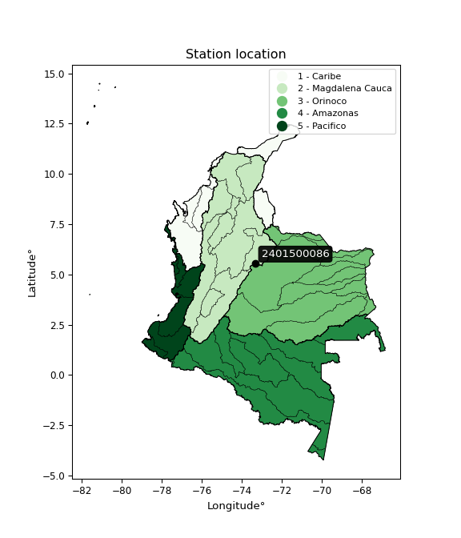</img>

</div>


## A. General information


### 1. General running parameters

• app_version: _v20260103_. • runtime: _2026-01-05 16:20:51.132608_. • Python version: _3.14.0_. • SciPy version: _1.16.3_. • Pandas version: _2.3.3_. • NumPy version: _2.3.5_. • Stations dataset (station_dataset_file): _dataset/pmax24h_in/automatic_colombia_2003_2024.csv_. • Stations catalog (station_catalog_file): _dataset/CNE.xls_. • Minimum year to eval til year_max (date_min): _1900_. • Maximum year to eval since year_min (date_max): _2024_. • Creates, save and include plots into reports (create_plot): _True_. • Plot only fit distributions with Δo > Δ (plot_only_fit): _True_. • Plot only simple graphs avoiding multiple CDFs and multiple Extreme values plots (plot_only_simple): _True_. • Eval low extreme values, if False, evaluates high extreme values (low_extreme): _False_. • Eval every SciPy distribution as logarithmic (pdist_logarithmic_on): _True_. • Standard deviation normalized (ddof): _1.0_. • Return periods to eval in years (Tr): _[2, 2.33, 5, 10, 15, 20, 25, 50, 75, 100, 200, 250, 500, 750, 1000]_. • Minimum data sample per station, 0 means any (minimum_sample): _5_. • Z-Score maximum threshold to adjust a value, 0 means disable (zscore_max): _3.5_. • Z-Score minimum threshold to adjust a value, 0 means disable (zscore_min): _-2.5_. • Avoid zeros, e.g. rain = 0 (avoid_zeros): _True_. • Avoid null values (avoid_nans): _True_. 

[:file_folder:Dataset file](../../dataset/pmax24h_in/automatic_colombia_2003_2024.csv)

> Delta Degrees of Freedom (DDOF): is a parameter used in the formulas for calculating variance and standard deviation. When ddof=0, the divisor is $N$ (the total number of observations) and this is used when your data set is the entire population. When ddof=1, the divisor is $N-1$ and this is used when your data set is a sample drawn from a larger population. Using $N-1$ provides an unbiased estimate of the population variance (known as Bessel´s correction).


### 2. Station info and location

|   id |     CODIGO | NOMBRE                                                                    | CATEGORIA               | TECNOLOGIA                | ESTADO           | FECHA_INSTALACION   |   FECHA_SUSPENSION |   ALTITUD |   LATITUD |   LONGITUD | DEPARTAMENTO   | MUNICIPIO   | AREA_OPERATIVA                              | ENTIDAD                                                     | AREA_HIDROGRAFICA   | ZONA_HIDROGRAFICA   | SUBZONA_HIDROGRAFICA   |   CORRIENTE | Catalogo   |   Version |
|-----:|-----------:|:--------------------------------------------------------------------------|:------------------------|:--------------------------|:-----------------|:--------------------|-------------------:|----------:|----------:|-----------:|:---------------|:------------|:--------------------------------------------|:------------------------------------------------------------|:--------------------|:--------------------|:-----------------------|------------:|:-----------|----------:|
|    0 | 2401500086 | UNIVERSIDAD PEDAGÓGICA Y TECNOLÓGICA DE COLOMBIA TUNJA - AUT [2401500086] | Climatológica Principal | Automática con Telemetría | En Mantenimiento | 06/04/2018          |                nan |      2690 |   5.55361 |   -73.3553 | Boyacá         | Tunja       | Area Operativa 06 - Boyacá-Casanare-Vichada | INSTITUTO DE HIDROLOGIA METEOROLOGIA Y ESTUDIOS AMBIENTALES | Magdalena Cauca     | Sogamoso            | Río Chicamocha         |         nan | CNE_IDEAM  |  20251226 |

<div align="center">

Dynamic map: [:earth_americas:Google](http://maps.google.com/maps?q=5.553611111,-73.355277778) [:earth_americas:OSM](https://www.openstreetmap.org/#map=18/5.553611111/-73.355277778&layers=P) [:earth_americas:Bing](https://www.bing.com/maps?cp=5.553611111~-73.355277778&lvl=18) [:earth_americas:Apple](https://maps.apple.com/frame?center=5.553611111%2C-73.355277778&span=0.003%2C0.006)

</div>


<div align="center">

```geojson
{
  "type": "Feature",
  "geometry": {
    "type": "Point", 
    "coordinates": [-73.355277778, 5.553611111]
  }, 
  "properties": {
    "Name": "2401500086"
  }
}
```

</div>


### 3. Discrete values table and plot

<div align="center">

|               |            0 |           1 |          2 |           3 |          4 |          5 |
|:--------------|-------------:|------------:|-----------:|------------:|-----------:|-----------:|
| Date          | 2019         | 2020        | 2021       | 2022        | 2023       | 2024       |
| Value         |   36.8       |   28.6      |   50.2     |   31        |   16       |   52.4     |
| Value_initial |   36.8       |   28.6      |   50.2     |   31        |   16       |   52.4     |
| count         |    6         |    6        |    6       |    6        |    6       |    6       |
| mean          |   35.8333    |   35.8333   |   35.8333  |   35.8333   |   35.8333  |   35.8333  |
| std           |   13.7901    |   13.7901   |   13.7901  |   13.7901   |   13.7901  |   13.7901  |
| zscore        |    0.0700986 |   -0.524531 |    1.04181 |   -0.350493 |   -1.43823 |    1.20135 |


</div>


<div align="center">

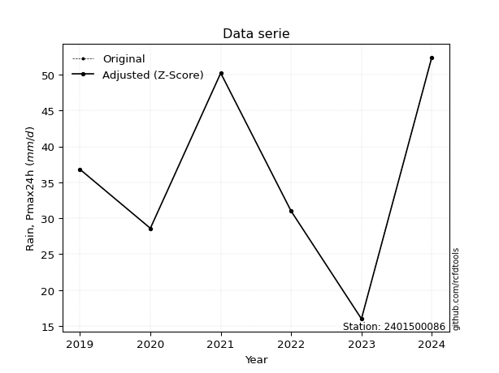</img>

</div>


> The initial value (value_initial) correspond to the initial obtained or null completed value, and value (value) is adjusted only when the initial value is outside the valid range (outlier) definite through the Z-Score value. If Z-Score is active, values out of range or outliers are replaced with the station mean value. A Z-Score (or standard score) measures how many standard deviations a data point is from the mean of a dataset, indicating its relative position; positive scores mean above the mean, negative mean below, and a score of zero is exactly at the mean, allowing for comparison of values from different distributions. It´s calculated using the formula $z=(x–μ)/σ$, where $x$ is the data point, $μ$ is the mean, and $σ$ is the standard deviation, helping identify outliers and understand probability.
>
> <sub>**Note**: In this study, "completing" (filling gaps in) and "extending" (forecasting or lengthening the historical record) rainfall data series are avoided for certain critical analyses because they introduce artificial bias and uncertainty, which can distort the statistics of rare events (extremes), alter day-to-day variability, and compromise the integrity and homogeneity of the original data. Some reasons against Completing/Extending rainfall data are: **Distortion of Extremes and Variability**: The primary issue is that most gap-filling or extension methods rely on averaging or regression with nearby stations, which inherently smooths the data. Rainfall is highly variable in space and time, with a large percentage of zero values and occasional large storms. Infilling methods often underestimate the highest values and overestimate the lowest (zero) values, which severely distorts analyses focused on flood frequency, drought severity, and intensity-duration-frequency (IDF) curves, **Loss of Data Homogeneity**: Infilled or extended data are synthetic estimates, not actual measurements. Combining these estimates with observed data can violate the assumption of data homogeneity, which requires that the data properties do not change over time. Inhomogeneity can lead to incorrect conclusions about long-term trends or changes in climate patterns, **Propagation of Errors**: Errors and biases from the original data (e.g., wind-induced undercatch, instrument errors, site changes) or the data used for imputation can propagate through the analysis, leading to unreliable hydrological models and inaccurate predictions, **Compromised Statistical Integrity**: For statistical analyses, especially those involving the frequency of events, using artificial data can introduce time bias or autocorrelation that doesn´t exist in reality, making it difficult to assess the true probability of events, **Difficulty in Validation**: It is difficult to accurately validate the quality of filled or extended data, especially for past periods where ground-truth measurements are unavailable. The reliability of imputation techniques heavily depends on the density of the surrounding station network and the complexity of the local topography.</sub>


### 4. Active continuous probability distributions from SciPy (44 of 104 available)

A Probability Density Function (PDF) describes the relative likelihood of a continuous random variable falling within a specific range, where the total area under its curve equals 1, and the area over any interval gives the actual probability for that range. Unlike discrete probabilities (like rolling a die), a PDF shows density, not direct probability for a single point (which is zero), with higher points indicating higher likelihood, often visualized as a bell curve for normal distributions.

A log of a probability density function (log-PDF) is simply the logarithm of the PDF´s value, denoted as $log(f(x))$, useful for converting multiplication of probabilities into addition, improving numerical stability with tiny numbers, and connecting to information theory concepts like entropy. Instead of dealing with very small probabilities (e.g., 0.000001), log-PDFs use negative numbers (e.g., $log(0.00001) ≈ -11.51$ that are easier for computers to handle, preventing underflow errors and simplifying complex calculations. In this study, each active probability distribution from SciPy is also evaluated in the $log$ form.

[scipy.stats](https://docs.scipy.org/doc/scipy/reference/stats.html) is a Python´s powerful submodule within the SciPy library for comprehensive statistical analysis, offering over 130 probability distributions (like Normal, Poisson), functions for descriptive stats (mean, variance), hypothesis testing (t-tests, chi-square), random variable generation, and statistical tests, making it essential for data science, modeling, and research. It provides tools to explore, model, and draw conclusions from data efficiently, working seamlessly with NumPy.

<div align="center">

|   id | p_dist             |   n_parameter | fit_method   | label                                                                       | active   | ref                                                                                                        |
|-----:|:-------------------|--------------:|:-------------|:----------------------------------------------------------------------------|:---------|:-----------------------------------------------------------------------------------------------------------|
|    0 | alpha              |             3 | MLE          | Alpha                                                                       | True     | [:mortar_board:](https://docs.scipy.org/doc/scipy/reference/generated/scipy.stats.alpha.html)              |
|    1 | betaprime          |             4 | MLE          | Beta prime                                                                  | True     | [:mortar_board:](https://docs.scipy.org/doc/scipy/reference/generated/scipy.stats.betaprime.html)          |
|    2 | chi2               |             3 | MLE          | Chi²                                                                        | True     | [:mortar_board:](https://docs.scipy.org/doc/scipy/reference/generated/scipy.stats.chi2.html)               |
|    3 | crystalball        |             4 | MLE          | Crystalball                                                                 | True     | [:mortar_board:](https://docs.scipy.org/doc/scipy/reference/generated/scipy.stats.crystalball.html)        |
|    4 | erlang             |             3 | MLE          | Erlang                                                                      | True     | [:mortar_board:](https://docs.scipy.org/doc/scipy/reference/generated/scipy.stats.erlang.html)             |
|    5 | expon              |             2 | MLE          | Exponential                                                                 | True     | [:mortar_board:](https://docs.scipy.org/doc/scipy/reference/generated/scipy.stats.expon.html)              |
|    6 | exponnorm          |             3 | MLE          | Exponentially modified Normal                                               | True     | [:mortar_board:](https://docs.scipy.org/doc/scipy/reference/generated/scipy.stats.exponnorm.html)          |
|    7 | f                  |             4 | MLE          | F                                                                           | True     | [:mortar_board:](https://docs.scipy.org/doc/scipy/reference/generated/scipy.stats.f.html)                  |
|    8 | fatiguelife        |             3 | MLE          | Fatigue-life (Birnbaum-Saunders)                                            | True     | [:mortar_board:](https://docs.scipy.org/doc/scipy/reference/generated/scipy.stats.fatiguelife.html)        |
|    9 | fisk               |             3 | MLE          | Fisk                                                                        | True     | [:mortar_board:](https://docs.scipy.org/doc/scipy/reference/generated/scipy.stats.fisk.html)               |
|   10 | gamma              |             3 | MLE          | Gamma                                                                       | True     | [:mortar_board:](https://docs.scipy.org/doc/scipy/reference/generated/scipy.stats.gamma.html)              |
|   11 | genexpon           |             5 | MLE          | Generalized exponential                                                     | True     | [:mortar_board:](https://docs.scipy.org/doc/scipy/reference/generated/scipy.stats.genexpon.html)           |
|   12 | genlogistic        |             3 | MLE          | Generalized logistic                                                        | True     | [:mortar_board:](https://docs.scipy.org/doc/scipy/reference/generated/scipy.stats.genlogistic.html)        |
|   13 | gibrat             |             2 | MM           | Gibrat                                                                      | True     | [:mortar_board:](https://docs.scipy.org/doc/scipy/reference/generated/scipy.stats.gibrat.html)             |
|   14 | gompertz           |             3 | MLE          | Gompertz (or truncated Gumbel)                                              | True     | [:mortar_board:](https://docs.scipy.org/doc/scipy/reference/generated/scipy.stats.gompertz.html)           |
|   15 | gumbel_l           |             2 | MM           | Gumbel Left Skew                                                            | True     | [:mortar_board:](https://docs.scipy.org/doc/scipy/reference/generated/scipy.stats.gumbel_l.html)           |
|   16 | gumbel_r           |             2 | MM           | Gumbel Right Skew                                                           | True     | [:mortar_board:](https://docs.scipy.org/doc/scipy/reference/generated/scipy.stats.gumbel_r.html)           |
|   17 | halflogistic       |             2 | MM           | Half-logistic                                                               | True     | [:mortar_board:](https://docs.scipy.org/doc/scipy/reference/generated/scipy.stats.halflogistic.html)       |
|   18 | halfnorm           |             2 | MM           | Half Normal                                                                 | True     | [:mortar_board:](https://docs.scipy.org/doc/scipy/reference/generated/scipy.stats.halfnorm.html)           |
|   19 | hypsecant          |             2 | MM           | hyperbolic secant                                                           | True     | [:mortar_board:](https://docs.scipy.org/doc/scipy/reference/generated/scipy.stats.hypsecant.html)          |
|   20 | invgamma           |             3 | MLE          | Inverted gamma                                                              | True     | [:mortar_board:](https://docs.scipy.org/doc/scipy/reference/generated/scipy.stats.invgamma.html)           |
|   21 | invgauss           |             3 | MLE          | Inverse Gaussian                                                            | True     | [:mortar_board:](https://docs.scipy.org/doc/scipy/reference/generated/scipy.stats.invgauss.html)           |
|   22 | invweibull         |             3 | MLE          | Inverted Weibull                                                            | True     | [:mortar_board:](https://docs.scipy.org/doc/scipy/reference/generated/scipy.stats.invweibull.html)         |
|   23 | johnsonsu          |             4 | MLE          | Johnson Su                                                                  | True     | [:mortar_board:](https://docs.scipy.org/doc/scipy/reference/generated/scipy.stats.johnsonsu.html)          |
|   24 | kstwobign          |             2 | MLE          | Limiting distribution of scaled Kolmogorov-Smirnov two-sided test statistic | True     | [:mortar_board:](https://docs.scipy.org/doc/scipy/reference/generated/scipy.stats.kstwobign.html)          |
|   25 | laplace            |             2 | MM           | Laplace                                                                     | True     | [:mortar_board:](https://docs.scipy.org/doc/scipy/reference/generated/scipy.stats.laplace.html)            |
|   26 | laplace_asymmetric |             3 | MLE          | Asymmetric Laplace                                                          | True     | [:mortar_board:](https://docs.scipy.org/doc/scipy/reference/generated/scipy.stats.laplace_asymmetric.html) |
|   27 | loggamma           |             3 | MLE          | Log gamma                                                                   | True     | [:mortar_board:](https://docs.scipy.org/doc/scipy/reference/generated/scipy.stats.loggamma.html)           |
|   28 | logistic           |             2 | MM           | Logistic (or Sech-squared)                                                  | True     | [:mortar_board:](https://docs.scipy.org/doc/scipy/reference/generated/scipy.stats.logistic.html)           |
|   29 | lognorm            |             3 | MLE          | Log Normal                                                                  | True     | [:mortar_board:](https://docs.scipy.org/doc/scipy/reference/generated/scipy.stats.lognorm.html)            |
|   30 | maxwell            |             2 | MM           | Maxwell                                                                     | True     | [:mortar_board:](https://docs.scipy.org/doc/scipy/reference/generated/scipy.stats.maxwell.html)            |
|   31 | mielke             |             4 | MLE          | Mielke Beta-Kappa / Dagum                                                   | True     | [:mortar_board:](https://docs.scipy.org/doc/scipy/reference/generated/scipy.stats.mielke.html)             |
|   32 | moyal              |             2 | MM           | Moyal                                                                       | True     | [:mortar_board:](https://docs.scipy.org/doc/scipy/reference/generated/scipy.stats.moyal.html)              |
|   33 | nakagami           |             3 | MLE          | Nakagami                                                                    | True     | [:mortar_board:](https://docs.scipy.org/doc/scipy/reference/generated/scipy.stats.nakagami.html)           |
|   34 | ncf                |             5 | MLE          | Non-central F distribution                                                  | True     | [:mortar_board:](https://docs.scipy.org/doc/scipy/reference/generated/scipy.stats.ncf.html)                |
|   35 | nct                |             4 | MLE          | Non-central Student’s t                                                     | True     | [:mortar_board:](https://docs.scipy.org/doc/scipy/reference/generated/scipy.stats.nct.html)                |
|   36 | norm               |             2 | MM           | Normal                                                                      | True     | [:mortar_board:](https://docs.scipy.org/doc/scipy/reference/generated/scipy.stats.norm.html)               |
|   37 | pearson3           |             3 | MM           | Pearson type III                                                            | True     | [:mortar_board:](https://docs.scipy.org/doc/scipy/reference/generated/scipy.stats.pearson3.html)           |
|   38 | rayleigh           |             2 | MM           | Rayleigh                                                                    | True     | [:mortar_board:](https://docs.scipy.org/doc/scipy/reference/generated/scipy.stats.rayleigh.html)           |
|   39 | rice               |             3 | MLE          | Rice                                                                        | True     | [:mortar_board:](https://docs.scipy.org/doc/scipy/reference/generated/scipy.stats.rice.html)               |
|   40 | t                  |             3 | MLE          | Student’s t                                                                 | True     | [:mortar_board:](https://docs.scipy.org/doc/scipy/reference/generated/scipy.stats.t.html)                  |
|   41 | truncnorm          |             4 | MLE          | Truncated normal                                                            | True     | [:mortar_board:](https://docs.scipy.org/doc/scipy/reference/generated/scipy.stats.truncnorm.html)          |
|   42 | wald               |             2 | MM           | Wald                                                                        | True     | [:mortar_board:](https://docs.scipy.org/doc/scipy/reference/generated/scipy.stats.wald.html)               |
|   43 | weibull_min        |             3 | MLE          | Weibull minimum                                                             | True     | [:mortar_board:](https://docs.scipy.org/doc/scipy/reference/generated/scipy.stats.weibull_min.html)        |

</div>

> **n_parameter:** # arguments & localization & scale.
>
> **Fit methods:** (MLE) maximum likelihood, (MM) L-moments.
>
>**Inactive** (With the only purpose of prevent loops, zero divisions, infinite values, over high estimated values or horizontal trending for recurrence intervals estimations, the follow distributions were disabled.)**:** foldnorm, gennorm, norminvgauss, powernorm, powerlognorm, skewnorm, genextreme, anglit, arcsine, argus, beta, bradford, burr, burr12, cauchy, cosine, halfcauchy, foldcauchy, skewcauchy, wrapcauchy, dgamma, gengamma, exponweib, exponpow, truncexpon, gausshyper, genhalflogistic, genhyperbolic, geninvgauss, halfgennorm, johnsonsb, kappa4, kappa3, ksone, kstwo, loglaplace, levy, levy_l, levy_stable, ncx2, pareto, genpareto, truncpareto, lomax, powerlaw, rdist, rel_breitwigner, recipinvgauss, semicircular, studentized_range, trapezoid, triang, truncweibull_min, tukeylambda, uniform, loguniform, vonmises, vonmises_line, weibull_max, dweibull, 


## B. Probability (PDF) vs. Empirical (EDF) distributions functions

A continuous probability distribution (CPD) describes probabilities for variables that can take any value within a range (like rain any time), unlike discrete variables with specific outcomes (like temperature). It uses a Probability Density Function (PDF), a curve where the total area under it equals 1, and the probability of the variable falling within an interval (a to b) is found by calculating the area under the curve between those points. A key feature is that the probability of hitting any single exact value is zero, so probabilities are always expressed for ranges, e.g., $P(a ≤ X ≤ b)$.

<div align="center">

Distributions parameters from station values
|    |    station | p_dist                |   n |             loc |           scale | shape                  | shape1                 | shape2                 | shape3   |
|---:|-----------:|:----------------------|----:|----------------:|----------------:|:-----------------------|:-----------------------|:-----------------------|:---------|
|  0 | 2401500086 | alpha                 |   6 |  -156.439       |  2870.73        | 15.001725179564069     |                        |                        |          |
|  1 | 2401500086 | betaprime             |   6 |  -121.938       | 17548.1         | 155.0641230207501      | 17242.04689507287      |                        |          |
|  2 | 2401500086 | chi2                  |   6 |    16           |     9.91065     | 1.6787538755317886     |                        |                        |          |
|  3 | 2401500086 | crystalball           |   6 |    35.8333      |    12.5886      | 3811.9395727877436     | 463.5136682330808      |                        |          |
|  4 | 2401500086 | erlang                |   6 |  -428.899       |     0.341545    | 1360.645137591704      |                        |                        |          |
|  5 | 2401500086 | expon                 |   6 |    16           |    19.8333      |                        |                        |                        |          |
|  6 | 2401500086 | exponnorm             |   6 |    35.8189      |    12.5886      | 0.0011380127994608342  |                        |                        |          |
|  7 | 2401500086 | f                     |   6 | -1063.1         |  1098.92        | 15951.893280214128     | 332695.94581124187     |                        |          |
|  8 | 2401500086 | fatiguelife           |   6 |    16           |     2.50891e-05 | 855.3361104007672      |                        |                        |          |
|  9 | 2401500086 | fisk                  |   6 | -1629.79        |  1665.54        | 219.01888962174314     |                        |                        |          |
| 10 | 2401500086 | gamma                 |   6 |  -425.585       |     0.34441     | 1339.7388123113724     |                        |                        |          |
| 11 | 2401500086 | genexpon              |   6 |    16           |     2.48812     | 0.1255044878911295     | 2.6719656628554416e-06 | 0.9661225638172457     |          |
| 12 | 2401500086 | genlogistic           |   6 |    26.6921      |     9.14411     | 2.042784445820614      |                        |                        |          |
| 13 | 2401500086 | gibrat                |   6 |    26.2298      |     5.82483     |                        |                        |                        |          |
| 14 | 2401500086 | gompertz              |   6 |    15.0051      |     3.94137     | 0.0002857789342750378  |                        |                        |          |
| 15 | 2401500086 | gumbel_l              |   6 |    41.4989      |     9.81527     |                        |                        |                        |          |
| 16 | 2401500086 | gumbel_r              |   6 |    30.1678      |     9.81527     |                        |                        |                        |          |
| 17 | 2401500086 | halflogistic          |   6 |    20.913       |    10.7628      |                        |                        |                        |          |
| 18 | 2401500086 | halfnorm              |   6 |    19.171       |    20.8831      |                        |                        |                        |          |
| 19 | 2401500086 | hypsecant             |   6 |    35.8333      |     8.01414     |                        |                        |                        |          |
| 20 | 2401500086 | invgamma              |   6 |   -93.0881      | 12882.5         | 101.0861626412648      |                        |                        |          |
| 21 | 2401500086 | invgauss              |   6 |   -34.0582      |  1960.8         | 0.03556382748873098    |                        |                        |          |
| 22 | 2401500086 | invweibull            |   6 |    16           |     1.47013     | 0.04965290746050388    |                        |                        |          |
| 23 | 2401500086 | johnsonsu             |   6 |    62.3154      |     0.000570972 | 20.37927031016956      | 1.804005188613277      |                        |          |
| 24 | 2401500086 | kstwobign             |   6 |   -11.3505      |    53.928       |                        |                        |                        |          |
| 25 | 2401500086 | laplace               |   6 |    35.8333      |     8.90147     |                        |                        |                        |          |
| 26 | 2401500086 | laplace_asymmetric    |   6 |    31           |     9.7576      | 0.7825429025231518     |                        |                        |          |
| 27 | 2401500086 | loggamma              |   6 |  -244.855       |    77.3554      | 38.1573930965635       |                        |                        |          |
| 28 | 2401500086 | logistic              |   6 |    35.8333      |     6.94045     |                        |                        |                        |          |
| 29 | 2401500086 | lognorm               |   6 |    16           |     0.0508982   | 13.553087209154748     |                        |                        |          |
| 30 | 2401500086 | maxwell               |   6 |     6.0037      |    18.693       |                        |                        |                        |          |
| 31 | 2401500086 | mielke                |   6 |    -3.95532     |    56.5613      | 2.448618541549994      | 1204.7681449019933     |                        |          |
| 32 | 2401500086 | moyal                 |   6 |    28.6344      |     5.66685     |                        |                        |                        |          |
| 33 | 2401500086 | nakagami              |   6 |    28.6         |    15.5608      | 0.38518376736900906    |                        |                        |          |
| 34 | 2401500086 | ncf                   |   6 |     3.45385     |     0.0021672   | 0.001609061515242594   | 1531.753685994806      | 23.97682795642352      |          |
| 35 | 2401500086 | nct                   |   6 |  -647.314       |    12.5454      | 211422.04742300796     | 54.453641943779374     |                        |          |
| 36 | 2401500086 | norm                  |   6 |    35.8333      |    12.5886      |                        |                        |                        |          |
| 37 | 2401500086 | pearson3              |   6 |    35.8333      |    12.5885      | -0.06511233249620504   |                        |                        |          |
| 38 | 2401500086 | rayleigh              |   6 |    11.7507      |    19.2152      |                        |                        |                        |          |
| 39 | 2401500086 | rice                  |   6 |     9.45409     |    14.6807      | 1.4014298449568372     |                        |                        |          |
| 40 | 2401500086 | t                     |   6 |    35.8335      |    12.5883      | 63418285.96947661      |                        |                        |          |
| 41 | 2401500086 | truncnorm             |   6 |    35.8333      |    12.5886      | -489.08093015579584    | 780.1255890722337      |                        |          |
| 42 | 2401500086 | wald                  |   6 |    23.2448      |    12.5886      |                        |                        |                        |          |
| 43 | 2401500086 | weibull_min           |   6 |     4.12206     |    35.7008      | 2.803673947684824      |                        |                        |          |
| 44 | 2401500086 | logalpha              |   6 |    -8.36891     |   344.355       | 29.045211323090363     |                        |                        |          |
| 45 | 2401500086 | logbetaprime          |   6 |    -6.63447     |   172.62        | 665.2228255290297      | 11326.560059403157     |                        |          |
| 46 | 2401500086 | logchi2               |   6 |     2.77259     |     0.963487    | 1.0786243019648198     |                        |                        |          |
| 47 | 2401500086 | logcrystalball        |   6 |     3.50673     |     0.397806    | 1306.4185608383896     | 4.851685394174789      |                        |          |
| 48 | 2401500086 | logerlang             |   6 |    -3.5711      |     0.023718    | 298.2855525166573      |                        |                        |          |
| 49 | 2401500086 | logexpon              |   6 |     2.77259     |     0.734145    |                        |                        |                        |          |
| 50 | 2401500086 | logexponnorm          |   6 |     3.50644     |     0.397807    | 0.0007489423454042545  |                        |                        |          |
| 51 | 2401500086 | logf                  |   6 |  -360.999       |   364.505       | 4508503.023280045      | 2662282.58126802       |                        |          |
| 52 | 2401500086 | logfatiguelife        |   6 |  -131.676       |   135.183       | 0.002941295415442349   |                        |                        |          |
| 53 | 2401500086 | logfisk               |   6 |    -3.0258e+07  |     3.0258e+07  | 131903892.09922881     |                        |                        |          |
| 54 | 2401500086 | loggamma              |   6 |    -3.48647     |     0.0236357   | 295.7280273991572      |                        |                        |          |
| 55 | 2401500086 | loggenexpon           |   6 |     2.75851     |     0.0328633   | 0.01579489552362663    | 8.70949858065611       | 0.00022152905289365418 |          |
| 56 | 2401500086 | loggenlogistic        |   6 |     3.95893     |     9.16917e-07 | 2.0513840031849844e-06 |                        |                        |          |
| 57 | 2401500086 | loggibrat             |   6 |     3.20317     |     0.184118    |                        |                        |                        |          |
| 58 | 2401500086 | loggompertz           |   6 |     2.77259     |     1.05614     | 0.9648149444661895     |                        |                        |          |
| 59 | 2401500086 | loggumbel_l           |   6 |     3.68577     |     0.310168    |                        |                        |                        |          |
| 60 | 2401500086 | loggumbel_r           |   6 |     3.3277      |     0.310168    |                        |                        |                        |          |
| 61 | 2401500086 | loghalflogistic       |   6 |     3.03522     |     0.340121    |                        |                        |                        |          |
| 62 | 2401500086 | loghalfnorm           |   6 |     2.98018     |     0.659936    |                        |                        |                        |          |
| 63 | 2401500086 | loghypsecant          |   6 |     3.50673     |     0.253251    |                        |                        |                        |          |
| 64 | 2401500086 | loginvgamma           |   6 |    -4.10845     |  2545.57        | 335.45398539581697     |                        |                        |          |
| 65 | 2401500086 | loginvgauss           |   6 |    -0.0814708   |   245.175       | 0.014621498643365215   |                        |                        |          |
| 66 | 2401500086 | loginvweibull         |   6 |    -4.68453e+07 |     4.68453e+07 | 113614117.52899298     |                        |                        |          |
| 67 | 2401500086 | logjohnsonsu          |   6 |     3.95891     |     2.65773e-12 | 1.940210251252115      | 0.1109902107981642     |                        |          |
| 68 | 2401500086 | logkstwobign          |   6 |     1.81585     |     1.93148     |                        |                        |                        |          |
| 69 | 2401500086 | loglaplace            |   6 |     3.50673     |     0.281291    |                        |                        |                        |          |
| 70 | 2401500086 | loglaplace_asymmetric |   6 |     3.6055      |     0.308455    | 1.1730092995046975     |                        |                        |          |
| 71 | 2401500086 | logloggamma           |   6 |     3.95893     |     2.14028e-06 | 4.755183337264254e-06  |                        |                        |          |
| 72 | 2401500086 | loglogistic           |   6 |     3.50673     |     0.219322    |                        |                        |                        |          |
| 73 | 2401500086 | loglognorm            |   6 |     2.77259     |     0.00240342  | 13.114732235506125     |                        |                        |          |
| 74 | 2401500086 | logmaxwell            |   6 |     2.5641      |     0.590707    |                        |                        |                        |          |
| 75 | 2401500086 | logmielke             |   6 |    -5.53093e+07 |     5.53093e+07 | 116213258.8038204      | 2741021794.0634403     |                        |          |
| 76 | 2401500086 | logmoyal              |   6 |     3.27924     |     0.179075    |                        |                        |                        |          |
| 77 | 2401500086 | lognakagami           |   6 |     3.35341     |     0.309701    | 0.2795836210692458     |                        |                        |          |
| 78 | 2401500086 | logncf                |   6 |    -3.32253     |     6.05661     | 474.8338748182131      | 886.5637871750403      | 59.649543344091924     |          |
| 79 | 2401500086 | lognct                |   6 |   -10.1632      |     0.361541    | 2889.572732737336      | 37.799586157069896     |                        |          |
| 80 | 2401500086 | lognorm               |   6 |     3.50673     |     0.397806    |                        |                        |                        |          |
| 81 | 2401500086 | logpearson3           |   6 |     3.50673     |     0.397806    | -0.6293083018980907    |                        |                        |          |
| 82 | 2401500086 | lograyleigh           |   6 |     2.74571     |     0.60721     |                        |                        |                        |          |
| 83 | 2401500086 | logrice               |   6 |     2.50805     |     0.432597    | 2.0433014703950865     |                        |                        |          |
| 84 | 2401500086 | logt                  |   6 |     3.50673     |     0.397806    | 34635760860.366844     |                        |                        |          |
| 85 | 2401500086 | logtruncnorm          |   6 |    -0.142836    |     1.2019      | 2.908934364046092      | 3.412728450202217      |                        |          |
| 86 | 2401500086 | logwald               |   6 |     3.1089      |     0.39783     |                        |                        |                        |          |
| 87 | 2401500086 | logweibull_min        |   6 |    -1.29543e+07 |     1.29543e+07 | 41711402.00607599      |                        |                        |          |

</div>

> **loc** (Location parameter): This shifts the distribution along the x-axis. For many common distributions, like the normal (Gaussian) distribution, loc represents the mean $μ$. For others, like the uniform distribution, it might represent the minimum value, or for the beta distribution, the left end of the support interval.
>
> **scale** (Scale parameter): This determines the width or spread of the distribution. For the normal distribution, scale represents the standard deviation $σ$. For a uniform distribution, it defines the length of the interval (from $loc$ to $loc + scale$).
>
> **shape** (Shape parameters): Refers to parameters that define the specific form of a probability distribution, distinct from its location (loc) and scale (scale). These parameters are required arguments for most distribution functions. For example, a normal (Gaussian) distribution is fully defined by its location (mean) and scale (standard deviation), so it has no specific shape parameters beyond loc and scale. However, other distributions have intrinsic properties that need specification, as Gamma distribution that takes a shape parameter, often named $a$ or $alpha$.


### 0. Cumulative distribution values - CDF (88 evaluated)

Cumulative Distribution Function (CDF), denoted as $F$<sub>$X$</sub>$(x)$, is a function that gives the probability that a random variable $X$ will take a value less than or equal to a specific value, $x$ (i.e., $(P(X≥x)$. It essentially "accumulates" probabilities from a given point up to the far right (positive infinity), providing a complete picture of the distribution´s probabilities for both discrete (like rain) and continuous (like temperature) variables, helping to find probabilities over ranges or above certain values. Each station is evaluated separately ordering the $x$ values ascending, calculating the CDF and PDF values for the activated distributions and their logarithmic forms.

<div align="center">

CDF ordered by x ascending and calculating $log(f(x))$ separately
|   id |    Station |   date |    x |   count |    mean |     std |     zscore |   Value_initial |    station |   m |    alpha |   alpha_pdf |   betaprime |   betaprime_pdf |        chi2 |    chi2_pdf |   crystalball |   crystalball_pdf |    erlang |   erlang_pdf |    expon |   expon_pdf |   exponnorm |   exponnorm_pdf |         f |      f_pdf |   fatiguelife |   fatiguelife_pdf |      fisk |   fisk_pdf |     gamma |   gamma_pdf |   genexpon |   genexpon_pdf |   genlogistic |   genlogistic_pdf |   gibrat |   gibrat_pdf |    gompertz |   gompertz_pdf |   gumbel_l |   gumbel_l_pdf |   gumbel_r |   gumbel_r_pdf |   halflogistic |   halflogistic_pdf |   halfnorm |   halfnorm_pdf |   hypsecant |   hypsecant_pdf |   invgamma |   invgamma_pdf |   invgauss |   invgauss_pdf |   invweibull |   invweibull_pdf |   johnsonsu |   johnsonsu_pdf |   kstwobign |   kstwobign_pdf |   laplace |   laplace_pdf |   laplace_asymmetric |   laplace_asymmetric_pdf |   loggamma |   loggamma_pdf |   logistic |   logistic_pdf |   lognorm |   lognorm_pdf |   maxwell |   maxwell_pdf |    mielke |   mielke_pdf |      moyal |   moyal_pdf |    nakagami |   nakagami_pdf |       ncf |   ncf_pdf |       nct |   nct_pdf |      norm |   norm_pdf |   pearson3 |   pearson3_pdf |   rayleigh |   rayleigh_pdf |      rice |   rice_pdf |         t |      t_pdf |   truncnorm |   truncnorm_pdf |     wald |   wald_pdf |   weibull_min |   weibull_min_pdf |   logalpha |   logalpha_pdf |   logbetaprime |   logbetaprime_pdf |    logchi2 |   logchi2_pdf |   logcrystalball |   logcrystalball_pdf |   logerlang |   logerlang_pdf |   logexpon |   logexpon_pdf |   logexponnorm |   logexponnorm_pdf |      logf |   logf_pdf |   logfatiguelife |   logfatiguelife_pdf |   logfisk |   logfisk_pdf |   loggenexpon |   loggenexpon_pdf |   loggenlogistic |   loggenlogistic_pdf |   loggibrat |   loggibrat_pdf |   loggompertz |   loggompertz_pdf |   loggumbel_l |   loggumbel_l_pdf |   loggumbel_r |   loggumbel_r_pdf |   loghalflogistic |   loghalflogistic_pdf |   loghalfnorm |   loghalfnorm_pdf |   loghypsecant |   loghypsecant_pdf |   loginvgamma |   loginvgamma_pdf |   loginvgauss |   loginvgauss_pdf |   loginvweibull |   loginvweibull_pdf |   logjohnsonsu |   logjohnsonsu_pdf |   logkstwobign |   logkstwobign_pdf |   loglaplace |   loglaplace_pdf |   loglaplace_asymmetric |   loglaplace_asymmetric_pdf |   logloggamma |   logloggamma_pdf |   loglogistic |   loglogistic_pdf |   loglognorm |   loglognorm_pdf |   logmaxwell |   logmaxwell_pdf |   logmielke |   logmielke_pdf |   logmoyal |   logmoyal_pdf |   lognakagami |   lognakagami_pdf |    logncf |   logncf_pdf |   lognct |   lognct_pdf |   logpearson3 |   logpearson3_pdf |   lograyleigh |   lograyleigh_pdf |   logrice |   logrice_pdf |      logt |   logt_pdf |   logtruncnorm |   logtruncnorm_pdf |   logwald |   logwald_pdf |   logweibull_min |   logweibull_min_pdf |
|-----:|-----------:|-------:|-----:|--------:|--------:|--------:|-----------:|----------------:|-----------:|----:|---------:|------------:|------------:|----------------:|------------:|------------:|--------------:|------------------:|----------:|-------------:|---------:|------------:|------------:|----------------:|----------:|-----------:|--------------:|------------------:|----------:|-----------:|----------:|------------:|-----------:|---------------:|--------------:|------------------:|---------:|-------------:|------------:|---------------:|-----------:|---------------:|-----------:|---------------:|---------------:|-------------------:|-----------:|---------------:|------------:|----------------:|-----------:|---------------:|-----------:|---------------:|-------------:|-----------------:|------------:|----------------:|------------:|----------------:|----------:|--------------:|---------------------:|-------------------------:|-----------:|---------------:|-----------:|---------------:|----------:|--------------:|----------:|--------------:|----------:|-------------:|-----------:|------------:|------------:|---------------:|----------:|----------:|----------:|----------:|----------:|-----------:|-----------:|---------------:|-----------:|---------------:|----------:|-----------:|----------:|-----------:|------------:|----------------:|---------:|-----------:|--------------:|------------------:|-----------:|---------------:|---------------:|-------------------:|-----------:|--------------:|-----------------:|---------------------:|------------:|----------------:|-----------:|---------------:|---------------:|-------------------:|----------:|-----------:|-----------------:|---------------------:|----------:|--------------:|--------------:|------------------:|-----------------:|---------------------:|------------:|----------------:|--------------:|------------------:|--------------:|------------------:|--------------:|------------------:|------------------:|----------------------:|--------------:|------------------:|---------------:|-------------------:|--------------:|------------------:|--------------:|------------------:|----------------:|--------------------:|---------------:|-------------------:|---------------:|-------------------:|-------------:|-----------------:|------------------------:|----------------------------:|--------------:|------------------:|--------------:|------------------:|-------------:|-----------------:|-------------:|-----------------:|------------:|----------------:|-----------:|---------------:|--------------:|------------------:|----------:|-------------:|---------:|-------------:|--------------:|------------------:|--------------:|------------------:|----------:|--------------:|----------:|-----------:|---------------:|-------------------:|----------:|--------------:|-----------------:|---------------------:|
|    0 | 2401500086 |   2023 | 16   |       6 | 35.8333 | 13.7901 | -1.43823   |            16   | 2401500086 |   1 | 0.04988  |  0.00993792 |   0.0541045 |       0.0094456 | 6.43343e-14 | 15.1999     |     0.0575702 |         0.0091607 | 0.0562278 |   0.00925019 | 0        |  0.0504202  |   0.0575712 |      0.00916081 | 0.0570065 | 0.00920045 |     0.0248227 |       6.40738e+09 | 0.0683929 | 0.00847911 | 0.0562188 |  0.00924551 | 2.0706e-07 |     0.0504414  |     0.0528059 |        0.00900114 | 0        |   0          | 8.20568e-05 |     9.332e-05  |  0.0717289 |     0.00703929 |   0.014476 |     0.00624636 |       0        |          0         |   0        |      0         |   0.0534648 |      0.00663999 |  0.0507451 |      0.0101339 |  0.0464465 |      0.0104901 |   0.00490147 |      3.64315e+11 |    0.103294 |      0.00699897 |   0.0408249 |       0.0128259 | 0.0538666 |    0.00605143 |            0.0532601 |               0.00697511 |   0.032526 |       0.192697 |  0.0542874 |     0.00739727 | 0.0324834 |      0.182673 | 0.0373551 |     0.01058   | 0.0780002 |   0.00957101 | 0.00229725 |  0.00205695 | 0           |      0         | 0.0433361 | 0.0109625 | 0.0575634 | 0.0091629 | 0.0575702 |  0.0091607 |  0.0593613 |      0.0090764 |   0.024156 |      0.0112309 | 0.0371719 |  0.01133   | 0.0575648 | 0.00916022 |   0.0575702 |       0.0091607 | 0        | 0          |     0.0446822 |         0.0103076 |  0.0312862 |       0.195431 |      0.0326166 |           0.190026 | 4.1503e-09 |   5.04021e+06 |        0.0324834 |             0.182673 |   0.0335784 |        0.19611  |   0        |       1.36213  |       0.032484 |           0.182675 | 0.0326281 |   0.183454 |        0.0320656 |             0.181807 | 0.0341364 |      0.143731 |    0.00691718 |          0.502268 |          0       |             0.157408 |    0        |        0        |   4.77053e-09 |          0.913531 |     0.0512852 |          0.161032 |    0.00250935 |         0.0484425 |          0        |              0        |      0        |          0        |      0.0350326 |           0.138052 |     0.0328814 |          0.20189  |     0.0334294 |          0.217425 |       0.0291333 |            0.249835 |       0.132646 |        0.0200692   |      0.0331515 |           0.313805 |    0.0367705 |         0.13072  |                0.057946 |                    0.160151 |     0.0716642 |          0.159221 |     0.0339823 |          0.149677 |    0.0126881 |      5.62824e+12 |     0.011266 |         0.1581   |    0.078229 |        0.164371 | 3.8718e-05 |      0.0019286 |   0           |       0           | 0.0835382 |     0.310719 | 0.03362  |     0.18888  |     0.0468689 |          0.18198  |   0.000979381 |         0.0728337 | 0.0254071 |      0.20791  | 0.0324835 |   0.182673 |     0          |           0        |  0        |      0        |        0.0504845 |             0.15838  |
|    1 | 2401500086 |   2020 | 28.6 |       6 | 35.8333 | 13.7901 | -0.524531  |            28.6 | 2401500086 |   2 | 0.304181 |  0.0293331  |   0.289658  |       0.0277374 | 0.552305    |  0.0255923  |     0.282783  |         0.0268683 | 0.285286  |   0.0272431  | 0.47022  |  0.0267116  |   0.282785  |      0.0268684  | 0.283849  | 0.0270241  |     0.796313  |       0.00930583  | 0.280649  | 0.0266624  | 0.285103  |  0.0272207  | 0.470368   |     0.026716   |     0.297025  |        0.0297289  | 0.184284 |   0.112348   | 0.00867211  |     0.00226259 |  0.235627  |     0.0209252  |   0.309377 |     0.036979   |       0.342668 |          0.0410015 |   0.34838  |      0.0345045 |   0.245264  |      0.0276643  |  0.308176  |      0.0295183 |  0.316855  |      0.0303182 |   0.407049   |      0.00144176  |    0.245035 |      0.016822   |   0.35735   |       0.0312709 | 0.221851  |    0.024923   |            0.277362  |               0.0363242  |   0.362431 |       0.935911 |  0.260726  |     0.0277717  | 0.349959  |      0.931065 | 0.308753  |     0.0300385 | 0.258572  |   0.0194483  | 0.315843   |  0.0426989  | 6.95389e-13 |    150.788     | 0.320709  | 0.0302913 | 0.282833  | 0.0268729 | 0.282783  |  0.0268683 |  0.28032   |      0.0264262 |   0.319179 |      0.0310689 | 0.302174  |  0.0288086 | 0.282774  | 0.0268685  |   0.282783  |       0.0268683 | 0.295781 | 0.0774819  |     0.293275  |         0.0280979 |  0.370392  |       0.94651  |      0.358762  |           0.933602 | 0.532725   |   0.405066    |        0.349959  |             0.931066 |   0.363161  |        0.929162 |   0.546676 |       0.617485 |       0.34996  |           0.931063 | 0.350553  |   0.930588 |        0.349862  |             0.932479 | 0.307742  |      0.928692 |    0.452074   |          0.844501 |          0       |             0.577256 |    0.41943  |        2.60105  |   0.507057    |          0.780473 |     0.28999   |          0.783969 |    0.398335   |         1.18211   |          0.43638  |              1.19012  |      0.428298 |          1.03035  |      0.318082  |           1.05715  |     0.371784  |          0.933349 |     0.384475  |          0.921859 |       0.421297  |            0.883239 |       0.149328 |        0.0426109   |      0.449419  |           0.845805 |    0.289897  |         1.03059  |                0.288523 |                    0.797418 |     0.260455  |          0.578668 |     0.332013  |          1.01121  |    0.662182  |      0.0479836   |     0.381892 |         0.987665 |    0.265079 |        0.556972 | 0.416241   |      1.30146   |   3.89625e-09 |       4.90589e+06 | 0.399871  |     0.720611 | 0.354172 |     0.925063 |     0.317401  |          0.828089 |   0.393957    |         0.99888   | 0.36246   |      0.932269 | 0.349959  |   0.931065 |     2.8279e-06 |           3.23498  |  0.45722  |      1.84437  |        0.2855    |             0.7734   |
|    2 | 2401500086 |   2022 | 31   |       6 | 35.8333 | 13.7901 | -0.350493  |            31   | 2401500086 |   3 | 0.376849 |  0.0310314  |   0.359111  |       0.0299845 | 0.609344    |  0.0220476  |     0.350509  |         0.029439  | 0.353812  |   0.0297206  | 0.530601 |  0.0236672  |   0.350512  |      0.029439   | 0.351905  | 0.0295535  |     0.817001  |       0.00798918  | 0.348756  | 0.0299524  | 0.353573  |  0.0296973  | 0.530757   |     0.0236698  |     0.371235  |        0.0318758  | 0.420841 |   0.0819805  | 0.0161211   |     0.00412841 |  0.290454  |     0.0248049  |   0.399034 |     0.0373496  |       0.437074 |          0.0375817 |   0.428904 |      0.0325441 |   0.318707  |      0.0334487  |  0.381208  |      0.0311479 |  0.391235  |      0.0314597 |   0.410215   |      0.00120998  |    0.288771 |      0.01968    |   0.431792  |       0.0305956 | 0.290507  |    0.0326358  |            0.379796  |               0.0497393  |   0.439737 |       0.976668 |  0.332611  |     0.0319837  | 0.42745   |      0.986228 | 0.382476  |     0.0312157 | 0.307768  |   0.0215591  | 0.41701    |  0.0411036  | 0.184249    |      0.0587512 | 0.39465   | 0.0311318 | 0.350569  | 0.0294419 | 0.350509  |  0.029439  |  0.347085  |      0.0290908 |   0.394547 |      0.0315651 | 0.373228  |  0.0302584 | 0.350501  | 0.0294394  |   0.350509  |       0.029439  | 0.45829  | 0.0581493  |     0.36313   |         0.0299738 |  0.44818   |       0.977811 |      0.436041  |           0.978353 | 0.563741   |   0.365908    |        0.42745   |             0.986228 |   0.439885  |        0.96911  |   0.5938   |       0.553297 |       0.427451 |           0.986225 | 0.42798   |   0.985121 |        0.427453  |             0.987237 | 0.387123  |      1.03428  |    0.518855   |          0.810541 |          0       |             0.691294 |    0.589422 |        1.68477  |   0.568262    |          0.737763 |     0.358585  |          0.918337 |    0.491709   |         1.12535   |          0.527163 |              1.06153  |      0.508326 |          0.95446  |      0.409797  |           1.20677  |     0.448414  |          0.962517 |     0.459536  |          0.935417 |       0.49117   |            0.846928 |       0.153043 |        0.0499622   |      0.515916  |           0.802042 |    0.38606   |         1.37246  |                0.360496 |                    0.996339 |     0.311519  |          0.692121 |     0.41783   |          1.10909  |    0.665795  |      0.0419612   |     0.461841 |         0.990471 |    0.313984 |        0.659728 | 0.51623    |      1.17144   |   0.364659    |       2.49327     | 0.458515  |     0.732228 | 0.430966 |     0.975023 |     0.388163  |          0.925477 |   0.473983    |         0.981942  | 0.439382  |      0.971157 | 0.42745   |   0.986228 |     0.236666   |           2.65581  |  0.583921 |      1.33008  |        0.353224  |             0.90748  |
|    3 | 2401500086 |   2019 | 36.8 |       6 | 35.8333 | 13.7901 |  0.0700986 |            36.8 | 2401500086 |   4 | 0.558008 |  0.030345   |   0.53927   |       0.0310582 | 0.717333    |  0.0156126  |     0.530604  |         0.0315975 | 0.534501  |   0.0315025  | 0.649621 |  0.0176662  |   0.530607  |      0.0315975  | 0.532211  | 0.0315483  |     0.856452  |       0.00579295  | 0.534703  | 0.032696   | 0.534141  |  0.0314859  | 0.649783   |     0.0176658  |     0.557543  |        0.0309804  | 0.724382 |   0.0316022  | 0.0692417   |     0.0170127  |  0.461824  |     0.0339713  |   0.601217 |     0.0311656  |       0.627969 |          0.0281366 |   0.601428 |      0.0267546 |   0.538302  |      0.0394314  |  0.562553  |      0.0302995 |  0.57096   |      0.0295106 |   0.416143   |      0.000870939 |    0.425647 |      0.027715   |   0.597345  |       0.025992  | 0.551454  |    0.0503901  |            0.610487  |               0.0312383  |   0.606282 |       0.937271 |  0.534764  |     0.0358466  | 0.598038  |      0.972421 | 0.56218   |     0.0298211 | 0.448203  |   0.0269285  | 0.626597   |  0.0304279  | 0.462242    |      0.04018   | 0.571221  | 0.0288571 | 0.530664  | 0.0315946 | 0.530604  |  0.0315975 |  0.52631   |      0.0316739 |   0.572463 |      0.0290055 | 0.550644  |  0.0300358 | 0.5306    | 0.0315982  |   0.530604  |       0.0315975 | 0.697052 | 0.0282845  |     0.541743  |         0.0306801 |  0.613182  |       0.919273 |      0.603552  |           0.946226 | 0.620636   |   0.301014    |        0.598038  |             0.972421 |   0.605178  |        0.930862 |   0.678427 |       0.438024 |       0.598038 |           0.972417 | 0.59829   |   0.970438 |        0.598105  |             0.972138 | 0.571566  |      1.0675   |    0.648892   |          0.69851  |          0       |             1.01463  |    0.782804 |        0.730534 |   0.685936    |          0.631309 |     0.537904  |          1.15012  |    0.664748   |         0.875165  |          0.684929 |              0.780416 |      0.656636 |          0.77175  |      0.621104  |           1.16702  |     0.610801  |          0.905412 |     0.615262  |          0.858854 |       0.625612  |            0.711652 |       0.163651 |        0.0775454   |      0.642892  |           0.673276 |    0.648047  |         1.25121  |                0.579116 |                    1.60056  |     0.456011  |          1.01315  |     0.610714  |          1.08399  |    0.67217   |      0.0330656   |     0.624736 |         0.887466 |    0.450208 |        0.945957 | 0.687577   |      0.826303  |   0.666219    |       1.27698     | 0.58269   |     0.704294 | 0.598948 |     0.954667 |     0.559316  |          1.04438  |   0.633032    |         0.85574   | 0.605129  |      0.934784 | 0.598038  |   0.972421 |     0.606674   |           1.71926  |  0.751176 |      0.701509 |        0.530916  |             1.14333  |
|    4 | 2401500086 |   2021 | 50.2 |       6 | 35.8333 | 13.7901 |  1.04181   |            50.2 | 2401500086 |   5 | 0.866345 |  0.0144969  |   0.868327  |       0.0158134 | 0.863649    |  0.0073314  |     0.873116  |         0.0165239 | 0.872581  |   0.0162264  | 0.821715 |  0.00898918 |   0.873117  |      0.0165237  | 0.872749  | 0.0163976  |     0.913874  |       0.00313612  | 0.869095  | 0.0148319  | 0.872244  |  0.0162442  | 0.82185    |     0.00898632 |     0.86025   |        0.0136524  | 0.921419 |   0.00611867 | 0.884445    |     0.0632779  |  0.911663  |     0.0218392  |   0.878175 |     0.011623   |       0.876526 |          0.0107641 |   0.862679 |      0.0126691 |   0.894957  |      0.0128707  |  0.869146  |      0.0143412 |  0.864911  |      0.0137873 |   0.425137   |      0.000527944 |    0.876193 |      0.0304471  |   0.852304  |       0.0124884 | 0.900452  |    0.0111833  |            0.867015  |               0.0106652  |   0.845047 |       0.56414  |  0.887952  |     0.0143353  | 0.848224  |      0.590722 | 0.86665   |     0.0145819 | 0.899029  |   0.0406493  | 0.881433   |  0.0103841  | 0.834451    |      0.0170429 | 0.86017   | 0.0137904 | 0.873099  | 0.0165195 | 0.873116  |  0.0165239 |  0.873857  |      0.0168776 |   0.864931 |      0.0140654 | 0.867342  |  0.015461  | 0.873119  | 0.016524   |   0.873116  |       0.0165239 | 0.899832 | 0.00746192 |     0.870618  |         0.016099  |  0.84483   |       0.544099 |      0.845396  |           0.571872 | 0.700806   |   0.221416    |        0.848224  |             0.590722 |   0.843034  |        0.564821 |   0.789337 |       0.286951 |       0.848224 |           0.590721 | 0.847948  |   0.58978  |        0.84801   |             0.589777 | 0.837791  |      0.592417 |    0.826225   |          0.441466 |          0       |             2.03243  |    0.912083 |        0.22387  |   0.847987    |          0.410008 |     0.877645  |          0.828734 |    0.860662   |         0.416372  |          0.860384 |              0.381834 |      0.843828 |          0.442359 |      0.875148  |           0.480452 |     0.840264  |          0.544513 |     0.832328  |          0.520576 |       0.801824  |            0.429512 |       0.227988 |        0.781885    |      0.812181  |           0.42188  |    0.883301  |         0.414869 |                0.870781 |                    0.4914   |     0.90906   |          2.01971  |     0.866009  |          0.529074 |    0.680849  |      0.023821    |     0.844814 |         0.515627 |    0.86334  |        1.75733  | 0.865808   |      0.371127  |   0.91302     |       0.428779    | 0.775785  |     0.519106 | 0.844716 |     0.583942 |     0.855174  |          0.744289 |   0.843912    |         0.495438  | 0.84478   |      0.570393 | 0.848224  |   0.590722 |     0.969982   |           0.74289  |  0.888587 |      0.267346 |        0.872203  |             0.846566 |
|    5 | 2401500086 |   2024 | 52.4 |       6 | 35.8333 | 13.7901 |  1.20135   |            52.4 | 2401500086 |   6 | 0.895374 |  0.0119378  |   0.899874  |       0.0129054 | 0.87884     |  0.00649584 |     0.905914  |         0.013331  | 0.904822  |   0.0131241  | 0.840433 |  0.00804537 |   0.905915  |      0.0133309  | 0.905314  | 0.0132463  |     0.920467  |       0.00286305  | 0.898403  | 0.0118838  | 0.904527  |  0.013144   | 0.840563   |     0.00804242 |     0.887575  |        0.0112448  | 0.933515 |   0.00493057 | 0.976978    |     0.0220301  |  0.951986  |     0.0148526  |   0.901384 |     0.00953463 |       0.89819  |          0.0089779 |   0.888433 |      0.0107734 |   0.919867  |      0.00989371 |  0.89784   |      0.011789  |  0.89262   |      0.0114457 |   0.426262   |      0.000495812 |    0.935451 |      0.0229446  |   0.877788  |       0.0107086 | 0.922251  |    0.00873445 |            0.888525  |               0.00894014 |   0.867958 |       0.504415 |  0.915829  |     0.0111069  | 0.872161  |      0.525632 | 0.895939  |     0.0120824 | 0.99108   |   0.0425379  | 0.902236   |  0.00858263 | 0.868783    |      0.014219  | 0.887992  | 0.0115399 | 0.905889  | 0.0133282 | 0.905914  |  0.013331  |  0.907315  |      0.013575  |   0.893288 |      0.0117483 | 0.898332  |  0.0127439 | 0.905917  | 0.013331   |   0.905914  |       0.0133309 | 0.914794 | 0.00618648 |     0.90277   |         0.0131602 |  0.866938  |       0.487097 |      0.868611  |           0.510842 | 0.710119   |   0.212899    |        0.872161  |             0.525632 |   0.865992  |        0.505888 |   0.801292 |       0.270666 |       0.872161 |           0.525632 | 0.871851  |   0.524978 |        0.87191   |             0.524851 | 0.861626  |      0.519745 |    0.844419   |          0.407072 |          0.99994 |             2.23713  |    0.921043 |        0.194773 |   0.864916    |          0.379449 |     0.910399  |          0.696889 |    0.877504   |         0.369693  |          0.875899 |              0.342232 |      0.861941 |          0.40256  |      0.894212  |           0.410072 |     0.862429  |          0.489259 |     0.853592  |          0.471217 |       0.819513  |            0.395616 |       0.964748 |        1.81479e+09 |      0.829605  |           0.390807 |    0.899805  |         0.356196 |                0.890229 |                    0.417443 |     0.99995   |          2.22161  |     0.887123  |          0.456569 |    0.681851  |      0.0229293   |     0.865807 |         0.463606 |    0.936487 |        1.54911  | 0.880833   |      0.330242  |   0.929875    |       0.358709    | 0.797359  |     0.48676  | 0.868419 |     0.521482 |     0.885233  |          0.656362 |   0.864119    |         0.447108  | 0.867959  |      0.510628 | 0.872161  |   0.525632 |     0.999995   |           0.658126 |  0.899395 |      0.237319 |        0.905768  |             0.716667 |


</div>

An Empirical Distribution Function (EDF) is a step-function estimate of a true cumulative distribution function (CDF) based on observed sample data, representing the proportion of data points less than or equal to a given value. It is calculated by ordering your data and jumping up by $1/n$ (where $n$ is sample size) at each unique data point, allowing analysis without assuming an underlying population distribution, and it gets closer to the true CDF as the sample size grows. For the empirical probability calculations, the parameter $m$ correspond to the order number which means the position of the $x$ values in an ascending order list.

The Kolmogorov-Smirnov (K-S) test is a non-parametric statistical test used to determine if a sample data set comes from a specific theoretical distribution (one-sample) or if two different samples come from the same underlying distribution (two-sample), by comparing their cumulative distribution functions (CDFs). It calculates the maximum vertical difference (D statistic) between these functions, with a small p-value indicating a significant difference and rejection of the null hypothesis (that the data/samples match).


### 1. EDF California (1923)

California´s estimates the true probability distribution of water-related data (like rainfall, streamflow) using observed samples, crucial for risk assessment.

<div align="center">


$P=m/n$


</div>


**1.1. Empirical values**

<div align="center">

|                | 0                   | 1                  | 2              | 3                  | 4                  | 5              |
|:---------------|:--------------------|:-------------------|:---------------|:-------------------|:-------------------|:---------------|
| date           | 2023                | 2020               | 2022           | 2019               | 2021               | 2024           |
| x              | 16.0                | 28.6               | 31.0           | 36.8               | 50.2               | 52.4           |
| m              | 1                   | 2                  | 3              | 4                  | 5                  | 6              |
| empirical_dist | edf_california      | edf_california     | edf_california | edf_california     | edf_california     | edf_california |
| empirical      | 0.16666666666666666 | 0.3333333333333333 | 0.5            | 0.6666666666666666 | 0.8333333333333334 | 1.0            |
| empirical_tr   | 1.2                 | 1.4999999999999998 | 2.0            | 2.9999999999999996 | 6.000000000000002  | inf            |

</div>


**1.2. Kolmogorov-Smirnov fit test (sorted by Δ)**


<div align="center">

|                | 0                   | 1                   | 2                   | 3                  | 4                   | 5                  | 6                   | 7                   | 8                   | 9                   | 10                 | 11                  | 12                 | 13                  | 14                  | 15                 | 16                  | 17                 | 18                 | 19                  | 20                 | 21                  | 22                  | 23                  | 24                 | 25                  | 26                  | 27                  | 28                  | 29                    | 30                  | 31                  | 32                  | 33                  | 34                  | 35                  | 36                  | 37                  | 38                 | 39                  | 40                | 41                 | 42                | 43                  | 44                  | 45                  | 46                  | 47                  | 48                  | 49                 | 50                  | 51                  | 52                 | 53                  | 54                | 55                  | 56                  | 57                  | 58                  | 59                  | 60                  | 61                  | 62                  | 63                  | 64                  | 65                 | 66                  | 67                  | 68                  | 69                  | 70                  | 71                  | 72                 | 73                  | 74                  | 75                | 76                 | 77                 | 78                 | 79                  | 80                 | 81                  | 82                 | 83                 | 84                | 85                 | 86                 | 87                 |
|:---------------|:--------------------|:--------------------|:--------------------|:-------------------|:--------------------|:-------------------|:--------------------|:--------------------|:--------------------|:--------------------|:-------------------|:--------------------|:-------------------|:--------------------|:--------------------|:-------------------|:--------------------|:-------------------|:-------------------|:--------------------|:-------------------|:--------------------|:--------------------|:--------------------|:-------------------|:--------------------|:--------------------|:--------------------|:--------------------|:----------------------|:--------------------|:--------------------|:--------------------|:--------------------|:--------------------|:--------------------|:--------------------|:--------------------|:-------------------|:--------------------|:------------------|:-------------------|:------------------|:--------------------|:--------------------|:--------------------|:--------------------|:--------------------|:--------------------|:-------------------|:--------------------|:--------------------|:-------------------|:--------------------|:------------------|:--------------------|:--------------------|:--------------------|:--------------------|:--------------------|:--------------------|:--------------------|:--------------------|:--------------------|:--------------------|:-------------------|:--------------------|:--------------------|:--------------------|:--------------------|:--------------------|:--------------------|:-------------------|:--------------------|:--------------------|:------------------|:-------------------|:-------------------|:-------------------|:--------------------|:-------------------|:--------------------|:-------------------|:-------------------|:------------------|:-------------------|:-------------------|:-------------------|
| station        | 2401500086          | 2401500086          | 2401500086          | 2401500086         | 2401500086          | 2401500086         | 2401500086          | 2401500086          | 2401500086          | 2401500086          | 2401500086         | 2401500086          | 2401500086         | 2401500086          | 2401500086          | 2401500086         | 2401500086          | 2401500086         | 2401500086         | 2401500086          | 2401500086         | 2401500086          | 2401500086          | 2401500086          | 2401500086         | 2401500086          | 2401500086          | 2401500086          | 2401500086          | 2401500086            | 2401500086          | 2401500086          | 2401500086          | 2401500086          | 2401500086          | 2401500086          | 2401500086          | 2401500086          | 2401500086         | 2401500086          | 2401500086        | 2401500086         | 2401500086        | 2401500086          | 2401500086          | 2401500086          | 2401500086          | 2401500086          | 2401500086          | 2401500086         | 2401500086          | 2401500086          | 2401500086         | 2401500086          | 2401500086        | 2401500086          | 2401500086          | 2401500086          | 2401500086          | 2401500086          | 2401500086          | 2401500086          | 2401500086          | 2401500086          | 2401500086          | 2401500086         | 2401500086          | 2401500086          | 2401500086          | 2401500086          | 2401500086          | 2401500086          | 2401500086         | 2401500086          | 2401500086          | 2401500086        | 2401500086         | 2401500086         | 2401500086         | 2401500086          | 2401500086         | 2401500086          | 2401500086         | 2401500086         | 2401500086        | 2401500086         | 2401500086         | 2401500086         |
| empirical_dist | edf_california      | edf_california      | edf_california      | edf_california     | edf_california      | edf_california     | edf_california      | edf_california      | edf_california      | edf_california      | edf_california     | edf_california      | edf_california     | edf_california      | edf_california      | edf_california     | edf_california      | edf_california     | edf_california     | edf_california      | edf_california     | edf_california      | edf_california      | edf_california      | edf_california     | edf_california      | edf_california      | edf_california      | edf_california      | edf_california        | edf_california      | edf_california      | edf_california      | edf_california      | edf_california      | edf_california      | edf_california      | edf_california      | edf_california     | edf_california      | edf_california    | edf_california     | edf_california    | edf_california      | edf_california      | edf_california      | edf_california      | edf_california      | edf_california      | edf_california     | edf_california      | edf_california      | edf_california     | edf_california      | edf_california    | edf_california      | edf_california      | edf_california      | edf_california      | edf_california      | edf_california      | edf_california      | edf_california      | edf_california      | edf_california      | edf_california     | edf_california      | edf_california      | edf_california      | edf_california      | edf_california      | edf_california      | edf_california     | edf_california      | edf_california      | edf_california    | edf_california     | edf_california     | edf_california     | edf_california      | edf_california     | edf_california      | edf_california     | edf_california     | edf_california    | edf_california     | edf_california     | edf_california     |
| p_dist         | invgamma            | logpearson3         | laplace_asymmetric  | invgauss           | alpha               | ncf                | kstwobign           | genlogistic         | maxwell             | rice                | loglaplace         | loghypsecant        | loglogistic        | lognct              | logerlang           | logf               | logbetaprime        | loggamma           | loggamma           | logexponnorm        | logt               | lognorm             | lognorm             | logcrystalball      | logfatiguelife     | logalpha            | weibull_min         | loginvgamma         | logfisk             | loglaplace_asymmetric | betaprime           | logrice             | loggumbel_l         | rayleigh            | erlang              | loginvgauss         | gamma               | logweibull_min      | f                  | nct                 | exponnorm         | truncnorm          | crystalball       | norm                | t                   | fisk                | gumbel_r            | pearson3            | logmaxwell          | loggenexpon        | loggumbel_r         | moyal               | lograyleigh        | logmoyal            | genexpon          | logwald             | loghalflogistic     | loggibrat           | loghalfnorm         | expon               | halfnorm            | halflogistic        | gibrat              | wald                | logistic            | logkstwobign       | loggompertz         | loginvweibull       | hypsecant           | logncf              | laplace             | gumbel_l            | logloggamma        | logexpon            | logmielke           | mielke            | chi2               | johnsonsu          | logchi2            | loglognorm          | logtruncnorm       | lognakagami         | nakagami           | fatiguelife        | invweibull        | gompertz           | logjohnsonsu       | loggenlogistic     |
| delta          | 0.11879237561258393 | 0.11979778752958409 | 0.12020373406750129 | 0.1202201866107323 | 0.12315141125573886 | 0.1233305265833892 | 0.12584179948825724 | 0.12876487799721675 | 0.12931153040918691 | 0.12949478014423033 | 0.1298961643866662 | 0.13163407118633774 | 0.1326843673146964 | 0.13304670831784438 | 0.13400842250957212 | 0.1340386040126911 | 0.13405010969888959 | 0.1341406652887872 | 0.1341406652887872 | 0.13418267114360577 | 0.1341832157813821 | 0.13418327183806097 | 0.13418327183806097 | 0.13418327239252306 | 0.1346010977606917 | 0.13538048401164657 | 0.13686992231031364 | 0.13757138180361095 | 0.13837414709621798 | 0.13950350544085716   | 0.14088934708574874 | 0.14125952976579084 | 0.14141531240264982 | 0.14251064412492148 | 0.14618849568632686 | 0.14640819368110347 | 0.14642672043361427 | 0.14677550830785258 | 0.1480948646301708 | 0.14943091476968823 | 0.149488234851281 | 0.1494907487470758 | 0.149490763752466 | 0.14949077288969842 | 0.14949865474231472 | 0.15124414440032252 | 0.15219063712104874 | 0.15291469000354962 | 0.15540068523378356 | 0.1597494833108337 | 0.16415731964584357 | 0.16436941837110786 | 0.1656872855529171 | 0.16662794868858605 | 0.166666459606836 | 0.16666666666666666 | 0.16666666666666666 | 0.16666666666666666 | 0.16666666666666666 | 0.16666666666666666 | 0.16666666666666666 | 0.16666666666666666 | 0.16666666666666666 | 0.16666666666666666 | 0.16738935677416789 | 0.1703948485745379 | 0.17372352975080013 | 0.18048723441197545 | 0.18129315268397683 | 0.20264109265586572 | 0.20949336227034976 | 0.20954588588174156 | 0.2106561606520866 | 0.21334300422834657 | 0.21645823754392152 | 0.218463534425551 | 0.2189719843184968 | 0.2410201506034293 | 0.2898810712819919 | 0.32884879537294237 | 0.3333305054340482 | 0.33333332943708754 | 0.3333333333326379 | 0.4629796727838475 | 0.573737706270149 | 0.5974249363240133 | 0.6053450766719746 | 0.8333333333333334 |
| deltao         | 0.530385761606      | 0.530385761606      | 0.530385761606      | 0.530385761606     | 0.530385761606      | 0.530385761606     | 0.530385761606      | 0.530385761606      | 0.530385761606      | 0.530385761606      | 0.530385761606     | 0.530385761606      | 0.530385761606     | 0.530385761606      | 0.530385761606      | 0.530385761606     | 0.530385761606      | 0.530385761606     | 0.530385761606     | 0.530385761606      | 0.530385761606     | 0.530385761606      | 0.530385761606      | 0.530385761606      | 0.530385761606     | 0.530385761606      | 0.530385761606      | 0.530385761606      | 0.530385761606      | 0.530385761606        | 0.530385761606      | 0.530385761606      | 0.530385761606      | 0.530385761606      | 0.530385761606      | 0.530385761606      | 0.530385761606      | 0.530385761606      | 0.530385761606     | 0.530385761606      | 0.530385761606    | 0.530385761606     | 0.530385761606    | 0.530385761606      | 0.530385761606      | 0.530385761606      | 0.530385761606      | 0.530385761606      | 0.530385761606      | 0.530385761606     | 0.530385761606      | 0.530385761606      | 0.530385761606     | 0.530385761606      | 0.530385761606    | 0.530385761606      | 0.530385761606      | 0.530385761606      | 0.530385761606      | 0.530385761606      | 0.530385761606      | 0.530385761606      | 0.530385761606      | 0.530385761606      | 0.530385761606      | 0.530385761606     | 0.530385761606      | 0.530385761606      | 0.530385761606      | 0.530385761606      | 0.530385761606      | 0.530385761606      | 0.530385761606     | 0.530385761606      | 0.530385761606      | 0.530385761606    | 0.530385761606     | 0.530385761606     | 0.530385761606     | 0.530385761606      | 0.530385761606     | 0.530385761606      | 0.530385761606     | 0.530385761606     | 0.530385761606    | 0.530385761606     | 0.530385761606     | 0.530385761606     |
| eval           | Δo > Δ              | Δo > Δ              | Δo > Δ              | Δo > Δ             | Δo > Δ              | Δo > Δ             | Δo > Δ              | Δo > Δ              | Δo > Δ              | Δo > Δ              | Δo > Δ             | Δo > Δ              | Δo > Δ             | Δo > Δ              | Δo > Δ              | Δo > Δ             | Δo > Δ              | Δo > Δ             | Δo > Δ             | Δo > Δ              | Δo > Δ             | Δo > Δ              | Δo > Δ              | Δo > Δ              | Δo > Δ             | Δo > Δ              | Δo > Δ              | Δo > Δ              | Δo > Δ              | Δo > Δ                | Δo > Δ              | Δo > Δ              | Δo > Δ              | Δo > Δ              | Δo > Δ              | Δo > Δ              | Δo > Δ              | Δo > Δ              | Δo > Δ             | Δo > Δ              | Δo > Δ            | Δo > Δ             | Δo > Δ            | Δo > Δ              | Δo > Δ              | Δo > Δ              | Δo > Δ              | Δo > Δ              | Δo > Δ              | Δo > Δ             | Δo > Δ              | Δo > Δ              | Δo > Δ             | Δo > Δ              | Δo > Δ            | Δo > Δ              | Δo > Δ              | Δo > Δ              | Δo > Δ              | Δo > Δ              | Δo > Δ              | Δo > Δ              | Δo > Δ              | Δo > Δ              | Δo > Δ              | Δo > Δ             | Δo > Δ              | Δo > Δ              | Δo > Δ              | Δo > Δ              | Δo > Δ              | Δo > Δ              | Δo > Δ             | Δo > Δ              | Δo > Δ              | Δo > Δ            | Δo > Δ             | Δo > Δ             | Δo > Δ             | Δo > Δ              | Δo > Δ             | Δo > Δ              | Δo > Δ             | Δo > Δ             | Δo <= Δ           | Δo <= Δ            | Δo <= Δ            | Δo <= Δ            |
| fit            | 1                   | 1                   | 1                   | 1                  | 1                   | 1                  | 1                   | 1                   | 1                   | 1                   | 1                  | 1                   | 1                  | 1                   | 1                   | 1                  | 1                   | 1                  | 1                  | 1                   | 1                  | 1                   | 1                   | 1                   | 1                  | 1                   | 1                   | 1                   | 1                   | 1                     | 1                   | 1                   | 1                   | 1                   | 1                   | 1                   | 1                   | 1                   | 1                  | 1                   | 1                 | 1                  | 1                 | 1                   | 1                   | 1                   | 1                   | 1                   | 1                   | 1                  | 1                   | 1                   | 1                  | 1                   | 1                 | 1                   | 1                   | 1                   | 1                   | 1                   | 1                   | 1                   | 1                   | 1                   | 1                   | 1                  | 1                   | 1                   | 1                   | 1                   | 1                   | 1                   | 1                  | 1                   | 1                   | 1                 | 1                  | 1                  | 1                  | 1                   | 1                  | 1                   | 1                  | 1                  | 0                 | 0                  | 0                  | 0                  |
| n              | 6                   | 6                   | 6                   | 6                  | 6                   | 6                  | 6                   | 6                   | 6                   | 6                   | 6                  | 6                   | 6                  | 6                   | 6                   | 6                  | 6                   | 6                  | 6                  | 6                   | 6                  | 6                   | 6                   | 6                   | 6                  | 6                   | 6                   | 6                   | 6                   | 6                     | 6                   | 6                   | 6                   | 6                   | 6                   | 6                   | 6                   | 6                   | 6                  | 6                   | 6                 | 6                  | 6                 | 6                   | 6                   | 6                   | 6                   | 6                   | 6                   | 6                  | 6                   | 6                   | 6                  | 6                   | 6                 | 6                   | 6                   | 6                   | 6                   | 6                   | 6                   | 6                   | 6                   | 6                   | 6                   | 6                  | 6                   | 6                   | 6                   | 6                   | 6                   | 6                   | 6                  | 6                   | 6                   | 6                 | 6                  | 6                  | 6                  | 6                   | 6                  | 6                   | 6                  | 6                  | 6                 | 6                  | 6                  | 6                  |
| best_fit       | 1                   | 0                   | 0                   | 0                  | 0                   | 0                  | 0                   | 0                   | 0                   | 0                   | 0                  | 0                   | 0                  | 0                   | 0                   | 0                  | 0                   | 0                  | 0                  | 0                   | 0                  | 0                   | 0                   | 0                   | 0                  | 0                   | 0                   | 0                   | 0                   | 0                     | 0                   | 0                   | 0                   | 0                   | 0                   | 0                   | 0                   | 0                   | 0                  | 0                   | 0                 | 0                  | 0                 | 0                   | 0                   | 0                   | 0                   | 0                   | 0                   | 0                  | 0                   | 0                   | 0                  | 0                   | 0                 | 0                   | 0                   | 0                   | 0                   | 0                   | 0                   | 0                   | 0                   | 0                   | 0                   | 0                  | 0                   | 0                   | 0                   | 0                   | 0                   | 0                   | 0                  | 0                   | 0                   | 0                 | 0                  | 0                  | 0                  | 0                   | 0                  | 0                   | 0                  | 0                  | 0                 | 0                  | 0                  | 0                  |
| best_fit_sort  | 1                   | 2                   | 3                   | 4                  | 5                   | 6                  | 7                   | 8                   | 9                   | 10                  | 11                 | 12                  | 13                 | 14                  | 15                  | 16                 | 17                  | 18                 | 19                 | 20                  | 21                 | 22                  | 23                  | 24                  | 25                 | 26                  | 27                  | 28                  | 29                  | 30                    | 31                  | 32                  | 33                  | 34                  | 35                  | 36                  | 37                  | 38                  | 39                 | 40                  | 41                | 42                 | 43                | 44                  | 45                  | 46                  | 47                  | 48                  | 49                  | 50                 | 51                  | 52                  | 53                 | 54                  | 55                | 56                  | 57                  | 58                  | 59                  | 60                  | 61                  | 62                  | 63                  | 64                  | 65                  | 66                 | 67                  | 68                  | 69                  | 70                  | 71                  | 72                  | 73                 | 74                  | 75                  | 76                | 77                 | 78                 | 79                 | 80                  | 81                 | 82                  | 83                 | 84                 | 85                | 86                 | 87                 | 88                 |

</div>


**1.3. Best fit**

<div align="center">

|   id |    station | empirical_dist   | p_dist   |    delta |   deltao | eval   |   fit |   n |   best_fit |   best_fit_sort |
|-----:|-----------:|:-----------------|:---------|---------:|---------:|:-------|------:|----:|-----------:|----------------:|
|    0 | 2401500086 | edf_california   | invgamma | 0.118792 | 0.530386 | Δo > Δ |     1 |   6 |          1 |               1 |

</div>


<div align="center">

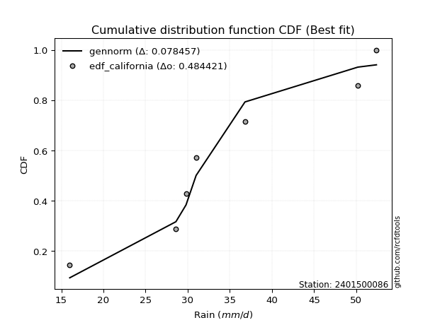</img>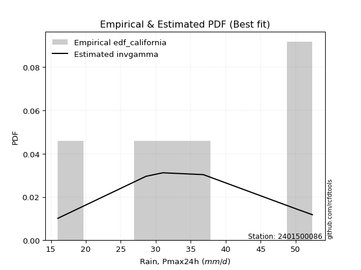</img>

</div>


### 2. EDF Hazen (1930)

Hazen method for plotting positions is a formula used to estimate the empirical cumulative probability distribution of flood events or other hydrological data. This formula often results in biased estimations, particularly when extrapolating to extreme events (high return periods).

<div align="center">


$P=(m-0.5)/n$


</div>


**2.1. Empirical values**

<div align="center">

|                | 0                   | 1                  | 2                  | 3                  | 4         | 5                  |
|:---------------|:--------------------|:-------------------|:-------------------|:-------------------|:----------|:-------------------|
| date           | 2023                | 2020               | 2022               | 2019               | 2021      | 2024               |
| x              | 16.0                | 28.6               | 31.0               | 36.8               | 50.2      | 52.4               |
| m              | 1                   | 2                  | 3                  | 4                  | 5         | 6                  |
| empirical_dist | edf_hazen           | edf_hazen          | edf_hazen          | edf_hazen          | edf_hazen | edf_hazen          |
| empirical      | 0.08333333333333333 | 0.25               | 0.4166666666666667 | 0.5833333333333334 | 0.75      | 0.9166666666666666 |
| empirical_tr   | 1.090909090909091   | 1.3333333333333333 | 1.7142857142857144 | 2.4000000000000004 | 4.0       | 11.999999999999995 |

</div>


**2.2. Kolmogorov-Smirnov fit test (sorted by Δ)**


<div align="center">

|                | 0                  | 1                   | 2                  | 3                  | 4                   | 5                   | 6                   | 7                   | 8                   | 9                   | 10                  | 11                  | 12                  | 13                  | 14                  | 15                  | 16                  | 17                  | 18                  | 19                  | 20                  | 21                 | 22                  | 23                  | 24                  | 25                  | 26                  | 27                  | 28                  | 29                  | 30                  | 31                    | 32                  | 33                  | 34                  | 35                 | 36                  | 37                | 38                  | 39                  | 40                  | 41                 | 42                  | 43                  | 44                 | 45                  | 46                | 47                  | 48                  | 49                 | 50                  | 51                 | 52                  | 53                  | 54                  | 55                  | 56                 | 57                  | 58                 | 59                  | 60                  | 61                  | 62                  | 63                 | 64                  | 65                 | 66                  | 67                 | 68                  | 69                  | 70                  | 71                 | 72                 | 73                  | 74                  | 75                  | 76                  | 77                 | 78                  | 79                 | 80                 | 81                 | 82                 | 83                 | 84               | 85                 | 86                 | 87             |
|:---------------|:-------------------|:--------------------|:-------------------|:-------------------|:--------------------|:--------------------|:--------------------|:--------------------|:--------------------|:--------------------|:--------------------|:--------------------|:--------------------|:--------------------|:--------------------|:--------------------|:--------------------|:--------------------|:--------------------|:--------------------|:--------------------|:-------------------|:--------------------|:--------------------|:--------------------|:--------------------|:--------------------|:--------------------|:--------------------|:--------------------|:--------------------|:----------------------|:--------------------|:--------------------|:--------------------|:-------------------|:--------------------|:------------------|:--------------------|:--------------------|:--------------------|:-------------------|:--------------------|:--------------------|:-------------------|:--------------------|:------------------|:--------------------|:--------------------|:-------------------|:--------------------|:-------------------|:--------------------|:--------------------|:--------------------|:--------------------|:-------------------|:--------------------|:-------------------|:--------------------|:--------------------|:--------------------|:--------------------|:-------------------|:--------------------|:-------------------|:--------------------|:-------------------|:--------------------|:--------------------|:--------------------|:-------------------|:-------------------|:--------------------|:--------------------|:--------------------|:--------------------|:-------------------|:--------------------|:-------------------|:-------------------|:-------------------|:-------------------|:-------------------|:-----------------|:-------------------|:-------------------|:---------------|
| station        | 2401500086         | 2401500086          | 2401500086         | 2401500086         | 2401500086          | 2401500086          | 2401500086          | 2401500086          | 2401500086          | 2401500086          | 2401500086          | 2401500086          | 2401500086          | 2401500086          | 2401500086          | 2401500086          | 2401500086          | 2401500086          | 2401500086          | 2401500086          | 2401500086          | 2401500086         | 2401500086          | 2401500086          | 2401500086          | 2401500086          | 2401500086          | 2401500086          | 2401500086          | 2401500086          | 2401500086          | 2401500086            | 2401500086          | 2401500086          | 2401500086          | 2401500086         | 2401500086          | 2401500086        | 2401500086          | 2401500086          | 2401500086          | 2401500086         | 2401500086          | 2401500086          | 2401500086         | 2401500086          | 2401500086        | 2401500086          | 2401500086          | 2401500086         | 2401500086          | 2401500086         | 2401500086          | 2401500086          | 2401500086          | 2401500086          | 2401500086         | 2401500086          | 2401500086         | 2401500086          | 2401500086          | 2401500086          | 2401500086          | 2401500086         | 2401500086          | 2401500086         | 2401500086          | 2401500086         | 2401500086          | 2401500086          | 2401500086          | 2401500086         | 2401500086         | 2401500086          | 2401500086          | 2401500086          | 2401500086          | 2401500086         | 2401500086          | 2401500086         | 2401500086         | 2401500086         | 2401500086         | 2401500086         | 2401500086       | 2401500086         | 2401500086         | 2401500086     |
| empirical_dist | edf_hazen          | edf_hazen           | edf_hazen          | edf_hazen          | edf_hazen           | edf_hazen           | edf_hazen           | edf_hazen           | edf_hazen           | edf_hazen           | edf_hazen           | edf_hazen           | edf_hazen           | edf_hazen           | edf_hazen           | edf_hazen           | edf_hazen           | edf_hazen           | edf_hazen           | edf_hazen           | edf_hazen           | edf_hazen          | edf_hazen           | edf_hazen           | edf_hazen           | edf_hazen           | edf_hazen           | edf_hazen           | edf_hazen           | edf_hazen           | edf_hazen           | edf_hazen             | edf_hazen           | edf_hazen           | edf_hazen           | edf_hazen          | edf_hazen           | edf_hazen         | edf_hazen           | edf_hazen           | edf_hazen           | edf_hazen          | edf_hazen           | edf_hazen           | edf_hazen          | edf_hazen           | edf_hazen         | edf_hazen           | edf_hazen           | edf_hazen          | edf_hazen           | edf_hazen          | edf_hazen           | edf_hazen           | edf_hazen           | edf_hazen           | edf_hazen          | edf_hazen           | edf_hazen          | edf_hazen           | edf_hazen           | edf_hazen           | edf_hazen           | edf_hazen          | edf_hazen           | edf_hazen          | edf_hazen           | edf_hazen          | edf_hazen           | edf_hazen           | edf_hazen           | edf_hazen          | edf_hazen          | edf_hazen           | edf_hazen           | edf_hazen           | edf_hazen           | edf_hazen          | edf_hazen           | edf_hazen          | edf_hazen          | edf_hazen          | edf_hazen          | edf_hazen          | edf_hazen        | edf_hazen          | edf_hazen          | edf_hazen      |
| p_dist         | logfisk            | logfatiguelife      | lognorm            | lognorm            | logcrystalball      | logt                | logexponnorm        | logf                | lognct              | logpearson3         | kstwobign           | logbetaprime        | ncf                 | genlogistic         | loggamma            | loggamma            | logrice             | halfnorm            | logerlang           | invgauss            | rayleigh            | loglogistic        | alpha               | maxwell             | laplace_asymmetric  | rice                | betaprime           | fisk                | invgamma            | logalpha            | weibull_min         | loglaplace_asymmetric | loginvgamma         | logweibull_min      | gamma               | erlang             | f                   | nct               | norm                | crystalball         | truncnorm           | exponnorm          | t                   | pearson3            | loghypsecant       | halflogistic        | loggumbel_l       | gumbel_r            | moyal               | logmaxwell         | logmielke           | loglaplace         | loginvgauss         | logistic            | lograyleigh         | hypsecant           | loggumbel_r        | mielke              | wald               | logncf              | laplace             | johnsonsu           | logloggamma         | gumbel_l           | logmoyal            | loginvweibull      | gibrat              | loghalfnorm        | loghalflogistic     | logkstwobign        | loggibrat           | loggenexpon        | logwald            | expon               | genexpon            | logtruncnorm        | lognakagami         | nakagami           | loggompertz         | logchi2            | logexpon           | chi2               | loglognorm         | invweibull         | gompertz         | logjohnsonsu       | fatiguelife        | loggenlogistic |
| delta          | 0.0877909415995557 | 0.09986234388127513 | 0.0999587406032294 | 0.0999587406032294 | 0.09995878602453317 | 0.09995880905248561 | 0.09995975739200136 | 0.10055255682133107 | 0.10417168283865191 | 0.10517396396331202 | 0.10734988489841979 | 0.10876162958217167 | 0.11017036460256524 | 0.11025015644360114 | 0.11243061934606402 | 0.11243061934606402 | 0.11245972394793435 | 0.11267862068040857 | 0.11316070281801321 | 0.11491116046657324 | 0.11493145620278489 | 0.1160090354662715 | 0.11634491431286809 | 0.11664953613719853 | 0.11701450267516811 | 0.11734181927196174 | 0.11832723148372326 | 0.11909546028562024 | 0.11914631529395459 | 0.12039203660408954 | 0.12061847057099917 | 0.12078111061157482   | 0.12178374121449431 | 0.12220315151524552 | 0.12224413296224712 | 0.1225808638030037 | 0.12274902057163473 | 0.123099088701766 | 0.12311631123311373 | 0.12311631616832752 | 0.12311634636901969 | 0.1231173247913967 | 0.12311883013220948 | 0.12385666212005508 | 0.1251484033462027 | 0.12652566990733605 | 0.127645178508472 | 0.12817534558299049 | 0.13143347866072475 | 0.1318918003359144 | 0.13312490421058826 | 0.1333009982264982 | 0.13447509390182794 | 0.13795217487155176 | 0.14395681153792994 | 0.14495660584358605 | 0.1483351645320134 | 0.14902869301452049 | 0.1498323492947119 | 0.14987070358435417 | 0.15045180646818468 | 0.15768681727009604 | 0.15905970784575918 | 0.1616630500755023 | 0.16624140807740795 | 0.1712973227648269 | 0.17141901836668805 | 0.1782975289819252 | 0.18637978061777605 | 0.19941850982088277 | 0.19947028697909563 | 0.2020735202248357 | 0.2072199048056862 | 0.22022035214251034 | 0.22036788906363514 | 0.24999717210071484 | 0.24999999610375426 | 0.2499999999993046 | 0.25705686308413345 | 0.2827249240451022 | 0.2966763375616799 | 0.3023053176518301 | 0.4121821287062757 | 0.4904043729368156 | 0.51409160299068 | 0.5220117433386412 | 0.5463130061171808 | 0.75           |
| deltao         | 0.530385761606     | 0.530385761606      | 0.530385761606     | 0.530385761606     | 0.530385761606      | 0.530385761606      | 0.530385761606      | 0.530385761606      | 0.530385761606      | 0.530385761606      | 0.530385761606      | 0.530385761606      | 0.530385761606      | 0.530385761606      | 0.530385761606      | 0.530385761606      | 0.530385761606      | 0.530385761606      | 0.530385761606      | 0.530385761606      | 0.530385761606      | 0.530385761606     | 0.530385761606      | 0.530385761606      | 0.530385761606      | 0.530385761606      | 0.530385761606      | 0.530385761606      | 0.530385761606      | 0.530385761606      | 0.530385761606      | 0.530385761606        | 0.530385761606      | 0.530385761606      | 0.530385761606      | 0.530385761606     | 0.530385761606      | 0.530385761606    | 0.530385761606      | 0.530385761606      | 0.530385761606      | 0.530385761606     | 0.530385761606      | 0.530385761606      | 0.530385761606     | 0.530385761606      | 0.530385761606    | 0.530385761606      | 0.530385761606      | 0.530385761606     | 0.530385761606      | 0.530385761606     | 0.530385761606      | 0.530385761606      | 0.530385761606      | 0.530385761606      | 0.530385761606     | 0.530385761606      | 0.530385761606     | 0.530385761606      | 0.530385761606      | 0.530385761606      | 0.530385761606      | 0.530385761606     | 0.530385761606      | 0.530385761606     | 0.530385761606      | 0.530385761606     | 0.530385761606      | 0.530385761606      | 0.530385761606      | 0.530385761606     | 0.530385761606     | 0.530385761606      | 0.530385761606      | 0.530385761606      | 0.530385761606      | 0.530385761606     | 0.530385761606      | 0.530385761606     | 0.530385761606     | 0.530385761606     | 0.530385761606     | 0.530385761606     | 0.530385761606   | 0.530385761606     | 0.530385761606     | 0.530385761606 |
| eval           | Δo > Δ             | Δo > Δ              | Δo > Δ             | Δo > Δ             | Δo > Δ              | Δo > Δ              | Δo > Δ              | Δo > Δ              | Δo > Δ              | Δo > Δ              | Δo > Δ              | Δo > Δ              | Δo > Δ              | Δo > Δ              | Δo > Δ              | Δo > Δ              | Δo > Δ              | Δo > Δ              | Δo > Δ              | Δo > Δ              | Δo > Δ              | Δo > Δ             | Δo > Δ              | Δo > Δ              | Δo > Δ              | Δo > Δ              | Δo > Δ              | Δo > Δ              | Δo > Δ              | Δo > Δ              | Δo > Δ              | Δo > Δ                | Δo > Δ              | Δo > Δ              | Δo > Δ              | Δo > Δ             | Δo > Δ              | Δo > Δ            | Δo > Δ              | Δo > Δ              | Δo > Δ              | Δo > Δ             | Δo > Δ              | Δo > Δ              | Δo > Δ             | Δo > Δ              | Δo > Δ            | Δo > Δ              | Δo > Δ              | Δo > Δ             | Δo > Δ              | Δo > Δ             | Δo > Δ              | Δo > Δ              | Δo > Δ              | Δo > Δ              | Δo > Δ             | Δo > Δ              | Δo > Δ             | Δo > Δ              | Δo > Δ              | Δo > Δ              | Δo > Δ              | Δo > Δ             | Δo > Δ              | Δo > Δ             | Δo > Δ              | Δo > Δ             | Δo > Δ              | Δo > Δ              | Δo > Δ              | Δo > Δ             | Δo > Δ             | Δo > Δ              | Δo > Δ              | Δo > Δ              | Δo > Δ              | Δo > Δ             | Δo > Δ              | Δo > Δ             | Δo > Δ             | Δo > Δ             | Δo > Δ             | Δo > Δ             | Δo > Δ           | Δo > Δ             | Δo <= Δ            | Δo <= Δ        |
| fit            | 1                  | 1                   | 1                  | 1                  | 1                   | 1                   | 1                   | 1                   | 1                   | 1                   | 1                   | 1                   | 1                   | 1                   | 1                   | 1                   | 1                   | 1                   | 1                   | 1                   | 1                   | 1                  | 1                   | 1                   | 1                   | 1                   | 1                   | 1                   | 1                   | 1                   | 1                   | 1                     | 1                   | 1                   | 1                   | 1                  | 1                   | 1                 | 1                   | 1                   | 1                   | 1                  | 1                   | 1                   | 1                  | 1                   | 1                 | 1                   | 1                   | 1                  | 1                   | 1                  | 1                   | 1                   | 1                   | 1                   | 1                  | 1                   | 1                  | 1                   | 1                   | 1                   | 1                   | 1                  | 1                   | 1                  | 1                   | 1                  | 1                   | 1                   | 1                   | 1                  | 1                  | 1                   | 1                   | 1                   | 1                   | 1                  | 1                   | 1                  | 1                  | 1                  | 1                  | 1                  | 1                | 1                  | 0                  | 0              |
| n              | 6                  | 6                   | 6                  | 6                  | 6                   | 6                   | 6                   | 6                   | 6                   | 6                   | 6                   | 6                   | 6                   | 6                   | 6                   | 6                   | 6                   | 6                   | 6                   | 6                   | 6                   | 6                  | 6                   | 6                   | 6                   | 6                   | 6                   | 6                   | 6                   | 6                   | 6                   | 6                     | 6                   | 6                   | 6                   | 6                  | 6                   | 6                 | 6                   | 6                   | 6                   | 6                  | 6                   | 6                   | 6                  | 6                   | 6                 | 6                   | 6                   | 6                  | 6                   | 6                  | 6                   | 6                   | 6                   | 6                   | 6                  | 6                   | 6                  | 6                   | 6                   | 6                   | 6                   | 6                  | 6                   | 6                  | 6                   | 6                  | 6                   | 6                   | 6                   | 6                  | 6                  | 6                   | 6                   | 6                   | 6                   | 6                  | 6                   | 6                  | 6                  | 6                  | 6                  | 6                  | 6                | 6                  | 6                  | 6              |
| best_fit       | 1                  | 0                   | 0                  | 0                  | 0                   | 0                   | 0                   | 0                   | 0                   | 0                   | 0                   | 0                   | 0                   | 0                   | 0                   | 0                   | 0                   | 0                   | 0                   | 0                   | 0                   | 0                  | 0                   | 0                   | 0                   | 0                   | 0                   | 0                   | 0                   | 0                   | 0                   | 0                     | 0                   | 0                   | 0                   | 0                  | 0                   | 0                 | 0                   | 0                   | 0                   | 0                  | 0                   | 0                   | 0                  | 0                   | 0                 | 0                   | 0                   | 0                  | 0                   | 0                  | 0                   | 0                   | 0                   | 0                   | 0                  | 0                   | 0                  | 0                   | 0                   | 0                   | 0                   | 0                  | 0                   | 0                  | 0                   | 0                  | 0                   | 0                   | 0                   | 0                  | 0                  | 0                   | 0                   | 0                   | 0                   | 0                  | 0                   | 0                  | 0                  | 0                  | 0                  | 0                  | 0                | 0                  | 0                  | 0              |
| best_fit_sort  | 1                  | 2                   | 3                  | 4                  | 5                   | 6                   | 7                   | 8                   | 9                   | 10                  | 11                  | 12                  | 13                  | 14                  | 15                  | 16                  | 17                  | 18                  | 19                  | 20                  | 21                  | 22                 | 23                  | 24                  | 25                  | 26                  | 27                  | 28                  | 29                  | 30                  | 31                  | 32                    | 33                  | 34                  | 35                  | 36                 | 37                  | 38                | 39                  | 40                  | 41                  | 42                 | 43                  | 44                  | 45                 | 46                  | 47                | 48                  | 49                  | 50                 | 51                  | 52                 | 53                  | 54                  | 55                  | 56                  | 57                 | 58                  | 59                 | 60                  | 61                  | 62                  | 63                  | 64                 | 65                  | 66                 | 67                  | 68                 | 69                  | 70                  | 71                  | 72                 | 73                 | 74                  | 75                  | 76                  | 77                  | 78                 | 79                  | 80                 | 81                 | 82                 | 83                 | 84                 | 85               | 86                 | 87                 | 88             |

</div>


**2.3. Best fit**

<div align="center">

|   id |    station | empirical_dist   | p_dist   |     delta |   deltao | eval   |   fit |   n |   best_fit |   best_fit_sort |
|-----:|-----------:|:-----------------|:---------|----------:|---------:|:-------|------:|----:|-----------:|----------------:|
|    0 | 2401500086 | edf_hazen        | logfisk  | 0.0877909 | 0.530386 | Δo > Δ |     1 |   6 |          1 |               1 |

</div>


<div align="center">

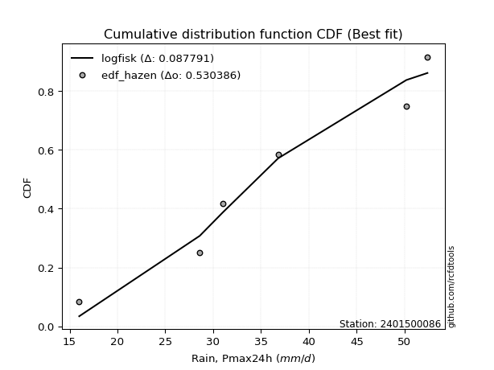</img>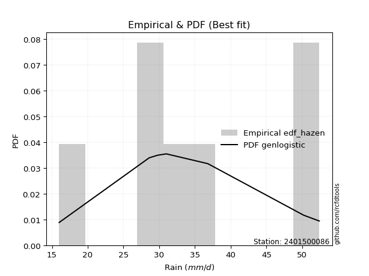</img>

</div>


### 3. EDF Weibull (1939)

Weibull plotting position formula is an empirical method used to estimate the non-exceedance probability or plotting position for a set of observed data, is often recommended or widely used in practice, particularly in flood frequency analysis.

<div align="center">


$P=m/(n+1)$


</div>


**3.1. Empirical values**

<div align="center">

|                | 0                   | 1                  | 2                   | 3                  | 4                  | 5                  |
|:---------------|:--------------------|:-------------------|:--------------------|:-------------------|:-------------------|:-------------------|
| date           | 2023                | 2020               | 2022                | 2019               | 2021               | 2024               |
| x              | 16.0                | 28.6               | 31.0                | 36.8               | 50.2               | 52.4               |
| m              | 1                   | 2                  | 3                   | 4                  | 5                  | 6                  |
| empirical_dist | edf_weibull         | edf_weibull        | edf_weibull         | edf_weibull        | edf_weibull        | edf_weibull        |
| empirical      | 0.14285714285714285 | 0.2857142857142857 | 0.42857142857142855 | 0.5714285714285714 | 0.7142857142857143 | 0.8571428571428571 |
| empirical_tr   | 1.1666666666666665  | 1.4                | 1.75                | 2.333333333333333  | 3.5                | 6.999999999999997  |

</div>


**3.2. Kolmogorov-Smirnov fit test (sorted by Δ)**


<div align="center">

|                | 0                   | 1                   | 2                   | 3                   | 4                   | 5                   | 6                   | 7                   | 8                   | 9                   | 10                  | 11                  | 12                  | 13                  | 14                  | 15                  | 16                 | 17                 | 18                  | 19                 | 20                  | 21                  | 22                  | 23                  | 24                  | 25                  | 26                  | 27                  | 28                  | 29                  | 30                  | 31                  | 32                  | 33                 | 34                  | 35                  | 36                 | 37                  | 38                  | 39                  | 40                  | 41                  | 42                    | 43                  | 44                  | 45                 | 46                  | 47                 | 48                  | 49                  | 50                 | 51                 | 52                  | 53                  | 54                 | 55                  | 56                  | 57                 | 58                  | 59                  | 60               | 61                  | 62                 | 63                  | 64                  | 65                  | 66                  | 67                  | 68                  | 69                 | 70                  | 71                  | 72                | 73                  | 74                 | 75                  | 76                 | 77                 | 78                 | 79                  | 80                  | 81                 | 82               | 83                  | 84                 | 85                | 86                 | 87                 |
|:---------------|:--------------------|:--------------------|:--------------------|:--------------------|:--------------------|:--------------------|:--------------------|:--------------------|:--------------------|:--------------------|:--------------------|:--------------------|:--------------------|:--------------------|:--------------------|:--------------------|:-------------------|:-------------------|:--------------------|:-------------------|:--------------------|:--------------------|:--------------------|:--------------------|:--------------------|:--------------------|:--------------------|:--------------------|:--------------------|:--------------------|:--------------------|:--------------------|:--------------------|:-------------------|:--------------------|:--------------------|:-------------------|:--------------------|:--------------------|:--------------------|:--------------------|:--------------------|:----------------------|:--------------------|:--------------------|:-------------------|:--------------------|:-------------------|:--------------------|:--------------------|:-------------------|:-------------------|:--------------------|:--------------------|:-------------------|:--------------------|:--------------------|:-------------------|:--------------------|:--------------------|:-----------------|:--------------------|:-------------------|:--------------------|:--------------------|:--------------------|:--------------------|:--------------------|:--------------------|:-------------------|:--------------------|:--------------------|:------------------|:--------------------|:-------------------|:--------------------|:-------------------|:-------------------|:-------------------|:--------------------|:--------------------|:-------------------|:-----------------|:--------------------|:-------------------|:------------------|:-------------------|:-------------------|
| station        | 2401500086          | 2401500086          | 2401500086          | 2401500086          | 2401500086          | 2401500086          | 2401500086          | 2401500086          | 2401500086          | 2401500086          | 2401500086          | 2401500086          | 2401500086          | 2401500086          | 2401500086          | 2401500086          | 2401500086         | 2401500086         | 2401500086          | 2401500086         | 2401500086          | 2401500086          | 2401500086          | 2401500086          | 2401500086          | 2401500086          | 2401500086          | 2401500086          | 2401500086          | 2401500086          | 2401500086          | 2401500086          | 2401500086          | 2401500086         | 2401500086          | 2401500086          | 2401500086         | 2401500086          | 2401500086          | 2401500086          | 2401500086          | 2401500086          | 2401500086            | 2401500086          | 2401500086          | 2401500086         | 2401500086          | 2401500086         | 2401500086          | 2401500086          | 2401500086         | 2401500086         | 2401500086          | 2401500086          | 2401500086         | 2401500086          | 2401500086          | 2401500086         | 2401500086          | 2401500086          | 2401500086       | 2401500086          | 2401500086         | 2401500086          | 2401500086          | 2401500086          | 2401500086          | 2401500086          | 2401500086          | 2401500086         | 2401500086          | 2401500086          | 2401500086        | 2401500086          | 2401500086         | 2401500086          | 2401500086         | 2401500086         | 2401500086         | 2401500086          | 2401500086          | 2401500086         | 2401500086       | 2401500086          | 2401500086         | 2401500086        | 2401500086         | 2401500086         |
| empirical_dist | edf_weibull         | edf_weibull         | edf_weibull         | edf_weibull         | edf_weibull         | edf_weibull         | edf_weibull         | edf_weibull         | edf_weibull         | edf_weibull         | edf_weibull         | edf_weibull         | edf_weibull         | edf_weibull         | edf_weibull         | edf_weibull         | edf_weibull        | edf_weibull        | edf_weibull         | edf_weibull        | edf_weibull         | edf_weibull         | edf_weibull         | edf_weibull         | edf_weibull         | edf_weibull         | edf_weibull         | edf_weibull         | edf_weibull         | edf_weibull         | edf_weibull         | edf_weibull         | edf_weibull         | edf_weibull        | edf_weibull         | edf_weibull         | edf_weibull        | edf_weibull         | edf_weibull         | edf_weibull         | edf_weibull         | edf_weibull         | edf_weibull           | edf_weibull         | edf_weibull         | edf_weibull        | edf_weibull         | edf_weibull        | edf_weibull         | edf_weibull         | edf_weibull        | edf_weibull        | edf_weibull         | edf_weibull         | edf_weibull        | edf_weibull         | edf_weibull         | edf_weibull        | edf_weibull         | edf_weibull         | edf_weibull      | edf_weibull         | edf_weibull        | edf_weibull         | edf_weibull         | edf_weibull         | edf_weibull         | edf_weibull         | edf_weibull         | edf_weibull        | edf_weibull         | edf_weibull         | edf_weibull       | edf_weibull         | edf_weibull        | edf_weibull         | edf_weibull        | edf_weibull        | edf_weibull        | edf_weibull         | edf_weibull         | edf_weibull        | edf_weibull      | edf_weibull         | edf_weibull        | edf_weibull       | edf_weibull        | edf_weibull        |
| p_dist         | logncf              | loginvgauss         | logfisk             | loginvgamma         | logerlang           | lognct              | logrice             | logalpha            | loggamma            | loggamma            | logbetaprime        | logmaxwell          | logf                | logfatiguelife      | logexponnorm        | logt                | lognorm            | lognorm            | logcrystalball      | loginvweibull      | kstwobign           | logpearson3         | lograyleigh         | loghalfnorm         | ncf                 | genlogistic         | loggumbel_r         | halfnorm            | logmielke           | invgauss            | rayleigh            | loghalflogistic     | logmoyal            | loglogistic        | alpha               | maxwell             | laplace_asymmetric | rice                | betaprime           | fisk                | invgamma            | weibull_min         | loglaplace_asymmetric | logweibull_min      | gamma               | erlang             | f                   | nct                | norm                | crystalball         | truncnorm          | exponnorm          | t                   | pearson3            | loghypsecant       | johnsonsu           | halflogistic        | loggumbel_l        | logkstwobign        | gumbel_r            | loggenexpon      | moyal               | loglaplace         | logistic            | logwald             | hypsecant           | expon               | genexpon            | mielke              | wald               | laplace             | logloggamma         | gumbel_l          | gibrat              | loggibrat          | loggompertz         | logchi2            | logexpon           | chi2               | logtruncnorm        | lognakagami         | nakagami           | loglognorm       | invweibull          | logjohnsonsu       | gompertz          | fatiguelife        | loggenlogistic     |
| delta          | 0.11415641787006847 | 0.11804187618293827 | 0.12350522731384139 | 0.12597844257410828 | 0.12874832894869903 | 0.13043026035643268 | 0.13049381720686937 | 0.13054407472492413 | 0.13076149337346854 | 0.13076149337346854 | 0.13110991185530807 | 0.13159116142425975 | 0.13366198805988638 | 0.13372392353494378 | 0.13393800714956405 | 0.13393852879221435 | 0.1339386188798598 | 0.1339386188798598 | 0.13393867734893106 | 0.1355830370505412 | 0.13801827688392665 | 0.14088824967759772 | 0.14187776174339328 | 0.14285714285714285 | 0.14588465031685094 | 0.14596444215788684 | 0.14637627903423234 | 0.14839290639469427 | 0.14905470885114958 | 0.15062544618085894 | 0.15064574191707059 | 0.15066549490349035 | 0.15152250874394435 | 0.1517233211805572 | 0.15205920002715378 | 0.15236382185148423 | 0.1527287883894538 | 0.15305610498624744 | 0.15404151719800896 | 0.15480974599990593 | 0.15486060100824028 | 0.15633275628528487 | 0.15649539632586051   | 0.15791743722953122 | 0.15795841867653282 | 0.1582951495172894 | 0.15846330628592042 | 0.1588133744160517 | 0.15883059694739943 | 0.15883060188261322 | 0.1588306320833054 | 0.1588316105056824 | 0.15883311584649518 | 0.15957094783434078 | 0.1608626890604884 | 0.16190754364822613 | 0.16223995562162175 | 0.1633594642227577 | 0.16370422410659707 | 0.16388963129727618 | 0.16635923451055 | 0.16714776437501044 | 0.1690152839407839 | 0.17366646058583746 | 0.17974708474229584 | 0.18067089155787175 | 0.18450606642822465 | 0.18465360334934944 | 0.18474297872880618 | 0.1855466350089976 | 0.18616609218247038 | 0.19477399356004488 | 0.197377335789788 | 0.20713330408097375 | 0.2113750488838576 | 0.22134257736984775 | 0.2470106383308165 | 0.2609620518473942 | 0.2665910319375444 | 0.28571145781500057 | 0.28571428181803993 | 0.2857142857135903 | 0.37646784299199 | 0.43088056341300607 | 0.4862974576243555 | 0.502186841085918 | 0.5105987204028951 | 0.7142857142857143 |
| deltao         | 0.530385761606      | 0.530385761606      | 0.530385761606      | 0.530385761606      | 0.530385761606      | 0.530385761606      | 0.530385761606      | 0.530385761606      | 0.530385761606      | 0.530385761606      | 0.530385761606      | 0.530385761606      | 0.530385761606      | 0.530385761606      | 0.530385761606      | 0.530385761606      | 0.530385761606     | 0.530385761606     | 0.530385761606      | 0.530385761606     | 0.530385761606      | 0.530385761606      | 0.530385761606      | 0.530385761606      | 0.530385761606      | 0.530385761606      | 0.530385761606      | 0.530385761606      | 0.530385761606      | 0.530385761606      | 0.530385761606      | 0.530385761606      | 0.530385761606      | 0.530385761606     | 0.530385761606      | 0.530385761606      | 0.530385761606     | 0.530385761606      | 0.530385761606      | 0.530385761606      | 0.530385761606      | 0.530385761606      | 0.530385761606        | 0.530385761606      | 0.530385761606      | 0.530385761606     | 0.530385761606      | 0.530385761606     | 0.530385761606      | 0.530385761606      | 0.530385761606     | 0.530385761606     | 0.530385761606      | 0.530385761606      | 0.530385761606     | 0.530385761606      | 0.530385761606      | 0.530385761606     | 0.530385761606      | 0.530385761606      | 0.530385761606   | 0.530385761606      | 0.530385761606     | 0.530385761606      | 0.530385761606      | 0.530385761606      | 0.530385761606      | 0.530385761606      | 0.530385761606      | 0.530385761606     | 0.530385761606      | 0.530385761606      | 0.530385761606    | 0.530385761606      | 0.530385761606     | 0.530385761606      | 0.530385761606     | 0.530385761606     | 0.530385761606     | 0.530385761606      | 0.530385761606      | 0.530385761606     | 0.530385761606   | 0.530385761606      | 0.530385761606     | 0.530385761606    | 0.530385761606     | 0.530385761606     |
| eval           | Δo > Δ              | Δo > Δ              | Δo > Δ              | Δo > Δ              | Δo > Δ              | Δo > Δ              | Δo > Δ              | Δo > Δ              | Δo > Δ              | Δo > Δ              | Δo > Δ              | Δo > Δ              | Δo > Δ              | Δo > Δ              | Δo > Δ              | Δo > Δ              | Δo > Δ             | Δo > Δ             | Δo > Δ              | Δo > Δ             | Δo > Δ              | Δo > Δ              | Δo > Δ              | Δo > Δ              | Δo > Δ              | Δo > Δ              | Δo > Δ              | Δo > Δ              | Δo > Δ              | Δo > Δ              | Δo > Δ              | Δo > Δ              | Δo > Δ              | Δo > Δ             | Δo > Δ              | Δo > Δ              | Δo > Δ             | Δo > Δ              | Δo > Δ              | Δo > Δ              | Δo > Δ              | Δo > Δ              | Δo > Δ                | Δo > Δ              | Δo > Δ              | Δo > Δ             | Δo > Δ              | Δo > Δ             | Δo > Δ              | Δo > Δ              | Δo > Δ             | Δo > Δ             | Δo > Δ              | Δo > Δ              | Δo > Δ             | Δo > Δ              | Δo > Δ              | Δo > Δ             | Δo > Δ              | Δo > Δ              | Δo > Δ           | Δo > Δ              | Δo > Δ             | Δo > Δ              | Δo > Δ              | Δo > Δ              | Δo > Δ              | Δo > Δ              | Δo > Δ              | Δo > Δ             | Δo > Δ              | Δo > Δ              | Δo > Δ            | Δo > Δ              | Δo > Δ             | Δo > Δ              | Δo > Δ             | Δo > Δ             | Δo > Δ             | Δo > Δ              | Δo > Δ              | Δo > Δ             | Δo > Δ           | Δo > Δ              | Δo > Δ             | Δo > Δ            | Δo > Δ             | Δo <= Δ            |
| fit            | 1                   | 1                   | 1                   | 1                   | 1                   | 1                   | 1                   | 1                   | 1                   | 1                   | 1                   | 1                   | 1                   | 1                   | 1                   | 1                   | 1                  | 1                  | 1                   | 1                  | 1                   | 1                   | 1                   | 1                   | 1                   | 1                   | 1                   | 1                   | 1                   | 1                   | 1                   | 1                   | 1                   | 1                  | 1                   | 1                   | 1                  | 1                   | 1                   | 1                   | 1                   | 1                   | 1                     | 1                   | 1                   | 1                  | 1                   | 1                  | 1                   | 1                   | 1                  | 1                  | 1                   | 1                   | 1                  | 1                   | 1                   | 1                  | 1                   | 1                   | 1                | 1                   | 1                  | 1                   | 1                   | 1                   | 1                   | 1                   | 1                   | 1                  | 1                   | 1                   | 1                 | 1                   | 1                  | 1                   | 1                  | 1                  | 1                  | 1                   | 1                   | 1                  | 1                | 1                   | 1                  | 1                 | 1                  | 0                  |
| n              | 6                   | 6                   | 6                   | 6                   | 6                   | 6                   | 6                   | 6                   | 6                   | 6                   | 6                   | 6                   | 6                   | 6                   | 6                   | 6                   | 6                  | 6                  | 6                   | 6                  | 6                   | 6                   | 6                   | 6                   | 6                   | 6                   | 6                   | 6                   | 6                   | 6                   | 6                   | 6                   | 6                   | 6                  | 6                   | 6                   | 6                  | 6                   | 6                   | 6                   | 6                   | 6                   | 6                     | 6                   | 6                   | 6                  | 6                   | 6                  | 6                   | 6                   | 6                  | 6                  | 6                   | 6                   | 6                  | 6                   | 6                   | 6                  | 6                   | 6                   | 6                | 6                   | 6                  | 6                   | 6                   | 6                   | 6                   | 6                   | 6                   | 6                  | 6                   | 6                   | 6                 | 6                   | 6                  | 6                   | 6                  | 6                  | 6                  | 6                   | 6                   | 6                  | 6                | 6                   | 6                  | 6                 | 6                  | 6                  |
| best_fit       | 1                   | 0                   | 0                   | 0                   | 0                   | 0                   | 0                   | 0                   | 0                   | 0                   | 0                   | 0                   | 0                   | 0                   | 0                   | 0                   | 0                  | 0                  | 0                   | 0                  | 0                   | 0                   | 0                   | 0                   | 0                   | 0                   | 0                   | 0                   | 0                   | 0                   | 0                   | 0                   | 0                   | 0                  | 0                   | 0                   | 0                  | 0                   | 0                   | 0                   | 0                   | 0                   | 0                     | 0                   | 0                   | 0                  | 0                   | 0                  | 0                   | 0                   | 0                  | 0                  | 0                   | 0                   | 0                  | 0                   | 0                   | 0                  | 0                   | 0                   | 0                | 0                   | 0                  | 0                   | 0                   | 0                   | 0                   | 0                   | 0                   | 0                  | 0                   | 0                   | 0                 | 0                   | 0                  | 0                   | 0                  | 0                  | 0                  | 0                   | 0                   | 0                  | 0                | 0                   | 0                  | 0                 | 0                  | 0                  |
| best_fit_sort  | 1                   | 2                   | 3                   | 4                   | 5                   | 6                   | 7                   | 8                   | 9                   | 10                  | 11                  | 12                  | 13                  | 14                  | 15                  | 16                  | 17                 | 18                 | 19                  | 20                 | 21                  | 22                  | 23                  | 24                  | 25                  | 26                  | 27                  | 28                  | 29                  | 30                  | 31                  | 32                  | 33                  | 34                 | 35                  | 36                  | 37                 | 38                  | 39                  | 40                  | 41                  | 42                  | 43                    | 44                  | 45                  | 46                 | 47                  | 48                 | 49                  | 50                  | 51                 | 52                 | 53                  | 54                  | 55                 | 56                  | 57                  | 58                 | 59                  | 60                  | 61               | 62                  | 63                 | 64                  | 65                  | 66                  | 67                  | 68                  | 69                  | 70                 | 71                  | 72                  | 73                | 74                  | 75                 | 76                  | 77                 | 78                 | 79                 | 80                  | 81                  | 82                 | 83               | 84                  | 85                 | 86                | 87                 | 88                 |

</div>


**3.3. Best fit**

<div align="center">

|   id |    station | empirical_dist   | p_dist   |    delta |   deltao | eval   |   fit |   n |   best_fit |   best_fit_sort |
|-----:|-----------:|:-----------------|:---------|---------:|---------:|:-------|------:|----:|-----------:|----------------:|
|    0 | 2401500086 | edf_weibull      | logncf   | 0.114156 | 0.530386 | Δo > Δ |     1 |   6 |          1 |               1 |

</div>


<div align="center">

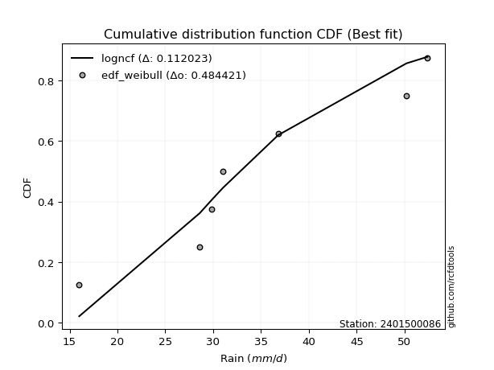</img>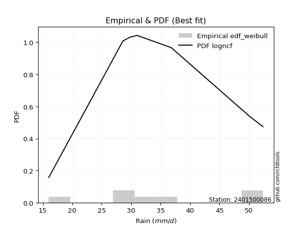</img>

</div>


### 4. EDF Beard (1943)

The Beard formula (or Beard´s plotting position formula) in hydrology is used to estimate the empirical non-exceedance probability _(P)_ of a flood event (or other extreme hydrological data point) within a given dataset.

<div align="center">


$P=(m-0.31)/(n+0.38)$


</div>


**4.1. Empirical values**

<div align="center">

|                | 0                   | 1                   | 2                  | 3                  | 4                  | 5                  |
|:---------------|:--------------------|:--------------------|:-------------------|:-------------------|:-------------------|:-------------------|
| date           | 2023                | 2020                | 2022               | 2019               | 2021               | 2024               |
| x              | 16.0                | 28.6                | 31.0               | 36.8               | 50.2               | 52.4               |
| m              | 1                   | 2                   | 3                  | 4                  | 5                  | 6                  |
| empirical_dist | edf_beard           | edf_beard           | edf_beard          | edf_beard          | edf_beard          | edf_beard          |
| empirical      | 0.10815047021943573 | 0.26489028213166144 | 0.4216300940438871 | 0.5783699059561128 | 0.7351097178683387 | 0.8918495297805643 |
| empirical_tr   | 1.1212653778558874  | 1.3603411513859276  | 1.7289972899728996 | 2.3717472118959106 | 3.7751479289940844 | 9.246376811594207  |

</div>


**4.2. Kolmogorov-Smirnov fit test (sorted by Δ)**


<div align="center">

|                | 0                   | 1                   | 2                   | 3                   | 4                 | 5                   | 6                   | 7                   | 8                  | 9                   | 10                 | 11                  | 12                  | 13                  | 14                  | 15                  | 16                  | 17                  | 18                 | 19                  | 20                  | 21                  | 22                 | 23                 | 24                 | 25                  | 26                 | 27                  | 28                 | 29                  | 30                  | 31                  | 32                 | 33                  | 34                  | 35                 | 36                  | 37                 | 38                    | 39                  | 40                  | 41                  | 42                  | 43                  | 44                  | 45                  | 46                  | 47                  | 48                 | 49                 | 50                  | 51                  | 52                  | 53                 | 54                  | 55                  | 56                 | 57                  | 58                  | 59                  | 60                  | 61                  | 62                 | 63                  | 64                | 65                 | 66                 | 67                  | 68                  | 69                  | 70                  | 71                  | 72                 | 73                 | 74                 | 75                | 76                 | 77                  | 78                  | 79                  | 80                  | 81                  | 82                  | 83                 | 84                 | 85                 | 86                 | 87                 |
|:---------------|:--------------------|:--------------------|:--------------------|:--------------------|:------------------|:--------------------|:--------------------|:--------------------|:-------------------|:--------------------|:-------------------|:--------------------|:--------------------|:--------------------|:--------------------|:--------------------|:--------------------|:--------------------|:-------------------|:--------------------|:--------------------|:--------------------|:-------------------|:-------------------|:-------------------|:--------------------|:-------------------|:--------------------|:-------------------|:--------------------|:--------------------|:--------------------|:-------------------|:--------------------|:--------------------|:-------------------|:--------------------|:-------------------|:----------------------|:--------------------|:--------------------|:--------------------|:--------------------|:--------------------|:--------------------|:--------------------|:--------------------|:--------------------|:-------------------|:-------------------|:--------------------|:--------------------|:--------------------|:-------------------|:--------------------|:--------------------|:-------------------|:--------------------|:--------------------|:--------------------|:--------------------|:--------------------|:-------------------|:--------------------|:------------------|:-------------------|:-------------------|:--------------------|:--------------------|:--------------------|:--------------------|:--------------------|:-------------------|:-------------------|:-------------------|:------------------|:-------------------|:--------------------|:--------------------|:--------------------|:--------------------|:--------------------|:--------------------|:-------------------|:-------------------|:-------------------|:-------------------|:-------------------|
| station        | 2401500086          | 2401500086          | 2401500086          | 2401500086          | 2401500086        | 2401500086          | 2401500086          | 2401500086          | 2401500086         | 2401500086          | 2401500086         | 2401500086          | 2401500086          | 2401500086          | 2401500086          | 2401500086          | 2401500086          | 2401500086          | 2401500086         | 2401500086          | 2401500086          | 2401500086          | 2401500086         | 2401500086         | 2401500086         | 2401500086          | 2401500086         | 2401500086          | 2401500086         | 2401500086          | 2401500086          | 2401500086          | 2401500086         | 2401500086          | 2401500086          | 2401500086         | 2401500086          | 2401500086         | 2401500086            | 2401500086          | 2401500086          | 2401500086          | 2401500086          | 2401500086          | 2401500086          | 2401500086          | 2401500086          | 2401500086          | 2401500086         | 2401500086         | 2401500086          | 2401500086          | 2401500086          | 2401500086         | 2401500086          | 2401500086          | 2401500086         | 2401500086          | 2401500086          | 2401500086          | 2401500086          | 2401500086          | 2401500086         | 2401500086          | 2401500086        | 2401500086         | 2401500086         | 2401500086          | 2401500086          | 2401500086          | 2401500086          | 2401500086          | 2401500086         | 2401500086         | 2401500086         | 2401500086        | 2401500086         | 2401500086          | 2401500086          | 2401500086          | 2401500086          | 2401500086          | 2401500086          | 2401500086         | 2401500086         | 2401500086         | 2401500086         | 2401500086         |
| empirical_dist | edf_beard           | edf_beard           | edf_beard           | edf_beard           | edf_beard         | edf_beard           | edf_beard           | edf_beard           | edf_beard          | edf_beard           | edf_beard          | edf_beard           | edf_beard           | edf_beard           | edf_beard           | edf_beard           | edf_beard           | edf_beard           | edf_beard          | edf_beard           | edf_beard           | edf_beard           | edf_beard          | edf_beard          | edf_beard          | edf_beard           | edf_beard          | edf_beard           | edf_beard          | edf_beard           | edf_beard           | edf_beard           | edf_beard          | edf_beard           | edf_beard           | edf_beard          | edf_beard           | edf_beard          | edf_beard             | edf_beard           | edf_beard           | edf_beard           | edf_beard           | edf_beard           | edf_beard           | edf_beard           | edf_beard           | edf_beard           | edf_beard          | edf_beard          | edf_beard           | edf_beard           | edf_beard           | edf_beard          | edf_beard           | edf_beard           | edf_beard          | edf_beard           | edf_beard           | edf_beard           | edf_beard           | edf_beard           | edf_beard          | edf_beard           | edf_beard         | edf_beard          | edf_beard          | edf_beard           | edf_beard           | edf_beard           | edf_beard           | edf_beard           | edf_beard          | edf_beard          | edf_beard          | edf_beard         | edf_beard          | edf_beard           | edf_beard           | edf_beard           | edf_beard           | edf_beard           | edf_beard           | edf_beard          | edf_beard          | edf_beard          | edf_beard          | edf_beard          |
| p_dist         | logfisk             | loginvgamma         | logerlang           | lognct              | logrice           | logalpha            | loggamma            | loggamma            | logbetaprime       | logf                | logfatiguelife     | logexponnorm        | logt                | lognorm             | lognorm             | logcrystalball      | logmaxwell          | kstwobign           | loginvgauss        | logpearson3         | ncf                 | genlogistic         | halfnorm           | logmielke          | lograyleigh        | invgauss            | rayleigh           | loglogistic         | alpha              | maxwell             | laplace_asymmetric  | rice                | betaprime          | loggumbel_r         | fisk                | invgamma           | logncf              | weibull_min        | loglaplace_asymmetric | logweibull_min      | gamma               | erlang              | f                   | nct                 | norm                | crystalball         | truncnorm           | exponnorm           | t                  | pearson3           | loghypsecant        | halflogistic        | loggumbel_l         | gumbel_r           | moyal               | loglaplace          | logmoyal           | johnsonsu           | logistic            | loginvweibull       | hypsecant           | loghalfnorm         | mielke             | wald                | laplace           | loghalflogistic    | logloggamma        | gumbel_l            | logkstwobign        | gibrat              | loggenexpon         | logwald             | loggibrat          | expon              | genexpon           | loggompertz       | logtruncnorm       | lognakagami         | nakagami            | logchi2             | logexpon            | chi2                | loglognorm          | invweibull         | logjohnsonsu       | gompertz           | fatiguelife        | loggenlogistic     |
| delta          | 0.10268122373121702 | 0.10689345908283288 | 0.10792432536607466 | 0.10960625677380831 | 0.109669813624245 | 0.10972007114229976 | 0.10993748979084417 | 0.10993748979084417 | 0.1102859082726837 | 0.11283798447726201 | 0.1128999199523194 | 0.11311400356693968 | 0.11311452520958998 | 0.11311461529723543 | 0.11311461529723543 | 0.11311467376630668 | 0.11700151820425297 | 0.11719427330130228 | 0.1195848117701665 | 0.12006424609497335 | 0.12506064673422657 | 0.12514043857526247 | 0.1275689028120699 | 0.1282307052685252 | 0.1290665294062685 | 0.12980144259823456 | 0.1298217383344462 | 0.13089931759793283 | 0.1312351964445294 | 0.13153981826885985 | 0.13190478480682943 | 0.13223210140362307 | 0.1332175136153846 | 0.13344488240035196 | 0.13398574241728156 | 0.1340365974256159 | 0.13498042145269273 | 0.1355087527026605 | 0.13567139274323614   | 0.13709343364690685 | 0.13713441509390845 | 0.13747114593466503 | 0.13763930270329605 | 0.13798937083342733 | 0.13800659336477505 | 0.13800659829998885 | 0.13800662850068102 | 0.13800760692305802 | 0.1380091122638708 | 0.1387469442517164 | 0.14003868547786402 | 0.14141595203899737 | 0.14253546064013334 | 0.1430656277146518 | 0.14632376079238607 | 0.14819128035815954 | 0.1513511259457465 | 0.15272338989287548 | 0.15284245700321308 | 0.15640704063316546 | 0.15984688797524738 | 0.16340724685026375 | 0.1639189751461818 | 0.16472263142637322 | 0.165342088599846 | 0.1714894984861146 | 0.1739499899774205 | 0.17655333220716363 | 0.18452822768922134 | 0.18630930049834937 | 0.18718323809317428 | 0.19232962267402476 | 0.2044337143563162 | 0.2053300700108489 | 0.2054776069319737 | 0.242166580952472 | 0.2648874542323763 | 0.26489027823541567 | 0.26489028213096605 | 0.26783464191344075 | 0.28178605543001845 | 0.28741503552016867 | 0.39729184657461425 | 0.4655872360507133 | 0.5071214612069799 | 0.5091281756134595 | 0.5314227239855194 | 0.7351097178683387 |
| deltao         | 0.530385761606      | 0.530385761606      | 0.530385761606      | 0.530385761606      | 0.530385761606    | 0.530385761606      | 0.530385761606      | 0.530385761606      | 0.530385761606     | 0.530385761606      | 0.530385761606     | 0.530385761606      | 0.530385761606      | 0.530385761606      | 0.530385761606      | 0.530385761606      | 0.530385761606      | 0.530385761606      | 0.530385761606     | 0.530385761606      | 0.530385761606      | 0.530385761606      | 0.530385761606     | 0.530385761606     | 0.530385761606     | 0.530385761606      | 0.530385761606     | 0.530385761606      | 0.530385761606     | 0.530385761606      | 0.530385761606      | 0.530385761606      | 0.530385761606     | 0.530385761606      | 0.530385761606      | 0.530385761606     | 0.530385761606      | 0.530385761606     | 0.530385761606        | 0.530385761606      | 0.530385761606      | 0.530385761606      | 0.530385761606      | 0.530385761606      | 0.530385761606      | 0.530385761606      | 0.530385761606      | 0.530385761606      | 0.530385761606     | 0.530385761606     | 0.530385761606      | 0.530385761606      | 0.530385761606      | 0.530385761606     | 0.530385761606      | 0.530385761606      | 0.530385761606     | 0.530385761606      | 0.530385761606      | 0.530385761606      | 0.530385761606      | 0.530385761606      | 0.530385761606     | 0.530385761606      | 0.530385761606    | 0.530385761606     | 0.530385761606     | 0.530385761606      | 0.530385761606      | 0.530385761606      | 0.530385761606      | 0.530385761606      | 0.530385761606     | 0.530385761606     | 0.530385761606     | 0.530385761606    | 0.530385761606     | 0.530385761606      | 0.530385761606      | 0.530385761606      | 0.530385761606      | 0.530385761606      | 0.530385761606      | 0.530385761606     | 0.530385761606     | 0.530385761606     | 0.530385761606     | 0.530385761606     |
| eval           | Δo > Δ              | Δo > Δ              | Δo > Δ              | Δo > Δ              | Δo > Δ            | Δo > Δ              | Δo > Δ              | Δo > Δ              | Δo > Δ             | Δo > Δ              | Δo > Δ             | Δo > Δ              | Δo > Δ              | Δo > Δ              | Δo > Δ              | Δo > Δ              | Δo > Δ              | Δo > Δ              | Δo > Δ             | Δo > Δ              | Δo > Δ              | Δo > Δ              | Δo > Δ             | Δo > Δ             | Δo > Δ             | Δo > Δ              | Δo > Δ             | Δo > Δ              | Δo > Δ             | Δo > Δ              | Δo > Δ              | Δo > Δ              | Δo > Δ             | Δo > Δ              | Δo > Δ              | Δo > Δ             | Δo > Δ              | Δo > Δ             | Δo > Δ                | Δo > Δ              | Δo > Δ              | Δo > Δ              | Δo > Δ              | Δo > Δ              | Δo > Δ              | Δo > Δ              | Δo > Δ              | Δo > Δ              | Δo > Δ             | Δo > Δ             | Δo > Δ              | Δo > Δ              | Δo > Δ              | Δo > Δ             | Δo > Δ              | Δo > Δ              | Δo > Δ             | Δo > Δ              | Δo > Δ              | Δo > Δ              | Δo > Δ              | Δo > Δ              | Δo > Δ             | Δo > Δ              | Δo > Δ            | Δo > Δ             | Δo > Δ             | Δo > Δ              | Δo > Δ              | Δo > Δ              | Δo > Δ              | Δo > Δ              | Δo > Δ             | Δo > Δ             | Δo > Δ             | Δo > Δ            | Δo > Δ             | Δo > Δ              | Δo > Δ              | Δo > Δ              | Δo > Δ              | Δo > Δ              | Δo > Δ              | Δo > Δ             | Δo > Δ             | Δo > Δ             | Δo <= Δ            | Δo <= Δ            |
| fit            | 1                   | 1                   | 1                   | 1                   | 1                 | 1                   | 1                   | 1                   | 1                  | 1                   | 1                  | 1                   | 1                   | 1                   | 1                   | 1                   | 1                   | 1                   | 1                  | 1                   | 1                   | 1                   | 1                  | 1                  | 1                  | 1                   | 1                  | 1                   | 1                  | 1                   | 1                   | 1                   | 1                  | 1                   | 1                   | 1                  | 1                   | 1                  | 1                     | 1                   | 1                   | 1                   | 1                   | 1                   | 1                   | 1                   | 1                   | 1                   | 1                  | 1                  | 1                   | 1                   | 1                   | 1                  | 1                   | 1                   | 1                  | 1                   | 1                   | 1                   | 1                   | 1                   | 1                  | 1                   | 1                 | 1                  | 1                  | 1                   | 1                   | 1                   | 1                   | 1                   | 1                  | 1                  | 1                  | 1                 | 1                  | 1                   | 1                   | 1                   | 1                   | 1                   | 1                   | 1                  | 1                  | 1                  | 0                  | 0                  |
| n              | 6                   | 6                   | 6                   | 6                   | 6                 | 6                   | 6                   | 6                   | 6                  | 6                   | 6                  | 6                   | 6                   | 6                   | 6                   | 6                   | 6                   | 6                   | 6                  | 6                   | 6                   | 6                   | 6                  | 6                  | 6                  | 6                   | 6                  | 6                   | 6                  | 6                   | 6                   | 6                   | 6                  | 6                   | 6                   | 6                  | 6                   | 6                  | 6                     | 6                   | 6                   | 6                   | 6                   | 6                   | 6                   | 6                   | 6                   | 6                   | 6                  | 6                  | 6                   | 6                   | 6                   | 6                  | 6                   | 6                   | 6                  | 6                   | 6                   | 6                   | 6                   | 6                   | 6                  | 6                   | 6                 | 6                  | 6                  | 6                   | 6                   | 6                   | 6                   | 6                   | 6                  | 6                  | 6                  | 6                 | 6                  | 6                   | 6                   | 6                   | 6                   | 6                   | 6                   | 6                  | 6                  | 6                  | 6                  | 6                  |
| best_fit       | 1                   | 0                   | 0                   | 0                   | 0                 | 0                   | 0                   | 0                   | 0                  | 0                   | 0                  | 0                   | 0                   | 0                   | 0                   | 0                   | 0                   | 0                   | 0                  | 0                   | 0                   | 0                   | 0                  | 0                  | 0                  | 0                   | 0                  | 0                   | 0                  | 0                   | 0                   | 0                   | 0                  | 0                   | 0                   | 0                  | 0                   | 0                  | 0                     | 0                   | 0                   | 0                   | 0                   | 0                   | 0                   | 0                   | 0                   | 0                   | 0                  | 0                  | 0                   | 0                   | 0                   | 0                  | 0                   | 0                   | 0                  | 0                   | 0                   | 0                   | 0                   | 0                   | 0                  | 0                   | 0                 | 0                  | 0                  | 0                   | 0                   | 0                   | 0                   | 0                   | 0                  | 0                  | 0                  | 0                 | 0                  | 0                   | 0                   | 0                   | 0                   | 0                   | 0                   | 0                  | 0                  | 0                  | 0                  | 0                  |
| best_fit_sort  | 1                   | 2                   | 3                   | 4                   | 5                 | 6                   | 7                   | 8                   | 9                  | 10                  | 11                 | 12                  | 13                  | 14                  | 15                  | 16                  | 17                  | 18                  | 19                 | 20                  | 21                  | 22                  | 23                 | 24                 | 25                 | 26                  | 27                 | 28                  | 29                 | 30                  | 31                  | 32                  | 33                 | 34                  | 35                  | 36                 | 37                  | 38                 | 39                    | 40                  | 41                  | 42                  | 43                  | 44                  | 45                  | 46                  | 47                  | 48                  | 49                 | 50                 | 51                  | 52                  | 53                  | 54                 | 55                  | 56                  | 57                 | 58                  | 59                  | 60                  | 61                  | 62                  | 63                 | 64                  | 65                | 66                 | 67                 | 68                  | 69                  | 70                  | 71                  | 72                  | 73                 | 74                 | 75                 | 76                | 77                 | 78                  | 79                  | 80                  | 81                  | 82                  | 83                  | 84                 | 85                 | 86                 | 87                 | 88                 |

</div>


**4.3. Best fit**

<div align="center">

|   id |    station | empirical_dist   | p_dist   |    delta |   deltao | eval   |   fit |   n |   best_fit |   best_fit_sort |
|-----:|-----------:|:-----------------|:---------|---------:|---------:|:-------|------:|----:|-----------:|----------------:|
|    0 | 2401500086 | edf_beard        | logfisk  | 0.102681 | 0.530386 | Δo > Δ |     1 |   6 |          1 |               1 |

</div>


<div align="center">

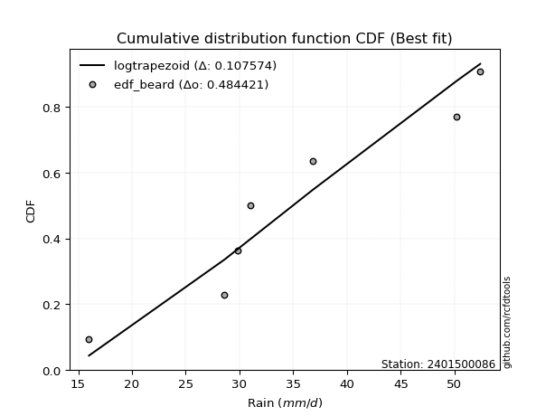</img>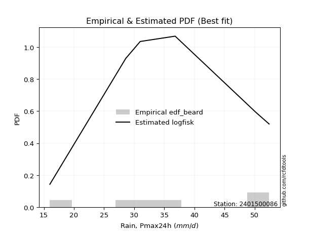</img>

</div>


### 5. EDF Chegodayev (1955)

The Chegodayev formula is an empirical plotting position formula used in hydrological frequency analysis to estimate the exceedance probability or return period of a specific event from a set of observed data. It is primarily used for plotting observed data points on probability paper to fit a theoretical distribution, particularly for analyzing extreme events like maximum flood flows or rainfall intensities. The constant _b_ value in the generalized plotting position formula is 0.3.

<div align="center">


$P=(m-b)/(n+1-2b)$


</div>


**5.1. Empirical values**

<div align="center">

|                | 0                   | 1                  | 2                  | 3                  | 4                 | 5                 |
|:---------------|:--------------------|:-------------------|:-------------------|:-------------------|:------------------|:------------------|
| date           | 2023                | 2020               | 2022               | 2019               | 2021              | 2024              |
| x              | 16.0                | 28.6               | 31.0               | 36.8               | 50.2              | 52.4              |
| m              | 1                   | 2                  | 3                  | 4                  | 5                 | 6                 |
| empirical_dist | edf_chegodayev      | edf_chegodayev     | edf_chegodayev     | edf_chegodayev     | edf_chegodayev    | edf_chegodayev    |
| empirical      | 0.10937499999999999 | 0.265625           | 0.421875           | 0.578125           | 0.734375          | 0.890625          |
| empirical_tr   | 1.1228070175438596  | 1.3617021276595744 | 1.7297297297297298 | 2.3703703703703702 | 3.764705882352941 | 9.142857142857142 |

</div>


**5.2. Kolmogorov-Smirnov fit test (sorted by Δ)**


<div align="center">

|                | 0                  | 1                   | 2                   | 3                   | 4                   | 5                   | 6                   | 7                   | 8                   | 9                   | 10                  | 11                  | 12                  | 13                  | 14                  | 15                  | 16                  | 17                  | 18                  | 19                  | 20                  | 21                  | 22                  | 23                  | 24                  | 25                  | 26                 | 27                 | 28                 | 29                  | 30                 | 31                 | 32                  | 33                  | 34                  | 35                  | 36                  | 37                  | 38                    | 39                  | 40                  | 41                 | 42                  | 43                | 44                  | 45                  | 46                 | 47                 | 48                  | 49                  | 50                 | 51                  | 52                | 53                  | 54                  | 55                 | 56                  | 57                  | 58                  | 59                 | 60                  | 61                 | 62                  | 63                 | 64                  | 65                  | 66                  | 67                 | 68                  | 69                 | 70                  | 71                 | 72                  | 73                | 74                  | 75                  | 76                  | 77                  | 78                 | 79                 | 80                 | 81                 | 82                 | 83                | 84                 | 85                 | 86                 | 87             |
|:---------------|:-------------------|:--------------------|:--------------------|:--------------------|:--------------------|:--------------------|:--------------------|:--------------------|:--------------------|:--------------------|:--------------------|:--------------------|:--------------------|:--------------------|:--------------------|:--------------------|:--------------------|:--------------------|:--------------------|:--------------------|:--------------------|:--------------------|:--------------------|:--------------------|:--------------------|:--------------------|:-------------------|:-------------------|:-------------------|:--------------------|:-------------------|:-------------------|:--------------------|:--------------------|:--------------------|:--------------------|:--------------------|:--------------------|:----------------------|:--------------------|:--------------------|:-------------------|:--------------------|:------------------|:--------------------|:--------------------|:-------------------|:-------------------|:--------------------|:--------------------|:-------------------|:--------------------|:------------------|:--------------------|:--------------------|:-------------------|:--------------------|:--------------------|:--------------------|:-------------------|:--------------------|:-------------------|:--------------------|:-------------------|:--------------------|:--------------------|:--------------------|:-------------------|:--------------------|:-------------------|:--------------------|:-------------------|:--------------------|:------------------|:--------------------|:--------------------|:--------------------|:--------------------|:-------------------|:-------------------|:-------------------|:-------------------|:-------------------|:------------------|:-------------------|:-------------------|:-------------------|:---------------|
| station        | 2401500086         | 2401500086          | 2401500086          | 2401500086          | 2401500086          | 2401500086          | 2401500086          | 2401500086          | 2401500086          | 2401500086          | 2401500086          | 2401500086          | 2401500086          | 2401500086          | 2401500086          | 2401500086          | 2401500086          | 2401500086          | 2401500086          | 2401500086          | 2401500086          | 2401500086          | 2401500086          | 2401500086          | 2401500086          | 2401500086          | 2401500086         | 2401500086         | 2401500086         | 2401500086          | 2401500086         | 2401500086         | 2401500086          | 2401500086          | 2401500086          | 2401500086          | 2401500086          | 2401500086          | 2401500086            | 2401500086          | 2401500086          | 2401500086         | 2401500086          | 2401500086        | 2401500086          | 2401500086          | 2401500086         | 2401500086         | 2401500086          | 2401500086          | 2401500086         | 2401500086          | 2401500086        | 2401500086          | 2401500086          | 2401500086         | 2401500086          | 2401500086          | 2401500086          | 2401500086         | 2401500086          | 2401500086         | 2401500086          | 2401500086         | 2401500086          | 2401500086          | 2401500086          | 2401500086         | 2401500086          | 2401500086         | 2401500086          | 2401500086         | 2401500086          | 2401500086        | 2401500086          | 2401500086          | 2401500086          | 2401500086          | 2401500086         | 2401500086         | 2401500086         | 2401500086         | 2401500086         | 2401500086        | 2401500086         | 2401500086         | 2401500086         | 2401500086     |
| empirical_dist | edf_chegodayev     | edf_chegodayev      | edf_chegodayev      | edf_chegodayev      | edf_chegodayev      | edf_chegodayev      | edf_chegodayev      | edf_chegodayev      | edf_chegodayev      | edf_chegodayev      | edf_chegodayev      | edf_chegodayev      | edf_chegodayev      | edf_chegodayev      | edf_chegodayev      | edf_chegodayev      | edf_chegodayev      | edf_chegodayev      | edf_chegodayev      | edf_chegodayev      | edf_chegodayev      | edf_chegodayev      | edf_chegodayev      | edf_chegodayev      | edf_chegodayev      | edf_chegodayev      | edf_chegodayev     | edf_chegodayev     | edf_chegodayev     | edf_chegodayev      | edf_chegodayev     | edf_chegodayev     | edf_chegodayev      | edf_chegodayev      | edf_chegodayev      | edf_chegodayev      | edf_chegodayev      | edf_chegodayev      | edf_chegodayev        | edf_chegodayev      | edf_chegodayev      | edf_chegodayev     | edf_chegodayev      | edf_chegodayev    | edf_chegodayev      | edf_chegodayev      | edf_chegodayev     | edf_chegodayev     | edf_chegodayev      | edf_chegodayev      | edf_chegodayev     | edf_chegodayev      | edf_chegodayev    | edf_chegodayev      | edf_chegodayev      | edf_chegodayev     | edf_chegodayev      | edf_chegodayev      | edf_chegodayev      | edf_chegodayev     | edf_chegodayev      | edf_chegodayev     | edf_chegodayev      | edf_chegodayev     | edf_chegodayev      | edf_chegodayev      | edf_chegodayev      | edf_chegodayev     | edf_chegodayev      | edf_chegodayev     | edf_chegodayev      | edf_chegodayev     | edf_chegodayev      | edf_chegodayev    | edf_chegodayev      | edf_chegodayev      | edf_chegodayev      | edf_chegodayev      | edf_chegodayev     | edf_chegodayev     | edf_chegodayev     | edf_chegodayev     | edf_chegodayev     | edf_chegodayev    | edf_chegodayev     | edf_chegodayev     | edf_chegodayev     | edf_chegodayev |
| p_dist         | logfisk            | loginvgamma         | logerlang           | lognct              | logrice             | logalpha            | loggamma            | loggamma            | logbetaprime        | logf                | logfatiguelife      | logexponnorm        | logt                | lognorm             | lognorm             | logcrystalball      | logmaxwell          | kstwobign           | loginvgauss         | logpearson3         | ncf                 | genlogistic         | halfnorm            | lograyleigh         | logmielke           | invgauss            | rayleigh           | loglogistic        | alpha              | maxwell             | laplace_asymmetric | loggumbel_r        | rice                | betaprime           | logncf              | fisk                | invgamma            | weibull_min         | loglaplace_asymmetric | logweibull_min      | gamma               | erlang             | f                   | nct               | norm                | crystalball         | truncnorm          | exponnorm          | t                   | pearson3            | loghypsecant       | halflogistic        | loggumbel_l       | gumbel_r            | moyal               | loglaplace         | logmoyal            | johnsonsu           | logistic            | loginvweibull      | hypsecant           | loghalfnorm        | mielke              | wald               | laplace             | loghalflogistic     | logloggamma         | gumbel_l           | logkstwobign        | loggenexpon        | gibrat              | logwald            | expon               | loggibrat         | genexpon            | loggompertz         | logtruncnorm        | lognakagami         | nakagami           | logchi2            | logexpon           | chi2               | loglognorm         | invweibull        | logjohnsonsu       | gompertz           | fatiguelife        | loggenlogistic |
| delta          | 0.1034159415995557 | 0.10615874121449431 | 0.10865904323441333 | 0.11034097464214698 | 0.11040453149258367 | 0.11045478901063843 | 0.11067220765918284 | 0.11067220765918284 | 0.11102062614102237 | 0.11357270234560068 | 0.11363463782065808 | 0.11384872143527835 | 0.11384924307792865 | 0.11384933316557411 | 0.11384933316557411 | 0.11384939163464536 | 0.11626680033591441 | 0.11792899116964095 | 0.11885009390182794 | 0.12079896396331202 | 0.12579536460256524 | 0.12587515644360114 | 0.12830362068040857 | 0.12833181153792994 | 0.12896542313686388 | 0.13053616046657324 | 0.1305564562027849 | 0.1316340354662715 | 0.1319699143128681 | 0.13227453613719853 | 0.1326395026751681 | 0.1327101645320134 | 0.13296681927196174 | 0.13395223148372326 | 0.13424570358435417 | 0.13472046028562024 | 0.13477131529395459 | 0.13624347057099917 | 0.13640611061157482   | 0.13782815151524552 | 0.13786913296224712 | 0.1382058638030037 | 0.13837402057163473 | 0.138724088701766 | 0.13874131123311373 | 0.13874131616832752 | 0.1387413463690197 | 0.1387423247913967 | 0.13874383013220948 | 0.13948166212005508 | 0.1407734033462027 | 0.14215066990733605 | 0.143270178508472 | 0.14380034558299049 | 0.14705847866072475 | 0.1489259982264982 | 0.15061640807740795 | 0.15247848393676267 | 0.15357717487155176 | 0.1556723227648269 | 0.16058160584358605 | 0.1626725289819252 | 0.16465369301452049 | 0.1654573492947119 | 0.16607680646818468 | 0.17075478061777605 | 0.17468470784575918 | 0.1772880500755023 | 0.18379350982088277 | 0.1864485202248357 | 0.18704401836668805 | 0.1915949048056862 | 0.20459535214251034 | 0.204678620312429 | 0.20474288906363514 | 0.24143186308413345 | 0.26562217210071487 | 0.26562499610375423 | 0.2656249999993046 | 0.2670999240451022 | 0.2810513375616799 | 0.2866803176518301 | 0.3965571287062757 | 0.464362706270149 | 0.5063867433386412 | 0.5088832696573466 | 0.5306880061171808 | 0.734375       |
| deltao         | 0.530385761606     | 0.530385761606      | 0.530385761606      | 0.530385761606      | 0.530385761606      | 0.530385761606      | 0.530385761606      | 0.530385761606      | 0.530385761606      | 0.530385761606      | 0.530385761606      | 0.530385761606      | 0.530385761606      | 0.530385761606      | 0.530385761606      | 0.530385761606      | 0.530385761606      | 0.530385761606      | 0.530385761606      | 0.530385761606      | 0.530385761606      | 0.530385761606      | 0.530385761606      | 0.530385761606      | 0.530385761606      | 0.530385761606      | 0.530385761606     | 0.530385761606     | 0.530385761606     | 0.530385761606      | 0.530385761606     | 0.530385761606     | 0.530385761606      | 0.530385761606      | 0.530385761606      | 0.530385761606      | 0.530385761606      | 0.530385761606      | 0.530385761606        | 0.530385761606      | 0.530385761606      | 0.530385761606     | 0.530385761606      | 0.530385761606    | 0.530385761606      | 0.530385761606      | 0.530385761606     | 0.530385761606     | 0.530385761606      | 0.530385761606      | 0.530385761606     | 0.530385761606      | 0.530385761606    | 0.530385761606      | 0.530385761606      | 0.530385761606     | 0.530385761606      | 0.530385761606      | 0.530385761606      | 0.530385761606     | 0.530385761606      | 0.530385761606     | 0.530385761606      | 0.530385761606     | 0.530385761606      | 0.530385761606      | 0.530385761606      | 0.530385761606     | 0.530385761606      | 0.530385761606     | 0.530385761606      | 0.530385761606     | 0.530385761606      | 0.530385761606    | 0.530385761606      | 0.530385761606      | 0.530385761606      | 0.530385761606      | 0.530385761606     | 0.530385761606     | 0.530385761606     | 0.530385761606     | 0.530385761606     | 0.530385761606    | 0.530385761606     | 0.530385761606     | 0.530385761606     | 0.530385761606 |
| eval           | Δo > Δ             | Δo > Δ              | Δo > Δ              | Δo > Δ              | Δo > Δ              | Δo > Δ              | Δo > Δ              | Δo > Δ              | Δo > Δ              | Δo > Δ              | Δo > Δ              | Δo > Δ              | Δo > Δ              | Δo > Δ              | Δo > Δ              | Δo > Δ              | Δo > Δ              | Δo > Δ              | Δo > Δ              | Δo > Δ              | Δo > Δ              | Δo > Δ              | Δo > Δ              | Δo > Δ              | Δo > Δ              | Δo > Δ              | Δo > Δ             | Δo > Δ             | Δo > Δ             | Δo > Δ              | Δo > Δ             | Δo > Δ             | Δo > Δ              | Δo > Δ              | Δo > Δ              | Δo > Δ              | Δo > Δ              | Δo > Δ              | Δo > Δ                | Δo > Δ              | Δo > Δ              | Δo > Δ             | Δo > Δ              | Δo > Δ            | Δo > Δ              | Δo > Δ              | Δo > Δ             | Δo > Δ             | Δo > Δ              | Δo > Δ              | Δo > Δ             | Δo > Δ              | Δo > Δ            | Δo > Δ              | Δo > Δ              | Δo > Δ             | Δo > Δ              | Δo > Δ              | Δo > Δ              | Δo > Δ             | Δo > Δ              | Δo > Δ             | Δo > Δ              | Δo > Δ             | Δo > Δ              | Δo > Δ              | Δo > Δ              | Δo > Δ             | Δo > Δ              | Δo > Δ             | Δo > Δ              | Δo > Δ             | Δo > Δ              | Δo > Δ            | Δo > Δ              | Δo > Δ              | Δo > Δ              | Δo > Δ              | Δo > Δ             | Δo > Δ             | Δo > Δ             | Δo > Δ             | Δo > Δ             | Δo > Δ            | Δo > Δ             | Δo > Δ             | Δo <= Δ            | Δo <= Δ        |
| fit            | 1                  | 1                   | 1                   | 1                   | 1                   | 1                   | 1                   | 1                   | 1                   | 1                   | 1                   | 1                   | 1                   | 1                   | 1                   | 1                   | 1                   | 1                   | 1                   | 1                   | 1                   | 1                   | 1                   | 1                   | 1                   | 1                   | 1                  | 1                  | 1                  | 1                   | 1                  | 1                  | 1                   | 1                   | 1                   | 1                   | 1                   | 1                   | 1                     | 1                   | 1                   | 1                  | 1                   | 1                 | 1                   | 1                   | 1                  | 1                  | 1                   | 1                   | 1                  | 1                   | 1                 | 1                   | 1                   | 1                  | 1                   | 1                   | 1                   | 1                  | 1                   | 1                  | 1                   | 1                  | 1                   | 1                   | 1                   | 1                  | 1                   | 1                  | 1                   | 1                  | 1                   | 1                 | 1                   | 1                   | 1                   | 1                   | 1                  | 1                  | 1                  | 1                  | 1                  | 1                 | 1                  | 1                  | 0                  | 0              |
| n              | 6                  | 6                   | 6                   | 6                   | 6                   | 6                   | 6                   | 6                   | 6                   | 6                   | 6                   | 6                   | 6                   | 6                   | 6                   | 6                   | 6                   | 6                   | 6                   | 6                   | 6                   | 6                   | 6                   | 6                   | 6                   | 6                   | 6                  | 6                  | 6                  | 6                   | 6                  | 6                  | 6                   | 6                   | 6                   | 6                   | 6                   | 6                   | 6                     | 6                   | 6                   | 6                  | 6                   | 6                 | 6                   | 6                   | 6                  | 6                  | 6                   | 6                   | 6                  | 6                   | 6                 | 6                   | 6                   | 6                  | 6                   | 6                   | 6                   | 6                  | 6                   | 6                  | 6                   | 6                  | 6                   | 6                   | 6                   | 6                  | 6                   | 6                  | 6                   | 6                  | 6                   | 6                 | 6                   | 6                   | 6                   | 6                   | 6                  | 6                  | 6                  | 6                  | 6                  | 6                 | 6                  | 6                  | 6                  | 6              |
| best_fit       | 1                  | 0                   | 0                   | 0                   | 0                   | 0                   | 0                   | 0                   | 0                   | 0                   | 0                   | 0                   | 0                   | 0                   | 0                   | 0                   | 0                   | 0                   | 0                   | 0                   | 0                   | 0                   | 0                   | 0                   | 0                   | 0                   | 0                  | 0                  | 0                  | 0                   | 0                  | 0                  | 0                   | 0                   | 0                   | 0                   | 0                   | 0                   | 0                     | 0                   | 0                   | 0                  | 0                   | 0                 | 0                   | 0                   | 0                  | 0                  | 0                   | 0                   | 0                  | 0                   | 0                 | 0                   | 0                   | 0                  | 0                   | 0                   | 0                   | 0                  | 0                   | 0                  | 0                   | 0                  | 0                   | 0                   | 0                   | 0                  | 0                   | 0                  | 0                   | 0                  | 0                   | 0                 | 0                   | 0                   | 0                   | 0                   | 0                  | 0                  | 0                  | 0                  | 0                  | 0                 | 0                  | 0                  | 0                  | 0              |
| best_fit_sort  | 1                  | 2                   | 3                   | 4                   | 5                   | 6                   | 7                   | 8                   | 9                   | 10                  | 11                  | 12                  | 13                  | 14                  | 15                  | 16                  | 17                  | 18                  | 19                  | 20                  | 21                  | 22                  | 23                  | 24                  | 25                  | 26                  | 27                 | 28                 | 29                 | 30                  | 31                 | 32                 | 33                  | 34                  | 35                  | 36                  | 37                  | 38                  | 39                    | 40                  | 41                  | 42                 | 43                  | 44                | 45                  | 46                  | 47                 | 48                 | 49                  | 50                  | 51                 | 52                  | 53                | 54                  | 55                  | 56                 | 57                  | 58                  | 59                  | 60                 | 61                  | 62                 | 63                  | 64                 | 65                  | 66                  | 67                  | 68                 | 69                  | 70                 | 71                  | 72                 | 73                  | 74                | 75                  | 76                  | 77                  | 78                  | 79                 | 80                 | 81                 | 82                 | 83                 | 84                | 85                 | 86                 | 87                 | 88             |

</div>


**5.3. Best fit**

<div align="center">

|   id |    station | empirical_dist   | p_dist   |    delta |   deltao | eval   |   fit |   n |   best_fit |   best_fit_sort |
|-----:|-----------:|:-----------------|:---------|---------:|---------:|:-------|------:|----:|-----------:|----------------:|
|    0 | 2401500086 | edf_chegodayev   | logfisk  | 0.103416 | 0.530386 | Δo > Δ |     1 |   6 |          1 |               1 |

</div>


<div align="center">

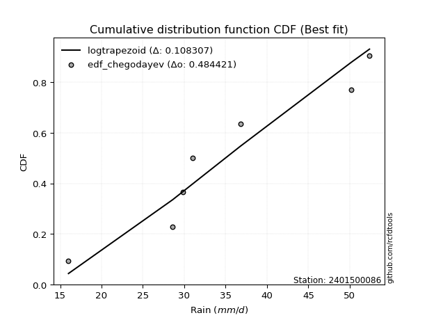</img>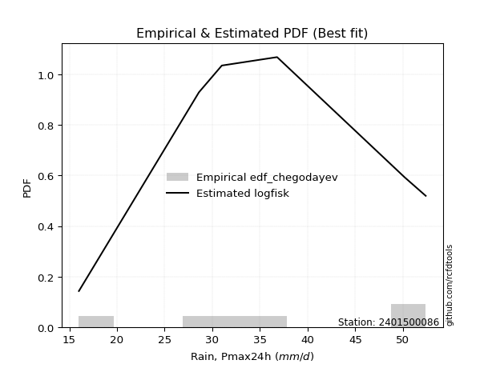</img>

</div>


### 6. EDF Blom (1958)

The Blom formula is a specific "plotting position" formula used in hydrology and statistical analysis to estimate the empirical cumulative probability (or non-exceedance probability) of a data series. It is particularly recommended for data that are approximately normally distributed. The constant _a_ is set to 0.375 (or 3/8).

<div align="center">


$P=(m-a)/(n+1-2a)$


</div>


**6.1. Empirical values**

<div align="center">

|                | 0                  | 1                  | 2                  | 3                 | 4                 | 5                  |
|:---------------|:-------------------|:-------------------|:-------------------|:------------------|:------------------|:-------------------|
| date           | 2023               | 2020               | 2022               | 2019              | 2021              | 2024               |
| x              | 16.0               | 28.6               | 31.0               | 36.8              | 50.2              | 52.4               |
| m              | 1                  | 2                  | 3                  | 4                 | 5                 | 6                  |
| empirical_dist | edf_blom           | edf_blom           | edf_blom           | edf_blom          | edf_blom          | edf_blom           |
| empirical      | 0.1                | 0.26               | 0.42               | 0.58              | 0.74              | 0.9                |
| empirical_tr   | 1.1111111111111112 | 1.3513513513513513 | 1.7241379310344827 | 2.380952380952381 | 3.846153846153846 | 10.000000000000002 |

</div>


**6.2. Kolmogorov-Smirnov fit test (sorted by Δ)**


<div align="center">

|                | 0                  | 1                  | 2                   | 3                   | 4                   | 5                   | 6                   | 7                  | 8                   | 9                   | 10                  | 11                  | 12                  | 13                  | 14                  | 15                 | 16                  | 17                  | 18                  | 19                  | 20                 | 21                  | 22                  | 23                  | 24                 | 25                 | 26                 | 27                  | 28                  | 29                  | 30                  | 31                  | 32                 | 33                  | 34                  | 35                    | 36                  | 37                  | 38                 | 39                  | 40                | 41                  | 42                  | 43                 | 44                 | 45                 | 46                 | 47                  | 48                 | 49                  | 50                  | 51                 | 52                 | 53                  | 54                  | 55                  | 56                  | 57                  | 58                  | 59                  | 60                 | 61                 | 62                 | 63                 | 64                  | 65                 | 66                 | 67                  | 68                  | 69                  | 70                 | 71                  | 72                  | 73                  | 74                  | 75                  | 76                 | 77                  | 78                 | 79                 | 80                 | 81                 | 82                 | 83                | 84                 | 85                 | 86                 | 87             |
|:---------------|:-------------------|:-------------------|:--------------------|:--------------------|:--------------------|:--------------------|:--------------------|:-------------------|:--------------------|:--------------------|:--------------------|:--------------------|:--------------------|:--------------------|:--------------------|:-------------------|:--------------------|:--------------------|:--------------------|:--------------------|:-------------------|:--------------------|:--------------------|:--------------------|:-------------------|:-------------------|:-------------------|:--------------------|:--------------------|:--------------------|:--------------------|:--------------------|:-------------------|:--------------------|:--------------------|:----------------------|:--------------------|:--------------------|:-------------------|:--------------------|:------------------|:--------------------|:--------------------|:-------------------|:-------------------|:-------------------|:-------------------|:--------------------|:-------------------|:--------------------|:--------------------|:-------------------|:-------------------|:--------------------|:--------------------|:--------------------|:--------------------|:--------------------|:--------------------|:--------------------|:-------------------|:-------------------|:-------------------|:-------------------|:--------------------|:-------------------|:-------------------|:--------------------|:--------------------|:--------------------|:-------------------|:--------------------|:--------------------|:--------------------|:--------------------|:--------------------|:-------------------|:--------------------|:-------------------|:-------------------|:-------------------|:-------------------|:-------------------|:------------------|:-------------------|:-------------------|:-------------------|:---------------|
| station        | 2401500086         | 2401500086         | 2401500086          | 2401500086          | 2401500086          | 2401500086          | 2401500086          | 2401500086         | 2401500086          | 2401500086          | 2401500086          | 2401500086          | 2401500086          | 2401500086          | 2401500086          | 2401500086         | 2401500086          | 2401500086          | 2401500086          | 2401500086          | 2401500086         | 2401500086          | 2401500086          | 2401500086          | 2401500086         | 2401500086         | 2401500086         | 2401500086          | 2401500086          | 2401500086          | 2401500086          | 2401500086          | 2401500086         | 2401500086          | 2401500086          | 2401500086            | 2401500086          | 2401500086          | 2401500086         | 2401500086          | 2401500086        | 2401500086          | 2401500086          | 2401500086         | 2401500086         | 2401500086         | 2401500086         | 2401500086          | 2401500086         | 2401500086          | 2401500086          | 2401500086         | 2401500086         | 2401500086          | 2401500086          | 2401500086          | 2401500086          | 2401500086          | 2401500086          | 2401500086          | 2401500086         | 2401500086         | 2401500086         | 2401500086         | 2401500086          | 2401500086         | 2401500086         | 2401500086          | 2401500086          | 2401500086          | 2401500086         | 2401500086          | 2401500086          | 2401500086          | 2401500086          | 2401500086          | 2401500086         | 2401500086          | 2401500086         | 2401500086         | 2401500086         | 2401500086         | 2401500086         | 2401500086        | 2401500086         | 2401500086         | 2401500086         | 2401500086     |
| empirical_dist | edf_blom           | edf_blom           | edf_blom            | edf_blom            | edf_blom            | edf_blom            | edf_blom            | edf_blom           | edf_blom            | edf_blom            | edf_blom            | edf_blom            | edf_blom            | edf_blom            | edf_blom            | edf_blom           | edf_blom            | edf_blom            | edf_blom            | edf_blom            | edf_blom           | edf_blom            | edf_blom            | edf_blom            | edf_blom           | edf_blom           | edf_blom           | edf_blom            | edf_blom            | edf_blom            | edf_blom            | edf_blom            | edf_blom           | edf_blom            | edf_blom            | edf_blom              | edf_blom            | edf_blom            | edf_blom           | edf_blom            | edf_blom          | edf_blom            | edf_blom            | edf_blom           | edf_blom           | edf_blom           | edf_blom           | edf_blom            | edf_blom           | edf_blom            | edf_blom            | edf_blom           | edf_blom           | edf_blom            | edf_blom            | edf_blom            | edf_blom            | edf_blom            | edf_blom            | edf_blom            | edf_blom           | edf_blom           | edf_blom           | edf_blom           | edf_blom            | edf_blom           | edf_blom           | edf_blom            | edf_blom            | edf_blom            | edf_blom           | edf_blom            | edf_blom            | edf_blom            | edf_blom            | edf_blom            | edf_blom           | edf_blom            | edf_blom           | edf_blom           | edf_blom           | edf_blom           | edf_blom           | edf_blom          | edf_blom           | edf_blom           | edf_blom           | edf_blom       |
| p_dist         | logfisk            | logerlang          | lognct              | logrice             | loggamma            | loggamma            | logbetaprime        | logf               | logfatiguelife      | logexponnorm        | logt                | lognorm             | lognorm             | logcrystalball      | logalpha            | loginvgamma        | kstwobign           | logpearson3         | ncf                 | genlogistic         | logmaxwell         | halfnorm            | loginvgauss         | invgauss            | rayleigh           | loglogistic        | alpha              | maxwell             | laplace_asymmetric  | rice                | betaprime           | fisk                | invgamma           | logmielke           | weibull_min         | loglaplace_asymmetric | logweibull_min      | gamma               | erlang             | f                   | nct               | norm                | crystalball         | truncnorm          | exponnorm          | t                  | pearson3           | lograyleigh         | loghypsecant       | halflogistic        | loggumbel_l         | gumbel_r           | loggumbel_r        | logncf              | moyal               | loglaplace          | logistic            | johnsonsu           | hypsecant           | logmoyal            | mielke             | wald               | laplace            | loginvweibull      | loghalfnorm         | logloggamma        | gumbel_l           | loghalflogistic     | gibrat              | logkstwobign        | loggenexpon        | logwald             | loggibrat           | expon               | genexpon            | loggompertz         | logtruncnorm       | lognakagami         | nakagami           | logchi2            | logexpon           | chi2               | loglognorm         | invweibull        | gompertz           | logjohnsonsu       | fatiguelife        | loggenlogistic |
| delta          | 0.0977909415995557 | 0.1031607028180132 | 0.10471597464214699 | 0.10477953149258368 | 0.10504720765918285 | 0.10504720765918285 | 0.10539562614102238 | 0.1079477023456007 | 0.10800963782065809 | 0.10822372143527836 | 0.10822424307792866 | 0.10822433316557412 | 0.10822433316557412 | 0.10822439163464537 | 0.11039203660408953 | 0.1117837412144943 | 0.11230399116964096 | 0.11517396396331203 | 0.12017036460256525 | 0.12025015644360115 | 0.1218918003359144 | 0.12267862068040858 | 0.12447509390182793 | 0.12491116046657325 | 0.1249314562027849 | 0.1260090354662715 | 0.1263449143128681 | 0.12664953613719854 | 0.12701450267516812 | 0.12734181927196175 | 0.12832723148372327 | 0.12909546028562024 | 0.1291463152939546 | 0.12979157087725485 | 0.13061847057099918 | 0.13078111061157482   | 0.13220315151524553 | 0.13224413296224713 | 0.1325808638030037 | 0.13274902057163473 | 0.133099088701766 | 0.13311631123311374 | 0.13311631616832753 | 0.1331163463690197 | 0.1331173247913967 | 0.1331188301322095 | 0.1338566621200551 | 0.13395681153792993 | 0.1351484033462027 | 0.13652566990733606 | 0.13764517850847202 | 0.1381753455829905 | 0.1383351645320134 | 0.13987070358435416 | 0.14143347866072475 | 0.14330099822649822 | 0.14795217487155177 | 0.15435348393676263 | 0.15495660584358606 | 0.15624140807740794 | 0.1590286930145205 | 0.1598323492947119 | 0.1604518064681847 | 0.1612973227648269 | 0.16829752898192518 | 0.1690597078457592 | 0.1716630500755023 | 0.17637978061777604 | 0.18141901836668806 | 0.18941850982088276 | 0.1920735202248357 | 0.19721990480568619 | 0.20280362031242904 | 0.21022035214251034 | 0.21036788906363513 | 0.24705686308413344 | 0.2599971721007149 | 0.25999999610375424 | 0.2599999999993046 | 0.2727249240451022 | 0.2866763375616799 | 0.2923053176518301 | 0.4021821287062757 | 0.473737706270149 | 0.5107582696573466 | 0.5120117433386412 | 0.5363130061171808 | 0.74           |
| deltao         | 0.530385761606     | 0.530385761606     | 0.530385761606      | 0.530385761606      | 0.530385761606      | 0.530385761606      | 0.530385761606      | 0.530385761606     | 0.530385761606      | 0.530385761606      | 0.530385761606      | 0.530385761606      | 0.530385761606      | 0.530385761606      | 0.530385761606      | 0.530385761606     | 0.530385761606      | 0.530385761606      | 0.530385761606      | 0.530385761606      | 0.530385761606     | 0.530385761606      | 0.530385761606      | 0.530385761606      | 0.530385761606     | 0.530385761606     | 0.530385761606     | 0.530385761606      | 0.530385761606      | 0.530385761606      | 0.530385761606      | 0.530385761606      | 0.530385761606     | 0.530385761606      | 0.530385761606      | 0.530385761606        | 0.530385761606      | 0.530385761606      | 0.530385761606     | 0.530385761606      | 0.530385761606    | 0.530385761606      | 0.530385761606      | 0.530385761606     | 0.530385761606     | 0.530385761606     | 0.530385761606     | 0.530385761606      | 0.530385761606     | 0.530385761606      | 0.530385761606      | 0.530385761606     | 0.530385761606     | 0.530385761606      | 0.530385761606      | 0.530385761606      | 0.530385761606      | 0.530385761606      | 0.530385761606      | 0.530385761606      | 0.530385761606     | 0.530385761606     | 0.530385761606     | 0.530385761606     | 0.530385761606      | 0.530385761606     | 0.530385761606     | 0.530385761606      | 0.530385761606      | 0.530385761606      | 0.530385761606     | 0.530385761606      | 0.530385761606      | 0.530385761606      | 0.530385761606      | 0.530385761606      | 0.530385761606     | 0.530385761606      | 0.530385761606     | 0.530385761606     | 0.530385761606     | 0.530385761606     | 0.530385761606     | 0.530385761606    | 0.530385761606     | 0.530385761606     | 0.530385761606     | 0.530385761606 |
| eval           | Δo > Δ             | Δo > Δ             | Δo > Δ              | Δo > Δ              | Δo > Δ              | Δo > Δ              | Δo > Δ              | Δo > Δ             | Δo > Δ              | Δo > Δ              | Δo > Δ              | Δo > Δ              | Δo > Δ              | Δo > Δ              | Δo > Δ              | Δo > Δ             | Δo > Δ              | Δo > Δ              | Δo > Δ              | Δo > Δ              | Δo > Δ             | Δo > Δ              | Δo > Δ              | Δo > Δ              | Δo > Δ             | Δo > Δ             | Δo > Δ             | Δo > Δ              | Δo > Δ              | Δo > Δ              | Δo > Δ              | Δo > Δ              | Δo > Δ             | Δo > Δ              | Δo > Δ              | Δo > Δ                | Δo > Δ              | Δo > Δ              | Δo > Δ             | Δo > Δ              | Δo > Δ            | Δo > Δ              | Δo > Δ              | Δo > Δ             | Δo > Δ             | Δo > Δ             | Δo > Δ             | Δo > Δ              | Δo > Δ             | Δo > Δ              | Δo > Δ              | Δo > Δ             | Δo > Δ             | Δo > Δ              | Δo > Δ              | Δo > Δ              | Δo > Δ              | Δo > Δ              | Δo > Δ              | Δo > Δ              | Δo > Δ             | Δo > Δ             | Δo > Δ             | Δo > Δ             | Δo > Δ              | Δo > Δ             | Δo > Δ             | Δo > Δ              | Δo > Δ              | Δo > Δ              | Δo > Δ             | Δo > Δ              | Δo > Δ              | Δo > Δ              | Δo > Δ              | Δo > Δ              | Δo > Δ             | Δo > Δ              | Δo > Δ             | Δo > Δ             | Δo > Δ             | Δo > Δ             | Δo > Δ             | Δo > Δ            | Δo > Δ             | Δo > Δ             | Δo <= Δ            | Δo <= Δ        |
| fit            | 1                  | 1                  | 1                   | 1                   | 1                   | 1                   | 1                   | 1                  | 1                   | 1                   | 1                   | 1                   | 1                   | 1                   | 1                   | 1                  | 1                   | 1                   | 1                   | 1                   | 1                  | 1                   | 1                   | 1                   | 1                  | 1                  | 1                  | 1                   | 1                   | 1                   | 1                   | 1                   | 1                  | 1                   | 1                   | 1                     | 1                   | 1                   | 1                  | 1                   | 1                 | 1                   | 1                   | 1                  | 1                  | 1                  | 1                  | 1                   | 1                  | 1                   | 1                   | 1                  | 1                  | 1                   | 1                   | 1                   | 1                   | 1                   | 1                   | 1                   | 1                  | 1                  | 1                  | 1                  | 1                   | 1                  | 1                  | 1                   | 1                   | 1                   | 1                  | 1                   | 1                   | 1                   | 1                   | 1                   | 1                  | 1                   | 1                  | 1                  | 1                  | 1                  | 1                  | 1                 | 1                  | 1                  | 0                  | 0              |
| n              | 6                  | 6                  | 6                   | 6                   | 6                   | 6                   | 6                   | 6                  | 6                   | 6                   | 6                   | 6                   | 6                   | 6                   | 6                   | 6                  | 6                   | 6                   | 6                   | 6                   | 6                  | 6                   | 6                   | 6                   | 6                  | 6                  | 6                  | 6                   | 6                   | 6                   | 6                   | 6                   | 6                  | 6                   | 6                   | 6                     | 6                   | 6                   | 6                  | 6                   | 6                 | 6                   | 6                   | 6                  | 6                  | 6                  | 6                  | 6                   | 6                  | 6                   | 6                   | 6                  | 6                  | 6                   | 6                   | 6                   | 6                   | 6                   | 6                   | 6                   | 6                  | 6                  | 6                  | 6                  | 6                   | 6                  | 6                  | 6                   | 6                   | 6                   | 6                  | 6                   | 6                   | 6                   | 6                   | 6                   | 6                  | 6                   | 6                  | 6                  | 6                  | 6                  | 6                  | 6                 | 6                  | 6                  | 6                  | 6              |
| best_fit       | 1                  | 0                  | 0                   | 0                   | 0                   | 0                   | 0                   | 0                  | 0                   | 0                   | 0                   | 0                   | 0                   | 0                   | 0                   | 0                  | 0                   | 0                   | 0                   | 0                   | 0                  | 0                   | 0                   | 0                   | 0                  | 0                  | 0                  | 0                   | 0                   | 0                   | 0                   | 0                   | 0                  | 0                   | 0                   | 0                     | 0                   | 0                   | 0                  | 0                   | 0                 | 0                   | 0                   | 0                  | 0                  | 0                  | 0                  | 0                   | 0                  | 0                   | 0                   | 0                  | 0                  | 0                   | 0                   | 0                   | 0                   | 0                   | 0                   | 0                   | 0                  | 0                  | 0                  | 0                  | 0                   | 0                  | 0                  | 0                   | 0                   | 0                   | 0                  | 0                   | 0                   | 0                   | 0                   | 0                   | 0                  | 0                   | 0                  | 0                  | 0                  | 0                  | 0                  | 0                 | 0                  | 0                  | 0                  | 0              |
| best_fit_sort  | 1                  | 2                  | 3                   | 4                   | 5                   | 6                   | 7                   | 8                  | 9                   | 10                  | 11                  | 12                  | 13                  | 14                  | 15                  | 16                 | 17                  | 18                  | 19                  | 20                  | 21                 | 22                  | 23                  | 24                  | 25                 | 26                 | 27                 | 28                  | 29                  | 30                  | 31                  | 32                  | 33                 | 34                  | 35                  | 36                    | 37                  | 38                  | 39                 | 40                  | 41                | 42                  | 43                  | 44                 | 45                 | 46                 | 47                 | 48                  | 49                 | 50                  | 51                  | 52                 | 53                 | 54                  | 55                  | 56                  | 57                  | 58                  | 59                  | 60                  | 61                 | 62                 | 63                 | 64                 | 65                  | 66                 | 67                 | 68                  | 69                  | 70                  | 71                 | 72                  | 73                  | 74                  | 75                  | 76                  | 77                 | 78                  | 79                 | 80                 | 81                 | 82                 | 83                 | 84                | 85                 | 86                 | 87                 | 88             |

</div>


**6.3. Best fit**

<div align="center">

|   id |    station | empirical_dist   | p_dist   |     delta |   deltao | eval   |   fit |   n |   best_fit |   best_fit_sort |
|-----:|-----------:|:-----------------|:---------|----------:|---------:|:-------|------:|----:|-----------:|----------------:|
|    0 | 2401500086 | edf_blom         | logfisk  | 0.0977909 | 0.530386 | Δo > Δ |     1 |   6 |          1 |               1 |

</div>


<div align="center">

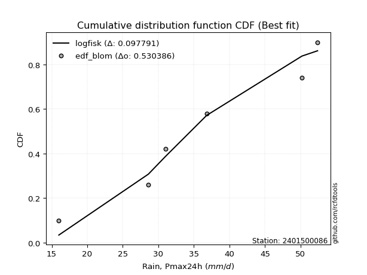</img></img>

</div>


### 7. EDF Tukey (1962)

In hydrology, the Tukey formula is used as a plotting position formula to estimate the empirical probability or frequency of a flood event (or other hydrological data). The formula parameter is given as _c=0.333_ (or 1/3).

<div align="center">


$P=(m-c)/(n+1-2c)$


</div>


**7.1. Empirical values**

<div align="center">

|                | 0                   | 1                  | 2                   | 3                  | 4                  | 5                  |
|:---------------|:--------------------|:-------------------|:--------------------|:-------------------|:-------------------|:-------------------|
| date           | 2023                | 2020               | 2022                | 2019               | 2021               | 2024               |
| x              | 16.0                | 28.6               | 31.0                | 36.8               | 50.2               | 52.4               |
| m              | 1                   | 2                  | 3                   | 4                  | 5                  | 6                  |
| empirical_dist | edf_tukey           | edf_tukey          | edf_tukey           | edf_tukey          | edf_tukey          | edf_tukey          |
| empirical      | 0.10526315789473684 | 0.2631578947368421 | 0.42105263157894735 | 0.5789473684210527 | 0.7368421052631579 | 0.8947368421052632 |
| empirical_tr   | 1.1176470588235294  | 1.357142857142857  | 1.7272727272727273  | 2.375              | 3.7999999999999994 | 9.5                |

</div>


**7.2. Kolmogorov-Smirnov fit test (sorted by Δ)**


<div align="center">

|                | 0                   | 1                   | 2                   | 3                   | 4                   | 5                   | 6                   | 7                   | 8                   | 9                   | 10                  | 11                 | 12                 | 13                  | 14                  | 15                 | 16                 | 17                  | 18                  | 19                  | 20                  | 21                  | 22                  | 23                  | 24                  | 25                  | 26                  | 27                  | 28                  | 29                  | 30                 | 31                  | 32                 | 33                  | 34                  | 35                  | 36                    | 37                 | 38                  | 39                  | 40                  | 41                  | 42                  | 43                  | 44                  | 45                  | 46                  | 47                  | 48                  | 49                  | 50                  | 51                 | 52                  | 53                  | 54                 | 55                  | 56                 | 57                  | 58                  | 59                 | 60                 | 61                  | 62                  | 63                  | 64                 | 65                  | 66                  | 67                  | 68                 | 69                  | 70                  | 71                 | 72                  | 73                  | 74                  | 75                  | 76                  | 77                 | 78                 | 79                 | 80                 | 81                | 82                 | 83                  | 84                | 85                 | 86                 | 87                 |
|:---------------|:--------------------|:--------------------|:--------------------|:--------------------|:--------------------|:--------------------|:--------------------|:--------------------|:--------------------|:--------------------|:--------------------|:-------------------|:-------------------|:--------------------|:--------------------|:-------------------|:-------------------|:--------------------|:--------------------|:--------------------|:--------------------|:--------------------|:--------------------|:--------------------|:--------------------|:--------------------|:--------------------|:--------------------|:--------------------|:--------------------|:-------------------|:--------------------|:-------------------|:--------------------|:--------------------|:--------------------|:----------------------|:-------------------|:--------------------|:--------------------|:--------------------|:--------------------|:--------------------|:--------------------|:--------------------|:--------------------|:--------------------|:--------------------|:--------------------|:--------------------|:--------------------|:-------------------|:--------------------|:--------------------|:-------------------|:--------------------|:-------------------|:--------------------|:--------------------|:-------------------|:-------------------|:--------------------|:--------------------|:--------------------|:-------------------|:--------------------|:--------------------|:--------------------|:-------------------|:--------------------|:--------------------|:-------------------|:--------------------|:--------------------|:--------------------|:--------------------|:--------------------|:-------------------|:-------------------|:-------------------|:-------------------|:------------------|:-------------------|:--------------------|:------------------|:-------------------|:-------------------|:-------------------|
| station        | 2401500086          | 2401500086          | 2401500086          | 2401500086          | 2401500086          | 2401500086          | 2401500086          | 2401500086          | 2401500086          | 2401500086          | 2401500086          | 2401500086         | 2401500086         | 2401500086          | 2401500086          | 2401500086         | 2401500086         | 2401500086          | 2401500086          | 2401500086          | 2401500086          | 2401500086          | 2401500086          | 2401500086          | 2401500086          | 2401500086          | 2401500086          | 2401500086          | 2401500086          | 2401500086          | 2401500086         | 2401500086          | 2401500086         | 2401500086          | 2401500086          | 2401500086          | 2401500086            | 2401500086         | 2401500086          | 2401500086          | 2401500086          | 2401500086          | 2401500086          | 2401500086          | 2401500086          | 2401500086          | 2401500086          | 2401500086          | 2401500086          | 2401500086          | 2401500086          | 2401500086         | 2401500086          | 2401500086          | 2401500086         | 2401500086          | 2401500086         | 2401500086          | 2401500086          | 2401500086         | 2401500086         | 2401500086          | 2401500086          | 2401500086          | 2401500086         | 2401500086          | 2401500086          | 2401500086          | 2401500086         | 2401500086          | 2401500086          | 2401500086         | 2401500086          | 2401500086          | 2401500086          | 2401500086          | 2401500086          | 2401500086         | 2401500086         | 2401500086         | 2401500086         | 2401500086        | 2401500086         | 2401500086          | 2401500086        | 2401500086         | 2401500086         | 2401500086         |
| empirical_dist | edf_tukey           | edf_tukey           | edf_tukey           | edf_tukey           | edf_tukey           | edf_tukey           | edf_tukey           | edf_tukey           | edf_tukey           | edf_tukey           | edf_tukey           | edf_tukey          | edf_tukey          | edf_tukey           | edf_tukey           | edf_tukey          | edf_tukey          | edf_tukey           | edf_tukey           | edf_tukey           | edf_tukey           | edf_tukey           | edf_tukey           | edf_tukey           | edf_tukey           | edf_tukey           | edf_tukey           | edf_tukey           | edf_tukey           | edf_tukey           | edf_tukey          | edf_tukey           | edf_tukey          | edf_tukey           | edf_tukey           | edf_tukey           | edf_tukey             | edf_tukey          | edf_tukey           | edf_tukey           | edf_tukey           | edf_tukey           | edf_tukey           | edf_tukey           | edf_tukey           | edf_tukey           | edf_tukey           | edf_tukey           | edf_tukey           | edf_tukey           | edf_tukey           | edf_tukey          | edf_tukey           | edf_tukey           | edf_tukey          | edf_tukey           | edf_tukey          | edf_tukey           | edf_tukey           | edf_tukey          | edf_tukey          | edf_tukey           | edf_tukey           | edf_tukey           | edf_tukey          | edf_tukey           | edf_tukey           | edf_tukey           | edf_tukey          | edf_tukey           | edf_tukey           | edf_tukey          | edf_tukey           | edf_tukey           | edf_tukey           | edf_tukey           | edf_tukey           | edf_tukey          | edf_tukey          | edf_tukey          | edf_tukey          | edf_tukey         | edf_tukey          | edf_tukey           | edf_tukey         | edf_tukey          | edf_tukey          | edf_tukey          |
| p_dist         | logfisk             | logerlang           | lognct              | logrice             | logalpha            | loggamma            | loggamma            | logbetaprime        | loginvgamma         | logf                | logfatiguelife      | logexponnorm       | logt               | lognorm             | lognorm             | logcrystalball     | kstwobign          | logpearson3         | logmaxwell          | loginvgauss         | ncf                 | genlogistic         | halfnorm            | invgauss            | rayleigh            | logmielke           | loglogistic         | alpha               | maxwell             | laplace_asymmetric  | rice               | lograyleigh         | betaprime          | fisk                | invgamma            | weibull_min         | loglaplace_asymmetric | loggumbel_r        | logweibull_min      | gamma               | erlang              | f                   | nct                 | norm                | crystalball         | truncnorm           | exponnorm           | t                   | logncf              | pearson3            | loghypsecant        | halflogistic       | loggumbel_l         | gumbel_r            | moyal              | loglaplace          | logistic           | logmoyal            | johnsonsu           | hypsecant          | loginvweibull      | mielke              | wald                | laplace             | loghalfnorm        | logloggamma         | loghalflogistic     | gumbel_l            | gibrat             | logkstwobign        | loggenexpon         | logwald            | loggibrat           | expon               | genexpon            | loggompertz         | logtruncnorm        | lognakagami        | nakagami           | logchi2            | logexpon           | chi2              | loglognorm         | invweibull          | logjohnsonsu      | gompertz           | fatiguelife        | loggenlogistic     |
| delta          | 0.10094883633639784 | 0.10619193797125548 | 0.10787386937898913 | 0.10793742622942581 | 0.10798768374748058 | 0.10820510239602499 | 0.10820510239602499 | 0.10855352087786452 | 0.10862584647765222 | 0.11110559708244283 | 0.11116753255750023 | 0.1113816161721205 | 0.1113821378147708 | 0.11138222790241625 | 0.11138222790241625 | 0.1113822863714875 | 0.1154618859064831 | 0.11833185870015417 | 0.11873390559907232 | 0.12131719916498584 | 0.12332825933940739 | 0.12340805118044329 | 0.12583651541725072 | 0.12806905520341538 | 0.12808935093962703 | 0.12873893929830754 | 0.12916693020311365 | 0.12950280904971023 | 0.12980743087404067 | 0.13017239741201025 | 0.1304997140088039 | 0.13079891680108785 | 0.1314851262205654 | 0.13225335502246238 | 0.13230421003079673 | 0.13377636530784132 | 0.13393900534841696   | 0.1351772697951713 | 0.13536104625208767 | 0.13540202769908927 | 0.13573875853984585 | 0.13590691530847687 | 0.13625698343860815 | 0.13627420596995587 | 0.13627421090516967 | 0.13627424110586184 | 0.13627521952823884 | 0.13627672486905162 | 0.13671280884751208 | 0.13701455685689723 | 0.13830629808304484 | 0.1396835646441782 | 0.14080307324531416 | 0.14133324031983263 | 0.1445913733975669 | 0.14645889296334036 | 0.1511100696083939 | 0.15308351334056586 | 0.15330085235781532 | 0.1581145005804282 | 0.1581394280279848 | 0.16218658775136263 | 0.16299024403155404 | 0.16360970120502683 | 0.1651396342450831 | 0.17221760258260133 | 0.17322188588093396 | 0.17482094481234445 | 0.1845769131035302 | 0.18626061508404068 | 0.18891562548799362 | 0.1940620100688441 | 0.20385625189137635 | 0.20706245740566825 | 0.20720999432679305 | 0.24389896834729136 | 0.26315506683755696 | 0.2631578908405963 | 0.2631578947361467 | 0.2695670293082601 | 0.2835184428248378 | 0.289147422914988 | 0.3990242339694336 | 0.46847454837541214 | 0.508853848601799 | 0.5097056380783993 | 0.5331551113803388 | 0.7368421052631579 |
| deltao         | 0.530385761606      | 0.530385761606      | 0.530385761606      | 0.530385761606      | 0.530385761606      | 0.530385761606      | 0.530385761606      | 0.530385761606      | 0.530385761606      | 0.530385761606      | 0.530385761606      | 0.530385761606     | 0.530385761606     | 0.530385761606      | 0.530385761606      | 0.530385761606     | 0.530385761606     | 0.530385761606      | 0.530385761606      | 0.530385761606      | 0.530385761606      | 0.530385761606      | 0.530385761606      | 0.530385761606      | 0.530385761606      | 0.530385761606      | 0.530385761606      | 0.530385761606      | 0.530385761606      | 0.530385761606      | 0.530385761606     | 0.530385761606      | 0.530385761606     | 0.530385761606      | 0.530385761606      | 0.530385761606      | 0.530385761606        | 0.530385761606     | 0.530385761606      | 0.530385761606      | 0.530385761606      | 0.530385761606      | 0.530385761606      | 0.530385761606      | 0.530385761606      | 0.530385761606      | 0.530385761606      | 0.530385761606      | 0.530385761606      | 0.530385761606      | 0.530385761606      | 0.530385761606     | 0.530385761606      | 0.530385761606      | 0.530385761606     | 0.530385761606      | 0.530385761606     | 0.530385761606      | 0.530385761606      | 0.530385761606     | 0.530385761606     | 0.530385761606      | 0.530385761606      | 0.530385761606      | 0.530385761606     | 0.530385761606      | 0.530385761606      | 0.530385761606      | 0.530385761606     | 0.530385761606      | 0.530385761606      | 0.530385761606     | 0.530385761606      | 0.530385761606      | 0.530385761606      | 0.530385761606      | 0.530385761606      | 0.530385761606     | 0.530385761606     | 0.530385761606     | 0.530385761606     | 0.530385761606    | 0.530385761606     | 0.530385761606      | 0.530385761606    | 0.530385761606     | 0.530385761606     | 0.530385761606     |
| eval           | Δo > Δ              | Δo > Δ              | Δo > Δ              | Δo > Δ              | Δo > Δ              | Δo > Δ              | Δo > Δ              | Δo > Δ              | Δo > Δ              | Δo > Δ              | Δo > Δ              | Δo > Δ             | Δo > Δ             | Δo > Δ              | Δo > Δ              | Δo > Δ             | Δo > Δ             | Δo > Δ              | Δo > Δ              | Δo > Δ              | Δo > Δ              | Δo > Δ              | Δo > Δ              | Δo > Δ              | Δo > Δ              | Δo > Δ              | Δo > Δ              | Δo > Δ              | Δo > Δ              | Δo > Δ              | Δo > Δ             | Δo > Δ              | Δo > Δ             | Δo > Δ              | Δo > Δ              | Δo > Δ              | Δo > Δ                | Δo > Δ             | Δo > Δ              | Δo > Δ              | Δo > Δ              | Δo > Δ              | Δo > Δ              | Δo > Δ              | Δo > Δ              | Δo > Δ              | Δo > Δ              | Δo > Δ              | Δo > Δ              | Δo > Δ              | Δo > Δ              | Δo > Δ             | Δo > Δ              | Δo > Δ              | Δo > Δ             | Δo > Δ              | Δo > Δ             | Δo > Δ              | Δo > Δ              | Δo > Δ             | Δo > Δ             | Δo > Δ              | Δo > Δ              | Δo > Δ              | Δo > Δ             | Δo > Δ              | Δo > Δ              | Δo > Δ              | Δo > Δ             | Δo > Δ              | Δo > Δ              | Δo > Δ             | Δo > Δ              | Δo > Δ              | Δo > Δ              | Δo > Δ              | Δo > Δ              | Δo > Δ             | Δo > Δ             | Δo > Δ             | Δo > Δ             | Δo > Δ            | Δo > Δ             | Δo > Δ              | Δo > Δ            | Δo > Δ             | Δo <= Δ            | Δo <= Δ            |
| fit            | 1                   | 1                   | 1                   | 1                   | 1                   | 1                   | 1                   | 1                   | 1                   | 1                   | 1                   | 1                  | 1                  | 1                   | 1                   | 1                  | 1                  | 1                   | 1                   | 1                   | 1                   | 1                   | 1                   | 1                   | 1                   | 1                   | 1                   | 1                   | 1                   | 1                   | 1                  | 1                   | 1                  | 1                   | 1                   | 1                   | 1                     | 1                  | 1                   | 1                   | 1                   | 1                   | 1                   | 1                   | 1                   | 1                   | 1                   | 1                   | 1                   | 1                   | 1                   | 1                  | 1                   | 1                   | 1                  | 1                   | 1                  | 1                   | 1                   | 1                  | 1                  | 1                   | 1                   | 1                   | 1                  | 1                   | 1                   | 1                   | 1                  | 1                   | 1                   | 1                  | 1                   | 1                   | 1                   | 1                   | 1                   | 1                  | 1                  | 1                  | 1                  | 1                 | 1                  | 1                   | 1                 | 1                  | 0                  | 0                  |
| n              | 6                   | 6                   | 6                   | 6                   | 6                   | 6                   | 6                   | 6                   | 6                   | 6                   | 6                   | 6                  | 6                  | 6                   | 6                   | 6                  | 6                  | 6                   | 6                   | 6                   | 6                   | 6                   | 6                   | 6                   | 6                   | 6                   | 6                   | 6                   | 6                   | 6                   | 6                  | 6                   | 6                  | 6                   | 6                   | 6                   | 6                     | 6                  | 6                   | 6                   | 6                   | 6                   | 6                   | 6                   | 6                   | 6                   | 6                   | 6                   | 6                   | 6                   | 6                   | 6                  | 6                   | 6                   | 6                  | 6                   | 6                  | 6                   | 6                   | 6                  | 6                  | 6                   | 6                   | 6                   | 6                  | 6                   | 6                   | 6                   | 6                  | 6                   | 6                   | 6                  | 6                   | 6                   | 6                   | 6                   | 6                   | 6                  | 6                  | 6                  | 6                  | 6                 | 6                  | 6                   | 6                 | 6                  | 6                  | 6                  |
| best_fit       | 1                   | 0                   | 0                   | 0                   | 0                   | 0                   | 0                   | 0                   | 0                   | 0                   | 0                   | 0                  | 0                  | 0                   | 0                   | 0                  | 0                  | 0                   | 0                   | 0                   | 0                   | 0                   | 0                   | 0                   | 0                   | 0                   | 0                   | 0                   | 0                   | 0                   | 0                  | 0                   | 0                  | 0                   | 0                   | 0                   | 0                     | 0                  | 0                   | 0                   | 0                   | 0                   | 0                   | 0                   | 0                   | 0                   | 0                   | 0                   | 0                   | 0                   | 0                   | 0                  | 0                   | 0                   | 0                  | 0                   | 0                  | 0                   | 0                   | 0                  | 0                  | 0                   | 0                   | 0                   | 0                  | 0                   | 0                   | 0                   | 0                  | 0                   | 0                   | 0                  | 0                   | 0                   | 0                   | 0                   | 0                   | 0                  | 0                  | 0                  | 0                  | 0                 | 0                  | 0                   | 0                 | 0                  | 0                  | 0                  |
| best_fit_sort  | 1                   | 2                   | 3                   | 4                   | 5                   | 6                   | 7                   | 8                   | 9                   | 10                  | 11                  | 12                 | 13                 | 14                  | 15                  | 16                 | 17                 | 18                  | 19                  | 20                  | 21                  | 22                  | 23                  | 24                  | 25                  | 26                  | 27                  | 28                  | 29                  | 30                  | 31                 | 32                  | 33                 | 34                  | 35                  | 36                  | 37                    | 38                 | 39                  | 40                  | 41                  | 42                  | 43                  | 44                  | 45                  | 46                  | 47                  | 48                  | 49                  | 50                  | 51                  | 52                 | 53                  | 54                  | 55                 | 56                  | 57                 | 58                  | 59                  | 60                 | 61                 | 62                  | 63                  | 64                  | 65                 | 66                  | 67                  | 68                  | 69                 | 70                  | 71                  | 72                 | 73                  | 74                  | 75                  | 76                  | 77                  | 78                 | 79                 | 80                 | 81                 | 82                | 83                 | 84                  | 85                | 86                 | 87                 | 88                 |

</div>


**7.3. Best fit**

<div align="center">

|   id |    station | empirical_dist   | p_dist   |    delta |   deltao | eval   |   fit |   n |   best_fit |   best_fit_sort |
|-----:|-----------:|:-----------------|:---------|---------:|---------:|:-------|------:|----:|-----------:|----------------:|
|    0 | 2401500086 | edf_tukey        | logfisk  | 0.100949 | 0.530386 | Δo > Δ |     1 |   6 |          1 |               1 |

</div>


<div align="center">

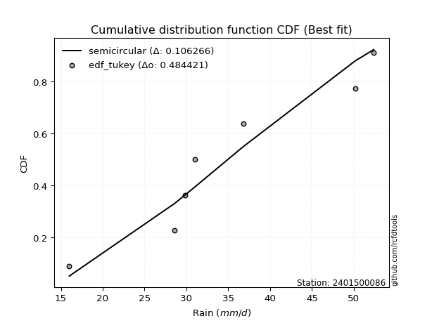</img>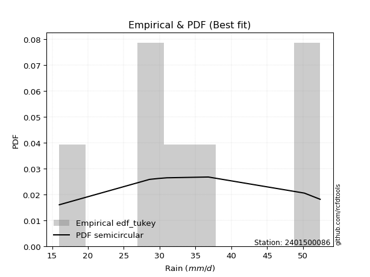</img>

</div>


### 8. EDF Gringorten (1963)

Gringorten plotting position formula is essential for estimating the probability and return periods of extreme events like floods and heavy rainfall. The constant _a=0.44_.

<div align="center">


$P=(m-a)/(n+1-2a)$


</div>


**8.1. Empirical values**

<div align="center">

|                | 0                   | 1                  | 2                   | 3                  | 4                  | 5                  |
|:---------------|:--------------------|:-------------------|:--------------------|:-------------------|:-------------------|:-------------------|
| date           | 2023                | 2020               | 2022                | 2019               | 2021               | 2024               |
| x              | 16.0                | 28.6               | 31.0                | 36.8               | 50.2               | 52.4               |
| m              | 1                   | 2                  | 3                   | 4                  | 5                  | 6                  |
| empirical_dist | edf_gringorten      | edf_gringorten     | edf_gringorten      | edf_gringorten     | edf_gringorten     | edf_gringorten     |
| empirical      | 0.09150326797385622 | 0.2549019607843137 | 0.41830065359477125 | 0.5816993464052288 | 0.7450980392156862 | 0.9084967320261437 |
| empirical_tr   | 1.1007194244604317  | 1.3421052631578947 | 1.7191011235955058  | 2.3906250000000004 | 3.9230769230769216 | 10.928571428571415 |

</div>


**8.2. Kolmogorov-Smirnov fit test (sorted by Δ)**


<div align="center">

|                | 0                   | 1                  | 2                  | 3                  | 4                   | 5                   | 6                   | 7                   | 8                   | 9                   | 10                  | 11                  | 12                  | 13                  | 14                 | 15                  | 16                  | 17                  | 18                  | 19                 | 20                  | 21                  | 22                 | 23                  | 24                 | 25                  | 26                  | 27                  | 28                  | 29                  | 30                 | 31                | 32                    | 33                 | 34                  | 35                  | 36                  | 37                  | 38                  | 39                  | 40                  | 41                 | 42                  | 43                 | 44                 | 45                  | 46                  | 47                  | 48                 | 49                  | 50                 | 51                  | 52                  | 53                  | 54                  | 55                 | 56                  | 57                  | 58                 | 59                  | 60                 | 61                  | 62                  | 63                | 64                 | 65                  | 66                  | 67                  | 68                  | 69                  | 70                | 71                 | 72                 | 73                  | 74                  | 75                  | 76                 | 77                  | 78                 | 79                 | 80                 | 81                 | 82                | 83                  | 84                 | 85                 | 86                 | 87                 |
|:---------------|:--------------------|:-------------------|:-------------------|:-------------------|:--------------------|:--------------------|:--------------------|:--------------------|:--------------------|:--------------------|:--------------------|:--------------------|:--------------------|:--------------------|:-------------------|:--------------------|:--------------------|:--------------------|:--------------------|:-------------------|:--------------------|:--------------------|:-------------------|:--------------------|:-------------------|:--------------------|:--------------------|:--------------------|:--------------------|:--------------------|:-------------------|:------------------|:----------------------|:-------------------|:--------------------|:--------------------|:--------------------|:--------------------|:--------------------|:--------------------|:--------------------|:-------------------|:--------------------|:-------------------|:-------------------|:--------------------|:--------------------|:--------------------|:-------------------|:--------------------|:-------------------|:--------------------|:--------------------|:--------------------|:--------------------|:-------------------|:--------------------|:--------------------|:-------------------|:--------------------|:-------------------|:--------------------|:--------------------|:------------------|:-------------------|:--------------------|:--------------------|:--------------------|:--------------------|:--------------------|:------------------|:-------------------|:-------------------|:--------------------|:--------------------|:--------------------|:-------------------|:--------------------|:-------------------|:-------------------|:-------------------|:-------------------|:------------------|:--------------------|:-------------------|:-------------------|:-------------------|:-------------------|
| station        | 2401500086          | 2401500086         | 2401500086         | 2401500086         | 2401500086          | 2401500086          | 2401500086          | 2401500086          | 2401500086          | 2401500086          | 2401500086          | 2401500086          | 2401500086          | 2401500086          | 2401500086         | 2401500086          | 2401500086          | 2401500086          | 2401500086          | 2401500086         | 2401500086          | 2401500086          | 2401500086         | 2401500086          | 2401500086         | 2401500086          | 2401500086          | 2401500086          | 2401500086          | 2401500086          | 2401500086         | 2401500086        | 2401500086            | 2401500086         | 2401500086          | 2401500086          | 2401500086          | 2401500086          | 2401500086          | 2401500086          | 2401500086          | 2401500086         | 2401500086          | 2401500086         | 2401500086         | 2401500086          | 2401500086          | 2401500086          | 2401500086         | 2401500086          | 2401500086         | 2401500086          | 2401500086          | 2401500086          | 2401500086          | 2401500086         | 2401500086          | 2401500086          | 2401500086         | 2401500086          | 2401500086         | 2401500086          | 2401500086          | 2401500086        | 2401500086         | 2401500086          | 2401500086          | 2401500086          | 2401500086          | 2401500086          | 2401500086        | 2401500086         | 2401500086         | 2401500086          | 2401500086          | 2401500086          | 2401500086         | 2401500086          | 2401500086         | 2401500086         | 2401500086         | 2401500086         | 2401500086        | 2401500086          | 2401500086         | 2401500086         | 2401500086         | 2401500086         |
| empirical_dist | edf_gringorten      | edf_gringorten     | edf_gringorten     | edf_gringorten     | edf_gringorten      | edf_gringorten      | edf_gringorten      | edf_gringorten      | edf_gringorten      | edf_gringorten      | edf_gringorten      | edf_gringorten      | edf_gringorten      | edf_gringorten      | edf_gringorten     | edf_gringorten      | edf_gringorten      | edf_gringorten      | edf_gringorten      | edf_gringorten     | edf_gringorten      | edf_gringorten      | edf_gringorten     | edf_gringorten      | edf_gringorten     | edf_gringorten      | edf_gringorten      | edf_gringorten      | edf_gringorten      | edf_gringorten      | edf_gringorten     | edf_gringorten    | edf_gringorten        | edf_gringorten     | edf_gringorten      | edf_gringorten      | edf_gringorten      | edf_gringorten      | edf_gringorten      | edf_gringorten      | edf_gringorten      | edf_gringorten     | edf_gringorten      | edf_gringorten     | edf_gringorten     | edf_gringorten      | edf_gringorten      | edf_gringorten      | edf_gringorten     | edf_gringorten      | edf_gringorten     | edf_gringorten      | edf_gringorten      | edf_gringorten      | edf_gringorten      | edf_gringorten     | edf_gringorten      | edf_gringorten      | edf_gringorten     | edf_gringorten      | edf_gringorten     | edf_gringorten      | edf_gringorten      | edf_gringorten    | edf_gringorten     | edf_gringorten      | edf_gringorten      | edf_gringorten      | edf_gringorten      | edf_gringorten      | edf_gringorten    | edf_gringorten     | edf_gringorten     | edf_gringorten      | edf_gringorten      | edf_gringorten      | edf_gringorten     | edf_gringorten      | edf_gringorten     | edf_gringorten     | edf_gringorten     | edf_gringorten     | edf_gringorten    | edf_gringorten      | edf_gringorten     | edf_gringorten     | edf_gringorten     | edf_gringorten     |
| p_dist         | logfisk             | lognct             | logf               | logfatiguelife     | logexponnorm        | logt                | lognorm             | lognorm             | logcrystalball      | logbetaprime        | kstwobign           | loggamma            | loggamma            | logrice             | logerlang          | logpearson3         | ncf                 | genlogistic         | logalpha            | loginvgamma        | halfnorm            | invgauss            | rayleigh           | loglogistic         | alpha              | maxwell             | laplace_asymmetric  | rice                | betaprime           | fisk                | invgamma           | weibull_min       | loglaplace_asymmetric | logmaxwell         | logweibull_min      | gamma               | erlang              | f                   | nct                 | norm                | crystalball         | truncnorm          | exponnorm           | t                  | pearson3           | loginvgauss         | loghypsecant        | halflogistic        | logmielke          | loggumbel_l         | gumbel_r           | moyal               | loglaplace          | lograyleigh         | logistic            | loggumbel_r        | logncf              | hypsecant           | mielke             | wald                | laplace            | johnsonsu           | logmoyal            | logloggamma       | loginvweibull      | gumbel_l            | loghalfnorm         | gibrat              | loghalflogistic     | logkstwobign        | loggenexpon       | loggibrat          | logwald            | expon               | genexpon            | loggompertz         | logtruncnorm       | lognakagami         | nakagami           | logchi2            | logexpon           | chi2               | loglognorm        | invweibull          | gompertz           | logjohnsonsu       | fatiguelife        | loggenlogistic     |
| delta          | 0.09269290238386951 | 0.0996179354264608 | 0.1028496631299145 | 0.1029115986049719 | 0.10312568221959217 | 0.10312620386224247 | 0.10312629394988793 | 0.10312629394988793 | 0.10312635241895918 | 0.10385966879785796 | 0.10720595195395477 | 0.10752865856175031 | 0.10752865856175031 | 0.10755776316362065 | 0.1082587420336995 | 0.11007592474762584 | 0.11507232538687906 | 0.11515211722791496 | 0.11549007581977583 | 0.1168817804301806 | 0.11758058146472239 | 0.11981312125088706 | 0.1198334169870987 | 0.12091099625058532 | 0.1212468750971819 | 0.12155149692151235 | 0.12191646345948193 | 0.12224378005627556 | 0.12322919226803708 | 0.12399742106993406 | 0.1240482760782684 | 0.125520431355313 | 0.12568307139588863   | 0.1269898395516007 | 0.12710511229955934 | 0.12714609374656094 | 0.12748282458731752 | 0.12765098135594855 | 0.12800104948607982 | 0.12801827201742755 | 0.12801827695264134 | 0.1280183071533335 | 0.12801928557571052 | 0.1280207909165233 | 0.1287586229043689 | 0.12957313311751423 | 0.13005036413051652 | 0.13142763069164987 | 0.1314909172824837 | 0.13254713929278583 | 0.1330773063673043 | 0.13633543944503856 | 0.13820295901081203 | 0.13905485075361623 | 0.14285413565586558 | 0.1434332037476997 | 0.14496874280004046 | 0.14985856662789987 | 0.1539306537988343 | 0.15473431007902572 | 0.1553537672524985 | 0.15605283034199147 | 0.16133944729309424 | 0.163961668630073 | 0.1663953619805132 | 0.16656501085981612 | 0.17339556819761148 | 0.17632097915100187 | 0.18147781983346234 | 0.19451654903656906 | 0.197171559440522 | 0.2011042739072002 | 0.2023179440213725 | 0.21531839135819664 | 0.21546592827932143 | 0.25215490229981974 | 0.2548991328850286 | 0.25490195688806794 | 0.2549019607836183 | 0.2778229632607885 | 0.2917743767773662 | 0.2974033568675164 | 0.407280167921962 | 0.48223443829629264 | 0.5124576160625754 | 0.5171097825543274 | 0.5414110453328671 | 0.7450980392156862 |
| deltao         | 0.530385761606      | 0.530385761606     | 0.530385761606     | 0.530385761606     | 0.530385761606      | 0.530385761606      | 0.530385761606      | 0.530385761606      | 0.530385761606      | 0.530385761606      | 0.530385761606      | 0.530385761606      | 0.530385761606      | 0.530385761606      | 0.530385761606     | 0.530385761606      | 0.530385761606      | 0.530385761606      | 0.530385761606      | 0.530385761606     | 0.530385761606      | 0.530385761606      | 0.530385761606     | 0.530385761606      | 0.530385761606     | 0.530385761606      | 0.530385761606      | 0.530385761606      | 0.530385761606      | 0.530385761606      | 0.530385761606     | 0.530385761606    | 0.530385761606        | 0.530385761606     | 0.530385761606      | 0.530385761606      | 0.530385761606      | 0.530385761606      | 0.530385761606      | 0.530385761606      | 0.530385761606      | 0.530385761606     | 0.530385761606      | 0.530385761606     | 0.530385761606     | 0.530385761606      | 0.530385761606      | 0.530385761606      | 0.530385761606     | 0.530385761606      | 0.530385761606     | 0.530385761606      | 0.530385761606      | 0.530385761606      | 0.530385761606      | 0.530385761606     | 0.530385761606      | 0.530385761606      | 0.530385761606     | 0.530385761606      | 0.530385761606     | 0.530385761606      | 0.530385761606      | 0.530385761606    | 0.530385761606     | 0.530385761606      | 0.530385761606      | 0.530385761606      | 0.530385761606      | 0.530385761606      | 0.530385761606    | 0.530385761606     | 0.530385761606     | 0.530385761606      | 0.530385761606      | 0.530385761606      | 0.530385761606     | 0.530385761606      | 0.530385761606     | 0.530385761606     | 0.530385761606     | 0.530385761606     | 0.530385761606    | 0.530385761606      | 0.530385761606     | 0.530385761606     | 0.530385761606     | 0.530385761606     |
| eval           | Δo > Δ              | Δo > Δ             | Δo > Δ             | Δo > Δ             | Δo > Δ              | Δo > Δ              | Δo > Δ              | Δo > Δ              | Δo > Δ              | Δo > Δ              | Δo > Δ              | Δo > Δ              | Δo > Δ              | Δo > Δ              | Δo > Δ             | Δo > Δ              | Δo > Δ              | Δo > Δ              | Δo > Δ              | Δo > Δ             | Δo > Δ              | Δo > Δ              | Δo > Δ             | Δo > Δ              | Δo > Δ             | Δo > Δ              | Δo > Δ              | Δo > Δ              | Δo > Δ              | Δo > Δ              | Δo > Δ             | Δo > Δ            | Δo > Δ                | Δo > Δ             | Δo > Δ              | Δo > Δ              | Δo > Δ              | Δo > Δ              | Δo > Δ              | Δo > Δ              | Δo > Δ              | Δo > Δ             | Δo > Δ              | Δo > Δ             | Δo > Δ             | Δo > Δ              | Δo > Δ              | Δo > Δ              | Δo > Δ             | Δo > Δ              | Δo > Δ             | Δo > Δ              | Δo > Δ              | Δo > Δ              | Δo > Δ              | Δo > Δ             | Δo > Δ              | Δo > Δ              | Δo > Δ             | Δo > Δ              | Δo > Δ             | Δo > Δ              | Δo > Δ              | Δo > Δ            | Δo > Δ             | Δo > Δ              | Δo > Δ              | Δo > Δ              | Δo > Δ              | Δo > Δ              | Δo > Δ            | Δo > Δ             | Δo > Δ             | Δo > Δ              | Δo > Δ              | Δo > Δ              | Δo > Δ             | Δo > Δ              | Δo > Δ             | Δo > Δ             | Δo > Δ             | Δo > Δ             | Δo > Δ            | Δo > Δ              | Δo > Δ             | Δo > Δ             | Δo <= Δ            | Δo <= Δ            |
| fit            | 1                   | 1                  | 1                  | 1                  | 1                   | 1                   | 1                   | 1                   | 1                   | 1                   | 1                   | 1                   | 1                   | 1                   | 1                  | 1                   | 1                   | 1                   | 1                   | 1                  | 1                   | 1                   | 1                  | 1                   | 1                  | 1                   | 1                   | 1                   | 1                   | 1                   | 1                  | 1                 | 1                     | 1                  | 1                   | 1                   | 1                   | 1                   | 1                   | 1                   | 1                   | 1                  | 1                   | 1                  | 1                  | 1                   | 1                   | 1                   | 1                  | 1                   | 1                  | 1                   | 1                   | 1                   | 1                   | 1                  | 1                   | 1                   | 1                  | 1                   | 1                  | 1                   | 1                   | 1                 | 1                  | 1                   | 1                   | 1                   | 1                   | 1                   | 1                 | 1                  | 1                  | 1                   | 1                   | 1                   | 1                  | 1                   | 1                  | 1                  | 1                  | 1                  | 1                 | 1                   | 1                  | 1                  | 0                  | 0                  |
| n              | 6                   | 6                  | 6                  | 6                  | 6                   | 6                   | 6                   | 6                   | 6                   | 6                   | 6                   | 6                   | 6                   | 6                   | 6                  | 6                   | 6                   | 6                   | 6                   | 6                  | 6                   | 6                   | 6                  | 6                   | 6                  | 6                   | 6                   | 6                   | 6                   | 6                   | 6                  | 6                 | 6                     | 6                  | 6                   | 6                   | 6                   | 6                   | 6                   | 6                   | 6                   | 6                  | 6                   | 6                  | 6                  | 6                   | 6                   | 6                   | 6                  | 6                   | 6                  | 6                   | 6                   | 6                   | 6                   | 6                  | 6                   | 6                   | 6                  | 6                   | 6                  | 6                   | 6                   | 6                 | 6                  | 6                   | 6                   | 6                   | 6                   | 6                   | 6                 | 6                  | 6                  | 6                   | 6                   | 6                   | 6                  | 6                   | 6                  | 6                  | 6                  | 6                  | 6                 | 6                   | 6                  | 6                  | 6                  | 6                  |
| best_fit       | 1                   | 0                  | 0                  | 0                  | 0                   | 0                   | 0                   | 0                   | 0                   | 0                   | 0                   | 0                   | 0                   | 0                   | 0                  | 0                   | 0                   | 0                   | 0                   | 0                  | 0                   | 0                   | 0                  | 0                   | 0                  | 0                   | 0                   | 0                   | 0                   | 0                   | 0                  | 0                 | 0                     | 0                  | 0                   | 0                   | 0                   | 0                   | 0                   | 0                   | 0                   | 0                  | 0                   | 0                  | 0                  | 0                   | 0                   | 0                   | 0                  | 0                   | 0                  | 0                   | 0                   | 0                   | 0                   | 0                  | 0                   | 0                   | 0                  | 0                   | 0                  | 0                   | 0                   | 0                 | 0                  | 0                   | 0                   | 0                   | 0                   | 0                   | 0                 | 0                  | 0                  | 0                   | 0                   | 0                   | 0                  | 0                   | 0                  | 0                  | 0                  | 0                  | 0                 | 0                   | 0                  | 0                  | 0                  | 0                  |
| best_fit_sort  | 1                   | 2                  | 3                  | 4                  | 5                   | 6                   | 7                   | 8                   | 9                   | 10                  | 11                  | 12                  | 13                  | 14                  | 15                 | 16                  | 17                  | 18                  | 19                  | 20                 | 21                  | 22                  | 23                 | 24                  | 25                 | 26                  | 27                  | 28                  | 29                  | 30                  | 31                 | 32                | 33                    | 34                 | 35                  | 36                  | 37                  | 38                  | 39                  | 40                  | 41                  | 42                 | 43                  | 44                 | 45                 | 46                  | 47                  | 48                  | 49                 | 50                  | 51                 | 52                  | 53                  | 54                  | 55                  | 56                 | 57                  | 58                  | 59                 | 60                  | 61                 | 62                  | 63                  | 64                | 65                 | 66                  | 67                  | 68                  | 69                  | 70                  | 71                | 72                 | 73                 | 74                  | 75                  | 76                  | 77                 | 78                  | 79                 | 80                 | 81                 | 82                 | 83                | 84                  | 85                 | 86                 | 87                 | 88                 |

</div>


**8.3. Best fit**

<div align="center">

|   id |    station | empirical_dist   | p_dist   |     delta |   deltao | eval   |   fit |   n |   best_fit |   best_fit_sort |
|-----:|-----------:|:-----------------|:---------|----------:|---------:|:-------|------:|----:|-----------:|----------------:|
|    0 | 2401500086 | edf_gringorten   | logfisk  | 0.0926929 | 0.530386 | Δo > Δ |     1 |   6 |          1 |               1 |

</div>


<div align="center">

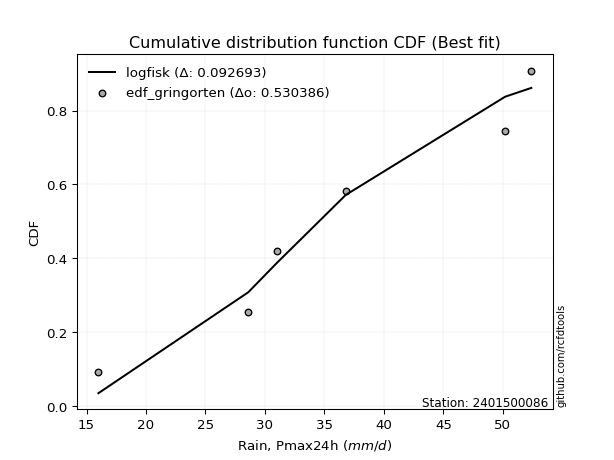</img>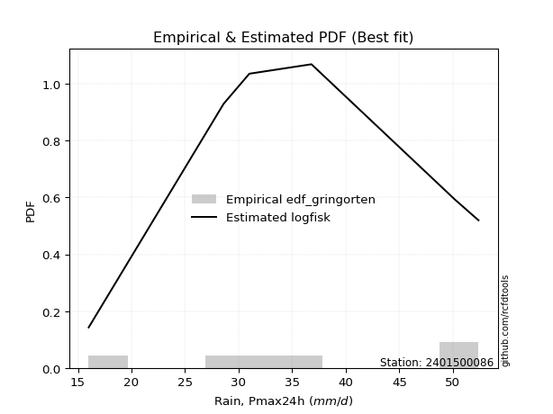</img>

</div>


### 9. EDF Filliben (1975)

The specific values of the constants (0.3175) (often denoted as $alpha$) and (0.365) are derived from a method proposed by James J. Filliben in a 1975 paper. This particular formula is the mean value of the $i$-th order statistic of the normal distribution and is considered a robust and effective plotting position formula for the normal probability plot correlation coefficient test for normality.

<div align="center">


$P=(m-0.3175)/(n+0.365)$


</div>


**9.1. Empirical values**

<div align="center">

|                | 0                   | 1                   | 2                  | 3                  | 4                  | 5                  |
|:---------------|:--------------------|:--------------------|:-------------------|:-------------------|:-------------------|:-------------------|
| date           | 2023                | 2020                | 2022               | 2019               | 2021               | 2024               |
| x              | 16.0                | 28.6                | 31.0               | 36.8               | 50.2               | 52.4               |
| m              | 1                   | 2                   | 3                  | 4                  | 5                  | 6                  |
| empirical_dist | edf_filliben        | edf_filliben        | edf_filliben       | edf_filliben       | edf_filliben       | edf_filliben       |
| empirical      | 0.10722702278083267 | 0.26433621366849963 | 0.4214454045561665 | 0.5785545954438335 | 0.7356637863315004 | 0.8927729772191673 |
| empirical_tr   | 1.1201055873295205  | 1.3593166043780034  | 1.7284453496266123 | 2.3727865796831313 | 3.783060921248143  | 9.326007326007321  |

</div>


**9.2. Kolmogorov-Smirnov fit test (sorted by Δ)**


<div align="center">

|                | 0                   | 1                   | 2                   | 3                   | 4                   | 5                   | 6                   | 7                   | 8                   | 9                   | 10                  | 11                  | 12                  | 13                  | 14                  | 15                  | 16                  | 17                  | 18                 | 19                 | 20                  | 21                  | 22                  | 23                  | 24                 | 25                  | 26                 | 27                  | 28                  | 29                 | 30                  | 31                  | 32                  | 33                 | 34                  | 35                  | 36                  | 37                    | 38                  | 39                 | 40                 | 41                  | 42                 | 43                  | 44                 | 45                 | 46                  | 47                  | 48                  | 49                  | 50                  | 51                  | 52                 | 53                  | 54                  | 55                 | 56                  | 57                  | 58                  | 59                  | 60                  | 61                  | 62                  | 63                  | 64                  | 65                  | 66                  | 67                  | 68                  | 69                  | 70                  | 71                  | 72                  | 73                  | 74                 | 75                  | 76                 | 77                  | 78                  | 79                  | 80                  | 81                 | 82                  | 83                  | 84                 | 85                 | 86                 | 87                 |
|:---------------|:--------------------|:--------------------|:--------------------|:--------------------|:--------------------|:--------------------|:--------------------|:--------------------|:--------------------|:--------------------|:--------------------|:--------------------|:--------------------|:--------------------|:--------------------|:--------------------|:--------------------|:--------------------|:-------------------|:-------------------|:--------------------|:--------------------|:--------------------|:--------------------|:-------------------|:--------------------|:-------------------|:--------------------|:--------------------|:-------------------|:--------------------|:--------------------|:--------------------|:-------------------|:--------------------|:--------------------|:--------------------|:----------------------|:--------------------|:-------------------|:-------------------|:--------------------|:-------------------|:--------------------|:-------------------|:-------------------|:--------------------|:--------------------|:--------------------|:--------------------|:--------------------|:--------------------|:-------------------|:--------------------|:--------------------|:-------------------|:--------------------|:--------------------|:--------------------|:--------------------|:--------------------|:--------------------|:--------------------|:--------------------|:--------------------|:--------------------|:--------------------|:--------------------|:--------------------|:--------------------|:--------------------|:--------------------|:--------------------|:--------------------|:-------------------|:--------------------|:-------------------|:--------------------|:--------------------|:--------------------|:--------------------|:-------------------|:--------------------|:--------------------|:-------------------|:-------------------|:-------------------|:-------------------|
| station        | 2401500086          | 2401500086          | 2401500086          | 2401500086          | 2401500086          | 2401500086          | 2401500086          | 2401500086          | 2401500086          | 2401500086          | 2401500086          | 2401500086          | 2401500086          | 2401500086          | 2401500086          | 2401500086          | 2401500086          | 2401500086          | 2401500086         | 2401500086         | 2401500086          | 2401500086          | 2401500086          | 2401500086          | 2401500086         | 2401500086          | 2401500086         | 2401500086          | 2401500086          | 2401500086         | 2401500086          | 2401500086          | 2401500086          | 2401500086         | 2401500086          | 2401500086          | 2401500086          | 2401500086            | 2401500086          | 2401500086         | 2401500086         | 2401500086          | 2401500086         | 2401500086          | 2401500086         | 2401500086         | 2401500086          | 2401500086          | 2401500086          | 2401500086          | 2401500086          | 2401500086          | 2401500086         | 2401500086          | 2401500086          | 2401500086         | 2401500086          | 2401500086          | 2401500086          | 2401500086          | 2401500086          | 2401500086          | 2401500086          | 2401500086          | 2401500086          | 2401500086          | 2401500086          | 2401500086          | 2401500086          | 2401500086          | 2401500086          | 2401500086          | 2401500086          | 2401500086          | 2401500086         | 2401500086          | 2401500086         | 2401500086          | 2401500086          | 2401500086          | 2401500086          | 2401500086         | 2401500086          | 2401500086          | 2401500086         | 2401500086         | 2401500086         | 2401500086         |
| empirical_dist | edf_filliben        | edf_filliben        | edf_filliben        | edf_filliben        | edf_filliben        | edf_filliben        | edf_filliben        | edf_filliben        | edf_filliben        | edf_filliben        | edf_filliben        | edf_filliben        | edf_filliben        | edf_filliben        | edf_filliben        | edf_filliben        | edf_filliben        | edf_filliben        | edf_filliben       | edf_filliben       | edf_filliben        | edf_filliben        | edf_filliben        | edf_filliben        | edf_filliben       | edf_filliben        | edf_filliben       | edf_filliben        | edf_filliben        | edf_filliben       | edf_filliben        | edf_filliben        | edf_filliben        | edf_filliben       | edf_filliben        | edf_filliben        | edf_filliben        | edf_filliben          | edf_filliben        | edf_filliben       | edf_filliben       | edf_filliben        | edf_filliben       | edf_filliben        | edf_filliben       | edf_filliben       | edf_filliben        | edf_filliben        | edf_filliben        | edf_filliben        | edf_filliben        | edf_filliben        | edf_filliben       | edf_filliben        | edf_filliben        | edf_filliben       | edf_filliben        | edf_filliben        | edf_filliben        | edf_filliben        | edf_filliben        | edf_filliben        | edf_filliben        | edf_filliben        | edf_filliben        | edf_filliben        | edf_filliben        | edf_filliben        | edf_filliben        | edf_filliben        | edf_filliben        | edf_filliben        | edf_filliben        | edf_filliben        | edf_filliben       | edf_filliben        | edf_filliben       | edf_filliben        | edf_filliben        | edf_filliben        | edf_filliben        | edf_filliben       | edf_filliben        | edf_filliben        | edf_filliben       | edf_filliben       | edf_filliben       | edf_filliben       |
| p_dist         | logfisk             | logerlang           | loginvgamma         | lognct              | logrice             | logalpha            | loggamma            | loggamma            | logbetaprime        | logf                | logfatiguelife      | logexponnorm        | logt                | lognorm             | lognorm             | logcrystalball      | kstwobign           | logmaxwell          | logpearson3        | loginvgauss        | ncf                 | genlogistic         | halfnorm            | logmielke           | invgauss           | rayleigh            | lograyleigh        | loglogistic         | alpha               | maxwell            | laplace_asymmetric  | rice                | betaprime           | fisk               | invgamma            | loggumbel_r         | weibull_min         | loglaplace_asymmetric | logncf              | logweibull_min     | gamma              | erlang              | f                  | nct                 | norm               | crystalball        | truncnorm           | exponnorm           | t                   | pearson3            | loghypsecant        | halflogistic        | loggumbel_l        | gumbel_r            | moyal               | loglaplace         | logmoyal            | logistic            | johnsonsu           | loginvweibull       | hypsecant           | mielke              | loghalfnorm         | wald                | laplace             | loghalflogistic     | logloggamma         | gumbel_l            | logkstwobign        | gibrat              | loggenexpon         | logwald             | loggibrat           | expon               | genexpon           | loggompertz         | logtruncnorm       | lognakagami         | nakagami            | logchi2             | logexpon            | chi2               | loglognorm          | invweibull          | logjohnsonsu       | gompertz           | fatiguelife        | loggenlogistic     |
| delta          | 0.10212715526805527 | 0.10737025690291291 | 0.10744752754599468 | 0.10905218831064656 | 0.10911574516108324 | 0.10916600267913801 | 0.10938342132768242 | 0.10938342132768242 | 0.10973183980952195 | 0.11228391601410026 | 0.11234585148915766 | 0.11255993510377793 | 0.11256045674642823 | 0.11256054683407368 | 0.11256054683407368 | 0.11256060530314493 | 0.11664020483814053 | 0.11755558666741478 | 0.1195101776318116 | 0.1201388802333283 | 0.12450657827106482 | 0.12458637011210072 | 0.12701483434890815 | 0.12834616632108836 | 0.1292473741350728 | 0.12926766987128446 | 0.1296205978694303 | 0.13034524913477108 | 0.13068112798136766 | 0.1309857498056981 | 0.13135071634366768 | 0.13167803294046132 | 0.13266344515222284 | 0.1334316739541198 | 0.13348252896245416 | 0.13399895086351377 | 0.13495468423949875 | 0.1351173242800744    | 0.13553448991585454 | 0.1365393651837451 | 0.1365803466307467 | 0.13691707747150328 | 0.1370852342401343 | 0.13743530237026558 | 0.1374525249016133 | 0.1374525298368271 | 0.13745256003751927 | 0.13745353845989627 | 0.13745504380070905 | 0.13819287578855466 | 0.13948461701470227 | 0.14086188357583562 | 0.1419813921769716 | 0.14251155925149006 | 0.14576969232922432 | 0.1476372118949978 | 0.15190519440890832 | 0.15228838854005133 | 0.15290807938059614 | 0.15696110909632727 | 0.15929281951208563 | 0.16336490668302006 | 0.16396131531342556 | 0.16416856296321147 | 0.16478802013668425 | 0.17204356694927642 | 0.17339592151425876 | 0.17599926374400188 | 0.18508229615238314 | 0.18575523203518762 | 0.18773730655633608 | 0.19288369113718656 | 0.20424902486859553 | 0.20588413847401071 | 0.2060316753951355 | 0.24272064941563382 | 0.2643333857692145 | 0.26433620977225386 | 0.26433621366780424 | 0.26838871037660256 | 0.28234012389318025 | 0.2879691039833305 | 0.39784591503777605 | 0.46651068348931624 | 0.5076755296701416 | 0.5093128651011801 | 0.5319767924486811 | 0.7356637863315004 |
| deltao         | 0.530385761606      | 0.530385761606      | 0.530385761606      | 0.530385761606      | 0.530385761606      | 0.530385761606      | 0.530385761606      | 0.530385761606      | 0.530385761606      | 0.530385761606      | 0.530385761606      | 0.530385761606      | 0.530385761606      | 0.530385761606      | 0.530385761606      | 0.530385761606      | 0.530385761606      | 0.530385761606      | 0.530385761606     | 0.530385761606     | 0.530385761606      | 0.530385761606      | 0.530385761606      | 0.530385761606      | 0.530385761606     | 0.530385761606      | 0.530385761606     | 0.530385761606      | 0.530385761606      | 0.530385761606     | 0.530385761606      | 0.530385761606      | 0.530385761606      | 0.530385761606     | 0.530385761606      | 0.530385761606      | 0.530385761606      | 0.530385761606        | 0.530385761606      | 0.530385761606     | 0.530385761606     | 0.530385761606      | 0.530385761606     | 0.530385761606      | 0.530385761606     | 0.530385761606     | 0.530385761606      | 0.530385761606      | 0.530385761606      | 0.530385761606      | 0.530385761606      | 0.530385761606      | 0.530385761606     | 0.530385761606      | 0.530385761606      | 0.530385761606     | 0.530385761606      | 0.530385761606      | 0.530385761606      | 0.530385761606      | 0.530385761606      | 0.530385761606      | 0.530385761606      | 0.530385761606      | 0.530385761606      | 0.530385761606      | 0.530385761606      | 0.530385761606      | 0.530385761606      | 0.530385761606      | 0.530385761606      | 0.530385761606      | 0.530385761606      | 0.530385761606      | 0.530385761606     | 0.530385761606      | 0.530385761606     | 0.530385761606      | 0.530385761606      | 0.530385761606      | 0.530385761606      | 0.530385761606     | 0.530385761606      | 0.530385761606      | 0.530385761606     | 0.530385761606     | 0.530385761606     | 0.530385761606     |
| eval           | Δo > Δ              | Δo > Δ              | Δo > Δ              | Δo > Δ              | Δo > Δ              | Δo > Δ              | Δo > Δ              | Δo > Δ              | Δo > Δ              | Δo > Δ              | Δo > Δ              | Δo > Δ              | Δo > Δ              | Δo > Δ              | Δo > Δ              | Δo > Δ              | Δo > Δ              | Δo > Δ              | Δo > Δ             | Δo > Δ             | Δo > Δ              | Δo > Δ              | Δo > Δ              | Δo > Δ              | Δo > Δ             | Δo > Δ              | Δo > Δ             | Δo > Δ              | Δo > Δ              | Δo > Δ             | Δo > Δ              | Δo > Δ              | Δo > Δ              | Δo > Δ             | Δo > Δ              | Δo > Δ              | Δo > Δ              | Δo > Δ                | Δo > Δ              | Δo > Δ             | Δo > Δ             | Δo > Δ              | Δo > Δ             | Δo > Δ              | Δo > Δ             | Δo > Δ             | Δo > Δ              | Δo > Δ              | Δo > Δ              | Δo > Δ              | Δo > Δ              | Δo > Δ              | Δo > Δ             | Δo > Δ              | Δo > Δ              | Δo > Δ             | Δo > Δ              | Δo > Δ              | Δo > Δ              | Δo > Δ              | Δo > Δ              | Δo > Δ              | Δo > Δ              | Δo > Δ              | Δo > Δ              | Δo > Δ              | Δo > Δ              | Δo > Δ              | Δo > Δ              | Δo > Δ              | Δo > Δ              | Δo > Δ              | Δo > Δ              | Δo > Δ              | Δo > Δ             | Δo > Δ              | Δo > Δ             | Δo > Δ              | Δo > Δ              | Δo > Δ              | Δo > Δ              | Δo > Δ             | Δo > Δ              | Δo > Δ              | Δo > Δ             | Δo > Δ             | Δo <= Δ            | Δo <= Δ            |
| fit            | 1                   | 1                   | 1                   | 1                   | 1                   | 1                   | 1                   | 1                   | 1                   | 1                   | 1                   | 1                   | 1                   | 1                   | 1                   | 1                   | 1                   | 1                   | 1                  | 1                  | 1                   | 1                   | 1                   | 1                   | 1                  | 1                   | 1                  | 1                   | 1                   | 1                  | 1                   | 1                   | 1                   | 1                  | 1                   | 1                   | 1                   | 1                     | 1                   | 1                  | 1                  | 1                   | 1                  | 1                   | 1                  | 1                  | 1                   | 1                   | 1                   | 1                   | 1                   | 1                   | 1                  | 1                   | 1                   | 1                  | 1                   | 1                   | 1                   | 1                   | 1                   | 1                   | 1                   | 1                   | 1                   | 1                   | 1                   | 1                   | 1                   | 1                   | 1                   | 1                   | 1                   | 1                   | 1                  | 1                   | 1                  | 1                   | 1                   | 1                   | 1                   | 1                  | 1                   | 1                   | 1                  | 1                  | 0                  | 0                  |
| n              | 6                   | 6                   | 6                   | 6                   | 6                   | 6                   | 6                   | 6                   | 6                   | 6                   | 6                   | 6                   | 6                   | 6                   | 6                   | 6                   | 6                   | 6                   | 6                  | 6                  | 6                   | 6                   | 6                   | 6                   | 6                  | 6                   | 6                  | 6                   | 6                   | 6                  | 6                   | 6                   | 6                   | 6                  | 6                   | 6                   | 6                   | 6                     | 6                   | 6                  | 6                  | 6                   | 6                  | 6                   | 6                  | 6                  | 6                   | 6                   | 6                   | 6                   | 6                   | 6                   | 6                  | 6                   | 6                   | 6                  | 6                   | 6                   | 6                   | 6                   | 6                   | 6                   | 6                   | 6                   | 6                   | 6                   | 6                   | 6                   | 6                   | 6                   | 6                   | 6                   | 6                   | 6                   | 6                  | 6                   | 6                  | 6                   | 6                   | 6                   | 6                   | 6                  | 6                   | 6                   | 6                  | 6                  | 6                  | 6                  |
| best_fit       | 1                   | 0                   | 0                   | 0                   | 0                   | 0                   | 0                   | 0                   | 0                   | 0                   | 0                   | 0                   | 0                   | 0                   | 0                   | 0                   | 0                   | 0                   | 0                  | 0                  | 0                   | 0                   | 0                   | 0                   | 0                  | 0                   | 0                  | 0                   | 0                   | 0                  | 0                   | 0                   | 0                   | 0                  | 0                   | 0                   | 0                   | 0                     | 0                   | 0                  | 0                  | 0                   | 0                  | 0                   | 0                  | 0                  | 0                   | 0                   | 0                   | 0                   | 0                   | 0                   | 0                  | 0                   | 0                   | 0                  | 0                   | 0                   | 0                   | 0                   | 0                   | 0                   | 0                   | 0                   | 0                   | 0                   | 0                   | 0                   | 0                   | 0                   | 0                   | 0                   | 0                   | 0                   | 0                  | 0                   | 0                  | 0                   | 0                   | 0                   | 0                   | 0                  | 0                   | 0                   | 0                  | 0                  | 0                  | 0                  |
| best_fit_sort  | 1                   | 2                   | 3                   | 4                   | 5                   | 6                   | 7                   | 8                   | 9                   | 10                  | 11                  | 12                  | 13                  | 14                  | 15                  | 16                  | 17                  | 18                  | 19                 | 20                 | 21                  | 22                  | 23                  | 24                  | 25                 | 26                  | 27                 | 28                  | 29                  | 30                 | 31                  | 32                  | 33                  | 34                 | 35                  | 36                  | 37                  | 38                    | 39                  | 40                 | 41                 | 42                  | 43                 | 44                  | 45                 | 46                 | 47                  | 48                  | 49                  | 50                  | 51                  | 52                  | 53                 | 54                  | 55                  | 56                 | 57                  | 58                  | 59                  | 60                  | 61                  | 62                  | 63                  | 64                  | 65                  | 66                  | 67                  | 68                  | 69                  | 70                  | 71                  | 72                  | 73                  | 74                  | 75                 | 76                  | 77                 | 78                  | 79                  | 80                  | 81                  | 82                 | 83                  | 84                  | 85                 | 86                 | 87                 | 88                 |

</div>


**9.3. Best fit**

<div align="center">

|   id |    station | empirical_dist   | p_dist   |    delta |   deltao | eval   |   fit |   n |   best_fit |   best_fit_sort |
|-----:|-----------:|:-----------------|:---------|---------:|---------:|:-------|------:|----:|-----------:|----------------:|
|    0 | 2401500086 | edf_filliben     | logfisk  | 0.102127 | 0.530386 | Δo > Δ |     1 |   6 |          1 |               1 |

</div>


<div align="center">

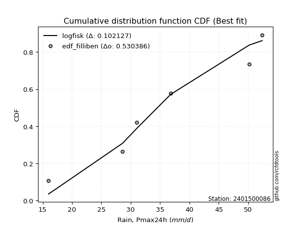</img>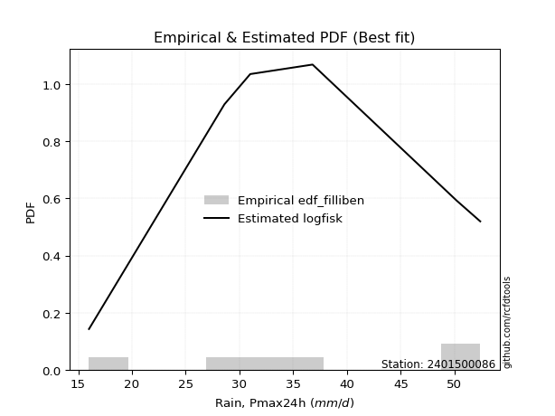</img>

</div>


### 10. EDF Jenkinson (1977)

The Jenkinson formula in hydrology is an empirical plotting position formula used to estimate the non-exceedance probability _(P)_ or return period _(T)_ of a given ordered observation within a sample. It is a widely used method in the frequency analysis of extreme events such as floods and rainfall, as it provides a distribution-free way to plot data. _a≈0.31_ and _b≈0.38_ are constants derived to approximate the median of the probability distribution for the given rank.

<div align="center">


$P=(m-a)/(n+b)$


</div>


**10.1. Empirical values**

<div align="center">

|                | 0                   | 1                   | 2                  | 3                  | 4                  | 5                  |
|:---------------|:--------------------|:--------------------|:-------------------|:-------------------|:-------------------|:-------------------|
| date           | 2023                | 2020                | 2022               | 2019               | 2021               | 2024               |
| x              | 16.0                | 28.6                | 31.0               | 36.8               | 50.2               | 52.4               |
| m              | 1                   | 2                   | 3                  | 4                  | 5                  | 6                  |
| empirical_dist | edf_jenkinson       | edf_jenkinson       | edf_jenkinson      | edf_jenkinson      | edf_jenkinson      | edf_jenkinson      |
| empirical      | 0.10815047021943573 | 0.26489028213166144 | 0.4216300940438871 | 0.5783699059561128 | 0.7351097178683387 | 0.8918495297805643 |
| empirical_tr   | 1.1212653778558874  | 1.3603411513859276  | 1.7289972899728996 | 2.3717472118959106 | 3.7751479289940844 | 9.246376811594207  |

</div>


**10.2. Kolmogorov-Smirnov fit test (sorted by Δ)**


<div align="center">

|                | 0                   | 1                   | 2                   | 3                   | 4                 | 5                   | 6                   | 7                   | 8                  | 9                   | 10                 | 11                  | 12                  | 13                  | 14                  | 15                  | 16                  | 17                  | 18                 | 19                  | 20                  | 21                  | 22                 | 23                 | 24                 | 25                  | 26                 | 27                  | 28                 | 29                  | 30                  | 31                  | 32                 | 33                  | 34                  | 35                 | 36                  | 37                 | 38                    | 39                  | 40                  | 41                  | 42                  | 43                  | 44                  | 45                  | 46                  | 47                  | 48                 | 49                 | 50                  | 51                  | 52                  | 53                 | 54                  | 55                  | 56                 | 57                  | 58                  | 59                  | 60                  | 61                  | 62                 | 63                  | 64                | 65                 | 66                 | 67                  | 68                  | 69                  | 70                  | 71                  | 72                 | 73                 | 74                 | 75                | 76                 | 77                  | 78                  | 79                  | 80                  | 81                  | 82                  | 83                 | 84                 | 85                 | 86                 | 87                 |
|:---------------|:--------------------|:--------------------|:--------------------|:--------------------|:------------------|:--------------------|:--------------------|:--------------------|:-------------------|:--------------------|:-------------------|:--------------------|:--------------------|:--------------------|:--------------------|:--------------------|:--------------------|:--------------------|:-------------------|:--------------------|:--------------------|:--------------------|:-------------------|:-------------------|:-------------------|:--------------------|:-------------------|:--------------------|:-------------------|:--------------------|:--------------------|:--------------------|:-------------------|:--------------------|:--------------------|:-------------------|:--------------------|:-------------------|:----------------------|:--------------------|:--------------------|:--------------------|:--------------------|:--------------------|:--------------------|:--------------------|:--------------------|:--------------------|:-------------------|:-------------------|:--------------------|:--------------------|:--------------------|:-------------------|:--------------------|:--------------------|:-------------------|:--------------------|:--------------------|:--------------------|:--------------------|:--------------------|:-------------------|:--------------------|:------------------|:-------------------|:-------------------|:--------------------|:--------------------|:--------------------|:--------------------|:--------------------|:-------------------|:-------------------|:-------------------|:------------------|:-------------------|:--------------------|:--------------------|:--------------------|:--------------------|:--------------------|:--------------------|:-------------------|:-------------------|:-------------------|:-------------------|:-------------------|
| station        | 2401500086          | 2401500086          | 2401500086          | 2401500086          | 2401500086        | 2401500086          | 2401500086          | 2401500086          | 2401500086         | 2401500086          | 2401500086         | 2401500086          | 2401500086          | 2401500086          | 2401500086          | 2401500086          | 2401500086          | 2401500086          | 2401500086         | 2401500086          | 2401500086          | 2401500086          | 2401500086         | 2401500086         | 2401500086         | 2401500086          | 2401500086         | 2401500086          | 2401500086         | 2401500086          | 2401500086          | 2401500086          | 2401500086         | 2401500086          | 2401500086          | 2401500086         | 2401500086          | 2401500086         | 2401500086            | 2401500086          | 2401500086          | 2401500086          | 2401500086          | 2401500086          | 2401500086          | 2401500086          | 2401500086          | 2401500086          | 2401500086         | 2401500086         | 2401500086          | 2401500086          | 2401500086          | 2401500086         | 2401500086          | 2401500086          | 2401500086         | 2401500086          | 2401500086          | 2401500086          | 2401500086          | 2401500086          | 2401500086         | 2401500086          | 2401500086        | 2401500086         | 2401500086         | 2401500086          | 2401500086          | 2401500086          | 2401500086          | 2401500086          | 2401500086         | 2401500086         | 2401500086         | 2401500086        | 2401500086         | 2401500086          | 2401500086          | 2401500086          | 2401500086          | 2401500086          | 2401500086          | 2401500086         | 2401500086         | 2401500086         | 2401500086         | 2401500086         |
| empirical_dist | edf_jenkinson       | edf_jenkinson       | edf_jenkinson       | edf_jenkinson       | edf_jenkinson     | edf_jenkinson       | edf_jenkinson       | edf_jenkinson       | edf_jenkinson      | edf_jenkinson       | edf_jenkinson      | edf_jenkinson       | edf_jenkinson       | edf_jenkinson       | edf_jenkinson       | edf_jenkinson       | edf_jenkinson       | edf_jenkinson       | edf_jenkinson      | edf_jenkinson       | edf_jenkinson       | edf_jenkinson       | edf_jenkinson      | edf_jenkinson      | edf_jenkinson      | edf_jenkinson       | edf_jenkinson      | edf_jenkinson       | edf_jenkinson      | edf_jenkinson       | edf_jenkinson       | edf_jenkinson       | edf_jenkinson      | edf_jenkinson       | edf_jenkinson       | edf_jenkinson      | edf_jenkinson       | edf_jenkinson      | edf_jenkinson         | edf_jenkinson       | edf_jenkinson       | edf_jenkinson       | edf_jenkinson       | edf_jenkinson       | edf_jenkinson       | edf_jenkinson       | edf_jenkinson       | edf_jenkinson       | edf_jenkinson      | edf_jenkinson      | edf_jenkinson       | edf_jenkinson       | edf_jenkinson       | edf_jenkinson      | edf_jenkinson       | edf_jenkinson       | edf_jenkinson      | edf_jenkinson       | edf_jenkinson       | edf_jenkinson       | edf_jenkinson       | edf_jenkinson       | edf_jenkinson      | edf_jenkinson       | edf_jenkinson     | edf_jenkinson      | edf_jenkinson      | edf_jenkinson       | edf_jenkinson       | edf_jenkinson       | edf_jenkinson       | edf_jenkinson       | edf_jenkinson      | edf_jenkinson      | edf_jenkinson      | edf_jenkinson     | edf_jenkinson      | edf_jenkinson       | edf_jenkinson       | edf_jenkinson       | edf_jenkinson       | edf_jenkinson       | edf_jenkinson       | edf_jenkinson      | edf_jenkinson      | edf_jenkinson      | edf_jenkinson      | edf_jenkinson      |
| p_dist         | logfisk             | loginvgamma         | logerlang           | lognct              | logrice           | logalpha            | loggamma            | loggamma            | logbetaprime       | logf                | logfatiguelife     | logexponnorm        | logt                | lognorm             | lognorm             | logcrystalball      | logmaxwell          | kstwobign           | loginvgauss        | logpearson3         | ncf                 | genlogistic         | halfnorm           | logmielke          | lograyleigh        | invgauss            | rayleigh           | loglogistic         | alpha              | maxwell             | laplace_asymmetric  | rice                | betaprime          | loggumbel_r         | fisk                | invgamma           | logncf              | weibull_min        | loglaplace_asymmetric | logweibull_min      | gamma               | erlang              | f                   | nct                 | norm                | crystalball         | truncnorm           | exponnorm           | t                  | pearson3           | loghypsecant        | halflogistic        | loggumbel_l         | gumbel_r           | moyal               | loglaplace          | logmoyal           | johnsonsu           | logistic            | loginvweibull       | hypsecant           | loghalfnorm         | mielke             | wald                | laplace           | loghalflogistic    | logloggamma        | gumbel_l            | logkstwobign        | gibrat              | loggenexpon         | logwald             | loggibrat          | expon              | genexpon           | loggompertz       | logtruncnorm       | lognakagami         | nakagami            | logchi2             | logexpon            | chi2                | loglognorm          | invweibull         | logjohnsonsu       | gompertz           | fatiguelife        | loggenlogistic     |
| delta          | 0.10268122373121702 | 0.10689345908283288 | 0.10792432536607466 | 0.10960625677380831 | 0.109669813624245 | 0.10972007114229976 | 0.10993748979084417 | 0.10993748979084417 | 0.1102859082726837 | 0.11283798447726201 | 0.1128999199523194 | 0.11311400356693968 | 0.11311452520958998 | 0.11311461529723543 | 0.11311461529723543 | 0.11311467376630668 | 0.11700151820425297 | 0.11719427330130228 | 0.1195848117701665 | 0.12006424609497335 | 0.12506064673422657 | 0.12514043857526247 | 0.1275689028120699 | 0.1282307052685252 | 0.1290665294062685 | 0.12980144259823456 | 0.1298217383344462 | 0.13089931759793283 | 0.1312351964445294 | 0.13153981826885985 | 0.13190478480682943 | 0.13223210140362307 | 0.1332175136153846 | 0.13344488240035196 | 0.13398574241728156 | 0.1340365974256159 | 0.13498042145269273 | 0.1355087527026605 | 0.13567139274323614   | 0.13709343364690685 | 0.13713441509390845 | 0.13747114593466503 | 0.13763930270329605 | 0.13798937083342733 | 0.13800659336477505 | 0.13800659829998885 | 0.13800662850068102 | 0.13800760692305802 | 0.1380091122638708 | 0.1387469442517164 | 0.14003868547786402 | 0.14141595203899737 | 0.14253546064013334 | 0.1430656277146518 | 0.14632376079238607 | 0.14819128035815954 | 0.1513511259457465 | 0.15272338989287548 | 0.15284245700321308 | 0.15640704063316546 | 0.15984688797524738 | 0.16340724685026375 | 0.1639189751461818 | 0.16472263142637322 | 0.165342088599846 | 0.1714894984861146 | 0.1739499899774205 | 0.17655333220716363 | 0.18452822768922134 | 0.18630930049834937 | 0.18718323809317428 | 0.19232962267402476 | 0.2044337143563162 | 0.2053300700108489 | 0.2054776069319737 | 0.242166580952472 | 0.2648874542323763 | 0.26489027823541567 | 0.26489028213096605 | 0.26783464191344075 | 0.28178605543001845 | 0.28741503552016867 | 0.39729184657461425 | 0.4655872360507133 | 0.5071214612069799 | 0.5091281756134595 | 0.5314227239855194 | 0.7351097178683387 |
| deltao         | 0.530385761606      | 0.530385761606      | 0.530385761606      | 0.530385761606      | 0.530385761606    | 0.530385761606      | 0.530385761606      | 0.530385761606      | 0.530385761606     | 0.530385761606      | 0.530385761606     | 0.530385761606      | 0.530385761606      | 0.530385761606      | 0.530385761606      | 0.530385761606      | 0.530385761606      | 0.530385761606      | 0.530385761606     | 0.530385761606      | 0.530385761606      | 0.530385761606      | 0.530385761606     | 0.530385761606     | 0.530385761606     | 0.530385761606      | 0.530385761606     | 0.530385761606      | 0.530385761606     | 0.530385761606      | 0.530385761606      | 0.530385761606      | 0.530385761606     | 0.530385761606      | 0.530385761606      | 0.530385761606     | 0.530385761606      | 0.530385761606     | 0.530385761606        | 0.530385761606      | 0.530385761606      | 0.530385761606      | 0.530385761606      | 0.530385761606      | 0.530385761606      | 0.530385761606      | 0.530385761606      | 0.530385761606      | 0.530385761606     | 0.530385761606     | 0.530385761606      | 0.530385761606      | 0.530385761606      | 0.530385761606     | 0.530385761606      | 0.530385761606      | 0.530385761606     | 0.530385761606      | 0.530385761606      | 0.530385761606      | 0.530385761606      | 0.530385761606      | 0.530385761606     | 0.530385761606      | 0.530385761606    | 0.530385761606     | 0.530385761606     | 0.530385761606      | 0.530385761606      | 0.530385761606      | 0.530385761606      | 0.530385761606      | 0.530385761606     | 0.530385761606     | 0.530385761606     | 0.530385761606    | 0.530385761606     | 0.530385761606      | 0.530385761606      | 0.530385761606      | 0.530385761606      | 0.530385761606      | 0.530385761606      | 0.530385761606     | 0.530385761606     | 0.530385761606     | 0.530385761606     | 0.530385761606     |
| eval           | Δo > Δ              | Δo > Δ              | Δo > Δ              | Δo > Δ              | Δo > Δ            | Δo > Δ              | Δo > Δ              | Δo > Δ              | Δo > Δ             | Δo > Δ              | Δo > Δ             | Δo > Δ              | Δo > Δ              | Δo > Δ              | Δo > Δ              | Δo > Δ              | Δo > Δ              | Δo > Δ              | Δo > Δ             | Δo > Δ              | Δo > Δ              | Δo > Δ              | Δo > Δ             | Δo > Δ             | Δo > Δ             | Δo > Δ              | Δo > Δ             | Δo > Δ              | Δo > Δ             | Δo > Δ              | Δo > Δ              | Δo > Δ              | Δo > Δ             | Δo > Δ              | Δo > Δ              | Δo > Δ             | Δo > Δ              | Δo > Δ             | Δo > Δ                | Δo > Δ              | Δo > Δ              | Δo > Δ              | Δo > Δ              | Δo > Δ              | Δo > Δ              | Δo > Δ              | Δo > Δ              | Δo > Δ              | Δo > Δ             | Δo > Δ             | Δo > Δ              | Δo > Δ              | Δo > Δ              | Δo > Δ             | Δo > Δ              | Δo > Δ              | Δo > Δ             | Δo > Δ              | Δo > Δ              | Δo > Δ              | Δo > Δ              | Δo > Δ              | Δo > Δ             | Δo > Δ              | Δo > Δ            | Δo > Δ             | Δo > Δ             | Δo > Δ              | Δo > Δ              | Δo > Δ              | Δo > Δ              | Δo > Δ              | Δo > Δ             | Δo > Δ             | Δo > Δ             | Δo > Δ            | Δo > Δ             | Δo > Δ              | Δo > Δ              | Δo > Δ              | Δo > Δ              | Δo > Δ              | Δo > Δ              | Δo > Δ             | Δo > Δ             | Δo > Δ             | Δo <= Δ            | Δo <= Δ            |
| fit            | 1                   | 1                   | 1                   | 1                   | 1                 | 1                   | 1                   | 1                   | 1                  | 1                   | 1                  | 1                   | 1                   | 1                   | 1                   | 1                   | 1                   | 1                   | 1                  | 1                   | 1                   | 1                   | 1                  | 1                  | 1                  | 1                   | 1                  | 1                   | 1                  | 1                   | 1                   | 1                   | 1                  | 1                   | 1                   | 1                  | 1                   | 1                  | 1                     | 1                   | 1                   | 1                   | 1                   | 1                   | 1                   | 1                   | 1                   | 1                   | 1                  | 1                  | 1                   | 1                   | 1                   | 1                  | 1                   | 1                   | 1                  | 1                   | 1                   | 1                   | 1                   | 1                   | 1                  | 1                   | 1                 | 1                  | 1                  | 1                   | 1                   | 1                   | 1                   | 1                   | 1                  | 1                  | 1                  | 1                 | 1                  | 1                   | 1                   | 1                   | 1                   | 1                   | 1                   | 1                  | 1                  | 1                  | 0                  | 0                  |
| n              | 6                   | 6                   | 6                   | 6                   | 6                 | 6                   | 6                   | 6                   | 6                  | 6                   | 6                  | 6                   | 6                   | 6                   | 6                   | 6                   | 6                   | 6                   | 6                  | 6                   | 6                   | 6                   | 6                  | 6                  | 6                  | 6                   | 6                  | 6                   | 6                  | 6                   | 6                   | 6                   | 6                  | 6                   | 6                   | 6                  | 6                   | 6                  | 6                     | 6                   | 6                   | 6                   | 6                   | 6                   | 6                   | 6                   | 6                   | 6                   | 6                  | 6                  | 6                   | 6                   | 6                   | 6                  | 6                   | 6                   | 6                  | 6                   | 6                   | 6                   | 6                   | 6                   | 6                  | 6                   | 6                 | 6                  | 6                  | 6                   | 6                   | 6                   | 6                   | 6                   | 6                  | 6                  | 6                  | 6                 | 6                  | 6                   | 6                   | 6                   | 6                   | 6                   | 6                   | 6                  | 6                  | 6                  | 6                  | 6                  |
| best_fit       | 1                   | 0                   | 0                   | 0                   | 0                 | 0                   | 0                   | 0                   | 0                  | 0                   | 0                  | 0                   | 0                   | 0                   | 0                   | 0                   | 0                   | 0                   | 0                  | 0                   | 0                   | 0                   | 0                  | 0                  | 0                  | 0                   | 0                  | 0                   | 0                  | 0                   | 0                   | 0                   | 0                  | 0                   | 0                   | 0                  | 0                   | 0                  | 0                     | 0                   | 0                   | 0                   | 0                   | 0                   | 0                   | 0                   | 0                   | 0                   | 0                  | 0                  | 0                   | 0                   | 0                   | 0                  | 0                   | 0                   | 0                  | 0                   | 0                   | 0                   | 0                   | 0                   | 0                  | 0                   | 0                 | 0                  | 0                  | 0                   | 0                   | 0                   | 0                   | 0                   | 0                  | 0                  | 0                  | 0                 | 0                  | 0                   | 0                   | 0                   | 0                   | 0                   | 0                   | 0                  | 0                  | 0                  | 0                  | 0                  |
| best_fit_sort  | 1                   | 2                   | 3                   | 4                   | 5                 | 6                   | 7                   | 8                   | 9                  | 10                  | 11                 | 12                  | 13                  | 14                  | 15                  | 16                  | 17                  | 18                  | 19                 | 20                  | 21                  | 22                  | 23                 | 24                 | 25                 | 26                  | 27                 | 28                  | 29                 | 30                  | 31                  | 32                  | 33                 | 34                  | 35                  | 36                 | 37                  | 38                 | 39                    | 40                  | 41                  | 42                  | 43                  | 44                  | 45                  | 46                  | 47                  | 48                  | 49                 | 50                 | 51                  | 52                  | 53                  | 54                 | 55                  | 56                  | 57                 | 58                  | 59                  | 60                  | 61                  | 62                  | 63                 | 64                  | 65                | 66                 | 67                 | 68                  | 69                  | 70                  | 71                  | 72                  | 73                 | 74                 | 75                 | 76                | 77                 | 78                  | 79                  | 80                  | 81                  | 82                  | 83                  | 84                 | 85                 | 86                 | 87                 | 88                 |

</div>


**10.3. Best fit**

<div align="center">

|   id |    station | empirical_dist   | p_dist   |    delta |   deltao | eval   |   fit |   n |   best_fit |   best_fit_sort |
|-----:|-----------:|:-----------------|:---------|---------:|---------:|:-------|------:|----:|-----------:|----------------:|
|    0 | 2401500086 | edf_jenkinson    | logfisk  | 0.102681 | 0.530386 | Δo > Δ |     1 |   6 |          1 |               1 |

</div>


<div align="center">

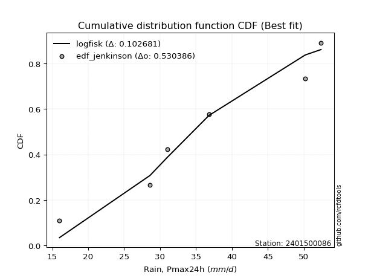</img>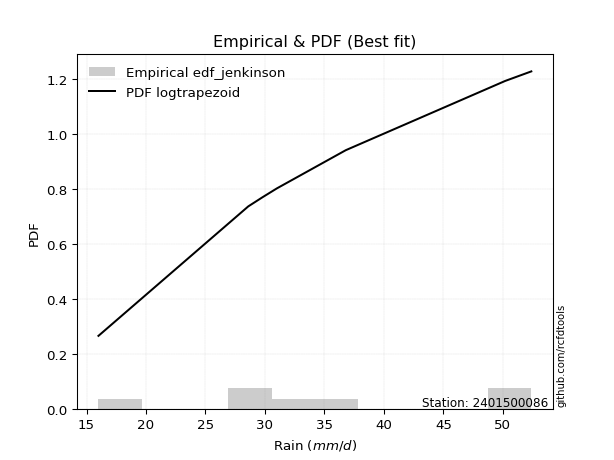</img>

</div>


### 11. EDF Cunnane (1978)

Cunnane´s work in statistical hydrology has focused on the performance and evaluation of different probability distributions (such as GEV, Gumbel, Lognormal) for flood frequency estimation. _b_ is a constant, typically set to 0.4.

<div align="center">


$P=(m-b)/(n+1-2b)$


</div>


**11.1. Empirical values**

<div align="center">

|                | 0                  | 1                   | 2                   | 3                  | 4                  | 5                  |
|:---------------|:-------------------|:--------------------|:--------------------|:-------------------|:-------------------|:-------------------|
| date           | 2023               | 2020                | 2022                | 2019               | 2021               | 2024               |
| x              | 16.0               | 28.6                | 31.0                | 36.8               | 50.2               | 52.4               |
| m              | 1                  | 2                   | 3                   | 4                  | 5                  | 6                  |
| empirical_dist | edf_cunnane        | edf_cunnane         | edf_cunnane         | edf_cunnane        | edf_cunnane        | edf_cunnane        |
| empirical      | 0.0967741935483871 | 0.25806451612903225 | 0.41935483870967744 | 0.5806451612903226 | 0.7419354838709676 | 0.9032258064516128 |
| empirical_tr   | 1.1071428571428572 | 1.3478260869565217  | 1.7222222222222225  | 2.384615384615385  | 3.8749999999999982 | 10.333333333333318 |

</div>


**11.2. Kolmogorov-Smirnov fit test (sorted by Δ)**


<div align="center">

|                | 0                   | 1                   | 2                   | 3                   | 4                   | 5                  | 6                   | 7                   | 8                   | 9                   | 10                  | 11                  | 12                  | 13                  | 14                  | 15                  | 16                  | 17                  | 18                 | 19                 | 20                  | 21                 | 22                  | 23                  | 24                  | 25                  | 26                  | 27                  | 28                 | 29                  | 30                  | 31                 | 32                  | 33                  | 34                    | 35                  | 36                  | 37                 | 38                  | 39                 | 40                  | 41                 | 42                  | 43                  | 44                  | 45                  | 46                  | 47                  | 48                 | 49                  | 50                 | 51                  | 52                 | 53                  | 54                  | 55                  | 56                  | 57                 | 58                  | 59                  | 60                  | 61                 | 62                  | 63                  | 64                  | 65                  | 66                  | 67                 | 68                 | 69                  | 70                  | 71                  | 72                  | 73                 | 74                  | 75                 | 76                 | 77                 | 78                  | 79                  | 80                  | 81                  | 82                  | 83                  | 84                 | 85                 | 86                 | 87                 |
|:---------------|:--------------------|:--------------------|:--------------------|:--------------------|:--------------------|:-------------------|:--------------------|:--------------------|:--------------------|:--------------------|:--------------------|:--------------------|:--------------------|:--------------------|:--------------------|:--------------------|:--------------------|:--------------------|:-------------------|:-------------------|:--------------------|:-------------------|:--------------------|:--------------------|:--------------------|:--------------------|:--------------------|:--------------------|:-------------------|:--------------------|:--------------------|:-------------------|:--------------------|:--------------------|:----------------------|:--------------------|:--------------------|:-------------------|:--------------------|:-------------------|:--------------------|:-------------------|:--------------------|:--------------------|:--------------------|:--------------------|:--------------------|:--------------------|:-------------------|:--------------------|:-------------------|:--------------------|:-------------------|:--------------------|:--------------------|:--------------------|:--------------------|:-------------------|:--------------------|:--------------------|:--------------------|:-------------------|:--------------------|:--------------------|:--------------------|:--------------------|:--------------------|:-------------------|:-------------------|:--------------------|:--------------------|:--------------------|:--------------------|:-------------------|:--------------------|:-------------------|:-------------------|:-------------------|:--------------------|:--------------------|:--------------------|:--------------------|:--------------------|:--------------------|:-------------------|:-------------------|:-------------------|:-------------------|
| station        | 2401500086          | 2401500086          | 2401500086          | 2401500086          | 2401500086          | 2401500086         | 2401500086          | 2401500086          | 2401500086          | 2401500086          | 2401500086          | 2401500086          | 2401500086          | 2401500086          | 2401500086          | 2401500086          | 2401500086          | 2401500086          | 2401500086         | 2401500086         | 2401500086          | 2401500086         | 2401500086          | 2401500086          | 2401500086          | 2401500086          | 2401500086          | 2401500086          | 2401500086         | 2401500086          | 2401500086          | 2401500086         | 2401500086          | 2401500086          | 2401500086            | 2401500086          | 2401500086          | 2401500086         | 2401500086          | 2401500086         | 2401500086          | 2401500086         | 2401500086          | 2401500086          | 2401500086          | 2401500086          | 2401500086          | 2401500086          | 2401500086         | 2401500086          | 2401500086         | 2401500086          | 2401500086         | 2401500086          | 2401500086          | 2401500086          | 2401500086          | 2401500086         | 2401500086          | 2401500086          | 2401500086          | 2401500086         | 2401500086          | 2401500086          | 2401500086          | 2401500086          | 2401500086          | 2401500086         | 2401500086         | 2401500086          | 2401500086          | 2401500086          | 2401500086          | 2401500086         | 2401500086          | 2401500086         | 2401500086         | 2401500086         | 2401500086          | 2401500086          | 2401500086          | 2401500086          | 2401500086          | 2401500086          | 2401500086         | 2401500086         | 2401500086         | 2401500086         |
| empirical_dist | edf_cunnane         | edf_cunnane         | edf_cunnane         | edf_cunnane         | edf_cunnane         | edf_cunnane        | edf_cunnane         | edf_cunnane         | edf_cunnane         | edf_cunnane         | edf_cunnane         | edf_cunnane         | edf_cunnane         | edf_cunnane         | edf_cunnane         | edf_cunnane         | edf_cunnane         | edf_cunnane         | edf_cunnane        | edf_cunnane        | edf_cunnane         | edf_cunnane        | edf_cunnane         | edf_cunnane         | edf_cunnane         | edf_cunnane         | edf_cunnane         | edf_cunnane         | edf_cunnane        | edf_cunnane         | edf_cunnane         | edf_cunnane        | edf_cunnane         | edf_cunnane         | edf_cunnane           | edf_cunnane         | edf_cunnane         | edf_cunnane        | edf_cunnane         | edf_cunnane        | edf_cunnane         | edf_cunnane        | edf_cunnane         | edf_cunnane         | edf_cunnane         | edf_cunnane         | edf_cunnane         | edf_cunnane         | edf_cunnane        | edf_cunnane         | edf_cunnane        | edf_cunnane         | edf_cunnane        | edf_cunnane         | edf_cunnane         | edf_cunnane         | edf_cunnane         | edf_cunnane        | edf_cunnane         | edf_cunnane         | edf_cunnane         | edf_cunnane        | edf_cunnane         | edf_cunnane         | edf_cunnane         | edf_cunnane         | edf_cunnane         | edf_cunnane        | edf_cunnane        | edf_cunnane         | edf_cunnane         | edf_cunnane         | edf_cunnane         | edf_cunnane        | edf_cunnane         | edf_cunnane        | edf_cunnane        | edf_cunnane        | edf_cunnane         | edf_cunnane         | edf_cunnane         | edf_cunnane         | edf_cunnane         | edf_cunnane         | edf_cunnane        | edf_cunnane        | edf_cunnane        | edf_cunnane        |
| p_dist         | logfisk             | lognct              | logbetaprime        | loggamma            | loggamma            | logrice            | logerlang           | logf                | logfatiguelife      | logexponnorm        | logt                | lognorm             | lognorm             | logcrystalball      | kstwobign           | logalpha            | logpearson3         | loginvgamma         | ncf                | genlogistic        | halfnorm            | invgauss           | rayleigh            | logmaxwell          | loglogistic         | alpha               | maxwell             | laplace_asymmetric  | rice               | betaprime           | loginvgauss         | fisk               | invgamma            | weibull_min         | loglaplace_asymmetric | logweibull_min      | gamma               | logmielke          | erlang              | f                  | nct                 | norm               | crystalball         | truncnorm           | exponnorm           | t                   | pearson3            | loghypsecant        | halflogistic       | loggumbel_l         | lograyleigh        | gumbel_r            | moyal              | loggumbel_r         | loglaplace          | logncf              | logistic            | hypsecant          | johnsonsu           | mielke              | wald                | logmoyal           | laplace             | loginvweibull       | logloggamma         | gumbel_l            | loghalfnorm         | loghalflogistic    | gibrat             | logkstwobign        | loggenexpon         | logwald             | loggibrat           | expon              | genexpon            | loggompertz        | logtruncnorm       | lognakagami        | nakagami            | logchi2             | logexpon            | chi2                | loglognorm          | invweibull          | gompertz           | logjohnsonsu       | fatiguelife        | loggenlogistic     |
| delta          | 0.09585545772858806 | 0.10278049077117934 | 0.10346014227005473 | 0.10436610321703177 | 0.10436610321703177 | 0.1043952078189021 | 0.10509618668898096 | 0.10601221847463305 | 0.10607415394969044 | 0.10628823756431072 | 0.10628875920696101 | 0.10628884929460647 | 0.10628884929460647 | 0.10628890776367772 | 0.11036850729867331 | 0.11232752047505729 | 0.11323848009234438 | 0.11371922508546206 | 0.1182348807315976 | 0.1183146725726335 | 0.12074313680944093 | 0.1229756765956056 | 0.12299597233181725 | 0.12382728420688216 | 0.12407355159530387 | 0.12440943044190045 | 0.12471405226623089 | 0.12507901880420047 | 0.1254063354009941 | 0.12639174761275562 | 0.12641057777279568 | 0.1271599764146526 | 0.12721083142298695 | 0.12868298670003153 | 0.12884562674060718   | 0.13026766764427788 | 0.13030864909127948 | 0.1304367321675775 | 0.13064537993203607 | 0.1308135367006671 | 0.13116360483079836 | 0.1311808273621461 | 0.13118083229735988 | 0.13118086249805205 | 0.13118184092042906 | 0.13118334626124184 | 0.13192117824908745 | 0.13321291947523506 | 0.1345901860363684 | 0.13570969463750437 | 0.1358922954088977 | 0.13623986171202285 | 0.1394979947897571 | 0.14027064840298115 | 0.14136551435553057 | 0.14180618745532192 | 0.14601669100058412 | 0.1530211219726184 | 0.15499864522708529 | 0.15709320914355285 | 0.15789686542374426 | 0.1581768919483757 | 0.15851632259721704 | 0.16323280663579465 | 0.16712422397479154 | 0.16972756620453466 | 0.17023301285289294 | 0.1783152644887438 | 0.1794835344957204 | 0.19135399369185052 | 0.19400900409580346 | 0.19915538867665394 | 0.20215845902210638 | 0.2121558360134781 | 0.21230337293460289 | 0.2489923469551012 | 0.2580616882297471 | 0.2580645122327865 | 0.25806451612833686 | 0.27466040791606994 | 0.28861182143264763 | 0.29424080152279786 | 0.40411761257724343 | 0.47696351272176174 | 0.5114034309476693 | 0.5139472272096088 | 0.5382484899881486 | 0.7419354838709676 |
| deltao         | 0.530385761606      | 0.530385761606      | 0.530385761606      | 0.530385761606      | 0.530385761606      | 0.530385761606     | 0.530385761606      | 0.530385761606      | 0.530385761606      | 0.530385761606      | 0.530385761606      | 0.530385761606      | 0.530385761606      | 0.530385761606      | 0.530385761606      | 0.530385761606      | 0.530385761606      | 0.530385761606      | 0.530385761606     | 0.530385761606     | 0.530385761606      | 0.530385761606     | 0.530385761606      | 0.530385761606      | 0.530385761606      | 0.530385761606      | 0.530385761606      | 0.530385761606      | 0.530385761606     | 0.530385761606      | 0.530385761606      | 0.530385761606     | 0.530385761606      | 0.530385761606      | 0.530385761606        | 0.530385761606      | 0.530385761606      | 0.530385761606     | 0.530385761606      | 0.530385761606     | 0.530385761606      | 0.530385761606     | 0.530385761606      | 0.530385761606      | 0.530385761606      | 0.530385761606      | 0.530385761606      | 0.530385761606      | 0.530385761606     | 0.530385761606      | 0.530385761606     | 0.530385761606      | 0.530385761606     | 0.530385761606      | 0.530385761606      | 0.530385761606      | 0.530385761606      | 0.530385761606     | 0.530385761606      | 0.530385761606      | 0.530385761606      | 0.530385761606     | 0.530385761606      | 0.530385761606      | 0.530385761606      | 0.530385761606      | 0.530385761606      | 0.530385761606     | 0.530385761606     | 0.530385761606      | 0.530385761606      | 0.530385761606      | 0.530385761606      | 0.530385761606     | 0.530385761606      | 0.530385761606     | 0.530385761606     | 0.530385761606     | 0.530385761606      | 0.530385761606      | 0.530385761606      | 0.530385761606      | 0.530385761606      | 0.530385761606      | 0.530385761606     | 0.530385761606     | 0.530385761606     | 0.530385761606     |
| eval           | Δo > Δ              | Δo > Δ              | Δo > Δ              | Δo > Δ              | Δo > Δ              | Δo > Δ             | Δo > Δ              | Δo > Δ              | Δo > Δ              | Δo > Δ              | Δo > Δ              | Δo > Δ              | Δo > Δ              | Δo > Δ              | Δo > Δ              | Δo > Δ              | Δo > Δ              | Δo > Δ              | Δo > Δ             | Δo > Δ             | Δo > Δ              | Δo > Δ             | Δo > Δ              | Δo > Δ              | Δo > Δ              | Δo > Δ              | Δo > Δ              | Δo > Δ              | Δo > Δ             | Δo > Δ              | Δo > Δ              | Δo > Δ             | Δo > Δ              | Δo > Δ              | Δo > Δ                | Δo > Δ              | Δo > Δ              | Δo > Δ             | Δo > Δ              | Δo > Δ             | Δo > Δ              | Δo > Δ             | Δo > Δ              | Δo > Δ              | Δo > Δ              | Δo > Δ              | Δo > Δ              | Δo > Δ              | Δo > Δ             | Δo > Δ              | Δo > Δ             | Δo > Δ              | Δo > Δ             | Δo > Δ              | Δo > Δ              | Δo > Δ              | Δo > Δ              | Δo > Δ             | Δo > Δ              | Δo > Δ              | Δo > Δ              | Δo > Δ             | Δo > Δ              | Δo > Δ              | Δo > Δ              | Δo > Δ              | Δo > Δ              | Δo > Δ             | Δo > Δ             | Δo > Δ              | Δo > Δ              | Δo > Δ              | Δo > Δ              | Δo > Δ             | Δo > Δ              | Δo > Δ             | Δo > Δ             | Δo > Δ             | Δo > Δ              | Δo > Δ              | Δo > Δ              | Δo > Δ              | Δo > Δ              | Δo > Δ              | Δo > Δ             | Δo > Δ             | Δo <= Δ            | Δo <= Δ            |
| fit            | 1                   | 1                   | 1                   | 1                   | 1                   | 1                  | 1                   | 1                   | 1                   | 1                   | 1                   | 1                   | 1                   | 1                   | 1                   | 1                   | 1                   | 1                   | 1                  | 1                  | 1                   | 1                  | 1                   | 1                   | 1                   | 1                   | 1                   | 1                   | 1                  | 1                   | 1                   | 1                  | 1                   | 1                   | 1                     | 1                   | 1                   | 1                  | 1                   | 1                  | 1                   | 1                  | 1                   | 1                   | 1                   | 1                   | 1                   | 1                   | 1                  | 1                   | 1                  | 1                   | 1                  | 1                   | 1                   | 1                   | 1                   | 1                  | 1                   | 1                   | 1                   | 1                  | 1                   | 1                   | 1                   | 1                   | 1                   | 1                  | 1                  | 1                   | 1                   | 1                   | 1                   | 1                  | 1                   | 1                  | 1                  | 1                  | 1                   | 1                   | 1                   | 1                   | 1                   | 1                   | 1                  | 1                  | 0                  | 0                  |
| n              | 6                   | 6                   | 6                   | 6                   | 6                   | 6                  | 6                   | 6                   | 6                   | 6                   | 6                   | 6                   | 6                   | 6                   | 6                   | 6                   | 6                   | 6                   | 6                  | 6                  | 6                   | 6                  | 6                   | 6                   | 6                   | 6                   | 6                   | 6                   | 6                  | 6                   | 6                   | 6                  | 6                   | 6                   | 6                     | 6                   | 6                   | 6                  | 6                   | 6                  | 6                   | 6                  | 6                   | 6                   | 6                   | 6                   | 6                   | 6                   | 6                  | 6                   | 6                  | 6                   | 6                  | 6                   | 6                   | 6                   | 6                   | 6                  | 6                   | 6                   | 6                   | 6                  | 6                   | 6                   | 6                   | 6                   | 6                   | 6                  | 6                  | 6                   | 6                   | 6                   | 6                   | 6                  | 6                   | 6                  | 6                  | 6                  | 6                   | 6                   | 6                   | 6                   | 6                   | 6                   | 6                  | 6                  | 6                  | 6                  |
| best_fit       | 1                   | 0                   | 0                   | 0                   | 0                   | 0                  | 0                   | 0                   | 0                   | 0                   | 0                   | 0                   | 0                   | 0                   | 0                   | 0                   | 0                   | 0                   | 0                  | 0                  | 0                   | 0                  | 0                   | 0                   | 0                   | 0                   | 0                   | 0                   | 0                  | 0                   | 0                   | 0                  | 0                   | 0                   | 0                     | 0                   | 0                   | 0                  | 0                   | 0                  | 0                   | 0                  | 0                   | 0                   | 0                   | 0                   | 0                   | 0                   | 0                  | 0                   | 0                  | 0                   | 0                  | 0                   | 0                   | 0                   | 0                   | 0                  | 0                   | 0                   | 0                   | 0                  | 0                   | 0                   | 0                   | 0                   | 0                   | 0                  | 0                  | 0                   | 0                   | 0                   | 0                   | 0                  | 0                   | 0                  | 0                  | 0                  | 0                   | 0                   | 0                   | 0                   | 0                   | 0                   | 0                  | 0                  | 0                  | 0                  |
| best_fit_sort  | 1                   | 2                   | 3                   | 4                   | 5                   | 6                  | 7                   | 8                   | 9                   | 10                  | 11                  | 12                  | 13                  | 14                  | 15                  | 16                  | 17                  | 18                  | 19                 | 20                 | 21                  | 22                 | 23                  | 24                  | 25                  | 26                  | 27                  | 28                  | 29                 | 30                  | 31                  | 32                 | 33                  | 34                  | 35                    | 36                  | 37                  | 38                 | 39                  | 40                 | 41                  | 42                 | 43                  | 44                  | 45                  | 46                  | 47                  | 48                  | 49                 | 50                  | 51                 | 52                  | 53                 | 54                  | 55                  | 56                  | 57                  | 58                 | 59                  | 60                  | 61                  | 62                 | 63                  | 64                  | 65                  | 66                  | 67                  | 68                 | 69                 | 70                  | 71                  | 72                  | 73                  | 74                 | 75                  | 76                 | 77                 | 78                 | 79                  | 80                  | 81                  | 82                  | 83                  | 84                  | 85                 | 86                 | 87                 | 88                 |

</div>


**11.3. Best fit**

<div align="center">

|   id |    station | empirical_dist   | p_dist   |     delta |   deltao | eval   |   fit |   n |   best_fit |   best_fit_sort |
|-----:|-----------:|:-----------------|:---------|----------:|---------:|:-------|------:|----:|-----------:|----------------:|
|    0 | 2401500086 | edf_cunnane      | logfisk  | 0.0958555 | 0.530386 | Δo > Δ |     1 |   6 |          1 |               1 |

</div>


<div align="center">

</img>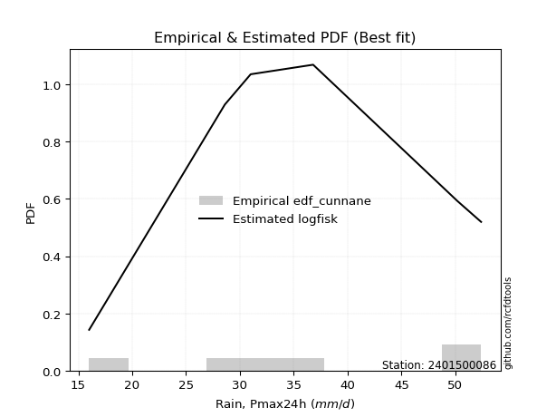</img>

</div>


### 12. EDF Adamowski (1981)

The Adamowski formula in hydrology refers to a specific plotting position formula used for estimating the non-parametric empirical distribution of hydrological events (like flood peaks) to calculate their return periods. This formula provides an alternative to traditional parametric methods (like the Gumbel or Log Pearson Type III distributions). 

<div align="center">


$P=(m-0.25)/(n+0.5)$


</div>


**12.1. Empirical values**

<div align="center">

|                | 0                   | 1                  | 2                  | 3                  | 4                  | 5                  |
|:---------------|:--------------------|:-------------------|:-------------------|:-------------------|:-------------------|:-------------------|
| date           | 2023                | 2020               | 2022               | 2019               | 2021               | 2024               |
| x              | 16.0                | 28.6               | 31.0               | 36.8               | 50.2               | 52.4               |
| m              | 1                   | 2                  | 3                  | 4                  | 5                  | 6                  |
| empirical_dist | edf_adamowski       | edf_adamowski      | edf_adamowski      | edf_adamowski      | edf_adamowski      | edf_adamowski      |
| empirical      | 0.11538461538461539 | 0.2692307692307692 | 0.4230769230769231 | 0.5769230769230769 | 0.7307692307692307 | 0.8846153846153846 |
| empirical_tr   | 1.1304347826086958  | 1.3684210526315788 | 1.7333333333333334 | 2.3636363636363633 | 3.7142857142857135 | 8.666666666666664  |

</div>


**12.2. Kolmogorov-Smirnov fit test (sorted by Δ)**


<div align="center">

|                | 0                   | 1                   | 2                  | 3                   | 4                   | 5                   | 6                  | 7                   | 8                   | 9                   | 10                  | 11                  | 12                  | 13                  | 14                  | 15                  | 16                  | 17                  | 18                  | 19                 | 20                  | 21                  | 22                  | 23                 | 24                  | 25                  | 26                  | 27                 | 28                  | 29                  | 30                  | 31                 | 32                  | 33                  | 34                  | 35                 | 36                  | 37                  | 38                    | 39                 | 40                 | 41                  | 42                | 43                  | 44                | 45                 | 46                  | 47                  | 48                  | 49                  | 50                  | 51                  | 52                  | 53                  | 54                  | 55                  | 56                  | 57                  | 58                 | 59                  | 60                  | 61                  | 62                  | 63                  | 64                  | 65                  | 66                  | 67                  | 68                  | 69                 | 70                  | 71                  | 72                  | 73                  | 74                  | 75                  | 76                  | 77                 | 78                  | 79                  | 80                  | 81                 | 82                  | 83                  | 84                 | 85                 | 86                 | 87                 |
|:---------------|:--------------------|:--------------------|:-------------------|:--------------------|:--------------------|:--------------------|:-------------------|:--------------------|:--------------------|:--------------------|:--------------------|:--------------------|:--------------------|:--------------------|:--------------------|:--------------------|:--------------------|:--------------------|:--------------------|:-------------------|:--------------------|:--------------------|:--------------------|:-------------------|:--------------------|:--------------------|:--------------------|:-------------------|:--------------------|:--------------------|:--------------------|:-------------------|:--------------------|:--------------------|:--------------------|:-------------------|:--------------------|:--------------------|:----------------------|:-------------------|:-------------------|:--------------------|:------------------|:--------------------|:------------------|:-------------------|:--------------------|:--------------------|:--------------------|:--------------------|:--------------------|:--------------------|:--------------------|:--------------------|:--------------------|:--------------------|:--------------------|:--------------------|:-------------------|:--------------------|:--------------------|:--------------------|:--------------------|:--------------------|:--------------------|:--------------------|:--------------------|:--------------------|:--------------------|:-------------------|:--------------------|:--------------------|:--------------------|:--------------------|:--------------------|:--------------------|:--------------------|:-------------------|:--------------------|:--------------------|:--------------------|:-------------------|:--------------------|:--------------------|:-------------------|:-------------------|:-------------------|:-------------------|
| station        | 2401500086          | 2401500086          | 2401500086         | 2401500086          | 2401500086          | 2401500086          | 2401500086         | 2401500086          | 2401500086          | 2401500086          | 2401500086          | 2401500086          | 2401500086          | 2401500086          | 2401500086          | 2401500086          | 2401500086          | 2401500086          | 2401500086          | 2401500086         | 2401500086          | 2401500086          | 2401500086          | 2401500086         | 2401500086          | 2401500086          | 2401500086          | 2401500086         | 2401500086          | 2401500086          | 2401500086          | 2401500086         | 2401500086          | 2401500086          | 2401500086          | 2401500086         | 2401500086          | 2401500086          | 2401500086            | 2401500086         | 2401500086         | 2401500086          | 2401500086        | 2401500086          | 2401500086        | 2401500086         | 2401500086          | 2401500086          | 2401500086          | 2401500086          | 2401500086          | 2401500086          | 2401500086          | 2401500086          | 2401500086          | 2401500086          | 2401500086          | 2401500086          | 2401500086         | 2401500086          | 2401500086          | 2401500086          | 2401500086          | 2401500086          | 2401500086          | 2401500086          | 2401500086          | 2401500086          | 2401500086          | 2401500086         | 2401500086          | 2401500086          | 2401500086          | 2401500086          | 2401500086          | 2401500086          | 2401500086          | 2401500086         | 2401500086          | 2401500086          | 2401500086          | 2401500086         | 2401500086          | 2401500086          | 2401500086         | 2401500086         | 2401500086         | 2401500086         |
| empirical_dist | edf_adamowski       | edf_adamowski       | edf_adamowski      | edf_adamowski       | edf_adamowski       | edf_adamowski       | edf_adamowski      | edf_adamowski       | edf_adamowski       | edf_adamowski       | edf_adamowski       | edf_adamowski       | edf_adamowski       | edf_adamowski       | edf_adamowski       | edf_adamowski       | edf_adamowski       | edf_adamowski       | edf_adamowski       | edf_adamowski      | edf_adamowski       | edf_adamowski       | edf_adamowski       | edf_adamowski      | edf_adamowski       | edf_adamowski       | edf_adamowski       | edf_adamowski      | edf_adamowski       | edf_adamowski       | edf_adamowski       | edf_adamowski      | edf_adamowski       | edf_adamowski       | edf_adamowski       | edf_adamowski      | edf_adamowski       | edf_adamowski       | edf_adamowski         | edf_adamowski      | edf_adamowski      | edf_adamowski       | edf_adamowski     | edf_adamowski       | edf_adamowski     | edf_adamowski      | edf_adamowski       | edf_adamowski       | edf_adamowski       | edf_adamowski       | edf_adamowski       | edf_adamowski       | edf_adamowski       | edf_adamowski       | edf_adamowski       | edf_adamowski       | edf_adamowski       | edf_adamowski       | edf_adamowski      | edf_adamowski       | edf_adamowski       | edf_adamowski       | edf_adamowski       | edf_adamowski       | edf_adamowski       | edf_adamowski       | edf_adamowski       | edf_adamowski       | edf_adamowski       | edf_adamowski      | edf_adamowski       | edf_adamowski       | edf_adamowski       | edf_adamowski       | edf_adamowski       | edf_adamowski       | edf_adamowski       | edf_adamowski      | edf_adamowski       | edf_adamowski       | edf_adamowski       | edf_adamowski      | edf_adamowski       | edf_adamowski       | edf_adamowski      | edf_adamowski      | edf_adamowski      | edf_adamowski      |
| p_dist         | logfisk             | loginvgamma         | logerlang          | lognct              | logrice             | logmaxwell          | logalpha           | loggamma            | loggamma            | logbetaprime        | loginvgauss         | logf                | logfatiguelife      | logexponnorm        | logt                | lognorm             | lognorm             | logcrystalball      | kstwobign           | logpearson3        | lograyleigh         | ncf                 | genlogistic         | loggumbel_r        | logncf              | halfnorm            | logmielke           | invgauss           | rayleigh            | loglogistic         | alpha               | maxwell            | laplace_asymmetric  | rice                | betaprime           | fisk               | invgamma            | weibull_min         | loglaplace_asymmetric | logweibull_min     | gamma              | erlang              | f                 | nct                 | norm              | crystalball        | truncnorm           | exponnorm           | t                   | pearson3            | loghypsecant        | halflogistic        | loggumbel_l         | logmoyal            | gumbel_r            | moyal               | johnsonsu           | loginvweibull       | loglaplace         | logistic            | loghalfnorm         | hypsecant           | loghalflogistic     | mielke              | wald                | laplace             | logloggamma         | logkstwobign        | gumbel_l            | loggenexpon        | logwald             | gibrat              | expon               | genexpon            | loggibrat           | loggompertz         | logchi2             | logtruncnorm       | lognakagami         | nakagami            | logexpon            | chi2               | loglognorm          | invweibull          | logjohnsonsu       | gompertz           | fatiguelife        | loggenlogistic     |
| delta          | 0.10702171083032497 | 0.10949492609059186 | 0.1122648124651826 | 0.11394674387291626 | 0.11401030072335294 | 0.11404459180794724 | 0.1140605582414077 | 0.11427797688995212 | 0.11427797688995212 | 0.11462639537179165 | 0.11524432467105872 | 0.11717847157636996 | 0.11724040705142735 | 0.11745449066604763 | 0.11745501230869793 | 0.11745510239634338 | 0.11745510239634338 | 0.11745516086541463 | 0.12153476040041022 | 0.1244047331940813 | 0.12472604230716072 | 0.12940113383333451 | 0.12948092567437042 | 0.1298927625507159 | 0.13063993435358495 | 0.13190938991117784 | 0.13257119236763315 | 0.1341419296973425 | 0.13416222543355416 | 0.13523980469704078 | 0.13557568354363736 | 0.1358803053679678 | 0.13624527190593738 | 0.13657258850273102 | 0.13755800071449253 | 0.1383262295163895 | 0.13837708452472386 | 0.13984923980176844 | 0.1400118798423441    | 0.1414339207460148 | 0.1414749021930164 | 0.14181163303377298 | 0.141979789802404 | 0.14232985793253528 | 0.142347080463883 | 0.1423470853990968 | 0.14234711559978896 | 0.14234809402216597 | 0.14234959936297875 | 0.14308743135082436 | 0.14437917257697197 | 0.14575643913810532 | 0.14687594773924129 | 0.14701063884663873 | 0.14740611481375976 | 0.15066424789149402 | 0.15127656085983954 | 0.15206655353405768 | 0.1525317674572675 | 0.15718294410232103 | 0.15906675975115597 | 0.16418737507435532 | 0.16714901138700683 | 0.16825946224528976 | 0.16906311852548117 | 0.16968257569895395 | 0.17829047707652845 | 0.18018774059011355 | 0.18089381930627157 | 0.1828427509940665 | 0.18798913557491698 | 0.19064978759745732 | 0.20098958291174113 | 0.20113711983286592 | 0.20588054338935213 | 0.23782609385336423 | 0.26349415481433297 | 0.2692279413314841 | 0.26923076533452345 | 0.26923076923007383 | 0.27744556833091066 | 0.2830745484210609 | 0.39295135947550647 | 0.45835309088553355 | 0.5027809741078719 | 0.5076813465804235 | 0.5270822368864116 | 0.7307692307692307 |
| deltao         | 0.530385761606      | 0.530385761606      | 0.530385761606     | 0.530385761606      | 0.530385761606      | 0.530385761606      | 0.530385761606     | 0.530385761606      | 0.530385761606      | 0.530385761606      | 0.530385761606      | 0.530385761606      | 0.530385761606      | 0.530385761606      | 0.530385761606      | 0.530385761606      | 0.530385761606      | 0.530385761606      | 0.530385761606      | 0.530385761606     | 0.530385761606      | 0.530385761606      | 0.530385761606      | 0.530385761606     | 0.530385761606      | 0.530385761606      | 0.530385761606      | 0.530385761606     | 0.530385761606      | 0.530385761606      | 0.530385761606      | 0.530385761606     | 0.530385761606      | 0.530385761606      | 0.530385761606      | 0.530385761606     | 0.530385761606      | 0.530385761606      | 0.530385761606        | 0.530385761606     | 0.530385761606     | 0.530385761606      | 0.530385761606    | 0.530385761606      | 0.530385761606    | 0.530385761606     | 0.530385761606      | 0.530385761606      | 0.530385761606      | 0.530385761606      | 0.530385761606      | 0.530385761606      | 0.530385761606      | 0.530385761606      | 0.530385761606      | 0.530385761606      | 0.530385761606      | 0.530385761606      | 0.530385761606     | 0.530385761606      | 0.530385761606      | 0.530385761606      | 0.530385761606      | 0.530385761606      | 0.530385761606      | 0.530385761606      | 0.530385761606      | 0.530385761606      | 0.530385761606      | 0.530385761606     | 0.530385761606      | 0.530385761606      | 0.530385761606      | 0.530385761606      | 0.530385761606      | 0.530385761606      | 0.530385761606      | 0.530385761606     | 0.530385761606      | 0.530385761606      | 0.530385761606      | 0.530385761606     | 0.530385761606      | 0.530385761606      | 0.530385761606     | 0.530385761606     | 0.530385761606     | 0.530385761606     |
| eval           | Δo > Δ              | Δo > Δ              | Δo > Δ             | Δo > Δ              | Δo > Δ              | Δo > Δ              | Δo > Δ             | Δo > Δ              | Δo > Δ              | Δo > Δ              | Δo > Δ              | Δo > Δ              | Δo > Δ              | Δo > Δ              | Δo > Δ              | Δo > Δ              | Δo > Δ              | Δo > Δ              | Δo > Δ              | Δo > Δ             | Δo > Δ              | Δo > Δ              | Δo > Δ              | Δo > Δ             | Δo > Δ              | Δo > Δ              | Δo > Δ              | Δo > Δ             | Δo > Δ              | Δo > Δ              | Δo > Δ              | Δo > Δ             | Δo > Δ              | Δo > Δ              | Δo > Δ              | Δo > Δ             | Δo > Δ              | Δo > Δ              | Δo > Δ                | Δo > Δ             | Δo > Δ             | Δo > Δ              | Δo > Δ            | Δo > Δ              | Δo > Δ            | Δo > Δ             | Δo > Δ              | Δo > Δ              | Δo > Δ              | Δo > Δ              | Δo > Δ              | Δo > Δ              | Δo > Δ              | Δo > Δ              | Δo > Δ              | Δo > Δ              | Δo > Δ              | Δo > Δ              | Δo > Δ             | Δo > Δ              | Δo > Δ              | Δo > Δ              | Δo > Δ              | Δo > Δ              | Δo > Δ              | Δo > Δ              | Δo > Δ              | Δo > Δ              | Δo > Δ              | Δo > Δ             | Δo > Δ              | Δo > Δ              | Δo > Δ              | Δo > Δ              | Δo > Δ              | Δo > Δ              | Δo > Δ              | Δo > Δ             | Δo > Δ              | Δo > Δ              | Δo > Δ              | Δo > Δ             | Δo > Δ              | Δo > Δ              | Δo > Δ             | Δo > Δ             | Δo > Δ             | Δo <= Δ            |
| fit            | 1                   | 1                   | 1                  | 1                   | 1                   | 1                   | 1                  | 1                   | 1                   | 1                   | 1                   | 1                   | 1                   | 1                   | 1                   | 1                   | 1                   | 1                   | 1                   | 1                  | 1                   | 1                   | 1                   | 1                  | 1                   | 1                   | 1                   | 1                  | 1                   | 1                   | 1                   | 1                  | 1                   | 1                   | 1                   | 1                  | 1                   | 1                   | 1                     | 1                  | 1                  | 1                   | 1                 | 1                   | 1                 | 1                  | 1                   | 1                   | 1                   | 1                   | 1                   | 1                   | 1                   | 1                   | 1                   | 1                   | 1                   | 1                   | 1                  | 1                   | 1                   | 1                   | 1                   | 1                   | 1                   | 1                   | 1                   | 1                   | 1                   | 1                  | 1                   | 1                   | 1                   | 1                   | 1                   | 1                   | 1                   | 1                  | 1                   | 1                   | 1                   | 1                  | 1                   | 1                   | 1                  | 1                  | 1                  | 0                  |
| n              | 6                   | 6                   | 6                  | 6                   | 6                   | 6                   | 6                  | 6                   | 6                   | 6                   | 6                   | 6                   | 6                   | 6                   | 6                   | 6                   | 6                   | 6                   | 6                   | 6                  | 6                   | 6                   | 6                   | 6                  | 6                   | 6                   | 6                   | 6                  | 6                   | 6                   | 6                   | 6                  | 6                   | 6                   | 6                   | 6                  | 6                   | 6                   | 6                     | 6                  | 6                  | 6                   | 6                 | 6                   | 6                 | 6                  | 6                   | 6                   | 6                   | 6                   | 6                   | 6                   | 6                   | 6                   | 6                   | 6                   | 6                   | 6                   | 6                  | 6                   | 6                   | 6                   | 6                   | 6                   | 6                   | 6                   | 6                   | 6                   | 6                   | 6                  | 6                   | 6                   | 6                   | 6                   | 6                   | 6                   | 6                   | 6                  | 6                   | 6                   | 6                   | 6                  | 6                   | 6                   | 6                  | 6                  | 6                  | 6                  |
| best_fit       | 1                   | 0                   | 0                  | 0                   | 0                   | 0                   | 0                  | 0                   | 0                   | 0                   | 0                   | 0                   | 0                   | 0                   | 0                   | 0                   | 0                   | 0                   | 0                   | 0                  | 0                   | 0                   | 0                   | 0                  | 0                   | 0                   | 0                   | 0                  | 0                   | 0                   | 0                   | 0                  | 0                   | 0                   | 0                   | 0                  | 0                   | 0                   | 0                     | 0                  | 0                  | 0                   | 0                 | 0                   | 0                 | 0                  | 0                   | 0                   | 0                   | 0                   | 0                   | 0                   | 0                   | 0                   | 0                   | 0                   | 0                   | 0                   | 0                  | 0                   | 0                   | 0                   | 0                   | 0                   | 0                   | 0                   | 0                   | 0                   | 0                   | 0                  | 0                   | 0                   | 0                   | 0                   | 0                   | 0                   | 0                   | 0                  | 0                   | 0                   | 0                   | 0                  | 0                   | 0                   | 0                  | 0                  | 0                  | 0                  |
| best_fit_sort  | 1                   | 2                   | 3                  | 4                   | 5                   | 6                   | 7                  | 8                   | 9                   | 10                  | 11                  | 12                  | 13                  | 14                  | 15                  | 16                  | 17                  | 18                  | 19                  | 20                 | 21                  | 22                  | 23                  | 24                 | 25                  | 26                  | 27                  | 28                 | 29                  | 30                  | 31                  | 32                 | 33                  | 34                  | 35                  | 36                 | 37                  | 38                  | 39                    | 40                 | 41                 | 42                  | 43                | 44                  | 45                | 46                 | 47                  | 48                  | 49                  | 50                  | 51                  | 52                  | 53                  | 54                  | 55                  | 56                  | 57                  | 58                  | 59                 | 60                  | 61                  | 62                  | 63                  | 64                  | 65                  | 66                  | 67                  | 68                  | 69                  | 70                 | 71                  | 72                  | 73                  | 74                  | 75                  | 76                  | 77                  | 78                 | 79                  | 80                  | 81                  | 82                 | 83                  | 84                  | 85                 | 86                 | 87                 | 88                 |

</div>


**12.3. Best fit**

<div align="center">

|   id |    station | empirical_dist   | p_dist   |    delta |   deltao | eval   |   fit |   n |   best_fit |   best_fit_sort |
|-----:|-----------:|:-----------------|:---------|---------:|---------:|:-------|------:|----:|-----------:|----------------:|
|    0 | 2401500086 | edf_adamowski    | logfisk  | 0.107022 | 0.530386 | Δo > Δ |     1 |   6 |          1 |               1 |

</div>


<div align="center">

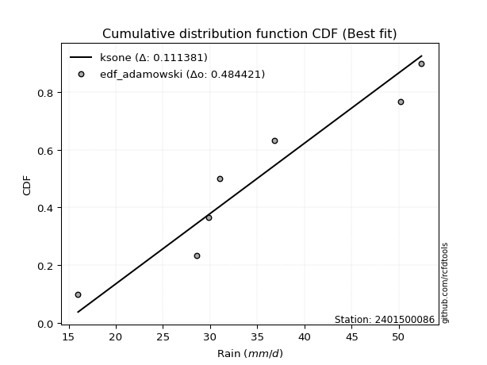</img>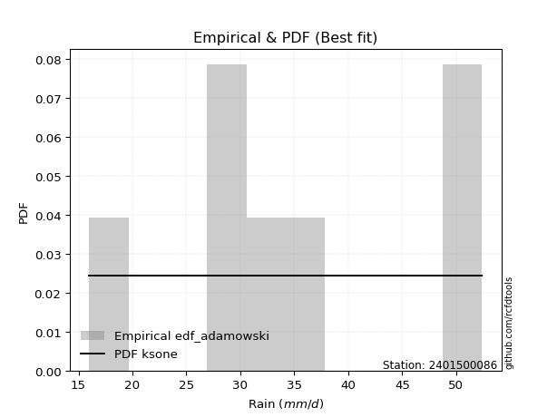</img>

</div>


## C. Best fit & Estimate extreme values for specific return periods - Tr

Best fit in probability distribution analysis means finding the theoretical distribution (like Normal, Poisson, Exponential) that most accurately mirrors your real-world data´s patterns (shape, center, spread) for better predictions, using methods like visual checks (Q-Q plots), goodness-of-fit tests (Kolmogorov-Smirnov, Chi-Squared), and information criteria (AIC) to score and select the simplest, most representative model.


### 1. Best fit (ordered by delta Δ)

<div align="center">

|   id |    station | empirical_dist   | p_dist   |     delta |   deltao | eval   |   fit |   n |   best_fit |   best_fit_sort |
|-----:|-----------:|:-----------------|:---------|----------:|---------:|:-------|------:|----:|-----------:|----------------:|
|    0 | 2401500086 | edf_hazen        | logfisk  | 0.0877909 | 0.530386 | Δo > Δ |     1 |   6 |          1 |               1 |
|    1 | 2401500086 | edf_gringorten   | logfisk  | 0.0926929 | 0.530386 | Δo > Δ |     1 |   6 |          1 |               2 |
|    2 | 2401500086 | edf_cunnane      | logfisk  | 0.0958555 | 0.530386 | Δo > Δ |     1 |   6 |          1 |               3 |
|    3 | 2401500086 | edf_blom         | logfisk  | 0.0977909 | 0.530386 | Δo > Δ |     1 |   6 |          1 |               4 |
|    4 | 2401500086 | edf_tukey        | logfisk  | 0.100949  | 0.530386 | Δo > Δ |     1 |   6 |          1 |               5 |
|    5 | 2401500086 | edf_filliben     | logfisk  | 0.102127  | 0.530386 | Δo > Δ |     1 |   6 |          1 |               6 |
|    6 | 2401500086 | edf_beard        | logfisk  | 0.102681  | 0.530386 | Δo > Δ |     1 |   6 |          1 |               7 |
|    7 | 2401500086 | edf_jenkinson    | logfisk  | 0.102681  | 0.530386 | Δo > Δ |     1 |   6 |          1 |               8 |
|    8 | 2401500086 | edf_chegodayev   | logfisk  | 0.103416  | 0.530386 | Δo > Δ |     1 |   6 |          1 |               9 |
|    9 | 2401500086 | edf_adamowski    | logfisk  | 0.107022  | 0.530386 | Δo > Δ |     1 |   6 |          1 |              10 |
|   10 | 2401500086 | edf_weibull      | logncf   | 0.114156  | 0.530386 | Δo > Δ |     1 |   6 |          1 |              11 |
|   11 | 2401500086 | edf_california   | invgamma | 0.118792  | 0.530386 | Δo > Δ |     1 |   6 |          1 |              12 |

</div>

:file_folder:Tables: [bestfit_2401500086.csv](table/bestfit_2401500086.csv) | [extreme_2401500086.csv](table/extreme_2401500086.csv)


### 2. Extreme values

In hydrology, a return period (or recurrence interval $Tr$) is the statistical average time between extreme events like floods or droughts of a specific magnitude, indicating how rare an event is, with a 100-year flood, for example, having a 1% chance of occurring in any given year, not that it happens exactly every century. It is a key tool for infrastructure design (like bridges or dams) and risk assessment, calculated from historical data to determine the probability of future events, although it is important to remember it is statistical average, and events can cluster or be missed.

> risk_rate: assuming the return period as the project useful life.

|   id |      tr |   prob_l |     prob_g |   alpha |   betaprime |     chi2 |   crystalball |   erlang |    expon |   exponnorm |       f |   fatiguelife |    fisk |   gamma |   genexpon |   genlogistic |   gibrat |   gompertz |   gumbel_l |   gumbel_r |   halflogistic |   halfnorm |   hypsecant |   invgamma |   invgauss |       invweibull |   johnsonsu |   kstwobign |   laplace |   laplace_asymmetric |   loggamma |   logistic |   lognorm |   maxwell |   mielke |    moyal |   nakagami |     ncf |     nct |    norm |   pearson3 |   rayleigh |    rice |       t |   truncnorm |     wald |   weibull_min |   logalpha |   logbetaprime |     logchi2 |   logcrystalball |   logerlang |   logexpon |   logexponnorm |     logf |   logfatiguelife |   logfisk |   loggenexpon |   loggenlogistic |   loggibrat |   loggompertz |   loggumbel_l |   loggumbel_r |   loghalflogistic |   loghalfnorm |   loghypsecant |   loginvgamma |   loginvgauss |   loginvweibull |   logjohnsonsu |   logkstwobign |   loglaplace |   loglaplace_asymmetric |   logloggamma |   loglogistic |    loglognorm |   logmaxwell |   logmielke |   logmoyal |   lognakagami |   logncf |   lognct |   logpearson3 |   lograyleigh |   logrice |     logt |   logtruncnorm |   logwald |   logweibull_min |    station |   n |   risk_rate |
|-----:|--------:|---------:|-----------:|--------:|------------:|---------:|--------------:|---------:|---------:|------------:|--------:|--------------:|--------:|--------:|-----------:|--------------:|---------:|-----------:|-----------:|-----------:|---------------:|-----------:|------------:|-----------:|-----------:|-----------------:|------------:|------------:|----------:|---------------------:|-----------:|-----------:|----------:|----------:|---------:|---------:|-----------:|--------:|--------:|--------:|-----------:|-----------:|--------:|--------:|------------:|---------:|--------------:|-----------:|---------------:|------------:|-----------------:|------------:|-----------:|---------------:|---------:|-----------------:|----------:|--------------:|-----------------:|------------:|--------------:|--------------:|--------------:|------------------:|--------------:|---------------:|--------------:|--------------:|----------------:|---------------:|---------------:|-------------:|------------------------:|--------------:|--------------:|--------------:|-------------:|------------:|-----------:|--------------:|---------:|---------:|--------------:|--------------:|----------:|---------:|---------------:|----------:|-----------------:|-----------:|----:|------------:|
|    0 |    2    | 0.5      | 0.5        | 34.9204 |     35.543  |  26.6791 |       35.8333 |  35.7084 |  29.7474 |     35.8333 | 35.7815 |       16      | 35.7424 | 35.7192 |    29.7414 |       34.9801 |  32.0546 |    45.7249 |    37.9014 |    33.7652 |        32.7371 |    33.2565 |     35.8333 |    34.7738 |    34.4605 |   2377.02        |     39.3184 |     33.2789 |   35.8333 |              33.6863 |    32.9634 |    35.8333 |   33.3392 |   34.7567 |  38.6615 |  33.0976 |    37.7644 | 34.4031 | 35.8314 | 35.8333 |    35.9699 |    34.3748 | 35.1326 | 35.8335 |     35.8333 |  31.7526 |       35.448  |    32.6851 |        33.0805 |     26.4889 |          33.3392 |     32.9743 |    26.6146 |        33.3392 |  33.3247 |          33.3373 |   34.4454 |       30.2921 |         inf      |     29.5855 |       28.3433 |       35.5908 |       31.23   |           30.2315 |       30.7319 |        33.3392 |       32.7052 |       32.3742 |         31.3261 |        52.3973 |        30.3954 |      33.3392 |                 34.8952 |       38.3574 |       33.3392 |  16.0385      |      32.224  |     38.6838 |    30.578  |       33.0294 |  32.8073 |  33.2531 |       34.7508 |       31.8375 |   32.9869 |  33.3392 |        34.7419 |   29.3054 |          35.8069 | 2401500086 |   6 |    0.75     |
|    1 |    2.33 | 0.570815 | 0.429185   | 37.2241 |     37.823  |  29.3403 |       38.0798 |  37.9599 |  32.7764 |     38.0797 | 38.0309 |       16.5846 | 37.9124 | 37.9721 |    32.769  |       37.231  |  33.1926 |    46.5094 |    39.8559 |    35.8468 |        34.8773 |    35.681  |     37.6312 |    37.0736 |    36.7951 | 169076           |     41.4843 |     35.7984 |   37.1928 |              35.5906 |    35.4504 |    37.8126 |   35.7919 |   37.0906 |  41.0303 |  35.0681 |    39.7224 | 36.786  | 38.078  | 38.0798 |    38.2116 |    36.7432 | 37.4755 | 38.0799 |     38.0798 |  33.2256 |       37.7537 |    35.1706 |        35.5621 |     31.6125 |          35.7919 |     35.4822 |    29.7723 |        35.7919 |  35.7808 |          35.7893 |   36.7741 |       33.1008 |         inf      |     30.6691 |       31.1076 |       37.8582 |       33.3534 |           32.3469 |       33.1791 |        35.2881 |       35.2356 |       34.9825 |         34.1887 |        52.3995 |        33.2658 |      34.8026 |                 36.6083 |       40.7138 |       35.491  |  16.4044      |      34.6904 |     41.201  |    32.5426 |       34.4205 |  36.1872 |  35.7404 |       37.2071 |       34.3117 |   35.4888 |  35.7919 |        36.06   |   30.7019 |          38.0912 | 2401500086 |   6 |    0.729209 |
|    2 |    5    | 0.8      | 0.2        | 46.2941 |     46.49   |  43.1143 |       46.4281 |  46.3909 |  47.9205 |     46.4281 | 46.4184 |       29.0015 | 46.3179 | 46.4088 |    47.9065 |       46.4355 |  39.7441 |    49.0442 |    46.1698 |    44.8901 |        44.5612 |    45.9338 |     44.8426 |    46.1189 |    46.1823 |      1.93527e+13 |     47.8922 |     46.5007 |   43.9897 |              45.1116 |    46.6587 |    45.4548 |   46.597  |   46.2766 |  47.6795 |  44.1955 |    48.3224 | 46.4189 | 46.428  | 46.4281 |    46.466  |    46.2251 | 46.4391 | 46.4281 |     46.4281 |  41.4716 |       46.4272 |    46.5585 |        46.6786 |     88.5627 |          46.597  |     46.7998 |    52.1513 |        46.597  |  46.6095 |          46.6061 |   47.3414 |       47.4452 |         inf      |     37.7258 |       45.108  |       46.2181 |       44.3864 |           43.9277 |       45.8752 |        44.3198 |       46.8851 |       47.359  |         49.9881 |        52.4    |        48.8055 |      43.1412 |                 44.7527 |       47.3939 |       45.1856 |   1.25121e+66 |      46.3744 |     48.3862 |    43.4227 |       41.8195 |  52.6863 |  46.7889 |       46.8871 |       46.2989 |   46.7076 |  46.597  |        42.0455 |   39.8418 |          46.5145 | 2401500086 |   6 |    0.67232  |
|    3 |   10    | 0.9      | 0.1        | 52.7946 |     52.4098 |  55.9877 |       51.9662 |  52.0393 |  61.6679 |     51.9662 | 52.0069 |       46.1461 | 52.5353 | 52.0615 |    61.6478 |       53.5647 |  47.2122 |    50.4555 |    49.6851 |    52.2558 |        52.6033 |    53.5207 |     50.6012 |    52.5848 |    53.0639 |      7.08655e+19 |     51.0135 |     54.6491 |   50.1597 |              53.7546 |    56.203  |    51.0831 |   55.5088 |   52.7413 |  50.2239 |  52.1423 |    54.8382 | 53.4895 | 51.968  | 51.9662 |    51.8759 |    52.9858 | 52.5317 | 51.9661 |     51.9662 |  50.2225 |       52.1917 |    56.4964 |        56.0652 |    254.597  |          55.5088 |     56.4532 |    86.7491 |        55.5089 |  55.5514 |          55.5453 |   57.0203 |       61.5066 |         inf      |     47.7702 |       58.0254 |       51.6483 |       56.019  |           56.6385 |       58.3046 |        53.1653 |       57.1135 |       58.6854 |         68.1153 |        52.4    |        65.3454 |      52.4287 |                 53.7005 |       49.9742 |       53.981  | inf           |      56.8851 |     51.2606 |    55.8186 |       48.7822 |  68.282  |  56.0075 |       53.6398 |       57.3264 |   56.1472 |  55.5088 |        46.1721 |   52.5343 |          51.9871 | 2401500086 |   6 |    0.651322 |
|    4 |   15    | 0.933333 | 0.0666667  | 56.197  |     55.4152 |  63.6104 |       54.7299 |  54.8746 |  69.7097 |     54.7298 | 54.803  |       57.3591 | 55.9325 | 54.899  |    69.686  |       57.5181 |  52.3632 |    51.0948 |    51.2771 |    56.4114 |        57.1544 |    57.4689 |     53.8876 |    55.9607 |    56.7041 |      3.57779e+23 |     52.3084 |     58.975  |   53.7689 |              58.8103 |    61.7444 |    54.1496 |   60.5745 |   56.0582 |  51.0346 |  56.7543 |    58.2482 | 57.2223 | 54.7328 | 54.7299 |    54.556  |    56.4693 | 55.6008 | 54.7296 |     54.7299 |  55.8419 |       55.0546 |    62.3668 |        61.4846 |    486.96   |          60.5745 |     62.0636 |   116.827  |        60.5746 |  60.6381 |          60.6335 |   63.1026 |       70.3473 |         inf      |     56.2172 |       65.6557 |       54.3131 |       63.8803 |           65.3994 |       66.0524 |        58.9835 |       63.1779 |       65.5867 |         81.1071 |        52.4    |        76.296  |      58.7627 |                 59.7425 |       50.799  |       59.4738 | inf           |      63.1713 |     52.2944 |    64.5764 |       52.9184 |  77.9564 |  61.2877 |       57.0575 |       63.9972 |   61.5733 |  60.5745 |        47.933  |   62.7434 |          54.6729 | 2401500086 |   6 |    0.644736 |
|    5 |   20    | 0.95     | 0.05       | 58.4857 |     57.4019 |  69.0484 |       56.5397 |  56.7373 |  75.4154 |     56.5396 | 56.6367 |       65.6608 | 58.2846 | 56.7633 |    75.3891 |       60.2686 |  56.4039 |    51.4926 |    52.2681 |    59.3211 |        60.343  |    60.1012 |     56.206  |    58.2279 |    59.1648 |      1.40116e+26 |     53.075  |     61.889  |   56.3297 |              62.3975 |    65.6938 |    56.2691 |   64.1398 |   58.2595 |  51.4335 |  60.0206 |    60.5253 | 59.7408 | 56.5434 | 56.5397 |    56.304  |    58.7846 | 57.6191 | 56.5394 |     56.5397 |  60.0295 |       56.9221 |    66.595  |        65.3343 |    779.188  |          64.1398 |     66.0643 |   144.299  |        64.14   |  64.2199 |          64.2175 |   67.6816 |       76.9281 |         inf      |     63.876  |       71.0987 |       56.0408 |       70.0325 |           72.3329 |       71.782  |        63.467  |       67.5549 |       70.649  |         91.6521 |        52.4    |        84.6893 |      63.7157 |                 64.4373 |       51.2053 |       63.5936 | inf           |      67.7222 |     52.8811 |    71.5979 |       55.8818 |  85.1206 |  65.0208 |       59.3013 |       68.8552 |   65.4156 |  64.1399 |        48.915  |   71.6213 |          56.4143 | 2401500086 |   6 |    0.641514 |
|    6 |   25    | 0.96     | 0.04       | 60.2022 |     58.8739 |  73.2806 |       57.872  |  58.1116 |  79.841  |     57.8719 | 57.9879 |       72.2569 | 60.0861 | 58.1388 |    79.8129 |       62.3801 |  59.7724 |    51.7758 |    52.9732 |    61.5623 |        62.7997 |    62.0597 |     58.0002 |    59.9261 |    61.0158 |      1.39213e+28 |     53.6015 |     64.0717 |   58.316  |              65.1799 |    68.7762 |    57.8904 |   66.8978 |   59.8938 |  51.6709 |  62.5523 |    62.2206 | 61.6324 | 57.8764 | 57.872  |    57.5873 |    60.5048 | 59.1085 | 57.8717 |     57.872  |  63.3837 |       58.2925 |    69.9206 |        68.3318 |   1127.31   |          66.8978 |     69.188  |   169.985  |        66.898  |  66.9915 |          66.9916 |   71.4076 |       82.219  |         inf      |     71.0525 |       75.3359 |       57.3036 |       75.1723 |           78.1722 |       76.3651 |        67.1695 |       71.0025 |       74.6823 |        100.7    |        52.4    |        91.5756 |      67.8432 |                 68.3315 |       51.4472 |       66.9369 | inf           |      71.3115 |     53.2814 |    77.5613 |       58.1978 |  90.8651 |  67.9178 |       60.9522 |       72.7018 |   68.4002 |  66.8978 |        49.5422 |   79.6301 |          57.6872 | 2401500086 |   6 |    0.639603 |
|    7 |   50    | 0.98     | 0.02       | 65.273  |     63.1335 |  86.4909 |       61.6871 |  62.0613 |  93.5885 |     61.6871 | 61.8636 |       93.4201 | 65.6023 | 62.0919 |    93.5542 |       68.8584 |  71.6465 |    52.5444 |    54.8874 |    68.4664 |        70.3692 |    67.7524 |     63.5631 |    64.9307 |    66.5053 |      1.97734e+34 |     54.949  |     70.4813 |   64.486  |              73.8228 |    78.5052 |    62.8443 |   75.4693 |   64.6335 |  52.1413 |  70.4118 |    67.1506 | 67.2261 | 61.6937 | 61.6871 |    61.2453 |    65.4984 | 63.3889 | 61.6867 |     61.6871 |  74.3351 |       62.1948 |    80.5611 |        77.7546 |   3626.95   |          75.4693 |     79.0538 |   282.755  |        75.4695 |  75.6101 |          75.6218 |   84.1111 |       99.7603 |         inf      |    103.415  |       88.5765 |       60.8769 |       93.4995 |           99.2976 |       91.4162 |        80.0787 |       82.0601 |       87.8808 |        134.582  |        52.4    |       115.207  |      82.4486 |                 81.9936 |       51.9268 |       78.2802 | inf           |      82.8336 |     54.3405 |    99.4279 |       65.4989 | 109.857  |  76.9715 |       65.657  |       85.1289 |   77.7397 |  75.4694 |        50.8949 |  112.56   |          61.2892 | 2401500086 |   6 |    0.63583  |
|    8 |   75    | 0.986667 | 0.0133333  | 68.0929 |     65.4463 |  94.2547 |       63.7342 |  64.1894 | 101.63   |     63.7341 | 63.947  |      106.166  | 68.7965 | 64.2219 |   101.592  |       72.6121 |  79.6662 |    52.933  |    55.8554 |    72.4793 |        74.7693 |    70.8513 |     66.8141 |    67.7053 |    69.5688 |      7.44889e+37 |     55.584  |     74.0077 |   68.0953 |              78.8786 |    84.3328 |    65.7055 |   80.5127 |   67.2104 |  52.2969 |  75.0079 |    69.8346 | 70.336  | 63.742  | 63.7342 |    63.1979 |    68.2151 | 65.6939 | 63.7337 |     63.7342 |  81.074  |       64.2738 |    87.0379 |        83.3723 |   7271.8    |          80.5127 |     84.9676 |   380.791  |        80.513  |  80.6845 |          80.7057 |   92.4534 |      110.846  |         inf      |    133.252  |       96.372  |       62.7678 |      106.141  |          114.111  |      100.822  |        88.7427 |       88.8086 |       96.1228 |        159.294  |        52.4    |       130.717  |      92.4094 |                 91.2189 |       52.0855 |       85.6877 | inf           |      89.861  |     54.885  |   114.97   |       69.852  | 121.845  |  82.3327 |       68.1554 |       92.7601 |   83.2767 |  80.5128 |        51.3783 |  139.275  |          63.1954 | 2401500086 |   6 |    0.634587 |
|    9 |  100    | 0.99     | 0.01       | 70.0412 |     67.0215 |  99.7764 |       65.1187 |  65.6321 | 107.336  |     65.1187 | 65.3577 |      115.336  | 71.0552 | 65.666  |   107.296  |       75.2656 |  85.8788 |    53.1873 |    56.4885 |    75.3195 |        77.8836 |    72.9624 |     69.1201 |    69.6185 |    71.6885 |      2.52961e+40 |     55.9821 |     76.4239 |   70.6561 |              82.4657 |    88.5392 |    67.7255 |   84.1136 |   68.9656 |  52.3747 |  78.2686 |    71.6627 | 72.4826 | 65.1275 | 65.1187 |    64.5146 |    70.066  | 67.2557 | 65.1183 |     65.1187 |  85.9874 |       65.6738 |    91.7602 |        87.4155 |  11964.3    |          84.1136 |     89.238  |   470.338  |        84.1138 |  84.3088 |          84.3381 |   98.8369 |      119.103  |         inf      |    162.166  |      101.924  |       64.0362 |      116.108  |          125.913  |      107.777  |        95.451  |       93.7367 |      102.227  |        179.48   |        52.4    |       142.532  |     100.198  |                 98.3873 |       52.1647 |       91.3359 | inf           |      94.986  |     55.2528 |   127.448  |       72.9807 | 130.777  |  86.1755 |       69.8302 |       98.3471 |   87.2475 |  84.1136 |        51.6267 |  162.67   |          64.4742 | 2401500086 |   6 |    0.633968 |
|   10 |  200    | 0.995    | 0.005      | 74.5884 |     70.6269 | 113.118  |       68.2594 |  68.9152 | 121.083  |     68.2593 | 68.562  |      137.785  | 76.4858 | 68.9521 |   121.037  |       81.6381 | 102.781  |    53.7398 |    57.8647 |    82.1476 |        85.3707 |    77.7906 |     74.6756 |    74.071  |    76.6416 |      3.07429e+46 |     56.8001 |     81.989  |   76.8261 |              91.1086 |    98.947  |    72.5712 |   92.8897 |   72.9812 |  52.4945 |  86.1248 |    75.8422 | 77.4812 | 68.2704 | 68.2594 |    67.4892 |    74.3009 | 70.8062 | 68.2588 |     68.2594 |  98.226  |       68.8302 |   103.612  |        97.3801 |  40206.8    |          92.8897 |     99.8103 |   782.365  |        92.89   |  93.147  |          93.2    |  116.005  |      140.406  |         inf      |    276.685  |      115.364  |       66.8825 |      144.069  |          159.524  |      125.543  |       113.769  |      106.131  |      117.88   |        239.103  |        52.4    |       173.971  |     121.769  |                118.059  |       52.2831 |      106.449  | inf           |     107.838  |     56.103  |   163.362  |       80.6654 | 153.865  |  95.592  |       73.5721 |      112.43   |   96.9827 |  92.8898 |        52.008  |  239.486  |          67.3438 | 2401500086 |   6 |    0.633042 |
|   11 |  250    | 0.996    | 0.004      | 76.0146 |     71.7377 | 117.423  |       69.2191 |  69.9213 | 125.509  |     69.2191 | 69.5425 |      145.101  | 78.2329 | 69.9592 |   125.461  |       83.6854 | 108.845  |    53.9024 |    58.2697 |    84.3428 |        87.7778 |    79.276  |     76.4639 |    75.4637 |    78.196  |      2.77897e+48 |     57.0283 |     83.7113 |   78.8124 |              93.891  |   102.386  |    74.1269 |   95.7501 |   74.2174 |  52.5205 |  88.6539 |    77.1275 | 79.0447 | 69.2308 | 69.2191 |    68.3949 |    75.6045 | 71.8932 | 69.2185 |     69.2191 | 102.275  |       69.7894 |   107.58   |       100.661  |  59588.7    |          95.7501 |    103.306  |   921.628  |        95.7505 |  96.029  |          96.091  |  122.126  |      147.707  |         inf      |    335.149  |      119.71   |       67.7438 |      154.417  |          172.132  |      131.576  |       120.383  |      110.288  |      123.224  |        262.201  |        52.4    |       185.04   |     129.657  |                125.193  |       52.3067 |      111.813  | inf           |     112.133  |     56.3705 |   176.954  |       83.1857 | 161.798  |  98.6762 |       74.697  |      117.158  |  100.172  |  95.7502 |        52.0856 |  272.176  |          68.2122 | 2401500086 |   6 |    0.632858 |
|   12 |  500    | 0.998    | 0.002      | 80.3496 |     75.0569 | 130.821  |       72.0653 |  72.913  | 139.256  |     72.0653 | 72.4537 |      168.051  | 83.6627 | 72.9539 |   139.202  |       90.0373 | 129.804  |    54.3685 |    59.4304 |    91.156  |        95.2487 |    83.7047 |     82.019  |    79.6845 |    82.9195 |      3.27596e+54 |     57.6511 |     88.8725 |   84.9824 |             102.534  |   113.367  |    78.9516 |  104.761  |   77.906  |  52.5817 |  96.5098 |    80.9577 | 83.7808 | 72.0793 | 72.0653 |    71.0716 |    79.494  | 75.1215 | 72.0647 |     72.0653 | 115.149  |       72.6185 |   120.417  |       111.099  | 203951      |         104.761  |    114.471  |  1533.05   |       104.762  | 105.112  |         105.207  |  143.239  |      171.843  |         inf      |    650.061  |      133.26   |       70.2748 |      191.514  |          217.97   |      151.341  |       143.484  |      123.76   |      140.848  |        349.087  |        52.4    |       222.611  |     157.57   |                150.224  |       52.354  |      130.229  | inf           |     125.996  |     57.1932 |   226.817  |       91.1675 | 188.12   | 108.439  |       77.9732 |      132.48   |  110.27   | 104.761  |        52.2421 |  408.832  |          70.764  | 2401500086 |   6 |    0.632489 |
|   13 |  750    | 0.998667 | 0.00133333 | 82.8284 |     76.9169 | 138.674  |       73.6464 |  74.58   | 147.298  |     73.6463 | 74.0731 |      181.611  | 86.843  | 74.6226 |   147.24   |       93.7495 | 143.665  |    54.6176 |    60.0508 |    95.1391 |        99.6162 |    86.1788 |     85.2684 |    82.0895 |    85.6181 |      1.16065e+58 |     57.9648 |     91.772  |   88.5917 |             107.59   |   120.011  |    81.7703 |  110.128  |   79.9691 |  52.6095 | 101.105  |    83.0963 | 86.4762 | 73.6617 | 73.6464 |    72.5527 |    81.669  | 76.9178 | 73.6457 |     73.6464 | 122.868  |       74.1802 |   128.308  |       117.389  | 421029      |         110.128  |    121.231  |  2064.58   |       110.129  | 110.526  |         110.642  |  157.225  |      187.032  |          52.3702 |   1007.47   |      141.22   |       71.6661 |      217.202  |          250.23   |      163.649  |       159.001  |      132.057  |      151.923  |        412.666  |        52.4    |       246.971  |     176.607  |                167.127  |       52.3697 |      142.361  | inf           |     134.484  |     57.6727 |   262.266  |       95.9483 | 204.77   | 114.287  |       79.7502 |      141.906  |  116.318  | 110.128  |        52.2947 |  521.78   |          72.1668 | 2401500086 |   6 |    0.632366 |
|   14 | 1000    | 0.999    | 0.001      | 84.5654 |     78.2042 | 144.252  |       74.735  |  75.7299 | 153.004  |     74.7349 | 75.189  |      191.284  | 89.1019 | 75.7737 |   152.943  |       96.3823 | 154.272  |    54.7853 |    60.4683 |    97.9644 |       102.714  |    87.8875 |     87.574  |    83.771  |    87.5075 |      3.82299e+60 |     58.1684 |     93.7807 |   91.1525 |             111.177  |   124.83   |    83.7693 |  113.983  |   81.395  |  52.6273 | 104.366  |    84.5727 | 88.3589 | 74.7512 | 74.735  |    73.5699 |    83.172  | 78.1557 | 74.7343 |     74.735  | 128.421  |       75.2512 |   134.087  |       121.939  | 705528      |         113.983  |    126.135  |  2550.09   |       113.983  | 114.414  |         114.548  |  167.964  |      198.311  |          52.378  |   1408.78   |      146.883  |       72.6179 |      237.486  |          275.967  |      172.728  |       171.017  |      138.141  |      160.148  |        464.669  |        52.4    |       265.394  |     191.492  |                180.26   |       52.3776 |      151.644  | inf           |     140.683  |     58.0133 |   290.73   |       99.3924 | 217.181  | 118.502  |       80.9542 |      148.809  |  120.677  | 113.983  |        52.321  |  621.862  |          73.1265 | 2401500086 |   6 |    0.632305 |

<div align="center">

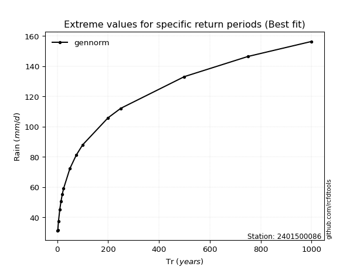</img>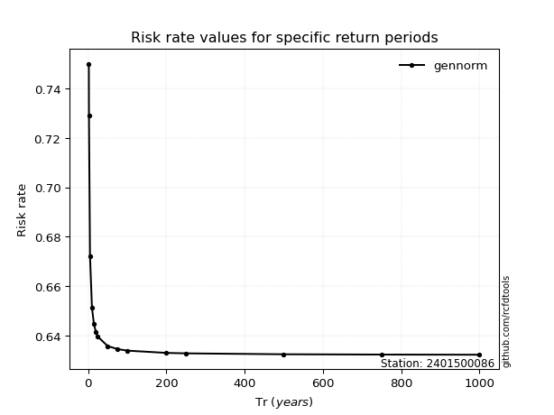</img>

</div>


<sub>**APP DISCLAIMER**: NO WARRANTY - This software is provided by [github.com/rcfdtools](https://github.com/rcfdtools) "as is", without any express or implied warranty, including warranties of merchantability, fitness for a particular purpose, or non-infringement. There is no guarantee that the software will be error-free or operate without interruption. LIMITATION OF LIABILITY - Neither the authors nor copyright holders will be liable for claims or damages arising from the software or its use. You are responsible for determining if the software is appropriate for your use and assume all associated risks, including errors, legal compliance, and data loss. NO PROFESSIONAL ADVICE - The software provides general information and does not offer professional advice. It should not replace consultation with professional advisors.</sub>