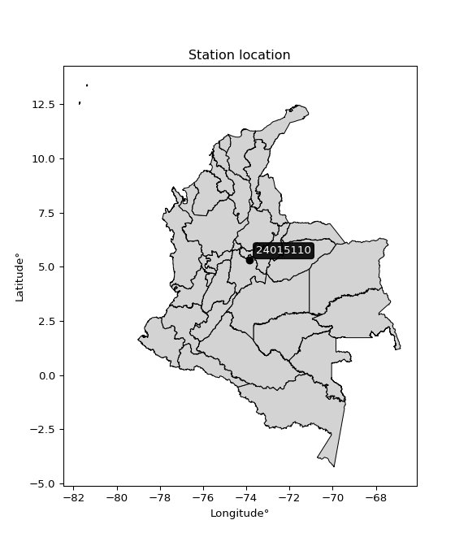

<div align="center">


</div>

# PMP Station (rain, Pmax24h): 24015110

Probable Maximum Precipitation (PMP) is the greatest amount of rainfall for a specific duration that is meteorologically possible for a given location, acting as a "worst-case" scenario for extreme storms, crucial for designing safety-critical infrastructure like bridges, river deviations, dams, spillways, and nuclear plants to prevent catastrophic failure. PMP is calculated by hydrologists using meteorological data to determine the upper limit of extreme rainfall, often leading to the Probable Maximum Flood (PMF) for flood control design, and is increasingly being studied for climate change impacts.

<div align="center">

</img>

</div>


## A. General information


### 1. General running parameters

• app_version: _v20251228_. • runtime: _2025-12-28 08:43:48.795225_. • Python version: _3.14.0_. • SciPy version: _1.16.3_. • Pandas version: _2.3.3_. • NumPy version: _2.3.5_. • Stations dataset (station_dataset_file): _dataset/pmax24h_in/automatic_colombia_2003_2024.csv_. • Stations catalog (station_catalog_file): _dataset/CNE_IDEAM.xls_. • Minimum year to eval til year_max (date_min): _1900_. • Maximum year to eval since year_min (date_max): _2024_. • Creates, save and include plots into reports (create_plot): _False_. • Plot only fit distributions with Δo > Δ (plot_only_fit): _True_. • Eval low extreme values, if False, evaluates high extreme values (low_extreme): _False_. • Eval every SciPy distribution as logarithmic (pdist_logarithmic_on): _True_. • Standard deviation normalized (ddof): _1.0_. • Return periods to eval in years (Tr): _[2, 2.33, 5, 10, 15, 20, 25, 50, 75, 100, 200, 250, 500, 750, 1000]_. • Minimum data sample per station, 0 means any (minimum_sample): _5_. • Z-Score maximum threshold to adjust a value, 0 means disable (zscore_max): _3.5_. • Z-Score minimum threshold to adjust a value, 0 means disable (zscore_min): _-2.5_. • Avoid zeros, e.g. rain = 0 (avoid_zeros): _True_. • Avoid null values (avoid_nans): _True_. [:file_folder:Dataset file.](../../dataset/pmax24h_in/automatic_colombia_2003_2024.csv)

> Delta Degrees of Freedom (DDOF): is a parameter used in the formulas for calculating variance and standard deviation. When ddof=0, the divisor is $N$ (the total number of observations) and this is used when your data set is the entire population. When ddof=1, the divisor is $N-1$ and this is used when your data set is a sample drawn from a larger population. Using $N-1$ provides an unbiased estimate of the population variance (known as Bessel´s correction).


### 2. Station info and location

|   id |   CODIGO | NOMBRE               | CATEGORIA               | TECNOLOGIA                | ESTADO           | FECHA_INSTALACION   |   FECHA_SUSPENSION |   ALTITUD |   LATITUD |   LONGITUD | DEPARTAMENTO   | MUNICIPIO   | AREA_OPERATIVA                            | ENTIDAD                                                     | AREA_HIDROGRAFICA   | ZONA_HIDROGRAFICA   | SUBZONA_HIDROGRAFICA   |   CORRIENTE | Catalogo   |
|-----:|---------:|:---------------------|:------------------------|:--------------------------|:-----------------|:--------------------|-------------------:|----------:|----------:|-----------:|:---------------|:------------|:------------------------------------------|:------------------------------------------------------------|:--------------------|:--------------------|:-----------------------|------------:|:-----------|
|    0 | 24015110 | LA BOYERA [24015110] | Climatológica Principal | Automática con Telemetría | En Mantenimiento | 15/03/1960          |                nan |      2610 |   5.30381 |   -73.8517 | Cundinamarca   | Ubaté       | Area Operativa 11 - Cundinamarca-Amazonas | INSTITUTO DE HIDROLOGIA METEOROLOGIA Y ESTUDIOS AMBIENTALES | Magdalena Cauca     | Sogamoso            | Río Suárez             |         nan | CNE_IDEAM  |

<div align="center">

Map location in: [:earth_americas:Google](http://maps.google.com/maps?q=5.303806,-73.85175) [:earth_americas:OSM](https://www.openstreetmap.org/#map=18/5.303806/-73.85175&layers=P) [:earth_americas:Bing](https://www.bing.com/maps?cp=5.303806~-73.85175&lvl=18) [:earth_americas:Apple](https://maps.apple.com/frame?center=5.303806%2C-73.85175&span=0.003%2C0.006)

</div>


<div align="center">

```geojson
{
  "type": "Feature",
  "geometry": {
    "type": "Point", 
    "coordinates": [-73.85175, 5.303806]
  }, 
  "properties": {
    "Name": "24015110"
  }
}
```

</div>


### 3. Discrete values table and plot

|               |           0 |            1 |           2 |           3 |           4 |            5 |            6 |          7 |           8 |           9 |          10 |          11 |          12 |          13 |          14 |          15 |          16 |          17 |          18 |
|:--------------|------------:|-------------:|------------:|------------:|------------:|-------------:|-------------:|-----------:|------------:|------------:|------------:|------------:|------------:|------------:|------------:|------------:|------------:|------------:|------------:|
| Date          | 2005        | 2006         | 2007        | 2008        | 2009        | 2010         | 2011         | 2012       | 2013        | 2014        | 2015        | 2016        | 2017        | 2018        | 2019        | 2020        | 2021        | 2022        | 2023        |
| Value         |   40.8      |   54.6       |   38.4      |   23.3      |   42.2      |   54.1       |   65.5       |   62.0421  |  115.7      |   31.8      |   30.1      |   38.9      |   32.6      |   32.5      |   22.1      |   15.9      |   47.4      |   20.7      |   25.3      |
| Value_initial |   40.8      |   54.6       |   38.4      |   23.3      |   42.2      |   54.1       |   65.5       |  446.9     |  115.7      |   31.8      |   30.1      |   38.9      |   32.6      |   32.5      |   22.1      |   15.9      |   47.4      |   20.7      |   25.3      |
| count         |   19        |   19         |   19        |   19        |   19        |   19         |   19         |   19       |   19        |   19        |   19        |   19        |   19        |   19        |   19        |   19        |   19        |   19        |   19        |
| mean          |   62.0421   |   62.0421    |   62.0421   |   62.0421   |   62.0421   |   62.0421    |   62.0421    |   62.0421  |   62.0421   |   62.0421   |   62.0421   |   62.0421   |   62.0421   |   62.0421   |   62.0421   |   62.0421   |   62.0421   |   62.0421   |   62.0421   |
| std           |   95.8118   |   95.8118    |   95.8118   |   95.8118   |   95.8118   |   95.8118    |   95.8118    |   95.8118  |   95.8118   |   95.8118   |   95.8118   |   95.8118   |   95.8118   |   95.8118   |   95.8118   |   95.8118   |   95.8118   |   95.8118   |   95.8118   |
| zscore        |   -0.221707 |   -0.0776742 |   -0.246756 |   -0.404357 |   -0.207095 |   -0.0828928 |    0.0360905 |    4.01681 |    0.560035 |   -0.315641 |   -0.333384 |   -0.241537 |   -0.307291 |   -0.308335 |   -0.416881 |   -0.481591 |   -0.152822 |   -0.431493 |   -0.383482 |

> The initial value (value_initial) correspond to the initial obtained or null completed value, and value (value) is adjusted only when the initial value is outside the valid range definite through the Z-Score value. If Z-Score is active, values out of range or outliers are replaced with the station mean value


### 4. Active continuous probability distributions from SciPy (44 of 104 available)

[scipy.stats](https://docs.scipy.org/doc/scipy/reference/stats.html) is a Python´s powerful submodule within the SciPy library for comprehensive statistical analysis, offering over 130 probability distributions (like Normal, Poisson), functions for descriptive stats (mean, variance), hypothesis testing (t-tests, chi-square), random variable generation, and statistical tests, making it essential for data science, modeling, and research. It provides tools to explore, model, and draw conclusions from data efficiently, working seamlessly with NumPy.

<div align="center">

|   id | p_dist             |   n_parameter | fit_method   | label                                                                       | active   | ref                                                                                                        |
|-----:|:-------------------|--------------:|:-------------|:----------------------------------------------------------------------------|:---------|:-----------------------------------------------------------------------------------------------------------|
|    0 | alpha              |             3 | MLE          | Alpha                                                                       | True     | [:mortar_board:](https://docs.scipy.org/doc/scipy/reference/generated/scipy.stats.alpha.html)              |
|    1 | betaprime          |             4 | MLE          | Beta prime                                                                  | True     | [:mortar_board:](https://docs.scipy.org/doc/scipy/reference/generated/scipy.stats.betaprime.html)          |
|    2 | chi2               |             3 | MLE          | Chi²                                                                        | True     | [:mortar_board:](https://docs.scipy.org/doc/scipy/reference/generated/scipy.stats.chi2.html)               |
|    3 | crystalball        |             4 | MLE          | Crystalball                                                                 | True     | [:mortar_board:](https://docs.scipy.org/doc/scipy/reference/generated/scipy.stats.crystalball.html)        |
|    4 | erlang             |             3 | MLE          | Erlang                                                                      | True     | [:mortar_board:](https://docs.scipy.org/doc/scipy/reference/generated/scipy.stats.erlang.html)             |
|    5 | expon              |             2 | MLE          | Exponential                                                                 | True     | [:mortar_board:](https://docs.scipy.org/doc/scipy/reference/generated/scipy.stats.expon.html)              |
|    6 | exponnorm          |             3 | MLE          | Exponentially modified Normal                                               | True     | [:mortar_board:](https://docs.scipy.org/doc/scipy/reference/generated/scipy.stats.exponnorm.html)          |
|    7 | f                  |             4 | MLE          | F                                                                           | True     | [:mortar_board:](https://docs.scipy.org/doc/scipy/reference/generated/scipy.stats.f.html)                  |
|    8 | fatiguelife        |             3 | MLE          | Fatigue-life (Birnbaum-Saunders)                                            | True     | [:mortar_board:](https://docs.scipy.org/doc/scipy/reference/generated/scipy.stats.fatiguelife.html)        |
|    9 | fisk               |             3 | MLE          | Fisk                                                                        | True     | [:mortar_board:](https://docs.scipy.org/doc/scipy/reference/generated/scipy.stats.fisk.html)               |
|   10 | gamma              |             3 | MLE          | Gamma                                                                       | True     | [:mortar_board:](https://docs.scipy.org/doc/scipy/reference/generated/scipy.stats.gamma.html)              |
|   11 | genexpon           |             5 | MLE          | Generalized exponential                                                     | True     | [:mortar_board:](https://docs.scipy.org/doc/scipy/reference/generated/scipy.stats.genexpon.html)           |
|   12 | genlogistic        |             3 | MLE          | Generalized logistic                                                        | True     | [:mortar_board:](https://docs.scipy.org/doc/scipy/reference/generated/scipy.stats.genlogistic.html)        |
|   13 | gibrat             |             2 | MM           | Gibrat                                                                      | True     | [:mortar_board:](https://docs.scipy.org/doc/scipy/reference/generated/scipy.stats.gibrat.html)             |
|   14 | gompertz           |             3 | MLE          | Gompertz (or truncated Gumbel)                                              | True     | [:mortar_board:](https://docs.scipy.org/doc/scipy/reference/generated/scipy.stats.gompertz.html)           |
|   15 | gumbel_l           |             2 | MM           | Gumbel Left Skew                                                            | True     | [:mortar_board:](https://docs.scipy.org/doc/scipy/reference/generated/scipy.stats.gumbel_l.html)           |
|   16 | gumbel_r           |             2 | MM           | Gumbel Right Skew                                                           | True     | [:mortar_board:](https://docs.scipy.org/doc/scipy/reference/generated/scipy.stats.gumbel_r.html)           |
|   17 | halflogistic       |             2 | MM           | Half-logistic                                                               | True     | [:mortar_board:](https://docs.scipy.org/doc/scipy/reference/generated/scipy.stats.halflogistic.html)       |
|   18 | halfnorm           |             2 | MM           | Half Normal                                                                 | True     | [:mortar_board:](https://docs.scipy.org/doc/scipy/reference/generated/scipy.stats.halfnorm.html)           |
|   19 | hypsecant          |             2 | MM           | hyperbolic secant                                                           | True     | [:mortar_board:](https://docs.scipy.org/doc/scipy/reference/generated/scipy.stats.hypsecant.html)          |
|   20 | invgamma           |             3 | MLE          | Inverted gamma                                                              | True     | [:mortar_board:](https://docs.scipy.org/doc/scipy/reference/generated/scipy.stats.invgamma.html)           |
|   21 | invgauss           |             3 | MLE          | Inverse Gaussian                                                            | True     | [:mortar_board:](https://docs.scipy.org/doc/scipy/reference/generated/scipy.stats.invgauss.html)           |
|   22 | invweibull         |             3 | MLE          | Inverted Weibull                                                            | True     | [:mortar_board:](https://docs.scipy.org/doc/scipy/reference/generated/scipy.stats.invweibull.html)         |
|   23 | johnsonsu          |             4 | MLE          | Johnson Su                                                                  | True     | [:mortar_board:](https://docs.scipy.org/doc/scipy/reference/generated/scipy.stats.johnsonsu.html)          |
|   24 | kstwobign          |             2 | MLE          | Limiting distribution of scaled Kolmogorov-Smirnov two-sided test statistic | True     | [:mortar_board:](https://docs.scipy.org/doc/scipy/reference/generated/scipy.stats.kstwobign.html)          |
|   25 | laplace            |             2 | MM           | Laplace                                                                     | True     | [:mortar_board:](https://docs.scipy.org/doc/scipy/reference/generated/scipy.stats.laplace.html)            |
|   26 | laplace_asymmetric |             3 | MLE          | Asymmetric Laplace                                                          | True     | [:mortar_board:](https://docs.scipy.org/doc/scipy/reference/generated/scipy.stats.laplace_asymmetric.html) |
|   27 | loggamma           |             3 | MLE          | Log gamma                                                                   | True     | [:mortar_board:](https://docs.scipy.org/doc/scipy/reference/generated/scipy.stats.loggamma.html)           |
|   28 | logistic           |             2 | MM           | Logistic (or Sech-squared)                                                  | True     | [:mortar_board:](https://docs.scipy.org/doc/scipy/reference/generated/scipy.stats.logistic.html)           |
|   29 | lognorm            |             3 | MLE          | Log Normal                                                                  | True     | [:mortar_board:](https://docs.scipy.org/doc/scipy/reference/generated/scipy.stats.lognorm.html)            |
|   30 | maxwell            |             2 | MM           | Maxwell                                                                     | True     | [:mortar_board:](https://docs.scipy.org/doc/scipy/reference/generated/scipy.stats.maxwell.html)            |
|   31 | mielke             |             4 | MLE          | Mielke Beta-Kappa / Dagum                                                   | True     | [:mortar_board:](https://docs.scipy.org/doc/scipy/reference/generated/scipy.stats.mielke.html)             |
|   32 | moyal              |             2 | MM           | Moyal                                                                       | True     | [:mortar_board:](https://docs.scipy.org/doc/scipy/reference/generated/scipy.stats.moyal.html)              |
|   33 | nakagami           |             3 | MLE          | Nakagami                                                                    | True     | [:mortar_board:](https://docs.scipy.org/doc/scipy/reference/generated/scipy.stats.nakagami.html)           |
|   34 | ncf                |             5 | MLE          | Non-central F distribution                                                  | True     | [:mortar_board:](https://docs.scipy.org/doc/scipy/reference/generated/scipy.stats.ncf.html)                |
|   35 | nct                |             4 | MLE          | Non-central Student’s t                                                     | True     | [:mortar_board:](https://docs.scipy.org/doc/scipy/reference/generated/scipy.stats.nct.html)                |
|   36 | norm               |             2 | MM           | Normal                                                                      | True     | [:mortar_board:](https://docs.scipy.org/doc/scipy/reference/generated/scipy.stats.norm.html)               |
|   37 | pearson3           |             3 | MM           | Pearson type III                                                            | True     | [:mortar_board:](https://docs.scipy.org/doc/scipy/reference/generated/scipy.stats.pearson3.html)           |
|   38 | rayleigh           |             2 | MM           | Rayleigh                                                                    | True     | [:mortar_board:](https://docs.scipy.org/doc/scipy/reference/generated/scipy.stats.rayleigh.html)           |
|   39 | rice               |             3 | MLE          | Rice                                                                        | True     | [:mortar_board:](https://docs.scipy.org/doc/scipy/reference/generated/scipy.stats.rice.html)               |
|   40 | t                  |             3 | MLE          | Student’s t                                                                 | True     | [:mortar_board:](https://docs.scipy.org/doc/scipy/reference/generated/scipy.stats.t.html)                  |
|   41 | truncnorm          |             4 | MLE          | Truncated normal                                                            | True     | [:mortar_board:](https://docs.scipy.org/doc/scipy/reference/generated/scipy.stats.truncnorm.html)          |
|   42 | wald               |             2 | MM           | Wald                                                                        | True     | [:mortar_board:](https://docs.scipy.org/doc/scipy/reference/generated/scipy.stats.wald.html)               |
|   43 | weibull_min        |             3 | MLE          | Weibull minimum                                                             | True     | [:mortar_board:](https://docs.scipy.org/doc/scipy/reference/generated/scipy.stats.weibull_min.html)        |

</div>

> **n_parameter:** # arguments & localization & scale.
>
> **Fit methods:** (MLE) maximum likelihood, (MM) L-moments.
>
>**Inactive:** foldnorm, gennorm, norminvgauss, powernorm, powerlognorm, skewnorm, genextreme, anglit, arcsine, argus, beta, bradford, burr, burr12, cauchy, cosine, halfcauchy, foldcauchy, skewcauchy, wrapcauchy, dgamma, gengamma, exponweib, exponpow, truncexpon, gausshyper, genhalflogistic, genhyperbolic, geninvgauss, halfgennorm, johnsonsb, kappa4, kappa3, ksone, kstwo, loglaplace, levy, levy_l, levy_stable, ncx2, pareto, genpareto, truncpareto, lomax, powerlaw, rdist, rel_breitwigner, recipinvgauss, semicircular, studentized_range, trapezoid, triang, truncweibull_min, tukeylambda, uniform, loguniform, vonmises, vonmises_line, weibull_max, dweibull, 


## B. Probability distributions vs. Empirical distributions

A continuous probability distribution (CPD) describes probabilities for variables that can take any value within a range (like rain any time), unlike discrete variables with specific outcomes (like temperature). It uses a Probability Density Function (PDF), a curve where the total area under it equals 1, and the probability of the variable falling within an interval (a to b) is found by calculating the area under the curve between those points. A key feature is that the probability of hitting any single exact value is zero, so probabilities are always expressed for ranges, e.g., $P(a ≤ X ≤ b)$.

<div align="center">

Distributions parameters from station values
|    |   station | p_dist                |   n |            loc |         scale | shape                 | shape1              | shape2                 | shape3   |
|---:|----------:|:----------------------|----:|---------------:|--------------:|:----------------------|:--------------------|:-----------------------|:---------|
|  0 |  24015110 | alpha                 |  19 |   -20.3677     |  203.754      | 3.601754648131344     |                     |                        |          |
|  1 |  24015110 | betaprime             |  19 |    -0.452392   |    1.86954    | 102.26681330966119    | 5.523425338172537   |                        |          |
|  2 |  24015110 | chi2                  |  19 |    14.9613     |    8.94805    | 2.9978723382792127    |                     |                        |          |
|  3 |  24015110 | crystalball           |  19 |    41.7864     |   22.156      | 3929.3742939443728    | 62.801489933007176  |                        |          |
|  4 |  24015110 | erlang                |  19 |    14.9613     |   17.8961     | 1.4989344606967694    |                     |                        |          |
|  5 |  24015110 | expon                 |  19 |    15.9        |   25.8864     |                       |                     |                        |          |
|  6 |  24015110 | exponnorm             |  19 |    19.9311     |    4.54942    | 4.8039832978645       |                     |                        |          |
|  7 |  24015110 | f                     |  19 |     0.452055   |   33.3116     | 667.0241716927633     | 10.163643384654417  |                        |          |
|  8 |  24015110 | fatiguelife           |  19 |     8.26246    |   27.875      | 0.6366562547382817    |                     |                        |          |
|  9 |  24015110 | fisk                  |  19 |    10.3634     |   25.6928     | 2.628795926394398     |                     |                        |          |
| 10 |  24015110 | gamma                 |  19 |    14.9613     |   17.896      | 1.4989376569516066    |                     |                        |          |
| 11 |  24015110 | genexpon              |  19 |    15.9        |    3.15713    | 0.06231640890374434   | 0.09959522115189776 | 0.2042767180722878     |          |
| 12 |  24015110 | genlogistic           |  19 |   -67.3974     |   14.3322     | 1080.3722493191867    |                     |                        |          |
| 13 |  24015110 | gibrat                |  19 |    24.8842     |   10.2517     |                       |                     |                        |          |
| 14 |  24015110 | gompertz              |  19 |    15.8998     |  152.161      | 5.017565636221116     |                     |                        |          |
| 15 |  24015110 | gumbel_l              |  19 |    51.7578     |   17.275      |                       |                     |                        |          |
| 16 |  24015110 | gumbel_r              |  19 |    31.815      |   17.275      |                       |                     |                        |          |
| 17 |  24015110 | halflogistic          |  19 |    15.5264     |   18.9426     |                       |                     |                        |          |
| 18 |  24015110 | halfnorm              |  19 |    12.4605     |   36.7545     |                       |                     |                        |          |
| 19 |  24015110 | hypsecant             |  19 |    41.7864     |   14.105      |                       |                     |                        |          |
| 20 |  24015110 | invgamma              |  19 |     0.210244   |  170.178      | 5.07946402705436      |                     |                        |          |
| 21 |  24015110 | invgauss              |  19 |     7.31283    |   84.7272     | 0.40687754896487416   |                     |                        |          |
| 22 |  24015110 | invweibull            |  19 |   -29.1318     |   60.2662     | 4.684452685640606     |                     |                        |          |
| 23 |  24015110 | johnsonsu             |  19 |     8.83084    |    0.767927   | -6.8381725473199815   | 1.605000327126005   |                        |          |
| 24 |  24015110 | kstwobign             |  19 |   -20.9205     |   72.9502     |                       |                     |                        |          |
| 25 |  24015110 | laplace               |  19 |    41.7864     |   15.6667     |                       |                     |                        |          |
| 26 |  24015110 | laplace_asymmetric    |  19 |    22.1        |    8.61043    | 0.3756593698756286    |                     |                        |          |
| 27 |  24015110 | loggamma              |  19 | -7955.34       | 1049.26       | 2042.313578895637     |                     |                        |          |
| 28 |  24015110 | logistic              |  19 |    41.7864     |   12.2153     |                       |                     |                        |          |
| 29 |  24015110 | lognorm               |  19 |     8.77318    |   27.2499     | 0.6222233824968461    |                     |                        |          |
| 30 |  24015110 | maxwell               |  19 |   -10.714      |   32.8998     |                       |                     |                        |          |
| 31 |  24015110 | mielke                |  19 |    -0.11357    |   25.7869     | 7.071409291177673     | 3.0980134650350095  |                        |          |
| 32 |  24015110 | moyal                 |  19 |    29.1162     |    9.97371    |                       |                     |                        |          |
| 33 |  24015110 | nakagami              |  19 |    15.9        |   36.0841     | 0.1561482721731465    |                     |                        |          |
| 34 |  24015110 | ncf                   |  19 |     1.48465    |    2.22281    | 16.667299460744648    | 10.166843026310538  | 226.9115057637046      |          |
| 35 |  24015110 | nct                   |  19 |    -0.0764512  |    6.06516    | 3.6495322724132753    | 5.408879867102799   |                        |          |
| 36 |  24015110 | norm                  |  19 |    41.7864     |   22.156      |                       |                     |                        |          |
| 37 |  24015110 | pearson3              |  19 |    41.7864     |   22.156      | 1.839924424971895     |                     |                        |          |
| 38 |  24015110 | rayleigh              |  19 |    -0.59932    |   33.8189     |                       |                     |                        |          |
| 39 |  24015110 | rice                  |  19 |     7.44856    |   28.8962     | 0.0004381318320425282 |                     |                        |          |
| 40 |  24015110 | t                     |  19 |    41.8063     |   22.1061     | 7.880067260173618     |                     |                        |          |
| 41 |  24015110 | truncnorm             |  19 |    41.7864     |   22.156      | -199.18616409908498   | 531.0113658444284   |                        |          |
| 42 |  24015110 | wald                  |  19 |    19.6304     |   22.156      |                       |                     |                        |          |
| 43 |  24015110 | weibull_min           |  19 |    20.7        |   26.7633     | 0.4228500839488679    |                     |                        |          |
| 44 |  24015110 | logalpha              |  19 |    -2.84855    |   91.3645     | 14.196502801222469    |                     |                        |          |
| 45 |  24015110 | logbetaprime          |  19 |    -0.118744   |    2.71642    | 157.41986282658297    | 115.4309761762031   |                        |          |
| 46 |  24015110 | logchi2               |  19 |     2.76632    |    0.919094   | 1.0760434028193462    |                     |                        |          |
| 47 |  24015110 | logcrystalball        |  19 |     3.61954    |    0.461836   | 124.25515835084737    | 1.140753764314049   |                        |          |
| 48 |  24015110 | logerlang             |  19 |     1.58669    |    0.105548   | 19.259942607411176    |                     |                        |          |
| 49 |  24015110 | logexpon              |  19 |     2.76632    |    0.853225   |                       |                     |                        |          |
| 50 |  24015110 | logexponnorm          |  19 |     3.33275    |    0.365605   | 0.7844813251872489    |                     |                        |          |
| 51 |  24015110 | logf                  |  19 |     1.47474    |    2.14221    | 46.77461522663825     | 510.15728818115355  |                        |          |
| 52 |  24015110 | logfatiguelife        |  19 |     0.525817   |    3.05966    | 0.14922783068136508   |                     |                        |          |
| 53 |  24015110 | logfisk               |  19 |    -0.0327546  |    3.6251     | 13.876750082192851    |                     |                        |          |
| 54 |  24015110 | loggamma              |  19 |     1.58669    |    0.105548   | 19.259975002862724    |                     |                        |          |
| 55 |  24015110 | loggenexpon           |  19 |     2.74947    |    0.00994475 | 0.0020641023899510696 | 2.0023182371445722  | 8.389371360749865e-05  |          |
| 56 |  24015110 | loggenlogistic        |  19 |     3.25058    |    0.323194   | 2.2570982985884926    |                     |                        |          |
| 57 |  24015110 | loggibrat             |  19 |     3.26725    |    0.21368    |                       |                     |                        |          |
| 58 |  24015110 | loggompertz           |  19 |     2.76632    |    0.710739   | 0.314977241591642     |                     |                        |          |
| 59 |  24015110 | loggumbel_l           |  19 |     3.8274     |    0.360092   |                       |                     |                        |          |
| 60 |  24015110 | loggumbel_r           |  19 |     3.41169    |    0.360092   |                       |                     |                        |          |
| 61 |  24015110 | loghalflogistic       |  19 |     3.0722     |    0.394825   |                       |                     |                        |          |
| 62 |  24015110 | loghalfnorm           |  19 |     3.00827    |    0.766123   |                       |                     |                        |          |
| 63 |  24015110 | loghypsecant          |  19 |     3.61954    |    0.294014   |                       |                     |                        |          |
| 64 |  24015110 | loginvgamma           |  19 |    -0.787863   |  406.892      | 93.32789560682036     |                     |                        |          |
| 65 |  24015110 | loginvgauss           |  19 |     0.764114   |  108.086      | 0.026423462873706963  |                     |                        |          |
| 66 |  24015110 | loginvweibull         |  19 |    -3.0634e+07 |    3.0634e+07 | 73989166.97755471     |                     |                        |          |
| 67 |  24015110 | logjohnsonsu          |  19 |     0.664555   |    0.860769   | -12.951210205478773   | 6.688224655219042   |                        |          |
| 68 |  24015110 | logkstwobign          |  19 |     1.90651    |    1.96744    |                       |                     |                        |          |
| 69 |  24015110 | loglaplace            |  19 |     3.61954    |    0.326568   |                       |                     |                        |          |
| 70 |  24015110 | loglaplace_asymmetric |  19 |     3.64806    |    0.363443   | 1.0399611087508556    |                     |                        |          |
| 71 |  24015110 | logloggamma           |  19 |  -125.646      |   17.7697     | 1443.5189337577556    |                     |                        |          |
| 72 |  24015110 | loglogistic           |  19 |     3.61954    |    0.254624   |                       |                     |                        |          |
| 73 |  24015110 | loglognorm            |  19 |     0.479556   |    3.10646    | 0.14660412350156515   |                     |                        |          |
| 74 |  24015110 | logmaxwell            |  19 |     2.52519    |    0.685787   |                       |                     |                        |          |
| 75 |  24015110 | logmielke             |  19 |    -0.210149   |    3.76456    | 15.497854435122083    | 14.091747053196645  |                        |          |
| 76 |  24015110 | logmoyal              |  19 |     3.35544    |    0.207899   |                       |                     |                        |          |
| 77 |  24015110 | lognakagami           |  19 |     3.03013    |    0.762885   | 0.16381829147724658   |                     |                        |          |
| 78 |  24015110 | logncf                |  19 |     0.121904   |    3.47303    | 196.62213512783177    | 285.43704353263456  | 1.5981824533456413e-05 |          |
| 79 |  24015110 | lognct                |  19 |    -0.385045   |    0.24174    | 54.45780412516774     | 16.33636358964607   |                        |          |
| 80 |  24015110 | lognorm               |  19 |     3.61954    |    0.461836   |                       |                     |                        |          |
| 81 |  24015110 | logpearson3           |  19 |     3.61954    |    0.461836   | 0.3890652431929291    |                     |                        |          |
| 82 |  24015110 | lograyleigh           |  19 |     2.73602    |    0.704947   |                       |                     |                        |          |
| 83 |  24015110 | logrice               |  19 |     2.6232     |    0.539328   | 1.4649519773540947    |                     |                        |          |
| 84 |  24015110 | logt                  |  19 |     3.61646    |    0.453322   | 54.435510497568444    |                     |                        |          |
| 85 |  24015110 | logtruncnorm          |  19 |    -0.297859   |    1.6885     | 1.970977060774755     | 2.9901484031332197  |                        |          |
| 86 |  24015110 | logwald               |  19 |     3.15772    |    0.461826   |                       |                     |                        |          |
| 87 |  24015110 | logweibull_min        |  19 |     2.57845    |    1.17339    | 2.3919933703905905    |                     |                        |          |

</div>

> **loc** (Location parameter): This shifts the distribution along the x-axis. For many common distributions, like the normal (Gaussian) distribution, loc represents the mean $μ$. For others, like the uniform distribution, it might represent the minimum value, or for the beta distribution, the left end of the support interval.
>
> **scale** (Scale parameter): This determines the width or spread of the distribution. For the normal distribution, scale represents the standard deviation $σ$. For a uniform distribution, it defines the length of the interval (from $loc$ to $loc + scale$).
>
> **shape** (Shape parameters): Refers to parameters that define the specific form of a probability distribution, distinct from its location (loc) and scale (scale). These parameters are required arguments for most distribution functions. For example, a normal (Gaussian) distribution is fully defined by its location (mean) and scale (standard deviation), so it has no specific shape parameters beyond loc and scale. However, other distributions have intrinsic properties that need specification, as Gamma distribution that takes a shape parameter, often named $a$ or $alpha$.


### 0. Cumulative distribution values - CDF (88 evaluated)

Cumulative Distribution Function (CDF), denoted as $F$<sub>$X$</sub>$(x)$, is a function that gives the probability that a random variable $X$ will take a value less than or equal to a specific value, $x$ (i.e., $(P(X≥x)$. It essentially "accumulates" probabilities from a given point up to the far right (positive infinity), providing a complete picture of the distribution´s probabilities for both discrete (like rain) and continuous (like temperature) variables, helping to find probabilities over ranges or above certain values.

<div align="center">

CDF ordered by x ascending and calculating $log(f(x))$ separately
|   id |   Station |   date |        x |   count |    mean |     std |     zscore |   Value_initial |   station |   m |     alpha |   alpha_pdf |   betaprime |   betaprime_pdf |       chi2 |    chi2_pdf |   crystalball |   crystalball_pdf |    erlang |   erlang_pdf |    expon |   expon_pdf |   exponnorm |   exponnorm_pdf |         f |       f_pdf |   fatiguelife |   fatiguelife_pdf |      fisk |    fisk_pdf |      gamma |   gamma_pdf |    genexpon |   genexpon_pdf |   genlogistic |   genlogistic_pdf |      gibrat |   gibrat_pdf |    gompertz |   gompertz_pdf |   gumbel_l |   gumbel_l_pdf |   gumbel_r |   gumbel_r_pdf |   halflogistic |   halflogistic_pdf |   halfnorm |   halfnorm_pdf |   hypsecant |   hypsecant_pdf |   invgamma |   invgamma_pdf |   invgauss |   invgauss_pdf |   invweibull |   invweibull_pdf |   johnsonsu |   johnsonsu_pdf |   kstwobign |   kstwobign_pdf |   laplace |   laplace_pdf |   laplace_asymmetric |   laplace_asymmetric_pdf |   loggamma |   loggamma_pdf |   logistic |   logistic_pdf |   lognorm |   lognorm_pdf |   maxwell |   maxwell_pdf |    mielke |   mielke_pdf |     moyal |   moyal_pdf |    nakagami |   nakagami_pdf |       ncf |    ncf_pdf |       nct |     nct_pdf |     norm |    norm_pdf |   pearson3 |   pearson3_pdf |   rayleigh |   rayleigh_pdf |      rice |    rice_pdf |        t |       t_pdf |   truncnorm |   truncnorm_pdf |        wald |    wald_pdf |   weibull_min |   weibull_min_pdf |   logalpha |   logalpha_pdf |   logbetaprime |   logbetaprime_pdf |     logchi2 |   logchi2_pdf |   logcrystalball |   logcrystalball_pdf |   logerlang |   logerlang_pdf |   logexpon |   logexpon_pdf |   logexponnorm |   logexponnorm_pdf |      logf |   logf_pdf |   logfatiguelife |   logfatiguelife_pdf |   logfisk |   logfisk_pdf |   loggenexpon |   loggenexpon_pdf |   loggenlogistic |   loggenlogistic_pdf |   loggibrat |   loggibrat_pdf |   loggompertz |   loggompertz_pdf |   loggumbel_l |   loggumbel_l_pdf |   loggumbel_r |   loggumbel_r_pdf |   loghalflogistic |   loghalflogistic_pdf |   loghalfnorm |   loghalfnorm_pdf |   loghypsecant |   loghypsecant_pdf |   loginvgamma |   loginvgamma_pdf |   loginvgauss |   loginvgauss_pdf |   loginvweibull |   loginvweibull_pdf |   logjohnsonsu |   logjohnsonsu_pdf |   logkstwobign |   logkstwobign_pdf |   loglaplace |   loglaplace_pdf |   loglaplace_asymmetric |   loglaplace_asymmetric_pdf |   logloggamma |   logloggamma_pdf |   loglogistic |   loglogistic_pdf |   loglognorm |   loglognorm_pdf |   logmaxwell |   logmaxwell_pdf |   logmielke |   logmielke_pdf |    logmoyal |   logmoyal_pdf |   lognakagami |   lognakagami_pdf |    logncf |   logncf_pdf |    lognct |   lognct_pdf |   logpearson3 |   logpearson3_pdf |   lograyleigh |   lograyleigh_pdf |   logrice |   logrice_pdf |      logt |   logt_pdf |   logtruncnorm |   logtruncnorm_pdf |   logwald |   logwald_pdf |   logweibull_min |   logweibull_min_pdf |
|-----:|----------:|-------:|---------:|--------:|--------:|--------:|-----------:|----------------:|----------:|----:|----------:|------------:|------------:|----------------:|-----------:|------------:|--------------:|------------------:|----------:|-------------:|---------:|------------:|------------:|----------------:|----------:|------------:|--------------:|------------------:|----------:|------------:|-----------:|------------:|------------:|---------------:|--------------:|------------------:|------------:|-------------:|------------:|---------------:|-----------:|---------------:|-----------:|---------------:|---------------:|-------------------:|-----------:|---------------:|------------:|----------------:|-----------:|---------------:|-----------:|---------------:|-------------:|-----------------:|------------:|----------------:|------------:|----------------:|----------:|--------------:|---------------------:|-------------------------:|-----------:|---------------:|-----------:|---------------:|----------:|--------------:|----------:|--------------:|----------:|-------------:|----------:|------------:|------------:|---------------:|----------:|-----------:|----------:|------------:|---------:|------------:|-----------:|---------------:|-----------:|---------------:|----------:|------------:|---------:|------------:|------------:|----------------:|------------:|------------:|--------------:|------------------:|-----------:|---------------:|---------------:|-------------------:|------------:|--------------:|-----------------:|---------------------:|------------:|----------------:|-----------:|---------------:|---------------:|-------------------:|----------:|-----------:|-----------------:|---------------------:|----------:|--------------:|--------------:|------------------:|-----------------:|---------------------:|------------:|----------------:|--------------:|------------------:|--------------:|------------------:|--------------:|------------------:|------------------:|----------------------:|--------------:|------------------:|---------------:|-------------------:|--------------:|------------------:|--------------:|------------------:|----------------:|--------------------:|---------------:|-------------------:|---------------:|-------------------:|-------------:|-----------------:|------------------------:|----------------------------:|--------------:|------------------:|--------------:|------------------:|-------------:|-----------------:|-------------:|-----------------:|------------:|----------------:|------------:|---------------:|--------------:|------------------:|----------:|-------------:|----------:|-------------:|--------------:|------------------:|--------------:|------------------:|----------:|--------------:|----------:|-----------:|---------------:|-------------------:|----------:|--------------:|-----------------:|---------------------:|
|    0 |  24015110 |   2020 |  15.9    |      19 | 62.0421 | 95.8118 | -0.481591  |            15.9 |  24015110 |   1 | 0.0218876 | 0.0080954   |   0.0204019 |     0.00859408  | 0.00879129 | 0.0137458   |      0.121329 |       0.00909899  | 0.0087914 |  0.0137459   | 0        | 0.0386303   |   0.0195221 |     0.00769923  | 0.0181396 | 0.00832412  |     0.0146828 |        0.00930523 | 0.0173827 | 0.00810986  | 0.00879138 | 0.0137459   | 8.39657e-10 |    0.0197383   |     0.0396633 |        0.00891807 | 0           |  0           | 6.30861e-06 |    0.0329753   |   0.117916 |    0.00640655  |  0.0810655 |     0.0117903  |     0.00986098 |        0.026393    |  0.0745564 |    0.0216136   |    0.100736 |     0.00702328  |  0.0181149 |    0.00831857  |  0.0151192 |    0.00903773  |    0.019921  |      0.00811506  |   0.0154572 |     0.00877124  |   0.0391644 |     0.00923817  | 0.0958019 |   0.00611502  |            0.018189  |              0.00562329  |  0.0173859 |      0.134289  |   0.107246 |    0.00783807  | 0.0323401 |     0.156774  |  0.116124 |   0.0114415   | 0.0215181 |  0.00773441  | 0.0524118 | 0.011824    | 6.48995e-06 |    1.14098e+09 | 0.018128  | 0.00832069 | 0.0189619 | 0.00775943  | 0.121329 | 0.00909899  |  0         |    0           |   0.112201 |    0.0128074   | 0.0418693 | 0.00969783  | 0.137722 | 0.00856763  |    0.121329 |     0.00909899  | 0           | 0           |   0           |       0           |  0.0189747 |      0.134182  |      0.0199314 |          0.137663  | 4.45985e-09 |   5.40319e+06 |        0.0323402 |            0.156774  |   0.0173859 |       0.134289  |   0        |       1.17202  |      0.0221498 |          0.134257  | 0.0169308 |  0.130756  |        0.0180162 |            0.134115  | 0.0268977 |     0.129762  |    0.00373191 |         0.235297  |        0.0215535 |            0.123027  |    0        |       0         |   4.67707e-09 |         0.443169  |     0.0511589 |       0.138374    |    0.00247152 |         0.0412015 |         0         |             0         |     0         |         0         |      0.0349243 |          0.118546  |     0.0188933 |         0.134344  |     0.0168713 |         0.13119   |       0.0101959 |           0.112928  |      0.0187455 |          0.134946  |     0.00897842 |          0.124465  |    0.0366679 |        0.112283  |               0.0504093 |                   0.13337   |     0.0348659 |         0.162067  |     0.0338649 |         0.128496  |    0.0183264 |         0.134084 |    0.0111422 |        0.135219  |   0.0252285 |       0.126732  | 3.72287e-05 |     0.00160401 |   0           |       0           | 0.0202215 |    0.13793   | 0.0188657 |    0.133764  |     0.0195016 |         0.138717  |   0.000922983 |         0.0609053 | 0.0120539 |     0.168627  | 0.0330552 |  0.154478  |    0           |           0        | 0         |     0         |        0.0124243 |            0.157198  |
|    1 |  24015110 |   2022 |  20.7    |      19 | 62.0421 | 95.8118 | -0.431493  |            20.7 |  24015110 |   2 | 0.0869821 | 0.0191271   |   0.0903022 |     0.0203145   | 0.113319   | 0.0259419   |      0.170618 |       0.011448    | 0.11332   |  0.0259419   | 0.169249 | 0.0320921   |   0.0892237 |     0.0218658   | 0.0887041 | 0.0208366   |     0.096415  |        0.023359   | 0.0836647 | 0.0194973   | 0.113319   | 0.0259419   | 0.109526    |    0.0250761   |     0.0992792 |        0.0159831  | 0           |  0           | 0.148548    |    0.0289769   |   0.152661 |    0.00812537  |  0.149124  |     0.0164272  |     0.135717   |        0.0259093   |  0.177379  |    0.0211698   |    0.140442 |     0.00963703  |  0.0886641 |    0.0208364   |  0.0945344 |    0.0229457   |    0.0874577 |      0.0200325   |   0.0918422 |     0.0222452   |   0.099266  |     0.0156938   | 0.130147  |   0.00830727  |            0.0802204 |              0.0248008   |  0.0895443 |      0.439644  |   0.151069 |    0.010499    | 0.100937  |     0.382595  |  0.177401 |   0.0140162   | 0.0851634 |  0.0190998   | 0.127288  | 0.0190706   | 0.427907    |    0.0277739   | 0.0886749 | 0.0208332  | 0.0854614 | 0.0200809   | 0.170618 | 0.011448    |  0.0879594 |    0.0323877   |   0.179898 |    0.0152726   | 0.0998119 | 0.0142862   | 0.18403  | 0.0107541   |    0.170618 |     0.011448    | 1.41736e-05 | 0.000143076 |   1.93383e-07 |       2.30168e+07 |  0.0892845 |      0.426778  |      0.0907604 |          0.425955  | 0.377185    |   0.700056    |        0.100937  |            0.382595  |   0.0895444 |       0.439643  |   0.265964 |       0.860308 |      0.0889819 |          0.400742  | 0.087654  |  0.432938  |        0.0894093 |            0.43458   | 0.0879783 |     0.363528  |    0.117593   |         0.603316  |        0.0851743 |            0.39509   |    0        |       0         |   0.132002    |         0.557559  |     0.103501  |       0.272012    |    0.0558401  |         0.447423  |         0         |             0         |     0.0227703 |         1.04103   |      0.08524   |          0.286465  |     0.0892956 |         0.427058  |     0.0883984 |         0.439438  |       0.08849   |           0.518258  |      0.0896881 |          0.430341  |     0.0999266  |          0.58383   |    0.0822483 |        0.251857  |               0.101307  |                   0.268033  |     0.104339  |         0.382718  |     0.0899022 |         0.321336  |    0.0893342 |         0.431896 |    0.0904601 |        0.480994  |   0.0863224 |       0.368359  | 0.0287704   |     0.384223   |   8.16448e-06 |       6.02353e+09 | 0.0906959 |    0.422607  | 0.0891531 |    0.427253  |     0.0910931 |         0.429668  |   0.0833515   |         0.542499  | 0.0976633 |     0.478506  | 0.100666  |  0.378565  |    2.55569e-06 |           1.4747   | 0         |     0         |        0.0968998 |            0.487443  |
|    2 |  24015110 |   2019 |  22.1    |      19 | 62.0421 | 95.8118 | -0.416881  |            22.1 |  24015110 |   3 | 0.115846  | 0.0220446   |   0.120724  |     0.0230582   | 0.150274   | 0.0267503   |      0.187126 |       0.0121334   | 0.150274  |  0.0267504   | 0.212985 | 0.0304026   |   0.122577  |     0.0256529   | 0.119959  | 0.023713    |     0.130792  |        0.0256073  | 0.113081  | 0.022464    | 0.150274   | 0.0267504   | 0.145167    |    0.0257843   |     0.123062  |        0.0179717  | 0           |  0           | 0.188342    |    0.0278779   |   0.164428 |    0.00868893  |  0.172935  |     0.0175672  |     0.171793   |        0.0256165   |  0.206883  |    0.0209746   |    0.154554 |     0.0105319   |  0.11992   |    0.0237144   |  0.128454  |    0.0253717   |    0.117654  |      0.0230219   |   0.124892  |     0.0248428   |   0.122411  |     0.0173422   | 0.142313  |   0.0090838   |            0.123668  |              0.038233    |  0.12132   |      0.53144   |   0.166363 |    0.0113535   | 0.128286  |     0.453858  |  0.197488 |   0.0146711   | 0.114185  |  0.0223008   | 0.155162  | 0.0207019   | 0.463397    |    0.0232486   | 0.119925  | 0.0237102  | 0.11586   | 0.0232604   | 0.187126 | 0.0121334   |  0.133423  |    0.0324171   |   0.201688 |    0.015844    | 0.120625  | 0.0154303   | 0.199546 | 0.0114127   |    0.187126 |     0.0121334   | 0.00710979  | 0.0140174   |   0.249624    |       0.0650867   |  0.120185  |      0.517835  |      0.121545  |          0.515101  | 0.419899    |   0.609833    |        0.128287  |            0.453858  |   0.12132   |       0.53144   |   0.320161 |       0.796788 |      0.118064  |          0.488829  | 0.118989  |  0.524753  |        0.120845  |            0.526227  | 0.114539  |     0.44988   |    0.159262   |         0.668035  |        0.114175  |            0.492494  |    0        |       0         |   0.169394    |         0.585     |     0.122811  |       0.319198    |    0.0901952  |         0.602595  |         0.0295915 |             1.26528   |     0.0907341 |         1.03472   |      0.106137  |          0.354341  |     0.120207  |         0.517864  |     0.12022   |         0.533061  |       0.126143  |           0.630767  |      0.120821  |          0.521287  |     0.14156    |          0.685148  |    0.100498  |        0.307742  |               0.120459  |                   0.318702  |     0.131623  |         0.451695  |     0.113266  |         0.394451  |    0.120587  |         0.523389 |    0.124864  |        0.569508  |   0.113301  |       0.457848  | 0.0617374   |     0.626055   |   0.358048    |       1.79066     | 0.121228  |    0.510785  | 0.120096  |    0.518662  |     0.122102  |         0.518132  |   0.121968    |         0.635274  | 0.13137   |     0.55096   | 0.127782  |  0.450846  |    0.0928955   |           1.36521  | 0         |     0         |        0.1314    |            0.565985  |
|    3 |  24015110 |   2008 |  23.3    |      19 | 62.0421 | 95.8118 | -0.404357  |            23.3 |  24015110 |   4 | 0.143629  | 0.0241999   |   0.149582  |     0.0249661   | 0.182575   | 0.0270319   |      0.202035 |       0.0127129   | 0.182576  |  0.0270319   | 0.248635 | 0.0290254   |   0.154945  |     0.0281653   | 0.14964   | 0.0256761   |     0.162345  |        0.0268882  | 0.141396  | 0.0246698   | 0.182576   | 0.0270319   | 0.176345    |    0.0261435   |     0.145592  |        0.0195573  | 0           |  0           | 0.221243    |    0.0269596   |   0.175156 |    0.00919438  |  0.194548  |     0.0184365  |     0.202356   |        0.0253147   |  0.231941  |    0.0207847   |    0.167676 |     0.0113455   |  0.149604  |    0.0256786   |  0.15982   |    0.0268122   |    0.146599  |      0.0251483   |   0.155737  |     0.0264779   |   0.143997  |     0.0186099   | 0.153642  |   0.00980692  |            0.168367  |              0.0362828   |  0.151352  |      0.603987  |   0.180437 |    0.0121061   | 0.153855  |     0.513434  |  0.215409 |   0.0151905   | 0.142423  |  0.0247002   | 0.180722  | 0.0218588   | 0.489593    |    0.0205449   | 0.149604  | 0.025674   | 0.14518   | 0.0255287   | 0.202035 | 0.0127129   |  0.172067  |    0.0319325   |   0.220967 |    0.0162788   | 0.13969   | 0.0163321   | 0.21358  | 0.0119774   |    0.202035 |     0.0127129   | 0.03562     | 0.0326575   |   0.31141     |       0.041784    |  0.149509  |      0.591034  |      0.150685  |          0.586815  | 0.450595    |   0.553143    |        0.153855  |            0.513435  |   0.151352  |       0.603987  |   0.361012 |       0.748908 |      0.145849  |          0.562234  | 0.148674  |  0.597592  |        0.150609  |            0.599134  | 0.140323  |     0.526212  |    0.195759   |         0.711038  |        0.142393  |            0.575127  |    0        |       0         |   0.200894    |         0.606283  |     0.140804  |       0.362102    |    0.125277   |         0.722673  |         0.0962622 |             1.25465   |     0.145188  |         1.02417   |      0.126546  |          0.41916   |     0.149526  |         0.590798  |     0.150377  |         0.607109  |       0.161682  |           0.711547  |      0.150317  |          0.594038  |     0.179592   |          0.750812  |    0.118162  |        0.36183   |               0.138546  |                   0.366556  |     0.157026  |         0.509288  |     0.135856  |         0.461069  |    0.150204  |         0.59644  |    0.156757  |        0.635859  |   0.139572  |       0.536563  | 0.0999508   |     0.815784   |   0.434548    |       1.19923     | 0.150123  |    0.58189   | 0.149471  |    0.592117  |     0.151377  |         0.588831  |   0.157298    |         0.699376  | 0.161978  |     0.606213  | 0.153225  |  0.511786  |    0.162846    |           1.28131  | 0         |     0         |        0.162899  |            0.624619  |
|    4 |  24015110 |   2023 |  25.3    |      19 | 62.0421 | 95.8118 | -0.383482  |            25.3 |  24015110 |   5 | 0.19495   | 0.0269338   |   0.201932  |     0.0271858   | 0.236622   | 0.0269107   |      0.228406 |       0.0136517   | 0.236622  |  0.0269108   | 0.3045   | 0.0268674   |   0.214018  |     0.0305192   | 0.203418  | 0.0278831   |     0.21737   |        0.0279343  | 0.193747  | 0.0274923   | 0.236622   | 0.0269108   | 0.228878    |    0.0263054   |     0.187091  |        0.0218635  | 0.000675338 |  0.00564281  | 0.27367     |    0.0254774   |   0.194423 |    0.0100818   |  0.232677  |     0.0196392  |     0.252404   |        0.0247139   |  0.273158  |    0.0204235   |    0.191794 |     0.0127897   |  0.203387  |    0.0278866   |  0.214935  |    0.0280894   |    0.199645  |      0.0276833   |   0.210528  |     0.0280976   |   0.183063  |     0.0203832   | 0.174563  |   0.0111423   |            0.237857  |              0.0332511   |  0.205455  |      0.707434  |   0.205926 |    0.0133866   | 0.199971  |     0.606139  |  0.246582 |   0.0159625   | 0.19509   |  0.0277553   | 0.225957  | 0.0232688   | 0.527286    |    0.0173582   | 0.203378  | 0.027882   | 0.199164  | 0.0282239   | 0.228406 | 0.0136517   |  0.234677  |    0.0305993   |   0.254159 |    0.0168894   | 0.173723  | 0.0176652   | 0.238468 | 0.0129073   |    0.228406 |     0.0136517   | 0.118824    | 0.0471491   |   0.37806     |       0.0271512   |  0.202658  |      0.697588  |      0.203404  |          0.69152   | 0.493144    |   0.48331     |        0.199971  |            0.60614   |   0.205455  |       0.707433  |   0.419803 |       0.680004 |      0.196807  |          0.674242  | 0.202283  |  0.701907  |        0.204361  |            0.703902  | 0.18878   |     0.651166  |    0.256512   |         0.760937  |        0.195029  |            0.701842  |    0        |       0         |   0.252114    |         0.637128  |     0.173664  |       0.43774     |    0.191554   |         0.879107  |         0.198191  |             1.21664   |     0.228545  |         0.998436  |      0.165837  |          0.538873  |     0.202636  |         0.696912  |     0.204824  |         0.712556  |       0.224591  |           0.81013   |      0.203665  |          0.69933   |     0.244587   |          0.821134  |    0.152053  |        0.465609  |               0.172273  |                   0.45579   |     0.202672  |         0.598918  |     0.178474  |         0.575833  |    0.203758  |         0.701881 |    0.212941  |        0.725478  |   0.189001  |       0.664109  | 0.177173    |     1.04176    |   0.516126    |       0.834513    | 0.202413  |    0.686118  | 0.202722  |    0.698946  |     0.204176  |         0.691342  |   0.21832     |         0.778267  | 0.215181  |     0.68394   | 0.199321  |  0.607455  |    0.263243    |           1.15853  | 0.0304571 |     1.46271   |        0.217727  |            0.704328  |
|    5 |  24015110 |   2015 |  30.1    |      19 | 62.0421 | 95.8118 | -0.333384  |            30.1 |  24015110 |   6 | 0.331631  | 0.029031    |   0.337026  |     0.0282209   | 0.361641   | 0.024893    |      0.298937 |       0.0156677   | 0.361641  |  0.024893    | 0.422213 | 0.0223201   |   0.359274  |     0.0287355   | 0.341163  | 0.0285891   |     0.350356  |        0.0268502  | 0.333298  | 0.0295971   | 0.361641   | 0.024893    | 0.352879    |    0.0250419   |     0.301377  |        0.0252068  | 0.249599    |  0.0608738   | 0.387865    |    0.0221599   |   0.248319 |    0.0124204   |  0.331418  |     0.0211873  |     0.366763   |        0.0228449   |  0.36872   |    0.019347    |    0.262115 |     0.0165531   |  0.341151  |    0.0285925   |  0.349453  |    0.0272647   |    0.338076  |      0.0289962   |   0.346632  |     0.0278336   |   0.287747  |     0.0228093   | 0.237144  |   0.0151368   |            0.381858  |              0.0269686   |  0.34277   |      0.853944  |   0.277538 |    0.0164148   | 0.32076   |     0.775092  |  0.326696 |   0.01729     | 0.336197  |  0.0298774   | 0.34116   | 0.0242038   | 0.598696    |    0.0128942   | 0.341124  | 0.0285902  | 0.340349  | 0.0295233   | 0.298937 | 0.0156677   |  0.371792  |    0.0264272   |   0.337682 |    0.0177777   | 0.264528  | 0.0199518   | 0.305506 | 0.0149702   |    0.298937 |     0.0156677   | 0.340347    | 0.0412964   |   0.474008    |       0.0152016   |  0.339201  |      0.855396  |      0.338772  |          0.848781  | 0.567454    |   0.379695    |        0.320761  |            0.775092  |   0.34277   |       0.853944  |   0.526684 |       0.554737 |      0.331439  |          0.859051  | 0.338866  |  0.851133  |        0.341425  |            0.854702  | 0.323381  |     0.883347  |    0.393296   |         0.799108  |        0.336096  |            0.899257  |    0.32907  |       2.63511   |   0.367549    |         0.687969  |     0.265837  |       0.630043    |    0.360557   |         1.02142   |         0.397643  |             1.06614   |     0.395001  |         0.911066  |      0.285558  |          0.846106  |     0.339007  |         0.854245  |     0.343203  |         0.860269  |       0.374676  |           0.888375  |      0.340196  |          0.853475  |     0.391993   |          0.852036  |    0.258834  |        0.792589  |               0.27279   |                   0.72173   |     0.321746  |         0.763169  |     0.300597  |         0.825682  |    0.340675  |         0.855125 |    0.350573  |        0.840752  |   0.325758  |       0.892965  | 0.374194    |     1.14896    |   0.630655    |       0.533478    | 0.336908  |    0.844659  | 0.339503  |    0.856597  |     0.339064  |         0.843653  |   0.36214     |         0.858054  | 0.345133  |     0.799467  | 0.320996  |  0.783917  |    0.444035    |           0.929456 | 0.394436  |     1.80526   |        0.350741  |            0.812013  |
|    6 |  24015110 |   2014 |  31.8    |      19 | 62.0421 | 95.8118 | -0.315641  |            31.8 |  24015110 |   7 | 0.380626  | 0.0285243   |   0.384465  |     0.0275207   | 0.403104   | 0.0238717   |      0.326091 |       0.0162668   | 0.403105  |  0.0238717   | 0.458938 | 0.0209014   |   0.406628  |     0.0269422   | 0.389107  | 0.0277473   |     0.39513   |        0.0257889  | 0.383173  | 0.028984    | 0.403105   | 0.0238717   | 0.394768    |    0.0242144   |     0.344621  |        0.025603   | 0.346925    |  0.0533852   | 0.4246      |    0.0210641   |   0.270184 |    0.0133062   |  0.367559  |     0.0212955  |     0.404945   |        0.0220672   |  0.401236  |    0.018902    |    0.2914   |     0.0178923   |  0.3891    |    0.0277502   |  0.394942  |    0.0262098   |    0.386798  |      0.0282459   |   0.393161  |     0.0268559   |   0.326797  |     0.0230854   | 0.264324  |   0.0168718   |            0.426046  |              0.0250407   |  0.390299  |      0.873962  |   0.306287 |    0.0173943   | 0.364441  |     0.813456  |  0.356343 |   0.017572    | 0.386472  |  0.0291716   | 0.382056  | 0.0238619   | 0.619708    |    0.0118565   | 0.38907   | 0.0277488  | 0.389894  | 0.028682    | 0.326091 | 0.0162668   |  0.415406  |    0.0248865   |   0.368024 |    0.0179026   | 0.29889   | 0.020447    | 0.331501 | 0.0156012   |    0.326091 |     0.0162668   | 0.406682    | 0.0367642   |   0.49805     |       0.0131796   |  0.386909  |      0.878959  |      0.386138  |          0.873222  | 0.587616    |   0.35472     |        0.364442  |            0.813456  |   0.390298  |       0.873962  |   0.556202 |       0.520142 |      0.379618  |          0.892358  | 0.386264  |  0.872041  |        0.389031  |            0.875989  | 0.373267  |     0.929583  |    0.437085   |         0.793661  |        0.386371  |            0.927729  |    0.45785  |       2.06388   |   0.40565     |         0.698483  |     0.302296  |       0.697448    |    0.416547   |         1.01306   |         0.454552  |             1.00473   |     0.444098  |         0.875638  |      0.334672  |          0.939857  |     0.386653  |         0.8779    |     0.391064  |         0.879668  |       0.42329   |           0.878917  |      0.38777   |          0.876034  |     0.438401   |          0.835687  |    0.306257  |        0.937806  |               0.315469  |                   0.834648  |     0.364754  |         0.800975  |     0.347809  |         0.890875  |    0.388325  |         0.877173 |    0.397173  |        0.853696  |   0.376077  |       0.935544  | 0.436185    |     1.10343    |   0.65846     |       0.480546    | 0.384074  |    0.870075  | 0.38727   |    0.879906  |     0.386118  |         0.867054  |   0.409379    |         0.859805  | 0.389627  |     0.818686  | 0.365217  |  0.824165  |    0.493313    |           0.864995 | 0.484798  |     1.49196   |        0.395797  |            0.826521  |
|    7 |  24015110 |   2018 |  32.5    |      19 | 62.0421 | 95.8118 | -0.308335  |            32.5 |  24015110 |   8 | 0.400476  | 0.0281763   |   0.403594  |     0.0271234   | 0.419659   | 0.0234272   |      0.337558 |       0.0164919   | 0.41966   |  0.0234272   | 0.473373 | 0.0203438   |   0.425217  |     0.0261683   | 0.408375  | 0.0272945   |     0.413012  |        0.025298   | 0.403325  | 0.0285784   | 0.41966    | 0.0234273   | 0.411586    |    0.0238354   |     0.362565  |        0.0256533  | 0.383149    |  0.0501201   | 0.439191    |    0.0206246   |   0.279628 |    0.0136772   |  0.382462  |     0.021279   |     0.420276   |        0.0217332   |  0.4144    |    0.0187102   |    0.304112 |     0.0184271   |  0.40837   |    0.0272972   |  0.413116  |    0.0257127   |    0.406423  |      0.0278131   |   0.411794  |     0.0263744   |   0.342971  |     0.0231209   | 0.276402  |   0.0176427   |            0.44331   |              0.0242875   |  0.409377  |      0.878151  |   0.318596 |    0.0177723   | 0.382292  |     0.825939  |  0.368675 |   0.0176591   | 0.406741  |  0.0287256   | 0.398685  | 0.0236434   | 0.627873    |    0.011479    | 0.408339  | 0.0272963  | 0.409808  | 0.0282062   | 0.337558 | 0.0164919   |  0.432607  |    0.0242588   |   0.380565 |    0.0179265   | 0.313259  | 0.0206037   | 0.342507 | 0.0158405   |    0.337558 |     0.0164919   | 0.431784    | 0.0349651   |   0.507032    |       0.0124949   |  0.406111  |      0.884413  |      0.405219  |          0.879141  | 0.595239    |   0.345569    |        0.382293  |            0.82594   |   0.409377  |       0.878151  |   0.567384 |       0.507036 |      0.399151  |          0.901418  | 0.405305  |  0.876569  |        0.408159  |            0.880622  | 0.393655  |     0.942588  |    0.454322   |         0.789417  |        0.406642  |            0.933703  |    0.500581 |       1.86429   |   0.420895    |         0.701739  |     0.317776  |       0.724482    |    0.438511   |         1.0039    |         0.476153  |             0.979268  |     0.463003  |         0.860756  |      0.355502  |          0.972986  |     0.405833  |         0.883426  |     0.410263  |         0.883497  |       0.44235   |           0.871438  |      0.406904  |          0.881151  |     0.456501   |          0.826629  |    0.327373  |        1.00247   |               0.334176  |                   0.884142  |     0.382332  |         0.81339   |     0.36745   |         0.912839  |    0.407482  |         0.882076 |    0.415785  |        0.855676  |   0.396576  |       0.946888  | 0.459952    |     1.07918    |   0.668723    |       0.462323    | 0.403092  |    0.876431  | 0.406491  |    0.88524   |     0.405062  |         0.87268   |   0.428079    |         0.85764   | 0.40751   |     0.823731  | 0.383307  |  0.837236  |    0.511879    |           0.840456 | 0.516071  |     1.38197   |        0.41383   |            0.829572  |
|    8 |  24015110 |   2017 |  32.6    |      19 | 62.0421 | 95.8118 | -0.307291  |            32.6 |  24015110 |   9 | 0.40329   | 0.0281208   |   0.406303  |     0.0270623   | 0.421999   | 0.0233629   |      0.339208 |       0.016523    | 0.422     |  0.0233629   | 0.475403 | 0.0202653   |   0.427828  |     0.0260574   | 0.411101  | 0.0272257   |     0.415538  |        0.0252258  | 0.406179  | 0.0285142   | 0.422      | 0.0233629   | 0.413967    |    0.0237797   |     0.36513   |        0.0256554  | 0.388138    |  0.0496584   | 0.44125     |    0.0205624   |   0.280998 |    0.0137304   |  0.38459   |     0.0212739  |     0.422447   |        0.0216849   |  0.41627   |    0.0186824   |    0.305959 |     0.0185024   |  0.411096  |    0.0272283   |  0.415684  |    0.0256393   |    0.409201  |      0.0277463   |   0.414428  |     0.0263025   |   0.345283  |     0.0231224   | 0.278172  |   0.0177557   |            0.445733  |              0.0241818   |  0.412076  |      0.878572  |   0.320376 |    0.0178249   | 0.384832  |     0.827568  |  0.370442 |   0.0176701   | 0.40961   |  0.0286557   | 0.401048  | 0.0236089   | 0.629019    |    0.0114271   | 0.411065  | 0.0272274  | 0.412625  | 0.0281331   | 0.339208 | 0.016523    |  0.435028  |    0.0241697   |   0.382358 |    0.0179286   | 0.31532   | 0.0206238   | 0.344092 | 0.0158736   |    0.339208 |     0.016523    | 0.435267    | 0.0347132   |   0.508277    |       0.0124028   |  0.408829  |      0.885004  |      0.407921  |          0.879803  | 0.596299    |   0.34431     |        0.384833  |            0.827568  |   0.412076  |       0.878572  |   0.568939 |       0.505214 |      0.401922  |          0.902501  | 0.407999  |  0.877037  |        0.410865  |            0.881102  | 0.396553  |     0.944164  |    0.456746   |         0.788727  |        0.409511  |            0.934302  |    0.506267 |       1.83768   |   0.423052    |         0.702155  |     0.320008  |       0.7283      |    0.441593   |         1.00236   |         0.479156  |             0.975635  |     0.465644  |         0.85862   |      0.358498  |          0.977411  |     0.408548  |         0.884029  |     0.412978  |         0.883862  |       0.445025  |           0.870227  |      0.409612  |          0.881699  |     0.459038   |          0.825246  |    0.330467  |        1.01194   |               0.336904  |                   0.891358  |     0.384834  |         0.815016  |     0.370259  |         0.915733  |    0.410193  |         0.882593 |    0.418415  |        0.855814  |   0.399487  |       0.948223  | 0.463262    |     1.07553    |   0.670139    |       0.459858    | 0.405786  |    0.877156  | 0.409211  |    0.885814  |     0.407744  |         0.873306  |   0.430713    |         0.857209  | 0.410042  |     0.824323  | 0.385882  |  0.838939  |    0.514456    |           0.837039 | 0.520294  |     1.36714   |        0.416379  |            0.829879  |
|    9 |  24015110 |   2007 |  38.4    |      19 | 62.0421 | 95.8118 | -0.246756  |            38.4 |  24015110 |  10 | 0.553642  | 0.0233276   |   0.550494  |     0.0223844   | 0.54629    | 0.0194705   |      0.43926  |       0.0177969   | 0.546291  |  0.0194705   | 0.580705 | 0.0161975   |   0.561059  |     0.0200828   | 0.555156  | 0.0222142   |     0.548793  |        0.020652   | 0.557124  | 0.0231348   | 0.546291   | 0.0194705   | 0.541617    |    0.0201357   |     0.510535  |        0.0239408  | 0.608885    |  0.0284104   | 0.550499    |    0.0171847   |   0.36967  |    0.0168397   |  0.505073  |     0.0199706  |     0.53972    |        0.0187066   |  0.519655  |    0.0169228   |    0.424301 |     0.0219321   |  0.555161  |    0.0222151   |  0.550941  |    0.0209093   |    0.556151  |      0.0226345   |   0.553347  |     0.0214533   |   0.47712   |     0.0219697   | 0.402805  |   0.025711    |            0.569649  |              0.0187755   |  0.554575  |      0.84409   |   0.431133 |    0.020078    | 0.524615  |     0.862173  |  0.473656 |   0.0177356   | 0.560605  |  0.0230523   | 0.530086  | 0.0206216   | 0.687901    |    0.00905862  | 0.555133  | 0.0222165  | 0.560763  | 0.022671    | 0.43926  | 0.0177969   |  0.560775  |    0.0193028   |   0.485681 |    0.0175376   | 0.436538  | 0.0208865   | 0.440706 | 0.0172526   |    0.43926  |     0.0177969   | 0.59943     | 0.0227764   |   0.568115    |       0.00866267  |  0.552931  |      0.855992  |      0.551543  |          0.855539  | 0.647712    |   0.286447    |        0.524615  |            0.862173  |   0.554575  |       0.844089  |   0.644211 |       0.416993 |      0.550531  |          0.889945  | 0.550432  |  0.844689  |        0.553965  |            0.848435  | 0.55271   |     0.932032  |    0.581272   |         0.723594  |        0.560549  |            0.885542  |    0.718306 |       0.886551  |   0.538885    |         0.706579  |     0.455412  |       0.919098    |    0.595284   |         0.857512  |         0.622608  |             0.775483  |     0.59634   |         0.734859  |      0.530821  |          1.07756   |     0.552567  |         0.85607   |     0.556034  |         0.845348  |       0.579748  |           0.76336   |      0.553053  |          0.851666  |     0.586491   |          0.723735  |    0.541804  |        1.40307   |               0.519581  |                   1.37468   |     0.522688  |         0.85195   |     0.527966  |         0.978769  |    0.553652  |         0.851057 |    0.556518  |        0.816359  |   0.555268  |       0.924042  | 0.620795    |     0.839987   |   0.736291    |       0.355847    | 0.549269  |    0.8565    | 0.553362  |    0.855754  |     0.550265  |         0.849271  |   0.566953    |         0.794754  | 0.54523   |     0.812934  | 0.527654  |  0.873845  |    0.637469    |           0.670447 | 0.691631  |     0.788187  |        0.551258  |            0.804136  |
|   10 |  24015110 |   2016 |  38.9    |      19 | 62.0421 | 95.8118 | -0.241537  |            38.9 |  24015110 |  11 | 0.565183  | 0.0228358   |   0.561572  |     0.0219297   | 0.555941   | 0.0191345   |      0.448173 |       0.0178539   | 0.555942  |  0.0191345   | 0.588726 | 0.0158876   |   0.570987  |     0.019629    | 0.566145  | 0.021742    |     0.559019  |        0.0202511  | 0.568557  | 0.0225971   | 0.555942   | 0.0191345   | 0.551601    |    0.0198021   |     0.522435  |        0.0236594  | 0.622761    |  0.0271053   | 0.559024    |    0.0169142   |   0.378156 |    0.0171009   |  0.515012  |     0.0197826  |     0.549007   |        0.0184397   |  0.528076  |    0.0167596   |    0.435311 |     0.0221028   |  0.566151  |    0.0217427   |  0.561291  |    0.0204914   |    0.567345  |      0.0221419   |   0.563964  |     0.0210132   |   0.488058  |     0.0217787   | 0.415868  |   0.0265448   |            0.578935  |              0.0183704   |  0.56545   |      0.837088  |   0.441199 |    0.0201832   | 0.535757  |     0.860345  |  0.482513 |   0.0176905   | 0.571995  |  0.0225071   | 0.540318  | 0.0203058   | 0.69239     |    0.00889842  | 0.566123  | 0.0217443  | 0.571969  | 0.022154    | 0.448174 | 0.0178539   |  0.57033   |    0.0189168   |   0.494431 |    0.0174602   | 0.446968  | 0.020831    | 0.449348 | 0.0173153   |    0.448174 |     0.0178539   | 0.610619    | 0.0219841   |   0.57239     |       0.00844012  |  0.563961  |      0.849097  |      0.56257   |          0.849045  | 0.651392    |   0.282531    |        0.535758  |            0.860345  |   0.56545   |       0.837088  |   0.649565 |       0.410718 |      0.562002  |          0.883362  | 0.561316  |  0.837823  |        0.564897  |            0.841459  | 0.564713  |     0.923472  |    0.590587   |         0.716425  |        0.571943  |            0.875863  |    0.729475 |       0.840561  |   0.548018    |         0.705306  |     0.467384  |       0.931772    |    0.606281   |         0.842534  |         0.632538  |             0.759699  |     0.605779  |         0.724466  |      0.544727  |          1.07196   |     0.563599  |         0.849279  |     0.566924  |         0.837991  |       0.589552  |           0.752389  |      0.564027  |          0.844803  |     0.595792   |          0.714084  |    0.559601  |        1.34857   |               0.53704   |                   1.32472   |     0.533701  |         0.85049   |     0.540608  |         0.975365  |    0.564618  |         0.844099 |    0.567036  |        0.809729  |   0.567163  |       0.914803  | 0.631534    |     0.820288   |   0.740852    |       0.349331    | 0.56031   |    0.850275  | 0.564388  |    0.848779  |     0.561212  |         0.842959  |   0.577185    |         0.786983  | 0.555719  |     0.808541  | 0.538946  |  0.871715  |    0.646066    |           0.65853  | 0.701622  |     0.756553  |        0.561627  |            0.798812  |
|   11 |  24015110 |   2005 |  40.8    |      19 | 62.0421 | 95.8118 | -0.221707  |            40.8 |  24015110 |  12 | 0.606779  | 0.0209474   |   0.601593  |     0.0201992   | 0.591096   | 0.0178755   |      0.482244 |       0.0179882   | 0.591096  |  0.0178755   | 0.617832 | 0.0147633   |   0.606707  |     0.0179952   | 0.605756  | 0.0199595   |     0.596066  |        0.0187533  | 0.609548  | 0.0205559   | 0.591097   | 0.0178755   | 0.588019    |    0.0185333   |     0.566281  |        0.0224627  | 0.669983    |  0.0227545   | 0.590205    |    0.0159157   |   0.41157  |    0.0180633   |  0.551865  |     0.0189903  |     0.583076   |        0.0174217   |  0.559321  |    0.0161262   |    0.477757 |     0.0225122   |  0.605763  |    0.0199598   |  0.598734  |    0.0189301   |    0.607639  |      0.0202774   |   0.602313  |     0.0193608   |   0.528681  |     0.0209601   | 0.469489  |   0.0299674   |            0.612431  |              0.016909    |  0.604675  |      0.806867  |   0.479823 |    0.0204329   | 0.576523  |     0.847877  |  0.515914 |   0.0174516   | 0.612799  |  0.0204515   | 0.577733  | 0.0190712   | 0.708751    |    0.00833425  | 0.605738  | 0.0199617  | 0.612206  | 0.0202086   | 0.482244 | 0.0179882   |  0.604916  |    0.0175039   |   0.527287 |    0.0171108   | 0.486275  | 0.0205194   | 0.482412 | 0.0174642   |    0.482244 |     0.0179882   | 0.649731    | 0.0192591   |   0.587688    |       0.00768489  |  0.603761  |      0.818873  |      0.602401  |          0.820246  | 0.664533    |   0.26877     |        0.576524  |            0.847877  |   0.604675  |       0.806866  |   0.668614 |       0.388392 |      0.60344   |          0.852985  | 0.600587  |  0.80806   |        0.60433   |            0.811198  | 0.607859  |     0.884086  |    0.624086   |         0.688015  |        0.612762  |            0.834756  |    0.765942 |       0.6946    |   0.581502    |         0.698377  |     0.512838  |       0.972936    |    0.645106   |         0.785289  |         0.667392  |             0.702321  |     0.639406  |         0.685717  |      0.595058  |          1.03472   |     0.603417  |         0.819446  |     0.60616   |         0.806487  |       0.624436  |           0.71021   |      0.603628  |          0.814825  |     0.628976   |          0.677387  |    0.619436  |        1.16535   |               0.596093  |                   1.15575   |     0.574032  |         0.839549  |     0.586636  |         0.952363  |    0.604176  |         0.813813 |    0.605002  |        0.781621  |   0.609845  |       0.873463  | 0.66894     |     0.748848   |   0.756966    |       0.326833    | 0.600222  |    0.822405  | 0.604166  |    0.818283  |     0.600772  |         0.814991  |   0.613981    |         0.755537  | 0.593818  |     0.788283  | 0.580221  |  0.85775   |    0.676448    |           0.61609  | 0.735148  |     0.652662  |        0.599188  |            0.775537  |
|   12 |  24015110 |   2009 |  42.2    |      19 | 62.0421 | 95.8118 | -0.207095  |            42.2 |  24015110 |  13 | 0.635136  | 0.0195662   |   0.628989  |     0.0189429   | 0.615486   | 0.0169714   |      0.507446 |       0.0180029   | 0.615486  |  0.0169714   | 0.637951 | 0.013986    |   0.631111  |     0.0168787   | 0.632798  | 0.0186781   |     0.621568  |        0.0176852  | 0.637292  | 0.0190865   | 0.615487   | 0.0169714   | 0.613316    |    0.0176062   |     0.597049  |        0.0214802  | 0.699921    |  0.0200819   | 0.611989    |    0.015209    |   0.437331 |    0.0187306   |  0.578002  |     0.0183414  |     0.606941   |        0.016672    |  0.581564  |    0.0156481   |    0.509332 |     0.0225575   |  0.632805  |    0.0186781   |  0.624453  |    0.0178175   |    0.635083  |      0.0189349   |   0.628586  |     0.0181781   |   0.557555  |     0.020279    | 0.513026  |   0.0310834   |            0.635395  |              0.0159071   |  0.631482  |      0.78176   |   0.508463 |    0.0204604   | 0.604903  |     0.833778  |  0.540184 |   0.0172106   | 0.640396  |  0.0189826   | 0.603784  | 0.018143    | 0.720152    |    0.00795786  | 0.632783  | 0.0186802  | 0.639519  | 0.0188185   | 0.507446 | 0.0180029   |  0.628726  |    0.0165175   |   0.55103  |    0.016801    | 0.514784  | 0.0201942   | 0.506883 | 0.0174815   |    0.507446 |     0.0180029   | 0.675446    | 0.0175104   |   0.598104    |       0.00720523  |  0.630968  |      0.793423  |      0.62967   |          0.795725  | 0.673446    |   0.259628    |        0.604904  |            0.833778  |   0.631481  |       0.78176   |   0.681462 |       0.373334 |      0.631779  |          0.826256  | 0.627438  |  0.783243  |        0.63128   |            0.785947  | 0.637122  |     0.849834  |    0.646935   |         0.666263  |        0.640371  |            0.801389  |    0.787912 |       0.610049  |   0.604949    |         0.691297  |     0.546062  |       0.995628    |    0.670899   |         0.743644  |         0.690417  |             0.66273   |     0.662074  |         0.65802   |      0.629318  |          0.994511  |     0.630647  |         0.794265  |     0.63294   |         0.78053   |       0.647876  |           0.679206  |      0.630702  |          0.789654  |     0.651381   |          0.65066   |    0.65679   |        1.05096   |               0.633262  |                   1.04939   |     0.602152  |         0.826664  |     0.618357  |         0.926825  |    0.631214  |         0.78847  |    0.630991  |        0.758601  |   0.638734  |       0.838371  | 0.693376    |     0.700007   |   0.767743    |       0.312191    | 0.627574  |    0.798463  | 0.63135   |    0.792666  |     0.627875  |         0.791182  |   0.639062    |         0.730952  | 0.620119  |     0.77031   | 0.608911  |  0.842264  |    0.696748    |           0.587444 | 0.756082  |     0.589671  |        0.625028  |            0.755861  |
|   13 |  24015110 |   2021 |  47.4    |      19 | 62.0421 | 95.8118 | -0.152822  |            47.4 |  24015110 |  14 | 0.724227  | 0.0148299   |   0.716014  |     0.0146431   | 0.695442   | 0.0138479   |      0.600007 |       0.0174373   | 0.695443  |  0.0138479   | 0.70384  | 0.0114408   |   0.709219  |     0.0133048   | 0.718349  | 0.0143565   |     0.703877  |        0.0140716  | 0.72339   | 0.0142025   | 0.695443   | 0.0138479   | 0.696211    |    0.0143312   |     0.698483  |        0.0174855  | 0.784292    |  0.0130019   | 0.68465     |    0.0127906   |   0.540236 |    0.0206805   |  0.666518  |     0.0156526  |     0.686508   |        0.0139555   |  0.658201  |    0.0138165   |    0.623465 |     0.0208908   |  0.718354  |    0.014356    |  0.707075  |    0.0140684   |    0.721433  |      0.0144184   |   0.712429  |     0.0141854   |   0.655702  |     0.0174042   | 0.650573  |   0.0223039   |            0.709401  |              0.0126784   |  0.716514  |      0.678089  |   0.612908 |    0.0194226   | 0.697655  |     0.755494  |  0.626532 |   0.0158998   | 0.726048  |  0.0141407   | 0.689248  | 0.0147658   | 0.758339    |    0.00678043  | 0.718344  | 0.0143582  | 0.724959  | 0.0142029   | 0.600007 | 0.0174373   |  0.705862  |    0.0132534   |   0.634764 |    0.0153281   | 0.615485  | 0.0183978   | 0.596642 | 0.0168675   |    0.600007 |     0.0174373   | 0.752596    | 0.0125078   |   0.631752    |       0.00582613  |  0.717212  |      0.686942  |      0.716335  |          0.691644  | 0.701928    |   0.231383    |        0.697655  |            0.755493  |   0.716513  |       0.678089  |   0.72202  |       0.325799 |      0.721319  |          0.709588  | 0.712692  |  0.680374  |        0.716745  |            0.681243  | 0.727819  |     0.706424  |    0.71966    |         0.583867  |        0.726055  |            0.670497  |    0.845654 |       0.401816  |   0.683252    |         0.652725  |     0.663982  |       1.01768     |    0.748974   |         0.601212  |         0.75987   |             0.53517   |     0.732978  |         0.562497  |      0.734275  |          0.802409  |     0.717037  |         0.688546  |     0.717684  |         0.674549  |       0.720481  |           0.570485  |      0.716585  |          0.684582  |     0.721555   |          0.557099  |    0.759549  |        0.736297  |               0.737002  |                   0.752545  |     0.694339  |         0.752932  |     0.718887  |         0.793675  |    0.716937  |         0.683094 |    0.713854  |        0.664294  |   0.728068  |       0.695138  | 0.76559     |     0.54725    |   0.801375    |       0.268167    | 0.714647  |    0.695772  | 0.717481  |    0.685805  |     0.714175  |         0.689961  |   0.718595    |         0.635687  | 0.705166  |     0.688935  | 0.702306  |  0.757828  |    0.759638    |           0.497074 | 0.814259  |     0.422981  |        0.708182  |            0.671553  |
|   14 |  24015110 |   2010 |  54.1    |      19 | 62.0421 | 95.8118 | -0.0828928 |            54.1 |  24015110 |  15 | 0.806777  | 0.0100796   |   0.798677  |     0.010258    | 0.776457   | 0.0104587   |      0.710815 |       0.0154293   | 0.776458  |  0.0104586   | 0.771376 | 0.00883181  |   0.785993  |     0.00979197  | 0.799255  | 0.0100288   |     0.785034  |        0.0103227  | 0.801939  | 0.00954669  | 0.776458   | 0.0104587   | 0.779682    |    0.010712    |     0.79863   |        0.0125284  | 0.852511    |  0.00789103  | 0.761144    |    0.0101241   |   0.681841 |    0.0210916   |  0.759369  |     0.0121001  |     0.76912    |        0.0107814   |  0.742746  |    0.0114268   |    0.748109 |     0.016052    |  0.799256  |    0.0100281   |  0.787839  |    0.0102226   |    0.802215  |      0.00995014  |   0.793187  |     0.0101249   |   0.759188  |     0.0135073   | 0.772162  |   0.0145429   |            0.783057  |              0.00946489  |  0.79739   |      0.5443    |   0.732638 |    0.0160356   | 0.789285  |     0.62528   |  0.725404 |   0.0135187   | 0.804393  |  0.00954319  | 0.775036  | 0.0109741   | 0.799689    |    0.00561485  | 0.799259  | 0.0100298  | 0.804212  | 0.00972414  | 0.710815 | 0.0154293   |  0.782927  |    0.0098995   |   0.729645 |    0.0129299   | 0.728346  | 0.0151775   | 0.703219 | 0.0147375   |    0.710815 |     0.0154293   | 0.821524    | 0.00840214  |   0.666529    |       0.00463638  |  0.798958  |      0.548528  |      0.798784  |          0.554139  | 0.730675    |   0.204254    |        0.789285  |            0.625279  |   0.79739   |       0.5443    |   0.761923 |       0.279032 |      0.804979  |          0.554688  | 0.793915  |  0.547218  |        0.797933  |            0.545837  | 0.809571  |     0.531695  |    0.790245   |         0.483499  |        0.804422  |            0.516383  |    0.888718 |       0.262033  |   0.765216    |         0.582738  |     0.79287   |       0.905621    |    0.818546   |         0.455143  |         0.822125  |             0.410448  |     0.80034   |         0.457579  |      0.824515  |          0.567082  |     0.799025  |         0.550498  |     0.797999  |         0.539633  |       0.788031  |           0.453401  |      0.798142  |          0.548006  |     0.788333   |          0.454278  |    0.839601  |        0.491165  |               0.819842  |                   0.515505  |     0.785954  |         0.627405  |     0.811256  |         0.601357  |    0.7983    |         0.546629 |    0.793654  |        0.54151   |   0.808551  |       0.524107  | 0.828256    |     0.406608   |   0.834028    |       0.227119    | 0.79768   |    0.558643  | 0.799069  |    0.547344  |     0.796613  |         0.555528  |   0.79489     |         0.517906  | 0.788675  |     0.571281  | 0.793749  |  0.620338  |    0.819353    |           0.408676 | 0.861338  |     0.298052  |        0.789452  |            0.555566  |
|   15 |  24015110 |   2006 |  54.6    |      19 | 62.0421 | 95.8118 | -0.0776742 |            54.6 |  24015110 |  16 | 0.811744  | 0.00978807  |   0.803737  |     0.00998399  | 0.781631   | 0.0102351   |      0.718481 |       0.0152331   | 0.781631  |  0.0102351   | 0.77575  | 0.00866286  |   0.790834  |     0.00957049  | 0.804202  | 0.0097605   |     0.790135  |        0.0100825  | 0.806642  | 0.00926868  | 0.781632   | 0.0102351   | 0.784978    |    0.0104727   |     0.80481   |        0.0121926  | 0.856388    |  0.0076205   | 0.766161    |    0.00994408  |   0.692363 |    0.020993    |  0.765356  |     0.0118476  |     0.774457   |        0.0105639   |  0.748416  |    0.011251    |    0.756035 |     0.0156521   |  0.804203  |    0.00975983  |  0.792889  |    0.00997823  |    0.807122  |      0.0096759   |   0.798185  |     0.00986948  |   0.765871  |     0.0132257   | 0.779319  |   0.0140861   |            0.787738  |              0.00926065  |  0.802354  |      0.5349    |   0.740579 |    0.015728    | 0.794991  |     0.615224  |  0.732115 |   0.0133216   | 0.809096  |  0.0092682   | 0.78046   | 0.0107239   | 0.802478    |    0.00553926  | 0.804207  | 0.0097615  | 0.809006  | 0.00945205  | 0.718481 | 0.0152331   |  0.787823  |    0.00968357  |   0.736062 |    0.0127384   | 0.735869  | 0.0149154   | 0.710537 | 0.0145341   |    0.718481 |     0.0152331   | 0.825666    | 0.00816777  |   0.668829    |       0.00456508  |  0.803959  |      0.538805  |      0.803837  |          0.544408  | 0.732546    |   0.202533    |        0.794991  |            0.615224  |   0.802354  |       0.5349    |   0.764476 |       0.27604  |      0.810032  |          0.543842  | 0.798906  |  0.537853  |        0.80291   |            0.536325  | 0.814409  |     0.520094  |    0.794661   |         0.476495  |        0.809125  |            0.506132  |    0.891095 |       0.254767  |   0.77055     |         0.576918  |     0.80114   |       0.891965    |    0.822691   |         0.445909  |         0.825865  |             0.402643  |     0.804517  |         0.450553  |      0.829662  |          0.552094  |     0.804045  |         0.540778  |     0.80292   |         0.530215  |       0.792167  |           0.445765  |      0.803139  |          0.538401  |     0.79248    |          0.447435  |    0.844057  |        0.477521  |               0.824523  |                   0.502112  |     0.791681  |         0.61762   |     0.816726  |         0.587866  |    0.803285  |         0.537045 |    0.798596  |        0.532784  |   0.81332   |       0.512814  | 0.831957    |     0.398116   |   0.836106    |       0.224543    | 0.802775  |    0.548896  | 0.804059  |    0.537631  |     0.801679  |         0.545977  |   0.799617    |         0.50968   | 0.79389   |     0.562549  | 0.799408  |  0.609846  |    0.823087    |           0.403054 | 0.864048  |     0.291156  |        0.794525  |            0.547104  |
|   16 |  24015110 |   2012 |  62.0421 |      19 | 62.0421 | 95.8118 |  4.01681   |           446.9 |  24015110 |  17 | 0.870753  | 0.00632691  |   0.864845  |     0.00666101  | 0.846589   | 0.00735824  |      0.819702 |       0.0118556   | 0.846589  |  0.00735823  | 0.83178  | 0.00649839  |   0.851198  |     0.00680847  | 0.863969  | 0.00652275  |     0.853345  |        0.00707312 | 0.862605  | 0.00602876  | 0.84659    | 0.00735823  | 0.850946    |    0.00740663  |     0.878797  |        0.00792166 | 0.90108     |  0.0046857   | 0.830934    |    0.00754996  |   0.836938 |    0.0171192   |  0.840452  |     0.00845637 |     0.841942   |        0.00768463  |  0.82266   |    0.00873915  |    0.851336 |     0.0101609   |  0.863966  |    0.00652224  |  0.85519   |    0.00694278  |    0.866063  |      0.00639867  |   0.859245  |     0.00673739  |   0.849524  |     0.00937129  | 0.862765  |   0.00875966  |            0.846587  |              0.00669317  |  0.862538  |      0.408928  |   0.84     |    0.0110026   | 0.864451  |     0.471429  |  0.820007 |   0.0102835   | 0.865164  |  0.00605161  | 0.847799  | 0.0075369   | 0.839876    |    0.00455026  | 0.863979  | 0.00652323 | 0.866455  | 0.00622557  | 0.819702 | 0.0118556   |  0.849185  |    0.00694953  |   0.820114 |    0.00985234  | 0.832157  | 0.010974    | 0.80643  | 0.0111633   |    0.819702 |     0.0118556   | 0.875581    | 0.0054653   |   0.699368    |       0.00369561  |  0.864377  |      0.408873  |      0.86493   |          0.413635  | 0.756983    |   0.180523    |        0.864452  |            0.471428  |   0.862538  |       0.408928  |   0.797234 |       0.237646 |      0.870201  |          0.400863  | 0.859494  |  0.41226   |        0.863185  |            0.408995  | 0.871219  |     0.374209  |    0.849429   |         0.381722  |        0.865199  |            0.37545   |    0.918207 |       0.17567   |   0.838628    |         0.48566   |     0.900057  |       0.639236    |    0.872082   |         0.33148   |         0.870903  |             0.305867  |     0.856071  |         0.358044  |      0.888158  |          0.372618  |     0.864705  |         0.410622  |     0.86252   |         0.404647  |       0.842723  |           0.348291  |      0.863597  |          0.409809  |     0.843822   |          0.357984  |    0.894553  |        0.322896  |               0.878261  |                   0.348345  |     0.861643  |         0.476559  |     0.880393  |         0.413556  |    0.863593  |         0.408836 |    0.859021  |        0.41415   |   0.869466  |       0.370978  | 0.875993    |     0.295825   |   0.862649    |       0.191807    | 0.864407  |    0.417468  | 0.864341  |    0.407957  |     0.863104  |         0.417045  |   0.857579    |         0.398874  | 0.857938  |     0.440018  | 0.867867  |  0.461715  |    0.86989     |           0.331484 | 0.895924  |     0.212676  |        0.856897  |            0.42953   |
|   17 |  24015110 |   2011 |  65.5    |      19 | 62.0421 | 95.8118 |  0.0360905 |            65.5 |  24015110 |  18 | 0.890581  | 0.00518209  |   0.88585   |     0.00552473  | 0.870131   | 0.00628372  |      0.857758 |       0.0101547   | 0.870131  |  0.00628371  | 0.852815 | 0.00568581  |   0.872973  |     0.00581215  | 0.884557  | 0.00542077  |     0.875878  |        0.0059889  | 0.881567  | 0.00497787  | 0.870132   | 0.0062837   | 0.87455     |    0.00627381  |     0.903476  |        0.00639844 | 0.915699    |  0.00380758  | 0.855381    |    0.00660667  |   0.890906 |    0.0139915   |  0.867375  |     0.00714408 |     0.866555   |        0.00657467  |  0.851     |    0.00766354  |    0.882837 |     0.00812024  |  0.884551  |    0.00542036  |  0.877277  |    0.00586229  |    0.886223  |      0.00529889  |   0.880597  |     0.0056452   |   0.87923   |     0.00783963  | 0.889945  |   0.00702476  |            0.86807   |              0.0057559   |  0.883368  |      0.359715  |   0.874496 |    0.0089849   | 0.888384  |     0.411425  |  0.853149 |   0.00889467  | 0.884209  |  0.00500165  | 0.871793  | 0.00637164  | 0.854926    |    0.00416112  | 0.884568  | 0.00542108 | 0.886064  | 0.00515311  | 0.857758 | 0.0101547   |  0.871437  |    0.00594565  |   0.851927 |    0.00855764  | 0.867075  | 0.0092414   | 0.842236 | 0.00955515  |    0.857758 |     0.0101547   | 0.892902    | 0.0045837   |   0.711596    |       0.00338468  |  0.885168  |      0.358403  |      0.885963  |          0.362503  | 0.766544    |   0.17214     |        0.888384  |            0.411425  |   0.883368  |       0.359716  |   0.809722 |       0.22301  |      0.890454  |          0.346769  | 0.880508  |  0.363148  |        0.884007  |            0.359352  | 0.890075  |     0.322131  |    0.869096   |         0.343781  |        0.884242  |            0.327579  |    0.927058 |       0.151483  |   0.863804    |         0.442394  |     0.931268  |       0.51107     |    0.888933   |         0.29064   |         0.886533  |             0.271081  |     0.874504  |         0.322047  |      0.906703  |          0.312796  |     0.885586  |         0.359938  |     0.883129  |         0.35589   |       0.860615  |           0.312015  |      0.88445   |          0.359709  |     0.862293   |          0.323499  |    0.910689  |        0.273485  |               0.895761  |                   0.29827   |     0.88587   |         0.417113  |     0.90107   |         0.350098  |    0.884398  |         0.358923 |    0.880188  |        0.366811  |   0.888187  |       0.320312  | 0.891057    |     0.260375   |   0.872712    |       0.179418    | 0.885636  |    0.365891  | 0.885087  |    0.357639  |     0.884333  |         0.366309  |   0.878011    |         0.354964  | 0.880424  |     0.389437  | 0.89125   |  0.40097   |    0.88713     |           0.304561 | 0.90675   |     0.187176  |        0.878879  |            0.381384  |
|   18 |  24015110 |   2013 | 115.7    |      19 | 62.0421 | 95.8118 |  0.560035  |           115.7 |  24015110 |  19 | 0.98248   | 0.000479756 |   0.985915  |     0.000501095 | 0.989612   | 0.000536357 |      0.999575 |       6.89821e-05 | 0.989612  |  0.000536355 | 0.978833 | 0.000817695 |   0.987225  |     0.000584516 | 0.984443  | 0.000524948 |     0.988802  |        0.00053161 | 0.976086  | 0.000582521 | 0.989612   | 0.000536351 | 0.990259    |    0.000499085 |     0.996947  |        0.00021267 | 0.985423    |  0.000406878 | 0.990443    |    0.000607209 |   1        |    6.00936e-18 |  0.992248  |     0.00044702 |     0.98995    |        0.000527896 |  0.995029  |    0.000420114 |    0.996627 |     0.000239156 |  0.984436  |    0.000525046 |  0.987934  |    0.000539674 |    0.983683  |      0.000523429 |   0.985957  |     0.000537349 |   0.998203  |     0.000184549 | 0.995533  |   0.000285129 |            0.985237  |              0.000644086 |  0.984974  |      0.0612022 |   0.99765  |    0.000191942 | 0.992855  |     0.0429629 |  0.99797  |   0.000222836 | 0.978588  |  0.000563905 | 0.989605  | 0.000521095 | 0.970618    |    0.0010466   | 0.98445   | 0.00052481 | 0.98181   | 0.000536632 | 0.999575 | 6.89821e-05 |  0.987851  |    0.000577038 |   0.997296 |    0.000274975 | 0.999104  | 0.000116218 | 0.994793 | 0.000346847 |    0.999575 |     6.89821e-05 | 0.98382     | 0.000552625 |   0.818884    |       0.00137741  |  0.985153  |      0.0593863 |      0.986261  |          0.0577136 | 0.844503    |   0.108064    |        0.992855  |            0.0429628 |   0.984974  |       0.0612024 |   0.902323 |       0.114479 |      0.983978  |          0.0556801 | 0.983939  |  0.0636664 |        0.985082  |            0.0605599 | 0.979135  |     0.0592612 |    0.977599   |         0.0801664 |        0.978592  |            0.0652113 |    0.973679 |       0.0411248 |   0.991978    |         0.0580192 |     0.999998  |       8.16379e-05 |    0.976042   |         0.06573   |         0.971928  |             0.0701012 |     0.977079  |         0.0783467 |      0.986432  |          0.0461335 |     0.985684  |         0.0586614 |     0.984176  |         0.0622061 |       0.962728  |           0.0883238 |      0.985196  |          0.0599679 |     0.969421   |          0.0898845 |    0.984359  |        0.0478961 |               0.979536  |                   0.0585568 |     0.992671  |         0.0443157 |     0.988383  |         0.0450924 |    0.985084  |         0.060185 |    0.985469  |        0.0632252 |   0.977975  |       0.0612445 | 0.972189    |     0.0668576  |   0.945601    |       0.0864673   | 0.986578  |    0.0573798 | 0.985012  |    0.0596354 |     0.986277  |         0.0587544 |   0.983178    |         0.0682093 | 0.988552  |     0.0573741 | 0.992321  |  0.0428017 |    1           |           0.117694 | 0.967691  |     0.0564827 |        0.987277  |            0.0611347 |


</div>

An Empirical Distribution Function (EDF) is a step-function estimate of a true cumulative distribution function (CDF) based on observed sample data, representing the proportion of data points less than or equal to a given value. It is calculated by ordering your data and jumping up by $1/n$ (where $n$ is sample size) at each unique data point, allowing analysis without assuming an underlying population distribution, and it gets closer to the true CDF as the sample size grows.


### 1. Empirical - EDF California (1923)

California´s estimates the true probability distribution of water-related data (like rainfall, streamflow) using observed samples, crucial for risk assessment.

<div align="center">


$P=m/n$


</div>


**1.1. Empirical values**

<div align="center">

|                | 0                   | 1                   | 2                   | 3                   | 4                  | 5                  | 6                  | 7                   | 8                   | 9                  | 10                 | 11                | 12                 | 13                 | 14                 | 15                 | 16                 | 17                 | 18             |
|:---------------|:--------------------|:--------------------|:--------------------|:--------------------|:-------------------|:-------------------|:-------------------|:--------------------|:--------------------|:-------------------|:-------------------|:------------------|:-------------------|:-------------------|:-------------------|:-------------------|:-------------------|:-------------------|:---------------|
| date           | 2020                | 2022                | 2019                | 2008                | 2023               | 2015               | 2014               | 2018                | 2017                | 2007               | 2016               | 2005              | 2009               | 2021               | 2010               | 2006               | 2012               | 2011               | 2013           |
| x              | 15.9                | 20.7                | 22.1                | 23.3                | 25.3               | 30.1               | 31.8               | 32.5                | 32.6                | 38.4               | 38.9               | 40.8              | 42.2               | 47.4               | 54.1               | 54.6               | 62.04210526315789  | 65.5               | 115.7          |
| m              | 1                   | 2                   | 3                   | 4                   | 5                  | 6                  | 7                  | 8                   | 9                   | 10                 | 11                 | 12                | 13                 | 14                 | 15                 | 16                 | 17                 | 18                 | 19             |
| empirical_dist | edf_california      | edf_california      | edf_california      | edf_california      | edf_california     | edf_california     | edf_california     | edf_california      | edf_california      | edf_california     | edf_california     | edf_california    | edf_california     | edf_california     | edf_california     | edf_california     | edf_california     | edf_california     | edf_california |
| empirical      | 0.05263157894736842 | 0.10526315789473684 | 0.15789473684210525 | 0.21052631578947367 | 0.2631578947368421 | 0.3157894736842105 | 0.3684210526315789 | 0.42105263157894735 | 0.47368421052631576 | 0.5263157894736842 | 0.5789473684210527 | 0.631578947368421 | 0.6842105263157895 | 0.7368421052631579 | 0.7894736842105263 | 0.8421052631578947 | 0.8947368421052632 | 0.9473684210526315 | 1.0            |
| empirical_tr   | 1.0555555555555556  | 1.1176470588235294  | 1.1875              | 1.2666666666666666  | 1.357142857142857  | 1.4615384615384615 | 1.5833333333333335 | 1.7272727272727273  | 1.8999999999999997  | 2.111111111111111  | 2.375              | 2.714285714285714 | 3.166666666666667  | 3.7999999999999994 | 4.75               | 6.333333333333331  | 9.5                | 18.999999999999982 | inf            |

</div>


**1.2. Kolmogorov-Smirnov fit test (sorted by Δ)**


<div align="center">

|                | 0                   | 1                   | 2                   | 3                   | 4                   | 5                   | 6                   | 7                   | 8                   | 9                   | 10                  | 11                  | 12                  | 13                  | 14                  | 15                  | 16                  | 17                  | 18                  | 19                  | 20                  | 21                  | 22                  | 23                  | 24                  | 25                  | 26                  | 27                  | 28                  | 29                  | 30                  | 31                  | 32                  | 33                  | 34                  | 35                  | 36                  | 37                  | 38                  | 39                  | 40                  | 41                  | 42                  | 43                  | 44                  | 45                  | 46                  | 47                  | 48                  | 49                  | 50                  | 51                  | 52                  | 53                  | 54                  | 55                  | 56                  | 57                  | 58                  | 59                  | 60                  | 61                  | 62                  | 63                  | 64                  | 65                  | 66                    | 67                  | 68                  | 69                  | 70                  | 71                  | 72                  | 73                  | 74                  | 75                  | 76                  | 77                  | 78                  | 79                  | 80                  | 81                  | 82                  | 83                  | 84                  | 85                  | 86                  | 87                  |
|:---------------|:--------------------|:--------------------|:--------------------|:--------------------|:--------------------|:--------------------|:--------------------|:--------------------|:--------------------|:--------------------|:--------------------|:--------------------|:--------------------|:--------------------|:--------------------|:--------------------|:--------------------|:--------------------|:--------------------|:--------------------|:--------------------|:--------------------|:--------------------|:--------------------|:--------------------|:--------------------|:--------------------|:--------------------|:--------------------|:--------------------|:--------------------|:--------------------|:--------------------|:--------------------|:--------------------|:--------------------|:--------------------|:--------------------|:--------------------|:--------------------|:--------------------|:--------------------|:--------------------|:--------------------|:--------------------|:--------------------|:--------------------|:--------------------|:--------------------|:--------------------|:--------------------|:--------------------|:--------------------|:--------------------|:--------------------|:--------------------|:--------------------|:--------------------|:--------------------|:--------------------|:--------------------|:--------------------|:--------------------|:--------------------|:--------------------|:--------------------|:----------------------|:--------------------|:--------------------|:--------------------|:--------------------|:--------------------|:--------------------|:--------------------|:--------------------|:--------------------|:--------------------|:--------------------|:--------------------|:--------------------|:--------------------|:--------------------|:--------------------|:--------------------|:--------------------|:--------------------|:--------------------|:--------------------|
| station        | 24015110            | 24015110            | 24015110            | 24015110            | 24015110            | 24015110            | 24015110            | 24015110            | 24015110            | 24015110            | 24015110            | 24015110            | 24015110            | 24015110            | 24015110            | 24015110            | 24015110            | 24015110            | 24015110            | 24015110            | 24015110            | 24015110            | 24015110            | 24015110            | 24015110            | 24015110            | 24015110            | 24015110            | 24015110            | 24015110            | 24015110            | 24015110            | 24015110            | 24015110            | 24015110            | 24015110            | 24015110            | 24015110            | 24015110            | 24015110            | 24015110            | 24015110            | 24015110            | 24015110            | 24015110            | 24015110            | 24015110            | 24015110            | 24015110            | 24015110            | 24015110            | 24015110            | 24015110            | 24015110            | 24015110            | 24015110            | 24015110            | 24015110            | 24015110            | 24015110            | 24015110            | 24015110            | 24015110            | 24015110            | 24015110            | 24015110            | 24015110              | 24015110            | 24015110            | 24015110            | 24015110            | 24015110            | 24015110            | 24015110            | 24015110            | 24015110            | 24015110            | 24015110            | 24015110            | 24015110            | 24015110            | 24015110            | 24015110            | 24015110            | 24015110            | 24015110            | 24015110            | 24015110            |
| empirical_dist | edf_california      | edf_california      | edf_california      | edf_california      | edf_california      | edf_california      | edf_california      | edf_california      | edf_california      | edf_california      | edf_california      | edf_california      | edf_california      | edf_california      | edf_california      | edf_california      | edf_california      | edf_california      | edf_california      | edf_california      | edf_california      | edf_california      | edf_california      | edf_california      | edf_california      | edf_california      | edf_california      | edf_california      | edf_california      | edf_california      | edf_california      | edf_california      | edf_california      | edf_california      | edf_california      | edf_california      | edf_california      | edf_california      | edf_california      | edf_california      | edf_california      | edf_california      | edf_california      | edf_california      | edf_california      | edf_california      | edf_california      | edf_california      | edf_california      | edf_california      | edf_california      | edf_california      | edf_california      | edf_california      | edf_california      | edf_california      | edf_california      | edf_california      | edf_california      | edf_california      | edf_california      | edf_california      | edf_california      | edf_california      | edf_california      | edf_california      | edf_california        | edf_california      | edf_california      | edf_california      | edf_california      | edf_california      | edf_california      | edf_california      | edf_california      | edf_california      | edf_california      | edf_california      | edf_california      | edf_california      | edf_california      | edf_california      | edf_california      | edf_california      | edf_california      | edf_california      | edf_california      | edf_california      |
| p_dist         | ncf                 | f                   | invgamma            | logfatiguelife      | loglognorm          | loggamma            | loggamma            | logerlang           | logjohnsonsu        | loginvgauss         | lognct              | invweibull          | logalpha            | loginvgamma         | nct                 | logbetaprime        | logpearson3         | johnsonsu           | logf                | logrice             | logmaxwell          | betaprime           | logncf              | mielke              | loggenlogistic      | logweibull_min      | lograyleigh         | fisk                | invgauss            | alpha               | fatiguelife         | logexponnorm        | genexpon            | logmielke           | exponnorm           | pearson3            | logfisk             | gamma               | erlang              | chi2                | loggenexpon         | laplace_asymmetric  | moyal               | halflogistic        | loghalfnorm         | loggompertz         | logkstwobign        | loggumbel_r         | loginvweibull       | logt                | logloggamma         | logcrystalball      | lognorm             | lognorm             | gompertz            | halfnorm            | loglogistic         | gumbel_r            | expon               | genlogistic         | logmoyal            | loghypsecant        | logtruncnorm        | loghalflogistic     | kstwobign           | rayleigh            | loglaplace_asymmetric | loglaplace          | maxwell             | loggumbel_l         | rice                | hypsecant           | wald                | logistic            | truncnorm           | norm                | crystalball         | t                   | laplace             | logexpon            | logwald             | weibull_min         | gumbel_l            | gibrat              | loggibrat           | logchi2             | lognakagami         | nakagami            |
| delta          | 0.06280030155335481 | 0.06281164523248928 | 0.0628171244312169  | 0.06336139345460723 | 0.06349140182869623 | 0.06400006309473982 | 0.06400006309473982 | 0.06400030910121213 | 0.06407213831748959 | 0.0642389613719454  | 0.06447298353637987 | 0.0644836268899599  | 0.06485564174609626 | 0.06513647757112595 | 0.06534663907109467 | 0.06576282056349886 | 0.06593993463882325 | 0.06677156018743069 | 0.066860782403794   | 0.06694463460571953 | 0.06718030636889794 | 0.06738141072614284 | 0.06789854510015952 | 0.06810352417445123 | 0.06813297962088549 | 0.06848919241098606 | 0.06935754501810187 | 0.06941096274413902 | 0.07009154538094275 | 0.07039382980616232 | 0.07149017065029029 | 0.07176258317615664 | 0.07281854018669953 | 0.07419674542625959 | 0.0743949350774602  | 0.07593131700933287 | 0.07713125491761541 | 0.07723659166047947 | 0.07723702856313241 | 0.077237347662658   | 0.07827241801567486 | 0.07929835687473286 | 0.08042691031029903 | 0.08081360100121981 | 0.08249283731584156 | 0.0835639279638668  | 0.08507583365208315 | 0.08524936176875808 | 0.08675292461085593 | 0.08780223210580168 | 0.0888504020164318  | 0.08885148925475234 | 0.08885186828274266 | 0.08885186828274266 | 0.09198710176045632 | 0.10264694912704742 | 0.10342500880073635 | 0.10620822268200991 | 0.10642354735562165 | 0.10855384756770314 | 0.11057552071894809 | 0.11518609906115002 | 0.1282454906128827  | 0.12830328125037999 | 0.1284007690011828  | 0.13318027019141965 | 0.13678061678901626   | 0.14321707011230084 | 0.14402647374408084 | 0.15367658325001854 | 0.16942670730323295 | 0.17487865419988524 | 0.17490627419576893 | 0.1757470503508346  | 0.17676412274260633 | 0.1767641352515822  | 0.17676414319022482 | 0.17732773087755727 | 0.19551197968150608 | 0.21089478480156976 | 0.23270075719328162 | 0.2357728167684202  | 0.2468797433640143  | 0.2624825567675778  | 0.2631578947368421  | 0.27192211498252156 | 0.31486563968159487 | 0.32264391557085853 |
| deltao         | 0.31564497164100014 | 0.31564497164100014 | 0.31564497164100014 | 0.31564497164100014 | 0.31564497164100014 | 0.31564497164100014 | 0.31564497164100014 | 0.31564497164100014 | 0.31564497164100014 | 0.31564497164100014 | 0.31564497164100014 | 0.31564497164100014 | 0.31564497164100014 | 0.31564497164100014 | 0.31564497164100014 | 0.31564497164100014 | 0.31564497164100014 | 0.31564497164100014 | 0.31564497164100014 | 0.31564497164100014 | 0.31564497164100014 | 0.31564497164100014 | 0.31564497164100014 | 0.31564497164100014 | 0.31564497164100014 | 0.31564497164100014 | 0.31564497164100014 | 0.31564497164100014 | 0.31564497164100014 | 0.31564497164100014 | 0.31564497164100014 | 0.31564497164100014 | 0.31564497164100014 | 0.31564497164100014 | 0.31564497164100014 | 0.31564497164100014 | 0.31564497164100014 | 0.31564497164100014 | 0.31564497164100014 | 0.31564497164100014 | 0.31564497164100014 | 0.31564497164100014 | 0.31564497164100014 | 0.31564497164100014 | 0.31564497164100014 | 0.31564497164100014 | 0.31564497164100014 | 0.31564497164100014 | 0.31564497164100014 | 0.31564497164100014 | 0.31564497164100014 | 0.31564497164100014 | 0.31564497164100014 | 0.31564497164100014 | 0.31564497164100014 | 0.31564497164100014 | 0.31564497164100014 | 0.31564497164100014 | 0.31564497164100014 | 0.31564497164100014 | 0.31564497164100014 | 0.31564497164100014 | 0.31564497164100014 | 0.31564497164100014 | 0.31564497164100014 | 0.31564497164100014 | 0.31564497164100014   | 0.31564497164100014 | 0.31564497164100014 | 0.31564497164100014 | 0.31564497164100014 | 0.31564497164100014 | 0.31564497164100014 | 0.31564497164100014 | 0.31564497164100014 | 0.31564497164100014 | 0.31564497164100014 | 0.31564497164100014 | 0.31564497164100014 | 0.31564497164100014 | 0.31564497164100014 | 0.31564497164100014 | 0.31564497164100014 | 0.31564497164100014 | 0.31564497164100014 | 0.31564497164100014 | 0.31564497164100014 | 0.31564497164100014 |
| eval           | Δo > Δ              | Δo > Δ              | Δo > Δ              | Δo > Δ              | Δo > Δ              | Δo > Δ              | Δo > Δ              | Δo > Δ              | Δo > Δ              | Δo > Δ              | Δo > Δ              | Δo > Δ              | Δo > Δ              | Δo > Δ              | Δo > Δ              | Δo > Δ              | Δo > Δ              | Δo > Δ              | Δo > Δ              | Δo > Δ              | Δo > Δ              | Δo > Δ              | Δo > Δ              | Δo > Δ              | Δo > Δ              | Δo > Δ              | Δo > Δ              | Δo > Δ              | Δo > Δ              | Δo > Δ              | Δo > Δ              | Δo > Δ              | Δo > Δ              | Δo > Δ              | Δo > Δ              | Δo > Δ              | Δo > Δ              | Δo > Δ              | Δo > Δ              | Δo > Δ              | Δo > Δ              | Δo > Δ              | Δo > Δ              | Δo > Δ              | Δo > Δ              | Δo > Δ              | Δo > Δ              | Δo > Δ              | Δo > Δ              | Δo > Δ              | Δo > Δ              | Δo > Δ              | Δo > Δ              | Δo > Δ              | Δo > Δ              | Δo > Δ              | Δo > Δ              | Δo > Δ              | Δo > Δ              | Δo > Δ              | Δo > Δ              | Δo > Δ              | Δo > Δ              | Δo > Δ              | Δo > Δ              | Δo > Δ              | Δo > Δ                | Δo > Δ              | Δo > Δ              | Δo > Δ              | Δo > Δ              | Δo > Δ              | Δo > Δ              | Δo > Δ              | Δo > Δ              | Δo > Δ              | Δo > Δ              | Δo > Δ              | Δo > Δ              | Δo > Δ              | Δo > Δ              | Δo > Δ              | Δo > Δ              | Δo > Δ              | Δo > Δ              | Δo > Δ              | Δo > Δ              | Δo <= Δ             |
| fit            | 1                   | 1                   | 1                   | 1                   | 1                   | 1                   | 1                   | 1                   | 1                   | 1                   | 1                   | 1                   | 1                   | 1                   | 1                   | 1                   | 1                   | 1                   | 1                   | 1                   | 1                   | 1                   | 1                   | 1                   | 1                   | 1                   | 1                   | 1                   | 1                   | 1                   | 1                   | 1                   | 1                   | 1                   | 1                   | 1                   | 1                   | 1                   | 1                   | 1                   | 1                   | 1                   | 1                   | 1                   | 1                   | 1                   | 1                   | 1                   | 1                   | 1                   | 1                   | 1                   | 1                   | 1                   | 1                   | 1                   | 1                   | 1                   | 1                   | 1                   | 1                   | 1                   | 1                   | 1                   | 1                   | 1                   | 1                     | 1                   | 1                   | 1                   | 1                   | 1                   | 1                   | 1                   | 1                   | 1                   | 1                   | 1                   | 1                   | 1                   | 1                   | 1                   | 1                   | 1                   | 1                   | 1                   | 1                   | 0                   |
| n              | 19                  | 19                  | 19                  | 19                  | 19                  | 19                  | 19                  | 19                  | 19                  | 19                  | 19                  | 19                  | 19                  | 19                  | 19                  | 19                  | 19                  | 19                  | 19                  | 19                  | 19                  | 19                  | 19                  | 19                  | 19                  | 19                  | 19                  | 19                  | 19                  | 19                  | 19                  | 19                  | 19                  | 19                  | 19                  | 19                  | 19                  | 19                  | 19                  | 19                  | 19                  | 19                  | 19                  | 19                  | 19                  | 19                  | 19                  | 19                  | 19                  | 19                  | 19                  | 19                  | 19                  | 19                  | 19                  | 19                  | 19                  | 19                  | 19                  | 19                  | 19                  | 19                  | 19                  | 19                  | 19                  | 19                  | 19                    | 19                  | 19                  | 19                  | 19                  | 19                  | 19                  | 19                  | 19                  | 19                  | 19                  | 19                  | 19                  | 19                  | 19                  | 19                  | 19                  | 19                  | 19                  | 19                  | 19                  | 19                  |
| best_fit       | 1                   | 0                   | 0                   | 0                   | 0                   | 0                   | 0                   | 0                   | 0                   | 0                   | 0                   | 0                   | 0                   | 0                   | 0                   | 0                   | 0                   | 0                   | 0                   | 0                   | 0                   | 0                   | 0                   | 0                   | 0                   | 0                   | 0                   | 0                   | 0                   | 0                   | 0                   | 0                   | 0                   | 0                   | 0                   | 0                   | 0                   | 0                   | 0                   | 0                   | 0                   | 0                   | 0                   | 0                   | 0                   | 0                   | 0                   | 0                   | 0                   | 0                   | 0                   | 0                   | 0                   | 0                   | 0                   | 0                   | 0                   | 0                   | 0                   | 0                   | 0                   | 0                   | 0                   | 0                   | 0                   | 0                   | 0                     | 0                   | 0                   | 0                   | 0                   | 0                   | 0                   | 0                   | 0                   | 0                   | 0                   | 0                   | 0                   | 0                   | 0                   | 0                   | 0                   | 0                   | 0                   | 0                   | 0                   | 0                   |
| best_fit_sort  | 1                   | 2                   | 3                   | 4                   | 5                   | 6                   | 7                   | 8                   | 9                   | 10                  | 11                  | 12                  | 13                  | 14                  | 15                  | 16                  | 17                  | 18                  | 19                  | 20                  | 21                  | 22                  | 23                  | 24                  | 25                  | 26                  | 27                  | 28                  | 29                  | 30                  | 31                  | 32                  | 33                  | 34                  | 35                  | 36                  | 37                  | 38                  | 39                  | 40                  | 41                  | 42                  | 43                  | 44                  | 45                  | 46                  | 47                  | 48                  | 49                  | 50                  | 51                  | 52                  | 53                  | 54                  | 55                  | 56                  | 57                  | 58                  | 59                  | 60                  | 61                  | 62                  | 63                  | 64                  | 65                  | 66                  | 67                    | 68                  | 69                  | 70                  | 71                  | 72                  | 73                  | 74                  | 75                  | 76                  | 77                  | 78                  | 79                  | 80                  | 81                  | 82                  | 83                  | 84                  | 85                  | 86                  | 87                  | 88                  |

</div>


**1.3. Best fit**

<div align="center">

|   id |   station | empirical_dist   | p_dist   |     delta |   deltao | eval   |   fit |   n |   best_fit |   best_fit_sort |
|-----:|----------:|:-----------------|:---------|----------:|---------:|:-------|------:|----:|-----------:|----------------:|
|    0 |  24015110 | edf_california   | ncf      | 0.0628003 | 0.315645 | Δo > Δ |     1 |  19 |          1 |               1 |

</div>


### 2. Empirical - EDF Hazen (1930)

Hazen method for plotting positions is a formula used to estimate the empirical cumulative probability distribution of flood events or other hydrological data. This formula often results in biased estimations, particularly when extrapolating to extreme events (high return periods).

<div align="center">


$P=(m-0.5)/n$


</div>


**2.1. Empirical values**

<div align="center">

|                | 0                   | 1                   | 2                   | 3                   | 4                   | 5                  | 6                   | 7                   | 8                  | 9         | 10                 | 11                 | 12                 | 13                 | 14                 | 15                 | 16                | 17                 | 18                 |
|:---------------|:--------------------|:--------------------|:--------------------|:--------------------|:--------------------|:-------------------|:--------------------|:--------------------|:-------------------|:----------|:-------------------|:-------------------|:-------------------|:-------------------|:-------------------|:-------------------|:------------------|:-------------------|:-------------------|
| date           | 2020                | 2022                | 2019                | 2008                | 2023                | 2015               | 2014                | 2018                | 2017               | 2007      | 2016               | 2005               | 2009               | 2021               | 2010               | 2006               | 2012              | 2011               | 2013               |
| x              | 15.9                | 20.7                | 22.1                | 23.3                | 25.3                | 30.1               | 31.8                | 32.5                | 32.6               | 38.4      | 38.9               | 40.8               | 42.2               | 47.4               | 54.1               | 54.6               | 62.04210526315789 | 65.5               | 115.7              |
| m              | 1                   | 2                   | 3                   | 4                   | 5                   | 6                  | 7                   | 8                   | 9                  | 10        | 11                 | 12                 | 13                 | 14                 | 15                 | 16                 | 17                | 18                 | 19                 |
| empirical_dist | edf_hazen           | edf_hazen           | edf_hazen           | edf_hazen           | edf_hazen           | edf_hazen          | edf_hazen           | edf_hazen           | edf_hazen          | edf_hazen | edf_hazen          | edf_hazen          | edf_hazen          | edf_hazen          | edf_hazen          | edf_hazen          | edf_hazen         | edf_hazen          | edf_hazen          |
| empirical      | 0.02631578947368421 | 0.07894736842105263 | 0.13157894736842105 | 0.18421052631578946 | 0.23684210526315788 | 0.2894736842105263 | 0.34210526315789475 | 0.39473684210526316 | 0.4473684210526316 | 0.5       | 0.5526315789473685 | 0.6052631578947368 | 0.6578947368421053 | 0.7105263157894737 | 0.7631578947368421 | 0.8157894736842105 | 0.868421052631579 | 0.9210526315789473 | 0.9736842105263158 |
| empirical_tr   | 1.027027027027027   | 1.0857142857142856  | 1.1515151515151514  | 1.2258064516129032  | 1.3103448275862069  | 1.4074074074074074 | 1.5199999999999998  | 1.6521739130434783  | 1.8095238095238098 | 2.0       | 2.235294117647059  | 2.533333333333333  | 2.9230769230769234 | 3.4545454545454546 | 4.222222222222223  | 5.428571428571428  | 7.600000000000002 | 12.666666666666663 | 38.00000000000004  |

</div>


**2.2. Kolmogorov-Smirnov fit test (sorted by Δ)**


<div align="center">

|                | 0                    | 1                   | 2                    | 3                   | 4                    | 5                   | 6                   | 7                    | 8                    | 9                   | 10                  | 11                   | 12                  | 13                  | 14                   | 15                  | 16                   | 17                   | 18                  | 19                  | 20                  | 21                  | 22                  | 23                   | 24                   | 25                   | 26                   | 27                  | 28                  | 29                   | 30                   | 31                  | 32                  | 33                  | 34                  | 35                  | 36                  | 37                  | 38                  | 39                  | 40                  | 41                  | 42                  | 43                  | 44                  | 45                  | 46                  | 47                  | 48                  | 49                  | 50                  | 51                  | 52                  | 53                  | 54                  | 55                  | 56                  | 57                  | 58                  | 59                  | 60                  | 61                  | 62                    | 63                  | 64                  | 65                  | 66                  | 67                  | 68                  | 69                  | 70                  | 71                  | 72                  | 73                  | 74                  | 75                  | 76                  | 77                  | 78                  | 79                  | 80                  | 81                  | 82                  | 83                  | 84                  | 85                  | 86                  | 87                  |
|:---------------|:---------------------|:--------------------|:---------------------|:--------------------|:---------------------|:--------------------|:--------------------|:---------------------|:---------------------|:--------------------|:--------------------|:---------------------|:--------------------|:--------------------|:---------------------|:--------------------|:---------------------|:---------------------|:--------------------|:--------------------|:--------------------|:--------------------|:--------------------|:---------------------|:---------------------|:---------------------|:---------------------|:--------------------|:--------------------|:---------------------|:---------------------|:--------------------|:--------------------|:--------------------|:--------------------|:--------------------|:--------------------|:--------------------|:--------------------|:--------------------|:--------------------|:--------------------|:--------------------|:--------------------|:--------------------|:--------------------|:--------------------|:--------------------|:--------------------|:--------------------|:--------------------|:--------------------|:--------------------|:--------------------|:--------------------|:--------------------|:--------------------|:--------------------|:--------------------|:--------------------|:--------------------|:--------------------|:----------------------|:--------------------|:--------------------|:--------------------|:--------------------|:--------------------|:--------------------|:--------------------|:--------------------|:--------------------|:--------------------|:--------------------|:--------------------|:--------------------|:--------------------|:--------------------|:--------------------|:--------------------|:--------------------|:--------------------|:--------------------|:--------------------|:--------------------|:--------------------|:--------------------|:--------------------|
| station        | 24015110             | 24015110            | 24015110             | 24015110            | 24015110             | 24015110            | 24015110            | 24015110             | 24015110             | 24015110            | 24015110            | 24015110             | 24015110            | 24015110            | 24015110             | 24015110            | 24015110             | 24015110             | 24015110            | 24015110            | 24015110            | 24015110            | 24015110            | 24015110             | 24015110             | 24015110             | 24015110             | 24015110            | 24015110            | 24015110             | 24015110             | 24015110            | 24015110            | 24015110            | 24015110            | 24015110            | 24015110            | 24015110            | 24015110            | 24015110            | 24015110            | 24015110            | 24015110            | 24015110            | 24015110            | 24015110            | 24015110            | 24015110            | 24015110            | 24015110            | 24015110            | 24015110            | 24015110            | 24015110            | 24015110            | 24015110            | 24015110            | 24015110            | 24015110            | 24015110            | 24015110            | 24015110            | 24015110              | 24015110            | 24015110            | 24015110            | 24015110            | 24015110            | 24015110            | 24015110            | 24015110            | 24015110            | 24015110            | 24015110            | 24015110            | 24015110            | 24015110            | 24015110            | 24015110            | 24015110            | 24015110            | 24015110            | 24015110            | 24015110            | 24015110            | 24015110            | 24015110            | 24015110            |
| empirical_dist | edf_hazen            | edf_hazen           | edf_hazen            | edf_hazen           | edf_hazen            | edf_hazen           | edf_hazen           | edf_hazen            | edf_hazen            | edf_hazen           | edf_hazen           | edf_hazen            | edf_hazen           | edf_hazen           | edf_hazen            | edf_hazen           | edf_hazen            | edf_hazen            | edf_hazen           | edf_hazen           | edf_hazen           | edf_hazen           | edf_hazen           | edf_hazen            | edf_hazen            | edf_hazen            | edf_hazen            | edf_hazen           | edf_hazen           | edf_hazen            | edf_hazen            | edf_hazen           | edf_hazen           | edf_hazen           | edf_hazen           | edf_hazen           | edf_hazen           | edf_hazen           | edf_hazen           | edf_hazen           | edf_hazen           | edf_hazen           | edf_hazen           | edf_hazen           | edf_hazen           | edf_hazen           | edf_hazen           | edf_hazen           | edf_hazen           | edf_hazen           | edf_hazen           | edf_hazen           | edf_hazen           | edf_hazen           | edf_hazen           | edf_hazen           | edf_hazen           | edf_hazen           | edf_hazen           | edf_hazen           | edf_hazen           | edf_hazen           | edf_hazen             | edf_hazen           | edf_hazen           | edf_hazen           | edf_hazen           | edf_hazen           | edf_hazen           | edf_hazen           | edf_hazen           | edf_hazen           | edf_hazen           | edf_hazen           | edf_hazen           | edf_hazen           | edf_hazen           | edf_hazen           | edf_hazen           | edf_hazen           | edf_hazen           | edf_hazen           | edf_hazen           | edf_hazen           | edf_hazen           | edf_hazen           | edf_hazen           | edf_hazen           |
| p_dist         | logncf               | logpearson3         | logf                 | betaprime           | logexponnorm         | logbetaprime        | loginvgamma         | logfisk              | logalpha             | logjohnsonsu        | lognct              | alpha                | loglognorm          | logfatiguelife      | moyal                | logerlang           | loggamma             | loggamma             | ncf                 | f                   | invgamma            | logmielke           | logrice             | loginvgauss          | invweibull           | fisk                 | johnsonsu            | invgauss            | loggenlogistic      | mielke               | nct                  | fatiguelife         | logmaxwell          | logweibull_min      | logt                | logloggamma         | logcrystalball      | lognorm             | lognorm             | genexpon            | exponnorm           | chi2                | erlang              | gamma               | lograyleigh         | loglogistic         | halflogistic        | loggompertz         | gumbel_r            | genlogistic         | pearson3            | loginvweibull       | loghypsecant        | laplace_asymmetric  | loggumbel_r         | gompertz            | halfnorm            | kstwobign           | logkstwobign        | loggenexpon         | loghalfnorm         | rayleigh            | loglaplace_asymmetric | loglaplace          | maxwell             | logmoyal            | loghalflogistic     | loggumbel_l         | expon               | rice                | hypsecant           | wald                | logistic            | truncnorm           | norm                | crystalball         | t                   | logtruncnorm        | laplace             | logwald             | weibull_min         | gumbel_l            | gibrat              | loggibrat           | logexpon            | logchi2             | lognakagami         | nakagami            |
| delta          | 0.049268827514774904 | 0.05026511717831372 | 0.050431913907184045 | 0.05049359020564015 | 0.050530745553006406 | 0.05154312530013028 | 0.0525674663011253  | 0.052710181539071144 | 0.052931368321424865 | 0.05305342200814256 | 0.05336171667352141 | 0.053641953027852685 | 0.05365203159082299 | 0.05396501462767167 | 0.054111120836614846 | 0.05457491089874966 | 0.054575145694519156 | 0.054575145694519156 | 0.05513257768984792 | 0.05515585111819288 | 0.05516123353053448 | 0.0552676898700184  | 0.05565933842461851 | 0.056034456806240085 | 0.056150696242109555 | 0.057123657476224055 | 0.057157999720758246 | 0.05997973707482923 | 0.06054856023419708 | 0.060605443451793306 | 0.060762670209539515 | 0.06088231993552706 | 0.06109889962120563 | 0.06126747818534101 | 0.0614864426321175  | 0.06253461254274761 | 0.06253569978106815 | 0.06253607880905848 | 0.06253607880905848 | 0.06340558517983064 | 0.06980068776562942 | 0.0721669293656313  | 0.0721676596621787  | 0.07216770344767631 | 0.07266607104792394 | 0.07710921932705217 | 0.07728926641800443 | 0.07807559970305716 | 0.07989243320832573 | 0.08223805809401896 | 0.08231831816716195 | 0.08520279051889723 | 0.08887030958746583 | 0.09238469277813122 | 0.09528440758528167 | 0.09839168669528503 | 0.09843156174728845 | 0.10208497952749862 | 0.10251891551918019 | 0.10382182596504119 | 0.10552776936923713 | 0.10686448071773547 | 0.11046482731533208   | 0.11690128063861666 | 0.11771068427039666 | 0.12079522113320151 | 0.12260765765395576 | 0.12736079377633436 | 0.13273933682930583 | 0.14311091782954877 | 0.14856286472620106 | 0.14859048472208472 | 0.14943126087715042 | 0.15044833326892215 | 0.150448345777898   | 0.15044835371654064 | 0.15101194140387308 | 0.1545612800865669  | 0.1691961902078219  | 0.2063849677195974  | 0.20945702729473603 | 0.22056395389033012 | 0.2361667672938936  | 0.23684210526315788 | 0.23721057427525394 | 0.2982379044562058  | 0.34118142915527905 | 0.34895970504454277 |
| deltao         | 0.31564497164100014  | 0.31564497164100014 | 0.31564497164100014  | 0.31564497164100014 | 0.31564497164100014  | 0.31564497164100014 | 0.31564497164100014 | 0.31564497164100014  | 0.31564497164100014  | 0.31564497164100014 | 0.31564497164100014 | 0.31564497164100014  | 0.31564497164100014 | 0.31564497164100014 | 0.31564497164100014  | 0.31564497164100014 | 0.31564497164100014  | 0.31564497164100014  | 0.31564497164100014 | 0.31564497164100014 | 0.31564497164100014 | 0.31564497164100014 | 0.31564497164100014 | 0.31564497164100014  | 0.31564497164100014  | 0.31564497164100014  | 0.31564497164100014  | 0.31564497164100014 | 0.31564497164100014 | 0.31564497164100014  | 0.31564497164100014  | 0.31564497164100014 | 0.31564497164100014 | 0.31564497164100014 | 0.31564497164100014 | 0.31564497164100014 | 0.31564497164100014 | 0.31564497164100014 | 0.31564497164100014 | 0.31564497164100014 | 0.31564497164100014 | 0.31564497164100014 | 0.31564497164100014 | 0.31564497164100014 | 0.31564497164100014 | 0.31564497164100014 | 0.31564497164100014 | 0.31564497164100014 | 0.31564497164100014 | 0.31564497164100014 | 0.31564497164100014 | 0.31564497164100014 | 0.31564497164100014 | 0.31564497164100014 | 0.31564497164100014 | 0.31564497164100014 | 0.31564497164100014 | 0.31564497164100014 | 0.31564497164100014 | 0.31564497164100014 | 0.31564497164100014 | 0.31564497164100014 | 0.31564497164100014   | 0.31564497164100014 | 0.31564497164100014 | 0.31564497164100014 | 0.31564497164100014 | 0.31564497164100014 | 0.31564497164100014 | 0.31564497164100014 | 0.31564497164100014 | 0.31564497164100014 | 0.31564497164100014 | 0.31564497164100014 | 0.31564497164100014 | 0.31564497164100014 | 0.31564497164100014 | 0.31564497164100014 | 0.31564497164100014 | 0.31564497164100014 | 0.31564497164100014 | 0.31564497164100014 | 0.31564497164100014 | 0.31564497164100014 | 0.31564497164100014 | 0.31564497164100014 | 0.31564497164100014 | 0.31564497164100014 |
| eval           | Δo > Δ               | Δo > Δ              | Δo > Δ               | Δo > Δ              | Δo > Δ               | Δo > Δ              | Δo > Δ              | Δo > Δ               | Δo > Δ               | Δo > Δ              | Δo > Δ              | Δo > Δ               | Δo > Δ              | Δo > Δ              | Δo > Δ               | Δo > Δ              | Δo > Δ               | Δo > Δ               | Δo > Δ              | Δo > Δ              | Δo > Δ              | Δo > Δ              | Δo > Δ              | Δo > Δ               | Δo > Δ               | Δo > Δ               | Δo > Δ               | Δo > Δ              | Δo > Δ              | Δo > Δ               | Δo > Δ               | Δo > Δ              | Δo > Δ              | Δo > Δ              | Δo > Δ              | Δo > Δ              | Δo > Δ              | Δo > Δ              | Δo > Δ              | Δo > Δ              | Δo > Δ              | Δo > Δ              | Δo > Δ              | Δo > Δ              | Δo > Δ              | Δo > Δ              | Δo > Δ              | Δo > Δ              | Δo > Δ              | Δo > Δ              | Δo > Δ              | Δo > Δ              | Δo > Δ              | Δo > Δ              | Δo > Δ              | Δo > Δ              | Δo > Δ              | Δo > Δ              | Δo > Δ              | Δo > Δ              | Δo > Δ              | Δo > Δ              | Δo > Δ                | Δo > Δ              | Δo > Δ              | Δo > Δ              | Δo > Δ              | Δo > Δ              | Δo > Δ              | Δo > Δ              | Δo > Δ              | Δo > Δ              | Δo > Δ              | Δo > Δ              | Δo > Δ              | Δo > Δ              | Δo > Δ              | Δo > Δ              | Δo > Δ              | Δo > Δ              | Δo > Δ              | Δo > Δ              | Δo > Δ              | Δo > Δ              | Δo > Δ              | Δo > Δ              | Δo <= Δ             | Δo <= Δ             |
| fit            | 1                    | 1                   | 1                    | 1                   | 1                    | 1                   | 1                   | 1                    | 1                    | 1                   | 1                   | 1                    | 1                   | 1                   | 1                    | 1                   | 1                    | 1                    | 1                   | 1                   | 1                   | 1                   | 1                   | 1                    | 1                    | 1                    | 1                    | 1                   | 1                   | 1                    | 1                    | 1                   | 1                   | 1                   | 1                   | 1                   | 1                   | 1                   | 1                   | 1                   | 1                   | 1                   | 1                   | 1                   | 1                   | 1                   | 1                   | 1                   | 1                   | 1                   | 1                   | 1                   | 1                   | 1                   | 1                   | 1                   | 1                   | 1                   | 1                   | 1                   | 1                   | 1                   | 1                     | 1                   | 1                   | 1                   | 1                   | 1                   | 1                   | 1                   | 1                   | 1                   | 1                   | 1                   | 1                   | 1                   | 1                   | 1                   | 1                   | 1                   | 1                   | 1                   | 1                   | 1                   | 1                   | 1                   | 0                   | 0                   |
| n              | 19                   | 19                  | 19                   | 19                  | 19                   | 19                  | 19                  | 19                   | 19                   | 19                  | 19                  | 19                   | 19                  | 19                  | 19                   | 19                  | 19                   | 19                   | 19                  | 19                  | 19                  | 19                  | 19                  | 19                   | 19                   | 19                   | 19                   | 19                  | 19                  | 19                   | 19                   | 19                  | 19                  | 19                  | 19                  | 19                  | 19                  | 19                  | 19                  | 19                  | 19                  | 19                  | 19                  | 19                  | 19                  | 19                  | 19                  | 19                  | 19                  | 19                  | 19                  | 19                  | 19                  | 19                  | 19                  | 19                  | 19                  | 19                  | 19                  | 19                  | 19                  | 19                  | 19                    | 19                  | 19                  | 19                  | 19                  | 19                  | 19                  | 19                  | 19                  | 19                  | 19                  | 19                  | 19                  | 19                  | 19                  | 19                  | 19                  | 19                  | 19                  | 19                  | 19                  | 19                  | 19                  | 19                  | 19                  | 19                  |
| best_fit       | 1                    | 0                   | 0                    | 0                   | 0                    | 0                   | 0                   | 0                    | 0                    | 0                   | 0                   | 0                    | 0                   | 0                   | 0                    | 0                   | 0                    | 0                    | 0                   | 0                   | 0                   | 0                   | 0                   | 0                    | 0                    | 0                    | 0                    | 0                   | 0                   | 0                    | 0                    | 0                   | 0                   | 0                   | 0                   | 0                   | 0                   | 0                   | 0                   | 0                   | 0                   | 0                   | 0                   | 0                   | 0                   | 0                   | 0                   | 0                   | 0                   | 0                   | 0                   | 0                   | 0                   | 0                   | 0                   | 0                   | 0                   | 0                   | 0                   | 0                   | 0                   | 0                   | 0                     | 0                   | 0                   | 0                   | 0                   | 0                   | 0                   | 0                   | 0                   | 0                   | 0                   | 0                   | 0                   | 0                   | 0                   | 0                   | 0                   | 0                   | 0                   | 0                   | 0                   | 0                   | 0                   | 0                   | 0                   | 0                   |
| best_fit_sort  | 1                    | 2                   | 3                    | 4                   | 5                    | 6                   | 7                   | 8                    | 9                    | 10                  | 11                  | 12                   | 13                  | 14                  | 15                   | 16                  | 17                   | 18                   | 19                  | 20                  | 21                  | 22                  | 23                  | 24                   | 25                   | 26                   | 27                   | 28                  | 29                  | 30                   | 31                   | 32                  | 33                  | 34                  | 35                  | 36                  | 37                  | 38                  | 39                  | 40                  | 41                  | 42                  | 43                  | 44                  | 45                  | 46                  | 47                  | 48                  | 49                  | 50                  | 51                  | 52                  | 53                  | 54                  | 55                  | 56                  | 57                  | 58                  | 59                  | 60                  | 61                  | 62                  | 63                    | 64                  | 65                  | 66                  | 67                  | 68                  | 69                  | 70                  | 71                  | 72                  | 73                  | 74                  | 75                  | 76                  | 77                  | 78                  | 79                  | 80                  | 81                  | 82                  | 83                  | 84                  | 85                  | 86                  | 87                  | 88                  |

</div>


**2.3. Best fit**

<div align="center">

|   id |   station | empirical_dist   | p_dist   |     delta |   deltao | eval   |   fit |   n |   best_fit |   best_fit_sort |
|-----:|----------:|:-----------------|:---------|----------:|---------:|:-------|------:|----:|-----------:|----------------:|
|    0 |  24015110 | edf_hazen        | logncf   | 0.0492688 | 0.315645 | Δo > Δ |     1 |  19 |          1 |               1 |

</div>


### 3. Empirical - EDF Weibull (1939)

Weibull plotting position formula is an empirical method used to estimate the non-exceedance probability or plotting position for a set of observed data, is often recommended or widely used in practice, particularly in flood frequency analysis.

<div align="center">


$P=m/(n+1)$


</div>


**3.1. Empirical values**

<div align="center">

|                | 0                  | 1                  | 2                  | 3           | 4                  | 5                  | 6                  | 7                  | 8                  | 9           | 10                 | 11          | 12                | 13                | 14          | 15                | 16                | 17                 | 18                 |
|:---------------|:-------------------|:-------------------|:-------------------|:------------|:-------------------|:-------------------|:-------------------|:-------------------|:-------------------|:------------|:-------------------|:------------|:------------------|:------------------|:------------|:------------------|:------------------|:-------------------|:-------------------|
| date           | 2020               | 2022               | 2019               | 2008        | 2023               | 2015               | 2014               | 2018               | 2017               | 2007        | 2016               | 2005        | 2009              | 2021              | 2010        | 2006              | 2012              | 2011               | 2013               |
| x              | 15.9               | 20.7               | 22.1               | 23.3        | 25.3               | 30.1               | 31.8               | 32.5               | 32.6               | 38.4        | 38.9               | 40.8        | 42.2              | 47.4              | 54.1        | 54.6              | 62.04210526315789 | 65.5               | 115.7              |
| m              | 1                  | 2                  | 3                  | 4           | 5                  | 6                  | 7                  | 8                  | 9                  | 10          | 11                 | 12          | 13                | 14                | 15          | 16                | 17                | 18                 | 19                 |
| empirical_dist | edf_weibull        | edf_weibull        | edf_weibull        | edf_weibull | edf_weibull        | edf_weibull        | edf_weibull        | edf_weibull        | edf_weibull        | edf_weibull | edf_weibull        | edf_weibull | edf_weibull       | edf_weibull       | edf_weibull | edf_weibull       | edf_weibull       | edf_weibull        | edf_weibull        |
| empirical      | 0.05               | 0.1                | 0.15               | 0.2         | 0.25               | 0.3                | 0.35               | 0.4                | 0.45               | 0.5         | 0.55               | 0.6         | 0.65              | 0.7               | 0.75        | 0.8               | 0.85              | 0.9                | 0.95               |
| empirical_tr   | 1.0526315789473684 | 1.1111111111111112 | 1.1764705882352942 | 1.25        | 1.3333333333333333 | 1.4285714285714286 | 1.5384615384615383 | 1.6666666666666667 | 1.8181818181818181 | 2.0         | 2.2222222222222223 | 2.5         | 2.857142857142857 | 3.333333333333333 | 4.0         | 5.000000000000001 | 6.666666666666666 | 10.000000000000002 | 19.999999999999982 |

</div>


**3.2. Kolmogorov-Smirnov fit test (sorted by Δ)**


<div align="center">

|                | 0                   | 1                   | 2                    | 3                   | 4                   | 5                   | 6                   | 7                   | 8                   | 9                   | 10                  | 11                   | 12                   | 13                  | 14                  | 15                  | 16                  | 17                  | 18                  | 19                   | 20                   | 21                  | 22                  | 23                  | 24                  | 25                   | 26                   | 27                  | 28                  | 29                  | 30                  | 31                   | 32                   | 33                  | 34                   | 35                   | 36                  | 37                   | 38                  | 39                  | 40                  | 41                  | 42                  | 43                  | 44                  | 45                  | 46                  | 47                  | 48                  | 49                  | 50                  | 51                  | 52                  | 53                  | 54                  | 55                  | 56                  | 57                  | 58                  | 59                  | 60                  | 61                  | 62                  | 63                    | 64                  | 65                  | 66                  | 67                  | 68                  | 69                  | 70                  | 71                  | 72                  | 73                  | 74                  | 75                  | 76                  | 77                  | 78                  | 79                  | 80                  | 81                  | 82                  | 83                  | 84                  | 85                  | 86                  | 87                  |
|:---------------|:--------------------|:--------------------|:---------------------|:--------------------|:--------------------|:--------------------|:--------------------|:--------------------|:--------------------|:--------------------|:--------------------|:---------------------|:---------------------|:--------------------|:--------------------|:--------------------|:--------------------|:--------------------|:--------------------|:---------------------|:---------------------|:--------------------|:--------------------|:--------------------|:--------------------|:---------------------|:---------------------|:--------------------|:--------------------|:--------------------|:--------------------|:---------------------|:---------------------|:--------------------|:---------------------|:---------------------|:--------------------|:---------------------|:--------------------|:--------------------|:--------------------|:--------------------|:--------------------|:--------------------|:--------------------|:--------------------|:--------------------|:--------------------|:--------------------|:--------------------|:--------------------|:--------------------|:--------------------|:--------------------|:--------------------|:--------------------|:--------------------|:--------------------|:--------------------|:--------------------|:--------------------|:--------------------|:--------------------|:----------------------|:--------------------|:--------------------|:--------------------|:--------------------|:--------------------|:--------------------|:--------------------|:--------------------|:--------------------|:--------------------|:--------------------|:--------------------|:--------------------|:--------------------|:--------------------|:--------------------|:--------------------|:--------------------|:--------------------|:--------------------|:--------------------|:--------------------|:--------------------|:--------------------|
| station        | 24015110            | 24015110            | 24015110             | 24015110            | 24015110            | 24015110            | 24015110            | 24015110            | 24015110            | 24015110            | 24015110            | 24015110             | 24015110             | 24015110            | 24015110            | 24015110            | 24015110            | 24015110            | 24015110            | 24015110             | 24015110             | 24015110            | 24015110            | 24015110            | 24015110            | 24015110             | 24015110             | 24015110            | 24015110            | 24015110            | 24015110            | 24015110             | 24015110             | 24015110            | 24015110             | 24015110             | 24015110            | 24015110             | 24015110            | 24015110            | 24015110            | 24015110            | 24015110            | 24015110            | 24015110            | 24015110            | 24015110            | 24015110            | 24015110            | 24015110            | 24015110            | 24015110            | 24015110            | 24015110            | 24015110            | 24015110            | 24015110            | 24015110            | 24015110            | 24015110            | 24015110            | 24015110            | 24015110            | 24015110              | 24015110            | 24015110            | 24015110            | 24015110            | 24015110            | 24015110            | 24015110            | 24015110            | 24015110            | 24015110            | 24015110            | 24015110            | 24015110            | 24015110            | 24015110            | 24015110            | 24015110            | 24015110            | 24015110            | 24015110            | 24015110            | 24015110            | 24015110            | 24015110            |
| empirical_dist | edf_weibull         | edf_weibull         | edf_weibull          | edf_weibull         | edf_weibull         | edf_weibull         | edf_weibull         | edf_weibull         | edf_weibull         | edf_weibull         | edf_weibull         | edf_weibull          | edf_weibull          | edf_weibull         | edf_weibull         | edf_weibull         | edf_weibull         | edf_weibull         | edf_weibull         | edf_weibull          | edf_weibull          | edf_weibull         | edf_weibull         | edf_weibull         | edf_weibull         | edf_weibull          | edf_weibull          | edf_weibull         | edf_weibull         | edf_weibull         | edf_weibull         | edf_weibull          | edf_weibull          | edf_weibull         | edf_weibull          | edf_weibull          | edf_weibull         | edf_weibull          | edf_weibull         | edf_weibull         | edf_weibull         | edf_weibull         | edf_weibull         | edf_weibull         | edf_weibull         | edf_weibull         | edf_weibull         | edf_weibull         | edf_weibull         | edf_weibull         | edf_weibull         | edf_weibull         | edf_weibull         | edf_weibull         | edf_weibull         | edf_weibull         | edf_weibull         | edf_weibull         | edf_weibull         | edf_weibull         | edf_weibull         | edf_weibull         | edf_weibull         | edf_weibull           | edf_weibull         | edf_weibull         | edf_weibull         | edf_weibull         | edf_weibull         | edf_weibull         | edf_weibull         | edf_weibull         | edf_weibull         | edf_weibull         | edf_weibull         | edf_weibull         | edf_weibull         | edf_weibull         | edf_weibull         | edf_weibull         | edf_weibull         | edf_weibull         | edf_weibull         | edf_weibull         | edf_weibull         | edf_weibull         | edf_weibull         | edf_weibull         |
| p_dist         | logrice             | moyal               | logncf               | logpearson3         | fatiguelife         | betaprime           | invgauss            | logweibull_min      | logf                | logbetaprime        | loginvgamma         | genexpon             | logalpha             | logjohnsonsu        | johnsonsu           | lognct              | loglognorm          | logfatiguelife      | logerlang           | loggamma             | loggamma             | logexponnorm        | ncf                 | f                   | invgamma            | loginvgauss          | invweibull           | logmaxwell          | alpha               | fisk                | loggenlogistic      | mielke               | nct                  | logmielke           | exponnorm            | logfisk              | chi2                | erlang               | gamma               | logt                | logloggamma         | logcrystalball      | lognorm             | lognorm             | halflogistic        | lograyleigh         | loggompertz         | pearson3            | gumbel_r            | halfnorm            | loglogistic         | loginvweibull       | laplace_asymmetric  | genlogistic         | gompertz            | loghypsecant        | logkstwobign        | loggenexpon         | loggumbel_r         | loghalfnorm         | rayleigh            | kstwobign           | maxwell             | loglaplace_asymmetric | loglaplace          | logmoyal            | expon               | loghalflogistic     | loggumbel_l         | rice                | logistic            | truncnorm           | norm                | crystalball         | t                   | logtruncnorm        | hypsecant           | wald                | laplace             | weibull_min         | gumbel_l            | logwald             | logexpon            | gibrat              | loggibrat           | logchi2             | nakagami            | lognakagami         |
| delta          | 0.04523014457304786 | 0.04895222565606322 | 0.049876730969288074 | 0.05026511717831372 | 0.0503560041460534  | 0.05049359020564015 | 0.05094141382565609 | 0.05125806274935596 | 0.05132596690084357 | 0.05154312530013028 | 0.0525674663011253  | 0.052879269390356975 | 0.052931368321424865 | 0.05305342200814256 | 0.05334729856909248 | 0.05336171667352141 | 0.05365203159082299 | 0.05396501462767167 | 0.05457491089874966 | 0.054575145694519156 | 0.054575145694519156 | 0.05497901416202189 | 0.05513257768984792 | 0.05515585111819288 | 0.05516123353053448 | 0.056034456806240085 | 0.056150696242109555 | 0.0565176956112694  | 0.056777196371808   | 0.05860413965132777 | 0.06054856023419708 | 0.060605443451793306 | 0.060762670209539515 | 0.06099929187024122 | 0.061059052025182026 | 0.061219740288317975 | 0.06164061357615763 | 0.061641343872705034 | 0.06164138765820265 | 0.06411802157948593 | 0.06516619149011604 | 0.06516727872843658 | 0.06516765775642691 | 0.06516765775642691 | 0.06676295062853077 | 0.06695316039954469 | 0.0675492839135835  | 0.07179200237768829 | 0.07199769636622044 | 0.07737893016834108 | 0.0797407982744206  | 0.07974764358231179 | 0.08185837698865756 | 0.08486963704138739 | 0.08786537090581137 | 0.09150188853483426 | 0.09199259972970653 | 0.09329551017556753 | 0.09528440758528167 | 0.09633984699476517 | 0.09896974387563018 | 0.10471655847486705 | 0.10981594742829137 | 0.11309640626270051   | 0.11953285958598509 | 0.12079522113320151 | 0.12221302103983217 | 0.12260765765395576 | 0.1299923727237028  | 0.13521618098744348 | 0.14153652403504513 | 0.14255359642681686 | 0.14255360893579272 | 0.14255361687443535 | 0.1431172045617678  | 0.14403496429709323 | 0.14404118587731857 | 0.16437995840629527 | 0.17182776915519032 | 0.1884043957157887  | 0.21266921704822483 | 0.21954286245643953 | 0.22668425848578028 | 0.24932466203073572 | 0.25                | 0.27718527287725836 | 0.32790707346559533 | 0.3306551133658054  |
| deltao         | 0.31564497164100014 | 0.31564497164100014 | 0.31564497164100014  | 0.31564497164100014 | 0.31564497164100014 | 0.31564497164100014 | 0.31564497164100014 | 0.31564497164100014 | 0.31564497164100014 | 0.31564497164100014 | 0.31564497164100014 | 0.31564497164100014  | 0.31564497164100014  | 0.31564497164100014 | 0.31564497164100014 | 0.31564497164100014 | 0.31564497164100014 | 0.31564497164100014 | 0.31564497164100014 | 0.31564497164100014  | 0.31564497164100014  | 0.31564497164100014 | 0.31564497164100014 | 0.31564497164100014 | 0.31564497164100014 | 0.31564497164100014  | 0.31564497164100014  | 0.31564497164100014 | 0.31564497164100014 | 0.31564497164100014 | 0.31564497164100014 | 0.31564497164100014  | 0.31564497164100014  | 0.31564497164100014 | 0.31564497164100014  | 0.31564497164100014  | 0.31564497164100014 | 0.31564497164100014  | 0.31564497164100014 | 0.31564497164100014 | 0.31564497164100014 | 0.31564497164100014 | 0.31564497164100014 | 0.31564497164100014 | 0.31564497164100014 | 0.31564497164100014 | 0.31564497164100014 | 0.31564497164100014 | 0.31564497164100014 | 0.31564497164100014 | 0.31564497164100014 | 0.31564497164100014 | 0.31564497164100014 | 0.31564497164100014 | 0.31564497164100014 | 0.31564497164100014 | 0.31564497164100014 | 0.31564497164100014 | 0.31564497164100014 | 0.31564497164100014 | 0.31564497164100014 | 0.31564497164100014 | 0.31564497164100014 | 0.31564497164100014   | 0.31564497164100014 | 0.31564497164100014 | 0.31564497164100014 | 0.31564497164100014 | 0.31564497164100014 | 0.31564497164100014 | 0.31564497164100014 | 0.31564497164100014 | 0.31564497164100014 | 0.31564497164100014 | 0.31564497164100014 | 0.31564497164100014 | 0.31564497164100014 | 0.31564497164100014 | 0.31564497164100014 | 0.31564497164100014 | 0.31564497164100014 | 0.31564497164100014 | 0.31564497164100014 | 0.31564497164100014 | 0.31564497164100014 | 0.31564497164100014 | 0.31564497164100014 | 0.31564497164100014 |
| eval           | Δo > Δ              | Δo > Δ              | Δo > Δ               | Δo > Δ              | Δo > Δ              | Δo > Δ              | Δo > Δ              | Δo > Δ              | Δo > Δ              | Δo > Δ              | Δo > Δ              | Δo > Δ               | Δo > Δ               | Δo > Δ              | Δo > Δ              | Δo > Δ              | Δo > Δ              | Δo > Δ              | Δo > Δ              | Δo > Δ               | Δo > Δ               | Δo > Δ              | Δo > Δ              | Δo > Δ              | Δo > Δ              | Δo > Δ               | Δo > Δ               | Δo > Δ              | Δo > Δ              | Δo > Δ              | Δo > Δ              | Δo > Δ               | Δo > Δ               | Δo > Δ              | Δo > Δ               | Δo > Δ               | Δo > Δ              | Δo > Δ               | Δo > Δ              | Δo > Δ              | Δo > Δ              | Δo > Δ              | Δo > Δ              | Δo > Δ              | Δo > Δ              | Δo > Δ              | Δo > Δ              | Δo > Δ              | Δo > Δ              | Δo > Δ              | Δo > Δ              | Δo > Δ              | Δo > Δ              | Δo > Δ              | Δo > Δ              | Δo > Δ              | Δo > Δ              | Δo > Δ              | Δo > Δ              | Δo > Δ              | Δo > Δ              | Δo > Δ              | Δo > Δ              | Δo > Δ                | Δo > Δ              | Δo > Δ              | Δo > Δ              | Δo > Δ              | Δo > Δ              | Δo > Δ              | Δo > Δ              | Δo > Δ              | Δo > Δ              | Δo > Δ              | Δo > Δ              | Δo > Δ              | Δo > Δ              | Δo > Δ              | Δo > Δ              | Δo > Δ              | Δo > Δ              | Δo > Δ              | Δo > Δ              | Δo > Δ              | Δo > Δ              | Δo > Δ              | Δo <= Δ             | Δo <= Δ             |
| fit            | 1                   | 1                   | 1                    | 1                   | 1                   | 1                   | 1                   | 1                   | 1                   | 1                   | 1                   | 1                    | 1                    | 1                   | 1                   | 1                   | 1                   | 1                   | 1                   | 1                    | 1                    | 1                   | 1                   | 1                   | 1                   | 1                    | 1                    | 1                   | 1                   | 1                   | 1                   | 1                    | 1                    | 1                   | 1                    | 1                    | 1                   | 1                    | 1                   | 1                   | 1                   | 1                   | 1                   | 1                   | 1                   | 1                   | 1                   | 1                   | 1                   | 1                   | 1                   | 1                   | 1                   | 1                   | 1                   | 1                   | 1                   | 1                   | 1                   | 1                   | 1                   | 1                   | 1                   | 1                     | 1                   | 1                   | 1                   | 1                   | 1                   | 1                   | 1                   | 1                   | 1                   | 1                   | 1                   | 1                   | 1                   | 1                   | 1                   | 1                   | 1                   | 1                   | 1                   | 1                   | 1                   | 1                   | 0                   | 0                   |
| n              | 19                  | 19                  | 19                   | 19                  | 19                  | 19                  | 19                  | 19                  | 19                  | 19                  | 19                  | 19                   | 19                   | 19                  | 19                  | 19                  | 19                  | 19                  | 19                  | 19                   | 19                   | 19                  | 19                  | 19                  | 19                  | 19                   | 19                   | 19                  | 19                  | 19                  | 19                  | 19                   | 19                   | 19                  | 19                   | 19                   | 19                  | 19                   | 19                  | 19                  | 19                  | 19                  | 19                  | 19                  | 19                  | 19                  | 19                  | 19                  | 19                  | 19                  | 19                  | 19                  | 19                  | 19                  | 19                  | 19                  | 19                  | 19                  | 19                  | 19                  | 19                  | 19                  | 19                  | 19                    | 19                  | 19                  | 19                  | 19                  | 19                  | 19                  | 19                  | 19                  | 19                  | 19                  | 19                  | 19                  | 19                  | 19                  | 19                  | 19                  | 19                  | 19                  | 19                  | 19                  | 19                  | 19                  | 19                  | 19                  |
| best_fit       | 1                   | 0                   | 0                    | 0                   | 0                   | 0                   | 0                   | 0                   | 0                   | 0                   | 0                   | 0                    | 0                    | 0                   | 0                   | 0                   | 0                   | 0                   | 0                   | 0                    | 0                    | 0                   | 0                   | 0                   | 0                   | 0                    | 0                    | 0                   | 0                   | 0                   | 0                   | 0                    | 0                    | 0                   | 0                    | 0                    | 0                   | 0                    | 0                   | 0                   | 0                   | 0                   | 0                   | 0                   | 0                   | 0                   | 0                   | 0                   | 0                   | 0                   | 0                   | 0                   | 0                   | 0                   | 0                   | 0                   | 0                   | 0                   | 0                   | 0                   | 0                   | 0                   | 0                   | 0                     | 0                   | 0                   | 0                   | 0                   | 0                   | 0                   | 0                   | 0                   | 0                   | 0                   | 0                   | 0                   | 0                   | 0                   | 0                   | 0                   | 0                   | 0                   | 0                   | 0                   | 0                   | 0                   | 0                   | 0                   |
| best_fit_sort  | 1                   | 2                   | 3                    | 4                   | 5                   | 6                   | 7                   | 8                   | 9                   | 10                  | 11                  | 12                   | 13                   | 14                  | 15                  | 16                  | 17                  | 18                  | 19                  | 20                   | 21                   | 22                  | 23                  | 24                  | 25                  | 26                   | 27                   | 28                  | 29                  | 30                  | 31                  | 32                   | 33                   | 34                  | 35                   | 36                   | 37                  | 38                   | 39                  | 40                  | 41                  | 42                  | 43                  | 44                  | 45                  | 46                  | 47                  | 48                  | 49                  | 50                  | 51                  | 52                  | 53                  | 54                  | 55                  | 56                  | 57                  | 58                  | 59                  | 60                  | 61                  | 62                  | 63                  | 64                    | 65                  | 66                  | 67                  | 68                  | 69                  | 70                  | 71                  | 72                  | 73                  | 74                  | 75                  | 76                  | 77                  | 78                  | 79                  | 80                  | 81                  | 82                  | 83                  | 84                  | 85                  | 86                  | 87                  | 88                  |

</div>


**3.3. Best fit**

<div align="center">

|   id |   station | empirical_dist   | p_dist   |     delta |   deltao | eval   |   fit |   n |   best_fit |   best_fit_sort |
|-----:|----------:|:-----------------|:---------|----------:|---------:|:-------|------:|----:|-----------:|----------------:|
|    0 |  24015110 | edf_weibull      | logrice  | 0.0452301 | 0.315645 | Δo > Δ |     1 |  19 |          1 |               1 |

</div>


### 4. Empirical - EDF Beard (1943)

The Beard formula (or Beard´s plotting position formula) in hydrology is used to estimate the empirical non-exceedance probability _(P)_ of a flood event (or other extreme hydrological data point) within a given dataset.

<div align="center">


$P=(m-0.31)/(n+0.38)$


</div>


**4.1. Empirical values**

<div align="center">

|                | 0                   | 1                   | 2                  | 3                   | 4                   | 5                   | 6                  | 7                  | 8                  | 9         | 10                 | 11                 | 12                 | 13                 | 14                 | 15                 | 16                 | 17                 | 18                 |
|:---------------|:--------------------|:--------------------|:-------------------|:--------------------|:--------------------|:--------------------|:-------------------|:-------------------|:-------------------|:----------|:-------------------|:-------------------|:-------------------|:-------------------|:-------------------|:-------------------|:-------------------|:-------------------|:-------------------|
| date           | 2020                | 2022                | 2019               | 2008                | 2023                | 2015                | 2014               | 2018               | 2017               | 2007      | 2016               | 2005               | 2009               | 2021               | 2010               | 2006               | 2012               | 2011               | 2013               |
| x              | 15.9                | 20.7                | 22.1               | 23.3                | 25.3                | 30.1                | 31.8               | 32.5               | 32.6               | 38.4      | 38.9               | 40.8               | 42.2               | 47.4               | 54.1               | 54.6               | 62.04210526315789  | 65.5               | 115.7              |
| m              | 1                   | 2                   | 3                  | 4                   | 5                   | 6                   | 7                  | 8                  | 9                  | 10        | 11                 | 12                 | 13                 | 14                 | 15                 | 16                 | 17                 | 18                 | 19                 |
| empirical_dist | edf_beard           | edf_beard           | edf_beard          | edf_beard           | edf_beard           | edf_beard           | edf_beard          | edf_beard          | edf_beard          | edf_beard | edf_beard          | edf_beard          | edf_beard          | edf_beard          | edf_beard          | edf_beard          | edf_beard          | edf_beard          | edf_beard          |
| empirical      | 0.03560371517027864 | 0.08720330237358101 | 0.1388028895768834 | 0.19040247678018576 | 0.24200206398348817 | 0.29360165118679055 | 0.3452012383900929 | 0.3968008255933953 | 0.4484004127966976 | 0.5       | 0.5515995872033024 | 0.6031991744066048 | 0.6547987616099071 | 0.7063983488132095 | 0.7579979360165119 | 0.8095975232198143 | 0.8611971104231168 | 0.9127966976264191 | 0.9643962848297215 |
| empirical_tr   | 1.0369181380417336  | 1.0955342001130581  | 1.1611743559017376 | 1.2351816443594645  | 1.3192648059904697  | 1.4156318480642804  | 1.5271867612293144 | 1.6578272027373824 | 1.812909260991581  | 2.0       | 2.230149597238205  | 2.5201560468140443 | 2.896860986547085  | 3.40597539543058   | 4.132196162046909  | 5.252032520325204  | 7.204460966542758  | 11.467455621301793 | 28.086956521739243 |

</div>


**4.2. Kolmogorov-Smirnov fit test (sorted by Δ)**


<div align="center">

|                | 0                    | 1                   | 2                    | 3                   | 4                    | 5                   | 6                   | 7                   | 8                   | 9                    | 10                  | 11                   | 12                  | 13                  | 14                   | 15                  | 16                  | 17                  | 18                   | 19                   | 20                  | 21                  | 22                  | 23                  | 24                  | 25                   | 26                   | 27                   | 28                  | 29                   | 30                  | 31                  | 32                  | 33                   | 34                   | 35                  | 36                  | 37                  | 38                  | 39                  | 40                  | 41                  | 42                  | 43                  | 44                  | 45                  | 46                  | 47                  | 48                  | 49                  | 50                  | 51                  | 52                  | 53                  | 54                  | 55                  | 56                  | 57                  | 58                  | 59                  | 60                  | 61                  | 62                    | 63                  | 64                  | 65                  | 66                  | 67                  | 68                  | 69                  | 70                  | 71                  | 72                  | 73                  | 74                  | 75                  | 76                  | 77                  | 78                  | 79                  | 80                  | 81                  | 82                  | 83                  | 84                  | 85                  | 86                  | 87                  |
|:---------------|:---------------------|:--------------------|:---------------------|:--------------------|:---------------------|:--------------------|:--------------------|:--------------------|:--------------------|:---------------------|:--------------------|:---------------------|:--------------------|:--------------------|:---------------------|:--------------------|:--------------------|:--------------------|:---------------------|:---------------------|:--------------------|:--------------------|:--------------------|:--------------------|:--------------------|:---------------------|:---------------------|:---------------------|:--------------------|:---------------------|:--------------------|:--------------------|:--------------------|:---------------------|:---------------------|:--------------------|:--------------------|:--------------------|:--------------------|:--------------------|:--------------------|:--------------------|:--------------------|:--------------------|:--------------------|:--------------------|:--------------------|:--------------------|:--------------------|:--------------------|:--------------------|:--------------------|:--------------------|:--------------------|:--------------------|:--------------------|:--------------------|:--------------------|:--------------------|:--------------------|:--------------------|:--------------------|:----------------------|:--------------------|:--------------------|:--------------------|:--------------------|:--------------------|:--------------------|:--------------------|:--------------------|:--------------------|:--------------------|:--------------------|:--------------------|:--------------------|:--------------------|:--------------------|:--------------------|:--------------------|:--------------------|:--------------------|:--------------------|:--------------------|:--------------------|:--------------------|:--------------------|:--------------------|
| station        | 24015110             | 24015110            | 24015110             | 24015110            | 24015110             | 24015110            | 24015110            | 24015110            | 24015110            | 24015110             | 24015110            | 24015110             | 24015110            | 24015110            | 24015110             | 24015110            | 24015110            | 24015110            | 24015110             | 24015110             | 24015110            | 24015110            | 24015110            | 24015110            | 24015110            | 24015110             | 24015110             | 24015110             | 24015110            | 24015110             | 24015110            | 24015110            | 24015110            | 24015110             | 24015110             | 24015110            | 24015110            | 24015110            | 24015110            | 24015110            | 24015110            | 24015110            | 24015110            | 24015110            | 24015110            | 24015110            | 24015110            | 24015110            | 24015110            | 24015110            | 24015110            | 24015110            | 24015110            | 24015110            | 24015110            | 24015110            | 24015110            | 24015110            | 24015110            | 24015110            | 24015110            | 24015110            | 24015110              | 24015110            | 24015110            | 24015110            | 24015110            | 24015110            | 24015110            | 24015110            | 24015110            | 24015110            | 24015110            | 24015110            | 24015110            | 24015110            | 24015110            | 24015110            | 24015110            | 24015110            | 24015110            | 24015110            | 24015110            | 24015110            | 24015110            | 24015110            | 24015110            | 24015110            |
| empirical_dist | edf_beard            | edf_beard           | edf_beard            | edf_beard           | edf_beard            | edf_beard           | edf_beard           | edf_beard           | edf_beard           | edf_beard            | edf_beard           | edf_beard            | edf_beard           | edf_beard           | edf_beard            | edf_beard           | edf_beard           | edf_beard           | edf_beard            | edf_beard            | edf_beard           | edf_beard           | edf_beard           | edf_beard           | edf_beard           | edf_beard            | edf_beard            | edf_beard            | edf_beard           | edf_beard            | edf_beard           | edf_beard           | edf_beard           | edf_beard            | edf_beard            | edf_beard           | edf_beard           | edf_beard           | edf_beard           | edf_beard           | edf_beard           | edf_beard           | edf_beard           | edf_beard           | edf_beard           | edf_beard           | edf_beard           | edf_beard           | edf_beard           | edf_beard           | edf_beard           | edf_beard           | edf_beard           | edf_beard           | edf_beard           | edf_beard           | edf_beard           | edf_beard           | edf_beard           | edf_beard           | edf_beard           | edf_beard           | edf_beard             | edf_beard           | edf_beard           | edf_beard           | edf_beard           | edf_beard           | edf_beard           | edf_beard           | edf_beard           | edf_beard           | edf_beard           | edf_beard           | edf_beard           | edf_beard           | edf_beard           | edf_beard           | edf_beard           | edf_beard           | edf_beard           | edf_beard           | edf_beard           | edf_beard           | edf_beard           | edf_beard           | edf_beard           | edf_beard           |
| p_dist         | logncf               | logpearson3         | logf                 | betaprime           | logexponnorm         | moyal               | logrice             | logbetaprime        | loginvgamma         | logalpha             | logjohnsonsu        | logfisk              | johnsonsu           | lognct              | alpha                | loglognorm          | logfatiguelife      | logerlang           | loggamma             | loggamma             | ncf                 | f                   | invgamma            | logmielke           | invgauss            | loginvgauss          | invweibull           | fatiguelife          | logmaxwell          | fisk                 | logweibull_min      | genexpon            | loggenlogistic      | mielke               | nct                  | logt                | logloggamma         | logcrystalball      | lognorm             | lognorm             | exponnorm           | chi2                | erlang              | gamma               | lograyleigh         | halflogistic        | loggompertz         | gumbel_r            | loglogistic         | pearson3            | loginvweibull       | genlogistic         | laplace_asymmetric  | loghypsecant        | halfnorm            | gompertz            | loggumbel_r         | logkstwobign        | loggenexpon         | loghalfnorm         | kstwobign           | rayleigh            | loglaplace_asymmetric | maxwell             | loglaplace          | logmoyal            | loghalflogistic     | loggumbel_l         | expon               | rice                | hypsecant           | logistic            | truncnorm           | norm                | crystalball         | t                   | logtruncnorm        | wald                | laplace             | weibull_min         | logwald             | gumbel_l            | logexpon            | gibrat              | loggibrat           | logchi2             | lognakagami         | nakagami            |
| delta          | 0.049268827514774904 | 0.05026511717831372 | 0.050431913907184045 | 0.05049359020564015 | 0.050530745553006406 | 0.05101514560441667 | 0.05153137144835429 | 0.05154312530013028 | 0.0525674663011253  | 0.052931368321424865 | 0.05305342200814256 | 0.053221804271806145 | 0.05334729856909248 | 0.05336171667352141 | 0.053641953027852685 | 0.05365203159082299 | 0.05396501462767167 | 0.05457491089874966 | 0.054575145694519156 | 0.054575145694519156 | 0.05513257768984792 | 0.05515585111819288 | 0.05516123353053448 | 0.0552676898700184  | 0.05585177009856501 | 0.056034456806240085 | 0.056150696242109555 | 0.056754352959262844 | 0.05697093264494141 | 0.057123657476224055 | 0.05713951120907679 | 0.05927761820356642 | 0.06054856023419708 | 0.060605443451793306 | 0.060762670209539515 | 0.06251843437618354 | 0.06356660428681365 | 0.0635676915251342  | 0.06356807055312452 | 0.06356807055312452 | 0.0656727207893652  | 0.06803896238936707 | 0.06803969268591448 | 0.0680397364714121  | 0.06853810407165972 | 0.07316129944174021 | 0.07394763272679294 | 0.07679645797612755 | 0.07814121107111821 | 0.07819035119089773 | 0.08107482354263301 | 0.083270049838085   | 0.088256725801867   | 0.08990230133153188 | 0.09017562779476007 | 0.09426371971902081 | 0.09528440758528167 | 0.09839094854291597 | 0.09969385898877697 | 0.10139980239297292 | 0.10311697127156466 | 0.10376850548553729 | 0.11149681905939812   | 0.11461470903819848 | 0.1179332723826827  | 0.12079522113320151 | 0.12260765765395576 | 0.1283927855204004  | 0.1286113698530416  | 0.1400149425973506  | 0.14546688949400288 | 0.14633528564495224 | 0.14735235803672397 | 0.14735237054569983 | 0.14735237848434246 | 0.1479159661716749  | 0.15043331311030267 | 0.15478243518648102 | 0.17022818195188794 | 0.20120109334220782 | 0.2115449264399277  | 0.21746797865813194 | 0.23308260729898972 | 0.2413267260142239  | 0.24200206398348817 | 0.28998197050367736 | 0.33705346217901483 | 0.34070377109201433 |
| deltao         | 0.31564497164100014  | 0.31564497164100014 | 0.31564497164100014  | 0.31564497164100014 | 0.31564497164100014  | 0.31564497164100014 | 0.31564497164100014 | 0.31564497164100014 | 0.31564497164100014 | 0.31564497164100014  | 0.31564497164100014 | 0.31564497164100014  | 0.31564497164100014 | 0.31564497164100014 | 0.31564497164100014  | 0.31564497164100014 | 0.31564497164100014 | 0.31564497164100014 | 0.31564497164100014  | 0.31564497164100014  | 0.31564497164100014 | 0.31564497164100014 | 0.31564497164100014 | 0.31564497164100014 | 0.31564497164100014 | 0.31564497164100014  | 0.31564497164100014  | 0.31564497164100014  | 0.31564497164100014 | 0.31564497164100014  | 0.31564497164100014 | 0.31564497164100014 | 0.31564497164100014 | 0.31564497164100014  | 0.31564497164100014  | 0.31564497164100014 | 0.31564497164100014 | 0.31564497164100014 | 0.31564497164100014 | 0.31564497164100014 | 0.31564497164100014 | 0.31564497164100014 | 0.31564497164100014 | 0.31564497164100014 | 0.31564497164100014 | 0.31564497164100014 | 0.31564497164100014 | 0.31564497164100014 | 0.31564497164100014 | 0.31564497164100014 | 0.31564497164100014 | 0.31564497164100014 | 0.31564497164100014 | 0.31564497164100014 | 0.31564497164100014 | 0.31564497164100014 | 0.31564497164100014 | 0.31564497164100014 | 0.31564497164100014 | 0.31564497164100014 | 0.31564497164100014 | 0.31564497164100014 | 0.31564497164100014   | 0.31564497164100014 | 0.31564497164100014 | 0.31564497164100014 | 0.31564497164100014 | 0.31564497164100014 | 0.31564497164100014 | 0.31564497164100014 | 0.31564497164100014 | 0.31564497164100014 | 0.31564497164100014 | 0.31564497164100014 | 0.31564497164100014 | 0.31564497164100014 | 0.31564497164100014 | 0.31564497164100014 | 0.31564497164100014 | 0.31564497164100014 | 0.31564497164100014 | 0.31564497164100014 | 0.31564497164100014 | 0.31564497164100014 | 0.31564497164100014 | 0.31564497164100014 | 0.31564497164100014 | 0.31564497164100014 |
| eval           | Δo > Δ               | Δo > Δ              | Δo > Δ               | Δo > Δ              | Δo > Δ               | Δo > Δ              | Δo > Δ              | Δo > Δ              | Δo > Δ              | Δo > Δ               | Δo > Δ              | Δo > Δ               | Δo > Δ              | Δo > Δ              | Δo > Δ               | Δo > Δ              | Δo > Δ              | Δo > Δ              | Δo > Δ               | Δo > Δ               | Δo > Δ              | Δo > Δ              | Δo > Δ              | Δo > Δ              | Δo > Δ              | Δo > Δ               | Δo > Δ               | Δo > Δ               | Δo > Δ              | Δo > Δ               | Δo > Δ              | Δo > Δ              | Δo > Δ              | Δo > Δ               | Δo > Δ               | Δo > Δ              | Δo > Δ              | Δo > Δ              | Δo > Δ              | Δo > Δ              | Δo > Δ              | Δo > Δ              | Δo > Δ              | Δo > Δ              | Δo > Δ              | Δo > Δ              | Δo > Δ              | Δo > Δ              | Δo > Δ              | Δo > Δ              | Δo > Δ              | Δo > Δ              | Δo > Δ              | Δo > Δ              | Δo > Δ              | Δo > Δ              | Δo > Δ              | Δo > Δ              | Δo > Δ              | Δo > Δ              | Δo > Δ              | Δo > Δ              | Δo > Δ                | Δo > Δ              | Δo > Δ              | Δo > Δ              | Δo > Δ              | Δo > Δ              | Δo > Δ              | Δo > Δ              | Δo > Δ              | Δo > Δ              | Δo > Δ              | Δo > Δ              | Δo > Δ              | Δo > Δ              | Δo > Δ              | Δo > Δ              | Δo > Δ              | Δo > Δ              | Δo > Δ              | Δo > Δ              | Δo > Δ              | Δo > Δ              | Δo > Δ              | Δo > Δ              | Δo <= Δ             | Δo <= Δ             |
| fit            | 1                    | 1                   | 1                    | 1                   | 1                    | 1                   | 1                   | 1                   | 1                   | 1                    | 1                   | 1                    | 1                   | 1                   | 1                    | 1                   | 1                   | 1                   | 1                    | 1                    | 1                   | 1                   | 1                   | 1                   | 1                   | 1                    | 1                    | 1                    | 1                   | 1                    | 1                   | 1                   | 1                   | 1                    | 1                    | 1                   | 1                   | 1                   | 1                   | 1                   | 1                   | 1                   | 1                   | 1                   | 1                   | 1                   | 1                   | 1                   | 1                   | 1                   | 1                   | 1                   | 1                   | 1                   | 1                   | 1                   | 1                   | 1                   | 1                   | 1                   | 1                   | 1                   | 1                     | 1                   | 1                   | 1                   | 1                   | 1                   | 1                   | 1                   | 1                   | 1                   | 1                   | 1                   | 1                   | 1                   | 1                   | 1                   | 1                   | 1                   | 1                   | 1                   | 1                   | 1                   | 1                   | 1                   | 0                   | 0                   |
| n              | 19                   | 19                  | 19                   | 19                  | 19                   | 19                  | 19                  | 19                  | 19                  | 19                   | 19                  | 19                   | 19                  | 19                  | 19                   | 19                  | 19                  | 19                  | 19                   | 19                   | 19                  | 19                  | 19                  | 19                  | 19                  | 19                   | 19                   | 19                   | 19                  | 19                   | 19                  | 19                  | 19                  | 19                   | 19                   | 19                  | 19                  | 19                  | 19                  | 19                  | 19                  | 19                  | 19                  | 19                  | 19                  | 19                  | 19                  | 19                  | 19                  | 19                  | 19                  | 19                  | 19                  | 19                  | 19                  | 19                  | 19                  | 19                  | 19                  | 19                  | 19                  | 19                  | 19                    | 19                  | 19                  | 19                  | 19                  | 19                  | 19                  | 19                  | 19                  | 19                  | 19                  | 19                  | 19                  | 19                  | 19                  | 19                  | 19                  | 19                  | 19                  | 19                  | 19                  | 19                  | 19                  | 19                  | 19                  | 19                  |
| best_fit       | 1                    | 0                   | 0                    | 0                   | 0                    | 0                   | 0                   | 0                   | 0                   | 0                    | 0                   | 0                    | 0                   | 0                   | 0                    | 0                   | 0                   | 0                   | 0                    | 0                    | 0                   | 0                   | 0                   | 0                   | 0                   | 0                    | 0                    | 0                    | 0                   | 0                    | 0                   | 0                   | 0                   | 0                    | 0                    | 0                   | 0                   | 0                   | 0                   | 0                   | 0                   | 0                   | 0                   | 0                   | 0                   | 0                   | 0                   | 0                   | 0                   | 0                   | 0                   | 0                   | 0                   | 0                   | 0                   | 0                   | 0                   | 0                   | 0                   | 0                   | 0                   | 0                   | 0                     | 0                   | 0                   | 0                   | 0                   | 0                   | 0                   | 0                   | 0                   | 0                   | 0                   | 0                   | 0                   | 0                   | 0                   | 0                   | 0                   | 0                   | 0                   | 0                   | 0                   | 0                   | 0                   | 0                   | 0                   | 0                   |
| best_fit_sort  | 1                    | 2                   | 3                    | 4                   | 5                    | 6                   | 7                   | 8                   | 9                   | 10                   | 11                  | 12                   | 13                  | 14                  | 15                   | 16                  | 17                  | 18                  | 19                   | 20                   | 21                  | 22                  | 23                  | 24                  | 25                  | 26                   | 27                   | 28                   | 29                  | 30                   | 31                  | 32                  | 33                  | 34                   | 35                   | 36                  | 37                  | 38                  | 39                  | 40                  | 41                  | 42                  | 43                  | 44                  | 45                  | 46                  | 47                  | 48                  | 49                  | 50                  | 51                  | 52                  | 53                  | 54                  | 55                  | 56                  | 57                  | 58                  | 59                  | 60                  | 61                  | 62                  | 63                    | 64                  | 65                  | 66                  | 67                  | 68                  | 69                  | 70                  | 71                  | 72                  | 73                  | 74                  | 75                  | 76                  | 77                  | 78                  | 79                  | 80                  | 81                  | 82                  | 83                  | 84                  | 85                  | 86                  | 87                  | 88                  |

</div>


**4.3. Best fit**

<div align="center">

|   id |   station | empirical_dist   | p_dist   |     delta |   deltao | eval   |   fit |   n |   best_fit |   best_fit_sort |
|-----:|----------:|:-----------------|:---------|----------:|---------:|:-------|------:|----:|-----------:|----------------:|
|    0 |  24015110 | edf_beard        | logncf   | 0.0492688 | 0.315645 | Δo > Δ |     1 |  19 |          1 |               1 |

</div>


### 5. Empirical - EDF Chegodayev (1955)

The Chegodayev formula is an empirical plotting position formula used in hydrological frequency analysis to estimate the exceedance probability or return period of a specific event from a set of observed data. It is primarily used for plotting observed data points on probability paper to fit a theoretical distribution, particularly for analyzing extreme events like maximum flood flows or rainfall intensities. The constant _b_ value in the generalized plotting position formula is 0.3.

<div align="center">


$P=(m-b)/(n+1-2b)$


</div>


**5.1. Empirical values**

<div align="center">

|                | 0                   | 1                   | 2                  | 3                  | 4                   | 5                   | 6                  | 7                  | 8                  | 9              | 10                 | 11                 | 12                 | 13                 | 14                 | 15                 | 16                 | 17                 | 18                 |
|:---------------|:--------------------|:--------------------|:-------------------|:-------------------|:--------------------|:--------------------|:-------------------|:-------------------|:-------------------|:---------------|:-------------------|:-------------------|:-------------------|:-------------------|:-------------------|:-------------------|:-------------------|:-------------------|:-------------------|
| date           | 2020                | 2022                | 2019               | 2008               | 2023                | 2015                | 2014               | 2018               | 2017               | 2007           | 2016               | 2005               | 2009               | 2021               | 2010               | 2006               | 2012               | 2011               | 2013               |
| x              | 15.9                | 20.7                | 22.1               | 23.3               | 25.3                | 30.1                | 31.8               | 32.5               | 32.6               | 38.4           | 38.9               | 40.8               | 42.2               | 47.4               | 54.1               | 54.6               | 62.04210526315789  | 65.5               | 115.7              |
| m              | 1                   | 2                   | 3                  | 4                  | 5                   | 6                   | 7                  | 8                  | 9                  | 10             | 11                 | 12                 | 13                 | 14                 | 15                 | 16                 | 17                 | 18                 | 19                 |
| empirical_dist | edf_chegodayev      | edf_chegodayev      | edf_chegodayev     | edf_chegodayev     | edf_chegodayev      | edf_chegodayev      | edf_chegodayev     | edf_chegodayev     | edf_chegodayev     | edf_chegodayev | edf_chegodayev     | edf_chegodayev     | edf_chegodayev     | edf_chegodayev     | edf_chegodayev     | edf_chegodayev     | edf_chegodayev     | edf_chegodayev     | edf_chegodayev     |
| empirical      | 0.03608247422680413 | 0.08762886597938145 | 0.1391752577319588 | 0.1907216494845361 | 0.24226804123711343 | 0.29381443298969073 | 0.3453608247422681 | 0.3969072164948454 | 0.4484536082474227 | 0.5            | 0.5515463917525774 | 0.6030927835051546 | 0.654639175257732  | 0.7061855670103093 | 0.7577319587628866 | 0.8092783505154639 | 0.8608247422680413 | 0.9123711340206185 | 0.9639175257731959 |
| empirical_tr   | 1.0374331550802138  | 1.096045197740113   | 1.1616766467065869 | 1.2356687898089171 | 1.3197278911564627  | 1.416058394160584   | 1.5275590551181104 | 1.6581196581196582 | 1.8130841121495327 | 2.0            | 2.2298850574712645 | 2.519480519480519  | 2.8955223880597014 | 3.403508771929825  | 4.127659574468085  | 5.243243243243244  | 7.185185185185188  | 11.41176470588235  | 27.714285714285726 |

</div>


**5.2. Kolmogorov-Smirnov fit test (sorted by Δ)**


<div align="center">

|                | 0                    | 1                   | 2                    | 3                   | 4                    | 5                   | 6                    | 7                   | 8                   | 9                    | 10                  | 11                  | 12                  | 13                   | 14                   | 15                  | 16                  | 17                  | 18                   | 19                   | 20                  | 21                  | 22                  | 23                  | 24                   | 25                   | 26                   | 27                  | 28                  | 29                  | 30                   | 31                  | 32                  | 33                   | 34                   | 35                  | 36                  | 37                  | 38                  | 39                  | 40                  | 41                  | 42                  | 43                  | 44                  | 45                  | 46                  | 47                  | 48                  | 49                  | 50                  | 51                  | 52                  | 53                  | 54                  | 55                  | 56                  | 57                  | 58                  | 59                  | 60                  | 61                  | 62                    | 63                  | 64                  | 65                  | 66                  | 67                  | 68                  | 69                  | 70                  | 71                  | 72                  | 73                  | 74                  | 75                  | 76                  | 77                  | 78                  | 79                  | 80                  | 81                  | 82                  | 83                  | 84                  | 85                  | 86                  | 87                  |
|:---------------|:---------------------|:--------------------|:---------------------|:--------------------|:---------------------|:--------------------|:---------------------|:--------------------|:--------------------|:---------------------|:--------------------|:--------------------|:--------------------|:---------------------|:---------------------|:--------------------|:--------------------|:--------------------|:---------------------|:---------------------|:--------------------|:--------------------|:--------------------|:--------------------|:---------------------|:---------------------|:---------------------|:--------------------|:--------------------|:--------------------|:---------------------|:--------------------|:--------------------|:---------------------|:---------------------|:--------------------|:--------------------|:--------------------|:--------------------|:--------------------|:--------------------|:--------------------|:--------------------|:--------------------|:--------------------|:--------------------|:--------------------|:--------------------|:--------------------|:--------------------|:--------------------|:--------------------|:--------------------|:--------------------|:--------------------|:--------------------|:--------------------|:--------------------|:--------------------|:--------------------|:--------------------|:--------------------|:----------------------|:--------------------|:--------------------|:--------------------|:--------------------|:--------------------|:--------------------|:--------------------|:--------------------|:--------------------|:--------------------|:--------------------|:--------------------|:--------------------|:--------------------|:--------------------|:--------------------|:--------------------|:--------------------|:--------------------|:--------------------|:--------------------|:--------------------|:--------------------|:--------------------|:--------------------|
| station        | 24015110             | 24015110            | 24015110             | 24015110            | 24015110             | 24015110            | 24015110             | 24015110            | 24015110            | 24015110             | 24015110            | 24015110            | 24015110            | 24015110             | 24015110             | 24015110            | 24015110            | 24015110            | 24015110             | 24015110             | 24015110            | 24015110            | 24015110            | 24015110            | 24015110             | 24015110             | 24015110             | 24015110            | 24015110            | 24015110            | 24015110             | 24015110            | 24015110            | 24015110             | 24015110             | 24015110            | 24015110            | 24015110            | 24015110            | 24015110            | 24015110            | 24015110            | 24015110            | 24015110            | 24015110            | 24015110            | 24015110            | 24015110            | 24015110            | 24015110            | 24015110            | 24015110            | 24015110            | 24015110            | 24015110            | 24015110            | 24015110            | 24015110            | 24015110            | 24015110            | 24015110            | 24015110            | 24015110              | 24015110            | 24015110            | 24015110            | 24015110            | 24015110            | 24015110            | 24015110            | 24015110            | 24015110            | 24015110            | 24015110            | 24015110            | 24015110            | 24015110            | 24015110            | 24015110            | 24015110            | 24015110            | 24015110            | 24015110            | 24015110            | 24015110            | 24015110            | 24015110            | 24015110            |
| empirical_dist | edf_chegodayev       | edf_chegodayev      | edf_chegodayev       | edf_chegodayev      | edf_chegodayev       | edf_chegodayev      | edf_chegodayev       | edf_chegodayev      | edf_chegodayev      | edf_chegodayev       | edf_chegodayev      | edf_chegodayev      | edf_chegodayev      | edf_chegodayev       | edf_chegodayev       | edf_chegodayev      | edf_chegodayev      | edf_chegodayev      | edf_chegodayev       | edf_chegodayev       | edf_chegodayev      | edf_chegodayev      | edf_chegodayev      | edf_chegodayev      | edf_chegodayev       | edf_chegodayev       | edf_chegodayev       | edf_chegodayev      | edf_chegodayev      | edf_chegodayev      | edf_chegodayev       | edf_chegodayev      | edf_chegodayev      | edf_chegodayev       | edf_chegodayev       | edf_chegodayev      | edf_chegodayev      | edf_chegodayev      | edf_chegodayev      | edf_chegodayev      | edf_chegodayev      | edf_chegodayev      | edf_chegodayev      | edf_chegodayev      | edf_chegodayev      | edf_chegodayev      | edf_chegodayev      | edf_chegodayev      | edf_chegodayev      | edf_chegodayev      | edf_chegodayev      | edf_chegodayev      | edf_chegodayev      | edf_chegodayev      | edf_chegodayev      | edf_chegodayev      | edf_chegodayev      | edf_chegodayev      | edf_chegodayev      | edf_chegodayev      | edf_chegodayev      | edf_chegodayev      | edf_chegodayev        | edf_chegodayev      | edf_chegodayev      | edf_chegodayev      | edf_chegodayev      | edf_chegodayev      | edf_chegodayev      | edf_chegodayev      | edf_chegodayev      | edf_chegodayev      | edf_chegodayev      | edf_chegodayev      | edf_chegodayev      | edf_chegodayev      | edf_chegodayev      | edf_chegodayev      | edf_chegodayev      | edf_chegodayev      | edf_chegodayev      | edf_chegodayev      | edf_chegodayev      | edf_chegodayev      | edf_chegodayev      | edf_chegodayev      | edf_chegodayev      | edf_chegodayev      |
| p_dist         | logncf               | logpearson3         | logf                 | betaprime           | logexponnorm         | moyal               | logrice              | logbetaprime        | loginvgamma         | logalpha             | logjohnsonsu        | johnsonsu           | lognct              | logfisk              | alpha                | loglognorm          | logfatiguelife      | logerlang           | loggamma             | loggamma             | ncf                 | f                   | invgamma            | logmielke           | invgauss             | loginvgauss          | invweibull           | fatiguelife         | logmaxwell          | logweibull_min      | fisk                 | genexpon            | loggenlogistic      | mielke               | nct                  | logt                | logloggamma         | logcrystalball      | lognorm             | lognorm             | exponnorm           | chi2                | erlang              | gamma               | lograyleigh         | halflogistic        | loggompertz         | gumbel_r            | pearson3            | loglogistic         | loginvweibull       | genlogistic         | laplace_asymmetric  | halfnorm            | loghypsecant        | gompertz            | loggumbel_r         | logkstwobign        | loggenexpon         | loghalfnorm         | kstwobign           | rayleigh            | loglaplace_asymmetric | maxwell             | loglaplace          | logmoyal            | loghalflogistic     | expon               | loggumbel_l         | rice                | hypsecant           | logistic            | truncnorm           | norm                | crystalball         | t                   | logtruncnorm        | wald                | laplace             | weibull_min         | logwald             | gumbel_l            | logexpon            | gibrat              | loggibrat           | logchi2             | lognakagami         | nakagami            |
| delta          | 0.049268827514774904 | 0.05026511717831372 | 0.050431913907184045 | 0.05049359020564015 | 0.050530745553006406 | 0.0508555592522415  | 0.051318589645454105 | 0.05154312530013028 | 0.0525674663011253  | 0.052931368321424865 | 0.05305342200814256 | 0.05334729856909248 | 0.05336171667352141 | 0.053487781525431405 | 0.053641953027852685 | 0.05365203159082299 | 0.05396501462767167 | 0.05457491089874966 | 0.054575145694519156 | 0.054575145694519156 | 0.05513257768984792 | 0.05515585111819288 | 0.05516123353053448 | 0.0552676898700184  | 0.055638988295664826 | 0.056034456806240085 | 0.056150696242109555 | 0.05654157115636266 | 0.05675815084204122 | 0.0569267294061766  | 0.057123657476224055 | 0.05906483640066623 | 0.06054856023419708 | 0.060605443451793306 | 0.060762670209539515 | 0.06257162982690861 | 0.06361979973753873 | 0.06362088697585927 | 0.0636212660038496  | 0.0636212660038496  | 0.06545993898646502 | 0.06782618058646689 | 0.06782691088301429 | 0.06782695466851191 | 0.06832532226875954 | 0.07294851763884003 | 0.07373485092389276 | 0.07663687162395239 | 0.07797756938799755 | 0.07819440652184328 | 0.08086204173973283 | 0.08332324528881008 | 0.08804394399896681 | 0.08975006418895963 | 0.08995549678225695 | 0.09405093791612062 | 0.09528440758528167 | 0.09817816674001578 | 0.09948107718587679 | 0.10118702059007273 | 0.10317016672228974 | 0.10360891913336212 | 0.1115500145101232    | 0.11445512268602331 | 0.11798646783340777 | 0.12079522113320151 | 0.12260765765395576 | 0.12839858805014143 | 0.12844598097112547 | 0.13985535624517542 | 0.14530730314182772 | 0.14617569929277707 | 0.1471927716845488  | 0.14719278419352466 | 0.1471927921321673  | 0.14775637981949974 | 0.15022053130740248 | 0.15510160789083136 | 0.170281377402613   | 0.20077552973640722 | 0.21181090369355296 | 0.21730839230595678 | 0.23286982549608953 | 0.24159270326784915 | 0.24226804123711343 | 0.28955640689787693 | 0.33684068037611464 | 0.3402782074862139  |
| deltao         | 0.31564497164100014  | 0.31564497164100014 | 0.31564497164100014  | 0.31564497164100014 | 0.31564497164100014  | 0.31564497164100014 | 0.31564497164100014  | 0.31564497164100014 | 0.31564497164100014 | 0.31564497164100014  | 0.31564497164100014 | 0.31564497164100014 | 0.31564497164100014 | 0.31564497164100014  | 0.31564497164100014  | 0.31564497164100014 | 0.31564497164100014 | 0.31564497164100014 | 0.31564497164100014  | 0.31564497164100014  | 0.31564497164100014 | 0.31564497164100014 | 0.31564497164100014 | 0.31564497164100014 | 0.31564497164100014  | 0.31564497164100014  | 0.31564497164100014  | 0.31564497164100014 | 0.31564497164100014 | 0.31564497164100014 | 0.31564497164100014  | 0.31564497164100014 | 0.31564497164100014 | 0.31564497164100014  | 0.31564497164100014  | 0.31564497164100014 | 0.31564497164100014 | 0.31564497164100014 | 0.31564497164100014 | 0.31564497164100014 | 0.31564497164100014 | 0.31564497164100014 | 0.31564497164100014 | 0.31564497164100014 | 0.31564497164100014 | 0.31564497164100014 | 0.31564497164100014 | 0.31564497164100014 | 0.31564497164100014 | 0.31564497164100014 | 0.31564497164100014 | 0.31564497164100014 | 0.31564497164100014 | 0.31564497164100014 | 0.31564497164100014 | 0.31564497164100014 | 0.31564497164100014 | 0.31564497164100014 | 0.31564497164100014 | 0.31564497164100014 | 0.31564497164100014 | 0.31564497164100014 | 0.31564497164100014   | 0.31564497164100014 | 0.31564497164100014 | 0.31564497164100014 | 0.31564497164100014 | 0.31564497164100014 | 0.31564497164100014 | 0.31564497164100014 | 0.31564497164100014 | 0.31564497164100014 | 0.31564497164100014 | 0.31564497164100014 | 0.31564497164100014 | 0.31564497164100014 | 0.31564497164100014 | 0.31564497164100014 | 0.31564497164100014 | 0.31564497164100014 | 0.31564497164100014 | 0.31564497164100014 | 0.31564497164100014 | 0.31564497164100014 | 0.31564497164100014 | 0.31564497164100014 | 0.31564497164100014 | 0.31564497164100014 |
| eval           | Δo > Δ               | Δo > Δ              | Δo > Δ               | Δo > Δ              | Δo > Δ               | Δo > Δ              | Δo > Δ               | Δo > Δ              | Δo > Δ              | Δo > Δ               | Δo > Δ              | Δo > Δ              | Δo > Δ              | Δo > Δ               | Δo > Δ               | Δo > Δ              | Δo > Δ              | Δo > Δ              | Δo > Δ               | Δo > Δ               | Δo > Δ              | Δo > Δ              | Δo > Δ              | Δo > Δ              | Δo > Δ               | Δo > Δ               | Δo > Δ               | Δo > Δ              | Δo > Δ              | Δo > Δ              | Δo > Δ               | Δo > Δ              | Δo > Δ              | Δo > Δ               | Δo > Δ               | Δo > Δ              | Δo > Δ              | Δo > Δ              | Δo > Δ              | Δo > Δ              | Δo > Δ              | Δo > Δ              | Δo > Δ              | Δo > Δ              | Δo > Δ              | Δo > Δ              | Δo > Δ              | Δo > Δ              | Δo > Δ              | Δo > Δ              | Δo > Δ              | Δo > Δ              | Δo > Δ              | Δo > Δ              | Δo > Δ              | Δo > Δ              | Δo > Δ              | Δo > Δ              | Δo > Δ              | Δo > Δ              | Δo > Δ              | Δo > Δ              | Δo > Δ                | Δo > Δ              | Δo > Δ              | Δo > Δ              | Δo > Δ              | Δo > Δ              | Δo > Δ              | Δo > Δ              | Δo > Δ              | Δo > Δ              | Δo > Δ              | Δo > Δ              | Δo > Δ              | Δo > Δ              | Δo > Δ              | Δo > Δ              | Δo > Δ              | Δo > Δ              | Δo > Δ              | Δo > Δ              | Δo > Δ              | Δo > Δ              | Δo > Δ              | Δo > Δ              | Δo <= Δ             | Δo <= Δ             |
| fit            | 1                    | 1                   | 1                    | 1                   | 1                    | 1                   | 1                    | 1                   | 1                   | 1                    | 1                   | 1                   | 1                   | 1                    | 1                    | 1                   | 1                   | 1                   | 1                    | 1                    | 1                   | 1                   | 1                   | 1                   | 1                    | 1                    | 1                    | 1                   | 1                   | 1                   | 1                    | 1                   | 1                   | 1                    | 1                    | 1                   | 1                   | 1                   | 1                   | 1                   | 1                   | 1                   | 1                   | 1                   | 1                   | 1                   | 1                   | 1                   | 1                   | 1                   | 1                   | 1                   | 1                   | 1                   | 1                   | 1                   | 1                   | 1                   | 1                   | 1                   | 1                   | 1                   | 1                     | 1                   | 1                   | 1                   | 1                   | 1                   | 1                   | 1                   | 1                   | 1                   | 1                   | 1                   | 1                   | 1                   | 1                   | 1                   | 1                   | 1                   | 1                   | 1                   | 1                   | 1                   | 1                   | 1                   | 0                   | 0                   |
| n              | 19                   | 19                  | 19                   | 19                  | 19                   | 19                  | 19                   | 19                  | 19                  | 19                   | 19                  | 19                  | 19                  | 19                   | 19                   | 19                  | 19                  | 19                  | 19                   | 19                   | 19                  | 19                  | 19                  | 19                  | 19                   | 19                   | 19                   | 19                  | 19                  | 19                  | 19                   | 19                  | 19                  | 19                   | 19                   | 19                  | 19                  | 19                  | 19                  | 19                  | 19                  | 19                  | 19                  | 19                  | 19                  | 19                  | 19                  | 19                  | 19                  | 19                  | 19                  | 19                  | 19                  | 19                  | 19                  | 19                  | 19                  | 19                  | 19                  | 19                  | 19                  | 19                  | 19                    | 19                  | 19                  | 19                  | 19                  | 19                  | 19                  | 19                  | 19                  | 19                  | 19                  | 19                  | 19                  | 19                  | 19                  | 19                  | 19                  | 19                  | 19                  | 19                  | 19                  | 19                  | 19                  | 19                  | 19                  | 19                  |
| best_fit       | 1                    | 0                   | 0                    | 0                   | 0                    | 0                   | 0                    | 0                   | 0                   | 0                    | 0                   | 0                   | 0                   | 0                    | 0                    | 0                   | 0                   | 0                   | 0                    | 0                    | 0                   | 0                   | 0                   | 0                   | 0                    | 0                    | 0                    | 0                   | 0                   | 0                   | 0                    | 0                   | 0                   | 0                    | 0                    | 0                   | 0                   | 0                   | 0                   | 0                   | 0                   | 0                   | 0                   | 0                   | 0                   | 0                   | 0                   | 0                   | 0                   | 0                   | 0                   | 0                   | 0                   | 0                   | 0                   | 0                   | 0                   | 0                   | 0                   | 0                   | 0                   | 0                   | 0                     | 0                   | 0                   | 0                   | 0                   | 0                   | 0                   | 0                   | 0                   | 0                   | 0                   | 0                   | 0                   | 0                   | 0                   | 0                   | 0                   | 0                   | 0                   | 0                   | 0                   | 0                   | 0                   | 0                   | 0                   | 0                   |
| best_fit_sort  | 1                    | 2                   | 3                    | 4                   | 5                    | 6                   | 7                    | 8                   | 9                   | 10                   | 11                  | 12                  | 13                  | 14                   | 15                   | 16                  | 17                  | 18                  | 19                   | 20                   | 21                  | 22                  | 23                  | 24                  | 25                   | 26                   | 27                   | 28                  | 29                  | 30                  | 31                   | 32                  | 33                  | 34                   | 35                   | 36                  | 37                  | 38                  | 39                  | 40                  | 41                  | 42                  | 43                  | 44                  | 45                  | 46                  | 47                  | 48                  | 49                  | 50                  | 51                  | 52                  | 53                  | 54                  | 55                  | 56                  | 57                  | 58                  | 59                  | 60                  | 61                  | 62                  | 63                    | 64                  | 65                  | 66                  | 67                  | 68                  | 69                  | 70                  | 71                  | 72                  | 73                  | 74                  | 75                  | 76                  | 77                  | 78                  | 79                  | 80                  | 81                  | 82                  | 83                  | 84                  | 85                  | 86                  | 87                  | 88                  |

</div>


**5.3. Best fit**

<div align="center">

|   id |   station | empirical_dist   | p_dist   |     delta |   deltao | eval   |   fit |   n |   best_fit |   best_fit_sort |
|-----:|----------:|:-----------------|:---------|----------:|---------:|:-------|------:|----:|-----------:|----------------:|
|    0 |  24015110 | edf_chegodayev   | logncf   | 0.0492688 | 0.315645 | Δo > Δ |     1 |  19 |          1 |               1 |

</div>


### 6. Empirical - EDF Blom (1958)

The Blom formula is a specific "plotting position" formula used in hydrology and statistical analysis to estimate the empirical cumulative probability (or non-exceedance probability) of a data series. It is particularly recommended for data that are approximately normally distributed. The constant _a_ is set to 0.375 (or 3/8).

<div align="center">


$P=(m-a)/(n+1-2a)$


</div>


**6.1. Empirical values**

<div align="center">

|                | 0                    | 1                   | 2                   | 3                   | 4                   | 5                  | 6                   | 7                  | 8                   | 9        | 10                 | 11                 | 12                 | 13                 | 14                 | 15                 | 16                 | 17                 | 18                 |
|:---------------|:---------------------|:--------------------|:--------------------|:--------------------|:--------------------|:-------------------|:--------------------|:-------------------|:--------------------|:---------|:-------------------|:-------------------|:-------------------|:-------------------|:-------------------|:-------------------|:-------------------|:-------------------|:-------------------|
| date           | 2020                 | 2022                | 2019                | 2008                | 2023                | 2015               | 2014                | 2018               | 2017                | 2007     | 2016               | 2005               | 2009               | 2021               | 2010               | 2006               | 2012               | 2011               | 2013               |
| x              | 15.9                 | 20.7                | 22.1                | 23.3                | 25.3                | 30.1               | 31.8                | 32.5               | 32.6                | 38.4     | 38.9               | 40.8               | 42.2               | 47.4               | 54.1               | 54.6               | 62.04210526315789  | 65.5               | 115.7              |
| m              | 1                    | 2                   | 3                   | 4                   | 5                   | 6                  | 7                   | 8                  | 9                   | 10       | 11                 | 12                 | 13                 | 14                 | 15                 | 16                 | 17                 | 18                 | 19                 |
| empirical_dist | edf_blom             | edf_blom            | edf_blom            | edf_blom            | edf_blom            | edf_blom           | edf_blom            | edf_blom           | edf_blom            | edf_blom | edf_blom           | edf_blom           | edf_blom           | edf_blom           | edf_blom           | edf_blom           | edf_blom           | edf_blom           | edf_blom           |
| empirical      | 0.032467532467532464 | 0.08441558441558442 | 0.13636363636363635 | 0.18831168831168832 | 0.24025974025974026 | 0.2922077922077922 | 0.34415584415584416 | 0.3961038961038961 | 0.44805194805194803 | 0.5      | 0.551948051948052  | 0.6038961038961039 | 0.6558441558441559 | 0.7077922077922078 | 0.7597402597402597 | 0.8116883116883117 | 0.8636363636363636 | 0.9155844155844156 | 0.9675324675324676 |
| empirical_tr   | 1.0335570469798658   | 1.0921985815602837  | 1.1578947368421053  | 1.232               | 1.3162393162393162  | 1.4128440366972477 | 1.5247524752475246  | 1.6559139784946235 | 1.811764705882353   | 2.0      | 2.2318840579710146 | 2.5245901639344264 | 2.905660377358491  | 3.4222222222222216 | 4.162162162162161  | 5.310344827586206  | 7.333333333333334  | 11.84615384615385  | 30.800000000000043 |

</div>


**6.2. Kolmogorov-Smirnov fit test (sorted by Δ)**


<div align="center">

|                | 0                    | 1                   | 2                    | 3                   | 4                    | 5                   | 6                   | 7                   | 8                    | 9                   | 10                   | 11                  | 12                  | 13                   | 14                  | 15                  | 16                  | 17                  | 18                   | 19                   | 20                  | 21                  | 22                  | 23                  | 24                   | 25                   | 26                   | 27                   | 28                   | 29                  | 30                  | 31                  | 32                   | 33                  | 34                   | 35                  | 36                  | 37                  | 38                  | 39                  | 40                  | 41                  | 42                  | 43                  | 44                  | 45                  | 46                  | 47                  | 48                  | 49                  | 50                  | 51                  | 52                  | 53                  | 54                  | 55                  | 56                  | 57                  | 58                  | 59                  | 60                  | 61                  | 62                    | 63                  | 64                  | 65                  | 66                  | 67                  | 68                  | 69                  | 70                  | 71                  | 72                  | 73                  | 74                  | 75                  | 76                  | 77                  | 78                  | 79                  | 80                  | 81                  | 82                  | 83                  | 84                  | 85                  | 86                  | 87                  |
|:---------------|:---------------------|:--------------------|:---------------------|:--------------------|:---------------------|:--------------------|:--------------------|:--------------------|:---------------------|:--------------------|:---------------------|:--------------------|:--------------------|:---------------------|:--------------------|:--------------------|:--------------------|:--------------------|:---------------------|:---------------------|:--------------------|:--------------------|:--------------------|:--------------------|:---------------------|:---------------------|:---------------------|:---------------------|:---------------------|:--------------------|:--------------------|:--------------------|:---------------------|:--------------------|:---------------------|:--------------------|:--------------------|:--------------------|:--------------------|:--------------------|:--------------------|:--------------------|:--------------------|:--------------------|:--------------------|:--------------------|:--------------------|:--------------------|:--------------------|:--------------------|:--------------------|:--------------------|:--------------------|:--------------------|:--------------------|:--------------------|:--------------------|:--------------------|:--------------------|:--------------------|:--------------------|:--------------------|:----------------------|:--------------------|:--------------------|:--------------------|:--------------------|:--------------------|:--------------------|:--------------------|:--------------------|:--------------------|:--------------------|:--------------------|:--------------------|:--------------------|:--------------------|:--------------------|:--------------------|:--------------------|:--------------------|:--------------------|:--------------------|:--------------------|:--------------------|:--------------------|:--------------------|:--------------------|
| station        | 24015110             | 24015110            | 24015110             | 24015110            | 24015110             | 24015110            | 24015110            | 24015110            | 24015110             | 24015110            | 24015110             | 24015110            | 24015110            | 24015110             | 24015110            | 24015110            | 24015110            | 24015110            | 24015110             | 24015110             | 24015110            | 24015110            | 24015110            | 24015110            | 24015110             | 24015110             | 24015110             | 24015110             | 24015110             | 24015110            | 24015110            | 24015110            | 24015110             | 24015110            | 24015110             | 24015110            | 24015110            | 24015110            | 24015110            | 24015110            | 24015110            | 24015110            | 24015110            | 24015110            | 24015110            | 24015110            | 24015110            | 24015110            | 24015110            | 24015110            | 24015110            | 24015110            | 24015110            | 24015110            | 24015110            | 24015110            | 24015110            | 24015110            | 24015110            | 24015110            | 24015110            | 24015110            | 24015110              | 24015110            | 24015110            | 24015110            | 24015110            | 24015110            | 24015110            | 24015110            | 24015110            | 24015110            | 24015110            | 24015110            | 24015110            | 24015110            | 24015110            | 24015110            | 24015110            | 24015110            | 24015110            | 24015110            | 24015110            | 24015110            | 24015110            | 24015110            | 24015110            | 24015110            |
| empirical_dist | edf_blom             | edf_blom            | edf_blom             | edf_blom            | edf_blom             | edf_blom            | edf_blom            | edf_blom            | edf_blom             | edf_blom            | edf_blom             | edf_blom            | edf_blom            | edf_blom             | edf_blom            | edf_blom            | edf_blom            | edf_blom            | edf_blom             | edf_blom             | edf_blom            | edf_blom            | edf_blom            | edf_blom            | edf_blom             | edf_blom             | edf_blom             | edf_blom             | edf_blom             | edf_blom            | edf_blom            | edf_blom            | edf_blom             | edf_blom            | edf_blom             | edf_blom            | edf_blom            | edf_blom            | edf_blom            | edf_blom            | edf_blom            | edf_blom            | edf_blom            | edf_blom            | edf_blom            | edf_blom            | edf_blom            | edf_blom            | edf_blom            | edf_blom            | edf_blom            | edf_blom            | edf_blom            | edf_blom            | edf_blom            | edf_blom            | edf_blom            | edf_blom            | edf_blom            | edf_blom            | edf_blom            | edf_blom            | edf_blom              | edf_blom            | edf_blom            | edf_blom            | edf_blom            | edf_blom            | edf_blom            | edf_blom            | edf_blom            | edf_blom            | edf_blom            | edf_blom            | edf_blom            | edf_blom            | edf_blom            | edf_blom            | edf_blom            | edf_blom            | edf_blom            | edf_blom            | edf_blom            | edf_blom            | edf_blom            | edf_blom            | edf_blom            | edf_blom            |
| p_dist         | logncf               | logpearson3         | logf                 | betaprime           | logexponnorm         | logbetaprime        | moyal               | loginvgamma         | logfisk              | logrice             | logalpha             | logjohnsonsu        | lognct              | alpha                | loglognorm          | logfatiguelife      | johnsonsu           | logerlang           | loggamma             | loggamma             | ncf                 | f                   | invgamma            | logmielke           | loginvgauss          | invweibull           | fisk                 | invgauss             | fatiguelife          | logmaxwell          | logweibull_min      | loggenlogistic      | mielke               | genexpon            | nct                  | logt                | logloggamma         | logcrystalball      | lognorm             | lognorm             | exponnorm           | chi2                | erlang              | gamma               | lograyleigh         | halflogistic        | loggompertz         | loglogistic         | gumbel_r            | pearson3            | loginvweibull       | genlogistic         | loghypsecant        | laplace_asymmetric  | halfnorm            | loggumbel_r         | gompertz            | logkstwobign        | loggenexpon         | kstwobign           | loghalfnorm         | rayleigh            | loglaplace_asymmetric | maxwell             | loglaplace          | logmoyal            | loghalflogistic     | loggumbel_l         | expon               | rice                | hypsecant           | logistic            | truncnorm           | norm                | crystalball         | t                   | logtruncnorm        | wald                | laplace             | weibull_min         | logwald             | gumbel_l            | logexpon            | gibrat              | loggibrat           | logchi2             | lognakagami         | nakagami            |
| delta          | 0.049268827514774904 | 0.05026511717831372 | 0.050431913907184045 | 0.05049359020564015 | 0.050530745553006406 | 0.05154312530013028 | 0.05206053983866543 | 0.0525674663011253  | 0.052710181539071144 | 0.05292523042735264 | 0.052931368321424865 | 0.05305342200814256 | 0.05336171667352141 | 0.053641953027852685 | 0.05365203159082299 | 0.05396501462767167 | 0.05442389172349238 | 0.05457491089874966 | 0.054575145694519156 | 0.054575145694519156 | 0.05513257768984792 | 0.05515585111819288 | 0.05516123353053448 | 0.0552676898700184  | 0.056034456806240085 | 0.056150696242109555 | 0.057123657476224055 | 0.057245629077563365 | 0.058148211938261196 | 0.05836479162393976 | 0.05853337018807514 | 0.06054856023419708 | 0.060605443451793306 | 0.06067147718256477 | 0.060762670209539515 | 0.06216996963143395 | 0.06321813954206407 | 0.06321922678038461 | 0.06321960580837493 | 0.06321960580837493 | 0.06706657976836355 | 0.06943282136836543 | 0.06943355166491283 | 0.06943359545041045 | 0.06993196305065807 | 0.07455515842073857 | 0.0753414917057913  | 0.07779274632636862 | 0.07784185221037632 | 0.07958421016989609 | 0.08246868252163136 | 0.08292158509333541 | 0.08955383658678229 | 0.08965058478086535 | 0.09296334575275667 | 0.09528440758528167 | 0.09565757869801916 | 0.09978480752191432 | 0.10108771796777533 | 0.10276850652681507 | 0.10279366137197127 | 0.10481389971978605 | 0.11114835431464853   | 0.11566010327244725 | 0.11758480763793311 | 0.12079522113320151 | 0.12260765765395576 | 0.1280443207756508  | 0.13000522883203997 | 0.14106033683159935 | 0.14651228372825165 | 0.147380679879201   | 0.14839775227097274 | 0.1483977647799486  | 0.14839777271859123 | 0.14896136040592367 | 0.15182717208930102 | 0.15269164671798358 | 0.16987971720713835 | 0.2039888113002043  | 0.2098026027161798  | 0.2185133728923807  | 0.23447646627798807 | 0.23958440229047598 | 0.24025974025974026 | 0.29276968846167395 | 0.3384473211580132  | 0.3434914890500109  |
| deltao         | 0.31564497164100014  | 0.31564497164100014 | 0.31564497164100014  | 0.31564497164100014 | 0.31564497164100014  | 0.31564497164100014 | 0.31564497164100014 | 0.31564497164100014 | 0.31564497164100014  | 0.31564497164100014 | 0.31564497164100014  | 0.31564497164100014 | 0.31564497164100014 | 0.31564497164100014  | 0.31564497164100014 | 0.31564497164100014 | 0.31564497164100014 | 0.31564497164100014 | 0.31564497164100014  | 0.31564497164100014  | 0.31564497164100014 | 0.31564497164100014 | 0.31564497164100014 | 0.31564497164100014 | 0.31564497164100014  | 0.31564497164100014  | 0.31564497164100014  | 0.31564497164100014  | 0.31564497164100014  | 0.31564497164100014 | 0.31564497164100014 | 0.31564497164100014 | 0.31564497164100014  | 0.31564497164100014 | 0.31564497164100014  | 0.31564497164100014 | 0.31564497164100014 | 0.31564497164100014 | 0.31564497164100014 | 0.31564497164100014 | 0.31564497164100014 | 0.31564497164100014 | 0.31564497164100014 | 0.31564497164100014 | 0.31564497164100014 | 0.31564497164100014 | 0.31564497164100014 | 0.31564497164100014 | 0.31564497164100014 | 0.31564497164100014 | 0.31564497164100014 | 0.31564497164100014 | 0.31564497164100014 | 0.31564497164100014 | 0.31564497164100014 | 0.31564497164100014 | 0.31564497164100014 | 0.31564497164100014 | 0.31564497164100014 | 0.31564497164100014 | 0.31564497164100014 | 0.31564497164100014 | 0.31564497164100014   | 0.31564497164100014 | 0.31564497164100014 | 0.31564497164100014 | 0.31564497164100014 | 0.31564497164100014 | 0.31564497164100014 | 0.31564497164100014 | 0.31564497164100014 | 0.31564497164100014 | 0.31564497164100014 | 0.31564497164100014 | 0.31564497164100014 | 0.31564497164100014 | 0.31564497164100014 | 0.31564497164100014 | 0.31564497164100014 | 0.31564497164100014 | 0.31564497164100014 | 0.31564497164100014 | 0.31564497164100014 | 0.31564497164100014 | 0.31564497164100014 | 0.31564497164100014 | 0.31564497164100014 | 0.31564497164100014 |
| eval           | Δo > Δ               | Δo > Δ              | Δo > Δ               | Δo > Δ              | Δo > Δ               | Δo > Δ              | Δo > Δ              | Δo > Δ              | Δo > Δ               | Δo > Δ              | Δo > Δ               | Δo > Δ              | Δo > Δ              | Δo > Δ               | Δo > Δ              | Δo > Δ              | Δo > Δ              | Δo > Δ              | Δo > Δ               | Δo > Δ               | Δo > Δ              | Δo > Δ              | Δo > Δ              | Δo > Δ              | Δo > Δ               | Δo > Δ               | Δo > Δ               | Δo > Δ               | Δo > Δ               | Δo > Δ              | Δo > Δ              | Δo > Δ              | Δo > Δ               | Δo > Δ              | Δo > Δ               | Δo > Δ              | Δo > Δ              | Δo > Δ              | Δo > Δ              | Δo > Δ              | Δo > Δ              | Δo > Δ              | Δo > Δ              | Δo > Δ              | Δo > Δ              | Δo > Δ              | Δo > Δ              | Δo > Δ              | Δo > Δ              | Δo > Δ              | Δo > Δ              | Δo > Δ              | Δo > Δ              | Δo > Δ              | Δo > Δ              | Δo > Δ              | Δo > Δ              | Δo > Δ              | Δo > Δ              | Δo > Δ              | Δo > Δ              | Δo > Δ              | Δo > Δ                | Δo > Δ              | Δo > Δ              | Δo > Δ              | Δo > Δ              | Δo > Δ              | Δo > Δ              | Δo > Δ              | Δo > Δ              | Δo > Δ              | Δo > Δ              | Δo > Δ              | Δo > Δ              | Δo > Δ              | Δo > Δ              | Δo > Δ              | Δo > Δ              | Δo > Δ              | Δo > Δ              | Δo > Δ              | Δo > Δ              | Δo > Δ              | Δo > Δ              | Δo > Δ              | Δo <= Δ             | Δo <= Δ             |
| fit            | 1                    | 1                   | 1                    | 1                   | 1                    | 1                   | 1                   | 1                   | 1                    | 1                   | 1                    | 1                   | 1                   | 1                    | 1                   | 1                   | 1                   | 1                   | 1                    | 1                    | 1                   | 1                   | 1                   | 1                   | 1                    | 1                    | 1                    | 1                    | 1                    | 1                   | 1                   | 1                   | 1                    | 1                   | 1                    | 1                   | 1                   | 1                   | 1                   | 1                   | 1                   | 1                   | 1                   | 1                   | 1                   | 1                   | 1                   | 1                   | 1                   | 1                   | 1                   | 1                   | 1                   | 1                   | 1                   | 1                   | 1                   | 1                   | 1                   | 1                   | 1                   | 1                   | 1                     | 1                   | 1                   | 1                   | 1                   | 1                   | 1                   | 1                   | 1                   | 1                   | 1                   | 1                   | 1                   | 1                   | 1                   | 1                   | 1                   | 1                   | 1                   | 1                   | 1                   | 1                   | 1                   | 1                   | 0                   | 0                   |
| n              | 19                   | 19                  | 19                   | 19                  | 19                   | 19                  | 19                  | 19                  | 19                   | 19                  | 19                   | 19                  | 19                  | 19                   | 19                  | 19                  | 19                  | 19                  | 19                   | 19                   | 19                  | 19                  | 19                  | 19                  | 19                   | 19                   | 19                   | 19                   | 19                   | 19                  | 19                  | 19                  | 19                   | 19                  | 19                   | 19                  | 19                  | 19                  | 19                  | 19                  | 19                  | 19                  | 19                  | 19                  | 19                  | 19                  | 19                  | 19                  | 19                  | 19                  | 19                  | 19                  | 19                  | 19                  | 19                  | 19                  | 19                  | 19                  | 19                  | 19                  | 19                  | 19                  | 19                    | 19                  | 19                  | 19                  | 19                  | 19                  | 19                  | 19                  | 19                  | 19                  | 19                  | 19                  | 19                  | 19                  | 19                  | 19                  | 19                  | 19                  | 19                  | 19                  | 19                  | 19                  | 19                  | 19                  | 19                  | 19                  |
| best_fit       | 1                    | 0                   | 0                    | 0                   | 0                    | 0                   | 0                   | 0                   | 0                    | 0                   | 0                    | 0                   | 0                   | 0                    | 0                   | 0                   | 0                   | 0                   | 0                    | 0                    | 0                   | 0                   | 0                   | 0                   | 0                    | 0                    | 0                    | 0                    | 0                    | 0                   | 0                   | 0                   | 0                    | 0                   | 0                    | 0                   | 0                   | 0                   | 0                   | 0                   | 0                   | 0                   | 0                   | 0                   | 0                   | 0                   | 0                   | 0                   | 0                   | 0                   | 0                   | 0                   | 0                   | 0                   | 0                   | 0                   | 0                   | 0                   | 0                   | 0                   | 0                   | 0                   | 0                     | 0                   | 0                   | 0                   | 0                   | 0                   | 0                   | 0                   | 0                   | 0                   | 0                   | 0                   | 0                   | 0                   | 0                   | 0                   | 0                   | 0                   | 0                   | 0                   | 0                   | 0                   | 0                   | 0                   | 0                   | 0                   |
| best_fit_sort  | 1                    | 2                   | 3                    | 4                   | 5                    | 6                   | 7                   | 8                   | 9                    | 10                  | 11                   | 12                  | 13                  | 14                   | 15                  | 16                  | 17                  | 18                  | 19                   | 20                   | 21                  | 22                  | 23                  | 24                  | 25                   | 26                   | 27                   | 28                   | 29                   | 30                  | 31                  | 32                  | 33                   | 34                  | 35                   | 36                  | 37                  | 38                  | 39                  | 40                  | 41                  | 42                  | 43                  | 44                  | 45                  | 46                  | 47                  | 48                  | 49                  | 50                  | 51                  | 52                  | 53                  | 54                  | 55                  | 56                  | 57                  | 58                  | 59                  | 60                  | 61                  | 62                  | 63                    | 64                  | 65                  | 66                  | 67                  | 68                  | 69                  | 70                  | 71                  | 72                  | 73                  | 74                  | 75                  | 76                  | 77                  | 78                  | 79                  | 80                  | 81                  | 82                  | 83                  | 84                  | 85                  | 86                  | 87                  | 88                  |

</div>


**6.3. Best fit**

<div align="center">

|   id |   station | empirical_dist   | p_dist   |     delta |   deltao | eval   |   fit |   n |   best_fit |   best_fit_sort |
|-----:|----------:|:-----------------|:---------|----------:|---------:|:-------|------:|----:|-----------:|----------------:|
|    0 |  24015110 | edf_blom         | logncf   | 0.0492688 | 0.315645 | Δo > Δ |     1 |  19 |          1 |               1 |

</div>


### 7. Empirical - EDF Tukey (1962)

In hydrology, the Tukey formula is used as a plotting position formula to estimate the empirical probability or frequency of a flood event (or other hydrological data). The formula parameter is given as _c=0.333_ (or 1/3).

<div align="center">


$P=(m-c)/(n+1-2c)$


</div>


**7.1. Empirical values**

<div align="center">

|                | 0                    | 1                   | 2                   | 3                  | 4                  | 5                   | 6                  | 7                   | 8                  | 9         | 10                 | 11                 | 12                 | 13                 | 14                 | 15                 | 16                 | 17                 | 18                 |
|:---------------|:---------------------|:--------------------|:--------------------|:-------------------|:-------------------|:--------------------|:-------------------|:--------------------|:-------------------|:----------|:-------------------|:-------------------|:-------------------|:-------------------|:-------------------|:-------------------|:-------------------|:-------------------|:-------------------|
| date           | 2020                 | 2022                | 2019                | 2008               | 2023               | 2015                | 2014               | 2018                | 2017               | 2007      | 2016               | 2005               | 2009               | 2021               | 2010               | 2006               | 2012               | 2011               | 2013               |
| x              | 15.9                 | 20.7                | 22.1                | 23.3               | 25.3               | 30.1                | 31.8               | 32.5                | 32.6               | 38.4      | 38.9               | 40.8               | 42.2               | 47.4               | 54.1               | 54.6               | 62.04210526315789  | 65.5               | 115.7              |
| m              | 1                    | 2                   | 3                   | 4                  | 5                  | 6                   | 7                  | 8                   | 9                  | 10        | 11                 | 12                 | 13                 | 14                 | 15                 | 16                 | 17                 | 18                 | 19                 |
| empirical_dist | edf_tukey            | edf_tukey           | edf_tukey           | edf_tukey          | edf_tukey          | edf_tukey           | edf_tukey          | edf_tukey           | edf_tukey          | edf_tukey | edf_tukey          | edf_tukey          | edf_tukey          | edf_tukey          | edf_tukey          | edf_tukey          | edf_tukey          | edf_tukey          | edf_tukey          |
| empirical      | 0.034482758620689655 | 0.08620689655172414 | 0.13793103448275862 | 0.1896551724137931 | 0.2413793103448276 | 0.29310344827586204 | 0.3448275862068966 | 0.39655172413793105 | 0.4482758620689655 | 0.5       | 0.5517241379310345 | 0.603448275862069  | 0.6551724137931034 | 0.7068965517241379 | 0.7586206896551724 | 0.8103448275862069 | 0.8620689655172413 | 0.9137931034482759 | 0.9655172413793104 |
| empirical_tr   | 1.0357142857142856   | 1.0943396226415094  | 1.1600000000000001  | 1.2340425531914894 | 1.3181818181818183 | 1.4146341463414636  | 1.5263157894736843 | 1.6571428571428573  | 1.8125             | 2.0       | 2.230769230769231  | 2.5217391304347827 | 2.9                | 3.4117647058823524 | 4.142857142857142  | 5.272727272727272  | 7.249999999999997  | 11.600000000000007 | 29.000000000000036 |

</div>


**7.2. Kolmogorov-Smirnov fit test (sorted by Δ)**


<div align="center">

|                | 0                    | 1                   | 2                    | 3                   | 4                    | 5                   | 6                   | 7                   | 8                   | 9                    | 10                   | 11                  | 12                  | 13                  | 14                   | 15                  | 16                  | 17                  | 18                   | 19                   | 20                  | 21                  | 22                  | 23                  | 24                   | 25                   | 26                   | 27                   | 28                   | 29                  | 30                  | 31                  | 32                  | 33                   | 34                   | 35                  | 36                  | 37                  | 38                  | 39                  | 40                  | 41                  | 42                  | 43                  | 44                  | 45                  | 46                  | 47                  | 48                  | 49                  | 50                  | 51                  | 52                  | 53                  | 54                  | 55                  | 56                  | 57                  | 58                  | 59                  | 60                  | 61                  | 62                    | 63                  | 64                  | 65                  | 66                  | 67                  | 68                  | 69                  | 70                  | 71                  | 72                  | 73                  | 74                  | 75                  | 76                  | 77                  | 78                  | 79                  | 80                  | 81                  | 82                  | 83                  | 84                  | 85                  | 86                  | 87                  |
|:---------------|:---------------------|:--------------------|:---------------------|:--------------------|:---------------------|:--------------------|:--------------------|:--------------------|:--------------------|:---------------------|:---------------------|:--------------------|:--------------------|:--------------------|:---------------------|:--------------------|:--------------------|:--------------------|:---------------------|:---------------------|:--------------------|:--------------------|:--------------------|:--------------------|:---------------------|:---------------------|:---------------------|:---------------------|:---------------------|:--------------------|:--------------------|:--------------------|:--------------------|:---------------------|:---------------------|:--------------------|:--------------------|:--------------------|:--------------------|:--------------------|:--------------------|:--------------------|:--------------------|:--------------------|:--------------------|:--------------------|:--------------------|:--------------------|:--------------------|:--------------------|:--------------------|:--------------------|:--------------------|:--------------------|:--------------------|:--------------------|:--------------------|:--------------------|:--------------------|:--------------------|:--------------------|:--------------------|:----------------------|:--------------------|:--------------------|:--------------------|:--------------------|:--------------------|:--------------------|:--------------------|:--------------------|:--------------------|:--------------------|:--------------------|:--------------------|:--------------------|:--------------------|:--------------------|:--------------------|:--------------------|:--------------------|:--------------------|:--------------------|:--------------------|:--------------------|:--------------------|:--------------------|:--------------------|
| station        | 24015110             | 24015110            | 24015110             | 24015110            | 24015110             | 24015110            | 24015110            | 24015110            | 24015110            | 24015110             | 24015110             | 24015110            | 24015110            | 24015110            | 24015110             | 24015110            | 24015110            | 24015110            | 24015110             | 24015110             | 24015110            | 24015110            | 24015110            | 24015110            | 24015110             | 24015110             | 24015110             | 24015110             | 24015110             | 24015110            | 24015110            | 24015110            | 24015110            | 24015110             | 24015110             | 24015110            | 24015110            | 24015110            | 24015110            | 24015110            | 24015110            | 24015110            | 24015110            | 24015110            | 24015110            | 24015110            | 24015110            | 24015110            | 24015110            | 24015110            | 24015110            | 24015110            | 24015110            | 24015110            | 24015110            | 24015110            | 24015110            | 24015110            | 24015110            | 24015110            | 24015110            | 24015110            | 24015110              | 24015110            | 24015110            | 24015110            | 24015110            | 24015110            | 24015110            | 24015110            | 24015110            | 24015110            | 24015110            | 24015110            | 24015110            | 24015110            | 24015110            | 24015110            | 24015110            | 24015110            | 24015110            | 24015110            | 24015110            | 24015110            | 24015110            | 24015110            | 24015110            | 24015110            |
| empirical_dist | edf_tukey            | edf_tukey           | edf_tukey            | edf_tukey           | edf_tukey            | edf_tukey           | edf_tukey           | edf_tukey           | edf_tukey           | edf_tukey            | edf_tukey            | edf_tukey           | edf_tukey           | edf_tukey           | edf_tukey            | edf_tukey           | edf_tukey           | edf_tukey           | edf_tukey            | edf_tukey            | edf_tukey           | edf_tukey           | edf_tukey           | edf_tukey           | edf_tukey            | edf_tukey            | edf_tukey            | edf_tukey            | edf_tukey            | edf_tukey           | edf_tukey           | edf_tukey           | edf_tukey           | edf_tukey            | edf_tukey            | edf_tukey           | edf_tukey           | edf_tukey           | edf_tukey           | edf_tukey           | edf_tukey           | edf_tukey           | edf_tukey           | edf_tukey           | edf_tukey           | edf_tukey           | edf_tukey           | edf_tukey           | edf_tukey           | edf_tukey           | edf_tukey           | edf_tukey           | edf_tukey           | edf_tukey           | edf_tukey           | edf_tukey           | edf_tukey           | edf_tukey           | edf_tukey           | edf_tukey           | edf_tukey           | edf_tukey           | edf_tukey             | edf_tukey           | edf_tukey           | edf_tukey           | edf_tukey           | edf_tukey           | edf_tukey           | edf_tukey           | edf_tukey           | edf_tukey           | edf_tukey           | edf_tukey           | edf_tukey           | edf_tukey           | edf_tukey           | edf_tukey           | edf_tukey           | edf_tukey           | edf_tukey           | edf_tukey           | edf_tukey           | edf_tukey           | edf_tukey           | edf_tukey           | edf_tukey           | edf_tukey           |
| p_dist         | logncf               | logpearson3         | logf                 | betaprime           | logexponnorm         | moyal               | logbetaprime        | logrice             | loginvgamma         | logfisk              | logalpha             | logjohnsonsu        | lognct              | johnsonsu           | alpha                | loglognorm          | logfatiguelife      | logerlang           | loggamma             | loggamma             | ncf                 | f                   | invgamma            | logmielke           | loginvgauss          | invweibull           | invgauss             | fisk                 | fatiguelife          | logmaxwell          | logweibull_min      | genexpon            | loggenlogistic      | mielke               | nct                  | logt                | logloggamma         | logcrystalball      | lognorm             | lognorm             | exponnorm           | chi2                | erlang              | gamma               | lograyleigh         | halflogistic        | loggompertz         | gumbel_r            | loglogistic         | pearson3            | loginvweibull       | genlogistic         | laplace_asymmetric  | loghypsecant        | halfnorm            | gompertz            | loggumbel_r         | logkstwobign        | loggenexpon         | loghalfnorm         | kstwobign           | rayleigh            | loglaplace_asymmetric | maxwell             | loglaplace          | logmoyal            | loghalflogistic     | loggumbel_l         | expon               | rice                | hypsecant           | logistic            | truncnorm           | norm                | crystalball         | t                   | logtruncnorm        | wald                | laplace             | weibull_min         | logwald             | gumbel_l            | logexpon            | gibrat              | loggibrat           | logchi2             | lognakagami         | nakagami            |
| delta          | 0.049268827514774904 | 0.05026511717831372 | 0.050431913907184045 | 0.05049359020564015 | 0.050530745553006406 | 0.05138879778761296 | 0.05154312530013028 | 0.05202957435928279 | 0.0525674663011253  | 0.052710181539071144 | 0.052931368321424865 | 0.05305342200814256 | 0.05336171667352141 | 0.05352823565542253 | 0.053641953027852685 | 0.05365203159082299 | 0.05396501462767167 | 0.05457491089874966 | 0.054575145694519156 | 0.054575145694519156 | 0.05513257768984792 | 0.05515585111819288 | 0.05516123353053448 | 0.0552676898700184  | 0.056034456806240085 | 0.056150696242109555 | 0.056349973009493515 | 0.057123657476224055 | 0.057252555870191346 | 0.05746913555586991 | 0.05763771412000529 | 0.05977582111449492 | 0.06054856023419708 | 0.060605443451793306 | 0.060762670209539515 | 0.06239388364845144 | 0.06344205355908156 | 0.0634431407974021  | 0.06344351982539242 | 0.06344351982539242 | 0.0661709237002937  | 0.06853716530029558 | 0.06853789559684298 | 0.0685379393823406  | 0.06903630698258822 | 0.07365950235266872 | 0.07444583563772145 | 0.07717011015932385 | 0.07801666034338611 | 0.07868855410182624 | 0.08157302645356151 | 0.0831454991103529  | 0.0887549287127955  | 0.08977775060379978 | 0.09117203361661694 | 0.09476192262994931 | 0.09528440758528167 | 0.09888915145384447 | 0.10019206189970548 | 0.10189800530390142 | 0.10299242054383256 | 0.10414215766873358 | 0.11137226833166602   | 0.11498836122139477 | 0.1178087216549506  | 0.12079522113320151 | 0.12260765765395576 | 0.1282682347926683  | 0.12910957276397012 | 0.14038859478054688 | 0.14584054167719918 | 0.14670893782814853 | 0.14772601021992027 | 0.14772602272889612 | 0.14772603066753875 | 0.1482896183548712  | 0.15093151602123117 | 0.15403513082008835 | 0.17010363122415584 | 0.2021974991640646  | 0.21092217280126713 | 0.21784163084132824 | 0.23358081020991822 | 0.24070397237556332 | 0.2413793103448276  | 0.29097837632553425 | 0.33755166508994333 | 0.3417001769138712  |
| deltao         | 0.31564497164100014  | 0.31564497164100014 | 0.31564497164100014  | 0.31564497164100014 | 0.31564497164100014  | 0.31564497164100014 | 0.31564497164100014 | 0.31564497164100014 | 0.31564497164100014 | 0.31564497164100014  | 0.31564497164100014  | 0.31564497164100014 | 0.31564497164100014 | 0.31564497164100014 | 0.31564497164100014  | 0.31564497164100014 | 0.31564497164100014 | 0.31564497164100014 | 0.31564497164100014  | 0.31564497164100014  | 0.31564497164100014 | 0.31564497164100014 | 0.31564497164100014 | 0.31564497164100014 | 0.31564497164100014  | 0.31564497164100014  | 0.31564497164100014  | 0.31564497164100014  | 0.31564497164100014  | 0.31564497164100014 | 0.31564497164100014 | 0.31564497164100014 | 0.31564497164100014 | 0.31564497164100014  | 0.31564497164100014  | 0.31564497164100014 | 0.31564497164100014 | 0.31564497164100014 | 0.31564497164100014 | 0.31564497164100014 | 0.31564497164100014 | 0.31564497164100014 | 0.31564497164100014 | 0.31564497164100014 | 0.31564497164100014 | 0.31564497164100014 | 0.31564497164100014 | 0.31564497164100014 | 0.31564497164100014 | 0.31564497164100014 | 0.31564497164100014 | 0.31564497164100014 | 0.31564497164100014 | 0.31564497164100014 | 0.31564497164100014 | 0.31564497164100014 | 0.31564497164100014 | 0.31564497164100014 | 0.31564497164100014 | 0.31564497164100014 | 0.31564497164100014 | 0.31564497164100014 | 0.31564497164100014   | 0.31564497164100014 | 0.31564497164100014 | 0.31564497164100014 | 0.31564497164100014 | 0.31564497164100014 | 0.31564497164100014 | 0.31564497164100014 | 0.31564497164100014 | 0.31564497164100014 | 0.31564497164100014 | 0.31564497164100014 | 0.31564497164100014 | 0.31564497164100014 | 0.31564497164100014 | 0.31564497164100014 | 0.31564497164100014 | 0.31564497164100014 | 0.31564497164100014 | 0.31564497164100014 | 0.31564497164100014 | 0.31564497164100014 | 0.31564497164100014 | 0.31564497164100014 | 0.31564497164100014 | 0.31564497164100014 |
| eval           | Δo > Δ               | Δo > Δ              | Δo > Δ               | Δo > Δ              | Δo > Δ               | Δo > Δ              | Δo > Δ              | Δo > Δ              | Δo > Δ              | Δo > Δ               | Δo > Δ               | Δo > Δ              | Δo > Δ              | Δo > Δ              | Δo > Δ               | Δo > Δ              | Δo > Δ              | Δo > Δ              | Δo > Δ               | Δo > Δ               | Δo > Δ              | Δo > Δ              | Δo > Δ              | Δo > Δ              | Δo > Δ               | Δo > Δ               | Δo > Δ               | Δo > Δ               | Δo > Δ               | Δo > Δ              | Δo > Δ              | Δo > Δ              | Δo > Δ              | Δo > Δ               | Δo > Δ               | Δo > Δ              | Δo > Δ              | Δo > Δ              | Δo > Δ              | Δo > Δ              | Δo > Δ              | Δo > Δ              | Δo > Δ              | Δo > Δ              | Δo > Δ              | Δo > Δ              | Δo > Δ              | Δo > Δ              | Δo > Δ              | Δo > Δ              | Δo > Δ              | Δo > Δ              | Δo > Δ              | Δo > Δ              | Δo > Δ              | Δo > Δ              | Δo > Δ              | Δo > Δ              | Δo > Δ              | Δo > Δ              | Δo > Δ              | Δo > Δ              | Δo > Δ                | Δo > Δ              | Δo > Δ              | Δo > Δ              | Δo > Δ              | Δo > Δ              | Δo > Δ              | Δo > Δ              | Δo > Δ              | Δo > Δ              | Δo > Δ              | Δo > Δ              | Δo > Δ              | Δo > Δ              | Δo > Δ              | Δo > Δ              | Δo > Δ              | Δo > Δ              | Δo > Δ              | Δo > Δ              | Δo > Δ              | Δo > Δ              | Δo > Δ              | Δo > Δ              | Δo <= Δ             | Δo <= Δ             |
| fit            | 1                    | 1                   | 1                    | 1                   | 1                    | 1                   | 1                   | 1                   | 1                   | 1                    | 1                    | 1                   | 1                   | 1                   | 1                    | 1                   | 1                   | 1                   | 1                    | 1                    | 1                   | 1                   | 1                   | 1                   | 1                    | 1                    | 1                    | 1                    | 1                    | 1                   | 1                   | 1                   | 1                   | 1                    | 1                    | 1                   | 1                   | 1                   | 1                   | 1                   | 1                   | 1                   | 1                   | 1                   | 1                   | 1                   | 1                   | 1                   | 1                   | 1                   | 1                   | 1                   | 1                   | 1                   | 1                   | 1                   | 1                   | 1                   | 1                   | 1                   | 1                   | 1                   | 1                     | 1                   | 1                   | 1                   | 1                   | 1                   | 1                   | 1                   | 1                   | 1                   | 1                   | 1                   | 1                   | 1                   | 1                   | 1                   | 1                   | 1                   | 1                   | 1                   | 1                   | 1                   | 1                   | 1                   | 0                   | 0                   |
| n              | 19                   | 19                  | 19                   | 19                  | 19                   | 19                  | 19                  | 19                  | 19                  | 19                   | 19                   | 19                  | 19                  | 19                  | 19                   | 19                  | 19                  | 19                  | 19                   | 19                   | 19                  | 19                  | 19                  | 19                  | 19                   | 19                   | 19                   | 19                   | 19                   | 19                  | 19                  | 19                  | 19                  | 19                   | 19                   | 19                  | 19                  | 19                  | 19                  | 19                  | 19                  | 19                  | 19                  | 19                  | 19                  | 19                  | 19                  | 19                  | 19                  | 19                  | 19                  | 19                  | 19                  | 19                  | 19                  | 19                  | 19                  | 19                  | 19                  | 19                  | 19                  | 19                  | 19                    | 19                  | 19                  | 19                  | 19                  | 19                  | 19                  | 19                  | 19                  | 19                  | 19                  | 19                  | 19                  | 19                  | 19                  | 19                  | 19                  | 19                  | 19                  | 19                  | 19                  | 19                  | 19                  | 19                  | 19                  | 19                  |
| best_fit       | 1                    | 0                   | 0                    | 0                   | 0                    | 0                   | 0                   | 0                   | 0                   | 0                    | 0                    | 0                   | 0                   | 0                   | 0                    | 0                   | 0                   | 0                   | 0                    | 0                    | 0                   | 0                   | 0                   | 0                   | 0                    | 0                    | 0                    | 0                    | 0                    | 0                   | 0                   | 0                   | 0                   | 0                    | 0                    | 0                   | 0                   | 0                   | 0                   | 0                   | 0                   | 0                   | 0                   | 0                   | 0                   | 0                   | 0                   | 0                   | 0                   | 0                   | 0                   | 0                   | 0                   | 0                   | 0                   | 0                   | 0                   | 0                   | 0                   | 0                   | 0                   | 0                   | 0                     | 0                   | 0                   | 0                   | 0                   | 0                   | 0                   | 0                   | 0                   | 0                   | 0                   | 0                   | 0                   | 0                   | 0                   | 0                   | 0                   | 0                   | 0                   | 0                   | 0                   | 0                   | 0                   | 0                   | 0                   | 0                   |
| best_fit_sort  | 1                    | 2                   | 3                    | 4                   | 5                    | 6                   | 7                   | 8                   | 9                   | 10                   | 11                   | 12                  | 13                  | 14                  | 15                   | 16                  | 17                  | 18                  | 19                   | 20                   | 21                  | 22                  | 23                  | 24                  | 25                   | 26                   | 27                   | 28                   | 29                   | 30                  | 31                  | 32                  | 33                  | 34                   | 35                   | 36                  | 37                  | 38                  | 39                  | 40                  | 41                  | 42                  | 43                  | 44                  | 45                  | 46                  | 47                  | 48                  | 49                  | 50                  | 51                  | 52                  | 53                  | 54                  | 55                  | 56                  | 57                  | 58                  | 59                  | 60                  | 61                  | 62                  | 63                    | 64                  | 65                  | 66                  | 67                  | 68                  | 69                  | 70                  | 71                  | 72                  | 73                  | 74                  | 75                  | 76                  | 77                  | 78                  | 79                  | 80                  | 81                  | 82                  | 83                  | 84                  | 85                  | 86                  | 87                  | 88                  |

</div>


**7.3. Best fit**

<div align="center">

|   id |   station | empirical_dist   | p_dist   |     delta |   deltao | eval   |   fit |   n |   best_fit |   best_fit_sort |
|-----:|----------:|:-----------------|:---------|----------:|---------:|:-------|------:|----:|-----------:|----------------:|
|    0 |  24015110 | edf_tukey        | logncf   | 0.0492688 | 0.315645 | Δo > Δ |     1 |  19 |          1 |               1 |

</div>


### 8. Empirical - EDF Gringorten (1963)

Gringorten plotting position formula is essential for estimating the probability and return periods of extreme events like floods and heavy rainfall. The constant _a=0.44_.

<div align="center">


$P=(m-a)/(n+1-2a)$


</div>


**8.1. Empirical values**

<div align="center">

|                | 0                    | 1                   | 2                   | 3                   | 4                   | 5                   | 6                  | 7                  | 8                  | 9              | 10                 | 11                | 12                 | 13                 | 14                 | 15                 | 16                 | 17                 | 18                 |
|:---------------|:---------------------|:--------------------|:--------------------|:--------------------|:--------------------|:--------------------|:-------------------|:-------------------|:-------------------|:---------------|:-------------------|:------------------|:-------------------|:-------------------|:-------------------|:-------------------|:-------------------|:-------------------|:-------------------|
| date           | 2020                 | 2022                | 2019                | 2008                | 2023                | 2015                | 2014               | 2018               | 2017               | 2007           | 2016               | 2005              | 2009               | 2021               | 2010               | 2006               | 2012               | 2011               | 2013               |
| x              | 15.9                 | 20.7                | 22.1                | 23.3                | 25.3                | 30.1                | 31.8               | 32.5               | 32.6               | 38.4           | 38.9               | 40.8              | 42.2               | 47.4               | 54.1               | 54.6               | 62.04210526315789  | 65.5               | 115.7              |
| m              | 1                    | 2                   | 3                   | 4                   | 5                   | 6                   | 7                  | 8                  | 9                  | 10             | 11                 | 12                | 13                 | 14                 | 15                 | 16                 | 17                 | 18                 | 19                 |
| empirical_dist | edf_gringorten       | edf_gringorten      | edf_gringorten      | edf_gringorten      | edf_gringorten      | edf_gringorten      | edf_gringorten     | edf_gringorten     | edf_gringorten     | edf_gringorten | edf_gringorten     | edf_gringorten    | edf_gringorten     | edf_gringorten     | edf_gringorten     | edf_gringorten     | edf_gringorten     | edf_gringorten     | edf_gringorten     |
| empirical      | 0.029288702928870293 | 0.08158995815899582 | 0.13389121338912133 | 0.18619246861924685 | 0.23849372384937234 | 0.29079497907949786 | 0.3430962343096234 | 0.3953974895397489 | 0.4476987447698745 | 0.5            | 0.5523012552301255 | 0.604602510460251 | 0.6569037656903766 | 0.7092050209205021 | 0.7615062761506276 | 0.8138075313807531 | 0.8661087866108785 | 0.918410041841004  | 0.9707112970711296 |
| empirical_tr   | 1.0301724137931034   | 1.0888382687927107  | 1.1545893719806763  | 1.2287917737789202  | 1.313186813186813   | 1.4100294985250739  | 1.522292993630573  | 1.6539792387543253 | 1.8106060606060606 | 2.0            | 2.2336448598130842 | 2.529100529100529 | 2.9146341463414633 | 3.4388489208633093 | 4.192982456140351  | 5.370786516853932  | 7.468749999999993  | 12.256410256410238 | 34.14285714285699  |

</div>


**8.2. Kolmogorov-Smirnov fit test (sorted by Δ)**


<div align="center">

|                | 0                    | 1                   | 2                    | 3                   | 4                    | 5                   | 6                   | 7                    | 8                    | 9                   | 10                  | 11                  | 12                   | 13                  | 14                  | 15                   | 16                  | 17                   | 18                   | 19                  | 20                  | 21                  | 22                  | 23                  | 24                   | 25                   | 26                   | 27                  | 28                  | 29                  | 30                  | 31                  | 32                   | 33                   | 34                  | 35                  | 36                  | 37                  | 38                  | 39                  | 40                  | 41                  | 42                  | 43                  | 44                  | 45                  | 46                  | 47                  | 48                  | 49                  | 50                  | 51                  | 52                  | 53                  | 54                  | 55                  | 56                  | 57                  | 58                  | 59                  | 60                  | 61                  | 62                    | 63                  | 64                  | 65                  | 66                  | 67                  | 68                  | 69                  | 70                  | 71                  | 72                  | 73                  | 74                  | 75                  | 76                  | 77                  | 78                  | 79                  | 80                  | 81                  | 82                  | 83                  | 84                  | 85                  | 86                  | 87                  |
|:---------------|:---------------------|:--------------------|:---------------------|:--------------------|:---------------------|:--------------------|:--------------------|:---------------------|:---------------------|:--------------------|:--------------------|:--------------------|:---------------------|:--------------------|:--------------------|:---------------------|:--------------------|:---------------------|:---------------------|:--------------------|:--------------------|:--------------------|:--------------------|:--------------------|:---------------------|:---------------------|:---------------------|:--------------------|:--------------------|:--------------------|:--------------------|:--------------------|:---------------------|:---------------------|:--------------------|:--------------------|:--------------------|:--------------------|:--------------------|:--------------------|:--------------------|:--------------------|:--------------------|:--------------------|:--------------------|:--------------------|:--------------------|:--------------------|:--------------------|:--------------------|:--------------------|:--------------------|:--------------------|:--------------------|:--------------------|:--------------------|:--------------------|:--------------------|:--------------------|:--------------------|:--------------------|:--------------------|:----------------------|:--------------------|:--------------------|:--------------------|:--------------------|:--------------------|:--------------------|:--------------------|:--------------------|:--------------------|:--------------------|:--------------------|:--------------------|:--------------------|:--------------------|:--------------------|:--------------------|:--------------------|:--------------------|:--------------------|:--------------------|:--------------------|:--------------------|:--------------------|:--------------------|:--------------------|
| station        | 24015110             | 24015110            | 24015110             | 24015110            | 24015110             | 24015110            | 24015110            | 24015110             | 24015110             | 24015110            | 24015110            | 24015110            | 24015110             | 24015110            | 24015110            | 24015110             | 24015110            | 24015110             | 24015110             | 24015110            | 24015110            | 24015110            | 24015110            | 24015110            | 24015110             | 24015110             | 24015110             | 24015110            | 24015110            | 24015110            | 24015110            | 24015110            | 24015110             | 24015110             | 24015110            | 24015110            | 24015110            | 24015110            | 24015110            | 24015110            | 24015110            | 24015110            | 24015110            | 24015110            | 24015110            | 24015110            | 24015110            | 24015110            | 24015110            | 24015110            | 24015110            | 24015110            | 24015110            | 24015110            | 24015110            | 24015110            | 24015110            | 24015110            | 24015110            | 24015110            | 24015110            | 24015110            | 24015110              | 24015110            | 24015110            | 24015110            | 24015110            | 24015110            | 24015110            | 24015110            | 24015110            | 24015110            | 24015110            | 24015110            | 24015110            | 24015110            | 24015110            | 24015110            | 24015110            | 24015110            | 24015110            | 24015110            | 24015110            | 24015110            | 24015110            | 24015110            | 24015110            | 24015110            |
| empirical_dist | edf_gringorten       | edf_gringorten      | edf_gringorten       | edf_gringorten      | edf_gringorten       | edf_gringorten      | edf_gringorten      | edf_gringorten       | edf_gringorten       | edf_gringorten      | edf_gringorten      | edf_gringorten      | edf_gringorten       | edf_gringorten      | edf_gringorten      | edf_gringorten       | edf_gringorten      | edf_gringorten       | edf_gringorten       | edf_gringorten      | edf_gringorten      | edf_gringorten      | edf_gringorten      | edf_gringorten      | edf_gringorten       | edf_gringorten       | edf_gringorten       | edf_gringorten      | edf_gringorten      | edf_gringorten      | edf_gringorten      | edf_gringorten      | edf_gringorten       | edf_gringorten       | edf_gringorten      | edf_gringorten      | edf_gringorten      | edf_gringorten      | edf_gringorten      | edf_gringorten      | edf_gringorten      | edf_gringorten      | edf_gringorten      | edf_gringorten      | edf_gringorten      | edf_gringorten      | edf_gringorten      | edf_gringorten      | edf_gringorten      | edf_gringorten      | edf_gringorten      | edf_gringorten      | edf_gringorten      | edf_gringorten      | edf_gringorten      | edf_gringorten      | edf_gringorten      | edf_gringorten      | edf_gringorten      | edf_gringorten      | edf_gringorten      | edf_gringorten      | edf_gringorten        | edf_gringorten      | edf_gringorten      | edf_gringorten      | edf_gringorten      | edf_gringorten      | edf_gringorten      | edf_gringorten      | edf_gringorten      | edf_gringorten      | edf_gringorten      | edf_gringorten      | edf_gringorten      | edf_gringorten      | edf_gringorten      | edf_gringorten      | edf_gringorten      | edf_gringorten      | edf_gringorten      | edf_gringorten      | edf_gringorten      | edf_gringorten      | edf_gringorten      | edf_gringorten      | edf_gringorten      | edf_gringorten      |
| p_dist         | logncf               | logpearson3         | logf                 | betaprime           | logexponnorm         | logbetaprime        | loginvgamma         | logfisk              | logalpha             | logjohnsonsu        | moyal               | lognct              | alpha                | loglognorm          | logfatiguelife      | logrice              | logerlang           | loggamma             | loggamma             | ncf                 | f                   | invgamma            | logmielke           | johnsonsu           | loginvgauss          | invweibull           | fisk                 | invgauss            | fatiguelife         | logmaxwell          | logweibull_min      | loggenlogistic      | mielke               | nct                  | logt                | genexpon            | logloggamma         | logcrystalball      | lognorm             | lognorm             | exponnorm           | chi2                | erlang              | gamma               | lograyleigh         | halflogistic        | loggompertz         | loglogistic         | gumbel_r            | pearson3            | genlogistic         | loginvweibull       | loghypsecant        | laplace_asymmetric  | loggumbel_r         | halfnorm            | gompertz            | logkstwobign        | kstwobign           | loggenexpon         | loghalfnorm         | rayleigh            | loglaplace_asymmetric | maxwell             | loglaplace          | logmoyal            | loghalflogistic     | loggumbel_l         | expon               | rice                | hypsecant           | logistic            | truncnorm           | norm                | crystalball         | t                   | wald                | logtruncnorm        | laplace             | weibull_min         | logwald             | gumbel_l            | logexpon            | gibrat              | loggibrat           | logchi2             | lognakagami         | nakagami            |
| delta          | 0.049268827514774904 | 0.05026511717831372 | 0.050431913907184045 | 0.05049359020564015 | 0.050530745553006406 | 0.05154312530013028 | 0.0525674663011253  | 0.052710181539071144 | 0.052931368321424865 | 0.05305342200814256 | 0.0531201496848861  | 0.05336171667352141 | 0.053641953027852685 | 0.05365203159082299 | 0.05396501462767167 | 0.054338043555646975 | 0.05457491089874966 | 0.054575145694519156 | 0.054575145694519156 | 0.05513257768984792 | 0.05515585111819288 | 0.05516123353053448 | 0.0552676898700184  | 0.05583670485178671 | 0.056034456806240085 | 0.056150696242109555 | 0.057123657476224055 | 0.0586584422058577  | 0.05956102506655553 | 0.05977760475223409 | 0.05994618331636947 | 0.06054856023419708 | 0.060605443451793306 | 0.060762670209539515 | 0.0618167663493604  | 0.0620842903108591  | 0.06286493625999051 | 0.06286602349831105 | 0.06286640252630138 | 0.06286640252630138 | 0.06847939289665789 | 0.07084563449665976 | 0.07084636479320716 | 0.07084640857870478 | 0.07134477617895241 | 0.0759679715490329  | 0.07675430483408563 | 0.07743954304429507 | 0.07890146205659698 | 0.08099702329819042 | 0.08256838181126186 | 0.0838814956499257  | 0.08920063330470873 | 0.09106339790915968 | 0.09528440758528167 | 0.09578897200934526 | 0.0970703918263135  | 0.10119762065020865 | 0.10241530324474152 | 0.10250053109606966 | 0.1042064745002656  | 0.10587350956600672 | 0.11079515103257498   | 0.11671971311866791 | 0.11723160435585955 | 0.12079522113320151 | 0.12260765765395576 | 0.12769111749357726 | 0.1314180419603343  | 0.14211994667782002 | 0.1475718935744723  | 0.14844028972542167 | 0.1494573621171934  | 0.14945737462616926 | 0.1494573825648119  | 0.15002097025214434 | 0.1505724270255421  | 0.15323998521759535 | 0.1695265139250648  | 0.20681443755679274 | 0.20803658630581187 | 0.21957298273860137 | 0.2358892794062824  | 0.23781838588010806 | 0.23849372384937234 | 0.29559531471826256 | 0.3398601342863075  | 0.34631711530659953 |
| deltao         | 0.31564497164100014  | 0.31564497164100014 | 0.31564497164100014  | 0.31564497164100014 | 0.31564497164100014  | 0.31564497164100014 | 0.31564497164100014 | 0.31564497164100014  | 0.31564497164100014  | 0.31564497164100014 | 0.31564497164100014 | 0.31564497164100014 | 0.31564497164100014  | 0.31564497164100014 | 0.31564497164100014 | 0.31564497164100014  | 0.31564497164100014 | 0.31564497164100014  | 0.31564497164100014  | 0.31564497164100014 | 0.31564497164100014 | 0.31564497164100014 | 0.31564497164100014 | 0.31564497164100014 | 0.31564497164100014  | 0.31564497164100014  | 0.31564497164100014  | 0.31564497164100014 | 0.31564497164100014 | 0.31564497164100014 | 0.31564497164100014 | 0.31564497164100014 | 0.31564497164100014  | 0.31564497164100014  | 0.31564497164100014 | 0.31564497164100014 | 0.31564497164100014 | 0.31564497164100014 | 0.31564497164100014 | 0.31564497164100014 | 0.31564497164100014 | 0.31564497164100014 | 0.31564497164100014 | 0.31564497164100014 | 0.31564497164100014 | 0.31564497164100014 | 0.31564497164100014 | 0.31564497164100014 | 0.31564497164100014 | 0.31564497164100014 | 0.31564497164100014 | 0.31564497164100014 | 0.31564497164100014 | 0.31564497164100014 | 0.31564497164100014 | 0.31564497164100014 | 0.31564497164100014 | 0.31564497164100014 | 0.31564497164100014 | 0.31564497164100014 | 0.31564497164100014 | 0.31564497164100014 | 0.31564497164100014   | 0.31564497164100014 | 0.31564497164100014 | 0.31564497164100014 | 0.31564497164100014 | 0.31564497164100014 | 0.31564497164100014 | 0.31564497164100014 | 0.31564497164100014 | 0.31564497164100014 | 0.31564497164100014 | 0.31564497164100014 | 0.31564497164100014 | 0.31564497164100014 | 0.31564497164100014 | 0.31564497164100014 | 0.31564497164100014 | 0.31564497164100014 | 0.31564497164100014 | 0.31564497164100014 | 0.31564497164100014 | 0.31564497164100014 | 0.31564497164100014 | 0.31564497164100014 | 0.31564497164100014 | 0.31564497164100014 |
| eval           | Δo > Δ               | Δo > Δ              | Δo > Δ               | Δo > Δ              | Δo > Δ               | Δo > Δ              | Δo > Δ              | Δo > Δ               | Δo > Δ               | Δo > Δ              | Δo > Δ              | Δo > Δ              | Δo > Δ               | Δo > Δ              | Δo > Δ              | Δo > Δ               | Δo > Δ              | Δo > Δ               | Δo > Δ               | Δo > Δ              | Δo > Δ              | Δo > Δ              | Δo > Δ              | Δo > Δ              | Δo > Δ               | Δo > Δ               | Δo > Δ               | Δo > Δ              | Δo > Δ              | Δo > Δ              | Δo > Δ              | Δo > Δ              | Δo > Δ               | Δo > Δ               | Δo > Δ              | Δo > Δ              | Δo > Δ              | Δo > Δ              | Δo > Δ              | Δo > Δ              | Δo > Δ              | Δo > Δ              | Δo > Δ              | Δo > Δ              | Δo > Δ              | Δo > Δ              | Δo > Δ              | Δo > Δ              | Δo > Δ              | Δo > Δ              | Δo > Δ              | Δo > Δ              | Δo > Δ              | Δo > Δ              | Δo > Δ              | Δo > Δ              | Δo > Δ              | Δo > Δ              | Δo > Δ              | Δo > Δ              | Δo > Δ              | Δo > Δ              | Δo > Δ                | Δo > Δ              | Δo > Δ              | Δo > Δ              | Δo > Δ              | Δo > Δ              | Δo > Δ              | Δo > Δ              | Δo > Δ              | Δo > Δ              | Δo > Δ              | Δo > Δ              | Δo > Δ              | Δo > Δ              | Δo > Δ              | Δo > Δ              | Δo > Δ              | Δo > Δ              | Δo > Δ              | Δo > Δ              | Δo > Δ              | Δo > Δ              | Δo > Δ              | Δo > Δ              | Δo <= Δ             | Δo <= Δ             |
| fit            | 1                    | 1                   | 1                    | 1                   | 1                    | 1                   | 1                   | 1                    | 1                    | 1                   | 1                   | 1                   | 1                    | 1                   | 1                   | 1                    | 1                   | 1                    | 1                    | 1                   | 1                   | 1                   | 1                   | 1                   | 1                    | 1                    | 1                    | 1                   | 1                   | 1                   | 1                   | 1                   | 1                    | 1                    | 1                   | 1                   | 1                   | 1                   | 1                   | 1                   | 1                   | 1                   | 1                   | 1                   | 1                   | 1                   | 1                   | 1                   | 1                   | 1                   | 1                   | 1                   | 1                   | 1                   | 1                   | 1                   | 1                   | 1                   | 1                   | 1                   | 1                   | 1                   | 1                     | 1                   | 1                   | 1                   | 1                   | 1                   | 1                   | 1                   | 1                   | 1                   | 1                   | 1                   | 1                   | 1                   | 1                   | 1                   | 1                   | 1                   | 1                   | 1                   | 1                   | 1                   | 1                   | 1                   | 0                   | 0                   |
| n              | 19                   | 19                  | 19                   | 19                  | 19                   | 19                  | 19                  | 19                   | 19                   | 19                  | 19                  | 19                  | 19                   | 19                  | 19                  | 19                   | 19                  | 19                   | 19                   | 19                  | 19                  | 19                  | 19                  | 19                  | 19                   | 19                   | 19                   | 19                  | 19                  | 19                  | 19                  | 19                  | 19                   | 19                   | 19                  | 19                  | 19                  | 19                  | 19                  | 19                  | 19                  | 19                  | 19                  | 19                  | 19                  | 19                  | 19                  | 19                  | 19                  | 19                  | 19                  | 19                  | 19                  | 19                  | 19                  | 19                  | 19                  | 19                  | 19                  | 19                  | 19                  | 19                  | 19                    | 19                  | 19                  | 19                  | 19                  | 19                  | 19                  | 19                  | 19                  | 19                  | 19                  | 19                  | 19                  | 19                  | 19                  | 19                  | 19                  | 19                  | 19                  | 19                  | 19                  | 19                  | 19                  | 19                  | 19                  | 19                  |
| best_fit       | 1                    | 0                   | 0                    | 0                   | 0                    | 0                   | 0                   | 0                    | 0                    | 0                   | 0                   | 0                   | 0                    | 0                   | 0                   | 0                    | 0                   | 0                    | 0                    | 0                   | 0                   | 0                   | 0                   | 0                   | 0                    | 0                    | 0                    | 0                   | 0                   | 0                   | 0                   | 0                   | 0                    | 0                    | 0                   | 0                   | 0                   | 0                   | 0                   | 0                   | 0                   | 0                   | 0                   | 0                   | 0                   | 0                   | 0                   | 0                   | 0                   | 0                   | 0                   | 0                   | 0                   | 0                   | 0                   | 0                   | 0                   | 0                   | 0                   | 0                   | 0                   | 0                   | 0                     | 0                   | 0                   | 0                   | 0                   | 0                   | 0                   | 0                   | 0                   | 0                   | 0                   | 0                   | 0                   | 0                   | 0                   | 0                   | 0                   | 0                   | 0                   | 0                   | 0                   | 0                   | 0                   | 0                   | 0                   | 0                   |
| best_fit_sort  | 1                    | 2                   | 3                    | 4                   | 5                    | 6                   | 7                   | 8                    | 9                    | 10                  | 11                  | 12                  | 13                   | 14                  | 15                  | 16                   | 17                  | 18                   | 19                   | 20                  | 21                  | 22                  | 23                  | 24                  | 25                   | 26                   | 27                   | 28                  | 29                  | 30                  | 31                  | 32                  | 33                   | 34                   | 35                  | 36                  | 37                  | 38                  | 39                  | 40                  | 41                  | 42                  | 43                  | 44                  | 45                  | 46                  | 47                  | 48                  | 49                  | 50                  | 51                  | 52                  | 53                  | 54                  | 55                  | 56                  | 57                  | 58                  | 59                  | 60                  | 61                  | 62                  | 63                    | 64                  | 65                  | 66                  | 67                  | 68                  | 69                  | 70                  | 71                  | 72                  | 73                  | 74                  | 75                  | 76                  | 77                  | 78                  | 79                  | 80                  | 81                  | 82                  | 83                  | 84                  | 85                  | 86                  | 87                  | 88                  |

</div>


**8.3. Best fit**

<div align="center">

|   id |   station | empirical_dist   | p_dist   |     delta |   deltao | eval   |   fit |   n |   best_fit |   best_fit_sort |
|-----:|----------:|:-----------------|:---------|----------:|---------:|:-------|------:|----:|-----------:|----------------:|
|    0 |  24015110 | edf_gringorten   | logncf   | 0.0492688 | 0.315645 | Δo > Δ |     1 |  19 |          1 |               1 |

</div>


### 9. Empirical - EDF Filliben (1975)

The specific values of the constants (0.3175) (often denoted as $alpha$) and (0.365) are derived from a method proposed by James J. Filliben in a 1975 paper. This particular formula is the mean value of the $i$-th order statistic of the normal distribution and is considered a robust and effective plotting position formula for the normal probability plot correlation coefficient test for normality.

<div align="center">


$P=(m-0.3175)/(n+0.365)$


</div>


**9.1. Empirical values**

<div align="center">

|                | 0                   | 1                   | 2                  | 3                   | 4                   | 5                  | 6                  | 7                  | 8                  | 9            | 10                 | 11                 | 12                 | 13                 | 14                 | 15                 | 16                | 17                 | 18                 |
|:---------------|:--------------------|:--------------------|:-------------------|:--------------------|:--------------------|:-------------------|:-------------------|:-------------------|:-------------------|:-------------|:-------------------|:-------------------|:-------------------|:-------------------|:-------------------|:-------------------|:------------------|:-------------------|:-------------------|
| date           | 2020                | 2022                | 2019               | 2008                | 2023                | 2015               | 2014               | 2018               | 2017               | 2007         | 2016               | 2005               | 2009               | 2021               | 2010               | 2006               | 2012              | 2011               | 2013               |
| x              | 15.9                | 20.7                | 22.1               | 23.3                | 25.3                | 30.1               | 31.8               | 32.5               | 32.6               | 38.4         | 38.9               | 40.8               | 42.2               | 47.4               | 54.1               | 54.6               | 62.04210526315789 | 65.5               | 115.7              |
| m              | 1                   | 2                   | 3                  | 4                   | 5                   | 6                  | 7                  | 8                  | 9                  | 10           | 11                 | 12                 | 13                 | 14                 | 15                 | 16                 | 17                | 18                 | 19                 |
| empirical_dist | edf_filliben        | edf_filliben        | edf_filliben       | edf_filliben        | edf_filliben        | edf_filliben       | edf_filliben       | edf_filliben       | edf_filliben       | edf_filliben | edf_filliben       | edf_filliben       | edf_filliben       | edf_filliben       | edf_filliben       | edf_filliben       | edf_filliben      | edf_filliben       | edf_filliben       |
| empirical      | 0.03524399690162665 | 0.08688355280144593 | 0.1385231087012652 | 0.19016266460108444 | 0.24180222050090372 | 0.293441776400723  | 0.3450813323005423 | 0.3967208882003615 | 0.4483604441001807 | 0.5          | 0.5516395558998193 | 0.6032791117996386 | 0.6549186676994578 | 0.7065582235992771 | 0.7581977794990963 | 0.8098373353989156 | 0.861476891298735 | 0.9131164471985542 | 0.9647560030983735 |
| empirical_tr   | 1.0365315134484143  | 1.0951505726000283  | 1.1607972426195114 | 1.2348158775705405  | 1.3189170781542654  | 1.4153115293257812 | 1.5269071555292728 | 1.6576075326342818 | 1.8127779077931194 | 2.0          | 2.2303484019579614 | 2.5206638464041657 | 2.8978675645342316 | 3.407831060272768  | 4.135611318739989  | 5.258655804480651  | 7.219012115563846 | 11.509658246656779 | 28.373626373626497 |

</div>


**9.2. Kolmogorov-Smirnov fit test (sorted by Δ)**


<div align="center">

|                | 0                    | 1                   | 2                    | 3                   | 4                    | 5                   | 6                   | 7                   | 8                   | 9                    | 10                   | 11                  | 12                  | 13                  | 14                   | 15                  | 16                  | 17                  | 18                   | 19                   | 20                  | 21                  | 22                  | 23                  | 24                  | 25                   | 26                   | 27                  | 28                   | 29                   | 30                   | 31                  | 32                  | 33                   | 34                   | 35                  | 36                  | 37                  | 38                  | 39                  | 40                  | 41                  | 42                  | 43                  | 44                  | 45                  | 46                  | 47                  | 48                  | 49                  | 50                  | 51                  | 52                  | 53                  | 54                  | 55                  | 56                  | 57                  | 58                  | 59                  | 60                  | 61                  | 62                    | 63                  | 64                  | 65                  | 66                  | 67                  | 68                  | 69                  | 70                  | 71                  | 72                  | 73                  | 74                  | 75                  | 76                  | 77                  | 78                  | 79                  | 80                  | 81                  | 82                  | 83                  | 84                  | 85                  | 86                  | 87                  |
|:---------------|:---------------------|:--------------------|:---------------------|:--------------------|:---------------------|:--------------------|:--------------------|:--------------------|:--------------------|:---------------------|:---------------------|:--------------------|:--------------------|:--------------------|:---------------------|:--------------------|:--------------------|:--------------------|:---------------------|:---------------------|:--------------------|:--------------------|:--------------------|:--------------------|:--------------------|:---------------------|:---------------------|:--------------------|:---------------------|:---------------------|:---------------------|:--------------------|:--------------------|:---------------------|:---------------------|:--------------------|:--------------------|:--------------------|:--------------------|:--------------------|:--------------------|:--------------------|:--------------------|:--------------------|:--------------------|:--------------------|:--------------------|:--------------------|:--------------------|:--------------------|:--------------------|:--------------------|:--------------------|:--------------------|:--------------------|:--------------------|:--------------------|:--------------------|:--------------------|:--------------------|:--------------------|:--------------------|:----------------------|:--------------------|:--------------------|:--------------------|:--------------------|:--------------------|:--------------------|:--------------------|:--------------------|:--------------------|:--------------------|:--------------------|:--------------------|:--------------------|:--------------------|:--------------------|:--------------------|:--------------------|:--------------------|:--------------------|:--------------------|:--------------------|:--------------------|:--------------------|:--------------------|:--------------------|
| station        | 24015110             | 24015110            | 24015110             | 24015110            | 24015110             | 24015110            | 24015110            | 24015110            | 24015110            | 24015110             | 24015110             | 24015110            | 24015110            | 24015110            | 24015110             | 24015110            | 24015110            | 24015110            | 24015110             | 24015110             | 24015110            | 24015110            | 24015110            | 24015110            | 24015110            | 24015110             | 24015110             | 24015110            | 24015110             | 24015110             | 24015110             | 24015110            | 24015110            | 24015110             | 24015110             | 24015110            | 24015110            | 24015110            | 24015110            | 24015110            | 24015110            | 24015110            | 24015110            | 24015110            | 24015110            | 24015110            | 24015110            | 24015110            | 24015110            | 24015110            | 24015110            | 24015110            | 24015110            | 24015110            | 24015110            | 24015110            | 24015110            | 24015110            | 24015110            | 24015110            | 24015110            | 24015110            | 24015110              | 24015110            | 24015110            | 24015110            | 24015110            | 24015110            | 24015110            | 24015110            | 24015110            | 24015110            | 24015110            | 24015110            | 24015110            | 24015110            | 24015110            | 24015110            | 24015110            | 24015110            | 24015110            | 24015110            | 24015110            | 24015110            | 24015110            | 24015110            | 24015110            | 24015110            |
| empirical_dist | edf_filliben         | edf_filliben        | edf_filliben         | edf_filliben        | edf_filliben         | edf_filliben        | edf_filliben        | edf_filliben        | edf_filliben        | edf_filliben         | edf_filliben         | edf_filliben        | edf_filliben        | edf_filliben        | edf_filliben         | edf_filliben        | edf_filliben        | edf_filliben        | edf_filliben         | edf_filliben         | edf_filliben        | edf_filliben        | edf_filliben        | edf_filliben        | edf_filliben        | edf_filliben         | edf_filliben         | edf_filliben        | edf_filliben         | edf_filliben         | edf_filliben         | edf_filliben        | edf_filliben        | edf_filliben         | edf_filliben         | edf_filliben        | edf_filliben        | edf_filliben        | edf_filliben        | edf_filliben        | edf_filliben        | edf_filliben        | edf_filliben        | edf_filliben        | edf_filliben        | edf_filliben        | edf_filliben        | edf_filliben        | edf_filliben        | edf_filliben        | edf_filliben        | edf_filliben        | edf_filliben        | edf_filliben        | edf_filliben        | edf_filliben        | edf_filliben        | edf_filliben        | edf_filliben        | edf_filliben        | edf_filliben        | edf_filliben        | edf_filliben          | edf_filliben        | edf_filliben        | edf_filliben        | edf_filliben        | edf_filliben        | edf_filliben        | edf_filliben        | edf_filliben        | edf_filliben        | edf_filliben        | edf_filliben        | edf_filliben        | edf_filliben        | edf_filliben        | edf_filliben        | edf_filliben        | edf_filliben        | edf_filliben        | edf_filliben        | edf_filliben        | edf_filliben        | edf_filliben        | edf_filliben        | edf_filliben        | edf_filliben        |
| p_dist         | logncf               | logpearson3         | logf                 | betaprime           | logexponnorm         | moyal               | logbetaprime        | logrice             | loginvgamma         | logalpha             | logfisk              | logjohnsonsu        | johnsonsu           | lognct              | alpha                | loglognorm          | logfatiguelife      | logerlang           | loggamma             | loggamma             | ncf                 | f                   | invgamma            | logmielke           | invgauss            | loginvgauss          | invweibull           | fatiguelife         | fisk                 | logmaxwell           | logweibull_min       | genexpon            | loggenlogistic      | mielke               | nct                  | logt                | logloggamma         | logcrystalball      | lognorm             | lognorm             | exponnorm           | chi2                | erlang              | gamma               | lograyleigh         | halflogistic        | loggompertz         | gumbel_r            | loglogistic         | pearson3            | loginvweibull       | genlogistic         | laplace_asymmetric  | loghypsecant        | halfnorm            | gompertz            | loggumbel_r         | logkstwobign        | loggenexpon         | loghalfnorm         | kstwobign           | rayleigh            | loglaplace_asymmetric | maxwell             | loglaplace          | logmoyal            | loghalflogistic     | loggumbel_l         | expon               | rice                | hypsecant           | logistic            | truncnorm           | norm                | crystalball         | t                   | logtruncnorm        | wald                | laplace             | weibull_min         | logwald             | gumbel_l            | logexpon            | gibrat              | loggibrat           | logchi2             | lognakagami         | nakagami            |
| delta          | 0.049268827514774904 | 0.05026511717831372 | 0.050431913907184045 | 0.05049359020564015 | 0.050530745553006406 | 0.05113505169396737 | 0.05154312530013028 | 0.05169124623442184 | 0.0525674663011253  | 0.052931368321424865 | 0.053021960789221695 | 0.05305342200814256 | 0.05334729856909248 | 0.05336171667352141 | 0.053641953027852685 | 0.05365203159082299 | 0.05396501462767167 | 0.05457491089874966 | 0.054575145694519156 | 0.054575145694519156 | 0.05513257768984792 | 0.05515585111819288 | 0.05516123353053448 | 0.0552676898700184  | 0.05601164488463256 | 0.056034456806240085 | 0.056150696242109555 | 0.05691422774533039 | 0.057123657476224055 | 0.057130807431008956 | 0.057299385995144336 | 0.05943749298963397 | 0.06054856023419708 | 0.060605443451793306 | 0.060762670209539515 | 0.06247846567966664 | 0.06352663559029675 | 0.0635277228286173  | 0.06352810185660762 | 0.06352810185660762 | 0.06583259557543275 | 0.06819883717543462 | 0.06819956747198203 | 0.06819961125747964 | 0.06869797885772727 | 0.07332117422780776 | 0.0741075075128605  | 0.07691636406567826 | 0.07810124237460131 | 0.07835022597696528 | 0.08123469832870056 | 0.0832300811415681  | 0.08841660058793455 | 0.08986233263501497 | 0.09049537736689515 | 0.09442359450508836 | 0.09528440758528167 | 0.09855082332898352 | 0.09985373377484452 | 0.10155967717904046 | 0.10307700257504776 | 0.10388841157508799 | 0.11145685036288122   | 0.11473461512774918 | 0.1178933036861658  | 0.12079522113320151 | 0.12260765765395576 | 0.1283528168238835  | 0.12877124463910916 | 0.1401348486869013  | 0.14558679558355359 | 0.14645519173450294 | 0.14747226412627468 | 0.14747227663525053 | 0.14747228457389316 | 0.1480358722612256  | 0.15059318789637022 | 0.1545426230073797  | 0.17018821325537103 | 0.2015208429143429  | 0.21134508295734325 | 0.21758788474768265 | 0.23324248208505727 | 0.24112688253163944 | 0.24180222050090372 | 0.29030172007581245 | 0.3372133369650824  | 0.3410235206641494  |
| deltao         | 0.31564497164100014  | 0.31564497164100014 | 0.31564497164100014  | 0.31564497164100014 | 0.31564497164100014  | 0.31564497164100014 | 0.31564497164100014 | 0.31564497164100014 | 0.31564497164100014 | 0.31564497164100014  | 0.31564497164100014  | 0.31564497164100014 | 0.31564497164100014 | 0.31564497164100014 | 0.31564497164100014  | 0.31564497164100014 | 0.31564497164100014 | 0.31564497164100014 | 0.31564497164100014  | 0.31564497164100014  | 0.31564497164100014 | 0.31564497164100014 | 0.31564497164100014 | 0.31564497164100014 | 0.31564497164100014 | 0.31564497164100014  | 0.31564497164100014  | 0.31564497164100014 | 0.31564497164100014  | 0.31564497164100014  | 0.31564497164100014  | 0.31564497164100014 | 0.31564497164100014 | 0.31564497164100014  | 0.31564497164100014  | 0.31564497164100014 | 0.31564497164100014 | 0.31564497164100014 | 0.31564497164100014 | 0.31564497164100014 | 0.31564497164100014 | 0.31564497164100014 | 0.31564497164100014 | 0.31564497164100014 | 0.31564497164100014 | 0.31564497164100014 | 0.31564497164100014 | 0.31564497164100014 | 0.31564497164100014 | 0.31564497164100014 | 0.31564497164100014 | 0.31564497164100014 | 0.31564497164100014 | 0.31564497164100014 | 0.31564497164100014 | 0.31564497164100014 | 0.31564497164100014 | 0.31564497164100014 | 0.31564497164100014 | 0.31564497164100014 | 0.31564497164100014 | 0.31564497164100014 | 0.31564497164100014   | 0.31564497164100014 | 0.31564497164100014 | 0.31564497164100014 | 0.31564497164100014 | 0.31564497164100014 | 0.31564497164100014 | 0.31564497164100014 | 0.31564497164100014 | 0.31564497164100014 | 0.31564497164100014 | 0.31564497164100014 | 0.31564497164100014 | 0.31564497164100014 | 0.31564497164100014 | 0.31564497164100014 | 0.31564497164100014 | 0.31564497164100014 | 0.31564497164100014 | 0.31564497164100014 | 0.31564497164100014 | 0.31564497164100014 | 0.31564497164100014 | 0.31564497164100014 | 0.31564497164100014 | 0.31564497164100014 |
| eval           | Δo > Δ               | Δo > Δ              | Δo > Δ               | Δo > Δ              | Δo > Δ               | Δo > Δ              | Δo > Δ              | Δo > Δ              | Δo > Δ              | Δo > Δ               | Δo > Δ               | Δo > Δ              | Δo > Δ              | Δo > Δ              | Δo > Δ               | Δo > Δ              | Δo > Δ              | Δo > Δ              | Δo > Δ               | Δo > Δ               | Δo > Δ              | Δo > Δ              | Δo > Δ              | Δo > Δ              | Δo > Δ              | Δo > Δ               | Δo > Δ               | Δo > Δ              | Δo > Δ               | Δo > Δ               | Δo > Δ               | Δo > Δ              | Δo > Δ              | Δo > Δ               | Δo > Δ               | Δo > Δ              | Δo > Δ              | Δo > Δ              | Δo > Δ              | Δo > Δ              | Δo > Δ              | Δo > Δ              | Δo > Δ              | Δo > Δ              | Δo > Δ              | Δo > Δ              | Δo > Δ              | Δo > Δ              | Δo > Δ              | Δo > Δ              | Δo > Δ              | Δo > Δ              | Δo > Δ              | Δo > Δ              | Δo > Δ              | Δo > Δ              | Δo > Δ              | Δo > Δ              | Δo > Δ              | Δo > Δ              | Δo > Δ              | Δo > Δ              | Δo > Δ                | Δo > Δ              | Δo > Δ              | Δo > Δ              | Δo > Δ              | Δo > Δ              | Δo > Δ              | Δo > Δ              | Δo > Δ              | Δo > Δ              | Δo > Δ              | Δo > Δ              | Δo > Δ              | Δo > Δ              | Δo > Δ              | Δo > Δ              | Δo > Δ              | Δo > Δ              | Δo > Δ              | Δo > Δ              | Δo > Δ              | Δo > Δ              | Δo > Δ              | Δo > Δ              | Δo <= Δ             | Δo <= Δ             |
| fit            | 1                    | 1                   | 1                    | 1                   | 1                    | 1                   | 1                   | 1                   | 1                   | 1                    | 1                    | 1                   | 1                   | 1                   | 1                    | 1                   | 1                   | 1                   | 1                    | 1                    | 1                   | 1                   | 1                   | 1                   | 1                   | 1                    | 1                    | 1                   | 1                    | 1                    | 1                    | 1                   | 1                   | 1                    | 1                    | 1                   | 1                   | 1                   | 1                   | 1                   | 1                   | 1                   | 1                   | 1                   | 1                   | 1                   | 1                   | 1                   | 1                   | 1                   | 1                   | 1                   | 1                   | 1                   | 1                   | 1                   | 1                   | 1                   | 1                   | 1                   | 1                   | 1                   | 1                     | 1                   | 1                   | 1                   | 1                   | 1                   | 1                   | 1                   | 1                   | 1                   | 1                   | 1                   | 1                   | 1                   | 1                   | 1                   | 1                   | 1                   | 1                   | 1                   | 1                   | 1                   | 1                   | 1                   | 0                   | 0                   |
| n              | 19                   | 19                  | 19                   | 19                  | 19                   | 19                  | 19                  | 19                  | 19                  | 19                   | 19                   | 19                  | 19                  | 19                  | 19                   | 19                  | 19                  | 19                  | 19                   | 19                   | 19                  | 19                  | 19                  | 19                  | 19                  | 19                   | 19                   | 19                  | 19                   | 19                   | 19                   | 19                  | 19                  | 19                   | 19                   | 19                  | 19                  | 19                  | 19                  | 19                  | 19                  | 19                  | 19                  | 19                  | 19                  | 19                  | 19                  | 19                  | 19                  | 19                  | 19                  | 19                  | 19                  | 19                  | 19                  | 19                  | 19                  | 19                  | 19                  | 19                  | 19                  | 19                  | 19                    | 19                  | 19                  | 19                  | 19                  | 19                  | 19                  | 19                  | 19                  | 19                  | 19                  | 19                  | 19                  | 19                  | 19                  | 19                  | 19                  | 19                  | 19                  | 19                  | 19                  | 19                  | 19                  | 19                  | 19                  | 19                  |
| best_fit       | 1                    | 0                   | 0                    | 0                   | 0                    | 0                   | 0                   | 0                   | 0                   | 0                    | 0                    | 0                   | 0                   | 0                   | 0                    | 0                   | 0                   | 0                   | 0                    | 0                    | 0                   | 0                   | 0                   | 0                   | 0                   | 0                    | 0                    | 0                   | 0                    | 0                    | 0                    | 0                   | 0                   | 0                    | 0                    | 0                   | 0                   | 0                   | 0                   | 0                   | 0                   | 0                   | 0                   | 0                   | 0                   | 0                   | 0                   | 0                   | 0                   | 0                   | 0                   | 0                   | 0                   | 0                   | 0                   | 0                   | 0                   | 0                   | 0                   | 0                   | 0                   | 0                   | 0                     | 0                   | 0                   | 0                   | 0                   | 0                   | 0                   | 0                   | 0                   | 0                   | 0                   | 0                   | 0                   | 0                   | 0                   | 0                   | 0                   | 0                   | 0                   | 0                   | 0                   | 0                   | 0                   | 0                   | 0                   | 0                   |
| best_fit_sort  | 1                    | 2                   | 3                    | 4                   | 5                    | 6                   | 7                   | 8                   | 9                   | 10                   | 11                   | 12                  | 13                  | 14                  | 15                   | 16                  | 17                  | 18                  | 19                   | 20                   | 21                  | 22                  | 23                  | 24                  | 25                  | 26                   | 27                   | 28                  | 29                   | 30                   | 31                   | 32                  | 33                  | 34                   | 35                   | 36                  | 37                  | 38                  | 39                  | 40                  | 41                  | 42                  | 43                  | 44                  | 45                  | 46                  | 47                  | 48                  | 49                  | 50                  | 51                  | 52                  | 53                  | 54                  | 55                  | 56                  | 57                  | 58                  | 59                  | 60                  | 61                  | 62                  | 63                    | 64                  | 65                  | 66                  | 67                  | 68                  | 69                  | 70                  | 71                  | 72                  | 73                  | 74                  | 75                  | 76                  | 77                  | 78                  | 79                  | 80                  | 81                  | 82                  | 83                  | 84                  | 85                  | 86                  | 87                  | 88                  |

</div>


**9.3. Best fit**

<div align="center">

|   id |   station | empirical_dist   | p_dist   |     delta |   deltao | eval   |   fit |   n |   best_fit |   best_fit_sort |
|-----:|----------:|:-----------------|:---------|----------:|---------:|:-------|------:|----:|-----------:|----------------:|
|    0 |  24015110 | edf_filliben     | logncf   | 0.0492688 | 0.315645 | Δo > Δ |     1 |  19 |          1 |               1 |

</div>


### 10. Empirical - EDF Jenkinson (1977)

The Jenkinson formula in hydrology is an empirical plotting position formula used to estimate the non-exceedance probability _(P)_ or return period _(T)_ of a given ordered observation within a sample. It is a widely used method in the frequency analysis of extreme events such as floods and rainfall, as it provides a distribution-free way to plot data. _a≈0.31_ and _b≈0.38_ are constants derived to approximate the median of the probability distribution for the given rank.

<div align="center">


$P=(m-a)/(n+b)$


</div>


**10.1. Empirical values**

<div align="center">

|                | 0                   | 1                   | 2                  | 3                   | 4                   | 5                   | 6                  | 7                  | 8                  | 9             | 10                 | 11                 | 12                 | 13                 | 14                 | 15                 | 16                 | 17                 | 18                 |
|:---------------|:--------------------|:--------------------|:-------------------|:--------------------|:--------------------|:--------------------|:-------------------|:-------------------|:-------------------|:--------------|:-------------------|:-------------------|:-------------------|:-------------------|:-------------------|:-------------------|:-------------------|:-------------------|:-------------------|
| date           | 2020                | 2022                | 2019               | 2008                | 2023                | 2015                | 2014               | 2018               | 2017               | 2007          | 2016               | 2005               | 2009               | 2021               | 2010               | 2006               | 2012               | 2011               | 2013               |
| x              | 15.9                | 20.7                | 22.1               | 23.3                | 25.3                | 30.1                | 31.8               | 32.5               | 32.6               | 38.4          | 38.9               | 40.8               | 42.2               | 47.4               | 54.1               | 54.6               | 62.04210526315789  | 65.5               | 115.7              |
| m              | 1                   | 2                   | 3                  | 4                   | 5                   | 6                   | 7                  | 8                  | 9                  | 10            | 11                 | 12                 | 13                 | 14                 | 15                 | 16                 | 17                 | 18                 | 19                 |
| empirical_dist | edf_jenkinson       | edf_jenkinson       | edf_jenkinson      | edf_jenkinson       | edf_jenkinson       | edf_jenkinson       | edf_jenkinson      | edf_jenkinson      | edf_jenkinson      | edf_jenkinson | edf_jenkinson      | edf_jenkinson      | edf_jenkinson      | edf_jenkinson      | edf_jenkinson      | edf_jenkinson      | edf_jenkinson      | edf_jenkinson      | edf_jenkinson      |
| empirical      | 0.03560371517027864 | 0.08720330237358101 | 0.1388028895768834 | 0.19040247678018576 | 0.24200206398348817 | 0.29360165118679055 | 0.3452012383900929 | 0.3968008255933953 | 0.4484004127966976 | 0.5           | 0.5515995872033024 | 0.6031991744066048 | 0.6547987616099071 | 0.7063983488132095 | 0.7579979360165119 | 0.8095975232198143 | 0.8611971104231168 | 0.9127966976264191 | 0.9643962848297215 |
| empirical_tr   | 1.0369181380417336  | 1.0955342001130581  | 1.1611743559017376 | 1.2351816443594645  | 1.3192648059904697  | 1.4156318480642804  | 1.5271867612293144 | 1.6578272027373824 | 1.812909260991581  | 2.0           | 2.230149597238205  | 2.5201560468140443 | 2.896860986547085  | 3.40597539543058   | 4.132196162046909  | 5.252032520325204  | 7.204460966542758  | 11.467455621301793 | 28.086956521739243 |

</div>


**10.2. Kolmogorov-Smirnov fit test (sorted by Δ)**


<div align="center">

|                | 0                    | 1                   | 2                    | 3                   | 4                    | 5                   | 6                   | 7                   | 8                   | 9                    | 10                  | 11                   | 12                  | 13                  | 14                   | 15                  | 16                  | 17                  | 18                   | 19                   | 20                  | 21                  | 22                  | 23                  | 24                  | 25                   | 26                   | 27                   | 28                  | 29                   | 30                  | 31                  | 32                  | 33                   | 34                   | 35                  | 36                  | 37                  | 38                  | 39                  | 40                  | 41                  | 42                  | 43                  | 44                  | 45                  | 46                  | 47                  | 48                  | 49                  | 50                  | 51                  | 52                  | 53                  | 54                  | 55                  | 56                  | 57                  | 58                  | 59                  | 60                  | 61                  | 62                    | 63                  | 64                  | 65                  | 66                  | 67                  | 68                  | 69                  | 70                  | 71                  | 72                  | 73                  | 74                  | 75                  | 76                  | 77                  | 78                  | 79                  | 80                  | 81                  | 82                  | 83                  | 84                  | 85                  | 86                  | 87                  |
|:---------------|:---------------------|:--------------------|:---------------------|:--------------------|:---------------------|:--------------------|:--------------------|:--------------------|:--------------------|:---------------------|:--------------------|:---------------------|:--------------------|:--------------------|:---------------------|:--------------------|:--------------------|:--------------------|:---------------------|:---------------------|:--------------------|:--------------------|:--------------------|:--------------------|:--------------------|:---------------------|:---------------------|:---------------------|:--------------------|:---------------------|:--------------------|:--------------------|:--------------------|:---------------------|:---------------------|:--------------------|:--------------------|:--------------------|:--------------------|:--------------------|:--------------------|:--------------------|:--------------------|:--------------------|:--------------------|:--------------------|:--------------------|:--------------------|:--------------------|:--------------------|:--------------------|:--------------------|:--------------------|:--------------------|:--------------------|:--------------------|:--------------------|:--------------------|:--------------------|:--------------------|:--------------------|:--------------------|:----------------------|:--------------------|:--------------------|:--------------------|:--------------------|:--------------------|:--------------------|:--------------------|:--------------------|:--------------------|:--------------------|:--------------------|:--------------------|:--------------------|:--------------------|:--------------------|:--------------------|:--------------------|:--------------------|:--------------------|:--------------------|:--------------------|:--------------------|:--------------------|:--------------------|:--------------------|
| station        | 24015110             | 24015110            | 24015110             | 24015110            | 24015110             | 24015110            | 24015110            | 24015110            | 24015110            | 24015110             | 24015110            | 24015110             | 24015110            | 24015110            | 24015110             | 24015110            | 24015110            | 24015110            | 24015110             | 24015110             | 24015110            | 24015110            | 24015110            | 24015110            | 24015110            | 24015110             | 24015110             | 24015110             | 24015110            | 24015110             | 24015110            | 24015110            | 24015110            | 24015110             | 24015110             | 24015110            | 24015110            | 24015110            | 24015110            | 24015110            | 24015110            | 24015110            | 24015110            | 24015110            | 24015110            | 24015110            | 24015110            | 24015110            | 24015110            | 24015110            | 24015110            | 24015110            | 24015110            | 24015110            | 24015110            | 24015110            | 24015110            | 24015110            | 24015110            | 24015110            | 24015110            | 24015110            | 24015110              | 24015110            | 24015110            | 24015110            | 24015110            | 24015110            | 24015110            | 24015110            | 24015110            | 24015110            | 24015110            | 24015110            | 24015110            | 24015110            | 24015110            | 24015110            | 24015110            | 24015110            | 24015110            | 24015110            | 24015110            | 24015110            | 24015110            | 24015110            | 24015110            | 24015110            |
| empirical_dist | edf_jenkinson        | edf_jenkinson       | edf_jenkinson        | edf_jenkinson       | edf_jenkinson        | edf_jenkinson       | edf_jenkinson       | edf_jenkinson       | edf_jenkinson       | edf_jenkinson        | edf_jenkinson       | edf_jenkinson        | edf_jenkinson       | edf_jenkinson       | edf_jenkinson        | edf_jenkinson       | edf_jenkinson       | edf_jenkinson       | edf_jenkinson        | edf_jenkinson        | edf_jenkinson       | edf_jenkinson       | edf_jenkinson       | edf_jenkinson       | edf_jenkinson       | edf_jenkinson        | edf_jenkinson        | edf_jenkinson        | edf_jenkinson       | edf_jenkinson        | edf_jenkinson       | edf_jenkinson       | edf_jenkinson       | edf_jenkinson        | edf_jenkinson        | edf_jenkinson       | edf_jenkinson       | edf_jenkinson       | edf_jenkinson       | edf_jenkinson       | edf_jenkinson       | edf_jenkinson       | edf_jenkinson       | edf_jenkinson       | edf_jenkinson       | edf_jenkinson       | edf_jenkinson       | edf_jenkinson       | edf_jenkinson       | edf_jenkinson       | edf_jenkinson       | edf_jenkinson       | edf_jenkinson       | edf_jenkinson       | edf_jenkinson       | edf_jenkinson       | edf_jenkinson       | edf_jenkinson       | edf_jenkinson       | edf_jenkinson       | edf_jenkinson       | edf_jenkinson       | edf_jenkinson         | edf_jenkinson       | edf_jenkinson       | edf_jenkinson       | edf_jenkinson       | edf_jenkinson       | edf_jenkinson       | edf_jenkinson       | edf_jenkinson       | edf_jenkinson       | edf_jenkinson       | edf_jenkinson       | edf_jenkinson       | edf_jenkinson       | edf_jenkinson       | edf_jenkinson       | edf_jenkinson       | edf_jenkinson       | edf_jenkinson       | edf_jenkinson       | edf_jenkinson       | edf_jenkinson       | edf_jenkinson       | edf_jenkinson       | edf_jenkinson       | edf_jenkinson       |
| p_dist         | logncf               | logpearson3         | logf                 | betaprime           | logexponnorm         | moyal               | logrice             | logbetaprime        | loginvgamma         | logalpha             | logjohnsonsu        | logfisk              | johnsonsu           | lognct              | alpha                | loglognorm          | logfatiguelife      | logerlang           | loggamma             | loggamma             | ncf                 | f                   | invgamma            | logmielke           | invgauss            | loginvgauss          | invweibull           | fatiguelife          | logmaxwell          | fisk                 | logweibull_min      | genexpon            | loggenlogistic      | mielke               | nct                  | logt                | logloggamma         | logcrystalball      | lognorm             | lognorm             | exponnorm           | chi2                | erlang              | gamma               | lograyleigh         | halflogistic        | loggompertz         | gumbel_r            | loglogistic         | pearson3            | loginvweibull       | genlogistic         | laplace_asymmetric  | loghypsecant        | halfnorm            | gompertz            | loggumbel_r         | logkstwobign        | loggenexpon         | loghalfnorm         | kstwobign           | rayleigh            | loglaplace_asymmetric | maxwell             | loglaplace          | logmoyal            | loghalflogistic     | loggumbel_l         | expon               | rice                | hypsecant           | logistic            | truncnorm           | norm                | crystalball         | t                   | logtruncnorm        | wald                | laplace             | weibull_min         | logwald             | gumbel_l            | logexpon            | gibrat              | loggibrat           | logchi2             | lognakagami         | nakagami            |
| delta          | 0.049268827514774904 | 0.05026511717831372 | 0.050431913907184045 | 0.05049359020564015 | 0.050530745553006406 | 0.05101514560441667 | 0.05153137144835429 | 0.05154312530013028 | 0.0525674663011253  | 0.052931368321424865 | 0.05305342200814256 | 0.053221804271806145 | 0.05334729856909248 | 0.05336171667352141 | 0.053641953027852685 | 0.05365203159082299 | 0.05396501462767167 | 0.05457491089874966 | 0.054575145694519156 | 0.054575145694519156 | 0.05513257768984792 | 0.05515585111819288 | 0.05516123353053448 | 0.0552676898700184  | 0.05585177009856501 | 0.056034456806240085 | 0.056150696242109555 | 0.056754352959262844 | 0.05697093264494141 | 0.057123657476224055 | 0.05713951120907679 | 0.05927761820356642 | 0.06054856023419708 | 0.060605443451793306 | 0.060762670209539515 | 0.06251843437618354 | 0.06356660428681365 | 0.0635676915251342  | 0.06356807055312452 | 0.06356807055312452 | 0.0656727207893652  | 0.06803896238936707 | 0.06803969268591448 | 0.0680397364714121  | 0.06853810407165972 | 0.07316129944174021 | 0.07394763272679294 | 0.07679645797612755 | 0.07814121107111821 | 0.07819035119089773 | 0.08107482354263301 | 0.083270049838085   | 0.088256725801867   | 0.08990230133153188 | 0.09017562779476007 | 0.09426371971902081 | 0.09528440758528167 | 0.09839094854291597 | 0.09969385898877697 | 0.10139980239297292 | 0.10311697127156466 | 0.10376850548553729 | 0.11149681905939812   | 0.11461470903819848 | 0.1179332723826827  | 0.12079522113320151 | 0.12260765765395576 | 0.1283927855204004  | 0.1286113698530416  | 0.1400149425973506  | 0.14546688949400288 | 0.14633528564495224 | 0.14735235803672397 | 0.14735237054569983 | 0.14735237848434246 | 0.1479159661716749  | 0.15043331311030267 | 0.15478243518648102 | 0.17022818195188794 | 0.20120109334220782 | 0.2115449264399277  | 0.21746797865813194 | 0.23308260729898972 | 0.2413267260142239  | 0.24200206398348817 | 0.28998197050367736 | 0.33705346217901483 | 0.34070377109201433 |
| deltao         | 0.31564497164100014  | 0.31564497164100014 | 0.31564497164100014  | 0.31564497164100014 | 0.31564497164100014  | 0.31564497164100014 | 0.31564497164100014 | 0.31564497164100014 | 0.31564497164100014 | 0.31564497164100014  | 0.31564497164100014 | 0.31564497164100014  | 0.31564497164100014 | 0.31564497164100014 | 0.31564497164100014  | 0.31564497164100014 | 0.31564497164100014 | 0.31564497164100014 | 0.31564497164100014  | 0.31564497164100014  | 0.31564497164100014 | 0.31564497164100014 | 0.31564497164100014 | 0.31564497164100014 | 0.31564497164100014 | 0.31564497164100014  | 0.31564497164100014  | 0.31564497164100014  | 0.31564497164100014 | 0.31564497164100014  | 0.31564497164100014 | 0.31564497164100014 | 0.31564497164100014 | 0.31564497164100014  | 0.31564497164100014  | 0.31564497164100014 | 0.31564497164100014 | 0.31564497164100014 | 0.31564497164100014 | 0.31564497164100014 | 0.31564497164100014 | 0.31564497164100014 | 0.31564497164100014 | 0.31564497164100014 | 0.31564497164100014 | 0.31564497164100014 | 0.31564497164100014 | 0.31564497164100014 | 0.31564497164100014 | 0.31564497164100014 | 0.31564497164100014 | 0.31564497164100014 | 0.31564497164100014 | 0.31564497164100014 | 0.31564497164100014 | 0.31564497164100014 | 0.31564497164100014 | 0.31564497164100014 | 0.31564497164100014 | 0.31564497164100014 | 0.31564497164100014 | 0.31564497164100014 | 0.31564497164100014   | 0.31564497164100014 | 0.31564497164100014 | 0.31564497164100014 | 0.31564497164100014 | 0.31564497164100014 | 0.31564497164100014 | 0.31564497164100014 | 0.31564497164100014 | 0.31564497164100014 | 0.31564497164100014 | 0.31564497164100014 | 0.31564497164100014 | 0.31564497164100014 | 0.31564497164100014 | 0.31564497164100014 | 0.31564497164100014 | 0.31564497164100014 | 0.31564497164100014 | 0.31564497164100014 | 0.31564497164100014 | 0.31564497164100014 | 0.31564497164100014 | 0.31564497164100014 | 0.31564497164100014 | 0.31564497164100014 |
| eval           | Δo > Δ               | Δo > Δ              | Δo > Δ               | Δo > Δ              | Δo > Δ               | Δo > Δ              | Δo > Δ              | Δo > Δ              | Δo > Δ              | Δo > Δ               | Δo > Δ              | Δo > Δ               | Δo > Δ              | Δo > Δ              | Δo > Δ               | Δo > Δ              | Δo > Δ              | Δo > Δ              | Δo > Δ               | Δo > Δ               | Δo > Δ              | Δo > Δ              | Δo > Δ              | Δo > Δ              | Δo > Δ              | Δo > Δ               | Δo > Δ               | Δo > Δ               | Δo > Δ              | Δo > Δ               | Δo > Δ              | Δo > Δ              | Δo > Δ              | Δo > Δ               | Δo > Δ               | Δo > Δ              | Δo > Δ              | Δo > Δ              | Δo > Δ              | Δo > Δ              | Δo > Δ              | Δo > Δ              | Δo > Δ              | Δo > Δ              | Δo > Δ              | Δo > Δ              | Δo > Δ              | Δo > Δ              | Δo > Δ              | Δo > Δ              | Δo > Δ              | Δo > Δ              | Δo > Δ              | Δo > Δ              | Δo > Δ              | Δo > Δ              | Δo > Δ              | Δo > Δ              | Δo > Δ              | Δo > Δ              | Δo > Δ              | Δo > Δ              | Δo > Δ                | Δo > Δ              | Δo > Δ              | Δo > Δ              | Δo > Δ              | Δo > Δ              | Δo > Δ              | Δo > Δ              | Δo > Δ              | Δo > Δ              | Δo > Δ              | Δo > Δ              | Δo > Δ              | Δo > Δ              | Δo > Δ              | Δo > Δ              | Δo > Δ              | Δo > Δ              | Δo > Δ              | Δo > Δ              | Δo > Δ              | Δo > Δ              | Δo > Δ              | Δo > Δ              | Δo <= Δ             | Δo <= Δ             |
| fit            | 1                    | 1                   | 1                    | 1                   | 1                    | 1                   | 1                   | 1                   | 1                   | 1                    | 1                   | 1                    | 1                   | 1                   | 1                    | 1                   | 1                   | 1                   | 1                    | 1                    | 1                   | 1                   | 1                   | 1                   | 1                   | 1                    | 1                    | 1                    | 1                   | 1                    | 1                   | 1                   | 1                   | 1                    | 1                    | 1                   | 1                   | 1                   | 1                   | 1                   | 1                   | 1                   | 1                   | 1                   | 1                   | 1                   | 1                   | 1                   | 1                   | 1                   | 1                   | 1                   | 1                   | 1                   | 1                   | 1                   | 1                   | 1                   | 1                   | 1                   | 1                   | 1                   | 1                     | 1                   | 1                   | 1                   | 1                   | 1                   | 1                   | 1                   | 1                   | 1                   | 1                   | 1                   | 1                   | 1                   | 1                   | 1                   | 1                   | 1                   | 1                   | 1                   | 1                   | 1                   | 1                   | 1                   | 0                   | 0                   |
| n              | 19                   | 19                  | 19                   | 19                  | 19                   | 19                  | 19                  | 19                  | 19                  | 19                   | 19                  | 19                   | 19                  | 19                  | 19                   | 19                  | 19                  | 19                  | 19                   | 19                   | 19                  | 19                  | 19                  | 19                  | 19                  | 19                   | 19                   | 19                   | 19                  | 19                   | 19                  | 19                  | 19                  | 19                   | 19                   | 19                  | 19                  | 19                  | 19                  | 19                  | 19                  | 19                  | 19                  | 19                  | 19                  | 19                  | 19                  | 19                  | 19                  | 19                  | 19                  | 19                  | 19                  | 19                  | 19                  | 19                  | 19                  | 19                  | 19                  | 19                  | 19                  | 19                  | 19                    | 19                  | 19                  | 19                  | 19                  | 19                  | 19                  | 19                  | 19                  | 19                  | 19                  | 19                  | 19                  | 19                  | 19                  | 19                  | 19                  | 19                  | 19                  | 19                  | 19                  | 19                  | 19                  | 19                  | 19                  | 19                  |
| best_fit       | 1                    | 0                   | 0                    | 0                   | 0                    | 0                   | 0                   | 0                   | 0                   | 0                    | 0                   | 0                    | 0                   | 0                   | 0                    | 0                   | 0                   | 0                   | 0                    | 0                    | 0                   | 0                   | 0                   | 0                   | 0                   | 0                    | 0                    | 0                    | 0                   | 0                    | 0                   | 0                   | 0                   | 0                    | 0                    | 0                   | 0                   | 0                   | 0                   | 0                   | 0                   | 0                   | 0                   | 0                   | 0                   | 0                   | 0                   | 0                   | 0                   | 0                   | 0                   | 0                   | 0                   | 0                   | 0                   | 0                   | 0                   | 0                   | 0                   | 0                   | 0                   | 0                   | 0                     | 0                   | 0                   | 0                   | 0                   | 0                   | 0                   | 0                   | 0                   | 0                   | 0                   | 0                   | 0                   | 0                   | 0                   | 0                   | 0                   | 0                   | 0                   | 0                   | 0                   | 0                   | 0                   | 0                   | 0                   | 0                   |
| best_fit_sort  | 1                    | 2                   | 3                    | 4                   | 5                    | 6                   | 7                   | 8                   | 9                   | 10                   | 11                  | 12                   | 13                  | 14                  | 15                   | 16                  | 17                  | 18                  | 19                   | 20                   | 21                  | 22                  | 23                  | 24                  | 25                  | 26                   | 27                   | 28                   | 29                  | 30                   | 31                  | 32                  | 33                  | 34                   | 35                   | 36                  | 37                  | 38                  | 39                  | 40                  | 41                  | 42                  | 43                  | 44                  | 45                  | 46                  | 47                  | 48                  | 49                  | 50                  | 51                  | 52                  | 53                  | 54                  | 55                  | 56                  | 57                  | 58                  | 59                  | 60                  | 61                  | 62                  | 63                    | 64                  | 65                  | 66                  | 67                  | 68                  | 69                  | 70                  | 71                  | 72                  | 73                  | 74                  | 75                  | 76                  | 77                  | 78                  | 79                  | 80                  | 81                  | 82                  | 83                  | 84                  | 85                  | 86                  | 87                  | 88                  |

</div>


**10.3. Best fit**

<div align="center">

|   id |   station | empirical_dist   | p_dist   |     delta |   deltao | eval   |   fit |   n |   best_fit |   best_fit_sort |
|-----:|----------:|:-----------------|:---------|----------:|---------:|:-------|------:|----:|-----------:|----------------:|
|    0 |  24015110 | edf_jenkinson    | logncf   | 0.0492688 | 0.315645 | Δo > Δ |     1 |  19 |          1 |               1 |

</div>


### 11. Empirical - EDF Cunnane (1978)

Cunnane´s work in statistical hydrology has focused on the performance and evaluation of different probability distributions (such as GEV, Gumbel, Lognormal) for flood frequency estimation. _b_ is a constant, typically set to 0.4.

<div align="center">


$P=(m-b)/(n+1-2b)$


</div>


**11.1. Empirical values**

<div align="center">

|                | 0                 | 1                   | 2                   | 3                  | 4                   | 5                  | 6                  | 7                  | 8                  | 9           | 10                 | 11                 | 12                | 13                 | 14                 | 15                | 16                 | 17                 | 18                 |
|:---------------|:------------------|:--------------------|:--------------------|:-------------------|:--------------------|:-------------------|:-------------------|:-------------------|:-------------------|:------------|:-------------------|:-------------------|:------------------|:-------------------|:-------------------|:------------------|:-------------------|:-------------------|:-------------------|
| date           | 2020              | 2022                | 2019                | 2008               | 2023                | 2015               | 2014               | 2018               | 2017               | 2007        | 2016               | 2005               | 2009              | 2021               | 2010               | 2006              | 2012               | 2011               | 2013               |
| x              | 15.9              | 20.7                | 22.1                | 23.3               | 25.3                | 30.1               | 31.8               | 32.5               | 32.6               | 38.4        | 38.9               | 40.8               | 42.2              | 47.4               | 54.1               | 54.6              | 62.04210526315789  | 65.5               | 115.7              |
| m              | 1                 | 2                   | 3                   | 4                  | 5                   | 6                  | 7                  | 8                  | 9                  | 10          | 11                 | 12                 | 13                | 14                 | 15                 | 16                | 17                 | 18                 | 19                 |
| empirical_dist | edf_cunnane       | edf_cunnane         | edf_cunnane         | edf_cunnane        | edf_cunnane         | edf_cunnane        | edf_cunnane        | edf_cunnane        | edf_cunnane        | edf_cunnane | edf_cunnane        | edf_cunnane        | edf_cunnane       | edf_cunnane        | edf_cunnane        | edf_cunnane       | edf_cunnane        | edf_cunnane        | edf_cunnane        |
| empirical      | 0.03125           | 0.08333333333333334 | 0.13541666666666669 | 0.1875             | 0.23958333333333331 | 0.2916666666666667 | 0.34375            | 0.3958333333333333 | 0.4479166666666667 | 0.5         | 0.5520833333333334 | 0.6041666666666666 | 0.65625           | 0.7083333333333334 | 0.7604166666666666 | 0.8125            | 0.8645833333333335 | 0.9166666666666667 | 0.9687500000000001 |
| empirical_tr   | 1.032258064516129 | 1.090909090909091   | 1.1566265060240966  | 1.2307692307692308 | 1.3150684931506849  | 1.411764705882353  | 1.5238095238095237 | 1.6551724137931032 | 1.8113207547169814 | 2.0         | 2.2325581395348837 | 2.526315789473684  | 2.909090909090909 | 3.428571428571429  | 4.17391304347826   | 5.333333333333333 | 7.384615384615393  | 12.00000000000001  | 32.000000000000114 |

</div>


**11.2. Kolmogorov-Smirnov fit test (sorted by Δ)**


<div align="center">

|                | 0                    | 1                   | 2                    | 3                   | 4                    | 5                   | 6                    | 7                   | 8                    | 9                    | 10                  | 11                  | 12                  | 13                   | 14                  | 15                  | 16                  | 17                   | 18                   | 19                  | 20                  | 21                  | 22                  | 23                  | 24                   | 25                   | 26                   | 27                   | 28                   | 29                  | 30                  | 31                  | 32                   | 33                   | 34                  | 35                  | 36                  | 37                  | 38                  | 39                  | 40                  | 41                  | 42                  | 43                  | 44                  | 45                  | 46                  | 47                  | 48                  | 49                  | 50                  | 51                  | 52                  | 53                  | 54                  | 55                  | 56                  | 57                  | 58                  | 59                  | 60                  | 61                  | 62                    | 63                  | 64                  | 65                  | 66                  | 67                  | 68                  | 69                  | 70                  | 71                  | 72                  | 73                  | 74                  | 75                  | 76                  | 77                  | 78                  | 79                  | 80                  | 81                  | 82                  | 83                  | 84                  | 85                  | 86                  | 87                  |
|:---------------|:---------------------|:--------------------|:---------------------|:--------------------|:---------------------|:--------------------|:---------------------|:--------------------|:---------------------|:---------------------|:--------------------|:--------------------|:--------------------|:---------------------|:--------------------|:--------------------|:--------------------|:---------------------|:---------------------|:--------------------|:--------------------|:--------------------|:--------------------|:--------------------|:---------------------|:---------------------|:---------------------|:---------------------|:---------------------|:--------------------|:--------------------|:--------------------|:---------------------|:---------------------|:--------------------|:--------------------|:--------------------|:--------------------|:--------------------|:--------------------|:--------------------|:--------------------|:--------------------|:--------------------|:--------------------|:--------------------|:--------------------|:--------------------|:--------------------|:--------------------|:--------------------|:--------------------|:--------------------|:--------------------|:--------------------|:--------------------|:--------------------|:--------------------|:--------------------|:--------------------|:--------------------|:--------------------|:----------------------|:--------------------|:--------------------|:--------------------|:--------------------|:--------------------|:--------------------|:--------------------|:--------------------|:--------------------|:--------------------|:--------------------|:--------------------|:--------------------|:--------------------|:--------------------|:--------------------|:--------------------|:--------------------|:--------------------|:--------------------|:--------------------|:--------------------|:--------------------|:--------------------|:--------------------|
| station        | 24015110             | 24015110            | 24015110             | 24015110            | 24015110             | 24015110            | 24015110             | 24015110            | 24015110             | 24015110             | 24015110            | 24015110            | 24015110            | 24015110             | 24015110            | 24015110            | 24015110            | 24015110             | 24015110             | 24015110            | 24015110            | 24015110            | 24015110            | 24015110            | 24015110             | 24015110             | 24015110             | 24015110             | 24015110             | 24015110            | 24015110            | 24015110            | 24015110             | 24015110             | 24015110            | 24015110            | 24015110            | 24015110            | 24015110            | 24015110            | 24015110            | 24015110            | 24015110            | 24015110            | 24015110            | 24015110            | 24015110            | 24015110            | 24015110            | 24015110            | 24015110            | 24015110            | 24015110            | 24015110            | 24015110            | 24015110            | 24015110            | 24015110            | 24015110            | 24015110            | 24015110            | 24015110            | 24015110              | 24015110            | 24015110            | 24015110            | 24015110            | 24015110            | 24015110            | 24015110            | 24015110            | 24015110            | 24015110            | 24015110            | 24015110            | 24015110            | 24015110            | 24015110            | 24015110            | 24015110            | 24015110            | 24015110            | 24015110            | 24015110            | 24015110            | 24015110            | 24015110            | 24015110            |
| empirical_dist | edf_cunnane          | edf_cunnane         | edf_cunnane          | edf_cunnane         | edf_cunnane          | edf_cunnane         | edf_cunnane          | edf_cunnane         | edf_cunnane          | edf_cunnane          | edf_cunnane         | edf_cunnane         | edf_cunnane         | edf_cunnane          | edf_cunnane         | edf_cunnane         | edf_cunnane         | edf_cunnane          | edf_cunnane          | edf_cunnane         | edf_cunnane         | edf_cunnane         | edf_cunnane         | edf_cunnane         | edf_cunnane          | edf_cunnane          | edf_cunnane          | edf_cunnane          | edf_cunnane          | edf_cunnane         | edf_cunnane         | edf_cunnane         | edf_cunnane          | edf_cunnane          | edf_cunnane         | edf_cunnane         | edf_cunnane         | edf_cunnane         | edf_cunnane         | edf_cunnane         | edf_cunnane         | edf_cunnane         | edf_cunnane         | edf_cunnane         | edf_cunnane         | edf_cunnane         | edf_cunnane         | edf_cunnane         | edf_cunnane         | edf_cunnane         | edf_cunnane         | edf_cunnane         | edf_cunnane         | edf_cunnane         | edf_cunnane         | edf_cunnane         | edf_cunnane         | edf_cunnane         | edf_cunnane         | edf_cunnane         | edf_cunnane         | edf_cunnane         | edf_cunnane           | edf_cunnane         | edf_cunnane         | edf_cunnane         | edf_cunnane         | edf_cunnane         | edf_cunnane         | edf_cunnane         | edf_cunnane         | edf_cunnane         | edf_cunnane         | edf_cunnane         | edf_cunnane         | edf_cunnane         | edf_cunnane         | edf_cunnane         | edf_cunnane         | edf_cunnane         | edf_cunnane         | edf_cunnane         | edf_cunnane         | edf_cunnane         | edf_cunnane         | edf_cunnane         | edf_cunnane         | edf_cunnane         |
| p_dist         | logncf               | logpearson3         | logf                 | betaprime           | logexponnorm         | logbetaprime        | moyal                | loginvgamma         | logfisk              | logalpha             | logjohnsonsu        | lognct              | logrice             | alpha                | loglognorm          | logfatiguelife      | logerlang           | loggamma             | loggamma             | johnsonsu           | ncf                 | f                   | invgamma            | logmielke           | loginvgauss          | invweibull           | fisk                 | invgauss             | fatiguelife          | logmaxwell          | logweibull_min      | loggenlogistic      | mielke               | nct                  | genexpon            | logt                | logloggamma         | logcrystalball      | lognorm             | lognorm             | exponnorm           | chi2                | erlang              | gamma               | lograyleigh         | halflogistic        | loggompertz         | loglogistic         | gumbel_r            | pearson3            | genlogistic         | loginvweibull       | loghypsecant        | laplace_asymmetric  | halfnorm            | loggumbel_r         | gompertz            | logkstwobign        | loggenexpon         | kstwobign           | loghalfnorm         | rayleigh            | loglaplace_asymmetric | maxwell             | loglaplace          | logmoyal            | loghalflogistic     | loggumbel_l         | expon               | rice                | hypsecant           | logistic            | truncnorm           | norm                | crystalball         | t                   | wald                | logtruncnorm        | laplace             | weibull_min         | logwald             | gumbel_l            | logexpon            | gibrat              | loggibrat           | logchi2             | lognakagami         | nakagami            |
| delta          | 0.049268827514774904 | 0.05026511717831372 | 0.050431913907184045 | 0.05049359020564015 | 0.050530745553006406 | 0.05154312530013028 | 0.052466383994509536 | 0.0525674663011253  | 0.052710181539071144 | 0.052931368321424865 | 0.05305342200814256 | 0.05336171667352141 | 0.05346635596847815 | 0.053641953027852685 | 0.05365203159082299 | 0.05396501462767167 | 0.05457491089874966 | 0.054575145694519156 | 0.054575145694519156 | 0.05496501726461789 | 0.05513257768984792 | 0.05515585111819288 | 0.05516123353053448 | 0.0552676898700184  | 0.056034456806240085 | 0.056150696242109555 | 0.057123657476224055 | 0.057786754618688874 | 0.058689337479386705 | 0.05890591716506527 | 0.05907449572920065 | 0.06054856023419708 | 0.060605443451793306 | 0.060762670209539515 | 0.06121260272369028 | 0.0620346882461526  | 0.06308285815678272 | 0.06308394539510326 | 0.06308432442309359 | 0.06308432442309359 | 0.06760770530948906 | 0.06997394690949094 | 0.06997467720603834 | 0.06997472099153595 | 0.07047308859178358 | 0.07509628396186407 | 0.0758826172469168  | 0.07765746494108727 | 0.07824769636622042 | 0.0801253357110216  | 0.08278630370805407 | 0.08300980806275687 | 0.08941855520150094 | 0.09019171032199086 | 0.09404559683500774 | 0.09528440758528167 | 0.09619870423914467 | 0.10032593306303983 | 0.10162884350890083 | 0.10263322514153372 | 0.10333478691309678 | 0.10521974387563016 | 0.11101307292936718   | 0.11606594742829135 | 0.11744952625265176 | 0.12079522113320151 | 0.12260765765395576 | 0.12790903939036946 | 0.13054635437316547 | 0.14146618098744346 | 0.14691812788409575 | 0.1477865240350451  | 0.14880359642681684 | 0.1488036089357927  | 0.14880361687443533 | 0.14936720456176777 | 0.15187995840629526 | 0.15236829763042653 | 0.169744435821857   | 0.20507106238245543 | 0.20912619578977285 | 0.2189192170482248  | 0.23501759181911358 | 0.23890799536406904 | 0.23958333333333331 | 0.2938519395439251  | 0.3389884466991387  | 0.34457374013226205 |
| deltao         | 0.31564497164100014  | 0.31564497164100014 | 0.31564497164100014  | 0.31564497164100014 | 0.31564497164100014  | 0.31564497164100014 | 0.31564497164100014  | 0.31564497164100014 | 0.31564497164100014  | 0.31564497164100014  | 0.31564497164100014 | 0.31564497164100014 | 0.31564497164100014 | 0.31564497164100014  | 0.31564497164100014 | 0.31564497164100014 | 0.31564497164100014 | 0.31564497164100014  | 0.31564497164100014  | 0.31564497164100014 | 0.31564497164100014 | 0.31564497164100014 | 0.31564497164100014 | 0.31564497164100014 | 0.31564497164100014  | 0.31564497164100014  | 0.31564497164100014  | 0.31564497164100014  | 0.31564497164100014  | 0.31564497164100014 | 0.31564497164100014 | 0.31564497164100014 | 0.31564497164100014  | 0.31564497164100014  | 0.31564497164100014 | 0.31564497164100014 | 0.31564497164100014 | 0.31564497164100014 | 0.31564497164100014 | 0.31564497164100014 | 0.31564497164100014 | 0.31564497164100014 | 0.31564497164100014 | 0.31564497164100014 | 0.31564497164100014 | 0.31564497164100014 | 0.31564497164100014 | 0.31564497164100014 | 0.31564497164100014 | 0.31564497164100014 | 0.31564497164100014 | 0.31564497164100014 | 0.31564497164100014 | 0.31564497164100014 | 0.31564497164100014 | 0.31564497164100014 | 0.31564497164100014 | 0.31564497164100014 | 0.31564497164100014 | 0.31564497164100014 | 0.31564497164100014 | 0.31564497164100014 | 0.31564497164100014   | 0.31564497164100014 | 0.31564497164100014 | 0.31564497164100014 | 0.31564497164100014 | 0.31564497164100014 | 0.31564497164100014 | 0.31564497164100014 | 0.31564497164100014 | 0.31564497164100014 | 0.31564497164100014 | 0.31564497164100014 | 0.31564497164100014 | 0.31564497164100014 | 0.31564497164100014 | 0.31564497164100014 | 0.31564497164100014 | 0.31564497164100014 | 0.31564497164100014 | 0.31564497164100014 | 0.31564497164100014 | 0.31564497164100014 | 0.31564497164100014 | 0.31564497164100014 | 0.31564497164100014 | 0.31564497164100014 |
| eval           | Δo > Δ               | Δo > Δ              | Δo > Δ               | Δo > Δ              | Δo > Δ               | Δo > Δ              | Δo > Δ               | Δo > Δ              | Δo > Δ               | Δo > Δ               | Δo > Δ              | Δo > Δ              | Δo > Δ              | Δo > Δ               | Δo > Δ              | Δo > Δ              | Δo > Δ              | Δo > Δ               | Δo > Δ               | Δo > Δ              | Δo > Δ              | Δo > Δ              | Δo > Δ              | Δo > Δ              | Δo > Δ               | Δo > Δ               | Δo > Δ               | Δo > Δ               | Δo > Δ               | Δo > Δ              | Δo > Δ              | Δo > Δ              | Δo > Δ               | Δo > Δ               | Δo > Δ              | Δo > Δ              | Δo > Δ              | Δo > Δ              | Δo > Δ              | Δo > Δ              | Δo > Δ              | Δo > Δ              | Δo > Δ              | Δo > Δ              | Δo > Δ              | Δo > Δ              | Δo > Δ              | Δo > Δ              | Δo > Δ              | Δo > Δ              | Δo > Δ              | Δo > Δ              | Δo > Δ              | Δo > Δ              | Δo > Δ              | Δo > Δ              | Δo > Δ              | Δo > Δ              | Δo > Δ              | Δo > Δ              | Δo > Δ              | Δo > Δ              | Δo > Δ                | Δo > Δ              | Δo > Δ              | Δo > Δ              | Δo > Δ              | Δo > Δ              | Δo > Δ              | Δo > Δ              | Δo > Δ              | Δo > Δ              | Δo > Δ              | Δo > Δ              | Δo > Δ              | Δo > Δ              | Δo > Δ              | Δo > Δ              | Δo > Δ              | Δo > Δ              | Δo > Δ              | Δo > Δ              | Δo > Δ              | Δo > Δ              | Δo > Δ              | Δo > Δ              | Δo <= Δ             | Δo <= Δ             |
| fit            | 1                    | 1                   | 1                    | 1                   | 1                    | 1                   | 1                    | 1                   | 1                    | 1                    | 1                   | 1                   | 1                   | 1                    | 1                   | 1                   | 1                   | 1                    | 1                    | 1                   | 1                   | 1                   | 1                   | 1                   | 1                    | 1                    | 1                    | 1                    | 1                    | 1                   | 1                   | 1                   | 1                    | 1                    | 1                   | 1                   | 1                   | 1                   | 1                   | 1                   | 1                   | 1                   | 1                   | 1                   | 1                   | 1                   | 1                   | 1                   | 1                   | 1                   | 1                   | 1                   | 1                   | 1                   | 1                   | 1                   | 1                   | 1                   | 1                   | 1                   | 1                   | 1                   | 1                     | 1                   | 1                   | 1                   | 1                   | 1                   | 1                   | 1                   | 1                   | 1                   | 1                   | 1                   | 1                   | 1                   | 1                   | 1                   | 1                   | 1                   | 1                   | 1                   | 1                   | 1                   | 1                   | 1                   | 0                   | 0                   |
| n              | 19                   | 19                  | 19                   | 19                  | 19                   | 19                  | 19                   | 19                  | 19                   | 19                   | 19                  | 19                  | 19                  | 19                   | 19                  | 19                  | 19                  | 19                   | 19                   | 19                  | 19                  | 19                  | 19                  | 19                  | 19                   | 19                   | 19                   | 19                   | 19                   | 19                  | 19                  | 19                  | 19                   | 19                   | 19                  | 19                  | 19                  | 19                  | 19                  | 19                  | 19                  | 19                  | 19                  | 19                  | 19                  | 19                  | 19                  | 19                  | 19                  | 19                  | 19                  | 19                  | 19                  | 19                  | 19                  | 19                  | 19                  | 19                  | 19                  | 19                  | 19                  | 19                  | 19                    | 19                  | 19                  | 19                  | 19                  | 19                  | 19                  | 19                  | 19                  | 19                  | 19                  | 19                  | 19                  | 19                  | 19                  | 19                  | 19                  | 19                  | 19                  | 19                  | 19                  | 19                  | 19                  | 19                  | 19                  | 19                  |
| best_fit       | 1                    | 0                   | 0                    | 0                   | 0                    | 0                   | 0                    | 0                   | 0                    | 0                    | 0                   | 0                   | 0                   | 0                    | 0                   | 0                   | 0                   | 0                    | 0                    | 0                   | 0                   | 0                   | 0                   | 0                   | 0                    | 0                    | 0                    | 0                    | 0                    | 0                   | 0                   | 0                   | 0                    | 0                    | 0                   | 0                   | 0                   | 0                   | 0                   | 0                   | 0                   | 0                   | 0                   | 0                   | 0                   | 0                   | 0                   | 0                   | 0                   | 0                   | 0                   | 0                   | 0                   | 0                   | 0                   | 0                   | 0                   | 0                   | 0                   | 0                   | 0                   | 0                   | 0                     | 0                   | 0                   | 0                   | 0                   | 0                   | 0                   | 0                   | 0                   | 0                   | 0                   | 0                   | 0                   | 0                   | 0                   | 0                   | 0                   | 0                   | 0                   | 0                   | 0                   | 0                   | 0                   | 0                   | 0                   | 0                   |
| best_fit_sort  | 1                    | 2                   | 3                    | 4                   | 5                    | 6                   | 7                    | 8                   | 9                    | 10                   | 11                  | 12                  | 13                  | 14                   | 15                  | 16                  | 17                  | 18                   | 19                   | 20                  | 21                  | 22                  | 23                  | 24                  | 25                   | 26                   | 27                   | 28                   | 29                   | 30                  | 31                  | 32                  | 33                   | 34                   | 35                  | 36                  | 37                  | 38                  | 39                  | 40                  | 41                  | 42                  | 43                  | 44                  | 45                  | 46                  | 47                  | 48                  | 49                  | 50                  | 51                  | 52                  | 53                  | 54                  | 55                  | 56                  | 57                  | 58                  | 59                  | 60                  | 61                  | 62                  | 63                    | 64                  | 65                  | 66                  | 67                  | 68                  | 69                  | 70                  | 71                  | 72                  | 73                  | 74                  | 75                  | 76                  | 77                  | 78                  | 79                  | 80                  | 81                  | 82                  | 83                  | 84                  | 85                  | 86                  | 87                  | 88                  |

</div>


**11.3. Best fit**

<div align="center">

|   id |   station | empirical_dist   | p_dist   |     delta |   deltao | eval   |   fit |   n |   best_fit |   best_fit_sort |
|-----:|----------:|:-----------------|:---------|----------:|---------:|:-------|------:|----:|-----------:|----------------:|
|    0 |  24015110 | edf_cunnane      | logncf   | 0.0492688 | 0.315645 | Δo > Δ |     1 |  19 |          1 |               1 |

</div>


### 12. Empirical - EDF Adamowski (1981)

The Adamowski formula in hydrology refers to a specific plotting position formula used for estimating the non-parametric empirical distribution of hydrological events (like flood peaks) to calculate their return periods. This formula provides an alternative to traditional parametric methods (like the Gumbel or Log Pearson Type III distributions). 

<div align="center">


$P=(m-0.25)/(n+0.5)$


</div>


**12.1. Empirical values**

<div align="center">

|                | 0                    | 1                   | 2                   | 3                   | 4                   | 5                  | 6                   | 7                  | 8                   | 9             | 10                 | 11                 | 12                 | 13                 | 14                 | 15                 | 16                 | 17                 | 18                 |
|:---------------|:---------------------|:--------------------|:--------------------|:--------------------|:--------------------|:-------------------|:--------------------|:-------------------|:--------------------|:--------------|:-------------------|:-------------------|:-------------------|:-------------------|:-------------------|:-------------------|:-------------------|:-------------------|:-------------------|
| date           | 2020                 | 2022                | 2019                | 2008                | 2023                | 2015               | 2014                | 2018               | 2017                | 2007          | 2016               | 2005               | 2009               | 2021               | 2010               | 2006               | 2012               | 2011               | 2013               |
| x              | 15.9                 | 20.7                | 22.1                | 23.3                | 25.3                | 30.1               | 31.8                | 32.5               | 32.6                | 38.4          | 38.9               | 40.8               | 42.2               | 47.4               | 54.1               | 54.6               | 62.04210526315789  | 65.5               | 115.7              |
| m              | 1                    | 2                   | 3                   | 4                   | 5                   | 6                  | 7                   | 8                  | 9                   | 10            | 11                 | 12                 | 13                 | 14                 | 15                 | 16                 | 17                 | 18                 | 19                 |
| empirical_dist | edf_adamowski        | edf_adamowski       | edf_adamowski       | edf_adamowski       | edf_adamowski       | edf_adamowski      | edf_adamowski       | edf_adamowski      | edf_adamowski       | edf_adamowski | edf_adamowski      | edf_adamowski      | edf_adamowski      | edf_adamowski      | edf_adamowski      | edf_adamowski      | edf_adamowski      | edf_adamowski      | edf_adamowski      |
| empirical      | 0.038461538461538464 | 0.08974358974358974 | 0.14102564102564102 | 0.19230769230769232 | 0.24358974358974358 | 0.2948717948717949 | 0.34615384615384615 | 0.3974358974358974 | 0.44871794871794873 | 0.5           | 0.5512820512820513 | 0.6025641025641025 | 0.6538461538461539 | 0.7051282051282052 | 0.7564102564102564 | 0.8076923076923077 | 0.8589743589743589 | 0.9102564102564102 | 0.9615384615384616 |
| empirical_tr   | 1.04                 | 1.0985915492957747  | 1.164179104477612   | 1.2380952380952381  | 1.3220338983050848  | 1.4181818181818182 | 1.5294117647058822  | 1.6595744680851061 | 1.813953488372093   | 2.0           | 2.2285714285714286 | 2.5161290322580645 | 2.888888888888889  | 3.3913043478260874 | 4.105263157894736  | 5.2                | 7.090909090909088  | 11.14285714285714  | 26.000000000000018 |

</div>


**12.2. Kolmogorov-Smirnov fit test (sorted by Δ)**


<div align="center">

|                | 0                    | 1                   | 2                   | 3                   | 4                    | 5                   | 6                    | 7                   | 8                   | 9                    | 10                  | 11                  | 12                  | 13                   | 14                  | 15                  | 16                  | 17                   | 18                   | 19                  | 20                  | 21                  | 22                  | 23                  | 24                  | 25                  | 26                   | 27                   | 28                   | 29                  | 30                   | 31                   | 32                  | 33                   | 34                   | 35                  | 36                  | 37                  | 38                  | 39                  | 40                  | 41                  | 42                  | 43                  | 44                  | 45                  | 46                  | 47                  | 48                  | 49                  | 50                  | 51                  | 52                  | 53                  | 54                  | 55                  | 56                  | 57                  | 58                  | 59                  | 60                  | 61                  | 62                    | 63                  | 64                  | 65                  | 66                  | 67                  | 68                  | 69                  | 70                  | 71                  | 72                  | 73                  | 74                  | 75                  | 76                  | 77                  | 78                  | 79                  | 80                  | 81                  | 82                  | 83                  | 84                  | 85                  | 86                  | 87                  |
|:---------------|:---------------------|:--------------------|:--------------------|:--------------------|:---------------------|:--------------------|:---------------------|:--------------------|:--------------------|:---------------------|:--------------------|:--------------------|:--------------------|:---------------------|:--------------------|:--------------------|:--------------------|:---------------------|:---------------------|:--------------------|:--------------------|:--------------------|:--------------------|:--------------------|:--------------------|:--------------------|:---------------------|:---------------------|:---------------------|:--------------------|:---------------------|:---------------------|:--------------------|:---------------------|:---------------------|:--------------------|:--------------------|:--------------------|:--------------------|:--------------------|:--------------------|:--------------------|:--------------------|:--------------------|:--------------------|:--------------------|:--------------------|:--------------------|:--------------------|:--------------------|:--------------------|:--------------------|:--------------------|:--------------------|:--------------------|:--------------------|:--------------------|:--------------------|:--------------------|:--------------------|:--------------------|:--------------------|:----------------------|:--------------------|:--------------------|:--------------------|:--------------------|:--------------------|:--------------------|:--------------------|:--------------------|:--------------------|:--------------------|:--------------------|:--------------------|:--------------------|:--------------------|:--------------------|:--------------------|:--------------------|:--------------------|:--------------------|:--------------------|:--------------------|:--------------------|:--------------------|:--------------------|:--------------------|
| station        | 24015110             | 24015110            | 24015110            | 24015110            | 24015110             | 24015110            | 24015110             | 24015110            | 24015110            | 24015110             | 24015110            | 24015110            | 24015110            | 24015110             | 24015110            | 24015110            | 24015110            | 24015110             | 24015110             | 24015110            | 24015110            | 24015110            | 24015110            | 24015110            | 24015110            | 24015110            | 24015110             | 24015110             | 24015110             | 24015110            | 24015110             | 24015110             | 24015110            | 24015110             | 24015110             | 24015110            | 24015110            | 24015110            | 24015110            | 24015110            | 24015110            | 24015110            | 24015110            | 24015110            | 24015110            | 24015110            | 24015110            | 24015110            | 24015110            | 24015110            | 24015110            | 24015110            | 24015110            | 24015110            | 24015110            | 24015110            | 24015110            | 24015110            | 24015110            | 24015110            | 24015110            | 24015110            | 24015110              | 24015110            | 24015110            | 24015110            | 24015110            | 24015110            | 24015110            | 24015110            | 24015110            | 24015110            | 24015110            | 24015110            | 24015110            | 24015110            | 24015110            | 24015110            | 24015110            | 24015110            | 24015110            | 24015110            | 24015110            | 24015110            | 24015110            | 24015110            | 24015110            | 24015110            |
| empirical_dist | edf_adamowski        | edf_adamowski       | edf_adamowski       | edf_adamowski       | edf_adamowski        | edf_adamowski       | edf_adamowski        | edf_adamowski       | edf_adamowski       | edf_adamowski        | edf_adamowski       | edf_adamowski       | edf_adamowski       | edf_adamowski        | edf_adamowski       | edf_adamowski       | edf_adamowski       | edf_adamowski        | edf_adamowski        | edf_adamowski       | edf_adamowski       | edf_adamowski       | edf_adamowski       | edf_adamowski       | edf_adamowski       | edf_adamowski       | edf_adamowski        | edf_adamowski        | edf_adamowski        | edf_adamowski       | edf_adamowski        | edf_adamowski        | edf_adamowski       | edf_adamowski        | edf_adamowski        | edf_adamowski       | edf_adamowski       | edf_adamowski       | edf_adamowski       | edf_adamowski       | edf_adamowski       | edf_adamowski       | edf_adamowski       | edf_adamowski       | edf_adamowski       | edf_adamowski       | edf_adamowski       | edf_adamowski       | edf_adamowski       | edf_adamowski       | edf_adamowski       | edf_adamowski       | edf_adamowski       | edf_adamowski       | edf_adamowski       | edf_adamowski       | edf_adamowski       | edf_adamowski       | edf_adamowski       | edf_adamowski       | edf_adamowski       | edf_adamowski       | edf_adamowski         | edf_adamowski       | edf_adamowski       | edf_adamowski       | edf_adamowski       | edf_adamowski       | edf_adamowski       | edf_adamowski       | edf_adamowski       | edf_adamowski       | edf_adamowski       | edf_adamowski       | edf_adamowski       | edf_adamowski       | edf_adamowski       | edf_adamowski       | edf_adamowski       | edf_adamowski       | edf_adamowski       | edf_adamowski       | edf_adamowski       | edf_adamowski       | edf_adamowski       | edf_adamowski       | edf_adamowski       | edf_adamowski       |
| p_dist         | logncf               | moyal               | logrice             | logpearson3         | logf                 | betaprime           | logexponnorm         | logbetaprime        | loginvgamma         | logalpha             | logjohnsonsu        | johnsonsu           | lognct              | alpha                | loglognorm          | logfatiguelife      | logerlang           | loggamma             | loggamma             | invgauss            | logfisk             | ncf                 | f                   | invgamma            | logmielke           | fatiguelife         | logweibull_min       | loginvgauss          | invweibull           | logmaxwell          | fisk                 | genexpon             | loggenlogistic      | mielke               | nct                  | logt                | logloggamma         | logcrystalball      | lognorm             | lognorm             | exponnorm           | chi2                | erlang              | gamma               | lograyleigh         | halflogistic        | loggompertz         | gumbel_r            | pearson3            | loglogistic         | loginvweibull       | genlogistic         | laplace_asymmetric  | halfnorm            | loghypsecant        | gompertz            | loggumbel_r         | logkstwobign        | loggenexpon         | loghalfnorm         | rayleigh            | kstwobign           | loglaplace_asymmetric | maxwell             | loglaplace          | logmoyal            | loghalflogistic     | expon               | loggumbel_l         | rice                | hypsecant           | logistic            | truncnorm           | norm                | crystalball         | t                   | logtruncnorm        | wald                | laplace             | weibull_min         | logwald             | gumbel_l            | logexpon            | gibrat              | loggibrat           | logchi2             | lognakagami         | nakagami            |
| delta          | 0.049268827514774904 | 0.05006253784066339 | 0.05026122776334996 | 0.05026511717831372 | 0.050431913907184045 | 0.05049359020564015 | 0.050530745553006406 | 0.05154312530013028 | 0.0525674663011253  | 0.052931368321424865 | 0.05305342200814256 | 0.05334729856909248 | 0.05336171667352141 | 0.053641953027852685 | 0.05365203159082299 | 0.05396501462767167 | 0.05457491089874966 | 0.054575145694519156 | 0.054575145694519156 | 0.05458162641356068 | 0.05480948387806156 | 0.05513257768984792 | 0.05515585111819288 | 0.05516123353053448 | 0.0552676898700184  | 0.05548420927425851 | 0.055869367524072455 | 0.056034456806240085 | 0.056150696242109555 | 0.0565176956112694  | 0.057123657476224055 | 0.058007474518562085 | 0.06054856023419708 | 0.060605443451793306 | 0.060762670209539515 | 0.06283597029743465 | 0.06388414020806477 | 0.0638852274463853  | 0.06388560647437563 | 0.06388560647437563 | 0.06440257710436087 | 0.06676881870436274 | 0.06676954900091014 | 0.06676959278640776 | 0.06726796038665539 | 0.07189115575673588 | 0.07267748904178861 | 0.07584385021237428 | 0.0769202075058934  | 0.07845874699236932 | 0.07980467985762868 | 0.08358758575933611 | 0.08698658211686267 | 0.08763534042475134 | 0.09021983725278299 | 0.09299357603401648 | 0.09528440758528167 | 0.09712080485791164 | 0.09842371530377264 | 0.10012965870796858 | 0.10281589772178401 | 0.10343450719281577 | 0.11181435498064923   | 0.1136621012744452  | 0.11825080830393381 | 0.12079522113320151 | 0.12260765765395576 | 0.12734122616803728 | 0.1287103214416515  | 0.1390623348335973  | 0.1445142817302496  | 0.14538267788119896 | 0.1463997502729707  | 0.14639976278194655 | 0.14639977072058918 | 0.14696335840792163 | 0.14916316942529834 | 0.15668765071398758 | 0.17054571787313905 | 0.19866080597219893 | 0.21313260604618312 | 0.21651537089437867 | 0.2318124636139854  | 0.2429144056204793  | 0.24358974358974358 | 0.28744168313366864 | 0.3357833184940105  | 0.3381634837220056  |
| deltao         | 0.31564497164100014  | 0.31564497164100014 | 0.31564497164100014 | 0.31564497164100014 | 0.31564497164100014  | 0.31564497164100014 | 0.31564497164100014  | 0.31564497164100014 | 0.31564497164100014 | 0.31564497164100014  | 0.31564497164100014 | 0.31564497164100014 | 0.31564497164100014 | 0.31564497164100014  | 0.31564497164100014 | 0.31564497164100014 | 0.31564497164100014 | 0.31564497164100014  | 0.31564497164100014  | 0.31564497164100014 | 0.31564497164100014 | 0.31564497164100014 | 0.31564497164100014 | 0.31564497164100014 | 0.31564497164100014 | 0.31564497164100014 | 0.31564497164100014  | 0.31564497164100014  | 0.31564497164100014  | 0.31564497164100014 | 0.31564497164100014  | 0.31564497164100014  | 0.31564497164100014 | 0.31564497164100014  | 0.31564497164100014  | 0.31564497164100014 | 0.31564497164100014 | 0.31564497164100014 | 0.31564497164100014 | 0.31564497164100014 | 0.31564497164100014 | 0.31564497164100014 | 0.31564497164100014 | 0.31564497164100014 | 0.31564497164100014 | 0.31564497164100014 | 0.31564497164100014 | 0.31564497164100014 | 0.31564497164100014 | 0.31564497164100014 | 0.31564497164100014 | 0.31564497164100014 | 0.31564497164100014 | 0.31564497164100014 | 0.31564497164100014 | 0.31564497164100014 | 0.31564497164100014 | 0.31564497164100014 | 0.31564497164100014 | 0.31564497164100014 | 0.31564497164100014 | 0.31564497164100014 | 0.31564497164100014   | 0.31564497164100014 | 0.31564497164100014 | 0.31564497164100014 | 0.31564497164100014 | 0.31564497164100014 | 0.31564497164100014 | 0.31564497164100014 | 0.31564497164100014 | 0.31564497164100014 | 0.31564497164100014 | 0.31564497164100014 | 0.31564497164100014 | 0.31564497164100014 | 0.31564497164100014 | 0.31564497164100014 | 0.31564497164100014 | 0.31564497164100014 | 0.31564497164100014 | 0.31564497164100014 | 0.31564497164100014 | 0.31564497164100014 | 0.31564497164100014 | 0.31564497164100014 | 0.31564497164100014 | 0.31564497164100014 |
| eval           | Δo > Δ               | Δo > Δ              | Δo > Δ              | Δo > Δ              | Δo > Δ               | Δo > Δ              | Δo > Δ               | Δo > Δ              | Δo > Δ              | Δo > Δ               | Δo > Δ              | Δo > Δ              | Δo > Δ              | Δo > Δ               | Δo > Δ              | Δo > Δ              | Δo > Δ              | Δo > Δ               | Δo > Δ               | Δo > Δ              | Δo > Δ              | Δo > Δ              | Δo > Δ              | Δo > Δ              | Δo > Δ              | Δo > Δ              | Δo > Δ               | Δo > Δ               | Δo > Δ               | Δo > Δ              | Δo > Δ               | Δo > Δ               | Δo > Δ              | Δo > Δ               | Δo > Δ               | Δo > Δ              | Δo > Δ              | Δo > Δ              | Δo > Δ              | Δo > Δ              | Δo > Δ              | Δo > Δ              | Δo > Δ              | Δo > Δ              | Δo > Δ              | Δo > Δ              | Δo > Δ              | Δo > Δ              | Δo > Δ              | Δo > Δ              | Δo > Δ              | Δo > Δ              | Δo > Δ              | Δo > Δ              | Δo > Δ              | Δo > Δ              | Δo > Δ              | Δo > Δ              | Δo > Δ              | Δo > Δ              | Δo > Δ              | Δo > Δ              | Δo > Δ                | Δo > Δ              | Δo > Δ              | Δo > Δ              | Δo > Δ              | Δo > Δ              | Δo > Δ              | Δo > Δ              | Δo > Δ              | Δo > Δ              | Δo > Δ              | Δo > Δ              | Δo > Δ              | Δo > Δ              | Δo > Δ              | Δo > Δ              | Δo > Δ              | Δo > Δ              | Δo > Δ              | Δo > Δ              | Δo > Δ              | Δo > Δ              | Δo > Δ              | Δo > Δ              | Δo <= Δ             | Δo <= Δ             |
| fit            | 1                    | 1                   | 1                   | 1                   | 1                    | 1                   | 1                    | 1                   | 1                   | 1                    | 1                   | 1                   | 1                   | 1                    | 1                   | 1                   | 1                   | 1                    | 1                    | 1                   | 1                   | 1                   | 1                   | 1                   | 1                   | 1                   | 1                    | 1                    | 1                    | 1                   | 1                    | 1                    | 1                   | 1                    | 1                    | 1                   | 1                   | 1                   | 1                   | 1                   | 1                   | 1                   | 1                   | 1                   | 1                   | 1                   | 1                   | 1                   | 1                   | 1                   | 1                   | 1                   | 1                   | 1                   | 1                   | 1                   | 1                   | 1                   | 1                   | 1                   | 1                   | 1                   | 1                     | 1                   | 1                   | 1                   | 1                   | 1                   | 1                   | 1                   | 1                   | 1                   | 1                   | 1                   | 1                   | 1                   | 1                   | 1                   | 1                   | 1                   | 1                   | 1                   | 1                   | 1                   | 1                   | 1                   | 0                   | 0                   |
| n              | 19                   | 19                  | 19                  | 19                  | 19                   | 19                  | 19                   | 19                  | 19                  | 19                   | 19                  | 19                  | 19                  | 19                   | 19                  | 19                  | 19                  | 19                   | 19                   | 19                  | 19                  | 19                  | 19                  | 19                  | 19                  | 19                  | 19                   | 19                   | 19                   | 19                  | 19                   | 19                   | 19                  | 19                   | 19                   | 19                  | 19                  | 19                  | 19                  | 19                  | 19                  | 19                  | 19                  | 19                  | 19                  | 19                  | 19                  | 19                  | 19                  | 19                  | 19                  | 19                  | 19                  | 19                  | 19                  | 19                  | 19                  | 19                  | 19                  | 19                  | 19                  | 19                  | 19                    | 19                  | 19                  | 19                  | 19                  | 19                  | 19                  | 19                  | 19                  | 19                  | 19                  | 19                  | 19                  | 19                  | 19                  | 19                  | 19                  | 19                  | 19                  | 19                  | 19                  | 19                  | 19                  | 19                  | 19                  | 19                  |
| best_fit       | 1                    | 0                   | 0                   | 0                   | 0                    | 0                   | 0                    | 0                   | 0                   | 0                    | 0                   | 0                   | 0                   | 0                    | 0                   | 0                   | 0                   | 0                    | 0                    | 0                   | 0                   | 0                   | 0                   | 0                   | 0                   | 0                   | 0                    | 0                    | 0                    | 0                   | 0                    | 0                    | 0                   | 0                    | 0                    | 0                   | 0                   | 0                   | 0                   | 0                   | 0                   | 0                   | 0                   | 0                   | 0                   | 0                   | 0                   | 0                   | 0                   | 0                   | 0                   | 0                   | 0                   | 0                   | 0                   | 0                   | 0                   | 0                   | 0                   | 0                   | 0                   | 0                   | 0                     | 0                   | 0                   | 0                   | 0                   | 0                   | 0                   | 0                   | 0                   | 0                   | 0                   | 0                   | 0                   | 0                   | 0                   | 0                   | 0                   | 0                   | 0                   | 0                   | 0                   | 0                   | 0                   | 0                   | 0                   | 0                   |
| best_fit_sort  | 1                    | 2                   | 3                   | 4                   | 5                    | 6                   | 7                    | 8                   | 9                   | 10                   | 11                  | 12                  | 13                  | 14                   | 15                  | 16                  | 17                  | 18                   | 19                   | 20                  | 21                  | 22                  | 23                  | 24                  | 25                  | 26                  | 27                   | 28                   | 29                   | 30                  | 31                   | 32                   | 33                  | 34                   | 35                   | 36                  | 37                  | 38                  | 39                  | 40                  | 41                  | 42                  | 43                  | 44                  | 45                  | 46                  | 47                  | 48                  | 49                  | 50                  | 51                  | 52                  | 53                  | 54                  | 55                  | 56                  | 57                  | 58                  | 59                  | 60                  | 61                  | 62                  | 63                    | 64                  | 65                  | 66                  | 67                  | 68                  | 69                  | 70                  | 71                  | 72                  | 73                  | 74                  | 75                  | 76                  | 77                  | 78                  | 79                  | 80                  | 81                  | 82                  | 83                  | 84                  | 85                  | 86                  | 87                  | 88                  |

</div>


**12.3. Best fit**

<div align="center">

|   id |   station | empirical_dist   | p_dist   |     delta |   deltao | eval   |   fit |   n |   best_fit |   best_fit_sort |
|-----:|----------:|:-----------------|:---------|----------:|---------:|:-------|------:|----:|-----------:|----------------:|
|    0 |  24015110 | edf_adamowski    | logncf   | 0.0492688 | 0.315645 | Δo > Δ |     1 |  19 |          1 |               1 |

</div>


## C. Best fit & Estimate extreme values for specific return periods - Tr


### 1. Best fit (ordered by delta Δ)

<div align="center">

|   id |   station | empirical_dist   | p_dist   |     delta |   deltao | eval   |   fit |   n |   best_fit |   best_fit_sort |
|-----:|----------:|:-----------------|:---------|----------:|---------:|:-------|------:|----:|-----------:|----------------:|
|    0 |  24015110 | edf_weibull      | logrice  | 0.0452301 | 0.315645 | Δo > Δ |     1 |  19 |          1 |               1 |
|    1 |  24015110 | edf_adamowski    | logncf   | 0.0492688 | 0.315645 | Δo > Δ |     1 |  19 |          1 |               2 |
|    2 |  24015110 | edf_jenkinson    | logncf   | 0.0492688 | 0.315645 | Δo > Δ |     1 |  19 |          1 |               3 |
|    3 |  24015110 | edf_cunnane      | logncf   | 0.0492688 | 0.315645 | Δo > Δ |     1 |  19 |          1 |               4 |
|    4 |  24015110 | edf_gringorten   | logncf   | 0.0492688 | 0.315645 | Δo > Δ |     1 |  19 |          1 |               5 |
|    5 |  24015110 | edf_tukey        | logncf   | 0.0492688 | 0.315645 | Δo > Δ |     1 |  19 |          1 |               6 |
|    6 |  24015110 | edf_blom         | logncf   | 0.0492688 | 0.315645 | Δo > Δ |     1 |  19 |          1 |               7 |
|    7 |  24015110 | edf_filliben     | logncf   | 0.0492688 | 0.315645 | Δo > Δ |     1 |  19 |          1 |               8 |
|    8 |  24015110 | edf_chegodayev   | logncf   | 0.0492688 | 0.315645 | Δo > Δ |     1 |  19 |          1 |               9 |
|    9 |  24015110 | edf_beard        | logncf   | 0.0492688 | 0.315645 | Δo > Δ |     1 |  19 |          1 |              10 |
|   10 |  24015110 | edf_hazen        | logncf   | 0.0492688 | 0.315645 | Δo > Δ |     1 |  19 |          1 |              11 |
|   11 |  24015110 | edf_california   | ncf      | 0.0628003 | 0.315645 | Δo > Δ |     1 |  19 |          1 |              12 |

</div>

:file_folder:Tables: [bestfit_24015110.csv](table/bestfit_24015110.csv) | [extreme_24015110.csv](table/extreme_24015110.csv)


### 2. Extreme values

In hydrology, a return period (or recurrence interval $Tr$) is the statistical average time between extreme events like floods or droughts of a specific magnitude, indicating how rare an event is, with a 100-year flood, for example, having a 1% chance of occurring in any given year, not that it happens exactly every century. It is a key tool for infrastructure design (like bridges or dams) and risk assessment, calculated from historical data to determine the probability of future events, although it is important to remember it is statistical average, and events can cluster or be missed.

> risk_rate: assuming the return period as the project useful life.

|   id |      tr |   prob_l |     prob_g |    alpha |   betaprime |     chi2 |   crystalball |   erlang |    expon |   exponnorm |        f |   fatiguelife |     fisk |    gamma |   genexpon |   genlogistic |   gibrat |   gompertz |   gumbel_l |   gumbel_r |   halflogistic |   halfnorm |   hypsecant |   invgamma |   invgauss |   invweibull |   johnsonsu |   kstwobign |   laplace |   laplace_asymmetric |   loggamma |   logistic |   lognorm |   maxwell |   mielke |    moyal |   nakagami |      ncf |      nct |     norm |   pearson3 |   rayleigh |     rice |        t |   truncnorm |     wald |   weibull_min |   logalpha |   logbetaprime |     logchi2 |   logcrystalball |   logerlang |   logexpon |   logexponnorm |     logf |   logfatiguelife |   logfisk |   loggenexpon |   loggenlogistic |   loggibrat |   loggompertz |   loggumbel_l |   loggumbel_r |   loghalflogistic |   loghalfnorm |   loghypsecant |   loginvgamma |   loginvgauss |   loginvweibull |   logjohnsonsu |   logkstwobign |   loglaplace |   loglaplace_asymmetric |   logloggamma |   loglogistic |   loglognorm |   logmaxwell |   logmielke |   logmoyal |   lognakagami |   logncf |   lognct |   logpearson3 |   lograyleigh |   logrice |     logt |   logtruncnorm |   logwald |   logweibull_min |   station |   n |   risk_rate |
|-----:|--------:|---------:|-----------:|---------:|------------:|---------:|--------------:|---------:|---------:|------------:|---------:|--------------:|---------:|---------:|-----------:|--------------:|---------:|-----------:|-----------:|-----------:|---------------:|-----------:|------------:|-----------:|-----------:|-------------:|------------:|------------:|----------:|---------------------:|-----------:|-----------:|----------:|----------:|---------:|---------:|-----------:|---------:|---------:|---------:|-----------:|-----------:|---------:|---------:|------------:|---------:|--------------:|-----------:|---------------:|------------:|-----------------:|------------:|-----------:|---------------:|---------:|-----------------:|----------:|--------------:|-----------------:|------------:|--------------:|--------------:|--------------:|------------------:|--------------:|---------------:|--------------:|--------------:|----------------:|---------------:|---------------:|-------------:|------------------------:|--------------:|--------------:|-------------:|-------------:|------------:|-----------:|--------------:|---------:|---------:|--------------:|--------------:|----------:|---------:|---------------:|----------:|-----------------:|----------:|----:|------------:|
|    0 |    2    | 0.5      | 0.5        |  36.1999 |     36.2378 |  36.1134 |       41.7864 |  36.1134 |  33.8431 |     35.5528 |  36.035  |       36.1374 |  36.0562 |  36.1134 |    36.399  |       37.9621 |  35.1359 |    35.5892 |    45.4263 |    38.1465 |        36.337  |    37.2511 |     41.7864 |    36.0349 |    36.0726 |      36.0391 |     36.0286 |     39.4512 |   41.7864 |              34.9617 |    36.0343 |    41.7864 |   37.3206 |   39.8915 |  35.9152 |  36.9715 |    23.8188 |  36.0362 |  35.8652 |  41.7864 |    35.4338 |    39.2194 |  41.4712 |  41.8063 |     41.7864 |  34.6044 |       31.9488 |    36.1314 |        36.185  |     25.6654 |          37.3205 |     36.0343 |    28.7239 |        36.3056 |  36.2071 |          36.0705 |   36.3193 |       34.4558 |          35.9182 |     32.4899 |       36.3486 |       40.2623 |       34.5937 |           33.3135 |       33.9541 |        37.3206 |       36.1459 |       35.9797 |         34.7654 |        36.1155 |        34.2851 |      37.3206 |                 37.8465 |       37.3917 |       37.3206 |      36.0899 |      35.8752 |     36.2087 |    33.7567 |       24.8316 |  36.2798 |  36.1136 |       36.2219 |       35.3761 |   36.3399 |  37.2058 |        32.0481 |   32.1317 |          36.0585 |  24015110 |  19 |    0.75     |
|    1 |    2.33 | 0.570815 | 0.429185   |  39.148  |     39.3253 |  39.6882 |       45.7402 |  39.6882 |  37.7965 |     38.8913 |  39.1158 |       39.4894 |  39.0002 |  39.6882 |    39.8867 |       41.0025 |  37.1387 |    39.605  |    48.8661 |    41.8101 |        40.1037 |    41.5182 |     44.9506 |    39.1156 |    39.3692 |      39.0573 |     39.2283 |     42.8594 |   44.1791 |              38.4622 |    39.1507 |    45.27   |   40.5266 |   43.9992 |  38.8476 |  40.4395 |    28.0554 |  39.1168 |  38.848  |  45.7402 |    38.9257 |    43.3879 |  45.0329 |  45.8823 |     45.7402 |  37.1969 |       38.7143 |    39.2161 |        39.2808 |     30.3692 |          40.5266 |     39.1507 |    32.7216 |        39.2913 |  39.3453 |          39.1753 |   39.1586 |       37.852  |          38.85   |     33.8749 |       40.1816 |       43.2553 |       37.339  |           36.0344 |       37.1125 |        39.8651 |       39.2329 |       39.0814 |         37.9561 |        39.2147 |        37.5859 |      39.2291 |                 39.9436 |       40.6441 |       40.1313 |      39.1874 |      39.0823 |     39.0559 |    36.2873 |       27.2258 |  39.3855 |  39.1965 |       39.3473 |       38.5874 |   39.6364 |  40.3561 |        34.9831 |   33.9158 |          39.3515 |  24015110 |  19 |    0.729209 |
|    2 |    5    | 0.8      | 0.2        |  53.4405 |     54.2295 |  56.4686 |       60.4334 |  56.4686 |  57.5626 |     55.5794 |  54.1744 |       55.6018 |  53.8982 |  56.4685 |    56.0833 |       54.2097 |  48.6695 |    58.2321 |    59.9787 |    57.7265 |        57.1476 |    59.5634 |     57.6429 |    54.1743 |    55.3252 |      53.8787 |     54.7848 |     57.3368 |   56.1416 |              55.9639 |    54.3612 |    58.7204 |   55.0497 |   60.1667 |  53.6457 |  56.5039 |    54.1554 |  54.174  |  53.6721 |  60.4334 |    55.8938 |    60.076  |  59.2918 |  61.4729 |     60.4334 |  51.7098 |      103.172  |    54.2031 |        54.2191 |     81.0125 |          55.0496 |     54.3613 |    62.7734 |        53.6211 |  54.7114 |          54.306  |   53.1547 |       55.2209 |          53.6429 |     43.078  |       57.5509 |       54.5304 |       52.0295 |           51.4043 |       54.0599 |        51.9389 |       54.196  |       54.3017 |         55.5843 |        54.2844 |        55.5387 |      50.3387 |                 52.1601 |       55.3494 |       53.1186 |      54.269  |      54.7445 |     53.2407 |    50.7203 |       47.1583 |  54.326  |  54.1923 |       54.4328 |       54.6411 |   55.2019 |  54.6531 |        51.6806 |   45.8967 |          55.1539 |  24015110 |  19 |    0.67232  |
|    3 |   10    | 0.9      | 0.1        |  67.4189 |     68.2554 |  70.8691 |       70.1805 |  70.869  |  75.5057 |     70.7284 |  68.5883 |       69.9788 |  69.6296 |  70.8689 |    70.0185 |       64.9658 |  61.8132 |    73.3688 |    66.1657 |    70.6901 |        71.3017 |    72.9164 |     67.7781 |    68.5898 |    69.7976 |      68.301  |     69.278  |     68.3595 |   67.001  |              71.8514 |    68.7971 |    68.6261 |   67.4517 |   71.5446 |  68.9601 |  70.4904 |    78.1972 |  68.5857 |  68.4225 |  70.1805 |    70.9191 |    71.975  |  69.4588 |  72.7267 |     70.1805 |  67.1115 |      213.073  |    68.4277 |        68.2259 |    221.619  |          67.4516 |     68.7971 |   113.402  |        67.4028 |  69.3814 |          68.6647 |   67.6456 |       72.3443 |          68.9525 |     56.6545 |       71.6152 |       62.0366 |       68.172  |           69.0438 |       71.4092 |        64.157  |       68.3257 |       68.8879 |         75.8383 |        68.5677 |        74.7656 |      63.1261 |                 66.4572 |       67.8662 |       65.3012 |      68.5858 |      69.3971 |     68.0981 |    67.8888 |       77.5204 |  68.2665 |  68.4515 |       68.532  |       70.0225 |   69.1057 |  66.991  |        68.428  |   63.2712 |          69.503  |  24015110 |  19 |    0.651322 |
|    4 |   15    | 0.933333 | 0.0666667  |  76.5745 |     76.9854 |  79.0887 |       75.0445 |  79.0887 |  86.0017 |     79.5899 |  77.6615 |       78.3912 |  80.4768 |  79.0886 |    78.0408 |       71.034  |  70.8792 |    81.5719 |    68.9676 |    78.004  |        79.3118 |    79.8652 |     73.5621 |    77.6645 |    78.3793 |      77.5173 |     78.1388 |     74.2112 |   73.3532 |              81.145  |    77.7969 |    74.0232 |   74.6492 |   77.3824 |  79.2806 |  78.6076 |    91.3398 |  77.6571 |  78.032  |  75.0445 |    79.6151 |    78.1058 |  74.6972 |  78.8016 |     75.0445 |  77.0017 |      303.013  |    77.3321 |        76.9068 |    411.22   |          74.6492 |     77.7969 |   160.276  |        76.3054 |  78.5722 |          77.6257 |   77.6089 |       83.1616 |          79.2711 |     68.4385 |       79.3339 |       65.7677 |       79.3994 |           81.5891 |       82.5389 |        72.3778 |       77.1291 |       78.0531 |         90.3687 |        77.4852 |        87.547  |      72.0634 |                 76.5741 |       75.1121 |       73.0768 |      77.5321 |      78.3772 |     78.3772 |    80.4047 |      101.611  |  76.8745 |  77.389  |       77.232  |       79.5681 |   77.3785 |  74.237  |        77.9193 |   77.7568 |          78.1039 |  24015110 |  19 |    0.644736 |
|    5 |   20    | 0.95     | 0.05       |  83.6757 |     83.4769 |  84.8549 |       78.2298 |  84.8549 |  93.4488 |     85.8773 |  84.454  |       84.3721 |  89.1137 |  84.8547 |    83.7026 |       75.2828 |  77.9907 |    87.135  |    70.7117 |    83.1251 |        84.9238 |    84.4981 |     77.6425 |    84.4583 |    84.5306 |      84.4844 |     84.634  |     78.1531 |   77.8603 |              87.7389 |    84.4863 |    77.7535 |   79.774  |   81.2568 |  87.3629 |  84.3563 |   100.216  |  84.4481 |  85.3946 |  78.2298 |    85.755  |    82.1809 |  78.1791 |  82.9949 |     78.2298 |  84.372  |      379.146  |    83.9768 |        83.3415 |    643.715  |          79.774  |     84.4864 |   204.865  |        83.1327 |  85.426  |          84.293  |   85.5618 |       91.2375 |          87.3529 |     79.3735 |       84.6287 |       68.2027 |       88.344  |           91.7134 |       90.9072 |        78.8033 |       83.6765 |       84.9005 |        102.17   |        84.1247 |        97.367  |      79.1618 |                 84.6731 |       80.2631 |       78.9858 |      84.1962 |      84.9696 |     86.61   |    90.6406 |      121.965  |  83.2401 |  84.0633 |       83.6589 |       86.6222 |   83.349  |  79.4416 |        84.15   |   90.6687 |          84.3319 |  24015110 |  19 |    0.641514 |
|    6 |   25    | 0.96     | 0.04       |  89.6015 |     88.7018 |  89.2963 |       80.5747 |  89.2962 |  99.2252 |     90.7542 |  89.9477 |       89.0199 |  96.4324 |  89.2961 |    88.0829 |       78.5555 |  83.9193 |    91.3142 |    71.9528 |    87.0696 |        89.2476 |    87.9451 |     80.8004 |    89.9534 |    89.3387 |      90.1597 |     89.8011 |     81.1057 |   81.3562 |              92.8535 |    89.866  |    80.6071 |   83.77   |   84.1331 |  94.1239 |  88.8121 |   106.855  |  89.9405 |  91.4554 |  80.5746 |    90.5032 |    85.2085 |  80.766  |  86.2072 |     80.5747 |  90.2753 |      445.526  |    89.339  |        88.5077 |    915.413  |          83.7699 |     89.8661 |   247.83   |        88.7695 |  90.9517 |          89.6595 |   92.3266 |       97.7442 |          94.1139 |     89.8135 |       88.6444 |       69.9902 |       95.9149 |          100.363  |       97.6793 |        84.1651 |       88.9463 |       90.4285 |        112.3    |        89.4724 |       105.438  |      85.1458 |                 91.5405 |       84.2749 |       83.8268 |      89.5655 |      90.2198 |     93.6294 |    99.4628 |      139.803  |  88.3418 |  89.4522 |       88.8046 |       92.2652 |   88.0478 |  83.5282 |        88.5838 |  102.541  |          89.2428 |  24015110 |  19 |    0.639603 |
|    7 |   50    | 0.98     | 0.02       | 110.985  |    106.123  | 102.951  |       87.2893 | 102.951  | 117.168  |    105.903  | 108.422  |      103.511  | 123.282  | 102.95   |   101.651  |       88.6369 | 104.818  |   103.609  |    75.3218 |    99.2209 |       102.57   |    97.9644 |     90.5911 |   108.433  |   104.477  |     109.487  |    106.63   |     89.7761 |   92.2155 |             108.741  |   107.754  |    89.326  |   96.3551 |   92.475  | 118.317  | 102.645  |   126.229  | 108.41   | 112.522  |  87.2893 |   105.188  |    93.9973 |  88.2755 |  96.1001 |     87.2893 | 109.55   |      694.47   |   107.303  |       105.648  |   2789.27   |          96.355  |    107.754  |   447.714  |       108.541  | 109.412  |         107.536  |  117.439  |      119.397  |         118.312  |    138.841  |      100.678  |       75.082  |      123.563  |          132.485  |      120.366  |       103.22   |      106.51   |      108.942  |        150.266  |       107.315  |       133.214  |     106.775  |                116.632  |       96.8829 |      100.534  |     107.49   |     107.354  |    119.794  |   132.704  |      208.189  | 105.214  | 107.522  |      105.782  |      110.815  |  103.074  |  96.5746 |        99.7097 |  153.243  |         104.989  |  24015110 |  19 |    0.63583  |
|    8 |   75    | 0.986667 | 0.0133333  | 126.226  |    117.248  | 110.857  |       90.8922 | 110.857  | 127.664  |    114.765  | 120.336  |      112.026  | 142.454  | 110.857  |   109.572  |       94.4966 | 118.933  |   110.366  |    77.0255 |   106.284  |       110.314  |   103.418  |     96.3128 |   120.351  |   113.47   |     122.129  |    117.058  |     94.5465 |   98.5678 |             118.035  |   119.127  |    94.3617 |  103.87   |   97.0103 | 135.09   | 110.734  |   136.785  | 120.321  | 126.656  |  90.8922 |   113.741  |    98.7787 |  92.3609 | 101.908  |     90.8922 | 121.411  |      871.447  |   118.841  |       116.527  |   5414.39   |         103.87   |    119.127  |   632.771  |       121.976  | 121.217  |         118.929  |  135.723  |      133.138  |         135.09   |    186.331  |      107.45   |       77.7962 |      143.162  |          155.693  |      134.858  |       116.295  |      117.719  |      120.815  |        177.982  |       118.714  |       151.504  |     121.892  |                134.387  |      104.393  |      111.66   |     118.947  |     117.998  |    138.93   |   157.078  |      258.624  | 115.88   | 119.138  |      116.479  |      122.429  |  112.199  | 104.501  |       104.344  |  196.223  |         114.573  |  24015110 |  19 |    0.634587 |
|    9 |  100    | 0.99     | 0.01       | 138.661  |    125.607  | 116.437  |       93.329  | 116.437  | 135.111  |    121.052  | 129.342  |      118.084  | 157.919  | 116.437  |   115.188  |       98.6439 | 129.867  |   114.984  |    78.1398 |   111.282  |       115.795  |   107.134  |    100.371  |   129.361  |   119.91   |     131.767  |    124.735  |     97.815  |  103.075  |             124.629  |   127.641  |    97.917  |  109.283  |  100.099  | 148.362  | 116.473  |   143.968  | 129.324  | 137.616  |  93.329  |   119.796  |   102.036  |  95.1442 | 106.069  |     93.329  | 130.058  |     1011.65   |   127.543  |       124.667  |   8704.62   |         109.282  |    127.641  |   808.812  |       132.485  | 130.088  |         127.473  |  150.715  |      143.398  |         148.37   |    234.026  |      112.152  |       79.6244 |      158.884  |          174.536  |      145.717  |       126.562  |      126.134  |      129.753  |        200.636  |       127.277  |       165.465  |     133.899  |                148.6    |      109.793  |      120.25   |     127.557  |     125.847  |    154.666  |   177.038  |      299.769  | 123.841  | 127.904  |      124.443  |      131.031  |  118.837  | 110.277  |       106.892  |  234.981  |         121.551  |  24015110 |  19 |    0.633968 |
|   10 |  200    | 0.995    | 0.005      | 176.182  |    147.499  | 129.798  |       98.8565 | 129.798  | 153.055  |    136.201  | 153.132  |      132.735  | 202.806  | 129.797  |   128.713  |      108.614  | 159.615  |   125.568  |    80.5619 |   123.3    |       128.973  |   115.632  |    110.149  |   153.16   |   135.612  |     157.527  |    144.227  |    105.343  |  113.934  |             140.516  |   149.806  |   106.445  |  122.628  |  107.167  | 185.809  | 130.3    |   160.36   | 153.104  | 167.666  |  98.8565 |   134.347  |   109.49   | 101.513  | 116.31   |     98.8565 | 151.598  |     1401.26   |   150.46   |       145.852  |  27652.6    |         122.628  |    149.806  |  1461.15   |       161.639  | 153.312  |         149.773  |  195.562  |      169.963  |         185.843  |    435.056  |      123.165  |       83.7477 |      204.113  |          229.704  |      173.955  |       155.174  |      148.15   |      153.211  |        267.607  |       149.69   |       202.713  |     167.913  |                189.331  |      123.078  |      143.645  |     150.102  |     145.822  |    201.929  |   236.178  |      419.864  | 144.487  | 151.005  |      145.014  |      153.056  |  135.42   | 124.77   |       111.056  |  368.151  |         138.998  |  24015110 |  19 |    0.633042 |
|   11 |  250    | 0.996    | 0.004      | 191.271  |    155.118  | 134.076  |      100.546  | 134.076  | 158.831  |    141.078  | 161.476  |      137.467  | 219.934  | 134.076  |   133.065  |      111.82   | 170.288  |   128.824  |    81.2746 |   127.164  |       133.209  |   118.246  |    113.297  |   161.508  |   140.72   |     166.654  |    150.814  |    107.673  |  117.43   |             145.631  |   157.473  |   109.183  |  127.023  |  109.343  | 199.741  | 134.751  |   165.389  | 161.445  | 178.57   | 100.546  |   139.021  |   111.784  | 103.473  | 119.691  |    100.546  | 158.724  |     1542.74   |   158.478  |       153.183  |  40241.8    |         127.023  |    157.473  |  1767.58   |       172.324  | 161.388  |         157.507  |  213.22   |      179.096  |         199.788  |    543.456  |      126.625  |       85.0011 |      221.231  |          250.91   |      183.698  |       165.696  |      155.803  |      161.387  |        293.57   |       157.485  |       215.859  |     180.606  |                204.687  |      127.444  |      152.082  |     157.946  |     152.587  |    220.605  |   259.14   |      465.598  | 151.606  | 159.093  |      152.08   |      160.553  |  140.945  | 129.624  |       111.944  |  427.106  |         144.814  |  24015110 |  19 |    0.632858 |
|   12 |  500    | 0.998    | 0.002      | 252.168  |    180.762  | 147.31   |      105.555  | 147.31   | 176.774  |    156.227  | 189.778  |      152.21   | 283.371  | 147.31   |   146.584  |      121.768  | 207.176  |   138.517  |    83.3175 |   139.155  |       146.358  |   126.041  |    123.074  |   189.824  |   156.741  |     197.926  |    172.292  |    114.655  |  128.289  |             161.518  |   183.091  |   117.675  |  141.003  |  115.835  | 249.97   | 148.578  |   180.342  | 189.735  | 216.893  | 105.555  |   153.514  |   118.63   | 109.322  | 130.522  |    105.555  | 181.383  |     2033.9    |   185.621  |       177.7    | 130099      |         141.003  |    183.092  |  3193.2    |       210.226  | 188.525  |         183.419  |  281.314  |      209.378  |         250.071  |   1172.4    |      137.139  |       88.699  |      284.054  |          330.023  |      216.105  |       203.152  |      181.527  |      188.921  |        391.317  |       183.691  |       260.583  |     226.484  |                260.792  |      141.304  |      181.53   |     184.324  |     174.699  |    292.904  |   345.703  |      633.182  | 175.335  | 186.481  |      175.523  |      185.179  |  158.716  | 145.342  |       113.779  |  684.942  |         163.52   |  24015110 |  19 |    0.632489 |
|   13 |  750    | 0.998667 | 0.00133333 | 301.925  |    197.272  | 155.016  |      108.338  | 155.015  | 187.27   |    165.089  | 208.164  |      160.863  | 328.982  | 155.015  |   154.491  |      127.584  | 231.571  |   143.913  |    84.4093 |   146.165  |       154.045  |   130.395  |    128.793  |   208.221  |   166.212  |     218.472  |    185.598  |    118.577  |  134.642  |             170.812  |   199.435  |   122.636  |  149.424  |  119.466  | 284.983  | 156.666  |   188.666  | 208.113  | 242.847  | 108.338  |   161.976  |   122.458  | 112.593  | 137.124  |    108.338  | 194.968  |     2358.47   |   203.22   |       193.367  | 259703      |         149.424  |    199.435  |  4513.07   |       236.152  | 205.954  |         200.007  |  332.931  |      228.5    |         285.13   |   1949.42   |      143.139  |       90.7409 |      328.748  |          387.37   |      236.637  |       228.873  |      198.06   |      206.652  |        462.91   |       200.537  |       289.658  |     258.549  |                300.493  |      149.631  |      201.307  |     201.286  |     188.435  |    347.948  |   409.187  |      751.405  | 190.433  | 204.246  |      190.355  |      200.56   |  169.557  | 155.02   |       114.41   |  909.155  |         174.927  |  24015110 |  19 |    0.632366 |
|   14 | 1000    | 0.999    | 0.001      | 346.542  |    209.723  | 160.469  |      110.254  | 160.469  | 194.717  |    171.376  | 222.11   |      167.014  | 365.874  | 160.468  |   160.101  |      131.71   | 250.24   |   147.628  |    85.1442 |   151.138  |       159.498  |   133.402  |    132.85   |   222.176  |   172.973  |     234.164  |    195.383  |    121.294  |  139.149  |             177.406  |   211.683  |   126.154  |  155.512  |  121.975  | 312.75   | 162.404  |   194.403  | 222.052  | 263.061  | 110.254  |   167.974  |   125.103  | 114.853  | 141.944  |    110.254  | 204.741  |     2605.88   |   216.555  |       205.124  | 424910      |         155.512  |    211.683  |  5768.63   |       256.463  | 219.074  |         212.466  |  376.315  |      242.729  |         312.936  |   2876.7    |      147.334  |       92.1415 |      364.652  |          433.994  |      251.946  |       249.074  |      210.514  |      220.021  |        521.501  |       213.227  |       311.682  |     284.017  |                332.275  |      155.642  |      216.625  |     214.067  |     198.555  |    394.344  |   461.18   |      845.5    | 201.733  | 217.709  |      201.414  |      211.93   |  177.454  | 162.118  |       114.728  | 1114.56   |         183.234  |  24015110 |  19 |    0.632305 |

<sub>**APP DISCLAIMER**: NO WARRANTY - This software is provided by [github.com/rcfdtools](https://github.com/rcfdtools) "as is", without any express or implied warranty, including warranties of merchantability, fitness for a particular purpose, or non-infringement. There is no guarantee that the software will be error-free or operate without interruption. LIMITATION OF LIABILITY - Neither the authors nor copyright holders will be liable for claims or damages arising from the software or its use. You are responsible for determining if the software is appropriate for your use and assume all associated risks, including errors, legal compliance, and data loss. NO PROFESSIONAL ADVICE - The software provides general information and does not offer professional advice. It should not replace consultation with professional advisors.</sub>