<div align="center">


</div>

# PMax24h Station (Rain): 24015110

Maximum Precipitation in 24 hours (PMax24h) is the greatest amount of rainfall for a specific duration that is meteorologically possible for a given location, acting as a "worst-case" scenario for extreme storms, crucial for designing safety-critical infrastructure like bridges, river deviations, dams, spillways, and nuclear plants to prevent catastrophic failure. The PMax24h is related with the Probable Maximum Precipitation (PMP) and it is calculated by hydrologists using meteorological data to determine the upper limit of extreme rainfall, often leading to the Probable Maximum Flood (PMF) for flood control design, and is increasingly being studied for climate change impacts. Probable Maximum Precipitation (PMP) is the theoretical upper limit of rainfall, a deterministic estimate for extreme events, while probability distributions (like GEV, Gumbel) describe the likelihood and frequency of various precipitation amounts, including rare ones, showing how often events occur, with PMP representing the extreme end of these distributions, used for critical infrastructure design to ensure safety against the worst conceivable weather, unlike standard statistical forecasts which cover typical probabilities.

The most common probability distributions in hydrology, used for analyzing floods, rainfall, and streamflow, include the Normal, Log-Normal, Gumbel, Gamma (including Log-Pearson Type III), and Generalized Extreme Value (GEV) distributions, often chosen based on the data´s skewness and whether modeling extremes or general conditions, with Gumbel and GEV popular for extreme events like floods, while the Normal distribution serves as a baseline, though often requiring transformations for skewed hydrological data. These distributions help in designing water infrastructure, managing water resources, and forecasting hydrologic events.

> Hydrological data often isn´t perfectly normal (it´s skewed), so different distributions are needed for different applications, such as: **Flood Frequency Analysis**: Using Gumbel, GEV, or Log-Pearson Type III for predicting extreme flood magnitudes and their return periods, **Rainfall Analysis**: Normal for annual totals, but Log-Normal, Weibull, or GEV for intensity or extreme daily rainfall, **Streamflow Modeling**: Gamma and Log-Normal for maximum flows, GEV for minimum flows, and Kappa for daily flows.

<div align="center">

</img>

</div>


## A. General information


### 1. General running parameters

• app_version: _v20260312_. • runtime: _2026-03-12 07:15:23.203550_. • Python version: _3.14.0_. • SciPy version: _1.16.3_. • Pandas version: _2.3.3_. • NumPy version: _2.3.5_. • Stations dataset (station_dataset_file): _dataset/pmax24h_in/automatic_colombia_2003_2025.csv_. • Stations catalog (station_catalog_file): _dataset/CNE.xls_. • Minimum year to eval til year_max (date_min): _1900_. • Maximum year to eval since year_min (date_max): _2025_. • Creates, save and include plots into reports (create_plot): _True_. • Plot only fit distributions with Δo > Δ (plot_only_fit): _True_. • Plot only simple graphs avoiding multiple CDFs and multiple Extreme values plots (plot_only_simple): _True_. • Eval low extreme values, if False, evaluates high extreme values (low_extreme): _False_. • Eval every SciPy distribution as logarithmic (pdist_logarithmic_on): _True_. • Standard deviation normalized (ddof): _1.0_. • Return periods to eval in years (Tr): _[2, 2.33, 5, 10, 15, 20, 25, 50, 75, 100, 200, 250, 500, 750, 1000]_. • Minimum data sample per station, 0 means any (minimum_sample): _5_. • Z-Score maximum threshold to adjust a value, 0 means disable (zscore_max): _3.5_. • Z-Score minimum threshold to adjust a value, 0 means disable (zscore_min): _-2.5_. • Avoid zeros, e.g. rain = 0 (avoid_zeros): _True_. • Avoid null values (avoid_nans): _True_. 

:file_folder:Table: [dataset.csv](../../dataset/pmax24h_in/automatic_colombia_2003_2025.csv)

> Delta Degrees of Freedom (DDOF): is a parameter used in the formulas for calculating variance and standard deviation. When ddof=0, the divisor is $N$ (the total number of observations) and this is used when your data set is the entire population. When ddof=1, the divisor is $N-1$ and this is used when your data set is a sample drawn from a larger population. Using $N-1$ provides an unbiased estimate of the population variance (known as Bessel´s correction).


### 2. Station info and location

|   id |   CODIGO | NOMBRE               | CATEGORIA               | TECNOLOGIA                | ESTADO           | FECHA_INSTALACION   |   FECHA_SUSPENSION |   ALTITUD |   LATITUD |   LONGITUD | DEPARTAMENTO   | MUNICIPIO   | AREA_OPERATIVA                            | ENTIDAD                                                     | AREA_HIDROGRAFICA   | ZONA_HIDROGRAFICA   | SUBZONA_HIDROGRAFICA   |   CORRIENTE | Catalogo   |   Version |
|-----:|---------:|:---------------------|:------------------------|:--------------------------|:-----------------|:--------------------|-------------------:|----------:|----------:|-----------:|:---------------|:------------|:------------------------------------------|:------------------------------------------------------------|:--------------------|:--------------------|:-----------------------|------------:|:-----------|----------:|
|    0 | 24015110 | LA BOYERA [24015110] | Climatológica Principal | Automática con Telemetría | En Mantenimiento | 15/03/1960          |                nan |      2610 |   5.30381 |   -73.8517 | Cundinamarca   | Ubaté       | Area Operativa 11 - Cundinamarca-Amazonas | INSTITUTO DE HIDROLOGIA METEOROLOGIA Y ESTUDIOS AMBIENTALES | Magdalena Cauca     | Sogamoso            | Río Suárez             |         nan | CNE_IDEAM  |  20251226 |

<div align="center">

Dynamic map: [:earth_americas:Google](http://maps.google.com/maps?q=5.303806,-73.85175) [:earth_americas:OSM](https://www.openstreetmap.org/#map=18/5.303806/-73.85175&layers=P) [:earth_americas:Bing](https://www.bing.com/maps?cp=5.303806~-73.85175&lvl=18) [:earth_americas:Apple](https://maps.apple.com/frame?center=5.303806%2C-73.85175&span=0.003%2C0.006)

</div>


<div align="center">

```geojson
{
  "type": "Feature",
  "geometry": {
    "type": "Point", 
    "coordinates": [-73.85175, 5.303806]
  }, 
  "properties": {
    "Name": "24015110"
  }
}
```

</div>


### 3. Discrete values table and plot

<div align="center">

|               |          0 |            1 |           2 |           3 |           4 |            5 |            6 |          7 |           8 |           9 |          10 |          11 |          12 |          13 |          14 |          15 |          16 |          17 |          18 |          19 |
|:--------------|-----------:|-------------:|------------:|------------:|------------:|-------------:|-------------:|-----------:|------------:|------------:|------------:|------------:|------------:|------------:|------------:|------------:|------------:|------------:|------------:|------------:|
| Date          | 2005       | 2006         | 2007        | 2008        | 2009        | 2010         | 2011         | 2012       | 2013        | 2014        | 2015        | 2016        | 2017        | 2018        | 2019        | 2020        | 2021        | 2022        | 2023        | 2025        |
| Value         |   40.8     |   54.6       |   38.4      |   23.3      |   42.2      |   54.1       |   65.5       |   59.9     |  115.7      |   31.8      |   30.1      |   38.9      |   32.6      |   32.5      |   22.1      |   15.9      |   47.4      |   20.7      |   25.3      |   19.2      |
| Value_initial |   40.8     |   54.6       |   38.4      |   23.3      |   42.2      |   54.1       |   65.5       |  446.9     |  115.7      |   31.8      |   30.1      |   38.9      |   32.6      |   32.5      |   22.1      |   15.9      |   47.4      |   20.7      |   25.3      |   19.2      |
| count         |   20       |   20         |   20        |   20        |   20        |   20         |   20         |   20       |   20        |   20        |   20        |   20        |   20        |   20        |   20        |   20        |   20        |   20        |   20        |   20        |
| mean          |   59.9     |   59.9       |   59.9      |   59.9      |   59.9      |   59.9       |   59.9       |   59.9     |   59.9      |   59.9      |   59.9      |   59.9      |   59.9      |   59.9      |   59.9      |   59.9      |   59.9      |   59.9      |   59.9      |   59.9      |
| std           |   93.7471  |   93.7471    |   93.7471   |   93.7471   |   93.7471   |   93.7471    |   93.7471    |   93.7471  |   93.7471   |   93.7471   |   93.7471   |   93.7471   |   93.7471   |   93.7471   |   93.7471   |   93.7471   |   93.7471   |   93.7471   |   93.7471   |   93.7471   |
| zscore        |   -0.20374 |   -0.0565351 |   -0.229341 |   -0.390412 |   -0.188806 |   -0.0618686 |    0.0597352 |    4.12813 |    0.595219 |   -0.299743 |   -0.317877 |   -0.224007 |   -0.291209 |   -0.292276 |   -0.403213 |   -0.469348 |   -0.133338 |   -0.418146 |   -0.369078 |   -0.434147 |


</div>


<div align="center">

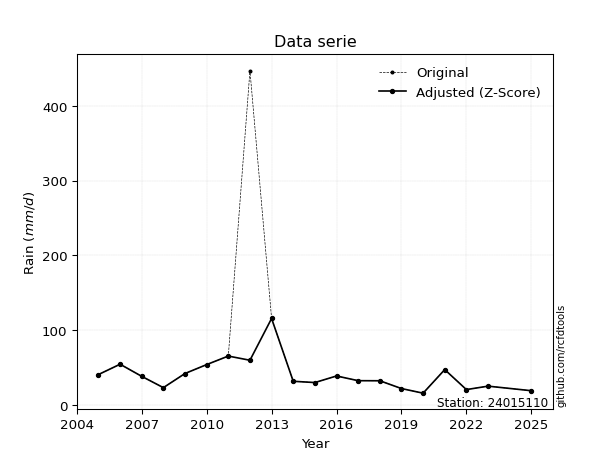</img>

</div>


> The initial value (value_initial) correspond to the initial obtained or null completed value, and value (value) is adjusted only when the initial value is outside the valid range (outlier) definite through the Z-Score value. If Z-Score is active, values out of range or outliers are replaced with the station mean value. A Z-Score (or standard score) measures how many standard deviations a data point is from the mean of a dataset, indicating its relative position; positive scores mean above the mean, negative mean below, and a score of zero is exactly at the mean, allowing for comparison of values from different distributions. It´s calculated using the formula $z=(x–μ)/σ$, where $x$ is the data point, $μ$ is the mean, and $σ$ is the standard deviation, helping identify outliers and understand probability.
>
> <sub>**Note**: In this study, "completing" (filling gaps in) and "extending" (forecasting or lengthening the historical record) rainfall data series are avoided for certain critical analyses because they introduce artificial bias and uncertainty, which can distort the statistics of rare events (extremes), alter day-to-day variability, and compromise the integrity and homogeneity of the original data. Some reasons against Completing/Extending rainfall data are: **Distortion of Extremes and Variability**: The primary issue is that most gap-filling or extension methods rely on averaging or regression with nearby stations, which inherently smooths the data. Rainfall is highly variable in space and time, with a large percentage of zero values and occasional large storms. Infilling methods often underestimate the highest values and overestimate the lowest (zero) values, which severely distorts analyses focused on flood frequency, drought severity, and intensity-duration-frequency (IDF) curves, **Loss of Data Homogeneity**: Infilled or extended data are synthetic estimates, not actual measurements. Combining these estimates with observed data can violate the assumption of data homogeneity, which requires that the data properties do not change over time. Inhomogeneity can lead to incorrect conclusions about long-term trends or changes in climate patterns, **Propagation of Errors**: Errors and biases from the original data (e.g., wind-induced undercatch, instrument errors, site changes) or the data used for imputation can propagate through the analysis, leading to unreliable hydrological models and inaccurate predictions, **Compromised Statistical Integrity**: For statistical analyses, especially those involving the frequency of events, using artificial data can introduce time bias or autocorrelation that doesn´t exist in reality, making it difficult to assess the true probability of events, **Difficulty in Validation**: It is difficult to accurately validate the quality of filled or extended data, especially for past periods where ground-truth measurements are unavailable. The reliability of imputation techniques heavily depends on the density of the surrounding station network and the complexity of the local topography.</sub>


### 4. Active continuous probability distributions from SciPy (80 of 104 available)

A Probability Density Function (PDF) describes the relative likelihood of a continuous random variable falling within a specific range, where the total area under its curve equals 1, and the area over any interval gives the actual probability for that range. Unlike discrete probabilities (like rolling a die), a PDF shows density, not direct probability for a single point (which is zero), with higher points indicating higher likelihood, often visualized as a bell curve for normal distributions.

A log of a probability density function (log-PDF) is simply the logarithm of the PDF´s value, denoted as $log(f(x))$, useful for converting multiplication of probabilities into addition, improving numerical stability with tiny numbers, and connecting to information theory concepts like entropy. Instead of dealing with very small probabilities (e.g., 0.000001), log-PDFs use negative numbers (e.g., $log(0.00001) ≈ -11.51$ that are easier for computers to handle, preventing underflow errors and simplifying complex calculations. In this study, each active probability distribution from SciPy is also evaluated in the $log$ form.

[scipy.stats](https://docs.scipy.org/doc/scipy/reference/stats.html) is a Python´s powerful submodule within the SciPy library for comprehensive statistical analysis, offering over 130 probability distributions (like Normal, Poisson, etc.), functions for descriptive stats (mean, variance), hypothesis testing (t-tests, chi-square), random variable generation, and statistical tests, making it essential for data science, modeling, and research. It provides tools to explore, model, and draw conclusions from data efficiently, working seamlessly with [NumPy](https://numpy.org/).

<div align="center">

|   id | p_dist           |   n_parameter | fit_method   | label                                                                       | active   | ref                                                                                                      |
|-----:|:-----------------|--------------:|:-------------|:----------------------------------------------------------------------------|:---------|:---------------------------------------------------------------------------------------------------------|
|    0 | alpha            |             3 | MLE          | Alpha                                                                       | True     | [:mortar_board:](https://docs.scipy.org/doc/scipy/reference/generated/scipy.stats.alpha.html)            |
|    1 | anglit           |             2 | MM           | Anglit                                                                      | True     | [:mortar_board:](https://docs.scipy.org/doc/scipy/reference/generated/scipy.stats.anglit.html)           |
|    2 | arcsine          |             2 | MM           | Arcsine                                                                     | True     | [:mortar_board:](https://docs.scipy.org/doc/scipy/reference/generated/scipy.stats.arcsine.html)          |
|    3 | argus            |             3 | MLE          | Argus                                                                       | True     | [:mortar_board:](https://docs.scipy.org/doc/scipy/reference/generated/scipy.stats.argus.html)            |
|    4 | beta             |             4 | MLE          | Beta                                                                        | True     | [:mortar_board:](https://docs.scipy.org/doc/scipy/reference/generated/scipy.stats.beta.html)             |
|    5 | betaprime        |             4 | MLE          | Beta prime                                                                  | True     | [:mortar_board:](https://docs.scipy.org/doc/scipy/reference/generated/scipy.stats.betaprime.html)        |
|    6 | bradford         |             3 | MLE          | Bradford                                                                    | True     | [:mortar_board:](https://docs.scipy.org/doc/scipy/reference/generated/scipy.stats.bradford.html)         |
|    7 | burr             |             4 | MLE          | Burr (Type III)                                                             | True     | [:mortar_board:](https://docs.scipy.org/doc/scipy/reference/generated/scipy.stats.burr.html)             |
|    8 | burr12           |             4 | MLE          | Burr (Type III) 12                                                          | True     | [:mortar_board:](https://docs.scipy.org/doc/scipy/reference/generated/scipy.stats.burr12.html)           |
|    9 | cosine           |             2 | MLE          | Cosine                                                                      | True     | [:mortar_board:](https://docs.scipy.org/doc/scipy/reference/generated/scipy.stats.cosine.html)           |
|   10 | crystalball      |             4 | MLE          | Crystalball                                                                 | True     | [:mortar_board:](https://docs.scipy.org/doc/scipy/reference/generated/scipy.stats.crystalball.html)      |
|   11 | dgamma           |             3 | MLE          | Double gamma                                                                | True     | [:mortar_board:](https://docs.scipy.org/doc/scipy/reference/generated/scipy.stats.dgamma.html)           |
|   12 | dweibull         |             3 | MLE          | Double Weibull                                                              | True     | [:mortar_board:](https://docs.scipy.org/doc/scipy/reference/generated/scipy.stats.dweibull.html)         |
|   13 | erlang           |             3 | MLE          | Erlang                                                                      | True     | [:mortar_board:](https://docs.scipy.org/doc/scipy/reference/generated/scipy.stats.erlang.html)           |
|   14 | exponnorm        |             3 | MLE          | Exponentially modified Normal                                               | True     | [:mortar_board:](https://docs.scipy.org/doc/scipy/reference/generated/scipy.stats.exponnorm.html)        |
|   15 | exponpow         |             3 | MLE          | Exponential power                                                           | True     | [:mortar_board:](https://docs.scipy.org/doc/scipy/reference/generated/scipy.stats.exponpow.html)         |
|   16 | exponweib        |             4 | MLE          | Exponentiated Weibull                                                       | True     | [:mortar_board:](https://docs.scipy.org/doc/scipy/reference/generated/scipy.stats.exponweib.html)        |
|   17 | f                |             4 | MLE          | F                                                                           | True     | [:mortar_board:](https://docs.scipy.org/doc/scipy/reference/generated/scipy.stats.f.html)                |
|   18 | fatiguelife      |             3 | MLE          | Fatigue-life (Birnbaum-Saunders)                                            | True     | [:mortar_board:](https://docs.scipy.org/doc/scipy/reference/generated/scipy.stats.fatiguelife.html)      |
|   19 | foldnorm         |             3 | MM           | Fold Normal                                                                 | True     | [:mortar_board:](https://docs.scipy.org/doc/scipy/reference/generated/scipy.stats.foldnorm.html)         |
|   20 | gamma            |             3 | MLE          | Gamma                                                                       | True     | [:mortar_board:](https://docs.scipy.org/doc/scipy/reference/generated/scipy.stats.gamma.html)            |
|   21 | gausshyper       |             6 | MLE          | Gauss hypergeometric                                                        | True     | [:mortar_board:](https://docs.scipy.org/doc/scipy/reference/generated/scipy.stats.gausshyper.html)       |
|   22 | genexpon         |             5 | MLE          | Generalized exponential                                                     | True     | [:mortar_board:](https://docs.scipy.org/doc/scipy/reference/generated/scipy.stats.genexpon.html)         |
|   23 | genextreme       |             3 | MLE          | Generalized exponential                                                     | True     | [:mortar_board:](https://docs.scipy.org/doc/scipy/reference/generated/scipy.stats.genextreme.html)       |
|   24 | gengamma         |             4 | MLE          | Generalized gamma                                                           | True     | [:mortar_board:](https://docs.scipy.org/doc/scipy/reference/generated/scipy.stats.gengamma.html)         |
|   25 | genhalflogistic  |             3 | MLE          | Generalized half-logistic                                                   | True     | [:mortar_board:](https://docs.scipy.org/doc/scipy/reference/generated/scipy.stats.genhalflogistic.html)  |
|   26 | genlogistic      |             3 | MLE          | Generalized logistic                                                        | True     | [:mortar_board:](https://docs.scipy.org/doc/scipy/reference/generated/scipy.stats.genlogistic.html)      |
|   27 | gennorm          |             3 | MLE          | Generalized Normal                                                          | True     | [:mortar_board:](https://docs.scipy.org/doc/scipy/reference/generated/scipy.stats.gennorm.html)          |
|   28 | genpareto        |             3 | MLE          | Generalized Pareto                                                          | True     | [:mortar_board:](https://docs.scipy.org/doc/scipy/reference/generated/scipy.stats.genpareto.html)        |
|   29 | gompertz         |             3 | MLE          | Gompertz (or truncated Gumbel)                                              | True     | [:mortar_board:](https://docs.scipy.org/doc/scipy/reference/generated/scipy.stats.gompertz.html)         |
|   30 | gumbel_l         |             2 | MM           | Gumbel Left Skew                                                            | True     | [:mortar_board:](https://docs.scipy.org/doc/scipy/reference/generated/scipy.stats.gumbel_l.html)         |
|   31 | gumbel_r         |             2 | MM           | Gumbel Right Skew                                                           | True     | [:mortar_board:](https://docs.scipy.org/doc/scipy/reference/generated/scipy.stats.gumbel_r.html)         |
|   32 | halfgennorm      |             3 | MLE          | Upper half of a generalized normal                                          | True     | [:mortar_board:](https://docs.scipy.org/doc/scipy/reference/generated/scipy.stats.halfgennorm.html)      |
|   33 | halflogistic     |             2 | MM           | Half-logistic                                                               | True     | [:mortar_board:](https://docs.scipy.org/doc/scipy/reference/generated/scipy.stats.halflogistic.html)     |
|   34 | halfnorm         |             2 | MM           | Half Normal                                                                 | True     | [:mortar_board:](https://docs.scipy.org/doc/scipy/reference/generated/scipy.stats.halfnorm.html)         |
|   35 | hypsecant        |             2 | MM           | hyperbolic secant                                                           | True     | [:mortar_board:](https://docs.scipy.org/doc/scipy/reference/generated/scipy.stats.hypsecant.html)        |
|   36 | invgamma         |             3 | MLE          | Inverted gamma                                                              | True     | [:mortar_board:](https://docs.scipy.org/doc/scipy/reference/generated/scipy.stats.invgamma.html)         |
|   37 | invgauss         |             3 | MLE          | Inverse Gaussian                                                            | True     | [:mortar_board:](https://docs.scipy.org/doc/scipy/reference/generated/scipy.stats.invgauss.html)         |
|   38 | invweibull       |             3 | MLE          | Inverted Weibull                                                            | True     | [:mortar_board:](https://docs.scipy.org/doc/scipy/reference/generated/scipy.stats.invweibull.html)       |
|   39 | johnsonsb        |             4 | MLE          | Johnson SB                                                                  | True     | [:mortar_board:](https://docs.scipy.org/doc/scipy/reference/generated/scipy.stats.johnsonsb.html)        |
|   40 | johnsonsu        |             4 | MLE          | Johnson Su                                                                  | True     | [:mortar_board:](https://docs.scipy.org/doc/scipy/reference/generated/scipy.stats.johnsonsu.html)        |
|   41 | kappa3           |             3 | MLE          | Kappa 3                                                                     | True     | [:mortar_board:](https://docs.scipy.org/doc/scipy/reference/generated/scipy.stats.kappa3.html)           |
|   42 | kappa4           |             4 | MLE          | Kappa 4                                                                     | True     | [:mortar_board:](https://docs.scipy.org/doc/scipy/reference/generated/scipy.stats.kappa4.html)           |
|   43 | ksone            |             3 | MLE          | Kolmogorov-Smirnov one-sided test statistic distribution                    | True     | [:mortar_board:](https://docs.scipy.org/doc/scipy/reference/generated/scipy.stats.ksone.html)            |
|   44 | kstwobign        |             2 | MLE          | Limiting distribution of scaled Kolmogorov-Smirnov two-sided test statistic | True     | [:mortar_board:](https://docs.scipy.org/doc/scipy/reference/generated/scipy.stats.kstwobign.html)        |
|   45 | laplace          |             2 | MM           | Laplace                                                                     | True     | [:mortar_board:](https://docs.scipy.org/doc/scipy/reference/generated/scipy.stats.laplace.html)          |
|   46 | levy_l           |             2 | MLE          | Left-skewed Levy                                                            | True     | [:mortar_board:](https://docs.scipy.org/doc/scipy/reference/generated/scipy.stats.levy_l.html)           |
|   47 | loggamma         |             3 | MLE          | Log gamma                                                                   | True     | [:mortar_board:](https://docs.scipy.org/doc/scipy/reference/generated/scipy.stats.loggamma.html)         |
|   48 | logistic         |             2 | MM           | Logistic (or Sech-squared)                                                  | True     | [:mortar_board:](https://docs.scipy.org/doc/scipy/reference/generated/scipy.stats.logistic.html)         |
|   49 | loglaplace       |             3 | MLE          | Log-Laplace                                                                 | True     | [:mortar_board:](https://docs.scipy.org/doc/scipy/reference/generated/scipy.stats.loglaplace.html)       |
|   50 | lomax            |             3 | MLE          | Lomax (Pareto of the second kind)                                           | True     | [:mortar_board:](https://docs.scipy.org/doc/scipy/reference/generated/scipy.stats.lomax.html)            |
|   51 | maxwell          |             2 | MM           | Maxwell                                                                     | True     | [:mortar_board:](https://docs.scipy.org/doc/scipy/reference/generated/scipy.stats.maxwell.html)          |
|   52 | mielke           |             4 | MLE          | Mielke Beta-Kappa / Dagum                                                   | True     | [:mortar_board:](https://docs.scipy.org/doc/scipy/reference/generated/scipy.stats.mielke.html)           |
|   53 | moyal            |             2 | MM           | Moyal                                                                       | True     | [:mortar_board:](https://docs.scipy.org/doc/scipy/reference/generated/scipy.stats.moyal.html)            |
|   54 | nakagami         |             3 | MLE          | Nakagami                                                                    | True     | [:mortar_board:](https://docs.scipy.org/doc/scipy/reference/generated/scipy.stats.nakagami.html)         |
|   55 | ncf              |             5 | MLE          | Non-central F distribution                                                  | True     | [:mortar_board:](https://docs.scipy.org/doc/scipy/reference/generated/scipy.stats.ncf.html)              |
|   56 | nct              |             4 | MLE          | Non-central Student’s t                                                     | True     | [:mortar_board:](https://docs.scipy.org/doc/scipy/reference/generated/scipy.stats.nct.html)              |
|   57 | norm             |             2 | MM           | Normal                                                                      | True     | [:mortar_board:](https://docs.scipy.org/doc/scipy/reference/generated/scipy.stats.norm.html)             |
|   58 | pearson3         |             3 | MM           | Pearson type III                                                            | True     | [:mortar_board:](https://docs.scipy.org/doc/scipy/reference/generated/scipy.stats.pearson3.html)         |
|   59 | powerlaw         |             3 | MLE          | Power-function                                                              | True     | [:mortar_board:](https://docs.scipy.org/doc/scipy/reference/generated/scipy.stats.powerlaw.html)         |
|   60 | rayleigh         |             2 | MM           | Rayleigh                                                                    | True     | [:mortar_board:](https://docs.scipy.org/doc/scipy/reference/generated/scipy.stats.rayleigh.html)         |
|   61 | rdist            |             3 | MLE          | R-distributed (symmetric beta)                                              | True     | [:mortar_board:](https://docs.scipy.org/doc/scipy/reference/generated/scipy.stats.rdist.html)            |
|   62 | rice             |             3 | MLE          | Rice                                                                        | True     | [:mortar_board:](https://docs.scipy.org/doc/scipy/reference/generated/scipy.stats.rice.html)             |
|   63 | semicircular     |             2 | MM           | Semicircular                                                                | True     | [:mortar_board:](https://docs.scipy.org/doc/scipy/reference/generated/scipy.stats.semicircular.html)     |
|   64 | skewnorm         |             3 | MLE          | Skew normal                                                                 | True     | [:mortar_board:](https://docs.scipy.org/doc/scipy/reference/generated/scipy.stats.skewnorm.html)         |
|   65 | t                |             3 | MLE          | Student’s t                                                                 | True     | [:mortar_board:](https://docs.scipy.org/doc/scipy/reference/generated/scipy.stats.t.html)                |
|   66 | trapezoid        |             4 | MLE          | Trapezoid                                                                   | True     | [:mortar_board:](https://docs.scipy.org/doc/scipy/reference/generated/scipy.stats.trapezoid.html)        |
|   67 | triang           |             3 | MLE          | Triangular                                                                  | True     | [:mortar_board:](https://docs.scipy.org/doc/scipy/reference/generated/scipy.stats.triang.html)           |
|   68 | truncexpon       |             3 | MLE          | Truncated exponential                                                       | True     | [:mortar_board:](https://docs.scipy.org/doc/scipy/reference/generated/scipy.stats.truncexpon.html)       |
|   69 | truncnorm        |             4 | MLE          | Truncated normal                                                            | True     | [:mortar_board:](https://docs.scipy.org/doc/scipy/reference/generated/scipy.stats.truncnorm.html)        |
|   70 | truncpareto      |             4 | MLE          | Upper truncated Pareto                                                      | True     | [:mortar_board:](https://docs.scipy.org/doc/scipy/reference/generated/scipy.stats.truncpareto.html)      |
|   71 | truncweibull_min |             5 | MLE          | Doubly truncated Weibull minimum                                            | True     | [:mortar_board:](https://docs.scipy.org/doc/scipy/reference/generated/scipy.stats.truncweibull_min.html) |
|   72 | tukeylambda      |             3 | MLE          | Tukey-Lamdba                                                                | True     | [:mortar_board:](https://docs.scipy.org/doc/scipy/reference/generated/scipy.stats.tukeylambda.html)      |
|   73 | uniform          |             2 | MLE          | Uniform                                                                     | True     | [:mortar_board:](https://docs.scipy.org/doc/scipy/reference/generated/scipy.stats.uniform.html)          |
|   74 | vonmises         |             3 | MLE          | Von Mises                                                                   | True     | [:mortar_board:](https://docs.scipy.org/doc/scipy/reference/generated/scipy.stats.vonmises.html)         |
|   75 | vonmises_line    |             3 | MLE          | Von Mises line                                                              | True     | [:mortar_board:](https://docs.scipy.org/doc/scipy/reference/generated/scipy.stats.vonmises_line.html)    |
|   76 | wald             |             2 | MM           | Wald                                                                        | True     | [:mortar_board:](https://docs.scipy.org/doc/scipy/reference/generated/scipy.stats.wald.html)             |
|   77 | weibull_max      |             3 | MLE          | Weibull maximum                                                             | True     | [:mortar_board:](https://docs.scipy.org/doc/scipy/reference/generated/scipy.stats.weibull_max.html)      |
|   78 | weibull_min      |             3 | MLE          | Weibull minimum                                                             | True     | [:mortar_board:](https://docs.scipy.org/doc/scipy/reference/generated/scipy.stats.weibull_min.html)      |
|   79 | wrapcauchy       |             3 | MLE          | Wrapped  Cauchy                                                             | True     | [:mortar_board:](https://docs.scipy.org/doc/scipy/reference/generated/scipy.stats.wrapcauchy.html)       |

</div>

> **n_parameter:** # arguments & localization & scale.
>
> **Fit methods:** (MLE) maximum likelihood, (MM) L-moments.
>
>**Inactive** (With the only purpose of prevent loops, zero divisions, infinite values, over high estimated values or horizontal trending for recurrence intervals estimations, the follow distributions were disabled.)**:** lognorm, norminvgauss, powernorm, powerlognorm, cauchy, halfcauchy, foldcauchy, skewcauchy, chi2, expon, fisk, genhyperbolic, geninvgauss, gibrat, kstwo, laplace_asymmetric, levy, levy_stable, ncx2, pareto, rel_breitwigner, recipinvgauss, studentized_range, loguniform, 


## B. Probability (PDF) vs. Empirical (EDF) distributions functions

A continuous probability distribution (CPD) describes probabilities for variables that can take any value within a range (like rain any time), unlike discrete variables with specific outcomes (like temperature). It uses a Probability Density Function (PDF), a curve where the total area under it equals 1, and the probability of the variable falling within an interval (a to b) is found by calculating the area under the curve between those points. A key feature is that the probability of hitting any single exact value is zero, so probabilities are always expressed for ranges, e.g., $P(a ≤ X ≤ b)$.

<div align="center">

Distributions parameters from station values
|     |   station | p_dist              |   n |             loc |         scale | shape                  | shape1                | shape2                 | shape3               |
|----:|----------:|:--------------------|----:|----------------:|--------------:|:-----------------------|:----------------------|:-----------------------|:---------------------|
|   0 |  24015110 | alpha               |  20 |   -17.6618      | 179.191       | 3.418747625233409      |                       |                        |                      |
|   1 |  24015110 | anglit              |  20 |    40.55        |  64.5058      |                        |                       |                        |                      |
|   2 |  24015110 | arcsine             |  20 |     9.36625     |  62.3675      |                        |                       |                        |                      |
|   3 |  24015110 | argus               |  20 |   -27.2757      | 145.015       | 2.8820992221855255e-06 |                       |                        |                      |
|   4 |  24015110 | beta                |  20 |    15.7498      | 453.214       | 1.1216449107375608     | 19.35907096287044     |                        |                      |
|   5 |  24015110 | betaprime           |  20 |    -0.423014    |   1.0842      | 160.68612971498084     | 5.250046713198989     |                        |                      |
|   6 |  24015110 | bradford            |  20 |    15.9         |  99.8181      | 2.8526273563856983     |                       |                        |                      |
|   7 |  24015110 | burr                |  20 |    -0.0885173   |  18.6505      | 2.7763427033538814     | 4.071700988071045     |                        |                      |
|   8 |  24015110 | burr12              |  20 |    15.2319      |  51.2116      | 1.435886860335292      | 3.036871048242004     |                        |                      |
|   9 |  24015110 | cosine              |  20 |    37.7627      |  11.6885      |                        |                       |                        |                      |
|  10 |  24015110 | crystalball         |  20 |    40.55        |  22.0502      | 2399.4932704904595     | 3465.896713459397     |                        |                      |
|  11 |  24015110 | dgamma              |  20 |    35.985       |  11.0636      | 1.3738738978574925     |                       |                        |                      |
|  12 |  24015110 | dweibull            |  20 |    36.2317      |  15.8874      | 1.1085670009725508     |                       |                        |                      |
|  13 |  24015110 | erlang              |  20 |    15.6714      |  21.4283      | 1.1610169056250315     |                       |                        |                      |
|  14 |  24015110 | exponnorm           |  20 |    17.4778      |   2.45321     | 9.404916626928113      |                       |                        |                      |
|  15 |  24015110 | exponpow            |  20 |    15.9         |  43.662       | 0.8701422174997362     |                       |                        |                      |
|  16 |  24015110 | exponweib           |  20 |    15.9         |  31.7066      | 0.6655566794629038     | 1.2531748630412491    |                        |                      |
|  17 |  24015110 | f                   |  20 |     3.36711     |  28.787       | 129.2949774220509      | 8.6179563325375       |                        |                      |
|  18 |  24015110 | fatiguelife         |  20 |    10.0305      |  24.2809      | 0.7160078854462619     |                       |                        |                      |
|  19 |  24015110 | foldnorm            |  20 |     8.72364     |  39.2746      | 0.012191896188199106   |                       |                        |                      |
|  20 |  24015110 | gamma               |  20 |    15.6714      |  21.4284      | 1.161014568860418      |                       |                        |                      |
|  21 |  24015110 | gausshyper          |  20 |    15.9         | 159.27        | 0.8789285405922245     | 5.077733742076832     | -8.443014212834989     | 0.055431162814396306 |
|  22 |  24015110 | genexpon            |  20 |    15.9         |  27.386       | 0.7129356396496331     | 0.6670579363720508    | 1.7916620310082738     |                      |
|  23 |  24015110 | genextreme          |  20 |    29.7209      |  12.3645      | -0.25305228169960137   |                       |                        |                      |
|  24 |  24015110 | gengamma            |  20 |    15.8912      |  29.1846      | 0.8329060927169886     | 1.1809250526630548    |                        |                      |
|  25 |  24015110 | genhalflogistic     |  20 |    15.9         |  22.0204      | 0.12843255858587477    |                       |                        |                      |
|  26 |  24015110 | genlogistic         |  20 |   -68.7172      |  14.1526      | 1193.708452725395      |                       |                        |                      |
|  27 |  24015110 | gennorm             |  20 |    37.0043      |  16.0158      | 1.0387372228776592     |                       |                        |                      |
|  28 |  24015110 | genpareto           |  20 |    15.9         |  27.1065      | -0.10051875873017808   |                       |                        |                      |
|  29 |  24015110 | gompertz            |  20 |    15.9         | 207.462       | 7.519195931319359      |                       |                        |                      |
|  30 |  24015110 | gumbel_l            |  20 |    50.4738      |  17.1925      |                        |                       |                        |                      |
|  31 |  24015110 | gumbel_r            |  20 |    30.6262      |  17.1925      |                        |                       |                        |                      |
|  32 |  24015110 | halfgennorm         |  20 |    15.9         |   0.292908    | 0.2999238873355995     |                       |                        |                      |
|  33 |  24015110 | halflogistic        |  20 |    14.4153      |  18.8522      |                        |                       |                        |                      |
|  34 |  24015110 | halfnorm            |  20 |    11.3641      |  36.5791      |                        |                       |                        |                      |
|  35 |  24015110 | hypsecant           |  20 |    40.55        |  14.0376      |                        |                       |                        |                      |
|  36 |  24015110 | invgamma            |  20 |     2.29288     | 129.376       | 4.354135038827669      |                       |                        |                      |
|  37 |  24015110 | invgauss            |  20 |     8.90371     |  62.5471      | 0.5059591398371258     |                       |                        |                      |
|  38 |  24015110 | invweibull          |  20 |   -19.1408      |  48.8617      | 3.9517632317179583     |                       |                        |                      |
|  39 |  24015110 | johnsonsb           |  20 |    12.8027      | 213.264       | 2.3666401589494335     | 1.0830096782913117    |                        |                      |
|  40 |  24015110 | johnsonsu           |  20 |    10.3505      |   0.436009    | -6.804850127490866     | 1.4481323360050986    |                        |                      |
|  41 |  24015110 | kappa3              |  20 |    15.9         |  26.1119      | 3.2215409682884313     |                       |                        |                      |
|  42 |  24015110 | kappa4              |  20 |     6.05489     | 111.084       | 1.0971175532870272     | 0.9734577032704906    |                        |                      |
|  43 |  24015110 | ksone               |  20 |     5.92        | 119.76        | 1.0                    |                       |                        |                      |
|  44 |  24015110 | kstwobign           |  20 |   -21.3531      |  72.0271      |                        |                       |                        |                      |
|  45 |  24015110 | laplace             |  20 |    40.55        |  15.5919      |                        |                       |                        |                      |
|  46 |  24015110 | levy_l              |  20 |   123.714       |  57.2389      |                        |                       |                        |                      |
|  47 |  24015110 | loggamma            |  20 | -7077.39        | 955.175       | 1723.8143018139344     |                       |                        |                      |
|  48 |  24015110 | logistic            |  20 |    40.55        |  12.1569      |                        |                       |                        |                      |
|  49 |  24015110 | loglaplace          |  20 |    -0.0872202   |  32.6873      | 2.645306337317189      |                       |                        |                      |
|  50 |  24015110 | lomax               |  20 |    15.8998      |  81.8227      | 3.1509449349807124     |                       |                        |                      |
|  51 |  24015110 | maxwell             |  20 |   -11.6998      |  32.7427      |                        |                       |                        |                      |
|  52 |  24015110 | mielke              |  20 |   -12.4353      |  20.9064      | 45.28947758771315      | 3.574027938104532     |                        |                      |
|  53 |  24015110 | moyal               |  20 |    27.9403      |   9.9261      |                        |                       |                        |                      |
|  54 |  24015110 | nakagami            |  20 |    15.9         |  37.3223      | 0.1573006992513435     |                       |                        |                      |
|  55 |  24015110 | ncf                 |  20 |    -0.562429    |  33.3621      | 312.9134865322219      | 10.59858956856803     | 0.0347650701017134     |                      |
|  56 |  24015110 | nct                 |  20 |    -4.78377     |   2.41183     | 3.731369253100408      | 14.834312648866888    |                        |                      |
|  57 |  24015110 | norm                |  20 |    40.55        |  22.0502      |                        |                       |                        |                      |
|  58 |  24015110 | pearson3            |  20 |    40.55        |  22.0503      | 1.8768150696863222     |                       |                        |                      |
|  59 |  24015110 | powerlaw            |  20 |    15.9         |  99.8         | 0.28416974973962916    |                       |                        |                      |
|  60 |  24015110 | rayleigh            |  20 |    -1.63341     |  33.6575      |                        |                       |                        |                      |
|  61 |  24015110 | rdist               |  20 |     6.4141      |  59.0859      | 1.0752998265207787     |                       |                        |                      |
|  62 |  24015110 | rice                |  20 |     6.67275     |  28.5822      | 7.642237847711492e-05  |                       |                        |                      |
|  63 |  24015110 | semicircular        |  20 |    40.55        |  44.1005      |                        |                       |                        |                      |
|  64 |  24015110 | skewnorm            |  20 |    15.9         |  33.069       | 19051692.142735064     |                       |                        |                      |
|  65 |  24015110 | t                   |  20 |    35.7714      |  14.7731      | 3.9279895353408083     |                       |                        |                      |
|  66 |  24015110 | trapezoid           |  20 |     5.92        | 119.76        | 1.0                    | 1.0                   |                        |                      |
|  67 |  24015110 | triang              |  20 |    15.9         | 106.592       | 4.227514107973772e-11  |                       |                        |                      |
|  68 |  24015110 | truncexpon          |  20 |     6.59357     |  93.0294      | 1.1728161845064733     |                       |                        |                      |
|  69 |  24015110 | truncnorm           |  20 |    40.55        |  22.0502      | -197.71329606110586    | 664.7192057891314     |                        |                      |
|  70 |  24015110 | truncpareto         |  20 |    15.9         |   3.85541e-08 | 0.052631581911298964   | 2588571277.789999     |                        |                      |
|  71 |  24015110 | truncweibull_min    |  20 |     6.91377     |  89.98        | 1.0016747867230893     | 0.001058304455337273  | 1.2090040645144553     |                      |
|  72 |  24015110 | tukeylambda         |  20 |    35.6423      |   7.71267     | -0.2246559764191699    |                       |                        |                      |
|  73 |  24015110 | uniform             |  20 |    15.9         |  99.8         |                        |                       |                        |                      |
|  74 |  24015110 | vonmises            |  20 |     2.86566     |   1           | 0.36681739549358655    |                       |                        |                      |
|  75 |  24015110 | vonmises_line       |  20 |    45.7289      |   9.49483     | 3.552125669723622e-05  |                       |                        |                      |
|  76 |  24015110 | wald                |  20 |    18.4998      |  22.0502      |                        |                       |                        |                      |
|  77 |  24015110 | weibull_max         |  20 |   115.7         |   1.56232     | 0.18923121515262775    |                       |                        |                      |
|  78 |  24015110 | weibull_min         |  20 |    19.2         |  23.5005      | 0.43822810468210643    |                       |                        |                      |
|  79 |  24015110 | wrapcauchy          |  20 |    15.9         |  15.8837      | 0.2550639897353224     |                       |                        |                      |
|  80 |  24015110 | logalpha            |  20 |    -1.94899     |  65.6814      | 11.954280749243342     |                       |                        |                      |
|  81 |  24015110 | loganglit           |  20 |     3.58456     |   1.3776      |                        |                       |                        |                      |
|  82 |  24015110 | logarcsine          |  20 |     2.91858     |   1.33195     |                        |                       |                        |                      |
|  83 |  24015110 | logargus            |  20 |     2.33705     |   2.45145     | 0.00014392057536729088 |                       |                        |                      |
|  84 |  24015110 | logbeta             |  20 |     2.67664     |   2.57951     | 1.9474925309266418     | 3.5966291963762647    |                        |                      |
|  85 |  24015110 | logbetaprime        |  20 |    -1.05494     |   6.52394     | 168.13204059441557     | 237.42796231818716    |                        |                      |
|  86 |  24015110 | logbradford         |  20 |     2.76631     |   1.98469     | 0.9971056680500056     |                       |                        |                      |
|  87 |  24015110 | logburr             |  20 |     0.0269028   |   3.44245     | 12.281662919909536     | 1.2230784211539363    |                        |                      |
|  88 |  24015110 | logburr12           |  20 |    -0.0279774   |   3.66178     | 12.585273049970995     | 1.2025790149542244    |                        |                      |
|  89 |  24015110 | logcosine           |  20 |     3.63784     |   0.430887    |                        |                       |                        |                      |
|  90 |  24015110 | logcrystalball      |  20 |     3.58456     |   0.470921    | 11.664651864766928     | 256.8569164316723     |                        |                      |
|  91 |  24015110 | logdgamma           |  20 |     3.57099     |   0.211711    | 1.7900756129787483     |                       |                        |                      |
|  92 |  24015110 | logdweibull         |  20 |     3.57202     |   0.417382    | 1.3990284641888144     |                       |                        |                      |
|  93 |  24015110 | logerlang           |  20 |     2.00715     |   0.143651    | 10.98081984675521      |                       |                        |                      |
|  94 |  24015110 | logexponnorm        |  20 |     3.28711     |   0.369521    | 0.8049415612752033     |                       |                        |                      |
|  95 |  24015110 | logexponpow         |  20 |     2.76632     |   1.23563     | 0.8828583178963236     |                       |                        |                      |
|  96 |  24015110 | logexponweib        |  20 |     2.74782     |   1.34524     | 0.37731474600246045    | 3.213752173733366     |                        |                      |
|  97 |  24015110 | logf                |  20 |     0.629403    |   2.90598     | 241.57918932922937     | 119.89244874334636    |                        |                      |
|  98 |  24015110 | logfatiguelife      |  20 |     1.09903     |   2.44141     | 0.1900954414960906     |                       |                        |                      |
|  99 |  24015110 | logfoldnorm         |  20 |     2.82434     |   0.536852    | 1.331016109165323      |                       |                        |                      |
| 100 |  24015110 | loggamma            |  20 |     2.00715     |   0.143652    | 10.980747149561752     |                       |                        |                      |
| 101 |  24015110 | loggausshyper       |  20 |     2.76632     |   2.01848     | 0.934281808667419      | 1.1432656528613978    | 0.8760187212384005     | 0.9336566487897773   |
| 102 |  24015110 | loggenexpon         |  20 |     2.7649      |   0.0097452   | 0.0031560398621285086  | 0.8256979797887252    | 0.00019154192994392985 |                      |
| 103 |  24015110 | loggenextreme       |  20 |     3.39164     |   0.428278    | 0.14874239158159108    |                       |                        |                      |
| 104 |  24015110 | loggengamma         |  20 |     2.76632     |   1.58021     | 0.249792244912582      | 3.9031771599769423    |                        |                      |
| 105 |  24015110 | loggenhalflogistic  |  20 |     2.58977     |   2.28997     | 1.0595700329066382     |                       |                        |                      |
| 106 |  24015110 | loggenlogistic      |  20 |     2.92833     |   0.360612    | 4.01300072996564       |                       |                        |                      |
| 107 |  24015110 | loggennorm          |  20 |     3.58562     |   0.674365    | 2.0501073283792186     |                       |                        |                      |
| 108 |  24015110 | loggenpareto        |  20 |    -0.0029984   |   8.91172     | -1.8745738746287959    |                       |                        |                      |
| 109 |  24015110 | loggompertz         |  20 |     2.76632     |   1.14175     | 0.8163448431799756     |                       |                        |                      |
| 110 |  24015110 | loggumbel_l         |  20 |     3.7965      |   0.367176    |                        |                       |                        |                      |
| 111 |  24015110 | loggumbel_r         |  20 |     3.37262     |   0.367176    |                        |                       |                        |                      |
| 112 |  24015110 | loghalfgennorm      |  20 |     2.76632     |   1.60176     | 4.055628876132074      |                       |                        |                      |
| 113 |  24015110 | loghalflogistic     |  20 |     3.02636     |   0.402654    |                        |                       |                        |                      |
| 114 |  24015110 | loghalfnorm         |  20 |     2.96126     |   0.781184    |                        |                       |                        |                      |
| 115 |  24015110 | loghypsecant        |  20 |     3.58456     |   0.299798    |                        |                       |                        |                      |
| 116 |  24015110 | loginvgamma         |  20 |     0.0422838   | 201.76        | 57.955971829014906     |                       |                        |                      |
| 117 |  24015110 | loginvgauss         |  20 |     1.08149     |  69.6527      | 0.035935339517783604   |                       |                        |                      |
| 118 |  24015110 | loginvweibull       |  20 |    -2.50315e+07 |   2.50315e+07 | 61026325.40501277      |                       |                        |                      |
| 119 |  24015110 | logjohnsonsb        |  20 |     2.48254     |   3.02292     | 0.8293216530844323     | 1.3264639415133384    |                        |                      |
| 120 |  24015110 | logjohnsonsu        |  20 |     1.0573      |   0.344905    | -14.516556407910457    | 5.431456629754788     |                        |                      |
| 121 |  24015110 | logkappa3           |  20 |     2.76632     |   1.9338      | 121.31553569801036     |                       |                        |                      |
| 122 |  24015110 | logkappa4           |  20 |     2.61037     |   2.25641     | 1.073882852123699      | 1.0540861736981837    |                        |                      |
| 123 |  24015110 | logksone            |  20 |     2.56785     |   2.38162     | 1.0                    |                       |                        |                      |
| 124 |  24015110 | logkstwobign        |  20 |     1.88947     |   1.9447      |                        |                       |                        |                      |
| 125 |  24015110 | loglaplace          |  20 |     3.58456     |   0.332992    |                        |                       |                        |                      |
| 126 |  24015110 | loglevy_l           |  20 |     4.86794     |   0.829282    |                        |                       |                        |                      |
| 127 |  24015110 | logloggamma         |  20 |  -154.101       |  20.8518      | 1924.5958384345322     |                       |                        |                      |
| 128 |  24015110 | loglogistic         |  20 |     3.58456     |   0.259632    |                        |                       |                        |                      |
| 129 |  24015110 | logloglaplace       |  20 |    -0.094229    |   3.57854     | 9.6832666224628        |                       |                        |                      |
| 130 |  24015110 | loglomax            |  20 |     2.76632     |   5.03576     | 6.439201245668276      |                       |                        |                      |
| 131 |  24015110 | logmaxwell          |  20 |     2.46867     |   0.699278    |                        |                       |                        |                      |
| 132 |  24015110 | logmielke           |  20 |   -10.5223      |  13.6629      | 106.62378608452414     | 41.45269630157682     |                        |                      |
| 133 |  24015110 | logmoyal            |  20 |     3.31525     |   0.211989    |                        |                       |                        |                      |
| 134 |  24015110 | lognakagami         |  20 |     2.65535     |   1.04173     | 1.0052012736526212     |                       |                        |                      |
| 135 |  24015110 | logncf              |  20 |    -3.39136     |   6.95464     | 500.0871616061438      | 728.2771569346844     | 0.6202447962139026     |                      |
| 136 |  24015110 | lognct              |  20 |    -0.0322881   |   0.202276    | 38.24707337302485      | 17.527945152566268    |                        |                      |
| 137 |  24015110 | lognorm             |  20 |     3.58456     |   0.470921    |                        |                       |                        |                      |
| 138 |  24015110 | logpearson3         |  20 |     3.58456     |   0.470921    | 0.4192279127075994     |                       |                        |                      |
| 139 |  24015110 | logpowerlaw         |  20 |     2.76632     |   1.98468     | 0.3643858818395919     |                       |                        |                      |
| 140 |  24015110 | lograyleigh         |  20 |     2.68366     |   0.718814    |                        |                       |                        |                      |
| 141 |  24015110 | logrdist            |  20 |     3.75866     |   0.992342    | 1.3282234797587456     |                       |                        |                      |
| 142 |  24015110 | logrice             |  20 |     2.63495     |   0.582686    | 1.144166908515994      |                       |                        |                      |
| 143 |  24015110 | logsemicircular     |  20 |     3.58455     |   0.941857    |                        |                       |                        |                      |
| 144 |  24015110 | logskewnorm         |  20 |     3.09634     |   0.678318    | 2.0522457803912757     |                       |                        |                      |
| 145 |  24015110 | logt                |  20 |     3.58456     |   0.470922    | 889745543.4856973      |                       |                        |                      |
| 146 |  24015110 | logtrapezoid        |  20 |     2.56785     |   2.38162     | 1.0                    | 1.0                   |                        |                      |
| 147 |  24015110 | logtriang           |  20 |     2.57604     |   2.33073     | 0.37903372836389815    |                       |                        |                      |
| 148 |  24015110 | logtruncexpon       |  20 |     2.76632     |   2.10537     | 0.9426931855404928     |                       |                        |                      |
| 149 |  24015110 | logtruncnorm        |  20 |    -0.200154    |   1.77651     | 1.66554911275874       | 2.7870044951405912    |                        |                      |
| 150 |  24015110 | logtruncpareto      |  20 |    -3.35544e+07 |   3.35544e+07 | 18370815.359367453     | 1.0000000591485465    |                        |                      |
| 151 |  24015110 | logtruncweibull_min |  20 |     2.76445     |   2.1058      | 0.9839922841686308     | 0.0008889539189607524 | 0.9433716775754171     |                      |
| 152 |  24015110 | logtukeylambda      |  20 |     3.75866     |   1.10669     | 1.1152333986558371     |                       |                        |                      |
| 153 |  24015110 | loguniform          |  20 |     2.76632     |   1.98468     |                        |                       |                        |                      |
| 154 |  24015110 | logvonmises         |  20 |    -2.70601     |   1           | 5.07165576267887       |                       |                        |                      |
| 155 |  24015110 | logvonmises_line    |  20 |     3.58404     |   0.371455    | 1.0023865884806553     |                       |                        |                      |
| 156 |  24015110 | logwald             |  20 |     3.11367     |   0.470891    |                        |                       |                        |                      |
| 157 |  24015110 | logweibull_max      |  20 |     6.27033     |   2.87869     | 6.721442650458917      |                       |                        |                      |
| 158 |  24015110 | logweibull_min      |  20 |     2.62326     |   1.08441     | 2.1424441457380254     |                       |                        |                      |
| 159 |  24015110 | logwrapcauchy       |  20 |     2.76632     |   0.315872    | 0.5                    |                       |                        |                      |

</div>

> **loc** (Location parameter): This shifts the distribution along the x-axis. For many common distributions, like the normal (Gaussian) distribution, loc represents the mean $μ$. For others, like the uniform distribution, it might represent the minimum value, or for the beta distribution, the left end of the support interval.
>
> **scale** (Scale parameter): This determines the width or spread of the distribution. For the normal distribution, scale represents the standard deviation $σ$. For a uniform distribution, it defines the length of the interval (from $loc$ to $loc + scale$).
>
> **shape** (Shape parameters): Refers to parameters that define the specific form of a probability distribution, distinct from its location (loc) and scale (scale). These parameters are required arguments for most distribution functions. For example, a normal (Gaussian) distribution is fully defined by its location (mean) and scale (standard deviation), so it has no specific shape parameters beyond loc and scale. However, other distributions have intrinsic properties that need specification, as Gamma distribution that takes a shape parameter, often named $a$ or $alpha$.


### 0. Cumulative distribution values - CDF (160 evaluated)

Cumulative Distribution Function (CDF), denoted as $F$<sub>$X$</sub>$(x)$, is a function that gives the probability that a random variable $X$ will take a value less than or equal to a specific value, $x$ (i.e., $(P(X≥x)$. It essentially "accumulates" probabilities from a given point up to the far right (positive infinity), providing a complete picture of the distribution´s probabilities for both discrete (like rain) and continuous (like temperature) variables, helping to find probabilities over ranges or above certain values. Each station is evaluated separately ordering the $x$ values ascending, calculating the CDF and PDF values for the activated distributions and their logarithmic forms.

<div align="center">

CDF ordered by x ascending and calculating $log(f(x))$ separately
|   id |   Station |   date |     x |   count |   mean |     std |     zscore |   Value_initial |   station |   m |     alpha |   alpha_pdf |   anglit |   anglit_pdf |   arcsine |   arcsine_pdf |    argus |   argus_pdf |       beta |   beta_pdf |   betaprime |   betaprime_pdf |    bradford |   bradford_pdf |      burr |    burr_pdf |     burr12 |   burr12_pdf |    cosine |   cosine_pdf |   crystalball |   crystalball_pdf |   dgamma |   dgamma_pdf |   dweibull |   dweibull_pdf |    erlang |   erlang_pdf |   exponnorm |   exponnorm_pdf |    exponpow |   exponpow_pdf |   exponweib |   exponweib_pdf |         f |       f_pdf |   fatiguelife |   fatiguelife_pdf |   foldnorm |   foldnorm_pdf |      gamma |   gamma_pdf |   gausshyper |   gausshyper_pdf |    genexpon |   genexpon_pdf |   genextreme |   genextreme_pdf |    gengamma |   gengamma_pdf |   genhalflogistic |   genhalflogistic_pdf |   genlogistic |   genlogistic_pdf |   gennorm |   gennorm_pdf |   genpareto |   genpareto_pdf |    gompertz |   gompertz_pdf |   gumbel_l |   gumbel_l_pdf |   gumbel_r |   gumbel_r_pdf |   halfgennorm |   halfgennorm_pdf |   halflogistic |   halflogistic_pdf |   halfnorm |   halfnorm_pdf |   hypsecant |   hypsecant_pdf |   invgamma |   invgamma_pdf |   invgauss |   invgauss_pdf |   invweibull |   invweibull_pdf |   johnsonsb |   johnsonsb_pdf |   johnsonsu |   johnsonsu_pdf |      kappa3 |   kappa3_pdf |      kappa4 |   kappa4_pdf |     ksone |   ksone_pdf |   kstwobign |   kstwobign_pdf |   laplace |   laplace_pdf |   levy_l |   levy_l_pdf |   loggamma |   loggamma_pdf |   logistic |   logistic_pdf |   loglaplace |   loglaplace_pdf |       lomax |   lomax_pdf |   maxwell |   maxwell_pdf |    mielke |   mielke_pdf |     moyal |   moyal_pdf |   nakagami |   nakagami_pdf |       ncf |     ncf_pdf |       nct |     nct_pdf |     norm |   norm_pdf |   pearson3 |   pearson3_pdf |    powerlaw |   powerlaw_pdf |   rayleigh |   rayleigh_pdf |    rdist |      rdist_pdf |      rice |    rice_pdf |   semicircular |   semicircular_pdf |   skewnorm |   skewnorm_pdf |        t |       t_pdf |   trapezoid |   trapezoid_pdf |     triang |   triang_pdf |   truncexpon |   truncexpon_pdf |   truncnorm |   truncnorm_pdf |   truncpareto |   truncpareto_pdf |   truncweibull_min |   truncweibull_min_pdf |   tukeylambda |   tukeylambda_pdf |   uniform |   uniform_pdf |   vonmises |   vonmises_pdf |   vonmises_line |   vonmises_line_pdf |       wald |    wald_pdf |   weibull_max |   weibull_max_pdf |   weibull_min |   weibull_min_pdf |   wrapcauchy |   wrapcauchy_pdf |   logalpha |   logalpha_pdf |   loganglit |   loganglit_pdf |   logarcsine |   logarcsine_pdf |   logargus |   logargus_pdf |   logbeta |   logbeta_pdf |   logbetaprime |   logbetaprime_pdf |   logbradford |   logbradford_pdf |   logburr |   logburr_pdf |   logburr12 |   logburr12_pdf |   logcosine |   logcosine_pdf |   logcrystalball |   logcrystalball_pdf |   logdgamma |   logdgamma_pdf |   logdweibull |   logdweibull_pdf |   logerlang |   logerlang_pdf |   logexponnorm |   logexponnorm_pdf |   logexponpow |   logexponpow_pdf |   logexponweib |   logexponweib_pdf |      logf |   logf_pdf |   logfatiguelife |   logfatiguelife_pdf |   logfoldnorm |   logfoldnorm_pdf |   loggausshyper |   loggausshyper_pdf |   loggenexpon |   loggenexpon_pdf |   loggenextreme |   loggenextreme_pdf |   loggengamma |   loggengamma_pdf |   loggenhalflogistic |   loggenhalflogistic_pdf |   loggenlogistic |   loggenlogistic_pdf |   loggennorm |   loggennorm_pdf |   loggenpareto |   loggenpareto_pdf |   loggompertz |   loggompertz_pdf |   loggumbel_l |   loggumbel_l_pdf |   loggumbel_r |   loggumbel_r_pdf |   loghalfgennorm |   loghalfgennorm_pdf |   loghalflogistic |   loghalflogistic_pdf |   loghalfnorm |   loghalfnorm_pdf |   loghypsecant |   loghypsecant_pdf |   loginvgamma |   loginvgamma_pdf |   loginvgauss |   loginvgauss_pdf |   loginvweibull |   loginvweibull_pdf |   logjohnsonsb |   logjohnsonsb_pdf |   logjohnsonsu |   logjohnsonsu_pdf |   logkappa3 |   logkappa3_pdf |   logkappa4 |   logkappa4_pdf |   logksone |   logksone_pdf |   logkstwobign |   logkstwobign_pdf |   loglevy_l |   loglevy_l_pdf |   logloggamma |   logloggamma_pdf |   loglogistic |   loglogistic_pdf |   logloglaplace |   logloglaplace_pdf |    loglomax |   loglomax_pdf |   logmaxwell |   logmaxwell_pdf |   logmielke |   logmielke_pdf |   logmoyal |   logmoyal_pdf |   lognakagami |   lognakagami_pdf |    logncf |   logncf_pdf |    lognct |   lognct_pdf |   lognorm |   lognorm_pdf |   logpearson3 |   logpearson3_pdf |   logpowerlaw |   logpowerlaw_pdf |   lograyleigh |   lograyleigh_pdf |    logrdist |   logrdist_pdf |   logrice |   logrice_pdf |   logsemicircular |   logsemicircular_pdf |   logskewnorm |   logskewnorm_pdf |      logt |   logt_pdf |   logtrapezoid |   logtrapezoid_pdf |   logtriang |   logtriang_pdf |   logtruncexpon |   logtruncexpon_pdf |   logtruncnorm |   logtruncnorm_pdf |   logtruncpareto |   logtruncpareto_pdf |   logtruncweibull_min |   logtruncweibull_min_pdf |   logtukeylambda |   logtukeylambda_pdf |   loguniform |   loguniform_pdf |   logvonmises |   logvonmises_pdf |   logvonmises_line |   logvonmises_line_pdf |     logwald |   logwald_pdf |   logweibull_max |   logweibull_max_pdf |   logweibull_min |   logweibull_min_pdf |   logwrapcauchy |   logwrapcauchy_pdf |
|-----:|----------:|-------:|------:|--------:|-------:|--------:|-----------:|----------------:|----------:|----:|----------:|------------:|---------:|-------------:|----------:|--------------:|---------:|------------:|-----------:|-----------:|------------:|----------------:|------------:|---------------:|----------:|------------:|-----------:|-------------:|----------:|-------------:|--------------:|------------------:|---------:|-------------:|-----------:|---------------:|----------:|-------------:|------------:|----------------:|------------:|---------------:|------------:|----------------:|----------:|------------:|--------------:|------------------:|-----------:|---------------:|-----------:|------------:|-------------:|-----------------:|------------:|---------------:|-------------:|-----------------:|------------:|---------------:|------------------:|----------------------:|--------------:|------------------:|----------:|--------------:|------------:|----------------:|------------:|---------------:|-----------:|---------------:|-----------:|---------------:|--------------:|------------------:|---------------:|-------------------:|-----------:|---------------:|------------:|----------------:|-----------:|---------------:|-----------:|---------------:|-------------:|-----------------:|------------:|----------------:|------------:|----------------:|------------:|-------------:|------------:|-------------:|----------:|------------:|------------:|----------------:|----------:|--------------:|---------:|-------------:|-----------:|---------------:|-----------:|---------------:|-------------:|-----------------:|------------:|------------:|----------:|--------------:|----------:|-------------:|----------:|------------:|-----------:|---------------:|----------:|------------:|----------:|------------:|---------:|-----------:|-----------:|---------------:|------------:|---------------:|-----------:|---------------:|---------:|---------------:|----------:|------------:|---------------:|-------------------:|-----------:|---------------:|---------:|------------:|------------:|----------------:|-----------:|-------------:|-------------:|-----------------:|------------:|----------------:|--------------:|------------------:|-------------------:|-----------------------:|--------------:|------------------:|----------:|--------------:|-----------:|---------------:|----------------:|--------------------:|-----------:|------------:|--------------:|------------------:|--------------:|------------------:|-------------:|-----------------:|-----------:|---------------:|------------:|----------------:|-------------:|-----------------:|-----------:|---------------:|----------:|--------------:|---------------:|-------------------:|--------------:|------------------:|----------:|--------------:|------------:|----------------:|------------:|----------------:|-----------------:|---------------------:|------------:|----------------:|--------------:|------------------:|------------:|----------------:|---------------:|-------------------:|--------------:|------------------:|---------------:|-------------------:|----------:|-----------:|-----------------:|---------------------:|--------------:|------------------:|----------------:|--------------------:|--------------:|------------------:|----------------:|--------------------:|--------------:|------------------:|---------------------:|-------------------------:|-----------------:|---------------------:|-------------:|-----------------:|---------------:|-------------------:|--------------:|------------------:|--------------:|------------------:|--------------:|------------------:|-----------------:|---------------------:|------------------:|----------------------:|--------------:|------------------:|---------------:|-------------------:|--------------:|------------------:|--------------:|------------------:|----------------:|--------------------:|---------------:|-------------------:|---------------:|-------------------:|------------:|----------------:|------------:|----------------:|-----------:|---------------:|---------------:|-------------------:|------------:|----------------:|--------------:|------------------:|--------------:|------------------:|----------------:|--------------------:|------------:|---------------:|-------------:|-----------------:|------------:|----------------:|-----------:|---------------:|--------------:|------------------:|----------:|-------------:|----------:|-------------:|----------:|--------------:|--------------:|------------------:|--------------:|------------------:|--------------:|------------------:|------------:|---------------:|----------:|--------------:|------------------:|----------------------:|--------------:|------------------:|----------:|-----------:|---------------:|-------------------:|------------:|----------------:|----------------:|--------------------:|---------------:|-------------------:|-----------------:|---------------------:|----------------------:|--------------------------:|-----------------:|---------------------:|-------------:|-----------------:|--------------:|------------------:|-------------------:|-----------------------:|------------:|--------------:|-----------------:|---------------------:|-----------------:|---------------------:|----------------:|--------------------:|
|    0 |  24015110 |   2020 |  15.9 |      20 |   59.9 | 93.7471 | -0.469348  |            15.9 |  24015110 |   1 | 0.0274127 | 0.0100427   | 0.153994 |    0.011191  |  0.209833 |     0.0166656 | 0.129975 |  0.00587999 | 0.00328332 | 0.0244466  |   0.0272328 |     0.0108265   | 2.94472e-07 |     0.0211886  | 0.0227066 | 0.00971758  | 0.00595277 |  0.0127434   | 0.0502463 |   0.00959703 |      0.131805 |       0.00968561  | 0.133191 |   0.0103412  |   0.134308 |    0.00962591  | 0.0047328 |   0.0239134  |   0.0158512 |     0.0105849   | 5.46852e-15 |    2.67874     | 7.31593e-12 |     4.32085     | 0.0216164 | 0.0104741   |     0.015622  |       0.0117833   |   0.144974 |    0.0199778   | 0.00473277 | 0.0239135   |  5.07114e-15 |       2.50951    | 3.35498e-13 |    0.0260329   |    0.0242191 |      0.0101623   | 0.000366147 |    0.0409262   |       3.08198e-13 |            0.0227063  |     0.0488909 |       0.0104132   |  0.125365 |    0.0083685  | 9.65641e-12 |     0.0368915   | 3.66167e-11 |    0.0362437   |   0.125285 |     0.00681036 |  0.0948918 |    0.0129982   |   3.27046e-15 |        0.368214   |      0.0393563 |        0.0264811   |  0.0986865 |     0.0216455  |    0.108892 |     0.00760674  |  0.0216184 |    0.0103964   |   0.016733 |    0.011321    |    0.0242195 |      0.0101624   |   0.0138744 |     0.0125643   |   0.0172106 |     0.0110838   | 8.23143e-12 |  0.026635    | 2.86894e-15 |   0.232056   | 0.0833333 |  0.00835003 |   0.0481416 |     0.0106274   |  0.10289  |   0.00659892  | 0.533772 |   0.00206755 |  0.0199526 |       0.16741  |   0.11633  |    0.00845588  |    0.042836  |        0.12864   | 9.15642e-06 |  0.0385089  |  0.129276 |   0.0121372   | 0.0251381 |  0.0101349   | 0.0666553 | 0.0137135   | 5.8856e-06 |    1.04237e+09 | 0.0274058 | 0.010817    | 0.0240831 | 0.0103041   | 0.131805 | 0.00968561 |  0         |    0           | 1.73888e-05 |    2.78175e+09 |   0.126884 |    0.0135137   | 0.553938 |     0.00573214 | 0.0507759 | 0.0107214   |       0.163673 |          0.0119701 |  0         |    0.0241278   | 0.1255   | 0.00996912  |  0.00694444 |      0.00139167 | 1.9009e-10 |   0.018763   |     0.137865 |       0.0140853  |    0.131805 |      0.00968561 |      0        |       2.00631e+06 |           0.133677 |             0.01433    |      0.121834 |       0.00903946  | 0         |       0.01002 |    2.6026  |       0.213556 |     4.08545e-08 |           0.0167617 | 0          | 0           |      0.111248 |       0.000463219 |   0           |       0           |  1.32122e-08 |       0.0168817  |  0.0241277 |      0.167581  |   0.0362027 |        0.271189 |     0        |         0        |  0.0456391 |       0.210979 | 0.0108092 |     0.227421  |      0.0311246 |          0.179676  |   7.51805e-06 |          0.726321 | 0.0300981 |     0.155631  |   0.0386097 |       0.167733  |   0.0349062 |       0.208099  |        0.0411473 |            0.187239  |   0.0414275 |       0.163226  |     0.0406464 |         0.177131  |   0.0199526 |        0.167409 |      0.0294654 |          0.167761  |   2.31615e-14 |        46.0456    |     0.00552639 |          0.362338  | 0.0232335 |  0.167372  |        0.0217739 |            0.167154  |     0         |          0        |     3.53001e-15 |            7.42685  |   0.000461321 |         0.326069  |       0.0235573 |           0.169388  |   7.59367e-16 |         1.66717   |            0.0401917 |                 0.237382 |        0.0227431 |            0.154505  |    0.0407107 |        0.188525  |       0.372485 |        0.168667    |   7.27976e-11 |         0.714992  |     0.0586741 |        0.155016   |    0.00544278 |         0.0772811 |      3.42474e-09 |            0.688241  |        0          |             0         |     0         |         0         |      0.0414903 |           0.138003 |     0.0233102 |         0.16733   |     0.0218291 |         0.167251  |       0.0146635 |           0.150948  |      0.0147015 |          0.192008  |      0.022496  |          0.166613  | 4.97798e-11 |        0.497063 | 0.000809012 |        0.752866 |  0.0833333 |       0.419883 |      0.0128708 |          0.163466  |    0.470105 |       0.0978918 |     0.0433091 |         0.190836  |     0.0410315 |         0.151552  |       0.0571748 |           0.193543  | 9.56601e-11 |       1.27869  |    0.0194312 |        0.188824  |    0.025514 |       0.155541  | 0.00026226 |     0.00878969 |     0.011056  |         0.199163  | 0.0687519 |    0.259513  | 0.0231865 |    0.165898  | 0.0411474 |     0.187239  |     0.026388  |         0.176424  |   1.98281e-06 |       1.62694e+09 |    0.00659061 |         0.15893   | 1.16709e-11 |   70351.7      | 0.0131483 |      0.199294 |         0.0279721 |              0.334753 |     0.0251365 |         0.166174  | 0.0411474 |  0.187239  |     0.00694444 |          0.0699804 |   0.0175841 |       0.184824  |     1.86128e-06 |            0.77811  |     0.00939117 |           1.23119  |         0        |             0.826229 |           1.79255e-07 |                  0.856304 |      7.10543e-15 |             0.882913 |    0         |         0.503859 |       1.04249 |         0.180343  |          0.0502992 |               0.187201 | 0           |     0         |        0.0235612 |            0.169399  |        0.0129573 |            0.192784  |        0        |            1.51158  |
|    1 |  24015110 |   2025 |  19.2 |      20 |   59.9 | 93.7471 | -0.434147  |            19.2 |  24015110 |   2 | 0.0746161 | 0.0185961   | 0.192669 |    0.0122282 |  0.259954 |     0.0140046 | 0.150042 |  0.00628037 | 0.102943   | 0.0312973  |   0.0777849 |     0.019657    | 0.0668192   |     0.0193626  | 0.0716033 | 0.0200033   | 0.0733765  |  0.0252351   | 0.0881123 |   0.0133806  |      0.166462 |       0.011322    | 0.171622 |   0.0130307  |   0.169772 |    0.0119359   | 0.104579  |   0.0318506  |   0.0826445 |     0.0293005   | 0.105494    |    0.0277089   | 0.148588    |     0.0364635   | 0.073864  | 0.0209711   |     0.0786178 |       0.0250487   |   0.210321 |    0.0196041   | 0.104579   | 0.0318506   |  0.128916    |       0.0329671  | 0.0897111   |    0.0280029   |    0.0737511 |      0.0198176   | 0.12069     |    0.0344025   |       0.0755171   |            0.0230198  |     0.0915321 |       0.0154487   |  0.156189 |    0.0103824  | 0.115288    |     0.0330427   | 0.113576    |    0.0326423   |   0.149714 |     0.00802101 |  0.14317   |    0.0161863   |   0.268192    |        0.0465817  |      0.126223  |        0.0260996   |  0.169623  |     0.0213178  |    0.136957 |     0.00945814  |  0.0734196 |    0.0207937   |   0.076524 |    0.0239666   |    0.0737517 |      0.0198176   |   0.0810385 |     0.0262003   |   0.0748383 |     0.0230981   | 0.0878848   |  0.0266212   | 0.044014    |   0.0121516  | 0.110888  |  0.00835003 |   0.0908588 |     0.0151986   |  0.127142 |   0.00815438  | 0.540727 |   0.00214816 |  0.0733106 |       0.412447 |   0.147267 |    0.0103299   |    0.0754698 |        0.226642  | 0.117145    |  0.0326801  |  0.172304 |   0.0139033   | 0.0744318 |  0.0197517   | 0.120394  | 0.0186869   | 0.374422   |    0.0356572   | 0.0778155 | 0.0195842   | 0.0742486 | 0.0200144   | 0.166462 | 0.011322   |  0.0678526 |    0.0341625   | 0.379537    |    0.0326827   |   0.174338 |    0.0151845   | 0.572945 |     0.00579033 | 0.0915801 | 0.01393     |       0.204301 |          0.0126312 |  0.0794902 |    0.024008    | 0.162915 | 0.0127853   |  0.0122962  |      0.00185184 | 0.0609596  |   0.0181822  |     0.183532 |       0.0135944  |    0.166462 |      0.011322   |      0.90769  |       0.00896307  |           0.180123 |             0.0138221  |      0.156089 |       0.0118355   | 0.0330661 |       0.01002 |    3.06842 |       0.114359 |     0.0553136   |           0.0167617 | 5.3686e-08 | 1.24227e-06 |      0.112809 |       0.000482698 |   1.16682e-07 |       1.43928e+07 |  0.0553463   |       0.0165544  |  0.0750151 |      0.386681  |   0.103986  |        0.443152 |     0.105618 |         1.46725  |  0.0937546 |       0.298478 | 0.0860966 |     0.541961  |      0.0819421 |          0.370872  |   0.130879    |          0.66346  | 0.0751396 |     0.339044  |   0.0840339 |       0.327135  |   0.0886106 |       0.364144  |        0.0906029 |            0.346551  |   0.0857161 |       0.322123  |     0.0888002 |         0.347916  |   0.0733105 |        0.412446 |      0.0777534 |          0.358304  |   0.189026    |         0.87348   |     0.103367   |          0.604531  | 0.0745691 |  0.391673  |        0.0739423 |            0.400649  |     0.0806225 |          0.626485 |     0.157099    |            0.743966 |   0.0874949   |         0.583728  |       0.0754533 |           0.395324  |   0.138847    |         0.717673  |            0.0871084 |                 0.260738 |        0.0716148 |            0.383799  |    0.090626  |        0.350006  |       0.405034 |        0.17671     |   0.136375    |         0.728386  |     0.0961204 |        0.248778   |    0.0441868  |         0.375387  |      0.129792    |            0.688124  |        0          |             0         |     0         |         0         |      0.077554  |           0.256136 |     0.0745941 |         0.391186  |     0.0739969 |         0.400544  |       0.0695222 |           0.45189   |      0.0796402 |          0.493102  |      0.0740389 |          0.394732  | 0.0937416   |        0.497063 | 0.107106    |        0.527441 |  0.162519  |       0.419883 |      0.0750593 |          0.508661  |    0.48972  |       0.110547  |     0.0931966 |         0.34707   |     0.0812755 |         0.287598  |       0.106097  |           0.336936  | 0.210807    |       0.972708 |    0.0775003 |        0.433212  |    0.073189 |       0.369509  | 0.0193131  |     0.285281   |     0.0785528 |         0.505632  | 0.13121   |    0.405756  | 0.074172  |    0.389867  | 0.0906031 |     0.346551  |     0.0784277 |         0.387932  |   0.424166    |       0.819551    |    0.0687259  |         0.488901  | 0.154719    |       0.556035 | 0.0762803 |      0.463788 |         0.108675  |              0.502681 |     0.0755798 |         0.384841  | 0.090603  |  0.34655   |     0.0264126  |          0.136478  |   0.0697138 |       0.368008  |     0.140366    |            0.71144  |     0.221786   |           1.0254   |         0.148045 |             0.745175 |           0.14543     |                  0.724609 |      0.101272    |             0.514622 |    0.0950234 |         0.503859 |       1.09034 |         0.337694  |          0.0949758 |               0.298971 | 0           |     0         |        0.0754582 |            0.395323  |        0.0759698 |            0.471627  |        0.237289 |            0.893363 |
|    2 |  24015110 |   2022 |  20.7 |      20 |   59.9 | 93.7471 | -0.418146  |            20.7 |  24015110 |   3 | 0.105257  | 0.0221821   | 0.211337 |    0.012658  |  0.280361 |     0.0132353 | 0.159597 |  0.00645868 | 0.149545   | 0.0307568  |   0.109869  |     0.0230156   | 0.0953086   |     0.0186327  | 0.104883  | 0.0242529   | 0.112989   |  0.0273831   | 0.109493  |   0.0151249  |      0.184002 |       0.0120649   | 0.192191 |   0.0144095  |   0.188556 |    0.0131245   | 0.152127  |   0.0314404  |   0.130334  |     0.033597    | 0.145896    |    0.0262488   | 0.200765    |     0.0332738   | 0.108302  | 0.0247953   |     0.118785  |       0.0282264   |   0.23957  |    0.0193913   | 0.152127   | 0.0314404   |  0.176366    |       0.0304213  | 0.131976    |    0.0282953   |    0.106437  |      0.0236507   | 0.171063    |    0.0327714   |       0.110097    |            0.0230771  |     0.116388  |       0.017672    |  0.172547 |    0.0114459  | 0.163622    |     0.0314144   | 0.16138     |    0.0311061   |   0.162193 |     0.0086238  |  0.168415  |    0.0174496   |   0.329805    |        0.0364266  |      0.165156  |        0.0257987   |  0.20145   |     0.0211136  |    0.15185  |     0.0104117   |  0.107582  |    0.0246089   |   0.115269 |    0.0274411   |    0.106438  |      0.0236507   |   0.122596  |     0.0289198   |   0.112342  |     0.0266869   | 0.127796    |  0.0265889   | 0.0619204   |   0.0117505  | 0.123413  |  0.00835003 |   0.115085  |     0.017072    |  0.139981 |   0.00897784  | 0.543978 |   0.00218652 |  0.108522  |       0.523617 |   0.163445 |    0.0112472   |    0.0945979 |        0.284085  | 0.164425    |  0.0303944  |  0.193707 |   0.0146237   | 0.107068  |  0.023656    | 0.149841  | 0.0205205   | 0.421187   |    0.0275434   | 0.109778  | 0.0229271   | 0.107192  | 0.0237903   | 0.184003 | 0.0120649  |  0.119241  |    0.0341396   | 0.422178    |    0.0249938   |   0.197601 |    0.0158191   | 0.581654 |     0.0058233  | 0.113458  | 0.0152223   |       0.223445 |          0.0128907 |  0.115408  |    0.023875    | 0.18315  | 0.0142086   |  0.0152309  |      0.00206101 | 0.0880348  |   0.0179181  |     0.20376  |       0.013377   |    0.184003 |      0.0120649  |      0.918664 |       0.00604178  |           0.200687 |             0.0135966  |      0.17495  |       0.0133369   | 0.0480962 |       0.01002 |    3.28729 |       0.186791 |     0.0804562   |           0.0167618 | 0.00402854 | 0.00989328  |      0.11354  |       0.000492036 |   0.258774    |       0.064846    |  0.079931    |       0.0162066  |  0.10803   |      0.491738  |   0.139614  |        0.503176 |     0.186908 |         0.862713 |  0.117469  |       0.331871 | 0.130074  |     0.623662  |      0.113251  |          0.462329  |   0.179944    |          0.641321 | 0.104343  |     0.439659  |   0.111784  |       0.412635  |   0.118424  |       0.428373  |        0.119535  |            0.423624  |   0.113311  |       0.414619  |     0.118363  |         0.440302  |   0.108522  |        0.523616 |      0.108267  |          0.454298  |   0.25289     |         0.826133  |     0.150393   |          0.643843  | 0.10802   |  0.498211  |        0.108167  |            0.50956   |     0.128412  |          0.645226 |     0.211497    |            0.703681 |   0.134436    |         0.661648  |       0.109174  |           0.501608  |   0.192579    |         0.711192  |            0.107107  |                 0.27107  |        0.104872  |            0.501701  |    0.119834  |        0.427431  |       0.418459 |        0.180273    |   0.191195    |         0.728608  |     0.116652  |        0.298406   |    0.0787495  |         0.545081  |      0.181544    |            0.687784  |        0.00468409 |             1.24173   |     0.0702506 |         1.01742   |      0.0993538 |           0.326048 |     0.108004  |         0.497638  |     0.108212  |         0.509399  |       0.108677  |           0.588029  |      0.120644  |          0.593999  |      0.107769  |          0.502492  | 0.131132    |        0.497063 | 0.146345    |        0.516548 |  0.194105  |       0.419883 |      0.118425  |          0.640767  |    0.498251 |       0.116367  |     0.122098  |         0.422237  |     0.105702  |         0.364089  |       0.134336  |           0.416344  | 0.280212    |       0.874571 |    0.113868  |        0.532898  |    0.105178 |       0.482733  | 0.050101   |     0.541036   |     0.120426  |         0.604974  | 0.16401   |    0.466119  | 0.10751   |    0.497103  | 0.119535  |     0.423624  |     0.111316  |         0.486973  |   0.479353    |       0.662091    |    0.109675   |         0.597023  | 0.194427    |       0.50394  | 0.114687  |      0.555704 |         0.148191  |              0.546407 |     0.108541  |         0.492407  | 0.119535  |  0.423624  |     0.0376766  |          0.163002  |   0.100145  |       0.441075  |     0.192938    |            0.68647  |     0.296069   |           0.950263 |         0.202961 |             0.715109 |           0.198806    |                  0.694977 |      0.139705    |             0.507669 |    0.132925  |         0.503859 |       1.11867 |         0.416817  |          0.119904  |               0.366114 | 0           |     0         |        0.109179  |            0.5016    |        0.115232  |            0.570383  |        0.294909 |            0.652705 |
|    3 |  24015110 |   2019 |  22.1 |      20 |   59.9 | 93.7471 | -0.403213  |            22.1 |  24015110 |   4 | 0.13837   | 0.0250291   | 0.229325 |    0.0130345 |  0.298475 |     0.0126614 | 0.168754 |  0.00662292 | 0.192053   | 0.0299336  |   0.143919  |     0.0255187   | 0.120946    |     0.0179994  | 0.141178  | 0.0274557   | 0.152179   |  0.0284805   | 0.131796  |   0.0167311  |      0.201374 |       0.0127488   | 0.213313 |   0.0157764  |   0.207754 |    0.0143132   | 0.195616  |   0.03064    |   0.178178  |     0.0343292   | 0.181902    |    0.0252252   | 0.245675    |     0.030958    | 0.145005  | 0.0274902   |     0.159563  |       0.0298388   |   0.266566 |    0.0191695   | 0.195616   | 0.03064     |  0.217595    |       0.0285351  | 0.171616    |    0.0282931   |    0.141649  |      0.0265273   | 0.215905    |    0.0312958   |       0.142413    |            0.0230804  |     0.1425    |       0.0196022   |  0.189321 |    0.0125327  | 0.206576    |     0.0299594   | 0.203957    |    0.0297267   |   0.174678 |     0.00921602 |  0.193589  |    0.0184892   |   0.376244    |        0.0302872  |      0.201038  |        0.0254502   |  0.230858  |     0.0208931  |    0.167086 |     0.0113636   |  0.144029  |    0.0273146   |   0.155197 |    0.0294107   |    0.141649  |      0.0265272   |   0.16405   |     0.0301209   |   0.151369  |     0.0288915   | 0.164983    |  0.0265299   | 0.0781753   |   0.0114831  | 0.135104  |  0.00835003 |   0.140102  |     0.0186339   |  0.153132 |   0.00982126  | 0.547064 |   0.00222333 |  0.145866  |       0.616525 |   0.179808 |    0.0121311   |    0.115142  |        0.345781  | 0.205588    |  0.0284374  |  0.214619 |   0.0152416   | 0.142347  |  0.0266186   | 0.179585  | 0.021918    | 0.456394   |    0.0230717   | 0.143699  | 0.0254251   | 0.142546  | 0.0265894   | 0.201374 | 0.0127488  |  0.166533  |    0.0333428   | 0.454027    |    0.0208098   |   0.22012  |    0.016339    | 0.589831 |     0.00585799 | 0.135553  | 0.0163244   |       0.241649 |          0.0131116 |  0.148721  |    0.0237075   | 0.204008 | 0.0155961   |  0.018253   |      0.00225624 | 0.112948   |   0.0176717  |     0.222347 |       0.0131772  |    0.201374 |      0.0127488  |      0.926037 |       0.00461492  |           0.219576 |             0.0133891  |      0.194678 |       0.0148645   | 0.0621242 |       0.01002 |    3.58472 |       0.216267 |     0.103923    |           0.0167618 | 0.0339363  | 0.032137    |      0.114235 |       0.000501043 |   0.329514    |       0.0405026   |  0.102338    |       0.0157899  |  0.143225  |      0.583411  |   0.17412   |        0.550543 |     0.237542 |         0.704028 |  0.140116  |       0.360074 | 0.172746  |     0.677943  |      0.146173  |          0.543733  |   0.221317    |          0.623228 | 0.136242  |     0.536217  |   0.141465  |       0.495529  |   0.148252  |       0.482861  |        0.149555  |            0.494132  |   0.143494  |       0.510088  |     0.150083  |         0.530348  |   0.145866  |        0.616524 |      0.140863  |          0.542139  |   0.305772    |         0.790503  |     0.193422   |          0.670099  | 0.14366   |  0.590405  |        0.144579  |            0.60239   |     0.171303  |          0.666101 |     0.256551    |            0.673842 |   0.179586    |         0.716027  |       0.145009  |           0.592838  |   0.238962    |         0.706362  |            0.125155  |                 0.280592 |        0.141144  |            0.606429  |    0.1501    |        0.497736  |       0.430364 |        0.183563    |   0.238812    |         0.726165  |     0.137773  |        0.3481     |    0.119245   |         0.690633  |      0.226536    |            0.687117  |        0.0857389  |             1.23263   |     0.136512  |         1.00639   |      0.123049  |           0.400294 |     0.143607  |         0.589834  |     0.144612  |         0.60221   |       0.150758  |           0.695426  |      0.161948  |          0.665628  |      0.143711  |          0.595244  | 0.163662    |        0.497063 | 0.179917    |        0.509739 |  0.221583  |       0.419883 |      0.163544  |          0.734207  |    0.506044 |       0.121852  |     0.151968  |         0.490925  |     0.132005  |         0.441315  |       0.164199  |           0.498456  | 0.334907    |       0.798257 |    0.151424  |        0.61358   |    0.14015  |       0.586174  | 0.0931749  |     0.77189    |     0.162465  |         0.677492  | 0.196186  |    0.516761  | 0.143108  |    0.590244  | 0.149555  |     0.494132  |     0.146015  |         0.573001  |   0.519664    |       0.575105    |    0.151425   |         0.676506  | 0.226369    |       0.473924 | 0.153431  |      0.626847 |         0.185005  |              0.577692 |     0.143876  |         0.587048  | 0.149555  |  0.494131  |     0.0490991  |          0.186078  |   0.131091  |       0.504643  |     0.237172    |            0.665459 |     0.356207   |           0.888093 |         0.248932 |             0.68994  |           0.243497    |                  0.671021 |      0.172781    |             0.503335 |    0.1659    |         0.503859 |       1.14834 |         0.490733  |          0.146085  |               0.435653 | 0           |     0         |        0.145013  |            0.592825  |        0.15509   |            0.645876  |        0.332564 |            0.506674 |
|    4 |  24015110 |   2008 |  23.3 |      20 |   59.9 | 93.7471 | -0.390412  |            23.3 |  24015110 |   5 | 0.169628  | 0.0269905   | 0.24515  |    0.0133376 |  0.313417 |     0.012253  | 0.176785 |  0.00676196 | 0.22748    | 0.029098   |   0.175562  |     0.0271378   | 0.142237    |     0.0174899  | 0.175414  | 0.0294923   | 0.186655   |  0.0289112   | 0.152682  |   0.0180731  |      0.217018 |       0.013323    | 0.232974 |   0.0169995  |   0.225571 |    0.0153917   | 0.23188   |   0.0297808  |   0.218946  |     0.0334705   | 0.21172     |    0.0244882   | 0.281787    |     0.0292652   | 0.179026  | 0.029107    |     0.195786  |       0.0304274   |   0.289446 |    0.0189623   | 0.23188    | 0.0297808   |  0.250986    |       0.0271435  | 0.205474    |    0.0281107   |    0.174649  |      0.0283769   | 0.252717    |    0.0300625   |       0.170091    |            0.0230439  |     0.166937  |       0.0210998   |  0.204959 |    0.0135424  | 0.241804    |     0.0287602   | 0.23894     |    0.0285852   |   0.186053 |     0.00974605 |  0.216251  |    0.0192612   |   0.410176    |        0.0264322  |      0.231374  |        0.0251023   |  0.255805  |     0.0206817  |    0.181235 |     0.0122243   |  0.177851  |    0.0289511   |   0.191084 |    0.0302918   |    0.17465   |      0.0283768   |   0.20043   |     0.0304183   |   0.186775  |     0.0300109   | 0.196774    |  0.0264497   | 0.0918423   |   0.011301   | 0.145124  |  0.00835003 |   0.163182  |     0.0198067   |  0.165383 |   0.010607    | 0.549752 |   0.0022557  |  0.180309  |       0.685036 |   0.194827 |    0.0129037   |    0.134957  |        0.405287  | 0.23877     |  0.0268831  |  0.233204 |   0.0157257   | 0.1755    |  0.028539    | 0.206476  | 0.0228604   | 0.482398   |    0.0203992   | 0.17523   | 0.0270464   | 0.175579  | 0.0283686   | 0.217018 | 0.013323   |  0.205988  |    0.0323873   | 0.477438    |    0.0183342   |   0.239965 |    0.0167283   | 0.59688  |     0.0058909  | 0.155666  | 0.0171848   |       0.257489 |          0.0132855 |  0.177067  |    0.0235312   | 0.223453 | 0.0168136   |  0.0210609  |      0.00242357 | 0.134027   |   0.0174605  |     0.238058 |       0.0130083  |    0.217018 |      0.013323   |      0.931076 |       0.00383072  |           0.235538 |             0.0132137  |      0.213345 |       0.0162608   | 0.0741483 |       0.01002 |    3.80946 |       0.153145 |     0.124037    |           0.0167619 | 0.0802687  | 0.0436781   |      0.114841 |       0.000508998 |   0.372027    |       0.0312285   |  0.121042    |       0.0153753  |  0.175957  |      0.653852  |   0.204161  |        0.585205 |     0.272737 |         0.632418 |  0.159743  |       0.382221 | 0.209518  |     0.711479  |      0.176634  |          0.608029  |   0.253901    |          0.609338 | 0.166725  |     0.616852  |   0.169528  |       0.566361  |   0.174907  |       0.525032  |        0.177207  |            0.551745  |   0.172719  |       0.596561  |     0.180152  |         0.607412  |   0.180309  |        0.685035 |      0.171409  |          0.613015  |   0.346852    |         0.763524  |     0.229317   |          0.68703   | 0.176759  |  0.660663  |        0.178302  |            0.672095  |     0.207012  |          0.684767 |     0.291599    |            0.652136 |   0.218395    |         0.750499  |       0.178205  |           0.661796  |   0.276211    |         0.702519  |            0.140204  |                 0.288674 |        0.175363  |            0.686861  |    0.177928  |        0.554755  |       0.440143 |        0.186365    |   0.277114    |         0.722313  |     0.157345  |        0.392892   |    0.158601   |         0.795375  |      0.262845    |            0.686186  |        0.150458   |             1.21365   |     0.189377  |         0.992473  |      0.146023  |           0.470166 |     0.176677  |         0.660147  |     0.178325  |         0.671921  |       0.189525  |           0.768512  |      0.19841   |          0.711794  |      0.177069  |          0.665539  | 0.189945    |        0.497063 | 0.206751    |        0.505372 |  0.243785  |       0.419883 |      0.203961  |          0.791737  |    0.512611 |       0.126601  |     0.179411  |         0.547055  |     0.157136  |         0.510123  |       0.192534  |           0.574944  | 0.37561     |       0.74209  |    0.185448  |        0.672238  |    0.173323 |       0.667899  | 0.138331   |     0.930053   |     0.199607  |         0.725813  | 0.224539  |    0.5552    | 0.176222  |    0.6614    | 0.177207  |     0.551745  |     0.178081  |         0.639171  |   0.548645    |       0.523163    |    0.188651   |         0.729858  | 0.250929    |       0.455742 | 0.187941  |      0.677377 |         0.216131  |              0.599099 |     0.176864  |         0.659863  | 0.177207  |  0.551744  |     0.0594311  |          0.204722  |   0.159132  |       0.556002  |     0.271921    |            0.648955 |     0.401886   |           0.840012 |         0.28489  |             0.670254 |           0.278488    |                  0.652629 |      0.19932     |             0.500577 |    0.192542  |         0.503859 |       1.17591 |         0.552125  |          0.170761  |               0.498627 | 0.000615302 |     0.12706   |        0.178208  |            0.661779  |        0.190666  |            0.698419  |        0.356992 |            0.421394 |
|    5 |  24015110 |   2023 |  25.3 |      20 |   59.9 | 93.7471 | -0.369078  |            25.3 |  24015110 |   6 | 0.226038  | 0.0291969   | 0.272298 |    0.0138016 |  0.337348 |     0.0117024 | 0.190538 |  0.00699    | 0.284167   | 0.0275686  |   0.231696  |     0.0287856   | 0.176416    |     0.0167019  | 0.236613  | 0.0314076   | 0.244566   |  0.0288633   | 0.190981  |   0.0201989  |      0.244594 |       0.014244    | 0.269068 |   0.0191023  |   0.258243 |    0.0173026   | 0.289851  |   0.0281633  |   0.283524  |     0.0310227   | 0.259608    |    0.0234259   | 0.337813    |     0.0268266   | 0.238885  | 0.0304994   |     0.256676  |       0.0302672   |   0.326998 |    0.0185832   | 0.289851   | 0.0281633   |  0.303204    |       0.0251279  | 0.261143    |    0.0275013   |    0.233481  |      0.030201    | 0.310838    |    0.0280719   |       0.216054    |            0.022902   |     0.211321  |       0.0231942   |  0.233863 |    0.0154001  | 0.297401    |     0.0268561   | 0.294273    |    0.0267637   |   0.206464 |     0.0106738  |  0.255853  |    0.020286    |   0.458052    |        0.0217287  |      0.280924  |        0.0244291   |  0.296782  |     0.0202857  |    0.207183 |     0.0137389   |  0.237442  |    0.0303885   |   0.252113 |    0.0305167   |    0.233481  |      0.0302009   |   0.26093   |     0.0299141   |   0.247632  |     0.0306139   | 0.249479    |  0.0262373   | 0.114191    |   0.0110582  | 0.161824  |  0.00835003 |   0.20446   |     0.0213923   |  0.188017 |   0.0120587   | 0.554319 |   0.00231139 |  0.240553  |       0.773999 |   0.221935 |    0.0142042   |    0.172822  |        0.519     | 0.290128    |  0.0245198  |  0.265383 |   0.0164328   | 0.234749  |  0.0304478   | 0.253352  | 0.0239097   | 0.519838   |    0.0172487   | 0.231193  | 0.0287079   | 0.234287  | 0.0300912   | 0.244594 | 0.014244   |  0.268944  |    0.0305316   | 0.511024    |    0.0154487   |   0.273979 |    0.0172614   | 0.608722 |     0.00595269 | 0.191328  | 0.0184387   |       0.284325 |          0.0135451 |  0.223784  |    0.0231725   | 0.259119 | 0.0188484   |  0.0261869  |      0.00270247 | 0.168596   |   0.0171084  |     0.263797 |       0.0127316  |    0.244594 |      0.014244   |      0.937815 |       0.00297794  |           0.261677 |             0.012926   |      0.248306 |       0.0187212   | 0.0941884 |       0.01002 |    4.04784 |       0.110514 |     0.157561    |           0.016762  | 0.174736   | 0.0486455   |      0.115872 |       0.000522764 |   0.425206    |       0.0228661   |  0.151031    |       0.0145993  |  0.233911  |      0.750352  |   0.254351  |        0.632255 |     0.321748 |         0.564129 |  0.192599  |       0.415454 | 0.26971   |     0.747166  |      0.23059   |          0.700257  |   0.303229    |          0.588898 | 0.222591  |     0.738082  |   0.22078   |       0.677961  |   0.220694  |       0.585827  |        0.226269  |            0.638894  |   0.227774  |       0.741655  |     0.235153  |         0.727325  |   0.240553  |        0.773998 |      0.226246  |          0.716785  |   0.408052    |         0.723007  |     0.286757   |          0.706648  | 0.235228  |  0.755854  |        0.237619  |            0.764713  |     0.264626  |          0.714274 |     0.344018    |            0.621492 |   0.281853    |         0.787236  |       0.236658  |           0.754214  |   0.333801    |         0.695972  |            0.164519  |                 0.302012 |        0.23654   |            0.79441   |    0.227173  |        0.640135  |       0.455679 |        0.191009    |   0.336237    |         0.712842  |     0.192846  |        0.470961   |    0.229601   |         0.920098  |      0.319261    |            0.683714  |        0.248553   |             1.16505   |     0.269936  |         0.962354  |      0.189796  |           0.596228 |     0.23511   |         0.755504  |     0.237629  |         0.764582  |       0.256483  |           0.850843  |      0.259309  |          0.763112  |      0.235917  |          0.760068  | 0.230878    |        0.497063 | 0.248136    |        0.499956 |  0.278363  |       0.419883 |      0.271758  |          0.848185  |    0.523362 |       0.13463   |     0.227997  |         0.632078  |     0.203833  |         0.625057  |       0.245457  |           0.714826  | 0.43341     |       0.663313 |    0.244082  |        0.748367  |    0.233152 |       0.781325  | 0.222312   |     1.09065    |     0.261852  |         0.78198   | 0.272518  |    0.608513  | 0.23481   |    0.757989  | 0.226269  |     0.638894  |     0.234599  |         0.730543  |   0.589081    |       0.46213     |    0.251511   |         0.792606  | 0.287534    |       0.434457 | 0.246513  |      0.742143 |         0.26664   |              0.626434 |     0.235429  |         0.758843  | 0.226269  |  0.638892  |     0.0774858  |          0.233759  |   0.208213  |       0.635993  |     0.324331    |            0.624061 |     0.468103   |           0.768903 |         0.33886  |             0.640705 |           0.331101    |                  0.625417 |      0.240397    |             0.497208 |    0.234035  |         0.503859 |       1.22529 |         0.646499  |          0.21616   |               0.605175 | 0.111402    |     2.19621   |        0.236659  |            0.754196  |        0.251002  |            0.763375  |        0.387599 |            0.328644 |
|    6 |  24015110 |   2015 |  30.1 |      20 |   59.9 | 93.7471 | -0.317877  |            30.1 |  24015110 |   7 | 0.369675  | 0.0296565   | 0.340819 |    0.0146959 |  0.391226 |     0.010834  | 0.225367 |  0.00751715 | 0.407268   | 0.0237244  |   0.371129  |     0.0284823   | 0.25254     |     0.0150722  | 0.386945  | 0.0301377   | 0.378173   |  0.026411    | 0.298639  |   0.0244101  |      0.317779 |       0.0161706   | 0.372279 |   0.0235865  |   0.353032 |    0.0222144   | 0.415117  |   0.0240262  |   0.41808   |     0.0252217   | 0.366744    |    0.0212734   | 0.454801    |     0.022129    | 0.383963  | 0.0290876   |     0.394948  |       0.0269158   |   0.413723 |    0.0175177   | 0.415117   | 0.0240261   |  0.414046    |       0.0212284  | 0.387543    |    0.0249702   |    0.379114  |      0.0295102   | 0.43476     |    0.023648    |       0.324409    |            0.0221512  |     0.330385  |       0.0258419   |  0.320327 |    0.020886   | 0.416176    |     0.0227353   | 0.412972    |    0.0227833   |   0.263418 |     0.0130986  |  0.356621  |    0.0213875   |   0.544341    |        0.0149676  |      0.393548  |        0.0224144   |  0.39149   |     0.019131   |    0.282311 |     0.0175762   |  0.382257  |    0.0290842   |   0.392726 |    0.0275267   |    0.379114  |      0.0295101   |   0.396563  |     0.0262642   |   0.390176  |     0.0281301   | 0.373238    |  0.0251858   | 0.166213    |   0.0106472  | 0.201904  |  0.00835003 |   0.312781  |     0.0233135   |  0.255798 |   0.0164058   | 0.565751 |   0.00245454 |  0.385204  |       0.868906 |   0.297425 |    0.0171888   |    0.291186  |        0.874455  | 0.396043    |  0.0198185  |  0.347335 |   0.0175813   | 0.381646  |  0.0297448   | 0.369763  | 0.02411     | 0.590857   |    0.0128352   | 0.370377  | 0.0284572   | 0.379091  | 0.0293113   | 0.317779 | 0.0161706  |  0.40405   |    0.025764    | 0.574583    |    0.0114985   |   0.358834 |    0.0179607   | 0.637723 |     0.00614116 | 0.285312  | 0.020495    |       0.350571 |          0.0140245 |  0.332372  |    0.0220029   | 0.360463 | 0.0231558   |  0.0407651  |      0.00337181 | 0.248688   |   0.0162635  |     0.323359 |       0.0120914  |    0.317779 |      0.0161706  |      0.949238 |       0.00192897  |           0.322109 |             0.0122598  |      0.35246  |       0.024515    | 0.142285  |       0.01002 |    4.88172 |       0.127846 |     0.238019    |           0.0167622 | 0.387449   | 0.0383011   |      0.118466 |       0.000558638 |   0.510388    |       0.0140576   |  0.216251    |       0.0125652  |  0.37655   |      0.870139  |   0.370797  |        0.701248 |     0.412867 |         0.496446 |  0.270477  |       0.47971  | 0.402182  |     0.766471  |      0.36533   |          0.834219  |   0.402076    |          0.54998  | 0.368291  |     0.914137  |   0.356714  |       0.871024  |   0.331794  |       0.685895  |        0.351121  |            0.787456  |   0.379621  |       0.957924  |     0.378355  |         0.880985  |   0.385203  |        0.868906 |      0.365767  |          0.870412  |   0.52635     |         0.638904  |     0.411386   |          0.722348  | 0.378396  |  0.870433  |        0.381568  |            0.870222  |     0.393237  |          0.76075  |     0.446996    |            0.565749 |   0.420962    |         0.800453  |       0.378967  |           0.862445  |   0.453153    |         0.676355  |            0.219653  |                 0.333554 |        0.386863  |            0.907237  |    0.351721  |        0.782294  |       0.489799 |        0.202134    |   0.457375    |         0.678514  |     0.29097   |        0.664002   |    0.39981    |         0.998247  |      0.437173    |            0.671957  |        0.437867   |             1.00368   |     0.429572  |         0.869506  |      0.319403  |           0.895395 |     0.378258  |         0.870556  |     0.381568  |         0.870241  |       0.41029   |           0.891141  |      0.396211  |          0.797731  |      0.379556  |          0.871392  | 0.317228    |        0.497063 | 0.334252    |        0.492126 |  0.351305  |       0.419883 |      0.421459  |          0.852695  |    0.548418 |       0.154582  |     0.351395  |         0.778093  |     0.333276  |         0.855837  |       0.401924  |           1.11238   | 0.536222    |       0.526326 |    0.383125  |        0.834599  |    0.382837 |       0.91309   | 0.417865   |     1.09808    |     0.402867  |         0.824877  | 0.385598  |    0.683823  | 0.378528  |    0.874216  | 0.351122  |     0.787455  |     0.373502  |         0.84939   |   0.661388    |       0.377622    |    0.395204   |         0.843787  | 0.360337    |       0.406724 | 0.383156  |      0.816287 |         0.37906   |              0.663457 |     0.379393  |         0.874663  | 0.351121  |  0.787454  |     0.123415   |          0.295014  |   0.333355  |       0.804733  |     0.428391    |            0.574635 |     0.589638   |           0.633544 |         0.445035 |             0.582575 |           0.435088    |                  0.57273  |      0.32633     |             0.492572 |    0.321566  |         0.503859 |       1.35286 |         0.810275  |          0.340804  |               0.821239 | 0.459474    |     1.55047   |        0.378966  |            0.862433  |        0.390652  |            0.827754  |        0.434342 |            0.224315 |
|    7 |  24015110 |   2014 |  31.8 |      20 |   59.9 | 93.7471 | -0.299743  |            31.8 |  24015110 |   8 | 0.41928   | 0.0286273   | 0.366011 |    0.0149355 |  0.409468 |     0.0106348 | 0.238299 |  0.00769657 | 0.446465   | 0.0223957  |   0.41869   |     0.0274151   | 0.27773     |     0.0145687  | 0.436839  | 0.0285017   | 0.421995   |  0.0251241   | 0.341096  |   0.0254992  |      0.34575  |       0.0167226   | 0.413053 |   0.0242127  |   0.392199 |    0.0238241   | 0.45474   |   0.0225953  |   0.459416  |     0.0234301   | 0.402309    |    0.0205709   | 0.491209    |     0.0207218   | 0.432232  | 0.027651    |     0.439373  |       0.0253359   |   0.443146 |    0.0170939   | 0.45474    | 0.0225953   |  0.449126    |       0.0200565  | 0.429056    |    0.0238558   |    0.428197  |      0.0281743   | 0.473727    |    0.0222069   |       0.361737    |            0.0217523  |     0.374488  |       0.0259789   |  0.35779  |    0.0232254  | 0.453696    |     0.0214168   | 0.450602    |    0.0214983   |   0.286456 |     0.0140078  |  0.392977  |    0.021349    |   0.568413    |        0.0134019  |      0.430963  |        0.0215962   |  0.423618  |     0.0186608  |    0.313315 |     0.0188862   |  0.430545  |    0.0276752   |   0.438192 |    0.0259428   |    0.428197  |      0.0281743   |   0.439874  |     0.0246831   |   0.436713  |     0.026589    | 0.415567    |  0.0245922   | 0.184217    |   0.0105359  | 0.216099  |  0.00835003 |   0.352541  |     0.0234181   |  0.285265 |   0.0182957   | 0.56997  |   0.00250873 |  0.43306   |       0.871028 |   0.327447 |    0.0181152   |    0.34342   |        1.03132   | 0.428534    |  0.0184262  |  0.37742  |   0.0177953   | 0.431085  |  0.0283557   | 0.410333  | 0.0235778   | 0.611779   |    0.0118096   | 0.41791   | 0.0274074   | 0.427845  | 0.0279881   | 0.34575  | 0.0167226  |  0.446451  |    0.0241293   | 0.593346    |    0.0106045   |   0.389431 |    0.0180199   | 0.648232 |     0.00622372 | 0.320521  | 0.0208992   |       0.374521 |          0.0141487 |  0.36935   |    0.0214941   | 0.400795 | 0.0242419   |  0.0466987  |      0.00360887 | 0.276082   |   0.0159642  |     0.343728 |       0.0118724  |    0.34575  |      0.0167226  |      0.952326 |       0.00171251  |           0.342756 |             0.0120319  |      0.395547 |       0.0261073   | 0.159319  |       0.01002 |    5.07228 |       0.115208 |     0.266515    |           0.0167623 | 0.448766   | 0.0338953   |      0.119427 |       0.000572405 |   0.532788    |       0.0123655   |  0.237009    |       0.0118603  |  0.424685  |      0.879778  |   0.409695  |        0.713965 |     0.439854 |         0.486624 |  0.297343  |       0.498131 | 0.444124  |     0.759401  |      0.411749  |          0.85352   |   0.431981    |          0.53872  | 0.419132  |     0.933292  |   0.405601  |       0.90585   |   0.370097  |       0.707533  |        0.395263  |            0.817788  |   0.431322  |       0.904894  |     0.426133  |         0.846696  |   0.433059  |        0.871028 |      0.414247  |          0.891941  |   0.560717    |         0.61214   |     0.451023   |          0.719938  | 0.426499  |  0.878356  |        0.42958   |            0.875327  |     0.435218  |          0.766542 |     0.477643    |            0.54998  |   0.464641    |         0.788417  |       0.426593  |           0.869043  |   0.490078    |         0.667544  |            0.23828   |                 0.344626 |        0.436764  |            0.906512  |    0.395518  |        0.810436  |       0.501012 |        0.206102    |   0.494252    |         0.663577  |     0.32925   |        0.729541   |    0.454136   |         0.976307  |      0.473923    |            0.665586  |        0.491331   |             0.941993  |     0.476365  |         0.833426  |      0.37088   |           0.975588 |     0.426371  |         0.878608  |     0.429583  |         0.875387  |       0.45877   |           0.871522  |      0.439894  |          0.791223  |      0.42768   |          0.878165  | 0.344538    |        0.497063 | 0.36124     |        0.490358 |  0.374374  |       0.419883 |      0.467722  |          0.8299    |    0.55711  |       0.161915  |     0.39502   |         0.80841   |     0.381829  |         0.909114  |       0.467377  |           1.27353   | 0.564125    |       0.489916 |    0.429162  |        0.839504  |    0.433199 |       0.917199  | 0.47667    |     1.03967    |     0.448056  |         0.81868   | 0.423504  |    0.694948  | 0.426838  |    0.882089  | 0.395263  |     0.817787  |     0.420564  |         0.861663  |   0.681592    |       0.358312    |    0.441464   |         0.838637  | 0.382525    |       0.401171 | 0.428179  |      0.82118  |         0.415699  |              0.669932 |     0.42768   |         0.880661  | 0.395263  |  0.817786  |     0.140156   |          0.314386  |   0.379034  |       0.858099  |     0.459554    |            0.559833 |     0.62337    |           0.594725 |         0.476566 |             0.565312 |           0.466126    |                  0.557212 |      0.353365    |             0.491608 |    0.349249  |         0.503859 |       1.39834 |         0.843602  |          0.387358  |               0.871109 | 0.53708     |     1.28312   |        0.426591  |            0.869036  |        0.436172  |            0.827754  |        0.446142 |            0.206054 |
|    8 |  24015110 |   2018 |  32.5 |      20 |   59.9 | 93.7471 | -0.292276  |            32.5 |  24015110 |   9 | 0.439133  | 0.0280866   | 0.376497 |    0.0150221 |  0.416888 |     0.0105657 | 0.243712 |  0.00776927 | 0.461954   | 0.0218596  |   0.437698  |     0.0268874   | 0.287859    |     0.014371   | 0.456526  | 0.0277399   | 0.439387   |  0.0245633   | 0.35908   |   0.0258758  |      0.357528 |       0.016926    | 0.429976 |   0.024088   |   0.409078 |    0.02439     | 0.470354  |   0.0220193  |   0.47557   |     0.0227299   | 0.416609    |    0.020286    | 0.505521    |     0.0201721   | 0.451357  | 0.0269872   |     0.456875  |       0.0246705   |   0.455049 |    0.0169132   | 0.470354   | 0.0220192   |  0.463004    |       0.0195979  | 0.445588    |    0.0233787   |    0.447697  |      0.0275324   | 0.48907     |    0.021633    |       0.3769      |            0.0215691  |     0.392658  |       0.0259259   |  0.374406 |    0.0242543  | 0.468504    |     0.0208939   | 0.465471    |    0.0209871   |   0.296394 |     0.0143867  |  0.407897  |    0.0212754   |   0.577594    |        0.0128367  |      0.445958  |        0.0212474   |  0.43661   |     0.018459   |    0.326716 |     0.0193976   |  0.449691  |    0.0270208   |   0.456115 |    0.0252641   |    0.447697  |      0.0275323   |   0.456922  |     0.024026    |   0.455089  |     0.0259124   | 0.432685    |  0.0243116   | 0.191577    |   0.0104936  | 0.221944  |  0.00835003 |   0.368925  |     0.0233862   |  0.298364 |   0.0191358   | 0.571734 |   0.00253161 |  0.452     |       0.868377 |   0.340252 |    0.0184652   |    0.366626  |        1.10101   | 0.441242    |  0.0178882  |  0.389898 |   0.0178541   | 0.450703  |  0.0276889   | 0.426739  | 0.0232923   | 0.619914   |    0.0114365   | 0.436916  | 0.0268862   | 0.447218  | 0.0273554   | 0.357528 | 0.016926   |  0.463112  |    0.0234738   | 0.600655    |    0.0102824   |   0.402045 |    0.0180171   | 0.652601 |     0.00626048 | 0.335193  | 0.0210176   |       0.384441 |          0.0141931 |  0.384319  |    0.0212716   | 0.417891 | 0.0245923   |  0.0492591  |      0.00370648 | 0.287214   |   0.015841   |     0.352008 |       0.0117834  |    0.357528 |      0.016926   |      0.953498 |       0.00163658  |           0.351146 |             0.0119393  |      0.41401  |       0.0266299   | 0.166333  |       0.01002 |    5.16146 |       0.142561 |     0.278248    |           0.0167624 | 0.471894   | 0.0321982   |      0.11983  |       0.00057825  |   0.541235    |       0.0117787   |  0.245212    |       0.011579   |  0.443845  |      0.879802  |   0.425283  |        0.717752 |     0.450418 |         0.48382  |  0.308266  |       0.505149 | 0.460614  |     0.755111  |      0.430383  |          0.85777   |   0.443663    |          0.534384 | 0.439481  |     0.935336  |   0.425429  |       0.914926  |   0.385581  |       0.714606  |        0.413173  |            0.827009  |   0.450421  |       0.844761  |     0.4442    |         0.810037  |   0.452     |        0.868377 |      0.433721  |          0.896352  |   0.57393     |         0.601494  |     0.466678   |          0.717972  | 0.445621  |  0.877753  |        0.448625  |            0.873714  |     0.451918  |          0.76728  |     0.489552    |            0.54393  |   0.481737    |         0.781773  |       0.445508  |           0.86808   |   0.504571    |         0.663604  |            0.245833  |                 0.349177 |        0.456455  |            0.901724  |    0.413259  |        0.818873  |       0.505518 |        0.207743    |   0.508631    |         0.657124  |     0.345417  |        0.755453   |    0.475252   |         0.962876  |      0.488384    |            0.662615  |        0.511568   |             0.916791  |     0.494349  |         0.818424  |      0.392414  |           1.00168  |     0.445499  |         0.878049  |     0.44863   |         0.873789  |       0.477629  |           0.860438  |      0.457075  |          0.786711  |      0.446793  |          0.877133  | 0.355361    |        0.497063 | 0.37191     |        0.489732 |  0.383516  |       0.419883 |      0.485671  |          0.818577  |    0.560668 |       0.164979  |     0.412726  |         0.817741  |     0.40181   |         0.925765  |       0.495856  |           1.3429    | 0.574644    |       0.476283 |    0.447434  |        0.838559  |    0.453139 |       0.913937  | 0.499014   |     1.01234    |     0.465832  |         0.813881  | 0.438665  |    0.697544  | 0.446041  |    0.881389  | 0.413173  |     0.827009  |     0.439344  |         0.863046  |   0.689318    |       0.351336    |    0.459677   |         0.83406   | 0.391239    |       0.399299 | 0.446056  |      0.820673 |         0.430308  |              0.671841 |     0.446842  |         0.879085  | 0.413172  |  0.827008  |     0.147085   |          0.322064  |   0.397577  |       0.845189  |     0.471681    |            0.554073 |     0.636157   |           0.579853 |         0.488802 |             0.558613 |           0.478193    |                  0.5512   |      0.364066    |             0.49128  |    0.360219  |         0.503859 |       1.41682 |         0.853593  |          0.4065    |               0.886666 | 0.564003    |     1.19114   |        0.445506  |            0.868074  |        0.45417   |            0.825213  |        0.450562 |            0.200104 |
|    9 |  24015110 |   2017 |  32.6 |      20 |   59.9 | 93.7471 | -0.291209  |            32.6 |  24015110 |  10 | 0.441938  | 0.0280048   | 0.377999 |    0.0150339 |  0.417944 |     0.0105564 | 0.24449  |  0.0077796  | 0.464136   | 0.0217836  |   0.440383  |     0.0268087   | 0.289294    |     0.0143432  | 0.459294  | 0.027628    | 0.441839   |  0.0244821   | 0.36167   |   0.025926   |      0.359222 |       0.0169539   | 0.432383 |   0.0240435  |   0.411521 |    0.0244634   | 0.472552  |   0.0219377  |   0.477839  |     0.0226316   | 0.418635    |    0.0202454   | 0.507534    |     0.0200949   | 0.454051  | 0.0268898   |     0.459338  |       0.0245752   |   0.456739 |    0.0168871   | 0.472552   | 0.0219376   |  0.464961    |       0.0195334  | 0.447923    |    0.0233098   |    0.450445  |      0.0274373   | 0.491229    |    0.0215519   |       0.379055    |            0.021542   |     0.39525   |       0.0259134   |  0.376839 |    0.0244045  | 0.470589    |     0.0208201   | 0.467566    |    0.0209149   |   0.297835 |     0.014441   |  0.410024  |    0.0212623   |   0.578874    |        0.0127592  |      0.448081  |        0.0211971   |  0.438454  |     0.0184298  |    0.328659 |     0.0194689   |  0.452388  |    0.0269247   |   0.458637 |    0.0251664   |    0.450445  |      0.0274373   |   0.45932   |     0.0239322   |   0.457676  |     0.0258144   | 0.435114    |  0.0242697   | 0.192626    |   0.0104877  | 0.222779  |  0.00835003 |   0.371263  |     0.0233784   |  0.300284 |   0.019259    | 0.571987 |   0.0025349  |  0.454667  |       0.86785  |   0.342101 |    0.0185135   |    0.370024  |        1.11121   | 0.443028    |  0.017813   |  0.391684 |   0.0178611   | 0.453467  |  0.0275902   | 0.429066  | 0.0232488   | 0.621055   |    0.0113853   | 0.4396    | 0.0268083   | 0.449948  | 0.0272618   | 0.359222 | 0.0169539  |  0.465455  |    0.0233811   | 0.601681    |    0.0102383   |   0.403847 |    0.0180154   | 0.653227 |     0.00626587 | 0.337296  | 0.0210322   |       0.385861 |          0.0141992 |  0.386444  |    0.0212393   | 0.420352 | 0.0246373   |  0.0496304  |      0.00372042 | 0.288797   |   0.0158234  |     0.353185 |       0.0117708  |    0.359222 |      0.0169539  |      0.953661 |       0.00162626  |           0.35234  |             0.0119261  |      0.416677 |       0.0266972   | 0.167335  |       0.01002 |    5.17597 |       0.147815 |     0.279925    |           0.0167624 | 0.475102   | 0.0319621   |      0.119888 |       0.000579093 |   0.542409    |       0.0116992   |  0.246368    |       0.0115393  |  0.446548  |      0.879636  |   0.427489  |        0.718229 |     0.451904 |         0.483471 |  0.30982   |       0.506126 | 0.462933  |     0.754441  |      0.433019  |          0.858214  |   0.445304    |          0.533778 | 0.442355  |     0.935373  |   0.428241  |       0.915979  |   0.387778  |       0.715533  |        0.415715  |            0.828176  |   0.453     |       0.833844  |     0.446678  |         0.803443  |   0.454667  |        0.86785  |      0.436475  |          0.896784  |   0.575776    |         0.59999   |     0.468883   |          0.717648  | 0.448318  |  0.877502  |        0.451309  |            0.873326  |     0.454275  |          0.767309 |     0.491222    |            0.543085 |   0.484137    |         0.780755  |       0.448174  |           0.867786  |   0.506609    |         0.663027  |            0.246907  |                 0.349827 |        0.459224  |            0.900855  |    0.415776  |        0.819935  |       0.506156 |        0.207978    |   0.510648    |         0.65619   |     0.347744  |        0.759093   |    0.478207   |         0.96079   |      0.490419    |            0.662174  |        0.514379   |             0.91321   |     0.49686   |         0.816278  |      0.395496  |           1.00504  |     0.448197  |         0.877803  |     0.451314  |         0.873403  |       0.48027   |           0.85874   |      0.45949   |          0.785992  |      0.449487  |          0.876823  | 0.356888    |        0.497063 | 0.373415    |        0.489647 |  0.384806  |       0.419883 |      0.488183  |          0.816887  |    0.561176 |       0.165419  |     0.415241  |         0.818929  |     0.404657  |         0.927888  |       0.499998  |           1.35296   | 0.576104    |       0.474395 |    0.450009  |        0.838297  |    0.455946 |       0.913264  | 0.502118   |     1.00834    |     0.468331  |         0.813102  | 0.440809  |    0.697827  | 0.448749  |    0.88112   | 0.415715  |     0.828176  |     0.441995  |         0.863085  |   0.690395    |       0.35038     |    0.462238   |         0.833304  | 0.392465    |       0.399049 | 0.448577  |      0.820491 |         0.432372  |              0.672081 |     0.449542  |         0.87869   | 0.415715  |  0.828175  |     0.148076   |          0.323147  |   0.400171  |       0.843368  |     0.473382    |            0.553265 |     0.637935   |           0.577778 |         0.490516 |             0.557675 |           0.479885    |                  0.550358 |      0.365575    |             0.491236 |    0.361767  |         0.503859 |       1.41945 |         0.854848  |          0.409227  |               0.888647 | 0.567644    |     1.17878   |        0.448173  |            0.867781  |        0.456705  |            0.824742  |        0.451176 |            0.199318 |
|   10 |  24015110 |   2007 |  38.4 |      20 |   59.9 | 93.7471 | -0.229341  |            38.4 |  24015110 |  11 | 0.588196  | 0.0221966   | 0.466694 |    0.0154681 |  0.478036 |     0.0102319 | 0.2913   |  0.00835319 | 0.578247   | 0.0176632  |   0.580894  |     0.0214843   | 0.36814     |     0.0128962  | 0.599716  | 0.0207864   | 0.569798   |  0.0196368   | 0.517352  |   0.0272126  |      0.461163 |       0.0180066   | 0.54466  |   0.023134   |   0.552057 |    0.0251785   | 0.586722  |   0.0175486  |   0.593903  |     0.0176011   | 0.529316    |    0.0179278   | 0.612076    |     0.0161031   | 0.592635  | 0.0208561   |     0.586118  |       0.0192387   |   0.550085 |    0.0152698   | 0.586722   | 0.0175486   |  0.568184    |       0.0161772  | 0.571261    |    0.0192081   |    0.592101  |      0.0213112   | 0.60336     |    0.0172411   |       0.498771    |            0.0196342  |     0.539984  |       0.0235053   |  0.54257  |    0.0292845  | 0.579682    |     0.0169177   | 0.577407    |    0.0170708   |   0.390709 |     0.0175587  |  0.529273  |    0.0195871   |   0.642025    |        0.00931631 |      0.562255  |        0.0181377   |  0.540158  |     0.0165991  |    0.451437 |     0.0224121   |  0.591317  |    0.0209306   |   0.588235 |    0.0195992   |    0.592101  |      0.0213111   |   0.58281   |     0.0187666   |   0.590612  |     0.0200605   | 0.567469    |  0.0211557   | 0.252567    |   0.0101963  | 0.271209  |  0.00835003 |   0.503171  |     0.0217694   |  0.435596 |   0.0279374   | 0.587268 |   0.00273864 |  0.591779  |       0.792653 |   0.455901 |    0.0204044   |    0.58681   |        1.24084   | 0.534889    |  0.0140481  |  0.49533  |   0.0176961   | 0.59541   |  0.021267    | 0.554893  | 0.0199346   | 0.679784   |    0.00904602  | 0.580223  | 0.0215178   | 0.590891  | 0.0212434   | 0.461163 | 0.0180066  |  0.586312  |    0.0184416   | 0.654873    |    0.00827089  |   0.507065 |    0.01742     | 0.690607 |     0.0066483  | 0.459948  | 0.0209738   |       0.468975 |          0.0144185 |  0.503746  |    0.0191422   | 0.566212 | 0.0248591   |  0.0735544  |      0.00452921 | 0.377612   |   0.0148025  |     0.419371 |       0.0110593  |    0.461163 |      0.0180066  |      0.961694 |       0.00118826  |           0.419341 |             0.0111856  |      0.575697 |       0.0268784   | 0.225451  |       0.01002 |    6.11028 |       0.125364 |     0.377147    |           0.0167627 | 0.62618    | 0.0209914   |      0.123396 |       0.000632049 |   0.599579    |       0.0083647   |  0.307109    |       0.00949459 |  0.586781  |      0.816571  |   0.54603   |        0.72282  |     0.530397 |         0.48015  |  0.396678  |       0.553006 | 0.582402  |     0.698611  |      0.572473  |          0.82797   |   0.530168    |          0.503347 | 0.591081  |     0.856775  |   0.578239  |       0.889443  |   0.507549  |       0.738628  |        0.553633  |            0.839486  |   0.539165  |       0.795193  |     0.544101  |         0.774582  |   0.591779  |        0.792654 |      0.581541  |          0.85437   |   0.667429    |         0.51935   |     0.584051   |          0.683475  | 0.587909  |  0.811394  |        0.589763  |            0.802567  |     0.578477  |          0.740163 |     0.576613    |            0.500717 |   0.606129    |         0.701849  |       0.586162  |           0.802544  |   0.612178    |         0.62335   |            0.307188  |                 0.387472 |        0.59968   |            0.798414  |    0.552123  |        0.830595  |       0.541309 |        0.221852    |   0.613557    |         0.598106  |     0.486992  |        0.932563   |    0.623573   |         0.802088  |      0.596444    |            0.629743  |        0.64809    |             0.720196  |     0.620691  |         0.693977  |      0.566924  |           1.03837  |     0.587855  |         0.811851  |     0.589785  |         0.802691  |       0.611398  |           0.733376  |      0.583623  |          0.722643  |      0.588757  |          0.808453  | 0.438279    |        0.497063 | 0.453278    |        0.486126 |  0.45356   |       0.419883 |      0.613176  |          0.703426  |    0.590347 |       0.191941  |     0.55183   |         0.833008  |     0.560843  |         0.948642  |       0.675797  |           0.838883  | 0.646177    |       0.385016 |    0.583782  |        0.782741  |    0.5989   |       0.814321  | 0.64829    |     0.773595   |     0.596273  |         0.740031  | 0.554687  |    0.683707  | 0.588805  |    0.813198  | 0.553633  |     0.839486  |     0.58058   |         0.813562  |   0.74406     |       0.307489    |    0.593439   |         0.758841  | 0.456967    |       0.390167 | 0.580068  |      0.773938 |         0.54289   |              0.674382 |     0.588667  |         0.804824  | 0.553632  |  0.839485  |     0.205717   |          0.380884  |   0.53032   |       0.746284  |     0.560543    |            0.511866 |     0.723935   |           0.47522  |         0.577859 |             0.509855 |           0.566444    |                  0.507542 |      0.445864    |             0.489658 |    0.444272  |         0.503859 |       1.56167 |         0.862679  |          0.558677  |               0.907562 | 0.716877    |     0.695191  |        0.586161  |            0.802552  |        0.587661  |            0.763686  |        0.481254 |            0.172608 |
|   11 |  24015110 |   2016 |  38.9 |      20 |   59.9 | 93.7471 | -0.224007  |            38.9 |  24015110 |  12 | 0.59916   | 0.0216606   | 0.474432 |    0.0154822 |  0.48315  |     0.0102219 | 0.295488 |  0.00840017 | 0.586996   | 0.0173364  |   0.591516  |     0.0210031   | 0.37456     |     0.012785   | 0.609967  | 0.0202199   | 0.579514   |  0.0192276   | 0.530948  |   0.0271684  |      0.470175 |       0.0180418   | 0.556386 |   0.0237234  |   0.564615 |    0.0250302   | 0.59541   |   0.017204   |   0.602609  |     0.0172238   | 0.53823     |    0.0177294   | 0.620051    |     0.0157983   | 0.602935  | 0.0203446   |     0.595631  |       0.0188129   |   0.557683 |    0.0151224   | 0.59541    | 0.017204    |  0.576208    |       0.0159183  | 0.580777    |    0.0188571   |    0.602624  |      0.0207803   | 0.611897    |    0.0169047   |       0.50854     |            0.0194422  |     0.551656  |       0.0231802   |  0.556997 |    0.0284279  | 0.588064    |     0.0166139   | 0.585867    |    0.0167695   |   0.399552 |     0.0178145  |  0.539014  |    0.0193758   |   0.646627    |        0.00909248 |      0.571256  |        0.0178671   |  0.548416  |     0.0164307  |    0.462671 |     0.0225197   |  0.601655  |    0.02042     |   0.597922 |    0.0191506   |    0.602624  |      0.0207802   |   0.592091  |     0.0183592   |   0.600524  |     0.0195877   | 0.577966    |  0.0208323   | 0.25766     |   0.0101749  | 0.275384  |  0.00835003 |   0.514001  |     0.021548    |  0.449791 |   0.0288478   | 0.588642 |   0.00275743 |  0.601975  |       0.783451 |   0.466121 |    0.02047     |    0.602555  |        1.19356   | 0.541844    |  0.013772   |  0.504163 |   0.0176322   | 0.605907  |  0.020723    | 0.564779  | 0.0196059   | 0.684267   |    0.0088879   | 0.590862  | 0.0210381   | 0.601382  | 0.0207215   | 0.470175 | 0.0180418  |  0.595436  |    0.0180579   | 0.658976    |    0.00814178  |   0.515752 |    0.0173268   | 0.693941 |     0.00668883 | 0.470415  | 0.0208914   |       0.476187 |          0.0144256 |  0.513267  |    0.0189442   | 0.578592 | 0.0246562   |  0.0758364  |      0.00459893 | 0.384991   |   0.0147145  |     0.424886 |       0.011      |    0.470175 |      0.0180418  |      0.962281 |       0.00116108  |           0.424918 |             0.0111239  |      0.589057 |       0.0265499   | 0.230461  |       0.01002 |    6.17847 |       0.148725 |     0.385529    |           0.0167627 | 0.636494   | 0.0202698   |      0.123714 |       0.000637017 |   0.603709    |       0.00815971  |  0.311818    |       0.00934398 |  0.597288  |      0.807704  |   0.555372  |        0.721437 |     0.536615 |         0.481142 |  0.403853  |       0.556241 | 0.591402  |     0.69274   |      0.583142  |          0.821414  |   0.536665    |          0.50109  | 0.60209   |     0.845012  |   0.589691  |       0.880841  |   0.517102  |       0.738199  |        0.564472  |            0.836067  |   0.549792  |       0.845629  |     0.554334  |         0.806191  |   0.601974  |        0.783451 |      0.59254   |          0.846032  |   0.674106    |         0.512959  |     0.592867   |          0.679358  | 0.598349  |  0.802427  |        0.600087  |            0.793466  |     0.588023  |          0.735574 |     0.58307     |            0.497566 |   0.615157    |         0.693908  |       0.596489  |           0.793897  |   0.620217    |         0.619395  |            0.312221  |                 0.390721 |        0.609934  |            0.786767  |    0.56285   |        0.827623  |       0.544187 |        0.223077    |   0.621261    |         0.592862  |     0.499126  |        0.943158   |    0.633852   |         0.787084  |      0.604569    |            0.626348  |        0.65731    |             0.70525   |     0.629603  |         0.683853  |      0.580293  |           1.02815  |     0.5983    |         0.802884  |     0.600111  |         0.79359   |       0.620809  |           0.721544  |      0.592928  |          0.715893  |      0.599158  |          0.799392  | 0.44471     |        0.497063 | 0.459565    |        0.485925 |  0.458992  |       0.419883 |      0.62221   |          0.693164  |    0.592845 |       0.194326  |     0.562587  |         0.82992   |     0.573076  |         0.942332  |       0.686452  |           0.808519  | 0.651118    |       0.378812 |    0.59386   |        0.775297  |    0.609358 |       0.80244   | 0.658177   |     0.754982   |     0.605796  |         0.732035  | 0.56351   |    0.680263  | 0.599266  |    0.804039  | 0.564472  |     0.836066  |     0.591055  |         0.805836  |   0.74802     |       0.304656    |    0.603203   |         0.750552  | 0.462012    |       0.389805 | 0.590039  |      0.767444 |         0.55161   |              0.67369  |     0.599019  |         0.795413  | 0.564471  |  0.836066  |     0.210674   |          0.385445  |   0.539925  |       0.738614  |     0.567145    |            0.50873  |     0.730034   |           0.46777  |         0.584432 |             0.506257 |           0.572989    |                  0.504324 |      0.452198    |             0.489593 |    0.45079   |         0.503859 |       1.5728  |         0.858317  |          0.570381  |               0.901606 | 0.725696    |     0.668464  |        0.596488  |            0.793906  |        0.597493  |            0.756237  |        0.48348  |            0.171569 |
|   12 |  24015110 |   2005 |  40.8 |      20 |   59.9 | 93.7471 | -0.20374   |            40.8 |  24015110 |  13 | 0.638399  | 0.0196545   | 0.503876 |    0.015502  |  0.502552 |     0.0102079 | 0.311615 |  0.0085749  | 0.618785   | 0.016137   |   0.629703  |     0.0192035   | 0.398462    |     0.0123794  | 0.646404  | 0.0181606   | 0.614596   |  0.0177112   | 0.582251  |   0.0267756  |      0.504523 |       0.0180913   | 0.602178 |   0.0241036  |   0.611048 |    0.0237049   | 0.626889  |   0.0159448  |   0.634023  |     0.0158622   | 0.5712      |    0.0169756   | 0.649002    |     0.0146893   | 0.639786  | 0.0184639   |     0.629883  |       0.01726     |   0.585877 |    0.0145537   | 0.626889   | 0.0159448   |  0.605544    |       0.0149713  | 0.615353    |    0.0175451   |    0.64023   |      0.0188222   | 0.642836    |    0.0156757   |       0.544765    |            0.0186807  |     0.59445   |       0.0218417   |  0.608029 |    0.0253354  | 0.618565    |     0.0155032   | 0.61667     |    0.015665    |   0.434296 |     0.0187449  |  0.575018  |    0.0185074   |   0.663148    |        0.0083168  |      0.604227  |        0.0168392   |  0.579018  |     0.0157793  |    0.505669 |     0.0226719   |  0.638651  |    0.0185409   |   0.632736 |    0.0175137   |    0.64023   |      0.0188222   |   0.625549  |     0.0168771   |   0.636079  |     0.0178565   | 0.616339    |  0.0195464   | 0.276918    |   0.0100974  | 0.291249  |  0.00835003 |   0.554085  |     0.0206261   |  0.507953 |   0.0315579   | 0.59395  |   0.00283078 |  0.638473  |       0.746548 |   0.505141 |    0.0205622   |    0.655585  |        1.0343    | 0.567056    |  0.0127825  |  0.537387 |   0.0173239   | 0.643362  |  0.0187225   | 0.600829  | 0.0183385   | 0.700615   |    0.00833123  | 0.62912   | 0.0192424   | 0.638907  | 0.0187944   | 0.504523 | 0.0180913  |  0.628404  |    0.016661    | 0.674008    |    0.00769208  |   0.548299 |    0.0169198   | 0.706806 |     0.00685658 | 0.509742  | 0.0204803   |       0.503609 |          0.0144354 |  0.548532  |    0.018172    | 0.624506 | 0.023603    |  0.0848261  |      0.00486388 | 0.412631   |   0.01438    |     0.445574 |       0.0107777  |    0.504523 |      0.0180913  |      0.964397 |       0.00106801  |           0.445833 |             0.0108925  |      0.638033 |       0.02491     | 0.249499  |       0.01002 |    6.55208 |       0.219913 |     0.417378    |           0.0167628 | 0.672587   | 0.0177879   |      0.124942 |       0.000656544 |   0.618528    |       0.00745863  |  0.329054    |       0.0088092  |  0.63496   |      0.771308  |   0.589616  |        0.714148 |     0.559676 |         0.486487 |  0.430652  |       0.567508 | 0.623895  |     0.669592  |      0.621658  |          0.79278   |   0.560365    |          0.492943 | 0.641267  |     0.79694   |   0.630819  |       0.842376  |   0.552217  |       0.733751  |        0.603949  |            0.818231  |   0.592943  |       0.944585  |     0.594589  |         0.870361  |   0.638473  |        0.746548 |      0.632061  |          0.81016   |   0.698007    |         0.489422  |     0.624871   |          0.662418  | 0.635763  |  0.765832  |        0.637067  |            0.756658  |     0.622645  |          0.715675 |     0.606525    |            0.486162 |   0.647522    |         0.663043  |       0.63353   |           0.758744  |   0.649387    |         0.603683  |            0.331146  |                 0.403085 |        0.646381  |            0.741141  |    0.601969  |        0.811733  |       0.554936 |        0.227782    |   0.649059    |         0.572779  |     0.544924  |        0.975765   |    0.670047   |         0.73069   |      0.634119    |            0.612663  |        0.689646   |             0.651166  |     0.66132   |         0.646258  |      0.628179  |           0.976821 |     0.635736  |         0.766275  |     0.637097  |         0.756775  |       0.654158  |           0.676855  |      0.626444  |          0.689317  |      0.636421  |          0.762561  | 0.468413    |        0.497063 | 0.482722    |        0.485276 |  0.479015  |       0.419883 |      0.65435   |          0.654569  |    0.602329 |       0.203543  |     0.601801  |         0.813393  |     0.617296  |         0.909908  |       0.722517  |           0.706548  | 0.668654    |       0.356901 |    0.630123  |        0.74477   |    0.646523 |       0.7555    | 0.692574   |     0.6881     |     0.639964  |         0.700427  | 0.595601  |    0.664907  | 0.63674   |    0.766721  | 0.603949  |     0.81823   |     0.628736  |         0.773506  |   0.762309    |       0.294764    |    0.638225   |         0.717696  | 0.480576    |       0.388864 | 0.626012  |      0.740475 |         0.583657  |              0.670024 |     0.636067  |         0.757597  | 0.603948  |  0.81823   |     0.229456   |          0.40226   |   0.574474  |       0.710341  |     0.591132    |            0.497337 |     0.7517     |           0.441101 |         0.608262 |             0.49321  |           0.596759    |                  0.492654 |      0.475541    |             0.489423 |    0.474818  |         0.503859 |       1.61324 |         0.8363    |          0.6127    |               0.871057 | 0.75541     |     0.580282  |        0.633529  |            0.758756  |        0.632854  |            0.726131  |        0.49159  |            0.168891 |
|   13 |  24015110 |   2009 |  42.2 |      20 |   59.9 | 93.7471 | -0.188806  |            42.2 |  24015110 |  14 | 0.664912  | 0.0182297   | 0.525568 |    0.0154822 |  0.51685  |     0.0102219 | 0.323708 |  0.0086997  | 0.640784   | 0.0152961  |   0.655686  |     0.0179231   | 0.415594    |     0.0120967  | 0.67083   | 0.0167486   | 0.638637   |  0.0166401   | 0.6194    |   0.0262633  |      0.529825 |       0.0180418   | 0.63547  |   0.023365   |   0.643324 |    0.0223779   | 0.648592  |   0.0150674  |   0.65557   |     0.0149284   | 0.594577    |    0.0164203   | 0.669023    |     0.0139194   | 0.66471   | 0.0171535   |     0.653287  |       0.016184    |   0.605955 |    0.0141272   | 0.648592   | 0.0150674   |  0.626037    |       0.0143089  | 0.639256    |    0.0166056   |    0.665615  |      0.0174544   | 0.664177    |    0.0148187   |       0.570507    |            0.0180909  |     0.62429   |       0.0207785   |  0.642012 |    0.0232377  | 0.639722    |     0.0147275   | 0.638055    |    0.0148912   |   0.460986 |     0.0193758  |  0.600448  |    0.0178145   |   0.674431    |        0.00781134 |      0.627274  |        0.0160864   |  0.600767  |     0.0152895  |    0.537329 |     0.0225197   |  0.663683  |    0.0172298   |   0.656454 |    0.0163799   |    0.665615  |      0.0174544   |   0.648453  |     0.0158527   |   0.660228  |     0.0166541   | 0.643013    |  0.0185548   | 0.291016    |   0.0100439  | 0.302939  |  0.00835003 |   0.582445  |     0.0198813   |  0.550209 |   0.0288478   | 0.597952 |   0.00288685 |  0.663185  |       0.718066 |   0.533879 |    0.02047     |    0.688771  |        0.934645  | 0.584475    |  0.0121093  |  0.561444 |   0.0170347   | 0.66859   |  0.0173309   | 0.625846  | 0.0174003   | 0.712015   |    0.00795997  | 0.655159  | 0.0179634   | 0.664267  | 0.0174461   | 0.529825 | 0.0180418  |  0.651045  |    0.0156924   | 0.684567    |    0.0073967   |   0.571747 |    0.0165707   | 0.716501 |     0.00699582 | 0.538146  | 0.0200852   |       0.523813 |          0.0144256 |  0.573565  |    0.0175861   | 0.656855 | 0.0225784   |  0.0917722  |      0.00505911 | 0.43259    |   0.0141336  |     0.46055  |       0.0106167  |    0.529825 |      0.0180418  |      0.965849 |       0.00100826  |           0.460965 |             0.0107251  |      0.671871 |       0.0233953   | 0.263527  |       0.01002 |    6.81712 |       0.15034  |     0.440846    |           0.0167628 | 0.696353   | 0.0161941   |      0.125872 |       0.000671625 |   0.62865     |       0.00700904  |  0.341134    |       0.00845225 |  0.660503  |      0.742546  |   0.613593  |        0.706921 |     0.576178 |         0.491984 |  0.449923  |       0.574831 | 0.64619   |     0.651912  |      0.648006  |          0.768686  |   0.576901    |          0.487336 | 0.667529  |     0.759437  |   0.658698  |       0.809606  |   0.57688   |       0.727906  |        0.631272  |            0.800866  |   0.625134  |       0.957702  |     0.624198  |         0.88105   |   0.663185  |        0.718067 |      0.658903  |          0.7805    |   0.714238    |         0.472808  |     0.646993   |          0.648786  | 0.661122  |  0.737083  |        0.662117  |            0.728004  |     0.646513  |          0.69888  |     0.622794    |            0.478281 |   0.669504    |         0.639914  |       0.658669  |           0.731227  |   0.66955     |         0.591464  |            0.344899  |                 0.412219 |        0.670812  |            0.706963  |    0.629099  |        0.795921  |       0.56268  |        0.231306    |   0.668134    |         0.557891  |     0.57813   |        0.991619   |    0.694019   |         0.69039   |      0.654609    |            0.601832  |        0.710986   |             0.61405   |     0.682672  |         0.61952   |      0.660364  |           0.929832 |     0.661109  |         0.737506  |     0.662151  |         0.728111  |       0.676451  |           0.644655  |      0.649362  |          0.669095  |      0.661668  |          0.733745  | 0.485183    |        0.497063 | 0.499088    |        0.4849   |  0.493181  |       0.419883 |      0.675966  |          0.626812  |    0.609313 |       0.210494  |     0.628978  |         0.797013  |     0.647491  |         0.879113  |       0.745263  |           0.642926  | 0.680447    |       0.342268 |    0.654847  |        0.720571  |    0.671418 |       0.720054  | 0.71502    |     0.642815   |     0.663192  |         0.676313  | 0.617815  |    0.651671  | 0.66212   |    0.737464  | 0.631272  |     0.800866  |     0.654399  |         0.747418  |   0.772143    |       0.288247    |    0.662019   |         0.692562  | 0.49369     |       0.388567 | 0.650633  |      0.718765 |         0.606203  |              0.666358 |     0.661139  |         0.728414  | 0.631271  |  0.800866  |     0.243228   |          0.414157  |   0.598102  |       0.690337  |     0.607778    |            0.489431 |     0.766275   |           0.422973 |         0.624749 |             0.484183 |           0.613244    |                  0.48458  |      0.492052    |             0.48937  |    0.491818  |         0.503859 |       1.64112 |         0.815412  |          0.641615  |               0.842074 | 0.774061    |     0.52647   |        0.658669  |            0.731239  |        0.656961  |            0.7026    |        0.497272 |            0.168052 |
|   14 |  24015110 |   2021 |  47.4 |      20 |   59.9 | 93.7471 | -0.133338  |            47.4 |  24015110 |  15 | 0.747075  | 0.0135458   | 0.605395 |    0.0151542 |  0.570497 |     0.0104631 | 0.370092 |  0.00913198 | 0.712802   | 0.0124829  |   0.737445  |     0.0136646   | 0.47597     |     0.0111506  | 0.745887  | 0.0123354   | 0.715593   |  0.0130702   | 0.74808   |   0.0228607  |      0.621968 |       0.0172401   | 0.744596 |   0.0183298  |   0.745823 |    0.0170698   | 0.719162  |   0.0121665  |   0.725071  |     0.011916    | 0.674605    |    0.0143616   | 0.734581    |     0.0113735   | 0.742479  | 0.0129296   |     0.728026  |       0.0126917   |   0.675226 |    0.0125096   | 0.719162   | 0.0121665   |  0.694498    |       0.0120794  | 0.717027    |    0.0133814   |    0.744446  |      0.0130475   | 0.733618    |    0.0119762   |       0.658579    |            0.0157519  |     0.721594  |       0.0166343   |  0.745118 |    0.0167438  | 0.709384    |     0.0121393   | 0.708556    |    0.012295    |   0.566683 |     0.0210776  |  0.685951  |    0.0150396   |   0.710912    |        0.00630492 |      0.703817  |        0.0133842   |  0.67545   |     0.0134265  |    0.649506 |     0.02022     |  0.741823  |    0.012995    |   0.731735 |    0.0127161   |    0.744446  |      0.0130475   |   0.721939  |     0.0125355   |   0.736331  |     0.0127689   | 0.72966     |  0.0147722   | 0.342771    |   0.00986692 | 0.346359  |  0.00835003 |   0.678064  |     0.0168489   |  0.677766 |   0.0206668   | 0.613537 |   0.00311155 |  0.740488  |       0.610684 |   0.637254 |    0.0190148   |    0.780453  |        0.659316  | 0.641641    |  0.00996416 |  0.64646  |   0.015571    | 0.74664   |  0.0128811   | 0.707494  | 0.0140556   | 0.750259   |    0.00679934  | 0.737126  | 0.013703    | 0.743192  | 0.0130854   | 0.621968 | 0.0172401  |  0.724118  |    0.0125204   | 0.72058     |    0.00650054  |   0.653954 |    0.0149783   | 0.754509 |     0.00767067 | 0.637668  | 0.0180635   |       0.598485 |          0.0142605 |  0.659183  |    0.0153281   | 0.762014 | 0.0176742   |  0.119965   |      0.00578422 | 0.503705   |   0.0132182  |     0.514242 |       0.0100395  |    0.621968 |      0.0172401  |      0.970611 |       0.000833857 |           0.515161 |             0.010125   |      0.776942 |       0.0169658   | 0.315631  |       0.01002 |    7.62042 |       0.210366 |     0.528013    |           0.0167629 | 0.767864   | 0.0116219   |      0.129521 |       0.000733457 |   0.661478    |       0.00569814  |  0.382131    |       0.00737936 |  0.740454  |      0.631088  |   0.693737  |        0.669196 |     0.635004 |         0.524428 |  0.517994  |       0.595551 | 0.718109  |     0.584387  |      0.731672  |          0.667313  |   0.63245     |          0.468967 | 0.747757  |     0.620082  |   0.74515   |       0.673998  |   0.659579  |       0.691295  |        0.71971   |            0.715178  |   0.730828  |       0.832587  |     0.723116  |         0.798813  |   0.740488  |        0.610685 |      0.7428    |          0.659705  |   0.765876    |         0.416126  |     0.719227   |          0.592005  | 0.740475  |  0.626443  |        0.740488  |            0.618885  |     0.723699  |          0.626043 |     0.676839    |            0.452152 |   0.738984    |         0.554878  |       0.737625  |           0.62559   |   0.735527    |         0.542241  |            0.394743  |                 0.446401 |        0.745885  |            0.584794  |    0.71728   |        0.715605  |       0.590325 |        0.2449      |   0.729816    |         0.502858  |     0.694058  |        0.986845   |    0.766312   |         0.555501  |      0.72205     |            0.556925  |        0.775296   |             0.495358  |     0.749327  |         0.528021  |      0.757297  |           0.733364 |     0.740505  |         0.626748  |     0.740532  |         0.618947  |       0.744935  |           0.534778  |      0.722762  |          0.592754  |      0.740643  |          0.623397  | 0.542943    |        0.497063 | 0.555381    |        0.484118 |  0.541972  |       0.419883 |      0.743236  |          0.531348  |    0.635296 |       0.237579  |     0.717168  |         0.71473   |     0.741848  |         0.737618  |       0.809185  |           0.467437  | 0.717508    |       0.296834 |    0.733189  |        0.625252  |    0.747708 |       0.592507  | 0.781325   |     0.502658   |     0.736604  |         0.585664  | 0.690328  |    0.593389  | 0.741423  |    0.625273  | 0.71971   |     0.715178  |     0.735368  |         0.643157  |   0.804447    |       0.268359    |    0.73709    |         0.597861  | 0.538883    |       0.389866 | 0.729222  |      0.630918 |         0.682599  |              0.646671 |     0.739516  |         0.618972  | 0.719709  |  0.715178  |     0.293734   |          0.45513   |   0.674317  |       0.621442  |     0.66311     |            0.463149 |     0.811993   |           0.36504  |         0.67926  |             0.454339 |           0.667985    |                  0.457861 |      0.548925    |             0.489604 |    0.550367  |         0.503859 |       1.73045 |         0.715681  |          0.732133  |               0.709097 | 0.82633     |     0.382543  |        0.737627  |            0.625606  |        0.733424  |            0.611222  |        0.516915 |            0.171744 |
|   15 |  24015110 |   2010 |  54.1 |      20 |   59.9 | 93.7471 | -0.0618686 |            54.1 |  24015110 |  16 | 0.821921  | 0.00908021  | 0.703934 |    0.0141544 |  0.643082 |     0.0113334 | 0.432927 |  0.00960877 | 0.786127   | 0.00952183 |   0.814147  |     0.00946857  | 0.547151    |     0.0101299  | 0.814273  | 0.00835894  | 0.790458   |  0.00945679  | 0.879233  |   0.0159612  |      0.730559 |       0.0149795   | 0.844942 |   0.0118888  |   0.83995  |    0.0113111   | 0.790233  |   0.00917848 |   0.794361  |     0.00891282  | 0.762042    |    0.0117528   | 0.801526    |     0.00871576  | 0.814862  | 0.0089252   |     0.800912  |       0.00924397  |   0.752023 |    0.0104226   | 0.790233   | 0.00917847  |  0.767066    |       0.00965971 | 0.794682    |    0.00993524  |    0.817099  |      0.00890539  | 0.803555    |    0.00902374  |       0.75362     |            0.0126227  |     0.816074  |       0.0117189   |  0.836283 |    0.0108723  | 0.781207    |     0.00940372  | 0.781325    |    0.0095279   |   0.70911  |     0.0208925  |  0.774691  |    0.0115034   |   0.748326    |        0.00494875 |      0.782785  |        0.0102706   |  0.75732   |     0.0110233  |    0.768322 |     0.015085    |  0.81458   |    0.00897119  |   0.804321 |    0.00914676  |    0.817099  |      0.0089054   |   0.794382  |     0.00925701  |   0.808608  |     0.00902224  | 0.813323    |  0.0103489   | 0.408219    |   0.00967537 | 0.402305  |  0.00835003 |   0.777544  |     0.0128879   |  0.790323 |   0.0134478   | 0.63547  |   0.00344479 |  0.812834  |       0.484267 |   0.752984 |    0.0152998   |    0.852398  |        0.443261  | 0.700971    |  0.00785036 |  0.742663 |   0.0130646   | 0.818187  |  0.00874971  | 0.788897  | 0.0103821   | 0.791797   |    0.00565145  | 0.814055  | 0.00949707  | 0.816172  | 0.00895936  | 0.730559 | 0.0149795  |  0.796735  |    0.00930552  | 0.761171    |    0.00566235  |   0.746147 |    0.0124892   | 0.810458 |     0.00921824 | 0.747587  | 0.0146538   |       0.69248  |          0.0137374 |  0.751975  |    0.0123811   | 0.858163 | 0.0112266   |  0.161849   |      0.00671851 | 0.588316   |   0.0120389  |     0.579142 |       0.0093419  |    0.730559 |      0.0149795  |      0.975651 |       0.000680661 |           0.580542 |             0.00940059 |      0.865917 |       0.0100464   | 0.382766  |       0.01002 |    8.70399 |       0.189469 |     0.640323    |           0.0167627 | 0.832067   | 0.00784601  |      0.134746 |       0.000829667 |   0.695544    |       0.00454637  |  0.428326    |       0.00649243 |  0.815001  |      0.496923  |   0.778112  |        0.603249 |     0.708851 |         0.603212 |  0.597774  |       0.609412 | 0.789808  |     0.499181  |      0.811159  |          0.533655  |   0.69316     |          0.449681 | 0.819398  |     0.466659  |   0.823227  |       0.50815   |   0.746667  |       0.621563  |        0.805858  |            0.583899  |   0.825668  |       0.601155  |     0.816939  |         0.614441  |   0.812834  |        0.484267 |      0.820077  |          0.509325  |   0.816725    |         0.353516  |     0.792338   |          0.511541  | 0.814519  |  0.494029  |        0.813721  |            0.489403  |     0.799826  |          0.523005 |     0.734738    |            0.423925 |   0.805723    |         0.454814  |       0.811938  |           0.498749  |   0.802806    |         0.47337   |            0.456653  |                 0.491321 |        0.814279  |            0.452244  |    0.803799  |        0.588628  |       0.623912 |        0.263924    |   0.791858    |         0.434946  |     0.816898  |        0.84661    |    0.830536   |         0.420008  |      0.791524    |            0.491588  |        0.832935   |             0.380251  |     0.812483  |         0.428546  |      0.839316  |           0.5135   |     0.814579  |         0.494167  |     0.813769  |         0.489404  |       0.807895  |           0.420169  |      0.794963  |          0.498755  |      0.814343  |          0.491922  | 0.608661    |        0.497063 | 0.619381    |        0.4842   |  0.597486  |       0.419883 |      0.806597  |          0.428682  |    0.669128 |       0.275663  |     0.803476  |         0.58656   |     0.827044  |         0.550941  |       0.861243  |           0.32891   | 0.753786    |       0.253251 |    0.808007  |        0.505828  |    0.816723 |       0.454167  | 0.838958   |     0.374635   |     0.806849  |         0.476834  | 0.763426  |    0.510238  | 0.815233  |    0.491781  | 0.805857  |     0.583899  |     0.811802  |         0.512545  |   0.838646    |       0.249561    |    0.808623   |         0.484163  | 0.590772    |       0.395949 | 0.805164  |      0.51645  |         0.765841  |              0.609801 |     0.812868  |         0.491383  | 0.805857  |  0.5839    |     0.356989   |          0.501748  |   0.751298  |       0.543054  |     0.72246     |            0.434959 |     0.856336   |           0.30711  |         0.737206 |             0.422614 |           0.726616    |                  0.429391 |      0.613718    |             0.490689 |    0.616983  |         0.503859 |       1.81564 |         0.569649  |          0.814361  |               0.534988 | 0.869163    |     0.272881  |        0.811941  |            0.498763  |        0.806768  |            0.497626  |        0.540628 |            0.189724 |
|   16 |  24015110 |   2006 |  54.6 |      20 |   59.9 | 93.7471 | -0.0565351 |            54.6 |  24015110 |  17 | 0.826394  | 0.00881219  | 0.710986 |    0.0140547 |  0.648774 |     0.0114339 | 0.43774  |  0.00964038 | 0.790839   | 0.00932802 |   0.818817  |     0.00921033  | 0.552198    |     0.0100612  | 0.818394  | 0.00812491  | 0.79513    |  0.00922886  | 0.88707   |   0.0153855  |      0.737997 |       0.0147684   | 0.850783 |   0.0114798  |   0.845515 |    0.0109506   | 0.794774  |   0.00898547 |   0.79877   |     0.00872175  | 0.767871    |    0.0115621   | 0.80584     |     0.00854184  | 0.819264  | 0.00868277  |     0.805479  |       0.00902756  |   0.757196 |    0.0102696   | 0.794774   | 0.00898547  |  0.771855    |       0.00949688 | 0.799593    |    0.00971049  |    0.821489  |      0.00865663  | 0.808019    |    0.00883197  |       0.759874    |            0.0123927  |     0.821852  |       0.0113922   |  0.841632 |    0.0105243  | 0.785863    |     0.0092235   | 0.786043    |    0.00934483  |   0.719519 |     0.0207393  |  0.78038   |    0.0112557   |   0.75078     |        0.0048661  |      0.787867  |        0.0100589   |  0.762788  |     0.0108476  |    0.775765 |     0.0146851   |  0.819005  |    0.00872737  |   0.808838 |    0.00892498  |    0.821489  |      0.00865664  |   0.798959  |     0.00905055  |   0.813061  |     0.00879191  | 0.818425    |  0.0100581   | 0.413053    |   0.00966231 | 0.40648   |  0.00835003 |   0.783918  |     0.0126061   |  0.796941 |   0.0130234   | 0.6372   |   0.00347189 |  0.817249  |       0.475694 |   0.760554 |    0.0149801   |    0.85642   |        0.431183  | 0.704863    |  0.00771605 |  0.749145 |   0.0128616   | 0.8225    |  0.00850325  | 0.794027  | 0.0101417   | 0.794604   |    0.00557703  | 0.818738  | 0.00923801  | 0.820589  | 0.00871059  | 0.737997 | 0.0147684  |  0.801336  |    0.00909988  | 0.763989    |    0.00560988  |   0.752343 |    0.0122937   | 0.815109 |     0.00939108 | 0.754846  | 0.0143824   |       0.699336 |          0.0136835 |  0.758111  |    0.0121653   | 0.863671 | 0.0108072   |  0.165226   |      0.00678824 | 0.594314   |   0.0119508  |     0.5838   |       0.00929183 |    0.737997 |      0.0147684  |      0.975989 |       0.000671407 |           0.585229 |             0.00934864 |      0.870838 |       0.00964248  | 0.387776  |       0.01002 |    8.79133 |       0.159788 |     0.648705    |           0.0167626 | 0.835935   | 0.0076296   |      0.135163 |       0.000837751 |   0.697799    |       0.00447677  |  0.43156     |       0.00644509 |  0.819531  |      0.48778   |   0.783637  |        0.597802 |     0.714438 |         0.611571 |  0.603383  |       0.60994  | 0.794372  |     0.493059  |      0.816025  |          0.524183  |   0.697291    |          0.448398 | 0.823646  |     0.456782  |   0.827851  |       0.497065  |   0.752358  |       0.615744  |        0.811184  |            0.574031  |   0.831126  |       0.585534  |     0.822529  |         0.600865  |   0.817249  |        0.475695 |      0.824716  |          0.49905   |   0.819958    |         0.349266  |     0.797016   |          0.505443  | 0.819023  |  0.485017  |        0.818183  |            0.480607  |     0.804603  |          0.515368 |     0.738629    |            0.422006 |   0.809875    |         0.447936  |       0.816486  |           0.490071  |   0.807136    |         0.468124  |            0.461189  |                 0.494724 |        0.8184    |            0.443642  |    0.80917   |        0.578951  |       0.626347 |        0.265427    |   0.795837    |         0.430083  |     0.824617  |        0.831492   |    0.834361   |         0.411502  |      0.796023    |            0.486516  |        0.8364     |             0.373069  |     0.816395  |         0.421917  |      0.843977  |           0.499837 |     0.819083  |         0.485144  |     0.818231  |         0.480605  |       0.811726  |           0.412799  |      0.799521  |          0.492106  |      0.818827  |          0.482986  | 0.613234    |        0.497063 | 0.623836    |        0.484246 |  0.601349  |       0.419883 |      0.81051   |          0.421917  |    0.671677 |       0.278658  |     0.808827  |         0.576857  |     0.832054  |         0.538223  |       0.864233  |           0.3211    | 0.756103    |       0.2505   |    0.812622  |        0.497464  |    0.82086  |       0.445226  | 0.842369   |     0.366915   |     0.811201  |         0.469312  | 0.768092  |    0.504049  | 0.819715  |    0.482726  | 0.811184  |     0.574031  |     0.816475  |         0.503466  |   0.840936    |       0.248376    |    0.813041   |         0.476315  | 0.594418    |       0.396574 | 0.809877  |      0.50827  |         0.771436  |              0.6066   |     0.817349  |         0.482761  | 0.811183  |  0.574032  |     0.36162    |          0.504992  |   0.756268  |       0.5376    |     0.726453    |            0.433063 |     0.859144   |           0.303377 |         0.741084 |             0.42049  |           0.730557    |                  0.427482 |      0.618233    |             0.490799 |    0.621619  |         0.503859 |       1.82083 |         0.558955  |          0.819229  |               0.523238 | 0.871645    |     0.266774  |        0.81649   |            0.490086  |        0.811309  |            0.489667  |        0.542382 |            0.191633 |
|   17 |  24015110 |   2012 |  59.9 |      20 |   59.9 | 93.7471 |  4.12813   |           446.9 |  24015110 |  18 | 0.866438  | 0.00643087  | 0.782299 |    0.0127952 |  0.713076 |     0.0130166 | 0.489654 |  0.00993826 | 0.835219   | 0.00748005 |   0.861129  |     0.00687245  | 0.603692    |     0.00938611 | 0.855664  | 0.00605628  | 0.838223   |  0.00712396  | 0.952348  |   0.00929246 |      0.809904 |       0.0123105   | 0.901372 |   0.00780844 |   0.894473 |    0.00768897  | 0.837392  |   0.00716226 |   0.84007   |     0.00693171  | 0.823889    |    0.00959522  | 0.846567    |     0.00688042  | 0.859212  | 0.00650447  |     0.847795  |       0.00702506  |   0.807406 |    0.00869268  | 0.837392   | 0.00716226  |  0.817865    |       0.00790479 | 0.845228    |    0.00758714  |    0.861167  |      0.00643533  | 0.849843    |    0.00701376  |       0.819249    |            0.0100441  |     0.87379   |       0.00832926  |  0.888779 |    0.00743983 | 0.830022    |     0.0074934   | 0.830762    |    0.00758296  |   0.822763 |     0.0178373  |  0.833443  |    0.00883204  |   0.774469    |        0.0041062  |      0.835581  |        0.00800448  |  0.81545   |     0.00904478 |    0.842861 |     0.010745    |  0.859152  |    0.00653567  |   0.850503 |    0.00688864  |    0.861167  |      0.00643534  |   0.841636  |     0.00713261  |   0.853841  |     0.00669676  | 0.864281    |  0.00736459  | 0.463912    |   0.00953203 | 0.450735  |  0.00835003 |   0.843158  |     0.00981161  |  0.855457 |   0.00927041  | 0.656402 |   0.00378099 |  0.857427  |       0.392829 |   0.830853 |    0.0115602   |    0.89129   |        0.326464  | 0.742289    |  0.00645377 |  0.811513 |   0.0106674   | 0.86144   |  0.00631106  | 0.84155   | 0.0078757   | 0.82221    |    0.00486073  | 0.861175  | 0.00689184  | 0.860543  | 0.00648402  | 0.809904 | 0.0123105  |  0.844259  |    0.00717087  | 0.792368    |    0.00511743  |   0.811979 |    0.010213    | 0.871741 |     0.0124957  | 0.823422  | 0.0115048   |       0.770089 |          0.0129719 |  0.816663  |    0.00995609  | 0.910475 | 0.00707088  |  0.203162   |      0.0075273  | 0.655181   |   0.0110179  |     0.63167  |       0.00877726 |    0.809904 |      0.0123105  |      0.979312 |       0.000586557 |           0.63335  |             0.00881508 |      0.912245 |       0.00623237  | 0.440882  |       0.01002 |    9.60637 |       0.21292  |     0.737546    |           0.0167623 | 0.871043   | 0.00572861  |      0.139847 |       0.000932956 |   0.71976     |       0.00383849  |  0.464648    |       0.00608166 |  0.860568  |      0.399399  |   0.83629   |        0.537185 |     0.776261 |         0.739388 |  0.660022  |       0.611681 | 0.837174  |     0.430867  |      0.860218  |          0.4306    |   0.738246    |          0.435874 | 0.861601  |     0.365022  |   0.86895   |       0.392507  |   0.806497  |       0.551359  |        0.859705  |            0.473318  |   0.878488  |       0.441157  |     0.871986  |         0.468665  |   0.857427  |        0.39283  |      0.8663    |          0.400319  |   0.850363    |         0.307444  |     0.840912   |          0.441501  | 0.859865  |  0.397921  |        0.858715  |            0.395598  |     0.848741  |          0.437329 |     0.776837    |            0.402898 |   0.848219    |         0.380433  |       0.857933  |           0.405735  |   0.84797     |         0.412666  |            0.508683  |                 0.531325 |        0.855671  |            0.362761  |    0.858209  |        0.479345  |       0.65169  |        0.282243    |   0.833395    |         0.380629  |     0.893582  |        0.649325   |    0.868744   |         0.332914  |      0.838622    |            0.432195  |        0.867802   |             0.306615  |     0.852475  |         0.357837  |      0.884391  |           0.377202 |     0.859932  |         0.397948  |     0.858761  |         0.395562  |       0.84669   |           0.343528  |      0.842013  |          0.425348  |      0.859517  |          0.396656  | 0.659283    |        0.497063 | 0.668729    |        0.485032 |  0.640248  |       0.419883 |      0.846547  |          0.357104  |    0.698983 |       0.311754  |     0.857673  |         0.477368  |     0.876216  |         0.417749  |       0.89068   |           0.252829  | 0.778086    |       0.224603 |    0.854855  |        0.414924  |    0.858138 |       0.361514  | 0.873015   |     0.296968   |     0.851224  |         0.395382  | 0.811855  |    0.440465  | 0.860332  |    0.395412  | 0.859705  |     0.473318  |     0.858959  |         0.414619  |   0.863419    |       0.237204    |    0.853568   |         0.399319  | 0.631502    |       0.404546 | 0.853161  |      0.426468 |         0.825974  |              0.569119 |     0.858161  |         0.399448  | 0.859704  |  0.473319  |     0.409917   |          0.537658  |   0.803529  |       0.482673  |     0.765703    |            0.41442  |     0.885575   |           0.267822 |         0.779068 |             0.399694 |           0.769286    |                  0.408756 |      0.663763    |             0.492196 |    0.668297  |         0.503859 |       1.86763 |         0.452009  |          0.862475  |               0.413159 | 0.893787    |     0.213589  |        0.857938  |            0.405747  |        0.853001  |            0.410937  |        0.56122  |            0.217043 |
|   18 |  24015110 |   2011 |  65.5 |      20 |   59.9 | 93.7471 |  0.0597352 |            65.5 |  24015110 |  19 | 0.89717   | 0.00465126  | 0.849348 |    0.0110908 |  0.795218 |     0.0170162 | 0.546004 |  0.0101721  | 0.872502   | 0.0058926  |   0.894272  |     0.0050619   | 0.654475    |     0.00876475 | 0.884994  | 0.00450887  | 0.873147   |  0.00542861  | 0.988309  |   0.00382724 |      0.871079 |       0.00953853  | 0.937003 |   0.00509215 |   0.930172 |    0.00520648  | 0.873021  |   0.00562199 |   0.874536  |     0.00543789  | 0.872128    |    0.00766175  | 0.880939    |     0.00544542  | 0.890699  | 0.00483248  |     0.882369  |       0.00539601  |   0.851688 |    0.00714598  | 0.873021   | 0.00562199  |  0.857987    |       0.0064629  | 0.882529    |    0.0058079   |    0.892221  |      0.00475059  | 0.88463     |    0.00546909  |       0.869116    |            0.00781587 |     0.913174  |       0.00586036  |  0.923614 |    0.00513954 | 0.86762     |     0.00598444  | 0.868767    |    0.00604096  |   0.908961 |     0.0126899  |  0.876742  |    0.00670806  |   0.795648    |        0.00348339 |      0.875199  |        0.00620689  |  0.861118  |     0.00729606 |    0.893367 |     0.00745494  |  0.890782  |    0.00485273  |   0.884293 |    0.00525613  |    0.89222   |      0.0047506   |   0.876977  |     0.00555672  |   0.886496  |     0.00504933  | 0.899281    |  0.00525156  | 0.516937    |   0.00940732 | 0.497495  |  0.00835003 |   0.890859  |     0.00730515  |  0.899071 |   0.00647317  | 0.678601 |   0.00415625 |  0.889243  |       0.320546 |   0.886182 |    0.00829675  |    0.91688   |        0.249616  | 0.775331    |  0.00538659 |  0.864853 |   0.00840793  | 0.891889  |  0.00465858  | 0.880154  | 0.00599133  | 0.847588   |    0.00422022  | 0.894406  | 0.00507407  | 0.891841  | 0.00478899  | 0.871079 | 0.00953853 |  0.879728  |    0.00556249  | 0.819808    |    0.00469687  |   0.863199 |    0.0081071   | 1        | 71009.6        | 0.879734  | 0.00866024  |       0.839908 |          0.0119033 |  0.866358  |    0.00783442  | 0.942109 | 0.00442498  |  0.247501   |      0.0083082  | 0.714121   |   0.0100322  |     0.679373 |       0.00826449 |    0.871079 |      0.00953853 |      0.982395 |       0.000517063 |           0.681212 |             0.00828413 |      0.940306 |       0.00397321  | 0.496994  |       0.01002 |   10.4562  |       0.220567 |     0.831414    |           0.016762  | 0.898912   | 0.00430562  |      0.145405 |       0.00105689  |   0.739733    |       0.00331588  |  0.498216    |       0.00594768 |  0.892762  |      0.322604  |   0.881339  |        0.469498 |     0.854384 |         1.08215  |  0.714511  |       0.606459 | 0.873001  |     0.371018  |      0.894891  |          0.346661  |   0.776686    |          0.424437 | 0.890793  |     0.290535  |   0.900064  |       0.306343  |   0.852689  |       0.481267  |        0.89774   |            0.37879   |   0.912652  |       0.327729  |     0.908705  |         0.356045  |   0.889243  |        0.320547 |      0.898227  |          0.316206  |   0.87611     |         0.269058  |     0.877507   |          0.377217  | 0.891975  |  0.322184  |        0.890696  |            0.321559  |     0.884485  |          0.363013 |     0.812031    |            0.384686 |   0.879463    |         0.319583  |       0.890817  |           0.331474  |   0.882332    |         0.355913  |            0.557916  |                 0.571235 |        0.884999  |            0.295304  |    0.896783  |        0.384651  |       0.677772 |        0.302125    |   0.865275    |         0.332857  |     0.942606  |        0.446713   |    0.895559   |         0.269044  |      0.874736    |            0.375412  |        0.892705   |             0.252174  |     0.881886  |         0.301218  |      0.913768  |           0.284128 |     0.892042  |         0.322139  |     0.890738  |         0.3215    |       0.874732  |           0.28542   |      0.8772    |          0.362462  |      0.891545  |          0.321586  | 0.703707    |        0.497063 | 0.712135    |        0.486411 |  0.677774  |       0.419883 |      0.875897  |          0.300712  |    0.728483 |       0.349412  |     0.896095  |         0.383286  |     0.908985  |         0.318646  |       0.910901  |           0.201758  | 0.79715     |       0.202463 |    0.888562  |        0.340443  |    0.88727  |       0.292319  | 0.896999   |     0.241584   |     0.883544  |         0.328792  | 0.848467  |    0.379044  | 0.892221  |    0.319785  | 0.89774   |     0.37879   |     0.892434  |         0.335863  |   0.88418     |       0.227574    |    0.886124   |         0.330236  | 0.668126    |       0.415661 | 0.887869  |      0.351087 |         0.87484   |              0.5225   |     0.890544  |         0.326573  | 0.897739  |  0.378791  |     0.459378   |          0.569171  |   0.844299  |       0.429684  |     0.801966    |            0.397196 |     0.908104   |           0.236865 |         0.813931 |             0.380608 |           0.805042    |                  0.391516 |      0.707832    |             0.494099 |    0.713329  |         0.503859 |       1.90364 |         0.355291  |          0.89532   |               0.325066 | 0.911028    |     0.173857  |        0.890822  |            0.331482  |        0.886492  |            0.339456  |        0.582216 |            0.255614 |
|   19 |  24015110 |   2013 | 115.7 |      20 |   59.9 | 93.7471 |  0.595219  |           115.7 |  24015110 |  20 | 0.98132   | 0.000466935 | 1        |    0         |  1        |     0         | 0.995332 |  0.00340886 | 0.989601   | 0.00055943 |   0.986344  |     0.000471404 | 0.999901    |     0.00550052 | 0.974805  | 0.000594582 | 0.980091   |  0.000626157 | 1         |   0          |      0.999673 |       5.43579e-05 | 0.999084 |   7.9005e-05 |   0.998706 |    0.000107494 | 0.986665  |   0.00060423 |   0.985757  |     0.000617308 | 0.998877    |    0.000156624 | 0.990073    |     0.000525854 | 0.982577  | 0.000527708 |     0.987586  |       0.000545319 |   0.993543 |    0.000497729 | 0.986665   | 0.000604233 |  0.993267    |       0.0005653  | 0.990507    |    0.000478016 |    0.982056  |      0.000521146 | 0.990613    |    0.000490032 |       0.99776     |            0.00024317 |     0.997387  |       0.000184418 |  0.997545 |    0.00017036 | 0.989927    |     0.000589941 | 0.990392    |    0.000563354 |   1        |     1.3104e-19 |  0.99293   |    0.000409786 |   0.897678    |        0.00117423 |      0.990759  |        0.000487941 |  0.99566   |     0.00037328 |    0.996988 |     0.000214583 |  0.982794  |    0.000525049 |   0.986622 |    0.000548298 |    0.982056  |      0.000521146 |   0.989011  |     0.000588486 |   0.984038  |     0.000549081 | 0.987054    |  0.000406597 | 0.964099    |   0.0082703  | 0.916667  |  0.00835003 |   0.998567  |     0.000151402 |  0.995966 |   0.000258733 | 0.99247  |   0.00374185 |  0.982837  |       0.062099 |   0.997937 |    0.000169326 |    0.984945  |        0.0452101 | 0.918934    |  0.0014064  |  0.998299 |   0.000190309 | 0.980763  |  0.000530972 | 0.990405  | 0.000483319 | 0.967105   |    0.00112046  | 0.986502  | 0.000468818 | 0.982176  | 0.000519685 | 0.999673 | 5.4358e-05 |  0.988522  |    0.000541404 | 1           |    0.00284739  |   0.997704 |    0.000237843 | 1        |     0          | 0.999308  | 9.24127e-05 |       1        |          0         |  0.997455  |    0.000253959 | 0.997023 | 0.000131831 |  0.840278   |      0.0153084  | 0.995939   |   0.00119566 |     1        |       0.00481798 |    0.999673 |      5.4358e-05 |      1        |       0.000247692 |           1        |             0.00474279 |      0.995293 |       0.000182842 | 1         |       0.01002 |   18.4418  |       0.219362 |     1           |           0         | 0.984677   | 0.000523525 |      0.9978   |       2.92679e+10 |   0.843872    |       0.00131669  |  1           |       0.0168817  |  0.984265  |      0.0577349 |   1         |        0        |     1        |         0        |  0.99471   |       0.209969 | 0.989544  |     0.0708922 |      0.988811  |          0.0506914 |   1           |          0.363689 | 0.975479  |     0.0623258 |   0.982947  |       0.0521762 |   0.995458  |       0.0560602 |        0.993374  |            0.0394192 |   0.990967  |       0.0375147 |     0.993043  |         0.0352912 |   0.982837  |        0.062099 |      0.984248  |          0.0528315 |   0.97184     |         0.0869829 |     0.989551   |          0.0607971 | 0.983983  |  0.0587264 |        0.983525  |            0.0603225 |     0.98802   |          0.058097 |     0.993556    |            0.218806 |   0.979461    |         0.0732757 |       0.986457  |           0.0594928 |   0.990012    |         0.0593475 |            1         |                 6.88941  |        0.974796  |            0.0687856 |    0.993653  |        0.0388767 |       1        |        3.11587e+06 |   0.978217    |         0.0885803 |     0.999999  |        5.2396e-05 |    0.976849   |         0.0623166 |      0.989573    |            0.0633556 |        0.972778   |             0.0666856 |     0.97804   |         0.0740276 |      0.986996  |           0.043364 |     0.983994  |         0.0586582 |     0.983532  |         0.0602854 |       0.96712   |           0.0788284 |      0.988977  |          0.0679763 |      0.983768  |          0.0593301 | 0.98508     |        0.416212 | 1           |        2.91896  |  0.916667  |       0.419883 |      0.973674  |          0.0796777 |    0.992256 |       0.262043  |     0.993312  |         0.0401237 |     0.988933  |         0.0421531 |       0.973419  |           0.0531228 | 0.882286    |       0.107968 |    0.98624   |        0.0590954 |    0.975063 |       0.0665035 | 0.973012   |     0.0636304  |     0.982694  |         0.0671185 | 0.972398  |    0.0956797 | 0.9836    |    0.0588076 | 0.993374  |     0.0394194 |     0.986505  |         0.0557546 |   1           |       0.183599    |    0.984011   |         0.0639752 | 0.999937    |      27.7118   | 0.987655  |      0.057298 |         1         |              0        |     0.985286  |         0.0600319 | 0.993374  |  0.0394198 |     0.840278   |          0.769785  |   0.992807  |       0.0923568 |     0.999991    |            0.303139 |     1          |           0.102125 |         0.999996 |             0.278738 |           1           |                  0.298223 |      0.999998    |             0.741936 |    1         |         0.503859 |       1.992   |         0.0389381 |          1         |               0.124069 | 0.96839     |     0.0540713 |        0.986462  |            0.0594852 |        0.985561  |            0.0616116 |        1        |            1.51158  |


</div>

An Empirical Distribution Function (EDF) is a step-function estimate of a true cumulative distribution function (CDF) based on observed sample data, representing the proportion of data points less than or equal to a given value. It is calculated by ordering your data and jumping up by $1/n$ (where $n$ is sample size) at each unique data point, allowing analysis without assuming an underlying population distribution, and it gets closer to the true CDF as the sample size grows. For the empirical probability calculations, the parameter $m$ correspond to the order number which means the position of the $x$ values in an ascending order list.

The Kolmogorov-Smirnov (K-S) test is a non-parametric statistical test used to determine if a sample data set comes from a specific theoretical distribution (one-sample) or if two different samples come from the same underlying distribution (two-sample), by comparing their cumulative distribution functions (CDFs). It calculates the maximum vertical difference (D statistic) between these functions, with a small p-value indicating a significant difference and rejection of the null hypothesis (that the data/samples match).


### 1. EDF California (1923)

California´s estimates the true probability distribution of water-related data (like rainfall, streamflow) using observed samples, crucial for risk assessment.

<div align="center">


$P=m/n$


</div>


**1.1. Empirical values**

<div align="center">

|                | 0                  | 1                  | 2                  | 3              | 4                  | 5                  | 6                  | 7                  | 8                  | 9              | 10                 | 11             | 12                | 13                | 14             | 15                | 16                | 17                 | 18                 | 19             |
|:---------------|:-------------------|:-------------------|:-------------------|:---------------|:-------------------|:-------------------|:-------------------|:-------------------|:-------------------|:---------------|:-------------------|:---------------|:------------------|:------------------|:---------------|:------------------|:------------------|:-------------------|:-------------------|:---------------|
| date           | 2020               | 2025               | 2022               | 2019           | 2008               | 2023               | 2015               | 2014               | 2018               | 2017           | 2007               | 2016           | 2005              | 2009              | 2021           | 2010              | 2006              | 2012               | 2011               | 2013           |
| x              | 15.9               | 19.2               | 20.7               | 22.1           | 23.3               | 25.3               | 30.1               | 31.8               | 32.5               | 32.6           | 38.4               | 38.9           | 40.8              | 42.2              | 47.4           | 54.1              | 54.6              | 59.9               | 65.5               | 115.7          |
| m              | 1                  | 2                  | 3                  | 4              | 5                  | 6                  | 7                  | 8                  | 9                  | 10             | 11                 | 12             | 13                | 14                | 15             | 16                | 17                | 18                 | 19                 | 20             |
| empirical_dist | edf_california     | edf_california     | edf_california     | edf_california | edf_california     | edf_california     | edf_california     | edf_california     | edf_california     | edf_california | edf_california     | edf_california | edf_california    | edf_california    | edf_california | edf_california    | edf_california    | edf_california     | edf_california     | edf_california |
| empirical      | 0.05               | 0.1                | 0.15               | 0.2            | 0.25               | 0.3                | 0.35               | 0.4                | 0.45               | 0.5            | 0.55               | 0.6            | 0.65              | 0.7               | 0.75           | 0.8               | 0.85              | 0.9                | 0.95               | 1.0            |
| empirical_tr   | 1.0526315789473684 | 1.1111111111111112 | 1.1764705882352942 | 1.25           | 1.3333333333333333 | 1.4285714285714286 | 1.5384615384615383 | 1.6666666666666667 | 1.8181818181818181 | 2.0            | 2.2222222222222223 | 2.5            | 2.857142857142857 | 3.333333333333333 | 4.0            | 5.000000000000001 | 6.666666666666666 | 10.000000000000002 | 19.999999999999982 | inf            |

</div>


**1.2. Kolmogorov-Smirnov fit test (sorted by Δ)**


<div align="center">

|                | 0                    | 1                   | 2                   | 3                  | 4                  | 5                   | 6                   | 7                   | 8                   | 9                  | 10                  | 11                  | 12                  | 13                  | 14                  | 15                  | 16                  | 17                  | 18                  | 19                  | 20                  | 21                  | 22                  | 23                  | 24                  | 25                  | 26                  | 27                  | 28                  | 29                  | 30                  | 31                  | 32                  | 33                  | 34                  | 35                  | 36                  | 37                  | 38                  | 39                  | 40                  | 41                  | 42                  | 43                  | 44                 | 45                  | 46                 | 47                  | 48                  | 49                  | 50                 | 51                  | 52                  | 53                  | 54                  | 55                  | 56                  | 57                 | 58                  | 59                  | 60                  | 61                  | 62                  | 63                  | 64                  | 65                  | 66                  | 67                  | 68                  | 69                  | 70                  | 71                  | 72                  | 73                  | 74                  | 75                  | 76                  | 77                 | 78                  | 79                 | 80                  | 81                  | 82                  | 83                  | 84                  | 85                  | 86                  | 87                  | 88                 | 89                  | 90                  | 91                  | 92                  | 93                  | 94                  | 95                  | 96                  | 97                 | 98                 | 99                  | 100                 | 101                | 102                | 103                 | 104                 | 105                 | 106                | 107                 | 108                | 109                | 110                 | 111                | 112                 | 113                 | 114                 | 115                 | 116                 | 117                 | 118                 | 119                 | 120                 | 121                 | 122                 | 123                 | 124                 | 125                 | 126                 | 127                 | 128                 | 129                 | 130                | 131                 | 132                | 133                 | 134                 | 135                 | 136                | 137                | 138                | 139                 | 140                | 141                | 142                 | 143                 | 144                | 145                | 146                | 147                | 148                 | 149                 | 150                | 151                | 152                | 153                 | 154                | 155                | 156                | 157                | 158                | 159                |
|:---------------|:---------------------|:--------------------|:--------------------|:-------------------|:-------------------|:--------------------|:--------------------|:--------------------|:--------------------|:-------------------|:--------------------|:--------------------|:--------------------|:--------------------|:--------------------|:--------------------|:--------------------|:--------------------|:--------------------|:--------------------|:--------------------|:--------------------|:--------------------|:--------------------|:--------------------|:--------------------|:--------------------|:--------------------|:--------------------|:--------------------|:--------------------|:--------------------|:--------------------|:--------------------|:--------------------|:--------------------|:--------------------|:--------------------|:--------------------|:--------------------|:--------------------|:--------------------|:--------------------|:--------------------|:-------------------|:--------------------|:-------------------|:--------------------|:--------------------|:--------------------|:-------------------|:--------------------|:--------------------|:--------------------|:--------------------|:--------------------|:--------------------|:-------------------|:--------------------|:--------------------|:--------------------|:--------------------|:--------------------|:--------------------|:--------------------|:--------------------|:--------------------|:--------------------|:--------------------|:--------------------|:--------------------|:--------------------|:--------------------|:--------------------|:--------------------|:--------------------|:--------------------|:-------------------|:--------------------|:-------------------|:--------------------|:--------------------|:--------------------|:--------------------|:--------------------|:--------------------|:--------------------|:--------------------|:-------------------|:--------------------|:--------------------|:--------------------|:--------------------|:--------------------|:--------------------|:--------------------|:--------------------|:-------------------|:-------------------|:--------------------|:--------------------|:-------------------|:-------------------|:--------------------|:--------------------|:--------------------|:-------------------|:--------------------|:-------------------|:-------------------|:--------------------|:-------------------|:--------------------|:--------------------|:--------------------|:--------------------|:--------------------|:--------------------|:--------------------|:--------------------|:--------------------|:--------------------|:--------------------|:--------------------|:--------------------|:--------------------|:--------------------|:--------------------|:--------------------|:--------------------|:-------------------|:--------------------|:-------------------|:--------------------|:--------------------|:--------------------|:-------------------|:-------------------|:-------------------|:--------------------|:-------------------|:-------------------|:--------------------|:--------------------|:-------------------|:-------------------|:-------------------|:-------------------|:--------------------|:--------------------|:-------------------|:-------------------|:-------------------|:--------------------|:-------------------|:-------------------|:-------------------|:-------------------|:-------------------|:-------------------|
| station        | 24015110             | 24015110            | 24015110            | 24015110           | 24015110           | 24015110            | 24015110            | 24015110            | 24015110            | 24015110           | 24015110            | 24015110            | 24015110            | 24015110            | 24015110            | 24015110            | 24015110            | 24015110            | 24015110            | 24015110            | 24015110            | 24015110            | 24015110            | 24015110            | 24015110            | 24015110            | 24015110            | 24015110            | 24015110            | 24015110            | 24015110            | 24015110            | 24015110            | 24015110            | 24015110            | 24015110            | 24015110            | 24015110            | 24015110            | 24015110            | 24015110            | 24015110            | 24015110            | 24015110            | 24015110           | 24015110            | 24015110           | 24015110            | 24015110            | 24015110            | 24015110           | 24015110            | 24015110            | 24015110            | 24015110            | 24015110            | 24015110            | 24015110           | 24015110            | 24015110            | 24015110            | 24015110            | 24015110            | 24015110            | 24015110            | 24015110            | 24015110            | 24015110            | 24015110            | 24015110            | 24015110            | 24015110            | 24015110            | 24015110            | 24015110            | 24015110            | 24015110            | 24015110           | 24015110            | 24015110           | 24015110            | 24015110            | 24015110            | 24015110            | 24015110            | 24015110            | 24015110            | 24015110            | 24015110           | 24015110            | 24015110            | 24015110            | 24015110            | 24015110            | 24015110            | 24015110            | 24015110            | 24015110           | 24015110           | 24015110            | 24015110            | 24015110           | 24015110           | 24015110            | 24015110            | 24015110            | 24015110           | 24015110            | 24015110           | 24015110           | 24015110            | 24015110           | 24015110            | 24015110            | 24015110            | 24015110            | 24015110            | 24015110            | 24015110            | 24015110            | 24015110            | 24015110            | 24015110            | 24015110            | 24015110            | 24015110            | 24015110            | 24015110            | 24015110            | 24015110            | 24015110           | 24015110            | 24015110           | 24015110            | 24015110            | 24015110            | 24015110           | 24015110           | 24015110           | 24015110            | 24015110           | 24015110           | 24015110            | 24015110            | 24015110           | 24015110           | 24015110           | 24015110           | 24015110            | 24015110            | 24015110           | 24015110           | 24015110           | 24015110            | 24015110           | 24015110           | 24015110           | 24015110           | 24015110           | 24015110           |
| empirical_dist | edf_california       | edf_california      | edf_california      | edf_california     | edf_california     | edf_california      | edf_california      | edf_california      | edf_california      | edf_california     | edf_california      | edf_california      | edf_california      | edf_california      | edf_california      | edf_california      | edf_california      | edf_california      | edf_california      | edf_california      | edf_california      | edf_california      | edf_california      | edf_california      | edf_california      | edf_california      | edf_california      | edf_california      | edf_california      | edf_california      | edf_california      | edf_california      | edf_california      | edf_california      | edf_california      | edf_california      | edf_california      | edf_california      | edf_california      | edf_california      | edf_california      | edf_california      | edf_california      | edf_california      | edf_california     | edf_california      | edf_california     | edf_california      | edf_california      | edf_california      | edf_california     | edf_california      | edf_california      | edf_california      | edf_california      | edf_california      | edf_california      | edf_california     | edf_california      | edf_california      | edf_california      | edf_california      | edf_california      | edf_california      | edf_california      | edf_california      | edf_california      | edf_california      | edf_california      | edf_california      | edf_california      | edf_california      | edf_california      | edf_california      | edf_california      | edf_california      | edf_california      | edf_california     | edf_california      | edf_california     | edf_california      | edf_california      | edf_california      | edf_california      | edf_california      | edf_california      | edf_california      | edf_california      | edf_california     | edf_california      | edf_california      | edf_california      | edf_california      | edf_california      | edf_california      | edf_california      | edf_california      | edf_california     | edf_california     | edf_california      | edf_california      | edf_california     | edf_california     | edf_california      | edf_california      | edf_california      | edf_california     | edf_california      | edf_california     | edf_california     | edf_california      | edf_california     | edf_california      | edf_california      | edf_california      | edf_california      | edf_california      | edf_california      | edf_california      | edf_california      | edf_california      | edf_california      | edf_california      | edf_california      | edf_california      | edf_california      | edf_california      | edf_california      | edf_california      | edf_california      | edf_california     | edf_california      | edf_california     | edf_california      | edf_california      | edf_california      | edf_california     | edf_california     | edf_california     | edf_california      | edf_california     | edf_california     | edf_california      | edf_california      | edf_california     | edf_california     | edf_california     | edf_california     | edf_california      | edf_california      | edf_california     | edf_california     | edf_california     | edf_california      | edf_california     | edf_california     | edf_california     | edf_california     | edf_california     | edf_california     |
| p_dist         | logrice              | johnsonsu           | logweibull_min      | lograyleigh        | logmaxwell         | kappa3              | logfoldnorm         | invgauss            | lognakagami         | genexpon           | fatiguelife         | loggamma            | loggamma            | logerlang           | pearson3            | loggenexpon         | f                   | loginvgauss         | logfatiguelife      | logweibull_max      | loggenextreme       | logpearson3         | invgamma            | logexponweib        | logjohnsonsb        | logjohnsonsu        | johnsonsb           | logskewnorm         | logf                | loginvgamma         | logbetaprime        | lognct              | logalpha            | logkstwobign        | moyal               | nct                 | betaprime           | mielke              | burr                | loggenlogistic      | ncf                 | halflogistic        | loginvweibull       | invweibull          | genextreme         | exponnorm           | logdweibull        | logmielke           | burr12              | erlang              | gamma              | logbeta             | logdgamma           | beta                | logexponnorm        | t                   | alpha               | logburr12          | gompertz            | genpareto           | dgamma              | logburr             | tukeylambda         | loggennorm          | lognorm             | logcrystalball      | logt                | logloggamma         | gengamma            | loganglit           | loghalfgennorm      | dweibull            | logvonmises_line    | loggumbel_r         | gausshyper          | logsemicircular     | loglogistic         | halfnorm           | gumbel_r            | loghalfnorm        | logncf              | loggengamma         | genlogistic         | exponweib           | exponpow            | logtriang           | loggompertz         | loghypsecant        | foldnorm           | logmoyal            | logcosine           | gennorm             | logloglaplace       | skewnorm            | rayleigh            | kstwobign           | genhalflogistic     | loglaplace         | loglaplace         | logarcsine          | logtruncpareto      | loggausshyper      | cosine             | maxwell             | logtruncweibull_min | loghalflogistic     | logtruncexpon      | loggumbel_l         | rice               | logistic           | wald                | truncnorm          | crystalball         | norm                | hypsecant           | logbradford         | anglit              | lomax               | semicircular        | logexponpow         | loglomax            | halfgennorm         | laplace             | arcsine             | weibull_min         | loguniform          | logkappa4           | gumbel_l            | logtruncnorm        | logtukeylambda      | logkappa3          | logwald             | logargus           | vonmises_line       | triang              | truncweibull_min    | truncexpon         | logksone           | nakagami           | powerlaw            | logrdist           | bradford           | loggenpareto        | logpowerlaw         | logwrapcauchy      | loggenhalflogistic | argus              | loglevy_l          | kappa4              | wrapcauchy          | ksone              | uniform            | levy_l             | logtrapezoid        | rdist              | trapezoid          | weibull_max        | truncpareto        | logvonmises        | vonmises           |
| delta          | 0.062130646673576484 | 0.06350350675401095 | 0.06350830821176645 | 0.0638758096993911 | 0.0645517262758182 | 0.06488629502335103 | 0.06551526797777307 | 0.06570731933592988 | 0.06645619830880334 | 0.0674705464698725 | 0.06763098186734917 | 0.06969117042592687 | 0.06969117042592687 | 0.06969141369750054 | 0.07027150289397177 | 0.07096173630417546 | 0.07097428820602147 | 0.07167478281639189 | 0.07169835466623609 | 0.07179193395570549 | 0.07179497770839749 | 0.07191873899290638 | 0.07214943960296258 | 0.07249319400422982 | 0.07279950056898687 | 0.07293145087557823 | 0.07302280612162892 | 0.07313577344911859 | 0.07324050766334936 | 0.07332266672005558 | 0.07336591277217597 | 0.07377811101977175 | 0.07404311409043329 | 0.07410330292045753 | 0.07415445219318872 | 0.07442113294397751 | 0.07443789997138592 | 0.07449993256360343 | 0.07458581517674395 | 0.07463700967350598 | 0.07476966547724584 | 0.07480109385616973 | 0.07526789753832541 | 0.07535007784185313 | 0.0753506258214012 | 0.07546408085449596 | 0.0758024930433665 | 0.07667704317831389 | 0.07685328555701088 | 0.07697893901807418 | 0.076979216135863  | 0.07699860107900813 | 0.07728118461041125 | 0.07749778187503231 | 0.07859077325507724 | 0.07964785224111393 | 0.08037155284685779 | 0.0804715013853243 | 0.08123310816561213 | 0.08238034765695157 | 0.08319095242545792 | 0.08327526691307047 | 0.08332340872436106 | 0.08422399387717439 | 0.08428450618599548 | 0.08428455165438453 | 0.08428518874671537 | 0.08475949103012576 | 0.08475952497413003 | 0.08640728817133925 | 0.08717320113724425 | 0.08847886859464793 | 0.09077337036147226 | 0.09139868602437767 | 0.09201307178502094 | 0.09379728250772601 | 0.09616701489068633 | 0.0992327488699114 | 0.09955246106281479 | 0.1                | 0.10153318662179256 | 0.10315337994785029 | 0.10474959393343097 | 0.10480102040794814 | 0.10542332008579103 | 0.10570094840737787 | 0.10737488579291832 | 0.11020424459779316 | 0.1103205621301879 | 0.11166862345559195 | 0.12311987270082592 | 0.12316107884389682 | 0.12579727776023797 | 0.12643536690998514 | 0.12825291157492869 | 0.12873694351227227 | 0.12949265653727904 | 0.1299755010854456 | 0.1299755010854456 | 0.13556151666835936 | 0.13606947861835728 | 0.1379688327309807 | 0.1383303460047272 | 0.13855610253638295 | 0.14495828922049003 | 0.14531591165970195 | 0.1480335906140442 | 0.15225635788361336 | 0.1627042198916544 | 0.1661207553152294 | 0.16973133152982517 | 0.1701753370839445 | 0.17017534822517144 | 0.17017534990237793 | 0.17134085511537872 | 0.17331363879708306 | 0.17443208470368687 | 0.17466948555008788 | 0.17618684678676333 | 0.17634962809446664 | 0.18622227761722832 | 0.19434129137183864 | 0.19971640531198304 | 0.20122615634969687 | 0.21026747076699182 | 0.23667092649337618 | 0.23786501561430817 | 0.23901367892585712 | 0.23963755111304885 | 0.24216751164384642 | 0.246292940402286  | 0.24938469804996216 | 0.2500765964963617 | 0.25915407020145925 | 0.26740955576056347 | 0.26878798931955583 | 0.2706272799951348 | 0.2722257720778134 | 0.2744221401522744 | 0.27953650227715665 | 0.2818739554561338 | 0.2978017009956657 | 0.32248477550140014 | 0.32935263908316603 | 0.3677842985134876 | 0.3920843504541579 | 0.4122603152687848 | 0.4201047465321979 | 0.43694654124586174 | 0.45178424721626737 | 0.45250501002004   | 0.4622244488977955 | 0.4837722588833849 | 0.49062209596448386 | 0.5039378675927945 | 0.7024987349448395 | 0.804594616576195  | 0.8076902310540928 | 1.0156363391078345 | 17.441821731035052 |
| deltao         | 0.3096406529800002   | 0.3096406529800002  | 0.3096406529800002  | 0.3096406529800002 | 0.3096406529800002 | 0.3096406529800002  | 0.3096406529800002  | 0.3096406529800002  | 0.3096406529800002  | 0.3096406529800002 | 0.3096406529800002  | 0.3096406529800002  | 0.3096406529800002  | 0.3096406529800002  | 0.3096406529800002  | 0.3096406529800002  | 0.3096406529800002  | 0.3096406529800002  | 0.3096406529800002  | 0.3096406529800002  | 0.3096406529800002  | 0.3096406529800002  | 0.3096406529800002  | 0.3096406529800002  | 0.3096406529800002  | 0.3096406529800002  | 0.3096406529800002  | 0.3096406529800002  | 0.3096406529800002  | 0.3096406529800002  | 0.3096406529800002  | 0.3096406529800002  | 0.3096406529800002  | 0.3096406529800002  | 0.3096406529800002  | 0.3096406529800002  | 0.3096406529800002  | 0.3096406529800002  | 0.3096406529800002  | 0.3096406529800002  | 0.3096406529800002  | 0.3096406529800002  | 0.3096406529800002  | 0.3096406529800002  | 0.3096406529800002 | 0.3096406529800002  | 0.3096406529800002 | 0.3096406529800002  | 0.3096406529800002  | 0.3096406529800002  | 0.3096406529800002 | 0.3096406529800002  | 0.3096406529800002  | 0.3096406529800002  | 0.3096406529800002  | 0.3096406529800002  | 0.3096406529800002  | 0.3096406529800002 | 0.3096406529800002  | 0.3096406529800002  | 0.3096406529800002  | 0.3096406529800002  | 0.3096406529800002  | 0.3096406529800002  | 0.3096406529800002  | 0.3096406529800002  | 0.3096406529800002  | 0.3096406529800002  | 0.3096406529800002  | 0.3096406529800002  | 0.3096406529800002  | 0.3096406529800002  | 0.3096406529800002  | 0.3096406529800002  | 0.3096406529800002  | 0.3096406529800002  | 0.3096406529800002  | 0.3096406529800002 | 0.3096406529800002  | 0.3096406529800002 | 0.3096406529800002  | 0.3096406529800002  | 0.3096406529800002  | 0.3096406529800002  | 0.3096406529800002  | 0.3096406529800002  | 0.3096406529800002  | 0.3096406529800002  | 0.3096406529800002 | 0.3096406529800002  | 0.3096406529800002  | 0.3096406529800002  | 0.3096406529800002  | 0.3096406529800002  | 0.3096406529800002  | 0.3096406529800002  | 0.3096406529800002  | 0.3096406529800002 | 0.3096406529800002 | 0.3096406529800002  | 0.3096406529800002  | 0.3096406529800002 | 0.3096406529800002 | 0.3096406529800002  | 0.3096406529800002  | 0.3096406529800002  | 0.3096406529800002 | 0.3096406529800002  | 0.3096406529800002 | 0.3096406529800002 | 0.3096406529800002  | 0.3096406529800002 | 0.3096406529800002  | 0.3096406529800002  | 0.3096406529800002  | 0.3096406529800002  | 0.3096406529800002  | 0.3096406529800002  | 0.3096406529800002  | 0.3096406529800002  | 0.3096406529800002  | 0.3096406529800002  | 0.3096406529800002  | 0.3096406529800002  | 0.3096406529800002  | 0.3096406529800002  | 0.3096406529800002  | 0.3096406529800002  | 0.3096406529800002  | 0.3096406529800002  | 0.3096406529800002 | 0.3096406529800002  | 0.3096406529800002 | 0.3096406529800002  | 0.3096406529800002  | 0.3096406529800002  | 0.3096406529800002 | 0.3096406529800002 | 0.3096406529800002 | 0.3096406529800002  | 0.3096406529800002 | 0.3096406529800002 | 0.3096406529800002  | 0.3096406529800002  | 0.3096406529800002 | 0.3096406529800002 | 0.3096406529800002 | 0.3096406529800002 | 0.3096406529800002  | 0.3096406529800002  | 0.3096406529800002 | 0.3096406529800002 | 0.3096406529800002 | 0.3096406529800002  | 0.3096406529800002 | 0.3096406529800002 | 0.3096406529800002 | 0.3096406529800002 | 0.3096406529800002 | 0.3096406529800002 |
| eval           | Δo > Δ               | Δo > Δ              | Δo > Δ              | Δo > Δ             | Δo > Δ             | Δo > Δ              | Δo > Δ              | Δo > Δ              | Δo > Δ              | Δo > Δ             | Δo > Δ              | Δo > Δ              | Δo > Δ              | Δo > Δ              | Δo > Δ              | Δo > Δ              | Δo > Δ              | Δo > Δ              | Δo > Δ              | Δo > Δ              | Δo > Δ              | Δo > Δ              | Δo > Δ              | Δo > Δ              | Δo > Δ              | Δo > Δ              | Δo > Δ              | Δo > Δ              | Δo > Δ              | Δo > Δ              | Δo > Δ              | Δo > Δ              | Δo > Δ              | Δo > Δ              | Δo > Δ              | Δo > Δ              | Δo > Δ              | Δo > Δ              | Δo > Δ              | Δo > Δ              | Δo > Δ              | Δo > Δ              | Δo > Δ              | Δo > Δ              | Δo > Δ             | Δo > Δ              | Δo > Δ             | Δo > Δ              | Δo > Δ              | Δo > Δ              | Δo > Δ             | Δo > Δ              | Δo > Δ              | Δo > Δ              | Δo > Δ              | Δo > Δ              | Δo > Δ              | Δo > Δ             | Δo > Δ              | Δo > Δ              | Δo > Δ              | Δo > Δ              | Δo > Δ              | Δo > Δ              | Δo > Δ              | Δo > Δ              | Δo > Δ              | Δo > Δ              | Δo > Δ              | Δo > Δ              | Δo > Δ              | Δo > Δ              | Δo > Δ              | Δo > Δ              | Δo > Δ              | Δo > Δ              | Δo > Δ              | Δo > Δ             | Δo > Δ              | Δo > Δ             | Δo > Δ              | Δo > Δ              | Δo > Δ              | Δo > Δ              | Δo > Δ              | Δo > Δ              | Δo > Δ              | Δo > Δ              | Δo > Δ             | Δo > Δ              | Δo > Δ              | Δo > Δ              | Δo > Δ              | Δo > Δ              | Δo > Δ              | Δo > Δ              | Δo > Δ              | Δo > Δ             | Δo > Δ             | Δo > Δ              | Δo > Δ              | Δo > Δ             | Δo > Δ             | Δo > Δ              | Δo > Δ              | Δo > Δ              | Δo > Δ             | Δo > Δ              | Δo > Δ             | Δo > Δ             | Δo > Δ              | Δo > Δ             | Δo > Δ              | Δo > Δ              | Δo > Δ              | Δo > Δ              | Δo > Δ              | Δo > Δ              | Δo > Δ              | Δo > Δ              | Δo > Δ              | Δo > Δ              | Δo > Δ              | Δo > Δ              | Δo > Δ              | Δo > Δ              | Δo > Δ              | Δo > Δ              | Δo > Δ              | Δo > Δ              | Δo > Δ             | Δo > Δ              | Δo > Δ             | Δo > Δ              | Δo > Δ              | Δo > Δ              | Δo > Δ             | Δo > Δ             | Δo > Δ             | Δo > Δ              | Δo > Δ             | Δo > Δ             | Δo <= Δ             | Δo <= Δ             | Δo <= Δ            | Δo <= Δ            | Δo <= Δ            | Δo <= Δ            | Δo <= Δ             | Δo <= Δ             | Δo <= Δ            | Δo <= Δ            | Δo <= Δ            | Δo <= Δ             | Δo <= Δ            | Δo <= Δ            | Δo <= Δ            | Δo <= Δ            | Δo <= Δ            | Δo <= Δ            |
| fit            | 1                    | 1                   | 1                   | 1                  | 1                  | 1                   | 1                   | 1                   | 1                   | 1                  | 1                   | 1                   | 1                   | 1                   | 1                   | 1                   | 1                   | 1                   | 1                   | 1                   | 1                   | 1                   | 1                   | 1                   | 1                   | 1                   | 1                   | 1                   | 1                   | 1                   | 1                   | 1                   | 1                   | 1                   | 1                   | 1                   | 1                   | 1                   | 1                   | 1                   | 1                   | 1                   | 1                   | 1                   | 1                  | 1                   | 1                  | 1                   | 1                   | 1                   | 1                  | 1                   | 1                   | 1                   | 1                   | 1                   | 1                   | 1                  | 1                   | 1                   | 1                   | 1                   | 1                   | 1                   | 1                   | 1                   | 1                   | 1                   | 1                   | 1                   | 1                   | 1                   | 1                   | 1                   | 1                   | 1                   | 1                   | 1                  | 1                   | 1                  | 1                   | 1                   | 1                   | 1                   | 1                   | 1                   | 1                   | 1                   | 1                  | 1                   | 1                   | 1                   | 1                   | 1                   | 1                   | 1                   | 1                   | 1                  | 1                  | 1                   | 1                   | 1                  | 1                  | 1                   | 1                   | 1                   | 1                  | 1                   | 1                  | 1                  | 1                   | 1                  | 1                   | 1                   | 1                   | 1                   | 1                   | 1                   | 1                   | 1                   | 1                   | 1                   | 1                   | 1                   | 1                   | 1                   | 1                   | 1                   | 1                   | 1                   | 1                  | 1                   | 1                  | 1                   | 1                   | 1                   | 1                  | 1                  | 1                  | 1                   | 1                  | 1                  | 0                   | 0                   | 0                  | 0                  | 0                  | 0                  | 0                   | 0                   | 0                  | 0                  | 0                  | 0                   | 0                  | 0                  | 0                  | 0                  | 0                  | 0                  |
| n              | 20                   | 20                  | 20                  | 20                 | 20                 | 20                  | 20                  | 20                  | 20                  | 20                 | 20                  | 20                  | 20                  | 20                  | 20                  | 20                  | 20                  | 20                  | 20                  | 20                  | 20                  | 20                  | 20                  | 20                  | 20                  | 20                  | 20                  | 20                  | 20                  | 20                  | 20                  | 20                  | 20                  | 20                  | 20                  | 20                  | 20                  | 20                  | 20                  | 20                  | 20                  | 20                  | 20                  | 20                  | 20                 | 20                  | 20                 | 20                  | 20                  | 20                  | 20                 | 20                  | 20                  | 20                  | 20                  | 20                  | 20                  | 20                 | 20                  | 20                  | 20                  | 20                  | 20                  | 20                  | 20                  | 20                  | 20                  | 20                  | 20                  | 20                  | 20                  | 20                  | 20                  | 20                  | 20                  | 20                  | 20                  | 20                 | 20                  | 20                 | 20                  | 20                  | 20                  | 20                  | 20                  | 20                  | 20                  | 20                  | 20                 | 20                  | 20                  | 20                  | 20                  | 20                  | 20                  | 20                  | 20                  | 20                 | 20                 | 20                  | 20                  | 20                 | 20                 | 20                  | 20                  | 20                  | 20                 | 20                  | 20                 | 20                 | 20                  | 20                 | 20                  | 20                  | 20                  | 20                  | 20                  | 20                  | 20                  | 20                  | 20                  | 20                  | 20                  | 20                  | 20                  | 20                  | 20                  | 20                  | 20                  | 20                  | 20                 | 20                  | 20                 | 20                  | 20                  | 20                  | 20                 | 20                 | 20                 | 20                  | 20                 | 20                 | 20                  | 20                  | 20                 | 20                 | 20                 | 20                 | 20                  | 20                  | 20                 | 20                 | 20                 | 20                  | 20                 | 20                 | 20                 | 20                 | 20                 | 20                 |
| best_fit       | 1                    | 0                   | 0                   | 0                  | 0                  | 0                   | 0                   | 0                   | 0                   | 0                  | 0                   | 0                   | 0                   | 0                   | 0                   | 0                   | 0                   | 0                   | 0                   | 0                   | 0                   | 0                   | 0                   | 0                   | 0                   | 0                   | 0                   | 0                   | 0                   | 0                   | 0                   | 0                   | 0                   | 0                   | 0                   | 0                   | 0                   | 0                   | 0                   | 0                   | 0                   | 0                   | 0                   | 0                   | 0                  | 0                   | 0                  | 0                   | 0                   | 0                   | 0                  | 0                   | 0                   | 0                   | 0                   | 0                   | 0                   | 0                  | 0                   | 0                   | 0                   | 0                   | 0                   | 0                   | 0                   | 0                   | 0                   | 0                   | 0                   | 0                   | 0                   | 0                   | 0                   | 0                   | 0                   | 0                   | 0                   | 0                  | 0                   | 0                  | 0                   | 0                   | 0                   | 0                   | 0                   | 0                   | 0                   | 0                   | 0                  | 0                   | 0                   | 0                   | 0                   | 0                   | 0                   | 0                   | 0                   | 0                  | 0                  | 0                   | 0                   | 0                  | 0                  | 0                   | 0                   | 0                   | 0                  | 0                   | 0                  | 0                  | 0                   | 0                  | 0                   | 0                   | 0                   | 0                   | 0                   | 0                   | 0                   | 0                   | 0                   | 0                   | 0                   | 0                   | 0                   | 0                   | 0                   | 0                   | 0                   | 0                   | 0                  | 0                   | 0                  | 0                   | 0                   | 0                   | 0                  | 0                  | 0                  | 0                   | 0                  | 0                  | 0                   | 0                   | 0                  | 0                  | 0                  | 0                  | 0                   | 0                   | 0                  | 0                  | 0                  | 0                   | 0                  | 0                  | 0                  | 0                  | 0                  | 0                  |
| best_fit_sort  | 1                    | 2                   | 3                   | 4                  | 5                  | 6                   | 7                   | 8                   | 9                   | 10                 | 11                  | 12                  | 13                  | 14                  | 15                  | 16                  | 17                  | 18                  | 19                  | 20                  | 21                  | 22                  | 23                  | 24                  | 25                  | 26                  | 27                  | 28                  | 29                  | 30                  | 31                  | 32                  | 33                  | 34                  | 35                  | 36                  | 37                  | 38                  | 39                  | 40                  | 41                  | 42                  | 43                  | 44                  | 45                 | 46                  | 47                 | 48                  | 49                  | 50                  | 51                 | 52                  | 53                  | 54                  | 55                  | 56                  | 57                  | 58                 | 59                  | 60                  | 61                  | 62                  | 63                  | 64                  | 65                  | 66                  | 67                  | 68                  | 69                  | 70                  | 71                  | 72                  | 73                  | 74                  | 75                  | 76                  | 77                  | 78                 | 79                  | 80                 | 81                  | 82                  | 83                  | 84                  | 85                  | 86                  | 87                  | 88                  | 89                 | 90                  | 91                  | 92                  | 93                  | 94                  | 95                  | 96                  | 97                  | 98                 | 99                 | 100                 | 101                 | 102                | 103                | 104                 | 105                 | 106                 | 107                | 108                 | 109                | 110                | 111                 | 112                | 113                 | 114                 | 115                 | 116                 | 117                 | 118                 | 119                 | 120                 | 121                 | 122                 | 123                 | 124                 | 125                 | 126                 | 127                 | 128                 | 129                 | 130                 | 131                | 132                 | 133                | 134                 | 135                 | 136                 | 137                | 138                | 139                | 140                 | 141                | 142                | 143                 | 144                 | 145                | 146                | 147                | 148                | 149                 | 150                 | 151                | 152                | 153                | 154                 | 155                | 156                | 157                | 158                | 159                | 160                |

</div>


**1.3. Best fit**

<div align="center">

|   id |   station | empirical_dist   | p_dist   |     delta |   deltao | eval   |   fit |   n |   best_fit |   best_fit_sort |
|-----:|----------:|:-----------------|:---------|----------:|---------:|:-------|------:|----:|-----------:|----------------:|
|    0 |  24015110 | edf_california   | logrice  | 0.0621306 | 0.309641 | Δo > Δ |     1 |  20 |          1 |               1 |

</div>


<div align="center">

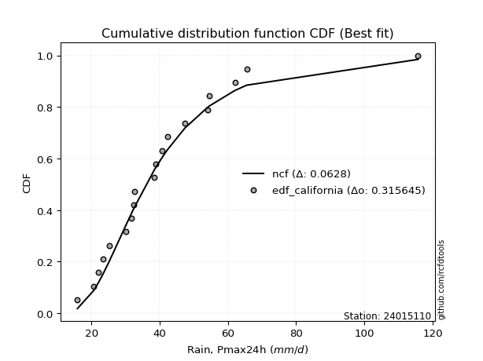</img>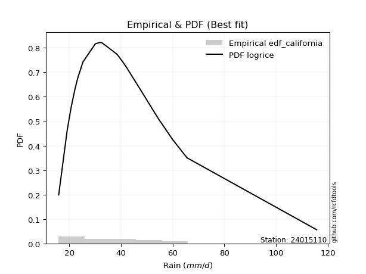</img>

</div>


### 2. EDF Hazen (1930)

Hazen method for plotting positions is a formula used to estimate the empirical cumulative probability distribution of flood events or other hydrological data. This formula often results in biased estimations, particularly when extrapolating to extreme events (high return periods).

<div align="center">


$P=(m-0.5)/n$


</div>


**2.1. Empirical values**

<div align="center">

|                | 0                  | 1                 | 2                  | 3                  | 4                  | 5                  | 6                  | 7         | 8                  | 9                  | 10                 | 11                | 12                 | 13                 | 14                 | 15                | 16                | 17        | 18                 | 19                 |
|:---------------|:-------------------|:------------------|:-------------------|:-------------------|:-------------------|:-------------------|:-------------------|:----------|:-------------------|:-------------------|:-------------------|:------------------|:-------------------|:-------------------|:-------------------|:------------------|:------------------|:----------|:-------------------|:-------------------|
| date           | 2020               | 2025              | 2022               | 2019               | 2008               | 2023               | 2015               | 2014      | 2018               | 2017               | 2007               | 2016              | 2005               | 2009               | 2021               | 2010              | 2006              | 2012      | 2011               | 2013               |
| x              | 15.9               | 19.2              | 20.7               | 22.1               | 23.3               | 25.3               | 30.1               | 31.8      | 32.5               | 32.6               | 38.4               | 38.9              | 40.8               | 42.2               | 47.4               | 54.1              | 54.6              | 59.9      | 65.5               | 115.7              |
| m              | 1                  | 2                 | 3                  | 4                  | 5                  | 6                  | 7                  | 8         | 9                  | 10                 | 11                 | 12                | 13                 | 14                 | 15                 | 16                | 17                | 18        | 19                 | 20                 |
| empirical_dist | edf_hazen          | edf_hazen         | edf_hazen          | edf_hazen          | edf_hazen          | edf_hazen          | edf_hazen          | edf_hazen | edf_hazen          | edf_hazen          | edf_hazen          | edf_hazen         | edf_hazen          | edf_hazen          | edf_hazen          | edf_hazen         | edf_hazen         | edf_hazen | edf_hazen          | edf_hazen          |
| empirical      | 0.025              | 0.075             | 0.125              | 0.175              | 0.225              | 0.275              | 0.325              | 0.375     | 0.425              | 0.475              | 0.525              | 0.575             | 0.625              | 0.675              | 0.725              | 0.775             | 0.825             | 0.875     | 0.925              | 0.975              |
| empirical_tr   | 1.0256410256410258 | 1.081081081081081 | 1.1428571428571428 | 1.2121212121212122 | 1.2903225806451613 | 1.3793103448275863 | 1.4814814814814814 | 1.6       | 1.7391304347826089 | 1.9047619047619047 | 2.1052631578947367 | 2.352941176470588 | 2.6666666666666665 | 3.0769230769230775 | 3.6363636363636362 | 4.444444444444445 | 5.714285714285713 | 8.0       | 13.333333333333341 | 39.999999999999964 |

</div>


**2.2. Kolmogorov-Smirnov fit test (sorted by Δ)**


<div align="center">

|                | 0                   | 1                   | 2                   | 3                   | 4                   | 5                    | 6                   | 7                   | 8                   | 9                    | 10                  | 11                  | 12                  | 13                   | 14                   | 15                  | 16                   | 17                  | 18                 | 19                  | 20                   | 21                  | 22                  | 23                  | 24                  | 25                  | 26                  | 27                  | 28                  | 29                  | 30                  | 31                  | 32                  | 33                  | 34                  | 35                  | 36                  | 37                  | 38                  | 39                  | 40                  | 41                  | 42                  | 43                  | 44                  | 45                  | 46                 | 47                  | 48                  | 49                  | 50                  | 51                  | 52                  | 53                 | 54                  | 55                  | 56                  | 57                  | 58                  | 59                  | 60                  | 61                  | 62                  | 63                  | 64                 | 65                  | 66                  | 67                  | 68                  | 69                  | 70                  | 71                  | 72                  | 73                  | 74                  | 75                  | 76                  | 77                  | 78                 | 79                  | 80                  | 81                  | 82                  | 83                  | 84                  | 85                  | 86                 | 87                  | 88                  | 89                  | 90                 | 91                 | 92                  | 93                  | 94                  | 95                  | 96                  | 97                  | 98                  | 99                  | 100                 | 101                | 102                 | 103                 | 104                | 105                 | 106                | 107                 | 108                | 109                 | 110                | 111                 | 112                 | 113                | 114                 | 115                 | 116                 | 117                | 118                 | 119                 | 120                 | 121                 | 122                | 123                 | 124                 | 125                 | 126                | 127                | 128                | 129                | 130                 | 131                | 132                 | 133                 | 134                 | 135                | 136                | 137                | 138                | 139                | 140                 | 141                | 142                | 143                | 144                 | 145                | 146                | 147                | 148                 | 149                | 150                | 151                | 152                 | 153                | 154                | 155                | 156                | 157                | 158                | 159                |
|:---------------|:--------------------|:--------------------|:--------------------|:--------------------|:--------------------|:---------------------|:--------------------|:--------------------|:--------------------|:---------------------|:--------------------|:--------------------|:--------------------|:---------------------|:---------------------|:--------------------|:---------------------|:--------------------|:-------------------|:--------------------|:---------------------|:--------------------|:--------------------|:--------------------|:--------------------|:--------------------|:--------------------|:--------------------|:--------------------|:--------------------|:--------------------|:--------------------|:--------------------|:--------------------|:--------------------|:--------------------|:--------------------|:--------------------|:--------------------|:--------------------|:--------------------|:--------------------|:--------------------|:--------------------|:--------------------|:--------------------|:-------------------|:--------------------|:--------------------|:--------------------|:--------------------|:--------------------|:--------------------|:-------------------|:--------------------|:--------------------|:--------------------|:--------------------|:--------------------|:--------------------|:--------------------|:--------------------|:--------------------|:--------------------|:-------------------|:--------------------|:--------------------|:--------------------|:--------------------|:--------------------|:--------------------|:--------------------|:--------------------|:--------------------|:--------------------|:--------------------|:--------------------|:--------------------|:-------------------|:--------------------|:--------------------|:--------------------|:--------------------|:--------------------|:--------------------|:--------------------|:-------------------|:--------------------|:--------------------|:--------------------|:-------------------|:-------------------|:--------------------|:--------------------|:--------------------|:--------------------|:--------------------|:--------------------|:--------------------|:--------------------|:--------------------|:-------------------|:--------------------|:--------------------|:-------------------|:--------------------|:-------------------|:--------------------|:-------------------|:--------------------|:-------------------|:--------------------|:--------------------|:-------------------|:--------------------|:--------------------|:--------------------|:-------------------|:--------------------|:--------------------|:--------------------|:--------------------|:-------------------|:--------------------|:--------------------|:--------------------|:-------------------|:-------------------|:-------------------|:-------------------|:--------------------|:-------------------|:--------------------|:--------------------|:--------------------|:-------------------|:-------------------|:-------------------|:-------------------|:-------------------|:--------------------|:-------------------|:-------------------|:-------------------|:--------------------|:-------------------|:-------------------|:-------------------|:--------------------|:-------------------|:-------------------|:-------------------|:--------------------|:-------------------|:-------------------|:-------------------|:-------------------|:-------------------|:-------------------|:-------------------|
| station        | 24015110            | 24015110            | 24015110            | 24015110            | 24015110            | 24015110             | 24015110            | 24015110            | 24015110            | 24015110             | 24015110            | 24015110            | 24015110            | 24015110             | 24015110             | 24015110            | 24015110             | 24015110            | 24015110           | 24015110            | 24015110             | 24015110            | 24015110            | 24015110            | 24015110            | 24015110            | 24015110            | 24015110            | 24015110            | 24015110            | 24015110            | 24015110            | 24015110            | 24015110            | 24015110            | 24015110            | 24015110            | 24015110            | 24015110            | 24015110            | 24015110            | 24015110            | 24015110            | 24015110            | 24015110            | 24015110            | 24015110           | 24015110            | 24015110            | 24015110            | 24015110            | 24015110            | 24015110            | 24015110           | 24015110            | 24015110            | 24015110            | 24015110            | 24015110            | 24015110            | 24015110            | 24015110            | 24015110            | 24015110            | 24015110           | 24015110            | 24015110            | 24015110            | 24015110            | 24015110            | 24015110            | 24015110            | 24015110            | 24015110            | 24015110            | 24015110            | 24015110            | 24015110            | 24015110           | 24015110            | 24015110            | 24015110            | 24015110            | 24015110            | 24015110            | 24015110            | 24015110           | 24015110            | 24015110            | 24015110            | 24015110           | 24015110           | 24015110            | 24015110            | 24015110            | 24015110            | 24015110            | 24015110            | 24015110            | 24015110            | 24015110            | 24015110           | 24015110            | 24015110            | 24015110           | 24015110            | 24015110           | 24015110            | 24015110           | 24015110            | 24015110           | 24015110            | 24015110            | 24015110           | 24015110            | 24015110            | 24015110            | 24015110           | 24015110            | 24015110            | 24015110            | 24015110            | 24015110           | 24015110            | 24015110            | 24015110            | 24015110           | 24015110           | 24015110           | 24015110           | 24015110            | 24015110           | 24015110            | 24015110            | 24015110            | 24015110           | 24015110           | 24015110           | 24015110           | 24015110           | 24015110            | 24015110           | 24015110           | 24015110           | 24015110            | 24015110           | 24015110           | 24015110           | 24015110            | 24015110           | 24015110           | 24015110           | 24015110            | 24015110           | 24015110           | 24015110           | 24015110           | 24015110           | 24015110           | 24015110           |
| empirical_dist | edf_hazen           | edf_hazen           | edf_hazen           | edf_hazen           | edf_hazen           | edf_hazen            | edf_hazen           | edf_hazen           | edf_hazen           | edf_hazen            | edf_hazen           | edf_hazen           | edf_hazen           | edf_hazen            | edf_hazen            | edf_hazen           | edf_hazen            | edf_hazen           | edf_hazen          | edf_hazen           | edf_hazen            | edf_hazen           | edf_hazen           | edf_hazen           | edf_hazen           | edf_hazen           | edf_hazen           | edf_hazen           | edf_hazen           | edf_hazen           | edf_hazen           | edf_hazen           | edf_hazen           | edf_hazen           | edf_hazen           | edf_hazen           | edf_hazen           | edf_hazen           | edf_hazen           | edf_hazen           | edf_hazen           | edf_hazen           | edf_hazen           | edf_hazen           | edf_hazen           | edf_hazen           | edf_hazen          | edf_hazen           | edf_hazen           | edf_hazen           | edf_hazen           | edf_hazen           | edf_hazen           | edf_hazen          | edf_hazen           | edf_hazen           | edf_hazen           | edf_hazen           | edf_hazen           | edf_hazen           | edf_hazen           | edf_hazen           | edf_hazen           | edf_hazen           | edf_hazen          | edf_hazen           | edf_hazen           | edf_hazen           | edf_hazen           | edf_hazen           | edf_hazen           | edf_hazen           | edf_hazen           | edf_hazen           | edf_hazen           | edf_hazen           | edf_hazen           | edf_hazen           | edf_hazen          | edf_hazen           | edf_hazen           | edf_hazen           | edf_hazen           | edf_hazen           | edf_hazen           | edf_hazen           | edf_hazen          | edf_hazen           | edf_hazen           | edf_hazen           | edf_hazen          | edf_hazen          | edf_hazen           | edf_hazen           | edf_hazen           | edf_hazen           | edf_hazen           | edf_hazen           | edf_hazen           | edf_hazen           | edf_hazen           | edf_hazen          | edf_hazen           | edf_hazen           | edf_hazen          | edf_hazen           | edf_hazen          | edf_hazen           | edf_hazen          | edf_hazen           | edf_hazen          | edf_hazen           | edf_hazen           | edf_hazen          | edf_hazen           | edf_hazen           | edf_hazen           | edf_hazen          | edf_hazen           | edf_hazen           | edf_hazen           | edf_hazen           | edf_hazen          | edf_hazen           | edf_hazen           | edf_hazen           | edf_hazen          | edf_hazen          | edf_hazen          | edf_hazen          | edf_hazen           | edf_hazen          | edf_hazen           | edf_hazen           | edf_hazen           | edf_hazen          | edf_hazen          | edf_hazen          | edf_hazen          | edf_hazen          | edf_hazen           | edf_hazen          | edf_hazen          | edf_hazen          | edf_hazen           | edf_hazen          | edf_hazen          | edf_hazen          | edf_hazen           | edf_hazen          | edf_hazen          | edf_hazen          | edf_hazen           | edf_hazen          | edf_hazen          | edf_hazen          | edf_hazen          | edf_hazen          | edf_hazen          | edf_hazen          |
| p_dist         | kappa3              | logbetaprime        | moyal               | burr12              | logdweibull         | ncf                  | logburr12           | logpearson3         | betaprime           | logdgamma            | logexponnorm        | logrice             | logmaxwell          | loggennorm           | lognorm              | logcrystalball      | logt                 | logloggamma         | logweibull_max     | loggenextreme       | loganglit            | logalpha            | genexpon            | loginvgamma         | logf                | alpha               | logskewnorm         | logjohnsonsu        | lognct              | logfatiguelife      | loginvgauss         | johnsonsu           | logweibull_min      | logvonmises_line    | nct                 | logburr             | invgamma            | logerlang           | loggamma            | loggamma            | invweibull          | genextreme          | f                   | invgauss            | logfoldnorm         | halflogistic        | logsemicircular    | fatiguelife         | lograyleigh         | mielke              | loglogistic         | logjohnsonsb        | johnsonsb           | logmielke          | gumbel_r            | loggenlogistic      | burr                | logncf              | logbeta             | lognakagami         | pearson3            | genlogistic         | exponpow            | logtriang           | beta               | loghypsecant        | logexponweib        | loginvweibull       | gompertz            | gausshyper          | erlang              | gamma               | genpareto           | exponnorm           | halfnorm            | loggenexpon         | logkstwobign        | tukeylambda         | logcosine          | loggumbel_r         | gennorm             | t                   | skewnorm            | rayleigh            | kstwobign           | genhalflogistic     | loghalfnorm        | loglaplace          | loglaplace          | dgamma              | dweibull           | gengamma           | logarcsine          | loghalfgennorm      | cosine              | maxwell             | logtruncweibull_min | logtruncpareto      | loggausshyper       | logtruncexpon       | loghalflogistic     | logmoyal           | loggumbel_l         | loggengamma         | exponweib          | loggompertz         | foldnorm           | rice                | logistic           | wald                | truncnorm          | crystalball         | norm                | hypsecant          | logbradford         | anglit              | lomax               | logloglaplace      | semicircular        | laplace             | arcsine             | weibull_min         | logexponpow        | loglomax            | loguniform          | logkappa4           | gumbel_l           | logtukeylambda     | halfgennorm        | logkappa3          | logwald             | logargus           | vonmises_line       | triang              | truncweibull_min    | truncexpon         | logksone           | logrdist           | logtruncnorm       | bradford           | nakagami            | powerlaw           | logwrapcauchy      | loggenpareto       | logpowerlaw         | loggenhalflogistic | argus              | kappa4             | wrapcauchy          | ksone              | uniform            | loglevy_l          | logtrapezoid        | levy_l             | rdist              | trapezoid          | weibull_max        | truncpareto        | logvonmises        | vonmises           |
| delta          | 0.04823826781337126 | 0.04836591277217597 | 0.04915445219318881 | 0.05317262299283654 | 0.05335483717433287 | 0.055223044951339006 | 0.05547150138532431 | 0.05557992869064754 | 0.05589379995248944 | 0.056321506211756245 | 0.05654060883249634 | 0.05815616010334884 | 0.05878154846649375 | 0.059223993877174363 | 0.059284506185995456 | 0.05928455165438451 | 0.059285188746715345 | 0.05975949103012573 | 0.0611608079063688 | 0.06116241837805403 | 0.061407288171339336 | 0.06178115748370172 | 0.06254348542040272 | 0.06285461457623776 | 0.06290945354575006 | 0.06319595156614322 | 0.06366718728916843 | 0.06375718435095556 | 0.06380470077081124 | 0.06476252064887877 | 0.06478505519084965 | 0.06561197895568871 | 0.06565160564978828 | 0.06577337036147224 | 0.06589128835200841 | 0.06608133551588768 | 0.06631741775750388 | 0.06677911168631223 | 0.06677947942643414 | 0.06677947942643414 | 0.06710128830364703 | 0.06710143767417964 | 0.06763511850696924 | 0.06772646795754428 | 0.06823741582174953 | 0.06854760834726509 | 0.0687972825077261 | 0.06994842990117373 | 0.07020351411350917 | 0.07040977033498785 | 0.07116701489068636 | 0.07121118714191649 | 0.07156288648787107 | 0.0738997508015431 | 0.07455246106281488 | 0.07468040426745803 | 0.07471613439693903 | 0.07653318662179265 | 0.07718189863823971 | 0.07786681436585069 | 0.07905011547648993 | 0.07974959393343095 | 0.08042332008579112 | 0.08070094840737796 | 0.0822677903901472 | 0.08520424459779319 | 0.08638572625343538 | 0.08639800261479835 | 0.08797150253009939 | 0.08904604311449849 | 0.09011728019533882 | 0.09011736888733823 | 0.09117637526295519 | 0.09308036933058778 | 0.09462272364848086 | 0.09596173630417543 | 0.09645923660993622 | 0.09683441288072317 | 0.098119872700826  | 0.09857268281623588 | 0.10036527271843912 | 0.10050000464894662 | 0.10143536690998523 | 0.10325291157492877 | 0.10373694351227225 | 0.10449265653727913 | 0.1045724645367006 | 0.10497550108544557 | 0.10497550108544557 | 0.10819095242545793 | 0.1093080808639316 | 0.10975952497413   | 0.11056151666835934 | 0.11217320113724422 | 0.11333034600472719 | 0.11355610253638304 | 0.11995828922049012 | 0.12003503318601344 | 0.12199640872929945 | 0.12303359061404429 | 0.12309003621496273 | 0.1232899649187097 | 0.12725635788361334 | 0.12815337994785025 | 0.1298010204079481 | 0.13237488579291828 | 0.1353205621301879 | 0.13770421989165438 | 0.1411207553152295 | 0.14473133152982517 | 0.1451753370839446 | 0.14517534822517153 | 0.14517534990237801 | 0.1463408551153787 | 0.14831363879708315 | 0.14943208470368696 | 0.14966948555008797 | 0.150797277760238  | 0.15118684678676342 | 0.17471640531198301 | 0.18495436835920875 | 0.18538813717502162 | 0.2013496280944666 | 0.21122227761722828 | 0.21167092649337627 | 0.21286501561430826 | 0.2140136789258572 | 0.2171675116438465 | 0.2193412913718386 | 0.2212929404022861 | 0.22438469804996217 | 0.2250765964963618 | 0.23415407020145934 | 0.24240955576056356 | 0.24378798931955592 | 0.2456272799951349 | 0.2472257720778135 | 0.2568739554561339 | 0.2646375511130488 | 0.2728017009956657 | 0.29942214015227436 | 0.3045365022771566 | 0.3427842985134877 | 0.3474847755014001 | 0.35435263908316605 | 0.367084350454158  | 0.3872603152687848 | 0.4119465412458617 | 0.42678424721626745 | 0.4275050100200401 | 0.4372244488977955 | 0.4451047465321979 | 0.46562209596448395 | 0.5087722588833848 | 0.5289378675927945 | 0.6774987349448396 | 0.7795946165761951 | 0.8326902310540928 | 1.0406363391078344 | 17.46682173103505  |
| deltao         | 0.3096406529800002  | 0.3096406529800002  | 0.3096406529800002  | 0.3096406529800002  | 0.3096406529800002  | 0.3096406529800002   | 0.3096406529800002  | 0.3096406529800002  | 0.3096406529800002  | 0.3096406529800002   | 0.3096406529800002  | 0.3096406529800002  | 0.3096406529800002  | 0.3096406529800002   | 0.3096406529800002   | 0.3096406529800002  | 0.3096406529800002   | 0.3096406529800002  | 0.3096406529800002 | 0.3096406529800002  | 0.3096406529800002   | 0.3096406529800002  | 0.3096406529800002  | 0.3096406529800002  | 0.3096406529800002  | 0.3096406529800002  | 0.3096406529800002  | 0.3096406529800002  | 0.3096406529800002  | 0.3096406529800002  | 0.3096406529800002  | 0.3096406529800002  | 0.3096406529800002  | 0.3096406529800002  | 0.3096406529800002  | 0.3096406529800002  | 0.3096406529800002  | 0.3096406529800002  | 0.3096406529800002  | 0.3096406529800002  | 0.3096406529800002  | 0.3096406529800002  | 0.3096406529800002  | 0.3096406529800002  | 0.3096406529800002  | 0.3096406529800002  | 0.3096406529800002 | 0.3096406529800002  | 0.3096406529800002  | 0.3096406529800002  | 0.3096406529800002  | 0.3096406529800002  | 0.3096406529800002  | 0.3096406529800002 | 0.3096406529800002  | 0.3096406529800002  | 0.3096406529800002  | 0.3096406529800002  | 0.3096406529800002  | 0.3096406529800002  | 0.3096406529800002  | 0.3096406529800002  | 0.3096406529800002  | 0.3096406529800002  | 0.3096406529800002 | 0.3096406529800002  | 0.3096406529800002  | 0.3096406529800002  | 0.3096406529800002  | 0.3096406529800002  | 0.3096406529800002  | 0.3096406529800002  | 0.3096406529800002  | 0.3096406529800002  | 0.3096406529800002  | 0.3096406529800002  | 0.3096406529800002  | 0.3096406529800002  | 0.3096406529800002 | 0.3096406529800002  | 0.3096406529800002  | 0.3096406529800002  | 0.3096406529800002  | 0.3096406529800002  | 0.3096406529800002  | 0.3096406529800002  | 0.3096406529800002 | 0.3096406529800002  | 0.3096406529800002  | 0.3096406529800002  | 0.3096406529800002 | 0.3096406529800002 | 0.3096406529800002  | 0.3096406529800002  | 0.3096406529800002  | 0.3096406529800002  | 0.3096406529800002  | 0.3096406529800002  | 0.3096406529800002  | 0.3096406529800002  | 0.3096406529800002  | 0.3096406529800002 | 0.3096406529800002  | 0.3096406529800002  | 0.3096406529800002 | 0.3096406529800002  | 0.3096406529800002 | 0.3096406529800002  | 0.3096406529800002 | 0.3096406529800002  | 0.3096406529800002 | 0.3096406529800002  | 0.3096406529800002  | 0.3096406529800002 | 0.3096406529800002  | 0.3096406529800002  | 0.3096406529800002  | 0.3096406529800002 | 0.3096406529800002  | 0.3096406529800002  | 0.3096406529800002  | 0.3096406529800002  | 0.3096406529800002 | 0.3096406529800002  | 0.3096406529800002  | 0.3096406529800002  | 0.3096406529800002 | 0.3096406529800002 | 0.3096406529800002 | 0.3096406529800002 | 0.3096406529800002  | 0.3096406529800002 | 0.3096406529800002  | 0.3096406529800002  | 0.3096406529800002  | 0.3096406529800002 | 0.3096406529800002 | 0.3096406529800002 | 0.3096406529800002 | 0.3096406529800002 | 0.3096406529800002  | 0.3096406529800002 | 0.3096406529800002 | 0.3096406529800002 | 0.3096406529800002  | 0.3096406529800002 | 0.3096406529800002 | 0.3096406529800002 | 0.3096406529800002  | 0.3096406529800002 | 0.3096406529800002 | 0.3096406529800002 | 0.3096406529800002  | 0.3096406529800002 | 0.3096406529800002 | 0.3096406529800002 | 0.3096406529800002 | 0.3096406529800002 | 0.3096406529800002 | 0.3096406529800002 |
| eval           | Δo > Δ              | Δo > Δ              | Δo > Δ              | Δo > Δ              | Δo > Δ              | Δo > Δ               | Δo > Δ              | Δo > Δ              | Δo > Δ              | Δo > Δ               | Δo > Δ              | Δo > Δ              | Δo > Δ              | Δo > Δ               | Δo > Δ               | Δo > Δ              | Δo > Δ               | Δo > Δ              | Δo > Δ             | Δo > Δ              | Δo > Δ               | Δo > Δ              | Δo > Δ              | Δo > Δ              | Δo > Δ              | Δo > Δ              | Δo > Δ              | Δo > Δ              | Δo > Δ              | Δo > Δ              | Δo > Δ              | Δo > Δ              | Δo > Δ              | Δo > Δ              | Δo > Δ              | Δo > Δ              | Δo > Δ              | Δo > Δ              | Δo > Δ              | Δo > Δ              | Δo > Δ              | Δo > Δ              | Δo > Δ              | Δo > Δ              | Δo > Δ              | Δo > Δ              | Δo > Δ             | Δo > Δ              | Δo > Δ              | Δo > Δ              | Δo > Δ              | Δo > Δ              | Δo > Δ              | Δo > Δ             | Δo > Δ              | Δo > Δ              | Δo > Δ              | Δo > Δ              | Δo > Δ              | Δo > Δ              | Δo > Δ              | Δo > Δ              | Δo > Δ              | Δo > Δ              | Δo > Δ             | Δo > Δ              | Δo > Δ              | Δo > Δ              | Δo > Δ              | Δo > Δ              | Δo > Δ              | Δo > Δ              | Δo > Δ              | Δo > Δ              | Δo > Δ              | Δo > Δ              | Δo > Δ              | Δo > Δ              | Δo > Δ             | Δo > Δ              | Δo > Δ              | Δo > Δ              | Δo > Δ              | Δo > Δ              | Δo > Δ              | Δo > Δ              | Δo > Δ             | Δo > Δ              | Δo > Δ              | Δo > Δ              | Δo > Δ             | Δo > Δ             | Δo > Δ              | Δo > Δ              | Δo > Δ              | Δo > Δ              | Δo > Δ              | Δo > Δ              | Δo > Δ              | Δo > Δ              | Δo > Δ              | Δo > Δ             | Δo > Δ              | Δo > Δ              | Δo > Δ             | Δo > Δ              | Δo > Δ             | Δo > Δ              | Δo > Δ             | Δo > Δ              | Δo > Δ             | Δo > Δ              | Δo > Δ              | Δo > Δ             | Δo > Δ              | Δo > Δ              | Δo > Δ              | Δo > Δ             | Δo > Δ              | Δo > Δ              | Δo > Δ              | Δo > Δ              | Δo > Δ             | Δo > Δ              | Δo > Δ              | Δo > Δ              | Δo > Δ             | Δo > Δ             | Δo > Δ             | Δo > Δ             | Δo > Δ              | Δo > Δ             | Δo > Δ              | Δo > Δ              | Δo > Δ              | Δo > Δ             | Δo > Δ             | Δo > Δ             | Δo > Δ             | Δo > Δ             | Δo > Δ              | Δo > Δ             | Δo <= Δ            | Δo <= Δ            | Δo <= Δ             | Δo <= Δ            | Δo <= Δ            | Δo <= Δ            | Δo <= Δ             | Δo <= Δ            | Δo <= Δ            | Δo <= Δ            | Δo <= Δ             | Δo <= Δ            | Δo <= Δ            | Δo <= Δ            | Δo <= Δ            | Δo <= Δ            | Δo <= Δ            | Δo <= Δ            |
| fit            | 1                   | 1                   | 1                   | 1                   | 1                   | 1                    | 1                   | 1                   | 1                   | 1                    | 1                   | 1                   | 1                   | 1                    | 1                    | 1                   | 1                    | 1                   | 1                  | 1                   | 1                    | 1                   | 1                   | 1                   | 1                   | 1                   | 1                   | 1                   | 1                   | 1                   | 1                   | 1                   | 1                   | 1                   | 1                   | 1                   | 1                   | 1                   | 1                   | 1                   | 1                   | 1                   | 1                   | 1                   | 1                   | 1                   | 1                  | 1                   | 1                   | 1                   | 1                   | 1                   | 1                   | 1                  | 1                   | 1                   | 1                   | 1                   | 1                   | 1                   | 1                   | 1                   | 1                   | 1                   | 1                  | 1                   | 1                   | 1                   | 1                   | 1                   | 1                   | 1                   | 1                   | 1                   | 1                   | 1                   | 1                   | 1                   | 1                  | 1                   | 1                   | 1                   | 1                   | 1                   | 1                   | 1                   | 1                  | 1                   | 1                   | 1                   | 1                  | 1                  | 1                   | 1                   | 1                   | 1                   | 1                   | 1                   | 1                   | 1                   | 1                   | 1                  | 1                   | 1                   | 1                  | 1                   | 1                  | 1                   | 1                  | 1                   | 1                  | 1                   | 1                   | 1                  | 1                   | 1                   | 1                   | 1                  | 1                   | 1                   | 1                   | 1                   | 1                  | 1                   | 1                   | 1                   | 1                  | 1                  | 1                  | 1                  | 1                   | 1                  | 1                   | 1                   | 1                   | 1                  | 1                  | 1                  | 1                  | 1                  | 1                   | 1                  | 0                  | 0                  | 0                   | 0                  | 0                  | 0                  | 0                   | 0                  | 0                  | 0                  | 0                   | 0                  | 0                  | 0                  | 0                  | 0                  | 0                  | 0                  |
| n              | 20                  | 20                  | 20                  | 20                  | 20                  | 20                   | 20                  | 20                  | 20                  | 20                   | 20                  | 20                  | 20                  | 20                   | 20                   | 20                  | 20                   | 20                  | 20                 | 20                  | 20                   | 20                  | 20                  | 20                  | 20                  | 20                  | 20                  | 20                  | 20                  | 20                  | 20                  | 20                  | 20                  | 20                  | 20                  | 20                  | 20                  | 20                  | 20                  | 20                  | 20                  | 20                  | 20                  | 20                  | 20                  | 20                  | 20                 | 20                  | 20                  | 20                  | 20                  | 20                  | 20                  | 20                 | 20                  | 20                  | 20                  | 20                  | 20                  | 20                  | 20                  | 20                  | 20                  | 20                  | 20                 | 20                  | 20                  | 20                  | 20                  | 20                  | 20                  | 20                  | 20                  | 20                  | 20                  | 20                  | 20                  | 20                  | 20                 | 20                  | 20                  | 20                  | 20                  | 20                  | 20                  | 20                  | 20                 | 20                  | 20                  | 20                  | 20                 | 20                 | 20                  | 20                  | 20                  | 20                  | 20                  | 20                  | 20                  | 20                  | 20                  | 20                 | 20                  | 20                  | 20                 | 20                  | 20                 | 20                  | 20                 | 20                  | 20                 | 20                  | 20                  | 20                 | 20                  | 20                  | 20                  | 20                 | 20                  | 20                  | 20                  | 20                  | 20                 | 20                  | 20                  | 20                  | 20                 | 20                 | 20                 | 20                 | 20                  | 20                 | 20                  | 20                  | 20                  | 20                 | 20                 | 20                 | 20                 | 20                 | 20                  | 20                 | 20                 | 20                 | 20                  | 20                 | 20                 | 20                 | 20                  | 20                 | 20                 | 20                 | 20                  | 20                 | 20                 | 20                 | 20                 | 20                 | 20                 | 20                 |
| best_fit       | 1                   | 0                   | 0                   | 0                   | 0                   | 0                    | 0                   | 0                   | 0                   | 0                    | 0                   | 0                   | 0                   | 0                    | 0                    | 0                   | 0                    | 0                   | 0                  | 0                   | 0                    | 0                   | 0                   | 0                   | 0                   | 0                   | 0                   | 0                   | 0                   | 0                   | 0                   | 0                   | 0                   | 0                   | 0                   | 0                   | 0                   | 0                   | 0                   | 0                   | 0                   | 0                   | 0                   | 0                   | 0                   | 0                   | 0                  | 0                   | 0                   | 0                   | 0                   | 0                   | 0                   | 0                  | 0                   | 0                   | 0                   | 0                   | 0                   | 0                   | 0                   | 0                   | 0                   | 0                   | 0                  | 0                   | 0                   | 0                   | 0                   | 0                   | 0                   | 0                   | 0                   | 0                   | 0                   | 0                   | 0                   | 0                   | 0                  | 0                   | 0                   | 0                   | 0                   | 0                   | 0                   | 0                   | 0                  | 0                   | 0                   | 0                   | 0                  | 0                  | 0                   | 0                   | 0                   | 0                   | 0                   | 0                   | 0                   | 0                   | 0                   | 0                  | 0                   | 0                   | 0                  | 0                   | 0                  | 0                   | 0                  | 0                   | 0                  | 0                   | 0                   | 0                  | 0                   | 0                   | 0                   | 0                  | 0                   | 0                   | 0                   | 0                   | 0                  | 0                   | 0                   | 0                   | 0                  | 0                  | 0                  | 0                  | 0                   | 0                  | 0                   | 0                   | 0                   | 0                  | 0                  | 0                  | 0                  | 0                  | 0                   | 0                  | 0                  | 0                  | 0                   | 0                  | 0                  | 0                  | 0                   | 0                  | 0                  | 0                  | 0                   | 0                  | 0                  | 0                  | 0                  | 0                  | 0                  | 0                  |
| best_fit_sort  | 1                   | 2                   | 3                   | 4                   | 5                   | 6                    | 7                   | 8                   | 9                   | 10                   | 11                  | 12                  | 13                  | 14                   | 15                   | 16                  | 17                   | 18                  | 19                 | 20                  | 21                   | 22                  | 23                  | 24                  | 25                  | 26                  | 27                  | 28                  | 29                  | 30                  | 31                  | 32                  | 33                  | 34                  | 35                  | 36                  | 37                  | 38                  | 39                  | 40                  | 41                  | 42                  | 43                  | 44                  | 45                  | 46                  | 47                 | 48                  | 49                  | 50                  | 51                  | 52                  | 53                  | 54                 | 55                  | 56                  | 57                  | 58                  | 59                  | 60                  | 61                  | 62                  | 63                  | 64                  | 65                 | 66                  | 67                  | 68                  | 69                  | 70                  | 71                  | 72                  | 73                  | 74                  | 75                  | 76                  | 77                  | 78                  | 79                 | 80                  | 81                  | 82                  | 83                  | 84                  | 85                  | 86                  | 87                 | 88                  | 89                  | 90                  | 91                 | 92                 | 93                  | 94                  | 95                  | 96                  | 97                  | 98                  | 99                  | 100                 | 101                 | 102                | 103                 | 104                 | 105                | 106                 | 107                | 108                 | 109                | 110                 | 111                | 112                 | 113                 | 114                | 115                 | 116                 | 117                 | 118                | 119                 | 120                 | 121                 | 122                 | 123                | 124                 | 125                 | 126                 | 127                | 128                | 129                | 130                | 131                 | 132                | 133                 | 134                 | 135                 | 136                | 137                | 138                | 139                | 140                | 141                 | 142                | 143                | 144                | 145                 | 146                | 147                | 148                | 149                 | 150                | 151                | 152                | 153                 | 154                | 155                | 156                | 157                | 158                | 159                | 160                |

</div>


**2.3. Best fit**

<div align="center">

|   id |   station | empirical_dist   | p_dist   |     delta |   deltao | eval   |   fit |   n |   best_fit |   best_fit_sort |
|-----:|----------:|:-----------------|:---------|----------:|---------:|:-------|------:|----:|-----------:|----------------:|
|    0 |  24015110 | edf_hazen        | kappa3   | 0.0482383 | 0.309641 | Δo > Δ |     1 |  20 |          1 |               1 |

</div>


<div align="center">

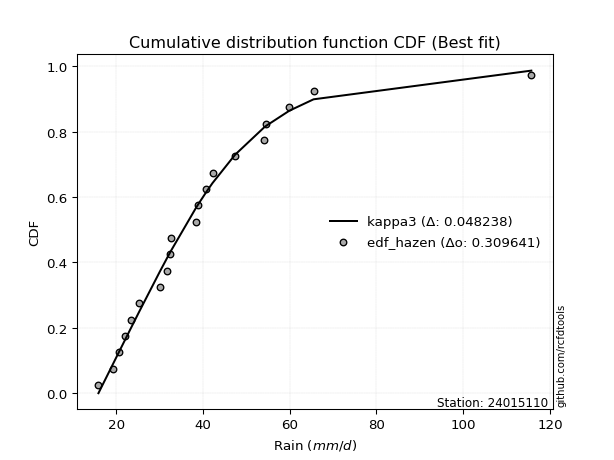</img>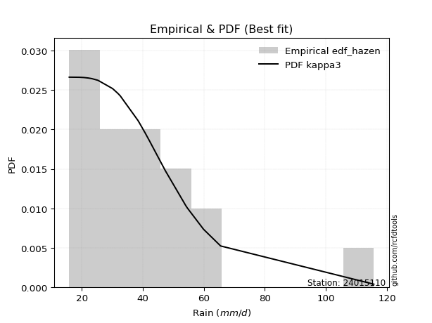</img>

</div>


### 3. EDF Weibull (1939)

Weibull plotting position formula is an empirical method used to estimate the non-exceedance probability or plotting position for a set of observed data, is often recommended or widely used in practice, particularly in flood frequency analysis.

<div align="center">


$P=m/(n+1)$


</div>


**3.1. Empirical values**

<div align="center">

|                | 0                    | 1                   | 2                   | 3                   | 4                   | 5                  | 6                  | 7                   | 8                   | 9                   | 10                 | 11                 | 12                 | 13                 | 14                 | 15                 | 16                 | 17                 | 18                 | 19                 |
|:---------------|:---------------------|:--------------------|:--------------------|:--------------------|:--------------------|:-------------------|:-------------------|:--------------------|:--------------------|:--------------------|:-------------------|:-------------------|:-------------------|:-------------------|:-------------------|:-------------------|:-------------------|:-------------------|:-------------------|:-------------------|
| date           | 2020                 | 2025                | 2022                | 2019                | 2008                | 2023               | 2015               | 2014                | 2018                | 2017                | 2007               | 2016               | 2005               | 2009               | 2021               | 2010               | 2006               | 2012               | 2011               | 2013               |
| x              | 15.9                 | 19.2                | 20.7                | 22.1                | 23.3                | 25.3               | 30.1               | 31.8                | 32.5                | 32.6                | 38.4               | 38.9               | 40.8               | 42.2               | 47.4               | 54.1               | 54.6               | 59.9               | 65.5               | 115.7              |
| m              | 1                    | 2                   | 3                   | 4                   | 5                   | 6                  | 7                  | 8                   | 9                   | 10                  | 11                 | 12                 | 13                 | 14                 | 15                 | 16                 | 17                 | 18                 | 19                 | 20                 |
| empirical_dist | edf_weibull          | edf_weibull         | edf_weibull         | edf_weibull         | edf_weibull         | edf_weibull        | edf_weibull        | edf_weibull         | edf_weibull         | edf_weibull         | edf_weibull        | edf_weibull        | edf_weibull        | edf_weibull        | edf_weibull        | edf_weibull        | edf_weibull        | edf_weibull        | edf_weibull        | edf_weibull        |
| empirical      | 0.047619047619047616 | 0.09523809523809523 | 0.14285714285714285 | 0.19047619047619047 | 0.23809523809523808 | 0.2857142857142857 | 0.3333333333333333 | 0.38095238095238093 | 0.42857142857142855 | 0.47619047619047616 | 0.5238095238095238 | 0.5714285714285714 | 0.6190476190476191 | 0.6666666666666666 | 0.7142857142857143 | 0.7619047619047619 | 0.8095238095238095 | 0.8571428571428571 | 0.9047619047619048 | 0.9523809523809523 |
| empirical_tr   | 1.05                 | 1.1052631578947367  | 1.1666666666666665  | 1.2352941176470589  | 1.3125              | 1.4                | 1.4999999999999998 | 1.6153846153846154  | 1.75                | 1.909090909090909   | 2.1                | 2.333333333333333  | 2.625              | 2.9999999999999996 | 3.5                | 4.199999999999999  | 5.25               | 6.999999999999997  | 10.5               | 20.999999999999975 |

</div>


**3.2. Kolmogorov-Smirnov fit test (sorted by Δ)**


<div align="center">

|                | 0                   | 1                   | 2                   | 3                   | 4                   | 5                   | 6                   | 7                   | 8                   | 9                    | 10                  | 11                   | 12                  | 13                   | 14                 | 15                  | 16                  | 17                  | 18                  | 19                  | 20                  | 21                   | 22                 | 23                  | 24                  | 25                  | 26                  | 27                 | 28                  | 29                  | 30                  | 31                  | 32                  | 33                  | 34                  | 35                  | 36                  | 37                  | 38                  | 39                 | 40                 | 41                  | 42                  | 43                  | 44                  | 45                  | 46                  | 47                  | 48                  | 49                  | 50                 | 51                  | 52                  | 53                  | 54                  | 55                  | 56                 | 57                  | 58                 | 59                  | 60                  | 61                  | 62                  | 63                  | 64                 | 65                  | 66                  | 67                  | 68                  | 69                  | 70                  | 71                  | 72                  | 73                 | 74                  | 75                  | 76                  | 77                  | 78                  | 79                  | 80                  | 81                  | 82                  | 83                  | 84                  | 85                 | 86                  | 87                  | 88                  | 89                  | 90                  | 91                  | 92                  | 93                  | 94                  | 95                  | 96                  | 97                  | 98                  | 99                  | 100                 | 101                 | 102                | 103                 | 104                 | 105                 | 106                 | 107                | 108                 | 109                 | 110                 | 111                | 112                | 113                 | 114                 | 115                | 116                 | 117                 | 118                 | 119                 | 120                | 121                | 122                | 123                 | 124                | 125                 | 126                | 127                 | 128                | 129                | 130                | 131                 | 132                | 133                 | 134                | 135                 | 136                 | 137                 | 138                | 139                | 140                 | 141                | 142                | 143                | 144                | 145                 | 146                | 147                | 148                | 149                | 150                 | 151                | 152                 | 153                 | 154                | 155                | 156                | 157                | 158                | 159                |
|:---------------|:--------------------|:--------------------|:--------------------|:--------------------|:--------------------|:--------------------|:--------------------|:--------------------|:--------------------|:---------------------|:--------------------|:---------------------|:--------------------|:---------------------|:-------------------|:--------------------|:--------------------|:--------------------|:--------------------|:--------------------|:--------------------|:---------------------|:-------------------|:--------------------|:--------------------|:--------------------|:--------------------|:-------------------|:--------------------|:--------------------|:--------------------|:--------------------|:--------------------|:--------------------|:--------------------|:--------------------|:--------------------|:--------------------|:--------------------|:-------------------|:-------------------|:--------------------|:--------------------|:--------------------|:--------------------|:--------------------|:--------------------|:--------------------|:--------------------|:--------------------|:-------------------|:--------------------|:--------------------|:--------------------|:--------------------|:--------------------|:-------------------|:--------------------|:-------------------|:--------------------|:--------------------|:--------------------|:--------------------|:--------------------|:-------------------|:--------------------|:--------------------|:--------------------|:--------------------|:--------------------|:--------------------|:--------------------|:--------------------|:-------------------|:--------------------|:--------------------|:--------------------|:--------------------|:--------------------|:--------------------|:--------------------|:--------------------|:--------------------|:--------------------|:--------------------|:-------------------|:--------------------|:--------------------|:--------------------|:--------------------|:--------------------|:--------------------|:--------------------|:--------------------|:--------------------|:--------------------|:--------------------|:--------------------|:--------------------|:--------------------|:--------------------|:--------------------|:-------------------|:--------------------|:--------------------|:--------------------|:--------------------|:-------------------|:--------------------|:--------------------|:--------------------|:-------------------|:-------------------|:--------------------|:--------------------|:-------------------|:--------------------|:--------------------|:--------------------|:--------------------|:-------------------|:-------------------|:-------------------|:--------------------|:-------------------|:--------------------|:-------------------|:--------------------|:-------------------|:-------------------|:-------------------|:--------------------|:-------------------|:--------------------|:-------------------|:--------------------|:--------------------|:--------------------|:-------------------|:-------------------|:--------------------|:-------------------|:-------------------|:-------------------|:-------------------|:--------------------|:-------------------|:-------------------|:-------------------|:-------------------|:--------------------|:-------------------|:--------------------|:--------------------|:-------------------|:-------------------|:-------------------|:-------------------|:-------------------|:-------------------|
| station        | 24015110            | 24015110            | 24015110            | 24015110            | 24015110            | 24015110            | 24015110            | 24015110            | 24015110            | 24015110             | 24015110            | 24015110             | 24015110            | 24015110             | 24015110           | 24015110            | 24015110            | 24015110            | 24015110            | 24015110            | 24015110            | 24015110             | 24015110           | 24015110            | 24015110            | 24015110            | 24015110            | 24015110           | 24015110            | 24015110            | 24015110            | 24015110            | 24015110            | 24015110            | 24015110            | 24015110            | 24015110            | 24015110            | 24015110            | 24015110           | 24015110           | 24015110            | 24015110            | 24015110            | 24015110            | 24015110            | 24015110            | 24015110            | 24015110            | 24015110            | 24015110           | 24015110            | 24015110            | 24015110            | 24015110            | 24015110            | 24015110           | 24015110            | 24015110           | 24015110            | 24015110            | 24015110            | 24015110            | 24015110            | 24015110           | 24015110            | 24015110            | 24015110            | 24015110            | 24015110            | 24015110            | 24015110            | 24015110            | 24015110           | 24015110            | 24015110            | 24015110            | 24015110            | 24015110            | 24015110            | 24015110            | 24015110            | 24015110            | 24015110            | 24015110            | 24015110           | 24015110            | 24015110            | 24015110            | 24015110            | 24015110            | 24015110            | 24015110            | 24015110            | 24015110            | 24015110            | 24015110            | 24015110            | 24015110            | 24015110            | 24015110            | 24015110            | 24015110           | 24015110            | 24015110            | 24015110            | 24015110            | 24015110           | 24015110            | 24015110            | 24015110            | 24015110           | 24015110           | 24015110            | 24015110            | 24015110           | 24015110            | 24015110            | 24015110            | 24015110            | 24015110           | 24015110           | 24015110           | 24015110            | 24015110           | 24015110            | 24015110           | 24015110            | 24015110           | 24015110           | 24015110           | 24015110            | 24015110           | 24015110            | 24015110           | 24015110            | 24015110            | 24015110            | 24015110           | 24015110           | 24015110            | 24015110           | 24015110           | 24015110           | 24015110           | 24015110            | 24015110           | 24015110           | 24015110           | 24015110           | 24015110            | 24015110           | 24015110            | 24015110            | 24015110           | 24015110           | 24015110           | 24015110           | 24015110           | 24015110           |
| empirical_dist | edf_weibull         | edf_weibull         | edf_weibull         | edf_weibull         | edf_weibull         | edf_weibull         | edf_weibull         | edf_weibull         | edf_weibull         | edf_weibull          | edf_weibull         | edf_weibull          | edf_weibull         | edf_weibull          | edf_weibull        | edf_weibull         | edf_weibull         | edf_weibull         | edf_weibull         | edf_weibull         | edf_weibull         | edf_weibull          | edf_weibull        | edf_weibull         | edf_weibull         | edf_weibull         | edf_weibull         | edf_weibull        | edf_weibull         | edf_weibull         | edf_weibull         | edf_weibull         | edf_weibull         | edf_weibull         | edf_weibull         | edf_weibull         | edf_weibull         | edf_weibull         | edf_weibull         | edf_weibull        | edf_weibull        | edf_weibull         | edf_weibull         | edf_weibull         | edf_weibull         | edf_weibull         | edf_weibull         | edf_weibull         | edf_weibull         | edf_weibull         | edf_weibull        | edf_weibull         | edf_weibull         | edf_weibull         | edf_weibull         | edf_weibull         | edf_weibull        | edf_weibull         | edf_weibull        | edf_weibull         | edf_weibull         | edf_weibull         | edf_weibull         | edf_weibull         | edf_weibull        | edf_weibull         | edf_weibull         | edf_weibull         | edf_weibull         | edf_weibull         | edf_weibull         | edf_weibull         | edf_weibull         | edf_weibull        | edf_weibull         | edf_weibull         | edf_weibull         | edf_weibull         | edf_weibull         | edf_weibull         | edf_weibull         | edf_weibull         | edf_weibull         | edf_weibull         | edf_weibull         | edf_weibull        | edf_weibull         | edf_weibull         | edf_weibull         | edf_weibull         | edf_weibull         | edf_weibull         | edf_weibull         | edf_weibull         | edf_weibull         | edf_weibull         | edf_weibull         | edf_weibull         | edf_weibull         | edf_weibull         | edf_weibull         | edf_weibull         | edf_weibull        | edf_weibull         | edf_weibull         | edf_weibull         | edf_weibull         | edf_weibull        | edf_weibull         | edf_weibull         | edf_weibull         | edf_weibull        | edf_weibull        | edf_weibull         | edf_weibull         | edf_weibull        | edf_weibull         | edf_weibull         | edf_weibull         | edf_weibull         | edf_weibull        | edf_weibull        | edf_weibull        | edf_weibull         | edf_weibull        | edf_weibull         | edf_weibull        | edf_weibull         | edf_weibull        | edf_weibull        | edf_weibull        | edf_weibull         | edf_weibull        | edf_weibull         | edf_weibull        | edf_weibull         | edf_weibull         | edf_weibull         | edf_weibull        | edf_weibull        | edf_weibull         | edf_weibull        | edf_weibull        | edf_weibull        | edf_weibull        | edf_weibull         | edf_weibull        | edf_weibull        | edf_weibull        | edf_weibull        | edf_weibull         | edf_weibull        | edf_weibull         | edf_weibull         | edf_weibull        | edf_weibull        | edf_weibull        | edf_weibull        | edf_weibull        | edf_weibull        |
| p_dist         | moyal               | kappa3              | burr12              | loganglit           | genexpon            | logrice             | logncf              | logdweibull         | logfoldnorm         | logmaxwell           | logpearson3         | halflogistic         | loggennorm          | logsemicircular      | lognorm            | logcrystalball      | logt                | logloggamma         | logbetaprime        | fatiguelife         | logweibull_max      | loggenextreme        | betaprime          | ncf                 | logjohnsonsb        | logalpha            | johnsonsb           | logweibull_min     | loginvgamma         | logf                | invgauss            | logskewnorm         | logjohnsonsu        | lognct              | logdgamma           | logfatiguelife      | loginvgauss         | gumbel_r            | logexponnorm        | johnsonsu          | nct                | invgamma            | logerlang           | loggamma            | loggamma            | invweibull          | genextreme          | alpha               | logburr12           | f                   | logbeta            | logvonmises_line    | lograyleigh         | pearson3            | logburr             | mielke              | exponpow           | lognakagami         | beta               | halfnorm            | logmielke           | loggenlogistic      | burr                | logexponweib        | logtriang          | gompertz            | gausshyper          | genlogistic         | erlang              | gamma               | loglogistic         | genpareto           | exponnorm           | dgamma             | dweibull            | loginvweibull       | loggenexpon         | logkstwobign        | logcosine           | skewnorm            | rayleigh            | logarcsine          | loghypsecant        | t                   | loghalfnorm         | genhalflogistic    | gennorm             | loggumbel_r         | gengamma            | logtruncweibull_min | logtruncexpon       | loghalfgennorm      | tukeylambda         | kstwobign           | maxwell             | logtruncpareto      | loglaplace          | loglaplace          | loggausshyper       | foldnorm            | cosine              | loggengamma         | exponweib          | loggompertz         | logmoyal            | logbradford         | loggumbel_l         | lomax              | logistic            | truncnorm           | crystalball         | norm               | loghalflogistic    | rice                | anglit              | semicircular       | hypsecant           | logloglaplace       | wald                | arcsine             | laplace            | weibull_min        | loguniform         | logkappa4           | logexponpow        | logtukeylambda      | logkappa3          | loglomax            | gumbel_l           | halfgennorm        | logargus           | truncweibull_min    | truncexpon         | vonmises_line       | logksone           | triang              | logrdist            | logwald             | logtruncnorm       | bradford           | nakagami            | powerlaw           | logwrapcauchy      | loggenpareto       | logpowerlaw        | loggenhalflogistic  | argus              | kappa4             | wrapcauchy         | ksone              | uniform             | loglevy_l          | logtrapezoid        | levy_l              | rdist              | trapezoid          | weibull_max        | truncpareto        | logvonmises        | vonmises           |
| delta          | 0.04712430772155296 | 0.05141846609049794 | 0.05144038573619181 | 0.05307395483800592 | 0.05421015208706942 | 0.05625849041574282 | 0.05629509138369737 | 0.05794277924454189 | 0.05990408248841622 | 0.059972024656969936 | 0.06001397708814446 | 0.060214275013931784 | 0.06041447006765055 | 0.060463949174392684 | 0.0608884283304425 | 0.06088859644006528 | 0.06088870977445271 | 0.06094996722060192 | 0.06146115086741405 | 0.06230860274403549 | 0.06235128409684498 | 0.062352894568530215 | 0.062533138066624  | 0.06286490357248392 | 0.06287785380858318 | 0.06297163367417791 | 0.06322955315453777 | 0.0638518541311679 | 0.06404509076671394 | 0.06409992973622625 | 0.06442573179169864 | 0.06485766347964461 | 0.06494766054143175 | 0.06499517696128743 | 0.06537642270564933 | 0.06595299683935496 | 0.06597553138132584 | 0.06621912772948146 | 0.06668601135031532 | 0.0668024551461649 | 0.0670817645424846 | 0.06750789394798007 | 0.06796958787678842 | 0.06796995561691033 | 0.06796995561691033 | 0.06829176449412322 | 0.06829191386465583 | 0.06846679094209587 | 0.06856673948056238 | 0.06882559469744542 | 0.0688485653049064 | 0.06955450840479702 | 0.06962941920163235 | 0.07071678214315663 | 0.07137050500830855 | 0.07160024652546404 | 0.0720899867524577 | 0.07246389183911017 | 0.0739344570568139 | 0.07438462841038562 | 0.07509022699201928 | 0.07587088045793422 | 0.07590661058741521 | 0.07805239292010208 | 0.0789635195428349 | 0.07963816919676608 | 0.08071270978116518 | 0.08094007012390714 | 0.08178394686200552 | 0.08178403555400493 | 0.08188130060497203 | 0.08284304192962189 | 0.08474703599725447 | 0.0855719048064103 | 0.08668903324488397 | 0.08758847880527454 | 0.08762840297084212 | 0.08936693160472908 | 0.08978653936749259 | 0.09310203357665181 | 0.09491957824159536 | 0.09508532619216892 | 0.09591853031207886 | 0.09625847024853296 | 0.09688123174705876 | 0.0971351341822056 | 0.09935155503437298 | 0.09976315900671207 | 0.10142619164079669 | 0.10175436139412875 | 0.10279549537594901 | 0.10383986780391091 | 0.10401213947252064 | 0.10492741970274844 | 0.10522276920304963 | 0.11170169985268014 | 0.11289180392091255 | 0.11289180392091255 | 0.11366307539596615 | 0.11508246689209267 | 0.11732825711087236 | 0.11982004661451695 | 0.1214676870746148 | 0.12404155245958498 | 0.12448044110918588 | 0.12807554355898787 | 0.12844683407408952 | 0.1294313903119927 | 0.13408994124844587 | 0.13684200375061117 | 0.13684201489183812 | 0.1368420165690446 | 0.1381730545168448 | 0.13889469608213056 | 0.14109875137035355 | 0.14285351345343   | 0.14753133130585488 | 0.15198775395071418 | 0.15782656962506325 | 0.16471627312111353 | 0.1759068815024592 | 0.1770548038416883 | 0.191432831255281  | 0.19262692037621298 | 0.1930162947611333 | 0.19692941640575123 | 0.2010548451641908 | 0.20288894428389498 | 0.2056803455925238 | 0.2110079580385053 | 0.2167432631630284 | 0.22429442003922273 | 0.2257237084400774 | 0.22582073686812593 | 0.2269876768397182 | 0.23407622242723014 | 0.23663586021803862 | 0.23747993614520024 | 0.2563042177797155 | 0.2573255105194753 | 0.27918404491417914 | 0.2842984070390614 | 0.3225462032753924 | 0.3248657278823525 | 0.3364954962260232 | 0.34846006707681154 | 0.3717841247925944 | 0.3964703507696713 | 0.4065461519781722 | 0.4072669147819448 | 0.42174825842160507 | 0.4224856989131503 | 0.44790347979596995 | 0.48615321126433725 | 0.506318819973747  | 0.6572606397067443 | 0.7593565213380999 | 0.8124521358159975 | 1.0537315772030726 | 17.4894407786541   |
| deltao         | 0.3096406529800002  | 0.3096406529800002  | 0.3096406529800002  | 0.3096406529800002  | 0.3096406529800002  | 0.3096406529800002  | 0.3096406529800002  | 0.3096406529800002  | 0.3096406529800002  | 0.3096406529800002   | 0.3096406529800002  | 0.3096406529800002   | 0.3096406529800002  | 0.3096406529800002   | 0.3096406529800002 | 0.3096406529800002  | 0.3096406529800002  | 0.3096406529800002  | 0.3096406529800002  | 0.3096406529800002  | 0.3096406529800002  | 0.3096406529800002   | 0.3096406529800002 | 0.3096406529800002  | 0.3096406529800002  | 0.3096406529800002  | 0.3096406529800002  | 0.3096406529800002 | 0.3096406529800002  | 0.3096406529800002  | 0.3096406529800002  | 0.3096406529800002  | 0.3096406529800002  | 0.3096406529800002  | 0.3096406529800002  | 0.3096406529800002  | 0.3096406529800002  | 0.3096406529800002  | 0.3096406529800002  | 0.3096406529800002 | 0.3096406529800002 | 0.3096406529800002  | 0.3096406529800002  | 0.3096406529800002  | 0.3096406529800002  | 0.3096406529800002  | 0.3096406529800002  | 0.3096406529800002  | 0.3096406529800002  | 0.3096406529800002  | 0.3096406529800002 | 0.3096406529800002  | 0.3096406529800002  | 0.3096406529800002  | 0.3096406529800002  | 0.3096406529800002  | 0.3096406529800002 | 0.3096406529800002  | 0.3096406529800002 | 0.3096406529800002  | 0.3096406529800002  | 0.3096406529800002  | 0.3096406529800002  | 0.3096406529800002  | 0.3096406529800002 | 0.3096406529800002  | 0.3096406529800002  | 0.3096406529800002  | 0.3096406529800002  | 0.3096406529800002  | 0.3096406529800002  | 0.3096406529800002  | 0.3096406529800002  | 0.3096406529800002 | 0.3096406529800002  | 0.3096406529800002  | 0.3096406529800002  | 0.3096406529800002  | 0.3096406529800002  | 0.3096406529800002  | 0.3096406529800002  | 0.3096406529800002  | 0.3096406529800002  | 0.3096406529800002  | 0.3096406529800002  | 0.3096406529800002 | 0.3096406529800002  | 0.3096406529800002  | 0.3096406529800002  | 0.3096406529800002  | 0.3096406529800002  | 0.3096406529800002  | 0.3096406529800002  | 0.3096406529800002  | 0.3096406529800002  | 0.3096406529800002  | 0.3096406529800002  | 0.3096406529800002  | 0.3096406529800002  | 0.3096406529800002  | 0.3096406529800002  | 0.3096406529800002  | 0.3096406529800002 | 0.3096406529800002  | 0.3096406529800002  | 0.3096406529800002  | 0.3096406529800002  | 0.3096406529800002 | 0.3096406529800002  | 0.3096406529800002  | 0.3096406529800002  | 0.3096406529800002 | 0.3096406529800002 | 0.3096406529800002  | 0.3096406529800002  | 0.3096406529800002 | 0.3096406529800002  | 0.3096406529800002  | 0.3096406529800002  | 0.3096406529800002  | 0.3096406529800002 | 0.3096406529800002 | 0.3096406529800002 | 0.3096406529800002  | 0.3096406529800002 | 0.3096406529800002  | 0.3096406529800002 | 0.3096406529800002  | 0.3096406529800002 | 0.3096406529800002 | 0.3096406529800002 | 0.3096406529800002  | 0.3096406529800002 | 0.3096406529800002  | 0.3096406529800002 | 0.3096406529800002  | 0.3096406529800002  | 0.3096406529800002  | 0.3096406529800002 | 0.3096406529800002 | 0.3096406529800002  | 0.3096406529800002 | 0.3096406529800002 | 0.3096406529800002 | 0.3096406529800002 | 0.3096406529800002  | 0.3096406529800002 | 0.3096406529800002 | 0.3096406529800002 | 0.3096406529800002 | 0.3096406529800002  | 0.3096406529800002 | 0.3096406529800002  | 0.3096406529800002  | 0.3096406529800002 | 0.3096406529800002 | 0.3096406529800002 | 0.3096406529800002 | 0.3096406529800002 | 0.3096406529800002 |
| eval           | Δo > Δ              | Δo > Δ              | Δo > Δ              | Δo > Δ              | Δo > Δ              | Δo > Δ              | Δo > Δ              | Δo > Δ              | Δo > Δ              | Δo > Δ               | Δo > Δ              | Δo > Δ               | Δo > Δ              | Δo > Δ               | Δo > Δ             | Δo > Δ              | Δo > Δ              | Δo > Δ              | Δo > Δ              | Δo > Δ              | Δo > Δ              | Δo > Δ               | Δo > Δ             | Δo > Δ              | Δo > Δ              | Δo > Δ              | Δo > Δ              | Δo > Δ             | Δo > Δ              | Δo > Δ              | Δo > Δ              | Δo > Δ              | Δo > Δ              | Δo > Δ              | Δo > Δ              | Δo > Δ              | Δo > Δ              | Δo > Δ              | Δo > Δ              | Δo > Δ             | Δo > Δ             | Δo > Δ              | Δo > Δ              | Δo > Δ              | Δo > Δ              | Δo > Δ              | Δo > Δ              | Δo > Δ              | Δo > Δ              | Δo > Δ              | Δo > Δ             | Δo > Δ              | Δo > Δ              | Δo > Δ              | Δo > Δ              | Δo > Δ              | Δo > Δ             | Δo > Δ              | Δo > Δ             | Δo > Δ              | Δo > Δ              | Δo > Δ              | Δo > Δ              | Δo > Δ              | Δo > Δ             | Δo > Δ              | Δo > Δ              | Δo > Δ              | Δo > Δ              | Δo > Δ              | Δo > Δ              | Δo > Δ              | Δo > Δ              | Δo > Δ             | Δo > Δ              | Δo > Δ              | Δo > Δ              | Δo > Δ              | Δo > Δ              | Δo > Δ              | Δo > Δ              | Δo > Δ              | Δo > Δ              | Δo > Δ              | Δo > Δ              | Δo > Δ             | Δo > Δ              | Δo > Δ              | Δo > Δ              | Δo > Δ              | Δo > Δ              | Δo > Δ              | Δo > Δ              | Δo > Δ              | Δo > Δ              | Δo > Δ              | Δo > Δ              | Δo > Δ              | Δo > Δ              | Δo > Δ              | Δo > Δ              | Δo > Δ              | Δo > Δ             | Δo > Δ              | Δo > Δ              | Δo > Δ              | Δo > Δ              | Δo > Δ             | Δo > Δ              | Δo > Δ              | Δo > Δ              | Δo > Δ             | Δo > Δ             | Δo > Δ              | Δo > Δ              | Δo > Δ             | Δo > Δ              | Δo > Δ              | Δo > Δ              | Δo > Δ              | Δo > Δ             | Δo > Δ             | Δo > Δ             | Δo > Δ              | Δo > Δ             | Δo > Δ              | Δo > Δ             | Δo > Δ              | Δo > Δ             | Δo > Δ             | Δo > Δ             | Δo > Δ              | Δo > Δ             | Δo > Δ              | Δo > Δ             | Δo > Δ              | Δo > Δ              | Δo > Δ              | Δo > Δ             | Δo > Δ             | Δo > Δ              | Δo > Δ             | Δo <= Δ            | Δo <= Δ            | Δo <= Δ            | Δo <= Δ             | Δo <= Δ            | Δo <= Δ            | Δo <= Δ            | Δo <= Δ            | Δo <= Δ             | Δo <= Δ            | Δo <= Δ             | Δo <= Δ             | Δo <= Δ            | Δo <= Δ            | Δo <= Δ            | Δo <= Δ            | Δo <= Δ            | Δo <= Δ            |
| fit            | 1                   | 1                   | 1                   | 1                   | 1                   | 1                   | 1                   | 1                   | 1                   | 1                    | 1                   | 1                    | 1                   | 1                    | 1                  | 1                   | 1                   | 1                   | 1                   | 1                   | 1                   | 1                    | 1                  | 1                   | 1                   | 1                   | 1                   | 1                  | 1                   | 1                   | 1                   | 1                   | 1                   | 1                   | 1                   | 1                   | 1                   | 1                   | 1                   | 1                  | 1                  | 1                   | 1                   | 1                   | 1                   | 1                   | 1                   | 1                   | 1                   | 1                   | 1                  | 1                   | 1                   | 1                   | 1                   | 1                   | 1                  | 1                   | 1                  | 1                   | 1                   | 1                   | 1                   | 1                   | 1                  | 1                   | 1                   | 1                   | 1                   | 1                   | 1                   | 1                   | 1                   | 1                  | 1                   | 1                   | 1                   | 1                   | 1                   | 1                   | 1                   | 1                   | 1                   | 1                   | 1                   | 1                  | 1                   | 1                   | 1                   | 1                   | 1                   | 1                   | 1                   | 1                   | 1                   | 1                   | 1                   | 1                   | 1                   | 1                   | 1                   | 1                   | 1                  | 1                   | 1                   | 1                   | 1                   | 1                  | 1                   | 1                   | 1                   | 1                  | 1                  | 1                   | 1                   | 1                  | 1                   | 1                   | 1                   | 1                   | 1                  | 1                  | 1                  | 1                   | 1                  | 1                   | 1                  | 1                   | 1                  | 1                  | 1                  | 1                   | 1                  | 1                   | 1                  | 1                   | 1                   | 1                   | 1                  | 1                  | 1                   | 1                  | 0                  | 0                  | 0                  | 0                   | 0                  | 0                  | 0                  | 0                  | 0                   | 0                  | 0                   | 0                   | 0                  | 0                  | 0                  | 0                  | 0                  | 0                  |
| n              | 20                  | 20                  | 20                  | 20                  | 20                  | 20                  | 20                  | 20                  | 20                  | 20                   | 20                  | 20                   | 20                  | 20                   | 20                 | 20                  | 20                  | 20                  | 20                  | 20                  | 20                  | 20                   | 20                 | 20                  | 20                  | 20                  | 20                  | 20                 | 20                  | 20                  | 20                  | 20                  | 20                  | 20                  | 20                  | 20                  | 20                  | 20                  | 20                  | 20                 | 20                 | 20                  | 20                  | 20                  | 20                  | 20                  | 20                  | 20                  | 20                  | 20                  | 20                 | 20                  | 20                  | 20                  | 20                  | 20                  | 20                 | 20                  | 20                 | 20                  | 20                  | 20                  | 20                  | 20                  | 20                 | 20                  | 20                  | 20                  | 20                  | 20                  | 20                  | 20                  | 20                  | 20                 | 20                  | 20                  | 20                  | 20                  | 20                  | 20                  | 20                  | 20                  | 20                  | 20                  | 20                  | 20                 | 20                  | 20                  | 20                  | 20                  | 20                  | 20                  | 20                  | 20                  | 20                  | 20                  | 20                  | 20                  | 20                  | 20                  | 20                  | 20                  | 20                 | 20                  | 20                  | 20                  | 20                  | 20                 | 20                  | 20                  | 20                  | 20                 | 20                 | 20                  | 20                  | 20                 | 20                  | 20                  | 20                  | 20                  | 20                 | 20                 | 20                 | 20                  | 20                 | 20                  | 20                 | 20                  | 20                 | 20                 | 20                 | 20                  | 20                 | 20                  | 20                 | 20                  | 20                  | 20                  | 20                 | 20                 | 20                  | 20                 | 20                 | 20                 | 20                 | 20                  | 20                 | 20                 | 20                 | 20                 | 20                  | 20                 | 20                  | 20                  | 20                 | 20                 | 20                 | 20                 | 20                 | 20                 |
| best_fit       | 1                   | 0                   | 0                   | 0                   | 0                   | 0                   | 0                   | 0                   | 0                   | 0                    | 0                   | 0                    | 0                   | 0                    | 0                  | 0                   | 0                   | 0                   | 0                   | 0                   | 0                   | 0                    | 0                  | 0                   | 0                   | 0                   | 0                   | 0                  | 0                   | 0                   | 0                   | 0                   | 0                   | 0                   | 0                   | 0                   | 0                   | 0                   | 0                   | 0                  | 0                  | 0                   | 0                   | 0                   | 0                   | 0                   | 0                   | 0                   | 0                   | 0                   | 0                  | 0                   | 0                   | 0                   | 0                   | 0                   | 0                  | 0                   | 0                  | 0                   | 0                   | 0                   | 0                   | 0                   | 0                  | 0                   | 0                   | 0                   | 0                   | 0                   | 0                   | 0                   | 0                   | 0                  | 0                   | 0                   | 0                   | 0                   | 0                   | 0                   | 0                   | 0                   | 0                   | 0                   | 0                   | 0                  | 0                   | 0                   | 0                   | 0                   | 0                   | 0                   | 0                   | 0                   | 0                   | 0                   | 0                   | 0                   | 0                   | 0                   | 0                   | 0                   | 0                  | 0                   | 0                   | 0                   | 0                   | 0                  | 0                   | 0                   | 0                   | 0                  | 0                  | 0                   | 0                   | 0                  | 0                   | 0                   | 0                   | 0                   | 0                  | 0                  | 0                  | 0                   | 0                  | 0                   | 0                  | 0                   | 0                  | 0                  | 0                  | 0                   | 0                  | 0                   | 0                  | 0                   | 0                   | 0                   | 0                  | 0                  | 0                   | 0                  | 0                  | 0                  | 0                  | 0                   | 0                  | 0                  | 0                  | 0                  | 0                   | 0                  | 0                   | 0                   | 0                  | 0                  | 0                  | 0                  | 0                  | 0                  |
| best_fit_sort  | 1                   | 2                   | 3                   | 4                   | 5                   | 6                   | 7                   | 8                   | 9                   | 10                   | 11                  | 12                   | 13                  | 14                   | 15                 | 16                  | 17                  | 18                  | 19                  | 20                  | 21                  | 22                   | 23                 | 24                  | 25                  | 26                  | 27                  | 28                 | 29                  | 30                  | 31                  | 32                  | 33                  | 34                  | 35                  | 36                  | 37                  | 38                  | 39                  | 40                 | 41                 | 42                  | 43                  | 44                  | 45                  | 46                  | 47                  | 48                  | 49                  | 50                  | 51                 | 52                  | 53                  | 54                  | 55                  | 56                  | 57                 | 58                  | 59                 | 60                  | 61                  | 62                  | 63                  | 64                  | 65                 | 66                  | 67                  | 68                  | 69                  | 70                  | 71                  | 72                  | 73                  | 74                 | 75                  | 76                  | 77                  | 78                  | 79                  | 80                  | 81                  | 82                  | 83                  | 84                  | 85                  | 86                 | 87                  | 88                  | 89                  | 90                  | 91                  | 92                  | 93                  | 94                  | 95                  | 96                  | 97                  | 98                  | 99                  | 100                 | 101                 | 102                 | 103                | 104                 | 105                 | 106                 | 107                 | 108                | 109                 | 110                 | 111                 | 112                | 113                | 114                 | 115                 | 116                | 117                 | 118                 | 119                 | 120                 | 121                | 122                | 123                | 124                 | 125                | 126                 | 127                | 128                 | 129                | 130                | 131                | 132                 | 133                | 134                 | 135                | 136                 | 137                 | 138                 | 139                | 140                | 141                 | 142                | 143                | 144                | 145                | 146                 | 147                | 148                | 149                | 150                | 151                 | 152                | 153                 | 154                 | 155                | 156                | 157                | 158                | 159                | 160                |

</div>


**3.3. Best fit**

<div align="center">

|   id |   station | empirical_dist   | p_dist   |     delta |   deltao | eval   |   fit |   n |   best_fit |   best_fit_sort |
|-----:|----------:|:-----------------|:---------|----------:|---------:|:-------|------:|----:|-----------:|----------------:|
|    0 |  24015110 | edf_weibull      | moyal    | 0.0471243 | 0.309641 | Δo > Δ |     1 |  20 |          1 |               1 |

</div>


<div align="center">

</img>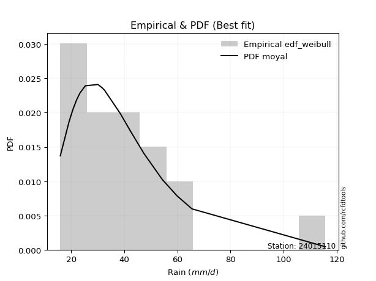</img>

</div>


### 4. EDF Beard (1943)

The Beard formula (or Beard´s plotting position formula) in hydrology is used to estimate the empirical non-exceedance probability _(P)_ of a flood event (or other extreme hydrological data point) within a given dataset.

<div align="center">


$P=(m-0.31)/(n+0.38)$


</div>


**4.1. Empirical values**

<div align="center">

|                | 0                    | 1                   | 2                   | 3                   | 4                   | 5                   | 6                   | 7                  | 8                  | 9                   | 10                 | 11                 | 12                 | 13                 | 14                 | 15                 | 16                 | 17                 | 18                 | 19                 |
|:---------------|:---------------------|:--------------------|:--------------------|:--------------------|:--------------------|:--------------------|:--------------------|:-------------------|:-------------------|:--------------------|:-------------------|:-------------------|:-------------------|:-------------------|:-------------------|:-------------------|:-------------------|:-------------------|:-------------------|:-------------------|
| date           | 2020                 | 2025                | 2022                | 2019                | 2008                | 2023                | 2015                | 2014               | 2018               | 2017                | 2007               | 2016               | 2005               | 2009               | 2021               | 2010               | 2006               | 2012               | 2011               | 2013               |
| x              | 15.9                 | 19.2                | 20.7                | 22.1                | 23.3                | 25.3                | 30.1                | 31.8               | 32.5               | 32.6                | 38.4               | 38.9               | 40.8               | 42.2               | 47.4               | 54.1               | 54.6               | 59.9               | 65.5               | 115.7              |
| m              | 1                    | 2                   | 3                   | 4                   | 5                   | 6                   | 7                   | 8                  | 9                  | 10                  | 11                 | 12                 | 13                 | 14                 | 15                 | 16                 | 17                 | 18                 | 19                 | 20                 |
| empirical_dist | edf_beard            | edf_beard           | edf_beard           | edf_beard           | edf_beard           | edf_beard           | edf_beard           | edf_beard          | edf_beard          | edf_beard           | edf_beard          | edf_beard          | edf_beard          | edf_beard          | edf_beard          | edf_beard          | edf_beard          | edf_beard          | edf_beard          | edf_beard          |
| empirical      | 0.033856722276741906 | 0.08292443572129539 | 0.13199214916584887 | 0.18105986261040236 | 0.23012757605495587 | 0.27919528949950934 | 0.32826300294406285 | 0.3773307163886163 | 0.4263984298331698 | 0.47546614327772324 | 0.5245338567222767 | 0.5736015701668302 | 0.6226692836113837 | 0.6717369970559373 | 0.7208047105004907 | 0.7698724239450442 | 0.8189401373895977 | 0.8680078508341512 | 0.9170755642787047 | 0.9661432777232583 |
| empirical_tr   | 1.0350431691213813   | 1.090422685928304   | 1.152063312605992   | 1.2210904733373276  | 1.2989165073295095  | 1.3873383253914227  | 1.4886778670562455  | 1.6059889676910957 | 1.7433704020530367 | 1.9064546304957901  | 2.1031991744066048 | 2.3452243958573074 | 2.6501950585175553 | 3.0463378176382667 | 3.581722319859402  | 4.345415778251599  | 5.523035230352305  | 7.576208178438667  | 12.059171597633155 | 29.536231884058108 |

</div>


**4.2. Kolmogorov-Smirnov fit test (sorted by Δ)**


<div align="center">

|                | 0                   | 1                   | 2                    | 3                   | 4                   | 5                    | 6                    | 7                   | 8                   | 9                    | 10                  | 11                  | 12                  | 13                  | 14                  | 15                  | 16                  | 17                  | 18                   | 19                   | 20                   | 21                  | 22                  | 23                  | 24                  | 25                  | 26                  | 27                  | 28                  | 29                  | 30                  | 31                  | 32                  | 33                  | 34                  | 35                  | 36                  | 37                 | 38                  | 39                 | 40                  | 41                 | 42                  | 43                  | 44                  | 45                  | 46                  | 47                  | 48                  | 49                  | 50                  | 51                  | 52                  | 53                  | 54                  | 55                  | 56                  | 57                  | 58                  | 59                  | 60                  | 61                  | 62                  | 63                  | 64                  | 65                  | 66                  | 67                  | 68                  | 69                  | 70                  | 71                  | 72                  | 73                 | 74                  | 75                 | 76                  | 77                  | 78                  | 79                  | 80                  | 81                  | 82                 | 83                  | 84                  | 85                  | 86                  | 87                  | 88                  | 89                  | 90                  | 91                  | 92                  | 93                  | 94                  | 95                  | 96                  | 97                  | 98                 | 99                  | 100                 | 101                 | 102                 | 103                 | 104                 | 105                | 106                 | 107                | 108                 | 109                 | 110                 | 111                | 112                 | 113                 | 114                 | 115                 | 116                 | 117                 | 118                | 119                 | 120                | 121                 | 122                 | 123                 | 124                 | 125                 | 126                | 127                 | 128                 | 129                 | 130                 | 131                 | 132                 | 133                | 134                | 135                 | 136                 | 137                | 138                | 139                 | 140                | 141                 | 142                | 143                | 144                 | 145                 | 146                 | 147                 | 148                 | 149                | 150                 | 151                | 152                | 153                 | 154                | 155                | 156                | 157                | 158                | 159                |
|:---------------|:--------------------|:--------------------|:---------------------|:--------------------|:--------------------|:---------------------|:---------------------|:--------------------|:--------------------|:---------------------|:--------------------|:--------------------|:--------------------|:--------------------|:--------------------|:--------------------|:--------------------|:--------------------|:---------------------|:---------------------|:---------------------|:--------------------|:--------------------|:--------------------|:--------------------|:--------------------|:--------------------|:--------------------|:--------------------|:--------------------|:--------------------|:--------------------|:--------------------|:--------------------|:--------------------|:--------------------|:--------------------|:-------------------|:--------------------|:-------------------|:--------------------|:-------------------|:--------------------|:--------------------|:--------------------|:--------------------|:--------------------|:--------------------|:--------------------|:--------------------|:--------------------|:--------------------|:--------------------|:--------------------|:--------------------|:--------------------|:--------------------|:--------------------|:--------------------|:--------------------|:--------------------|:--------------------|:--------------------|:--------------------|:--------------------|:--------------------|:--------------------|:--------------------|:--------------------|:--------------------|:--------------------|:--------------------|:--------------------|:-------------------|:--------------------|:-------------------|:--------------------|:--------------------|:--------------------|:--------------------|:--------------------|:--------------------|:-------------------|:--------------------|:--------------------|:--------------------|:--------------------|:--------------------|:--------------------|:--------------------|:--------------------|:--------------------|:--------------------|:--------------------|:--------------------|:--------------------|:--------------------|:--------------------|:-------------------|:--------------------|:--------------------|:--------------------|:--------------------|:--------------------|:--------------------|:-------------------|:--------------------|:-------------------|:--------------------|:--------------------|:--------------------|:-------------------|:--------------------|:--------------------|:--------------------|:--------------------|:--------------------|:--------------------|:-------------------|:--------------------|:-------------------|:--------------------|:--------------------|:--------------------|:--------------------|:--------------------|:-------------------|:--------------------|:--------------------|:--------------------|:--------------------|:--------------------|:--------------------|:-------------------|:-------------------|:--------------------|:--------------------|:-------------------|:-------------------|:--------------------|:-------------------|:--------------------|:-------------------|:-------------------|:--------------------|:--------------------|:--------------------|:--------------------|:--------------------|:-------------------|:--------------------|:-------------------|:-------------------|:--------------------|:-------------------|:-------------------|:-------------------|:-------------------|:-------------------|:-------------------|
| station        | 24015110            | 24015110            | 24015110             | 24015110            | 24015110            | 24015110             | 24015110             | 24015110            | 24015110            | 24015110             | 24015110            | 24015110            | 24015110            | 24015110            | 24015110            | 24015110            | 24015110            | 24015110            | 24015110             | 24015110             | 24015110             | 24015110            | 24015110            | 24015110            | 24015110            | 24015110            | 24015110            | 24015110            | 24015110            | 24015110            | 24015110            | 24015110            | 24015110            | 24015110            | 24015110            | 24015110            | 24015110            | 24015110           | 24015110            | 24015110           | 24015110            | 24015110           | 24015110            | 24015110            | 24015110            | 24015110            | 24015110            | 24015110            | 24015110            | 24015110            | 24015110            | 24015110            | 24015110            | 24015110            | 24015110            | 24015110            | 24015110            | 24015110            | 24015110            | 24015110            | 24015110            | 24015110            | 24015110            | 24015110            | 24015110            | 24015110            | 24015110            | 24015110            | 24015110            | 24015110            | 24015110            | 24015110            | 24015110            | 24015110           | 24015110            | 24015110           | 24015110            | 24015110            | 24015110            | 24015110            | 24015110            | 24015110            | 24015110           | 24015110            | 24015110            | 24015110            | 24015110            | 24015110            | 24015110            | 24015110            | 24015110            | 24015110            | 24015110            | 24015110            | 24015110            | 24015110            | 24015110            | 24015110            | 24015110           | 24015110            | 24015110            | 24015110            | 24015110            | 24015110            | 24015110            | 24015110           | 24015110            | 24015110           | 24015110            | 24015110            | 24015110            | 24015110           | 24015110            | 24015110            | 24015110            | 24015110            | 24015110            | 24015110            | 24015110           | 24015110            | 24015110           | 24015110            | 24015110            | 24015110            | 24015110            | 24015110            | 24015110           | 24015110            | 24015110            | 24015110            | 24015110            | 24015110            | 24015110            | 24015110           | 24015110           | 24015110            | 24015110            | 24015110           | 24015110           | 24015110            | 24015110           | 24015110            | 24015110           | 24015110           | 24015110            | 24015110            | 24015110            | 24015110            | 24015110            | 24015110           | 24015110            | 24015110           | 24015110           | 24015110            | 24015110           | 24015110           | 24015110           | 24015110           | 24015110           | 24015110           |
| empirical_dist | edf_beard           | edf_beard           | edf_beard            | edf_beard           | edf_beard           | edf_beard            | edf_beard            | edf_beard           | edf_beard           | edf_beard            | edf_beard           | edf_beard           | edf_beard           | edf_beard           | edf_beard           | edf_beard           | edf_beard           | edf_beard           | edf_beard            | edf_beard            | edf_beard            | edf_beard           | edf_beard           | edf_beard           | edf_beard           | edf_beard           | edf_beard           | edf_beard           | edf_beard           | edf_beard           | edf_beard           | edf_beard           | edf_beard           | edf_beard           | edf_beard           | edf_beard           | edf_beard           | edf_beard          | edf_beard           | edf_beard          | edf_beard           | edf_beard          | edf_beard           | edf_beard           | edf_beard           | edf_beard           | edf_beard           | edf_beard           | edf_beard           | edf_beard           | edf_beard           | edf_beard           | edf_beard           | edf_beard           | edf_beard           | edf_beard           | edf_beard           | edf_beard           | edf_beard           | edf_beard           | edf_beard           | edf_beard           | edf_beard           | edf_beard           | edf_beard           | edf_beard           | edf_beard           | edf_beard           | edf_beard           | edf_beard           | edf_beard           | edf_beard           | edf_beard           | edf_beard          | edf_beard           | edf_beard          | edf_beard           | edf_beard           | edf_beard           | edf_beard           | edf_beard           | edf_beard           | edf_beard          | edf_beard           | edf_beard           | edf_beard           | edf_beard           | edf_beard           | edf_beard           | edf_beard           | edf_beard           | edf_beard           | edf_beard           | edf_beard           | edf_beard           | edf_beard           | edf_beard           | edf_beard           | edf_beard          | edf_beard           | edf_beard           | edf_beard           | edf_beard           | edf_beard           | edf_beard           | edf_beard          | edf_beard           | edf_beard          | edf_beard           | edf_beard           | edf_beard           | edf_beard          | edf_beard           | edf_beard           | edf_beard           | edf_beard           | edf_beard           | edf_beard           | edf_beard          | edf_beard           | edf_beard          | edf_beard           | edf_beard           | edf_beard           | edf_beard           | edf_beard           | edf_beard          | edf_beard           | edf_beard           | edf_beard           | edf_beard           | edf_beard           | edf_beard           | edf_beard          | edf_beard          | edf_beard           | edf_beard           | edf_beard          | edf_beard          | edf_beard           | edf_beard          | edf_beard           | edf_beard          | edf_beard          | edf_beard           | edf_beard           | edf_beard           | edf_beard           | edf_beard           | edf_beard          | edf_beard           | edf_beard          | edf_beard          | edf_beard           | edf_beard          | edf_beard          | edf_beard          | edf_beard          | edf_beard          | edf_beard          |
| p_dist         | kappa3              | moyal               | burr12               | logdweibull         | logbetaprime        | logrice              | ncf                  | logpearson3         | betaprime           | logdgamma            | loganglit           | logexponnorm        | logmaxwell          | genexpon            | loggennorm          | lognorm             | logcrystalball      | logt                | logloggamma          | logburr12            | logweibull_max       | loggenextreme       | logalpha            | logweibull_min      | loginvgamma         | logf                | alpha               | logskewnorm         | logjohnsonsu        | lognct              | invgauss            | logfoldnorm         | logfatiguelife      | loginvgauss         | halflogistic        | logsemicircular     | johnsonsu           | logvonmises_line   | nct                 | logburr            | fatiguelife         | invgamma           | logerlang           | loggamma            | loggamma            | invweibull          | genextreme          | logjohnsonsb        | f                   | johnsonsb           | logncf              | lograyleigh         | mielke              | gumbel_r            | logbeta             | logmielke           | lognakagami         | loggenlogistic      | burr                | logtriang           | loglogistic         | pearson3            | exponpow            | beta                | genlogistic         | logexponweib        | gompertz            | gausshyper          | halfnorm            | erlang              | gamma               | loginvweibull       | genpareto           | loghypsecant       | exponnorm           | t                  | loggenexpon         | logkstwobign        | logcosine           | tukeylambda         | skewnorm            | gennorm             | loggumbel_r        | dgamma              | rayleigh            | dweibull            | genhalflogistic     | loghalfnorm         | kstwobign           | logarcsine          | loglaplace          | loglaplace          | gengamma            | loghalfgennorm      | maxwell             | logtruncweibull_min | cosine              | logtruncexpon       | logtruncpareto     | loggausshyper       | logmoyal            | loggengamma         | exponweib           | loghalflogistic     | foldnorm            | loggumbel_l        | loggompertz         | logistic           | rice                | logbradford         | lomax               | truncnorm          | crystalball         | norm                | anglit              | hypsecant           | semicircular        | wald                | logloglaplace      | laplace             | arcsine            | weibull_min         | logexponpow         | loguniform          | logkappa4           | loglomax            | logtukeylambda     | gumbel_l            | logkappa3           | halfgennorm         | logargus            | logwald             | vonmises_line       | truncweibull_min   | truncexpon         | triang              | logksone            | logrdist           | logtruncnorm       | bradford            | nakagami           | powerlaw            | logwrapcauchy      | loggenpareto       | logpowerlaw         | loggenhalflogistic  | argus               | kappa4              | wrapcauchy          | ksone              | uniform             | loglevy_l          | logtrapezoid       | levy_l              | rdist              | trapezoid          | weibull_max        | truncpareto        | logvonmises        | vonmises           |
| delta          | 0.04497526486930842 | 0.04639997480880004 | 0.049909620048773695 | 0.05009183423027003 | 0.05349348882713184 | 0.055534157502989956 | 0.055689188229062325 | 0.05604607196837086 | 0.05635994323021276 | 0.057408760665367126 | 0.05814428522727655 | 0.05871834931003311 | 0.05924769174421707 | 0.05928048247633988 | 0.05969013715489763 | 0.05975064946371872 | 0.05975069493210777 | 0.05975133202443861 | 0.060225634307848996 | 0.060599077440280175 | 0.061626951184092116 | 0.06162856165577735 | 0.06224730076142504 | 0.06312752121841503 | 0.06332075785396107 | 0.06337559682347338 | 0.06366209484386653 | 0.06413333056689174 | 0.06422332762867888 | 0.06427084404853456 | 0.06446346501348144 | 0.06497441287768668 | 0.06522866392660209 | 0.06525119846857297 | 0.06528460540320224 | 0.06553427956366331 | 0.06607812223341203 | 0.0662395136391955 | 0.06635743162973173 | 0.066547478793611  | 0.06668542695711088 | 0.0667835610352272 | 0.06724525496403555 | 0.06724562270415746 | 0.06724562270415746 | 0.06756743158137035 | 0.06756758095190296 | 0.06794818419785364 | 0.06810126178469256 | 0.06829988354380823 | 0.06860875090049734 | 0.06890508628887948 | 0.07087591361271117 | 0.07128945811875209 | 0.07391889569417687 | 0.07436589407926641 | 0.07460381142178785 | 0.07514654754518135 | 0.07518227767466235 | 0.07529523781447434 | 0.07536230439019567 | 0.07578711253242709 | 0.07716031714172833 | 0.07900478744608436 | 0.08021573721115421 | 0.08312272330937254 | 0.08470849958603655 | 0.08578304017043564 | 0.08669828792718547 | 0.08685427725127598 | 0.08685436594327539 | 0.08686414589252167 | 0.08791337231889235 | 0.0893995340973025 | 0.08981736638652493 | 0.0916432823722047 | 0.09269873336011258 | 0.09319623366587337 | 0.09485686975676322 | 0.09604447743223832 | 0.09817236396592244 | 0.09862722212162006 | 0.0990388260939592 | 0.09933423014871601 | 0.09998990863086599 | 0.10045135858718968 | 0.10122965359321634 | 0.10130946159263776 | 0.10420308678999551 | 0.10450165405795708 | 0.10637280770613619 | 0.10637280770613619 | 0.10649652203006715 | 0.10891019819318137 | 0.11029309959232025 | 0.11203385349919481 | 0.11379648928245045 | 0.11510915489274898 | 0.1167720302419506 | 0.11873340578523661 | 0.12375610819643301 | 0.12489037700378741 | 0.12653801746388527 | 0.12730806082555082 | 0.12739612640889253 | 0.1277225011613366 | 0.12911188284885544 | 0.1378577523711667 | 0.13817036316937764 | 0.14038920307578784 | 0.14174504982879266 | 0.1419123341398818 | 0.14191234528110874 | 0.14191234695831523 | 0.14616908175962418 | 0.14680699839310196 | 0.14792384384270063 | 0.14985890758478104 | 0.1512634210379613 | 0.17518254858970628 | 0.1770299326379134 | 0.18212513423095877 | 0.19808662515040376 | 0.20374649077208096 | 0.20494057989301295 | 0.20795927467316544 | 0.2092430759225512 | 0.21075067598179442 | 0.21336850468099078 | 0.21607828842777577 | 0.22181359355229902 | 0.22951227410491803 | 0.23089106725739655 | 0.2358635535982606 | 0.2377028442738396 | 0.23914655281650077 | 0.23930133635651818 | 0.2489495197348386 | 0.261374548168986  | 0.26674183838526344 | 0.291497704430979  | 0.29661206655586125 | 0.3348598627921924 | 0.3386280532246582 | 0.34736048991731716 | 0.35932506076810566 | 0.38120045265838254 | 0.40588667863545946 | 0.41885981149497215 | 0.4195805742987448 | 0.43116458628739324 | 0.436248024255456  | 0.4580906203145361 | 0.49991553660664295 | 0.5200811453160527 | 0.6695742992235443 | 0.7716701808548998 | 0.8247657953327974 | 1.0457639151627904 | 17.475678453311794 |
| deltao         | 0.3096406529800002  | 0.3096406529800002  | 0.3096406529800002   | 0.3096406529800002  | 0.3096406529800002  | 0.3096406529800002   | 0.3096406529800002   | 0.3096406529800002  | 0.3096406529800002  | 0.3096406529800002   | 0.3096406529800002  | 0.3096406529800002  | 0.3096406529800002  | 0.3096406529800002  | 0.3096406529800002  | 0.3096406529800002  | 0.3096406529800002  | 0.3096406529800002  | 0.3096406529800002   | 0.3096406529800002   | 0.3096406529800002   | 0.3096406529800002  | 0.3096406529800002  | 0.3096406529800002  | 0.3096406529800002  | 0.3096406529800002  | 0.3096406529800002  | 0.3096406529800002  | 0.3096406529800002  | 0.3096406529800002  | 0.3096406529800002  | 0.3096406529800002  | 0.3096406529800002  | 0.3096406529800002  | 0.3096406529800002  | 0.3096406529800002  | 0.3096406529800002  | 0.3096406529800002 | 0.3096406529800002  | 0.3096406529800002 | 0.3096406529800002  | 0.3096406529800002 | 0.3096406529800002  | 0.3096406529800002  | 0.3096406529800002  | 0.3096406529800002  | 0.3096406529800002  | 0.3096406529800002  | 0.3096406529800002  | 0.3096406529800002  | 0.3096406529800002  | 0.3096406529800002  | 0.3096406529800002  | 0.3096406529800002  | 0.3096406529800002  | 0.3096406529800002  | 0.3096406529800002  | 0.3096406529800002  | 0.3096406529800002  | 0.3096406529800002  | 0.3096406529800002  | 0.3096406529800002  | 0.3096406529800002  | 0.3096406529800002  | 0.3096406529800002  | 0.3096406529800002  | 0.3096406529800002  | 0.3096406529800002  | 0.3096406529800002  | 0.3096406529800002  | 0.3096406529800002  | 0.3096406529800002  | 0.3096406529800002  | 0.3096406529800002 | 0.3096406529800002  | 0.3096406529800002 | 0.3096406529800002  | 0.3096406529800002  | 0.3096406529800002  | 0.3096406529800002  | 0.3096406529800002  | 0.3096406529800002  | 0.3096406529800002 | 0.3096406529800002  | 0.3096406529800002  | 0.3096406529800002  | 0.3096406529800002  | 0.3096406529800002  | 0.3096406529800002  | 0.3096406529800002  | 0.3096406529800002  | 0.3096406529800002  | 0.3096406529800002  | 0.3096406529800002  | 0.3096406529800002  | 0.3096406529800002  | 0.3096406529800002  | 0.3096406529800002  | 0.3096406529800002 | 0.3096406529800002  | 0.3096406529800002  | 0.3096406529800002  | 0.3096406529800002  | 0.3096406529800002  | 0.3096406529800002  | 0.3096406529800002 | 0.3096406529800002  | 0.3096406529800002 | 0.3096406529800002  | 0.3096406529800002  | 0.3096406529800002  | 0.3096406529800002 | 0.3096406529800002  | 0.3096406529800002  | 0.3096406529800002  | 0.3096406529800002  | 0.3096406529800002  | 0.3096406529800002  | 0.3096406529800002 | 0.3096406529800002  | 0.3096406529800002 | 0.3096406529800002  | 0.3096406529800002  | 0.3096406529800002  | 0.3096406529800002  | 0.3096406529800002  | 0.3096406529800002 | 0.3096406529800002  | 0.3096406529800002  | 0.3096406529800002  | 0.3096406529800002  | 0.3096406529800002  | 0.3096406529800002  | 0.3096406529800002 | 0.3096406529800002 | 0.3096406529800002  | 0.3096406529800002  | 0.3096406529800002 | 0.3096406529800002 | 0.3096406529800002  | 0.3096406529800002 | 0.3096406529800002  | 0.3096406529800002 | 0.3096406529800002 | 0.3096406529800002  | 0.3096406529800002  | 0.3096406529800002  | 0.3096406529800002  | 0.3096406529800002  | 0.3096406529800002 | 0.3096406529800002  | 0.3096406529800002 | 0.3096406529800002 | 0.3096406529800002  | 0.3096406529800002 | 0.3096406529800002 | 0.3096406529800002 | 0.3096406529800002 | 0.3096406529800002 | 0.3096406529800002 |
| eval           | Δo > Δ              | Δo > Δ              | Δo > Δ               | Δo > Δ              | Δo > Δ              | Δo > Δ               | Δo > Δ               | Δo > Δ              | Δo > Δ              | Δo > Δ               | Δo > Δ              | Δo > Δ              | Δo > Δ              | Δo > Δ              | Δo > Δ              | Δo > Δ              | Δo > Δ              | Δo > Δ              | Δo > Δ               | Δo > Δ               | Δo > Δ               | Δo > Δ              | Δo > Δ              | Δo > Δ              | Δo > Δ              | Δo > Δ              | Δo > Δ              | Δo > Δ              | Δo > Δ              | Δo > Δ              | Δo > Δ              | Δo > Δ              | Δo > Δ              | Δo > Δ              | Δo > Δ              | Δo > Δ              | Δo > Δ              | Δo > Δ             | Δo > Δ              | Δo > Δ             | Δo > Δ              | Δo > Δ             | Δo > Δ              | Δo > Δ              | Δo > Δ              | Δo > Δ              | Δo > Δ              | Δo > Δ              | Δo > Δ              | Δo > Δ              | Δo > Δ              | Δo > Δ              | Δo > Δ              | Δo > Δ              | Δo > Δ              | Δo > Δ              | Δo > Δ              | Δo > Δ              | Δo > Δ              | Δo > Δ              | Δo > Δ              | Δo > Δ              | Δo > Δ              | Δo > Δ              | Δo > Δ              | Δo > Δ              | Δo > Δ              | Δo > Δ              | Δo > Δ              | Δo > Δ              | Δo > Δ              | Δo > Δ              | Δo > Δ              | Δo > Δ             | Δo > Δ              | Δo > Δ             | Δo > Δ              | Δo > Δ              | Δo > Δ              | Δo > Δ              | Δo > Δ              | Δo > Δ              | Δo > Δ             | Δo > Δ              | Δo > Δ              | Δo > Δ              | Δo > Δ              | Δo > Δ              | Δo > Δ              | Δo > Δ              | Δo > Δ              | Δo > Δ              | Δo > Δ              | Δo > Δ              | Δo > Δ              | Δo > Δ              | Δo > Δ              | Δo > Δ              | Δo > Δ             | Δo > Δ              | Δo > Δ              | Δo > Δ              | Δo > Δ              | Δo > Δ              | Δo > Δ              | Δo > Δ             | Δo > Δ              | Δo > Δ             | Δo > Δ              | Δo > Δ              | Δo > Δ              | Δo > Δ             | Δo > Δ              | Δo > Δ              | Δo > Δ              | Δo > Δ              | Δo > Δ              | Δo > Δ              | Δo > Δ             | Δo > Δ              | Δo > Δ             | Δo > Δ              | Δo > Δ              | Δo > Δ              | Δo > Δ              | Δo > Δ              | Δo > Δ             | Δo > Δ              | Δo > Δ              | Δo > Δ              | Δo > Δ              | Δo > Δ              | Δo > Δ              | Δo > Δ             | Δo > Δ             | Δo > Δ              | Δo > Δ              | Δo > Δ             | Δo > Δ             | Δo > Δ              | Δo > Δ             | Δo > Δ              | Δo <= Δ            | Δo <= Δ            | Δo <= Δ             | Δo <= Δ             | Δo <= Δ             | Δo <= Δ             | Δo <= Δ             | Δo <= Δ            | Δo <= Δ             | Δo <= Δ            | Δo <= Δ            | Δo <= Δ             | Δo <= Δ            | Δo <= Δ            | Δo <= Δ            | Δo <= Δ            | Δo <= Δ            | Δo <= Δ            |
| fit            | 1                   | 1                   | 1                    | 1                   | 1                   | 1                    | 1                    | 1                   | 1                   | 1                    | 1                   | 1                   | 1                   | 1                   | 1                   | 1                   | 1                   | 1                   | 1                    | 1                    | 1                    | 1                   | 1                   | 1                   | 1                   | 1                   | 1                   | 1                   | 1                   | 1                   | 1                   | 1                   | 1                   | 1                   | 1                   | 1                   | 1                   | 1                  | 1                   | 1                  | 1                   | 1                  | 1                   | 1                   | 1                   | 1                   | 1                   | 1                   | 1                   | 1                   | 1                   | 1                   | 1                   | 1                   | 1                   | 1                   | 1                   | 1                   | 1                   | 1                   | 1                   | 1                   | 1                   | 1                   | 1                   | 1                   | 1                   | 1                   | 1                   | 1                   | 1                   | 1                   | 1                   | 1                  | 1                   | 1                  | 1                   | 1                   | 1                   | 1                   | 1                   | 1                   | 1                  | 1                   | 1                   | 1                   | 1                   | 1                   | 1                   | 1                   | 1                   | 1                   | 1                   | 1                   | 1                   | 1                   | 1                   | 1                   | 1                  | 1                   | 1                   | 1                   | 1                   | 1                   | 1                   | 1                  | 1                   | 1                  | 1                   | 1                   | 1                   | 1                  | 1                   | 1                   | 1                   | 1                   | 1                   | 1                   | 1                  | 1                   | 1                  | 1                   | 1                   | 1                   | 1                   | 1                   | 1                  | 1                   | 1                   | 1                   | 1                   | 1                   | 1                   | 1                  | 1                  | 1                   | 1                   | 1                  | 1                  | 1                   | 1                  | 1                   | 0                  | 0                  | 0                   | 0                   | 0                   | 0                   | 0                   | 0                  | 0                   | 0                  | 0                  | 0                   | 0                  | 0                  | 0                  | 0                  | 0                  | 0                  |
| n              | 20                  | 20                  | 20                   | 20                  | 20                  | 20                   | 20                   | 20                  | 20                  | 20                   | 20                  | 20                  | 20                  | 20                  | 20                  | 20                  | 20                  | 20                  | 20                   | 20                   | 20                   | 20                  | 20                  | 20                  | 20                  | 20                  | 20                  | 20                  | 20                  | 20                  | 20                  | 20                  | 20                  | 20                  | 20                  | 20                  | 20                  | 20                 | 20                  | 20                 | 20                  | 20                 | 20                  | 20                  | 20                  | 20                  | 20                  | 20                  | 20                  | 20                  | 20                  | 20                  | 20                  | 20                  | 20                  | 20                  | 20                  | 20                  | 20                  | 20                  | 20                  | 20                  | 20                  | 20                  | 20                  | 20                  | 20                  | 20                  | 20                  | 20                  | 20                  | 20                  | 20                  | 20                 | 20                  | 20                 | 20                  | 20                  | 20                  | 20                  | 20                  | 20                  | 20                 | 20                  | 20                  | 20                  | 20                  | 20                  | 20                  | 20                  | 20                  | 20                  | 20                  | 20                  | 20                  | 20                  | 20                  | 20                  | 20                 | 20                  | 20                  | 20                  | 20                  | 20                  | 20                  | 20                 | 20                  | 20                 | 20                  | 20                  | 20                  | 20                 | 20                  | 20                  | 20                  | 20                  | 20                  | 20                  | 20                 | 20                  | 20                 | 20                  | 20                  | 20                  | 20                  | 20                  | 20                 | 20                  | 20                  | 20                  | 20                  | 20                  | 20                  | 20                 | 20                 | 20                  | 20                  | 20                 | 20                 | 20                  | 20                 | 20                  | 20                 | 20                 | 20                  | 20                  | 20                  | 20                  | 20                  | 20                 | 20                  | 20                 | 20                 | 20                  | 20                 | 20                 | 20                 | 20                 | 20                 | 20                 |
| best_fit       | 1                   | 0                   | 0                    | 0                   | 0                   | 0                    | 0                    | 0                   | 0                   | 0                    | 0                   | 0                   | 0                   | 0                   | 0                   | 0                   | 0                   | 0                   | 0                    | 0                    | 0                    | 0                   | 0                   | 0                   | 0                   | 0                   | 0                   | 0                   | 0                   | 0                   | 0                   | 0                   | 0                   | 0                   | 0                   | 0                   | 0                   | 0                  | 0                   | 0                  | 0                   | 0                  | 0                   | 0                   | 0                   | 0                   | 0                   | 0                   | 0                   | 0                   | 0                   | 0                   | 0                   | 0                   | 0                   | 0                   | 0                   | 0                   | 0                   | 0                   | 0                   | 0                   | 0                   | 0                   | 0                   | 0                   | 0                   | 0                   | 0                   | 0                   | 0                   | 0                   | 0                   | 0                  | 0                   | 0                  | 0                   | 0                   | 0                   | 0                   | 0                   | 0                   | 0                  | 0                   | 0                   | 0                   | 0                   | 0                   | 0                   | 0                   | 0                   | 0                   | 0                   | 0                   | 0                   | 0                   | 0                   | 0                   | 0                  | 0                   | 0                   | 0                   | 0                   | 0                   | 0                   | 0                  | 0                   | 0                  | 0                   | 0                   | 0                   | 0                  | 0                   | 0                   | 0                   | 0                   | 0                   | 0                   | 0                  | 0                   | 0                  | 0                   | 0                   | 0                   | 0                   | 0                   | 0                  | 0                   | 0                   | 0                   | 0                   | 0                   | 0                   | 0                  | 0                  | 0                   | 0                   | 0                  | 0                  | 0                   | 0                  | 0                   | 0                  | 0                  | 0                   | 0                   | 0                   | 0                   | 0                   | 0                  | 0                   | 0                  | 0                  | 0                   | 0                  | 0                  | 0                  | 0                  | 0                  | 0                  |
| best_fit_sort  | 1                   | 2                   | 3                    | 4                   | 5                   | 6                    | 7                    | 8                   | 9                   | 10                   | 11                  | 12                  | 13                  | 14                  | 15                  | 16                  | 17                  | 18                  | 19                   | 20                   | 21                   | 22                  | 23                  | 24                  | 25                  | 26                  | 27                  | 28                  | 29                  | 30                  | 31                  | 32                  | 33                  | 34                  | 35                  | 36                  | 37                  | 38                 | 39                  | 40                 | 41                  | 42                 | 43                  | 44                  | 45                  | 46                  | 47                  | 48                  | 49                  | 50                  | 51                  | 52                  | 53                  | 54                  | 55                  | 56                  | 57                  | 58                  | 59                  | 60                  | 61                  | 62                  | 63                  | 64                  | 65                  | 66                  | 67                  | 68                  | 69                  | 70                  | 71                  | 72                  | 73                  | 74                 | 75                  | 76                 | 77                  | 78                  | 79                  | 80                  | 81                  | 82                  | 83                 | 84                  | 85                  | 86                  | 87                  | 88                  | 89                  | 90                  | 91                  | 92                  | 93                  | 94                  | 95                  | 96                  | 97                  | 98                  | 99                 | 100                 | 101                 | 102                 | 103                 | 104                 | 105                 | 106                | 107                 | 108                | 109                 | 110                 | 111                 | 112                | 113                 | 114                 | 115                 | 116                 | 117                 | 118                 | 119                | 120                 | 121                | 122                 | 123                 | 124                 | 125                 | 126                 | 127                | 128                 | 129                 | 130                 | 131                 | 132                 | 133                 | 134                | 135                | 136                 | 137                 | 138                | 139                | 140                 | 141                | 142                 | 143                | 144                | 145                 | 146                 | 147                 | 148                 | 149                 | 150                | 151                 | 152                | 153                | 154                 | 155                | 156                | 157                | 158                | 159                | 160                |

</div>


**4.3. Best fit**

<div align="center">

|   id |   station | empirical_dist   | p_dist   |     delta |   deltao | eval   |   fit |   n |   best_fit |   best_fit_sort |
|-----:|----------:|:-----------------|:---------|----------:|---------:|:-------|------:|----:|-----------:|----------------:|
|    0 |  24015110 | edf_beard        | kappa3   | 0.0449753 | 0.309641 | Δo > Δ |     1 |  20 |          1 |               1 |

</div>


<div align="center">

</img></img>

</div>


### 5. EDF Chegodayev (1955)

The Chegodayev formula is an empirical plotting position formula used in hydrological frequency analysis to estimate the exceedance probability or return period of a specific event from a set of observed data. It is primarily used for plotting observed data points on probability paper to fit a theoretical distribution, particularly for analyzing extreme events like maximum flood flows or rainfall intensities. The constant _b_ value in the generalized plotting position formula is 0.3.

<div align="center">


$P=(m-b)/(n+1-2b)$


</div>


**5.1. Empirical values**

<div align="center">

|                | 0                   | 1                   | 2                   | 3                   | 4                  | 5                   | 6                   | 7                  | 8                  | 9                   | 10                 | 11                 | 12                 | 13                 | 14                 | 15                 | 16                 | 17                 | 18                 | 19                 |
|:---------------|:--------------------|:--------------------|:--------------------|:--------------------|:-------------------|:--------------------|:--------------------|:-------------------|:-------------------|:--------------------|:-------------------|:-------------------|:-------------------|:-------------------|:-------------------|:-------------------|:-------------------|:-------------------|:-------------------|:-------------------|
| date           | 2020                | 2025                | 2022                | 2019                | 2008               | 2023                | 2015                | 2014               | 2018               | 2017                | 2007               | 2016               | 2005               | 2009               | 2021               | 2010               | 2006               | 2012               | 2011               | 2013               |
| x              | 15.9                | 19.2                | 20.7                | 22.1                | 23.3               | 25.3                | 30.1                | 31.8               | 32.5               | 32.6                | 38.4               | 38.9               | 40.8               | 42.2               | 47.4               | 54.1               | 54.6               | 59.9               | 65.5               | 115.7              |
| m              | 1                   | 2                   | 3                   | 4                   | 5                  | 6                   | 7                   | 8                  | 9                  | 10                  | 11                 | 12                 | 13                 | 14                 | 15                 | 16                 | 17                 | 18                 | 19                 | 20                 |
| empirical_dist | edf_chegodayev      | edf_chegodayev      | edf_chegodayev      | edf_chegodayev      | edf_chegodayev     | edf_chegodayev      | edf_chegodayev      | edf_chegodayev     | edf_chegodayev     | edf_chegodayev      | edf_chegodayev     | edf_chegodayev     | edf_chegodayev     | edf_chegodayev     | edf_chegodayev     | edf_chegodayev     | edf_chegodayev     | edf_chegodayev     | edf_chegodayev     | edf_chegodayev     |
| empirical      | 0.03431372549019608 | 0.08333333333333334 | 0.13235294117647062 | 0.18137254901960786 | 0.2303921568627451 | 0.27941176470588236 | 0.32843137254901966 | 0.3774509803921569 | 0.4264705882352941 | 0.47549019607843135 | 0.5245098039215687 | 0.5735294117647058 | 0.6225490196078431 | 0.6715686274509804 | 0.7205882352941176 | 0.7696078431372549 | 0.8186274509803921 | 0.8676470588235294 | 0.9166666666666667 | 0.9656862745098039 |
| empirical_tr   | 1.0355329949238579  | 1.090909090909091   | 1.152542372881356   | 1.221556886227545   | 1.299363057324841  | 1.3877551020408163  | 1.4890510948905111  | 1.6062992125984252 | 1.7435897435897436 | 1.9065420560747663  | 2.1030927835051547 | 2.3448275862068964 | 2.6493506493506493 | 3.0447761194029854 | 3.5789473684210527 | 4.340425531914894  | 5.513513513513513  | 7.555555555555557  | 12.00000000000001  | 29.142857142857153 |

</div>


**5.2. Kolmogorov-Smirnov fit test (sorted by Δ)**


<div align="center">

|                | 0                   | 1                    | 2                   | 3                   | 4                   | 5                   | 6                   | 7                   | 8                   | 9                    | 10                  | 11                  | 12                  | 13                  | 14                   | 15                  | 16                  | 17                   | 18                   | 19                  | 20                  | 21                 | 22                  | 23                  | 24                  | 25                  | 26                  | 27                 | 28                  | 29                  | 30                  | 31                  | 32                  | 33                  | 34                  | 35                 | 36                  | 37                  | 38                  | 39                  | 40                  | 41                  | 42                 | 43                  | 44                  | 45                 | 46                  | 47                  | 48                  | 49                  | 50                  | 51                  | 52                  | 53                  | 54                  | 55                  | 56                  | 57                 | 58                 | 59                  | 60                 | 61                  | 62                  | 63                  | 64                  | 65                  | 66                  | 67                  | 68                  | 69                  | 70                  | 71                  | 72                  | 73                  | 74                  | 75                  | 76                  | 77                  | 78                  | 79                  | 80                  | 81                  | 82                  | 83                  | 84                  | 85                  | 86                  | 87                  | 88                  | 89                  | 90                  | 91                  | 92                  | 93                  | 94                  | 95                  | 96                  | 97                  | 98                  | 99                 | 100                 | 101                | 102                 | 103                 | 104                 | 105                | 106                 | 107                | 108                 | 109                 | 110                 | 111                | 112                 | 113                 | 114                 | 115                 | 116                 | 117                 | 118                 | 119                 | 120                 | 121                 | 122                 | 123                 | 124                 | 125                 | 126                | 127                | 128                 | 129                 | 130                | 131                 | 132                 | 133                 | 134                | 135                 | 136                 | 137                | 138                 | 139                | 140                | 141                 | 142                | 143                 | 144                 | 145                | 146                | 147                | 148                 | 149                | 150                 | 151                 | 152                 | 153                | 154                | 155                | 156                | 157                | 158                | 159                |
|:---------------|:--------------------|:---------------------|:--------------------|:--------------------|:--------------------|:--------------------|:--------------------|:--------------------|:--------------------|:---------------------|:--------------------|:--------------------|:--------------------|:--------------------|:---------------------|:--------------------|:--------------------|:---------------------|:---------------------|:--------------------|:--------------------|:-------------------|:--------------------|:--------------------|:--------------------|:--------------------|:--------------------|:-------------------|:--------------------|:--------------------|:--------------------|:--------------------|:--------------------|:--------------------|:--------------------|:-------------------|:--------------------|:--------------------|:--------------------|:--------------------|:--------------------|:--------------------|:-------------------|:--------------------|:--------------------|:-------------------|:--------------------|:--------------------|:--------------------|:--------------------|:--------------------|:--------------------|:--------------------|:--------------------|:--------------------|:--------------------|:--------------------|:-------------------|:-------------------|:--------------------|:-------------------|:--------------------|:--------------------|:--------------------|:--------------------|:--------------------|:--------------------|:--------------------|:--------------------|:--------------------|:--------------------|:--------------------|:--------------------|:--------------------|:--------------------|:--------------------|:--------------------|:--------------------|:--------------------|:--------------------|:--------------------|:--------------------|:--------------------|:--------------------|:--------------------|:--------------------|:--------------------|:--------------------|:--------------------|:--------------------|:--------------------|:--------------------|:--------------------|:--------------------|:--------------------|:--------------------|:--------------------|:--------------------|:--------------------|:-------------------|:--------------------|:-------------------|:--------------------|:--------------------|:--------------------|:-------------------|:--------------------|:-------------------|:--------------------|:--------------------|:--------------------|:-------------------|:--------------------|:--------------------|:--------------------|:--------------------|:--------------------|:--------------------|:--------------------|:--------------------|:--------------------|:--------------------|:--------------------|:--------------------|:--------------------|:--------------------|:-------------------|:-------------------|:--------------------|:--------------------|:-------------------|:--------------------|:--------------------|:--------------------|:-------------------|:--------------------|:--------------------|:-------------------|:--------------------|:-------------------|:-------------------|:--------------------|:-------------------|:--------------------|:--------------------|:-------------------|:-------------------|:-------------------|:--------------------|:-------------------|:--------------------|:--------------------|:--------------------|:-------------------|:-------------------|:-------------------|:-------------------|:-------------------|:-------------------|:-------------------|
| station        | 24015110            | 24015110             | 24015110            | 24015110            | 24015110            | 24015110            | 24015110            | 24015110            | 24015110            | 24015110             | 24015110            | 24015110            | 24015110            | 24015110            | 24015110             | 24015110            | 24015110            | 24015110             | 24015110             | 24015110            | 24015110            | 24015110           | 24015110            | 24015110            | 24015110            | 24015110            | 24015110            | 24015110           | 24015110            | 24015110            | 24015110            | 24015110            | 24015110            | 24015110            | 24015110            | 24015110           | 24015110            | 24015110            | 24015110            | 24015110            | 24015110            | 24015110            | 24015110           | 24015110            | 24015110            | 24015110           | 24015110            | 24015110            | 24015110            | 24015110            | 24015110            | 24015110            | 24015110            | 24015110            | 24015110            | 24015110            | 24015110            | 24015110           | 24015110           | 24015110            | 24015110           | 24015110            | 24015110            | 24015110            | 24015110            | 24015110            | 24015110            | 24015110            | 24015110            | 24015110            | 24015110            | 24015110            | 24015110            | 24015110            | 24015110            | 24015110            | 24015110            | 24015110            | 24015110            | 24015110            | 24015110            | 24015110            | 24015110            | 24015110            | 24015110            | 24015110            | 24015110            | 24015110            | 24015110            | 24015110            | 24015110            | 24015110            | 24015110            | 24015110            | 24015110            | 24015110            | 24015110            | 24015110            | 24015110            | 24015110           | 24015110            | 24015110           | 24015110            | 24015110            | 24015110            | 24015110           | 24015110            | 24015110           | 24015110            | 24015110            | 24015110            | 24015110           | 24015110            | 24015110            | 24015110            | 24015110            | 24015110            | 24015110            | 24015110            | 24015110            | 24015110            | 24015110            | 24015110            | 24015110            | 24015110            | 24015110            | 24015110           | 24015110           | 24015110            | 24015110            | 24015110           | 24015110            | 24015110            | 24015110            | 24015110           | 24015110            | 24015110            | 24015110           | 24015110            | 24015110           | 24015110           | 24015110            | 24015110           | 24015110            | 24015110            | 24015110           | 24015110           | 24015110           | 24015110            | 24015110           | 24015110            | 24015110            | 24015110            | 24015110           | 24015110           | 24015110           | 24015110           | 24015110           | 24015110           | 24015110           |
| empirical_dist | edf_chegodayev      | edf_chegodayev       | edf_chegodayev      | edf_chegodayev      | edf_chegodayev      | edf_chegodayev      | edf_chegodayev      | edf_chegodayev      | edf_chegodayev      | edf_chegodayev       | edf_chegodayev      | edf_chegodayev      | edf_chegodayev      | edf_chegodayev      | edf_chegodayev       | edf_chegodayev      | edf_chegodayev      | edf_chegodayev       | edf_chegodayev       | edf_chegodayev      | edf_chegodayev      | edf_chegodayev     | edf_chegodayev      | edf_chegodayev      | edf_chegodayev      | edf_chegodayev      | edf_chegodayev      | edf_chegodayev     | edf_chegodayev      | edf_chegodayev      | edf_chegodayev      | edf_chegodayev      | edf_chegodayev      | edf_chegodayev      | edf_chegodayev      | edf_chegodayev     | edf_chegodayev      | edf_chegodayev      | edf_chegodayev      | edf_chegodayev      | edf_chegodayev      | edf_chegodayev      | edf_chegodayev     | edf_chegodayev      | edf_chegodayev      | edf_chegodayev     | edf_chegodayev      | edf_chegodayev      | edf_chegodayev      | edf_chegodayev      | edf_chegodayev      | edf_chegodayev      | edf_chegodayev      | edf_chegodayev      | edf_chegodayev      | edf_chegodayev      | edf_chegodayev      | edf_chegodayev     | edf_chegodayev     | edf_chegodayev      | edf_chegodayev     | edf_chegodayev      | edf_chegodayev      | edf_chegodayev      | edf_chegodayev      | edf_chegodayev      | edf_chegodayev      | edf_chegodayev      | edf_chegodayev      | edf_chegodayev      | edf_chegodayev      | edf_chegodayev      | edf_chegodayev      | edf_chegodayev      | edf_chegodayev      | edf_chegodayev      | edf_chegodayev      | edf_chegodayev      | edf_chegodayev      | edf_chegodayev      | edf_chegodayev      | edf_chegodayev      | edf_chegodayev      | edf_chegodayev      | edf_chegodayev      | edf_chegodayev      | edf_chegodayev      | edf_chegodayev      | edf_chegodayev      | edf_chegodayev      | edf_chegodayev      | edf_chegodayev      | edf_chegodayev      | edf_chegodayev      | edf_chegodayev      | edf_chegodayev      | edf_chegodayev      | edf_chegodayev      | edf_chegodayev      | edf_chegodayev     | edf_chegodayev      | edf_chegodayev     | edf_chegodayev      | edf_chegodayev      | edf_chegodayev      | edf_chegodayev     | edf_chegodayev      | edf_chegodayev     | edf_chegodayev      | edf_chegodayev      | edf_chegodayev      | edf_chegodayev     | edf_chegodayev      | edf_chegodayev      | edf_chegodayev      | edf_chegodayev      | edf_chegodayev      | edf_chegodayev      | edf_chegodayev      | edf_chegodayev      | edf_chegodayev      | edf_chegodayev      | edf_chegodayev      | edf_chegodayev      | edf_chegodayev      | edf_chegodayev      | edf_chegodayev     | edf_chegodayev     | edf_chegodayev      | edf_chegodayev      | edf_chegodayev     | edf_chegodayev      | edf_chegodayev      | edf_chegodayev      | edf_chegodayev     | edf_chegodayev      | edf_chegodayev      | edf_chegodayev     | edf_chegodayev      | edf_chegodayev     | edf_chegodayev     | edf_chegodayev      | edf_chegodayev     | edf_chegodayev      | edf_chegodayev      | edf_chegodayev     | edf_chegodayev     | edf_chegodayev     | edf_chegodayev      | edf_chegodayev     | edf_chegodayev      | edf_chegodayev      | edf_chegodayev      | edf_chegodayev     | edf_chegodayev     | edf_chegodayev     | edf_chegodayev     | edf_chegodayev     | edf_chegodayev     | edf_chegodayev     |
| p_dist         | kappa3              | moyal                | burr12              | logdweibull         | logbetaprime        | logrice             | ncf                 | logpearson3         | betaprime           | logdgamma            | loganglit           | logexponnorm        | genexpon            | logmaxwell          | loggennorm           | lognorm             | logcrystalball      | logt                 | logloggamma          | logburr12           | logweibull_max      | loggenextreme      | logalpha            | logweibull_min      | loginvgamma         | logf                | alpha               | logskewnorm        | logjohnsonsu        | lognct              | invgauss            | logfoldnorm         | halflogistic        | logfatiguelife      | loginvgauss         | logsemicircular    | johnsonsu           | logvonmises_line    | nct                 | fatiguelife         | logburr             | invgamma            | logerlang          | loggamma            | loggamma            | invweibull         | genextreme          | logjohnsonsb        | f                   | johnsonsb           | logncf              | lograyleigh         | mielke              | gumbel_r            | logbeta             | logmielke           | lognakagami         | loggenlogistic     | burr               | logtriang           | loglogistic        | pearson3            | exponpow            | beta                | genlogistic         | logexponweib        | gompertz            | gausshyper          | halfnorm            | erlang              | gamma               | loginvweibull       | genpareto           | loghypsecant        | exponnorm           | t                   | loggenexpon         | logkstwobign        | logcosine           | tukeylambda         | skewnorm            | gennorm             | dgamma              | loggumbel_r         | rayleigh            | dweibull            | genhalflogistic     | loghalfnorm         | logarcsine          | kstwobign           | gengamma            | loglaplace          | loglaplace          | loghalfgennorm      | maxwell             | logtruncweibull_min | cosine              | logtruncexpon       | logtruncpareto      | loggausshyper      | logmoyal            | loggengamma        | exponweib           | foldnorm            | loghalflogistic     | loggumbel_l        | loggompertz         | logistic           | rice                | logbradford         | lomax               | truncnorm          | crystalball         | norm                | anglit              | hypsecant           | semicircular        | wald                | logloglaplace       | laplace             | arcsine             | weibull_min         | logexponpow         | loguniform          | logkappa4           | loglomax            | logtukeylambda     | gumbel_l           | logkappa3           | halfgennorm         | logargus           | logwald             | vonmises_line       | truncweibull_min    | truncexpon         | logksone            | triang              | logrdist           | logtruncnorm        | bradford           | nakagami           | powerlaw            | logwrapcauchy      | loggenpareto        | logpowerlaw         | loggenhalflogistic | argus              | kappa4             | wrapcauchy          | ksone              | uniform             | loglevy_l           | logtrapezoid        | levy_l             | rdist              | trapezoid          | weibull_max        | truncpareto        | logvonmises        | vonmises           |
| delta          | 0.04480689526435161 | 0.046424027609508145 | 0.04974125044381689 | 0.05023969801204892 | 0.05375806963492108 | 0.05555821030369801 | 0.05571324102977038 | 0.05607012476907891 | 0.05638399603092081 | 0.057673341473156364 | 0.05797591562231974 | 0.05898293011782235 | 0.05911211287138307 | 0.05927174454492512 | 0.059714189955605734 | 0.05977470226442683 | 0.05977474773281588 | 0.059775384825146716 | 0.060249687108557104 | 0.06086365824806941 | 0.06165100398480017 | 0.0616526144564854 | 0.06227135356213309 | 0.06315157401912308 | 0.06334481065466913 | 0.06339964962418143 | 0.06368614764457459 | 0.0641573833675998 | 0.06424738042938694 | 0.06429489684924261 | 0.06429509540852463 | 0.06480604327272987 | 0.06511623579824544 | 0.06525271672731014 | 0.06527525126928102 | 0.0653659099587065 | 0.06610217503412008 | 0.06626356643990361 | 0.06638148443043979 | 0.06651705735215407 | 0.06657153159431906 | 0.06680761383593525 | 0.0672693077647436 | 0.06726967550486551 | 0.06726967550486551 | 0.0675914843820784 | 0.06759163375261101 | 0.06777981459289684 | 0.06812531458540061 | 0.06813151393885142 | 0.06819985328845934 | 0.06892913908958753 | 0.07089996641341922 | 0.07112108851379528 | 0.07375052608922006 | 0.07438994687997447 | 0.07443544181683104 | 0.0751706003458894 | 0.0752063304753704 | 0.07531929061518244 | 0.0755787795965687 | 0.07561874292747028 | 0.07699194753677152 | 0.07883641784112755 | 0.08023979001186232 | 0.08295435370441573 | 0.08454012998107974 | 0.08561467056547883 | 0.08628939031514751 | 0.08668590764631917 | 0.08668599633831858 | 0.08688819869322972 | 0.08774500271393554 | 0.08961600930367553 | 0.08964899678156812 | 0.09118627915875054 | 0.09253036375515578 | 0.09302786406091657 | 0.09468850015180641 | 0.09630905824002756 | 0.09800399436096563 | 0.09865127492232817 | 0.09887722693526184 | 0.09906287889466725 | 0.09982153902590918 | 0.09999435537373551 | 0.10106128398825953 | 0.10114109198768095 | 0.10418896764875152 | 0.10422713959070362 | 0.10632815242511034 | 0.10658928291250921 | 0.10658928291250921 | 0.10874182858822456 | 0.11012472998736345 | 0.11162495588715682 | 0.11382054208315856 | 0.11470025728071098 | 0.11660366063699379 | 0.1185650361802798 | 0.12378016099714106 | 0.1247220073988306 | 0.12636964785892846 | 0.12698722879685456 | 0.12766885283617257 | 0.1277465539620447 | 0.12894351324389863 | 0.1376893827662099 | 0.13819441597008575 | 0.13998030546374984 | 0.14133615221675466 | 0.141743964534925  | 0.14174397567615193 | 0.14174397735335842 | 0.14600071215466737 | 0.14683105119381007 | 0.14775547423774382 | 0.15012348839257028 | 0.15128747383866936 | 0.17520660139041438 | 0.17662103502587542 | 0.18195676462600197 | 0.19791825554544695 | 0.20333759316004296 | 0.20453168228097496 | 0.20779090506820863 | 0.2088341783105132 | 0.2105823063768376 | 0.21295960706895278 | 0.21590991882281896 | 0.2216452239473422 | 0.22977685491270727 | 0.23072269765243975 | 0.23545465598622262 | 0.2372939466618016 | 0.23889243874448018 | 0.23897818321154396 | 0.2485406221228006 | 0.26120617856402917 | 0.2664291519760579 | 0.291088806818941  | 0.29620316894382326 | 0.3344509651801544 | 0.33817105001120407 | 0.34699969790669544 | 0.3589642687574839 | 0.380887766249177  | 0.4055739922262539 | 0.41845091388293415 | 0.4191716766867068 | 0.43085189987818767 | 0.43579102104200185 | 0.45772982830391434 | 0.4994585333931888 | 0.5196241421025984 | 0.6691654016115063 | 0.7712612832428618 | 0.8243568977207594 | 1.0460284959705795 | 17.47613545652525  |
| deltao         | 0.3096406529800002  | 0.3096406529800002   | 0.3096406529800002  | 0.3096406529800002  | 0.3096406529800002  | 0.3096406529800002  | 0.3096406529800002  | 0.3096406529800002  | 0.3096406529800002  | 0.3096406529800002   | 0.3096406529800002  | 0.3096406529800002  | 0.3096406529800002  | 0.3096406529800002  | 0.3096406529800002   | 0.3096406529800002  | 0.3096406529800002  | 0.3096406529800002   | 0.3096406529800002   | 0.3096406529800002  | 0.3096406529800002  | 0.3096406529800002 | 0.3096406529800002  | 0.3096406529800002  | 0.3096406529800002  | 0.3096406529800002  | 0.3096406529800002  | 0.3096406529800002 | 0.3096406529800002  | 0.3096406529800002  | 0.3096406529800002  | 0.3096406529800002  | 0.3096406529800002  | 0.3096406529800002  | 0.3096406529800002  | 0.3096406529800002 | 0.3096406529800002  | 0.3096406529800002  | 0.3096406529800002  | 0.3096406529800002  | 0.3096406529800002  | 0.3096406529800002  | 0.3096406529800002 | 0.3096406529800002  | 0.3096406529800002  | 0.3096406529800002 | 0.3096406529800002  | 0.3096406529800002  | 0.3096406529800002  | 0.3096406529800002  | 0.3096406529800002  | 0.3096406529800002  | 0.3096406529800002  | 0.3096406529800002  | 0.3096406529800002  | 0.3096406529800002  | 0.3096406529800002  | 0.3096406529800002 | 0.3096406529800002 | 0.3096406529800002  | 0.3096406529800002 | 0.3096406529800002  | 0.3096406529800002  | 0.3096406529800002  | 0.3096406529800002  | 0.3096406529800002  | 0.3096406529800002  | 0.3096406529800002  | 0.3096406529800002  | 0.3096406529800002  | 0.3096406529800002  | 0.3096406529800002  | 0.3096406529800002  | 0.3096406529800002  | 0.3096406529800002  | 0.3096406529800002  | 0.3096406529800002  | 0.3096406529800002  | 0.3096406529800002  | 0.3096406529800002  | 0.3096406529800002  | 0.3096406529800002  | 0.3096406529800002  | 0.3096406529800002  | 0.3096406529800002  | 0.3096406529800002  | 0.3096406529800002  | 0.3096406529800002  | 0.3096406529800002  | 0.3096406529800002  | 0.3096406529800002  | 0.3096406529800002  | 0.3096406529800002  | 0.3096406529800002  | 0.3096406529800002  | 0.3096406529800002  | 0.3096406529800002  | 0.3096406529800002  | 0.3096406529800002  | 0.3096406529800002 | 0.3096406529800002  | 0.3096406529800002 | 0.3096406529800002  | 0.3096406529800002  | 0.3096406529800002  | 0.3096406529800002 | 0.3096406529800002  | 0.3096406529800002 | 0.3096406529800002  | 0.3096406529800002  | 0.3096406529800002  | 0.3096406529800002 | 0.3096406529800002  | 0.3096406529800002  | 0.3096406529800002  | 0.3096406529800002  | 0.3096406529800002  | 0.3096406529800002  | 0.3096406529800002  | 0.3096406529800002  | 0.3096406529800002  | 0.3096406529800002  | 0.3096406529800002  | 0.3096406529800002  | 0.3096406529800002  | 0.3096406529800002  | 0.3096406529800002 | 0.3096406529800002 | 0.3096406529800002  | 0.3096406529800002  | 0.3096406529800002 | 0.3096406529800002  | 0.3096406529800002  | 0.3096406529800002  | 0.3096406529800002 | 0.3096406529800002  | 0.3096406529800002  | 0.3096406529800002 | 0.3096406529800002  | 0.3096406529800002 | 0.3096406529800002 | 0.3096406529800002  | 0.3096406529800002 | 0.3096406529800002  | 0.3096406529800002  | 0.3096406529800002 | 0.3096406529800002 | 0.3096406529800002 | 0.3096406529800002  | 0.3096406529800002 | 0.3096406529800002  | 0.3096406529800002  | 0.3096406529800002  | 0.3096406529800002 | 0.3096406529800002 | 0.3096406529800002 | 0.3096406529800002 | 0.3096406529800002 | 0.3096406529800002 | 0.3096406529800002 |
| eval           | Δo > Δ              | Δo > Δ               | Δo > Δ              | Δo > Δ              | Δo > Δ              | Δo > Δ              | Δo > Δ              | Δo > Δ              | Δo > Δ              | Δo > Δ               | Δo > Δ              | Δo > Δ              | Δo > Δ              | Δo > Δ              | Δo > Δ               | Δo > Δ              | Δo > Δ              | Δo > Δ               | Δo > Δ               | Δo > Δ              | Δo > Δ              | Δo > Δ             | Δo > Δ              | Δo > Δ              | Δo > Δ              | Δo > Δ              | Δo > Δ              | Δo > Δ             | Δo > Δ              | Δo > Δ              | Δo > Δ              | Δo > Δ              | Δo > Δ              | Δo > Δ              | Δo > Δ              | Δo > Δ             | Δo > Δ              | Δo > Δ              | Δo > Δ              | Δo > Δ              | Δo > Δ              | Δo > Δ              | Δo > Δ             | Δo > Δ              | Δo > Δ              | Δo > Δ             | Δo > Δ              | Δo > Δ              | Δo > Δ              | Δo > Δ              | Δo > Δ              | Δo > Δ              | Δo > Δ              | Δo > Δ              | Δo > Δ              | Δo > Δ              | Δo > Δ              | Δo > Δ             | Δo > Δ             | Δo > Δ              | Δo > Δ             | Δo > Δ              | Δo > Δ              | Δo > Δ              | Δo > Δ              | Δo > Δ              | Δo > Δ              | Δo > Δ              | Δo > Δ              | Δo > Δ              | Δo > Δ              | Δo > Δ              | Δo > Δ              | Δo > Δ              | Δo > Δ              | Δo > Δ              | Δo > Δ              | Δo > Δ              | Δo > Δ              | Δo > Δ              | Δo > Δ              | Δo > Δ              | Δo > Δ              | Δo > Δ              | Δo > Δ              | Δo > Δ              | Δo > Δ              | Δo > Δ              | Δo > Δ              | Δo > Δ              | Δo > Δ              | Δo > Δ              | Δo > Δ              | Δo > Δ              | Δo > Δ              | Δo > Δ              | Δo > Δ              | Δo > Δ              | Δo > Δ              | Δo > Δ             | Δo > Δ              | Δo > Δ             | Δo > Δ              | Δo > Δ              | Δo > Δ              | Δo > Δ             | Δo > Δ              | Δo > Δ             | Δo > Δ              | Δo > Δ              | Δo > Δ              | Δo > Δ             | Δo > Δ              | Δo > Δ              | Δo > Δ              | Δo > Δ              | Δo > Δ              | Δo > Δ              | Δo > Δ              | Δo > Δ              | Δo > Δ              | Δo > Δ              | Δo > Δ              | Δo > Δ              | Δo > Δ              | Δo > Δ              | Δo > Δ             | Δo > Δ             | Δo > Δ              | Δo > Δ              | Δo > Δ             | Δo > Δ              | Δo > Δ              | Δo > Δ              | Δo > Δ             | Δo > Δ              | Δo > Δ              | Δo > Δ             | Δo > Δ              | Δo > Δ             | Δo > Δ             | Δo > Δ              | Δo <= Δ            | Δo <= Δ             | Δo <= Δ             | Δo <= Δ            | Δo <= Δ            | Δo <= Δ            | Δo <= Δ             | Δo <= Δ            | Δo <= Δ             | Δo <= Δ             | Δo <= Δ             | Δo <= Δ            | Δo <= Δ            | Δo <= Δ            | Δo <= Δ            | Δo <= Δ            | Δo <= Δ            | Δo <= Δ            |
| fit            | 1                   | 1                    | 1                   | 1                   | 1                   | 1                   | 1                   | 1                   | 1                   | 1                    | 1                   | 1                   | 1                   | 1                   | 1                    | 1                   | 1                   | 1                    | 1                    | 1                   | 1                   | 1                  | 1                   | 1                   | 1                   | 1                   | 1                   | 1                  | 1                   | 1                   | 1                   | 1                   | 1                   | 1                   | 1                   | 1                  | 1                   | 1                   | 1                   | 1                   | 1                   | 1                   | 1                  | 1                   | 1                   | 1                  | 1                   | 1                   | 1                   | 1                   | 1                   | 1                   | 1                   | 1                   | 1                   | 1                   | 1                   | 1                  | 1                  | 1                   | 1                  | 1                   | 1                   | 1                   | 1                   | 1                   | 1                   | 1                   | 1                   | 1                   | 1                   | 1                   | 1                   | 1                   | 1                   | 1                   | 1                   | 1                   | 1                   | 1                   | 1                   | 1                   | 1                   | 1                   | 1                   | 1                   | 1                   | 1                   | 1                   | 1                   | 1                   | 1                   | 1                   | 1                   | 1                   | 1                   | 1                   | 1                   | 1                   | 1                  | 1                   | 1                  | 1                   | 1                   | 1                   | 1                  | 1                   | 1                  | 1                   | 1                   | 1                   | 1                  | 1                   | 1                   | 1                   | 1                   | 1                   | 1                   | 1                   | 1                   | 1                   | 1                   | 1                   | 1                   | 1                   | 1                   | 1                  | 1                  | 1                   | 1                   | 1                  | 1                   | 1                   | 1                   | 1                  | 1                   | 1                   | 1                  | 1                   | 1                  | 1                  | 1                   | 0                  | 0                   | 0                   | 0                  | 0                  | 0                  | 0                   | 0                  | 0                   | 0                   | 0                   | 0                  | 0                  | 0                  | 0                  | 0                  | 0                  | 0                  |
| n              | 20                  | 20                   | 20                  | 20                  | 20                  | 20                  | 20                  | 20                  | 20                  | 20                   | 20                  | 20                  | 20                  | 20                  | 20                   | 20                  | 20                  | 20                   | 20                   | 20                  | 20                  | 20                 | 20                  | 20                  | 20                  | 20                  | 20                  | 20                 | 20                  | 20                  | 20                  | 20                  | 20                  | 20                  | 20                  | 20                 | 20                  | 20                  | 20                  | 20                  | 20                  | 20                  | 20                 | 20                  | 20                  | 20                 | 20                  | 20                  | 20                  | 20                  | 20                  | 20                  | 20                  | 20                  | 20                  | 20                  | 20                  | 20                 | 20                 | 20                  | 20                 | 20                  | 20                  | 20                  | 20                  | 20                  | 20                  | 20                  | 20                  | 20                  | 20                  | 20                  | 20                  | 20                  | 20                  | 20                  | 20                  | 20                  | 20                  | 20                  | 20                  | 20                  | 20                  | 20                  | 20                  | 20                  | 20                  | 20                  | 20                  | 20                  | 20                  | 20                  | 20                  | 20                  | 20                  | 20                  | 20                  | 20                  | 20                  | 20                 | 20                  | 20                 | 20                  | 20                  | 20                  | 20                 | 20                  | 20                 | 20                  | 20                  | 20                  | 20                 | 20                  | 20                  | 20                  | 20                  | 20                  | 20                  | 20                  | 20                  | 20                  | 20                  | 20                  | 20                  | 20                  | 20                  | 20                 | 20                 | 20                  | 20                  | 20                 | 20                  | 20                  | 20                  | 20                 | 20                  | 20                  | 20                 | 20                  | 20                 | 20                 | 20                  | 20                 | 20                  | 20                  | 20                 | 20                 | 20                 | 20                  | 20                 | 20                  | 20                  | 20                  | 20                 | 20                 | 20                 | 20                 | 20                 | 20                 | 20                 |
| best_fit       | 1                   | 0                    | 0                   | 0                   | 0                   | 0                   | 0                   | 0                   | 0                   | 0                    | 0                   | 0                   | 0                   | 0                   | 0                    | 0                   | 0                   | 0                    | 0                    | 0                   | 0                   | 0                  | 0                   | 0                   | 0                   | 0                   | 0                   | 0                  | 0                   | 0                   | 0                   | 0                   | 0                   | 0                   | 0                   | 0                  | 0                   | 0                   | 0                   | 0                   | 0                   | 0                   | 0                  | 0                   | 0                   | 0                  | 0                   | 0                   | 0                   | 0                   | 0                   | 0                   | 0                   | 0                   | 0                   | 0                   | 0                   | 0                  | 0                  | 0                   | 0                  | 0                   | 0                   | 0                   | 0                   | 0                   | 0                   | 0                   | 0                   | 0                   | 0                   | 0                   | 0                   | 0                   | 0                   | 0                   | 0                   | 0                   | 0                   | 0                   | 0                   | 0                   | 0                   | 0                   | 0                   | 0                   | 0                   | 0                   | 0                   | 0                   | 0                   | 0                   | 0                   | 0                   | 0                   | 0                   | 0                   | 0                   | 0                   | 0                  | 0                   | 0                  | 0                   | 0                   | 0                   | 0                  | 0                   | 0                  | 0                   | 0                   | 0                   | 0                  | 0                   | 0                   | 0                   | 0                   | 0                   | 0                   | 0                   | 0                   | 0                   | 0                   | 0                   | 0                   | 0                   | 0                   | 0                  | 0                  | 0                   | 0                   | 0                  | 0                   | 0                   | 0                   | 0                  | 0                   | 0                   | 0                  | 0                   | 0                  | 0                  | 0                   | 0                  | 0                   | 0                   | 0                  | 0                  | 0                  | 0                   | 0                  | 0                   | 0                   | 0                   | 0                  | 0                  | 0                  | 0                  | 0                  | 0                  | 0                  |
| best_fit_sort  | 1                   | 2                    | 3                   | 4                   | 5                   | 6                   | 7                   | 8                   | 9                   | 10                   | 11                  | 12                  | 13                  | 14                  | 15                   | 16                  | 17                  | 18                   | 19                   | 20                  | 21                  | 22                 | 23                  | 24                  | 25                  | 26                  | 27                  | 28                 | 29                  | 30                  | 31                  | 32                  | 33                  | 34                  | 35                  | 36                 | 37                  | 38                  | 39                  | 40                  | 41                  | 42                  | 43                 | 44                  | 45                  | 46                 | 47                  | 48                  | 49                  | 50                  | 51                  | 52                  | 53                  | 54                  | 55                  | 56                  | 57                  | 58                 | 59                 | 60                  | 61                 | 62                  | 63                  | 64                  | 65                  | 66                  | 67                  | 68                  | 69                  | 70                  | 71                  | 72                  | 73                  | 74                  | 75                  | 76                  | 77                  | 78                  | 79                  | 80                  | 81                  | 82                  | 83                  | 84                  | 85                  | 86                  | 87                  | 88                  | 89                  | 90                  | 91                  | 92                  | 93                  | 94                  | 95                  | 96                  | 97                  | 98                  | 99                  | 100                | 101                 | 102                | 103                 | 104                 | 105                 | 106                | 107                 | 108                | 109                 | 110                 | 111                 | 112                | 113                 | 114                 | 115                 | 116                 | 117                 | 118                 | 119                 | 120                 | 121                 | 122                 | 123                 | 124                 | 125                 | 126                 | 127                | 128                | 129                 | 130                 | 131                | 132                 | 133                 | 134                 | 135                | 136                 | 137                 | 138                | 139                 | 140                | 141                | 142                 | 143                | 144                 | 145                 | 146                | 147                | 148                | 149                 | 150                | 151                 | 152                 | 153                 | 154                | 155                | 156                | 157                | 158                | 159                | 160                |

</div>


**5.3. Best fit**

<div align="center">

|   id |   station | empirical_dist   | p_dist   |     delta |   deltao | eval   |   fit |   n |   best_fit |   best_fit_sort |
|-----:|----------:|:-----------------|:---------|----------:|---------:|:-------|------:|----:|-----------:|----------------:|
|    0 |  24015110 | edf_chegodayev   | kappa3   | 0.0448069 | 0.309641 | Δo > Δ |     1 |  20 |          1 |               1 |

</div>


<div align="center">

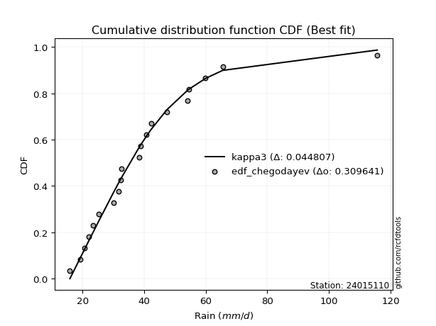</img>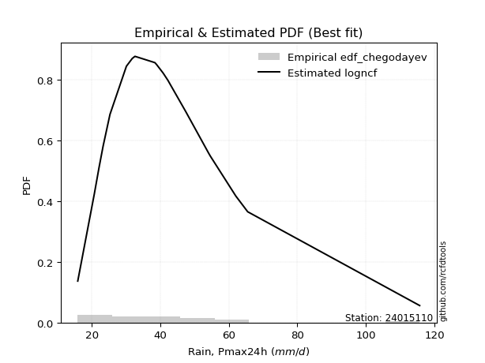</img>

</div>


### 6. EDF Blom (1958)

The Blom formula is a specific "plotting position" formula used in hydrology and statistical analysis to estimate the empirical cumulative probability (or non-exceedance probability) of a data series. It is particularly recommended for data that are approximately normally distributed. The constant _a_ is set to 0.375 (or 3/8).

<div align="center">


$P=(m-a)/(n+1-2a)$


</div>


**6.1. Empirical values**

<div align="center">

|                | 0                    | 1                   | 2                   | 3                   | 4                   | 5                  | 6                  | 7                  | 8                   | 9                   | 10                 | 11                 | 12                 | 13                 | 14                 | 15                 | 16                 | 17                 | 18                 | 19                 |
|:---------------|:---------------------|:--------------------|:--------------------|:--------------------|:--------------------|:-------------------|:-------------------|:-------------------|:--------------------|:--------------------|:-------------------|:-------------------|:-------------------|:-------------------|:-------------------|:-------------------|:-------------------|:-------------------|:-------------------|:-------------------|
| date           | 2020                 | 2025                | 2022                | 2019                | 2008                | 2023               | 2015               | 2014               | 2018                | 2017                | 2007               | 2016               | 2005               | 2009               | 2021               | 2010               | 2006               | 2012               | 2011               | 2013               |
| x              | 15.9                 | 19.2                | 20.7                | 22.1                | 23.3                | 25.3               | 30.1               | 31.8               | 32.5                | 32.6                | 38.4               | 38.9               | 40.8               | 42.2               | 47.4               | 54.1               | 54.6               | 59.9               | 65.5               | 115.7              |
| m              | 1                    | 2                   | 3                   | 4                   | 5                   | 6                  | 7                  | 8                  | 9                   | 10                  | 11                 | 12                 | 13                 | 14                 | 15                 | 16                 | 17                 | 18                 | 19                 | 20                 |
| empirical_dist | edf_blom             | edf_blom            | edf_blom            | edf_blom            | edf_blom            | edf_blom           | edf_blom           | edf_blom           | edf_blom            | edf_blom            | edf_blom           | edf_blom           | edf_blom           | edf_blom           | edf_blom           | edf_blom           | edf_blom           | edf_blom           | edf_blom           | edf_blom           |
| empirical      | 0.030864197530864196 | 0.08024691358024691 | 0.12962962962962962 | 0.17901234567901234 | 0.22839506172839505 | 0.2777777777777778 | 0.3271604938271605 | 0.3765432098765432 | 0.42592592592592593 | 0.47530864197530864 | 0.5246913580246914 | 0.5740740740740741 | 0.6234567901234568 | 0.6728395061728395 | 0.7222222222222222 | 0.7716049382716049 | 0.8209876543209876 | 0.8703703703703703 | 0.9197530864197531 | 0.9691358024691358 |
| empirical_tr   | 1.0318471337579618   | 1.087248322147651   | 1.148936170212766   | 1.218045112781955   | 1.296               | 1.3846153846153846 | 1.4862385321100917 | 1.603960396039604  | 1.7419354838709677  | 1.9058823529411766  | 2.103896103896104  | 2.3478260869565215 | 2.6557377049180326 | 3.0566037735849054 | 3.5999999999999996 | 4.378378378378378  | 5.586206896551723  | 7.714285714285713  | 12.461538461538458 | 32.39999999999997  |

</div>


**6.2. Kolmogorov-Smirnov fit test (sorted by Δ)**


<div align="center">

|                | 0                   | 1                    | 2                    | 3                   | 4                    | 5                   | 6                  | 7                    | 8                   | 9                   | 10                  | 11                  | 12                   | 13                  | 14                  | 15                  | 16                   | 17                  | 18                 | 19                  | 20                  | 21                   | 22                   | 23                  | 24                  | 25                  | 26                  | 27                  | 28                  | 29                 | 30                  | 31                  | 32                  | 33                  | 34                  | 35                 | 36                  | 37                 | 38                  | 39                  | 40                  | 41                 | 42                 | 43                 | 44                 | 45                  | 46                  | 47                 | 48                  | 49                 | 50                  | 51                  | 52                  | 53                  | 54                  | 55                  | 56                 | 57                  | 58                  | 59                  | 60                 | 61                  | 62                  | 63                  | 64                  | 65                  | 66                 | 67                  | 68                 | 69                  | 70                  | 71                  | 72                 | 73                  | 74                  | 75                  | 76                  | 77                  | 78                  | 79                  | 80                  | 81                  | 82                  | 83                  | 84                  | 85                  | 86                  | 87                 | 88                  | 89                  | 90                  | 91                  | 92                 | 93                  | 94                 | 95                  | 96                  | 97                 | 98                  | 99                  | 100                 | 101                | 102                 | 103                | 104                 | 105                | 106                | 107                 | 108                 | 109                 | 110                 | 111                 | 112                 | 113                 | 114                 | 115                 | 116                 | 117                 | 118                 | 119                 | 120                 | 121                 | 122                | 123                 | 124                 | 125                | 126                 | 127                 | 128                | 129                 | 130                 | 131                | 132                | 133                 | 134                | 135                | 136                | 137                | 138                | 139                | 140                 | 141                | 142                | 143                | 144                | 145                | 146                | 147                | 148                | 149                | 150                | 151                | 152                 | 153                | 154                | 155                | 156                | 157                | 158                | 159                |
|:---------------|:--------------------|:---------------------|:---------------------|:--------------------|:---------------------|:--------------------|:-------------------|:---------------------|:--------------------|:--------------------|:--------------------|:--------------------|:---------------------|:--------------------|:--------------------|:--------------------|:---------------------|:--------------------|:-------------------|:--------------------|:--------------------|:---------------------|:---------------------|:--------------------|:--------------------|:--------------------|:--------------------|:--------------------|:--------------------|:-------------------|:--------------------|:--------------------|:--------------------|:--------------------|:--------------------|:-------------------|:--------------------|:-------------------|:--------------------|:--------------------|:--------------------|:-------------------|:-------------------|:-------------------|:-------------------|:--------------------|:--------------------|:-------------------|:--------------------|:-------------------|:--------------------|:--------------------|:--------------------|:--------------------|:--------------------|:--------------------|:-------------------|:--------------------|:--------------------|:--------------------|:-------------------|:--------------------|:--------------------|:--------------------|:--------------------|:--------------------|:-------------------|:--------------------|:-------------------|:--------------------|:--------------------|:--------------------|:-------------------|:--------------------|:--------------------|:--------------------|:--------------------|:--------------------|:--------------------|:--------------------|:--------------------|:--------------------|:--------------------|:--------------------|:--------------------|:--------------------|:--------------------|:-------------------|:--------------------|:--------------------|:--------------------|:--------------------|:-------------------|:--------------------|:-------------------|:--------------------|:--------------------|:-------------------|:--------------------|:--------------------|:--------------------|:-------------------|:--------------------|:-------------------|:--------------------|:-------------------|:-------------------|:--------------------|:--------------------|:--------------------|:--------------------|:--------------------|:--------------------|:--------------------|:--------------------|:--------------------|:--------------------|:--------------------|:--------------------|:--------------------|:--------------------|:--------------------|:-------------------|:--------------------|:--------------------|:-------------------|:--------------------|:--------------------|:-------------------|:--------------------|:--------------------|:-------------------|:-------------------|:--------------------|:-------------------|:-------------------|:-------------------|:-------------------|:-------------------|:-------------------|:--------------------|:-------------------|:-------------------|:-------------------|:-------------------|:-------------------|:-------------------|:-------------------|:-------------------|:-------------------|:-------------------|:-------------------|:--------------------|:-------------------|:-------------------|:-------------------|:-------------------|:-------------------|:-------------------|:-------------------|
| station        | 24015110            | 24015110             | 24015110             | 24015110            | 24015110             | 24015110            | 24015110           | 24015110             | 24015110            | 24015110            | 24015110            | 24015110            | 24015110             | 24015110            | 24015110            | 24015110            | 24015110             | 24015110            | 24015110           | 24015110            | 24015110            | 24015110             | 24015110             | 24015110            | 24015110            | 24015110            | 24015110            | 24015110            | 24015110            | 24015110           | 24015110            | 24015110            | 24015110            | 24015110            | 24015110            | 24015110           | 24015110            | 24015110           | 24015110            | 24015110            | 24015110            | 24015110           | 24015110           | 24015110           | 24015110           | 24015110            | 24015110            | 24015110           | 24015110            | 24015110           | 24015110            | 24015110            | 24015110            | 24015110            | 24015110            | 24015110            | 24015110           | 24015110            | 24015110            | 24015110            | 24015110           | 24015110            | 24015110            | 24015110            | 24015110            | 24015110            | 24015110           | 24015110            | 24015110           | 24015110            | 24015110            | 24015110            | 24015110           | 24015110            | 24015110            | 24015110            | 24015110            | 24015110            | 24015110            | 24015110            | 24015110            | 24015110            | 24015110            | 24015110            | 24015110            | 24015110            | 24015110            | 24015110           | 24015110            | 24015110            | 24015110            | 24015110            | 24015110           | 24015110            | 24015110           | 24015110            | 24015110            | 24015110           | 24015110            | 24015110            | 24015110            | 24015110           | 24015110            | 24015110           | 24015110            | 24015110           | 24015110           | 24015110            | 24015110            | 24015110            | 24015110            | 24015110            | 24015110            | 24015110            | 24015110            | 24015110            | 24015110            | 24015110            | 24015110            | 24015110            | 24015110            | 24015110            | 24015110           | 24015110            | 24015110            | 24015110           | 24015110            | 24015110            | 24015110           | 24015110            | 24015110            | 24015110           | 24015110           | 24015110            | 24015110           | 24015110           | 24015110           | 24015110           | 24015110           | 24015110           | 24015110            | 24015110           | 24015110           | 24015110           | 24015110           | 24015110           | 24015110           | 24015110           | 24015110           | 24015110           | 24015110           | 24015110           | 24015110            | 24015110           | 24015110           | 24015110           | 24015110           | 24015110           | 24015110           | 24015110           |
| empirical_dist | edf_blom            | edf_blom             | edf_blom             | edf_blom            | edf_blom             | edf_blom            | edf_blom           | edf_blom             | edf_blom            | edf_blom            | edf_blom            | edf_blom            | edf_blom             | edf_blom            | edf_blom            | edf_blom            | edf_blom             | edf_blom            | edf_blom           | edf_blom            | edf_blom            | edf_blom             | edf_blom             | edf_blom            | edf_blom            | edf_blom            | edf_blom            | edf_blom            | edf_blom            | edf_blom           | edf_blom            | edf_blom            | edf_blom            | edf_blom            | edf_blom            | edf_blom           | edf_blom            | edf_blom           | edf_blom            | edf_blom            | edf_blom            | edf_blom           | edf_blom           | edf_blom           | edf_blom           | edf_blom            | edf_blom            | edf_blom           | edf_blom            | edf_blom           | edf_blom            | edf_blom            | edf_blom            | edf_blom            | edf_blom            | edf_blom            | edf_blom           | edf_blom            | edf_blom            | edf_blom            | edf_blom           | edf_blom            | edf_blom            | edf_blom            | edf_blom            | edf_blom            | edf_blom           | edf_blom            | edf_blom           | edf_blom            | edf_blom            | edf_blom            | edf_blom           | edf_blom            | edf_blom            | edf_blom            | edf_blom            | edf_blom            | edf_blom            | edf_blom            | edf_blom            | edf_blom            | edf_blom            | edf_blom            | edf_blom            | edf_blom            | edf_blom            | edf_blom           | edf_blom            | edf_blom            | edf_blom            | edf_blom            | edf_blom           | edf_blom            | edf_blom           | edf_blom            | edf_blom            | edf_blom           | edf_blom            | edf_blom            | edf_blom            | edf_blom           | edf_blom            | edf_blom           | edf_blom            | edf_blom           | edf_blom           | edf_blom            | edf_blom            | edf_blom            | edf_blom            | edf_blom            | edf_blom            | edf_blom            | edf_blom            | edf_blom            | edf_blom            | edf_blom            | edf_blom            | edf_blom            | edf_blom            | edf_blom            | edf_blom           | edf_blom            | edf_blom            | edf_blom           | edf_blom            | edf_blom            | edf_blom           | edf_blom            | edf_blom            | edf_blom           | edf_blom           | edf_blom            | edf_blom           | edf_blom           | edf_blom           | edf_blom           | edf_blom           | edf_blom           | edf_blom            | edf_blom           | edf_blom           | edf_blom           | edf_blom           | edf_blom           | edf_blom           | edf_blom           | edf_blom           | edf_blom           | edf_blom           | edf_blom           | edf_blom            | edf_blom           | edf_blom           | edf_blom           | edf_blom           | edf_blom           | edf_blom           | edf_blom           |
| p_dist         | kappa3              | moyal                | burr12               | logdweibull         | logbetaprime         | ncf                 | logdgamma          | logpearson3          | logrice             | betaprime           | logexponnorm        | logburr12           | logmaxwell           | loganglit           | loggennorm          | lognorm             | logcrystalball       | logt                | logloggamma        | genexpon            | logweibull_max      | loggenextreme        | logalpha             | loginvgamma         | logf                | logweibull_min      | alpha               | logskewnorm         | logjohnsonsu        | lognct             | logfatiguelife      | loginvgauss         | invgauss            | johnsonsu           | logfoldnorm         | logvonmises_line   | nct                 | halflogistic       | logburr             | invgamma            | logsemicircular     | logerlang          | loggamma           | loggamma           | invweibull         | genextreme          | fatiguelife         | f                  | lograyleigh         | logjohnsonsb       | johnsonsb           | mielke              | logncf              | gumbel_r            | loglogistic         | logmielke           | loggenlogistic     | logbeta             | burr                | logtriang           | lognakagami        | pearson3            | exponpow            | genlogistic         | beta                | logexponweib        | gompertz           | loginvweibull       | gausshyper         | erlang              | gamma               | loghypsecant        | genpareto          | halfnorm            | exponnorm           | loggenexpon         | logkstwobign        | tukeylambda         | t                   | logcosine           | gennorm             | loggumbel_r         | skewnorm            | rayleigh            | dgamma              | genhalflogistic     | loghalfnorm         | dweibull           | kstwobign           | loglaplace          | loglaplace          | logarcsine          | gengamma           | loghalfgennorm      | maxwell            | cosine              | logtruncweibull_min | logtruncexpon      | logtruncpareto      | loggausshyper       | logmoyal            | loghalflogistic    | loggengamma         | loggumbel_l        | exponweib           | foldnorm           | loggompertz        | rice                | logistic            | truncnorm           | crystalball         | norm                | logbradford         | lomax               | hypsecant           | anglit              | wald                | semicircular        | logloglaplace       | laplace             | arcsine             | weibull_min         | logexponpow        | loguniform          | logkappa4           | loglomax           | gumbel_l            | logtukeylambda      | logkappa3          | halfgennorm         | logargus            | logwald            | vonmises_line      | truncweibull_min    | triang             | truncexpon         | logksone           | logrdist           | logtruncnorm       | bradford           | nakagami            | powerlaw           | logwrapcauchy      | loggenpareto       | logpowerlaw        | loggenhalflogistic | argus              | kappa4             | wrapcauchy         | ksone              | uniform            | loglevy_l          | logtrapezoid        | levy_l             | rdist              | trapezoid          | weibull_max        | truncpareto        | logvonmises        | vonmises           |
| delta          | 0.04607777398621077 | 0.046993958366028266 | 0.051012129165676046 | 0.05119434334717238 | 0.051760974500571016 | 0.05553168692664767 | 0.0556762463388063 | 0.055888570665956205 | 0.05599566627618835 | 0.05620244192779811 | 0.05698583498347229 | 0.05886656311371935 | 0.059090190441802415 | 0.05924679434417879 | 0.05953263585248303 | 0.05959314816130412 | 0.059593193629693175 | 0.05959383072202401 | 0.0600681330054344 | 0.06038299159324223 | 0.06146944988167746 | 0.061471060353362694 | 0.062089799459010386 | 0.06316325655154642 | 0.06321809552105873 | 0.06349111182262779 | 0.06350459354145188 | 0.06397582926447709 | 0.06406582632626423 | 0.0641133427461199 | 0.06507116262418744 | 0.06509369716615832 | 0.06556597413038379 | 0.06592062093099738 | 0.06607692199458903 | 0.0660820123367809 | 0.06619993032731708 | 0.0663871145201046 | 0.06638997749119635 | 0.06662605973281255 | 0.06663678868056555 | 0.0670877536616209 | 0.0670881214017428 | 0.0670881214017428 | 0.0674099302789557 | 0.06741007964948831 | 0.06778793607401323 | 0.0679437604822779 | 0.06874758498646483 | 0.069050693314756  | 0.06940239266071058 | 0.07071841231029652 | 0.07128627304154567 | 0.07239196723565433 | 0.07394479266846413 | 0.07420839277685176 | 0.0749890462427667 | 0.07502140481107922 | 0.07502477637224769 | 0.07545403482713098 | 0.0757063205386902 | 0.07688962164932944 | 0.07826282625863057 | 0.08005823590873962 | 0.08010729656298671 | 0.08422523242627489 | 0.0858110087029389 | 0.08670664459010702 | 0.086885549287338  | 0.08795678636817833 | 0.08795687506017774 | 0.08798202237557096 | 0.0890158814357947 | 0.08937581006823395 | 0.09091987550342728 | 0.09380124247701493 | 0.09429874278277572 | 0.09431196310567758 | 0.09463580711808242 | 0.09595937887366546 | 0.09846972081920546 | 0.09888132479154454 | 0.09927487308282468 | 0.10109241774776823 | 0.10232675489459372 | 0.10233216271011858 | 0.10241197070954011 | 0.1034438833330674 | 0.10404558548758092 | 0.10528414306075423 | 0.10528414306075423 | 0.10654917098934702 | 0.1075990311469695 | 0.11001270731008372 | 0.1113956087092225 | 0.11363898798003585 | 0.11471137564024314 | 0.1177866770337973 | 0.11787453935885295 | 0.11983591490213896 | 0.12359860689401836 | 0.1249455412893316 | 0.12599288612068976 | 0.127564999858922  | 0.12764052658078762 | 0.130073648549941  | 0.1302143919657578 | 0.13801286186696304 | 0.13896026148806895 | 0.14301484325678404 | 0.14301485439801098 | 0.14301485607521747 | 0.14306672521683617 | 0.14442257196984098 | 0.14664949709068736 | 0.14727159087652641 | 0.14812639325822022 | 0.14902635295960287 | 0.15110591973554666 | 0.17502504728729168 | 0.17970745477896186 | 0.18322764334786112 | 0.1991891342673061 | 0.20642401291312928 | 0.20761810203406128 | 0.2090617837900678 | 0.21185318509869666 | 0.21192059806359953 | 0.2160460268220391 | 0.21718079754467812 | 0.22291610266920125 | 0.2277797597783572 | 0.2319935763742988 | 0.23854107573930894 | 0.240249061933403  | 0.2403803664148879 | 0.2419788584975665 | 0.2516270418758869 | 0.2624770572858883 | 0.2687893553166534 | 0.29417522657202744 | 0.2992895886969097 | 0.3375373849332407 | 0.3416205779705359 | 0.3497230094535364 | 0.361837436873911  | 0.3832479695897725 | 0.4079341955668494 | 0.4215373336360205 | 0.4222580964397931 | 0.4332121032187832 | 0.4392405490013337 | 0.46045313985075526 | 0.5029080613525206 | 0.5230736700619303 | 0.6722518213645926 | 0.7743477029959482 | 0.8274433174738458 | 1.0440314008362295 | 17.472685928565916 |
| deltao         | 0.3096406529800002  | 0.3096406529800002   | 0.3096406529800002   | 0.3096406529800002  | 0.3096406529800002   | 0.3096406529800002  | 0.3096406529800002 | 0.3096406529800002   | 0.3096406529800002  | 0.3096406529800002  | 0.3096406529800002  | 0.3096406529800002  | 0.3096406529800002   | 0.3096406529800002  | 0.3096406529800002  | 0.3096406529800002  | 0.3096406529800002   | 0.3096406529800002  | 0.3096406529800002 | 0.3096406529800002  | 0.3096406529800002  | 0.3096406529800002   | 0.3096406529800002   | 0.3096406529800002  | 0.3096406529800002  | 0.3096406529800002  | 0.3096406529800002  | 0.3096406529800002  | 0.3096406529800002  | 0.3096406529800002 | 0.3096406529800002  | 0.3096406529800002  | 0.3096406529800002  | 0.3096406529800002  | 0.3096406529800002  | 0.3096406529800002 | 0.3096406529800002  | 0.3096406529800002 | 0.3096406529800002  | 0.3096406529800002  | 0.3096406529800002  | 0.3096406529800002 | 0.3096406529800002 | 0.3096406529800002 | 0.3096406529800002 | 0.3096406529800002  | 0.3096406529800002  | 0.3096406529800002 | 0.3096406529800002  | 0.3096406529800002 | 0.3096406529800002  | 0.3096406529800002  | 0.3096406529800002  | 0.3096406529800002  | 0.3096406529800002  | 0.3096406529800002  | 0.3096406529800002 | 0.3096406529800002  | 0.3096406529800002  | 0.3096406529800002  | 0.3096406529800002 | 0.3096406529800002  | 0.3096406529800002  | 0.3096406529800002  | 0.3096406529800002  | 0.3096406529800002  | 0.3096406529800002 | 0.3096406529800002  | 0.3096406529800002 | 0.3096406529800002  | 0.3096406529800002  | 0.3096406529800002  | 0.3096406529800002 | 0.3096406529800002  | 0.3096406529800002  | 0.3096406529800002  | 0.3096406529800002  | 0.3096406529800002  | 0.3096406529800002  | 0.3096406529800002  | 0.3096406529800002  | 0.3096406529800002  | 0.3096406529800002  | 0.3096406529800002  | 0.3096406529800002  | 0.3096406529800002  | 0.3096406529800002  | 0.3096406529800002 | 0.3096406529800002  | 0.3096406529800002  | 0.3096406529800002  | 0.3096406529800002  | 0.3096406529800002 | 0.3096406529800002  | 0.3096406529800002 | 0.3096406529800002  | 0.3096406529800002  | 0.3096406529800002 | 0.3096406529800002  | 0.3096406529800002  | 0.3096406529800002  | 0.3096406529800002 | 0.3096406529800002  | 0.3096406529800002 | 0.3096406529800002  | 0.3096406529800002 | 0.3096406529800002 | 0.3096406529800002  | 0.3096406529800002  | 0.3096406529800002  | 0.3096406529800002  | 0.3096406529800002  | 0.3096406529800002  | 0.3096406529800002  | 0.3096406529800002  | 0.3096406529800002  | 0.3096406529800002  | 0.3096406529800002  | 0.3096406529800002  | 0.3096406529800002  | 0.3096406529800002  | 0.3096406529800002  | 0.3096406529800002 | 0.3096406529800002  | 0.3096406529800002  | 0.3096406529800002 | 0.3096406529800002  | 0.3096406529800002  | 0.3096406529800002 | 0.3096406529800002  | 0.3096406529800002  | 0.3096406529800002 | 0.3096406529800002 | 0.3096406529800002  | 0.3096406529800002 | 0.3096406529800002 | 0.3096406529800002 | 0.3096406529800002 | 0.3096406529800002 | 0.3096406529800002 | 0.3096406529800002  | 0.3096406529800002 | 0.3096406529800002 | 0.3096406529800002 | 0.3096406529800002 | 0.3096406529800002 | 0.3096406529800002 | 0.3096406529800002 | 0.3096406529800002 | 0.3096406529800002 | 0.3096406529800002 | 0.3096406529800002 | 0.3096406529800002  | 0.3096406529800002 | 0.3096406529800002 | 0.3096406529800002 | 0.3096406529800002 | 0.3096406529800002 | 0.3096406529800002 | 0.3096406529800002 |
| eval           | Δo > Δ              | Δo > Δ               | Δo > Δ               | Δo > Δ              | Δo > Δ               | Δo > Δ              | Δo > Δ             | Δo > Δ               | Δo > Δ              | Δo > Δ              | Δo > Δ              | Δo > Δ              | Δo > Δ               | Δo > Δ              | Δo > Δ              | Δo > Δ              | Δo > Δ               | Δo > Δ              | Δo > Δ             | Δo > Δ              | Δo > Δ              | Δo > Δ               | Δo > Δ               | Δo > Δ              | Δo > Δ              | Δo > Δ              | Δo > Δ              | Δo > Δ              | Δo > Δ              | Δo > Δ             | Δo > Δ              | Δo > Δ              | Δo > Δ              | Δo > Δ              | Δo > Δ              | Δo > Δ             | Δo > Δ              | Δo > Δ             | Δo > Δ              | Δo > Δ              | Δo > Δ              | Δo > Δ             | Δo > Δ             | Δo > Δ             | Δo > Δ             | Δo > Δ              | Δo > Δ              | Δo > Δ             | Δo > Δ              | Δo > Δ             | Δo > Δ              | Δo > Δ              | Δo > Δ              | Δo > Δ              | Δo > Δ              | Δo > Δ              | Δo > Δ             | Δo > Δ              | Δo > Δ              | Δo > Δ              | Δo > Δ             | Δo > Δ              | Δo > Δ              | Δo > Δ              | Δo > Δ              | Δo > Δ              | Δo > Δ             | Δo > Δ              | Δo > Δ             | Δo > Δ              | Δo > Δ              | Δo > Δ              | Δo > Δ             | Δo > Δ              | Δo > Δ              | Δo > Δ              | Δo > Δ              | Δo > Δ              | Δo > Δ              | Δo > Δ              | Δo > Δ              | Δo > Δ              | Δo > Δ              | Δo > Δ              | Δo > Δ              | Δo > Δ              | Δo > Δ              | Δo > Δ             | Δo > Δ              | Δo > Δ              | Δo > Δ              | Δo > Δ              | Δo > Δ             | Δo > Δ              | Δo > Δ             | Δo > Δ              | Δo > Δ              | Δo > Δ             | Δo > Δ              | Δo > Δ              | Δo > Δ              | Δo > Δ             | Δo > Δ              | Δo > Δ             | Δo > Δ              | Δo > Δ             | Δo > Δ             | Δo > Δ              | Δo > Δ              | Δo > Δ              | Δo > Δ              | Δo > Δ              | Δo > Δ              | Δo > Δ              | Δo > Δ              | Δo > Δ              | Δo > Δ              | Δo > Δ              | Δo > Δ              | Δo > Δ              | Δo > Δ              | Δo > Δ              | Δo > Δ             | Δo > Δ              | Δo > Δ              | Δo > Δ             | Δo > Δ              | Δo > Δ              | Δo > Δ             | Δo > Δ              | Δo > Δ              | Δo > Δ             | Δo > Δ             | Δo > Δ              | Δo > Δ             | Δo > Δ             | Δo > Δ             | Δo > Δ             | Δo > Δ             | Δo > Δ             | Δo > Δ              | Δo > Δ             | Δo <= Δ            | Δo <= Δ            | Δo <= Δ            | Δo <= Δ            | Δo <= Δ            | Δo <= Δ            | Δo <= Δ            | Δo <= Δ            | Δo <= Δ            | Δo <= Δ            | Δo <= Δ             | Δo <= Δ            | Δo <= Δ            | Δo <= Δ            | Δo <= Δ            | Δo <= Δ            | Δo <= Δ            | Δo <= Δ            |
| fit            | 1                   | 1                    | 1                    | 1                   | 1                    | 1                   | 1                  | 1                    | 1                   | 1                   | 1                   | 1                   | 1                    | 1                   | 1                   | 1                   | 1                    | 1                   | 1                  | 1                   | 1                   | 1                    | 1                    | 1                   | 1                   | 1                   | 1                   | 1                   | 1                   | 1                  | 1                   | 1                   | 1                   | 1                   | 1                   | 1                  | 1                   | 1                  | 1                   | 1                   | 1                   | 1                  | 1                  | 1                  | 1                  | 1                   | 1                   | 1                  | 1                   | 1                  | 1                   | 1                   | 1                   | 1                   | 1                   | 1                   | 1                  | 1                   | 1                   | 1                   | 1                  | 1                   | 1                   | 1                   | 1                   | 1                   | 1                  | 1                   | 1                  | 1                   | 1                   | 1                   | 1                  | 1                   | 1                   | 1                   | 1                   | 1                   | 1                   | 1                   | 1                   | 1                   | 1                   | 1                   | 1                   | 1                   | 1                   | 1                  | 1                   | 1                   | 1                   | 1                   | 1                  | 1                   | 1                  | 1                   | 1                   | 1                  | 1                   | 1                   | 1                   | 1                  | 1                   | 1                  | 1                   | 1                  | 1                  | 1                   | 1                   | 1                   | 1                   | 1                   | 1                   | 1                   | 1                   | 1                   | 1                   | 1                   | 1                   | 1                   | 1                   | 1                   | 1                  | 1                   | 1                   | 1                  | 1                   | 1                   | 1                  | 1                   | 1                   | 1                  | 1                  | 1                   | 1                  | 1                  | 1                  | 1                  | 1                  | 1                  | 1                   | 1                  | 0                  | 0                  | 0                  | 0                  | 0                  | 0                  | 0                  | 0                  | 0                  | 0                  | 0                   | 0                  | 0                  | 0                  | 0                  | 0                  | 0                  | 0                  |
| n              | 20                  | 20                   | 20                   | 20                  | 20                   | 20                  | 20                 | 20                   | 20                  | 20                  | 20                  | 20                  | 20                   | 20                  | 20                  | 20                  | 20                   | 20                  | 20                 | 20                  | 20                  | 20                   | 20                   | 20                  | 20                  | 20                  | 20                  | 20                  | 20                  | 20                 | 20                  | 20                  | 20                  | 20                  | 20                  | 20                 | 20                  | 20                 | 20                  | 20                  | 20                  | 20                 | 20                 | 20                 | 20                 | 20                  | 20                  | 20                 | 20                  | 20                 | 20                  | 20                  | 20                  | 20                  | 20                  | 20                  | 20                 | 20                  | 20                  | 20                  | 20                 | 20                  | 20                  | 20                  | 20                  | 20                  | 20                 | 20                  | 20                 | 20                  | 20                  | 20                  | 20                 | 20                  | 20                  | 20                  | 20                  | 20                  | 20                  | 20                  | 20                  | 20                  | 20                  | 20                  | 20                  | 20                  | 20                  | 20                 | 20                  | 20                  | 20                  | 20                  | 20                 | 20                  | 20                 | 20                  | 20                  | 20                 | 20                  | 20                  | 20                  | 20                 | 20                  | 20                 | 20                  | 20                 | 20                 | 20                  | 20                  | 20                  | 20                  | 20                  | 20                  | 20                  | 20                  | 20                  | 20                  | 20                  | 20                  | 20                  | 20                  | 20                  | 20                 | 20                  | 20                  | 20                 | 20                  | 20                  | 20                 | 20                  | 20                  | 20                 | 20                 | 20                  | 20                 | 20                 | 20                 | 20                 | 20                 | 20                 | 20                  | 20                 | 20                 | 20                 | 20                 | 20                 | 20                 | 20                 | 20                 | 20                 | 20                 | 20                 | 20                  | 20                 | 20                 | 20                 | 20                 | 20                 | 20                 | 20                 |
| best_fit       | 1                   | 0                    | 0                    | 0                   | 0                    | 0                   | 0                  | 0                    | 0                   | 0                   | 0                   | 0                   | 0                    | 0                   | 0                   | 0                   | 0                    | 0                   | 0                  | 0                   | 0                   | 0                    | 0                    | 0                   | 0                   | 0                   | 0                   | 0                   | 0                   | 0                  | 0                   | 0                   | 0                   | 0                   | 0                   | 0                  | 0                   | 0                  | 0                   | 0                   | 0                   | 0                  | 0                  | 0                  | 0                  | 0                   | 0                   | 0                  | 0                   | 0                  | 0                   | 0                   | 0                   | 0                   | 0                   | 0                   | 0                  | 0                   | 0                   | 0                   | 0                  | 0                   | 0                   | 0                   | 0                   | 0                   | 0                  | 0                   | 0                  | 0                   | 0                   | 0                   | 0                  | 0                   | 0                   | 0                   | 0                   | 0                   | 0                   | 0                   | 0                   | 0                   | 0                   | 0                   | 0                   | 0                   | 0                   | 0                  | 0                   | 0                   | 0                   | 0                   | 0                  | 0                   | 0                  | 0                   | 0                   | 0                  | 0                   | 0                   | 0                   | 0                  | 0                   | 0                  | 0                   | 0                  | 0                  | 0                   | 0                   | 0                   | 0                   | 0                   | 0                   | 0                   | 0                   | 0                   | 0                   | 0                   | 0                   | 0                   | 0                   | 0                   | 0                  | 0                   | 0                   | 0                  | 0                   | 0                   | 0                  | 0                   | 0                   | 0                  | 0                  | 0                   | 0                  | 0                  | 0                  | 0                  | 0                  | 0                  | 0                   | 0                  | 0                  | 0                  | 0                  | 0                  | 0                  | 0                  | 0                  | 0                  | 0                  | 0                  | 0                   | 0                  | 0                  | 0                  | 0                  | 0                  | 0                  | 0                  |
| best_fit_sort  | 1                   | 2                    | 3                    | 4                   | 5                    | 6                   | 7                  | 8                    | 9                   | 10                  | 11                  | 12                  | 13                   | 14                  | 15                  | 16                  | 17                   | 18                  | 19                 | 20                  | 21                  | 22                   | 23                   | 24                  | 25                  | 26                  | 27                  | 28                  | 29                  | 30                 | 31                  | 32                  | 33                  | 34                  | 35                  | 36                 | 37                  | 38                 | 39                  | 40                  | 41                  | 42                 | 43                 | 44                 | 45                 | 46                  | 47                  | 48                 | 49                  | 50                 | 51                  | 52                  | 53                  | 54                  | 55                  | 56                  | 57                 | 58                  | 59                  | 60                  | 61                 | 62                  | 63                  | 64                  | 65                  | 66                  | 67                 | 68                  | 69                 | 70                  | 71                  | 72                  | 73                 | 74                  | 75                  | 76                  | 77                  | 78                  | 79                  | 80                  | 81                  | 82                  | 83                  | 84                  | 85                  | 86                  | 87                  | 88                 | 89                  | 90                  | 91                  | 92                  | 93                 | 94                  | 95                 | 96                  | 97                  | 98                 | 99                  | 100                 | 101                 | 102                | 103                 | 104                | 105                 | 106                | 107                | 108                 | 109                 | 110                 | 111                 | 112                 | 113                 | 114                 | 115                 | 116                 | 117                 | 118                 | 119                 | 120                 | 121                 | 122                 | 123                | 124                 | 125                 | 126                | 127                 | 128                 | 129                | 130                 | 131                 | 132                | 133                | 134                 | 135                | 136                | 137                | 138                | 139                | 140                | 141                 | 142                | 143                | 144                | 145                | 146                | 147                | 148                | 149                | 150                | 151                | 152                | 153                 | 154                | 155                | 156                | 157                | 158                | 159                | 160                |

</div>


**6.3. Best fit**

<div align="center">

|   id |   station | empirical_dist   | p_dist   |     delta |   deltao | eval   |   fit |   n |   best_fit |   best_fit_sort |
|-----:|----------:|:-----------------|:---------|----------:|---------:|:-------|------:|----:|-----------:|----------------:|
|    0 |  24015110 | edf_blom         | kappa3   | 0.0460778 | 0.309641 | Δo > Δ |     1 |  20 |          1 |               1 |

</div>


<div align="center">

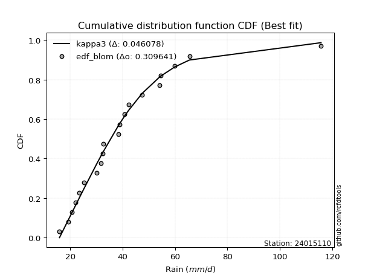</img>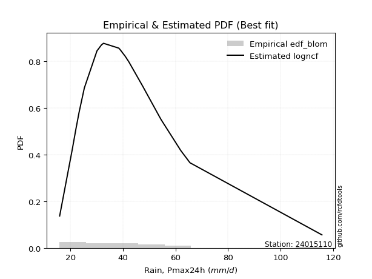</img>

</div>


### 7. EDF Tukey (1962)

In hydrology, the Tukey formula is used as a plotting position formula to estimate the empirical probability or frequency of a flood event (or other hydrological data). The formula parameter is given as _c=0.333_ (or 1/3).

<div align="center">


$P=(m-c)/(n+1-2c)$


</div>


**7.1. Empirical values**

<div align="center">

|                | 0                   | 1                   | 2                   | 3                   | 4                   | 5                  | 6                   | 7                  | 8                  | 9                   | 10                 | 11                 | 12                 | 13                 | 14                 | 15                 | 16                | 17                 | 18                 | 19                 |
|:---------------|:--------------------|:--------------------|:--------------------|:--------------------|:--------------------|:-------------------|:--------------------|:-------------------|:-------------------|:--------------------|:-------------------|:-------------------|:-------------------|:-------------------|:-------------------|:-------------------|:------------------|:-------------------|:-------------------|:-------------------|
| date           | 2020                | 2025                | 2022                | 2019                | 2008                | 2023               | 2015                | 2014               | 2018               | 2017                | 2007               | 2016               | 2005               | 2009               | 2021               | 2010               | 2006              | 2012               | 2011               | 2013               |
| x              | 15.9                | 19.2                | 20.7                | 22.1                | 23.3                | 25.3               | 30.1                | 31.8               | 32.5               | 32.6                | 38.4               | 38.9               | 40.8               | 42.2               | 47.4               | 54.1               | 54.6              | 59.9               | 65.5               | 115.7              |
| m              | 1                   | 2                   | 3                   | 4                   | 5                   | 6                  | 7                   | 8                  | 9                  | 10                  | 11                 | 12                 | 13                 | 14                 | 15                 | 16                 | 17                | 18                 | 19                 | 20                 |
| empirical_dist | edf_tukey           | edf_tukey           | edf_tukey           | edf_tukey           | edf_tukey           | edf_tukey          | edf_tukey           | edf_tukey          | edf_tukey          | edf_tukey           | edf_tukey          | edf_tukey          | edf_tukey          | edf_tukey          | edf_tukey          | edf_tukey          | edf_tukey         | edf_tukey          | edf_tukey          | edf_tukey          |
| empirical      | 0.03278688524590164 | 0.08196721311475409 | 0.13114754098360656 | 0.18032786885245902 | 0.22950819672131148 | 0.2786885245901639 | 0.32786885245901637 | 0.3770491803278688 | 0.4262295081967213 | 0.47540983606557374 | 0.5245901639344263 | 0.5737704918032787 | 0.6229508196721312 | 0.6721311475409836 | 0.7213114754098361 | 0.7704918032786885 | 0.819672131147541 | 0.8688524590163934 | 0.9180327868852459 | 0.9672131147540983 |
| empirical_tr   | 1.033898305084746   | 1.0892857142857142  | 1.150943396226415   | 1.22                | 1.297872340425532   | 1.3863636363636362 | 1.4878048780487803  | 1.6052631578947367 | 1.7428571428571429 | 1.90625             | 2.103448275862069  | 2.346153846153846  | 2.6521739130434785 | 3.05               | 3.588235294117647  | 4.357142857142857  | 5.545454545454546 | 7.624999999999998  | 12.200000000000003 | 30.499999999999964 |

</div>


**7.2. Kolmogorov-Smirnov fit test (sorted by Δ)**


<div align="center">

|                | 0                  | 1                   | 2                   | 3                   | 4                   | 5                  | 6                   | 7                    | 8                   | 9                   | 10                  | 11                  | 12                   | 13                  | 14                   | 15                  | 16                   | 17                  | 18                  | 19                 | 20                  | 21                   | 22                   | 23                  | 24                  | 25                  | 26                  | 27                  | 28                  | 29                 | 30                  | 31                  | 32                  | 33                  | 34                  | 35                  | 36                  | 37                 | 38                  | 39                  | 40                  | 41                  | 42                 | 43                 | 44                 | 45                 | 46                  | 47                 | 48                  | 49                  | 50                  | 51                  | 52                  | 53                  | 54                  | 55                  | 56                  | 57                  | 58                 | 59                  | 60                  | 61                  | 62                  | 63                  | 64                  | 65                  | 66                  | 67                  | 68                  | 69                  | 70                  | 71                  | 72                  | 73                  | 74                  | 75                  | 76                  | 77                  | 78                  | 79                  | 80                  | 81                  | 82                  | 83                 | 84                  | 85                  | 86                  | 87                  | 88                  | 89                  | 90                  | 91                  | 92                  | 93                  | 94                  | 95                  | 96                  | 97                  | 98                  | 99                 | 100                 | 101                | 102                 | 103                 | 104                | 105                 | 106                 | 107                 | 108                 | 109                 | 110                 | 111                 | 112                 | 113                 | 114                | 115                 | 116                 | 117                 | 118                 | 119                 | 120                | 121                 | 122                 | 123                 | 124                 | 125                 | 126                | 127                 | 128                 | 129                 | 130                 | 131                 | 132                 | 133                | 134                 | 135                | 136                 | 137                 | 138                 | 139                 | 140                | 141                 | 142                 | 143                | 144                 | 145                 | 146                 | 147                 | 148                 | 149                | 150                 | 151                | 152                | 153                | 154                | 155                | 156                | 157                | 158                | 159                |
|:---------------|:-------------------|:--------------------|:--------------------|:--------------------|:--------------------|:-------------------|:--------------------|:---------------------|:--------------------|:--------------------|:--------------------|:--------------------|:---------------------|:--------------------|:---------------------|:--------------------|:---------------------|:--------------------|:--------------------|:-------------------|:--------------------|:---------------------|:---------------------|:--------------------|:--------------------|:--------------------|:--------------------|:--------------------|:--------------------|:-------------------|:--------------------|:--------------------|:--------------------|:--------------------|:--------------------|:--------------------|:--------------------|:-------------------|:--------------------|:--------------------|:--------------------|:--------------------|:-------------------|:-------------------|:-------------------|:-------------------|:--------------------|:-------------------|:--------------------|:--------------------|:--------------------|:--------------------|:--------------------|:--------------------|:--------------------|:--------------------|:--------------------|:--------------------|:-------------------|:--------------------|:--------------------|:--------------------|:--------------------|:--------------------|:--------------------|:--------------------|:--------------------|:--------------------|:--------------------|:--------------------|:--------------------|:--------------------|:--------------------|:--------------------|:--------------------|:--------------------|:--------------------|:--------------------|:--------------------|:--------------------|:--------------------|:--------------------|:--------------------|:-------------------|:--------------------|:--------------------|:--------------------|:--------------------|:--------------------|:--------------------|:--------------------|:--------------------|:--------------------|:--------------------|:--------------------|:--------------------|:--------------------|:--------------------|:--------------------|:-------------------|:--------------------|:-------------------|:--------------------|:--------------------|:-------------------|:--------------------|:--------------------|:--------------------|:--------------------|:--------------------|:--------------------|:--------------------|:--------------------|:--------------------|:-------------------|:--------------------|:--------------------|:--------------------|:--------------------|:--------------------|:-------------------|:--------------------|:--------------------|:--------------------|:--------------------|:--------------------|:-------------------|:--------------------|:--------------------|:--------------------|:--------------------|:--------------------|:--------------------|:-------------------|:--------------------|:-------------------|:--------------------|:--------------------|:--------------------|:--------------------|:-------------------|:--------------------|:--------------------|:-------------------|:--------------------|:--------------------|:--------------------|:--------------------|:--------------------|:-------------------|:--------------------|:-------------------|:-------------------|:-------------------|:-------------------|:-------------------|:-------------------|:-------------------|:-------------------|:-------------------|
| station        | 24015110           | 24015110            | 24015110            | 24015110            | 24015110            | 24015110           | 24015110            | 24015110             | 24015110            | 24015110            | 24015110            | 24015110            | 24015110             | 24015110            | 24015110             | 24015110            | 24015110             | 24015110            | 24015110            | 24015110           | 24015110            | 24015110             | 24015110             | 24015110            | 24015110            | 24015110            | 24015110            | 24015110            | 24015110            | 24015110           | 24015110            | 24015110            | 24015110            | 24015110            | 24015110            | 24015110            | 24015110            | 24015110           | 24015110            | 24015110            | 24015110            | 24015110            | 24015110           | 24015110           | 24015110           | 24015110           | 24015110            | 24015110           | 24015110            | 24015110            | 24015110            | 24015110            | 24015110            | 24015110            | 24015110            | 24015110            | 24015110            | 24015110            | 24015110           | 24015110            | 24015110            | 24015110            | 24015110            | 24015110            | 24015110            | 24015110            | 24015110            | 24015110            | 24015110            | 24015110            | 24015110            | 24015110            | 24015110            | 24015110            | 24015110            | 24015110            | 24015110            | 24015110            | 24015110            | 24015110            | 24015110            | 24015110            | 24015110            | 24015110           | 24015110            | 24015110            | 24015110            | 24015110            | 24015110            | 24015110            | 24015110            | 24015110            | 24015110            | 24015110            | 24015110            | 24015110            | 24015110            | 24015110            | 24015110            | 24015110           | 24015110            | 24015110           | 24015110            | 24015110            | 24015110           | 24015110            | 24015110            | 24015110            | 24015110            | 24015110            | 24015110            | 24015110            | 24015110            | 24015110            | 24015110           | 24015110            | 24015110            | 24015110            | 24015110            | 24015110            | 24015110           | 24015110            | 24015110            | 24015110            | 24015110            | 24015110            | 24015110           | 24015110            | 24015110            | 24015110            | 24015110            | 24015110            | 24015110            | 24015110           | 24015110            | 24015110           | 24015110            | 24015110            | 24015110            | 24015110            | 24015110           | 24015110            | 24015110            | 24015110           | 24015110            | 24015110            | 24015110            | 24015110            | 24015110            | 24015110           | 24015110            | 24015110           | 24015110           | 24015110           | 24015110           | 24015110           | 24015110           | 24015110           | 24015110           | 24015110           |
| empirical_dist | edf_tukey          | edf_tukey           | edf_tukey           | edf_tukey           | edf_tukey           | edf_tukey          | edf_tukey           | edf_tukey            | edf_tukey           | edf_tukey           | edf_tukey           | edf_tukey           | edf_tukey            | edf_tukey           | edf_tukey            | edf_tukey           | edf_tukey            | edf_tukey           | edf_tukey           | edf_tukey          | edf_tukey           | edf_tukey            | edf_tukey            | edf_tukey           | edf_tukey           | edf_tukey           | edf_tukey           | edf_tukey           | edf_tukey           | edf_tukey          | edf_tukey           | edf_tukey           | edf_tukey           | edf_tukey           | edf_tukey           | edf_tukey           | edf_tukey           | edf_tukey          | edf_tukey           | edf_tukey           | edf_tukey           | edf_tukey           | edf_tukey          | edf_tukey          | edf_tukey          | edf_tukey          | edf_tukey           | edf_tukey          | edf_tukey           | edf_tukey           | edf_tukey           | edf_tukey           | edf_tukey           | edf_tukey           | edf_tukey           | edf_tukey           | edf_tukey           | edf_tukey           | edf_tukey          | edf_tukey           | edf_tukey           | edf_tukey           | edf_tukey           | edf_tukey           | edf_tukey           | edf_tukey           | edf_tukey           | edf_tukey           | edf_tukey           | edf_tukey           | edf_tukey           | edf_tukey           | edf_tukey           | edf_tukey           | edf_tukey           | edf_tukey           | edf_tukey           | edf_tukey           | edf_tukey           | edf_tukey           | edf_tukey           | edf_tukey           | edf_tukey           | edf_tukey          | edf_tukey           | edf_tukey           | edf_tukey           | edf_tukey           | edf_tukey           | edf_tukey           | edf_tukey           | edf_tukey           | edf_tukey           | edf_tukey           | edf_tukey           | edf_tukey           | edf_tukey           | edf_tukey           | edf_tukey           | edf_tukey          | edf_tukey           | edf_tukey          | edf_tukey           | edf_tukey           | edf_tukey          | edf_tukey           | edf_tukey           | edf_tukey           | edf_tukey           | edf_tukey           | edf_tukey           | edf_tukey           | edf_tukey           | edf_tukey           | edf_tukey          | edf_tukey           | edf_tukey           | edf_tukey           | edf_tukey           | edf_tukey           | edf_tukey          | edf_tukey           | edf_tukey           | edf_tukey           | edf_tukey           | edf_tukey           | edf_tukey          | edf_tukey           | edf_tukey           | edf_tukey           | edf_tukey           | edf_tukey           | edf_tukey           | edf_tukey          | edf_tukey           | edf_tukey          | edf_tukey           | edf_tukey           | edf_tukey           | edf_tukey           | edf_tukey          | edf_tukey           | edf_tukey           | edf_tukey          | edf_tukey           | edf_tukey           | edf_tukey           | edf_tukey           | edf_tukey           | edf_tukey          | edf_tukey           | edf_tukey          | edf_tukey          | edf_tukey          | edf_tukey          | edf_tukey          | edf_tukey          | edf_tukey          | edf_tukey          | edf_tukey          |
| p_dist         | kappa3             | moyal               | burr12              | logdweibull         | logbetaprime        | logrice            | ncf                 | logpearson3          | betaprime           | logdgamma           | logexponnorm        | loganglit           | logmaxwell           | loggennorm          | genexpon             | lognorm             | logcrystalball       | logt                | logburr12           | logloggamma        | logweibull_max      | loggenextreme        | logalpha             | logweibull_min      | loginvgamma         | logf                | alpha               | logskewnorm         | logjohnsonsu        | lognct             | invgauss            | logfatiguelife      | loginvgauss         | logfoldnorm         | halflogistic        | logsemicircular     | johnsonsu           | logvonmises_line   | nct                 | logburr             | invgamma            | fatiguelife         | logerlang          | loggamma           | loggamma           | invweibull         | genextreme          | f                  | logjohnsonsb        | johnsonsb           | lograyleigh         | logncf              | mielke              | gumbel_r            | logmielke           | logbeta             | loglogistic         | lognakagami         | loggenlogistic     | burr                | logtriang           | pearson3            | exponpow            | beta                | genlogistic         | logexponweib        | gompertz            | gausshyper          | loginvweibull       | erlang              | gamma               | halfnorm            | genpareto           | loghypsecant        | exponnorm           | t                   | loggenexpon         | logkstwobign        | logcosine           | tukeylambda         | skewnorm            | gennorm             | loggumbel_r         | rayleigh           | dgamma              | dweibull            | genhalflogistic     | loghalfnorm         | kstwobign           | logarcsine          | loglaplace          | loglaplace          | gengamma            | loghalfgennorm      | maxwell             | logtruncweibull_min | cosine              | logtruncexpon       | logtruncpareto      | loggausshyper      | logmoyal            | loggengamma        | loghalflogistic     | exponweib           | loggumbel_l        | foldnorm            | loggompertz         | rice                | logistic            | logbradford         | truncnorm           | crystalball         | norm                | lomax               | anglit             | hypsecant           | semicircular        | wald                | logloglaplace       | laplace             | arcsine            | weibull_min         | logexponpow         | loguniform          | logkappa4           | loglomax            | logtukeylambda     | gumbel_l            | logkappa3           | halfgennorm         | logargus            | logwald             | vonmises_line       | truncweibull_min   | truncexpon          | triang             | logksone            | logrdist            | logtruncnorm        | bradford            | nakagami           | powerlaw            | logwrapcauchy       | loggenpareto       | logpowerlaw         | loggenhalflogistic  | argus               | kappa4              | wrapcauchy          | ksone              | uniform             | loglevy_l          | logtrapezoid       | levy_l             | rdist              | trapezoid          | weibull_max        | truncpareto        | logvonmises        | vonmises           |
| delta          | 0.0453694153543549 | 0.04634366759665054 | 0.05030377053382018 | 0.05048598471531651 | 0.05287410949348745 | 0.0554778502908404 | 0.05563288101691277 | 0.055989764756221305 | 0.05630363601806321 | 0.05678938133172273 | 0.05809896997638872 | 0.05853843571232287 | 0.059191384532067515 | 0.05963382994274813 | 0.059674632961386365 | 0.05969434225156922 | 0.059694387719958275 | 0.05969502481228911 | 0.05997969810663578 | 0.0601693270956995 | 0.06157064397194256 | 0.061572254443627794 | 0.062190993549275486 | 0.06307121400626547 | 0.06326445064181152 | 0.06331928961132383 | 0.06360578763171698 | 0.06407702335474219 | 0.06416702041652933 | 0.064214536836385  | 0.06485761549852792 | 0.06517235671445254 | 0.06519489125642342 | 0.06536856336273317 | 0.06567875588824873 | 0.06592843004870963 | 0.06602181502126248 | 0.066183206427046  | 0.06630112441758218 | 0.06649117158146145 | 0.06672725382307765 | 0.06707957744215737 | 0.067188947751886  | 0.0671893154920079 | 0.0671893154920079 | 0.0675111243692208 | 0.06751127373975341 | 0.068044954572543  | 0.06834233468290013 | 0.06869403402885471 | 0.06884877907672993 | 0.06956597350703853 | 0.07081960640056162 | 0.07168360860379841 | 0.07430958686711686 | 0.07431304617922335 | 0.07485553948085025 | 0.07499796190683433 | 0.0750902403330318 | 0.07512597046251279 | 0.07523893060232484 | 0.07618126301747358 | 0.07755446762677465 | 0.07939893793113084 | 0.08015942999900472 | 0.08351687379441902 | 0.08510265007108303 | 0.08617719065548213 | 0.08680783868037212 | 0.08724842773632246 | 0.08724851642832188 | 0.08765551053372676 | 0.08830752280393883 | 0.08889276918795708 | 0.09021151687157142 | 0.09271311940304497 | 0.09309288384515907 | 0.09359038415091986 | 0.09525102024180954 | 0.09542509809859401 | 0.09856651445096876 | 0.09857091490947056 | 0.09898251888180964 | 0.1003840591159123 | 0.10040406717955627 | 0.10152119561802994 | 0.10162380407826266 | 0.10170361207768425 | 0.10414677957784602 | 0.10523364781590039 | 0.10586604279679077 | 0.10586604279679077 | 0.10689067251511364 | 0.10930434867822786 | 0.11068725007736657 | 0.112991076105736   | 0.11374018207030095 | 0.11606637749929016 | 0.11716618072699708 | 0.1191275562702831 | 0.12369980098428346 | 0.1252845274888339 | 0.12646345264330852 | 0.12693216794893175 | 0.1276661939491871 | 0.12835334901543383 | 0.12950603333390193 | 0.13811405595722814 | 0.13825190285621303 | 0.14134642568232902 | 0.14230648462492812 | 0.14230649576615506 | 0.14230649744336155 | 0.14270227243533384 | 0.1465632322446705 | 0.14675069118095246 | 0.14831799432774695 | 0.14923952825113665 | 0.15120711382581176 | 0.17512624137755678 | 0.1779871552444547 | 0.18251928471600526 | 0.19848077563545025 | 0.20470371337862214 | 0.20589780249955414 | 0.20835342515821192 | 0.2102002985290924 | 0.21114482646684074 | 0.21432572728753196 | 0.21647243891282225 | 0.22220774403734533 | 0.22889289477127364 | 0.23128521774244287 | 0.2368207762048018 | 0.23866006688038077 | 0.2395407033015471 | 0.24025855896305937 | 0.24990674234137977 | 0.26176869865403246 | 0.26747383214320675 | 0.2924549270375203 | 0.29756928916240255 | 0.33581708539873356 | 0.3396978902554985 | 0.34820509809955946 | 0.36016966895034785 | 0.38193244641632584 | 0.40661867239340277 | 0.41981703410151333 | 0.420537796905286  | 0.43189658004533654 | 0.4373178612862963 | 0.4589352284967783 | 0.5009853736374832 | 0.5211509823468928 | 0.6705315218300855 | 0.7726274034614411 | 0.8257230179393387 | 1.045144535829146  | 17.474608616280953 |
| deltao         | 0.3096406529800002 | 0.3096406529800002  | 0.3096406529800002  | 0.3096406529800002  | 0.3096406529800002  | 0.3096406529800002 | 0.3096406529800002  | 0.3096406529800002   | 0.3096406529800002  | 0.3096406529800002  | 0.3096406529800002  | 0.3096406529800002  | 0.3096406529800002   | 0.3096406529800002  | 0.3096406529800002   | 0.3096406529800002  | 0.3096406529800002   | 0.3096406529800002  | 0.3096406529800002  | 0.3096406529800002 | 0.3096406529800002  | 0.3096406529800002   | 0.3096406529800002   | 0.3096406529800002  | 0.3096406529800002  | 0.3096406529800002  | 0.3096406529800002  | 0.3096406529800002  | 0.3096406529800002  | 0.3096406529800002 | 0.3096406529800002  | 0.3096406529800002  | 0.3096406529800002  | 0.3096406529800002  | 0.3096406529800002  | 0.3096406529800002  | 0.3096406529800002  | 0.3096406529800002 | 0.3096406529800002  | 0.3096406529800002  | 0.3096406529800002  | 0.3096406529800002  | 0.3096406529800002 | 0.3096406529800002 | 0.3096406529800002 | 0.3096406529800002 | 0.3096406529800002  | 0.3096406529800002 | 0.3096406529800002  | 0.3096406529800002  | 0.3096406529800002  | 0.3096406529800002  | 0.3096406529800002  | 0.3096406529800002  | 0.3096406529800002  | 0.3096406529800002  | 0.3096406529800002  | 0.3096406529800002  | 0.3096406529800002 | 0.3096406529800002  | 0.3096406529800002  | 0.3096406529800002  | 0.3096406529800002  | 0.3096406529800002  | 0.3096406529800002  | 0.3096406529800002  | 0.3096406529800002  | 0.3096406529800002  | 0.3096406529800002  | 0.3096406529800002  | 0.3096406529800002  | 0.3096406529800002  | 0.3096406529800002  | 0.3096406529800002  | 0.3096406529800002  | 0.3096406529800002  | 0.3096406529800002  | 0.3096406529800002  | 0.3096406529800002  | 0.3096406529800002  | 0.3096406529800002  | 0.3096406529800002  | 0.3096406529800002  | 0.3096406529800002 | 0.3096406529800002  | 0.3096406529800002  | 0.3096406529800002  | 0.3096406529800002  | 0.3096406529800002  | 0.3096406529800002  | 0.3096406529800002  | 0.3096406529800002  | 0.3096406529800002  | 0.3096406529800002  | 0.3096406529800002  | 0.3096406529800002  | 0.3096406529800002  | 0.3096406529800002  | 0.3096406529800002  | 0.3096406529800002 | 0.3096406529800002  | 0.3096406529800002 | 0.3096406529800002  | 0.3096406529800002  | 0.3096406529800002 | 0.3096406529800002  | 0.3096406529800002  | 0.3096406529800002  | 0.3096406529800002  | 0.3096406529800002  | 0.3096406529800002  | 0.3096406529800002  | 0.3096406529800002  | 0.3096406529800002  | 0.3096406529800002 | 0.3096406529800002  | 0.3096406529800002  | 0.3096406529800002  | 0.3096406529800002  | 0.3096406529800002  | 0.3096406529800002 | 0.3096406529800002  | 0.3096406529800002  | 0.3096406529800002  | 0.3096406529800002  | 0.3096406529800002  | 0.3096406529800002 | 0.3096406529800002  | 0.3096406529800002  | 0.3096406529800002  | 0.3096406529800002  | 0.3096406529800002  | 0.3096406529800002  | 0.3096406529800002 | 0.3096406529800002  | 0.3096406529800002 | 0.3096406529800002  | 0.3096406529800002  | 0.3096406529800002  | 0.3096406529800002  | 0.3096406529800002 | 0.3096406529800002  | 0.3096406529800002  | 0.3096406529800002 | 0.3096406529800002  | 0.3096406529800002  | 0.3096406529800002  | 0.3096406529800002  | 0.3096406529800002  | 0.3096406529800002 | 0.3096406529800002  | 0.3096406529800002 | 0.3096406529800002 | 0.3096406529800002 | 0.3096406529800002 | 0.3096406529800002 | 0.3096406529800002 | 0.3096406529800002 | 0.3096406529800002 | 0.3096406529800002 |
| eval           | Δo > Δ             | Δo > Δ              | Δo > Δ              | Δo > Δ              | Δo > Δ              | Δo > Δ             | Δo > Δ              | Δo > Δ               | Δo > Δ              | Δo > Δ              | Δo > Δ              | Δo > Δ              | Δo > Δ               | Δo > Δ              | Δo > Δ               | Δo > Δ              | Δo > Δ               | Δo > Δ              | Δo > Δ              | Δo > Δ             | Δo > Δ              | Δo > Δ               | Δo > Δ               | Δo > Δ              | Δo > Δ              | Δo > Δ              | Δo > Δ              | Δo > Δ              | Δo > Δ              | Δo > Δ             | Δo > Δ              | Δo > Δ              | Δo > Δ              | Δo > Δ              | Δo > Δ              | Δo > Δ              | Δo > Δ              | Δo > Δ             | Δo > Δ              | Δo > Δ              | Δo > Δ              | Δo > Δ              | Δo > Δ             | Δo > Δ             | Δo > Δ             | Δo > Δ             | Δo > Δ              | Δo > Δ             | Δo > Δ              | Δo > Δ              | Δo > Δ              | Δo > Δ              | Δo > Δ              | Δo > Δ              | Δo > Δ              | Δo > Δ              | Δo > Δ              | Δo > Δ              | Δo > Δ             | Δo > Δ              | Δo > Δ              | Δo > Δ              | Δo > Δ              | Δo > Δ              | Δo > Δ              | Δo > Δ              | Δo > Δ              | Δo > Δ              | Δo > Δ              | Δo > Δ              | Δo > Δ              | Δo > Δ              | Δo > Δ              | Δo > Δ              | Δo > Δ              | Δo > Δ              | Δo > Δ              | Δo > Δ              | Δo > Δ              | Δo > Δ              | Δo > Δ              | Δo > Δ              | Δo > Δ              | Δo > Δ             | Δo > Δ              | Δo > Δ              | Δo > Δ              | Δo > Δ              | Δo > Δ              | Δo > Δ              | Δo > Δ              | Δo > Δ              | Δo > Δ              | Δo > Δ              | Δo > Δ              | Δo > Δ              | Δo > Δ              | Δo > Δ              | Δo > Δ              | Δo > Δ             | Δo > Δ              | Δo > Δ             | Δo > Δ              | Δo > Δ              | Δo > Δ             | Δo > Δ              | Δo > Δ              | Δo > Δ              | Δo > Δ              | Δo > Δ              | Δo > Δ              | Δo > Δ              | Δo > Δ              | Δo > Δ              | Δo > Δ             | Δo > Δ              | Δo > Δ              | Δo > Δ              | Δo > Δ              | Δo > Δ              | Δo > Δ             | Δo > Δ              | Δo > Δ              | Δo > Δ              | Δo > Δ              | Δo > Δ              | Δo > Δ             | Δo > Δ              | Δo > Δ              | Δo > Δ              | Δo > Δ              | Δo > Δ              | Δo > Δ              | Δo > Δ             | Δo > Δ              | Δo > Δ             | Δo > Δ              | Δo > Δ              | Δo > Δ              | Δo > Δ              | Δo > Δ             | Δo > Δ              | Δo <= Δ             | Δo <= Δ            | Δo <= Δ             | Δo <= Δ             | Δo <= Δ             | Δo <= Δ             | Δo <= Δ             | Δo <= Δ            | Δo <= Δ             | Δo <= Δ            | Δo <= Δ            | Δo <= Δ            | Δo <= Δ            | Δo <= Δ            | Δo <= Δ            | Δo <= Δ            | Δo <= Δ            | Δo <= Δ            |
| fit            | 1                  | 1                   | 1                   | 1                   | 1                   | 1                  | 1                   | 1                    | 1                   | 1                   | 1                   | 1                   | 1                    | 1                   | 1                    | 1                   | 1                    | 1                   | 1                   | 1                  | 1                   | 1                    | 1                    | 1                   | 1                   | 1                   | 1                   | 1                   | 1                   | 1                  | 1                   | 1                   | 1                   | 1                   | 1                   | 1                   | 1                   | 1                  | 1                   | 1                   | 1                   | 1                   | 1                  | 1                  | 1                  | 1                  | 1                   | 1                  | 1                   | 1                   | 1                   | 1                   | 1                   | 1                   | 1                   | 1                   | 1                   | 1                   | 1                  | 1                   | 1                   | 1                   | 1                   | 1                   | 1                   | 1                   | 1                   | 1                   | 1                   | 1                   | 1                   | 1                   | 1                   | 1                   | 1                   | 1                   | 1                   | 1                   | 1                   | 1                   | 1                   | 1                   | 1                   | 1                  | 1                   | 1                   | 1                   | 1                   | 1                   | 1                   | 1                   | 1                   | 1                   | 1                   | 1                   | 1                   | 1                   | 1                   | 1                   | 1                  | 1                   | 1                  | 1                   | 1                   | 1                  | 1                   | 1                   | 1                   | 1                   | 1                   | 1                   | 1                   | 1                   | 1                   | 1                  | 1                   | 1                   | 1                   | 1                   | 1                   | 1                  | 1                   | 1                   | 1                   | 1                   | 1                   | 1                  | 1                   | 1                   | 1                   | 1                   | 1                   | 1                   | 1                  | 1                   | 1                  | 1                   | 1                   | 1                   | 1                   | 1                  | 1                   | 0                   | 0                  | 0                   | 0                   | 0                   | 0                   | 0                   | 0                  | 0                   | 0                  | 0                  | 0                  | 0                  | 0                  | 0                  | 0                  | 0                  | 0                  |
| n              | 20                 | 20                  | 20                  | 20                  | 20                  | 20                 | 20                  | 20                   | 20                  | 20                  | 20                  | 20                  | 20                   | 20                  | 20                   | 20                  | 20                   | 20                  | 20                  | 20                 | 20                  | 20                   | 20                   | 20                  | 20                  | 20                  | 20                  | 20                  | 20                  | 20                 | 20                  | 20                  | 20                  | 20                  | 20                  | 20                  | 20                  | 20                 | 20                  | 20                  | 20                  | 20                  | 20                 | 20                 | 20                 | 20                 | 20                  | 20                 | 20                  | 20                  | 20                  | 20                  | 20                  | 20                  | 20                  | 20                  | 20                  | 20                  | 20                 | 20                  | 20                  | 20                  | 20                  | 20                  | 20                  | 20                  | 20                  | 20                  | 20                  | 20                  | 20                  | 20                  | 20                  | 20                  | 20                  | 20                  | 20                  | 20                  | 20                  | 20                  | 20                  | 20                  | 20                  | 20                 | 20                  | 20                  | 20                  | 20                  | 20                  | 20                  | 20                  | 20                  | 20                  | 20                  | 20                  | 20                  | 20                  | 20                  | 20                  | 20                 | 20                  | 20                 | 20                  | 20                  | 20                 | 20                  | 20                  | 20                  | 20                  | 20                  | 20                  | 20                  | 20                  | 20                  | 20                 | 20                  | 20                  | 20                  | 20                  | 20                  | 20                 | 20                  | 20                  | 20                  | 20                  | 20                  | 20                 | 20                  | 20                  | 20                  | 20                  | 20                  | 20                  | 20                 | 20                  | 20                 | 20                  | 20                  | 20                  | 20                  | 20                 | 20                  | 20                  | 20                 | 20                  | 20                  | 20                  | 20                  | 20                  | 20                 | 20                  | 20                 | 20                 | 20                 | 20                 | 20                 | 20                 | 20                 | 20                 | 20                 |
| best_fit       | 1                  | 0                   | 0                   | 0                   | 0                   | 0                  | 0                   | 0                    | 0                   | 0                   | 0                   | 0                   | 0                    | 0                   | 0                    | 0                   | 0                    | 0                   | 0                   | 0                  | 0                   | 0                    | 0                    | 0                   | 0                   | 0                   | 0                   | 0                   | 0                   | 0                  | 0                   | 0                   | 0                   | 0                   | 0                   | 0                   | 0                   | 0                  | 0                   | 0                   | 0                   | 0                   | 0                  | 0                  | 0                  | 0                  | 0                   | 0                  | 0                   | 0                   | 0                   | 0                   | 0                   | 0                   | 0                   | 0                   | 0                   | 0                   | 0                  | 0                   | 0                   | 0                   | 0                   | 0                   | 0                   | 0                   | 0                   | 0                   | 0                   | 0                   | 0                   | 0                   | 0                   | 0                   | 0                   | 0                   | 0                   | 0                   | 0                   | 0                   | 0                   | 0                   | 0                   | 0                  | 0                   | 0                   | 0                   | 0                   | 0                   | 0                   | 0                   | 0                   | 0                   | 0                   | 0                   | 0                   | 0                   | 0                   | 0                   | 0                  | 0                   | 0                  | 0                   | 0                   | 0                  | 0                   | 0                   | 0                   | 0                   | 0                   | 0                   | 0                   | 0                   | 0                   | 0                  | 0                   | 0                   | 0                   | 0                   | 0                   | 0                  | 0                   | 0                   | 0                   | 0                   | 0                   | 0                  | 0                   | 0                   | 0                   | 0                   | 0                   | 0                   | 0                  | 0                   | 0                  | 0                   | 0                   | 0                   | 0                   | 0                  | 0                   | 0                   | 0                  | 0                   | 0                   | 0                   | 0                   | 0                   | 0                  | 0                   | 0                  | 0                  | 0                  | 0                  | 0                  | 0                  | 0                  | 0                  | 0                  |
| best_fit_sort  | 1                  | 2                   | 3                   | 4                   | 5                   | 6                  | 7                   | 8                    | 9                   | 10                  | 11                  | 12                  | 13                   | 14                  | 15                   | 16                  | 17                   | 18                  | 19                  | 20                 | 21                  | 22                   | 23                   | 24                  | 25                  | 26                  | 27                  | 28                  | 29                  | 30                 | 31                  | 32                  | 33                  | 34                  | 35                  | 36                  | 37                  | 38                 | 39                  | 40                  | 41                  | 42                  | 43                 | 44                 | 45                 | 46                 | 47                  | 48                 | 49                  | 50                  | 51                  | 52                  | 53                  | 54                  | 55                  | 56                  | 57                  | 58                  | 59                 | 60                  | 61                  | 62                  | 63                  | 64                  | 65                  | 66                  | 67                  | 68                  | 69                  | 70                  | 71                  | 72                  | 73                  | 74                  | 75                  | 76                  | 77                  | 78                  | 79                  | 80                  | 81                  | 82                  | 83                  | 84                 | 85                  | 86                  | 87                  | 88                  | 89                  | 90                  | 91                  | 92                  | 93                  | 94                  | 95                  | 96                  | 97                  | 98                  | 99                  | 100                | 101                 | 102                | 103                 | 104                 | 105                | 106                 | 107                 | 108                 | 109                 | 110                 | 111                 | 112                 | 113                 | 114                 | 115                | 116                 | 117                 | 118                 | 119                 | 120                 | 121                | 122                 | 123                 | 124                 | 125                 | 126                 | 127                | 128                 | 129                 | 130                 | 131                 | 132                 | 133                 | 134                | 135                 | 136                | 137                 | 138                 | 139                 | 140                 | 141                | 142                 | 143                 | 144                | 145                 | 146                 | 147                 | 148                 | 149                 | 150                | 151                 | 152                | 153                | 154                | 155                | 156                | 157                | 158                | 159                | 160                |

</div>


**7.3. Best fit**

<div align="center">

|   id |   station | empirical_dist   | p_dist   |     delta |   deltao | eval   |   fit |   n |   best_fit |   best_fit_sort |
|-----:|----------:|:-----------------|:---------|----------:|---------:|:-------|------:|----:|-----------:|----------------:|
|    0 |  24015110 | edf_tukey        | kappa3   | 0.0453694 | 0.309641 | Δo > Δ |     1 |  20 |          1 |               1 |

</div>


<div align="center">

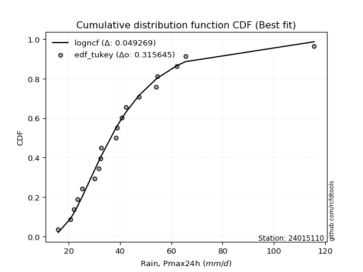</img></img>

</div>


### 8. EDF Gringorten (1963)

Gringorten plotting position formula is essential for estimating the probability and return periods of extreme events like floods and heavy rainfall. The constant _a=0.44_.

<div align="center">


$P=(m-a)/(n+1-2a)$


</div>


**8.1. Empirical values**

<div align="center">

|                | 0                    | 1                  | 2                  | 3                  | 4                   | 5                   | 6                   | 7                   | 8                  | 9                   | 10                 | 11                 | 12                 | 13                 | 14                 | 15                 | 16                 | 17                 | 18                 | 19                 |
|:---------------|:---------------------|:-------------------|:-------------------|:-------------------|:--------------------|:--------------------|:--------------------|:--------------------|:-------------------|:--------------------|:-------------------|:-------------------|:-------------------|:-------------------|:-------------------|:-------------------|:-------------------|:-------------------|:-------------------|:-------------------|
| date           | 2020                 | 2025               | 2022               | 2019               | 2008                | 2023                | 2015                | 2014                | 2018               | 2017                | 2007               | 2016               | 2005               | 2009               | 2021               | 2010               | 2006               | 2012               | 2011               | 2013               |
| x              | 15.9                 | 19.2               | 20.7               | 22.1               | 23.3                | 25.3                | 30.1                | 31.8                | 32.5               | 32.6                | 38.4               | 38.9               | 40.8               | 42.2               | 47.4               | 54.1               | 54.6               | 59.9               | 65.5               | 115.7              |
| m              | 1                    | 2                  | 3                  | 4                  | 5                   | 6                   | 7                   | 8                   | 9                  | 10                  | 11                 | 12                 | 13                 | 14                 | 15                 | 16                 | 17                 | 18                 | 19                 | 20                 |
| empirical_dist | edf_gringorten       | edf_gringorten     | edf_gringorten     | edf_gringorten     | edf_gringorten      | edf_gringorten      | edf_gringorten      | edf_gringorten      | edf_gringorten     | edf_gringorten      | edf_gringorten     | edf_gringorten     | edf_gringorten     | edf_gringorten     | edf_gringorten     | edf_gringorten     | edf_gringorten     | edf_gringorten     | edf_gringorten     | edf_gringorten     |
| empirical      | 0.027833001988071572 | 0.0775347912524851 | 0.1272365805168986 | 0.1769383697813121 | 0.22664015904572563 | 0.27634194831013914 | 0.32604373757455263 | 0.37574552683896617 | 0.4254473161033797 | 0.47514910536779326 | 0.5248508946322068 | 0.5745526838966203 | 0.6242544731610338 | 0.6739562624254473 | 0.7236580516898609 | 0.7733598409542743 | 0.8230616302186877 | 0.8727634194831013 | 0.9224652087475148 | 0.9721669980119283 |
| empirical_tr   | 1.0286298568507157   | 1.084051724137931  | 1.1457858769931661 | 1.2149758454106279 | 1.2930591259640103  | 1.3818681318681318  | 1.4837758112094395  | 1.6019108280254777  | 1.740484429065744  | 1.90530303030303    | 2.1046025104602513 | 2.350467289719626  | 2.6613756613756614 | 3.0670731707317067 | 3.618705035971223  | 4.412280701754386  | 5.651685393258422  | 7.859374999999996  | 12.89743589743588  | 35.92857142857125  |

</div>


**8.2. Kolmogorov-Smirnov fit test (sorted by Δ)**


<div align="center">

|                | 0                    | 1                   | 2                   | 3                   | 4                   | 5                   | 6                    | 7                   | 8                    | 9                    | 10                   | 11                   | 12                  | 13                  | 14                   | 15                  | 16                  | 17                  | 18                  | 19                  | 20                  | 21                   | 22                   | 23                  | 24                  | 25                  | 26                  | 27                  | 28                  | 29                  | 30                 | 31                  | 32                  | 33                  | 34                  | 35                  | 36                 | 37                  | 38                  | 39                  | 40                  | 41                  | 42                  | 43                  | 44                  | 45                  | 46                  | 47                  | 48                  | 49                  | 50                  | 51                  | 52                  | 53                 | 54                  | 55                  | 56                  | 57                  | 58                 | 59                  | 60                  | 61                  | 62                  | 63                  | 64                  | 65                  | 66                 | 67                  | 68                  | 69                  | 70                 | 71                  | 72                  | 73                  | 74                  | 75                 | 76                  | 77                 | 78                  | 79                  | 80                  | 81                 | 82                  | 83                  | 84                  | 85                  | 86                  | 87                  | 88                  | 89                  | 90                  | 91                 | 92                  | 93                 | 94                  | 95                  | 96                  | 97                  | 98                  | 99                  | 100                 | 101                 | 102                 | 103                 | 104                | 105                 | 106                 | 107                 | 108                | 109                | 110                 | 111                 | 112                | 113                | 114                 | 115                 | 116                 | 117                 | 118                 | 119                | 120                 | 121                | 122                | 123                 | 124                 | 125                 | 126                 | 127                 | 128                | 129                 | 130                 | 131                | 132                 | 133                 | 134                 | 135                 | 136                 | 137                 | 138                | 139                 | 140                | 141                 | 142                 | 143                 | 144                | 145                 | 146                 | 147                | 148                | 149                 | 150                 | 151                | 152                | 153                | 154                | 155                | 156                | 157                | 158                | 159                |
|:---------------|:---------------------|:--------------------|:--------------------|:--------------------|:--------------------|:--------------------|:---------------------|:--------------------|:---------------------|:---------------------|:---------------------|:---------------------|:--------------------|:--------------------|:---------------------|:--------------------|:--------------------|:--------------------|:--------------------|:--------------------|:--------------------|:---------------------|:---------------------|:--------------------|:--------------------|:--------------------|:--------------------|:--------------------|:--------------------|:--------------------|:-------------------|:--------------------|:--------------------|:--------------------|:--------------------|:--------------------|:-------------------|:--------------------|:--------------------|:--------------------|:--------------------|:--------------------|:--------------------|:--------------------|:--------------------|:--------------------|:--------------------|:--------------------|:--------------------|:--------------------|:--------------------|:--------------------|:--------------------|:-------------------|:--------------------|:--------------------|:--------------------|:--------------------|:-------------------|:--------------------|:--------------------|:--------------------|:--------------------|:--------------------|:--------------------|:--------------------|:-------------------|:--------------------|:--------------------|:--------------------|:-------------------|:--------------------|:--------------------|:--------------------|:--------------------|:-------------------|:--------------------|:-------------------|:--------------------|:--------------------|:--------------------|:-------------------|:--------------------|:--------------------|:--------------------|:--------------------|:--------------------|:--------------------|:--------------------|:--------------------|:--------------------|:-------------------|:--------------------|:-------------------|:--------------------|:--------------------|:--------------------|:--------------------|:--------------------|:--------------------|:--------------------|:--------------------|:--------------------|:--------------------|:-------------------|:--------------------|:--------------------|:--------------------|:-------------------|:-------------------|:--------------------|:--------------------|:-------------------|:-------------------|:--------------------|:--------------------|:--------------------|:--------------------|:--------------------|:-------------------|:--------------------|:-------------------|:-------------------|:--------------------|:--------------------|:--------------------|:--------------------|:--------------------|:-------------------|:--------------------|:--------------------|:-------------------|:--------------------|:--------------------|:--------------------|:--------------------|:--------------------|:--------------------|:-------------------|:--------------------|:-------------------|:--------------------|:--------------------|:--------------------|:-------------------|:--------------------|:--------------------|:-------------------|:-------------------|:--------------------|:--------------------|:-------------------|:-------------------|:-------------------|:-------------------|:-------------------|:-------------------|:-------------------|:-------------------|:-------------------|
| station        | 24015110             | 24015110            | 24015110            | 24015110            | 24015110            | 24015110            | 24015110             | 24015110            | 24015110             | 24015110             | 24015110             | 24015110             | 24015110            | 24015110            | 24015110             | 24015110            | 24015110            | 24015110            | 24015110            | 24015110            | 24015110            | 24015110             | 24015110             | 24015110            | 24015110            | 24015110            | 24015110            | 24015110            | 24015110            | 24015110            | 24015110           | 24015110            | 24015110            | 24015110            | 24015110            | 24015110            | 24015110           | 24015110            | 24015110            | 24015110            | 24015110            | 24015110            | 24015110            | 24015110            | 24015110            | 24015110            | 24015110            | 24015110            | 24015110            | 24015110            | 24015110            | 24015110            | 24015110            | 24015110           | 24015110            | 24015110            | 24015110            | 24015110            | 24015110           | 24015110            | 24015110            | 24015110            | 24015110            | 24015110            | 24015110            | 24015110            | 24015110           | 24015110            | 24015110            | 24015110            | 24015110           | 24015110            | 24015110            | 24015110            | 24015110            | 24015110           | 24015110            | 24015110           | 24015110            | 24015110            | 24015110            | 24015110           | 24015110            | 24015110            | 24015110            | 24015110            | 24015110            | 24015110            | 24015110            | 24015110            | 24015110            | 24015110           | 24015110            | 24015110           | 24015110            | 24015110            | 24015110            | 24015110            | 24015110            | 24015110            | 24015110            | 24015110            | 24015110            | 24015110            | 24015110           | 24015110            | 24015110            | 24015110            | 24015110           | 24015110           | 24015110            | 24015110            | 24015110           | 24015110           | 24015110            | 24015110            | 24015110            | 24015110            | 24015110            | 24015110           | 24015110            | 24015110           | 24015110           | 24015110            | 24015110            | 24015110            | 24015110            | 24015110            | 24015110           | 24015110            | 24015110            | 24015110           | 24015110            | 24015110            | 24015110            | 24015110            | 24015110            | 24015110            | 24015110           | 24015110            | 24015110           | 24015110            | 24015110            | 24015110            | 24015110           | 24015110            | 24015110            | 24015110           | 24015110           | 24015110            | 24015110            | 24015110           | 24015110           | 24015110           | 24015110           | 24015110           | 24015110           | 24015110           | 24015110           | 24015110           |
| empirical_dist | edf_gringorten       | edf_gringorten      | edf_gringorten      | edf_gringorten      | edf_gringorten      | edf_gringorten      | edf_gringorten       | edf_gringorten      | edf_gringorten       | edf_gringorten       | edf_gringorten       | edf_gringorten       | edf_gringorten      | edf_gringorten      | edf_gringorten       | edf_gringorten      | edf_gringorten      | edf_gringorten      | edf_gringorten      | edf_gringorten      | edf_gringorten      | edf_gringorten       | edf_gringorten       | edf_gringorten      | edf_gringorten      | edf_gringorten      | edf_gringorten      | edf_gringorten      | edf_gringorten      | edf_gringorten      | edf_gringorten     | edf_gringorten      | edf_gringorten      | edf_gringorten      | edf_gringorten      | edf_gringorten      | edf_gringorten     | edf_gringorten      | edf_gringorten      | edf_gringorten      | edf_gringorten      | edf_gringorten      | edf_gringorten      | edf_gringorten      | edf_gringorten      | edf_gringorten      | edf_gringorten      | edf_gringorten      | edf_gringorten      | edf_gringorten      | edf_gringorten      | edf_gringorten      | edf_gringorten      | edf_gringorten     | edf_gringorten      | edf_gringorten      | edf_gringorten      | edf_gringorten      | edf_gringorten     | edf_gringorten      | edf_gringorten      | edf_gringorten      | edf_gringorten      | edf_gringorten      | edf_gringorten      | edf_gringorten      | edf_gringorten     | edf_gringorten      | edf_gringorten      | edf_gringorten      | edf_gringorten     | edf_gringorten      | edf_gringorten      | edf_gringorten      | edf_gringorten      | edf_gringorten     | edf_gringorten      | edf_gringorten     | edf_gringorten      | edf_gringorten      | edf_gringorten      | edf_gringorten     | edf_gringorten      | edf_gringorten      | edf_gringorten      | edf_gringorten      | edf_gringorten      | edf_gringorten      | edf_gringorten      | edf_gringorten      | edf_gringorten      | edf_gringorten     | edf_gringorten      | edf_gringorten     | edf_gringorten      | edf_gringorten      | edf_gringorten      | edf_gringorten      | edf_gringorten      | edf_gringorten      | edf_gringorten      | edf_gringorten      | edf_gringorten      | edf_gringorten      | edf_gringorten     | edf_gringorten      | edf_gringorten      | edf_gringorten      | edf_gringorten     | edf_gringorten     | edf_gringorten      | edf_gringorten      | edf_gringorten     | edf_gringorten     | edf_gringorten      | edf_gringorten      | edf_gringorten      | edf_gringorten      | edf_gringorten      | edf_gringorten     | edf_gringorten      | edf_gringorten     | edf_gringorten     | edf_gringorten      | edf_gringorten      | edf_gringorten      | edf_gringorten      | edf_gringorten      | edf_gringorten     | edf_gringorten      | edf_gringorten      | edf_gringorten     | edf_gringorten      | edf_gringorten      | edf_gringorten      | edf_gringorten      | edf_gringorten      | edf_gringorten      | edf_gringorten     | edf_gringorten      | edf_gringorten     | edf_gringorten      | edf_gringorten      | edf_gringorten      | edf_gringorten     | edf_gringorten      | edf_gringorten      | edf_gringorten     | edf_gringorten     | edf_gringorten      | edf_gringorten      | edf_gringorten     | edf_gringorten     | edf_gringorten     | edf_gringorten     | edf_gringorten     | edf_gringorten     | edf_gringorten     | edf_gringorten     | edf_gringorten     |
| p_dist         | kappa3               | moyal               | logbetaprime        | burr12              | logdweibull         | ncf                 | logdgamma            | logpearson3         | betaprime            | logexponnorm         | logburr12            | logrice              | logmaxwell          | loggennorm          | lognorm              | logcrystalball      | logt                | logloggamma         | loganglit           | logweibull_max      | loggenextreme       | genexpon             | logalpha             | loginvgamma         | logf                | alpha               | logskewnorm         | logjohnsonsu        | lognct              | logweibull_min      | logfatiguelife     | loginvgauss         | johnsonsu           | logvonmises_line    | nct                 | logburr             | invgamma           | invgauss            | logerlang           | loggamma            | loggamma            | logfoldnorm         | invweibull          | genextreme          | halflogistic        | logsemicircular     | f                   | fatiguelife         | lograyleigh         | logjohnsonsb        | johnsonsb           | mielke              | loglogistic         | gumbel_r           | logncf              | logmielke           | loggenlogistic      | burr                | logbeta            | lognakagami         | pearson3            | logtriang           | exponpow            | genlogistic         | beta                | logexponweib        | loghypsecant       | loginvweibull       | gompertz            | gausshyper          | erlang             | gamma               | genpareto           | exponnorm           | halfnorm            | tukeylambda        | loggenexpon         | logkstwobign       | logcosine           | t                   | gennorm             | loggumbel_r        | skewnorm            | rayleigh            | genhalflogistic     | loghalfnorm         | kstwobign           | loglaplace          | loglaplace          | dgamma              | dweibull            | logarcsine         | gengamma            | loghalfgennorm     | maxwell             | cosine              | logtruncweibull_min | logtruncpareto      | logtruncexpon       | loggausshyper       | loghalflogistic     | logmoyal            | loggengamma         | loggumbel_l         | exponweib          | loggompertz         | foldnorm            | rice                | logistic           | truncnorm          | crystalball         | norm                | logbradford        | wald               | hypsecant           | lomax               | anglit              | semicircular        | logloglaplace       | laplace            | arcsine             | weibull_min        | logexponpow        | loguniform          | loglomax            | logkappa4           | gumbel_l            | logtukeylambda      | halfgennorm        | logkappa3           | logargus            | logwald            | vonmises_line       | truncweibull_min    | triang              | truncexpon          | logksone            | logrdist            | logtruncnorm       | bradford            | nakagami           | powerlaw            | logwrapcauchy       | loggenpareto        | logpowerlaw        | loggenhalflogistic  | argus               | kappa4             | wrapcauchy         | ksone               | uniform             | loglevy_l          | logtrapezoid       | levy_l             | rdist              | trapezoid          | weibull_max        | truncpareto        | logvonmises        | vonmises           |
| delta          | 0.047194530238818644 | 0.04811071461863603 | 0.05000607181790159 | 0.05212888541828392 | 0.05231109959978025 | 0.05537215031913223 | 0.055575979372790074 | 0.05572903405844076 | 0.056042905320282665 | 0.056689714200289565 | 0.057111660431049927 | 0.057112422528796225 | 0.05893065383428697 | 0.05937309924496764 | 0.059433611553788734 | 0.05943365702217779 | 0.05943429411450862 | 0.05990859639791901 | 0.06036355059678655 | 0.06130991327416202 | 0.06131152374584725 | 0.061499747845850106 | 0.061930262851494944 | 0.06300371994403098 | 0.06305855891354328 | 0.06334505693393644 | 0.06381629265696165 | 0.06390628971874879 | 0.06395380613860446 | 0.06460786807523566 | 0.064911626016672  | 0.06493416055864287 | 0.06576108432348193 | 0.06592247572926552 | 0.06604039371980164 | 0.06623044088368091 | 0.0664665231252971 | 0.06668273038299166 | 0.06692821705410545 | 0.06692858479422736 | 0.06692858479422736 | 0.06719367824719691 | 0.06725039367144026 | 0.06725054304197287 | 0.06750387077271247 | 0.06775354493317332 | 0.06778422387476246 | 0.06890469232662111 | 0.06915977653895655 | 0.07016744956736387 | 0.07051914891331845 | 0.07055887570278108 | 0.07250896320082548 | 0.0735087234882621 | 0.07399839536930741 | 0.07404885616933632 | 0.07482950963525126 | 0.07486523976473225 | 0.0761381610636871 | 0.07682307679129807 | 0.07800637790193732 | 0.07816615715489272 | 0.07937958251123833 | 0.07989869930122423 | 0.08122405281559458 | 0.08534198867888276 | 0.0865461929079323 | 0.08654710798259158 | 0.08692776495554677 | 0.08800230553994587 | 0.0890735426207862 | 0.08907363131278562 | 0.09013263768840257 | 0.09203663175603516 | 0.09208793239599576 | 0.0940014108926516 | 0.09491799872962281 | 0.0954154990353836 | 0.09707613512627322 | 0.09766700266087505 | 0.09831018421169008 | 0.0987217881840291 | 0.10039162933543244 | 0.10220917400037599 | 0.10344891896272634 | 0.10352872696214799 | 0.10388604888006553 | 0.10512460645323884 | 0.10512460645323884 | 0.10535795043738636 | 0.10647507887586002 | 0.1086231468870471 | 0.10871578739957738 | 0.1111294635626916 | 0.11251236496183026 | 0.11347945137252047 | 0.11742349796800489 | 0.11899129561146082 | 0.12049879936155905 | 0.12095267115474684 | 0.12323914158275595 | 0.12343907028650292 | 0.12710964237329764 | 0.12740546325140661 | 0.1287572828333955 | 0.13133114821836567 | 0.13278577087770282 | 0.13785332525944766 | 0.1400770177406767 | 0.1441315995093918 | 0.14413161065061875 | 0.14413161232782523 | 0.1457788475445979 | 0.1463714905755508 | 0.14648996048317198 | 0.14713469429760273 | 0.14838834712913418 | 0.15014310921221063 | 0.15094638312803121 | 0.1748655106797763 | 0.18241957710672368 | 0.184344399600469  | 0.200305890519914  | 0.20913613524089103 | 0.21017854004267567 | 0.21033022436182303 | 0.21296994135130443 | 0.21463272039136128 | 0.218297553797286  | 0.21875814914980085 | 0.22403285892180902 | 0.2260248570956878 | 0.23311033262690656 | 0.24125319806707068 | 0.24136581818601077 | 0.24309248874264966 | 0.24469098082532825 | 0.25433916420364866 | 0.2635938135384962 | 0.27086333121435346 | 0.2968873488997893 | 0.30200171102467155 | 0.34024950726100245 | 0.34465177351332854 | 0.3521160585662675 | 0.36454955920167276 | 0.38532194548747256 | 0.4100081714645495 | 0.4242494559637822 | 0.42497021876755486 | 0.43528607911648326 | 0.4422717445441263 | 0.4630873047119987 | 0.5059392568953133 | 0.5261048656047229 | 0.6749639436923544 | 0.77705982532371   | 0.8301554398016077 | 1.0422764981535602 | 17.469654733023123 |
| deltao         | 0.3096406529800002   | 0.3096406529800002  | 0.3096406529800002  | 0.3096406529800002  | 0.3096406529800002  | 0.3096406529800002  | 0.3096406529800002   | 0.3096406529800002  | 0.3096406529800002   | 0.3096406529800002   | 0.3096406529800002   | 0.3096406529800002   | 0.3096406529800002  | 0.3096406529800002  | 0.3096406529800002   | 0.3096406529800002  | 0.3096406529800002  | 0.3096406529800002  | 0.3096406529800002  | 0.3096406529800002  | 0.3096406529800002  | 0.3096406529800002   | 0.3096406529800002   | 0.3096406529800002  | 0.3096406529800002  | 0.3096406529800002  | 0.3096406529800002  | 0.3096406529800002  | 0.3096406529800002  | 0.3096406529800002  | 0.3096406529800002 | 0.3096406529800002  | 0.3096406529800002  | 0.3096406529800002  | 0.3096406529800002  | 0.3096406529800002  | 0.3096406529800002 | 0.3096406529800002  | 0.3096406529800002  | 0.3096406529800002  | 0.3096406529800002  | 0.3096406529800002  | 0.3096406529800002  | 0.3096406529800002  | 0.3096406529800002  | 0.3096406529800002  | 0.3096406529800002  | 0.3096406529800002  | 0.3096406529800002  | 0.3096406529800002  | 0.3096406529800002  | 0.3096406529800002  | 0.3096406529800002  | 0.3096406529800002 | 0.3096406529800002  | 0.3096406529800002  | 0.3096406529800002  | 0.3096406529800002  | 0.3096406529800002 | 0.3096406529800002  | 0.3096406529800002  | 0.3096406529800002  | 0.3096406529800002  | 0.3096406529800002  | 0.3096406529800002  | 0.3096406529800002  | 0.3096406529800002 | 0.3096406529800002  | 0.3096406529800002  | 0.3096406529800002  | 0.3096406529800002 | 0.3096406529800002  | 0.3096406529800002  | 0.3096406529800002  | 0.3096406529800002  | 0.3096406529800002 | 0.3096406529800002  | 0.3096406529800002 | 0.3096406529800002  | 0.3096406529800002  | 0.3096406529800002  | 0.3096406529800002 | 0.3096406529800002  | 0.3096406529800002  | 0.3096406529800002  | 0.3096406529800002  | 0.3096406529800002  | 0.3096406529800002  | 0.3096406529800002  | 0.3096406529800002  | 0.3096406529800002  | 0.3096406529800002 | 0.3096406529800002  | 0.3096406529800002 | 0.3096406529800002  | 0.3096406529800002  | 0.3096406529800002  | 0.3096406529800002  | 0.3096406529800002  | 0.3096406529800002  | 0.3096406529800002  | 0.3096406529800002  | 0.3096406529800002  | 0.3096406529800002  | 0.3096406529800002 | 0.3096406529800002  | 0.3096406529800002  | 0.3096406529800002  | 0.3096406529800002 | 0.3096406529800002 | 0.3096406529800002  | 0.3096406529800002  | 0.3096406529800002 | 0.3096406529800002 | 0.3096406529800002  | 0.3096406529800002  | 0.3096406529800002  | 0.3096406529800002  | 0.3096406529800002  | 0.3096406529800002 | 0.3096406529800002  | 0.3096406529800002 | 0.3096406529800002 | 0.3096406529800002  | 0.3096406529800002  | 0.3096406529800002  | 0.3096406529800002  | 0.3096406529800002  | 0.3096406529800002 | 0.3096406529800002  | 0.3096406529800002  | 0.3096406529800002 | 0.3096406529800002  | 0.3096406529800002  | 0.3096406529800002  | 0.3096406529800002  | 0.3096406529800002  | 0.3096406529800002  | 0.3096406529800002 | 0.3096406529800002  | 0.3096406529800002 | 0.3096406529800002  | 0.3096406529800002  | 0.3096406529800002  | 0.3096406529800002 | 0.3096406529800002  | 0.3096406529800002  | 0.3096406529800002 | 0.3096406529800002 | 0.3096406529800002  | 0.3096406529800002  | 0.3096406529800002 | 0.3096406529800002 | 0.3096406529800002 | 0.3096406529800002 | 0.3096406529800002 | 0.3096406529800002 | 0.3096406529800002 | 0.3096406529800002 | 0.3096406529800002 |
| eval           | Δo > Δ               | Δo > Δ              | Δo > Δ              | Δo > Δ              | Δo > Δ              | Δo > Δ              | Δo > Δ               | Δo > Δ              | Δo > Δ               | Δo > Δ               | Δo > Δ               | Δo > Δ               | Δo > Δ              | Δo > Δ              | Δo > Δ               | Δo > Δ              | Δo > Δ              | Δo > Δ              | Δo > Δ              | Δo > Δ              | Δo > Δ              | Δo > Δ               | Δo > Δ               | Δo > Δ              | Δo > Δ              | Δo > Δ              | Δo > Δ              | Δo > Δ              | Δo > Δ              | Δo > Δ              | Δo > Δ             | Δo > Δ              | Δo > Δ              | Δo > Δ              | Δo > Δ              | Δo > Δ              | Δo > Δ             | Δo > Δ              | Δo > Δ              | Δo > Δ              | Δo > Δ              | Δo > Δ              | Δo > Δ              | Δo > Δ              | Δo > Δ              | Δo > Δ              | Δo > Δ              | Δo > Δ              | Δo > Δ              | Δo > Δ              | Δo > Δ              | Δo > Δ              | Δo > Δ              | Δo > Δ             | Δo > Δ              | Δo > Δ              | Δo > Δ              | Δo > Δ              | Δo > Δ             | Δo > Δ              | Δo > Δ              | Δo > Δ              | Δo > Δ              | Δo > Δ              | Δo > Δ              | Δo > Δ              | Δo > Δ             | Δo > Δ              | Δo > Δ              | Δo > Δ              | Δo > Δ             | Δo > Δ              | Δo > Δ              | Δo > Δ              | Δo > Δ              | Δo > Δ             | Δo > Δ              | Δo > Δ             | Δo > Δ              | Δo > Δ              | Δo > Δ              | Δo > Δ             | Δo > Δ              | Δo > Δ              | Δo > Δ              | Δo > Δ              | Δo > Δ              | Δo > Δ              | Δo > Δ              | Δo > Δ              | Δo > Δ              | Δo > Δ             | Δo > Δ              | Δo > Δ             | Δo > Δ              | Δo > Δ              | Δo > Δ              | Δo > Δ              | Δo > Δ              | Δo > Δ              | Δo > Δ              | Δo > Δ              | Δo > Δ              | Δo > Δ              | Δo > Δ             | Δo > Δ              | Δo > Δ              | Δo > Δ              | Δo > Δ             | Δo > Δ             | Δo > Δ              | Δo > Δ              | Δo > Δ             | Δo > Δ             | Δo > Δ              | Δo > Δ              | Δo > Δ              | Δo > Δ              | Δo > Δ              | Δo > Δ             | Δo > Δ              | Δo > Δ             | Δo > Δ             | Δo > Δ              | Δo > Δ              | Δo > Δ              | Δo > Δ              | Δo > Δ              | Δo > Δ             | Δo > Δ              | Δo > Δ              | Δo > Δ             | Δo > Δ              | Δo > Δ              | Δo > Δ              | Δo > Δ              | Δo > Δ              | Δo > Δ              | Δo > Δ             | Δo > Δ              | Δo > Δ             | Δo > Δ              | Δo <= Δ             | Δo <= Δ             | Δo <= Δ            | Δo <= Δ             | Δo <= Δ             | Δo <= Δ            | Δo <= Δ            | Δo <= Δ             | Δo <= Δ             | Δo <= Δ            | Δo <= Δ            | Δo <= Δ            | Δo <= Δ            | Δo <= Δ            | Δo <= Δ            | Δo <= Δ            | Δo <= Δ            | Δo <= Δ            |
| fit            | 1                    | 1                   | 1                   | 1                   | 1                   | 1                   | 1                    | 1                   | 1                    | 1                    | 1                    | 1                    | 1                   | 1                   | 1                    | 1                   | 1                   | 1                   | 1                   | 1                   | 1                   | 1                    | 1                    | 1                   | 1                   | 1                   | 1                   | 1                   | 1                   | 1                   | 1                  | 1                   | 1                   | 1                   | 1                   | 1                   | 1                  | 1                   | 1                   | 1                   | 1                   | 1                   | 1                   | 1                   | 1                   | 1                   | 1                   | 1                   | 1                   | 1                   | 1                   | 1                   | 1                   | 1                  | 1                   | 1                   | 1                   | 1                   | 1                  | 1                   | 1                   | 1                   | 1                   | 1                   | 1                   | 1                   | 1                  | 1                   | 1                   | 1                   | 1                  | 1                   | 1                   | 1                   | 1                   | 1                  | 1                   | 1                  | 1                   | 1                   | 1                   | 1                  | 1                   | 1                   | 1                   | 1                   | 1                   | 1                   | 1                   | 1                   | 1                   | 1                  | 1                   | 1                  | 1                   | 1                   | 1                   | 1                   | 1                   | 1                   | 1                   | 1                   | 1                   | 1                   | 1                  | 1                   | 1                   | 1                   | 1                  | 1                  | 1                   | 1                   | 1                  | 1                  | 1                   | 1                   | 1                   | 1                   | 1                   | 1                  | 1                   | 1                  | 1                  | 1                   | 1                   | 1                   | 1                   | 1                   | 1                  | 1                   | 1                   | 1                  | 1                   | 1                   | 1                   | 1                   | 1                   | 1                   | 1                  | 1                   | 1                  | 1                   | 0                   | 0                   | 0                  | 0                   | 0                   | 0                  | 0                  | 0                   | 0                   | 0                  | 0                  | 0                  | 0                  | 0                  | 0                  | 0                  | 0                  | 0                  |
| n              | 20                   | 20                  | 20                  | 20                  | 20                  | 20                  | 20                   | 20                  | 20                   | 20                   | 20                   | 20                   | 20                  | 20                  | 20                   | 20                  | 20                  | 20                  | 20                  | 20                  | 20                  | 20                   | 20                   | 20                  | 20                  | 20                  | 20                  | 20                  | 20                  | 20                  | 20                 | 20                  | 20                  | 20                  | 20                  | 20                  | 20                 | 20                  | 20                  | 20                  | 20                  | 20                  | 20                  | 20                  | 20                  | 20                  | 20                  | 20                  | 20                  | 20                  | 20                  | 20                  | 20                  | 20                 | 20                  | 20                  | 20                  | 20                  | 20                 | 20                  | 20                  | 20                  | 20                  | 20                  | 20                  | 20                  | 20                 | 20                  | 20                  | 20                  | 20                 | 20                  | 20                  | 20                  | 20                  | 20                 | 20                  | 20                 | 20                  | 20                  | 20                  | 20                 | 20                  | 20                  | 20                  | 20                  | 20                  | 20                  | 20                  | 20                  | 20                  | 20                 | 20                  | 20                 | 20                  | 20                  | 20                  | 20                  | 20                  | 20                  | 20                  | 20                  | 20                  | 20                  | 20                 | 20                  | 20                  | 20                  | 20                 | 20                 | 20                  | 20                  | 20                 | 20                 | 20                  | 20                  | 20                  | 20                  | 20                  | 20                 | 20                  | 20                 | 20                 | 20                  | 20                  | 20                  | 20                  | 20                  | 20                 | 20                  | 20                  | 20                 | 20                  | 20                  | 20                  | 20                  | 20                  | 20                  | 20                 | 20                  | 20                 | 20                  | 20                  | 20                  | 20                 | 20                  | 20                  | 20                 | 20                 | 20                  | 20                  | 20                 | 20                 | 20                 | 20                 | 20                 | 20                 | 20                 | 20                 | 20                 |
| best_fit       | 1                    | 0                   | 0                   | 0                   | 0                   | 0                   | 0                    | 0                   | 0                    | 0                    | 0                    | 0                    | 0                   | 0                   | 0                    | 0                   | 0                   | 0                   | 0                   | 0                   | 0                   | 0                    | 0                    | 0                   | 0                   | 0                   | 0                   | 0                   | 0                   | 0                   | 0                  | 0                   | 0                   | 0                   | 0                   | 0                   | 0                  | 0                   | 0                   | 0                   | 0                   | 0                   | 0                   | 0                   | 0                   | 0                   | 0                   | 0                   | 0                   | 0                   | 0                   | 0                   | 0                   | 0                  | 0                   | 0                   | 0                   | 0                   | 0                  | 0                   | 0                   | 0                   | 0                   | 0                   | 0                   | 0                   | 0                  | 0                   | 0                   | 0                   | 0                  | 0                   | 0                   | 0                   | 0                   | 0                  | 0                   | 0                  | 0                   | 0                   | 0                   | 0                  | 0                   | 0                   | 0                   | 0                   | 0                   | 0                   | 0                   | 0                   | 0                   | 0                  | 0                   | 0                  | 0                   | 0                   | 0                   | 0                   | 0                   | 0                   | 0                   | 0                   | 0                   | 0                   | 0                  | 0                   | 0                   | 0                   | 0                  | 0                  | 0                   | 0                   | 0                  | 0                  | 0                   | 0                   | 0                   | 0                   | 0                   | 0                  | 0                   | 0                  | 0                  | 0                   | 0                   | 0                   | 0                   | 0                   | 0                  | 0                   | 0                   | 0                  | 0                   | 0                   | 0                   | 0                   | 0                   | 0                   | 0                  | 0                   | 0                  | 0                   | 0                   | 0                   | 0                  | 0                   | 0                   | 0                  | 0                  | 0                   | 0                   | 0                  | 0                  | 0                  | 0                  | 0                  | 0                  | 0                  | 0                  | 0                  |
| best_fit_sort  | 1                    | 2                   | 3                   | 4                   | 5                   | 6                   | 7                    | 8                   | 9                    | 10                   | 11                   | 12                   | 13                  | 14                  | 15                   | 16                  | 17                  | 18                  | 19                  | 20                  | 21                  | 22                   | 23                   | 24                  | 25                  | 26                  | 27                  | 28                  | 29                  | 30                  | 31                 | 32                  | 33                  | 34                  | 35                  | 36                  | 37                 | 38                  | 39                  | 40                  | 41                  | 42                  | 43                  | 44                  | 45                  | 46                  | 47                  | 48                  | 49                  | 50                  | 51                  | 52                  | 53                  | 54                 | 55                  | 56                  | 57                  | 58                  | 59                 | 60                  | 61                  | 62                  | 63                  | 64                  | 65                  | 66                  | 67                 | 68                  | 69                  | 70                  | 71                 | 72                  | 73                  | 74                  | 75                  | 76                 | 77                  | 78                 | 79                  | 80                  | 81                  | 82                 | 83                  | 84                  | 85                  | 86                  | 87                  | 88                  | 89                  | 90                  | 91                  | 92                 | 93                  | 94                 | 95                  | 96                  | 97                  | 98                  | 99                  | 100                 | 101                 | 102                 | 103                 | 104                 | 105                | 106                 | 107                 | 108                 | 109                | 110                | 111                 | 112                 | 113                | 114                | 115                 | 116                 | 117                 | 118                 | 119                 | 120                | 121                 | 122                | 123                | 124                 | 125                 | 126                 | 127                 | 128                 | 129                | 130                 | 131                 | 132                | 133                 | 134                 | 135                 | 136                 | 137                 | 138                 | 139                | 140                 | 141                | 142                 | 143                 | 144                 | 145                | 146                 | 147                 | 148                | 149                | 150                 | 151                 | 152                | 153                | 154                | 155                | 156                | 157                | 158                | 159                | 160                |

</div>


**8.3. Best fit**

<div align="center">

|   id |   station | empirical_dist   | p_dist   |     delta |   deltao | eval   |   fit |   n |   best_fit |   best_fit_sort |
|-----:|----------:|:-----------------|:---------|----------:|---------:|:-------|------:|----:|-----------:|----------------:|
|    0 |  24015110 | edf_gringorten   | kappa3   | 0.0471945 | 0.309641 | Δo > Δ |     1 |  20 |          1 |               1 |

</div>


<div align="center">

</img></img>

</div>


### 9. EDF Filliben (1975)

The specific values of the constants (0.3175) (often denoted as $alpha$) and (0.365) are derived from a method proposed by James J. Filliben in a 1975 paper. This particular formula is the mean value of the $i$-th order statistic of the normal distribution and is considered a robust and effective plotting position formula for the normal probability plot correlation coefficient test for normality.

<div align="center">


$P=(m-0.3175)/(n+0.365)$


</div>


**9.1. Empirical values**

<div align="center">

|                | 0                   | 1                   | 2                  | 3                   | 4                   | 5                  | 6                   | 7                   | 8                   | 9                   | 10                 | 11                 | 12                 | 13                 | 14                | 15                 | 16                 | 17                 | 18                 | 19                 |
|:---------------|:--------------------|:--------------------|:-------------------|:--------------------|:--------------------|:-------------------|:--------------------|:--------------------|:--------------------|:--------------------|:-------------------|:-------------------|:-------------------|:-------------------|:------------------|:-------------------|:-------------------|:-------------------|:-------------------|:-------------------|
| date           | 2020                | 2025                | 2022               | 2019                | 2008                | 2023               | 2015                | 2014                | 2018                | 2017                | 2007               | 2016               | 2005               | 2009               | 2021              | 2010               | 2006               | 2012               | 2011               | 2013               |
| x              | 15.9                | 19.2                | 20.7               | 22.1                | 23.3                | 25.3               | 30.1                | 31.8                | 32.5                | 32.6                | 38.4               | 38.9               | 40.8               | 42.2               | 47.4              | 54.1               | 54.6               | 59.9               | 65.5               | 115.7              |
| m              | 1                   | 2                   | 3                  | 4                   | 5                   | 6                  | 7                   | 8                   | 9                   | 10                  | 11                 | 12                 | 13                 | 14                 | 15                | 16                 | 17                 | 18                 | 19                 | 20                 |
| empirical_dist | edf_filliben        | edf_filliben        | edf_filliben       | edf_filliben        | edf_filliben        | edf_filliben       | edf_filliben        | edf_filliben        | edf_filliben        | edf_filliben        | edf_filliben       | edf_filliben       | edf_filliben       | edf_filliben       | edf_filliben      | edf_filliben       | edf_filliben       | edf_filliben       | edf_filliben       | edf_filliben       |
| empirical      | 0.03351338080039283 | 0.08261723545298306 | 0.1317210901055733 | 0.18082494475816355 | 0.22992879941075375 | 0.279032654063344  | 0.32813650871593425 | 0.37724036336852446 | 0.42634421802111466 | 0.47544807267370487 | 0.5245519273262951 | 0.5736557819788853 | 0.6227596366314756 | 0.6718634912840659 | 0.720967345936656 | 0.7700712005892463 | 0.8191750552418366 | 0.8682789098944268 | 0.9173827645470171 | 0.9664866191996073 |
| empirical_tr   | 1.0346754731360346  | 1.090057540479058   | 1.1517036618125265 | 1.2207402967181178  | 1.2985812211063288  | 1.3870253703388389 | 1.4883975881600586  | 1.6057559629410605  | 1.7432056494757115  | 1.90638895389656    | 2.1032791117996386 | 2.345522602936942  | 2.6508298080052066 | 3.0475121586232703 | 3.583809942806863 | 4.349172450613988  | 5.5302104548540445 | 7.591798695246976  | 12.104011887072826 | 29.838827838827974 |

</div>


**9.2. Kolmogorov-Smirnov fit test (sorted by Δ)**


<div align="center">

|                | 0                   | 1                    | 2                  | 3                   | 4                   | 5                    | 6                   | 7                   | 8                   | 9                    | 10                  | 11                  | 12                   | 13                   | 14                   | 15                  | 16                 | 17                   | 18                   | 19                   | 20                   | 21                   | 22                  | 23                  | 24                 | 25                  | 26                  | 27                  | 28                  | 29                  | 30                  | 31                  | 32                  | 33                 | 34                  | 35                  | 36                  | 37                  | 38                  | 39                  | 40                  | 41                  | 42                  | 43                  | 44                  | 45                  | 46                  | 47                  | 48                  | 49                  | 50                  | 51                  | 52                 | 53                 | 54                  | 55                  | 56                  | 57                  | 58                  | 59                  | 60                  | 61                 | 62                  | 63                  | 64                  | 65                  | 66                  | 67                  | 68                 | 69                  | 70                 | 71                  | 72                  | 73                  | 74                  | 75                  | 76                  | 77                  | 78                  | 79                  | 80                  | 81                  | 82                  | 83                  | 84                  | 85                  | 86                  | 87                  | 88                  | 89                  | 90                  | 91                  | 92                  | 93                  | 94                  | 95                  | 96                  | 97                 | 98                 | 99                  | 100                 | 101                 | 102                 | 103                 | 104                 | 105                 | 106                 | 107                | 108                 | 109                 | 110                | 111                 | 112                 | 113                 | 114                 | 115                | 116                 | 117                 | 118                 | 119                | 120                 | 121                 | 122                 | 123                 | 124                 | 125                 | 126                 | 127                 | 128                | 129                 | 130                 | 131                 | 132                 | 133                 | 134                | 135                 | 136                | 137                | 138                | 139                | 140                | 141                | 142                | 143                | 144                 | 145                 | 146                | 147                | 148                 | 149                | 150                | 151                 | 152                | 153                | 154                | 155                | 156                | 157                | 158                | 159                |
|:---------------|:--------------------|:---------------------|:-------------------|:--------------------|:--------------------|:---------------------|:--------------------|:--------------------|:--------------------|:---------------------|:--------------------|:--------------------|:---------------------|:---------------------|:---------------------|:--------------------|:-------------------|:---------------------|:---------------------|:---------------------|:---------------------|:---------------------|:--------------------|:--------------------|:-------------------|:--------------------|:--------------------|:--------------------|:--------------------|:--------------------|:--------------------|:--------------------|:--------------------|:-------------------|:--------------------|:--------------------|:--------------------|:--------------------|:--------------------|:--------------------|:--------------------|:--------------------|:--------------------|:--------------------|:--------------------|:--------------------|:--------------------|:--------------------|:--------------------|:--------------------|:--------------------|:--------------------|:-------------------|:-------------------|:--------------------|:--------------------|:--------------------|:--------------------|:--------------------|:--------------------|:--------------------|:-------------------|:--------------------|:--------------------|:--------------------|:--------------------|:--------------------|:--------------------|:-------------------|:--------------------|:-------------------|:--------------------|:--------------------|:--------------------|:--------------------|:--------------------|:--------------------|:--------------------|:--------------------|:--------------------|:--------------------|:--------------------|:--------------------|:--------------------|:--------------------|:--------------------|:--------------------|:--------------------|:--------------------|:--------------------|:--------------------|:--------------------|:--------------------|:--------------------|:--------------------|:--------------------|:--------------------|:-------------------|:-------------------|:--------------------|:--------------------|:--------------------|:--------------------|:--------------------|:--------------------|:--------------------|:--------------------|:-------------------|:--------------------|:--------------------|:-------------------|:--------------------|:--------------------|:--------------------|:--------------------|:-------------------|:--------------------|:--------------------|:--------------------|:-------------------|:--------------------|:--------------------|:--------------------|:--------------------|:--------------------|:--------------------|:--------------------|:--------------------|:-------------------|:--------------------|:--------------------|:--------------------|:--------------------|:--------------------|:-------------------|:--------------------|:-------------------|:-------------------|:-------------------|:-------------------|:-------------------|:-------------------|:-------------------|:-------------------|:--------------------|:--------------------|:-------------------|:-------------------|:--------------------|:-------------------|:-------------------|:--------------------|:-------------------|:-------------------|:-------------------|:-------------------|:-------------------|:-------------------|:-------------------|:-------------------|
| station        | 24015110            | 24015110             | 24015110           | 24015110            | 24015110            | 24015110             | 24015110            | 24015110            | 24015110            | 24015110             | 24015110            | 24015110            | 24015110             | 24015110             | 24015110             | 24015110            | 24015110           | 24015110             | 24015110             | 24015110             | 24015110             | 24015110             | 24015110            | 24015110            | 24015110           | 24015110            | 24015110            | 24015110            | 24015110            | 24015110            | 24015110            | 24015110            | 24015110            | 24015110           | 24015110            | 24015110            | 24015110            | 24015110            | 24015110            | 24015110            | 24015110            | 24015110            | 24015110            | 24015110            | 24015110            | 24015110            | 24015110            | 24015110            | 24015110            | 24015110            | 24015110            | 24015110            | 24015110           | 24015110           | 24015110            | 24015110            | 24015110            | 24015110            | 24015110            | 24015110            | 24015110            | 24015110           | 24015110            | 24015110            | 24015110            | 24015110            | 24015110            | 24015110            | 24015110           | 24015110            | 24015110           | 24015110            | 24015110            | 24015110            | 24015110            | 24015110            | 24015110            | 24015110            | 24015110            | 24015110            | 24015110            | 24015110            | 24015110            | 24015110            | 24015110            | 24015110            | 24015110            | 24015110            | 24015110            | 24015110            | 24015110            | 24015110            | 24015110            | 24015110            | 24015110            | 24015110            | 24015110            | 24015110           | 24015110           | 24015110            | 24015110            | 24015110            | 24015110            | 24015110            | 24015110            | 24015110            | 24015110            | 24015110           | 24015110            | 24015110            | 24015110           | 24015110            | 24015110            | 24015110            | 24015110            | 24015110           | 24015110            | 24015110            | 24015110            | 24015110           | 24015110            | 24015110            | 24015110            | 24015110            | 24015110            | 24015110            | 24015110            | 24015110            | 24015110           | 24015110            | 24015110            | 24015110            | 24015110            | 24015110            | 24015110           | 24015110            | 24015110           | 24015110           | 24015110           | 24015110           | 24015110           | 24015110           | 24015110           | 24015110           | 24015110            | 24015110            | 24015110           | 24015110           | 24015110            | 24015110           | 24015110           | 24015110            | 24015110           | 24015110           | 24015110           | 24015110           | 24015110           | 24015110           | 24015110           | 24015110           |
| empirical_dist | edf_filliben        | edf_filliben         | edf_filliben       | edf_filliben        | edf_filliben        | edf_filliben         | edf_filliben        | edf_filliben        | edf_filliben        | edf_filliben         | edf_filliben        | edf_filliben        | edf_filliben         | edf_filliben         | edf_filliben         | edf_filliben        | edf_filliben       | edf_filliben         | edf_filliben         | edf_filliben         | edf_filliben         | edf_filliben         | edf_filliben        | edf_filliben        | edf_filliben       | edf_filliben        | edf_filliben        | edf_filliben        | edf_filliben        | edf_filliben        | edf_filliben        | edf_filliben        | edf_filliben        | edf_filliben       | edf_filliben        | edf_filliben        | edf_filliben        | edf_filliben        | edf_filliben        | edf_filliben        | edf_filliben        | edf_filliben        | edf_filliben        | edf_filliben        | edf_filliben        | edf_filliben        | edf_filliben        | edf_filliben        | edf_filliben        | edf_filliben        | edf_filliben        | edf_filliben        | edf_filliben       | edf_filliben       | edf_filliben        | edf_filliben        | edf_filliben        | edf_filliben        | edf_filliben        | edf_filliben        | edf_filliben        | edf_filliben       | edf_filliben        | edf_filliben        | edf_filliben        | edf_filliben        | edf_filliben        | edf_filliben        | edf_filliben       | edf_filliben        | edf_filliben       | edf_filliben        | edf_filliben        | edf_filliben        | edf_filliben        | edf_filliben        | edf_filliben        | edf_filliben        | edf_filliben        | edf_filliben        | edf_filliben        | edf_filliben        | edf_filliben        | edf_filliben        | edf_filliben        | edf_filliben        | edf_filliben        | edf_filliben        | edf_filliben        | edf_filliben        | edf_filliben        | edf_filliben        | edf_filliben        | edf_filliben        | edf_filliben        | edf_filliben        | edf_filliben        | edf_filliben       | edf_filliben       | edf_filliben        | edf_filliben        | edf_filliben        | edf_filliben        | edf_filliben        | edf_filliben        | edf_filliben        | edf_filliben        | edf_filliben       | edf_filliben        | edf_filliben        | edf_filliben       | edf_filliben        | edf_filliben        | edf_filliben        | edf_filliben        | edf_filliben       | edf_filliben        | edf_filliben        | edf_filliben        | edf_filliben       | edf_filliben        | edf_filliben        | edf_filliben        | edf_filliben        | edf_filliben        | edf_filliben        | edf_filliben        | edf_filliben        | edf_filliben       | edf_filliben        | edf_filliben        | edf_filliben        | edf_filliben        | edf_filliben        | edf_filliben       | edf_filliben        | edf_filliben       | edf_filliben       | edf_filliben       | edf_filliben       | edf_filliben       | edf_filliben       | edf_filliben       | edf_filliben       | edf_filliben        | edf_filliben        | edf_filliben       | edf_filliben       | edf_filliben        | edf_filliben       | edf_filliben       | edf_filliben        | edf_filliben       | edf_filliben       | edf_filliben       | edf_filliben       | edf_filliben       | edf_filliben       | edf_filliben       | edf_filliben       |
| p_dist         | kappa3              | moyal                | burr12             | logdweibull         | logbetaprime        | logrice              | ncf                 | logpearson3         | betaprime           | logdgamma            | loganglit           | logexponnorm        | logmaxwell           | genexpon             | loggennorm           | lognorm             | logcrystalball     | logt                 | logloggamma          | logburr12            | logweibull_max       | loggenextreme        | logalpha            | logweibull_min      | loginvgamma        | logf                | alpha               | logskewnorm         | logjohnsonsu        | lognct              | invgauss            | logfoldnorm         | logfatiguelife      | loginvgauss        | halflogistic        | logsemicircular     | johnsonsu           | logvonmises_line    | nct                 | logburr             | invgamma            | fatiguelife         | logerlang           | loggamma            | loggamma            | invweibull          | genextreme          | logjohnsonsb        | f                   | johnsonsb           | lograyleigh         | logncf              | mielke             | gumbel_r           | logbeta             | logmielke           | lognakagami         | loggenlogistic      | burr                | loglogistic         | logtriang           | pearson3           | exponpow            | beta                | genlogistic         | logexponweib        | gompertz            | gausshyper          | loginvweibull      | erlang              | gamma              | halfnorm            | genpareto           | loghypsecant        | exponnorm           | t                   | loggenexpon         | logkstwobign        | logcosine           | tukeylambda         | skewnorm            | gennorm             | loggumbel_r         | dgamma              | rayleigh            | dweibull            | genhalflogistic     | loghalfnorm         | kstwobign           | logarcsine          | loglaplace          | loglaplace          | gengamma            | loghalfgennorm      | maxwell             | logtruncweibull_min | cosine              | logtruncexpon      | logtruncpareto     | loggausshyper       | logmoyal            | loggengamma         | exponweib           | loghalflogistic     | foldnorm            | loggumbel_l         | loggompertz         | logistic           | rice                | logbradford         | truncnorm          | crystalball         | norm                | lomax               | anglit              | hypsecant          | semicircular        | wald                | logloglaplace       | laplace            | arcsine             | weibull_min         | logexponpow         | loguniform          | logkappa4           | loglomax            | logtukeylambda      | gumbel_l            | logkappa3          | halfgennorm         | logargus            | logwald             | vonmises_line       | truncweibull_min    | truncexpon         | triang              | logksone           | logrdist           | logtruncnorm       | bradford           | nakagami           | powerlaw           | logwrapcauchy      | loggenpareto       | logpowerlaw         | loggenhalflogistic  | argus              | kappa4             | wrapcauchy          | ksone              | uniform            | loglevy_l           | logtrapezoid       | levy_l             | rdist              | trapezoid          | weibull_max        | truncpareto        | logvonmises        | vonmises           |
| delta          | 0.04510175909743702 | 0.046381904204781665 | 0.0500361142769023 | 0.05021832845839863 | 0.05329471218292972 | 0.055516086898971584 | 0.05567111762504395 | 0.05602800136435249 | 0.05634187262619439 | 0.057209984021165006 | 0.05827077945540515 | 0.05851957266583099 | 0.059229621140198696 | 0.059406976704468484 | 0.059672066550879255 | 0.05973257885970035 | 0.0597326243280894 | 0.059733261420420236 | 0.060207563703830624 | 0.060400300796078055 | 0.061608880580073744 | 0.061610491051758975 | 0.06222923015740667 | 0.06310945061439666 | 0.0633026872499427 | 0.06335752621945501 | 0.06364402423984816 | 0.06411525996287337 | 0.06420525702466051 | 0.06425277344451619 | 0.06458995924161004 | 0.06510090710581529 | 0.06521059332258372 | 0.0652331278645546 | 0.06541109963133085 | 0.06566077379179192 | 0.06606005162939366 | 0.06622144303517713 | 0.06633936102571336 | 0.06652940818959263 | 0.06676549043120883 | 0.06681192118523949 | 0.06722718436001718 | 0.06722755210013909 | 0.06722755210013909 | 0.06754936097735198 | 0.06754951034788459 | 0.06807467842598225 | 0.06808319118067419 | 0.06842637777193683 | 0.06888701568486111 | 0.06891595116880966 | 0.0708578430086928 | 0.0714159523468807 | 0.07404538992230547 | 0.07434782347524804 | 0.07473030564991645 | 0.07512847694116298 | 0.07516420707064397 | 0.07519966895403032 | 0.07527716721045596 | 0.0759136067605557 | 0.07728681136985693 | 0.07913128167421296 | 0.08019766660713584 | 0.08324921753750114 | 0.08483499381416515 | 0.08590953439856425 | 0.0868460752885033 | 0.08698077147940458 | 0.086980860171404  | 0.08700548819549779 | 0.08803986654702095 | 0.08923689866113715 | 0.08994386061465354 | 0.09198662384855379 | 0.09282522758824119 | 0.09332272789400198 | 0.09498336398489182 | 0.09584570078803623 | 0.09829885819405104 | 0.09860915151760169 | 0.09902075548994083 | 0.09967757162506509 | 0.10011640285899459 | 0.10079470006353876 | 0.10135614782134494 | 0.10143595582076637 | 0.10418501618597714 | 0.10473657191019603 | 0.10621017226997084 | 0.10621017226997084 | 0.10662301625819576 | 0.10903669242130998 | 0.11041959382044886 | 0.11234105376750714 | 0.11377841867843208 | 0.1154163551610613 | 0.1168985244700792 | 0.11885990001336522 | 0.12373803759241464 | 0.12501687123191602 | 0.12666451169201387 | 0.12703700176527527 | 0.12770332667720485 | 0.12770443055731823 | 0.12923837707698405 | 0.1379842465992953 | 0.13815229256535927 | 0.14069640334410016 | 0.1420388283680104 | 0.14203883950923735 | 0.14203884118644383 | 0.14205225009710498 | 0.14629557598775278 | 0.1467889277890836 | 0.14805033807082923 | 0.14966013094057892 | 0.15124535043394294 | 0.1751644779856879 | 0.17733713290622571 | 0.18225162845908738 | 0.19821311937853237 | 0.20405369104039328 | 0.20524778016132528 | 0.20808576890129404 | 0.20955027619086353 | 0.21087717020992303 | 0.2136757049493031 | 0.21620478265590437 | 0.22194008778042762 | 0.22931349746071591 | 0.23101756148552516 | 0.23617075386657294 | 0.2380100445421519 | 0.23927304704462937 | 0.2396085366248305 | 0.2492567200031509 | 0.2615010423971146 | 0.2669767562375024 | 0.2918049046992913 | 0.2969192668241736 | 0.3351670630605047 | 0.3389713947010073 | 0.34763154897759274 | 0.35959611982838124 | 0.3814353705106215 | 0.4061215964876984 | 0.41916701176328447 | 0.4198877745670571 | 0.4313995041396322 | 0.43659136573180507 | 0.4583616793748117 | 0.5002588780829921 | 0.5204244867924017 | 0.6698814994918566 | 0.7719773811232122 | 0.8250729956011097 | 1.0455651385185882 | 17.475335111835445 |
| deltao         | 0.3096406529800002  | 0.3096406529800002   | 0.3096406529800002 | 0.3096406529800002  | 0.3096406529800002  | 0.3096406529800002   | 0.3096406529800002  | 0.3096406529800002  | 0.3096406529800002  | 0.3096406529800002   | 0.3096406529800002  | 0.3096406529800002  | 0.3096406529800002   | 0.3096406529800002   | 0.3096406529800002   | 0.3096406529800002  | 0.3096406529800002 | 0.3096406529800002   | 0.3096406529800002   | 0.3096406529800002   | 0.3096406529800002   | 0.3096406529800002   | 0.3096406529800002  | 0.3096406529800002  | 0.3096406529800002 | 0.3096406529800002  | 0.3096406529800002  | 0.3096406529800002  | 0.3096406529800002  | 0.3096406529800002  | 0.3096406529800002  | 0.3096406529800002  | 0.3096406529800002  | 0.3096406529800002 | 0.3096406529800002  | 0.3096406529800002  | 0.3096406529800002  | 0.3096406529800002  | 0.3096406529800002  | 0.3096406529800002  | 0.3096406529800002  | 0.3096406529800002  | 0.3096406529800002  | 0.3096406529800002  | 0.3096406529800002  | 0.3096406529800002  | 0.3096406529800002  | 0.3096406529800002  | 0.3096406529800002  | 0.3096406529800002  | 0.3096406529800002  | 0.3096406529800002  | 0.3096406529800002 | 0.3096406529800002 | 0.3096406529800002  | 0.3096406529800002  | 0.3096406529800002  | 0.3096406529800002  | 0.3096406529800002  | 0.3096406529800002  | 0.3096406529800002  | 0.3096406529800002 | 0.3096406529800002  | 0.3096406529800002  | 0.3096406529800002  | 0.3096406529800002  | 0.3096406529800002  | 0.3096406529800002  | 0.3096406529800002 | 0.3096406529800002  | 0.3096406529800002 | 0.3096406529800002  | 0.3096406529800002  | 0.3096406529800002  | 0.3096406529800002  | 0.3096406529800002  | 0.3096406529800002  | 0.3096406529800002  | 0.3096406529800002  | 0.3096406529800002  | 0.3096406529800002  | 0.3096406529800002  | 0.3096406529800002  | 0.3096406529800002  | 0.3096406529800002  | 0.3096406529800002  | 0.3096406529800002  | 0.3096406529800002  | 0.3096406529800002  | 0.3096406529800002  | 0.3096406529800002  | 0.3096406529800002  | 0.3096406529800002  | 0.3096406529800002  | 0.3096406529800002  | 0.3096406529800002  | 0.3096406529800002  | 0.3096406529800002 | 0.3096406529800002 | 0.3096406529800002  | 0.3096406529800002  | 0.3096406529800002  | 0.3096406529800002  | 0.3096406529800002  | 0.3096406529800002  | 0.3096406529800002  | 0.3096406529800002  | 0.3096406529800002 | 0.3096406529800002  | 0.3096406529800002  | 0.3096406529800002 | 0.3096406529800002  | 0.3096406529800002  | 0.3096406529800002  | 0.3096406529800002  | 0.3096406529800002 | 0.3096406529800002  | 0.3096406529800002  | 0.3096406529800002  | 0.3096406529800002 | 0.3096406529800002  | 0.3096406529800002  | 0.3096406529800002  | 0.3096406529800002  | 0.3096406529800002  | 0.3096406529800002  | 0.3096406529800002  | 0.3096406529800002  | 0.3096406529800002 | 0.3096406529800002  | 0.3096406529800002  | 0.3096406529800002  | 0.3096406529800002  | 0.3096406529800002  | 0.3096406529800002 | 0.3096406529800002  | 0.3096406529800002 | 0.3096406529800002 | 0.3096406529800002 | 0.3096406529800002 | 0.3096406529800002 | 0.3096406529800002 | 0.3096406529800002 | 0.3096406529800002 | 0.3096406529800002  | 0.3096406529800002  | 0.3096406529800002 | 0.3096406529800002 | 0.3096406529800002  | 0.3096406529800002 | 0.3096406529800002 | 0.3096406529800002  | 0.3096406529800002 | 0.3096406529800002 | 0.3096406529800002 | 0.3096406529800002 | 0.3096406529800002 | 0.3096406529800002 | 0.3096406529800002 | 0.3096406529800002 |
| eval           | Δo > Δ              | Δo > Δ               | Δo > Δ             | Δo > Δ              | Δo > Δ              | Δo > Δ               | Δo > Δ              | Δo > Δ              | Δo > Δ              | Δo > Δ               | Δo > Δ              | Δo > Δ              | Δo > Δ               | Δo > Δ               | Δo > Δ               | Δo > Δ              | Δo > Δ             | Δo > Δ               | Δo > Δ               | Δo > Δ               | Δo > Δ               | Δo > Δ               | Δo > Δ              | Δo > Δ              | Δo > Δ             | Δo > Δ              | Δo > Δ              | Δo > Δ              | Δo > Δ              | Δo > Δ              | Δo > Δ              | Δo > Δ              | Δo > Δ              | Δo > Δ             | Δo > Δ              | Δo > Δ              | Δo > Δ              | Δo > Δ              | Δo > Δ              | Δo > Δ              | Δo > Δ              | Δo > Δ              | Δo > Δ              | Δo > Δ              | Δo > Δ              | Δo > Δ              | Δo > Δ              | Δo > Δ              | Δo > Δ              | Δo > Δ              | Δo > Δ              | Δo > Δ              | Δo > Δ             | Δo > Δ             | Δo > Δ              | Δo > Δ              | Δo > Δ              | Δo > Δ              | Δo > Δ              | Δo > Δ              | Δo > Δ              | Δo > Δ             | Δo > Δ              | Δo > Δ              | Δo > Δ              | Δo > Δ              | Δo > Δ              | Δo > Δ              | Δo > Δ             | Δo > Δ              | Δo > Δ             | Δo > Δ              | Δo > Δ              | Δo > Δ              | Δo > Δ              | Δo > Δ              | Δo > Δ              | Δo > Δ              | Δo > Δ              | Δo > Δ              | Δo > Δ              | Δo > Δ              | Δo > Δ              | Δo > Δ              | Δo > Δ              | Δo > Δ              | Δo > Δ              | Δo > Δ              | Δo > Δ              | Δo > Δ              | Δo > Δ              | Δo > Δ              | Δo > Δ              | Δo > Δ              | Δo > Δ              | Δo > Δ              | Δo > Δ              | Δo > Δ             | Δo > Δ             | Δo > Δ              | Δo > Δ              | Δo > Δ              | Δo > Δ              | Δo > Δ              | Δo > Δ              | Δo > Δ              | Δo > Δ              | Δo > Δ             | Δo > Δ              | Δo > Δ              | Δo > Δ             | Δo > Δ              | Δo > Δ              | Δo > Δ              | Δo > Δ              | Δo > Δ             | Δo > Δ              | Δo > Δ              | Δo > Δ              | Δo > Δ             | Δo > Δ              | Δo > Δ              | Δo > Δ              | Δo > Δ              | Δo > Δ              | Δo > Δ              | Δo > Δ              | Δo > Δ              | Δo > Δ             | Δo > Δ              | Δo > Δ              | Δo > Δ              | Δo > Δ              | Δo > Δ              | Δo > Δ             | Δo > Δ              | Δo > Δ             | Δo > Δ             | Δo > Δ             | Δo > Δ             | Δo > Δ             | Δo > Δ             | Δo <= Δ            | Δo <= Δ            | Δo <= Δ             | Δo <= Δ             | Δo <= Δ            | Δo <= Δ            | Δo <= Δ             | Δo <= Δ            | Δo <= Δ            | Δo <= Δ             | Δo <= Δ            | Δo <= Δ            | Δo <= Δ            | Δo <= Δ            | Δo <= Δ            | Δo <= Δ            | Δo <= Δ            | Δo <= Δ            |
| fit            | 1                   | 1                    | 1                  | 1                   | 1                   | 1                    | 1                   | 1                   | 1                   | 1                    | 1                   | 1                   | 1                    | 1                    | 1                    | 1                   | 1                  | 1                    | 1                    | 1                    | 1                    | 1                    | 1                   | 1                   | 1                  | 1                   | 1                   | 1                   | 1                   | 1                   | 1                   | 1                   | 1                   | 1                  | 1                   | 1                   | 1                   | 1                   | 1                   | 1                   | 1                   | 1                   | 1                   | 1                   | 1                   | 1                   | 1                   | 1                   | 1                   | 1                   | 1                   | 1                   | 1                  | 1                  | 1                   | 1                   | 1                   | 1                   | 1                   | 1                   | 1                   | 1                  | 1                   | 1                   | 1                   | 1                   | 1                   | 1                   | 1                  | 1                   | 1                  | 1                   | 1                   | 1                   | 1                   | 1                   | 1                   | 1                   | 1                   | 1                   | 1                   | 1                   | 1                   | 1                   | 1                   | 1                   | 1                   | 1                   | 1                   | 1                   | 1                   | 1                   | 1                   | 1                   | 1                   | 1                   | 1                   | 1                  | 1                  | 1                   | 1                   | 1                   | 1                   | 1                   | 1                   | 1                   | 1                   | 1                  | 1                   | 1                   | 1                  | 1                   | 1                   | 1                   | 1                   | 1                  | 1                   | 1                   | 1                   | 1                  | 1                   | 1                   | 1                   | 1                   | 1                   | 1                   | 1                   | 1                   | 1                  | 1                   | 1                   | 1                   | 1                   | 1                   | 1                  | 1                   | 1                  | 1                  | 1                  | 1                  | 1                  | 1                  | 0                  | 0                  | 0                   | 0                   | 0                  | 0                  | 0                   | 0                  | 0                  | 0                   | 0                  | 0                  | 0                  | 0                  | 0                  | 0                  | 0                  | 0                  |
| n              | 20                  | 20                   | 20                 | 20                  | 20                  | 20                   | 20                  | 20                  | 20                  | 20                   | 20                  | 20                  | 20                   | 20                   | 20                   | 20                  | 20                 | 20                   | 20                   | 20                   | 20                   | 20                   | 20                  | 20                  | 20                 | 20                  | 20                  | 20                  | 20                  | 20                  | 20                  | 20                  | 20                  | 20                 | 20                  | 20                  | 20                  | 20                  | 20                  | 20                  | 20                  | 20                  | 20                  | 20                  | 20                  | 20                  | 20                  | 20                  | 20                  | 20                  | 20                  | 20                  | 20                 | 20                 | 20                  | 20                  | 20                  | 20                  | 20                  | 20                  | 20                  | 20                 | 20                  | 20                  | 20                  | 20                  | 20                  | 20                  | 20                 | 20                  | 20                 | 20                  | 20                  | 20                  | 20                  | 20                  | 20                  | 20                  | 20                  | 20                  | 20                  | 20                  | 20                  | 20                  | 20                  | 20                  | 20                  | 20                  | 20                  | 20                  | 20                  | 20                  | 20                  | 20                  | 20                  | 20                  | 20                  | 20                 | 20                 | 20                  | 20                  | 20                  | 20                  | 20                  | 20                  | 20                  | 20                  | 20                 | 20                  | 20                  | 20                 | 20                  | 20                  | 20                  | 20                  | 20                 | 20                  | 20                  | 20                  | 20                 | 20                  | 20                  | 20                  | 20                  | 20                  | 20                  | 20                  | 20                  | 20                 | 20                  | 20                  | 20                  | 20                  | 20                  | 20                 | 20                  | 20                 | 20                 | 20                 | 20                 | 20                 | 20                 | 20                 | 20                 | 20                  | 20                  | 20                 | 20                 | 20                  | 20                 | 20                 | 20                  | 20                 | 20                 | 20                 | 20                 | 20                 | 20                 | 20                 | 20                 |
| best_fit       | 1                   | 0                    | 0                  | 0                   | 0                   | 0                    | 0                   | 0                   | 0                   | 0                    | 0                   | 0                   | 0                    | 0                    | 0                    | 0                   | 0                  | 0                    | 0                    | 0                    | 0                    | 0                    | 0                   | 0                   | 0                  | 0                   | 0                   | 0                   | 0                   | 0                   | 0                   | 0                   | 0                   | 0                  | 0                   | 0                   | 0                   | 0                   | 0                   | 0                   | 0                   | 0                   | 0                   | 0                   | 0                   | 0                   | 0                   | 0                   | 0                   | 0                   | 0                   | 0                   | 0                  | 0                  | 0                   | 0                   | 0                   | 0                   | 0                   | 0                   | 0                   | 0                  | 0                   | 0                   | 0                   | 0                   | 0                   | 0                   | 0                  | 0                   | 0                  | 0                   | 0                   | 0                   | 0                   | 0                   | 0                   | 0                   | 0                   | 0                   | 0                   | 0                   | 0                   | 0                   | 0                   | 0                   | 0                   | 0                   | 0                   | 0                   | 0                   | 0                   | 0                   | 0                   | 0                   | 0                   | 0                   | 0                  | 0                  | 0                   | 0                   | 0                   | 0                   | 0                   | 0                   | 0                   | 0                   | 0                  | 0                   | 0                   | 0                  | 0                   | 0                   | 0                   | 0                   | 0                  | 0                   | 0                   | 0                   | 0                  | 0                   | 0                   | 0                   | 0                   | 0                   | 0                   | 0                   | 0                   | 0                  | 0                   | 0                   | 0                   | 0                   | 0                   | 0                  | 0                   | 0                  | 0                  | 0                  | 0                  | 0                  | 0                  | 0                  | 0                  | 0                   | 0                   | 0                  | 0                  | 0                   | 0                  | 0                  | 0                   | 0                  | 0                  | 0                  | 0                  | 0                  | 0                  | 0                  | 0                  |
| best_fit_sort  | 1                   | 2                    | 3                  | 4                   | 5                   | 6                    | 7                   | 8                   | 9                   | 10                   | 11                  | 12                  | 13                   | 14                   | 15                   | 16                  | 17                 | 18                   | 19                   | 20                   | 21                   | 22                   | 23                  | 24                  | 25                 | 26                  | 27                  | 28                  | 29                  | 30                  | 31                  | 32                  | 33                  | 34                 | 35                  | 36                  | 37                  | 38                  | 39                  | 40                  | 41                  | 42                  | 43                  | 44                  | 45                  | 46                  | 47                  | 48                  | 49                  | 50                  | 51                  | 52                  | 53                 | 54                 | 55                  | 56                  | 57                  | 58                  | 59                  | 60                  | 61                  | 62                 | 63                  | 64                  | 65                  | 66                  | 67                  | 68                  | 69                 | 70                  | 71                 | 72                  | 73                  | 74                  | 75                  | 76                  | 77                  | 78                  | 79                  | 80                  | 81                  | 82                  | 83                  | 84                  | 85                  | 86                  | 87                  | 88                  | 89                  | 90                  | 91                  | 92                  | 93                  | 94                  | 95                  | 96                  | 97                  | 98                 | 99                 | 100                 | 101                 | 102                 | 103                 | 104                 | 105                 | 106                 | 107                 | 108                | 109                 | 110                 | 111                | 112                 | 113                 | 114                 | 115                 | 116                | 117                 | 118                 | 119                 | 120                | 121                 | 122                 | 123                 | 124                 | 125                 | 126                 | 127                 | 128                 | 129                | 130                 | 131                 | 132                 | 133                 | 134                 | 135                | 136                 | 137                | 138                | 139                | 140                | 141                | 142                | 143                | 144                | 145                 | 146                 | 147                | 148                | 149                 | 150                | 151                | 152                 | 153                | 154                | 155                | 156                | 157                | 158                | 159                | 160                |

</div>


**9.3. Best fit**

<div align="center">

|   id |   station | empirical_dist   | p_dist   |     delta |   deltao | eval   |   fit |   n |   best_fit |   best_fit_sort |
|-----:|----------:|:-----------------|:---------|----------:|---------:|:-------|------:|----:|-----------:|----------------:|
|    0 |  24015110 | edf_filliben     | kappa3   | 0.0451018 | 0.309641 | Δo > Δ |     1 |  20 |          1 |               1 |

</div>


<div align="center">

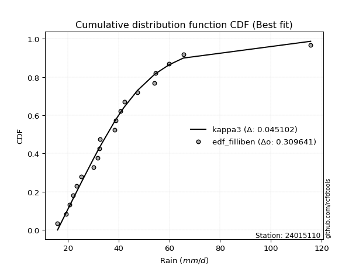</img>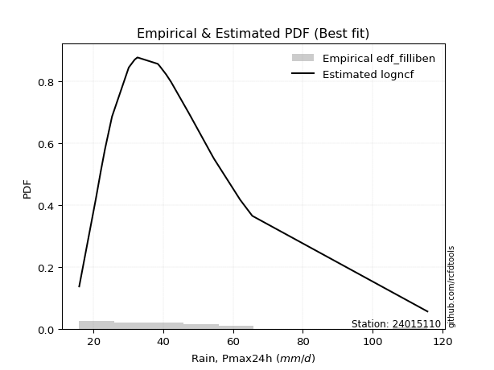</img>

</div>


### 10. EDF Jenkinson (1977)

The Jenkinson formula in hydrology is an empirical plotting position formula used to estimate the non-exceedance probability _(P)_ or return period _(T)_ of a given ordered observation within a sample. It is a widely used method in the frequency analysis of extreme events such as floods and rainfall, as it provides a distribution-free way to plot data. _a≈0.31_ and _b≈0.38_ are constants derived to approximate the median of the probability distribution for the given rank.

<div align="center">


$P=(m-a)/(n+b)$


</div>


**10.1. Empirical values**

<div align="center">

|                | 0                    | 1                   | 2                   | 3                   | 4                   | 5                   | 6                   | 7                  | 8                  | 9                   | 10                 | 11                 | 12                 | 13                 | 14                 | 15                 | 16                 | 17                 | 18                 | 19                 |
|:---------------|:---------------------|:--------------------|:--------------------|:--------------------|:--------------------|:--------------------|:--------------------|:-------------------|:-------------------|:--------------------|:-------------------|:-------------------|:-------------------|:-------------------|:-------------------|:-------------------|:-------------------|:-------------------|:-------------------|:-------------------|
| date           | 2020                 | 2025                | 2022                | 2019                | 2008                | 2023                | 2015                | 2014               | 2018               | 2017                | 2007               | 2016               | 2005               | 2009               | 2021               | 2010               | 2006               | 2012               | 2011               | 2013               |
| x              | 15.9                 | 19.2                | 20.7                | 22.1                | 23.3                | 25.3                | 30.1                | 31.8               | 32.5               | 32.6                | 38.4               | 38.9               | 40.8               | 42.2               | 47.4               | 54.1               | 54.6               | 59.9               | 65.5               | 115.7              |
| m              | 1                    | 2                   | 3                   | 4                   | 5                   | 6                   | 7                   | 8                  | 9                  | 10                  | 11                 | 12                 | 13                 | 14                 | 15                 | 16                 | 17                 | 18                 | 19                 | 20                 |
| empirical_dist | edf_jenkinson        | edf_jenkinson       | edf_jenkinson       | edf_jenkinson       | edf_jenkinson       | edf_jenkinson       | edf_jenkinson       | edf_jenkinson      | edf_jenkinson      | edf_jenkinson       | edf_jenkinson      | edf_jenkinson      | edf_jenkinson      | edf_jenkinson      | edf_jenkinson      | edf_jenkinson      | edf_jenkinson      | edf_jenkinson      | edf_jenkinson      | edf_jenkinson      |
| empirical      | 0.033856722276741906 | 0.08292443572129539 | 0.13199214916584887 | 0.18105986261040236 | 0.23012757605495587 | 0.27919528949950934 | 0.32826300294406285 | 0.3773307163886163 | 0.4263984298331698 | 0.47546614327772324 | 0.5245338567222767 | 0.5736015701668302 | 0.6226692836113837 | 0.6717369970559373 | 0.7208047105004907 | 0.7698724239450442 | 0.8189401373895977 | 0.8680078508341512 | 0.9170755642787047 | 0.9661432777232583 |
| empirical_tr   | 1.0350431691213813   | 1.090422685928304   | 1.152063312605992   | 1.2210904733373276  | 1.2989165073295095  | 1.3873383253914227  | 1.4886778670562455  | 1.6059889676910957 | 1.7433704020530367 | 1.9064546304957901  | 2.1031991744066048 | 2.3452243958573074 | 2.6501950585175553 | 3.0463378176382667 | 3.581722319859402  | 4.345415778251599  | 5.523035230352305  | 7.576208178438667  | 12.059171597633155 | 29.536231884058108 |

</div>


**10.2. Kolmogorov-Smirnov fit test (sorted by Δ)**


<div align="center">

|                | 0                   | 1                   | 2                    | 3                   | 4                   | 5                    | 6                    | 7                   | 8                   | 9                    | 10                  | 11                  | 12                  | 13                  | 14                  | 15                  | 16                  | 17                  | 18                   | 19                   | 20                   | 21                  | 22                  | 23                  | 24                  | 25                  | 26                  | 27                  | 28                  | 29                  | 30                  | 31                  | 32                  | 33                  | 34                  | 35                  | 36                  | 37                 | 38                  | 39                 | 40                  | 41                 | 42                  | 43                  | 44                  | 45                  | 46                  | 47                  | 48                  | 49                  | 50                  | 51                  | 52                  | 53                  | 54                  | 55                  | 56                  | 57                  | 58                  | 59                  | 60                  | 61                  | 62                  | 63                  | 64                  | 65                  | 66                  | 67                  | 68                  | 69                  | 70                  | 71                  | 72                  | 73                 | 74                  | 75                 | 76                  | 77                  | 78                  | 79                  | 80                  | 81                  | 82                 | 83                  | 84                  | 85                  | 86                  | 87                  | 88                  | 89                  | 90                  | 91                  | 92                  | 93                  | 94                  | 95                  | 96                  | 97                  | 98                 | 99                  | 100                 | 101                 | 102                 | 103                 | 104                 | 105                | 106                 | 107                | 108                 | 109                 | 110                 | 111                | 112                 | 113                 | 114                 | 115                 | 116                 | 117                 | 118                | 119                 | 120                | 121                 | 122                 | 123                 | 124                 | 125                 | 126                | 127                 | 128                 | 129                 | 130                 | 131                 | 132                 | 133                | 134                | 135                 | 136                 | 137                | 138                | 139                 | 140                | 141                 | 142                | 143                | 144                 | 145                 | 146                 | 147                 | 148                 | 149                | 150                 | 151                | 152                | 153                 | 154                | 155                | 156                | 157                | 158                | 159                |
|:---------------|:--------------------|:--------------------|:---------------------|:--------------------|:--------------------|:---------------------|:---------------------|:--------------------|:--------------------|:---------------------|:--------------------|:--------------------|:--------------------|:--------------------|:--------------------|:--------------------|:--------------------|:--------------------|:---------------------|:---------------------|:---------------------|:--------------------|:--------------------|:--------------------|:--------------------|:--------------------|:--------------------|:--------------------|:--------------------|:--------------------|:--------------------|:--------------------|:--------------------|:--------------------|:--------------------|:--------------------|:--------------------|:-------------------|:--------------------|:-------------------|:--------------------|:-------------------|:--------------------|:--------------------|:--------------------|:--------------------|:--------------------|:--------------------|:--------------------|:--------------------|:--------------------|:--------------------|:--------------------|:--------------------|:--------------------|:--------------------|:--------------------|:--------------------|:--------------------|:--------------------|:--------------------|:--------------------|:--------------------|:--------------------|:--------------------|:--------------------|:--------------------|:--------------------|:--------------------|:--------------------|:--------------------|:--------------------|:--------------------|:-------------------|:--------------------|:-------------------|:--------------------|:--------------------|:--------------------|:--------------------|:--------------------|:--------------------|:-------------------|:--------------------|:--------------------|:--------------------|:--------------------|:--------------------|:--------------------|:--------------------|:--------------------|:--------------------|:--------------------|:--------------------|:--------------------|:--------------------|:--------------------|:--------------------|:-------------------|:--------------------|:--------------------|:--------------------|:--------------------|:--------------------|:--------------------|:-------------------|:--------------------|:-------------------|:--------------------|:--------------------|:--------------------|:-------------------|:--------------------|:--------------------|:--------------------|:--------------------|:--------------------|:--------------------|:-------------------|:--------------------|:-------------------|:--------------------|:--------------------|:--------------------|:--------------------|:--------------------|:-------------------|:--------------------|:--------------------|:--------------------|:--------------------|:--------------------|:--------------------|:-------------------|:-------------------|:--------------------|:--------------------|:-------------------|:-------------------|:--------------------|:-------------------|:--------------------|:-------------------|:-------------------|:--------------------|:--------------------|:--------------------|:--------------------|:--------------------|:-------------------|:--------------------|:-------------------|:-------------------|:--------------------|:-------------------|:-------------------|:-------------------|:-------------------|:-------------------|:-------------------|
| station        | 24015110            | 24015110            | 24015110             | 24015110            | 24015110            | 24015110             | 24015110             | 24015110            | 24015110            | 24015110             | 24015110            | 24015110            | 24015110            | 24015110            | 24015110            | 24015110            | 24015110            | 24015110            | 24015110             | 24015110             | 24015110             | 24015110            | 24015110            | 24015110            | 24015110            | 24015110            | 24015110            | 24015110            | 24015110            | 24015110            | 24015110            | 24015110            | 24015110            | 24015110            | 24015110            | 24015110            | 24015110            | 24015110           | 24015110            | 24015110           | 24015110            | 24015110           | 24015110            | 24015110            | 24015110            | 24015110            | 24015110            | 24015110            | 24015110            | 24015110            | 24015110            | 24015110            | 24015110            | 24015110            | 24015110            | 24015110            | 24015110            | 24015110            | 24015110            | 24015110            | 24015110            | 24015110            | 24015110            | 24015110            | 24015110            | 24015110            | 24015110            | 24015110            | 24015110            | 24015110            | 24015110            | 24015110            | 24015110            | 24015110           | 24015110            | 24015110           | 24015110            | 24015110            | 24015110            | 24015110            | 24015110            | 24015110            | 24015110           | 24015110            | 24015110            | 24015110            | 24015110            | 24015110            | 24015110            | 24015110            | 24015110            | 24015110            | 24015110            | 24015110            | 24015110            | 24015110            | 24015110            | 24015110            | 24015110           | 24015110            | 24015110            | 24015110            | 24015110            | 24015110            | 24015110            | 24015110           | 24015110            | 24015110           | 24015110            | 24015110            | 24015110            | 24015110           | 24015110            | 24015110            | 24015110            | 24015110            | 24015110            | 24015110            | 24015110           | 24015110            | 24015110           | 24015110            | 24015110            | 24015110            | 24015110            | 24015110            | 24015110           | 24015110            | 24015110            | 24015110            | 24015110            | 24015110            | 24015110            | 24015110           | 24015110           | 24015110            | 24015110            | 24015110           | 24015110           | 24015110            | 24015110           | 24015110            | 24015110           | 24015110           | 24015110            | 24015110            | 24015110            | 24015110            | 24015110            | 24015110           | 24015110            | 24015110           | 24015110           | 24015110            | 24015110           | 24015110           | 24015110           | 24015110           | 24015110           | 24015110           |
| empirical_dist | edf_jenkinson       | edf_jenkinson       | edf_jenkinson        | edf_jenkinson       | edf_jenkinson       | edf_jenkinson        | edf_jenkinson        | edf_jenkinson       | edf_jenkinson       | edf_jenkinson        | edf_jenkinson       | edf_jenkinson       | edf_jenkinson       | edf_jenkinson       | edf_jenkinson       | edf_jenkinson       | edf_jenkinson       | edf_jenkinson       | edf_jenkinson        | edf_jenkinson        | edf_jenkinson        | edf_jenkinson       | edf_jenkinson       | edf_jenkinson       | edf_jenkinson       | edf_jenkinson       | edf_jenkinson       | edf_jenkinson       | edf_jenkinson       | edf_jenkinson       | edf_jenkinson       | edf_jenkinson       | edf_jenkinson       | edf_jenkinson       | edf_jenkinson       | edf_jenkinson       | edf_jenkinson       | edf_jenkinson      | edf_jenkinson       | edf_jenkinson      | edf_jenkinson       | edf_jenkinson      | edf_jenkinson       | edf_jenkinson       | edf_jenkinson       | edf_jenkinson       | edf_jenkinson       | edf_jenkinson       | edf_jenkinson       | edf_jenkinson       | edf_jenkinson       | edf_jenkinson       | edf_jenkinson       | edf_jenkinson       | edf_jenkinson       | edf_jenkinson       | edf_jenkinson       | edf_jenkinson       | edf_jenkinson       | edf_jenkinson       | edf_jenkinson       | edf_jenkinson       | edf_jenkinson       | edf_jenkinson       | edf_jenkinson       | edf_jenkinson       | edf_jenkinson       | edf_jenkinson       | edf_jenkinson       | edf_jenkinson       | edf_jenkinson       | edf_jenkinson       | edf_jenkinson       | edf_jenkinson      | edf_jenkinson       | edf_jenkinson      | edf_jenkinson       | edf_jenkinson       | edf_jenkinson       | edf_jenkinson       | edf_jenkinson       | edf_jenkinson       | edf_jenkinson      | edf_jenkinson       | edf_jenkinson       | edf_jenkinson       | edf_jenkinson       | edf_jenkinson       | edf_jenkinson       | edf_jenkinson       | edf_jenkinson       | edf_jenkinson       | edf_jenkinson       | edf_jenkinson       | edf_jenkinson       | edf_jenkinson       | edf_jenkinson       | edf_jenkinson       | edf_jenkinson      | edf_jenkinson       | edf_jenkinson       | edf_jenkinson       | edf_jenkinson       | edf_jenkinson       | edf_jenkinson       | edf_jenkinson      | edf_jenkinson       | edf_jenkinson      | edf_jenkinson       | edf_jenkinson       | edf_jenkinson       | edf_jenkinson      | edf_jenkinson       | edf_jenkinson       | edf_jenkinson       | edf_jenkinson       | edf_jenkinson       | edf_jenkinson       | edf_jenkinson      | edf_jenkinson       | edf_jenkinson      | edf_jenkinson       | edf_jenkinson       | edf_jenkinson       | edf_jenkinson       | edf_jenkinson       | edf_jenkinson      | edf_jenkinson       | edf_jenkinson       | edf_jenkinson       | edf_jenkinson       | edf_jenkinson       | edf_jenkinson       | edf_jenkinson      | edf_jenkinson      | edf_jenkinson       | edf_jenkinson       | edf_jenkinson      | edf_jenkinson      | edf_jenkinson       | edf_jenkinson      | edf_jenkinson       | edf_jenkinson      | edf_jenkinson      | edf_jenkinson       | edf_jenkinson       | edf_jenkinson       | edf_jenkinson       | edf_jenkinson       | edf_jenkinson      | edf_jenkinson       | edf_jenkinson      | edf_jenkinson      | edf_jenkinson       | edf_jenkinson      | edf_jenkinson      | edf_jenkinson      | edf_jenkinson      | edf_jenkinson      | edf_jenkinson      |
| p_dist         | kappa3              | moyal               | burr12               | logdweibull         | logbetaprime        | logrice              | ncf                  | logpearson3         | betaprime           | logdgamma            | loganglit           | logexponnorm        | logmaxwell          | genexpon            | loggennorm          | lognorm             | logcrystalball      | logt                | logloggamma          | logburr12            | logweibull_max       | loggenextreme       | logalpha            | logweibull_min      | loginvgamma         | logf                | alpha               | logskewnorm         | logjohnsonsu        | lognct              | invgauss            | logfoldnorm         | logfatiguelife      | loginvgauss         | halflogistic        | logsemicircular     | johnsonsu           | logvonmises_line   | nct                 | logburr            | fatiguelife         | invgamma           | logerlang           | loggamma            | loggamma            | invweibull          | genextreme          | logjohnsonsb        | f                   | johnsonsb           | logncf              | lograyleigh         | mielke              | gumbel_r            | logbeta             | logmielke           | lognakagami         | loggenlogistic      | burr                | logtriang           | loglogistic         | pearson3            | exponpow            | beta                | genlogistic         | logexponweib        | gompertz            | gausshyper          | halfnorm            | erlang              | gamma               | loginvweibull       | genpareto           | loghypsecant       | exponnorm           | t                  | loggenexpon         | logkstwobign        | logcosine           | tukeylambda         | skewnorm            | gennorm             | loggumbel_r        | dgamma              | rayleigh            | dweibull            | genhalflogistic     | loghalfnorm         | kstwobign           | logarcsine          | loglaplace          | loglaplace          | gengamma            | loghalfgennorm      | maxwell             | logtruncweibull_min | cosine              | logtruncexpon       | logtruncpareto     | loggausshyper       | logmoyal            | loggengamma         | exponweib           | loghalflogistic     | foldnorm            | loggumbel_l        | loggompertz         | logistic           | rice                | logbradford         | lomax               | truncnorm          | crystalball         | norm                | anglit              | hypsecant           | semicircular        | wald                | logloglaplace      | laplace             | arcsine            | weibull_min         | logexponpow         | loguniform          | logkappa4           | loglomax            | logtukeylambda     | gumbel_l            | logkappa3           | halfgennorm         | logargus            | logwald             | vonmises_line       | truncweibull_min   | truncexpon         | triang              | logksone            | logrdist           | logtruncnorm       | bradford            | nakagami           | powerlaw            | logwrapcauchy      | loggenpareto       | logpowerlaw         | loggenhalflogistic  | argus               | kappa4              | wrapcauchy          | ksone              | uniform             | loglevy_l          | logtrapezoid       | levy_l              | rdist              | trapezoid          | weibull_max        | truncpareto        | logvonmises        | vonmises           |
| delta          | 0.04497526486930842 | 0.04639997480880004 | 0.049909620048773695 | 0.05009183423027003 | 0.05349348882713184 | 0.055534157502989956 | 0.055689188229062325 | 0.05604607196837086 | 0.05635994323021276 | 0.057408760665367126 | 0.05814428522727655 | 0.05871834931003311 | 0.05924769174421707 | 0.05928048247633988 | 0.05969013715489763 | 0.05975064946371872 | 0.05975069493210777 | 0.05975133202443861 | 0.060225634307848996 | 0.060599077440280175 | 0.061626951184092116 | 0.06162856165577735 | 0.06224730076142504 | 0.06312752121841503 | 0.06332075785396107 | 0.06337559682347338 | 0.06366209484386653 | 0.06413333056689174 | 0.06422332762867888 | 0.06427084404853456 | 0.06446346501348144 | 0.06497441287768668 | 0.06522866392660209 | 0.06525119846857297 | 0.06528460540320224 | 0.06553427956366331 | 0.06607812223341203 | 0.0662395136391955 | 0.06635743162973173 | 0.066547478793611  | 0.06668542695711088 | 0.0667835610352272 | 0.06724525496403555 | 0.06724562270415746 | 0.06724562270415746 | 0.06756743158137035 | 0.06756758095190296 | 0.06794818419785364 | 0.06810126178469256 | 0.06829988354380823 | 0.06860875090049734 | 0.06890508628887948 | 0.07087591361271117 | 0.07128945811875209 | 0.07391889569417687 | 0.07436589407926641 | 0.07460381142178785 | 0.07514654754518135 | 0.07518227767466235 | 0.07529523781447434 | 0.07536230439019567 | 0.07578711253242709 | 0.07716031714172833 | 0.07900478744608436 | 0.08021573721115421 | 0.08312272330937254 | 0.08470849958603655 | 0.08578304017043564 | 0.08669828792718547 | 0.08685427725127598 | 0.08685436594327539 | 0.08686414589252167 | 0.08791337231889235 | 0.0893995340973025 | 0.08981736638652493 | 0.0916432823722047 | 0.09269873336011258 | 0.09319623366587337 | 0.09485686975676322 | 0.09604447743223832 | 0.09817236396592244 | 0.09862722212162006 | 0.0990388260939592 | 0.09933423014871601 | 0.09998990863086599 | 0.10045135858718968 | 0.10122965359321634 | 0.10130946159263776 | 0.10420308678999551 | 0.10450165405795708 | 0.10637280770613619 | 0.10637280770613619 | 0.10649652203006715 | 0.10891019819318137 | 0.11029309959232025 | 0.11203385349919481 | 0.11379648928245045 | 0.11510915489274898 | 0.1167720302419506 | 0.11873340578523661 | 0.12375610819643301 | 0.12489037700378741 | 0.12653801746388527 | 0.12730806082555082 | 0.12739612640889253 | 0.1277225011613366 | 0.12911188284885544 | 0.1378577523711667 | 0.13817036316937764 | 0.14038920307578784 | 0.14174504982879266 | 0.1419123341398818 | 0.14191234528110874 | 0.14191234695831523 | 0.14616908175962418 | 0.14680699839310196 | 0.14792384384270063 | 0.14985890758478104 | 0.1512634210379613 | 0.17518254858970628 | 0.1770299326379134 | 0.18212513423095877 | 0.19808662515040376 | 0.20374649077208096 | 0.20494057989301295 | 0.20795927467316544 | 0.2092430759225512 | 0.21075067598179442 | 0.21336850468099078 | 0.21607828842777577 | 0.22181359355229902 | 0.22951227410491803 | 0.23089106725739655 | 0.2358635535982606 | 0.2377028442738396 | 0.23914655281650077 | 0.23930133635651818 | 0.2489495197348386 | 0.261374548168986  | 0.26674183838526344 | 0.291497704430979  | 0.29661206655586125 | 0.3348598627921924 | 0.3386280532246582 | 0.34736048991731716 | 0.35932506076810566 | 0.38120045265838254 | 0.40588667863545946 | 0.41885981149497215 | 0.4195805742987448 | 0.43116458628739324 | 0.436248024255456  | 0.4580906203145361 | 0.49991553660664295 | 0.5200811453160527 | 0.6695742992235443 | 0.7716701808548998 | 0.8247657953327974 | 1.0457639151627904 | 17.475678453311794 |
| deltao         | 0.3096406529800002  | 0.3096406529800002  | 0.3096406529800002   | 0.3096406529800002  | 0.3096406529800002  | 0.3096406529800002   | 0.3096406529800002   | 0.3096406529800002  | 0.3096406529800002  | 0.3096406529800002   | 0.3096406529800002  | 0.3096406529800002  | 0.3096406529800002  | 0.3096406529800002  | 0.3096406529800002  | 0.3096406529800002  | 0.3096406529800002  | 0.3096406529800002  | 0.3096406529800002   | 0.3096406529800002   | 0.3096406529800002   | 0.3096406529800002  | 0.3096406529800002  | 0.3096406529800002  | 0.3096406529800002  | 0.3096406529800002  | 0.3096406529800002  | 0.3096406529800002  | 0.3096406529800002  | 0.3096406529800002  | 0.3096406529800002  | 0.3096406529800002  | 0.3096406529800002  | 0.3096406529800002  | 0.3096406529800002  | 0.3096406529800002  | 0.3096406529800002  | 0.3096406529800002 | 0.3096406529800002  | 0.3096406529800002 | 0.3096406529800002  | 0.3096406529800002 | 0.3096406529800002  | 0.3096406529800002  | 0.3096406529800002  | 0.3096406529800002  | 0.3096406529800002  | 0.3096406529800002  | 0.3096406529800002  | 0.3096406529800002  | 0.3096406529800002  | 0.3096406529800002  | 0.3096406529800002  | 0.3096406529800002  | 0.3096406529800002  | 0.3096406529800002  | 0.3096406529800002  | 0.3096406529800002  | 0.3096406529800002  | 0.3096406529800002  | 0.3096406529800002  | 0.3096406529800002  | 0.3096406529800002  | 0.3096406529800002  | 0.3096406529800002  | 0.3096406529800002  | 0.3096406529800002  | 0.3096406529800002  | 0.3096406529800002  | 0.3096406529800002  | 0.3096406529800002  | 0.3096406529800002  | 0.3096406529800002  | 0.3096406529800002 | 0.3096406529800002  | 0.3096406529800002 | 0.3096406529800002  | 0.3096406529800002  | 0.3096406529800002  | 0.3096406529800002  | 0.3096406529800002  | 0.3096406529800002  | 0.3096406529800002 | 0.3096406529800002  | 0.3096406529800002  | 0.3096406529800002  | 0.3096406529800002  | 0.3096406529800002  | 0.3096406529800002  | 0.3096406529800002  | 0.3096406529800002  | 0.3096406529800002  | 0.3096406529800002  | 0.3096406529800002  | 0.3096406529800002  | 0.3096406529800002  | 0.3096406529800002  | 0.3096406529800002  | 0.3096406529800002 | 0.3096406529800002  | 0.3096406529800002  | 0.3096406529800002  | 0.3096406529800002  | 0.3096406529800002  | 0.3096406529800002  | 0.3096406529800002 | 0.3096406529800002  | 0.3096406529800002 | 0.3096406529800002  | 0.3096406529800002  | 0.3096406529800002  | 0.3096406529800002 | 0.3096406529800002  | 0.3096406529800002  | 0.3096406529800002  | 0.3096406529800002  | 0.3096406529800002  | 0.3096406529800002  | 0.3096406529800002 | 0.3096406529800002  | 0.3096406529800002 | 0.3096406529800002  | 0.3096406529800002  | 0.3096406529800002  | 0.3096406529800002  | 0.3096406529800002  | 0.3096406529800002 | 0.3096406529800002  | 0.3096406529800002  | 0.3096406529800002  | 0.3096406529800002  | 0.3096406529800002  | 0.3096406529800002  | 0.3096406529800002 | 0.3096406529800002 | 0.3096406529800002  | 0.3096406529800002  | 0.3096406529800002 | 0.3096406529800002 | 0.3096406529800002  | 0.3096406529800002 | 0.3096406529800002  | 0.3096406529800002 | 0.3096406529800002 | 0.3096406529800002  | 0.3096406529800002  | 0.3096406529800002  | 0.3096406529800002  | 0.3096406529800002  | 0.3096406529800002 | 0.3096406529800002  | 0.3096406529800002 | 0.3096406529800002 | 0.3096406529800002  | 0.3096406529800002 | 0.3096406529800002 | 0.3096406529800002 | 0.3096406529800002 | 0.3096406529800002 | 0.3096406529800002 |
| eval           | Δo > Δ              | Δo > Δ              | Δo > Δ               | Δo > Δ              | Δo > Δ              | Δo > Δ               | Δo > Δ               | Δo > Δ              | Δo > Δ              | Δo > Δ               | Δo > Δ              | Δo > Δ              | Δo > Δ              | Δo > Δ              | Δo > Δ              | Δo > Δ              | Δo > Δ              | Δo > Δ              | Δo > Δ               | Δo > Δ               | Δo > Δ               | Δo > Δ              | Δo > Δ              | Δo > Δ              | Δo > Δ              | Δo > Δ              | Δo > Δ              | Δo > Δ              | Δo > Δ              | Δo > Δ              | Δo > Δ              | Δo > Δ              | Δo > Δ              | Δo > Δ              | Δo > Δ              | Δo > Δ              | Δo > Δ              | Δo > Δ             | Δo > Δ              | Δo > Δ             | Δo > Δ              | Δo > Δ             | Δo > Δ              | Δo > Δ              | Δo > Δ              | Δo > Δ              | Δo > Δ              | Δo > Δ              | Δo > Δ              | Δo > Δ              | Δo > Δ              | Δo > Δ              | Δo > Δ              | Δo > Δ              | Δo > Δ              | Δo > Δ              | Δo > Δ              | Δo > Δ              | Δo > Δ              | Δo > Δ              | Δo > Δ              | Δo > Δ              | Δo > Δ              | Δo > Δ              | Δo > Δ              | Δo > Δ              | Δo > Δ              | Δo > Δ              | Δo > Δ              | Δo > Δ              | Δo > Δ              | Δo > Δ              | Δo > Δ              | Δo > Δ             | Δo > Δ              | Δo > Δ             | Δo > Δ              | Δo > Δ              | Δo > Δ              | Δo > Δ              | Δo > Δ              | Δo > Δ              | Δo > Δ             | Δo > Δ              | Δo > Δ              | Δo > Δ              | Δo > Δ              | Δo > Δ              | Δo > Δ              | Δo > Δ              | Δo > Δ              | Δo > Δ              | Δo > Δ              | Δo > Δ              | Δo > Δ              | Δo > Δ              | Δo > Δ              | Δo > Δ              | Δo > Δ             | Δo > Δ              | Δo > Δ              | Δo > Δ              | Δo > Δ              | Δo > Δ              | Δo > Δ              | Δo > Δ             | Δo > Δ              | Δo > Δ             | Δo > Δ              | Δo > Δ              | Δo > Δ              | Δo > Δ             | Δo > Δ              | Δo > Δ              | Δo > Δ              | Δo > Δ              | Δo > Δ              | Δo > Δ              | Δo > Δ             | Δo > Δ              | Δo > Δ             | Δo > Δ              | Δo > Δ              | Δo > Δ              | Δo > Δ              | Δo > Δ              | Δo > Δ             | Δo > Δ              | Δo > Δ              | Δo > Δ              | Δo > Δ              | Δo > Δ              | Δo > Δ              | Δo > Δ             | Δo > Δ             | Δo > Δ              | Δo > Δ              | Δo > Δ             | Δo > Δ             | Δo > Δ              | Δo > Δ             | Δo > Δ              | Δo <= Δ            | Δo <= Δ            | Δo <= Δ             | Δo <= Δ             | Δo <= Δ             | Δo <= Δ             | Δo <= Δ             | Δo <= Δ            | Δo <= Δ             | Δo <= Δ            | Δo <= Δ            | Δo <= Δ             | Δo <= Δ            | Δo <= Δ            | Δo <= Δ            | Δo <= Δ            | Δo <= Δ            | Δo <= Δ            |
| fit            | 1                   | 1                   | 1                    | 1                   | 1                   | 1                    | 1                    | 1                   | 1                   | 1                    | 1                   | 1                   | 1                   | 1                   | 1                   | 1                   | 1                   | 1                   | 1                    | 1                    | 1                    | 1                   | 1                   | 1                   | 1                   | 1                   | 1                   | 1                   | 1                   | 1                   | 1                   | 1                   | 1                   | 1                   | 1                   | 1                   | 1                   | 1                  | 1                   | 1                  | 1                   | 1                  | 1                   | 1                   | 1                   | 1                   | 1                   | 1                   | 1                   | 1                   | 1                   | 1                   | 1                   | 1                   | 1                   | 1                   | 1                   | 1                   | 1                   | 1                   | 1                   | 1                   | 1                   | 1                   | 1                   | 1                   | 1                   | 1                   | 1                   | 1                   | 1                   | 1                   | 1                   | 1                  | 1                   | 1                  | 1                   | 1                   | 1                   | 1                   | 1                   | 1                   | 1                  | 1                   | 1                   | 1                   | 1                   | 1                   | 1                   | 1                   | 1                   | 1                   | 1                   | 1                   | 1                   | 1                   | 1                   | 1                   | 1                  | 1                   | 1                   | 1                   | 1                   | 1                   | 1                   | 1                  | 1                   | 1                  | 1                   | 1                   | 1                   | 1                  | 1                   | 1                   | 1                   | 1                   | 1                   | 1                   | 1                  | 1                   | 1                  | 1                   | 1                   | 1                   | 1                   | 1                   | 1                  | 1                   | 1                   | 1                   | 1                   | 1                   | 1                   | 1                  | 1                  | 1                   | 1                   | 1                  | 1                  | 1                   | 1                  | 1                   | 0                  | 0                  | 0                   | 0                   | 0                   | 0                   | 0                   | 0                  | 0                   | 0                  | 0                  | 0                   | 0                  | 0                  | 0                  | 0                  | 0                  | 0                  |
| n              | 20                  | 20                  | 20                   | 20                  | 20                  | 20                   | 20                   | 20                  | 20                  | 20                   | 20                  | 20                  | 20                  | 20                  | 20                  | 20                  | 20                  | 20                  | 20                   | 20                   | 20                   | 20                  | 20                  | 20                  | 20                  | 20                  | 20                  | 20                  | 20                  | 20                  | 20                  | 20                  | 20                  | 20                  | 20                  | 20                  | 20                  | 20                 | 20                  | 20                 | 20                  | 20                 | 20                  | 20                  | 20                  | 20                  | 20                  | 20                  | 20                  | 20                  | 20                  | 20                  | 20                  | 20                  | 20                  | 20                  | 20                  | 20                  | 20                  | 20                  | 20                  | 20                  | 20                  | 20                  | 20                  | 20                  | 20                  | 20                  | 20                  | 20                  | 20                  | 20                  | 20                  | 20                 | 20                  | 20                 | 20                  | 20                  | 20                  | 20                  | 20                  | 20                  | 20                 | 20                  | 20                  | 20                  | 20                  | 20                  | 20                  | 20                  | 20                  | 20                  | 20                  | 20                  | 20                  | 20                  | 20                  | 20                  | 20                 | 20                  | 20                  | 20                  | 20                  | 20                  | 20                  | 20                 | 20                  | 20                 | 20                  | 20                  | 20                  | 20                 | 20                  | 20                  | 20                  | 20                  | 20                  | 20                  | 20                 | 20                  | 20                 | 20                  | 20                  | 20                  | 20                  | 20                  | 20                 | 20                  | 20                  | 20                  | 20                  | 20                  | 20                  | 20                 | 20                 | 20                  | 20                  | 20                 | 20                 | 20                  | 20                 | 20                  | 20                 | 20                 | 20                  | 20                  | 20                  | 20                  | 20                  | 20                 | 20                  | 20                 | 20                 | 20                  | 20                 | 20                 | 20                 | 20                 | 20                 | 20                 |
| best_fit       | 1                   | 0                   | 0                    | 0                   | 0                   | 0                    | 0                    | 0                   | 0                   | 0                    | 0                   | 0                   | 0                   | 0                   | 0                   | 0                   | 0                   | 0                   | 0                    | 0                    | 0                    | 0                   | 0                   | 0                   | 0                   | 0                   | 0                   | 0                   | 0                   | 0                   | 0                   | 0                   | 0                   | 0                   | 0                   | 0                   | 0                   | 0                  | 0                   | 0                  | 0                   | 0                  | 0                   | 0                   | 0                   | 0                   | 0                   | 0                   | 0                   | 0                   | 0                   | 0                   | 0                   | 0                   | 0                   | 0                   | 0                   | 0                   | 0                   | 0                   | 0                   | 0                   | 0                   | 0                   | 0                   | 0                   | 0                   | 0                   | 0                   | 0                   | 0                   | 0                   | 0                   | 0                  | 0                   | 0                  | 0                   | 0                   | 0                   | 0                   | 0                   | 0                   | 0                  | 0                   | 0                   | 0                   | 0                   | 0                   | 0                   | 0                   | 0                   | 0                   | 0                   | 0                   | 0                   | 0                   | 0                   | 0                   | 0                  | 0                   | 0                   | 0                   | 0                   | 0                   | 0                   | 0                  | 0                   | 0                  | 0                   | 0                   | 0                   | 0                  | 0                   | 0                   | 0                   | 0                   | 0                   | 0                   | 0                  | 0                   | 0                  | 0                   | 0                   | 0                   | 0                   | 0                   | 0                  | 0                   | 0                   | 0                   | 0                   | 0                   | 0                   | 0                  | 0                  | 0                   | 0                   | 0                  | 0                  | 0                   | 0                  | 0                   | 0                  | 0                  | 0                   | 0                   | 0                   | 0                   | 0                   | 0                  | 0                   | 0                  | 0                  | 0                   | 0                  | 0                  | 0                  | 0                  | 0                  | 0                  |
| best_fit_sort  | 1                   | 2                   | 3                    | 4                   | 5                   | 6                    | 7                    | 8                   | 9                   | 10                   | 11                  | 12                  | 13                  | 14                  | 15                  | 16                  | 17                  | 18                  | 19                   | 20                   | 21                   | 22                  | 23                  | 24                  | 25                  | 26                  | 27                  | 28                  | 29                  | 30                  | 31                  | 32                  | 33                  | 34                  | 35                  | 36                  | 37                  | 38                 | 39                  | 40                 | 41                  | 42                 | 43                  | 44                  | 45                  | 46                  | 47                  | 48                  | 49                  | 50                  | 51                  | 52                  | 53                  | 54                  | 55                  | 56                  | 57                  | 58                  | 59                  | 60                  | 61                  | 62                  | 63                  | 64                  | 65                  | 66                  | 67                  | 68                  | 69                  | 70                  | 71                  | 72                  | 73                  | 74                 | 75                  | 76                 | 77                  | 78                  | 79                  | 80                  | 81                  | 82                  | 83                 | 84                  | 85                  | 86                  | 87                  | 88                  | 89                  | 90                  | 91                  | 92                  | 93                  | 94                  | 95                  | 96                  | 97                  | 98                  | 99                 | 100                 | 101                 | 102                 | 103                 | 104                 | 105                 | 106                | 107                 | 108                | 109                 | 110                 | 111                 | 112                | 113                 | 114                 | 115                 | 116                 | 117                 | 118                 | 119                | 120                 | 121                | 122                 | 123                 | 124                 | 125                 | 126                 | 127                | 128                 | 129                 | 130                 | 131                 | 132                 | 133                 | 134                | 135                | 136                 | 137                 | 138                | 139                | 140                 | 141                | 142                 | 143                | 144                | 145                 | 146                 | 147                 | 148                 | 149                 | 150                | 151                 | 152                | 153                | 154                 | 155                | 156                | 157                | 158                | 159                | 160                |

</div>


**10.3. Best fit**

<div align="center">

|   id |   station | empirical_dist   | p_dist   |     delta |   deltao | eval   |   fit |   n |   best_fit |   best_fit_sort |
|-----:|----------:|:-----------------|:---------|----------:|---------:|:-------|------:|----:|-----------:|----------------:|
|    0 |  24015110 | edf_jenkinson    | kappa3   | 0.0449753 | 0.309641 | Δo > Δ |     1 |  20 |          1 |               1 |

</div>


<div align="center">

</img>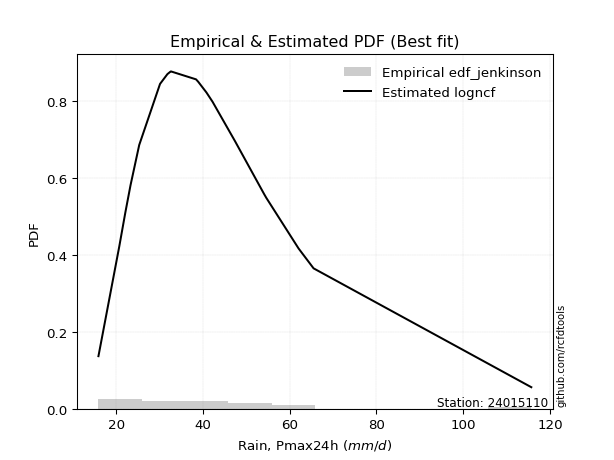</img>

</div>


### 11. EDF Cunnane (1978)

Cunnane´s work in statistical hydrology has focused on the performance and evaluation of different probability distributions (such as GEV, Gumbel, Lognormal) for flood frequency estimation. _b_ is a constant, typically set to 0.4.

<div align="center">


$P=(m-b)/(n+1-2b)$


</div>


**11.1. Empirical values**

<div align="center">

|                | 0                  | 1                   | 2                   | 3                   | 4                  | 5                  | 6                   | 7                   | 8                   | 9                  | 10                 | 11                 | 12                 | 13                 | 14                 | 15                 | 16                 | 17                 | 18                 | 19                 |
|:---------------|:-------------------|:--------------------|:--------------------|:--------------------|:-------------------|:-------------------|:--------------------|:--------------------|:--------------------|:-------------------|:-------------------|:-------------------|:-------------------|:-------------------|:-------------------|:-------------------|:-------------------|:-------------------|:-------------------|:-------------------|
| date           | 2020               | 2025                | 2022                | 2019                | 2008               | 2023               | 2015                | 2014                | 2018                | 2017               | 2007               | 2016               | 2005               | 2009               | 2021               | 2010               | 2006               | 2012               | 2011               | 2013               |
| x              | 15.9               | 19.2                | 20.7                | 22.1                | 23.3               | 25.3               | 30.1                | 31.8                | 32.5                | 32.6               | 38.4               | 38.9               | 40.8               | 42.2               | 47.4               | 54.1               | 54.6               | 59.9               | 65.5               | 115.7              |
| m              | 1                  | 2                   | 3                   | 4                   | 5                  | 6                  | 7                   | 8                   | 9                   | 10                 | 11                 | 12                 | 13                 | 14                 | 15                 | 16                 | 17                 | 18                 | 19                 | 20                 |
| empirical_dist | edf_cunnane        | edf_cunnane         | edf_cunnane         | edf_cunnane         | edf_cunnane        | edf_cunnane        | edf_cunnane         | edf_cunnane         | edf_cunnane         | edf_cunnane        | edf_cunnane        | edf_cunnane        | edf_cunnane        | edf_cunnane        | edf_cunnane        | edf_cunnane        | edf_cunnane        | edf_cunnane        | edf_cunnane        | edf_cunnane        |
| empirical      | 0.0297029702970297 | 0.07920792079207921 | 0.12871287128712872 | 0.17821782178217824 | 0.2277227722772277 | 0.2772277227722772 | 0.32673267326732675 | 0.37623762376237624 | 0.42574257425742573 | 0.4752475247524752 | 0.5247524752475248 | 0.5742574257425742 | 0.6237623762376238 | 0.6732673267326733 | 0.7227722772277227 | 0.7722772277227723 | 0.8217821782178218 | 0.8712871287128714 | 0.9207920792079209 | 0.9702970297029704 |
| empirical_tr   | 1.030612244897959  | 1.086021505376344   | 1.1477272727272727  | 1.216867469879518   | 1.294871794871795  | 1.3835616438356164 | 1.4852941176470589  | 1.6031746031746033  | 1.7413793103448274  | 1.9056603773584906 | 2.104166666666667  | 2.3488372093023253 | 2.6578947368421053 | 3.060606060606061  | 3.6071428571428568 | 4.391304347826087  | 5.611111111111113  | 7.769230769230775  | 12.625000000000025 | 33.666666666666764 |

</div>


**11.2. Kolmogorov-Smirnov fit test (sorted by Δ)**


<div align="center">

|                | 0                    | 1                   | 2                   | 3                    | 4                    | 5                    | 6                    | 7                   | 8                   | 9                   | 10                  | 11                   | 12                 | 13                  | 14                   | 15                  | 16                  | 17                 | 18                  | 19                  | 20                   | 21                   | 22                  | 23                 | 24                  | 25                  | 26                  | 27                  | 28                  | 29                  | 30                  | 31                 | 32                  | 33                  | 34                  | 35                  | 36                  | 37                  | 38                  | 39                  | 40                  | 41                  | 42                  | 43                  | 44                  | 45                  | 46                  | 47                  | 48                  | 49                  | 50                  | 51                 | 52                  | 53                  | 54                  | 55                  | 56                  | 57                  | 58                  | 59                  | 60                  | 61                 | 62                  | 63                 | 64                  | 65                  | 66                  | 67                 | 68                  | 69                  | 70                  | 71                 | 72                  | 73                  | 74                  | 75                 | 76                  | 77                  | 78                  | 79                  | 80                  | 81                  | 82                  | 83                  | 84                  | 85                  | 86                  | 87                 | 88                  | 89                  | 90                  | 91                  | 92                  | 93                  | 94                  | 95                  | 96                  | 97                 | 98                  | 99                  | 100                 | 101                 | 102                 | 103                 | 104                 | 105                 | 106                 | 107                 | 108                 | 109                 | 110                | 111                 | 112                 | 113                 | 114                 | 115                 | 116                 | 117                 | 118                 | 119                 | 120                 | 121                 | 122                 | 123                 | 124                 | 125                 | 126                 | 127                | 128                | 129                 | 130                 | 131                 | 132                | 133                 | 134                 | 135                | 136                | 137                | 138                | 139                | 140                 | 141                | 142                | 143                | 144                 | 145                | 146                | 147                | 148                 | 149                | 150                | 151                | 152                 | 153                | 154                | 155                | 156                | 157                | 158                | 159                |
|:---------------|:---------------------|:--------------------|:--------------------|:---------------------|:---------------------|:---------------------|:---------------------|:--------------------|:--------------------|:--------------------|:--------------------|:---------------------|:-------------------|:--------------------|:---------------------|:--------------------|:--------------------|:-------------------|:--------------------|:--------------------|:---------------------|:---------------------|:--------------------|:-------------------|:--------------------|:--------------------|:--------------------|:--------------------|:--------------------|:--------------------|:--------------------|:-------------------|:--------------------|:--------------------|:--------------------|:--------------------|:--------------------|:--------------------|:--------------------|:--------------------|:--------------------|:--------------------|:--------------------|:--------------------|:--------------------|:--------------------|:--------------------|:--------------------|:--------------------|:--------------------|:--------------------|:-------------------|:--------------------|:--------------------|:--------------------|:--------------------|:--------------------|:--------------------|:--------------------|:--------------------|:--------------------|:-------------------|:--------------------|:-------------------|:--------------------|:--------------------|:--------------------|:-------------------|:--------------------|:--------------------|:--------------------|:-------------------|:--------------------|:--------------------|:--------------------|:-------------------|:--------------------|:--------------------|:--------------------|:--------------------|:--------------------|:--------------------|:--------------------|:--------------------|:--------------------|:--------------------|:--------------------|:-------------------|:--------------------|:--------------------|:--------------------|:--------------------|:--------------------|:--------------------|:--------------------|:--------------------|:--------------------|:-------------------|:--------------------|:--------------------|:--------------------|:--------------------|:--------------------|:--------------------|:--------------------|:--------------------|:--------------------|:--------------------|:--------------------|:--------------------|:-------------------|:--------------------|:--------------------|:--------------------|:--------------------|:--------------------|:--------------------|:--------------------|:--------------------|:--------------------|:--------------------|:--------------------|:--------------------|:--------------------|:--------------------|:--------------------|:--------------------|:-------------------|:-------------------|:--------------------|:--------------------|:--------------------|:-------------------|:--------------------|:--------------------|:-------------------|:-------------------|:-------------------|:-------------------|:-------------------|:--------------------|:-------------------|:-------------------|:-------------------|:--------------------|:-------------------|:-------------------|:-------------------|:--------------------|:-------------------|:-------------------|:-------------------|:--------------------|:-------------------|:-------------------|:-------------------|:-------------------|:-------------------|:-------------------|:-------------------|
| station        | 24015110             | 24015110            | 24015110            | 24015110             | 24015110             | 24015110             | 24015110             | 24015110            | 24015110            | 24015110            | 24015110            | 24015110             | 24015110           | 24015110            | 24015110             | 24015110            | 24015110            | 24015110           | 24015110            | 24015110            | 24015110             | 24015110             | 24015110            | 24015110           | 24015110            | 24015110            | 24015110            | 24015110            | 24015110            | 24015110            | 24015110            | 24015110           | 24015110            | 24015110            | 24015110            | 24015110            | 24015110            | 24015110            | 24015110            | 24015110            | 24015110            | 24015110            | 24015110            | 24015110            | 24015110            | 24015110            | 24015110            | 24015110            | 24015110            | 24015110            | 24015110            | 24015110           | 24015110            | 24015110            | 24015110            | 24015110            | 24015110            | 24015110            | 24015110            | 24015110            | 24015110            | 24015110           | 24015110            | 24015110           | 24015110            | 24015110            | 24015110            | 24015110           | 24015110            | 24015110            | 24015110            | 24015110           | 24015110            | 24015110            | 24015110            | 24015110           | 24015110            | 24015110            | 24015110            | 24015110            | 24015110            | 24015110            | 24015110            | 24015110            | 24015110            | 24015110            | 24015110            | 24015110           | 24015110            | 24015110            | 24015110            | 24015110            | 24015110            | 24015110            | 24015110            | 24015110            | 24015110            | 24015110           | 24015110            | 24015110            | 24015110            | 24015110            | 24015110            | 24015110            | 24015110            | 24015110            | 24015110            | 24015110            | 24015110            | 24015110            | 24015110           | 24015110            | 24015110            | 24015110            | 24015110            | 24015110            | 24015110            | 24015110            | 24015110            | 24015110            | 24015110            | 24015110            | 24015110            | 24015110            | 24015110            | 24015110            | 24015110            | 24015110           | 24015110           | 24015110            | 24015110            | 24015110            | 24015110           | 24015110            | 24015110            | 24015110           | 24015110           | 24015110           | 24015110           | 24015110           | 24015110            | 24015110           | 24015110           | 24015110           | 24015110            | 24015110           | 24015110           | 24015110           | 24015110            | 24015110           | 24015110           | 24015110           | 24015110            | 24015110           | 24015110           | 24015110           | 24015110           | 24015110           | 24015110           | 24015110           |
| empirical_dist | edf_cunnane          | edf_cunnane         | edf_cunnane         | edf_cunnane          | edf_cunnane          | edf_cunnane          | edf_cunnane          | edf_cunnane         | edf_cunnane         | edf_cunnane         | edf_cunnane         | edf_cunnane          | edf_cunnane        | edf_cunnane         | edf_cunnane          | edf_cunnane         | edf_cunnane         | edf_cunnane        | edf_cunnane         | edf_cunnane         | edf_cunnane          | edf_cunnane          | edf_cunnane         | edf_cunnane        | edf_cunnane         | edf_cunnane         | edf_cunnane         | edf_cunnane         | edf_cunnane         | edf_cunnane         | edf_cunnane         | edf_cunnane        | edf_cunnane         | edf_cunnane         | edf_cunnane         | edf_cunnane         | edf_cunnane         | edf_cunnane         | edf_cunnane         | edf_cunnane         | edf_cunnane         | edf_cunnane         | edf_cunnane         | edf_cunnane         | edf_cunnane         | edf_cunnane         | edf_cunnane         | edf_cunnane         | edf_cunnane         | edf_cunnane         | edf_cunnane         | edf_cunnane        | edf_cunnane         | edf_cunnane         | edf_cunnane         | edf_cunnane         | edf_cunnane         | edf_cunnane         | edf_cunnane         | edf_cunnane         | edf_cunnane         | edf_cunnane        | edf_cunnane         | edf_cunnane        | edf_cunnane         | edf_cunnane         | edf_cunnane         | edf_cunnane        | edf_cunnane         | edf_cunnane         | edf_cunnane         | edf_cunnane        | edf_cunnane         | edf_cunnane         | edf_cunnane         | edf_cunnane        | edf_cunnane         | edf_cunnane         | edf_cunnane         | edf_cunnane         | edf_cunnane         | edf_cunnane         | edf_cunnane         | edf_cunnane         | edf_cunnane         | edf_cunnane         | edf_cunnane         | edf_cunnane        | edf_cunnane         | edf_cunnane         | edf_cunnane         | edf_cunnane         | edf_cunnane         | edf_cunnane         | edf_cunnane         | edf_cunnane         | edf_cunnane         | edf_cunnane        | edf_cunnane         | edf_cunnane         | edf_cunnane         | edf_cunnane         | edf_cunnane         | edf_cunnane         | edf_cunnane         | edf_cunnane         | edf_cunnane         | edf_cunnane         | edf_cunnane         | edf_cunnane         | edf_cunnane        | edf_cunnane         | edf_cunnane         | edf_cunnane         | edf_cunnane         | edf_cunnane         | edf_cunnane         | edf_cunnane         | edf_cunnane         | edf_cunnane         | edf_cunnane         | edf_cunnane         | edf_cunnane         | edf_cunnane         | edf_cunnane         | edf_cunnane         | edf_cunnane         | edf_cunnane        | edf_cunnane        | edf_cunnane         | edf_cunnane         | edf_cunnane         | edf_cunnane        | edf_cunnane         | edf_cunnane         | edf_cunnane        | edf_cunnane        | edf_cunnane        | edf_cunnane        | edf_cunnane        | edf_cunnane         | edf_cunnane        | edf_cunnane        | edf_cunnane        | edf_cunnane         | edf_cunnane        | edf_cunnane        | edf_cunnane        | edf_cunnane         | edf_cunnane        | edf_cunnane        | edf_cunnane        | edf_cunnane         | edf_cunnane        | edf_cunnane        | edf_cunnane        | edf_cunnane        | edf_cunnane        | edf_cunnane        | edf_cunnane        |
| p_dist         | kappa3               | moyal               | logbetaprime        | burr12               | logdweibull          | logdgamma            | ncf                  | logpearson3         | betaprime           | logrice             | logexponnorm        | logburr12            | logmaxwell         | loggennorm          | lognorm              | logcrystalball      | logt                | loganglit          | logloggamma         | genexpon            | logweibull_max       | loggenextreme        | logalpha            | loginvgamma        | logf                | alpha               | logskewnorm         | logweibull_min      | logjohnsonsu        | lognct              | logfatiguelife      | loginvgauss        | johnsonsu           | invgauss            | logvonmises_line    | nct                 | logburr             | logfoldnorm         | invgamma            | halflogistic        | logerlang           | loggamma            | loggamma            | logsemicircular     | invweibull          | genextreme          | f                   | fatiguelife         | lograyleigh         | logjohnsonsb        | johnsonsb           | mielke             | logncf              | gumbel_r            | loglogistic         | logmielke           | loggenlogistic      | burr                | logbeta             | lognakagami         | logtriang           | pearson3           | exponpow            | genlogistic        | beta                | logexponweib        | gompertz            | loginvweibull      | gausshyper          | loghypsecant        | erlang              | gamma              | genpareto           | halfnorm            | exponnorm           | tukeylambda        | loggenexpon         | logkstwobign        | t                   | logcosine           | gennorm             | loggumbel_r         | skewnorm            | rayleigh            | genhalflogistic     | loghalfnorm         | dgamma              | kstwobign          | dweibull            | loglaplace          | loglaplace          | logarcsine          | gengamma            | loghalfgennorm      | maxwell             | cosine              | logtruncweibull_min | logtruncpareto     | logtruncexpon       | loggausshyper       | logmoyal            | loghalflogistic     | loggengamma         | loggumbel_l         | exponweib           | loggompertz         | foldnorm            | rice                | logistic            | truncnorm           | crystalball        | norm                | logbradford         | lomax               | hypsecant           | wald                | anglit              | semicircular        | logloglaplace       | laplace             | arcsine             | weibull_min         | logexponpow         | loguniform          | logkappa4           | loglomax            | gumbel_l            | logtukeylambda     | logkappa3          | halfgennorm         | logargus            | logwald             | vonmises_line      | truncweibull_min    | triang              | truncexpon         | logksone           | logrdist           | logtruncnorm       | bradford           | nakagami            | powerlaw           | logwrapcauchy      | loggenpareto       | logpowerlaw         | loggenhalflogistic | argus              | kappa4             | wrapcauchy          | ksone              | uniform            | loglevy_l          | logtrapezoid        | levy_l             | rdist              | trapezoid          | weibull_max        | truncpareto        | logvonmises        | vonmises           |
| delta          | 0.046505594546044526 | 0.04742177892586208 | 0.05108868504940367 | 0.051439949725509804 | 0.051622163907006136 | 0.055083882449380006 | 0.055470569703814254 | 0.05582745344312279 | 0.05614132470496469 | 0.05642348683602211 | 0.05678813358497159 | 0.058194273662552004 | 0.059029073218969  | 0.05947151862964961 | 0.059532030938470704 | 0.05953207640685976 | 0.05953271349919059 | 0.0596746149040126 | 0.06000701578260098 | 0.06081081215307599 | 0.061408332658844045 | 0.061409943130529276 | 0.06202868223617697 | 0.063102139328713  | 0.06315697829822531 | 0.06344347631861846 | 0.06391471204164367 | 0.06391893238246155 | 0.06400470910343081 | 0.06405222552328649 | 0.06501004540135402 | 0.0650325799433249 | 0.06585950370816396 | 0.06599379469021754 | 0.06602089511394749 | 0.06613881310448366 | 0.06632886026836293 | 0.06650474255442279 | 0.06656494250997913 | 0.06681493507993835 | 0.06702663643878748 | 0.06702700417890939 | 0.06702700417890939 | 0.06706460924039936 | 0.06734881305612228 | 0.06734896242665489 | 0.06788264325944449 | 0.06821575663384699 | 0.06868646776363141 | 0.06947851387458975 | 0.06983021322054433 | 0.0706572950874631 | 0.07232526582971355 | 0.07281978779548814 | 0.07339473766296353 | 0.07414727555401834 | 0.07492792901993328 | 0.07496365914941427 | 0.07544922537091298 | 0.07613414109852396 | 0.07649302761529886 | 0.0773174422091632 | 0.07869064681846438 | 0.0799971186859062 | 0.08053511712282047 | 0.08465305298610865 | 0.08623882926277265 | 0.0866455273672736 | 0.08731336984717175 | 0.08743196737007036 | 0.08838460692801209 | 0.0883846956200115 | 0.08944370199562846 | 0.09041480285640165 | 0.09134769606326104 | 0.0936396736545102 | 0.09422906303684869 | 0.09472656334260948 | 0.09579703435191692 | 0.09638719943349927 | 0.09840860359637205 | 0.09882020756871113 | 0.09970269364265849 | 0.10152023830760204 | 0.10275998326995239 | 0.10283979126937387 | 0.10348798212842822 | 0.1039844682647475 | 0.10460511056690189 | 0.10522302583792081 | 0.10522302583792081 | 0.10734369488618123 | 0.10802685170680326 | 0.11044052786991748 | 0.11182342926905631 | 0.11357787075720244 | 0.11575036842841102 | 0.1183023599186867 | 0.11882566982196519 | 0.12026373546197272 | 0.12353748967118494 | 0.12402878294683069 | 0.12642070668052352 | 0.12750388263608858 | 0.12806834714062137 | 0.13064221252559155 | 0.13111264133810868 | 0.13795174464412963 | 0.13938808204790276 | 0.14344266381661785 | 0.1434426749578448 | 0.14344267663505128 | 0.14410571800500405 | 0.14546156475800887 | 0.14658837986785395 | 0.14745410380705287 | 0.14769941143636023 | 0.14945417351943668 | 0.15104480251271324 | 0.17496393006445826 | 0.18074644756712954 | 0.18365546390769488 | 0.19961695482713987 | 0.20746300570129717 | 0.20865709482222916 | 0.20948960434990155 | 0.21228100565853047 | 0.2129595908517674 | 0.217085019610207  | 0.21760861810451188 | 0.22334392322903507 | 0.22710747032718986 | 0.2324213969341326 | 0.23958006852747682 | 0.24067688249323682 | 0.2414193592030558 | 0.2430178512857344 | 0.2526660346640548 | 0.2629048778457221 | 0.2695838792134876 | 0.29521421936019515 | 0.3003285814850774 | 0.3385763777214086 | 0.3427818052043704 | 0.35063976779603734 | 0.3628764296620789 | 0.3840424934866067 | 0.4087287194636836 | 0.42257632642418835 | 0.423297089227961  | 0.4340066271156174 | 0.4404017762351682 | 0.46141417517240485 | 0.5040692885863551 | 0.5242348972957648 | 0.6732908141527605 | 0.775386695784116  | 0.8284823102620136 | 1.0433591113850622 | 17.471524701332083 |
| deltao         | 0.3096406529800002   | 0.3096406529800002  | 0.3096406529800002  | 0.3096406529800002   | 0.3096406529800002   | 0.3096406529800002   | 0.3096406529800002   | 0.3096406529800002  | 0.3096406529800002  | 0.3096406529800002  | 0.3096406529800002  | 0.3096406529800002   | 0.3096406529800002 | 0.3096406529800002  | 0.3096406529800002   | 0.3096406529800002  | 0.3096406529800002  | 0.3096406529800002 | 0.3096406529800002  | 0.3096406529800002  | 0.3096406529800002   | 0.3096406529800002   | 0.3096406529800002  | 0.3096406529800002 | 0.3096406529800002  | 0.3096406529800002  | 0.3096406529800002  | 0.3096406529800002  | 0.3096406529800002  | 0.3096406529800002  | 0.3096406529800002  | 0.3096406529800002 | 0.3096406529800002  | 0.3096406529800002  | 0.3096406529800002  | 0.3096406529800002  | 0.3096406529800002  | 0.3096406529800002  | 0.3096406529800002  | 0.3096406529800002  | 0.3096406529800002  | 0.3096406529800002  | 0.3096406529800002  | 0.3096406529800002  | 0.3096406529800002  | 0.3096406529800002  | 0.3096406529800002  | 0.3096406529800002  | 0.3096406529800002  | 0.3096406529800002  | 0.3096406529800002  | 0.3096406529800002 | 0.3096406529800002  | 0.3096406529800002  | 0.3096406529800002  | 0.3096406529800002  | 0.3096406529800002  | 0.3096406529800002  | 0.3096406529800002  | 0.3096406529800002  | 0.3096406529800002  | 0.3096406529800002 | 0.3096406529800002  | 0.3096406529800002 | 0.3096406529800002  | 0.3096406529800002  | 0.3096406529800002  | 0.3096406529800002 | 0.3096406529800002  | 0.3096406529800002  | 0.3096406529800002  | 0.3096406529800002 | 0.3096406529800002  | 0.3096406529800002  | 0.3096406529800002  | 0.3096406529800002 | 0.3096406529800002  | 0.3096406529800002  | 0.3096406529800002  | 0.3096406529800002  | 0.3096406529800002  | 0.3096406529800002  | 0.3096406529800002  | 0.3096406529800002  | 0.3096406529800002  | 0.3096406529800002  | 0.3096406529800002  | 0.3096406529800002 | 0.3096406529800002  | 0.3096406529800002  | 0.3096406529800002  | 0.3096406529800002  | 0.3096406529800002  | 0.3096406529800002  | 0.3096406529800002  | 0.3096406529800002  | 0.3096406529800002  | 0.3096406529800002 | 0.3096406529800002  | 0.3096406529800002  | 0.3096406529800002  | 0.3096406529800002  | 0.3096406529800002  | 0.3096406529800002  | 0.3096406529800002  | 0.3096406529800002  | 0.3096406529800002  | 0.3096406529800002  | 0.3096406529800002  | 0.3096406529800002  | 0.3096406529800002 | 0.3096406529800002  | 0.3096406529800002  | 0.3096406529800002  | 0.3096406529800002  | 0.3096406529800002  | 0.3096406529800002  | 0.3096406529800002  | 0.3096406529800002  | 0.3096406529800002  | 0.3096406529800002  | 0.3096406529800002  | 0.3096406529800002  | 0.3096406529800002  | 0.3096406529800002  | 0.3096406529800002  | 0.3096406529800002  | 0.3096406529800002 | 0.3096406529800002 | 0.3096406529800002  | 0.3096406529800002  | 0.3096406529800002  | 0.3096406529800002 | 0.3096406529800002  | 0.3096406529800002  | 0.3096406529800002 | 0.3096406529800002 | 0.3096406529800002 | 0.3096406529800002 | 0.3096406529800002 | 0.3096406529800002  | 0.3096406529800002 | 0.3096406529800002 | 0.3096406529800002 | 0.3096406529800002  | 0.3096406529800002 | 0.3096406529800002 | 0.3096406529800002 | 0.3096406529800002  | 0.3096406529800002 | 0.3096406529800002 | 0.3096406529800002 | 0.3096406529800002  | 0.3096406529800002 | 0.3096406529800002 | 0.3096406529800002 | 0.3096406529800002 | 0.3096406529800002 | 0.3096406529800002 | 0.3096406529800002 |
| eval           | Δo > Δ               | Δo > Δ              | Δo > Δ              | Δo > Δ               | Δo > Δ               | Δo > Δ               | Δo > Δ               | Δo > Δ              | Δo > Δ              | Δo > Δ              | Δo > Δ              | Δo > Δ               | Δo > Δ             | Δo > Δ              | Δo > Δ               | Δo > Δ              | Δo > Δ              | Δo > Δ             | Δo > Δ              | Δo > Δ              | Δo > Δ               | Δo > Δ               | Δo > Δ              | Δo > Δ             | Δo > Δ              | Δo > Δ              | Δo > Δ              | Δo > Δ              | Δo > Δ              | Δo > Δ              | Δo > Δ              | Δo > Δ             | Δo > Δ              | Δo > Δ              | Δo > Δ              | Δo > Δ              | Δo > Δ              | Δo > Δ              | Δo > Δ              | Δo > Δ              | Δo > Δ              | Δo > Δ              | Δo > Δ              | Δo > Δ              | Δo > Δ              | Δo > Δ              | Δo > Δ              | Δo > Δ              | Δo > Δ              | Δo > Δ              | Δo > Δ              | Δo > Δ             | Δo > Δ              | Δo > Δ              | Δo > Δ              | Δo > Δ              | Δo > Δ              | Δo > Δ              | Δo > Δ              | Δo > Δ              | Δo > Δ              | Δo > Δ             | Δo > Δ              | Δo > Δ             | Δo > Δ              | Δo > Δ              | Δo > Δ              | Δo > Δ             | Δo > Δ              | Δo > Δ              | Δo > Δ              | Δo > Δ             | Δo > Δ              | Δo > Δ              | Δo > Δ              | Δo > Δ             | Δo > Δ              | Δo > Δ              | Δo > Δ              | Δo > Δ              | Δo > Δ              | Δo > Δ              | Δo > Δ              | Δo > Δ              | Δo > Δ              | Δo > Δ              | Δo > Δ              | Δo > Δ             | Δo > Δ              | Δo > Δ              | Δo > Δ              | Δo > Δ              | Δo > Δ              | Δo > Δ              | Δo > Δ              | Δo > Δ              | Δo > Δ              | Δo > Δ             | Δo > Δ              | Δo > Δ              | Δo > Δ              | Δo > Δ              | Δo > Δ              | Δo > Δ              | Δo > Δ              | Δo > Δ              | Δo > Δ              | Δo > Δ              | Δo > Δ              | Δo > Δ              | Δo > Δ             | Δo > Δ              | Δo > Δ              | Δo > Δ              | Δo > Δ              | Δo > Δ              | Δo > Δ              | Δo > Δ              | Δo > Δ              | Δo > Δ              | Δo > Δ              | Δo > Δ              | Δo > Δ              | Δo > Δ              | Δo > Δ              | Δo > Δ              | Δo > Δ              | Δo > Δ             | Δo > Δ             | Δo > Δ              | Δo > Δ              | Δo > Δ              | Δo > Δ             | Δo > Δ              | Δo > Δ              | Δo > Δ             | Δo > Δ             | Δo > Δ             | Δo > Δ             | Δo > Δ             | Δo > Δ              | Δo > Δ             | Δo <= Δ            | Δo <= Δ            | Δo <= Δ             | Δo <= Δ            | Δo <= Δ            | Δo <= Δ            | Δo <= Δ             | Δo <= Δ            | Δo <= Δ            | Δo <= Δ            | Δo <= Δ             | Δo <= Δ            | Δo <= Δ            | Δo <= Δ            | Δo <= Δ            | Δo <= Δ            | Δo <= Δ            | Δo <= Δ            |
| fit            | 1                    | 1                   | 1                   | 1                    | 1                    | 1                    | 1                    | 1                   | 1                   | 1                   | 1                   | 1                    | 1                  | 1                   | 1                    | 1                   | 1                   | 1                  | 1                   | 1                   | 1                    | 1                    | 1                   | 1                  | 1                   | 1                   | 1                   | 1                   | 1                   | 1                   | 1                   | 1                  | 1                   | 1                   | 1                   | 1                   | 1                   | 1                   | 1                   | 1                   | 1                   | 1                   | 1                   | 1                   | 1                   | 1                   | 1                   | 1                   | 1                   | 1                   | 1                   | 1                  | 1                   | 1                   | 1                   | 1                   | 1                   | 1                   | 1                   | 1                   | 1                   | 1                  | 1                   | 1                  | 1                   | 1                   | 1                   | 1                  | 1                   | 1                   | 1                   | 1                  | 1                   | 1                   | 1                   | 1                  | 1                   | 1                   | 1                   | 1                   | 1                   | 1                   | 1                   | 1                   | 1                   | 1                   | 1                   | 1                  | 1                   | 1                   | 1                   | 1                   | 1                   | 1                   | 1                   | 1                   | 1                   | 1                  | 1                   | 1                   | 1                   | 1                   | 1                   | 1                   | 1                   | 1                   | 1                   | 1                   | 1                   | 1                   | 1                  | 1                   | 1                   | 1                   | 1                   | 1                   | 1                   | 1                   | 1                   | 1                   | 1                   | 1                   | 1                   | 1                   | 1                   | 1                   | 1                   | 1                  | 1                  | 1                   | 1                   | 1                   | 1                  | 1                   | 1                   | 1                  | 1                  | 1                  | 1                  | 1                  | 1                   | 1                  | 0                  | 0                  | 0                   | 0                  | 0                  | 0                  | 0                   | 0                  | 0                  | 0                  | 0                   | 0                  | 0                  | 0                  | 0                  | 0                  | 0                  | 0                  |
| n              | 20                   | 20                  | 20                  | 20                   | 20                   | 20                   | 20                   | 20                  | 20                  | 20                  | 20                  | 20                   | 20                 | 20                  | 20                   | 20                  | 20                  | 20                 | 20                  | 20                  | 20                   | 20                   | 20                  | 20                 | 20                  | 20                  | 20                  | 20                  | 20                  | 20                  | 20                  | 20                 | 20                  | 20                  | 20                  | 20                  | 20                  | 20                  | 20                  | 20                  | 20                  | 20                  | 20                  | 20                  | 20                  | 20                  | 20                  | 20                  | 20                  | 20                  | 20                  | 20                 | 20                  | 20                  | 20                  | 20                  | 20                  | 20                  | 20                  | 20                  | 20                  | 20                 | 20                  | 20                 | 20                  | 20                  | 20                  | 20                 | 20                  | 20                  | 20                  | 20                 | 20                  | 20                  | 20                  | 20                 | 20                  | 20                  | 20                  | 20                  | 20                  | 20                  | 20                  | 20                  | 20                  | 20                  | 20                  | 20                 | 20                  | 20                  | 20                  | 20                  | 20                  | 20                  | 20                  | 20                  | 20                  | 20                 | 20                  | 20                  | 20                  | 20                  | 20                  | 20                  | 20                  | 20                  | 20                  | 20                  | 20                  | 20                  | 20                 | 20                  | 20                  | 20                  | 20                  | 20                  | 20                  | 20                  | 20                  | 20                  | 20                  | 20                  | 20                  | 20                  | 20                  | 20                  | 20                  | 20                 | 20                 | 20                  | 20                  | 20                  | 20                 | 20                  | 20                  | 20                 | 20                 | 20                 | 20                 | 20                 | 20                  | 20                 | 20                 | 20                 | 20                  | 20                 | 20                 | 20                 | 20                  | 20                 | 20                 | 20                 | 20                  | 20                 | 20                 | 20                 | 20                 | 20                 | 20                 | 20                 |
| best_fit       | 1                    | 0                   | 0                   | 0                    | 0                    | 0                    | 0                    | 0                   | 0                   | 0                   | 0                   | 0                    | 0                  | 0                   | 0                    | 0                   | 0                   | 0                  | 0                   | 0                   | 0                    | 0                    | 0                   | 0                  | 0                   | 0                   | 0                   | 0                   | 0                   | 0                   | 0                   | 0                  | 0                   | 0                   | 0                   | 0                   | 0                   | 0                   | 0                   | 0                   | 0                   | 0                   | 0                   | 0                   | 0                   | 0                   | 0                   | 0                   | 0                   | 0                   | 0                   | 0                  | 0                   | 0                   | 0                   | 0                   | 0                   | 0                   | 0                   | 0                   | 0                   | 0                  | 0                   | 0                  | 0                   | 0                   | 0                   | 0                  | 0                   | 0                   | 0                   | 0                  | 0                   | 0                   | 0                   | 0                  | 0                   | 0                   | 0                   | 0                   | 0                   | 0                   | 0                   | 0                   | 0                   | 0                   | 0                   | 0                  | 0                   | 0                   | 0                   | 0                   | 0                   | 0                   | 0                   | 0                   | 0                   | 0                  | 0                   | 0                   | 0                   | 0                   | 0                   | 0                   | 0                   | 0                   | 0                   | 0                   | 0                   | 0                   | 0                  | 0                   | 0                   | 0                   | 0                   | 0                   | 0                   | 0                   | 0                   | 0                   | 0                   | 0                   | 0                   | 0                   | 0                   | 0                   | 0                   | 0                  | 0                  | 0                   | 0                   | 0                   | 0                  | 0                   | 0                   | 0                  | 0                  | 0                  | 0                  | 0                  | 0                   | 0                  | 0                  | 0                  | 0                   | 0                  | 0                  | 0                  | 0                   | 0                  | 0                  | 0                  | 0                   | 0                  | 0                  | 0                  | 0                  | 0                  | 0                  | 0                  |
| best_fit_sort  | 1                    | 2                   | 3                   | 4                    | 5                    | 6                    | 7                    | 8                   | 9                   | 10                  | 11                  | 12                   | 13                 | 14                  | 15                   | 16                  | 17                  | 18                 | 19                  | 20                  | 21                   | 22                   | 23                  | 24                 | 25                  | 26                  | 27                  | 28                  | 29                  | 30                  | 31                  | 32                 | 33                  | 34                  | 35                  | 36                  | 37                  | 38                  | 39                  | 40                  | 41                  | 42                  | 43                  | 44                  | 45                  | 46                  | 47                  | 48                  | 49                  | 50                  | 51                  | 52                 | 53                  | 54                  | 55                  | 56                  | 57                  | 58                  | 59                  | 60                  | 61                  | 62                 | 63                  | 64                 | 65                  | 66                  | 67                  | 68                 | 69                  | 70                  | 71                  | 72                 | 73                  | 74                  | 75                  | 76                 | 77                  | 78                  | 79                  | 80                  | 81                  | 82                  | 83                  | 84                  | 85                  | 86                  | 87                  | 88                 | 89                  | 90                  | 91                  | 92                  | 93                  | 94                  | 95                  | 96                  | 97                  | 98                 | 99                  | 100                 | 101                 | 102                 | 103                 | 104                 | 105                 | 106                 | 107                 | 108                 | 109                 | 110                 | 111                | 112                 | 113                 | 114                 | 115                 | 116                 | 117                 | 118                 | 119                 | 120                 | 121                 | 122                 | 123                 | 124                 | 125                 | 126                 | 127                 | 128                | 129                | 130                 | 131                 | 132                 | 133                | 134                 | 135                 | 136                | 137                | 138                | 139                | 140                | 141                 | 142                | 143                | 144                | 145                 | 146                | 147                | 148                | 149                 | 150                | 151                | 152                | 153                 | 154                | 155                | 156                | 157                | 158                | 159                | 160                |

</div>


**11.3. Best fit**

<div align="center">

|   id |   station | empirical_dist   | p_dist   |     delta |   deltao | eval   |   fit |   n |   best_fit |   best_fit_sort |
|-----:|----------:|:-----------------|:---------|----------:|---------:|:-------|------:|----:|-----------:|----------------:|
|    0 |  24015110 | edf_cunnane      | kappa3   | 0.0465056 | 0.309641 | Δo > Δ |     1 |  20 |          1 |               1 |

</div>


<div align="center">

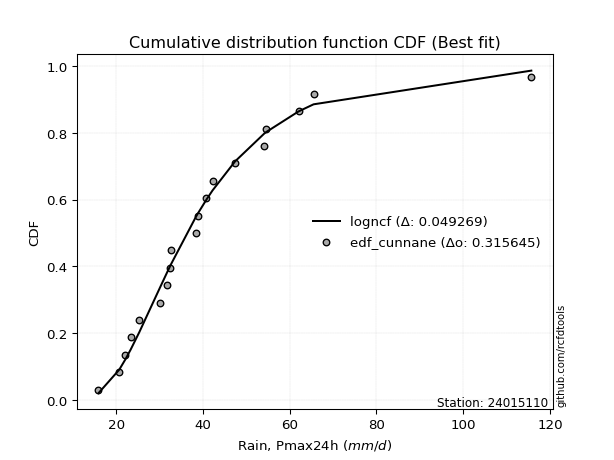</img>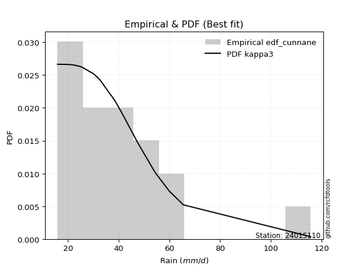</img>

</div>


### 12. EDF Adamowski (1981)

The Adamowski formula in hydrology refers to a specific plotting position formula used for estimating the non-parametric empirical distribution of hydrological events (like flood peaks) to calculate their return periods. This formula provides an alternative to traditional parametric methods (like the Gumbel or Log Pearson Type III distributions). 

<div align="center">


$P=(m-0.25)/(n+0.5)$


</div>


**12.1. Empirical values**

<div align="center">

|                | 0                    | 1                   | 2                   | 3                   | 4                   | 5                  | 6                   | 7                  | 8                  | 9                   | 10                 | 11                 | 12                 | 13                 | 14                 | 15                 | 16                 | 17                 | 18                 | 19                 |
|:---------------|:---------------------|:--------------------|:--------------------|:--------------------|:--------------------|:-------------------|:--------------------|:-------------------|:-------------------|:--------------------|:-------------------|:-------------------|:-------------------|:-------------------|:-------------------|:-------------------|:-------------------|:-------------------|:-------------------|:-------------------|
| date           | 2020                 | 2025                | 2022                | 2019                | 2008                | 2023               | 2015                | 2014               | 2018               | 2017                | 2007               | 2016               | 2005               | 2009               | 2021               | 2010               | 2006               | 2012               | 2011               | 2013               |
| x              | 15.9                 | 19.2                | 20.7                | 22.1                | 23.3                | 25.3               | 30.1                | 31.8               | 32.5               | 32.6                | 38.4               | 38.9               | 40.8               | 42.2               | 47.4               | 54.1               | 54.6               | 59.9               | 65.5               | 115.7              |
| m              | 1                    | 2                   | 3                   | 4                   | 5                   | 6                  | 7                   | 8                  | 9                  | 10                  | 11                 | 12                 | 13                 | 14                 | 15                 | 16                 | 17                 | 18                 | 19                 | 20                 |
| empirical_dist | edf_adamowski        | edf_adamowski       | edf_adamowski       | edf_adamowski       | edf_adamowski       | edf_adamowski      | edf_adamowski       | edf_adamowski      | edf_adamowski      | edf_adamowski       | edf_adamowski      | edf_adamowski      | edf_adamowski      | edf_adamowski      | edf_adamowski      | edf_adamowski      | edf_adamowski      | edf_adamowski      | edf_adamowski      | edf_adamowski      |
| empirical      | 0.036585365853658534 | 0.08536585365853659 | 0.13414634146341464 | 0.18292682926829268 | 0.23170731707317074 | 0.2804878048780488 | 0.32926829268292684 | 0.3780487804878049 | 0.4268292682926829 | 0.47560975609756095 | 0.524390243902439  | 0.573170731707317  | 0.6219512195121951 | 0.6707317073170732 | 0.7195121951219512 | 0.7682926829268293 | 0.8170731707317073 | 0.8658536585365854 | 0.9146341463414634 | 0.9634146341463414 |
| empirical_tr   | 1.0379746835443038   | 1.0933333333333333  | 1.1549295774647887  | 1.2238805970149254  | 1.3015873015873016  | 1.3898305084745763 | 1.490909090909091   | 1.607843137254902  | 1.7446808510638296 | 1.9069767441860463  | 2.1025641025641026 | 2.3428571428571425 | 2.6451612903225805 | 3.037037037037037  | 3.5652173913043477 | 4.315789473684211  | 5.466666666666665  | 7.454545454545454  | 11.714285714285719 | 27.33333333333331  |

</div>


**12.2. Kolmogorov-Smirnov fit test (sorted by Δ)**


<div align="center">

|                | 0                    | 1                   | 2                    | 3                   | 4                   | 5                   | 6                    | 7                   | 8                   | 9                  | 10                  | 11                   | 12                   | 13                  | 14                  | 15                   | 16                  | 17                  | 18                  | 19                  | 20                   | 21                   | 22                 | 23                  | 24                  | 25                  | 26                  | 27                  | 28                  | 29                 | 30                  | 31                  | 32                  | 33                  | 34                  | 35                  | 36                  | 37                  | 38                  | 39                  | 40                  | 41                  | 42                  | 43                  | 44                  | 45                  | 46                  | 47                  | 48                  | 49                  | 50                  | 51                  | 52                  | 53                  | 54                  | 55                  | 56                  | 57                 | 58                  | 59                 | 60                  | 61                  | 62                  | 63                  | 64                  | 65                  | 66                  | 67                  | 68                  | 69                  | 70                 | 71                  | 72                  | 73                  | 74                  | 75                  | 76                 | 77                  | 78                  | 79                  | 80                  | 81                  | 82                  | 83                  | 84                  | 85                  | 86                 | 87                  | 88                  | 89                  | 90                  | 91                  | 92                  | 93                  | 94                  | 95                  | 96                  | 97                  | 98                  | 99                  | 100                 | 101                 | 102                 | 103                 | 104                | 105                 | 106                | 107                 | 108                 | 109                 | 110                 | 111                 | 112                | 113                 | 114                 | 115                 | 116                 | 117                 | 118                | 119                 | 120                | 121                 | 122                 | 123                 | 124                 | 125                 | 126                 | 127                 | 128                | 129                 | 130                 | 131                | 132                | 133                 | 134                | 135                | 136                 | 137                | 138                | 139                | 140                 | 141                | 142                | 143                | 144                | 145                | 146                | 147                 | 148                 | 149                | 150                | 151                | 152                 | 153                 | 154                | 155                | 156                | 157                | 158                | 159                |
|:---------------|:---------------------|:--------------------|:---------------------|:--------------------|:--------------------|:--------------------|:---------------------|:--------------------|:--------------------|:-------------------|:--------------------|:---------------------|:---------------------|:--------------------|:--------------------|:---------------------|:--------------------|:--------------------|:--------------------|:--------------------|:---------------------|:---------------------|:-------------------|:--------------------|:--------------------|:--------------------|:--------------------|:--------------------|:--------------------|:-------------------|:--------------------|:--------------------|:--------------------|:--------------------|:--------------------|:--------------------|:--------------------|:--------------------|:--------------------|:--------------------|:--------------------|:--------------------|:--------------------|:--------------------|:--------------------|:--------------------|:--------------------|:--------------------|:--------------------|:--------------------|:--------------------|:--------------------|:--------------------|:--------------------|:--------------------|:--------------------|:--------------------|:-------------------|:--------------------|:-------------------|:--------------------|:--------------------|:--------------------|:--------------------|:--------------------|:--------------------|:--------------------|:--------------------|:--------------------|:--------------------|:-------------------|:--------------------|:--------------------|:--------------------|:--------------------|:--------------------|:-------------------|:--------------------|:--------------------|:--------------------|:--------------------|:--------------------|:--------------------|:--------------------|:--------------------|:--------------------|:-------------------|:--------------------|:--------------------|:--------------------|:--------------------|:--------------------|:--------------------|:--------------------|:--------------------|:--------------------|:--------------------|:--------------------|:--------------------|:--------------------|:--------------------|:--------------------|:--------------------|:--------------------|:-------------------|:--------------------|:-------------------|:--------------------|:--------------------|:--------------------|:--------------------|:--------------------|:-------------------|:--------------------|:--------------------|:--------------------|:--------------------|:--------------------|:-------------------|:--------------------|:-------------------|:--------------------|:--------------------|:--------------------|:--------------------|:--------------------|:--------------------|:--------------------|:-------------------|:--------------------|:--------------------|:-------------------|:-------------------|:--------------------|:-------------------|:-------------------|:--------------------|:-------------------|:-------------------|:-------------------|:--------------------|:-------------------|:-------------------|:-------------------|:-------------------|:-------------------|:-------------------|:--------------------|:--------------------|:-------------------|:-------------------|:-------------------|:--------------------|:--------------------|:-------------------|:-------------------|:-------------------|:-------------------|:-------------------|:-------------------|
| station        | 24015110             | 24015110            | 24015110             | 24015110            | 24015110            | 24015110            | 24015110             | 24015110            | 24015110            | 24015110           | 24015110            | 24015110             | 24015110             | 24015110            | 24015110            | 24015110             | 24015110            | 24015110            | 24015110            | 24015110            | 24015110             | 24015110             | 24015110           | 24015110            | 24015110            | 24015110            | 24015110            | 24015110            | 24015110            | 24015110           | 24015110            | 24015110            | 24015110            | 24015110            | 24015110            | 24015110            | 24015110            | 24015110            | 24015110            | 24015110            | 24015110            | 24015110            | 24015110            | 24015110            | 24015110            | 24015110            | 24015110            | 24015110            | 24015110            | 24015110            | 24015110            | 24015110            | 24015110            | 24015110            | 24015110            | 24015110            | 24015110            | 24015110           | 24015110            | 24015110           | 24015110            | 24015110            | 24015110            | 24015110            | 24015110            | 24015110            | 24015110            | 24015110            | 24015110            | 24015110            | 24015110           | 24015110            | 24015110            | 24015110            | 24015110            | 24015110            | 24015110           | 24015110            | 24015110            | 24015110            | 24015110            | 24015110            | 24015110            | 24015110            | 24015110            | 24015110            | 24015110           | 24015110            | 24015110            | 24015110            | 24015110            | 24015110            | 24015110            | 24015110            | 24015110            | 24015110            | 24015110            | 24015110            | 24015110            | 24015110            | 24015110            | 24015110            | 24015110            | 24015110            | 24015110           | 24015110            | 24015110           | 24015110            | 24015110            | 24015110            | 24015110            | 24015110            | 24015110           | 24015110            | 24015110            | 24015110            | 24015110            | 24015110            | 24015110           | 24015110            | 24015110           | 24015110            | 24015110            | 24015110            | 24015110            | 24015110            | 24015110            | 24015110            | 24015110           | 24015110            | 24015110            | 24015110           | 24015110           | 24015110            | 24015110           | 24015110           | 24015110            | 24015110           | 24015110           | 24015110           | 24015110            | 24015110           | 24015110           | 24015110           | 24015110           | 24015110           | 24015110           | 24015110            | 24015110            | 24015110           | 24015110           | 24015110           | 24015110            | 24015110            | 24015110           | 24015110           | 24015110           | 24015110           | 24015110           | 24015110           |
| empirical_dist | edf_adamowski        | edf_adamowski       | edf_adamowski        | edf_adamowski       | edf_adamowski       | edf_adamowski       | edf_adamowski        | edf_adamowski       | edf_adamowski       | edf_adamowski      | edf_adamowski       | edf_adamowski        | edf_adamowski        | edf_adamowski       | edf_adamowski       | edf_adamowski        | edf_adamowski       | edf_adamowski       | edf_adamowski       | edf_adamowski       | edf_adamowski        | edf_adamowski        | edf_adamowski      | edf_adamowski       | edf_adamowski       | edf_adamowski       | edf_adamowski       | edf_adamowski       | edf_adamowski       | edf_adamowski      | edf_adamowski       | edf_adamowski       | edf_adamowski       | edf_adamowski       | edf_adamowski       | edf_adamowski       | edf_adamowski       | edf_adamowski       | edf_adamowski       | edf_adamowski       | edf_adamowski       | edf_adamowski       | edf_adamowski       | edf_adamowski       | edf_adamowski       | edf_adamowski       | edf_adamowski       | edf_adamowski       | edf_adamowski       | edf_adamowski       | edf_adamowski       | edf_adamowski       | edf_adamowski       | edf_adamowski       | edf_adamowski       | edf_adamowski       | edf_adamowski       | edf_adamowski      | edf_adamowski       | edf_adamowski      | edf_adamowski       | edf_adamowski       | edf_adamowski       | edf_adamowski       | edf_adamowski       | edf_adamowski       | edf_adamowski       | edf_adamowski       | edf_adamowski       | edf_adamowski       | edf_adamowski      | edf_adamowski       | edf_adamowski       | edf_adamowski       | edf_adamowski       | edf_adamowski       | edf_adamowski      | edf_adamowski       | edf_adamowski       | edf_adamowski       | edf_adamowski       | edf_adamowski       | edf_adamowski       | edf_adamowski       | edf_adamowski       | edf_adamowski       | edf_adamowski      | edf_adamowski       | edf_adamowski       | edf_adamowski       | edf_adamowski       | edf_adamowski       | edf_adamowski       | edf_adamowski       | edf_adamowski       | edf_adamowski       | edf_adamowski       | edf_adamowski       | edf_adamowski       | edf_adamowski       | edf_adamowski       | edf_adamowski       | edf_adamowski       | edf_adamowski       | edf_adamowski      | edf_adamowski       | edf_adamowski      | edf_adamowski       | edf_adamowski       | edf_adamowski       | edf_adamowski       | edf_adamowski       | edf_adamowski      | edf_adamowski       | edf_adamowski       | edf_adamowski       | edf_adamowski       | edf_adamowski       | edf_adamowski      | edf_adamowski       | edf_adamowski      | edf_adamowski       | edf_adamowski       | edf_adamowski       | edf_adamowski       | edf_adamowski       | edf_adamowski       | edf_adamowski       | edf_adamowski      | edf_adamowski       | edf_adamowski       | edf_adamowski      | edf_adamowski      | edf_adamowski       | edf_adamowski      | edf_adamowski      | edf_adamowski       | edf_adamowski      | edf_adamowski      | edf_adamowski      | edf_adamowski       | edf_adamowski      | edf_adamowski      | edf_adamowski      | edf_adamowski      | edf_adamowski      | edf_adamowski      | edf_adamowski       | edf_adamowski       | edf_adamowski      | edf_adamowski      | edf_adamowski      | edf_adamowski       | edf_adamowski       | edf_adamowski      | edf_adamowski      | edf_adamowski      | edf_adamowski      | edf_adamowski      | edf_adamowski      |
| p_dist         | kappa3               | moyal               | burr12               | logdweibull         | logbetaprime        | logrice             | logpearson3          | ncf                 | betaprime           | loganglit          | genexpon            | logdgamma            | logmaxwell           | loggennorm          | lognorm             | logcrystalball       | logt                | logexponnorm        | logloggamma         | logweibull_max      | loggenextreme        | logburr12            | logalpha           | logweibull_min      | loginvgamma         | logf                | alpha               | invgauss            | logfoldnorm         | logskewnorm        | halflogistic        | logjohnsonsu        | lognct              | logsemicircular     | logfatiguelife      | loginvgauss         | fatiguelife         | logncf              | johnsonsu           | logvonmises_line    | nct                 | logburr             | invgamma            | logjohnsonsb        | johnsonsb           | logerlang           | loggamma            | loggamma            | invweibull          | genextreme          | f                   | lograyleigh         | gumbel_r            | mielke              | logbeta             | lognakagami         | logmielke           | pearson3           | loggenlogistic      | burr               | logtriang           | exponpow            | loglogistic         | beta                | genlogistic         | logexponweib        | gompertz            | halfnorm            | gausshyper          | erlang              | gamma              | genpareto           | loginvweibull       | exponnorm           | t                   | loghypsecant        | loggenexpon        | logkstwobign        | logcosine           | dgamma              | skewnorm            | tukeylambda         | dweibull            | gennorm             | rayleigh            | loggumbel_r         | genhalflogistic    | loghalfnorm         | logarcsine          | kstwobign           | gengamma            | loglaplace          | loglaplace          | loghalfgennorm      | maxwell             | logtruncweibull_min | logtruncexpon       | cosine              | logtruncpareto      | loggausshyper       | loggengamma         | logmoyal            | foldnorm            | exponweib           | loggumbel_l        | loggompertz         | loghalflogistic    | logistic            | logbradford         | rice                | lomax               | truncnorm           | crystalball        | norm                | anglit              | semicircular        | hypsecant           | logloglaplace       | wald               | arcsine             | laplace            | weibull_min         | logexponpow         | loguniform          | logkappa4           | logtukeylambda      | loglomax            | gumbel_l            | logkappa3          | halfgennorm         | logargus            | vonmises_line      | logwald            | truncweibull_min    | truncexpon         | logksone           | triang              | logrdist           | logtruncnorm       | bradford           | nakagami            | powerlaw           | logwrapcauchy      | loggenpareto       | logpowerlaw        | loggenhalflogistic | argus              | kappa4              | wrapcauchy          | ksone              | uniform            | loglevy_l          | logtrapezoid        | levy_l              | rdist              | trapezoid          | weibull_max        | truncpareto        | logvonmises        | vonmises           |
| delta          | 0.045030545068430516 | 0.04654358762863775 | 0.048904330309909705 | 0.05155485822247455 | 0.05507322984534671 | 0.05567777032282761 | 0.056189684788208516 | 0.05647698255041658 | 0.05650355605005042 | 0.0571389954884125 | 0.05827519273747589 | 0.058988501683581995 | 0.059391304564054725 | 0.05983374997473534 | 0.05989426228355643 | 0.059894307751945486 | 0.05989494484427632 | 0.06029809032824798 | 0.06036924712768671 | 0.06177056400392977 | 0.061772174475615005 | 0.062178818458495044 | 0.0623909135812627 | 0.06327113403825269 | 0.06346437067379873 | 0.06351920964331104 | 0.06380570766370419 | 0.06384501169878343 | 0.06396912313882269 | 0.0642769433867294 | 0.06427931566433825 | 0.06436694044851654 | 0.06441445686837222 | 0.06452898982479927 | 0.06537227674643975 | 0.06539481128841063 | 0.06568013721824689 | 0.06616733296325605 | 0.06622173505324969 | 0.06638312645903321 | 0.06650104444956939 | 0.06669109161344866 | 0.06692717385506486 | 0.06694289445898965 | 0.06729459380494424 | 0.06738886778387321 | 0.06738923552399512 | 0.06738923552399512 | 0.06771104440120801 | 0.06771119377174062 | 0.06824487460453021 | 0.06904869910871714 | 0.07028416837988805 | 0.07101952643254883 | 0.07291360595531288 | 0.07359852168292386 | 0.07450950689910407 | 0.0747818227935631 | 0.07529016036501901 | 0.0753258904945    | 0.07543885063431205 | 0.07615502740286428 | 0.07665481976873514 | 0.07799949770722037 | 0.08035935003099193 | 0.08211743357050855 | 0.08370320984717255 | 0.08425686998994426 | 0.08477775043157165 | 0.08584898751241199 | 0.0858490762044114 | 0.08690808258002836 | 0.08700775871235933 | 0.08881207664766094 | 0.08987054922646553 | 0.09069204947584197 | 0.0916934436212486 | 0.09219094392700938 | 0.09385158001789917 | 0.09660558657179938 | 0.09716707422705839 | 0.09762421845045322 | 0.09772271501027305 | 0.09877083494145777 | 0.09898461889200194 | 0.09918243891379686 | 0.1002243638543523 | 0.10030417185377377 | 0.10263468740006665 | 0.10434669960983323 | 0.10549123229120316 | 0.10766532308467566 | 0.10766532308467566 | 0.10790490845431738 | 0.10928780985345621 | 0.10959243556195353 | 0.11266773695550769 | 0.11394010210228817 | 0.11576674050308661 | 0.11772811604637262 | 0.12388508726492342 | 0.12389972101627067 | 0.12495470847165131 | 0.12553272772502128 | 0.1278661139811743 | 0.12810659310999145 | 0.1294622531231166 | 0.13685246263230266 | 0.13794778513854655 | 0.13831397598921535 | 0.13930363189155137 | 0.14090704440101776 | 0.1409070555422447 | 0.14090705721945118 | 0.14516379202076013 | 0.14691855410383658 | 0.14695061121293967 | 0.15140703385779897 | 0.1514386486029959 | 0.17458851470067216 | 0.175326161409544  | 0.18111984449209478 | 0.19708133541153977 | 0.20130507283483967 | 0.20249916195577167 | 0.20680165798530992 | 0.20695398493430145 | 0.20974538624293038 | 0.2109270867437495 | 0.21507299868891178 | 0.22080830381343497 | 0.2298857775185325 | 0.2310920151231329 | 0.23342213566101933 | 0.2352614263365983 | 0.2368599184192769 | 0.23814126307763672 | 0.2465081017975973 | 0.260369258430122  | 0.264874871727373  | 0.28905628649373777 | 0.29417064861862   | 0.3324184448549511 | 0.3358994096477416 | 0.3452062976197514 | 0.3571708684705398 | 0.3793334860004921 | 0.40401971197756903 | 0.41641839355773086 | 0.4171391563615035 | 0.4292976196295028 | 0.4335193806785394 | 0.45593642801697026 | 0.49718689302972635 | 0.5173525017391359 | 0.667132881286303  | 0.7692287629176586 | 0.8223243773955562 | 1.0473436561810052 | 17.47840709688871  |
| deltao         | 0.3096406529800002   | 0.3096406529800002  | 0.3096406529800002   | 0.3096406529800002  | 0.3096406529800002  | 0.3096406529800002  | 0.3096406529800002   | 0.3096406529800002  | 0.3096406529800002  | 0.3096406529800002 | 0.3096406529800002  | 0.3096406529800002   | 0.3096406529800002   | 0.3096406529800002  | 0.3096406529800002  | 0.3096406529800002   | 0.3096406529800002  | 0.3096406529800002  | 0.3096406529800002  | 0.3096406529800002  | 0.3096406529800002   | 0.3096406529800002   | 0.3096406529800002 | 0.3096406529800002  | 0.3096406529800002  | 0.3096406529800002  | 0.3096406529800002  | 0.3096406529800002  | 0.3096406529800002  | 0.3096406529800002 | 0.3096406529800002  | 0.3096406529800002  | 0.3096406529800002  | 0.3096406529800002  | 0.3096406529800002  | 0.3096406529800002  | 0.3096406529800002  | 0.3096406529800002  | 0.3096406529800002  | 0.3096406529800002  | 0.3096406529800002  | 0.3096406529800002  | 0.3096406529800002  | 0.3096406529800002  | 0.3096406529800002  | 0.3096406529800002  | 0.3096406529800002  | 0.3096406529800002  | 0.3096406529800002  | 0.3096406529800002  | 0.3096406529800002  | 0.3096406529800002  | 0.3096406529800002  | 0.3096406529800002  | 0.3096406529800002  | 0.3096406529800002  | 0.3096406529800002  | 0.3096406529800002 | 0.3096406529800002  | 0.3096406529800002 | 0.3096406529800002  | 0.3096406529800002  | 0.3096406529800002  | 0.3096406529800002  | 0.3096406529800002  | 0.3096406529800002  | 0.3096406529800002  | 0.3096406529800002  | 0.3096406529800002  | 0.3096406529800002  | 0.3096406529800002 | 0.3096406529800002  | 0.3096406529800002  | 0.3096406529800002  | 0.3096406529800002  | 0.3096406529800002  | 0.3096406529800002 | 0.3096406529800002  | 0.3096406529800002  | 0.3096406529800002  | 0.3096406529800002  | 0.3096406529800002  | 0.3096406529800002  | 0.3096406529800002  | 0.3096406529800002  | 0.3096406529800002  | 0.3096406529800002 | 0.3096406529800002  | 0.3096406529800002  | 0.3096406529800002  | 0.3096406529800002  | 0.3096406529800002  | 0.3096406529800002  | 0.3096406529800002  | 0.3096406529800002  | 0.3096406529800002  | 0.3096406529800002  | 0.3096406529800002  | 0.3096406529800002  | 0.3096406529800002  | 0.3096406529800002  | 0.3096406529800002  | 0.3096406529800002  | 0.3096406529800002  | 0.3096406529800002 | 0.3096406529800002  | 0.3096406529800002 | 0.3096406529800002  | 0.3096406529800002  | 0.3096406529800002  | 0.3096406529800002  | 0.3096406529800002  | 0.3096406529800002 | 0.3096406529800002  | 0.3096406529800002  | 0.3096406529800002  | 0.3096406529800002  | 0.3096406529800002  | 0.3096406529800002 | 0.3096406529800002  | 0.3096406529800002 | 0.3096406529800002  | 0.3096406529800002  | 0.3096406529800002  | 0.3096406529800002  | 0.3096406529800002  | 0.3096406529800002  | 0.3096406529800002  | 0.3096406529800002 | 0.3096406529800002  | 0.3096406529800002  | 0.3096406529800002 | 0.3096406529800002 | 0.3096406529800002  | 0.3096406529800002 | 0.3096406529800002 | 0.3096406529800002  | 0.3096406529800002 | 0.3096406529800002 | 0.3096406529800002 | 0.3096406529800002  | 0.3096406529800002 | 0.3096406529800002 | 0.3096406529800002 | 0.3096406529800002 | 0.3096406529800002 | 0.3096406529800002 | 0.3096406529800002  | 0.3096406529800002  | 0.3096406529800002 | 0.3096406529800002 | 0.3096406529800002 | 0.3096406529800002  | 0.3096406529800002  | 0.3096406529800002 | 0.3096406529800002 | 0.3096406529800002 | 0.3096406529800002 | 0.3096406529800002 | 0.3096406529800002 |
| eval           | Δo > Δ               | Δo > Δ              | Δo > Δ               | Δo > Δ              | Δo > Δ              | Δo > Δ              | Δo > Δ               | Δo > Δ              | Δo > Δ              | Δo > Δ             | Δo > Δ              | Δo > Δ               | Δo > Δ               | Δo > Δ              | Δo > Δ              | Δo > Δ               | Δo > Δ              | Δo > Δ              | Δo > Δ              | Δo > Δ              | Δo > Δ               | Δo > Δ               | Δo > Δ             | Δo > Δ              | Δo > Δ              | Δo > Δ              | Δo > Δ              | Δo > Δ              | Δo > Δ              | Δo > Δ             | Δo > Δ              | Δo > Δ              | Δo > Δ              | Δo > Δ              | Δo > Δ              | Δo > Δ              | Δo > Δ              | Δo > Δ              | Δo > Δ              | Δo > Δ              | Δo > Δ              | Δo > Δ              | Δo > Δ              | Δo > Δ              | Δo > Δ              | Δo > Δ              | Δo > Δ              | Δo > Δ              | Δo > Δ              | Δo > Δ              | Δo > Δ              | Δo > Δ              | Δo > Δ              | Δo > Δ              | Δo > Δ              | Δo > Δ              | Δo > Δ              | Δo > Δ             | Δo > Δ              | Δo > Δ             | Δo > Δ              | Δo > Δ              | Δo > Δ              | Δo > Δ              | Δo > Δ              | Δo > Δ              | Δo > Δ              | Δo > Δ              | Δo > Δ              | Δo > Δ              | Δo > Δ             | Δo > Δ              | Δo > Δ              | Δo > Δ              | Δo > Δ              | Δo > Δ              | Δo > Δ             | Δo > Δ              | Δo > Δ              | Δo > Δ              | Δo > Δ              | Δo > Δ              | Δo > Δ              | Δo > Δ              | Δo > Δ              | Δo > Δ              | Δo > Δ             | Δo > Δ              | Δo > Δ              | Δo > Δ              | Δo > Δ              | Δo > Δ              | Δo > Δ              | Δo > Δ              | Δo > Δ              | Δo > Δ              | Δo > Δ              | Δo > Δ              | Δo > Δ              | Δo > Δ              | Δo > Δ              | Δo > Δ              | Δo > Δ              | Δo > Δ              | Δo > Δ             | Δo > Δ              | Δo > Δ             | Δo > Δ              | Δo > Δ              | Δo > Δ              | Δo > Δ              | Δo > Δ              | Δo > Δ             | Δo > Δ              | Δo > Δ              | Δo > Δ              | Δo > Δ              | Δo > Δ              | Δo > Δ             | Δo > Δ              | Δo > Δ             | Δo > Δ              | Δo > Δ              | Δo > Δ              | Δo > Δ              | Δo > Δ              | Δo > Δ              | Δo > Δ              | Δo > Δ             | Δo > Δ              | Δo > Δ              | Δo > Δ             | Δo > Δ             | Δo > Δ              | Δo > Δ             | Δo > Δ             | Δo > Δ              | Δo > Δ             | Δo > Δ             | Δo > Δ             | Δo > Δ              | Δo > Δ             | Δo <= Δ            | Δo <= Δ            | Δo <= Δ            | Δo <= Δ            | Δo <= Δ            | Δo <= Δ             | Δo <= Δ             | Δo <= Δ            | Δo <= Δ            | Δo <= Δ            | Δo <= Δ             | Δo <= Δ             | Δo <= Δ            | Δo <= Δ            | Δo <= Δ            | Δo <= Δ            | Δo <= Δ            | Δo <= Δ            |
| fit            | 1                    | 1                   | 1                    | 1                   | 1                   | 1                   | 1                    | 1                   | 1                   | 1                  | 1                   | 1                    | 1                    | 1                   | 1                   | 1                    | 1                   | 1                   | 1                   | 1                   | 1                    | 1                    | 1                  | 1                   | 1                   | 1                   | 1                   | 1                   | 1                   | 1                  | 1                   | 1                   | 1                   | 1                   | 1                   | 1                   | 1                   | 1                   | 1                   | 1                   | 1                   | 1                   | 1                   | 1                   | 1                   | 1                   | 1                   | 1                   | 1                   | 1                   | 1                   | 1                   | 1                   | 1                   | 1                   | 1                   | 1                   | 1                  | 1                   | 1                  | 1                   | 1                   | 1                   | 1                   | 1                   | 1                   | 1                   | 1                   | 1                   | 1                   | 1                  | 1                   | 1                   | 1                   | 1                   | 1                   | 1                  | 1                   | 1                   | 1                   | 1                   | 1                   | 1                   | 1                   | 1                   | 1                   | 1                  | 1                   | 1                   | 1                   | 1                   | 1                   | 1                   | 1                   | 1                   | 1                   | 1                   | 1                   | 1                   | 1                   | 1                   | 1                   | 1                   | 1                   | 1                  | 1                   | 1                  | 1                   | 1                   | 1                   | 1                   | 1                   | 1                  | 1                   | 1                   | 1                   | 1                   | 1                   | 1                  | 1                   | 1                  | 1                   | 1                   | 1                   | 1                   | 1                   | 1                   | 1                   | 1                  | 1                   | 1                   | 1                  | 1                  | 1                   | 1                  | 1                  | 1                   | 1                  | 1                  | 1                  | 1                   | 1                  | 0                  | 0                  | 0                  | 0                  | 0                  | 0                   | 0                   | 0                  | 0                  | 0                  | 0                   | 0                   | 0                  | 0                  | 0                  | 0                  | 0                  | 0                  |
| n              | 20                   | 20                  | 20                   | 20                  | 20                  | 20                  | 20                   | 20                  | 20                  | 20                 | 20                  | 20                   | 20                   | 20                  | 20                  | 20                   | 20                  | 20                  | 20                  | 20                  | 20                   | 20                   | 20                 | 20                  | 20                  | 20                  | 20                  | 20                  | 20                  | 20                 | 20                  | 20                  | 20                  | 20                  | 20                  | 20                  | 20                  | 20                  | 20                  | 20                  | 20                  | 20                  | 20                  | 20                  | 20                  | 20                  | 20                  | 20                  | 20                  | 20                  | 20                  | 20                  | 20                  | 20                  | 20                  | 20                  | 20                  | 20                 | 20                  | 20                 | 20                  | 20                  | 20                  | 20                  | 20                  | 20                  | 20                  | 20                  | 20                  | 20                  | 20                 | 20                  | 20                  | 20                  | 20                  | 20                  | 20                 | 20                  | 20                  | 20                  | 20                  | 20                  | 20                  | 20                  | 20                  | 20                  | 20                 | 20                  | 20                  | 20                  | 20                  | 20                  | 20                  | 20                  | 20                  | 20                  | 20                  | 20                  | 20                  | 20                  | 20                  | 20                  | 20                  | 20                  | 20                 | 20                  | 20                 | 20                  | 20                  | 20                  | 20                  | 20                  | 20                 | 20                  | 20                  | 20                  | 20                  | 20                  | 20                 | 20                  | 20                 | 20                  | 20                  | 20                  | 20                  | 20                  | 20                  | 20                  | 20                 | 20                  | 20                  | 20                 | 20                 | 20                  | 20                 | 20                 | 20                  | 20                 | 20                 | 20                 | 20                  | 20                 | 20                 | 20                 | 20                 | 20                 | 20                 | 20                  | 20                  | 20                 | 20                 | 20                 | 20                  | 20                  | 20                 | 20                 | 20                 | 20                 | 20                 | 20                 |
| best_fit       | 1                    | 0                   | 0                    | 0                   | 0                   | 0                   | 0                    | 0                   | 0                   | 0                  | 0                   | 0                    | 0                    | 0                   | 0                   | 0                    | 0                   | 0                   | 0                   | 0                   | 0                    | 0                    | 0                  | 0                   | 0                   | 0                   | 0                   | 0                   | 0                   | 0                  | 0                   | 0                   | 0                   | 0                   | 0                   | 0                   | 0                   | 0                   | 0                   | 0                   | 0                   | 0                   | 0                   | 0                   | 0                   | 0                   | 0                   | 0                   | 0                   | 0                   | 0                   | 0                   | 0                   | 0                   | 0                   | 0                   | 0                   | 0                  | 0                   | 0                  | 0                   | 0                   | 0                   | 0                   | 0                   | 0                   | 0                   | 0                   | 0                   | 0                   | 0                  | 0                   | 0                   | 0                   | 0                   | 0                   | 0                  | 0                   | 0                   | 0                   | 0                   | 0                   | 0                   | 0                   | 0                   | 0                   | 0                  | 0                   | 0                   | 0                   | 0                   | 0                   | 0                   | 0                   | 0                   | 0                   | 0                   | 0                   | 0                   | 0                   | 0                   | 0                   | 0                   | 0                   | 0                  | 0                   | 0                  | 0                   | 0                   | 0                   | 0                   | 0                   | 0                  | 0                   | 0                   | 0                   | 0                   | 0                   | 0                  | 0                   | 0                  | 0                   | 0                   | 0                   | 0                   | 0                   | 0                   | 0                   | 0                  | 0                   | 0                   | 0                  | 0                  | 0                   | 0                  | 0                  | 0                   | 0                  | 0                  | 0                  | 0                   | 0                  | 0                  | 0                  | 0                  | 0                  | 0                  | 0                   | 0                   | 0                  | 0                  | 0                  | 0                   | 0                   | 0                  | 0                  | 0                  | 0                  | 0                  | 0                  |
| best_fit_sort  | 1                    | 2                   | 3                    | 4                   | 5                   | 6                   | 7                    | 8                   | 9                   | 10                 | 11                  | 12                   | 13                   | 14                  | 15                  | 16                   | 17                  | 18                  | 19                  | 20                  | 21                   | 22                   | 23                 | 24                  | 25                  | 26                  | 27                  | 28                  | 29                  | 30                 | 31                  | 32                  | 33                  | 34                  | 35                  | 36                  | 37                  | 38                  | 39                  | 40                  | 41                  | 42                  | 43                  | 44                  | 45                  | 46                  | 47                  | 48                  | 49                  | 50                  | 51                  | 52                  | 53                  | 54                  | 55                  | 56                  | 57                  | 58                 | 59                  | 60                 | 61                  | 62                  | 63                  | 64                  | 65                  | 66                  | 67                  | 68                  | 69                  | 70                  | 71                 | 72                  | 73                  | 74                  | 75                  | 76                  | 77                 | 78                  | 79                  | 80                  | 81                  | 82                  | 83                  | 84                  | 85                  | 86                  | 87                 | 88                  | 89                  | 90                  | 91                  | 92                  | 93                  | 94                  | 95                  | 96                  | 97                  | 98                  | 99                  | 100                 | 101                 | 102                 | 103                 | 104                 | 105                | 106                 | 107                | 108                 | 109                 | 110                 | 111                 | 112                 | 113                | 114                 | 115                 | 116                 | 117                 | 118                 | 119                | 120                 | 121                | 122                 | 123                 | 124                 | 125                 | 126                 | 127                 | 128                 | 129                | 130                 | 131                 | 132                | 133                | 134                 | 135                | 136                | 137                 | 138                | 139                | 140                | 141                 | 142                | 143                | 144                | 145                | 146                | 147                | 148                 | 149                 | 150                | 151                | 152                | 153                 | 154                 | 155                | 156                | 157                | 158                | 159                | 160                |

</div>


**12.3. Best fit**

<div align="center">

|   id |   station | empirical_dist   | p_dist   |     delta |   deltao | eval   |   fit |   n |   best_fit |   best_fit_sort |
|-----:|----------:|:-----------------|:---------|----------:|---------:|:-------|------:|----:|-----------:|----------------:|
|    0 |  24015110 | edf_adamowski    | kappa3   | 0.0450305 | 0.309641 | Δo > Δ |     1 |  20 |          1 |               1 |

</div>


<div align="center">

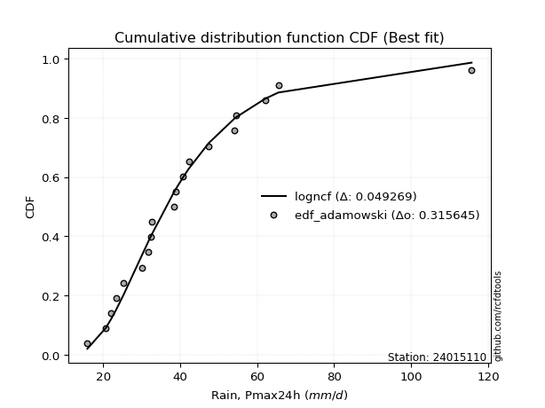</img>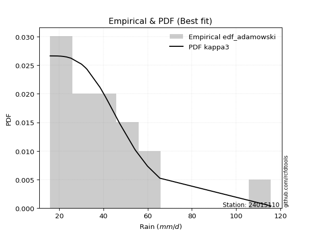</img>

</div>


## C. Best fit & Estimate extreme values for specific return periods - Tr

Best fit in probability distribution analysis means finding the theoretical distribution (like Normal, Poisson, Exponential, etc.) that most accurately mirrors your real-world data´s patterns (shape, center, spread) for better predictions, using methods like visual checks (Q-Q plots), goodness-of-fit tests (Kolmogorov-Smirnov, Chi-Squared), and information criteria (AIC) to score and select the simplest, most representative model.


### 1. Best fit (ordered by delta Δ)

:file_folder:Table: [bestfit_24015110.csv](table/bestfit_24015110.csv)

<div align="center">

|   id |   station | empirical_dist   | p_dist   |     delta |   deltao | eval   |   fit |   n |   best_fit |   best_fit_sort |
|-----:|----------:|:-----------------|:---------|----------:|---------:|:-------|------:|----:|-----------:|----------------:|
|    0 |  24015110 | edf_chegodayev   | kappa3   | 0.0448069 | 0.309641 | Δo > Δ |     1 |  20 |          1 |               1 |
|    1 |  24015110 | edf_jenkinson    | kappa3   | 0.0449753 | 0.309641 | Δo > Δ |     1 |  20 |          1 |               2 |
|    2 |  24015110 | edf_beard        | kappa3   | 0.0449753 | 0.309641 | Δo > Δ |     1 |  20 |          1 |               3 |
|    3 |  24015110 | edf_adamowski    | kappa3   | 0.0450305 | 0.309641 | Δo > Δ |     1 |  20 |          1 |               4 |
|    4 |  24015110 | edf_filliben     | kappa3   | 0.0451018 | 0.309641 | Δo > Δ |     1 |  20 |          1 |               5 |
|    5 |  24015110 | edf_tukey        | kappa3   | 0.0453694 | 0.309641 | Δo > Δ |     1 |  20 |          1 |               6 |
|    6 |  24015110 | edf_blom         | kappa3   | 0.0460778 | 0.309641 | Δo > Δ |     1 |  20 |          1 |               7 |
|    7 |  24015110 | edf_cunnane      | kappa3   | 0.0465056 | 0.309641 | Δo > Δ |     1 |  20 |          1 |               8 |
|    8 |  24015110 | edf_weibull      | moyal    | 0.0471243 | 0.309641 | Δo > Δ |     1 |  20 |          1 |               9 |
|    9 |  24015110 | edf_gringorten   | kappa3   | 0.0471945 | 0.309641 | Δo > Δ |     1 |  20 |          1 |              10 |
|   10 |  24015110 | edf_hazen        | kappa3   | 0.0482383 | 0.309641 | Δo > Δ |     1 |  20 |          1 |              11 |
|   11 |  24015110 | edf_california   | logrice  | 0.0621306 | 0.309641 | Δo > Δ |     1 |  20 |          1 |              12 |

</div>


### 2. Extreme values and % difference analysis

In hydrology, a return period (or recurrence interval $Tr$) is the statistical average time between extreme events like floods or droughts of a specific magnitude, indicating how rare an event is, with a 100-year flood, for example, having a 1% chance of occurring in any given year, not that it happens exactly every century. It is a key tool for infrastructure design (like bridges or dams) and risk assessment, calculated from historical data to determine the probability of future events, although it is important to remember it is statistical average, and events can cluster or be missed.

The extreme value porcentage difference is evaluated as $pdiff = 1 - (ETrBf / ETr) * 100$, where _ETrBf_ correspond to the bestfit extreme value for a specific recurrence interval and _ETr_ correspond to the extreme value for one of the most used PDFsused in hydrology.

> risk_rate: assuming the return period as the project useful life.

:file_folder:Table: [extreme_24015110.csv](table/extreme_24015110.csv), all PDFs.  
:file_folder:Table: [extremepdiff_24015110.csv](table/extremepdiff_24015110.csv), % difference between bestfit and most used PDFs in Hydrology.

<div align="center">

Extreme values table for only best fit PDFs
|   id |      tr |   prob_l |     prob_g |    alpha |   anglit |   arcsine |    argus |     beta |   betaprime |   bradford |     burr |   burr12 |   cosine |   crystalball |   dgamma |   dweibull |   erlang |   exponnorm |   exponpow |   exponweib |        f |   fatiguelife |   foldnorm |    gamma |   gausshyper |   genexpon |   genextreme |   gengamma |   genhalflogistic |   genlogistic |   gennorm |   genpareto |   gompertz |   gumbel_l |   gumbel_r |   halfgennorm |   halflogistic |   halfnorm |   hypsecant |   invgamma |   invgauss |   invweibull |   johnsonsb |   johnsonsu |   kappa3 |   kappa4 |    ksone |   kstwobign |   laplace |    levy_l |   loggamma |   logistic |   loglaplace |    lomax |   maxwell |   mielke |    moyal |   nakagami |      ncf |      nct |     norm |   pearson3 |   powerlaw |   rayleigh |   rdist |     rice |   semicircular |   skewnorm |        t |   trapezoid |   triang |   truncexpon |   truncnorm |   truncpareto |   truncweibull_min |   tukeylambda |   uniform |   vonmises |   vonmises_line |     wald |   weibull_max |   weibull_min |   wrapcauchy |   logalpha |   loganglit |   logarcsine |   logargus |   logbeta |   logbetaprime |   logbradford |   logburr |   logburr12 |   logcosine |   logcrystalball |   logdgamma |   logdweibull |   logerlang |   logexponnorm |   logexponpow |   logexponweib |     logf |   logfatiguelife |   logfoldnorm |   loggausshyper |   loggenexpon |   loggenextreme |   loggengamma |   loggenhalflogistic |   loggenlogistic |   loggennorm |   loggenpareto |   loggompertz |   loggumbel_l |   loggumbel_r |   loghalfgennorm |   loghalflogistic |   loghalfnorm |   loghypsecant |   loginvgamma |   loginvgauss |   loginvweibull |   logjohnsonsb |   logjohnsonsu |   logkappa3 |   logkappa4 |   logksone |   logkstwobign |   loglevy_l |   logloggamma |   loglogistic |   logloglaplace |    loglomax |   logmaxwell |   logmielke |   logmoyal |   lognakagami |   logncf |   lognct |   lognorm |   logpearson3 |   logpowerlaw |   lograyleigh |   logrdist |   logrice |   logsemicircular |   logskewnorm |     logt |   logtrapezoid |   logtriang |   logtruncexpon |   logtruncnorm |   logtruncpareto |   logtruncweibull_min |   logtukeylambda |   loguniform |   logvonmises |   logvonmises_line |   logwald |   logweibull_max |   logweibull_min |   logwrapcauchy |   station |   n |   risk_rate |
|-----:|--------:|---------:|-----------:|---------:|---------:|----------:|---------:|---------:|------------:|-----------:|---------:|---------:|---------:|--------------:|---------:|-----------:|---------:|------------:|-----------:|------------:|---------:|--------------:|-----------:|---------:|-------------:|-----------:|-------------:|-----------:|------------------:|--------------:|----------:|------------:|-----------:|-----------:|-----------:|--------------:|---------------:|-----------:|------------:|-----------:|-----------:|-------------:|------------:|------------:|---------:|---------:|---------:|------------:|----------:|----------:|-----------:|-----------:|-------------:|---------:|----------:|---------:|---------:|-----------:|---------:|---------:|---------:|-----------:|-----------:|-----------:|--------:|---------:|---------------:|-----------:|---------:|------------:|---------:|-------------:|------------:|--------------:|-------------------:|--------------:|----------:|-----------:|----------------:|---------:|--------------:|--------------:|-------------:|-----------:|------------:|-------------:|-----------:|----------:|---------------:|--------------:|----------:|------------:|------------:|-----------------:|------------:|--------------:|------------:|---------------:|--------------:|---------------:|---------:|-----------------:|--------------:|----------------:|--------------:|----------------:|--------------:|---------------------:|-----------------:|-------------:|---------------:|--------------:|--------------:|--------------:|-----------------:|------------------:|--------------:|---------------:|--------------:|--------------:|----------------:|---------------:|---------------:|------------:|------------:|-----------:|---------------:|------------:|--------------:|--------------:|----------------:|------------:|-------------:|------------:|-----------:|--------------:|---------:|---------:|----------:|--------------:|--------------:|--------------:|-----------:|----------:|------------------:|--------------:|---------:|---------------:|------------:|----------------:|---------------:|-----------------:|----------------------:|-----------------:|-------------:|--------------:|-------------------:|----------:|-----------------:|-----------------:|----------------:|----------:|----:|------------:|
|    0 |    2    | 0.5      | 0.5        |  34.7464 |  40.55   |   40.55   |  60.9384 |  34.2959 |     34.9075 |    49.5903 |  34.1215 |  35.0796 |  37.7627 |       40.55   |  35.985  |    36.2317 |  33.8814 |     33.6006 |    36.7934 |     32.2277 |  34.3671 |       34.3114 |    35.2159 |  33.8814 |      34.4488 |    34.9144 |      34.4695 |    33.0101 |           38.4626 |       36.7346 |   37.0043 |     34.0492 |    34.1938 |    44.1725 |    36.9275 |       27.4112 |        35.1266 |    36.0363 |     40.55   |    34.4302 |    34.2999 |      34.4695 |     34.3602 |     34.2948 |  35.3448 |  63.7033 |  65.8    |     38.2546 |   40.55   |  -2.10301 |    34.3616 |    40.55   |      36.0373 |  36.0325 |   38.6641 |  34.3433 |  35.758  |    24.1986 |  34.9382 |  34.5008 |  40.55   |    34.1228 |    24.6056 |    37.9953 |  6.4141 |  40.3257 |        40.55   |    38.2047 |  35.7714 |     90.6031 |  47.1202 |      45.9921 |     40.55   |       15.9001 |            45.9149 |       35.6423 |   65.8    |    2.86566 |         45.7289 |  33.4022 |       115.475 |       29.3825 |      65.8    |    34.6533 |     36.0374 |      36.0374 |    45.9839 |   34.2555 |        35.2422 |       36.1886 |   34.6816 |     35.2362 |     38.0096 |          36.0373 |     35.5518 |       35.5886 |     34.3616 |        34.9915 |       28.902  |        34.0502 |  34.5896 |          34.4821 |       34.6045 |         33.1334 |       33.2722 |         34.6193 |       32.2771 |              58.9228 |          34.1239 |      36.0758 |        31.644  |       32.0772 |       38.9361 |       33.3544 |          33.0759 |           32.0957 |       32.7258 |        36.0373 |       34.5936 |       34.4817 |         33.3638 |        34.3404 |        34.5456 |     43.4768 |     42.2795 |    42.8909 |        33.0774 |     21.0118 |       36.0951 |       36.0373 |         32.6001 |     28.1809 |      34.6147 |     34.225  |    32.5317 |       33.9041 |  35.4809 |  34.5644 |   36.0373 |       34.8739 |       21.381  |       34.1238 |    42.8909 |   34.7188 |           36.0373 |       34.5412 |  36.0374 |        70.2394 |     36.8946 |         34.2258 |        26.3972 |          33.1618 |               33.8249 |          42.891  |      42.8909 |     0.066803  |            36.0188 |   30.9358 |          34.6194 |          34.3692 |         42.8909 |  24015110 |  20 |    0.75     |
|    1 |    2.33 | 0.570815 | 0.429185   |  37.6313 |  45.1334 |   47.4305 |  67.9301 |  37.9825 |     37.9357 |    56.4738 |  37.0596 |  38.4518 |  40.3739 |       44.4849 |  39.5028 |    39.1483 |  37.5094 |     37.1242 |    40.7774 |     35.9554 |  37.3797 |       37.6183 |    39.7759 |  37.5094 |      38.5631 |    38.3768 |      37.4251 |    36.5789 |           42.217  |       39.7368 |   39.3933 |     37.8808 |    38.0165 |    47.5959 |    40.5736 |       31.9802 |        38.8753 |    40.2831 |     43.6991 |    37.4431 |    37.5289 |      37.4251 |     37.7696 |     37.4354 |  38.5586 |  71.264  |  74.2809 |     41.6196 |   42.9312 |  32.1364  |    37.4086 |    44.0169 |      37.9174 |  41.0958 |   42.7522 |  37.2763 |  39.2095 |    28.6    |  37.967  |  37.4761 |  44.4849 |    37.5742 |    29.775  |    42.1438 | 18.832  |  43.8487 |        45.4658 |    42.044  |  38.5854 |     96.4015 |  52.6614 |      53.213  |     44.4849 |       15.9004 |            53.0712 |       38.2187 |   72.8674 |    3.18644 |         49.9534 |  35.9824 |       115.627 |       35.2394 |      77.3676 |    37.6621 |     39.7433 |      41.7416 |    51.753  |   37.7716 |        38.3233 |       41.6774 |   37.5126 |     38.0818 |     41.8503 |          39.1967 |     39.84   |       39.6848 |     37.4086 |        37.9231 |       32.3325 |        37.6666 |  37.6061 |          37.5126 |       38.0055 |         37.9592 |       36.5527 |         37.678  |       35.9697 |              66.9819 |          37.0616 |      39.2768 |        43.6981 |       35.8084 |       41.8894 |       36.0555 |          36.8804 |           34.7712 |       35.8326 |        38.5444 |       37.609  |       37.5117 |         36.396  |        37.7295 |        37.5646 |     50.1338 |     48.9357 |    50.7705 |        36.2235 |     34.5064 |       39.2883 |       38.8069 |         34.5083 |     32.2412 |      37.7727 |     37.121  |    35.0203 |       37.1185 |  39.3209 |  37.5673 |   39.1967 |       37.9438 |       24.3453 |       37.2851 |    51.4307 |   37.9453 |           40.0265 |       37.5654 |  39.1967 |        78.8241 |     40.5909 |         39.1822 |        29.2333 |          37.8751 |               38.7329 |          49.5668 |      49.3632 |     0.0724758 |            38.9188 |   32.6882 |          37.6781 |          37.5687 |         62.5109 |  24015110 |  20 |    0.729209 |
|    2 |    5    | 0.8      | 0.2        |  51.8454 |  61.3048 |   65.7782 |  90.3571 |  55.6025 |     52.6643 |    83.845  |  52.4707 |  55.1347 |  49.7837 |       59.108  |  50.7374 |    50.9143 |  55.1889 |     54.7415 |    57.5178 |     53.9256 |  52.5069 |       54.0016 |    59.0598 |  55.189  |      57.7251 |    54.642  |      52.2776 |    53.7093 |           58.0561 |       52.7783 |   51.0791 |     56.1802 |    56.1388 |    58.6554 |    56.4139 |       66.7717 |        55.8378 |    58.2421 |     56.3308 |    52.5436 |    53.633  |      52.2776 |     54.7154 |     53.1688 |  52.8572 |  96.589  | 101.728  |     55.9138 |   54.8367 |  88.8631  |    52.7193 |    57.4031 |      48.8949 |  70.442  |   58.8425 |  52.1362 |  55.1972 |    55.58   |  52.6775 |  52.3811 |  59.108  |    54.4536 |    61.4095 |    58.7523 | 52.9425 |  57.9527 |        62.2413 |    58.2797 |  49.702  |    113.037  |  74.8229 |      81.3768 |     59.108  |       16.018  |            81.118  |       48.8314 |   95.74   |    4.38935 |         63.6259 |  50.426  |       115.699 |       88.8131 |     102.766  |    52.5367 |     56.1372 |      61.7652 |    75.6113 |   55.2318 |        53.002  |       69.2293 |   51.9938 |     51.8006 |     59.2038 |          53.5648 |     51.9605 |       52.6741 |     52.7193 |        52.0914 |       51.6718 |        54.9245 |  52.576  |          52.6429 |       54.118  |         63.4993 |       53.4304 |         52.848  |       53.7814 |              93.7213 |          52.4701 |      53.7539 |        91.6801 |       55.1343 |       53.0497 |       50.57   |          55.0503 |           49.953  |       52.5829 |        50.4802 |       52.5705 |       52.6381 |         53.1104 |        54.6532 |        52.5875 |     79.5014 |     78.4006 |    87.6319 |        53.2844 |     78.4928 |       53.7821 |       51.6496 |         46.5011 |     66.4361 |      53.2621 |     52.2158 |    49.2728 |       53.3378 |  58.3411 |  52.4979 |   53.5648 |       52.8945 |       46.6247 |       53.1595 |    87.888  |   53.5663 |           57.2724 |       52.7347 |  53.5649 |       109.731  |     59.4656 |         65.1769 |        45.8989 |          63.1688 |               64.6645 |          78.847  |      77.794  |     0.0983646 |            52.7102 |   44.4989 |          52.8477 |          53.3776 |         99.5733 |  24015110 |  20 |    0.67232  |
|    3 |   10    | 0.9      | 0.1        |  66.1191 |  70.4579 |   70.2075 | 101.172  |  70.7134 |     66.6675 |    98.7084 |  69.1446 |  71.1463 |  55.4688 |       68.8085 |  59.7254 |    60.6371 |  70.8832 |     70.7339 |    69.4667 |     69.2898 |  67.5278 |       69.0468 |    73.3294 |  70.8833 |      72.9504 |    68.7505 |      67.213  |    68.5046 |           69.8877 |       63.3995 |   61.4884 |     71.6184 |    71.3222 |    64.8129 |    69.3157 |      117.712  |        69.9244 |    71.5314 |     66.4176 |    67.5002 |    68.7248 |      67.213  |     70.0779 |     68.3693 |  65.6375 | 108.096  | 113.704  |     66.797  |   65.6442 | 102.558   |    67.8321 |    67.2615 |      61.5891 | 103.995  |   70.1661 |  67.3264 |  69.117  |    80.3622 |  66.6368 |  67.2855 |  68.8085 |    69.4855 |    84.7825 |    70.5944 | 61.956  |  68.0091 |        70.8492 |    70.2937 |  58.5022 |    119.534  |  88.785  |      96.9643 |     68.8085 |       18.449  |            96.7577 |       58.0784 |  105.72   |    5.11349 |         69.5918 |  65.7542 |       115.7   |      176.824  |     109.648  |    67.0302 |     68.2567 |      67.8931 |    90.7789 |   70.8266 |        66.4917 |       88.7067 |   67.703  |     65.4864 |     73.0075 |          65.8952 |     63.1667 |       63.9764 |     67.8321 |        65.8712 |       72.0812 |        69.7934 |  67.2059 |          67.4951 |       68.5133 |         83.6634 |       70.1788 |         67.4046 |       69.0037 |             105.167  |          69.1436 |      66.0564 |       108.586  |       73.4595 |       60.5053 |       66.6128 |          70.3765 |           67.488  |       69.8393 |        62.6148 |       67.1915 |       67.4861 |         72.2534 |        70.0483 |        67.305  |     97.218  |     95.848  |   111.197  |        71.4849 |     95.7196 |       66.1801 |       63.7537 |         62.2639 |    138.529  |      67.8336 |     68.5865 |    66.3307 |       69.0676 |  76.6648 |  67.1645 |   65.8952 |       67.0364 |       70.2917 |       68.457  |   104.827  |   67.9034 |           68.8311 |       67.4948 |  65.8953 |       124.867  |     75.6391 |         85.1634 |        63.3467 |          83.3843 |               84.7687 |          96.0514 |      94.8724 |     0.121089  |            66.4689 |   61.7321 |          67.4034 |          68.2911 |        108.077  |  24015110 |  20 |    0.651322 |
|    4 |   15    | 0.933333 | 0.0666667  |  75.6705 |  74.3666 |   71.0523 | 105.283  |  79.2327 |     75.4427 |   104.125  |  80.6803 |  81.2278 |  58.0585 |       73.6493 |  64.7988 |    66.1206 |  79.9763 |     80.0889 |    75.4757 |     77.9155 |  77.2175 |       77.9621 |    80.7552 |  79.9764 |      80.9454 |    76.8931 |      76.9785 |    76.9109 |           76.097  |       69.3917 |   67.5207 |     80.1629 |    79.7146 |    67.6015 |    76.5947 |      157.183  |        77.8962 |    78.447  |     72.174  |    77.1324 |    77.8244 |      76.9786 |     78.956  |     77.8668 |  73.7131 | 112.019  | 117.696  |     72.5747 |   71.9661 | 106.695   |    77.503  |    72.6329 |      70.4922 | 127.329  |   75.976  |  77.3936 |  77.1954 |    93.901  |  75.3733 |  77.0004 |  73.6493 |    78.2068 |    94.1869 |    76.696  | 63.8248 |  73.1907 |        74.2059 |    76.5458 |  63.6659 |    121.619  |  94.9704 |     102.8    |     73.6493 |       23.9148 |           102.639  |       63.8566 |  109.047  |    5.39622 |         71.5804 |  75.5972 |       115.7   |      247.425  |     111.713  |    76.2784 |     74.1989 |      69.1291 |    97.3128 |   79.6831 |        74.7286 |       96.7236 |   78.8338 |     74.6472 |     80.3207 |          73.0722 |     70.3366 |       70.859  |     77.503  |        74.8476 |       85.1807 |        78.2568 |  76.5452 |          76.9801 |       77.0788 |         92.8063 |       80.8007 |         76.4363 |       77.5798 |             108.855  |          80.681  |      73.1716 |       112.317  |       84.46   |       64.2182 |       77.8165 |          78.9416 |           80.0151 |       80.9546 |        70.8058 |       76.5261 |       76.969  |         85.9565 |        78.9451 |        76.7078 |    103.961  |    102.316  |   120.385  |        83.5529 |    101.632  |       73.3791 |       71.5031 |         74.5953 |    221.199  |      76.795  |     80.0043 |    78.8212 |       78.9046 |  88.1704 |  76.5749 |   73.0723 |       75.8316 |       82.1587 |       77.985  |   109.635  |   76.5612 |           73.9469 |       76.7317 |  73.0724 |       130.153  |     84.1459 |         93.8645 |        73.5084 |          92.4117 |               93.5573 |         102.421  |     101.361  |     0.134681  |            75.3433 |   76.1729 |          76.4342 |          77.4516 |        110.644  |  24015110 |  20 |    0.644736 |
|    5 |   20    | 0.95     | 0.05       |  83.1896 |  76.6658 |   71.3498 | 107.54   |  85.1466 |     81.9944 |   106.927  |  89.8522 |  88.7829 |  59.651  |       76.8194 |  68.3466 |    69.9445 |  86.3997 |     86.7264 |    79.3958 |     83.8934 |  84.5789 |       84.3367 |    85.7061 |  86.3998 |      86.2383 |    82.645  |      84.4663 |    82.782  |           80.2509 |       73.5873 |   71.7802 |     86.0176 |    85.4698 |    69.3372 |    81.6913 |      189.904  |        83.4815 |    83.0578 |     76.2349 |    84.4428 |    84.4008 |      84.4663 |     85.161  |     84.9139 |  79.8672 | 114.004  | 119.692  |     76.4667 |   76.4516 | 108.814   |    84.8042 |    76.3454 |      77.579  | 145.804  |   79.8319 |  85.1812 |  82.9167 |   103.043  |  81.8913 |  84.4405 |  76.8194 |    84.3715 |    99.2181 |    80.7516 | 64.5172 |  76.6347 |        76.0678 |    80.7141 |  67.4321 |    122.648  |  98.6577 |     105.861  |     76.8194 |       30.5008 |           105.731  |       68.2066 |  110.71   |    5.54456 |         72.5748 |  82.9322 |       115.7   |      306.554  |     112.722  |    83.2638 |     77.9332 |      69.5698 |   101.097  |   85.7956 |        80.7768 |      101.076  |   87.8845 |     81.8398 |     85.1774 |          78.1908 |     75.7692 |       75.9156 |     84.8042 |        81.7672 |       94.9714 |        84.1826 |  83.5966 |          84.1364 |       83.2616 |         98.0797 |       88.7486 |         83.0883 |       83.5475 |             110.659  |          89.8554 |      78.2276 |       113.715  |       92.376  |       66.6434 |       86.7647 |          84.8752 |           90.153  |       89.3317 |        77.2208 |       83.5749 |       84.1242 |         97.0703 |        85.1602 |        83.8084 |    107.509  |    105.653  |   125.26   |        92.8108 |    104.8    |       78.5055 |       77.4032 |         85.1955 |    314.013  |      83.3867 |     89.1481 |    89.0652 |       86.206  |  96.7513 |  83.7062 |   78.1908 |       82.359  |       89.1568 |       85.0408 |   111.722  |   82.8597 |           76.9465 |       83.5813 |  78.1909 |       132.843  |     89.6655 |         98.7144 |        80.2782 |          97.5051 |               98.4646 |         105.71   |     104.77   |     0.14458   |            81.7253 |   89.09   |          83.0855 |          84.1798 |        111.908  |  24015110 |  20 |    0.641514 |
|    6 |   25    | 0.96     | 0.04       |  89.5385 |  78.224  |   71.4879 | 108.995  |  89.6625 |     87.2832 |   108.638  |  97.6073 |  94.9016 |  60.7679 |       79.1531 |  71.0752 |    72.8781 |  91.3687 |     91.8748 |    82.2667 |     88.4556 |  90.5961 |       89.3075 |    89.3897 |  91.3688 |      90.1382 |    87.097  |      90.6292 |    87.2878 |           83.3451 |       76.8189 |   75.0737 |     90.4437 |    89.8264 |    70.5724 |    85.617  |      218.127  |        87.7846 |    86.4884 |     79.3777 |    90.414  |    89.5679 |      90.6293 |     89.9035 |     90.5672 |  84.9351 | 115.205  | 120.89   |     79.382  |   79.9309 | 110.144   |    90.742  |    79.1854 |      83.5631 | 161.341  |   82.6945 |  91.6333 |  87.3512 |   109.881  |  87.1499 |  90.5614 |  79.1531 |    89.1422 |   102.346  |    83.7648 | 64.8505 |  79.1935 |        77.2757 |    83.8155 |  70.4387 |    123.26   | 101.174  |     107.748  |     79.1531 |       37.0207 |           107.638  |       71.7476 |  111.708  |    5.6354  |         73.1714 |  88.8074 |       115.7   |      357.745  |     113.322  |    88.9518 |     80.5701 |      69.7752 |   103.615  |   90.4222 |        85.5991 |      103.806  |   95.6891 |     87.8852 |     88.7574 |          82.1864 |     80.2025 |       79.9503 |     90.742  |        87.5014 |      102.842  |        88.7415 |  89.3353 |          89.9548 |       88.1282 |        101.535  |       95.1623 |         88.3863 |       88.1189 |             111.723  |          97.6135 |      82.1646 |       114.39   |       98.575  |       68.4248 |       94.3527 |          89.4065 |           98.8316 |       96.1221 |        82.5818 |       89.312  |       89.9419 |        106.601  |        89.9091 |        89.5869 |    109.703  |    107.681  |   128.279  |       100.411  |    106.839  |       82.5028 |       82.2433 |         94.7049 |    416.627  |      88.6437 |     96.9278 |    97.9128 |       92.0649 | 103.666  |  89.5268 |   82.1865 |       87.6025 |       93.7526 |       90.6932 |   112.84   |   87.8435 |           78.9573 |       89.0712 |  82.1866 |       134.471  |     93.6387 |        101.804  |        85.142  |         100.773  |              101.594  |         107.71   |     106.87   |     0.152442  |            86.5059 |  100.999  |          88.3828 |          89.5385 |        112.664  |  24015110 |  20 |    0.639603 |
|    7 |   50    | 0.98     | 0.02       | 113.008  |  82.0595 |   71.6722 | 112.295  | 103.314  |    105.008  |   112.13   | 125.892  | 115.554  |  63.6923 |       85.8357 |  79.4508 |    81.839  | 106.743  |    107.867  |    90.3879 |    102.254  | 111.214  |      104.881  |   100.097  | 106.743  |     101.19   |   100.894  |     112.015  |   101.045  |           92.3281 |       86.7741 |   85.2536 |    103.576  |   102.804  |    73.9253 |    97.7103 |      322.717  |       101.043  |    96.4598 |     89.1217 |   110.849  |   105.965  |     112.015  |    104.138  |    109.241  | 102.685  | 117.638  | 123.285  |     87.9427 |   90.7383 | 113.138   |   110.88   |    87.8626 |     105.258  | 217.26   |   90.9966 | 114.298  | 101.118  |   129.833  | 104.757  | 111.806  |  85.8357 |   103.912  |   108.851  |    92.5116 | 65.3209 |  86.6214 |        80.035  |    92.8301 |  80.4214 |    124.476  | 107.418  |     111.639  |     85.8357 |       61.0888 |           111.579  |       83.8294 |  113.704  |    5.82015 |         74.3646 | 107.99   |       115.7   |      547.509  |     114.514  |   108.325  |     87.4477 |      70.0504 |   109.559  |  104.06   |       101.396  |      109.551  |  125.422  |    109.843  |     98.8609 |          94.7943 |     95.35   |       93.1856 |    110.88   |       107.743  |      128.787  |       102.741  | 108.849  |         109.688  |      103.697  |        109.33   |      116.564  |        105.579  |      102.054  |             113.795  |         125.914  |      94.5345 |       115.341  |      118.133  |       73.5042 |      122.158  |         103.151  |          131.184  |      118.934  |       101.686  |      108.826  |      109.675  |        142.254  |       104.162  |       109.23   |    114.362  |    111.763  |   134.537  |       126.521  |    111.576  |       95.0906 |       98.988  |        133.68   |   1070.3    |     105.84   |    125.688  |   131.379  |      111.426  | 126.728  | 109.434  |   94.7943 |      105.002  |      103.955  |      109.321  |   114.683  |  103.925  |           83.7501 |      107.162  |  94.7945 |       137.763  |    104.275  |        108.426  |        97.5124 |         107.839  |              108.309  |         111.748  |     111.197  |     0.178147  |            98.941  |  152.134  |         105.573  |         107.02   |        114.177  |  24015110 |  20 |    0.63583  |
|    8 |   75    | 0.986667 | 0.0133333  | 130.263  |  83.7476 |   71.7064 | 113.604  | 111.047  |    116.394  |   113.315  | 145.923  | 128.954  |  65.0889 |       89.4214 |  84.2957 |    86.9907 | 115.702  |    117.222  |    94.6693 |    110.093  | 124.799  |      114.074  |   105.925  | 115.702  |     106.972  |   108.952  |     126.311  |   108.943  |           97.1889 |       92.5604 |   91.1771 |    110.844  |   110.035  |    75.6208 |   104.739  |      396.603  |       108.751  |   101.888  |     94.8161 |   124.293  |   115.782  |     126.311  |    112.049  |    120.993  | 114.766  | 118.462  | 124.083  |     92.6527 |   97.0603 | 114.368   |   123.976  |    92.8743 |     120.474  | 256.149  |   95.5102 | 129.668  | 109.169  |   140.704  | 116.055  | 126.027  |  89.4214 |   112.523  |   111.095  |    97.2702 | 65.4157 |  90.6624 |        81.1372 |    97.7372 |  86.8318 |    124.879  | 110.184  |     112.973  |     89.4214 |       74.5332 |           112.932  |       91.7664 |  114.369  |    5.88237 |         74.7623 | 119.794  |       115.7   |      680.84   |     114.91   |   121.016  |     90.6577 |      70.1016 |   112.009  |  111.47   |       111.272  |      111.554  |  147.739  |    125.439  |    104.084  |         102.339  |    105.296  |      101.472  |    123.976  |       121.592  |      144.983  |       110.847  | 121.598  |         122.526  |      113.156  |        112.3    |      130.188  |        116.11   |      110.054  |             114.461  |         145.961  |     101.901  |       115.532  |      129.767  |       76.2146 |      141.944  |         110.998  |          154.658  |      133.552  |       114.836  |      121.578  |      122.516  |        168.226  |       112.093  |       122.053  |    116.151  |    113.116  |   136.69   |       143.678  |    113.582  |      102.605  |      110.171  |        165.475  |   1951.91   |     116.551  |    146.424  |   156.026  |      123.619  | 141.429  | 122.534  |  102.339  |      116.038  |      107.686  |      121.015  |   115.147  |  113.786  |           85.7451 |      118.511  | 102.339  |       138.87   |    109.365  |        110.775  |       102.734  |         110.365  |              110.693  |         113.093  |     112.678  |     0.194285  |           104.062  |  195.751  |         116.102  |         117.869  |        114.683  |  24015110 |  20 |    0.634587 |
|    9 |  100    | 0.99     | 0.01       | 144.66   |  84.7513 |   71.7184 | 114.334  | 116.427  |    124.98   |   113.912  | 161.987  | 139.131  |  65.9642 |       91.8465 |  87.714  |    90.6114 | 122.046  |    123.86   |    97.5303 |    115.562  | 135.206  |      120.629  |   109.896  | 122.046  |     110.795  |   114.667  |     137.361  |   114.488  |          100.478  |       96.6557 |   95.3675 |    115.824  |   115.017  |    76.7298 |   109.714  |      455.109  |       114.206  |   105.586  |     98.8553 |   134.583  |   122.84   |     137.361  |    117.452  |    129.724  | 124.241  | 118.878  | 124.482  |     95.8798 |  101.546  | 115.087   |   133.918  |    96.4126 |     132.585  | 286.939  |   98.5847 | 141.658  | 114.88   |   148.102  | 124.568  | 137.038  |  91.8466 |   118.622  |   112.232  |   100.512  | 65.4506 |  93.4155 |        81.7545 |   101.08   |  91.6905 |    125.08   | 111.833  |     113.647  |     91.8466 |       82.7786 |           113.616  |       97.8385 |  114.702  |    5.91355 |         74.9612 | 128.4    |       115.7   |      785.765  |     115.108  |   130.709  |     92.6221 |      70.1195 |   113.401  |  116.458  |       118.59   |      112.573  |  166.412  |    138.027  |    107.497  |         107.779  |    112.896  |      107.617  |    133.918  |       132.468  |      156.917  |       116.574  | 131.314  |         132.278  |      120.038  |        113.892  |      140.381  |        123.77   |      115.676  |             114.787  |         162.039  |     107.199  |       115.602  |      138.102  |       78.0413 |      157.855  |         116.495  |          173.769  |      144.526  |       125.182  |      131.3    |      132.271  |        189.427  |       117.518  |       131.818  |    117.188  |    113.786  |   137.779  |       156.759  |    114.772  |      108.016  |      118.819  |        193.585  |   3060.77   |     124.46   |    163.268  |   176.267  |      132.681  | 152.448  | 132.568  |  107.779  |      124.288  |      109.619  |      129.691  |   115.341  |  121      |           86.883  |      126.922  | 107.779  |       139.426  |    112.517  |        111.978  |       105.623  |         111.663  |              111.914  |         113.762  |     113.426  |     0.206329  |           106.807  |  235.246  |         123.76   |         125.861  |        114.937  |  24015110 |  20 |    0.633968 |
|   10 |  200    | 0.995    | 0.005      | 189.74   |  86.6477 |   71.7299 | 115.604  | 129.037  |    147.583  |   114.812  | 208.185  | 166.233  |  67.744  |       97.3477 |  95.8967 |    99.2321 | 137.294  |    139.852  |   103.907  |    128.457  | 163.219  |      136.523  |   118.977  | 137.295  |     119.14   |   128.429  |     167.485  |   127.664  |          107.904  |      106.501  |  105.426  |    127.248  |   126.551  |    79.1404 |   121.675  |      618.171  |       127.32   |   114.043  |    108.586  |   162.246  |   140.133  |     167.485  |    129.701  |    152.167  | 150.695  | 119.511  | 125.081  |    103.313  |  112.353  | 116.45    |   160.316  |   104.9    |     167.007  | 373.761  |  105.619  | 174.779  | 128.641  |   164.982  | 146.959  | 167.155  |  97.3477 |   133.289  |   113.955  |   107.93   | 65.4864 |  99.7148 |        82.8307 |   108.726  | 104.647  |    125.38   | 114.955  |     114.668  |     97.3477 |       97.5114 |           114.652  |      114.155  |  115.201  |    5.96038 |         75.2595 | 149.838  |       115.7   |     1074.8    |     115.404  |   156.718  |     96.4501 |      70.1368 |   115.861  |  127.534  |       137.374  |      114.123  |  224.048  |    174.804  |    114.787  |         121.215  |    133.281  |      123.399  |    160.315  |       162.809  |      187.148  |       130.321  | 157.287  |         158.202  |      137.242  |        116.479  |      166.838  |        142.767  |      129.072  |             115.262  |         208.29   |     120.232  |       115.673  |      158.438  |       82.1642 |      203.794  |         129.539  |          229.945  |      173.135  |       154.098  |      157.297  |      158.206  |        251.979  |       129.865  |       157.888  |    119.234  |    114.774  |   139.43   |       191.596  |    117.06   |      121.351  |      142.433  |        288.144  |   9863.25   |     144.634  |    212.741  |   236.486  |      155.994  | 181.167  | 159.595  |  121.215  |      145.716  |      112.605  |      151.953  |   115.573  |  139.163  |           88.903  |      148.473  | 121.216  |       140.261  |    118.736  |        113.818  |       110.369  |         113.655  |              113.784  |         114.752  |     114.558  |     0.237779  |           111.139  |  371.829  |         142.752  |         146.171  |        115.318  |  24015110 |  20 |    0.633042 |
|   11 |  250    | 0.996    | 0.004      | 208.522  |  87.1303 |   71.7313 | 115.901  | 132.994  |    155.486  |   114.993  | 225.667  | 175.817  |  68.232  |       99.0288 |  98.5173 |   101.979  | 142.194  |    145.001  |   105.824  |    132.53   | 173.213  |      141.666  |   121.771  | 142.194  |     121.586  |   132.858  |     178.352  |   131.854  |          110.153  |      109.666  |  108.653  |    130.76   |   130.131  |    79.8496 |   125.52   |      677.666  |       131.536  |   116.645  |    111.719  |   172.104  |   145.781  |     178.352  |    133.406  |    159.834  | 160.458  | 119.639  | 125.201  |    105.613  |  115.832  | 116.805   |   169.61   |   107.625  |     179.89   | 406.028  |  107.784  | 186.871  | 133.071  |   170.162  | 154.781  | 178.058  |  99.0288 |   138.002  |   114.302  |   110.213  | 65.491  | 101.654  |        83.0831 |   111.078  | 109.247  |    125.44   | 115.751  |     114.873  |     99.0288 |      100.848  |           114.861  |      119.966  |  115.301  |    5.96976 |         75.3191 | 156.93   |       115.7   |     1179      |     115.463  |   165.977  |     97.4494 |      70.1389 |   116.445  |  130.816  |       143.79   |      114.436  |  247.399  |    188.982  |    116.87   |         125.646  |    140.527  |      128.791  |    169.61   |       173.983  |      197.315  |       134.739  | 166.497  |         167.341  |      142.975  |        117.038  |      175.955  |        149.018  |      133.347  |             115.354  |         225.794  |     124.515  |       115.682  |      165.056  |       83.4183 |      221.235  |         133.686  |          251.612  |      183.028  |       164.76   |      166.519  |      167.351  |        276.187  |       133.617  |       167.118  |    119.811  |    114.968  |   139.762  |       203.873  |    117.663  |      125.74   |      150.968  |        329.535  |  14777.8    |     151.479  |    231.846  |   259.952  |      163.963  | 191.108  | 169.249  |  125.646  |      153.113  |      113.215  |      159.547  |   115.61   |  145.255  |           89.3836 |      155.812  | 125.647  |       140.429  |    120.375  |        114.192  |       111.384  |         114.06   |              114.163  |         114.948  |     114.785  |     0.248759  |           112.034  |  432.632  |         149.001  |         153.038  |        115.394  |  24015110 |  20 |    0.632858 |
|   12 |  500    | 0.998    | 0.002      | 287.662  |  88.327  |   71.7331 | 116.584  | 144.979  |    182.21   |   115.355  | 289.82   | 208.638  |  69.5304 |      104.014  | 106.623  |   110.437  | 157.389  |    160.993  |   111.413  |    144.969  | 207.701  |      157.717  |   130.1    | 157.389  |     128.518  |   146.616  |     216.276  |   144.729  |          116.738  |      119.49   |  118.649  |    141.179  |   140.876  |    81.8828 |   137.454  |      885.712  |       144.623  |   124.402  |    121.449  |   206.082  |   163.55   |     216.276  |    144.159  |    185.092  | 195.397  | 119.898  | 125.44   |    112.506  |  126.64   | 117.721   |   201.227  |   116.076  |     226.593  | 522.152  |  114.245  | 229.6    | 146.831  |   185.562  | 181.209  | 216.278  | 104.014  |   152.625  |   114.999  |   117.026  | 65.4975 | 107.439  |        83.6644 |   118.091  | 125.104  |    125.56   | 117.726  |     115.286  |    104.014  |      107.959  |           115.279  |      139.98   |  115.5    |    5.9885  |         75.4384 | 179.48   |       115.7   |     1538.28   |     115.582  |   197.895  |     99.9719 |      70.1416 |   117.797  |  140.156  |       164.965  |      115.066  |  340.452  |    242.395  |    122.6    |         139.762  |    165.435  |      146.588  |    201.227  |       213.82   |      230.214  |       148.465  | 198.092  |         198.481  |      161.426  |        118.229  |      206.256  |        168.738  |      146.535  |             115.534  |         290.044  |     138.116  |       115.695  |      185.822  |       87.1203 |      285.46   |         146.438  |          332.75   |      216.005  |       202.815  |      198.17   |      198.518  |        367.161  |       144.579  |       198.729  |    121.47   |    115.347  |   140.429  |       245.579  |    119.235  |      139.696  |      180.829  |        510.248  |  56952.1    |     173.892  |    303.65   |   348.758  |      190.245  | 224.337  | 202.636  |  139.762  |      177.78   |      114.449  |      184.535  |   115.668  |  164.976  |           90.5002 |      179.918  | 139.763  |       140.764  |    124.541  |        114.944  |       113.49   |         114.876  |              114.928  |         115.333  |     115.242  |     0.286172  |           113.851  |  700.266  |         168.715  |         175.442  |        115.547  |  24015110 |  20 |    0.632489 |
|   13 |  750    | 0.998667 | 0.00133333 | 355.689  |  88.8568 |   71.7335 | 116.859  | 151.782  |    199.509  |   115.476  | 335.457  | 230.217  |  70.1596 |      106.784  | 111.343  |   115.335  | 166.262  |    170.348  |   114.456  |    152.106  | 230.56   |      167.153  |   134.754  | 166.262  |     132.145  |   154.663  |     241.735  |   152.168  |          120.324  |      125.233  |  124.477  |    146.945  |   146.912  |    82.9695 |   144.43   |     1024.57   |       152.273  |   128.736  |    127.141  |   228.573  |   174.09   |     241.735  |    149.926  |    200.925  | 219.561  | 119.986  | 125.52   |    116.379  |  132.962  | 118.155   |   221.821  |   121.014  |     259.348  | 602.911  |  117.859  | 258.704  | 154.881  |   194.135  | 198.298  | 242.084  | 106.784  |   161.166  |   115.233  |   120.836  | 65.4988 | 110.675  |        83.8984 |   122.009  | 135.63   |    125.6    | 118.6    |     115.424  |    106.784  |      110.467  |           115.419  |      153.211  |  115.567  |    5.99475 |         75.4782 | 193.001  |       115.7   |     1773.96   |     115.621  |   219.047  |    101.109  |      70.1421 |   118.345  |  145.04   |       178.282  |      115.277  |  413.79   |    281.786  |    125.477  |         148.278  |    181.864  |      157.776  |    221.82   |       241.226  |      250.366  |       156.509  | 218.899  |         218.808  |      172.686  |        118.659  |      225.442  |        180.418  |      154.198  |             115.592  |         335.761  |     146.29   |       115.698  |      198.106  |       89.1657 |      331.326  |         153.818  |          391.814  |      236.951  |       229.03   |      219.025  |      218.867  |        433.655  |       150.512  |       219.495  |    122.386  |    115.469  |   140.653  |       272.646  |    119.988  |      148.095  |      200.938  |        668.838  | 134475      |     187.844  |    356.264  |   414.175  |      206.737  | 245.536  | 224.84   |  148.278  |      193.477  |      114.864  |      200.178  |   115.683  |  177.093  |           90.9535 |      194.974  | 148.278  |       140.876  |    126.433  |        115.196  |       114.214  |         115.15   |              115.184  |         115.458  |     115.394  |     0.310869  |           114.464  |  934.676  |         180.391  |         189.328  |        115.598  |  24015110 |  20 |    0.632366 |
|   14 | 1000    | 0.999    | 0.001      | 418.749  |  89.1725 |   71.7336 | 117.013  | 156.519  |    212.6    |   115.536  | 372.119  | 246.718  |  70.5565 |      108.69   | 114.684  |   118.79   | 172.552  |    176.985  |   116.526  |    157.114  | 248.119  |      173.867  |   137.967  | 172.552  |     134.544  |   160.372  |     261.447  |   157.407  |          122.757  |      129.307  |  128.604  |    150.896  |   151.091  |    83.7008 |   149.379  |     1131.18   |       157.699  |   131.729  |    131.179  |   245.834  |   181.629  |     261.447  |    153.788  |    212.651  | 238.633  | 120.03   | 125.56   |    119.062  |  137.447  | 118.428   |   237.457  |   124.515  |     285.422  | 666.85   |  120.356  | 281.446  | 160.592  |   200.044  | 211.223  | 262.143  | 108.69   |   167.221  |   115.349  |   123.469  | 65.4993 | 112.91   |        84.0298 |   124.715  | 143.735  |    125.62   | 119.122  |     115.493  |    108.69   |      111.747  |           115.489  |      163.356  |  115.6    |    5.99788 |         75.4981 | 202.727  |       115.7   |     1952.83   |     115.641  |   235.303  |    101.794  |      70.1423 |   118.654  |  148.259  |       188.176  |      115.383  |  477.076  |    314.296  |    127.327  |         154.441  |    194.443  |      166.083  |    237.457  |       262.777  |      265.064  |       162.228  | 234.818  |         234.265  |      180.892  |        118.885  |      239.742  |        188.738  |      159.617  |             115.62   |         372.492  |     152.192  |       115.699  |      206.88   |       90.5693 |      368.261  |         159.025  |          439.963  |      252.591  |       249.66   |      234.987  |      234.345  |        488.001  |       154.514  |       235.356  |    123.024  |    115.53   |   140.764  |       293.129  |    120.463  |      154.165  |      216.54   |        816.117  | 255859      |     198.136  |    399.399  |   467.902  |      218.962  | 261.421  | 241.942  |  154.441  |      205.224  |      115.072  |      211.755  |   115.689  |  185.96   |           91.2092 |      206.101  | 154.441  |       140.932  |    127.574  |        115.323  |       114.581  |         115.288  |              115.313  |         115.521  |     115.471  |     0.329948  |           114.771  | 1150.44   |         188.708  |         199.542  |        115.623  |  24015110 |  20 |    0.632305 |


</div>


<div align="center">

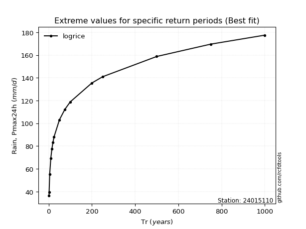</img>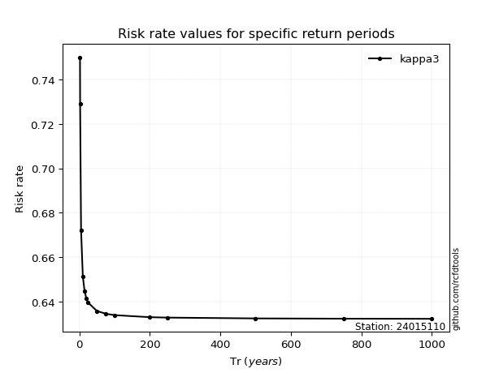</img>

</div>


<sub>**APP DISCLAIMER**: NO WARRANTY - This software is provided by [github.com/rcfdtools](https://github.com/rcfdtools) "as is", without any express or implied warranty, including warranties of merchantability, fitness for a particular purpose, or non-infringement. There is no guarantee that the software will be error-free or operate without interruption. LIMITATION OF LIABILITY - Neither the authors nor copyright holders will be liable for claims or damages arising from the software or its use. You are responsible for determining if the software is appropriate for your use and assume all associated risks, including errors, legal compliance, and data loss. NO PROFESSIONAL ADVICE - The software provides general information and does not offer professional advice. It should not replace consultation with professional advisors.</sub>