<div align="center">


</div>

# PMax24h Station (Rain): 24015300

Maximum Precipitation in 24 hours (PMax24h) is the greatest amount of rainfall for a specific duration that is meteorologically possible for a given location, acting as a "worst-case" scenario for extreme storms, crucial for designing safety-critical infrastructure like bridges, river deviations, dams, spillways, and nuclear plants to prevent catastrophic failure. The PMax24h is related with the Probable Maximum Precipitation (PMP) and it is calculated by hydrologists using meteorological data to determine the upper limit of extreme rainfall, often leading to the Probable Maximum Flood (PMF) for flood control design, and is increasingly being studied for climate change impacts. Probable Maximum Precipitation (PMP) is the theoretical upper limit of rainfall, a deterministic estimate for extreme events, while probability distributions (like GEV, Gumbel) describe the likelihood and frequency of various precipitation amounts, including rare ones, showing how often events occur, with PMP representing the extreme end of these distributions, used for critical infrastructure design to ensure safety against the worst conceivable weather, unlike standard statistical forecasts which cover typical probabilities.

The most common probability distributions in hydrology, used for analyzing floods, rainfall, and streamflow, include the Normal, Log-Normal, Gumbel, Gamma (including Log-Pearson Type III), and Generalized Extreme Value (GEV) distributions, often chosen based on the data´s skewness and whether modeling extremes or general conditions, with Gumbel and GEV popular for extreme events like floods, while the Normal distribution serves as a baseline, though often requiring transformations for skewed hydrological data. These distributions help in designing water infrastructure, managing water resources, and forecasting hydrologic events.

> Hydrological data often isn´t perfectly normal (it´s skewed), so different distributions are needed for different applications, such as: **Flood Frequency Analysis**: Using Gumbel, GEV, or Log-Pearson Type III for predicting extreme flood magnitudes and their return periods, **Rainfall Analysis**: Normal for annual totals, but Log-Normal, Weibull, or GEV for intensity or extreme daily rainfall, **Streamflow Modeling**: Gamma and Log-Normal for maximum flows, GEV for minimum flows, and Kappa for daily flows.

<div align="center">

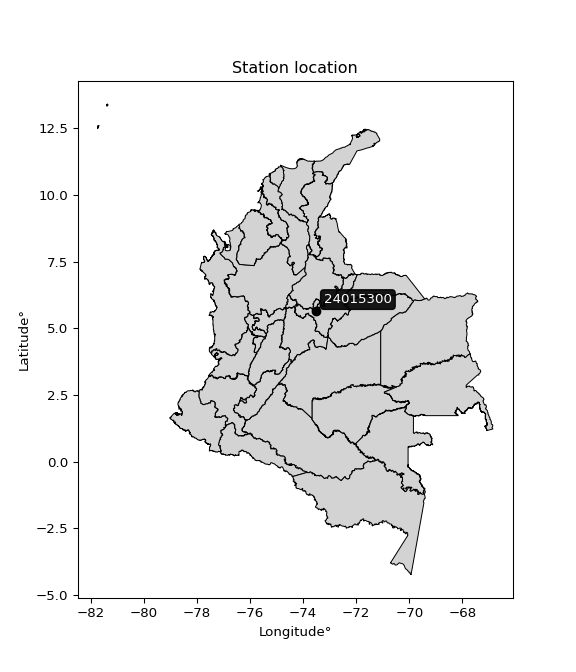</img>

</div>


## A. General information


### 1. General running parameters

• app_version: _v20260312_. • runtime: _2026-03-12 07:15:23.203550_. • Python version: _3.14.0_. • SciPy version: _1.16.3_. • Pandas version: _2.3.3_. • NumPy version: _2.3.5_. • Stations dataset (station_dataset_file): _dataset/pmax24h_in/automatic_colombia_2003_2025.csv_. • Stations catalog (station_catalog_file): _dataset/CNE.xls_. • Minimum year to eval til year_max (date_min): _1900_. • Maximum year to eval since year_min (date_max): _2025_. • Creates, save and include plots into reports (create_plot): _True_. • Plot only fit distributions with Δo > Δ (plot_only_fit): _True_. • Plot only simple graphs avoiding multiple CDFs and multiple Extreme values plots (plot_only_simple): _True_. • Eval low extreme values, if False, evaluates high extreme values (low_extreme): _False_. • Eval every SciPy distribution as logarithmic (pdist_logarithmic_on): _True_. • Standard deviation normalized (ddof): _1.0_. • Return periods to eval in years (Tr): _[2, 2.33, 5, 10, 15, 20, 25, 50, 75, 100, 200, 250, 500, 750, 1000]_. • Minimum data sample per station, 0 means any (minimum_sample): _5_. • Z-Score maximum threshold to adjust a value, 0 means disable (zscore_max): _3.5_. • Z-Score minimum threshold to adjust a value, 0 means disable (zscore_min): _-2.5_. • Avoid zeros, e.g. rain = 0 (avoid_zeros): _True_. • Avoid null values (avoid_nans): _True_. 

:file_folder:Table: [dataset.csv](../../dataset/pmax24h_in/automatic_colombia_2003_2025.csv)

> Delta Degrees of Freedom (DDOF): is a parameter used in the formulas for calculating variance and standard deviation. When ddof=0, the divisor is $N$ (the total number of observations) and this is used when your data set is the entire population. When ddof=1, the divisor is $N-1$ and this is used when your data set is a sample drawn from a larger population. Using $N-1$ provides an unbiased estimate of the population variance (known as Bessel´s correction).


### 2. Station info and location

|   id |   CODIGO | NOMBRE                           | CATEGORIA               | TECNOLOGIA                              | ESTADO           | FECHA_INSTALACION   |   FECHA_SUSPENSION |   ALTITUD |   LATITUD |   LONGITUD | DEPARTAMENTO   | MUNICIPIO      | AREA_OPERATIVA                              | ENTIDAD                                                     | AREA_HIDROGRAFICA   | ZONA_HIDROGRAFICA   | SUBZONA_HIDROGRAFICA   |   CORRIENTE | Catalogo   |   Version |
|-----:|---------:|:---------------------------------|:------------------------|:----------------------------------------|:-----------------|:--------------------|-------------------:|----------:|----------:|-----------:|:---------------|:---------------|:--------------------------------------------|:------------------------------------------------------------|:--------------------|:--------------------|:-----------------------|------------:|:-----------|----------:|
|    0 | 24015300 | VILLA DE LEIVA  - AUT [24015300] | Climatológica Principal | Automática con Telemetría, Convencional | En Mantenimiento | 15/12/1979          |                nan |      2174 |   5.64326 |   -73.5177 | Boyacá         | Villa De Leiva | Area Operativa 06 - Boyacá-Casanare-Vichada | INSTITUTO DE HIDROLOGIA METEOROLOGIA Y ESTUDIOS AMBIENTALES | Magdalena Cauca     | Sogamoso            | Río Suárez             |         nan | CNE_IDEAM  |  20251226 |

<div align="center">

Dynamic map: [:earth_americas:Google](http://maps.google.com/maps?q=5.64326,-73.51774) [:earth_americas:OSM](https://www.openstreetmap.org/#map=18/5.64326/-73.51774&layers=P) [:earth_americas:Bing](https://www.bing.com/maps?cp=5.64326~-73.51774&lvl=18) [:earth_americas:Apple](https://maps.apple.com/frame?center=5.64326%2C-73.51774&span=0.003%2C0.006)

</div>


<div align="center">

```geojson
{
  "type": "Feature",
  "geometry": {
    "type": "Point", 
    "coordinates": [-73.51774, 5.64326]
  }, 
  "properties": {
    "Name": "24015300"
  }
}
```

</div>


### 3. Discrete values table and plot

<div align="center">

|               |            0 |            1 |           2 |         3 |          4 |           5 |
|:--------------|-------------:|-------------:|------------:|----------:|-----------:|------------:|
| Date          | 2019         | 2020         | 2021        | 2022      | 2024       | 2025        |
| Value         |   40         |   40         |   30.2      |   23.6    |   65.6     |   45.6      |
| Value_initial |   40         |   40         |   30.2      |   23.6    |   65.6     |   45.6      |
| count         |    6         |    6         |    6        |    6      |    6       |    6        |
| mean          |   40.8333    |   40.8333    |   40.8333   |   40.8333 |   40.8333  |   40.8333   |
| std           |   14.4745    |   14.4745    |   14.4745   |   14.4745 |   14.4745  |   14.4745   |
| zscore        |   -0.0575726 |   -0.0575726 |   -0.734626 |   -1.1906 |    1.71106 |    0.329315 |


</div>


<div align="center">

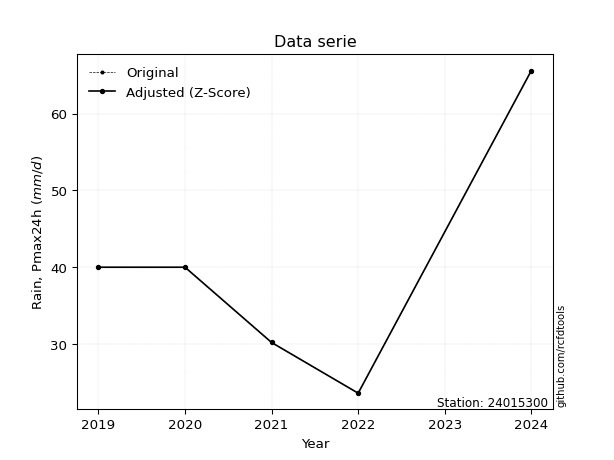</img>

</div>


> The initial value (value_initial) correspond to the initial obtained or null completed value, and value (value) is adjusted only when the initial value is outside the valid range (outlier) definite through the Z-Score value. If Z-Score is active, values out of range or outliers are replaced with the station mean value. A Z-Score (or standard score) measures how many standard deviations a data point is from the mean of a dataset, indicating its relative position; positive scores mean above the mean, negative mean below, and a score of zero is exactly at the mean, allowing for comparison of values from different distributions. It´s calculated using the formula $z=(x–μ)/σ$, where $x$ is the data point, $μ$ is the mean, and $σ$ is the standard deviation, helping identify outliers and understand probability.
>
> <sub>**Note**: In this study, "completing" (filling gaps in) and "extending" (forecasting or lengthening the historical record) rainfall data series are avoided for certain critical analyses because they introduce artificial bias and uncertainty, which can distort the statistics of rare events (extremes), alter day-to-day variability, and compromise the integrity and homogeneity of the original data. Some reasons against Completing/Extending rainfall data are: **Distortion of Extremes and Variability**: The primary issue is that most gap-filling or extension methods rely on averaging or regression with nearby stations, which inherently smooths the data. Rainfall is highly variable in space and time, with a large percentage of zero values and occasional large storms. Infilling methods often underestimate the highest values and overestimate the lowest (zero) values, which severely distorts analyses focused on flood frequency, drought severity, and intensity-duration-frequency (IDF) curves, **Loss of Data Homogeneity**: Infilled or extended data are synthetic estimates, not actual measurements. Combining these estimates with observed data can violate the assumption of data homogeneity, which requires that the data properties do not change over time. Inhomogeneity can lead to incorrect conclusions about long-term trends or changes in climate patterns, **Propagation of Errors**: Errors and biases from the original data (e.g., wind-induced undercatch, instrument errors, site changes) or the data used for imputation can propagate through the analysis, leading to unreliable hydrological models and inaccurate predictions, **Compromised Statistical Integrity**: For statistical analyses, especially those involving the frequency of events, using artificial data can introduce time bias or autocorrelation that doesn´t exist in reality, making it difficult to assess the true probability of events, **Difficulty in Validation**: It is difficult to accurately validate the quality of filled or extended data, especially for past periods where ground-truth measurements are unavailable. The reliability of imputation techniques heavily depends on the density of the surrounding station network and the complexity of the local topography.</sub>


### 4. Active continuous probability distributions from SciPy (80 of 104 available)

A Probability Density Function (PDF) describes the relative likelihood of a continuous random variable falling within a specific range, where the total area under its curve equals 1, and the area over any interval gives the actual probability for that range. Unlike discrete probabilities (like rolling a die), a PDF shows density, not direct probability for a single point (which is zero), with higher points indicating higher likelihood, often visualized as a bell curve for normal distributions.

A log of a probability density function (log-PDF) is simply the logarithm of the PDF´s value, denoted as $log(f(x))$, useful for converting multiplication of probabilities into addition, improving numerical stability with tiny numbers, and connecting to information theory concepts like entropy. Instead of dealing with very small probabilities (e.g., 0.000001), log-PDFs use negative numbers (e.g., $log(0.00001) ≈ -11.51$ that are easier for computers to handle, preventing underflow errors and simplifying complex calculations. In this study, each active probability distribution from SciPy is also evaluated in the $log$ form.

[scipy.stats](https://docs.scipy.org/doc/scipy/reference/stats.html) is a Python´s powerful submodule within the SciPy library for comprehensive statistical analysis, offering over 130 probability distributions (like Normal, Poisson, etc.), functions for descriptive stats (mean, variance), hypothesis testing (t-tests, chi-square), random variable generation, and statistical tests, making it essential for data science, modeling, and research. It provides tools to explore, model, and draw conclusions from data efficiently, working seamlessly with [NumPy](https://numpy.org/).

<div align="center">

|   id | p_dist           |   n_parameter | fit_method   | label                                                                       | active   | ref                                                                                                      |
|-----:|:-----------------|--------------:|:-------------|:----------------------------------------------------------------------------|:---------|:---------------------------------------------------------------------------------------------------------|
|    0 | alpha            |             3 | MLE          | Alpha                                                                       | True     | [:mortar_board:](https://docs.scipy.org/doc/scipy/reference/generated/scipy.stats.alpha.html)            |
|    1 | anglit           |             2 | MM           | Anglit                                                                      | True     | [:mortar_board:](https://docs.scipy.org/doc/scipy/reference/generated/scipy.stats.anglit.html)           |
|    2 | arcsine          |             2 | MM           | Arcsine                                                                     | True     | [:mortar_board:](https://docs.scipy.org/doc/scipy/reference/generated/scipy.stats.arcsine.html)          |
|    3 | argus            |             3 | MLE          | Argus                                                                       | True     | [:mortar_board:](https://docs.scipy.org/doc/scipy/reference/generated/scipy.stats.argus.html)            |
|    4 | beta             |             4 | MLE          | Beta                                                                        | True     | [:mortar_board:](https://docs.scipy.org/doc/scipy/reference/generated/scipy.stats.beta.html)             |
|    5 | betaprime        |             4 | MLE          | Beta prime                                                                  | True     | [:mortar_board:](https://docs.scipy.org/doc/scipy/reference/generated/scipy.stats.betaprime.html)        |
|    6 | bradford         |             3 | MLE          | Bradford                                                                    | True     | [:mortar_board:](https://docs.scipy.org/doc/scipy/reference/generated/scipy.stats.bradford.html)         |
|    7 | burr             |             4 | MLE          | Burr (Type III)                                                             | True     | [:mortar_board:](https://docs.scipy.org/doc/scipy/reference/generated/scipy.stats.burr.html)             |
|    8 | burr12           |             4 | MLE          | Burr (Type III) 12                                                          | True     | [:mortar_board:](https://docs.scipy.org/doc/scipy/reference/generated/scipy.stats.burr12.html)           |
|    9 | cosine           |             2 | MLE          | Cosine                                                                      | True     | [:mortar_board:](https://docs.scipy.org/doc/scipy/reference/generated/scipy.stats.cosine.html)           |
|   10 | crystalball      |             4 | MLE          | Crystalball                                                                 | True     | [:mortar_board:](https://docs.scipy.org/doc/scipy/reference/generated/scipy.stats.crystalball.html)      |
|   11 | dgamma           |             3 | MLE          | Double gamma                                                                | True     | [:mortar_board:](https://docs.scipy.org/doc/scipy/reference/generated/scipy.stats.dgamma.html)           |
|   12 | dweibull         |             3 | MLE          | Double Weibull                                                              | True     | [:mortar_board:](https://docs.scipy.org/doc/scipy/reference/generated/scipy.stats.dweibull.html)         |
|   13 | erlang           |             3 | MLE          | Erlang                                                                      | True     | [:mortar_board:](https://docs.scipy.org/doc/scipy/reference/generated/scipy.stats.erlang.html)           |
|   14 | exponnorm        |             3 | MLE          | Exponentially modified Normal                                               | True     | [:mortar_board:](https://docs.scipy.org/doc/scipy/reference/generated/scipy.stats.exponnorm.html)        |
|   15 | exponpow         |             3 | MLE          | Exponential power                                                           | True     | [:mortar_board:](https://docs.scipy.org/doc/scipy/reference/generated/scipy.stats.exponpow.html)         |
|   16 | exponweib        |             4 | MLE          | Exponentiated Weibull                                                       | True     | [:mortar_board:](https://docs.scipy.org/doc/scipy/reference/generated/scipy.stats.exponweib.html)        |
|   17 | f                |             4 | MLE          | F                                                                           | True     | [:mortar_board:](https://docs.scipy.org/doc/scipy/reference/generated/scipy.stats.f.html)                |
|   18 | fatiguelife      |             3 | MLE          | Fatigue-life (Birnbaum-Saunders)                                            | True     | [:mortar_board:](https://docs.scipy.org/doc/scipy/reference/generated/scipy.stats.fatiguelife.html)      |
|   19 | foldnorm         |             3 | MM           | Fold Normal                                                                 | True     | [:mortar_board:](https://docs.scipy.org/doc/scipy/reference/generated/scipy.stats.foldnorm.html)         |
|   20 | gamma            |             3 | MLE          | Gamma                                                                       | True     | [:mortar_board:](https://docs.scipy.org/doc/scipy/reference/generated/scipy.stats.gamma.html)            |
|   21 | gausshyper       |             6 | MLE          | Gauss hypergeometric                                                        | True     | [:mortar_board:](https://docs.scipy.org/doc/scipy/reference/generated/scipy.stats.gausshyper.html)       |
|   22 | genexpon         |             5 | MLE          | Generalized exponential                                                     | True     | [:mortar_board:](https://docs.scipy.org/doc/scipy/reference/generated/scipy.stats.genexpon.html)         |
|   23 | genextreme       |             3 | MLE          | Generalized exponential                                                     | True     | [:mortar_board:](https://docs.scipy.org/doc/scipy/reference/generated/scipy.stats.genextreme.html)       |
|   24 | gengamma         |             4 | MLE          | Generalized gamma                                                           | True     | [:mortar_board:](https://docs.scipy.org/doc/scipy/reference/generated/scipy.stats.gengamma.html)         |
|   25 | genhalflogistic  |             3 | MLE          | Generalized half-logistic                                                   | True     | [:mortar_board:](https://docs.scipy.org/doc/scipy/reference/generated/scipy.stats.genhalflogistic.html)  |
|   26 | genlogistic      |             3 | MLE          | Generalized logistic                                                        | True     | [:mortar_board:](https://docs.scipy.org/doc/scipy/reference/generated/scipy.stats.genlogistic.html)      |
|   27 | gennorm          |             3 | MLE          | Generalized Normal                                                          | True     | [:mortar_board:](https://docs.scipy.org/doc/scipy/reference/generated/scipy.stats.gennorm.html)          |
|   28 | genpareto        |             3 | MLE          | Generalized Pareto                                                          | True     | [:mortar_board:](https://docs.scipy.org/doc/scipy/reference/generated/scipy.stats.genpareto.html)        |
|   29 | gompertz         |             3 | MLE          | Gompertz (or truncated Gumbel)                                              | True     | [:mortar_board:](https://docs.scipy.org/doc/scipy/reference/generated/scipy.stats.gompertz.html)         |
|   30 | gumbel_l         |             2 | MM           | Gumbel Left Skew                                                            | True     | [:mortar_board:](https://docs.scipy.org/doc/scipy/reference/generated/scipy.stats.gumbel_l.html)         |
|   31 | gumbel_r         |             2 | MM           | Gumbel Right Skew                                                           | True     | [:mortar_board:](https://docs.scipy.org/doc/scipy/reference/generated/scipy.stats.gumbel_r.html)         |
|   32 | halfgennorm      |             3 | MLE          | Upper half of a generalized normal                                          | True     | [:mortar_board:](https://docs.scipy.org/doc/scipy/reference/generated/scipy.stats.halfgennorm.html)      |
|   33 | halflogistic     |             2 | MM           | Half-logistic                                                               | True     | [:mortar_board:](https://docs.scipy.org/doc/scipy/reference/generated/scipy.stats.halflogistic.html)     |
|   34 | halfnorm         |             2 | MM           | Half Normal                                                                 | True     | [:mortar_board:](https://docs.scipy.org/doc/scipy/reference/generated/scipy.stats.halfnorm.html)         |
|   35 | hypsecant        |             2 | MM           | hyperbolic secant                                                           | True     | [:mortar_board:](https://docs.scipy.org/doc/scipy/reference/generated/scipy.stats.hypsecant.html)        |
|   36 | invgamma         |             3 | MLE          | Inverted gamma                                                              | True     | [:mortar_board:](https://docs.scipy.org/doc/scipy/reference/generated/scipy.stats.invgamma.html)         |
|   37 | invgauss         |             3 | MLE          | Inverse Gaussian                                                            | True     | [:mortar_board:](https://docs.scipy.org/doc/scipy/reference/generated/scipy.stats.invgauss.html)         |
|   38 | invweibull       |             3 | MLE          | Inverted Weibull                                                            | True     | [:mortar_board:](https://docs.scipy.org/doc/scipy/reference/generated/scipy.stats.invweibull.html)       |
|   39 | johnsonsb        |             4 | MLE          | Johnson SB                                                                  | True     | [:mortar_board:](https://docs.scipy.org/doc/scipy/reference/generated/scipy.stats.johnsonsb.html)        |
|   40 | johnsonsu        |             4 | MLE          | Johnson Su                                                                  | True     | [:mortar_board:](https://docs.scipy.org/doc/scipy/reference/generated/scipy.stats.johnsonsu.html)        |
|   41 | kappa3           |             3 | MLE          | Kappa 3                                                                     | True     | [:mortar_board:](https://docs.scipy.org/doc/scipy/reference/generated/scipy.stats.kappa3.html)           |
|   42 | kappa4           |             4 | MLE          | Kappa 4                                                                     | True     | [:mortar_board:](https://docs.scipy.org/doc/scipy/reference/generated/scipy.stats.kappa4.html)           |
|   43 | ksone            |             3 | MLE          | Kolmogorov-Smirnov one-sided test statistic distribution                    | True     | [:mortar_board:](https://docs.scipy.org/doc/scipy/reference/generated/scipy.stats.ksone.html)            |
|   44 | kstwobign        |             2 | MLE          | Limiting distribution of scaled Kolmogorov-Smirnov two-sided test statistic | True     | [:mortar_board:](https://docs.scipy.org/doc/scipy/reference/generated/scipy.stats.kstwobign.html)        |
|   45 | laplace          |             2 | MM           | Laplace                                                                     | True     | [:mortar_board:](https://docs.scipy.org/doc/scipy/reference/generated/scipy.stats.laplace.html)          |
|   46 | levy_l           |             2 | MLE          | Left-skewed Levy                                                            | True     | [:mortar_board:](https://docs.scipy.org/doc/scipy/reference/generated/scipy.stats.levy_l.html)           |
|   47 | loggamma         |             3 | MLE          | Log gamma                                                                   | True     | [:mortar_board:](https://docs.scipy.org/doc/scipy/reference/generated/scipy.stats.loggamma.html)         |
|   48 | logistic         |             2 | MM           | Logistic (or Sech-squared)                                                  | True     | [:mortar_board:](https://docs.scipy.org/doc/scipy/reference/generated/scipy.stats.logistic.html)         |
|   49 | loglaplace       |             3 | MLE          | Log-Laplace                                                                 | True     | [:mortar_board:](https://docs.scipy.org/doc/scipy/reference/generated/scipy.stats.loglaplace.html)       |
|   50 | lomax            |             3 | MLE          | Lomax (Pareto of the second kind)                                           | True     | [:mortar_board:](https://docs.scipy.org/doc/scipy/reference/generated/scipy.stats.lomax.html)            |
|   51 | maxwell          |             2 | MM           | Maxwell                                                                     | True     | [:mortar_board:](https://docs.scipy.org/doc/scipy/reference/generated/scipy.stats.maxwell.html)          |
|   52 | mielke           |             4 | MLE          | Mielke Beta-Kappa / Dagum                                                   | True     | [:mortar_board:](https://docs.scipy.org/doc/scipy/reference/generated/scipy.stats.mielke.html)           |
|   53 | moyal            |             2 | MM           | Moyal                                                                       | True     | [:mortar_board:](https://docs.scipy.org/doc/scipy/reference/generated/scipy.stats.moyal.html)            |
|   54 | nakagami         |             3 | MLE          | Nakagami                                                                    | True     | [:mortar_board:](https://docs.scipy.org/doc/scipy/reference/generated/scipy.stats.nakagami.html)         |
|   55 | ncf              |             5 | MLE          | Non-central F distribution                                                  | True     | [:mortar_board:](https://docs.scipy.org/doc/scipy/reference/generated/scipy.stats.ncf.html)              |
|   56 | nct              |             4 | MLE          | Non-central Student’s t                                                     | True     | [:mortar_board:](https://docs.scipy.org/doc/scipy/reference/generated/scipy.stats.nct.html)              |
|   57 | norm             |             2 | MM           | Normal                                                                      | True     | [:mortar_board:](https://docs.scipy.org/doc/scipy/reference/generated/scipy.stats.norm.html)             |
|   58 | pearson3         |             3 | MM           | Pearson type III                                                            | True     | [:mortar_board:](https://docs.scipy.org/doc/scipy/reference/generated/scipy.stats.pearson3.html)         |
|   59 | powerlaw         |             3 | MLE          | Power-function                                                              | True     | [:mortar_board:](https://docs.scipy.org/doc/scipy/reference/generated/scipy.stats.powerlaw.html)         |
|   60 | rayleigh         |             2 | MM           | Rayleigh                                                                    | True     | [:mortar_board:](https://docs.scipy.org/doc/scipy/reference/generated/scipy.stats.rayleigh.html)         |
|   61 | rdist            |             3 | MLE          | R-distributed (symmetric beta)                                              | True     | [:mortar_board:](https://docs.scipy.org/doc/scipy/reference/generated/scipy.stats.rdist.html)            |
|   62 | rice             |             3 | MLE          | Rice                                                                        | True     | [:mortar_board:](https://docs.scipy.org/doc/scipy/reference/generated/scipy.stats.rice.html)             |
|   63 | semicircular     |             2 | MM           | Semicircular                                                                | True     | [:mortar_board:](https://docs.scipy.org/doc/scipy/reference/generated/scipy.stats.semicircular.html)     |
|   64 | skewnorm         |             3 | MLE          | Skew normal                                                                 | True     | [:mortar_board:](https://docs.scipy.org/doc/scipy/reference/generated/scipy.stats.skewnorm.html)         |
|   65 | t                |             3 | MLE          | Student’s t                                                                 | True     | [:mortar_board:](https://docs.scipy.org/doc/scipy/reference/generated/scipy.stats.t.html)                |
|   66 | trapezoid        |             4 | MLE          | Trapezoid                                                                   | True     | [:mortar_board:](https://docs.scipy.org/doc/scipy/reference/generated/scipy.stats.trapezoid.html)        |
|   67 | triang           |             3 | MLE          | Triangular                                                                  | True     | [:mortar_board:](https://docs.scipy.org/doc/scipy/reference/generated/scipy.stats.triang.html)           |
|   68 | truncexpon       |             3 | MLE          | Truncated exponential                                                       | True     | [:mortar_board:](https://docs.scipy.org/doc/scipy/reference/generated/scipy.stats.truncexpon.html)       |
|   69 | truncnorm        |             4 | MLE          | Truncated normal                                                            | True     | [:mortar_board:](https://docs.scipy.org/doc/scipy/reference/generated/scipy.stats.truncnorm.html)        |
|   70 | truncpareto      |             4 | MLE          | Upper truncated Pareto                                                      | True     | [:mortar_board:](https://docs.scipy.org/doc/scipy/reference/generated/scipy.stats.truncpareto.html)      |
|   71 | truncweibull_min |             5 | MLE          | Doubly truncated Weibull minimum                                            | True     | [:mortar_board:](https://docs.scipy.org/doc/scipy/reference/generated/scipy.stats.truncweibull_min.html) |
|   72 | tukeylambda      |             3 | MLE          | Tukey-Lamdba                                                                | True     | [:mortar_board:](https://docs.scipy.org/doc/scipy/reference/generated/scipy.stats.tukeylambda.html)      |
|   73 | uniform          |             2 | MLE          | Uniform                                                                     | True     | [:mortar_board:](https://docs.scipy.org/doc/scipy/reference/generated/scipy.stats.uniform.html)          |
|   74 | vonmises         |             3 | MLE          | Von Mises                                                                   | True     | [:mortar_board:](https://docs.scipy.org/doc/scipy/reference/generated/scipy.stats.vonmises.html)         |
|   75 | vonmises_line    |             3 | MLE          | Von Mises line                                                              | True     | [:mortar_board:](https://docs.scipy.org/doc/scipy/reference/generated/scipy.stats.vonmises_line.html)    |
|   76 | wald             |             2 | MM           | Wald                                                                        | True     | [:mortar_board:](https://docs.scipy.org/doc/scipy/reference/generated/scipy.stats.wald.html)             |
|   77 | weibull_max      |             3 | MLE          | Weibull maximum                                                             | True     | [:mortar_board:](https://docs.scipy.org/doc/scipy/reference/generated/scipy.stats.weibull_max.html)      |
|   78 | weibull_min      |             3 | MLE          | Weibull minimum                                                             | True     | [:mortar_board:](https://docs.scipy.org/doc/scipy/reference/generated/scipy.stats.weibull_min.html)      |
|   79 | wrapcauchy       |             3 | MLE          | Wrapped  Cauchy                                                             | True     | [:mortar_board:](https://docs.scipy.org/doc/scipy/reference/generated/scipy.stats.wrapcauchy.html)       |

</div>

> **n_parameter:** # arguments & localization & scale.
>
> **Fit methods:** (MLE) maximum likelihood, (MM) L-moments.
>
>**Inactive** (With the only purpose of prevent loops, zero divisions, infinite values, over high estimated values or horizontal trending for recurrence intervals estimations, the follow distributions were disabled.)**:** lognorm, norminvgauss, powernorm, powerlognorm, cauchy, halfcauchy, foldcauchy, skewcauchy, chi2, expon, fisk, genhyperbolic, geninvgauss, gibrat, kstwo, laplace_asymmetric, levy, levy_stable, ncx2, pareto, rel_breitwigner, recipinvgauss, studentized_range, loguniform, 


## B. Probability (PDF) vs. Empirical (EDF) distributions functions

A continuous probability distribution (CPD) describes probabilities for variables that can take any value within a range (like rain any time), unlike discrete variables with specific outcomes (like temperature). It uses a Probability Density Function (PDF), a curve where the total area under it equals 1, and the probability of the variable falling within an interval (a to b) is found by calculating the area under the curve between those points. A key feature is that the probability of hitting any single exact value is zero, so probabilities are always expressed for ranges, e.g., $P(a ≤ X ≤ b)$.

<div align="center">

Distributions parameters from station values
|     |   station | p_dist              |   n |             loc |          scale | shape                  | shape1                | shape2                 | shape3             |
|----:|----------:|:--------------------|----:|----------------:|---------------:|:-----------------------|:----------------------|:-----------------------|:-------------------|
|   0 |  24015300 | alpha               |   6 |   -32.9689      |  423.073       | 5.908220339140705      |                       |                        |                    |
|   1 |  24015300 | anglit              |   6 |    40.8333      |   38.6543      |                        |                       |                        |                    |
|   2 |  24015300 | arcsine             |   6 |    22.1469      |   37.3729      |                        |                       |                        |                    |
|   3 |  24015300 | argus               |   6 |    10.6253      |   57.5274      | 2.554995883761466e-06  |                       |                        |                    |
|   4 |  24015300 | beta                |   6 |    23.6         |   57.3833      | 0.879151255086201      | 2.7211771759190477    |                        |                    |
|   5 |  24015300 | betaprime           |   6 |    -0.283037    |   16.0016      | 34.50040312082194      | 14.413469699043205    |                        |                    |
|   6 |  24015300 | bradford            |   6 |    23.6         |   42           | 1.013575876992522      |                       |                        |                    |
|   7 |  24015300 | burr                |   6 |   -58.6297      |   30.3758      | 9.08461442612808       | 25156.897170154058    |                        |                    |
|   8 |  24015300 | burr12              |   6 |     2.02514     |   21.4222      | 577.7206038768045      | 0.0032369403029575    |                        |                    |
|   9 |  24015300 | cosine              |   6 |    42.153       |   11.2869      |                        |                       |                        |                    |
|  10 |  24015300 | crystalball         |   6 |    40.8333      |   13.2133      | 3120.8616732313844     | 3135.546322611191     |                        |                    |
|  11 |  24015300 | dgamma              |   6 |    40           |   12.3853      | 0.5440792161972301     |                       |                        |                    |
|  12 |  24015300 | dweibull            |   6 |    40           |   12.8087      | 0.45146848641650134    |                       |                        |                    |
|  13 |  24015300 | erlang              |   6 |    23.6         |   13.1022      | 0.43506057903577267    |                       |                        |                    |
|  14 |  24015300 | exponnorm           |   6 |    28.9144      |    7.11702     | 1.6747151916143639     |                       |                        |                    |
|  15 |  24015300 | exponpow            |   6 |    23.6         |   23.2455      | 0.6560451476960641     |                       |                        |                    |
|  16 |  24015300 | exponweib           |   6 |    23.6         |    1.19945     | 1.212632444157701      | 0.29335102282883785   |                        |                    |
|  17 |  24015300 | f                   |   6 |    23.6         |   15.4863      | 1.1608005431055337     | 15.60698870347569     |                        |                    |
|  18 |  24015300 | fatiguelife         |   6 |    23.6         |    5.60593e-06 | 1660.9823015304823     |                       |                        |                    |
|  19 |  24015300 | foldnorm            |   6 |    21.0826      |   16.1016      | 1.085385652114419      |                       |                        |                    |
|  20 |  24015300 | gamma               |   6 |    23.6         |   18.5939      | 0.6203582846219668     |                       |                        |                    |
|  21 |  24015300 | gausshyper          |   6 |    22.7682      |   42.8318      | 0.9944846292445644     | 0.745829172307773     | 1.2596940179049585     | 1.01769024678905   |
|  22 |  24015300 | genexpon            |   6 |    23.6         |    1.71141e+07 | 4054181.2631271053     | 8505.54864753529      | 18978047.690291457     |                    |
|  23 |  24015300 | genextreme          |   6 |    24.0886      |    2.98213     | -6.102813398590186     |                       |                        |                    |
|  24 |  24015300 | gengamma            |   6 |    23.6         |    1.27087     | 1.2337451958692816     | 0.24850811724211233   |                        |                    |
|  25 |  24015300 | genhalflogistic     |   6 |    20.3612      |   47.8108      | 1.0568535645779245     |                       |                        |                    |
|  26 |  24015300 | genlogistic         |   6 |   -31.7788      |   10.5455      | 545.6825643622292      |                       |                        |                    |
|  27 |  24015300 | gennorm             |   6 |    40           |    0.00238821  | 0.21952467039129595    |                       |                        |                    |
|  28 |  24015300 | genpareto           |   6 |    -0.0135748   |   91.4164      | -1.3932541487794707    |                       |                        |                    |
|  29 |  24015300 | gompertz            |   6 |    23.6         |   30.0126      | 1.0003861372634248     |                       |                        |                    |
|  30 |  24015300 | gumbel_l            |   6 |    46.78        |   10.3024      |                        |                       |                        |                    |
|  31 |  24015300 | gumbel_r            |   6 |    34.8866      |   10.3024      |                        |                       |                        |                    |
|  32 |  24015300 | halfgennorm         |   6 |    23.6         |    1.27178     | 0.40230647713766676    |                       |                        |                    |
|  33 |  24015300 | halflogistic        |   6 |    25.1725      |   11.2969      |                        |                       |                        |                    |
|  34 |  24015300 | halfnorm            |   6 |    23.3441      |   21.9196      |                        |                       |                        |                    |
|  35 |  24015300 | hypsecant           |   6 |    40.8333      |    8.41187     |                        |                       |                        |                    |
|  36 |  24015300 | invgamma            |   6 |    -4.86672     |  540.139       | 12.803841910587112     |                       |                        |                    |
|  37 |  24015300 | invgauss            |   6 |     8.69077     |  169.3         | 0.18985601208673536    |                       |                        |                    |
|  38 |  24015300 | invweibull          |   6 |    23.6         |    1.60872     | 0.055520231509698016   |                       |                        |                    |
|  39 |  24015300 | johnsonsb           |   6 |    23.6         |   42           | 0.27562390238541656    | 0.0629633942853029    |                        |                    |
|  40 |  24015300 | johnsonsu           |   6 |     8.49052     |    1.68788     | -8.58965959066941      | 2.411303026652445     |                        |                    |
|  41 |  24015300 | kappa3              |   6 |    23.6         |   49.3884      | 7145.104623742412      |                       |                        |                    |
|  42 |  24015300 | kappa4              |   6 |    19.1879      |   47.1478      | 1.1032094869400146     | 0.9939693339567235    |                        |                    |
|  43 |  24015300 | ksone               |   6 |    19.4         |   50.4         | 1.0                    |                       |                        |                    |
|  44 |  24015300 | kstwobign           |   6 |    -2.72088     |   50.027       |                        |                       |                        |                    |
|  45 |  24015300 | laplace             |   6 |    40.8333      |    9.34324     |                        |                       |                        |                    |
|  46 |  24015300 | levy_l              |   6 |    68.3148      |   11.2864      |                        |                       |                        |                    |
|  47 |  24015300 | loggamma            |   6 | -4563.96        |  603.399       | 2062.3919706355746     |                       |                        |                    |
|  48 |  24015300 | logistic            |   6 |    40.8333      |    7.28489     |                        |                       |                        |                    |
|  49 |  24015300 | loglaplace          |   6 |    -0.0967533   |   40.0968      | 4.1936660858070995     |                       |                        |                    |
|  50 |  24015300 | lomax               |   6 |    23.6         |    2.14389e+10 | 918361728.8675523      |                       |                        |                    |
|  51 |  24015300 | maxwell             |   6 |     9.52328     |   19.6207      |                        |                       |                        |                    |
|  52 |  24015300 | mielke              |   6 |   -30.5248      |   19.2687      | 13470.851995764468     | 6.373496008724974     |                        |                    |
|  53 |  24015300 | moyal               |   6 |    33.2771      |    5.94809     |                        |                       |                        |                    |
|  54 |  24015300 | nakagami            |   6 |    30.2         |   17.1521      | 0.1640569710766227     |                       |                        |                    |
|  55 |  24015300 | ncf                 |   6 |    -0.487047    |    4.16561e-08 | 7.048303732206055e-08  | 53.612116480478214    | 67.25137310779928      |                    |
|  56 |  24015300 | nct                 |   6 |   -11.5521      |    4.44888     | 10.406809275650042     | 10.91577557618874     |                        |                    |
|  57 |  24015300 | norm                |   6 |    40.8333      |   13.2133      |                        |                       |                        |                    |
|  58 |  24015300 | pearson3            |   6 |    40.8333      |   13.2134      | 0.6486171756223029     |                       |                        |                    |
|  59 |  24015300 | powerlaw            |   6 |    23.6         |   42           | 0.14497397697770664    |                       |                        |                    |
|  60 |  24015300 | rayleigh            |   6 |    15.5555      |   20.1688      |                        |                       |                        |                    |
|  61 |  24015300 | rdist               |   6 |    21.3593      |   24.2407      | 1.0240823692376617     |                       |                        |                    |
|  62 |  24015300 | rice                |   6 |    17.5483      |   18.9312      | 0.0006226236505457608  |                       |                        |                    |
|  63 |  24015300 | semicircular        |   6 |    40.8333      |   26.4267      |                        |                       |                        |                    |
|  64 |  24015300 | skewnorm            |   6 |    23.6         |   21.7175      | 14930678.821131911     |                       |                        |                    |
|  65 |  24015300 | t                   |   6 |    40.8328      |   13.2132      | 21333740.443173524     |                       |                        |                    |
|  66 |  24015300 | trapezoid           |   6 |    19.4         |   50.4         | 1.0                    | 1.0                   |                        |                    |
|  67 |  24015300 | triang              |   6 |     7.0789      |   58.5394      | 0.9996872700250943     |                       |                        |                    |
|  68 |  24015300 | truncexpon          |   6 |    23.6         |   43.274       | 0.9705604747803089     |                       |                        |                    |
|  69 |  24015300 | truncnorm           |   6 |    40.8333      |   13.2133      | -303.88290225936123    | 1774.947085492436     |                        |                    |
|  70 |  24015300 | truncpareto         |   6 |     9.122       |   14.478       | 1.7745317419993954e-08 | 3.9009530568602506    |                        |                    |
|  71 |  24015300 | truncweibull_min    |   6 |    23.6         |   44.8395      | 0.792819299776969      | 6.994651120193889e-17 | 0.9408309271415265     |                    |
|  72 |  24015300 | tukeylambda         |   6 |    34.6004      |   12.5144      | 1.1376371741376357     |                       |                        |                    |
|  73 |  24015300 | uniform             |   6 |    23.6         |   42           |                        |                       |                        |                    |
|  74 |  24015300 | vonmises            |   6 |     2.69731     |    1           | 0.761494074875922      |                       |                        |                    |
|  75 |  24015300 | vonmises_line       |   6 |    42.6193      |    7.31501     | 5.259396929255426e-06  |                       |                        |                    |
|  76 |  24015300 | wald                |   6 |    27.62        |   13.2134      |                        |                       |                        |                    |
|  77 |  24015300 | weibull_max         |   6 |    65.6         |    1.45882     | 0.290404752230425      |                       |                        |                    |
|  78 |  24015300 | weibull_min         |   6 |    23.6         |   18.5949      | 0.8280779251437422     |                       |                        |                    |
|  79 |  24015300 | wrapcauchy          |   6 |    23.6         |    6.68452     | 0.01991141879511328    |                       |                        |                    |
|  80 |  24015300 | logalpha            |   6 |    -3.42        |  156.766       | 22.199584662444533     |                       |                        |                    |
|  81 |  24015300 | loganglit           |   6 |     3.65839     |    0.935589    |                        |                       |                        |                    |
|  82 |  24015300 | logarcsine          |   6 |     3.20609     |    0.90459     |                        |                       |                        |                    |
|  83 |  24015300 | logargus            |   6 |     2.91454     |    1.33145     | 0.00013874237642511484 |                       |                        |                    |
|  84 |  24015300 | logbeta             |   6 |     3.16125     |    1.39058     | 0.7237054070663016     | 2.4272124654210727    |                        |                    |
|  85 |  24015300 | logbetaprime        |   6 |    -2.75399     |   50.1862      | 453.0512303826789      | 3546.785903290571     |                        |                    |
|  86 |  24015300 | logbradford         |   6 |     3.16125     |    1.02233     | 0.20985552797055854    |                       |                        |                    |
|  87 |  24015300 | logburr             |   6 |    -0.0105029   |    3.73608     | 21.824842883101823     | 0.7668950642202794    |                        |                    |
|  88 |  24015300 | logburr12           |   6 |     2.91303     |    1.65333     | 2.6170717327626667     | 6.535837985574835     |                        |                    |
|  89 |  24015300 | logcosine           |   6 |     3.66232     |    0.268929    |                        |                       |                        |                    |
|  90 |  24015300 | logcrystalball      |   6 |     3.65839     |    0.319816    | 27.906090707975586     | 492.1540103911947     |                        |                    |
|  91 |  24015300 | logdgamma           |   6 |     3.68888     |    0.463498    | 0.18474541580586362    |                       |                        |                    |
|  92 |  24015300 | logdweibull         |   6 |     3.68888     |    0.344279    | 0.2520586381202476     |                       |                        |                    |
|  93 |  24015300 | logerlang           |   6 |    -6.91862     |    0.00966025  | 1094.8754240094268     |                       |                        |                    |
|  94 |  24015300 | logexponnorm        |   6 |     3.63516     |    0.318971    | 0.0728243602871082     |                       |                        |                    |
|  95 |  24015300 | logexponpow         |   6 |     3.16125     |    0.70421     | 0.7546787082313132     |                       |                        |                    |
|  96 |  24015300 | logexponweib        |   6 |     3.16125     |    0.727522    | 0.4785255486953744     | 1.4232829444464277    |                        |                    |
|  97 |  24015300 | logf                |   6 |    -7.57782     |   11.2303      | 7067.929399498929      | 3795.201129745492     |                        |                    |
|  98 |  24015300 | logfatiguelife      |   6 |    -5.24044     |    8.89308     | 0.035950866444016766   |                       |                        |                    |
|  99 |  24015300 | logfoldnorm         |   6 |     3.09358     |    0.345695    | 1.586146872570063      |                       |                        |                    |
| 100 |  24015300 | loggamma            |   6 |    -6.8344      |    0.00973229  | 1078.128012846565      |                       |                        |                    |
| 101 |  24015300 | loggausshyper       |   6 |     3.14417     |    1.03941     | 1.07338835775177       | 0.9114643495313115    | 1.2422711609134307     | 0.7319670008606889 |
| 102 |  24015300 | loggenexpon         |   6 |     3.16125     |    0.69866     | 0.8282949827228419     | 1.4786704670501474    | 1.0509978917350553     |                    |
| 103 |  24015300 | loggenextreme       |   6 |     3.55208     |    0.320763    | 0.3235894838993559     |                       |                        |                    |
| 104 |  24015300 | loggengamma         |   6 |     3.16125     |    0.710641    | 0.5218487893478163     | 1.4405138971186129    |                        |                    |
| 105 |  24015300 | loggenhalflogistic  |   6 |     3.1441      |    1.12822     | 1.085371257570153      |                       |                        |                    |
| 106 |  24015300 | loggenlogistic      |   6 |     3.59779     |    0.199577    | 1.2271802866249042     |                       |                        |                    |
| 107 |  24015300 | loggennorm          |   6 |     3.68888     |    1.63056e-14 | 0.08705388886198806    |                       |                        |                    |
| 108 |  24015300 | loggenpareto        |   6 |    -0.000627891 |    6.68345     | -1.5973060188135624    |                       |                        |                    |
| 109 |  24015300 | loggompertz         |   6 |     3.16125     |    0.513217    | 0.460155234863856      |                       |                        |                    |
| 110 |  24015300 | loggumbel_l         |   6 |     3.80232     |    0.249359    |                        |                       |                        |                    |
| 111 |  24015300 | loggumbel_r         |   6 |     3.51445     |    0.249359    |                        |                       |                        |                    |
| 112 |  24015300 | loghalfgennorm      |   6 |     3.16125     |    1.03145     | 481.11851919019125     |                       |                        |                    |
| 113 |  24015300 | loghalflogistic     |   6 |     3.27936     |    0.273415    |                        |                       |                        |                    |
| 114 |  24015300 | loghalfnorm         |   6 |     3.23509     |    0.530525    |                        |                       |                        |                    |
| 115 |  24015300 | loghypsecant        |   6 |     3.65839     |    0.203601    |                        |                       |                        |                    |
| 116 |  24015300 | loginvgamma         |   6 |    -1.57165     | 1380.87        | 265.05817977711615     |                       |                        |                    |
| 117 |  24015300 | loginvgauss         |   6 |     1.32663     |  118.372       | 0.019686329155617986   |                       |                        |                    |
| 118 |  24015300 | loginvweibull       |   6 |    -1.79792e+07 |    1.79792e+07 | 62229352.94765974      |                       |                        |                    |
| 119 |  24015300 | logjohnsonsb        |   6 |     3.16125     |    1.02233     | 0.20336653923964085    | 0.13235308618837582   |                        |                    |
| 120 |  24015300 | logjohnsonsu        |   6 |    -2.72088     |    6.15545     | -25.10193833831393     | 27.69483802658607     |                        |                    |
| 121 |  24015300 | logkappa3           |   6 |     3.16125     |    1.0192      | 583.8370105687075      |                       |                        |                    |
| 122 |  24015300 | logkappa4           |   6 |     3.10015     |    1.10151     | 1.0587513435125986     | 1.0140170789593939    |                        |                    |
| 123 |  24015300 | logksone            |   6 |     3.10445     |    1.10787     | 1.0                    |                       |                        |                    |
| 124 |  24015300 | logkstwobign        |   6 |     2.4656      |    1.36419     |                        |                       |                        |                    |
| 125 |  24015300 | loglaplace          |   6 |     3.65839     |    0.226144    |                        |                       |                        |                    |
| 126 |  24015300 | loglevy_l           |   6 |     4.23801     |    0.226097    |                        |                       |                        |                    |
| 127 |  24015300 | logloggamma         |   6 |   -63.4207      |    9.81236     | 931.3675251882255      |                       |                        |                    |
| 128 |  24015300 | loglogistic         |   6 |     3.65839     |    0.176324    |                        |                       |                        |                    |
| 129 |  24015300 | logloglaplace       |   6 |    -0.146889    |    3.83577     | 15.340961244738182     |                       |                        |                    |
| 130 |  24015300 | loglomax            |   6 |     3.16125     |   58.8865      | 119.5562144759187      |                       |                        |                    |
| 131 |  24015300 | logmaxwell          |   6 |     2.90056     |    0.474899    |                        |                       |                        |                    |
| 132 |  24015300 | logmielke           |   6 |     3.16125     |    0.865955    | 0.6211099465509773     | 7.370491568878968     |                        |                    |
| 133 |  24015300 | logmoyal            |   6 |     3.4755      |    0.143968    |                        |                       |                        |                    |
| 134 |  24015300 | lognakagami         |   6 |     3.40784     |    0.288409    | 0.07417833511103725    |                       |                        |                    |
| 135 |  24015300 | logncf              |   6 |    -3.6548      |    7.30877     | 686.2179461161318      | 1568.9607418046598    | 0.00014646631210827286 |                    |
| 136 |  24015300 | lognct              |   6 |    -0.228158    |    0.180868    | 111.9941037565905      | 21.342490172469553    |                        |                    |
| 137 |  24015300 | lognorm             |   6 |     3.65839     |    0.319816    |                        |                       |                        |                    |
| 138 |  24015300 | logpearson3         |   6 |     3.65839     |    0.319816    | 0.05362042816259928    |                       |                        |                    |
| 139 |  24015300 | logpowerlaw         |   6 |     3.16125     |    1.02233     | 0.1556130163099512     |                       |                        |                    |
| 140 |  24015300 | lograyleigh         |   6 |     3.04656     |    0.488167    |                        |                       |                        |                    |
| 141 |  24015300 | logrdist            |   6 |     4.27289     |    0.584007    | 1.0326983833694583     |                       |                        |                    |
| 142 |  24015300 | logrice             |   6 |     2.99528     |    0.374432    | 1.3659617317851598     |                       |                        |                    |
| 143 |  24015300 | logsemicircular     |   6 |     3.65839     |    0.639632    |                        |                       |                        |                    |
| 144 |  24015300 | logskewnorm         |   6 |     3.55284     |    0.336784    | 0.42708948282632775    |                       |                        |                    |
| 145 |  24015300 | logt                |   6 |     3.6584      |    0.319824    | 3597285.293020404      |                       |                        |                    |
| 146 |  24015300 | logtrapezoid        |   6 |     3.05901     |    1.22679     | 1.0                    | 1.0                   |                        |                    |
| 147 |  24015300 | logtriang           |   6 |     2.83381     |    1.34977     | 0.999999999004967      |                       |                        |                    |
| 148 |  24015300 | logtruncexpon       |   6 |     3.16124     |    1.10225     | 0.9275019485062994     |                       |                        |                    |
| 149 |  24015300 | logtruncnorm        |   6 |    -0.0771099   |    1.00224     | 3.7575774623253393     | 4.251187870645043     |                        |                    |
| 150 |  24015300 | logtruncpareto      |   6 |    -1.4494      |    4.61064     | 3.302646748826918e-08  | 1.2217323408566736    |                        |                    |
| 151 |  24015300 | logtruncweibull_min |   6 |     3.15251     |    1.16048     | 1.0662292317976352     | 7.841805363557688e-05 | 0.888481314782078      |                    |
| 152 |  24015300 | logtukeylambda      |   6 |     3.67393     |    0.544354    | 1.0617699880755325     |                       |                        |                    |
| 153 |  24015300 | loguniform          |   6 |     3.16125     |    1.02233     |                        |                       |                        |                    |
| 154 |  24015300 | logvonmises         |   6 |    -2.62509     |    1           | 10.238919690774194     |                       |                        |                    |
| 155 |  24015300 | logvonmises_line    |   6 |     3.67241     |    0.162709    | 0.18459877527580998    |                       |                        |                    |
| 156 |  24015300 | logwald             |   6 |     3.33858     |    0.319811    |                        |                       |                        |                    |
| 157 |  24015300 | logweibull_max      |   6 |     4.54339     |    0.991329    | 3.0906401808490873     |                       |                        |                    |
| 158 |  24015300 | logweibull_min      |   6 |     2.93578     |    0.815366    | 2.4429728010696294     |                       |                        |                    |
| 159 |  24015300 | logwrapcauchy       |   6 |     3.16125     |    0.162709    | 0.5                    |                       |                        |                    |

</div>

> **loc** (Location parameter): This shifts the distribution along the x-axis. For many common distributions, like the normal (Gaussian) distribution, loc represents the mean $μ$. For others, like the uniform distribution, it might represent the minimum value, or for the beta distribution, the left end of the support interval.
>
> **scale** (Scale parameter): This determines the width or spread of the distribution. For the normal distribution, scale represents the standard deviation $σ$. For a uniform distribution, it defines the length of the interval (from $loc$ to $loc + scale$).
>
> **shape** (Shape parameters): Refers to parameters that define the specific form of a probability distribution, distinct from its location (loc) and scale (scale). These parameters are required arguments for most distribution functions. For example, a normal (Gaussian) distribution is fully defined by its location (mean) and scale (standard deviation), so it has no specific shape parameters beyond loc and scale. However, other distributions have intrinsic properties that need specification, as Gamma distribution that takes a shape parameter, often named $a$ or $alpha$.


### 0. Cumulative distribution values - CDF (160 evaluated)

Cumulative Distribution Function (CDF), denoted as $F$<sub>$X$</sub>$(x)$, is a function that gives the probability that a random variable $X$ will take a value less than or equal to a specific value, $x$ (i.e., $(P(X≥x)$. It essentially "accumulates" probabilities from a given point up to the far right (positive infinity), providing a complete picture of the distribution´s probabilities for both discrete (like rain) and continuous (like temperature) variables, helping to find probabilities over ranges or above certain values. Each station is evaluated separately ordering the $x$ values ascending, calculating the CDF and PDF values for the activated distributions and their logarithmic forms.

<div align="center">

CDF ordered by x ascending and calculating $log(f(x))$ separately
|   id |   Station |   date |    x |   count |    mean |     std |     zscore |   Value_initial |   station |   m |     alpha |   alpha_pdf |   anglit |   anglit_pdf |   arcsine |   arcsine_pdf |     argus |   argus_pdf |        beta |   beta_pdf |   betaprime |   betaprime_pdf |    bradford |   bradford_pdf |      burr |   burr_pdf |    burr12 |   burr12_pdf |    cosine |   cosine_pdf |   crystalball |   crystalball_pdf |    dgamma |      dgamma_pdf |   dweibull |   dweibull_pdf |      erlang |   erlang_pdf |   exponnorm |   exponnorm_pdf |    exponpow |   exponpow_pdf |   exponweib |   exponweib_pdf |          f |       f_pdf |   fatiguelife |   fatiguelife_pdf |   foldnorm |   foldnorm_pdf |       gamma |      gamma_pdf |   gausshyper |   gausshyper_pdf |   genexpon |   genexpon_pdf |   genextreme |   genextreme_pdf |    gengamma |   gengamma_pdf |   genhalflogistic |   genhalflogistic_pdf |   genlogistic |   genlogistic_pdf |   gennorm |   gennorm_pdf |   genpareto |   genpareto_pdf |   gompertz |   gompertz_pdf |   gumbel_l |   gumbel_l_pdf |   gumbel_r |   gumbel_r_pdf |   halfgennorm |   halfgennorm_pdf |   halflogistic |   halflogistic_pdf |   halfnorm |   halfnorm_pdf |   hypsecant |   hypsecant_pdf |   invgamma |   invgamma_pdf |   invgauss |   invgauss_pdf |   invweibull |   invweibull_pdf |   johnsonsb |   johnsonsb_pdf |   johnsonsu |   johnsonsu_pdf |      kappa3 |   kappa3_pdf |      kappa4 |   kappa4_pdf |     ksone |   ksone_pdf |   kstwobign |   kstwobign_pdf |   laplace |   laplace_pdf |   levy_l |   levy_l_pdf |   loggamma |   loggamma_pdf |   logistic |   logistic_pdf |   loglaplace |   loglaplace_pdf |       lomax |   lomax_pdf |   maxwell |   maxwell_pdf |   mielke |   mielke_pdf |     moyal |   moyal_pdf |    nakagami |   nakagami_pdf |       ncf |    ncf_pdf |       nct |    nct_pdf |      norm |   norm_pdf |   pearson3 |   pearson3_pdf |   powerlaw |   powerlaw_pdf |   rayleigh |   rayleigh_pdf |    rdist |      rdist_pdf |      rice |   rice_pdf |   semicircular |   semicircular_pdf |   skewnorm |   skewnorm_pdf |         t |      t_pdf |   trapezoid |   trapezoid_pdf |    triang |   triang_pdf |   truncexpon |   truncexpon_pdf |   truncnorm |   truncnorm_pdf |   truncpareto |   truncpareto_pdf |   truncweibull_min |   truncweibull_min_pdf |   tukeylambda |   tukeylambda_pdf |   uniform |   uniform_pdf |   vonmises |   vonmises_pdf |   vonmises_line |   vonmises_line_pdf |      wald |   wald_pdf |   weibull_max |   weibull_max_pdf |   weibull_min |   weibull_min_pdf |   wrapcauchy |   wrapcauchy_pdf |   logalpha |   logalpha_pdf |   loganglit |   loganglit_pdf |   logarcsine |   logarcsine_pdf |   logargus |   logargus_pdf |     logbeta |   logbeta_pdf |   logbetaprime |   logbetaprime_pdf |   logbradford |   logbradford_pdf |   logburr |   logburr_pdf |   logburr12 |   logburr12_pdf |   logcosine |   logcosine_pdf |   logcrystalball |   logcrystalball_pdf |   logdgamma |   logdgamma_pdf |   logdweibull |   logdweibull_pdf |   logerlang |   logerlang_pdf |   logexponnorm |   logexponnorm_pdf |   logexponpow |   logexponpow_pdf |   logexponweib |   logexponweib_pdf |      logf |   logf_pdf |   logfatiguelife |   logfatiguelife_pdf |   logfoldnorm |   logfoldnorm_pdf |   loggausshyper |   loggausshyper_pdf |   loggenexpon |   loggenexpon_pdf |   loggenextreme |   loggenextreme_pdf |   loggengamma |   loggengamma_pdf |   loggenhalflogistic |   loggenhalflogistic_pdf |   loggenlogistic |   loggenlogistic_pdf |   loggennorm |   loggennorm_pdf |   loggenpareto |   loggenpareto_pdf |   loggompertz |   loggompertz_pdf |   loggumbel_l |   loggumbel_l_pdf |   loggumbel_r |   loggumbel_r_pdf |   loghalfgennorm |   loghalfgennorm_pdf |   loghalflogistic |   loghalflogistic_pdf |   loghalfnorm |   loghalfnorm_pdf |   loghypsecant |   loghypsecant_pdf |   loginvgamma |   loginvgamma_pdf |   loginvgauss |   loginvgauss_pdf |   loginvweibull |   loginvweibull_pdf |   logjohnsonsb |   logjohnsonsb_pdf |   logjohnsonsu |   logjohnsonsu_pdf |   logkappa3 |   logkappa3_pdf |   logkappa4 |   logkappa4_pdf |   logksone |   logksone_pdf |   logkstwobign |   logkstwobign_pdf |   loglevy_l |   loglevy_l_pdf |   logloggamma |   logloggamma_pdf |   loglogistic |   loglogistic_pdf |   logloglaplace |   logloglaplace_pdf |   loglomax |   loglomax_pdf |   logmaxwell |   logmaxwell_pdf |   logmielke |   logmielke_pdf |   logmoyal |   logmoyal_pdf |   lognakagami |   lognakagami_pdf |   logncf |   logncf_pdf |    lognct |   lognct_pdf |   lognorm |   lognorm_pdf |   logpearson3 |   logpearson3_pdf |   logpowerlaw |   logpowerlaw_pdf |   lograyleigh |   lograyleigh_pdf |    logrdist |   logrdist_pdf |   logrice |   logrice_pdf |   logsemicircular |   logsemicircular_pdf |   logskewnorm |   logskewnorm_pdf |      logt |   logt_pdf |   logtrapezoid |   logtrapezoid_pdf |   logtriang |   logtriang_pdf |   logtruncexpon |   logtruncexpon_pdf |   logtruncnorm |   logtruncnorm_pdf |   logtruncpareto |   logtruncpareto_pdf |   logtruncweibull_min |   logtruncweibull_min_pdf |   logtukeylambda |   logtukeylambda_pdf |   loguniform |   loguniform_pdf |   logvonmises |   logvonmises_pdf |   logvonmises_line |   logvonmises_line_pdf |   logwald |   logwald_pdf |   logweibull_max |   logweibull_max_pdf |   logweibull_min |   logweibull_min_pdf |   logwrapcauchy |   logwrapcauchy_pdf |
|-----:|----------:|-------:|-----:|--------:|--------:|--------:|-----------:|----------------:|----------:|----:|----------:|------------:|---------:|-------------:|----------:|--------------:|----------:|------------:|------------:|-----------:|------------:|----------------:|------------:|---------------:|----------:|-----------:|----------:|-------------:|----------:|-------------:|--------------:|------------------:|----------:|----------------:|-----------:|---------------:|------------:|-------------:|------------:|----------------:|------------:|---------------:|------------:|----------------:|-----------:|------------:|--------------:|------------------:|-----------:|---------------:|------------:|---------------:|-------------:|-----------------:|-----------:|---------------:|-------------:|-----------------:|------------:|---------------:|------------------:|----------------------:|--------------:|------------------:|----------:|--------------:|------------:|----------------:|-----------:|---------------:|-----------:|---------------:|-----------:|---------------:|--------------:|------------------:|---------------:|-------------------:|-----------:|---------------:|------------:|----------------:|-----------:|---------------:|-----------:|---------------:|-------------:|-----------------:|------------:|----------------:|------------:|----------------:|------------:|-------------:|------------:|-------------:|----------:|------------:|------------:|----------------:|----------:|--------------:|---------:|-------------:|-----------:|---------------:|-----------:|---------------:|-------------:|-----------------:|------------:|------------:|----------:|--------------:|---------:|-------------:|----------:|------------:|------------:|---------------:|----------:|-----------:|----------:|-----------:|----------:|-----------:|-----------:|---------------:|-----------:|---------------:|-----------:|---------------:|---------:|---------------:|----------:|-----------:|---------------:|-------------------:|-----------:|---------------:|----------:|-----------:|------------:|----------------:|----------:|-------------:|-------------:|-----------------:|------------:|----------------:|--------------:|------------------:|-------------------:|-----------------------:|--------------:|------------------:|----------:|--------------:|-----------:|---------------:|----------------:|--------------------:|----------:|-----------:|--------------:|------------------:|--------------:|------------------:|-------------:|-----------------:|-----------:|---------------:|------------:|----------------:|-------------:|-----------------:|-----------:|---------------:|------------:|--------------:|---------------:|-------------------:|--------------:|------------------:|----------:|--------------:|------------:|----------------:|------------:|----------------:|-----------------:|---------------------:|------------:|----------------:|--------------:|------------------:|------------:|----------------:|---------------:|-------------------:|--------------:|------------------:|---------------:|-------------------:|----------:|-----------:|-----------------:|---------------------:|--------------:|------------------:|----------------:|--------------------:|--------------:|------------------:|----------------:|--------------------:|--------------:|------------------:|---------------------:|-------------------------:|-----------------:|---------------------:|-------------:|-----------------:|---------------:|-------------------:|--------------:|------------------:|--------------:|------------------:|--------------:|------------------:|-----------------:|---------------------:|------------------:|----------------------:|--------------:|------------------:|---------------:|-------------------:|--------------:|------------------:|--------------:|------------------:|----------------:|--------------------:|---------------:|-------------------:|---------------:|-------------------:|------------:|----------------:|------------:|----------------:|-----------:|---------------:|---------------:|-------------------:|------------:|----------------:|--------------:|------------------:|--------------:|------------------:|----------------:|--------------------:|-----------:|---------------:|-------------:|-----------------:|------------:|----------------:|-----------:|---------------:|--------------:|------------------:|---------:|-------------:|----------:|-------------:|----------:|--------------:|--------------:|------------------:|--------------:|------------------:|--------------:|------------------:|------------:|---------------:|----------:|--------------:|------------------:|----------------------:|--------------:|------------------:|----------:|-----------:|---------------:|-------------------:|------------:|----------------:|----------------:|--------------------:|---------------:|-------------------:|-----------------:|---------------------:|----------------------:|--------------------------:|-----------------:|---------------------:|-------------:|-----------------:|--------------:|------------------:|-------------------:|-----------------------:|----------:|--------------:|-----------------:|---------------------:|-----------------:|---------------------:|----------------:|--------------------:|
|    0 |  24015300 |   2022 | 23.6 |       6 | 40.8333 | 14.4745 | -1.1906    |            23.6 |  24015300 |   1 | 0.0581272 |   0.0153622 | 0.110941 |    0.0162496 |  0.12636  |     0.0440586 | 0.0753236 |   0.0114586 | 1.39558e-14 | 3.45349    |   0.0565748 |      0.0159231  | 4.75767e-07 |      0.0344796 | 0.0517341 |  0.0169263 | 0.0132459 |   0.0841389  | 0.0796542 |   0.0130728  |     0.0960762 |        0.012898   | 0.0580555 |      0.00578667 |   0.163459 |    0.00503097  | 1.90598e-07 |  2.33403e+07 |   0.0605496 |      0.0140171  | 4.20858e-11 |  7771.57       | 6.78945e-06 |     6.79797e+08 | 0.00018649 | 12.8226     |     0.0425826 |       1.13803e+11 |   0.069267 |     0.0275534  | 1.97885e-10 | 34553.7        |    0.0246464 |        0.0291774 | 1.1175e-08 |     0.236892   |   0.00111227 |     305.81       | 3.07375e-05 |    2.65232e+09 |         0.0351301 |             0.0112504 |     0.0577322 |        0.0155725  | 0.065406  |    0.00349073 |    0.273993 |       0.0124068 | 1.2421e-11 |      0.0333322 |   0.100038 |     0.00920742 |  0.0502482 |     0.014587   |   1.36629e-14 |        0.240359   |       0        |         0          | 0.00931629 |     0.0363981  |   0.0816124 |      0.0095961  |  0.0552215 |     0.0160262  |  0.0506332 |     0.0176295  |   0.00148582 |      1.51202e+11 |    0.247731 |  1899.72        |   0.0520204 |      0.0168815  | 3.11529e-10 |    0.0202225 | 3.45162e-15 |    0.659014  | 0.0833333 |   0.0198413 |   0.0552656 |      0.0166158  | 0.0790545 |    0.00846114 | 0.384616 |   0.00395095 |  0.0581647 |       0.375776 |  0.0858317 |     0.0107709  |    0.0554935 |         0.24539  | 3.32579e-09 |   0.0428363 | 0.0843554 |    0.0161819  |      nan |          nan | 0.0240891 |  0.011883   | 0           |    0           | 0.0651859 | 0.0152286  | 0.0571937 | 0.0155857  | 0.0960762 | 0.012898   |  0.0748436 |     0.0155213  | 0.00467604 |    1.90813e+11 |  0.0764634 |     0.0182639  | 0.529953 |      0.0134051 | 0.0498096 | 0.0160445  |       0.116513 |         0.0182631  |   0        |     0.0367393  | 0.0960799 | 0.0128985  |  0.00694444 |      0.00330688 | 0.0796741 |   0.00964513 |  1.35156e-07 |        0.0372041 |   0.0960762 |      0.012898   |      0        |         0.0507414 |        2.62042e-14 |             62.3653    |   7.10543e-15 |         0.0790158 |  0        |     0.0238095 |    3.91834 |      0.097186  |       0.0861916 |           0.0217572 | 0         | 0          |     0.0704244 |       0.00129196  |   9.62899e-14 |       22.4435     |  9.48558e-07 |        0.0247769 |  0.0525677 |       0.388459 |   0.0631552 |        0.519976 |     0        |         0        |  0.0510559 |       0.410272 | 1.22032e-11 |  19886.8      |      0.0568053 |           0.378669 |   4.46375e-11 |          1.07754  | 0.0631632 |      0.32422  |   0.0445325 |        0.457328 |   0.0510612 |        0.421208 |        0.0600373 |             0.372655 |   0.0193918 |     0.0622759   |      0.164184 |       0.087345    |   0.0582694 |        0.376101 |       0.060015 |           0.372684 |   3.37838e-12 |       5741.17     |    4.34345e-11 |       66613.3      | 0.0573026 |   0.377572 |        0.0569057 |             0.378475 |     0.0448211 |          0.674868 |       0.0160314 |            1.00092  |   2.55303e-10 |          1.18555  |       0.0612326 |            0.382414 |   4.19341e-12 |       7098.39     |           0.00766401 |                 0.450584 |        0.0599195 |             0.331265 |    0.0742691 |        0.070759  |       0.586152 |           0.253432 |   7.06379e-09 |          0.896609 |     0.0736168 |          0.28408  |     0.0162039 |          0.267889 |         0        |             0.970673 |          0        |              0        |      0        |          0        |      0.0552525 |           0.270015 |     0.0538813 |          0.388787 |     0.0501853 |          0.405769 |       0.0410652 |            0.453778 |     3.7619e-06 |        5.25097e+09 |      0.0580072 |           0.377355 | 7.03819e-13 |        0.97052  | 8.52607e-16 |        6.97747  |  0.0512653 |       0.902629 |      0.0427664 |           0.521871 |    0.353217 |        0.152856 |     0.0622344 |          0.374809 |     0.0562804 |          0.301224 |       0.0516443 |            0.239492 | 1.4426e-14 |       2.03028  |    0.0402212 |         0.435456 | 1.72223e-06 |     2353.84     |  0.0028974 |      0.0977963 |    0          |       0           | 0.143515 |     0.508175 | 0.0502474 |     0.381233 |  0.060037 |      0.372654 |     0.0584842 |          0.375594 |    0.00406869 |       1.42571e+12 |     0.0272185 |          0.468149 | 0           |    0           | 0.0384917 |      0.461709 |         0.0609554 |              0.626252 |     0.0595911 |          0.373261 | 0.0600369 |   0.372643 |     0.00694444 |           0.135855 |   0.0588501 |        0.359454 |     5.25145e-06 |            1.5009   |    0           |            0       |         0        |             1.08299  |            0.00919547 |                  1.12837  |      7.10543e-15 |             1.62043  |     0        |         0.978159 |       1.06025 |          0.365421 |        8.75663e-10 |               0.806394 |  0        |      0        |        0.0612287 |             0.382421 |        0.0423429 |             0.448948 |        0        |            2.93448  |
|    1 |  24015300 |   2021 | 30.2 |       6 | 40.8333 | 14.4745 | -0.734626  |            30.2 |  24015300 |   2 | 0.214974  |   0.0309774 | 0.238581 |    0.0220527 |  0.307315 |     0.0207151 | 0.168545  |   0.0166858 | 0.336899    | 0.0399657  |   0.218335  |      0.0315547  | 0.211164    |      0.0297424 | 0.230217  |  0.0345793 | 0.400944  |   0.0397611  | 0.192688  |   0.0210065  |     0.210484  |        0.0218409  | 0.114929  |      0.0124684  |   0.206121 |    0.0084145   | 0.72664     |  0.0333647   |   0.208449  |      0.0304746  | 0.422645    |     0.0389265  | 0.77193     |     0.0163273   | 0.447074   |  0.0332348  |     0.743204  |       0.0159497   |   0.252527 |     0.0279872  | 0.515301    |     0.0386898  |    0.202712  |        0.025143  | 0.791187   |     0.0495697  |   0.52061    |       0.008437   | 0.70125     |    0.0152108   |         0.115507  |             0.0131862 |     0.21717   |        0.0314041  | 0.0987532 |    0.00734046 |    0.357828 |       0.0130202 | 0.218122   |      0.0324719 |   0.181286 |     0.0158953  |  0.206795  |     0.0316348  |   0.436987    |        0.0345561  |       0.218915 |         0.0421388  | 0.24555    |     0.0346629  |   0.175276  |      0.0197996  |  0.219398  |     0.032044   |  0.22981   |     0.0338258  |   0.396683   |      0.00308541  |    0.567443 |     0.00445076  |   0.224974  |      0.0332093  | 0.133469    |    0.0202225 | 0.183743    |    0.0252222 | 0.214286  |   0.0198413 |   0.22058   |      0.0314766  | 0.160217  |    0.0171479  | 0.413672 |   0.00491187 |  0.217761  |       0.936079 |  0.188522  |     0.0209998  |    0.165125  |         0.730175 | 0.246269    |   0.032287  | 0.225471  |    0.0259185  |      nan |          nan | 0.195252  |  0.0375488  | 5.71952e-06 |    5.28231e+08 | 0.213818  | 0.0289463  | 0.216714  | 0.0313903  | 0.210484  | 0.0218409  |  0.218602  |     0.027307   | 0.764687   |    0.0167969   |  0.231726  |     0.0276586  | 0.620733 |      0.014312  | 0.200133  | 0.0282363  |       0.250933 |         0.0220539  |   0.238798 |     0.0350813  | 0.210492  | 0.0218417  |  0.0459184  |      0.0085034  | 0.156047  |   0.0134983  |  0.227739    |        0.0319414 |   0.210484  |      0.0218409  |      0.275928 |         0.0348531 |        0.320039    |              0.0343898 |   0.305986    |         0.0443792 |  0.157143 |     0.0238095 |    4.94624 |      0.0801608 |       0.229789  |           0.0217573 | 0.0595306 | 0.0666463  |     0.0800817 |       0.00165861  |   0.345655    |        0.0348195  |  0.162491    |        0.024324  |  0.223578  |       1.00488  |   0.244825  |        0.919172 |     0.313122 |         0.845309 |  0.198671  |       0.775399 | 0.512432    |      1.26982  |      0.21881   |           0.950285 |   0.259209    |          1.02562  | 0.203797  |      0.872459 |   0.238388  |        1.07442  |   0.220285  |        0.93785  |        0.216694  |             0.917784 |   0.0457738 |     0.177176    |      0.193346 |       0.164761    |   0.217914  |        0.936071 |       0.216705 |           0.918001 |   0.436165    |          1.22952  |    0.455099    |           1.12701  | 0.218426  |   0.945169 |        0.218743  |             0.949298 |     0.242888  |          0.968952 |       0.27607   |            1.02991  |   0.314916    |          1.26157  |       0.218347  |            0.904247 |   0.473103    |          1.24739  |           0.134012   |                 0.583188 |        0.208339  |             0.924235 |    0.100005  |        0.157543  |       0.65183  |           0.28099  |   0.247123    |          1.09144  |     0.185816  |          0.671202 |     0.215782  |          1.32699  |         0.239363 |             0.970673 |          0.230734 |              1.73136  |      0.25529  |          1.4263   |      0.180937  |           0.841595 |     0.223119  |          0.990671 |     0.230173  |          1.04458  |       0.256718  |            1.20823  |     0.520609   |        0.281811    |      0.218413  |           0.94013  | 0.239326    |        0.97052  | 0.257369    |        0.987738 |  0.273849  |       0.902629 |      0.273339  |           1.2103   |    0.398242 |        0.218863 |     0.217958  |          0.908066 |     0.194513  |          0.888581 |       0.155603  |            0.67153  | 0.393234   |       1.22677  |    0.232821  |         1.08359  | 0.458326    |        1.15429  |  0.205919  |      1.57499   |    0.00543698 |       1.81633e+12 | 0.301711 |     0.758934 | 0.22073   |     1.00901  |  0.216694 |      0.917784 |     0.217693  |          0.933334 |    0.80148    |       0.505771    |     0.239558  |          1.15285  | 0           |    0           | 0.228865  |      1.04204  |         0.257165  |              0.915759 |     0.216923  |          0.922199 | 0.216687  |   0.917744 |     0.0808498  |           0.463551 |   0.180867  |        0.630158 |     0.331642    |            1.20003  |    0           |            0       |         0.260162 |             1.028    |            0.307999   |                  1.1627   |      0.244197    |             0.96714  |     0.241209 |         0.978159 |       1.21524 |          0.916075 |        0.212086    |               0.960045 |  0.079199 |      3.00081  |        0.218351  |             0.904298 |        0.231345  |             1.04664  |        0.392189 |            0.614013 |
|    2 |  24015300 |   2020 | 40   |       6 | 40.8333 | 14.4745 | -0.0575726 |            40   |  24015300 |   3 | 0.543883  |   0.0315074 | 0.478448 |    0.0258463 |  0.4858   |     0.0170512 | 0.364375  |   0.0228953 | 0.647547    | 0.0247542  |   0.546283  |      0.0309723  | 0.476419    |      0.0247028 | 0.566872  |  0.0296372 | 0.657196  |   0.0168811  | 0.439464  |   0.027946   |     0.474856  |        0.0301324  | 0.5       | 160206          |   0.5      |    2.81396e+06 | 0.905309    |  0.00944341  |   0.548229  |      0.0328979  | 0.703419    |     0.0209076  | 0.861076    |     0.00528084  | 0.668805   |  0.0156061  |     0.848437  |       0.0073707   |   0.523754 |     0.0266037  | 0.761722    |     0.0161669  |    0.430195  |        0.0216468 | 0.97961    |     0.00484028 |   0.569891   |       0.0032018  | 0.788699    |    0.00552143  |         0.263036  |             0.0172019 |     0.546927  |        0.0312793  | 0.5       |    3.65779    |    0.491115 |       0.0142675 | 0.516821   |      0.0278154 |   0.40419  |     0.0299474  |  0.544024  |     0.032146   |   0.655781    |        0.0146564  |       0.575871 |         0.0295821  | 0.552666   |     0.0272727  |   0.468518  |      0.0376556  |  0.549518  |     0.0308665  |  0.559076  |     0.0295761  |   0.415176   |      0.00123553  |    0.597772 |     0.00243698  |   0.556023  |      0.0301848  | 0.33165     |    0.0202225 | 0.418981    |    0.0231212 | 0.40873   |   0.0198413 |   0.540672  |      0.030166   | 0.457335  |    0.0489483  | 0.472189 |   0.00728807 |  0.542163  |       1.239    |  0.471433  |     0.0342056  |    0.563068  |         1.9321   | 0.504662    |   0.0212184 | 0.508731  |    0.0293641  |      nan |          nan | 0.569841  |  0.0324319  | 0.661323    |    0.0211445   | 0.52924   | 0.0314093  | 0.546041  | 0.031226   | 0.474856  | 0.0301324  |  0.517965  |     0.0304922  | 0.872553   |    0.00771326  |  0.520239  |     0.02883    | 0.782918 |      0.0206581 | 0.505025  | 0.031008   |       0.479928 |         0.0240781  |   0.549843 |     0.0276249  | 0.474871  | 0.0301329  |  0.16706    |      0.0162195  | 0.316365  |   0.0192196  |  0.507851    |        0.0254684 |   0.474856  |      0.0301324  |      0.556422 |         0.0237915 |        0.590363    |              0.0225923 |   0.738478    |         0.0446271 |  0.390476 |     0.0238095 |    6.38483 |      0.279301  |       0.443012  |           0.0217574 | 0.641704  | 0.033221   |     0.100469  |       0.00261895  |   0.593924    |        0.0184783  |  0.394441    |        0.0230809 |  0.558636  |       1.22415  |   0.532567  |        1.06658  |     0.521475 |         0.705371 |  0.46166   |       1.066    | 0.778221    |      0.68822  |      0.545242  |           1.23456  |   0.539811    |          0.972235 | 0.538682  |      1.34937  |   0.57055   |        1.14857  |   0.53141   |        1.18073  |        0.537977  |             1.24175  |   0.498884  |     1.54733e+11 |      0.499912 |       5.01086e+10 |   0.54225   |        1.23864  |       0.538029 |           1.24174  |   0.709164    |          0.747723 |    0.69608     |           0.643922 | 0.544136  |   1.2361   |        0.54503   |             1.23482  |     0.553579  |          1.14827  |       0.551482  |            0.933124 |   0.621473    |          0.887653 |       0.531556  |            1.21491  |   0.734024    |          0.669449 |           0.329318   |                 0.83023  |        0.547585  |             1.30585  |    0.507733  |     1021.04      |       0.73729  |           0.332468 |   0.562338    |          1.09707  |     0.469793  |          1.3491   |     0.608452  |          1.21231  |         0.512159 |             0.970673 |          0.634494 |              1.09251  |      0.607647 |          1.04319  |      0.547492  |           1.54603  |     0.554641  |          1.21899  |     0.566373  |          1.18987  |       0.598058  |            1.06411  |     0.583906   |        0.202215    |      0.543134  |           1.236    | 0.512078    |        0.97052  | 0.529218    |        0.952656 |  0.527522  |       0.902629 |      0.602708  |           1.01925  |    0.478912 |        0.379439 |     0.536475  |          1.23665  |     0.543124  |          1.4073   |       0.500002  |            1.99972  | 0.655779   |       0.692659 |    0.569125  |         1.16732  | 0.733537    |        0.841652 |  0.633647  |      1.17889   |    0.849471   |       0.419934    | 0.532707 |     0.836817 | 0.557746  |     1.23007  |  0.537977 |      1.24176  |     0.541492  |          1.23852  |    0.902192   |       0.26608     |     0.579214  |          1.13416  | 3.72621e-09 |    1.48372e+07 | 0.558181  |      1.17855  |         0.530336  |              0.99416  |     0.539017  |          1.2413   | 0.537959  |   1.24173  |     0.263604   |           0.837017 |   0.401317  |        0.938672 |     0.629333    |            0.929953 |    1.27216e-06 |            4.55006 |         0.541021 |             0.971778 |            0.606643   |                  0.960565 |      0.514331    |             0.958725 |     0.516109 |         0.978159 |       1.53873 |          1.25412  |        0.519204    |               1.16541  |  0.703569 |      1.08365  |        0.531572  |             1.21493  |        0.561147  |             1.17246  |        0.505374 |            0.326796 |
|    3 |  24015300 |   2019 | 40   |       6 | 40.8333 | 14.4745 | -0.0575726 |            40   |  24015300 |   4 | 0.543883  |   0.0315074 | 0.478448 |    0.0258463 |  0.4858   |     0.0170512 | 0.364375  |   0.0228953 | 0.647547    | 0.0247542  |   0.546283  |      0.0309723  | 0.476419    |      0.0247028 | 0.566872  |  0.0296372 | 0.657196  |   0.0168811  | 0.439464  |   0.027946   |     0.474856  |        0.0301324  | 0.5       | 160206          |   0.5      |    2.81396e+06 | 0.905309    |  0.00944341  |   0.548229  |      0.0328979  | 0.703419    |     0.0209076  | 0.861076    |     0.00528084  | 0.668805   |  0.0156061  |     0.848437  |       0.0073707   |   0.523754 |     0.0266037  | 0.761722    |     0.0161669  |    0.430195  |        0.0216468 | 0.97961    |     0.00484028 |   0.569891   |       0.0032018  | 0.788699    |    0.00552143  |         0.263036  |             0.0172019 |     0.546927  |        0.0312793  | 0.5       |    3.65779    |    0.491115 |       0.0142675 | 0.516821   |      0.0278154 |   0.40419  |     0.0299474  |  0.544024  |     0.032146   |   0.655781    |        0.0146564  |       0.575871 |         0.0295821  | 0.552666   |     0.0272727  |   0.468518  |      0.0376556  |  0.549518  |     0.0308665  |  0.559076  |     0.0295761  |   0.415176   |      0.00123553  |    0.597772 |     0.00243698  |   0.556023  |      0.0301848  | 0.33165     |    0.0202225 | 0.418981    |    0.0231212 | 0.40873   |   0.0198413 |   0.540672  |      0.030166   | 0.457335  |    0.0489483  | 0.472189 |   0.00728807 |  0.542163  |       1.239    |  0.471433  |     0.0342056  |    0.563068  |         1.9321   | 0.504662    |   0.0212184 | 0.508731  |    0.0293641  |      nan |          nan | 0.569841  |  0.0324319  | 0.661323    |    0.0211445   | 0.52924   | 0.0314093  | 0.546041  | 0.031226   | 0.474856  | 0.0301324  |  0.517965  |     0.0304922  | 0.872553   |    0.00771326  |  0.520239  |     0.02883    | 0.782918 |      0.0206581 | 0.505025  | 0.031008   |       0.479928 |         0.0240781  |   0.549843 |     0.0276249  | 0.474871  | 0.0301329  |  0.16706    |      0.0162195  | 0.316365  |   0.0192196  |  0.507851    |        0.0254684 |   0.474856  |      0.0301324  |      0.556422 |         0.0237915 |        0.590363    |              0.0225923 |   0.738478    |         0.0446271 |  0.390476 |     0.0238095 |    6.38483 |      0.279301  |       0.443012  |           0.0217574 | 0.641704  | 0.033221   |     0.100469  |       0.00261895  |   0.593924    |        0.0184783  |  0.394441    |        0.0230809 |  0.558636  |       1.22415  |   0.532567  |        1.06658  |     0.521475 |         0.705371 |  0.46166   |       1.066    | 0.778221    |      0.68822  |      0.545242  |           1.23456  |   0.539811    |          0.972235 | 0.538682  |      1.34937  |   0.57055   |        1.14857  |   0.53141   |        1.18073  |        0.537977  |             1.24175  |   0.498884  |     1.54733e+11 |      0.499912 |       5.01086e+10 |   0.54225   |        1.23864  |       0.538029 |           1.24174  |   0.709164    |          0.747723 |    0.69608     |           0.643922 | 0.544136  |   1.2361   |        0.54503   |             1.23482  |     0.553579  |          1.14827  |       0.551482  |            0.933124 |   0.621473    |          0.887653 |       0.531556  |            1.21491  |   0.734024    |          0.669449 |           0.329318   |                 0.83023  |        0.547585  |             1.30585  |    0.507733  |     1021.04      |       0.73729  |           0.332468 |   0.562338    |          1.09707  |     0.469793  |          1.3491   |     0.608452  |          1.21231  |         0.512159 |             0.970673 |          0.634494 |              1.09251  |      0.607647 |          1.04319  |      0.547492  |           1.54603  |     0.554641  |          1.21899  |     0.566373  |          1.18987  |       0.598058  |            1.06411  |     0.583906   |        0.202215    |      0.543134  |           1.236    | 0.512078    |        0.97052  | 0.529218    |        0.952656 |  0.527522  |       0.902629 |      0.602708  |           1.01925  |    0.478912 |        0.379439 |     0.536475  |          1.23665  |     0.543124  |          1.4073   |       0.500002  |            1.99972  | 0.655779   |       0.692659 |    0.569125  |         1.16732  | 0.733537    |        0.841652 |  0.633647  |      1.17889   |    0.849471   |       0.419934    | 0.532707 |     0.836817 | 0.557746  |     1.23007  |  0.537977 |      1.24176  |     0.541492  |          1.23852  |    0.902192   |       0.26608     |     0.579214  |          1.13416  | 3.72621e-09 |    1.48372e+07 | 0.558181  |      1.17855  |         0.530336  |              0.99416  |     0.539017  |          1.2413   | 0.537959  |   1.24173  |     0.263604   |           0.837017 |   0.401317  |        0.938672 |     0.629333    |            0.929953 |    1.27216e-06 |            4.55006 |         0.541021 |             0.971778 |            0.606643   |                  0.960565 |      0.514331    |             0.958725 |     0.516109 |         0.978159 |       1.53873 |          1.25412  |        0.519204    |               1.16541  |  0.703569 |      1.08365  |        0.531572  |             1.21493  |        0.561147  |             1.17246  |        0.505374 |            0.326796 |
|    4 |  24015300 |   2025 | 45.6 |       6 | 40.8333 | 14.4745 |  0.329315  |            45.6 |  24015300 |   5 | 0.699677  |   0.0238408 | 0.622069 |    0.0250875 |  0.582104 |     0.017617  | 0.499504  |   0.0251725 | 0.76824     | 0.0185526  |   0.69926   |      0.0234338  | 0.608461    |      0.0225222 | 0.709143  |  0.0212434 | 0.734949  |   0.0113748  | 0.596458  |   0.0275493  |     0.640856  |        0.0282904  | 0.814389  |      0.0225887  |   0.748786 |    0.01394     | 0.945033    |  0.00521714  |   0.707603  |      0.0237327  | 0.802797    |     0.0148806  | 0.885288    |     0.00355205  | 0.742997   |  0.0112227  |     0.883502  |       0.00530999  |   0.664496 |     0.0233435  | 0.835698    |     0.0107003  |    0.548036  |        0.0205408 | 0.994604   |     0.00128094 |   0.585151   |       0.00233554 | 0.81463     |    0.0039038   |         0.368042  |             0.0204509 |     0.701242  |        0.0235922  | 0.857304  |    0.0150509  |    0.573744 |       0.0152971 | 0.66101    |      0.0235179 |   0.590073 |     0.0354833  |  0.702231  |     0.0240948  |   0.724649    |        0.0103187  |       0.718298 |         0.021424   | 0.690059   |     0.0217393  |   0.67143   |      0.0324841  |  0.701281  |     0.0231493  |  0.70361   |     0.0220105  |   0.421122   |      0.000919112 |    0.610884 |     0.00230448  |   0.703628  |      0.0224443  | 0.444896    |    0.0202225 | 0.546527    |    0.0224634 | 0.519841  |   0.0198413 |   0.691637  |      0.0235492  | 0.699804  |    0.0321297  | 0.519123 |   0.00965673 |  0.696172  |       1.08314  |  0.657984  |     0.0308915  |    0.755216  |         1.08243  | 0.610308    |   0.016693  | 0.663453  |    0.0253577  |      nan |          nan | 0.722651  |  0.0223515  | 0.758888    |    0.0144256   | 0.688248  | 0.0249229  | 0.70004   | 0.0235302  | 0.640856  | 0.0282904  |  0.675418  |     0.0252236  | 0.910516   |    0.00600005  |  0.670287  |     0.0243523  | 1        | 295097         | 0.666401  | 0.0261111  |       0.614204 |         0.0236949  |   0.688944 |     0.0219936  | 0.640872  | 0.0282903  |  0.270235   |      0.0206286  | 0.433148  |   0.0224889  |  0.641631    |        0.0223769 |   0.640856  |      0.0282904  |      0.67886  |         0.0201391 |        0.705962    |              0.0188895 |   0.999952    |         0.0637184 |  0.52381  |     0.0238095 |    7.21977 |      0.198151  |       0.564853  |           0.0217574 | 0.780278  | 0.0181328  |     0.11778   |       0.00365799  |   0.683175    |        0.013707   |  0.522883    |        0.0228896 |  0.707677  |       1.02758  |   0.669229  |        1.00576  |     0.616239 |         0.753447 |  0.605809  |       1.1234   | 0.856427    |      0.511725 |      0.698018  |           1.07004  |   0.66568     |          0.9492   | 0.704018  |      1.12966  |   0.708705  |        0.944882 |   0.681277  |        1.08489  |        0.693234  |             1.09805  |   0.911681  |     0.456181    |      0.771685 |       0.344288    |   0.696215  |        1.08285  |       0.693272 |           1.09787  |   0.795615    |          0.576177 |    0.770681    |           0.500458 | 0.697335  |   1.0745   |        0.697883  |             1.07087  |     0.696584  |          1.01203  |       0.671404  |            0.899103 |   0.724816    |          0.692423 |       0.685364  |            1.10611  |   0.809872    |          0.49583  |           0.449292   |                 1.01103  |        0.705634  |             1.07309  |    0.863371  |        0.392394  |       0.783322 |           0.373011 |   0.698952    |          0.974114 |     0.658042  |          1.47155  |     0.745447  |          0.878215 |         0.639344 |             0.970673 |          0.756729 |              0.781523 |      0.729684 |          0.81916  |      0.729563  |           1.17414  |     0.703668  |          1.03209  |     0.709841  |          0.981641 |       0.721348  |            0.815513 |     0.61102    |        0.216571    |      0.696552  |           1.07762  | 0.639244    |        0.97052  | 0.653493    |        0.944907 |  0.645792  |       0.902629 |      0.722155  |           0.802208 |    0.537889 |        0.535443 |     0.691581  |          1.10063  |     0.714234  |          1.15755  |       0.701337  |            1.15503  | 0.735481   |       0.531107 |    0.709964  |         0.966734 | 0.834869    |        0.694803 |  0.762378  |      0.800418  |    0.894323   |       0.279553    | 0.638979 |     0.776115 | 0.707299  |     1.02949  |  0.693234 |      1.09805  |     0.69557   |          1.08455  |    0.933876   |       0.220634    |     0.714872  |          0.925287 | 0.212425    |    0.869767    | 0.702575  |      1.00585  |         0.659033  |              0.963036 |     0.693979  |          1.09433  | 0.693214  |   1.09806  |     0.384684   |           1.01114  |   0.533733  |        1.08251  |     0.74422     |            0.825724 |    0.469873    |            2.76031 |         0.666755 |             0.947613 |            0.726419   |                  0.868482 |      0.640056    |             0.960972 |     0.644275 |         0.978159 |       1.69518 |          1.10244  |        0.667969    |               1.08678  |  0.811773 |      0.62071  |        0.685381  |             1.10609  |        0.704385  |             0.995469 |        0.551233 |            0.393045 |
|    5 |  24015300 |   2024 | 65.6 |       6 | 40.8333 | 14.4745 |  1.71106   |            65.6 |  24015300 |   6 | 0.946959  |   0.0047069 | 0.979215 |    0.0073816 |  1        |     0         | 0.974437  |   0.0146804 | 0.977127    | 0.00409104 |   0.946062  |      0.00483717 | 0.999999    |      0.0171236 | 0.932615  |  0.0047578 | 0.869218  |   0.00384695 | 0.96979   |   0.00725941 |     0.96956   |        0.00521198 | 0.976114  |      0.00224727 |   0.872567 |    0.00307216  | 0.990982    |  0.00078677  |   0.944957  |      0.00461808 | 0.96552     |     0.00346752 | 0.929458    |     0.00138925  | 0.883936   |  0.00425534 |     0.950315  |       0.00201314  |   0.953404 |     0.00606281 | 0.952915    |     0.00285526 |    1         |      136.558     | 0.999953   |     1.1107e-05 |   0.617541   |       0.00116129 | 0.866299    |    0.00174981  |         1         |             0.301844  |     0.948114  |        0.00479006 | 0.957078  |    0.00170902 |    1        |     348.54      | 0.95283    |      0.0063722 |   0.997998 |     0.00120736 |  0.950533  |     0.00468075 |   0.854756    |        0.00404949 |       0.945688 |         0.00467709 | 0.946117   |     0.00567704 |   0.966518  |      0.00397295 |  0.944593  |     0.00481427 |  0.941249  |     0.00499956 |   0.434163   |      0.000478845 |    0.994537 |     1.05628e+11 |   0.942216  |      0.00488119 | 0.849346    |    0.0202225 | 0.978933    |    0.0207673 | 0.916667  |   0.0198413 |   0.952023  |      0.00523866 | 0.964701  |    0.00377801 | 0.958547 |   0.0374817  |  0.948168  |       0.321496 |  0.967696  |     0.00429112 |    0.950979  |         0.216769 | 0.834556    |   0.007087  | 0.957344  |    0.00559262 |      nan |          nan | 0.947324  |  0.00442151 | 0.931628    |    0.00467951  | 0.953463  | 0.00491043 | 0.945735  | 0.00477197 | 0.96956   | 0.00521198 |  0.954851  |     0.00525797 | 1          |    0.00345176  |  0.953966  |     0.00566334 | 1        |      0         | 0.960096  | 0.00535013 |       0.99064  |         0.00840343 |   0.946878 |     0.00566218 | 0.969565  | 0.00521143 |  0.840278   |      0.0363757  | 0.999687  |   0.034165   |  1           |        0.0140956 |   0.96956   |      0.00521198 |      1        |         0.0130074 |        0.9979      |              0.0112888 |   1           |         0         |  1        |     0.0238095 |   10.521   |      0.295726  |       0.999999  |           0.0217572 | 0.947928  | 0.00336257 |     0.999915  |       1.74331e+09 |   0.859627    |        0.00543409 |  1           |        0.0247769 |  0.943203  |       0.309385 |   0.950634  |        0.46309  |     1        |         0        |  0.9723    |       0.649793 | 0.974885    |      0.170029 |      0.94656   |           0.320566 |   0.999998    |          0.890632 | 0.94258   |      0.279151 |   0.929958  |        0.315143 |   0.957014  |        0.379202 |        0.949721  |             0.323918 |   0.978426  |     0.0704697   |      0.832843 |       0.0933188   |   0.948167  |        0.32149  |       0.9497   |           0.323881 |   0.936816    |          0.232455 |    0.900156    |           0.239259 | 0.947048  |   0.320957 |        0.946649  |             0.320658 |     0.941431  |          0.338137 |       1         |           16.8548   |   0.896796    |          0.293853 |       0.957314  |            0.358727 |   0.929721    |          0.201318 |           1          |                30.1916   |        0.938457  |             0.291079 |    0.923301  |        0.0769527 |       1        |      138405        |   0.94568     |          0.357007 |     0.99008   |          0.183517 |     0.933949  |          0.255934 |         0.992319 |             0.957217 |          0.929345 |              0.249287 |      0.926195 |          0.304204 |      0.951828  |           0.235696 |     0.942288  |          0.316235 |     0.936743  |          0.312004 |       0.911404  |            0.292645 |     0.979759   |     7195.05        |      0.947332  |           0.321832 | 0.992173    |        0.960625 | 0.997147    |        0.985724 |  0.974049  |       0.902629 |      0.916156  |           0.309532 |    0.958462 |        1.87193  |     0.949966  |          0.326689 |     0.951595  |          0.261234 |       0.922237  |            0.275481 | 0.872266   |       0.254911 |    0.937045  |         0.318896 | 0.978503    |        0.135134 |  0.931858  |      0.23608   |    0.960084   |       0.110963    | 0.862998 |     0.436047 | 0.942715  |     0.309172 |  0.949721 |      0.323918 |     0.948191  |          0.322357 |    1          |       0.152214    |     0.933627  |          0.316679 | 0.450037    |    0.563715    | 0.941245  |      0.327826 |         0.955814  |              0.568129 |     0.949279  |          0.323245 | 0.949712  |   0.323955 |     0.840278   |           1.49441  |   1         |        1.48173  |     0.999998    |            0.593672 |    0.999988    |            0.63041 |         1        |             0.886435 |            1          |                  0.644463 |      0.996639    |             1.07858  |     1        |         0.978159 |       1.94951 |          0.316595 |        1           |               0.806394 |  0.936354 |      0.174357 |        0.957316  |             0.358694 |        0.940852  |             0.327455 |        1        |            2.93448  |


</div>

An Empirical Distribution Function (EDF) is a step-function estimate of a true cumulative distribution function (CDF) based on observed sample data, representing the proportion of data points less than or equal to a given value. It is calculated by ordering your data and jumping up by $1/n$ (where $n$ is sample size) at each unique data point, allowing analysis without assuming an underlying population distribution, and it gets closer to the true CDF as the sample size grows. For the empirical probability calculations, the parameter $m$ correspond to the order number which means the position of the $x$ values in an ascending order list.

The Kolmogorov-Smirnov (K-S) test is a non-parametric statistical test used to determine if a sample data set comes from a specific theoretical distribution (one-sample) or if two different samples come from the same underlying distribution (two-sample), by comparing their cumulative distribution functions (CDFs). It calculates the maximum vertical difference (D statistic) between these functions, with a small p-value indicating a significant difference and rejection of the null hypothesis (that the data/samples match).


### 1. EDF California (1923)

California´s estimates the true probability distribution of water-related data (like rainfall, streamflow) using observed samples, crucial for risk assessment.

<div align="center">


$P=m/n$


</div>


**1.1. Empirical values**

<div align="center">

|                | 0                   | 1                  | 2              | 3                  | 4                  | 5              |
|:---------------|:--------------------|:-------------------|:---------------|:-------------------|:-------------------|:---------------|
| date           | 2022                | 2021               | 2020           | 2019               | 2025               | 2024           |
| x              | 23.6                | 30.2               | 40.0           | 40.0               | 45.6               | 65.6           |
| m              | 1                   | 2                  | 3              | 4                  | 5                  | 6              |
| empirical_dist | edf_california      | edf_california     | edf_california | edf_california     | edf_california     | edf_california |
| empirical      | 0.16666666666666666 | 0.3333333333333333 | 0.5            | 0.6666666666666666 | 0.8333333333333334 | 1.0            |
| empirical_tr   | 1.2                 | 1.4999999999999998 | 2.0            | 2.9999999999999996 | 6.000000000000002  | inf            |

</div>


**1.2. Kolmogorov-Smirnov fit test (sorted by Δ)**


<div align="center">

|                | 0                   | 1                   | 2                   | 3                   | 4                   | 5                   | 6                   | 7                   | 8                   | 9                   | 10                 | 11                  | 12                  | 13                  | 14                  | 15                  | 16                  | 17                  | 18                  | 19                 | 20                  | 21                  | 22                | 23                  | 24                  | 25                  | 26                  | 27                  | 28                  | 29                  | 30                  | 31                 | 32                  | 33                  | 34                  | 35                  | 36                  | 37                 | 38                  | 39                  | 40                  | 41                 | 42                  | 43                 | 44                 | 45                  | 46                  | 47                 | 48                  | 49                  | 50                  | 51                  | 52                  | 53                  | 54                  | 55                  | 56                  | 57                 | 58                  | 59                  | 60                  | 61                  | 62                 | 63                | 64                  | 65                  | 66                  | 67                  | 68                  | 69                  | 70                  | 71                  | 72                 | 73                  | 74                  | 75                  | 76                 | 77                 | 78                  | 79                  | 80                  | 81                  | 82                 | 83                  | 84                  | 85                 | 86                  | 87                  | 88                  | 89                  | 90                 | 91                  | 92                 | 93                  | 94                  | 95                  | 96                  | 97                  | 98                | 99                 | 100                 | 101                 | 102                 | 103                 | 104                 | 105                 | 106                | 107                 | 108                 | 109                 | 110                | 111                 | 112                | 113                | 114                | 115                | 116                 | 117                 | 118                | 119               | 120                | 121                | 122                | 123                 | 124                 | 125                 | 126                | 127                | 128                | 129               | 130                | 131                | 132                | 133                | 134                | 135                | 136                 | 137                | 138                | 139                 | 140                 | 141                 | 142                 | 143                | 144                 | 145                | 146               | 147                 | 148                 | 149                | 150               | 151                 | 152                | 153                | 154                | 155                | 156                | 157                | 158               | 159            |
|:---------------|:--------------------|:--------------------|:--------------------|:--------------------|:--------------------|:--------------------|:--------------------|:--------------------|:--------------------|:--------------------|:-------------------|:--------------------|:--------------------|:--------------------|:--------------------|:--------------------|:--------------------|:--------------------|:--------------------|:-------------------|:--------------------|:--------------------|:------------------|:--------------------|:--------------------|:--------------------|:--------------------|:--------------------|:--------------------|:--------------------|:--------------------|:-------------------|:--------------------|:--------------------|:--------------------|:--------------------|:--------------------|:-------------------|:--------------------|:--------------------|:--------------------|:-------------------|:--------------------|:-------------------|:-------------------|:--------------------|:--------------------|:-------------------|:--------------------|:--------------------|:--------------------|:--------------------|:--------------------|:--------------------|:--------------------|:--------------------|:--------------------|:-------------------|:--------------------|:--------------------|:--------------------|:--------------------|:-------------------|:------------------|:--------------------|:--------------------|:--------------------|:--------------------|:--------------------|:--------------------|:--------------------|:--------------------|:-------------------|:--------------------|:--------------------|:--------------------|:-------------------|:-------------------|:--------------------|:--------------------|:--------------------|:--------------------|:-------------------|:--------------------|:--------------------|:-------------------|:--------------------|:--------------------|:--------------------|:--------------------|:-------------------|:--------------------|:-------------------|:--------------------|:--------------------|:--------------------|:--------------------|:--------------------|:------------------|:-------------------|:--------------------|:--------------------|:--------------------|:--------------------|:--------------------|:--------------------|:-------------------|:--------------------|:--------------------|:--------------------|:-------------------|:--------------------|:-------------------|:-------------------|:-------------------|:-------------------|:--------------------|:--------------------|:-------------------|:------------------|:-------------------|:-------------------|:-------------------|:--------------------|:--------------------|:--------------------|:-------------------|:-------------------|:-------------------|:------------------|:-------------------|:-------------------|:-------------------|:-------------------|:-------------------|:-------------------|:--------------------|:-------------------|:-------------------|:--------------------|:--------------------|:--------------------|:--------------------|:-------------------|:--------------------|:-------------------|:------------------|:--------------------|:--------------------|:-------------------|:------------------|:--------------------|:-------------------|:-------------------|:-------------------|:-------------------|:-------------------|:-------------------|:------------------|:---------------|
| station        | 24015300            | 24015300            | 24015300            | 24015300            | 24015300            | 24015300            | 24015300            | 24015300            | 24015300            | 24015300            | 24015300           | 24015300            | 24015300            | 24015300            | 24015300            | 24015300            | 24015300            | 24015300            | 24015300            | 24015300           | 24015300            | 24015300            | 24015300          | 24015300            | 24015300            | 24015300            | 24015300            | 24015300            | 24015300            | 24015300            | 24015300            | 24015300           | 24015300            | 24015300            | 24015300            | 24015300            | 24015300            | 24015300           | 24015300            | 24015300            | 24015300            | 24015300           | 24015300            | 24015300           | 24015300           | 24015300            | 24015300            | 24015300           | 24015300            | 24015300            | 24015300            | 24015300            | 24015300            | 24015300            | 24015300            | 24015300            | 24015300            | 24015300           | 24015300            | 24015300            | 24015300            | 24015300            | 24015300           | 24015300          | 24015300            | 24015300            | 24015300            | 24015300            | 24015300            | 24015300            | 24015300            | 24015300            | 24015300           | 24015300            | 24015300            | 24015300            | 24015300           | 24015300           | 24015300            | 24015300            | 24015300            | 24015300            | 24015300           | 24015300            | 24015300            | 24015300           | 24015300            | 24015300            | 24015300            | 24015300            | 24015300           | 24015300            | 24015300           | 24015300            | 24015300            | 24015300            | 24015300            | 24015300            | 24015300          | 24015300           | 24015300            | 24015300            | 24015300            | 24015300            | 24015300            | 24015300            | 24015300           | 24015300            | 24015300            | 24015300            | 24015300           | 24015300            | 24015300           | 24015300           | 24015300           | 24015300           | 24015300            | 24015300            | 24015300           | 24015300          | 24015300           | 24015300           | 24015300           | 24015300            | 24015300            | 24015300            | 24015300           | 24015300           | 24015300           | 24015300          | 24015300           | 24015300           | 24015300           | 24015300           | 24015300           | 24015300           | 24015300            | 24015300           | 24015300           | 24015300            | 24015300            | 24015300            | 24015300            | 24015300           | 24015300            | 24015300           | 24015300          | 24015300            | 24015300            | 24015300           | 24015300          | 24015300            | 24015300           | 24015300           | 24015300           | 24015300           | 24015300           | 24015300           | 24015300          | 24015300       |
| empirical_dist | edf_california      | edf_california      | edf_california      | edf_california      | edf_california      | edf_california      | edf_california      | edf_california      | edf_california      | edf_california      | edf_california     | edf_california      | edf_california      | edf_california      | edf_california      | edf_california      | edf_california      | edf_california      | edf_california      | edf_california     | edf_california      | edf_california      | edf_california    | edf_california      | edf_california      | edf_california      | edf_california      | edf_california      | edf_california      | edf_california      | edf_california      | edf_california     | edf_california      | edf_california      | edf_california      | edf_california      | edf_california      | edf_california     | edf_california      | edf_california      | edf_california      | edf_california     | edf_california      | edf_california     | edf_california     | edf_california      | edf_california      | edf_california     | edf_california      | edf_california      | edf_california      | edf_california      | edf_california      | edf_california      | edf_california      | edf_california      | edf_california      | edf_california     | edf_california      | edf_california      | edf_california      | edf_california      | edf_california     | edf_california    | edf_california      | edf_california      | edf_california      | edf_california      | edf_california      | edf_california      | edf_california      | edf_california      | edf_california     | edf_california      | edf_california      | edf_california      | edf_california     | edf_california     | edf_california      | edf_california      | edf_california      | edf_california      | edf_california     | edf_california      | edf_california      | edf_california     | edf_california      | edf_california      | edf_california      | edf_california      | edf_california     | edf_california      | edf_california     | edf_california      | edf_california      | edf_california      | edf_california      | edf_california      | edf_california    | edf_california     | edf_california      | edf_california      | edf_california      | edf_california      | edf_california      | edf_california      | edf_california     | edf_california      | edf_california      | edf_california      | edf_california     | edf_california      | edf_california     | edf_california     | edf_california     | edf_california     | edf_california      | edf_california      | edf_california     | edf_california    | edf_california     | edf_california     | edf_california     | edf_california      | edf_california      | edf_california      | edf_california     | edf_california     | edf_california     | edf_california    | edf_california     | edf_california     | edf_california     | edf_california     | edf_california     | edf_california     | edf_california      | edf_california     | edf_california     | edf_california      | edf_california      | edf_california      | edf_california      | edf_california     | edf_california      | edf_california     | edf_california    | edf_california      | edf_california      | edf_california     | edf_california    | edf_california      | edf_california     | edf_california     | edf_california     | edf_california     | edf_california     | edf_california     | edf_california    | edf_california |
| p_dist         | loginvgauss         | logkstwobign        | burr                | logburr12           | loginvweibull       | logalpha            | exponnorm           | lognct              | logmaxwell          | loggenlogistic      | logweibull_min     | logburr             | loginvgamma         | johnsonsu           | invgauss            | logrice             | gumbel_r            | invgamma            | genlogistic         | nct                | alpha               | betaprime           | logbetaprime      | logfatiguelife      | logf                | logfoldnorm         | logjohnsonsu        | logerlang           | loggamma            | loggamma            | logpearson3         | loglogistic        | logskewnorm         | lograyleigh         | logexponnorm        | logcrystalball      | lognorm             | logt               | kstwobign           | logloggamma         | moyal               | ncf                | logweibull_max      | loggenextreme      | loggumbel_r        | logcosine           | loghypsecant        | burr12             | halfnorm            | logtruncweibull_min | pearson3            | loggausshyper       | rayleigh            | logmoyal            | loganglit           | logtruncexpon       | loggompertz         | logvonmises_line   | loggenexpon         | weibull_min         | truncweibull_min    | loglomax            | beta               | halfgennorm       | logtruncpareto      | truncpareto         | loghalfnorm         | loghalflogistic     | halflogistic        | skewnorm            | dweibull            | rice                | logdweibull        | logbradford         | loglaplace          | loglaplace          | f                  | foldnorm           | maxwell             | gompertz            | logsemicircular     | logloglaplace       | logkappa4          | logksone            | loguniform          | truncexpon         | t                   | norm                | crystalball         | truncnorm           | logtukeylambda     | loghalfgennorm      | logkappa3          | logncf              | logistic            | logexponweib        | loggumbel_l         | hypsecant           | exponpow          | logexponpow        | laplace             | anglit              | logarcsine          | dgamma              | semicircular        | logjohnsonsb        | lomax              | bradford            | logargus            | loggennorm          | logmielke          | loggengamma         | johnsonsb          | gennorm            | cosine             | tukeylambda        | arcsine             | logwald             | genpareto          | gamma             | gumbel_l           | vonmises_line      | wald               | logbeta             | logwrapcauchy       | gausshyper          | kappa4             | logdgamma          | loglevy_l          | logtriang         | uniform            | wrapcauchy         | ksone              | levy_l             | nakagami           | argus              | lognakagami         | rdist              | gengamma           | genextreme          | loggenhalflogistic  | kappa3              | triang              | erlang             | fatiguelife         | loggenpareto       | powerlaw          | exponweib           | logtrapezoid        | genhalflogistic    | logpowerlaw       | genexpon            | trapezoid          | invweibull         | logtruncnorm       | logrdist           | weibull_max        | logvonmises        | vonmises          | mielke         |
| delta          | 0.12349278273007325 | 0.12390022409222706 | 0.12419034244597893 | 0.12462829490173288 | 0.12560143016896783 | 0.12565642270828414 | 0.12573002475050277 | 0.12603391205793402 | 0.12644543132698596 | 0.12769953032945258 | 0.1289483633437668 | 0.12953671746397225 | 0.12966522345839382 | 0.12970546060587973 | 0.12972329578285602 | 0.13075848622509567 | 0.13110251071756096 | 0.13205271622717119 | 0.13209107945121745 | 0.1332935154755327 | 0.13365600097391206 | 0.13407361406253204 | 0.135314949122735 | 0.13544986572472795 | 0.13599866012646744 | 0.13674965271627515 | 0.13678165328263703 | 0.13711861760762878 | 0.13716147810584745 | 0.13716147810584745 | 0.13776290376654043 | 0.1388200995249274 | 0.13935444980557532 | 0.13944811955537817 | 0.14006173746221473 | 0.14009926928596184 | 0.14009932220828814 | 0.1401190193292755 | 0.14169647255622675 | 0.14175221487837808 | 0.14257757969840765 | 0.1450855287212347 | 0.14795249053574755 | 0.1479692662320713 | 0.1504627424422127 | 0.15205657065725775 | 0.15239591853410633 | 0.1571964723203203 | 0.15735037365490506 | 0.15747119236212362 | 0.15791529844112218 | 0.16192974514088998 | 0.16304651572771545 | 0.16376926832807706 | 0.16410410917166374 | 0.16666141521553815 | 0.16666665960287297 | 0.1666666657910037 | 0.16666666641136382 | 0.16666666666657037 | 0.16666666666664046 | 0.16666666666665222 | 0.1666666666666527 | 0.166666666666653 | 0.16666666666666666 | 0.16666666666666666 | 0.16666666666666666 | 0.16666666666666666 | 0.16666666666666666 | 0.16666666666666666 | 0.16666675524168179 | 0.16693239602070176 | 0.1671572458148045 | 0.16765321410606104 | 0.16820869025945545 | 0.16820869025945545 | 0.1688053456125631 | 0.1688371938658283 | 0.16988003909105465 | 0.17232376540232808 | 0.17429988119166973 | 0.17772986111593614 | 0.1798404775844481 | 0.18754135138573125 | 0.18905833492313684 | 0.1917018739962134 | 0.19246142449517922 | 0.19247774812155494 | 0.19247775778226783 | 0.19247775906496123 | 0.1932772817374916 | 0.19398885813837086 | 0.1940897600923811 | 0.19435473741627562 | 0.19523351584290233 | 0.19607958109972623 | 0.19687408365998527 | 0.19814901354776482 | 0.203419401022642 | 0.2091641020208277 | 0.20933126485427106 | 0.21126431289635095 | 0.21709468926262454 | 0.21840440872706024 | 0.21912982767238598 | 0.22231288354816015 | 0.2230256936763645 | 0.22487250044657825 | 0.22752391778646242 | 0.23332879301248144 | 0.2335370662998688 | 0.23402447370665835 | 0.2341097046847604 | 0.2345801498014614 | 0.2368749470123951 | 0.2384780415466352 | 0.25122941978808744 | 0.25413428838938656 | 0.2595889111995956 | 0.261722255605524 | 0.2624770988187677 | 0.2684799933754769 | 0.2738026911351642 | 0.27822077215170926 | 0.28210024668571376 | 0.28529772059411707 | 0.2868062656453295 | 0.2875594978272046 | 0.2954445844133654 | 0.299600122828819 | 0.3095238095238094 | 0.3104499730061009 | 0.3134920634920635 | 0.3142099782782338 | 0.3333276138122812 | 0.3338291331202934 | 0.34947143810539805 | 0.3632864142781861 | 0.3679161833737942 | 0.38245884944899544 | 0.38404093449138116 | 0.38843759600146405 | 0.40018510998173334 | 0.4053086501649191 | 0.40987078207555877 | 0.4194851749569808 | 0.431353545746793 | 0.43859646311168415 | 0.44864911579270966 | 0.4652908712627473 | 0.468146247351024 | 0.47961030254520165 | 0.5630983875031494 | 0.5658371234033195 | 0.6666653945072707 | 0.6666666629404596 | 0.7155536525172147 | 1.0387347799781312 | 9.520976080026816 | nan            |
| deltao         | 0.530385761606      | 0.530385761606      | 0.530385761606      | 0.530385761606      | 0.530385761606      | 0.530385761606      | 0.530385761606      | 0.530385761606      | 0.530385761606      | 0.530385761606      | 0.530385761606     | 0.530385761606      | 0.530385761606      | 0.530385761606      | 0.530385761606      | 0.530385761606      | 0.530385761606      | 0.530385761606      | 0.530385761606      | 0.530385761606     | 0.530385761606      | 0.530385761606      | 0.530385761606    | 0.530385761606      | 0.530385761606      | 0.530385761606      | 0.530385761606      | 0.530385761606      | 0.530385761606      | 0.530385761606      | 0.530385761606      | 0.530385761606     | 0.530385761606      | 0.530385761606      | 0.530385761606      | 0.530385761606      | 0.530385761606      | 0.530385761606     | 0.530385761606      | 0.530385761606      | 0.530385761606      | 0.530385761606     | 0.530385761606      | 0.530385761606     | 0.530385761606     | 0.530385761606      | 0.530385761606      | 0.530385761606     | 0.530385761606      | 0.530385761606      | 0.530385761606      | 0.530385761606      | 0.530385761606      | 0.530385761606      | 0.530385761606      | 0.530385761606      | 0.530385761606      | 0.530385761606     | 0.530385761606      | 0.530385761606      | 0.530385761606      | 0.530385761606      | 0.530385761606     | 0.530385761606    | 0.530385761606      | 0.530385761606      | 0.530385761606      | 0.530385761606      | 0.530385761606      | 0.530385761606      | 0.530385761606      | 0.530385761606      | 0.530385761606     | 0.530385761606      | 0.530385761606      | 0.530385761606      | 0.530385761606     | 0.530385761606     | 0.530385761606      | 0.530385761606      | 0.530385761606      | 0.530385761606      | 0.530385761606     | 0.530385761606      | 0.530385761606      | 0.530385761606     | 0.530385761606      | 0.530385761606      | 0.530385761606      | 0.530385761606      | 0.530385761606     | 0.530385761606      | 0.530385761606     | 0.530385761606      | 0.530385761606      | 0.530385761606      | 0.530385761606      | 0.530385761606      | 0.530385761606    | 0.530385761606     | 0.530385761606      | 0.530385761606      | 0.530385761606      | 0.530385761606      | 0.530385761606      | 0.530385761606      | 0.530385761606     | 0.530385761606      | 0.530385761606      | 0.530385761606      | 0.530385761606     | 0.530385761606      | 0.530385761606     | 0.530385761606     | 0.530385761606     | 0.530385761606     | 0.530385761606      | 0.530385761606      | 0.530385761606     | 0.530385761606    | 0.530385761606     | 0.530385761606     | 0.530385761606     | 0.530385761606      | 0.530385761606      | 0.530385761606      | 0.530385761606     | 0.530385761606     | 0.530385761606     | 0.530385761606    | 0.530385761606     | 0.530385761606     | 0.530385761606     | 0.530385761606     | 0.530385761606     | 0.530385761606     | 0.530385761606      | 0.530385761606     | 0.530385761606     | 0.530385761606      | 0.530385761606      | 0.530385761606      | 0.530385761606      | 0.530385761606     | 0.530385761606      | 0.530385761606     | 0.530385761606    | 0.530385761606      | 0.530385761606      | 0.530385761606     | 0.530385761606    | 0.530385761606      | 0.530385761606     | 0.530385761606     | 0.530385761606     | 0.530385761606     | 0.530385761606     | 0.530385761606     | 0.530385761606    | 0.530385761606 |
| eval           | Δo > Δ              | Δo > Δ              | Δo > Δ              | Δo > Δ              | Δo > Δ              | Δo > Δ              | Δo > Δ              | Δo > Δ              | Δo > Δ              | Δo > Δ              | Δo > Δ             | Δo > Δ              | Δo > Δ              | Δo > Δ              | Δo > Δ              | Δo > Δ              | Δo > Δ              | Δo > Δ              | Δo > Δ              | Δo > Δ             | Δo > Δ              | Δo > Δ              | Δo > Δ            | Δo > Δ              | Δo > Δ              | Δo > Δ              | Δo > Δ              | Δo > Δ              | Δo > Δ              | Δo > Δ              | Δo > Δ              | Δo > Δ             | Δo > Δ              | Δo > Δ              | Δo > Δ              | Δo > Δ              | Δo > Δ              | Δo > Δ             | Δo > Δ              | Δo > Δ              | Δo > Δ              | Δo > Δ             | Δo > Δ              | Δo > Δ             | Δo > Δ             | Δo > Δ              | Δo > Δ              | Δo > Δ             | Δo > Δ              | Δo > Δ              | Δo > Δ              | Δo > Δ              | Δo > Δ              | Δo > Δ              | Δo > Δ              | Δo > Δ              | Δo > Δ              | Δo > Δ             | Δo > Δ              | Δo > Δ              | Δo > Δ              | Δo > Δ              | Δo > Δ             | Δo > Δ            | Δo > Δ              | Δo > Δ              | Δo > Δ              | Δo > Δ              | Δo > Δ              | Δo > Δ              | Δo > Δ              | Δo > Δ              | Δo > Δ             | Δo > Δ              | Δo > Δ              | Δo > Δ              | Δo > Δ             | Δo > Δ             | Δo > Δ              | Δo > Δ              | Δo > Δ              | Δo > Δ              | Δo > Δ             | Δo > Δ              | Δo > Δ              | Δo > Δ             | Δo > Δ              | Δo > Δ              | Δo > Δ              | Δo > Δ              | Δo > Δ             | Δo > Δ              | Δo > Δ             | Δo > Δ              | Δo > Δ              | Δo > Δ              | Δo > Δ              | Δo > Δ              | Δo > Δ            | Δo > Δ             | Δo > Δ              | Δo > Δ              | Δo > Δ              | Δo > Δ              | Δo > Δ              | Δo > Δ              | Δo > Δ             | Δo > Δ              | Δo > Δ              | Δo > Δ              | Δo > Δ             | Δo > Δ              | Δo > Δ             | Δo > Δ             | Δo > Δ             | Δo > Δ             | Δo > Δ              | Δo > Δ              | Δo > Δ             | Δo > Δ            | Δo > Δ             | Δo > Δ             | Δo > Δ             | Δo > Δ              | Δo > Δ              | Δo > Δ              | Δo > Δ             | Δo > Δ             | Δo > Δ             | Δo > Δ            | Δo > Δ             | Δo > Δ             | Δo > Δ             | Δo > Δ             | Δo > Δ             | Δo > Δ             | Δo > Δ              | Δo > Δ             | Δo > Δ             | Δo > Δ              | Δo > Δ              | Δo > Δ              | Δo > Δ              | Δo > Δ             | Δo > Δ              | Δo > Δ             | Δo > Δ            | Δo > Δ              | Δo > Δ              | Δo > Δ             | Δo > Δ            | Δo > Δ              | Δo <= Δ            | Δo <= Δ            | Δo <= Δ            | Δo <= Δ            | Δo <= Δ            | Δo <= Δ            | Δo <= Δ           | Δo <= Δ        |
| fit            | 1                   | 1                   | 1                   | 1                   | 1                   | 1                   | 1                   | 1                   | 1                   | 1                   | 1                  | 1                   | 1                   | 1                   | 1                   | 1                   | 1                   | 1                   | 1                   | 1                  | 1                   | 1                   | 1                 | 1                   | 1                   | 1                   | 1                   | 1                   | 1                   | 1                   | 1                   | 1                  | 1                   | 1                   | 1                   | 1                   | 1                   | 1                  | 1                   | 1                   | 1                   | 1                  | 1                   | 1                  | 1                  | 1                   | 1                   | 1                  | 1                   | 1                   | 1                   | 1                   | 1                   | 1                   | 1                   | 1                   | 1                   | 1                  | 1                   | 1                   | 1                   | 1                   | 1                  | 1                 | 1                   | 1                   | 1                   | 1                   | 1                   | 1                   | 1                   | 1                   | 1                  | 1                   | 1                   | 1                   | 1                  | 1                  | 1                   | 1                   | 1                   | 1                   | 1                  | 1                   | 1                   | 1                  | 1                   | 1                   | 1                   | 1                   | 1                  | 1                   | 1                  | 1                   | 1                   | 1                   | 1                   | 1                   | 1                 | 1                  | 1                   | 1                   | 1                   | 1                   | 1                   | 1                   | 1                  | 1                   | 1                   | 1                   | 1                  | 1                   | 1                  | 1                  | 1                  | 1                  | 1                   | 1                   | 1                  | 1                 | 1                  | 1                  | 1                  | 1                   | 1                   | 1                   | 1                  | 1                  | 1                  | 1                 | 1                  | 1                  | 1                  | 1                  | 1                  | 1                  | 1                   | 1                  | 1                  | 1                   | 1                   | 1                   | 1                   | 1                  | 1                   | 1                  | 1                 | 1                   | 1                   | 1                  | 1                 | 1                   | 0                  | 0                  | 0                  | 0                  | 0                  | 0                  | 0                 | 0              |
| n              | 6                   | 6                   | 6                   | 6                   | 6                   | 6                   | 6                   | 6                   | 6                   | 6                   | 6                  | 6                   | 6                   | 6                   | 6                   | 6                   | 6                   | 6                   | 6                   | 6                  | 6                   | 6                   | 6                 | 6                   | 6                   | 6                   | 6                   | 6                   | 6                   | 6                   | 6                   | 6                  | 6                   | 6                   | 6                   | 6                   | 6                   | 6                  | 6                   | 6                   | 6                   | 6                  | 6                   | 6                  | 6                  | 6                   | 6                   | 6                  | 6                   | 6                   | 6                   | 6                   | 6                   | 6                   | 6                   | 6                   | 6                   | 6                  | 6                   | 6                   | 6                   | 6                   | 6                  | 6                 | 6                   | 6                   | 6                   | 6                   | 6                   | 6                   | 6                   | 6                   | 6                  | 6                   | 6                   | 6                   | 6                  | 6                  | 6                   | 6                   | 6                   | 6                   | 6                  | 6                   | 6                   | 6                  | 6                   | 6                   | 6                   | 6                   | 6                  | 6                   | 6                  | 6                   | 6                   | 6                   | 6                   | 6                   | 6                 | 6                  | 6                   | 6                   | 6                   | 6                   | 6                   | 6                   | 6                  | 6                   | 6                   | 6                   | 6                  | 6                   | 6                  | 6                  | 6                  | 6                  | 6                   | 6                   | 6                  | 6                 | 6                  | 6                  | 6                  | 6                   | 6                   | 6                   | 6                  | 6                  | 6                  | 6                 | 6                  | 6                  | 6                  | 6                  | 6                  | 6                  | 6                   | 6                  | 6                  | 6                   | 6                   | 6                   | 6                   | 6                  | 6                   | 6                  | 6                 | 6                   | 6                   | 6                  | 6                 | 6                   | 6                  | 6                  | 6                  | 6                  | 6                  | 6                  | 6                 | 6              |
| best_fit       | 1                   | 0                   | 0                   | 0                   | 0                   | 0                   | 0                   | 0                   | 0                   | 0                   | 0                  | 0                   | 0                   | 0                   | 0                   | 0                   | 0                   | 0                   | 0                   | 0                  | 0                   | 0                   | 0                 | 0                   | 0                   | 0                   | 0                   | 0                   | 0                   | 0                   | 0                   | 0                  | 0                   | 0                   | 0                   | 0                   | 0                   | 0                  | 0                   | 0                   | 0                   | 0                  | 0                   | 0                  | 0                  | 0                   | 0                   | 0                  | 0                   | 0                   | 0                   | 0                   | 0                   | 0                   | 0                   | 0                   | 0                   | 0                  | 0                   | 0                   | 0                   | 0                   | 0                  | 0                 | 0                   | 0                   | 0                   | 0                   | 0                   | 0                   | 0                   | 0                   | 0                  | 0                   | 0                   | 0                   | 0                  | 0                  | 0                   | 0                   | 0                   | 0                   | 0                  | 0                   | 0                   | 0                  | 0                   | 0                   | 0                   | 0                   | 0                  | 0                   | 0                  | 0                   | 0                   | 0                   | 0                   | 0                   | 0                 | 0                  | 0                   | 0                   | 0                   | 0                   | 0                   | 0                   | 0                  | 0                   | 0                   | 0                   | 0                  | 0                   | 0                  | 0                  | 0                  | 0                  | 0                   | 0                   | 0                  | 0                 | 0                  | 0                  | 0                  | 0                   | 0                   | 0                   | 0                  | 0                  | 0                  | 0                 | 0                  | 0                  | 0                  | 0                  | 0                  | 0                  | 0                   | 0                  | 0                  | 0                   | 0                   | 0                   | 0                   | 0                  | 0                   | 0                  | 0                 | 0                   | 0                   | 0                  | 0                 | 0                   | 0                  | 0                  | 0                  | 0                  | 0                  | 0                  | 0                 | 0              |
| best_fit_sort  | 1                   | 2                   | 3                   | 4                   | 5                   | 6                   | 7                   | 8                   | 9                   | 10                  | 11                 | 12                  | 13                  | 14                  | 15                  | 16                  | 17                  | 18                  | 19                  | 20                 | 21                  | 22                  | 23                | 24                  | 25                  | 26                  | 27                  | 28                  | 29                  | 30                  | 31                  | 32                 | 33                  | 34                  | 35                  | 36                  | 37                  | 38                 | 39                  | 40                  | 41                  | 42                 | 43                  | 44                 | 45                 | 46                  | 47                  | 48                 | 49                  | 50                  | 51                  | 52                  | 53                  | 54                  | 55                  | 56                  | 57                  | 58                 | 59                  | 60                  | 61                  | 62                  | 63                 | 64                | 65                  | 66                  | 67                  | 68                  | 69                  | 70                  | 71                  | 72                  | 73                 | 74                  | 75                  | 76                  | 77                 | 78                 | 79                  | 80                  | 81                  | 82                  | 83                 | 84                  | 85                  | 86                 | 87                  | 88                  | 89                  | 90                  | 91                 | 92                  | 93                 | 94                  | 95                  | 96                  | 97                  | 98                  | 99                | 100                | 101                 | 102                 | 103                 | 104                 | 105                 | 106                 | 107                | 108                 | 109                 | 110                 | 111                | 112                 | 113                | 114                | 115                | 116                | 117                 | 118                 | 119                | 120               | 121                | 122                | 123                | 124                 | 125                 | 126                 | 127                | 128                | 129                | 130               | 131                | 132                | 133                | 134                | 135                | 136                | 137                 | 138                | 139                | 140                 | 141                 | 142                 | 143                 | 144                | 145                 | 146                | 147               | 148                 | 149                 | 150                | 151               | 152                 | 153                | 154                | 155                | 156                | 157                | 158                | 159               | 160            |

</div>


**1.3. Best fit**

<div align="center">

|   id |   station | empirical_dist   | p_dist      |    delta |   deltao | eval   |   fit |   n |   best_fit |   best_fit_sort |
|-----:|----------:|:-----------------|:------------|---------:|---------:|:-------|------:|----:|-----------:|----------------:|
|    0 |  24015300 | edf_california   | loginvgauss | 0.123493 | 0.530386 | Δo > Δ |     1 |   6 |          1 |               1 |

</div>


<div align="center">

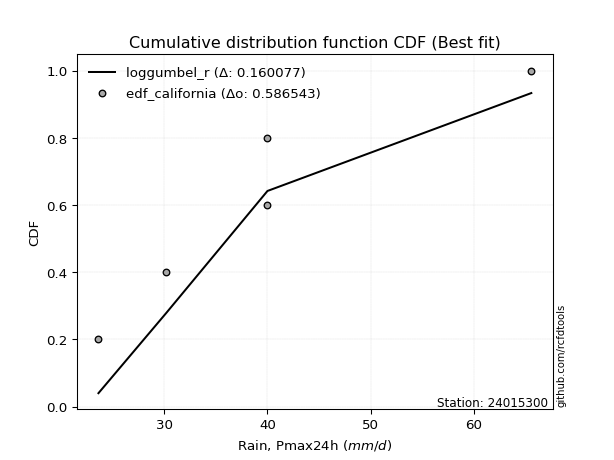</img>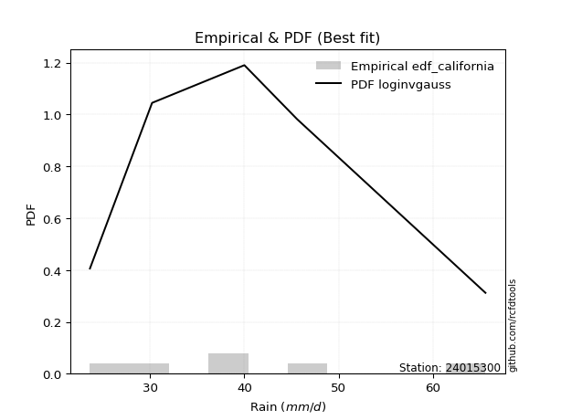</img>

</div>


### 2. EDF Hazen (1930)

Hazen method for plotting positions is a formula used to estimate the empirical cumulative probability distribution of flood events or other hydrological data. This formula often results in biased estimations, particularly when extrapolating to extreme events (high return periods).

<div align="center">


$P=(m-0.5)/n$


</div>


**2.1. Empirical values**

<div align="center">

|                | 0                   | 1                  | 2                  | 3                  | 4         | 5                  |
|:---------------|:--------------------|:-------------------|:-------------------|:-------------------|:----------|:-------------------|
| date           | 2022                | 2021               | 2020               | 2019               | 2025      | 2024               |
| x              | 23.6                | 30.2               | 40.0               | 40.0               | 45.6      | 65.6               |
| m              | 1                   | 2                  | 3                  | 4                  | 5         | 6                  |
| empirical_dist | edf_hazen           | edf_hazen          | edf_hazen          | edf_hazen          | edf_hazen | edf_hazen          |
| empirical      | 0.08333333333333333 | 0.25               | 0.4166666666666667 | 0.5833333333333334 | 0.75      | 0.9166666666666666 |
| empirical_tr   | 1.090909090909091   | 1.3333333333333333 | 1.7142857142857144 | 2.4000000000000004 | 4.0       | 11.999999999999995 |

</div>


**2.2. Kolmogorov-Smirnov fit test (sorted by Δ)**


<div align="center">

|                | 0                   | 1                   | 2                   | 3                   | 4                   | 5                  | 6                  | 7                   | 8                   | 9                   | 10                  | 11                  | 12                  | 13                  | 14                  | 15                  | 16                  | 17                  | 18                  | 19                  | 20                  | 21                  | 22                  | 23                | 24                  | 25                  | 26                  | 27                  | 28                  | 29                  | 30                  | 31                  | 32                  | 33                  | 34                  | 35                  | 36                  | 37                 | 38                  | 39                  | 40                  | 41                  | 42                  | 43                  | 44                | 45                 | 46                 | 47                 | 48                  | 49                 | 50                  | 51                  | 52                 | 53                  | 54                  | 55                 | 56                  | 57                  | 58                  | 59                  | 60                 | 61                 | 62                  | 63                | 64                  | 65                 | 66                  | 67                 | 68                 | 69                | 70                  | 71                 | 72                  | 73                  | 74                  | 75                  | 76                  | 77                  | 78                  | 79                  | 80                  | 81                  | 82                  | 83                  | 84                  | 85                 | 86                  | 87                  | 88                  | 89                  | 90                  | 91                  | 92                  | 93                  | 94                 | 95                  | 96                  | 97                  | 98                  | 99                  | 100                 | 101                | 102                 | 103                | 104                | 105                 | 106                | 107                 | 108                | 109                | 110                | 111                | 112                 | 113                 | 114                 | 115                 | 116                 | 117                 | 118                 | 119                 | 120                | 121              | 122                | 123                 | 124                | 125                 | 126                | 127                 | 128               | 129                 | 130                | 131                | 132                | 133             | 134                | 135                 | 136                | 137                | 138                | 139                | 140                | 141                 | 142                 | 143                | 144                 | 145               | 146                 | 147                 | 148                | 149               | 150                | 151                | 152                | 153                | 154                | 155                | 156                | 157                | 158              | 159            |
|:---------------|:--------------------|:--------------------|:--------------------|:--------------------|:--------------------|:-------------------|:-------------------|:--------------------|:--------------------|:--------------------|:--------------------|:--------------------|:--------------------|:--------------------|:--------------------|:--------------------|:--------------------|:--------------------|:--------------------|:--------------------|:--------------------|:--------------------|:--------------------|:------------------|:--------------------|:--------------------|:--------------------|:--------------------|:--------------------|:--------------------|:--------------------|:--------------------|:--------------------|:--------------------|:--------------------|:--------------------|:--------------------|:-------------------|:--------------------|:--------------------|:--------------------|:--------------------|:--------------------|:--------------------|:------------------|:-------------------|:-------------------|:-------------------|:--------------------|:-------------------|:--------------------|:--------------------|:-------------------|:--------------------|:--------------------|:-------------------|:--------------------|:--------------------|:--------------------|:--------------------|:-------------------|:-------------------|:--------------------|:------------------|:--------------------|:-------------------|:--------------------|:-------------------|:-------------------|:------------------|:--------------------|:-------------------|:--------------------|:--------------------|:--------------------|:--------------------|:--------------------|:--------------------|:--------------------|:--------------------|:--------------------|:--------------------|:--------------------|:--------------------|:--------------------|:-------------------|:--------------------|:--------------------|:--------------------|:--------------------|:--------------------|:--------------------|:--------------------|:--------------------|:-------------------|:--------------------|:--------------------|:--------------------|:--------------------|:--------------------|:--------------------|:-------------------|:--------------------|:-------------------|:-------------------|:--------------------|:-------------------|:--------------------|:-------------------|:-------------------|:-------------------|:-------------------|:--------------------|:--------------------|:--------------------|:--------------------|:--------------------|:--------------------|:--------------------|:--------------------|:-------------------|:-----------------|:-------------------|:--------------------|:-------------------|:--------------------|:-------------------|:--------------------|:------------------|:--------------------|:-------------------|:-------------------|:-------------------|:----------------|:-------------------|:--------------------|:-------------------|:-------------------|:-------------------|:-------------------|:-------------------|:--------------------|:--------------------|:-------------------|:--------------------|:------------------|:--------------------|:--------------------|:-------------------|:------------------|:-------------------|:-------------------|:-------------------|:-------------------|:-------------------|:-------------------|:-------------------|:-------------------|:-----------------|:---------------|
| station        | 24015300            | 24015300            | 24015300            | 24015300            | 24015300            | 24015300           | 24015300           | 24015300            | 24015300            | 24015300            | 24015300            | 24015300            | 24015300            | 24015300            | 24015300            | 24015300            | 24015300            | 24015300            | 24015300            | 24015300            | 24015300            | 24015300            | 24015300            | 24015300          | 24015300            | 24015300            | 24015300            | 24015300            | 24015300            | 24015300            | 24015300            | 24015300            | 24015300            | 24015300            | 24015300            | 24015300            | 24015300            | 24015300           | 24015300            | 24015300            | 24015300            | 24015300            | 24015300            | 24015300            | 24015300          | 24015300           | 24015300           | 24015300           | 24015300            | 24015300           | 24015300            | 24015300            | 24015300           | 24015300            | 24015300            | 24015300           | 24015300            | 24015300            | 24015300            | 24015300            | 24015300           | 24015300           | 24015300            | 24015300          | 24015300            | 24015300           | 24015300            | 24015300           | 24015300           | 24015300          | 24015300            | 24015300           | 24015300            | 24015300            | 24015300            | 24015300            | 24015300            | 24015300            | 24015300            | 24015300            | 24015300            | 24015300            | 24015300            | 24015300            | 24015300            | 24015300           | 24015300            | 24015300            | 24015300            | 24015300            | 24015300            | 24015300            | 24015300            | 24015300            | 24015300           | 24015300            | 24015300            | 24015300            | 24015300            | 24015300            | 24015300            | 24015300           | 24015300            | 24015300           | 24015300           | 24015300            | 24015300           | 24015300            | 24015300           | 24015300           | 24015300           | 24015300           | 24015300            | 24015300            | 24015300            | 24015300            | 24015300            | 24015300            | 24015300            | 24015300            | 24015300           | 24015300         | 24015300           | 24015300            | 24015300           | 24015300            | 24015300           | 24015300            | 24015300          | 24015300            | 24015300           | 24015300           | 24015300           | 24015300        | 24015300           | 24015300            | 24015300           | 24015300           | 24015300           | 24015300           | 24015300           | 24015300            | 24015300            | 24015300           | 24015300            | 24015300          | 24015300            | 24015300            | 24015300           | 24015300          | 24015300           | 24015300           | 24015300           | 24015300           | 24015300           | 24015300           | 24015300           | 24015300           | 24015300         | 24015300       |
| empirical_dist | edf_hazen           | edf_hazen           | edf_hazen           | edf_hazen           | edf_hazen           | edf_hazen          | edf_hazen          | edf_hazen           | edf_hazen           | edf_hazen           | edf_hazen           | edf_hazen           | edf_hazen           | edf_hazen           | edf_hazen           | edf_hazen           | edf_hazen           | edf_hazen           | edf_hazen           | edf_hazen           | edf_hazen           | edf_hazen           | edf_hazen           | edf_hazen         | edf_hazen           | edf_hazen           | edf_hazen           | edf_hazen           | edf_hazen           | edf_hazen           | edf_hazen           | edf_hazen           | edf_hazen           | edf_hazen           | edf_hazen           | edf_hazen           | edf_hazen           | edf_hazen          | edf_hazen           | edf_hazen           | edf_hazen           | edf_hazen           | edf_hazen           | edf_hazen           | edf_hazen         | edf_hazen          | edf_hazen          | edf_hazen          | edf_hazen           | edf_hazen          | edf_hazen           | edf_hazen           | edf_hazen          | edf_hazen           | edf_hazen           | edf_hazen          | edf_hazen           | edf_hazen           | edf_hazen           | edf_hazen           | edf_hazen          | edf_hazen          | edf_hazen           | edf_hazen         | edf_hazen           | edf_hazen          | edf_hazen           | edf_hazen          | edf_hazen          | edf_hazen         | edf_hazen           | edf_hazen          | edf_hazen           | edf_hazen           | edf_hazen           | edf_hazen           | edf_hazen           | edf_hazen           | edf_hazen           | edf_hazen           | edf_hazen           | edf_hazen           | edf_hazen           | edf_hazen           | edf_hazen           | edf_hazen          | edf_hazen           | edf_hazen           | edf_hazen           | edf_hazen           | edf_hazen           | edf_hazen           | edf_hazen           | edf_hazen           | edf_hazen          | edf_hazen           | edf_hazen           | edf_hazen           | edf_hazen           | edf_hazen           | edf_hazen           | edf_hazen          | edf_hazen           | edf_hazen          | edf_hazen          | edf_hazen           | edf_hazen          | edf_hazen           | edf_hazen          | edf_hazen          | edf_hazen          | edf_hazen          | edf_hazen           | edf_hazen           | edf_hazen           | edf_hazen           | edf_hazen           | edf_hazen           | edf_hazen           | edf_hazen           | edf_hazen          | edf_hazen        | edf_hazen          | edf_hazen           | edf_hazen          | edf_hazen           | edf_hazen          | edf_hazen           | edf_hazen         | edf_hazen           | edf_hazen          | edf_hazen          | edf_hazen          | edf_hazen       | edf_hazen          | edf_hazen           | edf_hazen          | edf_hazen          | edf_hazen          | edf_hazen          | edf_hazen          | edf_hazen           | edf_hazen           | edf_hazen          | edf_hazen           | edf_hazen         | edf_hazen           | edf_hazen           | edf_hazen          | edf_hazen         | edf_hazen          | edf_hazen          | edf_hazen          | edf_hazen          | edf_hazen          | edf_hazen          | edf_hazen          | edf_hazen          | edf_hazen        | edf_hazen      |
| p_dist         | dweibull            | logdweibull         | rice                | maxwell             | logloglaplace       | gompertz           | pearson3           | logvonmises_line    | rayleigh            | loguniform          | foldnorm            | truncexpon          | t                   | norm                | crystalball         | truncnorm           | logtukeylambda      | loghalfgennorm      | logkappa3           | logksone            | logistic            | logkappa4           | ncf                 | loggumbel_l       | logsemicircular     | logcosine           | hypsecant           | loggenextreme       | logweibull_max      | loganglit           | logncf              | logloggamma         | logt                | lognorm             | logcrystalball      | logexponnorm        | logburr             | logskewnorm        | logbradford         | kstwobign           | logtruncpareto      | logpearson3         | loggamma            | loggamma            | logerlang         | laplace            | loglogistic        | logjohnsonsu       | alpha               | gumbel_r           | logf                | anglit              | logfatiguelife     | logbetaprime        | nct                 | betaprime          | genlogistic         | loghypsecant        | loggenlogistic      | exponnorm           | invgamma           | skewnorm           | logarcsine          | loggausshyper     | dgamma              | semicircular       | halfnorm            | logfoldnorm        | loginvgamma        | johnsonsu         | lomax               | truncpareto        | lognct              | logrice             | bradford            | logalpha            | invgauss            | logargus            | logweibull_min      | loggompertz         | loglaplace          | loglaplace          | loginvgauss         | loggennorm          | burr                | gennorm            | logmaxwell          | moyal               | cosine              | logburr12           | halflogistic        | lograyleigh         | arcsine             | truncweibull_min    | weibull_min        | gumbel_l            | loginvweibull       | vonmises_line       | logkstwobign        | logtruncweibull_min | genpareto           | loghalfnorm        | loggumbel_r         | logwrapcauchy      | gausshyper         | kappa4              | logdgamma          | loggenexpon         | logtruncexpon      | logtriang          | logmoyal           | loghalflogistic    | wald                | uniform             | wrapcauchy          | ksone               | beta                | loglomax            | halfgennorm         | burr12              | nakagami           | argus            | f                  | loglevy_l           | logjohnsonsb       | logexponweib        | exponpow           | logwald             | logexponpow       | genextreme          | loggenhalflogistic | levy_l             | kappa3             | triang          | logmielke          | loggengamma         | johnsonsb          | tukeylambda        | gamma              | logbeta            | logtrapezoid       | genhalflogistic     | lognakagami         | rdist              | gengamma            | trapezoid         | invweibull          | erlang              | fatiguelife        | loggenpareto      | powerlaw           | exponweib          | logpowerlaw        | genexpon           | logtruncnorm       | logrdist           | weibull_max        | logvonmises        | vonmises         | mielke         |
| delta          | 0.08333342190834853 | 0.08382391248147114 | 0.08835875456025993 | 0.09206423113371626 | 0.09439652778260282 | 0.1001542919068335 | 0.1012981447349614 | 0.10253759217057751 | 0.10357245278115873 | 0.10572500158980347 | 0.10708725847126571 | 0.10836854066288004 | 0.10912809116184585 | 0.10914441478822157 | 0.10914442444893446 | 0.10914442573162786 | 0.10994394840415822 | 0.11065552480503749 | 0.11075642675904773 | 0.11085536800469803 | 0.11190018250956907 | 0.11255113361062724 | 0.11257292039457917 | 0.113540750326652 | 0.11366922186096168 | 0.11474344468017189 | 0.11481568021443156 | 0.11488906024225626 | 0.11490568227170056 | 0.11590038719799428 | 0.11604074400466674 | 0.11980835551165031 | 0.12129265723651256 | 0.12131059977812114 | 0.12131083014316096 | 0.12136215706592063 | 0.12201535925678314 | 0.1223500840809893 | 0.12314440560513534 | 0.12400531626467864 | 0.12435452303337319 | 0.12482522234716481 | 0.12549644166879442 | 0.12549644166879442 | 0.125583172862141 | 0.1259979315209378 | 0.1264574346574015 | 0.1264675470454853 | 0.12721584426424642 | 0.1273574305410447 | 0.12746912695688634 | 0.12793097956301758 | 0.1283634884838007 | 0.12857518443244748 | 0.12937396001770535 | 0.1296167169477665 | 0.13026020230082708 | 0.13082570296651314 | 0.13091829266634397 | 0.13156187103660483 | 0.1328510751582091 | 0.1331760173190995 | 0.13376135592929117 | 0.134815268941829 | 0.13507107539372692 | 0.1357964943390526 | 0.13599910283998234 | 0.1369121964326871 | 0.1379748082885522 | 0.139356757136818 | 0.13969236034303112 | 0.1397556524645614 | 0.14107976299398733 | 0.14151477453279454 | 0.14153916711324488 | 0.14196903384634424 | 0.14240896253489937 | 0.14419058445312904 | 0.14447991388218046 | 0.14567121317855475 | 0.14640105431467526 | 0.14640105431467526 | 0.14970681165658034 | 0.14999545967914812 | 0.15020566641045469 | 0.1512468164681281 | 0.15245787116310677 | 0.15317429661465526 | 0.15354161367906172 | 0.15388363620061712 | 0.15920475267800377 | 0.16254736348496707 | 0.16789608645475407 | 0.17369637513103348 | 0.1772570481790236 | 0.17914376548543443 | 0.18139178658426874 | 0.18514666004214353 | 0.18604118514075246 | 0.18997681115149606 | 0.19065920292570787 | 0.1909800182652675 | 0.19178535637449806 | 0.1987669133523804 | 0.2019643872607837 | 0.20347293231199615 | 0.2042261644938713 | 0.20480594797377655 | 0.2126666703456082 | 0.2162667894954856 | 0.2169799267576103 | 0.2178275719228257 | 0.22503757970980104 | 0.22619047619047605 | 0.22711663967276752 | 0.23015873015873012 | 0.23087988679982235 | 0.23911246827936355 | 0.23911444802547882 | 0.24052980565365362 | 0.2499942804789479 | 0.25049579978696 | 0.2521386789458964 | 0.26988319730056326 | 0.2706088197447597 | 0.27941291443305954 | 0.2867527343559753 | 0.28690281164924564 | 0.292497435354161 | 0.29912551611566207 | 0.3007076011580478 | 0.3012824333885062 | 0.3051042626681307 | 0.3168517766484 | 0.3168703996332021 | 0.31735780703999167 | 0.3174430380180937 | 0.3218113748799685 | 0.3450555889388573 | 0.3615541054850426 | 0.3653157824593763 | 0.38195753792941395 | 0.43280477143873136 | 0.4466197476115194 | 0.45124951670712754 | 0.479765054169816 | 0.48250379006998606 | 0.48864198349825244 | 0.4932041154088921 | 0.502818508290314 | 0.5146868790801263 | 0.5219297964450175 | 0.5514795806843573 | 0.5629436358785349 | 0.5833320611739374 | 0.5833333296071264 | 0.6322203191838813 | 1.1220681133114645 | 9.60430941336015 | nan            |
| deltao         | 0.530385761606      | 0.530385761606      | 0.530385761606      | 0.530385761606      | 0.530385761606      | 0.530385761606     | 0.530385761606     | 0.530385761606      | 0.530385761606      | 0.530385761606      | 0.530385761606      | 0.530385761606      | 0.530385761606      | 0.530385761606      | 0.530385761606      | 0.530385761606      | 0.530385761606      | 0.530385761606      | 0.530385761606      | 0.530385761606      | 0.530385761606      | 0.530385761606      | 0.530385761606      | 0.530385761606    | 0.530385761606      | 0.530385761606      | 0.530385761606      | 0.530385761606      | 0.530385761606      | 0.530385761606      | 0.530385761606      | 0.530385761606      | 0.530385761606      | 0.530385761606      | 0.530385761606      | 0.530385761606      | 0.530385761606      | 0.530385761606     | 0.530385761606      | 0.530385761606      | 0.530385761606      | 0.530385761606      | 0.530385761606      | 0.530385761606      | 0.530385761606    | 0.530385761606     | 0.530385761606     | 0.530385761606     | 0.530385761606      | 0.530385761606     | 0.530385761606      | 0.530385761606      | 0.530385761606     | 0.530385761606      | 0.530385761606      | 0.530385761606     | 0.530385761606      | 0.530385761606      | 0.530385761606      | 0.530385761606      | 0.530385761606     | 0.530385761606     | 0.530385761606      | 0.530385761606    | 0.530385761606      | 0.530385761606     | 0.530385761606      | 0.530385761606     | 0.530385761606     | 0.530385761606    | 0.530385761606      | 0.530385761606     | 0.530385761606      | 0.530385761606      | 0.530385761606      | 0.530385761606      | 0.530385761606      | 0.530385761606      | 0.530385761606      | 0.530385761606      | 0.530385761606      | 0.530385761606      | 0.530385761606      | 0.530385761606      | 0.530385761606      | 0.530385761606     | 0.530385761606      | 0.530385761606      | 0.530385761606      | 0.530385761606      | 0.530385761606      | 0.530385761606      | 0.530385761606      | 0.530385761606      | 0.530385761606     | 0.530385761606      | 0.530385761606      | 0.530385761606      | 0.530385761606      | 0.530385761606      | 0.530385761606      | 0.530385761606     | 0.530385761606      | 0.530385761606     | 0.530385761606     | 0.530385761606      | 0.530385761606     | 0.530385761606      | 0.530385761606     | 0.530385761606     | 0.530385761606     | 0.530385761606     | 0.530385761606      | 0.530385761606      | 0.530385761606      | 0.530385761606      | 0.530385761606      | 0.530385761606      | 0.530385761606      | 0.530385761606      | 0.530385761606     | 0.530385761606   | 0.530385761606     | 0.530385761606      | 0.530385761606     | 0.530385761606      | 0.530385761606     | 0.530385761606      | 0.530385761606    | 0.530385761606      | 0.530385761606     | 0.530385761606     | 0.530385761606     | 0.530385761606  | 0.530385761606     | 0.530385761606      | 0.530385761606     | 0.530385761606     | 0.530385761606     | 0.530385761606     | 0.530385761606     | 0.530385761606      | 0.530385761606      | 0.530385761606     | 0.530385761606      | 0.530385761606    | 0.530385761606      | 0.530385761606      | 0.530385761606     | 0.530385761606    | 0.530385761606     | 0.530385761606     | 0.530385761606     | 0.530385761606     | 0.530385761606     | 0.530385761606     | 0.530385761606     | 0.530385761606     | 0.530385761606   | 0.530385761606 |
| eval           | Δo > Δ              | Δo > Δ              | Δo > Δ              | Δo > Δ              | Δo > Δ              | Δo > Δ             | Δo > Δ             | Δo > Δ              | Δo > Δ              | Δo > Δ              | Δo > Δ              | Δo > Δ              | Δo > Δ              | Δo > Δ              | Δo > Δ              | Δo > Δ              | Δo > Δ              | Δo > Δ              | Δo > Δ              | Δo > Δ              | Δo > Δ              | Δo > Δ              | Δo > Δ              | Δo > Δ            | Δo > Δ              | Δo > Δ              | Δo > Δ              | Δo > Δ              | Δo > Δ              | Δo > Δ              | Δo > Δ              | Δo > Δ              | Δo > Δ              | Δo > Δ              | Δo > Δ              | Δo > Δ              | Δo > Δ              | Δo > Δ             | Δo > Δ              | Δo > Δ              | Δo > Δ              | Δo > Δ              | Δo > Δ              | Δo > Δ              | Δo > Δ            | Δo > Δ             | Δo > Δ             | Δo > Δ             | Δo > Δ              | Δo > Δ             | Δo > Δ              | Δo > Δ              | Δo > Δ             | Δo > Δ              | Δo > Δ              | Δo > Δ             | Δo > Δ              | Δo > Δ              | Δo > Δ              | Δo > Δ              | Δo > Δ             | Δo > Δ             | Δo > Δ              | Δo > Δ            | Δo > Δ              | Δo > Δ             | Δo > Δ              | Δo > Δ             | Δo > Δ             | Δo > Δ            | Δo > Δ              | Δo > Δ             | Δo > Δ              | Δo > Δ              | Δo > Δ              | Δo > Δ              | Δo > Δ              | Δo > Δ              | Δo > Δ              | Δo > Δ              | Δo > Δ              | Δo > Δ              | Δo > Δ              | Δo > Δ              | Δo > Δ              | Δo > Δ             | Δo > Δ              | Δo > Δ              | Δo > Δ              | Δo > Δ              | Δo > Δ              | Δo > Δ              | Δo > Δ              | Δo > Δ              | Δo > Δ             | Δo > Δ              | Δo > Δ              | Δo > Δ              | Δo > Δ              | Δo > Δ              | Δo > Δ              | Δo > Δ             | Δo > Δ              | Δo > Δ             | Δo > Δ             | Δo > Δ              | Δo > Δ             | Δo > Δ              | Δo > Δ             | Δo > Δ             | Δo > Δ             | Δo > Δ             | Δo > Δ              | Δo > Δ              | Δo > Δ              | Δo > Δ              | Δo > Δ              | Δo > Δ              | Δo > Δ              | Δo > Δ              | Δo > Δ             | Δo > Δ           | Δo > Δ             | Δo > Δ              | Δo > Δ             | Δo > Δ              | Δo > Δ             | Δo > Δ              | Δo > Δ            | Δo > Δ              | Δo > Δ             | Δo > Δ             | Δo > Δ             | Δo > Δ          | Δo > Δ             | Δo > Δ              | Δo > Δ             | Δo > Δ             | Δo > Δ             | Δo > Δ             | Δo > Δ             | Δo > Δ              | Δo > Δ              | Δo > Δ             | Δo > Δ              | Δo > Δ            | Δo > Δ              | Δo > Δ              | Δo > Δ             | Δo > Δ            | Δo > Δ             | Δo > Δ             | Δo <= Δ            | Δo <= Δ            | Δo <= Δ            | Δo <= Δ            | Δo <= Δ            | Δo <= Δ            | Δo <= Δ          | Δo <= Δ        |
| fit            | 1                   | 1                   | 1                   | 1                   | 1                   | 1                  | 1                  | 1                   | 1                   | 1                   | 1                   | 1                   | 1                   | 1                   | 1                   | 1                   | 1                   | 1                   | 1                   | 1                   | 1                   | 1                   | 1                   | 1                 | 1                   | 1                   | 1                   | 1                   | 1                   | 1                   | 1                   | 1                   | 1                   | 1                   | 1                   | 1                   | 1                   | 1                  | 1                   | 1                   | 1                   | 1                   | 1                   | 1                   | 1                 | 1                  | 1                  | 1                  | 1                   | 1                  | 1                   | 1                   | 1                  | 1                   | 1                   | 1                  | 1                   | 1                   | 1                   | 1                   | 1                  | 1                  | 1                   | 1                 | 1                   | 1                  | 1                   | 1                  | 1                  | 1                 | 1                   | 1                  | 1                   | 1                   | 1                   | 1                   | 1                   | 1                   | 1                   | 1                   | 1                   | 1                   | 1                   | 1                   | 1                   | 1                  | 1                   | 1                   | 1                   | 1                   | 1                   | 1                   | 1                   | 1                   | 1                  | 1                   | 1                   | 1                   | 1                   | 1                   | 1                   | 1                  | 1                   | 1                  | 1                  | 1                   | 1                  | 1                   | 1                  | 1                  | 1                  | 1                  | 1                   | 1                   | 1                   | 1                   | 1                   | 1                   | 1                   | 1                   | 1                  | 1                | 1                  | 1                   | 1                  | 1                   | 1                  | 1                   | 1                 | 1                   | 1                  | 1                  | 1                  | 1               | 1                  | 1                   | 1                  | 1                  | 1                  | 1                  | 1                  | 1                   | 1                   | 1                  | 1                   | 1                 | 1                   | 1                   | 1                  | 1                 | 1                  | 1                  | 0                  | 0                  | 0                  | 0                  | 0                  | 0                  | 0                | 0              |
| n              | 6                   | 6                   | 6                   | 6                   | 6                   | 6                  | 6                  | 6                   | 6                   | 6                   | 6                   | 6                   | 6                   | 6                   | 6                   | 6                   | 6                   | 6                   | 6                   | 6                   | 6                   | 6                   | 6                   | 6                 | 6                   | 6                   | 6                   | 6                   | 6                   | 6                   | 6                   | 6                   | 6                   | 6                   | 6                   | 6                   | 6                   | 6                  | 6                   | 6                   | 6                   | 6                   | 6                   | 6                   | 6                 | 6                  | 6                  | 6                  | 6                   | 6                  | 6                   | 6                   | 6                  | 6                   | 6                   | 6                  | 6                   | 6                   | 6                   | 6                   | 6                  | 6                  | 6                   | 6                 | 6                   | 6                  | 6                   | 6                  | 6                  | 6                 | 6                   | 6                  | 6                   | 6                   | 6                   | 6                   | 6                   | 6                   | 6                   | 6                   | 6                   | 6                   | 6                   | 6                   | 6                   | 6                  | 6                   | 6                   | 6                   | 6                   | 6                   | 6                   | 6                   | 6                   | 6                  | 6                   | 6                   | 6                   | 6                   | 6                   | 6                   | 6                  | 6                   | 6                  | 6                  | 6                   | 6                  | 6                   | 6                  | 6                  | 6                  | 6                  | 6                   | 6                   | 6                   | 6                   | 6                   | 6                   | 6                   | 6                   | 6                  | 6                | 6                  | 6                   | 6                  | 6                   | 6                  | 6                   | 6                 | 6                   | 6                  | 6                  | 6                  | 6               | 6                  | 6                   | 6                  | 6                  | 6                  | 6                  | 6                  | 6                   | 6                   | 6                  | 6                   | 6                 | 6                   | 6                   | 6                  | 6                 | 6                  | 6                  | 6                  | 6                  | 6                  | 6                  | 6                  | 6                  | 6                | 6              |
| best_fit       | 1                   | 0                   | 0                   | 0                   | 0                   | 0                  | 0                  | 0                   | 0                   | 0                   | 0                   | 0                   | 0                   | 0                   | 0                   | 0                   | 0                   | 0                   | 0                   | 0                   | 0                   | 0                   | 0                   | 0                 | 0                   | 0                   | 0                   | 0                   | 0                   | 0                   | 0                   | 0                   | 0                   | 0                   | 0                   | 0                   | 0                   | 0                  | 0                   | 0                   | 0                   | 0                   | 0                   | 0                   | 0                 | 0                  | 0                  | 0                  | 0                   | 0                  | 0                   | 0                   | 0                  | 0                   | 0                   | 0                  | 0                   | 0                   | 0                   | 0                   | 0                  | 0                  | 0                   | 0                 | 0                   | 0                  | 0                   | 0                  | 0                  | 0                 | 0                   | 0                  | 0                   | 0                   | 0                   | 0                   | 0                   | 0                   | 0                   | 0                   | 0                   | 0                   | 0                   | 0                   | 0                   | 0                  | 0                   | 0                   | 0                   | 0                   | 0                   | 0                   | 0                   | 0                   | 0                  | 0                   | 0                   | 0                   | 0                   | 0                   | 0                   | 0                  | 0                   | 0                  | 0                  | 0                   | 0                  | 0                   | 0                  | 0                  | 0                  | 0                  | 0                   | 0                   | 0                   | 0                   | 0                   | 0                   | 0                   | 0                   | 0                  | 0                | 0                  | 0                   | 0                  | 0                   | 0                  | 0                   | 0                 | 0                   | 0                  | 0                  | 0                  | 0               | 0                  | 0                   | 0                  | 0                  | 0                  | 0                  | 0                  | 0                   | 0                   | 0                  | 0                   | 0                 | 0                   | 0                   | 0                  | 0                 | 0                  | 0                  | 0                  | 0                  | 0                  | 0                  | 0                  | 0                  | 0                | 0              |
| best_fit_sort  | 1                   | 2                   | 3                   | 4                   | 5                   | 6                  | 7                  | 8                   | 9                   | 10                  | 11                  | 12                  | 13                  | 14                  | 15                  | 16                  | 17                  | 18                  | 19                  | 20                  | 21                  | 22                  | 23                  | 24                | 25                  | 26                  | 27                  | 28                  | 29                  | 30                  | 31                  | 32                  | 33                  | 34                  | 35                  | 36                  | 37                  | 38                 | 39                  | 40                  | 41                  | 42                  | 43                  | 44                  | 45                | 46                 | 47                 | 48                 | 49                  | 50                 | 51                  | 52                  | 53                 | 54                  | 55                  | 56                 | 57                  | 58                  | 59                  | 60                  | 61                 | 62                 | 63                  | 64                | 65                  | 66                 | 67                  | 68                 | 69                 | 70                | 71                  | 72                 | 73                  | 74                  | 75                  | 76                  | 77                  | 78                  | 79                  | 80                  | 81                  | 82                  | 83                  | 84                  | 85                  | 86                 | 87                  | 88                  | 89                  | 90                  | 91                  | 92                  | 93                  | 94                  | 95                 | 96                  | 97                  | 98                  | 99                  | 100                 | 101                 | 102                | 103                 | 104                | 105                | 106                 | 107                | 108                 | 109                | 110                | 111                | 112                | 113                 | 114                 | 115                 | 116                 | 117                 | 118                 | 119                 | 120                 | 121                | 122              | 123                | 124                 | 125                | 126                 | 127                | 128                 | 129               | 130                 | 131                | 132                | 133                | 134             | 135                | 136                 | 137                | 138                | 139                | 140                | 141                | 142                 | 143                 | 144                | 145                 | 146               | 147                 | 148                 | 149                | 150               | 151                | 152                | 153                | 154                | 155                | 156                | 157                | 158                | 159              | 160            |

</div>


**2.3. Best fit**

<div align="center">

|   id |   station | empirical_dist   | p_dist   |     delta |   deltao | eval   |   fit |   n |   best_fit |   best_fit_sort |
|-----:|----------:|:-----------------|:---------|----------:|---------:|:-------|------:|----:|-----------:|----------------:|
|    0 |  24015300 | edf_hazen        | dweibull | 0.0833334 | 0.530386 | Δo > Δ |     1 |   6 |          1 |               1 |

</div>


<div align="center">

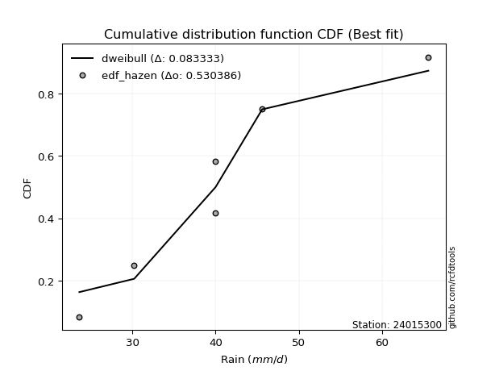</img>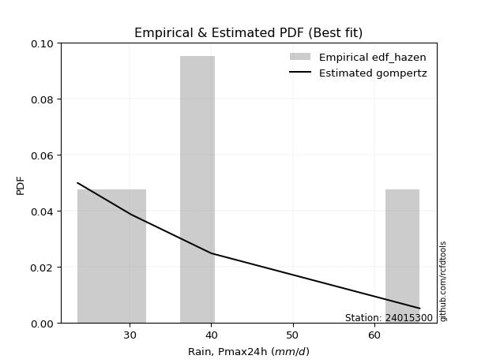</img>

</div>


### 3. EDF Weibull (1939)

Weibull plotting position formula is an empirical method used to estimate the non-exceedance probability or plotting position for a set of observed data, is often recommended or widely used in practice, particularly in flood frequency analysis.

<div align="center">


$P=m/(n+1)$


</div>


**3.1. Empirical values**

<div align="center">

|                | 0                   | 1                  | 2                   | 3                  | 4                  | 5                  |
|:---------------|:--------------------|:-------------------|:--------------------|:-------------------|:-------------------|:-------------------|
| date           | 2022                | 2021               | 2020                | 2019               | 2025               | 2024               |
| x              | 23.6                | 30.2               | 40.0                | 40.0               | 45.6               | 65.6               |
| m              | 1                   | 2                  | 3                   | 4                  | 5                  | 6                  |
| empirical_dist | edf_weibull         | edf_weibull        | edf_weibull         | edf_weibull        | edf_weibull        | edf_weibull        |
| empirical      | 0.14285714285714285 | 0.2857142857142857 | 0.42857142857142855 | 0.5714285714285714 | 0.7142857142857143 | 0.8571428571428571 |
| empirical_tr   | 1.1666666666666665  | 1.4                | 1.75                | 2.333333333333333  | 3.5                | 6.999999999999997  |

</div>


**3.2. Kolmogorov-Smirnov fit test (sorted by Δ)**


<div align="center">

|                | 0                  | 1                   | 2                   | 3                   | 4                   | 5                   | 6                  | 7                   | 8                   | 9                   | 10                 | 11                 | 12                  | 13                  | 14                  | 15                 | 16                  | 17                 | 18                  | 19                  | 20                  | 21                  | 22                  | 23                  | 24                  | 25                  | 26                  | 27                  | 28                  | 29                  | 30                  | 31                  | 32                  | 33                  | 34                 | 35                  | 36                  | 37                  | 38                  | 39                  | 40                  | 41                  | 42                  | 43                  | 44                  | 45                  | 46                  | 47                  | 48                 | 49                  | 50                  | 51                  | 52                  | 53                  | 54                  | 55                  | 56                  | 57                 | 58                  | 59                 | 60                  | 61                  | 62                  | 63                 | 64                 | 65                  | 66                  | 67                 | 68                 | 69                  | 70                 | 71                  | 72                  | 73                 | 74                 | 75                  | 76                 | 77                 | 78                  | 79                  | 80                | 81                  | 82                  | 83                 | 84                 | 85                 | 86                 | 87                  | 88                  | 89                 | 90                  | 91                 | 92                 | 93                 | 94                  | 95                | 96                  | 97                  | 98                  | 99                  | 100                | 101                 | 102                 | 103                | 104                | 105                 | 106                | 107                 | 108                 | 109                 | 110                 | 111                 | 112                 | 113                 | 114                 | 115                 | 116                | 117                 | 118                | 119                 | 120                 | 121               | 122                 | 123               | 124                 | 125                 | 126                | 127                | 128               | 129                 | 130                | 131                 | 132                | 133               | 134                | 135                 | 136                | 137                 | 138                | 139                 | 140                 | 141                | 142                 | 143                 | 144                | 145                | 146                 | 147                | 148                | 149                | 150                 | 151                 | 152                | 153               | 154                | 155                | 156                | 157                | 158               | 159            |
|:---------------|:-------------------|:--------------------|:--------------------|:--------------------|:--------------------|:--------------------|:-------------------|:--------------------|:--------------------|:--------------------|:-------------------|:-------------------|:--------------------|:--------------------|:--------------------|:-------------------|:--------------------|:-------------------|:--------------------|:--------------------|:--------------------|:--------------------|:--------------------|:--------------------|:--------------------|:--------------------|:--------------------|:--------------------|:--------------------|:--------------------|:--------------------|:--------------------|:--------------------|:--------------------|:-------------------|:--------------------|:--------------------|:--------------------|:--------------------|:--------------------|:--------------------|:--------------------|:--------------------|:--------------------|:--------------------|:--------------------|:--------------------|:--------------------|:-------------------|:--------------------|:--------------------|:--------------------|:--------------------|:--------------------|:--------------------|:--------------------|:--------------------|:-------------------|:--------------------|:-------------------|:--------------------|:--------------------|:--------------------|:-------------------|:-------------------|:--------------------|:--------------------|:-------------------|:-------------------|:--------------------|:-------------------|:--------------------|:--------------------|:-------------------|:-------------------|:--------------------|:-------------------|:-------------------|:--------------------|:--------------------|:------------------|:--------------------|:--------------------|:-------------------|:-------------------|:-------------------|:-------------------|:--------------------|:--------------------|:-------------------|:--------------------|:-------------------|:-------------------|:-------------------|:--------------------|:------------------|:--------------------|:--------------------|:--------------------|:--------------------|:-------------------|:--------------------|:--------------------|:-------------------|:-------------------|:--------------------|:-------------------|:--------------------|:--------------------|:--------------------|:--------------------|:--------------------|:--------------------|:--------------------|:--------------------|:--------------------|:-------------------|:--------------------|:-------------------|:--------------------|:--------------------|:------------------|:--------------------|:------------------|:--------------------|:--------------------|:-------------------|:-------------------|:------------------|:--------------------|:-------------------|:--------------------|:-------------------|:------------------|:-------------------|:--------------------|:-------------------|:--------------------|:-------------------|:--------------------|:--------------------|:-------------------|:--------------------|:--------------------|:-------------------|:-------------------|:--------------------|:-------------------|:-------------------|:-------------------|:--------------------|:--------------------|:-------------------|:------------------|:-------------------|:-------------------|:-------------------|:-------------------|:------------------|:---------------|
| station        | 24015300           | 24015300            | 24015300            | 24015300            | 24015300            | 24015300            | 24015300           | 24015300            | 24015300            | 24015300            | 24015300           | 24015300           | 24015300            | 24015300            | 24015300            | 24015300           | 24015300            | 24015300           | 24015300            | 24015300            | 24015300            | 24015300            | 24015300            | 24015300            | 24015300            | 24015300            | 24015300            | 24015300            | 24015300            | 24015300            | 24015300            | 24015300            | 24015300            | 24015300            | 24015300           | 24015300            | 24015300            | 24015300            | 24015300            | 24015300            | 24015300            | 24015300            | 24015300            | 24015300            | 24015300            | 24015300            | 24015300            | 24015300            | 24015300           | 24015300            | 24015300            | 24015300            | 24015300            | 24015300            | 24015300            | 24015300            | 24015300            | 24015300           | 24015300            | 24015300           | 24015300            | 24015300            | 24015300            | 24015300           | 24015300           | 24015300            | 24015300            | 24015300           | 24015300           | 24015300            | 24015300           | 24015300            | 24015300            | 24015300           | 24015300           | 24015300            | 24015300           | 24015300           | 24015300            | 24015300            | 24015300          | 24015300            | 24015300            | 24015300           | 24015300           | 24015300           | 24015300           | 24015300            | 24015300            | 24015300           | 24015300            | 24015300           | 24015300           | 24015300           | 24015300            | 24015300          | 24015300            | 24015300            | 24015300            | 24015300            | 24015300           | 24015300            | 24015300            | 24015300           | 24015300           | 24015300            | 24015300           | 24015300            | 24015300            | 24015300            | 24015300            | 24015300            | 24015300            | 24015300            | 24015300            | 24015300            | 24015300           | 24015300            | 24015300           | 24015300            | 24015300            | 24015300          | 24015300            | 24015300          | 24015300            | 24015300            | 24015300           | 24015300           | 24015300          | 24015300            | 24015300           | 24015300            | 24015300           | 24015300          | 24015300           | 24015300            | 24015300           | 24015300            | 24015300           | 24015300            | 24015300            | 24015300           | 24015300            | 24015300            | 24015300           | 24015300           | 24015300            | 24015300           | 24015300           | 24015300           | 24015300            | 24015300            | 24015300           | 24015300          | 24015300           | 24015300           | 24015300           | 24015300           | 24015300          | 24015300       |
| empirical_dist | edf_weibull        | edf_weibull         | edf_weibull         | edf_weibull         | edf_weibull         | edf_weibull         | edf_weibull        | edf_weibull         | edf_weibull         | edf_weibull         | edf_weibull        | edf_weibull        | edf_weibull         | edf_weibull         | edf_weibull         | edf_weibull        | edf_weibull         | edf_weibull        | edf_weibull         | edf_weibull         | edf_weibull         | edf_weibull         | edf_weibull         | edf_weibull         | edf_weibull         | edf_weibull         | edf_weibull         | edf_weibull         | edf_weibull         | edf_weibull         | edf_weibull         | edf_weibull         | edf_weibull         | edf_weibull         | edf_weibull        | edf_weibull         | edf_weibull         | edf_weibull         | edf_weibull         | edf_weibull         | edf_weibull         | edf_weibull         | edf_weibull         | edf_weibull         | edf_weibull         | edf_weibull         | edf_weibull         | edf_weibull         | edf_weibull        | edf_weibull         | edf_weibull         | edf_weibull         | edf_weibull         | edf_weibull         | edf_weibull         | edf_weibull         | edf_weibull         | edf_weibull        | edf_weibull         | edf_weibull        | edf_weibull         | edf_weibull         | edf_weibull         | edf_weibull        | edf_weibull        | edf_weibull         | edf_weibull         | edf_weibull        | edf_weibull        | edf_weibull         | edf_weibull        | edf_weibull         | edf_weibull         | edf_weibull        | edf_weibull        | edf_weibull         | edf_weibull        | edf_weibull        | edf_weibull         | edf_weibull         | edf_weibull       | edf_weibull         | edf_weibull         | edf_weibull        | edf_weibull        | edf_weibull        | edf_weibull        | edf_weibull         | edf_weibull         | edf_weibull        | edf_weibull         | edf_weibull        | edf_weibull        | edf_weibull        | edf_weibull         | edf_weibull       | edf_weibull         | edf_weibull         | edf_weibull         | edf_weibull         | edf_weibull        | edf_weibull         | edf_weibull         | edf_weibull        | edf_weibull        | edf_weibull         | edf_weibull        | edf_weibull         | edf_weibull         | edf_weibull         | edf_weibull         | edf_weibull         | edf_weibull         | edf_weibull         | edf_weibull         | edf_weibull         | edf_weibull        | edf_weibull         | edf_weibull        | edf_weibull         | edf_weibull         | edf_weibull       | edf_weibull         | edf_weibull       | edf_weibull         | edf_weibull         | edf_weibull        | edf_weibull        | edf_weibull       | edf_weibull         | edf_weibull        | edf_weibull         | edf_weibull        | edf_weibull       | edf_weibull        | edf_weibull         | edf_weibull        | edf_weibull         | edf_weibull        | edf_weibull         | edf_weibull         | edf_weibull        | edf_weibull         | edf_weibull         | edf_weibull        | edf_weibull        | edf_weibull         | edf_weibull        | edf_weibull        | edf_weibull        | edf_weibull         | edf_weibull         | edf_weibull        | edf_weibull       | edf_weibull        | edf_weibull        | edf_weibull        | edf_weibull        | edf_weibull       | edf_weibull    |
| p_dist         | dweibull           | logdweibull         | foldnorm            | rayleigh            | pearson3            | maxwell             | ncf                | logsemicircular     | logcosine           | rice                | loggenextreme      | logweibull_max     | loganglit           | logncf              | logloggamma         | logt               | lognorm             | logcrystalball     | logexponnorm        | logburr             | hypsecant           | logskewnorm         | logistic            | kstwobign           | crystalball         | truncnorm           | norm                | t                   | logpearson3         | loggamma            | loggamma            | logerlang           | loglogistic         | logjohnsonsu        | logargus           | alpha               | gumbel_r            | logf                | logfatiguelife      | logbetaprime        | logksone            | nct                 | betaprime           | genlogistic         | loghypsecant        | loggenlogistic      | exponnorm           | invgamma            | anglit             | logfoldnorm         | laplace             | loginvgamma         | johnsonsu           | lognct              | logrice             | logalpha            | logloglaplace       | invgauss           | cosine              | logweibull_min     | loggumbel_l         | semicircular        | halfnorm            | loglaplace         | loglaplace         | loginvgauss         | burr                | logmaxwell         | moyal              | logburr12           | bradford           | truncexpon          | loggompertz         | lomax              | logvonmises_line   | logbradford         | gompertz           | genpareto          | logkappa3           | logtukeylambda      | logkappa4         | loghalfgennorm      | skewnorm            | loguniform         | logtruncpareto     | arcsine            | logarcsine         | loggausshyper       | truncpareto         | halflogistic       | vonmises_line       | lograyleigh        | truncweibull_min   | logwrapcauchy      | weibull_min         | gausshyper        | gumbel_l            | kappa4              | loginvweibull       | dgamma              | logkstwobign       | logtruncweibull_min | loghalfnorm         | loggumbel_r        | logtriang          | loggennorm          | gennorm            | uniform             | wrapcauchy          | loggenexpon         | ksone               | logtruncexpon       | logmoyal            | loghalflogistic     | loglevy_l           | argus               | beta               | wald                | loglomax           | halfgennorm         | burr12              | logjohnsonsb      | genextreme          | logdgamma         | f                   | levy_l              | loggenhalflogistic | logexponweib       | kappa3            | exponpow            | logwald            | logexponpow         | triang             | johnsonsb         | nakagami           | logmielke           | loggengamma        | tukeylambda         | logtrapezoid       | gamma               | genhalflogistic     | logbeta            | rdist               | gengamma            | lognakagami        | invweibull         | loggenpareto        | trapezoid          | fatiguelife        | erlang             | powerlaw            | exponweib           | logpowerlaw        | genexpon          | logtruncnorm       | logrdist           | weibull_max        | logvonmises        | vonmises          | mielke         |
| delta          | 0.0795930960364212 | 0.09236842900776382 | 0.09626148357616338 | 0.09682332428169271 | 0.09770769087003617 | 0.10020076618877849 | 0.1006681584898173 | 0.10176445995619982 | 0.10283868277541003 | 0.10295337499176704 | 0.1029842983374944 | 0.1030009203669387 | 0.10399562529323242 | 0.10413598209990488 | 0.10790359360688845 | 0.1093878953317507 | 0.10940583787335928 | 0.1094060682383991 | 0.10945739516115877 | 0.11011059735202128 | 0.11043832334902348 | 0.11044532217622743 | 0.11055322190041705 | 0.11210055435991678 | 0.11241735278074982 | 0.11241735405203468 | 0.11241735714578216 | 0.11242175926236275 | 0.11292046044240295 | 0.11359167976403256 | 0.11359167976403256 | 0.11367841095737913 | 0.11455267275263964 | 0.11456278514072343 | 0.1151571645778453 | 0.11531108235948456 | 0.11545266863628284 | 0.11556436505212447 | 0.11645872657903883 | 0.11667042252768561 | 0.11690649434690992 | 0.11746919811294348 | 0.11771195504300463 | 0.11835544039606521 | 0.11892094106175127 | 0.11901353076158211 | 0.11965710913184296 | 0.12094631325344724 | 0.1220717275234049 | 0.12500743452792523 | 0.12549711287784238 | 0.12607004638379032 | 0.12745199523205614 | 0.12917500108922547 | 0.12961001262803268 | 0.13006427194158238 | 0.13011081349688852 | 0.1305042006301375 | 0.13196436426958758 | 0.1325751519774186 | 0.13293750164444018 | 0.13349729622663087 | 0.13354084984538125 | 0.1344962924099134 | 0.1344962924099134 | 0.13780204975181848 | 0.13830090450569282 | 0.1405531092583449 | 0.1412695347098934 | 0.14197887429585526 | 0.1428566670897083 | 0.14285711258649125 | 0.14285713579334916 | 0.1428571395313509 | 0.1428571419814799 | 0.14285714281250536 | 0.1428571428447218 | 0.1428571428536055 | 0.14285714285643902 | 0.14285714285713574 | 0.142857142857142 | 0.14285714285714285 | 0.14285714285714285 | 0.1428571428571429 | 0.1428571428571429 | 0.1428571428571429 | 0.1428571428571429 | 0.14285714285735562 | 0.14285714745333167 | 0.1472999907732419 | 0.14943237432785783 | 0.1506426015802052 | 0.1617916132262716 | 0.1630526276380947 | 0.16535228627426174 | 0.166250101546498 | 0.16723900358067245 | 0.16775864659771045 | 0.16948702467950688 | 0.17078536110801262 | 0.1741364232359906 | 0.1780720492467342  | 0.17907525636050564 | 0.1798805944697362 | 0.1805525037811999 | 0.18570974539343382 | 0.1869611021824138 | 0.19047619047619035 | 0.19140235395848182 | 0.19290118606901469 | 0.19444444444444442 | 0.20076190844084635 | 0.20507516485284843 | 0.20592281001806384 | 0.21035938777675373 | 0.21478151407267432 | 0.2189751248950605 | 0.22618364351611658 | 0.2272077063746017 | 0.22720968612071696 | 0.22862504374889175 | 0.234894534030474 | 0.23960170659185254 | 0.239940450208157 | 0.24023391704113456 | 0.24175862386469665 | 0.2649933154437621 | 0.2675081525282977 | 0.269389976953845 | 0.27484797245121345 | 0.2749980497444838 | 0.28059267344939914 | 0.2811374909341143 | 0.281728752303808 | 0.2857085661932336 | 0.30496563772844026 | 0.3054530451352298 | 0.30990661297520666 | 0.3296014967450906 | 0.33315082703409543 | 0.34624325221512825 | 0.3496493435802807 | 0.38709593808770987 | 0.41553523099284184 | 0.4209000095339695 | 0.4229799805461765 | 0.44329469876650457 | 0.4440507684555303 | 0.4574898296946064 | 0.4767372215934906 | 0.47897259336584064 | 0.48621551073073177 | 0.5157652949700716 | 0.551038873973773 | 0.5714272992691755 | 0.5714285677023644 | 0.5965060334695956 | 1.1101633514067026 | 9.663833222883959 | nan            |
| deltao         | 0.530385761606     | 0.530385761606      | 0.530385761606      | 0.530385761606      | 0.530385761606      | 0.530385761606      | 0.530385761606     | 0.530385761606      | 0.530385761606      | 0.530385761606      | 0.530385761606     | 0.530385761606     | 0.530385761606      | 0.530385761606      | 0.530385761606      | 0.530385761606     | 0.530385761606      | 0.530385761606     | 0.530385761606      | 0.530385761606      | 0.530385761606      | 0.530385761606      | 0.530385761606      | 0.530385761606      | 0.530385761606      | 0.530385761606      | 0.530385761606      | 0.530385761606      | 0.530385761606      | 0.530385761606      | 0.530385761606      | 0.530385761606      | 0.530385761606      | 0.530385761606      | 0.530385761606     | 0.530385761606      | 0.530385761606      | 0.530385761606      | 0.530385761606      | 0.530385761606      | 0.530385761606      | 0.530385761606      | 0.530385761606      | 0.530385761606      | 0.530385761606      | 0.530385761606      | 0.530385761606      | 0.530385761606      | 0.530385761606     | 0.530385761606      | 0.530385761606      | 0.530385761606      | 0.530385761606      | 0.530385761606      | 0.530385761606      | 0.530385761606      | 0.530385761606      | 0.530385761606     | 0.530385761606      | 0.530385761606     | 0.530385761606      | 0.530385761606      | 0.530385761606      | 0.530385761606     | 0.530385761606     | 0.530385761606      | 0.530385761606      | 0.530385761606     | 0.530385761606     | 0.530385761606      | 0.530385761606     | 0.530385761606      | 0.530385761606      | 0.530385761606     | 0.530385761606     | 0.530385761606      | 0.530385761606     | 0.530385761606     | 0.530385761606      | 0.530385761606      | 0.530385761606    | 0.530385761606      | 0.530385761606      | 0.530385761606     | 0.530385761606     | 0.530385761606     | 0.530385761606     | 0.530385761606      | 0.530385761606      | 0.530385761606     | 0.530385761606      | 0.530385761606     | 0.530385761606     | 0.530385761606     | 0.530385761606      | 0.530385761606    | 0.530385761606      | 0.530385761606      | 0.530385761606      | 0.530385761606      | 0.530385761606     | 0.530385761606      | 0.530385761606      | 0.530385761606     | 0.530385761606     | 0.530385761606      | 0.530385761606     | 0.530385761606      | 0.530385761606      | 0.530385761606      | 0.530385761606      | 0.530385761606      | 0.530385761606      | 0.530385761606      | 0.530385761606      | 0.530385761606      | 0.530385761606     | 0.530385761606      | 0.530385761606     | 0.530385761606      | 0.530385761606      | 0.530385761606    | 0.530385761606      | 0.530385761606    | 0.530385761606      | 0.530385761606      | 0.530385761606     | 0.530385761606     | 0.530385761606    | 0.530385761606      | 0.530385761606     | 0.530385761606      | 0.530385761606     | 0.530385761606    | 0.530385761606     | 0.530385761606      | 0.530385761606     | 0.530385761606      | 0.530385761606     | 0.530385761606      | 0.530385761606      | 0.530385761606     | 0.530385761606      | 0.530385761606      | 0.530385761606     | 0.530385761606     | 0.530385761606      | 0.530385761606     | 0.530385761606     | 0.530385761606     | 0.530385761606      | 0.530385761606      | 0.530385761606     | 0.530385761606    | 0.530385761606     | 0.530385761606     | 0.530385761606     | 0.530385761606     | 0.530385761606    | 0.530385761606 |
| eval           | Δo > Δ             | Δo > Δ              | Δo > Δ              | Δo > Δ              | Δo > Δ              | Δo > Δ              | Δo > Δ             | Δo > Δ              | Δo > Δ              | Δo > Δ              | Δo > Δ             | Δo > Δ             | Δo > Δ              | Δo > Δ              | Δo > Δ              | Δo > Δ             | Δo > Δ              | Δo > Δ             | Δo > Δ              | Δo > Δ              | Δo > Δ              | Δo > Δ              | Δo > Δ              | Δo > Δ              | Δo > Δ              | Δo > Δ              | Δo > Δ              | Δo > Δ              | Δo > Δ              | Δo > Δ              | Δo > Δ              | Δo > Δ              | Δo > Δ              | Δo > Δ              | Δo > Δ             | Δo > Δ              | Δo > Δ              | Δo > Δ              | Δo > Δ              | Δo > Δ              | Δo > Δ              | Δo > Δ              | Δo > Δ              | Δo > Δ              | Δo > Δ              | Δo > Δ              | Δo > Δ              | Δo > Δ              | Δo > Δ             | Δo > Δ              | Δo > Δ              | Δo > Δ              | Δo > Δ              | Δo > Δ              | Δo > Δ              | Δo > Δ              | Δo > Δ              | Δo > Δ             | Δo > Δ              | Δo > Δ             | Δo > Δ              | Δo > Δ              | Δo > Δ              | Δo > Δ             | Δo > Δ             | Δo > Δ              | Δo > Δ              | Δo > Δ             | Δo > Δ             | Δo > Δ              | Δo > Δ             | Δo > Δ              | Δo > Δ              | Δo > Δ             | Δo > Δ             | Δo > Δ              | Δo > Δ             | Δo > Δ             | Δo > Δ              | Δo > Δ              | Δo > Δ            | Δo > Δ              | Δo > Δ              | Δo > Δ             | Δo > Δ             | Δo > Δ             | Δo > Δ             | Δo > Δ              | Δo > Δ              | Δo > Δ             | Δo > Δ              | Δo > Δ             | Δo > Δ             | Δo > Δ             | Δo > Δ              | Δo > Δ            | Δo > Δ              | Δo > Δ              | Δo > Δ              | Δo > Δ              | Δo > Δ             | Δo > Δ              | Δo > Δ              | Δo > Δ             | Δo > Δ             | Δo > Δ              | Δo > Δ             | Δo > Δ              | Δo > Δ              | Δo > Δ              | Δo > Δ              | Δo > Δ              | Δo > Δ              | Δo > Δ              | Δo > Δ              | Δo > Δ              | Δo > Δ             | Δo > Δ              | Δo > Δ             | Δo > Δ              | Δo > Δ              | Δo > Δ            | Δo > Δ              | Δo > Δ            | Δo > Δ              | Δo > Δ              | Δo > Δ             | Δo > Δ             | Δo > Δ            | Δo > Δ              | Δo > Δ             | Δo > Δ              | Δo > Δ             | Δo > Δ            | Δo > Δ             | Δo > Δ              | Δo > Δ             | Δo > Δ              | Δo > Δ             | Δo > Δ              | Δo > Δ              | Δo > Δ             | Δo > Δ              | Δo > Δ              | Δo > Δ             | Δo > Δ             | Δo > Δ              | Δo > Δ             | Δo > Δ             | Δo > Δ             | Δo > Δ              | Δo > Δ              | Δo > Δ             | Δo <= Δ           | Δo <= Δ            | Δo <= Δ            | Δo <= Δ            | Δo <= Δ            | Δo <= Δ           | Δo <= Δ        |
| fit            | 1                  | 1                   | 1                   | 1                   | 1                   | 1                   | 1                  | 1                   | 1                   | 1                   | 1                  | 1                  | 1                   | 1                   | 1                   | 1                  | 1                   | 1                  | 1                   | 1                   | 1                   | 1                   | 1                   | 1                   | 1                   | 1                   | 1                   | 1                   | 1                   | 1                   | 1                   | 1                   | 1                   | 1                   | 1                  | 1                   | 1                   | 1                   | 1                   | 1                   | 1                   | 1                   | 1                   | 1                   | 1                   | 1                   | 1                   | 1                   | 1                  | 1                   | 1                   | 1                   | 1                   | 1                   | 1                   | 1                   | 1                   | 1                  | 1                   | 1                  | 1                   | 1                   | 1                   | 1                  | 1                  | 1                   | 1                   | 1                  | 1                  | 1                   | 1                  | 1                   | 1                   | 1                  | 1                  | 1                   | 1                  | 1                  | 1                   | 1                   | 1                 | 1                   | 1                   | 1                  | 1                  | 1                  | 1                  | 1                   | 1                   | 1                  | 1                   | 1                  | 1                  | 1                  | 1                   | 1                 | 1                   | 1                   | 1                   | 1                   | 1                  | 1                   | 1                   | 1                  | 1                  | 1                   | 1                  | 1                   | 1                   | 1                   | 1                   | 1                   | 1                   | 1                   | 1                   | 1                   | 1                  | 1                   | 1                  | 1                   | 1                   | 1                 | 1                   | 1                 | 1                   | 1                   | 1                  | 1                  | 1                 | 1                   | 1                  | 1                   | 1                  | 1                 | 1                  | 1                   | 1                  | 1                   | 1                  | 1                   | 1                   | 1                  | 1                   | 1                   | 1                  | 1                  | 1                   | 1                  | 1                  | 1                  | 1                   | 1                   | 1                  | 0                 | 0                  | 0                  | 0                  | 0                  | 0                 | 0              |
| n              | 6                  | 6                   | 6                   | 6                   | 6                   | 6                   | 6                  | 6                   | 6                   | 6                   | 6                  | 6                  | 6                   | 6                   | 6                   | 6                  | 6                   | 6                  | 6                   | 6                   | 6                   | 6                   | 6                   | 6                   | 6                   | 6                   | 6                   | 6                   | 6                   | 6                   | 6                   | 6                   | 6                   | 6                   | 6                  | 6                   | 6                   | 6                   | 6                   | 6                   | 6                   | 6                   | 6                   | 6                   | 6                   | 6                   | 6                   | 6                   | 6                  | 6                   | 6                   | 6                   | 6                   | 6                   | 6                   | 6                   | 6                   | 6                  | 6                   | 6                  | 6                   | 6                   | 6                   | 6                  | 6                  | 6                   | 6                   | 6                  | 6                  | 6                   | 6                  | 6                   | 6                   | 6                  | 6                  | 6                   | 6                  | 6                  | 6                   | 6                   | 6                 | 6                   | 6                   | 6                  | 6                  | 6                  | 6                  | 6                   | 6                   | 6                  | 6                   | 6                  | 6                  | 6                  | 6                   | 6                 | 6                   | 6                   | 6                   | 6                   | 6                  | 6                   | 6                   | 6                  | 6                  | 6                   | 6                  | 6                   | 6                   | 6                   | 6                   | 6                   | 6                   | 6                   | 6                   | 6                   | 6                  | 6                   | 6                  | 6                   | 6                   | 6                 | 6                   | 6                 | 6                   | 6                   | 6                  | 6                  | 6                 | 6                   | 6                  | 6                   | 6                  | 6                 | 6                  | 6                   | 6                  | 6                   | 6                  | 6                   | 6                   | 6                  | 6                   | 6                   | 6                  | 6                  | 6                   | 6                  | 6                  | 6                  | 6                   | 6                   | 6                  | 6                 | 6                  | 6                  | 6                  | 6                  | 6                 | 6              |
| best_fit       | 1                  | 0                   | 0                   | 0                   | 0                   | 0                   | 0                  | 0                   | 0                   | 0                   | 0                  | 0                  | 0                   | 0                   | 0                   | 0                  | 0                   | 0                  | 0                   | 0                   | 0                   | 0                   | 0                   | 0                   | 0                   | 0                   | 0                   | 0                   | 0                   | 0                   | 0                   | 0                   | 0                   | 0                   | 0                  | 0                   | 0                   | 0                   | 0                   | 0                   | 0                   | 0                   | 0                   | 0                   | 0                   | 0                   | 0                   | 0                   | 0                  | 0                   | 0                   | 0                   | 0                   | 0                   | 0                   | 0                   | 0                   | 0                  | 0                   | 0                  | 0                   | 0                   | 0                   | 0                  | 0                  | 0                   | 0                   | 0                  | 0                  | 0                   | 0                  | 0                   | 0                   | 0                  | 0                  | 0                   | 0                  | 0                  | 0                   | 0                   | 0                 | 0                   | 0                   | 0                  | 0                  | 0                  | 0                  | 0                   | 0                   | 0                  | 0                   | 0                  | 0                  | 0                  | 0                   | 0                 | 0                   | 0                   | 0                   | 0                   | 0                  | 0                   | 0                   | 0                  | 0                  | 0                   | 0                  | 0                   | 0                   | 0                   | 0                   | 0                   | 0                   | 0                   | 0                   | 0                   | 0                  | 0                   | 0                  | 0                   | 0                   | 0                 | 0                   | 0                 | 0                   | 0                   | 0                  | 0                  | 0                 | 0                   | 0                  | 0                   | 0                  | 0                 | 0                  | 0                   | 0                  | 0                   | 0                  | 0                   | 0                   | 0                  | 0                   | 0                   | 0                  | 0                  | 0                   | 0                  | 0                  | 0                  | 0                   | 0                   | 0                  | 0                 | 0                  | 0                  | 0                  | 0                  | 0                 | 0              |
| best_fit_sort  | 1                  | 2                   | 3                   | 4                   | 5                   | 6                   | 7                  | 8                   | 9                   | 10                  | 11                 | 12                 | 13                  | 14                  | 15                  | 16                 | 17                  | 18                 | 19                  | 20                  | 21                  | 22                  | 23                  | 24                  | 25                  | 26                  | 27                  | 28                  | 29                  | 30                  | 31                  | 32                  | 33                  | 34                  | 35                 | 36                  | 37                  | 38                  | 39                  | 40                  | 41                  | 42                  | 43                  | 44                  | 45                  | 46                  | 47                  | 48                  | 49                 | 50                  | 51                  | 52                  | 53                  | 54                  | 55                  | 56                  | 57                  | 58                 | 59                  | 60                 | 61                  | 62                  | 63                  | 64                 | 65                 | 66                  | 67                  | 68                 | 69                 | 70                  | 71                 | 72                  | 73                  | 74                 | 75                 | 76                  | 77                 | 78                 | 79                  | 80                  | 81                | 82                  | 83                  | 84                 | 85                 | 86                 | 87                 | 88                  | 89                  | 90                 | 91                  | 92                 | 93                 | 94                 | 95                  | 96                | 97                  | 98                  | 99                  | 100                 | 101                | 102                 | 103                 | 104                | 105                | 106                 | 107                | 108                 | 109                 | 110                 | 111                 | 112                 | 113                 | 114                 | 115                 | 116                 | 117                | 118                 | 119                | 120                 | 121                 | 122               | 123                 | 124               | 125                 | 126                 | 127                | 128                | 129               | 130                 | 131                | 132                 | 133                | 134               | 135                | 136                 | 137                | 138                 | 139                | 140                 | 141                 | 142                | 143                 | 144                 | 145                | 146                | 147                 | 148                | 149                | 150                | 151                 | 152                 | 153                | 154               | 155                | 156                | 157                | 158                | 159               | 160            |

</div>


**3.3. Best fit**

<div align="center">

|   id |   station | empirical_dist   | p_dist   |     delta |   deltao | eval   |   fit |   n |   best_fit |   best_fit_sort |
|-----:|----------:|:-----------------|:---------|----------:|---------:|:-------|------:|----:|-----------:|----------------:|
|    0 |  24015300 | edf_weibull      | dweibull | 0.0795931 | 0.530386 | Δo > Δ |     1 |   6 |          1 |               1 |

</div>


<div align="center">

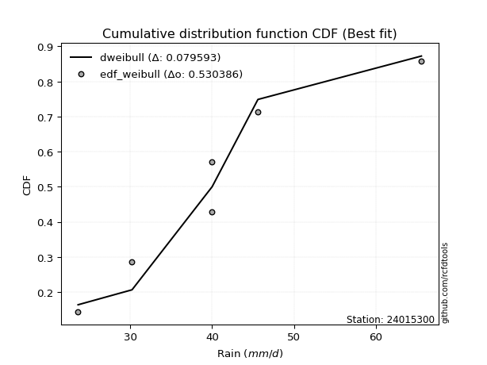</img>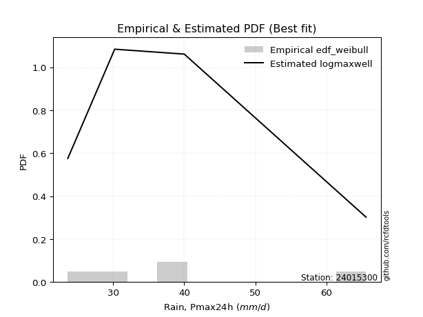</img>

</div>


### 4. EDF Beard (1943)

The Beard formula (or Beard´s plotting position formula) in hydrology is used to estimate the empirical non-exceedance probability _(P)_ of a flood event (or other extreme hydrological data point) within a given dataset.

<div align="center">


$P=(m-0.31)/(n+0.38)$


</div>


**4.1. Empirical values**

<div align="center">

|                | 0                   | 1                   | 2                  | 3                  | 4                  | 5                  |
|:---------------|:--------------------|:--------------------|:-------------------|:-------------------|:-------------------|:-------------------|
| date           | 2022                | 2021                | 2020               | 2019               | 2025               | 2024               |
| x              | 23.6                | 30.2                | 40.0               | 40.0               | 45.6               | 65.6               |
| m              | 1                   | 2                   | 3                  | 4                  | 5                  | 6                  |
| empirical_dist | edf_beard           | edf_beard           | edf_beard          | edf_beard          | edf_beard          | edf_beard          |
| empirical      | 0.10815047021943573 | 0.26489028213166144 | 0.4216300940438871 | 0.5783699059561128 | 0.7351097178683387 | 0.8918495297805643 |
| empirical_tr   | 1.1212653778558874  | 1.3603411513859276  | 1.7289972899728996 | 2.3717472118959106 | 3.7751479289940844 | 9.246376811594207  |

</div>


**4.2. Kolmogorov-Smirnov fit test (sorted by Δ)**


<div align="center">

|                | 0                   | 1                   | 2                   | 3                   | 4                   | 5                   | 6                   | 7                  | 8                   | 9                   | 10                 | 11                  | 12                  | 13                  | 14                  | 15                  | 16                 | 17                  | 18                  | 19                  | 20                  | 21                  | 22                  | 23                  | 24                  | 25                  | 26                | 27                  | 28                  | 29                  | 30                 | 31                  | 32                  | 33                  | 34                 | 35                  | 36                  | 37                 | 38                  | 39                 | 40                  | 41                 | 42                  | 43                  | 44                  | 45                  | 46                  | 47                  | 48                  | 49                  | 50                  | 51                  | 52                  | 53                 | 54                  | 55                  | 56                 | 57                  | 58                 | 59                  | 60                 | 61                  | 62                  | 63                  | 64                  | 65                  | 66                  | 67                  | 68                 | 69                  | 70                  | 71                  | 72                  | 73                 | 74                 | 75                 | 76                  | 77                | 78               | 79                 | 80                  | 81                  | 82                 | 83                  | 84                  | 85                  | 86                  | 87                  | 88                  | 89                  | 90                  | 91                  | 92                  | 93                  | 94                  | 95                 | 96                  | 97                  | 98                 | 99                  | 100                 | 101                 | 102                 | 103                 | 104                 | 105                 | 106                | 107                | 108                 | 109                 | 110                 | 111                | 112                 | 113                | 114                 | 115                | 116                | 117                | 118                 | 119                 | 120                | 121                 | 122                 | 123                 | 124                 | 125                 | 126                | 127                 | 128                 | 129                | 130                 | 131                 | 132                 | 133                 | 134                 | 135                | 136                | 137                | 138                 | 139                 | 140                 | 141                | 142                 | 143                | 144                | 145                 | 146                | 147                | 148                 | 149               | 150                | 151               | 152                | 153                | 154                | 155                | 156              | 157                | 158               | 159            |
|:---------------|:--------------------|:--------------------|:--------------------|:--------------------|:--------------------|:--------------------|:--------------------|:-------------------|:--------------------|:--------------------|:-------------------|:--------------------|:--------------------|:--------------------|:--------------------|:--------------------|:-------------------|:--------------------|:--------------------|:--------------------|:--------------------|:--------------------|:--------------------|:--------------------|:--------------------|:--------------------|:------------------|:--------------------|:--------------------|:--------------------|:-------------------|:--------------------|:--------------------|:--------------------|:-------------------|:--------------------|:--------------------|:-------------------|:--------------------|:-------------------|:--------------------|:-------------------|:--------------------|:--------------------|:--------------------|:--------------------|:--------------------|:--------------------|:--------------------|:--------------------|:--------------------|:--------------------|:--------------------|:-------------------|:--------------------|:--------------------|:-------------------|:--------------------|:-------------------|:--------------------|:-------------------|:--------------------|:--------------------|:--------------------|:--------------------|:--------------------|:--------------------|:--------------------|:-------------------|:--------------------|:--------------------|:--------------------|:--------------------|:-------------------|:-------------------|:-------------------|:--------------------|:------------------|:-----------------|:-------------------|:--------------------|:--------------------|:-------------------|:--------------------|:--------------------|:--------------------|:--------------------|:--------------------|:--------------------|:--------------------|:--------------------|:--------------------|:--------------------|:--------------------|:--------------------|:-------------------|:--------------------|:--------------------|:-------------------|:--------------------|:--------------------|:--------------------|:--------------------|:--------------------|:--------------------|:--------------------|:-------------------|:-------------------|:--------------------|:--------------------|:--------------------|:-------------------|:--------------------|:-------------------|:--------------------|:-------------------|:-------------------|:-------------------|:--------------------|:--------------------|:-------------------|:--------------------|:--------------------|:--------------------|:--------------------|:--------------------|:-------------------|:--------------------|:--------------------|:-------------------|:--------------------|:--------------------|:--------------------|:--------------------|:--------------------|:-------------------|:-------------------|:-------------------|:--------------------|:--------------------|:--------------------|:-------------------|:--------------------|:-------------------|:-------------------|:--------------------|:-------------------|:-------------------|:--------------------|:------------------|:-------------------|:------------------|:-------------------|:-------------------|:-------------------|:-------------------|:-----------------|:-------------------|:------------------|:---------------|
| station        | 24015300            | 24015300            | 24015300            | 24015300            | 24015300            | 24015300            | 24015300            | 24015300           | 24015300            | 24015300            | 24015300           | 24015300            | 24015300            | 24015300            | 24015300            | 24015300            | 24015300           | 24015300            | 24015300            | 24015300            | 24015300            | 24015300            | 24015300            | 24015300            | 24015300            | 24015300            | 24015300          | 24015300            | 24015300            | 24015300            | 24015300           | 24015300            | 24015300            | 24015300            | 24015300           | 24015300            | 24015300            | 24015300           | 24015300            | 24015300           | 24015300            | 24015300           | 24015300            | 24015300            | 24015300            | 24015300            | 24015300            | 24015300            | 24015300            | 24015300            | 24015300            | 24015300            | 24015300            | 24015300           | 24015300            | 24015300            | 24015300           | 24015300            | 24015300           | 24015300            | 24015300           | 24015300            | 24015300            | 24015300            | 24015300            | 24015300            | 24015300            | 24015300            | 24015300           | 24015300            | 24015300            | 24015300            | 24015300            | 24015300           | 24015300           | 24015300           | 24015300            | 24015300          | 24015300         | 24015300           | 24015300            | 24015300            | 24015300           | 24015300            | 24015300            | 24015300            | 24015300            | 24015300            | 24015300            | 24015300            | 24015300            | 24015300            | 24015300            | 24015300            | 24015300            | 24015300           | 24015300            | 24015300            | 24015300           | 24015300            | 24015300            | 24015300            | 24015300            | 24015300            | 24015300            | 24015300            | 24015300           | 24015300           | 24015300            | 24015300            | 24015300            | 24015300           | 24015300            | 24015300           | 24015300            | 24015300           | 24015300           | 24015300           | 24015300            | 24015300            | 24015300           | 24015300            | 24015300            | 24015300            | 24015300            | 24015300            | 24015300           | 24015300            | 24015300            | 24015300           | 24015300            | 24015300            | 24015300            | 24015300            | 24015300            | 24015300           | 24015300           | 24015300           | 24015300            | 24015300            | 24015300            | 24015300           | 24015300            | 24015300           | 24015300           | 24015300            | 24015300           | 24015300           | 24015300            | 24015300          | 24015300           | 24015300          | 24015300           | 24015300           | 24015300           | 24015300           | 24015300         | 24015300           | 24015300          | 24015300       |
| empirical_dist | edf_beard           | edf_beard           | edf_beard           | edf_beard           | edf_beard           | edf_beard           | edf_beard           | edf_beard          | edf_beard           | edf_beard           | edf_beard          | edf_beard           | edf_beard           | edf_beard           | edf_beard           | edf_beard           | edf_beard          | edf_beard           | edf_beard           | edf_beard           | edf_beard           | edf_beard           | edf_beard           | edf_beard           | edf_beard           | edf_beard           | edf_beard         | edf_beard           | edf_beard           | edf_beard           | edf_beard          | edf_beard           | edf_beard           | edf_beard           | edf_beard          | edf_beard           | edf_beard           | edf_beard          | edf_beard           | edf_beard          | edf_beard           | edf_beard          | edf_beard           | edf_beard           | edf_beard           | edf_beard           | edf_beard           | edf_beard           | edf_beard           | edf_beard           | edf_beard           | edf_beard           | edf_beard           | edf_beard          | edf_beard           | edf_beard           | edf_beard          | edf_beard           | edf_beard          | edf_beard           | edf_beard          | edf_beard           | edf_beard           | edf_beard           | edf_beard           | edf_beard           | edf_beard           | edf_beard           | edf_beard          | edf_beard           | edf_beard           | edf_beard           | edf_beard           | edf_beard          | edf_beard          | edf_beard          | edf_beard           | edf_beard         | edf_beard        | edf_beard          | edf_beard           | edf_beard           | edf_beard          | edf_beard           | edf_beard           | edf_beard           | edf_beard           | edf_beard           | edf_beard           | edf_beard           | edf_beard           | edf_beard           | edf_beard           | edf_beard           | edf_beard           | edf_beard          | edf_beard           | edf_beard           | edf_beard          | edf_beard           | edf_beard           | edf_beard           | edf_beard           | edf_beard           | edf_beard           | edf_beard           | edf_beard          | edf_beard          | edf_beard           | edf_beard           | edf_beard           | edf_beard          | edf_beard           | edf_beard          | edf_beard           | edf_beard          | edf_beard          | edf_beard          | edf_beard           | edf_beard           | edf_beard          | edf_beard           | edf_beard           | edf_beard           | edf_beard           | edf_beard           | edf_beard          | edf_beard           | edf_beard           | edf_beard          | edf_beard           | edf_beard           | edf_beard           | edf_beard           | edf_beard           | edf_beard          | edf_beard          | edf_beard          | edf_beard           | edf_beard           | edf_beard           | edf_beard          | edf_beard           | edf_beard          | edf_beard          | edf_beard           | edf_beard          | edf_beard          | edf_beard           | edf_beard         | edf_beard          | edf_beard         | edf_beard          | edf_beard          | edf_beard          | edf_beard          | edf_beard        | edf_beard          | edf_beard         | edf_beard      |
| p_dist         | dweibull            | logdweibull         | rice                | maxwell             | pearson3            | rayleigh            | foldnorm            | t                  | norm                | crystalball         | truncnorm          | logksone            | logistic            | ncf                 | truncexpon          | logvonmises_line    | gompertz           | logkappa3           | logtukeylambda      | logkappa4           | loghalfgennorm      | loguniform          | loggumbel_l         | logsemicircular     | logloglaplace       | logcosine           | hypsecant         | loggenextreme       | logweibull_max      | loganglit           | logncf             | anglit              | logloggamma         | logt                | lognorm            | logcrystalball      | logexponnorm        | logburr            | logskewnorm         | logbradford        | logarcsine          | kstwobign          | logtruncpareto      | logpearson3         | loggamma            | loggamma            | logerlang           | semicircular        | laplace             | loglogistic         | logjohnsonsu        | alpha               | gumbel_r            | logf               | logfatiguelife      | logbetaprime        | nct                | betaprime           | lomax              | genlogistic         | loghypsecant       | loggenlogistic      | exponnorm           | bradford            | invgamma            | skewnorm            | logargus            | loggausshyper       | halfnorm           | logfoldnorm         | loginvgamma         | johnsonsu           | truncpareto         | lognct             | logrice            | logalpha           | invgauss            | cosine            | logweibull_min   | loggompertz        | loglaplace          | loglaplace          | loginvgauss        | burr                | logmaxwell          | moyal               | logburr12           | dgamma              | arcsine             | halflogistic        | lograyleigh         | loggennorm          | genpareto           | gennorm             | truncweibull_min    | vonmises_line      | weibull_min         | gumbel_l            | loginvweibull      | logkstwobign        | logwrapcauchy       | logtruncweibull_min | loghalfnorm         | loggumbel_r         | gausshyper          | kappa4              | loggenexpon        | logtriang          | logtruncexpon       | uniform             | logmoyal            | wrapcauchy         | loghalflogistic     | ksone              | logdgamma           | wald               | beta               | loglomax           | halfgennorm         | burr12              | argus              | loglevy_l           | f                   | logjohnsonsb        | nakagami            | genextreme          | logexponweib       | levy_l              | exponpow            | logwald            | loggenhalflogistic  | logexponpow         | kappa3              | triang              | johnsonsb           | logmielke          | loggengamma        | tukeylambda        | gamma               | logtrapezoid        | logbeta             | genhalflogistic    | rdist               | lognakagami        | gengamma           | invweibull          | trapezoid          | loggenpareto       | fatiguelife         | erlang            | powerlaw           | exponweib         | logpowerlaw        | genexpon           | logtruncnorm       | logrdist           | weibull_max      | logvonmises        | vonmises          | mielke         |
| delta          | 0.07836999453112797 | 0.07845819758247802 | 0.08339532718303949 | 0.08710080375649581 | 0.09633471735774096 | 0.09860902540393829 | 0.10212383109404527 | 0.1034984488646094 | 0.10351356894845992 | 0.10351357505328906 | 0.1035135788599767 | 0.10589194062747759 | 0.10693675513234852 | 0.10760949301735873 | 0.10815043994878404 | 0.10815046934377276 | 0.1081504702070147 | 0.10815047021873192 | 0.10815047021942863 | 0.10815047021943489 | 0.10815047021943573 | 0.10815047021943573 | 0.10857732294943145 | 0.10870579448374124 | 0.10928680991426426 | 0.10978001730295145 | 0.109852252837211 | 0.10992563286503582 | 0.10994225489448012 | 0.11093695982077384 | 0.1110773166274463 | 0.11304069743135625 | 0.11484492813442987 | 0.11632922985929212 | 0.1163471724009007 | 0.11634740276594052 | 0.11639872968870019 | 0.1170519318795627 | 0.11738665670376885 | 0.1181809782279149 | 0.11887107379762984 | 0.1190418888874582 | 0.11939109565615275 | 0.11986179496994437 | 0.12053301429157398 | 0.12053301429157398 | 0.12061974548492055 | 0.12090621220739128 | 0.12103450414371725 | 0.12149400728018106 | 0.12150411966826485 | 0.12225241688702598 | 0.12239400316382426 | 0.1225056995796659 | 0.12340006110658025 | 0.12361175705522703 | 0.1244105326404849 | 0.12465328957054606 | 0.1248020782113698 | 0.12529677492360664 | 0.1258622755892927 | 0.12595486528912353 | 0.12659844365938439 | 0.12664888498158355 | 0.12788764778098866 | 0.12821258994187906 | 0.12930030232146772 | 0.12985184156460855 | 0.1310356754627619 | 0.13194876905546665 | 0.13301138091133174 | 0.13439332975959756 | 0.13479222508734096 | 0.1361163356167669 | 0.1365513471555741 | 0.1370056064691238 | 0.13744553515767893 | 0.138905698797129 | 0.13951648650496 | 0.1407077858013343 | 0.14143762693745482 | 0.14143762693745482 | 0.1447433842793599 | 0.14524223903323424 | 0.14749444378588633 | 0.14821086923743482 | 0.14892020882339668 | 0.14996135752538836 | 0.15300580432309274 | 0.15424132530078333 | 0.15758393610774662 | 0.16488574181080956 | 0.16584206603960544 | 0.16613709859978953 | 0.16873294775381303 | 0.1702563779104822 | 0.17229362080180316 | 0.17418033810821387 | 0.1764283592070483 | 0.18107775776353202 | 0.18387663122071907 | 0.18501338377427562 | 0.18601659088804706 | 0.18682192899727762 | 0.18707410512912237 | 0.18858265018033482 | 0.1998425205965561 | 0.2013765073638243 | 0.20770324296838777 | 0.21130019405881473 | 0.21201649938038986 | 0.2122263575411062 | 0.21286414454560526 | 0.2152684480270688 | 0.21911644662553273 | 0.2200741523325806 | 0.2259164594226019 | 0.2341490409021431 | 0.23415102064825838 | 0.23556637827643317 | 0.2356055176552987 | 0.24506606041446083 | 0.24717525156867598 | 0.25571853761309826 | 0.26488456261060933 | 0.27430837922955975 | 0.2744494870558391 | 0.27646529650240376 | 0.28178930697875487 | 0.2819393842720252 | 0.28581731902638646 | 0.28753400797694056 | 0.29021398053646935 | 0.30196149451673865 | 0.30255275588643227 | 0.3119069722559817 | 0.3123943796627712 | 0.3168479475027481 | 0.34009216156163685 | 0.35042550032771497 | 0.35659067810782213 | 0.3670672557977526 | 0.42180261072541697 | 0.4278413440615109 | 0.4363592345754661 | 0.45768665318388374 | 0.4648747720381547 | 0.4780013714042117 | 0.47831383327723065 | 0.483678556121032 | 0.4997965969484649 | 0.507039514313356 | 0.5365892985526959 | 0.5579802085013146 | 0.5783686337967169 | 0.5783699022299058 | 0.61733003705222 | 1.1171046859342442 | 9.629126550246252 | nan            |
| deltao         | 0.530385761606      | 0.530385761606      | 0.530385761606      | 0.530385761606      | 0.530385761606      | 0.530385761606      | 0.530385761606      | 0.530385761606     | 0.530385761606      | 0.530385761606      | 0.530385761606     | 0.530385761606      | 0.530385761606      | 0.530385761606      | 0.530385761606      | 0.530385761606      | 0.530385761606     | 0.530385761606      | 0.530385761606      | 0.530385761606      | 0.530385761606      | 0.530385761606      | 0.530385761606      | 0.530385761606      | 0.530385761606      | 0.530385761606      | 0.530385761606    | 0.530385761606      | 0.530385761606      | 0.530385761606      | 0.530385761606     | 0.530385761606      | 0.530385761606      | 0.530385761606      | 0.530385761606     | 0.530385761606      | 0.530385761606      | 0.530385761606     | 0.530385761606      | 0.530385761606     | 0.530385761606      | 0.530385761606     | 0.530385761606      | 0.530385761606      | 0.530385761606      | 0.530385761606      | 0.530385761606      | 0.530385761606      | 0.530385761606      | 0.530385761606      | 0.530385761606      | 0.530385761606      | 0.530385761606      | 0.530385761606     | 0.530385761606      | 0.530385761606      | 0.530385761606     | 0.530385761606      | 0.530385761606     | 0.530385761606      | 0.530385761606     | 0.530385761606      | 0.530385761606      | 0.530385761606      | 0.530385761606      | 0.530385761606      | 0.530385761606      | 0.530385761606      | 0.530385761606     | 0.530385761606      | 0.530385761606      | 0.530385761606      | 0.530385761606      | 0.530385761606     | 0.530385761606     | 0.530385761606     | 0.530385761606      | 0.530385761606    | 0.530385761606   | 0.530385761606     | 0.530385761606      | 0.530385761606      | 0.530385761606     | 0.530385761606      | 0.530385761606      | 0.530385761606      | 0.530385761606      | 0.530385761606      | 0.530385761606      | 0.530385761606      | 0.530385761606      | 0.530385761606      | 0.530385761606      | 0.530385761606      | 0.530385761606      | 0.530385761606     | 0.530385761606      | 0.530385761606      | 0.530385761606     | 0.530385761606      | 0.530385761606      | 0.530385761606      | 0.530385761606      | 0.530385761606      | 0.530385761606      | 0.530385761606      | 0.530385761606     | 0.530385761606     | 0.530385761606      | 0.530385761606      | 0.530385761606      | 0.530385761606     | 0.530385761606      | 0.530385761606     | 0.530385761606      | 0.530385761606     | 0.530385761606     | 0.530385761606     | 0.530385761606      | 0.530385761606      | 0.530385761606     | 0.530385761606      | 0.530385761606      | 0.530385761606      | 0.530385761606      | 0.530385761606      | 0.530385761606     | 0.530385761606      | 0.530385761606      | 0.530385761606     | 0.530385761606      | 0.530385761606      | 0.530385761606      | 0.530385761606      | 0.530385761606      | 0.530385761606     | 0.530385761606     | 0.530385761606     | 0.530385761606      | 0.530385761606      | 0.530385761606      | 0.530385761606     | 0.530385761606      | 0.530385761606     | 0.530385761606     | 0.530385761606      | 0.530385761606     | 0.530385761606     | 0.530385761606      | 0.530385761606    | 0.530385761606     | 0.530385761606    | 0.530385761606     | 0.530385761606     | 0.530385761606     | 0.530385761606     | 0.530385761606   | 0.530385761606     | 0.530385761606    | 0.530385761606 |
| eval           | Δo > Δ              | Δo > Δ              | Δo > Δ              | Δo > Δ              | Δo > Δ              | Δo > Δ              | Δo > Δ              | Δo > Δ             | Δo > Δ              | Δo > Δ              | Δo > Δ             | Δo > Δ              | Δo > Δ              | Δo > Δ              | Δo > Δ              | Δo > Δ              | Δo > Δ             | Δo > Δ              | Δo > Δ              | Δo > Δ              | Δo > Δ              | Δo > Δ              | Δo > Δ              | Δo > Δ              | Δo > Δ              | Δo > Δ              | Δo > Δ            | Δo > Δ              | Δo > Δ              | Δo > Δ              | Δo > Δ             | Δo > Δ              | Δo > Δ              | Δo > Δ              | Δo > Δ             | Δo > Δ              | Δo > Δ              | Δo > Δ             | Δo > Δ              | Δo > Δ             | Δo > Δ              | Δo > Δ             | Δo > Δ              | Δo > Δ              | Δo > Δ              | Δo > Δ              | Δo > Δ              | Δo > Δ              | Δo > Δ              | Δo > Δ              | Δo > Δ              | Δo > Δ              | Δo > Δ              | Δo > Δ             | Δo > Δ              | Δo > Δ              | Δo > Δ             | Δo > Δ              | Δo > Δ             | Δo > Δ              | Δo > Δ             | Δo > Δ              | Δo > Δ              | Δo > Δ              | Δo > Δ              | Δo > Δ              | Δo > Δ              | Δo > Δ              | Δo > Δ             | Δo > Δ              | Δo > Δ              | Δo > Δ              | Δo > Δ              | Δo > Δ             | Δo > Δ             | Δo > Δ             | Δo > Δ              | Δo > Δ            | Δo > Δ           | Δo > Δ             | Δo > Δ              | Δo > Δ              | Δo > Δ             | Δo > Δ              | Δo > Δ              | Δo > Δ              | Δo > Δ              | Δo > Δ              | Δo > Δ              | Δo > Δ              | Δo > Δ              | Δo > Δ              | Δo > Δ              | Δo > Δ              | Δo > Δ              | Δo > Δ             | Δo > Δ              | Δo > Δ              | Δo > Δ             | Δo > Δ              | Δo > Δ              | Δo > Δ              | Δo > Δ              | Δo > Δ              | Δo > Δ              | Δo > Δ              | Δo > Δ             | Δo > Δ             | Δo > Δ              | Δo > Δ              | Δo > Δ              | Δo > Δ             | Δo > Δ              | Δo > Δ             | Δo > Δ              | Δo > Δ             | Δo > Δ             | Δo > Δ             | Δo > Δ              | Δo > Δ              | Δo > Δ             | Δo > Δ              | Δo > Δ              | Δo > Δ              | Δo > Δ              | Δo > Δ              | Δo > Δ             | Δo > Δ              | Δo > Δ              | Δo > Δ             | Δo > Δ              | Δo > Δ              | Δo > Δ              | Δo > Δ              | Δo > Δ              | Δo > Δ             | Δo > Δ             | Δo > Δ             | Δo > Δ              | Δo > Δ              | Δo > Δ              | Δo > Δ             | Δo > Δ              | Δo > Δ             | Δo > Δ             | Δo > Δ              | Δo > Δ             | Δo > Δ             | Δo > Δ              | Δo > Δ            | Δo > Δ             | Δo > Δ            | Δo <= Δ            | Δo <= Δ            | Δo <= Δ            | Δo <= Δ            | Δo <= Δ          | Δo <= Δ            | Δo <= Δ           | Δo <= Δ        |
| fit            | 1                   | 1                   | 1                   | 1                   | 1                   | 1                   | 1                   | 1                  | 1                   | 1                   | 1                  | 1                   | 1                   | 1                   | 1                   | 1                   | 1                  | 1                   | 1                   | 1                   | 1                   | 1                   | 1                   | 1                   | 1                   | 1                   | 1                 | 1                   | 1                   | 1                   | 1                  | 1                   | 1                   | 1                   | 1                  | 1                   | 1                   | 1                  | 1                   | 1                  | 1                   | 1                  | 1                   | 1                   | 1                   | 1                   | 1                   | 1                   | 1                   | 1                   | 1                   | 1                   | 1                   | 1                  | 1                   | 1                   | 1                  | 1                   | 1                  | 1                   | 1                  | 1                   | 1                   | 1                   | 1                   | 1                   | 1                   | 1                   | 1                  | 1                   | 1                   | 1                   | 1                   | 1                  | 1                  | 1                  | 1                   | 1                 | 1                | 1                  | 1                   | 1                   | 1                  | 1                   | 1                   | 1                   | 1                   | 1                   | 1                   | 1                   | 1                   | 1                   | 1                   | 1                   | 1                   | 1                  | 1                   | 1                   | 1                  | 1                   | 1                   | 1                   | 1                   | 1                   | 1                   | 1                   | 1                  | 1                  | 1                   | 1                   | 1                   | 1                  | 1                   | 1                  | 1                   | 1                  | 1                  | 1                  | 1                   | 1                   | 1                  | 1                   | 1                   | 1                   | 1                   | 1                   | 1                  | 1                   | 1                   | 1                  | 1                   | 1                   | 1                   | 1                   | 1                   | 1                  | 1                  | 1                  | 1                   | 1                   | 1                   | 1                  | 1                   | 1                  | 1                  | 1                   | 1                  | 1                  | 1                   | 1                 | 1                  | 1                 | 0                  | 0                  | 0                  | 0                  | 0                | 0                  | 0                 | 0              |
| n              | 6                   | 6                   | 6                   | 6                   | 6                   | 6                   | 6                   | 6                  | 6                   | 6                   | 6                  | 6                   | 6                   | 6                   | 6                   | 6                   | 6                  | 6                   | 6                   | 6                   | 6                   | 6                   | 6                   | 6                   | 6                   | 6                   | 6                 | 6                   | 6                   | 6                   | 6                  | 6                   | 6                   | 6                   | 6                  | 6                   | 6                   | 6                  | 6                   | 6                  | 6                   | 6                  | 6                   | 6                   | 6                   | 6                   | 6                   | 6                   | 6                   | 6                   | 6                   | 6                   | 6                   | 6                  | 6                   | 6                   | 6                  | 6                   | 6                  | 6                   | 6                  | 6                   | 6                   | 6                   | 6                   | 6                   | 6                   | 6                   | 6                  | 6                   | 6                   | 6                   | 6                   | 6                  | 6                  | 6                  | 6                   | 6                 | 6                | 6                  | 6                   | 6                   | 6                  | 6                   | 6                   | 6                   | 6                   | 6                   | 6                   | 6                   | 6                   | 6                   | 6                   | 6                   | 6                   | 6                  | 6                   | 6                   | 6                  | 6                   | 6                   | 6                   | 6                   | 6                   | 6                   | 6                   | 6                  | 6                  | 6                   | 6                   | 6                   | 6                  | 6                   | 6                  | 6                   | 6                  | 6                  | 6                  | 6                   | 6                   | 6                  | 6                   | 6                   | 6                   | 6                   | 6                   | 6                  | 6                   | 6                   | 6                  | 6                   | 6                   | 6                   | 6                   | 6                   | 6                  | 6                  | 6                  | 6                   | 6                   | 6                   | 6                  | 6                   | 6                  | 6                  | 6                   | 6                  | 6                  | 6                   | 6                 | 6                  | 6                 | 6                  | 6                  | 6                  | 6                  | 6                | 6                  | 6                 | 6              |
| best_fit       | 1                   | 0                   | 0                   | 0                   | 0                   | 0                   | 0                   | 0                  | 0                   | 0                   | 0                  | 0                   | 0                   | 0                   | 0                   | 0                   | 0                  | 0                   | 0                   | 0                   | 0                   | 0                   | 0                   | 0                   | 0                   | 0                   | 0                 | 0                   | 0                   | 0                   | 0                  | 0                   | 0                   | 0                   | 0                  | 0                   | 0                   | 0                  | 0                   | 0                  | 0                   | 0                  | 0                   | 0                   | 0                   | 0                   | 0                   | 0                   | 0                   | 0                   | 0                   | 0                   | 0                   | 0                  | 0                   | 0                   | 0                  | 0                   | 0                  | 0                   | 0                  | 0                   | 0                   | 0                   | 0                   | 0                   | 0                   | 0                   | 0                  | 0                   | 0                   | 0                   | 0                   | 0                  | 0                  | 0                  | 0                   | 0                 | 0                | 0                  | 0                   | 0                   | 0                  | 0                   | 0                   | 0                   | 0                   | 0                   | 0                   | 0                   | 0                   | 0                   | 0                   | 0                   | 0                   | 0                  | 0                   | 0                   | 0                  | 0                   | 0                   | 0                   | 0                   | 0                   | 0                   | 0                   | 0                  | 0                  | 0                   | 0                   | 0                   | 0                  | 0                   | 0                  | 0                   | 0                  | 0                  | 0                  | 0                   | 0                   | 0                  | 0                   | 0                   | 0                   | 0                   | 0                   | 0                  | 0                   | 0                   | 0                  | 0                   | 0                   | 0                   | 0                   | 0                   | 0                  | 0                  | 0                  | 0                   | 0                   | 0                   | 0                  | 0                   | 0                  | 0                  | 0                   | 0                  | 0                  | 0                   | 0                 | 0                  | 0                 | 0                  | 0                  | 0                  | 0                  | 0                | 0                  | 0                 | 0              |
| best_fit_sort  | 1                   | 2                   | 3                   | 4                   | 5                   | 6                   | 7                   | 8                  | 9                   | 10                  | 11                 | 12                  | 13                  | 14                  | 15                  | 16                  | 17                 | 18                  | 19                  | 20                  | 21                  | 22                  | 23                  | 24                  | 25                  | 26                  | 27                | 28                  | 29                  | 30                  | 31                 | 32                  | 33                  | 34                  | 35                 | 36                  | 37                  | 38                 | 39                  | 40                 | 41                  | 42                 | 43                  | 44                  | 45                  | 46                  | 47                  | 48                  | 49                  | 50                  | 51                  | 52                  | 53                  | 54                 | 55                  | 56                  | 57                 | 58                  | 59                 | 60                  | 61                 | 62                  | 63                  | 64                  | 65                  | 66                  | 67                  | 68                  | 69                 | 70                  | 71                  | 72                  | 73                  | 74                 | 75                 | 76                 | 77                  | 78                | 79               | 80                 | 81                  | 82                  | 83                 | 84                  | 85                  | 86                  | 87                  | 88                  | 89                  | 90                  | 91                  | 92                  | 93                  | 94                  | 95                  | 96                 | 97                  | 98                  | 99                 | 100                 | 101                 | 102                 | 103                 | 104                 | 105                 | 106                 | 107                | 108                | 109                 | 110                 | 111                 | 112                | 113                 | 114                | 115                 | 116                | 117                | 118                | 119                 | 120                 | 121                | 122                 | 123                 | 124                 | 125                 | 126                 | 127                | 128                 | 129                 | 130                | 131                 | 132                 | 133                 | 134                 | 135                 | 136                | 137                | 138                | 139                 | 140                 | 141                 | 142                | 143                 | 144                | 145                | 146                 | 147                | 148                | 149                 | 150               | 151                | 152               | 153                | 154                | 155                | 156                | 157              | 158                | 159               | 160            |

</div>


**4.3. Best fit**

<div align="center">

|   id |   station | empirical_dist   | p_dist   |   delta |   deltao | eval   |   fit |   n |   best_fit |   best_fit_sort |
|-----:|----------:|:-----------------|:---------|--------:|---------:|:-------|------:|----:|-----------:|----------------:|
|    0 |  24015300 | edf_beard        | dweibull | 0.07837 | 0.530386 | Δo > Δ |     1 |   6 |          1 |               1 |

</div>


<div align="center">

</img></img>

</div>


### 5. EDF Chegodayev (1955)

The Chegodayev formula is an empirical plotting position formula used in hydrological frequency analysis to estimate the exceedance probability or return period of a specific event from a set of observed data. It is primarily used for plotting observed data points on probability paper to fit a theoretical distribution, particularly for analyzing extreme events like maximum flood flows or rainfall intensities. The constant _b_ value in the generalized plotting position formula is 0.3.

<div align="center">


$P=(m-b)/(n+1-2b)$


</div>


**5.1. Empirical values**

<div align="center">

|                | 0                   | 1                  | 2                  | 3                  | 4                 | 5                 |
|:---------------|:--------------------|:-------------------|:-------------------|:-------------------|:------------------|:------------------|
| date           | 2022                | 2021               | 2020               | 2019               | 2025              | 2024              |
| x              | 23.6                | 30.2               | 40.0               | 40.0               | 45.6              | 65.6              |
| m              | 1                   | 2                  | 3                  | 4                  | 5                 | 6                 |
| empirical_dist | edf_chegodayev      | edf_chegodayev     | edf_chegodayev     | edf_chegodayev     | edf_chegodayev    | edf_chegodayev    |
| empirical      | 0.10937499999999999 | 0.265625           | 0.421875           | 0.578125           | 0.734375          | 0.890625          |
| empirical_tr   | 1.1228070175438596  | 1.3617021276595744 | 1.7297297297297298 | 2.3703703703703702 | 3.764705882352941 | 9.142857142857142 |

</div>


**5.2. Kolmogorov-Smirnov fit test (sorted by Δ)**


<div align="center">

|                | 0                   | 1                  | 2                   | 3                   | 4                   | 5                   | 6                  | 7                   | 8                  | 9                   | 10                  | 11                  | 12                 | 13                  | 14                  | 15                  | 16                  | 17                  | 18                  | 19                  | 20                  | 21                  | 22                  | 23             | 24                  | 25                  | 26                  | 27                  | 28                  | 29                  | 30                  | 31                  | 32                | 33                  | 34                  | 35                  | 36                  | 37                  | 38                  | 39                  | 40                  | 41                  | 42                  | 43                 | 44                  | 45                  | 46                  | 47                  | 48                  | 49                  | 50                  | 51                  | 52                  | 53                  | 54                  | 55                  | 56                  | 57                  | 58                  | 59                  | 60                  | 61                  | 62                  | 63                 | 64                  | 65                 | 66                  | 67                  | 68                  | 69                  | 70                  | 71                  | 72                  | 73                  | 74                  | 75                  | 76                  | 77                  | 78                  | 79                  | 80                  | 81                  | 82                  | 83                  | 84                  | 85                  | 86                 | 87                  | 88                  | 89                  | 90                  | 91                 | 92                  | 93                 | 94                  | 95                  | 96                 | 97                  | 98                  | 99                  | 100                | 101                 | 102                | 103                | 104                 | 105                 | 106                 | 107                | 108                | 109                 | 110                 | 111                 | 112                | 113                 | 114                 | 115                | 116                 | 117                 | 118                | 119                 | 120                | 121                 | 122                | 123                | 124                | 125                 | 126                 | 127                | 128               | 129                | 130                | 131                | 132                | 133             | 134                | 135                | 136                 | 137                | 138               | 139                | 140                 | 141                 | 142                | 143                 | 144                 | 145                 | 146               | 147                | 148                | 149                | 150                 | 151                | 152                | 153                | 154                | 155               | 156                | 157                | 158               | 159            |
|:---------------|:--------------------|:-------------------|:--------------------|:--------------------|:--------------------|:--------------------|:-------------------|:--------------------|:-------------------|:--------------------|:--------------------|:--------------------|:-------------------|:--------------------|:--------------------|:--------------------|:--------------------|:--------------------|:--------------------|:--------------------|:--------------------|:--------------------|:--------------------|:---------------|:--------------------|:--------------------|:--------------------|:--------------------|:--------------------|:--------------------|:--------------------|:--------------------|:------------------|:--------------------|:--------------------|:--------------------|:--------------------|:--------------------|:--------------------|:--------------------|:--------------------|:--------------------|:--------------------|:-------------------|:--------------------|:--------------------|:--------------------|:--------------------|:--------------------|:--------------------|:--------------------|:--------------------|:--------------------|:--------------------|:--------------------|:--------------------|:--------------------|:--------------------|:--------------------|:--------------------|:--------------------|:--------------------|:--------------------|:-------------------|:--------------------|:-------------------|:--------------------|:--------------------|:--------------------|:--------------------|:--------------------|:--------------------|:--------------------|:--------------------|:--------------------|:--------------------|:--------------------|:--------------------|:--------------------|:--------------------|:--------------------|:--------------------|:--------------------|:--------------------|:--------------------|:--------------------|:-------------------|:--------------------|:--------------------|:--------------------|:--------------------|:-------------------|:--------------------|:-------------------|:--------------------|:--------------------|:-------------------|:--------------------|:--------------------|:--------------------|:-------------------|:--------------------|:-------------------|:-------------------|:--------------------|:--------------------|:--------------------|:-------------------|:-------------------|:--------------------|:--------------------|:--------------------|:-------------------|:--------------------|:--------------------|:-------------------|:--------------------|:--------------------|:-------------------|:--------------------|:-------------------|:--------------------|:-------------------|:-------------------|:-------------------|:--------------------|:--------------------|:-------------------|:------------------|:-------------------|:-------------------|:-------------------|:-------------------|:----------------|:-------------------|:-------------------|:--------------------|:-------------------|:------------------|:-------------------|:--------------------|:--------------------|:-------------------|:--------------------|:--------------------|:--------------------|:------------------|:-------------------|:-------------------|:-------------------|:--------------------|:-------------------|:-------------------|:-------------------|:-------------------|:------------------|:-------------------|:-------------------|:------------------|:---------------|
| station        | 24015300            | 24015300           | 24015300            | 24015300            | 24015300            | 24015300            | 24015300           | 24015300            | 24015300           | 24015300            | 24015300            | 24015300            | 24015300           | 24015300            | 24015300            | 24015300            | 24015300            | 24015300            | 24015300            | 24015300            | 24015300            | 24015300            | 24015300            | 24015300       | 24015300            | 24015300            | 24015300            | 24015300            | 24015300            | 24015300            | 24015300            | 24015300            | 24015300          | 24015300            | 24015300            | 24015300            | 24015300            | 24015300            | 24015300            | 24015300            | 24015300            | 24015300            | 24015300            | 24015300           | 24015300            | 24015300            | 24015300            | 24015300            | 24015300            | 24015300            | 24015300            | 24015300            | 24015300            | 24015300            | 24015300            | 24015300            | 24015300            | 24015300            | 24015300            | 24015300            | 24015300            | 24015300            | 24015300            | 24015300           | 24015300            | 24015300           | 24015300            | 24015300            | 24015300            | 24015300            | 24015300            | 24015300            | 24015300            | 24015300            | 24015300            | 24015300            | 24015300            | 24015300            | 24015300            | 24015300            | 24015300            | 24015300            | 24015300            | 24015300            | 24015300            | 24015300            | 24015300           | 24015300            | 24015300            | 24015300            | 24015300            | 24015300           | 24015300            | 24015300           | 24015300            | 24015300            | 24015300           | 24015300            | 24015300            | 24015300            | 24015300           | 24015300            | 24015300           | 24015300           | 24015300            | 24015300            | 24015300            | 24015300           | 24015300           | 24015300            | 24015300            | 24015300            | 24015300           | 24015300            | 24015300            | 24015300           | 24015300            | 24015300            | 24015300           | 24015300            | 24015300           | 24015300            | 24015300           | 24015300           | 24015300           | 24015300            | 24015300            | 24015300           | 24015300          | 24015300           | 24015300           | 24015300           | 24015300           | 24015300        | 24015300           | 24015300           | 24015300            | 24015300           | 24015300          | 24015300           | 24015300            | 24015300            | 24015300           | 24015300            | 24015300            | 24015300            | 24015300          | 24015300           | 24015300           | 24015300           | 24015300            | 24015300           | 24015300           | 24015300           | 24015300           | 24015300          | 24015300           | 24015300           | 24015300          | 24015300       |
| empirical_dist | edf_chegodayev      | edf_chegodayev     | edf_chegodayev      | edf_chegodayev      | edf_chegodayev      | edf_chegodayev      | edf_chegodayev     | edf_chegodayev      | edf_chegodayev     | edf_chegodayev      | edf_chegodayev      | edf_chegodayev      | edf_chegodayev     | edf_chegodayev      | edf_chegodayev      | edf_chegodayev      | edf_chegodayev      | edf_chegodayev      | edf_chegodayev      | edf_chegodayev      | edf_chegodayev      | edf_chegodayev      | edf_chegodayev      | edf_chegodayev | edf_chegodayev      | edf_chegodayev      | edf_chegodayev      | edf_chegodayev      | edf_chegodayev      | edf_chegodayev      | edf_chegodayev      | edf_chegodayev      | edf_chegodayev    | edf_chegodayev      | edf_chegodayev      | edf_chegodayev      | edf_chegodayev      | edf_chegodayev      | edf_chegodayev      | edf_chegodayev      | edf_chegodayev      | edf_chegodayev      | edf_chegodayev      | edf_chegodayev     | edf_chegodayev      | edf_chegodayev      | edf_chegodayev      | edf_chegodayev      | edf_chegodayev      | edf_chegodayev      | edf_chegodayev      | edf_chegodayev      | edf_chegodayev      | edf_chegodayev      | edf_chegodayev      | edf_chegodayev      | edf_chegodayev      | edf_chegodayev      | edf_chegodayev      | edf_chegodayev      | edf_chegodayev      | edf_chegodayev      | edf_chegodayev      | edf_chegodayev     | edf_chegodayev      | edf_chegodayev     | edf_chegodayev      | edf_chegodayev      | edf_chegodayev      | edf_chegodayev      | edf_chegodayev      | edf_chegodayev      | edf_chegodayev      | edf_chegodayev      | edf_chegodayev      | edf_chegodayev      | edf_chegodayev      | edf_chegodayev      | edf_chegodayev      | edf_chegodayev      | edf_chegodayev      | edf_chegodayev      | edf_chegodayev      | edf_chegodayev      | edf_chegodayev      | edf_chegodayev      | edf_chegodayev     | edf_chegodayev      | edf_chegodayev      | edf_chegodayev      | edf_chegodayev      | edf_chegodayev     | edf_chegodayev      | edf_chegodayev     | edf_chegodayev      | edf_chegodayev      | edf_chegodayev     | edf_chegodayev      | edf_chegodayev      | edf_chegodayev      | edf_chegodayev     | edf_chegodayev      | edf_chegodayev     | edf_chegodayev     | edf_chegodayev      | edf_chegodayev      | edf_chegodayev      | edf_chegodayev     | edf_chegodayev     | edf_chegodayev      | edf_chegodayev      | edf_chegodayev      | edf_chegodayev     | edf_chegodayev      | edf_chegodayev      | edf_chegodayev     | edf_chegodayev      | edf_chegodayev      | edf_chegodayev     | edf_chegodayev      | edf_chegodayev     | edf_chegodayev      | edf_chegodayev     | edf_chegodayev     | edf_chegodayev     | edf_chegodayev      | edf_chegodayev      | edf_chegodayev     | edf_chegodayev    | edf_chegodayev     | edf_chegodayev     | edf_chegodayev     | edf_chegodayev     | edf_chegodayev  | edf_chegodayev     | edf_chegodayev     | edf_chegodayev      | edf_chegodayev     | edf_chegodayev    | edf_chegodayev     | edf_chegodayev      | edf_chegodayev      | edf_chegodayev     | edf_chegodayev      | edf_chegodayev      | edf_chegodayev      | edf_chegodayev    | edf_chegodayev     | edf_chegodayev     | edf_chegodayev     | edf_chegodayev      | edf_chegodayev     | edf_chegodayev     | edf_chegodayev     | edf_chegodayev     | edf_chegodayev    | edf_chegodayev     | edf_chegodayev     | edf_chegodayev    | edf_chegodayev |
| p_dist         | dweibull            | logdweibull        | rice                | maxwell             | pearson3            | rayleigh            | foldnorm           | t                   | norm               | crystalball         | truncnorm           | logksone            | logistic           | ncf                 | loggumbel_l         | logsemicircular     | truncexpon          | logvonmises_line    | gompertz            | logkappa3           | logtukeylambda      | logkappa4           | loghalfgennorm      | loguniform     | logcosine           | hypsecant           | loggenextreme       | logweibull_max      | logloglaplace       | loganglit           | logncf              | anglit              | logloggamma       | logt                | lognorm             | logcrystalball      | logexponnorm        | logburr             | logskewnorm         | logbradford         | logarcsine          | kstwobign           | logtruncpareto      | logpearson3        | semicircular        | loggamma            | loggamma            | logerlang           | laplace             | loglogistic         | logjohnsonsu        | alpha               | gumbel_r            | logf                | logfatiguelife      | logbetaprime        | lomax               | nct                 | betaprime           | genlogistic         | loghypsecant        | loggenlogistic      | bradford            | exponnorm          | invgamma            | skewnorm           | logargus            | loggausshyper       | halfnorm            | logfoldnorm         | loginvgamma         | johnsonsu           | truncpareto         | lognct              | logrice             | logalpha            | invgauss            | cosine              | logweibull_min      | loggompertz         | loglaplace          | loglaplace          | loginvgauss         | burr                | logmaxwell          | moyal               | logburr12          | dgamma              | arcsine             | halflogistic        | lograyleigh         | genpareto          | loggennorm          | gennorm            | truncweibull_min    | vonmises_line       | weibull_min        | gumbel_l            | loginvweibull       | logkstwobign        | logwrapcauchy      | logtruncweibull_min | loghalfnorm        | gausshyper         | loggumbel_r         | kappa4              | loggenexpon         | logtriang          | logtruncexpon      | uniform             | wrapcauchy          | logmoyal            | loghalflogistic    | ksone               | wald                | logdgamma          | beta                | loglomax            | halfgennorm        | argus               | burr12             | loglevy_l           | f                  | logjohnsonsb       | nakagami           | genextreme          | logexponweib        | levy_l             | exponpow          | logwald            | loggenhalflogistic | logexponpow        | kappa3             | triang          | johnsonsb          | logmielke          | loggengamma         | tukeylambda        | gamma             | logtrapezoid       | logbeta             | genhalflogistic     | rdist              | lognakagami         | gengamma            | invweibull          | trapezoid         | loggenpareto       | fatiguelife        | erlang             | powerlaw            | exponweib          | logpowerlaw        | genexpon           | logtruncnorm       | logrdist          | weibull_max        | logvonmises        | vonmises          | mielke         |
| delta          | 0.07812508857501516 | 0.0782132916263652 | 0.08315042122692662 | 0.08685589780038294 | 0.09608981140162809 | 0.09836411944782542 | 0.1018789251379324 | 0.10325354290849659 | 0.1032686629923471 | 0.10326866909717625 | 0.10326867290386388 | 0.10564703467136471 | 0.1066918491762357 | 0.10736458706124585 | 0.10833241699331864 | 0.10846088852762836 | 0.10937496972934835 | 0.10937499912433701 | 0.10937499998757895 | 0.10937499999929617 | 0.10937499999999288 | 0.10937499999999914 | 0.10937499999999999 | 0.109375       | 0.10953511134683858 | 0.10960734688109819 | 0.10968072690892294 | 0.10969734893836725 | 0.11002152778260282 | 0.11069205386466097 | 0.11083241067133343 | 0.11230597956301758 | 0.114600022178317 | 0.11608432390317924 | 0.11610226644478783 | 0.11610249680982765 | 0.11615382373258731 | 0.11680702592344983 | 0.11714175074765598 | 0.11793607227180203 | 0.11813635592929117 | 0.11879698293134533 | 0.11914618970003987 | 0.1196168890138315 | 0.12017149433905261 | 0.12028810833546111 | 0.12028810833546111 | 0.12037483952880768 | 0.12078959818760443 | 0.12124910132406819 | 0.12125921371215198 | 0.12200751093091311 | 0.12214909720771139 | 0.12226079362355302 | 0.12315515515046738 | 0.12336685109911416 | 0.12406736034303112 | 0.12416562668437203 | 0.12440838361443318 | 0.12505186896749376 | 0.12561736963317982 | 0.12570995933301066 | 0.12591416711324488 | 0.1263535377032715 | 0.12764274182487578 | 0.1279676839857662 | 0.12856558445312904 | 0.12960693560849568 | 0.13079076950664903 | 0.13170386309935378 | 0.13276647495521887 | 0.13414842380348468 | 0.13454731913122808 | 0.13587142966065402 | 0.13630644119946123 | 0.13676070051301092 | 0.13720062920156606 | 0.13866079284101618 | 0.13927158054884714 | 0.14046287984522143 | 0.14119272098134195 | 0.14119272098134195 | 0.14449847832324703 | 0.14499733307712137 | 0.14724953782977346 | 0.14796596328132194 | 0.1486753028672838 | 0.15069607539372692 | 0.15227108645475407 | 0.15399641934467045 | 0.15733903015163375 | 0.1646175362590412 | 0.16562045967914812 | 0.1668718164681281 | 0.16848804179770016 | 0.16952166004214353 | 0.1720487148456903 | 0.17393543215210105 | 0.17618345325093543 | 0.18083285180741915 | 0.1831419133523804 | 0.18476847781816275 | 0.1857716849319342 | 0.1863393872607837 | 0.18657702304116475 | 0.18784793231199615 | 0.19959761464044323 | 0.2006417894954856 | 0.2074583370122749 | 0.21056547619047605 | 0.21149163967276752 | 0.21177159342427698 | 0.2126192385894924 | 0.21453373015873012 | 0.21982924637646772 | 0.2198511644938713 | 0.22567155346648904 | 0.23390413494603024 | 0.2339061146921455 | 0.23487079978696002 | 0.2353214723203203 | 0.24384153063389657 | 0.2469303456125631 | 0.2549838197447597 | 0.2656192804789479 | 0.27308384944899544 | 0.27420458109972623 | 0.2752407667218395 | 0.281544401022642 | 0.2816944783159123 | 0.2850826011580478 | 0.2872891020208277 | 0.2894792626681307 | 0.3012267766484 | 0.3018180380180937 | 0.3116620662998688 | 0.31214947370665835 | 0.3166030415466352 | 0.339847255605524 | 0.3496907824593763 | 0.35634577215170926 | 0.36633253792941395 | 0.4205780809448527 | 0.42759643810539805 | 0.43562451670712754 | 0.45646212340331943 | 0.464140054169816 | 0.4767768416236474 | 0.4775791154088921 | 0.4834336501649191 | 0.49906187908012634 | 0.5063047964450175 | 0.5358545806843573 | 0.5577353025452016 | 0.5781237278406041 | 0.578124996273793 | 0.6165953191838813 | 1.1168597799781312 | 9.630351080026816 | nan            |
| deltao         | 0.530385761606      | 0.530385761606     | 0.530385761606      | 0.530385761606      | 0.530385761606      | 0.530385761606      | 0.530385761606     | 0.530385761606      | 0.530385761606     | 0.530385761606      | 0.530385761606      | 0.530385761606      | 0.530385761606     | 0.530385761606      | 0.530385761606      | 0.530385761606      | 0.530385761606      | 0.530385761606      | 0.530385761606      | 0.530385761606      | 0.530385761606      | 0.530385761606      | 0.530385761606      | 0.530385761606 | 0.530385761606      | 0.530385761606      | 0.530385761606      | 0.530385761606      | 0.530385761606      | 0.530385761606      | 0.530385761606      | 0.530385761606      | 0.530385761606    | 0.530385761606      | 0.530385761606      | 0.530385761606      | 0.530385761606      | 0.530385761606      | 0.530385761606      | 0.530385761606      | 0.530385761606      | 0.530385761606      | 0.530385761606      | 0.530385761606     | 0.530385761606      | 0.530385761606      | 0.530385761606      | 0.530385761606      | 0.530385761606      | 0.530385761606      | 0.530385761606      | 0.530385761606      | 0.530385761606      | 0.530385761606      | 0.530385761606      | 0.530385761606      | 0.530385761606      | 0.530385761606      | 0.530385761606      | 0.530385761606      | 0.530385761606      | 0.530385761606      | 0.530385761606      | 0.530385761606     | 0.530385761606      | 0.530385761606     | 0.530385761606      | 0.530385761606      | 0.530385761606      | 0.530385761606      | 0.530385761606      | 0.530385761606      | 0.530385761606      | 0.530385761606      | 0.530385761606      | 0.530385761606      | 0.530385761606      | 0.530385761606      | 0.530385761606      | 0.530385761606      | 0.530385761606      | 0.530385761606      | 0.530385761606      | 0.530385761606      | 0.530385761606      | 0.530385761606      | 0.530385761606     | 0.530385761606      | 0.530385761606      | 0.530385761606      | 0.530385761606      | 0.530385761606     | 0.530385761606      | 0.530385761606     | 0.530385761606      | 0.530385761606      | 0.530385761606     | 0.530385761606      | 0.530385761606      | 0.530385761606      | 0.530385761606     | 0.530385761606      | 0.530385761606     | 0.530385761606     | 0.530385761606      | 0.530385761606      | 0.530385761606      | 0.530385761606     | 0.530385761606     | 0.530385761606      | 0.530385761606      | 0.530385761606      | 0.530385761606     | 0.530385761606      | 0.530385761606      | 0.530385761606     | 0.530385761606      | 0.530385761606      | 0.530385761606     | 0.530385761606      | 0.530385761606     | 0.530385761606      | 0.530385761606     | 0.530385761606     | 0.530385761606     | 0.530385761606      | 0.530385761606      | 0.530385761606     | 0.530385761606    | 0.530385761606     | 0.530385761606     | 0.530385761606     | 0.530385761606     | 0.530385761606  | 0.530385761606     | 0.530385761606     | 0.530385761606      | 0.530385761606     | 0.530385761606    | 0.530385761606     | 0.530385761606      | 0.530385761606      | 0.530385761606     | 0.530385761606      | 0.530385761606      | 0.530385761606      | 0.530385761606    | 0.530385761606     | 0.530385761606     | 0.530385761606     | 0.530385761606      | 0.530385761606     | 0.530385761606     | 0.530385761606     | 0.530385761606     | 0.530385761606    | 0.530385761606     | 0.530385761606     | 0.530385761606    | 0.530385761606 |
| eval           | Δo > Δ              | Δo > Δ             | Δo > Δ              | Δo > Δ              | Δo > Δ              | Δo > Δ              | Δo > Δ             | Δo > Δ              | Δo > Δ             | Δo > Δ              | Δo > Δ              | Δo > Δ              | Δo > Δ             | Δo > Δ              | Δo > Δ              | Δo > Δ              | Δo > Δ              | Δo > Δ              | Δo > Δ              | Δo > Δ              | Δo > Δ              | Δo > Δ              | Δo > Δ              | Δo > Δ         | Δo > Δ              | Δo > Δ              | Δo > Δ              | Δo > Δ              | Δo > Δ              | Δo > Δ              | Δo > Δ              | Δo > Δ              | Δo > Δ            | Δo > Δ              | Δo > Δ              | Δo > Δ              | Δo > Δ              | Δo > Δ              | Δo > Δ              | Δo > Δ              | Δo > Δ              | Δo > Δ              | Δo > Δ              | Δo > Δ             | Δo > Δ              | Δo > Δ              | Δo > Δ              | Δo > Δ              | Δo > Δ              | Δo > Δ              | Δo > Δ              | Δo > Δ              | Δo > Δ              | Δo > Δ              | Δo > Δ              | Δo > Δ              | Δo > Δ              | Δo > Δ              | Δo > Δ              | Δo > Δ              | Δo > Δ              | Δo > Δ              | Δo > Δ              | Δo > Δ             | Δo > Δ              | Δo > Δ             | Δo > Δ              | Δo > Δ              | Δo > Δ              | Δo > Δ              | Δo > Δ              | Δo > Δ              | Δo > Δ              | Δo > Δ              | Δo > Δ              | Δo > Δ              | Δo > Δ              | Δo > Δ              | Δo > Δ              | Δo > Δ              | Δo > Δ              | Δo > Δ              | Δo > Δ              | Δo > Δ              | Δo > Δ              | Δo > Δ              | Δo > Δ             | Δo > Δ              | Δo > Δ              | Δo > Δ              | Δo > Δ              | Δo > Δ             | Δo > Δ              | Δo > Δ             | Δo > Δ              | Δo > Δ              | Δo > Δ             | Δo > Δ              | Δo > Δ              | Δo > Δ              | Δo > Δ             | Δo > Δ              | Δo > Δ             | Δo > Δ             | Δo > Δ              | Δo > Δ              | Δo > Δ              | Δo > Δ             | Δo > Δ             | Δo > Δ              | Δo > Δ              | Δo > Δ              | Δo > Δ             | Δo > Δ              | Δo > Δ              | Δo > Δ             | Δo > Δ              | Δo > Δ              | Δo > Δ             | Δo > Δ              | Δo > Δ             | Δo > Δ              | Δo > Δ             | Δo > Δ             | Δo > Δ             | Δo > Δ              | Δo > Δ              | Δo > Δ             | Δo > Δ            | Δo > Δ             | Δo > Δ             | Δo > Δ             | Δo > Δ             | Δo > Δ          | Δo > Δ             | Δo > Δ             | Δo > Δ              | Δo > Δ             | Δo > Δ            | Δo > Δ             | Δo > Δ              | Δo > Δ              | Δo > Δ             | Δo > Δ              | Δo > Δ              | Δo > Δ              | Δo > Δ            | Δo > Δ             | Δo > Δ             | Δo > Δ             | Δo > Δ              | Δo > Δ             | Δo <= Δ            | Δo <= Δ            | Δo <= Δ            | Δo <= Δ           | Δo <= Δ            | Δo <= Δ            | Δo <= Δ           | Δo <= Δ        |
| fit            | 1                   | 1                  | 1                   | 1                   | 1                   | 1                   | 1                  | 1                   | 1                  | 1                   | 1                   | 1                   | 1                  | 1                   | 1                   | 1                   | 1                   | 1                   | 1                   | 1                   | 1                   | 1                   | 1                   | 1              | 1                   | 1                   | 1                   | 1                   | 1                   | 1                   | 1                   | 1                   | 1                 | 1                   | 1                   | 1                   | 1                   | 1                   | 1                   | 1                   | 1                   | 1                   | 1                   | 1                  | 1                   | 1                   | 1                   | 1                   | 1                   | 1                   | 1                   | 1                   | 1                   | 1                   | 1                   | 1                   | 1                   | 1                   | 1                   | 1                   | 1                   | 1                   | 1                   | 1                  | 1                   | 1                  | 1                   | 1                   | 1                   | 1                   | 1                   | 1                   | 1                   | 1                   | 1                   | 1                   | 1                   | 1                   | 1                   | 1                   | 1                   | 1                   | 1                   | 1                   | 1                   | 1                   | 1                  | 1                   | 1                   | 1                   | 1                   | 1                  | 1                   | 1                  | 1                   | 1                   | 1                  | 1                   | 1                   | 1                   | 1                  | 1                   | 1                  | 1                  | 1                   | 1                   | 1                   | 1                  | 1                  | 1                   | 1                   | 1                   | 1                  | 1                   | 1                   | 1                  | 1                   | 1                   | 1                  | 1                   | 1                  | 1                   | 1                  | 1                  | 1                  | 1                   | 1                   | 1                  | 1                 | 1                  | 1                  | 1                  | 1                  | 1               | 1                  | 1                  | 1                   | 1                  | 1                 | 1                  | 1                   | 1                   | 1                  | 1                   | 1                   | 1                   | 1                 | 1                  | 1                  | 1                  | 1                   | 1                  | 0                  | 0                  | 0                  | 0                 | 0                  | 0                  | 0                 | 0              |
| n              | 6                   | 6                  | 6                   | 6                   | 6                   | 6                   | 6                  | 6                   | 6                  | 6                   | 6                   | 6                   | 6                  | 6                   | 6                   | 6                   | 6                   | 6                   | 6                   | 6                   | 6                   | 6                   | 6                   | 6              | 6                   | 6                   | 6                   | 6                   | 6                   | 6                   | 6                   | 6                   | 6                 | 6                   | 6                   | 6                   | 6                   | 6                   | 6                   | 6                   | 6                   | 6                   | 6                   | 6                  | 6                   | 6                   | 6                   | 6                   | 6                   | 6                   | 6                   | 6                   | 6                   | 6                   | 6                   | 6                   | 6                   | 6                   | 6                   | 6                   | 6                   | 6                   | 6                   | 6                  | 6                   | 6                  | 6                   | 6                   | 6                   | 6                   | 6                   | 6                   | 6                   | 6                   | 6                   | 6                   | 6                   | 6                   | 6                   | 6                   | 6                   | 6                   | 6                   | 6                   | 6                   | 6                   | 6                  | 6                   | 6                   | 6                   | 6                   | 6                  | 6                   | 6                  | 6                   | 6                   | 6                  | 6                   | 6                   | 6                   | 6                  | 6                   | 6                  | 6                  | 6                   | 6                   | 6                   | 6                  | 6                  | 6                   | 6                   | 6                   | 6                  | 6                   | 6                   | 6                  | 6                   | 6                   | 6                  | 6                   | 6                  | 6                   | 6                  | 6                  | 6                  | 6                   | 6                   | 6                  | 6                 | 6                  | 6                  | 6                  | 6                  | 6               | 6                  | 6                  | 6                   | 6                  | 6                 | 6                  | 6                   | 6                   | 6                  | 6                   | 6                   | 6                   | 6                 | 6                  | 6                  | 6                  | 6                   | 6                  | 6                  | 6                  | 6                  | 6                 | 6                  | 6                  | 6                 | 6              |
| best_fit       | 1                   | 0                  | 0                   | 0                   | 0                   | 0                   | 0                  | 0                   | 0                  | 0                   | 0                   | 0                   | 0                  | 0                   | 0                   | 0                   | 0                   | 0                   | 0                   | 0                   | 0                   | 0                   | 0                   | 0              | 0                   | 0                   | 0                   | 0                   | 0                   | 0                   | 0                   | 0                   | 0                 | 0                   | 0                   | 0                   | 0                   | 0                   | 0                   | 0                   | 0                   | 0                   | 0                   | 0                  | 0                   | 0                   | 0                   | 0                   | 0                   | 0                   | 0                   | 0                   | 0                   | 0                   | 0                   | 0                   | 0                   | 0                   | 0                   | 0                   | 0                   | 0                   | 0                   | 0                  | 0                   | 0                  | 0                   | 0                   | 0                   | 0                   | 0                   | 0                   | 0                   | 0                   | 0                   | 0                   | 0                   | 0                   | 0                   | 0                   | 0                   | 0                   | 0                   | 0                   | 0                   | 0                   | 0                  | 0                   | 0                   | 0                   | 0                   | 0                  | 0                   | 0                  | 0                   | 0                   | 0                  | 0                   | 0                   | 0                   | 0                  | 0                   | 0                  | 0                  | 0                   | 0                   | 0                   | 0                  | 0                  | 0                   | 0                   | 0                   | 0                  | 0                   | 0                   | 0                  | 0                   | 0                   | 0                  | 0                   | 0                  | 0                   | 0                  | 0                  | 0                  | 0                   | 0                   | 0                  | 0                 | 0                  | 0                  | 0                  | 0                  | 0               | 0                  | 0                  | 0                   | 0                  | 0                 | 0                  | 0                   | 0                   | 0                  | 0                   | 0                   | 0                   | 0                 | 0                  | 0                  | 0                  | 0                   | 0                  | 0                  | 0                  | 0                  | 0                 | 0                  | 0                  | 0                 | 0              |
| best_fit_sort  | 1                   | 2                  | 3                   | 4                   | 5                   | 6                   | 7                  | 8                   | 9                  | 10                  | 11                  | 12                  | 13                 | 14                  | 15                  | 16                  | 17                  | 18                  | 19                  | 20                  | 21                  | 22                  | 23                  | 24             | 25                  | 26                  | 27                  | 28                  | 29                  | 30                  | 31                  | 32                  | 33                | 34                  | 35                  | 36                  | 37                  | 38                  | 39                  | 40                  | 41                  | 42                  | 43                  | 44                 | 45                  | 46                  | 47                  | 48                  | 49                  | 50                  | 51                  | 52                  | 53                  | 54                  | 55                  | 56                  | 57                  | 58                  | 59                  | 60                  | 61                  | 62                  | 63                  | 64                 | 65                  | 66                 | 67                  | 68                  | 69                  | 70                  | 71                  | 72                  | 73                  | 74                  | 75                  | 76                  | 77                  | 78                  | 79                  | 80                  | 81                  | 82                  | 83                  | 84                  | 85                  | 86                  | 87                 | 88                  | 89                  | 90                  | 91                  | 92                 | 93                  | 94                 | 95                  | 96                  | 97                 | 98                  | 99                  | 100                 | 101                | 102                 | 103                | 104                | 105                 | 106                 | 107                 | 108                | 109                | 110                 | 111                 | 112                 | 113                | 114                 | 115                 | 116                | 117                 | 118                 | 119                | 120                 | 121                | 122                 | 123                | 124                | 125                | 126                 | 127                 | 128                | 129               | 130                | 131                | 132                | 133                | 134             | 135                | 136                | 137                 | 138                | 139               | 140                | 141                 | 142                 | 143                | 144                 | 145                 | 146                 | 147               | 148                | 149                | 150                | 151                 | 152                | 153                | 154                | 155                | 156               | 157                | 158                | 159               | 160            |

</div>


**5.3. Best fit**

<div align="center">

|   id |   station | empirical_dist   | p_dist   |     delta |   deltao | eval   |   fit |   n |   best_fit |   best_fit_sort |
|-----:|----------:|:-----------------|:---------|----------:|---------:|:-------|------:|----:|-----------:|----------------:|
|    0 |  24015300 | edf_chegodayev   | dweibull | 0.0781251 | 0.530386 | Δo > Δ |     1 |   6 |          1 |               1 |

</div>


<div align="center">

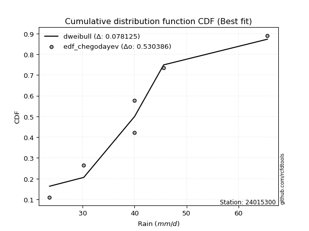</img>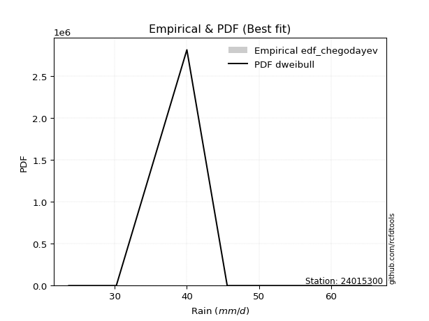</img>

</div>


### 6. EDF Blom (1958)

The Blom formula is a specific "plotting position" formula used in hydrology and statistical analysis to estimate the empirical cumulative probability (or non-exceedance probability) of a data series. It is particularly recommended for data that are approximately normally distributed. The constant _a_ is set to 0.375 (or 3/8).

<div align="center">


$P=(m-a)/(n+1-2a)$


</div>


**6.1. Empirical values**

<div align="center">

|                | 0                  | 1                  | 2                  | 3                 | 4                 | 5                  |
|:---------------|:-------------------|:-------------------|:-------------------|:------------------|:------------------|:-------------------|
| date           | 2022               | 2021               | 2020               | 2019              | 2025              | 2024               |
| x              | 23.6               | 30.2               | 40.0               | 40.0              | 45.6              | 65.6               |
| m              | 1                  | 2                  | 3                  | 4                 | 5                 | 6                  |
| empirical_dist | edf_blom           | edf_blom           | edf_blom           | edf_blom          | edf_blom          | edf_blom           |
| empirical      | 0.1                | 0.26               | 0.42               | 0.58              | 0.74              | 0.9                |
| empirical_tr   | 1.1111111111111112 | 1.3513513513513513 | 1.7241379310344827 | 2.380952380952381 | 3.846153846153846 | 10.000000000000002 |

</div>


**6.2. Kolmogorov-Smirnov fit test (sorted by Δ)**


<div align="center">

|                | 0                   | 1                   | 2                   | 3                   | 4                  | 5                   | 6                   | 7                   | 8                  | 9              | 10                  | 11                  | 12                  | 13                  | 14                  | 15                  | 16                  | 17                 | 18                  | 19                  | 20                  | 21                  | 22                  | 23                 | 24                  | 25                  | 26                  | 27                  | 28                  | 29                  | 30                  | 31                  | 32                  | 33                  | 34                  | 35                  | 36                  | 37                  | 38                | 39                  | 40                  | 41                  | 42                  | 43                  | 44                  | 45                  | 46                  | 47                 | 48                | 49                  | 50                  | 51                 | 52                  | 53                 | 54                  | 55                 | 56                  | 57                 | 58                  | 59                  | 60                  | 61                  | 62                 | 63                 | 64                 | 65                 | 66                  | 67                  | 68                 | 69                  | 70                 | 71                 | 72                 | 73                  | 74                  | 75                  | 76                  | 77                  | 78                  | 79                  | 80                  | 81                 | 82                  | 83                  | 84                 | 85                  | 86                  | 87                  | 88                  | 89                  | 90                  | 91                  | 92                 | 93                  | 94                 | 95                  | 96                  | 97                  | 98                  | 99                  | 100                 | 101                | 102                 | 103                 | 104                | 105                 | 106                 | 107                | 108                | 109               | 110                | 111                | 112                 | 113                | 114                | 115                 | 116                 | 117                 | 118                 | 119                 | 120              | 121                 | 122                | 123                | 124                | 125                 | 126                 | 127               | 128                 | 129                | 130                | 131                | 132                 | 133                 | 134                | 135                | 136                 | 137                | 138               | 139                | 140                | 141                 | 142                 | 143                 | 144                 | 145                 | 146               | 147                | 148                 | 149                 | 150                | 151                | 152                | 153                | 154               | 155               | 156                | 157                | 158               | 159            |
|:---------------|:--------------------|:--------------------|:--------------------|:--------------------|:-------------------|:--------------------|:--------------------|:--------------------|:-------------------|:---------------|:--------------------|:--------------------|:--------------------|:--------------------|:--------------------|:--------------------|:--------------------|:-------------------|:--------------------|:--------------------|:--------------------|:--------------------|:--------------------|:-------------------|:--------------------|:--------------------|:--------------------|:--------------------|:--------------------|:--------------------|:--------------------|:--------------------|:--------------------|:--------------------|:--------------------|:--------------------|:--------------------|:--------------------|:------------------|:--------------------|:--------------------|:--------------------|:--------------------|:--------------------|:--------------------|:--------------------|:--------------------|:-------------------|:------------------|:--------------------|:--------------------|:-------------------|:--------------------|:-------------------|:--------------------|:-------------------|:--------------------|:-------------------|:--------------------|:--------------------|:--------------------|:--------------------|:-------------------|:-------------------|:-------------------|:-------------------|:--------------------|:--------------------|:-------------------|:--------------------|:-------------------|:-------------------|:-------------------|:--------------------|:--------------------|:--------------------|:--------------------|:--------------------|:--------------------|:--------------------|:--------------------|:-------------------|:--------------------|:--------------------|:-------------------|:--------------------|:--------------------|:--------------------|:--------------------|:--------------------|:--------------------|:--------------------|:-------------------|:--------------------|:-------------------|:--------------------|:--------------------|:--------------------|:--------------------|:--------------------|:--------------------|:-------------------|:--------------------|:--------------------|:-------------------|:--------------------|:--------------------|:-------------------|:-------------------|:------------------|:-------------------|:-------------------|:--------------------|:-------------------|:-------------------|:--------------------|:--------------------|:--------------------|:--------------------|:--------------------|:-----------------|:--------------------|:-------------------|:-------------------|:-------------------|:--------------------|:--------------------|:------------------|:--------------------|:-------------------|:-------------------|:-------------------|:--------------------|:--------------------|:-------------------|:-------------------|:--------------------|:-------------------|:------------------|:-------------------|:-------------------|:--------------------|:--------------------|:--------------------|:--------------------|:--------------------|:------------------|:-------------------|:--------------------|:--------------------|:-------------------|:-------------------|:-------------------|:-------------------|:------------------|:------------------|:-------------------|:-------------------|:------------------|:---------------|
| station        | 24015300            | 24015300            | 24015300            | 24015300            | 24015300           | 24015300            | 24015300            | 24015300            | 24015300           | 24015300       | 24015300            | 24015300            | 24015300            | 24015300            | 24015300            | 24015300            | 24015300            | 24015300           | 24015300            | 24015300            | 24015300            | 24015300            | 24015300            | 24015300           | 24015300            | 24015300            | 24015300            | 24015300            | 24015300            | 24015300            | 24015300            | 24015300            | 24015300            | 24015300            | 24015300            | 24015300            | 24015300            | 24015300            | 24015300          | 24015300            | 24015300            | 24015300            | 24015300            | 24015300            | 24015300            | 24015300            | 24015300            | 24015300           | 24015300          | 24015300            | 24015300            | 24015300           | 24015300            | 24015300           | 24015300            | 24015300           | 24015300            | 24015300           | 24015300            | 24015300            | 24015300            | 24015300            | 24015300           | 24015300           | 24015300           | 24015300           | 24015300            | 24015300            | 24015300           | 24015300            | 24015300           | 24015300           | 24015300           | 24015300            | 24015300            | 24015300            | 24015300            | 24015300            | 24015300            | 24015300            | 24015300            | 24015300           | 24015300            | 24015300            | 24015300           | 24015300            | 24015300            | 24015300            | 24015300            | 24015300            | 24015300            | 24015300            | 24015300           | 24015300            | 24015300           | 24015300            | 24015300            | 24015300            | 24015300            | 24015300            | 24015300            | 24015300           | 24015300            | 24015300            | 24015300           | 24015300            | 24015300            | 24015300           | 24015300           | 24015300          | 24015300           | 24015300           | 24015300            | 24015300           | 24015300           | 24015300            | 24015300            | 24015300            | 24015300            | 24015300            | 24015300         | 24015300            | 24015300           | 24015300           | 24015300           | 24015300            | 24015300            | 24015300          | 24015300            | 24015300           | 24015300           | 24015300           | 24015300            | 24015300            | 24015300           | 24015300           | 24015300            | 24015300           | 24015300          | 24015300           | 24015300           | 24015300            | 24015300            | 24015300            | 24015300            | 24015300            | 24015300          | 24015300           | 24015300            | 24015300            | 24015300           | 24015300           | 24015300           | 24015300           | 24015300          | 24015300          | 24015300           | 24015300           | 24015300          | 24015300       |
| empirical_dist | edf_blom            | edf_blom            | edf_blom            | edf_blom            | edf_blom           | edf_blom            | edf_blom            | edf_blom            | edf_blom           | edf_blom       | edf_blom            | edf_blom            | edf_blom            | edf_blom            | edf_blom            | edf_blom            | edf_blom            | edf_blom           | edf_blom            | edf_blom            | edf_blom            | edf_blom            | edf_blom            | edf_blom           | edf_blom            | edf_blom            | edf_blom            | edf_blom            | edf_blom            | edf_blom            | edf_blom            | edf_blom            | edf_blom            | edf_blom            | edf_blom            | edf_blom            | edf_blom            | edf_blom            | edf_blom          | edf_blom            | edf_blom            | edf_blom            | edf_blom            | edf_blom            | edf_blom            | edf_blom            | edf_blom            | edf_blom           | edf_blom          | edf_blom            | edf_blom            | edf_blom           | edf_blom            | edf_blom           | edf_blom            | edf_blom           | edf_blom            | edf_blom           | edf_blom            | edf_blom            | edf_blom            | edf_blom            | edf_blom           | edf_blom           | edf_blom           | edf_blom           | edf_blom            | edf_blom            | edf_blom           | edf_blom            | edf_blom           | edf_blom           | edf_blom           | edf_blom            | edf_blom            | edf_blom            | edf_blom            | edf_blom            | edf_blom            | edf_blom            | edf_blom            | edf_blom           | edf_blom            | edf_blom            | edf_blom           | edf_blom            | edf_blom            | edf_blom            | edf_blom            | edf_blom            | edf_blom            | edf_blom            | edf_blom           | edf_blom            | edf_blom           | edf_blom            | edf_blom            | edf_blom            | edf_blom            | edf_blom            | edf_blom            | edf_blom           | edf_blom            | edf_blom            | edf_blom           | edf_blom            | edf_blom            | edf_blom           | edf_blom           | edf_blom          | edf_blom           | edf_blom           | edf_blom            | edf_blom           | edf_blom           | edf_blom            | edf_blom            | edf_blom            | edf_blom            | edf_blom            | edf_blom         | edf_blom            | edf_blom           | edf_blom           | edf_blom           | edf_blom            | edf_blom            | edf_blom          | edf_blom            | edf_blom           | edf_blom           | edf_blom           | edf_blom            | edf_blom            | edf_blom           | edf_blom           | edf_blom            | edf_blom           | edf_blom          | edf_blom           | edf_blom           | edf_blom            | edf_blom            | edf_blom            | edf_blom            | edf_blom            | edf_blom          | edf_blom           | edf_blom            | edf_blom            | edf_blom           | edf_blom           | edf_blom           | edf_blom           | edf_blom          | edf_blom          | edf_blom           | edf_blom           | edf_blom          | edf_blom       |
| p_dist         | dweibull            | logdweibull         | rice                | maxwell             | pearson3           | truncexpon          | logvonmises_line    | gompertz            | logtukeylambda     | loguniform     | rayleigh            | loghalfgennorm      | logkappa3           | foldnorm            | logloglaplace       | t                   | norm                | crystalball        | truncnorm           | logksone            | logistic            | logkappa4           | ncf                 | loggumbel_l        | logsemicircular     | logcosine           | hypsecant           | loggenextreme       | logweibull_max      | loganglit           | logncf              | logloggamma         | anglit              | logt                | lognorm             | logcrystalball      | logexponnorm        | logburr             | logskewnorm       | logbradford         | kstwobign           | logtruncpareto      | logpearson3         | loggamma            | loggamma            | logerlang           | laplace             | loglogistic        | logjohnsonsu      | logarcsine          | alpha               | gumbel_r           | logf                | logfatiguelife     | logbetaprime        | semicircular       | nct                 | betaprime          | genlogistic         | loghypsecant        | loggenlogistic      | exponnorm           | invgamma           | lomax              | skewnorm           | loggausshyper      | bradford            | halfnorm            | logfoldnorm        | logargus            | loginvgamma        | johnsonsu          | truncpareto        | lognct              | logrice             | logalpha            | invgauss            | logweibull_min      | loggompertz         | loglaplace          | loglaplace          | cosine             | dgamma              | loginvgauss         | burr               | logmaxwell          | moyal               | logburr12           | halflogistic        | arcsine             | lograyleigh         | loggennorm          | gennorm            | truncweibull_min    | weibull_min        | genpareto           | vonmises_line       | gumbel_l            | loginvweibull       | logkstwobign        | logtruncweibull_min | loghalfnorm        | loggumbel_r         | logwrapcauchy       | gausshyper         | kappa4              | loggenexpon         | logtriang          | logtruncexpon      | logmoyal          | logdgamma          | loghalflogistic    | uniform             | wrapcauchy         | ksone              | wald                | beta                | loglomax            | halfgennorm         | burr12              | argus            | f                   | loglevy_l          | nakagami           | logjohnsonsb       | logexponweib        | genextreme          | exponpow          | logwald             | levy_l             | logexponpow        | loggenhalflogistic | kappa3              | triang              | johnsonsb          | logmielke          | loggengamma         | tukeylambda        | gamma             | logtrapezoid       | logbeta            | genhalflogistic     | lognakagami         | rdist               | gengamma            | invweibull          | trapezoid         | fatiguelife        | erlang              | loggenpareto        | powerlaw           | exponweib          | logpowerlaw        | genexpon           | logtruncnorm      | logrdist          | weibull_max        | logvonmises        | vonmises          | mielke         |
| delta          | 0.08000008857501512 | 0.08008829162636516 | 0.08502542122692663 | 0.08873089780038296 | 0.0979648114016281 | 0.09999996972934833 | 0.09999999912433703 | 0.09999999998757897 | 0.0999999999999929 | 0.1            | 0.10023911944782543 | 0.10065552480503748 | 0.10075642675904772 | 0.10375392513793241 | 0.10439652778260283 | 0.10512854290849655 | 0.10514366299234706 | 0.1051436690971762 | 0.10514367290386384 | 0.10752203467136473 | 0.10856684917623566 | 0.10921780027729394 | 0.10923958706124587 | 0.1102074169933186 | 0.11033588852762838 | 0.11141011134683859 | 0.11148234688109815 | 0.11155572690892296 | 0.11157234893836726 | 0.11256705386466098 | 0.11270741067133344 | 0.11647502217831701 | 0.11793097956301757 | 0.11795932390317926 | 0.11797726644478784 | 0.11797749680982766 | 0.11802882373258733 | 0.11868202592344984 | 0.119016750747656 | 0.11981107227180204 | 0.12067198293134535 | 0.12102118970003989 | 0.12149188901383151 | 0.12216310833546112 | 0.12216310833546112 | 0.12224983952880769 | 0.12266459818760439 | 0.1231241013240682 | 0.123134213712152 | 0.12376135592929116 | 0.12388251093091313 | 0.1240240972077114 | 0.12413579362355304 | 0.1250301551504674 | 0.12524185109911418 | 0.1257964943390526 | 0.12604062668437205 | 0.1262833836144332 | 0.12692686896749378 | 0.12749236963317984 | 0.12758495933301067 | 0.12822853770327153 | 0.1295177418248758 | 0.1296923603430311 | 0.1298426839857662 | 0.1314819356084957 | 0.13153916711324487 | 0.13266576950664904 | 0.1335788630993538 | 0.13419058445312904 | 0.1346414749552189 | 0.1360234238034847 | 0.1364223191312281 | 0.13774642966065404 | 0.13818144119946124 | 0.13863570051301094 | 0.13907562920156608 | 0.14114658054884716 | 0.14233787984522145 | 0.14306772098134196 | 0.14306772098134196 | 0.1435416136790617 | 0.14507107539372693 | 0.14637347832324704 | 0.1468723330771214 | 0.14912453782977347 | 0.14984096328132196 | 0.15055030286728383 | 0.15587141934467047 | 0.15789608645475406 | 0.15921403015163377 | 0.15999545967914813 | 0.1612468164681281 | 0.17036304179770018 | 0.1739237148456903 | 0.17399253625904118 | 0.17514666004214352 | 0.17581043215210101 | 0.17805845325093544 | 0.18270785180741916 | 0.18664347781816276 | 0.1876466849319342 | 0.18845202304116476 | 0.18876691335238038 | 0.1919643872607837 | 0.19347293231199614 | 0.20147261464044325 | 0.2062667894954856 | 0.2093333370122749 | 0.213646593424277 | 0.2142261644938713 | 0.2144942385894924 | 0.21619047619047604 | 0.2171166396727675 | 0.2201587301587301 | 0.22170424637646774 | 0.22754655346648905 | 0.23577913494603026 | 0.23578111469214552 | 0.23719647232032032 | 0.24049579978696 | 0.24880534561256312 | 0.2532165306338966 | 0.2599942804789479 | 0.2606088197447597 | 0.27607958109972625 | 0.28245884944899546 | 0.283419401022642 | 0.28356947831591234 | 0.2846157667218395 | 0.2891641020208277 | 0.2907076011580478 | 0.29510426266813067 | 0.30685177664839997 | 0.3074430380180937 | 0.3135370662998688 | 0.31402447370665837 | 0.3184780415466352 | 0.341722255605524 | 0.3553157824593763 | 0.3582207721517093 | 0.37195753792941394 | 0.42947143810539806 | 0.42995308094485274 | 0.44124951670712753 | 0.46583712340331945 | 0.469765054169816 | 0.4832041154088921 | 0.48530865016491914 | 0.48615184162364744 | 0.5046868790801263 | 0.5119297964450175 | 0.5414795806843573 | 0.5596103025452017 | 0.579998727840604 | 0.579999996273793 | 0.6222203191838813 | 1.1187347799781313 | 9.620976080026816 | nan            |
| deltao         | 0.530385761606      | 0.530385761606      | 0.530385761606      | 0.530385761606      | 0.530385761606     | 0.530385761606      | 0.530385761606      | 0.530385761606      | 0.530385761606     | 0.530385761606 | 0.530385761606      | 0.530385761606      | 0.530385761606      | 0.530385761606      | 0.530385761606      | 0.530385761606      | 0.530385761606      | 0.530385761606     | 0.530385761606      | 0.530385761606      | 0.530385761606      | 0.530385761606      | 0.530385761606      | 0.530385761606     | 0.530385761606      | 0.530385761606      | 0.530385761606      | 0.530385761606      | 0.530385761606      | 0.530385761606      | 0.530385761606      | 0.530385761606      | 0.530385761606      | 0.530385761606      | 0.530385761606      | 0.530385761606      | 0.530385761606      | 0.530385761606      | 0.530385761606    | 0.530385761606      | 0.530385761606      | 0.530385761606      | 0.530385761606      | 0.530385761606      | 0.530385761606      | 0.530385761606      | 0.530385761606      | 0.530385761606     | 0.530385761606    | 0.530385761606      | 0.530385761606      | 0.530385761606     | 0.530385761606      | 0.530385761606     | 0.530385761606      | 0.530385761606     | 0.530385761606      | 0.530385761606     | 0.530385761606      | 0.530385761606      | 0.530385761606      | 0.530385761606      | 0.530385761606     | 0.530385761606     | 0.530385761606     | 0.530385761606     | 0.530385761606      | 0.530385761606      | 0.530385761606     | 0.530385761606      | 0.530385761606     | 0.530385761606     | 0.530385761606     | 0.530385761606      | 0.530385761606      | 0.530385761606      | 0.530385761606      | 0.530385761606      | 0.530385761606      | 0.530385761606      | 0.530385761606      | 0.530385761606     | 0.530385761606      | 0.530385761606      | 0.530385761606     | 0.530385761606      | 0.530385761606      | 0.530385761606      | 0.530385761606      | 0.530385761606      | 0.530385761606      | 0.530385761606      | 0.530385761606     | 0.530385761606      | 0.530385761606     | 0.530385761606      | 0.530385761606      | 0.530385761606      | 0.530385761606      | 0.530385761606      | 0.530385761606      | 0.530385761606     | 0.530385761606      | 0.530385761606      | 0.530385761606     | 0.530385761606      | 0.530385761606      | 0.530385761606     | 0.530385761606     | 0.530385761606    | 0.530385761606     | 0.530385761606     | 0.530385761606      | 0.530385761606     | 0.530385761606     | 0.530385761606      | 0.530385761606      | 0.530385761606      | 0.530385761606      | 0.530385761606      | 0.530385761606   | 0.530385761606      | 0.530385761606     | 0.530385761606     | 0.530385761606     | 0.530385761606      | 0.530385761606      | 0.530385761606    | 0.530385761606      | 0.530385761606     | 0.530385761606     | 0.530385761606     | 0.530385761606      | 0.530385761606      | 0.530385761606     | 0.530385761606     | 0.530385761606      | 0.530385761606     | 0.530385761606    | 0.530385761606     | 0.530385761606     | 0.530385761606      | 0.530385761606      | 0.530385761606      | 0.530385761606      | 0.530385761606      | 0.530385761606    | 0.530385761606     | 0.530385761606      | 0.530385761606      | 0.530385761606     | 0.530385761606     | 0.530385761606     | 0.530385761606     | 0.530385761606    | 0.530385761606    | 0.530385761606     | 0.530385761606     | 0.530385761606    | 0.530385761606 |
| eval           | Δo > Δ              | Δo > Δ              | Δo > Δ              | Δo > Δ              | Δo > Δ             | Δo > Δ              | Δo > Δ              | Δo > Δ              | Δo > Δ             | Δo > Δ         | Δo > Δ              | Δo > Δ              | Δo > Δ              | Δo > Δ              | Δo > Δ              | Δo > Δ              | Δo > Δ              | Δo > Δ             | Δo > Δ              | Δo > Δ              | Δo > Δ              | Δo > Δ              | Δo > Δ              | Δo > Δ             | Δo > Δ              | Δo > Δ              | Δo > Δ              | Δo > Δ              | Δo > Δ              | Δo > Δ              | Δo > Δ              | Δo > Δ              | Δo > Δ              | Δo > Δ              | Δo > Δ              | Δo > Δ              | Δo > Δ              | Δo > Δ              | Δo > Δ            | Δo > Δ              | Δo > Δ              | Δo > Δ              | Δo > Δ              | Δo > Δ              | Δo > Δ              | Δo > Δ              | Δo > Δ              | Δo > Δ             | Δo > Δ            | Δo > Δ              | Δo > Δ              | Δo > Δ             | Δo > Δ              | Δo > Δ             | Δo > Δ              | Δo > Δ             | Δo > Δ              | Δo > Δ             | Δo > Δ              | Δo > Δ              | Δo > Δ              | Δo > Δ              | Δo > Δ             | Δo > Δ             | Δo > Δ             | Δo > Δ             | Δo > Δ              | Δo > Δ              | Δo > Δ             | Δo > Δ              | Δo > Δ             | Δo > Δ             | Δo > Δ             | Δo > Δ              | Δo > Δ              | Δo > Δ              | Δo > Δ              | Δo > Δ              | Δo > Δ              | Δo > Δ              | Δo > Δ              | Δo > Δ             | Δo > Δ              | Δo > Δ              | Δo > Δ             | Δo > Δ              | Δo > Δ              | Δo > Δ              | Δo > Δ              | Δo > Δ              | Δo > Δ              | Δo > Δ              | Δo > Δ             | Δo > Δ              | Δo > Δ             | Δo > Δ              | Δo > Δ              | Δo > Δ              | Δo > Δ              | Δo > Δ              | Δo > Δ              | Δo > Δ             | Δo > Δ              | Δo > Δ              | Δo > Δ             | Δo > Δ              | Δo > Δ              | Δo > Δ             | Δo > Δ             | Δo > Δ            | Δo > Δ             | Δo > Δ             | Δo > Δ              | Δo > Δ             | Δo > Δ             | Δo > Δ              | Δo > Δ              | Δo > Δ              | Δo > Δ              | Δo > Δ              | Δo > Δ           | Δo > Δ              | Δo > Δ             | Δo > Δ             | Δo > Δ             | Δo > Δ              | Δo > Δ              | Δo > Δ            | Δo > Δ              | Δo > Δ             | Δo > Δ             | Δo > Δ             | Δo > Δ              | Δo > Δ              | Δo > Δ             | Δo > Δ             | Δo > Δ              | Δo > Δ             | Δo > Δ            | Δo > Δ             | Δo > Δ             | Δo > Δ              | Δo > Δ              | Δo > Δ              | Δo > Δ              | Δo > Δ              | Δo > Δ            | Δo > Δ             | Δo > Δ              | Δo > Δ              | Δo > Δ             | Δo > Δ             | Δo <= Δ            | Δo <= Δ            | Δo <= Δ           | Δo <= Δ           | Δo <= Δ            | Δo <= Δ            | Δo <= Δ           | Δo <= Δ        |
| fit            | 1                   | 1                   | 1                   | 1                   | 1                  | 1                   | 1                   | 1                   | 1                  | 1              | 1                   | 1                   | 1                   | 1                   | 1                   | 1                   | 1                   | 1                  | 1                   | 1                   | 1                   | 1                   | 1                   | 1                  | 1                   | 1                   | 1                   | 1                   | 1                   | 1                   | 1                   | 1                   | 1                   | 1                   | 1                   | 1                   | 1                   | 1                   | 1                 | 1                   | 1                   | 1                   | 1                   | 1                   | 1                   | 1                   | 1                   | 1                  | 1                 | 1                   | 1                   | 1                  | 1                   | 1                  | 1                   | 1                  | 1                   | 1                  | 1                   | 1                   | 1                   | 1                   | 1                  | 1                  | 1                  | 1                  | 1                   | 1                   | 1                  | 1                   | 1                  | 1                  | 1                  | 1                   | 1                   | 1                   | 1                   | 1                   | 1                   | 1                   | 1                   | 1                  | 1                   | 1                   | 1                  | 1                   | 1                   | 1                   | 1                   | 1                   | 1                   | 1                   | 1                  | 1                   | 1                  | 1                   | 1                   | 1                   | 1                   | 1                   | 1                   | 1                  | 1                   | 1                   | 1                  | 1                   | 1                   | 1                  | 1                  | 1                 | 1                  | 1                  | 1                   | 1                  | 1                  | 1                   | 1                   | 1                   | 1                   | 1                   | 1                | 1                   | 1                  | 1                  | 1                  | 1                   | 1                   | 1                 | 1                   | 1                  | 1                  | 1                  | 1                   | 1                   | 1                  | 1                  | 1                   | 1                  | 1                 | 1                  | 1                  | 1                   | 1                   | 1                   | 1                   | 1                   | 1                 | 1                  | 1                   | 1                   | 1                  | 1                  | 0                  | 0                  | 0                 | 0                 | 0                  | 0                  | 0                 | 0              |
| n              | 6                   | 6                   | 6                   | 6                   | 6                  | 6                   | 6                   | 6                   | 6                  | 6              | 6                   | 6                   | 6                   | 6                   | 6                   | 6                   | 6                   | 6                  | 6                   | 6                   | 6                   | 6                   | 6                   | 6                  | 6                   | 6                   | 6                   | 6                   | 6                   | 6                   | 6                   | 6                   | 6                   | 6                   | 6                   | 6                   | 6                   | 6                   | 6                 | 6                   | 6                   | 6                   | 6                   | 6                   | 6                   | 6                   | 6                   | 6                  | 6                 | 6                   | 6                   | 6                  | 6                   | 6                  | 6                   | 6                  | 6                   | 6                  | 6                   | 6                   | 6                   | 6                   | 6                  | 6                  | 6                  | 6                  | 6                   | 6                   | 6                  | 6                   | 6                  | 6                  | 6                  | 6                   | 6                   | 6                   | 6                   | 6                   | 6                   | 6                   | 6                   | 6                  | 6                   | 6                   | 6                  | 6                   | 6                   | 6                   | 6                   | 6                   | 6                   | 6                   | 6                  | 6                   | 6                  | 6                   | 6                   | 6                   | 6                   | 6                   | 6                   | 6                  | 6                   | 6                   | 6                  | 6                   | 6                   | 6                  | 6                  | 6                 | 6                  | 6                  | 6                   | 6                  | 6                  | 6                   | 6                   | 6                   | 6                   | 6                   | 6                | 6                   | 6                  | 6                  | 6                  | 6                   | 6                   | 6                 | 6                   | 6                  | 6                  | 6                  | 6                   | 6                   | 6                  | 6                  | 6                   | 6                  | 6                 | 6                  | 6                  | 6                   | 6                   | 6                   | 6                   | 6                   | 6                 | 6                  | 6                   | 6                   | 6                  | 6                  | 6                  | 6                  | 6                 | 6                 | 6                  | 6                  | 6                 | 6              |
| best_fit       | 1                   | 0                   | 0                   | 0                   | 0                  | 0                   | 0                   | 0                   | 0                  | 0              | 0                   | 0                   | 0                   | 0                   | 0                   | 0                   | 0                   | 0                  | 0                   | 0                   | 0                   | 0                   | 0                   | 0                  | 0                   | 0                   | 0                   | 0                   | 0                   | 0                   | 0                   | 0                   | 0                   | 0                   | 0                   | 0                   | 0                   | 0                   | 0                 | 0                   | 0                   | 0                   | 0                   | 0                   | 0                   | 0                   | 0                   | 0                  | 0                 | 0                   | 0                   | 0                  | 0                   | 0                  | 0                   | 0                  | 0                   | 0                  | 0                   | 0                   | 0                   | 0                   | 0                  | 0                  | 0                  | 0                  | 0                   | 0                   | 0                  | 0                   | 0                  | 0                  | 0                  | 0                   | 0                   | 0                   | 0                   | 0                   | 0                   | 0                   | 0                   | 0                  | 0                   | 0                   | 0                  | 0                   | 0                   | 0                   | 0                   | 0                   | 0                   | 0                   | 0                  | 0                   | 0                  | 0                   | 0                   | 0                   | 0                   | 0                   | 0                   | 0                  | 0                   | 0                   | 0                  | 0                   | 0                   | 0                  | 0                  | 0                 | 0                  | 0                  | 0                   | 0                  | 0                  | 0                   | 0                   | 0                   | 0                   | 0                   | 0                | 0                   | 0                  | 0                  | 0                  | 0                   | 0                   | 0                 | 0                   | 0                  | 0                  | 0                  | 0                   | 0                   | 0                  | 0                  | 0                   | 0                  | 0                 | 0                  | 0                  | 0                   | 0                   | 0                   | 0                   | 0                   | 0                 | 0                  | 0                   | 0                   | 0                  | 0                  | 0                  | 0                  | 0                 | 0                 | 0                  | 0                  | 0                 | 0              |
| best_fit_sort  | 1                   | 2                   | 3                   | 4                   | 5                  | 6                   | 7                   | 8                   | 9                  | 10             | 11                  | 12                  | 13                  | 14                  | 15                  | 16                  | 17                  | 18                 | 19                  | 20                  | 21                  | 22                  | 23                  | 24                 | 25                  | 26                  | 27                  | 28                  | 29                  | 30                  | 31                  | 32                  | 33                  | 34                  | 35                  | 36                  | 37                  | 38                  | 39                | 40                  | 41                  | 42                  | 43                  | 44                  | 45                  | 46                  | 47                  | 48                 | 49                | 50                  | 51                  | 52                 | 53                  | 54                 | 55                  | 56                 | 57                  | 58                 | 59                  | 60                  | 61                  | 62                  | 63                 | 64                 | 65                 | 66                 | 67                  | 68                  | 69                 | 70                  | 71                 | 72                 | 73                 | 74                  | 75                  | 76                  | 77                  | 78                  | 79                  | 80                  | 81                  | 82                 | 83                  | 84                  | 85                 | 86                  | 87                  | 88                  | 89                  | 90                  | 91                  | 92                  | 93                 | 94                  | 95                 | 96                  | 97                  | 98                  | 99                  | 100                 | 101                 | 102                | 103                 | 104                 | 105                | 106                 | 107                 | 108                | 109                | 110               | 111                | 112                | 113                 | 114                | 115                | 116                 | 117                 | 118                 | 119                 | 120                 | 121              | 122                 | 123                | 124                | 125                | 126                 | 127                 | 128               | 129                 | 130                | 131                | 132                | 133                 | 134                 | 135                | 136                | 137                 | 138                | 139               | 140                | 141                | 142                 | 143                 | 144                 | 145                 | 146                 | 147               | 148                | 149                 | 150                 | 151                | 152                | 153                | 154                | 155               | 156               | 157                | 158                | 159               | 160            |

</div>


**6.3. Best fit**

<div align="center">

|   id |   station | empirical_dist   | p_dist   |     delta |   deltao | eval   |   fit |   n |   best_fit |   best_fit_sort |
|-----:|----------:|:-----------------|:---------|----------:|---------:|:-------|------:|----:|-----------:|----------------:|
|    0 |  24015300 | edf_blom         | dweibull | 0.0800001 | 0.530386 | Δo > Δ |     1 |   6 |          1 |               1 |

</div>


<div align="center">

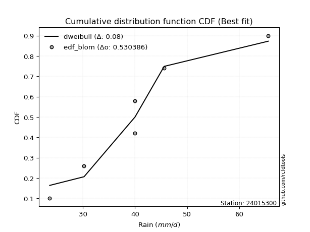</img>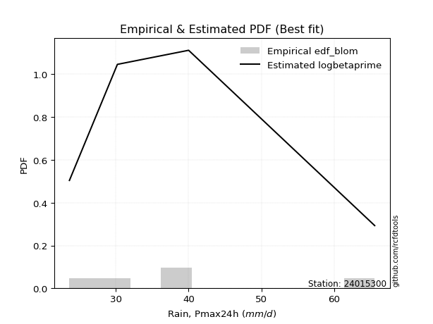</img>

</div>


### 7. EDF Tukey (1962)

In hydrology, the Tukey formula is used as a plotting position formula to estimate the empirical probability or frequency of a flood event (or other hydrological data). The formula parameter is given as _c=0.333_ (or 1/3).

<div align="center">


$P=(m-c)/(n+1-2c)$


</div>


**7.1. Empirical values**

<div align="center">

|                | 0                   | 1                  | 2                   | 3                  | 4                  | 5                  |
|:---------------|:--------------------|:-------------------|:--------------------|:-------------------|:-------------------|:-------------------|
| date           | 2022                | 2021               | 2020                | 2019               | 2025               | 2024               |
| x              | 23.6                | 30.2               | 40.0                | 40.0               | 45.6               | 65.6               |
| m              | 1                   | 2                  | 3                   | 4                  | 5                  | 6                  |
| empirical_dist | edf_tukey           | edf_tukey          | edf_tukey           | edf_tukey          | edf_tukey          | edf_tukey          |
| empirical      | 0.10526315789473684 | 0.2631578947368421 | 0.42105263157894735 | 0.5789473684210527 | 0.7368421052631579 | 0.8947368421052632 |
| empirical_tr   | 1.1176470588235294  | 1.357142857142857  | 1.7272727272727273  | 2.375              | 3.7999999999999994 | 9.5                |

</div>


**7.2. Kolmogorov-Smirnov fit test (sorted by Δ)**


<div align="center">

|                | 0                   | 1                   | 2                   | 3                  | 4                   | 5                   | 6                   | 7                   | 8                   | 9                  | 10                  | 11                  | 12                  | 13                 | 14                  | 15                  | 16                  | 17                  | 18                  | 19                  | 20                  | 21                  | 22                  | 23                  | 24                  | 25                  | 26                  | 27                 | 28                 | 29                  | 30                  | 31                  | 32                  | 33                 | 34                  | 35                 | 36                  | 37                  | 38                  | 39                  | 40                  | 41                  | 42                  | 43                  | 44                  | 45                  | 46                  | 47                  | 48                  | 49                  | 50                  | 51                  | 52                  | 53                  | 54                  | 55                  | 56                  | 57                  | 58                  | 59                  | 60                 | 61                  | 62                  | 63                  | 64                  | 65                  | 66                  | 67                 | 68                  | 69                  | 70                  | 71                  | 72                  | 73                  | 74                  | 75                  | 76                  | 77                 | 78                  | 79                 | 80                 | 81                 | 82                  | 83                  | 84                 | 85                  | 86                 | 87                  | 88                  | 89                 | 90                 | 91                  | 92                 | 93                  | 94                  | 95                  | 96                  | 97                 | 98                  | 99                 | 100                 | 101                 | 102                 | 103                | 104                 | 105               | 106                | 107                 | 108                 | 109                 | 110                | 111                 | 112                 | 113                 | 114                 | 115                 | 116                | 117                | 118                 | 119                 | 120                 | 121                 | 122                 | 123                | 124              | 125                | 126                | 127                 | 128                 | 129               | 130                 | 131                 | 132                 | 133                 | 134                | 135                 | 136               | 137                 | 138                 | 139                 | 140                | 141                | 142                | 143                | 144                 | 145                | 146                | 147              | 148                | 149                | 150                | 151                | 152                | 153                | 154                | 155                | 156                | 157               | 158               | 159            |
|:---------------|:--------------------|:--------------------|:--------------------|:-------------------|:--------------------|:--------------------|:--------------------|:--------------------|:--------------------|:-------------------|:--------------------|:--------------------|:--------------------|:-------------------|:--------------------|:--------------------|:--------------------|:--------------------|:--------------------|:--------------------|:--------------------|:--------------------|:--------------------|:--------------------|:--------------------|:--------------------|:--------------------|:-------------------|:-------------------|:--------------------|:--------------------|:--------------------|:--------------------|:-------------------|:--------------------|:-------------------|:--------------------|:--------------------|:--------------------|:--------------------|:--------------------|:--------------------|:--------------------|:--------------------|:--------------------|:--------------------|:--------------------|:--------------------|:--------------------|:--------------------|:--------------------|:--------------------|:--------------------|:--------------------|:--------------------|:--------------------|:--------------------|:--------------------|:--------------------|:--------------------|:-------------------|:--------------------|:--------------------|:--------------------|:--------------------|:--------------------|:--------------------|:-------------------|:--------------------|:--------------------|:--------------------|:--------------------|:--------------------|:--------------------|:--------------------|:--------------------|:--------------------|:-------------------|:--------------------|:-------------------|:-------------------|:-------------------|:--------------------|:--------------------|:-------------------|:--------------------|:-------------------|:--------------------|:--------------------|:-------------------|:-------------------|:--------------------|:-------------------|:--------------------|:--------------------|:--------------------|:--------------------|:-------------------|:--------------------|:-------------------|:--------------------|:--------------------|:--------------------|:-------------------|:--------------------|:------------------|:-------------------|:--------------------|:--------------------|:--------------------|:-------------------|:--------------------|:--------------------|:--------------------|:--------------------|:--------------------|:-------------------|:-------------------|:--------------------|:--------------------|:--------------------|:--------------------|:--------------------|:-------------------|:-----------------|:-------------------|:-------------------|:--------------------|:--------------------|:------------------|:--------------------|:--------------------|:--------------------|:--------------------|:-------------------|:--------------------|:------------------|:--------------------|:--------------------|:--------------------|:-------------------|:-------------------|:-------------------|:-------------------|:--------------------|:-------------------|:-------------------|:-----------------|:-------------------|:-------------------|:-------------------|:-------------------|:-------------------|:-------------------|:-------------------|:-------------------|:-------------------|:------------------|:------------------|:---------------|
| station        | 24015300            | 24015300            | 24015300            | 24015300           | 24015300            | 24015300            | 24015300            | 24015300            | 24015300            | 24015300           | 24015300            | 24015300            | 24015300            | 24015300           | 24015300            | 24015300            | 24015300            | 24015300            | 24015300            | 24015300            | 24015300            | 24015300            | 24015300            | 24015300            | 24015300            | 24015300            | 24015300            | 24015300           | 24015300           | 24015300            | 24015300            | 24015300            | 24015300            | 24015300           | 24015300            | 24015300           | 24015300            | 24015300            | 24015300            | 24015300            | 24015300            | 24015300            | 24015300            | 24015300            | 24015300            | 24015300            | 24015300            | 24015300            | 24015300            | 24015300            | 24015300            | 24015300            | 24015300            | 24015300            | 24015300            | 24015300            | 24015300            | 24015300            | 24015300            | 24015300            | 24015300           | 24015300            | 24015300            | 24015300            | 24015300            | 24015300            | 24015300            | 24015300           | 24015300            | 24015300            | 24015300            | 24015300            | 24015300            | 24015300            | 24015300            | 24015300            | 24015300            | 24015300           | 24015300            | 24015300           | 24015300           | 24015300           | 24015300            | 24015300            | 24015300           | 24015300            | 24015300           | 24015300            | 24015300            | 24015300           | 24015300           | 24015300            | 24015300           | 24015300            | 24015300            | 24015300            | 24015300            | 24015300           | 24015300            | 24015300           | 24015300            | 24015300            | 24015300            | 24015300           | 24015300            | 24015300          | 24015300           | 24015300            | 24015300            | 24015300            | 24015300           | 24015300            | 24015300            | 24015300            | 24015300            | 24015300            | 24015300           | 24015300           | 24015300            | 24015300            | 24015300            | 24015300            | 24015300            | 24015300           | 24015300         | 24015300           | 24015300           | 24015300            | 24015300            | 24015300          | 24015300            | 24015300            | 24015300            | 24015300            | 24015300           | 24015300            | 24015300          | 24015300            | 24015300            | 24015300            | 24015300           | 24015300           | 24015300           | 24015300           | 24015300            | 24015300           | 24015300           | 24015300         | 24015300           | 24015300           | 24015300           | 24015300           | 24015300           | 24015300           | 24015300           | 24015300           | 24015300           | 24015300          | 24015300          | 24015300       |
| empirical_dist | edf_tukey           | edf_tukey           | edf_tukey           | edf_tukey          | edf_tukey           | edf_tukey           | edf_tukey           | edf_tukey           | edf_tukey           | edf_tukey          | edf_tukey           | edf_tukey           | edf_tukey           | edf_tukey          | edf_tukey           | edf_tukey           | edf_tukey           | edf_tukey           | edf_tukey           | edf_tukey           | edf_tukey           | edf_tukey           | edf_tukey           | edf_tukey           | edf_tukey           | edf_tukey           | edf_tukey           | edf_tukey          | edf_tukey          | edf_tukey           | edf_tukey           | edf_tukey           | edf_tukey           | edf_tukey          | edf_tukey           | edf_tukey          | edf_tukey           | edf_tukey           | edf_tukey           | edf_tukey           | edf_tukey           | edf_tukey           | edf_tukey           | edf_tukey           | edf_tukey           | edf_tukey           | edf_tukey           | edf_tukey           | edf_tukey           | edf_tukey           | edf_tukey           | edf_tukey           | edf_tukey           | edf_tukey           | edf_tukey           | edf_tukey           | edf_tukey           | edf_tukey           | edf_tukey           | edf_tukey           | edf_tukey          | edf_tukey           | edf_tukey           | edf_tukey           | edf_tukey           | edf_tukey           | edf_tukey           | edf_tukey          | edf_tukey           | edf_tukey           | edf_tukey           | edf_tukey           | edf_tukey           | edf_tukey           | edf_tukey           | edf_tukey           | edf_tukey           | edf_tukey          | edf_tukey           | edf_tukey          | edf_tukey          | edf_tukey          | edf_tukey           | edf_tukey           | edf_tukey          | edf_tukey           | edf_tukey          | edf_tukey           | edf_tukey           | edf_tukey          | edf_tukey          | edf_tukey           | edf_tukey          | edf_tukey           | edf_tukey           | edf_tukey           | edf_tukey           | edf_tukey          | edf_tukey           | edf_tukey          | edf_tukey           | edf_tukey           | edf_tukey           | edf_tukey          | edf_tukey           | edf_tukey         | edf_tukey          | edf_tukey           | edf_tukey           | edf_tukey           | edf_tukey          | edf_tukey           | edf_tukey           | edf_tukey           | edf_tukey           | edf_tukey           | edf_tukey          | edf_tukey          | edf_tukey           | edf_tukey           | edf_tukey           | edf_tukey           | edf_tukey           | edf_tukey          | edf_tukey        | edf_tukey          | edf_tukey          | edf_tukey           | edf_tukey           | edf_tukey         | edf_tukey           | edf_tukey           | edf_tukey           | edf_tukey           | edf_tukey          | edf_tukey           | edf_tukey         | edf_tukey           | edf_tukey           | edf_tukey           | edf_tukey          | edf_tukey          | edf_tukey          | edf_tukey          | edf_tukey           | edf_tukey          | edf_tukey          | edf_tukey        | edf_tukey          | edf_tukey          | edf_tukey          | edf_tukey          | edf_tukey          | edf_tukey          | edf_tukey          | edf_tukey          | edf_tukey          | edf_tukey         | edf_tukey         | edf_tukey      |
| p_dist         | dweibull            | logdweibull         | rice                | maxwell            | pearson3            | rayleigh            | foldnorm            | t                   | norm                | crystalball        | truncnorm           | truncexpon          | logvonmises_line    | gompertz           | logkappa3           | logtukeylambda      | loghalfgennorm      | loguniform          | logksone            | logistic            | logloglaplace       | logkappa4           | ncf                 | loggumbel_l         | logsemicircular     | logcosine           | hypsecant           | loggenextreme      | logweibull_max     | loganglit           | logncf              | anglit              | logloggamma         | logt               | lognorm             | logcrystalball     | logexponnorm        | logburr             | logskewnorm         | logbradford         | kstwobign           | logtruncpareto      | logpearson3         | logarcsine          | loggamma            | loggamma            | logerlang           | laplace             | loglogistic         | logjohnsonsu        | semicircular        | alpha               | gumbel_r            | logf                | logfatiguelife      | logbetaprime        | nct                 | betaprime           | genlogistic         | loghypsecant        | loggenlogistic     | lomax               | exponnorm           | bradford            | invgamma            | skewnorm            | loggausshyper       | logargus           | halfnorm            | logfoldnorm         | loginvgamma         | johnsonsu           | truncpareto         | lognct              | logrice             | logalpha            | invgauss            | logweibull_min     | cosine              | loggompertz        | loglaplace         | loglaplace         | loginvgauss         | burr                | logmaxwell         | dgamma              | moyal              | logburr12           | arcsine             | halflogistic       | lograyleigh        | loggennorm          | gennorm            | genpareto           | truncweibull_min    | vonmises_line       | weibull_min         | gumbel_l           | loginvweibull       | logkstwobign       | logtruncweibull_min | logwrapcauchy       | loghalfnorm         | loggumbel_r        | gausshyper          | kappa4            | loggenexpon        | logtriang           | logtruncexpon       | logmoyal            | uniform            | loghalflogistic     | wrapcauchy          | ksone               | logdgamma           | wald                | beta               | loglomax           | halfgennorm         | burr12              | argus               | f                   | loglevy_l           | logjohnsonsb       | nakagami         | logexponweib       | genextreme         | levy_l              | exponpow            | logwald           | loggenhalflogistic  | logexponpow         | kappa3              | triang              | johnsonsb          | logmielke           | loggengamma       | tukeylambda         | gamma               | logtrapezoid        | logbeta            | genhalflogistic    | rdist              | lognakagami        | gengamma            | invweibull         | trapezoid          | fatiguelife      | loggenpareto       | erlang             | powerlaw           | exponweib          | logpowerlaw        | genexpon           | logtruncnorm       | logrdist           | weibull_max        | logvonmises       | vonmises          | mielke         |
| delta          | 0.07894745699606781 | 0.07903566004741786 | 0.08397278964797927 | 0.0876782662214356 | 0.09691217982268074 | 0.09918648786887807 | 0.10270129355898505 | 0.10407591132954924 | 0.10409103141339976 | 0.1040910375182289 | 0.10409104132491653 | 0.10526312762408518 | 0.10526315701907386 | 0.1052631578823158 | 0.10526315789403302 | 0.10526315789472973 | 0.10526315789473684 | 0.10526315789473684 | 0.10646940309241737 | 0.10751421759728835 | 0.10755442251944491 | 0.10816516869834658 | 0.10818695548229851 | 0.10915478541437129 | 0.10928325694868102 | 0.11035747976789123 | 0.11042971530215084 | 0.1105030953299756 | 0.1105197173594199 | 0.11151442228571362 | 0.11165477909238608 | 0.11477308482617543 | 0.11542239059936965 | 0.1169066923242319 | 0.11692463486584048 | 0.1169248652308803 | 0.11697619215363997 | 0.11762939434450248 | 0.11796411916870864 | 0.11875844069285468 | 0.11961935135239798 | 0.11996855812109253 | 0.12043925743488415 | 0.12060346119244902 | 0.12111047675651376 | 0.12111047675651376 | 0.12119720794986033 | 0.12161196660865708 | 0.12207146974512084 | 0.12208158213320464 | 0.12263859960221046 | 0.12282987935196577 | 0.12297146562876404 | 0.12308316204460568 | 0.12397752357152003 | 0.12418921952016682 | 0.12498799510542469 | 0.12523075203548584 | 0.12587423738854642 | 0.12643973805423248 | 0.1265323277540633 | 0.12653446560618897 | 0.12717590612432417 | 0.12838127237640273 | 0.12846511024592844 | 0.12879005240681884 | 0.13042930402954833 | 0.1310326897162869 | 0.13161313792770168 | 0.13252623152040643 | 0.13358884337627153 | 0.13497079222453734 | 0.13536968755228074 | 0.13669379808170667 | 0.13712880962051388 | 0.13758306893406358 | 0.13802299762261871 | 0.1400939489698998 | 0.14038371894221957 | 0.1412852482662741 | 0.1420150894023946 | 0.1420150894023946 | 0.14532084674429968 | 0.14581970149817403 | 0.1480719062508261 | 0.14822897013056902 | 0.1487883317023746 | 0.14949767128833646 | 0.15473819171791192 | 0.1548187877657231 | 0.1581613985726864 | 0.16315335441599021 | 0.1644047112049702 | 0.16872937836430435 | 0.16931041021875282 | 0.17198876530530138 | 0.17287108326674294 | 0.1747578005731537 | 0.17700582167198808 | 0.1816552202284718 | 0.1855908462392154  | 0.18560901861553825 | 0.18659405335298684 | 0.1873993914622174 | 0.18880649252394155 | 0.190315037575154 | 0.2004199830614959 | 0.20310889475864347 | 0.20828070543332755 | 0.21259396184532964 | 0.2130325814536339 | 0.21344160701054504 | 0.21395874493592537 | 0.21700083542188797 | 0.21738405923071338 | 0.22065161479752038 | 0.2264939218875417 | 0.2347265033670829 | 0.23472848311319816 | 0.23614384074137296 | 0.23733790505011787 | 0.24775271403361576 | 0.24795337273915974 | 0.2574509250079176 | 0.26315217521579 | 0.2750269495207789 | 0.2771956915542586 | 0.27935260882710267 | 0.28236676944369465 | 0.282516846736965 | 0.28754970642120564 | 0.28811147044188035 | 0.29194636793128853 | 0.30369388191155783 | 0.3042851432812516 | 0.31248443472092147 | 0.312971842127711 | 0.31742540996768787 | 0.34066962402657663 | 0.35215788772253415 | 0.3571681405727619 | 0.3687996431925718 | 0.4246899230501159 | 0.4284188065264507 | 0.43809162197028545 | 0.4605739655085826 | 0.4666071594329739 | 0.48004622067205 | 0.4808886837289106 | 0.4842560185859718 | 0.5015289843432842 | 0.5087719017081753 | 0.5383216859475153 | 0.5585576709662543 | 0.5789460962616567 | 0.5789473646948456 | 0.6190624244470392 | 1.117682148399184 | 9.626239237921553 | nan            |
| deltao         | 0.530385761606      | 0.530385761606      | 0.530385761606      | 0.530385761606     | 0.530385761606      | 0.530385761606      | 0.530385761606      | 0.530385761606      | 0.530385761606      | 0.530385761606     | 0.530385761606      | 0.530385761606      | 0.530385761606      | 0.530385761606     | 0.530385761606      | 0.530385761606      | 0.530385761606      | 0.530385761606      | 0.530385761606      | 0.530385761606      | 0.530385761606      | 0.530385761606      | 0.530385761606      | 0.530385761606      | 0.530385761606      | 0.530385761606      | 0.530385761606      | 0.530385761606     | 0.530385761606     | 0.530385761606      | 0.530385761606      | 0.530385761606      | 0.530385761606      | 0.530385761606     | 0.530385761606      | 0.530385761606     | 0.530385761606      | 0.530385761606      | 0.530385761606      | 0.530385761606      | 0.530385761606      | 0.530385761606      | 0.530385761606      | 0.530385761606      | 0.530385761606      | 0.530385761606      | 0.530385761606      | 0.530385761606      | 0.530385761606      | 0.530385761606      | 0.530385761606      | 0.530385761606      | 0.530385761606      | 0.530385761606      | 0.530385761606      | 0.530385761606      | 0.530385761606      | 0.530385761606      | 0.530385761606      | 0.530385761606      | 0.530385761606     | 0.530385761606      | 0.530385761606      | 0.530385761606      | 0.530385761606      | 0.530385761606      | 0.530385761606      | 0.530385761606     | 0.530385761606      | 0.530385761606      | 0.530385761606      | 0.530385761606      | 0.530385761606      | 0.530385761606      | 0.530385761606      | 0.530385761606      | 0.530385761606      | 0.530385761606     | 0.530385761606      | 0.530385761606     | 0.530385761606     | 0.530385761606     | 0.530385761606      | 0.530385761606      | 0.530385761606     | 0.530385761606      | 0.530385761606     | 0.530385761606      | 0.530385761606      | 0.530385761606     | 0.530385761606     | 0.530385761606      | 0.530385761606     | 0.530385761606      | 0.530385761606      | 0.530385761606      | 0.530385761606      | 0.530385761606     | 0.530385761606      | 0.530385761606     | 0.530385761606      | 0.530385761606      | 0.530385761606      | 0.530385761606     | 0.530385761606      | 0.530385761606    | 0.530385761606     | 0.530385761606      | 0.530385761606      | 0.530385761606      | 0.530385761606     | 0.530385761606      | 0.530385761606      | 0.530385761606      | 0.530385761606      | 0.530385761606      | 0.530385761606     | 0.530385761606     | 0.530385761606      | 0.530385761606      | 0.530385761606      | 0.530385761606      | 0.530385761606      | 0.530385761606     | 0.530385761606   | 0.530385761606     | 0.530385761606     | 0.530385761606      | 0.530385761606      | 0.530385761606    | 0.530385761606      | 0.530385761606      | 0.530385761606      | 0.530385761606      | 0.530385761606     | 0.530385761606      | 0.530385761606    | 0.530385761606      | 0.530385761606      | 0.530385761606      | 0.530385761606     | 0.530385761606     | 0.530385761606     | 0.530385761606     | 0.530385761606      | 0.530385761606     | 0.530385761606     | 0.530385761606   | 0.530385761606     | 0.530385761606     | 0.530385761606     | 0.530385761606     | 0.530385761606     | 0.530385761606     | 0.530385761606     | 0.530385761606     | 0.530385761606     | 0.530385761606    | 0.530385761606    | 0.530385761606 |
| eval           | Δo > Δ              | Δo > Δ              | Δo > Δ              | Δo > Δ             | Δo > Δ              | Δo > Δ              | Δo > Δ              | Δo > Δ              | Δo > Δ              | Δo > Δ             | Δo > Δ              | Δo > Δ              | Δo > Δ              | Δo > Δ             | Δo > Δ              | Δo > Δ              | Δo > Δ              | Δo > Δ              | Δo > Δ              | Δo > Δ              | Δo > Δ              | Δo > Δ              | Δo > Δ              | Δo > Δ              | Δo > Δ              | Δo > Δ              | Δo > Δ              | Δo > Δ             | Δo > Δ             | Δo > Δ              | Δo > Δ              | Δo > Δ              | Δo > Δ              | Δo > Δ             | Δo > Δ              | Δo > Δ             | Δo > Δ              | Δo > Δ              | Δo > Δ              | Δo > Δ              | Δo > Δ              | Δo > Δ              | Δo > Δ              | Δo > Δ              | Δo > Δ              | Δo > Δ              | Δo > Δ              | Δo > Δ              | Δo > Δ              | Δo > Δ              | Δo > Δ              | Δo > Δ              | Δo > Δ              | Δo > Δ              | Δo > Δ              | Δo > Δ              | Δo > Δ              | Δo > Δ              | Δo > Δ              | Δo > Δ              | Δo > Δ             | Δo > Δ              | Δo > Δ              | Δo > Δ              | Δo > Δ              | Δo > Δ              | Δo > Δ              | Δo > Δ             | Δo > Δ              | Δo > Δ              | Δo > Δ              | Δo > Δ              | Δo > Δ              | Δo > Δ              | Δo > Δ              | Δo > Δ              | Δo > Δ              | Δo > Δ             | Δo > Δ              | Δo > Δ             | Δo > Δ             | Δo > Δ             | Δo > Δ              | Δo > Δ              | Δo > Δ             | Δo > Δ              | Δo > Δ             | Δo > Δ              | Δo > Δ              | Δo > Δ             | Δo > Δ             | Δo > Δ              | Δo > Δ             | Δo > Δ              | Δo > Δ              | Δo > Δ              | Δo > Δ              | Δo > Δ             | Δo > Δ              | Δo > Δ             | Δo > Δ              | Δo > Δ              | Δo > Δ              | Δo > Δ             | Δo > Δ              | Δo > Δ            | Δo > Δ             | Δo > Δ              | Δo > Δ              | Δo > Δ              | Δo > Δ             | Δo > Δ              | Δo > Δ              | Δo > Δ              | Δo > Δ              | Δo > Δ              | Δo > Δ             | Δo > Δ             | Δo > Δ              | Δo > Δ              | Δo > Δ              | Δo > Δ              | Δo > Δ              | Δo > Δ             | Δo > Δ           | Δo > Δ             | Δo > Δ             | Δo > Δ              | Δo > Δ              | Δo > Δ            | Δo > Δ              | Δo > Δ              | Δo > Δ              | Δo > Δ              | Δo > Δ             | Δo > Δ              | Δo > Δ            | Δo > Δ              | Δo > Δ              | Δo > Δ              | Δo > Δ             | Δo > Δ             | Δo > Δ             | Δo > Δ             | Δo > Δ              | Δo > Δ             | Δo > Δ             | Δo > Δ           | Δo > Δ             | Δo > Δ             | Δo > Δ             | Δo > Δ             | Δo <= Δ            | Δo <= Δ            | Δo <= Δ            | Δo <= Δ            | Δo <= Δ            | Δo <= Δ           | Δo <= Δ           | Δo <= Δ        |
| fit            | 1                   | 1                   | 1                   | 1                  | 1                   | 1                   | 1                   | 1                   | 1                   | 1                  | 1                   | 1                   | 1                   | 1                  | 1                   | 1                   | 1                   | 1                   | 1                   | 1                   | 1                   | 1                   | 1                   | 1                   | 1                   | 1                   | 1                   | 1                  | 1                  | 1                   | 1                   | 1                   | 1                   | 1                  | 1                   | 1                  | 1                   | 1                   | 1                   | 1                   | 1                   | 1                   | 1                   | 1                   | 1                   | 1                   | 1                   | 1                   | 1                   | 1                   | 1                   | 1                   | 1                   | 1                   | 1                   | 1                   | 1                   | 1                   | 1                   | 1                   | 1                  | 1                   | 1                   | 1                   | 1                   | 1                   | 1                   | 1                  | 1                   | 1                   | 1                   | 1                   | 1                   | 1                   | 1                   | 1                   | 1                   | 1                  | 1                   | 1                  | 1                  | 1                  | 1                   | 1                   | 1                  | 1                   | 1                  | 1                   | 1                   | 1                  | 1                  | 1                   | 1                  | 1                   | 1                   | 1                   | 1                   | 1                  | 1                   | 1                  | 1                   | 1                   | 1                   | 1                  | 1                   | 1                 | 1                  | 1                   | 1                   | 1                   | 1                  | 1                   | 1                   | 1                   | 1                   | 1                   | 1                  | 1                  | 1                   | 1                   | 1                   | 1                   | 1                   | 1                  | 1                | 1                  | 1                  | 1                   | 1                   | 1                 | 1                   | 1                   | 1                   | 1                   | 1                  | 1                   | 1                 | 1                   | 1                   | 1                   | 1                  | 1                  | 1                  | 1                  | 1                   | 1                  | 1                  | 1                | 1                  | 1                  | 1                  | 1                  | 0                  | 0                  | 0                  | 0                  | 0                  | 0                 | 0                 | 0              |
| n              | 6                   | 6                   | 6                   | 6                  | 6                   | 6                   | 6                   | 6                   | 6                   | 6                  | 6                   | 6                   | 6                   | 6                  | 6                   | 6                   | 6                   | 6                   | 6                   | 6                   | 6                   | 6                   | 6                   | 6                   | 6                   | 6                   | 6                   | 6                  | 6                  | 6                   | 6                   | 6                   | 6                   | 6                  | 6                   | 6                  | 6                   | 6                   | 6                   | 6                   | 6                   | 6                   | 6                   | 6                   | 6                   | 6                   | 6                   | 6                   | 6                   | 6                   | 6                   | 6                   | 6                   | 6                   | 6                   | 6                   | 6                   | 6                   | 6                   | 6                   | 6                  | 6                   | 6                   | 6                   | 6                   | 6                   | 6                   | 6                  | 6                   | 6                   | 6                   | 6                   | 6                   | 6                   | 6                   | 6                   | 6                   | 6                  | 6                   | 6                  | 6                  | 6                  | 6                   | 6                   | 6                  | 6                   | 6                  | 6                   | 6                   | 6                  | 6                  | 6                   | 6                  | 6                   | 6                   | 6                   | 6                   | 6                  | 6                   | 6                  | 6                   | 6                   | 6                   | 6                  | 6                   | 6                 | 6                  | 6                   | 6                   | 6                   | 6                  | 6                   | 6                   | 6                   | 6                   | 6                   | 6                  | 6                  | 6                   | 6                   | 6                   | 6                   | 6                   | 6                  | 6                | 6                  | 6                  | 6                   | 6                   | 6                 | 6                   | 6                   | 6                   | 6                   | 6                  | 6                   | 6                 | 6                   | 6                   | 6                   | 6                  | 6                  | 6                  | 6                  | 6                   | 6                  | 6                  | 6                | 6                  | 6                  | 6                  | 6                  | 6                  | 6                  | 6                  | 6                  | 6                  | 6                 | 6                 | 6              |
| best_fit       | 1                   | 0                   | 0                   | 0                  | 0                   | 0                   | 0                   | 0                   | 0                   | 0                  | 0                   | 0                   | 0                   | 0                  | 0                   | 0                   | 0                   | 0                   | 0                   | 0                   | 0                   | 0                   | 0                   | 0                   | 0                   | 0                   | 0                   | 0                  | 0                  | 0                   | 0                   | 0                   | 0                   | 0                  | 0                   | 0                  | 0                   | 0                   | 0                   | 0                   | 0                   | 0                   | 0                   | 0                   | 0                   | 0                   | 0                   | 0                   | 0                   | 0                   | 0                   | 0                   | 0                   | 0                   | 0                   | 0                   | 0                   | 0                   | 0                   | 0                   | 0                  | 0                   | 0                   | 0                   | 0                   | 0                   | 0                   | 0                  | 0                   | 0                   | 0                   | 0                   | 0                   | 0                   | 0                   | 0                   | 0                   | 0                  | 0                   | 0                  | 0                  | 0                  | 0                   | 0                   | 0                  | 0                   | 0                  | 0                   | 0                   | 0                  | 0                  | 0                   | 0                  | 0                   | 0                   | 0                   | 0                   | 0                  | 0                   | 0                  | 0                   | 0                   | 0                   | 0                  | 0                   | 0                 | 0                  | 0                   | 0                   | 0                   | 0                  | 0                   | 0                   | 0                   | 0                   | 0                   | 0                  | 0                  | 0                   | 0                   | 0                   | 0                   | 0                   | 0                  | 0                | 0                  | 0                  | 0                   | 0                   | 0                 | 0                   | 0                   | 0                   | 0                   | 0                  | 0                   | 0                 | 0                   | 0                   | 0                   | 0                  | 0                  | 0                  | 0                  | 0                   | 0                  | 0                  | 0                | 0                  | 0                  | 0                  | 0                  | 0                  | 0                  | 0                  | 0                  | 0                  | 0                 | 0                 | 0              |
| best_fit_sort  | 1                   | 2                   | 3                   | 4                  | 5                   | 6                   | 7                   | 8                   | 9                   | 10                 | 11                  | 12                  | 13                  | 14                 | 15                  | 16                  | 17                  | 18                  | 19                  | 20                  | 21                  | 22                  | 23                  | 24                  | 25                  | 26                  | 27                  | 28                 | 29                 | 30                  | 31                  | 32                  | 33                  | 34                 | 35                  | 36                 | 37                  | 38                  | 39                  | 40                  | 41                  | 42                  | 43                  | 44                  | 45                  | 46                  | 47                  | 48                  | 49                  | 50                  | 51                  | 52                  | 53                  | 54                  | 55                  | 56                  | 57                  | 58                  | 59                  | 60                  | 61                 | 62                  | 63                  | 64                  | 65                  | 66                  | 67                  | 68                 | 69                  | 70                  | 71                  | 72                  | 73                  | 74                  | 75                  | 76                  | 77                  | 78                 | 79                  | 80                 | 81                 | 82                 | 83                  | 84                  | 85                 | 86                  | 87                 | 88                  | 89                  | 90                 | 91                 | 92                  | 93                 | 94                  | 95                  | 96                  | 97                  | 98                 | 99                  | 100                | 101                 | 102                 | 103                 | 104                | 105                 | 106               | 107                | 108                 | 109                 | 110                 | 111                | 112                 | 113                 | 114                 | 115                 | 116                 | 117                | 118                | 119                 | 120                 | 121                 | 122                 | 123                 | 124                | 125              | 126                | 127                | 128                 | 129                 | 130               | 131                 | 132                 | 133                 | 134                 | 135                | 136                 | 137               | 138                 | 139                 | 140                 | 141                | 142                | 143                | 144                | 145                 | 146                | 147                | 148              | 149                | 150                | 151                | 152                | 153                | 154                | 155                | 156                | 157                | 158               | 159               | 160            |

</div>


**7.3. Best fit**

<div align="center">

|   id |   station | empirical_dist   | p_dist   |     delta |   deltao | eval   |   fit |   n |   best_fit |   best_fit_sort |
|-----:|----------:|:-----------------|:---------|----------:|---------:|:-------|------:|----:|-----------:|----------------:|
|    0 |  24015300 | edf_tukey        | dweibull | 0.0789475 | 0.530386 | Δo > Δ |     1 |   6 |          1 |               1 |

</div>


<div align="center">

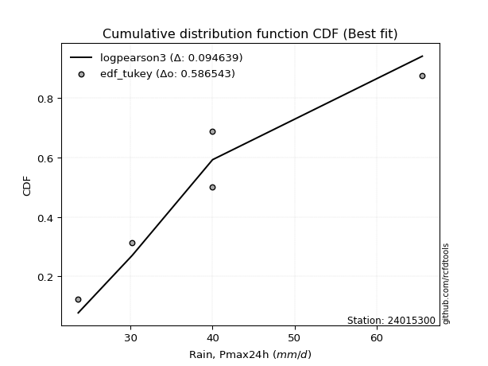</img>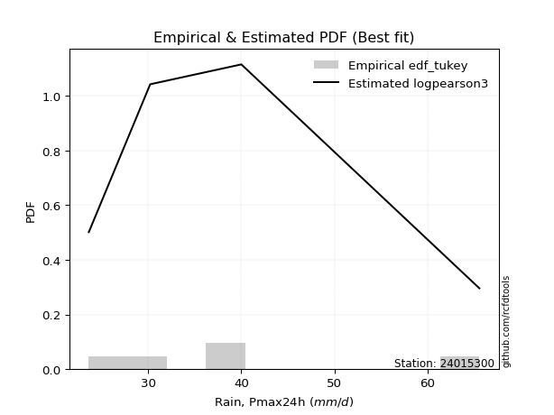</img>

</div>


### 8. EDF Gringorten (1963)

Gringorten plotting position formula is essential for estimating the probability and return periods of extreme events like floods and heavy rainfall. The constant _a=0.44_.

<div align="center">


$P=(m-a)/(n+1-2a)$


</div>


**8.1. Empirical values**

<div align="center">

|                | 0                   | 1                  | 2                   | 3                  | 4                  | 5                  |
|:---------------|:--------------------|:-------------------|:--------------------|:-------------------|:-------------------|:-------------------|
| date           | 2022                | 2021               | 2020                | 2019               | 2025               | 2024               |
| x              | 23.6                | 30.2               | 40.0                | 40.0               | 45.6               | 65.6               |
| m              | 1                   | 2                  | 3                   | 4                  | 5                  | 6                  |
| empirical_dist | edf_gringorten      | edf_gringorten     | edf_gringorten      | edf_gringorten     | edf_gringorten     | edf_gringorten     |
| empirical      | 0.09150326797385622 | 0.2549019607843137 | 0.41830065359477125 | 0.5816993464052288 | 0.7450980392156862 | 0.9084967320261437 |
| empirical_tr   | 1.1007194244604317  | 1.3421052631578947 | 1.7191011235955058  | 2.3906250000000004 | 3.9230769230769216 | 10.928571428571415 |

</div>


**8.2. Kolmogorov-Smirnov fit test (sorted by Δ)**


<div align="center">

|                | 0                   | 1                 | 2                   | 3                   | 4                   | 5                   | 6                   | 7                   | 8                   | 9                   | 10                  | 11                 | 12                  | 13                  | 14                  | 15                  | 16                 | 17                  | 18                  | 19                  | 20                 | 21                  | 22                 | 23                  | 24                  | 25                  | 26                  | 27                  | 28                  | 29                  | 30                  | 31                  | 32                  | 33                  | 34                 | 35                  | 36                  | 37                  | 38                  | 39                  | 40                  | 41                  | 42                  | 43                  | 44                  | 45                  | 46                  | 47                  | 48                  | 49                  | 50                  | 51                  | 52                  | 53                 | 54                  | 55                  | 56                 | 57                  | 58                  | 59                 | 60                  | 61                 | 62                  | 63                  | 64                  | 65                  | 66                 | 67                  | 68                  | 69                  | 70                  | 71                  | 72                  | 73                  | 74                  | 75                  | 76                  | 77                 | 78                  | 79                  | 80                 | 81                 | 82                  | 83                  | 84                 | 85                 | 86                 | 87                  | 88                  | 89                 | 90                 | 91                 | 92                  | 93                 | 94                  | 95                  | 96                  | 97                 | 98                  | 99                 | 100                 | 101                 | 102                | 103                 | 104                 | 105                 | 106                 | 107               | 108                 | 109                | 110                 | 111                 | 112                 | 113                | 114                 | 115                | 116                 | 117                 | 118                 | 119                 | 120                | 121                 | 122                | 123                 | 124               | 125               | 126                 | 127                 | 128                 | 129                | 130                | 131                 | 132                 | 133                 | 134              | 135                 | 136                | 137                 | 138                | 139               | 140                | 141                 | 142                | 143                | 144                 | 145                | 146                | 147                 | 148                | 149                | 150                | 151                | 152                | 153                | 154                | 155                | 156                | 157              | 158               | 159            |
|:---------------|:--------------------|:------------------|:--------------------|:--------------------|:--------------------|:--------------------|:--------------------|:--------------------|:--------------------|:--------------------|:--------------------|:-------------------|:--------------------|:--------------------|:--------------------|:--------------------|:-------------------|:--------------------|:--------------------|:--------------------|:-------------------|:--------------------|:-------------------|:--------------------|:--------------------|:--------------------|:--------------------|:--------------------|:--------------------|:--------------------|:--------------------|:--------------------|:--------------------|:--------------------|:-------------------|:--------------------|:--------------------|:--------------------|:--------------------|:--------------------|:--------------------|:--------------------|:--------------------|:--------------------|:--------------------|:--------------------|:--------------------|:--------------------|:--------------------|:--------------------|:--------------------|:--------------------|:--------------------|:-------------------|:--------------------|:--------------------|:-------------------|:--------------------|:--------------------|:-------------------|:--------------------|:-------------------|:--------------------|:--------------------|:--------------------|:--------------------|:-------------------|:--------------------|:--------------------|:--------------------|:--------------------|:--------------------|:--------------------|:--------------------|:--------------------|:--------------------|:--------------------|:-------------------|:--------------------|:--------------------|:-------------------|:-------------------|:--------------------|:--------------------|:-------------------|:-------------------|:-------------------|:--------------------|:--------------------|:-------------------|:-------------------|:-------------------|:--------------------|:-------------------|:--------------------|:--------------------|:--------------------|:-------------------|:--------------------|:-------------------|:--------------------|:--------------------|:-------------------|:--------------------|:--------------------|:--------------------|:--------------------|:------------------|:--------------------|:-------------------|:--------------------|:--------------------|:--------------------|:-------------------|:--------------------|:-------------------|:--------------------|:--------------------|:--------------------|:--------------------|:-------------------|:--------------------|:-------------------|:--------------------|:------------------|:------------------|:--------------------|:--------------------|:--------------------|:-------------------|:-------------------|:--------------------|:--------------------|:--------------------|:-----------------|:--------------------|:-------------------|:--------------------|:-------------------|:------------------|:-------------------|:--------------------|:-------------------|:-------------------|:--------------------|:-------------------|:-------------------|:--------------------|:-------------------|:-------------------|:-------------------|:-------------------|:-------------------|:-------------------|:-------------------|:-------------------|:-------------------|:-----------------|:------------------|:---------------|
| station        | 24015300            | 24015300          | 24015300            | 24015300            | 24015300            | 24015300            | 24015300            | 24015300            | 24015300            | 24015300            | 24015300            | 24015300           | 24015300            | 24015300            | 24015300            | 24015300            | 24015300           | 24015300            | 24015300            | 24015300            | 24015300           | 24015300            | 24015300           | 24015300            | 24015300            | 24015300            | 24015300            | 24015300            | 24015300            | 24015300            | 24015300            | 24015300            | 24015300            | 24015300            | 24015300           | 24015300            | 24015300            | 24015300            | 24015300            | 24015300            | 24015300            | 24015300            | 24015300            | 24015300            | 24015300            | 24015300            | 24015300            | 24015300            | 24015300            | 24015300            | 24015300            | 24015300            | 24015300            | 24015300           | 24015300            | 24015300            | 24015300           | 24015300            | 24015300            | 24015300           | 24015300            | 24015300           | 24015300            | 24015300            | 24015300            | 24015300            | 24015300           | 24015300            | 24015300            | 24015300            | 24015300            | 24015300            | 24015300            | 24015300            | 24015300            | 24015300            | 24015300            | 24015300           | 24015300            | 24015300            | 24015300           | 24015300           | 24015300            | 24015300            | 24015300           | 24015300           | 24015300           | 24015300            | 24015300            | 24015300           | 24015300           | 24015300           | 24015300            | 24015300           | 24015300            | 24015300            | 24015300            | 24015300           | 24015300            | 24015300           | 24015300            | 24015300            | 24015300           | 24015300            | 24015300            | 24015300            | 24015300            | 24015300          | 24015300            | 24015300           | 24015300            | 24015300            | 24015300            | 24015300           | 24015300            | 24015300           | 24015300            | 24015300            | 24015300            | 24015300            | 24015300           | 24015300            | 24015300           | 24015300            | 24015300          | 24015300          | 24015300            | 24015300            | 24015300            | 24015300           | 24015300           | 24015300            | 24015300            | 24015300            | 24015300         | 24015300            | 24015300           | 24015300            | 24015300           | 24015300          | 24015300           | 24015300            | 24015300           | 24015300           | 24015300            | 24015300           | 24015300           | 24015300            | 24015300           | 24015300           | 24015300           | 24015300           | 24015300           | 24015300           | 24015300           | 24015300           | 24015300           | 24015300         | 24015300          | 24015300       |
| empirical_dist | edf_gringorten      | edf_gringorten    | edf_gringorten      | edf_gringorten      | edf_gringorten      | edf_gringorten      | edf_gringorten      | edf_gringorten      | edf_gringorten      | edf_gringorten      | edf_gringorten      | edf_gringorten     | edf_gringorten      | edf_gringorten      | edf_gringorten      | edf_gringorten      | edf_gringorten     | edf_gringorten      | edf_gringorten      | edf_gringorten      | edf_gringorten     | edf_gringorten      | edf_gringorten     | edf_gringorten      | edf_gringorten      | edf_gringorten      | edf_gringorten      | edf_gringorten      | edf_gringorten      | edf_gringorten      | edf_gringorten      | edf_gringorten      | edf_gringorten      | edf_gringorten      | edf_gringorten     | edf_gringorten      | edf_gringorten      | edf_gringorten      | edf_gringorten      | edf_gringorten      | edf_gringorten      | edf_gringorten      | edf_gringorten      | edf_gringorten      | edf_gringorten      | edf_gringorten      | edf_gringorten      | edf_gringorten      | edf_gringorten      | edf_gringorten      | edf_gringorten      | edf_gringorten      | edf_gringorten      | edf_gringorten     | edf_gringorten      | edf_gringorten      | edf_gringorten     | edf_gringorten      | edf_gringorten      | edf_gringorten     | edf_gringorten      | edf_gringorten     | edf_gringorten      | edf_gringorten      | edf_gringorten      | edf_gringorten      | edf_gringorten     | edf_gringorten      | edf_gringorten      | edf_gringorten      | edf_gringorten      | edf_gringorten      | edf_gringorten      | edf_gringorten      | edf_gringorten      | edf_gringorten      | edf_gringorten      | edf_gringorten     | edf_gringorten      | edf_gringorten      | edf_gringorten     | edf_gringorten     | edf_gringorten      | edf_gringorten      | edf_gringorten     | edf_gringorten     | edf_gringorten     | edf_gringorten      | edf_gringorten      | edf_gringorten     | edf_gringorten     | edf_gringorten     | edf_gringorten      | edf_gringorten     | edf_gringorten      | edf_gringorten      | edf_gringorten      | edf_gringorten     | edf_gringorten      | edf_gringorten     | edf_gringorten      | edf_gringorten      | edf_gringorten     | edf_gringorten      | edf_gringorten      | edf_gringorten      | edf_gringorten      | edf_gringorten    | edf_gringorten      | edf_gringorten     | edf_gringorten      | edf_gringorten      | edf_gringorten      | edf_gringorten     | edf_gringorten      | edf_gringorten     | edf_gringorten      | edf_gringorten      | edf_gringorten      | edf_gringorten      | edf_gringorten     | edf_gringorten      | edf_gringorten     | edf_gringorten      | edf_gringorten    | edf_gringorten    | edf_gringorten      | edf_gringorten      | edf_gringorten      | edf_gringorten     | edf_gringorten     | edf_gringorten      | edf_gringorten      | edf_gringorten      | edf_gringorten   | edf_gringorten      | edf_gringorten     | edf_gringorten      | edf_gringorten     | edf_gringorten    | edf_gringorten     | edf_gringorten      | edf_gringorten     | edf_gringorten     | edf_gringorten      | edf_gringorten     | edf_gringorten     | edf_gringorten      | edf_gringorten     | edf_gringorten     | edf_gringorten     | edf_gringorten     | edf_gringorten     | edf_gringorten     | edf_gringorten     | edf_gringorten     | edf_gringorten     | edf_gringorten   | edf_gringorten    | edf_gringorten |
| p_dist         | dweibull            | logdweibull       | rice                | maxwell             | gompertz            | logloglaplace       | pearson3            | loguniform          | logvonmises_line    | rayleigh            | truncexpon          | logtukeylambda     | foldnorm            | loghalfgennorm      | logkappa3           | t                   | norm               | crystalball         | truncnorm           | logksone            | logistic           | logkappa4           | ncf                | loggumbel_l         | logsemicircular     | logcosine           | hypsecant           | loggenextreme       | logweibull_max      | loganglit           | logncf              | logloggamma         | logt                | lognorm             | logcrystalball     | logexponnorm        | logburr             | logskewnorm         | logbradford         | kstwobign           | logtruncpareto      | anglit              | logpearson3         | loggamma            | loggamma            | logerlang           | laplace             | loglogistic         | logjohnsonsu        | alpha               | gumbel_r            | logf                | logfatiguelife      | logbetaprime       | nct                 | betaprime           | genlogistic        | logarcsine          | loghypsecant        | loggenlogistic     | exponnorm           | semicircular       | invgamma            | skewnorm            | loggausshyper       | halfnorm            | lomax              | logfoldnorm         | loginvgamma         | bradford            | johnsonsu           | truncpareto         | logargus            | lognct              | logrice             | dgamma              | logalpha            | invgauss           | logweibull_min      | loggompertz         | loglaplace         | loglaplace         | loginvgauss         | burr                | cosine             | logmaxwell         | moyal              | logburr12           | loggennorm          | gennorm            | halflogistic       | lograyleigh        | arcsine             | truncweibull_min   | weibull_min         | gumbel_l            | loginvweibull       | vonmises_line      | genpareto           | logkstwobign       | logtruncweibull_min | loghalfnorm         | loggumbel_r        | logwrapcauchy       | gausshyper          | kappa4              | loggenexpon         | logdgamma         | logtruncexpon       | logtriang          | logmoyal            | loghalflogistic     | uniform             | wrapcauchy         | wald                | ksone              | beta                | loglomax            | halfgennorm         | burr12              | argus              | f                   | nakagami           | loglevy_l           | logjohnsonsb      | logexponweib      | exponpow            | logwald             | logexponpow         | genextreme         | levy_l             | loggenhalflogistic  | kappa3              | triang              | johnsonsb        | logmielke           | loggengamma        | tukeylambda         | gamma              | logbeta           | logtrapezoid       | genhalflogistic     | lognakagami        | rdist              | gengamma            | invweibull         | trapezoid          | erlang              | fatiguelife        | loggenpareto       | powerlaw           | exponweib          | logpowerlaw        | genexpon           | logtruncnorm       | logrdist           | weibull_max        | logvonmises      | vonmises          | mielke         |
| delta          | 0.08169943498024396 | 0.081787638031594 | 0.08672476763215536 | 0.09043024420561169 | 0.09852030497872893 | 0.09929848856691653 | 0.09966415780685683 | 0.10082304080548965 | 0.10090360524247294 | 0.10193846585305416 | 0.10346657987856622 | 0.1050419876198444 | 0.10545327154316114 | 0.10575356402072367 | 0.10585446597473391 | 0.10682788931372539 | 0.1068430093975759 | 0.10684301550240505 | 0.10684301930909268 | 0.10922138107659346 | 0.1102661955814645 | 0.11091714668252267 | 0.1109389334664746 | 0.11190676339854744 | 0.11203523493285711 | 0.11310945775206732 | 0.11318169328632699 | 0.11325507331415169 | 0.11327169534359599 | 0.11426640026988971 | 0.11440675707656217 | 0.11817436858354574 | 0.11965867030840799 | 0.11967661285001657 | 0.1196768432150564 | 0.11972817013781606 | 0.12038137232867857 | 0.12071609715288473 | 0.12151041867703077 | 0.12237132933657408 | 0.12272053610526862 | 0.12302901877870376 | 0.12319123541906024 | 0.12386245474068985 | 0.12386245474068985 | 0.12394918593403642 | 0.12436394459283323 | 0.12482344772929693 | 0.12483356011738073 | 0.12558185733614186 | 0.12572344361294013 | 0.12583514002878177 | 0.12672950155569612 | 0.1269411975043429 | 0.12773997308960078 | 0.12798273001966193 | 0.1286262153727225 | 0.12885939514497735 | 0.12919171603840857 | 0.1292843057382394 | 0.12992788410850026 | 0.1308945335547388 | 0.13121708823010453 | 0.13154203039099494 | 0.13318128201372442 | 0.13436511591187777 | 0.1347903995587173 | 0.13527820950458253 | 0.13634082136044762 | 0.13663720632893106 | 0.13772277020871343 | 0.13812166553645683 | 0.13928862366881523 | 0.13944577606588276 | 0.13988078760468997 | 0.13997303617804063 | 0.14033504691823967 | 0.1407749756067948 | 0.14284592695407589 | 0.14403722625045018 | 0.1447670673865707 | 0.1447670673865707 | 0.14807282472847577 | 0.14857167948235012 | 0.1486396528947479 | 0.1508238842350022 | 0.1515403096865507 | 0.15224964927251255 | 0.15489742046346183 | 0.1561487772524418 | 0.1575707657498992 | 0.1609133765568625 | 0.16299412567044025 | 0.1720623882029289 | 0.17562306125091903 | 0.17750977855732986 | 0.17975779965616417 | 0.1802446992578297 | 0.18248926828518497 | 0.1844071982126479 | 0.1883428242233915  | 0.18934603133716293 | 0.1901513694463935 | 0.19386495256806657 | 0.19706242647646988 | 0.19857097152768233 | 0.20317196104567198 | 0.209128125278185 | 0.21103268341750364 | 0.2113648287111718 | 0.21534593982950573 | 0.21619358499472113 | 0.22128851540616223 | 0.2222146788884537 | 0.22340359278169647 | 0.2252567693744163 | 0.22924589987171778 | 0.23747848135125899 | 0.23748046109737425 | 0.23889581872554905 | 0.2455938390026462 | 0.25050469201779185 | 0.2548962412632616 | 0.26171326266004036 | 0.265706858960446 | 0.277778927504955 | 0.28511874742787074 | 0.28526882472114107 | 0.29086344842605644 | 0.2909555814751391 | 0.2931124987479833 | 0.29580564037373397 | 0.30020230188381686 | 0.31194981586408616 | 0.31254107723378 | 0.31523641270509756 | 0.3157238201118871 | 0.32017738795186396 | 0.3434216020107527 | 0.359920118556938 | 0.3604138216750625 | 0.37705557714510013 | 0.4311707845106268 | 0.4384498129709965 | 0.44634755592281383 | 0.4743338554294631 | 0.4748630933855022 | 0.48700799657014787 | 0.4883021546245784 | 0.4946485736497912 | 0.5097849182958126 | 0.5170278356607038 | 0.5465776199000436 | 0.5613096489504303 | 0.5816980742458329 | 0.5816993426790218 | 0.6273183583995675 | 1.12043412638336 | 9.612479348000672 | nan            |
| deltao         | 0.530385761606      | 0.530385761606    | 0.530385761606      | 0.530385761606      | 0.530385761606      | 0.530385761606      | 0.530385761606      | 0.530385761606      | 0.530385761606      | 0.530385761606      | 0.530385761606      | 0.530385761606     | 0.530385761606      | 0.530385761606      | 0.530385761606      | 0.530385761606      | 0.530385761606     | 0.530385761606      | 0.530385761606      | 0.530385761606      | 0.530385761606     | 0.530385761606      | 0.530385761606     | 0.530385761606      | 0.530385761606      | 0.530385761606      | 0.530385761606      | 0.530385761606      | 0.530385761606      | 0.530385761606      | 0.530385761606      | 0.530385761606      | 0.530385761606      | 0.530385761606      | 0.530385761606     | 0.530385761606      | 0.530385761606      | 0.530385761606      | 0.530385761606      | 0.530385761606      | 0.530385761606      | 0.530385761606      | 0.530385761606      | 0.530385761606      | 0.530385761606      | 0.530385761606      | 0.530385761606      | 0.530385761606      | 0.530385761606      | 0.530385761606      | 0.530385761606      | 0.530385761606      | 0.530385761606      | 0.530385761606     | 0.530385761606      | 0.530385761606      | 0.530385761606     | 0.530385761606      | 0.530385761606      | 0.530385761606     | 0.530385761606      | 0.530385761606     | 0.530385761606      | 0.530385761606      | 0.530385761606      | 0.530385761606      | 0.530385761606     | 0.530385761606      | 0.530385761606      | 0.530385761606      | 0.530385761606      | 0.530385761606      | 0.530385761606      | 0.530385761606      | 0.530385761606      | 0.530385761606      | 0.530385761606      | 0.530385761606     | 0.530385761606      | 0.530385761606      | 0.530385761606     | 0.530385761606     | 0.530385761606      | 0.530385761606      | 0.530385761606     | 0.530385761606     | 0.530385761606     | 0.530385761606      | 0.530385761606      | 0.530385761606     | 0.530385761606     | 0.530385761606     | 0.530385761606      | 0.530385761606     | 0.530385761606      | 0.530385761606      | 0.530385761606      | 0.530385761606     | 0.530385761606      | 0.530385761606     | 0.530385761606      | 0.530385761606      | 0.530385761606     | 0.530385761606      | 0.530385761606      | 0.530385761606      | 0.530385761606      | 0.530385761606    | 0.530385761606      | 0.530385761606     | 0.530385761606      | 0.530385761606      | 0.530385761606      | 0.530385761606     | 0.530385761606      | 0.530385761606     | 0.530385761606      | 0.530385761606      | 0.530385761606      | 0.530385761606      | 0.530385761606     | 0.530385761606      | 0.530385761606     | 0.530385761606      | 0.530385761606    | 0.530385761606    | 0.530385761606      | 0.530385761606      | 0.530385761606      | 0.530385761606     | 0.530385761606     | 0.530385761606      | 0.530385761606      | 0.530385761606      | 0.530385761606   | 0.530385761606      | 0.530385761606     | 0.530385761606      | 0.530385761606     | 0.530385761606    | 0.530385761606     | 0.530385761606      | 0.530385761606     | 0.530385761606     | 0.530385761606      | 0.530385761606     | 0.530385761606     | 0.530385761606      | 0.530385761606     | 0.530385761606     | 0.530385761606     | 0.530385761606     | 0.530385761606     | 0.530385761606     | 0.530385761606     | 0.530385761606     | 0.530385761606     | 0.530385761606   | 0.530385761606    | 0.530385761606 |
| eval           | Δo > Δ              | Δo > Δ            | Δo > Δ              | Δo > Δ              | Δo > Δ              | Δo > Δ              | Δo > Δ              | Δo > Δ              | Δo > Δ              | Δo > Δ              | Δo > Δ              | Δo > Δ             | Δo > Δ              | Δo > Δ              | Δo > Δ              | Δo > Δ              | Δo > Δ             | Δo > Δ              | Δo > Δ              | Δo > Δ              | Δo > Δ             | Δo > Δ              | Δo > Δ             | Δo > Δ              | Δo > Δ              | Δo > Δ              | Δo > Δ              | Δo > Δ              | Δo > Δ              | Δo > Δ              | Δo > Δ              | Δo > Δ              | Δo > Δ              | Δo > Δ              | Δo > Δ             | Δo > Δ              | Δo > Δ              | Δo > Δ              | Δo > Δ              | Δo > Δ              | Δo > Δ              | Δo > Δ              | Δo > Δ              | Δo > Δ              | Δo > Δ              | Δo > Δ              | Δo > Δ              | Δo > Δ              | Δo > Δ              | Δo > Δ              | Δo > Δ              | Δo > Δ              | Δo > Δ              | Δo > Δ             | Δo > Δ              | Δo > Δ              | Δo > Δ             | Δo > Δ              | Δo > Δ              | Δo > Δ             | Δo > Δ              | Δo > Δ             | Δo > Δ              | Δo > Δ              | Δo > Δ              | Δo > Δ              | Δo > Δ             | Δo > Δ              | Δo > Δ              | Δo > Δ              | Δo > Δ              | Δo > Δ              | Δo > Δ              | Δo > Δ              | Δo > Δ              | Δo > Δ              | Δo > Δ              | Δo > Δ             | Δo > Δ              | Δo > Δ              | Δo > Δ             | Δo > Δ             | Δo > Δ              | Δo > Δ              | Δo > Δ             | Δo > Δ             | Δo > Δ             | Δo > Δ              | Δo > Δ              | Δo > Δ             | Δo > Δ             | Δo > Δ             | Δo > Δ              | Δo > Δ             | Δo > Δ              | Δo > Δ              | Δo > Δ              | Δo > Δ             | Δo > Δ              | Δo > Δ             | Δo > Δ              | Δo > Δ              | Δo > Δ             | Δo > Δ              | Δo > Δ              | Δo > Δ              | Δo > Δ              | Δo > Δ            | Δo > Δ              | Δo > Δ             | Δo > Δ              | Δo > Δ              | Δo > Δ              | Δo > Δ             | Δo > Δ              | Δo > Δ             | Δo > Δ              | Δo > Δ              | Δo > Δ              | Δo > Δ              | Δo > Δ             | Δo > Δ              | Δo > Δ             | Δo > Δ              | Δo > Δ            | Δo > Δ            | Δo > Δ              | Δo > Δ              | Δo > Δ              | Δo > Δ             | Δo > Δ             | Δo > Δ              | Δo > Δ              | Δo > Δ              | Δo > Δ           | Δo > Δ              | Δo > Δ             | Δo > Δ              | Δo > Δ             | Δo > Δ            | Δo > Δ             | Δo > Δ              | Δo > Δ             | Δo > Δ             | Δo > Δ              | Δo > Δ             | Δo > Δ             | Δo > Δ              | Δo > Δ             | Δo > Δ             | Δo > Δ             | Δo > Δ             | Δo <= Δ            | Δo <= Δ            | Δo <= Δ            | Δo <= Δ            | Δo <= Δ            | Δo <= Δ          | Δo <= Δ           | Δo <= Δ        |
| fit            | 1                   | 1                 | 1                   | 1                   | 1                   | 1                   | 1                   | 1                   | 1                   | 1                   | 1                   | 1                  | 1                   | 1                   | 1                   | 1                   | 1                  | 1                   | 1                   | 1                   | 1                  | 1                   | 1                  | 1                   | 1                   | 1                   | 1                   | 1                   | 1                   | 1                   | 1                   | 1                   | 1                   | 1                   | 1                  | 1                   | 1                   | 1                   | 1                   | 1                   | 1                   | 1                   | 1                   | 1                   | 1                   | 1                   | 1                   | 1                   | 1                   | 1                   | 1                   | 1                   | 1                   | 1                  | 1                   | 1                   | 1                  | 1                   | 1                   | 1                  | 1                   | 1                  | 1                   | 1                   | 1                   | 1                   | 1                  | 1                   | 1                   | 1                   | 1                   | 1                   | 1                   | 1                   | 1                   | 1                   | 1                   | 1                  | 1                   | 1                   | 1                  | 1                  | 1                   | 1                   | 1                  | 1                  | 1                  | 1                   | 1                   | 1                  | 1                  | 1                  | 1                   | 1                  | 1                   | 1                   | 1                   | 1                  | 1                   | 1                  | 1                   | 1                   | 1                  | 1                   | 1                   | 1                   | 1                   | 1                 | 1                   | 1                  | 1                   | 1                   | 1                   | 1                  | 1                   | 1                  | 1                   | 1                   | 1                   | 1                   | 1                  | 1                   | 1                  | 1                   | 1                 | 1                 | 1                   | 1                   | 1                   | 1                  | 1                  | 1                   | 1                   | 1                   | 1                | 1                   | 1                  | 1                   | 1                  | 1                 | 1                  | 1                   | 1                  | 1                  | 1                   | 1                  | 1                  | 1                   | 1                  | 1                  | 1                  | 1                  | 0                  | 0                  | 0                  | 0                  | 0                  | 0                | 0                 | 0              |
| n              | 6                   | 6                 | 6                   | 6                   | 6                   | 6                   | 6                   | 6                   | 6                   | 6                   | 6                   | 6                  | 6                   | 6                   | 6                   | 6                   | 6                  | 6                   | 6                   | 6                   | 6                  | 6                   | 6                  | 6                   | 6                   | 6                   | 6                   | 6                   | 6                   | 6                   | 6                   | 6                   | 6                   | 6                   | 6                  | 6                   | 6                   | 6                   | 6                   | 6                   | 6                   | 6                   | 6                   | 6                   | 6                   | 6                   | 6                   | 6                   | 6                   | 6                   | 6                   | 6                   | 6                   | 6                  | 6                   | 6                   | 6                  | 6                   | 6                   | 6                  | 6                   | 6                  | 6                   | 6                   | 6                   | 6                   | 6                  | 6                   | 6                   | 6                   | 6                   | 6                   | 6                   | 6                   | 6                   | 6                   | 6                   | 6                  | 6                   | 6                   | 6                  | 6                  | 6                   | 6                   | 6                  | 6                  | 6                  | 6                   | 6                   | 6                  | 6                  | 6                  | 6                   | 6                  | 6                   | 6                   | 6                   | 6                  | 6                   | 6                  | 6                   | 6                   | 6                  | 6                   | 6                   | 6                   | 6                   | 6                 | 6                   | 6                  | 6                   | 6                   | 6                   | 6                  | 6                   | 6                  | 6                   | 6                   | 6                   | 6                   | 6                  | 6                   | 6                  | 6                   | 6                 | 6                 | 6                   | 6                   | 6                   | 6                  | 6                  | 6                   | 6                   | 6                   | 6                | 6                   | 6                  | 6                   | 6                  | 6                 | 6                  | 6                   | 6                  | 6                  | 6                   | 6                  | 6                  | 6                   | 6                  | 6                  | 6                  | 6                  | 6                  | 6                  | 6                  | 6                  | 6                  | 6                | 6                 | 6              |
| best_fit       | 1                   | 0                 | 0                   | 0                   | 0                   | 0                   | 0                   | 0                   | 0                   | 0                   | 0                   | 0                  | 0                   | 0                   | 0                   | 0                   | 0                  | 0                   | 0                   | 0                   | 0                  | 0                   | 0                  | 0                   | 0                   | 0                   | 0                   | 0                   | 0                   | 0                   | 0                   | 0                   | 0                   | 0                   | 0                  | 0                   | 0                   | 0                   | 0                   | 0                   | 0                   | 0                   | 0                   | 0                   | 0                   | 0                   | 0                   | 0                   | 0                   | 0                   | 0                   | 0                   | 0                   | 0                  | 0                   | 0                   | 0                  | 0                   | 0                   | 0                  | 0                   | 0                  | 0                   | 0                   | 0                   | 0                   | 0                  | 0                   | 0                   | 0                   | 0                   | 0                   | 0                   | 0                   | 0                   | 0                   | 0                   | 0                  | 0                   | 0                   | 0                  | 0                  | 0                   | 0                   | 0                  | 0                  | 0                  | 0                   | 0                   | 0                  | 0                  | 0                  | 0                   | 0                  | 0                   | 0                   | 0                   | 0                  | 0                   | 0                  | 0                   | 0                   | 0                  | 0                   | 0                   | 0                   | 0                   | 0                 | 0                   | 0                  | 0                   | 0                   | 0                   | 0                  | 0                   | 0                  | 0                   | 0                   | 0                   | 0                   | 0                  | 0                   | 0                  | 0                   | 0                 | 0                 | 0                   | 0                   | 0                   | 0                  | 0                  | 0                   | 0                   | 0                   | 0                | 0                   | 0                  | 0                   | 0                  | 0                 | 0                  | 0                   | 0                  | 0                  | 0                   | 0                  | 0                  | 0                   | 0                  | 0                  | 0                  | 0                  | 0                  | 0                  | 0                  | 0                  | 0                  | 0                | 0                 | 0              |
| best_fit_sort  | 1                   | 2                 | 3                   | 4                   | 5                   | 6                   | 7                   | 8                   | 9                   | 10                  | 11                  | 12                 | 13                  | 14                  | 15                  | 16                  | 17                 | 18                  | 19                  | 20                  | 21                 | 22                  | 23                 | 24                  | 25                  | 26                  | 27                  | 28                  | 29                  | 30                  | 31                  | 32                  | 33                  | 34                  | 35                 | 36                  | 37                  | 38                  | 39                  | 40                  | 41                  | 42                  | 43                  | 44                  | 45                  | 46                  | 47                  | 48                  | 49                  | 50                  | 51                  | 52                  | 53                  | 54                 | 55                  | 56                  | 57                 | 58                  | 59                  | 60                 | 61                  | 62                 | 63                  | 64                  | 65                  | 66                  | 67                 | 68                  | 69                  | 70                  | 71                  | 72                  | 73                  | 74                  | 75                  | 76                  | 77                  | 78                 | 79                  | 80                  | 81                 | 82                 | 83                  | 84                  | 85                 | 86                 | 87                 | 88                  | 89                  | 90                 | 91                 | 92                 | 93                  | 94                 | 95                  | 96                  | 97                  | 98                 | 99                  | 100                | 101                 | 102                 | 103                | 104                 | 105                 | 106                 | 107                 | 108               | 109                 | 110                | 111                 | 112                 | 113                 | 114                | 115                 | 116                | 117                 | 118                 | 119                 | 120                 | 121                | 122                 | 123                | 124                 | 125               | 126               | 127                 | 128                 | 129                 | 130                | 131                | 132                 | 133                 | 134                 | 135              | 136                 | 137                | 138                 | 139                | 140               | 141                | 142                 | 143                | 144                | 145                 | 146                | 147                | 148                 | 149                | 150                | 151                | 152                | 153                | 154                | 155                | 156                | 157                | 158              | 159               | 160            |

</div>


**8.3. Best fit**

<div align="center">

|   id |   station | empirical_dist   | p_dist   |     delta |   deltao | eval   |   fit |   n |   best_fit |   best_fit_sort |
|-----:|----------:|:-----------------|:---------|----------:|---------:|:-------|------:|----:|-----------:|----------------:|
|    0 |  24015300 | edf_gringorten   | dweibull | 0.0816994 | 0.530386 | Δo > Δ |     1 |   6 |          1 |               1 |

</div>


<div align="center">

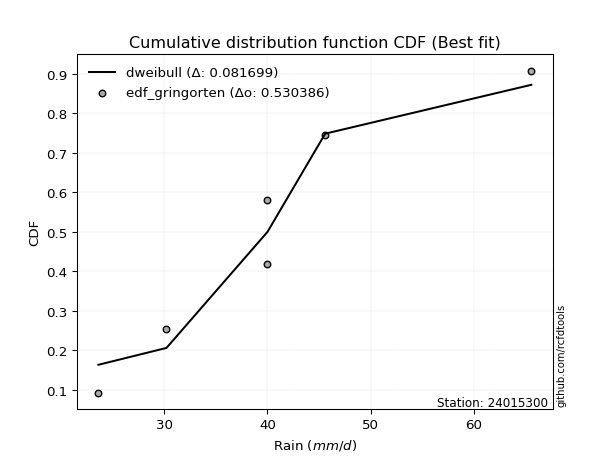</img>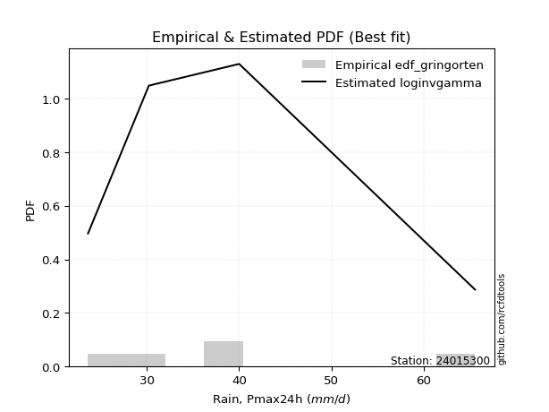</img>

</div>


### 9. EDF Filliben (1975)

The specific values of the constants (0.3175) (often denoted as $alpha$) and (0.365) are derived from a method proposed by James J. Filliben in a 1975 paper. This particular formula is the mean value of the $i$-th order statistic of the normal distribution and is considered a robust and effective plotting position formula for the normal probability plot correlation coefficient test for normality.

<div align="center">


$P=(m-0.3175)/(n+0.365)$


</div>


**9.1. Empirical values**

<div align="center">

|                | 0                   | 1                   | 2                  | 3                  | 4                  | 5                  |
|:---------------|:--------------------|:--------------------|:-------------------|:-------------------|:-------------------|:-------------------|
| date           | 2022                | 2021                | 2020               | 2019               | 2025               | 2024               |
| x              | 23.6                | 30.2                | 40.0               | 40.0               | 45.6               | 65.6               |
| m              | 1                   | 2                   | 3                  | 4                  | 5                  | 6                  |
| empirical_dist | edf_filliben        | edf_filliben        | edf_filliben       | edf_filliben       | edf_filliben       | edf_filliben       |
| empirical      | 0.10722702278083267 | 0.26433621366849963 | 0.4214454045561665 | 0.5785545954438335 | 0.7356637863315004 | 0.8927729772191673 |
| empirical_tr   | 1.1201055873295205  | 1.3593166043780034  | 1.7284453496266123 | 2.3727865796831313 | 3.783060921248143  | 9.326007326007321  |

</div>


**9.2. Kolmogorov-Smirnov fit test (sorted by Δ)**


<div align="center">

|                | 0                   | 1                   | 2                  | 3                   | 4                   | 5                   | 6                   | 7                   | 8                   | 9                   | 10                  | 11                  | 12                  | 13                  | 14                 | 15                  | 16                  | 17                  | 18                  | 19                  | 20                 | 21                  | 22                  | 23                  | 24                  | 25                  | 26                  | 27                  | 28                  | 29                  | 30                 | 31                | 32                  | 33                  | 34                 | 35                  | 36                  | 37                 | 38                  | 39                 | 40                 | 41                 | 42                  | 43                  | 44                  | 45                  | 46                  | 47                 | 48                  | 49                  | 50                  | 51                  | 52                  | 53                 | 54                  | 55                  | 56                  | 57                  | 58                  | 59                  | 60                 | 61                  | 62                | 63                 | 64                  | 65                  | 66                  | 67                  | 68                 | 69                  | 70                  | 71                  | 72                  | 73                 | 74                 | 75                 | 76                  | 77                  | 78                  | 79                 | 80                  | 81                  | 82                 | 83                  | 84                  | 85                  | 86                  | 87                  | 88                 | 89                  | 90                  | 91                  | 92                  | 93                 | 94                  | 95                  | 96                  | 97                  | 98                 | 99                  | 100                 | 101                 | 102                 | 103                 | 104                 | 105                 | 106                | 107                 | 108                 | 109                 | 110                 | 111                 | 112                 | 113                 | 114                 | 115                | 116                | 117                 | 118                 | 119                 | 120                 | 121                | 122                 | 123                 | 124                | 125                | 126                | 127                | 128                | 129                | 130                | 131                 | 132                | 133                | 134                | 135                | 136                 | 137                | 138                 | 139                | 140                 | 141                | 142                 | 143                | 144                | 145                | 146                 | 147                 | 148                 | 149                | 150                | 151                | 152                | 153                | 154                | 155                | 156                | 157                | 158              | 159            |
|:---------------|:--------------------|:--------------------|:-------------------|:--------------------|:--------------------|:--------------------|:--------------------|:--------------------|:--------------------|:--------------------|:--------------------|:--------------------|:--------------------|:--------------------|:-------------------|:--------------------|:--------------------|:--------------------|:--------------------|:--------------------|:-------------------|:--------------------|:--------------------|:--------------------|:--------------------|:--------------------|:--------------------|:--------------------|:--------------------|:--------------------|:-------------------|:------------------|:--------------------|:--------------------|:-------------------|:--------------------|:--------------------|:-------------------|:--------------------|:-------------------|:-------------------|:-------------------|:--------------------|:--------------------|:--------------------|:--------------------|:--------------------|:-------------------|:--------------------|:--------------------|:--------------------|:--------------------|:--------------------|:-------------------|:--------------------|:--------------------|:--------------------|:--------------------|:--------------------|:--------------------|:-------------------|:--------------------|:------------------|:-------------------|:--------------------|:--------------------|:--------------------|:--------------------|:-------------------|:--------------------|:--------------------|:--------------------|:--------------------|:-------------------|:-------------------|:-------------------|:--------------------|:--------------------|:--------------------|:-------------------|:--------------------|:--------------------|:-------------------|:--------------------|:--------------------|:--------------------|:--------------------|:--------------------|:-------------------|:--------------------|:--------------------|:--------------------|:--------------------|:-------------------|:--------------------|:--------------------|:--------------------|:--------------------|:-------------------|:--------------------|:--------------------|:--------------------|:--------------------|:--------------------|:--------------------|:--------------------|:-------------------|:--------------------|:--------------------|:--------------------|:--------------------|:--------------------|:--------------------|:--------------------|:--------------------|:-------------------|:-------------------|:--------------------|:--------------------|:--------------------|:--------------------|:-------------------|:--------------------|:--------------------|:-------------------|:-------------------|:-------------------|:-------------------|:-------------------|:-------------------|:-------------------|:--------------------|:-------------------|:-------------------|:-------------------|:-------------------|:--------------------|:-------------------|:--------------------|:-------------------|:--------------------|:-------------------|:--------------------|:-------------------|:-------------------|:-------------------|:--------------------|:--------------------|:--------------------|:-------------------|:-------------------|:-------------------|:-------------------|:-------------------|:-------------------|:-------------------|:-------------------|:-------------------|:-----------------|:---------------|
| station        | 24015300            | 24015300            | 24015300           | 24015300            | 24015300            | 24015300            | 24015300            | 24015300            | 24015300            | 24015300            | 24015300            | 24015300            | 24015300            | 24015300            | 24015300           | 24015300            | 24015300            | 24015300            | 24015300            | 24015300            | 24015300           | 24015300            | 24015300            | 24015300            | 24015300            | 24015300            | 24015300            | 24015300            | 24015300            | 24015300            | 24015300           | 24015300          | 24015300            | 24015300            | 24015300           | 24015300            | 24015300            | 24015300           | 24015300            | 24015300           | 24015300           | 24015300           | 24015300            | 24015300            | 24015300            | 24015300            | 24015300            | 24015300           | 24015300            | 24015300            | 24015300            | 24015300            | 24015300            | 24015300           | 24015300            | 24015300            | 24015300            | 24015300            | 24015300            | 24015300            | 24015300           | 24015300            | 24015300          | 24015300           | 24015300            | 24015300            | 24015300            | 24015300            | 24015300           | 24015300            | 24015300            | 24015300            | 24015300            | 24015300           | 24015300           | 24015300           | 24015300            | 24015300            | 24015300            | 24015300           | 24015300            | 24015300            | 24015300           | 24015300            | 24015300            | 24015300            | 24015300            | 24015300            | 24015300           | 24015300            | 24015300            | 24015300            | 24015300            | 24015300           | 24015300            | 24015300            | 24015300            | 24015300            | 24015300           | 24015300            | 24015300            | 24015300            | 24015300            | 24015300            | 24015300            | 24015300            | 24015300           | 24015300            | 24015300            | 24015300            | 24015300            | 24015300            | 24015300            | 24015300            | 24015300            | 24015300           | 24015300           | 24015300            | 24015300            | 24015300            | 24015300            | 24015300           | 24015300            | 24015300            | 24015300           | 24015300           | 24015300           | 24015300           | 24015300           | 24015300           | 24015300           | 24015300            | 24015300           | 24015300           | 24015300           | 24015300           | 24015300            | 24015300           | 24015300            | 24015300           | 24015300            | 24015300           | 24015300            | 24015300           | 24015300           | 24015300           | 24015300            | 24015300            | 24015300            | 24015300           | 24015300           | 24015300           | 24015300           | 24015300           | 24015300           | 24015300           | 24015300           | 24015300           | 24015300         | 24015300       |
| empirical_dist | edf_filliben        | edf_filliben        | edf_filliben       | edf_filliben        | edf_filliben        | edf_filliben        | edf_filliben        | edf_filliben        | edf_filliben        | edf_filliben        | edf_filliben        | edf_filliben        | edf_filliben        | edf_filliben        | edf_filliben       | edf_filliben        | edf_filliben        | edf_filliben        | edf_filliben        | edf_filliben        | edf_filliben       | edf_filliben        | edf_filliben        | edf_filliben        | edf_filliben        | edf_filliben        | edf_filliben        | edf_filliben        | edf_filliben        | edf_filliben        | edf_filliben       | edf_filliben      | edf_filliben        | edf_filliben        | edf_filliben       | edf_filliben        | edf_filliben        | edf_filliben       | edf_filliben        | edf_filliben       | edf_filliben       | edf_filliben       | edf_filliben        | edf_filliben        | edf_filliben        | edf_filliben        | edf_filliben        | edf_filliben       | edf_filliben        | edf_filliben        | edf_filliben        | edf_filliben        | edf_filliben        | edf_filliben       | edf_filliben        | edf_filliben        | edf_filliben        | edf_filliben        | edf_filliben        | edf_filliben        | edf_filliben       | edf_filliben        | edf_filliben      | edf_filliben       | edf_filliben        | edf_filliben        | edf_filliben        | edf_filliben        | edf_filliben       | edf_filliben        | edf_filliben        | edf_filliben        | edf_filliben        | edf_filliben       | edf_filliben       | edf_filliben       | edf_filliben        | edf_filliben        | edf_filliben        | edf_filliben       | edf_filliben        | edf_filliben        | edf_filliben       | edf_filliben        | edf_filliben        | edf_filliben        | edf_filliben        | edf_filliben        | edf_filliben       | edf_filliben        | edf_filliben        | edf_filliben        | edf_filliben        | edf_filliben       | edf_filliben        | edf_filliben        | edf_filliben        | edf_filliben        | edf_filliben       | edf_filliben        | edf_filliben        | edf_filliben        | edf_filliben        | edf_filliben        | edf_filliben        | edf_filliben        | edf_filliben       | edf_filliben        | edf_filliben        | edf_filliben        | edf_filliben        | edf_filliben        | edf_filliben        | edf_filliben        | edf_filliben        | edf_filliben       | edf_filliben       | edf_filliben        | edf_filliben        | edf_filliben        | edf_filliben        | edf_filliben       | edf_filliben        | edf_filliben        | edf_filliben       | edf_filliben       | edf_filliben       | edf_filliben       | edf_filliben       | edf_filliben       | edf_filliben       | edf_filliben        | edf_filliben       | edf_filliben       | edf_filliben       | edf_filliben       | edf_filliben        | edf_filliben       | edf_filliben        | edf_filliben       | edf_filliben        | edf_filliben       | edf_filliben        | edf_filliben       | edf_filliben       | edf_filliben       | edf_filliben        | edf_filliben        | edf_filliben        | edf_filliben       | edf_filliben       | edf_filliben       | edf_filliben       | edf_filliben       | edf_filliben       | edf_filliben       | edf_filliben       | edf_filliben       | edf_filliben     | edf_filliben   |
| p_dist         | dweibull            | logdweibull         | rice               | maxwell             | pearson3            | rayleigh            | foldnorm            | t                   | norm                | crystalball         | truncnorm           | logksone            | logistic            | truncexpon          | logvonmises_line   | gompertz            | logkappa3           | logtukeylambda      | loghalfgennorm      | loguniform          | logkappa4          | ncf                 | logloglaplace       | loggumbel_l         | logsemicircular     | logcosine           | hypsecant           | loggenextreme       | logweibull_max      | loganglit           | logncf             | anglit            | logloggamma         | logt                | lognorm            | logcrystalball      | logexponnorm        | logburr            | logskewnorm         | logbradford        | kstwobign          | logarcsine         | logtruncpareto      | logpearson3         | loggamma            | loggamma            | logerlang           | laplace            | semicircular        | loglogistic         | logjohnsonsu        | alpha               | gumbel_r            | logf               | logfatiguelife      | logbetaprime        | nct                 | betaprime           | lomax               | genlogistic         | loghypsecant       | loggenlogistic      | exponnorm         | bradford           | invgamma            | skewnorm            | logargus            | loggausshyper       | halfnorm           | logfoldnorm         | loginvgamma         | johnsonsu           | truncpareto         | lognct             | logrice            | logalpha           | invgauss            | cosine              | logweibull_min      | loggompertz        | loglaplace          | loglaplace          | loginvgauss        | burr                | logmaxwell          | moyal               | logburr12           | dgamma              | arcsine            | halflogistic        | lograyleigh         | loggennorm          | gennorm             | genpareto          | truncweibull_min    | vonmises_line       | weibull_min         | gumbel_l            | loginvweibull      | logkstwobign        | logwrapcauchy       | logtruncweibull_min | loghalfnorm         | loggumbel_r         | gausshyper          | kappa4              | loggenexpon        | logtriang           | logtruncexpon       | uniform             | logmoyal            | wrapcauchy          | loghalflogistic     | ksone               | logdgamma           | wald               | beta               | loglomax            | halfgennorm         | burr12              | argus               | loglevy_l          | f                   | logjohnsonsb        | nakagami           | logexponweib       | genextreme         | levy_l             | exponpow           | logwald            | loggenhalflogistic | logexponpow         | kappa3             | triang             | johnsonsb          | logmielke          | loggengamma         | tukeylambda        | gamma               | logtrapezoid       | logbeta             | genhalflogistic    | rdist               | lognakagami        | gengamma           | invweibull         | trapezoid           | fatiguelife         | loggenpareto        | erlang             | powerlaw           | exponweib          | logpowerlaw        | genexpon           | logtruncnorm       | logrdist           | weibull_max        | logvonmises        | vonmises         | mielke         |
| delta          | 0.07855468401884863 | 0.07864288707019867 | 0.0835800166707601 | 0.08728549324421642 | 0.09651940684546156 | 0.09879371489165889 | 0.10230852058176587 | 0.10368313835233006 | 0.10369825843618058 | 0.10369826454100972 | 0.10369826834769735 | 0.10607663011519819 | 0.10712144462006917 | 0.10722699251018109 | 0.1072270219051697 | 0.10722702276841163 | 0.10722702278012886 | 0.10722702278082556 | 0.10722702278083267 | 0.10722702278083274 | 0.1077723957211274 | 0.10779418250507933 | 0.10873274145110245 | 0.10876201243715211 | 0.10889048397146184 | 0.10996470679067205 | 0.11003694232493166 | 0.11011032235275642 | 0.11012694438220072 | 0.11112164930849444 | 0.1112620061151669 | 0.113594765894518 | 0.11502961762215047 | 0.11651391934701272 | 0.1165318618886213 | 0.11653209225366112 | 0.11658341917642079 | 0.1172366213672833 | 0.11757134619148946 | 0.1183656677156355 | 0.1192265783751788 | 0.1194251422607916 | 0.11957578514387335 | 0.12004648445766497 | 0.12071770377929458 | 0.12071770377929458 | 0.12080443497264115 | 0.1212191936314379 | 0.12146028067055303 | 0.12167869676790166 | 0.12168880915598546 | 0.12243710637474658 | 0.12257869265154486 | 0.1226903890673865 | 0.12358475059430085 | 0.12379644654294764 | 0.12459522212820551 | 0.12483797905826666 | 0.12535614667453154 | 0.12548146441132724 | 0.1260469650770133 | 0.12613955477684413 | 0.126783133147105 | 0.1272029534447453 | 0.12807233726870926 | 0.12839727942959966 | 0.12985437078462947 | 0.13003653105232915 | 0.1312203649504825 | 0.13213345854318725 | 0.13319607039905235 | 0.13457801924731816 | 0.13497691457506156 | 0.1363010251044875 | 0.1367360366432947 | 0.1371902959568444 | 0.13763022464539953 | 0.13920540001056214 | 0.13970117599268062 | 0.1408924752890549 | 0.14162231642517542 | 0.14162231642517542 | 0.1449280737670805 | 0.14542692852095485 | 0.14767913327360693 | 0.14839555872515542 | 0.14910489831111728 | 0.14940728906222656 | 0.1535598727862545 | 0.15442601478850393 | 0.15776862559546723 | 0.16433167334764776 | 0.16558303013662773 | 0.1667655134782085 | 0.16891763724153364 | 0.17081044637364395 | 0.17247831028952376 | 0.17436502759593453 | 0.1766130486947689 | 0.18126244725125262 | 0.18443069968388082 | 0.18519807326199622 | 0.18620128037576766 | 0.18700661848499822 | 0.18762817359228412 | 0.18913671864349657 | 0.2000272100842767 | 0.20193057582698604 | 0.20788793245610837 | 0.21185426252197648 | 0.21220118886811046 | 0.21278042600426794 | 0.21304883403332586 | 0.21582251649023054 | 0.21856237816237092 | 0.2202588418203012 | 0.2261011489103225 | 0.23433373038986371 | 0.23433571013597898 | 0.23575106776415378 | 0.23615958611846044 | 0.2459895078530639 | 0.24735994105639658 | 0.25627260607626007 | 0.2643304941474475 | 0.2746341765435597 | 0.2752318266681627 | 0.2773887439410068 | 0.2819739964664755 | 0.2821240737597458 | 0.2863713874895482 | 0.28771869746466117 | 0.2907680489996311 | 0.3025155629799004 | 0.3031068243495941 | 0.3120916617437023 | 0.31257906915049183 | 0.3170326369904687 | 0.34027685104935745 | 0.3509795687908767 | 0.35677536759554274 | 0.3676213242609144 | 0.42272605816402004 | 0.4280260335492315 | 0.4369133030386279 | 0.4586101006224867 | 0.46542884050131644 | 0.47886790174039245 | 0.47892481884281474 | 0.4838632456087526 | 0.5003506654116268 | 0.5075935827765179 | 0.5371433670158576 | 0.5581648979890351 | 0.5785533232844375 | 0.5785545917176265 | 0.6178841055153818 | 1.1172893754219646 | 9.62820310280765 | nan            |
| deltao         | 0.530385761606      | 0.530385761606      | 0.530385761606     | 0.530385761606      | 0.530385761606      | 0.530385761606      | 0.530385761606      | 0.530385761606      | 0.530385761606      | 0.530385761606      | 0.530385761606      | 0.530385761606      | 0.530385761606      | 0.530385761606      | 0.530385761606     | 0.530385761606      | 0.530385761606      | 0.530385761606      | 0.530385761606      | 0.530385761606      | 0.530385761606     | 0.530385761606      | 0.530385761606      | 0.530385761606      | 0.530385761606      | 0.530385761606      | 0.530385761606      | 0.530385761606      | 0.530385761606      | 0.530385761606      | 0.530385761606     | 0.530385761606    | 0.530385761606      | 0.530385761606      | 0.530385761606     | 0.530385761606      | 0.530385761606      | 0.530385761606     | 0.530385761606      | 0.530385761606     | 0.530385761606     | 0.530385761606     | 0.530385761606      | 0.530385761606      | 0.530385761606      | 0.530385761606      | 0.530385761606      | 0.530385761606     | 0.530385761606      | 0.530385761606      | 0.530385761606      | 0.530385761606      | 0.530385761606      | 0.530385761606     | 0.530385761606      | 0.530385761606      | 0.530385761606      | 0.530385761606      | 0.530385761606      | 0.530385761606      | 0.530385761606     | 0.530385761606      | 0.530385761606    | 0.530385761606     | 0.530385761606      | 0.530385761606      | 0.530385761606      | 0.530385761606      | 0.530385761606     | 0.530385761606      | 0.530385761606      | 0.530385761606      | 0.530385761606      | 0.530385761606     | 0.530385761606     | 0.530385761606     | 0.530385761606      | 0.530385761606      | 0.530385761606      | 0.530385761606     | 0.530385761606      | 0.530385761606      | 0.530385761606     | 0.530385761606      | 0.530385761606      | 0.530385761606      | 0.530385761606      | 0.530385761606      | 0.530385761606     | 0.530385761606      | 0.530385761606      | 0.530385761606      | 0.530385761606      | 0.530385761606     | 0.530385761606      | 0.530385761606      | 0.530385761606      | 0.530385761606      | 0.530385761606     | 0.530385761606      | 0.530385761606      | 0.530385761606      | 0.530385761606      | 0.530385761606      | 0.530385761606      | 0.530385761606      | 0.530385761606     | 0.530385761606      | 0.530385761606      | 0.530385761606      | 0.530385761606      | 0.530385761606      | 0.530385761606      | 0.530385761606      | 0.530385761606      | 0.530385761606     | 0.530385761606     | 0.530385761606      | 0.530385761606      | 0.530385761606      | 0.530385761606      | 0.530385761606     | 0.530385761606      | 0.530385761606      | 0.530385761606     | 0.530385761606     | 0.530385761606     | 0.530385761606     | 0.530385761606     | 0.530385761606     | 0.530385761606     | 0.530385761606      | 0.530385761606     | 0.530385761606     | 0.530385761606     | 0.530385761606     | 0.530385761606      | 0.530385761606     | 0.530385761606      | 0.530385761606     | 0.530385761606      | 0.530385761606     | 0.530385761606      | 0.530385761606     | 0.530385761606     | 0.530385761606     | 0.530385761606      | 0.530385761606      | 0.530385761606      | 0.530385761606     | 0.530385761606     | 0.530385761606     | 0.530385761606     | 0.530385761606     | 0.530385761606     | 0.530385761606     | 0.530385761606     | 0.530385761606     | 0.530385761606   | 0.530385761606 |
| eval           | Δo > Δ              | Δo > Δ              | Δo > Δ             | Δo > Δ              | Δo > Δ              | Δo > Δ              | Δo > Δ              | Δo > Δ              | Δo > Δ              | Δo > Δ              | Δo > Δ              | Δo > Δ              | Δo > Δ              | Δo > Δ              | Δo > Δ             | Δo > Δ              | Δo > Δ              | Δo > Δ              | Δo > Δ              | Δo > Δ              | Δo > Δ             | Δo > Δ              | Δo > Δ              | Δo > Δ              | Δo > Δ              | Δo > Δ              | Δo > Δ              | Δo > Δ              | Δo > Δ              | Δo > Δ              | Δo > Δ             | Δo > Δ            | Δo > Δ              | Δo > Δ              | Δo > Δ             | Δo > Δ              | Δo > Δ              | Δo > Δ             | Δo > Δ              | Δo > Δ             | Δo > Δ             | Δo > Δ             | Δo > Δ              | Δo > Δ              | Δo > Δ              | Δo > Δ              | Δo > Δ              | Δo > Δ             | Δo > Δ              | Δo > Δ              | Δo > Δ              | Δo > Δ              | Δo > Δ              | Δo > Δ             | Δo > Δ              | Δo > Δ              | Δo > Δ              | Δo > Δ              | Δo > Δ              | Δo > Δ              | Δo > Δ             | Δo > Δ              | Δo > Δ            | Δo > Δ             | Δo > Δ              | Δo > Δ              | Δo > Δ              | Δo > Δ              | Δo > Δ             | Δo > Δ              | Δo > Δ              | Δo > Δ              | Δo > Δ              | Δo > Δ             | Δo > Δ             | Δo > Δ             | Δo > Δ              | Δo > Δ              | Δo > Δ              | Δo > Δ             | Δo > Δ              | Δo > Δ              | Δo > Δ             | Δo > Δ              | Δo > Δ              | Δo > Δ              | Δo > Δ              | Δo > Δ              | Δo > Δ             | Δo > Δ              | Δo > Δ              | Δo > Δ              | Δo > Δ              | Δo > Δ             | Δo > Δ              | Δo > Δ              | Δo > Δ              | Δo > Δ              | Δo > Δ             | Δo > Δ              | Δo > Δ              | Δo > Δ              | Δo > Δ              | Δo > Δ              | Δo > Δ              | Δo > Δ              | Δo > Δ             | Δo > Δ              | Δo > Δ              | Δo > Δ              | Δo > Δ              | Δo > Δ              | Δo > Δ              | Δo > Δ              | Δo > Δ              | Δo > Δ             | Δo > Δ             | Δo > Δ              | Δo > Δ              | Δo > Δ              | Δo > Δ              | Δo > Δ             | Δo > Δ              | Δo > Δ              | Δo > Δ             | Δo > Δ             | Δo > Δ             | Δo > Δ             | Δo > Δ             | Δo > Δ             | Δo > Δ             | Δo > Δ              | Δo > Δ             | Δo > Δ             | Δo > Δ             | Δo > Δ             | Δo > Δ              | Δo > Δ             | Δo > Δ              | Δo > Δ             | Δo > Δ              | Δo > Δ             | Δo > Δ              | Δo > Δ             | Δo > Δ             | Δo > Δ             | Δo > Δ              | Δo > Δ              | Δo > Δ              | Δo > Δ             | Δo > Δ             | Δo > Δ             | Δo <= Δ            | Δo <= Δ            | Δo <= Δ            | Δo <= Δ            | Δo <= Δ            | Δo <= Δ            | Δo <= Δ          | Δo <= Δ        |
| fit            | 1                   | 1                   | 1                  | 1                   | 1                   | 1                   | 1                   | 1                   | 1                   | 1                   | 1                   | 1                   | 1                   | 1                   | 1                  | 1                   | 1                   | 1                   | 1                   | 1                   | 1                  | 1                   | 1                   | 1                   | 1                   | 1                   | 1                   | 1                   | 1                   | 1                   | 1                  | 1                 | 1                   | 1                   | 1                  | 1                   | 1                   | 1                  | 1                   | 1                  | 1                  | 1                  | 1                   | 1                   | 1                   | 1                   | 1                   | 1                  | 1                   | 1                   | 1                   | 1                   | 1                   | 1                  | 1                   | 1                   | 1                   | 1                   | 1                   | 1                   | 1                  | 1                   | 1                 | 1                  | 1                   | 1                   | 1                   | 1                   | 1                  | 1                   | 1                   | 1                   | 1                   | 1                  | 1                  | 1                  | 1                   | 1                   | 1                   | 1                  | 1                   | 1                   | 1                  | 1                   | 1                   | 1                   | 1                   | 1                   | 1                  | 1                   | 1                   | 1                   | 1                   | 1                  | 1                   | 1                   | 1                   | 1                   | 1                  | 1                   | 1                   | 1                   | 1                   | 1                   | 1                   | 1                   | 1                  | 1                   | 1                   | 1                   | 1                   | 1                   | 1                   | 1                   | 1                   | 1                  | 1                  | 1                   | 1                   | 1                   | 1                   | 1                  | 1                   | 1                   | 1                  | 1                  | 1                  | 1                  | 1                  | 1                  | 1                  | 1                   | 1                  | 1                  | 1                  | 1                  | 1                   | 1                  | 1                   | 1                  | 1                   | 1                  | 1                   | 1                  | 1                  | 1                  | 1                   | 1                   | 1                   | 1                  | 1                  | 1                  | 0                  | 0                  | 0                  | 0                  | 0                  | 0                  | 0                | 0              |
| n              | 6                   | 6                   | 6                  | 6                   | 6                   | 6                   | 6                   | 6                   | 6                   | 6                   | 6                   | 6                   | 6                   | 6                   | 6                  | 6                   | 6                   | 6                   | 6                   | 6                   | 6                  | 6                   | 6                   | 6                   | 6                   | 6                   | 6                   | 6                   | 6                   | 6                   | 6                  | 6                 | 6                   | 6                   | 6                  | 6                   | 6                   | 6                  | 6                   | 6                  | 6                  | 6                  | 6                   | 6                   | 6                   | 6                   | 6                   | 6                  | 6                   | 6                   | 6                   | 6                   | 6                   | 6                  | 6                   | 6                   | 6                   | 6                   | 6                   | 6                   | 6                  | 6                   | 6                 | 6                  | 6                   | 6                   | 6                   | 6                   | 6                  | 6                   | 6                   | 6                   | 6                   | 6                  | 6                  | 6                  | 6                   | 6                   | 6                   | 6                  | 6                   | 6                   | 6                  | 6                   | 6                   | 6                   | 6                   | 6                   | 6                  | 6                   | 6                   | 6                   | 6                   | 6                  | 6                   | 6                   | 6                   | 6                   | 6                  | 6                   | 6                   | 6                   | 6                   | 6                   | 6                   | 6                   | 6                  | 6                   | 6                   | 6                   | 6                   | 6                   | 6                   | 6                   | 6                   | 6                  | 6                  | 6                   | 6                   | 6                   | 6                   | 6                  | 6                   | 6                   | 6                  | 6                  | 6                  | 6                  | 6                  | 6                  | 6                  | 6                   | 6                  | 6                  | 6                  | 6                  | 6                   | 6                  | 6                   | 6                  | 6                   | 6                  | 6                   | 6                  | 6                  | 6                  | 6                   | 6                   | 6                   | 6                  | 6                  | 6                  | 6                  | 6                  | 6                  | 6                  | 6                  | 6                  | 6                | 6              |
| best_fit       | 1                   | 0                   | 0                  | 0                   | 0                   | 0                   | 0                   | 0                   | 0                   | 0                   | 0                   | 0                   | 0                   | 0                   | 0                  | 0                   | 0                   | 0                   | 0                   | 0                   | 0                  | 0                   | 0                   | 0                   | 0                   | 0                   | 0                   | 0                   | 0                   | 0                   | 0                  | 0                 | 0                   | 0                   | 0                  | 0                   | 0                   | 0                  | 0                   | 0                  | 0                  | 0                  | 0                   | 0                   | 0                   | 0                   | 0                   | 0                  | 0                   | 0                   | 0                   | 0                   | 0                   | 0                  | 0                   | 0                   | 0                   | 0                   | 0                   | 0                   | 0                  | 0                   | 0                 | 0                  | 0                   | 0                   | 0                   | 0                   | 0                  | 0                   | 0                   | 0                   | 0                   | 0                  | 0                  | 0                  | 0                   | 0                   | 0                   | 0                  | 0                   | 0                   | 0                  | 0                   | 0                   | 0                   | 0                   | 0                   | 0                  | 0                   | 0                   | 0                   | 0                   | 0                  | 0                   | 0                   | 0                   | 0                   | 0                  | 0                   | 0                   | 0                   | 0                   | 0                   | 0                   | 0                   | 0                  | 0                   | 0                   | 0                   | 0                   | 0                   | 0                   | 0                   | 0                   | 0                  | 0                  | 0                   | 0                   | 0                   | 0                   | 0                  | 0                   | 0                   | 0                  | 0                  | 0                  | 0                  | 0                  | 0                  | 0                  | 0                   | 0                  | 0                  | 0                  | 0                  | 0                   | 0                  | 0                   | 0                  | 0                   | 0                  | 0                   | 0                  | 0                  | 0                  | 0                   | 0                   | 0                   | 0                  | 0                  | 0                  | 0                  | 0                  | 0                  | 0                  | 0                  | 0                  | 0                | 0              |
| best_fit_sort  | 1                   | 2                   | 3                  | 4                   | 5                   | 6                   | 7                   | 8                   | 9                   | 10                  | 11                  | 12                  | 13                  | 14                  | 15                 | 16                  | 17                  | 18                  | 19                  | 20                  | 21                 | 22                  | 23                  | 24                  | 25                  | 26                  | 27                  | 28                  | 29                  | 30                  | 31                 | 32                | 33                  | 34                  | 35                 | 36                  | 37                  | 38                 | 39                  | 40                 | 41                 | 42                 | 43                  | 44                  | 45                  | 46                  | 47                  | 48                 | 49                  | 50                  | 51                  | 52                  | 53                  | 54                 | 55                  | 56                  | 57                  | 58                  | 59                  | 60                  | 61                 | 62                  | 63                | 64                 | 65                  | 66                  | 67                  | 68                  | 69                 | 70                  | 71                  | 72                  | 73                  | 74                 | 75                 | 76                 | 77                  | 78                  | 79                  | 80                 | 81                  | 82                  | 83                 | 84                  | 85                  | 86                  | 87                  | 88                  | 89                 | 90                  | 91                  | 92                  | 93                  | 94                 | 95                  | 96                  | 97                  | 98                  | 99                 | 100                 | 101                 | 102                 | 103                 | 104                 | 105                 | 106                 | 107                | 108                 | 109                 | 110                 | 111                 | 112                 | 113                 | 114                 | 115                 | 116                | 117                | 118                 | 119                 | 120                 | 121                 | 122                | 123                 | 124                 | 125                | 126                | 127                | 128                | 129                | 130                | 131                | 132                 | 133                | 134                | 135                | 136                | 137                 | 138                | 139                 | 140                | 141                 | 142                | 143                 | 144                | 145                | 146                | 147                 | 148                 | 149                 | 150                | 151                | 152                | 153                | 154                | 155                | 156                | 157                | 158                | 159              | 160            |

</div>


**9.3. Best fit**

<div align="center">

|   id |   station | empirical_dist   | p_dist   |     delta |   deltao | eval   |   fit |   n |   best_fit |   best_fit_sort |
|-----:|----------:|:-----------------|:---------|----------:|---------:|:-------|------:|----:|-----------:|----------------:|
|    0 |  24015300 | edf_filliben     | dweibull | 0.0785547 | 0.530386 | Δo > Δ |     1 |   6 |          1 |               1 |

</div>


<div align="center">

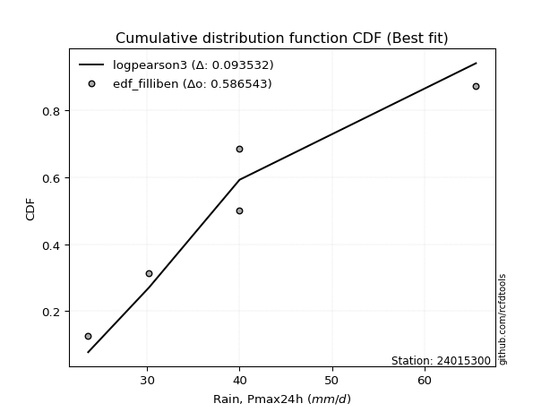</img>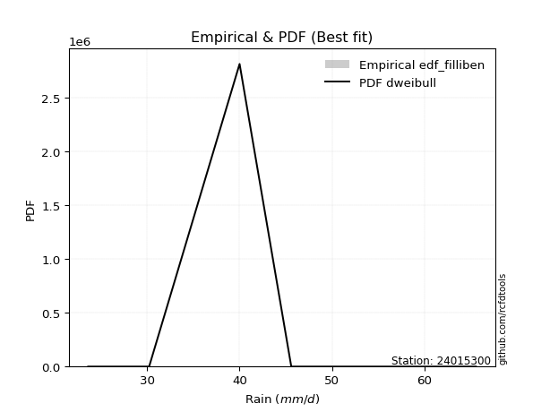</img>

</div>


### 10. EDF Jenkinson (1977)

The Jenkinson formula in hydrology is an empirical plotting position formula used to estimate the non-exceedance probability _(P)_ or return period _(T)_ of a given ordered observation within a sample. It is a widely used method in the frequency analysis of extreme events such as floods and rainfall, as it provides a distribution-free way to plot data. _a≈0.31_ and _b≈0.38_ are constants derived to approximate the median of the probability distribution for the given rank.

<div align="center">


$P=(m-a)/(n+b)$


</div>


**10.1. Empirical values**

<div align="center">

|                | 0                   | 1                   | 2                  | 3                  | 4                  | 5                  |
|:---------------|:--------------------|:--------------------|:-------------------|:-------------------|:-------------------|:-------------------|
| date           | 2022                | 2021                | 2020               | 2019               | 2025               | 2024               |
| x              | 23.6                | 30.2                | 40.0               | 40.0               | 45.6               | 65.6               |
| m              | 1                   | 2                   | 3                  | 4                  | 5                  | 6                  |
| empirical_dist | edf_jenkinson       | edf_jenkinson       | edf_jenkinson      | edf_jenkinson      | edf_jenkinson      | edf_jenkinson      |
| empirical      | 0.10815047021943573 | 0.26489028213166144 | 0.4216300940438871 | 0.5783699059561128 | 0.7351097178683387 | 0.8918495297805643 |
| empirical_tr   | 1.1212653778558874  | 1.3603411513859276  | 1.7289972899728996 | 2.3717472118959106 | 3.7751479289940844 | 9.246376811594207  |

</div>


**10.2. Kolmogorov-Smirnov fit test (sorted by Δ)**


<div align="center">

|                | 0                   | 1                   | 2                   | 3                   | 4                   | 5                   | 6                   | 7                  | 8                   | 9                   | 10                 | 11                  | 12                  | 13                  | 14                  | 15                  | 16                 | 17                  | 18                  | 19                  | 20                  | 21                  | 22                  | 23                  | 24                  | 25                  | 26                | 27                  | 28                  | 29                  | 30                 | 31                  | 32                  | 33                  | 34                 | 35                  | 36                  | 37                 | 38                  | 39                 | 40                  | 41                 | 42                  | 43                  | 44                  | 45                  | 46                  | 47                  | 48                  | 49                  | 50                  | 51                  | 52                  | 53                 | 54                  | 55                  | 56                 | 57                  | 58                 | 59                  | 60                 | 61                  | 62                  | 63                  | 64                  | 65                  | 66                  | 67                  | 68                 | 69                  | 70                  | 71                  | 72                  | 73                 | 74                 | 75                 | 76                  | 77                | 78               | 79                 | 80                  | 81                  | 82                 | 83                  | 84                  | 85                  | 86                  | 87                  | 88                  | 89                  | 90                  | 91                  | 92                  | 93                  | 94                  | 95                 | 96                  | 97                  | 98                 | 99                  | 100                 | 101                 | 102                 | 103                 | 104                 | 105                 | 106                | 107                | 108                 | 109                 | 110                 | 111                | 112                 | 113                | 114                 | 115                | 116                | 117                | 118                 | 119                 | 120                | 121                 | 122                 | 123                 | 124                 | 125                 | 126                | 127                 | 128                 | 129                | 130                 | 131                 | 132                 | 133                 | 134                 | 135                | 136                | 137                | 138                 | 139                 | 140                 | 141                | 142                 | 143                | 144                | 145                 | 146                | 147                | 148                 | 149               | 150                | 151               | 152                | 153                | 154                | 155                | 156              | 157                | 158               | 159            |
|:---------------|:--------------------|:--------------------|:--------------------|:--------------------|:--------------------|:--------------------|:--------------------|:-------------------|:--------------------|:--------------------|:-------------------|:--------------------|:--------------------|:--------------------|:--------------------|:--------------------|:-------------------|:--------------------|:--------------------|:--------------------|:--------------------|:--------------------|:--------------------|:--------------------|:--------------------|:--------------------|:------------------|:--------------------|:--------------------|:--------------------|:-------------------|:--------------------|:--------------------|:--------------------|:-------------------|:--------------------|:--------------------|:-------------------|:--------------------|:-------------------|:--------------------|:-------------------|:--------------------|:--------------------|:--------------------|:--------------------|:--------------------|:--------------------|:--------------------|:--------------------|:--------------------|:--------------------|:--------------------|:-------------------|:--------------------|:--------------------|:-------------------|:--------------------|:-------------------|:--------------------|:-------------------|:--------------------|:--------------------|:--------------------|:--------------------|:--------------------|:--------------------|:--------------------|:-------------------|:--------------------|:--------------------|:--------------------|:--------------------|:-------------------|:-------------------|:-------------------|:--------------------|:------------------|:-----------------|:-------------------|:--------------------|:--------------------|:-------------------|:--------------------|:--------------------|:--------------------|:--------------------|:--------------------|:--------------------|:--------------------|:--------------------|:--------------------|:--------------------|:--------------------|:--------------------|:-------------------|:--------------------|:--------------------|:-------------------|:--------------------|:--------------------|:--------------------|:--------------------|:--------------------|:--------------------|:--------------------|:-------------------|:-------------------|:--------------------|:--------------------|:--------------------|:-------------------|:--------------------|:-------------------|:--------------------|:-------------------|:-------------------|:-------------------|:--------------------|:--------------------|:-------------------|:--------------------|:--------------------|:--------------------|:--------------------|:--------------------|:-------------------|:--------------------|:--------------------|:-------------------|:--------------------|:--------------------|:--------------------|:--------------------|:--------------------|:-------------------|:-------------------|:-------------------|:--------------------|:--------------------|:--------------------|:-------------------|:--------------------|:-------------------|:-------------------|:--------------------|:-------------------|:-------------------|:--------------------|:------------------|:-------------------|:------------------|:-------------------|:-------------------|:-------------------|:-------------------|:-----------------|:-------------------|:------------------|:---------------|
| station        | 24015300            | 24015300            | 24015300            | 24015300            | 24015300            | 24015300            | 24015300            | 24015300           | 24015300            | 24015300            | 24015300           | 24015300            | 24015300            | 24015300            | 24015300            | 24015300            | 24015300           | 24015300            | 24015300            | 24015300            | 24015300            | 24015300            | 24015300            | 24015300            | 24015300            | 24015300            | 24015300          | 24015300            | 24015300            | 24015300            | 24015300           | 24015300            | 24015300            | 24015300            | 24015300           | 24015300            | 24015300            | 24015300           | 24015300            | 24015300           | 24015300            | 24015300           | 24015300            | 24015300            | 24015300            | 24015300            | 24015300            | 24015300            | 24015300            | 24015300            | 24015300            | 24015300            | 24015300            | 24015300           | 24015300            | 24015300            | 24015300           | 24015300            | 24015300           | 24015300            | 24015300           | 24015300            | 24015300            | 24015300            | 24015300            | 24015300            | 24015300            | 24015300            | 24015300           | 24015300            | 24015300            | 24015300            | 24015300            | 24015300           | 24015300           | 24015300           | 24015300            | 24015300          | 24015300         | 24015300           | 24015300            | 24015300            | 24015300           | 24015300            | 24015300            | 24015300            | 24015300            | 24015300            | 24015300            | 24015300            | 24015300            | 24015300            | 24015300            | 24015300            | 24015300            | 24015300           | 24015300            | 24015300            | 24015300           | 24015300            | 24015300            | 24015300            | 24015300            | 24015300            | 24015300            | 24015300            | 24015300           | 24015300           | 24015300            | 24015300            | 24015300            | 24015300           | 24015300            | 24015300           | 24015300            | 24015300           | 24015300           | 24015300           | 24015300            | 24015300            | 24015300           | 24015300            | 24015300            | 24015300            | 24015300            | 24015300            | 24015300           | 24015300            | 24015300            | 24015300           | 24015300            | 24015300            | 24015300            | 24015300            | 24015300            | 24015300           | 24015300           | 24015300           | 24015300            | 24015300            | 24015300            | 24015300           | 24015300            | 24015300           | 24015300           | 24015300            | 24015300           | 24015300           | 24015300            | 24015300          | 24015300           | 24015300          | 24015300           | 24015300           | 24015300           | 24015300           | 24015300         | 24015300           | 24015300          | 24015300       |
| empirical_dist | edf_jenkinson       | edf_jenkinson       | edf_jenkinson       | edf_jenkinson       | edf_jenkinson       | edf_jenkinson       | edf_jenkinson       | edf_jenkinson      | edf_jenkinson       | edf_jenkinson       | edf_jenkinson      | edf_jenkinson       | edf_jenkinson       | edf_jenkinson       | edf_jenkinson       | edf_jenkinson       | edf_jenkinson      | edf_jenkinson       | edf_jenkinson       | edf_jenkinson       | edf_jenkinson       | edf_jenkinson       | edf_jenkinson       | edf_jenkinson       | edf_jenkinson       | edf_jenkinson       | edf_jenkinson     | edf_jenkinson       | edf_jenkinson       | edf_jenkinson       | edf_jenkinson      | edf_jenkinson       | edf_jenkinson       | edf_jenkinson       | edf_jenkinson      | edf_jenkinson       | edf_jenkinson       | edf_jenkinson      | edf_jenkinson       | edf_jenkinson      | edf_jenkinson       | edf_jenkinson      | edf_jenkinson       | edf_jenkinson       | edf_jenkinson       | edf_jenkinson       | edf_jenkinson       | edf_jenkinson       | edf_jenkinson       | edf_jenkinson       | edf_jenkinson       | edf_jenkinson       | edf_jenkinson       | edf_jenkinson      | edf_jenkinson       | edf_jenkinson       | edf_jenkinson      | edf_jenkinson       | edf_jenkinson      | edf_jenkinson       | edf_jenkinson      | edf_jenkinson       | edf_jenkinson       | edf_jenkinson       | edf_jenkinson       | edf_jenkinson       | edf_jenkinson       | edf_jenkinson       | edf_jenkinson      | edf_jenkinson       | edf_jenkinson       | edf_jenkinson       | edf_jenkinson       | edf_jenkinson      | edf_jenkinson      | edf_jenkinson      | edf_jenkinson       | edf_jenkinson     | edf_jenkinson    | edf_jenkinson      | edf_jenkinson       | edf_jenkinson       | edf_jenkinson      | edf_jenkinson       | edf_jenkinson       | edf_jenkinson       | edf_jenkinson       | edf_jenkinson       | edf_jenkinson       | edf_jenkinson       | edf_jenkinson       | edf_jenkinson       | edf_jenkinson       | edf_jenkinson       | edf_jenkinson       | edf_jenkinson      | edf_jenkinson       | edf_jenkinson       | edf_jenkinson      | edf_jenkinson       | edf_jenkinson       | edf_jenkinson       | edf_jenkinson       | edf_jenkinson       | edf_jenkinson       | edf_jenkinson       | edf_jenkinson      | edf_jenkinson      | edf_jenkinson       | edf_jenkinson       | edf_jenkinson       | edf_jenkinson      | edf_jenkinson       | edf_jenkinson      | edf_jenkinson       | edf_jenkinson      | edf_jenkinson      | edf_jenkinson      | edf_jenkinson       | edf_jenkinson       | edf_jenkinson      | edf_jenkinson       | edf_jenkinson       | edf_jenkinson       | edf_jenkinson       | edf_jenkinson       | edf_jenkinson      | edf_jenkinson       | edf_jenkinson       | edf_jenkinson      | edf_jenkinson       | edf_jenkinson       | edf_jenkinson       | edf_jenkinson       | edf_jenkinson       | edf_jenkinson      | edf_jenkinson      | edf_jenkinson      | edf_jenkinson       | edf_jenkinson       | edf_jenkinson       | edf_jenkinson      | edf_jenkinson       | edf_jenkinson      | edf_jenkinson      | edf_jenkinson       | edf_jenkinson      | edf_jenkinson      | edf_jenkinson       | edf_jenkinson     | edf_jenkinson      | edf_jenkinson     | edf_jenkinson      | edf_jenkinson      | edf_jenkinson      | edf_jenkinson      | edf_jenkinson    | edf_jenkinson      | edf_jenkinson     | edf_jenkinson  |
| p_dist         | dweibull            | logdweibull         | rice                | maxwell             | pearson3            | rayleigh            | foldnorm            | t                  | norm                | crystalball         | truncnorm          | logksone            | logistic            | ncf                 | truncexpon          | logvonmises_line    | gompertz           | logkappa3           | logtukeylambda      | logkappa4           | loghalfgennorm      | loguniform          | loggumbel_l         | logsemicircular     | logloglaplace       | logcosine           | hypsecant         | loggenextreme       | logweibull_max      | loganglit           | logncf             | anglit              | logloggamma         | logt                | lognorm            | logcrystalball      | logexponnorm        | logburr            | logskewnorm         | logbradford        | logarcsine          | kstwobign          | logtruncpareto      | logpearson3         | loggamma            | loggamma            | logerlang           | semicircular        | laplace             | loglogistic         | logjohnsonsu        | alpha               | gumbel_r            | logf               | logfatiguelife      | logbetaprime        | nct                | betaprime           | lomax              | genlogistic         | loghypsecant       | loggenlogistic      | exponnorm           | bradford            | invgamma            | skewnorm            | logargus            | loggausshyper       | halfnorm           | logfoldnorm         | loginvgamma         | johnsonsu           | truncpareto         | lognct             | logrice            | logalpha           | invgauss            | cosine            | logweibull_min   | loggompertz        | loglaplace          | loglaplace          | loginvgauss        | burr                | logmaxwell          | moyal               | logburr12           | dgamma              | arcsine             | halflogistic        | lograyleigh         | loggennorm          | genpareto           | gennorm             | truncweibull_min    | vonmises_line      | weibull_min         | gumbel_l            | loginvweibull      | logkstwobign        | logwrapcauchy       | logtruncweibull_min | loghalfnorm         | loggumbel_r         | gausshyper          | kappa4              | loggenexpon        | logtriang          | logtruncexpon       | uniform             | logmoyal            | wrapcauchy         | loghalflogistic     | ksone              | logdgamma           | wald               | beta               | loglomax           | halfgennorm         | burr12              | argus              | loglevy_l           | f                   | logjohnsonsb        | nakagami            | genextreme          | logexponweib       | levy_l              | exponpow            | logwald            | loggenhalflogistic  | logexponpow         | kappa3              | triang              | johnsonsb           | logmielke          | loggengamma        | tukeylambda        | gamma               | logtrapezoid        | logbeta             | genhalflogistic    | rdist               | lognakagami        | gengamma           | invweibull          | trapezoid          | loggenpareto       | fatiguelife         | erlang            | powerlaw           | exponweib         | logpowerlaw        | genexpon           | logtruncnorm       | logrdist           | weibull_max      | logvonmises        | vonmises          | mielke         |
| delta          | 0.07836999453112797 | 0.07845819758247802 | 0.08339532718303949 | 0.08710080375649581 | 0.09633471735774096 | 0.09860902540393829 | 0.10212383109404527 | 0.1034984488646094 | 0.10351356894845992 | 0.10351357505328906 | 0.1035135788599767 | 0.10589194062747759 | 0.10693675513234852 | 0.10760949301735873 | 0.10815043994878404 | 0.10815046934377276 | 0.1081504702070147 | 0.10815047021873192 | 0.10815047021942863 | 0.10815047021943489 | 0.10815047021943573 | 0.10815047021943573 | 0.10857732294943145 | 0.10870579448374124 | 0.10928680991426426 | 0.10978001730295145 | 0.109852252837211 | 0.10992563286503582 | 0.10994225489448012 | 0.11093695982077384 | 0.1110773166274463 | 0.11304069743135625 | 0.11484492813442987 | 0.11632922985929212 | 0.1163471724009007 | 0.11634740276594052 | 0.11639872968870019 | 0.1170519318795627 | 0.11738665670376885 | 0.1181809782279149 | 0.11887107379762984 | 0.1190418888874582 | 0.11939109565615275 | 0.11986179496994437 | 0.12053301429157398 | 0.12053301429157398 | 0.12061974548492055 | 0.12090621220739128 | 0.12103450414371725 | 0.12149400728018106 | 0.12150411966826485 | 0.12225241688702598 | 0.12239400316382426 | 0.1225056995796659 | 0.12340006110658025 | 0.12361175705522703 | 0.1244105326404849 | 0.12465328957054606 | 0.1248020782113698 | 0.12529677492360664 | 0.1258622755892927 | 0.12595486528912353 | 0.12659844365938439 | 0.12664888498158355 | 0.12788764778098866 | 0.12821258994187906 | 0.12930030232146772 | 0.12985184156460855 | 0.1310356754627619 | 0.13194876905546665 | 0.13301138091133174 | 0.13439332975959756 | 0.13479222508734096 | 0.1361163356167669 | 0.1365513471555741 | 0.1370056064691238 | 0.13744553515767893 | 0.138905698797129 | 0.13951648650496 | 0.1407077858013343 | 0.14143762693745482 | 0.14143762693745482 | 0.1447433842793599 | 0.14524223903323424 | 0.14749444378588633 | 0.14821086923743482 | 0.14892020882339668 | 0.14996135752538836 | 0.15300580432309274 | 0.15424132530078333 | 0.15758393610774662 | 0.16488574181080956 | 0.16584206603960544 | 0.16613709859978953 | 0.16873294775381303 | 0.1702563779104822 | 0.17229362080180316 | 0.17418033810821387 | 0.1764283592070483 | 0.18107775776353202 | 0.18387663122071907 | 0.18501338377427562 | 0.18601659088804706 | 0.18682192899727762 | 0.18707410512912237 | 0.18858265018033482 | 0.1998425205965561 | 0.2013765073638243 | 0.20770324296838777 | 0.21130019405881473 | 0.21201649938038986 | 0.2122263575411062 | 0.21286414454560526 | 0.2152684480270688 | 0.21911644662553273 | 0.2200741523325806 | 0.2259164594226019 | 0.2341490409021431 | 0.23415102064825838 | 0.23556637827643317 | 0.2356055176552987 | 0.24506606041446083 | 0.24717525156867598 | 0.25571853761309826 | 0.26488456261060933 | 0.27430837922955975 | 0.2744494870558391 | 0.27646529650240376 | 0.28178930697875487 | 0.2819393842720252 | 0.28581731902638646 | 0.28753400797694056 | 0.29021398053646935 | 0.30196149451673865 | 0.30255275588643227 | 0.3119069722559817 | 0.3123943796627712 | 0.3168479475027481 | 0.34009216156163685 | 0.35042550032771497 | 0.35659067810782213 | 0.3670672557977526 | 0.42180261072541697 | 0.4278413440615109 | 0.4363592345754661 | 0.45768665318388374 | 0.4648747720381547 | 0.4780013714042117 | 0.47831383327723065 | 0.483678556121032 | 0.4997965969484649 | 0.507039514313356 | 0.5365892985526959 | 0.5579802085013146 | 0.5783686337967169 | 0.5783699022299058 | 0.61733003705222 | 1.1171046859342442 | 9.629126550246252 | nan            |
| deltao         | 0.530385761606      | 0.530385761606      | 0.530385761606      | 0.530385761606      | 0.530385761606      | 0.530385761606      | 0.530385761606      | 0.530385761606     | 0.530385761606      | 0.530385761606      | 0.530385761606     | 0.530385761606      | 0.530385761606      | 0.530385761606      | 0.530385761606      | 0.530385761606      | 0.530385761606     | 0.530385761606      | 0.530385761606      | 0.530385761606      | 0.530385761606      | 0.530385761606      | 0.530385761606      | 0.530385761606      | 0.530385761606      | 0.530385761606      | 0.530385761606    | 0.530385761606      | 0.530385761606      | 0.530385761606      | 0.530385761606     | 0.530385761606      | 0.530385761606      | 0.530385761606      | 0.530385761606     | 0.530385761606      | 0.530385761606      | 0.530385761606     | 0.530385761606      | 0.530385761606     | 0.530385761606      | 0.530385761606     | 0.530385761606      | 0.530385761606      | 0.530385761606      | 0.530385761606      | 0.530385761606      | 0.530385761606      | 0.530385761606      | 0.530385761606      | 0.530385761606      | 0.530385761606      | 0.530385761606      | 0.530385761606     | 0.530385761606      | 0.530385761606      | 0.530385761606     | 0.530385761606      | 0.530385761606     | 0.530385761606      | 0.530385761606     | 0.530385761606      | 0.530385761606      | 0.530385761606      | 0.530385761606      | 0.530385761606      | 0.530385761606      | 0.530385761606      | 0.530385761606     | 0.530385761606      | 0.530385761606      | 0.530385761606      | 0.530385761606      | 0.530385761606     | 0.530385761606     | 0.530385761606     | 0.530385761606      | 0.530385761606    | 0.530385761606   | 0.530385761606     | 0.530385761606      | 0.530385761606      | 0.530385761606     | 0.530385761606      | 0.530385761606      | 0.530385761606      | 0.530385761606      | 0.530385761606      | 0.530385761606      | 0.530385761606      | 0.530385761606      | 0.530385761606      | 0.530385761606      | 0.530385761606      | 0.530385761606      | 0.530385761606     | 0.530385761606      | 0.530385761606      | 0.530385761606     | 0.530385761606      | 0.530385761606      | 0.530385761606      | 0.530385761606      | 0.530385761606      | 0.530385761606      | 0.530385761606      | 0.530385761606     | 0.530385761606     | 0.530385761606      | 0.530385761606      | 0.530385761606      | 0.530385761606     | 0.530385761606      | 0.530385761606     | 0.530385761606      | 0.530385761606     | 0.530385761606     | 0.530385761606     | 0.530385761606      | 0.530385761606      | 0.530385761606     | 0.530385761606      | 0.530385761606      | 0.530385761606      | 0.530385761606      | 0.530385761606      | 0.530385761606     | 0.530385761606      | 0.530385761606      | 0.530385761606     | 0.530385761606      | 0.530385761606      | 0.530385761606      | 0.530385761606      | 0.530385761606      | 0.530385761606     | 0.530385761606     | 0.530385761606     | 0.530385761606      | 0.530385761606      | 0.530385761606      | 0.530385761606     | 0.530385761606      | 0.530385761606     | 0.530385761606     | 0.530385761606      | 0.530385761606     | 0.530385761606     | 0.530385761606      | 0.530385761606    | 0.530385761606     | 0.530385761606    | 0.530385761606     | 0.530385761606     | 0.530385761606     | 0.530385761606     | 0.530385761606   | 0.530385761606     | 0.530385761606    | 0.530385761606 |
| eval           | Δo > Δ              | Δo > Δ              | Δo > Δ              | Δo > Δ              | Δo > Δ              | Δo > Δ              | Δo > Δ              | Δo > Δ             | Δo > Δ              | Δo > Δ              | Δo > Δ             | Δo > Δ              | Δo > Δ              | Δo > Δ              | Δo > Δ              | Δo > Δ              | Δo > Δ             | Δo > Δ              | Δo > Δ              | Δo > Δ              | Δo > Δ              | Δo > Δ              | Δo > Δ              | Δo > Δ              | Δo > Δ              | Δo > Δ              | Δo > Δ            | Δo > Δ              | Δo > Δ              | Δo > Δ              | Δo > Δ             | Δo > Δ              | Δo > Δ              | Δo > Δ              | Δo > Δ             | Δo > Δ              | Δo > Δ              | Δo > Δ             | Δo > Δ              | Δo > Δ             | Δo > Δ              | Δo > Δ             | Δo > Δ              | Δo > Δ              | Δo > Δ              | Δo > Δ              | Δo > Δ              | Δo > Δ              | Δo > Δ              | Δo > Δ              | Δo > Δ              | Δo > Δ              | Δo > Δ              | Δo > Δ             | Δo > Δ              | Δo > Δ              | Δo > Δ             | Δo > Δ              | Δo > Δ             | Δo > Δ              | Δo > Δ             | Δo > Δ              | Δo > Δ              | Δo > Δ              | Δo > Δ              | Δo > Δ              | Δo > Δ              | Δo > Δ              | Δo > Δ             | Δo > Δ              | Δo > Δ              | Δo > Δ              | Δo > Δ              | Δo > Δ             | Δo > Δ             | Δo > Δ             | Δo > Δ              | Δo > Δ            | Δo > Δ           | Δo > Δ             | Δo > Δ              | Δo > Δ              | Δo > Δ             | Δo > Δ              | Δo > Δ              | Δo > Δ              | Δo > Δ              | Δo > Δ              | Δo > Δ              | Δo > Δ              | Δo > Δ              | Δo > Δ              | Δo > Δ              | Δo > Δ              | Δo > Δ              | Δo > Δ             | Δo > Δ              | Δo > Δ              | Δo > Δ             | Δo > Δ              | Δo > Δ              | Δo > Δ              | Δo > Δ              | Δo > Δ              | Δo > Δ              | Δo > Δ              | Δo > Δ             | Δo > Δ             | Δo > Δ              | Δo > Δ              | Δo > Δ              | Δo > Δ             | Δo > Δ              | Δo > Δ             | Δo > Δ              | Δo > Δ             | Δo > Δ             | Δo > Δ             | Δo > Δ              | Δo > Δ              | Δo > Δ             | Δo > Δ              | Δo > Δ              | Δo > Δ              | Δo > Δ              | Δo > Δ              | Δo > Δ             | Δo > Δ              | Δo > Δ              | Δo > Δ             | Δo > Δ              | Δo > Δ              | Δo > Δ              | Δo > Δ              | Δo > Δ              | Δo > Δ             | Δo > Δ             | Δo > Δ             | Δo > Δ              | Δo > Δ              | Δo > Δ              | Δo > Δ             | Δo > Δ              | Δo > Δ             | Δo > Δ             | Δo > Δ              | Δo > Δ             | Δo > Δ             | Δo > Δ              | Δo > Δ            | Δo > Δ             | Δo > Δ            | Δo <= Δ            | Δo <= Δ            | Δo <= Δ            | Δo <= Δ            | Δo <= Δ          | Δo <= Δ            | Δo <= Δ           | Δo <= Δ        |
| fit            | 1                   | 1                   | 1                   | 1                   | 1                   | 1                   | 1                   | 1                  | 1                   | 1                   | 1                  | 1                   | 1                   | 1                   | 1                   | 1                   | 1                  | 1                   | 1                   | 1                   | 1                   | 1                   | 1                   | 1                   | 1                   | 1                   | 1                 | 1                   | 1                   | 1                   | 1                  | 1                   | 1                   | 1                   | 1                  | 1                   | 1                   | 1                  | 1                   | 1                  | 1                   | 1                  | 1                   | 1                   | 1                   | 1                   | 1                   | 1                   | 1                   | 1                   | 1                   | 1                   | 1                   | 1                  | 1                   | 1                   | 1                  | 1                   | 1                  | 1                   | 1                  | 1                   | 1                   | 1                   | 1                   | 1                   | 1                   | 1                   | 1                  | 1                   | 1                   | 1                   | 1                   | 1                  | 1                  | 1                  | 1                   | 1                 | 1                | 1                  | 1                   | 1                   | 1                  | 1                   | 1                   | 1                   | 1                   | 1                   | 1                   | 1                   | 1                   | 1                   | 1                   | 1                   | 1                   | 1                  | 1                   | 1                   | 1                  | 1                   | 1                   | 1                   | 1                   | 1                   | 1                   | 1                   | 1                  | 1                  | 1                   | 1                   | 1                   | 1                  | 1                   | 1                  | 1                   | 1                  | 1                  | 1                  | 1                   | 1                   | 1                  | 1                   | 1                   | 1                   | 1                   | 1                   | 1                  | 1                   | 1                   | 1                  | 1                   | 1                   | 1                   | 1                   | 1                   | 1                  | 1                  | 1                  | 1                   | 1                   | 1                   | 1                  | 1                   | 1                  | 1                  | 1                   | 1                  | 1                  | 1                   | 1                 | 1                  | 1                 | 0                  | 0                  | 0                  | 0                  | 0                | 0                  | 0                 | 0              |
| n              | 6                   | 6                   | 6                   | 6                   | 6                   | 6                   | 6                   | 6                  | 6                   | 6                   | 6                  | 6                   | 6                   | 6                   | 6                   | 6                   | 6                  | 6                   | 6                   | 6                   | 6                   | 6                   | 6                   | 6                   | 6                   | 6                   | 6                 | 6                   | 6                   | 6                   | 6                  | 6                   | 6                   | 6                   | 6                  | 6                   | 6                   | 6                  | 6                   | 6                  | 6                   | 6                  | 6                   | 6                   | 6                   | 6                   | 6                   | 6                   | 6                   | 6                   | 6                   | 6                   | 6                   | 6                  | 6                   | 6                   | 6                  | 6                   | 6                  | 6                   | 6                  | 6                   | 6                   | 6                   | 6                   | 6                   | 6                   | 6                   | 6                  | 6                   | 6                   | 6                   | 6                   | 6                  | 6                  | 6                  | 6                   | 6                 | 6                | 6                  | 6                   | 6                   | 6                  | 6                   | 6                   | 6                   | 6                   | 6                   | 6                   | 6                   | 6                   | 6                   | 6                   | 6                   | 6                   | 6                  | 6                   | 6                   | 6                  | 6                   | 6                   | 6                   | 6                   | 6                   | 6                   | 6                   | 6                  | 6                  | 6                   | 6                   | 6                   | 6                  | 6                   | 6                  | 6                   | 6                  | 6                  | 6                  | 6                   | 6                   | 6                  | 6                   | 6                   | 6                   | 6                   | 6                   | 6                  | 6                   | 6                   | 6                  | 6                   | 6                   | 6                   | 6                   | 6                   | 6                  | 6                  | 6                  | 6                   | 6                   | 6                   | 6                  | 6                   | 6                  | 6                  | 6                   | 6                  | 6                  | 6                   | 6                 | 6                  | 6                 | 6                  | 6                  | 6                  | 6                  | 6                | 6                  | 6                 | 6              |
| best_fit       | 1                   | 0                   | 0                   | 0                   | 0                   | 0                   | 0                   | 0                  | 0                   | 0                   | 0                  | 0                   | 0                   | 0                   | 0                   | 0                   | 0                  | 0                   | 0                   | 0                   | 0                   | 0                   | 0                   | 0                   | 0                   | 0                   | 0                 | 0                   | 0                   | 0                   | 0                  | 0                   | 0                   | 0                   | 0                  | 0                   | 0                   | 0                  | 0                   | 0                  | 0                   | 0                  | 0                   | 0                   | 0                   | 0                   | 0                   | 0                   | 0                   | 0                   | 0                   | 0                   | 0                   | 0                  | 0                   | 0                   | 0                  | 0                   | 0                  | 0                   | 0                  | 0                   | 0                   | 0                   | 0                   | 0                   | 0                   | 0                   | 0                  | 0                   | 0                   | 0                   | 0                   | 0                  | 0                  | 0                  | 0                   | 0                 | 0                | 0                  | 0                   | 0                   | 0                  | 0                   | 0                   | 0                   | 0                   | 0                   | 0                   | 0                   | 0                   | 0                   | 0                   | 0                   | 0                   | 0                  | 0                   | 0                   | 0                  | 0                   | 0                   | 0                   | 0                   | 0                   | 0                   | 0                   | 0                  | 0                  | 0                   | 0                   | 0                   | 0                  | 0                   | 0                  | 0                   | 0                  | 0                  | 0                  | 0                   | 0                   | 0                  | 0                   | 0                   | 0                   | 0                   | 0                   | 0                  | 0                   | 0                   | 0                  | 0                   | 0                   | 0                   | 0                   | 0                   | 0                  | 0                  | 0                  | 0                   | 0                   | 0                   | 0                  | 0                   | 0                  | 0                  | 0                   | 0                  | 0                  | 0                   | 0                 | 0                  | 0                 | 0                  | 0                  | 0                  | 0                  | 0                | 0                  | 0                 | 0              |
| best_fit_sort  | 1                   | 2                   | 3                   | 4                   | 5                   | 6                   | 7                   | 8                  | 9                   | 10                  | 11                 | 12                  | 13                  | 14                  | 15                  | 16                  | 17                 | 18                  | 19                  | 20                  | 21                  | 22                  | 23                  | 24                  | 25                  | 26                  | 27                | 28                  | 29                  | 30                  | 31                 | 32                  | 33                  | 34                  | 35                 | 36                  | 37                  | 38                 | 39                  | 40                 | 41                  | 42                 | 43                  | 44                  | 45                  | 46                  | 47                  | 48                  | 49                  | 50                  | 51                  | 52                  | 53                  | 54                 | 55                  | 56                  | 57                 | 58                  | 59                 | 60                  | 61                 | 62                  | 63                  | 64                  | 65                  | 66                  | 67                  | 68                  | 69                 | 70                  | 71                  | 72                  | 73                  | 74                 | 75                 | 76                 | 77                  | 78                | 79               | 80                 | 81                  | 82                  | 83                 | 84                  | 85                  | 86                  | 87                  | 88                  | 89                  | 90                  | 91                  | 92                  | 93                  | 94                  | 95                  | 96                 | 97                  | 98                  | 99                 | 100                 | 101                 | 102                 | 103                 | 104                 | 105                 | 106                 | 107                | 108                | 109                 | 110                 | 111                 | 112                | 113                 | 114                | 115                 | 116                | 117                | 118                | 119                 | 120                 | 121                | 122                 | 123                 | 124                 | 125                 | 126                 | 127                | 128                 | 129                 | 130                | 131                 | 132                 | 133                 | 134                 | 135                 | 136                | 137                | 138                | 139                 | 140                 | 141                 | 142                | 143                 | 144                | 145                | 146                 | 147                | 148                | 149                 | 150               | 151                | 152               | 153                | 154                | 155                | 156                | 157              | 158                | 159               | 160            |

</div>


**10.3. Best fit**

<div align="center">

|   id |   station | empirical_dist   | p_dist   |   delta |   deltao | eval   |   fit |   n |   best_fit |   best_fit_sort |
|-----:|----------:|:-----------------|:---------|--------:|---------:|:-------|------:|----:|-----------:|----------------:|
|    0 |  24015300 | edf_jenkinson    | dweibull | 0.07837 | 0.530386 | Δo > Δ |     1 |   6 |          1 |               1 |

</div>


<div align="center">

</img>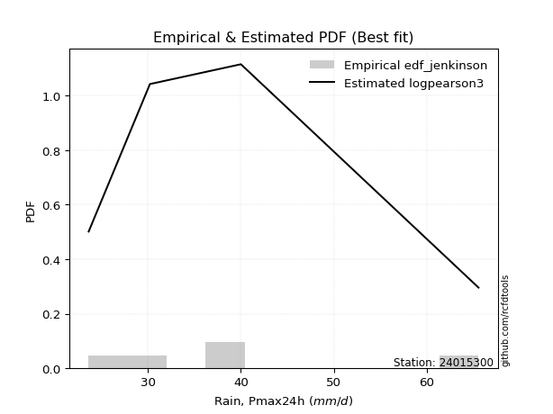</img>

</div>


### 11. EDF Cunnane (1978)

Cunnane´s work in statistical hydrology has focused on the performance and evaluation of different probability distributions (such as GEV, Gumbel, Lognormal) for flood frequency estimation. _b_ is a constant, typically set to 0.4.

<div align="center">


$P=(m-b)/(n+1-2b)$


</div>


**11.1. Empirical values**

<div align="center">

|                | 0                  | 1                   | 2                   | 3                  | 4                  | 5                  |
|:---------------|:-------------------|:--------------------|:--------------------|:-------------------|:-------------------|:-------------------|
| date           | 2022               | 2021                | 2020                | 2019               | 2025               | 2024               |
| x              | 23.6               | 30.2                | 40.0                | 40.0               | 45.6               | 65.6               |
| m              | 1                  | 2                   | 3                   | 4                  | 5                  | 6                  |
| empirical_dist | edf_cunnane        | edf_cunnane         | edf_cunnane         | edf_cunnane        | edf_cunnane        | edf_cunnane        |
| empirical      | 0.0967741935483871 | 0.25806451612903225 | 0.41935483870967744 | 0.5806451612903226 | 0.7419354838709676 | 0.9032258064516128 |
| empirical_tr   | 1.1071428571428572 | 1.3478260869565217  | 1.7222222222222225  | 2.384615384615385  | 3.8749999999999982 | 10.333333333333318 |

</div>


**11.2. Kolmogorov-Smirnov fit test (sorted by Δ)**


<div align="center">

|                | 0                   | 1                   | 2                   | 3                  | 4                   | 5                   | 6                   | 7                   | 8                   | 9                   | 10                  | 11                  | 12                  | 13                  | 14                  | 15                  | 16                  | 17                  | 18                 | 19                  | 20                  | 21                  | 22                  | 23                  | 24                  | 25                  | 26                  | 27                  | 28                  | 29                  | 30                  | 31                  | 32                  | 33                  | 34                  | 35                  | 36                  | 37                  | 38                  | 39                  | 40                 | 41                  | 42                  | 43                  | 44                  | 45                  | 46                  | 47                  | 48                  | 49                  | 50                  | 51                  | 52                  | 53                 | 54                  | 55                 | 56                  | 57                  | 58                  | 59                  | 60                  | 61                  | 62                  | 63                  | 64                  | 65                  | 66                 | 67                  | 68                  | 69                  | 70                  | 71                  | 72                  | 73                  | 74                 | 75                 | 76                  | 77                 | 78                | 79                  | 80                 | 81                 | 82                  | 83                 | 84                  | 85                  | 86                 | 87                  | 88                  | 89                  | 90                  | 91                 | 92                  | 93                  | 94                  | 95                  | 96                  | 97                 | 98                | 99                 | 100                 | 101                 | 102                | 103                 | 104                 | 105                 | 106                | 107                 | 108                 | 109                 | 110                 | 111                 | 112                | 113                 | 114                 | 115                | 116                | 117                | 118                 | 119                 | 120                 | 121                 | 122                 | 123                 | 124                 | 125                | 126                 | 127                | 128                | 129                | 130                 | 131                | 132                | 133                | 134                 | 135                | 136                | 137                | 138                 | 139                 | 140                | 141                | 142                | 143                | 144                | 145                | 146                 | 147                 | 148                | 149                | 150                | 151                | 152                | 153                | 154                | 155                | 156               | 157                | 158               | 159            |
|:---------------|:--------------------|:--------------------|:--------------------|:-------------------|:--------------------|:--------------------|:--------------------|:--------------------|:--------------------|:--------------------|:--------------------|:--------------------|:--------------------|:--------------------|:--------------------|:--------------------|:--------------------|:--------------------|:-------------------|:--------------------|:--------------------|:--------------------|:--------------------|:--------------------|:--------------------|:--------------------|:--------------------|:--------------------|:--------------------|:--------------------|:--------------------|:--------------------|:--------------------|:--------------------|:--------------------|:--------------------|:--------------------|:--------------------|:--------------------|:--------------------|:-------------------|:--------------------|:--------------------|:--------------------|:--------------------|:--------------------|:--------------------|:--------------------|:--------------------|:--------------------|:--------------------|:--------------------|:--------------------|:-------------------|:--------------------|:-------------------|:--------------------|:--------------------|:--------------------|:--------------------|:--------------------|:--------------------|:--------------------|:--------------------|:--------------------|:--------------------|:-------------------|:--------------------|:--------------------|:--------------------|:--------------------|:--------------------|:--------------------|:--------------------|:-------------------|:-------------------|:--------------------|:-------------------|:------------------|:--------------------|:-------------------|:-------------------|:--------------------|:-------------------|:--------------------|:--------------------|:-------------------|:--------------------|:--------------------|:--------------------|:--------------------|:-------------------|:--------------------|:--------------------|:--------------------|:--------------------|:--------------------|:-------------------|:------------------|:-------------------|:--------------------|:--------------------|:-------------------|:--------------------|:--------------------|:--------------------|:-------------------|:--------------------|:--------------------|:--------------------|:--------------------|:--------------------|:-------------------|:--------------------|:--------------------|:-------------------|:-------------------|:-------------------|:--------------------|:--------------------|:--------------------|:--------------------|:--------------------|:--------------------|:--------------------|:-------------------|:--------------------|:-------------------|:-------------------|:-------------------|:--------------------|:-------------------|:-------------------|:-------------------|:--------------------|:-------------------|:-------------------|:-------------------|:--------------------|:--------------------|:-------------------|:-------------------|:-------------------|:-------------------|:-------------------|:-------------------|:--------------------|:--------------------|:-------------------|:-------------------|:-------------------|:-------------------|:-------------------|:-------------------|:-------------------|:-------------------|:------------------|:-------------------|:------------------|:---------------|
| station        | 24015300            | 24015300            | 24015300            | 24015300           | 24015300            | 24015300            | 24015300            | 24015300            | 24015300            | 24015300            | 24015300            | 24015300            | 24015300            | 24015300            | 24015300            | 24015300            | 24015300            | 24015300            | 24015300           | 24015300            | 24015300            | 24015300            | 24015300            | 24015300            | 24015300            | 24015300            | 24015300            | 24015300            | 24015300            | 24015300            | 24015300            | 24015300            | 24015300            | 24015300            | 24015300            | 24015300            | 24015300            | 24015300            | 24015300            | 24015300            | 24015300           | 24015300            | 24015300            | 24015300            | 24015300            | 24015300            | 24015300            | 24015300            | 24015300            | 24015300            | 24015300            | 24015300            | 24015300            | 24015300           | 24015300            | 24015300           | 24015300            | 24015300            | 24015300            | 24015300            | 24015300            | 24015300            | 24015300            | 24015300            | 24015300            | 24015300            | 24015300           | 24015300            | 24015300            | 24015300            | 24015300            | 24015300            | 24015300            | 24015300            | 24015300           | 24015300           | 24015300            | 24015300           | 24015300          | 24015300            | 24015300           | 24015300           | 24015300            | 24015300           | 24015300            | 24015300            | 24015300           | 24015300            | 24015300            | 24015300            | 24015300            | 24015300           | 24015300            | 24015300            | 24015300            | 24015300            | 24015300            | 24015300           | 24015300          | 24015300           | 24015300            | 24015300            | 24015300           | 24015300            | 24015300            | 24015300            | 24015300           | 24015300            | 24015300            | 24015300            | 24015300            | 24015300            | 24015300           | 24015300            | 24015300            | 24015300           | 24015300           | 24015300           | 24015300            | 24015300            | 24015300            | 24015300            | 24015300            | 24015300            | 24015300            | 24015300           | 24015300            | 24015300           | 24015300           | 24015300           | 24015300            | 24015300           | 24015300           | 24015300           | 24015300            | 24015300           | 24015300           | 24015300           | 24015300            | 24015300            | 24015300           | 24015300           | 24015300           | 24015300           | 24015300           | 24015300           | 24015300            | 24015300            | 24015300           | 24015300           | 24015300           | 24015300           | 24015300           | 24015300           | 24015300           | 24015300           | 24015300          | 24015300           | 24015300          | 24015300       |
| empirical_dist | edf_cunnane         | edf_cunnane         | edf_cunnane         | edf_cunnane        | edf_cunnane         | edf_cunnane         | edf_cunnane         | edf_cunnane         | edf_cunnane         | edf_cunnane         | edf_cunnane         | edf_cunnane         | edf_cunnane         | edf_cunnane         | edf_cunnane         | edf_cunnane         | edf_cunnane         | edf_cunnane         | edf_cunnane        | edf_cunnane         | edf_cunnane         | edf_cunnane         | edf_cunnane         | edf_cunnane         | edf_cunnane         | edf_cunnane         | edf_cunnane         | edf_cunnane         | edf_cunnane         | edf_cunnane         | edf_cunnane         | edf_cunnane         | edf_cunnane         | edf_cunnane         | edf_cunnane         | edf_cunnane         | edf_cunnane         | edf_cunnane         | edf_cunnane         | edf_cunnane         | edf_cunnane        | edf_cunnane         | edf_cunnane         | edf_cunnane         | edf_cunnane         | edf_cunnane         | edf_cunnane         | edf_cunnane         | edf_cunnane         | edf_cunnane         | edf_cunnane         | edf_cunnane         | edf_cunnane         | edf_cunnane        | edf_cunnane         | edf_cunnane        | edf_cunnane         | edf_cunnane         | edf_cunnane         | edf_cunnane         | edf_cunnane         | edf_cunnane         | edf_cunnane         | edf_cunnane         | edf_cunnane         | edf_cunnane         | edf_cunnane        | edf_cunnane         | edf_cunnane         | edf_cunnane         | edf_cunnane         | edf_cunnane         | edf_cunnane         | edf_cunnane         | edf_cunnane        | edf_cunnane        | edf_cunnane         | edf_cunnane        | edf_cunnane       | edf_cunnane         | edf_cunnane        | edf_cunnane        | edf_cunnane         | edf_cunnane        | edf_cunnane         | edf_cunnane         | edf_cunnane        | edf_cunnane         | edf_cunnane         | edf_cunnane         | edf_cunnane         | edf_cunnane        | edf_cunnane         | edf_cunnane         | edf_cunnane         | edf_cunnane         | edf_cunnane         | edf_cunnane        | edf_cunnane       | edf_cunnane        | edf_cunnane         | edf_cunnane         | edf_cunnane        | edf_cunnane         | edf_cunnane         | edf_cunnane         | edf_cunnane        | edf_cunnane         | edf_cunnane         | edf_cunnane         | edf_cunnane         | edf_cunnane         | edf_cunnane        | edf_cunnane         | edf_cunnane         | edf_cunnane        | edf_cunnane        | edf_cunnane        | edf_cunnane         | edf_cunnane         | edf_cunnane         | edf_cunnane         | edf_cunnane         | edf_cunnane         | edf_cunnane         | edf_cunnane        | edf_cunnane         | edf_cunnane        | edf_cunnane        | edf_cunnane        | edf_cunnane         | edf_cunnane        | edf_cunnane        | edf_cunnane        | edf_cunnane         | edf_cunnane        | edf_cunnane        | edf_cunnane        | edf_cunnane         | edf_cunnane         | edf_cunnane        | edf_cunnane        | edf_cunnane        | edf_cunnane        | edf_cunnane        | edf_cunnane        | edf_cunnane         | edf_cunnane         | edf_cunnane        | edf_cunnane        | edf_cunnane        | edf_cunnane        | edf_cunnane        | edf_cunnane        | edf_cunnane        | edf_cunnane        | edf_cunnane       | edf_cunnane        | edf_cunnane       | edf_cunnane    |
| p_dist         | dweibull            | logdweibull         | rice                | maxwell            | gompertz            | loguniform          | pearson3            | logvonmises_line    | truncexpon          | rayleigh            | logtukeylambda      | logloglaplace       | loghalfgennorm      | logkappa3           | foldnorm            | t                   | norm                | crystalball         | truncnorm          | logksone            | logistic            | logkappa4           | ncf                 | loggumbel_l         | logsemicircular     | logcosine           | hypsecant           | loggenextreme       | logweibull_max      | loganglit           | logncf              | logloggamma         | logt                | lognorm             | logcrystalball      | logexponnorm        | logburr             | logskewnorm         | anglit              | logbradford         | kstwobign          | logtruncpareto      | logpearson3         | loggamma            | loggamma            | logerlang           | laplace             | loglogistic         | logjohnsonsu        | alpha               | gumbel_r            | logf                | logfatiguelife      | logarcsine         | logbetaprime        | nct                | betaprime           | genlogistic         | semicircular        | loghypsecant        | loggenlogistic      | exponnorm           | invgamma            | skewnorm            | lomax               | loggausshyper       | halfnorm           | bradford            | logfoldnorm         | loginvgamma         | logargus            | johnsonsu           | truncpareto         | lognct              | logrice            | logalpha           | invgauss            | logweibull_min     | loggompertz       | dgamma              | loglaplace         | loglaplace         | cosine              | loginvgauss        | burr                | logmaxwell          | moyal              | logburr12           | halflogistic        | loggennorm          | gennorm             | arcsine            | lograyleigh         | truncweibull_min    | weibull_min         | gumbel_l            | vonmises_line       | genpareto          | loginvweibull     | logkstwobign       | logtruncweibull_min | loghalfnorm         | loggumbel_r        | logwrapcauchy       | gausshyper          | kappa4              | loggenexpon        | logtriang           | logtruncexpon       | logdgamma           | logmoyal            | loghalflogistic     | uniform            | wrapcauchy          | ksone               | wald               | beta               | loglomax           | halfgennorm         | burr12              | argus               | f                   | loglevy_l           | nakagami            | logjohnsonsb        | logexponweib       | exponpow            | logwald            | genextreme         | levy_l             | logexponpow         | loggenhalflogistic | kappa3             | triang             | johnsonsb           | logmielke          | loggengamma        | tukeylambda        | gamma               | logtrapezoid        | logbeta            | genhalflogistic    | lognakagami        | rdist              | gengamma           | invweibull         | trapezoid           | fatiguelife         | erlang             | loggenpareto       | powerlaw           | exponweib          | logpowerlaw        | genexpon           | logtruncnorm       | logrdist           | weibull_max       | logvonmises        | vonmises          | mielke         |
| delta          | 0.08064524986533778 | 0.08073345291668782 | 0.08567058251724918 | 0.0893760590907055 | 0.09746611986382275 | 0.09766048546077111 | 0.09860997269195065 | 0.09984942012756676 | 0.10030402453384768 | 0.10088428073814798 | 0.10187943227512586 | 0.10246104391163507 | 0.10259100867600512 | 0.10269191063001537 | 0.10439908642825496 | 0.10577370419881921 | 0.10578882428266972 | 0.10578883038749887 | 0.1057888341941865 | 0.10816719596168728 | 0.10921201046655832 | 0.10986296156761649 | 0.10988474835156842 | 0.11085257828364126 | 0.11098104981795093 | 0.11205527263716114 | 0.11212750817142081 | 0.11220088819924551 | 0.11221751022868981 | 0.11321221515498353 | 0.11335257196165599 | 0.11712018346863956 | 0.11860448519350181 | 0.11862242773511039 | 0.11862265810015021 | 0.11867398502290988 | 0.11932718721377239 | 0.11966191203797855 | 0.11986646343398522 | 0.12045623356212459 | 0.1213171442216679 | 0.12166635099036244 | 0.12213705030415406 | 0.12280826962578367 | 0.12280826962578367 | 0.12289500081913024 | 0.12330975947792705 | 0.12376926261439075 | 0.12377937500247455 | 0.12452767222123567 | 0.12466925849803395 | 0.12478095491387559 | 0.12567531644078994 | 0.1256968398002588 | 0.12588701238943673 | 0.1266857879746946 | 0.12692854490475575 | 0.12757203025781633 | 0.12773197821002025 | 0.12813753092350239 | 0.12823012062333322 | 0.12887369899359408 | 0.13016290311519835 | 0.13048784527608875 | 0.13162784421399876 | 0.13212709689881824 | 0.1333109307969716 | 0.13347465098421252 | 0.13422402438967634 | 0.13528663624554144 | 0.13612606832409668 | 0.13666858509380725 | 0.13706748042155065 | 0.13839159095097658 | 0.1388266024897838 | 0.1392808618033335 | 0.13972079049188862 | 0.1417917418391697 | 0.142983041135544 | 0.14313559152275918 | 0.1437128822716645 | 0.1437128822716645 | 0.14547709755002936 | 0.1470186396135696 | 0.14751749436744394 | 0.14976969912009602 | 0.1504861245716445 | 0.15119546415760637 | 0.15651658063499302 | 0.15805997580818038 | 0.15931133259716035 | 0.1598315703257217 | 0.15985919144195632 | 0.17100820308802273 | 0.17456887613601285 | 0.17645559344242367 | 0.17708214391311117 | 0.1772183427106541 | 0.178703614541258 | 0.1833530130977417 | 0.1872886391084853  | 0.18829184622225675 | 0.1890971843314873 | 0.19070239722334803 | 0.19389987113175133 | 0.19540841618296378 | 0.2021177759307658 | 0.20820227336645325 | 0.20997849830259746 | 0.21229068062290354 | 0.21429175471459955 | 0.21513939987981495 | 0.2181259600614437 | 0.21905212354373516 | 0.22209421402969776 | 0.2223494076667903 | 0.2281917147568116 | 0.2364242962363528 | 0.23642627598246807 | 0.23784163361064287 | 0.24243128365792765 | 0.24945050690288567 | 0.25644233708550945 | 0.25805879660798015 | 0.26254430361572745 | 0.2767247423900488 | 0.28406456231296456 | 0.2842146396062349 | 0.2856846559006082 | 0.2878415731734524 | 0.28980926331115026 | 0.2926430850290154 | 0.2970397465390983 | 0.3087872605193676 | 0.30937852188906145 | 0.3141822275901914 | 0.3146696349969809 | 0.3191232028369578 | 0.34236741689584654 | 0.35725126633034393 | 0.3588659334420318 | 0.3738930218003816 | 0.4301165993957206 | 0.4331788873964656 | 0.4431850005780953 | 0.4690629298549322 | 0.47170053804078366 | 0.48513959927985983 | 0.4859538114552417 | 0.4893776480752603 | 0.5066223629510941 | 0.5138652803159852 | 0.5434150645553251 | 0.5602554638355242 | 0.5806438891309267 | 0.5806451575641156 | 0.624155803054849 | 1.1193799412684537 | 9.617750273575204 | nan            |
| deltao         | 0.530385761606      | 0.530385761606      | 0.530385761606      | 0.530385761606     | 0.530385761606      | 0.530385761606      | 0.530385761606      | 0.530385761606      | 0.530385761606      | 0.530385761606      | 0.530385761606      | 0.530385761606      | 0.530385761606      | 0.530385761606      | 0.530385761606      | 0.530385761606      | 0.530385761606      | 0.530385761606      | 0.530385761606     | 0.530385761606      | 0.530385761606      | 0.530385761606      | 0.530385761606      | 0.530385761606      | 0.530385761606      | 0.530385761606      | 0.530385761606      | 0.530385761606      | 0.530385761606      | 0.530385761606      | 0.530385761606      | 0.530385761606      | 0.530385761606      | 0.530385761606      | 0.530385761606      | 0.530385761606      | 0.530385761606      | 0.530385761606      | 0.530385761606      | 0.530385761606      | 0.530385761606     | 0.530385761606      | 0.530385761606      | 0.530385761606      | 0.530385761606      | 0.530385761606      | 0.530385761606      | 0.530385761606      | 0.530385761606      | 0.530385761606      | 0.530385761606      | 0.530385761606      | 0.530385761606      | 0.530385761606     | 0.530385761606      | 0.530385761606     | 0.530385761606      | 0.530385761606      | 0.530385761606      | 0.530385761606      | 0.530385761606      | 0.530385761606      | 0.530385761606      | 0.530385761606      | 0.530385761606      | 0.530385761606      | 0.530385761606     | 0.530385761606      | 0.530385761606      | 0.530385761606      | 0.530385761606      | 0.530385761606      | 0.530385761606      | 0.530385761606      | 0.530385761606     | 0.530385761606     | 0.530385761606      | 0.530385761606     | 0.530385761606    | 0.530385761606      | 0.530385761606     | 0.530385761606     | 0.530385761606      | 0.530385761606     | 0.530385761606      | 0.530385761606      | 0.530385761606     | 0.530385761606      | 0.530385761606      | 0.530385761606      | 0.530385761606      | 0.530385761606     | 0.530385761606      | 0.530385761606      | 0.530385761606      | 0.530385761606      | 0.530385761606      | 0.530385761606     | 0.530385761606    | 0.530385761606     | 0.530385761606      | 0.530385761606      | 0.530385761606     | 0.530385761606      | 0.530385761606      | 0.530385761606      | 0.530385761606     | 0.530385761606      | 0.530385761606      | 0.530385761606      | 0.530385761606      | 0.530385761606      | 0.530385761606     | 0.530385761606      | 0.530385761606      | 0.530385761606     | 0.530385761606     | 0.530385761606     | 0.530385761606      | 0.530385761606      | 0.530385761606      | 0.530385761606      | 0.530385761606      | 0.530385761606      | 0.530385761606      | 0.530385761606     | 0.530385761606      | 0.530385761606     | 0.530385761606     | 0.530385761606     | 0.530385761606      | 0.530385761606     | 0.530385761606     | 0.530385761606     | 0.530385761606      | 0.530385761606     | 0.530385761606     | 0.530385761606     | 0.530385761606      | 0.530385761606      | 0.530385761606     | 0.530385761606     | 0.530385761606     | 0.530385761606     | 0.530385761606     | 0.530385761606     | 0.530385761606      | 0.530385761606      | 0.530385761606     | 0.530385761606     | 0.530385761606     | 0.530385761606     | 0.530385761606     | 0.530385761606     | 0.530385761606     | 0.530385761606     | 0.530385761606    | 0.530385761606     | 0.530385761606    | 0.530385761606 |
| eval           | Δo > Δ              | Δo > Δ              | Δo > Δ              | Δo > Δ             | Δo > Δ              | Δo > Δ              | Δo > Δ              | Δo > Δ              | Δo > Δ              | Δo > Δ              | Δo > Δ              | Δo > Δ              | Δo > Δ              | Δo > Δ              | Δo > Δ              | Δo > Δ              | Δo > Δ              | Δo > Δ              | Δo > Δ             | Δo > Δ              | Δo > Δ              | Δo > Δ              | Δo > Δ              | Δo > Δ              | Δo > Δ              | Δo > Δ              | Δo > Δ              | Δo > Δ              | Δo > Δ              | Δo > Δ              | Δo > Δ              | Δo > Δ              | Δo > Δ              | Δo > Δ              | Δo > Δ              | Δo > Δ              | Δo > Δ              | Δo > Δ              | Δo > Δ              | Δo > Δ              | Δo > Δ             | Δo > Δ              | Δo > Δ              | Δo > Δ              | Δo > Δ              | Δo > Δ              | Δo > Δ              | Δo > Δ              | Δo > Δ              | Δo > Δ              | Δo > Δ              | Δo > Δ              | Δo > Δ              | Δo > Δ             | Δo > Δ              | Δo > Δ             | Δo > Δ              | Δo > Δ              | Δo > Δ              | Δo > Δ              | Δo > Δ              | Δo > Δ              | Δo > Δ              | Δo > Δ              | Δo > Δ              | Δo > Δ              | Δo > Δ             | Δo > Δ              | Δo > Δ              | Δo > Δ              | Δo > Δ              | Δo > Δ              | Δo > Δ              | Δo > Δ              | Δo > Δ             | Δo > Δ             | Δo > Δ              | Δo > Δ             | Δo > Δ            | Δo > Δ              | Δo > Δ             | Δo > Δ             | Δo > Δ              | Δo > Δ             | Δo > Δ              | Δo > Δ              | Δo > Δ             | Δo > Δ              | Δo > Δ              | Δo > Δ              | Δo > Δ              | Δo > Δ             | Δo > Δ              | Δo > Δ              | Δo > Δ              | Δo > Δ              | Δo > Δ              | Δo > Δ             | Δo > Δ            | Δo > Δ             | Δo > Δ              | Δo > Δ              | Δo > Δ             | Δo > Δ              | Δo > Δ              | Δo > Δ              | Δo > Δ             | Δo > Δ              | Δo > Δ              | Δo > Δ              | Δo > Δ              | Δo > Δ              | Δo > Δ             | Δo > Δ              | Δo > Δ              | Δo > Δ             | Δo > Δ             | Δo > Δ             | Δo > Δ              | Δo > Δ              | Δo > Δ              | Δo > Δ              | Δo > Δ              | Δo > Δ              | Δo > Δ              | Δo > Δ             | Δo > Δ              | Δo > Δ             | Δo > Δ             | Δo > Δ             | Δo > Δ              | Δo > Δ             | Δo > Δ             | Δo > Δ             | Δo > Δ              | Δo > Δ             | Δo > Δ             | Δo > Δ             | Δo > Δ              | Δo > Δ              | Δo > Δ             | Δo > Δ             | Δo > Δ             | Δo > Δ             | Δo > Δ             | Δo > Δ             | Δo > Δ              | Δo > Δ              | Δo > Δ             | Δo > Δ             | Δo > Δ             | Δo > Δ             | Δo <= Δ            | Δo <= Δ            | Δo <= Δ            | Δo <= Δ            | Δo <= Δ           | Δo <= Δ            | Δo <= Δ           | Δo <= Δ        |
| fit            | 1                   | 1                   | 1                   | 1                  | 1                   | 1                   | 1                   | 1                   | 1                   | 1                   | 1                   | 1                   | 1                   | 1                   | 1                   | 1                   | 1                   | 1                   | 1                  | 1                   | 1                   | 1                   | 1                   | 1                   | 1                   | 1                   | 1                   | 1                   | 1                   | 1                   | 1                   | 1                   | 1                   | 1                   | 1                   | 1                   | 1                   | 1                   | 1                   | 1                   | 1                  | 1                   | 1                   | 1                   | 1                   | 1                   | 1                   | 1                   | 1                   | 1                   | 1                   | 1                   | 1                   | 1                  | 1                   | 1                  | 1                   | 1                   | 1                   | 1                   | 1                   | 1                   | 1                   | 1                   | 1                   | 1                   | 1                  | 1                   | 1                   | 1                   | 1                   | 1                   | 1                   | 1                   | 1                  | 1                  | 1                   | 1                  | 1                 | 1                   | 1                  | 1                  | 1                   | 1                  | 1                   | 1                   | 1                  | 1                   | 1                   | 1                   | 1                   | 1                  | 1                   | 1                   | 1                   | 1                   | 1                   | 1                  | 1                 | 1                  | 1                   | 1                   | 1                  | 1                   | 1                   | 1                   | 1                  | 1                   | 1                   | 1                   | 1                   | 1                   | 1                  | 1                   | 1                   | 1                  | 1                  | 1                  | 1                   | 1                   | 1                   | 1                   | 1                   | 1                   | 1                   | 1                  | 1                   | 1                  | 1                  | 1                  | 1                   | 1                  | 1                  | 1                  | 1                   | 1                  | 1                  | 1                  | 1                   | 1                   | 1                  | 1                  | 1                  | 1                  | 1                  | 1                  | 1                   | 1                   | 1                  | 1                  | 1                  | 1                  | 0                  | 0                  | 0                  | 0                  | 0                 | 0                  | 0                 | 0              |
| n              | 6                   | 6                   | 6                   | 6                  | 6                   | 6                   | 6                   | 6                   | 6                   | 6                   | 6                   | 6                   | 6                   | 6                   | 6                   | 6                   | 6                   | 6                   | 6                  | 6                   | 6                   | 6                   | 6                   | 6                   | 6                   | 6                   | 6                   | 6                   | 6                   | 6                   | 6                   | 6                   | 6                   | 6                   | 6                   | 6                   | 6                   | 6                   | 6                   | 6                   | 6                  | 6                   | 6                   | 6                   | 6                   | 6                   | 6                   | 6                   | 6                   | 6                   | 6                   | 6                   | 6                   | 6                  | 6                   | 6                  | 6                   | 6                   | 6                   | 6                   | 6                   | 6                   | 6                   | 6                   | 6                   | 6                   | 6                  | 6                   | 6                   | 6                   | 6                   | 6                   | 6                   | 6                   | 6                  | 6                  | 6                   | 6                  | 6                 | 6                   | 6                  | 6                  | 6                   | 6                  | 6                   | 6                   | 6                  | 6                   | 6                   | 6                   | 6                   | 6                  | 6                   | 6                   | 6                   | 6                   | 6                   | 6                  | 6                 | 6                  | 6                   | 6                   | 6                  | 6                   | 6                   | 6                   | 6                  | 6                   | 6                   | 6                   | 6                   | 6                   | 6                  | 6                   | 6                   | 6                  | 6                  | 6                  | 6                   | 6                   | 6                   | 6                   | 6                   | 6                   | 6                   | 6                  | 6                   | 6                  | 6                  | 6                  | 6                   | 6                  | 6                  | 6                  | 6                   | 6                  | 6                  | 6                  | 6                   | 6                   | 6                  | 6                  | 6                  | 6                  | 6                  | 6                  | 6                   | 6                   | 6                  | 6                  | 6                  | 6                  | 6                  | 6                  | 6                  | 6                  | 6                 | 6                  | 6                 | 6              |
| best_fit       | 1                   | 0                   | 0                   | 0                  | 0                   | 0                   | 0                   | 0                   | 0                   | 0                   | 0                   | 0                   | 0                   | 0                   | 0                   | 0                   | 0                   | 0                   | 0                  | 0                   | 0                   | 0                   | 0                   | 0                   | 0                   | 0                   | 0                   | 0                   | 0                   | 0                   | 0                   | 0                   | 0                   | 0                   | 0                   | 0                   | 0                   | 0                   | 0                   | 0                   | 0                  | 0                   | 0                   | 0                   | 0                   | 0                   | 0                   | 0                   | 0                   | 0                   | 0                   | 0                   | 0                   | 0                  | 0                   | 0                  | 0                   | 0                   | 0                   | 0                   | 0                   | 0                   | 0                   | 0                   | 0                   | 0                   | 0                  | 0                   | 0                   | 0                   | 0                   | 0                   | 0                   | 0                   | 0                  | 0                  | 0                   | 0                  | 0                 | 0                   | 0                  | 0                  | 0                   | 0                  | 0                   | 0                   | 0                  | 0                   | 0                   | 0                   | 0                   | 0                  | 0                   | 0                   | 0                   | 0                   | 0                   | 0                  | 0                 | 0                  | 0                   | 0                   | 0                  | 0                   | 0                   | 0                   | 0                  | 0                   | 0                   | 0                   | 0                   | 0                   | 0                  | 0                   | 0                   | 0                  | 0                  | 0                  | 0                   | 0                   | 0                   | 0                   | 0                   | 0                   | 0                   | 0                  | 0                   | 0                  | 0                  | 0                  | 0                   | 0                  | 0                  | 0                  | 0                   | 0                  | 0                  | 0                  | 0                   | 0                   | 0                  | 0                  | 0                  | 0                  | 0                  | 0                  | 0                   | 0                   | 0                  | 0                  | 0                  | 0                  | 0                  | 0                  | 0                  | 0                  | 0                 | 0                  | 0                 | 0              |
| best_fit_sort  | 1                   | 2                   | 3                   | 4                  | 5                   | 6                   | 7                   | 8                   | 9                   | 10                  | 11                  | 12                  | 13                  | 14                  | 15                  | 16                  | 17                  | 18                  | 19                 | 20                  | 21                  | 22                  | 23                  | 24                  | 25                  | 26                  | 27                  | 28                  | 29                  | 30                  | 31                  | 32                  | 33                  | 34                  | 35                  | 36                  | 37                  | 38                  | 39                  | 40                  | 41                 | 42                  | 43                  | 44                  | 45                  | 46                  | 47                  | 48                  | 49                  | 50                  | 51                  | 52                  | 53                  | 54                 | 55                  | 56                 | 57                  | 58                  | 59                  | 60                  | 61                  | 62                  | 63                  | 64                  | 65                  | 66                  | 67                 | 68                  | 69                  | 70                  | 71                  | 72                  | 73                  | 74                  | 75                 | 76                 | 77                  | 78                 | 79                | 80                  | 81                 | 82                 | 83                  | 84                 | 85                  | 86                  | 87                 | 88                  | 89                  | 90                  | 91                  | 92                 | 93                  | 94                  | 95                  | 96                  | 97                  | 98                 | 99                | 100                | 101                 | 102                 | 103                | 104                 | 105                 | 106                 | 107                | 108                 | 109                 | 110                 | 111                 | 112                 | 113                | 114                 | 115                 | 116                | 117                | 118                | 119                 | 120                 | 121                 | 122                 | 123                 | 124                 | 125                 | 126                | 127                 | 128                | 129                | 130                | 131                 | 132                | 133                | 134                | 135                 | 136                | 137                | 138                | 139                 | 140                 | 141                | 142                | 143                | 144                | 145                | 146                | 147                 | 148                 | 149                | 150                | 151                | 152                | 153                | 154                | 155                | 156                | 157               | 158                | 159               | 160            |

</div>


**11.3. Best fit**

<div align="center">

|   id |   station | empirical_dist   | p_dist   |     delta |   deltao | eval   |   fit |   n |   best_fit |   best_fit_sort |
|-----:|----------:|:-----------------|:---------|----------:|---------:|:-------|------:|----:|-----------:|----------------:|
|    0 |  24015300 | edf_cunnane      | dweibull | 0.0806452 | 0.530386 | Δo > Δ |     1 |   6 |          1 |               1 |

</div>


<div align="center">

</img></img>

</div>


### 12. EDF Adamowski (1981)

The Adamowski formula in hydrology refers to a specific plotting position formula used for estimating the non-parametric empirical distribution of hydrological events (like flood peaks) to calculate their return periods. This formula provides an alternative to traditional parametric methods (like the Gumbel or Log Pearson Type III distributions). 

<div align="center">


$P=(m-0.25)/(n+0.5)$


</div>


**12.1. Empirical values**

<div align="center">

|                | 0                   | 1                  | 2                  | 3                  | 4                  | 5                  |
|:---------------|:--------------------|:-------------------|:-------------------|:-------------------|:-------------------|:-------------------|
| date           | 2022                | 2021               | 2020               | 2019               | 2025               | 2024               |
| x              | 23.6                | 30.2               | 40.0               | 40.0               | 45.6               | 65.6               |
| m              | 1                   | 2                  | 3                  | 4                  | 5                  | 6                  |
| empirical_dist | edf_adamowski       | edf_adamowski      | edf_adamowski      | edf_adamowski      | edf_adamowski      | edf_adamowski      |
| empirical      | 0.11538461538461539 | 0.2692307692307692 | 0.4230769230769231 | 0.5769230769230769 | 0.7307692307692307 | 0.8846153846153846 |
| empirical_tr   | 1.1304347826086958  | 1.3684210526315788 | 1.7333333333333334 | 2.3636363636363633 | 3.7142857142857135 | 8.666666666666664  |

</div>


**12.2. Kolmogorov-Smirnov fit test (sorted by Δ)**


<div align="center">

|                | 0                   | 1                   | 2                   | 3                   | 4                   | 5                   | 6                   | 7                   | 8                   | 9                   | 10                  | 11                  | 12                  | 13                  | 14                  | 15                  | 16                 | 17                  | 18                  | 19                  | 20                 | 21                 | 22                  | 23                  | 24                  | 25                  | 26                  | 27                  | 28                  | 29                  | 30                  | 31                  | 32                  | 33                  | 34                  | 35                  | 36                  | 37                  | 38                  | 39                  | 40                  | 41                  | 42                  | 43                 | 44                  | 45                  | 46                  | 47                 | 48                 | 49                  | 50                  | 51                  | 52                  | 53                  | 54                  | 55                 | 56                  | 57                 | 58                  | 59                  | 60                  | 61                  | 62                  | 63                  | 64                  | 65                 | 66                  | 67                 | 68                  | 69                 | 70                 | 71                 | 72                | 73                  | 74                  | 75                  | 76                | 77                  | 78                  | 79                  | 80                  | 81                  | 82                  | 83                 | 84                  | 85                  | 86                  | 87                 | 88                  | 89                  | 90                  | 91                 | 92                  | 93                 | 94                  | 95                  | 96                  | 97                  | 98                  | 99                  | 100                 | 101                 | 102                 | 103                 | 104                 | 105                 | 106                 | 107                 | 108                 | 109                 | 110                 | 111                | 112                 | 113                 | 114                 | 115                | 116                 | 117                 | 118                 | 119                 | 120                 | 121                 | 122                 | 123                | 124              | 125                | 126                | 127                 | 128                | 129                 | 130                | 131                | 132                | 133                | 134                | 135                 | 136                | 137                 | 138                | 139               | 140                | 141                | 142                | 143               | 144                | 145               | 146                 | 147               | 148                 | 149                 | 150                | 151                | 152                | 153                | 154                | 155                | 156                | 157                | 158               | 159            |
|:---------------|:--------------------|:--------------------|:--------------------|:--------------------|:--------------------|:--------------------|:--------------------|:--------------------|:--------------------|:--------------------|:--------------------|:--------------------|:--------------------|:--------------------|:--------------------|:--------------------|:-------------------|:--------------------|:--------------------|:--------------------|:-------------------|:-------------------|:--------------------|:--------------------|:--------------------|:--------------------|:--------------------|:--------------------|:--------------------|:--------------------|:--------------------|:--------------------|:--------------------|:--------------------|:--------------------|:--------------------|:--------------------|:--------------------|:--------------------|:--------------------|:--------------------|:--------------------|:--------------------|:-------------------|:--------------------|:--------------------|:--------------------|:-------------------|:-------------------|:--------------------|:--------------------|:--------------------|:--------------------|:--------------------|:--------------------|:-------------------|:--------------------|:-------------------|:--------------------|:--------------------|:--------------------|:--------------------|:--------------------|:--------------------|:--------------------|:-------------------|:--------------------|:-------------------|:--------------------|:-------------------|:-------------------|:-------------------|:------------------|:--------------------|:--------------------|:--------------------|:------------------|:--------------------|:--------------------|:--------------------|:--------------------|:--------------------|:--------------------|:-------------------|:--------------------|:--------------------|:--------------------|:-------------------|:--------------------|:--------------------|:--------------------|:-------------------|:--------------------|:-------------------|:--------------------|:--------------------|:--------------------|:--------------------|:--------------------|:--------------------|:--------------------|:--------------------|:--------------------|:--------------------|:--------------------|:--------------------|:--------------------|:--------------------|:--------------------|:--------------------|:--------------------|:-------------------|:--------------------|:--------------------|:--------------------|:-------------------|:--------------------|:--------------------|:--------------------|:--------------------|:--------------------|:--------------------|:--------------------|:-------------------|:-----------------|:-------------------|:-------------------|:--------------------|:-------------------|:--------------------|:-------------------|:-------------------|:-------------------|:-------------------|:-------------------|:--------------------|:-------------------|:--------------------|:-------------------|:------------------|:-------------------|:-------------------|:-------------------|:------------------|:-------------------|:------------------|:--------------------|:------------------|:--------------------|:--------------------|:-------------------|:-------------------|:-------------------|:-------------------|:-------------------|:-------------------|:-------------------|:-------------------|:------------------|:---------------|
| station        | 24015300            | 24015300            | 24015300            | 24015300            | 24015300            | 24015300            | 24015300            | 24015300            | 24015300            | 24015300            | 24015300            | 24015300            | 24015300            | 24015300            | 24015300            | 24015300            | 24015300           | 24015300            | 24015300            | 24015300            | 24015300           | 24015300           | 24015300            | 24015300            | 24015300            | 24015300            | 24015300            | 24015300            | 24015300            | 24015300            | 24015300            | 24015300            | 24015300            | 24015300            | 24015300            | 24015300            | 24015300            | 24015300            | 24015300            | 24015300            | 24015300            | 24015300            | 24015300            | 24015300           | 24015300            | 24015300            | 24015300            | 24015300           | 24015300           | 24015300            | 24015300            | 24015300            | 24015300            | 24015300            | 24015300            | 24015300           | 24015300            | 24015300           | 24015300            | 24015300            | 24015300            | 24015300            | 24015300            | 24015300            | 24015300            | 24015300           | 24015300            | 24015300           | 24015300            | 24015300           | 24015300           | 24015300           | 24015300          | 24015300            | 24015300            | 24015300            | 24015300          | 24015300            | 24015300            | 24015300            | 24015300            | 24015300            | 24015300            | 24015300           | 24015300            | 24015300            | 24015300            | 24015300           | 24015300            | 24015300            | 24015300            | 24015300           | 24015300            | 24015300           | 24015300            | 24015300            | 24015300            | 24015300            | 24015300            | 24015300            | 24015300            | 24015300            | 24015300            | 24015300            | 24015300            | 24015300            | 24015300            | 24015300            | 24015300            | 24015300            | 24015300            | 24015300           | 24015300            | 24015300            | 24015300            | 24015300           | 24015300            | 24015300            | 24015300            | 24015300            | 24015300            | 24015300            | 24015300            | 24015300           | 24015300         | 24015300           | 24015300           | 24015300            | 24015300           | 24015300            | 24015300           | 24015300           | 24015300           | 24015300           | 24015300           | 24015300            | 24015300           | 24015300            | 24015300           | 24015300          | 24015300           | 24015300           | 24015300           | 24015300          | 24015300           | 24015300          | 24015300            | 24015300          | 24015300            | 24015300            | 24015300           | 24015300           | 24015300           | 24015300           | 24015300           | 24015300           | 24015300           | 24015300           | 24015300          | 24015300       |
| empirical_dist | edf_adamowski       | edf_adamowski       | edf_adamowski       | edf_adamowski       | edf_adamowski       | edf_adamowski       | edf_adamowski       | edf_adamowski       | edf_adamowski       | edf_adamowski       | edf_adamowski       | edf_adamowski       | edf_adamowski       | edf_adamowski       | edf_adamowski       | edf_adamowski       | edf_adamowski      | edf_adamowski       | edf_adamowski       | edf_adamowski       | edf_adamowski      | edf_adamowski      | edf_adamowski       | edf_adamowski       | edf_adamowski       | edf_adamowski       | edf_adamowski       | edf_adamowski       | edf_adamowski       | edf_adamowski       | edf_adamowski       | edf_adamowski       | edf_adamowski       | edf_adamowski       | edf_adamowski       | edf_adamowski       | edf_adamowski       | edf_adamowski       | edf_adamowski       | edf_adamowski       | edf_adamowski       | edf_adamowski       | edf_adamowski       | edf_adamowski      | edf_adamowski       | edf_adamowski       | edf_adamowski       | edf_adamowski      | edf_adamowski      | edf_adamowski       | edf_adamowski       | edf_adamowski       | edf_adamowski       | edf_adamowski       | edf_adamowski       | edf_adamowski      | edf_adamowski       | edf_adamowski      | edf_adamowski       | edf_adamowski       | edf_adamowski       | edf_adamowski       | edf_adamowski       | edf_adamowski       | edf_adamowski       | edf_adamowski      | edf_adamowski       | edf_adamowski      | edf_adamowski       | edf_adamowski      | edf_adamowski      | edf_adamowski      | edf_adamowski     | edf_adamowski       | edf_adamowski       | edf_adamowski       | edf_adamowski     | edf_adamowski       | edf_adamowski       | edf_adamowski       | edf_adamowski       | edf_adamowski       | edf_adamowski       | edf_adamowski      | edf_adamowski       | edf_adamowski       | edf_adamowski       | edf_adamowski      | edf_adamowski       | edf_adamowski       | edf_adamowski       | edf_adamowski      | edf_adamowski       | edf_adamowski      | edf_adamowski       | edf_adamowski       | edf_adamowski       | edf_adamowski       | edf_adamowski       | edf_adamowski       | edf_adamowski       | edf_adamowski       | edf_adamowski       | edf_adamowski       | edf_adamowski       | edf_adamowski       | edf_adamowski       | edf_adamowski       | edf_adamowski       | edf_adamowski       | edf_adamowski       | edf_adamowski      | edf_adamowski       | edf_adamowski       | edf_adamowski       | edf_adamowski      | edf_adamowski       | edf_adamowski       | edf_adamowski       | edf_adamowski       | edf_adamowski       | edf_adamowski       | edf_adamowski       | edf_adamowski      | edf_adamowski    | edf_adamowski      | edf_adamowski      | edf_adamowski       | edf_adamowski      | edf_adamowski       | edf_adamowski      | edf_adamowski      | edf_adamowski      | edf_adamowski      | edf_adamowski      | edf_adamowski       | edf_adamowski      | edf_adamowski       | edf_adamowski      | edf_adamowski     | edf_adamowski      | edf_adamowski      | edf_adamowski      | edf_adamowski     | edf_adamowski      | edf_adamowski     | edf_adamowski       | edf_adamowski     | edf_adamowski       | edf_adamowski       | edf_adamowski      | edf_adamowski      | edf_adamowski      | edf_adamowski      | edf_adamowski      | edf_adamowski      | edf_adamowski      | edf_adamowski      | edf_adamowski     | edf_adamowski  |
| p_dist         | dweibull            | logdweibull         | rice                | maxwell             | pearson3            | rayleigh            | foldnorm            | t                   | norm                | crystalball         | truncnorm           | logksone            | logistic            | ncf                 | loggumbel_l         | logsemicircular     | logcosine          | hypsecant           | loggenextreme       | logweibull_max      | anglit             | loganglit          | logncf              | logloggamma         | logloglaplace       | logt                | lognorm             | logcrystalball      | logexponnorm        | truncexpon          | logvonmises_line    | gompertz            | logkappa3           | logtukeylambda      | logkappa4           | loghalfgennorm      | logarcsine          | loguniform          | logburr             | logskewnorm         | semicircular        | logbradford         | kstwobign           | logtruncpareto     | logpearson3         | loggamma            | loggamma            | logerlang          | laplace            | loglogistic         | logjohnsonsu        | lomax               | alpha               | gumbel_r            | logf                | logfatiguelife     | logbetaprime        | bradford           | nct                 | betaprime           | genlogistic         | loghypsecant        | loggenlogistic      | logargus            | exponnorm           | invgamma           | skewnorm            | loggausshyper      | halfnorm            | logfoldnorm        | loginvgamma        | johnsonsu          | truncpareto       | lognct              | logrice             | logalpha            | invgauss          | cosine              | logweibull_min      | loggompertz         | loglaplace          | loglaplace          | loginvgauss         | burr               | logmaxwell          | moyal               | logburr12           | arcsine            | halflogistic        | dgamma              | lograyleigh         | genpareto          | vonmises_line       | truncweibull_min   | loggennorm          | gennorm             | weibull_min         | gumbel_l            | loginvweibull       | logwrapcauchy       | logkstwobign        | gausshyper          | logtruncweibull_min | kappa4              | loghalfnorm         | loggumbel_r         | logtriang           | loggenexpon         | logtruncexpon       | uniform             | wrapcauchy          | logmoyal           | ksone               | loghalflogistic     | wald                | logdgamma          | beta                | argus               | loglomax            | halfgennorm         | burr12              | loglevy_l           | f                   | logjohnsonsb       | genextreme       | nakagami           | levy_l             | logexponweib        | exponpow           | logwald             | loggenhalflogistic | kappa3             | logexponpow        | triang             | johnsonsb          | logmielke           | loggengamma        | tukeylambda         | gamma              | logtrapezoid      | logbeta            | genhalflogistic    | rdist              | lognakagami       | gengamma           | invweibull        | trapezoid           | loggenpareto      | fatiguelife         | erlang              | powerlaw           | exponweib          | logpowerlaw        | genexpon           | logtruncnorm       | logrdist           | weibull_max        | logvonmises        | vonmises          | mielke         |
| delta          | 0.07692316549809203 | 0.07701136854944207 | 0.08194849815000355 | 0.08565397472345987 | 0.09488788832470502 | 0.09716219637090234 | 0.10067700206100932 | 0.10205161983157346 | 0.10206673991542398 | 0.10206674602025312 | 0.10206674982694075 | 0.10444511159444164 | 0.10548992609931257 | 0.10616266398432278 | 0.10713049391639551 | 0.10725896545070529 | 0.1083331882699155 | 0.10840542380417506 | 0.10847880383199987 | 0.10849542586144417 | 0.1087002103322483 | 0.1094901307877379 | 0.10963048759441035 | 0.11339809910139392 | 0.11362729701337204 | 0.11488240082625617 | 0.11490034336786475 | 0.11490057373290458 | 0.11495190065566424 | 0.11538458511396377 | 0.11538461450895242 | 0.11538461537219435 | 0.11538461538391158 | 0.11538461538460829 | 0.11538461538461454 | 0.11538461538461539 | 0.11538461538461542 | 0.11538461538461542 | 0.11560510284652675 | 0.11593982767073291 | 0.11656572510828334 | 0.11673414919487896 | 0.11759505985442226 | 0.1179442666231168 | 0.11841496593690842 | 0.11908618525853804 | 0.11908618525853804 | 0.1191729164518846 | 0.1195876751106813 | 0.12004717824714511 | 0.12005729063522891 | 0.12046159111226185 | 0.12080558785399004 | 0.12094717413078832 | 0.12105887054662995 | 0.1219532320735443 | 0.12216492802219109 | 0.1223083978824756 | 0.12296370360744896 | 0.12320646053751011 | 0.12384994589057069 | 0.12441544655625675 | 0.12450803625608758 | 0.12495981522235977 | 0.12515161462634844 | 0.1264408187479527 | 0.12676576090884312 | 0.1284050125315726 | 0.12958884642972596 | 0.1305019400224307 | 0.1315645518782958 | 0.1329465007265616 | 0.133345396054305 | 0.13466950658373095 | 0.13510451812253815 | 0.13555877743608785 | 0.135998706124643 | 0.13745886976409305 | 0.13806965747192407 | 0.13926095676829836 | 0.13999079790441887 | 0.13999079790441887 | 0.14329655524632395 | 0.1437954100001983 | 0.14604761475285039 | 0.14676404020439887 | 0.14747337979036074 | 0.1486653172239848 | 0.15279449626774738 | 0.15430184462449614 | 0.15613710707471068 | 0.1586079208744258 | 0.16591589081137426 | 0.1672861187207771 | 0.16922622890991734 | 0.17047758569889732 | 0.17084679176876721 | 0.17273350907517793 | 0.17498153017401236 | 0.17953614412161112 | 0.17963092873049608 | 0.18273361803001442 | 0.18356655474123967 | 0.18424216308122687 | 0.18456976185501112 | 0.18537509996424167 | 0.19703602026471634 | 0.19839569156352016 | 0.20625641393535182 | 0.20695970695970678 | 0.20788587044199824 | 0.2105696703473539 | 0.21092796092796084 | 0.21141731551256931 | 0.21862732329954465 | 0.2234569337246405 | 0.22446963038956597 | 0.23126503055619074 | 0.23270221186910717 | 0.23270419161522243 | 0.23411954924339723 | 0.23783191524928118 | 0.24572842253564003 | 0.2513780505139905 | 0.26707423406438 | 0.2692250497097171 | 0.2692311513372241 | 0.27300265802280316 | 0.2803424779457189 | 0.28049255523898925 | 0.2814768319272785 | 0.2858734934373614 | 0.2860871789439046 | 0.2976210074176307 | 0.2982122687873245 | 0.31046014322294574 | 0.3109475506297353 | 0.31540111846971214 | 0.3386453325286009 | 0.346085013228607 | 0.3551438490747862 | 0.3627267686986447 | 0.4145684655602373 | 0.426394515028475 | 0.4320187474763583 | 0.450452508018704 | 0.46053428493904675 | 0.470767226239032 | 0.47397334617812287 | 0.48223172708799605 | 0.4954561098493571 | 0.5026990272142482 | 0.5322488114535882 | 0.5565333794682785 | 0.5769218047636809 | 0.5769230731968699 | 0.6129895499531121 | 1.1156578569012081 | 9.636360695411431 | nan            |
| deltao         | 0.530385761606      | 0.530385761606      | 0.530385761606      | 0.530385761606      | 0.530385761606      | 0.530385761606      | 0.530385761606      | 0.530385761606      | 0.530385761606      | 0.530385761606      | 0.530385761606      | 0.530385761606      | 0.530385761606      | 0.530385761606      | 0.530385761606      | 0.530385761606      | 0.530385761606     | 0.530385761606      | 0.530385761606      | 0.530385761606      | 0.530385761606     | 0.530385761606     | 0.530385761606      | 0.530385761606      | 0.530385761606      | 0.530385761606      | 0.530385761606      | 0.530385761606      | 0.530385761606      | 0.530385761606      | 0.530385761606      | 0.530385761606      | 0.530385761606      | 0.530385761606      | 0.530385761606      | 0.530385761606      | 0.530385761606      | 0.530385761606      | 0.530385761606      | 0.530385761606      | 0.530385761606      | 0.530385761606      | 0.530385761606      | 0.530385761606     | 0.530385761606      | 0.530385761606      | 0.530385761606      | 0.530385761606     | 0.530385761606     | 0.530385761606      | 0.530385761606      | 0.530385761606      | 0.530385761606      | 0.530385761606      | 0.530385761606      | 0.530385761606     | 0.530385761606      | 0.530385761606     | 0.530385761606      | 0.530385761606      | 0.530385761606      | 0.530385761606      | 0.530385761606      | 0.530385761606      | 0.530385761606      | 0.530385761606     | 0.530385761606      | 0.530385761606     | 0.530385761606      | 0.530385761606     | 0.530385761606     | 0.530385761606     | 0.530385761606    | 0.530385761606      | 0.530385761606      | 0.530385761606      | 0.530385761606    | 0.530385761606      | 0.530385761606      | 0.530385761606      | 0.530385761606      | 0.530385761606      | 0.530385761606      | 0.530385761606     | 0.530385761606      | 0.530385761606      | 0.530385761606      | 0.530385761606     | 0.530385761606      | 0.530385761606      | 0.530385761606      | 0.530385761606     | 0.530385761606      | 0.530385761606     | 0.530385761606      | 0.530385761606      | 0.530385761606      | 0.530385761606      | 0.530385761606      | 0.530385761606      | 0.530385761606      | 0.530385761606      | 0.530385761606      | 0.530385761606      | 0.530385761606      | 0.530385761606      | 0.530385761606      | 0.530385761606      | 0.530385761606      | 0.530385761606      | 0.530385761606      | 0.530385761606     | 0.530385761606      | 0.530385761606      | 0.530385761606      | 0.530385761606     | 0.530385761606      | 0.530385761606      | 0.530385761606      | 0.530385761606      | 0.530385761606      | 0.530385761606      | 0.530385761606      | 0.530385761606     | 0.530385761606   | 0.530385761606     | 0.530385761606     | 0.530385761606      | 0.530385761606     | 0.530385761606      | 0.530385761606     | 0.530385761606     | 0.530385761606     | 0.530385761606     | 0.530385761606     | 0.530385761606      | 0.530385761606     | 0.530385761606      | 0.530385761606     | 0.530385761606    | 0.530385761606     | 0.530385761606     | 0.530385761606     | 0.530385761606    | 0.530385761606     | 0.530385761606    | 0.530385761606      | 0.530385761606    | 0.530385761606      | 0.530385761606      | 0.530385761606     | 0.530385761606     | 0.530385761606     | 0.530385761606     | 0.530385761606     | 0.530385761606     | 0.530385761606     | 0.530385761606     | 0.530385761606    | 0.530385761606 |
| eval           | Δo > Δ              | Δo > Δ              | Δo > Δ              | Δo > Δ              | Δo > Δ              | Δo > Δ              | Δo > Δ              | Δo > Δ              | Δo > Δ              | Δo > Δ              | Δo > Δ              | Δo > Δ              | Δo > Δ              | Δo > Δ              | Δo > Δ              | Δo > Δ              | Δo > Δ             | Δo > Δ              | Δo > Δ              | Δo > Δ              | Δo > Δ             | Δo > Δ             | Δo > Δ              | Δo > Δ              | Δo > Δ              | Δo > Δ              | Δo > Δ              | Δo > Δ              | Δo > Δ              | Δo > Δ              | Δo > Δ              | Δo > Δ              | Δo > Δ              | Δo > Δ              | Δo > Δ              | Δo > Δ              | Δo > Δ              | Δo > Δ              | Δo > Δ              | Δo > Δ              | Δo > Δ              | Δo > Δ              | Δo > Δ              | Δo > Δ             | Δo > Δ              | Δo > Δ              | Δo > Δ              | Δo > Δ             | Δo > Δ             | Δo > Δ              | Δo > Δ              | Δo > Δ              | Δo > Δ              | Δo > Δ              | Δo > Δ              | Δo > Δ             | Δo > Δ              | Δo > Δ             | Δo > Δ              | Δo > Δ              | Δo > Δ              | Δo > Δ              | Δo > Δ              | Δo > Δ              | Δo > Δ              | Δo > Δ             | Δo > Δ              | Δo > Δ             | Δo > Δ              | Δo > Δ             | Δo > Δ             | Δo > Δ             | Δo > Δ            | Δo > Δ              | Δo > Δ              | Δo > Δ              | Δo > Δ            | Δo > Δ              | Δo > Δ              | Δo > Δ              | Δo > Δ              | Δo > Δ              | Δo > Δ              | Δo > Δ             | Δo > Δ              | Δo > Δ              | Δo > Δ              | Δo > Δ             | Δo > Δ              | Δo > Δ              | Δo > Δ              | Δo > Δ             | Δo > Δ              | Δo > Δ             | Δo > Δ              | Δo > Δ              | Δo > Δ              | Δo > Δ              | Δo > Δ              | Δo > Δ              | Δo > Δ              | Δo > Δ              | Δo > Δ              | Δo > Δ              | Δo > Δ              | Δo > Δ              | Δo > Δ              | Δo > Δ              | Δo > Δ              | Δo > Δ              | Δo > Δ              | Δo > Δ             | Δo > Δ              | Δo > Δ              | Δo > Δ              | Δo > Δ             | Δo > Δ              | Δo > Δ              | Δo > Δ              | Δo > Δ              | Δo > Δ              | Δo > Δ              | Δo > Δ              | Δo > Δ             | Δo > Δ           | Δo > Δ             | Δo > Δ             | Δo > Δ              | Δo > Δ             | Δo > Δ              | Δo > Δ             | Δo > Δ             | Δo > Δ             | Δo > Δ             | Δo > Δ             | Δo > Δ              | Δo > Δ             | Δo > Δ              | Δo > Δ             | Δo > Δ            | Δo > Δ             | Δo > Δ             | Δo > Δ             | Δo > Δ            | Δo > Δ             | Δo > Δ            | Δo > Δ              | Δo > Δ            | Δo > Δ              | Δo > Δ              | Δo > Δ             | Δo > Δ             | Δo <= Δ            | Δo <= Δ            | Δo <= Δ            | Δo <= Δ            | Δo <= Δ            | Δo <= Δ            | Δo <= Δ           | Δo <= Δ        |
| fit            | 1                   | 1                   | 1                   | 1                   | 1                   | 1                   | 1                   | 1                   | 1                   | 1                   | 1                   | 1                   | 1                   | 1                   | 1                   | 1                   | 1                  | 1                   | 1                   | 1                   | 1                  | 1                  | 1                   | 1                   | 1                   | 1                   | 1                   | 1                   | 1                   | 1                   | 1                   | 1                   | 1                   | 1                   | 1                   | 1                   | 1                   | 1                   | 1                   | 1                   | 1                   | 1                   | 1                   | 1                  | 1                   | 1                   | 1                   | 1                  | 1                  | 1                   | 1                   | 1                   | 1                   | 1                   | 1                   | 1                  | 1                   | 1                  | 1                   | 1                   | 1                   | 1                   | 1                   | 1                   | 1                   | 1                  | 1                   | 1                  | 1                   | 1                  | 1                  | 1                  | 1                 | 1                   | 1                   | 1                   | 1                 | 1                   | 1                   | 1                   | 1                   | 1                   | 1                   | 1                  | 1                   | 1                   | 1                   | 1                  | 1                   | 1                   | 1                   | 1                  | 1                   | 1                  | 1                   | 1                   | 1                   | 1                   | 1                   | 1                   | 1                   | 1                   | 1                   | 1                   | 1                   | 1                   | 1                   | 1                   | 1                   | 1                   | 1                   | 1                  | 1                   | 1                   | 1                   | 1                  | 1                   | 1                   | 1                   | 1                   | 1                   | 1                   | 1                   | 1                  | 1                | 1                  | 1                  | 1                   | 1                  | 1                   | 1                  | 1                  | 1                  | 1                  | 1                  | 1                   | 1                  | 1                   | 1                  | 1                 | 1                  | 1                  | 1                  | 1                 | 1                  | 1                 | 1                   | 1                 | 1                   | 1                   | 1                  | 1                  | 0                  | 0                  | 0                  | 0                  | 0                  | 0                  | 0                 | 0              |
| n              | 6                   | 6                   | 6                   | 6                   | 6                   | 6                   | 6                   | 6                   | 6                   | 6                   | 6                   | 6                   | 6                   | 6                   | 6                   | 6                   | 6                  | 6                   | 6                   | 6                   | 6                  | 6                  | 6                   | 6                   | 6                   | 6                   | 6                   | 6                   | 6                   | 6                   | 6                   | 6                   | 6                   | 6                   | 6                   | 6                   | 6                   | 6                   | 6                   | 6                   | 6                   | 6                   | 6                   | 6                  | 6                   | 6                   | 6                   | 6                  | 6                  | 6                   | 6                   | 6                   | 6                   | 6                   | 6                   | 6                  | 6                   | 6                  | 6                   | 6                   | 6                   | 6                   | 6                   | 6                   | 6                   | 6                  | 6                   | 6                  | 6                   | 6                  | 6                  | 6                  | 6                 | 6                   | 6                   | 6                   | 6                 | 6                   | 6                   | 6                   | 6                   | 6                   | 6                   | 6                  | 6                   | 6                   | 6                   | 6                  | 6                   | 6                   | 6                   | 6                  | 6                   | 6                  | 6                   | 6                   | 6                   | 6                   | 6                   | 6                   | 6                   | 6                   | 6                   | 6                   | 6                   | 6                   | 6                   | 6                   | 6                   | 6                   | 6                   | 6                  | 6                   | 6                   | 6                   | 6                  | 6                   | 6                   | 6                   | 6                   | 6                   | 6                   | 6                   | 6                  | 6                | 6                  | 6                  | 6                   | 6                  | 6                   | 6                  | 6                  | 6                  | 6                  | 6                  | 6                   | 6                  | 6                   | 6                  | 6                 | 6                  | 6                  | 6                  | 6                 | 6                  | 6                 | 6                   | 6                 | 6                   | 6                   | 6                  | 6                  | 6                  | 6                  | 6                  | 6                  | 6                  | 6                  | 6                 | 6              |
| best_fit       | 1                   | 0                   | 0                   | 0                   | 0                   | 0                   | 0                   | 0                   | 0                   | 0                   | 0                   | 0                   | 0                   | 0                   | 0                   | 0                   | 0                  | 0                   | 0                   | 0                   | 0                  | 0                  | 0                   | 0                   | 0                   | 0                   | 0                   | 0                   | 0                   | 0                   | 0                   | 0                   | 0                   | 0                   | 0                   | 0                   | 0                   | 0                   | 0                   | 0                   | 0                   | 0                   | 0                   | 0                  | 0                   | 0                   | 0                   | 0                  | 0                  | 0                   | 0                   | 0                   | 0                   | 0                   | 0                   | 0                  | 0                   | 0                  | 0                   | 0                   | 0                   | 0                   | 0                   | 0                   | 0                   | 0                  | 0                   | 0                  | 0                   | 0                  | 0                  | 0                  | 0                 | 0                   | 0                   | 0                   | 0                 | 0                   | 0                   | 0                   | 0                   | 0                   | 0                   | 0                  | 0                   | 0                   | 0                   | 0                  | 0                   | 0                   | 0                   | 0                  | 0                   | 0                  | 0                   | 0                   | 0                   | 0                   | 0                   | 0                   | 0                   | 0                   | 0                   | 0                   | 0                   | 0                   | 0                   | 0                   | 0                   | 0                   | 0                   | 0                  | 0                   | 0                   | 0                   | 0                  | 0                   | 0                   | 0                   | 0                   | 0                   | 0                   | 0                   | 0                  | 0                | 0                  | 0                  | 0                   | 0                  | 0                   | 0                  | 0                  | 0                  | 0                  | 0                  | 0                   | 0                  | 0                   | 0                  | 0                 | 0                  | 0                  | 0                  | 0                 | 0                  | 0                 | 0                   | 0                 | 0                   | 0                   | 0                  | 0                  | 0                  | 0                  | 0                  | 0                  | 0                  | 0                  | 0                 | 0              |
| best_fit_sort  | 1                   | 2                   | 3                   | 4                   | 5                   | 6                   | 7                   | 8                   | 9                   | 10                  | 11                  | 12                  | 13                  | 14                  | 15                  | 16                  | 17                 | 18                  | 19                  | 20                  | 21                 | 22                 | 23                  | 24                  | 25                  | 26                  | 27                  | 28                  | 29                  | 30                  | 31                  | 32                  | 33                  | 34                  | 35                  | 36                  | 37                  | 38                  | 39                  | 40                  | 41                  | 42                  | 43                  | 44                 | 45                  | 46                  | 47                  | 48                 | 49                 | 50                  | 51                  | 52                  | 53                  | 54                  | 55                  | 56                 | 57                  | 58                 | 59                  | 60                  | 61                  | 62                  | 63                  | 64                  | 65                  | 66                 | 67                  | 68                 | 69                  | 70                 | 71                 | 72                 | 73                | 74                  | 75                  | 76                  | 77                | 78                  | 79                  | 80                  | 81                  | 82                  | 83                  | 84                 | 85                  | 86                  | 87                  | 88                 | 89                  | 90                  | 91                  | 92                 | 93                  | 94                 | 95                  | 96                  | 97                  | 98                  | 99                  | 100                 | 101                 | 102                 | 103                 | 104                 | 105                 | 106                 | 107                 | 108                 | 109                 | 110                 | 111                 | 112                | 113                 | 114                 | 115                 | 116                | 117                 | 118                 | 119                 | 120                 | 121                 | 122                 | 123                 | 124                | 125              | 126                | 127                | 128                 | 129                | 130                 | 131                | 132                | 133                | 134                | 135                | 136                 | 137                | 138                 | 139                | 140               | 141                | 142                | 143                | 144               | 145                | 146               | 147                 | 148               | 149                 | 150                 | 151                | 152                | 153                | 154                | 155                | 156                | 157                | 158                | 159               | 160            |

</div>


**12.3. Best fit**

<div align="center">

|   id |   station | empirical_dist   | p_dist   |     delta |   deltao | eval   |   fit |   n |   best_fit |   best_fit_sort |
|-----:|----------:|:-----------------|:---------|----------:|---------:|:-------|------:|----:|-----------:|----------------:|
|    0 |  24015300 | edf_adamowski    | dweibull | 0.0769232 | 0.530386 | Δo > Δ |     1 |   6 |          1 |               1 |

</div>


<div align="center">

</img></img>

</div>


## C. Best fit & Estimate extreme values for specific return periods - Tr

Best fit in probability distribution analysis means finding the theoretical distribution (like Normal, Poisson, Exponential, etc.) that most accurately mirrors your real-world data´s patterns (shape, center, spread) for better predictions, using methods like visual checks (Q-Q plots), goodness-of-fit tests (Kolmogorov-Smirnov, Chi-Squared), and information criteria (AIC) to score and select the simplest, most representative model.


### 1. Best fit (ordered by delta Δ)

:file_folder:Table: [bestfit_24015300.csv](table/bestfit_24015300.csv)

<div align="center">

|   id |   station | empirical_dist   | p_dist      |     delta |   deltao | eval   |   fit |   n |   best_fit |   best_fit_sort |
|-----:|----------:|:-----------------|:------------|----------:|---------:|:-------|------:|----:|-----------:|----------------:|
|    0 |  24015300 | edf_adamowski    | dweibull    | 0.0769232 | 0.530386 | Δo > Δ |     1 |   6 |          1 |               1 |
|    1 |  24015300 | edf_chegodayev   | dweibull    | 0.0781251 | 0.530386 | Δo > Δ |     1 |   6 |          1 |               2 |
|    2 |  24015300 | edf_jenkinson    | dweibull    | 0.07837   | 0.530386 | Δo > Δ |     1 |   6 |          1 |               3 |
|    3 |  24015300 | edf_beard        | dweibull    | 0.07837   | 0.530386 | Δo > Δ |     1 |   6 |          1 |               4 |
|    4 |  24015300 | edf_filliben     | dweibull    | 0.0785547 | 0.530386 | Δo > Δ |     1 |   6 |          1 |               5 |
|    5 |  24015300 | edf_tukey        | dweibull    | 0.0789475 | 0.530386 | Δo > Δ |     1 |   6 |          1 |               6 |
|    6 |  24015300 | edf_weibull      | dweibull    | 0.0795931 | 0.530386 | Δo > Δ |     1 |   6 |          1 |               7 |
|    7 |  24015300 | edf_blom         | dweibull    | 0.0800001 | 0.530386 | Δo > Δ |     1 |   6 |          1 |               8 |
|    8 |  24015300 | edf_cunnane      | dweibull    | 0.0806452 | 0.530386 | Δo > Δ |     1 |   6 |          1 |               9 |
|    9 |  24015300 | edf_gringorten   | dweibull    | 0.0816994 | 0.530386 | Δo > Δ |     1 |   6 |          1 |              10 |
|   10 |  24015300 | edf_hazen        | dweibull    | 0.0833334 | 0.530386 | Δo > Δ |     1 |   6 |          1 |              11 |
|   11 |  24015300 | edf_california   | loginvgauss | 0.123493  | 0.530386 | Δo > Δ |     1 |   6 |          1 |              12 |

</div>


### 2. Extreme values and % difference analysis

In hydrology, a return period (or recurrence interval $Tr$) is the statistical average time between extreme events like floods or droughts of a specific magnitude, indicating how rare an event is, with a 100-year flood, for example, having a 1% chance of occurring in any given year, not that it happens exactly every century. It is a key tool for infrastructure design (like bridges or dams) and risk assessment, calculated from historical data to determine the probability of future events, although it is important to remember it is statistical average, and events can cluster or be missed.

The extreme value porcentage difference is evaluated as $pdiff = 1 - (ETrBf / ETr) * 100$, where _ETrBf_ correspond to the bestfit extreme value for a specific recurrence interval and _ETr_ correspond to the extreme value for one of the most used PDFsused in hydrology.

> risk_rate: assuming the return period as the project useful life.

:file_folder:Table: [extreme_24015300.csv](table/extreme_24015300.csv), all PDFs.  
:file_folder:Table: [extremepdiff_24015300.csv](table/extremepdiff_24015300.csv), % difference between bestfit and most used PDFs in Hydrology.

<div align="center">

Extreme values table for only best fit PDFs
|   id |      tr |   prob_l |     prob_g |    alpha |   anglit |   arcsine |   argus |    beta |   betaprime |   bradford |     burr |   burr12 |   cosine |   crystalball |   dgamma |   dweibull |   erlang |   exponnorm |   exponpow |   exponweib |        f |   fatiguelife |   foldnorm |    gamma |   gausshyper |   genexpon |       genextreme |   gengamma |   genhalflogistic |   genlogistic |   gennorm |   genpareto |   gompertz |   gumbel_l |   gumbel_r |   halfgennorm |   halflogistic |   halfnorm |   hypsecant |   invgamma |   invgauss |      invweibull |   johnsonsb |   johnsonsu |   kappa3 |   kappa4 |   ksone |   kstwobign |   laplace |   levy_l |   loggamma |   logistic |   loglaplace |    lomax |   maxwell |   mielke |    moyal |   nakagami |      ncf |      nct |    norm |   pearson3 |   powerlaw |   rayleigh |   rdist |    rice |   semicircular |   skewnorm |       t |   trapezoid |   triang |   truncexpon |   truncnorm |   truncpareto |   truncweibull_min |   tukeylambda |   uniform |   vonmises |   vonmises_line |     wald |   weibull_max |   weibull_min |   wrapcauchy |   logalpha |   loganglit |   logarcsine |   logargus |   logbeta |   logbetaprime |   logbradford |   logburr |   logburr12 |   logcosine |   logcrystalball |   logdgamma |       logdweibull |   logerlang |   logexponnorm |   logexponpow |   logexponweib |     logf |   logfatiguelife |   logfoldnorm |   loggausshyper |   loggenexpon |   loggenextreme |   loggengamma |   loggenhalflogistic |   loggenlogistic |      loggennorm |   loggenpareto |   loggompertz |   loggumbel_l |   loggumbel_r |   loghalfgennorm |   loghalflogistic |   loghalfnorm |   loghypsecant |   loginvgamma |   loginvgauss |   loginvweibull |   logjohnsonsb |   logjohnsonsu |   logkappa3 |   logkappa4 |   logksone |   logkstwobign |   loglevy_l |   logloggamma |   loglogistic |   logloglaplace |   loglomax |   logmaxwell |   logmielke |   logmoyal |   lognakagami |   logncf |   lognct |   lognorm |   logpearson3 |   logpowerlaw |   lograyleigh |   logrdist |   logrice |   logsemicircular |   logskewnorm |     logt |   logtrapezoid |   logtriang |   logtruncexpon |   logtruncnorm |   logtruncpareto |   logtruncweibull_min |   logtukeylambda |   loguniform |   logvonmises |   logvonmises_line |   logwald |   logweibull_max |   logweibull_min |   logwrapcauchy |   station |   n |   risk_rate |
|-----:|--------:|---------:|-----------:|---------:|---------:|----------:|--------:|--------:|------------:|-----------:|---------:|---------:|---------:|--------------:|---------:|-----------:|---------:|------------:|-----------:|------------:|---------:|--------------:|-----------:|---------:|-------------:|-----------:|-----------------:|-----------:|------------------:|--------------:|----------:|------------:|-----------:|-----------:|-----------:|--------------:|---------------:|-----------:|------------:|-----------:|-----------:|----------------:|------------:|------------:|---------:|---------:|--------:|------------:|----------:|---------:|-----------:|-----------:|-------------:|---------:|----------:|---------:|---------:|-----------:|---------:|---------:|--------:|-----------:|-----------:|-----------:|--------:|--------:|---------------:|-----------:|--------:|------------:|---------:|-------------:|------------:|--------------:|-------------------:|--------------:|----------:|-----------:|----------------:|---------:|--------------:|--------------:|-------------:|-----------:|------------:|-------------:|-----------:|----------:|---------------:|--------------:|----------:|------------:|------------:|-----------------:|------------:|------------------:|------------:|---------------:|--------------:|---------------:|---------:|-----------------:|--------------:|----------------:|--------------:|----------------:|--------------:|---------------------:|-----------------:|----------------:|---------------:|--------------:|--------------:|--------------:|-----------------:|------------------:|--------------:|---------------:|--------------:|--------------:|----------------:|---------------:|---------------:|------------:|------------:|-----------:|---------------:|------------:|--------------:|--------------:|----------------:|-----------:|-------------:|------------:|-----------:|--------------:|---------:|---------:|----------:|--------------:|--------------:|--------------:|-----------:|----------:|------------------:|--------------:|---------:|---------------:|------------:|----------------:|---------------:|-----------------:|----------------------:|-----------------:|-------------:|--------------:|-------------------:|----------:|-----------------:|-----------------:|----------------:|----------:|----:|------------:|
|    0 |    2    | 0.5      | 0.5        |  38.6387 |  40.8333 |   40.8333 | 45.6197 | 34.7657 |     38.5432 |    40.9625 |  37.8546 |  33.0592 |  42.153  |       40.8333 |  40      |    40      |  25.8677 |     38.573  |    32.3455 |     24.2395 |  31.9308 |       23.6    |    39.1129 |  29.8131 |      43.2821 |    26.5217 |     28.1752      |    24.5126 |           51.4335 |       38.5376 |   40      |     40.6206 |    39.3996 |    43.0041 |    38.6626 |       32.2394 |        37.5834 |    38.1286 |     40.8333 |    38.441  |    38.0798 |  1207.86        |     24.1208 |     38.209  |  23.6    |  43.5387 | 44.6    |     38.6801 |   40.8333 |  43.506  |    38.668  |    40.8333 |      38.7988 |  39.7813 |   39.7032 |  37.3189 |  37.9618 |    34.3017 |  39.0799 |  38.5622 | 40.8333 |    39.4141 |    23.9522 |    39.3024 | 21.3593 | 39.8382 |        40.8333 |    38.2482 | 40.8328 |     55.0382 |  48.466  |      39.6928 |     40.8333 |       37.7173 |            36.2625 |       34.6004 |   44.6    |    2.69731 |         42.6193 |  36.5501 |       65.1871 |       35.5446 |      44.6    |    38.1545 |     38.7988 |      38.7987 |    41.4492 |   29.9091 |        38.5697 |       38.4011 |   38.8737 |     37.6746 |     38.9516 |          38.7988 |     40      |     40            |     38.665  |        38.7972 |       31.89   |        31.4851 |  38.605  |          38.5764 |       38.1892 |         37.8715 |       35.3463 |         38.9756 |       30.8751 |              47.8515 |          38.5818 |    39.9998      |        16.4565 |       37.8186 |       40.8918 |       36.8129 |          39.5021 |           35.864  |       36.3402 |        38.7988 |       38.2669 |       37.8737 |         36.6908 |        28.2824 |        38.6353 |     39.5053 |     38.7933 |    38.7988 |        36.3999 |     42.1409 |       38.8401 |       38.7988 |         40      |    33.2363 |      37.7519 |     31.3414 |    36.1937 |       30.4317 |  38.4736 |  38.1908 |   38.7988 |       38.688  |       23.8822 |       37.3874 |    71.7284 |   38.0995 |           38.7988 |       38.7665 |  38.7993 |        50.7285 |     44.1785 |         35.0896 |        46.1114 |          38.3533 |               35.9512 |          39.4065 |      39.3467 |     0.0724331 |            39.3467 |   34.978  |          38.9751 |          37.9989 |         39.3467 |  24015300 |   6 |    0.75     |
|    1 |    2.33 | 0.570815 | 0.429185   |  40.8689 |  43.5799 |   44.9564 | 48.3933 | 37.1138 |     40.8045 |    43.9503 |  40.1335 |  35.7    |  44.6745 |       43.1913 |  40.2784 |    40.1995 |  26.8259 |     40.6969 |    34.6233 |     24.7738 |  34.7541 |       24.0925 |    41.796  |  31.7581 |      46.7131 |    27.1651 |     40.2916      |    25.4465 |           54.1186 |       40.7753 |   40.1285 |     45.4083 |    41.9909 |    45.0555 |    40.8475 |       35.1694 |        39.8298 |    40.6734 |     42.7204 |    40.6998 |    40.4004 | 54019.2         |     30.9942 |     40.4953 |  23.6    |  46.6839 | 48.1691 |     41.0174 |   42.2602 |  50.2574 |    40.941  |    42.9108 |      40.1622 |  43.3465 |   42.153  |  39.6147 |  40.0301 |    36.3728 |  41.3503 |  40.8059 | 43.1913 |    41.7692 |    24.4782 |    41.7884 | 26.6229 | 42.1716 |        43.7791 |    40.7696 | 43.1907 |     57.4784 |  51.2999 |      42.5457 |     43.1913 |       40.6109 |            39.1475 |       36.2109 |   47.5742 |    2.93807 |         45.874  |  38.0962 |       65.4011 |       38.7916 |      47.6909 |    40.4015 |     41.4657 |      42.8705 |    44.1972 |   31.7046 |        40.842  |       41.3    |   40.9701 |     40.0092 |     41.3635 |          41.0775 |     40.0003 |     40.008        |     40.9383 |        41.0758 |       34.1034 |        33.9067 |  40.8777 |          40.8488 |       40.6071 |         40.8402 |       37.8785 |         41.3192 |       32.9167 |              50.8736 |          40.7229 |    40.0142      |        22.1994 |       40.311  |       42.9734 |       38.8121 |          42.4917 |           37.8678 |       38.6489 |        40.612  |       40.5368 |       40.1499 |         39.0092 |        37.5037 |        40.911  |     42.4956 |     41.7883 |    41.9653 |        38.7954 |     48.2438 |       41.1318 |       40.7996 |         41.5649 |    35.8502 |      40.058  |     33.5294 |    38.0517 |       30.769  |  41.8794 |  40.4291 |   41.0775 |       40.9636 |       24.2664 |       39.7061 |    81.3684 |   40.4328 |           41.6661 |       41.0434 |  41.0781 |        53.833  |     47.162  |         37.6256 |        47.4348 |          41.2492 |               38.5551 |          42.4269 |      42.3009 |     0.0766433 |            41.8202 |   36.3117 |          41.3186 |          40.3323 |         47.7722 |  24015300 |   6 |    0.729209 |
|    2 |    5    | 0.8      | 0.2        |  50.5336 |  53.2704 |   55.951  | 57.2901 | 47.3977 |     50.6401 |    54.7009 |  50.6756 |  52.6816 |  53.7611 |       51.954  |  44.9944 |    50.5538 |  32.8784 |     50.2055 |    45.4131 |     32.2179 |  51.5312 |       34.555  |    52.1839 |  42.6096 |      58.0032 |    30.3816 |   4641.72        |    42.2045 |           61.1637 |       50.4946 |   42.9313 |     58.6313 |    52.379  |    51.6828 |    50.3396 |       54.8634 |        49.9943 |    51.4351 |     50.2898 |    50.6047 |    50.7359 |     8.69809e+11 |     65.5948 |     50.6393 |  23.6    |  57.1472 | 59.72   |     50.9455 |   49.3945 |  61.4428 |    50.7146 |    50.9323 |      47.732  |  61.1719 |   51.7949 |  50.5246 |  49.6105 |    48.7219 |  50.8254 |  50.5861 | 51.954  |    51.3377 |    32.6112 |    51.7408 | 40.8006 | 51.5133 |        53.8316 |    51.432  | 51.9533 |     64.4791 |  59.4299 |      53.3281 |     51.954  |       52.1395 |            50.9752 |       41.3716 |   57.2    |    3.88023 |         56.4077 |  46.7514 |       65.5917 |       56.6352 |      57.4516 |    50.3959 |     52.4266 |      55.9412 |    54.3027 |   41.3335 |        50.6922 |       52.6277 |   50.2045 |     50.829  |     51.3622 |          50.7825 |     40.7886 |     51.0221       |     50.7136 |        50.7816 |       45.9512 |        48.5267 |  50.7033 |          50.6947 |       51.0539 |         52.7178 |       51.592  |         51.0724 |       44.7211 |              59.6105 |          50.3791 |    41.6938      |        47.6356 |       51.0544 |       50.4503 |       48.8365 |          53.8077 |           48.4296 |       50.1484 |        48.7776 |       50.5998 |       50.533  |         50.9066 |        65.0668 |        50.7267 |     53.8147 |     53.27   |    54.0955 |        50.8578 |     60.3608 |       50.8487 |       49.5422 |         50.6512 |    52.4218 |      50.5874 |     43.4626 |    47.9822 |       36.3063 |  57.8347 |  50.4148 |   50.7825 |       50.7385 |       30.1122 |       50.5212 |   114.413  |   50.7768 |           53.1437 |       50.7659 |  50.7836 |        63.8344 |     56.8876 |         48.8923 |        53.5956 |          52.584  |               49.7799 |          53.8193 |      53.4694 |     0.0946248 |            51.9177 |   44.774  |          51.0716 |          50.7295 |         60.7189 |  24015300 |   6 |    0.67232  |
|    3 |   10    | 0.9      | 0.1        |  58.4735 |  58.7553 |   58.6052 | 61.5803 | 54.7593 |     58.675  |    59.9598 |  60.0881 | inf      |  59.2508 |       57.7669 |  51.0973 |    76.7524 |  39.4547 |     58.4834 |    54.0864 |     50.3529 |  69.7193 |       49.0009 |    59.2193 |  53.375  |      62.4762 |    33.3015 | 450230           |    92.4826 |           63.586  |       58.4094 |   49.6321 |     62.947  |    59.4482 |    55.3726 |    58.0708 |       79.9979 |        58.4356 |    59.3985 |     56.3341 |    58.79   |    59.282  |     6.4487e+17  |     65.6    |     59.0815 |  23.6    |  61.8374 | 64.76   |     58.5045 |   55.8707 |  64.1432 |    58.5461 |    56.8399 |      55.8323 |  77.3532 |   58.5804 |  60.6524 |  57.9517 |    59.8891 |  58.1451 |  58.646  | 57.7669 |    58.4175 |    43.906  |    58.8371 | 44.3295 | 58.1741 |        58.9897 |    59.3221 | 57.7662 |     67.2136 |  62.6056 |      59.0305 |     57.7669 |       58.4124 |            57.7058 |       43.5569 |   61.4    |    4.57314 |         61.0039 |  55.9366 |       65.5994 |       74.511  |      61.554  |    58.8079 |     59.8698 |      59.6531 |    59.9715 |   50.167  |        58.676  |       58.6954 |   58.4577 |     60.4864 |     58.5397 |          58.4545 |     44.5589 |    388.861        |     58.5459 |        58.4557 |       57.5502 |        65.5572 |  58.6382 |          58.6694 |       59.4381 |         59.0615 |       66.3297 |         58.252  |       57.8901 |              62.8673 |          59.0944 |    52.9812      |        59.0166 |       59.2132 |       55.1632 |       58.8861 |          59.6467 |           59.4069 |       60.8083 |        56.4621 |       59.0231 |       59.5673 |         63.2316 |        65.5806 |        58.6278 |     59.6554 |     59.2387 |    60.4332 |        62.4996 |     63.7161 |       58.4808 |       57.1575 |         61.1396 |    74.17   |      59.6169 |     50.7206 |    58.7166 |       46.5633 |  72.1295 |  58.8591 |   58.4545 |       58.5594 |       39.674  |       59.9884 |   124.655  |   59.2929 |           60.2105 |       58.4809 |  58.456  |        68.2279 |     61.21   |         56.0828 |        58.0916 |          58.6675 |               56.6975 |          59.6136 |      59.2249 |     0.108996  |            58.0698 |   55.9212 |          58.2513 |          59.3194 |         63.3369 |  24015300 |   6 |    0.651322 |
|    4 |   15    | 0.933333 | 0.0666667  |  63.0285 |  61.0975 |   59.1115 | 63.2113 | 58.3198 |     63.2345 |    61.7962 |  65.7518 | inf      |  61.7515 |       60.6677 |  55.0213 |   100.454  |  43.5821 |     63.3164 |    58.7034 |     68.5382 |  81.4919 |       58.4489 |    62.7437 |  59.9036 |      63.7655 |    35.0096 |      5.96431e+06 |   148.894  |           64.3118 |       62.8745 |   56.0448 |     64.092  |    62.9233 |    57.0436 |    62.4327 |       97.9496 |        63.2125 |    63.5427 |     59.7836 |    63.4708 |    64.1113 |     1.32222e+21 |     65.6    |     63.9062 |  69.7531 |  63.4186 | 66.44   |     62.5175 |   59.6591 |  64.959  |    62.9253 |    60.0586 |      61.1938 |  86.8186 |   62.0619 |  66.915  |  62.7926 |    65.9685 |  62.1534 |  63.2609 | 60.6677 |    62.1753 |    49.6957 |    62.4934 | 45.0218 | 61.6061 |        61.0012 |    63.428  | 60.6669 |     68.091  |  63.6245 |      61.1114 |     60.6677 |       60.7004 |            60.2301 |       44.2652 |   62.8    |    4.91312 |         62.5359 |  61.835  |       65.5999 |       85.5266 |      62.9063 |    63.6732 |     63.3619 |      60.3885 |    62.2786 |   55.0806 |        63.1746 |       60.8979 |   63.6123 |     66.3218 |     62.1337 |          62.7062 |     48.3689 |  10249.5          |     62.9253 |        62.7091 |       64.6452 |        77.3653 |  63.0987 |          63.1608 |       64.1243 |         61.2949 |       76.288  |         61.9328 |       66.817  |              63.8596 |          64.4975 |    76.7134      |        62.0684 |       63.5245 |       57.44   |       65.443  |          61.7305 |           66.6881 |       67.2239 |        61.3786 |       63.8743 |       64.9027 |         71.4593 |        65.5964 |        63.0598 |     61.7399 |     61.3656 |    62.7066 |        69.727  |     64.7659 |       62.692  |       61.7885 |         68.5289 |    90.9489 |      64.8584 |     54.5865 |    66.0156 |       54.2963 |  80.7005 |  63.7598 |   62.7062 |       62.9284 |       45.4882 |       65.5392 |   126.79   |   64.1122 |           63.2145 |       62.7677 |  62.7078 |        69.7007 |     62.6653 |         58.9472 |        60.1068 |          60.8778 |               59.406  |          61.6509 |      61.278  |     0.117055  |            60.4333 |   64.5025 |          61.9322 |          64.1795 |         64.1073 |  24015300 |   6 |    0.644736 |
|    5 |   20    | 0.95     | 0.05       |  66.2657 |  62.4753 |   59.2897 | 64.1066 | 60.5563 |     66.4452 |    62.7306 |  69.8775 | inf      |  63.2893 |       62.5673 |  57.9082 |   121.247  |  46.6012 |     66.7453 |    61.7994 |     85.771  |  90.3371 |       65.4439 |    65.0543 |  64.6104 |      64.3463 |    36.2214 |      3.6413e+07  |   205.735  |           64.6581 |       66.0009 |   61.9538 |     64.59   |    65.1656 |    58.0837 |    65.4868 |      112.166  |        66.5594 |    66.3056 |     62.2171 |    66.782  |    67.4902 |     2.75527e+23 |     65.6    |     67.3123 |  70.5773 |  64.213  | 67.28   |     65.2207 |   62.3469 |  65.3767 |    65.9804 |    62.2833 |      65.3073 |  93.5345 |   64.3725 |  71.5542 |  66.221  |    70.0699 |  64.9184 |  66.5312 | 62.5673 |    64.7187 |    53.0843 |    64.9236 | 45.2698 | 63.8872 |        62.1169 |    66.1655 | 62.5665 |     68.5238 |  64.1271 |      62.1907 |     62.5673 |       61.8839 |            61.5525 |       44.613  |   63.5    |    5.11479 |         63.3019 |  66.2304 |       65.5999 |       93.5563 |      63.5807 |    67.1371 |     65.5105 |      60.6497 |    63.5825 |   58.3906 |        66.3271 |       62.0354 |   67.4916 |     70.597  |     64.4526 |          65.6567 |     51.8014 | 492122            |     65.9806 |        65.661  |       69.8074 |        86.6539 |  66.2203 |          66.3075 |       67.3917 |         62.4185 |       84.0612 |         64.3424 |       73.7567 |              64.3335 |          68.5279 |   119.903       |        63.3468 |       66.4222 |       58.9045 |       70.4639 |          62.7996 |           72.3149 |       71.873  |        65.1024 |       67.3188 |       68.7471 |         77.8494 |        65.5988 |        66.1577 |     62.8093 |     62.4539 |    63.8753 |        75.0611 |     65.3102 |       65.6069 |       65.2067 |         74.4446 |   105.153  |      68.589  |     57.2952 |    71.7274 |       60.437  |  86.9237 |  67.2563 |   65.6566 |       65.9746 |       49.2299 |       69.51   |   127.569  |   67.4935 |           64.9448 |       65.7474 |  65.6585 |        70.4389 |     63.3959 |         60.4865 |        61.2628 |          62.0197 |               60.8509 |          62.686  |      62.331  |     0.122695  |            61.6728 |   71.7429 |          64.342  |          67.5865 |         64.4836 |  24015300 |   6 |    0.641514 |
|    6 |   25    | 0.96     | 0.04       |  68.7918 |  63.409  |   59.3725 | 64.6839 | 62.1412 |     68.9312 |    63.2965 |  73.1484 | inf      |  64.3678 |       63.9657 |  60.1941 |   139.721  |  48.9862 |     69.4049 |    64.107  |    101.99   |  97.4792 |       71.0017 |    66.756  |  68.2968 |      64.6679 |    37.1614 |      1.46707e+08 |   261.474  |           64.86   |       68.4089 |   67.4119 |     64.8599 |    66.7964 |    58.8239 |    67.8392 |      124.048  |        69.138  |    68.3613 |     64.1004 |    69.3542 |    70.0905 |     1.68381e+25 |     65.6    |     69.9525 |  71.0718 |  64.6912 | 67.784  |     67.2455 |   64.4318 |  65.6389 |    68.3297 |    63.9851 |      68.6875 |  98.7437 |   66.0879 |  75.2777 |  68.8784 |    73.1363 |  67.0285 |  69.0758 | 63.9657 |    66.633  |    55.2928 |    66.7293 | 45.3862 | 65.582  |        62.8407 |    68.2022 | 63.9649 |     68.7817 |  64.4266 |      62.8514 |     63.9657 |       62.6071 |            62.3664 |       44.819  |   63.92   |    5.24673 |         63.7616 |  69.751  |       65.6    |       99.8967 |      63.985  |    69.8402 |     67.0079 |      60.7712 |    64.4378 |   60.842  |        68.7591 |       62.7298 |   70.6516 |     74.0062 |     66.1302 |          67.917  |     54.8966 |      3.20169e+07  |     68.33   |        67.9225 |       73.8821 |        94.4157 |  68.6262 |          68.7345 |       69.9029 |         63.0899 |       90.5394 |         66.1035 |       79.5102 |              64.6093 |          71.7845 |   196.829       |        64.0141 |       68.5898 |       59.9692 |       74.5924 |          63.4499 |           76.9718 |       75.5395 |        68.1386 |       70.0013 |       71.7722 |         83.1584 |        65.5995 |        68.5431 |     63.4598 |     63.1142 |    64.5868 |        79.3222 |     65.6542 |       67.8359 |       67.9488 |         79.4683 |   117.709  |      71.4966 |     59.4167 |    76.4924 |       65.5504 |  91.8447 |  69.989  |   67.9169 |       68.316  |       51.815  |       72.6152 |   127.937  |   70.1031 |           66.0926 |       68.0326 |  67.9189 |        70.8824 |     63.8352 |         61.4473 |        62.0148 |          62.7169 |               61.7492 |          63.3111 |      62.9715 |     0.127045  |            62.4342 |   78.1243 |          66.1032 |          70.2134 |         64.7077 |  24015300 |   6 |    0.639603 |
|    7 |   50    | 0.98     | 0.02       |  76.7929 |  65.7074 |   59.4829 | 65.9928 | 66.3328 |     76.6792 |    64.4402 |  83.7572 | inf      |  67.1918 |       67.9702 |  67.4948 |   210.634  |  56.5883 |     77.6666 |    70.8092 |    171.168  | 121.256  |       88.8337 |    71.6315 |  79.9074 |      65.2302 |    40.0813 |      1.07341e+10 |   516.233  |           65.2481 |       75.8268 |   90.0037 |     65.3182 |    71.3615 |    60.8331 |    75.0859 |      165.807  |        77.0831 |    74.3366 |     69.9393 |    77.416  |    78.0856 |     5.352e+30   |     65.6    |     78.1867 |  72.0608 |  65.6514 | 68.792  |     73.1914 |   70.9081 |  66.2293 |    75.561  |    69.1848 |      80.344  | 114.925  |   71.0628 |  87.6233 |  77.1279 |    82.0818 |  73.4442 |  77.0795 | 67.9702 |    72.3141 |    60.1366 |    71.9707 | 45.5447 | 70.5018 |        64.4942 |    74.1224 | 67.9693 |     69.2935 |  65.0209 |      64.2039 |     67.9702 |       64.0832 |            64.0425 |       45.2224 |   64.76   |    5.533   |         64.6808 |  81.246  |       65.6    |      120.158  |      64.7927 |    78.3774 |     70.8412 |      60.9339 |    66.4198 |   67.7464 |        76.2866 |       64.1462 |   81.4753 |     85.2218 |     70.733  |          74.8294 |     67.1493 |      1.12711e+17  |     75.5612 |        74.8394 |       86.9162 |       121.927  |  76.0606 |          76.2442 |       77.6237 |         64.4089 |      113.518  |         71.0157 |       99.642  |              65.1364 |          82.7427 |  3325.59        |        65.0716 |       74.9433 |       62.9577 |       88.8935 |          64.7708 |           93.2918 |       87.2936 |        78.4821 |       78.4421 |       81.4639 |        101.898  |        65.6    |        75.9034 |     64.7812 |     64.4491 |    66.0339 |        93.2847 |     66.4352 |       74.6308 |       77.0619 |         97.9417 |   167.328  |      80.6455 |     66.3584 |    93.3974 |       83.3102 | 107.729  |  78.6437 |   74.8293 |       75.518  |       57.9224 |       82.4373 |   128.444  |   78.1794 |           68.7913 |       75.0353 |  74.8317 |        71.7709 |     64.7161 |         63.4591 |        63.677  |          64.1394 |               63.6209 |          64.5657 |      64.2723 |     0.140525  |            63.9941 |  103.185  |          71.0158 |          78.3262 |         65.1539 |  24015300 |   6 |    0.63583  |
|    8 |   75    | 0.986667 | 0.0133333  |  81.6275 |  66.7189 |   59.5034 | 66.5119 | 68.3431 |     81.2587 |    64.825  |  90.3116 | inf      |  68.5404 |       70.1189 |  71.8741 |   261.918  |  61.1448 |     82.4993 |    74.4416 |    227.164  | 136.312  |       99.573  |    74.2486 |  86.7898 |      65.385  |    41.7893 |      1.3013e+11  |   736.755  |           65.3716 |       80.1384 |  107.795  |     65.4398 |    73.7418 |    61.8491 |    79.298  |      193.697  |        81.7016 |    77.5893 |     73.3516 |    82.2123 |    82.722  |     8.44535e+33 |     65.6    |     83.0503 |  72.3905 |  65.973  | 69.128  |     76.4628 |   74.6964 |  66.4719 |    79.7715 |    72.188  |      88.0594 | 124.391  |   73.7676 |  95.4506 |  81.9521 |    86.9549 |  77.1302 |  81.8648 | 70.1189 |    75.4854 |    61.8859 |    74.8222 | 45.575  | 73.1784 |        65.1547 |    77.3451 | 70.118  |     69.4629 |  65.2176 |      64.6643 |     70.1189 |       64.5842 |            64.6161 |       45.3531 |   65.04   |    5.63363 |         64.9872 |  88.3194 |       65.6    |      132.37   |      65.0619 |    83.5009 |     72.5971 |      60.9641 |    67.2226 |   71.2683 |        80.6978 |       64.6266 |   88.6433 |     92.3013 |     73.0427 |          78.824  |     76.4225 |      2.18154e+26  |     79.7715 |        78.8371 |       94.795  |       140.661  |  80.4091 |          80.6434 |       82.1123 |         64.8329 |      129.267  |         73.5271 |      113.165  |              65.3021 |          89.8269 | 69446           |        65.323  |       78.4331 |       64.5251 |       98.4342 |          65.2173 |          104.325  |       94.4436 |        85.2392 |       83.485  |       87.3744 |        114.674  |        65.6    |        80.2012 |     65.2277 |     64.897  |    66.5234 |       101.989  |     66.7589 |       78.5431 |       82.872  |        111.173  |   205.749  |      86.1017 |     70.8253 |   104.965  |       94.9999 | 117.489  |  83.8548 |   78.8239 |       79.7079 |       60.2852 |       88.3279 |   128.542  |   82.9081 |           69.8999 |       79.0916 |  78.8265 |        72.0675 |     65.0104 |         64.1578 |        64.2857 |          64.622  |               64.2682 |          64.983  |      64.7119 |     0.148449  |            64.5246 |  122.453  |          73.5274 |          83.062  |         65.3025 |  24015300 |   6 |    0.634587 |
|    9 |  100    | 0.99     | 0.01       |  85.1463 |  67.3204 |   59.5106 | 66.8017 | 69.6015 |     84.54   |    65.0181 |  95.1321 | inf      |  69.3856 |       71.5721 |  75.0192 |   302.827  |  64.4173 |     85.9282 |    76.9052 |    274.994  | 147.527  |      107.3    |    76.0189 |  91.7059 |      65.4537 |    43.0012 |      7.6088e+11  |   932.566  |           65.4317 |       83.1899 |  122.775  |     65.4927 |    75.323  |    62.5136 |    82.2792 |      215.065  |        84.9705 |    79.8051 |     75.7721 |    85.6626 |    85.9994 |     1.54921e+36 |     65.6    |     86.5308 |  72.5553 |  66.1342 | 69.296  |     78.7042 |   77.3843 |  66.6137 |    82.7597 |    74.3083 |      93.9788 | 131.106  |   75.6099 | 101.302  |  85.3747 |    90.2714 |  79.7263 |  85.3194 | 71.5721 |    77.6795 |    62.787  |    76.7649 | 45.5857 | 75.0019 |        65.5246 |    79.5405 | 71.5712 |     69.5474 |  65.3158 |      64.8963 |     71.5721 |       64.8364 |            64.9057 |       45.4173 |   65.18   |    5.68459 |         65.1404 |  93.4766 |       65.6    |      141.182  |      65.1964 |    87.2061 |     73.6617 |      60.9747 |    67.675  |   73.538  |        83.8409 |       64.8684 |   94.1676 |     97.5945 |     74.5287 |          81.6459 |     84.1031 |      1.24325e+35  |     82.7596 |        81.6614 |      100.495  |       155.265  |  83.504  |          83.7771 |       85.2944 |         65.0393 |      141.633  |         75.1596 |      123.625  |              65.3823 |          95.1933 |     1.5099e+06  |        65.4249 |       80.8225 |       65.5714 |      105.799  |          65.4422 |          112.914  |       99.6469 |        90.3821 |       87.1212 |       91.6899 |        124.674  |        65.6001 |        83.2567 |     65.4524 |     65.1211 |    66.7695 |       108.417  |     66.9488 |       81.3006 |       87.236  |        121.881  |   238.35   |      90.028  |     74.2472 |   114.031  |      103.882  | 124.642  |  87.631  |   81.6459 |       82.68   |       61.5368 |       92.5804 |   128.577  |   86.2741 |           70.5285 |       81.9612 |  81.6486 |        72.2158 |     65.1577 |         64.5127 |        64.6017 |          64.8648 |               64.5965 |          65.1907 |      64.9328 |     0.154112  |            64.7917 |  138.732  |          75.1601 |          86.426  |         65.3768 |  24015300 |   6 |    0.633968 |
|   10 |  200    | 0.995    | 0.005      |  93.9891 |  68.4568 |   59.5175 | 67.3054 | 72.1461 |     92.5837 |    65.3085 | 107.369  | inf      |  71.1043 |       74.8686 |  82.702  |   417.215  |  72.4143 |     94.1898 |    82.4977 |    421.963  | 176.448  |      126.215  |    80.035  | 103.645  |      65.5422 |    45.9211 |      5.31024e+13 |  1566.39   |           65.5193 |       90.526  |  168.032  |     65.5592 |    78.822  |    63.9581 |    89.4462 |      272.037  |        92.8292 |    84.873  |     81.6033 |    94.1677 |    93.8675 |     4.28329e+41 |     65.6    |     95.0395 |  72.8025 |  66.3769 | 69.548  |     83.8667 |   83.8605 |  66.8824 |    89.9861 |    79.3945 |     109.927  | 147.288  |   79.8249 | 116.505  |  93.6207 |    97.84   |  85.9428 |  93.8812 | 74.8686 |    82.8047 |    64.1726 |    81.21   | 45.5963 | 79.1742 |        66.1695 |    84.5617 | 74.8677 |     69.6738 |  65.4626 |      65.2467 |     74.8686 |       65.2169 |            65.3439 |       45.5117 |   65.39   |    5.76157 |         65.3702 | 106.323  |       65.6    |      162.875  |      65.3982 |    96.4051 |     75.7158 |      60.9849 |    68.4685 |   78.266  |        91.4832 |       65.2331 |  109.217  |    111.406  |     77.644  |          88.4272 |    107.085  |      3.77618e+65  |     89.9852 |        88.4493 |      114.592  |       195.437  |  91.0175 |          91.3943 |       92.9771 |         65.337  |      176.126  |         78.6267 |      152.084  |              65.4976 |         109.416  |     2.5403e+11  |        65.5421 |       86.3214 |       67.9045 |      125.84   |          65.7869 |          136.569  |      112.651  |       104.083  |       96.1113 |      102.545  |        152.428  |        65.6001 |        90.6639 |     65.7965 |     65.4566 |    67.1404 |       124.806  |     67.3101 |       87.9066 |       98.6643 |        153.213  |   340.217  |      99.6975 |     83.6    |   139.22   |      127.345  | 142.72   |  97.0341 |   88.4272 |       89.8623 |       63.5082 |      103.097  |   128.612  |   94.4438 |           71.638  |       88.8709 |  88.4304 |        72.4385 |     65.3787 |         65.0521 |        65.0914 |          65.2312 |               65.0947 |          65.4998 |      65.2655 |     0.167959  |            65.1945 |  189.325  |          78.6276 |          94.5648 |         65.4883 |  24015300 |   6 |    0.633042 |
|   11 |  250    | 0.996    | 0.004      |  96.9617 |  68.746  |   59.5183 | 67.4233 | 72.8382 |     95.2211 |    65.3668 | 111.506  | inf      |  71.5754 |       75.876  |  85.2018 |   458.897  |  75.0177 |     96.8494 |    84.2046 |    479.929  | 186.354  |      132.38   |    81.2624 | 107.512  |      65.5571 |    46.8611 |      2.07906e+14 |  1827.03   |           65.5363 |       92.8845 |  185.666  |     65.5701 |    79.8669 |    64.3831 |    91.7503 |      292.054  |        95.3557 |    86.4321 |     83.4804 |    96.9704 |    96.3945 |     2.40543e+43 |     65.6    |     97.8202 |  72.852  |  66.4256 | 69.5984 |     85.4644 |   85.9454 |  66.9523 |    92.3255 |    81.0274 |     115.617  | 152.497  |   81.1223 | 121.756  |  96.2753 |   100.163  |  87.9381 |  96.7177 | 75.876  |    84.4122 |    64.4548 |    82.5783 | 45.5976 | 80.4585 |        66.3208 |    86.1064 | 75.875  |     69.6991 |  65.492  |      65.3172 |     75.876  |       65.2933 |            65.432  |       45.5301 |   65.432  |    5.77702 |         65.4162 | 110.572  |       65.6    |      169.99   |      65.4386 |    99.4562 |     76.2477 |      60.9862 |    68.6556 |   79.5801 |        93.9695 |       65.3063 |  114.655  |    116.209  |     78.5206 |          90.6099 |    116.059  |      6.13736e+78  |     92.3243 |        90.6342 |      119.236  |       210.012  |  93.4585 |          93.8717 |       95.4602 |         65.394  |      188.828  |         79.6133 |      162.313  |              65.5196 |         114.42   |     8.02185e+13 |        65.5594 |       88.0222 |       68.6066 |      133.058  |          65.8596 |          145.181  |      116.983  |       108.921  |       99.0812 |      106.188  |        162.602  |        65.6001 |        93.0672 |     65.8697 |     65.5235 |    67.2149 |       130.364  |     67.4045 |       90.0267 |      102.642  |        165.291  |   381.679  |     102.878  |     87.0145 |   148.459  |      135.536  | 148.807  | 100.161  |   90.6098 |       92.1859 |       63.9167 |      106.568  |   128.616  |   97.0965 |           71.9008 |       91.0989 |  90.6131 |        72.483  |     65.423  |         65.161  |        65.1917 |          65.3048 |               65.1952 |          65.561  |      65.3323 |     0.172493  |            65.2754 |  209.837  |          79.6145 |          97.1993 |         65.5106 |  24015300 |   6 |    0.632858 |
|   12 |  500    | 0.998    | 0.002      | 106.657  |  69.4631 |   59.5194 | 67.6943 | 74.6625 |    103.585  |    65.4833 | 125.016  | inf      |  72.8292 |       78.8634 |  93.0341 |   603.831  |  83.1795 |    105.111  |    89.2506 |    697.858  | 219.085  |      151.717  |    84.9024 | 119.589  |      65.5831 |    49.7809 |      1.43766e+16 |  2847.86   |           65.5694 |      100.205  |  251.326  |     65.5886 |    82.8982 |    65.6015 |    98.9017 |      359.547  |       103.197  |    91.0806 |     89.3111 |   105.903  |   104.233  |     6.47176e+48 |     65.6    |    106.603  |  72.9509 |  66.5232 | 69.6992 |     90.2523 |   92.4217 |  67.1329 |    99.6491 |    86.0915 |     135.238  | 168.678  |   84.9941 | 139.278  | 104.521  |   107.069  |  94.1361 | 105.809  | 78.8634 |    89.2941 |    65.024  |    86.6609 | 45.5994 | 84.2906 |        66.6691 |    90.712  | 78.8624 |     69.7496 |  65.5506 |      65.4583 |     78.8634 |       65.4465 |            65.6089 |       45.5663 |   65.516  |    5.80795 |         65.5081 | 124.086  |       65.6    |      192.462  |      65.5193 |   109.241  |     77.5826 |      60.9878 |    69.0876 |   83.0873 |       101.791  |       65.453  |  133.727  |    132.409  |     80.9017 |          97.4044 |    150.025  |      1.05759e+133 |     99.6468 |        97.4366 |      133.986  |       261.052  | 101.127  |         101.663  |      103.221  |         65.5036 |      234.138  |         82.3196 |      197.805  |              65.5622 |         131.443  |     2.45363e+25 |        65.5866 |       93.1173 |       70.6599 |      158.202  |          66.0198 |          175.523  |      130.913  |       125.43   |      108.567  |      118.002  |        198.712  |        65.6001 |       100.608  |     66.0371 |     65.6566 |    67.364  |       148.545  |     67.6488 |       96.6082 |      116.026  |        210.728  |   546.295  |     112.985  |     99.2127 |   181.252  |      163.057  | 168.608  | 110.218  |   97.4043 |       99.4556 |       64.7483 |      117.636  |   128.622  |  105.423  |           72.5096 |       98.0472 |  97.408  |        72.5721 |     65.5115 |         65.3799 |        65.3948 |          65.4522 |               65.397  |          65.6823 |      65.466  |     0.186869  |            65.4375 |  291.021  |          82.3212 |         105.441  |         65.5553 |  24015300 |   6 |    0.632489 |
|   13 |  750    | 0.998667 | 0.00133333 | 112.694  |  69.7806 |   59.5196 | 67.8032 | 75.5346 |    108.609  |    65.5222 | 133.405  | inf      |  73.4368 |       80.523  |  97.656  |   699.655  |  87.9993 |    109.944  |    92.0395 |    854.754  | 239.679  |      163.143  |    86.9246 | 126.693  |      65.5902 |    51.489  |      1.71077e+17 |  3615.29   |           65.5801 |      104.484  |  298.197  |     65.5935 |    84.5392 |    66.2527 |   103.082  |      402.816  |       107.782  |    93.6775 |     92.7219 |   111.3    |   108.814  |     9.66702e+51 |     65.6    |    111.849  |  72.9839 |  66.5559 | 69.7328 |     92.942  |   96.21   |  67.2186 |   103.981  |    89.0501 |     148.224  | 178.144  |   87.1595 | 150.441  | 109.345  |   110.914  |  97.7704 | 111.342  | 80.523  |    92.0806 |    65.2152 |    88.9438 | 45.5997 | 86.4334 |        66.8093 |    93.285  | 80.522  |     69.7664 |  65.5701 |      65.5055 |     80.523  |       65.4976 |            65.668  |       45.5781 |   65.544  |    5.81826 |         65.5387 | 132.188  |       65.6    |      205.856  |      65.5462 |   115.197  |     78.1811 |      60.9881 |    69.2619 |   84.7792 |       106.444  |       65.502  |  146.64   |    142.898  |     82.0814 |         101.397  |    175.026  |      4.88351e+175 |    103.978  |       101.434  |      142.834  |       295.377  | 105.682  |         106.297  |      107.801  |         65.5382 |      265.343  |         83.6752 |      221.424  |              65.5756 |         142.539  |     4.19261e+35 |        65.593  |       95.9786 |       71.7823 |      175.049  |          66.0842 |          196.119  |      139.406  |       136.224  |      114.313  |      125.286  |        223.43   |        65.6001 |       105.08   |     66.1108 |     65.7007 |    67.4137 |       159.85   |     67.765  |      100.463  |      124.64   |        244.156  |   674.438  |     119.065  |    107.702  |   203.698  |      180.671  | 180.849  | 116.359  |  101.396  |      103.752  |       65.0299 |      124.32   |   128.623  |  110.362  |           72.756  |      102.138  | 101.4    |        72.6019 |     65.541  |         65.4532 |        65.4632 |          65.5014 |               65.4645 |          65.7222 |      65.5106 |     0.195514  |            65.4916 |  354.071  |          83.677  |         110.31   |         65.5702 |  24015300 |   6 |    0.632366 |
|   14 | 1000    | 0.999    | 0.001      | 117.164  |  69.9698 |   59.5197 | 67.8643 | 76.0796 |    112.237  |    65.5417 | 139.587  | inf      |  73.8201 |       81.6656 | 100.951  |   772.674  |  91.4367 |    113.373  |    93.9522 |    980.615  | 254.974  |      171.293  |    88.3169 | 131.747  |      65.5933 |    52.7008 |      9.91087e+17 |  4247.05   |           65.5853 |      107.52   |  335.647  |     65.5957 |    85.6513 |    66.6909 |   106.048  |      435.241  |       111.034  |    95.4709 |     95.1418 |   115.211  |   112.064  |     1.72554e+54 |     65.6    |    115.624  |  73.0003 |  66.5722 | 69.7496 |     94.8054 |   98.8979 |  67.2724 |   107.079  |    91.1483 |     158.188  | 184.86   |   88.6562 | 158.802  | 112.767  |   113.565  | 100.356  | 115.371  | 81.6656 |    94.0303 |    65.3111 |    90.5214 | 45.5998 | 87.9142 |        66.8881 |    95.0619 | 81.6646 |     69.7748 |  65.5799 |      65.5291 |     81.6656 |       65.5232 |            65.6975 |       45.584  |   65.558  |    5.82342 |         65.5541 | 138.016  |       65.6    |      215.463  |      65.5597 |   119.534  |     78.54   |      60.9882 |    69.36   |   85.8385 |       109.784  |       65.5265 |  156.709  |    150.851  |     82.8344 |         104.24   |    195.545  |      5.05796e+211 |    107.075  |       104.281  |      149.209  |       321.948  | 108.948  |         109.622  |      111.072  |         65.5549 |      289.902  |         84.5459 |      239.59   |              65.5822 |         150.972  |     9.588e+44   |        65.5956 |       97.9606 |       72.5478 |      188.075  |          66.1217 |          212.177  |      145.59   |       144.441  |      118.483  |      130.632  |        242.806  |        65.6001 |       108.284  |     66.157  |     65.7227 |    67.4386 |       168.183  |     67.8381 |      103.202  |      131.133  |        271.689  |   783.541  |     123.457  |    114.463  |   221.289  |      193.876  | 189.844  | 120.84   |  104.24   |      106.824  |       65.1716 |      129.158  |   128.623  |  113.899  |           72.8949 |      105.056  | 104.244  |        72.6167 |     65.5557 |         65.4899 |        65.4976 |          65.526  |               65.4984 |          65.742  |      65.533  |     0.201766  |            65.5187 |  407.71   |          84.548  |         113.789  |         65.5776 |  24015300 |   6 |    0.632305 |


</div>


<div align="center">

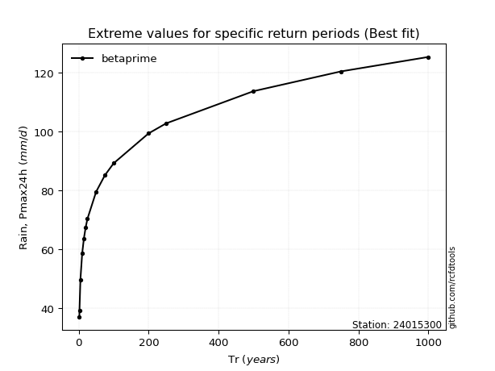</img>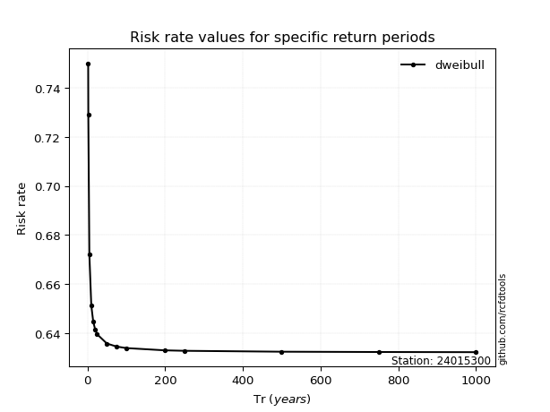</img>

</div>


<sub>**APP DISCLAIMER**: NO WARRANTY - This software is provided by [github.com/rcfdtools](https://github.com/rcfdtools) "as is", without any express or implied warranty, including warranties of merchantability, fitness for a particular purpose, or non-infringement. There is no guarantee that the software will be error-free or operate without interruption. LIMITATION OF LIABILITY - Neither the authors nor copyright holders will be liable for claims or damages arising from the software or its use. You are responsible for determining if the software is appropriate for your use and assume all associated risks, including errors, legal compliance, and data loss. NO PROFESSIONAL ADVICE - The software provides general information and does not offer professional advice. It should not replace consultation with professional advisors.</sub>