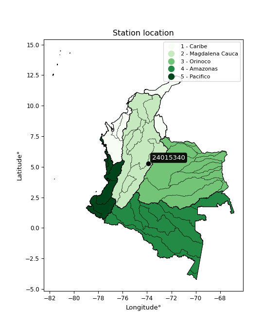

<div align="center">


</div>

# PMax24h Station (Rain): 24015340

Maximum Precipitation in 24 hours (PMax24h) is the greatest amount of rainfall for a specific duration that is meteorologically possible for a given location, acting as a "worst-case" scenario for extreme storms, crucial for designing safety-critical infrastructure like bridges, river deviations, dams, spillways, and nuclear plants to prevent catastrophic failure. The PMax24h is related with the Probable Maximum Precipitation (PMP) and it is calculated by hydrologists using meteorological data to determine the upper limit of extreme rainfall, often leading to the Probable Maximum Flood (PMF) for flood control design, and is increasingly being studied for climate change impacts. Probable Maximum Precipitation (PMP) is the theoretical upper limit of rainfall, a deterministic estimate for extreme events, while probability distributions (like GEV, Gumbel) describe the likelihood and frequency of various precipitation amounts, including rare ones, showing how often events occur, with PMP representing the extreme end of these distributions, used for critical infrastructure design to ensure safety against the worst conceivable weather, unlike standard statistical forecasts which cover typical probabilities.

The most common probability distributions in hydrology, used for analyzing floods, rainfall, and streamflow, include the Normal, Log-Normal, Gumbel, Gamma (including Log-Pearson Type III), and Generalized Extreme Value (GEV) distributions, often chosen based on the data´s skewness and whether modeling extremes or general conditions, with Gumbel and GEV popular for extreme events like floods, while the Normal distribution serves as a baseline, though often requiring transformations for skewed hydrological data. These distributions help in designing water infrastructure, managing water resources, and forecasting hydrologic events.

> Hydrological data often isn´t perfectly normal (it´s skewed), so different distributions are needed for different applications, such as: **Flood Frequency Analysis**: Using Gumbel, GEV, or Log-Pearson Type III for predicting extreme flood magnitudes and their return periods, **Rainfall Analysis**: Normal for annual totals, but Log-Normal, Weibull, or GEV for intensity or extreme daily rainfall, **Streamflow Modeling**: Gamma and Log-Normal for maximum flows, GEV for minimum flows, and Kappa for daily flows.

<div align="center">

</img>

</div>


## A. General information


### 1. General running parameters

• app_version: _v20260225_. • runtime: _2026-02-28 16:54:07.457399_. • Python version: _3.14.0_. • SciPy version: _1.16.3_. • Pandas version: _2.3.3_. • NumPy version: _2.3.5_. • Stations dataset (station_dataset_file): _dataset/pmax24h_in/automatic_colombia_2003_2025.csv_. • Stations catalog (station_catalog_file): _dataset/CNE.xls_. • Minimum year to eval til year_max (date_min): _1900_. • Maximum year to eval since year_min (date_max): _2025_. • Creates, save and include plots into reports (create_plot): _False_. • Plot only fit distributions with Δo > Δ (plot_only_fit): _True_. • Plot only simple graphs avoiding multiple CDFs and multiple Extreme values plots (plot_only_simple): _False_. • Eval low extreme values, if False, evaluates high extreme values (low_extreme): _False_. • Eval every SciPy distribution as logarithmic (pdist_logarithmic_on): _True_. • Standard deviation normalized (ddof): _1.0_. • Return periods to eval in years (Tr): _[2, 2.33, 5, 10, 15, 20, 25, 50, 75, 100, 200, 250, 500, 750, 1000]_. • Minimum data sample per station, 0 means any (minimum_sample): _5_. • Z-Score maximum threshold to adjust a value, 0 means disable (zscore_max): _3.5_. • Z-Score minimum threshold to adjust a value, 0 means disable (zscore_min): _-2.5_. • Avoid zeros, e.g. rain = 0 (avoid_zeros): _True_. • Avoid null values (avoid_nans): _True_. 

:file_folder:Table: [dataset.csv](../../dataset/pmax24h_in/automatic_colombia_2003_2025.csv)

> Delta Degrees of Freedom (DDOF): is a parameter used in the formulas for calculating variance and standard deviation. When ddof=0, the divisor is $N$ (the total number of observations) and this is used when your data set is the entire population. When ddof=1, the divisor is $N-1$ and this is used when your data set is a sample drawn from a larger population. Using $N-1$ provides an unbiased estimate of the population variance (known as Bessel´s correction).


### 2. Station info and location

|   id |   CODIGO | NOMBRE              | CATEGORIA               | TECNOLOGIA   | ESTADO   | FECHA_INSTALACION   |   FECHA_SUSPENSION |   ALTITUD |   LATITUD |   LONGITUD | DEPARTAMENTO   | MUNICIPIO        | AREA_OPERATIVA                            | ENTIDAD                                       | AREA_HIDROGRAFICA   | ZONA_HIDROGRAFICA   | SUBZONA_HIDROGRAFICA   |   CORRIENTE | Catalogo   |   Version |
|-----:|---------:|:--------------------|:------------------------|:-------------|:---------|:--------------------|-------------------:|----------:|----------:|-----------:|:---------------|:-----------------|:------------------------------------------|:----------------------------------------------|:--------------------|:--------------------|:-----------------------|------------:|:-----------|----------:|
|    0 | 24015340 | HATO EL  [24015340] | Climatológica Principal | Convencional | Activa   | 15/10/1962          |                nan |      2900 |   5.28333 |      -73.9 | Cundinamarca   | Carmen De Carupa | Area Operativa 11 - Cundinamarca-Amazonas | CORPORACION AUTONOMA REGIONAL DE CUNDINAMARCA | Magdalena Cauca     | Sogamoso            | Río Suárez             |         nan | CNE_OE     |  20251226 |

<div align="center">

Dynamic map: [:earth_americas:Google](http://maps.google.com/maps?q=5.283333333,-73.9) [:earth_americas:OSM](https://www.openstreetmap.org/#map=18/5.283333333/-73.9&layers=P) [:earth_americas:Bing](https://www.bing.com/maps?cp=5.283333333~-73.9&lvl=18) [:earth_americas:Apple](https://maps.apple.com/frame?center=5.283333333%2C-73.9&span=0.003%2C0.006)

</div>


<div align="center">

```geojson
{
  "type": "Feature",
  "geometry": {
    "type": "Point", 
    "coordinates": [-73.9, 5.283333333]
  }, 
  "properties": {
    "Name": "24015340"
  }
}
```

</div>


### 3. Discrete values table and plot

<div align="center">

|               |           0 |          1 |           2 |          3 |           4 |          5 |           6 |
|:--------------|------------:|-----------:|------------:|-----------:|------------:|-----------:|------------:|
| Date          | 2015        | 2016       | 2017        | 2018       | 2019        | 2020       | 2021        |
| Value         |    7.8      |  254       |   28.9      |   20.2     |   19.8      |   26.9     |   22.3      |
| Value_initial |    7.8      |  254       |   28.9      |   20.2     |   19.8      |   26.9     |   22.3      |
| count         |    7        |    7       |    7        |    7       |    7        |    7       |    7        |
| mean          |   54.2714   |   54.2714  |   54.2714   |   54.2714  |   54.2714   |   54.2714  |   54.2714   |
| std           |   88.3321   |   88.3321  |   88.3321   |   88.3321  |   88.3321   |   88.3321  |   88.3321   |
| zscore        |   -0.526099 |    2.26111 |   -0.287228 |   -0.38572 |   -0.390248 |   -0.30987 |   -0.361946 |


</div>


> The initial value (value_initial) correspond to the initial obtained or null completed value, and value (value) is adjusted only when the initial value is outside the valid range (outlier) definite through the Z-Score value. If Z-Score is active, values out of range or outliers are replaced with the station mean value. A Z-Score (or standard score) measures how many standard deviations a data point is from the mean of a dataset, indicating its relative position; positive scores mean above the mean, negative mean below, and a score of zero is exactly at the mean, allowing for comparison of values from different distributions. It´s calculated using the formula $z=(x–μ)/σ$, where $x$ is the data point, $μ$ is the mean, and $σ$ is the standard deviation, helping identify outliers and understand probability.
>
> <sub>**Note**: In this study, "completing" (filling gaps in) and "extending" (forecasting or lengthening the historical record) rainfall data series are avoided for certain critical analyses because they introduce artificial bias and uncertainty, which can distort the statistics of rare events (extremes), alter day-to-day variability, and compromise the integrity and homogeneity of the original data. Some reasons against Completing/Extending rainfall data are: **Distortion of Extremes and Variability**: The primary issue is that most gap-filling or extension methods rely on averaging or regression with nearby stations, which inherently smooths the data. Rainfall is highly variable in space and time, with a large percentage of zero values and occasional large storms. Infilling methods often underestimate the highest values and overestimate the lowest (zero) values, which severely distorts analyses focused on flood frequency, drought severity, and intensity-duration-frequency (IDF) curves, **Loss of Data Homogeneity**: Infilled or extended data are synthetic estimates, not actual measurements. Combining these estimates with observed data can violate the assumption of data homogeneity, which requires that the data properties do not change over time. Inhomogeneity can lead to incorrect conclusions about long-term trends or changes in climate patterns, **Propagation of Errors**: Errors and biases from the original data (e.g., wind-induced undercatch, instrument errors, site changes) or the data used for imputation can propagate through the analysis, leading to unreliable hydrological models and inaccurate predictions, **Compromised Statistical Integrity**: For statistical analyses, especially those involving the frequency of events, using artificial data can introduce time bias or autocorrelation that doesn´t exist in reality, making it difficult to assess the true probability of events, **Difficulty in Validation**: It is difficult to accurately validate the quality of filled or extended data, especially for past periods where ground-truth measurements are unavailable. The reliability of imputation techniques heavily depends on the density of the surrounding station network and the complexity of the local topography.</sub>


### 4. Active continuous probability distributions from SciPy (80 of 104 available)

A Probability Density Function (PDF) describes the relative likelihood of a continuous random variable falling within a specific range, where the total area under its curve equals 1, and the area over any interval gives the actual probability for that range. Unlike discrete probabilities (like rolling a die), a PDF shows density, not direct probability for a single point (which is zero), with higher points indicating higher likelihood, often visualized as a bell curve for normal distributions.

A log of a probability density function (log-PDF) is simply the logarithm of the PDF´s value, denoted as $log(f(x))$, useful for converting multiplication of probabilities into addition, improving numerical stability with tiny numbers, and connecting to information theory concepts like entropy. Instead of dealing with very small probabilities (e.g., 0.000001), log-PDFs use negative numbers (e.g., $log(0.00001) ≈ -11.51$ that are easier for computers to handle, preventing underflow errors and simplifying complex calculations. In this study, each active probability distribution from SciPy is also evaluated in the $log$ form.

[scipy.stats](https://docs.scipy.org/doc/scipy/reference/stats.html) is a Python´s powerful submodule within the SciPy library for comprehensive statistical analysis, offering over 130 probability distributions (like Normal, Poisson, etc.), functions for descriptive stats (mean, variance), hypothesis testing (t-tests, chi-square), random variable generation, and statistical tests, making it essential for data science, modeling, and research. It provides tools to explore, model, and draw conclusions from data efficiently, working seamlessly with [NumPy](https://numpy.org/).

<div align="center">

|   id | p_dist           |   n_parameter | fit_method   | label                                                                       | active   | ref                                                                                                      |
|-----:|:-----------------|--------------:|:-------------|:----------------------------------------------------------------------------|:---------|:---------------------------------------------------------------------------------------------------------|
|    0 | alpha            |             3 | MLE          | Alpha                                                                       | True     | [:mortar_board:](https://docs.scipy.org/doc/scipy/reference/generated/scipy.stats.alpha.html)            |
|    1 | anglit           |             2 | MM           | Anglit                                                                      | True     | [:mortar_board:](https://docs.scipy.org/doc/scipy/reference/generated/scipy.stats.anglit.html)           |
|    2 | arcsine          |             2 | MM           | Arcsine                                                                     | True     | [:mortar_board:](https://docs.scipy.org/doc/scipy/reference/generated/scipy.stats.arcsine.html)          |
|    3 | argus            |             3 | MLE          | Argus                                                                       | True     | [:mortar_board:](https://docs.scipy.org/doc/scipy/reference/generated/scipy.stats.argus.html)            |
|    4 | beta             |             4 | MLE          | Beta                                                                        | True     | [:mortar_board:](https://docs.scipy.org/doc/scipy/reference/generated/scipy.stats.beta.html)             |
|    5 | betaprime        |             4 | MLE          | Beta prime                                                                  | True     | [:mortar_board:](https://docs.scipy.org/doc/scipy/reference/generated/scipy.stats.betaprime.html)        |
|    6 | bradford         |             3 | MLE          | Bradford                                                                    | True     | [:mortar_board:](https://docs.scipy.org/doc/scipy/reference/generated/scipy.stats.bradford.html)         |
|    7 | burr             |             4 | MLE          | Burr (Type III)                                                             | True     | [:mortar_board:](https://docs.scipy.org/doc/scipy/reference/generated/scipy.stats.burr.html)             |
|    8 | burr12           |             4 | MLE          | Burr (Type III) 12                                                          | True     | [:mortar_board:](https://docs.scipy.org/doc/scipy/reference/generated/scipy.stats.burr12.html)           |
|    9 | cosine           |             2 | MLE          | Cosine                                                                      | True     | [:mortar_board:](https://docs.scipy.org/doc/scipy/reference/generated/scipy.stats.cosine.html)           |
|   10 | crystalball      |             4 | MLE          | Crystalball                                                                 | True     | [:mortar_board:](https://docs.scipy.org/doc/scipy/reference/generated/scipy.stats.crystalball.html)      |
|   11 | dgamma           |             3 | MLE          | Double gamma                                                                | True     | [:mortar_board:](https://docs.scipy.org/doc/scipy/reference/generated/scipy.stats.dgamma.html)           |
|   12 | dweibull         |             3 | MLE          | Double Weibull                                                              | True     | [:mortar_board:](https://docs.scipy.org/doc/scipy/reference/generated/scipy.stats.dweibull.html)         |
|   13 | erlang           |             3 | MLE          | Erlang                                                                      | True     | [:mortar_board:](https://docs.scipy.org/doc/scipy/reference/generated/scipy.stats.erlang.html)           |
|   14 | exponnorm        |             3 | MLE          | Exponentially modified Normal                                               | True     | [:mortar_board:](https://docs.scipy.org/doc/scipy/reference/generated/scipy.stats.exponnorm.html)        |
|   15 | exponpow         |             3 | MLE          | Exponential power                                                           | True     | [:mortar_board:](https://docs.scipy.org/doc/scipy/reference/generated/scipy.stats.exponpow.html)         |
|   16 | exponweib        |             4 | MLE          | Exponentiated Weibull                                                       | True     | [:mortar_board:](https://docs.scipy.org/doc/scipy/reference/generated/scipy.stats.exponweib.html)        |
|   17 | f                |             4 | MLE          | F                                                                           | True     | [:mortar_board:](https://docs.scipy.org/doc/scipy/reference/generated/scipy.stats.f.html)                |
|   18 | fatiguelife      |             3 | MLE          | Fatigue-life (Birnbaum-Saunders)                                            | True     | [:mortar_board:](https://docs.scipy.org/doc/scipy/reference/generated/scipy.stats.fatiguelife.html)      |
|   19 | foldnorm         |             3 | MM           | Fold Normal                                                                 | True     | [:mortar_board:](https://docs.scipy.org/doc/scipy/reference/generated/scipy.stats.foldnorm.html)         |
|   20 | gamma            |             3 | MLE          | Gamma                                                                       | True     | [:mortar_board:](https://docs.scipy.org/doc/scipy/reference/generated/scipy.stats.gamma.html)            |
|   21 | gausshyper       |             6 | MLE          | Gauss hypergeometric                                                        | True     | [:mortar_board:](https://docs.scipy.org/doc/scipy/reference/generated/scipy.stats.gausshyper.html)       |
|   22 | genexpon         |             5 | MLE          | Generalized exponential                                                     | True     | [:mortar_board:](https://docs.scipy.org/doc/scipy/reference/generated/scipy.stats.genexpon.html)         |
|   23 | genextreme       |             3 | MLE          | Generalized exponential                                                     | True     | [:mortar_board:](https://docs.scipy.org/doc/scipy/reference/generated/scipy.stats.genextreme.html)       |
|   24 | gengamma         |             4 | MLE          | Generalized gamma                                                           | True     | [:mortar_board:](https://docs.scipy.org/doc/scipy/reference/generated/scipy.stats.gengamma.html)         |
|   25 | genhalflogistic  |             3 | MLE          | Generalized half-logistic                                                   | True     | [:mortar_board:](https://docs.scipy.org/doc/scipy/reference/generated/scipy.stats.genhalflogistic.html)  |
|   26 | genlogistic      |             3 | MLE          | Generalized logistic                                                        | True     | [:mortar_board:](https://docs.scipy.org/doc/scipy/reference/generated/scipy.stats.genlogistic.html)      |
|   27 | gennorm          |             3 | MLE          | Generalized Normal                                                          | True     | [:mortar_board:](https://docs.scipy.org/doc/scipy/reference/generated/scipy.stats.gennorm.html)          |
|   28 | genpareto        |             3 | MLE          | Generalized Pareto                                                          | True     | [:mortar_board:](https://docs.scipy.org/doc/scipy/reference/generated/scipy.stats.genpareto.html)        |
|   29 | gompertz         |             3 | MLE          | Gompertz (or truncated Gumbel)                                              | True     | [:mortar_board:](https://docs.scipy.org/doc/scipy/reference/generated/scipy.stats.gompertz.html)         |
|   30 | gumbel_l         |             2 | MM           | Gumbel Left Skew                                                            | True     | [:mortar_board:](https://docs.scipy.org/doc/scipy/reference/generated/scipy.stats.gumbel_l.html)         |
|   31 | gumbel_r         |             2 | MM           | Gumbel Right Skew                                                           | True     | [:mortar_board:](https://docs.scipy.org/doc/scipy/reference/generated/scipy.stats.gumbel_r.html)         |
|   32 | halfgennorm      |             3 | MLE          | Upper half of a generalized normal                                          | True     | [:mortar_board:](https://docs.scipy.org/doc/scipy/reference/generated/scipy.stats.halfgennorm.html)      |
|   33 | halflogistic     |             2 | MM           | Half-logistic                                                               | True     | [:mortar_board:](https://docs.scipy.org/doc/scipy/reference/generated/scipy.stats.halflogistic.html)     |
|   34 | halfnorm         |             2 | MM           | Half Normal                                                                 | True     | [:mortar_board:](https://docs.scipy.org/doc/scipy/reference/generated/scipy.stats.halfnorm.html)         |
|   35 | hypsecant        |             2 | MM           | hyperbolic secant                                                           | True     | [:mortar_board:](https://docs.scipy.org/doc/scipy/reference/generated/scipy.stats.hypsecant.html)        |
|   36 | invgamma         |             3 | MLE          | Inverted gamma                                                              | True     | [:mortar_board:](https://docs.scipy.org/doc/scipy/reference/generated/scipy.stats.invgamma.html)         |
|   37 | invgauss         |             3 | MLE          | Inverse Gaussian                                                            | True     | [:mortar_board:](https://docs.scipy.org/doc/scipy/reference/generated/scipy.stats.invgauss.html)         |
|   38 | invweibull       |             3 | MLE          | Inverted Weibull                                                            | True     | [:mortar_board:](https://docs.scipy.org/doc/scipy/reference/generated/scipy.stats.invweibull.html)       |
|   39 | johnsonsb        |             4 | MLE          | Johnson SB                                                                  | True     | [:mortar_board:](https://docs.scipy.org/doc/scipy/reference/generated/scipy.stats.johnsonsb.html)        |
|   40 | johnsonsu        |             4 | MLE          | Johnson Su                                                                  | True     | [:mortar_board:](https://docs.scipy.org/doc/scipy/reference/generated/scipy.stats.johnsonsu.html)        |
|   41 | kappa3           |             3 | MLE          | Kappa 3                                                                     | True     | [:mortar_board:](https://docs.scipy.org/doc/scipy/reference/generated/scipy.stats.kappa3.html)           |
|   42 | kappa4           |             4 | MLE          | Kappa 4                                                                     | True     | [:mortar_board:](https://docs.scipy.org/doc/scipy/reference/generated/scipy.stats.kappa4.html)           |
|   43 | ksone            |             3 | MLE          | Kolmogorov-Smirnov one-sided test statistic distribution                    | True     | [:mortar_board:](https://docs.scipy.org/doc/scipy/reference/generated/scipy.stats.ksone.html)            |
|   44 | kstwobign        |             2 | MLE          | Limiting distribution of scaled Kolmogorov-Smirnov two-sided test statistic | True     | [:mortar_board:](https://docs.scipy.org/doc/scipy/reference/generated/scipy.stats.kstwobign.html)        |
|   45 | laplace          |             2 | MM           | Laplace                                                                     | True     | [:mortar_board:](https://docs.scipy.org/doc/scipy/reference/generated/scipy.stats.laplace.html)          |
|   46 | levy_l           |             2 | MLE          | Left-skewed Levy                                                            | True     | [:mortar_board:](https://docs.scipy.org/doc/scipy/reference/generated/scipy.stats.levy_l.html)           |
|   47 | loggamma         |             3 | MLE          | Log gamma                                                                   | True     | [:mortar_board:](https://docs.scipy.org/doc/scipy/reference/generated/scipy.stats.loggamma.html)         |
|   48 | logistic         |             2 | MM           | Logistic (or Sech-squared)                                                  | True     | [:mortar_board:](https://docs.scipy.org/doc/scipy/reference/generated/scipy.stats.logistic.html)         |
|   49 | loglaplace       |             3 | MLE          | Log-Laplace                                                                 | True     | [:mortar_board:](https://docs.scipy.org/doc/scipy/reference/generated/scipy.stats.loglaplace.html)       |
|   50 | lomax            |             3 | MLE          | Lomax (Pareto of the second kind)                                           | True     | [:mortar_board:](https://docs.scipy.org/doc/scipy/reference/generated/scipy.stats.lomax.html)            |
|   51 | maxwell          |             2 | MM           | Maxwell                                                                     | True     | [:mortar_board:](https://docs.scipy.org/doc/scipy/reference/generated/scipy.stats.maxwell.html)          |
|   52 | mielke           |             4 | MLE          | Mielke Beta-Kappa / Dagum                                                   | True     | [:mortar_board:](https://docs.scipy.org/doc/scipy/reference/generated/scipy.stats.mielke.html)           |
|   53 | moyal            |             2 | MM           | Moyal                                                                       | True     | [:mortar_board:](https://docs.scipy.org/doc/scipy/reference/generated/scipy.stats.moyal.html)            |
|   54 | nakagami         |             3 | MLE          | Nakagami                                                                    | True     | [:mortar_board:](https://docs.scipy.org/doc/scipy/reference/generated/scipy.stats.nakagami.html)         |
|   55 | ncf              |             5 | MLE          | Non-central F distribution                                                  | True     | [:mortar_board:](https://docs.scipy.org/doc/scipy/reference/generated/scipy.stats.ncf.html)              |
|   56 | nct              |             4 | MLE          | Non-central Student’s t                                                     | True     | [:mortar_board:](https://docs.scipy.org/doc/scipy/reference/generated/scipy.stats.nct.html)              |
|   57 | norm             |             2 | MM           | Normal                                                                      | True     | [:mortar_board:](https://docs.scipy.org/doc/scipy/reference/generated/scipy.stats.norm.html)             |
|   58 | pearson3         |             3 | MM           | Pearson type III                                                            | True     | [:mortar_board:](https://docs.scipy.org/doc/scipy/reference/generated/scipy.stats.pearson3.html)         |
|   59 | powerlaw         |             3 | MLE          | Power-function                                                              | True     | [:mortar_board:](https://docs.scipy.org/doc/scipy/reference/generated/scipy.stats.powerlaw.html)         |
|   60 | rayleigh         |             2 | MM           | Rayleigh                                                                    | True     | [:mortar_board:](https://docs.scipy.org/doc/scipy/reference/generated/scipy.stats.rayleigh.html)         |
|   61 | rdist            |             3 | MLE          | R-distributed (symmetric beta)                                              | True     | [:mortar_board:](https://docs.scipy.org/doc/scipy/reference/generated/scipy.stats.rdist.html)            |
|   62 | rice             |             3 | MLE          | Rice                                                                        | True     | [:mortar_board:](https://docs.scipy.org/doc/scipy/reference/generated/scipy.stats.rice.html)             |
|   63 | semicircular     |             2 | MM           | Semicircular                                                                | True     | [:mortar_board:](https://docs.scipy.org/doc/scipy/reference/generated/scipy.stats.semicircular.html)     |
|   64 | skewnorm         |             3 | MLE          | Skew normal                                                                 | True     | [:mortar_board:](https://docs.scipy.org/doc/scipy/reference/generated/scipy.stats.skewnorm.html)         |
|   65 | t                |             3 | MLE          | Student’s t                                                                 | True     | [:mortar_board:](https://docs.scipy.org/doc/scipy/reference/generated/scipy.stats.t.html)                |
|   66 | trapezoid        |             4 | MLE          | Trapezoid                                                                   | True     | [:mortar_board:](https://docs.scipy.org/doc/scipy/reference/generated/scipy.stats.trapezoid.html)        |
|   67 | triang           |             3 | MLE          | Triangular                                                                  | True     | [:mortar_board:](https://docs.scipy.org/doc/scipy/reference/generated/scipy.stats.triang.html)           |
|   68 | truncexpon       |             3 | MLE          | Truncated exponential                                                       | True     | [:mortar_board:](https://docs.scipy.org/doc/scipy/reference/generated/scipy.stats.truncexpon.html)       |
|   69 | truncnorm        |             4 | MLE          | Truncated normal                                                            | True     | [:mortar_board:](https://docs.scipy.org/doc/scipy/reference/generated/scipy.stats.truncnorm.html)        |
|   70 | truncpareto      |             4 | MLE          | Upper truncated Pareto                                                      | True     | [:mortar_board:](https://docs.scipy.org/doc/scipy/reference/generated/scipy.stats.truncpareto.html)      |
|   71 | truncweibull_min |             5 | MLE          | Doubly truncated Weibull minimum                                            | True     | [:mortar_board:](https://docs.scipy.org/doc/scipy/reference/generated/scipy.stats.truncweibull_min.html) |
|   72 | tukeylambda      |             3 | MLE          | Tukey-Lamdba                                                                | True     | [:mortar_board:](https://docs.scipy.org/doc/scipy/reference/generated/scipy.stats.tukeylambda.html)      |
|   73 | uniform          |             2 | MLE          | Uniform                                                                     | True     | [:mortar_board:](https://docs.scipy.org/doc/scipy/reference/generated/scipy.stats.uniform.html)          |
|   74 | vonmises         |             3 | MLE          | Von Mises                                                                   | True     | [:mortar_board:](https://docs.scipy.org/doc/scipy/reference/generated/scipy.stats.vonmises.html)         |
|   75 | vonmises_line    |             3 | MLE          | Von Mises line                                                              | True     | [:mortar_board:](https://docs.scipy.org/doc/scipy/reference/generated/scipy.stats.vonmises_line.html)    |
|   76 | wald             |             2 | MM           | Wald                                                                        | True     | [:mortar_board:](https://docs.scipy.org/doc/scipy/reference/generated/scipy.stats.wald.html)             |
|   77 | weibull_max      |             3 | MLE          | Weibull maximum                                                             | True     | [:mortar_board:](https://docs.scipy.org/doc/scipy/reference/generated/scipy.stats.weibull_max.html)      |
|   78 | weibull_min      |             3 | MLE          | Weibull minimum                                                             | True     | [:mortar_board:](https://docs.scipy.org/doc/scipy/reference/generated/scipy.stats.weibull_min.html)      |
|   79 | wrapcauchy       |             3 | MLE          | Wrapped  Cauchy                                                             | True     | [:mortar_board:](https://docs.scipy.org/doc/scipy/reference/generated/scipy.stats.wrapcauchy.html)       |

</div>

> **n_parameter:** # arguments & localization & scale.
>
> **Fit methods:** (MLE) maximum likelihood, (MM) L-moments.
>
>**Inactive** (With the only purpose of prevent loops, zero divisions, infinite values, over high estimated values or horizontal trending for recurrence intervals estimations, the follow distributions were disabled.)**:** lognorm, norminvgauss, powernorm, powerlognorm, cauchy, halfcauchy, foldcauchy, skewcauchy, chi2, expon, fisk, genhyperbolic, geninvgauss, gibrat, kstwo, laplace_asymmetric, levy, levy_stable, ncx2, pareto, rel_breitwigner, recipinvgauss, studentized_range, loguniform, 


## B. Probability (PDF) vs. Empirical (EDF) distributions functions

A continuous probability distribution (CPD) describes probabilities for variables that can take any value within a range (like rain any time), unlike discrete variables with specific outcomes (like temperature). It uses a Probability Density Function (PDF), a curve where the total area under it equals 1, and the probability of the variable falling within an interval (a to b) is found by calculating the area under the curve between those points. A key feature is that the probability of hitting any single exact value is zero, so probabilities are always expressed for ranges, e.g., $P(a ≤ X ≤ b)$.

<div align="center">

Distributions parameters from station values
|     |   station | p_dist              |   n |              loc |          scale | shape                  | shape1                | shape2                | shape3               |
|----:|----------:|:--------------------|----:|-----------------:|---------------:|:-----------------------|:----------------------|:----------------------|:---------------------|
|   0 |  24015340 | alpha               |   7 |     -6.53847     |   49.6788      | 1.5978939696522043     |                       |                       |                      |
|   1 |  24015340 | anglit              |   7 |     54.2714      |  239.238       |                        |                       |                       |                      |
|   2 |  24015340 | arcsine             |   7 |    -61.3823      |  231.308       |                        |                       |                       |                      |
|   3 |  24015340 | argus               |   7 |   -142.092       |  411.186       | 9.630676661731551e-09  |                       |                       |                      |
|   4 |  24015340 | beta                |   7 |    -17.1146      |  271.115       | 0.005828420773883929   | 0.034063562107986736  |                       |                      |
|   5 |  24015340 | betaprime           |   7 |      1.43988     |    0.125805    | 206.83075077732065     | 1.4614988853259812    |                       |                      |
|   6 |  24015340 | bradford            |   7 |      7.8         |  246.2         | 3.5014546142950005     |                       |                       |                      |
|   7 |  24015340 | burr                |   7 |      0.366749    |    1.20886     | 1.3810787883610969     | 41.60855853460984     |                       |                      |
|   8 |  24015340 | burr12              |   7 |     -0.534584    |    8.19123     | 206.5500115088496      | 0.003848904979932131  |                       |                      |
|   9 |  24015340 | cosine              |   7 |     76.6454      |   76.5124      |                        |                       |                       |                      |
|  10 |  24015340 | crystalball         |   7 |     54.2714      |   81.7796      | 3701.972317198818      | 4129.54773769896      |                       |                      |
|  11 |  24015340 | dgamma              |   7 |     20.2         |   62.9015      | 0.2865646876928154     |                       |                       |                      |
|  12 |  24015340 | dweibull            |   7 |     19.8         |   70.8992      | 0.4462823619957311     |                       |                       |                      |
|  13 |  24015340 | erlang              |   7 |      7.8         |   85.3088      | 0.34529302113130467    |                       |                       |                      |
|  14 |  24015340 | exponnorm           |   7 |      7.75724     |    0.013886    | 3349.9033656511438     |                       |                       |                      |
|  15 |  24015340 | exponpow            |   7 |      7.8         |   79.2349      | 0.4430732331871478     |                       |                       |                      |
|  16 |  24015340 | exponweib           |   7 |      7.8         |    2.40969     | 2.3142478109514153     | 0.3108871689066651    |                       |                      |
|  17 |  24015340 | f                   |   7 |      7.8         |   12.9454      | 1.0695998448439044     | 2.1385134768273324    |                       |                      |
|  18 |  24015340 | fatiguelife         |   7 |      5.89746     |   21.0878      | 1.6658008996298226     |                       |                       |                      |
|  19 |  24015340 | foldnorm            |   7 |    -62.7339      |  146.686       | 0.0007140980071736402  |                       |                       |                      |
|  20 |  24015340 | gamma               |   7 |      7.8         |  100.85        | 0.5644884227107396     |                       |                       |                      |
|  21 |  24015340 | gausshyper          |   7 |      7.8         |  404.288       | 0.4092179439354858     | 1.4884767506031495    | 1.2206467873590383    | 1.6544320725580328   |
|  22 |  24015340 | genexpon            |   7 |      7.8         |   77.171       | 1.6606440600360057     | 6.876716141924623e-11 | 1.8863492114101579    |                      |
|  23 |  24015340 | genextreme          |   7 |     18.1339      |   12.9704      | -0.7522603265111227    |                       |                       |                      |
|  24 |  24015340 | gengamma            |   7 |      7.8         |    4.08634     | 1.7444285952055083     | 0.36049574029319054   |                       |                      |
|  25 |  24015340 | genhalflogistic     |   7 |    -17.2953      |  291.517       | 1.074536524717559      |                       |                       |                      |
|  26 |  24015340 | genlogistic         |   7 |   -263.84        |   34.6648      | 4224.383905021208      |                       |                       |                      |
|  27 |  24015340 | gennorm             |   7 |     20.2         |    0.331815    | 0.3492080265174369     |                       |                       |                      |
|  28 |  24015340 | genpareto           |   7 |      7.8         |   16.9549      | 0.6020168713339996     |                       |                       |                      |
|  29 |  24015340 | gompertz            |   7 |      7.79997     |    2.23971e+06 | 46165.73808206201      |                       |                       |                      |
|  30 |  24015340 | gumbel_l            |   7 |     91.0766      |   63.7633      |                        |                       |                       |                      |
|  31 |  24015340 | gumbel_r            |   7 |     17.4663      |   63.7633      |                        |                       |                       |                      |
|  32 |  24015340 | halfgennorm         |   7 |      7.8         |    1.21481     | 0.36885591571539045    |                       |                       |                      |
|  33 |  24015340 | halflogistic        |   7 |    -42.6564      |   69.9186      |                        |                       |                       |                      |
|  34 |  24015340 | halfnorm            |   7 |    -53.9727      |  135.664       |                        |                       |                       |                      |
|  35 |  24015340 | hypsecant           |   7 |     54.2714      |   52.0625      |                        |                       |                       |                      |
|  36 |  24015340 | invgamma            |   7 |      2.41883     |   21.7046      | 1.3410047422904183     |                       |                       |                      |
|  37 |  24015340 | invgauss            |   7 |      4.79034     |   14.8891      | 3.323303574454026      |                       |                       |                      |
|  38 |  24015340 | invweibull          |   7 |      0.892077    |   17.2418      | 1.3293144138137365     |                       |                       |                      |
|  39 |  24015340 | johnsonsb           |   7 |      7.8         | 1362.94        | 0.8863981659981072     | 0.07808445007891576   |                       |                      |
|  40 |  24015340 | johnsonsu           |   7 |     19.9555      |    0.285872    | -0.5677461000161684    | 0.2831827257437632    |                       |                      |
|  41 |  24015340 | kappa3              |   7 |      7.8         |   16.8609      | 1.376316594152005      |                       |                       |                      |
|  42 |  24015340 | kappa4              |   7 |    -16.5365      |  271.664       | 1.0983835429185476     | 0.9971955442184299    |                       |                      |
|  43 |  24015340 | ksone               |   7 |    -16.82        |  295.44        | 1.0                    |                       |                       |                      |
|  44 |  24015340 | kstwobign           |   7 |   -130.716       |  219.477       |                        |                       |                       |                      |
|  45 |  24015340 | laplace             |   7 |     54.2714      |   57.8269      |                        |                       |                       |                      |
|  46 |  24015340 | levy_l              |   7 |    278.352       |  108.707       |                        |                       |                       |                      |
|  47 |  24015340 | loggamma            |   7 | -28927.4         | 3818.92        | 1976.303352694552      |                       |                       |                      |
|  48 |  24015340 | logistic            |   7 |     54.2714      |   45.0875      |                        |                       |                       |                      |
|  49 |  24015340 | loglaplace          |   7 |     -0.0524612   |   22.3525      | 1.6908031791006541     |                       |                       |                      |
|  50 |  24015340 | lomax               |   7 |      7.79554     |   22.2902      | 1.3562700148644153     |                       |                       |                      |
|  51 |  24015340 | maxwell             |   7 |   -139.512       |  121.436       |                        |                       |                       |                      |
|  52 |  24015340 | mielke              |   7 |     -0.129534    |    0.911602    | 106.04028012513976     | 1.4271193061845935    |                       |                      |
|  53 |  24015340 | moyal               |   7 |      7.50461     |   36.8138      |                        |                       |                       |                      |
|  54 |  24015340 | nakagami            |   7 |      7.8         |  118.186       | 0.14823141076623364    |                       |                       |                      |
|  55 |  24015340 | ncf                 |   7 |     -0.232044    |   21.991       | 23.115614769772076     | 3.5287854035503976    | 1.136779616400035e-08 |                      |
|  56 |  24015340 | nct                 |   7 |     19.7394      |    0.695823    | 0.35763283061667744    | 0.8493070913388386    |                       |                      |
|  57 |  24015340 | norm                |   7 |     54.2714      |   81.7796      |                        |                       |                       |                      |
|  58 |  24015340 | pearson3            |   7 |     54.2714      |   81.7796      | 2.015676026786474      |                       |                       |                      |
|  59 |  24015340 | powerlaw            |   7 |      7.8         |  246.2         | 0.12958520790881417    |                       |                       |                      |
|  60 |  24015340 | rayleigh            |   7 |   -102.178       |  124.828       |                        |                       |                       |                      |
|  61 |  24015340 | rdist               |   7 |    -17.8173      |   46.7173      | 1.4028206769694285     |                       |                       |                      |
|  62 |  24015340 | rice                |   7 |    -55.9033      |   97.0216      | 0.0004444573296476745  |                       |                       |                      |
|  63 |  24015340 | semicircular        |   7 |     54.2715      |  163.559       |                        |                       |                       |                      |
|  64 |  24015340 | skewnorm            |   7 |      7.79993     |   94.0572      | 6740260.580794334      |                       |                       |                      |
|  65 |  24015340 | t                   |   7 |     21.2722      |    2.95522     | 0.5918344536170339     |                       |                       |                      |
|  66 |  24015340 | trapezoid           |   7 |    -17.661       |  295.44        | 0.9999999999999999     | 1.0                   |                       |                      |
|  67 |  24015340 | triang              |   7 |      7.79992     |  477.736       | 1.4254012781140186e-07 |                       |                       |                      |
|  68 |  24015340 | truncexpon          |   7 |    -14.5401      |  204.411       | 1.313726309142111      |                       |                       |                      |
|  69 |  24015340 | truncnorm           |   7 |  -5021.41        |  550.733       | 9.131846017294372      | 319.77848685901586    |                       |                      |
|  70 |  24015340 | truncpareto         |   7 |    -14.4829      |   22.2829      | 1.1036662760721772     | 12.048827278803213    |                       |                      |
|  71 |  24015340 | truncweibull_min    |   7 |      7.06265     |  108.52        | 0.0007534892568232822  | 0.006777458549169954  | 2.275496462268559     |                      |
|  72 |  24015340 | tukeylambda         |   7 |    -18.3115      |   64.206       | 1.359966074174769      |                       |                       |                      |
|  73 |  24015340 | uniform             |   7 |      7.8         |  246.2         |                        |                       |                       |                      |
|  74 |  24015340 | vonmises            |   7 |      2.11075     |    1           | 1.3428582619528338     |                       |                       |                      |
|  75 |  24015340 | vonmises_line       |   7 |     33.2949      |   70.2526      | 1.9968824574840311     |                       |                       |                      |
|  76 |  24015340 | wald                |   7 |    -27.5082      |   81.7796      |                        |                       |                       |                      |
|  77 |  24015340 | weibull_max         |   7 |    254           |    1.68309     | 0.17825250374929014    |                       |                       |                      |
|  78 |  24015340 | weibull_min         |   7 |      7.8         |   51.2084      | 0.5072317790384617     |                       |                       |                      |
|  79 |  24015340 | wrapcauchy          |   7 |      7.8         |   39.3397      | 0.7752287250120116     |                       |                       |                      |
|  80 |  24015340 | logalpha            |   7 |     -0.859774    |   19.7758      | 4.9386175806385015     |                       |                       |                      |
|  81 |  24015340 | loganglit           |   7 |      3.33477     |    2.87846     |                        |                       |                       |                      |
|  82 |  24015340 | logarcsine          |   7 |      1.94325     |    2.78305     |                        |                       |                       |                      |
|  83 |  24015340 | logargus            |   7 |      0.953185    |    4.76294     | 5.332943996528251e-05  |                       |                       |                      |
|  84 |  24015340 | logbeta             |   7 |      2.05412     |    4.31712     | 0.6171273383258945     | 1.5812661329094153    |                       |                      |
|  85 |  24015340 | logbetaprime        |   7 |      1.00743     |    1.58648     | 15.530853248907889     | 11.590811356202671    |                       |                      |
|  86 |  24015340 | logbradford         |   7 |      2.05412     |    3.48356     | 0.9572714678375971     |                       |                       |                      |
|  87 |  24015340 | logburr             |   7 |     -0.0269057   |    2.96685     | 6.4638378624661055     | 1.4124536490690844    |                       |                      |
|  88 |  24015340 | logburr12           |   7 |     -1.00929     |    3.8744      | 12.678664306292127     | 0.5389743757773061    |                       |                      |
|  89 |  24015340 | logcosine           |   7 |      3.51681     |    0.895564    |                        |                       |                       |                      |
|  90 |  24015340 | logcrystalball      |   7 |      3.33477     |    0.98395     | 47.12109403876718      | 1.6164536272974321    |                       |                      |
|  91 |  24015340 | logdgamma           |   7 |      3.00568     |    0.811136    | 0.7268473173142969     |                       |                       |                      |
|  92 |  24015340 | logdweibull         |   7 |      3.00568     |    0.792603    | 0.7347602458449346     |                       |                       |                      |
|  93 |  24015340 | logerlang           |   7 |      1.75158     |    0.609025    | 2.599540563971506      |                       |                       |                      |
|  94 |  24015340 | logexponnorm        |   7 |      2.52447     |    0.432879    | 1.8718868242708022     |                       |                       |                      |
|  95 |  24015340 | logexponpow         |   7 |      2.05412     |    1.70057     | 0.19482015644967265    |                       |                       |                      |
|  96 |  24015340 | logexponweib        |   7 |      2.05412     |    1.00806     | 1.0731158629440198     | 0.8812349132660052    |                       |                      |
|  97 |  24015340 | logf                |   7 |      0.52584     |    2.54591     | 351.95575433377655     | 21.49842876643352     |                       |                      |
|  98 |  24015340 | logfatiguelife      |   7 |      1.04738     |    2.10735     | 0.41349081607027915    |                       |                       |                      |
|  99 |  24015340 | logfoldnorm         |   7 |      2.00785     |    1.6258      | 0.2032661303092298     |                       |                       |                      |
| 100 |  24015340 | loggamma            |   7 |      1.7516      |    0.609034    | 2.5994728124561473     |                       |                       |                      |
| 101 |  24015340 | loggausshyper       |   7 |      2.05412     |    4.45202     | 0.1745534786401458     | 2.089434969309339     | 1.5178523860742015    | -0.08677293486350045 |
| 102 |  24015340 | loggenexpon         |   7 |      2.05209     |    0.382555    | 0.16728623869862588    | 0.4320001730643185    | 0.15732636528688343   |                      |
| 103 |  24015340 | loggenextreme       |   7 |      2.88943     |    0.701271    | -0.0546491106085243    |                       |                       |                      |
| 104 |  24015340 | loggengamma         |   7 |      2.05412     |    0.959359    | 1.047667478380486      | 0.8708415730725947    |                       |                      |
| 105 |  24015340 | loggenhalflogistic  |   7 |      1.8019      |    3.90186     | 1.044553854415356      |                       |                       |                      |
| 106 |  24015340 | loggenlogistic      |   7 |     -0.937199    |    0.710357    | 225.84815713433625     |                       |                       |                      |
| 107 |  24015340 | loggennorm          |   7 |      3.00568     |    0.0152393   | 0.3647090245850605     |                       |                       |                      |
| 108 |  24015340 | loggenpareto        |   7 |     -0.000363307 |    8.20116     | -1.4809687699326308    |                       |                       |                      |
| 109 |  24015340 | loggompertz         |   7 |      2.05412     |    2.2226      | 1.0138398060184077     |                       |                       |                      |
| 110 |  24015340 | loggumbel_l         |   7 |      3.7776      |    0.767185    |                        |                       |                       |                      |
| 111 |  24015340 | loggumbel_r         |   7 |      2.89194     |    0.767185    |                        |                       |                       |                      |
| 112 |  24015340 | loghalfgennorm      |   7 |      2.05412     |    0.97519     | 0.8621138494708318     |                       |                       |                      |
| 113 |  24015340 | loghalflogistic     |   7 |      2.16852     |    0.841272    |                        |                       |                       |                      |
| 114 |  24015340 | loghalfnorm         |   7 |      2.0324      |    1.63228     |                        |                       |                       |                      |
| 115 |  24015340 | loghypsecant        |   7 |      3.33477     |    0.626404    |                        |                       |                       |                      |
| 116 |  24015340 | loginvgamma         |   7 |      0.44942     |   28.1037      | 10.746516156816558     |                       |                       |                      |
| 117 |  24015340 | loginvgauss         |   7 |      1.01166     |   13.5516      | 0.1714268847737732     |                       |                       |                      |
| 118 |  24015340 | loginvweibull       |   7 |     -9.93792     |   12.8274      | 18.29132704355935      |                       |                       |                      |
| 119 |  24015340 | logjohnsonsb        |   7 |      1.12022     |  130.615       | 9.711633868742869      | 2.3409430405783134    |                       |                      |
| 120 |  24015340 | logjohnsonsu        |   7 |      2.99639     |    0.0194251   | -0.47756034541832043   | 0.3215510208615865    |                       |                      |
| 121 |  24015340 | logkappa3           |   7 |      2.05412     |    1.31608     | 3.4434698744502725     |                       |                       |                      |
| 122 |  24015340 | logkappa4           |   7 |      1.54408     |    3.94306     | 1.1483972796078032     | 0.98502595645571      |                       |                      |
| 123 |  24015340 | logksone            |   7 |      1.7058      |    4.17985     | 1.0                    |                       |                       |                      |
| 124 |  24015340 | logkstwobign        |   7 |      0.260471    |    3.56417     |                        |                       |                       |                      |
| 125 |  24015340 | loglaplace          |   7 |      3.33477     |    0.69576     |                        |                       |                       |                      |
| 126 |  24015340 | loglevy_l           |   7 |      5.80071     |    1.17514     |                        |                       |                       |                      |
| 127 |  24015340 | logloggamma         |   7 |   -283.896       |   39.1181      | 1544.9907326414827     |                       |                       |                      |
| 128 |  24015340 | loglogistic         |   7 |      3.33477     |    0.542482    |                        |                       |                       |                      |
| 129 |  24015340 | logloglaplace       |   7 |     -0.0272476   |    3.13183     | 5.886827866894459      |                       |                       |                      |
| 130 |  24015340 | loglomax            |   7 |      2.05412     |    3.4351e+11  | 188981237277.30713     |                       |                       |                      |
| 131 |  24015340 | logmaxwell          |   7 |      1.00321     |    1.46109     |                        |                       |                       |                      |
| 132 |  24015340 | logmielke           |   7 |      2.05412     |    1.80641     | 0.8938766834604346     | 3.7471150106118736    |                       |                      |
| 133 |  24015340 | logmoyal            |   7 |      2.77208     |    0.442935    |                        |                       |                       |                      |
| 134 |  24015340 | lognakagami         |   7 |      2.98568     |    0.752681    | 0.21343599903801458    |                       |                       |                      |
| 135 |  24015340 | logncf              |   7 |      0.619218    |    2.00906     | 142.08126623985044     | 21.54688748678287     | 32.01903183676167     |                      |
| 136 |  24015340 | lognct              |   7 |      0.281653    |    0.314516    | 7.820883839448692      | 8.718325001293733     |                       |                      |
| 137 |  24015340 | lognorm             |   7 |      3.33477     |    0.983954    |                        |                       |                       |                      |
| 138 |  24015340 | logpearson3         |   7 |      3.33477     |    0.983952    | 1.2738753446241877     |                       |                       |                      |
| 139 |  24015340 | logpowerlaw         |   7 |      2.05412     |    3.48321     | 0.16499222652935552    |                       |                       |                      |
| 140 |  24015340 | lograyleigh         |   7 |      1.45241     |    1.50191     |                        |                       |                       |                      |
| 141 |  24015340 | logrdist            |   7 |      2.97077     |    0.916648    | 1.3766173209448644     |                       |                       |                      |
| 142 |  24015340 | logrice             |   7 |      1.66421     |    1.37094     | 0.00020994947637583908 |                       |                       |                      |
| 143 |  24015340 | logsemicircular     |   7 |      3.33478     |    1.96788     |                        |                       |                       |                      |
| 144 |  24015340 | logskewnorm         |   7 |      2.05412     |    1.61518     | 2448628.30591598       |                       |                       |                      |
| 145 |  24015340 | logt                |   7 |      3.10152     |    0.186509    | 0.8647264499109182     |                       |                       |                      |
| 146 |  24015340 | logtrapezoid        |   7 |      1.7058      |    4.17985     | 1.0                    | 1.0                   |                       |                      |
| 147 |  24015340 | logtriang           |   7 |      0.570618    |    4.96672     | 0.9999999947365132     |                       |                       |                      |
| 148 |  24015340 | logtruncexpon       |   7 |      2.05412     |    3.51162     | 0.9919140814189267     |                       |                       |                      |
| 149 |  24015340 | logtruncnorm        |   7 |     -0.321277    |    1.58562     | 2.085588533888827      | 4.874633765183736     |                       |                      |
| 150 |  24015340 | logtruncpareto      |   7 |      2.05286     |    0.00126632  | 0.16788159818267823    | 2751.665131292058     |                       |                      |
| 151 |  24015340 | logtruncweibull_min |   7 |      2.05075     |    3.71026     | 0.9119760818424268     | 0.0009040032645610553 | 0.9397138845444085    |                      |
| 152 |  24015340 | logtukeylambda      |   7 |      2.70899     |    0.882199    | 1.3471521005545415     |                       |                       |                      |
| 153 |  24015340 | loguniform          |   7 |      2.05412     |    3.48321     |                        |                       |                       |                      |
| 154 |  24015340 | logvonmises         |   7 |      3.10646     |    1           | 1.8305030380806284     |                       |                       |                      |
| 155 |  24015340 | logvonmises_line    |   7 |      3.22763     |    0.735202    | 1.076657183132537      |                       |                       |                      |
| 156 |  24015340 | logwald             |   7 |      2.35078     |    0.983977    |                        |                       |                       |                      |
| 157 |  24015340 | logweibull_max      |   7 |      5.53733     |    1.41291     | 0.7520244913371323     |                       |                       |                      |
| 158 |  24015340 | logweibull_min      |   7 |      1.97384     |    1.47259     | 1.3382571154290752     |                       |                       |                      |
| 159 |  24015340 | logwrapcauchy       |   7 |      2.05412     |    0.554374    | 0.052300139596368096   |                       |                       |                      |

</div>

> **loc** (Location parameter): This shifts the distribution along the x-axis. For many common distributions, like the normal (Gaussian) distribution, loc represents the mean $μ$. For others, like the uniform distribution, it might represent the minimum value, or for the beta distribution, the left end of the support interval.
>
> **scale** (Scale parameter): This determines the width or spread of the distribution. For the normal distribution, scale represents the standard deviation $σ$. For a uniform distribution, it defines the length of the interval (from $loc$ to $loc + scale$).
>
> **shape** (Shape parameters): Refers to parameters that define the specific form of a probability distribution, distinct from its location (loc) and scale (scale). These parameters are required arguments for most distribution functions. For example, a normal (Gaussian) distribution is fully defined by its location (mean) and scale (standard deviation), so it has no specific shape parameters beyond loc and scale. However, other distributions have intrinsic properties that need specification, as Gamma distribution that takes a shape parameter, often named $a$ or $alpha$.


### 0. Cumulative distribution values - CDF (160 evaluated)

Cumulative Distribution Function (CDF), denoted as $F$<sub>$X$</sub>$(x)$, is a function that gives the probability that a random variable $X$ will take a value less than or equal to a specific value, $x$ (i.e., $(P(X≥x)$. It essentially "accumulates" probabilities from a given point up to the far right (positive infinity), providing a complete picture of the distribution´s probabilities for both discrete (like rain) and continuous (like temperature) variables, helping to find probabilities over ranges or above certain values. Each station is evaluated separately ordering the $x$ values ascending, calculating the CDF and PDF values for the activated distributions and their logarithmic forms.

<div align="center">

CDF ordered by x ascending and calculating $log(f(x))$ separately
|   id |   Station |   date |     x |   count |    mean |     std |    zscore |   Value_initial |   station |   m |    alpha |   alpha_pdf |   anglit |   anglit_pdf |   arcsine |   arcsine_pdf |    argus |   argus_pdf |     beta |    beta_pdf |   betaprime |   betaprime_pdf |    bradford |   bradford_pdf |      burr |   burr_pdf |    burr12 |   burr12_pdf |   cosine |   cosine_pdf |   crystalball |   crystalball_pdf |   dgamma |   dgamma_pdf |   dweibull |   dweibull_pdf |      erlang |   erlang_pdf |   exponnorm |   exponnorm_pdf |    exponpow |   exponpow_pdf |   exponweib |   exponweib_pdf |           f |        f_pdf |   fatiguelife |   fatiguelife_pdf |   foldnorm |   foldnorm_pdf |       gamma |        gamma_pdf |   gausshyper |   gausshyper_pdf |    genexpon |   genexpon_pdf |   genextreme |   genextreme_pdf |    gengamma |    gengamma_pdf |   genhalflogistic |   genhalflogistic_pdf |   genlogistic |   genlogistic_pdf |   gennorm |   gennorm_pdf |   genpareto |   genpareto_pdf |    gompertz |   gompertz_pdf |   gumbel_l |   gumbel_l_pdf |   gumbel_r |   gumbel_r_pdf |   halfgennorm |   halfgennorm_pdf |   halflogistic |   halflogistic_pdf |   halfnorm |   halfnorm_pdf |   hypsecant |   hypsecant_pdf |   invgamma |   invgamma_pdf |   invgauss |   invgauss_pdf |   invweibull |   invweibull_pdf |   johnsonsb |   johnsonsb_pdf |   johnsonsu |   johnsonsu_pdf |      kappa3 |   kappa3_pdf |      kappa4 |   kappa4_pdf |     ksone |   ksone_pdf |   kstwobign |   kstwobign_pdf |   laplace |   laplace_pdf |   levy_l |   levy_l_pdf |   loggamma |   loggamma_pdf |   logistic |   logistic_pdf |   loglaplace |   loglaplace_pdf |       lomax |   lomax_pdf |   maxwell |   maxwell_pdf |   mielke |   mielke_pdf |    moyal |   moyal_pdf |    nakagami |   nakagami_pdf |       ncf |     ncf_pdf |       nct |     nct_pdf |     norm |    norm_pdf |   pearson3 |   pearson3_pdf |   powerlaw |   powerlaw_pdf |   rayleigh |   rayleigh_pdf |    rdist |    rdist_pdf |     rice |    rice_pdf |   semicircular |   semicircular_pdf |   skewnorm |   skewnorm_pdf |        t |       t_pdf |   trapezoid |   trapezoid_pdf |     triang |   triang_pdf |   truncexpon |   truncexpon_pdf |   truncnorm |   truncnorm_pdf |   truncpareto |   truncpareto_pdf |   truncweibull_min |   truncweibull_min_pdf |   tukeylambda |   tukeylambda_pdf |   uniform |   uniform_pdf |   vonmises |   vonmises_pdf |   vonmises_line |   vonmises_line_pdf |     wald |    wald_pdf |   weibull_max |   weibull_max_pdf |   weibull_min |   weibull_min_pdf |   wrapcauchy |   wrapcauchy_pdf |   logalpha |   logalpha_pdf |   loganglit |   loganglit_pdf |   logarcsine |   logarcsine_pdf |   logargus |   logargus_pdf |     logbeta |    logbeta_pdf |   logbetaprime |   logbetaprime_pdf |   logbradford |   logbradford_pdf |   logburr |   logburr_pdf |   logburr12 |   logburr12_pdf |   logcosine |   logcosine_pdf |   logcrystalball |   logcrystalball_pdf |   logdgamma |   logdgamma_pdf |   logdweibull |   logdweibull_pdf |   logerlang |   logerlang_pdf |   logexponnorm |   logexponnorm_pdf |   logexponpow |   logexponpow_pdf |   logexponweib |   logexponweib_pdf |      logf |   logf_pdf |   logfatiguelife |   logfatiguelife_pdf |   logfoldnorm |   logfoldnorm_pdf |   loggausshyper |   loggausshyper_pdf |   loggenexpon |   loggenexpon_pdf |   loggenextreme |   loggenextreme_pdf |   loggengamma |   loggengamma_pdf |   loggenhalflogistic |   loggenhalflogistic_pdf |   loggenlogistic |   loggenlogistic_pdf |   loggennorm |   loggennorm_pdf |   loggenpareto |   loggenpareto_pdf |   loggompertz |   loggompertz_pdf |   loggumbel_l |   loggumbel_l_pdf |   loggumbel_r |   loggumbel_r_pdf |   loghalfgennorm |   loghalfgennorm_pdf |   loghalflogistic |   loghalflogistic_pdf |   loghalfnorm |   loghalfnorm_pdf |   loghypsecant |   loghypsecant_pdf |   loginvgamma |   loginvgamma_pdf |   loginvgauss |   loginvgauss_pdf |   loginvweibull |   loginvweibull_pdf |   logjohnsonsb |   logjohnsonsb_pdf |   logjohnsonsu |   logjohnsonsu_pdf |   logkappa3 |   logkappa3_pdf |   logkappa4 |   logkappa4_pdf |   logksone |   logksone_pdf |   logkstwobign |   logkstwobign_pdf |   loglevy_l |   loglevy_l_pdf |   logloggamma |   logloggamma_pdf |   loglogistic |   loglogistic_pdf |   logloglaplace |   logloglaplace_pdf |    loglomax |   loglomax_pdf |   logmaxwell |   logmaxwell_pdf |   logmielke |   logmielke_pdf |   logmoyal |   logmoyal_pdf |   lognakagami |   lognakagami_pdf |    logncf |   logncf_pdf |    lognct |   lognct_pdf |   lognorm |   lognorm_pdf |   logpearson3 |   logpearson3_pdf |   logpowerlaw |   logpowerlaw_pdf |   lograyleigh |   lograyleigh_pdf |    logrdist |   logrdist_pdf |   logrice |   logrice_pdf |   logsemicircular |   logsemicircular_pdf |   logskewnorm |   logskewnorm_pdf |      logt |   logt_pdf |   logtrapezoid |   logtrapezoid_pdf |   logtriang |   logtriang_pdf |   logtruncexpon |   logtruncexpon_pdf |   logtruncnorm |   logtruncnorm_pdf |   logtruncpareto |   logtruncpareto_pdf |   logtruncweibull_min |   logtruncweibull_min_pdf |   logtukeylambda |   logtukeylambda_pdf |   loguniform |   loguniform_pdf |   logvonmises |   logvonmises_pdf |   logvonmises_line |   logvonmises_line_pdf |   logwald |   logwald_pdf |   logweibull_max |   logweibull_max_pdf |   logweibull_min |   logweibull_min_pdf |   logwrapcauchy |   logwrapcauchy_pdf |
|-----:|----------:|-------:|------:|--------:|--------:|--------:|----------:|----------------:|----------:|----:|---------:|------------:|---------:|-------------:|----------:|--------------:|---------:|------------:|---------:|------------:|------------:|----------------:|------------:|---------------:|----------:|-----------:|----------:|-------------:|---------:|-------------:|--------------:|------------------:|---------:|-------------:|-----------:|---------------:|------------:|-------------:|------------:|----------------:|------------:|---------------:|------------:|----------------:|------------:|-------------:|--------------:|------------------:|-----------:|---------------:|------------:|-----------------:|-------------:|-----------------:|------------:|---------------:|-------------:|-----------------:|------------:|----------------:|------------------:|----------------------:|--------------:|------------------:|----------:|--------------:|------------:|----------------:|------------:|---------------:|-----------:|---------------:|-----------:|---------------:|--------------:|------------------:|---------------:|-------------------:|-----------:|---------------:|------------:|----------------:|-----------:|---------------:|-----------:|---------------:|-------------:|-----------------:|------------:|----------------:|------------:|----------------:|------------:|-------------:|------------:|-------------:|----------:|------------:|------------:|----------------:|----------:|--------------:|---------:|-------------:|-----------:|---------------:|-----------:|---------------:|-------------:|-----------------:|------------:|------------:|----------:|--------------:|---------:|-------------:|---------:|------------:|------------:|---------------:|----------:|------------:|----------:|------------:|---------:|------------:|-----------:|---------------:|-----------:|---------------:|-----------:|---------------:|---------:|-------------:|---------:|------------:|---------------:|-------------------:|-----------:|---------------:|---------:|------------:|------------:|----------------:|-----------:|-------------:|-------------:|-----------------:|------------:|----------------:|--------------:|------------------:|-------------------:|-----------------------:|--------------:|------------------:|----------:|--------------:|-----------:|---------------:|----------------:|--------------------:|---------:|------------:|--------------:|------------------:|--------------:|------------------:|-------------:|-----------------:|-----------:|---------------:|------------:|----------------:|-------------:|-----------------:|-----------:|---------------:|------------:|---------------:|---------------:|-------------------:|--------------:|------------------:|----------:|--------------:|------------:|----------------:|------------:|----------------:|-----------------:|---------------------:|------------:|----------------:|--------------:|------------------:|------------:|----------------:|---------------:|-------------------:|--------------:|------------------:|---------------:|-------------------:|----------:|-----------:|-----------------:|---------------------:|--------------:|------------------:|----------------:|--------------------:|--------------:|------------------:|----------------:|--------------------:|--------------:|------------------:|---------------------:|-------------------------:|-----------------:|---------------------:|-------------:|-----------------:|---------------:|-------------------:|--------------:|------------------:|--------------:|------------------:|--------------:|------------------:|-----------------:|---------------------:|------------------:|----------------------:|--------------:|------------------:|---------------:|-------------------:|--------------:|------------------:|--------------:|------------------:|----------------:|--------------------:|---------------:|-------------------:|---------------:|-------------------:|------------:|----------------:|------------:|----------------:|-----------:|---------------:|---------------:|-------------------:|------------:|----------------:|--------------:|------------------:|--------------:|------------------:|----------------:|--------------------:|------------:|---------------:|-------------:|-----------------:|------------:|----------------:|-----------:|---------------:|--------------:|------------------:|----------:|-------------:|----------:|-------------:|----------:|--------------:|--------------:|------------------:|--------------:|------------------:|--------------:|------------------:|------------:|---------------:|----------:|--------------:|------------------:|----------------------:|--------------:|------------------:|----------:|-----------:|---------------:|-------------------:|------------:|----------------:|----------------:|--------------------:|---------------:|-------------------:|-----------------:|---------------------:|----------------------:|--------------------------:|-----------------:|---------------------:|-------------:|-----------------:|--------------:|------------------:|-------------------:|-----------------------:|----------:|--------------:|-----------------:|---------------------:|-----------------:|---------------------:|----------------:|--------------------:|
|    0 |  24015340 |   2015 |   7.8 |       7 | 54.2714 | 88.3321 | -0.526099 |             7.8 |  24015340 |   1 | 0.032766 | 0.0178604   | 0.310602 |   0.00386845 |  0.368379 |    0.00300557 | 0.192554 |  0.00247664 | 0.842818 | 0.00021629  |   0.0411469 |     0.02357     | 3.01522e-08 |     0.00945359 | 0.0385433 | 0.0224279  | 0.0138017 |  0.0915256   | 0.232143 |  0.00337348  |      0.284932 |       0.00415094  | 0.165515 |  0.00662229  |   0.317987 |    0.00535241  | 1.53417e-06 |  5.96433e+08 | 0.000918773 |     0.0214556   | 3.08833e-08 |    1.54063e+07 | 7.87192e-12 |  6376.61        | 3.80418e-05 | 156.559      |     0.0345102 |       0.0437382   |   0.369377 |    0.00484555  | 2.64944e-10 | 168387           |  9.52479e-08 |      4.42722e+07 | 6.57193e-12 |    0.021519    |    0.0342782 |      0.0222506   | 8.82835e-11 | 62507.5         |         0.0451347 |            0.00188615 |      0.188425 |       0.00907056  |  0.142611 |    0.00861543 | 8.10219e-12 |     0.0589799   | 6.89395e-07 |    0.0206124   |   0.237303 |    0.00324027  |   0.312332 |     0.0057001  |      0        |       0.194832    |       0.345938 |        0.00629537  |   0.351133 |     0.00530218 |    0.247481 |     0.0042889   |  0.0343211 |    0.0239453   |  0.0350601 |    0.0332681   |    0.0342775 |      0.0222505   |  0.00857748 |     2.04871e+12 |   0.0339247 |     0.00175409  | 3.86927e-11 |  0.047025    | 2.98182e-15 |   0.0988382  | 0.0833333 |  0.00338478 |    0.1794   |     0.00672793  |  0.22385  |   0.00387104  | 0.473837 |  0.000764564 |   0.030672 |      0.228315  |   0.262949 |    0.00429847  |    0.0793579 |        0.114059  | 0.000271364 | 0.0608173   |  0.311154 |   0.00463263  | 0.036305 |  0.0211891   | 0.319252 | 0.00657273  | 6.76527e-06 |    2.25816e+09 | 0.0589712 | 0.0219312   | 0.0420428 | 0.00125886  | 0.284932 | 0.00415094  |   0.350882 |    0.00800062  | 0.00549127 |    8.01176e+11 |   0.321661 |    0.00478768  | 0.726602 |   0.00951755 | 0.193906 | 0.00545521  |       0.321584 |         0.00373188 |   0        |    0.00848297  | 0.127429 | 0.00550228  |  0.00742698 |     0.000583401 | 2.0518e-07 |   0.00418641 |     0.141592 |       0.00599798 | 6.07103e-05 |     0.0167746   |   5.63864e-10 |       0.0529232   |        0.000434007 |            0.23317     |      0.763986 |         0.0103672 | 0         |    0.00406174 |    1.27676 |      0.321974  |        0.320796 |         0.00644167  | 0.301943 | 0.0118307   |     0.0878681 |       0.000154713 |   3.15042e-09 |       1.79918e+06 |  1.32794e-08 |       0.0319524  |  0.0322952 |      0.168441  |    0.111523 |       0.218713  |     0.127929 |         0.584785 |  0.0790632 |       0.141648 | 1.87511e-10 | 260574         |      0.0329069 |          0.179718  |   8.13476e-07 |          0.409197 | 0.0342606 |     0.136516  |   0.0264077 |       0.105205  |   0.0812139 |       0.166621  |        0.0965377 |            0.173816  |    0.102332 |       0.145196  |      0.159313 |         0.140698  |   0.0306723 |       0.228311  |      0.0303508 |          0.133615  |   0.000920647 |       4.03884e+11 |     3.0083e-15 |          6.40603   | 0.0328409 |  0.177101  |        0.0338191 |            0.192908  |     0.0222399 |         0.480544  |       0.0018893 |         7.42607e+11 |   0.000891494 |         0.437842  |        0.032486 |           0.169805  |   1.00105e-14 |        20.5659    |            0.0334514 |                 0.137269 |        0.0359714 |            0.167141  |    0.0683447 |        0.0818175 |       0.26879  |           0.141748 |   6.90123e-10 |         0.45615   |      0.100368 |       0.12403     |     0.0507721 |         0.197242  |      4.98729e-09 |            0.95077   |          0        |             0         |      0.010619 |         0.488773  |      0.0819566 |          0.129396  |     0.0328781 |         0.177148  |     0.0336731 |         0.191418  |       0.0324822 |           0.169793  |      0.0330826 |          0.186249  |      0.0256687 |          0.0203861 | 1.28685e-10 |        0.530606 | 1.27962e-14 |       29.1701   |  0.0833333 |       0.239243 |       0.038169 |          0.186045  |    0.424555 |       0.0509791 |      0.100929 |         0.175605  |      0.086218 |         0.14523   |       0.0451187 |           0.127611  | 2.84138e-13 |      0.550148  |    0.0849357 |        0.218125  | 2.06919e-09 |       5.31461   |   0.024517 |      0.161542  |    0          |       0           | 0.0328586 |    0.177313  | 0.0331083 |    0.172428  | 0.0965387 |     0.173817  |     0.0276635 |         0.227606  |    0.00238523 |       8.86182e+11 |     0.0771183 |         0.24618   | 4.81933e-12 |   32595.4      |  0.039639 |     0.199237  |          0.117162 |              0.245628 |    1.5835e-06 |         0.493991  | 0.0696593 |  0.0565074 |     0.00694444 |          0.0398738 |   0.0892153 |        0.120276 |      5.9148e-07 |            0.452637 |    0           |          0         |         0        |          180.271     |           1.57548e-05 |                  0.74558  |      1.95399e-12 |             1.13343  |     0        |         0.287091 |      0.112304 |         0.194179  |          0.0986776 |              0.160616  |  0        |     0         |         0.139314 |            0.0592842 |        0.0201731 |            0.332842  |     1.33713e-07 |            0.318776 |
|    1 |  24015340 |   2019 |  19.8 |       7 | 54.2714 | 88.3321 | -0.390248 |            19.8 |  24015340 |   2 | 0.409081 | 0.0290027   | 0.357898 |   0.00400757 |  0.403661 |    0.00288332 | 0.223266 |  0.00264056 | 0.844988 | 0.00015355  |   0.405302  |     0.0247281   | 0.10474     |     0.00807541 | 0.411218  | 0.0256943  | 0.514634  |  0.0189756   | 0.274092 |  0.00361207  |      0.336689 |       0.00446358  | 0.369733 |  0.0928647   |   0.5      |    3.33873e+06 | 0.549984    |  0.014243    | 0.228093    |     0.0165942   | 0.418621    |    0.0143461   | 0.609543    |     0.0143584   | 0.559761    |   0.016742   |     0.400552  |       0.0170517   |   0.426331 |    0.00464308  | 0.323867    |      0.0141103   |  0.375356    |      0.0121509   | 0.227581    |    0.0166217   |    0.412881  |      0.0256776   | 0.516775    |     0.01475     |         0.0683102 |            0.00197756 |      0.30705  |       0.0104572   |  0.444799 |    0.102229   | 0.445435    |     0.0229357   | 0.219133    |    0.0160956   |   0.278908 |    0.00369787  |   0.381341 |     0.00576564 |      0.484578 |       0.0190036   |       0.41913  |        0.00589492  |   0.413414 |     0.00507299 |    0.303142 |     0.00498156  |  0.416428  |    0.0249204   |  0.421185  |    0.0208087   |    0.41288   |      0.0256776   |  0.697615   |     0.0022907   |   0.237293  |     0.268849    | 0.429715    |  0.0246116   | 0.0636028   |   0.00482515 | 0.123951  |  0.00338478 |    0.265263 |     0.00748352  |  0.275474 |   0.00476377  | 0.483285 |  0.000810809 |   0.431147 |      0.468664  |   0.31766  |    0.00480737  |    0.30274   |        0.435121  | 0.442525    | 0.0220467   |  0.367745 |   0.00478264  | 0.404697 |  0.0260565   | 0.397439 | 0.00641039  | 0.409588    |    0.0101055   | 0.376564  | 0.0233318   | 0.213498  | 0.271843    | 0.336689 | 0.00446358  |   0.440017 |    0.00688483  | 0.676037   |    0.00730036  |   0.379621 |    0.00485636  | 0.851115 |   0.0116863  | 0.262444 | 0.00593162  |       0.366827 |         0.00380486 |   0.101521 |    0.00841421  | 0.372167 | 0.0723249   |  0.0160776  |     0.000858363 | 0.0496062  |   0.00408126 |     0.211496 |       0.00565601 | 0.18258     |     0.0137447   |   0.404346    |       0.0213815   |        0.490299    |            0.013498    |      0.89183  |         0.0110562 | 0.0487409 |    0.00406174 |    3.135   |      0.180813  |        0.402197 |         0.00707181  | 0.429937 | 0.00950897  |     0.0897836 |       0.000164712 |   0.380616    |       0.0125415   |  0.280672    |       0.0132215  |  0.419173  |      0.522528  |    0.37991  |       0.337239  |     0.419284 |         0.236306 |  0.260309  |       0.243081 | 0.508779    |      0.307819  |      0.419661  |          0.505858  |   0.339399    |          0.325796 | 0.402149  |     0.579269  |   0.386394  |       0.62548   |   0.316657  |       0.325081  |        0.361377  |            0.380719  |    0.463295 |       1.31494   |      0.467614 |         1.15036   |   0.431144  |       0.468665  |      0.398162  |          0.565846  |   0.761544    |       0.107933    |     0.584783   |          0.359196  | 0.419745  |  0.509109  |        0.419849  |            0.488109  |     0.444257  |         0.404193  |       0.865981  |         0.133194    |   0.444031    |         0.443288  |        0.418032 |           0.516051  |   0.601928    |         0.352305  |            0.180436  |                 0.181486 |        0.406269  |            0.514127  |    0.431505  |        2.4824    |       0.407377 |           0.156824 |   0.410124    |         0.409161  |      0.299674 |       0.325166    |     0.412724  |         0.476092  |      0.548202    |            0.363568  |          0.450774 |             0.47357   |      0.440793 |         0.412175  |      0.331138  |          0.438312  |     0.419737  |         0.509063  |     0.420174  |         0.490023  |       0.418019  |           0.516045  |      0.420446  |          0.497748  |      0.258844  |          4.69119   | 0.482285    |        0.475689 | 0.319925    |        0.298311 |  0.306202  |       0.239243 |       0.39737  |          0.469578  |    0.481789 |       0.074316  |      0.364389 |         0.37633   |      0.344456 |         0.416246  |       0.398119  |           0.777868  | 0.401001    |      0.329541  |    0.393953  |        0.400452  | 0.542745    |       0.480603  |   0.432016 |      0.519741  |    2.4812e-07 |       2.38501e+08 | 0.41982   |    0.508911  | 0.421665  |    0.518467  | 0.361378  |     0.380718  |     0.433423  |         0.470188  |    0.804447   |       0.142479    |     0.406135  |         0.403666  | 0.50642     |       0.430639 |  0.371595 |     0.441838  |          0.387662 |              0.318375 |    0.435894   |         0.418298  | 0.329372  |  1.17488   |     0.0937597  |          0.146513  |   0.236439  |        0.195803 |      0.370364   |            0.347169 |    1.35675e-09 |          1.5447    |         0.910912 |            0.0807806 |           0.40343     |                  0.342513 |      0.700754    |             0.735257 |     0.267442 |         0.287091 |      0.441214 |         0.482437  |          0.385019  |              0.457241  |  0.479154 |     0.709563  |         0.210192 |            0.0966223 |        0.45404   |            0.437011  |     0.28388     |            0.282303 |
|    2 |  24015340 |   2018 |  20.2 |       7 | 54.2714 | 88.3321 | -0.38572  |            20.2 |  24015340 |   3 | 0.420553 | 0.02836     | 0.359501 |   0.00401152 |  0.404814 |    0.00288008 | 0.224323 |  0.00264588 | 0.845049 | 0.000152164 |   0.415081  |     0.0241701   | 0.107962    |     0.00803636 | 0.421376  | 0.025097   | 0.522093  |  0.0183236   | 0.275538 |  0.00361941  |      0.338476 |       0.00447274  | 0.500012 |  9.89574e+08 |   0.547218 |    0.0501115   | 0.555607    |  0.0138753   | 0.234702    |     0.0164521   | 0.424297    |    0.0140377   | 0.615189    |     0.0138751   | 0.566351    |   0.0162131  |     0.407282  |       0.0165982   |   0.428187 |    0.00463594  | 0.32946     |      0.0138551   |  0.380163    |      0.0118892   | 0.234201    |    0.0164792   |    0.423027  |      0.0250565   | 0.522588    |     0.0143183   |         0.0691018 |            0.00198073 |      0.311237 |       0.0104782   |  0.5      |    0.29726    | 0.454489    |     0.0223388   | 0.225544    |    0.0159635   |   0.28039  |    0.0037135   |   0.383647 |     0.00576423 |      0.492073 |       0.018473    |       0.421485 |        0.00588077  |   0.415442 |     0.00506484 |    0.305139 |     0.0050037   |  0.426271  |    0.0243009   |  0.429394  |    0.0202384   |    0.423026  |      0.0250565   |  0.698516   |     0.00221449  |   0.363846  |     0.282655    | 0.439439    |  0.02401     | 0.06553     |   0.00481097 | 0.125305  |  0.00338478 |    0.268259 |     0.00749863  |  0.277386 |   0.00479684  | 0.483609 |  0.00081243  |   0.440487 |      0.465337  |   0.319586 |    0.00482287  |    0.311569  |        0.447811  | 0.451224    | 0.0214525   |  0.369659 |   0.00478593  | 0.415002 |  0.0254705   | 0.400001 | 0.00640037  | 0.413583    |    0.00987402  | 0.385817  | 0.0229347   | 0.334945  | 0.286876    | 0.338476 | 0.00447274  |   0.442764 |    0.00685059  | 0.678915   |    0.00709495  |   0.381563 |    0.00485703  | 0.855817 |   0.0118275  | 0.264819 | 0.00594376  |       0.36835  |         0.0038069  |   0.104886 |    0.00840957  | 0.402937 | 0.0814543   |  0.0164227  |     0.000867528 | 0.051238   |   0.00407775 |     0.213756 |       0.00564495 | 0.18806     |     0.0136536   |   0.412795    |       0.020866    |        0.495615    |            0.0130871   |      0.89626  |         0.0110956 | 0.0503656 |    0.00406174 |    3.22665 |      0.279962  |        0.405029 |         0.00708695  | 0.433726 | 0.00943482  |     0.0898495 |       0.000165065 |   0.385572    |       0.0122417   |  0.28586     |       0.0127202  |  0.429597  |      0.519766  |    0.386667 |       0.338366  |     0.424002 |         0.235428 |  0.265189  |       0.244932 | 0.5149      |      0.304276  |      0.429751  |          0.503047  |   0.345901    |          0.324377 | 0.41373   |     0.57875   |   0.398903  |       0.625176  |   0.323181  |       0.327262  |        0.369018  |            0.383395  |    0.5      |    5982.73      |      0.5      |      4280.96      |   0.440484  |       0.465337  |      0.409466  |          0.564473  |   0.763678    |       0.105541    |     0.591898   |          0.352321  | 0.429899  |  0.506278  |        0.429584  |            0.48531   |     0.452312  |         0.401307  |       0.868615  |         0.130147    |   0.452861    |         0.439695  |        0.428326 |           0.513217  |   0.608904    |         0.345308  |            0.184078  |                 0.182669 |        0.416537  |            0.512543  |    0.5       |        7.481     |       0.410517 |           0.157225 |   0.418288    |         0.407146  |      0.306232 |       0.330629    |     0.422231  |         0.474525  |      0.55541     |            0.357165  |          0.460195 |             0.46847   |      0.449007 |         0.409205  |      0.339975  |          0.445279  |     0.429891  |         0.506235  |     0.429947  |         0.487187  |       0.428313  |           0.513212  |      0.430373  |          0.494897  |      0.371039  |          5.64349   | 0.491762    |        0.471933 | 0.325883    |        0.29746  |  0.310987  |       0.239243 |       0.406748 |          0.468079  |    0.483283 |       0.075003  |      0.371942 |         0.378942  |      0.352828 |         0.420918  |       0.413932  |           0.80343   | 0.407556    |      0.325938  |    0.401969  |        0.401017  | 0.552309    |       0.475751  |   0.442365 |      0.515111  |    0.167101   |       3.56598     | 0.429971  |    0.506076  | 0.432006  |    0.515557  | 0.369019  |     0.383394  |     0.442791  |         0.466622  |    0.807271   |       0.139974    |     0.414206  |         0.403374  | 0.515035    |       0.430798 |  0.380437 |     0.442215  |          0.394035 |              0.31895  |    0.444231   |         0.41529   | 0.354046  |  1.29258   |     0.0967129  |          0.148803  |   0.240371  |        0.197425 |      0.377288   |            0.345197 |    0.0304913   |          1.50447   |         0.912508 |            0.0788038 |           0.410255    |                  0.339984 |      0.715483    |             0.737659 |     0.273184 |         0.287091 |      0.450883 |         0.484394  |          0.394206  |              0.461415  |  0.493114 |     0.686515  |         0.212136 |            0.0977061 |        0.462739  |            0.432904  |     0.289516    |            0.281265 |
|    3 |  24015340 |   2021 |  22.3 |       7 | 54.2714 | 88.3321 | -0.361946 |            22.3 |  24015340 |   4 | 0.476583 | 0.0250231   | 0.367947 |   0.00403152 |  0.410845 |    0.00286387 | 0.229908 |  0.00267367 | 0.845361 | 0.000145364 |   0.462884  |     0.0214059   | 0.124628    |     0.00783738 | 0.470911  | 0.0221297  | 0.557376  |  0.0154101   | 0.283178 |  0.00365722  |      0.347918 |       0.00451936  | 0.708262 |  0.0276902   |   0.600639 |    0.0160221   | 0.582934    |  0.0122199   | 0.268483    |     0.0157259   | 0.452245    |    0.0126342   | 0.641983    |     0.0117465   | 0.597796    |   0.0138374  |     0.439897  |       0.0145488   |   0.437883 |    0.0045981   | 0.357274    |      0.0126758   |  0.403836    |      0.0107042   | 0.268037    |    0.0157511   |    0.472372  |      0.0219985   | 0.550541    |     0.0123902   |         0.0732789 |            0.00199749 |      0.333338 |       0.0105628   |  0.664632 |    0.0442542  | 0.498361    |     0.019531    | 0.258352    |    0.0152872   |   0.288275 |    0.00379578  |   0.395741 |     0.00575331 |      0.528232 |       0.0160604   |       0.433756 |        0.00580572  |   0.426033 |     0.00502155 |    0.315768 |     0.00511821  |  0.474068  |    0.0212874   |  0.46902   |    0.017593    |    0.472371  |      0.0219985   |  0.702802   |     0.00188445  |   0.5892    |     0.0466314   | 0.486739    |  0.0211073   | 0.0755606   |   0.00474391 | 0.132413  |  0.00338478 |    0.284082 |     0.00756783  |  0.287645 |   0.00497424  | 0.485325 |  0.000821026 |   0.485616 |      0.446653  |   0.329798 |    0.00490228  |    0.359162  |        0.516215  | 0.493266    | 0.0186785   |  0.379726 |   0.00480143  | 0.46536  |  0.0225333   | 0.413384 | 0.00634376  | 0.433184    |    0.00883957  | 0.431806  | 0.0208756   | 0.600181  | 0.0542995   | 0.347918 | 0.00451936  |   0.456963 |    0.00667373  | 0.69282    |    0.00619167  |   0.391766 |    0.00485888  | 0.881563 |   0.012751   | 0.277365 | 0.00600354  |       0.376355 |         0.0038172  |   0.122518 |    0.00838277  | 0.593418 | 0.0824258   |  0.0182951  |     0.000915646 | 0.059782   |   0.00405935 |     0.22555  |       0.00558725 | 0.216238    |     0.0131851   |   0.453987    |       0.0184388   |        0.52111     |            0.0112834   |      0.919805 |         0.011339  | 0.0588952 |    0.00406174 |    3.89403 |      0.143908  |        0.41999  |         0.00715949  | 0.453136 | 0.00905294  |     0.0901981 |       0.000166939 |   0.409798    |       0.0108865   |  0.310078    |       0.0104382  |  0.480155  |      0.501371  |    0.420374 |       0.342975  |     0.447103 |         0.231945 |  0.289858  |       0.253829 | 0.544171    |      0.287935  |      0.478672  |          0.485169  |   0.377642    |          0.317536 | 0.470525  |     0.567386  |   0.4602    |       0.611014  |   0.356042  |       0.336933  |        0.407517  |            0.394506  |    0.61266  |       0.770987  |      0.597421 |         0.64815   |   0.485613  |       0.446654  |      0.46466   |          0.549476  |   0.77358     |       0.0950165   |     0.625143   |          0.320533  | 0.47913   |  0.488177  |        0.47678   |            0.468232  |     0.491278  |         0.386506  |       0.880798  |         0.116606    |   0.49543     |         0.420829  |        0.478229 |           0.494753  |   0.641431    |         0.313086  |            0.20244   |                 0.188699 |        0.466665  |            0.499842  |    0.690051  |        1.03607   |       0.426168 |           0.159273 |   0.458042    |         0.396582  |      0.340271 |       0.357669    |     0.468642  |         0.46298   |      0.589236    |            0.327364  |          0.505258 |             0.442613  |      0.488733 |         0.393961  |      0.385579  |          0.475676  |     0.479118  |         0.488146  |     0.477317  |         0.469862  |       0.478215  |           0.494748  |      0.478491  |          0.477194  |      0.61795   |          1.1156    | 0.537446    |        0.45132  | 0.355104    |        0.293516 |  0.334649  |       0.239243 |       0.452559 |          0.45746   |    0.490874 |       0.0785596 |      0.409988 |         0.389826  |      0.395485 |         0.440709  |       0.5       |           0.939837  | 0.43893     |      0.308673  |    0.441688  |        0.40156   | 0.598111    |       0.44994   |   0.49205  |      0.488717  |    0.357314   |       1.27715     | 0.479181  |    0.487966  | 0.482121  |    0.496683  | 0.407518  |     0.394504  |     0.487992  |         0.446878  |    0.82055    |       0.128881    |     0.453958  |         0.399942  | 0.55775     |       0.433504 |  0.424166 |     0.441305  |          0.425703 |              0.321285 |    0.484547   |         0.399825  | 0.505077  |  1.65666   |     0.11199    |          0.160125  |   0.260294  |        0.205443 |      0.410953   |            0.33561  |    0.169876    |          1.31735   |         0.919862 |            0.0702192 |           0.44328     |                  0.327979 |      0.789175    |             0.753881 |     0.301579 |         0.287091 |      0.499086 |         0.488911  |          0.440692  |              0.477204  |  0.555769 |     0.583453  |         0.222073 |            0.103299  |        0.504521  |            0.411792  |     0.317087    |            0.276344 |
|    4 |  24015340 |   2020 |  26.9 |       7 | 54.2714 | 88.3321 | -0.30987  |            26.9 |  24015340 |   5 | 0.576394 | 0.0186396   | 0.386585 |   0.00407099 |  0.423945 |    0.00283274 | 0.242346 |  0.00273361 | 0.846    | 0.000132804 |   0.549335  |     0.0164261   | 0.159736    |     0.00743417 | 0.559805  | 0.0167878  | 0.617466  |  0.011085    | 0.300185 |  0.00373587  |      0.368927 |       0.00461254  | 0.785818 |  0.0112486   |   0.650495 |    0.00786679  | 0.632838    |  0.00966725  | 0.33736     |     0.0142452   | 0.504904    |    0.0104131   | 0.688259    |     0.00864474  | 0.65251     |   0.0102385  |     0.499029  |       0.0114029   |   0.45884  |    0.00451305  | 0.410863    |      0.0107412   |  0.44851     |      0.00885119  | 0.337022    |    0.0142666   |    0.560453  |      0.0165863   | 0.600321    |     0.00948563  |         0.0825532 |            0.00203499 |      0.382094 |       0.0106034   |  0.788449 |    0.0170905  | 0.576822    |     0.0148727   | 0.325443    |    0.0139043   |   0.306152 |    0.00397726  |   0.422116 |     0.00570963 |      0.592819 |       0.0122971   |       0.460077 |        0.00563747  |   0.448909 |     0.0049239  |    0.339867 |     0.0053565   |  0.559276  |    0.0160548   |  0.539522  |    0.0133575   |    0.560452  |      0.0165862   |  0.710299   |     0.00141861  |   0.702658  |     0.014109    | 0.571609    |  0.0160674   | 0.0971028   |   0.00462801 | 0.147983  |  0.00338478 |    0.319141 |     0.00766246  |  0.311461 |   0.00538609  | 0.489146 |  0.000840388 |   0.565496 |      0.404026  |   0.352727 |    0.00506373  |    0.470276  |        0.675917  | 0.56809     | 0.0141513   |  0.401872 |   0.00482487  | 0.556076 |  0.0171621   | 0.442241 | 0.00619839  | 0.469956    |    0.00726992  | 0.51817   | 0.0167965   | 0.722004  | 0.013834    | 0.368927 | 0.00461254  |   0.486801 |    0.00630273  | 0.718005   |    0.00487135  |   0.414109 |    0.00485335  | 0.949058 |   0.0179338  | 0.305241 | 0.00611146  |       0.393962 |         0.0038374  |   0.160919 |    0.00830986  | 0.79118  | 0.0200201   |  0.0227495  |     0.00102105  | 0.0783623  |   0.00401904 |     0.250964 |       0.00546292 | 0.274627    |     0.0122137   |   0.528928    |       0.0143905   |        0.566468    |            0.00866695  |      0.973894 |         0.0123637 | 0.0775792 |    0.00406174 |    4.36438 |      0.374653  |        0.453214 |         0.00727597  | 0.492938 | 0.00826368  |     0.0909757 |       0.000171175 |   0.454681    |       0.00878156  |  0.349556    |       0.00702783 |  0.569679  |      0.450668  |    0.485188 |       0.347256  |     0.490244 |         0.228857 |  0.338952  |       0.269444 | 0.595592    |      0.261249  |      0.565451  |          0.438021  |   0.436033    |          0.305325 | 0.572446  |     0.513782  |   0.568908  |       0.541114  |   0.420557  |       0.349866  |        0.482716  |            0.405069  |    0.722479 |       0.457601  |      0.688558 |         0.378188  |   0.565493  |       0.404028  |      0.562828  |          0.49252   |   0.789874    |       0.0795756   |     0.68026    |          0.269     | 0.566401  |  0.440204  |        0.560715  |            0.425035  |     0.56098   |         0.356433  |       0.900666  |         0.0962646   |   0.570712    |         0.381382  |        0.566586 |           0.445047  |   0.695118    |         0.261295  |            0.238965  |                 0.201023 |        0.55681   |            0.458371  |    0.809771  |        0.405872  |       0.456425 |           0.163477 |   0.530345    |         0.373932  |      0.412044 |       0.407027    |     0.552363  |         0.427348  |      0.645892    |            0.278346  |          0.583533 |             0.39196   |      0.559744 |         0.362919  |      0.478348  |          0.506979  |     0.566385  |         0.440192  |     0.5615    |         0.426024  |       0.566571  |           0.445044  |      0.563904  |          0.43164   |      0.732772  |          0.356882  | 0.617799    |        0.403987 | 0.409524    |        0.287022 |  0.379517  |       0.239243 |       0.535581 |          0.425821  |    0.506298 |       0.0861172 |      0.4843   |         0.400382  |      0.480359 |         0.460134  |       0.644954  |           0.629665  | 0.493932    |      0.278411  |    0.516372  |        0.392873  | 0.677339    |       0.393538  |   0.578233 |      0.429042  |    0.532452   |       0.720355    | 0.566414  |    0.44001   | 0.570757  |    0.446072  | 0.482716  |     0.405068  |     0.567766  |         0.402784  |    0.843094   |       0.112362    |     0.527736  |         0.385168  | 0.640235    |       0.448569 |  0.5059   |     0.427969  |          0.486204 |              0.323429 |    0.55661    |         0.368253  | 0.743377  |  0.7919    |     0.144033   |          0.181593  |   0.300248  |        0.220648 |      0.472242   |            0.318157 |    0.387415    |          1.01317   |         0.931815 |            0.0579737 |           0.502802    |                  0.307174 |      0.936202    |             0.832229 |     0.35542  |         0.287091 |      0.589832 |         0.47377   |          0.531202  |              0.482435  |  0.650239 |     0.432868  |         0.242524 |            0.115079  |        0.577817  |            0.36957   |     0.368129    |            0.268311 |
|    5 |  24015340 |   2017 |  28.9 |       7 | 54.2714 | 88.3321 | -0.287228 |            28.9 |  24015340 |   6 | 0.611364 | 0.016382    | 0.394742 |   0.00408627 |  0.429598 |    0.00282098 | 0.247839 |  0.00275926 | 0.846261 | 0.000128155 |   0.580415  |     0.0146925   | 0.174441    |     0.00727153 | 0.591489  | 0.0149392  | 0.638278  |  0.00976967  | 0.307689 |  0.00376821  |      0.378189 |       0.00464906  | 0.805949 |  0.00904386  |   0.664851 |    0.00657509  | 0.651331    |  0.00884719  | 0.365247    |     0.0136457   | 0.52498     |    0.00968156  | 0.704578    |     0.00770436  | 0.67183     |   0.00911616 |     0.520811  |       0.0104071   |   0.467828 |    0.00447519  | 0.431673    |      0.0100833   |  0.465593    |      0.00824779  | 0.36495     |    0.0136657   |    0.591731  |      0.0147363   | 0.618357    |     0.00857705  |         0.0866398 |            0.00205164 |      0.403266 |       0.0105637   |  0.818249 |    0.0130102  | 0.604975    |     0.0133196   | 0.352686    |    0.0133428   |   0.314186 |    0.00405647  |   0.433509 |     0.00568266 |      0.616172 |       0.0110894   |       0.471278 |        0.00556287  |   0.458713 |     0.00488029 |    0.350678 |     0.00545351  |  0.58957   |    0.0142839   |  0.564831  |    0.0119895   |    0.591729  |      0.0147362   |  0.712993   |     0.0012804   |   0.726973  |     0.0105211   | 0.601977    |  0.0143414   | 0.106317    |   0.00458681 | 0.154752  |  0.00338478 |    0.334486 |     0.00768059  |  0.322422 |   0.00557563  | 0.490835 |  0.000849042 |   0.593837 |      0.386258  |   0.362919 |    0.00512801  |    0.520463  |        0.689228  | 0.594864    | 0.0126622   |  0.411528 |   0.00483061  | 0.58848  |  0.0152846   | 0.454567 | 0.00612719  | 0.483984    |    0.00677223  | 0.550207  | 0.0152663   | 0.745381  | 0.00991833  | 0.378189 | 0.00464906  |   0.499251 |    0.00614815  | 0.727331   |    0.00446689  |   0.423809 |    0.00484695  | 1        | 266.912      | 0.317502 | 0.00614862  |       0.401644 |         0.00384517 |   0.177501 |    0.00827218  | 0.823424 | 0.0130041   |  0.0248374  |     0.00106688  | 0.0863828  |   0.00400151 |     0.261837 |       0.00540974 | 0.298652    |     0.0118138   |   0.556316    |       0.0130304   |        0.582983    |            0.00787318  |      1        |         0.0155743 | 0.0857027 |    0.00406174 |    4.93124 |      0.0943144 |        0.4678   |         0.00730777  | 0.509142 | 0.00794179  |     0.09132   |       0.000173077 |   0.471547    |       0.00810244  |  0.362565    |       0.00601809 |  0.601192  |      0.427952  |    0.5101   |       0.347337  |     0.506651 |         0.228799 |  0.358474  |       0.274945 | 0.613999    |      0.252199  |      0.596122  |          0.417184  |   0.45777     |          0.300901 | 0.608309  |     0.485913  |   0.606468  |       0.50595   |   0.445761  |       0.352843  |        0.511786  |            0.405273  |    0.752927 |       0.394079  |      0.713783 |         0.327558  |   0.593834  |       0.38626   |      0.597166  |          0.46475   |   0.795407    |       0.0748175   |     0.698929   |          0.251865  | 0.597216  |  0.418985  |        0.590526  |            0.406188  |     0.586111  |         0.344397  |       0.907336  |         0.089856    |   0.597496    |         0.36552   |        0.597718 |           0.423004  |   0.713236    |         0.244192  |            0.253561  |                 0.206073 |        0.588976  |            0.4384    |    0.83548   |        0.316884  |       0.468211 |           0.16521  |   0.556823    |         0.364421  |      0.44186  |       0.424248    |     0.58241   |         0.410382  |      0.665255    |            0.261846  |          0.610944 |             0.3725    |      0.585326 |         0.350481  |      0.514768  |          0.507607  |     0.597199  |         0.418979  |     0.591373  |         0.406914  |       0.597704  |           0.423002  |      0.594148  |          0.411672  |      0.75519   |          0.274599  | 0.646049    |        0.383691 | 0.430027    |        0.284809 |  0.396674  |       0.239243 |       0.565591 |          0.4109    |    0.512588 |       0.0893287 |      0.513038 |         0.400723  |      0.513395 |         0.460514  |       0.686934  |           0.543474  | 0.51351     |      0.267643  |    0.544328  |        0.386483  | 0.704724    |       0.370049  |   0.608138 |      0.404925  |    0.580597   |       0.626864    | 0.597215  |    0.418805  | 0.601949  |    0.423656  | 0.511786  |     0.405271  |     0.596004  |         0.384633  |    0.850964   |       0.1072      |     0.555074  |         0.377018  | 0.672752    |       0.458757 |  0.536293 |     0.419338  |          0.509403 |              0.32347  |    0.582567   |         0.355581  | 0.790702  |  0.546312  |     0.15735    |          0.189803  |   0.316281  |        0.226463 |      0.494827   |            0.311725 |    0.456432    |          0.913009  |         0.935838 |            0.0542872 |           0.524565    |                  0.299798 |      0.999993    |             1.11569  |     0.376009 |         0.287091 |      0.62335  |         0.460303  |          0.565583  |              0.475593  |  0.679636 |     0.387943  |         0.250953 |            0.120041  |        0.603732  |            0.353156  |     0.387279    |            0.265794 |
|    6 |  24015340 |   2016 | 254   |       7 | 54.2714 | 88.3321 |  2.26111  |           254   |  24015340 |   7 | 0.973916 | 0.000114793 | 1        |   0          |  1        |    0          | 0.980654 |  0.00188672 | 0.957186 | 2.42261e+10 |   0.973727  |     0.000145706 | 1           |     0.00210012 | 0.974484  | 0.00013711 | 0.934904  |  0.000203316 | 0.985675 |  0.000666511 |      0.992703 |       0.000247196 | 0.998692 |  2.41241e-05 |   0.909068 |    0.000295349 | 0.990865    |  0.000126555 | 0.994977    |     0.000107992 | 0.985306    |    0.000228129 | 0.966104    |     0.000178593 | 0.956783    |   0.00017375 |     0.970223  |       0.000304462 |   0.96917  |    0.000528591 | 0.967101    |      0.000371155 |  0.951562    |      0.000592397 | 0.994998    |    0.000107631 |    0.97227   |      0.000143602 | 0.95246     |     0.000262513 |         1         |            0.0877154  |      0.998627 |       3.95896e-05 |  0.99875  |    1.5297e-05 | 0.977208    |     0.000137992 | 0.993749    |    0.000128858 |   0.999997 |    5.18148e-07 |   0.975809 |     0.00037476 |      0.98075  |       0.000161782 |       0.971675 |        0.000399382 |   0.976799 |     0.00044712 |    0.986268 |     0.000263669 |  0.970228  |    0.000152912 |  0.965942  |    0.000240501 |    0.972269  |      0.000143604 |  0.778855   |     0.000114953 |   0.93675   |     0.000150194 | 0.975749    |  0.000131675 | 0.993149    |   0.00363238 | 0.916667  |  0.00338478 |    0.995712 |     0.000136977 |  0.984189 |   0.000273419 | 0.965384 |  0.00371444  |   0.966729 |      0.0426524 |   0.988224 |    0.000258116 |    0.978908  |        0.0303156 | 0.965793    | 0.000172793 |  0.985245 |   0.000361904 | 0.976228 |  0.000131875 | 0.971953 | 0.000380776 | 0.932426    |    0.000634951 | 0.978895  | 0.000137393 | 0.920091  | 0.000121993 | 0.992703 | 0.000247196 |   0.967922 |    0.000390624 | 1          |    0.000526341 |   0.982936 |    0.000390055 | 1        |   0          | 0.993912 | 0.000200446 |       1        |         0          |   0.991144 |    0.000275893 | 0.976279 | 6.03208e-05 |  0.845505   |     0.0062247   | 0.765112   |   0.00202896 |     1        |       0.00179856 | 0.985434    |     0.000256054 |   1           |       0.000281643 |        1           |            0.000696247 |      1        |         0         | 1         |    0.00406174 |   40.7128  |      0.329647  |        1        |         0.000135211 | 0.96749  | 0.000321164 |     0.996498  |       2.19224e+10 |   0.891142    |       0.000497375 |  0.968838    |       0.031652   |  0.967646  |      0.0350017 |    0.999592 |       0.0140373 |     1        |         0        |  0.980006  |       0.164537 | 0.958022    |      0.0822793 |      0.968372  |          0.0374258 |   0.999927    |          0.209075 | 0.976247  |     0.0270328 |   0.97227   |       0.0289073 |   0.982294  |       0.0652318 |        0.987405  |            0.0331013 |    0.987989 |       0.0158441 |      0.952188 |         0.0325726 |   0.966729  |       0.0426525 |      0.971999  |          0.0345562 |   0.884434    |       0.0234719   |     0.945717   |          0.0408775 | 0.968391  |  0.0370405 |        0.969484  |            0.0398618 |     0.966652  |         0.0500596 |       0.994799  |         0.0118983   |   0.96557     |         0.0446624 |        0.968218 |           0.0369646 |   0.949321    |         0.0384693 |            1         |                 2.45627  |        0.975451  |            0.0341295 |    0.983513  |        0.0117922 |       1        |       18519.9      |   0.978626    |         0.0467306 |      0.99995  |       0.000640478 |     0.968697  |         0.0401569 |      0.933191    |            0.0474888 |          0.964184 |             0.0418114 |      0.968228 |         0.0487454 |      0.98109   |          0.0301699 |     0.96839   |         0.0370425 |     0.969215  |         0.0397088 |       0.968212  |           0.0369687 |      0.968835  |          0.0385185 |      0.90532   |          0.0213351 | 0.967467    |        0.029898 | 0.997778    |        0.231515 |  0.916667  |       0.239243 |       0.975048 |          0.0414592 |    0.96534  |       0.343727  |      0.987372 |         0.0334244 |      0.983046 |         0.0307224 |       0.98304   |           0.0179419 | 0.852847    |      0.0809552 |    0.978014  |        0.0426315 | 0.980641    |       0.0198006 |   0.964832 |      0.0396727 |    0.992082   |       0.0190573   | 0.968365  |    0.0370683 | 0.968482  |    0.0356429 | 0.987405  |     0.0331017 |     0.966181  |         0.0427371 |    1          |       0.0473679   |     0.975245  |         0.0448291 | 1           |       0        |  0.981515 |     0.0380935 |          1        |              0        |    0.968959   |         0.0482872 | 0.966215  |  0.0119545 |     0.840278   |          0.438612  |   1         |        0.40268  |      0.999998   |            0.167868 |    0.994085    |          0.0147543 |         1        |            0.0173334 |           1           |                  0.157602 |      1           |             0        |     1        |         0.287091 |      0.989525 |         0.0195769 |          1         |              0.0562425 |  0.961613 |     0.0320955 |         1        |         3131.45      |        0.961726  |            0.0469012 |     0.999993    |            0.318776 |


</div>

An Empirical Distribution Function (EDF) is a step-function estimate of a true cumulative distribution function (CDF) based on observed sample data, representing the proportion of data points less than or equal to a given value. It is calculated by ordering your data and jumping up by $1/n$ (where $n$ is sample size) at each unique data point, allowing analysis without assuming an underlying population distribution, and it gets closer to the true CDF as the sample size grows. For the empirical probability calculations, the parameter $m$ correspond to the order number which means the position of the $x$ values in an ascending order list.

The Kolmogorov-Smirnov (K-S) test is a non-parametric statistical test used to determine if a sample data set comes from a specific theoretical distribution (one-sample) or if two different samples come from the same underlying distribution (two-sample), by comparing their cumulative distribution functions (CDFs). It calculates the maximum vertical difference (D statistic) between these functions, with a small p-value indicating a significant difference and rejection of the null hypothesis (that the data/samples match).


### 1. EDF California (1923)

California´s estimates the true probability distribution of water-related data (like rainfall, streamflow) using observed samples, crucial for risk assessment.

<div align="center">


$P=m/n$


</div>


**1.1. Empirical values**

<div align="center">

|                | 0                   | 1                  | 2                   | 3                  | 4                  | 5                  | 6              |
|:---------------|:--------------------|:-------------------|:--------------------|:-------------------|:-------------------|:-------------------|:---------------|
| date           | 2015                | 2019               | 2018                | 2021               | 2020               | 2017               | 2016           |
| x              | 7.8                 | 19.8               | 20.2                | 22.3               | 26.9               | 28.9               | 254.0          |
| m              | 1                   | 2                  | 3                   | 4                  | 5                  | 6                  | 7              |
| empirical_dist | edf_california      | edf_california     | edf_california      | edf_california     | edf_california     | edf_california     | edf_california |
| empirical      | 0.14285714285714285 | 0.2857142857142857 | 0.42857142857142855 | 0.5714285714285714 | 0.7142857142857143 | 0.8571428571428571 | 1.0            |
| empirical_tr   | 1.1666666666666665  | 1.4                | 1.75                | 2.333333333333333  | 3.5                | 6.999999999999997  | inf            |

</div>


**1.2. Kolmogorov-Smirnov fit test (sorted by Δ)**


<div align="center">

|                | 0                   | 1                   | 2                   | 3                   | 4                   | 5                   | 6                   | 7                   | 8                   | 9                   | 10                  | 11                  | 12                  | 13                  | 14                  | 15                  | 16                  | 17                  | 18                  | 19                  | 20                  | 21                  | 22                  | 23                  | 24                  | 25                  | 26                  | 27                  | 28                  | 29                  | 30                  | 31                  | 32                  | 33                  | 34                  | 35                  | 36                  | 37                  | 38                  | 39                  | 40                  | 41                  | 42                  | 43                  | 44                  | 45                  | 46                  | 47                  | 48                  | 49                  | 50                  | 51                  | 52                  | 53                  | 54                  | 55                  | 56                  | 57                  | 58                  | 59                  | 60                  | 61                  | 62                  | 63                  | 64                  | 65                  | 66                  | 67                  | 68                  | 69                  | 70                  | 71                  | 72                  | 73                  | 74                  | 75                  | 76                  | 77                  | 78                  | 79                  | 80                  | 81                  | 82                  | 83                  | 84                  | 85                  | 86                  | 87                  | 88                  | 89                  | 90                  | 91                  | 92                  | 93                  | 94                  | 95                  | 96                  | 97                  | 98                  | 99                  | 100                 | 101                 | 102                 | 103                 | 104                 | 105                 | 106                 | 107                 | 108                 | 109                 | 110                 | 111                 | 112                 | 113                 | 114                 | 115                 | 116                 | 117                 | 118                 | 119                 | 120                 | 121                 | 122                 | 123                 | 124                 | 125                 | 126                 | 127                 | 128                 | 129                 | 130                 | 131                 | 132                 | 133                 | 134                 | 135                 | 136                 | 137                 | 138                 | 139                 | 140                 | 141                 | 142                 | 143                 | 144                 | 145                 | 146                 | 147                 | 148                 | 149                 | 150                 | 151                 | 152                 | 153                 | 154                 | 155                 | 156                 | 157                 | 158                 | 159                 |
|:---------------|:--------------------|:--------------------|:--------------------|:--------------------|:--------------------|:--------------------|:--------------------|:--------------------|:--------------------|:--------------------|:--------------------|:--------------------|:--------------------|:--------------------|:--------------------|:--------------------|:--------------------|:--------------------|:--------------------|:--------------------|:--------------------|:--------------------|:--------------------|:--------------------|:--------------------|:--------------------|:--------------------|:--------------------|:--------------------|:--------------------|:--------------------|:--------------------|:--------------------|:--------------------|:--------------------|:--------------------|:--------------------|:--------------------|:--------------------|:--------------------|:--------------------|:--------------------|:--------------------|:--------------------|:--------------------|:--------------------|:--------------------|:--------------------|:--------------------|:--------------------|:--------------------|:--------------------|:--------------------|:--------------------|:--------------------|:--------------------|:--------------------|:--------------------|:--------------------|:--------------------|:--------------------|:--------------------|:--------------------|:--------------------|:--------------------|:--------------------|:--------------------|:--------------------|:--------------------|:--------------------|:--------------------|:--------------------|:--------------------|:--------------------|:--------------------|:--------------------|:--------------------|:--------------------|:--------------------|:--------------------|:--------------------|:--------------------|:--------------------|:--------------------|:--------------------|:--------------------|:--------------------|:--------------------|:--------------------|:--------------------|:--------------------|:--------------------|:--------------------|:--------------------|:--------------------|:--------------------|:--------------------|:--------------------|:--------------------|:--------------------|:--------------------|:--------------------|:--------------------|:--------------------|:--------------------|:--------------------|:--------------------|:--------------------|:--------------------|:--------------------|:--------------------|:--------------------|:--------------------|:--------------------|:--------------------|:--------------------|:--------------------|:--------------------|:--------------------|:--------------------|:--------------------|:--------------------|:--------------------|:--------------------|:--------------------|:--------------------|:--------------------|:--------------------|:--------------------|:--------------------|:--------------------|:--------------------|:--------------------|:--------------------|:--------------------|:--------------------|:--------------------|:--------------------|:--------------------|:--------------------|:--------------------|:--------------------|:--------------------|:--------------------|:--------------------|:--------------------|:--------------------|:--------------------|:--------------------|:--------------------|:--------------------|:--------------------|:--------------------|:--------------------|:--------------------|:--------------------|:--------------------|:--------------------|:--------------------|:--------------------|
| station        | 24015340            | 24015340            | 24015340            | 24015340            | 24015340            | 24015340            | 24015340            | 24015340            | 24015340            | 24015340            | 24015340            | 24015340            | 24015340            | 24015340            | 24015340            | 24015340            | 24015340            | 24015340            | 24015340            | 24015340            | 24015340            | 24015340            | 24015340            | 24015340            | 24015340            | 24015340            | 24015340            | 24015340            | 24015340            | 24015340            | 24015340            | 24015340            | 24015340            | 24015340            | 24015340            | 24015340            | 24015340            | 24015340            | 24015340            | 24015340            | 24015340            | 24015340            | 24015340            | 24015340            | 24015340            | 24015340            | 24015340            | 24015340            | 24015340            | 24015340            | 24015340            | 24015340            | 24015340            | 24015340            | 24015340            | 24015340            | 24015340            | 24015340            | 24015340            | 24015340            | 24015340            | 24015340            | 24015340            | 24015340            | 24015340            | 24015340            | 24015340            | 24015340            | 24015340            | 24015340            | 24015340            | 24015340            | 24015340            | 24015340            | 24015340            | 24015340            | 24015340            | 24015340            | 24015340            | 24015340            | 24015340            | 24015340            | 24015340            | 24015340            | 24015340            | 24015340            | 24015340            | 24015340            | 24015340            | 24015340            | 24015340            | 24015340            | 24015340            | 24015340            | 24015340            | 24015340            | 24015340            | 24015340            | 24015340            | 24015340            | 24015340            | 24015340            | 24015340            | 24015340            | 24015340            | 24015340            | 24015340            | 24015340            | 24015340            | 24015340            | 24015340            | 24015340            | 24015340            | 24015340            | 24015340            | 24015340            | 24015340            | 24015340            | 24015340            | 24015340            | 24015340            | 24015340            | 24015340            | 24015340            | 24015340            | 24015340            | 24015340            | 24015340            | 24015340            | 24015340            | 24015340            | 24015340            | 24015340            | 24015340            | 24015340            | 24015340            | 24015340            | 24015340            | 24015340            | 24015340            | 24015340            | 24015340            | 24015340            | 24015340            | 24015340            | 24015340            | 24015340            | 24015340            | 24015340            | 24015340            | 24015340            | 24015340            | 24015340            | 24015340            | 24015340            | 24015340            | 24015340            | 24015340            | 24015340            | 24015340            |
| empirical_dist | edf_california      | edf_california      | edf_california      | edf_california      | edf_california      | edf_california      | edf_california      | edf_california      | edf_california      | edf_california      | edf_california      | edf_california      | edf_california      | edf_california      | edf_california      | edf_california      | edf_california      | edf_california      | edf_california      | edf_california      | edf_california      | edf_california      | edf_california      | edf_california      | edf_california      | edf_california      | edf_california      | edf_california      | edf_california      | edf_california      | edf_california      | edf_california      | edf_california      | edf_california      | edf_california      | edf_california      | edf_california      | edf_california      | edf_california      | edf_california      | edf_california      | edf_california      | edf_california      | edf_california      | edf_california      | edf_california      | edf_california      | edf_california      | edf_california      | edf_california      | edf_california      | edf_california      | edf_california      | edf_california      | edf_california      | edf_california      | edf_california      | edf_california      | edf_california      | edf_california      | edf_california      | edf_california      | edf_california      | edf_california      | edf_california      | edf_california      | edf_california      | edf_california      | edf_california      | edf_california      | edf_california      | edf_california      | edf_california      | edf_california      | edf_california      | edf_california      | edf_california      | edf_california      | edf_california      | edf_california      | edf_california      | edf_california      | edf_california      | edf_california      | edf_california      | edf_california      | edf_california      | edf_california      | edf_california      | edf_california      | edf_california      | edf_california      | edf_california      | edf_california      | edf_california      | edf_california      | edf_california      | edf_california      | edf_california      | edf_california      | edf_california      | edf_california      | edf_california      | edf_california      | edf_california      | edf_california      | edf_california      | edf_california      | edf_california      | edf_california      | edf_california      | edf_california      | edf_california      | edf_california      | edf_california      | edf_california      | edf_california      | edf_california      | edf_california      | edf_california      | edf_california      | edf_california      | edf_california      | edf_california      | edf_california      | edf_california      | edf_california      | edf_california      | edf_california      | edf_california      | edf_california      | edf_california      | edf_california      | edf_california      | edf_california      | edf_california      | edf_california      | edf_california      | edf_california      | edf_california      | edf_california      | edf_california      | edf_california      | edf_california      | edf_california      | edf_california      | edf_california      | edf_california      | edf_california      | edf_california      | edf_california      | edf_california      | edf_california      | edf_california      | edf_california      | edf_california      | edf_california      | edf_california      | edf_california      | edf_california      |
| p_dist         | logt                | t                   | nct                 | logjohnsonsu        | johnsonsu           | dgamma              | loggennorm          | gennorm             | logloglaplace       | logdgamma           | logdweibull         | logwald             | logkappa3           | dweibull            | logrdist            | burr12              | logvonmises         | gengamma            | halfgennorm         | logbeta             | alpha               | loghalflogistic     | logburr             | logmoyal            | logburr12           | genpareto           | logweibull_min      | kappa3              | lognct              | logalpha            | logmielke           | loggenextreme       | loginvweibull       | loggenexpon         | logf                | logncf              | loginvgamma         | logexponnorm        | logbetaprime        | logpearson3         | lomax               | loghalfgennorm      | logjohnsonsb        | loggamma            | loggamma            | logerlang           | erlang              | genextreme          | invweibull          | burr                | loginvgauss         | logfatiguelife      | invgamma            | loggenlogistic      | mielke              | logfoldnorm         | loghalfnorm         | f                   | truncweibull_min    | logskewnorm         | loggumbel_r         | betaprime           | lognakagami         | logkstwobign        | logvonmises_line    | invgauss            | logexponweib        | loggompertz         | truncpareto         | lograyleigh         | ncf                 | logmaxwell          | loggengamma         | logrice             | exponweib           | exponpow            | logtruncweibull_min | fatiguelife         | loglaplace          | loglaplace          | loghypsecant        | loglomax            | loglogistic         | logloggamma         | loglevy_l           | lognorm             | logcrystalball      | loganglit           | logsemicircular     | wald                | logarcsine          | pearson3            | logtruncexpon       | levy_l              | nakagami            | weibull_min         | halflogistic        | loggenpareto        | foldnorm            | vonmises_line       | powerlaw            | gausshyper          | halfnorm            | logbradford         | logtruncnorm        | moyal               | logcosine           | johnsonsb           | logtukeylambda      | loggumbel_l         | gumbel_r            | gamma               | logkappa4           | arcsine             | rayleigh            | maxwell             | genlogistic         | semicircular        | logksone            | anglit              | logwrapcauchy       | logexponpow         | norm                | crystalball         | loguniform          | exponnorm           | genexpon            | logistic            | wrapcauchy          | logargus            | gompertz            | hypsecant           | logpowerlaw         | kstwobign           | laplace             | rice                | logtriang           | gumbel_l            | cosine              | truncnorm           | loggausshyper       | rdist               | truncexpon          | loggenhalflogistic  | logweibull_max      | argus               | tukeylambda         | logtruncpareto      | skewnorm            | bradford            | logtrapezoid        | beta                | ksone               | kappa4              | weibull_max         | genhalflogistic     | triang              | uniform             | trapezoid           | vonmises            |
| delta          | 0.07452561340648906 | 0.08645221654936819 | 0.11176185998651877 | 0.11718845998251246 | 0.13017009194721274 | 0.13683367436857263 | 0.1457911746722435  | 0.1590844571292771  | 0.17020935109617585 | 0.17758099417787698 | 0.1818999080907212  | 0.1934399685838138  | 0.21109435031872126 | 0.21428574086427032 | 0.22070613269590278 | 0.2289200150457784  | 0.2337933519080797  | 0.23878609061943856 | 0.24097037485426975 | 0.24314356658002478 | 0.24577880674951724 | 0.2461988101750492  | 0.24883388507971393 | 0.24900458138674908 | 0.25067456905643093 | 0.2521683203165678  | 0.25341055197392204 | 0.2551659479310985  | 0.255193556446733   | 0.2559511665762082  | 0.25703032960884364 | 0.25942445805121017 | 0.25943909159395606 | 0.2596473469688002  | 0.25992682587011273 | 0.25992812530829146 | 0.25994358408764906 | 0.25997710034925425 | 0.2610206184294116  | 0.26113894309524777 | 0.2622791185905402  | 0.2624880974902739  | 0.2629945049062836  | 0.26330605770073034 | 0.26330605770073034 | 0.26330853788145336 | 0.26427014560449913 | 0.2654122934817076  | 0.26541351918735767 | 0.2656539551658279  | 0.26577030893734643 | 0.26661666930684824 | 0.2675724649033916  | 0.2681664869914612  | 0.2686632823960693  | 0.2710316725892098  | 0.27181680504912753 | 0.2740466542872865  | 0.2741598480276176  | 0.27457601439559076 | 0.2747327360988634  | 0.2767283520231678  | 0.28571403759379776 | 0.2915515777892107  | 0.29155962849745765 | 0.29231188558271115 | 0.2990686306903596  | 0.300319789312104   | 0.30082703877253125 | 0.3020690868719552  | 0.3069356275071141  | 0.31281523377179266 | 0.31621321652833523 | 0.32084949004989416 | 0.32382854930620386 | 0.3321625095080153  | 0.3325781184866531  | 0.3363320501394166  | 0.33668008292104135 | 0.33668008292104135 | 0.3423743741332268  | 0.3436330333485874  | 0.3437477227908361  | 0.34410483995674157 | 0.3445547573442448  | 0.3453567976758959  | 0.34535729370976953 | 0.34704318944455503 | 0.3477400316543323  | 0.34800107165375416 | 0.3504922244499695  | 0.35789192810339315 | 0.3623158368996934  | 0.3663078841411401  | 0.37315871232340686 | 0.3855955599956845  | 0.38586496186743485 | 0.3889321910354844  | 0.38931472928955535 | 0.3893432906328475  | 0.3903225607179899  | 0.391549567343979   | 0.39842998509032557 | 0.3993727466303087  | 0.4015522680238187  | 0.4025755990137294  | 0.4113817485913067  | 0.41190108584419793 | 0.4150394067240616  | 0.4152831177434603  | 0.42363364170509255 | 0.42547024837123126 | 0.42711548242862774 | 0.4275443938847972  | 0.43333344539037444 | 0.44561509785278036 | 0.45387646752645416 | 0.45549840267531616 | 0.4604688455059151  | 0.4624005720086639  | 0.46986381260468507 | 0.47582947490925886 | 0.4789542214479377  | 0.47895422602779536 | 0.48113404317852676 | 0.49189587136223123 | 0.4921929661871814  | 0.49422357962103947 | 0.4945782262769506  | 0.4986688984605673  | 0.5044567479144975  | 0.5064649088787858  | 0.5187327337745598  | 0.5226565757303938  | 0.5347211679812368  | 0.5396406199186239  | 0.540862341515814   | 0.5429569894978585  | 0.5494537612089105  | 0.5584905141614332  | 0.5802670403986425  | 0.5837449498267413  | 0.5953063492545727  | 0.603581394311087   | 0.6061894161535164  | 0.6093043026351298  | 0.6211290353613523  | 0.6251979485674679  | 0.6796415664981792  | 0.6827019890853047  | 0.6997925856347122  | 0.699961346388299   | 0.7023906231867239  | 0.7508259959189174  | 0.7658228740905609  | 0.7705030697623287  | 0.7707600424561368  | 0.7714401763954972  | 0.832305464149354   | 39.712775992659346  |
| deltao         | 0.48442053926100004 | 0.48442053926100004 | 0.48442053926100004 | 0.48442053926100004 | 0.48442053926100004 | 0.48442053926100004 | 0.48442053926100004 | 0.48442053926100004 | 0.48442053926100004 | 0.48442053926100004 | 0.48442053926100004 | 0.48442053926100004 | 0.48442053926100004 | 0.48442053926100004 | 0.48442053926100004 | 0.48442053926100004 | 0.48442053926100004 | 0.48442053926100004 | 0.48442053926100004 | 0.48442053926100004 | 0.48442053926100004 | 0.48442053926100004 | 0.48442053926100004 | 0.48442053926100004 | 0.48442053926100004 | 0.48442053926100004 | 0.48442053926100004 | 0.48442053926100004 | 0.48442053926100004 | 0.48442053926100004 | 0.48442053926100004 | 0.48442053926100004 | 0.48442053926100004 | 0.48442053926100004 | 0.48442053926100004 | 0.48442053926100004 | 0.48442053926100004 | 0.48442053926100004 | 0.48442053926100004 | 0.48442053926100004 | 0.48442053926100004 | 0.48442053926100004 | 0.48442053926100004 | 0.48442053926100004 | 0.48442053926100004 | 0.48442053926100004 | 0.48442053926100004 | 0.48442053926100004 | 0.48442053926100004 | 0.48442053926100004 | 0.48442053926100004 | 0.48442053926100004 | 0.48442053926100004 | 0.48442053926100004 | 0.48442053926100004 | 0.48442053926100004 | 0.48442053926100004 | 0.48442053926100004 | 0.48442053926100004 | 0.48442053926100004 | 0.48442053926100004 | 0.48442053926100004 | 0.48442053926100004 | 0.48442053926100004 | 0.48442053926100004 | 0.48442053926100004 | 0.48442053926100004 | 0.48442053926100004 | 0.48442053926100004 | 0.48442053926100004 | 0.48442053926100004 | 0.48442053926100004 | 0.48442053926100004 | 0.48442053926100004 | 0.48442053926100004 | 0.48442053926100004 | 0.48442053926100004 | 0.48442053926100004 | 0.48442053926100004 | 0.48442053926100004 | 0.48442053926100004 | 0.48442053926100004 | 0.48442053926100004 | 0.48442053926100004 | 0.48442053926100004 | 0.48442053926100004 | 0.48442053926100004 | 0.48442053926100004 | 0.48442053926100004 | 0.48442053926100004 | 0.48442053926100004 | 0.48442053926100004 | 0.48442053926100004 | 0.48442053926100004 | 0.48442053926100004 | 0.48442053926100004 | 0.48442053926100004 | 0.48442053926100004 | 0.48442053926100004 | 0.48442053926100004 | 0.48442053926100004 | 0.48442053926100004 | 0.48442053926100004 | 0.48442053926100004 | 0.48442053926100004 | 0.48442053926100004 | 0.48442053926100004 | 0.48442053926100004 | 0.48442053926100004 | 0.48442053926100004 | 0.48442053926100004 | 0.48442053926100004 | 0.48442053926100004 | 0.48442053926100004 | 0.48442053926100004 | 0.48442053926100004 | 0.48442053926100004 | 0.48442053926100004 | 0.48442053926100004 | 0.48442053926100004 | 0.48442053926100004 | 0.48442053926100004 | 0.48442053926100004 | 0.48442053926100004 | 0.48442053926100004 | 0.48442053926100004 | 0.48442053926100004 | 0.48442053926100004 | 0.48442053926100004 | 0.48442053926100004 | 0.48442053926100004 | 0.48442053926100004 | 0.48442053926100004 | 0.48442053926100004 | 0.48442053926100004 | 0.48442053926100004 | 0.48442053926100004 | 0.48442053926100004 | 0.48442053926100004 | 0.48442053926100004 | 0.48442053926100004 | 0.48442053926100004 | 0.48442053926100004 | 0.48442053926100004 | 0.48442053926100004 | 0.48442053926100004 | 0.48442053926100004 | 0.48442053926100004 | 0.48442053926100004 | 0.48442053926100004 | 0.48442053926100004 | 0.48442053926100004 | 0.48442053926100004 | 0.48442053926100004 | 0.48442053926100004 | 0.48442053926100004 | 0.48442053926100004 | 0.48442053926100004 | 0.48442053926100004 | 0.48442053926100004 |
| eval           | Δo > Δ              | Δo > Δ              | Δo > Δ              | Δo > Δ              | Δo > Δ              | Δo > Δ              | Δo > Δ              | Δo > Δ              | Δo > Δ              | Δo > Δ              | Δo > Δ              | Δo > Δ              | Δo > Δ              | Δo > Δ              | Δo > Δ              | Δo > Δ              | Δo > Δ              | Δo > Δ              | Δo > Δ              | Δo > Δ              | Δo > Δ              | Δo > Δ              | Δo > Δ              | Δo > Δ              | Δo > Δ              | Δo > Δ              | Δo > Δ              | Δo > Δ              | Δo > Δ              | Δo > Δ              | Δo > Δ              | Δo > Δ              | Δo > Δ              | Δo > Δ              | Δo > Δ              | Δo > Δ              | Δo > Δ              | Δo > Δ              | Δo > Δ              | Δo > Δ              | Δo > Δ              | Δo > Δ              | Δo > Δ              | Δo > Δ              | Δo > Δ              | Δo > Δ              | Δo > Δ              | Δo > Δ              | Δo > Δ              | Δo > Δ              | Δo > Δ              | Δo > Δ              | Δo > Δ              | Δo > Δ              | Δo > Δ              | Δo > Δ              | Δo > Δ              | Δo > Δ              | Δo > Δ              | Δo > Δ              | Δo > Δ              | Δo > Δ              | Δo > Δ              | Δo > Δ              | Δo > Δ              | Δo > Δ              | Δo > Δ              | Δo > Δ              | Δo > Δ              | Δo > Δ              | Δo > Δ              | Δo > Δ              | Δo > Δ              | Δo > Δ              | Δo > Δ              | Δo > Δ              | Δo > Δ              | Δo > Δ              | Δo > Δ              | Δo > Δ              | Δo > Δ              | Δo > Δ              | Δo > Δ              | Δo > Δ              | Δo > Δ              | Δo > Δ              | Δo > Δ              | Δo > Δ              | Δo > Δ              | Δo > Δ              | Δo > Δ              | Δo > Δ              | Δo > Δ              | Δo > Δ              | Δo > Δ              | Δo > Δ              | Δo > Δ              | Δo > Δ              | Δo > Δ              | Δo > Δ              | Δo > Δ              | Δo > Δ              | Δo > Δ              | Δo > Δ              | Δo > Δ              | Δo > Δ              | Δo > Δ              | Δo > Δ              | Δo > Δ              | Δo > Δ              | Δo > Δ              | Δo > Δ              | Δo > Δ              | Δo > Δ              | Δo > Δ              | Δo > Δ              | Δo > Δ              | Δo > Δ              | Δo > Δ              | Δo > Δ              | Δo > Δ              | Δo > Δ              | Δo > Δ              | Δo > Δ              | Δo > Δ              | Δo <= Δ             | Δo <= Δ             | Δo <= Δ             | Δo <= Δ             | Δo <= Δ             | Δo <= Δ             | Δo <= Δ             | Δo <= Δ             | Δo <= Δ             | Δo <= Δ             | Δo <= Δ             | Δo <= Δ             | Δo <= Δ             | Δo <= Δ             | Δo <= Δ             | Δo <= Δ             | Δo <= Δ             | Δo <= Δ             | Δo <= Δ             | Δo <= Δ             | Δo <= Δ             | Δo <= Δ             | Δo <= Δ             | Δo <= Δ             | Δo <= Δ             | Δo <= Δ             | Δo <= Δ             | Δo <= Δ             | Δo <= Δ             | Δo <= Δ             | Δo <= Δ             | Δo <= Δ             | Δo <= Δ             | Δo <= Δ             | Δo <= Δ             |
| fit            | 1                   | 1                   | 1                   | 1                   | 1                   | 1                   | 1                   | 1                   | 1                   | 1                   | 1                   | 1                   | 1                   | 1                   | 1                   | 1                   | 1                   | 1                   | 1                   | 1                   | 1                   | 1                   | 1                   | 1                   | 1                   | 1                   | 1                   | 1                   | 1                   | 1                   | 1                   | 1                   | 1                   | 1                   | 1                   | 1                   | 1                   | 1                   | 1                   | 1                   | 1                   | 1                   | 1                   | 1                   | 1                   | 1                   | 1                   | 1                   | 1                   | 1                   | 1                   | 1                   | 1                   | 1                   | 1                   | 1                   | 1                   | 1                   | 1                   | 1                   | 1                   | 1                   | 1                   | 1                   | 1                   | 1                   | 1                   | 1                   | 1                   | 1                   | 1                   | 1                   | 1                   | 1                   | 1                   | 1                   | 1                   | 1                   | 1                   | 1                   | 1                   | 1                   | 1                   | 1                   | 1                   | 1                   | 1                   | 1                   | 1                   | 1                   | 1                   | 1                   | 1                   | 1                   | 1                   | 1                   | 1                   | 1                   | 1                   | 1                   | 1                   | 1                   | 1                   | 1                   | 1                   | 1                   | 1                   | 1                   | 1                   | 1                   | 1                   | 1                   | 1                   | 1                   | 1                   | 1                   | 1                   | 1                   | 1                   | 1                   | 1                   | 1                   | 1                   | 1                   | 1                   | 0                   | 0                   | 0                   | 0                   | 0                   | 0                   | 0                   | 0                   | 0                   | 0                   | 0                   | 0                   | 0                   | 0                   | 0                   | 0                   | 0                   | 0                   | 0                   | 0                   | 0                   | 0                   | 0                   | 0                   | 0                   | 0                   | 0                   | 0                   | 0                   | 0                   | 0                   | 0                   | 0                   | 0                   | 0                   |
| n              | 7                   | 7                   | 7                   | 7                   | 7                   | 7                   | 7                   | 7                   | 7                   | 7                   | 7                   | 7                   | 7                   | 7                   | 7                   | 7                   | 7                   | 7                   | 7                   | 7                   | 7                   | 7                   | 7                   | 7                   | 7                   | 7                   | 7                   | 7                   | 7                   | 7                   | 7                   | 7                   | 7                   | 7                   | 7                   | 7                   | 7                   | 7                   | 7                   | 7                   | 7                   | 7                   | 7                   | 7                   | 7                   | 7                   | 7                   | 7                   | 7                   | 7                   | 7                   | 7                   | 7                   | 7                   | 7                   | 7                   | 7                   | 7                   | 7                   | 7                   | 7                   | 7                   | 7                   | 7                   | 7                   | 7                   | 7                   | 7                   | 7                   | 7                   | 7                   | 7                   | 7                   | 7                   | 7                   | 7                   | 7                   | 7                   | 7                   | 7                   | 7                   | 7                   | 7                   | 7                   | 7                   | 7                   | 7                   | 7                   | 7                   | 7                   | 7                   | 7                   | 7                   | 7                   | 7                   | 7                   | 7                   | 7                   | 7                   | 7                   | 7                   | 7                   | 7                   | 7                   | 7                   | 7                   | 7                   | 7                   | 7                   | 7                   | 7                   | 7                   | 7                   | 7                   | 7                   | 7                   | 7                   | 7                   | 7                   | 7                   | 7                   | 7                   | 7                   | 7                   | 7                   | 7                   | 7                   | 7                   | 7                   | 7                   | 7                   | 7                   | 7                   | 7                   | 7                   | 7                   | 7                   | 7                   | 7                   | 7                   | 7                   | 7                   | 7                   | 7                   | 7                   | 7                   | 7                   | 7                   | 7                   | 7                   | 7                   | 7                   | 7                   | 7                   | 7                   | 7                   | 7                   | 7                   | 7                   | 7                   |
| best_fit       | 1                   | 0                   | 0                   | 0                   | 0                   | 0                   | 0                   | 0                   | 0                   | 0                   | 0                   | 0                   | 0                   | 0                   | 0                   | 0                   | 0                   | 0                   | 0                   | 0                   | 0                   | 0                   | 0                   | 0                   | 0                   | 0                   | 0                   | 0                   | 0                   | 0                   | 0                   | 0                   | 0                   | 0                   | 0                   | 0                   | 0                   | 0                   | 0                   | 0                   | 0                   | 0                   | 0                   | 0                   | 0                   | 0                   | 0                   | 0                   | 0                   | 0                   | 0                   | 0                   | 0                   | 0                   | 0                   | 0                   | 0                   | 0                   | 0                   | 0                   | 0                   | 0                   | 0                   | 0                   | 0                   | 0                   | 0                   | 0                   | 0                   | 0                   | 0                   | 0                   | 0                   | 0                   | 0                   | 0                   | 0                   | 0                   | 0                   | 0                   | 0                   | 0                   | 0                   | 0                   | 0                   | 0                   | 0                   | 0                   | 0                   | 0                   | 0                   | 0                   | 0                   | 0                   | 0                   | 0                   | 0                   | 0                   | 0                   | 0                   | 0                   | 0                   | 0                   | 0                   | 0                   | 0                   | 0                   | 0                   | 0                   | 0                   | 0                   | 0                   | 0                   | 0                   | 0                   | 0                   | 0                   | 0                   | 0                   | 0                   | 0                   | 0                   | 0                   | 0                   | 0                   | 0                   | 0                   | 0                   | 0                   | 0                   | 0                   | 0                   | 0                   | 0                   | 0                   | 0                   | 0                   | 0                   | 0                   | 0                   | 0                   | 0                   | 0                   | 0                   | 0                   | 0                   | 0                   | 0                   | 0                   | 0                   | 0                   | 0                   | 0                   | 0                   | 0                   | 0                   | 0                   | 0                   | 0                   | 0                   |
| best_fit_sort  | 1                   | 2                   | 3                   | 4                   | 5                   | 6                   | 7                   | 8                   | 9                   | 10                  | 11                  | 12                  | 13                  | 14                  | 15                  | 16                  | 17                  | 18                  | 19                  | 20                  | 21                  | 22                  | 23                  | 24                  | 25                  | 26                  | 27                  | 28                  | 29                  | 30                  | 31                  | 32                  | 33                  | 34                  | 35                  | 36                  | 37                  | 38                  | 39                  | 40                  | 41                  | 42                  | 43                  | 44                  | 45                  | 46                  | 47                  | 48                  | 49                  | 50                  | 51                  | 52                  | 53                  | 54                  | 55                  | 56                  | 57                  | 58                  | 59                  | 60                  | 61                  | 62                  | 63                  | 64                  | 65                  | 66                  | 67                  | 68                  | 69                  | 70                  | 71                  | 72                  | 73                  | 74                  | 75                  | 76                  | 77                  | 78                  | 79                  | 80                  | 81                  | 82                  | 83                  | 84                  | 85                  | 86                  | 87                  | 88                  | 89                  | 90                  | 91                  | 92                  | 93                  | 94                  | 95                  | 96                  | 97                  | 98                  | 99                  | 100                 | 101                 | 102                 | 103                 | 104                 | 105                 | 106                 | 107                 | 108                 | 109                 | 110                 | 111                 | 112                 | 113                 | 114                 | 115                 | 116                 | 117                 | 118                 | 119                 | 120                 | 121                 | 122                 | 123                 | 124                 | 125                 | 126                 | 127                 | 128                 | 129                 | 130                 | 131                 | 132                 | 133                 | 134                 | 135                 | 136                 | 137                 | 138                 | 139                 | 140                 | 141                 | 142                 | 143                 | 144                 | 145                 | 146                 | 147                 | 148                 | 149                 | 150                 | 151                 | 152                 | 153                 | 154                 | 155                 | 156                 | 157                 | 158                 | 159                 | 160                 |

</div>


**1.3. Best fit**

<div align="center">

|   id |   station | empirical_dist   | p_dist   |     delta |   deltao | eval   |   fit |   n |   best_fit |   best_fit_sort |
|-----:|----------:|:-----------------|:---------|----------:|---------:|:-------|------:|----:|-----------:|----------------:|
|    0 |  24015340 | edf_california   | logt     | 0.0745256 | 0.484421 | Δo > Δ |     1 |   7 |          1 |               1 |

</div>


### 2. EDF Hazen (1930)

Hazen method for plotting positions is a formula used to estimate the empirical cumulative probability distribution of flood events or other hydrological data. This formula often results in biased estimations, particularly when extrapolating to extreme events (high return periods).

<div align="center">


$P=(m-0.5)/n$


</div>


**2.1. Empirical values**

<div align="center">

|                | 0                   | 1                   | 2                   | 3         | 4                  | 5                  | 6                  |
|:---------------|:--------------------|:--------------------|:--------------------|:----------|:-------------------|:-------------------|:-------------------|
| date           | 2015                | 2019                | 2018                | 2021      | 2020               | 2017               | 2016               |
| x              | 7.8                 | 19.8                | 20.2                | 22.3      | 26.9               | 28.9               | 254.0              |
| m              | 1                   | 2                   | 3                   | 4         | 5                  | 6                  | 7                  |
| empirical_dist | edf_hazen           | edf_hazen           | edf_hazen           | edf_hazen | edf_hazen          | edf_hazen          | edf_hazen          |
| empirical      | 0.07142857142857142 | 0.21428571428571427 | 0.35714285714285715 | 0.5       | 0.6428571428571429 | 0.7857142857142857 | 0.9285714285714286 |
| empirical_tr   | 1.0769230769230769  | 1.2727272727272727  | 1.5555555555555558  | 2.0       | 2.8000000000000003 | 4.666666666666666  | 14.000000000000007 |

</div>


**2.2. Kolmogorov-Smirnov fit test (sorted by Δ)**


<div align="center">

|                | 0                   | 1                   | 2                   | 3                   | 4                   | 5                   | 6                   | 7                   | 8                   | 9                   | 10                  | 11                  | 12                  | 13                  | 14                  | 15                  | 16                  | 17                  | 18                  | 19                  | 20                  | 21                  | 22                  | 23                  | 24                  | 25                  | 26                  | 27                  | 28                  | 29                  | 30                  | 31                  | 32                  | 33                  | 34                  | 35                  | 36                  | 37                  | 38                  | 39                  | 40                  | 41                  | 42                  | 43                  | 44                  | 45                  | 46                  | 47                  | 48                  | 49                  | 50                  | 51                  | 52                  | 53                  | 54                  | 55                  | 56                  | 57                  | 58                  | 59                  | 60                  | 61                  | 62                  | 63                  | 64                  | 65                  | 66                  | 67                  | 68                  | 69                  | 70                  | 71                  | 72                  | 73                  | 74                  | 75                  | 76                  | 77                  | 78                  | 79                  | 80                  | 81                  | 82                  | 83                  | 84                  | 85                  | 86                  | 87                  | 88                  | 89                  | 90                  | 91                  | 92                  | 93                  | 94                  | 95                  | 96                  | 97                  | 98                  | 99                  | 100                 | 101                 | 102                 | 103                 | 104                 | 105                 | 106                 | 107                 | 108                 | 109                 | 110                 | 111                 | 112                 | 113                 | 114                 | 115                 | 116                 | 117                 | 118                 | 119                 | 120                 | 121                 | 122                 | 123                 | 124                 | 125                 | 126                 | 127                 | 128                 | 129                 | 130                 | 131                 | 132                 | 133                 | 134                 | 135                 | 136                 | 137                 | 138                 | 139                 | 140                 | 141                 | 142                 | 143                 | 144                 | 145                 | 146                 | 147                 | 148                 | 149                 | 150                 | 151                 | 152                 | 153                 | 154                 | 155                 | 156                 | 157                 | 158                 | 159                 |
|:---------------|:--------------------|:--------------------|:--------------------|:--------------------|:--------------------|:--------------------|:--------------------|:--------------------|:--------------------|:--------------------|:--------------------|:--------------------|:--------------------|:--------------------|:--------------------|:--------------------|:--------------------|:--------------------|:--------------------|:--------------------|:--------------------|:--------------------|:--------------------|:--------------------|:--------------------|:--------------------|:--------------------|:--------------------|:--------------------|:--------------------|:--------------------|:--------------------|:--------------------|:--------------------|:--------------------|:--------------------|:--------------------|:--------------------|:--------------------|:--------------------|:--------------------|:--------------------|:--------------------|:--------------------|:--------------------|:--------------------|:--------------------|:--------------------|:--------------------|:--------------------|:--------------------|:--------------------|:--------------------|:--------------------|:--------------------|:--------------------|:--------------------|:--------------------|:--------------------|:--------------------|:--------------------|:--------------------|:--------------------|:--------------------|:--------------------|:--------------------|:--------------------|:--------------------|:--------------------|:--------------------|:--------------------|:--------------------|:--------------------|:--------------------|:--------------------|:--------------------|:--------------------|:--------------------|:--------------------|:--------------------|:--------------------|:--------------------|:--------------------|:--------------------|:--------------------|:--------------------|:--------------------|:--------------------|:--------------------|:--------------------|:--------------------|:--------------------|:--------------------|:--------------------|:--------------------|:--------------------|:--------------------|:--------------------|:--------------------|:--------------------|:--------------------|:--------------------|:--------------------|:--------------------|:--------------------|:--------------------|:--------------------|:--------------------|:--------------------|:--------------------|:--------------------|:--------------------|:--------------------|:--------------------|:--------------------|:--------------------|:--------------------|:--------------------|:--------------------|:--------------------|:--------------------|:--------------------|:--------------------|:--------------------|:--------------------|:--------------------|:--------------------|:--------------------|:--------------------|:--------------------|:--------------------|:--------------------|:--------------------|:--------------------|:--------------------|:--------------------|:--------------------|:--------------------|:--------------------|:--------------------|:--------------------|:--------------------|:--------------------|:--------------------|:--------------------|:--------------------|:--------------------|:--------------------|:--------------------|:--------------------|:--------------------|:--------------------|:--------------------|:--------------------|:--------------------|:--------------------|:--------------------|:--------------------|:--------------------|:--------------------|
| station        | 24015340            | 24015340            | 24015340            | 24015340            | 24015340            | 24015340            | 24015340            | 24015340            | 24015340            | 24015340            | 24015340            | 24015340            | 24015340            | 24015340            | 24015340            | 24015340            | 24015340            | 24015340            | 24015340            | 24015340            | 24015340            | 24015340            | 24015340            | 24015340            | 24015340            | 24015340            | 24015340            | 24015340            | 24015340            | 24015340            | 24015340            | 24015340            | 24015340            | 24015340            | 24015340            | 24015340            | 24015340            | 24015340            | 24015340            | 24015340            | 24015340            | 24015340            | 24015340            | 24015340            | 24015340            | 24015340            | 24015340            | 24015340            | 24015340            | 24015340            | 24015340            | 24015340            | 24015340            | 24015340            | 24015340            | 24015340            | 24015340            | 24015340            | 24015340            | 24015340            | 24015340            | 24015340            | 24015340            | 24015340            | 24015340            | 24015340            | 24015340            | 24015340            | 24015340            | 24015340            | 24015340            | 24015340            | 24015340            | 24015340            | 24015340            | 24015340            | 24015340            | 24015340            | 24015340            | 24015340            | 24015340            | 24015340            | 24015340            | 24015340            | 24015340            | 24015340            | 24015340            | 24015340            | 24015340            | 24015340            | 24015340            | 24015340            | 24015340            | 24015340            | 24015340            | 24015340            | 24015340            | 24015340            | 24015340            | 24015340            | 24015340            | 24015340            | 24015340            | 24015340            | 24015340            | 24015340            | 24015340            | 24015340            | 24015340            | 24015340            | 24015340            | 24015340            | 24015340            | 24015340            | 24015340            | 24015340            | 24015340            | 24015340            | 24015340            | 24015340            | 24015340            | 24015340            | 24015340            | 24015340            | 24015340            | 24015340            | 24015340            | 24015340            | 24015340            | 24015340            | 24015340            | 24015340            | 24015340            | 24015340            | 24015340            | 24015340            | 24015340            | 24015340            | 24015340            | 24015340            | 24015340            | 24015340            | 24015340            | 24015340            | 24015340            | 24015340            | 24015340            | 24015340            | 24015340            | 24015340            | 24015340            | 24015340            | 24015340            | 24015340            | 24015340            | 24015340            | 24015340            | 24015340            | 24015340            | 24015340            |
| empirical_dist | edf_hazen           | edf_hazen           | edf_hazen           | edf_hazen           | edf_hazen           | edf_hazen           | edf_hazen           | edf_hazen           | edf_hazen           | edf_hazen           | edf_hazen           | edf_hazen           | edf_hazen           | edf_hazen           | edf_hazen           | edf_hazen           | edf_hazen           | edf_hazen           | edf_hazen           | edf_hazen           | edf_hazen           | edf_hazen           | edf_hazen           | edf_hazen           | edf_hazen           | edf_hazen           | edf_hazen           | edf_hazen           | edf_hazen           | edf_hazen           | edf_hazen           | edf_hazen           | edf_hazen           | edf_hazen           | edf_hazen           | edf_hazen           | edf_hazen           | edf_hazen           | edf_hazen           | edf_hazen           | edf_hazen           | edf_hazen           | edf_hazen           | edf_hazen           | edf_hazen           | edf_hazen           | edf_hazen           | edf_hazen           | edf_hazen           | edf_hazen           | edf_hazen           | edf_hazen           | edf_hazen           | edf_hazen           | edf_hazen           | edf_hazen           | edf_hazen           | edf_hazen           | edf_hazen           | edf_hazen           | edf_hazen           | edf_hazen           | edf_hazen           | edf_hazen           | edf_hazen           | edf_hazen           | edf_hazen           | edf_hazen           | edf_hazen           | edf_hazen           | edf_hazen           | edf_hazen           | edf_hazen           | edf_hazen           | edf_hazen           | edf_hazen           | edf_hazen           | edf_hazen           | edf_hazen           | edf_hazen           | edf_hazen           | edf_hazen           | edf_hazen           | edf_hazen           | edf_hazen           | edf_hazen           | edf_hazen           | edf_hazen           | edf_hazen           | edf_hazen           | edf_hazen           | edf_hazen           | edf_hazen           | edf_hazen           | edf_hazen           | edf_hazen           | edf_hazen           | edf_hazen           | edf_hazen           | edf_hazen           | edf_hazen           | edf_hazen           | edf_hazen           | edf_hazen           | edf_hazen           | edf_hazen           | edf_hazen           | edf_hazen           | edf_hazen           | edf_hazen           | edf_hazen           | edf_hazen           | edf_hazen           | edf_hazen           | edf_hazen           | edf_hazen           | edf_hazen           | edf_hazen           | edf_hazen           | edf_hazen           | edf_hazen           | edf_hazen           | edf_hazen           | edf_hazen           | edf_hazen           | edf_hazen           | edf_hazen           | edf_hazen           | edf_hazen           | edf_hazen           | edf_hazen           | edf_hazen           | edf_hazen           | edf_hazen           | edf_hazen           | edf_hazen           | edf_hazen           | edf_hazen           | edf_hazen           | edf_hazen           | edf_hazen           | edf_hazen           | edf_hazen           | edf_hazen           | edf_hazen           | edf_hazen           | edf_hazen           | edf_hazen           | edf_hazen           | edf_hazen           | edf_hazen           | edf_hazen           | edf_hazen           | edf_hazen           | edf_hazen           | edf_hazen           | edf_hazen           | edf_hazen           | edf_hazen           | edf_hazen           |
| p_dist         | johnsonsu           | nct                 | logt                | logjohnsonsu        | t                   | logburr12           | logloglaplace       | logburr             | logexponnorm        | alpha               | loggenlogistic      | burr                | mielke              | invweibull          | genextreme          | invgamma            | loggumbel_r         | loginvweibull       | loggenextreme       | logalpha            | betaprime           | logbetaprime        | loginvgamma         | logf                | logncf              | logfatiguelife      | loginvgauss         | logjohnsonsb        | lognct              | dgamma              | lognakagami         | kappa3              | logerlang           | loggamma            | loggamma            | loggennorm          | logmoyal            | logpearson3         | logkstwobign        | logvonmises_line    | invgauss            | logskewnorm         | loghalfnorm         | logvonmises         | lomax               | loggompertz         | truncpareto         | loggenexpon         | logfoldnorm         | gennorm             | lograyleigh         | genpareto           | ncf                 | loghalflogistic     | logweibull_min      | logmaxwell          | logdgamma           | logrice             | logdweibull         | exponpow            | logtruncweibull_min | logwald             | fatiguelife         | loglaplace          | loglaplace          | logkappa3           | halfgennorm         | loghypsecant        | loglomax            | loglogistic         | logloggamma         | lognorm             | logcrystalball      | loganglit           | truncweibull_min    | logsemicircular     | wald                | logarcsine          | dweibull            | pearson3            | logtruncexpon       | logrdist            | logbeta             | burr12              | nakagami            | gengamma            | weibull_min         | halflogistic        | loggenpareto        | foldnorm            | vonmises_line       | gausshyper          | halfnorm            | logbradford         | logmielke           | logtruncnorm        | moyal               | loghalfgennorm      | erlang              | logcosine           | loggumbel_l         | f                   | gumbel_r            | loglevy_l           | gamma               | logkappa4           | arcsine             | rayleigh            | logexponweib        | maxwell             | genlogistic         | semicircular        | loggengamma         | logksone            | anglit              | exponweib           | logwrapcauchy       | levy_l              | norm                | crystalball         | loguniform          | exponnorm           | genexpon            | logistic            | wrapcauchy          | logargus            | gompertz            | hypsecant           | kstwobign           | powerlaw            | laplace             | rice                | logtriang           | gumbel_l            | cosine              | johnsonsb           | logtukeylambda      | truncnorm           | truncexpon          | loggenhalflogistic  | logweibull_max      | argus               | logexponpow         | logpowerlaw         | skewnorm            | bradford            | logtrapezoid        | ksone               | loggausshyper       | rdist               | kappa4              | tukeylambda         | weibull_max         | logtruncpareto      | genhalflogistic     | triang              | uniform             | trapezoid           | beta                | vonmises            |
| delta          | 0.08919955931565138 | 0.10018051035561837 | 0.11508643967163043 | 0.11795048831159727 | 0.1578807879779396  | 0.17924599762785953 | 0.18383374374722397 | 0.18786281094660826 | 0.18854852892068286 | 0.19479516963810203 | 0.19673791556288978 | 0.1969324272547198  | 0.1972347109674979  | 0.19859409774606127 | 0.19859488127842498 | 0.20214194462012827 | 0.203304164670292   | 0.20373341473762627 | 0.20374663751950453 | 0.204886981093132   | 0.20529978059459641 | 0.20537567676144117 | 0.20545137316096487 | 0.20545906130716615 | 0.2055343503240822  | 0.2055635818964376  | 0.20588852731591087 | 0.20616001371616557 | 0.20737887120154522 | 0.20826224579714403 | 0.21428546616522637 | 0.21542940484248177 | 0.21685808255338476 | 0.21686106954964726 | 0.21686106954964726 | 0.21721974610081493 | 0.2177302183952108  | 0.21913683867966158 | 0.2201230063606393  | 0.22013105706888625 | 0.22088331415413975 | 0.2216086223302484  | 0.22650746393597118 | 0.22692785547785463 | 0.22823967380138913 | 0.22889121788353262 | 0.22939846734395986 | 0.22974500632201036 | 0.22997138530599295 | 0.23051302855784853 | 0.23064051544338382 | 0.23114905135262706 | 0.23550705607854272 | 0.23648845720876308 | 0.2397538436978837  | 0.24138666234322126 | 0.2490095656064484  | 0.24942091862132276 | 0.2533284795192926  | 0.2607339380794439  | 0.2611495470580817  | 0.26486854001238525 | 0.2649034787108452  | 0.26525151149246995 | 0.26525151149246995 | 0.2679993864903806  | 0.27029234758362797 | 0.2709458027046554  | 0.272204461920016   | 0.2723191513622647  | 0.2726762685281702  | 0.2739282262473245  | 0.27392872228119813 | 0.27561461801598364 | 0.2760131184753678  | 0.2763114602257609  | 0.27657250022518276 | 0.27906365302139813 | 0.2857143122928417  | 0.28646335667482176 | 0.290887265471122   | 0.2921347041244742  | 0.29449322229631747 | 0.3003485864743498  | 0.30173014089483546 | 0.30248912043268017 | 0.3141669885671131  | 0.31443639043886346 | 0.317503619606913   | 0.31788615786098395 | 0.3179147192042761  | 0.3201209959154076  | 0.32700141366175417 | 0.3279441752017373  | 0.32845890103741504 | 0.3301236965952473  | 0.331147027585158   | 0.3339166689188453  | 0.3356987170330705  | 0.3399531771627353  | 0.3438545463148889  | 0.34547522571585787 | 0.35220507027652115 | 0.3531265624485187  | 0.35404167694265987 | 0.35568691100005634 | 0.3561158224562258  | 0.36190487396180304 | 0.370497202118931   | 0.37418652642420897 | 0.38244789609788277 | 0.38406983124674476 | 0.3876417879569066  | 0.3890402740773437  | 0.3909720005800925  | 0.39525712073477526 | 0.3984352411761137  | 0.4024085222742724  | 0.4075256500193663  | 0.40752565459922396 | 0.40970547174995536 | 0.42046729993365983 | 0.42076439475861    | 0.42279500819246807 | 0.4231496548483792  | 0.4272403270319959  | 0.43302817648592606 | 0.4350363374502144  | 0.45122800430182236 | 0.46175113214656127 | 0.4632925965526654  | 0.46821204849005243 | 0.4694337700872427  | 0.4715284180692872  | 0.47802518978033914 | 0.48332965727276933 | 0.486467978152633   | 0.48706194273286185 | 0.5238777778260013  | 0.5321528228825156  | 0.534760844724945   | 0.5378757312065584  | 0.5472580463378303  | 0.5901613052031311  | 0.6082129950696078  | 0.6112734176567333  | 0.6283640142061409  | 0.6309620517581525  | 0.6516956118272139  | 0.6551735212553127  | 0.679397424490346   | 0.6925576067899237  | 0.6943943026619895  | 0.6966265199960393  | 0.6990744983337573  | 0.6993314710275654  | 0.7000116049669258  | 0.7608768927207826  | 0.7713899178168705  | 39.784204564087915  |
| deltao         | 0.48442053926100004 | 0.48442053926100004 | 0.48442053926100004 | 0.48442053926100004 | 0.48442053926100004 | 0.48442053926100004 | 0.48442053926100004 | 0.48442053926100004 | 0.48442053926100004 | 0.48442053926100004 | 0.48442053926100004 | 0.48442053926100004 | 0.48442053926100004 | 0.48442053926100004 | 0.48442053926100004 | 0.48442053926100004 | 0.48442053926100004 | 0.48442053926100004 | 0.48442053926100004 | 0.48442053926100004 | 0.48442053926100004 | 0.48442053926100004 | 0.48442053926100004 | 0.48442053926100004 | 0.48442053926100004 | 0.48442053926100004 | 0.48442053926100004 | 0.48442053926100004 | 0.48442053926100004 | 0.48442053926100004 | 0.48442053926100004 | 0.48442053926100004 | 0.48442053926100004 | 0.48442053926100004 | 0.48442053926100004 | 0.48442053926100004 | 0.48442053926100004 | 0.48442053926100004 | 0.48442053926100004 | 0.48442053926100004 | 0.48442053926100004 | 0.48442053926100004 | 0.48442053926100004 | 0.48442053926100004 | 0.48442053926100004 | 0.48442053926100004 | 0.48442053926100004 | 0.48442053926100004 | 0.48442053926100004 | 0.48442053926100004 | 0.48442053926100004 | 0.48442053926100004 | 0.48442053926100004 | 0.48442053926100004 | 0.48442053926100004 | 0.48442053926100004 | 0.48442053926100004 | 0.48442053926100004 | 0.48442053926100004 | 0.48442053926100004 | 0.48442053926100004 | 0.48442053926100004 | 0.48442053926100004 | 0.48442053926100004 | 0.48442053926100004 | 0.48442053926100004 | 0.48442053926100004 | 0.48442053926100004 | 0.48442053926100004 | 0.48442053926100004 | 0.48442053926100004 | 0.48442053926100004 | 0.48442053926100004 | 0.48442053926100004 | 0.48442053926100004 | 0.48442053926100004 | 0.48442053926100004 | 0.48442053926100004 | 0.48442053926100004 | 0.48442053926100004 | 0.48442053926100004 | 0.48442053926100004 | 0.48442053926100004 | 0.48442053926100004 | 0.48442053926100004 | 0.48442053926100004 | 0.48442053926100004 | 0.48442053926100004 | 0.48442053926100004 | 0.48442053926100004 | 0.48442053926100004 | 0.48442053926100004 | 0.48442053926100004 | 0.48442053926100004 | 0.48442053926100004 | 0.48442053926100004 | 0.48442053926100004 | 0.48442053926100004 | 0.48442053926100004 | 0.48442053926100004 | 0.48442053926100004 | 0.48442053926100004 | 0.48442053926100004 | 0.48442053926100004 | 0.48442053926100004 | 0.48442053926100004 | 0.48442053926100004 | 0.48442053926100004 | 0.48442053926100004 | 0.48442053926100004 | 0.48442053926100004 | 0.48442053926100004 | 0.48442053926100004 | 0.48442053926100004 | 0.48442053926100004 | 0.48442053926100004 | 0.48442053926100004 | 0.48442053926100004 | 0.48442053926100004 | 0.48442053926100004 | 0.48442053926100004 | 0.48442053926100004 | 0.48442053926100004 | 0.48442053926100004 | 0.48442053926100004 | 0.48442053926100004 | 0.48442053926100004 | 0.48442053926100004 | 0.48442053926100004 | 0.48442053926100004 | 0.48442053926100004 | 0.48442053926100004 | 0.48442053926100004 | 0.48442053926100004 | 0.48442053926100004 | 0.48442053926100004 | 0.48442053926100004 | 0.48442053926100004 | 0.48442053926100004 | 0.48442053926100004 | 0.48442053926100004 | 0.48442053926100004 | 0.48442053926100004 | 0.48442053926100004 | 0.48442053926100004 | 0.48442053926100004 | 0.48442053926100004 | 0.48442053926100004 | 0.48442053926100004 | 0.48442053926100004 | 0.48442053926100004 | 0.48442053926100004 | 0.48442053926100004 | 0.48442053926100004 | 0.48442053926100004 | 0.48442053926100004 | 0.48442053926100004 | 0.48442053926100004 | 0.48442053926100004 | 0.48442053926100004 |
| eval           | Δo > Δ              | Δo > Δ              | Δo > Δ              | Δo > Δ              | Δo > Δ              | Δo > Δ              | Δo > Δ              | Δo > Δ              | Δo > Δ              | Δo > Δ              | Δo > Δ              | Δo > Δ              | Δo > Δ              | Δo > Δ              | Δo > Δ              | Δo > Δ              | Δo > Δ              | Δo > Δ              | Δo > Δ              | Δo > Δ              | Δo > Δ              | Δo > Δ              | Δo > Δ              | Δo > Δ              | Δo > Δ              | Δo > Δ              | Δo > Δ              | Δo > Δ              | Δo > Δ              | Δo > Δ              | Δo > Δ              | Δo > Δ              | Δo > Δ              | Δo > Δ              | Δo > Δ              | Δo > Δ              | Δo > Δ              | Δo > Δ              | Δo > Δ              | Δo > Δ              | Δo > Δ              | Δo > Δ              | Δo > Δ              | Δo > Δ              | Δo > Δ              | Δo > Δ              | Δo > Δ              | Δo > Δ              | Δo > Δ              | Δo > Δ              | Δo > Δ              | Δo > Δ              | Δo > Δ              | Δo > Δ              | Δo > Δ              | Δo > Δ              | Δo > Δ              | Δo > Δ              | Δo > Δ              | Δo > Δ              | Δo > Δ              | Δo > Δ              | Δo > Δ              | Δo > Δ              | Δo > Δ              | Δo > Δ              | Δo > Δ              | Δo > Δ              | Δo > Δ              | Δo > Δ              | Δo > Δ              | Δo > Δ              | Δo > Δ              | Δo > Δ              | Δo > Δ              | Δo > Δ              | Δo > Δ              | Δo > Δ              | Δo > Δ              | Δo > Δ              | Δo > Δ              | Δo > Δ              | Δo > Δ              | Δo > Δ              | Δo > Δ              | Δo > Δ              | Δo > Δ              | Δo > Δ              | Δo > Δ              | Δo > Δ              | Δo > Δ              | Δo > Δ              | Δo > Δ              | Δo > Δ              | Δo > Δ              | Δo > Δ              | Δo > Δ              | Δo > Δ              | Δo > Δ              | Δo > Δ              | Δo > Δ              | Δo > Δ              | Δo > Δ              | Δo > Δ              | Δo > Δ              | Δo > Δ              | Δo > Δ              | Δo > Δ              | Δo > Δ              | Δo > Δ              | Δo > Δ              | Δo > Δ              | Δo > Δ              | Δo > Δ              | Δo > Δ              | Δo > Δ              | Δo > Δ              | Δo > Δ              | Δo > Δ              | Δo > Δ              | Δo > Δ              | Δo > Δ              | Δo > Δ              | Δo > Δ              | Δo > Δ              | Δo > Δ              | Δo > Δ              | Δo > Δ              | Δo > Δ              | Δo > Δ              | Δo > Δ              | Δo > Δ              | Δo > Δ              | Δo > Δ              | Δo > Δ              | Δo > Δ              | Δo <= Δ             | Δo <= Δ             | Δo <= Δ             | Δo <= Δ             | Δo <= Δ             | Δo <= Δ             | Δo <= Δ             | Δo <= Δ             | Δo <= Δ             | Δo <= Δ             | Δo <= Δ             | Δo <= Δ             | Δo <= Δ             | Δo <= Δ             | Δo <= Δ             | Δo <= Δ             | Δo <= Δ             | Δo <= Δ             | Δo <= Δ             | Δo <= Δ             | Δo <= Δ             | Δo <= Δ             | Δo <= Δ             | Δo <= Δ             |
| fit            | 1                   | 1                   | 1                   | 1                   | 1                   | 1                   | 1                   | 1                   | 1                   | 1                   | 1                   | 1                   | 1                   | 1                   | 1                   | 1                   | 1                   | 1                   | 1                   | 1                   | 1                   | 1                   | 1                   | 1                   | 1                   | 1                   | 1                   | 1                   | 1                   | 1                   | 1                   | 1                   | 1                   | 1                   | 1                   | 1                   | 1                   | 1                   | 1                   | 1                   | 1                   | 1                   | 1                   | 1                   | 1                   | 1                   | 1                   | 1                   | 1                   | 1                   | 1                   | 1                   | 1                   | 1                   | 1                   | 1                   | 1                   | 1                   | 1                   | 1                   | 1                   | 1                   | 1                   | 1                   | 1                   | 1                   | 1                   | 1                   | 1                   | 1                   | 1                   | 1                   | 1                   | 1                   | 1                   | 1                   | 1                   | 1                   | 1                   | 1                   | 1                   | 1                   | 1                   | 1                   | 1                   | 1                   | 1                   | 1                   | 1                   | 1                   | 1                   | 1                   | 1                   | 1                   | 1                   | 1                   | 1                   | 1                   | 1                   | 1                   | 1                   | 1                   | 1                   | 1                   | 1                   | 1                   | 1                   | 1                   | 1                   | 1                   | 1                   | 1                   | 1                   | 1                   | 1                   | 1                   | 1                   | 1                   | 1                   | 1                   | 1                   | 1                   | 1                   | 1                   | 1                   | 1                   | 1                   | 1                   | 1                   | 1                   | 1                   | 1                   | 1                   | 1                   | 1                   | 1                   | 0                   | 0                   | 0                   | 0                   | 0                   | 0                   | 0                   | 0                   | 0                   | 0                   | 0                   | 0                   | 0                   | 0                   | 0                   | 0                   | 0                   | 0                   | 0                   | 0                   | 0                   | 0                   | 0                   | 0                   |
| n              | 7                   | 7                   | 7                   | 7                   | 7                   | 7                   | 7                   | 7                   | 7                   | 7                   | 7                   | 7                   | 7                   | 7                   | 7                   | 7                   | 7                   | 7                   | 7                   | 7                   | 7                   | 7                   | 7                   | 7                   | 7                   | 7                   | 7                   | 7                   | 7                   | 7                   | 7                   | 7                   | 7                   | 7                   | 7                   | 7                   | 7                   | 7                   | 7                   | 7                   | 7                   | 7                   | 7                   | 7                   | 7                   | 7                   | 7                   | 7                   | 7                   | 7                   | 7                   | 7                   | 7                   | 7                   | 7                   | 7                   | 7                   | 7                   | 7                   | 7                   | 7                   | 7                   | 7                   | 7                   | 7                   | 7                   | 7                   | 7                   | 7                   | 7                   | 7                   | 7                   | 7                   | 7                   | 7                   | 7                   | 7                   | 7                   | 7                   | 7                   | 7                   | 7                   | 7                   | 7                   | 7                   | 7                   | 7                   | 7                   | 7                   | 7                   | 7                   | 7                   | 7                   | 7                   | 7                   | 7                   | 7                   | 7                   | 7                   | 7                   | 7                   | 7                   | 7                   | 7                   | 7                   | 7                   | 7                   | 7                   | 7                   | 7                   | 7                   | 7                   | 7                   | 7                   | 7                   | 7                   | 7                   | 7                   | 7                   | 7                   | 7                   | 7                   | 7                   | 7                   | 7                   | 7                   | 7                   | 7                   | 7                   | 7                   | 7                   | 7                   | 7                   | 7                   | 7                   | 7                   | 7                   | 7                   | 7                   | 7                   | 7                   | 7                   | 7                   | 7                   | 7                   | 7                   | 7                   | 7                   | 7                   | 7                   | 7                   | 7                   | 7                   | 7                   | 7                   | 7                   | 7                   | 7                   | 7                   | 7                   |
| best_fit       | 1                   | 0                   | 0                   | 0                   | 0                   | 0                   | 0                   | 0                   | 0                   | 0                   | 0                   | 0                   | 0                   | 0                   | 0                   | 0                   | 0                   | 0                   | 0                   | 0                   | 0                   | 0                   | 0                   | 0                   | 0                   | 0                   | 0                   | 0                   | 0                   | 0                   | 0                   | 0                   | 0                   | 0                   | 0                   | 0                   | 0                   | 0                   | 0                   | 0                   | 0                   | 0                   | 0                   | 0                   | 0                   | 0                   | 0                   | 0                   | 0                   | 0                   | 0                   | 0                   | 0                   | 0                   | 0                   | 0                   | 0                   | 0                   | 0                   | 0                   | 0                   | 0                   | 0                   | 0                   | 0                   | 0                   | 0                   | 0                   | 0                   | 0                   | 0                   | 0                   | 0                   | 0                   | 0                   | 0                   | 0                   | 0                   | 0                   | 0                   | 0                   | 0                   | 0                   | 0                   | 0                   | 0                   | 0                   | 0                   | 0                   | 0                   | 0                   | 0                   | 0                   | 0                   | 0                   | 0                   | 0                   | 0                   | 0                   | 0                   | 0                   | 0                   | 0                   | 0                   | 0                   | 0                   | 0                   | 0                   | 0                   | 0                   | 0                   | 0                   | 0                   | 0                   | 0                   | 0                   | 0                   | 0                   | 0                   | 0                   | 0                   | 0                   | 0                   | 0                   | 0                   | 0                   | 0                   | 0                   | 0                   | 0                   | 0                   | 0                   | 0                   | 0                   | 0                   | 0                   | 0                   | 0                   | 0                   | 0                   | 0                   | 0                   | 0                   | 0                   | 0                   | 0                   | 0                   | 0                   | 0                   | 0                   | 0                   | 0                   | 0                   | 0                   | 0                   | 0                   | 0                   | 0                   | 0                   | 0                   |
| best_fit_sort  | 1                   | 2                   | 3                   | 4                   | 5                   | 6                   | 7                   | 8                   | 9                   | 10                  | 11                  | 12                  | 13                  | 14                  | 15                  | 16                  | 17                  | 18                  | 19                  | 20                  | 21                  | 22                  | 23                  | 24                  | 25                  | 26                  | 27                  | 28                  | 29                  | 30                  | 31                  | 32                  | 33                  | 34                  | 35                  | 36                  | 37                  | 38                  | 39                  | 40                  | 41                  | 42                  | 43                  | 44                  | 45                  | 46                  | 47                  | 48                  | 49                  | 50                  | 51                  | 52                  | 53                  | 54                  | 55                  | 56                  | 57                  | 58                  | 59                  | 60                  | 61                  | 62                  | 63                  | 64                  | 65                  | 66                  | 67                  | 68                  | 69                  | 70                  | 71                  | 72                  | 73                  | 74                  | 75                  | 76                  | 77                  | 78                  | 79                  | 80                  | 81                  | 82                  | 83                  | 84                  | 85                  | 86                  | 87                  | 88                  | 89                  | 90                  | 91                  | 92                  | 93                  | 94                  | 95                  | 96                  | 97                  | 98                  | 99                  | 100                 | 101                 | 102                 | 103                 | 104                 | 105                 | 106                 | 107                 | 108                 | 109                 | 110                 | 111                 | 112                 | 113                 | 114                 | 115                 | 116                 | 117                 | 118                 | 119                 | 120                 | 121                 | 122                 | 123                 | 124                 | 125                 | 126                 | 127                 | 128                 | 129                 | 130                 | 131                 | 132                 | 133                 | 134                 | 135                 | 136                 | 137                 | 138                 | 139                 | 140                 | 141                 | 142                 | 143                 | 144                 | 145                 | 146                 | 147                 | 148                 | 149                 | 150                 | 151                 | 152                 | 153                 | 154                 | 155                 | 156                 | 157                 | 158                 | 159                 | 160                 |

</div>


**2.3. Best fit**

<div align="center">

|   id |   station | empirical_dist   | p_dist    |     delta |   deltao | eval   |   fit |   n |   best_fit |   best_fit_sort |
|-----:|----------:|:-----------------|:----------|----------:|---------:|:-------|------:|----:|-----------:|----------------:|
|    0 |  24015340 | edf_hazen        | johnsonsu | 0.0891996 | 0.484421 | Δo > Δ |     1 |   7 |          1 |               1 |

</div>


### 3. EDF Weibull (1939)

Weibull plotting position formula is an empirical method used to estimate the non-exceedance probability or plotting position for a set of observed data, is often recommended or widely used in practice, particularly in flood frequency analysis.

<div align="center">


$P=m/(n+1)$


</div>


**3.1. Empirical values**

<div align="center">

|                | 0                  | 1                  | 2           | 3           | 4                  | 5           | 6           |
|:---------------|:-------------------|:-------------------|:------------|:------------|:-------------------|:------------|:------------|
| date           | 2015               | 2019               | 2018        | 2021        | 2020               | 2017        | 2016        |
| x              | 7.8                | 19.8               | 20.2        | 22.3        | 26.9               | 28.9        | 254.0       |
| m              | 1                  | 2                  | 3           | 4           | 5                  | 6           | 7           |
| empirical_dist | edf_weibull        | edf_weibull        | edf_weibull | edf_weibull | edf_weibull        | edf_weibull | edf_weibull |
| empirical      | 0.125              | 0.25               | 0.375       | 0.5         | 0.625              | 0.75        | 0.875       |
| empirical_tr   | 1.1428571428571428 | 1.3333333333333333 | 1.6         | 2.0         | 2.6666666666666665 | 4.0         | 8.0         |

</div>


**3.2. Kolmogorov-Smirnov fit test (sorted by Δ)**


<div align="center">

|                | 0                   | 1                   | 2                   | 3                   | 4                   | 5                   | 6                   | 7                   | 8                   | 9                   | 10                  | 11                  | 12                  | 13                  | 14                  | 15                  | 16                  | 17                  | 18                  | 19                  | 20                  | 21                  | 22                  | 23                  | 24                  | 25                  | 26                  | 27                  | 28                  | 29                  | 30                  | 31                  | 32                  | 33                  | 34                  | 35                  | 36                  | 37                  | 38                  | 39                  | 40                  | 41                  | 42                  | 43                  | 44                  | 45                  | 46                  | 47                  | 48                  | 49                  | 50                  | 51                  | 52                  | 53                  | 54                  | 55                  | 56                  | 57                  | 58                  | 59                  | 60                  | 61                  | 62                  | 63                  | 64                  | 65                  | 66                  | 67                  | 68                  | 69                  | 70                  | 71                  | 72                  | 73                  | 74                  | 75                  | 76                  | 77                  | 78                  | 79                  | 80                  | 81                  | 82                  | 83                  | 84                  | 85                  | 86                  | 87                  | 88                  | 89                  | 90                  | 91                  | 92                  | 93                  | 94                  | 95                  | 96                  | 97                  | 98                  | 99                  | 100                 | 101                 | 102                 | 103                 | 104                 | 105                 | 106                 | 107                 | 108                 | 109                 | 110                 | 111                 | 112                 | 113                 | 114                 | 115                 | 116                 | 117                 | 118                 | 119                 | 120                 | 121                 | 122                 | 123                 | 124                 | 125                 | 126                 | 127                 | 128                 | 129                 | 130                 | 131                 | 132                 | 133                 | 134                 | 135                 | 136                 | 137                 | 138                 | 139                 | 140                 | 141                 | 142                 | 143                 | 144                 | 145                 | 146                 | 147                 | 148                 | 149                 | 150                 | 151                 | 152                 | 153                 | 154                 | 155                 | 156                 | 157                 | 158                 | 159                 |
|:---------------|:--------------------|:--------------------|:--------------------|:--------------------|:--------------------|:--------------------|:--------------------|:--------------------|:--------------------|:--------------------|:--------------------|:--------------------|:--------------------|:--------------------|:--------------------|:--------------------|:--------------------|:--------------------|:--------------------|:--------------------|:--------------------|:--------------------|:--------------------|:--------------------|:--------------------|:--------------------|:--------------------|:--------------------|:--------------------|:--------------------|:--------------------|:--------------------|:--------------------|:--------------------|:--------------------|:--------------------|:--------------------|:--------------------|:--------------------|:--------------------|:--------------------|:--------------------|:--------------------|:--------------------|:--------------------|:--------------------|:--------------------|:--------------------|:--------------------|:--------------------|:--------------------|:--------------------|:--------------------|:--------------------|:--------------------|:--------------------|:--------------------|:--------------------|:--------------------|:--------------------|:--------------------|:--------------------|:--------------------|:--------------------|:--------------------|:--------------------|:--------------------|:--------------------|:--------------------|:--------------------|:--------------------|:--------------------|:--------------------|:--------------------|:--------------------|:--------------------|:--------------------|:--------------------|:--------------------|:--------------------|:--------------------|:--------------------|:--------------------|:--------------------|:--------------------|:--------------------|:--------------------|:--------------------|:--------------------|:--------------------|:--------------------|:--------------------|:--------------------|:--------------------|:--------------------|:--------------------|:--------------------|:--------------------|:--------------------|:--------------------|:--------------------|:--------------------|:--------------------|:--------------------|:--------------------|:--------------------|:--------------------|:--------------------|:--------------------|:--------------------|:--------------------|:--------------------|:--------------------|:--------------------|:--------------------|:--------------------|:--------------------|:--------------------|:--------------------|:--------------------|:--------------------|:--------------------|:--------------------|:--------------------|:--------------------|:--------------------|:--------------------|:--------------------|:--------------------|:--------------------|:--------------------|:--------------------|:--------------------|:--------------------|:--------------------|:--------------------|:--------------------|:--------------------|:--------------------|:--------------------|:--------------------|:--------------------|:--------------------|:--------------------|:--------------------|:--------------------|:--------------------|:--------------------|:--------------------|:--------------------|:--------------------|:--------------------|:--------------------|:--------------------|:--------------------|:--------------------|:--------------------|:--------------------|:--------------------|:--------------------|
| station        | 24015340            | 24015340            | 24015340            | 24015340            | 24015340            | 24015340            | 24015340            | 24015340            | 24015340            | 24015340            | 24015340            | 24015340            | 24015340            | 24015340            | 24015340            | 24015340            | 24015340            | 24015340            | 24015340            | 24015340            | 24015340            | 24015340            | 24015340            | 24015340            | 24015340            | 24015340            | 24015340            | 24015340            | 24015340            | 24015340            | 24015340            | 24015340            | 24015340            | 24015340            | 24015340            | 24015340            | 24015340            | 24015340            | 24015340            | 24015340            | 24015340            | 24015340            | 24015340            | 24015340            | 24015340            | 24015340            | 24015340            | 24015340            | 24015340            | 24015340            | 24015340            | 24015340            | 24015340            | 24015340            | 24015340            | 24015340            | 24015340            | 24015340            | 24015340            | 24015340            | 24015340            | 24015340            | 24015340            | 24015340            | 24015340            | 24015340            | 24015340            | 24015340            | 24015340            | 24015340            | 24015340            | 24015340            | 24015340            | 24015340            | 24015340            | 24015340            | 24015340            | 24015340            | 24015340            | 24015340            | 24015340            | 24015340            | 24015340            | 24015340            | 24015340            | 24015340            | 24015340            | 24015340            | 24015340            | 24015340            | 24015340            | 24015340            | 24015340            | 24015340            | 24015340            | 24015340            | 24015340            | 24015340            | 24015340            | 24015340            | 24015340            | 24015340            | 24015340            | 24015340            | 24015340            | 24015340            | 24015340            | 24015340            | 24015340            | 24015340            | 24015340            | 24015340            | 24015340            | 24015340            | 24015340            | 24015340            | 24015340            | 24015340            | 24015340            | 24015340            | 24015340            | 24015340            | 24015340            | 24015340            | 24015340            | 24015340            | 24015340            | 24015340            | 24015340            | 24015340            | 24015340            | 24015340            | 24015340            | 24015340            | 24015340            | 24015340            | 24015340            | 24015340            | 24015340            | 24015340            | 24015340            | 24015340            | 24015340            | 24015340            | 24015340            | 24015340            | 24015340            | 24015340            | 24015340            | 24015340            | 24015340            | 24015340            | 24015340            | 24015340            | 24015340            | 24015340            | 24015340            | 24015340            | 24015340            | 24015340            |
| empirical_dist | edf_weibull         | edf_weibull         | edf_weibull         | edf_weibull         | edf_weibull         | edf_weibull         | edf_weibull         | edf_weibull         | edf_weibull         | edf_weibull         | edf_weibull         | edf_weibull         | edf_weibull         | edf_weibull         | edf_weibull         | edf_weibull         | edf_weibull         | edf_weibull         | edf_weibull         | edf_weibull         | edf_weibull         | edf_weibull         | edf_weibull         | edf_weibull         | edf_weibull         | edf_weibull         | edf_weibull         | edf_weibull         | edf_weibull         | edf_weibull         | edf_weibull         | edf_weibull         | edf_weibull         | edf_weibull         | edf_weibull         | edf_weibull         | edf_weibull         | edf_weibull         | edf_weibull         | edf_weibull         | edf_weibull         | edf_weibull         | edf_weibull         | edf_weibull         | edf_weibull         | edf_weibull         | edf_weibull         | edf_weibull         | edf_weibull         | edf_weibull         | edf_weibull         | edf_weibull         | edf_weibull         | edf_weibull         | edf_weibull         | edf_weibull         | edf_weibull         | edf_weibull         | edf_weibull         | edf_weibull         | edf_weibull         | edf_weibull         | edf_weibull         | edf_weibull         | edf_weibull         | edf_weibull         | edf_weibull         | edf_weibull         | edf_weibull         | edf_weibull         | edf_weibull         | edf_weibull         | edf_weibull         | edf_weibull         | edf_weibull         | edf_weibull         | edf_weibull         | edf_weibull         | edf_weibull         | edf_weibull         | edf_weibull         | edf_weibull         | edf_weibull         | edf_weibull         | edf_weibull         | edf_weibull         | edf_weibull         | edf_weibull         | edf_weibull         | edf_weibull         | edf_weibull         | edf_weibull         | edf_weibull         | edf_weibull         | edf_weibull         | edf_weibull         | edf_weibull         | edf_weibull         | edf_weibull         | edf_weibull         | edf_weibull         | edf_weibull         | edf_weibull         | edf_weibull         | edf_weibull         | edf_weibull         | edf_weibull         | edf_weibull         | edf_weibull         | edf_weibull         | edf_weibull         | edf_weibull         | edf_weibull         | edf_weibull         | edf_weibull         | edf_weibull         | edf_weibull         | edf_weibull         | edf_weibull         | edf_weibull         | edf_weibull         | edf_weibull         | edf_weibull         | edf_weibull         | edf_weibull         | edf_weibull         | edf_weibull         | edf_weibull         | edf_weibull         | edf_weibull         | edf_weibull         | edf_weibull         | edf_weibull         | edf_weibull         | edf_weibull         | edf_weibull         | edf_weibull         | edf_weibull         | edf_weibull         | edf_weibull         | edf_weibull         | edf_weibull         | edf_weibull         | edf_weibull         | edf_weibull         | edf_weibull         | edf_weibull         | edf_weibull         | edf_weibull         | edf_weibull         | edf_weibull         | edf_weibull         | edf_weibull         | edf_weibull         | edf_weibull         | edf_weibull         | edf_weibull         | edf_weibull         | edf_weibull         | edf_weibull         |
| p_dist         | johnsonsu           | nct                 | logjohnsonsu        | logt                | logburr12           | logloglaplace       | logburr             | logexponnorm        | alpha               | loggenlogistic      | burr                | mielke              | invweibull          | genextreme          | t                   | invgamma            | loggumbel_r         | loginvweibull       | loggenextreme       | logalpha            | betaprime           | logbetaprime        | loginvgamma         | logf                | logncf              | logfatiguelife      | loginvgauss         | logjohnsonsb        | lognct              | kappa3              | logerlang           | loggamma            | loggamma            | logmoyal            | logpearson3         | logkstwobign        | logvonmises_line    | invgauss            | logskewnorm         | loggennorm          | loghalfnorm         | logvonmises         | lomax               | loggompertz         | truncpareto         | loggenexpon         | logfoldnorm         | gennorm             | lograyleigh         | genpareto           | ncf                 | loghalflogistic     | logweibull_min      | logmaxwell          | dgamma              | logdgamma           | logrice             | logdweibull         | exponpow            | logtruncweibull_min | logwald             | fatiguelife         | loglaplace          | loglaplace          | logkappa3           | halfgennorm         | loghypsecant        | loglomax            | loglogistic         | logloggamma         | lognorm             | logcrystalball      | loganglit           | truncweibull_min    | logsemicircular     | wald                | logarcsine          | lognakagami         | dweibull            | pearson3            | logtruncexpon       | logrdist            | logbeta             | burr12              | nakagami            | gengamma            | weibull_min         | halflogistic        | loggenpareto        | foldnorm            | vonmises_line       | gausshyper          | halfnorm            | logbradford         | logmielke           | moyal               | loghalfgennorm      | loglevy_l           | erlang              | logcosine           | loggumbel_l         | f                   | gumbel_r            | gamma               | logkappa4           | arcsine             | rayleigh            | logexponweib        | maxwell             | logtruncnorm        | genlogistic         | semicircular        | levy_l              | loggengamma         | logksone            | anglit              | exponweib           | logwrapcauchy       | norm                | crystalball         | loguniform          | exponnorm           | genexpon            | logistic            | wrapcauchy          | logargus            | gompertz            | hypsecant           | kstwobign           | powerlaw            | laplace             | rice                | logtriang           | gumbel_l            | cosine              | johnsonsb           | logtukeylambda      | truncnorm           | truncexpon          | loggenhalflogistic  | logweibull_max      | argus               | logexponpow         | logpowerlaw         | skewnorm            | bradford            | logtrapezoid        | ksone               | rdist               | loggausshyper       | tukeylambda         | kappa4              | weibull_max         | logtruncpareto      | genhalflogistic     | triang              | uniform             | beta                | trapezoid           | vonmises            |
| delta          | 0.0910752821874264  | 0.10018051035561837 | 0.11795048831159727 | 0.11837666476759923 | 0.14353171191357383 | 0.14811945803293824 | 0.15214852523232253 | 0.15283424320639716 | 0.1590808839238163  | 0.16102362984860408 | 0.16121814154043407 | 0.1615204252532122  | 0.16287981203177554 | 0.16288059556413925 | 0.166179771437868   | 0.16642765890584255 | 0.1675898789560063  | 0.16801912902334054 | 0.1680323518052188  | 0.16917269537884627 | 0.16958549488031072 | 0.16966139104715544 | 0.16973708744667915 | 0.16974477559288043 | 0.16982006460979648 | 0.1698492961821519  | 0.17017424160162514 | 0.17044572800187985 | 0.1716645854872595  | 0.17971511912819604 | 0.18114379683909904 | 0.18114678383536154 | 0.18114678383536154 | 0.18201593268092509 | 0.18342255296537585 | 0.1844087206463536  | 0.18441677135460055 | 0.18516902843985406 | 0.18589433661596266 | 0.1900511063728384  | 0.19079317822168546 | 0.1912135697635689  | 0.1925253880871034  | 0.19317693216924692 | 0.19368418162967416 | 0.19403072060772464 | 0.19425709959170723 | 0.1947987428435628  | 0.19492622972909812 | 0.19543476563834133 | 0.19979277036425702 | 0.20077417149447735 | 0.20403955798359796 | 0.20567237662893556 | 0.20826224579714403 | 0.21329527989216268 | 0.21370663290703706 | 0.2176141938050069  | 0.2250196523651582  | 0.225435261343796   | 0.2291542542980995  | 0.2291891929965595  | 0.22953722577818425 | 0.22953722577818425 | 0.23228510077609482 | 0.2345780618693422  | 0.2352315169903697  | 0.23649017620573032 | 0.236604865647979   | 0.23696198281388448 | 0.2382139405330388  | 0.23821443656691244 | 0.23990033230169794 | 0.2402988327610821  | 0.24059717451147522 | 0.24085821451089706 | 0.24334936730711243 | 0.2499997518795121  | 0.250000026578556   | 0.25074907096053606 | 0.2551729797568363  | 0.2564204184101885  | 0.25877893658203177 | 0.2646343007600641  | 0.26601585518054977 | 0.26677483471839447 | 0.2784527028528274  | 0.27872210472457776 | 0.2817893338926273  | 0.28217187214669825 | 0.2822004334899904  | 0.2844067102011219  | 0.29128712794746847 | 0.2922298894874516  | 0.29274461532312934 | 0.2954327418708723  | 0.2982023832045596  | 0.2995551338770901  | 0.2999844313187848  | 0.3042388914484496  | 0.3081402606006032  | 0.30976094000157217 | 0.31649078456223545 | 0.31832739122837417 | 0.31997262528577064 | 0.3204015367419401  | 0.32619058824751734 | 0.3347829164046453  | 0.33847224070992327 | 0.34450867245589006 | 0.34673361038359707 | 0.34835554553245907 | 0.34883709370284377 | 0.3519275022426209  | 0.353325988363058   | 0.3552577148658068  | 0.35954283502048956 | 0.362720955461828   | 0.3718113643050806  | 0.37181136888493826 | 0.37399118603566966 | 0.38475301421937413 | 0.3850501090443243  | 0.38708072247818237 | 0.3874353691340935  | 0.3915260413177102  | 0.39731389077164037 | 0.3993220517359287  | 0.41551371858753666 | 0.4260368464322756  | 0.4275783108383797  | 0.43249776277576674 | 0.433719484372957   | 0.4358141323550015  | 0.44231090406605345 | 0.44761537155848363 | 0.4507536924383473  | 0.45134765701857615 | 0.48816349211171556 | 0.49643853716822994 | 0.49904655901065925 | 0.5021614454922727  | 0.5115437606235446  | 0.5544470194888454  | 0.572498709355322   | 0.5755591319424476  | 0.5926497284918553  | 0.5952477660438668  | 0.6016020926838841  | 0.6159813261129282  | 0.6418301353129792  | 0.6436831387760603  | 0.6586800169477038  | 0.6609122342817536  | 0.6633602126194716  | 0.6636171853132797  | 0.6642973192526401  | 0.7178184892454419  | 0.7251626070064969  | 39.837775992659346  |
| deltao         | 0.48442053926100004 | 0.48442053926100004 | 0.48442053926100004 | 0.48442053926100004 | 0.48442053926100004 | 0.48442053926100004 | 0.48442053926100004 | 0.48442053926100004 | 0.48442053926100004 | 0.48442053926100004 | 0.48442053926100004 | 0.48442053926100004 | 0.48442053926100004 | 0.48442053926100004 | 0.48442053926100004 | 0.48442053926100004 | 0.48442053926100004 | 0.48442053926100004 | 0.48442053926100004 | 0.48442053926100004 | 0.48442053926100004 | 0.48442053926100004 | 0.48442053926100004 | 0.48442053926100004 | 0.48442053926100004 | 0.48442053926100004 | 0.48442053926100004 | 0.48442053926100004 | 0.48442053926100004 | 0.48442053926100004 | 0.48442053926100004 | 0.48442053926100004 | 0.48442053926100004 | 0.48442053926100004 | 0.48442053926100004 | 0.48442053926100004 | 0.48442053926100004 | 0.48442053926100004 | 0.48442053926100004 | 0.48442053926100004 | 0.48442053926100004 | 0.48442053926100004 | 0.48442053926100004 | 0.48442053926100004 | 0.48442053926100004 | 0.48442053926100004 | 0.48442053926100004 | 0.48442053926100004 | 0.48442053926100004 | 0.48442053926100004 | 0.48442053926100004 | 0.48442053926100004 | 0.48442053926100004 | 0.48442053926100004 | 0.48442053926100004 | 0.48442053926100004 | 0.48442053926100004 | 0.48442053926100004 | 0.48442053926100004 | 0.48442053926100004 | 0.48442053926100004 | 0.48442053926100004 | 0.48442053926100004 | 0.48442053926100004 | 0.48442053926100004 | 0.48442053926100004 | 0.48442053926100004 | 0.48442053926100004 | 0.48442053926100004 | 0.48442053926100004 | 0.48442053926100004 | 0.48442053926100004 | 0.48442053926100004 | 0.48442053926100004 | 0.48442053926100004 | 0.48442053926100004 | 0.48442053926100004 | 0.48442053926100004 | 0.48442053926100004 | 0.48442053926100004 | 0.48442053926100004 | 0.48442053926100004 | 0.48442053926100004 | 0.48442053926100004 | 0.48442053926100004 | 0.48442053926100004 | 0.48442053926100004 | 0.48442053926100004 | 0.48442053926100004 | 0.48442053926100004 | 0.48442053926100004 | 0.48442053926100004 | 0.48442053926100004 | 0.48442053926100004 | 0.48442053926100004 | 0.48442053926100004 | 0.48442053926100004 | 0.48442053926100004 | 0.48442053926100004 | 0.48442053926100004 | 0.48442053926100004 | 0.48442053926100004 | 0.48442053926100004 | 0.48442053926100004 | 0.48442053926100004 | 0.48442053926100004 | 0.48442053926100004 | 0.48442053926100004 | 0.48442053926100004 | 0.48442053926100004 | 0.48442053926100004 | 0.48442053926100004 | 0.48442053926100004 | 0.48442053926100004 | 0.48442053926100004 | 0.48442053926100004 | 0.48442053926100004 | 0.48442053926100004 | 0.48442053926100004 | 0.48442053926100004 | 0.48442053926100004 | 0.48442053926100004 | 0.48442053926100004 | 0.48442053926100004 | 0.48442053926100004 | 0.48442053926100004 | 0.48442053926100004 | 0.48442053926100004 | 0.48442053926100004 | 0.48442053926100004 | 0.48442053926100004 | 0.48442053926100004 | 0.48442053926100004 | 0.48442053926100004 | 0.48442053926100004 | 0.48442053926100004 | 0.48442053926100004 | 0.48442053926100004 | 0.48442053926100004 | 0.48442053926100004 | 0.48442053926100004 | 0.48442053926100004 | 0.48442053926100004 | 0.48442053926100004 | 0.48442053926100004 | 0.48442053926100004 | 0.48442053926100004 | 0.48442053926100004 | 0.48442053926100004 | 0.48442053926100004 | 0.48442053926100004 | 0.48442053926100004 | 0.48442053926100004 | 0.48442053926100004 | 0.48442053926100004 | 0.48442053926100004 | 0.48442053926100004 | 0.48442053926100004 | 0.48442053926100004 | 0.48442053926100004 |
| eval           | Δo > Δ              | Δo > Δ              | Δo > Δ              | Δo > Δ              | Δo > Δ              | Δo > Δ              | Δo > Δ              | Δo > Δ              | Δo > Δ              | Δo > Δ              | Δo > Δ              | Δo > Δ              | Δo > Δ              | Δo > Δ              | Δo > Δ              | Δo > Δ              | Δo > Δ              | Δo > Δ              | Δo > Δ              | Δo > Δ              | Δo > Δ              | Δo > Δ              | Δo > Δ              | Δo > Δ              | Δo > Δ              | Δo > Δ              | Δo > Δ              | Δo > Δ              | Δo > Δ              | Δo > Δ              | Δo > Δ              | Δo > Δ              | Δo > Δ              | Δo > Δ              | Δo > Δ              | Δo > Δ              | Δo > Δ              | Δo > Δ              | Δo > Δ              | Δo > Δ              | Δo > Δ              | Δo > Δ              | Δo > Δ              | Δo > Δ              | Δo > Δ              | Δo > Δ              | Δo > Δ              | Δo > Δ              | Δo > Δ              | Δo > Δ              | Δo > Δ              | Δo > Δ              | Δo > Δ              | Δo > Δ              | Δo > Δ              | Δo > Δ              | Δo > Δ              | Δo > Δ              | Δo > Δ              | Δo > Δ              | Δo > Δ              | Δo > Δ              | Δo > Δ              | Δo > Δ              | Δo > Δ              | Δo > Δ              | Δo > Δ              | Δo > Δ              | Δo > Δ              | Δo > Δ              | Δo > Δ              | Δo > Δ              | Δo > Δ              | Δo > Δ              | Δo > Δ              | Δo > Δ              | Δo > Δ              | Δo > Δ              | Δo > Δ              | Δo > Δ              | Δo > Δ              | Δo > Δ              | Δo > Δ              | Δo > Δ              | Δo > Δ              | Δo > Δ              | Δo > Δ              | Δo > Δ              | Δo > Δ              | Δo > Δ              | Δo > Δ              | Δo > Δ              | Δo > Δ              | Δo > Δ              | Δo > Δ              | Δo > Δ              | Δo > Δ              | Δo > Δ              | Δo > Δ              | Δo > Δ              | Δo > Δ              | Δo > Δ              | Δo > Δ              | Δo > Δ              | Δo > Δ              | Δo > Δ              | Δo > Δ              | Δo > Δ              | Δo > Δ              | Δo > Δ              | Δo > Δ              | Δo > Δ              | Δo > Δ              | Δo > Δ              | Δo > Δ              | Δo > Δ              | Δo > Δ              | Δo > Δ              | Δo > Δ              | Δo > Δ              | Δo > Δ              | Δo > Δ              | Δo > Δ              | Δo > Δ              | Δo > Δ              | Δo > Δ              | Δo > Δ              | Δo > Δ              | Δo > Δ              | Δo > Δ              | Δo > Δ              | Δo > Δ              | Δo > Δ              | Δo > Δ              | Δo > Δ              | Δo > Δ              | Δo > Δ              | Δo > Δ              | Δo <= Δ             | Δo <= Δ             | Δo <= Δ             | Δo <= Δ             | Δo <= Δ             | Δo <= Δ             | Δo <= Δ             | Δo <= Δ             | Δo <= Δ             | Δo <= Δ             | Δo <= Δ             | Δo <= Δ             | Δo <= Δ             | Δo <= Δ             | Δo <= Δ             | Δo <= Δ             | Δo <= Δ             | Δo <= Δ             | Δo <= Δ             | Δo <= Δ             | Δo <= Δ             | Δo <= Δ             |
| fit            | 1                   | 1                   | 1                   | 1                   | 1                   | 1                   | 1                   | 1                   | 1                   | 1                   | 1                   | 1                   | 1                   | 1                   | 1                   | 1                   | 1                   | 1                   | 1                   | 1                   | 1                   | 1                   | 1                   | 1                   | 1                   | 1                   | 1                   | 1                   | 1                   | 1                   | 1                   | 1                   | 1                   | 1                   | 1                   | 1                   | 1                   | 1                   | 1                   | 1                   | 1                   | 1                   | 1                   | 1                   | 1                   | 1                   | 1                   | 1                   | 1                   | 1                   | 1                   | 1                   | 1                   | 1                   | 1                   | 1                   | 1                   | 1                   | 1                   | 1                   | 1                   | 1                   | 1                   | 1                   | 1                   | 1                   | 1                   | 1                   | 1                   | 1                   | 1                   | 1                   | 1                   | 1                   | 1                   | 1                   | 1                   | 1                   | 1                   | 1                   | 1                   | 1                   | 1                   | 1                   | 1                   | 1                   | 1                   | 1                   | 1                   | 1                   | 1                   | 1                   | 1                   | 1                   | 1                   | 1                   | 1                   | 1                   | 1                   | 1                   | 1                   | 1                   | 1                   | 1                   | 1                   | 1                   | 1                   | 1                   | 1                   | 1                   | 1                   | 1                   | 1                   | 1                   | 1                   | 1                   | 1                   | 1                   | 1                   | 1                   | 1                   | 1                   | 1                   | 1                   | 1                   | 1                   | 1                   | 1                   | 1                   | 1                   | 1                   | 1                   | 1                   | 1                   | 1                   | 1                   | 1                   | 1                   | 0                   | 0                   | 0                   | 0                   | 0                   | 0                   | 0                   | 0                   | 0                   | 0                   | 0                   | 0                   | 0                   | 0                   | 0                   | 0                   | 0                   | 0                   | 0                   | 0                   | 0                   | 0                   |
| n              | 7                   | 7                   | 7                   | 7                   | 7                   | 7                   | 7                   | 7                   | 7                   | 7                   | 7                   | 7                   | 7                   | 7                   | 7                   | 7                   | 7                   | 7                   | 7                   | 7                   | 7                   | 7                   | 7                   | 7                   | 7                   | 7                   | 7                   | 7                   | 7                   | 7                   | 7                   | 7                   | 7                   | 7                   | 7                   | 7                   | 7                   | 7                   | 7                   | 7                   | 7                   | 7                   | 7                   | 7                   | 7                   | 7                   | 7                   | 7                   | 7                   | 7                   | 7                   | 7                   | 7                   | 7                   | 7                   | 7                   | 7                   | 7                   | 7                   | 7                   | 7                   | 7                   | 7                   | 7                   | 7                   | 7                   | 7                   | 7                   | 7                   | 7                   | 7                   | 7                   | 7                   | 7                   | 7                   | 7                   | 7                   | 7                   | 7                   | 7                   | 7                   | 7                   | 7                   | 7                   | 7                   | 7                   | 7                   | 7                   | 7                   | 7                   | 7                   | 7                   | 7                   | 7                   | 7                   | 7                   | 7                   | 7                   | 7                   | 7                   | 7                   | 7                   | 7                   | 7                   | 7                   | 7                   | 7                   | 7                   | 7                   | 7                   | 7                   | 7                   | 7                   | 7                   | 7                   | 7                   | 7                   | 7                   | 7                   | 7                   | 7                   | 7                   | 7                   | 7                   | 7                   | 7                   | 7                   | 7                   | 7                   | 7                   | 7                   | 7                   | 7                   | 7                   | 7                   | 7                   | 7                   | 7                   | 7                   | 7                   | 7                   | 7                   | 7                   | 7                   | 7                   | 7                   | 7                   | 7                   | 7                   | 7                   | 7                   | 7                   | 7                   | 7                   | 7                   | 7                   | 7                   | 7                   | 7                   | 7                   |
| best_fit       | 1                   | 0                   | 0                   | 0                   | 0                   | 0                   | 0                   | 0                   | 0                   | 0                   | 0                   | 0                   | 0                   | 0                   | 0                   | 0                   | 0                   | 0                   | 0                   | 0                   | 0                   | 0                   | 0                   | 0                   | 0                   | 0                   | 0                   | 0                   | 0                   | 0                   | 0                   | 0                   | 0                   | 0                   | 0                   | 0                   | 0                   | 0                   | 0                   | 0                   | 0                   | 0                   | 0                   | 0                   | 0                   | 0                   | 0                   | 0                   | 0                   | 0                   | 0                   | 0                   | 0                   | 0                   | 0                   | 0                   | 0                   | 0                   | 0                   | 0                   | 0                   | 0                   | 0                   | 0                   | 0                   | 0                   | 0                   | 0                   | 0                   | 0                   | 0                   | 0                   | 0                   | 0                   | 0                   | 0                   | 0                   | 0                   | 0                   | 0                   | 0                   | 0                   | 0                   | 0                   | 0                   | 0                   | 0                   | 0                   | 0                   | 0                   | 0                   | 0                   | 0                   | 0                   | 0                   | 0                   | 0                   | 0                   | 0                   | 0                   | 0                   | 0                   | 0                   | 0                   | 0                   | 0                   | 0                   | 0                   | 0                   | 0                   | 0                   | 0                   | 0                   | 0                   | 0                   | 0                   | 0                   | 0                   | 0                   | 0                   | 0                   | 0                   | 0                   | 0                   | 0                   | 0                   | 0                   | 0                   | 0                   | 0                   | 0                   | 0                   | 0                   | 0                   | 0                   | 0                   | 0                   | 0                   | 0                   | 0                   | 0                   | 0                   | 0                   | 0                   | 0                   | 0                   | 0                   | 0                   | 0                   | 0                   | 0                   | 0                   | 0                   | 0                   | 0                   | 0                   | 0                   | 0                   | 0                   | 0                   |
| best_fit_sort  | 1                   | 2                   | 3                   | 4                   | 5                   | 6                   | 7                   | 8                   | 9                   | 10                  | 11                  | 12                  | 13                  | 14                  | 15                  | 16                  | 17                  | 18                  | 19                  | 20                  | 21                  | 22                  | 23                  | 24                  | 25                  | 26                  | 27                  | 28                  | 29                  | 30                  | 31                  | 32                  | 33                  | 34                  | 35                  | 36                  | 37                  | 38                  | 39                  | 40                  | 41                  | 42                  | 43                  | 44                  | 45                  | 46                  | 47                  | 48                  | 49                  | 50                  | 51                  | 52                  | 53                  | 54                  | 55                  | 56                  | 57                  | 58                  | 59                  | 60                  | 61                  | 62                  | 63                  | 64                  | 65                  | 66                  | 67                  | 68                  | 69                  | 70                  | 71                  | 72                  | 73                  | 74                  | 75                  | 76                  | 77                  | 78                  | 79                  | 80                  | 81                  | 82                  | 83                  | 84                  | 85                  | 86                  | 87                  | 88                  | 89                  | 90                  | 91                  | 92                  | 93                  | 94                  | 95                  | 96                  | 97                  | 98                  | 99                  | 100                 | 101                 | 102                 | 103                 | 104                 | 105                 | 106                 | 107                 | 108                 | 109                 | 110                 | 111                 | 112                 | 113                 | 114                 | 115                 | 116                 | 117                 | 118                 | 119                 | 120                 | 121                 | 122                 | 123                 | 124                 | 125                 | 126                 | 127                 | 128                 | 129                 | 130                 | 131                 | 132                 | 133                 | 134                 | 135                 | 136                 | 137                 | 138                 | 139                 | 140                 | 141                 | 142                 | 143                 | 144                 | 145                 | 146                 | 147                 | 148                 | 149                 | 150                 | 151                 | 152                 | 153                 | 154                 | 155                 | 156                 | 157                 | 158                 | 159                 | 160                 |

</div>


**3.3. Best fit**

<div align="center">

|   id |   station | empirical_dist   | p_dist    |     delta |   deltao | eval   |   fit |   n |   best_fit |   best_fit_sort |
|-----:|----------:|:-----------------|:----------|----------:|---------:|:-------|------:|----:|-----------:|----------------:|
|    0 |  24015340 | edf_weibull      | johnsonsu | 0.0910753 | 0.484421 | Δo > Δ |     1 |   7 |          1 |               1 |

</div>


### 4. EDF Beard (1943)

The Beard formula (or Beard´s plotting position formula) in hydrology is used to estimate the empirical non-exceedance probability _(P)_ of a flood event (or other extreme hydrological data point) within a given dataset.

<div align="center">


$P=(m-0.31)/(n+0.38)$


</div>


**4.1. Empirical values**

<div align="center">

|                | 0                   | 1                   | 2                   | 3         | 4                  | 5                  | 6                  |
|:---------------|:--------------------|:--------------------|:--------------------|:----------|:-------------------|:-------------------|:-------------------|
| date           | 2015                | 2019                | 2018                | 2021      | 2020               | 2017               | 2016               |
| x              | 7.8                 | 19.8                | 20.2                | 22.3      | 26.9               | 28.9               | 254.0              |
| m              | 1                   | 2                   | 3                   | 4         | 5                  | 6                  | 7                  |
| empirical_dist | edf_beard           | edf_beard           | edf_beard           | edf_beard | edf_beard          | edf_beard          | edf_beard          |
| empirical      | 0.09349593495934959 | 0.22899728997289973 | 0.36449864498644985 | 0.5       | 0.6355013550135502 | 0.7710027100271003 | 0.9065040650406505 |
| empirical_tr   | 1.1031390134529149  | 1.29701230228471    | 1.5735607675906182  | 2.0       | 2.743494423791822  | 4.366863905325444  | 10.695652173913055 |

</div>


**4.2. Kolmogorov-Smirnov fit test (sorted by Δ)**


<div align="center">

|                | 0                   | 1                   | 2                   | 3                   | 4                   | 5                   | 6                   | 7                   | 8                   | 9                   | 10                  | 11                  | 12                  | 13                  | 14                  | 15                  | 16                  | 17                  | 18                  | 19                  | 20                  | 21                  | 22                  | 23                  | 24                  | 25                  | 26                  | 27                  | 28                  | 29                  | 30                  | 31                  | 32                  | 33                  | 34                  | 35                  | 36                  | 37                  | 38                  | 39                  | 40                  | 41                  | 42                  | 43                  | 44                  | 45                  | 46                  | 47                  | 48                  | 49                  | 50                  | 51                  | 52                  | 53                  | 54                  | 55                  | 56                  | 57                  | 58                  | 59                  | 60                  | 61                  | 62                  | 63                  | 64                  | 65                  | 66                  | 67                  | 68                  | 69                  | 70                  | 71                  | 72                  | 73                  | 74                  | 75                  | 76                  | 77                  | 78                  | 79                  | 80                  | 81                  | 82                  | 83                  | 84                  | 85                  | 86                  | 87                  | 88                  | 89                  | 90                  | 91                  | 92                  | 93                  | 94                  | 95                  | 96                  | 97                  | 98                  | 99                  | 100                 | 101                 | 102                 | 103                 | 104                 | 105                 | 106                 | 107                 | 108                 | 109                 | 110                 | 111                 | 112                 | 113                 | 114                 | 115                 | 116                 | 117                 | 118                 | 119                 | 120                 | 121                 | 122                 | 123                 | 124                 | 125                 | 126                 | 127                 | 128                 | 129                 | 130                 | 131                 | 132                 | 133                 | 134                 | 135                 | 136                 | 137                 | 138                 | 139                 | 140                 | 141                 | 142                 | 143                 | 144                 | 145                 | 146                 | 147                 | 148                 | 149                 | 150                 | 151                 | 152                 | 153                 | 154                 | 155                 | 156                 | 157                 | 158                 | 159                 |
|:---------------|:--------------------|:--------------------|:--------------------|:--------------------|:--------------------|:--------------------|:--------------------|:--------------------|:--------------------|:--------------------|:--------------------|:--------------------|:--------------------|:--------------------|:--------------------|:--------------------|:--------------------|:--------------------|:--------------------|:--------------------|:--------------------|:--------------------|:--------------------|:--------------------|:--------------------|:--------------------|:--------------------|:--------------------|:--------------------|:--------------------|:--------------------|:--------------------|:--------------------|:--------------------|:--------------------|:--------------------|:--------------------|:--------------------|:--------------------|:--------------------|:--------------------|:--------------------|:--------------------|:--------------------|:--------------------|:--------------------|:--------------------|:--------------------|:--------------------|:--------------------|:--------------------|:--------------------|:--------------------|:--------------------|:--------------------|:--------------------|:--------------------|:--------------------|:--------------------|:--------------------|:--------------------|:--------------------|:--------------------|:--------------------|:--------------------|:--------------------|:--------------------|:--------------------|:--------------------|:--------------------|:--------------------|:--------------------|:--------------------|:--------------------|:--------------------|:--------------------|:--------------------|:--------------------|:--------------------|:--------------------|:--------------------|:--------------------|:--------------------|:--------------------|:--------------------|:--------------------|:--------------------|:--------------------|:--------------------|:--------------------|:--------------------|:--------------------|:--------------------|:--------------------|:--------------------|:--------------------|:--------------------|:--------------------|:--------------------|:--------------------|:--------------------|:--------------------|:--------------------|:--------------------|:--------------------|:--------------------|:--------------------|:--------------------|:--------------------|:--------------------|:--------------------|:--------------------|:--------------------|:--------------------|:--------------------|:--------------------|:--------------------|:--------------------|:--------------------|:--------------------|:--------------------|:--------------------|:--------------------|:--------------------|:--------------------|:--------------------|:--------------------|:--------------------|:--------------------|:--------------------|:--------------------|:--------------------|:--------------------|:--------------------|:--------------------|:--------------------|:--------------------|:--------------------|:--------------------|:--------------------|:--------------------|:--------------------|:--------------------|:--------------------|:--------------------|:--------------------|:--------------------|:--------------------|:--------------------|:--------------------|:--------------------|:--------------------|:--------------------|:--------------------|:--------------------|:--------------------|:--------------------|:--------------------|:--------------------|:--------------------|
| station        | 24015340            | 24015340            | 24015340            | 24015340            | 24015340            | 24015340            | 24015340            | 24015340            | 24015340            | 24015340            | 24015340            | 24015340            | 24015340            | 24015340            | 24015340            | 24015340            | 24015340            | 24015340            | 24015340            | 24015340            | 24015340            | 24015340            | 24015340            | 24015340            | 24015340            | 24015340            | 24015340            | 24015340            | 24015340            | 24015340            | 24015340            | 24015340            | 24015340            | 24015340            | 24015340            | 24015340            | 24015340            | 24015340            | 24015340            | 24015340            | 24015340            | 24015340            | 24015340            | 24015340            | 24015340            | 24015340            | 24015340            | 24015340            | 24015340            | 24015340            | 24015340            | 24015340            | 24015340            | 24015340            | 24015340            | 24015340            | 24015340            | 24015340            | 24015340            | 24015340            | 24015340            | 24015340            | 24015340            | 24015340            | 24015340            | 24015340            | 24015340            | 24015340            | 24015340            | 24015340            | 24015340            | 24015340            | 24015340            | 24015340            | 24015340            | 24015340            | 24015340            | 24015340            | 24015340            | 24015340            | 24015340            | 24015340            | 24015340            | 24015340            | 24015340            | 24015340            | 24015340            | 24015340            | 24015340            | 24015340            | 24015340            | 24015340            | 24015340            | 24015340            | 24015340            | 24015340            | 24015340            | 24015340            | 24015340            | 24015340            | 24015340            | 24015340            | 24015340            | 24015340            | 24015340            | 24015340            | 24015340            | 24015340            | 24015340            | 24015340            | 24015340            | 24015340            | 24015340            | 24015340            | 24015340            | 24015340            | 24015340            | 24015340            | 24015340            | 24015340            | 24015340            | 24015340            | 24015340            | 24015340            | 24015340            | 24015340            | 24015340            | 24015340            | 24015340            | 24015340            | 24015340            | 24015340            | 24015340            | 24015340            | 24015340            | 24015340            | 24015340            | 24015340            | 24015340            | 24015340            | 24015340            | 24015340            | 24015340            | 24015340            | 24015340            | 24015340            | 24015340            | 24015340            | 24015340            | 24015340            | 24015340            | 24015340            | 24015340            | 24015340            | 24015340            | 24015340            | 24015340            | 24015340            | 24015340            | 24015340            |
| empirical_dist | edf_beard           | edf_beard           | edf_beard           | edf_beard           | edf_beard           | edf_beard           | edf_beard           | edf_beard           | edf_beard           | edf_beard           | edf_beard           | edf_beard           | edf_beard           | edf_beard           | edf_beard           | edf_beard           | edf_beard           | edf_beard           | edf_beard           | edf_beard           | edf_beard           | edf_beard           | edf_beard           | edf_beard           | edf_beard           | edf_beard           | edf_beard           | edf_beard           | edf_beard           | edf_beard           | edf_beard           | edf_beard           | edf_beard           | edf_beard           | edf_beard           | edf_beard           | edf_beard           | edf_beard           | edf_beard           | edf_beard           | edf_beard           | edf_beard           | edf_beard           | edf_beard           | edf_beard           | edf_beard           | edf_beard           | edf_beard           | edf_beard           | edf_beard           | edf_beard           | edf_beard           | edf_beard           | edf_beard           | edf_beard           | edf_beard           | edf_beard           | edf_beard           | edf_beard           | edf_beard           | edf_beard           | edf_beard           | edf_beard           | edf_beard           | edf_beard           | edf_beard           | edf_beard           | edf_beard           | edf_beard           | edf_beard           | edf_beard           | edf_beard           | edf_beard           | edf_beard           | edf_beard           | edf_beard           | edf_beard           | edf_beard           | edf_beard           | edf_beard           | edf_beard           | edf_beard           | edf_beard           | edf_beard           | edf_beard           | edf_beard           | edf_beard           | edf_beard           | edf_beard           | edf_beard           | edf_beard           | edf_beard           | edf_beard           | edf_beard           | edf_beard           | edf_beard           | edf_beard           | edf_beard           | edf_beard           | edf_beard           | edf_beard           | edf_beard           | edf_beard           | edf_beard           | edf_beard           | edf_beard           | edf_beard           | edf_beard           | edf_beard           | edf_beard           | edf_beard           | edf_beard           | edf_beard           | edf_beard           | edf_beard           | edf_beard           | edf_beard           | edf_beard           | edf_beard           | edf_beard           | edf_beard           | edf_beard           | edf_beard           | edf_beard           | edf_beard           | edf_beard           | edf_beard           | edf_beard           | edf_beard           | edf_beard           | edf_beard           | edf_beard           | edf_beard           | edf_beard           | edf_beard           | edf_beard           | edf_beard           | edf_beard           | edf_beard           | edf_beard           | edf_beard           | edf_beard           | edf_beard           | edf_beard           | edf_beard           | edf_beard           | edf_beard           | edf_beard           | edf_beard           | edf_beard           | edf_beard           | edf_beard           | edf_beard           | edf_beard           | edf_beard           | edf_beard           | edf_beard           | edf_beard           | edf_beard           | edf_beard           |
| p_dist         | johnsonsu           | nct                 | logt                | logjohnsonsu        | t                   | logburr12           | logloglaplace       | logburr             | logexponnorm        | alpha               | loggenlogistic      | burr                | mielke              | invweibull          | genextreme          | invgamma            | loggumbel_r         | loginvweibull       | loggenextreme       | logalpha            | betaprime           | logbetaprime        | loginvgamma         | logf                | logncf              | logfatiguelife      | loginvgauss         | logjohnsonsb        | lognct              | kappa3              | logerlang           | loggamma            | loggamma            | loggennorm          | logmoyal            | logpearson3         | logkstwobign        | logvonmises_line    | invgauss            | logskewnorm         | dgamma              | loghalfnorm         | logvonmises         | lomax               | loggompertz         | truncpareto         | loggenexpon         | logfoldnorm         | gennorm             | lograyleigh         | genpareto           | ncf                 | loghalflogistic     | logweibull_min      | logmaxwell          | lognakagami         | logdgamma           | logrice             | logdweibull         | exponpow            | logtruncweibull_min | logwald             | fatiguelife         | loglaplace          | loglaplace          | logkappa3           | halfgennorm         | loghypsecant        | loglomax            | loglogistic         | logloggamma         | lognorm             | logcrystalball      | loganglit           | truncweibull_min    | logsemicircular     | wald                | logarcsine          | dweibull            | pearson3            | logtruncexpon       | logrdist            | logbeta             | burr12              | nakagami            | gengamma            | weibull_min         | halflogistic        | loggenpareto        | foldnorm            | vonmises_line       | gausshyper          | halfnorm            | logbradford         | logmielke           | moyal               | loghalfgennorm      | erlang              | logcosine           | loggumbel_l         | f                   | loglevy_l           | logtruncnorm        | gumbel_r            | gamma               | logkappa4           | arcsine             | rayleigh            | logexponweib        | maxwell             | genlogistic         | semicircular        | loggengamma         | logksone            | anglit              | levy_l              | exponweib           | logwrapcauchy       | norm                | crystalball         | loguniform          | exponnorm           | genexpon            | logistic            | wrapcauchy          | logargus            | gompertz            | hypsecant           | kstwobign           | powerlaw            | laplace             | rice                | logtriang           | gumbel_l            | cosine              | johnsonsb           | logtukeylambda      | truncnorm           | truncexpon          | loggenhalflogistic  | logweibull_max      | argus               | logexponpow         | logpowerlaw         | skewnorm            | bradford            | logtrapezoid        | ksone               | rdist               | loggausshyper       | kappa4              | tukeylambda         | weibull_max         | logtruncpareto      | genhalflogistic     | triang              | uniform             | trapezoid           | beta                | vonmises            |
| delta          | 0.08919955931565138 | 0.10018051035561837 | 0.10787530975404902 | 0.11795048831159727 | 0.1556784164243178  | 0.16453442194067414 | 0.16912216806003852 | 0.1731512352594228  | 0.17383695323349746 | 0.18008359395091658 | 0.18202633987570438 | 0.18222085156753434 | 0.1825231352803125  | 0.1838825220588758  | 0.18388330559123953 | 0.18743036893294282 | 0.1885925889831066  | 0.18902183905044082 | 0.18903506183231908 | 0.19017540540594655 | 0.19058820490741102 | 0.19066410107425572 | 0.19073979747377942 | 0.1907474856199807  | 0.19082277463689676 | 0.19085200620925216 | 0.19117695162872542 | 0.19144843802898012 | 0.19266729551435977 | 0.20071782915529632 | 0.2021465068661993  | 0.2021494938624618  | 0.2021494938624618  | 0.20250817041362948 | 0.20301864270802536 | 0.20442526299247613 | 0.2054114306734539  | 0.20541948138170085 | 0.20617173846695436 | 0.20689704664306294 | 0.20826224579714403 | 0.21179588824878573 | 0.21221627979066918 | 0.21352809811420367 | 0.21417964219634722 | 0.21468689165677446 | 0.2150334306348249  | 0.2152598096188075  | 0.21580145287066307 | 0.21592893975619842 | 0.2164374756654416  | 0.22079548039135732 | 0.22177688152157762 | 0.22504226801069824 | 0.22667508665603586 | 0.22899704185241182 | 0.23429798991926296 | 0.23470934293413737 | 0.23861690383210718 | 0.2460223623922585  | 0.2464379713708963  | 0.25015696432519974 | 0.2501919030236598  | 0.25053993580528455 | 0.25053993580528455 | 0.25328781080319507 | 0.25558077189644246 | 0.25623422701747    | 0.2574928862328306  | 0.2576075756750793  | 0.2579646928409848  | 0.2592166505601391  | 0.25921714659401274 | 0.26090304232879824 | 0.2613015427881824  | 0.2615998845385755  | 0.26186092453799736 | 0.26435207733421273 | 0.2710027366056563  | 0.27175178098763636 | 0.2761756897839366  | 0.2774231284372888  | 0.2797816466091321  | 0.2856370107871644  | 0.28701856520765007 | 0.2877775447454948  | 0.2994554128799277  | 0.29972481475167806 | 0.3027920439197276  | 0.30317458217379856 | 0.3032031435170907  | 0.3054094202282222  | 0.3122898379745688  | 0.3132325995145519  | 0.31374732535022964 | 0.3164354518979726  | 0.3192050932316599  | 0.32098714134588513 | 0.3252416014755499  | 0.3291429706277035  | 0.3307636500286725  | 0.3310591989177405  | 0.3340073174423399  | 0.33749349458933575 | 0.33933010125547447 | 0.34097533531287094 | 0.3414042467690404  | 0.34719329827461765 | 0.3557856264317456  | 0.35947495073702357 | 0.36773632041069737 | 0.36935825555955937 | 0.37293021226972123 | 0.3743286983901583  | 0.3762604248929071  | 0.38034115874349417 | 0.38054554504758986 | 0.3837236654889283  | 0.3928140743321809  | 0.39281407891203857 | 0.39499389606276997 | 0.40575572424647444 | 0.4060528190714246  | 0.4080834325052827  | 0.4084380791611938  | 0.4125287513448105  | 0.41831660079874067 | 0.420324761763029   | 0.43651642861463696 | 0.4470395564593759  | 0.44858102086548    | 0.45350047280286704 | 0.4547221944000573  | 0.4568168423821018  | 0.46331361409315375 | 0.46861808158558393 | 0.4717564024654476  | 0.47235036704567646 | 0.5091662021388159  | 0.5174412471953302  | 0.5200492690377596  | 0.523164155519373   | 0.5325464706506449  | 0.5754497295159458  | 0.5935014193824224  | 0.5965618419695479  | 0.6136524385189555  | 0.6162504760709671  | 0.6331061577245345  | 0.6369840361400285  | 0.6646858488031606  | 0.6704902432591455  | 0.6796827269748041  | 0.6819149443088539  | 0.684362922646572   | 0.68461989534038    | 0.6853000292797404  | 0.7461653170335972  | 0.7493225542860923  | 39.806271927618695  |
| deltao         | 0.48442053926100004 | 0.48442053926100004 | 0.48442053926100004 | 0.48442053926100004 | 0.48442053926100004 | 0.48442053926100004 | 0.48442053926100004 | 0.48442053926100004 | 0.48442053926100004 | 0.48442053926100004 | 0.48442053926100004 | 0.48442053926100004 | 0.48442053926100004 | 0.48442053926100004 | 0.48442053926100004 | 0.48442053926100004 | 0.48442053926100004 | 0.48442053926100004 | 0.48442053926100004 | 0.48442053926100004 | 0.48442053926100004 | 0.48442053926100004 | 0.48442053926100004 | 0.48442053926100004 | 0.48442053926100004 | 0.48442053926100004 | 0.48442053926100004 | 0.48442053926100004 | 0.48442053926100004 | 0.48442053926100004 | 0.48442053926100004 | 0.48442053926100004 | 0.48442053926100004 | 0.48442053926100004 | 0.48442053926100004 | 0.48442053926100004 | 0.48442053926100004 | 0.48442053926100004 | 0.48442053926100004 | 0.48442053926100004 | 0.48442053926100004 | 0.48442053926100004 | 0.48442053926100004 | 0.48442053926100004 | 0.48442053926100004 | 0.48442053926100004 | 0.48442053926100004 | 0.48442053926100004 | 0.48442053926100004 | 0.48442053926100004 | 0.48442053926100004 | 0.48442053926100004 | 0.48442053926100004 | 0.48442053926100004 | 0.48442053926100004 | 0.48442053926100004 | 0.48442053926100004 | 0.48442053926100004 | 0.48442053926100004 | 0.48442053926100004 | 0.48442053926100004 | 0.48442053926100004 | 0.48442053926100004 | 0.48442053926100004 | 0.48442053926100004 | 0.48442053926100004 | 0.48442053926100004 | 0.48442053926100004 | 0.48442053926100004 | 0.48442053926100004 | 0.48442053926100004 | 0.48442053926100004 | 0.48442053926100004 | 0.48442053926100004 | 0.48442053926100004 | 0.48442053926100004 | 0.48442053926100004 | 0.48442053926100004 | 0.48442053926100004 | 0.48442053926100004 | 0.48442053926100004 | 0.48442053926100004 | 0.48442053926100004 | 0.48442053926100004 | 0.48442053926100004 | 0.48442053926100004 | 0.48442053926100004 | 0.48442053926100004 | 0.48442053926100004 | 0.48442053926100004 | 0.48442053926100004 | 0.48442053926100004 | 0.48442053926100004 | 0.48442053926100004 | 0.48442053926100004 | 0.48442053926100004 | 0.48442053926100004 | 0.48442053926100004 | 0.48442053926100004 | 0.48442053926100004 | 0.48442053926100004 | 0.48442053926100004 | 0.48442053926100004 | 0.48442053926100004 | 0.48442053926100004 | 0.48442053926100004 | 0.48442053926100004 | 0.48442053926100004 | 0.48442053926100004 | 0.48442053926100004 | 0.48442053926100004 | 0.48442053926100004 | 0.48442053926100004 | 0.48442053926100004 | 0.48442053926100004 | 0.48442053926100004 | 0.48442053926100004 | 0.48442053926100004 | 0.48442053926100004 | 0.48442053926100004 | 0.48442053926100004 | 0.48442053926100004 | 0.48442053926100004 | 0.48442053926100004 | 0.48442053926100004 | 0.48442053926100004 | 0.48442053926100004 | 0.48442053926100004 | 0.48442053926100004 | 0.48442053926100004 | 0.48442053926100004 | 0.48442053926100004 | 0.48442053926100004 | 0.48442053926100004 | 0.48442053926100004 | 0.48442053926100004 | 0.48442053926100004 | 0.48442053926100004 | 0.48442053926100004 | 0.48442053926100004 | 0.48442053926100004 | 0.48442053926100004 | 0.48442053926100004 | 0.48442053926100004 | 0.48442053926100004 | 0.48442053926100004 | 0.48442053926100004 | 0.48442053926100004 | 0.48442053926100004 | 0.48442053926100004 | 0.48442053926100004 | 0.48442053926100004 | 0.48442053926100004 | 0.48442053926100004 | 0.48442053926100004 | 0.48442053926100004 | 0.48442053926100004 | 0.48442053926100004 | 0.48442053926100004 | 0.48442053926100004 |
| eval           | Δo > Δ              | Δo > Δ              | Δo > Δ              | Δo > Δ              | Δo > Δ              | Δo > Δ              | Δo > Δ              | Δo > Δ              | Δo > Δ              | Δo > Δ              | Δo > Δ              | Δo > Δ              | Δo > Δ              | Δo > Δ              | Δo > Δ              | Δo > Δ              | Δo > Δ              | Δo > Δ              | Δo > Δ              | Δo > Δ              | Δo > Δ              | Δo > Δ              | Δo > Δ              | Δo > Δ              | Δo > Δ              | Δo > Δ              | Δo > Δ              | Δo > Δ              | Δo > Δ              | Δo > Δ              | Δo > Δ              | Δo > Δ              | Δo > Δ              | Δo > Δ              | Δo > Δ              | Δo > Δ              | Δo > Δ              | Δo > Δ              | Δo > Δ              | Δo > Δ              | Δo > Δ              | Δo > Δ              | Δo > Δ              | Δo > Δ              | Δo > Δ              | Δo > Δ              | Δo > Δ              | Δo > Δ              | Δo > Δ              | Δo > Δ              | Δo > Δ              | Δo > Δ              | Δo > Δ              | Δo > Δ              | Δo > Δ              | Δo > Δ              | Δo > Δ              | Δo > Δ              | Δo > Δ              | Δo > Δ              | Δo > Δ              | Δo > Δ              | Δo > Δ              | Δo > Δ              | Δo > Δ              | Δo > Δ              | Δo > Δ              | Δo > Δ              | Δo > Δ              | Δo > Δ              | Δo > Δ              | Δo > Δ              | Δo > Δ              | Δo > Δ              | Δo > Δ              | Δo > Δ              | Δo > Δ              | Δo > Δ              | Δo > Δ              | Δo > Δ              | Δo > Δ              | Δo > Δ              | Δo > Δ              | Δo > Δ              | Δo > Δ              | Δo > Δ              | Δo > Δ              | Δo > Δ              | Δo > Δ              | Δo > Δ              | Δo > Δ              | Δo > Δ              | Δo > Δ              | Δo > Δ              | Δo > Δ              | Δo > Δ              | Δo > Δ              | Δo > Δ              | Δo > Δ              | Δo > Δ              | Δo > Δ              | Δo > Δ              | Δo > Δ              | Δo > Δ              | Δo > Δ              | Δo > Δ              | Δo > Δ              | Δo > Δ              | Δo > Δ              | Δo > Δ              | Δo > Δ              | Δo > Δ              | Δo > Δ              | Δo > Δ              | Δo > Δ              | Δo > Δ              | Δo > Δ              | Δo > Δ              | Δo > Δ              | Δo > Δ              | Δo > Δ              | Δo > Δ              | Δo > Δ              | Δo > Δ              | Δo > Δ              | Δo > Δ              | Δo > Δ              | Δo > Δ              | Δo > Δ              | Δo > Δ              | Δo > Δ              | Δo > Δ              | Δo > Δ              | Δo > Δ              | Δo > Δ              | Δo > Δ              | Δo > Δ              | Δo > Δ              | Δo <= Δ             | Δo <= Δ             | Δo <= Δ             | Δo <= Δ             | Δo <= Δ             | Δo <= Δ             | Δo <= Δ             | Δo <= Δ             | Δo <= Δ             | Δo <= Δ             | Δo <= Δ             | Δo <= Δ             | Δo <= Δ             | Δo <= Δ             | Δo <= Δ             | Δo <= Δ             | Δo <= Δ             | Δo <= Δ             | Δo <= Δ             | Δo <= Δ             | Δo <= Δ             | Δo <= Δ             |
| fit            | 1                   | 1                   | 1                   | 1                   | 1                   | 1                   | 1                   | 1                   | 1                   | 1                   | 1                   | 1                   | 1                   | 1                   | 1                   | 1                   | 1                   | 1                   | 1                   | 1                   | 1                   | 1                   | 1                   | 1                   | 1                   | 1                   | 1                   | 1                   | 1                   | 1                   | 1                   | 1                   | 1                   | 1                   | 1                   | 1                   | 1                   | 1                   | 1                   | 1                   | 1                   | 1                   | 1                   | 1                   | 1                   | 1                   | 1                   | 1                   | 1                   | 1                   | 1                   | 1                   | 1                   | 1                   | 1                   | 1                   | 1                   | 1                   | 1                   | 1                   | 1                   | 1                   | 1                   | 1                   | 1                   | 1                   | 1                   | 1                   | 1                   | 1                   | 1                   | 1                   | 1                   | 1                   | 1                   | 1                   | 1                   | 1                   | 1                   | 1                   | 1                   | 1                   | 1                   | 1                   | 1                   | 1                   | 1                   | 1                   | 1                   | 1                   | 1                   | 1                   | 1                   | 1                   | 1                   | 1                   | 1                   | 1                   | 1                   | 1                   | 1                   | 1                   | 1                   | 1                   | 1                   | 1                   | 1                   | 1                   | 1                   | 1                   | 1                   | 1                   | 1                   | 1                   | 1                   | 1                   | 1                   | 1                   | 1                   | 1                   | 1                   | 1                   | 1                   | 1                   | 1                   | 1                   | 1                   | 1                   | 1                   | 1                   | 1                   | 1                   | 1                   | 1                   | 1                   | 1                   | 1                   | 1                   | 0                   | 0                   | 0                   | 0                   | 0                   | 0                   | 0                   | 0                   | 0                   | 0                   | 0                   | 0                   | 0                   | 0                   | 0                   | 0                   | 0                   | 0                   | 0                   | 0                   | 0                   | 0                   |
| n              | 7                   | 7                   | 7                   | 7                   | 7                   | 7                   | 7                   | 7                   | 7                   | 7                   | 7                   | 7                   | 7                   | 7                   | 7                   | 7                   | 7                   | 7                   | 7                   | 7                   | 7                   | 7                   | 7                   | 7                   | 7                   | 7                   | 7                   | 7                   | 7                   | 7                   | 7                   | 7                   | 7                   | 7                   | 7                   | 7                   | 7                   | 7                   | 7                   | 7                   | 7                   | 7                   | 7                   | 7                   | 7                   | 7                   | 7                   | 7                   | 7                   | 7                   | 7                   | 7                   | 7                   | 7                   | 7                   | 7                   | 7                   | 7                   | 7                   | 7                   | 7                   | 7                   | 7                   | 7                   | 7                   | 7                   | 7                   | 7                   | 7                   | 7                   | 7                   | 7                   | 7                   | 7                   | 7                   | 7                   | 7                   | 7                   | 7                   | 7                   | 7                   | 7                   | 7                   | 7                   | 7                   | 7                   | 7                   | 7                   | 7                   | 7                   | 7                   | 7                   | 7                   | 7                   | 7                   | 7                   | 7                   | 7                   | 7                   | 7                   | 7                   | 7                   | 7                   | 7                   | 7                   | 7                   | 7                   | 7                   | 7                   | 7                   | 7                   | 7                   | 7                   | 7                   | 7                   | 7                   | 7                   | 7                   | 7                   | 7                   | 7                   | 7                   | 7                   | 7                   | 7                   | 7                   | 7                   | 7                   | 7                   | 7                   | 7                   | 7                   | 7                   | 7                   | 7                   | 7                   | 7                   | 7                   | 7                   | 7                   | 7                   | 7                   | 7                   | 7                   | 7                   | 7                   | 7                   | 7                   | 7                   | 7                   | 7                   | 7                   | 7                   | 7                   | 7                   | 7                   | 7                   | 7                   | 7                   | 7                   |
| best_fit       | 1                   | 0                   | 0                   | 0                   | 0                   | 0                   | 0                   | 0                   | 0                   | 0                   | 0                   | 0                   | 0                   | 0                   | 0                   | 0                   | 0                   | 0                   | 0                   | 0                   | 0                   | 0                   | 0                   | 0                   | 0                   | 0                   | 0                   | 0                   | 0                   | 0                   | 0                   | 0                   | 0                   | 0                   | 0                   | 0                   | 0                   | 0                   | 0                   | 0                   | 0                   | 0                   | 0                   | 0                   | 0                   | 0                   | 0                   | 0                   | 0                   | 0                   | 0                   | 0                   | 0                   | 0                   | 0                   | 0                   | 0                   | 0                   | 0                   | 0                   | 0                   | 0                   | 0                   | 0                   | 0                   | 0                   | 0                   | 0                   | 0                   | 0                   | 0                   | 0                   | 0                   | 0                   | 0                   | 0                   | 0                   | 0                   | 0                   | 0                   | 0                   | 0                   | 0                   | 0                   | 0                   | 0                   | 0                   | 0                   | 0                   | 0                   | 0                   | 0                   | 0                   | 0                   | 0                   | 0                   | 0                   | 0                   | 0                   | 0                   | 0                   | 0                   | 0                   | 0                   | 0                   | 0                   | 0                   | 0                   | 0                   | 0                   | 0                   | 0                   | 0                   | 0                   | 0                   | 0                   | 0                   | 0                   | 0                   | 0                   | 0                   | 0                   | 0                   | 0                   | 0                   | 0                   | 0                   | 0                   | 0                   | 0                   | 0                   | 0                   | 0                   | 0                   | 0                   | 0                   | 0                   | 0                   | 0                   | 0                   | 0                   | 0                   | 0                   | 0                   | 0                   | 0                   | 0                   | 0                   | 0                   | 0                   | 0                   | 0                   | 0                   | 0                   | 0                   | 0                   | 0                   | 0                   | 0                   | 0                   |
| best_fit_sort  | 1                   | 2                   | 3                   | 4                   | 5                   | 6                   | 7                   | 8                   | 9                   | 10                  | 11                  | 12                  | 13                  | 14                  | 15                  | 16                  | 17                  | 18                  | 19                  | 20                  | 21                  | 22                  | 23                  | 24                  | 25                  | 26                  | 27                  | 28                  | 29                  | 30                  | 31                  | 32                  | 33                  | 34                  | 35                  | 36                  | 37                  | 38                  | 39                  | 40                  | 41                  | 42                  | 43                  | 44                  | 45                  | 46                  | 47                  | 48                  | 49                  | 50                  | 51                  | 52                  | 53                  | 54                  | 55                  | 56                  | 57                  | 58                  | 59                  | 60                  | 61                  | 62                  | 63                  | 64                  | 65                  | 66                  | 67                  | 68                  | 69                  | 70                  | 71                  | 72                  | 73                  | 74                  | 75                  | 76                  | 77                  | 78                  | 79                  | 80                  | 81                  | 82                  | 83                  | 84                  | 85                  | 86                  | 87                  | 88                  | 89                  | 90                  | 91                  | 92                  | 93                  | 94                  | 95                  | 96                  | 97                  | 98                  | 99                  | 100                 | 101                 | 102                 | 103                 | 104                 | 105                 | 106                 | 107                 | 108                 | 109                 | 110                 | 111                 | 112                 | 113                 | 114                 | 115                 | 116                 | 117                 | 118                 | 119                 | 120                 | 121                 | 122                 | 123                 | 124                 | 125                 | 126                 | 127                 | 128                 | 129                 | 130                 | 131                 | 132                 | 133                 | 134                 | 135                 | 136                 | 137                 | 138                 | 139                 | 140                 | 141                 | 142                 | 143                 | 144                 | 145                 | 146                 | 147                 | 148                 | 149                 | 150                 | 151                 | 152                 | 153                 | 154                 | 155                 | 156                 | 157                 | 158                 | 159                 | 160                 |

</div>


**4.3. Best fit**

<div align="center">

|   id |   station | empirical_dist   | p_dist    |     delta |   deltao | eval   |   fit |   n |   best_fit |   best_fit_sort |
|-----:|----------:|:-----------------|:----------|----------:|---------:|:-------|------:|----:|-----------:|----------------:|
|    0 |  24015340 | edf_beard        | johnsonsu | 0.0891996 | 0.484421 | Δo > Δ |     1 |   7 |          1 |               1 |

</div>


### 5. EDF Chegodayev (1955)

The Chegodayev formula is an empirical plotting position formula used in hydrological frequency analysis to estimate the exceedance probability or return period of a specific event from a set of observed data. It is primarily used for plotting observed data points on probability paper to fit a theoretical distribution, particularly for analyzing extreme events like maximum flood flows or rainfall intensities. The constant _b_ value in the generalized plotting position formula is 0.3.

<div align="center">


$P=(m-b)/(n+1-2b)$


</div>


**5.1. Empirical values**

<div align="center">

|                | 0                   | 1                   | 2                   | 3              | 4                  | 5                  | 6                  |
|:---------------|:--------------------|:--------------------|:--------------------|:---------------|:-------------------|:-------------------|:-------------------|
| date           | 2015                | 2019                | 2018                | 2021           | 2020               | 2017               | 2016               |
| x              | 7.8                 | 19.8                | 20.2                | 22.3           | 26.9               | 28.9               | 254.0              |
| m              | 1                   | 2                   | 3                   | 4              | 5                  | 6                  | 7                  |
| empirical_dist | edf_chegodayev      | edf_chegodayev      | edf_chegodayev      | edf_chegodayev | edf_chegodayev     | edf_chegodayev     | edf_chegodayev     |
| empirical      | 0.09459459459459459 | 0.22972972972972971 | 0.36486486486486486 | 0.5            | 0.6351351351351351 | 0.7702702702702703 | 0.9054054054054054 |
| empirical_tr   | 1.1044776119402986  | 1.2982456140350878  | 1.574468085106383   | 2.0            | 2.7407407407407405 | 4.352941176470589  | 10.571428571428568 |

</div>


**5.2. Kolmogorov-Smirnov fit test (sorted by Δ)**


<div align="center">

|                | 0                   | 1                   | 2                   | 3                   | 4                   | 5                   | 6                   | 7                   | 8                   | 9                   | 10                  | 11                  | 12                  | 13                  | 14                  | 15                  | 16                  | 17                  | 18                  | 19                  | 20                  | 21                  | 22                  | 23                  | 24                  | 25                  | 26                  | 27                  | 28                  | 29                  | 30                  | 31                  | 32                  | 33                  | 34                  | 35                  | 36                  | 37                  | 38                  | 39                  | 40                  | 41                  | 42                  | 43                  | 44                  | 45                  | 46                  | 47                  | 48                  | 49                  | 50                  | 51                  | 52                  | 53                  | 54                  | 55                  | 56                  | 57                  | 58                  | 59                  | 60                  | 61                  | 62                  | 63                  | 64                  | 65                  | 66                  | 67                  | 68                  | 69                  | 70                  | 71                  | 72                  | 73                  | 74                  | 75                  | 76                  | 77                  | 78                  | 79                  | 80                  | 81                  | 82                  | 83                  | 84                  | 85                  | 86                  | 87                  | 88                  | 89                  | 90                  | 91                  | 92                  | 93                  | 94                  | 95                  | 96                  | 97                  | 98                  | 99                  | 100                 | 101                 | 102                 | 103                 | 104                 | 105                 | 106                 | 107                 | 108                 | 109                 | 110                 | 111                 | 112                 | 113                 | 114                 | 115                 | 116                 | 117                 | 118                 | 119                 | 120                 | 121                 | 122                 | 123                 | 124                 | 125                 | 126                 | 127                 | 128                 | 129                 | 130                 | 131                 | 132                 | 133                 | 134                 | 135                 | 136                 | 137                 | 138                 | 139                 | 140                 | 141                 | 142                 | 143                 | 144                 | 145                 | 146                 | 147                 | 148                 | 149                 | 150                 | 151                 | 152                 | 153                 | 154                 | 155                 | 156                 | 157                 | 158                 | 159                 |
|:---------------|:--------------------|:--------------------|:--------------------|:--------------------|:--------------------|:--------------------|:--------------------|:--------------------|:--------------------|:--------------------|:--------------------|:--------------------|:--------------------|:--------------------|:--------------------|:--------------------|:--------------------|:--------------------|:--------------------|:--------------------|:--------------------|:--------------------|:--------------------|:--------------------|:--------------------|:--------------------|:--------------------|:--------------------|:--------------------|:--------------------|:--------------------|:--------------------|:--------------------|:--------------------|:--------------------|:--------------------|:--------------------|:--------------------|:--------------------|:--------------------|:--------------------|:--------------------|:--------------------|:--------------------|:--------------------|:--------------------|:--------------------|:--------------------|:--------------------|:--------------------|:--------------------|:--------------------|:--------------------|:--------------------|:--------------------|:--------------------|:--------------------|:--------------------|:--------------------|:--------------------|:--------------------|:--------------------|:--------------------|:--------------------|:--------------------|:--------------------|:--------------------|:--------------------|:--------------------|:--------------------|:--------------------|:--------------------|:--------------------|:--------------------|:--------------------|:--------------------|:--------------------|:--------------------|:--------------------|:--------------------|:--------------------|:--------------------|:--------------------|:--------------------|:--------------------|:--------------------|:--------------------|:--------------------|:--------------------|:--------------------|:--------------------|:--------------------|:--------------------|:--------------------|:--------------------|:--------------------|:--------------------|:--------------------|:--------------------|:--------------------|:--------------------|:--------------------|:--------------------|:--------------------|:--------------------|:--------------------|:--------------------|:--------------------|:--------------------|:--------------------|:--------------------|:--------------------|:--------------------|:--------------------|:--------------------|:--------------------|:--------------------|:--------------------|:--------------------|:--------------------|:--------------------|:--------------------|:--------------------|:--------------------|:--------------------|:--------------------|:--------------------|:--------------------|:--------------------|:--------------------|:--------------------|:--------------------|:--------------------|:--------------------|:--------------------|:--------------------|:--------------------|:--------------------|:--------------------|:--------------------|:--------------------|:--------------------|:--------------------|:--------------------|:--------------------|:--------------------|:--------------------|:--------------------|:--------------------|:--------------------|:--------------------|:--------------------|:--------------------|:--------------------|:--------------------|:--------------------|:--------------------|:--------------------|:--------------------|:--------------------|
| station        | 24015340            | 24015340            | 24015340            | 24015340            | 24015340            | 24015340            | 24015340            | 24015340            | 24015340            | 24015340            | 24015340            | 24015340            | 24015340            | 24015340            | 24015340            | 24015340            | 24015340            | 24015340            | 24015340            | 24015340            | 24015340            | 24015340            | 24015340            | 24015340            | 24015340            | 24015340            | 24015340            | 24015340            | 24015340            | 24015340            | 24015340            | 24015340            | 24015340            | 24015340            | 24015340            | 24015340            | 24015340            | 24015340            | 24015340            | 24015340            | 24015340            | 24015340            | 24015340            | 24015340            | 24015340            | 24015340            | 24015340            | 24015340            | 24015340            | 24015340            | 24015340            | 24015340            | 24015340            | 24015340            | 24015340            | 24015340            | 24015340            | 24015340            | 24015340            | 24015340            | 24015340            | 24015340            | 24015340            | 24015340            | 24015340            | 24015340            | 24015340            | 24015340            | 24015340            | 24015340            | 24015340            | 24015340            | 24015340            | 24015340            | 24015340            | 24015340            | 24015340            | 24015340            | 24015340            | 24015340            | 24015340            | 24015340            | 24015340            | 24015340            | 24015340            | 24015340            | 24015340            | 24015340            | 24015340            | 24015340            | 24015340            | 24015340            | 24015340            | 24015340            | 24015340            | 24015340            | 24015340            | 24015340            | 24015340            | 24015340            | 24015340            | 24015340            | 24015340            | 24015340            | 24015340            | 24015340            | 24015340            | 24015340            | 24015340            | 24015340            | 24015340            | 24015340            | 24015340            | 24015340            | 24015340            | 24015340            | 24015340            | 24015340            | 24015340            | 24015340            | 24015340            | 24015340            | 24015340            | 24015340            | 24015340            | 24015340            | 24015340            | 24015340            | 24015340            | 24015340            | 24015340            | 24015340            | 24015340            | 24015340            | 24015340            | 24015340            | 24015340            | 24015340            | 24015340            | 24015340            | 24015340            | 24015340            | 24015340            | 24015340            | 24015340            | 24015340            | 24015340            | 24015340            | 24015340            | 24015340            | 24015340            | 24015340            | 24015340            | 24015340            | 24015340            | 24015340            | 24015340            | 24015340            | 24015340            | 24015340            |
| empirical_dist | edf_chegodayev      | edf_chegodayev      | edf_chegodayev      | edf_chegodayev      | edf_chegodayev      | edf_chegodayev      | edf_chegodayev      | edf_chegodayev      | edf_chegodayev      | edf_chegodayev      | edf_chegodayev      | edf_chegodayev      | edf_chegodayev      | edf_chegodayev      | edf_chegodayev      | edf_chegodayev      | edf_chegodayev      | edf_chegodayev      | edf_chegodayev      | edf_chegodayev      | edf_chegodayev      | edf_chegodayev      | edf_chegodayev      | edf_chegodayev      | edf_chegodayev      | edf_chegodayev      | edf_chegodayev      | edf_chegodayev      | edf_chegodayev      | edf_chegodayev      | edf_chegodayev      | edf_chegodayev      | edf_chegodayev      | edf_chegodayev      | edf_chegodayev      | edf_chegodayev      | edf_chegodayev      | edf_chegodayev      | edf_chegodayev      | edf_chegodayev      | edf_chegodayev      | edf_chegodayev      | edf_chegodayev      | edf_chegodayev      | edf_chegodayev      | edf_chegodayev      | edf_chegodayev      | edf_chegodayev      | edf_chegodayev      | edf_chegodayev      | edf_chegodayev      | edf_chegodayev      | edf_chegodayev      | edf_chegodayev      | edf_chegodayev      | edf_chegodayev      | edf_chegodayev      | edf_chegodayev      | edf_chegodayev      | edf_chegodayev      | edf_chegodayev      | edf_chegodayev      | edf_chegodayev      | edf_chegodayev      | edf_chegodayev      | edf_chegodayev      | edf_chegodayev      | edf_chegodayev      | edf_chegodayev      | edf_chegodayev      | edf_chegodayev      | edf_chegodayev      | edf_chegodayev      | edf_chegodayev      | edf_chegodayev      | edf_chegodayev      | edf_chegodayev      | edf_chegodayev      | edf_chegodayev      | edf_chegodayev      | edf_chegodayev      | edf_chegodayev      | edf_chegodayev      | edf_chegodayev      | edf_chegodayev      | edf_chegodayev      | edf_chegodayev      | edf_chegodayev      | edf_chegodayev      | edf_chegodayev      | edf_chegodayev      | edf_chegodayev      | edf_chegodayev      | edf_chegodayev      | edf_chegodayev      | edf_chegodayev      | edf_chegodayev      | edf_chegodayev      | edf_chegodayev      | edf_chegodayev      | edf_chegodayev      | edf_chegodayev      | edf_chegodayev      | edf_chegodayev      | edf_chegodayev      | edf_chegodayev      | edf_chegodayev      | edf_chegodayev      | edf_chegodayev      | edf_chegodayev      | edf_chegodayev      | edf_chegodayev      | edf_chegodayev      | edf_chegodayev      | edf_chegodayev      | edf_chegodayev      | edf_chegodayev      | edf_chegodayev      | edf_chegodayev      | edf_chegodayev      | edf_chegodayev      | edf_chegodayev      | edf_chegodayev      | edf_chegodayev      | edf_chegodayev      | edf_chegodayev      | edf_chegodayev      | edf_chegodayev      | edf_chegodayev      | edf_chegodayev      | edf_chegodayev      | edf_chegodayev      | edf_chegodayev      | edf_chegodayev      | edf_chegodayev      | edf_chegodayev      | edf_chegodayev      | edf_chegodayev      | edf_chegodayev      | edf_chegodayev      | edf_chegodayev      | edf_chegodayev      | edf_chegodayev      | edf_chegodayev      | edf_chegodayev      | edf_chegodayev      | edf_chegodayev      | edf_chegodayev      | edf_chegodayev      | edf_chegodayev      | edf_chegodayev      | edf_chegodayev      | edf_chegodayev      | edf_chegodayev      | edf_chegodayev      | edf_chegodayev      | edf_chegodayev      | edf_chegodayev      | edf_chegodayev      | edf_chegodayev      |
| p_dist         | johnsonsu           | nct                 | logt                | logjohnsonsu        | t                   | logburr12           | logloglaplace       | logburr             | logexponnorm        | alpha               | loggenlogistic      | burr                | mielke              | invweibull          | genextreme          | invgamma            | loggumbel_r         | loginvweibull       | loggenextreme       | logalpha            | betaprime           | logbetaprime        | loginvgamma         | logf                | logncf              | logfatiguelife      | loginvgauss         | logjohnsonsb        | lognct              | kappa3              | logerlang           | loggamma            | loggamma            | loggennorm          | logmoyal            | logpearson3         | logkstwobign        | logvonmises_line    | invgauss            | logskewnorm         | dgamma              | loghalfnorm         | logvonmises         | lomax               | loggompertz         | truncpareto         | loggenexpon         | logfoldnorm         | gennorm             | lograyleigh         | genpareto           | ncf                 | loghalflogistic     | logweibull_min      | logmaxwell          | lognakagami         | logdgamma           | logrice             | logdweibull         | exponpow            | logtruncweibull_min | logwald             | fatiguelife         | loglaplace          | loglaplace          | logkappa3           | halfgennorm         | loghypsecant        | loglomax            | loglogistic         | logloggamma         | lognorm             | logcrystalball      | loganglit           | truncweibull_min    | logsemicircular     | wald                | logarcsine          | dweibull            | pearson3            | logtruncexpon       | logrdist            | logbeta             | burr12              | nakagami            | gengamma            | weibull_min         | halflogistic        | loggenpareto        | foldnorm            | vonmises_line       | gausshyper          | halfnorm            | logbradford         | logmielke           | moyal               | loghalfgennorm      | erlang              | logcosine           | loggumbel_l         | loglevy_l           | f                   | logtruncnorm        | gumbel_r            | gamma               | logkappa4           | arcsine             | rayleigh            | logexponweib        | maxwell             | genlogistic         | semicircular        | loggengamma         | logksone            | anglit              | levy_l              | exponweib           | logwrapcauchy       | norm                | crystalball         | loguniform          | exponnorm           | genexpon            | logistic            | wrapcauchy          | logargus            | gompertz            | hypsecant           | kstwobign           | powerlaw            | laplace             | rice                | logtriang           | gumbel_l            | cosine              | johnsonsb           | logtukeylambda      | truncnorm           | truncexpon          | loggenhalflogistic  | logweibull_max      | argus               | logexponpow         | logpowerlaw         | skewnorm            | bradford            | logtrapezoid        | ksone               | rdist               | loggausshyper       | kappa4              | tukeylambda         | weibull_max         | logtruncpareto      | genhalflogistic     | triang              | uniform             | trapezoid           | beta                | vonmises            |
| delta          | 0.08919955931565138 | 0.10018051035561837 | 0.10824152963246414 | 0.11795048831159727 | 0.1560446363027329  | 0.16380198218384412 | 0.16838972830320853 | 0.17241879550259281 | 0.17310451347666744 | 0.1793511541940866  | 0.18129390011887436 | 0.18148841181070435 | 0.18179069552348248 | 0.18315008230204582 | 0.18315086583440954 | 0.18669792917611283 | 0.18786014922627658 | 0.18828939929361083 | 0.1883026220754891  | 0.18944296564911656 | 0.189855765150581   | 0.18993166131742573 | 0.19000735771694943 | 0.1900150458631507  | 0.19009033488006677 | 0.19011956645242217 | 0.19044451187189543 | 0.19071599827215013 | 0.19193485575752978 | 0.19998538939846633 | 0.20141406710936932 | 0.20141705410563182 | 0.20141705410563182 | 0.2017757306567995  | 0.20228620295119537 | 0.20369282323564614 | 0.2046789909166239  | 0.20468704162487084 | 0.20543929871012434 | 0.20616460688623295 | 0.20826224579714403 | 0.21106344849195574 | 0.2114838400338392  | 0.21279565835737368 | 0.2134472024395172  | 0.21395445189994444 | 0.21430099087799492 | 0.2145273698619775  | 0.21506901311383309 | 0.2151964999993684  | 0.21570503590861162 | 0.2200630406345273  | 0.22104444176474763 | 0.22430982825386825 | 0.22594264689920585 | 0.2297294816092418  | 0.23356555016243297 | 0.23397690317730735 | 0.2378844640752772  | 0.24528992263542848 | 0.24570553161406627 | 0.24942452456836978 | 0.24945946326682977 | 0.24980749604845454 | 0.24980749604845454 | 0.2525553710463651  | 0.2548483321396125  | 0.25550178726064    | 0.2567604464760006  | 0.2568751359182493  | 0.25723225308415476 | 0.2584842108033091  | 0.2584847068371827  | 0.2601706025719682  | 0.2605691030313524  | 0.2608674447817455  | 0.26112848478116735 | 0.2636196375773827  | 0.2702702968488263  | 0.27101934123080634 | 0.27544325002710657 | 0.27669068868045876 | 0.27904920685230206 | 0.2849045710303344  | 0.28628612545082005 | 0.28704510498866476 | 0.2987229731230977  | 0.29899237499484804 | 0.30205960416289757 | 0.30244214241696854 | 0.3024707037602607  | 0.3046769804713922  | 0.31155739821773876 | 0.3125001597577219  | 0.3130148855933996  | 0.3157030121411426  | 0.3184726534748299  | 0.3202547015890551  | 0.3245091617187199  | 0.32841053087087346 | 0.3299605392824955  | 0.33003121027184246 | 0.3343735373207549  | 0.33676105483250574 | 0.33859766149864445 | 0.3402428955560409  | 0.3406718070122104  | 0.34646085851778763 | 0.3550531866749156  | 0.35874251098019355 | 0.36700388065386735 | 0.36862581580272935 | 0.3721977725128912  | 0.3735962586333283  | 0.3755279851360771  | 0.3792424991082492  | 0.37981310529075984 | 0.38299122573209826 | 0.3920816345753509  | 0.39208163915520855 | 0.39426145630593995 | 0.4050232844896444  | 0.4053203793145946  | 0.40735099274845266 | 0.4077056394043638  | 0.41179631158798047 | 0.41758416104191065 | 0.419592322006199   | 0.43578398885780695 | 0.44630711670254586 | 0.44784858110865    | 0.452768033046037   | 0.4539897546432273  | 0.4560844026252718  | 0.46258117433632373 | 0.4678856418287539  | 0.47102396270861757 | 0.47161792728884644 | 0.5084337623819859  | 0.5167088074385002  | 0.5193168292809296  | 0.522431715762543   | 0.5318140308938148  | 0.5747172897591157  | 0.5927689796255924  | 0.5958294022127179  | 0.6129199987621254  | 0.615518036314137   | 0.6320074980892895  | 0.6362515963831985  | 0.6639534090463306  | 0.6693915836239005  | 0.6789502872179741  | 0.6811825045520239  | 0.6836304828897419  | 0.68388745558355    | 0.6845675895229104  | 0.7454328772767672  | 0.7482238946508473  | 39.80737058725394   |
| deltao         | 0.48442053926100004 | 0.48442053926100004 | 0.48442053926100004 | 0.48442053926100004 | 0.48442053926100004 | 0.48442053926100004 | 0.48442053926100004 | 0.48442053926100004 | 0.48442053926100004 | 0.48442053926100004 | 0.48442053926100004 | 0.48442053926100004 | 0.48442053926100004 | 0.48442053926100004 | 0.48442053926100004 | 0.48442053926100004 | 0.48442053926100004 | 0.48442053926100004 | 0.48442053926100004 | 0.48442053926100004 | 0.48442053926100004 | 0.48442053926100004 | 0.48442053926100004 | 0.48442053926100004 | 0.48442053926100004 | 0.48442053926100004 | 0.48442053926100004 | 0.48442053926100004 | 0.48442053926100004 | 0.48442053926100004 | 0.48442053926100004 | 0.48442053926100004 | 0.48442053926100004 | 0.48442053926100004 | 0.48442053926100004 | 0.48442053926100004 | 0.48442053926100004 | 0.48442053926100004 | 0.48442053926100004 | 0.48442053926100004 | 0.48442053926100004 | 0.48442053926100004 | 0.48442053926100004 | 0.48442053926100004 | 0.48442053926100004 | 0.48442053926100004 | 0.48442053926100004 | 0.48442053926100004 | 0.48442053926100004 | 0.48442053926100004 | 0.48442053926100004 | 0.48442053926100004 | 0.48442053926100004 | 0.48442053926100004 | 0.48442053926100004 | 0.48442053926100004 | 0.48442053926100004 | 0.48442053926100004 | 0.48442053926100004 | 0.48442053926100004 | 0.48442053926100004 | 0.48442053926100004 | 0.48442053926100004 | 0.48442053926100004 | 0.48442053926100004 | 0.48442053926100004 | 0.48442053926100004 | 0.48442053926100004 | 0.48442053926100004 | 0.48442053926100004 | 0.48442053926100004 | 0.48442053926100004 | 0.48442053926100004 | 0.48442053926100004 | 0.48442053926100004 | 0.48442053926100004 | 0.48442053926100004 | 0.48442053926100004 | 0.48442053926100004 | 0.48442053926100004 | 0.48442053926100004 | 0.48442053926100004 | 0.48442053926100004 | 0.48442053926100004 | 0.48442053926100004 | 0.48442053926100004 | 0.48442053926100004 | 0.48442053926100004 | 0.48442053926100004 | 0.48442053926100004 | 0.48442053926100004 | 0.48442053926100004 | 0.48442053926100004 | 0.48442053926100004 | 0.48442053926100004 | 0.48442053926100004 | 0.48442053926100004 | 0.48442053926100004 | 0.48442053926100004 | 0.48442053926100004 | 0.48442053926100004 | 0.48442053926100004 | 0.48442053926100004 | 0.48442053926100004 | 0.48442053926100004 | 0.48442053926100004 | 0.48442053926100004 | 0.48442053926100004 | 0.48442053926100004 | 0.48442053926100004 | 0.48442053926100004 | 0.48442053926100004 | 0.48442053926100004 | 0.48442053926100004 | 0.48442053926100004 | 0.48442053926100004 | 0.48442053926100004 | 0.48442053926100004 | 0.48442053926100004 | 0.48442053926100004 | 0.48442053926100004 | 0.48442053926100004 | 0.48442053926100004 | 0.48442053926100004 | 0.48442053926100004 | 0.48442053926100004 | 0.48442053926100004 | 0.48442053926100004 | 0.48442053926100004 | 0.48442053926100004 | 0.48442053926100004 | 0.48442053926100004 | 0.48442053926100004 | 0.48442053926100004 | 0.48442053926100004 | 0.48442053926100004 | 0.48442053926100004 | 0.48442053926100004 | 0.48442053926100004 | 0.48442053926100004 | 0.48442053926100004 | 0.48442053926100004 | 0.48442053926100004 | 0.48442053926100004 | 0.48442053926100004 | 0.48442053926100004 | 0.48442053926100004 | 0.48442053926100004 | 0.48442053926100004 | 0.48442053926100004 | 0.48442053926100004 | 0.48442053926100004 | 0.48442053926100004 | 0.48442053926100004 | 0.48442053926100004 | 0.48442053926100004 | 0.48442053926100004 | 0.48442053926100004 | 0.48442053926100004 | 0.48442053926100004 |
| eval           | Δo > Δ              | Δo > Δ              | Δo > Δ              | Δo > Δ              | Δo > Δ              | Δo > Δ              | Δo > Δ              | Δo > Δ              | Δo > Δ              | Δo > Δ              | Δo > Δ              | Δo > Δ              | Δo > Δ              | Δo > Δ              | Δo > Δ              | Δo > Δ              | Δo > Δ              | Δo > Δ              | Δo > Δ              | Δo > Δ              | Δo > Δ              | Δo > Δ              | Δo > Δ              | Δo > Δ              | Δo > Δ              | Δo > Δ              | Δo > Δ              | Δo > Δ              | Δo > Δ              | Δo > Δ              | Δo > Δ              | Δo > Δ              | Δo > Δ              | Δo > Δ              | Δo > Δ              | Δo > Δ              | Δo > Δ              | Δo > Δ              | Δo > Δ              | Δo > Δ              | Δo > Δ              | Δo > Δ              | Δo > Δ              | Δo > Δ              | Δo > Δ              | Δo > Δ              | Δo > Δ              | Δo > Δ              | Δo > Δ              | Δo > Δ              | Δo > Δ              | Δo > Δ              | Δo > Δ              | Δo > Δ              | Δo > Δ              | Δo > Δ              | Δo > Δ              | Δo > Δ              | Δo > Δ              | Δo > Δ              | Δo > Δ              | Δo > Δ              | Δo > Δ              | Δo > Δ              | Δo > Δ              | Δo > Δ              | Δo > Δ              | Δo > Δ              | Δo > Δ              | Δo > Δ              | Δo > Δ              | Δo > Δ              | Δo > Δ              | Δo > Δ              | Δo > Δ              | Δo > Δ              | Δo > Δ              | Δo > Δ              | Δo > Δ              | Δo > Δ              | Δo > Δ              | Δo > Δ              | Δo > Δ              | Δo > Δ              | Δo > Δ              | Δo > Δ              | Δo > Δ              | Δo > Δ              | Δo > Δ              | Δo > Δ              | Δo > Δ              | Δo > Δ              | Δo > Δ              | Δo > Δ              | Δo > Δ              | Δo > Δ              | Δo > Δ              | Δo > Δ              | Δo > Δ              | Δo > Δ              | Δo > Δ              | Δo > Δ              | Δo > Δ              | Δo > Δ              | Δo > Δ              | Δo > Δ              | Δo > Δ              | Δo > Δ              | Δo > Δ              | Δo > Δ              | Δo > Δ              | Δo > Δ              | Δo > Δ              | Δo > Δ              | Δo > Δ              | Δo > Δ              | Δo > Δ              | Δo > Δ              | Δo > Δ              | Δo > Δ              | Δo > Δ              | Δo > Δ              | Δo > Δ              | Δo > Δ              | Δo > Δ              | Δo > Δ              | Δo > Δ              | Δo > Δ              | Δo > Δ              | Δo > Δ              | Δo > Δ              | Δo > Δ              | Δo > Δ              | Δo > Δ              | Δo > Δ              | Δo > Δ              | Δo > Δ              | Δo > Δ              | Δo <= Δ             | Δo <= Δ             | Δo <= Δ             | Δo <= Δ             | Δo <= Δ             | Δo <= Δ             | Δo <= Δ             | Δo <= Δ             | Δo <= Δ             | Δo <= Δ             | Δo <= Δ             | Δo <= Δ             | Δo <= Δ             | Δo <= Δ             | Δo <= Δ             | Δo <= Δ             | Δo <= Δ             | Δo <= Δ             | Δo <= Δ             | Δo <= Δ             | Δo <= Δ             | Δo <= Δ             |
| fit            | 1                   | 1                   | 1                   | 1                   | 1                   | 1                   | 1                   | 1                   | 1                   | 1                   | 1                   | 1                   | 1                   | 1                   | 1                   | 1                   | 1                   | 1                   | 1                   | 1                   | 1                   | 1                   | 1                   | 1                   | 1                   | 1                   | 1                   | 1                   | 1                   | 1                   | 1                   | 1                   | 1                   | 1                   | 1                   | 1                   | 1                   | 1                   | 1                   | 1                   | 1                   | 1                   | 1                   | 1                   | 1                   | 1                   | 1                   | 1                   | 1                   | 1                   | 1                   | 1                   | 1                   | 1                   | 1                   | 1                   | 1                   | 1                   | 1                   | 1                   | 1                   | 1                   | 1                   | 1                   | 1                   | 1                   | 1                   | 1                   | 1                   | 1                   | 1                   | 1                   | 1                   | 1                   | 1                   | 1                   | 1                   | 1                   | 1                   | 1                   | 1                   | 1                   | 1                   | 1                   | 1                   | 1                   | 1                   | 1                   | 1                   | 1                   | 1                   | 1                   | 1                   | 1                   | 1                   | 1                   | 1                   | 1                   | 1                   | 1                   | 1                   | 1                   | 1                   | 1                   | 1                   | 1                   | 1                   | 1                   | 1                   | 1                   | 1                   | 1                   | 1                   | 1                   | 1                   | 1                   | 1                   | 1                   | 1                   | 1                   | 1                   | 1                   | 1                   | 1                   | 1                   | 1                   | 1                   | 1                   | 1                   | 1                   | 1                   | 1                   | 1                   | 1                   | 1                   | 1                   | 1                   | 1                   | 0                   | 0                   | 0                   | 0                   | 0                   | 0                   | 0                   | 0                   | 0                   | 0                   | 0                   | 0                   | 0                   | 0                   | 0                   | 0                   | 0                   | 0                   | 0                   | 0                   | 0                   | 0                   |
| n              | 7                   | 7                   | 7                   | 7                   | 7                   | 7                   | 7                   | 7                   | 7                   | 7                   | 7                   | 7                   | 7                   | 7                   | 7                   | 7                   | 7                   | 7                   | 7                   | 7                   | 7                   | 7                   | 7                   | 7                   | 7                   | 7                   | 7                   | 7                   | 7                   | 7                   | 7                   | 7                   | 7                   | 7                   | 7                   | 7                   | 7                   | 7                   | 7                   | 7                   | 7                   | 7                   | 7                   | 7                   | 7                   | 7                   | 7                   | 7                   | 7                   | 7                   | 7                   | 7                   | 7                   | 7                   | 7                   | 7                   | 7                   | 7                   | 7                   | 7                   | 7                   | 7                   | 7                   | 7                   | 7                   | 7                   | 7                   | 7                   | 7                   | 7                   | 7                   | 7                   | 7                   | 7                   | 7                   | 7                   | 7                   | 7                   | 7                   | 7                   | 7                   | 7                   | 7                   | 7                   | 7                   | 7                   | 7                   | 7                   | 7                   | 7                   | 7                   | 7                   | 7                   | 7                   | 7                   | 7                   | 7                   | 7                   | 7                   | 7                   | 7                   | 7                   | 7                   | 7                   | 7                   | 7                   | 7                   | 7                   | 7                   | 7                   | 7                   | 7                   | 7                   | 7                   | 7                   | 7                   | 7                   | 7                   | 7                   | 7                   | 7                   | 7                   | 7                   | 7                   | 7                   | 7                   | 7                   | 7                   | 7                   | 7                   | 7                   | 7                   | 7                   | 7                   | 7                   | 7                   | 7                   | 7                   | 7                   | 7                   | 7                   | 7                   | 7                   | 7                   | 7                   | 7                   | 7                   | 7                   | 7                   | 7                   | 7                   | 7                   | 7                   | 7                   | 7                   | 7                   | 7                   | 7                   | 7                   | 7                   |
| best_fit       | 1                   | 0                   | 0                   | 0                   | 0                   | 0                   | 0                   | 0                   | 0                   | 0                   | 0                   | 0                   | 0                   | 0                   | 0                   | 0                   | 0                   | 0                   | 0                   | 0                   | 0                   | 0                   | 0                   | 0                   | 0                   | 0                   | 0                   | 0                   | 0                   | 0                   | 0                   | 0                   | 0                   | 0                   | 0                   | 0                   | 0                   | 0                   | 0                   | 0                   | 0                   | 0                   | 0                   | 0                   | 0                   | 0                   | 0                   | 0                   | 0                   | 0                   | 0                   | 0                   | 0                   | 0                   | 0                   | 0                   | 0                   | 0                   | 0                   | 0                   | 0                   | 0                   | 0                   | 0                   | 0                   | 0                   | 0                   | 0                   | 0                   | 0                   | 0                   | 0                   | 0                   | 0                   | 0                   | 0                   | 0                   | 0                   | 0                   | 0                   | 0                   | 0                   | 0                   | 0                   | 0                   | 0                   | 0                   | 0                   | 0                   | 0                   | 0                   | 0                   | 0                   | 0                   | 0                   | 0                   | 0                   | 0                   | 0                   | 0                   | 0                   | 0                   | 0                   | 0                   | 0                   | 0                   | 0                   | 0                   | 0                   | 0                   | 0                   | 0                   | 0                   | 0                   | 0                   | 0                   | 0                   | 0                   | 0                   | 0                   | 0                   | 0                   | 0                   | 0                   | 0                   | 0                   | 0                   | 0                   | 0                   | 0                   | 0                   | 0                   | 0                   | 0                   | 0                   | 0                   | 0                   | 0                   | 0                   | 0                   | 0                   | 0                   | 0                   | 0                   | 0                   | 0                   | 0                   | 0                   | 0                   | 0                   | 0                   | 0                   | 0                   | 0                   | 0                   | 0                   | 0                   | 0                   | 0                   | 0                   |
| best_fit_sort  | 1                   | 2                   | 3                   | 4                   | 5                   | 6                   | 7                   | 8                   | 9                   | 10                  | 11                  | 12                  | 13                  | 14                  | 15                  | 16                  | 17                  | 18                  | 19                  | 20                  | 21                  | 22                  | 23                  | 24                  | 25                  | 26                  | 27                  | 28                  | 29                  | 30                  | 31                  | 32                  | 33                  | 34                  | 35                  | 36                  | 37                  | 38                  | 39                  | 40                  | 41                  | 42                  | 43                  | 44                  | 45                  | 46                  | 47                  | 48                  | 49                  | 50                  | 51                  | 52                  | 53                  | 54                  | 55                  | 56                  | 57                  | 58                  | 59                  | 60                  | 61                  | 62                  | 63                  | 64                  | 65                  | 66                  | 67                  | 68                  | 69                  | 70                  | 71                  | 72                  | 73                  | 74                  | 75                  | 76                  | 77                  | 78                  | 79                  | 80                  | 81                  | 82                  | 83                  | 84                  | 85                  | 86                  | 87                  | 88                  | 89                  | 90                  | 91                  | 92                  | 93                  | 94                  | 95                  | 96                  | 97                  | 98                  | 99                  | 100                 | 101                 | 102                 | 103                 | 104                 | 105                 | 106                 | 107                 | 108                 | 109                 | 110                 | 111                 | 112                 | 113                 | 114                 | 115                 | 116                 | 117                 | 118                 | 119                 | 120                 | 121                 | 122                 | 123                 | 124                 | 125                 | 126                 | 127                 | 128                 | 129                 | 130                 | 131                 | 132                 | 133                 | 134                 | 135                 | 136                 | 137                 | 138                 | 139                 | 140                 | 141                 | 142                 | 143                 | 144                 | 145                 | 146                 | 147                 | 148                 | 149                 | 150                 | 151                 | 152                 | 153                 | 154                 | 155                 | 156                 | 157                 | 158                 | 159                 | 160                 |

</div>


**5.3. Best fit**

<div align="center">

|   id |   station | empirical_dist   | p_dist    |     delta |   deltao | eval   |   fit |   n |   best_fit |   best_fit_sort |
|-----:|----------:|:-----------------|:----------|----------:|---------:|:-------|------:|----:|-----------:|----------------:|
|    0 |  24015340 | edf_chegodayev   | johnsonsu | 0.0891996 | 0.484421 | Δo > Δ |     1 |   7 |          1 |               1 |

</div>


### 6. EDF Blom (1958)

The Blom formula is a specific "plotting position" formula used in hydrology and statistical analysis to estimate the empirical cumulative probability (or non-exceedance probability) of a data series. It is particularly recommended for data that are approximately normally distributed. The constant _a_ is set to 0.375 (or 3/8).

<div align="center">


$P=(m-a)/(n+1-2a)$


</div>


**6.1. Empirical values**

<div align="center">

|                | 0                   | 1                   | 2                  | 3        | 4                  | 5                  | 6                  |
|:---------------|:--------------------|:--------------------|:-------------------|:---------|:-------------------|:-------------------|:-------------------|
| date           | 2015                | 2019                | 2018               | 2021     | 2020               | 2017               | 2016               |
| x              | 7.8                 | 19.8                | 20.2               | 22.3     | 26.9               | 28.9               | 254.0              |
| m              | 1                   | 2                   | 3                  | 4        | 5                  | 6                  | 7                  |
| empirical_dist | edf_blom            | edf_blom            | edf_blom           | edf_blom | edf_blom           | edf_blom           | edf_blom           |
| empirical      | 0.08620689655172414 | 0.22413793103448276 | 0.3620689655172414 | 0.5      | 0.6379310344827587 | 0.7758620689655172 | 0.9137931034482759 |
| empirical_tr   | 1.0943396226415094  | 1.288888888888889   | 1.5675675675675675 | 2.0      | 2.7619047619047623 | 4.461538461538462  | 11.600000000000007 |

</div>


**6.2. Kolmogorov-Smirnov fit test (sorted by Δ)**


<div align="center">

|                | 0                   | 1                   | 2                   | 3                   | 4                   | 5                   | 6                   | 7                   | 8                   | 9                   | 10                  | 11                  | 12                  | 13                  | 14                  | 15                  | 16                  | 17                  | 18                  | 19                  | 20                  | 21                  | 22                  | 23                  | 24                  | 25                  | 26                  | 27                  | 28                  | 29                  | 30                  | 31                  | 32                  | 33                  | 34                  | 35                  | 36                  | 37                  | 38                  | 39                  | 40                  | 41                  | 42                  | 43                  | 44                  | 45                  | 46                  | 47                  | 48                  | 49                  | 50                  | 51                  | 52                  | 53                  | 54                  | 55                  | 56                  | 57                  | 58                  | 59                  | 60                  | 61                  | 62                  | 63                  | 64                  | 65                  | 66                  | 67                  | 68                  | 69                  | 70                  | 71                  | 72                  | 73                  | 74                  | 75                  | 76                  | 77                  | 78                  | 79                  | 80                  | 81                  | 82                  | 83                  | 84                  | 85                  | 86                  | 87                  | 88                  | 89                  | 90                  | 91                  | 92                  | 93                  | 94                  | 95                  | 96                  | 97                  | 98                  | 99                  | 100                 | 101                 | 102                 | 103                 | 104                 | 105                 | 106                 | 107                 | 108                 | 109                 | 110                 | 111                 | 112                 | 113                 | 114                 | 115                 | 116                 | 117                 | 118                 | 119                 | 120                 | 121                 | 122                 | 123                 | 124                 | 125                 | 126                 | 127                 | 128                 | 129                 | 130                 | 131                 | 132                 | 133                 | 134                 | 135                 | 136                 | 137                 | 138                 | 139                 | 140                 | 141                 | 142                 | 143                 | 144                 | 145                 | 146                 | 147                 | 148                 | 149                 | 150                 | 151                 | 152                 | 153                 | 154                 | 155                 | 156                 | 157                 | 158                 | 159                 |
|:---------------|:--------------------|:--------------------|:--------------------|:--------------------|:--------------------|:--------------------|:--------------------|:--------------------|:--------------------|:--------------------|:--------------------|:--------------------|:--------------------|:--------------------|:--------------------|:--------------------|:--------------------|:--------------------|:--------------------|:--------------------|:--------------------|:--------------------|:--------------------|:--------------------|:--------------------|:--------------------|:--------------------|:--------------------|:--------------------|:--------------------|:--------------------|:--------------------|:--------------------|:--------------------|:--------------------|:--------------------|:--------------------|:--------------------|:--------------------|:--------------------|:--------------------|:--------------------|:--------------------|:--------------------|:--------------------|:--------------------|:--------------------|:--------------------|:--------------------|:--------------------|:--------------------|:--------------------|:--------------------|:--------------------|:--------------------|:--------------------|:--------------------|:--------------------|:--------------------|:--------------------|:--------------------|:--------------------|:--------------------|:--------------------|:--------------------|:--------------------|:--------------------|:--------------------|:--------------------|:--------------------|:--------------------|:--------------------|:--------------------|:--------------------|:--------------------|:--------------------|:--------------------|:--------------------|:--------------------|:--------------------|:--------------------|:--------------------|:--------------------|:--------------------|:--------------------|:--------------------|:--------------------|:--------------------|:--------------------|:--------------------|:--------------------|:--------------------|:--------------------|:--------------------|:--------------------|:--------------------|:--------------------|:--------------------|:--------------------|:--------------------|:--------------------|:--------------------|:--------------------|:--------------------|:--------------------|:--------------------|:--------------------|:--------------------|:--------------------|:--------------------|:--------------------|:--------------------|:--------------------|:--------------------|:--------------------|:--------------------|:--------------------|:--------------------|:--------------------|:--------------------|:--------------------|:--------------------|:--------------------|:--------------------|:--------------------|:--------------------|:--------------------|:--------------------|:--------------------|:--------------------|:--------------------|:--------------------|:--------------------|:--------------------|:--------------------|:--------------------|:--------------------|:--------------------|:--------------------|:--------------------|:--------------------|:--------------------|:--------------------|:--------------------|:--------------------|:--------------------|:--------------------|:--------------------|:--------------------|:--------------------|:--------------------|:--------------------|:--------------------|:--------------------|:--------------------|:--------------------|:--------------------|:--------------------|:--------------------|:--------------------|
| station        | 24015340            | 24015340            | 24015340            | 24015340            | 24015340            | 24015340            | 24015340            | 24015340            | 24015340            | 24015340            | 24015340            | 24015340            | 24015340            | 24015340            | 24015340            | 24015340            | 24015340            | 24015340            | 24015340            | 24015340            | 24015340            | 24015340            | 24015340            | 24015340            | 24015340            | 24015340            | 24015340            | 24015340            | 24015340            | 24015340            | 24015340            | 24015340            | 24015340            | 24015340            | 24015340            | 24015340            | 24015340            | 24015340            | 24015340            | 24015340            | 24015340            | 24015340            | 24015340            | 24015340            | 24015340            | 24015340            | 24015340            | 24015340            | 24015340            | 24015340            | 24015340            | 24015340            | 24015340            | 24015340            | 24015340            | 24015340            | 24015340            | 24015340            | 24015340            | 24015340            | 24015340            | 24015340            | 24015340            | 24015340            | 24015340            | 24015340            | 24015340            | 24015340            | 24015340            | 24015340            | 24015340            | 24015340            | 24015340            | 24015340            | 24015340            | 24015340            | 24015340            | 24015340            | 24015340            | 24015340            | 24015340            | 24015340            | 24015340            | 24015340            | 24015340            | 24015340            | 24015340            | 24015340            | 24015340            | 24015340            | 24015340            | 24015340            | 24015340            | 24015340            | 24015340            | 24015340            | 24015340            | 24015340            | 24015340            | 24015340            | 24015340            | 24015340            | 24015340            | 24015340            | 24015340            | 24015340            | 24015340            | 24015340            | 24015340            | 24015340            | 24015340            | 24015340            | 24015340            | 24015340            | 24015340            | 24015340            | 24015340            | 24015340            | 24015340            | 24015340            | 24015340            | 24015340            | 24015340            | 24015340            | 24015340            | 24015340            | 24015340            | 24015340            | 24015340            | 24015340            | 24015340            | 24015340            | 24015340            | 24015340            | 24015340            | 24015340            | 24015340            | 24015340            | 24015340            | 24015340            | 24015340            | 24015340            | 24015340            | 24015340            | 24015340            | 24015340            | 24015340            | 24015340            | 24015340            | 24015340            | 24015340            | 24015340            | 24015340            | 24015340            | 24015340            | 24015340            | 24015340            | 24015340            | 24015340            | 24015340            |
| empirical_dist | edf_blom            | edf_blom            | edf_blom            | edf_blom            | edf_blom            | edf_blom            | edf_blom            | edf_blom            | edf_blom            | edf_blom            | edf_blom            | edf_blom            | edf_blom            | edf_blom            | edf_blom            | edf_blom            | edf_blom            | edf_blom            | edf_blom            | edf_blom            | edf_blom            | edf_blom            | edf_blom            | edf_blom            | edf_blom            | edf_blom            | edf_blom            | edf_blom            | edf_blom            | edf_blom            | edf_blom            | edf_blom            | edf_blom            | edf_blom            | edf_blom            | edf_blom            | edf_blom            | edf_blom            | edf_blom            | edf_blom            | edf_blom            | edf_blom            | edf_blom            | edf_blom            | edf_blom            | edf_blom            | edf_blom            | edf_blom            | edf_blom            | edf_blom            | edf_blom            | edf_blom            | edf_blom            | edf_blom            | edf_blom            | edf_blom            | edf_blom            | edf_blom            | edf_blom            | edf_blom            | edf_blom            | edf_blom            | edf_blom            | edf_blom            | edf_blom            | edf_blom            | edf_blom            | edf_blom            | edf_blom            | edf_blom            | edf_blom            | edf_blom            | edf_blom            | edf_blom            | edf_blom            | edf_blom            | edf_blom            | edf_blom            | edf_blom            | edf_blom            | edf_blom            | edf_blom            | edf_blom            | edf_blom            | edf_blom            | edf_blom            | edf_blom            | edf_blom            | edf_blom            | edf_blom            | edf_blom            | edf_blom            | edf_blom            | edf_blom            | edf_blom            | edf_blom            | edf_blom            | edf_blom            | edf_blom            | edf_blom            | edf_blom            | edf_blom            | edf_blom            | edf_blom            | edf_blom            | edf_blom            | edf_blom            | edf_blom            | edf_blom            | edf_blom            | edf_blom            | edf_blom            | edf_blom            | edf_blom            | edf_blom            | edf_blom            | edf_blom            | edf_blom            | edf_blom            | edf_blom            | edf_blom            | edf_blom            | edf_blom            | edf_blom            | edf_blom            | edf_blom            | edf_blom            | edf_blom            | edf_blom            | edf_blom            | edf_blom            | edf_blom            | edf_blom            | edf_blom            | edf_blom            | edf_blom            | edf_blom            | edf_blom            | edf_blom            | edf_blom            | edf_blom            | edf_blom            | edf_blom            | edf_blom            | edf_blom            | edf_blom            | edf_blom            | edf_blom            | edf_blom            | edf_blom            | edf_blom            | edf_blom            | edf_blom            | edf_blom            | edf_blom            | edf_blom            | edf_blom            | edf_blom            | edf_blom            | edf_blom            |
| p_dist         | johnsonsu           | nct                 | logt                | logjohnsonsu        | t                   | logburr12           | logloglaplace       | logburr             | logexponnorm        | alpha               | loggenlogistic      | burr                | mielke              | invweibull          | genextreme          | invgamma            | loggumbel_r         | loginvweibull       | loggenextreme       | logalpha            | betaprime           | logbetaprime        | loginvgamma         | logf                | logncf              | logfatiguelife      | loginvgauss         | logjohnsonsb        | lognct              | kappa3              | logerlang           | loggamma            | loggamma            | loggennorm          | logmoyal            | dgamma              | logpearson3         | logkstwobign        | logvonmises_line    | invgauss            | logskewnorm         | loghalfnorm         | logvonmises         | lomax               | loggompertz         | truncpareto         | loggenexpon         | logfoldnorm         | gennorm             | lograyleigh         | genpareto           | lognakagami         | ncf                 | loghalflogistic     | logweibull_min      | logmaxwell          | logdgamma           | logrice             | logdweibull         | exponpow            | logtruncweibull_min | logwald             | fatiguelife         | loglaplace          | loglaplace          | logkappa3           | halfgennorm         | loghypsecant        | loglomax            | loglogistic         | logloggamma         | lognorm             | logcrystalball      | loganglit           | truncweibull_min    | logsemicircular     | wald                | logarcsine          | dweibull            | pearson3            | logtruncexpon       | logrdist            | logbeta             | burr12              | nakagami            | gengamma            | weibull_min         | halflogistic        | loggenpareto        | foldnorm            | vonmises_line       | gausshyper          | halfnorm            | logbradford         | logmielke           | moyal               | loghalfgennorm      | erlang              | logcosine           | logtruncnorm        | loggumbel_l         | f                   | loglevy_l           | gumbel_r            | gamma               | logkappa4           | arcsine             | rayleigh            | logexponweib        | maxwell             | genlogistic         | semicircular        | loggengamma         | logksone            | anglit              | exponweib           | levy_l              | logwrapcauchy       | norm                | crystalball         | loguniform          | exponnorm           | genexpon            | logistic            | wrapcauchy          | logargus            | gompertz            | hypsecant           | kstwobign           | powerlaw            | laplace             | rice                | logtriang           | gumbel_l            | cosine              | johnsonsb           | logtukeylambda      | truncnorm           | truncexpon          | loggenhalflogistic  | logweibull_max      | argus               | logexponpow         | logpowerlaw         | skewnorm            | bradford            | logtrapezoid        | ksone               | rdist               | loggausshyper       | kappa4              | tukeylambda         | weibull_max         | logtruncpareto      | genhalflogistic     | triang              | uniform             | trapezoid           | beta                | vonmises            |
| delta          | 0.08919955931565138 | 0.10018051035561837 | 0.10544563028484055 | 0.11795048831159727 | 0.15324873695510932 | 0.16939378087909107 | 0.17398152699845548 | 0.17801059419783977 | 0.1786963121719144  | 0.18494295288933355 | 0.18688569881412131 | 0.1870802105059513  | 0.18738249421872943 | 0.18874188099729278 | 0.1887426645296565  | 0.19228972787135978 | 0.19345194792152354 | 0.19388119798885778 | 0.19389442077073604 | 0.1950347643443635  | 0.19544756384582795 | 0.19552346001267268 | 0.19559915641219638 | 0.19560684455839766 | 0.19568213357531372 | 0.19571136514766913 | 0.19603631056714238 | 0.19630779696739709 | 0.19752665445277673 | 0.20557718809371328 | 0.20700586580461627 | 0.20700885280087877 | 0.20700885280087877 | 0.20736752935204644 | 0.20787800164644232 | 0.20826224579714403 | 0.2092846219308931  | 0.21027078961187085 | 0.2102788403201178  | 0.2110310974053713  | 0.2117564055814799  | 0.2166552471872027  | 0.21707563872908614 | 0.21838745705262064 | 0.21903900113476416 | 0.2195462505951914  | 0.21989278957324188 | 0.22011916855722446 | 0.22066081180908004 | 0.22078829869461536 | 0.22129683460385857 | 0.22413768291399486 | 0.22565483932977426 | 0.2266362404599946  | 0.2299016269491152  | 0.2315344455944528  | 0.23915734885767992 | 0.2395687018725543  | 0.24347626277052414 | 0.25088172133067543 | 0.2512973303093132  | 0.25501632326361673 | 0.2550512619620767  | 0.2553992947437015  | 0.2553992947437015  | 0.25814716974161206 | 0.26044013083485945 | 0.26109358595588694 | 0.26235224517124756 | 0.26246693461349624 | 0.2628240517794017  | 0.26407600949855603 | 0.2640765055324297  | 0.2657624012672152  | 0.26616090172659934 | 0.26645924347699246 | 0.2667202834764143  | 0.26921143627262967 | 0.27586209554407326 | 0.2766111399260533  | 0.2810350487223535  | 0.2822824873757057  | 0.284641005547549   | 0.29049636972558135 | 0.291877924146067   | 0.2926369036839117  | 0.30431477181834465 | 0.304584173690095   | 0.3076514028581445  | 0.3080339411122155  | 0.30806250245550765 | 0.31026877916663914 | 0.3171491969129857  | 0.31809195845296884 | 0.3186066842886466  | 0.32129481083638955 | 0.32406445217007684 | 0.32584650028430207 | 0.33010096041396686 | 0.33157763797313144 | 0.3340023295661204  | 0.3356230089670894  | 0.33834823732536595 | 0.3423528535277527  | 0.3441894601938914  | 0.3458346942512879  | 0.34626360570745734 | 0.3520526572130346  | 0.36064498537016254 | 0.3643343096754405  | 0.3725956793491143  | 0.3742176144979763  | 0.37778957120813816 | 0.37918805732857525 | 0.38111978383132405 | 0.3854049039860068  | 0.3876301971511196  | 0.3885830244273452  | 0.39767343327059784 | 0.3976734378504555  | 0.3998532550011869  | 0.41061508318489137 | 0.41091217800984153 | 0.4129427914436996  | 0.4132974380996107  | 0.4173881102832274  | 0.4231759597371576  | 0.42518412070144596 | 0.4413757875530539  | 0.4518989153977928  | 0.45344037980389695 | 0.458359831741284   | 0.4595815533384742  | 0.46167620132051873 | 0.4681729730315707  | 0.47347744052400087 | 0.4766157614038645  | 0.4772097259840934  | 0.5140255610772329  | 0.5223006061337472  | 0.5249086279761765  | 0.5280235144577899  | 0.5374058295890618  | 0.5803090884543627  | 0.5983607783208393  | 0.6014212009079648  | 0.6185117974573724  | 0.621109835009384   | 0.6403951961321599  | 0.6418433950784455  | 0.6695452077415776  | 0.6777792816667709  | 0.6845420859132211  | 0.6867743032472708  | 0.6892222815849889  | 0.689479254278797   | 0.6901593882181574  | 0.7510246759720142  | 0.7566115926937178  | 39.79898288921107   |
| deltao         | 0.48442053926100004 | 0.48442053926100004 | 0.48442053926100004 | 0.48442053926100004 | 0.48442053926100004 | 0.48442053926100004 | 0.48442053926100004 | 0.48442053926100004 | 0.48442053926100004 | 0.48442053926100004 | 0.48442053926100004 | 0.48442053926100004 | 0.48442053926100004 | 0.48442053926100004 | 0.48442053926100004 | 0.48442053926100004 | 0.48442053926100004 | 0.48442053926100004 | 0.48442053926100004 | 0.48442053926100004 | 0.48442053926100004 | 0.48442053926100004 | 0.48442053926100004 | 0.48442053926100004 | 0.48442053926100004 | 0.48442053926100004 | 0.48442053926100004 | 0.48442053926100004 | 0.48442053926100004 | 0.48442053926100004 | 0.48442053926100004 | 0.48442053926100004 | 0.48442053926100004 | 0.48442053926100004 | 0.48442053926100004 | 0.48442053926100004 | 0.48442053926100004 | 0.48442053926100004 | 0.48442053926100004 | 0.48442053926100004 | 0.48442053926100004 | 0.48442053926100004 | 0.48442053926100004 | 0.48442053926100004 | 0.48442053926100004 | 0.48442053926100004 | 0.48442053926100004 | 0.48442053926100004 | 0.48442053926100004 | 0.48442053926100004 | 0.48442053926100004 | 0.48442053926100004 | 0.48442053926100004 | 0.48442053926100004 | 0.48442053926100004 | 0.48442053926100004 | 0.48442053926100004 | 0.48442053926100004 | 0.48442053926100004 | 0.48442053926100004 | 0.48442053926100004 | 0.48442053926100004 | 0.48442053926100004 | 0.48442053926100004 | 0.48442053926100004 | 0.48442053926100004 | 0.48442053926100004 | 0.48442053926100004 | 0.48442053926100004 | 0.48442053926100004 | 0.48442053926100004 | 0.48442053926100004 | 0.48442053926100004 | 0.48442053926100004 | 0.48442053926100004 | 0.48442053926100004 | 0.48442053926100004 | 0.48442053926100004 | 0.48442053926100004 | 0.48442053926100004 | 0.48442053926100004 | 0.48442053926100004 | 0.48442053926100004 | 0.48442053926100004 | 0.48442053926100004 | 0.48442053926100004 | 0.48442053926100004 | 0.48442053926100004 | 0.48442053926100004 | 0.48442053926100004 | 0.48442053926100004 | 0.48442053926100004 | 0.48442053926100004 | 0.48442053926100004 | 0.48442053926100004 | 0.48442053926100004 | 0.48442053926100004 | 0.48442053926100004 | 0.48442053926100004 | 0.48442053926100004 | 0.48442053926100004 | 0.48442053926100004 | 0.48442053926100004 | 0.48442053926100004 | 0.48442053926100004 | 0.48442053926100004 | 0.48442053926100004 | 0.48442053926100004 | 0.48442053926100004 | 0.48442053926100004 | 0.48442053926100004 | 0.48442053926100004 | 0.48442053926100004 | 0.48442053926100004 | 0.48442053926100004 | 0.48442053926100004 | 0.48442053926100004 | 0.48442053926100004 | 0.48442053926100004 | 0.48442053926100004 | 0.48442053926100004 | 0.48442053926100004 | 0.48442053926100004 | 0.48442053926100004 | 0.48442053926100004 | 0.48442053926100004 | 0.48442053926100004 | 0.48442053926100004 | 0.48442053926100004 | 0.48442053926100004 | 0.48442053926100004 | 0.48442053926100004 | 0.48442053926100004 | 0.48442053926100004 | 0.48442053926100004 | 0.48442053926100004 | 0.48442053926100004 | 0.48442053926100004 | 0.48442053926100004 | 0.48442053926100004 | 0.48442053926100004 | 0.48442053926100004 | 0.48442053926100004 | 0.48442053926100004 | 0.48442053926100004 | 0.48442053926100004 | 0.48442053926100004 | 0.48442053926100004 | 0.48442053926100004 | 0.48442053926100004 | 0.48442053926100004 | 0.48442053926100004 | 0.48442053926100004 | 0.48442053926100004 | 0.48442053926100004 | 0.48442053926100004 | 0.48442053926100004 | 0.48442053926100004 | 0.48442053926100004 | 0.48442053926100004 |
| eval           | Δo > Δ              | Δo > Δ              | Δo > Δ              | Δo > Δ              | Δo > Δ              | Δo > Δ              | Δo > Δ              | Δo > Δ              | Δo > Δ              | Δo > Δ              | Δo > Δ              | Δo > Δ              | Δo > Δ              | Δo > Δ              | Δo > Δ              | Δo > Δ              | Δo > Δ              | Δo > Δ              | Δo > Δ              | Δo > Δ              | Δo > Δ              | Δo > Δ              | Δo > Δ              | Δo > Δ              | Δo > Δ              | Δo > Δ              | Δo > Δ              | Δo > Δ              | Δo > Δ              | Δo > Δ              | Δo > Δ              | Δo > Δ              | Δo > Δ              | Δo > Δ              | Δo > Δ              | Δo > Δ              | Δo > Δ              | Δo > Δ              | Δo > Δ              | Δo > Δ              | Δo > Δ              | Δo > Δ              | Δo > Δ              | Δo > Δ              | Δo > Δ              | Δo > Δ              | Δo > Δ              | Δo > Δ              | Δo > Δ              | Δo > Δ              | Δo > Δ              | Δo > Δ              | Δo > Δ              | Δo > Δ              | Δo > Δ              | Δo > Δ              | Δo > Δ              | Δo > Δ              | Δo > Δ              | Δo > Δ              | Δo > Δ              | Δo > Δ              | Δo > Δ              | Δo > Δ              | Δo > Δ              | Δo > Δ              | Δo > Δ              | Δo > Δ              | Δo > Δ              | Δo > Δ              | Δo > Δ              | Δo > Δ              | Δo > Δ              | Δo > Δ              | Δo > Δ              | Δo > Δ              | Δo > Δ              | Δo > Δ              | Δo > Δ              | Δo > Δ              | Δo > Δ              | Δo > Δ              | Δo > Δ              | Δo > Δ              | Δo > Δ              | Δo > Δ              | Δo > Δ              | Δo > Δ              | Δo > Δ              | Δo > Δ              | Δo > Δ              | Δo > Δ              | Δo > Δ              | Δo > Δ              | Δo > Δ              | Δo > Δ              | Δo > Δ              | Δo > Δ              | Δo > Δ              | Δo > Δ              | Δo > Δ              | Δo > Δ              | Δo > Δ              | Δo > Δ              | Δo > Δ              | Δo > Δ              | Δo > Δ              | Δo > Δ              | Δo > Δ              | Δo > Δ              | Δo > Δ              | Δo > Δ              | Δo > Δ              | Δo > Δ              | Δo > Δ              | Δo > Δ              | Δo > Δ              | Δo > Δ              | Δo > Δ              | Δo > Δ              | Δo > Δ              | Δo > Δ              | Δo > Δ              | Δo > Δ              | Δo > Δ              | Δo > Δ              | Δo > Δ              | Δo > Δ              | Δo > Δ              | Δo > Δ              | Δo > Δ              | Δo > Δ              | Δo > Δ              | Δo > Δ              | Δo > Δ              | Δo > Δ              | Δo > Δ              | Δo > Δ              | Δo <= Δ             | Δo <= Δ             | Δo <= Δ             | Δo <= Δ             | Δo <= Δ             | Δo <= Δ             | Δo <= Δ             | Δo <= Δ             | Δo <= Δ             | Δo <= Δ             | Δo <= Δ             | Δo <= Δ             | Δo <= Δ             | Δo <= Δ             | Δo <= Δ             | Δo <= Δ             | Δo <= Δ             | Δo <= Δ             | Δo <= Δ             | Δo <= Δ             | Δo <= Δ             | Δo <= Δ             |
| fit            | 1                   | 1                   | 1                   | 1                   | 1                   | 1                   | 1                   | 1                   | 1                   | 1                   | 1                   | 1                   | 1                   | 1                   | 1                   | 1                   | 1                   | 1                   | 1                   | 1                   | 1                   | 1                   | 1                   | 1                   | 1                   | 1                   | 1                   | 1                   | 1                   | 1                   | 1                   | 1                   | 1                   | 1                   | 1                   | 1                   | 1                   | 1                   | 1                   | 1                   | 1                   | 1                   | 1                   | 1                   | 1                   | 1                   | 1                   | 1                   | 1                   | 1                   | 1                   | 1                   | 1                   | 1                   | 1                   | 1                   | 1                   | 1                   | 1                   | 1                   | 1                   | 1                   | 1                   | 1                   | 1                   | 1                   | 1                   | 1                   | 1                   | 1                   | 1                   | 1                   | 1                   | 1                   | 1                   | 1                   | 1                   | 1                   | 1                   | 1                   | 1                   | 1                   | 1                   | 1                   | 1                   | 1                   | 1                   | 1                   | 1                   | 1                   | 1                   | 1                   | 1                   | 1                   | 1                   | 1                   | 1                   | 1                   | 1                   | 1                   | 1                   | 1                   | 1                   | 1                   | 1                   | 1                   | 1                   | 1                   | 1                   | 1                   | 1                   | 1                   | 1                   | 1                   | 1                   | 1                   | 1                   | 1                   | 1                   | 1                   | 1                   | 1                   | 1                   | 1                   | 1                   | 1                   | 1                   | 1                   | 1                   | 1                   | 1                   | 1                   | 1                   | 1                   | 1                   | 1                   | 1                   | 1                   | 0                   | 0                   | 0                   | 0                   | 0                   | 0                   | 0                   | 0                   | 0                   | 0                   | 0                   | 0                   | 0                   | 0                   | 0                   | 0                   | 0                   | 0                   | 0                   | 0                   | 0                   | 0                   |
| n              | 7                   | 7                   | 7                   | 7                   | 7                   | 7                   | 7                   | 7                   | 7                   | 7                   | 7                   | 7                   | 7                   | 7                   | 7                   | 7                   | 7                   | 7                   | 7                   | 7                   | 7                   | 7                   | 7                   | 7                   | 7                   | 7                   | 7                   | 7                   | 7                   | 7                   | 7                   | 7                   | 7                   | 7                   | 7                   | 7                   | 7                   | 7                   | 7                   | 7                   | 7                   | 7                   | 7                   | 7                   | 7                   | 7                   | 7                   | 7                   | 7                   | 7                   | 7                   | 7                   | 7                   | 7                   | 7                   | 7                   | 7                   | 7                   | 7                   | 7                   | 7                   | 7                   | 7                   | 7                   | 7                   | 7                   | 7                   | 7                   | 7                   | 7                   | 7                   | 7                   | 7                   | 7                   | 7                   | 7                   | 7                   | 7                   | 7                   | 7                   | 7                   | 7                   | 7                   | 7                   | 7                   | 7                   | 7                   | 7                   | 7                   | 7                   | 7                   | 7                   | 7                   | 7                   | 7                   | 7                   | 7                   | 7                   | 7                   | 7                   | 7                   | 7                   | 7                   | 7                   | 7                   | 7                   | 7                   | 7                   | 7                   | 7                   | 7                   | 7                   | 7                   | 7                   | 7                   | 7                   | 7                   | 7                   | 7                   | 7                   | 7                   | 7                   | 7                   | 7                   | 7                   | 7                   | 7                   | 7                   | 7                   | 7                   | 7                   | 7                   | 7                   | 7                   | 7                   | 7                   | 7                   | 7                   | 7                   | 7                   | 7                   | 7                   | 7                   | 7                   | 7                   | 7                   | 7                   | 7                   | 7                   | 7                   | 7                   | 7                   | 7                   | 7                   | 7                   | 7                   | 7                   | 7                   | 7                   | 7                   |
| best_fit       | 1                   | 0                   | 0                   | 0                   | 0                   | 0                   | 0                   | 0                   | 0                   | 0                   | 0                   | 0                   | 0                   | 0                   | 0                   | 0                   | 0                   | 0                   | 0                   | 0                   | 0                   | 0                   | 0                   | 0                   | 0                   | 0                   | 0                   | 0                   | 0                   | 0                   | 0                   | 0                   | 0                   | 0                   | 0                   | 0                   | 0                   | 0                   | 0                   | 0                   | 0                   | 0                   | 0                   | 0                   | 0                   | 0                   | 0                   | 0                   | 0                   | 0                   | 0                   | 0                   | 0                   | 0                   | 0                   | 0                   | 0                   | 0                   | 0                   | 0                   | 0                   | 0                   | 0                   | 0                   | 0                   | 0                   | 0                   | 0                   | 0                   | 0                   | 0                   | 0                   | 0                   | 0                   | 0                   | 0                   | 0                   | 0                   | 0                   | 0                   | 0                   | 0                   | 0                   | 0                   | 0                   | 0                   | 0                   | 0                   | 0                   | 0                   | 0                   | 0                   | 0                   | 0                   | 0                   | 0                   | 0                   | 0                   | 0                   | 0                   | 0                   | 0                   | 0                   | 0                   | 0                   | 0                   | 0                   | 0                   | 0                   | 0                   | 0                   | 0                   | 0                   | 0                   | 0                   | 0                   | 0                   | 0                   | 0                   | 0                   | 0                   | 0                   | 0                   | 0                   | 0                   | 0                   | 0                   | 0                   | 0                   | 0                   | 0                   | 0                   | 0                   | 0                   | 0                   | 0                   | 0                   | 0                   | 0                   | 0                   | 0                   | 0                   | 0                   | 0                   | 0                   | 0                   | 0                   | 0                   | 0                   | 0                   | 0                   | 0                   | 0                   | 0                   | 0                   | 0                   | 0                   | 0                   | 0                   | 0                   |
| best_fit_sort  | 1                   | 2                   | 3                   | 4                   | 5                   | 6                   | 7                   | 8                   | 9                   | 10                  | 11                  | 12                  | 13                  | 14                  | 15                  | 16                  | 17                  | 18                  | 19                  | 20                  | 21                  | 22                  | 23                  | 24                  | 25                  | 26                  | 27                  | 28                  | 29                  | 30                  | 31                  | 32                  | 33                  | 34                  | 35                  | 36                  | 37                  | 38                  | 39                  | 40                  | 41                  | 42                  | 43                  | 44                  | 45                  | 46                  | 47                  | 48                  | 49                  | 50                  | 51                  | 52                  | 53                  | 54                  | 55                  | 56                  | 57                  | 58                  | 59                  | 60                  | 61                  | 62                  | 63                  | 64                  | 65                  | 66                  | 67                  | 68                  | 69                  | 70                  | 71                  | 72                  | 73                  | 74                  | 75                  | 76                  | 77                  | 78                  | 79                  | 80                  | 81                  | 82                  | 83                  | 84                  | 85                  | 86                  | 87                  | 88                  | 89                  | 90                  | 91                  | 92                  | 93                  | 94                  | 95                  | 96                  | 97                  | 98                  | 99                  | 100                 | 101                 | 102                 | 103                 | 104                 | 105                 | 106                 | 107                 | 108                 | 109                 | 110                 | 111                 | 112                 | 113                 | 114                 | 115                 | 116                 | 117                 | 118                 | 119                 | 120                 | 121                 | 122                 | 123                 | 124                 | 125                 | 126                 | 127                 | 128                 | 129                 | 130                 | 131                 | 132                 | 133                 | 134                 | 135                 | 136                 | 137                 | 138                 | 139                 | 140                 | 141                 | 142                 | 143                 | 144                 | 145                 | 146                 | 147                 | 148                 | 149                 | 150                 | 151                 | 152                 | 153                 | 154                 | 155                 | 156                 | 157                 | 158                 | 159                 | 160                 |

</div>


**6.3. Best fit**

<div align="center">

|   id |   station | empirical_dist   | p_dist    |     delta |   deltao | eval   |   fit |   n |   best_fit |   best_fit_sort |
|-----:|----------:|:-----------------|:----------|----------:|---------:|:-------|------:|----:|-----------:|----------------:|
|    0 |  24015340 | edf_blom         | johnsonsu | 0.0891996 | 0.484421 | Δo > Δ |     1 |   7 |          1 |               1 |

</div>


### 7. EDF Tukey (1962)

In hydrology, the Tukey formula is used as a plotting position formula to estimate the empirical probability or frequency of a flood event (or other hydrological data). The formula parameter is given as _c=0.333_ (or 1/3).

<div align="center">


$P=(m-c)/(n+1-2c)$


</div>


**7.1. Empirical values**

<div align="center">

|                | 0                   | 1                   | 2                   | 3         | 4                  | 5                  | 6                  |
|:---------------|:--------------------|:--------------------|:--------------------|:----------|:-------------------|:-------------------|:-------------------|
| date           | 2015                | 2019                | 2018                | 2021      | 2020               | 2017               | 2016               |
| x              | 7.8                 | 19.8                | 20.2                | 22.3      | 26.9               | 28.9               | 254.0              |
| m              | 1                   | 2                   | 3                   | 4         | 5                  | 6                  | 7                  |
| empirical_dist | edf_tukey           | edf_tukey           | edf_tukey           | edf_tukey | edf_tukey          | edf_tukey          | edf_tukey          |
| empirical      | 0.09090909090909091 | 0.22727272727272727 | 0.36363636363636365 | 0.5       | 0.6363636363636364 | 0.7727272727272727 | 0.9090909090909091 |
| empirical_tr   | 1.1                 | 1.2941176470588236  | 1.5714285714285714  | 2.0       | 2.75               | 4.3999999999999995 | 10.999999999999996 |

</div>


**7.2. Kolmogorov-Smirnov fit test (sorted by Δ)**


<div align="center">

|                | 0                   | 1                   | 2                   | 3                   | 4                   | 5                   | 6                   | 7                   | 8                   | 9                   | 10                  | 11                  | 12                  | 13                  | 14                  | 15                  | 16                  | 17                  | 18                  | 19                  | 20                  | 21                  | 22                  | 23                  | 24                  | 25                  | 26                  | 27                  | 28                  | 29                  | 30                  | 31                  | 32                  | 33                  | 34                  | 35                  | 36                  | 37                  | 38                  | 39                  | 40                  | 41                  | 42                  | 43                  | 44                  | 45                  | 46                  | 47                  | 48                  | 49                  | 50                  | 51                  | 52                  | 53                  | 54                  | 55                  | 56                  | 57                  | 58                  | 59                  | 60                  | 61                  | 62                  | 63                  | 64                  | 65                  | 66                  | 67                  | 68                  | 69                  | 70                  | 71                  | 72                  | 73                  | 74                  | 75                  | 76                  | 77                  | 78                  | 79                  | 80                  | 81                  | 82                  | 83                  | 84                  | 85                  | 86                  | 87                  | 88                  | 89                  | 90                  | 91                  | 92                  | 93                  | 94                  | 95                  | 96                  | 97                  | 98                  | 99                  | 100                 | 101                 | 102                 | 103                 | 104                 | 105                 | 106                 | 107                 | 108                 | 109                 | 110                 | 111                 | 112                 | 113                 | 114                 | 115                 | 116                 | 117                 | 118                 | 119                 | 120                 | 121                 | 122                 | 123                 | 124                 | 125                 | 126                 | 127                 | 128                 | 129                 | 130                 | 131                 | 132                 | 133                 | 134                 | 135                 | 136                 | 137                 | 138                 | 139                 | 140                 | 141                 | 142                 | 143                 | 144                 | 145                 | 146                 | 147                 | 148                 | 149                 | 150                 | 151                 | 152                 | 153                 | 154                 | 155                 | 156                 | 157                 | 158                 | 159                 |
|:---------------|:--------------------|:--------------------|:--------------------|:--------------------|:--------------------|:--------------------|:--------------------|:--------------------|:--------------------|:--------------------|:--------------------|:--------------------|:--------------------|:--------------------|:--------------------|:--------------------|:--------------------|:--------------------|:--------------------|:--------------------|:--------------------|:--------------------|:--------------------|:--------------------|:--------------------|:--------------------|:--------------------|:--------------------|:--------------------|:--------------------|:--------------------|:--------------------|:--------------------|:--------------------|:--------------------|:--------------------|:--------------------|:--------------------|:--------------------|:--------------------|:--------------------|:--------------------|:--------------------|:--------------------|:--------------------|:--------------------|:--------------------|:--------------------|:--------------------|:--------------------|:--------------------|:--------------------|:--------------------|:--------------------|:--------------------|:--------------------|:--------------------|:--------------------|:--------------------|:--------------------|:--------------------|:--------------------|:--------------------|:--------------------|:--------------------|:--------------------|:--------------------|:--------------------|:--------------------|:--------------------|:--------------------|:--------------------|:--------------------|:--------------------|:--------------------|:--------------------|:--------------------|:--------------------|:--------------------|:--------------------|:--------------------|:--------------------|:--------------------|:--------------------|:--------------------|:--------------------|:--------------------|:--------------------|:--------------------|:--------------------|:--------------------|:--------------------|:--------------------|:--------------------|:--------------------|:--------------------|:--------------------|:--------------------|:--------------------|:--------------------|:--------------------|:--------------------|:--------------------|:--------------------|:--------------------|:--------------------|:--------------------|:--------------------|:--------------------|:--------------------|:--------------------|:--------------------|:--------------------|:--------------------|:--------------------|:--------------------|:--------------------|:--------------------|:--------------------|:--------------------|:--------------------|:--------------------|:--------------------|:--------------------|:--------------------|:--------------------|:--------------------|:--------------------|:--------------------|:--------------------|:--------------------|:--------------------|:--------------------|:--------------------|:--------------------|:--------------------|:--------------------|:--------------------|:--------------------|:--------------------|:--------------------|:--------------------|:--------------------|:--------------------|:--------------------|:--------------------|:--------------------|:--------------------|:--------------------|:--------------------|:--------------------|:--------------------|:--------------------|:--------------------|:--------------------|:--------------------|:--------------------|:--------------------|:--------------------|:--------------------|
| station        | 24015340            | 24015340            | 24015340            | 24015340            | 24015340            | 24015340            | 24015340            | 24015340            | 24015340            | 24015340            | 24015340            | 24015340            | 24015340            | 24015340            | 24015340            | 24015340            | 24015340            | 24015340            | 24015340            | 24015340            | 24015340            | 24015340            | 24015340            | 24015340            | 24015340            | 24015340            | 24015340            | 24015340            | 24015340            | 24015340            | 24015340            | 24015340            | 24015340            | 24015340            | 24015340            | 24015340            | 24015340            | 24015340            | 24015340            | 24015340            | 24015340            | 24015340            | 24015340            | 24015340            | 24015340            | 24015340            | 24015340            | 24015340            | 24015340            | 24015340            | 24015340            | 24015340            | 24015340            | 24015340            | 24015340            | 24015340            | 24015340            | 24015340            | 24015340            | 24015340            | 24015340            | 24015340            | 24015340            | 24015340            | 24015340            | 24015340            | 24015340            | 24015340            | 24015340            | 24015340            | 24015340            | 24015340            | 24015340            | 24015340            | 24015340            | 24015340            | 24015340            | 24015340            | 24015340            | 24015340            | 24015340            | 24015340            | 24015340            | 24015340            | 24015340            | 24015340            | 24015340            | 24015340            | 24015340            | 24015340            | 24015340            | 24015340            | 24015340            | 24015340            | 24015340            | 24015340            | 24015340            | 24015340            | 24015340            | 24015340            | 24015340            | 24015340            | 24015340            | 24015340            | 24015340            | 24015340            | 24015340            | 24015340            | 24015340            | 24015340            | 24015340            | 24015340            | 24015340            | 24015340            | 24015340            | 24015340            | 24015340            | 24015340            | 24015340            | 24015340            | 24015340            | 24015340            | 24015340            | 24015340            | 24015340            | 24015340            | 24015340            | 24015340            | 24015340            | 24015340            | 24015340            | 24015340            | 24015340            | 24015340            | 24015340            | 24015340            | 24015340            | 24015340            | 24015340            | 24015340            | 24015340            | 24015340            | 24015340            | 24015340            | 24015340            | 24015340            | 24015340            | 24015340            | 24015340            | 24015340            | 24015340            | 24015340            | 24015340            | 24015340            | 24015340            | 24015340            | 24015340            | 24015340            | 24015340            | 24015340            |
| empirical_dist | edf_tukey           | edf_tukey           | edf_tukey           | edf_tukey           | edf_tukey           | edf_tukey           | edf_tukey           | edf_tukey           | edf_tukey           | edf_tukey           | edf_tukey           | edf_tukey           | edf_tukey           | edf_tukey           | edf_tukey           | edf_tukey           | edf_tukey           | edf_tukey           | edf_tukey           | edf_tukey           | edf_tukey           | edf_tukey           | edf_tukey           | edf_tukey           | edf_tukey           | edf_tukey           | edf_tukey           | edf_tukey           | edf_tukey           | edf_tukey           | edf_tukey           | edf_tukey           | edf_tukey           | edf_tukey           | edf_tukey           | edf_tukey           | edf_tukey           | edf_tukey           | edf_tukey           | edf_tukey           | edf_tukey           | edf_tukey           | edf_tukey           | edf_tukey           | edf_tukey           | edf_tukey           | edf_tukey           | edf_tukey           | edf_tukey           | edf_tukey           | edf_tukey           | edf_tukey           | edf_tukey           | edf_tukey           | edf_tukey           | edf_tukey           | edf_tukey           | edf_tukey           | edf_tukey           | edf_tukey           | edf_tukey           | edf_tukey           | edf_tukey           | edf_tukey           | edf_tukey           | edf_tukey           | edf_tukey           | edf_tukey           | edf_tukey           | edf_tukey           | edf_tukey           | edf_tukey           | edf_tukey           | edf_tukey           | edf_tukey           | edf_tukey           | edf_tukey           | edf_tukey           | edf_tukey           | edf_tukey           | edf_tukey           | edf_tukey           | edf_tukey           | edf_tukey           | edf_tukey           | edf_tukey           | edf_tukey           | edf_tukey           | edf_tukey           | edf_tukey           | edf_tukey           | edf_tukey           | edf_tukey           | edf_tukey           | edf_tukey           | edf_tukey           | edf_tukey           | edf_tukey           | edf_tukey           | edf_tukey           | edf_tukey           | edf_tukey           | edf_tukey           | edf_tukey           | edf_tukey           | edf_tukey           | edf_tukey           | edf_tukey           | edf_tukey           | edf_tukey           | edf_tukey           | edf_tukey           | edf_tukey           | edf_tukey           | edf_tukey           | edf_tukey           | edf_tukey           | edf_tukey           | edf_tukey           | edf_tukey           | edf_tukey           | edf_tukey           | edf_tukey           | edf_tukey           | edf_tukey           | edf_tukey           | edf_tukey           | edf_tukey           | edf_tukey           | edf_tukey           | edf_tukey           | edf_tukey           | edf_tukey           | edf_tukey           | edf_tukey           | edf_tukey           | edf_tukey           | edf_tukey           | edf_tukey           | edf_tukey           | edf_tukey           | edf_tukey           | edf_tukey           | edf_tukey           | edf_tukey           | edf_tukey           | edf_tukey           | edf_tukey           | edf_tukey           | edf_tukey           | edf_tukey           | edf_tukey           | edf_tukey           | edf_tukey           | edf_tukey           | edf_tukey           | edf_tukey           | edf_tukey           | edf_tukey           | edf_tukey           |
| p_dist         | johnsonsu           | nct                 | logt                | logjohnsonsu        | t                   | logburr12           | logloglaplace       | logburr             | logexponnorm        | alpha               | loggenlogistic      | burr                | mielke              | invweibull          | genextreme          | invgamma            | loggumbel_r         | loginvweibull       | loggenextreme       | logalpha            | betaprime           | logbetaprime        | loginvgamma         | logf                | logncf              | logfatiguelife      | loginvgauss         | logjohnsonsb        | lognct              | kappa3              | logerlang           | loggamma            | loggamma            | loggennorm          | logmoyal            | logpearson3         | logkstwobign        | logvonmises_line    | invgauss            | dgamma              | logskewnorm         | loghalfnorm         | logvonmises         | lomax               | loggompertz         | truncpareto         | loggenexpon         | logfoldnorm         | gennorm             | lograyleigh         | genpareto           | ncf                 | loghalflogistic     | logweibull_min      | lognakagami         | logmaxwell          | logdgamma           | logrice             | logdweibull         | exponpow            | logtruncweibull_min | logwald             | fatiguelife         | loglaplace          | loglaplace          | logkappa3           | halfgennorm         | loghypsecant        | loglomax            | loglogistic         | logloggamma         | lognorm             | logcrystalball      | loganglit           | truncweibull_min    | logsemicircular     | wald                | logarcsine          | dweibull            | pearson3            | logtruncexpon       | logrdist            | logbeta             | burr12              | nakagami            | gengamma            | weibull_min         | halflogistic        | loggenpareto        | foldnorm            | vonmises_line       | gausshyper          | halfnorm            | logbradford         | logmielke           | moyal               | loghalfgennorm      | erlang              | logcosine           | loggumbel_l         | f                   | logtruncnorm        | loglevy_l           | gumbel_r            | gamma               | logkappa4           | arcsine             | rayleigh            | logexponweib        | maxwell             | genlogistic         | semicircular        | loggengamma         | logksone            | anglit              | exponweib           | levy_l              | logwrapcauchy       | norm                | crystalball         | loguniform          | exponnorm           | genexpon            | logistic            | wrapcauchy          | logargus            | gompertz            | hypsecant           | kstwobign           | powerlaw            | laplace             | rice                | logtriang           | gumbel_l            | cosine              | johnsonsb           | logtukeylambda      | truncnorm           | truncexpon          | loggenhalflogistic  | logweibull_max      | argus               | logexponpow         | logpowerlaw         | skewnorm            | bradford            | logtrapezoid        | ksone               | rdist               | loggausshyper       | kappa4              | tukeylambda         | weibull_max         | logtruncpareto      | genhalflogistic     | triang              | uniform             | trapezoid           | beta                | vonmises            |
| delta          | 0.08919955931565138 | 0.10018051035561837 | 0.10701302840396287 | 0.11795048831159727 | 0.15481613507423164 | 0.16625898464084654 | 0.17084673076021098 | 0.17487579795959526 | 0.17556151593366986 | 0.18180815665108904 | 0.18375090257587678 | 0.1839454142677068  | 0.1842476979804849  | 0.18560708475904827 | 0.185607868291412   | 0.18915493163311528 | 0.190317151683279   | 0.19074640175061328 | 0.19075962453249154 | 0.191899968106119   | 0.19231276760758342 | 0.19238866377442818 | 0.19246436017395188 | 0.19247204832015316 | 0.19254733733706922 | 0.19257656890942462 | 0.19290151432889788 | 0.19317300072915258 | 0.19439185821453223 | 0.20244239185546878 | 0.20387106956637177 | 0.20387405656263427 | 0.20387405656263427 | 0.20423273311380194 | 0.20474320540819782 | 0.2061498256926486  | 0.20713599337362631 | 0.20714404408187326 | 0.20789630116712676 | 0.20826224579714403 | 0.2086216093432354  | 0.2135204509489582  | 0.21394084249084164 | 0.21525266081437613 | 0.21590420489651962 | 0.21641145435694686 | 0.21675799333499737 | 0.21698437231897996 | 0.21752601557083553 | 0.21765350245637083 | 0.21816203836561407 | 0.22252004309152973 | 0.22350144422175008 | 0.2267668307108707  | 0.22727247915223936 | 0.22839964935620827 | 0.23602255261943542 | 0.23643390563430977 | 0.24034146653227964 | 0.2477469250924309  | 0.2481625340710687  | 0.25188152702537225 | 0.2519164657238322  | 0.25226449850545696 | 0.25226449850545696 | 0.2550123735033676  | 0.257305334596615   | 0.2579587897176424  | 0.259217448933003   | 0.2593321383752517  | 0.2596892555411572  | 0.2609412132603115  | 0.26094170929418514 | 0.26262760502897065 | 0.2630261054883548  | 0.2633244472387479  | 0.26358548723816977 | 0.26607664003438514 | 0.27272729930582873 | 0.27347634368780877 | 0.277900252484109   | 0.2791476911374612  | 0.2815062093093045  | 0.2873615734873368  | 0.28874312790782247 | 0.2895021074456672  | 0.3011799755801001  | 0.30144937745185046 | 0.3045166066199     | 0.30489914487397096 | 0.3049277062172631  | 0.3071339829283946  | 0.3140144006747412  | 0.3149571622147243  | 0.31547188805040205 | 0.318160014598145   | 0.3209296559318323  | 0.32271170404605753 | 0.32696616417572233 | 0.3308675333278759  | 0.3324882127288449  | 0.3331450360922537  | 0.33364604296799916 | 0.33921805728950816 | 0.3410546639556469  | 0.34269989801304335 | 0.3431288094692128  | 0.34891786097479005 | 0.357510189131918   | 0.361199513437196   | 0.3694608831108698  | 0.3710828182597318  | 0.37465477496989363 | 0.3760532610903307  | 0.3779849875930795  | 0.38227010774776227 | 0.38292800279375283 | 0.3854482281891007  | 0.3945386370323533  | 0.39453864161221097 | 0.39671845876294237 | 0.40748028694664684 | 0.407777381771597   | 0.4098079952054551  | 0.4101626418613662  | 0.4142533140449829  | 0.4200411634989131  | 0.4220493244632014  | 0.43824099131480937 | 0.4487641191595483  | 0.4503055835656524  | 0.45522503550303944 | 0.4564467571002297  | 0.4585414050822742  | 0.46503817679332615 | 0.47034264428575634 | 0.47348096516562    | 0.47407492974584886 | 0.5108907648389882  | 0.5191658098955027  | 0.5217738317379319  | 0.5248887182195454  | 0.5342710333508173  | 0.5771742922161182  | 0.5952259820825947  | 0.5982864046697203  | 0.615377001219128   | 0.6179750387711395  | 0.6356930017747932  | 0.6387085988402009  | 0.666410411503333   | 0.6730770873094042  | 0.6814072896749765  | 0.6836395070090263  | 0.6860874853467444  | 0.6863444580405524  | 0.6870245919799128  | 0.7478898797337696  | 0.751909398336351   | 39.80368508356844   |
| deltao         | 0.48442053926100004 | 0.48442053926100004 | 0.48442053926100004 | 0.48442053926100004 | 0.48442053926100004 | 0.48442053926100004 | 0.48442053926100004 | 0.48442053926100004 | 0.48442053926100004 | 0.48442053926100004 | 0.48442053926100004 | 0.48442053926100004 | 0.48442053926100004 | 0.48442053926100004 | 0.48442053926100004 | 0.48442053926100004 | 0.48442053926100004 | 0.48442053926100004 | 0.48442053926100004 | 0.48442053926100004 | 0.48442053926100004 | 0.48442053926100004 | 0.48442053926100004 | 0.48442053926100004 | 0.48442053926100004 | 0.48442053926100004 | 0.48442053926100004 | 0.48442053926100004 | 0.48442053926100004 | 0.48442053926100004 | 0.48442053926100004 | 0.48442053926100004 | 0.48442053926100004 | 0.48442053926100004 | 0.48442053926100004 | 0.48442053926100004 | 0.48442053926100004 | 0.48442053926100004 | 0.48442053926100004 | 0.48442053926100004 | 0.48442053926100004 | 0.48442053926100004 | 0.48442053926100004 | 0.48442053926100004 | 0.48442053926100004 | 0.48442053926100004 | 0.48442053926100004 | 0.48442053926100004 | 0.48442053926100004 | 0.48442053926100004 | 0.48442053926100004 | 0.48442053926100004 | 0.48442053926100004 | 0.48442053926100004 | 0.48442053926100004 | 0.48442053926100004 | 0.48442053926100004 | 0.48442053926100004 | 0.48442053926100004 | 0.48442053926100004 | 0.48442053926100004 | 0.48442053926100004 | 0.48442053926100004 | 0.48442053926100004 | 0.48442053926100004 | 0.48442053926100004 | 0.48442053926100004 | 0.48442053926100004 | 0.48442053926100004 | 0.48442053926100004 | 0.48442053926100004 | 0.48442053926100004 | 0.48442053926100004 | 0.48442053926100004 | 0.48442053926100004 | 0.48442053926100004 | 0.48442053926100004 | 0.48442053926100004 | 0.48442053926100004 | 0.48442053926100004 | 0.48442053926100004 | 0.48442053926100004 | 0.48442053926100004 | 0.48442053926100004 | 0.48442053926100004 | 0.48442053926100004 | 0.48442053926100004 | 0.48442053926100004 | 0.48442053926100004 | 0.48442053926100004 | 0.48442053926100004 | 0.48442053926100004 | 0.48442053926100004 | 0.48442053926100004 | 0.48442053926100004 | 0.48442053926100004 | 0.48442053926100004 | 0.48442053926100004 | 0.48442053926100004 | 0.48442053926100004 | 0.48442053926100004 | 0.48442053926100004 | 0.48442053926100004 | 0.48442053926100004 | 0.48442053926100004 | 0.48442053926100004 | 0.48442053926100004 | 0.48442053926100004 | 0.48442053926100004 | 0.48442053926100004 | 0.48442053926100004 | 0.48442053926100004 | 0.48442053926100004 | 0.48442053926100004 | 0.48442053926100004 | 0.48442053926100004 | 0.48442053926100004 | 0.48442053926100004 | 0.48442053926100004 | 0.48442053926100004 | 0.48442053926100004 | 0.48442053926100004 | 0.48442053926100004 | 0.48442053926100004 | 0.48442053926100004 | 0.48442053926100004 | 0.48442053926100004 | 0.48442053926100004 | 0.48442053926100004 | 0.48442053926100004 | 0.48442053926100004 | 0.48442053926100004 | 0.48442053926100004 | 0.48442053926100004 | 0.48442053926100004 | 0.48442053926100004 | 0.48442053926100004 | 0.48442053926100004 | 0.48442053926100004 | 0.48442053926100004 | 0.48442053926100004 | 0.48442053926100004 | 0.48442053926100004 | 0.48442053926100004 | 0.48442053926100004 | 0.48442053926100004 | 0.48442053926100004 | 0.48442053926100004 | 0.48442053926100004 | 0.48442053926100004 | 0.48442053926100004 | 0.48442053926100004 | 0.48442053926100004 | 0.48442053926100004 | 0.48442053926100004 | 0.48442053926100004 | 0.48442053926100004 | 0.48442053926100004 | 0.48442053926100004 | 0.48442053926100004 |
| eval           | Δo > Δ              | Δo > Δ              | Δo > Δ              | Δo > Δ              | Δo > Δ              | Δo > Δ              | Δo > Δ              | Δo > Δ              | Δo > Δ              | Δo > Δ              | Δo > Δ              | Δo > Δ              | Δo > Δ              | Δo > Δ              | Δo > Δ              | Δo > Δ              | Δo > Δ              | Δo > Δ              | Δo > Δ              | Δo > Δ              | Δo > Δ              | Δo > Δ              | Δo > Δ              | Δo > Δ              | Δo > Δ              | Δo > Δ              | Δo > Δ              | Δo > Δ              | Δo > Δ              | Δo > Δ              | Δo > Δ              | Δo > Δ              | Δo > Δ              | Δo > Δ              | Δo > Δ              | Δo > Δ              | Δo > Δ              | Δo > Δ              | Δo > Δ              | Δo > Δ              | Δo > Δ              | Δo > Δ              | Δo > Δ              | Δo > Δ              | Δo > Δ              | Δo > Δ              | Δo > Δ              | Δo > Δ              | Δo > Δ              | Δo > Δ              | Δo > Δ              | Δo > Δ              | Δo > Δ              | Δo > Δ              | Δo > Δ              | Δo > Δ              | Δo > Δ              | Δo > Δ              | Δo > Δ              | Δo > Δ              | Δo > Δ              | Δo > Δ              | Δo > Δ              | Δo > Δ              | Δo > Δ              | Δo > Δ              | Δo > Δ              | Δo > Δ              | Δo > Δ              | Δo > Δ              | Δo > Δ              | Δo > Δ              | Δo > Δ              | Δo > Δ              | Δo > Δ              | Δo > Δ              | Δo > Δ              | Δo > Δ              | Δo > Δ              | Δo > Δ              | Δo > Δ              | Δo > Δ              | Δo > Δ              | Δo > Δ              | Δo > Δ              | Δo > Δ              | Δo > Δ              | Δo > Δ              | Δo > Δ              | Δo > Δ              | Δo > Δ              | Δo > Δ              | Δo > Δ              | Δo > Δ              | Δo > Δ              | Δo > Δ              | Δo > Δ              | Δo > Δ              | Δo > Δ              | Δo > Δ              | Δo > Δ              | Δo > Δ              | Δo > Δ              | Δo > Δ              | Δo > Δ              | Δo > Δ              | Δo > Δ              | Δo > Δ              | Δo > Δ              | Δo > Δ              | Δo > Δ              | Δo > Δ              | Δo > Δ              | Δo > Δ              | Δo > Δ              | Δo > Δ              | Δo > Δ              | Δo > Δ              | Δo > Δ              | Δo > Δ              | Δo > Δ              | Δo > Δ              | Δo > Δ              | Δo > Δ              | Δo > Δ              | Δo > Δ              | Δo > Δ              | Δo > Δ              | Δo > Δ              | Δo > Δ              | Δo > Δ              | Δo > Δ              | Δo > Δ              | Δo > Δ              | Δo > Δ              | Δo > Δ              | Δo > Δ              | Δo > Δ              | Δo <= Δ             | Δo <= Δ             | Δo <= Δ             | Δo <= Δ             | Δo <= Δ             | Δo <= Δ             | Δo <= Δ             | Δo <= Δ             | Δo <= Δ             | Δo <= Δ             | Δo <= Δ             | Δo <= Δ             | Δo <= Δ             | Δo <= Δ             | Δo <= Δ             | Δo <= Δ             | Δo <= Δ             | Δo <= Δ             | Δo <= Δ             | Δo <= Δ             | Δo <= Δ             | Δo <= Δ             |
| fit            | 1                   | 1                   | 1                   | 1                   | 1                   | 1                   | 1                   | 1                   | 1                   | 1                   | 1                   | 1                   | 1                   | 1                   | 1                   | 1                   | 1                   | 1                   | 1                   | 1                   | 1                   | 1                   | 1                   | 1                   | 1                   | 1                   | 1                   | 1                   | 1                   | 1                   | 1                   | 1                   | 1                   | 1                   | 1                   | 1                   | 1                   | 1                   | 1                   | 1                   | 1                   | 1                   | 1                   | 1                   | 1                   | 1                   | 1                   | 1                   | 1                   | 1                   | 1                   | 1                   | 1                   | 1                   | 1                   | 1                   | 1                   | 1                   | 1                   | 1                   | 1                   | 1                   | 1                   | 1                   | 1                   | 1                   | 1                   | 1                   | 1                   | 1                   | 1                   | 1                   | 1                   | 1                   | 1                   | 1                   | 1                   | 1                   | 1                   | 1                   | 1                   | 1                   | 1                   | 1                   | 1                   | 1                   | 1                   | 1                   | 1                   | 1                   | 1                   | 1                   | 1                   | 1                   | 1                   | 1                   | 1                   | 1                   | 1                   | 1                   | 1                   | 1                   | 1                   | 1                   | 1                   | 1                   | 1                   | 1                   | 1                   | 1                   | 1                   | 1                   | 1                   | 1                   | 1                   | 1                   | 1                   | 1                   | 1                   | 1                   | 1                   | 1                   | 1                   | 1                   | 1                   | 1                   | 1                   | 1                   | 1                   | 1                   | 1                   | 1                   | 1                   | 1                   | 1                   | 1                   | 1                   | 1                   | 0                   | 0                   | 0                   | 0                   | 0                   | 0                   | 0                   | 0                   | 0                   | 0                   | 0                   | 0                   | 0                   | 0                   | 0                   | 0                   | 0                   | 0                   | 0                   | 0                   | 0                   | 0                   |
| n              | 7                   | 7                   | 7                   | 7                   | 7                   | 7                   | 7                   | 7                   | 7                   | 7                   | 7                   | 7                   | 7                   | 7                   | 7                   | 7                   | 7                   | 7                   | 7                   | 7                   | 7                   | 7                   | 7                   | 7                   | 7                   | 7                   | 7                   | 7                   | 7                   | 7                   | 7                   | 7                   | 7                   | 7                   | 7                   | 7                   | 7                   | 7                   | 7                   | 7                   | 7                   | 7                   | 7                   | 7                   | 7                   | 7                   | 7                   | 7                   | 7                   | 7                   | 7                   | 7                   | 7                   | 7                   | 7                   | 7                   | 7                   | 7                   | 7                   | 7                   | 7                   | 7                   | 7                   | 7                   | 7                   | 7                   | 7                   | 7                   | 7                   | 7                   | 7                   | 7                   | 7                   | 7                   | 7                   | 7                   | 7                   | 7                   | 7                   | 7                   | 7                   | 7                   | 7                   | 7                   | 7                   | 7                   | 7                   | 7                   | 7                   | 7                   | 7                   | 7                   | 7                   | 7                   | 7                   | 7                   | 7                   | 7                   | 7                   | 7                   | 7                   | 7                   | 7                   | 7                   | 7                   | 7                   | 7                   | 7                   | 7                   | 7                   | 7                   | 7                   | 7                   | 7                   | 7                   | 7                   | 7                   | 7                   | 7                   | 7                   | 7                   | 7                   | 7                   | 7                   | 7                   | 7                   | 7                   | 7                   | 7                   | 7                   | 7                   | 7                   | 7                   | 7                   | 7                   | 7                   | 7                   | 7                   | 7                   | 7                   | 7                   | 7                   | 7                   | 7                   | 7                   | 7                   | 7                   | 7                   | 7                   | 7                   | 7                   | 7                   | 7                   | 7                   | 7                   | 7                   | 7                   | 7                   | 7                   | 7                   |
| best_fit       | 1                   | 0                   | 0                   | 0                   | 0                   | 0                   | 0                   | 0                   | 0                   | 0                   | 0                   | 0                   | 0                   | 0                   | 0                   | 0                   | 0                   | 0                   | 0                   | 0                   | 0                   | 0                   | 0                   | 0                   | 0                   | 0                   | 0                   | 0                   | 0                   | 0                   | 0                   | 0                   | 0                   | 0                   | 0                   | 0                   | 0                   | 0                   | 0                   | 0                   | 0                   | 0                   | 0                   | 0                   | 0                   | 0                   | 0                   | 0                   | 0                   | 0                   | 0                   | 0                   | 0                   | 0                   | 0                   | 0                   | 0                   | 0                   | 0                   | 0                   | 0                   | 0                   | 0                   | 0                   | 0                   | 0                   | 0                   | 0                   | 0                   | 0                   | 0                   | 0                   | 0                   | 0                   | 0                   | 0                   | 0                   | 0                   | 0                   | 0                   | 0                   | 0                   | 0                   | 0                   | 0                   | 0                   | 0                   | 0                   | 0                   | 0                   | 0                   | 0                   | 0                   | 0                   | 0                   | 0                   | 0                   | 0                   | 0                   | 0                   | 0                   | 0                   | 0                   | 0                   | 0                   | 0                   | 0                   | 0                   | 0                   | 0                   | 0                   | 0                   | 0                   | 0                   | 0                   | 0                   | 0                   | 0                   | 0                   | 0                   | 0                   | 0                   | 0                   | 0                   | 0                   | 0                   | 0                   | 0                   | 0                   | 0                   | 0                   | 0                   | 0                   | 0                   | 0                   | 0                   | 0                   | 0                   | 0                   | 0                   | 0                   | 0                   | 0                   | 0                   | 0                   | 0                   | 0                   | 0                   | 0                   | 0                   | 0                   | 0                   | 0                   | 0                   | 0                   | 0                   | 0                   | 0                   | 0                   | 0                   |
| best_fit_sort  | 1                   | 2                   | 3                   | 4                   | 5                   | 6                   | 7                   | 8                   | 9                   | 10                  | 11                  | 12                  | 13                  | 14                  | 15                  | 16                  | 17                  | 18                  | 19                  | 20                  | 21                  | 22                  | 23                  | 24                  | 25                  | 26                  | 27                  | 28                  | 29                  | 30                  | 31                  | 32                  | 33                  | 34                  | 35                  | 36                  | 37                  | 38                  | 39                  | 40                  | 41                  | 42                  | 43                  | 44                  | 45                  | 46                  | 47                  | 48                  | 49                  | 50                  | 51                  | 52                  | 53                  | 54                  | 55                  | 56                  | 57                  | 58                  | 59                  | 60                  | 61                  | 62                  | 63                  | 64                  | 65                  | 66                  | 67                  | 68                  | 69                  | 70                  | 71                  | 72                  | 73                  | 74                  | 75                  | 76                  | 77                  | 78                  | 79                  | 80                  | 81                  | 82                  | 83                  | 84                  | 85                  | 86                  | 87                  | 88                  | 89                  | 90                  | 91                  | 92                  | 93                  | 94                  | 95                  | 96                  | 97                  | 98                  | 99                  | 100                 | 101                 | 102                 | 103                 | 104                 | 105                 | 106                 | 107                 | 108                 | 109                 | 110                 | 111                 | 112                 | 113                 | 114                 | 115                 | 116                 | 117                 | 118                 | 119                 | 120                 | 121                 | 122                 | 123                 | 124                 | 125                 | 126                 | 127                 | 128                 | 129                 | 130                 | 131                 | 132                 | 133                 | 134                 | 135                 | 136                 | 137                 | 138                 | 139                 | 140                 | 141                 | 142                 | 143                 | 144                 | 145                 | 146                 | 147                 | 148                 | 149                 | 150                 | 151                 | 152                 | 153                 | 154                 | 155                 | 156                 | 157                 | 158                 | 159                 | 160                 |

</div>


**7.3. Best fit**

<div align="center">

|   id |   station | empirical_dist   | p_dist    |     delta |   deltao | eval   |   fit |   n |   best_fit |   best_fit_sort |
|-----:|----------:|:-----------------|:----------|----------:|---------:|:-------|------:|----:|-----------:|----------------:|
|    0 |  24015340 | edf_tukey        | johnsonsu | 0.0891996 | 0.484421 | Δo > Δ |     1 |   7 |          1 |               1 |

</div>


### 8. EDF Gringorten (1963)

Gringorten plotting position formula is essential for estimating the probability and return periods of extreme events like floods and heavy rainfall. The constant _a=0.44_.

<div align="center">


$P=(m-a)/(n+1-2a)$


</div>


**8.1. Empirical values**

<div align="center">

|                | 0                   | 1                   | 2                  | 3              | 4                  | 5                  | 6                  |
|:---------------|:--------------------|:--------------------|:-------------------|:---------------|:-------------------|:-------------------|:-------------------|
| date           | 2015                | 2019                | 2018               | 2021           | 2020               | 2017               | 2016               |
| x              | 7.8                 | 19.8                | 20.2               | 22.3           | 26.9               | 28.9               | 254.0              |
| m              | 1                   | 2                   | 3                  | 4              | 5                  | 6                  | 7                  |
| empirical_dist | edf_gringorten      | edf_gringorten      | edf_gringorten     | edf_gringorten | edf_gringorten     | edf_gringorten     | edf_gringorten     |
| empirical      | 0.07865168539325844 | 0.21910112359550563 | 0.3595505617977528 | 0.5            | 0.6404494382022471 | 0.7808988764044943 | 0.9213483146067415 |
| empirical_tr   | 1.0853658536585364  | 1.2805755395683454  | 1.5614035087719298 | 2.0            | 2.781249999999999  | 4.564102564102562  | 12.714285714285701 |

</div>


**8.2. Kolmogorov-Smirnov fit test (sorted by Δ)**


<div align="center">

|                | 0                   | 1                   | 2                   | 3                   | 4                   | 5                   | 6                   | 7                   | 8                   | 9                   | 10                  | 11                  | 12                  | 13                  | 14                  | 15                  | 16                  | 17                  | 18                  | 19                  | 20                  | 21                  | 22                  | 23                  | 24                  | 25                  | 26                  | 27                  | 28                  | 29                  | 30                  | 31                  | 32                  | 33                  | 34                  | 35                  | 36                  | 37                  | 38                  | 39                  | 40                  | 41                  | 42                  | 43                  | 44                  | 45                  | 46                  | 47                  | 48                  | 49                  | 50                  | 51                  | 52                  | 53                  | 54                  | 55                  | 56                  | 57                  | 58                  | 59                  | 60                  | 61                  | 62                  | 63                  | 64                  | 65                  | 66                  | 67                  | 68                  | 69                  | 70                  | 71                  | 72                  | 73                  | 74                  | 75                  | 76                  | 77                  | 78                  | 79                  | 80                  | 81                  | 82                  | 83                  | 84                  | 85                  | 86                  | 87                  | 88                  | 89                  | 90                  | 91                  | 92                  | 93                  | 94                  | 95                  | 96                  | 97                  | 98                  | 99                  | 100                 | 101                 | 102                 | 103                 | 104                 | 105                 | 106                 | 107                 | 108                 | 109                 | 110                 | 111                 | 112                 | 113                 | 114                 | 115                 | 116                 | 117                 | 118                 | 119                 | 120                 | 121                 | 122                 | 123                 | 124                 | 125                 | 126                 | 127                 | 128                 | 129                 | 130                 | 131                 | 132                 | 133                 | 134                 | 135                 | 136                 | 137                 | 138                 | 139                 | 140                 | 141                 | 142                 | 143                 | 144                 | 145                 | 146                 | 147                 | 148                 | 149                 | 150                 | 151                 | 152                 | 153                 | 154                 | 155                 | 156                 | 157                 | 158                 | 159                 |
|:---------------|:--------------------|:--------------------|:--------------------|:--------------------|:--------------------|:--------------------|:--------------------|:--------------------|:--------------------|:--------------------|:--------------------|:--------------------|:--------------------|:--------------------|:--------------------|:--------------------|:--------------------|:--------------------|:--------------------|:--------------------|:--------------------|:--------------------|:--------------------|:--------------------|:--------------------|:--------------------|:--------------------|:--------------------|:--------------------|:--------------------|:--------------------|:--------------------|:--------------------|:--------------------|:--------------------|:--------------------|:--------------------|:--------------------|:--------------------|:--------------------|:--------------------|:--------------------|:--------------------|:--------------------|:--------------------|:--------------------|:--------------------|:--------------------|:--------------------|:--------------------|:--------------------|:--------------------|:--------------------|:--------------------|:--------------------|:--------------------|:--------------------|:--------------------|:--------------------|:--------------------|:--------------------|:--------------------|:--------------------|:--------------------|:--------------------|:--------------------|:--------------------|:--------------------|:--------------------|:--------------------|:--------------------|:--------------------|:--------------------|:--------------------|:--------------------|:--------------------|:--------------------|:--------------------|:--------------------|:--------------------|:--------------------|:--------------------|:--------------------|:--------------------|:--------------------|:--------------------|:--------------------|:--------------------|:--------------------|:--------------------|:--------------------|:--------------------|:--------------------|:--------------------|:--------------------|:--------------------|:--------------------|:--------------------|:--------------------|:--------------------|:--------------------|:--------------------|:--------------------|:--------------------|:--------------------|:--------------------|:--------------------|:--------------------|:--------------------|:--------------------|:--------------------|:--------------------|:--------------------|:--------------------|:--------------------|:--------------------|:--------------------|:--------------------|:--------------------|:--------------------|:--------------------|:--------------------|:--------------------|:--------------------|:--------------------|:--------------------|:--------------------|:--------------------|:--------------------|:--------------------|:--------------------|:--------------------|:--------------------|:--------------------|:--------------------|:--------------------|:--------------------|:--------------------|:--------------------|:--------------------|:--------------------|:--------------------|:--------------------|:--------------------|:--------------------|:--------------------|:--------------------|:--------------------|:--------------------|:--------------------|:--------------------|:--------------------|:--------------------|:--------------------|:--------------------|:--------------------|:--------------------|:--------------------|:--------------------|:--------------------|
| station        | 24015340            | 24015340            | 24015340            | 24015340            | 24015340            | 24015340            | 24015340            | 24015340            | 24015340            | 24015340            | 24015340            | 24015340            | 24015340            | 24015340            | 24015340            | 24015340            | 24015340            | 24015340            | 24015340            | 24015340            | 24015340            | 24015340            | 24015340            | 24015340            | 24015340            | 24015340            | 24015340            | 24015340            | 24015340            | 24015340            | 24015340            | 24015340            | 24015340            | 24015340            | 24015340            | 24015340            | 24015340            | 24015340            | 24015340            | 24015340            | 24015340            | 24015340            | 24015340            | 24015340            | 24015340            | 24015340            | 24015340            | 24015340            | 24015340            | 24015340            | 24015340            | 24015340            | 24015340            | 24015340            | 24015340            | 24015340            | 24015340            | 24015340            | 24015340            | 24015340            | 24015340            | 24015340            | 24015340            | 24015340            | 24015340            | 24015340            | 24015340            | 24015340            | 24015340            | 24015340            | 24015340            | 24015340            | 24015340            | 24015340            | 24015340            | 24015340            | 24015340            | 24015340            | 24015340            | 24015340            | 24015340            | 24015340            | 24015340            | 24015340            | 24015340            | 24015340            | 24015340            | 24015340            | 24015340            | 24015340            | 24015340            | 24015340            | 24015340            | 24015340            | 24015340            | 24015340            | 24015340            | 24015340            | 24015340            | 24015340            | 24015340            | 24015340            | 24015340            | 24015340            | 24015340            | 24015340            | 24015340            | 24015340            | 24015340            | 24015340            | 24015340            | 24015340            | 24015340            | 24015340            | 24015340            | 24015340            | 24015340            | 24015340            | 24015340            | 24015340            | 24015340            | 24015340            | 24015340            | 24015340            | 24015340            | 24015340            | 24015340            | 24015340            | 24015340            | 24015340            | 24015340            | 24015340            | 24015340            | 24015340            | 24015340            | 24015340            | 24015340            | 24015340            | 24015340            | 24015340            | 24015340            | 24015340            | 24015340            | 24015340            | 24015340            | 24015340            | 24015340            | 24015340            | 24015340            | 24015340            | 24015340            | 24015340            | 24015340            | 24015340            | 24015340            | 24015340            | 24015340            | 24015340            | 24015340            | 24015340            |
| empirical_dist | edf_gringorten      | edf_gringorten      | edf_gringorten      | edf_gringorten      | edf_gringorten      | edf_gringorten      | edf_gringorten      | edf_gringorten      | edf_gringorten      | edf_gringorten      | edf_gringorten      | edf_gringorten      | edf_gringorten      | edf_gringorten      | edf_gringorten      | edf_gringorten      | edf_gringorten      | edf_gringorten      | edf_gringorten      | edf_gringorten      | edf_gringorten      | edf_gringorten      | edf_gringorten      | edf_gringorten      | edf_gringorten      | edf_gringorten      | edf_gringorten      | edf_gringorten      | edf_gringorten      | edf_gringorten      | edf_gringorten      | edf_gringorten      | edf_gringorten      | edf_gringorten      | edf_gringorten      | edf_gringorten      | edf_gringorten      | edf_gringorten      | edf_gringorten      | edf_gringorten      | edf_gringorten      | edf_gringorten      | edf_gringorten      | edf_gringorten      | edf_gringorten      | edf_gringorten      | edf_gringorten      | edf_gringorten      | edf_gringorten      | edf_gringorten      | edf_gringorten      | edf_gringorten      | edf_gringorten      | edf_gringorten      | edf_gringorten      | edf_gringorten      | edf_gringorten      | edf_gringorten      | edf_gringorten      | edf_gringorten      | edf_gringorten      | edf_gringorten      | edf_gringorten      | edf_gringorten      | edf_gringorten      | edf_gringorten      | edf_gringorten      | edf_gringorten      | edf_gringorten      | edf_gringorten      | edf_gringorten      | edf_gringorten      | edf_gringorten      | edf_gringorten      | edf_gringorten      | edf_gringorten      | edf_gringorten      | edf_gringorten      | edf_gringorten      | edf_gringorten      | edf_gringorten      | edf_gringorten      | edf_gringorten      | edf_gringorten      | edf_gringorten      | edf_gringorten      | edf_gringorten      | edf_gringorten      | edf_gringorten      | edf_gringorten      | edf_gringorten      | edf_gringorten      | edf_gringorten      | edf_gringorten      | edf_gringorten      | edf_gringorten      | edf_gringorten      | edf_gringorten      | edf_gringorten      | edf_gringorten      | edf_gringorten      | edf_gringorten      | edf_gringorten      | edf_gringorten      | edf_gringorten      | edf_gringorten      | edf_gringorten      | edf_gringorten      | edf_gringorten      | edf_gringorten      | edf_gringorten      | edf_gringorten      | edf_gringorten      | edf_gringorten      | edf_gringorten      | edf_gringorten      | edf_gringorten      | edf_gringorten      | edf_gringorten      | edf_gringorten      | edf_gringorten      | edf_gringorten      | edf_gringorten      | edf_gringorten      | edf_gringorten      | edf_gringorten      | edf_gringorten      | edf_gringorten      | edf_gringorten      | edf_gringorten      | edf_gringorten      | edf_gringorten      | edf_gringorten      | edf_gringorten      | edf_gringorten      | edf_gringorten      | edf_gringorten      | edf_gringorten      | edf_gringorten      | edf_gringorten      | edf_gringorten      | edf_gringorten      | edf_gringorten      | edf_gringorten      | edf_gringorten      | edf_gringorten      | edf_gringorten      | edf_gringorten      | edf_gringorten      | edf_gringorten      | edf_gringorten      | edf_gringorten      | edf_gringorten      | edf_gringorten      | edf_gringorten      | edf_gringorten      | edf_gringorten      | edf_gringorten      | edf_gringorten      | edf_gringorten      |
| p_dist         | johnsonsu           | nct                 | logt                | logjohnsonsu        | t                   | logburr12           | logloglaplace       | logburr             | logexponnorm        | alpha               | loggenlogistic      | burr                | mielke              | invweibull          | genextreme          | invgamma            | loggumbel_r         | loginvweibull       | loggenextreme       | logalpha            | betaprime           | logbetaprime        | loginvgamma         | logf                | logncf              | logfatiguelife      | loginvgauss         | logjohnsonsb        | lognct              | dgamma              | kappa3              | logerlang           | loggamma            | loggamma            | loggennorm          | logmoyal            | logpearson3         | logkstwobign        | logvonmises_line    | invgauss            | logskewnorm         | lognakagami         | loghalfnorm         | logvonmises         | lomax               | loggompertz         | truncpareto         | loggenexpon         | logfoldnorm         | gennorm             | lograyleigh         | genpareto           | ncf                 | loghalflogistic     | logweibull_min      | logmaxwell          | logdgamma           | logrice             | logdweibull         | exponpow            | logtruncweibull_min | logwald             | fatiguelife         | loglaplace          | loglaplace          | logkappa3           | halfgennorm         | loghypsecant        | loglomax            | loglogistic         | logloggamma         | lognorm             | logcrystalball      | loganglit           | truncweibull_min    | logsemicircular     | wald                | logarcsine          | dweibull            | pearson3            | logtruncexpon       | logrdist            | logbeta             | burr12              | nakagami            | gengamma            | weibull_min         | halflogistic        | loggenpareto        | foldnorm            | vonmises_line       | gausshyper          | halfnorm            | logbradford         | logmielke           | moyal               | loghalfgennorm      | logtruncnorm        | erlang              | logcosine           | loggumbel_l         | f                   | loglevy_l           | gumbel_r            | gamma               | logkappa4           | arcsine             | rayleigh            | logexponweib        | maxwell             | genlogistic         | semicircular        | loggengamma         | logksone            | anglit              | exponweib           | logwrapcauchy       | levy_l              | norm                | crystalball         | loguniform          | exponnorm           | genexpon            | logistic            | wrapcauchy          | logargus            | gompertz            | hypsecant           | kstwobign           | powerlaw            | laplace             | rice                | logtriang           | gumbel_l            | cosine              | johnsonsb           | logtukeylambda      | truncnorm           | truncexpon          | loggenhalflogistic  | logweibull_max      | argus               | logexponpow         | logpowerlaw         | skewnorm            | bradford            | logtrapezoid        | ksone               | loggausshyper       | rdist               | kappa4              | tukeylambda         | weibull_max         | logtruncpareto      | genhalflogistic     | triang              | uniform             | trapezoid           | beta                | vonmises            |
| delta          | 0.08919955931565138 | 0.10018051035561837 | 0.11027103036183908 | 0.11795048831159727 | 0.15306537866814826 | 0.17443058831806812 | 0.17901833443743262 | 0.1830474016368169  | 0.18373311961089145 | 0.18997976032831068 | 0.19192250625309837 | 0.19211701794492844 | 0.1924193016577065  | 0.1937786884362699  | 0.19377947196863363 | 0.19732653531033692 | 0.1984887553605006  | 0.19891800542783492 | 0.19893122820971318 | 0.20007157178334065 | 0.200484371284805   | 0.20056026745164982 | 0.20063596385117352 | 0.2006436519973748  | 0.20071894101429086 | 0.20074817258664626 | 0.20107311800611952 | 0.20134460440637422 | 0.20256346189175387 | 0.20826224579714403 | 0.21061399553269042 | 0.2120426732435934  | 0.2120456602398559  | 0.2120456602398559  | 0.21240433679102358 | 0.21291480908541946 | 0.21432142936987023 | 0.2153075970508479  | 0.21531564775909484 | 0.21606790484434835 | 0.21679321302045704 | 0.21910087547501772 | 0.22169205462617983 | 0.22211244616806328 | 0.22342426449159777 | 0.2240758085737412  | 0.22458305803416845 | 0.224929597012219   | 0.2251559759962016  | 0.22569761924805717 | 0.2258251061335924  | 0.2263336420428357  | 0.2306916467687513  | 0.23167304789897172 | 0.23493843438809234 | 0.23657125303342985 | 0.24419415629665706 | 0.24460550931153136 | 0.24851307020950128 | 0.2559185287696525  | 0.2563341377482903  | 0.26005313070259384 | 0.2600880694010538  | 0.26043610218267854 | 0.26043610218267854 | 0.26318397718058917 | 0.26547693827383656 | 0.266130393394864   | 0.2673890526102246  | 0.2675037420524733  | 0.26786085921837877 | 0.2691128169375331  | 0.2691133129714067  | 0.27079920870619223 | 0.2711977091655765  | 0.2714960509159695  | 0.27175709091539135 | 0.2742482437116067  | 0.2808989029830504  | 0.28164794736503035 | 0.2860718561613306  | 0.2873192948146829  | 0.2896778129865262  | 0.2955331771645585  | 0.29691473158504406 | 0.2976737111228889  | 0.3093515792573217  | 0.30962098112907205 | 0.31268821029712157 | 0.31307074855119255 | 0.3130993098944847  | 0.3153055866056162  | 0.32218600435196276 | 0.3231287658919459  | 0.32364349172762374 | 0.3263316182753666  | 0.329101259609054   | 0.3301236965952473  | 0.33088330772327923 | 0.3351377678529439  | 0.33903913700509747 | 0.3406598164060666  | 0.34590344848383164 | 0.34738966096672974 | 0.34922626763286846 | 0.35087150169026493 | 0.3513004131464344  | 0.35708946465201163 | 0.3656817928091397  | 0.36937111711441756 | 0.37763248678809136 | 0.37925442193695336 | 0.38282637864711533 | 0.3842248647675523  | 0.3861565912703011  | 0.39044171142498396 | 0.39361983186632227 | 0.3951854083095853  | 0.4027102407095749  | 0.40271024528943256 | 0.40489006244016396 | 0.4156518906238684  | 0.4159489854488186  | 0.41797959888267666 | 0.4183342455385878  | 0.4224249177222045  | 0.42821276717613466 | 0.430220928140423   | 0.44641259499203095 | 0.45693572283677    | 0.458477187242874   | 0.463396639180261   | 0.4646183607774513  | 0.4667130087594958  | 0.47320978047054774 | 0.47851424796297803 | 0.4816525688428417  | 0.48224653342307044 | 0.5190623685162099  | 0.5273374135727242  | 0.5299454354151536  | 0.533060321896767   | 0.542442637028039   | 0.5853458958933399  | 0.6033975857598164  | 0.6064580083469419  | 0.6235486048963494  | 0.626146642448361   | 0.6468802025174226  | 0.6479504072906257  | 0.6745820151805546  | 0.6853344928252367  | 0.6895788933521981  | 0.691811110686248   | 0.6942590890239659  | 0.694516061717774   | 0.6951961956571344  | 0.7560614834109912  | 0.7641668038521835  | 39.79142767805261   |
| deltao         | 0.48442053926100004 | 0.48442053926100004 | 0.48442053926100004 | 0.48442053926100004 | 0.48442053926100004 | 0.48442053926100004 | 0.48442053926100004 | 0.48442053926100004 | 0.48442053926100004 | 0.48442053926100004 | 0.48442053926100004 | 0.48442053926100004 | 0.48442053926100004 | 0.48442053926100004 | 0.48442053926100004 | 0.48442053926100004 | 0.48442053926100004 | 0.48442053926100004 | 0.48442053926100004 | 0.48442053926100004 | 0.48442053926100004 | 0.48442053926100004 | 0.48442053926100004 | 0.48442053926100004 | 0.48442053926100004 | 0.48442053926100004 | 0.48442053926100004 | 0.48442053926100004 | 0.48442053926100004 | 0.48442053926100004 | 0.48442053926100004 | 0.48442053926100004 | 0.48442053926100004 | 0.48442053926100004 | 0.48442053926100004 | 0.48442053926100004 | 0.48442053926100004 | 0.48442053926100004 | 0.48442053926100004 | 0.48442053926100004 | 0.48442053926100004 | 0.48442053926100004 | 0.48442053926100004 | 0.48442053926100004 | 0.48442053926100004 | 0.48442053926100004 | 0.48442053926100004 | 0.48442053926100004 | 0.48442053926100004 | 0.48442053926100004 | 0.48442053926100004 | 0.48442053926100004 | 0.48442053926100004 | 0.48442053926100004 | 0.48442053926100004 | 0.48442053926100004 | 0.48442053926100004 | 0.48442053926100004 | 0.48442053926100004 | 0.48442053926100004 | 0.48442053926100004 | 0.48442053926100004 | 0.48442053926100004 | 0.48442053926100004 | 0.48442053926100004 | 0.48442053926100004 | 0.48442053926100004 | 0.48442053926100004 | 0.48442053926100004 | 0.48442053926100004 | 0.48442053926100004 | 0.48442053926100004 | 0.48442053926100004 | 0.48442053926100004 | 0.48442053926100004 | 0.48442053926100004 | 0.48442053926100004 | 0.48442053926100004 | 0.48442053926100004 | 0.48442053926100004 | 0.48442053926100004 | 0.48442053926100004 | 0.48442053926100004 | 0.48442053926100004 | 0.48442053926100004 | 0.48442053926100004 | 0.48442053926100004 | 0.48442053926100004 | 0.48442053926100004 | 0.48442053926100004 | 0.48442053926100004 | 0.48442053926100004 | 0.48442053926100004 | 0.48442053926100004 | 0.48442053926100004 | 0.48442053926100004 | 0.48442053926100004 | 0.48442053926100004 | 0.48442053926100004 | 0.48442053926100004 | 0.48442053926100004 | 0.48442053926100004 | 0.48442053926100004 | 0.48442053926100004 | 0.48442053926100004 | 0.48442053926100004 | 0.48442053926100004 | 0.48442053926100004 | 0.48442053926100004 | 0.48442053926100004 | 0.48442053926100004 | 0.48442053926100004 | 0.48442053926100004 | 0.48442053926100004 | 0.48442053926100004 | 0.48442053926100004 | 0.48442053926100004 | 0.48442053926100004 | 0.48442053926100004 | 0.48442053926100004 | 0.48442053926100004 | 0.48442053926100004 | 0.48442053926100004 | 0.48442053926100004 | 0.48442053926100004 | 0.48442053926100004 | 0.48442053926100004 | 0.48442053926100004 | 0.48442053926100004 | 0.48442053926100004 | 0.48442053926100004 | 0.48442053926100004 | 0.48442053926100004 | 0.48442053926100004 | 0.48442053926100004 | 0.48442053926100004 | 0.48442053926100004 | 0.48442053926100004 | 0.48442053926100004 | 0.48442053926100004 | 0.48442053926100004 | 0.48442053926100004 | 0.48442053926100004 | 0.48442053926100004 | 0.48442053926100004 | 0.48442053926100004 | 0.48442053926100004 | 0.48442053926100004 | 0.48442053926100004 | 0.48442053926100004 | 0.48442053926100004 | 0.48442053926100004 | 0.48442053926100004 | 0.48442053926100004 | 0.48442053926100004 | 0.48442053926100004 | 0.48442053926100004 | 0.48442053926100004 | 0.48442053926100004 | 0.48442053926100004 |
| eval           | Δo > Δ              | Δo > Δ              | Δo > Δ              | Δo > Δ              | Δo > Δ              | Δo > Δ              | Δo > Δ              | Δo > Δ              | Δo > Δ              | Δo > Δ              | Δo > Δ              | Δo > Δ              | Δo > Δ              | Δo > Δ              | Δo > Δ              | Δo > Δ              | Δo > Δ              | Δo > Δ              | Δo > Δ              | Δo > Δ              | Δo > Δ              | Δo > Δ              | Δo > Δ              | Δo > Δ              | Δo > Δ              | Δo > Δ              | Δo > Δ              | Δo > Δ              | Δo > Δ              | Δo > Δ              | Δo > Δ              | Δo > Δ              | Δo > Δ              | Δo > Δ              | Δo > Δ              | Δo > Δ              | Δo > Δ              | Δo > Δ              | Δo > Δ              | Δo > Δ              | Δo > Δ              | Δo > Δ              | Δo > Δ              | Δo > Δ              | Δo > Δ              | Δo > Δ              | Δo > Δ              | Δo > Δ              | Δo > Δ              | Δo > Δ              | Δo > Δ              | Δo > Δ              | Δo > Δ              | Δo > Δ              | Δo > Δ              | Δo > Δ              | Δo > Δ              | Δo > Δ              | Δo > Δ              | Δo > Δ              | Δo > Δ              | Δo > Δ              | Δo > Δ              | Δo > Δ              | Δo > Δ              | Δo > Δ              | Δo > Δ              | Δo > Δ              | Δo > Δ              | Δo > Δ              | Δo > Δ              | Δo > Δ              | Δo > Δ              | Δo > Δ              | Δo > Δ              | Δo > Δ              | Δo > Δ              | Δo > Δ              | Δo > Δ              | Δo > Δ              | Δo > Δ              | Δo > Δ              | Δo > Δ              | Δo > Δ              | Δo > Δ              | Δo > Δ              | Δo > Δ              | Δo > Δ              | Δo > Δ              | Δo > Δ              | Δo > Δ              | Δo > Δ              | Δo > Δ              | Δo > Δ              | Δo > Δ              | Δo > Δ              | Δo > Δ              | Δo > Δ              | Δo > Δ              | Δo > Δ              | Δo > Δ              | Δo > Δ              | Δo > Δ              | Δo > Δ              | Δo > Δ              | Δo > Δ              | Δo > Δ              | Δo > Δ              | Δo > Δ              | Δo > Δ              | Δo > Δ              | Δo > Δ              | Δo > Δ              | Δo > Δ              | Δo > Δ              | Δo > Δ              | Δo > Δ              | Δo > Δ              | Δo > Δ              | Δo > Δ              | Δo > Δ              | Δo > Δ              | Δo > Δ              | Δo > Δ              | Δo > Δ              | Δo > Δ              | Δo > Δ              | Δo > Δ              | Δo > Δ              | Δo > Δ              | Δo > Δ              | Δo > Δ              | Δo > Δ              | Δo > Δ              | Δo > Δ              | Δo > Δ              | Δo > Δ              | Δo > Δ              | Δo <= Δ             | Δo <= Δ             | Δo <= Δ             | Δo <= Δ             | Δo <= Δ             | Δo <= Δ             | Δo <= Δ             | Δo <= Δ             | Δo <= Δ             | Δo <= Δ             | Δo <= Δ             | Δo <= Δ             | Δo <= Δ             | Δo <= Δ             | Δo <= Δ             | Δo <= Δ             | Δo <= Δ             | Δo <= Δ             | Δo <= Δ             | Δo <= Δ             | Δo <= Δ             | Δo <= Δ             |
| fit            | 1                   | 1                   | 1                   | 1                   | 1                   | 1                   | 1                   | 1                   | 1                   | 1                   | 1                   | 1                   | 1                   | 1                   | 1                   | 1                   | 1                   | 1                   | 1                   | 1                   | 1                   | 1                   | 1                   | 1                   | 1                   | 1                   | 1                   | 1                   | 1                   | 1                   | 1                   | 1                   | 1                   | 1                   | 1                   | 1                   | 1                   | 1                   | 1                   | 1                   | 1                   | 1                   | 1                   | 1                   | 1                   | 1                   | 1                   | 1                   | 1                   | 1                   | 1                   | 1                   | 1                   | 1                   | 1                   | 1                   | 1                   | 1                   | 1                   | 1                   | 1                   | 1                   | 1                   | 1                   | 1                   | 1                   | 1                   | 1                   | 1                   | 1                   | 1                   | 1                   | 1                   | 1                   | 1                   | 1                   | 1                   | 1                   | 1                   | 1                   | 1                   | 1                   | 1                   | 1                   | 1                   | 1                   | 1                   | 1                   | 1                   | 1                   | 1                   | 1                   | 1                   | 1                   | 1                   | 1                   | 1                   | 1                   | 1                   | 1                   | 1                   | 1                   | 1                   | 1                   | 1                   | 1                   | 1                   | 1                   | 1                   | 1                   | 1                   | 1                   | 1                   | 1                   | 1                   | 1                   | 1                   | 1                   | 1                   | 1                   | 1                   | 1                   | 1                   | 1                   | 1                   | 1                   | 1                   | 1                   | 1                   | 1                   | 1                   | 1                   | 1                   | 1                   | 1                   | 1                   | 1                   | 1                   | 0                   | 0                   | 0                   | 0                   | 0                   | 0                   | 0                   | 0                   | 0                   | 0                   | 0                   | 0                   | 0                   | 0                   | 0                   | 0                   | 0                   | 0                   | 0                   | 0                   | 0                   | 0                   |
| n              | 7                   | 7                   | 7                   | 7                   | 7                   | 7                   | 7                   | 7                   | 7                   | 7                   | 7                   | 7                   | 7                   | 7                   | 7                   | 7                   | 7                   | 7                   | 7                   | 7                   | 7                   | 7                   | 7                   | 7                   | 7                   | 7                   | 7                   | 7                   | 7                   | 7                   | 7                   | 7                   | 7                   | 7                   | 7                   | 7                   | 7                   | 7                   | 7                   | 7                   | 7                   | 7                   | 7                   | 7                   | 7                   | 7                   | 7                   | 7                   | 7                   | 7                   | 7                   | 7                   | 7                   | 7                   | 7                   | 7                   | 7                   | 7                   | 7                   | 7                   | 7                   | 7                   | 7                   | 7                   | 7                   | 7                   | 7                   | 7                   | 7                   | 7                   | 7                   | 7                   | 7                   | 7                   | 7                   | 7                   | 7                   | 7                   | 7                   | 7                   | 7                   | 7                   | 7                   | 7                   | 7                   | 7                   | 7                   | 7                   | 7                   | 7                   | 7                   | 7                   | 7                   | 7                   | 7                   | 7                   | 7                   | 7                   | 7                   | 7                   | 7                   | 7                   | 7                   | 7                   | 7                   | 7                   | 7                   | 7                   | 7                   | 7                   | 7                   | 7                   | 7                   | 7                   | 7                   | 7                   | 7                   | 7                   | 7                   | 7                   | 7                   | 7                   | 7                   | 7                   | 7                   | 7                   | 7                   | 7                   | 7                   | 7                   | 7                   | 7                   | 7                   | 7                   | 7                   | 7                   | 7                   | 7                   | 7                   | 7                   | 7                   | 7                   | 7                   | 7                   | 7                   | 7                   | 7                   | 7                   | 7                   | 7                   | 7                   | 7                   | 7                   | 7                   | 7                   | 7                   | 7                   | 7                   | 7                   | 7                   |
| best_fit       | 1                   | 0                   | 0                   | 0                   | 0                   | 0                   | 0                   | 0                   | 0                   | 0                   | 0                   | 0                   | 0                   | 0                   | 0                   | 0                   | 0                   | 0                   | 0                   | 0                   | 0                   | 0                   | 0                   | 0                   | 0                   | 0                   | 0                   | 0                   | 0                   | 0                   | 0                   | 0                   | 0                   | 0                   | 0                   | 0                   | 0                   | 0                   | 0                   | 0                   | 0                   | 0                   | 0                   | 0                   | 0                   | 0                   | 0                   | 0                   | 0                   | 0                   | 0                   | 0                   | 0                   | 0                   | 0                   | 0                   | 0                   | 0                   | 0                   | 0                   | 0                   | 0                   | 0                   | 0                   | 0                   | 0                   | 0                   | 0                   | 0                   | 0                   | 0                   | 0                   | 0                   | 0                   | 0                   | 0                   | 0                   | 0                   | 0                   | 0                   | 0                   | 0                   | 0                   | 0                   | 0                   | 0                   | 0                   | 0                   | 0                   | 0                   | 0                   | 0                   | 0                   | 0                   | 0                   | 0                   | 0                   | 0                   | 0                   | 0                   | 0                   | 0                   | 0                   | 0                   | 0                   | 0                   | 0                   | 0                   | 0                   | 0                   | 0                   | 0                   | 0                   | 0                   | 0                   | 0                   | 0                   | 0                   | 0                   | 0                   | 0                   | 0                   | 0                   | 0                   | 0                   | 0                   | 0                   | 0                   | 0                   | 0                   | 0                   | 0                   | 0                   | 0                   | 0                   | 0                   | 0                   | 0                   | 0                   | 0                   | 0                   | 0                   | 0                   | 0                   | 0                   | 0                   | 0                   | 0                   | 0                   | 0                   | 0                   | 0                   | 0                   | 0                   | 0                   | 0                   | 0                   | 0                   | 0                   | 0                   |
| best_fit_sort  | 1                   | 2                   | 3                   | 4                   | 5                   | 6                   | 7                   | 8                   | 9                   | 10                  | 11                  | 12                  | 13                  | 14                  | 15                  | 16                  | 17                  | 18                  | 19                  | 20                  | 21                  | 22                  | 23                  | 24                  | 25                  | 26                  | 27                  | 28                  | 29                  | 30                  | 31                  | 32                  | 33                  | 34                  | 35                  | 36                  | 37                  | 38                  | 39                  | 40                  | 41                  | 42                  | 43                  | 44                  | 45                  | 46                  | 47                  | 48                  | 49                  | 50                  | 51                  | 52                  | 53                  | 54                  | 55                  | 56                  | 57                  | 58                  | 59                  | 60                  | 61                  | 62                  | 63                  | 64                  | 65                  | 66                  | 67                  | 68                  | 69                  | 70                  | 71                  | 72                  | 73                  | 74                  | 75                  | 76                  | 77                  | 78                  | 79                  | 80                  | 81                  | 82                  | 83                  | 84                  | 85                  | 86                  | 87                  | 88                  | 89                  | 90                  | 91                  | 92                  | 93                  | 94                  | 95                  | 96                  | 97                  | 98                  | 99                  | 100                 | 101                 | 102                 | 103                 | 104                 | 105                 | 106                 | 107                 | 108                 | 109                 | 110                 | 111                 | 112                 | 113                 | 114                 | 115                 | 116                 | 117                 | 118                 | 119                 | 120                 | 121                 | 122                 | 123                 | 124                 | 125                 | 126                 | 127                 | 128                 | 129                 | 130                 | 131                 | 132                 | 133                 | 134                 | 135                 | 136                 | 137                 | 138                 | 139                 | 140                 | 141                 | 142                 | 143                 | 144                 | 145                 | 146                 | 147                 | 148                 | 149                 | 150                 | 151                 | 152                 | 153                 | 154                 | 155                 | 156                 | 157                 | 158                 | 159                 | 160                 |

</div>


**8.3. Best fit**

<div align="center">

|   id |   station | empirical_dist   | p_dist    |     delta |   deltao | eval   |   fit |   n |   best_fit |   best_fit_sort |
|-----:|----------:|:-----------------|:----------|----------:|---------:|:-------|------:|----:|-----------:|----------------:|
|    0 |  24015340 | edf_gringorten   | johnsonsu | 0.0891996 | 0.484421 | Δo > Δ |     1 |   7 |          1 |               1 |

</div>


### 9. EDF Filliben (1975)

The specific values of the constants (0.3175) (often denoted as $alpha$) and (0.365) are derived from a method proposed by James J. Filliben in a 1975 paper. This particular formula is the mean value of the $i$-th order statistic of the normal distribution and is considered a robust and effective plotting position formula for the normal probability plot correlation coefficient test for normality.

<div align="center">


$P=(m-0.3175)/(n+0.365)$


</div>


**9.1. Empirical values**

<div align="center">

|                | 0                   | 1                   | 2                   | 3            | 4                  | 5                  | 6                  |
|:---------------|:--------------------|:--------------------|:--------------------|:-------------|:-------------------|:-------------------|:-------------------|
| date           | 2015                | 2019                | 2018                | 2021         | 2020               | 2017               | 2016               |
| x              | 7.8                 | 19.8                | 20.2                | 22.3         | 26.9               | 28.9               | 254.0              |
| m              | 1                   | 2                   | 3                   | 4            | 5                  | 6                  | 7                  |
| empirical_dist | edf_filliben        | edf_filliben        | edf_filliben        | edf_filliben | edf_filliben       | edf_filliben       | edf_filliben       |
| empirical      | 0.09266802443991853 | 0.22844534962661237 | 0.36422267481330617 | 0.5          | 0.6357773251866938 | 0.7715546503733877 | 0.9073319755600815 |
| empirical_tr   | 1.1021324354657687  | 1.2960844698636163  | 1.5728777362520021  | 2.0          | 2.7455731593662627 | 4.377414561664191  | 10.791208791208794 |

</div>


**9.2. Kolmogorov-Smirnov fit test (sorted by Δ)**


<div align="center">

|                | 0                   | 1                   | 2                   | 3                   | 4                   | 5                   | 6                   | 7                   | 8                   | 9                   | 10                  | 11                  | 12                  | 13                  | 14                  | 15                  | 16                  | 17                  | 18                  | 19                  | 20                  | 21                  | 22                  | 23                  | 24                  | 25                  | 26                  | 27                  | 28                  | 29                  | 30                  | 31                  | 32                  | 33                  | 34                  | 35                  | 36                  | 37                  | 38                  | 39                  | 40                  | 41                  | 42                  | 43                  | 44                  | 45                  | 46                  | 47                  | 48                  | 49                  | 50                  | 51                  | 52                  | 53                  | 54                  | 55                  | 56                  | 57                  | 58                  | 59                  | 60                  | 61                  | 62                  | 63                  | 64                  | 65                  | 66                  | 67                  | 68                  | 69                  | 70                  | 71                  | 72                  | 73                  | 74                  | 75                  | 76                  | 77                  | 78                  | 79                  | 80                  | 81                  | 82                  | 83                  | 84                  | 85                  | 86                  | 87                  | 88                  | 89                  | 90                  | 91                  | 92                  | 93                  | 94                  | 95                  | 96                  | 97                  | 98                  | 99                  | 100                 | 101                 | 102                 | 103                 | 104                 | 105                 | 106                 | 107                 | 108                 | 109                 | 110                 | 111                 | 112                 | 113                 | 114                 | 115                 | 116                 | 117                 | 118                 | 119                 | 120                 | 121                 | 122                 | 123                 | 124                 | 125                 | 126                 | 127                 | 128                 | 129                 | 130                 | 131                 | 132                 | 133                 | 134                 | 135                 | 136                 | 137                 | 138                 | 139                 | 140                 | 141                 | 142                 | 143                 | 144                 | 145                 | 146                 | 147                 | 148                 | 149                 | 150                 | 151                 | 152                 | 153                 | 154                 | 155                 | 156                 | 157                 | 158                 | 159                 |
|:---------------|:--------------------|:--------------------|:--------------------|:--------------------|:--------------------|:--------------------|:--------------------|:--------------------|:--------------------|:--------------------|:--------------------|:--------------------|:--------------------|:--------------------|:--------------------|:--------------------|:--------------------|:--------------------|:--------------------|:--------------------|:--------------------|:--------------------|:--------------------|:--------------------|:--------------------|:--------------------|:--------------------|:--------------------|:--------------------|:--------------------|:--------------------|:--------------------|:--------------------|:--------------------|:--------------------|:--------------------|:--------------------|:--------------------|:--------------------|:--------------------|:--------------------|:--------------------|:--------------------|:--------------------|:--------------------|:--------------------|:--------------------|:--------------------|:--------------------|:--------------------|:--------------------|:--------------------|:--------------------|:--------------------|:--------------------|:--------------------|:--------------------|:--------------------|:--------------------|:--------------------|:--------------------|:--------------------|:--------------------|:--------------------|:--------------------|:--------------------|:--------------------|:--------------------|:--------------------|:--------------------|:--------------------|:--------------------|:--------------------|:--------------------|:--------------------|:--------------------|:--------------------|:--------------------|:--------------------|:--------------------|:--------------------|:--------------------|:--------------------|:--------------------|:--------------------|:--------------------|:--------------------|:--------------------|:--------------------|:--------------------|:--------------------|:--------------------|:--------------------|:--------------------|:--------------------|:--------------------|:--------------------|:--------------------|:--------------------|:--------------------|:--------------------|:--------------------|:--------------------|:--------------------|:--------------------|:--------------------|:--------------------|:--------------------|:--------------------|:--------------------|:--------------------|:--------------------|:--------------------|:--------------------|:--------------------|:--------------------|:--------------------|:--------------------|:--------------------|:--------------------|:--------------------|:--------------------|:--------------------|:--------------------|:--------------------|:--------------------|:--------------------|:--------------------|:--------------------|:--------------------|:--------------------|:--------------------|:--------------------|:--------------------|:--------------------|:--------------------|:--------------------|:--------------------|:--------------------|:--------------------|:--------------------|:--------------------|:--------------------|:--------------------|:--------------------|:--------------------|:--------------------|:--------------------|:--------------------|:--------------------|:--------------------|:--------------------|:--------------------|:--------------------|:--------------------|:--------------------|:--------------------|:--------------------|:--------------------|:--------------------|
| station        | 24015340            | 24015340            | 24015340            | 24015340            | 24015340            | 24015340            | 24015340            | 24015340            | 24015340            | 24015340            | 24015340            | 24015340            | 24015340            | 24015340            | 24015340            | 24015340            | 24015340            | 24015340            | 24015340            | 24015340            | 24015340            | 24015340            | 24015340            | 24015340            | 24015340            | 24015340            | 24015340            | 24015340            | 24015340            | 24015340            | 24015340            | 24015340            | 24015340            | 24015340            | 24015340            | 24015340            | 24015340            | 24015340            | 24015340            | 24015340            | 24015340            | 24015340            | 24015340            | 24015340            | 24015340            | 24015340            | 24015340            | 24015340            | 24015340            | 24015340            | 24015340            | 24015340            | 24015340            | 24015340            | 24015340            | 24015340            | 24015340            | 24015340            | 24015340            | 24015340            | 24015340            | 24015340            | 24015340            | 24015340            | 24015340            | 24015340            | 24015340            | 24015340            | 24015340            | 24015340            | 24015340            | 24015340            | 24015340            | 24015340            | 24015340            | 24015340            | 24015340            | 24015340            | 24015340            | 24015340            | 24015340            | 24015340            | 24015340            | 24015340            | 24015340            | 24015340            | 24015340            | 24015340            | 24015340            | 24015340            | 24015340            | 24015340            | 24015340            | 24015340            | 24015340            | 24015340            | 24015340            | 24015340            | 24015340            | 24015340            | 24015340            | 24015340            | 24015340            | 24015340            | 24015340            | 24015340            | 24015340            | 24015340            | 24015340            | 24015340            | 24015340            | 24015340            | 24015340            | 24015340            | 24015340            | 24015340            | 24015340            | 24015340            | 24015340            | 24015340            | 24015340            | 24015340            | 24015340            | 24015340            | 24015340            | 24015340            | 24015340            | 24015340            | 24015340            | 24015340            | 24015340            | 24015340            | 24015340            | 24015340            | 24015340            | 24015340            | 24015340            | 24015340            | 24015340            | 24015340            | 24015340            | 24015340            | 24015340            | 24015340            | 24015340            | 24015340            | 24015340            | 24015340            | 24015340            | 24015340            | 24015340            | 24015340            | 24015340            | 24015340            | 24015340            | 24015340            | 24015340            | 24015340            | 24015340            | 24015340            |
| empirical_dist | edf_filliben        | edf_filliben        | edf_filliben        | edf_filliben        | edf_filliben        | edf_filliben        | edf_filliben        | edf_filliben        | edf_filliben        | edf_filliben        | edf_filliben        | edf_filliben        | edf_filliben        | edf_filliben        | edf_filliben        | edf_filliben        | edf_filliben        | edf_filliben        | edf_filliben        | edf_filliben        | edf_filliben        | edf_filliben        | edf_filliben        | edf_filliben        | edf_filliben        | edf_filliben        | edf_filliben        | edf_filliben        | edf_filliben        | edf_filliben        | edf_filliben        | edf_filliben        | edf_filliben        | edf_filliben        | edf_filliben        | edf_filliben        | edf_filliben        | edf_filliben        | edf_filliben        | edf_filliben        | edf_filliben        | edf_filliben        | edf_filliben        | edf_filliben        | edf_filliben        | edf_filliben        | edf_filliben        | edf_filliben        | edf_filliben        | edf_filliben        | edf_filliben        | edf_filliben        | edf_filliben        | edf_filliben        | edf_filliben        | edf_filliben        | edf_filliben        | edf_filliben        | edf_filliben        | edf_filliben        | edf_filliben        | edf_filliben        | edf_filliben        | edf_filliben        | edf_filliben        | edf_filliben        | edf_filliben        | edf_filliben        | edf_filliben        | edf_filliben        | edf_filliben        | edf_filliben        | edf_filliben        | edf_filliben        | edf_filliben        | edf_filliben        | edf_filliben        | edf_filliben        | edf_filliben        | edf_filliben        | edf_filliben        | edf_filliben        | edf_filliben        | edf_filliben        | edf_filliben        | edf_filliben        | edf_filliben        | edf_filliben        | edf_filliben        | edf_filliben        | edf_filliben        | edf_filliben        | edf_filliben        | edf_filliben        | edf_filliben        | edf_filliben        | edf_filliben        | edf_filliben        | edf_filliben        | edf_filliben        | edf_filliben        | edf_filliben        | edf_filliben        | edf_filliben        | edf_filliben        | edf_filliben        | edf_filliben        | edf_filliben        | edf_filliben        | edf_filliben        | edf_filliben        | edf_filliben        | edf_filliben        | edf_filliben        | edf_filliben        | edf_filliben        | edf_filliben        | edf_filliben        | edf_filliben        | edf_filliben        | edf_filliben        | edf_filliben        | edf_filliben        | edf_filliben        | edf_filliben        | edf_filliben        | edf_filliben        | edf_filliben        | edf_filliben        | edf_filliben        | edf_filliben        | edf_filliben        | edf_filliben        | edf_filliben        | edf_filliben        | edf_filliben        | edf_filliben        | edf_filliben        | edf_filliben        | edf_filliben        | edf_filliben        | edf_filliben        | edf_filliben        | edf_filliben        | edf_filliben        | edf_filliben        | edf_filliben        | edf_filliben        | edf_filliben        | edf_filliben        | edf_filliben        | edf_filliben        | edf_filliben        | edf_filliben        | edf_filliben        | edf_filliben        | edf_filliben        | edf_filliben        | edf_filliben        | edf_filliben        |
| p_dist         | johnsonsu           | nct                 | logt                | logjohnsonsu        | t                   | logburr12           | logloglaplace       | logburr             | logexponnorm        | alpha               | loggenlogistic      | burr                | mielke              | invweibull          | genextreme          | invgamma            | loggumbel_r         | loginvweibull       | loggenextreme       | logalpha            | betaprime           | logbetaprime        | loginvgamma         | logf                | logncf              | logfatiguelife      | loginvgauss         | logjohnsonsb        | lognct              | kappa3              | logerlang           | loggamma            | loggamma            | loggennorm          | logmoyal            | logpearson3         | logkstwobign        | logvonmises_line    | invgauss            | logskewnorm         | dgamma              | loghalfnorm         | logvonmises         | lomax               | loggompertz         | truncpareto         | loggenexpon         | logfoldnorm         | gennorm             | lograyleigh         | genpareto           | ncf                 | loghalflogistic     | logweibull_min      | logmaxwell          | lognakagami         | logdgamma           | logrice             | logdweibull         | exponpow            | logtruncweibull_min | logwald             | fatiguelife         | loglaplace          | loglaplace          | logkappa3           | halfgennorm         | loghypsecant        | loglomax            | loglogistic         | logloggamma         | lognorm             | logcrystalball      | loganglit           | truncweibull_min    | logsemicircular     | wald                | logarcsine          | dweibull            | pearson3            | logtruncexpon       | logrdist            | logbeta             | burr12              | nakagami            | gengamma            | weibull_min         | halflogistic        | loggenpareto        | foldnorm            | vonmises_line       | gausshyper          | halfnorm            | logbradford         | logmielke           | moyal               | loghalfgennorm      | erlang              | logcosine           | loggumbel_l         | f                   | loglevy_l           | logtruncnorm        | gumbel_r            | gamma               | logkappa4           | arcsine             | rayleigh            | logexponweib        | maxwell             | genlogistic         | semicircular        | loggengamma         | logksone            | anglit              | exponweib           | levy_l              | logwrapcauchy       | norm                | crystalball         | loguniform          | exponnorm           | genexpon            | logistic            | wrapcauchy          | logargus            | gompertz            | hypsecant           | kstwobign           | powerlaw            | laplace             | rice                | logtriang           | gumbel_l            | cosine              | johnsonsb           | logtukeylambda      | truncnorm           | truncexpon          | loggenhalflogistic  | logweibull_max      | argus               | logexponpow         | logpowerlaw         | skewnorm            | bradford            | logtrapezoid        | ksone               | rdist               | loggausshyper       | kappa4              | tukeylambda         | weibull_max         | logtruncpareto      | genhalflogistic     | triang              | uniform             | trapezoid           | beta                | vonmises            |
| delta          | 0.08919955931565138 | 0.10018051035561837 | 0.1075993395809054  | 0.11795048831159727 | 0.15540244625117416 | 0.1650863622869615  | 0.16967410840632588 | 0.17370317560571016 | 0.17438889357978482 | 0.18063553429720394 | 0.18257828022199174 | 0.1827727919138217  | 0.18307507562659986 | 0.18443446240516317 | 0.1844352459375269  | 0.18798230927923018 | 0.18914452932939396 | 0.18957377939672818 | 0.18958700217860644 | 0.1907273457522339  | 0.19114014525369838 | 0.19121604142054308 | 0.19129173782006678 | 0.19129942596626806 | 0.19137471498318412 | 0.19140394655553952 | 0.19172889197501278 | 0.19200037837526748 | 0.19321923586064713 | 0.20126976950158368 | 0.20269844721248667 | 0.20270143420874917 | 0.20270143420874917 | 0.20306011075991684 | 0.20357058305431272 | 0.2049772033387635  | 0.20596337101974127 | 0.2059714217279882  | 0.20672367881324172 | 0.2074489869893503  | 0.20826224579714403 | 0.2123478285950731  | 0.21276822013695654 | 0.21408003846049103 | 0.21473158254263458 | 0.21523883200306182 | 0.21558537098111227 | 0.21581174996509486 | 0.21635339321695043 | 0.21648088010248578 | 0.21698941601172897 | 0.22134742073764468 | 0.22232882186786498 | 0.2255942083569856  | 0.22722702700232322 | 0.22844510150612446 | 0.23484993026555032 | 0.23526128328042473 | 0.23916884417839454 | 0.24657430273854586 | 0.24698991171718365 | 0.2507089046714871  | 0.25074384336994715 | 0.2510918761515719  | 0.2510918761515719  | 0.25383975114948243 | 0.2561327122427298  | 0.25678616736375737 | 0.258044826579118   | 0.25815951602136666 | 0.25851663318727214 | 0.25976859090642646 | 0.2597690869403001  | 0.2614549826750856  | 0.26185348313446977 | 0.2621518248848629  | 0.2624128648842847  | 0.2649040176805001  | 0.2715546769519437  | 0.2723037213339237  | 0.27672763013022394 | 0.27797506878357614 | 0.28033358695541943 | 0.2861889511334518  | 0.2875705055539374  | 0.28832948509178213 | 0.3000073532262151  | 0.3002767550979654  | 0.30334398426601494 | 0.3037265225200859  | 0.3037550838633781  | 0.30596136057450957 | 0.31284177832085613 | 0.31378453986083926 | 0.314299265696517   | 0.31698739224426    | 0.31975703357794727 | 0.3215390816921725  | 0.3257935418218373  | 0.32969491097399084 | 0.33131559037495983 | 0.3318871094371716  | 0.33373134726919623 | 0.3380454349356231  | 0.33988204160176183 | 0.3415272756591583  | 0.34195618711532777 | 0.347745238620905   | 0.35633756677803297 | 0.36002689108331093 | 0.36828826075698473 | 0.36991019590584673 | 0.3734821526160086  | 0.37488063873644567 | 0.3768123652391945  | 0.3810974853938772  | 0.38116906926292526 | 0.38427560583521564 | 0.39336601467846827 | 0.3933660192583259  | 0.3955458364090573  | 0.4063076645927618  | 0.40660475941771196 | 0.40863537285157003 | 0.40899001950748115 | 0.41308069169109785 | 0.41886854114502803 | 0.4208767021093164  | 0.4370683689609243  | 0.44759149680566324 | 0.4491329612117674  | 0.4540524131491544  | 0.45527413474634465 | 0.45736878272838916 | 0.4638655544394411  | 0.4691700219318713  | 0.47230834281173495 | 0.4729023073919638  | 0.5097181424851032  | 0.5179931875416176  | 0.5206012093840469  | 0.5237160958656604  | 0.5330984109969322  | 0.5760016698622331  | 0.5940533597287097  | 0.5971137823158352  | 0.6142043788652429  | 0.6168024164172544  | 0.6339340682439656  | 0.6375359764863159  | 0.665237789149448   | 0.6713181537785766  | 0.6802346673210915  | 0.6824668846551413  | 0.6849148629928593  | 0.6851718356866674  | 0.6858519696260278  | 0.7467172573798846  | 0.7501504648055234  | 39.80544401709926   |
| deltao         | 0.48442053926100004 | 0.48442053926100004 | 0.48442053926100004 | 0.48442053926100004 | 0.48442053926100004 | 0.48442053926100004 | 0.48442053926100004 | 0.48442053926100004 | 0.48442053926100004 | 0.48442053926100004 | 0.48442053926100004 | 0.48442053926100004 | 0.48442053926100004 | 0.48442053926100004 | 0.48442053926100004 | 0.48442053926100004 | 0.48442053926100004 | 0.48442053926100004 | 0.48442053926100004 | 0.48442053926100004 | 0.48442053926100004 | 0.48442053926100004 | 0.48442053926100004 | 0.48442053926100004 | 0.48442053926100004 | 0.48442053926100004 | 0.48442053926100004 | 0.48442053926100004 | 0.48442053926100004 | 0.48442053926100004 | 0.48442053926100004 | 0.48442053926100004 | 0.48442053926100004 | 0.48442053926100004 | 0.48442053926100004 | 0.48442053926100004 | 0.48442053926100004 | 0.48442053926100004 | 0.48442053926100004 | 0.48442053926100004 | 0.48442053926100004 | 0.48442053926100004 | 0.48442053926100004 | 0.48442053926100004 | 0.48442053926100004 | 0.48442053926100004 | 0.48442053926100004 | 0.48442053926100004 | 0.48442053926100004 | 0.48442053926100004 | 0.48442053926100004 | 0.48442053926100004 | 0.48442053926100004 | 0.48442053926100004 | 0.48442053926100004 | 0.48442053926100004 | 0.48442053926100004 | 0.48442053926100004 | 0.48442053926100004 | 0.48442053926100004 | 0.48442053926100004 | 0.48442053926100004 | 0.48442053926100004 | 0.48442053926100004 | 0.48442053926100004 | 0.48442053926100004 | 0.48442053926100004 | 0.48442053926100004 | 0.48442053926100004 | 0.48442053926100004 | 0.48442053926100004 | 0.48442053926100004 | 0.48442053926100004 | 0.48442053926100004 | 0.48442053926100004 | 0.48442053926100004 | 0.48442053926100004 | 0.48442053926100004 | 0.48442053926100004 | 0.48442053926100004 | 0.48442053926100004 | 0.48442053926100004 | 0.48442053926100004 | 0.48442053926100004 | 0.48442053926100004 | 0.48442053926100004 | 0.48442053926100004 | 0.48442053926100004 | 0.48442053926100004 | 0.48442053926100004 | 0.48442053926100004 | 0.48442053926100004 | 0.48442053926100004 | 0.48442053926100004 | 0.48442053926100004 | 0.48442053926100004 | 0.48442053926100004 | 0.48442053926100004 | 0.48442053926100004 | 0.48442053926100004 | 0.48442053926100004 | 0.48442053926100004 | 0.48442053926100004 | 0.48442053926100004 | 0.48442053926100004 | 0.48442053926100004 | 0.48442053926100004 | 0.48442053926100004 | 0.48442053926100004 | 0.48442053926100004 | 0.48442053926100004 | 0.48442053926100004 | 0.48442053926100004 | 0.48442053926100004 | 0.48442053926100004 | 0.48442053926100004 | 0.48442053926100004 | 0.48442053926100004 | 0.48442053926100004 | 0.48442053926100004 | 0.48442053926100004 | 0.48442053926100004 | 0.48442053926100004 | 0.48442053926100004 | 0.48442053926100004 | 0.48442053926100004 | 0.48442053926100004 | 0.48442053926100004 | 0.48442053926100004 | 0.48442053926100004 | 0.48442053926100004 | 0.48442053926100004 | 0.48442053926100004 | 0.48442053926100004 | 0.48442053926100004 | 0.48442053926100004 | 0.48442053926100004 | 0.48442053926100004 | 0.48442053926100004 | 0.48442053926100004 | 0.48442053926100004 | 0.48442053926100004 | 0.48442053926100004 | 0.48442053926100004 | 0.48442053926100004 | 0.48442053926100004 | 0.48442053926100004 | 0.48442053926100004 | 0.48442053926100004 | 0.48442053926100004 | 0.48442053926100004 | 0.48442053926100004 | 0.48442053926100004 | 0.48442053926100004 | 0.48442053926100004 | 0.48442053926100004 | 0.48442053926100004 | 0.48442053926100004 | 0.48442053926100004 | 0.48442053926100004 |
| eval           | Δo > Δ              | Δo > Δ              | Δo > Δ              | Δo > Δ              | Δo > Δ              | Δo > Δ              | Δo > Δ              | Δo > Δ              | Δo > Δ              | Δo > Δ              | Δo > Δ              | Δo > Δ              | Δo > Δ              | Δo > Δ              | Δo > Δ              | Δo > Δ              | Δo > Δ              | Δo > Δ              | Δo > Δ              | Δo > Δ              | Δo > Δ              | Δo > Δ              | Δo > Δ              | Δo > Δ              | Δo > Δ              | Δo > Δ              | Δo > Δ              | Δo > Δ              | Δo > Δ              | Δo > Δ              | Δo > Δ              | Δo > Δ              | Δo > Δ              | Δo > Δ              | Δo > Δ              | Δo > Δ              | Δo > Δ              | Δo > Δ              | Δo > Δ              | Δo > Δ              | Δo > Δ              | Δo > Δ              | Δo > Δ              | Δo > Δ              | Δo > Δ              | Δo > Δ              | Δo > Δ              | Δo > Δ              | Δo > Δ              | Δo > Δ              | Δo > Δ              | Δo > Δ              | Δo > Δ              | Δo > Δ              | Δo > Δ              | Δo > Δ              | Δo > Δ              | Δo > Δ              | Δo > Δ              | Δo > Δ              | Δo > Δ              | Δo > Δ              | Δo > Δ              | Δo > Δ              | Δo > Δ              | Δo > Δ              | Δo > Δ              | Δo > Δ              | Δo > Δ              | Δo > Δ              | Δo > Δ              | Δo > Δ              | Δo > Δ              | Δo > Δ              | Δo > Δ              | Δo > Δ              | Δo > Δ              | Δo > Δ              | Δo > Δ              | Δo > Δ              | Δo > Δ              | Δo > Δ              | Δo > Δ              | Δo > Δ              | Δo > Δ              | Δo > Δ              | Δo > Δ              | Δo > Δ              | Δo > Δ              | Δo > Δ              | Δo > Δ              | Δo > Δ              | Δo > Δ              | Δo > Δ              | Δo > Δ              | Δo > Δ              | Δo > Δ              | Δo > Δ              | Δo > Δ              | Δo > Δ              | Δo > Δ              | Δo > Δ              | Δo > Δ              | Δo > Δ              | Δo > Δ              | Δo > Δ              | Δo > Δ              | Δo > Δ              | Δo > Δ              | Δo > Δ              | Δo > Δ              | Δo > Δ              | Δo > Δ              | Δo > Δ              | Δo > Δ              | Δo > Δ              | Δo > Δ              | Δo > Δ              | Δo > Δ              | Δo > Δ              | Δo > Δ              | Δo > Δ              | Δo > Δ              | Δo > Δ              | Δo > Δ              | Δo > Δ              | Δo > Δ              | Δo > Δ              | Δo > Δ              | Δo > Δ              | Δo > Δ              | Δo > Δ              | Δo > Δ              | Δo > Δ              | Δo > Δ              | Δo > Δ              | Δo > Δ              | Δo > Δ              | Δo <= Δ             | Δo <= Δ             | Δo <= Δ             | Δo <= Δ             | Δo <= Δ             | Δo <= Δ             | Δo <= Δ             | Δo <= Δ             | Δo <= Δ             | Δo <= Δ             | Δo <= Δ             | Δo <= Δ             | Δo <= Δ             | Δo <= Δ             | Δo <= Δ             | Δo <= Δ             | Δo <= Δ             | Δo <= Δ             | Δo <= Δ             | Δo <= Δ             | Δo <= Δ             | Δo <= Δ             |
| fit            | 1                   | 1                   | 1                   | 1                   | 1                   | 1                   | 1                   | 1                   | 1                   | 1                   | 1                   | 1                   | 1                   | 1                   | 1                   | 1                   | 1                   | 1                   | 1                   | 1                   | 1                   | 1                   | 1                   | 1                   | 1                   | 1                   | 1                   | 1                   | 1                   | 1                   | 1                   | 1                   | 1                   | 1                   | 1                   | 1                   | 1                   | 1                   | 1                   | 1                   | 1                   | 1                   | 1                   | 1                   | 1                   | 1                   | 1                   | 1                   | 1                   | 1                   | 1                   | 1                   | 1                   | 1                   | 1                   | 1                   | 1                   | 1                   | 1                   | 1                   | 1                   | 1                   | 1                   | 1                   | 1                   | 1                   | 1                   | 1                   | 1                   | 1                   | 1                   | 1                   | 1                   | 1                   | 1                   | 1                   | 1                   | 1                   | 1                   | 1                   | 1                   | 1                   | 1                   | 1                   | 1                   | 1                   | 1                   | 1                   | 1                   | 1                   | 1                   | 1                   | 1                   | 1                   | 1                   | 1                   | 1                   | 1                   | 1                   | 1                   | 1                   | 1                   | 1                   | 1                   | 1                   | 1                   | 1                   | 1                   | 1                   | 1                   | 1                   | 1                   | 1                   | 1                   | 1                   | 1                   | 1                   | 1                   | 1                   | 1                   | 1                   | 1                   | 1                   | 1                   | 1                   | 1                   | 1                   | 1                   | 1                   | 1                   | 1                   | 1                   | 1                   | 1                   | 1                   | 1                   | 1                   | 1                   | 0                   | 0                   | 0                   | 0                   | 0                   | 0                   | 0                   | 0                   | 0                   | 0                   | 0                   | 0                   | 0                   | 0                   | 0                   | 0                   | 0                   | 0                   | 0                   | 0                   | 0                   | 0                   |
| n              | 7                   | 7                   | 7                   | 7                   | 7                   | 7                   | 7                   | 7                   | 7                   | 7                   | 7                   | 7                   | 7                   | 7                   | 7                   | 7                   | 7                   | 7                   | 7                   | 7                   | 7                   | 7                   | 7                   | 7                   | 7                   | 7                   | 7                   | 7                   | 7                   | 7                   | 7                   | 7                   | 7                   | 7                   | 7                   | 7                   | 7                   | 7                   | 7                   | 7                   | 7                   | 7                   | 7                   | 7                   | 7                   | 7                   | 7                   | 7                   | 7                   | 7                   | 7                   | 7                   | 7                   | 7                   | 7                   | 7                   | 7                   | 7                   | 7                   | 7                   | 7                   | 7                   | 7                   | 7                   | 7                   | 7                   | 7                   | 7                   | 7                   | 7                   | 7                   | 7                   | 7                   | 7                   | 7                   | 7                   | 7                   | 7                   | 7                   | 7                   | 7                   | 7                   | 7                   | 7                   | 7                   | 7                   | 7                   | 7                   | 7                   | 7                   | 7                   | 7                   | 7                   | 7                   | 7                   | 7                   | 7                   | 7                   | 7                   | 7                   | 7                   | 7                   | 7                   | 7                   | 7                   | 7                   | 7                   | 7                   | 7                   | 7                   | 7                   | 7                   | 7                   | 7                   | 7                   | 7                   | 7                   | 7                   | 7                   | 7                   | 7                   | 7                   | 7                   | 7                   | 7                   | 7                   | 7                   | 7                   | 7                   | 7                   | 7                   | 7                   | 7                   | 7                   | 7                   | 7                   | 7                   | 7                   | 7                   | 7                   | 7                   | 7                   | 7                   | 7                   | 7                   | 7                   | 7                   | 7                   | 7                   | 7                   | 7                   | 7                   | 7                   | 7                   | 7                   | 7                   | 7                   | 7                   | 7                   | 7                   |
| best_fit       | 1                   | 0                   | 0                   | 0                   | 0                   | 0                   | 0                   | 0                   | 0                   | 0                   | 0                   | 0                   | 0                   | 0                   | 0                   | 0                   | 0                   | 0                   | 0                   | 0                   | 0                   | 0                   | 0                   | 0                   | 0                   | 0                   | 0                   | 0                   | 0                   | 0                   | 0                   | 0                   | 0                   | 0                   | 0                   | 0                   | 0                   | 0                   | 0                   | 0                   | 0                   | 0                   | 0                   | 0                   | 0                   | 0                   | 0                   | 0                   | 0                   | 0                   | 0                   | 0                   | 0                   | 0                   | 0                   | 0                   | 0                   | 0                   | 0                   | 0                   | 0                   | 0                   | 0                   | 0                   | 0                   | 0                   | 0                   | 0                   | 0                   | 0                   | 0                   | 0                   | 0                   | 0                   | 0                   | 0                   | 0                   | 0                   | 0                   | 0                   | 0                   | 0                   | 0                   | 0                   | 0                   | 0                   | 0                   | 0                   | 0                   | 0                   | 0                   | 0                   | 0                   | 0                   | 0                   | 0                   | 0                   | 0                   | 0                   | 0                   | 0                   | 0                   | 0                   | 0                   | 0                   | 0                   | 0                   | 0                   | 0                   | 0                   | 0                   | 0                   | 0                   | 0                   | 0                   | 0                   | 0                   | 0                   | 0                   | 0                   | 0                   | 0                   | 0                   | 0                   | 0                   | 0                   | 0                   | 0                   | 0                   | 0                   | 0                   | 0                   | 0                   | 0                   | 0                   | 0                   | 0                   | 0                   | 0                   | 0                   | 0                   | 0                   | 0                   | 0                   | 0                   | 0                   | 0                   | 0                   | 0                   | 0                   | 0                   | 0                   | 0                   | 0                   | 0                   | 0                   | 0                   | 0                   | 0                   | 0                   |
| best_fit_sort  | 1                   | 2                   | 3                   | 4                   | 5                   | 6                   | 7                   | 8                   | 9                   | 10                  | 11                  | 12                  | 13                  | 14                  | 15                  | 16                  | 17                  | 18                  | 19                  | 20                  | 21                  | 22                  | 23                  | 24                  | 25                  | 26                  | 27                  | 28                  | 29                  | 30                  | 31                  | 32                  | 33                  | 34                  | 35                  | 36                  | 37                  | 38                  | 39                  | 40                  | 41                  | 42                  | 43                  | 44                  | 45                  | 46                  | 47                  | 48                  | 49                  | 50                  | 51                  | 52                  | 53                  | 54                  | 55                  | 56                  | 57                  | 58                  | 59                  | 60                  | 61                  | 62                  | 63                  | 64                  | 65                  | 66                  | 67                  | 68                  | 69                  | 70                  | 71                  | 72                  | 73                  | 74                  | 75                  | 76                  | 77                  | 78                  | 79                  | 80                  | 81                  | 82                  | 83                  | 84                  | 85                  | 86                  | 87                  | 88                  | 89                  | 90                  | 91                  | 92                  | 93                  | 94                  | 95                  | 96                  | 97                  | 98                  | 99                  | 100                 | 101                 | 102                 | 103                 | 104                 | 105                 | 106                 | 107                 | 108                 | 109                 | 110                 | 111                 | 112                 | 113                 | 114                 | 115                 | 116                 | 117                 | 118                 | 119                 | 120                 | 121                 | 122                 | 123                 | 124                 | 125                 | 126                 | 127                 | 128                 | 129                 | 130                 | 131                 | 132                 | 133                 | 134                 | 135                 | 136                 | 137                 | 138                 | 139                 | 140                 | 141                 | 142                 | 143                 | 144                 | 145                 | 146                 | 147                 | 148                 | 149                 | 150                 | 151                 | 152                 | 153                 | 154                 | 155                 | 156                 | 157                 | 158                 | 159                 | 160                 |

</div>


**9.3. Best fit**

<div align="center">

|   id |   station | empirical_dist   | p_dist    |     delta |   deltao | eval   |   fit |   n |   best_fit |   best_fit_sort |
|-----:|----------:|:-----------------|:----------|----------:|---------:|:-------|------:|----:|-----------:|----------------:|
|    0 |  24015340 | edf_filliben     | johnsonsu | 0.0891996 | 0.484421 | Δo > Δ |     1 |   7 |          1 |               1 |

</div>


### 10. EDF Jenkinson (1977)

The Jenkinson formula in hydrology is an empirical plotting position formula used to estimate the non-exceedance probability _(P)_ or return period _(T)_ of a given ordered observation within a sample. It is a widely used method in the frequency analysis of extreme events such as floods and rainfall, as it provides a distribution-free way to plot data. _a≈0.31_ and _b≈0.38_ are constants derived to approximate the median of the probability distribution for the given rank.

<div align="center">


$P=(m-a)/(n+b)$


</div>


**10.1. Empirical values**

<div align="center">

|                | 0                   | 1                   | 2                   | 3             | 4                  | 5                  | 6                  |
|:---------------|:--------------------|:--------------------|:--------------------|:--------------|:-------------------|:-------------------|:-------------------|
| date           | 2015                | 2019                | 2018                | 2021          | 2020               | 2017               | 2016               |
| x              | 7.8                 | 19.8                | 20.2                | 22.3          | 26.9               | 28.9               | 254.0              |
| m              | 1                   | 2                   | 3                   | 4             | 5                  | 6                  | 7                  |
| empirical_dist | edf_jenkinson       | edf_jenkinson       | edf_jenkinson       | edf_jenkinson | edf_jenkinson      | edf_jenkinson      | edf_jenkinson      |
| empirical      | 0.09349593495934959 | 0.22899728997289973 | 0.36449864498644985 | 0.5           | 0.6355013550135502 | 0.7710027100271003 | 0.9065040650406505 |
| empirical_tr   | 1.1031390134529149  | 1.29701230228471    | 1.5735607675906182  | 2.0           | 2.743494423791822  | 4.366863905325444  | 10.695652173913055 |

</div>


**10.2. Kolmogorov-Smirnov fit test (sorted by Δ)**


<div align="center">

|                | 0                   | 1                   | 2                   | 3                   | 4                   | 5                   | 6                   | 7                   | 8                   | 9                   | 10                  | 11                  | 12                  | 13                  | 14                  | 15                  | 16                  | 17                  | 18                  | 19                  | 20                  | 21                  | 22                  | 23                  | 24                  | 25                  | 26                  | 27                  | 28                  | 29                  | 30                  | 31                  | 32                  | 33                  | 34                  | 35                  | 36                  | 37                  | 38                  | 39                  | 40                  | 41                  | 42                  | 43                  | 44                  | 45                  | 46                  | 47                  | 48                  | 49                  | 50                  | 51                  | 52                  | 53                  | 54                  | 55                  | 56                  | 57                  | 58                  | 59                  | 60                  | 61                  | 62                  | 63                  | 64                  | 65                  | 66                  | 67                  | 68                  | 69                  | 70                  | 71                  | 72                  | 73                  | 74                  | 75                  | 76                  | 77                  | 78                  | 79                  | 80                  | 81                  | 82                  | 83                  | 84                  | 85                  | 86                  | 87                  | 88                  | 89                  | 90                  | 91                  | 92                  | 93                  | 94                  | 95                  | 96                  | 97                  | 98                  | 99                  | 100                 | 101                 | 102                 | 103                 | 104                 | 105                 | 106                 | 107                 | 108                 | 109                 | 110                 | 111                 | 112                 | 113                 | 114                 | 115                 | 116                 | 117                 | 118                 | 119                 | 120                 | 121                 | 122                 | 123                 | 124                 | 125                 | 126                 | 127                 | 128                 | 129                 | 130                 | 131                 | 132                 | 133                 | 134                 | 135                 | 136                 | 137                 | 138                 | 139                 | 140                 | 141                 | 142                 | 143                 | 144                 | 145                 | 146                 | 147                 | 148                 | 149                 | 150                 | 151                 | 152                 | 153                 | 154                 | 155                 | 156                 | 157                 | 158                 | 159                 |
|:---------------|:--------------------|:--------------------|:--------------------|:--------------------|:--------------------|:--------------------|:--------------------|:--------------------|:--------------------|:--------------------|:--------------------|:--------------------|:--------------------|:--------------------|:--------------------|:--------------------|:--------------------|:--------------------|:--------------------|:--------------------|:--------------------|:--------------------|:--------------------|:--------------------|:--------------------|:--------------------|:--------------------|:--------------------|:--------------------|:--------------------|:--------------------|:--------------------|:--------------------|:--------------------|:--------------------|:--------------------|:--------------------|:--------------------|:--------------------|:--------------------|:--------------------|:--------------------|:--------------------|:--------------------|:--------------------|:--------------------|:--------------------|:--------------------|:--------------------|:--------------------|:--------------------|:--------------------|:--------------------|:--------------------|:--------------------|:--------------------|:--------------------|:--------------------|:--------------------|:--------------------|:--------------------|:--------------------|:--------------------|:--------------------|:--------------------|:--------------------|:--------------------|:--------------------|:--------------------|:--------------------|:--------------------|:--------------------|:--------------------|:--------------------|:--------------------|:--------------------|:--------------------|:--------------------|:--------------------|:--------------------|:--------------------|:--------------------|:--------------------|:--------------------|:--------------------|:--------------------|:--------------------|:--------------------|:--------------------|:--------------------|:--------------------|:--------------------|:--------------------|:--------------------|:--------------------|:--------------------|:--------------------|:--------------------|:--------------------|:--------------------|:--------------------|:--------------------|:--------------------|:--------------------|:--------------------|:--------------------|:--------------------|:--------------------|:--------------------|:--------------------|:--------------------|:--------------------|:--------------------|:--------------------|:--------------------|:--------------------|:--------------------|:--------------------|:--------------------|:--------------------|:--------------------|:--------------------|:--------------------|:--------------------|:--------------------|:--------------------|:--------------------|:--------------------|:--------------------|:--------------------|:--------------------|:--------------------|:--------------------|:--------------------|:--------------------|:--------------------|:--------------------|:--------------------|:--------------------|:--------------------|:--------------------|:--------------------|:--------------------|:--------------------|:--------------------|:--------------------|:--------------------|:--------------------|:--------------------|:--------------------|:--------------------|:--------------------|:--------------------|:--------------------|:--------------------|:--------------------|:--------------------|:--------------------|:--------------------|:--------------------|
| station        | 24015340            | 24015340            | 24015340            | 24015340            | 24015340            | 24015340            | 24015340            | 24015340            | 24015340            | 24015340            | 24015340            | 24015340            | 24015340            | 24015340            | 24015340            | 24015340            | 24015340            | 24015340            | 24015340            | 24015340            | 24015340            | 24015340            | 24015340            | 24015340            | 24015340            | 24015340            | 24015340            | 24015340            | 24015340            | 24015340            | 24015340            | 24015340            | 24015340            | 24015340            | 24015340            | 24015340            | 24015340            | 24015340            | 24015340            | 24015340            | 24015340            | 24015340            | 24015340            | 24015340            | 24015340            | 24015340            | 24015340            | 24015340            | 24015340            | 24015340            | 24015340            | 24015340            | 24015340            | 24015340            | 24015340            | 24015340            | 24015340            | 24015340            | 24015340            | 24015340            | 24015340            | 24015340            | 24015340            | 24015340            | 24015340            | 24015340            | 24015340            | 24015340            | 24015340            | 24015340            | 24015340            | 24015340            | 24015340            | 24015340            | 24015340            | 24015340            | 24015340            | 24015340            | 24015340            | 24015340            | 24015340            | 24015340            | 24015340            | 24015340            | 24015340            | 24015340            | 24015340            | 24015340            | 24015340            | 24015340            | 24015340            | 24015340            | 24015340            | 24015340            | 24015340            | 24015340            | 24015340            | 24015340            | 24015340            | 24015340            | 24015340            | 24015340            | 24015340            | 24015340            | 24015340            | 24015340            | 24015340            | 24015340            | 24015340            | 24015340            | 24015340            | 24015340            | 24015340            | 24015340            | 24015340            | 24015340            | 24015340            | 24015340            | 24015340            | 24015340            | 24015340            | 24015340            | 24015340            | 24015340            | 24015340            | 24015340            | 24015340            | 24015340            | 24015340            | 24015340            | 24015340            | 24015340            | 24015340            | 24015340            | 24015340            | 24015340            | 24015340            | 24015340            | 24015340            | 24015340            | 24015340            | 24015340            | 24015340            | 24015340            | 24015340            | 24015340            | 24015340            | 24015340            | 24015340            | 24015340            | 24015340            | 24015340            | 24015340            | 24015340            | 24015340            | 24015340            | 24015340            | 24015340            | 24015340            | 24015340            |
| empirical_dist | edf_jenkinson       | edf_jenkinson       | edf_jenkinson       | edf_jenkinson       | edf_jenkinson       | edf_jenkinson       | edf_jenkinson       | edf_jenkinson       | edf_jenkinson       | edf_jenkinson       | edf_jenkinson       | edf_jenkinson       | edf_jenkinson       | edf_jenkinson       | edf_jenkinson       | edf_jenkinson       | edf_jenkinson       | edf_jenkinson       | edf_jenkinson       | edf_jenkinson       | edf_jenkinson       | edf_jenkinson       | edf_jenkinson       | edf_jenkinson       | edf_jenkinson       | edf_jenkinson       | edf_jenkinson       | edf_jenkinson       | edf_jenkinson       | edf_jenkinson       | edf_jenkinson       | edf_jenkinson       | edf_jenkinson       | edf_jenkinson       | edf_jenkinson       | edf_jenkinson       | edf_jenkinson       | edf_jenkinson       | edf_jenkinson       | edf_jenkinson       | edf_jenkinson       | edf_jenkinson       | edf_jenkinson       | edf_jenkinson       | edf_jenkinson       | edf_jenkinson       | edf_jenkinson       | edf_jenkinson       | edf_jenkinson       | edf_jenkinson       | edf_jenkinson       | edf_jenkinson       | edf_jenkinson       | edf_jenkinson       | edf_jenkinson       | edf_jenkinson       | edf_jenkinson       | edf_jenkinson       | edf_jenkinson       | edf_jenkinson       | edf_jenkinson       | edf_jenkinson       | edf_jenkinson       | edf_jenkinson       | edf_jenkinson       | edf_jenkinson       | edf_jenkinson       | edf_jenkinson       | edf_jenkinson       | edf_jenkinson       | edf_jenkinson       | edf_jenkinson       | edf_jenkinson       | edf_jenkinson       | edf_jenkinson       | edf_jenkinson       | edf_jenkinson       | edf_jenkinson       | edf_jenkinson       | edf_jenkinson       | edf_jenkinson       | edf_jenkinson       | edf_jenkinson       | edf_jenkinson       | edf_jenkinson       | edf_jenkinson       | edf_jenkinson       | edf_jenkinson       | edf_jenkinson       | edf_jenkinson       | edf_jenkinson       | edf_jenkinson       | edf_jenkinson       | edf_jenkinson       | edf_jenkinson       | edf_jenkinson       | edf_jenkinson       | edf_jenkinson       | edf_jenkinson       | edf_jenkinson       | edf_jenkinson       | edf_jenkinson       | edf_jenkinson       | edf_jenkinson       | edf_jenkinson       | edf_jenkinson       | edf_jenkinson       | edf_jenkinson       | edf_jenkinson       | edf_jenkinson       | edf_jenkinson       | edf_jenkinson       | edf_jenkinson       | edf_jenkinson       | edf_jenkinson       | edf_jenkinson       | edf_jenkinson       | edf_jenkinson       | edf_jenkinson       | edf_jenkinson       | edf_jenkinson       | edf_jenkinson       | edf_jenkinson       | edf_jenkinson       | edf_jenkinson       | edf_jenkinson       | edf_jenkinson       | edf_jenkinson       | edf_jenkinson       | edf_jenkinson       | edf_jenkinson       | edf_jenkinson       | edf_jenkinson       | edf_jenkinson       | edf_jenkinson       | edf_jenkinson       | edf_jenkinson       | edf_jenkinson       | edf_jenkinson       | edf_jenkinson       | edf_jenkinson       | edf_jenkinson       | edf_jenkinson       | edf_jenkinson       | edf_jenkinson       | edf_jenkinson       | edf_jenkinson       | edf_jenkinson       | edf_jenkinson       | edf_jenkinson       | edf_jenkinson       | edf_jenkinson       | edf_jenkinson       | edf_jenkinson       | edf_jenkinson       | edf_jenkinson       | edf_jenkinson       | edf_jenkinson       | edf_jenkinson       | edf_jenkinson       |
| p_dist         | johnsonsu           | nct                 | logt                | logjohnsonsu        | t                   | logburr12           | logloglaplace       | logburr             | logexponnorm        | alpha               | loggenlogistic      | burr                | mielke              | invweibull          | genextreme          | invgamma            | loggumbel_r         | loginvweibull       | loggenextreme       | logalpha            | betaprime           | logbetaprime        | loginvgamma         | logf                | logncf              | logfatiguelife      | loginvgauss         | logjohnsonsb        | lognct              | kappa3              | logerlang           | loggamma            | loggamma            | loggennorm          | logmoyal            | logpearson3         | logkstwobign        | logvonmises_line    | invgauss            | logskewnorm         | dgamma              | loghalfnorm         | logvonmises         | lomax               | loggompertz         | truncpareto         | loggenexpon         | logfoldnorm         | gennorm             | lograyleigh         | genpareto           | ncf                 | loghalflogistic     | logweibull_min      | logmaxwell          | lognakagami         | logdgamma           | logrice             | logdweibull         | exponpow            | logtruncweibull_min | logwald             | fatiguelife         | loglaplace          | loglaplace          | logkappa3           | halfgennorm         | loghypsecant        | loglomax            | loglogistic         | logloggamma         | lognorm             | logcrystalball      | loganglit           | truncweibull_min    | logsemicircular     | wald                | logarcsine          | dweibull            | pearson3            | logtruncexpon       | logrdist            | logbeta             | burr12              | nakagami            | gengamma            | weibull_min         | halflogistic        | loggenpareto        | foldnorm            | vonmises_line       | gausshyper          | halfnorm            | logbradford         | logmielke           | moyal               | loghalfgennorm      | erlang              | logcosine           | loggumbel_l         | f                   | loglevy_l           | logtruncnorm        | gumbel_r            | gamma               | logkappa4           | arcsine             | rayleigh            | logexponweib        | maxwell             | genlogistic         | semicircular        | loggengamma         | logksone            | anglit              | levy_l              | exponweib           | logwrapcauchy       | norm                | crystalball         | loguniform          | exponnorm           | genexpon            | logistic            | wrapcauchy          | logargus            | gompertz            | hypsecant           | kstwobign           | powerlaw            | laplace             | rice                | logtriang           | gumbel_l            | cosine              | johnsonsb           | logtukeylambda      | truncnorm           | truncexpon          | loggenhalflogistic  | logweibull_max      | argus               | logexponpow         | logpowerlaw         | skewnorm            | bradford            | logtrapezoid        | ksone               | rdist               | loggausshyper       | kappa4              | tukeylambda         | weibull_max         | logtruncpareto      | genhalflogistic     | triang              | uniform             | trapezoid           | beta                | vonmises            |
| delta          | 0.08919955931565138 | 0.10018051035561837 | 0.10787530975404902 | 0.11795048831159727 | 0.1556784164243178  | 0.16453442194067414 | 0.16912216806003852 | 0.1731512352594228  | 0.17383695323349746 | 0.18008359395091658 | 0.18202633987570438 | 0.18222085156753434 | 0.1825231352803125  | 0.1838825220588758  | 0.18388330559123953 | 0.18743036893294282 | 0.1885925889831066  | 0.18902183905044082 | 0.18903506183231908 | 0.19017540540594655 | 0.19058820490741102 | 0.19066410107425572 | 0.19073979747377942 | 0.1907474856199807  | 0.19082277463689676 | 0.19085200620925216 | 0.19117695162872542 | 0.19144843802898012 | 0.19266729551435977 | 0.20071782915529632 | 0.2021465068661993  | 0.2021494938624618  | 0.2021494938624618  | 0.20250817041362948 | 0.20301864270802536 | 0.20442526299247613 | 0.2054114306734539  | 0.20541948138170085 | 0.20617173846695436 | 0.20689704664306294 | 0.20826224579714403 | 0.21179588824878573 | 0.21221627979066918 | 0.21352809811420367 | 0.21417964219634722 | 0.21468689165677446 | 0.2150334306348249  | 0.2152598096188075  | 0.21580145287066307 | 0.21592893975619842 | 0.2164374756654416  | 0.22079548039135732 | 0.22177688152157762 | 0.22504226801069824 | 0.22667508665603586 | 0.22899704185241182 | 0.23429798991926296 | 0.23470934293413737 | 0.23861690383210718 | 0.2460223623922585  | 0.2464379713708963  | 0.25015696432519974 | 0.2501919030236598  | 0.25053993580528455 | 0.25053993580528455 | 0.25328781080319507 | 0.25558077189644246 | 0.25623422701747    | 0.2574928862328306  | 0.2576075756750793  | 0.2579646928409848  | 0.2592166505601391  | 0.25921714659401274 | 0.26090304232879824 | 0.2613015427881824  | 0.2615998845385755  | 0.26186092453799736 | 0.26435207733421273 | 0.2710027366056563  | 0.27175178098763636 | 0.2761756897839366  | 0.2774231284372888  | 0.2797816466091321  | 0.2856370107871644  | 0.28701856520765007 | 0.2877775447454948  | 0.2994554128799277  | 0.29972481475167806 | 0.3027920439197276  | 0.30317458217379856 | 0.3032031435170907  | 0.3054094202282222  | 0.3122898379745688  | 0.3132325995145519  | 0.31374732535022964 | 0.3164354518979726  | 0.3192050932316599  | 0.32098714134588513 | 0.3252416014755499  | 0.3291429706277035  | 0.3307636500286725  | 0.3310591989177405  | 0.3340073174423399  | 0.33749349458933575 | 0.33933010125547447 | 0.34097533531287094 | 0.3414042467690404  | 0.34719329827461765 | 0.3557856264317456  | 0.35947495073702357 | 0.36773632041069737 | 0.36935825555955937 | 0.37293021226972123 | 0.3743286983901583  | 0.3762604248929071  | 0.38034115874349417 | 0.38054554504758986 | 0.3837236654889283  | 0.3928140743321809  | 0.39281407891203857 | 0.39499389606276997 | 0.40575572424647444 | 0.4060528190714246  | 0.4080834325052827  | 0.4084380791611938  | 0.4125287513448105  | 0.41831660079874067 | 0.420324761763029   | 0.43651642861463696 | 0.4470395564593759  | 0.44858102086548    | 0.45350047280286704 | 0.4547221944000573  | 0.4568168423821018  | 0.46331361409315375 | 0.46861808158558393 | 0.4717564024654476  | 0.47235036704567646 | 0.5091662021388159  | 0.5174412471953302  | 0.5200492690377596  | 0.523164155519373   | 0.5325464706506449  | 0.5754497295159458  | 0.5935014193824224  | 0.5965618419695479  | 0.6136524385189555  | 0.6162504760709671  | 0.6331061577245345  | 0.6369840361400285  | 0.6646858488031606  | 0.6704902432591455  | 0.6796827269748041  | 0.6819149443088539  | 0.684362922646572   | 0.68461989534038    | 0.6853000292797404  | 0.7461653170335972  | 0.7493225542860923  | 39.806271927618695  |
| deltao         | 0.48442053926100004 | 0.48442053926100004 | 0.48442053926100004 | 0.48442053926100004 | 0.48442053926100004 | 0.48442053926100004 | 0.48442053926100004 | 0.48442053926100004 | 0.48442053926100004 | 0.48442053926100004 | 0.48442053926100004 | 0.48442053926100004 | 0.48442053926100004 | 0.48442053926100004 | 0.48442053926100004 | 0.48442053926100004 | 0.48442053926100004 | 0.48442053926100004 | 0.48442053926100004 | 0.48442053926100004 | 0.48442053926100004 | 0.48442053926100004 | 0.48442053926100004 | 0.48442053926100004 | 0.48442053926100004 | 0.48442053926100004 | 0.48442053926100004 | 0.48442053926100004 | 0.48442053926100004 | 0.48442053926100004 | 0.48442053926100004 | 0.48442053926100004 | 0.48442053926100004 | 0.48442053926100004 | 0.48442053926100004 | 0.48442053926100004 | 0.48442053926100004 | 0.48442053926100004 | 0.48442053926100004 | 0.48442053926100004 | 0.48442053926100004 | 0.48442053926100004 | 0.48442053926100004 | 0.48442053926100004 | 0.48442053926100004 | 0.48442053926100004 | 0.48442053926100004 | 0.48442053926100004 | 0.48442053926100004 | 0.48442053926100004 | 0.48442053926100004 | 0.48442053926100004 | 0.48442053926100004 | 0.48442053926100004 | 0.48442053926100004 | 0.48442053926100004 | 0.48442053926100004 | 0.48442053926100004 | 0.48442053926100004 | 0.48442053926100004 | 0.48442053926100004 | 0.48442053926100004 | 0.48442053926100004 | 0.48442053926100004 | 0.48442053926100004 | 0.48442053926100004 | 0.48442053926100004 | 0.48442053926100004 | 0.48442053926100004 | 0.48442053926100004 | 0.48442053926100004 | 0.48442053926100004 | 0.48442053926100004 | 0.48442053926100004 | 0.48442053926100004 | 0.48442053926100004 | 0.48442053926100004 | 0.48442053926100004 | 0.48442053926100004 | 0.48442053926100004 | 0.48442053926100004 | 0.48442053926100004 | 0.48442053926100004 | 0.48442053926100004 | 0.48442053926100004 | 0.48442053926100004 | 0.48442053926100004 | 0.48442053926100004 | 0.48442053926100004 | 0.48442053926100004 | 0.48442053926100004 | 0.48442053926100004 | 0.48442053926100004 | 0.48442053926100004 | 0.48442053926100004 | 0.48442053926100004 | 0.48442053926100004 | 0.48442053926100004 | 0.48442053926100004 | 0.48442053926100004 | 0.48442053926100004 | 0.48442053926100004 | 0.48442053926100004 | 0.48442053926100004 | 0.48442053926100004 | 0.48442053926100004 | 0.48442053926100004 | 0.48442053926100004 | 0.48442053926100004 | 0.48442053926100004 | 0.48442053926100004 | 0.48442053926100004 | 0.48442053926100004 | 0.48442053926100004 | 0.48442053926100004 | 0.48442053926100004 | 0.48442053926100004 | 0.48442053926100004 | 0.48442053926100004 | 0.48442053926100004 | 0.48442053926100004 | 0.48442053926100004 | 0.48442053926100004 | 0.48442053926100004 | 0.48442053926100004 | 0.48442053926100004 | 0.48442053926100004 | 0.48442053926100004 | 0.48442053926100004 | 0.48442053926100004 | 0.48442053926100004 | 0.48442053926100004 | 0.48442053926100004 | 0.48442053926100004 | 0.48442053926100004 | 0.48442053926100004 | 0.48442053926100004 | 0.48442053926100004 | 0.48442053926100004 | 0.48442053926100004 | 0.48442053926100004 | 0.48442053926100004 | 0.48442053926100004 | 0.48442053926100004 | 0.48442053926100004 | 0.48442053926100004 | 0.48442053926100004 | 0.48442053926100004 | 0.48442053926100004 | 0.48442053926100004 | 0.48442053926100004 | 0.48442053926100004 | 0.48442053926100004 | 0.48442053926100004 | 0.48442053926100004 | 0.48442053926100004 | 0.48442053926100004 | 0.48442053926100004 | 0.48442053926100004 | 0.48442053926100004 |
| eval           | Δo > Δ              | Δo > Δ              | Δo > Δ              | Δo > Δ              | Δo > Δ              | Δo > Δ              | Δo > Δ              | Δo > Δ              | Δo > Δ              | Δo > Δ              | Δo > Δ              | Δo > Δ              | Δo > Δ              | Δo > Δ              | Δo > Δ              | Δo > Δ              | Δo > Δ              | Δo > Δ              | Δo > Δ              | Δo > Δ              | Δo > Δ              | Δo > Δ              | Δo > Δ              | Δo > Δ              | Δo > Δ              | Δo > Δ              | Δo > Δ              | Δo > Δ              | Δo > Δ              | Δo > Δ              | Δo > Δ              | Δo > Δ              | Δo > Δ              | Δo > Δ              | Δo > Δ              | Δo > Δ              | Δo > Δ              | Δo > Δ              | Δo > Δ              | Δo > Δ              | Δo > Δ              | Δo > Δ              | Δo > Δ              | Δo > Δ              | Δo > Δ              | Δo > Δ              | Δo > Δ              | Δo > Δ              | Δo > Δ              | Δo > Δ              | Δo > Δ              | Δo > Δ              | Δo > Δ              | Δo > Δ              | Δo > Δ              | Δo > Δ              | Δo > Δ              | Δo > Δ              | Δo > Δ              | Δo > Δ              | Δo > Δ              | Δo > Δ              | Δo > Δ              | Δo > Δ              | Δo > Δ              | Δo > Δ              | Δo > Δ              | Δo > Δ              | Δo > Δ              | Δo > Δ              | Δo > Δ              | Δo > Δ              | Δo > Δ              | Δo > Δ              | Δo > Δ              | Δo > Δ              | Δo > Δ              | Δo > Δ              | Δo > Δ              | Δo > Δ              | Δo > Δ              | Δo > Δ              | Δo > Δ              | Δo > Δ              | Δo > Δ              | Δo > Δ              | Δo > Δ              | Δo > Δ              | Δo > Δ              | Δo > Δ              | Δo > Δ              | Δo > Δ              | Δo > Δ              | Δo > Δ              | Δo > Δ              | Δo > Δ              | Δo > Δ              | Δo > Δ              | Δo > Δ              | Δo > Δ              | Δo > Δ              | Δo > Δ              | Δo > Δ              | Δo > Δ              | Δo > Δ              | Δo > Δ              | Δo > Δ              | Δo > Δ              | Δo > Δ              | Δo > Δ              | Δo > Δ              | Δo > Δ              | Δo > Δ              | Δo > Δ              | Δo > Δ              | Δo > Δ              | Δo > Δ              | Δo > Δ              | Δo > Δ              | Δo > Δ              | Δo > Δ              | Δo > Δ              | Δo > Δ              | Δo > Δ              | Δo > Δ              | Δo > Δ              | Δo > Δ              | Δo > Δ              | Δo > Δ              | Δo > Δ              | Δo > Δ              | Δo > Δ              | Δo > Δ              | Δo > Δ              | Δo > Δ              | Δo > Δ              | Δo > Δ              | Δo > Δ              | Δo <= Δ             | Δo <= Δ             | Δo <= Δ             | Δo <= Δ             | Δo <= Δ             | Δo <= Δ             | Δo <= Δ             | Δo <= Δ             | Δo <= Δ             | Δo <= Δ             | Δo <= Δ             | Δo <= Δ             | Δo <= Δ             | Δo <= Δ             | Δo <= Δ             | Δo <= Δ             | Δo <= Δ             | Δo <= Δ             | Δo <= Δ             | Δo <= Δ             | Δo <= Δ             | Δo <= Δ             |
| fit            | 1                   | 1                   | 1                   | 1                   | 1                   | 1                   | 1                   | 1                   | 1                   | 1                   | 1                   | 1                   | 1                   | 1                   | 1                   | 1                   | 1                   | 1                   | 1                   | 1                   | 1                   | 1                   | 1                   | 1                   | 1                   | 1                   | 1                   | 1                   | 1                   | 1                   | 1                   | 1                   | 1                   | 1                   | 1                   | 1                   | 1                   | 1                   | 1                   | 1                   | 1                   | 1                   | 1                   | 1                   | 1                   | 1                   | 1                   | 1                   | 1                   | 1                   | 1                   | 1                   | 1                   | 1                   | 1                   | 1                   | 1                   | 1                   | 1                   | 1                   | 1                   | 1                   | 1                   | 1                   | 1                   | 1                   | 1                   | 1                   | 1                   | 1                   | 1                   | 1                   | 1                   | 1                   | 1                   | 1                   | 1                   | 1                   | 1                   | 1                   | 1                   | 1                   | 1                   | 1                   | 1                   | 1                   | 1                   | 1                   | 1                   | 1                   | 1                   | 1                   | 1                   | 1                   | 1                   | 1                   | 1                   | 1                   | 1                   | 1                   | 1                   | 1                   | 1                   | 1                   | 1                   | 1                   | 1                   | 1                   | 1                   | 1                   | 1                   | 1                   | 1                   | 1                   | 1                   | 1                   | 1                   | 1                   | 1                   | 1                   | 1                   | 1                   | 1                   | 1                   | 1                   | 1                   | 1                   | 1                   | 1                   | 1                   | 1                   | 1                   | 1                   | 1                   | 1                   | 1                   | 1                   | 1                   | 0                   | 0                   | 0                   | 0                   | 0                   | 0                   | 0                   | 0                   | 0                   | 0                   | 0                   | 0                   | 0                   | 0                   | 0                   | 0                   | 0                   | 0                   | 0                   | 0                   | 0                   | 0                   |
| n              | 7                   | 7                   | 7                   | 7                   | 7                   | 7                   | 7                   | 7                   | 7                   | 7                   | 7                   | 7                   | 7                   | 7                   | 7                   | 7                   | 7                   | 7                   | 7                   | 7                   | 7                   | 7                   | 7                   | 7                   | 7                   | 7                   | 7                   | 7                   | 7                   | 7                   | 7                   | 7                   | 7                   | 7                   | 7                   | 7                   | 7                   | 7                   | 7                   | 7                   | 7                   | 7                   | 7                   | 7                   | 7                   | 7                   | 7                   | 7                   | 7                   | 7                   | 7                   | 7                   | 7                   | 7                   | 7                   | 7                   | 7                   | 7                   | 7                   | 7                   | 7                   | 7                   | 7                   | 7                   | 7                   | 7                   | 7                   | 7                   | 7                   | 7                   | 7                   | 7                   | 7                   | 7                   | 7                   | 7                   | 7                   | 7                   | 7                   | 7                   | 7                   | 7                   | 7                   | 7                   | 7                   | 7                   | 7                   | 7                   | 7                   | 7                   | 7                   | 7                   | 7                   | 7                   | 7                   | 7                   | 7                   | 7                   | 7                   | 7                   | 7                   | 7                   | 7                   | 7                   | 7                   | 7                   | 7                   | 7                   | 7                   | 7                   | 7                   | 7                   | 7                   | 7                   | 7                   | 7                   | 7                   | 7                   | 7                   | 7                   | 7                   | 7                   | 7                   | 7                   | 7                   | 7                   | 7                   | 7                   | 7                   | 7                   | 7                   | 7                   | 7                   | 7                   | 7                   | 7                   | 7                   | 7                   | 7                   | 7                   | 7                   | 7                   | 7                   | 7                   | 7                   | 7                   | 7                   | 7                   | 7                   | 7                   | 7                   | 7                   | 7                   | 7                   | 7                   | 7                   | 7                   | 7                   | 7                   | 7                   |
| best_fit       | 1                   | 0                   | 0                   | 0                   | 0                   | 0                   | 0                   | 0                   | 0                   | 0                   | 0                   | 0                   | 0                   | 0                   | 0                   | 0                   | 0                   | 0                   | 0                   | 0                   | 0                   | 0                   | 0                   | 0                   | 0                   | 0                   | 0                   | 0                   | 0                   | 0                   | 0                   | 0                   | 0                   | 0                   | 0                   | 0                   | 0                   | 0                   | 0                   | 0                   | 0                   | 0                   | 0                   | 0                   | 0                   | 0                   | 0                   | 0                   | 0                   | 0                   | 0                   | 0                   | 0                   | 0                   | 0                   | 0                   | 0                   | 0                   | 0                   | 0                   | 0                   | 0                   | 0                   | 0                   | 0                   | 0                   | 0                   | 0                   | 0                   | 0                   | 0                   | 0                   | 0                   | 0                   | 0                   | 0                   | 0                   | 0                   | 0                   | 0                   | 0                   | 0                   | 0                   | 0                   | 0                   | 0                   | 0                   | 0                   | 0                   | 0                   | 0                   | 0                   | 0                   | 0                   | 0                   | 0                   | 0                   | 0                   | 0                   | 0                   | 0                   | 0                   | 0                   | 0                   | 0                   | 0                   | 0                   | 0                   | 0                   | 0                   | 0                   | 0                   | 0                   | 0                   | 0                   | 0                   | 0                   | 0                   | 0                   | 0                   | 0                   | 0                   | 0                   | 0                   | 0                   | 0                   | 0                   | 0                   | 0                   | 0                   | 0                   | 0                   | 0                   | 0                   | 0                   | 0                   | 0                   | 0                   | 0                   | 0                   | 0                   | 0                   | 0                   | 0                   | 0                   | 0                   | 0                   | 0                   | 0                   | 0                   | 0                   | 0                   | 0                   | 0                   | 0                   | 0                   | 0                   | 0                   | 0                   | 0                   |
| best_fit_sort  | 1                   | 2                   | 3                   | 4                   | 5                   | 6                   | 7                   | 8                   | 9                   | 10                  | 11                  | 12                  | 13                  | 14                  | 15                  | 16                  | 17                  | 18                  | 19                  | 20                  | 21                  | 22                  | 23                  | 24                  | 25                  | 26                  | 27                  | 28                  | 29                  | 30                  | 31                  | 32                  | 33                  | 34                  | 35                  | 36                  | 37                  | 38                  | 39                  | 40                  | 41                  | 42                  | 43                  | 44                  | 45                  | 46                  | 47                  | 48                  | 49                  | 50                  | 51                  | 52                  | 53                  | 54                  | 55                  | 56                  | 57                  | 58                  | 59                  | 60                  | 61                  | 62                  | 63                  | 64                  | 65                  | 66                  | 67                  | 68                  | 69                  | 70                  | 71                  | 72                  | 73                  | 74                  | 75                  | 76                  | 77                  | 78                  | 79                  | 80                  | 81                  | 82                  | 83                  | 84                  | 85                  | 86                  | 87                  | 88                  | 89                  | 90                  | 91                  | 92                  | 93                  | 94                  | 95                  | 96                  | 97                  | 98                  | 99                  | 100                 | 101                 | 102                 | 103                 | 104                 | 105                 | 106                 | 107                 | 108                 | 109                 | 110                 | 111                 | 112                 | 113                 | 114                 | 115                 | 116                 | 117                 | 118                 | 119                 | 120                 | 121                 | 122                 | 123                 | 124                 | 125                 | 126                 | 127                 | 128                 | 129                 | 130                 | 131                 | 132                 | 133                 | 134                 | 135                 | 136                 | 137                 | 138                 | 139                 | 140                 | 141                 | 142                 | 143                 | 144                 | 145                 | 146                 | 147                 | 148                 | 149                 | 150                 | 151                 | 152                 | 153                 | 154                 | 155                 | 156                 | 157                 | 158                 | 159                 | 160                 |

</div>


**10.3. Best fit**

<div align="center">

|   id |   station | empirical_dist   | p_dist    |     delta |   deltao | eval   |   fit |   n |   best_fit |   best_fit_sort |
|-----:|----------:|:-----------------|:----------|----------:|---------:|:-------|------:|----:|-----------:|----------------:|
|    0 |  24015340 | edf_jenkinson    | johnsonsu | 0.0891996 | 0.484421 | Δo > Δ |     1 |   7 |          1 |               1 |

</div>


### 11. EDF Cunnane (1978)

Cunnane´s work in statistical hydrology has focused on the performance and evaluation of different probability distributions (such as GEV, Gumbel, Lognormal) for flood frequency estimation. _b_ is a constant, typically set to 0.4.

<div align="center">


$P=(m-b)/(n+1-2b)$


</div>


**11.1. Empirical values**

<div align="center">

|                | 0                   | 1                   | 2                  | 3           | 4                  | 5                  | 6                  |
|:---------------|:--------------------|:--------------------|:-------------------|:------------|:-------------------|:-------------------|:-------------------|
| date           | 2015                | 2019                | 2018               | 2021        | 2020               | 2017               | 2016               |
| x              | 7.8                 | 19.8                | 20.2               | 22.3        | 26.9               | 28.9               | 254.0              |
| m              | 1                   | 2                   | 3                  | 4           | 5                  | 6                  | 7                  |
| empirical_dist | edf_cunnane         | edf_cunnane         | edf_cunnane        | edf_cunnane | edf_cunnane        | edf_cunnane        | edf_cunnane        |
| empirical      | 0.08333333333333333 | 0.22222222222222224 | 0.3611111111111111 | 0.5         | 0.6388888888888888 | 0.7777777777777777 | 0.9166666666666666 |
| empirical_tr   | 1.090909090909091   | 1.2857142857142856  | 1.565217391304348  | 2.0         | 2.7692307692307687 | 4.499999999999998  | 11.999999999999995 |

</div>


**11.2. Kolmogorov-Smirnov fit test (sorted by Δ)**


<div align="center">

|                | 0                   | 1                   | 2                   | 3                   | 4                   | 5                   | 6                   | 7                   | 8                   | 9                   | 10                  | 11                  | 12                  | 13                  | 14                  | 15                  | 16                  | 17                  | 18                  | 19                  | 20                  | 21                  | 22                  | 23                  | 24                  | 25                  | 26                  | 27                  | 28                  | 29                  | 30                  | 31                  | 32                  | 33                  | 34                  | 35                  | 36                  | 37                  | 38                  | 39                  | 40                  | 41                  | 42                  | 43                  | 44                  | 45                  | 46                  | 47                  | 48                  | 49                  | 50                  | 51                  | 52                  | 53                  | 54                  | 55                  | 56                  | 57                  | 58                  | 59                  | 60                  | 61                  | 62                  | 63                  | 64                  | 65                  | 66                  | 67                  | 68                  | 69                  | 70                  | 71                  | 72                  | 73                  | 74                  | 75                  | 76                  | 77                  | 78                  | 79                  | 80                  | 81                  | 82                  | 83                  | 84                  | 85                  | 86                  | 87                  | 88                  | 89                  | 90                  | 91                  | 92                  | 93                  | 94                  | 95                  | 96                  | 97                  | 98                  | 99                  | 100                 | 101                 | 102                 | 103                 | 104                 | 105                 | 106                 | 107                 | 108                 | 109                 | 110                 | 111                 | 112                 | 113                 | 114                 | 115                 | 116                 | 117                 | 118                 | 119                 | 120                 | 121                 | 122                 | 123                 | 124                 | 125                 | 126                 | 127                 | 128                 | 129                 | 130                 | 131                 | 132                 | 133                 | 134                 | 135                 | 136                 | 137                 | 138                 | 139                 | 140                 | 141                 | 142                 | 143                 | 144                 | 145                 | 146                 | 147                 | 148                 | 149                 | 150                 | 151                 | 152                 | 153                 | 154                 | 155                 | 156                 | 157                 | 158                 | 159                 |
|:---------------|:--------------------|:--------------------|:--------------------|:--------------------|:--------------------|:--------------------|:--------------------|:--------------------|:--------------------|:--------------------|:--------------------|:--------------------|:--------------------|:--------------------|:--------------------|:--------------------|:--------------------|:--------------------|:--------------------|:--------------------|:--------------------|:--------------------|:--------------------|:--------------------|:--------------------|:--------------------|:--------------------|:--------------------|:--------------------|:--------------------|:--------------------|:--------------------|:--------------------|:--------------------|:--------------------|:--------------------|:--------------------|:--------------------|:--------------------|:--------------------|:--------------------|:--------------------|:--------------------|:--------------------|:--------------------|:--------------------|:--------------------|:--------------------|:--------------------|:--------------------|:--------------------|:--------------------|:--------------------|:--------------------|:--------------------|:--------------------|:--------------------|:--------------------|:--------------------|:--------------------|:--------------------|:--------------------|:--------------------|:--------------------|:--------------------|:--------------------|:--------------------|:--------------------|:--------------------|:--------------------|:--------------------|:--------------------|:--------------------|:--------------------|:--------------------|:--------------------|:--------------------|:--------------------|:--------------------|:--------------------|:--------------------|:--------------------|:--------------------|:--------------------|:--------------------|:--------------------|:--------------------|:--------------------|:--------------------|:--------------------|:--------------------|:--------------------|:--------------------|:--------------------|:--------------------|:--------------------|:--------------------|:--------------------|:--------------------|:--------------------|:--------------------|:--------------------|:--------------------|:--------------------|:--------------------|:--------------------|:--------------------|:--------------------|:--------------------|:--------------------|:--------------------|:--------------------|:--------------------|:--------------------|:--------------------|:--------------------|:--------------------|:--------------------|:--------------------|:--------------------|:--------------------|:--------------------|:--------------------|:--------------------|:--------------------|:--------------------|:--------------------|:--------------------|:--------------------|:--------------------|:--------------------|:--------------------|:--------------------|:--------------------|:--------------------|:--------------------|:--------------------|:--------------------|:--------------------|:--------------------|:--------------------|:--------------------|:--------------------|:--------------------|:--------------------|:--------------------|:--------------------|:--------------------|:--------------------|:--------------------|:--------------------|:--------------------|:--------------------|:--------------------|:--------------------|:--------------------|:--------------------|:--------------------|:--------------------|:--------------------|
| station        | 24015340            | 24015340            | 24015340            | 24015340            | 24015340            | 24015340            | 24015340            | 24015340            | 24015340            | 24015340            | 24015340            | 24015340            | 24015340            | 24015340            | 24015340            | 24015340            | 24015340            | 24015340            | 24015340            | 24015340            | 24015340            | 24015340            | 24015340            | 24015340            | 24015340            | 24015340            | 24015340            | 24015340            | 24015340            | 24015340            | 24015340            | 24015340            | 24015340            | 24015340            | 24015340            | 24015340            | 24015340            | 24015340            | 24015340            | 24015340            | 24015340            | 24015340            | 24015340            | 24015340            | 24015340            | 24015340            | 24015340            | 24015340            | 24015340            | 24015340            | 24015340            | 24015340            | 24015340            | 24015340            | 24015340            | 24015340            | 24015340            | 24015340            | 24015340            | 24015340            | 24015340            | 24015340            | 24015340            | 24015340            | 24015340            | 24015340            | 24015340            | 24015340            | 24015340            | 24015340            | 24015340            | 24015340            | 24015340            | 24015340            | 24015340            | 24015340            | 24015340            | 24015340            | 24015340            | 24015340            | 24015340            | 24015340            | 24015340            | 24015340            | 24015340            | 24015340            | 24015340            | 24015340            | 24015340            | 24015340            | 24015340            | 24015340            | 24015340            | 24015340            | 24015340            | 24015340            | 24015340            | 24015340            | 24015340            | 24015340            | 24015340            | 24015340            | 24015340            | 24015340            | 24015340            | 24015340            | 24015340            | 24015340            | 24015340            | 24015340            | 24015340            | 24015340            | 24015340            | 24015340            | 24015340            | 24015340            | 24015340            | 24015340            | 24015340            | 24015340            | 24015340            | 24015340            | 24015340            | 24015340            | 24015340            | 24015340            | 24015340            | 24015340            | 24015340            | 24015340            | 24015340            | 24015340            | 24015340            | 24015340            | 24015340            | 24015340            | 24015340            | 24015340            | 24015340            | 24015340            | 24015340            | 24015340            | 24015340            | 24015340            | 24015340            | 24015340            | 24015340            | 24015340            | 24015340            | 24015340            | 24015340            | 24015340            | 24015340            | 24015340            | 24015340            | 24015340            | 24015340            | 24015340            | 24015340            | 24015340            |
| empirical_dist | edf_cunnane         | edf_cunnane         | edf_cunnane         | edf_cunnane         | edf_cunnane         | edf_cunnane         | edf_cunnane         | edf_cunnane         | edf_cunnane         | edf_cunnane         | edf_cunnane         | edf_cunnane         | edf_cunnane         | edf_cunnane         | edf_cunnane         | edf_cunnane         | edf_cunnane         | edf_cunnane         | edf_cunnane         | edf_cunnane         | edf_cunnane         | edf_cunnane         | edf_cunnane         | edf_cunnane         | edf_cunnane         | edf_cunnane         | edf_cunnane         | edf_cunnane         | edf_cunnane         | edf_cunnane         | edf_cunnane         | edf_cunnane         | edf_cunnane         | edf_cunnane         | edf_cunnane         | edf_cunnane         | edf_cunnane         | edf_cunnane         | edf_cunnane         | edf_cunnane         | edf_cunnane         | edf_cunnane         | edf_cunnane         | edf_cunnane         | edf_cunnane         | edf_cunnane         | edf_cunnane         | edf_cunnane         | edf_cunnane         | edf_cunnane         | edf_cunnane         | edf_cunnane         | edf_cunnane         | edf_cunnane         | edf_cunnane         | edf_cunnane         | edf_cunnane         | edf_cunnane         | edf_cunnane         | edf_cunnane         | edf_cunnane         | edf_cunnane         | edf_cunnane         | edf_cunnane         | edf_cunnane         | edf_cunnane         | edf_cunnane         | edf_cunnane         | edf_cunnane         | edf_cunnane         | edf_cunnane         | edf_cunnane         | edf_cunnane         | edf_cunnane         | edf_cunnane         | edf_cunnane         | edf_cunnane         | edf_cunnane         | edf_cunnane         | edf_cunnane         | edf_cunnane         | edf_cunnane         | edf_cunnane         | edf_cunnane         | edf_cunnane         | edf_cunnane         | edf_cunnane         | edf_cunnane         | edf_cunnane         | edf_cunnane         | edf_cunnane         | edf_cunnane         | edf_cunnane         | edf_cunnane         | edf_cunnane         | edf_cunnane         | edf_cunnane         | edf_cunnane         | edf_cunnane         | edf_cunnane         | edf_cunnane         | edf_cunnane         | edf_cunnane         | edf_cunnane         | edf_cunnane         | edf_cunnane         | edf_cunnane         | edf_cunnane         | edf_cunnane         | edf_cunnane         | edf_cunnane         | edf_cunnane         | edf_cunnane         | edf_cunnane         | edf_cunnane         | edf_cunnane         | edf_cunnane         | edf_cunnane         | edf_cunnane         | edf_cunnane         | edf_cunnane         | edf_cunnane         | edf_cunnane         | edf_cunnane         | edf_cunnane         | edf_cunnane         | edf_cunnane         | edf_cunnane         | edf_cunnane         | edf_cunnane         | edf_cunnane         | edf_cunnane         | edf_cunnane         | edf_cunnane         | edf_cunnane         | edf_cunnane         | edf_cunnane         | edf_cunnane         | edf_cunnane         | edf_cunnane         | edf_cunnane         | edf_cunnane         | edf_cunnane         | edf_cunnane         | edf_cunnane         | edf_cunnane         | edf_cunnane         | edf_cunnane         | edf_cunnane         | edf_cunnane         | edf_cunnane         | edf_cunnane         | edf_cunnane         | edf_cunnane         | edf_cunnane         | edf_cunnane         | edf_cunnane         | edf_cunnane         | edf_cunnane         | edf_cunnane         |
| p_dist         | johnsonsu           | nct                 | logt                | logjohnsonsu        | t                   | logburr12           | logloglaplace       | logburr             | logexponnorm        | alpha               | loggenlogistic      | burr                | mielke              | invweibull          | genextreme          | invgamma            | loggumbel_r         | loginvweibull       | loggenextreme       | logalpha            | betaprime           | logbetaprime        | loginvgamma         | logf                | logncf              | logfatiguelife      | loginvgauss         | logjohnsonsb        | lognct              | kappa3              | dgamma              | logerlang           | loggamma            | loggamma            | loggennorm          | logmoyal            | logpearson3         | logkstwobign        | logvonmises_line    | invgauss            | logskewnorm         | loghalfnorm         | logvonmises         | lomax               | loggompertz         | truncpareto         | loggenexpon         | logfoldnorm         | lognakagami         | gennorm             | lograyleigh         | genpareto           | ncf                 | loghalflogistic     | logweibull_min      | logmaxwell          | logdgamma           | logrice             | logdweibull         | exponpow            | logtruncweibull_min | logwald             | fatiguelife         | loglaplace          | loglaplace          | logkappa3           | halfgennorm         | loghypsecant        | loglomax            | loglogistic         | logloggamma         | lognorm             | logcrystalball      | loganglit           | truncweibull_min    | logsemicircular     | wald                | logarcsine          | dweibull            | pearson3            | logtruncexpon       | logrdist            | logbeta             | burr12              | nakagami            | gengamma            | weibull_min         | halflogistic        | loggenpareto        | foldnorm            | vonmises_line       | gausshyper          | halfnorm            | logbradford         | logmielke           | moyal               | loghalfgennorm      | erlang              | logtruncnorm        | logcosine           | loggumbel_l         | f                   | loglevy_l           | gumbel_r            | gamma               | logkappa4           | arcsine             | rayleigh            | logexponweib        | maxwell             | genlogistic         | semicircular        | loggengamma         | logksone            | anglit              | exponweib           | logwrapcauchy       | levy_l              | norm                | crystalball         | loguniform          | exponnorm           | genexpon            | logistic            | wrapcauchy          | logargus            | gompertz            | hypsecant           | kstwobign           | powerlaw            | laplace             | rice                | logtriang           | gumbel_l            | cosine              | johnsonsb           | logtukeylambda      | truncnorm           | truncexpon          | loggenhalflogistic  | logweibull_max      | argus               | logexponpow         | logpowerlaw         | skewnorm            | bradford            | logtrapezoid        | ksone               | rdist               | loggausshyper       | kappa4              | tukeylambda         | weibull_max         | logtruncpareto      | genhalflogistic     | triang              | uniform             | trapezoid           | beta                | vonmises            |
| delta          | 0.08919955931565138 | 0.10018051035561837 | 0.10714993173512247 | 0.11795048831159727 | 0.15229088254897916 | 0.1713094896913515  | 0.175897235810716   | 0.1799263030101003  | 0.18061202098417484 | 0.18685866170159407 | 0.18880140762638176 | 0.18899591931821183 | 0.18929820303098988 | 0.1906575898095533  | 0.19065837334191701 | 0.1942054366836203  | 0.19536765673378398 | 0.1957969068011183  | 0.19581012958299657 | 0.19695047315662403 | 0.1973632726580884  | 0.1974391688249332  | 0.1975148652244569  | 0.1975225533706582  | 0.19759784238757425 | 0.19762707395992965 | 0.1979520193794029  | 0.1982235057796576  | 0.19944236326503725 | 0.2074928969059738  | 0.20826224579714403 | 0.2089215746168768  | 0.2089245616131393  | 0.2089245616131393  | 0.20928323816430697 | 0.20979371045870285 | 0.2112003307431536  | 0.2121864984241313  | 0.21219454913237823 | 0.21294680621763173 | 0.21367211439374043 | 0.21857095599946322 | 0.21899134754134666 | 0.22030316586488116 | 0.2209547099470246  | 0.22146195940745184 | 0.2218084983855024  | 0.222034877369485   | 0.22222197410173433 | 0.22257652062134056 | 0.2227040075068758  | 0.2232125434161191  | 0.2275705481420347  | 0.2285519492722551  | 0.23181733576137573 | 0.23345015440671324 | 0.24107305766994044 | 0.24148441068481474 | 0.24539197158278467 | 0.2527974301429359  | 0.25321303912157367 | 0.2569320320758772  | 0.25696697077433717 | 0.25731500355596193 | 0.25731500355596193 | 0.26006287855387256 | 0.26235583964711995 | 0.2630092947681474  | 0.264267953983508   | 0.2643826434257567  | 0.26473976059166215 | 0.26599171831081647 | 0.2659922143446901  | 0.2676781100794756  | 0.2680766105388599  | 0.2683749522892529  | 0.26863599228867474 | 0.2711271450848901  | 0.2777778043563338  | 0.27852684873831374 | 0.28295075753461396 | 0.28419819618796627 | 0.28655671435980956 | 0.2924120785378419  | 0.29379363295832744 | 0.29455261249617226 | 0.3062304806306051  | 0.30649988250235544 | 0.30956711167040496 | 0.30994964992447593 | 0.3099782112677681  | 0.3121844879788996  | 0.31906490572524615 | 0.3200076672652293  | 0.32052239310090713 | 0.32321051964865    | 0.3259801609823374  | 0.3277622090965626  | 0.33061978356700117 | 0.3320166692262273  | 0.33591803837838086 | 0.33753871777934996 | 0.3412218005437568  | 0.34426856234001313 | 0.34610516900615185 | 0.3477504030635483  | 0.3481793145197178  | 0.353968366025295   | 0.3625606941824231  | 0.36625001848770095 | 0.37451138816137475 | 0.37613332331023674 | 0.3797052800203987  | 0.3811037661408357  | 0.3830354926435845  | 0.38732061279826735 | 0.39049873323960566 | 0.39050376036951046 | 0.3995891420828583  | 0.39958914666271594 | 0.40176896381344734 | 0.4125307919971518  | 0.412827886822102   | 0.41485850025596005 | 0.41521314691187117 | 0.41930381909548786 | 0.42509166854941804 | 0.4270998295137064  | 0.44329149636531434 | 0.45381462421005336 | 0.4553560886161574  | 0.4602755405535444  | 0.46149726215073467 | 0.4635919101327792  | 0.4700886818438311  | 0.4753931493362614  | 0.4785314702161251  | 0.47912543479635383 | 0.5159412698894932  | 0.5242163149460076  | 0.5268243367884369  | 0.5299392232700504  | 0.5393215384013224  | 0.5822247972666232  | 0.6002764871330997  | 0.6033369097202252  | 0.620427506269633   | 0.6230255438216444  | 0.6432687593505507  | 0.643759103890706   | 0.671460916553838   | 0.6806528448851618  | 0.6864577947254815  | 0.6886900120595314  | 0.6911379903972493  | 0.6913949630910574  | 0.6920750970304178  | 0.7529403847842746  | 0.7594851559121085  | 39.79610932599268   |
| deltao         | 0.48442053926100004 | 0.48442053926100004 | 0.48442053926100004 | 0.48442053926100004 | 0.48442053926100004 | 0.48442053926100004 | 0.48442053926100004 | 0.48442053926100004 | 0.48442053926100004 | 0.48442053926100004 | 0.48442053926100004 | 0.48442053926100004 | 0.48442053926100004 | 0.48442053926100004 | 0.48442053926100004 | 0.48442053926100004 | 0.48442053926100004 | 0.48442053926100004 | 0.48442053926100004 | 0.48442053926100004 | 0.48442053926100004 | 0.48442053926100004 | 0.48442053926100004 | 0.48442053926100004 | 0.48442053926100004 | 0.48442053926100004 | 0.48442053926100004 | 0.48442053926100004 | 0.48442053926100004 | 0.48442053926100004 | 0.48442053926100004 | 0.48442053926100004 | 0.48442053926100004 | 0.48442053926100004 | 0.48442053926100004 | 0.48442053926100004 | 0.48442053926100004 | 0.48442053926100004 | 0.48442053926100004 | 0.48442053926100004 | 0.48442053926100004 | 0.48442053926100004 | 0.48442053926100004 | 0.48442053926100004 | 0.48442053926100004 | 0.48442053926100004 | 0.48442053926100004 | 0.48442053926100004 | 0.48442053926100004 | 0.48442053926100004 | 0.48442053926100004 | 0.48442053926100004 | 0.48442053926100004 | 0.48442053926100004 | 0.48442053926100004 | 0.48442053926100004 | 0.48442053926100004 | 0.48442053926100004 | 0.48442053926100004 | 0.48442053926100004 | 0.48442053926100004 | 0.48442053926100004 | 0.48442053926100004 | 0.48442053926100004 | 0.48442053926100004 | 0.48442053926100004 | 0.48442053926100004 | 0.48442053926100004 | 0.48442053926100004 | 0.48442053926100004 | 0.48442053926100004 | 0.48442053926100004 | 0.48442053926100004 | 0.48442053926100004 | 0.48442053926100004 | 0.48442053926100004 | 0.48442053926100004 | 0.48442053926100004 | 0.48442053926100004 | 0.48442053926100004 | 0.48442053926100004 | 0.48442053926100004 | 0.48442053926100004 | 0.48442053926100004 | 0.48442053926100004 | 0.48442053926100004 | 0.48442053926100004 | 0.48442053926100004 | 0.48442053926100004 | 0.48442053926100004 | 0.48442053926100004 | 0.48442053926100004 | 0.48442053926100004 | 0.48442053926100004 | 0.48442053926100004 | 0.48442053926100004 | 0.48442053926100004 | 0.48442053926100004 | 0.48442053926100004 | 0.48442053926100004 | 0.48442053926100004 | 0.48442053926100004 | 0.48442053926100004 | 0.48442053926100004 | 0.48442053926100004 | 0.48442053926100004 | 0.48442053926100004 | 0.48442053926100004 | 0.48442053926100004 | 0.48442053926100004 | 0.48442053926100004 | 0.48442053926100004 | 0.48442053926100004 | 0.48442053926100004 | 0.48442053926100004 | 0.48442053926100004 | 0.48442053926100004 | 0.48442053926100004 | 0.48442053926100004 | 0.48442053926100004 | 0.48442053926100004 | 0.48442053926100004 | 0.48442053926100004 | 0.48442053926100004 | 0.48442053926100004 | 0.48442053926100004 | 0.48442053926100004 | 0.48442053926100004 | 0.48442053926100004 | 0.48442053926100004 | 0.48442053926100004 | 0.48442053926100004 | 0.48442053926100004 | 0.48442053926100004 | 0.48442053926100004 | 0.48442053926100004 | 0.48442053926100004 | 0.48442053926100004 | 0.48442053926100004 | 0.48442053926100004 | 0.48442053926100004 | 0.48442053926100004 | 0.48442053926100004 | 0.48442053926100004 | 0.48442053926100004 | 0.48442053926100004 | 0.48442053926100004 | 0.48442053926100004 | 0.48442053926100004 | 0.48442053926100004 | 0.48442053926100004 | 0.48442053926100004 | 0.48442053926100004 | 0.48442053926100004 | 0.48442053926100004 | 0.48442053926100004 | 0.48442053926100004 | 0.48442053926100004 | 0.48442053926100004 | 0.48442053926100004 |
| eval           | Δo > Δ              | Δo > Δ              | Δo > Δ              | Δo > Δ              | Δo > Δ              | Δo > Δ              | Δo > Δ              | Δo > Δ              | Δo > Δ              | Δo > Δ              | Δo > Δ              | Δo > Δ              | Δo > Δ              | Δo > Δ              | Δo > Δ              | Δo > Δ              | Δo > Δ              | Δo > Δ              | Δo > Δ              | Δo > Δ              | Δo > Δ              | Δo > Δ              | Δo > Δ              | Δo > Δ              | Δo > Δ              | Δo > Δ              | Δo > Δ              | Δo > Δ              | Δo > Δ              | Δo > Δ              | Δo > Δ              | Δo > Δ              | Δo > Δ              | Δo > Δ              | Δo > Δ              | Δo > Δ              | Δo > Δ              | Δo > Δ              | Δo > Δ              | Δo > Δ              | Δo > Δ              | Δo > Δ              | Δo > Δ              | Δo > Δ              | Δo > Δ              | Δo > Δ              | Δo > Δ              | Δo > Δ              | Δo > Δ              | Δo > Δ              | Δo > Δ              | Δo > Δ              | Δo > Δ              | Δo > Δ              | Δo > Δ              | Δo > Δ              | Δo > Δ              | Δo > Δ              | Δo > Δ              | Δo > Δ              | Δo > Δ              | Δo > Δ              | Δo > Δ              | Δo > Δ              | Δo > Δ              | Δo > Δ              | Δo > Δ              | Δo > Δ              | Δo > Δ              | Δo > Δ              | Δo > Δ              | Δo > Δ              | Δo > Δ              | Δo > Δ              | Δo > Δ              | Δo > Δ              | Δo > Δ              | Δo > Δ              | Δo > Δ              | Δo > Δ              | Δo > Δ              | Δo > Δ              | Δo > Δ              | Δo > Δ              | Δo > Δ              | Δo > Δ              | Δo > Δ              | Δo > Δ              | Δo > Δ              | Δo > Δ              | Δo > Δ              | Δo > Δ              | Δo > Δ              | Δo > Δ              | Δo > Δ              | Δo > Δ              | Δo > Δ              | Δo > Δ              | Δo > Δ              | Δo > Δ              | Δo > Δ              | Δo > Δ              | Δo > Δ              | Δo > Δ              | Δo > Δ              | Δo > Δ              | Δo > Δ              | Δo > Δ              | Δo > Δ              | Δo > Δ              | Δo > Δ              | Δo > Δ              | Δo > Δ              | Δo > Δ              | Δo > Δ              | Δo > Δ              | Δo > Δ              | Δo > Δ              | Δo > Δ              | Δo > Δ              | Δo > Δ              | Δo > Δ              | Δo > Δ              | Δo > Δ              | Δo > Δ              | Δo > Δ              | Δo > Δ              | Δo > Δ              | Δo > Δ              | Δo > Δ              | Δo > Δ              | Δo > Δ              | Δo > Δ              | Δo > Δ              | Δo > Δ              | Δo > Δ              | Δo > Δ              | Δo > Δ              | Δo <= Δ             | Δo <= Δ             | Δo <= Δ             | Δo <= Δ             | Δo <= Δ             | Δo <= Δ             | Δo <= Δ             | Δo <= Δ             | Δo <= Δ             | Δo <= Δ             | Δo <= Δ             | Δo <= Δ             | Δo <= Δ             | Δo <= Δ             | Δo <= Δ             | Δo <= Δ             | Δo <= Δ             | Δo <= Δ             | Δo <= Δ             | Δo <= Δ             | Δo <= Δ             | Δo <= Δ             |
| fit            | 1                   | 1                   | 1                   | 1                   | 1                   | 1                   | 1                   | 1                   | 1                   | 1                   | 1                   | 1                   | 1                   | 1                   | 1                   | 1                   | 1                   | 1                   | 1                   | 1                   | 1                   | 1                   | 1                   | 1                   | 1                   | 1                   | 1                   | 1                   | 1                   | 1                   | 1                   | 1                   | 1                   | 1                   | 1                   | 1                   | 1                   | 1                   | 1                   | 1                   | 1                   | 1                   | 1                   | 1                   | 1                   | 1                   | 1                   | 1                   | 1                   | 1                   | 1                   | 1                   | 1                   | 1                   | 1                   | 1                   | 1                   | 1                   | 1                   | 1                   | 1                   | 1                   | 1                   | 1                   | 1                   | 1                   | 1                   | 1                   | 1                   | 1                   | 1                   | 1                   | 1                   | 1                   | 1                   | 1                   | 1                   | 1                   | 1                   | 1                   | 1                   | 1                   | 1                   | 1                   | 1                   | 1                   | 1                   | 1                   | 1                   | 1                   | 1                   | 1                   | 1                   | 1                   | 1                   | 1                   | 1                   | 1                   | 1                   | 1                   | 1                   | 1                   | 1                   | 1                   | 1                   | 1                   | 1                   | 1                   | 1                   | 1                   | 1                   | 1                   | 1                   | 1                   | 1                   | 1                   | 1                   | 1                   | 1                   | 1                   | 1                   | 1                   | 1                   | 1                   | 1                   | 1                   | 1                   | 1                   | 1                   | 1                   | 1                   | 1                   | 1                   | 1                   | 1                   | 1                   | 1                   | 1                   | 0                   | 0                   | 0                   | 0                   | 0                   | 0                   | 0                   | 0                   | 0                   | 0                   | 0                   | 0                   | 0                   | 0                   | 0                   | 0                   | 0                   | 0                   | 0                   | 0                   | 0                   | 0                   |
| n              | 7                   | 7                   | 7                   | 7                   | 7                   | 7                   | 7                   | 7                   | 7                   | 7                   | 7                   | 7                   | 7                   | 7                   | 7                   | 7                   | 7                   | 7                   | 7                   | 7                   | 7                   | 7                   | 7                   | 7                   | 7                   | 7                   | 7                   | 7                   | 7                   | 7                   | 7                   | 7                   | 7                   | 7                   | 7                   | 7                   | 7                   | 7                   | 7                   | 7                   | 7                   | 7                   | 7                   | 7                   | 7                   | 7                   | 7                   | 7                   | 7                   | 7                   | 7                   | 7                   | 7                   | 7                   | 7                   | 7                   | 7                   | 7                   | 7                   | 7                   | 7                   | 7                   | 7                   | 7                   | 7                   | 7                   | 7                   | 7                   | 7                   | 7                   | 7                   | 7                   | 7                   | 7                   | 7                   | 7                   | 7                   | 7                   | 7                   | 7                   | 7                   | 7                   | 7                   | 7                   | 7                   | 7                   | 7                   | 7                   | 7                   | 7                   | 7                   | 7                   | 7                   | 7                   | 7                   | 7                   | 7                   | 7                   | 7                   | 7                   | 7                   | 7                   | 7                   | 7                   | 7                   | 7                   | 7                   | 7                   | 7                   | 7                   | 7                   | 7                   | 7                   | 7                   | 7                   | 7                   | 7                   | 7                   | 7                   | 7                   | 7                   | 7                   | 7                   | 7                   | 7                   | 7                   | 7                   | 7                   | 7                   | 7                   | 7                   | 7                   | 7                   | 7                   | 7                   | 7                   | 7                   | 7                   | 7                   | 7                   | 7                   | 7                   | 7                   | 7                   | 7                   | 7                   | 7                   | 7                   | 7                   | 7                   | 7                   | 7                   | 7                   | 7                   | 7                   | 7                   | 7                   | 7                   | 7                   | 7                   |
| best_fit       | 1                   | 0                   | 0                   | 0                   | 0                   | 0                   | 0                   | 0                   | 0                   | 0                   | 0                   | 0                   | 0                   | 0                   | 0                   | 0                   | 0                   | 0                   | 0                   | 0                   | 0                   | 0                   | 0                   | 0                   | 0                   | 0                   | 0                   | 0                   | 0                   | 0                   | 0                   | 0                   | 0                   | 0                   | 0                   | 0                   | 0                   | 0                   | 0                   | 0                   | 0                   | 0                   | 0                   | 0                   | 0                   | 0                   | 0                   | 0                   | 0                   | 0                   | 0                   | 0                   | 0                   | 0                   | 0                   | 0                   | 0                   | 0                   | 0                   | 0                   | 0                   | 0                   | 0                   | 0                   | 0                   | 0                   | 0                   | 0                   | 0                   | 0                   | 0                   | 0                   | 0                   | 0                   | 0                   | 0                   | 0                   | 0                   | 0                   | 0                   | 0                   | 0                   | 0                   | 0                   | 0                   | 0                   | 0                   | 0                   | 0                   | 0                   | 0                   | 0                   | 0                   | 0                   | 0                   | 0                   | 0                   | 0                   | 0                   | 0                   | 0                   | 0                   | 0                   | 0                   | 0                   | 0                   | 0                   | 0                   | 0                   | 0                   | 0                   | 0                   | 0                   | 0                   | 0                   | 0                   | 0                   | 0                   | 0                   | 0                   | 0                   | 0                   | 0                   | 0                   | 0                   | 0                   | 0                   | 0                   | 0                   | 0                   | 0                   | 0                   | 0                   | 0                   | 0                   | 0                   | 0                   | 0                   | 0                   | 0                   | 0                   | 0                   | 0                   | 0                   | 0                   | 0                   | 0                   | 0                   | 0                   | 0                   | 0                   | 0                   | 0                   | 0                   | 0                   | 0                   | 0                   | 0                   | 0                   | 0                   |
| best_fit_sort  | 1                   | 2                   | 3                   | 4                   | 5                   | 6                   | 7                   | 8                   | 9                   | 10                  | 11                  | 12                  | 13                  | 14                  | 15                  | 16                  | 17                  | 18                  | 19                  | 20                  | 21                  | 22                  | 23                  | 24                  | 25                  | 26                  | 27                  | 28                  | 29                  | 30                  | 31                  | 32                  | 33                  | 34                  | 35                  | 36                  | 37                  | 38                  | 39                  | 40                  | 41                  | 42                  | 43                  | 44                  | 45                  | 46                  | 47                  | 48                  | 49                  | 50                  | 51                  | 52                  | 53                  | 54                  | 55                  | 56                  | 57                  | 58                  | 59                  | 60                  | 61                  | 62                  | 63                  | 64                  | 65                  | 66                  | 67                  | 68                  | 69                  | 70                  | 71                  | 72                  | 73                  | 74                  | 75                  | 76                  | 77                  | 78                  | 79                  | 80                  | 81                  | 82                  | 83                  | 84                  | 85                  | 86                  | 87                  | 88                  | 89                  | 90                  | 91                  | 92                  | 93                  | 94                  | 95                  | 96                  | 97                  | 98                  | 99                  | 100                 | 101                 | 102                 | 103                 | 104                 | 105                 | 106                 | 107                 | 108                 | 109                 | 110                 | 111                 | 112                 | 113                 | 114                 | 115                 | 116                 | 117                 | 118                 | 119                 | 120                 | 121                 | 122                 | 123                 | 124                 | 125                 | 126                 | 127                 | 128                 | 129                 | 130                 | 131                 | 132                 | 133                 | 134                 | 135                 | 136                 | 137                 | 138                 | 139                 | 140                 | 141                 | 142                 | 143                 | 144                 | 145                 | 146                 | 147                 | 148                 | 149                 | 150                 | 151                 | 152                 | 153                 | 154                 | 155                 | 156                 | 157                 | 158                 | 159                 | 160                 |

</div>


**11.3. Best fit**

<div align="center">

|   id |   station | empirical_dist   | p_dist    |     delta |   deltao | eval   |   fit |   n |   best_fit |   best_fit_sort |
|-----:|----------:|:-----------------|:----------|----------:|---------:|:-------|------:|----:|-----------:|----------------:|
|    0 |  24015340 | edf_cunnane      | johnsonsu | 0.0891996 | 0.484421 | Δo > Δ |     1 |   7 |          1 |               1 |

</div>


### 12. EDF Adamowski (1981)

The Adamowski formula in hydrology refers to a specific plotting position formula used for estimating the non-parametric empirical distribution of hydrological events (like flood peaks) to calculate their return periods. This formula provides an alternative to traditional parametric methods (like the Gumbel or Log Pearson Type III distributions). 

<div align="center">


$P=(m-0.25)/(n+0.5)$


</div>


**12.1. Empirical values**

<div align="center">

|                | 0                  | 1                   | 2                   | 3             | 4                  | 5                  | 6                  |
|:---------------|:-------------------|:--------------------|:--------------------|:--------------|:-------------------|:-------------------|:-------------------|
| date           | 2015               | 2019                | 2018                | 2021          | 2020               | 2017               | 2016               |
| x              | 7.8                | 19.8                | 20.2                | 22.3          | 26.9               | 28.9               | 254.0              |
| m              | 1                  | 2                   | 3                   | 4             | 5                  | 6                  | 7                  |
| empirical_dist | edf_adamowski      | edf_adamowski       | edf_adamowski       | edf_adamowski | edf_adamowski      | edf_adamowski      | edf_adamowski      |
| empirical      | 0.1                | 0.23333333333333334 | 0.36666666666666664 | 0.5           | 0.6333333333333333 | 0.7666666666666667 | 0.9                |
| empirical_tr   | 1.1111111111111112 | 1.3043478260869565  | 1.5789473684210527  | 2.0           | 2.727272727272727  | 4.2857142857142865 | 10.000000000000002 |

</div>


**12.2. Kolmogorov-Smirnov fit test (sorted by Δ)**


<div align="center">

|                | 0                   | 1                   | 2                   | 3                   | 4                   | 5                   | 6                   | 7                   | 8                   | 9                   | 10                  | 11                  | 12                  | 13                  | 14                  | 15                  | 16                  | 17                  | 18                  | 19                  | 20                  | 21                  | 22                  | 23                  | 24                  | 25                  | 26                  | 27                  | 28                  | 29                  | 30                  | 31                  | 32                  | 33                  | 34                  | 35                  | 36                  | 37                  | 38                  | 39                  | 40                  | 41                  | 42                  | 43                  | 44                  | 45                  | 46                  | 47                  | 48                  | 49                  | 50                  | 51                  | 52                  | 53                  | 54                  | 55                  | 56                  | 57                  | 58                  | 59                  | 60                  | 61                  | 62                  | 63                  | 64                  | 65                  | 66                  | 67                  | 68                  | 69                  | 70                  | 71                  | 72                  | 73                  | 74                  | 75                  | 76                  | 77                  | 78                  | 79                  | 80                  | 81                  | 82                  | 83                  | 84                  | 85                  | 86                  | 87                  | 88                  | 89                  | 90                  | 91                  | 92                  | 93                  | 94                  | 95                  | 96                  | 97                  | 98                  | 99                  | 100                 | 101                 | 102                 | 103                 | 104                 | 105                 | 106                 | 107                 | 108                 | 109                 | 110                 | 111                 | 112                 | 113                 | 114                 | 115                 | 116                 | 117                 | 118                 | 119                 | 120                 | 121                 | 122                 | 123                 | 124                 | 125                 | 126                 | 127                 | 128                 | 129                 | 130                 | 131                 | 132                 | 133                 | 134                 | 135                 | 136                 | 137                 | 138                 | 139                 | 140                 | 141                 | 142                 | 143                 | 144                 | 145                 | 146                 | 147                 | 148                 | 149                 | 150                 | 151                 | 152                 | 153                 | 154                 | 155                 | 156                 | 157                 | 158                 | 159                 |
|:---------------|:--------------------|:--------------------|:--------------------|:--------------------|:--------------------|:--------------------|:--------------------|:--------------------|:--------------------|:--------------------|:--------------------|:--------------------|:--------------------|:--------------------|:--------------------|:--------------------|:--------------------|:--------------------|:--------------------|:--------------------|:--------------------|:--------------------|:--------------------|:--------------------|:--------------------|:--------------------|:--------------------|:--------------------|:--------------------|:--------------------|:--------------------|:--------------------|:--------------------|:--------------------|:--------------------|:--------------------|:--------------------|:--------------------|:--------------------|:--------------------|:--------------------|:--------------------|:--------------------|:--------------------|:--------------------|:--------------------|:--------------------|:--------------------|:--------------------|:--------------------|:--------------------|:--------------------|:--------------------|:--------------------|:--------------------|:--------------------|:--------------------|:--------------------|:--------------------|:--------------------|:--------------------|:--------------------|:--------------------|:--------------------|:--------------------|:--------------------|:--------------------|:--------------------|:--------------------|:--------------------|:--------------------|:--------------------|:--------------------|:--------------------|:--------------------|:--------------------|:--------------------|:--------------------|:--------------------|:--------------------|:--------------------|:--------------------|:--------------------|:--------------------|:--------------------|:--------------------|:--------------------|:--------------------|:--------------------|:--------------------|:--------------------|:--------------------|:--------------------|:--------------------|:--------------------|:--------------------|:--------------------|:--------------------|:--------------------|:--------------------|:--------------------|:--------------------|:--------------------|:--------------------|:--------------------|:--------------------|:--------------------|:--------------------|:--------------------|:--------------------|:--------------------|:--------------------|:--------------------|:--------------------|:--------------------|:--------------------|:--------------------|:--------------------|:--------------------|:--------------------|:--------------------|:--------------------|:--------------------|:--------------------|:--------------------|:--------------------|:--------------------|:--------------------|:--------------------|:--------------------|:--------------------|:--------------------|:--------------------|:--------------------|:--------------------|:--------------------|:--------------------|:--------------------|:--------------------|:--------------------|:--------------------|:--------------------|:--------------------|:--------------------|:--------------------|:--------------------|:--------------------|:--------------------|:--------------------|:--------------------|:--------------------|:--------------------|:--------------------|:--------------------|:--------------------|:--------------------|:--------------------|:--------------------|:--------------------|:--------------------|
| station        | 24015340            | 24015340            | 24015340            | 24015340            | 24015340            | 24015340            | 24015340            | 24015340            | 24015340            | 24015340            | 24015340            | 24015340            | 24015340            | 24015340            | 24015340            | 24015340            | 24015340            | 24015340            | 24015340            | 24015340            | 24015340            | 24015340            | 24015340            | 24015340            | 24015340            | 24015340            | 24015340            | 24015340            | 24015340            | 24015340            | 24015340            | 24015340            | 24015340            | 24015340            | 24015340            | 24015340            | 24015340            | 24015340            | 24015340            | 24015340            | 24015340            | 24015340            | 24015340            | 24015340            | 24015340            | 24015340            | 24015340            | 24015340            | 24015340            | 24015340            | 24015340            | 24015340            | 24015340            | 24015340            | 24015340            | 24015340            | 24015340            | 24015340            | 24015340            | 24015340            | 24015340            | 24015340            | 24015340            | 24015340            | 24015340            | 24015340            | 24015340            | 24015340            | 24015340            | 24015340            | 24015340            | 24015340            | 24015340            | 24015340            | 24015340            | 24015340            | 24015340            | 24015340            | 24015340            | 24015340            | 24015340            | 24015340            | 24015340            | 24015340            | 24015340            | 24015340            | 24015340            | 24015340            | 24015340            | 24015340            | 24015340            | 24015340            | 24015340            | 24015340            | 24015340            | 24015340            | 24015340            | 24015340            | 24015340            | 24015340            | 24015340            | 24015340            | 24015340            | 24015340            | 24015340            | 24015340            | 24015340            | 24015340            | 24015340            | 24015340            | 24015340            | 24015340            | 24015340            | 24015340            | 24015340            | 24015340            | 24015340            | 24015340            | 24015340            | 24015340            | 24015340            | 24015340            | 24015340            | 24015340            | 24015340            | 24015340            | 24015340            | 24015340            | 24015340            | 24015340            | 24015340            | 24015340            | 24015340            | 24015340            | 24015340            | 24015340            | 24015340            | 24015340            | 24015340            | 24015340            | 24015340            | 24015340            | 24015340            | 24015340            | 24015340            | 24015340            | 24015340            | 24015340            | 24015340            | 24015340            | 24015340            | 24015340            | 24015340            | 24015340            | 24015340            | 24015340            | 24015340            | 24015340            | 24015340            | 24015340            |
| empirical_dist | edf_adamowski       | edf_adamowski       | edf_adamowski       | edf_adamowski       | edf_adamowski       | edf_adamowski       | edf_adamowski       | edf_adamowski       | edf_adamowski       | edf_adamowski       | edf_adamowski       | edf_adamowski       | edf_adamowski       | edf_adamowski       | edf_adamowski       | edf_adamowski       | edf_adamowski       | edf_adamowski       | edf_adamowski       | edf_adamowski       | edf_adamowski       | edf_adamowski       | edf_adamowski       | edf_adamowski       | edf_adamowski       | edf_adamowski       | edf_adamowski       | edf_adamowski       | edf_adamowski       | edf_adamowski       | edf_adamowski       | edf_adamowski       | edf_adamowski       | edf_adamowski       | edf_adamowski       | edf_adamowski       | edf_adamowski       | edf_adamowski       | edf_adamowski       | edf_adamowski       | edf_adamowski       | edf_adamowski       | edf_adamowski       | edf_adamowski       | edf_adamowski       | edf_adamowski       | edf_adamowski       | edf_adamowski       | edf_adamowski       | edf_adamowski       | edf_adamowski       | edf_adamowski       | edf_adamowski       | edf_adamowski       | edf_adamowski       | edf_adamowski       | edf_adamowski       | edf_adamowski       | edf_adamowski       | edf_adamowski       | edf_adamowski       | edf_adamowski       | edf_adamowski       | edf_adamowski       | edf_adamowski       | edf_adamowski       | edf_adamowski       | edf_adamowski       | edf_adamowski       | edf_adamowski       | edf_adamowski       | edf_adamowski       | edf_adamowski       | edf_adamowski       | edf_adamowski       | edf_adamowski       | edf_adamowski       | edf_adamowski       | edf_adamowski       | edf_adamowski       | edf_adamowski       | edf_adamowski       | edf_adamowski       | edf_adamowski       | edf_adamowski       | edf_adamowski       | edf_adamowski       | edf_adamowski       | edf_adamowski       | edf_adamowski       | edf_adamowski       | edf_adamowski       | edf_adamowski       | edf_adamowski       | edf_adamowski       | edf_adamowski       | edf_adamowski       | edf_adamowski       | edf_adamowski       | edf_adamowski       | edf_adamowski       | edf_adamowski       | edf_adamowski       | edf_adamowski       | edf_adamowski       | edf_adamowski       | edf_adamowski       | edf_adamowski       | edf_adamowski       | edf_adamowski       | edf_adamowski       | edf_adamowski       | edf_adamowski       | edf_adamowski       | edf_adamowski       | edf_adamowski       | edf_adamowski       | edf_adamowski       | edf_adamowski       | edf_adamowski       | edf_adamowski       | edf_adamowski       | edf_adamowski       | edf_adamowski       | edf_adamowski       | edf_adamowski       | edf_adamowski       | edf_adamowski       | edf_adamowski       | edf_adamowski       | edf_adamowski       | edf_adamowski       | edf_adamowski       | edf_adamowski       | edf_adamowski       | edf_adamowski       | edf_adamowski       | edf_adamowski       | edf_adamowski       | edf_adamowski       | edf_adamowski       | edf_adamowski       | edf_adamowski       | edf_adamowski       | edf_adamowski       | edf_adamowski       | edf_adamowski       | edf_adamowski       | edf_adamowski       | edf_adamowski       | edf_adamowski       | edf_adamowski       | edf_adamowski       | edf_adamowski       | edf_adamowski       | edf_adamowski       | edf_adamowski       | edf_adamowski       | edf_adamowski       | edf_adamowski       |
| p_dist         | johnsonsu           | nct                 | logt                | logjohnsonsu        | t                   | logburr12           | logloglaplace       | logburr             | logexponnorm        | alpha               | loggenlogistic      | burr                | mielke              | invweibull          | genextreme          | invgamma            | loggumbel_r         | loginvweibull       | loggenextreme       | logalpha            | betaprime           | logbetaprime        | loginvgamma         | logf                | logncf              | logfatiguelife      | loginvgauss         | logjohnsonsb        | lognct              | kappa3              | logerlang           | loggamma            | loggamma            | loggennorm          | logmoyal            | logpearson3         | logkstwobign        | logvonmises_line    | invgauss            | logskewnorm         | loghalfnorm         | logvonmises         | dgamma              | lomax               | loggompertz         | truncpareto         | loggenexpon         | logfoldnorm         | gennorm             | lograyleigh         | genpareto           | ncf                 | loghalflogistic     | logweibull_min      | logmaxwell          | logdgamma           | logrice             | lognakagami         | logdweibull         | exponpow            | logtruncweibull_min | logwald             | fatiguelife         | loglaplace          | loglaplace          | logkappa3           | halfgennorm         | loghypsecant        | loglomax            | loglogistic         | logloggamma         | lognorm             | logcrystalball      | loganglit           | truncweibull_min    | logsemicircular     | wald                | logarcsine          | dweibull            | pearson3            | logtruncexpon       | logrdist            | logbeta             | burr12              | nakagami            | gengamma            | weibull_min         | halflogistic        | loggenpareto        | foldnorm            | vonmises_line       | gausshyper          | halfnorm            | logbradford         | logmielke           | moyal               | loghalfgennorm      | erlang              | logcosine           | loglevy_l           | loggumbel_l         | f                   | gumbel_r            | gamma               | logtruncnorm        | logkappa4           | arcsine             | rayleigh            | logexponweib        | maxwell             | genlogistic         | semicircular        | loggengamma         | logksone            | anglit              | levy_l              | exponweib           | logwrapcauchy       | norm                | crystalball         | loguniform          | exponnorm           | genexpon            | logistic            | wrapcauchy          | logargus            | gompertz            | hypsecant           | kstwobign           | powerlaw            | laplace             | rice                | logtriang           | gumbel_l            | cosine              | johnsonsb           | logtukeylambda      | truncnorm           | truncexpon          | loggenhalflogistic  | logweibull_max      | argus               | logexponpow         | logpowerlaw         | skewnorm            | bradford            | logtrapezoid        | ksone               | rdist               | loggausshyper       | kappa4              | tukeylambda         | weibull_max         | logtruncpareto      | genhalflogistic     | triang              | uniform             | trapezoid           | beta                | vonmises            |
| delta          | 0.08919955931565138 | 0.10018051035561837 | 0.11004333143426592 | 0.11795048831159727 | 0.1578464381045347  | 0.16019837858024055 | 0.1647861246996049  | 0.1688151918989892  | 0.16950090987306388 | 0.17574755059048297 | 0.1776902965152708  | 0.17788480820710073 | 0.17818709191987891 | 0.1795464786984422  | 0.17954726223080592 | 0.1830943255725092  | 0.18425654562267302 | 0.1846857956900072  | 0.18469901847188547 | 0.18583936204551293 | 0.18625216154697743 | 0.1863280577138221  | 0.1864037541133458  | 0.1864114422595471  | 0.18648673127646315 | 0.18651596284881855 | 0.1868409082682918  | 0.1871123946685465  | 0.18833125215392615 | 0.1963817857948627  | 0.1978104635057657  | 0.1978134505020282  | 0.1978134505020282  | 0.19817212705319587 | 0.19868259934759175 | 0.20008921963204251 | 0.20107538731302033 | 0.20108343802126727 | 0.20183569510652077 | 0.20256100328262933 | 0.20745984488835212 | 0.20788023643023557 | 0.20826224579714403 | 0.20919205475377006 | 0.20984359883591364 | 0.21035084829634088 | 0.2106973872743913  | 0.2109237662583739  | 0.21146540951022946 | 0.21159289639576484 | 0.212101432305008   | 0.21645943703092374 | 0.217440838161144   | 0.22070622465026463 | 0.22233904329560228 | 0.22996194655882934 | 0.23037329957370378 | 0.23333308521284543 | 0.23428086047167357 | 0.24168631903182491 | 0.2421019280104627  | 0.24582092096476615 | 0.2458558596632262  | 0.24620389244485097 | 0.24620389244485097 | 0.24895176744276148 | 0.2512447285360089  | 0.2518981836570364  | 0.25315684287239704 | 0.2532715323146457  | 0.2536286494805512  | 0.2548806071997055  | 0.25488110323357915 | 0.25656699896836466 | 0.25696549942774877 | 0.25726384117814194 | 0.2575248811775638  | 0.26001603397377915 | 0.2666666932452227  | 0.2674157376272028  | 0.271839646423503   | 0.27308708507685514 | 0.27544560324869843 | 0.2813009674267308  | 0.2826825218472165  | 0.28344150138506113 | 0.29511936951949413 | 0.2953887713912445  | 0.298456000559294   | 0.298838538813365   | 0.29886710015665713 | 0.3010733768677886  | 0.3079537946141352  | 0.3088965561541183  | 0.309411281989796   | 0.31209940853753904 | 0.31486904987122627 | 0.3166510979854515  | 0.32090555811511634 | 0.3245551338770901  | 0.3248069272672699  | 0.32642760666823883 | 0.33315745122890217 | 0.3349940578950409  | 0.3361753391225567  | 0.33663929195243736 | 0.3370682034086068  | 0.34285725491418406 | 0.35144958307131197 | 0.35513890737659    | 0.3634002770502638  | 0.3650222121991258  | 0.3685941689092876  | 0.3699926550297247  | 0.37192438153247354 | 0.3738370937028438  | 0.3762095016871562  | 0.3793876221284947  | 0.3884780309717473  | 0.388478035551605   | 0.3906578527023364  | 0.40141968088604085 | 0.401716775710991   | 0.4037473891448491  | 0.4041020358007602  | 0.4081927079843769  | 0.4139805574383071  | 0.41598871840259544 | 0.4321803852542034  | 0.44270351309894224 | 0.44424497750504643 | 0.44916442944243345 | 0.4503861510396237  | 0.4524807990216682  | 0.45897757073272016 | 0.4642820382251503  | 0.46742035910501395 | 0.4680143236852429  | 0.5048301587783823  | 0.5131052038348967  | 0.515713225677326   | 0.5188281121589394  | 0.5282104272902113  | 0.5711136861555122  | 0.5891653760219888  | 0.5922257986091143  | 0.6093163951585219  | 0.6119144327105335  | 0.6266020926838841  | 0.6326479927795949  | 0.660349805442727   | 0.6639861782184951  | 0.6753466836143706  | 0.6775789009484203  | 0.6800268792861384  | 0.6802838519799465  | 0.6809639859193068  | 0.7418292736731636  | 0.7428184892454419  | 39.81277599265935   |
| deltao         | 0.48442053926100004 | 0.48442053926100004 | 0.48442053926100004 | 0.48442053926100004 | 0.48442053926100004 | 0.48442053926100004 | 0.48442053926100004 | 0.48442053926100004 | 0.48442053926100004 | 0.48442053926100004 | 0.48442053926100004 | 0.48442053926100004 | 0.48442053926100004 | 0.48442053926100004 | 0.48442053926100004 | 0.48442053926100004 | 0.48442053926100004 | 0.48442053926100004 | 0.48442053926100004 | 0.48442053926100004 | 0.48442053926100004 | 0.48442053926100004 | 0.48442053926100004 | 0.48442053926100004 | 0.48442053926100004 | 0.48442053926100004 | 0.48442053926100004 | 0.48442053926100004 | 0.48442053926100004 | 0.48442053926100004 | 0.48442053926100004 | 0.48442053926100004 | 0.48442053926100004 | 0.48442053926100004 | 0.48442053926100004 | 0.48442053926100004 | 0.48442053926100004 | 0.48442053926100004 | 0.48442053926100004 | 0.48442053926100004 | 0.48442053926100004 | 0.48442053926100004 | 0.48442053926100004 | 0.48442053926100004 | 0.48442053926100004 | 0.48442053926100004 | 0.48442053926100004 | 0.48442053926100004 | 0.48442053926100004 | 0.48442053926100004 | 0.48442053926100004 | 0.48442053926100004 | 0.48442053926100004 | 0.48442053926100004 | 0.48442053926100004 | 0.48442053926100004 | 0.48442053926100004 | 0.48442053926100004 | 0.48442053926100004 | 0.48442053926100004 | 0.48442053926100004 | 0.48442053926100004 | 0.48442053926100004 | 0.48442053926100004 | 0.48442053926100004 | 0.48442053926100004 | 0.48442053926100004 | 0.48442053926100004 | 0.48442053926100004 | 0.48442053926100004 | 0.48442053926100004 | 0.48442053926100004 | 0.48442053926100004 | 0.48442053926100004 | 0.48442053926100004 | 0.48442053926100004 | 0.48442053926100004 | 0.48442053926100004 | 0.48442053926100004 | 0.48442053926100004 | 0.48442053926100004 | 0.48442053926100004 | 0.48442053926100004 | 0.48442053926100004 | 0.48442053926100004 | 0.48442053926100004 | 0.48442053926100004 | 0.48442053926100004 | 0.48442053926100004 | 0.48442053926100004 | 0.48442053926100004 | 0.48442053926100004 | 0.48442053926100004 | 0.48442053926100004 | 0.48442053926100004 | 0.48442053926100004 | 0.48442053926100004 | 0.48442053926100004 | 0.48442053926100004 | 0.48442053926100004 | 0.48442053926100004 | 0.48442053926100004 | 0.48442053926100004 | 0.48442053926100004 | 0.48442053926100004 | 0.48442053926100004 | 0.48442053926100004 | 0.48442053926100004 | 0.48442053926100004 | 0.48442053926100004 | 0.48442053926100004 | 0.48442053926100004 | 0.48442053926100004 | 0.48442053926100004 | 0.48442053926100004 | 0.48442053926100004 | 0.48442053926100004 | 0.48442053926100004 | 0.48442053926100004 | 0.48442053926100004 | 0.48442053926100004 | 0.48442053926100004 | 0.48442053926100004 | 0.48442053926100004 | 0.48442053926100004 | 0.48442053926100004 | 0.48442053926100004 | 0.48442053926100004 | 0.48442053926100004 | 0.48442053926100004 | 0.48442053926100004 | 0.48442053926100004 | 0.48442053926100004 | 0.48442053926100004 | 0.48442053926100004 | 0.48442053926100004 | 0.48442053926100004 | 0.48442053926100004 | 0.48442053926100004 | 0.48442053926100004 | 0.48442053926100004 | 0.48442053926100004 | 0.48442053926100004 | 0.48442053926100004 | 0.48442053926100004 | 0.48442053926100004 | 0.48442053926100004 | 0.48442053926100004 | 0.48442053926100004 | 0.48442053926100004 | 0.48442053926100004 | 0.48442053926100004 | 0.48442053926100004 | 0.48442053926100004 | 0.48442053926100004 | 0.48442053926100004 | 0.48442053926100004 | 0.48442053926100004 | 0.48442053926100004 | 0.48442053926100004 |
| eval           | Δo > Δ              | Δo > Δ              | Δo > Δ              | Δo > Δ              | Δo > Δ              | Δo > Δ              | Δo > Δ              | Δo > Δ              | Δo > Δ              | Δo > Δ              | Δo > Δ              | Δo > Δ              | Δo > Δ              | Δo > Δ              | Δo > Δ              | Δo > Δ              | Δo > Δ              | Δo > Δ              | Δo > Δ              | Δo > Δ              | Δo > Δ              | Δo > Δ              | Δo > Δ              | Δo > Δ              | Δo > Δ              | Δo > Δ              | Δo > Δ              | Δo > Δ              | Δo > Δ              | Δo > Δ              | Δo > Δ              | Δo > Δ              | Δo > Δ              | Δo > Δ              | Δo > Δ              | Δo > Δ              | Δo > Δ              | Δo > Δ              | Δo > Δ              | Δo > Δ              | Δo > Δ              | Δo > Δ              | Δo > Δ              | Δo > Δ              | Δo > Δ              | Δo > Δ              | Δo > Δ              | Δo > Δ              | Δo > Δ              | Δo > Δ              | Δo > Δ              | Δo > Δ              | Δo > Δ              | Δo > Δ              | Δo > Δ              | Δo > Δ              | Δo > Δ              | Δo > Δ              | Δo > Δ              | Δo > Δ              | Δo > Δ              | Δo > Δ              | Δo > Δ              | Δo > Δ              | Δo > Δ              | Δo > Δ              | Δo > Δ              | Δo > Δ              | Δo > Δ              | Δo > Δ              | Δo > Δ              | Δo > Δ              | Δo > Δ              | Δo > Δ              | Δo > Δ              | Δo > Δ              | Δo > Δ              | Δo > Δ              | Δo > Δ              | Δo > Δ              | Δo > Δ              | Δo > Δ              | Δo > Δ              | Δo > Δ              | Δo > Δ              | Δo > Δ              | Δo > Δ              | Δo > Δ              | Δo > Δ              | Δo > Δ              | Δo > Δ              | Δo > Δ              | Δo > Δ              | Δo > Δ              | Δo > Δ              | Δo > Δ              | Δo > Δ              | Δo > Δ              | Δo > Δ              | Δo > Δ              | Δo > Δ              | Δo > Δ              | Δo > Δ              | Δo > Δ              | Δo > Δ              | Δo > Δ              | Δo > Δ              | Δo > Δ              | Δo > Δ              | Δo > Δ              | Δo > Δ              | Δo > Δ              | Δo > Δ              | Δo > Δ              | Δo > Δ              | Δo > Δ              | Δo > Δ              | Δo > Δ              | Δo > Δ              | Δo > Δ              | Δo > Δ              | Δo > Δ              | Δo > Δ              | Δo > Δ              | Δo > Δ              | Δo > Δ              | Δo > Δ              | Δo > Δ              | Δo > Δ              | Δo > Δ              | Δo > Δ              | Δo > Δ              | Δo > Δ              | Δo > Δ              | Δo > Δ              | Δo > Δ              | Δo > Δ              | Δo > Δ              | Δo <= Δ             | Δo <= Δ             | Δo <= Δ             | Δo <= Δ             | Δo <= Δ             | Δo <= Δ             | Δo <= Δ             | Δo <= Δ             | Δo <= Δ             | Δo <= Δ             | Δo <= Δ             | Δo <= Δ             | Δo <= Δ             | Δo <= Δ             | Δo <= Δ             | Δo <= Δ             | Δo <= Δ             | Δo <= Δ             | Δo <= Δ             | Δo <= Δ             | Δo <= Δ             | Δo <= Δ             |
| fit            | 1                   | 1                   | 1                   | 1                   | 1                   | 1                   | 1                   | 1                   | 1                   | 1                   | 1                   | 1                   | 1                   | 1                   | 1                   | 1                   | 1                   | 1                   | 1                   | 1                   | 1                   | 1                   | 1                   | 1                   | 1                   | 1                   | 1                   | 1                   | 1                   | 1                   | 1                   | 1                   | 1                   | 1                   | 1                   | 1                   | 1                   | 1                   | 1                   | 1                   | 1                   | 1                   | 1                   | 1                   | 1                   | 1                   | 1                   | 1                   | 1                   | 1                   | 1                   | 1                   | 1                   | 1                   | 1                   | 1                   | 1                   | 1                   | 1                   | 1                   | 1                   | 1                   | 1                   | 1                   | 1                   | 1                   | 1                   | 1                   | 1                   | 1                   | 1                   | 1                   | 1                   | 1                   | 1                   | 1                   | 1                   | 1                   | 1                   | 1                   | 1                   | 1                   | 1                   | 1                   | 1                   | 1                   | 1                   | 1                   | 1                   | 1                   | 1                   | 1                   | 1                   | 1                   | 1                   | 1                   | 1                   | 1                   | 1                   | 1                   | 1                   | 1                   | 1                   | 1                   | 1                   | 1                   | 1                   | 1                   | 1                   | 1                   | 1                   | 1                   | 1                   | 1                   | 1                   | 1                   | 1                   | 1                   | 1                   | 1                   | 1                   | 1                   | 1                   | 1                   | 1                   | 1                   | 1                   | 1                   | 1                   | 1                   | 1                   | 1                   | 1                   | 1                   | 1                   | 1                   | 1                   | 1                   | 0                   | 0                   | 0                   | 0                   | 0                   | 0                   | 0                   | 0                   | 0                   | 0                   | 0                   | 0                   | 0                   | 0                   | 0                   | 0                   | 0                   | 0                   | 0                   | 0                   | 0                   | 0                   |
| n              | 7                   | 7                   | 7                   | 7                   | 7                   | 7                   | 7                   | 7                   | 7                   | 7                   | 7                   | 7                   | 7                   | 7                   | 7                   | 7                   | 7                   | 7                   | 7                   | 7                   | 7                   | 7                   | 7                   | 7                   | 7                   | 7                   | 7                   | 7                   | 7                   | 7                   | 7                   | 7                   | 7                   | 7                   | 7                   | 7                   | 7                   | 7                   | 7                   | 7                   | 7                   | 7                   | 7                   | 7                   | 7                   | 7                   | 7                   | 7                   | 7                   | 7                   | 7                   | 7                   | 7                   | 7                   | 7                   | 7                   | 7                   | 7                   | 7                   | 7                   | 7                   | 7                   | 7                   | 7                   | 7                   | 7                   | 7                   | 7                   | 7                   | 7                   | 7                   | 7                   | 7                   | 7                   | 7                   | 7                   | 7                   | 7                   | 7                   | 7                   | 7                   | 7                   | 7                   | 7                   | 7                   | 7                   | 7                   | 7                   | 7                   | 7                   | 7                   | 7                   | 7                   | 7                   | 7                   | 7                   | 7                   | 7                   | 7                   | 7                   | 7                   | 7                   | 7                   | 7                   | 7                   | 7                   | 7                   | 7                   | 7                   | 7                   | 7                   | 7                   | 7                   | 7                   | 7                   | 7                   | 7                   | 7                   | 7                   | 7                   | 7                   | 7                   | 7                   | 7                   | 7                   | 7                   | 7                   | 7                   | 7                   | 7                   | 7                   | 7                   | 7                   | 7                   | 7                   | 7                   | 7                   | 7                   | 7                   | 7                   | 7                   | 7                   | 7                   | 7                   | 7                   | 7                   | 7                   | 7                   | 7                   | 7                   | 7                   | 7                   | 7                   | 7                   | 7                   | 7                   | 7                   | 7                   | 7                   | 7                   |
| best_fit       | 1                   | 0                   | 0                   | 0                   | 0                   | 0                   | 0                   | 0                   | 0                   | 0                   | 0                   | 0                   | 0                   | 0                   | 0                   | 0                   | 0                   | 0                   | 0                   | 0                   | 0                   | 0                   | 0                   | 0                   | 0                   | 0                   | 0                   | 0                   | 0                   | 0                   | 0                   | 0                   | 0                   | 0                   | 0                   | 0                   | 0                   | 0                   | 0                   | 0                   | 0                   | 0                   | 0                   | 0                   | 0                   | 0                   | 0                   | 0                   | 0                   | 0                   | 0                   | 0                   | 0                   | 0                   | 0                   | 0                   | 0                   | 0                   | 0                   | 0                   | 0                   | 0                   | 0                   | 0                   | 0                   | 0                   | 0                   | 0                   | 0                   | 0                   | 0                   | 0                   | 0                   | 0                   | 0                   | 0                   | 0                   | 0                   | 0                   | 0                   | 0                   | 0                   | 0                   | 0                   | 0                   | 0                   | 0                   | 0                   | 0                   | 0                   | 0                   | 0                   | 0                   | 0                   | 0                   | 0                   | 0                   | 0                   | 0                   | 0                   | 0                   | 0                   | 0                   | 0                   | 0                   | 0                   | 0                   | 0                   | 0                   | 0                   | 0                   | 0                   | 0                   | 0                   | 0                   | 0                   | 0                   | 0                   | 0                   | 0                   | 0                   | 0                   | 0                   | 0                   | 0                   | 0                   | 0                   | 0                   | 0                   | 0                   | 0                   | 0                   | 0                   | 0                   | 0                   | 0                   | 0                   | 0                   | 0                   | 0                   | 0                   | 0                   | 0                   | 0                   | 0                   | 0                   | 0                   | 0                   | 0                   | 0                   | 0                   | 0                   | 0                   | 0                   | 0                   | 0                   | 0                   | 0                   | 0                   | 0                   |
| best_fit_sort  | 1                   | 2                   | 3                   | 4                   | 5                   | 6                   | 7                   | 8                   | 9                   | 10                  | 11                  | 12                  | 13                  | 14                  | 15                  | 16                  | 17                  | 18                  | 19                  | 20                  | 21                  | 22                  | 23                  | 24                  | 25                  | 26                  | 27                  | 28                  | 29                  | 30                  | 31                  | 32                  | 33                  | 34                  | 35                  | 36                  | 37                  | 38                  | 39                  | 40                  | 41                  | 42                  | 43                  | 44                  | 45                  | 46                  | 47                  | 48                  | 49                  | 50                  | 51                  | 52                  | 53                  | 54                  | 55                  | 56                  | 57                  | 58                  | 59                  | 60                  | 61                  | 62                  | 63                  | 64                  | 65                  | 66                  | 67                  | 68                  | 69                  | 70                  | 71                  | 72                  | 73                  | 74                  | 75                  | 76                  | 77                  | 78                  | 79                  | 80                  | 81                  | 82                  | 83                  | 84                  | 85                  | 86                  | 87                  | 88                  | 89                  | 90                  | 91                  | 92                  | 93                  | 94                  | 95                  | 96                  | 97                  | 98                  | 99                  | 100                 | 101                 | 102                 | 103                 | 104                 | 105                 | 106                 | 107                 | 108                 | 109                 | 110                 | 111                 | 112                 | 113                 | 114                 | 115                 | 116                 | 117                 | 118                 | 119                 | 120                 | 121                 | 122                 | 123                 | 124                 | 125                 | 126                 | 127                 | 128                 | 129                 | 130                 | 131                 | 132                 | 133                 | 134                 | 135                 | 136                 | 137                 | 138                 | 139                 | 140                 | 141                 | 142                 | 143                 | 144                 | 145                 | 146                 | 147                 | 148                 | 149                 | 150                 | 151                 | 152                 | 153                 | 154                 | 155                 | 156                 | 157                 | 158                 | 159                 | 160                 |

</div>


**12.3. Best fit**

<div align="center">

|   id |   station | empirical_dist   | p_dist    |     delta |   deltao | eval   |   fit |   n |   best_fit |   best_fit_sort |
|-----:|----------:|:-----------------|:----------|----------:|---------:|:-------|------:|----:|-----------:|----------------:|
|    0 |  24015340 | edf_adamowski    | johnsonsu | 0.0891996 | 0.484421 | Δo > Δ |     1 |   7 |          1 |               1 |

</div>


## C. Best fit & Estimate extreme values for specific return periods - Tr

Best fit in probability distribution analysis means finding the theoretical distribution (like Normal, Poisson, Exponential, etc.) that most accurately mirrors your real-world data´s patterns (shape, center, spread) for better predictions, using methods like visual checks (Q-Q plots), goodness-of-fit tests (Kolmogorov-Smirnov, Chi-Squared), and information criteria (AIC) to score and select the simplest, most representative model.


### 1. Best fit (ordered by delta Δ)

:file_folder:Table: [bestfit_24015340.csv](table/bestfit_24015340.csv)

<div align="center">

|   id |   station | empirical_dist   | p_dist    |     delta |   deltao | eval   |   fit |   n |   best_fit |   best_fit_sort |
|-----:|----------:|:-----------------|:----------|----------:|---------:|:-------|------:|----:|-----------:|----------------:|
|    0 |  24015340 | edf_california   | logt      | 0.0745256 | 0.484421 | Δo > Δ |     1 |   7 |          1 |               1 |
|    1 |  24015340 | edf_adamowski    | johnsonsu | 0.0891996 | 0.484421 | Δo > Δ |     1 |   7 |          1 |               2 |
|    2 |  24015340 | edf_jenkinson    | johnsonsu | 0.0891996 | 0.484421 | Δo > Δ |     1 |   7 |          1 |               3 |
|    3 |  24015340 | edf_cunnane      | johnsonsu | 0.0891996 | 0.484421 | Δo > Δ |     1 |   7 |          1 |               4 |
|    4 |  24015340 | edf_gringorten   | johnsonsu | 0.0891996 | 0.484421 | Δo > Δ |     1 |   7 |          1 |               5 |
|    5 |  24015340 | edf_tukey        | johnsonsu | 0.0891996 | 0.484421 | Δo > Δ |     1 |   7 |          1 |               6 |
|    6 |  24015340 | edf_blom         | johnsonsu | 0.0891996 | 0.484421 | Δo > Δ |     1 |   7 |          1 |               7 |
|    7 |  24015340 | edf_filliben     | johnsonsu | 0.0891996 | 0.484421 | Δo > Δ |     1 |   7 |          1 |               8 |
|    8 |  24015340 | edf_chegodayev   | johnsonsu | 0.0891996 | 0.484421 | Δo > Δ |     1 |   7 |          1 |               9 |
|    9 |  24015340 | edf_beard        | johnsonsu | 0.0891996 | 0.484421 | Δo > Δ |     1 |   7 |          1 |              10 |
|   10 |  24015340 | edf_hazen        | johnsonsu | 0.0891996 | 0.484421 | Δo > Δ |     1 |   7 |          1 |              11 |
|   11 |  24015340 | edf_weibull      | johnsonsu | 0.0910753 | 0.484421 | Δo > Δ |     1 |   7 |          1 |              12 |

</div>


### 2. Extreme values and % difference analysis

In hydrology, a return period (or recurrence interval $Tr$) is the statistical average time between extreme events like floods or droughts of a specific magnitude, indicating how rare an event is, with a 100-year flood, for example, having a 1% chance of occurring in any given year, not that it happens exactly every century. It is a key tool for infrastructure design (like bridges or dams) and risk assessment, calculated from historical data to determine the probability of future events, although it is important to remember it is statistical average, and events can cluster or be missed.

The extreme value porcentage difference is evaluated as $pdiff = 1 - (ETrBf / ETr) * 100$, where _ETrBf_ correspond to the bestfit extreme value for a specific recurrence interval and _ETr_ correspond to the extreme value for one of the most used PDFsused in hydrology.

> risk_rate: assuming the return period as the project useful life.

:file_folder:Table: [extreme_24015340.csv](table/extreme_24015340.csv), all PDFs.  
:file_folder:Table: [extremepdiff_24015340.csv](table/extremepdiff_24015340.csv), % difference between bestfit and most used PDFs in Hydrology.

<div align="center">

Extreme values table for only best fit PDFs
|   id |      tr |   prob_l |     prob_g |     alpha |   anglit |   arcsine |   argus |     beta |   betaprime |   bradford |      burr |   burr12 |   cosine |   crystalball |   dgamma |   dweibull |   erlang |   exponnorm |   exponpow |   exponweib |         f |   fatiguelife |   foldnorm |    gamma |   gausshyper |   genexpon |   genextreme |   gengamma |   genhalflogistic |   genlogistic |   gennorm |   genpareto |   gompertz |   gumbel_l |   gumbel_r |   halfgennorm |   halflogistic |   halfnorm |   hypsecant |   invgamma |   invgauss |   invweibull |   johnsonsb |   johnsonsu |    kappa3 |   kappa4 |   ksone |   kstwobign |   laplace |   levy_l |   loggamma |   logistic |   loglaplace |     lomax |   maxwell |    mielke |    moyal |   nakagami |       ncf |              nct |     norm |   pearson3 |   powerlaw |   rayleigh |    rdist |     rice |   semicircular |   skewnorm |          t |   trapezoid |   triang |   truncexpon |   truncnorm |   truncpareto |   truncweibull_min |   tukeylambda |   uniform |   vonmises |   vonmises_line |     wald |   weibull_max |   weibull_min |   wrapcauchy |   logalpha |   loganglit |   logarcsine |   logargus |   logbeta |   logbetaprime |   logbradford |   logburr |   logburr12 |   logcosine |   logcrystalball |   logdgamma |   logdweibull |   logerlang |   logexponnorm |      logexponpow |   logexponweib |      logf |   logfatiguelife |   logfoldnorm |   loggausshyper |   loggenexpon |   loggenextreme |   loggengamma |   loggenhalflogistic |   loggenlogistic |   loggennorm |   loggenpareto |   loggompertz |   loggumbel_l |   loggumbel_r |   loghalfgennorm |   loghalflogistic |   loghalfnorm |   loghypsecant |   loginvgamma |   loginvgauss |   loginvweibull |   logjohnsonsb |      logjohnsonsu |   logkappa3 |   logkappa4 |   logksone |   logkstwobign |   loglevy_l |   logloggamma |   loglogistic |   logloglaplace |         loglomax |   logmaxwell |   logmielke |   logmoyal |   lognakagami |    logncf |    lognct |   lognorm |   logpearson3 |   logpowerlaw |   lograyleigh |   logrdist |   logrice |   logsemicircular |   logskewnorm |             logt |   logtrapezoid |   logtriang |   logtruncexpon |   logtruncnorm |   logtruncpareto |   logtruncweibull_min |   logtukeylambda |   loguniform |   logvonmises |   logvonmises_line |    logwald |   logweibull_max |   logweibull_min |   logwrapcauchy |   station |   n |   risk_rate |
|-----:|--------:|---------:|-----------:|----------:|---------:|----------:|--------:|---------:|------------:|-----------:|----------:|---------:|---------:|--------------:|---------:|-----------:|---------:|------------:|-----------:|------------:|----------:|--------------:|-----------:|---------:|-------------:|-----------:|-------------:|-----------:|------------------:|--------------:|----------:|------------:|-----------:|-----------:|-----------:|--------------:|---------------:|-----------:|------------:|-----------:|-----------:|-------------:|------------:|------------:|----------:|---------:|--------:|------------:|----------:|---------:|-----------:|-----------:|-------------:|----------:|----------:|----------:|---------:|-----------:|----------:|-----------------:|---------:|-----------:|-----------:|-----------:|---------:|---------:|---------------:|-----------:|-----------:|------------:|---------:|-------------:|------------:|--------------:|-------------------:|--------------:|----------:|-----------:|----------------:|---------:|--------------:|--------------:|-------------:|-----------:|------------:|-------------:|-----------:|----------:|---------------:|--------------:|----------:|------------:|------------:|-----------------:|------------:|--------------:|------------:|---------------:|-----------------:|---------------:|----------:|-----------------:|--------------:|----------------:|--------------:|----------------:|--------------:|---------------------:|-----------------:|-------------:|---------------:|--------------:|--------------:|--------------:|-----------------:|------------------:|--------------:|---------------:|--------------:|--------------:|----------------:|---------------:|------------------:|------------:|------------:|-----------:|---------------:|------------:|--------------:|--------------:|----------------:|-----------------:|-------------:|------------:|-----------:|--------------:|----------:|----------:|----------:|--------------:|--------------:|--------------:|-----------:|----------:|------------------:|--------------:|-----------------:|---------------:|------------:|----------------:|---------------:|-----------------:|----------------------:|-----------------:|-------------:|--------------:|-------------------:|-----------:|-----------------:|-----------------:|----------------:|----------:|----:|------------:|
|    0 |    2    | 0.5      | 0.5        |   23.2642 |  54.2714 |   54.2715 | 108.035 | -17.1146 |     24.1276 |    86.6682 |   23.6697 |  19.0542 |  76.6454 |       54.2714 |  20.2    |    19.8    |  16.6705 |     40.0002 |    26.4333 |     14.1514 |   16.6884 |       26.9853 |    36.2043 |  36.4292 |      33.3784 |    40.0109 |      23.6077 |    18.7099 |           170.678 |       38.2665 |   20.2    |     22.3841 |    41.4274 |    67.7065 |    40.8363 |       20.6357 |        34.1571 |    37.5312 |     54.2714 |    23.5672 |    24.1668 |      23.6077 |     7.81601 |     20.9976 |   22.9406 |  123.435 | 130.9   |     50.9175 |   54.2714 |  39.4024 |    23.0355 |    54.2714 |      28.0719 |   22.6647 |   47.2771 |   23.9119 |  36.499  |    31.361  |   25.8453 |     21.0605      |  54.2714 |    29.0219 |     8.9702 |    44.7964 | -17.8173 |  58.3309 |        54.2715 |    71.2405 |    21.2722 |     191.247 |  147.726 |      78.4797 |     48.9506 |       24.9874 |            20.5394 |      -18.3115 |   130.9   |    2.11075 |         33.2949 |  27.7619 |       253.785 |       32.6617 |      131.389 |    23.2089 |     28.0719 |      28.0719 |    47.0176 |   19.2478 |        23.3125 |       33.3213 |   23.5008 |     23.8246 |     33.677  |          28.0719 |     20.2    |       20.2    |     23.0357 |        23.8034 |      8.30912     |        16.0131 |   23.2839 |          23.4466 |       22.8113 |         8.06845 |       22.5441 |         23.3138 |       15.3694 |              77.6078 |          23.8576 |      20.2    |        34.9341 |       24.8303 |       32.997  |       23.8819 |          17.4685 |           22.0376 |       22.9508 |        28.0719 |       23.2845 |       23.4152 |         23.3145 |        23.3389 |     20.8443       |     20.557  |     37.0618 |    44.5107 |        24.7811 |     24.9686 |       27.975  |       28.0719 |         22.3    |     27.4963      |      25.8062 |     18.1481 |    22.6676 |       25.7686 |   23.2818 |   23.1245 |   28.0719 |       22.9114 |       8.21778 |       25.0473 |    19.507  |   26.5323 |           28.0721 |       23.1859 |     22.2318      |        105.785 |     59.3005 |         29.3847 |        30.3659 |          7.94295 |               26.6561 |          15.014  |      44.5107 |       22.3417 |            25.2198 |    20.4053 |          106.641 |          22.0572 |         44.5112 |  24015340 |   7 |    0.75     |
|    1 |    2.33 | 0.570815 | 0.429185   |   26.6036 |  71.2703 |   79.7896 | 127.86  | -17.1146 |     28.2582 |   103.439  |   27.5688 |  23.203  |  93.7382 |       68.865  |  20.2475 |    20.8519 |  21.3357 |     47.1043 |    34.0508 |     17.3905 |   20.4784 |       34.2545 |    53.2343 |  46.0997 |      44.7976 |    47.1079 |      27.5367 |    24.0268 |           186.708 |       45.6186 |   20.7638 |     26.5007 |    48.8365 |    80.4032 |    54.359  |       25.1925 |        48.0605 |    53.2815 |     65.9507 |    27.6345 |    29.4058 |      27.5368 |     7.95737 |     21.9383 |   26.8507 |  141.566 | 151.822 |     61.1714 |   63.1028 | 104.429  |    27.2579 |    67.1294 |      31.219  |   27.0937 |   62.4389 |   27.7811 |  49.2999 |    44.7706 |   30.2952 |     21.8251      |  68.865  |    41.4701 |    11.0522 |    60.1825 |  -9.5642 |  70.2895 |        72.5031 |    82.1604 |    22.0347 |     205.551 |  172.561 |      95.8836 |     57.9743 |       30.0436 |            27.408  |      -11.2314 |   148.335 |    2.28672 |         43.0089 |  37.331  |       253.934 |       44.6146 |      214.831 |    26.968  |     34.4426 |      38.1604 |    59.1548 |   24.52   |        27.2328 |       42.6983 |   26.8149 |     26.9952 |     41.136  |          33.4602 |     21.2457 |       21.4797 |     27.2581 |        27.3426 |      8.95301     |        19.0585 |   27.172  |          27.5517 |       27.6576 |         8.38893 |       26.9073 |         27.1577 |       18.1941 |              96.9358 |          27.7424 |      20.6275 |        52.1979 |       30.0397 |       38.4431 |       28.1015 |          21.1082 |           26.0505 |       27.7395 |        32.3072 |       27.173  |       27.4988 |         27.1586 |        27.3365 |     21.5384       |     24.0465 |     47.9506 |    59.8432 |        29.271  |     50.4292 |       33.4078 |       32.7687 |         24.2132 |     36.294       |      30.9706 |     21.0098 |    26.442  |       28.4587 |   27.1714 |   26.9036 |   33.4602 |       27.1049 |       8.76328 |       30.1411 |    22.9812 |   31.4168 |           34.9574 |       27.968  |     23.2215      |        129.513 |     75.4212 |         37.2065 |        33.1966 |          8.04679 |               33.8594 |          16.5624 |      56.9626 |       25.8481 |            29.2202 |    22.8953 |          131.99  |          26.3981 |         58.4749 |  24015340 |   7 |    0.729209 |
|    2 |    5    | 0.8      | 0.2        |   48.3865 | 131.246  |  147.837  | 191.451 | -17.111  |     55.7325 |   171.759  |   53.5296 |  61.4904 | 155.335  |      123.099  |  28.263  |    78.0865 |  54.3317 |     82.623  |    79.914  |     47.3615 |   51.9365 |       83.8146 |   125.252  | 101.609  |     116.809  |    82.5914 |      54.1788 |    69.0408 |           228.41  |       77.5585 |   27.6115 |     53.8493 |    85.8797 |   121.421  |   113.107  |       56.9122 |       110.971  |   119.888  |    112.799  |    55.6367 |    68.2997 |      54.1791 |   499.064   |     40.6833 |   52.5189 |  201.733 | 219.532 |    104.728  |  107.258  | 212.163  |    57.3313 |   116.776  |      53.1058 |   58.5311 |  122.114  |   53.1847 | 108.595  |   130.505  |   57.9846 |     37.7484      | 123.099  |   103.887  |    51.7987 |   121.78   |  15.1706 | 118.165  |       134.72   |   128.339  |    27.3655 |     246.589 |  271.886 |     165.208  |    102.858  |       63.4006 |            84.2215 |       11.2524 |   204.76  |    2.97088 |         80.1916 |  90.8995 |       254     |      138.657  |      247.761 |    52.8319 |     70.8747 |      86.5339 |   123.564  |   71.0942 |        54.3826 |      103.804  |   48.0198 |     48.1367 |     84.5937 |          64.2565 |     33.0983 |       40.8283 |     57.3316 |        51.6183 |     30.7795      |        47.5283 |   54.0804 |          56.0762 |       62.4514 |        13.5216  |       58.3768 |         53.818  |       44.4469 |             174.337  |          53.409  |      26.2873 |       152.417  |       64.5283 |       62.9721 |       56.9782 |          56.5745 |           55.5332 |       61.8212 |        56.7671 |       54.0831 |       55.9079 |         53.8212 |        55.0879 |     36.0098       |     47.5098 |    114.399  |   155.973  |        59.3782 |    161.612  |       64.4571 |       59.5495 |         37.79   |    145.414       |      63.5    |     38.9246 |    53.9671 |       47.6448 |   54.0952 |   52.9752 |   64.2566 |       57.162  |      19.1999  |       63.2447 |    37.4629 |   61.7959 |           73.899  |       61.8095 |     29.4182      |        231.453 |    150.353  |         91.0577 |        50.6625 |         10.0063  |               85.6684 |          22.6218 |     126.557  |       45.248  |            51.9838 |    43.6181 |          209.573 |          58.8672 |        133.612  |  24015340 |   7 |    0.67232  |
|    3 |   10    | 0.9      | 0.1        |   82.2621 | 165.194  |  164.265  | 222.116 | 253.996  |     95.8992 |   209.792  |   91.9958 | 147.794  | 192.549  |      159.076  |  47.5178 |   225.741  |  93.0367 |    114.866  |   126.184  |    100.682  |  109.507  |      140.885  |   178.543  | 157.883  |     187.928  |   114.802  |      94.602  |   140.284  |           242.535 |      103.572  |   39.1623 |     92.2794 |   119.506  |   144.257  |   160.957  |       99.0009 |       163.215  |   169.175  |    150.209  |    98.5667 |   124.862  |      94.6031 |  1362.16    |    117.963  |   89.8023 |  228.611 | 249.076 |    137.89   |  147.34   | 238.173  |   104.645  |   153.339  |      86.0175 |  107.245  |  164.111  |   90.1213 | 160.22   |   211.146  |   94.8919 |    144.864       | 159.076  |   160.688  |   116.989  |   165.7    |  23.7004 | 152.302  |       166.645  |   162.51   |    41.6619 |     262.618 |  334.463 |     204.821  |    143.271  |      104.305  |           145.097  |       20.5365 |   229.38  |    3.49311 |        107.349  | 147.748  |       254     |      272.921  |      251.743 |    94.4215 |    106.629  |     105.445  |   176.261  |  142.983  |        97.3012 |      159.983  |   79.8716 |     82.3922 |    130.771  |          99.0627 |     53.1703 |       91.8741 |    104.645  |        90.5475 |    540.343       |       114.134  |   96.7237 |         100.067  |      114.072  |        26.7151  |      107.765  |         96.4178 |      105.294  |             213.771  |          91.0343 |      39.0958 |       211.531  |      108.66   |       82.8853 |      101.33   |         144.759  |          104.125  |      111.861  |        89.0379 |       96.7282 |       99.9301 |         96.4265 |        98.5236 |    201.206        |     85.6583 |    170.009  |   236.908  |       101.745  |    214.083  |       99.4791 |       92.4551 |         59.6982 |    512.611       |     105.249  |     64.5594 |   100.436  |       73.2884 |   96.7714 |   94.6097 |   99.0629 |      104.876  |      49.0778  |      107.281  |    44.2213 |  100.102  |          108.506  |      111.147  |     43.9475      |        290.371 |    196.854  |        146.51   |        72.3066 |         17.4846  |              141.532  |          25.7324 |     179.292  |       68.4168 |            80.8785 |    86.4425 |          236.62  |         112.182  |        185.253  |  24015340 |   7 |    0.651322 |
|    4 |   15    | 0.933333 | 0.0666667  |  113.747  | 179.69   |  167.398  | 233.774 | 254      |    129.752  |   223.796  |  124.907  | 246.482  | 209.501  |      177.03   |  62.1833 |   360.517  | 118.003  |    133.727  |   153.672  |    146.804  |  165.386  |      177.332  |   206.276  | 192.297  |     226.476  |   133.644  |     129.749  |   197.19   |           246.721 |      118.249  |   48.3849 |    123.422  |   139.176  |   154.599  |   187.953  |      129.763  |       192.78   |   194.823  |    171.558  |   135.984  |   167.776  |     129.75   |  1370.23    |    232.741  |  121.426  |  237.653 | 258.924 |    155.496  |  170.787  | 246.03   |   146.173  |   173.26   |     114.052  |  149.665  |  185.659  |  121.312  | 190.181  |   255.437  |  124.036  |    408.537       | 177.03   |   193.949  |   152.365  |   188.329  |  25.9703 | 169.89   |       179.094  |   180.293  |    61.8395 |     267.761 |  362.185 |     219.936  |    166.768  |      130.562  |           174.629  |       23.4843 |   237.587 |    3.78975 |        122.383  | 184.254  |       254     |      372.821  |      252.861 |   133.368  |    126.947  |     109.496  |   201.745  |  193.733  |       136.179  |      186.017  |  108.662  |    115.152  |    159.472  |         122.948  |     71.0449 |      157.945  |    146.173  |       125.766  |   7101.87        |       193.58   |  135.508  |         138.406  |      156.058  |        40.4377  |      150.722  |        135.418  |      177.403  |             227.346  |         122.983  |      53.4166 |       229.745  |      140.413  |       93.8682 |      140.218  |         254.765  |          148.611  |      152.301  |       115.115  |      135.514  |      138.502  |        135.433  |       137.214  |   1928.55         |    123.483  |    194.523  |   272.326  |       135.418  |    233.062  |      123.457  |      117.497  |         80.0642 |   1071.19        |     136.4    |     87.5329 |   144.028  |       92.2744 |  135.589  |  133.008  |  122.949  |      147.035  |      77.2444  |      140.854  |    46.1862 |  128.345  |          126.039  |      150.84   |     66.9823      |        312.287 |    214.632  |        174.356  |        88.1146 |         27.6229  |              170.225  |          26.8073 |     201.365  |       86.2245 |           103.161  |   134.118  |          243.951 |         159.809  |        205.953  |  24015340 |   7 |    0.644736 |
|    5 |   20    | 0.95     | 0.05       |  144.353  | 188.217  |  168.501  | 240.173 | 254      |    160.109  |   231.065  |  154.748  | inf      | 219.926  |      188.787  |  73.6424 |   479.284  | 136.473  |    147.109  |   173.119  |    187.419  |  220.103  |      204.149  |   224.766  | 217.197  |     251.391  |   147.013  |     161.94   |   244.962  |           248.706 |      128.525  |   56.0881 |    150.61   |   153.132  |   161.037  |   206.856  |      154.439  |       213.495  |   211.924  |    186.619  |   170.261  |   202.478  |     161.943  |  1370.66    |    373.486  |  150.006  |  242.19  | 263.848 |    167.355  |  187.423  | 250.053  |   184.234  |   187.029  |     139.326  |  188.453  |  199.96   |  149.362  | 211.4    |   285.386  |  149.117  |    888.846       | 188.787  |   217.559  |   173.523  |   203.37   |  26.9523 | 181.581  |       185.999  |   192.149  |    87.2716 |     270.298 |  378.711 |     227.935  |    183.377  |      148.928  |           191.686  |       24.9159 |   241.69  |    3.99804 |        133.027  | 211.458  |       254     |      453.21   |      253.401 |   171.437  |    140.664  |     110.959  |   217.267  |  231.221  |       172.974  |      200.837  |  136.23   |    147.676  |    180.168  |         141.631  |     87.578  |      237.906  |    184.234  |       158.782  |  66950           |       283.348  |  172.347  |         173.472  |      192.313  |        53.6022  |      189.795  |        172.59   |      258.554  |             234.154  |         151.814  |      69.1776 |       237.885  |      165.681  |      101.428  |      176.025  |         382.823  |          190.675  |      187.093  |       137.985  |      172.354  |      173.927  |        172.613  |       173.274  |  25335.6          |    162.731  |    208.205  |   291.973  |       164.18   |    243.423  |      142.18   |      138.667  |         99.8528 |   1807.04        |     162.009  |    109.75   |   185.918  |      107.714  |  172.459  |  169.952  |  141.631  |      185.844  |     100.145   |      168.797  |    47.0547 |  151.398  |          136.958  |      184.9    |    104.14        |        323.701 |    223.984  |        190.843  |       100.968  |         38.7812  |              187.375  |          27.3455 |     213.401  |      101.666  |           121.258  |   186.054  |          247.18  |         203.753  |        217.08   |  24015340 |   7 |    0.641514 |
|    6 |   25    | 0.96     | 0.04       |  174.521  | 193.996  |  169.013  | 244.299 | 254      |    188.117  |   235.515  |  182.52   | inf      | 227.237  |      197.442  |  83.0138 |   585.105  | 151.158  |    157.489  |   188.119  |    223.907  |  273.952  |      225.394  |   238.522  | 236.74   |     269.125  |   157.383  |     192.121  |   286.456  |           249.857 |      136.441  |   62.7482 |    175.192  |   163.957  |   165.618  |   221.415  |      175.249  |       229.454  |   224.647  |    198.275  |   202.388  |   231.719  |     192.125  |  1370.72    |    533.684  |  176.559  |  244.918 | 266.802 |    176.239  |  200.327  | 252.579  |   219.86   |   197.562  |     162.726  |  224.748  |  210.576  |  175.309  | 227.847  |   307.798  |  171.567  |   1641.73        | 197.442  |   235.877  |   187.47   |   214.546  |  27.4816 | 190.267  |       190.479  |   200.97   |   117.515  |     271.81  |  389.989 |     232.889  |    196.224  |      162.515  |           202.743  |       25.7576 |   244.152 |    4.15628 |        141.369  | 233.248  |       254     |      520.984  |      253.72  |   209.251  |    150.792  |     111.645  |   227.904  |  260.241  |       208.446  |      210.377  |  163.199  |    180.362  |    196.263  |         157.175  |    103.176  |      331.202  |    219.859  |       190.252  | 483884           |       381.998  |  207.972  |         206.275  |      224.646  |        65.9642  |      226.14   |        208.606  |      347.48   |             238.23   |         178.551  |      86.4008 |       242.314  |      186.875  |      107.175  |      209.727  |         526.747  |          231.041  |      218.042  |       158.759  |      207.979  |      207.18   |        208.637  |       207.565  | 410141            |    203.949  |    216.924  |   304.436  |       189.658  |    250.16   |      157.737  |      157.402  |        119.415  |   2710.94        |     184.084  |    131.813  |   226.601  |      120.897  |  208.114  |  206.092  |  157.175  |      222.288  |     118.376   |      193.089  |    47.5263 |  171.168  |          144.542  |      215.141  |    164.623       |        330.698 |    229.749  |        201.703  |       111.97   |         50.0198  |              198.731  |          27.6669 |     220.965  |      115.714  |           136.095  |   241.825  |          248.948 |         245.006  |        224.024  |  24015340 |   7 |    0.639603 |
|    7 |   50    | 0.98     | 0.02       |  322.939  | 208.221  |  169.697  | 253.655 | 254      |    308.074  |   244.619  |  303.552  | inf      | 246.38   |      222.226  | 114.21   |   993.155  | 198.382  |    189.732  |   234.004  |    368.592  |  534.84   |      293.342  |   278.509  | 298.481  |     314.986  |   189.594  |     325.5    |   441.592  |           252.054 |      160.824  |   87.4191 |    276.458  |   197.582  |   178.053  |   266.267  |      249.474  |       278.628  |   261.629  |    234.413  |   344.167  |   334.513  |     325.507  |  1370.74    |   1517.97   |  292.072  |  250.389 | 272.711 |    202.324  |  240.409  | 258.265  |   376.076  |   229.744  |     263.574  |  384.34   |  241.367  |  287.097  | 278.905  |   373.228  |  262.386  |  11286           | 222.226  |   292.805  |   218.459  |   246.986  |  28.3711 | 215.481  |       200.713  |   226.61   |   331.782  |     274.81  |  417.974 |     243.172  |    235.935  |      198.396  |           226.882  |       27.3896 |   249.076 |    4.59591 |        168.207  | 304.392  |       254     |      761.593  |      254.352 |   401.497  |    178.941  |     112.567  |   253.99   |  344.873  |       375.49   |      231.056  |  295.975  |    350.132  |    245.557  |         211.782  |    172.867  |      988.759  |    376.074  |       333.621  |      8.28143e+08 |       982.139  |  376.981  |         350.301  |      352.869  |       116.572   |      383.459  |        379.7    |      885.551  |             246.309  |         294.293  |     195.401  |       249.75   |      261.781  |      124.472  |      359.764  |        1443.48   |          417.491  |      340.238  |       245.23   |      376.991  |      354.248  |        379.777  |       363.853  |      2.3262e+12   |    445.748  |    235.642  |   330.98   |       289.697  |    266.019  |      212.25   |      231.832  |        217.812  |   9556.53        |     266.629  |    246.069  |   418.848  |      169.233  |  377.261  |  382.423  |  211.783  |      383.108  |     170.018   |      285.278  |    48.3205 |  244.429  |          163.481  |      334.15   |   1945.14        |        345.035 |    241.632  |        225.92   |       152.673  |         97.2606  |              224.209  |          28.301  |     236.908  |      174.831  |           180.428  |   569.194  |          252.005 |         426.101  |        238.555  |  24015340 |   7 |    0.63583  |
|    8 |   75    | 0.986667 | 0.0133333  |  470.05   | 214.482  |  169.824  | 257.366 | 254      |    409.594  |   247.714  |  408.029  | inf      | 255.522  |      235.525  | 133.588  |  1289.57   | 226.913  |    208.593  |   260.245  |    478.031  |  787.063  |      334.167  |   300.276  | 335.182  |     335.664  |   208.436  |     442.391  |   551.874  |           252.746 |      174.997  |  104.772  |    358.52   |   217.251  |   184.341  |   292.336  |      299.837  |       307.213  |   281.76   |    255.533  |   468.148  |   402.225  |     442.402  |  1370.74    |   2680.1    |  391.704  |  252.218 | 274.681 |    216.676  |  263.856  | 260.602  |   511.193  |   248.331  |     349.478  |  523.314  |  258.107  |  382.392  | 308.763  |   408.881  |  334.551  |  35027           | 235.525  |   326.118  |   229.774  |   264.635  |  28.6032 | 229.198  |       204.801  |   240.567  |   637.321  |     275.803 |  430.372 |     246.718  |    259.029  |      214.048  |           235.573  |       27.9129 |   250.717 |    4.79221 |        184.454  | 348.17   |       254     |      923.367  |      254.561 |   604.663  |    192.941  |     112.739  |   265.145  |  387.924  |       534.328  |      238.458  |  430.885  |    532.907  |    273.29   |         248.529  |    234.675  |     1955.2    |    511.188  |       463.382  |      1.562e+11   |      1724.23   |  539.221  |         475.346  |      451.163  |       153.897   |      517.493  |        543.61   |     1547.53   |             248.956  |         393.473  |     345.041  |       251.66   |      312.098  |      134.255  |      492.31   |        2631.41   |          588.865  |      433.487  |       316.175  |      539.234  |      483.074  |        543.741  |       506.191  |      4.46236e+19  |    753.999  |    242.305  |   340.333  |       365.733  |    272.825  |      248.818  |      289.932  |        320.362  |  19970.1         |     326.122  |    371.784  |   599.891  |      203.247  |  539.619  |  558.054  |  248.531  |      523.19   |     193.481   |      352.768  |    48.5266 |  296.709  |          171.723  |      424.652  |  28288.9         |        349.917 |    245.7    |        234.816  |       181.723  |        128.802   |              233.62   |          28.5073 |     242.473  |      222.134  |           201.241  |   963.882  |          252.84  |         582.168  |        243.6    |  24015340 |   7 |    0.634587 |
|    9 |  100    | 0.99     | 0.01       |  616.772  | 218.205  |  169.868  | 259.437 | 254      |    500.743  |   249.274  |  503.064  | inf      | 261.252  |      244.519  | 147.73   |  1526.6    | 247.484  |    221.975  |   278.567  |    568.138  | 1033.8    |      363.515  |   315.104  | 361.435  |     347.899  |   221.805  |     549.757  |   639.383  |           253.081 |      185.028  |  118.451  |    430.163  |   231.207  |   188.455  |   310.787  |      338.781  |       327.444  |   295.474  |    270.513  |   581.832  |   453.285  |     549.772  |  1370.74    |   3942.61   |  482.332  |  253.134 | 275.666 |    226.51   |  280.492  | 261.968  |   633.934  |   261.454  |     426.921  |  650.391  |  269.509  |  468.383  | 329.945  |   433.144  |  396.78   |  78274           | 244.519  |   349.76   |   235.627  |   276.658  |  28.703  | 238.543  |       207.09   |   250.075  |  1022.93   |     276.298 |  437.762 |     248.514  |    275.354  |      222.822  |           240.047  |       28.1691 |   251.538 |    4.90031 |        195.826  | 380.089  |       254     |     1047.53   |      254.665 |   820.995  |    201.779  |     112.799  |   271.584  |  414.98   |       689.465  |      242.26   |  570.19   |    729.078  |    292.247  |         276.934  |    291.901  |     3226.58   |    633.926  |       585.029  |      9.40231e+12 |      2581.43   |  698.83   |         589.375  |      533.358  |       183.024   |      638.027  |        704.228  |     2309.84   |             250.262  |         483.268  |     538.868  |       252.469  |      350.769  |      141.066  |      614.682  |        4047.11   |          751.165  |      511.254  |       378.623  |      698.846  |      601.289  |        704.418  |       640.675  |      1.35653e+27  |   1135.22   |    245.727  |   345.108  |       429.058  |    276.883  |      277.026  |      339.522  |        428.275  |  33688.4         |     374.078  |    511.061  |   774.034  |      230.235  |  699.331  |  735.866  |  276.936  |      651.028  |     206.746   |      407.677  |    48.6146 |  338.594  |          176.519  |      499.97   | 475827           |        352.378 |    247.755  |        239.433  |       205.021  |        150.253   |              238.513  |          28.6089 |     245.305  |      260.334  |           213.013  |  1415.19   |          253.21  |         723.204  |        246.161  |  24015340 |   7 |    0.633968 |
|   10 |  200    | 0.995    | 0.005      | 1202.58   | 225.238  |  169.911  | 263.037 | 254      |    810.281  |   251.628  |  832.292  | inf      | 272.902  |      264.922  | 182.878  |  2191.49   | 297.971  |    254.218  |   321.671  |    832.45   | 1987.97   |      435.288  |   349.019  | 425.293  |     370.426  |   254.016  |     927.169  |   883.527  |           253.565 |      209.143  |  156.273  |    663.463  |   264.831  |   197.395  |   355.145  |      443.909  |       376.084  |   326.84   |    306.604  |   980.309  |   585.41   |     927.198  |  1370.74    |   9486.45   |  796.437  |  254.51  | 277.143 |    249.159  |  320.574  | 264.556  |  1056.8    |   292.933  |     691.5    | 1093.92   |  295.597  |  762.709  | 380.982  |   488.499  |  595.763  | 543567           | 264.922  |   406.737  |   244.658  |   304.169  |  28.8267 | 259.926  |       211.081  |   271.822  |  3252.44   |     277.039 |  451.755 |     251.239  |    314.488  |      237.4    |           246.922  |       28.5442 |   252.769 |    5.07266 |        219.866  | 459.595  |       254     |     1378.58   |      254.822 |  1825.84   |    219.597  |     112.857  |   283.148  |  468.248  |      1297.32   |      248.094  | 1178.59   |   1641.46   |    334.946  |         353.986  |    495.638  |    11388.7    |   1056.78   |      1025.89   |      6.26695e+17 |      6917.44   | 1332.36   |         985.29   |      782.006  |       258.383   |     1046.91   |       1334.7    |     6148.54   |             252.185  |         792.147  |    1832.12   |       253.451  |      454.257  |      157.086  |     1048.18   |       11580.2    |         1348.65   |      745.651  |       584.508  |     1332.39   |     1015.96   |       1335.16   |      1136.95   |      2.6234e+57   |   3515.82   |    250.991  |   352.396  |       619.8    |    284.738  |      353.307  |      495.859  |        916.336  | 118757           |     512.007  |   1216.82   |  1430.34   |      306.069  | 1333.15   | 1480.05   |  353.989  |     1094.55   |     228.859   |      567.638  |    48.7226 |  458.035  |          185.203  |      726.316  |      1.00143e+11 |        356.093 |    250.862  |        246.58   |       271.602  |        192.929   |              246.102  |          28.7581 |     249.615  |      353.393  |           232.448  |  3683.58   |          253.686 |        1203.36   |        250.053  |  24015340 |   7 |    0.633042 |
|   11 |  250    | 0.996    | 0.004      | 1495.28   | 227.028  |  169.916  | 263.88  | 254      |    945.473  |   252.101  |  978.539  | inf      | 276.096  |      271.157  | 194.464  |  2434.4    | 314.462  |    264.598  |   335.232  |    932.993  | 2452.14   |      458.665  |   359.452  | 446.007  |     375.939  |   264.385  |    1096.88   |   972.579  |           253.658 |      216.895  |  169.965  |    761.782  |   275.655  |   200.025  |   369.405  |      481.239  |       391.721  |   336.49   |    318.221  |  1159.04   |   630.398  |    1096.92   |  1370.74    |  12411.2    |  936.053  |  254.786 | 277.438 |    256.168  |  333.478  | 265.229  |  1243.36   |   303.039  |     807.641  | 1292.14   |  303.627  |  892.135  | 397.411  |   505.481  |  678.326  |      1.01443e+06 | 271.157  |   425.083  |   246.502  |   312.638  |  28.8466 | 266.508  |       212.018  |   278.512  |  4732.18   |     277.188 |  455.321 |     251.788  |    327.027  |      240.546  |           248.321  |       28.6175 |   253.015 |    5.10822 |        225.963  | 485.898  |       254     |     1494.73   |      254.853 |  2413.51   |    224.378  |     112.864  |   285.925  |  482.05   |      1599.57   |      249.28   | 1513.83   |   2170.25   |    347.705  |         381.562  |    588.289  |    17356.8    |   1243.34   |      1229.22   |      3.19257e+19 |      9536.47   | 1651.11   |        1161.33   |      879.676  |       283.157   |     1224.94   |       1647.85   |     8459.91   |             252.562  |         928.543  |    2845.6    |       253.605  |      490.723  |      162.138  |     1244.37   |       16309.2    |         1627.84   |      837.447  |       672.198  |     1651.15   |     1202.04   |       1648.46   |      1370.31   |      2.71822e+72  |   5315.45   |    252.066  |   353.872  |       694.521  |    286.819  |      380.53   |      559.972  |       1193.84   | 178161           |     563.946  |   1665.02   |  1742.98   |      334.034  | 1652      | 1873.19   |  381.565  |     1291.4    |     233.63    |      628.526  |    48.7398 |  502.68   |          187.301  |      814.74   |      6.96304e+13 |        356.84  |    251.487  |        248.042  |       296.537  |        203.412   |              247.656  |          28.7873 |     250.486  |      379.551  |           236.591  |  5054.92   |          253.767 |        1412.52   |        250.838  |  24015340 |   7 |    0.632858 |
|   12 |  500    | 0.998    | 0.002      | 2958.34   | 231.466  |  169.923  | 265.817 | 254      |   1524.85   |   253.049  | 1617.35   | inf      | 284.596  |      289.646  | 231.126  |  3281.07   | 366.298  |    296.841  |   376.396  |   1298.62   | 4700.13   |      531.967  |   390.56   | 510.756  |     388.974  |   296.596  |    1848.4    |  1283.47   |           253.838 |      240.958  |  217.416  |   1166.81   |   309.278  |   207.566  |   413.666  |      608.392  |       440.255  |   365.26   |    354.309  |  1948.14   |   776.736  |    1848.47   |  1370.74    |  27552.9    | 1546.45   |  255.338 | 278.029 |    277.173  |  373.56   | 266.968  |  2049.72   |   334.382  |    1308.17   | 2163.76   |  327.59   | 1451.11   | 448.446  |   555.96   | 1012.73   |      7.04602e+06 | 289.646  |   482.081  |   250.226  |   337.906  |  28.8801 | 286.147  |       214.174  |   298.458  | 15217.8    |     277.483 |  464.171 |     252.891  |    365.793  |      247.091  |           251.144  |       28.7616 |   253.508 |    5.18003 |        239.42   | 569.533  |       254     |     1885.15   |      254.916 |  6233.5    |    236.685  |     112.873  |   292.413  |  516.106  |      3128.85   |      251.671  | 3485.87   |   5489.2    |    384.074  |         476.629  |   1004.17   |    67169.1    |   2049.68   |      2155.52   |      1.80519e+25 |     26133.6    | 3290.08   |        1930.29   |     1249.33   |       357.896   |     1983.2    |       3222.9    |    23055.9    |             253.303  |        1520.38   |   12973.1    |       253.858  |      613.96   |      177.536  |     2119.48   |       47796.8    |         2918.94   |     1183.84   |      1037.69   |     3290.21   |     2023.82   |       3224.41   |      2464.88   |      9.87358e+144 |  23006.2    |    254.243  |   356.843  |       976.853  |    292.263  |      474.096  |      816.474  |       2903.44   | 628049           |     752.403  |   4996.13   |  3220.81   |      433.304  | 3291      | 4038.82   |  476.633  |     2147.98   |     243.551   |      851.835  |    48.7684 |  663.453  |          192.223  |     1147.57   |      1.58918e+29 |        358.337 |    252.741  |        250.999  |       386.424  |        226.818   |              250.803  |          28.8449 |     252.237  |      441.477  |           245.13   | 13827.5    |          253.907 |        2300.52   |        252.417  |  24015340 |   7 |    0.632489 |
|   13 |  750    | 0.998667 | 0.00133333 | 4421.19   | 233.431  |  169.924  | 266.595 | 254      |   2015.36   |   253.366  | 2169.65   | inf      | 288.714  |      299.918  | 252.974  |  3842.29   | 396.992  |    315.701  |   399.815  |   1553      | 6873.1    |      575.261  |   407.939  | 548.879  |     394.353  |   315.438  |    2507.94   |  1490.37   |           253.895 |      255.025  |  248.748  |   1495.02   |   328.947  |   211.596  |   439.541  |      690.833  |       468.627  |   381.333  |    375.418  |  2638.36   |   866.449  |    2508.04   |  1370.74    |  42921.2    | 2074.77   |  255.522 | 278.226 |    288.974  |  397.007  | 267.793  |  2737.27   |   352.694  |    1734.52   | 2922.78   |  340.992  | 1928.42   | 478.3    |   584.058  | 1278.64   |      2.18939e+07 | 299.918  |   515.428  |   251.478  |   352.035  |  28.8889 | 297.129  |       215.041  |   309.602  | 30170.7    |     277.582 |  468.091 |     253.26   |    388.343  |      249.352  |           252.092  |       28.8086 |   253.672 |    5.20411 |        244.203  | 619.678  |       254     |     2134.28   |      254.937 | 11620.5    |    242.348  |     112.875  |   295.062  |  530.847  |      4704.33   |      252.474  | 5925.45   |   9883.37   |    403.044  |         539.325  |   1374.87   |   152667      |   2737.2    |      2993.91   |      8.32867e+28 |     47465.2    | 5011.12   |        2594.56   |     1519.72   |       398.419   |     2619.43   |       4827.77   |    41756.2    |             253.543  |        2028.35   |   35101      |       253.922  |      693.14   |      186.357  |     2893.58   |       90340.9    |         4106.65   |     1436.41   |      1337.74   |     5011.38   |     2742.82   |       4830.34   |      3493.81   |      4.57302e+213 |  62677.8    |    254.98   |   357.839  |      1183.19   |    294.881  |      535.583  |     1017.72   |       5136.6    |      1.31242e+06 |     884.063  |  10490.8    |  4612.75   |      500.928  | 5011.48   | 6508.36   |  539.33   |     2883.82   |     246.973   |     1009.69   |    48.7757 |  774.825  |          194.24   |     1389.58   |      7.31705e+45 |        358.837 |    253.16   |        251.995  |       448.609  |        235.425   |              251.863  |          28.8637 |     252.823  |      465.133  |           248.05   | 25280      |          253.946 |        3040.55   |        252.946  |  24015340 |   7 |    0.632366 |
|   14 | 1000    | 0.999    | 0.001      | 5884      | 234.602  |  169.925  | 267.032 | 254      |   2455.81   |   253.524  | 2672.35   | inf      | 291.313  |      306.989  | 268.629  |  4270.6    | 418.913  |    329.083  |   416.146  |   1753.1    | 8998.73   |      606.137  |   419.941  | 576.023  |     397.408  |   328.807  |    3114.06   |  1648.85   |           253.923 |      265.003  |  272.636  |   1781.57   |   342.901  |   214.308  |   457.896  |      753.031  |       488.753  |   392.433  |    390.396  |  3271.3    |   931.73   |    3114.2    |  1370.74    |  58242      | 2556.02   |  255.614 | 278.325 |    297.149  |  413.643  | 268.312  |  3356.66   |   365.679  |    2118.89   | 3616.82   |  350.255  | 2359.41   | 499.481  |   603.418  | 1508.01   |      4.89409e+07 | 306.989  |   539.091  |   252.106  |   361.8    |  28.8926 | 304.718  |       215.529  |   317.298  | 49042.3    |     277.631 |  470.429 |     253.445  |    404.288  |      250.498  |           252.568  |       28.8319 |   253.754 |    5.21616 |        246.631  | 655.749  |       254     |     2320.3    |      254.947 | 18741.3    |    245.786  |     112.876  |   296.559  |  539.437  |      6329.23   |      252.877  | 8813.13   |  15329.4    |    415.489  |         587.223  |   1719.16   |   276805      |   3356.57   |      3779.87   |      4.4341e+31  |     72703.8    | 6810.91   |        3198.59   |     1739.86   |       425.21    |     3186.75   |       6465.72   |    63840.4    |             253.662  |        2488.54   |   74753.4    |       253.949  |      752.537  |      192.539  |     3608.63   |      142385      |         5231.86   |     1641.64   |      1601.89   |     6811.34   |     3402.27   |       6469.46   |      4486.51   |      1.53247e+279 | 137495      |    255.351  |   358.338  |      1351.17   |    296.539  |      582.449  |     1189.82   |       7890.57   |      2.21398e+06 |     988.295  |  18674.9    |  5951.68   |      553.616  | 6810.22   | 9253.48   |  587.228  |     3549.95   |     248.707   |     1135.56   |    48.7789 |  862.533  |          195.383  |     1585.91   |      2.72746e+63 |        359.087 |    253.37   |        252.495  |       497.403  |        239.894   |              252.395  |          28.873  |     253.117  |      477.534  |           249.524  | 39017.9    |          253.963 |        3696.2    |        253.21   |  24015340 |   7 |    0.632305 |


</div>


<sub>**APP DISCLAIMER**: NO WARRANTY - This software is provided by [github.com/rcfdtools](https://github.com/rcfdtools) "as is", without any express or implied warranty, including warranties of merchantability, fitness for a particular purpose, or non-infringement. There is no guarantee that the software will be error-free or operate without interruption. LIMITATION OF LIABILITY - Neither the authors nor copyright holders will be liable for claims or damages arising from the software or its use. You are responsible for determining if the software is appropriate for your use and assume all associated risks, including errors, legal compliance, and data loss. NO PROFESSIONAL ADVICE - The software provides general information and does not offer professional advice. It should not replace consultation with professional advisors.</sub>