<div align="center">


</div>

# Station (rain, Pmax24h): 24015380

Probable Maximum Precipitation (PMP) is the greatest amount of rainfall for a specific duration that is meteorologically possible for a given location, acting as a "worst-case" scenario for extreme storms, crucial for designing safety-critical infrastructure like bridges, river deviations, dams, spillways, and nuclear plants to prevent catastrophic failure. PMP is calculated by hydrologists using meteorological data to determine the upper limit of extreme rainfall, often leading to the Probable Maximum Flood (PMF) for flood control design, and is increasingly being studied for climate change impacts.

<div align="center">

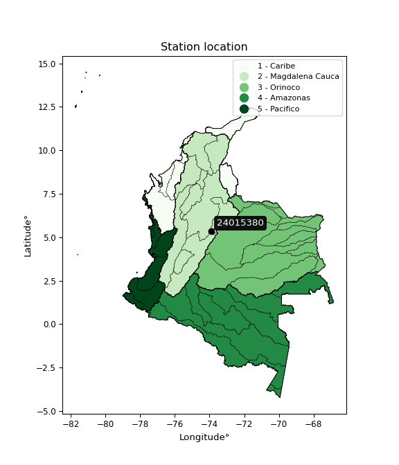</img>

</div>


## A. General information


### 1. General running parameters

• app_version: _v20251225_. • runtime: _2025-12-26 14:29:50.888910_. • Python version: _3.14.0_. • SciPy version: _1.16.3_. • Pandas version: _2.3.3_. • NumPy version: _2.3.5_. • Stations dataset (station_dataset_file): _dataset/pmax24h_in/automatic_colombia.csv_. • Stations catalog (station_catalog_file): _dataset/CNE_IDEAM.xls_. • Plot only fit distributions with Δo > Δ (plot_only_fit): _True_. • Eval low extreme values, if False, evaluates high extreme values (low_extreme): _False_. • Eval every SciPy distribution as logarithmic (pdist_logarithmic_on): _True_. • Standard deviation normalized (ddof): _1.0_. • Return periods to eval in years (Tr): _[2, 2.33, 5, 10, 15, 20, 25, 50, 75, 100, 200, 250, 500, 750, 1000]_. • Minimum data sample per station, 0 means any (minimum_sample): _5_. • Z-Score threshold to adjust a value, 0 means disable (zscore): _3.5_. • Avoid zeros, e.g. rain = 0 (avoid_zeros): _True_. • Avoid null values (avoid_nans): _True_. [:file_folder:Dataset file.](../../dataset/pmax24h_in/automatic_colombia.csv)


### 2. Station info and location

|   id |   CODIGO | NOMBRE                      | CATEGORIA               | TECNOLOGIA                              | ESTADO   | FECHA_INSTALACION   |   FECHA_SUSPENSION |   ALTITUD |   LATITUD |   LONGITUD | DEPARTAMENTO   | MUNICIPIO        | AREA_OPERATIVA                            | ENTIDAD                                                     | AREA_HIDROGRAFICA   | ZONA_HIDROGRAFICA   | SUBZONA_HIDROGRAFICA   |   CORRIENTE | OBSERVACION                                                                                                                                                                                                                                                                                                                        |   SUBRED | Catalogo   |
|-----:|---------:|:----------------------------|:------------------------|:----------------------------------------|:---------|:--------------------|-------------------:|----------:|----------:|-----------:|:---------------|:-----------------|:------------------------------------------|:------------------------------------------------------------|:--------------------|:--------------------|:-----------------------|------------:|:-----------------------------------------------------------------------------------------------------------------------------------------------------------------------------------------------------------------------------------------------------------------------------------------------------------------------------------|---------:|:-----------|
|    0 | 24015380 | CARMEN DE CARUPA [24015380] | Climatológica Principal | Automática con Telemetría, Convencional | Activa   | 31/03/2010          |                nan |      2960 |   5.34819 |   -73.8982 | Cundinamarca   | Carmen De Carupa | Area Operativa 11 - Cundinamarca-Amazonas | INSTITUTO DE HIDROLOGIA METEOROLOGIA Y ESTUDIOS AMBIENTALES | Magdalena Cauca     | Sogamoso            | Río Suárez             |         nan | Cambio de tecnología por instalación o repotenciación de estaciones proyecto Fondo de Adaptación|16/11/2022$Migracion$Cambio de tecnología por instalación o repotenciación de estaciones proyecto Fondo de Adaptación|16/11/2022$Migracion$Se ajustan coordenadas según análisis y solicitud de Julián Urrea_Planeacion Operativa |      nan | CNE_IDEAM  |
|      |          |                             |                         |                                         |          |                     |                    |           |           |            |                |                  |                                           |                                                             |                     |                     |                        |             | Actualizada Tecnologia. Tipo de Transmision y Estado por solicitud de la Coordinadora del AO. (23032023)                                                                                                                                                                                                                           |          |            |

<div align="center">

Map location in: [:earth_americas:Google](http://maps.google.com/maps?q=5.34819,-73.89817) [:earth_americas:OSM](https://www.openstreetmap.org/#map=18/5.34819/-73.89817&layers=P) [:earth_americas:Bing](https://www.bing.com/maps?cp=5.34819~-73.89817&lvl=18) [:earth_americas:Apple](https://maps.apple.com/frame?center=5.34819%2C-73.89817&span=0.003%2C0.006)

</div>


<div align="center">

```geojson
{
  "type": "Feature",
  "geometry": {
    "type": "Point", 
    "coordinates": [-73.89817, 5.34819]
  }, 
  "properties": {
    "Name": "24015380"
  }
}
```

</div>


### 3. Discrete values table and plot

|               |           0 |          1 |           2 |           3 |          4 |          5 |           6 |
|:--------------|------------:|-----------:|------------:|------------:|-----------:|-----------:|------------:|
| Date          | 2019        | 2020       | 2021        | 2022        | 2023       | 2024       | 2025        |
| Value         |   39        |   20.8     |   31.6      |   28        |   13.8     |   42.4     |   32.4      |
| Value_initial |   39        |   20.8     |   31.6      |   28        |   13.8     |   42.4     |   32.4      |
| count         |    7        |    7       |    7        |    7        |    7       |    7       |    7        |
| mean          |   29.7143   |   29.7143  |   29.7143   |   29.7143   |   29.7143  |   29.7143  |   29.7143   |
| std           |    9.94643  |    9.94643 |    9.94643  |    9.94643  |    9.94643 |    9.94643 |    9.94643  |
| zscore        |    0.933573 |   -0.89623 |    0.189587 |   -0.172352 |   -1.6     |    1.2754  |    0.270018 |

<div align="center">

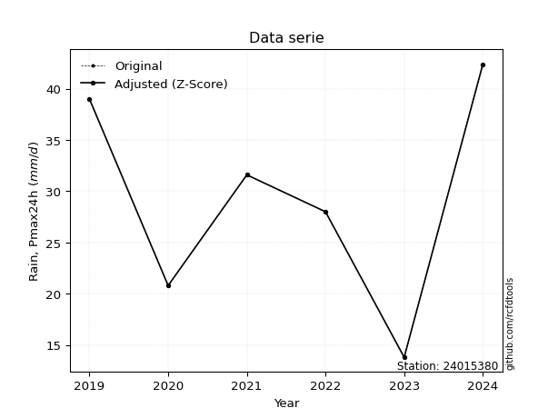</img>

</div>

> If Z-Score is active, values out of range or outliers are replaced with the station mean value.


### 4. Active continuous probability distributions from SciPy (45 of 104 available)

[scipy.stats](https://docs.scipy.org/doc/scipy/reference/stats.html) is a Python´s powerful submodule within the SciPy library for comprehensive statistical analysis, offering over 130 probability distributions (like Normal, Poisson), functions for descriptive stats (mean, variance), hypothesis testing (t-tests, chi-square), random variable generation, and statistical tests, making it essential for data science, modeling, and research. It provides tools to explore, model, and draw conclusions from data efficiently, working seamlessly with NumPy.

<div align="center">

|   id | p_dist             |   n_parameter | fit_method   | label                                                                       | active   | ref                                                                                                        |
|-----:|:-------------------|--------------:|:-------------|:----------------------------------------------------------------------------|:---------|:-----------------------------------------------------------------------------------------------------------|
|    0 | alpha              |             3 | MLE          | Alpha                                                                       | True     | [:mortar_board:](https://docs.scipy.org/doc/scipy/reference/generated/scipy.stats.alpha.html)              |
|    1 | betaprime          |             4 | MLE          | Beta prime                                                                  | True     | [:mortar_board:](https://docs.scipy.org/doc/scipy/reference/generated/scipy.stats.betaprime.html)          |
|    2 | chi2               |             3 | MLE          | Chi²                                                                        | True     | [:mortar_board:](https://docs.scipy.org/doc/scipy/reference/generated/scipy.stats.chi2.html)               |
|    3 | crystalball        |             4 | MLE          | Crystalball                                                                 | True     | [:mortar_board:](https://docs.scipy.org/doc/scipy/reference/generated/scipy.stats.crystalball.html)        |
|    4 | erlang             |             3 | MLE          | Erlang                                                                      | True     | [:mortar_board:](https://docs.scipy.org/doc/scipy/reference/generated/scipy.stats.erlang.html)             |
|    5 | expon              |             2 | MLE          | Exponential                                                                 | True     | [:mortar_board:](https://docs.scipy.org/doc/scipy/reference/generated/scipy.stats.expon.html)              |
|    6 | exponnorm          |             3 | MLE          | Exponentially modified Normal                                               | True     | [:mortar_board:](https://docs.scipy.org/doc/scipy/reference/generated/scipy.stats.exponnorm.html)          |
|    7 | f                  |             4 | MLE          | F                                                                           | True     | [:mortar_board:](https://docs.scipy.org/doc/scipy/reference/generated/scipy.stats.f.html)                  |
|    8 | fatiguelife        |             3 | MLE          | Fatigue-life (Birnbaum-Saunders)                                            | True     | [:mortar_board:](https://docs.scipy.org/doc/scipy/reference/generated/scipy.stats.fatiguelife.html)        |
|    9 | fisk               |             3 | MLE          | Fisk                                                                        | True     | [:mortar_board:](https://docs.scipy.org/doc/scipy/reference/generated/scipy.stats.fisk.html)               |
|   10 | gamma              |             3 | MLE          | Gamma                                                                       | True     | [:mortar_board:](https://docs.scipy.org/doc/scipy/reference/generated/scipy.stats.gamma.html)              |
|   11 | genexpon           |             5 | MLE          | Generalized exponential                                                     | True     | [:mortar_board:](https://docs.scipy.org/doc/scipy/reference/generated/scipy.stats.genexpon.html)           |
|   12 | genlogistic        |             3 | MLE          | Generalized logistic                                                        | True     | [:mortar_board:](https://docs.scipy.org/doc/scipy/reference/generated/scipy.stats.genlogistic.html)        |
|   13 | gibrat             |             2 | MM           | Gibrat                                                                      | True     | [:mortar_board:](https://docs.scipy.org/doc/scipy/reference/generated/scipy.stats.gibrat.html)             |
|   14 | gompertz           |             3 | MLE          | Gompertz (or truncated Gumbel)                                              | True     | [:mortar_board:](https://docs.scipy.org/doc/scipy/reference/generated/scipy.stats.gompertz.html)           |
|   15 | gumbel_l           |             2 | MM           | Gumbel Left Skew                                                            | True     | [:mortar_board:](https://docs.scipy.org/doc/scipy/reference/generated/scipy.stats.gumbel_l.html)           |
|   16 | gumbel_r           |             2 | MM           | Gumbel Right Skew                                                           | True     | [:mortar_board:](https://docs.scipy.org/doc/scipy/reference/generated/scipy.stats.gumbel_r.html)           |
|   17 | halflogistic       |             2 | MM           | Half-logistic                                                               | True     | [:mortar_board:](https://docs.scipy.org/doc/scipy/reference/generated/scipy.stats.halflogistic.html)       |
|   18 | halfnorm           |             2 | MM           | Half Normal                                                                 | True     | [:mortar_board:](https://docs.scipy.org/doc/scipy/reference/generated/scipy.stats.halfnorm.html)           |
|   19 | hypsecant          |             2 | MM           | hyperbolic secant                                                           | True     | [:mortar_board:](https://docs.scipy.org/doc/scipy/reference/generated/scipy.stats.hypsecant.html)          |
|   20 | invgamma           |             3 | MLE          | Inverted gamma                                                              | True     | [:mortar_board:](https://docs.scipy.org/doc/scipy/reference/generated/scipy.stats.invgamma.html)           |
|   21 | invgauss           |             3 | MLE          | Inverse Gaussian                                                            | True     | [:mortar_board:](https://docs.scipy.org/doc/scipy/reference/generated/scipy.stats.invgauss.html)           |
|   22 | invweibull         |             3 | MLE          | Inverted Weibull                                                            | True     | [:mortar_board:](https://docs.scipy.org/doc/scipy/reference/generated/scipy.stats.invweibull.html)         |
|   23 | johnsonsu          |             4 | MLE          | Johnson Su                                                                  | True     | [:mortar_board:](https://docs.scipy.org/doc/scipy/reference/generated/scipy.stats.johnsonsu.html)          |
|   24 | kstwobign          |             2 | MLE          | Limiting distribution of scaled Kolmogorov-Smirnov two-sided test statistic | True     | [:mortar_board:](https://docs.scipy.org/doc/scipy/reference/generated/scipy.stats.kstwobign.html)          |
|   25 | laplace            |             2 | MM           | Laplace                                                                     | True     | [:mortar_board:](https://docs.scipy.org/doc/scipy/reference/generated/scipy.stats.laplace.html)            |
|   26 | laplace_asymmetric |             3 | MLE          | Asymmetric Laplace                                                          | True     | [:mortar_board:](https://docs.scipy.org/doc/scipy/reference/generated/scipy.stats.laplace_asymmetric.html) |
|   27 | loggamma           |             3 | MLE          | Log gamma                                                                   | True     | [:mortar_board:](https://docs.scipy.org/doc/scipy/reference/generated/scipy.stats.loggamma.html)           |
|   28 | logistic           |             2 | MM           | Logistic (or Sech-squared)                                                  | True     | [:mortar_board:](https://docs.scipy.org/doc/scipy/reference/generated/scipy.stats.logistic.html)           |
|   29 | lognorm            |             3 | MLE          | Log Normal                                                                  | True     | [:mortar_board:](https://docs.scipy.org/doc/scipy/reference/generated/scipy.stats.lognorm.html)            |
|   30 | maxwell            |             2 | MM           | Maxwell                                                                     | True     | [:mortar_board:](https://docs.scipy.org/doc/scipy/reference/generated/scipy.stats.maxwell.html)            |
|   31 | mielke             |             4 | MLE          | Mielke Beta-Kappa / Dagum                                                   | True     | [:mortar_board:](https://docs.scipy.org/doc/scipy/reference/generated/scipy.stats.mielke.html)             |
|   32 | moyal              |             2 | MM           | Moyal                                                                       | True     | [:mortar_board:](https://docs.scipy.org/doc/scipy/reference/generated/scipy.stats.moyal.html)              |
|   33 | nakagami           |             3 | MLE          | Nakagami                                                                    | True     | [:mortar_board:](https://docs.scipy.org/doc/scipy/reference/generated/scipy.stats.nakagami.html)           |
|   34 | ncf                |             5 | MLE          | Non-central F distribution                                                  | True     | [:mortar_board:](https://docs.scipy.org/doc/scipy/reference/generated/scipy.stats.ncf.html)                |
|   35 | nct                |             4 | MLE          | Non-central Student’s t                                                     | True     | [:mortar_board:](https://docs.scipy.org/doc/scipy/reference/generated/scipy.stats.nct.html)                |
|   36 | norm               |             2 | MM           | Normal                                                                      | True     | [:mortar_board:](https://docs.scipy.org/doc/scipy/reference/generated/scipy.stats.norm.html)               |
|   37 | pareto             |             3 | MLE          | Pareto                                                                      | True     | [:mortar_board:](https://docs.scipy.org/doc/scipy/reference/generated/scipy.stats.pareto.html)             |
|   38 | pearson3           |             3 | MM           | Pearson type III                                                            | True     | [:mortar_board:](https://docs.scipy.org/doc/scipy/reference/generated/scipy.stats.pearson3.html)           |
|   39 | rayleigh           |             2 | MM           | Rayleigh                                                                    | True     | [:mortar_board:](https://docs.scipy.org/doc/scipy/reference/generated/scipy.stats.rayleigh.html)           |
|   40 | rice               |             3 | MLE          | Rice                                                                        | True     | [:mortar_board:](https://docs.scipy.org/doc/scipy/reference/generated/scipy.stats.rice.html)               |
|   41 | t                  |             3 | MLE          | Student’s t                                                                 | True     | [:mortar_board:](https://docs.scipy.org/doc/scipy/reference/generated/scipy.stats.t.html)                  |
|   42 | truncnorm          |             4 | MLE          | Truncated normal                                                            | True     | [:mortar_board:](https://docs.scipy.org/doc/scipy/reference/generated/scipy.stats.truncnorm.html)          |
|   43 | wald               |             2 | MM           | Wald                                                                        | True     | [:mortar_board:](https://docs.scipy.org/doc/scipy/reference/generated/scipy.stats.wald.html)               |
|   44 | weibull_min        |             3 | MLE          | Weibull minimum                                                             | True     | [:mortar_board:](https://docs.scipy.org/doc/scipy/reference/generated/scipy.stats.weibull_min.html)        |

</div>

> **n_parameter:** # arguments & localization & scale.
>
> **Fit methods:** (MLE) maximum likelihood, (MM) L-moments.
>
>**Inactive:** foldnorm, gennorm, norminvgauss, powernorm, powerlognorm, skewnorm, genextreme, anglit, arcsine, argus, beta, bradford, burr, burr12, cauchy, cosine, halfcauchy, foldcauchy, skewcauchy, wrapcauchy, dgamma, gengamma, exponweib, exponpow, truncexpon, gausshyper, genhalflogistic, genhyperbolic, geninvgauss, halfgennorm, johnsonsb, kappa4, kappa3, ksone, kstwo, loglaplace, levy, levy_l, levy_stable, ncx2, genpareto, truncpareto, lomax, powerlaw, rdist, rel_breitwigner, recipinvgauss, semicircular, studentized_range, trapezoid, triang, truncweibull_min, tukeylambda, uniform, loguniform, vonmises, vonmises_line, weibull_max, dweibull, 


## B. Probability distributions vs. Empirical distributions

A continuous probability distribution (CPD) describes probabilities for variables that can take any value within a range (like rain any time), unlike discrete variables with specific outcomes (like temperature). It uses a Probability Density Function (PDF), a curve where the total area under it equals 1, and the probability of the variable falling within an interval (a to b) is found by calculating the area under the curve between those points. A key feature is that the probability of hitting any single exact value is zero, so probabilities are always expressed for ranges, e.g., $P(a ≤ X ≤ b)$.

<div align="center">

Distributions parameters
|    |   station | p_dist                |   n |             loc |           scale | shape                  | shape1             | shape2                 | shape3   |
|---:|----------:|:----------------------|----:|----------------:|----------------:|:-----------------------|:-------------------|:-----------------------|:---------|
|  0 |  24015380 | alpha                 |   7 |  -156.407       |  3656.31        | 19.70335178243657      |                    |                        |          |
|  1 |  24015380 | betaprime             |   7 |   -11.4636      |   990.72        | 17.201534082699673     | 412.7089354763284  |                        |          |
|  2 |  24015380 | chi2                  |   7 |   -69.2041      |     0.44889     | 220.3824072093164      |                    |                        |          |
|  3 |  24015380 | crystalball           |   7 |    29.7143      |     9.2086      | 1742.1221472110815     | 4144.450332811356  |                        |          |
|  4 |  24015380 | erlang                |   7 |  -123.077       |     0.567684    | 268.99300790377276     |                    |                        |          |
|  5 |  24015380 | expon                 |   7 |    13.8         |    15.9143      |                        |                    |                        |          |
|  6 |  24015380 | exponnorm             |   7 |    29.7083      |     9.20859     | 0.000657795457291572   |                    |                        |          |
|  7 |  24015380 | f                     |   7 | -2734.92        |  2764.65        | 217503.72959905333     | 1047643.8584571988 |                        |          |
|  8 |  24015380 | fatiguelife           |   7 |    13.8         |     2.66098e-06 | 2006.6734620102156     |                    |                        |          |
|  9 |  24015380 | fisk                  |   7 |    -4.10439e+08 |     4.10439e+08 | 75320248.92043735      |                    |                        |          |
| 10 |  24015380 | gamma                 |   7 |  -124.39        |     0.566031    | 272.13680602422994     |                    |                        |          |
| 11 |  24015380 | genexpon              |   7 |    13.8         |     9.54178     | 0.428761981843487      | 0.9604735850138144 | 0.19980573105807942    |          |
| 12 |  24015380 | genlogistic           |   7 |    36.275       |     3.6335      | 0.4298332176181579     |                    |                        |          |
| 13 |  24015380 | gibrat                |   7 |    22.6893      |     4.26089     |                        |                    |                        |          |
| 14 |  24015380 | gompertz              |   7 |    13.8         |    10.5256      | 0.18829176677117548    |                    |                        |          |
| 15 |  24015380 | gumbel_l              |   7 |    33.8586      |     7.17992     |                        |                    |                        |          |
| 16 |  24015380 | gumbel_r              |   7 |    25.5699      |     7.17992     |                        |                    |                        |          |
| 17 |  24015380 | halflogistic          |   7 |    18.7999      |     7.87303     |                        |                    |                        |          |
| 18 |  24015380 | halfnorm              |   7 |    17.5257      |    15.2762      |                        |                    |                        |          |
| 19 |  24015380 | hypsecant             |   7 |    29.7143      |     5.86238     |                        |                    |                        |          |
| 20 |  24015380 | invgamma              |   7 |   -97.5885      | 23110.1         | 182.51770954463132     |                    |                        |          |
| 21 |  24015380 | invgauss              |   7 |   -34.468       |  3003.24        | 0.021336980795414795   |                    |                        |          |
| 22 |  24015380 | invweibull            |   7 |    13.8         |     1.59936     | 0.0524595268877037     |                    |                        |          |
| 23 |  24015380 | johnsonsu             |   7 |    59.2531      |     1.69523     | 11.007125684036346     | 3.1432007018949015 |                        |          |
| 24 |  24015380 | kstwobign             |   7 |    -6.91736     |    41.8277      |                        |                    |                        |          |
| 25 |  24015380 | laplace               |   7 |    29.7143      |     6.51147     |                        |                    |                        |          |
| 26 |  24015380 | laplace_asymmetric    |   7 |    32.4         |     7.05057     | 1.2084348893852812     |                    |                        |          |
| 27 |  24015380 | loggamma              |   7 |    27.9972      |    10.4657      | 1.64510802836648       |                    |                        |          |
| 28 |  24015380 | logistic              |   7 |    29.7143      |     5.07697     |                        |                    |                        |          |
| 29 |  24015380 | lognorm               |   7 |    13.8         |     0.088384    | 12.882357544419522     |                    |                        |          |
| 30 |  24015380 | maxwell               |   7 |     7.89376     |    13.674       |                        |                    |                        |          |
| 31 |  24015380 | mielke                |   7 |    -0.113877    |    36.2586      | 3.9138930792453914     | 6.809091506674388  |                        |          |
| 32 |  24015380 | moyal                 |   7 |    24.4482      |     4.14533     |                        |                    |                        |          |
| 33 |  24015380 | nakagami              |   7 |    20.8         |     9.9373      | 0.06885286396197374    |                    |                        |          |
| 34 |  24015380 | ncf                   |   7 |     0.945276    |     4.00334e-06 | 5.125098820443821e-06  | 262.2883266128831  | 36.606504155534395     |          |
| 35 |  24015380 | nct                   |   7 |  -570.079       |     9.14075     | 136847.7317449135      | 65.6168720937257   |                        |          |
| 36 |  24015380 | norm                  |   7 |    29.7143      |     9.2086      |                        |                    |                        |          |
| 37 |  24015380 | pareto                |   7 |    13.7837      |     0.0163088   | 0.16792797424172856    |                    |                        |          |
| 38 |  24015380 | pearson3              |   7 |    29.7143      |     9.20864     | -0.3431938179527637    |                    |                        |          |
| 39 |  24015380 | rayleigh              |   7 |    12.0977      |    14.056       |                        |                    |                        |          |
| 40 |  24015380 | rice                  |   7 |     8.63177     |    10.284       | 1.7333307771089295     |                    |                        |          |
| 41 |  24015380 | t                     |   7 |    29.7143      |     9.20834     | 22559445.74495302      |                    |                        |          |
| 42 |  24015380 | truncnorm             |   7 |    29.7143      |     9.2086      | -123.7876396167496     | 264.61503166049033 |                        |          |
| 43 |  24015380 | wald                  |   7 |    20.5057      |     9.20857     |                        |                    |                        |          |
| 44 |  24015380 | weibull_min           |   7 |   -26.4996      |    60.0628      | 7.355345767471071      |                    |                        |          |
| 45 |  24015380 | logalpha              |   7 |    -6.99484     |   280.733       | 27.21766947426181      |                    |                        |          |
| 46 |  24015380 | logbetaprime          |   7 |   -14.214       |    19.148       | 4416.847385140212      | 4821.745263010029  |                        |          |
| 47 |  24015380 | logchi2               |   7 |     2.62467     |     0.963841    | 1.0774966049625005     |                    |                        |          |
| 48 |  24015380 | logcrystalball        |   7 |     3.33341     |     0.359933    | 292.0402417591916      | 49.119392704348755 |                        |          |
| 49 |  24015380 | logerlang             |   7 |    -2.91363     |     0.0218297   | 286.01680389943795     |                    |                        |          |
| 50 |  24015380 | logexpon              |   7 |     2.62467     |     0.708739    |                        |                    |                        |          |
| 51 |  24015380 | logexponnorm          |   7 |     3.33315     |     0.359933    | 0.0007272198594340329  |                    |                        |          |
| 52 |  24015380 | logf                  |   7 |  -371.814       |   375.149       | 5781344.034216043      | 3460616.4576741904 |                        |          |
| 53 |  24015380 | logfatiguelife        |   7 |  -187.054       |   190.388       | 0.0018896669406696584  |                    |                        |          |
| 54 |  24015380 | logfisk               |   7 |    -3.02065e+07 |     3.02065e+07 | 148074970.74664885     |                    |                        |          |
| 55 |  24015380 | loggamma              |   7 |    -2.96278     |     0.0215261   | 292.42899737067205     |                    |                        |          |
| 56 |  24015380 | loggenexpon           |   7 |     2.60332     |     0.0442597   | 0.01779064348748939    | 11.269927374711251 | 0.00037268092255394753 |          |
| 57 |  24015380 | loggenlogistic        |   7 |     3.74717     |     2.7077e-06  | 6.530983762915875e-06  |                    |                        |          |
| 58 |  24015380 | loggibrat             |   7 |     3.05887     |     0.166517    |                        |                    |                        |          |
| 59 |  24015380 | loggompertz           |   7 |     2.62467     |     0.308366    | 0.06634540004535501    |                    |                        |          |
| 60 |  24015380 | loggumbel_l           |   7 |     3.4954      |     0.280639    |                        |                    |                        |          |
| 61 |  24015380 | loggumbel_r           |   7 |     3.17142     |     0.280639    |                        |                    |                        |          |
| 62 |  24015380 | loghalflogistic       |   7 |     2.90678     |     0.307744    |                        |                    |                        |          |
| 63 |  24015380 | loghalfnorm           |   7 |     2.85697     |     0.597123    |                        |                    |                        |          |
| 64 |  24015380 | loghypsecant          |   7 |     3.33341     |     0.229141    |                        |                    |                        |          |
| 65 |  24015380 | loginvgamma           |   7 |    -4.00855     |  2795.3         | 381.7167899362372      |                    |                        |          |
| 66 |  24015380 | loginvgauss           |   7 |    -0.210157    |   292.145       | 0.012119166055027816   |                    |                        |          |
| 67 |  24015380 | loginvweibull         |   7 |    -3.10603e+07 |     3.10603e+07 | 79262460.84195125      |                    |                        |          |
| 68 |  24015380 | logjohnsonsu          |   7 |     3.85588     |     0.00593732  | 6.420045044382729      | 1.308322949251461  |                        |          |
| 69 |  24015380 | logkstwobign          |   7 |     1.75135     |     1.80702     |                        |                    |                        |          |
| 70 |  24015380 | loglaplace            |   7 |     3.33341     |     0.254511    |                        |                    |                        |          |
| 71 |  24015380 | loglaplace_asymmetric |   7 |     3.47816     |     0.243365    | 1.3406897796284667     |                    |                        |          |
| 72 |  24015380 | logloggamma           |   7 |     3.74719     |     4.45678e-06 | 1.0815478479814313e-05 |                    |                        |          |
| 73 |  24015380 | loglogistic           |   7 |     3.33341     |     0.198442    |                        |                    |                        |          |
| 74 |  24015380 | loglognorm            |   7 |     2.62467     |     0.00522489  | 12.290482278683838     |                    |                        |          |
| 75 |  24015380 | logmaxwell            |   7 |     2.48052     |     0.53447     |                        |                    |                        |          |
| 76 |  24015380 | logmielke             |   7 |     2.17329     |     1.57478     | 2.681650464891587      | 10516.059287159951 |                        |          |
| 77 |  24015380 | logmoyal              |   7 |     3.12757     |     0.162027    |                        |                    |                        |          |
| 78 |  24015380 | lognakagami           |   7 |     3.03495     |     0.435397    | 0.38430779132257675    |                    |                        |          |
| 79 |  24015380 | logncf                |   7 |    -3.28757     |     6.61361     | 256.8549695970943      | 377.57477990219706 | 4.269555671337798e-09  |          |
| 80 |  24015380 | lognct                |   7 |   -18.8545      |     0.347782    | 27255.20037730824      | 63.79557677335248  |                        |          |
| 81 |  24015380 | lognorm               |   7 |     3.33341     |     0.359933    |                        |                    |                        |          |
| 82 |  24015380 | logpareto             |   7 |     2.62391     |     0.000755792 | 0.16785433553844084    |                    |                        |          |
| 83 |  24015380 | logpearson3           |   7 |     3.33341     |     0.359934    | -0.8303687179150783    |                    |                        |          |
| 84 |  24015380 | lograyleigh           |   7 |     2.64489     |     0.549362    |                        |                    |                        |          |
| 85 |  24015380 | logrice               |   7 |     2.37389     |     0.386847    | 2.2400560072785902     |                    |                        |          |
| 86 |  24015380 | logt                  |   7 |     3.33341     |     0.359933    | 157291151095.099       |                    |                        |          |
| 87 |  24015380 | logtruncnorm          |   7 |    -0.12611     |     1.10717     | 2.855079769908519      | 3.4983723405492473 |                        |          |
| 88 |  24015380 | logwald               |   7 |     2.97344     |     0.359966    |                        |                    |                        |          |
| 89 |  24015380 | logweibull_min        |   7 |    -2.89871e+07 |     2.89871e+07 | 110173430.79779041     |                    |                        |          |

</div>

> **loc** (Location parameter): This shifts the distribution along the x-axis. For many common distributions, like the normal (Gaussian) distribution, loc represents the mean $μ$. For others, like the uniform distribution, it might represent the minimum value, or for the beta distribution, the left end of the support interval.
>
> **scale** (Scale parameter): This determines the width or spread of the distribution. For the normal distribution, scale represents the standard deviation $σ$. For a uniform distribution, it defines the length of the interval (from $loc$ to $loc + scale$).
>
> **shape** (Shape parameters): Refers to parameters that define the specific form of a probability distribution, distinct from its location (loc) and scale (scale). These parameters are required arguments for most distribution functions. For example, a normal (Gaussian) distribution is fully defined by its location (mean) and scale (standard deviation), so it has no specific shape parameters beyond loc and scale. However, other distributions have intrinsic properties that need specification, as Gamma distribution that takes a shape parameter, often named $a$ or $alpha$.


### 0. Cumulative distribution values - CDF (90 evaluated)

> Ordered by x ascending and calculating $log(f(x))$ separately. 

|   id |   Station |   date |    x |   count |    mean |     std |    zscore |   Value_initial |   station |   m |     alpha |   alpha_pdf |   betaprime |   betaprime_pdf |      chi2 |   chi2_pdf |   crystalball |   crystalball_pdf |   erlang |   erlang_pdf |    expon |   expon_pdf |   exponnorm |   exponnorm_pdf |         f |      f_pdf |   fatiguelife |   fatiguelife_pdf |      fisk |   fisk_pdf |     gamma |   gamma_pdf |   genexpon |   genexpon_pdf |   genlogistic |   genlogistic_pdf |   gibrat |   gibrat_pdf |    gompertz |   gompertz_pdf |   gumbel_l |   gumbel_l_pdf |   gumbel_r |   gumbel_r_pdf |   halflogistic |   halflogistic_pdf |   halfnorm |   halfnorm_pdf |   hypsecant |   hypsecant_pdf |   invgamma |   invgamma_pdf |   invgauss |   invgauss_pdf |   invweibull |   invweibull_pdf |   johnsonsu |   johnsonsu_pdf |   kstwobign |   kstwobign_pdf |   laplace |   laplace_pdf |   laplace_asymmetric |   laplace_asymmetric_pdf |   loggamma |   loggamma_pdf |   logistic |   logistic_pdf |   lognorm |   lognorm_pdf |   maxwell |   maxwell_pdf |    mielke |   mielke_pdf |       moyal |   moyal_pdf |   nakagami |   nakagami_pdf |       ncf |   ncf_pdf |       nct |    nct_pdf |      norm |   norm_pdf |   pareto |   pareto_pdf |   pearson3 |   pearson3_pdf |   rayleigh |   rayleigh_pdf |      rice |   rice_pdf |         t |      t_pdf |   truncnorm |   truncnorm_pdf |        wald |    wald_pdf |   weibull_min |   weibull_min_pdf |   logalpha |   logalpha_pdf |   logbetaprime |   logbetaprime_pdf |     logchi2 |   logchi2_pdf |   logcrystalball |   logcrystalball_pdf |   logerlang |   logerlang_pdf |   logexpon |   logexpon_pdf |   logexponnorm |   logexponnorm_pdf |      logf |   logf_pdf |   logfatiguelife |   logfatiguelife_pdf |   logfisk |   logfisk_pdf |   loggenexpon |   loggenexpon_pdf |   loggenlogistic |   loggenlogistic_pdf |   loggibrat |   loggibrat_pdf |   loggompertz |   loggompertz_pdf |   loggumbel_l |   loggumbel_l_pdf |   loggumbel_r |   loggumbel_r_pdf |   loghalflogistic |   loghalflogistic_pdf |   loghalfnorm |   loghalfnorm_pdf |   loghypsecant |   loghypsecant_pdf |   loginvgamma |   loginvgamma_pdf |   loginvgauss |   loginvgauss_pdf |   loginvweibull |   loginvweibull_pdf |   logjohnsonsu |   logjohnsonsu_pdf |   logkstwobign |   logkstwobign_pdf |   loglaplace |   loglaplace_pdf |   loglaplace_asymmetric |   loglaplace_asymmetric_pdf |   logloggamma |   logloggamma_pdf |   loglogistic |   loglogistic_pdf |   loglognorm |   loglognorm_pdf |   logmaxwell |   logmaxwell_pdf |   logmielke |   logmielke_pdf |    logmoyal |   logmoyal_pdf |   lognakagami |   lognakagami_pdf |   logncf |   logncf_pdf |    lognct |   lognct_pdf |   logpareto |   logpareto_pdf |   logpearson3 |   logpearson3_pdf |   lograyleigh |   lograyleigh_pdf |   logrice |   logrice_pdf |      logt |   logt_pdf |   logtruncnorm |   logtruncnorm_pdf |   logwald |   logwald_pdf |   logweibull_min |   logweibull_min_pdf |
|-----:|----------:|-------:|-----:|--------:|--------:|--------:|----------:|----------------:|----------:|----:|----------:|------------:|------------:|----------------:|----------:|-----------:|--------------:|------------------:|---------:|-------------:|---------:|------------:|------------:|----------------:|----------:|-----------:|--------------:|------------------:|----------:|-----------:|----------:|------------:|-----------:|---------------:|--------------:|------------------:|---------:|-------------:|------------:|---------------:|-----------:|---------------:|-----------:|---------------:|---------------:|-------------------:|-----------:|---------------:|------------:|----------------:|-----------:|---------------:|-----------:|---------------:|-------------:|-----------------:|------------:|----------------:|------------:|----------------:|----------:|--------------:|---------------------:|-------------------------:|-----------:|---------------:|-----------:|---------------:|----------:|--------------:|----------:|--------------:|----------:|-------------:|------------:|------------:|-----------:|---------------:|----------:|----------:|----------:|-----------:|----------:|-----------:|---------:|-------------:|-----------:|---------------:|-----------:|---------------:|----------:|-----------:|----------:|-----------:|------------:|----------------:|------------:|------------:|--------------:|------------------:|-----------:|---------------:|---------------:|-------------------:|------------:|--------------:|-----------------:|---------------------:|------------:|----------------:|-----------:|---------------:|---------------:|-------------------:|----------:|-----------:|-----------------:|---------------------:|----------:|--------------:|--------------:|------------------:|-----------------:|---------------------:|------------:|----------------:|--------------:|------------------:|--------------:|------------------:|--------------:|------------------:|------------------:|----------------------:|--------------:|------------------:|---------------:|-------------------:|--------------:|------------------:|--------------:|------------------:|----------------:|--------------------:|---------------:|-------------------:|---------------:|-------------------:|-------------:|-----------------:|------------------------:|----------------------------:|--------------:|------------------:|--------------:|------------------:|-------------:|-----------------:|-------------:|-----------------:|------------:|----------------:|------------:|---------------:|--------------:|------------------:|---------:|-------------:|----------:|-------------:|------------:|----------------:|--------------:|------------------:|--------------:|------------------:|----------:|--------------:|----------:|-----------:|---------------:|-------------------:|----------:|--------------:|-----------------:|---------------------:|
|    0 |  24015380 |   2023 | 13.8 |       7 | 29.7143 | 9.94643 | -1.6      |            13.8 |  24015380 |   1 | 0.0376785 |   0.010359  |   0.0378275 |       0.0114151 | 0.0394022 |  0.0101599 |     0.0419764 |        0.00973128 | 0.040774 |    0.0101143 | 0        |   0.0628366 |   0.0419758 |      0.00973118 | 0.0416427 | 0.00970803 |     0.0292917 |       3.41455e+11 | 0.0469976 | 0.00821928 | 0.0410332 |   0.0101313 | 2.8176e-09 |      0.0449352 |     0.0699747 |        0.00826081 | 0        |   0          | 1.47349e-11 |      0.017889  |  0.0593587 |     0.00801695 | 0.00579083 |     0.00415483 |       0        |          0         |   0        |      0         |   0.0421008 |       0.0071606 |  0.0364434 |      0.0101132 |  0.0301217 |     0.00980782 |   0.00226909 |      4.07988e+11 |   0.0654934 |       0.0088136 |   0.0331297 |       0.0144844 | 0.0434047 |    0.00666589 |            0.0668907 |               0.00785087 |  0.0238966 |       0.165562 |  0.0417022 |     0.00787146 | 0.0244717 |      0.159494 | 0.0202716 |    0.00991663 | 0.0235289 |   0.00660881 | 0.000303414 |  0.00050997 | 0          |    0           | 0.0308796 | 0.0108462 | 0.0420202 | 0.00974333 | 0.0419764 | 0.00973128 | 0        |  10.2968     |  0.0507243 |     0.00953784 | 0.00730687 |     0.00855322 | 0.0289418 |  0.0114961 | 0.0419714 | 0.00973061 |   0.0419764 |      0.00973128 | 0           | 0           |     0.0517363 |        0.00919414 |  0.0246458 |       0.175202 |      0.0250802 |           0.166973 | 4.23475e-09 |    5.1374e+06 |        0.0244717 |             0.159494 |   0.0245447 |        0.168908 |   0        |       1.41096  |      0.0244717 |           0.159494 | 0.0243131 |   0.158664 |        0.0241886 |             0.158606 | 0.0243324 |      0.116377 |    0.00902935 |          0.443689 |          0       |             0.160891 |    0        |        0        |    4.7983e-08 |          0.215152 |      0.043935 |          0.153063 |   0.000897159 |          0.02243  |          0        |              0        |      0        |          0        |       0.02886  |           0.125776 |     0.0237352 |          0.170361 |     0.0243199 |          0.184418 |       0.0240066 |            0.228473 |      0.0713154 |           0.144732 |      0.0263603 |           0.28868  |    0.0308736 |         0.121306 |               0.0469728 |                    0.143966 |     0.0656071 |          0.159212 |     0.0273443 |          0.134027 |   0.00716786 |      3.64574e+12 |   0.00510565 |         0.104716 |    0.035054 |        0.208254 | 2.35231e-06 |    0.000168474 |   0           |          0        | 0.166438 |     0.365956 | 0.0245393 |     0.160284 |    0        |     222.091     |     0.0418834 |          0.167713 |      0        |          0        | 0.0196937 |      0.17689  | 0.0244717 |   0.159494 |    0           |           0        | 0         |      0        |        0.0357011 |             0.133241 |
|    1 |  24015380 |   2020 | 20.8 |       7 | 29.7143 | 9.94643 | -0.89623  |            20.8 |  24015380 |   2 | 0.176258  |   0.0301507 |   0.187137  |       0.0313604 | 0.172352  |  0.0288505 |     0.166512  |        0.0271161  | 0.171977 |    0.0284894 | 0.355871 |   0.0404749 |   0.166511  |      0.027116   | 0.166165  | 0.0271361  |     0.79053   |       0.016614    | 0.151236  | 0.0235562  | 0.172062  |   0.0284089 | 0.304938   |      0.040772  |     0.159344  |        0.0185872  | 0        |   0          | 0.162938    |      0.0291186 |  0.14975   |     0.0192107  | 0.143243   |     0.0387681  |       0.126341 |          0.0624942 |   0.16972  |      0.0510446 |   0.136999  |       0.0226544 |  0.172898  |      0.0298514 |  0.172656  |     0.0318315  |   0.396342   |      0.00274892  |   0.162316  |       0.0200565 |   0.227844  |       0.03797   | 0.127179  |    0.0195315  |            0.152116  |               0.0178536  |  0.211655  |       0.81228  |  0.147314  |     0.0247416  | 0.203497  |      0.785934 | 0.172367  |    0.0332971  | 0.114512  |   0.0209363  | 0.120478    |  0.0447606  | 0.00643441 |    2.49402e+11 | 0.183707  | 0.0329178 | 0.166676  | 0.0271345  | 0.166512  | 0.0271161  | 0.638814 |   0.0086446  |  0.164636  |     0.0242928  | 0.174406   |     0.0363644  | 0.173527  |  0.0300515 | 0.166504  | 0.027116   |   0.166513  |      0.0271161  | 5.94442e-08 | 3.25296e-06 |     0.158477  |        0.0225791  |  0.219982  |       0.826263 |      0.210889  |           0.803972 | 0.455025    |    0.519271   |        0.203498  |             0.785934 |   0.214048  |        0.815276 |   0.439482 |       0.790867 |      0.203497  |           0.785933 | 0.202601  |   0.783121 |        0.203099  |             0.786605 | 0.157087  |      0.649088 |    0.311326   |          0.913002 |          0       |             0.432826 |    0        |        0        |    0.168595   |          0.676692 |      0.176214 |          0.569011 |   0.196669    |          1.13965  |          0.205287 |              1.55626  |      0.234348 |          1.27816  |       0.168983 |           0.703309 |     0.217057  |          0.825585 |     0.230241  |          0.852595 |       0.270093  |            0.902218 |      0.174692  |           0.410352 |      0.306037  |           0.927458 |    0.154772  |         0.608113 |               0.165181  |                    0.506261 |     0.177565  |          0.430906 |     0.181831  |          0.749684 |   0.638714   |      0.0742825   |   0.217156   |         0.937992 |    0.198486 |        0.617721 | 0.183237    |    1.3516      |   2.34006e-12 |       4050.1      | 0.349982 |     0.510236 | 0.204281  |     0.787859 |    0.652594 |       0.141868  |     0.188106  |          0.613738 |      0.222814 |          1.00449  | 0.211916  |      0.81343  | 0.203497  |   0.785934 |    5.05633e-06 |           3.19113  | 0.0395133 |      2.09928  |        0.158777  |             0.552808 |
|    2 |  24015380 |   2022 | 28   |       7 | 29.7143 | 9.94643 | -0.172352 |            28   |  24015380 |   3 | 0.450611  |   0.0425653 |   0.457434  |       0.0402034 | 0.439544  |  0.0423277 |     0.426159  |        0.0425785  | 0.438462 |    0.0426364 | 0.59028  |   0.0257455 |   0.426157  |      0.0425786  | 0.42594   | 0.0425761  |     0.875173  |       0.00833618  | 0.400435  | 0.0440587  | 0.43766   |   0.0425012 | 0.564388   |      0.0308528 |     0.360279  |        0.038656   | 0.587163 |   0.0733198  | 0.415719    |      0.0402821 |  0.357383  |     0.0395784  | 0.490235   |     0.0486738  |       0.525767 |          0.0459524 |   0.507076 |      0.0412893 |   0.408218  |       0.0520555 |  0.446246  |      0.0426347 |  0.459311  |     0.0436126  |   0.409932   |      0.00135051  |   0.369146  |       0.0378887 |   0.51129   |       0.0372029 | 0.384266  |    0.0590138  |            0.354141  |               0.0415651  |  0.5079    |       1.08343  |  0.416378  |     0.0478647  | 0.498667  |      1.10837  | 0.460544  |    0.0427984  | 0.336433  |   0.0397976  | 0.514694    |  0.0507124  | 0.822878   |    0.0152146   | 0.466574  | 0.0415918 | 0.426373  | 0.0425691  | 0.426159  | 0.0425785  | 0.679203 |   0.00378937 |  0.404661  |     0.0411741  | 0.472697   |     0.0424421  | 0.442653  |  0.0419487 | 0.426154  | 0.0425797  |   0.426159  |      0.0425785  | 0.582166    | 0.0577649   |     0.386901  |        0.0404811  |  0.513323  |       1.04957  |      0.506738  |           1.09147  | 0.580476    |    0.346149   |        0.498667  |             1.10837  |   0.510201  |        1.0799   |   0.631496 |       0.519944 |      0.498666  |           1.10837  | 0.496867  |   1.10635  |        0.498514  |             1.10888  | 0.444501  |      1.21042  |    0.577416   |          0.828249 |          0       |             0.886523 |    0.689906 |        1.29089  |    0.446639   |          1.18094  |      0.428253 |          1.13897  |   0.569002    |          1.14326  |          0.598751 |              1.04226  |      0.573895 |          0.973491 |       0.498329 |           1.38913  |     0.512093  |          1.06037  |     0.523743  |          1.02274  |       0.541693  |            0.847452 |      0.364058  |           0.9382   |      0.571605  |           0.804155 |    0.497642  |         1.95529  |               0.410791  |                    1.25903  |     0.365291  |          0.886467 |     0.498485  |          1.25981  |   0.655187   |      0.0423604   |   0.53177    |         1.06495  |    0.439435 |        1.01682  | 0.594858    |    1.13675     |   0.553906    |          1.25675  | 0.506141 |     0.526419 | 0.499523  |     1.10653  |    0.68292  |       0.0751431 |     0.443443  |          1.09106  |      0.542807 |          1.04121  | 0.507171  |      1.08124  | 0.498667  |   1.10837  |    0.656104    |           1.43019  | 0.666769  |      1.11384  |        0.414401  |             1.19103  |
|    3 |  24015380 |   2021 | 31.6 |       7 | 29.7143 | 9.94643 |  0.189587 |            31.6 |  24015380 |   4 | 0.600848  |   0.0399418 |   0.597538  |       0.0369151 | 0.5908    |  0.0407074 |     0.581127  |        0.0424239  | 0.591523 |    0.0413558 | 0.673228 |   0.0205333 |   0.581125  |      0.042424   | 0.580838  | 0.0423892  |     0.90128   |       0.00629426  | 0.563896  | 0.0451287  | 0.590313  |   0.0412729 | 0.665753   |      0.0254882 |     0.517952  |        0.0480117  | 0.769676 |   0.0341035  | 0.565386    |      0.0421827 |  0.518138  |     0.0489986  | 0.649356   |     0.0390499  |       0.67119  |          0.0348979 |   0.64312  |      0.0341666 |   0.600667  |       0.0516043 |  0.597101  |      0.0402016 |  0.611196  |     0.0398306  |   0.414262   |      0.00107592  |   0.519904  |       0.0452046 |   0.635417  |       0.0315082 | 0.625718  |    0.0574804  |            0.540353  |               0.0634206  |  0.635428  |       1.00773  |  0.591803  |     0.047582   | 0.63032   |      1.0487   | 0.609242  |    0.0390226  | 0.487589  |   0.0429276  | 0.672989    |  0.0371565  | 0.867668   |    0.0102517   | 0.610125  | 0.0374236 | 0.581277  | 0.042399   | 0.581127  | 0.0424239  | 0.691135 |   0.00291121 |  0.559546  |     0.0438389  | 0.618078   |     0.0376996  | 0.592496  |  0.040388  | 0.581127  | 0.0424251  |   0.581127  |      0.0424239  | 0.738667    | 0.0321958   |     0.543033  |        0.0453061  |  0.636119  |       0.965661 |      0.635604  |           1.021    | 0.619593    |    0.302274   |        0.63032   |             1.0487   |   0.637204  |        1.00282  |   0.689311 |       0.438369 |      0.630319  |           1.0487   | 0.62844   |   1.04816  |        0.630193  |             1.04864  | 0.59146   |      1.18451  |    0.671761   |          0.727896 |          0       |             1.18683  |    0.805648 |        0.69785  |    0.596597   |          1.2744   |      0.576951 |          1.29681  |   0.693198    |          0.905133 |          0.710262 |              0.805096 |      0.68193  |          0.811725 |       0.659257 |           1.21888  |     0.636254  |          0.976856 |     0.642446  |          0.926999 |       0.63747   |            0.732442 |      0.498379  |           1.2959   |      0.662306  |           0.693624 |    0.687658  |         1.22722  |               0.595136  |                    1.82402  |     0.489906  |          1.18888  |     0.646445  |          1.15174  |   0.659905   |      0.0359881   |   0.65399    |         0.943923 |    0.573468 |        1.20156  | 0.714255    |    0.843078    |   0.688478    |          0.974436 | 0.568934 |     0.509871 | 0.63087   |     1.04566  |    0.691201 |       0.0625066 |     0.582711  |          1.19263  |      0.6612   |          0.907366 | 0.634782  |      1.01141  | 0.63032   |   1.0487   |    0.802397    |           1.01066  | 0.773425  |      0.69108  |        0.571484  |             1.3802   |
|    4 |  24015380 |   2025 | 32.4 |       7 | 29.7143 | 9.94643 |  0.270018 |            32.4 |  24015380 |   5 | 0.632298  |   0.0386473 |   0.626581  |       0.0356688 | 0.622933  |  0.0395855 |     0.614724  |        0.0415189  | 0.624188 |    0.0402649 | 0.689248 |   0.0195266 |   0.614722  |      0.041519   | 0.614406  | 0.0414793  |     0.906169  |       0.00593179  | 0.599599  | 0.0440575  | 0.622919  |   0.0401988 | 0.685679   |      0.0243308 |     0.556795  |        0.0490005  | 0.79496  |   0.0292623  | 0.59907     |      0.0419863 |  0.55787   |     0.0502575  | 0.679602   |     0.0365596  |       0.698165 |          0.032552  |   0.669792 |      0.0325126 |   0.640978  |       0.0490582 |  0.628771  |      0.0389359 |  0.642468  |     0.0383191  |   0.415104   |      0.00102936  |   0.556463  |       0.0461365 |   0.660061  |       0.0300984 | 0.66899   |    0.050835   |            0.593548  |               0.069664   |  0.660282  |       0.979888 |  0.62925   |     0.0459515  | 0.656217  |      1.02228  | 0.639907  |    0.0376141  | 0.521808  |   0.0425552  | 0.701551    |  0.0342702  | 0.87557    |    0.00951939  | 0.639496  | 0.0359829 | 0.614853  | 0.041492   | 0.614724  | 0.0415189  | 0.693405 |   0.00276563 |  0.594519  |     0.0435347  | 0.647649   |     0.0362074  | 0.624401  |  0.0393351 | 0.614725  | 0.04152    |   0.614724  |      0.0415189  | 0.762932    | 0.0285561   |     0.579377  |        0.0454895  |  0.659921  |       0.937903 |      0.660795  |           0.99356  | 0.62705     |    0.294315   |        0.656217  |             1.02228  |   0.661934  |        0.974871 |   0.700079 |       0.423175 |      0.656217  |           1.02228  | 0.654328  |   1.02209  |        0.656088  |             1.02211  | 0.62071   |      1.15409  |    0.68967    |          0.704695 |          0       |             1.26061  |    0.822114 |        0.621192 |    0.628457   |          1.27287  |      0.609538 |          1.30844  |   0.71519     |          0.854254 |          0.729816 |              0.759346 |      0.701801 |          0.77781  |       0.688903 |           1.15162  |     0.660332  |          0.948763 |     0.665271  |          0.898482 |       0.655459  |            0.706563 |      0.531794  |           1.37728  |      0.679349  |           0.669753 |    0.716881  |         1.1124   |               0.642531  |                    1.96928  |     0.52055   |          1.26324  |     0.674682  |          1.10605  |   0.660791   |      0.034899    |   0.677182   |         0.911037 |    0.604004 |        1.24129  | 0.734639    |    0.787996    |   0.712161    |          0.920359 | 0.581622 |     0.504987 | 0.65669   |     1.01912  |    0.692737 |       0.0603754 |     0.612601  |          1.19729  |      0.683471 |          0.873943 | 0.659743  |      0.98474  | 0.656217  |   1.02228  |    0.826763    |           0.939272 | 0.789926  |      0.630118 |        0.606197  |             1.39484  |
|    5 |  24015380 |   2019 | 39   |       7 | 29.7143 | 9.94643 |  0.933573 |            39   |  24015380 |   6 | 0.839408  |   0.0233548 |   0.819814  |       0.0224514 | 0.838101  |  0.0245075 |     0.843362  |        0.0260566  | 0.843078 |    0.0247971 | 0.794741 |   0.0128978 |   0.843362  |      0.0260567  | 0.842797  | 0.0260387  |     0.937432  |       0.00374532  | 0.834101  | 0.0253937  | 0.841844  |   0.0248635 | 0.816941   |      0.0157814 |     0.846795  |        0.0321388  | 0.910258 |   0.00993483 | 0.846678    |      0.0300583 |  0.870799  |     0.0368243  | 0.857233   |     0.018392   |       0.857246 |          0.0168378 |   0.840199 |      0.0194455 |   0.871177  |       0.0213796 |  0.838026  |      0.0236542 |  0.84419   |     0.0223889  |   0.420912   |      0.000758224 |   0.847615  |       0.0364397 |   0.820538  |       0.018799  | 0.879873  |    0.0184486  |            0.868861  |               0.0224766  |  0.817146  |       0.69566  |  0.861641  |     0.0234817  | 0.820498  |      0.727756 | 0.840573  |    0.0227105  | 0.764131  |   0.028578   | 0.862752    |  0.0163903  | 0.923975   |    0.00562829  | 0.830759  | 0.0217383 | 0.843319  | 0.026038   | 0.843362  | 0.0260566  | 0.708637 |   0.00194033 |  0.844973  |     0.02938    | 0.839839   |     0.0218083  | 0.839833  |  0.0247404 | 0.843368  | 0.0260567  |   0.843363  |      0.0260566  | 0.886391    | 0.0118171   |     0.849152  |        0.0320411  |  0.810172  |       0.670228 |      0.819968  |           0.704952 | 0.676748    |    0.244154   |        0.820498  |             0.727755 |   0.817908  |        0.691492 |   0.769115 |       0.325769 |      0.820498  |           0.727757 | 0.818814  |   0.730014 |        0.8203    |             0.727333 | 0.80241   |      0.777216 |    0.803618   |          0.523375 |          0       |             1.97148  |    0.901408 |        0.287237 |    0.844483   |          0.972009 |      0.838088 |          1.05044  |   0.84102     |          0.518867 |          0.842452 |              0.471616 |      0.823239 |          0.536609 |       0.852018 |           0.622802 |     0.812151  |          0.675639 |     0.808753  |          0.640481 |       0.768597  |            0.516211 |      0.832147  |           1.70671  |      0.787257  |           0.496528 |    0.863353  |         0.536899 |               0.871277  |                    0.709134 |     0.816325  |          1.98101  |     0.840739  |          0.674743 |   0.666626   |      0.0284777   |   0.820698   |         0.63132  |    0.862516 |        1.55204  | 0.848305    |    0.462436    |   0.848704    |          0.567392 | 0.67102  |     0.45592  | 0.82041   |     0.725264 |    0.702702 |       0.0479996 |     0.822641  |          0.99624  |      0.820789 |          0.6049   | 0.818017  |      0.704345 | 0.820498  |   0.727756 |    0.960466    |           0.536973 | 0.875939  |      0.335251 |        0.848235  |             1.08756  |
|    6 |  24015380 |   2024 | 42.4 |       7 | 29.7143 | 9.94643 |  1.2754   |            42.4 |  24015380 |   7 | 0.905245  |   0.015606  |   0.884714  |       0.0158972 | 0.907091  |  0.0162822 |     0.915836  |        0.0167734  | 0.912407 |    0.0162027 | 0.834226 |   0.0104167 |   0.915835  |      0.0167735  | 0.915269  | 0.0167905  |     0.948844  |       0.00299987  | 0.90369   | 0.0159718  | 0.911455  |   0.0162954 | 0.864404   |      0.012243  |     0.92953   |        0.0171917  | 0.9372   |   0.00626277 | 0.930193    |      0.0189036 |  0.96259   |     0.0171202  | 0.90852    |     0.0121397  |       0.904929 |          0.0115015 |   0.896541 |      0.0138734 |   0.927188  |       0.0123122 |  0.904726  |      0.0158102 |  0.907132  |     0.0149007  |   0.42333    |      0.000667476 |   0.945363  |       0.0205354 |   0.875998  |       0.0139717 | 0.928736  |    0.0109444  |            0.926777  |               0.0125501  |  0.869294  |       0.552809 |  0.924049  |     0.0138237  | 0.874824  |      0.572484 | 0.904985  |    0.0153904  | 0.845764  |   0.019684   | 0.908671    |  0.0109677  | 0.940958   |    0.00441835  | 0.893019  | 0.0150986 | 0.915752  | 0.016768   | 0.915836  | 0.0167734  | 0.714761 |   0.00167386 |  0.925864  |     0.0182605  | 0.902098   |     0.0150156  | 0.909564  |  0.0164522 | 0.915841  | 0.0167732  |   0.915836  |      0.0167734  | 0.919438    | 0.0079284   |     0.935717  |        0.0188338  |  0.860703  |       0.539657 |      0.872703  |           0.557464 | 0.696366    |    0.225596   |        0.874824  |             0.572484 |   0.869746  |        0.54958  |   0.7948   |       0.289528 |      0.874823  |           0.572485 | 0.873359  |   0.575417 |        0.874596  |             0.57223  | 0.859504  |      0.591961 |    0.843997   |          0.443461 |          0.99994 |             2.41162  |    0.922063 |        0.211765 |    0.914659   |          0.699477 |      0.913913 |          0.75228  |   0.879377    |          0.402784 |          0.877632 |              0.3733   |      0.86398  |          0.439829 |       0.896285 |           0.444661 |     0.863006  |          0.542005 |     0.857186  |          0.519399 |       0.808453  |            0.438679 |      0.956194  |           1.11445  |      0.825739  |           0.425191 |    0.901606  |         0.386599 |               0.918778  |                    0.447451 |     0.999901  |          2.42636  |     0.889432  |          0.495576 |   0.668913   |      0.0262852   |   0.868157   |         0.505704 |    0.998442 |        1.69746  | 0.882507    |    0.359941    |   0.890631    |          0.439203 | 0.707982 |     0.428021 | 0.874563  |     0.570876 |    0.706536 |       0.0438547 |     0.897047  |          0.773257 |      0.866399 |          0.487951 | 0.870837  |      0.559926 | 0.874824  |   0.572485 |    0.999984    |           0.413513 | 0.900595  |      0.258646 |        0.925016  |             0.738279 |

An Empirical Distribution Function (EDF) is a step-function estimate of a true cumulative distribution function (CDF) based on observed sample data, representing the proportion of data points less than or equal to a given value. It is calculated by ordering your data and jumping up by $1/n$ (where $n$ is sample size) at each unique data point, allowing analysis without assuming an underlying population distribution, and it gets closer to the true CDF as the sample size grows.


### 1. Empirical - EDF California (1923)

California´s estimates the true probability distribution of water-related data (like rainfall, streamflow) using observed samples, crucial for risk assessment.

<div align="center">


$P=m/n$


</div>


**1.1. Empirical values**

<div align="center">

|                | 0                   | 1                  | 2                   | 3                  | 4                  | 5                  | 6              |
|:---------------|:--------------------|:-------------------|:--------------------|:-------------------|:-------------------|:-------------------|:---------------|
| date           | 2023                | 2020               | 2022                | 2021               | 2025               | 2019               | 2024           |
| x              | 13.8                | 20.8               | 28.0                | 31.6               | 32.4               | 39.0               | 42.4           |
| m              | 1                   | 2                  | 3                   | 4                  | 5                  | 6                  | 7              |
| empirical_dist | edf_california      | edf_california     | edf_california      | edf_california     | edf_california     | edf_california     | edf_california |
| empirical      | 0.14285714285714285 | 0.2857142857142857 | 0.42857142857142855 | 0.5714285714285714 | 0.7142857142857143 | 0.8571428571428571 | 1.0            |
| empirical_tr   | 1.1666666666666665  | 1.4                | 1.75                | 2.333333333333333  | 3.5                | 6.999999999999997  | inf            |

</div>


**1.2. Kolmogorov-Smirnov fit test (sorted by Δ)**


<div align="center">

|                | 0                   | 1                   | 2                   | 3                   | 4                   | 5                   | 6                   | 7                   | 8                   | 9                   | 10                  | 11                  | 12                  | 13                  | 14                  | 15                  | 16                  | 17                  | 18                  | 19                  | 20                  | 21                    | 22                  | 23                  | 24                  | 25                  | 26                  | 27                  | 28                  | 29                  | 30                  | 31                  | 32                  | 33                  | 34                  | 35                  | 36                  | 37                  | 38                  | 39                  | 40                  | 41                  | 42                  | 43                  | 44                  | 45                  | 46                  | 47                  | 48                  | 49                  | 50                  | 51                  | 52                  | 53                  | 54                  | 55                  | 56                  | 57                  | 58                  | 59                  | 60                  | 61                  | 62                  | 63                  | 64                  | 65                  | 66                  | 67                  | 68                  | 69                  | 70                  | 71                  | 72                  | 73                  | 74                  | 75                  | 76                  | 77                  | 78                  | 79                  | 80                  | 81                  | 82                  | 83                  | 84                  | 85                  | 86                  | 87                  | 88                  | 89                  |
|:---------------|:--------------------|:--------------------|:--------------------|:--------------------|:--------------------|:--------------------|:--------------------|:--------------------|:--------------------|:--------------------|:--------------------|:--------------------|:--------------------|:--------------------|:--------------------|:--------------------|:--------------------|:--------------------|:--------------------|:--------------------|:--------------------|:----------------------|:--------------------|:--------------------|:--------------------|:--------------------|:--------------------|:--------------------|:--------------------|:--------------------|:--------------------|:--------------------|:--------------------|:--------------------|:--------------------|:--------------------|:--------------------|:--------------------|:--------------------|:--------------------|:--------------------|:--------------------|:--------------------|:--------------------|:--------------------|:--------------------|:--------------------|:--------------------|:--------------------|:--------------------|:--------------------|:--------------------|:--------------------|:--------------------|:--------------------|:--------------------|:--------------------|:--------------------|:--------------------|:--------------------|:--------------------|:--------------------|:--------------------|:--------------------|:--------------------|:--------------------|:--------------------|:--------------------|:--------------------|:--------------------|:--------------------|:--------------------|:--------------------|:--------------------|:--------------------|:--------------------|:--------------------|:--------------------|:--------------------|:--------------------|:--------------------|:--------------------|:--------------------|:--------------------|:--------------------|:--------------------|:--------------------|:--------------------|:--------------------|:--------------------|
| station        | 24015380            | 24015380            | 24015380            | 24015380            | 24015380            | 24015380            | 24015380            | 24015380            | 24015380            | 24015380            | 24015380            | 24015380            | 24015380            | 24015380            | 24015380            | 24015380            | 24015380            | 24015380            | 24015380            | 24015380            | 24015380            | 24015380              | 24015380            | 24015380            | 24015380            | 24015380            | 24015380            | 24015380            | 24015380            | 24015380            | 24015380            | 24015380            | 24015380            | 24015380            | 24015380            | 24015380            | 24015380            | 24015380            | 24015380            | 24015380            | 24015380            | 24015380            | 24015380            | 24015380            | 24015380            | 24015380            | 24015380            | 24015380            | 24015380            | 24015380            | 24015380            | 24015380            | 24015380            | 24015380            | 24015380            | 24015380            | 24015380            | 24015380            | 24015380            | 24015380            | 24015380            | 24015380            | 24015380            | 24015380            | 24015380            | 24015380            | 24015380            | 24015380            | 24015380            | 24015380            | 24015380            | 24015380            | 24015380            | 24015380            | 24015380            | 24015380            | 24015380            | 24015380            | 24015380            | 24015380            | 24015380            | 24015380            | 24015380            | 24015380            | 24015380            | 24015380            | 24015380            | 24015380            | 24015380            | 24015380            |
| empirical_dist | edf_california      | edf_california      | edf_california      | edf_california      | edf_california      | edf_california      | edf_california      | edf_california      | edf_california      | edf_california      | edf_california      | edf_california      | edf_california      | edf_california      | edf_california      | edf_california      | edf_california      | edf_california      | edf_california      | edf_california      | edf_california      | edf_california        | edf_california      | edf_california      | edf_california      | edf_california      | edf_california      | edf_california      | edf_california      | edf_california      | edf_california      | edf_california      | edf_california      | edf_california      | edf_california      | edf_california      | edf_california      | edf_california      | edf_california      | edf_california      | edf_california      | edf_california      | edf_california      | edf_california      | edf_california      | edf_california      | edf_california      | edf_california      | edf_california      | edf_california      | edf_california      | edf_california      | edf_california      | edf_california      | edf_california      | edf_california      | edf_california      | edf_california      | edf_california      | edf_california      | edf_california      | edf_california      | edf_california      | edf_california      | edf_california      | edf_california      | edf_california      | edf_california      | edf_california      | edf_california      | edf_california      | edf_california      | edf_california      | edf_california      | edf_california      | edf_california      | edf_california      | edf_california      | edf_california      | edf_california      | edf_california      | edf_california      | edf_california      | edf_california      | edf_california      | edf_california      | edf_california      | edf_california      | edf_california      | edf_california      |
| p_dist         | logpearson3         | alpha               | loggumbel_l         | logmielke           | ncf                 | invgamma            | invgauss            | chi2                | gamma               | erlang              | rice                | betaprime           | loglogistic         | loghypsecant        | nct                 | truncnorm           | crystalball         | norm                | exponnorm           | t                   | f                   | loglaplace_asymmetric | pearson3            | maxwell             | kstwobign           | logcrystalball      | lognorm             | lognorm             | logt                | logexponnorm        | logfatiguelife      | lognct              | logf                | logweibull_min      | logbetaprime        | logrice             | logerlang           | loggamma            | loggamma            | loglaplace          | laplace_asymmetric  | fisk                | weibull_min         | rayleigh            | loginvgamma         | logmaxwell          | logistic            | logalpha            | logfisk             | loggumbel_r         | gumbel_r            | loginvgauss         | loggompertz         | genexpon            | gompertz            | lograyleigh         | halfnorm            | loghalfnorm         | hypsecant           | loggenexpon         | gumbel_l            | genlogistic         | johnsonsu           | laplace             | halflogistic        | moyal               | expon               | logmoyal            | loghalflogistic     | logkstwobign        | logjohnsonsu        | loginvweibull       | mielke              | logloggamma         | logexpon            | logwald             | logtruncnorm        | wald                | lognakagami         | gibrat              | loggibrat           | logncf              | logchi2             | loglognorm          | pareto              | logpareto           | nakagami            | fatiguelife         | invweibull          | loggenlogistic      |
| delta          | 0.10295271195295275 | 0.10945606870953367 | 0.10950012529612468 | 0.11028137144808592 | 0.11197758755676757 | 0.11281630043807747 | 0.11305859031273305 | 0.11336275412968422 | 0.11365185213894924 | 0.11373721388414684 | 0.11391531009402575 | 0.11528637808866105 | 0.11551288200127066 | 0.11673125242459945 | 0.11903820582426095 | 0.1192017472014465  | 0.11920181109579125 | 0.1192018115598576  | 0.11920317915546805 | 0.11921039962573654 | 0.11954923937904446 | 0.1205330871500733    | 0.1210783693580105  | 0.12258551175900802 | 0.12400199848836668 | 0.12517600149845043 | 0.12517622040504284 | 0.12517622040504284 | 0.12517626813278593 | 0.12517655101115976 | 0.1254041198468835  | 0.12543686543962118 | 0.12664135228684537 | 0.12693737939220978 | 0.12729727353172104 | 0.1291627639186057  | 0.13025426925399985 | 0.13070632266613935 | 0.13070632266613935 | 0.13094260757283674 | 0.1335986961945029  | 0.13447815286623183 | 0.13490910123207078 | 0.13555027364217054 | 0.13699426513661506 | 0.137751488256162   | 0.1384007022861401  | 0.13929726851885915 | 0.14049609841040966 | 0.1419599841652553  | 0.14247122067899975 | 0.14281411259628574 | 0.14285709487410353 | 0.1428571400395383  | 0.14285714284240794 | 0.14285714285714285 | 0.14285714285714285 | 0.1453231600939145  | 0.1487151061694598  | 0.15600257466700218 | 0.15641607266690782 | 0.15749027283412076 | 0.15782271511978674 | 0.15853543444558518 | 0.15937369806734294 | 0.16523582602881248 | 0.16577439710154462 | 0.1662863478023891  | 0.1701795976249914  | 0.1742613779686205  | 0.18249213369265338 | 0.1915467891805629  | 0.19247745963580443 | 0.19373555614895055 | 0.2051998763778663  | 0.24620095203971878 | 0.28570922938467863 | 0.28571422627004595 | 0.2857142857119456  | 0.2857142857142857  | 0.2857142857142857  | 0.29201817866488344 | 0.3036339150942283  | 0.3529999494142102  | 0.3531000753817277  | 0.3668796060224754  | 0.3943070608309845  | 0.5048155862329227  | 0.5766704934681758  | 0.8571428571428571  |
| deltao         | 0.48442053926100004 | 0.48442053926100004 | 0.48442053926100004 | 0.48442053926100004 | 0.48442053926100004 | 0.48442053926100004 | 0.48442053926100004 | 0.48442053926100004 | 0.48442053926100004 | 0.48442053926100004 | 0.48442053926100004 | 0.48442053926100004 | 0.48442053926100004 | 0.48442053926100004 | 0.48442053926100004 | 0.48442053926100004 | 0.48442053926100004 | 0.48442053926100004 | 0.48442053926100004 | 0.48442053926100004 | 0.48442053926100004 | 0.48442053926100004   | 0.48442053926100004 | 0.48442053926100004 | 0.48442053926100004 | 0.48442053926100004 | 0.48442053926100004 | 0.48442053926100004 | 0.48442053926100004 | 0.48442053926100004 | 0.48442053926100004 | 0.48442053926100004 | 0.48442053926100004 | 0.48442053926100004 | 0.48442053926100004 | 0.48442053926100004 | 0.48442053926100004 | 0.48442053926100004 | 0.48442053926100004 | 0.48442053926100004 | 0.48442053926100004 | 0.48442053926100004 | 0.48442053926100004 | 0.48442053926100004 | 0.48442053926100004 | 0.48442053926100004 | 0.48442053926100004 | 0.48442053926100004 | 0.48442053926100004 | 0.48442053926100004 | 0.48442053926100004 | 0.48442053926100004 | 0.48442053926100004 | 0.48442053926100004 | 0.48442053926100004 | 0.48442053926100004 | 0.48442053926100004 | 0.48442053926100004 | 0.48442053926100004 | 0.48442053926100004 | 0.48442053926100004 | 0.48442053926100004 | 0.48442053926100004 | 0.48442053926100004 | 0.48442053926100004 | 0.48442053926100004 | 0.48442053926100004 | 0.48442053926100004 | 0.48442053926100004 | 0.48442053926100004 | 0.48442053926100004 | 0.48442053926100004 | 0.48442053926100004 | 0.48442053926100004 | 0.48442053926100004 | 0.48442053926100004 | 0.48442053926100004 | 0.48442053926100004 | 0.48442053926100004 | 0.48442053926100004 | 0.48442053926100004 | 0.48442053926100004 | 0.48442053926100004 | 0.48442053926100004 | 0.48442053926100004 | 0.48442053926100004 | 0.48442053926100004 | 0.48442053926100004 | 0.48442053926100004 | 0.48442053926100004 |
| eval           | Δo > Δ              | Δo > Δ              | Δo > Δ              | Δo > Δ              | Δo > Δ              | Δo > Δ              | Δo > Δ              | Δo > Δ              | Δo > Δ              | Δo > Δ              | Δo > Δ              | Δo > Δ              | Δo > Δ              | Δo > Δ              | Δo > Δ              | Δo > Δ              | Δo > Δ              | Δo > Δ              | Δo > Δ              | Δo > Δ              | Δo > Δ              | Δo > Δ                | Δo > Δ              | Δo > Δ              | Δo > Δ              | Δo > Δ              | Δo > Δ              | Δo > Δ              | Δo > Δ              | Δo > Δ              | Δo > Δ              | Δo > Δ              | Δo > Δ              | Δo > Δ              | Δo > Δ              | Δo > Δ              | Δo > Δ              | Δo > Δ              | Δo > Δ              | Δo > Δ              | Δo > Δ              | Δo > Δ              | Δo > Δ              | Δo > Δ              | Δo > Δ              | Δo > Δ              | Δo > Δ              | Δo > Δ              | Δo > Δ              | Δo > Δ              | Δo > Δ              | Δo > Δ              | Δo > Δ              | Δo > Δ              | Δo > Δ              | Δo > Δ              | Δo > Δ              | Δo > Δ              | Δo > Δ              | Δo > Δ              | Δo > Δ              | Δo > Δ              | Δo > Δ              | Δo > Δ              | Δo > Δ              | Δo > Δ              | Δo > Δ              | Δo > Δ              | Δo > Δ              | Δo > Δ              | Δo > Δ              | Δo > Δ              | Δo > Δ              | Δo > Δ              | Δo > Δ              | Δo > Δ              | Δo > Δ              | Δo > Δ              | Δo > Δ              | Δo > Δ              | Δo > Δ              | Δo > Δ              | Δo > Δ              | Δo > Δ              | Δo > Δ              | Δo > Δ              | Δo > Δ              | Δo <= Δ             | Δo <= Δ             | Δo <= Δ             |
| fit            | 1                   | 1                   | 1                   | 1                   | 1                   | 1                   | 1                   | 1                   | 1                   | 1                   | 1                   | 1                   | 1                   | 1                   | 1                   | 1                   | 1                   | 1                   | 1                   | 1                   | 1                   | 1                     | 1                   | 1                   | 1                   | 1                   | 1                   | 1                   | 1                   | 1                   | 1                   | 1                   | 1                   | 1                   | 1                   | 1                   | 1                   | 1                   | 1                   | 1                   | 1                   | 1                   | 1                   | 1                   | 1                   | 1                   | 1                   | 1                   | 1                   | 1                   | 1                   | 1                   | 1                   | 1                   | 1                   | 1                   | 1                   | 1                   | 1                   | 1                   | 1                   | 1                   | 1                   | 1                   | 1                   | 1                   | 1                   | 1                   | 1                   | 1                   | 1                   | 1                   | 1                   | 1                   | 1                   | 1                   | 1                   | 1                   | 1                   | 1                   | 1                   | 1                   | 1                   | 1                   | 1                   | 1                   | 1                   | 0                   | 0                   | 0                   |
| n              | 7                   | 7                   | 7                   | 7                   | 7                   | 7                   | 7                   | 7                   | 7                   | 7                   | 7                   | 7                   | 7                   | 7                   | 7                   | 7                   | 7                   | 7                   | 7                   | 7                   | 7                   | 7                     | 7                   | 7                   | 7                   | 7                   | 7                   | 7                   | 7                   | 7                   | 7                   | 7                   | 7                   | 7                   | 7                   | 7                   | 7                   | 7                   | 7                   | 7                   | 7                   | 7                   | 7                   | 7                   | 7                   | 7                   | 7                   | 7                   | 7                   | 7                   | 7                   | 7                   | 7                   | 7                   | 7                   | 7                   | 7                   | 7                   | 7                   | 7                   | 7                   | 7                   | 7                   | 7                   | 7                   | 7                   | 7                   | 7                   | 7                   | 7                   | 7                   | 7                   | 7                   | 7                   | 7                   | 7                   | 7                   | 7                   | 7                   | 7                   | 7                   | 7                   | 7                   | 7                   | 7                   | 7                   | 7                   | 7                   | 7                   | 7                   |
| best_fit       | 1                   | 0                   | 0                   | 0                   | 0                   | 0                   | 0                   | 0                   | 0                   | 0                   | 0                   | 0                   | 0                   | 0                   | 0                   | 0                   | 0                   | 0                   | 0                   | 0                   | 0                   | 0                     | 0                   | 0                   | 0                   | 0                   | 0                   | 0                   | 0                   | 0                   | 0                   | 0                   | 0                   | 0                   | 0                   | 0                   | 0                   | 0                   | 0                   | 0                   | 0                   | 0                   | 0                   | 0                   | 0                   | 0                   | 0                   | 0                   | 0                   | 0                   | 0                   | 0                   | 0                   | 0                   | 0                   | 0                   | 0                   | 0                   | 0                   | 0                   | 0                   | 0                   | 0                   | 0                   | 0                   | 0                   | 0                   | 0                   | 0                   | 0                   | 0                   | 0                   | 0                   | 0                   | 0                   | 0                   | 0                   | 0                   | 0                   | 0                   | 0                   | 0                   | 0                   | 0                   | 0                   | 0                   | 0                   | 0                   | 0                   | 0                   |
| best_fit_sort  | 1                   | 2                   | 3                   | 4                   | 5                   | 6                   | 7                   | 8                   | 9                   | 10                  | 11                  | 12                  | 13                  | 14                  | 15                  | 16                  | 17                  | 18                  | 19                  | 20                  | 21                  | 22                    | 23                  | 24                  | 25                  | 26                  | 27                  | 28                  | 29                  | 30                  | 31                  | 32                  | 33                  | 34                  | 35                  | 36                  | 37                  | 38                  | 39                  | 40                  | 41                  | 42                  | 43                  | 44                  | 45                  | 46                  | 47                  | 48                  | 49                  | 50                  | 51                  | 52                  | 53                  | 54                  | 55                  | 56                  | 57                  | 58                  | 59                  | 60                  | 61                  | 62                  | 63                  | 64                  | 65                  | 66                  | 67                  | 68                  | 69                  | 70                  | 71                  | 72                  | 73                  | 74                  | 75                  | 76                  | 77                  | 78                  | 79                  | 80                  | 81                  | 82                  | 83                  | 84                  | 85                  | 86                  | 87                  | 88                  | 89                  | 90                  |

</div>


<div align="center">

</img>

</div>


**1.3. Best fit**

<div align="center">

|   id |   station | empirical_dist   | p_dist      |    delta |   deltao | eval   |   fit |   n |   best_fit |   best_fit_sort |
|-----:|----------:|:-----------------|:------------|---------:|---------:|:-------|------:|----:|-----------:|----------------:|
|    0 |  24015380 | edf_california   | logpearson3 | 0.102953 | 0.484421 | Δo > Δ |     1 |   7 |          1 |               1 |

</div>


<div align="center">

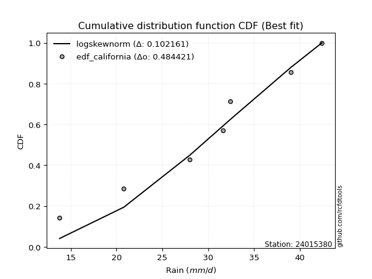</img>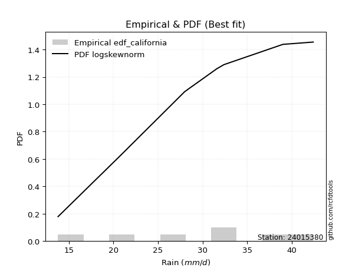</img>

</div>


### 2. Empirical - EDF Hazen (1930)

Hazen method for plotting positions is a formula used to estimate the empirical cumulative probability distribution of flood events or other hydrological data. This formula often results in biased estimations, particularly when extrapolating to extreme events (high return periods).

<div align="center">


$P=(m-0.5)/n$


</div>


**2.1. Empirical values**

<div align="center">

|                | 0                   | 1                   | 2                   | 3         | 4                  | 5                  | 6                  |
|:---------------|:--------------------|:--------------------|:--------------------|:----------|:-------------------|:-------------------|:-------------------|
| date           | 2023                | 2020                | 2022                | 2021      | 2025               | 2019               | 2024               |
| x              | 13.8                | 20.8                | 28.0                | 31.6      | 32.4               | 39.0               | 42.4               |
| m              | 1                   | 2                   | 3                   | 4         | 5                  | 6                  | 7                  |
| empirical_dist | edf_hazen           | edf_hazen           | edf_hazen           | edf_hazen | edf_hazen          | edf_hazen          | edf_hazen          |
| empirical      | 0.07142857142857142 | 0.21428571428571427 | 0.35714285714285715 | 0.5       | 0.6428571428571429 | 0.7857142857142857 | 0.9285714285714286 |
| empirical_tr   | 1.0769230769230769  | 1.2727272727272727  | 1.5555555555555558  | 2.0       | 2.8000000000000003 | 4.666666666666666  | 14.000000000000007 |

</div>


**2.2. Kolmogorov-Smirnov fit test (sorted by Δ)**


<div align="center">

|                | 0                    | 1                   | 2                   | 3                   | 4                   | 5                   | 6                   | 7                   | 8                   | 9                   | 10                  | 11                  | 12                  | 13                  | 14                  | 15                  | 16                  | 17                  | 18                  | 19                  | 20                  | 21                  | 22                  | 23                  | 24                  | 25                    | 26                  | 27                  | 28                  | 29                  | 30                  | 31                  | 32                  | 33                  | 34                  | 35                  | 36                  | 37                  | 38                  | 39                  | 40                  | 41                  | 42                  | 43                  | 44                  | 45                  | 46                  | 47                  | 48                  | 49                  | 50                  | 51                  | 52                  | 53                  | 54                  | 55                  | 56                  | 57                  | 58                  | 59                  | 60                  | 61                  | 62                  | 63                  | 64                  | 65                  | 66                  | 67                  | 68                  | 69                  | 70                  | 71                  | 72                  | 73                  | 74                  | 75                  | 76                  | 77                  | 78                  | 79                  | 80                  | 81                  | 82                  | 83                  | 84                  | 85                  | 86                  | 87                  | 88                  | 89                  |
|:---------------|:---------------------|:--------------------|:--------------------|:--------------------|:--------------------|:--------------------|:--------------------|:--------------------|:--------------------|:--------------------|:--------------------|:--------------------|:--------------------|:--------------------|:--------------------|:--------------------|:--------------------|:--------------------|:--------------------|:--------------------|:--------------------|:--------------------|:--------------------|:--------------------|:--------------------|:----------------------|:--------------------|:--------------------|:--------------------|:--------------------|:--------------------|:--------------------|:--------------------|:--------------------|:--------------------|:--------------------|:--------------------|:--------------------|:--------------------|:--------------------|:--------------------|:--------------------|:--------------------|:--------------------|:--------------------|:--------------------|:--------------------|:--------------------|:--------------------|:--------------------|:--------------------|:--------------------|:--------------------|:--------------------|:--------------------|:--------------------|:--------------------|:--------------------|:--------------------|:--------------------|:--------------------|:--------------------|:--------------------|:--------------------|:--------------------|:--------------------|:--------------------|:--------------------|:--------------------|:--------------------|:--------------------|:--------------------|:--------------------|:--------------------|:--------------------|:--------------------|:--------------------|:--------------------|:--------------------|:--------------------|:--------------------|:--------------------|:--------------------|:--------------------|:--------------------|:--------------------|:--------------------|:--------------------|:--------------------|:--------------------|
| station        | 24015380             | 24015380            | 24015380            | 24015380            | 24015380            | 24015380            | 24015380            | 24015380            | 24015380            | 24015380            | 24015380            | 24015380            | 24015380            | 24015380            | 24015380            | 24015380            | 24015380            | 24015380            | 24015380            | 24015380            | 24015380            | 24015380            | 24015380            | 24015380            | 24015380            | 24015380              | 24015380            | 24015380            | 24015380            | 24015380            | 24015380            | 24015380            | 24015380            | 24015380            | 24015380            | 24015380            | 24015380            | 24015380            | 24015380            | 24015380            | 24015380            | 24015380            | 24015380            | 24015380            | 24015380            | 24015380            | 24015380            | 24015380            | 24015380            | 24015380            | 24015380            | 24015380            | 24015380            | 24015380            | 24015380            | 24015380            | 24015380            | 24015380            | 24015380            | 24015380            | 24015380            | 24015380            | 24015380            | 24015380            | 24015380            | 24015380            | 24015380            | 24015380            | 24015380            | 24015380            | 24015380            | 24015380            | 24015380            | 24015380            | 24015380            | 24015380            | 24015380            | 24015380            | 24015380            | 24015380            | 24015380            | 24015380            | 24015380            | 24015380            | 24015380            | 24015380            | 24015380            | 24015380            | 24015380            | 24015380            |
| empirical_dist | edf_hazen            | edf_hazen           | edf_hazen           | edf_hazen           | edf_hazen           | edf_hazen           | edf_hazen           | edf_hazen           | edf_hazen           | edf_hazen           | edf_hazen           | edf_hazen           | edf_hazen           | edf_hazen           | edf_hazen           | edf_hazen           | edf_hazen           | edf_hazen           | edf_hazen           | edf_hazen           | edf_hazen           | edf_hazen           | edf_hazen           | edf_hazen           | edf_hazen           | edf_hazen             | edf_hazen           | edf_hazen           | edf_hazen           | edf_hazen           | edf_hazen           | edf_hazen           | edf_hazen           | edf_hazen           | edf_hazen           | edf_hazen           | edf_hazen           | edf_hazen           | edf_hazen           | edf_hazen           | edf_hazen           | edf_hazen           | edf_hazen           | edf_hazen           | edf_hazen           | edf_hazen           | edf_hazen           | edf_hazen           | edf_hazen           | edf_hazen           | edf_hazen           | edf_hazen           | edf_hazen           | edf_hazen           | edf_hazen           | edf_hazen           | edf_hazen           | edf_hazen           | edf_hazen           | edf_hazen           | edf_hazen           | edf_hazen           | edf_hazen           | edf_hazen           | edf_hazen           | edf_hazen           | edf_hazen           | edf_hazen           | edf_hazen           | edf_hazen           | edf_hazen           | edf_hazen           | edf_hazen           | edf_hazen           | edf_hazen           | edf_hazen           | edf_hazen           | edf_hazen           | edf_hazen           | edf_hazen           | edf_hazen           | edf_hazen           | edf_hazen           | edf_hazen           | edf_hazen           | edf_hazen           | edf_hazen           | edf_hazen           | edf_hazen           | edf_hazen           |
| p_dist         | pearson3             | weibull_min         | fisk                | gompertz            | logweibull_min      | loggumbel_l         | f                   | exponnorm           | t                   | norm                | crystalball         | truncnorm           | nct                 | logmielke           | laplace_asymmetric  | gumbel_l            | genlogistic         | logpearson3         | johnsonsu           | gamma               | chi2                | logfisk             | erlang              | logistic            | rice                | loglaplace_asymmetric | loggompertz         | invgamma            | betaprime           | hypsecant           | alpha               | maxwell             | ncf                 | logjohnsonsu        | invgauss            | rayleigh            | mielke              | logloggamma         | laplace             | logf                | logfatiguelife      | logexponnorm        | logt                | lognorm             | lognorm             | logcrystalball      | lognct              | loglogistic         | gumbel_r            | logbetaprime        | halfnorm            | logrice             | loggamma            | loggamma            | logerlang           | kstwobign           | loginvgamma         | logalpha            | loghypsecant        | loginvgauss         | halflogistic        | moyal               | logmaxwell          | loginvweibull       | lograyleigh         | loglaplace          | genexpon            | loggumbel_r         | lognakagami         | logkstwobign        | loghalfnorm         | loggenexpon         | logncf              | expon               | logmoyal            | wald                | logchi2             | loghalflogistic     | gibrat              | logexpon            | logtruncnorm        | logwald             | loggibrat           | loglognorm          | pareto              | logpareto           | nakagami            | invweibull          | fatiguelife         | loggenlogistic      |
| delta          | 0.059546288772820866 | 0.06348052980349939 | 0.06389551566879836 | 0.07142857141383652 | 0.07148400285401169 | 0.07695125115027346 | 0.08083846507621095 | 0.08112531738963802 | 0.08112671269177818 | 0.08112699982507543 | 0.08112700955237573 | 0.08112708272043978 | 0.0812768251652306  | 0.08229194579954319 | 0.08314683988748295 | 0.08508438381188832 | 0.08606170140554936 | 0.08630020584390535 | 0.08639414369121534 | 0.0903133909860987  | 0.09079982744122106 | 0.09146047505726784 | 0.09152253964035095 | 0.09180331728210378 | 0.09249612047882483 | 0.09513585711109063   | 0.09659667172233055 | 0.09710140633514064 | 0.10029102518275512 | 0.10066741979056026 | 0.10084836394328311 | 0.10924155705802763 | 0.11012460095821397 | 0.11106356226408198 | 0.11119596358286865 | 0.11807777955806453 | 0.12104888820723303 | 0.12230698472037915 | 0.1257181806903218  | 0.13972450581498375 | 0.14137117074270905 | 0.14152340005250258 | 0.14152389735757537 | 0.1415239131889448  | 0.1415239131889448  | 0.141524221189528   | 0.14237987465062307 | 0.14644541048392667 | 0.1493561095502437  | 0.14959485575642378 | 0.14993280464201114 | 0.1500282319999648  | 0.15075683056728034 | 0.15075683056728034 | 0.1530579371187612  | 0.15414730689851414 | 0.15494965638557606 | 0.15618019183150628 | 0.15925708121386228 | 0.1666002968296481  | 0.17118963749293692 | 0.1729886768973663  | 0.17462684117586574 | 0.18455012871110815 | 0.18566461700909315 | 0.18765779564259666 | 0.20724564264106277 | 0.21185923826267333 | 0.2142857142833742  | 0.21446170103959322 | 0.2167517315224859  | 0.22027342653915621 | 0.22058960723631205 | 0.23313664807875994 | 0.2377149192309605  | 0.23866691259786588 | 0.24073910139058394 | 0.2416081690535628  | 0.2696756489417721  | 0.2743528088413179  | 0.30239704292925773 | 0.30962568350285496 | 0.33276326413320795 | 0.4244285208427816  | 0.4245286468102991  | 0.4383081774510468  | 0.4657356322595559  | 0.5052419220396044  | 0.5762441576614941  | 0.7857142857142857  |
| deltao         | 0.48442053926100004  | 0.48442053926100004 | 0.48442053926100004 | 0.48442053926100004 | 0.48442053926100004 | 0.48442053926100004 | 0.48442053926100004 | 0.48442053926100004 | 0.48442053926100004 | 0.48442053926100004 | 0.48442053926100004 | 0.48442053926100004 | 0.48442053926100004 | 0.48442053926100004 | 0.48442053926100004 | 0.48442053926100004 | 0.48442053926100004 | 0.48442053926100004 | 0.48442053926100004 | 0.48442053926100004 | 0.48442053926100004 | 0.48442053926100004 | 0.48442053926100004 | 0.48442053926100004 | 0.48442053926100004 | 0.48442053926100004   | 0.48442053926100004 | 0.48442053926100004 | 0.48442053926100004 | 0.48442053926100004 | 0.48442053926100004 | 0.48442053926100004 | 0.48442053926100004 | 0.48442053926100004 | 0.48442053926100004 | 0.48442053926100004 | 0.48442053926100004 | 0.48442053926100004 | 0.48442053926100004 | 0.48442053926100004 | 0.48442053926100004 | 0.48442053926100004 | 0.48442053926100004 | 0.48442053926100004 | 0.48442053926100004 | 0.48442053926100004 | 0.48442053926100004 | 0.48442053926100004 | 0.48442053926100004 | 0.48442053926100004 | 0.48442053926100004 | 0.48442053926100004 | 0.48442053926100004 | 0.48442053926100004 | 0.48442053926100004 | 0.48442053926100004 | 0.48442053926100004 | 0.48442053926100004 | 0.48442053926100004 | 0.48442053926100004 | 0.48442053926100004 | 0.48442053926100004 | 0.48442053926100004 | 0.48442053926100004 | 0.48442053926100004 | 0.48442053926100004 | 0.48442053926100004 | 0.48442053926100004 | 0.48442053926100004 | 0.48442053926100004 | 0.48442053926100004 | 0.48442053926100004 | 0.48442053926100004 | 0.48442053926100004 | 0.48442053926100004 | 0.48442053926100004 | 0.48442053926100004 | 0.48442053926100004 | 0.48442053926100004 | 0.48442053926100004 | 0.48442053926100004 | 0.48442053926100004 | 0.48442053926100004 | 0.48442053926100004 | 0.48442053926100004 | 0.48442053926100004 | 0.48442053926100004 | 0.48442053926100004 | 0.48442053926100004 | 0.48442053926100004 |
| eval           | Δo > Δ               | Δo > Δ              | Δo > Δ              | Δo > Δ              | Δo > Δ              | Δo > Δ              | Δo > Δ              | Δo > Δ              | Δo > Δ              | Δo > Δ              | Δo > Δ              | Δo > Δ              | Δo > Δ              | Δo > Δ              | Δo > Δ              | Δo > Δ              | Δo > Δ              | Δo > Δ              | Δo > Δ              | Δo > Δ              | Δo > Δ              | Δo > Δ              | Δo > Δ              | Δo > Δ              | Δo > Δ              | Δo > Δ                | Δo > Δ              | Δo > Δ              | Δo > Δ              | Δo > Δ              | Δo > Δ              | Δo > Δ              | Δo > Δ              | Δo > Δ              | Δo > Δ              | Δo > Δ              | Δo > Δ              | Δo > Δ              | Δo > Δ              | Δo > Δ              | Δo > Δ              | Δo > Δ              | Δo > Δ              | Δo > Δ              | Δo > Δ              | Δo > Δ              | Δo > Δ              | Δo > Δ              | Δo > Δ              | Δo > Δ              | Δo > Δ              | Δo > Δ              | Δo > Δ              | Δo > Δ              | Δo > Δ              | Δo > Δ              | Δo > Δ              | Δo > Δ              | Δo > Δ              | Δo > Δ              | Δo > Δ              | Δo > Δ              | Δo > Δ              | Δo > Δ              | Δo > Δ              | Δo > Δ              | Δo > Δ              | Δo > Δ              | Δo > Δ              | Δo > Δ              | Δo > Δ              | Δo > Δ              | Δo > Δ              | Δo > Δ              | Δo > Δ              | Δo > Δ              | Δo > Δ              | Δo > Δ              | Δo > Δ              | Δo > Δ              | Δo > Δ              | Δo > Δ              | Δo > Δ              | Δo > Δ              | Δo > Δ              | Δo > Δ              | Δo > Δ              | Δo <= Δ             | Δo <= Δ             | Δo <= Δ             |
| fit            | 1                    | 1                   | 1                   | 1                   | 1                   | 1                   | 1                   | 1                   | 1                   | 1                   | 1                   | 1                   | 1                   | 1                   | 1                   | 1                   | 1                   | 1                   | 1                   | 1                   | 1                   | 1                   | 1                   | 1                   | 1                   | 1                     | 1                   | 1                   | 1                   | 1                   | 1                   | 1                   | 1                   | 1                   | 1                   | 1                   | 1                   | 1                   | 1                   | 1                   | 1                   | 1                   | 1                   | 1                   | 1                   | 1                   | 1                   | 1                   | 1                   | 1                   | 1                   | 1                   | 1                   | 1                   | 1                   | 1                   | 1                   | 1                   | 1                   | 1                   | 1                   | 1                   | 1                   | 1                   | 1                   | 1                   | 1                   | 1                   | 1                   | 1                   | 1                   | 1                   | 1                   | 1                   | 1                   | 1                   | 1                   | 1                   | 1                   | 1                   | 1                   | 1                   | 1                   | 1                   | 1                   | 1                   | 1                   | 0                   | 0                   | 0                   |
| n              | 7                    | 7                   | 7                   | 7                   | 7                   | 7                   | 7                   | 7                   | 7                   | 7                   | 7                   | 7                   | 7                   | 7                   | 7                   | 7                   | 7                   | 7                   | 7                   | 7                   | 7                   | 7                   | 7                   | 7                   | 7                   | 7                     | 7                   | 7                   | 7                   | 7                   | 7                   | 7                   | 7                   | 7                   | 7                   | 7                   | 7                   | 7                   | 7                   | 7                   | 7                   | 7                   | 7                   | 7                   | 7                   | 7                   | 7                   | 7                   | 7                   | 7                   | 7                   | 7                   | 7                   | 7                   | 7                   | 7                   | 7                   | 7                   | 7                   | 7                   | 7                   | 7                   | 7                   | 7                   | 7                   | 7                   | 7                   | 7                   | 7                   | 7                   | 7                   | 7                   | 7                   | 7                   | 7                   | 7                   | 7                   | 7                   | 7                   | 7                   | 7                   | 7                   | 7                   | 7                   | 7                   | 7                   | 7                   | 7                   | 7                   | 7                   |
| best_fit       | 1                    | 0                   | 0                   | 0                   | 0                   | 0                   | 0                   | 0                   | 0                   | 0                   | 0                   | 0                   | 0                   | 0                   | 0                   | 0                   | 0                   | 0                   | 0                   | 0                   | 0                   | 0                   | 0                   | 0                   | 0                   | 0                     | 0                   | 0                   | 0                   | 0                   | 0                   | 0                   | 0                   | 0                   | 0                   | 0                   | 0                   | 0                   | 0                   | 0                   | 0                   | 0                   | 0                   | 0                   | 0                   | 0                   | 0                   | 0                   | 0                   | 0                   | 0                   | 0                   | 0                   | 0                   | 0                   | 0                   | 0                   | 0                   | 0                   | 0                   | 0                   | 0                   | 0                   | 0                   | 0                   | 0                   | 0                   | 0                   | 0                   | 0                   | 0                   | 0                   | 0                   | 0                   | 0                   | 0                   | 0                   | 0                   | 0                   | 0                   | 0                   | 0                   | 0                   | 0                   | 0                   | 0                   | 0                   | 0                   | 0                   | 0                   |
| best_fit_sort  | 1                    | 2                   | 3                   | 4                   | 5                   | 6                   | 7                   | 8                   | 9                   | 10                  | 11                  | 12                  | 13                  | 14                  | 15                  | 16                  | 17                  | 18                  | 19                  | 20                  | 21                  | 22                  | 23                  | 24                  | 25                  | 26                    | 27                  | 28                  | 29                  | 30                  | 31                  | 32                  | 33                  | 34                  | 35                  | 36                  | 37                  | 38                  | 39                  | 40                  | 41                  | 42                  | 43                  | 44                  | 45                  | 46                  | 47                  | 48                  | 49                  | 50                  | 51                  | 52                  | 53                  | 54                  | 55                  | 56                  | 57                  | 58                  | 59                  | 60                  | 61                  | 62                  | 63                  | 64                  | 65                  | 66                  | 67                  | 68                  | 69                  | 70                  | 71                  | 72                  | 73                  | 74                  | 75                  | 76                  | 77                  | 78                  | 79                  | 80                  | 81                  | 82                  | 83                  | 84                  | 85                  | 86                  | 87                  | 88                  | 89                  | 90                  |

</div>


<div align="center">

</img>

</div>


**2.3. Best fit**

<div align="center">

|   id |   station | empirical_dist   | p_dist   |     delta |   deltao | eval   |   fit |   n |   best_fit |   best_fit_sort |
|-----:|----------:|:-----------------|:---------|----------:|---------:|:-------|------:|----:|-----------:|----------------:|
|    0 |  24015380 | edf_hazen        | pearson3 | 0.0595463 | 0.484421 | Δo > Δ |     1 |   7 |          1 |               1 |

</div>


<div align="center">

</img></img>

</div>


### 3. Empirical - EDF Weibull (1939)

Weibull plotting position formula is an empirical method used to estimate the non-exceedance probability or plotting position for a set of observed data, is often recommended or widely used in practice, particularly in flood frequency analysis.

<div align="center">


$P=m/(n+1)$


</div>


**3.1. Empirical values**

<div align="center">

|                | 0                  | 1                  | 2           | 3           | 4                  | 5           | 6           |
|:---------------|:-------------------|:-------------------|:------------|:------------|:-------------------|:------------|:------------|
| date           | 2023               | 2020               | 2022        | 2021        | 2025               | 2019        | 2024        |
| x              | 13.8               | 20.8               | 28.0        | 31.6        | 32.4               | 39.0        | 42.4        |
| m              | 1                  | 2                  | 3           | 4           | 5                  | 6           | 7           |
| empirical_dist | edf_weibull        | edf_weibull        | edf_weibull | edf_weibull | edf_weibull        | edf_weibull | edf_weibull |
| empirical      | 0.125              | 0.25               | 0.375       | 0.5         | 0.625              | 0.75        | 0.875       |
| empirical_tr   | 1.1428571428571428 | 1.3333333333333333 | 1.6         | 2.0         | 2.6666666666666665 | 4.0         | 8.0         |

</div>


**3.2. Kolmogorov-Smirnov fit test (sorted by Δ)**


<div align="center">

|                | 0                   | 1                   | 2                   | 3                   | 4                   | 5                   | 6                   | 7                   | 8                   | 9                   | 10                  | 11                  | 12                  | 13                  | 14                  | 15                  | 16                  | 17                  | 18                  | 19                  | 20                  | 21                  | 22                  | 23                  | 24                  | 25                  | 26                  | 27                  | 28                  | 29                  | 30                  | 31                  | 32                    | 33                  | 34                  | 35                  | 36                  | 37                  | 38                  | 39                  | 40                  | 41                  | 42                  | 43                  | 44                  | 45                  | 46                  | 47                  | 48                  | 49                  | 50                  | 51                  | 52                  | 53                  | 54                  | 55                  | 56                  | 57                  | 58                  | 59                  | 60                  | 61                  | 62                  | 63                  | 64                  | 65                  | 66                  | 67                  | 68                  | 69                  | 70                  | 71                  | 72                  | 73                  | 74                  | 75                  | 76                  | 77                  | 78                  | 79                  | 80                  | 81                  | 82                  | 83                  | 84                  | 85                  | 86                  | 87                  | 88                  | 89                  |
|:---------------|:--------------------|:--------------------|:--------------------|:--------------------|:--------------------|:--------------------|:--------------------|:--------------------|:--------------------|:--------------------|:--------------------|:--------------------|:--------------------|:--------------------|:--------------------|:--------------------|:--------------------|:--------------------|:--------------------|:--------------------|:--------------------|:--------------------|:--------------------|:--------------------|:--------------------|:--------------------|:--------------------|:--------------------|:--------------------|:--------------------|:--------------------|:--------------------|:----------------------|:--------------------|:--------------------|:--------------------|:--------------------|:--------------------|:--------------------|:--------------------|:--------------------|:--------------------|:--------------------|:--------------------|:--------------------|:--------------------|:--------------------|:--------------------|:--------------------|:--------------------|:--------------------|:--------------------|:--------------------|:--------------------|:--------------------|:--------------------|:--------------------|:--------------------|:--------------------|:--------------------|:--------------------|:--------------------|:--------------------|:--------------------|:--------------------|:--------------------|:--------------------|:--------------------|:--------------------|:--------------------|:--------------------|:--------------------|:--------------------|:--------------------|:--------------------|:--------------------|:--------------------|:--------------------|:--------------------|:--------------------|:--------------------|:--------------------|:--------------------|:--------------------|:--------------------|:--------------------|:--------------------|:--------------------|:--------------------|:--------------------|
| station        | 24015380            | 24015380            | 24015380            | 24015380            | 24015380            | 24015380            | 24015380            | 24015380            | 24015380            | 24015380            | 24015380            | 24015380            | 24015380            | 24015380            | 24015380            | 24015380            | 24015380            | 24015380            | 24015380            | 24015380            | 24015380            | 24015380            | 24015380            | 24015380            | 24015380            | 24015380            | 24015380            | 24015380            | 24015380            | 24015380            | 24015380            | 24015380            | 24015380              | 24015380            | 24015380            | 24015380            | 24015380            | 24015380            | 24015380            | 24015380            | 24015380            | 24015380            | 24015380            | 24015380            | 24015380            | 24015380            | 24015380            | 24015380            | 24015380            | 24015380            | 24015380            | 24015380            | 24015380            | 24015380            | 24015380            | 24015380            | 24015380            | 24015380            | 24015380            | 24015380            | 24015380            | 24015380            | 24015380            | 24015380            | 24015380            | 24015380            | 24015380            | 24015380            | 24015380            | 24015380            | 24015380            | 24015380            | 24015380            | 24015380            | 24015380            | 24015380            | 24015380            | 24015380            | 24015380            | 24015380            | 24015380            | 24015380            | 24015380            | 24015380            | 24015380            | 24015380            | 24015380            | 24015380            | 24015380            | 24015380            |
| empirical_dist | edf_weibull         | edf_weibull         | edf_weibull         | edf_weibull         | edf_weibull         | edf_weibull         | edf_weibull         | edf_weibull         | edf_weibull         | edf_weibull         | edf_weibull         | edf_weibull         | edf_weibull         | edf_weibull         | edf_weibull         | edf_weibull         | edf_weibull         | edf_weibull         | edf_weibull         | edf_weibull         | edf_weibull         | edf_weibull         | edf_weibull         | edf_weibull         | edf_weibull         | edf_weibull         | edf_weibull         | edf_weibull         | edf_weibull         | edf_weibull         | edf_weibull         | edf_weibull         | edf_weibull           | edf_weibull         | edf_weibull         | edf_weibull         | edf_weibull         | edf_weibull         | edf_weibull         | edf_weibull         | edf_weibull         | edf_weibull         | edf_weibull         | edf_weibull         | edf_weibull         | edf_weibull         | edf_weibull         | edf_weibull         | edf_weibull         | edf_weibull         | edf_weibull         | edf_weibull         | edf_weibull         | edf_weibull         | edf_weibull         | edf_weibull         | edf_weibull         | edf_weibull         | edf_weibull         | edf_weibull         | edf_weibull         | edf_weibull         | edf_weibull         | edf_weibull         | edf_weibull         | edf_weibull         | edf_weibull         | edf_weibull         | edf_weibull         | edf_weibull         | edf_weibull         | edf_weibull         | edf_weibull         | edf_weibull         | edf_weibull         | edf_weibull         | edf_weibull         | edf_weibull         | edf_weibull         | edf_weibull         | edf_weibull         | edf_weibull         | edf_weibull         | edf_weibull         | edf_weibull         | edf_weibull         | edf_weibull         | edf_weibull         | edf_weibull         | edf_weibull         |
| p_dist         | logpearson3         | loggumbel_l         | chi2                | gamma               | f                   | erlang              | logjohnsonsu        | nct                 | exponnorm           | norm                | crystalball         | truncnorm           | t                   | pearson3            | rice                | genlogistic         | invgamma            | betaprime           | johnsonsu           | logweibull_min      | fisk                | weibull_min         | logfisk             | alpha               | maxwell             | ncf                 | invgauss            | logistic            | rayleigh            | laplace_asymmetric  | gumbel_l            | hypsecant           | loglaplace_asymmetric | logmielke           | logloggamma         | loggompertz         | gompertz            | logf                | laplace             | logfatiguelife      | logexponnorm        | logt                | lognorm             | lognorm             | logcrystalball      | lognct              | logrice             | loggamma            | loggamma            | mielke              | logbetaprime        | kstwobign           | loginvgamma         | logerlang           | logalpha            | halfnorm            | loglogistic         | loginvgauss         | gumbel_r            | logmaxwell          | loghypsecant        | loginvweibull       | logncf              | lograyleigh         | halflogistic        | moyal               | loglaplace          | genexpon            | loggumbel_r         | logkstwobign        | loghalfnorm         | loggenexpon         | logchi2             | expon               | logmoyal            | loghalflogistic     | wald                | lognakagami         | logexpon            | gibrat              | logwald             | logtruncnorm        | loggibrat           | loglognorm          | pareto              | logpareto           | nakagami            | invweibull          | fatiguelife         | loggenlogistic      |
| delta          | 0.08311662714181567 | 0.08808816187413793 | 0.09079982744122106 | 0.09184418524008553 | 0.09279668687963638 | 0.09307791481192007 | 0.09320641940693908 | 0.0933193719607378  | 0.0933616462029686  | 0.09336248717333073 | 0.0933624969358623  | 0.0933625305984761  | 0.09336784345960614 | 0.09497264581027265 | 0.0960581672368829  | 0.09679530623368504 | 0.09710140633514064 | 0.0975379917412984  | 0.09761452895882683 | 0.09823465749928861 | 0.09876386715194613 | 0.09915158482114605 | 0.10066760600123117 | 0.10084836394328311 | 0.10924155705802763 | 0.11012460095821397 | 0.11119596358286865 | 0.11164110487398127 | 0.11807777955806453 | 0.11886112560176865 | 0.12079866952617402 | 0.1211767234569131  | 0.12127653457501741   | 0.12344153154426285 | 0.12490104955357784 | 0.12499995201696067 | 0.12499999998526509 | 0.12843969343691664 | 0.1298726854522313  | 0.13019334494177515 | 0.13031906484948563 | 0.13031954926036027 | 0.13031958535796162 | 0.13031958535796162 | 0.13031990871985444 | 0.13087042768281543 | 0.1347819013982957  | 0.13542819761366964 | 0.13542819761366964 | 0.13548757909820772 | 0.13560394920213548 | 0.1362901640413713  | 0.1370925135284332  | 0.13720394968704464 | 0.13832304897436343 | 0.14311996035423546 | 0.14644541048392667 | 0.14874315397250526 | 0.1493561095502437  | 0.1567696983187229  | 0.15925708121386228 | 0.1666929858539653  | 0.16701817866488344 | 0.1678074741519503  | 0.17118963749293692 | 0.1729886768973663  | 0.18765779564259666 | 0.18938849978391992 | 0.19400209540553048 | 0.19660455818245037 | 0.19889458866534304 | 0.20241628368201336 | 0.20547613068692294 | 0.2152795052216171  | 0.21985777637381765 | 0.22375102619641996 | 0.24999994055576027 | 0.24999999999765993 | 0.25649566598417506 | 0.2696756489417721  | 0.2917685406457121  | 0.30239704292925773 | 0.3149061212760651  | 0.3887142351284959  | 0.3888143610960134  | 0.4025938917367611  | 0.44787848940241304 | 0.4516704934681758  | 0.5405298719472084  | 0.75                |
| deltao         | 0.48442053926100004 | 0.48442053926100004 | 0.48442053926100004 | 0.48442053926100004 | 0.48442053926100004 | 0.48442053926100004 | 0.48442053926100004 | 0.48442053926100004 | 0.48442053926100004 | 0.48442053926100004 | 0.48442053926100004 | 0.48442053926100004 | 0.48442053926100004 | 0.48442053926100004 | 0.48442053926100004 | 0.48442053926100004 | 0.48442053926100004 | 0.48442053926100004 | 0.48442053926100004 | 0.48442053926100004 | 0.48442053926100004 | 0.48442053926100004 | 0.48442053926100004 | 0.48442053926100004 | 0.48442053926100004 | 0.48442053926100004 | 0.48442053926100004 | 0.48442053926100004 | 0.48442053926100004 | 0.48442053926100004 | 0.48442053926100004 | 0.48442053926100004 | 0.48442053926100004   | 0.48442053926100004 | 0.48442053926100004 | 0.48442053926100004 | 0.48442053926100004 | 0.48442053926100004 | 0.48442053926100004 | 0.48442053926100004 | 0.48442053926100004 | 0.48442053926100004 | 0.48442053926100004 | 0.48442053926100004 | 0.48442053926100004 | 0.48442053926100004 | 0.48442053926100004 | 0.48442053926100004 | 0.48442053926100004 | 0.48442053926100004 | 0.48442053926100004 | 0.48442053926100004 | 0.48442053926100004 | 0.48442053926100004 | 0.48442053926100004 | 0.48442053926100004 | 0.48442053926100004 | 0.48442053926100004 | 0.48442053926100004 | 0.48442053926100004 | 0.48442053926100004 | 0.48442053926100004 | 0.48442053926100004 | 0.48442053926100004 | 0.48442053926100004 | 0.48442053926100004 | 0.48442053926100004 | 0.48442053926100004 | 0.48442053926100004 | 0.48442053926100004 | 0.48442053926100004 | 0.48442053926100004 | 0.48442053926100004 | 0.48442053926100004 | 0.48442053926100004 | 0.48442053926100004 | 0.48442053926100004 | 0.48442053926100004 | 0.48442053926100004 | 0.48442053926100004 | 0.48442053926100004 | 0.48442053926100004 | 0.48442053926100004 | 0.48442053926100004 | 0.48442053926100004 | 0.48442053926100004 | 0.48442053926100004 | 0.48442053926100004 | 0.48442053926100004 | 0.48442053926100004 |
| eval           | Δo > Δ              | Δo > Δ              | Δo > Δ              | Δo > Δ              | Δo > Δ              | Δo > Δ              | Δo > Δ              | Δo > Δ              | Δo > Δ              | Δo > Δ              | Δo > Δ              | Δo > Δ              | Δo > Δ              | Δo > Δ              | Δo > Δ              | Δo > Δ              | Δo > Δ              | Δo > Δ              | Δo > Δ              | Δo > Δ              | Δo > Δ              | Δo > Δ              | Δo > Δ              | Δo > Δ              | Δo > Δ              | Δo > Δ              | Δo > Δ              | Δo > Δ              | Δo > Δ              | Δo > Δ              | Δo > Δ              | Δo > Δ              | Δo > Δ                | Δo > Δ              | Δo > Δ              | Δo > Δ              | Δo > Δ              | Δo > Δ              | Δo > Δ              | Δo > Δ              | Δo > Δ              | Δo > Δ              | Δo > Δ              | Δo > Δ              | Δo > Δ              | Δo > Δ              | Δo > Δ              | Δo > Δ              | Δo > Δ              | Δo > Δ              | Δo > Δ              | Δo > Δ              | Δo > Δ              | Δo > Δ              | Δo > Δ              | Δo > Δ              | Δo > Δ              | Δo > Δ              | Δo > Δ              | Δo > Δ              | Δo > Δ              | Δo > Δ              | Δo > Δ              | Δo > Δ              | Δo > Δ              | Δo > Δ              | Δo > Δ              | Δo > Δ              | Δo > Δ              | Δo > Δ              | Δo > Δ              | Δo > Δ              | Δo > Δ              | Δo > Δ              | Δo > Δ              | Δo > Δ              | Δo > Δ              | Δo > Δ              | Δo > Δ              | Δo > Δ              | Δo > Δ              | Δo > Δ              | Δo > Δ              | Δo > Δ              | Δo > Δ              | Δo > Δ              | Δo > Δ              | Δo > Δ              | Δo <= Δ             | Δo <= Δ             |
| fit            | 1                   | 1                   | 1                   | 1                   | 1                   | 1                   | 1                   | 1                   | 1                   | 1                   | 1                   | 1                   | 1                   | 1                   | 1                   | 1                   | 1                   | 1                   | 1                   | 1                   | 1                   | 1                   | 1                   | 1                   | 1                   | 1                   | 1                   | 1                   | 1                   | 1                   | 1                   | 1                   | 1                     | 1                   | 1                   | 1                   | 1                   | 1                   | 1                   | 1                   | 1                   | 1                   | 1                   | 1                   | 1                   | 1                   | 1                   | 1                   | 1                   | 1                   | 1                   | 1                   | 1                   | 1                   | 1                   | 1                   | 1                   | 1                   | 1                   | 1                   | 1                   | 1                   | 1                   | 1                   | 1                   | 1                   | 1                   | 1                   | 1                   | 1                   | 1                   | 1                   | 1                   | 1                   | 1                   | 1                   | 1                   | 1                   | 1                   | 1                   | 1                   | 1                   | 1                   | 1                   | 1                   | 1                   | 1                   | 1                   | 0                   | 0                   |
| n              | 7                   | 7                   | 7                   | 7                   | 7                   | 7                   | 7                   | 7                   | 7                   | 7                   | 7                   | 7                   | 7                   | 7                   | 7                   | 7                   | 7                   | 7                   | 7                   | 7                   | 7                   | 7                   | 7                   | 7                   | 7                   | 7                   | 7                   | 7                   | 7                   | 7                   | 7                   | 7                   | 7                     | 7                   | 7                   | 7                   | 7                   | 7                   | 7                   | 7                   | 7                   | 7                   | 7                   | 7                   | 7                   | 7                   | 7                   | 7                   | 7                   | 7                   | 7                   | 7                   | 7                   | 7                   | 7                   | 7                   | 7                   | 7                   | 7                   | 7                   | 7                   | 7                   | 7                   | 7                   | 7                   | 7                   | 7                   | 7                   | 7                   | 7                   | 7                   | 7                   | 7                   | 7                   | 7                   | 7                   | 7                   | 7                   | 7                   | 7                   | 7                   | 7                   | 7                   | 7                   | 7                   | 7                   | 7                   | 7                   | 7                   | 7                   |
| best_fit       | 1                   | 0                   | 0                   | 0                   | 0                   | 0                   | 0                   | 0                   | 0                   | 0                   | 0                   | 0                   | 0                   | 0                   | 0                   | 0                   | 0                   | 0                   | 0                   | 0                   | 0                   | 0                   | 0                   | 0                   | 0                   | 0                   | 0                   | 0                   | 0                   | 0                   | 0                   | 0                   | 0                     | 0                   | 0                   | 0                   | 0                   | 0                   | 0                   | 0                   | 0                   | 0                   | 0                   | 0                   | 0                   | 0                   | 0                   | 0                   | 0                   | 0                   | 0                   | 0                   | 0                   | 0                   | 0                   | 0                   | 0                   | 0                   | 0                   | 0                   | 0                   | 0                   | 0                   | 0                   | 0                   | 0                   | 0                   | 0                   | 0                   | 0                   | 0                   | 0                   | 0                   | 0                   | 0                   | 0                   | 0                   | 0                   | 0                   | 0                   | 0                   | 0                   | 0                   | 0                   | 0                   | 0                   | 0                   | 0                   | 0                   | 0                   |
| best_fit_sort  | 1                   | 2                   | 3                   | 4                   | 5                   | 6                   | 7                   | 8                   | 9                   | 10                  | 11                  | 12                  | 13                  | 14                  | 15                  | 16                  | 17                  | 18                  | 19                  | 20                  | 21                  | 22                  | 23                  | 24                  | 25                  | 26                  | 27                  | 28                  | 29                  | 30                  | 31                  | 32                  | 33                    | 34                  | 35                  | 36                  | 37                  | 38                  | 39                  | 40                  | 41                  | 42                  | 43                  | 44                  | 45                  | 46                  | 47                  | 48                  | 49                  | 50                  | 51                  | 52                  | 53                  | 54                  | 55                  | 56                  | 57                  | 58                  | 59                  | 60                  | 61                  | 62                  | 63                  | 64                  | 65                  | 66                  | 67                  | 68                  | 69                  | 70                  | 71                  | 72                  | 73                  | 74                  | 75                  | 76                  | 77                  | 78                  | 79                  | 80                  | 81                  | 82                  | 83                  | 84                  | 85                  | 86                  | 87                  | 88                  | 89                  | 90                  |

</div>


<div align="center">

</img>

</div>


**3.3. Best fit**

<div align="center">

|   id |   station | empirical_dist   | p_dist      |     delta |   deltao | eval   |   fit |   n |   best_fit |   best_fit_sort |
|-----:|----------:|:-----------------|:------------|----------:|---------:|:-------|------:|----:|-----------:|----------------:|
|    0 |  24015380 | edf_weibull      | logpearson3 | 0.0831166 | 0.484421 | Δo > Δ |     1 |   7 |          1 |               1 |

</div>


<div align="center">

</img>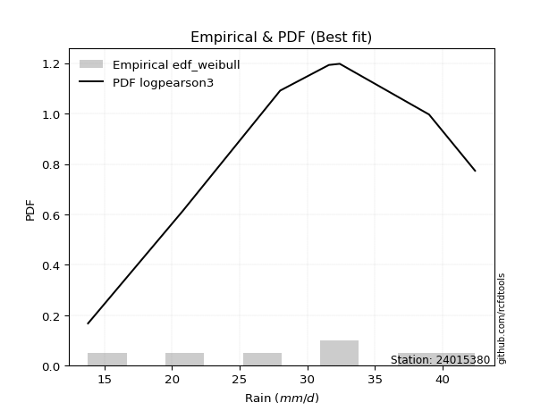</img>

</div>


### 4. Empirical - EDF Beard (1943)

The Beard formula (or Beard´s plotting position formula) in hydrology is used to estimate the empirical non-exceedance probability _(P)_ of a flood event (or other extreme hydrological data point) within a given dataset.

<div align="center">


$P=(m-0.31)/(n+0.38)$


</div>


**4.1. Empirical values**

<div align="center">

|                | 0                   | 1                   | 2                   | 3         | 4                  | 5                  | 6                  |
|:---------------|:--------------------|:--------------------|:--------------------|:----------|:-------------------|:-------------------|:-------------------|
| date           | 2023                | 2020                | 2022                | 2021      | 2025               | 2019               | 2024               |
| x              | 13.8                | 20.8                | 28.0                | 31.6      | 32.4               | 39.0               | 42.4               |
| m              | 1                   | 2                   | 3                   | 4         | 5                  | 6                  | 7                  |
| empirical_dist | edf_beard           | edf_beard           | edf_beard           | edf_beard | edf_beard          | edf_beard          | edf_beard          |
| empirical      | 0.09349593495934959 | 0.22899728997289973 | 0.36449864498644985 | 0.5       | 0.6355013550135502 | 0.7710027100271003 | 0.9065040650406505 |
| empirical_tr   | 1.1031390134529149  | 1.29701230228471    | 1.5735607675906182  | 2.0       | 2.743494423791822  | 4.366863905325444  | 10.695652173913055 |

</div>


**4.2. Kolmogorov-Smirnov fit test (sorted by Δ)**


<div align="center">

|                | 0                   | 1                   | 2                   | 3                   | 4                   | 5                   | 6                   | 7                   | 8                   | 9                   | 10                  | 11                  | 12                  | 13                  | 14                  | 15                  | 16                  | 17                  | 18                  | 19                  | 20                  | 21                  | 22                  | 23                  | 24                  | 25                  | 26                  | 27                  | 28                    | 29                  | 30                  | 31                  | 32                  | 33                  | 34                  | 35                  | 36                  | 37                  | 38                  | 39                  | 40                  | 41                  | 42                  | 43                  | 44                  | 45                  | 46                  | 47                  | 48                  | 49                  | 50                  | 51                  | 52                  | 53                  | 54                  | 55                  | 56                  | 57                  | 58                  | 59                  | 60                  | 61                  | 62                  | 63                  | 64                  | 65                  | 66                  | 67                  | 68                  | 69                  | 70                  | 71                  | 72                  | 73                  | 74                  | 75                  | 76                  | 77                  | 78                  | 79                  | 80                  | 81                  | 82                  | 83                  | 84                  | 85                  | 86                  | 87                  | 88                  | 89                  |
|:---------------|:--------------------|:--------------------|:--------------------|:--------------------|:--------------------|:--------------------|:--------------------|:--------------------|:--------------------|:--------------------|:--------------------|:--------------------|:--------------------|:--------------------|:--------------------|:--------------------|:--------------------|:--------------------|:--------------------|:--------------------|:--------------------|:--------------------|:--------------------|:--------------------|:--------------------|:--------------------|:--------------------|:--------------------|:----------------------|:--------------------|:--------------------|:--------------------|:--------------------|:--------------------|:--------------------|:--------------------|:--------------------|:--------------------|:--------------------|:--------------------|:--------------------|:--------------------|:--------------------|:--------------------|:--------------------|:--------------------|:--------------------|:--------------------|:--------------------|:--------------------|:--------------------|:--------------------|:--------------------|:--------------------|:--------------------|:--------------------|:--------------------|:--------------------|:--------------------|:--------------------|:--------------------|:--------------------|:--------------------|:--------------------|:--------------------|:--------------------|:--------------------|:--------------------|:--------------------|:--------------------|:--------------------|:--------------------|:--------------------|:--------------------|:--------------------|:--------------------|:--------------------|:--------------------|:--------------------|:--------------------|:--------------------|:--------------------|:--------------------|:--------------------|:--------------------|:--------------------|:--------------------|:--------------------|:--------------------|:--------------------|
| station        | 24015380            | 24015380            | 24015380            | 24015380            | 24015380            | 24015380            | 24015380            | 24015380            | 24015380            | 24015380            | 24015380            | 24015380            | 24015380            | 24015380            | 24015380            | 24015380            | 24015380            | 24015380            | 24015380            | 24015380            | 24015380            | 24015380            | 24015380            | 24015380            | 24015380            | 24015380            | 24015380            | 24015380            | 24015380              | 24015380            | 24015380            | 24015380            | 24015380            | 24015380            | 24015380            | 24015380            | 24015380            | 24015380            | 24015380            | 24015380            | 24015380            | 24015380            | 24015380            | 24015380            | 24015380            | 24015380            | 24015380            | 24015380            | 24015380            | 24015380            | 24015380            | 24015380            | 24015380            | 24015380            | 24015380            | 24015380            | 24015380            | 24015380            | 24015380            | 24015380            | 24015380            | 24015380            | 24015380            | 24015380            | 24015380            | 24015380            | 24015380            | 24015380            | 24015380            | 24015380            | 24015380            | 24015380            | 24015380            | 24015380            | 24015380            | 24015380            | 24015380            | 24015380            | 24015380            | 24015380            | 24015380            | 24015380            | 24015380            | 24015380            | 24015380            | 24015380            | 24015380            | 24015380            | 24015380            | 24015380            |
| empirical_dist | edf_beard           | edf_beard           | edf_beard           | edf_beard           | edf_beard           | edf_beard           | edf_beard           | edf_beard           | edf_beard           | edf_beard           | edf_beard           | edf_beard           | edf_beard           | edf_beard           | edf_beard           | edf_beard           | edf_beard           | edf_beard           | edf_beard           | edf_beard           | edf_beard           | edf_beard           | edf_beard           | edf_beard           | edf_beard           | edf_beard           | edf_beard           | edf_beard           | edf_beard             | edf_beard           | edf_beard           | edf_beard           | edf_beard           | edf_beard           | edf_beard           | edf_beard           | edf_beard           | edf_beard           | edf_beard           | edf_beard           | edf_beard           | edf_beard           | edf_beard           | edf_beard           | edf_beard           | edf_beard           | edf_beard           | edf_beard           | edf_beard           | edf_beard           | edf_beard           | edf_beard           | edf_beard           | edf_beard           | edf_beard           | edf_beard           | edf_beard           | edf_beard           | edf_beard           | edf_beard           | edf_beard           | edf_beard           | edf_beard           | edf_beard           | edf_beard           | edf_beard           | edf_beard           | edf_beard           | edf_beard           | edf_beard           | edf_beard           | edf_beard           | edf_beard           | edf_beard           | edf_beard           | edf_beard           | edf_beard           | edf_beard           | edf_beard           | edf_beard           | edf_beard           | edf_beard           | edf_beard           | edf_beard           | edf_beard           | edf_beard           | edf_beard           | edf_beard           | edf_beard           | edf_beard           |
| p_dist         | pearson3            | loggumbel_l         | logweibull_min      | fisk                | weibull_min         | genlogistic         | johnsonsu           | f                   | exponnorm           | t                   | norm                | crystalball         | truncnorm           | nct                 | logpearson3         | gamma               | chi2                | logfisk             | erlang              | logistic            | logmielke           | rice                | gompertz            | loggompertz         | invgamma            | betaprime           | laplace_asymmetric  | gumbel_l            | loglaplace_asymmetric | hypsecant           | alpha               | logjohnsonsu        | maxwell             | ncf                 | invgauss            | mielke              | logloggamma         | rayleigh            | laplace             | logf                | logfatiguelife      | logexponnorm        | logt                | lognorm             | lognorm             | logcrystalball      | lognct              | logbetaprime        | logrice             | halfnorm            | loggamma            | loggamma            | logerlang           | loglogistic         | kstwobign           | loginvgamma         | logalpha            | gumbel_r            | loginvgauss         | loghypsecant        | logmaxwell          | halflogistic        | moyal               | loginvweibull       | lograyleigh         | loglaplace          | logncf              | genexpon            | loggumbel_r         | logkstwobign        | loghalfnorm         | loggenexpon         | expon               | logchi2             | lognakagami         | logmoyal            | loghalflogistic     | wald                | logexpon            | gibrat              | logwald             | logtruncnorm        | loggibrat           | loglognorm          | pareto              | logpareto           | nakagami            | invweibull          | fatiguelife         | loggenlogistic      |
| delta          | 0.07396993578317235 | 0.07695125115027346 | 0.07723194747218831 | 0.07776115712484585 | 0.07814887479404575 | 0.07870591356195666 | 0.07903835584762264 | 0.08083846507621095 | 0.08112531738963802 | 0.08112671269177818 | 0.08112699982507543 | 0.08112700955237573 | 0.08112708272043978 | 0.0812768251652306  | 0.08271139318897314 | 0.0903133909860987  | 0.09079982744122106 | 0.09146047505726784 | 0.09152253964035095 | 0.09180331728210378 | 0.09193746650361234 | 0.09249612047882483 | 0.09349593494461468 | 0.09659667172233055 | 0.09710140633514064 | 0.0975379917412984  | 0.09785841557466834 | 0.09979595949907372 | 0.10027382454791711   | 0.10066741979056026 | 0.10084836394328311 | 0.10370777442048928 | 0.10924155705802763 | 0.11012460095821397 | 0.11119596358286865 | 0.11448486907110744 | 0.11495119687678645 | 0.11807777955806453 | 0.1257181806903218  | 0.13236871797139105 | 0.13401538289911635 | 0.13416761220890988 | 0.13416810951398267 | 0.1341681253453521  | 0.1341681253453521  | 0.1341684333459353  | 0.13502408680703037 | 0.14223906791283109 | 0.1426724441563721  | 0.14311996035423546 | 0.14340104272368764 | 0.14340104272368764 | 0.1457021492751685  | 0.14644541048392667 | 0.14679151905492144 | 0.14759386854198336 | 0.14882440398791358 | 0.1493561095502437  | 0.1592445089860554  | 0.15925708121386228 | 0.16727105333227305 | 0.17118963749293692 | 0.1729886768973663  | 0.17719434086751545 | 0.17830882916550045 | 0.18765779564259666 | 0.19852224370553395 | 0.19988985479747007 | 0.20450345041908063 | 0.20710591319600052 | 0.2093959436788932  | 0.21291763869556352 | 0.22578086023516725 | 0.22602752570339849 | 0.22899728997055965 | 0.2303591313873678  | 0.2342523812099701  | 0.23866691259786588 | 0.2669970209977252  | 0.2696756489417721  | 0.30226989565926227 | 0.30239704292925773 | 0.32540747628961525 | 0.4097169451555962  | 0.4098170711231137  | 0.4235966017638614  | 0.4583798444159632  | 0.4831745585088263  | 0.5615325819743087  | 0.7710027100271003  |
| deltao         | 0.48442053926100004 | 0.48442053926100004 | 0.48442053926100004 | 0.48442053926100004 | 0.48442053926100004 | 0.48442053926100004 | 0.48442053926100004 | 0.48442053926100004 | 0.48442053926100004 | 0.48442053926100004 | 0.48442053926100004 | 0.48442053926100004 | 0.48442053926100004 | 0.48442053926100004 | 0.48442053926100004 | 0.48442053926100004 | 0.48442053926100004 | 0.48442053926100004 | 0.48442053926100004 | 0.48442053926100004 | 0.48442053926100004 | 0.48442053926100004 | 0.48442053926100004 | 0.48442053926100004 | 0.48442053926100004 | 0.48442053926100004 | 0.48442053926100004 | 0.48442053926100004 | 0.48442053926100004   | 0.48442053926100004 | 0.48442053926100004 | 0.48442053926100004 | 0.48442053926100004 | 0.48442053926100004 | 0.48442053926100004 | 0.48442053926100004 | 0.48442053926100004 | 0.48442053926100004 | 0.48442053926100004 | 0.48442053926100004 | 0.48442053926100004 | 0.48442053926100004 | 0.48442053926100004 | 0.48442053926100004 | 0.48442053926100004 | 0.48442053926100004 | 0.48442053926100004 | 0.48442053926100004 | 0.48442053926100004 | 0.48442053926100004 | 0.48442053926100004 | 0.48442053926100004 | 0.48442053926100004 | 0.48442053926100004 | 0.48442053926100004 | 0.48442053926100004 | 0.48442053926100004 | 0.48442053926100004 | 0.48442053926100004 | 0.48442053926100004 | 0.48442053926100004 | 0.48442053926100004 | 0.48442053926100004 | 0.48442053926100004 | 0.48442053926100004 | 0.48442053926100004 | 0.48442053926100004 | 0.48442053926100004 | 0.48442053926100004 | 0.48442053926100004 | 0.48442053926100004 | 0.48442053926100004 | 0.48442053926100004 | 0.48442053926100004 | 0.48442053926100004 | 0.48442053926100004 | 0.48442053926100004 | 0.48442053926100004 | 0.48442053926100004 | 0.48442053926100004 | 0.48442053926100004 | 0.48442053926100004 | 0.48442053926100004 | 0.48442053926100004 | 0.48442053926100004 | 0.48442053926100004 | 0.48442053926100004 | 0.48442053926100004 | 0.48442053926100004 | 0.48442053926100004 |
| eval           | Δo > Δ              | Δo > Δ              | Δo > Δ              | Δo > Δ              | Δo > Δ              | Δo > Δ              | Δo > Δ              | Δo > Δ              | Δo > Δ              | Δo > Δ              | Δo > Δ              | Δo > Δ              | Δo > Δ              | Δo > Δ              | Δo > Δ              | Δo > Δ              | Δo > Δ              | Δo > Δ              | Δo > Δ              | Δo > Δ              | Δo > Δ              | Δo > Δ              | Δo > Δ              | Δo > Δ              | Δo > Δ              | Δo > Δ              | Δo > Δ              | Δo > Δ              | Δo > Δ                | Δo > Δ              | Δo > Δ              | Δo > Δ              | Δo > Δ              | Δo > Δ              | Δo > Δ              | Δo > Δ              | Δo > Δ              | Δo > Δ              | Δo > Δ              | Δo > Δ              | Δo > Δ              | Δo > Δ              | Δo > Δ              | Δo > Δ              | Δo > Δ              | Δo > Δ              | Δo > Δ              | Δo > Δ              | Δo > Δ              | Δo > Δ              | Δo > Δ              | Δo > Δ              | Δo > Δ              | Δo > Δ              | Δo > Δ              | Δo > Δ              | Δo > Δ              | Δo > Δ              | Δo > Δ              | Δo > Δ              | Δo > Δ              | Δo > Δ              | Δo > Δ              | Δo > Δ              | Δo > Δ              | Δo > Δ              | Δo > Δ              | Δo > Δ              | Δo > Δ              | Δo > Δ              | Δo > Δ              | Δo > Δ              | Δo > Δ              | Δo > Δ              | Δo > Δ              | Δo > Δ              | Δo > Δ              | Δo > Δ              | Δo > Δ              | Δo > Δ              | Δo > Δ              | Δo > Δ              | Δo > Δ              | Δo > Δ              | Δo > Δ              | Δo > Δ              | Δo > Δ              | Δo > Δ              | Δo <= Δ             | Δo <= Δ             |
| fit            | 1                   | 1                   | 1                   | 1                   | 1                   | 1                   | 1                   | 1                   | 1                   | 1                   | 1                   | 1                   | 1                   | 1                   | 1                   | 1                   | 1                   | 1                   | 1                   | 1                   | 1                   | 1                   | 1                   | 1                   | 1                   | 1                   | 1                   | 1                   | 1                     | 1                   | 1                   | 1                   | 1                   | 1                   | 1                   | 1                   | 1                   | 1                   | 1                   | 1                   | 1                   | 1                   | 1                   | 1                   | 1                   | 1                   | 1                   | 1                   | 1                   | 1                   | 1                   | 1                   | 1                   | 1                   | 1                   | 1                   | 1                   | 1                   | 1                   | 1                   | 1                   | 1                   | 1                   | 1                   | 1                   | 1                   | 1                   | 1                   | 1                   | 1                   | 1                   | 1                   | 1                   | 1                   | 1                   | 1                   | 1                   | 1                   | 1                   | 1                   | 1                   | 1                   | 1                   | 1                   | 1                   | 1                   | 1                   | 1                   | 0                   | 0                   |
| n              | 7                   | 7                   | 7                   | 7                   | 7                   | 7                   | 7                   | 7                   | 7                   | 7                   | 7                   | 7                   | 7                   | 7                   | 7                   | 7                   | 7                   | 7                   | 7                   | 7                   | 7                   | 7                   | 7                   | 7                   | 7                   | 7                   | 7                   | 7                   | 7                     | 7                   | 7                   | 7                   | 7                   | 7                   | 7                   | 7                   | 7                   | 7                   | 7                   | 7                   | 7                   | 7                   | 7                   | 7                   | 7                   | 7                   | 7                   | 7                   | 7                   | 7                   | 7                   | 7                   | 7                   | 7                   | 7                   | 7                   | 7                   | 7                   | 7                   | 7                   | 7                   | 7                   | 7                   | 7                   | 7                   | 7                   | 7                   | 7                   | 7                   | 7                   | 7                   | 7                   | 7                   | 7                   | 7                   | 7                   | 7                   | 7                   | 7                   | 7                   | 7                   | 7                   | 7                   | 7                   | 7                   | 7                   | 7                   | 7                   | 7                   | 7                   |
| best_fit       | 1                   | 0                   | 0                   | 0                   | 0                   | 0                   | 0                   | 0                   | 0                   | 0                   | 0                   | 0                   | 0                   | 0                   | 0                   | 0                   | 0                   | 0                   | 0                   | 0                   | 0                   | 0                   | 0                   | 0                   | 0                   | 0                   | 0                   | 0                   | 0                     | 0                   | 0                   | 0                   | 0                   | 0                   | 0                   | 0                   | 0                   | 0                   | 0                   | 0                   | 0                   | 0                   | 0                   | 0                   | 0                   | 0                   | 0                   | 0                   | 0                   | 0                   | 0                   | 0                   | 0                   | 0                   | 0                   | 0                   | 0                   | 0                   | 0                   | 0                   | 0                   | 0                   | 0                   | 0                   | 0                   | 0                   | 0                   | 0                   | 0                   | 0                   | 0                   | 0                   | 0                   | 0                   | 0                   | 0                   | 0                   | 0                   | 0                   | 0                   | 0                   | 0                   | 0                   | 0                   | 0                   | 0                   | 0                   | 0                   | 0                   | 0                   |
| best_fit_sort  | 1                   | 2                   | 3                   | 4                   | 5                   | 6                   | 7                   | 8                   | 9                   | 10                  | 11                  | 12                  | 13                  | 14                  | 15                  | 16                  | 17                  | 18                  | 19                  | 20                  | 21                  | 22                  | 23                  | 24                  | 25                  | 26                  | 27                  | 28                  | 29                    | 30                  | 31                  | 32                  | 33                  | 34                  | 35                  | 36                  | 37                  | 38                  | 39                  | 40                  | 41                  | 42                  | 43                  | 44                  | 45                  | 46                  | 47                  | 48                  | 49                  | 50                  | 51                  | 52                  | 53                  | 54                  | 55                  | 56                  | 57                  | 58                  | 59                  | 60                  | 61                  | 62                  | 63                  | 64                  | 65                  | 66                  | 67                  | 68                  | 69                  | 70                  | 71                  | 72                  | 73                  | 74                  | 75                  | 76                  | 77                  | 78                  | 79                  | 80                  | 81                  | 82                  | 83                  | 84                  | 85                  | 86                  | 87                  | 88                  | 89                  | 90                  |

</div>


<div align="center">

</img>

</div>


**4.3. Best fit**

<div align="center">

|   id |   station | empirical_dist   | p_dist   |     delta |   deltao | eval   |   fit |   n |   best_fit |   best_fit_sort |
|-----:|----------:|:-----------------|:---------|----------:|---------:|:-------|------:|----:|-----------:|----------------:|
|    0 |  24015380 | edf_beard        | pearson3 | 0.0739699 | 0.484421 | Δo > Δ |     1 |   7 |          1 |               1 |

</div>


<div align="center">

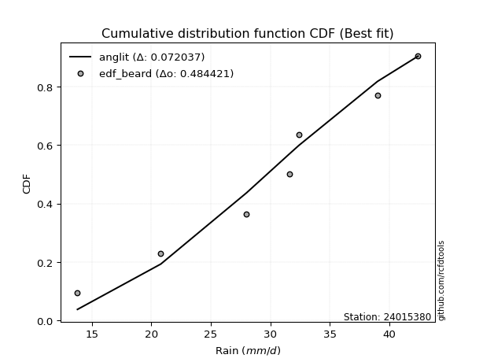</img>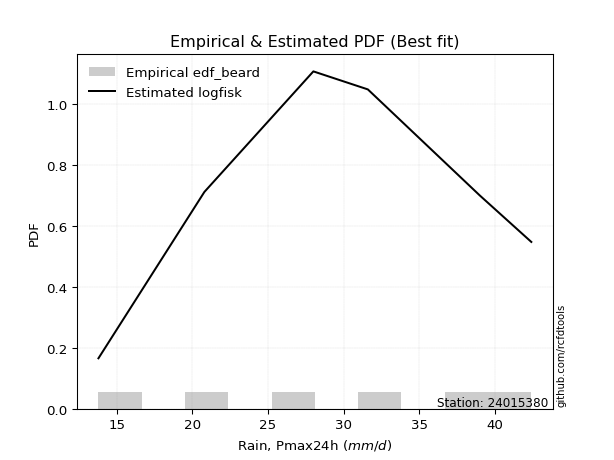</img>

</div>


### 5. Empirical - EDF Chegodayev (1955)

The Chegodayev formula is an empirical plotting position formula used in hydrological frequency analysis to estimate the exceedance probability or return period of a specific event from a set of observed data. It is primarily used for plotting observed data points on probability paper to fit a theoretical distribution, particularly for analyzing extreme events like maximum flood flows or rainfall intensities. The constant _b_ value in the generalized plotting position formula is 0.3.

<div align="center">


$P=(m-b)/(n+1-2b)$


</div>


**5.1. Empirical values**

<div align="center">

|                | 0                   | 1                   | 2                   | 3              | 4                  | 5                  | 6                  |
|:---------------|:--------------------|:--------------------|:--------------------|:---------------|:-------------------|:-------------------|:-------------------|
| date           | 2023                | 2020                | 2022                | 2021           | 2025               | 2019               | 2024               |
| x              | 13.8                | 20.8                | 28.0                | 31.6           | 32.4               | 39.0               | 42.4               |
| m              | 1                   | 2                   | 3                   | 4              | 5                  | 6                  | 7                  |
| empirical_dist | edf_chegodayev      | edf_chegodayev      | edf_chegodayev      | edf_chegodayev | edf_chegodayev     | edf_chegodayev     | edf_chegodayev     |
| empirical      | 0.09459459459459459 | 0.22972972972972971 | 0.36486486486486486 | 0.5            | 0.6351351351351351 | 0.7702702702702703 | 0.9054054054054054 |
| empirical_tr   | 1.1044776119402986  | 1.2982456140350878  | 1.574468085106383   | 2.0            | 2.7407407407407405 | 4.352941176470589  | 10.571428571428568 |

</div>


**5.2. Kolmogorov-Smirnov fit test (sorted by Δ)**


<div align="center">

|                | 0                   | 1                   | 2                   | 3                   | 4                   | 5                   | 6                   | 7                   | 8                   | 9                   | 10                  | 11                  | 12                  | 13                  | 14                  | 15                  | 16                  | 17                  | 18                  | 19                  | 20                  | 21                  | 22                  | 23                  | 24                  | 25                  | 26                  | 27                  | 28                  | 29                  | 30                    | 31                  | 32                  | 33                  | 34                  | 35                  | 36                  | 37                  | 38                  | 39                  | 40                  | 41                  | 42                  | 43                  | 44                  | 45                  | 46                  | 47                  | 48                  | 49                  | 50                  | 51                  | 52                  | 53                  | 54                  | 55                  | 56                  | 57                  | 58                  | 59                  | 60                  | 61                  | 62                  | 63                  | 64                  | 65                  | 66                  | 67                  | 68                  | 69                  | 70                  | 71                  | 72                  | 73                  | 74                  | 75                  | 76                  | 77                  | 78                  | 79                  | 80                  | 81                  | 82                  | 83                  | 84                  | 85                  | 86                  | 87                  | 88                  | 89                  |
|:---------------|:--------------------|:--------------------|:--------------------|:--------------------|:--------------------|:--------------------|:--------------------|:--------------------|:--------------------|:--------------------|:--------------------|:--------------------|:--------------------|:--------------------|:--------------------|:--------------------|:--------------------|:--------------------|:--------------------|:--------------------|:--------------------|:--------------------|:--------------------|:--------------------|:--------------------|:--------------------|:--------------------|:--------------------|:--------------------|:--------------------|:----------------------|:--------------------|:--------------------|:--------------------|:--------------------|:--------------------|:--------------------|:--------------------|:--------------------|:--------------------|:--------------------|:--------------------|:--------------------|:--------------------|:--------------------|:--------------------|:--------------------|:--------------------|:--------------------|:--------------------|:--------------------|:--------------------|:--------------------|:--------------------|:--------------------|:--------------------|:--------------------|:--------------------|:--------------------|:--------------------|:--------------------|:--------------------|:--------------------|:--------------------|:--------------------|:--------------------|:--------------------|:--------------------|:--------------------|:--------------------|:--------------------|:--------------------|:--------------------|:--------------------|:--------------------|:--------------------|:--------------------|:--------------------|:--------------------|:--------------------|:--------------------|:--------------------|:--------------------|:--------------------|:--------------------|:--------------------|:--------------------|:--------------------|:--------------------|:--------------------|
| station        | 24015380            | 24015380            | 24015380            | 24015380            | 24015380            | 24015380            | 24015380            | 24015380            | 24015380            | 24015380            | 24015380            | 24015380            | 24015380            | 24015380            | 24015380            | 24015380            | 24015380            | 24015380            | 24015380            | 24015380            | 24015380            | 24015380            | 24015380            | 24015380            | 24015380            | 24015380            | 24015380            | 24015380            | 24015380            | 24015380            | 24015380              | 24015380            | 24015380            | 24015380            | 24015380            | 24015380            | 24015380            | 24015380            | 24015380            | 24015380            | 24015380            | 24015380            | 24015380            | 24015380            | 24015380            | 24015380            | 24015380            | 24015380            | 24015380            | 24015380            | 24015380            | 24015380            | 24015380            | 24015380            | 24015380            | 24015380            | 24015380            | 24015380            | 24015380            | 24015380            | 24015380            | 24015380            | 24015380            | 24015380            | 24015380            | 24015380            | 24015380            | 24015380            | 24015380            | 24015380            | 24015380            | 24015380            | 24015380            | 24015380            | 24015380            | 24015380            | 24015380            | 24015380            | 24015380            | 24015380            | 24015380            | 24015380            | 24015380            | 24015380            | 24015380            | 24015380            | 24015380            | 24015380            | 24015380            | 24015380            |
| empirical_dist | edf_chegodayev      | edf_chegodayev      | edf_chegodayev      | edf_chegodayev      | edf_chegodayev      | edf_chegodayev      | edf_chegodayev      | edf_chegodayev      | edf_chegodayev      | edf_chegodayev      | edf_chegodayev      | edf_chegodayev      | edf_chegodayev      | edf_chegodayev      | edf_chegodayev      | edf_chegodayev      | edf_chegodayev      | edf_chegodayev      | edf_chegodayev      | edf_chegodayev      | edf_chegodayev      | edf_chegodayev      | edf_chegodayev      | edf_chegodayev      | edf_chegodayev      | edf_chegodayev      | edf_chegodayev      | edf_chegodayev      | edf_chegodayev      | edf_chegodayev      | edf_chegodayev        | edf_chegodayev      | edf_chegodayev      | edf_chegodayev      | edf_chegodayev      | edf_chegodayev      | edf_chegodayev      | edf_chegodayev      | edf_chegodayev      | edf_chegodayev      | edf_chegodayev      | edf_chegodayev      | edf_chegodayev      | edf_chegodayev      | edf_chegodayev      | edf_chegodayev      | edf_chegodayev      | edf_chegodayev      | edf_chegodayev      | edf_chegodayev      | edf_chegodayev      | edf_chegodayev      | edf_chegodayev      | edf_chegodayev      | edf_chegodayev      | edf_chegodayev      | edf_chegodayev      | edf_chegodayev      | edf_chegodayev      | edf_chegodayev      | edf_chegodayev      | edf_chegodayev      | edf_chegodayev      | edf_chegodayev      | edf_chegodayev      | edf_chegodayev      | edf_chegodayev      | edf_chegodayev      | edf_chegodayev      | edf_chegodayev      | edf_chegodayev      | edf_chegodayev      | edf_chegodayev      | edf_chegodayev      | edf_chegodayev      | edf_chegodayev      | edf_chegodayev      | edf_chegodayev      | edf_chegodayev      | edf_chegodayev      | edf_chegodayev      | edf_chegodayev      | edf_chegodayev      | edf_chegodayev      | edf_chegodayev      | edf_chegodayev      | edf_chegodayev      | edf_chegodayev      | edf_chegodayev      | edf_chegodayev      |
| p_dist         | pearson3            | loggumbel_l         | logweibull_min      | genlogistic         | fisk                | johnsonsu           | weibull_min         | f                   | exponnorm           | t                   | norm                | crystalball         | truncnorm           | nct                 | logpearson3         | gamma               | chi2                | logfisk             | erlang              | logistic            | rice                | logmielke           | gompertz            | loggompertz         | invgamma            | betaprime           | laplace_asymmetric  | gumbel_l            | alpha               | hypsecant           | loglaplace_asymmetric | logjohnsonsu        | maxwell             | ncf                 | invgauss            | logloggamma         | mielke              | rayleigh            | laplace             | logf                | logfatiguelife      | logexponnorm        | logt                | lognorm             | lognorm             | logcrystalball      | lognct              | logbetaprime        | logrice             | loggamma            | loggamma            | halfnorm            | logerlang           | kstwobign           | loglogistic         | loginvgamma         | logalpha            | gumbel_r            | loginvgauss         | loghypsecant        | logmaxwell          | halflogistic        | moyal               | loginvweibull       | lograyleigh         | loglaplace          | logncf              | genexpon            | loggumbel_r         | logkstwobign        | loghalfnorm         | loggenexpon         | logchi2             | expon               | lognakagami         | logmoyal            | loghalflogistic     | wald                | logexpon            | gibrat              | logwald             | logtruncnorm        | loggibrat           | loglognorm          | pareto              | logpareto           | nakagami            | invweibull          | fatiguelife         | loggenlogistic      |
| delta          | 0.07470237554000236 | 0.07695125115027346 | 0.07796438722901833 | 0.07833969368354154 | 0.07849359688167584 | 0.07867213596920752 | 0.07888131455087577 | 0.08083846507621095 | 0.08112531738963802 | 0.08112671269177818 | 0.08112699982507543 | 0.08112700955237573 | 0.08112708272043978 | 0.0812768251652306  | 0.08271139318897314 | 0.0903133909860987  | 0.09079982744122106 | 0.09146047505726784 | 0.09152253964035095 | 0.09180331728210378 | 0.09249612047882483 | 0.09303612613885748 | 0.09459459457985968 | 0.09659667172233055 | 0.09710140633514064 | 0.0975379917412984  | 0.09859085533149836 | 0.10052839925590373 | 0.10084836394328311 | 0.10090645318664282 | 0.10100626430474713   | 0.10334155454207417 | 0.10924155705802763 | 0.11012460095821397 | 0.11119596358286865 | 0.11458497699837134 | 0.11521730882793743 | 0.11807777955806453 | 0.1257181806903218  | 0.13200249809297604 | 0.13364916302070134 | 0.13380139233049487 | 0.13380188963556766 | 0.1338019054669371  | 0.1338019054669371  | 0.1338022134675203  | 0.13465786692861537 | 0.14187284803441608 | 0.14230622427795708 | 0.14303482284527264 | 0.14303482284527264 | 0.14311996035423546 | 0.1453359293967535  | 0.14642529917650643 | 0.14644541048392667 | 0.14722764866356836 | 0.14845818410949857 | 0.1493561095502437  | 0.1588782891076404  | 0.15925708121386228 | 0.16690483345385804 | 0.17118963749293692 | 0.1729886768973663  | 0.17682812098910045 | 0.17794260928708544 | 0.18765779564259666 | 0.19742358407028882 | 0.19952363491905506 | 0.20413723054066563 | 0.20673969331758552 | 0.20902972380047818 | 0.2125514188171485  | 0.2252950859465685  | 0.22541464035675224 | 0.22972972972738964 | 0.2299929115089528  | 0.2338861613315551  | 0.23866691259786588 | 0.2666308011193102  | 0.2696756489417721  | 0.30190367578084726 | 0.30239704292925773 | 0.32504125641120024 | 0.4089845053987662  | 0.4090846313662837  | 0.42286416200703136 | 0.4580136245375482  | 0.48207589887358115 | 0.5608001422174786  | 0.7702702702702703  |
| deltao         | 0.48442053926100004 | 0.48442053926100004 | 0.48442053926100004 | 0.48442053926100004 | 0.48442053926100004 | 0.48442053926100004 | 0.48442053926100004 | 0.48442053926100004 | 0.48442053926100004 | 0.48442053926100004 | 0.48442053926100004 | 0.48442053926100004 | 0.48442053926100004 | 0.48442053926100004 | 0.48442053926100004 | 0.48442053926100004 | 0.48442053926100004 | 0.48442053926100004 | 0.48442053926100004 | 0.48442053926100004 | 0.48442053926100004 | 0.48442053926100004 | 0.48442053926100004 | 0.48442053926100004 | 0.48442053926100004 | 0.48442053926100004 | 0.48442053926100004 | 0.48442053926100004 | 0.48442053926100004 | 0.48442053926100004 | 0.48442053926100004   | 0.48442053926100004 | 0.48442053926100004 | 0.48442053926100004 | 0.48442053926100004 | 0.48442053926100004 | 0.48442053926100004 | 0.48442053926100004 | 0.48442053926100004 | 0.48442053926100004 | 0.48442053926100004 | 0.48442053926100004 | 0.48442053926100004 | 0.48442053926100004 | 0.48442053926100004 | 0.48442053926100004 | 0.48442053926100004 | 0.48442053926100004 | 0.48442053926100004 | 0.48442053926100004 | 0.48442053926100004 | 0.48442053926100004 | 0.48442053926100004 | 0.48442053926100004 | 0.48442053926100004 | 0.48442053926100004 | 0.48442053926100004 | 0.48442053926100004 | 0.48442053926100004 | 0.48442053926100004 | 0.48442053926100004 | 0.48442053926100004 | 0.48442053926100004 | 0.48442053926100004 | 0.48442053926100004 | 0.48442053926100004 | 0.48442053926100004 | 0.48442053926100004 | 0.48442053926100004 | 0.48442053926100004 | 0.48442053926100004 | 0.48442053926100004 | 0.48442053926100004 | 0.48442053926100004 | 0.48442053926100004 | 0.48442053926100004 | 0.48442053926100004 | 0.48442053926100004 | 0.48442053926100004 | 0.48442053926100004 | 0.48442053926100004 | 0.48442053926100004 | 0.48442053926100004 | 0.48442053926100004 | 0.48442053926100004 | 0.48442053926100004 | 0.48442053926100004 | 0.48442053926100004 | 0.48442053926100004 | 0.48442053926100004 |
| eval           | Δo > Δ              | Δo > Δ              | Δo > Δ              | Δo > Δ              | Δo > Δ              | Δo > Δ              | Δo > Δ              | Δo > Δ              | Δo > Δ              | Δo > Δ              | Δo > Δ              | Δo > Δ              | Δo > Δ              | Δo > Δ              | Δo > Δ              | Δo > Δ              | Δo > Δ              | Δo > Δ              | Δo > Δ              | Δo > Δ              | Δo > Δ              | Δo > Δ              | Δo > Δ              | Δo > Δ              | Δo > Δ              | Δo > Δ              | Δo > Δ              | Δo > Δ              | Δo > Δ              | Δo > Δ              | Δo > Δ                | Δo > Δ              | Δo > Δ              | Δo > Δ              | Δo > Δ              | Δo > Δ              | Δo > Δ              | Δo > Δ              | Δo > Δ              | Δo > Δ              | Δo > Δ              | Δo > Δ              | Δo > Δ              | Δo > Δ              | Δo > Δ              | Δo > Δ              | Δo > Δ              | Δo > Δ              | Δo > Δ              | Δo > Δ              | Δo > Δ              | Δo > Δ              | Δo > Δ              | Δo > Δ              | Δo > Δ              | Δo > Δ              | Δo > Δ              | Δo > Δ              | Δo > Δ              | Δo > Δ              | Δo > Δ              | Δo > Δ              | Δo > Δ              | Δo > Δ              | Δo > Δ              | Δo > Δ              | Δo > Δ              | Δo > Δ              | Δo > Δ              | Δo > Δ              | Δo > Δ              | Δo > Δ              | Δo > Δ              | Δo > Δ              | Δo > Δ              | Δo > Δ              | Δo > Δ              | Δo > Δ              | Δo > Δ              | Δo > Δ              | Δo > Δ              | Δo > Δ              | Δo > Δ              | Δo > Δ              | Δo > Δ              | Δo > Δ              | Δo > Δ              | Δo > Δ              | Δo <= Δ             | Δo <= Δ             |
| fit            | 1                   | 1                   | 1                   | 1                   | 1                   | 1                   | 1                   | 1                   | 1                   | 1                   | 1                   | 1                   | 1                   | 1                   | 1                   | 1                   | 1                   | 1                   | 1                   | 1                   | 1                   | 1                   | 1                   | 1                   | 1                   | 1                   | 1                   | 1                   | 1                   | 1                   | 1                     | 1                   | 1                   | 1                   | 1                   | 1                   | 1                   | 1                   | 1                   | 1                   | 1                   | 1                   | 1                   | 1                   | 1                   | 1                   | 1                   | 1                   | 1                   | 1                   | 1                   | 1                   | 1                   | 1                   | 1                   | 1                   | 1                   | 1                   | 1                   | 1                   | 1                   | 1                   | 1                   | 1                   | 1                   | 1                   | 1                   | 1                   | 1                   | 1                   | 1                   | 1                   | 1                   | 1                   | 1                   | 1                   | 1                   | 1                   | 1                   | 1                   | 1                   | 1                   | 1                   | 1                   | 1                   | 1                   | 1                   | 1                   | 0                   | 0                   |
| n              | 7                   | 7                   | 7                   | 7                   | 7                   | 7                   | 7                   | 7                   | 7                   | 7                   | 7                   | 7                   | 7                   | 7                   | 7                   | 7                   | 7                   | 7                   | 7                   | 7                   | 7                   | 7                   | 7                   | 7                   | 7                   | 7                   | 7                   | 7                   | 7                   | 7                   | 7                     | 7                   | 7                   | 7                   | 7                   | 7                   | 7                   | 7                   | 7                   | 7                   | 7                   | 7                   | 7                   | 7                   | 7                   | 7                   | 7                   | 7                   | 7                   | 7                   | 7                   | 7                   | 7                   | 7                   | 7                   | 7                   | 7                   | 7                   | 7                   | 7                   | 7                   | 7                   | 7                   | 7                   | 7                   | 7                   | 7                   | 7                   | 7                   | 7                   | 7                   | 7                   | 7                   | 7                   | 7                   | 7                   | 7                   | 7                   | 7                   | 7                   | 7                   | 7                   | 7                   | 7                   | 7                   | 7                   | 7                   | 7                   | 7                   | 7                   |
| best_fit       | 1                   | 0                   | 0                   | 0                   | 0                   | 0                   | 0                   | 0                   | 0                   | 0                   | 0                   | 0                   | 0                   | 0                   | 0                   | 0                   | 0                   | 0                   | 0                   | 0                   | 0                   | 0                   | 0                   | 0                   | 0                   | 0                   | 0                   | 0                   | 0                   | 0                   | 0                     | 0                   | 0                   | 0                   | 0                   | 0                   | 0                   | 0                   | 0                   | 0                   | 0                   | 0                   | 0                   | 0                   | 0                   | 0                   | 0                   | 0                   | 0                   | 0                   | 0                   | 0                   | 0                   | 0                   | 0                   | 0                   | 0                   | 0                   | 0                   | 0                   | 0                   | 0                   | 0                   | 0                   | 0                   | 0                   | 0                   | 0                   | 0                   | 0                   | 0                   | 0                   | 0                   | 0                   | 0                   | 0                   | 0                   | 0                   | 0                   | 0                   | 0                   | 0                   | 0                   | 0                   | 0                   | 0                   | 0                   | 0                   | 0                   | 0                   |
| best_fit_sort  | 1                   | 2                   | 3                   | 4                   | 5                   | 6                   | 7                   | 8                   | 9                   | 10                  | 11                  | 12                  | 13                  | 14                  | 15                  | 16                  | 17                  | 18                  | 19                  | 20                  | 21                  | 22                  | 23                  | 24                  | 25                  | 26                  | 27                  | 28                  | 29                  | 30                  | 31                    | 32                  | 33                  | 34                  | 35                  | 36                  | 37                  | 38                  | 39                  | 40                  | 41                  | 42                  | 43                  | 44                  | 45                  | 46                  | 47                  | 48                  | 49                  | 50                  | 51                  | 52                  | 53                  | 54                  | 55                  | 56                  | 57                  | 58                  | 59                  | 60                  | 61                  | 62                  | 63                  | 64                  | 65                  | 66                  | 67                  | 68                  | 69                  | 70                  | 71                  | 72                  | 73                  | 74                  | 75                  | 76                  | 77                  | 78                  | 79                  | 80                  | 81                  | 82                  | 83                  | 84                  | 85                  | 86                  | 87                  | 88                  | 89                  | 90                  |

</div>


<div align="center">

</img>

</div>


**5.3. Best fit**

<div align="center">

|   id |   station | empirical_dist   | p_dist   |     delta |   deltao | eval   |   fit |   n |   best_fit |   best_fit_sort |
|-----:|----------:|:-----------------|:---------|----------:|---------:|:-------|------:|----:|-----------:|----------------:|
|    0 |  24015380 | edf_chegodayev   | pearson3 | 0.0747024 | 0.484421 | Δo > Δ |     1 |   7 |          1 |               1 |

</div>


<div align="center">

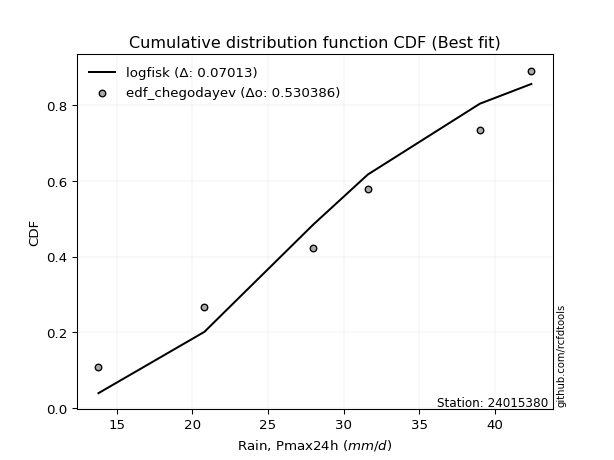</img>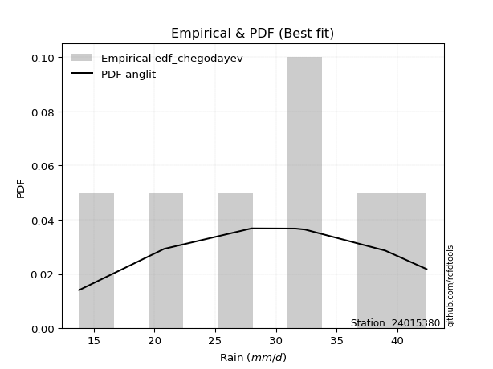</img>

</div>


### 6. Empirical - EDF Blom (1958)

The Blom formula is a specific "plotting position" formula used in hydrology and statistical analysis to estimate the empirical cumulative probability (or non-exceedance probability) of a data series. It is particularly recommended for data that are approximately normally distributed. The constant _a_ is set to 0.375 (or 3/8).

<div align="center">


$P=(m-a)/(n+1-2a)$


</div>


**6.1. Empirical values**

<div align="center">

|                | 0                   | 1                   | 2                  | 3        | 4                  | 5                  | 6                  |
|:---------------|:--------------------|:--------------------|:-------------------|:---------|:-------------------|:-------------------|:-------------------|
| date           | 2023                | 2020                | 2022               | 2021     | 2025               | 2019               | 2024               |
| x              | 13.8                | 20.8                | 28.0               | 31.6     | 32.4               | 39.0               | 42.4               |
| m              | 1                   | 2                   | 3                  | 4        | 5                  | 6                  | 7                  |
| empirical_dist | edf_blom            | edf_blom            | edf_blom           | edf_blom | edf_blom           | edf_blom           | edf_blom           |
| empirical      | 0.08620689655172414 | 0.22413793103448276 | 0.3620689655172414 | 0.5      | 0.6379310344827587 | 0.7758620689655172 | 0.9137931034482759 |
| empirical_tr   | 1.0943396226415094  | 1.288888888888889   | 1.5675675675675675 | 2.0      | 2.7619047619047623 | 4.461538461538462  | 11.600000000000007 |

</div>


**6.2. Kolmogorov-Smirnov fit test (sorted by Δ)**


<div align="center">

|                | 0                   | 1                   | 2                   | 3                   | 4                   | 5                   | 6                   | 7                   | 8                   | 9                   | 10                  | 11                  | 12                  | 13                  | 14                  | 15                  | 16                  | 17                  | 18                  | 19                  | 20                  | 21                  | 22                  | 23                  | 24                  | 25                    | 26                  | 27                  | 28                  | 29                  | 30                  | 31                  | 32                  | 33                  | 34                  | 35                  | 36                  | 37                  | 38                  | 39                  | 40                  | 41                  | 42                  | 43                  | 44                  | 45                  | 46                  | 47                  | 48                  | 49                  | 50                  | 51                  | 52                  | 53                  | 54                  | 55                  | 56                  | 57                  | 58                  | 59                  | 60                  | 61                  | 62                  | 63                  | 64                  | 65                  | 66                  | 67                  | 68                  | 69                  | 70                  | 71                  | 72                  | 73                  | 74                  | 75                  | 76                  | 77                  | 78                  | 79                  | 80                  | 81                  | 82                  | 83                  | 84                  | 85                  | 86                  | 87                  | 88                  | 89                  |
|:---------------|:--------------------|:--------------------|:--------------------|:--------------------|:--------------------|:--------------------|:--------------------|:--------------------|:--------------------|:--------------------|:--------------------|:--------------------|:--------------------|:--------------------|:--------------------|:--------------------|:--------------------|:--------------------|:--------------------|:--------------------|:--------------------|:--------------------|:--------------------|:--------------------|:--------------------|:----------------------|:--------------------|:--------------------|:--------------------|:--------------------|:--------------------|:--------------------|:--------------------|:--------------------|:--------------------|:--------------------|:--------------------|:--------------------|:--------------------|:--------------------|:--------------------|:--------------------|:--------------------|:--------------------|:--------------------|:--------------------|:--------------------|:--------------------|:--------------------|:--------------------|:--------------------|:--------------------|:--------------------|:--------------------|:--------------------|:--------------------|:--------------------|:--------------------|:--------------------|:--------------------|:--------------------|:--------------------|:--------------------|:--------------------|:--------------------|:--------------------|:--------------------|:--------------------|:--------------------|:--------------------|:--------------------|:--------------------|:--------------------|:--------------------|:--------------------|:--------------------|:--------------------|:--------------------|:--------------------|:--------------------|:--------------------|:--------------------|:--------------------|:--------------------|:--------------------|:--------------------|:--------------------|:--------------------|:--------------------|:--------------------|
| station        | 24015380            | 24015380            | 24015380            | 24015380            | 24015380            | 24015380            | 24015380            | 24015380            | 24015380            | 24015380            | 24015380            | 24015380            | 24015380            | 24015380            | 24015380            | 24015380            | 24015380            | 24015380            | 24015380            | 24015380            | 24015380            | 24015380            | 24015380            | 24015380            | 24015380            | 24015380              | 24015380            | 24015380            | 24015380            | 24015380            | 24015380            | 24015380            | 24015380            | 24015380            | 24015380            | 24015380            | 24015380            | 24015380            | 24015380            | 24015380            | 24015380            | 24015380            | 24015380            | 24015380            | 24015380            | 24015380            | 24015380            | 24015380            | 24015380            | 24015380            | 24015380            | 24015380            | 24015380            | 24015380            | 24015380            | 24015380            | 24015380            | 24015380            | 24015380            | 24015380            | 24015380            | 24015380            | 24015380            | 24015380            | 24015380            | 24015380            | 24015380            | 24015380            | 24015380            | 24015380            | 24015380            | 24015380            | 24015380            | 24015380            | 24015380            | 24015380            | 24015380            | 24015380            | 24015380            | 24015380            | 24015380            | 24015380            | 24015380            | 24015380            | 24015380            | 24015380            | 24015380            | 24015380            | 24015380            | 24015380            |
| empirical_dist | edf_blom            | edf_blom            | edf_blom            | edf_blom            | edf_blom            | edf_blom            | edf_blom            | edf_blom            | edf_blom            | edf_blom            | edf_blom            | edf_blom            | edf_blom            | edf_blom            | edf_blom            | edf_blom            | edf_blom            | edf_blom            | edf_blom            | edf_blom            | edf_blom            | edf_blom            | edf_blom            | edf_blom            | edf_blom            | edf_blom              | edf_blom            | edf_blom            | edf_blom            | edf_blom            | edf_blom            | edf_blom            | edf_blom            | edf_blom            | edf_blom            | edf_blom            | edf_blom            | edf_blom            | edf_blom            | edf_blom            | edf_blom            | edf_blom            | edf_blom            | edf_blom            | edf_blom            | edf_blom            | edf_blom            | edf_blom            | edf_blom            | edf_blom            | edf_blom            | edf_blom            | edf_blom            | edf_blom            | edf_blom            | edf_blom            | edf_blom            | edf_blom            | edf_blom            | edf_blom            | edf_blom            | edf_blom            | edf_blom            | edf_blom            | edf_blom            | edf_blom            | edf_blom            | edf_blom            | edf_blom            | edf_blom            | edf_blom            | edf_blom            | edf_blom            | edf_blom            | edf_blom            | edf_blom            | edf_blom            | edf_blom            | edf_blom            | edf_blom            | edf_blom            | edf_blom            | edf_blom            | edf_blom            | edf_blom            | edf_blom            | edf_blom            | edf_blom            | edf_blom            | edf_blom            |
| p_dist         | pearson3            | logweibull_min      | fisk                | weibull_min         | loggumbel_l         | f                   | exponnorm           | t                   | norm                | crystalball         | truncnorm           | genlogistic         | nct                 | johnsonsu           | logpearson3         | gompertz            | logmielke           | gamma               | chi2                | logfisk             | erlang              | logistic            | rice                | laplace_asymmetric  | gumbel_l            | loglaplace_asymmetric | loggompertz         | invgamma            | betaprime           | hypsecant           | alpha               | logjohnsonsu        | maxwell             | ncf                 | invgauss            | mielke              | logloggamma         | rayleigh            | laplace             | logf                | logfatiguelife      | logexponnorm        | logt                | lognorm             | lognorm             | logcrystalball      | lognct              | logbetaprime        | halfnorm            | logrice             | loggamma            | loggamma            | loglogistic         | logerlang           | kstwobign           | gumbel_r            | loginvgamma         | logalpha            | loghypsecant        | loginvgauss         | logmaxwell          | halflogistic        | moyal               | loginvweibull       | lograyleigh         | loglaplace          | genexpon            | logncf              | loggumbel_r         | logkstwobign        | loghalfnorm         | loggenexpon         | lognakagami         | expon               | logchi2             | logmoyal            | loghalflogistic     | wald                | logexpon            | gibrat              | logtruncnorm        | logwald             | loggibrat           | loglognorm          | pareto              | logpareto           | nakagami            | invweibull          | fatiguelife         | loggenlogistic      |
| delta          | 0.06911057684475541 | 0.07237258853377138 | 0.07290179818642889 | 0.07328951585562882 | 0.07695125115027346 | 0.08083846507621095 | 0.08112531738963802 | 0.08112671269177818 | 0.08112699982507543 | 0.08112700955237573 | 0.08112708272043978 | 0.08113559303116513 | 0.0812768251652306  | 0.08146803531683111 | 0.08271139318897314 | 0.08620689653698924 | 0.0866543783766367  | 0.0903133909860987  | 0.09079982744122106 | 0.09146047505726784 | 0.09152253964035095 | 0.09180331728210378 | 0.09249612047882483 | 0.09299905663625141 | 0.09493660056065678 | 0.09541446560950018   | 0.09659667172233055 | 0.09710140633514064 | 0.0975379917412984  | 0.10066741979056026 | 0.10084836394328311 | 0.10613745388969775 | 0.10924155705802763 | 0.11012460095821397 | 0.11119596358286865 | 0.1161227798328488  | 0.11738087634599492 | 0.11807777955806453 | 0.1257181806903218  | 0.13479839744059952 | 0.13644506236832482 | 0.13659729167811835 | 0.13659778898319114 | 0.13659780481456057 | 0.13659780481456057 | 0.13659811281514378 | 0.13745376627623884 | 0.14466874738203955 | 0.1450066962676269  | 0.14510212362558056 | 0.1458307221928961  | 0.1458307221928961  | 0.14644541048392667 | 0.14813182874437697 | 0.1492211985241299  | 0.1493561095502437  | 0.15002354801119183 | 0.15125408345712205 | 0.15925708121386228 | 0.16167418845526388 | 0.1697007328014815  | 0.17118963749293692 | 0.1729886768973663  | 0.17962402033672392 | 0.18073850863470892 | 0.18765779564259666 | 0.20231953426667854 | 0.20581128211315936 | 0.2069331298882891  | 0.209535592665209   | 0.21182562314810166 | 0.21534731816477198 | 0.2241379310321427  | 0.22821053970437571 | 0.23088688464181545 | 0.23278881085657627 | 0.23668206067917857 | 0.23866691259786588 | 0.2694267004669337  | 0.2696756489417721  | 0.30239704292925773 | 0.30469957512847073 | 0.3278371557588237  | 0.41457630409401314 | 0.41467643006153065 | 0.4284559607022783  | 0.46080952388517166 | 0.4904635969164517  | 0.5663919409127256  | 0.7758620689655172  |
| deltao         | 0.48442053926100004 | 0.48442053926100004 | 0.48442053926100004 | 0.48442053926100004 | 0.48442053926100004 | 0.48442053926100004 | 0.48442053926100004 | 0.48442053926100004 | 0.48442053926100004 | 0.48442053926100004 | 0.48442053926100004 | 0.48442053926100004 | 0.48442053926100004 | 0.48442053926100004 | 0.48442053926100004 | 0.48442053926100004 | 0.48442053926100004 | 0.48442053926100004 | 0.48442053926100004 | 0.48442053926100004 | 0.48442053926100004 | 0.48442053926100004 | 0.48442053926100004 | 0.48442053926100004 | 0.48442053926100004 | 0.48442053926100004   | 0.48442053926100004 | 0.48442053926100004 | 0.48442053926100004 | 0.48442053926100004 | 0.48442053926100004 | 0.48442053926100004 | 0.48442053926100004 | 0.48442053926100004 | 0.48442053926100004 | 0.48442053926100004 | 0.48442053926100004 | 0.48442053926100004 | 0.48442053926100004 | 0.48442053926100004 | 0.48442053926100004 | 0.48442053926100004 | 0.48442053926100004 | 0.48442053926100004 | 0.48442053926100004 | 0.48442053926100004 | 0.48442053926100004 | 0.48442053926100004 | 0.48442053926100004 | 0.48442053926100004 | 0.48442053926100004 | 0.48442053926100004 | 0.48442053926100004 | 0.48442053926100004 | 0.48442053926100004 | 0.48442053926100004 | 0.48442053926100004 | 0.48442053926100004 | 0.48442053926100004 | 0.48442053926100004 | 0.48442053926100004 | 0.48442053926100004 | 0.48442053926100004 | 0.48442053926100004 | 0.48442053926100004 | 0.48442053926100004 | 0.48442053926100004 | 0.48442053926100004 | 0.48442053926100004 | 0.48442053926100004 | 0.48442053926100004 | 0.48442053926100004 | 0.48442053926100004 | 0.48442053926100004 | 0.48442053926100004 | 0.48442053926100004 | 0.48442053926100004 | 0.48442053926100004 | 0.48442053926100004 | 0.48442053926100004 | 0.48442053926100004 | 0.48442053926100004 | 0.48442053926100004 | 0.48442053926100004 | 0.48442053926100004 | 0.48442053926100004 | 0.48442053926100004 | 0.48442053926100004 | 0.48442053926100004 | 0.48442053926100004 |
| eval           | Δo > Δ              | Δo > Δ              | Δo > Δ              | Δo > Δ              | Δo > Δ              | Δo > Δ              | Δo > Δ              | Δo > Δ              | Δo > Δ              | Δo > Δ              | Δo > Δ              | Δo > Δ              | Δo > Δ              | Δo > Δ              | Δo > Δ              | Δo > Δ              | Δo > Δ              | Δo > Δ              | Δo > Δ              | Δo > Δ              | Δo > Δ              | Δo > Δ              | Δo > Δ              | Δo > Δ              | Δo > Δ              | Δo > Δ                | Δo > Δ              | Δo > Δ              | Δo > Δ              | Δo > Δ              | Δo > Δ              | Δo > Δ              | Δo > Δ              | Δo > Δ              | Δo > Δ              | Δo > Δ              | Δo > Δ              | Δo > Δ              | Δo > Δ              | Δo > Δ              | Δo > Δ              | Δo > Δ              | Δo > Δ              | Δo > Δ              | Δo > Δ              | Δo > Δ              | Δo > Δ              | Δo > Δ              | Δo > Δ              | Δo > Δ              | Δo > Δ              | Δo > Δ              | Δo > Δ              | Δo > Δ              | Δo > Δ              | Δo > Δ              | Δo > Δ              | Δo > Δ              | Δo > Δ              | Δo > Δ              | Δo > Δ              | Δo > Δ              | Δo > Δ              | Δo > Δ              | Δo > Δ              | Δo > Δ              | Δo > Δ              | Δo > Δ              | Δo > Δ              | Δo > Δ              | Δo > Δ              | Δo > Δ              | Δo > Δ              | Δo > Δ              | Δo > Δ              | Δo > Δ              | Δo > Δ              | Δo > Δ              | Δo > Δ              | Δo > Δ              | Δo > Δ              | Δo > Δ              | Δo > Δ              | Δo > Δ              | Δo > Δ              | Δo > Δ              | Δo > Δ              | Δo <= Δ             | Δo <= Δ             | Δo <= Δ             |
| fit            | 1                   | 1                   | 1                   | 1                   | 1                   | 1                   | 1                   | 1                   | 1                   | 1                   | 1                   | 1                   | 1                   | 1                   | 1                   | 1                   | 1                   | 1                   | 1                   | 1                   | 1                   | 1                   | 1                   | 1                   | 1                   | 1                     | 1                   | 1                   | 1                   | 1                   | 1                   | 1                   | 1                   | 1                   | 1                   | 1                   | 1                   | 1                   | 1                   | 1                   | 1                   | 1                   | 1                   | 1                   | 1                   | 1                   | 1                   | 1                   | 1                   | 1                   | 1                   | 1                   | 1                   | 1                   | 1                   | 1                   | 1                   | 1                   | 1                   | 1                   | 1                   | 1                   | 1                   | 1                   | 1                   | 1                   | 1                   | 1                   | 1                   | 1                   | 1                   | 1                   | 1                   | 1                   | 1                   | 1                   | 1                   | 1                   | 1                   | 1                   | 1                   | 1                   | 1                   | 1                   | 1                   | 1                   | 1                   | 0                   | 0                   | 0                   |
| n              | 7                   | 7                   | 7                   | 7                   | 7                   | 7                   | 7                   | 7                   | 7                   | 7                   | 7                   | 7                   | 7                   | 7                   | 7                   | 7                   | 7                   | 7                   | 7                   | 7                   | 7                   | 7                   | 7                   | 7                   | 7                   | 7                     | 7                   | 7                   | 7                   | 7                   | 7                   | 7                   | 7                   | 7                   | 7                   | 7                   | 7                   | 7                   | 7                   | 7                   | 7                   | 7                   | 7                   | 7                   | 7                   | 7                   | 7                   | 7                   | 7                   | 7                   | 7                   | 7                   | 7                   | 7                   | 7                   | 7                   | 7                   | 7                   | 7                   | 7                   | 7                   | 7                   | 7                   | 7                   | 7                   | 7                   | 7                   | 7                   | 7                   | 7                   | 7                   | 7                   | 7                   | 7                   | 7                   | 7                   | 7                   | 7                   | 7                   | 7                   | 7                   | 7                   | 7                   | 7                   | 7                   | 7                   | 7                   | 7                   | 7                   | 7                   |
| best_fit       | 1                   | 0                   | 0                   | 0                   | 0                   | 0                   | 0                   | 0                   | 0                   | 0                   | 0                   | 0                   | 0                   | 0                   | 0                   | 0                   | 0                   | 0                   | 0                   | 0                   | 0                   | 0                   | 0                   | 0                   | 0                   | 0                     | 0                   | 0                   | 0                   | 0                   | 0                   | 0                   | 0                   | 0                   | 0                   | 0                   | 0                   | 0                   | 0                   | 0                   | 0                   | 0                   | 0                   | 0                   | 0                   | 0                   | 0                   | 0                   | 0                   | 0                   | 0                   | 0                   | 0                   | 0                   | 0                   | 0                   | 0                   | 0                   | 0                   | 0                   | 0                   | 0                   | 0                   | 0                   | 0                   | 0                   | 0                   | 0                   | 0                   | 0                   | 0                   | 0                   | 0                   | 0                   | 0                   | 0                   | 0                   | 0                   | 0                   | 0                   | 0                   | 0                   | 0                   | 0                   | 0                   | 0                   | 0                   | 0                   | 0                   | 0                   |
| best_fit_sort  | 1                   | 2                   | 3                   | 4                   | 5                   | 6                   | 7                   | 8                   | 9                   | 10                  | 11                  | 12                  | 13                  | 14                  | 15                  | 16                  | 17                  | 18                  | 19                  | 20                  | 21                  | 22                  | 23                  | 24                  | 25                  | 26                    | 27                  | 28                  | 29                  | 30                  | 31                  | 32                  | 33                  | 34                  | 35                  | 36                  | 37                  | 38                  | 39                  | 40                  | 41                  | 42                  | 43                  | 44                  | 45                  | 46                  | 47                  | 48                  | 49                  | 50                  | 51                  | 52                  | 53                  | 54                  | 55                  | 56                  | 57                  | 58                  | 59                  | 60                  | 61                  | 62                  | 63                  | 64                  | 65                  | 66                  | 67                  | 68                  | 69                  | 70                  | 71                  | 72                  | 73                  | 74                  | 75                  | 76                  | 77                  | 78                  | 79                  | 80                  | 81                  | 82                  | 83                  | 84                  | 85                  | 86                  | 87                  | 88                  | 89                  | 90                  |

</div>


<div align="center">

</img>

</div>


**6.3. Best fit**

<div align="center">

|   id |   station | empirical_dist   | p_dist   |     delta |   deltao | eval   |   fit |   n |   best_fit |   best_fit_sort |
|-----:|----------:|:-----------------|:---------|----------:|---------:|:-------|------:|----:|-----------:|----------------:|
|    0 |  24015380 | edf_blom         | pearson3 | 0.0691106 | 0.484421 | Δo > Δ |     1 |   7 |          1 |               1 |

</div>


<div align="center">

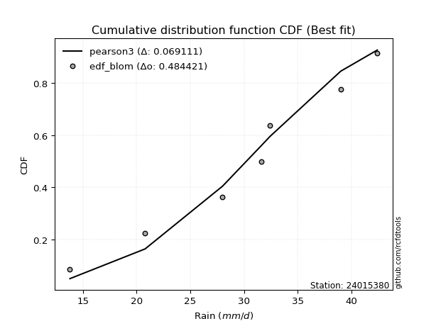</img></img>

</div>


### 7. Empirical - EDF Tukey (1962)

In hydrology, the Tukey formula is used as a plotting position formula to estimate the empirical probability or frequency of a flood event (or other hydrological data). The formula parameter is given as _c=0.333_ (or 1/3).

<div align="center">


$P=(m-c)/(n+1-2c)$


</div>


**7.1. Empirical values**

<div align="center">

|                | 0                   | 1                   | 2                   | 3         | 4                  | 5                  | 6                  |
|:---------------|:--------------------|:--------------------|:--------------------|:----------|:-------------------|:-------------------|:-------------------|
| date           | 2023                | 2020                | 2022                | 2021      | 2025               | 2019               | 2024               |
| x              | 13.8                | 20.8                | 28.0                | 31.6      | 32.4               | 39.0               | 42.4               |
| m              | 1                   | 2                   | 3                   | 4         | 5                  | 6                  | 7                  |
| empirical_dist | edf_tukey           | edf_tukey           | edf_tukey           | edf_tukey | edf_tukey          | edf_tukey          | edf_tukey          |
| empirical      | 0.09090909090909091 | 0.22727272727272727 | 0.36363636363636365 | 0.5       | 0.6363636363636364 | 0.7727272727272727 | 0.9090909090909091 |
| empirical_tr   | 1.1                 | 1.2941176470588236  | 1.5714285714285714  | 2.0       | 2.75               | 4.3999999999999995 | 10.999999999999996 |

</div>


**7.2. Kolmogorov-Smirnov fit test (sorted by Δ)**


<div align="center">

|                | 0                   | 1                   | 2                   | 3                   | 4                   | 5                   | 6                   | 7                   | 8                   | 9                   | 10                  | 11                  | 12                  | 13                  | 14                  | 15                  | 16                  | 17                  | 18                  | 19                  | 20                  | 21                  | 22                  | 23                  | 24                  | 25                  | 26                  | 27                  | 28                    | 29                  | 30                  | 31                  | 32                  | 33                  | 34                  | 35                  | 36                  | 37                  | 38                  | 39                  | 40                  | 41                  | 42                  | 43                  | 44                  | 45                  | 46                  | 47                  | 48                  | 49                  | 50                  | 51                  | 52                  | 53                  | 54                  | 55                  | 56                  | 57                  | 58                  | 59                  | 60                  | 61                  | 62                  | 63                  | 64                  | 65                  | 66                  | 67                  | 68                  | 69                  | 70                  | 71                  | 72                  | 73                  | 74                  | 75                  | 76                  | 77                  | 78                  | 79                  | 80                  | 81                  | 82                  | 83                  | 84                  | 85                  | 86                  | 87                  | 88                  | 89                  |
|:---------------|:--------------------|:--------------------|:--------------------|:--------------------|:--------------------|:--------------------|:--------------------|:--------------------|:--------------------|:--------------------|:--------------------|:--------------------|:--------------------|:--------------------|:--------------------|:--------------------|:--------------------|:--------------------|:--------------------|:--------------------|:--------------------|:--------------------|:--------------------|:--------------------|:--------------------|:--------------------|:--------------------|:--------------------|:----------------------|:--------------------|:--------------------|:--------------------|:--------------------|:--------------------|:--------------------|:--------------------|:--------------------|:--------------------|:--------------------|:--------------------|:--------------------|:--------------------|:--------------------|:--------------------|:--------------------|:--------------------|:--------------------|:--------------------|:--------------------|:--------------------|:--------------------|:--------------------|:--------------------|:--------------------|:--------------------|:--------------------|:--------------------|:--------------------|:--------------------|:--------------------|:--------------------|:--------------------|:--------------------|:--------------------|:--------------------|:--------------------|:--------------------|:--------------------|:--------------------|:--------------------|:--------------------|:--------------------|:--------------------|:--------------------|:--------------------|:--------------------|:--------------------|:--------------------|:--------------------|:--------------------|:--------------------|:--------------------|:--------------------|:--------------------|:--------------------|:--------------------|:--------------------|:--------------------|:--------------------|:--------------------|
| station        | 24015380            | 24015380            | 24015380            | 24015380            | 24015380            | 24015380            | 24015380            | 24015380            | 24015380            | 24015380            | 24015380            | 24015380            | 24015380            | 24015380            | 24015380            | 24015380            | 24015380            | 24015380            | 24015380            | 24015380            | 24015380            | 24015380            | 24015380            | 24015380            | 24015380            | 24015380            | 24015380            | 24015380            | 24015380              | 24015380            | 24015380            | 24015380            | 24015380            | 24015380            | 24015380            | 24015380            | 24015380            | 24015380            | 24015380            | 24015380            | 24015380            | 24015380            | 24015380            | 24015380            | 24015380            | 24015380            | 24015380            | 24015380            | 24015380            | 24015380            | 24015380            | 24015380            | 24015380            | 24015380            | 24015380            | 24015380            | 24015380            | 24015380            | 24015380            | 24015380            | 24015380            | 24015380            | 24015380            | 24015380            | 24015380            | 24015380            | 24015380            | 24015380            | 24015380            | 24015380            | 24015380            | 24015380            | 24015380            | 24015380            | 24015380            | 24015380            | 24015380            | 24015380            | 24015380            | 24015380            | 24015380            | 24015380            | 24015380            | 24015380            | 24015380            | 24015380            | 24015380            | 24015380            | 24015380            | 24015380            |
| empirical_dist | edf_tukey           | edf_tukey           | edf_tukey           | edf_tukey           | edf_tukey           | edf_tukey           | edf_tukey           | edf_tukey           | edf_tukey           | edf_tukey           | edf_tukey           | edf_tukey           | edf_tukey           | edf_tukey           | edf_tukey           | edf_tukey           | edf_tukey           | edf_tukey           | edf_tukey           | edf_tukey           | edf_tukey           | edf_tukey           | edf_tukey           | edf_tukey           | edf_tukey           | edf_tukey           | edf_tukey           | edf_tukey           | edf_tukey             | edf_tukey           | edf_tukey           | edf_tukey           | edf_tukey           | edf_tukey           | edf_tukey           | edf_tukey           | edf_tukey           | edf_tukey           | edf_tukey           | edf_tukey           | edf_tukey           | edf_tukey           | edf_tukey           | edf_tukey           | edf_tukey           | edf_tukey           | edf_tukey           | edf_tukey           | edf_tukey           | edf_tukey           | edf_tukey           | edf_tukey           | edf_tukey           | edf_tukey           | edf_tukey           | edf_tukey           | edf_tukey           | edf_tukey           | edf_tukey           | edf_tukey           | edf_tukey           | edf_tukey           | edf_tukey           | edf_tukey           | edf_tukey           | edf_tukey           | edf_tukey           | edf_tukey           | edf_tukey           | edf_tukey           | edf_tukey           | edf_tukey           | edf_tukey           | edf_tukey           | edf_tukey           | edf_tukey           | edf_tukey           | edf_tukey           | edf_tukey           | edf_tukey           | edf_tukey           | edf_tukey           | edf_tukey           | edf_tukey           | edf_tukey           | edf_tukey           | edf_tukey           | edf_tukey           | edf_tukey           | edf_tukey           |
| p_dist         | pearson3            | logweibull_min      | fisk                | weibull_min         | loggumbel_l         | genlogistic         | johnsonsu           | f                   | exponnorm           | t                   | norm                | crystalball         | truncnorm           | nct                 | logpearson3         | logmielke           | gamma               | chi2                | gompertz            | logfisk             | erlang              | logistic            | rice                | laplace_asymmetric  | loggompertz         | invgamma            | betaprime           | gumbel_l            | loglaplace_asymmetric | hypsecant           | alpha               | logjohnsonsu        | maxwell             | ncf                 | invgauss            | mielke              | logloggamma         | rayleigh            | laplace             | logf                | logfatiguelife      | logexponnorm        | logt                | lognorm             | lognorm             | logcrystalball      | lognct              | logbetaprime        | halfnorm            | logrice             | loggamma            | loggamma            | loglogistic         | logerlang           | kstwobign           | loginvgamma         | gumbel_r            | logalpha            | loghypsecant        | loginvgauss         | logmaxwell          | halflogistic        | moyal               | loginvweibull       | lograyleigh         | loglaplace          | genexpon            | logncf              | loggumbel_r         | logkstwobign        | loghalfnorm         | loggenexpon         | expon               | lognakagami         | logchi2             | logmoyal            | loghalflogistic     | wald                | logexpon            | gibrat              | logtruncnorm        | logwald             | loggibrat           | loglognorm          | pareto              | logpareto           | nakagami            | invweibull          | fatiguelife         | loggenlogistic      |
| delta          | 0.07224537308299994 | 0.0755073847720159  | 0.07603659442467339 | 0.07642431209387335 | 0.07695125115027346 | 0.07956819491204281 | 0.07990063719770879 | 0.08083846507621095 | 0.08112531738963802 | 0.08112671269177818 | 0.08112699982507543 | 0.08112700955237573 | 0.08112708272043978 | 0.0812768251652306  | 0.08271139318897314 | 0.08978917461488123 | 0.0903133909860987  | 0.09079982744122106 | 0.090909090894356   | 0.09146047505726784 | 0.09152253964035095 | 0.09180331728210378 | 0.09249612047882483 | 0.09613385287449594 | 0.09659667172233055 | 0.09710140633514064 | 0.0975379917412984  | 0.09807139679890131 | 0.0985492618477447    | 0.10066741979056026 | 0.10084836394328311 | 0.10457005577057543 | 0.10924155705802763 | 0.11012460095821397 | 0.11119596358286865 | 0.11455538171372648 | 0.1158134782268726  | 0.11807777955806453 | 0.1257181806903218  | 0.13323099932147725 | 0.13487766424920256 | 0.13502989355899608 | 0.13503039086406887 | 0.1350304066954383  | 0.1350304066954383  | 0.13503071469602151 | 0.13588636815711658 | 0.1431013492629173  | 0.14343929814850465 | 0.1435347255064583  | 0.14426332407377385 | 0.14426332407377385 | 0.14644541048392667 | 0.1465644306252547  | 0.14765380040500764 | 0.14845614989206957 | 0.1493561095502437  | 0.14968668533799978 | 0.15925708121386228 | 0.1601067903361416  | 0.16813333468235925 | 0.17118963749293692 | 0.1729886768973663  | 0.17805662221760166 | 0.17917111051558665 | 0.18765779564259666 | 0.20075213614755627 | 0.2011090877557925  | 0.20536573176916684 | 0.20796819454608673 | 0.2102582250289794  | 0.21377992004564972 | 0.22664314158525345 | 0.2272727272703872  | 0.22775208840357095 | 0.231221412737454   | 0.2351146625600563  | 0.23866691259786588 | 0.2678593023478114  | 0.2696756489417721  | 0.30239704292925773 | 0.30313217700934847 | 0.32626975763970145 | 0.4114415078557686  | 0.4115416338232861  | 0.4253211644640338  | 0.4592421257660494  | 0.48576140255908484 | 0.5632571446744811  | 0.7727272727272727  |
| deltao         | 0.48442053926100004 | 0.48442053926100004 | 0.48442053926100004 | 0.48442053926100004 | 0.48442053926100004 | 0.48442053926100004 | 0.48442053926100004 | 0.48442053926100004 | 0.48442053926100004 | 0.48442053926100004 | 0.48442053926100004 | 0.48442053926100004 | 0.48442053926100004 | 0.48442053926100004 | 0.48442053926100004 | 0.48442053926100004 | 0.48442053926100004 | 0.48442053926100004 | 0.48442053926100004 | 0.48442053926100004 | 0.48442053926100004 | 0.48442053926100004 | 0.48442053926100004 | 0.48442053926100004 | 0.48442053926100004 | 0.48442053926100004 | 0.48442053926100004 | 0.48442053926100004 | 0.48442053926100004   | 0.48442053926100004 | 0.48442053926100004 | 0.48442053926100004 | 0.48442053926100004 | 0.48442053926100004 | 0.48442053926100004 | 0.48442053926100004 | 0.48442053926100004 | 0.48442053926100004 | 0.48442053926100004 | 0.48442053926100004 | 0.48442053926100004 | 0.48442053926100004 | 0.48442053926100004 | 0.48442053926100004 | 0.48442053926100004 | 0.48442053926100004 | 0.48442053926100004 | 0.48442053926100004 | 0.48442053926100004 | 0.48442053926100004 | 0.48442053926100004 | 0.48442053926100004 | 0.48442053926100004 | 0.48442053926100004 | 0.48442053926100004 | 0.48442053926100004 | 0.48442053926100004 | 0.48442053926100004 | 0.48442053926100004 | 0.48442053926100004 | 0.48442053926100004 | 0.48442053926100004 | 0.48442053926100004 | 0.48442053926100004 | 0.48442053926100004 | 0.48442053926100004 | 0.48442053926100004 | 0.48442053926100004 | 0.48442053926100004 | 0.48442053926100004 | 0.48442053926100004 | 0.48442053926100004 | 0.48442053926100004 | 0.48442053926100004 | 0.48442053926100004 | 0.48442053926100004 | 0.48442053926100004 | 0.48442053926100004 | 0.48442053926100004 | 0.48442053926100004 | 0.48442053926100004 | 0.48442053926100004 | 0.48442053926100004 | 0.48442053926100004 | 0.48442053926100004 | 0.48442053926100004 | 0.48442053926100004 | 0.48442053926100004 | 0.48442053926100004 | 0.48442053926100004 |
| eval           | Δo > Δ              | Δo > Δ              | Δo > Δ              | Δo > Δ              | Δo > Δ              | Δo > Δ              | Δo > Δ              | Δo > Δ              | Δo > Δ              | Δo > Δ              | Δo > Δ              | Δo > Δ              | Δo > Δ              | Δo > Δ              | Δo > Δ              | Δo > Δ              | Δo > Δ              | Δo > Δ              | Δo > Δ              | Δo > Δ              | Δo > Δ              | Δo > Δ              | Δo > Δ              | Δo > Δ              | Δo > Δ              | Δo > Δ              | Δo > Δ              | Δo > Δ              | Δo > Δ                | Δo > Δ              | Δo > Δ              | Δo > Δ              | Δo > Δ              | Δo > Δ              | Δo > Δ              | Δo > Δ              | Δo > Δ              | Δo > Δ              | Δo > Δ              | Δo > Δ              | Δo > Δ              | Δo > Δ              | Δo > Δ              | Δo > Δ              | Δo > Δ              | Δo > Δ              | Δo > Δ              | Δo > Δ              | Δo > Δ              | Δo > Δ              | Δo > Δ              | Δo > Δ              | Δo > Δ              | Δo > Δ              | Δo > Δ              | Δo > Δ              | Δo > Δ              | Δo > Δ              | Δo > Δ              | Δo > Δ              | Δo > Δ              | Δo > Δ              | Δo > Δ              | Δo > Δ              | Δo > Δ              | Δo > Δ              | Δo > Δ              | Δo > Δ              | Δo > Δ              | Δo > Δ              | Δo > Δ              | Δo > Δ              | Δo > Δ              | Δo > Δ              | Δo > Δ              | Δo > Δ              | Δo > Δ              | Δo > Δ              | Δo > Δ              | Δo > Δ              | Δo > Δ              | Δo > Δ              | Δo > Δ              | Δo > Δ              | Δo > Δ              | Δo > Δ              | Δo > Δ              | Δo <= Δ             | Δo <= Δ             | Δo <= Δ             |
| fit            | 1                   | 1                   | 1                   | 1                   | 1                   | 1                   | 1                   | 1                   | 1                   | 1                   | 1                   | 1                   | 1                   | 1                   | 1                   | 1                   | 1                   | 1                   | 1                   | 1                   | 1                   | 1                   | 1                   | 1                   | 1                   | 1                   | 1                   | 1                   | 1                     | 1                   | 1                   | 1                   | 1                   | 1                   | 1                   | 1                   | 1                   | 1                   | 1                   | 1                   | 1                   | 1                   | 1                   | 1                   | 1                   | 1                   | 1                   | 1                   | 1                   | 1                   | 1                   | 1                   | 1                   | 1                   | 1                   | 1                   | 1                   | 1                   | 1                   | 1                   | 1                   | 1                   | 1                   | 1                   | 1                   | 1                   | 1                   | 1                   | 1                   | 1                   | 1                   | 1                   | 1                   | 1                   | 1                   | 1                   | 1                   | 1                   | 1                   | 1                   | 1                   | 1                   | 1                   | 1                   | 1                   | 1                   | 1                   | 0                   | 0                   | 0                   |
| n              | 7                   | 7                   | 7                   | 7                   | 7                   | 7                   | 7                   | 7                   | 7                   | 7                   | 7                   | 7                   | 7                   | 7                   | 7                   | 7                   | 7                   | 7                   | 7                   | 7                   | 7                   | 7                   | 7                   | 7                   | 7                   | 7                   | 7                   | 7                   | 7                     | 7                   | 7                   | 7                   | 7                   | 7                   | 7                   | 7                   | 7                   | 7                   | 7                   | 7                   | 7                   | 7                   | 7                   | 7                   | 7                   | 7                   | 7                   | 7                   | 7                   | 7                   | 7                   | 7                   | 7                   | 7                   | 7                   | 7                   | 7                   | 7                   | 7                   | 7                   | 7                   | 7                   | 7                   | 7                   | 7                   | 7                   | 7                   | 7                   | 7                   | 7                   | 7                   | 7                   | 7                   | 7                   | 7                   | 7                   | 7                   | 7                   | 7                   | 7                   | 7                   | 7                   | 7                   | 7                   | 7                   | 7                   | 7                   | 7                   | 7                   | 7                   |
| best_fit       | 1                   | 0                   | 0                   | 0                   | 0                   | 0                   | 0                   | 0                   | 0                   | 0                   | 0                   | 0                   | 0                   | 0                   | 0                   | 0                   | 0                   | 0                   | 0                   | 0                   | 0                   | 0                   | 0                   | 0                   | 0                   | 0                   | 0                   | 0                   | 0                     | 0                   | 0                   | 0                   | 0                   | 0                   | 0                   | 0                   | 0                   | 0                   | 0                   | 0                   | 0                   | 0                   | 0                   | 0                   | 0                   | 0                   | 0                   | 0                   | 0                   | 0                   | 0                   | 0                   | 0                   | 0                   | 0                   | 0                   | 0                   | 0                   | 0                   | 0                   | 0                   | 0                   | 0                   | 0                   | 0                   | 0                   | 0                   | 0                   | 0                   | 0                   | 0                   | 0                   | 0                   | 0                   | 0                   | 0                   | 0                   | 0                   | 0                   | 0                   | 0                   | 0                   | 0                   | 0                   | 0                   | 0                   | 0                   | 0                   | 0                   | 0                   |
| best_fit_sort  | 1                   | 2                   | 3                   | 4                   | 5                   | 6                   | 7                   | 8                   | 9                   | 10                  | 11                  | 12                  | 13                  | 14                  | 15                  | 16                  | 17                  | 18                  | 19                  | 20                  | 21                  | 22                  | 23                  | 24                  | 25                  | 26                  | 27                  | 28                  | 29                    | 30                  | 31                  | 32                  | 33                  | 34                  | 35                  | 36                  | 37                  | 38                  | 39                  | 40                  | 41                  | 42                  | 43                  | 44                  | 45                  | 46                  | 47                  | 48                  | 49                  | 50                  | 51                  | 52                  | 53                  | 54                  | 55                  | 56                  | 57                  | 58                  | 59                  | 60                  | 61                  | 62                  | 63                  | 64                  | 65                  | 66                  | 67                  | 68                  | 69                  | 70                  | 71                  | 72                  | 73                  | 74                  | 75                  | 76                  | 77                  | 78                  | 79                  | 80                  | 81                  | 82                  | 83                  | 84                  | 85                  | 86                  | 87                  | 88                  | 89                  | 90                  |

</div>


<div align="center">

</img>

</div>


**7.3. Best fit**

<div align="center">

|   id |   station | empirical_dist   | p_dist   |     delta |   deltao | eval   |   fit |   n |   best_fit |   best_fit_sort |
|-----:|----------:|:-----------------|:---------|----------:|---------:|:-------|------:|----:|-----------:|----------------:|
|    0 |  24015380 | edf_tukey        | pearson3 | 0.0722454 | 0.484421 | Δo > Δ |     1 |   7 |          1 |               1 |

</div>


<div align="center">

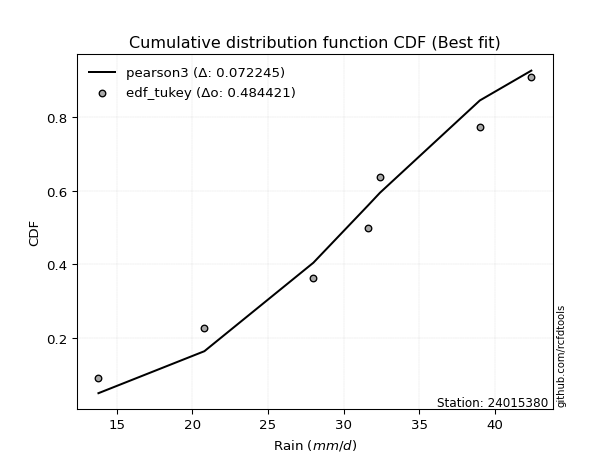</img></img>

</div>


### 8. Empirical - EDF Gringorten (1963)

Gringorten plotting position formula is essential for estimating the probability and return periods of extreme events like floods and heavy rainfall. The constant _a=0.44_.

<div align="center">


$P=(m-a)/(n+1-2a)$


</div>


**8.1. Empirical values**

<div align="center">

|                | 0                   | 1                   | 2                  | 3              | 4                  | 5                  | 6                  |
|:---------------|:--------------------|:--------------------|:-------------------|:---------------|:-------------------|:-------------------|:-------------------|
| date           | 2023                | 2020                | 2022               | 2021           | 2025               | 2019               | 2024               |
| x              | 13.8                | 20.8                | 28.0               | 31.6           | 32.4               | 39.0               | 42.4               |
| m              | 1                   | 2                   | 3                  | 4              | 5                  | 6                  | 7                  |
| empirical_dist | edf_gringorten      | edf_gringorten      | edf_gringorten     | edf_gringorten | edf_gringorten     | edf_gringorten     | edf_gringorten     |
| empirical      | 0.07865168539325844 | 0.21910112359550563 | 0.3595505617977528 | 0.5            | 0.6404494382022471 | 0.7808988764044943 | 0.9213483146067415 |
| empirical_tr   | 1.0853658536585364  | 1.2805755395683454  | 1.5614035087719298 | 2.0            | 2.781249999999999  | 4.564102564102562  | 12.714285714285701 |

</div>


**8.2. Kolmogorov-Smirnov fit test (sorted by Δ)**


<div align="center">

|                | 0                   | 1                   | 2                   | 3                   | 4                   | 5                   | 6                   | 7                   | 8                   | 9                   | 10                  | 11                  | 12                  | 13                  | 14                  | 15                  | 16                  | 17                  | 18                  | 19                  | 20                  | 21                  | 22                  | 23                  | 24                  | 25                    | 26                  | 27                  | 28                  | 29                  | 30                  | 31                  | 32                  | 33                  | 34                  | 35                  | 36                  | 37                  | 38                  | 39                  | 40                  | 41                  | 42                  | 43                  | 44                  | 45                  | 46                  | 47                  | 48                  | 49                  | 50                  | 51                  | 52                  | 53                  | 54                  | 55                  | 56                  | 57                  | 58                  | 59                  | 60                  | 61                  | 62                  | 63                  | 64                  | 65                  | 66                  | 67                  | 68                  | 69                  | 70                  | 71                  | 72                  | 73                  | 74                  | 75                  | 76                  | 77                  | 78                  | 79                  | 80                  | 81                  | 82                  | 83                  | 84                  | 85                  | 86                  | 87                  | 88                  | 89                  |
|:---------------|:--------------------|:--------------------|:--------------------|:--------------------|:--------------------|:--------------------|:--------------------|:--------------------|:--------------------|:--------------------|:--------------------|:--------------------|:--------------------|:--------------------|:--------------------|:--------------------|:--------------------|:--------------------|:--------------------|:--------------------|:--------------------|:--------------------|:--------------------|:--------------------|:--------------------|:----------------------|:--------------------|:--------------------|:--------------------|:--------------------|:--------------------|:--------------------|:--------------------|:--------------------|:--------------------|:--------------------|:--------------------|:--------------------|:--------------------|:--------------------|:--------------------|:--------------------|:--------------------|:--------------------|:--------------------|:--------------------|:--------------------|:--------------------|:--------------------|:--------------------|:--------------------|:--------------------|:--------------------|:--------------------|:--------------------|:--------------------|:--------------------|:--------------------|:--------------------|:--------------------|:--------------------|:--------------------|:--------------------|:--------------------|:--------------------|:--------------------|:--------------------|:--------------------|:--------------------|:--------------------|:--------------------|:--------------------|:--------------------|:--------------------|:--------------------|:--------------------|:--------------------|:--------------------|:--------------------|:--------------------|:--------------------|:--------------------|:--------------------|:--------------------|:--------------------|:--------------------|:--------------------|:--------------------|:--------------------|:--------------------|
| station        | 24015380            | 24015380            | 24015380            | 24015380            | 24015380            | 24015380            | 24015380            | 24015380            | 24015380            | 24015380            | 24015380            | 24015380            | 24015380            | 24015380            | 24015380            | 24015380            | 24015380            | 24015380            | 24015380            | 24015380            | 24015380            | 24015380            | 24015380            | 24015380            | 24015380            | 24015380              | 24015380            | 24015380            | 24015380            | 24015380            | 24015380            | 24015380            | 24015380            | 24015380            | 24015380            | 24015380            | 24015380            | 24015380            | 24015380            | 24015380            | 24015380            | 24015380            | 24015380            | 24015380            | 24015380            | 24015380            | 24015380            | 24015380            | 24015380            | 24015380            | 24015380            | 24015380            | 24015380            | 24015380            | 24015380            | 24015380            | 24015380            | 24015380            | 24015380            | 24015380            | 24015380            | 24015380            | 24015380            | 24015380            | 24015380            | 24015380            | 24015380            | 24015380            | 24015380            | 24015380            | 24015380            | 24015380            | 24015380            | 24015380            | 24015380            | 24015380            | 24015380            | 24015380            | 24015380            | 24015380            | 24015380            | 24015380            | 24015380            | 24015380            | 24015380            | 24015380            | 24015380            | 24015380            | 24015380            | 24015380            |
| empirical_dist | edf_gringorten      | edf_gringorten      | edf_gringorten      | edf_gringorten      | edf_gringorten      | edf_gringorten      | edf_gringorten      | edf_gringorten      | edf_gringorten      | edf_gringorten      | edf_gringorten      | edf_gringorten      | edf_gringorten      | edf_gringorten      | edf_gringorten      | edf_gringorten      | edf_gringorten      | edf_gringorten      | edf_gringorten      | edf_gringorten      | edf_gringorten      | edf_gringorten      | edf_gringorten      | edf_gringorten      | edf_gringorten      | edf_gringorten        | edf_gringorten      | edf_gringorten      | edf_gringorten      | edf_gringorten      | edf_gringorten      | edf_gringorten      | edf_gringorten      | edf_gringorten      | edf_gringorten      | edf_gringorten      | edf_gringorten      | edf_gringorten      | edf_gringorten      | edf_gringorten      | edf_gringorten      | edf_gringorten      | edf_gringorten      | edf_gringorten      | edf_gringorten      | edf_gringorten      | edf_gringorten      | edf_gringorten      | edf_gringorten      | edf_gringorten      | edf_gringorten      | edf_gringorten      | edf_gringorten      | edf_gringorten      | edf_gringorten      | edf_gringorten      | edf_gringorten      | edf_gringorten      | edf_gringorten      | edf_gringorten      | edf_gringorten      | edf_gringorten      | edf_gringorten      | edf_gringorten      | edf_gringorten      | edf_gringorten      | edf_gringorten      | edf_gringorten      | edf_gringorten      | edf_gringorten      | edf_gringorten      | edf_gringorten      | edf_gringorten      | edf_gringorten      | edf_gringorten      | edf_gringorten      | edf_gringorten      | edf_gringorten      | edf_gringorten      | edf_gringorten      | edf_gringorten      | edf_gringorten      | edf_gringorten      | edf_gringorten      | edf_gringorten      | edf_gringorten      | edf_gringorten      | edf_gringorten      | edf_gringorten      | edf_gringorten      |
| p_dist         | pearson3            | fisk                | weibull_min         | logweibull_min      | loggumbel_l         | gompertz            | f                   | exponnorm           | t                   | norm                | crystalball         | truncnorm           | nct                 | logmielke           | genlogistic         | logpearson3         | johnsonsu           | laplace_asymmetric  | gumbel_l            | gamma               | chi2                | logfisk             | erlang              | logistic            | rice                | loglaplace_asymmetric | loggompertz         | invgamma            | betaprime           | hypsecant           | alpha               | logjohnsonsu        | maxwell             | ncf                 | invgauss            | rayleigh            | mielke              | logloggamma         | laplace             | logf                | logfatiguelife      | logexponnorm        | logt                | lognorm             | lognorm             | logcrystalball      | lognct              | loglogistic         | logbetaprime        | halfnorm            | logrice             | loggamma            | loggamma            | gumbel_r            | logerlang           | kstwobign           | loginvgamma         | logalpha            | loghypsecant        | loginvgauss         | halflogistic        | logmaxwell          | moyal               | loginvweibull       | lograyleigh         | loglaplace          | genexpon            | loggumbel_r         | logkstwobign        | logncf              | loghalfnorm         | loggenexpon         | lognakagami         | expon               | logmoyal            | logchi2             | wald                | loghalflogistic     | gibrat              | logexpon            | logtruncnorm        | logwald             | loggibrat           | loglognorm          | pareto              | logpareto           | nakagami            | invweibull          | fatiguelife         | loggenlogistic      |
| delta          | 0.06407376940577836 | 0.06786499074745175 | 0.06825270841665176 | 0.07148400285401169 | 0.07695125115027346 | 0.07865168537852353 | 0.08083846507621095 | 0.08112531738963802 | 0.08112671269177818 | 0.08112699982507543 | 0.08112700955237573 | 0.08112708272043978 | 0.0812768251652306  | 0.08161757093765964 | 0.08365399675065355 | 0.0838925011890097  | 0.08398643903631953 | 0.08796224919727436 | 0.08989979312167973 | 0.0903133909860987  | 0.09079982744122106 | 0.09146047505726784 | 0.09152253964035095 | 0.09180331728210378 | 0.09249612047882483 | 0.09513585711109063   | 0.09659667172233055 | 0.09710140633514064 | 0.09788332052785947 | 0.10066741979056026 | 0.10084836394328311 | 0.10865585760918617 | 0.10924155705802763 | 0.11012460095821397 | 0.11119596358286865 | 0.11807777955806453 | 0.11864118355233721 | 0.11989928006548334 | 0.1257181806903218  | 0.1373168011600881  | 0.1389634660878134  | 0.13911569539760693 | 0.13911619270267972 | 0.13911620853404916 | 0.13911620853404916 | 0.13911651653463236 | 0.13997216999572742 | 0.14644541048392667 | 0.14718715110152814 | 0.1475250999871155  | 0.14762052734506914 | 0.1483491259123847  | 0.1483491259123847  | 0.1493561095502437  | 0.15065023246386555 | 0.1517396022436185  | 0.15254195173068041 | 0.15377248717661063 | 0.15925708121386228 | 0.16419259217475246 | 0.17118963749293692 | 0.1722191365209701  | 0.1729886768973663  | 0.1821424240562125  | 0.1832569123541975  | 0.18765779564259666 | 0.20483793798616712 | 0.20945153360777768 | 0.21205399638469757 | 0.21336649327162494 | 0.21434402686759024 | 0.21786572188426057 | 0.21910112359316555 | 0.2307289434238643  | 0.23530721457606485 | 0.23592369208079259 | 0.23866691259786588 | 0.23920046439866716 | 0.2696756489417721  | 0.27194510418642226 | 0.30239704292925773 | 0.3072179788479593  | 0.3303555594783123  | 0.4196131115329903  | 0.4197132375005078  | 0.4334927681412555  | 0.46332792760466024 | 0.4980188080749173  | 0.5714287483517028  | 0.7808988764044943  |
| deltao         | 0.48442053926100004 | 0.48442053926100004 | 0.48442053926100004 | 0.48442053926100004 | 0.48442053926100004 | 0.48442053926100004 | 0.48442053926100004 | 0.48442053926100004 | 0.48442053926100004 | 0.48442053926100004 | 0.48442053926100004 | 0.48442053926100004 | 0.48442053926100004 | 0.48442053926100004 | 0.48442053926100004 | 0.48442053926100004 | 0.48442053926100004 | 0.48442053926100004 | 0.48442053926100004 | 0.48442053926100004 | 0.48442053926100004 | 0.48442053926100004 | 0.48442053926100004 | 0.48442053926100004 | 0.48442053926100004 | 0.48442053926100004   | 0.48442053926100004 | 0.48442053926100004 | 0.48442053926100004 | 0.48442053926100004 | 0.48442053926100004 | 0.48442053926100004 | 0.48442053926100004 | 0.48442053926100004 | 0.48442053926100004 | 0.48442053926100004 | 0.48442053926100004 | 0.48442053926100004 | 0.48442053926100004 | 0.48442053926100004 | 0.48442053926100004 | 0.48442053926100004 | 0.48442053926100004 | 0.48442053926100004 | 0.48442053926100004 | 0.48442053926100004 | 0.48442053926100004 | 0.48442053926100004 | 0.48442053926100004 | 0.48442053926100004 | 0.48442053926100004 | 0.48442053926100004 | 0.48442053926100004 | 0.48442053926100004 | 0.48442053926100004 | 0.48442053926100004 | 0.48442053926100004 | 0.48442053926100004 | 0.48442053926100004 | 0.48442053926100004 | 0.48442053926100004 | 0.48442053926100004 | 0.48442053926100004 | 0.48442053926100004 | 0.48442053926100004 | 0.48442053926100004 | 0.48442053926100004 | 0.48442053926100004 | 0.48442053926100004 | 0.48442053926100004 | 0.48442053926100004 | 0.48442053926100004 | 0.48442053926100004 | 0.48442053926100004 | 0.48442053926100004 | 0.48442053926100004 | 0.48442053926100004 | 0.48442053926100004 | 0.48442053926100004 | 0.48442053926100004 | 0.48442053926100004 | 0.48442053926100004 | 0.48442053926100004 | 0.48442053926100004 | 0.48442053926100004 | 0.48442053926100004 | 0.48442053926100004 | 0.48442053926100004 | 0.48442053926100004 | 0.48442053926100004 |
| eval           | Δo > Δ              | Δo > Δ              | Δo > Δ              | Δo > Δ              | Δo > Δ              | Δo > Δ              | Δo > Δ              | Δo > Δ              | Δo > Δ              | Δo > Δ              | Δo > Δ              | Δo > Δ              | Δo > Δ              | Δo > Δ              | Δo > Δ              | Δo > Δ              | Δo > Δ              | Δo > Δ              | Δo > Δ              | Δo > Δ              | Δo > Δ              | Δo > Δ              | Δo > Δ              | Δo > Δ              | Δo > Δ              | Δo > Δ                | Δo > Δ              | Δo > Δ              | Δo > Δ              | Δo > Δ              | Δo > Δ              | Δo > Δ              | Δo > Δ              | Δo > Δ              | Δo > Δ              | Δo > Δ              | Δo > Δ              | Δo > Δ              | Δo > Δ              | Δo > Δ              | Δo > Δ              | Δo > Δ              | Δo > Δ              | Δo > Δ              | Δo > Δ              | Δo > Δ              | Δo > Δ              | Δo > Δ              | Δo > Δ              | Δo > Δ              | Δo > Δ              | Δo > Δ              | Δo > Δ              | Δo > Δ              | Δo > Δ              | Δo > Δ              | Δo > Δ              | Δo > Δ              | Δo > Δ              | Δo > Δ              | Δo > Δ              | Δo > Δ              | Δo > Δ              | Δo > Δ              | Δo > Δ              | Δo > Δ              | Δo > Δ              | Δo > Δ              | Δo > Δ              | Δo > Δ              | Δo > Δ              | Δo > Δ              | Δo > Δ              | Δo > Δ              | Δo > Δ              | Δo > Δ              | Δo > Δ              | Δo > Δ              | Δo > Δ              | Δo > Δ              | Δo > Δ              | Δo > Δ              | Δo > Δ              | Δo > Δ              | Δo > Δ              | Δo > Δ              | Δo > Δ              | Δo <= Δ             | Δo <= Δ             | Δo <= Δ             |
| fit            | 1                   | 1                   | 1                   | 1                   | 1                   | 1                   | 1                   | 1                   | 1                   | 1                   | 1                   | 1                   | 1                   | 1                   | 1                   | 1                   | 1                   | 1                   | 1                   | 1                   | 1                   | 1                   | 1                   | 1                   | 1                   | 1                     | 1                   | 1                   | 1                   | 1                   | 1                   | 1                   | 1                   | 1                   | 1                   | 1                   | 1                   | 1                   | 1                   | 1                   | 1                   | 1                   | 1                   | 1                   | 1                   | 1                   | 1                   | 1                   | 1                   | 1                   | 1                   | 1                   | 1                   | 1                   | 1                   | 1                   | 1                   | 1                   | 1                   | 1                   | 1                   | 1                   | 1                   | 1                   | 1                   | 1                   | 1                   | 1                   | 1                   | 1                   | 1                   | 1                   | 1                   | 1                   | 1                   | 1                   | 1                   | 1                   | 1                   | 1                   | 1                   | 1                   | 1                   | 1                   | 1                   | 1                   | 1                   | 0                   | 0                   | 0                   |
| n              | 7                   | 7                   | 7                   | 7                   | 7                   | 7                   | 7                   | 7                   | 7                   | 7                   | 7                   | 7                   | 7                   | 7                   | 7                   | 7                   | 7                   | 7                   | 7                   | 7                   | 7                   | 7                   | 7                   | 7                   | 7                   | 7                     | 7                   | 7                   | 7                   | 7                   | 7                   | 7                   | 7                   | 7                   | 7                   | 7                   | 7                   | 7                   | 7                   | 7                   | 7                   | 7                   | 7                   | 7                   | 7                   | 7                   | 7                   | 7                   | 7                   | 7                   | 7                   | 7                   | 7                   | 7                   | 7                   | 7                   | 7                   | 7                   | 7                   | 7                   | 7                   | 7                   | 7                   | 7                   | 7                   | 7                   | 7                   | 7                   | 7                   | 7                   | 7                   | 7                   | 7                   | 7                   | 7                   | 7                   | 7                   | 7                   | 7                   | 7                   | 7                   | 7                   | 7                   | 7                   | 7                   | 7                   | 7                   | 7                   | 7                   | 7                   |
| best_fit       | 1                   | 0                   | 0                   | 0                   | 0                   | 0                   | 0                   | 0                   | 0                   | 0                   | 0                   | 0                   | 0                   | 0                   | 0                   | 0                   | 0                   | 0                   | 0                   | 0                   | 0                   | 0                   | 0                   | 0                   | 0                   | 0                     | 0                   | 0                   | 0                   | 0                   | 0                   | 0                   | 0                   | 0                   | 0                   | 0                   | 0                   | 0                   | 0                   | 0                   | 0                   | 0                   | 0                   | 0                   | 0                   | 0                   | 0                   | 0                   | 0                   | 0                   | 0                   | 0                   | 0                   | 0                   | 0                   | 0                   | 0                   | 0                   | 0                   | 0                   | 0                   | 0                   | 0                   | 0                   | 0                   | 0                   | 0                   | 0                   | 0                   | 0                   | 0                   | 0                   | 0                   | 0                   | 0                   | 0                   | 0                   | 0                   | 0                   | 0                   | 0                   | 0                   | 0                   | 0                   | 0                   | 0                   | 0                   | 0                   | 0                   | 0                   |
| best_fit_sort  | 1                   | 2                   | 3                   | 4                   | 5                   | 6                   | 7                   | 8                   | 9                   | 10                  | 11                  | 12                  | 13                  | 14                  | 15                  | 16                  | 17                  | 18                  | 19                  | 20                  | 21                  | 22                  | 23                  | 24                  | 25                  | 26                    | 27                  | 28                  | 29                  | 30                  | 31                  | 32                  | 33                  | 34                  | 35                  | 36                  | 37                  | 38                  | 39                  | 40                  | 41                  | 42                  | 43                  | 44                  | 45                  | 46                  | 47                  | 48                  | 49                  | 50                  | 51                  | 52                  | 53                  | 54                  | 55                  | 56                  | 57                  | 58                  | 59                  | 60                  | 61                  | 62                  | 63                  | 64                  | 65                  | 66                  | 67                  | 68                  | 69                  | 70                  | 71                  | 72                  | 73                  | 74                  | 75                  | 76                  | 77                  | 78                  | 79                  | 80                  | 81                  | 82                  | 83                  | 84                  | 85                  | 86                  | 87                  | 88                  | 89                  | 90                  |

</div>


<div align="center">

</img>

</div>


**8.3. Best fit**

<div align="center">

|   id |   station | empirical_dist   | p_dist   |     delta |   deltao | eval   |   fit |   n |   best_fit |   best_fit_sort |
|-----:|----------:|:-----------------|:---------|----------:|---------:|:-------|------:|----:|-----------:|----------------:|
|    0 |  24015380 | edf_gringorten   | pearson3 | 0.0640738 | 0.484421 | Δo > Δ |     1 |   7 |          1 |               1 |

</div>


<div align="center">

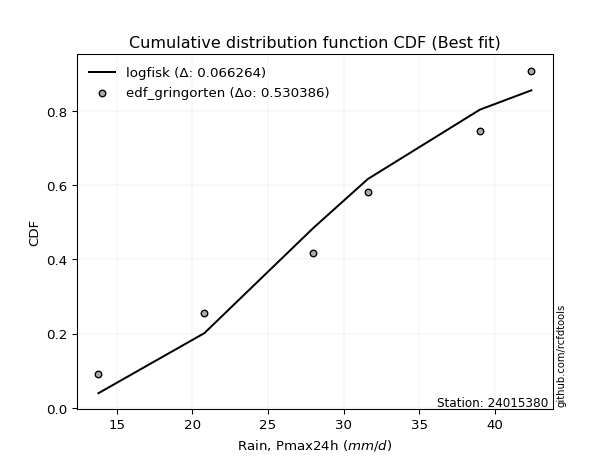</img>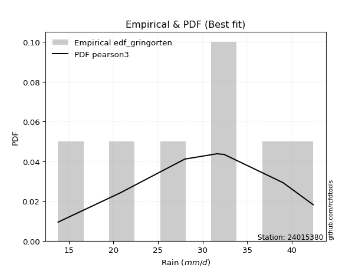</img>

</div>


### 9. Empirical - EDF Filliben (1975)

The specific values of the constants (0.3175) (often denoted as $alpha$) and (0.365) are derived from a method proposed by James J. Filliben in a 1975 paper. This particular formula is the mean value of the $i$-th order statistic of the normal distribution and is considered a robust and effective plotting position formula for the normal probability plot correlation coefficient test for normality.

<div align="center">


$P=(m-0.3175)/(n+0.365)$


</div>


**9.1. Empirical values**

<div align="center">

|                | 0                   | 1                   | 2                   | 3            | 4                  | 5                  | 6                  |
|:---------------|:--------------------|:--------------------|:--------------------|:-------------|:-------------------|:-------------------|:-------------------|
| date           | 2023                | 2020                | 2022                | 2021         | 2025               | 2019               | 2024               |
| x              | 13.8                | 20.8                | 28.0                | 31.6         | 32.4               | 39.0               | 42.4               |
| m              | 1                   | 2                   | 3                   | 4            | 5                  | 6                  | 7                  |
| empirical_dist | edf_filliben        | edf_filliben        | edf_filliben        | edf_filliben | edf_filliben       | edf_filliben       | edf_filliben       |
| empirical      | 0.09266802443991853 | 0.22844534962661237 | 0.36422267481330617 | 0.5          | 0.6357773251866938 | 0.7715546503733877 | 0.9073319755600815 |
| empirical_tr   | 1.1021324354657687  | 1.2960844698636163  | 1.5728777362520021  | 2.0          | 2.7455731593662627 | 4.377414561664191  | 10.791208791208794 |

</div>


**9.2. Kolmogorov-Smirnov fit test (sorted by Δ)**


<div align="center">

|                | 0                   | 1                   | 2                   | 3                   | 4                   | 5                   | 6                   | 7                   | 8                   | 9                   | 10                  | 11                  | 12                  | 13                  | 14                  | 15                  | 16                  | 17                  | 18                  | 19                  | 20                  | 21                  | 22                  | 23                  | 24                  | 25                  | 26                  | 27                  | 28                    | 29                  | 30                  | 31                  | 32                  | 33                  | 34                  | 35                  | 36                  | 37                  | 38                  | 39                  | 40                  | 41                  | 42                  | 43                  | 44                  | 45                  | 46                  | 47                  | 48                  | 49                  | 50                  | 51                  | 52                  | 53                  | 54                  | 55                  | 56                  | 57                  | 58                  | 59                  | 60                  | 61                  | 62                  | 63                  | 64                  | 65                  | 66                  | 67                  | 68                  | 69                  | 70                  | 71                  | 72                  | 73                  | 74                  | 75                  | 76                  | 77                  | 78                  | 79                  | 80                  | 81                  | 82                  | 83                  | 84                  | 85                  | 86                  | 87                  | 88                  | 89                  |
|:---------------|:--------------------|:--------------------|:--------------------|:--------------------|:--------------------|:--------------------|:--------------------|:--------------------|:--------------------|:--------------------|:--------------------|:--------------------|:--------------------|:--------------------|:--------------------|:--------------------|:--------------------|:--------------------|:--------------------|:--------------------|:--------------------|:--------------------|:--------------------|:--------------------|:--------------------|:--------------------|:--------------------|:--------------------|:----------------------|:--------------------|:--------------------|:--------------------|:--------------------|:--------------------|:--------------------|:--------------------|:--------------------|:--------------------|:--------------------|:--------------------|:--------------------|:--------------------|:--------------------|:--------------------|:--------------------|:--------------------|:--------------------|:--------------------|:--------------------|:--------------------|:--------------------|:--------------------|:--------------------|:--------------------|:--------------------|:--------------------|:--------------------|:--------------------|:--------------------|:--------------------|:--------------------|:--------------------|:--------------------|:--------------------|:--------------------|:--------------------|:--------------------|:--------------------|:--------------------|:--------------------|:--------------------|:--------------------|:--------------------|:--------------------|:--------------------|:--------------------|:--------------------|:--------------------|:--------------------|:--------------------|:--------------------|:--------------------|:--------------------|:--------------------|:--------------------|:--------------------|:--------------------|:--------------------|:--------------------|:--------------------|
| station        | 24015380            | 24015380            | 24015380            | 24015380            | 24015380            | 24015380            | 24015380            | 24015380            | 24015380            | 24015380            | 24015380            | 24015380            | 24015380            | 24015380            | 24015380            | 24015380            | 24015380            | 24015380            | 24015380            | 24015380            | 24015380            | 24015380            | 24015380            | 24015380            | 24015380            | 24015380            | 24015380            | 24015380            | 24015380              | 24015380            | 24015380            | 24015380            | 24015380            | 24015380            | 24015380            | 24015380            | 24015380            | 24015380            | 24015380            | 24015380            | 24015380            | 24015380            | 24015380            | 24015380            | 24015380            | 24015380            | 24015380            | 24015380            | 24015380            | 24015380            | 24015380            | 24015380            | 24015380            | 24015380            | 24015380            | 24015380            | 24015380            | 24015380            | 24015380            | 24015380            | 24015380            | 24015380            | 24015380            | 24015380            | 24015380            | 24015380            | 24015380            | 24015380            | 24015380            | 24015380            | 24015380            | 24015380            | 24015380            | 24015380            | 24015380            | 24015380            | 24015380            | 24015380            | 24015380            | 24015380            | 24015380            | 24015380            | 24015380            | 24015380            | 24015380            | 24015380            | 24015380            | 24015380            | 24015380            | 24015380            |
| empirical_dist | edf_filliben        | edf_filliben        | edf_filliben        | edf_filliben        | edf_filliben        | edf_filliben        | edf_filliben        | edf_filliben        | edf_filliben        | edf_filliben        | edf_filliben        | edf_filliben        | edf_filliben        | edf_filliben        | edf_filliben        | edf_filliben        | edf_filliben        | edf_filliben        | edf_filliben        | edf_filliben        | edf_filliben        | edf_filliben        | edf_filliben        | edf_filliben        | edf_filliben        | edf_filliben        | edf_filliben        | edf_filliben        | edf_filliben          | edf_filliben        | edf_filliben        | edf_filliben        | edf_filliben        | edf_filliben        | edf_filliben        | edf_filliben        | edf_filliben        | edf_filliben        | edf_filliben        | edf_filliben        | edf_filliben        | edf_filliben        | edf_filliben        | edf_filliben        | edf_filliben        | edf_filliben        | edf_filliben        | edf_filliben        | edf_filliben        | edf_filliben        | edf_filliben        | edf_filliben        | edf_filliben        | edf_filliben        | edf_filliben        | edf_filliben        | edf_filliben        | edf_filliben        | edf_filliben        | edf_filliben        | edf_filliben        | edf_filliben        | edf_filliben        | edf_filliben        | edf_filliben        | edf_filliben        | edf_filliben        | edf_filliben        | edf_filliben        | edf_filliben        | edf_filliben        | edf_filliben        | edf_filliben        | edf_filliben        | edf_filliben        | edf_filliben        | edf_filliben        | edf_filliben        | edf_filliben        | edf_filliben        | edf_filliben        | edf_filliben        | edf_filliben        | edf_filliben        | edf_filliben        | edf_filliben        | edf_filliben        | edf_filliben        | edf_filliben        | edf_filliben        |
| p_dist         | pearson3            | logweibull_min      | loggumbel_l         | fisk                | weibull_min         | genlogistic         | johnsonsu           | f                   | exponnorm           | t                   | norm                | crystalball         | truncnorm           | nct                 | logpearson3         | gamma               | chi2                | logmielke           | logfisk             | erlang              | logistic            | rice                | gompertz            | loggompertz         | invgamma            | laplace_asymmetric  | betaprime           | gumbel_l            | loglaplace_asymmetric | hypsecant           | alpha               | logjohnsonsu        | maxwell             | ncf                 | invgauss            | mielke              | logloggamma         | rayleigh            | laplace             | logf                | logfatiguelife      | logexponnorm        | logt                | lognorm             | lognorm             | logcrystalball      | lognct              | logbetaprime        | logrice             | halfnorm            | loggamma            | loggamma            | logerlang           | loglogistic         | kstwobign           | loginvgamma         | logalpha            | gumbel_r            | loghypsecant        | loginvgauss         | logmaxwell          | halflogistic        | moyal               | loginvweibull       | lograyleigh         | loglaplace          | logncf              | genexpon            | loggumbel_r         | logkstwobign        | loghalfnorm         | loggenexpon         | expon               | logchi2             | lognakagami         | logmoyal            | loghalflogistic     | wald                | logexpon            | gibrat              | logtruncnorm        | logwald             | loggibrat           | loglognorm          | pareto              | logpareto           | nakagami            | invweibull          | fatiguelife         | loggenlogistic      |
| delta          | 0.07341799543688499 | 0.07668000712590095 | 0.07695125115027346 | 0.07720921677855849 | 0.07759693444775839 | 0.07898188373510029 | 0.07931432602076627 | 0.08083846507621095 | 0.08112531738963802 | 0.08112671269177818 | 0.08112699982507543 | 0.08112700955237573 | 0.08112708272043978 | 0.0812768251652306  | 0.08271139318897314 | 0.0903133909860987  | 0.09079982744122106 | 0.09110955598418136 | 0.09146047505726784 | 0.09152253964035095 | 0.09180331728210378 | 0.09249612047882483 | 0.09266802442518363 | 0.09659667172233055 | 0.09710140633514064 | 0.09730647522838098 | 0.0975379917412984  | 0.09924401915278636 | 0.09972188420162975   | 0.10066741979056026 | 0.10084836394328311 | 0.10398374459363291 | 0.10924155705802763 | 0.11012460095821397 | 0.11119596358286865 | 0.11396907053678396 | 0.11522716704993008 | 0.11807777955806453 | 0.1257181806903218  | 0.13264468814453473 | 0.13429135307226003 | 0.13444358238205356 | 0.13444407968712635 | 0.1344440955184958  | 0.1344440955184958  | 0.134444403519079   | 0.13530005698017405 | 0.14251503808597477 | 0.14294841432951577 | 0.14311996035423546 | 0.14367701289683132 | 0.14367701289683132 | 0.14597811944831218 | 0.14644541048392667 | 0.14706748922806512 | 0.14786983871512704 | 0.14910037416105726 | 0.1493561095502437  | 0.15925708121386228 | 0.1595204791591991  | 0.16754702350541673 | 0.17118963749293692 | 0.1729886768973663  | 0.17747031104065913 | 0.17858479933864413 | 0.18765779564259666 | 0.19935015422496494 | 0.20016582497061375 | 0.20477942059222431 | 0.2073818833691442  | 0.20967191385203687 | 0.2131936088687072  | 0.22605683040831093 | 0.22657946604968585 | 0.2284453496242723  | 0.23063510156051148 | 0.2345283513831138  | 0.23866691259786588 | 0.2672729911708689  | 0.2696756489417721  | 0.30239704292925773 | 0.30254586583240595 | 0.32568344646275893 | 0.41026888550188356 | 0.4103690114694011  | 0.42414854211014874 | 0.45865581458910687 | 0.4840024690282573  | 0.562084522320596   | 0.7715546503733877  |
| deltao         | 0.48442053926100004 | 0.48442053926100004 | 0.48442053926100004 | 0.48442053926100004 | 0.48442053926100004 | 0.48442053926100004 | 0.48442053926100004 | 0.48442053926100004 | 0.48442053926100004 | 0.48442053926100004 | 0.48442053926100004 | 0.48442053926100004 | 0.48442053926100004 | 0.48442053926100004 | 0.48442053926100004 | 0.48442053926100004 | 0.48442053926100004 | 0.48442053926100004 | 0.48442053926100004 | 0.48442053926100004 | 0.48442053926100004 | 0.48442053926100004 | 0.48442053926100004 | 0.48442053926100004 | 0.48442053926100004 | 0.48442053926100004 | 0.48442053926100004 | 0.48442053926100004 | 0.48442053926100004   | 0.48442053926100004 | 0.48442053926100004 | 0.48442053926100004 | 0.48442053926100004 | 0.48442053926100004 | 0.48442053926100004 | 0.48442053926100004 | 0.48442053926100004 | 0.48442053926100004 | 0.48442053926100004 | 0.48442053926100004 | 0.48442053926100004 | 0.48442053926100004 | 0.48442053926100004 | 0.48442053926100004 | 0.48442053926100004 | 0.48442053926100004 | 0.48442053926100004 | 0.48442053926100004 | 0.48442053926100004 | 0.48442053926100004 | 0.48442053926100004 | 0.48442053926100004 | 0.48442053926100004 | 0.48442053926100004 | 0.48442053926100004 | 0.48442053926100004 | 0.48442053926100004 | 0.48442053926100004 | 0.48442053926100004 | 0.48442053926100004 | 0.48442053926100004 | 0.48442053926100004 | 0.48442053926100004 | 0.48442053926100004 | 0.48442053926100004 | 0.48442053926100004 | 0.48442053926100004 | 0.48442053926100004 | 0.48442053926100004 | 0.48442053926100004 | 0.48442053926100004 | 0.48442053926100004 | 0.48442053926100004 | 0.48442053926100004 | 0.48442053926100004 | 0.48442053926100004 | 0.48442053926100004 | 0.48442053926100004 | 0.48442053926100004 | 0.48442053926100004 | 0.48442053926100004 | 0.48442053926100004 | 0.48442053926100004 | 0.48442053926100004 | 0.48442053926100004 | 0.48442053926100004 | 0.48442053926100004 | 0.48442053926100004 | 0.48442053926100004 | 0.48442053926100004 |
| eval           | Δo > Δ              | Δo > Δ              | Δo > Δ              | Δo > Δ              | Δo > Δ              | Δo > Δ              | Δo > Δ              | Δo > Δ              | Δo > Δ              | Δo > Δ              | Δo > Δ              | Δo > Δ              | Δo > Δ              | Δo > Δ              | Δo > Δ              | Δo > Δ              | Δo > Δ              | Δo > Δ              | Δo > Δ              | Δo > Δ              | Δo > Δ              | Δo > Δ              | Δo > Δ              | Δo > Δ              | Δo > Δ              | Δo > Δ              | Δo > Δ              | Δo > Δ              | Δo > Δ                | Δo > Δ              | Δo > Δ              | Δo > Δ              | Δo > Δ              | Δo > Δ              | Δo > Δ              | Δo > Δ              | Δo > Δ              | Δo > Δ              | Δo > Δ              | Δo > Δ              | Δo > Δ              | Δo > Δ              | Δo > Δ              | Δo > Δ              | Δo > Δ              | Δo > Δ              | Δo > Δ              | Δo > Δ              | Δo > Δ              | Δo > Δ              | Δo > Δ              | Δo > Δ              | Δo > Δ              | Δo > Δ              | Δo > Δ              | Δo > Δ              | Δo > Δ              | Δo > Δ              | Δo > Δ              | Δo > Δ              | Δo > Δ              | Δo > Δ              | Δo > Δ              | Δo > Δ              | Δo > Δ              | Δo > Δ              | Δo > Δ              | Δo > Δ              | Δo > Δ              | Δo > Δ              | Δo > Δ              | Δo > Δ              | Δo > Δ              | Δo > Δ              | Δo > Δ              | Δo > Δ              | Δo > Δ              | Δo > Δ              | Δo > Δ              | Δo > Δ              | Δo > Δ              | Δo > Δ              | Δo > Δ              | Δo > Δ              | Δo > Δ              | Δo > Δ              | Δo > Δ              | Δo > Δ              | Δo <= Δ             | Δo <= Δ             |
| fit            | 1                   | 1                   | 1                   | 1                   | 1                   | 1                   | 1                   | 1                   | 1                   | 1                   | 1                   | 1                   | 1                   | 1                   | 1                   | 1                   | 1                   | 1                   | 1                   | 1                   | 1                   | 1                   | 1                   | 1                   | 1                   | 1                   | 1                   | 1                   | 1                     | 1                   | 1                   | 1                   | 1                   | 1                   | 1                   | 1                   | 1                   | 1                   | 1                   | 1                   | 1                   | 1                   | 1                   | 1                   | 1                   | 1                   | 1                   | 1                   | 1                   | 1                   | 1                   | 1                   | 1                   | 1                   | 1                   | 1                   | 1                   | 1                   | 1                   | 1                   | 1                   | 1                   | 1                   | 1                   | 1                   | 1                   | 1                   | 1                   | 1                   | 1                   | 1                   | 1                   | 1                   | 1                   | 1                   | 1                   | 1                   | 1                   | 1                   | 1                   | 1                   | 1                   | 1                   | 1                   | 1                   | 1                   | 1                   | 1                   | 0                   | 0                   |
| n              | 7                   | 7                   | 7                   | 7                   | 7                   | 7                   | 7                   | 7                   | 7                   | 7                   | 7                   | 7                   | 7                   | 7                   | 7                   | 7                   | 7                   | 7                   | 7                   | 7                   | 7                   | 7                   | 7                   | 7                   | 7                   | 7                   | 7                   | 7                   | 7                     | 7                   | 7                   | 7                   | 7                   | 7                   | 7                   | 7                   | 7                   | 7                   | 7                   | 7                   | 7                   | 7                   | 7                   | 7                   | 7                   | 7                   | 7                   | 7                   | 7                   | 7                   | 7                   | 7                   | 7                   | 7                   | 7                   | 7                   | 7                   | 7                   | 7                   | 7                   | 7                   | 7                   | 7                   | 7                   | 7                   | 7                   | 7                   | 7                   | 7                   | 7                   | 7                   | 7                   | 7                   | 7                   | 7                   | 7                   | 7                   | 7                   | 7                   | 7                   | 7                   | 7                   | 7                   | 7                   | 7                   | 7                   | 7                   | 7                   | 7                   | 7                   |
| best_fit       | 1                   | 0                   | 0                   | 0                   | 0                   | 0                   | 0                   | 0                   | 0                   | 0                   | 0                   | 0                   | 0                   | 0                   | 0                   | 0                   | 0                   | 0                   | 0                   | 0                   | 0                   | 0                   | 0                   | 0                   | 0                   | 0                   | 0                   | 0                   | 0                     | 0                   | 0                   | 0                   | 0                   | 0                   | 0                   | 0                   | 0                   | 0                   | 0                   | 0                   | 0                   | 0                   | 0                   | 0                   | 0                   | 0                   | 0                   | 0                   | 0                   | 0                   | 0                   | 0                   | 0                   | 0                   | 0                   | 0                   | 0                   | 0                   | 0                   | 0                   | 0                   | 0                   | 0                   | 0                   | 0                   | 0                   | 0                   | 0                   | 0                   | 0                   | 0                   | 0                   | 0                   | 0                   | 0                   | 0                   | 0                   | 0                   | 0                   | 0                   | 0                   | 0                   | 0                   | 0                   | 0                   | 0                   | 0                   | 0                   | 0                   | 0                   |
| best_fit_sort  | 1                   | 2                   | 3                   | 4                   | 5                   | 6                   | 7                   | 8                   | 9                   | 10                  | 11                  | 12                  | 13                  | 14                  | 15                  | 16                  | 17                  | 18                  | 19                  | 20                  | 21                  | 22                  | 23                  | 24                  | 25                  | 26                  | 27                  | 28                  | 29                    | 30                  | 31                  | 32                  | 33                  | 34                  | 35                  | 36                  | 37                  | 38                  | 39                  | 40                  | 41                  | 42                  | 43                  | 44                  | 45                  | 46                  | 47                  | 48                  | 49                  | 50                  | 51                  | 52                  | 53                  | 54                  | 55                  | 56                  | 57                  | 58                  | 59                  | 60                  | 61                  | 62                  | 63                  | 64                  | 65                  | 66                  | 67                  | 68                  | 69                  | 70                  | 71                  | 72                  | 73                  | 74                  | 75                  | 76                  | 77                  | 78                  | 79                  | 80                  | 81                  | 82                  | 83                  | 84                  | 85                  | 86                  | 87                  | 88                  | 89                  | 90                  |

</div>


<div align="center">

</img>

</div>


**9.3. Best fit**

<div align="center">

|   id |   station | empirical_dist   | p_dist   |    delta |   deltao | eval   |   fit |   n |   best_fit |   best_fit_sort |
|-----:|----------:|:-----------------|:---------|---------:|---------:|:-------|------:|----:|-----------:|----------------:|
|    0 |  24015380 | edf_filliben     | pearson3 | 0.073418 | 0.484421 | Δo > Δ |     1 |   7 |          1 |               1 |

</div>


<div align="center">

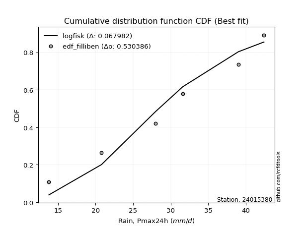</img></img>

</div>


### 10. Empirical - EDF Jenkinson (1977)

The Jenkinson formula in hydrology is an empirical plotting position formula used to estimate the non-exceedance probability _(P)_ or return period _(T)_ of a given ordered observation within a sample. It is a widely used method in the frequency analysis of extreme events such as floods and rainfall, as it provides a distribution-free way to plot data. _a≈0.31_ and _b≈0.38_ are constants derived to approximate the median of the probability distribution for the given rank.

<div align="center">


$P=(m-a)/(n+b)$


</div>


**10.1. Empirical values**

<div align="center">

|                | 0                   | 1                   | 2                   | 3             | 4                  | 5                  | 6                  |
|:---------------|:--------------------|:--------------------|:--------------------|:--------------|:-------------------|:-------------------|:-------------------|
| date           | 2023                | 2020                | 2022                | 2021          | 2025               | 2019               | 2024               |
| x              | 13.8                | 20.8                | 28.0                | 31.6          | 32.4               | 39.0               | 42.4               |
| m              | 1                   | 2                   | 3                   | 4             | 5                  | 6                  | 7                  |
| empirical_dist | edf_jenkinson       | edf_jenkinson       | edf_jenkinson       | edf_jenkinson | edf_jenkinson      | edf_jenkinson      | edf_jenkinson      |
| empirical      | 0.09349593495934959 | 0.22899728997289973 | 0.36449864498644985 | 0.5           | 0.6355013550135502 | 0.7710027100271003 | 0.9065040650406505 |
| empirical_tr   | 1.1031390134529149  | 1.29701230228471    | 1.5735607675906182  | 2.0           | 2.743494423791822  | 4.366863905325444  | 10.695652173913055 |

</div>


**10.2. Kolmogorov-Smirnov fit test (sorted by Δ)**


<div align="center">

|                | 0                   | 1                   | 2                   | 3                   | 4                   | 5                   | 6                   | 7                   | 8                   | 9                   | 10                  | 11                  | 12                  | 13                  | 14                  | 15                  | 16                  | 17                  | 18                  | 19                  | 20                  | 21                  | 22                  | 23                  | 24                  | 25                  | 26                  | 27                  | 28                    | 29                  | 30                  | 31                  | 32                  | 33                  | 34                  | 35                  | 36                  | 37                  | 38                  | 39                  | 40                  | 41                  | 42                  | 43                  | 44                  | 45                  | 46                  | 47                  | 48                  | 49                  | 50                  | 51                  | 52                  | 53                  | 54                  | 55                  | 56                  | 57                  | 58                  | 59                  | 60                  | 61                  | 62                  | 63                  | 64                  | 65                  | 66                  | 67                  | 68                  | 69                  | 70                  | 71                  | 72                  | 73                  | 74                  | 75                  | 76                  | 77                  | 78                  | 79                  | 80                  | 81                  | 82                  | 83                  | 84                  | 85                  | 86                  | 87                  | 88                  | 89                  |
|:---------------|:--------------------|:--------------------|:--------------------|:--------------------|:--------------------|:--------------------|:--------------------|:--------------------|:--------------------|:--------------------|:--------------------|:--------------------|:--------------------|:--------------------|:--------------------|:--------------------|:--------------------|:--------------------|:--------------------|:--------------------|:--------------------|:--------------------|:--------------------|:--------------------|:--------------------|:--------------------|:--------------------|:--------------------|:----------------------|:--------------------|:--------------------|:--------------------|:--------------------|:--------------------|:--------------------|:--------------------|:--------------------|:--------------------|:--------------------|:--------------------|:--------------------|:--------------------|:--------------------|:--------------------|:--------------------|:--------------------|:--------------------|:--------------------|:--------------------|:--------------------|:--------------------|:--------------------|:--------------------|:--------------------|:--------------------|:--------------------|:--------------------|:--------------------|:--------------------|:--------------------|:--------------------|:--------------------|:--------------------|:--------------------|:--------------------|:--------------------|:--------------------|:--------------------|:--------------------|:--------------------|:--------------------|:--------------------|:--------------------|:--------------------|:--------------------|:--------------------|:--------------------|:--------------------|:--------------------|:--------------------|:--------------------|:--------------------|:--------------------|:--------------------|:--------------------|:--------------------|:--------------------|:--------------------|:--------------------|:--------------------|
| station        | 24015380            | 24015380            | 24015380            | 24015380            | 24015380            | 24015380            | 24015380            | 24015380            | 24015380            | 24015380            | 24015380            | 24015380            | 24015380            | 24015380            | 24015380            | 24015380            | 24015380            | 24015380            | 24015380            | 24015380            | 24015380            | 24015380            | 24015380            | 24015380            | 24015380            | 24015380            | 24015380            | 24015380            | 24015380              | 24015380            | 24015380            | 24015380            | 24015380            | 24015380            | 24015380            | 24015380            | 24015380            | 24015380            | 24015380            | 24015380            | 24015380            | 24015380            | 24015380            | 24015380            | 24015380            | 24015380            | 24015380            | 24015380            | 24015380            | 24015380            | 24015380            | 24015380            | 24015380            | 24015380            | 24015380            | 24015380            | 24015380            | 24015380            | 24015380            | 24015380            | 24015380            | 24015380            | 24015380            | 24015380            | 24015380            | 24015380            | 24015380            | 24015380            | 24015380            | 24015380            | 24015380            | 24015380            | 24015380            | 24015380            | 24015380            | 24015380            | 24015380            | 24015380            | 24015380            | 24015380            | 24015380            | 24015380            | 24015380            | 24015380            | 24015380            | 24015380            | 24015380            | 24015380            | 24015380            | 24015380            |
| empirical_dist | edf_jenkinson       | edf_jenkinson       | edf_jenkinson       | edf_jenkinson       | edf_jenkinson       | edf_jenkinson       | edf_jenkinson       | edf_jenkinson       | edf_jenkinson       | edf_jenkinson       | edf_jenkinson       | edf_jenkinson       | edf_jenkinson       | edf_jenkinson       | edf_jenkinson       | edf_jenkinson       | edf_jenkinson       | edf_jenkinson       | edf_jenkinson       | edf_jenkinson       | edf_jenkinson       | edf_jenkinson       | edf_jenkinson       | edf_jenkinson       | edf_jenkinson       | edf_jenkinson       | edf_jenkinson       | edf_jenkinson       | edf_jenkinson         | edf_jenkinson       | edf_jenkinson       | edf_jenkinson       | edf_jenkinson       | edf_jenkinson       | edf_jenkinson       | edf_jenkinson       | edf_jenkinson       | edf_jenkinson       | edf_jenkinson       | edf_jenkinson       | edf_jenkinson       | edf_jenkinson       | edf_jenkinson       | edf_jenkinson       | edf_jenkinson       | edf_jenkinson       | edf_jenkinson       | edf_jenkinson       | edf_jenkinson       | edf_jenkinson       | edf_jenkinson       | edf_jenkinson       | edf_jenkinson       | edf_jenkinson       | edf_jenkinson       | edf_jenkinson       | edf_jenkinson       | edf_jenkinson       | edf_jenkinson       | edf_jenkinson       | edf_jenkinson       | edf_jenkinson       | edf_jenkinson       | edf_jenkinson       | edf_jenkinson       | edf_jenkinson       | edf_jenkinson       | edf_jenkinson       | edf_jenkinson       | edf_jenkinson       | edf_jenkinson       | edf_jenkinson       | edf_jenkinson       | edf_jenkinson       | edf_jenkinson       | edf_jenkinson       | edf_jenkinson       | edf_jenkinson       | edf_jenkinson       | edf_jenkinson       | edf_jenkinson       | edf_jenkinson       | edf_jenkinson       | edf_jenkinson       | edf_jenkinson       | edf_jenkinson       | edf_jenkinson       | edf_jenkinson       | edf_jenkinson       | edf_jenkinson       |
| p_dist         | pearson3            | loggumbel_l         | logweibull_min      | fisk                | weibull_min         | genlogistic         | johnsonsu           | f                   | exponnorm           | t                   | norm                | crystalball         | truncnorm           | nct                 | logpearson3         | gamma               | chi2                | logfisk             | erlang              | logistic            | logmielke           | rice                | gompertz            | loggompertz         | invgamma            | betaprime           | laplace_asymmetric  | gumbel_l            | loglaplace_asymmetric | hypsecant           | alpha               | logjohnsonsu        | maxwell             | ncf                 | invgauss            | mielke              | logloggamma         | rayleigh            | laplace             | logf                | logfatiguelife      | logexponnorm        | logt                | lognorm             | lognorm             | logcrystalball      | lognct              | logbetaprime        | logrice             | halfnorm            | loggamma            | loggamma            | logerlang           | loglogistic         | kstwobign           | loginvgamma         | logalpha            | gumbel_r            | loginvgauss         | loghypsecant        | logmaxwell          | halflogistic        | moyal               | loginvweibull       | lograyleigh         | loglaplace          | logncf              | genexpon            | loggumbel_r         | logkstwobign        | loghalfnorm         | loggenexpon         | expon               | logchi2             | lognakagami         | logmoyal            | loghalflogistic     | wald                | logexpon            | gibrat              | logwald             | logtruncnorm        | loggibrat           | loglognorm          | pareto              | logpareto           | nakagami            | invweibull          | fatiguelife         | loggenlogistic      |
| delta          | 0.07396993578317235 | 0.07695125115027346 | 0.07723194747218831 | 0.07776115712484585 | 0.07814887479404575 | 0.07870591356195666 | 0.07903835584762264 | 0.08083846507621095 | 0.08112531738963802 | 0.08112671269177818 | 0.08112699982507543 | 0.08112700955237573 | 0.08112708272043978 | 0.0812768251652306  | 0.08271139318897314 | 0.0903133909860987  | 0.09079982744122106 | 0.09146047505726784 | 0.09152253964035095 | 0.09180331728210378 | 0.09193746650361234 | 0.09249612047882483 | 0.09349593494461468 | 0.09659667172233055 | 0.09710140633514064 | 0.0975379917412984  | 0.09785841557466834 | 0.09979595949907372 | 0.10027382454791711   | 0.10066741979056026 | 0.10084836394328311 | 0.10370777442048928 | 0.10924155705802763 | 0.11012460095821397 | 0.11119596358286865 | 0.11448486907110744 | 0.11495119687678645 | 0.11807777955806453 | 0.1257181806903218  | 0.13236871797139105 | 0.13401538289911635 | 0.13416761220890988 | 0.13416810951398267 | 0.1341681253453521  | 0.1341681253453521  | 0.1341684333459353  | 0.13502408680703037 | 0.14223906791283109 | 0.1426724441563721  | 0.14311996035423546 | 0.14340104272368764 | 0.14340104272368764 | 0.1457021492751685  | 0.14644541048392667 | 0.14679151905492144 | 0.14759386854198336 | 0.14882440398791358 | 0.1493561095502437  | 0.1592445089860554  | 0.15925708121386228 | 0.16727105333227305 | 0.17118963749293692 | 0.1729886768973663  | 0.17719434086751545 | 0.17830882916550045 | 0.18765779564259666 | 0.19852224370553395 | 0.19988985479747007 | 0.20450345041908063 | 0.20710591319600052 | 0.2093959436788932  | 0.21291763869556352 | 0.22578086023516725 | 0.22602752570339849 | 0.22899728997055965 | 0.2303591313873678  | 0.2342523812099701  | 0.23866691259786588 | 0.2669970209977252  | 0.2696756489417721  | 0.30226989565926227 | 0.30239704292925773 | 0.32540747628961525 | 0.4097169451555962  | 0.4098170711231137  | 0.4235966017638614  | 0.4583798444159632  | 0.4831745585088263  | 0.5615325819743087  | 0.7710027100271003  |
| deltao         | 0.48442053926100004 | 0.48442053926100004 | 0.48442053926100004 | 0.48442053926100004 | 0.48442053926100004 | 0.48442053926100004 | 0.48442053926100004 | 0.48442053926100004 | 0.48442053926100004 | 0.48442053926100004 | 0.48442053926100004 | 0.48442053926100004 | 0.48442053926100004 | 0.48442053926100004 | 0.48442053926100004 | 0.48442053926100004 | 0.48442053926100004 | 0.48442053926100004 | 0.48442053926100004 | 0.48442053926100004 | 0.48442053926100004 | 0.48442053926100004 | 0.48442053926100004 | 0.48442053926100004 | 0.48442053926100004 | 0.48442053926100004 | 0.48442053926100004 | 0.48442053926100004 | 0.48442053926100004   | 0.48442053926100004 | 0.48442053926100004 | 0.48442053926100004 | 0.48442053926100004 | 0.48442053926100004 | 0.48442053926100004 | 0.48442053926100004 | 0.48442053926100004 | 0.48442053926100004 | 0.48442053926100004 | 0.48442053926100004 | 0.48442053926100004 | 0.48442053926100004 | 0.48442053926100004 | 0.48442053926100004 | 0.48442053926100004 | 0.48442053926100004 | 0.48442053926100004 | 0.48442053926100004 | 0.48442053926100004 | 0.48442053926100004 | 0.48442053926100004 | 0.48442053926100004 | 0.48442053926100004 | 0.48442053926100004 | 0.48442053926100004 | 0.48442053926100004 | 0.48442053926100004 | 0.48442053926100004 | 0.48442053926100004 | 0.48442053926100004 | 0.48442053926100004 | 0.48442053926100004 | 0.48442053926100004 | 0.48442053926100004 | 0.48442053926100004 | 0.48442053926100004 | 0.48442053926100004 | 0.48442053926100004 | 0.48442053926100004 | 0.48442053926100004 | 0.48442053926100004 | 0.48442053926100004 | 0.48442053926100004 | 0.48442053926100004 | 0.48442053926100004 | 0.48442053926100004 | 0.48442053926100004 | 0.48442053926100004 | 0.48442053926100004 | 0.48442053926100004 | 0.48442053926100004 | 0.48442053926100004 | 0.48442053926100004 | 0.48442053926100004 | 0.48442053926100004 | 0.48442053926100004 | 0.48442053926100004 | 0.48442053926100004 | 0.48442053926100004 | 0.48442053926100004 |
| eval           | Δo > Δ              | Δo > Δ              | Δo > Δ              | Δo > Δ              | Δo > Δ              | Δo > Δ              | Δo > Δ              | Δo > Δ              | Δo > Δ              | Δo > Δ              | Δo > Δ              | Δo > Δ              | Δo > Δ              | Δo > Δ              | Δo > Δ              | Δo > Δ              | Δo > Δ              | Δo > Δ              | Δo > Δ              | Δo > Δ              | Δo > Δ              | Δo > Δ              | Δo > Δ              | Δo > Δ              | Δo > Δ              | Δo > Δ              | Δo > Δ              | Δo > Δ              | Δo > Δ                | Δo > Δ              | Δo > Δ              | Δo > Δ              | Δo > Δ              | Δo > Δ              | Δo > Δ              | Δo > Δ              | Δo > Δ              | Δo > Δ              | Δo > Δ              | Δo > Δ              | Δo > Δ              | Δo > Δ              | Δo > Δ              | Δo > Δ              | Δo > Δ              | Δo > Δ              | Δo > Δ              | Δo > Δ              | Δo > Δ              | Δo > Δ              | Δo > Δ              | Δo > Δ              | Δo > Δ              | Δo > Δ              | Δo > Δ              | Δo > Δ              | Δo > Δ              | Δo > Δ              | Δo > Δ              | Δo > Δ              | Δo > Δ              | Δo > Δ              | Δo > Δ              | Δo > Δ              | Δo > Δ              | Δo > Δ              | Δo > Δ              | Δo > Δ              | Δo > Δ              | Δo > Δ              | Δo > Δ              | Δo > Δ              | Δo > Δ              | Δo > Δ              | Δo > Δ              | Δo > Δ              | Δo > Δ              | Δo > Δ              | Δo > Δ              | Δo > Δ              | Δo > Δ              | Δo > Δ              | Δo > Δ              | Δo > Δ              | Δo > Δ              | Δo > Δ              | Δo > Δ              | Δo > Δ              | Δo <= Δ             | Δo <= Δ             |
| fit            | 1                   | 1                   | 1                   | 1                   | 1                   | 1                   | 1                   | 1                   | 1                   | 1                   | 1                   | 1                   | 1                   | 1                   | 1                   | 1                   | 1                   | 1                   | 1                   | 1                   | 1                   | 1                   | 1                   | 1                   | 1                   | 1                   | 1                   | 1                   | 1                     | 1                   | 1                   | 1                   | 1                   | 1                   | 1                   | 1                   | 1                   | 1                   | 1                   | 1                   | 1                   | 1                   | 1                   | 1                   | 1                   | 1                   | 1                   | 1                   | 1                   | 1                   | 1                   | 1                   | 1                   | 1                   | 1                   | 1                   | 1                   | 1                   | 1                   | 1                   | 1                   | 1                   | 1                   | 1                   | 1                   | 1                   | 1                   | 1                   | 1                   | 1                   | 1                   | 1                   | 1                   | 1                   | 1                   | 1                   | 1                   | 1                   | 1                   | 1                   | 1                   | 1                   | 1                   | 1                   | 1                   | 1                   | 1                   | 1                   | 0                   | 0                   |
| n              | 7                   | 7                   | 7                   | 7                   | 7                   | 7                   | 7                   | 7                   | 7                   | 7                   | 7                   | 7                   | 7                   | 7                   | 7                   | 7                   | 7                   | 7                   | 7                   | 7                   | 7                   | 7                   | 7                   | 7                   | 7                   | 7                   | 7                   | 7                   | 7                     | 7                   | 7                   | 7                   | 7                   | 7                   | 7                   | 7                   | 7                   | 7                   | 7                   | 7                   | 7                   | 7                   | 7                   | 7                   | 7                   | 7                   | 7                   | 7                   | 7                   | 7                   | 7                   | 7                   | 7                   | 7                   | 7                   | 7                   | 7                   | 7                   | 7                   | 7                   | 7                   | 7                   | 7                   | 7                   | 7                   | 7                   | 7                   | 7                   | 7                   | 7                   | 7                   | 7                   | 7                   | 7                   | 7                   | 7                   | 7                   | 7                   | 7                   | 7                   | 7                   | 7                   | 7                   | 7                   | 7                   | 7                   | 7                   | 7                   | 7                   | 7                   |
| best_fit       | 1                   | 0                   | 0                   | 0                   | 0                   | 0                   | 0                   | 0                   | 0                   | 0                   | 0                   | 0                   | 0                   | 0                   | 0                   | 0                   | 0                   | 0                   | 0                   | 0                   | 0                   | 0                   | 0                   | 0                   | 0                   | 0                   | 0                   | 0                   | 0                     | 0                   | 0                   | 0                   | 0                   | 0                   | 0                   | 0                   | 0                   | 0                   | 0                   | 0                   | 0                   | 0                   | 0                   | 0                   | 0                   | 0                   | 0                   | 0                   | 0                   | 0                   | 0                   | 0                   | 0                   | 0                   | 0                   | 0                   | 0                   | 0                   | 0                   | 0                   | 0                   | 0                   | 0                   | 0                   | 0                   | 0                   | 0                   | 0                   | 0                   | 0                   | 0                   | 0                   | 0                   | 0                   | 0                   | 0                   | 0                   | 0                   | 0                   | 0                   | 0                   | 0                   | 0                   | 0                   | 0                   | 0                   | 0                   | 0                   | 0                   | 0                   |
| best_fit_sort  | 1                   | 2                   | 3                   | 4                   | 5                   | 6                   | 7                   | 8                   | 9                   | 10                  | 11                  | 12                  | 13                  | 14                  | 15                  | 16                  | 17                  | 18                  | 19                  | 20                  | 21                  | 22                  | 23                  | 24                  | 25                  | 26                  | 27                  | 28                  | 29                    | 30                  | 31                  | 32                  | 33                  | 34                  | 35                  | 36                  | 37                  | 38                  | 39                  | 40                  | 41                  | 42                  | 43                  | 44                  | 45                  | 46                  | 47                  | 48                  | 49                  | 50                  | 51                  | 52                  | 53                  | 54                  | 55                  | 56                  | 57                  | 58                  | 59                  | 60                  | 61                  | 62                  | 63                  | 64                  | 65                  | 66                  | 67                  | 68                  | 69                  | 70                  | 71                  | 72                  | 73                  | 74                  | 75                  | 76                  | 77                  | 78                  | 79                  | 80                  | 81                  | 82                  | 83                  | 84                  | 85                  | 86                  | 87                  | 88                  | 89                  | 90                  |

</div>


<div align="center">

</img>

</div>


**10.3. Best fit**

<div align="center">

|   id |   station | empirical_dist   | p_dist   |     delta |   deltao | eval   |   fit |   n |   best_fit |   best_fit_sort |
|-----:|----------:|:-----------------|:---------|----------:|---------:|:-------|------:|----:|-----------:|----------------:|
|    0 |  24015380 | edf_jenkinson    | pearson3 | 0.0739699 | 0.484421 | Δo > Δ |     1 |   7 |          1 |               1 |

</div>


<div align="center">

</img>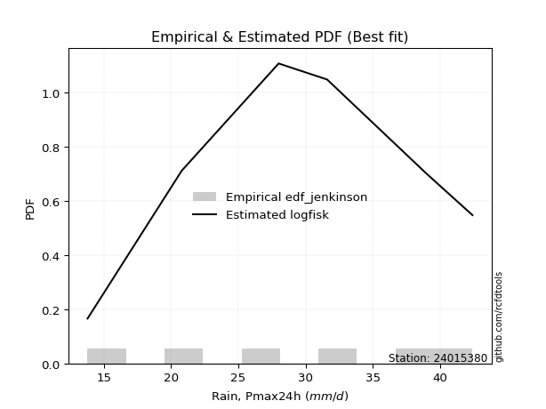</img>

</div>


### 11. Empirical - EDF Cunnane (1978)

Cunnane´s work in statistical hydrology has focused on the performance and evaluation of different probability distributions (such as GEV, Gumbel, Lognormal) for flood frequency estimation. _b_ is a constant, typically set to 0.4.

<div align="center">


$P=(m-b)/(n+1-2b)$


</div>


**11.1. Empirical values**

<div align="center">

|                | 0                   | 1                   | 2                  | 3           | 4                  | 5                  | 6                  |
|:---------------|:--------------------|:--------------------|:-------------------|:------------|:-------------------|:-------------------|:-------------------|
| date           | 2023                | 2020                | 2022               | 2021        | 2025               | 2019               | 2024               |
| x              | 13.8                | 20.8                | 28.0               | 31.6        | 32.4               | 39.0               | 42.4               |
| m              | 1                   | 2                   | 3                  | 4           | 5                  | 6                  | 7                  |
| empirical_dist | edf_cunnane         | edf_cunnane         | edf_cunnane        | edf_cunnane | edf_cunnane        | edf_cunnane        | edf_cunnane        |
| empirical      | 0.08333333333333333 | 0.22222222222222224 | 0.3611111111111111 | 0.5         | 0.6388888888888888 | 0.7777777777777777 | 0.9166666666666666 |
| empirical_tr   | 1.090909090909091   | 1.2857142857142856  | 1.565217391304348  | 2.0         | 2.7692307692307687 | 4.499999999999998  | 11.999999999999995 |

</div>


**11.2. Kolmogorov-Smirnov fit test (sorted by Δ)**


<div align="center">

|                | 0                   | 1                   | 2                   | 3                   | 4                   | 5                   | 6                   | 7                   | 8                   | 9                   | 10                  | 11                  | 12                  | 13                  | 14                  | 15                  | 16                  | 17                  | 18                  | 19                  | 20                  | 21                  | 22                  | 23                  | 24                  | 25                    | 26                  | 27                  | 28                  | 29                  | 30                  | 31                  | 32                  | 33                  | 34                  | 35                  | 36                  | 37                  | 38                  | 39                  | 40                  | 41                  | 42                  | 43                  | 44                  | 45                  | 46                  | 47                  | 48                  | 49                  | 50                  | 51                  | 52                  | 53                  | 54                  | 55                  | 56                  | 57                  | 58                  | 59                  | 60                  | 61                  | 62                  | 63                  | 64                  | 65                  | 66                  | 67                  | 68                  | 69                  | 70                  | 71                  | 72                  | 73                  | 74                  | 75                  | 76                  | 77                  | 78                  | 79                  | 80                  | 81                  | 82                  | 83                  | 84                  | 85                  | 86                  | 87                  | 88                  | 89                  |
|:---------------|:--------------------|:--------------------|:--------------------|:--------------------|:--------------------|:--------------------|:--------------------|:--------------------|:--------------------|:--------------------|:--------------------|:--------------------|:--------------------|:--------------------|:--------------------|:--------------------|:--------------------|:--------------------|:--------------------|:--------------------|:--------------------|:--------------------|:--------------------|:--------------------|:--------------------|:----------------------|:--------------------|:--------------------|:--------------------|:--------------------|:--------------------|:--------------------|:--------------------|:--------------------|:--------------------|:--------------------|:--------------------|:--------------------|:--------------------|:--------------------|:--------------------|:--------------------|:--------------------|:--------------------|:--------------------|:--------------------|:--------------------|:--------------------|:--------------------|:--------------------|:--------------------|:--------------------|:--------------------|:--------------------|:--------------------|:--------------------|:--------------------|:--------------------|:--------------------|:--------------------|:--------------------|:--------------------|:--------------------|:--------------------|:--------------------|:--------------------|:--------------------|:--------------------|:--------------------|:--------------------|:--------------------|:--------------------|:--------------------|:--------------------|:--------------------|:--------------------|:--------------------|:--------------------|:--------------------|:--------------------|:--------------------|:--------------------|:--------------------|:--------------------|:--------------------|:--------------------|:--------------------|:--------------------|:--------------------|:--------------------|
| station        | 24015380            | 24015380            | 24015380            | 24015380            | 24015380            | 24015380            | 24015380            | 24015380            | 24015380            | 24015380            | 24015380            | 24015380            | 24015380            | 24015380            | 24015380            | 24015380            | 24015380            | 24015380            | 24015380            | 24015380            | 24015380            | 24015380            | 24015380            | 24015380            | 24015380            | 24015380              | 24015380            | 24015380            | 24015380            | 24015380            | 24015380            | 24015380            | 24015380            | 24015380            | 24015380            | 24015380            | 24015380            | 24015380            | 24015380            | 24015380            | 24015380            | 24015380            | 24015380            | 24015380            | 24015380            | 24015380            | 24015380            | 24015380            | 24015380            | 24015380            | 24015380            | 24015380            | 24015380            | 24015380            | 24015380            | 24015380            | 24015380            | 24015380            | 24015380            | 24015380            | 24015380            | 24015380            | 24015380            | 24015380            | 24015380            | 24015380            | 24015380            | 24015380            | 24015380            | 24015380            | 24015380            | 24015380            | 24015380            | 24015380            | 24015380            | 24015380            | 24015380            | 24015380            | 24015380            | 24015380            | 24015380            | 24015380            | 24015380            | 24015380            | 24015380            | 24015380            | 24015380            | 24015380            | 24015380            | 24015380            |
| empirical_dist | edf_cunnane         | edf_cunnane         | edf_cunnane         | edf_cunnane         | edf_cunnane         | edf_cunnane         | edf_cunnane         | edf_cunnane         | edf_cunnane         | edf_cunnane         | edf_cunnane         | edf_cunnane         | edf_cunnane         | edf_cunnane         | edf_cunnane         | edf_cunnane         | edf_cunnane         | edf_cunnane         | edf_cunnane         | edf_cunnane         | edf_cunnane         | edf_cunnane         | edf_cunnane         | edf_cunnane         | edf_cunnane         | edf_cunnane           | edf_cunnane         | edf_cunnane         | edf_cunnane         | edf_cunnane         | edf_cunnane         | edf_cunnane         | edf_cunnane         | edf_cunnane         | edf_cunnane         | edf_cunnane         | edf_cunnane         | edf_cunnane         | edf_cunnane         | edf_cunnane         | edf_cunnane         | edf_cunnane         | edf_cunnane         | edf_cunnane         | edf_cunnane         | edf_cunnane         | edf_cunnane         | edf_cunnane         | edf_cunnane         | edf_cunnane         | edf_cunnane         | edf_cunnane         | edf_cunnane         | edf_cunnane         | edf_cunnane         | edf_cunnane         | edf_cunnane         | edf_cunnane         | edf_cunnane         | edf_cunnane         | edf_cunnane         | edf_cunnane         | edf_cunnane         | edf_cunnane         | edf_cunnane         | edf_cunnane         | edf_cunnane         | edf_cunnane         | edf_cunnane         | edf_cunnane         | edf_cunnane         | edf_cunnane         | edf_cunnane         | edf_cunnane         | edf_cunnane         | edf_cunnane         | edf_cunnane         | edf_cunnane         | edf_cunnane         | edf_cunnane         | edf_cunnane         | edf_cunnane         | edf_cunnane         | edf_cunnane         | edf_cunnane         | edf_cunnane         | edf_cunnane         | edf_cunnane         | edf_cunnane         | edf_cunnane         |
| p_dist         | pearson3            | fisk                | weibull_min         | logweibull_min      | loggumbel_l         | f                   | exponnorm           | t                   | norm                | crystalball         | truncnorm           | nct                 | genlogistic         | johnsonsu           | logpearson3         | gompertz            | logmielke           | gamma               | chi2                | laplace_asymmetric  | logfisk             | erlang              | logistic            | rice                | gumbel_l            | loglaplace_asymmetric | loggompertz         | invgamma            | betaprime           | hypsecant           | alpha               | logjohnsonsu        | maxwell             | ncf                 | invgauss            | mielke              | rayleigh            | logloggamma         | laplace             | logf                | logfatiguelife      | logexponnorm        | logt                | lognorm             | lognorm             | logcrystalball      | lognct              | logbetaprime        | halfnorm            | logrice             | loglogistic         | loggamma            | loggamma            | logerlang           | gumbel_r            | kstwobign           | loginvgamma         | logalpha            | loghypsecant        | loginvgauss         | logmaxwell          | halflogistic        | moyal               | loginvweibull       | lograyleigh         | loglaplace          | genexpon            | loggumbel_r         | logncf              | logkstwobign        | loghalfnorm         | loggenexpon         | lognakagami         | expon               | logchi2             | logmoyal            | loghalflogistic     | wald                | gibrat              | logexpon            | logtruncnorm        | logwald             | loggibrat           | loglognorm          | pareto              | logpareto           | nakagami            | invweibull          | fatiguelife         | loggenlogistic      |
| delta          | 0.06719486803249497 | 0.07098608937416837 | 0.07137380704336838 | 0.07148400285401169 | 0.07695125115027346 | 0.08083846507621095 | 0.08112531738963802 | 0.08112671269177818 | 0.08112699982507543 | 0.08112700955237573 | 0.08112708272043978 | 0.0812768251652306  | 0.0820934474372953  | 0.08242588972296128 | 0.08271139318897314 | 0.08333333331859842 | 0.08473866956437626 | 0.0903133909860987  | 0.09079982744122106 | 0.09108334782399097 | 0.09146047505726784 | 0.09152253964035095 | 0.09180331728210378 | 0.09249612047882483 | 0.09302089174839634 | 0.09513585711109063   | 0.09659667172233055 | 0.09710140633514064 | 0.0975379917412984  | 0.10066741979056026 | 0.10084836394328311 | 0.10709530829582792 | 0.10924155705802763 | 0.11012460095821397 | 0.11119596358286865 | 0.11708063423897896 | 0.11807777955806453 | 0.11833873075212509 | 0.1257181806903218  | 0.1357562518467298  | 0.1374029167744551  | 0.13755514608424863 | 0.1375556433893214  | 0.13755565922069085 | 0.13755565922069085 | 0.13755596722127406 | 0.13841162068236912 | 0.14562660178816983 | 0.1459645506737572  | 0.14605997803171084 | 0.14644541048392667 | 0.1467885765990264  | 0.1467885765990264  | 0.14908968315050725 | 0.1493561095502437  | 0.15017905293026018 | 0.1509814024173221  | 0.15221193786325232 | 0.15925708121386228 | 0.16263204286139415 | 0.1706585872076118  | 0.17118963749293692 | 0.1729886768973663  | 0.1805818747428542  | 0.1816963630408392  | 0.18765779564259666 | 0.2032773886728088  | 0.20789098429441938 | 0.20868484533155007 | 0.21049344707133927 | 0.21278347755423194 | 0.21630517257090226 | 0.22222222221988217 | 0.229168394110506   | 0.23280259345407597 | 0.23374666526270654 | 0.23763991508530885 | 0.23866691259786588 | 0.2696756489417721  | 0.27038455487306395 | 0.30239704292925773 | 0.305657429534601   | 0.328795010164954   | 0.4164920129062737  | 0.4165921388737912  | 0.43037166951453887 | 0.46176737829130193 | 0.4933371601348424  | 0.5683076497249862  | 0.7777777777777777  |
| deltao         | 0.48442053926100004 | 0.48442053926100004 | 0.48442053926100004 | 0.48442053926100004 | 0.48442053926100004 | 0.48442053926100004 | 0.48442053926100004 | 0.48442053926100004 | 0.48442053926100004 | 0.48442053926100004 | 0.48442053926100004 | 0.48442053926100004 | 0.48442053926100004 | 0.48442053926100004 | 0.48442053926100004 | 0.48442053926100004 | 0.48442053926100004 | 0.48442053926100004 | 0.48442053926100004 | 0.48442053926100004 | 0.48442053926100004 | 0.48442053926100004 | 0.48442053926100004 | 0.48442053926100004 | 0.48442053926100004 | 0.48442053926100004   | 0.48442053926100004 | 0.48442053926100004 | 0.48442053926100004 | 0.48442053926100004 | 0.48442053926100004 | 0.48442053926100004 | 0.48442053926100004 | 0.48442053926100004 | 0.48442053926100004 | 0.48442053926100004 | 0.48442053926100004 | 0.48442053926100004 | 0.48442053926100004 | 0.48442053926100004 | 0.48442053926100004 | 0.48442053926100004 | 0.48442053926100004 | 0.48442053926100004 | 0.48442053926100004 | 0.48442053926100004 | 0.48442053926100004 | 0.48442053926100004 | 0.48442053926100004 | 0.48442053926100004 | 0.48442053926100004 | 0.48442053926100004 | 0.48442053926100004 | 0.48442053926100004 | 0.48442053926100004 | 0.48442053926100004 | 0.48442053926100004 | 0.48442053926100004 | 0.48442053926100004 | 0.48442053926100004 | 0.48442053926100004 | 0.48442053926100004 | 0.48442053926100004 | 0.48442053926100004 | 0.48442053926100004 | 0.48442053926100004 | 0.48442053926100004 | 0.48442053926100004 | 0.48442053926100004 | 0.48442053926100004 | 0.48442053926100004 | 0.48442053926100004 | 0.48442053926100004 | 0.48442053926100004 | 0.48442053926100004 | 0.48442053926100004 | 0.48442053926100004 | 0.48442053926100004 | 0.48442053926100004 | 0.48442053926100004 | 0.48442053926100004 | 0.48442053926100004 | 0.48442053926100004 | 0.48442053926100004 | 0.48442053926100004 | 0.48442053926100004 | 0.48442053926100004 | 0.48442053926100004 | 0.48442053926100004 | 0.48442053926100004 |
| eval           | Δo > Δ              | Δo > Δ              | Δo > Δ              | Δo > Δ              | Δo > Δ              | Δo > Δ              | Δo > Δ              | Δo > Δ              | Δo > Δ              | Δo > Δ              | Δo > Δ              | Δo > Δ              | Δo > Δ              | Δo > Δ              | Δo > Δ              | Δo > Δ              | Δo > Δ              | Δo > Δ              | Δo > Δ              | Δo > Δ              | Δo > Δ              | Δo > Δ              | Δo > Δ              | Δo > Δ              | Δo > Δ              | Δo > Δ                | Δo > Δ              | Δo > Δ              | Δo > Δ              | Δo > Δ              | Δo > Δ              | Δo > Δ              | Δo > Δ              | Δo > Δ              | Δo > Δ              | Δo > Δ              | Δo > Δ              | Δo > Δ              | Δo > Δ              | Δo > Δ              | Δo > Δ              | Δo > Δ              | Δo > Δ              | Δo > Δ              | Δo > Δ              | Δo > Δ              | Δo > Δ              | Δo > Δ              | Δo > Δ              | Δo > Δ              | Δo > Δ              | Δo > Δ              | Δo > Δ              | Δo > Δ              | Δo > Δ              | Δo > Δ              | Δo > Δ              | Δo > Δ              | Δo > Δ              | Δo > Δ              | Δo > Δ              | Δo > Δ              | Δo > Δ              | Δo > Δ              | Δo > Δ              | Δo > Δ              | Δo > Δ              | Δo > Δ              | Δo > Δ              | Δo > Δ              | Δo > Δ              | Δo > Δ              | Δo > Δ              | Δo > Δ              | Δo > Δ              | Δo > Δ              | Δo > Δ              | Δo > Δ              | Δo > Δ              | Δo > Δ              | Δo > Δ              | Δo > Δ              | Δo > Δ              | Δo > Δ              | Δo > Δ              | Δo > Δ              | Δo > Δ              | Δo <= Δ             | Δo <= Δ             | Δo <= Δ             |
| fit            | 1                   | 1                   | 1                   | 1                   | 1                   | 1                   | 1                   | 1                   | 1                   | 1                   | 1                   | 1                   | 1                   | 1                   | 1                   | 1                   | 1                   | 1                   | 1                   | 1                   | 1                   | 1                   | 1                   | 1                   | 1                   | 1                     | 1                   | 1                   | 1                   | 1                   | 1                   | 1                   | 1                   | 1                   | 1                   | 1                   | 1                   | 1                   | 1                   | 1                   | 1                   | 1                   | 1                   | 1                   | 1                   | 1                   | 1                   | 1                   | 1                   | 1                   | 1                   | 1                   | 1                   | 1                   | 1                   | 1                   | 1                   | 1                   | 1                   | 1                   | 1                   | 1                   | 1                   | 1                   | 1                   | 1                   | 1                   | 1                   | 1                   | 1                   | 1                   | 1                   | 1                   | 1                   | 1                   | 1                   | 1                   | 1                   | 1                   | 1                   | 1                   | 1                   | 1                   | 1                   | 1                   | 1                   | 1                   | 0                   | 0                   | 0                   |
| n              | 7                   | 7                   | 7                   | 7                   | 7                   | 7                   | 7                   | 7                   | 7                   | 7                   | 7                   | 7                   | 7                   | 7                   | 7                   | 7                   | 7                   | 7                   | 7                   | 7                   | 7                   | 7                   | 7                   | 7                   | 7                   | 7                     | 7                   | 7                   | 7                   | 7                   | 7                   | 7                   | 7                   | 7                   | 7                   | 7                   | 7                   | 7                   | 7                   | 7                   | 7                   | 7                   | 7                   | 7                   | 7                   | 7                   | 7                   | 7                   | 7                   | 7                   | 7                   | 7                   | 7                   | 7                   | 7                   | 7                   | 7                   | 7                   | 7                   | 7                   | 7                   | 7                   | 7                   | 7                   | 7                   | 7                   | 7                   | 7                   | 7                   | 7                   | 7                   | 7                   | 7                   | 7                   | 7                   | 7                   | 7                   | 7                   | 7                   | 7                   | 7                   | 7                   | 7                   | 7                   | 7                   | 7                   | 7                   | 7                   | 7                   | 7                   |
| best_fit       | 1                   | 0                   | 0                   | 0                   | 0                   | 0                   | 0                   | 0                   | 0                   | 0                   | 0                   | 0                   | 0                   | 0                   | 0                   | 0                   | 0                   | 0                   | 0                   | 0                   | 0                   | 0                   | 0                   | 0                   | 0                   | 0                     | 0                   | 0                   | 0                   | 0                   | 0                   | 0                   | 0                   | 0                   | 0                   | 0                   | 0                   | 0                   | 0                   | 0                   | 0                   | 0                   | 0                   | 0                   | 0                   | 0                   | 0                   | 0                   | 0                   | 0                   | 0                   | 0                   | 0                   | 0                   | 0                   | 0                   | 0                   | 0                   | 0                   | 0                   | 0                   | 0                   | 0                   | 0                   | 0                   | 0                   | 0                   | 0                   | 0                   | 0                   | 0                   | 0                   | 0                   | 0                   | 0                   | 0                   | 0                   | 0                   | 0                   | 0                   | 0                   | 0                   | 0                   | 0                   | 0                   | 0                   | 0                   | 0                   | 0                   | 0                   |
| best_fit_sort  | 1                   | 2                   | 3                   | 4                   | 5                   | 6                   | 7                   | 8                   | 9                   | 10                  | 11                  | 12                  | 13                  | 14                  | 15                  | 16                  | 17                  | 18                  | 19                  | 20                  | 21                  | 22                  | 23                  | 24                  | 25                  | 26                    | 27                  | 28                  | 29                  | 30                  | 31                  | 32                  | 33                  | 34                  | 35                  | 36                  | 37                  | 38                  | 39                  | 40                  | 41                  | 42                  | 43                  | 44                  | 45                  | 46                  | 47                  | 48                  | 49                  | 50                  | 51                  | 52                  | 53                  | 54                  | 55                  | 56                  | 57                  | 58                  | 59                  | 60                  | 61                  | 62                  | 63                  | 64                  | 65                  | 66                  | 67                  | 68                  | 69                  | 70                  | 71                  | 72                  | 73                  | 74                  | 75                  | 76                  | 77                  | 78                  | 79                  | 80                  | 81                  | 82                  | 83                  | 84                  | 85                  | 86                  | 87                  | 88                  | 89                  | 90                  |

</div>


<div align="center">

</img>

</div>


**11.3. Best fit**

<div align="center">

|   id |   station | empirical_dist   | p_dist   |     delta |   deltao | eval   |   fit |   n |   best_fit |   best_fit_sort |
|-----:|----------:|:-----------------|:---------|----------:|---------:|:-------|------:|----:|-----------:|----------------:|
|    0 |  24015380 | edf_cunnane      | pearson3 | 0.0671949 | 0.484421 | Δo > Δ |     1 |   7 |          1 |               1 |

</div>


<div align="center">

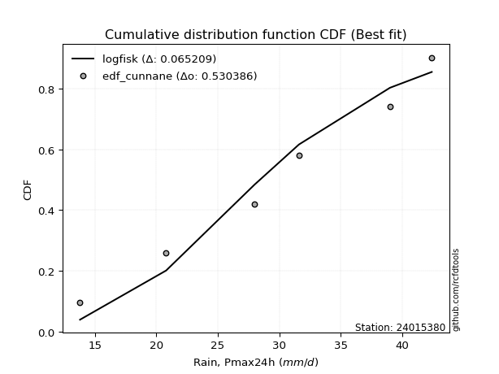</img>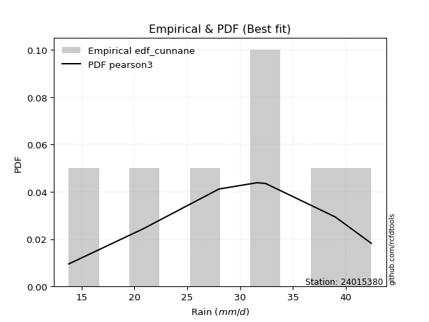</img>

</div>


### 12. Empirical - EDF Adamowski (1981)

The Adamowski formula in hydrology refers to a specific plotting position formula used for estimating the non-parametric empirical distribution of hydrological events (like flood peaks) to calculate their return periods. This formula provides an alternative to traditional parametric methods (like the Gumbel or Log Pearson Type III distributions). 

<div align="center">


$P=(m-0.25)/(n+0.5)$


</div>


**12.1. Empirical values**

<div align="center">

|                | 0                  | 1                   | 2                   | 3             | 4                  | 5                  | 6                  |
|:---------------|:-------------------|:--------------------|:--------------------|:--------------|:-------------------|:-------------------|:-------------------|
| date           | 2023               | 2020                | 2022                | 2021          | 2025               | 2019               | 2024               |
| x              | 13.8               | 20.8                | 28.0                | 31.6          | 32.4               | 39.0               | 42.4               |
| m              | 1                  | 2                   | 3                   | 4             | 5                  | 6                  | 7                  |
| empirical_dist | edf_adamowski      | edf_adamowski       | edf_adamowski       | edf_adamowski | edf_adamowski      | edf_adamowski      | edf_adamowski      |
| empirical      | 0.1                | 0.23333333333333334 | 0.36666666666666664 | 0.5           | 0.6333333333333333 | 0.7666666666666667 | 0.9                |
| empirical_tr   | 1.1111111111111112 | 1.3043478260869565  | 1.5789473684210527  | 2.0           | 2.727272727272727  | 4.2857142857142865 | 10.000000000000002 |

</div>


**12.2. Kolmogorov-Smirnov fit test (sorted by Δ)**


<div align="center">

|                | 0                   | 1                   | 2                   | 3                   | 4                   | 5                   | 6                   | 7                   | 8                   | 9                   | 10                  | 11                  | 12                  | 13                  | 14                  | 15                  | 16                  | 17                  | 18                  | 19                  | 20                  | 21                  | 22                  | 23                  | 24                  | 25                  | 26                  | 27                  | 28                  | 29                  | 30                  | 31                    | 32                  | 33                  | 34                  | 35                  | 36                  | 37                  | 38                  | 39                  | 40                  | 41                  | 42                  | 43                  | 44                  | 45                  | 46                  | 47                  | 48                  | 49                  | 50                  | 51                  | 52                  | 53                  | 54                  | 55                  | 56                  | 57                  | 58                  | 59                  | 60                  | 61                  | 62                  | 63                  | 64                  | 65                  | 66                  | 67                  | 68                  | 69                  | 70                  | 71                  | 72                  | 73                  | 74                  | 75                  | 76                  | 77                  | 78                  | 79                  | 80                  | 81                  | 82                  | 83                  | 84                  | 85                  | 86                  | 87                  | 88                  | 89                  |
|:---------------|:--------------------|:--------------------|:--------------------|:--------------------|:--------------------|:--------------------|:--------------------|:--------------------|:--------------------|:--------------------|:--------------------|:--------------------|:--------------------|:--------------------|:--------------------|:--------------------|:--------------------|:--------------------|:--------------------|:--------------------|:--------------------|:--------------------|:--------------------|:--------------------|:--------------------|:--------------------|:--------------------|:--------------------|:--------------------|:--------------------|:--------------------|:----------------------|:--------------------|:--------------------|:--------------------|:--------------------|:--------------------|:--------------------|:--------------------|:--------------------|:--------------------|:--------------------|:--------------------|:--------------------|:--------------------|:--------------------|:--------------------|:--------------------|:--------------------|:--------------------|:--------------------|:--------------------|:--------------------|:--------------------|:--------------------|:--------------------|:--------------------|:--------------------|:--------------------|:--------------------|:--------------------|:--------------------|:--------------------|:--------------------|:--------------------|:--------------------|:--------------------|:--------------------|:--------------------|:--------------------|:--------------------|:--------------------|:--------------------|:--------------------|:--------------------|:--------------------|:--------------------|:--------------------|:--------------------|:--------------------|:--------------------|:--------------------|:--------------------|:--------------------|:--------------------|:--------------------|:--------------------|:--------------------|:--------------------|:--------------------|
| station        | 24015380            | 24015380            | 24015380            | 24015380            | 24015380            | 24015380            | 24015380            | 24015380            | 24015380            | 24015380            | 24015380            | 24015380            | 24015380            | 24015380            | 24015380            | 24015380            | 24015380            | 24015380            | 24015380            | 24015380            | 24015380            | 24015380            | 24015380            | 24015380            | 24015380            | 24015380            | 24015380            | 24015380            | 24015380            | 24015380            | 24015380            | 24015380              | 24015380            | 24015380            | 24015380            | 24015380            | 24015380            | 24015380            | 24015380            | 24015380            | 24015380            | 24015380            | 24015380            | 24015380            | 24015380            | 24015380            | 24015380            | 24015380            | 24015380            | 24015380            | 24015380            | 24015380            | 24015380            | 24015380            | 24015380            | 24015380            | 24015380            | 24015380            | 24015380            | 24015380            | 24015380            | 24015380            | 24015380            | 24015380            | 24015380            | 24015380            | 24015380            | 24015380            | 24015380            | 24015380            | 24015380            | 24015380            | 24015380            | 24015380            | 24015380            | 24015380            | 24015380            | 24015380            | 24015380            | 24015380            | 24015380            | 24015380            | 24015380            | 24015380            | 24015380            | 24015380            | 24015380            | 24015380            | 24015380            | 24015380            |
| empirical_dist | edf_adamowski       | edf_adamowski       | edf_adamowski       | edf_adamowski       | edf_adamowski       | edf_adamowski       | edf_adamowski       | edf_adamowski       | edf_adamowski       | edf_adamowski       | edf_adamowski       | edf_adamowski       | edf_adamowski       | edf_adamowski       | edf_adamowski       | edf_adamowski       | edf_adamowski       | edf_adamowski       | edf_adamowski       | edf_adamowski       | edf_adamowski       | edf_adamowski       | edf_adamowski       | edf_adamowski       | edf_adamowski       | edf_adamowski       | edf_adamowski       | edf_adamowski       | edf_adamowski       | edf_adamowski       | edf_adamowski       | edf_adamowski         | edf_adamowski       | edf_adamowski       | edf_adamowski       | edf_adamowski       | edf_adamowski       | edf_adamowski       | edf_adamowski       | edf_adamowski       | edf_adamowski       | edf_adamowski       | edf_adamowski       | edf_adamowski       | edf_adamowski       | edf_adamowski       | edf_adamowski       | edf_adamowski       | edf_adamowski       | edf_adamowski       | edf_adamowski       | edf_adamowski       | edf_adamowski       | edf_adamowski       | edf_adamowski       | edf_adamowski       | edf_adamowski       | edf_adamowski       | edf_adamowski       | edf_adamowski       | edf_adamowski       | edf_adamowski       | edf_adamowski       | edf_adamowski       | edf_adamowski       | edf_adamowski       | edf_adamowski       | edf_adamowski       | edf_adamowski       | edf_adamowski       | edf_adamowski       | edf_adamowski       | edf_adamowski       | edf_adamowski       | edf_adamowski       | edf_adamowski       | edf_adamowski       | edf_adamowski       | edf_adamowski       | edf_adamowski       | edf_adamowski       | edf_adamowski       | edf_adamowski       | edf_adamowski       | edf_adamowski       | edf_adamowski       | edf_adamowski       | edf_adamowski       | edf_adamowski       | edf_adamowski       |
| p_dist         | loggumbel_l         | pearson3            | genlogistic         | f                   | johnsonsu           | exponnorm           | t                   | norm                | crystalball         | truncnorm           | nct                 | logweibull_min      | fisk                | weibull_min         | logpearson3         | gamma               | chi2                | logfisk             | erlang              | rice                | logistic            | invgamma            | betaprime           | logmielke           | loggompertz         | gompertz            | alpha               | logjohnsonsu        | laplace_asymmetric  | gumbel_l            | hypsecant           | loglaplace_asymmetric | maxwell             | ncf                 | invgauss            | logloggamma         | rayleigh            | mielke              | laplace             | logf                | logfatiguelife      | logexponnorm        | logt                | lognorm             | lognorm             | logcrystalball      | lognct              | logbetaprime        | logrice             | loggamma            | loggamma            | halfnorm            | logerlang           | kstwobign           | loginvgamma         | loglogistic         | logalpha            | gumbel_r            | loginvgauss         | loghypsecant        | logmaxwell          | halflogistic        | moyal               | loginvweibull       | lograyleigh         | loglaplace          | logncf              | genexpon            | loggumbel_r         | logkstwobign        | loghalfnorm         | loggenexpon         | logchi2             | expon               | logmoyal            | loghalflogistic     | lognakagami         | wald                | logexpon            | gibrat              | logwald             | logtruncnorm        | loggibrat           | loglognorm          | pareto              | logpareto           | nakagami            | invweibull          | fatiguelife         | loggenlogistic      |
| delta          | 0.07695125115027346 | 0.07830597914360593 | 0.08012863956701832 | 0.08083846507621095 | 0.08094786229216011 | 0.08112531738963802 | 0.08112671269177818 | 0.08112699982507543 | 0.08112700955237573 | 0.08112708272043978 | 0.0812768251652306  | 0.0815679908326219  | 0.08209720048527946 | 0.08248491815447934 | 0.08271139318897314 | 0.0903133909860987  | 0.09079982744122106 | 0.09146047505726784 | 0.09152253964035095 | 0.09249612047882483 | 0.09497443820731455 | 0.09710140633514064 | 0.0975379917412984  | 0.09844153154426283 | 0.09999995201696067 | 0.0999999999852651  | 0.10084836394328311 | 0.10153975274027238 | 0.10219445893510193 | 0.1041320028595073  | 0.10451005679024639 | 0.1046098679083507    | 0.10924155705802763 | 0.11012460095821397 | 0.11119596358286865 | 0.11278317519656955 | 0.11807777955806453 | 0.11882091243154105 | 0.1257181806903218  | 0.13020069629117426 | 0.13184736121889956 | 0.1319995905286931  | 0.13200008783376588 | 0.13200010366513532 | 0.13200010366513532 | 0.13200041166571852 | 0.13285606512681358 | 0.1400710462326143  | 0.1405044224761553  | 0.14123302104347085 | 0.14123302104347085 | 0.14311996035423546 | 0.1435341275949517  | 0.14462349737470465 | 0.14542584686176657 | 0.14644541048392667 | 0.1466563823076968  | 0.1493561095502437  | 0.15707648730583862 | 0.15925708121386228 | 0.16510303165205625 | 0.17118963749293692 | 0.1729886768973663  | 0.17502631918729866 | 0.17614080748528366 | 0.18765779564259666 | 0.19201817866488347 | 0.19772183311725328 | 0.20233542873886384 | 0.20493789151578373 | 0.2072279219986764  | 0.21074961701534672 | 0.22169148234296487 | 0.22361283855495045 | 0.228191109707151   | 0.23208435952975331 | 0.23333333333099326 | 0.23866691259786588 | 0.2648289993175084  | 0.2696756489417721  | 0.3001018739790455  | 0.30239704292925773 | 0.32323945460939846 | 0.40538090179516256 | 0.4054810277626801  | 0.41926055840342774 | 0.4562118227357464  | 0.4766704934681758  | 0.5571965386138751  | 0.7666666666666667  |
| deltao         | 0.48442053926100004 | 0.48442053926100004 | 0.48442053926100004 | 0.48442053926100004 | 0.48442053926100004 | 0.48442053926100004 | 0.48442053926100004 | 0.48442053926100004 | 0.48442053926100004 | 0.48442053926100004 | 0.48442053926100004 | 0.48442053926100004 | 0.48442053926100004 | 0.48442053926100004 | 0.48442053926100004 | 0.48442053926100004 | 0.48442053926100004 | 0.48442053926100004 | 0.48442053926100004 | 0.48442053926100004 | 0.48442053926100004 | 0.48442053926100004 | 0.48442053926100004 | 0.48442053926100004 | 0.48442053926100004 | 0.48442053926100004 | 0.48442053926100004 | 0.48442053926100004 | 0.48442053926100004 | 0.48442053926100004 | 0.48442053926100004 | 0.48442053926100004   | 0.48442053926100004 | 0.48442053926100004 | 0.48442053926100004 | 0.48442053926100004 | 0.48442053926100004 | 0.48442053926100004 | 0.48442053926100004 | 0.48442053926100004 | 0.48442053926100004 | 0.48442053926100004 | 0.48442053926100004 | 0.48442053926100004 | 0.48442053926100004 | 0.48442053926100004 | 0.48442053926100004 | 0.48442053926100004 | 0.48442053926100004 | 0.48442053926100004 | 0.48442053926100004 | 0.48442053926100004 | 0.48442053926100004 | 0.48442053926100004 | 0.48442053926100004 | 0.48442053926100004 | 0.48442053926100004 | 0.48442053926100004 | 0.48442053926100004 | 0.48442053926100004 | 0.48442053926100004 | 0.48442053926100004 | 0.48442053926100004 | 0.48442053926100004 | 0.48442053926100004 | 0.48442053926100004 | 0.48442053926100004 | 0.48442053926100004 | 0.48442053926100004 | 0.48442053926100004 | 0.48442053926100004 | 0.48442053926100004 | 0.48442053926100004 | 0.48442053926100004 | 0.48442053926100004 | 0.48442053926100004 | 0.48442053926100004 | 0.48442053926100004 | 0.48442053926100004 | 0.48442053926100004 | 0.48442053926100004 | 0.48442053926100004 | 0.48442053926100004 | 0.48442053926100004 | 0.48442053926100004 | 0.48442053926100004 | 0.48442053926100004 | 0.48442053926100004 | 0.48442053926100004 | 0.48442053926100004 |
| eval           | Δo > Δ              | Δo > Δ              | Δo > Δ              | Δo > Δ              | Δo > Δ              | Δo > Δ              | Δo > Δ              | Δo > Δ              | Δo > Δ              | Δo > Δ              | Δo > Δ              | Δo > Δ              | Δo > Δ              | Δo > Δ              | Δo > Δ              | Δo > Δ              | Δo > Δ              | Δo > Δ              | Δo > Δ              | Δo > Δ              | Δo > Δ              | Δo > Δ              | Δo > Δ              | Δo > Δ              | Δo > Δ              | Δo > Δ              | Δo > Δ              | Δo > Δ              | Δo > Δ              | Δo > Δ              | Δo > Δ              | Δo > Δ                | Δo > Δ              | Δo > Δ              | Δo > Δ              | Δo > Δ              | Δo > Δ              | Δo > Δ              | Δo > Δ              | Δo > Δ              | Δo > Δ              | Δo > Δ              | Δo > Δ              | Δo > Δ              | Δo > Δ              | Δo > Δ              | Δo > Δ              | Δo > Δ              | Δo > Δ              | Δo > Δ              | Δo > Δ              | Δo > Δ              | Δo > Δ              | Δo > Δ              | Δo > Δ              | Δo > Δ              | Δo > Δ              | Δo > Δ              | Δo > Δ              | Δo > Δ              | Δo > Δ              | Δo > Δ              | Δo > Δ              | Δo > Δ              | Δo > Δ              | Δo > Δ              | Δo > Δ              | Δo > Δ              | Δo > Δ              | Δo > Δ              | Δo > Δ              | Δo > Δ              | Δo > Δ              | Δo > Δ              | Δo > Δ              | Δo > Δ              | Δo > Δ              | Δo > Δ              | Δo > Δ              | Δo > Δ              | Δo > Δ              | Δo > Δ              | Δo > Δ              | Δo > Δ              | Δo > Δ              | Δo > Δ              | Δo > Δ              | Δo > Δ              | Δo <= Δ             | Δo <= Δ             |
| fit            | 1                   | 1                   | 1                   | 1                   | 1                   | 1                   | 1                   | 1                   | 1                   | 1                   | 1                   | 1                   | 1                   | 1                   | 1                   | 1                   | 1                   | 1                   | 1                   | 1                   | 1                   | 1                   | 1                   | 1                   | 1                   | 1                   | 1                   | 1                   | 1                   | 1                   | 1                   | 1                     | 1                   | 1                   | 1                   | 1                   | 1                   | 1                   | 1                   | 1                   | 1                   | 1                   | 1                   | 1                   | 1                   | 1                   | 1                   | 1                   | 1                   | 1                   | 1                   | 1                   | 1                   | 1                   | 1                   | 1                   | 1                   | 1                   | 1                   | 1                   | 1                   | 1                   | 1                   | 1                   | 1                   | 1                   | 1                   | 1                   | 1                   | 1                   | 1                   | 1                   | 1                   | 1                   | 1                   | 1                   | 1                   | 1                   | 1                   | 1                   | 1                   | 1                   | 1                   | 1                   | 1                   | 1                   | 1                   | 1                   | 0                   | 0                   |
| n              | 7                   | 7                   | 7                   | 7                   | 7                   | 7                   | 7                   | 7                   | 7                   | 7                   | 7                   | 7                   | 7                   | 7                   | 7                   | 7                   | 7                   | 7                   | 7                   | 7                   | 7                   | 7                   | 7                   | 7                   | 7                   | 7                   | 7                   | 7                   | 7                   | 7                   | 7                   | 7                     | 7                   | 7                   | 7                   | 7                   | 7                   | 7                   | 7                   | 7                   | 7                   | 7                   | 7                   | 7                   | 7                   | 7                   | 7                   | 7                   | 7                   | 7                   | 7                   | 7                   | 7                   | 7                   | 7                   | 7                   | 7                   | 7                   | 7                   | 7                   | 7                   | 7                   | 7                   | 7                   | 7                   | 7                   | 7                   | 7                   | 7                   | 7                   | 7                   | 7                   | 7                   | 7                   | 7                   | 7                   | 7                   | 7                   | 7                   | 7                   | 7                   | 7                   | 7                   | 7                   | 7                   | 7                   | 7                   | 7                   | 7                   | 7                   |
| best_fit       | 1                   | 0                   | 0                   | 0                   | 0                   | 0                   | 0                   | 0                   | 0                   | 0                   | 0                   | 0                   | 0                   | 0                   | 0                   | 0                   | 0                   | 0                   | 0                   | 0                   | 0                   | 0                   | 0                   | 0                   | 0                   | 0                   | 0                   | 0                   | 0                   | 0                   | 0                   | 0                     | 0                   | 0                   | 0                   | 0                   | 0                   | 0                   | 0                   | 0                   | 0                   | 0                   | 0                   | 0                   | 0                   | 0                   | 0                   | 0                   | 0                   | 0                   | 0                   | 0                   | 0                   | 0                   | 0                   | 0                   | 0                   | 0                   | 0                   | 0                   | 0                   | 0                   | 0                   | 0                   | 0                   | 0                   | 0                   | 0                   | 0                   | 0                   | 0                   | 0                   | 0                   | 0                   | 0                   | 0                   | 0                   | 0                   | 0                   | 0                   | 0                   | 0                   | 0                   | 0                   | 0                   | 0                   | 0                   | 0                   | 0                   | 0                   |
| best_fit_sort  | 1                   | 2                   | 3                   | 4                   | 5                   | 6                   | 7                   | 8                   | 9                   | 10                  | 11                  | 12                  | 13                  | 14                  | 15                  | 16                  | 17                  | 18                  | 19                  | 20                  | 21                  | 22                  | 23                  | 24                  | 25                  | 26                  | 27                  | 28                  | 29                  | 30                  | 31                  | 32                    | 33                  | 34                  | 35                  | 36                  | 37                  | 38                  | 39                  | 40                  | 41                  | 42                  | 43                  | 44                  | 45                  | 46                  | 47                  | 48                  | 49                  | 50                  | 51                  | 52                  | 53                  | 54                  | 55                  | 56                  | 57                  | 58                  | 59                  | 60                  | 61                  | 62                  | 63                  | 64                  | 65                  | 66                  | 67                  | 68                  | 69                  | 70                  | 71                  | 72                  | 73                  | 74                  | 75                  | 76                  | 77                  | 78                  | 79                  | 80                  | 81                  | 82                  | 83                  | 84                  | 85                  | 86                  | 87                  | 88                  | 89                  | 90                  |

</div>


<div align="center">

</img>

</div>


**12.3. Best fit**

<div align="center">

|   id |   station | empirical_dist   | p_dist      |     delta |   deltao | eval   |   fit |   n |   best_fit |   best_fit_sort |
|-----:|----------:|:-----------------|:------------|----------:|---------:|:-------|------:|----:|-----------:|----------------:|
|    0 |  24015380 | edf_adamowski    | loggumbel_l | 0.0769513 | 0.484421 | Δo > Δ |     1 |   7 |          1 |               1 |

</div>


<div align="center">

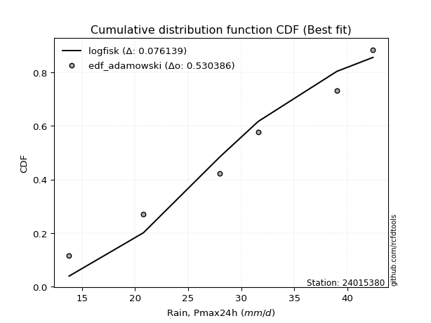</img>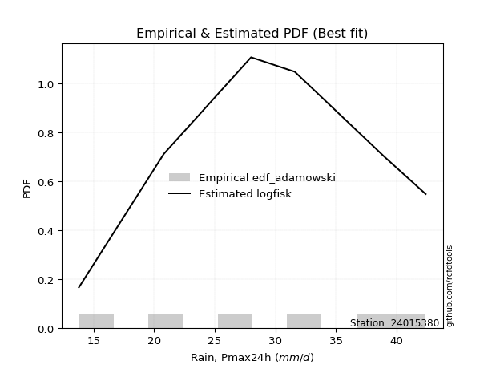</img>

</div>


## C. Best fit & Estimate extreme values for specific return periods - Tr


### 1. Best fit (ordered by delta Δ)

<div align="center">

|   id |   station | empirical_dist   | p_dist      |     delta |   deltao | eval   |   fit |   n |   best_fit |   best_fit_sort |
|-----:|----------:|:-----------------|:------------|----------:|---------:|:-------|------:|----:|-----------:|----------------:|
|    0 |  24015380 | edf_hazen        | pearson3    | 0.0595463 | 0.484421 | Δo > Δ |     1 |   7 |          1 |               1 |
|    1 |  24015380 | edf_gringorten   | pearson3    | 0.0640738 | 0.484421 | Δo > Δ |     1 |   7 |          1 |               2 |
|    2 |  24015380 | edf_cunnane      | pearson3    | 0.0671949 | 0.484421 | Δo > Δ |     1 |   7 |          1 |               3 |
|    3 |  24015380 | edf_blom         | pearson3    | 0.0691106 | 0.484421 | Δo > Δ |     1 |   7 |          1 |               4 |
|    4 |  24015380 | edf_tukey        | pearson3    | 0.0722454 | 0.484421 | Δo > Δ |     1 |   7 |          1 |               5 |
|    5 |  24015380 | edf_filliben     | pearson3    | 0.073418  | 0.484421 | Δo > Δ |     1 |   7 |          1 |               6 |
|    6 |  24015380 | edf_beard        | pearson3    | 0.0739699 | 0.484421 | Δo > Δ |     1 |   7 |          1 |               7 |
|    7 |  24015380 | edf_jenkinson    | pearson3    | 0.0739699 | 0.484421 | Δo > Δ |     1 |   7 |          1 |               8 |
|    8 |  24015380 | edf_chegodayev   | pearson3    | 0.0747024 | 0.484421 | Δo > Δ |     1 |   7 |          1 |               9 |
|    9 |  24015380 | edf_adamowski    | loggumbel_l | 0.0769513 | 0.484421 | Δo > Δ |     1 |   7 |          1 |              10 |
|   10 |  24015380 | edf_weibull      | logpearson3 | 0.0831166 | 0.484421 | Δo > Δ |     1 |   7 |          1 |              11 |
|   11 |  24015380 | edf_california   | logpearson3 | 0.102953  | 0.484421 | Δo > Δ |     1 |   7 |          1 |              12 |

</div>

:file_folder:Tables: [bestfit_24015380.csv](table/bestfit_24015380.csv) | [extreme_24015380.csv](table/extreme_24015380.csv)


### 2. Extreme values

In hydrology, a return period (or recurrence interval $Tr$) is the statistical average time between extreme events like floods or droughts of a specific magnitude, indicating how rare an event is, with a 100-year flood, for example, having a 1% chance of occurring in any given year, not that it happens exactly every century. It is a key tool for infrastructure design (like bridges or dams) and risk assessment, calculated from historical data to determine the probability of future events, although it is important to remember it is statistical average, and events can cluster or be missed.

> risk_rate: assuming the return period as the project useful life.

|   id |      tr |   prob_l |     prob_g |   alpha |   betaprime |    chi2 |   crystalball |   erlang |    expon |   exponnorm |       f |   fatiguelife |    fisk |   gamma |   genexpon |   genlogistic |   gibrat |   gompertz |   gumbel_l |   gumbel_r |   halflogistic |   halfnorm |   hypsecant |   invgamma |   invgauss |      invweibull |   johnsonsu |   kstwobign |   laplace |   laplace_asymmetric |   loggamma |   logistic |   lognorm |   maxwell |   mielke |   moyal |   nakagami |     ncf |     nct |    norm |           pareto |   pearson3 |   rayleigh |    rice |       t |   truncnorm |    wald |   weibull_min |   logalpha |   logbetaprime |     logchi2 |   logcrystalball |   logerlang |   logexpon |   logexponnorm |    logf |   logfatiguelife |   logfisk |   loggenexpon |   loggenlogistic |   loggibrat |   loggompertz |   loggumbel_l |   loggumbel_r |   loghalflogistic |   loghalfnorm |   loghypsecant |   loginvgamma |   loginvgauss |   loginvweibull |   logjohnsonsu |   logkstwobign |   loglaplace |   loglaplace_asymmetric |   logloggamma |   loglogistic |    loglognorm |   logmaxwell |   logmielke |   logmoyal |   lognakagami |   logncf |   lognct |         logpareto |   logpearson3 |   lograyleigh |   logrice |    logt |   logtruncnorm |   logwald |   logweibull_min |   station |   n |   risk_rate |
|-----:|--------:|---------:|-----------:|--------:|------------:|--------:|--------------:|---------:|---------:|------------:|--------:|--------------:|--------:|--------:|-----------:|--------------:|---------:|-----------:|-----------:|-----------:|---------------:|-----------:|------------:|-----------:|-----------:|----------------:|------------:|------------:|----------:|---------------------:|-----------:|-----------:|----------:|----------:|---------:|--------:|-----------:|--------:|--------:|--------:|-----------------:|-----------:|-----------:|--------:|--------:|------------:|--------:|--------------:|-----------:|---------------:|------------:|-----------------:|------------:|-----------:|---------------:|--------:|-----------------:|----------:|--------------:|-----------------:|------------:|--------------:|--------------:|--------------:|------------------:|--------------:|---------------:|--------------:|--------------:|----------------:|---------------:|---------------:|-------------:|------------------------:|--------------:|--------------:|--------------:|-------------:|------------:|-----------:|--------------:|---------:|---------:|------------------:|--------------:|--------------:|----------:|--------:|---------------:|----------:|-----------------:|----------:|----:|------------:|
|    0 |    2    | 0.5      | 0.5        | 29.1616 |     29.0646 | 29.4242 |       29.7143 |  29.4364 |  24.8309 |     29.7143 | 29.7198 |       13.8    | 30.1996 | 29.4594 |    26.0092 |       31.2236 |  26.9502 |    30.0469 |    31.2271 |    28.2015 |        27.4494 |    27.8293 |     29.7143 |    29.2615 |    28.9367 |  1744.34        |     31.1566 |     27.6981 |   29.7143 |              30.9387 |    27.7967 |    29.7143 |   28.0337 |   28.9267 |  31.8894 | 27.7131 |    20.99   | 28.8084 | 29.7099 | 29.7143 |     14.7954      |    30.2401 |    28.6474 | 29.364  | 29.7143 |     29.7143 | 26.7293 |       30.6437 |    27.6474 |        27.8277 |     22.8291 |          28.0337 |     27.7369 |    22.5544 |        28.0337 | 28.0769 |          28.0375 |   29.3026 |       25.5835 |         inf      |     25.1634 |       29.2651 |       29.7414 |       26.4241 |           25.6584 |       26.0423 |        28.0337 |       27.6829 |       27.3603 |         26.6847 |        31.6395 |        25.7079 |      28.0337 |                 29.8542 |       31.8667 |       28.0337 |  13.8723      |      27.1839 |     8.78711 |    25.9244 |       26.8704 |  27.6756 |  28.0121 |     14.4527       |       29.4496 |       26.8888 |   27.815  | 28.0337 |        25.4557 |   24.9461 |          29.9726 |  24015380 |   7 |    0.75     |
|    1 |    2.33 | 0.570815 | 0.429185   | 30.8577 |     30.8858 | 31.1125 |       31.3576 |  31.1027 |  27.2614 |     31.3576 | 31.3641 |       14.1412 | 31.7536 | 31.1305 |    28.2094 |       32.6855 |  27.7826 |    31.7287 |    32.6568 |    29.7241 |        29.0149 |    29.6028 |     31.0294 |    30.9532 |    30.6067 | 98614.7         |     32.7102 |     29.6523 |   30.7087 |              32.0673 |    29.6894 |    31.1621 |   29.8934 |   30.634  |  33.5667 | 29.1545 |    21.2973 | 30.5725 | 31.3539 | 31.3576 |     16.2956      |    31.8572 |    30.3799 | 31.0671 | 31.3576 |     31.3576 | 27.8068 |       32.2118 |    29.5949 |        29.7059 |     27.2416 |          29.8934 |     29.6314 |    25.1327 |        29.8934 | 29.9436 |          29.897  |   31.0579 |       27.7785 |         inf      |     25.9955 |       30.9662 |       31.4507 |       28.0445 |           27.2776 |       27.9118 |        29.5124 |       29.6124 |       29.3357 |         28.997  |        33.3015 |        27.9726 |      29.1448 |                 31.1727 |       33.6544 |       29.6659 |  14.4617      |      29.0598 |     8.78711 |    27.427  |       28.3845 |  31.7169 |  29.8739 |     15.4959       |       31.2859 |       28.7726 |   29.7113 | 29.8934 |        26.4979 |   26.0193 |          31.5847 |  24015380 |   7 |    0.729209 |
|    2 |    5    | 0.8      | 0.2        | 37.4418 |     38.1508 | 37.5551 |       37.4644 |  37.4013 |  39.4131 |     37.4645 | 37.4818 |       21.3898 | 37.7539 | 37.4467 |    37.9656 |       37.6732 |  32.5751 |    37.5487 |    37.2755 |    36.3394 |        36.0988 |    37.1029 |     36.3046 |    37.51   |    37.2038 |     4.1825e+12  |     37.7705 |     37.9533 |   35.6807 |              36.5375 |    38.0774 |    36.7525 |   37.9525 |   37.3536 |  40.342  | 35.8312 |    26.6333 | 37.6725 | 37.4648 | 37.4644 |    250.781       |    37.5776 |    37.3159 | 37.5052 | 37.4643 |     37.4644 | 33.8387 |       37.5777 |    38.4227 |        37.9464 |     76.2935 |          37.9525 |     38.0326 |    43.1784 |        37.9525 | 38.0376 |          37.9616 |   38.8798 |       38.733  |         inf      |     31.35   |       37.3537 |       37.6732 |       36.3197 |           35.98   |       37.4203 |        36.2704 |       38.3191 |       38.4787 |         41.6058 |        38.2793 |        40.0384 |      35.3965 |                 36.002  |       38.6767 |       36.9109 |   4.33814e+71 |      37.7884 |     8.78711 |    35.6054 |       36.1151 |  53.8882 |  37.9533 | 850196            |       38.144  |       37.732  |   38.0437 | 37.9525 |        31.5254 |   32.9381 |          37.4094 |  24015380 |   7 |    0.67232  |
|    3 |   10    | 0.9      | 0.1        | 42.0711 |     43.4177 | 41.9768 |       41.5156 |  41.6725 |  50.444  |     41.5156 | 41.546  |       31.3981 | 42.1728 | 41.7293 |    45.7041 |       40.9294 |  38.0379 |    40.9812 |    39.8469 |    41.7274 |        41.9816 |    42.6527 |     40.5171 |    42.1068 |    41.9357 |     6.82288e+18 |     40.5857 |     44.2734 |   40.1941 |              40.5816 |    45.0697 |    40.8695 |   44.464  |   42.0825 |  45.7732 | 41.6444 |    35.3015 | 42.8753 | 41.5197 | 41.5156 |  14715.1         |    41.1258 |    42.2614 | 41.8403 | 41.5153 |     41.5156 | 40.24   |       40.775  |    46.0249 |        44.7209 |    219.314  |          44.464  |     45.0421 |    70.5696 |        44.464  | 44.5844 |          44.4856 |   45.8741 |       49.1749 |         inf      |     38.8111 |       41.5616 |       41.6565 |       44.8336 |           45.2822 |       46.4859 |        42.7621 |       45.767  |       46.5754 |         55.8298 |        40.6574 |        52.6085 |      42.2256 |                 40.8291 |       40.6002 |       43.3553 | inf           |      45.4603 |    39.9405  |    44.6885 |       43.3477 |  78.2612 |  44.4937 |      6.42707e+298 |       42.5634 |       45.7778 |   44.8831 | 44.464  |        35.404  |   42.303  |          41.1059 |  24015380 |   7 |    0.651322 |
|    4 |   15    | 0.933333 | 0.0666667  | 44.4649 |     46.1842 | 44.2278 |       43.5372 |  43.8318 |  56.8967 |     43.5372 | 43.5758 |       37.9438 | 44.5805 | 43.8942 |    49.919  |       42.6266 |  41.806  |    42.5686 |    41.0115 |    44.7672 |        45.3108 |    45.5408 |     42.9211 |    44.4785 |    44.4077 |     2.18286e+22 |     41.8504 |     47.6286 |   42.8343 |              42.9473 |    49.0773 |    43.1127 |   48.12   |   44.5089 |  48.9501 | 45.0181 |    40.7713 | 45.6253 | 43.5435 | 43.5372 | 164439           |    42.8244 |    44.8096 | 44.0169 | 43.5369 |     43.5372 | 44.3506 |       42.275  |    50.4804 |        48.5683 |    419.489  |          48.12   |     49.0618 |    94.0634 |        48.12   | 48.2627 |          48.1517 |   50.2009 |       55.6288 |         inf      |     44.9685 |       43.6366 |       43.5965 |       50.4901 |           51.5755 |       52.0416 |        46.975  |       50.1115 |       51.4064 |         65.9053 |        41.6158 |        60.8145 |      46.8159 |                 43.9475 |       41.2132 |       47.3282 | inf           |      49.9827 |    40.7748  |    50.9876 |       47.6932 |  94.9179 |  48.1705 |    inf            |       44.6834 |       50.5716 |   48.7573 | 48.12   |        37.2107 |   49.6771 |          42.898  |  24015380 |   7 |    0.644736 |
|    5 |   20    | 0.95     | 0.05       | 46.0641 |     48.0469 | 45.7181 |       44.8611 |  45.256  |  61.4749 |     44.8611 | 44.9057 |       42.79   | 46.2446 | 45.322  |    52.8031 |       43.7803 |  44.7617 |    43.5653 |    41.7364 |    46.8957 |        47.6433 |    47.4664 |     44.617  |    46.0607 |    46.0676 |     6.21122e+24 |     42.6322 |     49.8888 |   44.7075 |              44.6258 |    51.9128 |    44.6631 |   50.6756 |   46.1192 |  51.2514 | 47.4074 |    44.6082 | 47.4833 | 44.8689 | 44.8611 | 911963           |    43.9111 |    46.5032 | 45.4461 | 44.8607 |     44.8611 | 47.4139 |       43.2255 |    53.6754 |        51.2759 |    671.255  |          50.6756 |     51.9068 |   115.337  |        50.6756 | 50.835  |          50.7156 |   53.4276 |       60.3865 |         inf      |     50.4748 |       44.9846 |       44.8494 |       54.8702 |           56.4988 |       56.1097 |        50.1944 |       53.218  |       54.907  |         74.0236 |        42.1718 |        67.0522 |      50.3723 |                 46.3035 |       41.5149 |       50.285  | inf           |      53.2298 |    41.1914  |    55.9787 |       50.835  | 107.974  |  50.7426 |    inf            |       46.0318 |       54.0325 |   51.4785 | 50.6756 |        38.2688 |   55.9963 |          44.0528 |  24015380 |   7 |    0.641514 |
|    6 |   25    | 0.96     | 0.04       | 47.2576 |     49.4441 | 46.8233 |       45.8357 |  46.3095 |  65.0261 |     45.8357 | 45.885  |       46.6406 | 47.5176 | 46.3782 |    54.9883 |       44.655  |  47.2258 |    44.2783 |    42.2522 |    48.5351 |        49.4404 |    48.8991 |     45.9295 |    47.2404 |    47.3105 |     4.82522e+26 |     43.1855 |     51.5817 |   46.1605 |              45.9277 |    54.1148 |    45.8492 |   52.6432 |   47.3146 |  53.0752 | 49.2594 |    47.5238 | 48.8803 | 45.8447 | 45.8357 |      3.44402e+06 |    44.6983 |    47.7616 | 46.5    | 45.8353 |     45.8357 | 49.8674 |       43.9099 |    56.1808 |        53.3705 |    971.199  |          52.6432 |     54.1167 |   135.099  |        52.6433 | 52.816  |          52.6903 |   56.0355 |       64.1859 |         inf      |     55.5771 |       45.971  |       45.7628 |       58.5014 |           60.6103 |       59.3416 |        52.8366 |       55.6488 |       57.6722 |         80.9525 |        42.548  |        72.1401 |      53.3158 |                 48.2175 |       41.6944 |       52.671  | inf           |      55.7761 |    41.4411  |    60.1811 |       53.3078 | 118.874  |  52.724  |    inf            |       47.0017 |       56.7564 |   53.5804 | 52.6432 |        38.9662 |   61.633  |          44.8934 |  24015380 |   7 |    0.639603 |
|    7 |   50    | 0.98     | 0.02       | 50.7548 |     53.5693 | 50.0269 |       48.6264 |  49.3504 |  76.0571 |     48.6265 | 48.6909 |       58.9949 | 51.4071 | 49.4266 |    61.5343 |       47.299  |  55.9117 |    46.2274 |    43.6524 |    53.5855 |        54.9775 |    53.0633 |     49.9988 |    50.6904 |    50.9701 |     3.2119e+32  |     44.6709 |     56.5531 |   50.6739 |              49.9719 |    61.0064 |    49.4729 |   58.7106 |   50.7817 |  59.0206 | 55.0086 |    56.1496 | 53.0214 | 48.6392 | 48.6264 |      2.13637e+08 |    46.8928 |    51.4145 | 49.5254 | 48.626  |     48.6264 | 57.8784 |       45.8017 |    64.1572 |        59.8831 |   3125.22   |          58.7105 |     61.0356 |   220.803  |        58.7106 | 58.9278 |          58.7832 |   64.8184 |       76.6384 |         inf      |     78.04   |       48.7665 |       48.3373 |       71.2684 |           75.2565 |       69.8315 |        61.9458 |       63.3586 |       66.5871 |        106.645  |        43.4858 |        89.4234 |      63.6022 |                 54.6825 |       42.0502 |       60.6856 | inf           |      63.8708 |    41.9402  |    75.345  |       61.2038 | 157.537  |  58.8393 |    inf            |       49.6611 |       65.4662 |   60.0968 | 58.7106 |        40.5348 |   84.2971 |          47.2571 |  24015380 |   7 |    0.63583  |
|    8 |   75    | 0.986667 | 0.0133333  | 52.6812 |     55.8597 | 51.7696 |       50.1239 |  50.9968 |  82.5097 |     50.1239 | 50.1973 |       66.4352 | 53.6535 | 51.077  |    65.2223 |       48.8134 |  61.7782 |    47.22   |    44.3605 |    56.521  |        58.1962 |    55.3302 |     52.3768 |    52.5865 |    52.996  |     7.78849e+35 |     45.4113 |     59.2883 |   53.3141 |              52.3375 |    65.0956 |    51.5659 |   62.2495 |   52.6667 |  62.7347 | 58.3707 |    60.8791 | 55.331  | 50.1388 | 50.1239 |      2.3894e+09  |    48.0342 |    53.4017 | 51.1528 | 50.1234 |     50.1239 | 62.808  |       46.7776 |    68.9857 |        63.7182 |   6266.67   |          62.2494 |     65.1428 |   294.312  |        62.2495 | 62.4945 |          62.3396 |   70.5051 |       84.4088 |         inf      |     98.149  |       50.248  |       49.6938 |       79.9332 |           85.3462 |       76.3016 |        67.9797 |       68.0048 |       72.0612 |        125.175  |        43.9131 |       100.64   |      70.5162 |                 58.859  |       42.1678 |       65.8588 | inf           |      68.7544 |    42.1064  |    85.9262 |       65.9836 | 183.946  |  62.41   |    inf            |       51.0093 |       70.7537 |   63.9202 | 62.2495 |        41.1191 |  102.212  |          48.4993 |  24015380 |   7 |    0.634587 |
|    9 |  100    | 0.99     | 0.01       | 54.0046 |     57.4397 | 52.9577 |       51.1367 |  52.1162 |  87.088  |     51.1367 | 51.2166 |       71.7887 | 55.2396 | 52.1991 |    67.7861 |       49.8791 |  66.3228 |    47.8714 |    44.8237 |    58.5986 |        60.4743 |    56.8744 |     54.0637 |    53.8872 |    54.3913 |     1.93646e+38 |     45.8908 |     61.1624 |   55.1873 |              54.016  |    68.0307 |    53.0436 |   64.7632 |   53.9507 |  65.4915 | 60.7559 |    64.0992 | 56.9287 | 51.1531 | 51.1367 |      1.32523e+10 |    48.792  |    54.7556 | 52.2549 | 51.1361 |     51.1367 | 66.4021 |       47.4231 |    72.4947 |        66.4583 |  10311.5    |          64.7631 |     68.0916 |   360.875  |        64.7632 | 65.0289 |          64.8668 |   74.818  |       90.1525 |         inf      |    117.224  |       51.2425 |       50.6016 |       86.6952 |           93.2948 |       81.0492 |        72.613  |       71.372  |       76.0739 |        140.205  |        44.1756 |       109.127  |      75.873  |                 62.0143 |       42.2265 |       69.7746 | inf           |      72.2929 |    42.1896  |    94.3225 |       69.4512 | 204.597  |  64.9479 |    inf            |       51.8879 |       74.5985 |   66.6455 | 64.7632 |        41.4247 |  117.63   |          49.3294 |  24015380 |   7 |    0.633968 |
|   10 |  200    | 0.995    | 0.005      | 57.0695 |     61.1173 | 55.6809 |       53.4341 |  54.673  |  98.1189 |     53.4341 | 53.5297 |       84.8933 | 59.0441 | 54.7619 |    73.8104 |       52.4282 |  78.6868 |    49.293  |    45.8304 |    63.5934 |        65.9512 |    60.4064 |     58.1276 |    56.8933 |    57.6326 |     1.11215e+44 |     46.9189 |     65.4788 |   59.7007 |              58.0601 |    75.2384 |    56.5882 |   70.8478 |   56.8882 |  72.5954 | 66.5027 |    71.435  | 60.6611 | 53.4542 | 53.4341 |      8.22062e+11 |    50.4693 |    57.8535 | 54.7587 | 53.4335 |     53.4341 | 75.3547 |       48.8458 |    81.2637 |        73.1443 |  34661.8    |          70.8478 |     75.3355 |   589.805  |        70.8479 | 71.1665 |          70.9878 |   86.2703 |      104.819  |         inf      |    190.048  |       53.476  |       52.6323 |      105.386  |          115.567  |       93.0479 |        85.1136 |       79.7527 |       86.2203 |        184.144  |        44.7001 |       131.497  |      90.5113 |                 70.3292 |       42.3142 |       80.1435 | inf           |      81.0886 |    42.3142  |   118.078  |       78.0792 | 261.698  |  71.0965 |    inf            |       53.7763 |       84.2001 |   73.2727 | 70.8478 |        41.9014 |  166.918  |          51.1832 |  24015380 |   7 |    0.633042 |
|   11 |  250    | 0.996    | 0.004      | 58.024  |     62.2673 | 56.5209 |       54.1361 |  55.4592 | 101.67   |     54.1362 | 54.2368 |       89.164  | 60.2656 | 55.55   |    75.7093 |       53.2451 |  83.123  |    49.7126 |    46.1266 |    65.1992 |        67.712  |    61.4929 |     59.4358 |    57.8277 |    58.6444 |     7.90038e+45 |     47.2173 |     66.8146 |   61.1537 |              59.3621 |    77.6042 |    57.7262 |   72.8189 |   57.7924 |  75.0328 | 68.3528 |    73.6803 | 61.8323 | 54.1575 | 54.1361 |      3.10454e+12 |    50.9704 |    58.8071 | 55.5249 | 54.1355 |     54.1361 | 78.3165 |       49.2695 |    84.1884 |        75.3261 |  51375.4    |          72.8189 |     77.7139 |   690.863  |        72.8189 | 73.1556 |          72.9718 |   90.3066 |      109.801  |          42.3307 |    226.026  |       54.1522 |       53.2452 |      112.212  |          123.801  |       97.085  |        89.5789 |       82.5376 |       89.6403 |        201.01   |        44.8426 |       139.309  |      95.8005 |                 73.2364 |       42.3318 |       83.7888 | inf           |      84.0058 |    42.3391  |   126.932  |       80.942  | 282.525  |  73.09   |    inf            |       54.3237 |       87.3974 |   75.4283 | 72.8189 |        41.9995 |  187.406  |          51.7417 |  24015380 |   7 |    0.632858 |
|   12 |  500    | 0.998    | 0.002      | 60.9054 |     65.7509 | 59.0338 |       56.2181 |  57.8041 | 112.701  |     56.2181 | 56.3348 |      102.562  | 64.0536 | 57.9003 |    81.5016 |       55.7757 |  98.4545 |    50.9185 |    46.9757 |    70.1831 |        73.1771 |    64.7326 |     63.4993 |    60.6429 |    61.7046 |     4.40835e+51 |     48.0612 |     70.8178 |   65.6671 |              63.4062 |    85.1096 |    61.2555 |   78.9925 |   60.4907 |  83.1191 | 74.0994 |    80.3364 | 65.3913 | 56.2431 | 56.2181 |      1.9258e+14  |    52.4252 |    61.6523 | 57.7993 | 56.2174 |     56.2181 | 87.7339 |       50.4976 |    93.617  |        82.209  | 175892      |          78.9925 |     85.2617 |  1129.13   |        78.9926 | 79.3882 |          79.1892 |  104.065  |      126.124  |          42.3659 |    411.5    |       56.1405 |       55.042  |      136.346  |          153.284  |      110.191  |       104.999  |       91.4816 |      100.78   |        263.847  |        45.222  |       165.611  |     114.283  |                 83.0559 |       42.3668 |       96.1824 | inf           |      93.3497 |    42.389   |   158.9    |       90.1113 | 355.907  |  79.3387 |    inf            |       55.8629 |       97.6772 |   82.206  | 78.9926 |        42.1985 |  270.807  |          53.377  |  24015380 |   7 |    0.632489 |
|   13 |  750    | 0.998667 | 0.00133333 | 62.5398 |     67.7338 | 60.4437 |       57.3747 |  59.1155 | 119.154  |     57.3747 | 57.5008 |      110.477  | 66.2667 | 59.2146 |    84.8241 |       57.253  | 108.594  |    51.5648 |    47.4295 |    73.0967 |        76.3719 |    66.5424 |     65.8763 |    62.2359 |    63.4436 |     1.00866e+55 |     48.5047 |     73.0666 |   68.3073 |              65.7719 |    89.6178 |    63.3174 |   82.6455 |   61.9998 |  88.2378 | 77.461  |    84.0285 | 67.425  | 57.4019 | 57.3747 |      2.15389e+15 |    53.2133 |    63.2433 | 59.0643 | 57.374  |     57.3747 | 93.3804 |       51.1621 |    99.3887 |        86.316  | 363171      |          82.6454 |     89.7969 |  1505.03   |        82.6455 | 83.0778 |          82.8703 |  113.054  |      136.294  |          42.3776 |    611.587  |       57.234  |       56.027  |      152.792  |          173.673  |      118.269  |       115.222  |       96.9322 |      107.68   |        309.324  |        45.4074 |       182.508  |     126.707  |                 89.3995 |       42.3784 |      104.255  | inf           |      99.0218 |    42.4056  |   181.212  |       95.6754 | 405.632  |  83.0395 |    inf            |       56.6631 |      103.944  |   86.2341 | 82.6455 |        42.2658 |  337.691  |          54.272  |  24015380 |   7 |    0.632366 |
|   14 | 1000    | 0.999    | 0.001      | 63.6795 |     69.119  | 61.4203 |       58.171  |  60.022  | 123.732  |     58.171  | 58.3037 |      116.124  | 67.8362 | 60.1231 |    87.1555 |       58.3003 | 116.353  |    52.0004 |    47.7349 |    75.1635 |        78.6382 |    67.7923 |     67.5628 |    63.345  |    64.6572 |     2.4364e+57  |     48.8    |     74.6246 |   70.1805 |              67.4504 |    92.8724 |    64.7797 |   85.2582 |   63.0429 |  92.0568 | 79.8461 |    86.567  | 68.849  | 58.1997 | 58.171  |      1.19461e+16 |    53.7478 |    64.3428 | 59.9358 | 58.1703 |     58.171  | 97.4421 |       51.6125 |   103.606  |        89.2688 | 608657      |          85.2582 |     93.0719 |  1845.42   |        85.2583 | 85.7176 |          85.5043 |  119.896  |      143.8    |          42.3835 |    828.227  |       57.9823 |       56.6998 |      165.647  |          189.76   |      124.191  |       123.073  |      100.903  |      112.759  |        346.259  |        45.5257 |       195.215  |     136.332  |                 94.192  |       42.3843 |      110.387  | inf           |     103.142  |    42.414   |   198.917  |       99.7158 | 444.319  |  85.688  |    inf            |       57.1912 |      108.508  |   89.1229 | 85.2582 |        42.2996 |  395.797  |          54.8828 |  24015380 |   7 |    0.632305 |

<div align="center">

</img>

</div>


<div align="center">

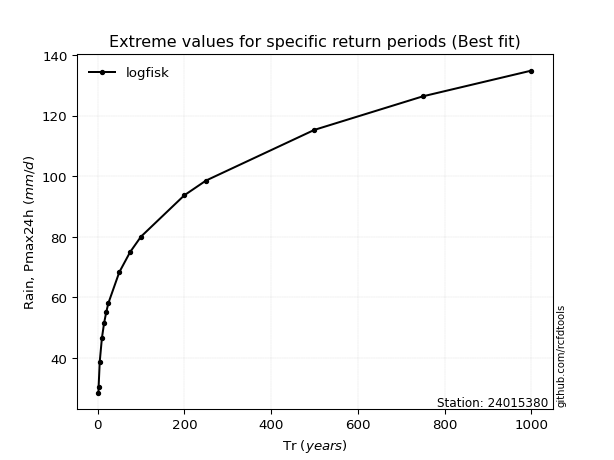</img>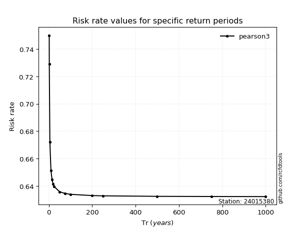</img>

</div>


<sub>**APP DISCLAIMER**: NO WARRANTY - This software is provided by [github.com/rcfdtools](https://github.com/rcfdtools) "as is", without any express or implied warranty, including warranties of merchantability, fitness for a particular purpose, or non-infringement. There is no guarantee that the software will be error-free or operate without interruption. LIMITATION OF LIABILITY - Neither the authors nor copyright holders will be liable for claims or damages arising from the software or its use. You are responsible for determining if the software is appropriate for your use and assume all associated risks, including errors, legal compliance, and data loss. NO PROFESSIONAL ADVICE - The software provides general information and does not offer professional advice. It should not replace consultation with professional advisors.</sub>