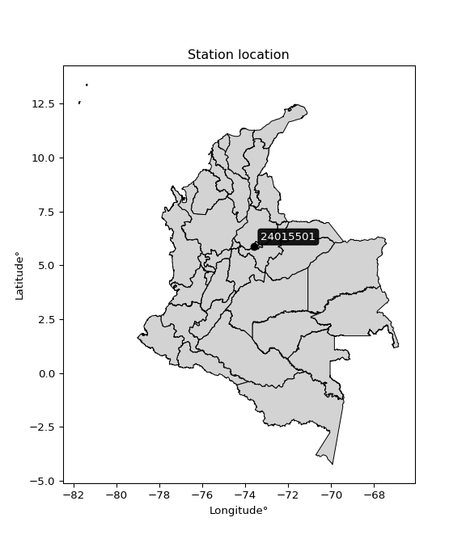

<div align="center">


</div>

# PMP Station (Rain, Pmax24h): 24015501

Probable Maximum Precipitation (PMP) is the greatest amount of rainfall for a specific duration that is meteorologically possible for a given location, acting as a "worst-case" scenario for extreme storms, crucial for designing safety-critical infrastructure like bridges, river deviations, dams, spillways, and nuclear plants to prevent catastrophic failure. PMP is calculated by hydrologists using meteorological data to determine the upper limit of extreme rainfall, often leading to the Probable Maximum Flood (PMF) for flood control design, and is increasingly being studied for climate change impacts. Probable Maximum Precipitation (PMP) is the theoretical upper limit of rainfall, a deterministic estimate for extreme events, while probability distributions (like GEV, Gumbel) describe the likelihood and frequency of various precipitation amounts, including rare ones, showing how often events occur, with PMP representing the extreme end of these distributions, used for critical infrastructure design to ensure safety against the worst conceivable weather, unlike standard statistical forecasts which cover typical probabilities.

The most common probability distributions in hydrology, used for analyzing floods, rainfall, and streamflow, include the Normal, Log-Normal, Gumbel, Gamma (including Log-Pearson Type III), and Generalized Extreme Value (GEV) distributions, often chosen based on the data´s skewness and whether modeling extremes or general conditions, with Gumbel and GEV popular for extreme events like floods, while the Normal distribution serves as a baseline, though often requiring transformations for skewed hydrological data. These distributions help in designing water infrastructure, managing water resources, and forecasting hydrologic events.

> Hydrological data often isn´t perfectly normal (it´s skewed), so different distributions are needed for different applications, such as: **Flood Frequency Analysis**: Using Gumbel, GEV, or Log-Pearson Type III for predicting extreme flood magnitudes and their return periods, **Rainfall Analysis**: Normal for annual totals, but Log-Normal, Weibull, or GEV for intensity or extreme daily rainfall, **Streamflow Modeling**: Gamma and Log-Normal for maximum flows, GEV for minimum flows, and Kappa for daily flows.

<div align="center">

</img>

</div>


## A. General information


### 1. General running parameters

• app_version: _v20260113_. • runtime: _2026-01-17 18:24:04.630693_. • Python version: _3.14.0_. • SciPy version: _1.16.3_. • Pandas version: _2.3.3_. • NumPy version: _2.3.5_. • Stations dataset (station_dataset_file): _dataset/pmax24h_in/automatic_colombia_2003_2025.csv_. • Stations catalog (station_catalog_file): _dataset/CNE.xls_. • Minimum year to eval til year_max (date_min): _1900_. • Maximum year to eval since year_min (date_max): _2025_. • Creates, save and include plots into reports (create_plot): _False_. • Plot only fit distributions with Δo > Δ (plot_only_fit): _True_. • Plot only simple graphs avoiding multiple CDFs and multiple Extreme values plots (plot_only_simple): _True_. • Eval low extreme values, if False, evaluates high extreme values (low_extreme): _False_. • Eval every SciPy distribution as logarithmic (pdist_logarithmic_on): _True_. • Standard deviation normalized (ddof): _1.0_. • Return periods to eval in years (Tr): _[2, 2.33, 5, 10, 15, 20, 25, 50, 75, 100, 200, 250, 500, 750, 1000]_. • Minimum data sample per station, 0 means any (minimum_sample): _5_. • Z-Score maximum threshold to adjust a value, 0 means disable (zscore_max): _3.5_. • Z-Score minimum threshold to adjust a value, 0 means disable (zscore_min): _-2.5_. • Avoid zeros, e.g. rain = 0 (avoid_zeros): _True_. • Avoid null values (avoid_nans): _True_. 

:file_folder:Table: [dataset.csv](../../dataset/pmax24h_in/automatic_colombia_2003_2025.csv)

> Delta Degrees of Freedom (DDOF): is a parameter used in the formulas for calculating variance and standard deviation. When ddof=0, the divisor is $N$ (the total number of observations) and this is used when your data set is the entire population. When ddof=1, the divisor is $N-1$ and this is used when your data set is a sample drawn from a larger population. Using $N-1$ provides an unbiased estimate of the population variance (known as Bessel´s correction).


### 2. Station info and location

|   id |   CODIGO | NOMBRE                    | CATEGORIA               | TECNOLOGIA                | ESTADO   | FECHA_INSTALACION   |   FECHA_SUSPENSION |   ALTITUD |   LATITUD |   LONGITUD | DEPARTAMENTO   | MUNICIPIO   | AREA_OPERATIVA                              | ENTIDAD                                    | AREA_HIDROGRAFICA   | ZONA_HIDROGRAFICA   | SUBZONA_HIDROGRAFICA   |   CORRIENTE | Catalogo   |   Version |
|-----:|---------:|:--------------------------|:------------------------|:--------------------------|:---------|:--------------------|-------------------:|----------:|----------:|-----------:|:---------------|:------------|:--------------------------------------------|:-------------------------------------------|:--------------------|:--------------------|:-----------------------|------------:|:-----------|----------:|
|    0 | 24015501 | BERTHA  - AUT  [24015501] | Climatológica Principal | Automática con Telemetría | Activa   | 21/06/2013          |                nan |      1677 |   5.88278 |   -73.5733 | Boyacá         | Moniquirá   | Area Operativa 06 - Boyacá-Casanare-Vichada | CENTRO NACIONAL DE INVESTIGACIONES DE CAFE | Magdalena Cauca     | Sogamoso            | Río Suárez             |         nan | CNE_OE     |  20251226 |

<div align="center">

Dynamic map: [:earth_americas:Google](http://maps.google.com/maps?q=5.882777778,-73.57333056) [:earth_americas:OSM](https://www.openstreetmap.org/#map=18/5.882777778/-73.57333056&layers=P) [:earth_americas:Bing](https://www.bing.com/maps?cp=5.882777778~-73.57333056&lvl=18) [:earth_americas:Apple](https://maps.apple.com/frame?center=5.882777778%2C-73.57333056&span=0.003%2C0.006)

</div>


<div align="center">

```geojson
{
  "type": "Feature",
  "geometry": {
    "type": "Point", 
    "coordinates": [-73.57333056, 5.882777778]
  }, 
  "properties": {
    "Name": "24015501"
  }
}
```

</div>


### 3. Discrete values table and plot

<div align="center">

|               |           0 |          1 |          2 |          3 |           4 |           5 |           6 |          7 |
|:--------------|------------:|-----------:|-----------:|-----------:|------------:|------------:|------------:|-----------:|
| Date          | 2016        | 2017       | 2018       | 2019       | 2020        | 2021        | 2022        | 2023       |
| Value         |   52        |   75       |   34.7     |   39.3     |   54.4      |   67.6      |   49.3      |   83.4     |
| Value_initial |   52        |   75       |   34.7     |   39.3     |   54.4      |   67.6      |   49.3      |   83.4     |
| count         |    8        |    8       |    8       |    8       |    8        |    8        |    8        |    8       |
| mean          |   56.9625   |   56.9625  |   56.9625  |   56.9625  |   56.9625   |   56.9625   |   56.9625   |   56.9625  |
| std           |   17.0501   |   17.0501  |   17.0501  |   17.0501  |   17.0501   |   17.0501   |   17.0501   |   17.0501  |
| zscore        |   -0.291054 |    1.05791 |   -1.30571 |   -1.03592 |   -0.150292 |    0.623897 |   -0.449411 |    1.55058 |


</div>


> The initial value (value_initial) correspond to the initial obtained or null completed value, and value (value) is adjusted only when the initial value is outside the valid range (outlier) definite through the Z-Score value. If Z-Score is active, values out of range or outliers are replaced with the station mean value. A Z-Score (or standard score) measures how many standard deviations a data point is from the mean of a dataset, indicating its relative position; positive scores mean above the mean, negative mean below, and a score of zero is exactly at the mean, allowing for comparison of values from different distributions. It´s calculated using the formula $z=(x–μ)/σ$, where $x$ is the data point, $μ$ is the mean, and $σ$ is the standard deviation, helping identify outliers and understand probability.
>
> <sub>**Note**: In this study, "completing" (filling gaps in) and "extending" (forecasting or lengthening the historical record) rainfall data series are avoided for certain critical analyses because they introduce artificial bias and uncertainty, which can distort the statistics of rare events (extremes), alter day-to-day variability, and compromise the integrity and homogeneity of the original data. Some reasons against Completing/Extending rainfall data are: **Distortion of Extremes and Variability**: The primary issue is that most gap-filling or extension methods rely on averaging or regression with nearby stations, which inherently smooths the data. Rainfall is highly variable in space and time, with a large percentage of zero values and occasional large storms. Infilling methods often underestimate the highest values and overestimate the lowest (zero) values, which severely distorts analyses focused on flood frequency, drought severity, and intensity-duration-frequency (IDF) curves, **Loss of Data Homogeneity**: Infilled or extended data are synthetic estimates, not actual measurements. Combining these estimates with observed data can violate the assumption of data homogeneity, which requires that the data properties do not change over time. Inhomogeneity can lead to incorrect conclusions about long-term trends or changes in climate patterns, **Propagation of Errors**: Errors and biases from the original data (e.g., wind-induced undercatch, instrument errors, site changes) or the data used for imputation can propagate through the analysis, leading to unreliable hydrological models and inaccurate predictions, **Compromised Statistical Integrity**: For statistical analyses, especially those involving the frequency of events, using artificial data can introduce time bias or autocorrelation that doesn´t exist in reality, making it difficult to assess the true probability of events, **Difficulty in Validation**: It is difficult to accurately validate the quality of filled or extended data, especially for past periods where ground-truth measurements are unavailable. The reliability of imputation techniques heavily depends on the density of the surrounding station network and the complexity of the local topography.</sub>


### 4. Active continuous probability distributions from SciPy (80 of 104 available)

A Probability Density Function (PDF) describes the relative likelihood of a continuous random variable falling within a specific range, where the total area under its curve equals 1, and the area over any interval gives the actual probability for that range. Unlike discrete probabilities (like rolling a die), a PDF shows density, not direct probability for a single point (which is zero), with higher points indicating higher likelihood, often visualized as a bell curve for normal distributions.

A log of a probability density function (log-PDF) is simply the logarithm of the PDF´s value, denoted as $log(f(x))$, useful for converting multiplication of probabilities into addition, improving numerical stability with tiny numbers, and connecting to information theory concepts like entropy. Instead of dealing with very small probabilities (e.g., 0.000001), log-PDFs use negative numbers (e.g., $log(0.00001) ≈ -11.51$ that are easier for computers to handle, preventing underflow errors and simplifying complex calculations. In this study, each active probability distribution from SciPy is also evaluated in the $log$ form.

[scipy.stats](https://docs.scipy.org/doc/scipy/reference/stats.html) is a Python´s powerful submodule within the SciPy library for comprehensive statistical analysis, offering over 130 probability distributions (like Normal, Poisson), functions for descriptive stats (mean, variance), hypothesis testing (t-tests, chi-square), random variable generation, and statistical tests, making it essential for data science, modeling, and research. It provides tools to explore, model, and draw conclusions from data efficiently, working seamlessly with NumPy.

<div align="center">

|   id | p_dist           |   n_parameter | fit_method   | label                                                                       | active   | ref                                                                                                      |
|-----:|:-----------------|--------------:|:-------------|:----------------------------------------------------------------------------|:---------|:---------------------------------------------------------------------------------------------------------|
|    0 | alpha            |             3 | MLE          | Alpha                                                                       | True     | [:mortar_board:](https://docs.scipy.org/doc/scipy/reference/generated/scipy.stats.alpha.html)            |
|    1 | anglit           |             2 | MM           | Anglit                                                                      | True     | [:mortar_board:](https://docs.scipy.org/doc/scipy/reference/generated/scipy.stats.anglit.html)           |
|    2 | arcsine          |             2 | MM           | Arcsine                                                                     | True     | [:mortar_board:](https://docs.scipy.org/doc/scipy/reference/generated/scipy.stats.arcsine.html)          |
|    3 | argus            |             3 | MLE          | Argus                                                                       | True     | [:mortar_board:](https://docs.scipy.org/doc/scipy/reference/generated/scipy.stats.argus.html)            |
|    4 | beta             |             4 | MLE          | Beta                                                                        | True     | [:mortar_board:](https://docs.scipy.org/doc/scipy/reference/generated/scipy.stats.beta.html)             |
|    5 | betaprime        |             4 | MLE          | Beta prime                                                                  | True     | [:mortar_board:](https://docs.scipy.org/doc/scipy/reference/generated/scipy.stats.betaprime.html)        |
|    6 | bradford         |             3 | MLE          | Bradford                                                                    | True     | [:mortar_board:](https://docs.scipy.org/doc/scipy/reference/generated/scipy.stats.bradford.html)         |
|    7 | burr             |             4 | MLE          | Burr (Type III)                                                             | True     | [:mortar_board:](https://docs.scipy.org/doc/scipy/reference/generated/scipy.stats.burr.html)             |
|    8 | burr12           |             4 | MLE          | Burr (Type III) 12                                                          | True     | [:mortar_board:](https://docs.scipy.org/doc/scipy/reference/generated/scipy.stats.burr12.html)           |
|    9 | cosine           |             2 | MLE          | Cosine                                                                      | True     | [:mortar_board:](https://docs.scipy.org/doc/scipy/reference/generated/scipy.stats.cosine.html)           |
|   10 | crystalball      |             4 | MLE          | Crystalball                                                                 | True     | [:mortar_board:](https://docs.scipy.org/doc/scipy/reference/generated/scipy.stats.crystalball.html)      |
|   11 | dgamma           |             3 | MLE          | Double gamma                                                                | True     | [:mortar_board:](https://docs.scipy.org/doc/scipy/reference/generated/scipy.stats.dgamma.html)           |
|   12 | dweibull         |             3 | MLE          | Double Weibull                                                              | True     | [:mortar_board:](https://docs.scipy.org/doc/scipy/reference/generated/scipy.stats.dweibull.html)         |
|   13 | erlang           |             3 | MLE          | Erlang                                                                      | True     | [:mortar_board:](https://docs.scipy.org/doc/scipy/reference/generated/scipy.stats.erlang.html)           |
|   14 | exponnorm        |             3 | MLE          | Exponentially modified Normal                                               | True     | [:mortar_board:](https://docs.scipy.org/doc/scipy/reference/generated/scipy.stats.exponnorm.html)        |
|   15 | exponpow         |             3 | MLE          | Exponential power                                                           | True     | [:mortar_board:](https://docs.scipy.org/doc/scipy/reference/generated/scipy.stats.exponpow.html)         |
|   16 | exponweib        |             4 | MLE          | Exponentiated Weibull                                                       | True     | [:mortar_board:](https://docs.scipy.org/doc/scipy/reference/generated/scipy.stats.exponweib.html)        |
|   17 | f                |             4 | MLE          | F                                                                           | True     | [:mortar_board:](https://docs.scipy.org/doc/scipy/reference/generated/scipy.stats.f.html)                |
|   18 | fatiguelife      |             3 | MLE          | Fatigue-life (Birnbaum-Saunders)                                            | True     | [:mortar_board:](https://docs.scipy.org/doc/scipy/reference/generated/scipy.stats.fatiguelife.html)      |
|   19 | foldnorm         |             3 | MM           | Fold Normal                                                                 | True     | [:mortar_board:](https://docs.scipy.org/doc/scipy/reference/generated/scipy.stats.foldnorm.html)         |
|   20 | gamma            |             3 | MLE          | Gamma                                                                       | True     | [:mortar_board:](https://docs.scipy.org/doc/scipy/reference/generated/scipy.stats.gamma.html)            |
|   21 | gausshyper       |             6 | MLE          | Gauss hypergeometric                                                        | True     | [:mortar_board:](https://docs.scipy.org/doc/scipy/reference/generated/scipy.stats.gausshyper.html)       |
|   22 | genexpon         |             5 | MLE          | Generalized exponential                                                     | True     | [:mortar_board:](https://docs.scipy.org/doc/scipy/reference/generated/scipy.stats.genexpon.html)         |
|   23 | genextreme       |             3 | MLE          | Generalized exponential                                                     | True     | [:mortar_board:](https://docs.scipy.org/doc/scipy/reference/generated/scipy.stats.genextreme.html)       |
|   24 | gengamma         |             4 | MLE          | Generalized gamma                                                           | True     | [:mortar_board:](https://docs.scipy.org/doc/scipy/reference/generated/scipy.stats.gengamma.html)         |
|   25 | genhalflogistic  |             3 | MLE          | Generalized half-logistic                                                   | True     | [:mortar_board:](https://docs.scipy.org/doc/scipy/reference/generated/scipy.stats.genhalflogistic.html)  |
|   26 | genlogistic      |             3 | MLE          | Generalized logistic                                                        | True     | [:mortar_board:](https://docs.scipy.org/doc/scipy/reference/generated/scipy.stats.genlogistic.html)      |
|   27 | gennorm          |             3 | MLE          | Generalized Normal                                                          | True     | [:mortar_board:](https://docs.scipy.org/doc/scipy/reference/generated/scipy.stats.gennorm.html)          |
|   28 | genpareto        |             3 | MLE          | Generalized Pareto                                                          | True     | [:mortar_board:](https://docs.scipy.org/doc/scipy/reference/generated/scipy.stats.genpareto.html)        |
|   29 | gompertz         |             3 | MLE          | Gompertz (or truncated Gumbel)                                              | True     | [:mortar_board:](https://docs.scipy.org/doc/scipy/reference/generated/scipy.stats.gompertz.html)         |
|   30 | gumbel_l         |             2 | MM           | Gumbel Left Skew                                                            | True     | [:mortar_board:](https://docs.scipy.org/doc/scipy/reference/generated/scipy.stats.gumbel_l.html)         |
|   31 | gumbel_r         |             2 | MM           | Gumbel Right Skew                                                           | True     | [:mortar_board:](https://docs.scipy.org/doc/scipy/reference/generated/scipy.stats.gumbel_r.html)         |
|   32 | halfgennorm      |             3 | MLE          | Upper half of a generalized normal                                          | True     | [:mortar_board:](https://docs.scipy.org/doc/scipy/reference/generated/scipy.stats.halfgennorm.html)      |
|   33 | halflogistic     |             2 | MM           | Half-logistic                                                               | True     | [:mortar_board:](https://docs.scipy.org/doc/scipy/reference/generated/scipy.stats.halflogistic.html)     |
|   34 | halfnorm         |             2 | MM           | Half Normal                                                                 | True     | [:mortar_board:](https://docs.scipy.org/doc/scipy/reference/generated/scipy.stats.halfnorm.html)         |
|   35 | hypsecant        |             2 | MM           | hyperbolic secant                                                           | True     | [:mortar_board:](https://docs.scipy.org/doc/scipy/reference/generated/scipy.stats.hypsecant.html)        |
|   36 | invgamma         |             3 | MLE          | Inverted gamma                                                              | True     | [:mortar_board:](https://docs.scipy.org/doc/scipy/reference/generated/scipy.stats.invgamma.html)         |
|   37 | invgauss         |             3 | MLE          | Inverse Gaussian                                                            | True     | [:mortar_board:](https://docs.scipy.org/doc/scipy/reference/generated/scipy.stats.invgauss.html)         |
|   38 | invweibull       |             3 | MLE          | Inverted Weibull                                                            | True     | [:mortar_board:](https://docs.scipy.org/doc/scipy/reference/generated/scipy.stats.invweibull.html)       |
|   39 | johnsonsb        |             4 | MLE          | Johnson SB                                                                  | True     | [:mortar_board:](https://docs.scipy.org/doc/scipy/reference/generated/scipy.stats.johnsonsb.html)        |
|   40 | johnsonsu        |             4 | MLE          | Johnson Su                                                                  | True     | [:mortar_board:](https://docs.scipy.org/doc/scipy/reference/generated/scipy.stats.johnsonsu.html)        |
|   41 | kappa3           |             3 | MLE          | Kappa 3                                                                     | True     | [:mortar_board:](https://docs.scipy.org/doc/scipy/reference/generated/scipy.stats.kappa3.html)           |
|   42 | kappa4           |             4 | MLE          | Kappa 4                                                                     | True     | [:mortar_board:](https://docs.scipy.org/doc/scipy/reference/generated/scipy.stats.kappa4.html)           |
|   43 | ksone            |             3 | MLE          | Kolmogorov-Smirnov one-sided test statistic distribution                    | True     | [:mortar_board:](https://docs.scipy.org/doc/scipy/reference/generated/scipy.stats.ksone.html)            |
|   44 | kstwobign        |             2 | MLE          | Limiting distribution of scaled Kolmogorov-Smirnov two-sided test statistic | True     | [:mortar_board:](https://docs.scipy.org/doc/scipy/reference/generated/scipy.stats.kstwobign.html)        |
|   45 | laplace          |             2 | MM           | Laplace                                                                     | True     | [:mortar_board:](https://docs.scipy.org/doc/scipy/reference/generated/scipy.stats.laplace.html)          |
|   46 | levy_l           |             2 | MLE          | Left-skewed Levy                                                            | True     | [:mortar_board:](https://docs.scipy.org/doc/scipy/reference/generated/scipy.stats.levy_l.html)           |
|   47 | loggamma         |             3 | MLE          | Log gamma                                                                   | True     | [:mortar_board:](https://docs.scipy.org/doc/scipy/reference/generated/scipy.stats.loggamma.html)         |
|   48 | logistic         |             2 | MM           | Logistic (or Sech-squared)                                                  | True     | [:mortar_board:](https://docs.scipy.org/doc/scipy/reference/generated/scipy.stats.logistic.html)         |
|   49 | loglaplace       |             3 | MLE          | Log-Laplace                                                                 | True     | [:mortar_board:](https://docs.scipy.org/doc/scipy/reference/generated/scipy.stats.loglaplace.html)       |
|   50 | lomax            |             3 | MLE          | Lomax (Pareto of the second kind)                                           | True     | [:mortar_board:](https://docs.scipy.org/doc/scipy/reference/generated/scipy.stats.lomax.html)            |
|   51 | maxwell          |             2 | MM           | Maxwell                                                                     | True     | [:mortar_board:](https://docs.scipy.org/doc/scipy/reference/generated/scipy.stats.maxwell.html)          |
|   52 | mielke           |             4 | MLE          | Mielke Beta-Kappa / Dagum                                                   | True     | [:mortar_board:](https://docs.scipy.org/doc/scipy/reference/generated/scipy.stats.mielke.html)           |
|   53 | moyal            |             2 | MM           | Moyal                                                                       | True     | [:mortar_board:](https://docs.scipy.org/doc/scipy/reference/generated/scipy.stats.moyal.html)            |
|   54 | nakagami         |             3 | MLE          | Nakagami                                                                    | True     | [:mortar_board:](https://docs.scipy.org/doc/scipy/reference/generated/scipy.stats.nakagami.html)         |
|   55 | ncf              |             5 | MLE          | Non-central F distribution                                                  | True     | [:mortar_board:](https://docs.scipy.org/doc/scipy/reference/generated/scipy.stats.ncf.html)              |
|   56 | nct              |             4 | MLE          | Non-central Student’s t                                                     | True     | [:mortar_board:](https://docs.scipy.org/doc/scipy/reference/generated/scipy.stats.nct.html)              |
|   57 | norm             |             2 | MM           | Normal                                                                      | True     | [:mortar_board:](https://docs.scipy.org/doc/scipy/reference/generated/scipy.stats.norm.html)             |
|   58 | pearson3         |             3 | MM           | Pearson type III                                                            | True     | [:mortar_board:](https://docs.scipy.org/doc/scipy/reference/generated/scipy.stats.pearson3.html)         |
|   59 | powerlaw         |             3 | MLE          | Power-function                                                              | True     | [:mortar_board:](https://docs.scipy.org/doc/scipy/reference/generated/scipy.stats.powerlaw.html)         |
|   60 | rayleigh         |             2 | MM           | Rayleigh                                                                    | True     | [:mortar_board:](https://docs.scipy.org/doc/scipy/reference/generated/scipy.stats.rayleigh.html)         |
|   61 | rdist            |             3 | MLE          | R-distributed (symmetric beta)                                              | True     | [:mortar_board:](https://docs.scipy.org/doc/scipy/reference/generated/scipy.stats.rdist.html)            |
|   62 | rice             |             3 | MLE          | Rice                                                                        | True     | [:mortar_board:](https://docs.scipy.org/doc/scipy/reference/generated/scipy.stats.rice.html)             |
|   63 | semicircular     |             2 | MM           | Semicircular                                                                | True     | [:mortar_board:](https://docs.scipy.org/doc/scipy/reference/generated/scipy.stats.semicircular.html)     |
|   64 | skewnorm         |             3 | MLE          | Skew normal                                                                 | True     | [:mortar_board:](https://docs.scipy.org/doc/scipy/reference/generated/scipy.stats.skewnorm.html)         |
|   65 | t                |             3 | MLE          | Student’s t                                                                 | True     | [:mortar_board:](https://docs.scipy.org/doc/scipy/reference/generated/scipy.stats.t.html)                |
|   66 | trapezoid        |             4 | MLE          | Trapezoid                                                                   | True     | [:mortar_board:](https://docs.scipy.org/doc/scipy/reference/generated/scipy.stats.trapezoid.html)        |
|   67 | triang           |             3 | MLE          | Triangular                                                                  | True     | [:mortar_board:](https://docs.scipy.org/doc/scipy/reference/generated/scipy.stats.triang.html)           |
|   68 | truncexpon       |             3 | MLE          | Truncated exponential                                                       | True     | [:mortar_board:](https://docs.scipy.org/doc/scipy/reference/generated/scipy.stats.truncexpon.html)       |
|   69 | truncnorm        |             4 | MLE          | Truncated normal                                                            | True     | [:mortar_board:](https://docs.scipy.org/doc/scipy/reference/generated/scipy.stats.truncnorm.html)        |
|   70 | truncpareto      |             4 | MLE          | Upper truncated Pareto                                                      | True     | [:mortar_board:](https://docs.scipy.org/doc/scipy/reference/generated/scipy.stats.truncpareto.html)      |
|   71 | truncweibull_min |             5 | MLE          | Doubly truncated Weibull minimum                                            | True     | [:mortar_board:](https://docs.scipy.org/doc/scipy/reference/generated/scipy.stats.truncweibull_min.html) |
|   72 | tukeylambda      |             3 | MLE          | Tukey-Lamdba                                                                | True     | [:mortar_board:](https://docs.scipy.org/doc/scipy/reference/generated/scipy.stats.tukeylambda.html)      |
|   73 | uniform          |             2 | MLE          | Uniform                                                                     | True     | [:mortar_board:](https://docs.scipy.org/doc/scipy/reference/generated/scipy.stats.uniform.html)          |
|   74 | vonmises         |             3 | MLE          | Von Mises                                                                   | True     | [:mortar_board:](https://docs.scipy.org/doc/scipy/reference/generated/scipy.stats.vonmises.html)         |
|   75 | vonmises_line    |             3 | MLE          | Von Mises line                                                              | True     | [:mortar_board:](https://docs.scipy.org/doc/scipy/reference/generated/scipy.stats.vonmises_line.html)    |
|   76 | wald             |             2 | MM           | Wald                                                                        | True     | [:mortar_board:](https://docs.scipy.org/doc/scipy/reference/generated/scipy.stats.wald.html)             |
|   77 | weibull_max      |             3 | MLE          | Weibull maximum                                                             | True     | [:mortar_board:](https://docs.scipy.org/doc/scipy/reference/generated/scipy.stats.weibull_max.html)      |
|   78 | weibull_min      |             3 | MLE          | Weibull minimum                                                             | True     | [:mortar_board:](https://docs.scipy.org/doc/scipy/reference/generated/scipy.stats.weibull_min.html)      |
|   79 | wrapcauchy       |             3 | MLE          | Wrapped  Cauchy                                                             | True     | [:mortar_board:](https://docs.scipy.org/doc/scipy/reference/generated/scipy.stats.wrapcauchy.html)       |

</div>

> **n_parameter:** # arguments & localization & scale.
>
> **Fit methods:** (MLE) maximum likelihood, (MM) L-moments.
>
>**Inactive** (With the only purpose of prevent loops, zero divisions, infinite values, over high estimated values or horizontal trending for recurrence intervals estimations, the follow distributions were disabled.)**:** lognorm, norminvgauss, powernorm, powerlognorm, cauchy, halfcauchy, foldcauchy, skewcauchy, chi2, expon, fisk, genhyperbolic, geninvgauss, gibrat, kstwo, laplace_asymmetric, levy, levy_stable, ncx2, pareto, rel_breitwigner, recipinvgauss, studentized_range, loguniform, 


## B. Probability (PDF) vs. Empirical (EDF) distributions functions

A continuous probability distribution (CPD) describes probabilities for variables that can take any value within a range (like rain any time), unlike discrete variables with specific outcomes (like temperature). It uses a Probability Density Function (PDF), a curve where the total area under it equals 1, and the probability of the variable falling within an interval (a to b) is found by calculating the area under the curve between those points. A key feature is that the probability of hitting any single exact value is zero, so probabilities are always expressed for ranges, e.g., $P(a ≤ X ≤ b)$.

<div align="center">

Distributions parameters from station values
|     |   station | p_dist              |   n |             loc |          scale | shape                  | shape1                 | shape2                 | shape3             |
|----:|----------:|:--------------------|----:|----------------:|---------------:|:-----------------------|:-----------------------|:-----------------------|:-------------------|
|   0 |  24015501 | alpha               |   8 |   -89.3925      | 1346.74        | 9.310366960440337      |                        |                        |                    |
|   1 |  24015501 | anglit              |   8 |    56.9625      |   46.6569      |                        |                        |                        |                    |
|   2 |  24015501 | arcsine             |   8 |    34.4074      |   45.1103      |                        |                        |                        |                    |
|   3 |  24015501 | argus               |   8 |    21.7731      |   64.1898      | 1.947236748080263e-05  |                        |                        |                    |
|   4 |  24015501 | beta                |   8 |    34.7         |   51.6061      | 0.7974962730315058     | 1.1308366164166812     |                        |                    |
|   5 |  24015501 | betaprime           |   8 |    -1.37876     |  177.608       | 17.517526675361836     | 54.37736227073199      |                        |                    |
|   6 |  24015501 | bradford            |   8 |    34.6999      |   48.7001      | 0.9997003490787213     |                        |                        |                    |
|   7 |  24015501 | burr                |   8 |    -0.178759    |   48.4105      | 5.103851921014874      | 1.567386239742822      |                        |                    |
|   8 |  24015501 | burr12              |   8 |    -3.95645     |   38.4873      | 865.9381395890186      | 0.0027212967588573895  |                        |                    |
|   9 |  24015501 | cosine              |   8 |    57.5827      |   13.0441      |                        |                        |                        |                    |
|  10 |  24015501 | crystalball         |   8 |    56.9566      |   15.9655      | 7259.523832295006      | 1093.4089621962821     |                        |                    |
|  11 |  24015501 | dgamma              |   8 |    53.3568      |   11.9445      | 1.0998791500775833     |                        |                        |                    |
|  12 |  24015501 | dweibull            |   8 |    53.4491      |   13.678       | 1.1337336061775196     |                        |                        |                    |
|  13 |  24015501 | erlang              |   8 |    34.7         |   22.8593      | 0.5804305775818869     |                        |                        |                    |
|  14 |  24015501 | exponnorm           |   8 |    53.1708      |   15.4943      | 0.24471614825902008    |                        |                        |                    |
|  15 |  24015501 | exponpow            |   8 |    34.7         |   42.3983      | 0.6150733500907286     |                        |                        |                    |
|  16 |  24015501 | exponweib           |   8 |    34.7         |    1.15166     | 1.2958194430824514     | 0.3149416598074479     |                        |                    |
|  17 |  24015501 | f                   |   8 |     2.73514     |   53.4389      | 27.91318570926458      | 129.47174787574676     |                        |                    |
|  18 |  24015501 | fatiguelife         |   8 |    34.7         |    7.09019e-06 | 1455.2387815901502     |                        |                        |                    |
|  19 |  24015501 | foldnorm            |   8 |    26.1307      |   16.8407      | 1.802414649837437      |                        |                        |                    |
|  20 |  24015501 | gamma               |   8 |    34.7         |   19.3387      | 0.9474452999887559     |                        |                        |                    |
|  21 |  24015501 | gausshyper          |   8 |    34.7         |   48.7098      | 0.7980319755785994     | 1.024265283947666      | 0.8458343170940605     | 1.2667908540796127 |
|  22 |  24015501 | genexpon            |   8 |    34.7         |    2.91421     | 0.1308987476822377     | 1.0106305655452848e-08 | 2.721080627995003      |                    |
|  23 |  24015501 | genextreme          |   8 |    34.9742      |    2.34614     | -8.556704703294326     |                        |                        |                    |
|  24 |  24015501 | gengamma            |   8 |    34.7         |    1.23255     | 1.2585145057777538     | 0.2629348257377118     |                        |                    |
|  25 |  24015501 | genhalflogistic     |   8 |    32.2515      |   54.035       | 1.0564337150931105     |                        |                        |                    |
|  26 |  24015501 | genlogistic         |   8 |   -32.4292      |   13.4983      | 424.15243042176735     |                        |                        |                    |
|  27 |  24015501 | gennorm             |   8 |    59.05        |   24.3501      | 6369308.49134025       |                        |                        |                    |
|  28 |  24015501 | genpareto           |   8 |    -0.121501    |  134.747       | -1.6133199210052354    |                        |                        |                    |
|  29 |  24015501 | gompertz            |   8 |    34.7         |   37.3613      | 0.9852256669250583     |                        |                        |                    |
|  30 |  24015501 | gumbel_l            |   8 |    64.1404      |   12.4353      |                        |                        |                        |                    |
|  31 |  24015501 | gumbel_r            |   8 |    49.7846      |   12.4353      |                        |                        |                        |                    |
|  32 |  24015501 | halfgennorm         |   8 |    34.7         |    1.28122     | 0.38567448147783223    |                        |                        |                    |
|  33 |  24015501 | halflogistic        |   8 |    38.0593      |   13.6358      |                        |                        |                        |                    |
|  34 |  24015501 | halfnorm            |   8 |    35.8524      |   26.4576      |                        |                        |                        |                    |
|  35 |  24015501 | hypsecant           |   8 |    56.9625      |   10.1534      |                        |                        |                        |                    |
|  36 |  24015501 | invgamma            |   8 |   -24.6161      | 2072.83        | 26.39789249940071      |                        |                        |                    |
|  37 |  24015501 | invgauss            |   8 |     8.99471     |  383.465       | 0.1250905353030204     |                        |                        |                    |
|  38 |  24015501 | invweibull          |   8 |    -6.12351e+08 |    6.12351e+08 | 45350214.06978558      |                        |                        |                    |
|  39 |  24015501 | johnsonsb           |   8 |    34.7         |   48.7         | 0.7109564972536219     | 0.11228208830977357    |                        |                    |
|  40 |  24015501 | johnsonsu           |   8 |     3.5651      |    7.96488     | -8.466548153921586     | 3.3118342263602294     |                        |                    |
|  41 |  24015501 | kappa3              |   8 |    34.6457      |   48.7463      | 872.8429709922245      |                        |                        |                    |
|  42 |  24015501 | kappa4              |   8 |    31.1098      |   51.3291      | 1.0751375685886493     | 0.9769533214211163     |                        |                    |
|  43 |  24015501 | ksone               |   8 |    29.3382      |   55.2486      | 1.0                    |                        |                        |                    |
|  44 |  24015501 | kstwobign           |   8 |     2.28527     |   62.5328      |                        |                        |                        |                    |
|  45 |  24015501 | laplace             |   8 |    56.9625      |   11.2776      |                        |                        |                        |                    |
|  46 |  24015501 | levy_l              |   8 |    85.9915      |   12.1126      |                        |                        |                        |                    |
|  47 |  24015501 | loggamma            |   8 | -3784.65        |  545.572       | 1143.4952931710068     |                        |                        |                    |
|  48 |  24015501 | logistic            |   8 |    56.9625      |    8.79309     |                        |                        |                        |                    |
|  49 |  24015501 | loglaplace          |   8 |    -0.145727    |   52.1458      | 4.25793411581947       |                        |                        |                    |
|  50 |  24015501 | lomax               |   8 |    34.7         | 2139.05        | 96.4389443809037       |                        |                        |                    |
|  51 |  24015501 | maxwell             |   8 |    19.1703      |   23.6827      |                        |                        |                        |                    |
|  52 |  24015501 | mielke              |   8 |    -0.309398    |   48.4361      | 8.055868984799861      | 5.102685072117473      |                        |                    |
|  53 |  24015501 | moyal               |   8 |    47.8419      |    7.17953     |                        |                        |                        |                    |
|  54 |  24015501 | nakagami            |   8 |    34.7         |   30.0214      | 0.2085564335980678     |                        |                        |                    |
|  55 |  24015501 | ncf                 |   8 |    -0.0749907   |    3.13233e-05 | 5.531854347127585e-06  | 18.762472797062742     | 9.034855724914358      |                    |
|  56 |  24015501 | nct                 |   8 |    -0.107726    |    9.99431     | 12.085511413233917     | 5.354167987769404      |                        |                    |
|  57 |  24015501 | norm                |   8 |    56.9625      |   15.9489      |                        |                        |                        |                    |
|  58 |  24015501 | pearson3            |   8 |    56.9625      |   15.9489      | 0.25937787910197563    |                        |                        |                    |
|  59 |  24015501 | powerlaw            |   8 |    34.7         |   48.7         | 0.1880165596303546     |                        |                        |                    |
|  60 |  24015501 | rayleigh            |   8 |    26.4513      |   24.3444      |                        |                        |                        |                    |
|  61 |  24015501 | rdist               |   8 |    44.5505      |    9.85045     | 1.3236891965484734     |                        |                        |                    |
|  62 |  24015501 | rice                |   8 |    27.6263      |   20.923       | 0.7395574296938303     |                        |                        |                    |
|  63 |  24015501 | semicircular        |   8 |    56.9625      |   31.8978      |                        |                        |                        |                    |
|  64 |  24015501 | skewnorm            |   8 |    34.7         |   27.3844      | 19893749.673236385     |                        |                        |                    |
|  65 |  24015501 | t                   |   8 |    56.9621      |   15.9484      | 5640344.689339394      |                        |                        |                    |
|  66 |  24015501 | trapezoid           |   8 |    29.83        |   58.44        | 1.0                    | 1.0                    |                        |                    |
|  67 |  24015501 | triang              |   8 |    17.2556      |   66.1444      | 0.9999999999998503     |                        |                        |                    |
|  68 |  24015501 | truncexpon          |   8 |    34.7         |   47.6311      | 1.0224402613883905     |                        |                        |                    |
|  69 |  24015501 | truncnorm           |   8 |    56.9625      |   15.9489      | -108.04710163538559    | 344.0365247595814      |                        |                    |
|  70 |  24015501 | truncpareto         |   8 |   -11.5753      |   46.2753      | 1.247063447849034e-07  | 2.0523966792900077     |                        |                    |
|  71 |  24015501 | truncweibull_min    |   8 |    34.6592      |   62.986       | 0.9482936645447793     | 0.0006213279126399663  | 0.7738354369557308     |                    |
|  72 |  24015501 | tukeylambda         |   8 |    59.0664      |   24.8709      | 1.0207052234646654     |                        |                        |                    |
|  73 |  24015501 | uniform             |   8 |    34.7         |   48.7         |                        |                        |                        |                    |
|  74 |  24015501 | vonmises            |   8 |    -2.56855     |    1           | 0.0982864602678462     |                        |                        |                    |
|  75 |  24015501 | vonmises_line       |   8 |    59.0501      |    7.75089     | 1.376266289660563e-05  |                        |                        |                    |
|  76 |  24015501 | wald                |   8 |    41.0136      |   15.9489      |                        |                        |                        |                    |
|  77 |  24015501 | weibull_max         |   8 |    83.4         |    1.3963      | 0.25314739095782945    |                        |                        |                    |
|  78 |  24015501 | weibull_min         |   8 |    33.728       |   24.7327      | 1.2560329964148522     |                        |                        |                    |
|  79 |  24015501 | wrapcauchy          |   8 |    34.7         |    7.75085     | 0.5                    |                        |                        |                    |
|  80 |  24015501 | logalpha            |   8 |    -3.93328     |  218.067       | 27.524777879792083     |                        |                        |                    |
|  81 |  24015501 | loganglit           |   8 |     4.00228     |    0.835284    |                        |                        |                        |                    |
|  82 |  24015501 | logarcsine          |   8 |     3.59847     |    0.807615    |                        |                        |                        |                    |
|  83 |  24015501 | logargus            |   8 |     3.36066     |    1.11272     | 0.0002111115135762339  |                        |                        |                    |
|  84 |  24015501 | logbeta             |   8 |     3.51325     |    0.910401    | 0.6762421561659842     | 0.5561341461262173     |                        |                    |
|  85 |  24015501 | logbetaprime        |   8 |    -3.81296     |   27.6365      | 965.3902673725553      | 3415.049814145883      |                        |                    |
|  86 |  24015501 | logbradford         |   8 |     3.54674     |    0.876912    | 1.0907242159699897     |                        |                        |                    |
|  87 |  24015501 | logburr             |   8 |    -0.039357    |    4.08281     | 24.863359432688863     | 0.8481902717115177     |                        |                    |
|  88 |  24015501 | logburr12           |   8 |     3.07151     |    2.23447     | 4.034197111969007      | 22.38952289977771      |                        |                    |
|  89 |  24015501 | logcosine           |   8 |     3.99776     |    0.233683    |                        |                        |                        |                    |
|  90 |  24015501 | logcrystalball      |   8 |     4.00228     |    0.285528    | 20.627994914259936     | 10.386914173796594     |                        |                    |
|  91 |  24015501 | logdgamma           |   8 |     3.97608     |    0.203415    | 1.1577046163343163     |                        |                        |                    |
|  92 |  24015501 | logdweibull         |   8 |     3.97713     |    0.24814     | 1.1926061993085262     |                        |                        |                    |
|  93 |  24015501 | logerlang           |   8 |    -4.29805     |    0.00988999  | 839.2059270897171      |                        |                        |                    |
|  94 |  24015501 | logexponnorm        |   8 |     4.00191     |    0.285528    | 0.0012828032585261943  |                        |                        |                    |
|  95 |  24015501 | logexponpow         |   8 |     3.54674     |    0.756095    | 0.5188219853688363     |                        |                        |                    |
|  96 |  24015501 | logexponweib        |   8 |     3.54674     |    0.566573    | 0.49907062088541143    | 1.6783036036373566     |                        |                    |
|  97 |  24015501 | logf                |   8 |   -67.7289      |   71.7304      | 215493.0935953927      | 304852.2569663946      |                        |                    |
|  98 |  24015501 | logfatiguelife      |   8 |   -27.4973      |   31.4987      | 0.009075598608320159   |                        |                        |                    |
|  99 |  24015501 | logfoldnorm         |   8 |     3.56437     |    0.33262     | 1.2062287008268675     |                        |                        |                    |
| 100 |  24015501 | loggamma            |   8 |    -4.36551     |    0.0097782   | 855.7124031820476      |                        |                        |                    |
| 101 |  24015501 | loggausshyper       |   8 |     3.505       |    0.918651    | 1.2584422395222972     | 0.8169379495059033     | 1.4112087639947353     | 0.4093983596579438 |
| 102 |  24015501 | loggenexpon         |   8 |     3.54674     |    0.00935509  | 0.00945006438631206    | 3.164931045013928      | 0.00010286689989511151 |                    |
| 103 |  24015501 | loggenextreme       |   8 |     3.94473     |    0.321459    | 0.5841397291770376     |                        |                        |                    |
| 104 |  24015501 | loggengamma         |   8 |     3.54674     |    0.575858    | 0.5862920339912763     | 1.531153659627435      |                        |                    |
| 105 |  24015501 | loggenhalflogistic  |   8 |     3.50256     |    0.997176    | 1.0826094454841493     |                        |                        |                    |
| 106 |  24015501 | loggenlogistic      |   8 |     3.87873     |    0.196303    | 1.5524238313338454     |                        |                        |                    |
| 107 |  24015501 | loggennorm          |   8 |     3.98519     |    0.438455    | 12462985.42088322      |                        |                        |                    |
| 108 |  24015501 | loggenpareto        |   8 |    -0.0493395   |   12.9549      | -2.8962412830509945    |                        |                        |                    |
| 109 |  24015501 | loggompertz         |   8 |     3.54674     |    0.770735    | 1.1269173237263965     |                        |                        |                    |
| 110 |  24015501 | loggumbel_l         |   8 |     4.13078     |    0.222626    |                        |                        |                        |                    |
| 111 |  24015501 | loggumbel_r         |   8 |     3.87378     |    0.222626    |                        |                        |                        |                    |
| 112 |  24015501 | loghalfgennorm      |   8 |     3.54674     |    0.555003    | 1.2321420923210817     |                        |                        |                    |
| 113 |  24015501 | loghalflogistic     |   8 |     3.66381     |    0.24415     |                        |                        |                        |                    |
| 114 |  24015501 | loghalfnorm         |   8 |     3.62435     |    0.473666    |                        |                        |                        |                    |
| 115 |  24015501 | loghypsecant        |   8 |     4.00228     |    0.181773    |                        |                        |                        |                    |
| 116 |  24015501 | loginvgamma         |   8 |    -0.0612602   |  804.889       | 199.24421799185848     |                        |                        |                    |
| 117 |  24015501 | loginvgauss         |   8 |     1.93579     |  101.473       | 0.020375766234164913   |                        |                        |                    |
| 118 |  24015501 | loginvweibull       |   8 |    -2.60512e+07 |    2.60512e+07 | 96262946.98031151      |                        |                        |                    |
| 119 |  24015501 | logjohnsonsb        |   8 |     3.54674     |    0.876909    | -1.4450297955344173    | 0.1884779296871451     |                        |                    |
| 120 |  24015501 | logjohnsonsu        |   8 |     6.79164     |    0.278044    | 29.338304921624943     | 9.791859263855141      |                        |                    |
| 121 |  24015501 | logkappa3           |   8 |     3.54674     |    0.876288    | 2961.956293143082      |                        |                        |                    |
| 122 |  24015501 | logkappa4           |   8 |     3.48554     |    0.957639    | 1.0683170699624038     | 1.0189881430612782     |                        |                    |
| 123 |  24015501 | logksone            |   8 |     3.50773     |    0.989099    | 1.0                    |                        |                        |                    |
| 124 |  24015501 | logkstwobign        |   8 |     2.93597     |    1.21773     |                        |                        |                        |                    |
| 125 |  24015501 | loglaplace          |   8 |     4.00228     |    0.201899    |                        |                        |                        |                    |
| 126 |  24015501 | loglevy_l           |   8 |     4.46112     |    0.174134    |                        |                        |                        |                    |
| 127 |  24015501 | logloggamma         |   8 |    -0.102031    |    1.33349     | 22.21031733345456      |                        |                        |                    |
| 128 |  24015501 | loglogistic         |   8 |     4.00228     |    0.15742     |                        |                        |                        |                    |
| 129 |  24015501 | logloglaplace       |   8 |    -0.0320311   |    3.99796     | 17.074371796255985     |                        |                        |                    |
| 130 |  24015501 | loglomax            |   8 |     3.54674     |    2.70078     | 6.271441466851327      |                        |                        |                    |
| 131 |  24015501 | logmaxwell          |   8 |     3.3257      |    0.423985    |                        |                        |                        |                    |
| 132 |  24015501 | logmielke           |   8 |    -0.0907598   |    4.13247     | 21.44830612478333      | 25.113958401213495     |                        |                    |
| 133 |  24015501 | logmoyal            |   8 |     3.839       |    0.128533    |                        |                        |                        |                    |
| 134 |  24015501 | lognakagami         |   8 |     3.54674     |    0.522832    | 0.4049036099595956     |                        |                        |                    |
| 135 |  24015501 | logncf              |   8 |   -17.1663      |    8.37462     | 85486.43217295237      | 11850.552199411548     | 130577.34022331511     |                    |
| 136 |  24015501 | lognct              |   8 |    -1.72773     |    0.0771459   | 217.64747683494522     | 74.0162517266528       |                        |                    |
| 137 |  24015501 | lognorm             |   8 |     4.00228     |    0.285528    |                        |                        |                        |                    |
| 138 |  24015501 | logpearson3         |   8 |     4.00228     |    0.285528    | -0.08870821673610695   |                        |                        |                    |
| 139 |  24015501 | logpowerlaw         |   8 |     3.54674     |    0.876909    | 0.20034536451120796    |                        |                        |                    |
| 140 |  24015501 | lograyleigh         |   8 |     3.45605     |    0.43583     |                        |                        |                        |                    |
| 141 |  24015501 | logrdist            |   8 |     4.05756     |    0.510816    | 1.1091908976571094     |                        |                        |                    |
| 142 |  24015501 | logrice             |   8 |     3.40887     |    0.333956    | 1.3742036097730006     |                        |                        |                    |
| 143 |  24015501 | logsemicircular     |   8 |     4.00228     |    0.571057    |                        |                        |                        |                    |
| 144 |  24015501 | logskewnorm         |   8 |     4.11517     |    0.307036    | -0.5190321615289131    |                        |                        |                    |
| 145 |  24015501 | logt                |   8 |     4.00228     |    0.285529    | 11161433585.80539      |                        |                        |                    |
| 146 |  24015501 | logtrapezoid        |   8 |     3.45905     |    1.05229     | 1.0                    | 1.0                    |                        |                    |
| 147 |  24015501 | logtriang           |   8 |     3.29453     |    1.12911     | 0.9999997668555636     |                        |                        |                    |
| 148 |  24015501 | logtruncexpon       |   8 |     3.54674     |    1.13128     | 0.775168072018249      |                        |                        |                    |
| 149 |  24015501 | logtruncnorm        |   8 |    -0.0818967   |    1.26572     | 2.9651992991384364     | 5.198517062611386      |                        |                    |
| 150 |  24015501 | logtruncpareto      |   8 |     3.54659     |    0.000154298 | 0.1433486022839848     | 5684.202238344478      |                        |                    |
| 151 |  24015501 | logtruncweibull_min |   8 |     3.53945     |    0.936034    | 1.0826473468823234     | 0.00044172517797615835 | 0.944620792045528      |                    |
| 152 |  24015501 | logtukeylambda      |   8 |     3.98336     |    0.462408    | 1.050239668440197      |                        |                        |                    |
| 153 |  24015501 | loguniform          |   8 |     3.54674     |    0.876909    |                        |                        |                        |                    |
| 154 |  24015501 | logvonmises         |   8 |    -2.28055     |    1           | 12.688460994388594     |                        |                        |                    |
| 155 |  24015501 | logvonmises_line    |   8 |     3.98891     |    0.140752    | 2.8620462036962936e-05 |                        |                        |                    |
| 156 |  24015501 | logwald             |   8 |     3.71677     |    0.285507    |                        |                        |                        |                    |
| 157 |  24015501 | logweibull_max      |   8 |     4.49501     |    0.550282    | 1.711815665637498      |                        |                        |                    |
| 158 |  24015501 | logweibull_min      |   8 |     3.28616     |    0.806414    | 2.796414461412351      |                        |                        |                    |
| 159 |  24015501 | logwrapcauchy       |   8 |     3.54674     |    0.139564    | 0.12316311914213413    |                        |                        |                    |

</div>

> **loc** (Location parameter): This shifts the distribution along the x-axis. For many common distributions, like the normal (Gaussian) distribution, loc represents the mean $μ$. For others, like the uniform distribution, it might represent the minimum value, or for the beta distribution, the left end of the support interval.
>
> **scale** (Scale parameter): This determines the width or spread of the distribution. For the normal distribution, scale represents the standard deviation $σ$. For a uniform distribution, it defines the length of the interval (from $loc$ to $loc + scale$).
>
> **shape** (Shape parameters): Refers to parameters that define the specific form of a probability distribution, distinct from its location (loc) and scale (scale). These parameters are required arguments for most distribution functions. For example, a normal (Gaussian) distribution is fully defined by its location (mean) and scale (standard deviation), so it has no specific shape parameters beyond loc and scale. However, other distributions have intrinsic properties that need specification, as Gamma distribution that takes a shape parameter, often named $a$ or $alpha$.


### 0. Cumulative distribution values - CDF (160 evaluated)

Cumulative Distribution Function (CDF), denoted as $F$<sub>$X$</sub>$(x)$, is a function that gives the probability that a random variable $X$ will take a value less than or equal to a specific value, $x$ (i.e., $(P(X≥x)$. It essentially "accumulates" probabilities from a given point up to the far right (positive infinity), providing a complete picture of the distribution´s probabilities for both discrete (like rain) and continuous (like temperature) variables, helping to find probabilities over ranges or above certain values. Each station is evaluated separately ordering the $x$ values ascending, calculating the CDF and PDF values for the activated distributions and their logarithmic forms.

<div align="center">

CDF ordered by x ascending and calculating $log(f(x))$ separately
|   id |   Station |   date |    x |   count |    mean |     std |    zscore |   Value_initial |   station |   m |    alpha |   alpha_pdf |    anglit |   anglit_pdf |   arcsine |   arcsine_pdf |     argus |   argus_pdf |       beta |   beta_pdf |   betaprime |   betaprime_pdf |    bradford |   bradford_pdf |      burr |   burr_pdf |    burr12 |   burr12_pdf |    cosine |   cosine_pdf |   crystalball |   crystalball_pdf |   dgamma |   dgamma_pdf |   dweibull |   dweibull_pdf |     erlang |   erlang_pdf |   exponnorm |   exponnorm_pdf |   exponpow |   exponpow_pdf |   exponweib |   exponweib_pdf |         f |      f_pdf |   fatiguelife |   fatiguelife_pdf |   foldnorm |   foldnorm_pdf |       gamma |   gamma_pdf |   gausshyper |   gausshyper_pdf |    genexpon |   genexpon_pdf |   genextreme |   genextreme_pdf |    gengamma |   gengamma_pdf |   genhalflogistic |   genhalflogistic_pdf |   genlogistic |   genlogistic_pdf |     gennorm |   gennorm_pdf |   genpareto |   genpareto_pdf |    gompertz |   gompertz_pdf |   gumbel_l |   gumbel_l_pdf |   gumbel_r |   gumbel_r_pdf |   halfgennorm |   halfgennorm_pdf |   halflogistic |   halflogistic_pdf |   halfnorm |   halfnorm_pdf |   hypsecant |   hypsecant_pdf |   invgamma |   invgamma_pdf |   invgauss |   invgauss_pdf |   invweibull |   invweibull_pdf |   johnsonsb |    johnsonsb_pdf |   johnsonsu |   johnsonsu_pdf |    kappa3 |   kappa3_pdf |      kappa4 |   kappa4_pdf |     ksone |   ksone_pdf |   kstwobign |   kstwobign_pdf |   laplace |   laplace_pdf |   levy_l |   levy_l_pdf |   loggamma |   loggamma_pdf |   logistic |   logistic_pdf |   loglaplace |   loglaplace_pdf |       lomax |   lomax_pdf |   maxwell |   maxwell_pdf |    mielke |   mielke_pdf |     moyal |   moyal_pdf |    nakagami |   nakagami_pdf |      ncf |    ncf_pdf |       nct |    nct_pdf |      norm |   norm_pdf |   pearson3 |   pearson3_pdf |   powerlaw |   powerlaw_pdf |   rayleigh |   rayleigh_pdf |       rdist |    rdist_pdf |      rice |   rice_pdf |   semicircular |   semicircular_pdf |   skewnorm |   skewnorm_pdf |        t |      t_pdf |   trapezoid |   trapezoid_pdf |    triang |   triang_pdf |   truncexpon |   truncexpon_pdf |   truncnorm |   truncnorm_pdf |   truncpareto |   truncpareto_pdf |   truncweibull_min |   truncweibull_min_pdf |   tukeylambda |   tukeylambda_pdf |   uniform |   uniform_pdf |   vonmises |   vonmises_pdf |   vonmises_line |   vonmises_line_pdf |     wald |   wald_pdf |   weibull_max |   weibull_max_pdf |   weibull_min |   weibull_min_pdf |   wrapcauchy |   wrapcauchy_pdf |   logalpha |   logalpha_pdf |   loganglit |   loganglit_pdf |   logarcsine |   logarcsine_pdf |   logargus |   logargus_pdf |   logbeta |   logbeta_pdf |   logbetaprime |   logbetaprime_pdf |   logbradford |   logbradford_pdf |   logburr |   logburr_pdf |   logburr12 |   logburr12_pdf |   logcosine |   logcosine_pdf |   logcrystalball |   logcrystalball_pdf |   logdgamma |   logdgamma_pdf |   logdweibull |   logdweibull_pdf |   logerlang |   logerlang_pdf |   logexponnorm |   logexponnorm_pdf |   logexponpow |   logexponpow_pdf |   logexponweib |   logexponweib_pdf |     logf |   logf_pdf |   logfatiguelife |   logfatiguelife_pdf |   logfoldnorm |   logfoldnorm_pdf |   loggausshyper |   loggausshyper_pdf |   loggenexpon |   loggenexpon_pdf |   loggenextreme |   loggenextreme_pdf |   loggengamma |   loggengamma_pdf |   loggenhalflogistic |   loggenhalflogistic_pdf |   loggenlogistic |   loggenlogistic_pdf |   loggennorm |   loggennorm_pdf |   loggenpareto |   loggenpareto_pdf |   loggompertz |   loggompertz_pdf |   loggumbel_l |   loggumbel_l_pdf |   loggumbel_r |   loggumbel_r_pdf |   loghalfgennorm |   loghalfgennorm_pdf |   loghalflogistic |   loghalflogistic_pdf |   loghalfnorm |   loghalfnorm_pdf |   loghypsecant |   loghypsecant_pdf |   loginvgamma |   loginvgamma_pdf |   loginvgauss |   loginvgauss_pdf |   loginvweibull |   loginvweibull_pdf |   logjohnsonsb |   logjohnsonsb_pdf |   logjohnsonsu |   logjohnsonsu_pdf |   logkappa3 |   logkappa3_pdf |   logkappa4 |   logkappa4_pdf |   logksone |   logksone_pdf |   logkstwobign |   logkstwobign_pdf |   loglevy_l |   loglevy_l_pdf |   logloggamma |   logloggamma_pdf |   loglogistic |   loglogistic_pdf |   logloglaplace |   logloglaplace_pdf |    loglomax |   loglomax_pdf |   logmaxwell |   logmaxwell_pdf |   logmielke |   logmielke_pdf |   logmoyal |   logmoyal_pdf |   lognakagami |   lognakagami_pdf |    logncf |   logncf_pdf |    lognct |   lognct_pdf |   lognorm |   lognorm_pdf |   logpearson3 |   logpearson3_pdf |   logpowerlaw |   logpowerlaw_pdf |   lograyleigh |   lograyleigh_pdf |    logrdist |   logrdist_pdf |   logrice |   logrice_pdf |   logsemicircular |   logsemicircular_pdf |   logskewnorm |   logskewnorm_pdf |      logt |   logt_pdf |   logtrapezoid |   logtrapezoid_pdf |   logtriang |   logtriang_pdf |   logtruncexpon |   logtruncexpon_pdf |   logtruncnorm |   logtruncnorm_pdf |   logtruncpareto |   logtruncpareto_pdf |   logtruncweibull_min |   logtruncweibull_min_pdf |   logtukeylambda |   logtukeylambda_pdf |   loguniform |   loguniform_pdf |   logvonmises |   logvonmises_pdf |   logvonmises_line |   logvonmises_line_pdf |   logwald |   logwald_pdf |   logweibull_max |   logweibull_max_pdf |   logweibull_min |   logweibull_min_pdf |   logwrapcauchy |   logwrapcauchy_pdf |
|-----:|----------:|-------:|-----:|--------:|--------:|--------:|----------:|----------------:|----------:|----:|---------:|------------:|----------:|-------------:|----------:|--------------:|----------:|------------:|-----------:|-----------:|------------:|----------------:|------------:|---------------:|----------:|-----------:|----------:|-------------:|----------:|-------------:|--------------:|------------------:|---------:|-------------:|-----------:|---------------:|-----------:|-------------:|------------:|----------------:|-----------:|---------------:|------------:|----------------:|----------:|-----------:|--------------:|------------------:|-----------:|---------------:|------------:|------------:|-------------:|-----------------:|------------:|---------------:|-------------:|-----------------:|------------:|---------------:|------------------:|----------------------:|--------------:|------------------:|------------:|--------------:|------------:|----------------:|------------:|---------------:|-----------:|---------------:|-----------:|---------------:|--------------:|------------------:|---------------:|-------------------:|-----------:|---------------:|------------:|----------------:|-----------:|---------------:|-----------:|---------------:|-------------:|-----------------:|------------:|-----------------:|------------:|----------------:|----------:|-------------:|------------:|-------------:|----------:|------------:|------------:|----------------:|----------:|--------------:|---------:|-------------:|-----------:|---------------:|-----------:|---------------:|-------------:|-----------------:|------------:|------------:|----------:|--------------:|----------:|-------------:|----------:|------------:|------------:|---------------:|---------:|-----------:|----------:|-----------:|----------:|-----------:|-----------:|---------------:|-----------:|---------------:|-----------:|---------------:|------------:|-------------:|----------:|-----------:|---------------:|-------------------:|-----------:|---------------:|---------:|-----------:|------------:|----------------:|----------:|-------------:|-------------:|-----------------:|------------:|----------------:|--------------:|------------------:|-------------------:|-----------------------:|--------------:|------------------:|----------:|--------------:|-----------:|---------------:|----------------:|--------------------:|---------:|-----------:|--------------:|------------------:|--------------:|------------------:|-------------:|-----------------:|-----------:|---------------:|------------:|----------------:|-------------:|-----------------:|-----------:|---------------:|----------:|--------------:|---------------:|-------------------:|--------------:|------------------:|----------:|--------------:|------------:|----------------:|------------:|----------------:|-----------------:|---------------------:|------------:|----------------:|--------------:|------------------:|------------:|----------------:|---------------:|-------------------:|--------------:|------------------:|---------------:|-------------------:|---------:|-----------:|-----------------:|---------------------:|--------------:|------------------:|----------------:|--------------------:|--------------:|------------------:|----------------:|--------------------:|--------------:|------------------:|---------------------:|-------------------------:|-----------------:|---------------------:|-------------:|-----------------:|---------------:|-------------------:|--------------:|------------------:|--------------:|------------------:|--------------:|------------------:|-----------------:|---------------------:|------------------:|----------------------:|--------------:|------------------:|---------------:|-------------------:|--------------:|------------------:|--------------:|------------------:|----------------:|--------------------:|---------------:|-------------------:|---------------:|-------------------:|------------:|----------------:|------------:|----------------:|-----------:|---------------:|---------------:|-------------------:|------------:|----------------:|--------------:|------------------:|--------------:|------------------:|----------------:|--------------------:|------------:|---------------:|-------------:|-----------------:|------------:|----------------:|-----------:|---------------:|--------------:|------------------:|----------:|-------------:|----------:|-------------:|----------:|--------------:|--------------:|------------------:|--------------:|------------------:|--------------:|------------------:|------------:|---------------:|----------:|--------------:|------------------:|----------------------:|--------------:|------------------:|----------:|-----------:|---------------:|-------------------:|------------:|----------------:|----------------:|--------------------:|---------------:|-------------------:|-----------------:|---------------------:|----------------------:|--------------------------:|-----------------:|---------------------:|-------------:|-----------------:|--------------:|------------------:|-------------------:|-----------------------:|----------:|--------------:|-----------------:|---------------------:|-----------------:|---------------------:|----------------:|--------------------:|
|    0 |  24015501 |   2018 | 34.7 |       8 | 56.9625 | 17.0501 | -1.30571  |            34.7 |  24015501 |   1 | 0.061493 |  0.0106203  | 0.0920434 |   0.012392   | 0.0513313 |     0.0878934 | 0.0602132 |   0.0092192 | 2.4924e-13 | 27.9741    |   0.0597606 |      0.0109528  | 1.98824e-06 |      0.0296216 | 0.0554565 | 0.0107098  | 0.0103417 |   0.0590062  | 0.0643165 |   0.00997533 |     0.0816524 |        0.00945655 | 0.120425 |   0.00964792 |   0.119679 |     0.0103472  | 0.00013614 |  19.2857     |   0.0806836 |      0.00947525 | 1.9804e-10 | 17143.1        | 1.58815e-06 |     9.12155e+07 | 0.0575922 | 0.0108511  |     0.0661481 |       6.54455e+10 |  0.0874977 |      0.0119    | 1.67344e-06 |  0.104789   |  3.25977e-13 |      36.6278     | 8.01394e-09 |     0.0449173  |   5.9558e-05 |  70319.4         | 1.70506e-05 |    7.94002e+08 |         0.0232129 |            0.00971325 |     0.0536324 |        0.0115842  | 1.11502e-06 |     0.0205338 |    0.284202 |      0.00911048 | 1.18119e-12 |     0.0263702  |  0.0894591 |     0.00686213 |  0.034606  |     0.00936086 |   1.05102e-11 |        0.211668   |      0         |         0          |   0        |     0          |   0.0707691 |      0.00691272 |  0.0576047 |     0.0109854  |  0.0496543 |     0.0120221  |    0.0531409 |       0.0115501  |   0.0486367 | 339083           |    0.054459 |      0.0113744  | 0.0011062 |    0.0203558 | 1.44684e-15 |    0.253467  | 0.0970486 |      0.0181 |   0.0490292 |      0.0123768  | 0.0694466 |    0.00615793 | 0.373001 |   0.00335878 |  0.0537754 |       0.396574 |  0.0736575 |     0.00775974 |    0.0523698 |         0.259386 | 8.27138e-13 |  0.045085   | 0.0660208 |    0.0116842  | 0.0555282 |   0.01073    | 0.0125122 |  0.00613748 | 2.39008e-07 |    1.40306e+07 | 0.364441 | 0.012065   | 0.0569658 | 0.0107429  | 0.0813777 | 0.00944238 |  0.0740397 |     0.0100468  | 0.00105337 |    2.78732e+10 |  0.0557872 |     0.0131418  | 2.00602e-11 | 6070.1       | 0.0425851 | 0.0117916  |      0.0950016 |          0.0142933 |   0        |     0.0291364  | 0.081375 | 0.00944242 |  0.00694444 |      0.00285193 | 0.0695548 |   0.00797444 |   2.3925e-08 |        0.0327896 |   0.0813777 |      0.00944238 |      0        |         0.030055  |        6.62233e-05 |              0.0405234 |   7.10543e-15 |         0.0266383 | 0         |     0.0205339 |    6.4248  |       0.173605 |     8.46955e-07 |           0.0205335 | 0        | 0          |     0.0856494 |       0.00109411  |     0.0170137 |        0.021797   |     0        |       0.0616016  |  0.0517113 |       0.412886 |   0.0565148 |        0.552897 |     0        |         0        |  0.0416559 |       0.444527 | 0.0679048 |   1.38477     |      0.0524138 |           0.394654 |   6.27644e-07 |          1.68652  | 0.0627402 |      0.354855 |   0.0424762 |        0.352471 |   0.0438286 |        0.441624 |        0.0553078 |             0.391322 |   0.0774279 |        0.36005  |     0.0726808 |          0.388405 |   0.0540991 |        0.397935 |      0.0553086 |           0.391325 |   1.25247e-08 |       1.46324e+07 |    2.22594e-13 |         419.833    | 0.055075 |   0.392406 |        0.0546004 |             0.392574 |      0        |          0        |       0.0216168 |            0.646705 |   2.50023e-06 |          1.01016  |       0.0789794 |            0.361944 |   3.03923e-14 |         61.4364   |            0.0226961 |                 0.526405 |        0.0556836 |             0.371835 |    5.642e-07 |          1.14037 |       0.430271 |        0.224326    |   3.55156e-08 |          1.46213  |     0.0699838 |          0.303091 |     0.0129728 |          0.253186 |      2.09707e-08 |             1.92805  |         0         |              0        |     0         |          0        |      0.0518246 |           0.283848 |     0.0495392 |          0.415988 |     0.0458631 |          0.42294  |       0.0408037 |            0.482328 |    4.61446e-08 |       51.997       |      0.0635019 |           0.374372 | 1.31417e-07 |         1.1381  | 1.16327e-15 |        10.955   |  0.0394391 |        1.01102 |      0.0370652 |           0.534523 |    0.337449 |        0.173105 |     0.0610702 |          0.379002 |     0.0524614 |          0.315775 |       0.0754414 |            0.359932 | 1.82799e-10 |       2.32209  |     0.034758 |         0.446496 |    0.062641 |        0.354948 | 0.00182655 |      0.0751286 |   4.88169e-13 |        890.188    | 0.0540381 |     0.393209 | 0.0485072 |     0.400777 | 0.0553081 |      0.391323 |     0.0577463 |          0.386844 |   0.000862225 |       3.88982e+11 |     0.0214181 |          0.467231 | 1.38435e-09 |    3.38446e+06 | 0.0330514 |      0.47783  |         0.0529191 |              0.672269 |     0.0560402 |          0.389442 | 0.0553086 |   0.391325 |     0.00694444 |           0.158385 |   0.0498924 |        0.395648 |     5.42224e-06 |            1.63886  |    0           |           0        |         0        |         1307.73      |             0.0081512 |                  1.26441  |       0.00459327 |              1.22679 |     0        |          1.14037 |       1.05558 |          0.384906 |        1.92245e-05 |                1.13072 |  0        |      0        |        0.0789807 |             0.361934 |        0.0415742 |             0.436755 |     1.93437e-08 |            1.46073  |
|    1 |  24015501 |   2019 | 39.3 |       8 | 56.9625 | 17.0501 | -1.03592  |            39.3 |  24015501 |   2 | 0.12416  |  0.0166606  | 0.156583  |   0.0155779  | 0.213647  |     0.0226919 | 0.109722  |   0.0122763 | 0.160752   |  0.027678  |   0.124514  |      0.0171926  | 0.130206    |      0.0270658 | 0.121776  | 0.0182363  | 0.240641  |   0.0413675  | 0.120044  |   0.0142558  |     0.13438   |        0.0135563  | 0.173791 |   0.013785   |   0.176881 |     0.0147277  | 0.411556   |   0.0456394  |   0.133634  |      0.0136354  | 0.252176   |     0.0329202  | 0.733236    |     0.0272227   | 0.122066  | 0.0171712  |     0.710038  |       0.0205927   |  0.148887  |      0.0149147 | 0.233964    |  0.042546   |  0.20611     |       0.0338746  | 0.186671    |     0.0365326  |   0.487124   |      0.00890116  | 0.666787    |    0.0237603   |         0.0700616 |            0.0106795  |     0.124581  |        0.0191758  | 0.5         |     0.0205338 |    0.326897 |      0.00946068 | 0.121102    |     0.0262134  |  0.126865  |     0.00952561 |  0.0979164 |     0.0182965  |   0.318343    |        0.0411787  |      0.0454618 |         0.0365925  |   0.103675 |     0.0299022  |   0.11066   |      0.0106806  |  0.12327   |     0.0175527  |  0.123482  |     0.0198592  |    0.123996  |       0.0191696  |   0.67622   |      0.00968661  |    0.123182 |      0.0184313  | 0.094743  |    0.0203558 | 0.113171    |    0.022856  | 0.180309  |      0.0181 |   0.125209  |      0.0204387  | 0.104423  |    0.00925932 | 0.38948  |   0.00382244 |  0.123045  |       0.731177 |  0.118295  |     0.0118617  |    0.0970183 |         0.480529 | 0.187117    |  0.0365702  | 0.13209   |    0.0169605  | 0.12196   |   0.0182622  | 0.0698609 |  0.0194787  | 0.359728    |    0.032487    | 0.419009 | 0.011631   | 0.121925  | 0.0175337  | 0.134051  | 0.0135476  |  0.131014  |     0.0147906  | 0.641691   |    0.0262279   |  0.130016  |     0.0188613  | 0.287493    |    0.0437259 | 0.11194   | 0.0181088  |      0.166439  |          0.0166192 |   0.1334   |     0.0287282  | 0.134049 | 0.0135479  |  0.0262591  |      0.00554574 | 0.111074  |   0.0100773  |   0.143778   |        0.0297711 |   0.134051  |      0.0135476  |      0.131805 |         0.0273375 |        0.147349    |              0.0291861 |   0.095721    |         0.020614  | 0.0944559 |     0.0205339 |    7.15038 |       0.15091  |     0.0944549   |           0.0205335 | 0        | 0          |     0.0910327 |       0.00125232  |     0.142576  |        0.0297307  |     0.23628  |       0.0365803  |  0.124815  |       0.775456 |   0.143882  |        0.840362 |     0.194065 |         1.37666  |  0.114546  |       0.722595 | 0.199059  |   0.897       |      0.121769  |           0.734861 |   0.195197    |          1.46039  | 0.12352   |      0.642378 |   0.104874  |        0.665475 |   0.120839  |        0.798617 |        0.123136  |             0.713419 |   0.137536  |        0.629055 |     0.138535  |          0.693211 |   0.123522  |        0.732124 |      0.123138  |           0.713422 |   0.381375    |       1.49689     |    0.275604    |           1.78246  | 0.123181 |   0.716786 |        0.122855  |             0.71897  |      0.124768 |          1.18429  |       0.11974   |            0.882009 |   0.14321     |          1.26199  |       0.136001  |            0.563846 |   0.27369     |          1.85721  |            0.0931394 |                 0.608488 |        0.121968  |             0.715826 |    0.5       |          1.14037 |       0.459606 |        0.247978    |   0.17925     |          1.4104   |     0.119188  |          0.502121 |     0.0834161 |          0.930704 |      0.223805    |             1.64539  |         0.0151748 |              2.04745  |     0.0788337 |          1.67626  |      0.102134  |           0.552284 |     0.124067  |          0.795139 |     0.122914  |          0.82659  |       0.132724  |            0.990423 |    0.0372018   |        0.143333    |      0.126221  |           0.647798 | 0.141676    |         1.1381  | 0.157949    |         1.18942 |  0.165296  |        1.01102 |      0.140779  |           1.1044   |    0.361304 |        0.212387 |     0.125187  |          0.665946 |     0.108805  |          0.615972 |       0.135257  |            0.623622 | 0.246179    |       1.67331  |     0.118397 |         0.896674 |    0.123471 |        0.643158 | 0.0547809  |      0.942616  |   0.242949    |          1.5548   | 0.122536  |     0.722092 | 0.120419  |     0.769695 | 0.123137  |      0.71342  |     0.124071  |          0.693637 |   0.6763      |       1.08843     |     0.114744  |          1.00283  | 0.211079    |    0.976418    | 0.118243  |      0.882643 |         0.152801  |              0.908361 |     0.12333   |          0.706703 | 0.123137  |   0.713421 |     0.0406556  |           0.383226 |   0.1113    |        0.590934 |     0.193194    |            1.46809  |    7.52892e-09 |           2.56848  |         0.868449 |            0.620111  |             0.184825  |                  1.4324   |       0.148892   |              1.1378  |     0.141959 |          1.14037 |       1.12243 |          0.705179 |        0.140777    |                1.13073 |  0        |      0        |        0.136001  |             0.563826 |        0.118872  |             0.809807 |     0.17491     |            1.30513  |
|    2 |  24015501 |   2022 | 49.3 |       8 | 56.9625 | 17.0501 | -0.449411 |            49.3 |  24015501 |   3 | 0.344613 |  0.0257847  | 0.338706  |   0.0202872  | 0.389667  |     0.0150049 | 0.26275   |   0.0181058 | 0.398689   |  0.0212309 |   0.348938  |      0.025911   | 0.378267    |      0.022791  | 0.367307  | 0.0280409  | 0.534835  |   0.0205825  | 0.304535  |   0.0220244  |     0.315766  |        0.0222733  | 0.377484 |   0.0281251  |   0.386063 |     0.0272811  | 0.696168   |   0.018151   |   0.316323  |      0.0224281  | 0.493616   |     0.0186083  | 0.862304    |     0.00649659  | 0.346755  | 0.0259583  |     0.837954  |       0.00828506  |  0.334087  |      0.0217804 | 0.555252    |  0.023874   |  0.476332    |       0.0223426  | 0.48097     |     0.0233135  |   0.533433   |      0.00268331  | 0.78729     |    0.00664305  |         0.189568  |            0.0133807  |     0.370026  |        0.0272213  | 0.5         |     0.0205338 |    0.426075 |      0.0104323  | 0.375664    |     0.0243358  |  0.261539  |     0.0180045  |  0.353546  |     0.0295607  |   0.573686    |        0.0164309  |      0.390319  |         0.0310819  |   0.388736 |     0.0265029  |   0.279791  |      0.0241426  |  0.352572  |     0.0263151  |  0.371578  |     0.0270403  |    0.36958   |       0.0272445  |   0.730957  |      0.00362512  |    0.360307 |      0.0266974  | 0.298301  |    0.0203558 | 0.330485    |    0.020961  | 0.361309  |      0.0181 |   0.375931  |      0.0269069  | 0.253449  |    0.0224737  | 0.434412 |   0.00529659 |  0.36193   |       1.32126  |  0.294958  |     0.0236502  |    0.298192  |         1.47693  | 0.481079    |  0.0232369  | 0.344808  |    0.0242756  | 0.367572  |   0.028024   | 0.366293  |  0.0333793  | 0.577963    |    0.0158504   | 0.528769 | 0.0102489  | 0.354426  | 0.0268279  | 0.315457  | 0.0222873  |  0.327321  |     0.0236158  | 0.797323   |    0.0102678   |  0.356252  |     0.0248187  | 0.690868    |    0.0427084 | 0.337482  | 0.0253766  |      0.348555  |          0.0193737 |   0.40607  |     0.0252762  | 0.31546  | 0.022288   |  0.110997   |      0.0114019  | 0.234703  |   0.0146486  |   0.412314   |        0.0241332 |   0.315457  |      0.0222873  |      0.381385 |         0.0228468 |        0.406945    |              0.0232881 |   0.300708    |         0.0204302 | 0.299795  |     0.0205339 |    8.77074 |       0.158269 |     0.299792    |           0.0205338 | 0.381912 | 0.053488   |     0.105875  |       0.00176492  |     0.428379  |        0.0257866  |     0.424269 |       0.00988607 |  0.374057  |       1.34725  |   0.376361  |        1.16002  |     0.416795 |         0.815991 |  0.328452  |       1.13998  | 0.384973  |   0.788445    |      0.362466  |           1.33082  |   0.491419    |          1.17379  | 0.348467  |      1.3279   |   0.330546  |        1.29974  |   0.36606   |        1.30093  |        0.357375  |             1.30694  |   0.374478  |        1.54694  |     0.387008  |          1.49278  |   0.362356  |        1.31971  |      0.357376  |           1.30694  |   0.616214    |       0.745629    |    0.601538    |           1.13718  | 0.358335 |   1.31008  |        0.35856   |             1.31119  |      0.405822 |          1.27938  |       0.339487  |            1.03618  |   0.442256    |          1.29065  |       0.316648  |            1.04397  |   0.610557    |          1.1501   |            0.253353  |                 0.822108 |        0.367138  |             1.3808   |    0.5       |          1.14037 |       0.522526 |        0.313586    |   0.47819     |          1.20333  |     0.296264  |          1.11065  |     0.407705  |          1.64311  |      0.532173    |             1.09147  |         0.445794  |              1.64093  |     0.436446  |          1.42571  |      0.326541  |           1.4975   |     0.378753  |          1.36507  |     0.383365  |          1.36703  |       0.417341  |            1.3476   |    0.0641206   |        0.112312    |      0.341257  |           1.23593  | 0.399683    |         1.1381  | 0.418157    |         1.12032 |  0.394494  |        1.01102 |      0.439435  |           1.34941  |    0.421822 |        0.337461 |     0.345887  |          1.25905  |     0.340085  |          1.42566  |       0.373032  |            1.6207   | 0.535434    |       0.954631 |     0.389737 |         1.37875  |    0.348695 |        1.32895  | 0.426529   |      1.79908   |   0.538114    |          1.08803  | 0.35883   |     1.31099  | 0.370551  |     1.35941  | 0.357375  |      1.30694  |     0.352607  |          1.28679  |   0.83249     |       0.474923    |     0.401883  |          1.3914   | 0.391574    |    0.700423    | 0.38034   |      1.34231  |         0.384314  |              1.09604  |     0.355802  |          1.30148  | 0.357376  |   1.30694  |     0.173945   |           0.792684 |   0.285575  |        0.946569 |     0.494782    |            1.20149  |    0.449655    |           1.48615  |         0.942881 |            0.189619  |             0.488709  |                  1.23123  |       0.404316   |              1.12061 |     0.40048  |          1.14037 |       1.35607 |          1.31211  |        0.397117    |                1.13077 |  0.471583 |      2.48849  |        0.316642  |             1.04394  |        0.369879  |             1.33027  |     0.421314    |            0.924424 |
|    3 |  24015501 |   2016 | 52   |       8 | 56.9625 | 17.0501 | -0.291054 |            52   |  24015501 |   4 | 0.415086 |  0.0262635  | 0.394439  |   0.02095    | 0.429389  |     0.014467  | 0.313434  |   0.0194153 | 0.454738   |  0.0203114 |   0.419524  |      0.0262246  | 0.438527    |      0.0218589 | 0.44259   | 0.0275156  | 0.586005  |   0.0174344  | 0.365827  |   0.0233021  |     0.378106  |        0.0238121  | 0.458824 |   0.0316049  |   0.462267 |     0.0283791  | 0.740772   |   0.0150205  |   0.379065  |      0.0239519  | 0.541232   |     0.0167206  | 0.877898    |     0.00513956  | 0.417467  | 0.0262708  |     0.858453  |       0.00695668  |  0.394585  |      0.022954  | 0.615146    |  0.0205787  |  0.534319    |       0.0206607  | 0.540249    |     0.0206508  |   0.540056   |      0.00224763  | 0.803498    |    0.00543381  |         0.226911  |            0.0142969  |     0.443029  |        0.0266946  | 0.5         |     0.0205338 |    0.454682 |      0.0107646  | 0.440217    |     0.0234548  |  0.313885  |     0.0207849  |  0.433087  |     0.029144   |   0.614366    |        0.0138225  |      0.470865  |         0.0285385  |   0.45835  |     0.0250326  |   0.350273  |      0.0279454  |  0.424024  |     0.0264552  |  0.443928  |     0.0264099  |    0.442644  |       0.0267168  |   0.74022   |      0.00326368  |    0.432372 |      0.0265293  | 0.353262  |    0.0203558 | 0.386684    |    0.0206752 | 0.410179  |      0.0181 |   0.447731  |      0.0261515  | 0.322008  |    0.0285529  | 0.449456 |   0.00586266 |  0.434179  |       1.38122  |  0.362538  |     0.0262825  |    0.388319  |         1.92333  | 0.54014     |  0.0205664  | 0.411169  |    0.0247686  | 0.442794  |   0.0274884  | 0.454112  |  0.0314318  | 0.618269    |    0.0140744   | 0.555866 | 0.00982097 | 0.427201  | 0.026907   | 0.377843  | 0.0238318  |  0.392795  |     0.0247658  | 0.82317    |    0.00894622  |  0.423449  |     0.0248547  | 0.816241    |    0.052031  | 0.406543  | 0.0256659  |      0.401359  |          0.0197151 |   0.472447 |     0.0238656  | 0.377848 | 0.0238326  |  0.143917   |      0.012983   | 0.27592   |   0.0158829  |   0.475661   |        0.0228033 |   0.377843  |      0.0238318  |      0.441743 |         0.0218765 |        0.468194    |              0.0220994 |   0.355844    |         0.0204124 | 0.355236  |     0.0205339 |    9.17066 |       0.152681 |     0.355233    |           0.0205339 | 0.508551 | 0.0407825  |     0.110904  |       0.00196623  |     0.495242  |        0.0237218  |     0.44857  |       0.00826167 |  0.447169  |       1.38713  |   0.439051  |        1.18827  |     0.459661 |         0.794644 |  0.39123   |       1.21279  | 0.427091  |   0.792747    |      0.435189  |           1.38928  |   0.552604    |          1.122    | 0.422079  |      1.42375  |   0.402563  |        1.39512  |   0.436848  |        1.3487   |        0.429069  |             1.37507  |   0.461879  |        1.67803  |     0.467369  |          1.45339  |   0.434508  |        1.3792   |      0.429071  |           1.37506  |   0.653661    |       0.6616      |    0.658833    |           1.01322  | 0.430162 |   1.3768   |        0.430407  |             1.37644  |      0.473899 |          1.27071  |       0.395417  |            1.06158  |   0.509586    |          1.23171  |       0.375382  |            1.15788  |   0.668155    |          1.01214  |            0.298966  |                 0.890269 |        0.442347  |             1.42968  |    0.5       |          1.14037 |       0.539835 |        0.336329    |   0.540568    |          1.13537  |     0.360094  |          1.28321  |     0.493555  |          1.56545  |      0.587347    |             0.979493 |         0.528912  |              1.47502  |     0.509893  |          1.32752  |      0.41178   |           1.68431  |     0.452595  |          1.39645  |     0.456876  |          1.38221  |       0.487931  |            1.29378  |    0.0702036   |        0.116391    |      0.40991   |           1.3337   | 0.460367    |         1.1381  | 0.477673    |         1.11239 |  0.448401  |        1.01102 |      0.50966   |           1.27986  |    0.441048 |        0.385474 |     0.41558   |          1.34899  |     0.419651  |          1.5471   |       0.469545  |            2.01271  | 0.583251    |       0.841668 |     0.463466 |         1.3795   |    0.422349 |        1.42424  | 0.51815    |      1.62775   |   0.593708    |          0.9978   | 0.430604  |     1.37387  | 0.444359  |     1.40083  | 0.42907   |      1.37506  |     0.42346   |          1.36414  |   0.856402    |       0.424164    |     0.475594  |          1.36713  | 0.428402    |    0.682414    | 0.452595  |      1.36144  |         0.44318   |              1.11035  |     0.427286  |          1.37271  | 0.42907   |   1.37506  |     0.218778   |           0.888988 |   0.338276  |        1.03021  |     0.557359    |            1.14618  |    0.523851    |           1.30062  |         0.952199 |            0.161333  |             0.552887  |                  1.17606  |       0.46404    |              1.11975 |     0.461284 |          1.14037 |       1.42812 |          1.38318  |        0.45741     |                1.13078 |  0.586081 |      1.84136  |        0.375375  |             1.15786  |        0.442015  |             1.36878  |     0.469717    |            0.895417 |
|    4 |  24015501 |   2020 | 54.4 |       8 | 56.9625 | 17.0501 | -0.150292 |            54.4 |  24015501 |   5 | 0.477868 |  0.025945   | 0.445188  |   0.0213039  | 0.463758  |     0.0142045 | 0.361306  |   0.020458  | 0.502613   |  0.0195972 |   0.482067  |      0.0257903  | 0.490057    |      0.021092  | 0.507112  | 0.0261325  | 0.625013  |   0.0151422  | 0.422717  |   0.0240413  |     0.436388  |        0.0246694  | 0.531259 |   0.031605   |   0.523754 |     0.0276359  | 0.774073   |   0.012806   |   0.437651  |      0.0247817  | 0.579606   |     0.0152902  | 0.889146    |     0.00427523  | 0.480118  | 0.0258343  |     0.873985  |       0.00601843  |  0.450494  |      0.0235638 | 0.661435    |  0.0180532  |  0.582337    |       0.0193834  | 0.587233    |     0.0185404  |   0.545093   |      0.0019622   | 0.815552    |    0.00464653  |         0.262287  |            0.0151976  |     0.5058    |        0.0255204  | 0.5         |     0.0205338 |    0.480907 |      0.011095   | 0.495438    |     0.0225437  |  0.366759  |     0.0232669  |  0.501606  |     0.0278303  |   0.64529     |        0.0120142  |      0.536469  |         0.0261152  |   0.516716 |     0.0235871  |   0.420505  |      0.0303775  |  0.486911  |     0.0258454  |  0.505992  |     0.0252278  |    0.505466  |       0.0255405  |   0.747786  |      0.00305578  |    0.495135 |      0.0256754  | 0.402116  |    0.0203558 | 0.436032    |    0.0204513 | 0.453619  |      0.0181 |   0.509121  |      0.0249362  | 0.398372  |    0.0353243  | 0.464218 |   0.0064553  |  0.496947  |       1.39524  |  0.427656  |     0.0278362  |    0.485562  |         2.40497  | 0.586918    |  0.0184538  | 0.47058   |    0.0246573  | 0.507245  |   0.0261007  | 0.526501  |  0.0287976  | 0.650453    |    0.0127826   | 0.578971 | 0.00943264 | 0.491038  | 0.0261775  | 0.436177  | 0.024693   |  0.452845  |     0.0251785  | 0.843524   |    0.00805059  |  0.482639  |     0.0243982  | 0.999022    |    0.716288  | 0.46789   | 0.0253749  |      0.448912  |          0.0198936 |   0.528097 |     0.0224936  | 0.436184 | 0.0246938  |  0.176762   |      0.0143885  | 0.315356  |   0.01698    |   0.529033   |        0.0216828 |   0.436177  |      0.024693   |      0.493279 |         0.0210807 |        0.520047    |              0.0211228 |   0.40482     |         0.0204021 | 0.404517  |     0.0205339 |    9.57334 |       0.17368  |     0.404515    |           0.020534  | 0.595456 | 0.0320333  |     0.115872  |       0.00218     |     0.549909  |        0.0218317  |     0.467298 |       0.00742055 |  0.509796  |       1.38312  |   0.492918  |        1.19708  |     0.495336 |         0.788356 |  0.447149  |       1.26418  | 0.463067  |   0.802971    |      0.498277  |           1.40127  |   0.602307    |          1.08162  | 0.487217  |      1.45533  |   0.466699  |        1.44211  |   0.4981    |        1.36213  |        0.491735  |             1.39691  |   0.530507  |        1.66206  |     0.523136  |          1.40055  |   0.497178  |        1.39297  |      0.491736  |           1.39691  |   0.682117    |       0.60113     |    0.702298    |           0.914311 | 0.492874 |   1.39723  |        0.493073  |             1.39555  |      0.530745 |          1.24631  |       0.443794  |            1.0828   |   0.563776    |          1.16849  |       0.429652  |            1.24603  |   0.71135     |          0.903846 |            0.340578  |                 0.955514 |        0.506829  |             1.42096  |    0.5       |          1.14037 |       0.555512 |        0.359177    |   0.590409    |          1.07323  |     0.421164  |          1.42154  |     0.561817  |          1.45505  |      0.629532    |             0.891392 |         0.592193  |              1.32973  |     0.567779  |          1.23743  |      0.489642  |           1.75021  |     0.515465  |          1.38453  |     0.518822  |          1.35825  |       0.544775  |            1.22268  |    0.0755831   |        0.122501    |      0.471404  |           1.38706  | 0.511718    |         1.1381  | 0.527737    |         1.1069  |  0.494019  |        1.01102 |      0.565712  |           1.20247  |    0.459535 |        0.435667 |     0.477567  |          1.39333  |     0.490606  |          1.58755  |       0.560723  |            1.86188  | 0.619299    |       0.757853 |     0.525096 |         1.34762  |    0.487496 |        1.45523  | 0.587699   |      1.45279   |   0.637049    |          0.92367  | 0.493109  |     1.39102  | 0.50761   |     1.39692  | 0.491735  |      1.39691  |     0.485842  |          1.3954   |   0.87474     |       0.38977     |     0.536282  |          1.31907  | 0.45897     |    0.673408    | 0.513808  |      1.3473   |         0.493405  |              1.11475  |     0.489911  |          1.39751  | 0.491735  |   1.39691  |     0.260728   |           0.970483 |   0.386356  |        1.101    |     0.608057    |            1.10136  |    0.579314    |           1.16023  |         0.959049 |            0.142965  |             0.6049    |                  1.12951  |       0.514559   |              1.11964 |     0.512738 |          1.14037 |       1.49119 |          1.40619  |        0.508431    |                1.13078 |  0.659704 |      1.44158  |        0.429644  |             1.24601  |        0.503898  |             1.36928  |     0.509946    |            0.890826 |
|    5 |  24015501 |   2021 | 67.6 |       8 | 56.9625 | 17.0501 |  0.623897 |            67.6 |  24015501 |   6 | 0.76791  |  0.0166759  | 0.720175  |   0.0192432  | 0.656331  |     0.0160042 | 0.656677  |   0.0233638 | 0.739754   |  0.0164721 |   0.768976  |      0.0164938  | 0.744634    |      0.0176807 | 0.772013  | 0.0138663  | 0.768086  |   0.00763732 | 0.732784  |   0.0209781  |     0.747501  |        0.0200089  | 0.82876  |   0.0135894  |   0.823147 |     0.0147257  | 0.889737   |   0.00579672 |   0.748701  |      0.0198958  | 0.741454   |     0.00972927 | 0.927455    |     0.00197872  | 0.767626  | 0.016545   |     0.930597  |       0.00300068  |  0.745374  |      0.0190551 | 0.831897    |  0.00887998 |  0.802829    |       0.0144845  | 0.771856    |     0.0102476  |   0.564679   |      0.00114634  | 0.859733    |    0.00244438  |         0.504993  |            0.022316   |     0.773767  |        0.014698   | 0.5         |     0.0205338 |    0.643739 |      0.0139763  | 0.751287    |     0.0158215  |  0.733069  |     0.028351   |  0.787669  |     0.0151181  |   0.761166    |        0.00641475 |      0.794385  |         0.0135289  |   0.769839 |     0.0146801  |   0.785241  |      0.0195829  |  0.76992   |     0.0160334  |  0.772796  |     0.0148249  |    0.773611  |       0.0147063  |   0.786202  |      0.00306363  |    0.77184  |      0.0155143  | 0.670813  |    0.0203558 | 0.699179    |    0.019461  | 0.692539  |      0.0181 |   0.774672  |      0.0149897  | 0.805319  |    0.0172627  | 0.582945 |   0.0126646  |  0.772065  |       1.03874  |  0.770256  |     0.0201251  |    0.824453  |         0.869479 | 0.770535    |  0.0101887  | 0.757506  |    0.0174104  | 0.771811  |   0.0138537  | 0.800588  |  0.0135947  | 0.784906    |    0.00807269  | 0.689373 | 0.00731779 | 0.773128  | 0.0156659  | 0.747606  | 0.0200254  |  0.755406  |     0.0186284  | 0.928912   |    0.00530854  |  0.760335  |     0.0166404  | 1           |    0         | 0.759539  | 0.0175248  |      0.708301  |          0.0188156 |   0.770409 |     0.0141582  | 0.747619 | 0.0200254  |  0.417709   |      0.0221185  | 0.579317  |   0.0230141  |   0.779009   |        0.0164346 |   0.747606  |      0.0200254  |      0.74694  |         0.0175661 |        0.768197    |              0.0167076 |   0.674113    |         0.0204212 | 0.675565  |     0.0205339 |   11.6814  |       0.166679 |     0.675564    |           0.0205339 | 0.840857 | 0.0101704  |     0.157529  |       0.00466459  |     0.77335   |        0.0124753  |     0.564387 |       0.00905466 |  0.775737  |       0.983542 |   0.742342  |        1.04718  |     0.675313 |         0.925065 |  0.735157  |       1.3272   | 0.651443  |   0.975848    |      0.773448  |           1.03417  |   0.819005    |          0.921863 | 0.769307  |      1.0146   |   0.76443   |        1.16499  |   0.773987  |        1.09168  |        0.770389  |             1.06245  |   0.813245  |        0.842076 |     0.80551   |          0.926134 |   0.771852  |        1.03744  |      0.77039   |           1.06245  |   0.788203    |       0.394009    |    0.85548     |           0.518686 | 0.770966 |   1.05812  |        0.770377  |             1.05412  |      0.771274 |          0.916471 |       0.691953  |            1.21692  |   0.776601    |          0.777839 |       0.728138  |            1.40524  |   0.85975     |          0.492284 |            0.593289  |                 1.42487  |        0.771777  |             0.938061 |    0.5       |          1.14037 |       0.652165 |        0.571788    |   0.787784    |          0.73711  |     0.765591  |          1.52747  |     0.804687  |          0.785444 |      0.783721    |             0.550257 |         0.809623  |              0.705529 |     0.786515  |          0.776967 |      0.807076  |           0.997548 |     0.778594  |          0.962877 |     0.773794  |          0.928538 |       0.761728  |            0.766064 |    0.109858    |        0.221672    |      0.763079  |           1.16567  | 0.758964    |         1.1381  | 0.76635     |         1.09334 |  0.713657  |        1.01102 |      0.779053  |           0.758372 |    0.598403 |        0.951015 |     0.765708  |          1.13361  |     0.792892  |          1.04316  |       0.820834  |            0.720538 | 0.749412    |       0.466661 |     0.777283 |         0.92106  |    0.769371 |        1.01341  | 0.815859   |      0.703462  |   0.801318    |          0.598309 | 0.768948  |     1.04784  | 0.775776  |     0.988889 | 0.770389  |      1.06245  |     0.768392  |          1.0916   |   0.946621    |       0.284391    |     0.779238  |          0.880454 | 0.605921    |    0.698931    | 0.772959  |      0.970037 |         0.730097  |              1.03567  |     0.769879  |          1.07113  | 0.770389  |   1.06245  |     0.51418    |           1.36286  |   0.66256   |        1.4418   |     0.825751    |            0.908932 |    0.772104    |           0.657615 |         0.983686 |            0.0911079 |             0.826734  |                  0.916701 |       0.758386   |              1.12792 |     0.760476 |          1.14037 |       1.77108 |          1.06161  |        0.754083    |                1.13075 |  0.85222  |      0.520039 |        0.728133  |             1.40529  |        0.772024  |             1.01632  |     0.721238    |            1.12423  |
|    6 |  24015501 |   2017 | 75   |       8 | 56.9625 | 17.0501 |  1.05791  |            75   |  24015501 |   7 | 0.868245 |  0.0106402  | 0.849214  |   0.0153392  | 0.795012  |     0.0235055 | 0.825383  |   0.0216612 | 0.855592   |  0.0148012 |   0.868498  |      0.0105953  | 0.869876    |      0.0162109 | 0.854199  | 0.00869449 | 0.816086  |   0.00548895 | 0.867275  |   0.0150486  |     0.870793  |        0.0131941  | 0.905255 |   0.00762589 |   0.906286 |     0.00825465 | 0.924896   |   0.00385146 |   0.871022  |      0.0130649  | 0.805243   |     0.00759456 | 0.939897    |     0.00142885  | 0.867542  | 0.0106489  |     0.949319  |       0.00211908  |  0.864212  |      0.0129443 | 0.886216    |  0.00599235 |  0.902804    |       0.0125952  | 0.836373    |     0.00734967 |   0.572291   |      0.00092624  | 0.875556    |    0.00187404  |         0.693673  |            0.0292324  |     0.862205  |        0.00946856 | 0.5         |     0.0205338 |    0.759177 |      0.0177704  | 0.852223    |     0.0114597  |  0.908807  |     0.0175618  |  0.876661  |     0.00927997 |   0.802356    |        0.00482604 |      0.875123  |         0.00858622 |   0.86103  |     0.0100922  |   0.893276  |      0.0103153  |  0.86644   |     0.0102742  |  0.862527  |     0.00966098 |    0.862099  |       0.00947387 |   0.812468  |      0.0043482   |    0.865335 |      0.00998693 | 0.821446  |    0.0203558 | 0.84123     |    0.0189145 | 0.826479  |      0.0181 |   0.866209  |      0.00994266 | 0.898992  |    0.00895649 | 0.706172 |   0.0219607  |  0.864638  |       0.74191  |  0.886082  |     0.0114796  |    0.89506   |         0.519766 | 0.834705    |  0.00731453 | 0.864751  |    0.0116309  | 0.853951  |   0.00869321 | 0.880081  |  0.0082883  | 0.83793     |    0.00632738  | 0.739463 | 0.00623785 | 0.866762  | 0.00990443 | 0.870963  | 0.0131958  |  0.869218  |     0.0121582  | 0.965029   |    0.00450227  |  0.8631    |     0.0112146  | 1           |    0         | 0.86716   | 0.0116322  |      0.839763  |          0.0164607 |   0.858882 |     0.00986634 | 0.870975 | 0.0131953  |  0.59742    |      0.0264521  | 0.762138  |   0.0263969  |   0.891649   |        0.0140697 |   0.870963  |      0.0131958  |      0.871208 |         0.0160647 |        0.884382    |              0.0147434 |   0.825497    |         0.0205085 | 0.827515  |     0.0205339 |   12.8581  |       0.150206 |     0.827513    |           0.0205336 | 0.89886  | 0.00595634 |     0.20701   |       0.00982568  |     0.850803  |        0.00863828 |     0.660969 |       0.019694   |  0.863215  |       0.701785 |   0.842547  |        0.872104 |     0.785081 |         1.26114  |  0.866991  |       1.18343  | 0.765074  |   1.2632      |      0.865462  |           0.736253 |   0.911538    |          0.86105  | 0.857413  |      0.688409 |   0.868299  |        0.826467 |   0.873659  |        0.818101 |        0.865192  |             0.759669 |   0.883695  |        0.535073 |     0.883618  |          0.594455 |   0.864346  |        0.741645 |      0.865192  |           0.759666 |   0.825464    |       0.325804    |    0.901788    |           0.378051 | 0.86534  |   0.756035 |        0.864432  |             0.75413  |      0.854708 |          0.688243 |       0.824775  |            1.36041  |   0.847472    |          0.589556 |       0.865719  |            1.20363  |   0.90348     |          0.35552  |            0.760698  |                 1.83302  |        0.854035  |             0.652718 |    0.5       |          1.14037 |       0.725177 |        0.893835    |   0.85578     |          0.573212 |     0.90106   |          1.02806  |     0.872603  |          0.534142 |      0.834456    |             0.430752 |         0.871353  |              0.493024 |     0.856629  |          0.57739  |      0.888743  |           0.59968  |     0.86405   |          0.684664 |     0.856593  |          0.668702 |       0.830765  |            0.569166 |    0.141997    |        0.453934    |      0.867906  |           0.841219 | 0.87719     |         1.1381  | 0.880012    |         1.09676 |  0.818682  |        1.01102 |      0.847637  |           0.567043 |    0.729136 |        1.66808  |     0.867316  |          0.814252 |     0.881042  |          0.665778 |       0.881422  |            0.465488 | 0.792883    |       0.374164 |     0.859671 |         0.667604 |    0.857381 |        0.687778 | 0.876458   |      0.476728  |   0.856472    |          0.46655  | 0.862548  |     0.751919 | 0.863585  |     0.703102 | 0.865192  |      0.759668 |     0.865994  |          0.782325 |   0.974479    |       0.253302    |     0.858205  |          0.643059 | 0.681491    |    0.764626    | 0.860073  |      0.706828 |         0.832633  |              0.929598 |     0.865482  |          0.765868 | 0.865192  |   0.759667 |     0.6655     |           1.55049  |   0.820798  |        1.60476  |     0.915965    |            0.829186 |    0.831666    |           0.496073 |         0.992391 |            0.0772122 |             0.917119  |                  0.824666 |       0.876174   |              1.14196 |     0.878938 |          1.14037 |       1.8655  |          0.753803 |        0.871544    |                1.13073 |  0.896264 |      0.342706 |        0.86572   |             1.2037   |        0.863247  |             0.737742 |     0.849349    |            1.34221  |
|    7 |  24015501 |   2023 | 83.4 |       8 | 56.9625 | 17.0501 |  1.55058  |            83.4 |  24015501 |   8 | 0.935289 |  0.00569945 | 0.952902  |   0.00908113 | 1         |     0         | 0.978106  |   0.0125525 | 0.969525   |  0.0119248 |   0.935525  |      0.00572354 | 1           |      0.014813  | 0.91056   | 0.00505726 | 0.855074  |   0.00390945 | 0.961068  |   0.00735524 |     0.951167  |        0.00633922 | 0.951971 |   0.0039003  |   0.956056 |     0.0040449  | 0.950953   |   0.00246342 |   0.950618  |      0.00629073 | 0.860712   |     0.00569195 | 0.950149    |     0.00104227  | 0.934983  | 0.00576638 |     0.964145  |       0.00145732  |  0.945005  |      0.0066051 | 0.926851    |  0.00384269 |  0.99991     |       0.00944423 | 0.8878      |     0.00503972 |   0.579323   |      0.000758917 | 0.889407    |    0.00145316  |         1         |            0.263411   |     0.923504  |        0.00544405 | 0.999999    |     0.0205338 |    1        |   8625.42       | 0.928816    |     0.00691182 |  0.990957  |     0.00342206 |  0.935205  |     0.00503799 |   0.837509    |        0.0036241  |      0.930562  |         0.00491555 |   0.927684 |     0.00599899 |   0.952982  |      0.00461399 |  0.931789  |     0.00563938 |  0.925196  |     0.00556436 |    0.923434  |       0.00544757 |   0.999999  |      6.92173e+07 |    0.929322 |      0.00558361 | 0.992433  |    0.0203289 | 0.995809    |    0.0171781 | 0.978519  |      0.0181 |   0.930894  |      0.00573331 | 0.952041  |    0.00425263 | 0.969377 |   0.0321559  |  0.928133  |       0.463557 |  0.952872  |     0.00510703 |    0.937972  |         0.307222 | 0.885938    |  0.00502799 | 0.938608  |    0.00626478 | 0.910327  |   0.00506134 | 0.933017  |  0.00465386 | 0.884259    |    0.00476613  | 0.78719  | 0.00515182 | 0.9297    | 0.00544589 | 0.951305  | 0.00633155 |  0.944572  |     0.00616697 | 1          |    0.00386071  |  0.93518   |     0.00622863 | 1           |    0         | 0.940732  | 0.00620353 |      0.958599  |          0.0111669 |   0.924659 |     0.00599345 | 0.951312 | 0.006331   |  0.840278   |      0.0313712  | 1         |   0.0302369  |   1          |        0.011795  |   0.951305  |      0.00633155 |      1        |         0.0146439 |        1           |              0.012836  |   0.999286    |         0.0216089 | 1         |     0.0205339 |   14.1682  |       0.152462 |     0.999995    |           0.0205335 | 0.937209 | 0.0034429  |     0.999713  |       5.11092e+09 |     0.909365  |        0.00550252 |     1        |       0.0616016  |  0.923731  |       0.447687 |   0.923129  |        0.637835 |     1        |         0        |  0.974168  |       0.761373 | 1         |   5.64272e+06 |      0.92842   |           0.459378 |   0.999998    |          0.806668 | 0.915783  |      0.426346 |   0.937468  |        0.486447 |   0.944201  |        0.511442 |        0.929995  |             0.470273 |   0.928868  |        0.331362 |     0.933344  |          0.358742 |   0.927857  |        0.464043 |      0.929995  |           0.470271 |   0.856943    |       0.269146    |    0.935666    |           0.265133 | 0.92985  |   0.468468 |        0.928882  |             0.469158 |      0.915691 |          0.465573 |       1         |          751.008    |   0.900889    |          0.421873 |       0.970146  |            0.705108 |   0.935314    |          0.249394 |            1         |                33.0892   |        0.910453  |             0.42222  |    0.999999  |          1.14037 |       0.999997 |        2.15494e+09 |   0.90826     |          0.418474 |     0.975926  |          0.402981 |     0.918889  |          0.349147 |      0.874782    |             0.332703 |         0.914783  |              0.334163 |     0.908488  |          0.405625 |      0.93752   |           0.341525 |     0.923152  |          0.438384 |     0.915029  |          0.440975 |       0.88228   |            0.408322 |    1           |        2.37322e+08 |      0.938605  |           0.498096 | 0.99801     |         1.13498 | 0.997984    |         1.17501 |  0.926012  |        1.01102 |      0.898935  |           0.405413 |    0.968895 |        2.24746  |     0.936033  |          0.488574 |     0.935638  |          0.382538 |       0.921442  |            0.301038 | 0.828536    |       0.300565 |     0.918118 |         0.44143  |    0.915712 |        0.426208 | 0.918069   |      0.317593  |   0.899705    |          0.351331 | 0.927006  |     0.471324 | 0.924111  |     0.446904 | 0.929994  |      0.470273 |     0.93246   |          0.4786   |   1           |       0.228468    |     0.914948  |          0.433258 | 0.769728    |    0.92238     | 0.921642  |      0.460486 |         0.922695  |              0.752427 |     0.930719  |          0.472236 | 0.929994  |   0.470273 |     0.840278   |           1.74223  |   1         |        1.7713   |     0.999988    |            0.754913 |    0.877298    |           0.369327 |         1        |            0.0666228 |             1         |                  0.738018 |       1          |              1.79369 |     1        |          1.14037 |       1.92963 |          0.464449 |        0.991582    |                1.13072 |  0.926259 |      0.23103  |        0.970153  |             0.705123 |        0.926955  |             0.469893 |     1           |            1.46073  |


</div>

An Empirical Distribution Function (EDF) is a step-function estimate of a true cumulative distribution function (CDF) based on observed sample data, representing the proportion of data points less than or equal to a given value. It is calculated by ordering your data and jumping up by $1/n$ (where $n$ is sample size) at each unique data point, allowing analysis without assuming an underlying population distribution, and it gets closer to the true CDF as the sample size grows. For the empirical probability calculations, the parameter $m$ correspond to the order number which means the position of the $x$ values in an ascending order list.

The Kolmogorov-Smirnov (K-S) test is a non-parametric statistical test used to determine if a sample data set comes from a specific theoretical distribution (one-sample) or if two different samples come from the same underlying distribution (two-sample), by comparing their cumulative distribution functions (CDFs). It calculates the maximum vertical difference (D statistic) between these functions, with a small p-value indicating a significant difference and rejection of the null hypothesis (that the data/samples match).


### 1. EDF California (1923)

California´s estimates the true probability distribution of water-related data (like rainfall, streamflow) using observed samples, crucial for risk assessment.

<div align="center">


$P=m/n$


</div>


**1.1. Empirical values**

<div align="center">

|                | 0                  | 1                  | 2              | 3              | 4                  | 5              | 6              | 7              |
|:---------------|:-------------------|:-------------------|:---------------|:---------------|:-------------------|:---------------|:---------------|:---------------|
| date           | 2018               | 2019               | 2022           | 2016           | 2020               | 2021           | 2017           | 2023           |
| x              | 34.7               | 39.3               | 49.3           | 52.0           | 54.4               | 67.6           | 75.0           | 83.4           |
| m              | 1                  | 2                  | 3              | 4              | 5                  | 6              | 7              | 8              |
| empirical_dist | edf_california     | edf_california     | edf_california | edf_california | edf_california     | edf_california | edf_california | edf_california |
| empirical      | 0.125              | 0.25               | 0.375          | 0.5            | 0.625              | 0.75           | 0.875          | 1.0            |
| empirical_tr   | 1.1428571428571428 | 1.3333333333333333 | 1.6            | 2.0            | 2.6666666666666665 | 4.0            | 8.0            | inf            |

</div>


**1.2. Kolmogorov-Smirnov fit test (sorted by Δ)**


<div align="center">

|                | 0                   | 1                   | 2                  | 3                   | 4                   | 5                   | 6                   | 7                   | 8                   | 9                   | 10                  | 11                 | 12                  | 13                  | 14                  | 15                  | 16                  | 17                  | 18                  | 19                  | 20                  | 21                  | 22                  | 23                  | 24                  | 25                 | 26                 | 27                 | 28                 | 29                 | 30                  | 31                  | 32                  | 33                  | 34                  | 35                  | 36                 | 37                  | 38                  | 39                  | 40                 | 41                  | 42                  | 43                  | 44                  | 45                  | 46                  | 47                  | 48                  | 49                 | 50                  | 51                  | 52                  | 53                 | 54                 | 55                  | 56                  | 57                 | 58                 | 59                 | 60                  | 61                  | 62                  | 63                 | 64                  | 65                  | 66                 | 67                 | 68                  | 69                  | 70                  | 71                  | 72                  | 73                  | 74                 | 75                 | 76                  | 77                  | 78                  | 79                  | 80                 | 81                  | 82                  | 83                  | 84                  | 85                 | 86                  | 87                  | 88                  | 89                  | 90                 | 91                  | 92                  | 93                  | 94                 | 95                  | 96                  | 97                  | 98                 | 99                  | 100                 | 101                 | 102                 | 103                | 104                 | 105                 | 106                 | 107                 | 108                | 109                 | 110                 | 111                 | 112                 | 113                | 114                 | 115                | 116                | 117                 | 118                 | 119                 | 120                 | 121                 | 122                | 123                 | 124                 | 125                 | 126                 | 127                 | 128                 | 129                 | 130                | 131                 | 132                 | 133                 | 134                | 135                | 136                | 137                 | 138                | 139                | 140                 | 141                | 142                 | 143                 | 144                | 145                | 146                | 147                | 148                 | 149                | 150                | 151                 | 152                 | 153                 | 154                | 155                | 156                | 157                | 158                | 159                |
|:---------------|:--------------------|:--------------------|:-------------------|:--------------------|:--------------------|:--------------------|:--------------------|:--------------------|:--------------------|:--------------------|:--------------------|:-------------------|:--------------------|:--------------------|:--------------------|:--------------------|:--------------------|:--------------------|:--------------------|:--------------------|:--------------------|:--------------------|:--------------------|:--------------------|:--------------------|:-------------------|:-------------------|:-------------------|:-------------------|:-------------------|:--------------------|:--------------------|:--------------------|:--------------------|:--------------------|:--------------------|:-------------------|:--------------------|:--------------------|:--------------------|:-------------------|:--------------------|:--------------------|:--------------------|:--------------------|:--------------------|:--------------------|:--------------------|:--------------------|:-------------------|:--------------------|:--------------------|:--------------------|:-------------------|:-------------------|:--------------------|:--------------------|:-------------------|:-------------------|:-------------------|:--------------------|:--------------------|:--------------------|:-------------------|:--------------------|:--------------------|:-------------------|:-------------------|:--------------------|:--------------------|:--------------------|:--------------------|:--------------------|:--------------------|:-------------------|:-------------------|:--------------------|:--------------------|:--------------------|:--------------------|:-------------------|:--------------------|:--------------------|:--------------------|:--------------------|:-------------------|:--------------------|:--------------------|:--------------------|:--------------------|:-------------------|:--------------------|:--------------------|:--------------------|:-------------------|:--------------------|:--------------------|:--------------------|:-------------------|:--------------------|:--------------------|:--------------------|:--------------------|:-------------------|:--------------------|:--------------------|:--------------------|:--------------------|:-------------------|:--------------------|:--------------------|:--------------------|:--------------------|:-------------------|:--------------------|:-------------------|:-------------------|:--------------------|:--------------------|:--------------------|:--------------------|:--------------------|:-------------------|:--------------------|:--------------------|:--------------------|:--------------------|:--------------------|:--------------------|:--------------------|:-------------------|:--------------------|:--------------------|:--------------------|:-------------------|:-------------------|:-------------------|:--------------------|:-------------------|:-------------------|:--------------------|:-------------------|:--------------------|:--------------------|:-------------------|:-------------------|:-------------------|:-------------------|:--------------------|:-------------------|:-------------------|:--------------------|:--------------------|:--------------------|:-------------------|:-------------------|:-------------------|:-------------------|:-------------------|:-------------------|
| station        | 24015501            | 24015501            | 24015501           | 24015501            | 24015501            | 24015501            | 24015501            | 24015501            | 24015501            | 24015501            | 24015501            | 24015501           | 24015501            | 24015501            | 24015501            | 24015501            | 24015501            | 24015501            | 24015501            | 24015501            | 24015501            | 24015501            | 24015501            | 24015501            | 24015501            | 24015501           | 24015501           | 24015501           | 24015501           | 24015501           | 24015501            | 24015501            | 24015501            | 24015501            | 24015501            | 24015501            | 24015501           | 24015501            | 24015501            | 24015501            | 24015501           | 24015501            | 24015501            | 24015501            | 24015501            | 24015501            | 24015501            | 24015501            | 24015501            | 24015501           | 24015501            | 24015501            | 24015501            | 24015501           | 24015501           | 24015501            | 24015501            | 24015501           | 24015501           | 24015501           | 24015501            | 24015501            | 24015501            | 24015501           | 24015501            | 24015501            | 24015501           | 24015501           | 24015501            | 24015501            | 24015501            | 24015501            | 24015501            | 24015501            | 24015501           | 24015501           | 24015501            | 24015501            | 24015501            | 24015501            | 24015501           | 24015501            | 24015501            | 24015501            | 24015501            | 24015501           | 24015501            | 24015501            | 24015501            | 24015501            | 24015501           | 24015501            | 24015501            | 24015501            | 24015501           | 24015501            | 24015501            | 24015501            | 24015501           | 24015501            | 24015501            | 24015501            | 24015501            | 24015501           | 24015501            | 24015501            | 24015501            | 24015501            | 24015501           | 24015501            | 24015501            | 24015501            | 24015501            | 24015501           | 24015501            | 24015501           | 24015501           | 24015501            | 24015501            | 24015501            | 24015501            | 24015501            | 24015501           | 24015501            | 24015501            | 24015501            | 24015501            | 24015501            | 24015501            | 24015501            | 24015501           | 24015501            | 24015501            | 24015501            | 24015501           | 24015501           | 24015501           | 24015501            | 24015501           | 24015501           | 24015501            | 24015501           | 24015501            | 24015501            | 24015501           | 24015501           | 24015501           | 24015501           | 24015501            | 24015501           | 24015501           | 24015501            | 24015501            | 24015501            | 24015501           | 24015501           | 24015501           | 24015501           | 24015501           | 24015501           |
| empirical_dist | edf_california      | edf_california      | edf_california     | edf_california      | edf_california      | edf_california      | edf_california      | edf_california      | edf_california      | edf_california      | edf_california      | edf_california     | edf_california      | edf_california      | edf_california      | edf_california      | edf_california      | edf_california      | edf_california      | edf_california      | edf_california      | edf_california      | edf_california      | edf_california      | edf_california      | edf_california     | edf_california     | edf_california     | edf_california     | edf_california     | edf_california      | edf_california      | edf_california      | edf_california      | edf_california      | edf_california      | edf_california     | edf_california      | edf_california      | edf_california      | edf_california     | edf_california      | edf_california      | edf_california      | edf_california      | edf_california      | edf_california      | edf_california      | edf_california      | edf_california     | edf_california      | edf_california      | edf_california      | edf_california     | edf_california     | edf_california      | edf_california      | edf_california     | edf_california     | edf_california     | edf_california      | edf_california      | edf_california      | edf_california     | edf_california      | edf_california      | edf_california     | edf_california     | edf_california      | edf_california      | edf_california      | edf_california      | edf_california      | edf_california      | edf_california     | edf_california     | edf_california      | edf_california      | edf_california      | edf_california      | edf_california     | edf_california      | edf_california      | edf_california      | edf_california      | edf_california     | edf_california      | edf_california      | edf_california      | edf_california      | edf_california     | edf_california      | edf_california      | edf_california      | edf_california     | edf_california      | edf_california      | edf_california      | edf_california     | edf_california      | edf_california      | edf_california      | edf_california      | edf_california     | edf_california      | edf_california      | edf_california      | edf_california      | edf_california     | edf_california      | edf_california      | edf_california      | edf_california      | edf_california     | edf_california      | edf_california     | edf_california     | edf_california      | edf_california      | edf_california      | edf_california      | edf_california      | edf_california     | edf_california      | edf_california      | edf_california      | edf_california      | edf_california      | edf_california      | edf_california      | edf_california     | edf_california      | edf_california      | edf_california      | edf_california     | edf_california     | edf_california     | edf_california      | edf_california     | edf_california     | edf_california      | edf_california     | edf_california      | edf_california      | edf_california     | edf_california     | edf_california     | edf_california     | edf_california      | edf_california     | edf_california     | edf_california      | edf_california      | edf_california      | edf_california     | edf_california     | edf_california     | edf_california     | edf_california     | edf_california     |
| p_dist         | dgamma              | dweibull            | weibull_min        | logkstwobign        | logdweibull         | logdgamma           | logloglaplace       | logtruncweibull_min | loginvweibull       | logtukeylambda      | kstwobign           | truncweibull_min   | logvonmises_line    | logtruncexpon       | loggenexpon         | logbradford         | logkappa3           | loggompertz         | truncexpon          | logwrapcauchy       | genexpon            | lomax               | gausshyper          | beta                | logkappa4           | loguniform         | skewnorm           | logalpha           | logfoldnorm        | genlogistic        | loginvgamma         | invweibull          | invgauss            | loginvgauss         | logerlang           | loggenlogistic      | mielke             | loggamma            | loggamma            | burr                | logbetaprime       | logcosine           | gompertz            | lognct              | logarcsine          | johnsonsu           | logksone            | logweibull_min      | logsemicircular     | logmaxwell         | truncpareto         | logrice             | logncf              | logfatiguelife     | loganglit          | logf                | logexponnorm        | logt               | lognorm            | logcrystalball     | nct                 | bradford            | logskewnorm         | lograyleigh        | logmielke           | logburr             | invgamma           | logpearson3        | exponpow            | loglogistic         | rayleigh            | betaprime           | f                   | halfnorm            | alpha              | logloggamma        | loghypsecant        | gumbel_r            | loglaplace          | loglaplace          | logjohnsonsu       | maxwell             | rice                | loghalfgennorm      | logburr12           | genpareto          | burr12              | arcsine             | logbeta             | lognakagami         | loggumbel_r        | loghalfnorm         | ksone               | loglomax            | pearson3           | foldnorm            | semicircular        | logargus            | anglit             | moyal               | gamma               | loggausshyper       | exponnorm           | crystalball        | t                   | truncnorm           | norm                | kappa4              | logmoyal           | loggenextreme       | logweibull_max      | logistic            | halfgennorm         | cosine             | nakagami            | loggumbel_l        | hypsecant          | halflogistic        | loglevy_l           | wrapcauchy          | tukeylambda         | uniform             | vonmises_line      | kappa3              | logexponweib        | laplace             | logrdist            | loghalflogistic     | loggengamma         | logtriang           | ncf                | logexponpow         | levy_l              | logtruncnorm        | wald               | logwald            | gumbel_l           | argus               | loggenhalflogistic | loggenpareto       | triang              | erlang             | genhalflogistic     | logtrapezoid        | rdist              | gennorm            | loggennorm         | gengamma           | genextreme          | powerlaw           | johnsonsb          | trapezoid           | logpowerlaw         | fatiguelife         | exponweib          | logtruncpareto     | weibull_max        | logjohnsonsb       | logvonmises        | vonmises           |
| delta          | 0.09374083977142045 | 0.10124649649626782 | 0.1079862546745892 | 0.10922142940119772 | 0.11146501188068172 | 0.11246432678875132 | 0.11474274244413249 | 0.1168488028176787  | 0.11772041685078416 | 0.12040672997633095 | 0.12479110448633618 | 0.1249337766593169 | 0.12498077549465819 | 0.12499457776048666 | 0.12499749977305552 | 0.12499937235610682 | 0.12499986858325192 | 0.12499996448436068 | 0.12499997607497113 | 0.12499998065630878 | 0.12499999198605925 | 0.12499999999917286 | 0.12499999999967402 | 0.12499999999975075 | 0.12499999999999883 | 0.125              | 0.125              | 0.1251847005290485 | 0.1252316654611867 | 0.1254188649925544 | 0.12593340659672214 | 0.12600402455578902 | 0.12651823999732192 | 0.12708553156552232 | 0.12782160320893754 | 0.12803224786088607 | 0.1280402059339395 | 0.12805326612561474 | 0.12805326612561474 | 0.12822403106279295 | 0.1282308466128322 | 0.12916052229537395 | 0.12956154863946379 | 0.12958097739610164 | 0.12966371819321354 | 0.12986530559669213 | 0.13098111572543075 | 0.13112809421481803 | 0.13159500588454343 | 0.1316034680915732 | 0.13172062771557852 | 0.13175702392919691 | 0.13189108887262774 | 0.1319271197533432 | 0.1320822813333405 | 0.13212624823075442 | 0.13326392986619956 | 0.133264565968425  | 0.133265170605342  | 0.1332654534237422 | 0.13396188291960687 | 0.13494321837688228 | 0.13508898258480756 | 0.1352561847142513 | 0.13750382780656106 | 0.13778257355703982 | 0.1380894882037687 | 0.1391583325211569 | 0.13928809485287674 | 0.14119518142118628 | 0.14236134561399194 | 0.14293346877820562 | 0.14488197449855017 | 0.14632462622951703 | 0.1471316172307326 | 0.1474328790336486 | 0.14786626729105684 | 0.15208362135518036 | 0.15298170080150825 | 0.15298170080150825 | 0.1535958228616272 | 0.15442009327414064 | 0.15710986601411436 | 0.15717322549541946 | 0.15830106156271873 | 0.1592019146368414 | 0.15983453120101054 | 0.16124159709860814 | 0.16193281972785029 | 0.16311363013267077 | 0.1665838836646812 | 0.17116625625325388 | 0.17138126331533793 | 0.17146413304470054 | 0.1721547259132269 | 0.17450630567571246 | 0.17608759837013016 | 0.17785106005831042 | 0.1798118376774473 | 0.18013905854835133 | 0.18025249945221244 | 0.18120605051061084 | 0.18734871271956804 | 0.1886124043064501 | 0.18881614555696435 | 0.18882304006888706 | 0.18882310784274997 | 0.18896847665343441 | 0.1952190500075558 | 0.19534759824742415 | 0.19535586182252673 | 0.19734424404942025 | 0.19868606934749822 | 0.2022827466408822 | 0.20296261075485778 | 0.2038359994268516 | 0.2044952169892198 | 0.20453822994572032 | 0.21244878532703204 | 0.21403102878846647 | 0.22017979441663016 | 0.22048254620123214 | 0.2204853151836021 | 0.22288400690827864 | 0.22653770627520176 | 0.22662760210202781 | 0.23027228127597144 | 0.23482522438440206 | 0.23555713502497377 | 0.23864353710161162 | 0.2394408202125084 | 0.24121400047317598 | 0.24800133552691728 | 0.24999999247108476 | 0.25               | 0.25               | 0.2582411897860725 | 0.26369406887746993 | 0.2844217262016867 | 0.3052709518567821 | 0.30964421644071666 | 0.3211684515180465 | 0.36271292516863457 | 0.36427223086900795 | 0.3740215795417634 | 0.375              | 0.375              | 0.4167867061829127 | 0.42067671670993967 | 0.4223228832628626 | 0.426219703699276  | 0.44823759639750566 | 0.45748979635619635 | 0.46295360916448325 | 0.4873036286054372 | 0.6184486118794982 | 0.6679902477613877 | 0.7330026624428487 | 1.0210806733761881 | 13.168231506898556 |
| deltao         | 0.4472608134160001  | 0.4472608134160001  | 0.4472608134160001 | 0.4472608134160001  | 0.4472608134160001  | 0.4472608134160001  | 0.4472608134160001  | 0.4472608134160001  | 0.4472608134160001  | 0.4472608134160001  | 0.4472608134160001  | 0.4472608134160001 | 0.4472608134160001  | 0.4472608134160001  | 0.4472608134160001  | 0.4472608134160001  | 0.4472608134160001  | 0.4472608134160001  | 0.4472608134160001  | 0.4472608134160001  | 0.4472608134160001  | 0.4472608134160001  | 0.4472608134160001  | 0.4472608134160001  | 0.4472608134160001  | 0.4472608134160001 | 0.4472608134160001 | 0.4472608134160001 | 0.4472608134160001 | 0.4472608134160001 | 0.4472608134160001  | 0.4472608134160001  | 0.4472608134160001  | 0.4472608134160001  | 0.4472608134160001  | 0.4472608134160001  | 0.4472608134160001 | 0.4472608134160001  | 0.4472608134160001  | 0.4472608134160001  | 0.4472608134160001 | 0.4472608134160001  | 0.4472608134160001  | 0.4472608134160001  | 0.4472608134160001  | 0.4472608134160001  | 0.4472608134160001  | 0.4472608134160001  | 0.4472608134160001  | 0.4472608134160001 | 0.4472608134160001  | 0.4472608134160001  | 0.4472608134160001  | 0.4472608134160001 | 0.4472608134160001 | 0.4472608134160001  | 0.4472608134160001  | 0.4472608134160001 | 0.4472608134160001 | 0.4472608134160001 | 0.4472608134160001  | 0.4472608134160001  | 0.4472608134160001  | 0.4472608134160001 | 0.4472608134160001  | 0.4472608134160001  | 0.4472608134160001 | 0.4472608134160001 | 0.4472608134160001  | 0.4472608134160001  | 0.4472608134160001  | 0.4472608134160001  | 0.4472608134160001  | 0.4472608134160001  | 0.4472608134160001 | 0.4472608134160001 | 0.4472608134160001  | 0.4472608134160001  | 0.4472608134160001  | 0.4472608134160001  | 0.4472608134160001 | 0.4472608134160001  | 0.4472608134160001  | 0.4472608134160001  | 0.4472608134160001  | 0.4472608134160001 | 0.4472608134160001  | 0.4472608134160001  | 0.4472608134160001  | 0.4472608134160001  | 0.4472608134160001 | 0.4472608134160001  | 0.4472608134160001  | 0.4472608134160001  | 0.4472608134160001 | 0.4472608134160001  | 0.4472608134160001  | 0.4472608134160001  | 0.4472608134160001 | 0.4472608134160001  | 0.4472608134160001  | 0.4472608134160001  | 0.4472608134160001  | 0.4472608134160001 | 0.4472608134160001  | 0.4472608134160001  | 0.4472608134160001  | 0.4472608134160001  | 0.4472608134160001 | 0.4472608134160001  | 0.4472608134160001  | 0.4472608134160001  | 0.4472608134160001  | 0.4472608134160001 | 0.4472608134160001  | 0.4472608134160001 | 0.4472608134160001 | 0.4472608134160001  | 0.4472608134160001  | 0.4472608134160001  | 0.4472608134160001  | 0.4472608134160001  | 0.4472608134160001 | 0.4472608134160001  | 0.4472608134160001  | 0.4472608134160001  | 0.4472608134160001  | 0.4472608134160001  | 0.4472608134160001  | 0.4472608134160001  | 0.4472608134160001 | 0.4472608134160001  | 0.4472608134160001  | 0.4472608134160001  | 0.4472608134160001 | 0.4472608134160001 | 0.4472608134160001 | 0.4472608134160001  | 0.4472608134160001 | 0.4472608134160001 | 0.4472608134160001  | 0.4472608134160001 | 0.4472608134160001  | 0.4472608134160001  | 0.4472608134160001 | 0.4472608134160001 | 0.4472608134160001 | 0.4472608134160001 | 0.4472608134160001  | 0.4472608134160001 | 0.4472608134160001 | 0.4472608134160001  | 0.4472608134160001  | 0.4472608134160001  | 0.4472608134160001 | 0.4472608134160001 | 0.4472608134160001 | 0.4472608134160001 | 0.4472608134160001 | 0.4472608134160001 |
| eval           | Δo > Δ              | Δo > Δ              | Δo > Δ             | Δo > Δ              | Δo > Δ              | Δo > Δ              | Δo > Δ              | Δo > Δ              | Δo > Δ              | Δo > Δ              | Δo > Δ              | Δo > Δ             | Δo > Δ              | Δo > Δ              | Δo > Δ              | Δo > Δ              | Δo > Δ              | Δo > Δ              | Δo > Δ              | Δo > Δ              | Δo > Δ              | Δo > Δ              | Δo > Δ              | Δo > Δ              | Δo > Δ              | Δo > Δ             | Δo > Δ             | Δo > Δ             | Δo > Δ             | Δo > Δ             | Δo > Δ              | Δo > Δ              | Δo > Δ              | Δo > Δ              | Δo > Δ              | Δo > Δ              | Δo > Δ             | Δo > Δ              | Δo > Δ              | Δo > Δ              | Δo > Δ             | Δo > Δ              | Δo > Δ              | Δo > Δ              | Δo > Δ              | Δo > Δ              | Δo > Δ              | Δo > Δ              | Δo > Δ              | Δo > Δ             | Δo > Δ              | Δo > Δ              | Δo > Δ              | Δo > Δ             | Δo > Δ             | Δo > Δ              | Δo > Δ              | Δo > Δ             | Δo > Δ             | Δo > Δ             | Δo > Δ              | Δo > Δ              | Δo > Δ              | Δo > Δ             | Δo > Δ              | Δo > Δ              | Δo > Δ             | Δo > Δ             | Δo > Δ              | Δo > Δ              | Δo > Δ              | Δo > Δ              | Δo > Δ              | Δo > Δ              | Δo > Δ             | Δo > Δ             | Δo > Δ              | Δo > Δ              | Δo > Δ              | Δo > Δ              | Δo > Δ             | Δo > Δ              | Δo > Δ              | Δo > Δ              | Δo > Δ              | Δo > Δ             | Δo > Δ              | Δo > Δ              | Δo > Δ              | Δo > Δ              | Δo > Δ             | Δo > Δ              | Δo > Δ              | Δo > Δ              | Δo > Δ             | Δo > Δ              | Δo > Δ              | Δo > Δ              | Δo > Δ             | Δo > Δ              | Δo > Δ              | Δo > Δ              | Δo > Δ              | Δo > Δ             | Δo > Δ              | Δo > Δ              | Δo > Δ              | Δo > Δ              | Δo > Δ             | Δo > Δ              | Δo > Δ              | Δo > Δ              | Δo > Δ              | Δo > Δ             | Δo > Δ              | Δo > Δ             | Δo > Δ             | Δo > Δ              | Δo > Δ              | Δo > Δ              | Δo > Δ              | Δo > Δ              | Δo > Δ             | Δo > Δ              | Δo > Δ              | Δo > Δ              | Δo > Δ              | Δo > Δ              | Δo > Δ              | Δo > Δ              | Δo > Δ             | Δo > Δ              | Δo > Δ              | Δo > Δ              | Δo > Δ             | Δo > Δ             | Δo > Δ             | Δo > Δ              | Δo > Δ             | Δo > Δ             | Δo > Δ              | Δo > Δ             | Δo > Δ              | Δo > Δ              | Δo > Δ             | Δo > Δ             | Δo > Δ             | Δo > Δ             | Δo > Δ              | Δo > Δ             | Δo > Δ             | Δo <= Δ             | Δo <= Δ             | Δo <= Δ             | Δo <= Δ            | Δo <= Δ            | Δo <= Δ            | Δo <= Δ            | Δo <= Δ            | Δo <= Δ            |
| fit            | 1                   | 1                   | 1                  | 1                   | 1                   | 1                   | 1                   | 1                   | 1                   | 1                   | 1                   | 1                  | 1                   | 1                   | 1                   | 1                   | 1                   | 1                   | 1                   | 1                   | 1                   | 1                   | 1                   | 1                   | 1                   | 1                  | 1                  | 1                  | 1                  | 1                  | 1                   | 1                   | 1                   | 1                   | 1                   | 1                   | 1                  | 1                   | 1                   | 1                   | 1                  | 1                   | 1                   | 1                   | 1                   | 1                   | 1                   | 1                   | 1                   | 1                  | 1                   | 1                   | 1                   | 1                  | 1                  | 1                   | 1                   | 1                  | 1                  | 1                  | 1                   | 1                   | 1                   | 1                  | 1                   | 1                   | 1                  | 1                  | 1                   | 1                   | 1                   | 1                   | 1                   | 1                   | 1                  | 1                  | 1                   | 1                   | 1                   | 1                   | 1                  | 1                   | 1                   | 1                   | 1                   | 1                  | 1                   | 1                   | 1                   | 1                   | 1                  | 1                   | 1                   | 1                   | 1                  | 1                   | 1                   | 1                   | 1                  | 1                   | 1                   | 1                   | 1                   | 1                  | 1                   | 1                   | 1                   | 1                   | 1                  | 1                   | 1                   | 1                   | 1                   | 1                  | 1                   | 1                  | 1                  | 1                   | 1                   | 1                   | 1                   | 1                   | 1                  | 1                   | 1                   | 1                   | 1                   | 1                   | 1                   | 1                   | 1                  | 1                   | 1                   | 1                   | 1                  | 1                  | 1                  | 1                   | 1                  | 1                  | 1                   | 1                  | 1                   | 1                   | 1                  | 1                  | 1                  | 1                  | 1                   | 1                  | 1                  | 0                   | 0                   | 0                   | 0                  | 0                  | 0                  | 0                  | 0                  | 0                  |
| n              | 8                   | 8                   | 8                  | 8                   | 8                   | 8                   | 8                   | 8                   | 8                   | 8                   | 8                   | 8                  | 8                   | 8                   | 8                   | 8                   | 8                   | 8                   | 8                   | 8                   | 8                   | 8                   | 8                   | 8                   | 8                   | 8                  | 8                  | 8                  | 8                  | 8                  | 8                   | 8                   | 8                   | 8                   | 8                   | 8                   | 8                  | 8                   | 8                   | 8                   | 8                  | 8                   | 8                   | 8                   | 8                   | 8                   | 8                   | 8                   | 8                   | 8                  | 8                   | 8                   | 8                   | 8                  | 8                  | 8                   | 8                   | 8                  | 8                  | 8                  | 8                   | 8                   | 8                   | 8                  | 8                   | 8                   | 8                  | 8                  | 8                   | 8                   | 8                   | 8                   | 8                   | 8                   | 8                  | 8                  | 8                   | 8                   | 8                   | 8                   | 8                  | 8                   | 8                   | 8                   | 8                   | 8                  | 8                   | 8                   | 8                   | 8                   | 8                  | 8                   | 8                   | 8                   | 8                  | 8                   | 8                   | 8                   | 8                  | 8                   | 8                   | 8                   | 8                   | 8                  | 8                   | 8                   | 8                   | 8                   | 8                  | 8                   | 8                   | 8                   | 8                   | 8                  | 8                   | 8                  | 8                  | 8                   | 8                   | 8                   | 8                   | 8                   | 8                  | 8                   | 8                   | 8                   | 8                   | 8                   | 8                   | 8                   | 8                  | 8                   | 8                   | 8                   | 8                  | 8                  | 8                  | 8                   | 8                  | 8                  | 8                   | 8                  | 8                   | 8                   | 8                  | 8                  | 8                  | 8                  | 8                   | 8                  | 8                  | 8                   | 8                   | 8                   | 8                  | 8                  | 8                  | 8                  | 8                  | 8                  |
| best_fit       | 1                   | 0                   | 0                  | 0                   | 0                   | 0                   | 0                   | 0                   | 0                   | 0                   | 0                   | 0                  | 0                   | 0                   | 0                   | 0                   | 0                   | 0                   | 0                   | 0                   | 0                   | 0                   | 0                   | 0                   | 0                   | 0                  | 0                  | 0                  | 0                  | 0                  | 0                   | 0                   | 0                   | 0                   | 0                   | 0                   | 0                  | 0                   | 0                   | 0                   | 0                  | 0                   | 0                   | 0                   | 0                   | 0                   | 0                   | 0                   | 0                   | 0                  | 0                   | 0                   | 0                   | 0                  | 0                  | 0                   | 0                   | 0                  | 0                  | 0                  | 0                   | 0                   | 0                   | 0                  | 0                   | 0                   | 0                  | 0                  | 0                   | 0                   | 0                   | 0                   | 0                   | 0                   | 0                  | 0                  | 0                   | 0                   | 0                   | 0                   | 0                  | 0                   | 0                   | 0                   | 0                   | 0                  | 0                   | 0                   | 0                   | 0                   | 0                  | 0                   | 0                   | 0                   | 0                  | 0                   | 0                   | 0                   | 0                  | 0                   | 0                   | 0                   | 0                   | 0                  | 0                   | 0                   | 0                   | 0                   | 0                  | 0                   | 0                   | 0                   | 0                   | 0                  | 0                   | 0                  | 0                  | 0                   | 0                   | 0                   | 0                   | 0                   | 0                  | 0                   | 0                   | 0                   | 0                   | 0                   | 0                   | 0                   | 0                  | 0                   | 0                   | 0                   | 0                  | 0                  | 0                  | 0                   | 0                  | 0                  | 0                   | 0                  | 0                   | 0                   | 0                  | 0                  | 0                  | 0                  | 0                   | 0                  | 0                  | 0                   | 0                   | 0                   | 0                  | 0                  | 0                  | 0                  | 0                  | 0                  |
| best_fit_sort  | 1                   | 2                   | 3                  | 4                   | 5                   | 6                   | 7                   | 8                   | 9                   | 10                  | 11                  | 12                 | 13                  | 14                  | 15                  | 16                  | 17                  | 18                  | 19                  | 20                  | 21                  | 22                  | 23                  | 24                  | 25                  | 26                 | 27                 | 28                 | 29                 | 30                 | 31                  | 32                  | 33                  | 34                  | 35                  | 36                  | 37                 | 38                  | 39                  | 40                  | 41                 | 42                  | 43                  | 44                  | 45                  | 46                  | 47                  | 48                  | 49                  | 50                 | 51                  | 52                  | 53                  | 54                 | 55                 | 56                  | 57                  | 58                 | 59                 | 60                 | 61                  | 62                  | 63                  | 64                 | 65                  | 66                  | 67                 | 68                 | 69                  | 70                  | 71                  | 72                  | 73                  | 74                  | 75                 | 76                 | 77                  | 78                  | 79                  | 80                  | 81                 | 82                  | 83                  | 84                  | 85                  | 86                 | 87                  | 88                  | 89                  | 90                  | 91                 | 92                  | 93                  | 94                  | 95                 | 96                  | 97                  | 98                  | 99                 | 100                 | 101                 | 102                 | 103                 | 104                | 105                 | 106                 | 107                 | 108                 | 109                | 110                 | 111                 | 112                 | 113                 | 114                | 115                 | 116                | 117                | 118                 | 119                 | 120                 | 121                 | 122                 | 123                | 124                 | 125                 | 126                 | 127                 | 128                 | 129                 | 130                 | 131                | 132                 | 133                 | 134                 | 135                | 136                | 137                | 138                 | 139                | 140                | 141                 | 142                | 143                 | 144                 | 145                | 146                | 147                | 148                | 149                 | 150                | 151                | 152                 | 153                 | 154                 | 155                | 156                | 157                | 158                | 159                | 160                |

</div>


**1.3. Best fit**

<div align="center">

|   id |   station | empirical_dist   | p_dist   |     delta |   deltao | eval   |   fit |   n |   best_fit |   best_fit_sort |
|-----:|----------:|:-----------------|:---------|----------:|---------:|:-------|------:|----:|-----------:|----------------:|
|    0 |  24015501 | edf_california   | dgamma   | 0.0937408 | 0.447261 | Δo > Δ |     1 |   8 |          1 |               1 |

</div>


### 2. EDF Hazen (1930)

Hazen method for plotting positions is a formula used to estimate the empirical cumulative probability distribution of flood events or other hydrological data. This formula often results in biased estimations, particularly when extrapolating to extreme events (high return periods).

<div align="center">


$P=(m-0.5)/n$


</div>


**2.1. Empirical values**

<div align="center">

|                | 0                  | 1                  | 2                  | 3                  | 4                  | 5         | 6                 | 7         |
|:---------------|:-------------------|:-------------------|:-------------------|:-------------------|:-------------------|:----------|:------------------|:----------|
| date           | 2018               | 2019               | 2022               | 2016               | 2020               | 2021      | 2017              | 2023      |
| x              | 34.7               | 39.3               | 49.3               | 52.0               | 54.4               | 67.6      | 75.0              | 83.4      |
| m              | 1                  | 2                  | 3                  | 4                  | 5                  | 6         | 7                 | 8         |
| empirical_dist | edf_hazen          | edf_hazen          | edf_hazen          | edf_hazen          | edf_hazen          | edf_hazen | edf_hazen         | edf_hazen |
| empirical      | 0.0625             | 0.1875             | 0.3125             | 0.4375             | 0.5625             | 0.6875    | 0.8125            | 0.9375    |
| empirical_tr   | 1.0666666666666667 | 1.2307692307692308 | 1.4545454545454546 | 1.7777777777777777 | 2.2857142857142856 | 3.2       | 5.333333333333333 | 16.0      |

</div>


**2.2. Kolmogorov-Smirnov fit test (sorted by Δ)**


<div align="center">

|                | 0                   | 1                   | 2                   | 3                   | 4                   | 5                   | 6                   | 7                   | 8                   | 9                  | 10                 | 11                  | 12                 | 13                  | 14                  | 15                  | 16                  | 17                 | 18                  | 19                  | 20                  | 21                  | 22                 | 23                  | 24                  | 25                  | 26                  | 27                  | 28                  | 29                  | 30                  | 31                  | 32                 | 33                  | 34                  | 35                 | 36                  | 37                  | 38                  | 39                  | 40                  | 41                  | 42                  | 43                  | 44                  | 45                  | 46                  | 47                  | 48                  | 49                  | 50                  | 51                  | 52                  | 53                  | 54                  | 55                  | 56                  | 57                  | 58                  | 59                  | 60                 | 61                  | 62                  | 63                  | 64                  | 65                  | 66                  | 67                  | 68                  | 69                  | 70                  | 71                  | 72                  | 73                  | 74                 | 75                  | 76                  | 77                  | 78                 | 79                  | 80                  | 81                  | 82                 | 83                  | 84                  | 85                  | 86                  | 87                  | 88                  | 89                 | 90                  | 91                  | 92                  | 93                  | 94                 | 95                  | 96                  | 97                 | 98                  | 99                 | 100                | 101                 | 102                 | 103                 | 104                 | 105                | 106                 | 107                 | 108                 | 109                | 110                 | 111                 | 112                 | 113                 | 114                 | 115                 | 116                | 117                 | 118                | 119                 | 120                | 121                | 122                 | 123                 | 124                 | 125                | 126                | 127                 | 128                 | 129                 | 130                 | 131                 | 132                | 133                | 134                 | 135                 | 136                | 137                 | 138                 | 139                | 140                | 141                | 142                | 143                | 144                 | 145                | 146                | 147                 | 148                | 149                | 150                | 151                | 152                | 153                | 154                | 155                | 156                | 157                | 158                | 159                |
|:---------------|:--------------------|:--------------------|:--------------------|:--------------------|:--------------------|:--------------------|:--------------------|:--------------------|:--------------------|:-------------------|:-------------------|:--------------------|:-------------------|:--------------------|:--------------------|:--------------------|:--------------------|:-------------------|:--------------------|:--------------------|:--------------------|:--------------------|:-------------------|:--------------------|:--------------------|:--------------------|:--------------------|:--------------------|:--------------------|:--------------------|:--------------------|:--------------------|:-------------------|:--------------------|:--------------------|:-------------------|:--------------------|:--------------------|:--------------------|:--------------------|:--------------------|:--------------------|:--------------------|:--------------------|:--------------------|:--------------------|:--------------------|:--------------------|:--------------------|:--------------------|:--------------------|:--------------------|:--------------------|:--------------------|:--------------------|:--------------------|:--------------------|:--------------------|:--------------------|:--------------------|:-------------------|:--------------------|:--------------------|:--------------------|:--------------------|:--------------------|:--------------------|:--------------------|:--------------------|:--------------------|:--------------------|:--------------------|:--------------------|:--------------------|:-------------------|:--------------------|:--------------------|:--------------------|:-------------------|:--------------------|:--------------------|:--------------------|:-------------------|:--------------------|:--------------------|:--------------------|:--------------------|:--------------------|:--------------------|:-------------------|:--------------------|:--------------------|:--------------------|:--------------------|:-------------------|:--------------------|:--------------------|:-------------------|:--------------------|:-------------------|:-------------------|:--------------------|:--------------------|:--------------------|:--------------------|:-------------------|:--------------------|:--------------------|:--------------------|:-------------------|:--------------------|:--------------------|:--------------------|:--------------------|:--------------------|:--------------------|:-------------------|:--------------------|:-------------------|:--------------------|:-------------------|:-------------------|:--------------------|:--------------------|:--------------------|:-------------------|:-------------------|:--------------------|:--------------------|:--------------------|:--------------------|:--------------------|:-------------------|:-------------------|:--------------------|:--------------------|:-------------------|:--------------------|:--------------------|:-------------------|:-------------------|:-------------------|:-------------------|:-------------------|:--------------------|:-------------------|:-------------------|:--------------------|:-------------------|:-------------------|:-------------------|:-------------------|:-------------------|:-------------------|:-------------------|:-------------------|:-------------------|:-------------------|:-------------------|:-------------------|
| station        | 24015501            | 24015501            | 24015501            | 24015501            | 24015501            | 24015501            | 24015501            | 24015501            | 24015501            | 24015501           | 24015501           | 24015501            | 24015501           | 24015501            | 24015501            | 24015501            | 24015501            | 24015501           | 24015501            | 24015501            | 24015501            | 24015501            | 24015501           | 24015501            | 24015501            | 24015501            | 24015501            | 24015501            | 24015501            | 24015501            | 24015501            | 24015501            | 24015501           | 24015501            | 24015501            | 24015501           | 24015501            | 24015501            | 24015501            | 24015501            | 24015501            | 24015501            | 24015501            | 24015501            | 24015501            | 24015501            | 24015501            | 24015501            | 24015501            | 24015501            | 24015501            | 24015501            | 24015501            | 24015501            | 24015501            | 24015501            | 24015501            | 24015501            | 24015501            | 24015501            | 24015501           | 24015501            | 24015501            | 24015501            | 24015501            | 24015501            | 24015501            | 24015501            | 24015501            | 24015501            | 24015501            | 24015501            | 24015501            | 24015501            | 24015501           | 24015501            | 24015501            | 24015501            | 24015501           | 24015501            | 24015501            | 24015501            | 24015501           | 24015501            | 24015501            | 24015501            | 24015501            | 24015501            | 24015501            | 24015501           | 24015501            | 24015501            | 24015501            | 24015501            | 24015501           | 24015501            | 24015501            | 24015501           | 24015501            | 24015501           | 24015501           | 24015501            | 24015501            | 24015501            | 24015501            | 24015501           | 24015501            | 24015501            | 24015501            | 24015501           | 24015501            | 24015501            | 24015501            | 24015501            | 24015501            | 24015501            | 24015501           | 24015501            | 24015501           | 24015501            | 24015501           | 24015501           | 24015501            | 24015501            | 24015501            | 24015501           | 24015501           | 24015501            | 24015501            | 24015501            | 24015501            | 24015501            | 24015501           | 24015501           | 24015501            | 24015501            | 24015501           | 24015501            | 24015501            | 24015501           | 24015501           | 24015501           | 24015501           | 24015501           | 24015501            | 24015501           | 24015501           | 24015501            | 24015501           | 24015501           | 24015501           | 24015501           | 24015501           | 24015501           | 24015501           | 24015501           | 24015501           | 24015501           | 24015501           | 24015501           |
| empirical_dist | edf_hazen           | edf_hazen           | edf_hazen           | edf_hazen           | edf_hazen           | edf_hazen           | edf_hazen           | edf_hazen           | edf_hazen           | edf_hazen          | edf_hazen          | edf_hazen           | edf_hazen          | edf_hazen           | edf_hazen           | edf_hazen           | edf_hazen           | edf_hazen          | edf_hazen           | edf_hazen           | edf_hazen           | edf_hazen           | edf_hazen          | edf_hazen           | edf_hazen           | edf_hazen           | edf_hazen           | edf_hazen           | edf_hazen           | edf_hazen           | edf_hazen           | edf_hazen           | edf_hazen          | edf_hazen           | edf_hazen           | edf_hazen          | edf_hazen           | edf_hazen           | edf_hazen           | edf_hazen           | edf_hazen           | edf_hazen           | edf_hazen           | edf_hazen           | edf_hazen           | edf_hazen           | edf_hazen           | edf_hazen           | edf_hazen           | edf_hazen           | edf_hazen           | edf_hazen           | edf_hazen           | edf_hazen           | edf_hazen           | edf_hazen           | edf_hazen           | edf_hazen           | edf_hazen           | edf_hazen           | edf_hazen          | edf_hazen           | edf_hazen           | edf_hazen           | edf_hazen           | edf_hazen           | edf_hazen           | edf_hazen           | edf_hazen           | edf_hazen           | edf_hazen           | edf_hazen           | edf_hazen           | edf_hazen           | edf_hazen          | edf_hazen           | edf_hazen           | edf_hazen           | edf_hazen          | edf_hazen           | edf_hazen           | edf_hazen           | edf_hazen          | edf_hazen           | edf_hazen           | edf_hazen           | edf_hazen           | edf_hazen           | edf_hazen           | edf_hazen          | edf_hazen           | edf_hazen           | edf_hazen           | edf_hazen           | edf_hazen          | edf_hazen           | edf_hazen           | edf_hazen          | edf_hazen           | edf_hazen          | edf_hazen          | edf_hazen           | edf_hazen           | edf_hazen           | edf_hazen           | edf_hazen          | edf_hazen           | edf_hazen           | edf_hazen           | edf_hazen          | edf_hazen           | edf_hazen           | edf_hazen           | edf_hazen           | edf_hazen           | edf_hazen           | edf_hazen          | edf_hazen           | edf_hazen          | edf_hazen           | edf_hazen          | edf_hazen          | edf_hazen           | edf_hazen           | edf_hazen           | edf_hazen          | edf_hazen          | edf_hazen           | edf_hazen           | edf_hazen           | edf_hazen           | edf_hazen           | edf_hazen          | edf_hazen          | edf_hazen           | edf_hazen           | edf_hazen          | edf_hazen           | edf_hazen           | edf_hazen          | edf_hazen          | edf_hazen          | edf_hazen          | edf_hazen          | edf_hazen           | edf_hazen          | edf_hazen          | edf_hazen           | edf_hazen          | edf_hazen          | edf_hazen          | edf_hazen          | edf_hazen          | edf_hazen          | edf_hazen          | edf_hazen          | edf_hazen          | edf_hazen          | edf_hazen          | edf_hazen          |
| p_dist         | gompertz            | truncpareto         | loganglit           | logsemicircular     | bradford            | rayleigh            | logpearson3         | logncf              | betaprime           | logburr            | logmielke          | logksone            | logskewnorm        | f                   | invgamma            | logfatiguelife      | lognorm             | logt               | logcrystalball      | logexponnorm        | logf                | halfnorm            | loggenlogistic     | mielke              | johnsonsu           | logerlang           | burr                | logweibull_min      | loggamma            | loggamma            | logvonmises_line    | alpha               | logloggamma        | invgauss            | logrice             | nct                | logbetaprime        | invweibull          | beta                | genlogistic         | loginvgauss         | logcosine           | kstwobign           | logkappa3           | loguniform          | logalpha            | lognct              | logmaxwell          | loginvgamma         | logjohnsonsu        | lograyleigh         | logtukeylambda      | maxwell             | logfoldnorm         | skewnorm            | truncweibull_min    | rice                | logburr12           | arcsine             | logbeta             | truncexpon         | gumbel_r            | logarcsine          | loginvweibull       | loglogistic         | logkappa4           | logwrapcauchy       | ksone               | pearson3            | foldnorm            | semicircular        | logargus            | weibull_min         | loggumbel_r         | anglit             | moyal               | logdweibull         | loggausshyper       | loghypsecant       | loghalfnorm         | exponnorm           | logdgamma           | crystalball        | t                   | truncnorm           | norm                | kappa4              | logkstwobign        | loggenexpon         | logmoyal           | loggenextreme       | logweibull_max      | logloglaplace       | logistic            | dweibull           | loglaplace          | loglaplace          | cosine             | dgamma              | loggumbel_l        | hypsecant          | halflogistic        | wrapcauchy          | tukeylambda         | uniform             | vonmises_line      | kappa3              | gausshyper          | laplace             | loggompertz        | logrdist            | genexpon            | lomax               | loghalflogistic     | logtriang           | logtruncweibull_min | logbradford        | exponpow            | logtruncexpon      | logtruncnorm        | logwald            | wald               | gumbel_l            | argus               | loghalfgennorm      | genpareto          | loggenhalflogistic | burr12              | loglomax            | lognakagami         | gamma               | triang              | halfgennorm        | nakagami           | loglevy_l           | logexponweib        | loggengamma        | genhalflogistic     | logtrapezoid        | ncf                | logexponpow        | levy_l             | gennorm            | loggennorm         | genextreme          | loggenpareto       | erlang             | trapezoid           | rdist              | gengamma           | powerlaw           | johnsonsb          | logpowerlaw        | fatiguelife        | exponweib          | weibull_max        | logjohnsonsb       | logtruncpareto     | logvonmises        | vonmises           |
| delta          | 0.06706154863946379 | 0.06922062771557852 | 0.06958228133334049 | 0.07181367590949844 | 0.07244321837688228 | 0.07986134561399194 | 0.08089170846007199 | 0.08144790822137427 | 0.08147575326334255 | 0.0818067959014378 | 0.0818712340461728 | 0.08199390991557193 | 0.0823786968744169 | 0.08238197449855017 | 0.08241955914750376 | 0.08287676097618357 | 0.08288924818269472 | 0.0828893248469349 | 0.08288932674935945 | 0.08288992324843203 | 0.08346619091402907 | 0.08382462622951703 | 0.0842773938696253 | 0.08431127899109025 | 0.08433989897915994 | 0.08435249962115565 | 0.08451263466897319 | 0.08452396030090392 | 0.08456483843545115 | 0.08456483843545115 | 0.08461736387287849 | 0.08463161723073259 | 0.0849328790336486 | 0.08529596807693485 | 0.08545897353630583 | 0.0856280323902352 | 0.08594777159377043 | 0.08611144403396076 | 0.08618921067405577 | 0.08626687346810247 | 0.08629444008712961 | 0.08648707064292371 | 0.08717178012281646 | 0.08718348282096827 | 0.08798003306196056 | 0.08823669087857011 | 0.08827554092546319 | 0.08978315054515207 | 0.09109439287475907 | 0.09109582286162721 | 0.09173782414900811 | 0.09181587321486262 | 0.09192009327414064 | 0.09332220691957549 | 0.09357006023299408 | 0.09444457941614187 | 0.09460986601411436 | 0.09580106156271873 | 0.09874159709860814 | 0.09943281972785029 | 0.0998136013256325 | 0.10016905772431839 | 0.10429464176079412 | 0.10484109298623279 | 0.10539192495185845 | 0.10565697153098058 | 0.10881447052475157 | 0.10888126331533793 | 0.10965472591322689 | 0.11200630567571246 | 0.11358759837013016 | 0.11535106005831042 | 0.11587949234955242 | 0.11718713840793649 | 0.1173118376774473 | 0.11763905854835134 | 0.11800951510900004 | 0.11870605051061084 | 0.1195762876014379 | 0.12394624484337968 | 0.12484871271956804 | 0.12574481672477122 | 0.1261124043064501 | 0.12631614555696435 | 0.12632304006888706 | 0.12632310784274997 | 0.12646847665343441 | 0.12693542367587707 | 0.12975602608524173 | 0.1327190500075558 | 0.13284759824742415 | 0.13285586182252673 | 0.13333413642957204 | 0.13484424404942025 | 0.1356471619085442 | 0.13695294687859816 | 0.13695294687859816 | 0.1397827466408822 | 0.14126032842846015 | 0.1413359994268516 | 0.1419952169892198 | 0.14203822994572032 | 0.15153102878846647 | 0.15767979441663016 | 0.15798254620123214 | 0.1579853151836021 | 0.16038400690827864 | 0.16383162697887171 | 0.16412760210202781 | 0.1656900871574416 | 0.16777228127597144 | 0.16846973037532675 | 0.16857933054681928 | 0.17232522438440206 | 0.17614353710161162 | 0.17620859124221105 | 0.1789193741395479 | 0.18111617214350773 | 0.1822817675335327 | 0.18749999247108476 | 0.1875             | 0.1875             | 0.19574118978607252 | 0.20119406887746993 | 0.21967322549541946 | 0.2217019146368414 | 0.2219217262016867 | 0.22233453120101054 | 0.22293388213286436 | 0.22561363013267077 | 0.24275249945221244 | 0.24714421644071666 | 0.2611860693474982 | 0.2654626107548578 | 0.27494878532703204 | 0.28903770627520176 | 0.2980571350249738 | 0.30021292516863457 | 0.30177223086900795 | 0.3019408202125084 | 0.303714000473176  | 0.3105013355269173 | 0.3125             | 0.3125             | 0.35817671670993967 | 0.3677709518567821 | 0.3836684515180465 | 0.38573759639750566 | 0.4365215795417634 | 0.4792867061829127 | 0.4848228832628626 | 0.488719703699276  | 0.5199897963561964 | 0.5254536091644832 | 0.5498036286054372 | 0.6054902477613877 | 0.6705026624428487 | 0.6809486118794982 | 1.0835806733761881 | 13.230731506898556 |
| deltao         | 0.4472608134160001  | 0.4472608134160001  | 0.4472608134160001  | 0.4472608134160001  | 0.4472608134160001  | 0.4472608134160001  | 0.4472608134160001  | 0.4472608134160001  | 0.4472608134160001  | 0.4472608134160001 | 0.4472608134160001 | 0.4472608134160001  | 0.4472608134160001 | 0.4472608134160001  | 0.4472608134160001  | 0.4472608134160001  | 0.4472608134160001  | 0.4472608134160001 | 0.4472608134160001  | 0.4472608134160001  | 0.4472608134160001  | 0.4472608134160001  | 0.4472608134160001 | 0.4472608134160001  | 0.4472608134160001  | 0.4472608134160001  | 0.4472608134160001  | 0.4472608134160001  | 0.4472608134160001  | 0.4472608134160001  | 0.4472608134160001  | 0.4472608134160001  | 0.4472608134160001 | 0.4472608134160001  | 0.4472608134160001  | 0.4472608134160001 | 0.4472608134160001  | 0.4472608134160001  | 0.4472608134160001  | 0.4472608134160001  | 0.4472608134160001  | 0.4472608134160001  | 0.4472608134160001  | 0.4472608134160001  | 0.4472608134160001  | 0.4472608134160001  | 0.4472608134160001  | 0.4472608134160001  | 0.4472608134160001  | 0.4472608134160001  | 0.4472608134160001  | 0.4472608134160001  | 0.4472608134160001  | 0.4472608134160001  | 0.4472608134160001  | 0.4472608134160001  | 0.4472608134160001  | 0.4472608134160001  | 0.4472608134160001  | 0.4472608134160001  | 0.4472608134160001 | 0.4472608134160001  | 0.4472608134160001  | 0.4472608134160001  | 0.4472608134160001  | 0.4472608134160001  | 0.4472608134160001  | 0.4472608134160001  | 0.4472608134160001  | 0.4472608134160001  | 0.4472608134160001  | 0.4472608134160001  | 0.4472608134160001  | 0.4472608134160001  | 0.4472608134160001 | 0.4472608134160001  | 0.4472608134160001  | 0.4472608134160001  | 0.4472608134160001 | 0.4472608134160001  | 0.4472608134160001  | 0.4472608134160001  | 0.4472608134160001 | 0.4472608134160001  | 0.4472608134160001  | 0.4472608134160001  | 0.4472608134160001  | 0.4472608134160001  | 0.4472608134160001  | 0.4472608134160001 | 0.4472608134160001  | 0.4472608134160001  | 0.4472608134160001  | 0.4472608134160001  | 0.4472608134160001 | 0.4472608134160001  | 0.4472608134160001  | 0.4472608134160001 | 0.4472608134160001  | 0.4472608134160001 | 0.4472608134160001 | 0.4472608134160001  | 0.4472608134160001  | 0.4472608134160001  | 0.4472608134160001  | 0.4472608134160001 | 0.4472608134160001  | 0.4472608134160001  | 0.4472608134160001  | 0.4472608134160001 | 0.4472608134160001  | 0.4472608134160001  | 0.4472608134160001  | 0.4472608134160001  | 0.4472608134160001  | 0.4472608134160001  | 0.4472608134160001 | 0.4472608134160001  | 0.4472608134160001 | 0.4472608134160001  | 0.4472608134160001 | 0.4472608134160001 | 0.4472608134160001  | 0.4472608134160001  | 0.4472608134160001  | 0.4472608134160001 | 0.4472608134160001 | 0.4472608134160001  | 0.4472608134160001  | 0.4472608134160001  | 0.4472608134160001  | 0.4472608134160001  | 0.4472608134160001 | 0.4472608134160001 | 0.4472608134160001  | 0.4472608134160001  | 0.4472608134160001 | 0.4472608134160001  | 0.4472608134160001  | 0.4472608134160001 | 0.4472608134160001 | 0.4472608134160001 | 0.4472608134160001 | 0.4472608134160001 | 0.4472608134160001  | 0.4472608134160001 | 0.4472608134160001 | 0.4472608134160001  | 0.4472608134160001 | 0.4472608134160001 | 0.4472608134160001 | 0.4472608134160001 | 0.4472608134160001 | 0.4472608134160001 | 0.4472608134160001 | 0.4472608134160001 | 0.4472608134160001 | 0.4472608134160001 | 0.4472608134160001 | 0.4472608134160001 |
| eval           | Δo > Δ              | Δo > Δ              | Δo > Δ              | Δo > Δ              | Δo > Δ              | Δo > Δ              | Δo > Δ              | Δo > Δ              | Δo > Δ              | Δo > Δ             | Δo > Δ             | Δo > Δ              | Δo > Δ             | Δo > Δ              | Δo > Δ              | Δo > Δ              | Δo > Δ              | Δo > Δ             | Δo > Δ              | Δo > Δ              | Δo > Δ              | Δo > Δ              | Δo > Δ             | Δo > Δ              | Δo > Δ              | Δo > Δ              | Δo > Δ              | Δo > Δ              | Δo > Δ              | Δo > Δ              | Δo > Δ              | Δo > Δ              | Δo > Δ             | Δo > Δ              | Δo > Δ              | Δo > Δ             | Δo > Δ              | Δo > Δ              | Δo > Δ              | Δo > Δ              | Δo > Δ              | Δo > Δ              | Δo > Δ              | Δo > Δ              | Δo > Δ              | Δo > Δ              | Δo > Δ              | Δo > Δ              | Δo > Δ              | Δo > Δ              | Δo > Δ              | Δo > Δ              | Δo > Δ              | Δo > Δ              | Δo > Δ              | Δo > Δ              | Δo > Δ              | Δo > Δ              | Δo > Δ              | Δo > Δ              | Δo > Δ             | Δo > Δ              | Δo > Δ              | Δo > Δ              | Δo > Δ              | Δo > Δ              | Δo > Δ              | Δo > Δ              | Δo > Δ              | Δo > Δ              | Δo > Δ              | Δo > Δ              | Δo > Δ              | Δo > Δ              | Δo > Δ             | Δo > Δ              | Δo > Δ              | Δo > Δ              | Δo > Δ             | Δo > Δ              | Δo > Δ              | Δo > Δ              | Δo > Δ             | Δo > Δ              | Δo > Δ              | Δo > Δ              | Δo > Δ              | Δo > Δ              | Δo > Δ              | Δo > Δ             | Δo > Δ              | Δo > Δ              | Δo > Δ              | Δo > Δ              | Δo > Δ             | Δo > Δ              | Δo > Δ              | Δo > Δ             | Δo > Δ              | Δo > Δ             | Δo > Δ             | Δo > Δ              | Δo > Δ              | Δo > Δ              | Δo > Δ              | Δo > Δ             | Δo > Δ              | Δo > Δ              | Δo > Δ              | Δo > Δ             | Δo > Δ              | Δo > Δ              | Δo > Δ              | Δo > Δ              | Δo > Δ              | Δo > Δ              | Δo > Δ             | Δo > Δ              | Δo > Δ             | Δo > Δ              | Δo > Δ             | Δo > Δ             | Δo > Δ              | Δo > Δ              | Δo > Δ              | Δo > Δ             | Δo > Δ             | Δo > Δ              | Δo > Δ              | Δo > Δ              | Δo > Δ              | Δo > Δ              | Δo > Δ             | Δo > Δ             | Δo > Δ              | Δo > Δ              | Δo > Δ             | Δo > Δ              | Δo > Δ              | Δo > Δ             | Δo > Δ             | Δo > Δ             | Δo > Δ             | Δo > Δ             | Δo > Δ              | Δo > Δ             | Δo > Δ             | Δo > Δ              | Δo > Δ             | Δo <= Δ            | Δo <= Δ            | Δo <= Δ            | Δo <= Δ            | Δo <= Δ            | Δo <= Δ            | Δo <= Δ            | Δo <= Δ            | Δo <= Δ            | Δo <= Δ            | Δo <= Δ            |
| fit            | 1                   | 1                   | 1                   | 1                   | 1                   | 1                   | 1                   | 1                   | 1                   | 1                  | 1                  | 1                   | 1                  | 1                   | 1                   | 1                   | 1                   | 1                  | 1                   | 1                   | 1                   | 1                   | 1                  | 1                   | 1                   | 1                   | 1                   | 1                   | 1                   | 1                   | 1                   | 1                   | 1                  | 1                   | 1                   | 1                  | 1                   | 1                   | 1                   | 1                   | 1                   | 1                   | 1                   | 1                   | 1                   | 1                   | 1                   | 1                   | 1                   | 1                   | 1                   | 1                   | 1                   | 1                   | 1                   | 1                   | 1                   | 1                   | 1                   | 1                   | 1                  | 1                   | 1                   | 1                   | 1                   | 1                   | 1                   | 1                   | 1                   | 1                   | 1                   | 1                   | 1                   | 1                   | 1                  | 1                   | 1                   | 1                   | 1                  | 1                   | 1                   | 1                   | 1                  | 1                   | 1                   | 1                   | 1                   | 1                   | 1                   | 1                  | 1                   | 1                   | 1                   | 1                   | 1                  | 1                   | 1                   | 1                  | 1                   | 1                  | 1                  | 1                   | 1                   | 1                   | 1                   | 1                  | 1                   | 1                   | 1                   | 1                  | 1                   | 1                   | 1                   | 1                   | 1                   | 1                   | 1                  | 1                   | 1                  | 1                   | 1                  | 1                  | 1                   | 1                   | 1                   | 1                  | 1                  | 1                   | 1                   | 1                   | 1                   | 1                   | 1                  | 1                  | 1                   | 1                   | 1                  | 1                   | 1                   | 1                  | 1                  | 1                  | 1                  | 1                  | 1                   | 1                  | 1                  | 1                   | 1                  | 0                  | 0                  | 0                  | 0                  | 0                  | 0                  | 0                  | 0                  | 0                  | 0                  | 0                  |
| n              | 8                   | 8                   | 8                   | 8                   | 8                   | 8                   | 8                   | 8                   | 8                   | 8                  | 8                  | 8                   | 8                  | 8                   | 8                   | 8                   | 8                   | 8                  | 8                   | 8                   | 8                   | 8                   | 8                  | 8                   | 8                   | 8                   | 8                   | 8                   | 8                   | 8                   | 8                   | 8                   | 8                  | 8                   | 8                   | 8                  | 8                   | 8                   | 8                   | 8                   | 8                   | 8                   | 8                   | 8                   | 8                   | 8                   | 8                   | 8                   | 8                   | 8                   | 8                   | 8                   | 8                   | 8                   | 8                   | 8                   | 8                   | 8                   | 8                   | 8                   | 8                  | 8                   | 8                   | 8                   | 8                   | 8                   | 8                   | 8                   | 8                   | 8                   | 8                   | 8                   | 8                   | 8                   | 8                  | 8                   | 8                   | 8                   | 8                  | 8                   | 8                   | 8                   | 8                  | 8                   | 8                   | 8                   | 8                   | 8                   | 8                   | 8                  | 8                   | 8                   | 8                   | 8                   | 8                  | 8                   | 8                   | 8                  | 8                   | 8                  | 8                  | 8                   | 8                   | 8                   | 8                   | 8                  | 8                   | 8                   | 8                   | 8                  | 8                   | 8                   | 8                   | 8                   | 8                   | 8                   | 8                  | 8                   | 8                  | 8                   | 8                  | 8                  | 8                   | 8                   | 8                   | 8                  | 8                  | 8                   | 8                   | 8                   | 8                   | 8                   | 8                  | 8                  | 8                   | 8                   | 8                  | 8                   | 8                   | 8                  | 8                  | 8                  | 8                  | 8                  | 8                   | 8                  | 8                  | 8                   | 8                  | 8                  | 8                  | 8                  | 8                  | 8                  | 8                  | 8                  | 8                  | 8                  | 8                  | 8                  |
| best_fit       | 1                   | 0                   | 0                   | 0                   | 0                   | 0                   | 0                   | 0                   | 0                   | 0                  | 0                  | 0                   | 0                  | 0                   | 0                   | 0                   | 0                   | 0                  | 0                   | 0                   | 0                   | 0                   | 0                  | 0                   | 0                   | 0                   | 0                   | 0                   | 0                   | 0                   | 0                   | 0                   | 0                  | 0                   | 0                   | 0                  | 0                   | 0                   | 0                   | 0                   | 0                   | 0                   | 0                   | 0                   | 0                   | 0                   | 0                   | 0                   | 0                   | 0                   | 0                   | 0                   | 0                   | 0                   | 0                   | 0                   | 0                   | 0                   | 0                   | 0                   | 0                  | 0                   | 0                   | 0                   | 0                   | 0                   | 0                   | 0                   | 0                   | 0                   | 0                   | 0                   | 0                   | 0                   | 0                  | 0                   | 0                   | 0                   | 0                  | 0                   | 0                   | 0                   | 0                  | 0                   | 0                   | 0                   | 0                   | 0                   | 0                   | 0                  | 0                   | 0                   | 0                   | 0                   | 0                  | 0                   | 0                   | 0                  | 0                   | 0                  | 0                  | 0                   | 0                   | 0                   | 0                   | 0                  | 0                   | 0                   | 0                   | 0                  | 0                   | 0                   | 0                   | 0                   | 0                   | 0                   | 0                  | 0                   | 0                  | 0                   | 0                  | 0                  | 0                   | 0                   | 0                   | 0                  | 0                  | 0                   | 0                   | 0                   | 0                   | 0                   | 0                  | 0                  | 0                   | 0                   | 0                  | 0                   | 0                   | 0                  | 0                  | 0                  | 0                  | 0                  | 0                   | 0                  | 0                  | 0                   | 0                  | 0                  | 0                  | 0                  | 0                  | 0                  | 0                  | 0                  | 0                  | 0                  | 0                  | 0                  |
| best_fit_sort  | 1                   | 2                   | 3                   | 4                   | 5                   | 6                   | 7                   | 8                   | 9                   | 10                 | 11                 | 12                  | 13                 | 14                  | 15                  | 16                  | 17                  | 18                 | 19                  | 20                  | 21                  | 22                  | 23                 | 24                  | 25                  | 26                  | 27                  | 28                  | 29                  | 30                  | 31                  | 32                  | 33                 | 34                  | 35                  | 36                 | 37                  | 38                  | 39                  | 40                  | 41                  | 42                  | 43                  | 44                  | 45                  | 46                  | 47                  | 48                  | 49                  | 50                  | 51                  | 52                  | 53                  | 54                  | 55                  | 56                  | 57                  | 58                  | 59                  | 60                  | 61                 | 62                  | 63                  | 64                  | 65                  | 66                  | 67                  | 68                  | 69                  | 70                  | 71                  | 72                  | 73                  | 74                  | 75                 | 76                  | 77                  | 78                  | 79                 | 80                  | 81                  | 82                  | 83                 | 84                  | 85                  | 86                  | 87                  | 88                  | 89                  | 90                 | 91                  | 92                  | 93                  | 94                  | 95                 | 96                  | 97                  | 98                 | 99                  | 100                | 101                | 102                 | 103                 | 104                 | 105                 | 106                | 107                 | 108                 | 109                 | 110                | 111                 | 112                 | 113                 | 114                 | 115                 | 116                 | 117                | 118                 | 119                | 120                 | 121                | 122                | 123                 | 124                 | 125                 | 126                | 127                | 128                 | 129                 | 130                 | 131                 | 132                 | 133                | 134                | 135                 | 136                 | 137                | 138                 | 139                 | 140                | 141                | 142                | 143                | 144                | 145                 | 146                | 147                | 148                 | 149                | 150                | 151                | 152                | 153                | 154                | 155                | 156                | 157                | 158                | 159                | 160                |

</div>


**2.3. Best fit**

<div align="center">

|   id |   station | empirical_dist   | p_dist   |     delta |   deltao | eval   |   fit |   n |   best_fit |   best_fit_sort |
|-----:|----------:|:-----------------|:---------|----------:|---------:|:-------|------:|----:|-----------:|----------------:|
|    0 |  24015501 | edf_hazen        | gompertz | 0.0670615 | 0.447261 | Δo > Δ |     1 |   8 |          1 |               1 |

</div>


### 3. EDF Weibull (1939)

Weibull plotting position formula is an empirical method used to estimate the non-exceedance probability or plotting position for a set of observed data, is often recommended or widely used in practice, particularly in flood frequency analysis.

<div align="center">


$P=m/(n+1)$


</div>


**3.1. Empirical values**

<div align="center">

|                | 0                  | 1                  | 2                  | 3                  | 4                  | 5                  | 6                  | 7                  |
|:---------------|:-------------------|:-------------------|:-------------------|:-------------------|:-------------------|:-------------------|:-------------------|:-------------------|
| date           | 2018               | 2019               | 2022               | 2016               | 2020               | 2021               | 2017               | 2023               |
| x              | 34.7               | 39.3               | 49.3               | 52.0               | 54.4               | 67.6               | 75.0               | 83.4               |
| m              | 1                  | 2                  | 3                  | 4                  | 5                  | 6                  | 7                  | 8                  |
| empirical_dist | edf_weibull        | edf_weibull        | edf_weibull        | edf_weibull        | edf_weibull        | edf_weibull        | edf_weibull        | edf_weibull        |
| empirical      | 0.1111111111111111 | 0.2222222222222222 | 0.3333333333333333 | 0.4444444444444444 | 0.5555555555555556 | 0.6666666666666666 | 0.7777777777777778 | 0.8888888888888888 |
| empirical_tr   | 1.125              | 1.2857142857142856 | 1.4999999999999998 | 1.7999999999999998 | 2.25               | 2.9999999999999996 | 4.5                | 8.999999999999996  |

</div>


**3.2. Kolmogorov-Smirnov fit test (sorted by Δ)**


<div align="center">

|                | 0                   | 1                   | 2                  | 3                   | 4                   | 5                  | 6                   | 7                   | 8                   | 9                   | 10                  | 11                  | 12                  | 13                  | 14                  | 15                  | 16                  | 17                  | 18                  | 19                  | 20                  | 21                  | 22                  | 23                 | 24                  | 25                  | 26                  | 27                  | 28                  | 29                  | 30                  | 31                  | 32                  | 33                  | 34                  | 35                 | 36                  | 37                  | 38                 | 39                 | 40                  | 41                  | 42                  | 43                  | 44                  | 45                 | 46                  | 47                  | 48                  | 49                  | 50                  | 51                 | 52                  | 53                  | 54                  | 55                  | 56                  | 57                  | 58                 | 59                  | 60                  | 61                  | 62                 | 63                 | 64                 | 65                  | 66                  | 67                  | 68                  | 69                  | 70                  | 71                  | 72                 | 73                  | 74                  | 75                  | 76                  | 77                  | 78                  | 79                  | 80                  | 81                  | 82                 | 83                  | 84                  | 85                 | 86                  | 87                  | 88                  | 89                  | 90                  | 91                 | 92                 | 93                  | 94                 | 95                 | 96                 | 97                 | 98                  | 99                  | 100                 | 101                 | 102                 | 103                 | 104                 | 105                | 106                 | 107                | 108                 | 109                 | 110                 | 111                 | 112                | 113                | 114                 | 115                | 116                | 117                | 118                 | 119                | 120                 | 121                 | 122                 | 123                 | 124                 | 125                 | 126                | 127                 | 128                 | 129                | 130                | 131                 | 132                 | 133                | 134                 | 135                | 136                 | 137                 | 138                 | 139                | 140                | 141                 | 142                 | 143                 | 144                | 145                | 146                | 147                 | 148                | 149                | 150                 | 151                | 152                 | 153                | 154                | 155                | 156                | 157                | 158                | 159                |
|:---------------|:--------------------|:--------------------|:-------------------|:--------------------|:--------------------|:-------------------|:--------------------|:--------------------|:--------------------|:--------------------|:--------------------|:--------------------|:--------------------|:--------------------|:--------------------|:--------------------|:--------------------|:--------------------|:--------------------|:--------------------|:--------------------|:--------------------|:--------------------|:-------------------|:--------------------|:--------------------|:--------------------|:--------------------|:--------------------|:--------------------|:--------------------|:--------------------|:--------------------|:--------------------|:--------------------|:-------------------|:--------------------|:--------------------|:-------------------|:-------------------|:--------------------|:--------------------|:--------------------|:--------------------|:--------------------|:-------------------|:--------------------|:--------------------|:--------------------|:--------------------|:--------------------|:-------------------|:--------------------|:--------------------|:--------------------|:--------------------|:--------------------|:--------------------|:-------------------|:--------------------|:--------------------|:--------------------|:-------------------|:-------------------|:-------------------|:--------------------|:--------------------|:--------------------|:--------------------|:--------------------|:--------------------|:--------------------|:-------------------|:--------------------|:--------------------|:--------------------|:--------------------|:--------------------|:--------------------|:--------------------|:--------------------|:--------------------|:-------------------|:--------------------|:--------------------|:-------------------|:--------------------|:--------------------|:--------------------|:--------------------|:--------------------|:-------------------|:-------------------|:--------------------|:-------------------|:-------------------|:-------------------|:-------------------|:--------------------|:--------------------|:--------------------|:--------------------|:--------------------|:--------------------|:--------------------|:-------------------|:--------------------|:-------------------|:--------------------|:--------------------|:--------------------|:--------------------|:-------------------|:-------------------|:--------------------|:-------------------|:-------------------|:-------------------|:--------------------|:-------------------|:--------------------|:--------------------|:--------------------|:--------------------|:--------------------|:--------------------|:-------------------|:--------------------|:--------------------|:-------------------|:-------------------|:--------------------|:--------------------|:-------------------|:--------------------|:-------------------|:--------------------|:--------------------|:--------------------|:-------------------|:-------------------|:--------------------|:--------------------|:--------------------|:-------------------|:-------------------|:-------------------|:--------------------|:-------------------|:-------------------|:--------------------|:-------------------|:--------------------|:-------------------|:-------------------|:-------------------|:-------------------|:-------------------|:-------------------|:-------------------|
| station        | 24015501            | 24015501            | 24015501           | 24015501            | 24015501            | 24015501           | 24015501            | 24015501            | 24015501            | 24015501            | 24015501            | 24015501            | 24015501            | 24015501            | 24015501            | 24015501            | 24015501            | 24015501            | 24015501            | 24015501            | 24015501            | 24015501            | 24015501            | 24015501           | 24015501            | 24015501            | 24015501            | 24015501            | 24015501            | 24015501            | 24015501            | 24015501            | 24015501            | 24015501            | 24015501            | 24015501           | 24015501            | 24015501            | 24015501           | 24015501           | 24015501            | 24015501            | 24015501            | 24015501            | 24015501            | 24015501           | 24015501            | 24015501            | 24015501            | 24015501            | 24015501            | 24015501           | 24015501            | 24015501            | 24015501            | 24015501            | 24015501            | 24015501            | 24015501           | 24015501            | 24015501            | 24015501            | 24015501           | 24015501           | 24015501           | 24015501            | 24015501            | 24015501            | 24015501            | 24015501            | 24015501            | 24015501            | 24015501           | 24015501            | 24015501            | 24015501            | 24015501            | 24015501            | 24015501            | 24015501            | 24015501            | 24015501            | 24015501           | 24015501            | 24015501            | 24015501           | 24015501            | 24015501            | 24015501            | 24015501            | 24015501            | 24015501           | 24015501           | 24015501            | 24015501           | 24015501           | 24015501           | 24015501           | 24015501            | 24015501            | 24015501            | 24015501            | 24015501            | 24015501            | 24015501            | 24015501           | 24015501            | 24015501           | 24015501            | 24015501            | 24015501            | 24015501            | 24015501           | 24015501           | 24015501            | 24015501           | 24015501           | 24015501           | 24015501            | 24015501           | 24015501            | 24015501            | 24015501            | 24015501            | 24015501            | 24015501            | 24015501           | 24015501            | 24015501            | 24015501           | 24015501           | 24015501            | 24015501            | 24015501           | 24015501            | 24015501           | 24015501            | 24015501            | 24015501            | 24015501           | 24015501           | 24015501            | 24015501            | 24015501            | 24015501           | 24015501           | 24015501           | 24015501            | 24015501           | 24015501           | 24015501            | 24015501           | 24015501            | 24015501           | 24015501           | 24015501           | 24015501           | 24015501           | 24015501           | 24015501           |
| empirical_dist | edf_weibull         | edf_weibull         | edf_weibull        | edf_weibull         | edf_weibull         | edf_weibull        | edf_weibull         | edf_weibull         | edf_weibull         | edf_weibull         | edf_weibull         | edf_weibull         | edf_weibull         | edf_weibull         | edf_weibull         | edf_weibull         | edf_weibull         | edf_weibull         | edf_weibull         | edf_weibull         | edf_weibull         | edf_weibull         | edf_weibull         | edf_weibull        | edf_weibull         | edf_weibull         | edf_weibull         | edf_weibull         | edf_weibull         | edf_weibull         | edf_weibull         | edf_weibull         | edf_weibull         | edf_weibull         | edf_weibull         | edf_weibull        | edf_weibull         | edf_weibull         | edf_weibull        | edf_weibull        | edf_weibull         | edf_weibull         | edf_weibull         | edf_weibull         | edf_weibull         | edf_weibull        | edf_weibull         | edf_weibull         | edf_weibull         | edf_weibull         | edf_weibull         | edf_weibull        | edf_weibull         | edf_weibull         | edf_weibull         | edf_weibull         | edf_weibull         | edf_weibull         | edf_weibull        | edf_weibull         | edf_weibull         | edf_weibull         | edf_weibull        | edf_weibull        | edf_weibull        | edf_weibull         | edf_weibull         | edf_weibull         | edf_weibull         | edf_weibull         | edf_weibull         | edf_weibull         | edf_weibull        | edf_weibull         | edf_weibull         | edf_weibull         | edf_weibull         | edf_weibull         | edf_weibull         | edf_weibull         | edf_weibull         | edf_weibull         | edf_weibull        | edf_weibull         | edf_weibull         | edf_weibull        | edf_weibull         | edf_weibull         | edf_weibull         | edf_weibull         | edf_weibull         | edf_weibull        | edf_weibull        | edf_weibull         | edf_weibull        | edf_weibull        | edf_weibull        | edf_weibull        | edf_weibull         | edf_weibull         | edf_weibull         | edf_weibull         | edf_weibull         | edf_weibull         | edf_weibull         | edf_weibull        | edf_weibull         | edf_weibull        | edf_weibull         | edf_weibull         | edf_weibull         | edf_weibull         | edf_weibull        | edf_weibull        | edf_weibull         | edf_weibull        | edf_weibull        | edf_weibull        | edf_weibull         | edf_weibull        | edf_weibull         | edf_weibull         | edf_weibull         | edf_weibull         | edf_weibull         | edf_weibull         | edf_weibull        | edf_weibull         | edf_weibull         | edf_weibull        | edf_weibull        | edf_weibull         | edf_weibull         | edf_weibull        | edf_weibull         | edf_weibull        | edf_weibull         | edf_weibull         | edf_weibull         | edf_weibull        | edf_weibull        | edf_weibull         | edf_weibull         | edf_weibull         | edf_weibull        | edf_weibull        | edf_weibull        | edf_weibull         | edf_weibull        | edf_weibull        | edf_weibull         | edf_weibull        | edf_weibull         | edf_weibull        | edf_weibull        | edf_weibull        | edf_weibull        | edf_weibull        | edf_weibull        | edf_weibull        |
| p_dist         | logsemicircular     | logksone            | loganglit          | maxwell             | rayleigh            | loginvweibull      | logjohnsonsu        | logloggamma         | f                   | alpha               | logpearson3         | ksone               | logncf              | betaprime           | logburr             | logmielke           | pearson3            | logskewnorm         | invgamma            | logfatiguelife      | lognorm             | logt                | logcrystalball      | logexponnorm       | logf                | foldnorm            | loggenlogistic      | mielke              | johnsonsu           | logerlang           | burr                | logweibull_min      | loggamma            | loggamma            | invgauss            | logrice            | nct                 | semicircular        | weibull_min        | logbetaprime       | invweibull          | genlogistic         | loginvgauss         | logcosine           | kstwobign           | logargus           | logalpha            | lognct              | rice                | anglit              | logmaxwell          | logvonmises_line   | loggenexpon         | logkappa3           | bradford            | logwrapcauchy       | logbeta             | gompertz            | truncweibull_min   | beta                | logtukeylambda      | logkappa4           | skewnorm           | logfoldnorm        | truncpareto        | loguniform          | logarcsine          | arcsine             | loggausshyper       | loginvgamma         | logkstwobign        | lograyleigh         | truncexpon         | wrapcauchy          | logburr12           | exponnorm           | halfnorm            | logrdist            | crystalball         | t                   | truncnorm           | norm                | kappa4             | gumbel_r            | loggenextreme       | logweibull_max     | loglogistic         | logistic            | cosine              | loggumbel_l         | hypsecant           | loggumbel_r        | logdweibull        | loghypsecant        | gausshyper         | loghalfnorm        | loggompertz        | logdgamma          | genexpon            | lomax               | tukeylambda         | uniform             | vonmises_line       | moyal               | kappa3              | logloglaplace      | dweibull            | laplace            | loglaplace          | loglaplace          | logbradford         | logtruncweibull_min | exponpow           | logtruncexpon      | dgamma              | logmoyal           | logtriang          | genpareto          | halflogistic        | gumbel_l           | argus               | loghalfgennorm      | burr12              | loglomax            | lognakagami         | loghalflogistic     | loggenhalflogistic | gamma               | logtruncnorm        | wald               | logwald            | loglevy_l           | triang              | halfgennorm        | nakagami            | ncf                | levy_l              | logexponweib        | loggengamma         | gennorm            | loggennorm         | logexponpow         | genhalflogistic     | logtrapezoid        | genextreme         | loggenpareto       | erlang             | trapezoid           | rdist              | gengamma           | johnsonsb           | powerlaw           | logpowerlaw         | fatiguelife        | exponweib          | weibull_max        | logjohnsonsb       | logtruncpareto     | logvonmises        | vonmises           |
| delta          | 0.06942106367278522 | 0.07167197532165369 | 0.0783398447233205 | 0.09083917641972084 | 0.09366793604954937 | 0.0950611826723814 | 0.09641277395568448 | 0.09904157526075308 | 0.10095909060013153 | 0.10124376488422782 | 0.10172504179340536 | 0.10193681887089351 | 0.10228124155470764 | 0.10230908659667592 | 0.10264012923477117 | 0.10270456737950617 | 0.10271028146878247 | 0.10321203020775027 | 0.10325289248083713 | 0.10371009430951694 | 0.10372258151602809 | 0.10372265818026827 | 0.10372266008269282 | 0.1037232565817654 | 0.10429952424736244 | 0.10506186123126804 | 0.10511072720295866 | 0.10514461232442363 | 0.10517323231249331 | 0.10518583295448902 | 0.10534596800230656 | 0.10535729363423729 | 0.10539817176878452 | 0.10539817176878452 | 0.10612930141026822 | 0.1062923068696392 | 0.10646136572356857 | 0.10664315392568574 | 0.1066832182325802 | 0.1067811049271038 | 0.10694477736729413 | 0.10710020680143584 | 0.10712777342046298 | 0.10732040397625708 | 0.10800511345614983 | 0.108406615613866  | 0.10907002421190348 | 0.10910887425879656 | 0.11028195026083783 | 0.11036739323300288 | 0.11061648387848544 | 0.1110918866057693 | 0.11110861088416663 | 0.11111097969436302 | 0.11111105084029305 | 0.11111109176741989 | 0.11111111008557195 | 0.11111111110992991 | 0.1111111111100298 | 0.11111111111086186 | 0.11111111111108984 | 0.11111111111110994 | 0.1111111111111111 | 0.1111111111111111 | 0.1111111111111111 | 0.11111111111111116 | 0.11111111111111116 | 0.11111111111111116 | 0.11176160606616642 | 0.11192772620809244 | 0.11238678277134706 | 0.11257115748234148 | 0.1138711451068104 | 0.11680880656624426 | 0.11734777677073482 | 0.11790426827512362 | 0.11854684845173924 | 0.11916117016486028 | 0.11916795986200568 | 0.11937170111251993 | 0.11937859562444264 | 0.11937866339830555 | 0.11952403220899   | 0.12430584357740257 | 0.12590315380297973 | 0.1259114173780823 | 0.12622525828519182 | 0.12789979960497583 | 0.13283830219643777 | 0.13439155498240718 | 0.13505077254477538 | 0.1388061058869034 | 0.1388428484423334 | 0.14040962093477127 | 0.1429982936455384 | 0.1433884784754761 | 0.1448567538241083 | 0.1465781500581046 | 0.14763639704199344 | 0.14774599721348597 | 0.15073534997218574 | 0.15103810175678772 | 0.15104087073915767 | 0.15236128077057354 | 0.15343956246383422 | 0.1541674697629054 | 0.15648049524187757 | 0.1571831576575834 | 0.15778628021193153 | 0.15778628021193153 | 0.15808604080621458 | 0.16006709490923765 | 0.1602828388101744 | 0.1614484342001994 | 0.16209366176179352 | 0.167441272229778  | 0.1691990926571672 | 0.1730908035257303 | 0.17676045216794253 | 0.1887967453416281 | 0.19424962443302551 | 0.19883989216208614 | 0.20150119786767723 | 0.20210054879953104 | 0.20478029679933746 | 0.20704744660662427 | 0.2149772817572423 | 0.22191916611887913 | 0.22222221469330697 | 0.2222222222222222 | 0.2222222222222222 | 0.22633767421592094 | 0.24019977199627224 | 0.2403527360141649 | 0.24462927742152446 | 0.2533297091013973 | 0.26189022441580617 | 0.26820437294186844 | 0.27722380169164046 | 0.2777777777777778 | 0.2777777777777778 | 0.28288066713984267 | 0.29326848072419015 | 0.29482778642456353 | 0.3095656055988285 | 0.319159840745671  | 0.3628351181847132 | 0.37879315195306124 | 0.4434660239862078 | 0.4539568065117802 | 0.45399748147705377 | 0.4639895499295293 | 0.49915646302286304 | 0.50462027583115   | 0.5289702952721038 | 0.5707680255391655 | 0.6357804402206264 | 0.646226389657276  | 1.1044140067095216 | 13.279342618009666 |
| deltao         | 0.4472608134160001  | 0.4472608134160001  | 0.4472608134160001 | 0.4472608134160001  | 0.4472608134160001  | 0.4472608134160001 | 0.4472608134160001  | 0.4472608134160001  | 0.4472608134160001  | 0.4472608134160001  | 0.4472608134160001  | 0.4472608134160001  | 0.4472608134160001  | 0.4472608134160001  | 0.4472608134160001  | 0.4472608134160001  | 0.4472608134160001  | 0.4472608134160001  | 0.4472608134160001  | 0.4472608134160001  | 0.4472608134160001  | 0.4472608134160001  | 0.4472608134160001  | 0.4472608134160001 | 0.4472608134160001  | 0.4472608134160001  | 0.4472608134160001  | 0.4472608134160001  | 0.4472608134160001  | 0.4472608134160001  | 0.4472608134160001  | 0.4472608134160001  | 0.4472608134160001  | 0.4472608134160001  | 0.4472608134160001  | 0.4472608134160001 | 0.4472608134160001  | 0.4472608134160001  | 0.4472608134160001 | 0.4472608134160001 | 0.4472608134160001  | 0.4472608134160001  | 0.4472608134160001  | 0.4472608134160001  | 0.4472608134160001  | 0.4472608134160001 | 0.4472608134160001  | 0.4472608134160001  | 0.4472608134160001  | 0.4472608134160001  | 0.4472608134160001  | 0.4472608134160001 | 0.4472608134160001  | 0.4472608134160001  | 0.4472608134160001  | 0.4472608134160001  | 0.4472608134160001  | 0.4472608134160001  | 0.4472608134160001 | 0.4472608134160001  | 0.4472608134160001  | 0.4472608134160001  | 0.4472608134160001 | 0.4472608134160001 | 0.4472608134160001 | 0.4472608134160001  | 0.4472608134160001  | 0.4472608134160001  | 0.4472608134160001  | 0.4472608134160001  | 0.4472608134160001  | 0.4472608134160001  | 0.4472608134160001 | 0.4472608134160001  | 0.4472608134160001  | 0.4472608134160001  | 0.4472608134160001  | 0.4472608134160001  | 0.4472608134160001  | 0.4472608134160001  | 0.4472608134160001  | 0.4472608134160001  | 0.4472608134160001 | 0.4472608134160001  | 0.4472608134160001  | 0.4472608134160001 | 0.4472608134160001  | 0.4472608134160001  | 0.4472608134160001  | 0.4472608134160001  | 0.4472608134160001  | 0.4472608134160001 | 0.4472608134160001 | 0.4472608134160001  | 0.4472608134160001 | 0.4472608134160001 | 0.4472608134160001 | 0.4472608134160001 | 0.4472608134160001  | 0.4472608134160001  | 0.4472608134160001  | 0.4472608134160001  | 0.4472608134160001  | 0.4472608134160001  | 0.4472608134160001  | 0.4472608134160001 | 0.4472608134160001  | 0.4472608134160001 | 0.4472608134160001  | 0.4472608134160001  | 0.4472608134160001  | 0.4472608134160001  | 0.4472608134160001 | 0.4472608134160001 | 0.4472608134160001  | 0.4472608134160001 | 0.4472608134160001 | 0.4472608134160001 | 0.4472608134160001  | 0.4472608134160001 | 0.4472608134160001  | 0.4472608134160001  | 0.4472608134160001  | 0.4472608134160001  | 0.4472608134160001  | 0.4472608134160001  | 0.4472608134160001 | 0.4472608134160001  | 0.4472608134160001  | 0.4472608134160001 | 0.4472608134160001 | 0.4472608134160001  | 0.4472608134160001  | 0.4472608134160001 | 0.4472608134160001  | 0.4472608134160001 | 0.4472608134160001  | 0.4472608134160001  | 0.4472608134160001  | 0.4472608134160001 | 0.4472608134160001 | 0.4472608134160001  | 0.4472608134160001  | 0.4472608134160001  | 0.4472608134160001 | 0.4472608134160001 | 0.4472608134160001 | 0.4472608134160001  | 0.4472608134160001 | 0.4472608134160001 | 0.4472608134160001  | 0.4472608134160001 | 0.4472608134160001  | 0.4472608134160001 | 0.4472608134160001 | 0.4472608134160001 | 0.4472608134160001 | 0.4472608134160001 | 0.4472608134160001 | 0.4472608134160001 |
| eval           | Δo > Δ              | Δo > Δ              | Δo > Δ             | Δo > Δ              | Δo > Δ              | Δo > Δ             | Δo > Δ              | Δo > Δ              | Δo > Δ              | Δo > Δ              | Δo > Δ              | Δo > Δ              | Δo > Δ              | Δo > Δ              | Δo > Δ              | Δo > Δ              | Δo > Δ              | Δo > Δ              | Δo > Δ              | Δo > Δ              | Δo > Δ              | Δo > Δ              | Δo > Δ              | Δo > Δ             | Δo > Δ              | Δo > Δ              | Δo > Δ              | Δo > Δ              | Δo > Δ              | Δo > Δ              | Δo > Δ              | Δo > Δ              | Δo > Δ              | Δo > Δ              | Δo > Δ              | Δo > Δ             | Δo > Δ              | Δo > Δ              | Δo > Δ             | Δo > Δ             | Δo > Δ              | Δo > Δ              | Δo > Δ              | Δo > Δ              | Δo > Δ              | Δo > Δ             | Δo > Δ              | Δo > Δ              | Δo > Δ              | Δo > Δ              | Δo > Δ              | Δo > Δ             | Δo > Δ              | Δo > Δ              | Δo > Δ              | Δo > Δ              | Δo > Δ              | Δo > Δ              | Δo > Δ             | Δo > Δ              | Δo > Δ              | Δo > Δ              | Δo > Δ             | Δo > Δ             | Δo > Δ             | Δo > Δ              | Δo > Δ              | Δo > Δ              | Δo > Δ              | Δo > Δ              | Δo > Δ              | Δo > Δ              | Δo > Δ             | Δo > Δ              | Δo > Δ              | Δo > Δ              | Δo > Δ              | Δo > Δ              | Δo > Δ              | Δo > Δ              | Δo > Δ              | Δo > Δ              | Δo > Δ             | Δo > Δ              | Δo > Δ              | Δo > Δ             | Δo > Δ              | Δo > Δ              | Δo > Δ              | Δo > Δ              | Δo > Δ              | Δo > Δ             | Δo > Δ             | Δo > Δ              | Δo > Δ             | Δo > Δ             | Δo > Δ             | Δo > Δ             | Δo > Δ              | Δo > Δ              | Δo > Δ              | Δo > Δ              | Δo > Δ              | Δo > Δ              | Δo > Δ              | Δo > Δ             | Δo > Δ              | Δo > Δ             | Δo > Δ              | Δo > Δ              | Δo > Δ              | Δo > Δ              | Δo > Δ             | Δo > Δ             | Δo > Δ              | Δo > Δ             | Δo > Δ             | Δo > Δ             | Δo > Δ              | Δo > Δ             | Δo > Δ              | Δo > Δ              | Δo > Δ              | Δo > Δ              | Δo > Δ              | Δo > Δ              | Δo > Δ             | Δo > Δ              | Δo > Δ              | Δo > Δ             | Δo > Δ             | Δo > Δ              | Δo > Δ              | Δo > Δ             | Δo > Δ              | Δo > Δ             | Δo > Δ              | Δo > Δ              | Δo > Δ              | Δo > Δ             | Δo > Δ             | Δo > Δ              | Δo > Δ              | Δo > Δ              | Δo > Δ             | Δo > Δ             | Δo > Δ             | Δo > Δ              | Δo > Δ             | Δo <= Δ            | Δo <= Δ             | Δo <= Δ            | Δo <= Δ             | Δo <= Δ            | Δo <= Δ            | Δo <= Δ            | Δo <= Δ            | Δo <= Δ            | Δo <= Δ            | Δo <= Δ            |
| fit            | 1                   | 1                   | 1                  | 1                   | 1                   | 1                  | 1                   | 1                   | 1                   | 1                   | 1                   | 1                   | 1                   | 1                   | 1                   | 1                   | 1                   | 1                   | 1                   | 1                   | 1                   | 1                   | 1                   | 1                  | 1                   | 1                   | 1                   | 1                   | 1                   | 1                   | 1                   | 1                   | 1                   | 1                   | 1                   | 1                  | 1                   | 1                   | 1                  | 1                  | 1                   | 1                   | 1                   | 1                   | 1                   | 1                  | 1                   | 1                   | 1                   | 1                   | 1                   | 1                  | 1                   | 1                   | 1                   | 1                   | 1                   | 1                   | 1                  | 1                   | 1                   | 1                   | 1                  | 1                  | 1                  | 1                   | 1                   | 1                   | 1                   | 1                   | 1                   | 1                   | 1                  | 1                   | 1                   | 1                   | 1                   | 1                   | 1                   | 1                   | 1                   | 1                   | 1                  | 1                   | 1                   | 1                  | 1                   | 1                   | 1                   | 1                   | 1                   | 1                  | 1                  | 1                   | 1                  | 1                  | 1                  | 1                  | 1                   | 1                   | 1                   | 1                   | 1                   | 1                   | 1                   | 1                  | 1                   | 1                  | 1                   | 1                   | 1                   | 1                   | 1                  | 1                  | 1                   | 1                  | 1                  | 1                  | 1                   | 1                  | 1                   | 1                   | 1                   | 1                   | 1                   | 1                   | 1                  | 1                   | 1                   | 1                  | 1                  | 1                   | 1                   | 1                  | 1                   | 1                  | 1                   | 1                   | 1                   | 1                  | 1                  | 1                   | 1                   | 1                   | 1                  | 1                  | 1                  | 1                   | 1                  | 0                  | 0                   | 0                  | 0                   | 0                  | 0                  | 0                  | 0                  | 0                  | 0                  | 0                  |
| n              | 8                   | 8                   | 8                  | 8                   | 8                   | 8                  | 8                   | 8                   | 8                   | 8                   | 8                   | 8                   | 8                   | 8                   | 8                   | 8                   | 8                   | 8                   | 8                   | 8                   | 8                   | 8                   | 8                   | 8                  | 8                   | 8                   | 8                   | 8                   | 8                   | 8                   | 8                   | 8                   | 8                   | 8                   | 8                   | 8                  | 8                   | 8                   | 8                  | 8                  | 8                   | 8                   | 8                   | 8                   | 8                   | 8                  | 8                   | 8                   | 8                   | 8                   | 8                   | 8                  | 8                   | 8                   | 8                   | 8                   | 8                   | 8                   | 8                  | 8                   | 8                   | 8                   | 8                  | 8                  | 8                  | 8                   | 8                   | 8                   | 8                   | 8                   | 8                   | 8                   | 8                  | 8                   | 8                   | 8                   | 8                   | 8                   | 8                   | 8                   | 8                   | 8                   | 8                  | 8                   | 8                   | 8                  | 8                   | 8                   | 8                   | 8                   | 8                   | 8                  | 8                  | 8                   | 8                  | 8                  | 8                  | 8                  | 8                   | 8                   | 8                   | 8                   | 8                   | 8                   | 8                   | 8                  | 8                   | 8                  | 8                   | 8                   | 8                   | 8                   | 8                  | 8                  | 8                   | 8                  | 8                  | 8                  | 8                   | 8                  | 8                   | 8                   | 8                   | 8                   | 8                   | 8                   | 8                  | 8                   | 8                   | 8                  | 8                  | 8                   | 8                   | 8                  | 8                   | 8                  | 8                   | 8                   | 8                   | 8                  | 8                  | 8                   | 8                   | 8                   | 8                  | 8                  | 8                  | 8                   | 8                  | 8                  | 8                   | 8                  | 8                   | 8                  | 8                  | 8                  | 8                  | 8                  | 8                  | 8                  |
| best_fit       | 1                   | 0                   | 0                  | 0                   | 0                   | 0                  | 0                   | 0                   | 0                   | 0                   | 0                   | 0                   | 0                   | 0                   | 0                   | 0                   | 0                   | 0                   | 0                   | 0                   | 0                   | 0                   | 0                   | 0                  | 0                   | 0                   | 0                   | 0                   | 0                   | 0                   | 0                   | 0                   | 0                   | 0                   | 0                   | 0                  | 0                   | 0                   | 0                  | 0                  | 0                   | 0                   | 0                   | 0                   | 0                   | 0                  | 0                   | 0                   | 0                   | 0                   | 0                   | 0                  | 0                   | 0                   | 0                   | 0                   | 0                   | 0                   | 0                  | 0                   | 0                   | 0                   | 0                  | 0                  | 0                  | 0                   | 0                   | 0                   | 0                   | 0                   | 0                   | 0                   | 0                  | 0                   | 0                   | 0                   | 0                   | 0                   | 0                   | 0                   | 0                   | 0                   | 0                  | 0                   | 0                   | 0                  | 0                   | 0                   | 0                   | 0                   | 0                   | 0                  | 0                  | 0                   | 0                  | 0                  | 0                  | 0                  | 0                   | 0                   | 0                   | 0                   | 0                   | 0                   | 0                   | 0                  | 0                   | 0                  | 0                   | 0                   | 0                   | 0                   | 0                  | 0                  | 0                   | 0                  | 0                  | 0                  | 0                   | 0                  | 0                   | 0                   | 0                   | 0                   | 0                   | 0                   | 0                  | 0                   | 0                   | 0                  | 0                  | 0                   | 0                   | 0                  | 0                   | 0                  | 0                   | 0                   | 0                   | 0                  | 0                  | 0                   | 0                   | 0                   | 0                  | 0                  | 0                  | 0                   | 0                  | 0                  | 0                   | 0                  | 0                   | 0                  | 0                  | 0                  | 0                  | 0                  | 0                  | 0                  |
| best_fit_sort  | 1                   | 2                   | 3                  | 4                   | 5                   | 6                  | 7                   | 8                   | 9                   | 10                  | 11                  | 12                  | 13                  | 14                  | 15                  | 16                  | 17                  | 18                  | 19                  | 20                  | 21                  | 22                  | 23                  | 24                 | 25                  | 26                  | 27                  | 28                  | 29                  | 30                  | 31                  | 32                  | 33                  | 34                  | 35                  | 36                 | 37                  | 38                  | 39                 | 40                 | 41                  | 42                  | 43                  | 44                  | 45                  | 46                 | 47                  | 48                  | 49                  | 50                  | 51                  | 52                 | 53                  | 54                  | 55                  | 56                  | 57                  | 58                  | 59                 | 60                  | 61                  | 62                  | 63                 | 64                 | 65                 | 66                  | 67                  | 68                  | 69                  | 70                  | 71                  | 72                  | 73                 | 74                  | 75                  | 76                  | 77                  | 78                  | 79                  | 80                  | 81                  | 82                  | 83                 | 84                  | 85                  | 86                 | 87                  | 88                  | 89                  | 90                  | 91                  | 92                 | 93                 | 94                  | 95                 | 96                 | 97                 | 98                 | 99                  | 100                 | 101                 | 102                 | 103                 | 104                 | 105                 | 106                | 107                 | 108                | 109                 | 110                 | 111                 | 112                 | 113                | 114                | 115                 | 116                | 117                | 118                | 119                 | 120                | 121                 | 122                 | 123                 | 124                 | 125                 | 126                 | 127                | 128                 | 129                 | 130                | 131                | 132                 | 133                 | 134                | 135                 | 136                | 137                 | 138                 | 139                 | 140                | 141                | 142                 | 143                 | 144                 | 145                | 146                | 147                | 148                 | 149                | 150                | 151                 | 152                | 153                 | 154                | 155                | 156                | 157                | 158                | 159                | 160                |

</div>


**3.3. Best fit**

<div align="center">

|   id |   station | empirical_dist   | p_dist          |     delta |   deltao | eval   |   fit |   n |   best_fit |   best_fit_sort |
|-----:|----------:|:-----------------|:----------------|----------:|---------:|:-------|------:|----:|-----------:|----------------:|
|    0 |  24015501 | edf_weibull      | logsemicircular | 0.0694211 | 0.447261 | Δo > Δ |     1 |   8 |          1 |               1 |

</div>


### 4. EDF Beard (1943)

The Beard formula (or Beard´s plotting position formula) in hydrology is used to estimate the empirical non-exceedance probability _(P)_ of a flood event (or other extreme hydrological data point) within a given dataset.

<div align="center">


$P=(m-0.31)/(n+0.38)$


</div>


**4.1. Empirical values**

<div align="center">

|                | 0                   | 1                   | 2                  | 3                   | 4                  | 5                  | 6                  | 7                  |
|:---------------|:--------------------|:--------------------|:-------------------|:--------------------|:-------------------|:-------------------|:-------------------|:-------------------|
| date           | 2018                | 2019                | 2022               | 2016                | 2020               | 2021               | 2017               | 2023               |
| x              | 34.7                | 39.3                | 49.3               | 52.0                | 54.4               | 67.6               | 75.0               | 83.4               |
| m              | 1                   | 2                   | 3                  | 4                   | 5                  | 6                  | 7                  | 8                  |
| empirical_dist | edf_beard           | edf_beard           | edf_beard          | edf_beard           | edf_beard          | edf_beard          | edf_beard          | edf_beard          |
| empirical      | 0.08233890214797135 | 0.20167064439140808 | 0.3210023866348448 | 0.44033412887828155 | 0.5596658711217184 | 0.6789976133651551 | 0.7983293556085919 | 0.9176610978520287 |
| empirical_tr   | 1.0897269180754225  | 1.2526158445440956  | 1.4727592267135323 | 1.7867803837953091  | 2.2710027100271004 | 3.115241635687732  | 4.958579881656804  | 12.144927536231886 |

</div>


**4.2. Kolmogorov-Smirnov fit test (sorted by Δ)**


<div align="center">

|                | 0                   | 1                   | 2                   | 3                   | 4                   | 5                   | 6                   | 7                   | 8                  | 9                   | 10                  | 11                 | 12                  | 13                 | 14                  | 15                  | 16                  | 17                  | 18                  | 19                  | 20                  | 21                  | 22                  | 23                  | 24                  | 25                 | 26                  | 27                  | 28                  | 29                  | 30                 | 31                  | 32                 | 33                  | 34                  | 35                  | 36                  | 37                  | 38                  | 39                  | 40                  | 41                  | 42                  | 43                  | 44                  | 45                  | 46                  | 47                 | 48                  | 49                  | 50                  | 51                 | 52                  | 53                  | 54                  | 55                  | 56                  | 57                 | 58                  | 59                  | 60                 | 61                 | 62                  | 63                  | 64                  | 65                  | 66                  | 67                 | 68                  | 69                  | 70                  | 71                  | 72                  | 73                  | 74                  | 75                  | 76                  | 77                  | 78                  | 79                 | 80                  | 81                  | 82                  | 83                  | 84                 | 85                  | 86                  | 87                  | 88                  | 89                 | 90                  | 91                  | 92                 | 93                  | 94                 | 95                 | 96                  | 97                  | 98                  | 99                  | 100                 | 101                | 102                 | 103                 | 104                 | 105                | 106                | 107                | 108                 | 109                 | 110                 | 111                 | 112                | 113                 | 114                 | 115                | 116                 | 117                 | 118                 | 119                 | 120                 | 121                 | 122                 | 123                 | 124                 | 125                 | 126                 | 127                 | 128                 | 129                | 130                 | 131                 | 132                | 133                | 134                 | 135                 | 136                 | 137                 | 138                 | 139                 | 140                 | 141                | 142                | 143                 | 144                | 145                 | 146                | 147                 | 148                | 149                | 150                | 151                | 152                | 153                | 154                | 155                | 156                | 157                | 158                | 159                |
|:---------------|:--------------------|:--------------------|:--------------------|:--------------------|:--------------------|:--------------------|:--------------------|:--------------------|:-------------------|:--------------------|:--------------------|:-------------------|:--------------------|:-------------------|:--------------------|:--------------------|:--------------------|:--------------------|:--------------------|:--------------------|:--------------------|:--------------------|:--------------------|:--------------------|:--------------------|:-------------------|:--------------------|:--------------------|:--------------------|:--------------------|:-------------------|:--------------------|:-------------------|:--------------------|:--------------------|:--------------------|:--------------------|:--------------------|:--------------------|:--------------------|:--------------------|:--------------------|:--------------------|:--------------------|:--------------------|:--------------------|:--------------------|:-------------------|:--------------------|:--------------------|:--------------------|:-------------------|:--------------------|:--------------------|:--------------------|:--------------------|:--------------------|:-------------------|:--------------------|:--------------------|:-------------------|:-------------------|:--------------------|:--------------------|:--------------------|:--------------------|:--------------------|:-------------------|:--------------------|:--------------------|:--------------------|:--------------------|:--------------------|:--------------------|:--------------------|:--------------------|:--------------------|:--------------------|:--------------------|:-------------------|:--------------------|:--------------------|:--------------------|:--------------------|:-------------------|:--------------------|:--------------------|:--------------------|:--------------------|:-------------------|:--------------------|:--------------------|:-------------------|:--------------------|:-------------------|:-------------------|:--------------------|:--------------------|:--------------------|:--------------------|:--------------------|:-------------------|:--------------------|:--------------------|:--------------------|:-------------------|:-------------------|:-------------------|:--------------------|:--------------------|:--------------------|:--------------------|:-------------------|:--------------------|:--------------------|:-------------------|:--------------------|:--------------------|:--------------------|:--------------------|:--------------------|:--------------------|:--------------------|:--------------------|:--------------------|:--------------------|:--------------------|:--------------------|:--------------------|:-------------------|:--------------------|:--------------------|:-------------------|:-------------------|:--------------------|:--------------------|:--------------------|:--------------------|:--------------------|:--------------------|:--------------------|:-------------------|:-------------------|:--------------------|:-------------------|:--------------------|:-------------------|:--------------------|:-------------------|:-------------------|:-------------------|:-------------------|:-------------------|:-------------------|:-------------------|:-------------------|:-------------------|:-------------------|:-------------------|:-------------------|
| station        | 24015501            | 24015501            | 24015501            | 24015501            | 24015501            | 24015501            | 24015501            | 24015501            | 24015501           | 24015501            | 24015501            | 24015501           | 24015501            | 24015501           | 24015501            | 24015501            | 24015501            | 24015501            | 24015501            | 24015501            | 24015501            | 24015501            | 24015501            | 24015501            | 24015501            | 24015501           | 24015501            | 24015501            | 24015501            | 24015501            | 24015501           | 24015501            | 24015501           | 24015501            | 24015501            | 24015501            | 24015501            | 24015501            | 24015501            | 24015501            | 24015501            | 24015501            | 24015501            | 24015501            | 24015501            | 24015501            | 24015501            | 24015501           | 24015501            | 24015501            | 24015501            | 24015501           | 24015501            | 24015501            | 24015501            | 24015501            | 24015501            | 24015501           | 24015501            | 24015501            | 24015501           | 24015501           | 24015501            | 24015501            | 24015501            | 24015501            | 24015501            | 24015501           | 24015501            | 24015501            | 24015501            | 24015501            | 24015501            | 24015501            | 24015501            | 24015501            | 24015501            | 24015501            | 24015501            | 24015501           | 24015501            | 24015501            | 24015501            | 24015501            | 24015501           | 24015501            | 24015501            | 24015501            | 24015501            | 24015501           | 24015501            | 24015501            | 24015501           | 24015501            | 24015501           | 24015501           | 24015501            | 24015501            | 24015501            | 24015501            | 24015501            | 24015501           | 24015501            | 24015501            | 24015501            | 24015501           | 24015501           | 24015501           | 24015501            | 24015501            | 24015501            | 24015501            | 24015501           | 24015501            | 24015501            | 24015501           | 24015501            | 24015501            | 24015501            | 24015501            | 24015501            | 24015501            | 24015501            | 24015501            | 24015501            | 24015501            | 24015501            | 24015501            | 24015501            | 24015501           | 24015501            | 24015501            | 24015501           | 24015501           | 24015501            | 24015501            | 24015501            | 24015501            | 24015501            | 24015501            | 24015501            | 24015501           | 24015501           | 24015501            | 24015501           | 24015501            | 24015501           | 24015501            | 24015501           | 24015501           | 24015501           | 24015501           | 24015501           | 24015501           | 24015501           | 24015501           | 24015501           | 24015501           | 24015501           | 24015501           |
| empirical_dist | edf_beard           | edf_beard           | edf_beard           | edf_beard           | edf_beard           | edf_beard           | edf_beard           | edf_beard           | edf_beard          | edf_beard           | edf_beard           | edf_beard          | edf_beard           | edf_beard          | edf_beard           | edf_beard           | edf_beard           | edf_beard           | edf_beard           | edf_beard           | edf_beard           | edf_beard           | edf_beard           | edf_beard           | edf_beard           | edf_beard          | edf_beard           | edf_beard           | edf_beard           | edf_beard           | edf_beard          | edf_beard           | edf_beard          | edf_beard           | edf_beard           | edf_beard           | edf_beard           | edf_beard           | edf_beard           | edf_beard           | edf_beard           | edf_beard           | edf_beard           | edf_beard           | edf_beard           | edf_beard           | edf_beard           | edf_beard          | edf_beard           | edf_beard           | edf_beard           | edf_beard          | edf_beard           | edf_beard           | edf_beard           | edf_beard           | edf_beard           | edf_beard          | edf_beard           | edf_beard           | edf_beard          | edf_beard          | edf_beard           | edf_beard           | edf_beard           | edf_beard           | edf_beard           | edf_beard          | edf_beard           | edf_beard           | edf_beard           | edf_beard           | edf_beard           | edf_beard           | edf_beard           | edf_beard           | edf_beard           | edf_beard           | edf_beard           | edf_beard          | edf_beard           | edf_beard           | edf_beard           | edf_beard           | edf_beard          | edf_beard           | edf_beard           | edf_beard           | edf_beard           | edf_beard          | edf_beard           | edf_beard           | edf_beard          | edf_beard           | edf_beard          | edf_beard          | edf_beard           | edf_beard           | edf_beard           | edf_beard           | edf_beard           | edf_beard          | edf_beard           | edf_beard           | edf_beard           | edf_beard          | edf_beard          | edf_beard          | edf_beard           | edf_beard           | edf_beard           | edf_beard           | edf_beard          | edf_beard           | edf_beard           | edf_beard          | edf_beard           | edf_beard           | edf_beard           | edf_beard           | edf_beard           | edf_beard           | edf_beard           | edf_beard           | edf_beard           | edf_beard           | edf_beard           | edf_beard           | edf_beard           | edf_beard          | edf_beard           | edf_beard           | edf_beard          | edf_beard          | edf_beard           | edf_beard           | edf_beard           | edf_beard           | edf_beard           | edf_beard           | edf_beard           | edf_beard          | edf_beard          | edf_beard           | edf_beard          | edf_beard           | edf_beard          | edf_beard           | edf_beard          | edf_beard          | edf_beard          | edf_beard          | edf_beard          | edf_beard          | edf_beard          | edf_beard          | edf_beard          | edf_beard          | edf_beard          | edf_beard          |
| p_dist         | logsemicircular     | loganglit           | logksone            | rayleigh            | logvonmises_line    | logkappa3           | bradford            | gompertz            | beta               | loguniform          | truncpareto         | logtukeylambda     | logloggamma         | logjohnsonsu       | f                   | alpha               | maxwell             | truncweibull_min    | logpearson3         | logncf              | betaprime           | logburr             | logmielke           | logskewnorm         | invgamma            | logfatiguelife     | lognorm             | logt                | logcrystalball      | logexponnorm        | skewnorm           | rice                | logf               | logfoldnorm         | loggenlogistic      | mielke              | johnsonsu           | logerlang           | burr                | logweibull_min      | loggamma            | loggamma            | invgauss            | logrice             | nct                 | logbetaprime        | invweibull          | genlogistic        | loginvgauss         | logcosine           | kstwobign           | logarcsine         | arcsine             | loginvweibull       | logbeta             | logalpha            | lognct              | logburr12          | logkappa4           | halfnorm            | logmaxwell         | loginvgamma        | truncexpon          | lograyleigh         | logwrapcauchy       | ksone               | pearson3            | weibull_min        | gumbel_r            | foldnorm            | semicircular        | logargus            | loglogistic         | anglit              | loggausshyper       | logkstwobign        | loggenexpon         | exponnorm           | loghalfnorm         | crystalball        | t                   | truncnorm           | norm                | kappa4              | loggumbel_r        | logdweibull         | loghypsecant        | loggenextreme       | logweibull_max      | moyal              | logistic            | logdgamma           | cosine             | wrapcauchy          | loggumbel_l        | hypsecant          | logloglaplace       | dweibull            | loglaplace          | loglaplace          | logmoyal            | logrdist           | dgamma              | tukeylambda         | uniform             | vonmises_line      | gausshyper         | halflogistic       | loggompertz         | kappa3              | genexpon            | lomax               | laplace            | logtruncweibull_min | logbradford         | exponpow           | logtriang           | logtruncexpon       | loghalflogistic     | gumbel_l            | argus               | logtruncnorm        | logwald             | wald                | genpareto           | loghalfgennorm      | burr12              | loglomax            | lognakagami         | loggenhalflogistic | gamma               | triang              | halfgennorm        | loglevy_l          | nakagami            | logexponweib        | ncf                 | loggengamma         | levy_l              | logexponpow         | genhalflogistic     | gennorm            | loggennorm         | logtrapezoid        | genextreme         | loggenpareto        | erlang             | trapezoid           | rdist              | gengamma           | johnsonsb          | powerlaw           | logpowerlaw        | fatiguelife        | exponweib          | weibull_max        | logjohnsonsb       | logtruncpareto     | logvonmises        | vonmises           |
| delta          | 0.06626087700626182 | 0.06674815245505888 | 0.07349152328072711 | 0.08133698935106093 | 0.08231967764262954 | 0.08233877073122327 | 0.08233884187715323 | 0.08233890214679015 | 0.0823389021477221 | 0.08233890214797135 | 0.08233890214797135 | 0.0833134865800178 | 0.08671062856226464 | 0.0882616939833456 | 0.08862814390164309 | 0.08891281818573937 | 0.08908596439585903 | 0.08919898716772823 | 0.08939409509491691 | 0.08995029485621919 | 0.08997813989818748 | 0.09030918253628273 | 0.09037362068101773 | 0.09088108350926183 | 0.09092194578234869 | 0.0913791476110285 | 0.09139163481753965 | 0.09139171148177982 | 0.09139171338420438 | 0.09139230988327696 | 0.0914111249089885 | 0.09177573713583276 | 0.091968577548874  | 0.09227608377414043 | 0.09277978050447022 | 0.09281366562593518 | 0.09284228561400487 | 0.09285488625600058 | 0.09301502130381811 | 0.09302634693574885 | 0.09306722507029608 | 0.09306722507029608 | 0.09379835471177977 | 0.09396136017115075 | 0.09413041902508013 | 0.09445015822861536 | 0.09461383066880569 | 0.0947692601029474 | 0.09479682672197454 | 0.09498945727776864 | 0.09567416675766138 | 0.0957922551259493 | 0.09590746822032653 | 0.09633870635138797 | 0.09659869084956868 | 0.09673907751341504 | 0.09677792756030812 | 0.0967961989399207 | 0.09715458489613576 | 0.09799527062092511 | 0.098285537179997  | 0.099596779509604  | 0.10001178511809905 | 0.10024021078385303 | 0.10031208388990676 | 0.10604713443705632 | 0.10682059703494529 | 0.1073771057147076 | 0.10867144435916332 | 0.10917217679743085 | 0.11075346949184856 | 0.11251693118002881 | 0.11389431158670338 | 0.11447770879916569 | 0.11587192163232923 | 0.11843303704103225 | 0.12125363945039691 | 0.12201458384128644 | 0.12283690064466195 | 0.1232782754281685 | 0.12348201667868275 | 0.12348891119060545 | 0.12348897896446837 | 0.12363434777515281 | 0.1256895250427814 | 0.12651190174384497 | 0.12807867423628283 | 0.13001346936914254 | 0.13002173294424513 | 0.1318097029397594 | 0.13201011517113864 | 0.13424720335961615 | 0.1369486177626006 | 0.13736038439705833 | 0.13850187054857   | 0.1391610881109382 | 0.14183652306441696 | 0.14414954854338913 | 0.14545533351344309 | 0.14545533351344309 | 0.14688969439896388 | 0.1479333791280001 | 0.14976271506330507 | 0.15484566553834855 | 0.15514841732295054 | 0.1551511863053205 | 0.1553292403440269 | 0.1562088743371284 | 0.15718770052259678 | 0.15754987802999704 | 0.15996734374048194 | 0.16007694391197447 | 0.1612934732237462 | 0.16770620460736624 | 0.17041698750470308 | 0.1726137855086629 | 0.17330940822333002 | 0.17377938089868789 | 0.18649586877581015 | 0.19290706090779092 | 0.19835993999918833 | 0.20167063686249284 | 0.20167064439140808 | 0.20167064439140808 | 0.20186301248887006 | 0.21117083886057464 | 0.21383214456616573 | 0.21443149549801954 | 0.21711124349782596 | 0.2190875973234051 | 0.23425011281736763 | 0.24431008756243505 | 0.2526836827126534 | 0.2551098831790607 | 0.25696022412001296 | 0.28053531964035694 | 0.28210191806453705 | 0.28955474839012896 | 0.29066243337894593 | 0.29521161383833117 | 0.29737879629035296 | 0.2983293556085919 | 0.2983293556085919 | 0.29893810199072635 | 0.3383378145619683 | 0.34793204970881075 | 0.3751660648832017 | 0.38290346751922405 | 0.439355708420045  | 0.4662877532102687 | 0.4745490593078679 | 0.4763204966280178 | 0.5114874097213515 | 0.5169512225296384 | 0.5413012419705924 | 0.5913196033699796 | 0.6563320180514405 | 0.66677796748809   | 1.0920830600110332 | 13.250570409046526 |
| deltao         | 0.4472608134160001  | 0.4472608134160001  | 0.4472608134160001  | 0.4472608134160001  | 0.4472608134160001  | 0.4472608134160001  | 0.4472608134160001  | 0.4472608134160001  | 0.4472608134160001 | 0.4472608134160001  | 0.4472608134160001  | 0.4472608134160001 | 0.4472608134160001  | 0.4472608134160001 | 0.4472608134160001  | 0.4472608134160001  | 0.4472608134160001  | 0.4472608134160001  | 0.4472608134160001  | 0.4472608134160001  | 0.4472608134160001  | 0.4472608134160001  | 0.4472608134160001  | 0.4472608134160001  | 0.4472608134160001  | 0.4472608134160001 | 0.4472608134160001  | 0.4472608134160001  | 0.4472608134160001  | 0.4472608134160001  | 0.4472608134160001 | 0.4472608134160001  | 0.4472608134160001 | 0.4472608134160001  | 0.4472608134160001  | 0.4472608134160001  | 0.4472608134160001  | 0.4472608134160001  | 0.4472608134160001  | 0.4472608134160001  | 0.4472608134160001  | 0.4472608134160001  | 0.4472608134160001  | 0.4472608134160001  | 0.4472608134160001  | 0.4472608134160001  | 0.4472608134160001  | 0.4472608134160001 | 0.4472608134160001  | 0.4472608134160001  | 0.4472608134160001  | 0.4472608134160001 | 0.4472608134160001  | 0.4472608134160001  | 0.4472608134160001  | 0.4472608134160001  | 0.4472608134160001  | 0.4472608134160001 | 0.4472608134160001  | 0.4472608134160001  | 0.4472608134160001 | 0.4472608134160001 | 0.4472608134160001  | 0.4472608134160001  | 0.4472608134160001  | 0.4472608134160001  | 0.4472608134160001  | 0.4472608134160001 | 0.4472608134160001  | 0.4472608134160001  | 0.4472608134160001  | 0.4472608134160001  | 0.4472608134160001  | 0.4472608134160001  | 0.4472608134160001  | 0.4472608134160001  | 0.4472608134160001  | 0.4472608134160001  | 0.4472608134160001  | 0.4472608134160001 | 0.4472608134160001  | 0.4472608134160001  | 0.4472608134160001  | 0.4472608134160001  | 0.4472608134160001 | 0.4472608134160001  | 0.4472608134160001  | 0.4472608134160001  | 0.4472608134160001  | 0.4472608134160001 | 0.4472608134160001  | 0.4472608134160001  | 0.4472608134160001 | 0.4472608134160001  | 0.4472608134160001 | 0.4472608134160001 | 0.4472608134160001  | 0.4472608134160001  | 0.4472608134160001  | 0.4472608134160001  | 0.4472608134160001  | 0.4472608134160001 | 0.4472608134160001  | 0.4472608134160001  | 0.4472608134160001  | 0.4472608134160001 | 0.4472608134160001 | 0.4472608134160001 | 0.4472608134160001  | 0.4472608134160001  | 0.4472608134160001  | 0.4472608134160001  | 0.4472608134160001 | 0.4472608134160001  | 0.4472608134160001  | 0.4472608134160001 | 0.4472608134160001  | 0.4472608134160001  | 0.4472608134160001  | 0.4472608134160001  | 0.4472608134160001  | 0.4472608134160001  | 0.4472608134160001  | 0.4472608134160001  | 0.4472608134160001  | 0.4472608134160001  | 0.4472608134160001  | 0.4472608134160001  | 0.4472608134160001  | 0.4472608134160001 | 0.4472608134160001  | 0.4472608134160001  | 0.4472608134160001 | 0.4472608134160001 | 0.4472608134160001  | 0.4472608134160001  | 0.4472608134160001  | 0.4472608134160001  | 0.4472608134160001  | 0.4472608134160001  | 0.4472608134160001  | 0.4472608134160001 | 0.4472608134160001 | 0.4472608134160001  | 0.4472608134160001 | 0.4472608134160001  | 0.4472608134160001 | 0.4472608134160001  | 0.4472608134160001 | 0.4472608134160001 | 0.4472608134160001 | 0.4472608134160001 | 0.4472608134160001 | 0.4472608134160001 | 0.4472608134160001 | 0.4472608134160001 | 0.4472608134160001 | 0.4472608134160001 | 0.4472608134160001 | 0.4472608134160001 |
| eval           | Δo > Δ              | Δo > Δ              | Δo > Δ              | Δo > Δ              | Δo > Δ              | Δo > Δ              | Δo > Δ              | Δo > Δ              | Δo > Δ             | Δo > Δ              | Δo > Δ              | Δo > Δ             | Δo > Δ              | Δo > Δ             | Δo > Δ              | Δo > Δ              | Δo > Δ              | Δo > Δ              | Δo > Δ              | Δo > Δ              | Δo > Δ              | Δo > Δ              | Δo > Δ              | Δo > Δ              | Δo > Δ              | Δo > Δ             | Δo > Δ              | Δo > Δ              | Δo > Δ              | Δo > Δ              | Δo > Δ             | Δo > Δ              | Δo > Δ             | Δo > Δ              | Δo > Δ              | Δo > Δ              | Δo > Δ              | Δo > Δ              | Δo > Δ              | Δo > Δ              | Δo > Δ              | Δo > Δ              | Δo > Δ              | Δo > Δ              | Δo > Δ              | Δo > Δ              | Δo > Δ              | Δo > Δ             | Δo > Δ              | Δo > Δ              | Δo > Δ              | Δo > Δ             | Δo > Δ              | Δo > Δ              | Δo > Δ              | Δo > Δ              | Δo > Δ              | Δo > Δ             | Δo > Δ              | Δo > Δ              | Δo > Δ             | Δo > Δ             | Δo > Δ              | Δo > Δ              | Δo > Δ              | Δo > Δ              | Δo > Δ              | Δo > Δ             | Δo > Δ              | Δo > Δ              | Δo > Δ              | Δo > Δ              | Δo > Δ              | Δo > Δ              | Δo > Δ              | Δo > Δ              | Δo > Δ              | Δo > Δ              | Δo > Δ              | Δo > Δ             | Δo > Δ              | Δo > Δ              | Δo > Δ              | Δo > Δ              | Δo > Δ             | Δo > Δ              | Δo > Δ              | Δo > Δ              | Δo > Δ              | Δo > Δ             | Δo > Δ              | Δo > Δ              | Δo > Δ             | Δo > Δ              | Δo > Δ             | Δo > Δ             | Δo > Δ              | Δo > Δ              | Δo > Δ              | Δo > Δ              | Δo > Δ              | Δo > Δ             | Δo > Δ              | Δo > Δ              | Δo > Δ              | Δo > Δ             | Δo > Δ             | Δo > Δ             | Δo > Δ              | Δo > Δ              | Δo > Δ              | Δo > Δ              | Δo > Δ             | Δo > Δ              | Δo > Δ              | Δo > Δ             | Δo > Δ              | Δo > Δ              | Δo > Δ              | Δo > Δ              | Δo > Δ              | Δo > Δ              | Δo > Δ              | Δo > Δ              | Δo > Δ              | Δo > Δ              | Δo > Δ              | Δo > Δ              | Δo > Δ              | Δo > Δ             | Δo > Δ              | Δo > Δ              | Δo > Δ             | Δo > Δ             | Δo > Δ              | Δo > Δ              | Δo > Δ              | Δo > Δ              | Δo > Δ              | Δo > Δ              | Δo > Δ              | Δo > Δ             | Δo > Δ             | Δo > Δ              | Δo > Δ             | Δo > Δ              | Δo > Δ             | Δo > Δ              | Δo > Δ             | Δo <= Δ            | Δo <= Δ            | Δo <= Δ            | Δo <= Δ            | Δo <= Δ            | Δo <= Δ            | Δo <= Δ            | Δo <= Δ            | Δo <= Δ            | Δo <= Δ            | Δo <= Δ            |
| fit            | 1                   | 1                   | 1                   | 1                   | 1                   | 1                   | 1                   | 1                   | 1                  | 1                   | 1                   | 1                  | 1                   | 1                  | 1                   | 1                   | 1                   | 1                   | 1                   | 1                   | 1                   | 1                   | 1                   | 1                   | 1                   | 1                  | 1                   | 1                   | 1                   | 1                   | 1                  | 1                   | 1                  | 1                   | 1                   | 1                   | 1                   | 1                   | 1                   | 1                   | 1                   | 1                   | 1                   | 1                   | 1                   | 1                   | 1                   | 1                  | 1                   | 1                   | 1                   | 1                  | 1                   | 1                   | 1                   | 1                   | 1                   | 1                  | 1                   | 1                   | 1                  | 1                  | 1                   | 1                   | 1                   | 1                   | 1                   | 1                  | 1                   | 1                   | 1                   | 1                   | 1                   | 1                   | 1                   | 1                   | 1                   | 1                   | 1                   | 1                  | 1                   | 1                   | 1                   | 1                   | 1                  | 1                   | 1                   | 1                   | 1                   | 1                  | 1                   | 1                   | 1                  | 1                   | 1                  | 1                  | 1                   | 1                   | 1                   | 1                   | 1                   | 1                  | 1                   | 1                   | 1                   | 1                  | 1                  | 1                  | 1                   | 1                   | 1                   | 1                   | 1                  | 1                   | 1                   | 1                  | 1                   | 1                   | 1                   | 1                   | 1                   | 1                   | 1                   | 1                   | 1                   | 1                   | 1                   | 1                   | 1                   | 1                  | 1                   | 1                   | 1                  | 1                  | 1                   | 1                   | 1                   | 1                   | 1                   | 1                   | 1                   | 1                  | 1                  | 1                   | 1                  | 1                   | 1                  | 1                   | 1                  | 0                  | 0                  | 0                  | 0                  | 0                  | 0                  | 0                  | 0                  | 0                  | 0                  | 0                  |
| n              | 8                   | 8                   | 8                   | 8                   | 8                   | 8                   | 8                   | 8                   | 8                  | 8                   | 8                   | 8                  | 8                   | 8                  | 8                   | 8                   | 8                   | 8                   | 8                   | 8                   | 8                   | 8                   | 8                   | 8                   | 8                   | 8                  | 8                   | 8                   | 8                   | 8                   | 8                  | 8                   | 8                  | 8                   | 8                   | 8                   | 8                   | 8                   | 8                   | 8                   | 8                   | 8                   | 8                   | 8                   | 8                   | 8                   | 8                   | 8                  | 8                   | 8                   | 8                   | 8                  | 8                   | 8                   | 8                   | 8                   | 8                   | 8                  | 8                   | 8                   | 8                  | 8                  | 8                   | 8                   | 8                   | 8                   | 8                   | 8                  | 8                   | 8                   | 8                   | 8                   | 8                   | 8                   | 8                   | 8                   | 8                   | 8                   | 8                   | 8                  | 8                   | 8                   | 8                   | 8                   | 8                  | 8                   | 8                   | 8                   | 8                   | 8                  | 8                   | 8                   | 8                  | 8                   | 8                  | 8                  | 8                   | 8                   | 8                   | 8                   | 8                   | 8                  | 8                   | 8                   | 8                   | 8                  | 8                  | 8                  | 8                   | 8                   | 8                   | 8                   | 8                  | 8                   | 8                   | 8                  | 8                   | 8                   | 8                   | 8                   | 8                   | 8                   | 8                   | 8                   | 8                   | 8                   | 8                   | 8                   | 8                   | 8                  | 8                   | 8                   | 8                  | 8                  | 8                   | 8                   | 8                   | 8                   | 8                   | 8                   | 8                   | 8                  | 8                  | 8                   | 8                  | 8                   | 8                  | 8                   | 8                  | 8                  | 8                  | 8                  | 8                  | 8                  | 8                  | 8                  | 8                  | 8                  | 8                  | 8                  |
| best_fit       | 1                   | 0                   | 0                   | 0                   | 0                   | 0                   | 0                   | 0                   | 0                  | 0                   | 0                   | 0                  | 0                   | 0                  | 0                   | 0                   | 0                   | 0                   | 0                   | 0                   | 0                   | 0                   | 0                   | 0                   | 0                   | 0                  | 0                   | 0                   | 0                   | 0                   | 0                  | 0                   | 0                  | 0                   | 0                   | 0                   | 0                   | 0                   | 0                   | 0                   | 0                   | 0                   | 0                   | 0                   | 0                   | 0                   | 0                   | 0                  | 0                   | 0                   | 0                   | 0                  | 0                   | 0                   | 0                   | 0                   | 0                   | 0                  | 0                   | 0                   | 0                  | 0                  | 0                   | 0                   | 0                   | 0                   | 0                   | 0                  | 0                   | 0                   | 0                   | 0                   | 0                   | 0                   | 0                   | 0                   | 0                   | 0                   | 0                   | 0                  | 0                   | 0                   | 0                   | 0                   | 0                  | 0                   | 0                   | 0                   | 0                   | 0                  | 0                   | 0                   | 0                  | 0                   | 0                  | 0                  | 0                   | 0                   | 0                   | 0                   | 0                   | 0                  | 0                   | 0                   | 0                   | 0                  | 0                  | 0                  | 0                   | 0                   | 0                   | 0                   | 0                  | 0                   | 0                   | 0                  | 0                   | 0                   | 0                   | 0                   | 0                   | 0                   | 0                   | 0                   | 0                   | 0                   | 0                   | 0                   | 0                   | 0                  | 0                   | 0                   | 0                  | 0                  | 0                   | 0                   | 0                   | 0                   | 0                   | 0                   | 0                   | 0                  | 0                  | 0                   | 0                  | 0                   | 0                  | 0                   | 0                  | 0                  | 0                  | 0                  | 0                  | 0                  | 0                  | 0                  | 0                  | 0                  | 0                  | 0                  |
| best_fit_sort  | 1                   | 2                   | 3                   | 4                   | 5                   | 6                   | 7                   | 8                   | 9                  | 10                  | 11                  | 12                 | 13                  | 14                 | 15                  | 16                  | 17                  | 18                  | 19                  | 20                  | 21                  | 22                  | 23                  | 24                  | 25                  | 26                 | 27                  | 28                  | 29                  | 30                  | 31                 | 32                  | 33                 | 34                  | 35                  | 36                  | 37                  | 38                  | 39                  | 40                  | 41                  | 42                  | 43                  | 44                  | 45                  | 46                  | 47                  | 48                 | 49                  | 50                  | 51                  | 52                 | 53                  | 54                  | 55                  | 56                  | 57                  | 58                 | 59                  | 60                  | 61                 | 62                 | 63                  | 64                  | 65                  | 66                  | 67                  | 68                 | 69                  | 70                  | 71                  | 72                  | 73                  | 74                  | 75                  | 76                  | 77                  | 78                  | 79                  | 80                 | 81                  | 82                  | 83                  | 84                  | 85                 | 86                  | 87                  | 88                  | 89                  | 90                 | 91                  | 92                  | 93                 | 94                  | 95                 | 96                 | 97                  | 98                  | 99                  | 100                 | 101                 | 102                | 103                 | 104                 | 105                 | 106                | 107                | 108                | 109                 | 110                 | 111                 | 112                 | 113                | 114                 | 115                 | 116                | 117                 | 118                 | 119                 | 120                 | 121                 | 122                 | 123                 | 124                 | 125                 | 126                 | 127                 | 128                 | 129                 | 130                | 131                 | 132                 | 133                | 134                | 135                 | 136                 | 137                 | 138                 | 139                 | 140                 | 141                 | 142                | 143                | 144                 | 145                | 146                 | 147                | 148                 | 149                | 150                | 151                | 152                | 153                | 154                | 155                | 156                | 157                | 158                | 159                | 160                |

</div>


**4.3. Best fit**

<div align="center">

|   id |   station | empirical_dist   | p_dist          |     delta |   deltao | eval   |   fit |   n |   best_fit |   best_fit_sort |
|-----:|----------:|:-----------------|:----------------|----------:|---------:|:-------|------:|----:|-----------:|----------------:|
|    0 |  24015501 | edf_beard        | logsemicircular | 0.0662609 | 0.447261 | Δo > Δ |     1 |   8 |          1 |               1 |

</div>


### 5. EDF Chegodayev (1955)

The Chegodayev formula is an empirical plotting position formula used in hydrological frequency analysis to estimate the exceedance probability or return period of a specific event from a set of observed data. It is primarily used for plotting observed data points on probability paper to fit a theoretical distribution, particularly for analyzing extreme events like maximum flood flows or rainfall intensities. The constant _b_ value in the generalized plotting position formula is 0.3.

<div align="center">


$P=(m-b)/(n+1-2b)$


</div>


**5.1. Empirical values**

<div align="center">

|                | 0                   | 1                   | 2                   | 3                   | 4                  | 5                  | 6                  | 7                  |
|:---------------|:--------------------|:--------------------|:--------------------|:--------------------|:-------------------|:-------------------|:-------------------|:-------------------|
| date           | 2018                | 2019                | 2022                | 2016                | 2020               | 2021               | 2017               | 2023               |
| x              | 34.7                | 39.3                | 49.3                | 52.0                | 54.4               | 67.6               | 75.0               | 83.4               |
| m              | 1                   | 2                   | 3                   | 4                   | 5                  | 6                  | 7                  | 8                  |
| empirical_dist | edf_chegodayev      | edf_chegodayev      | edf_chegodayev      | edf_chegodayev      | edf_chegodayev     | edf_chegodayev     | edf_chegodayev     | edf_chegodayev     |
| empirical      | 0.08333333333333333 | 0.20238095238095236 | 0.32142857142857145 | 0.44047619047619047 | 0.5595238095238095 | 0.6785714285714286 | 0.7976190476190476 | 0.9166666666666666 |
| empirical_tr   | 1.090909090909091   | 1.253731343283582   | 1.4736842105263157  | 1.7872340425531914  | 2.27027027027027   | 3.1111111111111116 | 4.941176470588234  | 11.999999999999995 |

</div>


**5.2. Kolmogorov-Smirnov fit test (sorted by Δ)**


<div align="center">

|                | 0                   | 1                   | 2                   | 3                  | 4                   | 5                   | 6                   | 7                   | 8                   | 9                   | 10                  | 11                  | 12                 | 13                  | 14                  | 15                  | 16                  | 17                 | 18                  | 19                  | 20                  | 21                 | 22                 | 23                 | 24                  | 25                 | 26                  | 27                  | 28                 | 29                  | 30                  | 31                  | 32                  | 33                 | 34                  | 35                  | 36                  | 37                  | 38                  | 39                  | 40                  | 41                  | 42                  | 43                  | 44                 | 45                  | 46                  | 47                  | 48                 | 49                  | 50                  | 51                  | 52                  | 53                  | 54                  | 55                  | 56                  | 57                  | 58                  | 59                  | 60                  | 61                  | 62                  | 63                  | 64                 | 65                  | 66                  | 67                  | 68                  | 69                  | 70                 | 71                  | 72                  | 73                  | 74                  | 75                  | 76                  | 77                  | 78                  | 79                  | 80                 | 81                 | 82                  | 83                  | 84                  | 85                  | 86                 | 87                  | 88                  | 89                  | 90                 | 91                  | 92                  | 93                  | 94                  | 95                  | 96                  | 97                 | 98                  | 99                  | 100                 | 101                 | 102                 | 103                | 104                 | 105                 | 106                 | 107                 | 108                 | 109                 | 110                | 111                 | 112                 | 113                 | 114                 | 115                 | 116                 | 117                 | 118                 | 119                 | 120                 | 121                | 122                 | 123                 | 124                 | 125                | 126                | 127                | 128                 | 129                 | 130                | 131                | 132                 | 133                | 134                | 135                | 136                | 137                | 138                 | 139                 | 140                | 141                 | 142                 | 143                | 144                | 145                | 146                 | 147                | 148                 | 149                | 150                 | 151                 | 152                | 153                | 154                | 155                | 156                | 157                | 158                | 159                |
|:---------------|:--------------------|:--------------------|:--------------------|:-------------------|:--------------------|:--------------------|:--------------------|:--------------------|:--------------------|:--------------------|:--------------------|:--------------------|:-------------------|:--------------------|:--------------------|:--------------------|:--------------------|:-------------------|:--------------------|:--------------------|:--------------------|:-------------------|:-------------------|:-------------------|:--------------------|:-------------------|:--------------------|:--------------------|:-------------------|:--------------------|:--------------------|:--------------------|:--------------------|:-------------------|:--------------------|:--------------------|:--------------------|:--------------------|:--------------------|:--------------------|:--------------------|:--------------------|:--------------------|:--------------------|:-------------------|:--------------------|:--------------------|:--------------------|:-------------------|:--------------------|:--------------------|:--------------------|:--------------------|:--------------------|:--------------------|:--------------------|:--------------------|:--------------------|:--------------------|:--------------------|:--------------------|:--------------------|:--------------------|:--------------------|:-------------------|:--------------------|:--------------------|:--------------------|:--------------------|:--------------------|:-------------------|:--------------------|:--------------------|:--------------------|:--------------------|:--------------------|:--------------------|:--------------------|:--------------------|:--------------------|:-------------------|:-------------------|:--------------------|:--------------------|:--------------------|:--------------------|:-------------------|:--------------------|:--------------------|:--------------------|:-------------------|:--------------------|:--------------------|:--------------------|:--------------------|:--------------------|:--------------------|:-------------------|:--------------------|:--------------------|:--------------------|:--------------------|:--------------------|:-------------------|:--------------------|:--------------------|:--------------------|:--------------------|:--------------------|:--------------------|:-------------------|:--------------------|:--------------------|:--------------------|:--------------------|:--------------------|:--------------------|:--------------------|:--------------------|:--------------------|:--------------------|:-------------------|:--------------------|:--------------------|:--------------------|:-------------------|:-------------------|:-------------------|:--------------------|:--------------------|:-------------------|:-------------------|:--------------------|:-------------------|:-------------------|:-------------------|:-------------------|:-------------------|:--------------------|:--------------------|:-------------------|:--------------------|:--------------------|:-------------------|:-------------------|:-------------------|:--------------------|:-------------------|:--------------------|:-------------------|:--------------------|:--------------------|:-------------------|:-------------------|:-------------------|:-------------------|:-------------------|:-------------------|:-------------------|:-------------------|
| station        | 24015501            | 24015501            | 24015501            | 24015501           | 24015501            | 24015501            | 24015501            | 24015501            | 24015501            | 24015501            | 24015501            | 24015501            | 24015501           | 24015501            | 24015501            | 24015501            | 24015501            | 24015501           | 24015501            | 24015501            | 24015501            | 24015501           | 24015501           | 24015501           | 24015501            | 24015501           | 24015501            | 24015501            | 24015501           | 24015501            | 24015501            | 24015501            | 24015501            | 24015501           | 24015501            | 24015501            | 24015501            | 24015501            | 24015501            | 24015501            | 24015501            | 24015501            | 24015501            | 24015501            | 24015501           | 24015501            | 24015501            | 24015501            | 24015501           | 24015501            | 24015501            | 24015501            | 24015501            | 24015501            | 24015501            | 24015501            | 24015501            | 24015501            | 24015501            | 24015501            | 24015501            | 24015501            | 24015501            | 24015501            | 24015501           | 24015501            | 24015501            | 24015501            | 24015501            | 24015501            | 24015501           | 24015501            | 24015501            | 24015501            | 24015501            | 24015501            | 24015501            | 24015501            | 24015501            | 24015501            | 24015501           | 24015501           | 24015501            | 24015501            | 24015501            | 24015501            | 24015501           | 24015501            | 24015501            | 24015501            | 24015501           | 24015501            | 24015501            | 24015501            | 24015501            | 24015501            | 24015501            | 24015501           | 24015501            | 24015501            | 24015501            | 24015501            | 24015501            | 24015501           | 24015501            | 24015501            | 24015501            | 24015501            | 24015501            | 24015501            | 24015501           | 24015501            | 24015501            | 24015501            | 24015501            | 24015501            | 24015501            | 24015501            | 24015501            | 24015501            | 24015501            | 24015501           | 24015501            | 24015501            | 24015501            | 24015501           | 24015501           | 24015501           | 24015501            | 24015501            | 24015501           | 24015501           | 24015501            | 24015501           | 24015501           | 24015501           | 24015501           | 24015501           | 24015501            | 24015501            | 24015501           | 24015501            | 24015501            | 24015501           | 24015501           | 24015501           | 24015501            | 24015501           | 24015501            | 24015501           | 24015501            | 24015501            | 24015501           | 24015501           | 24015501           | 24015501           | 24015501           | 24015501           | 24015501           | 24015501           |
| empirical_dist | edf_chegodayev      | edf_chegodayev      | edf_chegodayev      | edf_chegodayev     | edf_chegodayev      | edf_chegodayev      | edf_chegodayev      | edf_chegodayev      | edf_chegodayev      | edf_chegodayev      | edf_chegodayev      | edf_chegodayev      | edf_chegodayev     | edf_chegodayev      | edf_chegodayev      | edf_chegodayev      | edf_chegodayev      | edf_chegodayev     | edf_chegodayev      | edf_chegodayev      | edf_chegodayev      | edf_chegodayev     | edf_chegodayev     | edf_chegodayev     | edf_chegodayev      | edf_chegodayev     | edf_chegodayev      | edf_chegodayev      | edf_chegodayev     | edf_chegodayev      | edf_chegodayev      | edf_chegodayev      | edf_chegodayev      | edf_chegodayev     | edf_chegodayev      | edf_chegodayev      | edf_chegodayev      | edf_chegodayev      | edf_chegodayev      | edf_chegodayev      | edf_chegodayev      | edf_chegodayev      | edf_chegodayev      | edf_chegodayev      | edf_chegodayev     | edf_chegodayev      | edf_chegodayev      | edf_chegodayev      | edf_chegodayev     | edf_chegodayev      | edf_chegodayev      | edf_chegodayev      | edf_chegodayev      | edf_chegodayev      | edf_chegodayev      | edf_chegodayev      | edf_chegodayev      | edf_chegodayev      | edf_chegodayev      | edf_chegodayev      | edf_chegodayev      | edf_chegodayev      | edf_chegodayev      | edf_chegodayev      | edf_chegodayev     | edf_chegodayev      | edf_chegodayev      | edf_chegodayev      | edf_chegodayev      | edf_chegodayev      | edf_chegodayev     | edf_chegodayev      | edf_chegodayev      | edf_chegodayev      | edf_chegodayev      | edf_chegodayev      | edf_chegodayev      | edf_chegodayev      | edf_chegodayev      | edf_chegodayev      | edf_chegodayev     | edf_chegodayev     | edf_chegodayev      | edf_chegodayev      | edf_chegodayev      | edf_chegodayev      | edf_chegodayev     | edf_chegodayev      | edf_chegodayev      | edf_chegodayev      | edf_chegodayev     | edf_chegodayev      | edf_chegodayev      | edf_chegodayev      | edf_chegodayev      | edf_chegodayev      | edf_chegodayev      | edf_chegodayev     | edf_chegodayev      | edf_chegodayev      | edf_chegodayev      | edf_chegodayev      | edf_chegodayev      | edf_chegodayev     | edf_chegodayev      | edf_chegodayev      | edf_chegodayev      | edf_chegodayev      | edf_chegodayev      | edf_chegodayev      | edf_chegodayev     | edf_chegodayev      | edf_chegodayev      | edf_chegodayev      | edf_chegodayev      | edf_chegodayev      | edf_chegodayev      | edf_chegodayev      | edf_chegodayev      | edf_chegodayev      | edf_chegodayev      | edf_chegodayev     | edf_chegodayev      | edf_chegodayev      | edf_chegodayev      | edf_chegodayev     | edf_chegodayev     | edf_chegodayev     | edf_chegodayev      | edf_chegodayev      | edf_chegodayev     | edf_chegodayev     | edf_chegodayev      | edf_chegodayev     | edf_chegodayev     | edf_chegodayev     | edf_chegodayev     | edf_chegodayev     | edf_chegodayev      | edf_chegodayev      | edf_chegodayev     | edf_chegodayev      | edf_chegodayev      | edf_chegodayev     | edf_chegodayev     | edf_chegodayev     | edf_chegodayev      | edf_chegodayev     | edf_chegodayev      | edf_chegodayev     | edf_chegodayev      | edf_chegodayev      | edf_chegodayev     | edf_chegodayev     | edf_chegodayev     | edf_chegodayev     | edf_chegodayev     | edf_chegodayev     | edf_chegodayev     | edf_chegodayev     |
| p_dist         | logsemicircular     | loganglit           | logksone            | rayleigh           | logvonmises_line    | logkappa3           | bradford            | gompertz            | beta                | logtukeylambda      | truncpareto         | loguniform          | logloggamma        | logjohnsonsu        | maxwell             | f                   | alpha               | truncweibull_min   | logpearson3         | logncf              | betaprime           | logburr            | logmielke          | logskewnorm        | invgamma            | rice               | logfatiguelife      | lognorm             | logt               | logcrystalball      | logexponnorm        | skewnorm            | logf                | logfoldnorm        | loggenlogistic      | mielke              | johnsonsu           | logerlang           | burr                | logweibull_min      | loggamma            | loggamma            | invgauss            | logrice             | nct                | logbetaprime        | invweibull          | genlogistic         | loginvgauss        | logarcsine          | logcosine           | arcsine             | loginvweibull       | kstwobign           | logbeta             | logkappa4           | logalpha            | lognct              | logburr12           | halfnorm            | logmaxwell          | logwrapcauchy       | loginvgamma         | truncexpon          | lograyleigh        | ksone               | pearson3            | weibull_min         | foldnorm            | gumbel_r            | semicircular       | logargus            | loglogistic         | anglit              | loggausshyper       | logkstwobign        | loggenexpon         | exponnorm           | crystalball         | t                   | truncnorm          | norm               | kappa4              | loghalfnorm         | loggumbel_r         | logdweibull         | loghypsecant       | loggenextreme       | logweibull_max      | logistic            | moyal              | logdgamma           | wrapcauchy          | cosine              | loggumbel_l         | hypsecant           | logloglaplace       | dweibull           | loglaplace          | loglaplace          | logrdist            | logmoyal            | dgamma              | tukeylambda        | gausshyper          | uniform             | vonmises_line       | loggompertz         | halflogistic        | kappa3              | genexpon           | lomax               | laplace             | logtruncweibull_min | logbradford         | exponpow            | logtriang           | logtruncexpon       | loghalflogistic     | gumbel_l            | argus               | genpareto          | logtruncnorm        | wald                | logwald             | loghalfgennorm     | burr12             | loglomax           | lognakagami         | loggenhalflogistic  | gamma              | triang             | halfgennorm         | loglevy_l          | nakagami           | logexponweib       | ncf                | loggengamma        | levy_l              | logexponpow         | genhalflogistic    | gennorm             | loggennorm          | logtrapezoid       | genextreme         | loggenpareto       | erlang              | trapezoid          | rdist               | gengamma           | johnsonsb           | powerlaw            | logpowerlaw        | fatiguelife        | exponweib          | weibull_max        | logjohnsonsb       | logtruncpareto     | logvonmises        | vonmises           |
| delta          | 0.06611881540835296 | 0.06660609085715002 | 0.07306533848700048 | 0.0817631741447874 | 0.08331410882799152 | 0.08333320191658525 | 0.08333327306251526 | 0.08333333333215213 | 0.08333333333308408 | 0.08333333333331205 | 0.08333333333333333 | 0.08333333333333337 | 0.0871368133559911 | 0.08811963238543674 | 0.08894390279795017 | 0.08905432869536956 | 0.08933900297946584 | 0.0896251719614547 | 0.08982027988864338 | 0.09037647964994566 | 0.09040432469191395 | 0.0907353673300092 | 0.0907998054747442 | 0.0913072683029883 | 0.09134813057607516 | 0.0916336755379239 | 0.09180533240475497 | 0.09181781961126612 | 0.0918178962755063 | 0.09181789817793085 | 0.09181849467700343 | 0.09183730970271498 | 0.09239476234260047 | 0.0927022685678669 | 0.09320596529819669 | 0.09323985041966165 | 0.09326847040773134 | 0.09328107104972705 | 0.09344120609754458 | 0.09345253172947532 | 0.09349340986402255 | 0.09349340986402255 | 0.09422453950550624 | 0.09438754496487722 | 0.0945566038188066 | 0.09487634302234182 | 0.09504001546253216 | 0.09519544489667386 | 0.095223011515701  | 0.09536607033222266 | 0.09541564207149511 | 0.09576540662241767 | 0.09591252155766133 | 0.09610035155138785 | 0.09645662925165982 | 0.09672840010240913 | 0.09716526230714151 | 0.09720411235403459 | 0.09750650692946497 | 0.09870557861046939 | 0.09871172197372347 | 0.09988589909618012 | 0.10002296430333046 | 0.10043796991182552 | 0.1006663955775795 | 0.10590507283914746 | 0.10667853543703643 | 0.10695092092098096 | 0.10903011519952199 | 0.10909762915288979 | 0.1106114078939397 | 0.11237486958211995 | 0.11432049638042985 | 0.11433564720125683 | 0.11572986003442037 | 0.11800685224730562 | 0.12082745465667027 | 0.12187252224337758 | 0.12313621383025963 | 0.12333995508077389 | 0.1233468495926966 | 0.1233469173665595 | 0.12349228617724395 | 0.12354720863420622 | 0.12611570983650788 | 0.12693808653757144 | 0.1285048590300093 | 0.12987140777123368 | 0.12987967134633627 | 0.13186805357322978 | 0.1325200109293037 | 0.13467338815334262 | 0.13665007640751403 | 0.13680655616469173 | 0.13835980895066113 | 0.13901902651302933 | 0.14226270785814343 | 0.1445757333371156 | 0.14588151830716956 | 0.14588151830716956 | 0.14693894794263807 | 0.14760000238850815 | 0.15018889985703154 | 0.1547036039404397 | 0.15490305555030026 | 0.15500635572504168 | 0.15500912470741163 | 0.15676151572887015 | 0.15691918232667268 | 0.15740781643208818 | 0.1595411589467553 | 0.15965075911824783 | 0.16115141162583735 | 0.1672800198136396  | 0.16999080271097644 | 0.17218760071493627 | 0.17316734662542116 | 0.17335319610496125 | 0.18720617676535442 | 0.19276499930988206 | 0.19821787840127947 | 0.2008685813035081 | 0.20238094485203711 | 0.20238095238095236 | 0.20238095238095236 | 0.210744654066848  | 0.2134059597724391 | 0.2140053107042929 | 0.21668505870409932 | 0.21894553572549624 | 0.233823928023641  | 0.2441680259645262 | 0.25225749791892677 | 0.2541154519936987 | 0.2565340393262863 | 0.2801091348466303 | 0.2811074868791751 | 0.2891285635964023 | 0.28966800219358396 | 0.29478542904460453 | 0.2972367346924441 | 0.29761904761904767 | 0.29761904761904767 | 0.2987960403928175 | 0.3373433833766063 | 0.3469376185234488 | 0.37473988008947506 | 0.3827614059213152 | 0.43949777001795387 | 0.4658615684165421 | 0.47383875131832365 | 0.47589431183429115 | 0.511061224927625  | 0.5165250377359119 | 0.5408750571768657 | 0.5906092953804353 | 0.6556217100618962 | 0.6660676594985458 | 1.0925092448047595 | 13.25156484023189  |
| deltao         | 0.4472608134160001  | 0.4472608134160001  | 0.4472608134160001  | 0.4472608134160001 | 0.4472608134160001  | 0.4472608134160001  | 0.4472608134160001  | 0.4472608134160001  | 0.4472608134160001  | 0.4472608134160001  | 0.4472608134160001  | 0.4472608134160001  | 0.4472608134160001 | 0.4472608134160001  | 0.4472608134160001  | 0.4472608134160001  | 0.4472608134160001  | 0.4472608134160001 | 0.4472608134160001  | 0.4472608134160001  | 0.4472608134160001  | 0.4472608134160001 | 0.4472608134160001 | 0.4472608134160001 | 0.4472608134160001  | 0.4472608134160001 | 0.4472608134160001  | 0.4472608134160001  | 0.4472608134160001 | 0.4472608134160001  | 0.4472608134160001  | 0.4472608134160001  | 0.4472608134160001  | 0.4472608134160001 | 0.4472608134160001  | 0.4472608134160001  | 0.4472608134160001  | 0.4472608134160001  | 0.4472608134160001  | 0.4472608134160001  | 0.4472608134160001  | 0.4472608134160001  | 0.4472608134160001  | 0.4472608134160001  | 0.4472608134160001 | 0.4472608134160001  | 0.4472608134160001  | 0.4472608134160001  | 0.4472608134160001 | 0.4472608134160001  | 0.4472608134160001  | 0.4472608134160001  | 0.4472608134160001  | 0.4472608134160001  | 0.4472608134160001  | 0.4472608134160001  | 0.4472608134160001  | 0.4472608134160001  | 0.4472608134160001  | 0.4472608134160001  | 0.4472608134160001  | 0.4472608134160001  | 0.4472608134160001  | 0.4472608134160001  | 0.4472608134160001 | 0.4472608134160001  | 0.4472608134160001  | 0.4472608134160001  | 0.4472608134160001  | 0.4472608134160001  | 0.4472608134160001 | 0.4472608134160001  | 0.4472608134160001  | 0.4472608134160001  | 0.4472608134160001  | 0.4472608134160001  | 0.4472608134160001  | 0.4472608134160001  | 0.4472608134160001  | 0.4472608134160001  | 0.4472608134160001 | 0.4472608134160001 | 0.4472608134160001  | 0.4472608134160001  | 0.4472608134160001  | 0.4472608134160001  | 0.4472608134160001 | 0.4472608134160001  | 0.4472608134160001  | 0.4472608134160001  | 0.4472608134160001 | 0.4472608134160001  | 0.4472608134160001  | 0.4472608134160001  | 0.4472608134160001  | 0.4472608134160001  | 0.4472608134160001  | 0.4472608134160001 | 0.4472608134160001  | 0.4472608134160001  | 0.4472608134160001  | 0.4472608134160001  | 0.4472608134160001  | 0.4472608134160001 | 0.4472608134160001  | 0.4472608134160001  | 0.4472608134160001  | 0.4472608134160001  | 0.4472608134160001  | 0.4472608134160001  | 0.4472608134160001 | 0.4472608134160001  | 0.4472608134160001  | 0.4472608134160001  | 0.4472608134160001  | 0.4472608134160001  | 0.4472608134160001  | 0.4472608134160001  | 0.4472608134160001  | 0.4472608134160001  | 0.4472608134160001  | 0.4472608134160001 | 0.4472608134160001  | 0.4472608134160001  | 0.4472608134160001  | 0.4472608134160001 | 0.4472608134160001 | 0.4472608134160001 | 0.4472608134160001  | 0.4472608134160001  | 0.4472608134160001 | 0.4472608134160001 | 0.4472608134160001  | 0.4472608134160001 | 0.4472608134160001 | 0.4472608134160001 | 0.4472608134160001 | 0.4472608134160001 | 0.4472608134160001  | 0.4472608134160001  | 0.4472608134160001 | 0.4472608134160001  | 0.4472608134160001  | 0.4472608134160001 | 0.4472608134160001 | 0.4472608134160001 | 0.4472608134160001  | 0.4472608134160001 | 0.4472608134160001  | 0.4472608134160001 | 0.4472608134160001  | 0.4472608134160001  | 0.4472608134160001 | 0.4472608134160001 | 0.4472608134160001 | 0.4472608134160001 | 0.4472608134160001 | 0.4472608134160001 | 0.4472608134160001 | 0.4472608134160001 |
| eval           | Δo > Δ              | Δo > Δ              | Δo > Δ              | Δo > Δ             | Δo > Δ              | Δo > Δ              | Δo > Δ              | Δo > Δ              | Δo > Δ              | Δo > Δ              | Δo > Δ              | Δo > Δ              | Δo > Δ             | Δo > Δ              | Δo > Δ              | Δo > Δ              | Δo > Δ              | Δo > Δ             | Δo > Δ              | Δo > Δ              | Δo > Δ              | Δo > Δ             | Δo > Δ             | Δo > Δ             | Δo > Δ              | Δo > Δ             | Δo > Δ              | Δo > Δ              | Δo > Δ             | Δo > Δ              | Δo > Δ              | Δo > Δ              | Δo > Δ              | Δo > Δ             | Δo > Δ              | Δo > Δ              | Δo > Δ              | Δo > Δ              | Δo > Δ              | Δo > Δ              | Δo > Δ              | Δo > Δ              | Δo > Δ              | Δo > Δ              | Δo > Δ             | Δo > Δ              | Δo > Δ              | Δo > Δ              | Δo > Δ             | Δo > Δ              | Δo > Δ              | Δo > Δ              | Δo > Δ              | Δo > Δ              | Δo > Δ              | Δo > Δ              | Δo > Δ              | Δo > Δ              | Δo > Δ              | Δo > Δ              | Δo > Δ              | Δo > Δ              | Δo > Δ              | Δo > Δ              | Δo > Δ             | Δo > Δ              | Δo > Δ              | Δo > Δ              | Δo > Δ              | Δo > Δ              | Δo > Δ             | Δo > Δ              | Δo > Δ              | Δo > Δ              | Δo > Δ              | Δo > Δ              | Δo > Δ              | Δo > Δ              | Δo > Δ              | Δo > Δ              | Δo > Δ             | Δo > Δ             | Δo > Δ              | Δo > Δ              | Δo > Δ              | Δo > Δ              | Δo > Δ             | Δo > Δ              | Δo > Δ              | Δo > Δ              | Δo > Δ             | Δo > Δ              | Δo > Δ              | Δo > Δ              | Δo > Δ              | Δo > Δ              | Δo > Δ              | Δo > Δ             | Δo > Δ              | Δo > Δ              | Δo > Δ              | Δo > Δ              | Δo > Δ              | Δo > Δ             | Δo > Δ              | Δo > Δ              | Δo > Δ              | Δo > Δ              | Δo > Δ              | Δo > Δ              | Δo > Δ             | Δo > Δ              | Δo > Δ              | Δo > Δ              | Δo > Δ              | Δo > Δ              | Δo > Δ              | Δo > Δ              | Δo > Δ              | Δo > Δ              | Δo > Δ              | Δo > Δ             | Δo > Δ              | Δo > Δ              | Δo > Δ              | Δo > Δ             | Δo > Δ             | Δo > Δ             | Δo > Δ              | Δo > Δ              | Δo > Δ             | Δo > Δ             | Δo > Δ              | Δo > Δ             | Δo > Δ             | Δo > Δ             | Δo > Δ             | Δo > Δ             | Δo > Δ              | Δo > Δ              | Δo > Δ             | Δo > Δ              | Δo > Δ              | Δo > Δ             | Δo > Δ             | Δo > Δ             | Δo > Δ              | Δo > Δ             | Δo > Δ              | Δo <= Δ            | Δo <= Δ             | Δo <= Δ             | Δo <= Δ            | Δo <= Δ            | Δo <= Δ            | Δo <= Δ            | Δo <= Δ            | Δo <= Δ            | Δo <= Δ            | Δo <= Δ            |
| fit            | 1                   | 1                   | 1                   | 1                  | 1                   | 1                   | 1                   | 1                   | 1                   | 1                   | 1                   | 1                   | 1                  | 1                   | 1                   | 1                   | 1                   | 1                  | 1                   | 1                   | 1                   | 1                  | 1                  | 1                  | 1                   | 1                  | 1                   | 1                   | 1                  | 1                   | 1                   | 1                   | 1                   | 1                  | 1                   | 1                   | 1                   | 1                   | 1                   | 1                   | 1                   | 1                   | 1                   | 1                   | 1                  | 1                   | 1                   | 1                   | 1                  | 1                   | 1                   | 1                   | 1                   | 1                   | 1                   | 1                   | 1                   | 1                   | 1                   | 1                   | 1                   | 1                   | 1                   | 1                   | 1                  | 1                   | 1                   | 1                   | 1                   | 1                   | 1                  | 1                   | 1                   | 1                   | 1                   | 1                   | 1                   | 1                   | 1                   | 1                   | 1                  | 1                  | 1                   | 1                   | 1                   | 1                   | 1                  | 1                   | 1                   | 1                   | 1                  | 1                   | 1                   | 1                   | 1                   | 1                   | 1                   | 1                  | 1                   | 1                   | 1                   | 1                   | 1                   | 1                  | 1                   | 1                   | 1                   | 1                   | 1                   | 1                   | 1                  | 1                   | 1                   | 1                   | 1                   | 1                   | 1                   | 1                   | 1                   | 1                   | 1                   | 1                  | 1                   | 1                   | 1                   | 1                  | 1                  | 1                  | 1                   | 1                   | 1                  | 1                  | 1                   | 1                  | 1                  | 1                  | 1                  | 1                  | 1                   | 1                   | 1                  | 1                   | 1                   | 1                  | 1                  | 1                  | 1                   | 1                  | 1                   | 0                  | 0                   | 0                   | 0                  | 0                  | 0                  | 0                  | 0                  | 0                  | 0                  | 0                  |
| n              | 8                   | 8                   | 8                   | 8                  | 8                   | 8                   | 8                   | 8                   | 8                   | 8                   | 8                   | 8                   | 8                  | 8                   | 8                   | 8                   | 8                   | 8                  | 8                   | 8                   | 8                   | 8                  | 8                  | 8                  | 8                   | 8                  | 8                   | 8                   | 8                  | 8                   | 8                   | 8                   | 8                   | 8                  | 8                   | 8                   | 8                   | 8                   | 8                   | 8                   | 8                   | 8                   | 8                   | 8                   | 8                  | 8                   | 8                   | 8                   | 8                  | 8                   | 8                   | 8                   | 8                   | 8                   | 8                   | 8                   | 8                   | 8                   | 8                   | 8                   | 8                   | 8                   | 8                   | 8                   | 8                  | 8                   | 8                   | 8                   | 8                   | 8                   | 8                  | 8                   | 8                   | 8                   | 8                   | 8                   | 8                   | 8                   | 8                   | 8                   | 8                  | 8                  | 8                   | 8                   | 8                   | 8                   | 8                  | 8                   | 8                   | 8                   | 8                  | 8                   | 8                   | 8                   | 8                   | 8                   | 8                   | 8                  | 8                   | 8                   | 8                   | 8                   | 8                   | 8                  | 8                   | 8                   | 8                   | 8                   | 8                   | 8                   | 8                  | 8                   | 8                   | 8                   | 8                   | 8                   | 8                   | 8                   | 8                   | 8                   | 8                   | 8                  | 8                   | 8                   | 8                   | 8                  | 8                  | 8                  | 8                   | 8                   | 8                  | 8                  | 8                   | 8                  | 8                  | 8                  | 8                  | 8                  | 8                   | 8                   | 8                  | 8                   | 8                   | 8                  | 8                  | 8                  | 8                   | 8                  | 8                   | 8                  | 8                   | 8                   | 8                  | 8                  | 8                  | 8                  | 8                  | 8                  | 8                  | 8                  |
| best_fit       | 1                   | 0                   | 0                   | 0                  | 0                   | 0                   | 0                   | 0                   | 0                   | 0                   | 0                   | 0                   | 0                  | 0                   | 0                   | 0                   | 0                   | 0                  | 0                   | 0                   | 0                   | 0                  | 0                  | 0                  | 0                   | 0                  | 0                   | 0                   | 0                  | 0                   | 0                   | 0                   | 0                   | 0                  | 0                   | 0                   | 0                   | 0                   | 0                   | 0                   | 0                   | 0                   | 0                   | 0                   | 0                  | 0                   | 0                   | 0                   | 0                  | 0                   | 0                   | 0                   | 0                   | 0                   | 0                   | 0                   | 0                   | 0                   | 0                   | 0                   | 0                   | 0                   | 0                   | 0                   | 0                  | 0                   | 0                   | 0                   | 0                   | 0                   | 0                  | 0                   | 0                   | 0                   | 0                   | 0                   | 0                   | 0                   | 0                   | 0                   | 0                  | 0                  | 0                   | 0                   | 0                   | 0                   | 0                  | 0                   | 0                   | 0                   | 0                  | 0                   | 0                   | 0                   | 0                   | 0                   | 0                   | 0                  | 0                   | 0                   | 0                   | 0                   | 0                   | 0                  | 0                   | 0                   | 0                   | 0                   | 0                   | 0                   | 0                  | 0                   | 0                   | 0                   | 0                   | 0                   | 0                   | 0                   | 0                   | 0                   | 0                   | 0                  | 0                   | 0                   | 0                   | 0                  | 0                  | 0                  | 0                   | 0                   | 0                  | 0                  | 0                   | 0                  | 0                  | 0                  | 0                  | 0                  | 0                   | 0                   | 0                  | 0                   | 0                   | 0                  | 0                  | 0                  | 0                   | 0                  | 0                   | 0                  | 0                   | 0                   | 0                  | 0                  | 0                  | 0                  | 0                  | 0                  | 0                  | 0                  |
| best_fit_sort  | 1                   | 2                   | 3                   | 4                  | 5                   | 6                   | 7                   | 8                   | 9                   | 10                  | 11                  | 12                  | 13                 | 14                  | 15                  | 16                  | 17                  | 18                 | 19                  | 20                  | 21                  | 22                 | 23                 | 24                 | 25                  | 26                 | 27                  | 28                  | 29                 | 30                  | 31                  | 32                  | 33                  | 34                 | 35                  | 36                  | 37                  | 38                  | 39                  | 40                  | 41                  | 42                  | 43                  | 44                  | 45                 | 46                  | 47                  | 48                  | 49                 | 50                  | 51                  | 52                  | 53                  | 54                  | 55                  | 56                  | 57                  | 58                  | 59                  | 60                  | 61                  | 62                  | 63                  | 64                  | 65                 | 66                  | 67                  | 68                  | 69                  | 70                  | 71                 | 72                  | 73                  | 74                  | 75                  | 76                  | 77                  | 78                  | 79                  | 80                  | 81                 | 82                 | 83                  | 84                  | 85                  | 86                  | 87                 | 88                  | 89                  | 90                  | 91                 | 92                  | 93                  | 94                  | 95                  | 96                  | 97                  | 98                 | 99                  | 100                 | 101                 | 102                 | 103                 | 104                | 105                 | 106                 | 107                 | 108                 | 109                 | 110                 | 111                | 112                 | 113                 | 114                 | 115                 | 116                 | 117                 | 118                 | 119                 | 120                 | 121                 | 122                | 123                 | 124                 | 125                 | 126                | 127                | 128                | 129                 | 130                 | 131                | 132                | 133                 | 134                | 135                | 136                | 137                | 138                | 139                 | 140                 | 141                | 142                 | 143                 | 144                | 145                | 146                | 147                 | 148                | 149                 | 150                | 151                 | 152                 | 153                | 154                | 155                | 156                | 157                | 158                | 159                | 160                |

</div>


**5.3. Best fit**

<div align="center">

|   id |   station | empirical_dist   | p_dist          |     delta |   deltao | eval   |   fit |   n |   best_fit |   best_fit_sort |
|-----:|----------:|:-----------------|:----------------|----------:|---------:|:-------|------:|----:|-----------:|----------------:|
|    0 |  24015501 | edf_chegodayev   | logsemicircular | 0.0661188 | 0.447261 | Δo > Δ |     1 |   8 |          1 |               1 |

</div>


### 6. EDF Blom (1958)

The Blom formula is a specific "plotting position" formula used in hydrology and statistical analysis to estimate the empirical cumulative probability (or non-exceedance probability) of a data series. It is particularly recommended for data that are approximately normally distributed. The constant _a_ is set to 0.375 (or 3/8).

<div align="center">


$P=(m-a)/(n+1-2a)$


</div>


**6.1. Empirical values**

<div align="center">

|                | 0                   | 1                   | 2                  | 3                  | 4                  | 5                  | 6                 | 7                  |
|:---------------|:--------------------|:--------------------|:-------------------|:-------------------|:-------------------|:-------------------|:------------------|:-------------------|
| date           | 2018                | 2019                | 2022               | 2016               | 2020               | 2021               | 2017              | 2023               |
| x              | 34.7                | 39.3                | 49.3               | 52.0               | 54.4               | 67.6               | 75.0              | 83.4               |
| m              | 1                   | 2                   | 3                  | 4                  | 5                  | 6                  | 7                 | 8                  |
| empirical_dist | edf_blom            | edf_blom            | edf_blom           | edf_blom           | edf_blom           | edf_blom           | edf_blom          | edf_blom           |
| empirical      | 0.07575757575757576 | 0.19696969696969696 | 0.3181818181818182 | 0.4393939393939394 | 0.5606060606060606 | 0.6818181818181818 | 0.803030303030303 | 0.9242424242424242 |
| empirical_tr   | 1.0819672131147542  | 1.2452830188679247  | 1.4666666666666666 | 1.783783783783784  | 2.275862068965517  | 3.1428571428571423 | 5.076923076923076 | 13.199999999999992 |

</div>


**6.2. Kolmogorov-Smirnov fit test (sorted by Δ)**


<div align="center">

|                | 0                   | 1                   | 2                   | 3                   | 4                   | 5                   | 6                   | 7                   | 8                  | 9                  | 10                  | 11                  | 12                  | 13                  | 14                  | 15                  | 16                 | 17                  | 18                  | 19                  | 20                  | 21                 | 22                 | 23                  | 24                  | 25                  | 26                  | 27                  | 28                 | 29                 | 30                  | 31                  | 32                  | 33                  | 34                  | 35                  | 36                  | 37                  | 38                  | 39                  | 40                  | 41                  | 42                  | 43                  | 44                  | 45                  | 46                 | 47                  | 48                  | 49                  | 50                  | 51                  | 52                  | 53                  | 54                  | 55                 | 56                 | 57                  | 58                  | 59                  | 60                  | 61                  | 62                  | 63                 | 64                 | 65                  | 66                  | 67                  | 68                  | 69                  | 70                  | 71                  | 72                  | 73                  | 74                  | 75                 | 76                  | 77                  | 78                 | 79                  | 80                  | 81                  | 82                 | 83                  | 84                  | 85                  | 86                  | 87                 | 88                 | 89                  | 90                  | 91                 | 92                  | 93                  | 94                  | 95                  | 96                  | 97                  | 98                  | 99                 | 100                | 101                 | 102                 | 103                 | 104                | 105                | 106                 | 107                 | 108                | 109                 | 110                 | 111                 | 112                | 113                 | 114                 | 115                 | 116                 | 117                 | 118                 | 119                 | 120                 | 121                 | 122                 | 123                 | 124                 | 125                 | 126                 | 127                 | 128                | 129                 | 130                 | 131                | 132                 | 133                | 134                | 135                | 136                 | 137                | 138                 | 139                | 140                | 141                | 142                 | 143                 | 144                 | 145                 | 146                 | 147                | 148                 | 149                 | 150                | 151                | 152                | 153                | 154                | 155                | 156                | 157                | 158                | 159                |
|:---------------|:--------------------|:--------------------|:--------------------|:--------------------|:--------------------|:--------------------|:--------------------|:--------------------|:-------------------|:-------------------|:--------------------|:--------------------|:--------------------|:--------------------|:--------------------|:--------------------|:-------------------|:--------------------|:--------------------|:--------------------|:--------------------|:-------------------|:-------------------|:--------------------|:--------------------|:--------------------|:--------------------|:--------------------|:-------------------|:-------------------|:--------------------|:--------------------|:--------------------|:--------------------|:--------------------|:--------------------|:--------------------|:--------------------|:--------------------|:--------------------|:--------------------|:--------------------|:--------------------|:--------------------|:--------------------|:--------------------|:-------------------|:--------------------|:--------------------|:--------------------|:--------------------|:--------------------|:--------------------|:--------------------|:--------------------|:-------------------|:-------------------|:--------------------|:--------------------|:--------------------|:--------------------|:--------------------|:--------------------|:-------------------|:-------------------|:--------------------|:--------------------|:--------------------|:--------------------|:--------------------|:--------------------|:--------------------|:--------------------|:--------------------|:--------------------|:-------------------|:--------------------|:--------------------|:-------------------|:--------------------|:--------------------|:--------------------|:-------------------|:--------------------|:--------------------|:--------------------|:--------------------|:-------------------|:-------------------|:--------------------|:--------------------|:-------------------|:--------------------|:--------------------|:--------------------|:--------------------|:--------------------|:--------------------|:--------------------|:-------------------|:-------------------|:--------------------|:--------------------|:--------------------|:-------------------|:-------------------|:--------------------|:--------------------|:-------------------|:--------------------|:--------------------|:--------------------|:-------------------|:--------------------|:--------------------|:--------------------|:--------------------|:--------------------|:--------------------|:--------------------|:--------------------|:--------------------|:--------------------|:--------------------|:--------------------|:--------------------|:--------------------|:--------------------|:-------------------|:--------------------|:--------------------|:-------------------|:--------------------|:-------------------|:-------------------|:-------------------|:--------------------|:-------------------|:--------------------|:-------------------|:-------------------|:-------------------|:--------------------|:--------------------|:--------------------|:--------------------|:--------------------|:-------------------|:--------------------|:--------------------|:-------------------|:-------------------|:-------------------|:-------------------|:-------------------|:-------------------|:-------------------|:-------------------|:-------------------|:-------------------|
| station        | 24015501            | 24015501            | 24015501            | 24015501            | 24015501            | 24015501            | 24015501            | 24015501            | 24015501           | 24015501           | 24015501            | 24015501            | 24015501            | 24015501            | 24015501            | 24015501            | 24015501           | 24015501            | 24015501            | 24015501            | 24015501            | 24015501           | 24015501           | 24015501            | 24015501            | 24015501            | 24015501            | 24015501            | 24015501           | 24015501           | 24015501            | 24015501            | 24015501            | 24015501            | 24015501            | 24015501            | 24015501            | 24015501            | 24015501            | 24015501            | 24015501            | 24015501            | 24015501            | 24015501            | 24015501            | 24015501            | 24015501           | 24015501            | 24015501            | 24015501            | 24015501            | 24015501            | 24015501            | 24015501            | 24015501            | 24015501           | 24015501           | 24015501            | 24015501            | 24015501            | 24015501            | 24015501            | 24015501            | 24015501           | 24015501           | 24015501            | 24015501            | 24015501            | 24015501            | 24015501            | 24015501            | 24015501            | 24015501            | 24015501            | 24015501            | 24015501           | 24015501            | 24015501            | 24015501           | 24015501            | 24015501            | 24015501            | 24015501           | 24015501            | 24015501            | 24015501            | 24015501            | 24015501           | 24015501           | 24015501            | 24015501            | 24015501           | 24015501            | 24015501            | 24015501            | 24015501            | 24015501            | 24015501            | 24015501            | 24015501           | 24015501           | 24015501            | 24015501            | 24015501            | 24015501           | 24015501           | 24015501            | 24015501            | 24015501           | 24015501            | 24015501            | 24015501            | 24015501           | 24015501            | 24015501            | 24015501            | 24015501            | 24015501            | 24015501            | 24015501            | 24015501            | 24015501            | 24015501            | 24015501            | 24015501            | 24015501            | 24015501            | 24015501            | 24015501           | 24015501            | 24015501            | 24015501           | 24015501            | 24015501           | 24015501           | 24015501           | 24015501            | 24015501           | 24015501            | 24015501           | 24015501           | 24015501           | 24015501            | 24015501            | 24015501            | 24015501            | 24015501            | 24015501           | 24015501            | 24015501            | 24015501           | 24015501           | 24015501           | 24015501           | 24015501           | 24015501           | 24015501           | 24015501           | 24015501           | 24015501           |
| empirical_dist | edf_blom            | edf_blom            | edf_blom            | edf_blom            | edf_blom            | edf_blom            | edf_blom            | edf_blom            | edf_blom           | edf_blom           | edf_blom            | edf_blom            | edf_blom            | edf_blom            | edf_blom            | edf_blom            | edf_blom           | edf_blom            | edf_blom            | edf_blom            | edf_blom            | edf_blom           | edf_blom           | edf_blom            | edf_blom            | edf_blom            | edf_blom            | edf_blom            | edf_blom           | edf_blom           | edf_blom            | edf_blom            | edf_blom            | edf_blom            | edf_blom            | edf_blom            | edf_blom            | edf_blom            | edf_blom            | edf_blom            | edf_blom            | edf_blom            | edf_blom            | edf_blom            | edf_blom            | edf_blom            | edf_blom           | edf_blom            | edf_blom            | edf_blom            | edf_blom            | edf_blom            | edf_blom            | edf_blom            | edf_blom            | edf_blom           | edf_blom           | edf_blom            | edf_blom            | edf_blom            | edf_blom            | edf_blom            | edf_blom            | edf_blom           | edf_blom           | edf_blom            | edf_blom            | edf_blom            | edf_blom            | edf_blom            | edf_blom            | edf_blom            | edf_blom            | edf_blom            | edf_blom            | edf_blom           | edf_blom            | edf_blom            | edf_blom           | edf_blom            | edf_blom            | edf_blom            | edf_blom           | edf_blom            | edf_blom            | edf_blom            | edf_blom            | edf_blom           | edf_blom           | edf_blom            | edf_blom            | edf_blom           | edf_blom            | edf_blom            | edf_blom            | edf_blom            | edf_blom            | edf_blom            | edf_blom            | edf_blom           | edf_blom           | edf_blom            | edf_blom            | edf_blom            | edf_blom           | edf_blom           | edf_blom            | edf_blom            | edf_blom           | edf_blom            | edf_blom            | edf_blom            | edf_blom           | edf_blom            | edf_blom            | edf_blom            | edf_blom            | edf_blom            | edf_blom            | edf_blom            | edf_blom            | edf_blom            | edf_blom            | edf_blom            | edf_blom            | edf_blom            | edf_blom            | edf_blom            | edf_blom           | edf_blom            | edf_blom            | edf_blom           | edf_blom            | edf_blom           | edf_blom           | edf_blom           | edf_blom            | edf_blom           | edf_blom            | edf_blom           | edf_blom           | edf_blom           | edf_blom            | edf_blom            | edf_blom            | edf_blom            | edf_blom            | edf_blom           | edf_blom            | edf_blom            | edf_blom           | edf_blom           | edf_blom           | edf_blom           | edf_blom           | edf_blom           | edf_blom           | edf_blom           | edf_blom           | edf_blom           |
| p_dist         | logsemicircular     | loganglit           | bradford            | truncpareto         | gompertz            | logksone            | rayleigh            | logvonmises_line    | beta               | logkappa3          | loguniform          | logloggamma         | f                   | alpha               | logtukeylambda      | logpearson3         | logncf             | betaprime           | logburr             | logmielke           | logskewnorm         | invgamma           | logfatiguelife     | lognorm             | logt                | logcrystalball      | logexponnorm        | skewnorm            | truncweibull_min   | logf               | logjohnsonsu        | logfoldnorm         | loggenlogistic      | mielke              | johnsonsu           | maxwell             | logerlang           | burr                | logweibull_min      | loggamma            | loggamma            | invgauss            | logrice             | nct                 | logbetaprime        | invweibull          | genlogistic        | loginvgauss         | logcosine           | rice                | kstwobign           | halfnorm            | logburr12           | logalpha            | lognct              | logmaxwell         | loginvgamma        | arcsine             | truncexpon          | lograyleigh         | logbeta             | logarcsine          | loginvweibull       | logkappa4          | logwrapcauchy      | gumbel_r            | ksone               | pearson3            | foldnorm            | weibull_min         | loglogistic         | semicircular        | logargus            | anglit              | loggausshyper       | loghalfnorm        | logkstwobign        | loggumbel_r         | exponnorm          | logdweibull         | loggenexpon         | crystalball         | t                  | truncnorm           | norm                | kappa4              | loghypsecant        | moyal              | loggenextreme      | logweibull_max      | logdgamma           | logistic           | cosine              | logloglaplace       | loggumbel_l         | hypsecant           | dweibull            | wrapcauchy          | logmoyal            | loglaplace         | loglaplace         | dgamma              | halflogistic        | logrdist            | tukeylambda        | uniform            | vonmises_line       | gausshyper          | kappa3             | loggompertz         | laplace             | genexpon            | lomax              | logtruncweibull_min | logbradford         | logtriang           | exponpow            | logtruncexpon       | loghalflogistic     | gumbel_l            | logtruncnorm        | wald                | logwald             | argus               | genpareto           | loghalfgennorm      | burr12              | loglomax            | lognakagami        | loggenhalflogistic  | gamma               | triang             | halfgennorm         | nakagami           | loglevy_l          | logexponweib       | ncf                 | loggengamma        | levy_l              | logexponpow        | genhalflogistic    | logtrapezoid       | gennorm             | loggennorm          | genextreme          | loggenpareto        | erlang              | trapezoid          | rdist               | gengamma            | powerlaw           | johnsonsb          | logpowerlaw        | fatiguelife        | exponweib          | weibull_max        | logjohnsonsb       | logtruncpareto     | logvonmises        | vonmises           |
| delta          | 0.06720106649060398 | 0.06768834193940104 | 0.07575751548675769 | 0.07575757575757576 | 0.07586746045413169 | 0.07631209173375375 | 0.07851642089803423 | 0.07893554569106032 | 0.0805073924922376 | 0.0815016646391501 | 0.08229821488014238 | 0.08389006010923794 | 0.08580757544861639 | 0.08609224973271268 | 0.08613405503304444 | 0.08657352664189022 | 0.0871297264031925 | 0.08715757144516079 | 0.08748861408325603 | 0.08755305222799104 | 0.08806051505623513 | 0.088101377329322  | 0.0885585791580018 | 0.08857106636451295 | 0.08857114302875313 | 0.08857114493117768 | 0.08857174143025026 | 0.08859055645596181 | 0.0887627612343237 | 0.0891480090958473 | 0.08920188346768776 | 0.08945551532111373 | 0.08995921205144353 | 0.08999309717290849 | 0.09002171716097818 | 0.09002615388020119 | 0.09003431780297388 | 0.09019445285079142 | 0.09020577848272215 | 0.09024665661726938 | 0.09024665661726938 | 0.09097778625875308 | 0.09114079171812406 | 0.09130985057205343 | 0.09162958977558866 | 0.09179326221577899 | 0.0919486916499207 | 0.09197625826894784 | 0.09216888882474195 | 0.09271592662017492 | 0.09285359830463469 | 0.09329432319921399 | 0.09390712216877928 | 0.09391850906038834 | 0.09395735910728142 | 0.0954649687269703 | 0.0967762110565773 | 0.09684765770466869 | 0.09719121666507236 | 0.09741964233082634 | 0.09753888033391084 | 0.09861282357897594 | 0.09915927480441461 | 0.0999751533491624 | 0.1031326523429334 | 0.10585087590613662 | 0.10698732392139848 | 0.10776078651928744 | 0.11011236628177301 | 0.11019767416773424 | 0.11107374313367668 | 0.11169365897619071 | 0.11345712066437097 | 0.11541789828350785 | 0.11681211111667139 | 0.1182644266615615 | 0.12125360549405889 | 0.12286895658975472 | 0.1229547733256286 | 0.12369133329081827 | 0.12407420790342355 | 0.12421846491251065 | 0.1244222061630249 | 0.12442910067494761 | 0.12442916844881052 | 0.12457453725949497 | 0.12525810578325614 | 0.1271087555180483 | 0.1309536588534847 | 0.13096192242858729 | 0.13142663490658946 | 0.1329503046554808 | 0.13788880724694275 | 0.13901595461139027 | 0.13944206003291215 | 0.14010127759528035 | 0.14132898009036243 | 0.14206133181876945 | 0.14218874697725276 | 0.1426347650604164 | 0.1426347650604164 | 0.14694214661027838 | 0.15150792691541728 | 0.15451470551839563 | 0.1557858550226907 | 0.1560886068072927 | 0.15609137578966265 | 0.15814980879705354 | 0.1584900675143392 | 0.16000826897562342 | 0.16223366270808837 | 0.16278791219350858 | 0.1628975123650011 | 0.17052677306039288 | 0.17323755595772972 | 0.17424959770767218 | 0.17543435396168955 | 0.17659994935171452 | 0.18179492135409903 | 0.19384725039213307 | 0.19696968944078172 | 0.19696969696969696 | 0.19696969696969696 | 0.19930012948353049 | 0.20844433887926567 | 0.21399140731360128 | 0.21665271301919237 | 0.21725206395104618 | 0.2199318119508526 | 0.22002778680774726 | 0.23707068127039427 | 0.2452502770467772 | 0.25550425116568004 | 0.2597807925730396 | 0.2616912095694563 | 0.2833558880933836 | 0.28868324445493265 | 0.2923753168431556 | 0.29724375976934153 | 0.2980321822913578 | 0.2983189857746951 | 0.2998782914750685 | 0.30303030303030304 | 0.30303030303030304 | 0.34491914095236387 | 0.35451337609920636 | 0.37798663333622834 | 0.3838436570035662 | 0.43841551893570285 | 0.46981700921321573 | 0.4791410650810444 | 0.479250006729579  | 0.5143079781743782 | 0.5197717909826651 | 0.544121810423619  | 0.5960205507916907 | 0.6610329654731517 | 0.6714789149098013 | 1.0892624915580065 | 13.243989082656132 |
| deltao         | 0.4472608134160001  | 0.4472608134160001  | 0.4472608134160001  | 0.4472608134160001  | 0.4472608134160001  | 0.4472608134160001  | 0.4472608134160001  | 0.4472608134160001  | 0.4472608134160001 | 0.4472608134160001 | 0.4472608134160001  | 0.4472608134160001  | 0.4472608134160001  | 0.4472608134160001  | 0.4472608134160001  | 0.4472608134160001  | 0.4472608134160001 | 0.4472608134160001  | 0.4472608134160001  | 0.4472608134160001  | 0.4472608134160001  | 0.4472608134160001 | 0.4472608134160001 | 0.4472608134160001  | 0.4472608134160001  | 0.4472608134160001  | 0.4472608134160001  | 0.4472608134160001  | 0.4472608134160001 | 0.4472608134160001 | 0.4472608134160001  | 0.4472608134160001  | 0.4472608134160001  | 0.4472608134160001  | 0.4472608134160001  | 0.4472608134160001  | 0.4472608134160001  | 0.4472608134160001  | 0.4472608134160001  | 0.4472608134160001  | 0.4472608134160001  | 0.4472608134160001  | 0.4472608134160001  | 0.4472608134160001  | 0.4472608134160001  | 0.4472608134160001  | 0.4472608134160001 | 0.4472608134160001  | 0.4472608134160001  | 0.4472608134160001  | 0.4472608134160001  | 0.4472608134160001  | 0.4472608134160001  | 0.4472608134160001  | 0.4472608134160001  | 0.4472608134160001 | 0.4472608134160001 | 0.4472608134160001  | 0.4472608134160001  | 0.4472608134160001  | 0.4472608134160001  | 0.4472608134160001  | 0.4472608134160001  | 0.4472608134160001 | 0.4472608134160001 | 0.4472608134160001  | 0.4472608134160001  | 0.4472608134160001  | 0.4472608134160001  | 0.4472608134160001  | 0.4472608134160001  | 0.4472608134160001  | 0.4472608134160001  | 0.4472608134160001  | 0.4472608134160001  | 0.4472608134160001 | 0.4472608134160001  | 0.4472608134160001  | 0.4472608134160001 | 0.4472608134160001  | 0.4472608134160001  | 0.4472608134160001  | 0.4472608134160001 | 0.4472608134160001  | 0.4472608134160001  | 0.4472608134160001  | 0.4472608134160001  | 0.4472608134160001 | 0.4472608134160001 | 0.4472608134160001  | 0.4472608134160001  | 0.4472608134160001 | 0.4472608134160001  | 0.4472608134160001  | 0.4472608134160001  | 0.4472608134160001  | 0.4472608134160001  | 0.4472608134160001  | 0.4472608134160001  | 0.4472608134160001 | 0.4472608134160001 | 0.4472608134160001  | 0.4472608134160001  | 0.4472608134160001  | 0.4472608134160001 | 0.4472608134160001 | 0.4472608134160001  | 0.4472608134160001  | 0.4472608134160001 | 0.4472608134160001  | 0.4472608134160001  | 0.4472608134160001  | 0.4472608134160001 | 0.4472608134160001  | 0.4472608134160001  | 0.4472608134160001  | 0.4472608134160001  | 0.4472608134160001  | 0.4472608134160001  | 0.4472608134160001  | 0.4472608134160001  | 0.4472608134160001  | 0.4472608134160001  | 0.4472608134160001  | 0.4472608134160001  | 0.4472608134160001  | 0.4472608134160001  | 0.4472608134160001  | 0.4472608134160001 | 0.4472608134160001  | 0.4472608134160001  | 0.4472608134160001 | 0.4472608134160001  | 0.4472608134160001 | 0.4472608134160001 | 0.4472608134160001 | 0.4472608134160001  | 0.4472608134160001 | 0.4472608134160001  | 0.4472608134160001 | 0.4472608134160001 | 0.4472608134160001 | 0.4472608134160001  | 0.4472608134160001  | 0.4472608134160001  | 0.4472608134160001  | 0.4472608134160001  | 0.4472608134160001 | 0.4472608134160001  | 0.4472608134160001  | 0.4472608134160001 | 0.4472608134160001 | 0.4472608134160001 | 0.4472608134160001 | 0.4472608134160001 | 0.4472608134160001 | 0.4472608134160001 | 0.4472608134160001 | 0.4472608134160001 | 0.4472608134160001 |
| eval           | Δo > Δ              | Δo > Δ              | Δo > Δ              | Δo > Δ              | Δo > Δ              | Δo > Δ              | Δo > Δ              | Δo > Δ              | Δo > Δ             | Δo > Δ             | Δo > Δ              | Δo > Δ              | Δo > Δ              | Δo > Δ              | Δo > Δ              | Δo > Δ              | Δo > Δ             | Δo > Δ              | Δo > Δ              | Δo > Δ              | Δo > Δ              | Δo > Δ             | Δo > Δ             | Δo > Δ              | Δo > Δ              | Δo > Δ              | Δo > Δ              | Δo > Δ              | Δo > Δ             | Δo > Δ             | Δo > Δ              | Δo > Δ              | Δo > Δ              | Δo > Δ              | Δo > Δ              | Δo > Δ              | Δo > Δ              | Δo > Δ              | Δo > Δ              | Δo > Δ              | Δo > Δ              | Δo > Δ              | Δo > Δ              | Δo > Δ              | Δo > Δ              | Δo > Δ              | Δo > Δ             | Δo > Δ              | Δo > Δ              | Δo > Δ              | Δo > Δ              | Δo > Δ              | Δo > Δ              | Δo > Δ              | Δo > Δ              | Δo > Δ             | Δo > Δ             | Δo > Δ              | Δo > Δ              | Δo > Δ              | Δo > Δ              | Δo > Δ              | Δo > Δ              | Δo > Δ             | Δo > Δ             | Δo > Δ              | Δo > Δ              | Δo > Δ              | Δo > Δ              | Δo > Δ              | Δo > Δ              | Δo > Δ              | Δo > Δ              | Δo > Δ              | Δo > Δ              | Δo > Δ             | Δo > Δ              | Δo > Δ              | Δo > Δ             | Δo > Δ              | Δo > Δ              | Δo > Δ              | Δo > Δ             | Δo > Δ              | Δo > Δ              | Δo > Δ              | Δo > Δ              | Δo > Δ             | Δo > Δ             | Δo > Δ              | Δo > Δ              | Δo > Δ             | Δo > Δ              | Δo > Δ              | Δo > Δ              | Δo > Δ              | Δo > Δ              | Δo > Δ              | Δo > Δ              | Δo > Δ             | Δo > Δ             | Δo > Δ              | Δo > Δ              | Δo > Δ              | Δo > Δ             | Δo > Δ             | Δo > Δ              | Δo > Δ              | Δo > Δ             | Δo > Δ              | Δo > Δ              | Δo > Δ              | Δo > Δ             | Δo > Δ              | Δo > Δ              | Δo > Δ              | Δo > Δ              | Δo > Δ              | Δo > Δ              | Δo > Δ              | Δo > Δ              | Δo > Δ              | Δo > Δ              | Δo > Δ              | Δo > Δ              | Δo > Δ              | Δo > Δ              | Δo > Δ              | Δo > Δ             | Δo > Δ              | Δo > Δ              | Δo > Δ             | Δo > Δ              | Δo > Δ             | Δo > Δ             | Δo > Δ             | Δo > Δ              | Δo > Δ             | Δo > Δ              | Δo > Δ             | Δo > Δ             | Δo > Δ             | Δo > Δ              | Δo > Δ              | Δo > Δ              | Δo > Δ              | Δo > Δ              | Δo > Δ             | Δo > Δ              | Δo <= Δ             | Δo <= Δ            | Δo <= Δ            | Δo <= Δ            | Δo <= Δ            | Δo <= Δ            | Δo <= Δ            | Δo <= Δ            | Δo <= Δ            | Δo <= Δ            | Δo <= Δ            |
| fit            | 1                   | 1                   | 1                   | 1                   | 1                   | 1                   | 1                   | 1                   | 1                  | 1                  | 1                   | 1                   | 1                   | 1                   | 1                   | 1                   | 1                  | 1                   | 1                   | 1                   | 1                   | 1                  | 1                  | 1                   | 1                   | 1                   | 1                   | 1                   | 1                  | 1                  | 1                   | 1                   | 1                   | 1                   | 1                   | 1                   | 1                   | 1                   | 1                   | 1                   | 1                   | 1                   | 1                   | 1                   | 1                   | 1                   | 1                  | 1                   | 1                   | 1                   | 1                   | 1                   | 1                   | 1                   | 1                   | 1                  | 1                  | 1                   | 1                   | 1                   | 1                   | 1                   | 1                   | 1                  | 1                  | 1                   | 1                   | 1                   | 1                   | 1                   | 1                   | 1                   | 1                   | 1                   | 1                   | 1                  | 1                   | 1                   | 1                  | 1                   | 1                   | 1                   | 1                  | 1                   | 1                   | 1                   | 1                   | 1                  | 1                  | 1                   | 1                   | 1                  | 1                   | 1                   | 1                   | 1                   | 1                   | 1                   | 1                   | 1                  | 1                  | 1                   | 1                   | 1                   | 1                  | 1                  | 1                   | 1                   | 1                  | 1                   | 1                   | 1                   | 1                  | 1                   | 1                   | 1                   | 1                   | 1                   | 1                   | 1                   | 1                   | 1                   | 1                   | 1                   | 1                   | 1                   | 1                   | 1                   | 1                  | 1                   | 1                   | 1                  | 1                   | 1                  | 1                  | 1                  | 1                   | 1                  | 1                   | 1                  | 1                  | 1                  | 1                   | 1                   | 1                   | 1                   | 1                   | 1                  | 1                   | 0                   | 0                  | 0                  | 0                  | 0                  | 0                  | 0                  | 0                  | 0                  | 0                  | 0                  |
| n              | 8                   | 8                   | 8                   | 8                   | 8                   | 8                   | 8                   | 8                   | 8                  | 8                  | 8                   | 8                   | 8                   | 8                   | 8                   | 8                   | 8                  | 8                   | 8                   | 8                   | 8                   | 8                  | 8                  | 8                   | 8                   | 8                   | 8                   | 8                   | 8                  | 8                  | 8                   | 8                   | 8                   | 8                   | 8                   | 8                   | 8                   | 8                   | 8                   | 8                   | 8                   | 8                   | 8                   | 8                   | 8                   | 8                   | 8                  | 8                   | 8                   | 8                   | 8                   | 8                   | 8                   | 8                   | 8                   | 8                  | 8                  | 8                   | 8                   | 8                   | 8                   | 8                   | 8                   | 8                  | 8                  | 8                   | 8                   | 8                   | 8                   | 8                   | 8                   | 8                   | 8                   | 8                   | 8                   | 8                  | 8                   | 8                   | 8                  | 8                   | 8                   | 8                   | 8                  | 8                   | 8                   | 8                   | 8                   | 8                  | 8                  | 8                   | 8                   | 8                  | 8                   | 8                   | 8                   | 8                   | 8                   | 8                   | 8                   | 8                  | 8                  | 8                   | 8                   | 8                   | 8                  | 8                  | 8                   | 8                   | 8                  | 8                   | 8                   | 8                   | 8                  | 8                   | 8                   | 8                   | 8                   | 8                   | 8                   | 8                   | 8                   | 8                   | 8                   | 8                   | 8                   | 8                   | 8                   | 8                   | 8                  | 8                   | 8                   | 8                  | 8                   | 8                  | 8                  | 8                  | 8                   | 8                  | 8                   | 8                  | 8                  | 8                  | 8                   | 8                   | 8                   | 8                   | 8                   | 8                  | 8                   | 8                   | 8                  | 8                  | 8                  | 8                  | 8                  | 8                  | 8                  | 8                  | 8                  | 8                  |
| best_fit       | 1                   | 0                   | 0                   | 0                   | 0                   | 0                   | 0                   | 0                   | 0                  | 0                  | 0                   | 0                   | 0                   | 0                   | 0                   | 0                   | 0                  | 0                   | 0                   | 0                   | 0                   | 0                  | 0                  | 0                   | 0                   | 0                   | 0                   | 0                   | 0                  | 0                  | 0                   | 0                   | 0                   | 0                   | 0                   | 0                   | 0                   | 0                   | 0                   | 0                   | 0                   | 0                   | 0                   | 0                   | 0                   | 0                   | 0                  | 0                   | 0                   | 0                   | 0                   | 0                   | 0                   | 0                   | 0                   | 0                  | 0                  | 0                   | 0                   | 0                   | 0                   | 0                   | 0                   | 0                  | 0                  | 0                   | 0                   | 0                   | 0                   | 0                   | 0                   | 0                   | 0                   | 0                   | 0                   | 0                  | 0                   | 0                   | 0                  | 0                   | 0                   | 0                   | 0                  | 0                   | 0                   | 0                   | 0                   | 0                  | 0                  | 0                   | 0                   | 0                  | 0                   | 0                   | 0                   | 0                   | 0                   | 0                   | 0                   | 0                  | 0                  | 0                   | 0                   | 0                   | 0                  | 0                  | 0                   | 0                   | 0                  | 0                   | 0                   | 0                   | 0                  | 0                   | 0                   | 0                   | 0                   | 0                   | 0                   | 0                   | 0                   | 0                   | 0                   | 0                   | 0                   | 0                   | 0                   | 0                   | 0                  | 0                   | 0                   | 0                  | 0                   | 0                  | 0                  | 0                  | 0                   | 0                  | 0                   | 0                  | 0                  | 0                  | 0                   | 0                   | 0                   | 0                   | 0                   | 0                  | 0                   | 0                   | 0                  | 0                  | 0                  | 0                  | 0                  | 0                  | 0                  | 0                  | 0                  | 0                  |
| best_fit_sort  | 1                   | 2                   | 3                   | 4                   | 5                   | 6                   | 7                   | 8                   | 9                  | 10                 | 11                  | 12                  | 13                  | 14                  | 15                  | 16                  | 17                 | 18                  | 19                  | 20                  | 21                  | 22                 | 23                 | 24                  | 25                  | 26                  | 27                  | 28                  | 29                 | 30                 | 31                  | 32                  | 33                  | 34                  | 35                  | 36                  | 37                  | 38                  | 39                  | 40                  | 41                  | 42                  | 43                  | 44                  | 45                  | 46                  | 47                 | 48                  | 49                  | 50                  | 51                  | 52                  | 53                  | 54                  | 55                  | 56                 | 57                 | 58                  | 59                  | 60                  | 61                  | 62                  | 63                  | 64                 | 65                 | 66                  | 67                  | 68                  | 69                  | 70                  | 71                  | 72                  | 73                  | 74                  | 75                  | 76                 | 77                  | 78                  | 79                 | 80                  | 81                  | 82                  | 83                 | 84                  | 85                  | 86                  | 87                  | 88                 | 89                 | 90                  | 91                  | 92                 | 93                  | 94                  | 95                  | 96                  | 97                  | 98                  | 99                  | 100                | 101                | 102                 | 103                 | 104                 | 105                | 106                | 107                 | 108                 | 109                | 110                 | 111                 | 112                 | 113                | 114                 | 115                 | 116                 | 117                 | 118                 | 119                 | 120                 | 121                 | 122                 | 123                 | 124                 | 125                 | 126                 | 127                 | 128                 | 129                | 130                 | 131                 | 132                | 133                 | 134                | 135                | 136                | 137                 | 138                | 139                 | 140                | 141                | 142                | 143                 | 144                 | 145                 | 146                 | 147                 | 148                | 149                 | 150                 | 151                | 152                | 153                | 154                | 155                | 156                | 157                | 158                | 159                | 160                |

</div>


**6.3. Best fit**

<div align="center">

|   id |   station | empirical_dist   | p_dist          |     delta |   deltao | eval   |   fit |   n |   best_fit |   best_fit_sort |
|-----:|----------:|:-----------------|:----------------|----------:|---------:|:-------|------:|----:|-----------:|----------------:|
|    0 |  24015501 | edf_blom         | logsemicircular | 0.0672011 | 0.447261 | Δo > Δ |     1 |   8 |          1 |               1 |

</div>


### 7. EDF Tukey (1962)

In hydrology, the Tukey formula is used as a plotting position formula to estimate the empirical probability or frequency of a flood event (or other hydrological data). The formula parameter is given as _c=0.333_ (or 1/3).

<div align="center">


$P=(m-c)/(n+1-2c)$


</div>


**7.1. Empirical values**

<div align="center">

|                | 0                  | 1         | 2                  | 3                  | 4                 | 5                  | 6                 | 7                  |
|:---------------|:-------------------|:----------|:-------------------|:-------------------|:------------------|:-------------------|:------------------|:-------------------|
| date           | 2018               | 2019      | 2022               | 2016               | 2020              | 2021               | 2017              | 2023               |
| x              | 34.7               | 39.3      | 49.3               | 52.0               | 54.4              | 67.6               | 75.0              | 83.4               |
| m              | 1                  | 2         | 3                  | 4                  | 5                 | 6                  | 7                 | 8                  |
| empirical_dist | edf_tukey          | edf_tukey | edf_tukey          | edf_tukey          | edf_tukey         | edf_tukey          | edf_tukey         | edf_tukey          |
| empirical      | 0.08               | 0.2       | 0.32               | 0.44               | 0.56              | 0.68               | 0.8               | 0.92               |
| empirical_tr   | 1.0869565217391304 | 1.25      | 1.4705882352941178 | 1.7857142857142856 | 2.272727272727273 | 3.1250000000000004 | 5.000000000000001 | 12.500000000000007 |

</div>


**7.2. Kolmogorov-Smirnov fit test (sorted by Δ)**


<div align="center">

|                | 0                   | 1                   | 2                   | 3                  | 4                   | 5                   | 6                   | 7                   | 8                  | 9                   | 10                  | 11                  | 12                  | 13                  | 14                 | 15                  | 16                  | 17                  | 18                  | 19                 | 20                  | 21                  | 22                  | 23                  | 24                  | 25                  | 26                  | 27                  | 28                 | 29                  | 30                  | 31                  | 32                  | 33                  | 34                 | 35                 | 36                 | 37                  | 38                  | 39                 | 40                 | 41                  | 42                 | 43                  | 44                  | 45                  | 46                  | 47                  | 48                  | 49                  | 50                 | 51                  | 52                  | 53                  | 54                  | 55                  | 56                  | 57                  | 58                  | 59                  | 60                  | 61                  | 62                  | 63                  | 64                  | 65                  | 66                  | 67                  | 68                  | 69                  | 70                  | 71                  | 72                 | 73                  | 74                  | 75                  | 76                  | 77                  | 78                 | 79                  | 80                  | 81                  | 82                  | 83                  | 84                  | 85                 | 86                  | 87                  | 88                 | 89                 | 90                 | 91                  | 92                  | 93                  | 94                  | 95                  | 96                 | 97                  | 98                 | 99                 | 100                | 101                | 102                 | 103                 | 104                | 105                | 106                 | 107                | 108                | 109                | 110                 | 111                 | 112                 | 113                 | 114                | 115                 | 116                 | 117                | 118                 | 119                 | 120                | 121                 | 122                | 123                | 124                | 125                 | 126                 | 127                 | 128                 | 129                 | 130                 | 131                | 132                | 133                | 134                 | 135                 | 136                | 137                 | 138                 | 139                | 140                | 141                | 142                 | 143                 | 144                | 145                | 146                | 147                | 148                 | 149                 | 150                 | 151                | 152                | 153                | 154                | 155                | 156                | 157                | 158                | 159                |
|:---------------|:--------------------|:--------------------|:--------------------|:-------------------|:--------------------|:--------------------|:--------------------|:--------------------|:-------------------|:--------------------|:--------------------|:--------------------|:--------------------|:--------------------|:-------------------|:--------------------|:--------------------|:--------------------|:--------------------|:-------------------|:--------------------|:--------------------|:--------------------|:--------------------|:--------------------|:--------------------|:--------------------|:--------------------|:-------------------|:--------------------|:--------------------|:--------------------|:--------------------|:--------------------|:-------------------|:-------------------|:-------------------|:--------------------|:--------------------|:-------------------|:-------------------|:--------------------|:-------------------|:--------------------|:--------------------|:--------------------|:--------------------|:--------------------|:--------------------|:--------------------|:-------------------|:--------------------|:--------------------|:--------------------|:--------------------|:--------------------|:--------------------|:--------------------|:--------------------|:--------------------|:--------------------|:--------------------|:--------------------|:--------------------|:--------------------|:--------------------|:--------------------|:--------------------|:--------------------|:--------------------|:--------------------|:--------------------|:-------------------|:--------------------|:--------------------|:--------------------|:--------------------|:--------------------|:-------------------|:--------------------|:--------------------|:--------------------|:--------------------|:--------------------|:--------------------|:-------------------|:--------------------|:--------------------|:-------------------|:-------------------|:-------------------|:--------------------|:--------------------|:--------------------|:--------------------|:--------------------|:-------------------|:--------------------|:-------------------|:-------------------|:-------------------|:-------------------|:--------------------|:--------------------|:-------------------|:-------------------|:--------------------|:-------------------|:-------------------|:-------------------|:--------------------|:--------------------|:--------------------|:--------------------|:-------------------|:--------------------|:--------------------|:-------------------|:--------------------|:--------------------|:-------------------|:--------------------|:-------------------|:-------------------|:-------------------|:--------------------|:--------------------|:--------------------|:--------------------|:--------------------|:--------------------|:-------------------|:-------------------|:-------------------|:--------------------|:--------------------|:-------------------|:--------------------|:--------------------|:-------------------|:-------------------|:-------------------|:--------------------|:--------------------|:-------------------|:-------------------|:-------------------|:-------------------|:--------------------|:--------------------|:--------------------|:-------------------|:-------------------|:-------------------|:-------------------|:-------------------|:-------------------|:-------------------|:-------------------|:-------------------|
| station        | 24015501            | 24015501            | 24015501            | 24015501           | 24015501            | 24015501            | 24015501            | 24015501            | 24015501           | 24015501            | 24015501            | 24015501            | 24015501            | 24015501            | 24015501           | 24015501            | 24015501            | 24015501            | 24015501            | 24015501           | 24015501            | 24015501            | 24015501            | 24015501            | 24015501            | 24015501            | 24015501            | 24015501            | 24015501           | 24015501            | 24015501            | 24015501            | 24015501            | 24015501            | 24015501           | 24015501           | 24015501           | 24015501            | 24015501            | 24015501           | 24015501           | 24015501            | 24015501           | 24015501            | 24015501            | 24015501            | 24015501            | 24015501            | 24015501            | 24015501            | 24015501           | 24015501            | 24015501            | 24015501            | 24015501            | 24015501            | 24015501            | 24015501            | 24015501            | 24015501            | 24015501            | 24015501            | 24015501            | 24015501            | 24015501            | 24015501            | 24015501            | 24015501            | 24015501            | 24015501            | 24015501            | 24015501            | 24015501           | 24015501            | 24015501            | 24015501            | 24015501            | 24015501            | 24015501           | 24015501            | 24015501            | 24015501            | 24015501            | 24015501            | 24015501            | 24015501           | 24015501            | 24015501            | 24015501           | 24015501           | 24015501           | 24015501            | 24015501            | 24015501            | 24015501            | 24015501            | 24015501           | 24015501            | 24015501           | 24015501           | 24015501           | 24015501           | 24015501            | 24015501            | 24015501           | 24015501           | 24015501            | 24015501           | 24015501           | 24015501           | 24015501            | 24015501            | 24015501            | 24015501            | 24015501           | 24015501            | 24015501            | 24015501           | 24015501            | 24015501            | 24015501           | 24015501            | 24015501           | 24015501           | 24015501           | 24015501            | 24015501            | 24015501            | 24015501            | 24015501            | 24015501            | 24015501           | 24015501           | 24015501           | 24015501            | 24015501            | 24015501           | 24015501            | 24015501            | 24015501           | 24015501           | 24015501           | 24015501            | 24015501            | 24015501           | 24015501           | 24015501           | 24015501           | 24015501            | 24015501            | 24015501            | 24015501           | 24015501           | 24015501           | 24015501           | 24015501           | 24015501           | 24015501           | 24015501           | 24015501           |
| empirical_dist | edf_tukey           | edf_tukey           | edf_tukey           | edf_tukey          | edf_tukey           | edf_tukey           | edf_tukey           | edf_tukey           | edf_tukey          | edf_tukey           | edf_tukey           | edf_tukey           | edf_tukey           | edf_tukey           | edf_tukey          | edf_tukey           | edf_tukey           | edf_tukey           | edf_tukey           | edf_tukey          | edf_tukey           | edf_tukey           | edf_tukey           | edf_tukey           | edf_tukey           | edf_tukey           | edf_tukey           | edf_tukey           | edf_tukey          | edf_tukey           | edf_tukey           | edf_tukey           | edf_tukey           | edf_tukey           | edf_tukey          | edf_tukey          | edf_tukey          | edf_tukey           | edf_tukey           | edf_tukey          | edf_tukey          | edf_tukey           | edf_tukey          | edf_tukey           | edf_tukey           | edf_tukey           | edf_tukey           | edf_tukey           | edf_tukey           | edf_tukey           | edf_tukey          | edf_tukey           | edf_tukey           | edf_tukey           | edf_tukey           | edf_tukey           | edf_tukey           | edf_tukey           | edf_tukey           | edf_tukey           | edf_tukey           | edf_tukey           | edf_tukey           | edf_tukey           | edf_tukey           | edf_tukey           | edf_tukey           | edf_tukey           | edf_tukey           | edf_tukey           | edf_tukey           | edf_tukey           | edf_tukey          | edf_tukey           | edf_tukey           | edf_tukey           | edf_tukey           | edf_tukey           | edf_tukey          | edf_tukey           | edf_tukey           | edf_tukey           | edf_tukey           | edf_tukey           | edf_tukey           | edf_tukey          | edf_tukey           | edf_tukey           | edf_tukey          | edf_tukey          | edf_tukey          | edf_tukey           | edf_tukey           | edf_tukey           | edf_tukey           | edf_tukey           | edf_tukey          | edf_tukey           | edf_tukey          | edf_tukey          | edf_tukey          | edf_tukey          | edf_tukey           | edf_tukey           | edf_tukey          | edf_tukey          | edf_tukey           | edf_tukey          | edf_tukey          | edf_tukey          | edf_tukey           | edf_tukey           | edf_tukey           | edf_tukey           | edf_tukey          | edf_tukey           | edf_tukey           | edf_tukey          | edf_tukey           | edf_tukey           | edf_tukey          | edf_tukey           | edf_tukey          | edf_tukey          | edf_tukey          | edf_tukey           | edf_tukey           | edf_tukey           | edf_tukey           | edf_tukey           | edf_tukey           | edf_tukey          | edf_tukey          | edf_tukey          | edf_tukey           | edf_tukey           | edf_tukey          | edf_tukey           | edf_tukey           | edf_tukey          | edf_tukey          | edf_tukey          | edf_tukey           | edf_tukey           | edf_tukey          | edf_tukey          | edf_tukey          | edf_tukey          | edf_tukey           | edf_tukey           | edf_tukey           | edf_tukey          | edf_tukey          | edf_tukey          | edf_tukey          | edf_tukey          | edf_tukey          | edf_tukey          | edf_tukey          | edf_tukey          |
| p_dist         | logsemicircular     | loganglit           | logksone            | logvonmises_line   | logkappa3           | bradford            | gompertz            | beta                | truncpareto        | rayleigh            | loguniform          | logtukeylambda      | logloggamma         | f                   | alpha              | truncweibull_min    | logpearson3         | logjohnsonsu        | logncf              | betaprime          | logburr             | logmielke           | maxwell             | logskewnorm         | invgamma            | logfatiguelife      | lognorm             | logt                | logcrystalball     | logexponnorm        | skewnorm            | logf                | logfoldnorm         | loggenlogistic      | mielke             | johnsonsu          | logerlang          | burr                | logweibull_min      | loggamma           | loggamma           | rice                | invgauss           | logrice             | nct                 | logbetaprime        | invweibull          | genlogistic         | loginvgauss         | logcosine           | kstwobign          | logburr12           | logalpha            | lognct              | arcsine             | halfnorm            | logarcsine          | logbeta             | logmaxwell          | loginvweibull       | logkappa4           | loginvgamma         | truncexpon          | lograyleigh         | logwrapcauchy       | ksone               | pearson3            | gumbel_r            | weibull_min         | foldnorm            | semicircular        | logargus            | loglogistic        | anglit              | loggausshyper       | logkstwobign        | loghalfnorm         | loggenexpon         | exponnorm          | crystalball         | t                   | truncnorm           | norm                | kappa4              | loggumbel_r         | logdweibull        | loghypsecant        | moyal               | loggenextreme      | logweibull_max     | logistic           | logdgamma           | cosine              | loggumbel_l         | wrapcauchy          | hypsecant           | logloglaplace      | dweibull            | loglaplace         | loglaplace         | logmoyal           | dgamma             | logrdist            | halflogistic        | tukeylambda        | uniform            | vonmises_line       | gausshyper         | kappa3             | loggompertz        | genexpon            | lomax               | laplace             | logtruncweibull_min | logbradford        | exponpow            | logtriang           | logtruncexpon      | loghalflogistic     | gumbel_l            | argus              | logtruncnorm        | logwald            | wald               | genpareto          | loghalfgennorm      | burr12              | loglomax            | lognakagami         | loggenhalflogistic  | gamma               | triang             | halfgennorm        | loglevy_l          | nakagami            | logexponweib        | ncf                | loggengamma         | levy_l              | logexponpow        | genhalflogistic    | logtrapezoid       | gennorm             | loggennorm          | genextreme         | loggenpareto       | erlang             | trapezoid          | rdist               | gengamma            | johnsonsb           | powerlaw           | logpowerlaw        | fatiguelife        | exponweib          | weibull_max        | logjohnsonsb       | logtruncpareto     | logvonmises        | vonmises           |
| delta          | 0.06659500588454348 | 0.06708228133334054 | 0.07449390991557192 | 0.0799807754946582 | 0.07999986858325192 | 0.07999993972918185 | 0.07999999999881881 | 0.07999999999975076 | 0.08               | 0.08033460271621595 | 0.08048003306196055 | 0.08431587321486261 | 0.08570824192741966 | 0.08762575726679811 | 0.0879104315508944 | 0.08819660053288325 | 0.08839170846007194 | 0.08859582286162726 | 0.08894790822137422 | 0.0889757532633425 | 0.08930679590143775 | 0.08937123404617275 | 0.08942009327414069 | 0.08987869687441685 | 0.08991955914750371 | 0.09037676097618352 | 0.09038924818269467 | 0.09038932484693485 | 0.0903893267493594 | 0.09038992324843198 | 0.09040873827414353 | 0.09096619091402902 | 0.09127369713929545 | 0.09177739386962525 | 0.0918112789910902 | 0.0918398989791599 | 0.0918524996211556 | 0.09201263466897314 | 0.09202396030090387 | 0.0920648384354511 | 0.0920648384354511 | 0.09210986601411442 | 0.0927959680769348 | 0.09295897353630578 | 0.09312803239023515 | 0.09344777159377038 | 0.09361144403396071 | 0.09376687346810242 | 0.09379444008712956 | 0.09398707064292366 | 0.0946717801228164 | 0.09512555454851263 | 0.09573669087857006 | 0.09577554092546314 | 0.09624159709860819 | 0.09632462622951704 | 0.09679464176079411 | 0.09693281972785034 | 0.09728315054515202 | 0.09734109298623278 | 0.09815697153098057 | 0.09859439287475902 | 0.09900939848325407 | 0.09923782414900806 | 0.10131447052475157 | 0.10638126331533798 | 0.10715472591322694 | 0.10766905772431834 | 0.10837949234955241 | 0.10950630567571251 | 0.11108759837013021 | 0.11285106005831047 | 0.1128919249518584 | 0.11481183767744735 | 0.11620605051061089 | 0.11943542367587706 | 0.12116625625325388 | 0.12225602608524172 | 0.1223487127195681 | 0.12361240430645015 | 0.12381614555696441 | 0.12382304006888711 | 0.12382310784275002 | 0.12396847665343447 | 0.12468713840793644 | 0.125509515109     | 0.12707628760143785 | 0.13013905854835134 | 0.1303475982474242 | 0.1303558618225268 | 0.1323442440494203 | 0.13324481672477118 | 0.13728274664088225 | 0.13883599942685165 | 0.13903102878846652 | 0.13949521698921985 | 0.140834136429572  | 0.14314716190854415 | 0.1444529468785981 | 0.1444529468785981 | 0.1452190500075558 | 0.1487603284284601 | 0.15027228127597148 | 0.15453822994572033 | 0.1551797944166302 | 0.1554825462012322 | 0.15548531518360215 | 0.1563316269788717 | 0.1578840069082787 | 0.1581900871574416 | 0.16096973037532675 | 0.16107933054681928 | 0.16162760210202787 | 0.16870859124221105 | 0.1714193741395479 | 0.17361617214350772 | 0.17364353710161168 | 0.1747817675335327 | 0.18482522438440208 | 0.19324118978607258 | 0.19869406887747   | 0.19999999247108477 | 0.2                | 0.2                | 0.2042019146368414 | 0.21217322549541945 | 0.21483453120101054 | 0.21543388213286435 | 0.21811363013267077 | 0.21942172620168676 | 0.23525249945221244 | 0.2446442164407167 | 0.2536860693474982 | 0.257448785327032  | 0.25796261075485777 | 0.28153770627520175 | 0.2844408202125084 | 0.29055713502497377 | 0.29300133552691726 | 0.296214000473176  | 0.2977129251686346 | 0.299272230869008  | 0.30000000000000004 | 0.30000000000000004 | 0.3406767167099397 | 0.3502709518567821 | 0.3761684515180465 | 0.3832375963975057 | 0.43902157954176335 | 0.46729013984511353 | 0.47621970369927596 | 0.4773228832628626 | 0.5124897963561963 | 0.5179536091644832 | 0.5423036286054372 | 0.5929902477613878 | 0.6580026624428488 | 0.6684486118794981 | 1.091080673376188  | 13.248231506898556 |
| deltao         | 0.4472608134160001  | 0.4472608134160001  | 0.4472608134160001  | 0.4472608134160001 | 0.4472608134160001  | 0.4472608134160001  | 0.4472608134160001  | 0.4472608134160001  | 0.4472608134160001 | 0.4472608134160001  | 0.4472608134160001  | 0.4472608134160001  | 0.4472608134160001  | 0.4472608134160001  | 0.4472608134160001 | 0.4472608134160001  | 0.4472608134160001  | 0.4472608134160001  | 0.4472608134160001  | 0.4472608134160001 | 0.4472608134160001  | 0.4472608134160001  | 0.4472608134160001  | 0.4472608134160001  | 0.4472608134160001  | 0.4472608134160001  | 0.4472608134160001  | 0.4472608134160001  | 0.4472608134160001 | 0.4472608134160001  | 0.4472608134160001  | 0.4472608134160001  | 0.4472608134160001  | 0.4472608134160001  | 0.4472608134160001 | 0.4472608134160001 | 0.4472608134160001 | 0.4472608134160001  | 0.4472608134160001  | 0.4472608134160001 | 0.4472608134160001 | 0.4472608134160001  | 0.4472608134160001 | 0.4472608134160001  | 0.4472608134160001  | 0.4472608134160001  | 0.4472608134160001  | 0.4472608134160001  | 0.4472608134160001  | 0.4472608134160001  | 0.4472608134160001 | 0.4472608134160001  | 0.4472608134160001  | 0.4472608134160001  | 0.4472608134160001  | 0.4472608134160001  | 0.4472608134160001  | 0.4472608134160001  | 0.4472608134160001  | 0.4472608134160001  | 0.4472608134160001  | 0.4472608134160001  | 0.4472608134160001  | 0.4472608134160001  | 0.4472608134160001  | 0.4472608134160001  | 0.4472608134160001  | 0.4472608134160001  | 0.4472608134160001  | 0.4472608134160001  | 0.4472608134160001  | 0.4472608134160001  | 0.4472608134160001 | 0.4472608134160001  | 0.4472608134160001  | 0.4472608134160001  | 0.4472608134160001  | 0.4472608134160001  | 0.4472608134160001 | 0.4472608134160001  | 0.4472608134160001  | 0.4472608134160001  | 0.4472608134160001  | 0.4472608134160001  | 0.4472608134160001  | 0.4472608134160001 | 0.4472608134160001  | 0.4472608134160001  | 0.4472608134160001 | 0.4472608134160001 | 0.4472608134160001 | 0.4472608134160001  | 0.4472608134160001  | 0.4472608134160001  | 0.4472608134160001  | 0.4472608134160001  | 0.4472608134160001 | 0.4472608134160001  | 0.4472608134160001 | 0.4472608134160001 | 0.4472608134160001 | 0.4472608134160001 | 0.4472608134160001  | 0.4472608134160001  | 0.4472608134160001 | 0.4472608134160001 | 0.4472608134160001  | 0.4472608134160001 | 0.4472608134160001 | 0.4472608134160001 | 0.4472608134160001  | 0.4472608134160001  | 0.4472608134160001  | 0.4472608134160001  | 0.4472608134160001 | 0.4472608134160001  | 0.4472608134160001  | 0.4472608134160001 | 0.4472608134160001  | 0.4472608134160001  | 0.4472608134160001 | 0.4472608134160001  | 0.4472608134160001 | 0.4472608134160001 | 0.4472608134160001 | 0.4472608134160001  | 0.4472608134160001  | 0.4472608134160001  | 0.4472608134160001  | 0.4472608134160001  | 0.4472608134160001  | 0.4472608134160001 | 0.4472608134160001 | 0.4472608134160001 | 0.4472608134160001  | 0.4472608134160001  | 0.4472608134160001 | 0.4472608134160001  | 0.4472608134160001  | 0.4472608134160001 | 0.4472608134160001 | 0.4472608134160001 | 0.4472608134160001  | 0.4472608134160001  | 0.4472608134160001 | 0.4472608134160001 | 0.4472608134160001 | 0.4472608134160001 | 0.4472608134160001  | 0.4472608134160001  | 0.4472608134160001  | 0.4472608134160001 | 0.4472608134160001 | 0.4472608134160001 | 0.4472608134160001 | 0.4472608134160001 | 0.4472608134160001 | 0.4472608134160001 | 0.4472608134160001 | 0.4472608134160001 |
| eval           | Δo > Δ              | Δo > Δ              | Δo > Δ              | Δo > Δ             | Δo > Δ              | Δo > Δ              | Δo > Δ              | Δo > Δ              | Δo > Δ             | Δo > Δ              | Δo > Δ              | Δo > Δ              | Δo > Δ              | Δo > Δ              | Δo > Δ             | Δo > Δ              | Δo > Δ              | Δo > Δ              | Δo > Δ              | Δo > Δ             | Δo > Δ              | Δo > Δ              | Δo > Δ              | Δo > Δ              | Δo > Δ              | Δo > Δ              | Δo > Δ              | Δo > Δ              | Δo > Δ             | Δo > Δ              | Δo > Δ              | Δo > Δ              | Δo > Δ              | Δo > Δ              | Δo > Δ             | Δo > Δ             | Δo > Δ             | Δo > Δ              | Δo > Δ              | Δo > Δ             | Δo > Δ             | Δo > Δ              | Δo > Δ             | Δo > Δ              | Δo > Δ              | Δo > Δ              | Δo > Δ              | Δo > Δ              | Δo > Δ              | Δo > Δ              | Δo > Δ             | Δo > Δ              | Δo > Δ              | Δo > Δ              | Δo > Δ              | Δo > Δ              | Δo > Δ              | Δo > Δ              | Δo > Δ              | Δo > Δ              | Δo > Δ              | Δo > Δ              | Δo > Δ              | Δo > Δ              | Δo > Δ              | Δo > Δ              | Δo > Δ              | Δo > Δ              | Δo > Δ              | Δo > Δ              | Δo > Δ              | Δo > Δ              | Δo > Δ             | Δo > Δ              | Δo > Δ              | Δo > Δ              | Δo > Δ              | Δo > Δ              | Δo > Δ             | Δo > Δ              | Δo > Δ              | Δo > Δ              | Δo > Δ              | Δo > Δ              | Δo > Δ              | Δo > Δ             | Δo > Δ              | Δo > Δ              | Δo > Δ             | Δo > Δ             | Δo > Δ             | Δo > Δ              | Δo > Δ              | Δo > Δ              | Δo > Δ              | Δo > Δ              | Δo > Δ             | Δo > Δ              | Δo > Δ             | Δo > Δ             | Δo > Δ             | Δo > Δ             | Δo > Δ              | Δo > Δ              | Δo > Δ             | Δo > Δ             | Δo > Δ              | Δo > Δ             | Δo > Δ             | Δo > Δ             | Δo > Δ              | Δo > Δ              | Δo > Δ              | Δo > Δ              | Δo > Δ             | Δo > Δ              | Δo > Δ              | Δo > Δ             | Δo > Δ              | Δo > Δ              | Δo > Δ             | Δo > Δ              | Δo > Δ             | Δo > Δ             | Δo > Δ             | Δo > Δ              | Δo > Δ              | Δo > Δ              | Δo > Δ              | Δo > Δ              | Δo > Δ              | Δo > Δ             | Δo > Δ             | Δo > Δ             | Δo > Δ              | Δo > Δ              | Δo > Δ             | Δo > Δ              | Δo > Δ              | Δo > Δ             | Δo > Δ             | Δo > Δ             | Δo > Δ              | Δo > Δ              | Δo > Δ             | Δo > Δ             | Δo > Δ             | Δo > Δ             | Δo > Δ              | Δo <= Δ             | Δo <= Δ             | Δo <= Δ            | Δo <= Δ            | Δo <= Δ            | Δo <= Δ            | Δo <= Δ            | Δo <= Δ            | Δo <= Δ            | Δo <= Δ            | Δo <= Δ            |
| fit            | 1                   | 1                   | 1                   | 1                  | 1                   | 1                   | 1                   | 1                   | 1                  | 1                   | 1                   | 1                   | 1                   | 1                   | 1                  | 1                   | 1                   | 1                   | 1                   | 1                  | 1                   | 1                   | 1                   | 1                   | 1                   | 1                   | 1                   | 1                   | 1                  | 1                   | 1                   | 1                   | 1                   | 1                   | 1                  | 1                  | 1                  | 1                   | 1                   | 1                  | 1                  | 1                   | 1                  | 1                   | 1                   | 1                   | 1                   | 1                   | 1                   | 1                   | 1                  | 1                   | 1                   | 1                   | 1                   | 1                   | 1                   | 1                   | 1                   | 1                   | 1                   | 1                   | 1                   | 1                   | 1                   | 1                   | 1                   | 1                   | 1                   | 1                   | 1                   | 1                   | 1                  | 1                   | 1                   | 1                   | 1                   | 1                   | 1                  | 1                   | 1                   | 1                   | 1                   | 1                   | 1                   | 1                  | 1                   | 1                   | 1                  | 1                  | 1                  | 1                   | 1                   | 1                   | 1                   | 1                   | 1                  | 1                   | 1                  | 1                  | 1                  | 1                  | 1                   | 1                   | 1                  | 1                  | 1                   | 1                  | 1                  | 1                  | 1                   | 1                   | 1                   | 1                   | 1                  | 1                   | 1                   | 1                  | 1                   | 1                   | 1                  | 1                   | 1                  | 1                  | 1                  | 1                   | 1                   | 1                   | 1                   | 1                   | 1                   | 1                  | 1                  | 1                  | 1                   | 1                   | 1                  | 1                   | 1                   | 1                  | 1                  | 1                  | 1                   | 1                   | 1                  | 1                  | 1                  | 1                  | 1                   | 0                   | 0                   | 0                  | 0                  | 0                  | 0                  | 0                  | 0                  | 0                  | 0                  | 0                  |
| n              | 8                   | 8                   | 8                   | 8                  | 8                   | 8                   | 8                   | 8                   | 8                  | 8                   | 8                   | 8                   | 8                   | 8                   | 8                  | 8                   | 8                   | 8                   | 8                   | 8                  | 8                   | 8                   | 8                   | 8                   | 8                   | 8                   | 8                   | 8                   | 8                  | 8                   | 8                   | 8                   | 8                   | 8                   | 8                  | 8                  | 8                  | 8                   | 8                   | 8                  | 8                  | 8                   | 8                  | 8                   | 8                   | 8                   | 8                   | 8                   | 8                   | 8                   | 8                  | 8                   | 8                   | 8                   | 8                   | 8                   | 8                   | 8                   | 8                   | 8                   | 8                   | 8                   | 8                   | 8                   | 8                   | 8                   | 8                   | 8                   | 8                   | 8                   | 8                   | 8                   | 8                  | 8                   | 8                   | 8                   | 8                   | 8                   | 8                  | 8                   | 8                   | 8                   | 8                   | 8                   | 8                   | 8                  | 8                   | 8                   | 8                  | 8                  | 8                  | 8                   | 8                   | 8                   | 8                   | 8                   | 8                  | 8                   | 8                  | 8                  | 8                  | 8                  | 8                   | 8                   | 8                  | 8                  | 8                   | 8                  | 8                  | 8                  | 8                   | 8                   | 8                   | 8                   | 8                  | 8                   | 8                   | 8                  | 8                   | 8                   | 8                  | 8                   | 8                  | 8                  | 8                  | 8                   | 8                   | 8                   | 8                   | 8                   | 8                   | 8                  | 8                  | 8                  | 8                   | 8                   | 8                  | 8                   | 8                   | 8                  | 8                  | 8                  | 8                   | 8                   | 8                  | 8                  | 8                  | 8                  | 8                   | 8                   | 8                   | 8                  | 8                  | 8                  | 8                  | 8                  | 8                  | 8                  | 8                  | 8                  |
| best_fit       | 1                   | 0                   | 0                   | 0                  | 0                   | 0                   | 0                   | 0                   | 0                  | 0                   | 0                   | 0                   | 0                   | 0                   | 0                  | 0                   | 0                   | 0                   | 0                   | 0                  | 0                   | 0                   | 0                   | 0                   | 0                   | 0                   | 0                   | 0                   | 0                  | 0                   | 0                   | 0                   | 0                   | 0                   | 0                  | 0                  | 0                  | 0                   | 0                   | 0                  | 0                  | 0                   | 0                  | 0                   | 0                   | 0                   | 0                   | 0                   | 0                   | 0                   | 0                  | 0                   | 0                   | 0                   | 0                   | 0                   | 0                   | 0                   | 0                   | 0                   | 0                   | 0                   | 0                   | 0                   | 0                   | 0                   | 0                   | 0                   | 0                   | 0                   | 0                   | 0                   | 0                  | 0                   | 0                   | 0                   | 0                   | 0                   | 0                  | 0                   | 0                   | 0                   | 0                   | 0                   | 0                   | 0                  | 0                   | 0                   | 0                  | 0                  | 0                  | 0                   | 0                   | 0                   | 0                   | 0                   | 0                  | 0                   | 0                  | 0                  | 0                  | 0                  | 0                   | 0                   | 0                  | 0                  | 0                   | 0                  | 0                  | 0                  | 0                   | 0                   | 0                   | 0                   | 0                  | 0                   | 0                   | 0                  | 0                   | 0                   | 0                  | 0                   | 0                  | 0                  | 0                  | 0                   | 0                   | 0                   | 0                   | 0                   | 0                   | 0                  | 0                  | 0                  | 0                   | 0                   | 0                  | 0                   | 0                   | 0                  | 0                  | 0                  | 0                   | 0                   | 0                  | 0                  | 0                  | 0                  | 0                   | 0                   | 0                   | 0                  | 0                  | 0                  | 0                  | 0                  | 0                  | 0                  | 0                  | 0                  |
| best_fit_sort  | 1                   | 2                   | 3                   | 4                  | 5                   | 6                   | 7                   | 8                   | 9                  | 10                  | 11                  | 12                  | 13                  | 14                  | 15                 | 16                  | 17                  | 18                  | 19                  | 20                 | 21                  | 22                  | 23                  | 24                  | 25                  | 26                  | 27                  | 28                  | 29                 | 30                  | 31                  | 32                  | 33                  | 34                  | 35                 | 36                 | 37                 | 38                  | 39                  | 40                 | 41                 | 42                  | 43                 | 44                  | 45                  | 46                  | 47                  | 48                  | 49                  | 50                  | 51                 | 52                  | 53                  | 54                  | 55                  | 56                  | 57                  | 58                  | 59                  | 60                  | 61                  | 62                  | 63                  | 64                  | 65                  | 66                  | 67                  | 68                  | 69                  | 70                  | 71                  | 72                  | 73                 | 74                  | 75                  | 76                  | 77                  | 78                  | 79                 | 80                  | 81                  | 82                  | 83                  | 84                  | 85                  | 86                 | 87                  | 88                  | 89                 | 90                 | 91                 | 92                  | 93                  | 94                  | 95                  | 96                  | 97                 | 98                  | 99                 | 100                | 101                | 102                | 103                 | 104                 | 105                | 106                | 107                 | 108                | 109                | 110                | 111                 | 112                 | 113                 | 114                 | 115                | 116                 | 117                 | 118                | 119                 | 120                 | 121                | 122                 | 123                | 124                | 125                | 126                 | 127                 | 128                 | 129                 | 130                 | 131                 | 132                | 133                | 134                | 135                 | 136                 | 137                | 138                 | 139                 | 140                | 141                | 142                | 143                 | 144                 | 145                | 146                | 147                | 148                | 149                 | 150                 | 151                 | 152                | 153                | 154                | 155                | 156                | 157                | 158                | 159                | 160                |

</div>


**7.3. Best fit**

<div align="center">

|   id |   station | empirical_dist   | p_dist          |    delta |   deltao | eval   |   fit |   n |   best_fit |   best_fit_sort |
|-----:|----------:|:-----------------|:----------------|---------:|---------:|:-------|------:|----:|-----------:|----------------:|
|    0 |  24015501 | edf_tukey        | logsemicircular | 0.066595 | 0.447261 | Δo > Δ |     1 |   8 |          1 |               1 |

</div>


### 8. EDF Gringorten (1963)

Gringorten plotting position formula is essential for estimating the probability and return periods of extreme events like floods and heavy rainfall. The constant _a=0.44_.

<div align="center">


$P=(m-a)/(n+1-2a)$


</div>


**8.1. Empirical values**

<div align="center">

|                | 0                   | 1                   | 2                  | 3                  | 4                  | 5                  | 6                  | 7                  |
|:---------------|:--------------------|:--------------------|:-------------------|:-------------------|:-------------------|:-------------------|:-------------------|:-------------------|
| date           | 2018                | 2019                | 2022               | 2016               | 2020               | 2021               | 2017               | 2023               |
| x              | 34.7                | 39.3                | 49.3               | 52.0               | 54.4               | 67.6               | 75.0               | 83.4               |
| m              | 1                   | 2                   | 3                  | 4                  | 5                  | 6                  | 7                  | 8                  |
| empirical_dist | edf_gringorten      | edf_gringorten      | edf_gringorten     | edf_gringorten     | edf_gringorten     | edf_gringorten     | edf_gringorten     | edf_gringorten     |
| empirical      | 0.06896551724137932 | 0.19211822660098524 | 0.3152709359605912 | 0.4384236453201971 | 0.5615763546798029 | 0.6847290640394089 | 0.8078817733990148 | 0.9310344827586208 |
| empirical_tr   | 1.0740740740740742  | 1.2378048780487805  | 1.460431654676259  | 1.780701754385965  | 2.2808988764044944 | 3.1718750000000004 | 5.205128205128205  | 14.500000000000018 |

</div>


**8.2. Kolmogorov-Smirnov fit test (sorted by Δ)**


<div align="center">

|                | 0                   | 1                   | 2                   | 3                   | 4                   | 5                   | 6                   | 7                  | 8                   | 9                   | 10                  | 11                  | 12                  | 13                  | 14                  | 15                  | 16                  | 17                  | 18                  | 19                  | 20                  | 21                  | 22                 | 23                  | 24                  | 25                  | 26                  | 27                  | 28                  | 29                  | 30                  | 31                  | 32                 | 33                  | 34                  | 35                  | 36                  | 37                  | 38                  | 39                  | 40                  | 41                  | 42                  | 43                  | 44                 | 45                  | 46                  | 47                 | 48                  | 49                  | 50                 | 51                  | 52                  | 53                  | 54                 | 55                  | 56                  | 57                  | 58                 | 59                  | 60                  | 61                  | 62                 | 63                  | 64                  | 65                  | 66                  | 67                  | 68                  | 69                 | 70                 | 71                  | 72                  | 73                  | 74                  | 75                  | 76                  | 77                  | 78                  | 79                  | 80                  | 81                  | 82                  | 83                 | 84                 | 85                 | 86                  | 87                  | 88                 | 89                  | 90                  | 91                  | 92                  | 93                  | 94                  | 95                  | 96                  | 97                  | 98                  | 99                  | 100                 | 101                 | 102                 | 103                | 104                 | 105                 | 106                 | 107                 | 108                | 109                | 110                 | 111                 | 112                | 113                 | 114                 | 115                | 116                | 117                 | 118                | 119                | 120                 | 121                 | 122                 | 123                 | 124                 | 125                 | 126                 | 127                 | 128                 | 129                 | 130                 | 131                | 132                | 133                | 134                | 135                 | 136                | 137                 | 138                | 139                | 140                | 141                 | 142                | 143                | 144                 | 145                 | 146                | 147                | 148                 | 149                | 150                | 151                 | 152                | 153                | 154                | 155                | 156                | 157                | 158                | 159                |
|:---------------|:--------------------|:--------------------|:--------------------|:--------------------|:--------------------|:--------------------|:--------------------|:-------------------|:--------------------|:--------------------|:--------------------|:--------------------|:--------------------|:--------------------|:--------------------|:--------------------|:--------------------|:--------------------|:--------------------|:--------------------|:--------------------|:--------------------|:-------------------|:--------------------|:--------------------|:--------------------|:--------------------|:--------------------|:--------------------|:--------------------|:--------------------|:--------------------|:-------------------|:--------------------|:--------------------|:--------------------|:--------------------|:--------------------|:--------------------|:--------------------|:--------------------|:--------------------|:--------------------|:--------------------|:-------------------|:--------------------|:--------------------|:-------------------|:--------------------|:--------------------|:-------------------|:--------------------|:--------------------|:--------------------|:-------------------|:--------------------|:--------------------|:--------------------|:-------------------|:--------------------|:--------------------|:--------------------|:-------------------|:--------------------|:--------------------|:--------------------|:--------------------|:--------------------|:--------------------|:-------------------|:-------------------|:--------------------|:--------------------|:--------------------|:--------------------|:--------------------|:--------------------|:--------------------|:--------------------|:--------------------|:--------------------|:--------------------|:--------------------|:-------------------|:-------------------|:-------------------|:--------------------|:--------------------|:-------------------|:--------------------|:--------------------|:--------------------|:--------------------|:--------------------|:--------------------|:--------------------|:--------------------|:--------------------|:--------------------|:--------------------|:--------------------|:--------------------|:--------------------|:-------------------|:--------------------|:--------------------|:--------------------|:--------------------|:-------------------|:-------------------|:--------------------|:--------------------|:-------------------|:--------------------|:--------------------|:-------------------|:-------------------|:--------------------|:-------------------|:-------------------|:--------------------|:--------------------|:--------------------|:--------------------|:--------------------|:--------------------|:--------------------|:--------------------|:--------------------|:--------------------|:--------------------|:-------------------|:-------------------|:-------------------|:-------------------|:--------------------|:-------------------|:--------------------|:-------------------|:-------------------|:-------------------|:--------------------|:-------------------|:-------------------|:--------------------|:--------------------|:-------------------|:-------------------|:--------------------|:-------------------|:-------------------|:--------------------|:-------------------|:-------------------|:-------------------|:-------------------|:-------------------|:-------------------|:-------------------|:-------------------|
| station        | 24015501            | 24015501            | 24015501            | 24015501            | 24015501            | 24015501            | 24015501            | 24015501           | 24015501            | 24015501            | 24015501            | 24015501            | 24015501            | 24015501            | 24015501            | 24015501            | 24015501            | 24015501            | 24015501            | 24015501            | 24015501            | 24015501            | 24015501           | 24015501            | 24015501            | 24015501            | 24015501            | 24015501            | 24015501            | 24015501            | 24015501            | 24015501            | 24015501           | 24015501            | 24015501            | 24015501            | 24015501            | 24015501            | 24015501            | 24015501            | 24015501            | 24015501            | 24015501            | 24015501            | 24015501           | 24015501            | 24015501            | 24015501           | 24015501            | 24015501            | 24015501           | 24015501            | 24015501            | 24015501            | 24015501           | 24015501            | 24015501            | 24015501            | 24015501           | 24015501            | 24015501            | 24015501            | 24015501           | 24015501            | 24015501            | 24015501            | 24015501            | 24015501            | 24015501            | 24015501           | 24015501           | 24015501            | 24015501            | 24015501            | 24015501            | 24015501            | 24015501            | 24015501            | 24015501            | 24015501            | 24015501            | 24015501            | 24015501            | 24015501           | 24015501           | 24015501           | 24015501            | 24015501            | 24015501           | 24015501            | 24015501            | 24015501            | 24015501            | 24015501            | 24015501            | 24015501            | 24015501            | 24015501            | 24015501            | 24015501            | 24015501            | 24015501            | 24015501            | 24015501           | 24015501            | 24015501            | 24015501            | 24015501            | 24015501           | 24015501           | 24015501            | 24015501            | 24015501           | 24015501            | 24015501            | 24015501           | 24015501           | 24015501            | 24015501           | 24015501           | 24015501            | 24015501            | 24015501            | 24015501            | 24015501            | 24015501            | 24015501            | 24015501            | 24015501            | 24015501            | 24015501            | 24015501           | 24015501           | 24015501           | 24015501           | 24015501            | 24015501           | 24015501            | 24015501           | 24015501           | 24015501           | 24015501            | 24015501           | 24015501           | 24015501            | 24015501            | 24015501           | 24015501           | 24015501            | 24015501           | 24015501           | 24015501            | 24015501           | 24015501           | 24015501           | 24015501           | 24015501           | 24015501           | 24015501           | 24015501           |
| empirical_dist | edf_gringorten      | edf_gringorten      | edf_gringorten      | edf_gringorten      | edf_gringorten      | edf_gringorten      | edf_gringorten      | edf_gringorten     | edf_gringorten      | edf_gringorten      | edf_gringorten      | edf_gringorten      | edf_gringorten      | edf_gringorten      | edf_gringorten      | edf_gringorten      | edf_gringorten      | edf_gringorten      | edf_gringorten      | edf_gringorten      | edf_gringorten      | edf_gringorten      | edf_gringorten     | edf_gringorten      | edf_gringorten      | edf_gringorten      | edf_gringorten      | edf_gringorten      | edf_gringorten      | edf_gringorten      | edf_gringorten      | edf_gringorten      | edf_gringorten     | edf_gringorten      | edf_gringorten      | edf_gringorten      | edf_gringorten      | edf_gringorten      | edf_gringorten      | edf_gringorten      | edf_gringorten      | edf_gringorten      | edf_gringorten      | edf_gringorten      | edf_gringorten     | edf_gringorten      | edf_gringorten      | edf_gringorten     | edf_gringorten      | edf_gringorten      | edf_gringorten     | edf_gringorten      | edf_gringorten      | edf_gringorten      | edf_gringorten     | edf_gringorten      | edf_gringorten      | edf_gringorten      | edf_gringorten     | edf_gringorten      | edf_gringorten      | edf_gringorten      | edf_gringorten     | edf_gringorten      | edf_gringorten      | edf_gringorten      | edf_gringorten      | edf_gringorten      | edf_gringorten      | edf_gringorten     | edf_gringorten     | edf_gringorten      | edf_gringorten      | edf_gringorten      | edf_gringorten      | edf_gringorten      | edf_gringorten      | edf_gringorten      | edf_gringorten      | edf_gringorten      | edf_gringorten      | edf_gringorten      | edf_gringorten      | edf_gringorten     | edf_gringorten     | edf_gringorten     | edf_gringorten      | edf_gringorten      | edf_gringorten     | edf_gringorten      | edf_gringorten      | edf_gringorten      | edf_gringorten      | edf_gringorten      | edf_gringorten      | edf_gringorten      | edf_gringorten      | edf_gringorten      | edf_gringorten      | edf_gringorten      | edf_gringorten      | edf_gringorten      | edf_gringorten      | edf_gringorten     | edf_gringorten      | edf_gringorten      | edf_gringorten      | edf_gringorten      | edf_gringorten     | edf_gringorten     | edf_gringorten      | edf_gringorten      | edf_gringorten     | edf_gringorten      | edf_gringorten      | edf_gringorten     | edf_gringorten     | edf_gringorten      | edf_gringorten     | edf_gringorten     | edf_gringorten      | edf_gringorten      | edf_gringorten      | edf_gringorten      | edf_gringorten      | edf_gringorten      | edf_gringorten      | edf_gringorten      | edf_gringorten      | edf_gringorten      | edf_gringorten      | edf_gringorten     | edf_gringorten     | edf_gringorten     | edf_gringorten     | edf_gringorten      | edf_gringorten     | edf_gringorten      | edf_gringorten     | edf_gringorten     | edf_gringorten     | edf_gringorten      | edf_gringorten     | edf_gringorten     | edf_gringorten      | edf_gringorten      | edf_gringorten     | edf_gringorten     | edf_gringorten      | edf_gringorten     | edf_gringorten     | edf_gringorten      | edf_gringorten     | edf_gringorten     | edf_gringorten     | edf_gringorten     | edf_gringorten     | edf_gringorten     | edf_gringorten     | edf_gringorten     |
| p_dist         | loganglit           | truncpareto         | logsemicircular     | gompertz            | bradford            | rayleigh            | logksone            | logvonmises_line   | f                   | beta                | logpearson3         | alpha               | logloggamma         | logncf              | betaprime           | logkappa3           | logburr             | logmielke           | logskewnorm         | invgamma            | loguniform          | logfatiguelife      | lognorm            | logt                | logcrystalball      | logexponnorm        | logf                | loggenlogistic      | mielke              | johnsonsu           | logerlang           | burr                | logweibull_min     | loggamma            | loggamma            | invgauss            | logrice             | nct                 | halfnorm            | logbetaprime        | invweibull          | genlogistic         | logtukeylambda      | loginvgauss         | logcosine          | kstwobign           | logjohnsonsu        | logfoldnorm        | skewnorm            | maxwell             | logalpha           | lognct              | truncweibull_min    | logmaxwell          | rice               | loginvgamma         | lograyleigh         | logburr12           | truncexpon         | arcsine             | logbeta             | logarcsine          | loginvweibull      | logkappa4           | gumbel_r            | logwrapcauchy       | ksone               | loglogistic         | pearson3            | foldnorm           | semicircular       | weibull_min         | logargus            | anglit              | loggausshyper       | loggumbel_r         | logdweibull         | loghalfnorm         | moyal               | loghypsecant        | exponnorm           | logkstwobign        | crystalball         | t                  | truncnorm          | norm               | kappa4              | loggenexpon         | logdgamma          | loggenextreme       | logweibull_max      | logistic            | logloglaplace       | logmoyal            | dweibull            | cosine              | loglaplace          | loglaplace          | loggumbel_l         | hypsecant           | dgamma              | halflogistic        | wrapcauchy          | tukeylambda        | uniform             | vonmises_line       | kappa3              | gausshyper          | logrdist           | loggompertz        | laplace             | genexpon            | lomax              | logtruncweibull_min | logtriang           | logbradford        | loghalflogistic    | exponpow            | logtruncexpon      | logtruncnorm       | logwald             | wald                | gumbel_l            | argus               | genpareto           | loghalfgennorm      | burr12              | loglomax            | loggenhalflogistic  | lognakagami         | gamma               | triang             | halfgennorm        | nakagami           | loglevy_l          | logexponweib        | loggengamma        | ncf                 | genhalflogistic    | logtrapezoid       | logexponpow        | levy_l              | gennorm            | loggennorm         | genextreme          | loggenpareto        | erlang             | trapezoid          | rdist               | gengamma           | powerlaw           | johnsonsb           | logpowerlaw        | fatiguelife        | exponweib          | weibull_max        | logjohnsonsb       | logtruncpareto     | logvonmises        | vonmises           |
| delta          | 0.06865863601314343 | 0.06896551724137932 | 0.06904273994890725 | 0.07101599008541996 | 0.07151957305668522 | 0.07893770029379488 | 0.07922297395498074 | 0.0818464279122873 | 0.08289669322738924 | 0.08341827471346458 | 0.08366264442066307 | 0.08370797191053553 | 0.08400923371345154 | 0.08421884418196535 | 0.08424668922393364 | 0.08441254686037708 | 0.08457773186202888 | 0.08464217000676388 | 0.08514963283500798 | 0.08519049510809484 | 0.08520909710136937 | 0.08564769693677465 | 0.0856601841432858 | 0.08566026080752598 | 0.08566026270995053 | 0.08566085920902311 | 0.08623712687462015 | 0.08704832983021638 | 0.08708221495168134 | 0.08711083493975103 | 0.08712343558174673 | 0.08728357062956427 | 0.087294896261495  | 0.08733577439604223 | 0.08733577439604223 | 0.08806690403752593 | 0.08822990949689691 | 0.08839896835082628 | 0.08844285283050227 | 0.08871870755436151 | 0.08888237999455184 | 0.08903780942869355 | 0.08904493725427143 | 0.08906537604772069 | 0.0892580066035148 | 0.08994271608340754 | 0.09017217754143014 | 0.0905512709589843 | 0.09079912427240289 | 0.09099644795394357 | 0.0910076268391612 | 0.09104647688605427 | 0.09167364345555068 | 0.09255408650574315 | 0.0936862206939173 | 0.09386532883535015 | 0.09450876010959919 | 0.09487741624252166 | 0.0970426653650413 | 0.09781795177841107 | 0.09850917440765322 | 0.10152370580020292 | 0.1020701570256416 | 0.10288603557038939 | 0.10293999368490947 | 0.10604353456416038 | 0.10795761799514086 | 0.10816286091244953 | 0.10873108059302983 | 0.1110826603555154 | 0.1126639530499331 | 0.11310855638896122 | 0.11442741473811335 | 0.11638819235725023 | 0.11778240519041377 | 0.11995807436852757 | 0.12078045106959112 | 0.12117530888278849 | 0.12225728514933658 | 0.12234722356202898 | 0.12392506739937098 | 0.12416448771528588 | 0.12518875898625303 | 0.1253925002367673 | 0.12539939474869   | 0.1253994625225529 | 0.12554483133323735 | 0.12698509012465053 | 0.1285157526853623 | 0.13192395292722708 | 0.13193221650232967 | 0.13392059872922318 | 0.13610507239016312 | 0.13733727660854103 | 0.13841809786913528 | 0.13885910132068513 | 0.13972388283918924 | 0.13972388283918924 | 0.14041235410665454 | 0.14107157166902273 | 0.14403126438905123 | 0.14665645654670556 | 0.14691280218748126 | 0.1567561490964331 | 0.15705890088103508 | 0.15706166986340503 | 0.15946036158808158 | 0.16106069101828052 | 0.1613067640345922 | 0.1629191511968504 | 0.16320395678183075 | 0.16569879441473556 | 0.1658083945862281 | 0.17343765528161986 | 0.17521989178141456 | 0.1761484381789567 | 0.1769434509853873 | 0.17834523618291653 | 0.1795108315729415 | 0.19211821907207   | 0.19211822660098524 | 0.19211822660098524 | 0.19481754446587546 | 0.20027042355727287 | 0.21523639739546208 | 0.21690228953482826 | 0.21956359524041935 | 0.22016294617227317 | 0.22099808088148964 | 0.22284269417207958 | 0.23998156349162125 | 0.2462205711205196 | 0.258415133386907  | 0.2626916747942666 | 0.2684832680856527 | 0.28626677031461056 | 0.2952861990643826 | 0.29547530297112906 | 0.2992892798484375 | 0.3008485855488109 | 0.3009430645125848 | 0.30403581828553794 | 0.3078817733990148 | 0.3078817733990148 | 0.35171119946856044 | 0.36130543461540277 | 0.3808975155574553 | 0.3848139510773086 | 0.43744522486196047 | 0.4746684795819275 | 0.4820519473022714 | 0.48410147709829077 | 0.5172188603956052 | 0.5226826732038921 | 0.547032692644846  | 0.6008720211604025 | 0.6658844358418634 | 0.676330385278513  | 1.0863516093367793 | 13.237197024139935 |
| deltao         | 0.4472608134160001  | 0.4472608134160001  | 0.4472608134160001  | 0.4472608134160001  | 0.4472608134160001  | 0.4472608134160001  | 0.4472608134160001  | 0.4472608134160001 | 0.4472608134160001  | 0.4472608134160001  | 0.4472608134160001  | 0.4472608134160001  | 0.4472608134160001  | 0.4472608134160001  | 0.4472608134160001  | 0.4472608134160001  | 0.4472608134160001  | 0.4472608134160001  | 0.4472608134160001  | 0.4472608134160001  | 0.4472608134160001  | 0.4472608134160001  | 0.4472608134160001 | 0.4472608134160001  | 0.4472608134160001  | 0.4472608134160001  | 0.4472608134160001  | 0.4472608134160001  | 0.4472608134160001  | 0.4472608134160001  | 0.4472608134160001  | 0.4472608134160001  | 0.4472608134160001 | 0.4472608134160001  | 0.4472608134160001  | 0.4472608134160001  | 0.4472608134160001  | 0.4472608134160001  | 0.4472608134160001  | 0.4472608134160001  | 0.4472608134160001  | 0.4472608134160001  | 0.4472608134160001  | 0.4472608134160001  | 0.4472608134160001 | 0.4472608134160001  | 0.4472608134160001  | 0.4472608134160001 | 0.4472608134160001  | 0.4472608134160001  | 0.4472608134160001 | 0.4472608134160001  | 0.4472608134160001  | 0.4472608134160001  | 0.4472608134160001 | 0.4472608134160001  | 0.4472608134160001  | 0.4472608134160001  | 0.4472608134160001 | 0.4472608134160001  | 0.4472608134160001  | 0.4472608134160001  | 0.4472608134160001 | 0.4472608134160001  | 0.4472608134160001  | 0.4472608134160001  | 0.4472608134160001  | 0.4472608134160001  | 0.4472608134160001  | 0.4472608134160001 | 0.4472608134160001 | 0.4472608134160001  | 0.4472608134160001  | 0.4472608134160001  | 0.4472608134160001  | 0.4472608134160001  | 0.4472608134160001  | 0.4472608134160001  | 0.4472608134160001  | 0.4472608134160001  | 0.4472608134160001  | 0.4472608134160001  | 0.4472608134160001  | 0.4472608134160001 | 0.4472608134160001 | 0.4472608134160001 | 0.4472608134160001  | 0.4472608134160001  | 0.4472608134160001 | 0.4472608134160001  | 0.4472608134160001  | 0.4472608134160001  | 0.4472608134160001  | 0.4472608134160001  | 0.4472608134160001  | 0.4472608134160001  | 0.4472608134160001  | 0.4472608134160001  | 0.4472608134160001  | 0.4472608134160001  | 0.4472608134160001  | 0.4472608134160001  | 0.4472608134160001  | 0.4472608134160001 | 0.4472608134160001  | 0.4472608134160001  | 0.4472608134160001  | 0.4472608134160001  | 0.4472608134160001 | 0.4472608134160001 | 0.4472608134160001  | 0.4472608134160001  | 0.4472608134160001 | 0.4472608134160001  | 0.4472608134160001  | 0.4472608134160001 | 0.4472608134160001 | 0.4472608134160001  | 0.4472608134160001 | 0.4472608134160001 | 0.4472608134160001  | 0.4472608134160001  | 0.4472608134160001  | 0.4472608134160001  | 0.4472608134160001  | 0.4472608134160001  | 0.4472608134160001  | 0.4472608134160001  | 0.4472608134160001  | 0.4472608134160001  | 0.4472608134160001  | 0.4472608134160001 | 0.4472608134160001 | 0.4472608134160001 | 0.4472608134160001 | 0.4472608134160001  | 0.4472608134160001 | 0.4472608134160001  | 0.4472608134160001 | 0.4472608134160001 | 0.4472608134160001 | 0.4472608134160001  | 0.4472608134160001 | 0.4472608134160001 | 0.4472608134160001  | 0.4472608134160001  | 0.4472608134160001 | 0.4472608134160001 | 0.4472608134160001  | 0.4472608134160001 | 0.4472608134160001 | 0.4472608134160001  | 0.4472608134160001 | 0.4472608134160001 | 0.4472608134160001 | 0.4472608134160001 | 0.4472608134160001 | 0.4472608134160001 | 0.4472608134160001 | 0.4472608134160001 |
| eval           | Δo > Δ              | Δo > Δ              | Δo > Δ              | Δo > Δ              | Δo > Δ              | Δo > Δ              | Δo > Δ              | Δo > Δ             | Δo > Δ              | Δo > Δ              | Δo > Δ              | Δo > Δ              | Δo > Δ              | Δo > Δ              | Δo > Δ              | Δo > Δ              | Δo > Δ              | Δo > Δ              | Δo > Δ              | Δo > Δ              | Δo > Δ              | Δo > Δ              | Δo > Δ             | Δo > Δ              | Δo > Δ              | Δo > Δ              | Δo > Δ              | Δo > Δ              | Δo > Δ              | Δo > Δ              | Δo > Δ              | Δo > Δ              | Δo > Δ             | Δo > Δ              | Δo > Δ              | Δo > Δ              | Δo > Δ              | Δo > Δ              | Δo > Δ              | Δo > Δ              | Δo > Δ              | Δo > Δ              | Δo > Δ              | Δo > Δ              | Δo > Δ             | Δo > Δ              | Δo > Δ              | Δo > Δ             | Δo > Δ              | Δo > Δ              | Δo > Δ             | Δo > Δ              | Δo > Δ              | Δo > Δ              | Δo > Δ             | Δo > Δ              | Δo > Δ              | Δo > Δ              | Δo > Δ             | Δo > Δ              | Δo > Δ              | Δo > Δ              | Δo > Δ             | Δo > Δ              | Δo > Δ              | Δo > Δ              | Δo > Δ              | Δo > Δ              | Δo > Δ              | Δo > Δ             | Δo > Δ             | Δo > Δ              | Δo > Δ              | Δo > Δ              | Δo > Δ              | Δo > Δ              | Δo > Δ              | Δo > Δ              | Δo > Δ              | Δo > Δ              | Δo > Δ              | Δo > Δ              | Δo > Δ              | Δo > Δ             | Δo > Δ             | Δo > Δ             | Δo > Δ              | Δo > Δ              | Δo > Δ             | Δo > Δ              | Δo > Δ              | Δo > Δ              | Δo > Δ              | Δo > Δ              | Δo > Δ              | Δo > Δ              | Δo > Δ              | Δo > Δ              | Δo > Δ              | Δo > Δ              | Δo > Δ              | Δo > Δ              | Δo > Δ              | Δo > Δ             | Δo > Δ              | Δo > Δ              | Δo > Δ              | Δo > Δ              | Δo > Δ             | Δo > Δ             | Δo > Δ              | Δo > Δ              | Δo > Δ             | Δo > Δ              | Δo > Δ              | Δo > Δ             | Δo > Δ             | Δo > Δ              | Δo > Δ             | Δo > Δ             | Δo > Δ              | Δo > Δ              | Δo > Δ              | Δo > Δ              | Δo > Δ              | Δo > Δ              | Δo > Δ              | Δo > Δ              | Δo > Δ              | Δo > Δ              | Δo > Δ              | Δo > Δ             | Δo > Δ             | Δo > Δ             | Δo > Δ             | Δo > Δ              | Δo > Δ             | Δo > Δ              | Δo > Δ             | Δo > Δ             | Δo > Δ             | Δo > Δ              | Δo > Δ             | Δo > Δ             | Δo > Δ              | Δo > Δ              | Δo > Δ             | Δo > Δ             | Δo > Δ              | Δo <= Δ            | Δo <= Δ            | Δo <= Δ             | Δo <= Δ            | Δo <= Δ            | Δo <= Δ            | Δo <= Δ            | Δo <= Δ            | Δo <= Δ            | Δo <= Δ            | Δo <= Δ            |
| fit            | 1                   | 1                   | 1                   | 1                   | 1                   | 1                   | 1                   | 1                  | 1                   | 1                   | 1                   | 1                   | 1                   | 1                   | 1                   | 1                   | 1                   | 1                   | 1                   | 1                   | 1                   | 1                   | 1                  | 1                   | 1                   | 1                   | 1                   | 1                   | 1                   | 1                   | 1                   | 1                   | 1                  | 1                   | 1                   | 1                   | 1                   | 1                   | 1                   | 1                   | 1                   | 1                   | 1                   | 1                   | 1                  | 1                   | 1                   | 1                  | 1                   | 1                   | 1                  | 1                   | 1                   | 1                   | 1                  | 1                   | 1                   | 1                   | 1                  | 1                   | 1                   | 1                   | 1                  | 1                   | 1                   | 1                   | 1                   | 1                   | 1                   | 1                  | 1                  | 1                   | 1                   | 1                   | 1                   | 1                   | 1                   | 1                   | 1                   | 1                   | 1                   | 1                   | 1                   | 1                  | 1                  | 1                  | 1                   | 1                   | 1                  | 1                   | 1                   | 1                   | 1                   | 1                   | 1                   | 1                   | 1                   | 1                   | 1                   | 1                   | 1                   | 1                   | 1                   | 1                  | 1                   | 1                   | 1                   | 1                   | 1                  | 1                  | 1                   | 1                   | 1                  | 1                   | 1                   | 1                  | 1                  | 1                   | 1                  | 1                  | 1                   | 1                   | 1                   | 1                   | 1                   | 1                   | 1                   | 1                   | 1                   | 1                   | 1                   | 1                  | 1                  | 1                  | 1                  | 1                   | 1                  | 1                   | 1                  | 1                  | 1                  | 1                   | 1                  | 1                  | 1                   | 1                   | 1                  | 1                  | 1                   | 0                  | 0                  | 0                   | 0                  | 0                  | 0                  | 0                  | 0                  | 0                  | 0                  | 0                  |
| n              | 8                   | 8                   | 8                   | 8                   | 8                   | 8                   | 8                   | 8                  | 8                   | 8                   | 8                   | 8                   | 8                   | 8                   | 8                   | 8                   | 8                   | 8                   | 8                   | 8                   | 8                   | 8                   | 8                  | 8                   | 8                   | 8                   | 8                   | 8                   | 8                   | 8                   | 8                   | 8                   | 8                  | 8                   | 8                   | 8                   | 8                   | 8                   | 8                   | 8                   | 8                   | 8                   | 8                   | 8                   | 8                  | 8                   | 8                   | 8                  | 8                   | 8                   | 8                  | 8                   | 8                   | 8                   | 8                  | 8                   | 8                   | 8                   | 8                  | 8                   | 8                   | 8                   | 8                  | 8                   | 8                   | 8                   | 8                   | 8                   | 8                   | 8                  | 8                  | 8                   | 8                   | 8                   | 8                   | 8                   | 8                   | 8                   | 8                   | 8                   | 8                   | 8                   | 8                   | 8                  | 8                  | 8                  | 8                   | 8                   | 8                  | 8                   | 8                   | 8                   | 8                   | 8                   | 8                   | 8                   | 8                   | 8                   | 8                   | 8                   | 8                   | 8                   | 8                   | 8                  | 8                   | 8                   | 8                   | 8                   | 8                  | 8                  | 8                   | 8                   | 8                  | 8                   | 8                   | 8                  | 8                  | 8                   | 8                  | 8                  | 8                   | 8                   | 8                   | 8                   | 8                   | 8                   | 8                   | 8                   | 8                   | 8                   | 8                   | 8                  | 8                  | 8                  | 8                  | 8                   | 8                  | 8                   | 8                  | 8                  | 8                  | 8                   | 8                  | 8                  | 8                   | 8                   | 8                  | 8                  | 8                   | 8                  | 8                  | 8                   | 8                  | 8                  | 8                  | 8                  | 8                  | 8                  | 8                  | 8                  |
| best_fit       | 1                   | 0                   | 0                   | 0                   | 0                   | 0                   | 0                   | 0                  | 0                   | 0                   | 0                   | 0                   | 0                   | 0                   | 0                   | 0                   | 0                   | 0                   | 0                   | 0                   | 0                   | 0                   | 0                  | 0                   | 0                   | 0                   | 0                   | 0                   | 0                   | 0                   | 0                   | 0                   | 0                  | 0                   | 0                   | 0                   | 0                   | 0                   | 0                   | 0                   | 0                   | 0                   | 0                   | 0                   | 0                  | 0                   | 0                   | 0                  | 0                   | 0                   | 0                  | 0                   | 0                   | 0                   | 0                  | 0                   | 0                   | 0                   | 0                  | 0                   | 0                   | 0                   | 0                  | 0                   | 0                   | 0                   | 0                   | 0                   | 0                   | 0                  | 0                  | 0                   | 0                   | 0                   | 0                   | 0                   | 0                   | 0                   | 0                   | 0                   | 0                   | 0                   | 0                   | 0                  | 0                  | 0                  | 0                   | 0                   | 0                  | 0                   | 0                   | 0                   | 0                   | 0                   | 0                   | 0                   | 0                   | 0                   | 0                   | 0                   | 0                   | 0                   | 0                   | 0                  | 0                   | 0                   | 0                   | 0                   | 0                  | 0                  | 0                   | 0                   | 0                  | 0                   | 0                   | 0                  | 0                  | 0                   | 0                  | 0                  | 0                   | 0                   | 0                   | 0                   | 0                   | 0                   | 0                   | 0                   | 0                   | 0                   | 0                   | 0                  | 0                  | 0                  | 0                  | 0                   | 0                  | 0                   | 0                  | 0                  | 0                  | 0                   | 0                  | 0                  | 0                   | 0                   | 0                  | 0                  | 0                   | 0                  | 0                  | 0                   | 0                  | 0                  | 0                  | 0                  | 0                  | 0                  | 0                  | 0                  |
| best_fit_sort  | 1                   | 2                   | 3                   | 4                   | 5                   | 6                   | 7                   | 8                  | 9                   | 10                  | 11                  | 12                  | 13                  | 14                  | 15                  | 16                  | 17                  | 18                  | 19                  | 20                  | 21                  | 22                  | 23                 | 24                  | 25                  | 26                  | 27                  | 28                  | 29                  | 30                  | 31                  | 32                  | 33                 | 34                  | 35                  | 36                  | 37                  | 38                  | 39                  | 40                  | 41                  | 42                  | 43                  | 44                  | 45                 | 46                  | 47                  | 48                 | 49                  | 50                  | 51                 | 52                  | 53                  | 54                  | 55                 | 56                  | 57                  | 58                  | 59                 | 60                  | 61                  | 62                  | 63                 | 64                  | 65                  | 66                  | 67                  | 68                  | 69                  | 70                 | 71                 | 72                  | 73                  | 74                  | 75                  | 76                  | 77                  | 78                  | 79                  | 80                  | 81                  | 82                  | 83                  | 84                 | 85                 | 86                 | 87                  | 88                  | 89                 | 90                  | 91                  | 92                  | 93                  | 94                  | 95                  | 96                  | 97                  | 98                  | 99                  | 100                 | 101                 | 102                 | 103                 | 104                | 105                 | 106                 | 107                 | 108                 | 109                | 110                | 111                 | 112                 | 113                | 114                 | 115                 | 116                | 117                | 118                 | 119                | 120                | 121                 | 122                 | 123                 | 124                 | 125                 | 126                 | 127                 | 128                 | 129                 | 130                 | 131                 | 132                | 133                | 134                | 135                | 136                 | 137                | 138                 | 139                | 140                | 141                | 142                 | 143                | 144                | 145                 | 146                 | 147                | 148                | 149                 | 150                | 151                | 152                 | 153                | 154                | 155                | 156                | 157                | 158                | 159                | 160                |

</div>


**8.3. Best fit**

<div align="center">

|   id |   station | empirical_dist   | p_dist    |     delta |   deltao | eval   |   fit |   n |   best_fit |   best_fit_sort |
|-----:|----------:|:-----------------|:----------|----------:|---------:|:-------|------:|----:|-----------:|----------------:|
|    0 |  24015501 | edf_gringorten   | loganglit | 0.0686586 | 0.447261 | Δo > Δ |     1 |   8 |          1 |               1 |

</div>


### 9. EDF Filliben (1975)

The specific values of the constants (0.3175) (often denoted as $alpha$) and (0.365) are derived from a method proposed by James J. Filliben in a 1975 paper. This particular formula is the mean value of the $i$-th order statistic of the normal distribution and is considered a robust and effective plotting position formula for the normal probability plot correlation coefficient test for normality.

<div align="center">


$P=(m-0.3175)/(n+0.365)$


</div>


**9.1. Empirical values**

<div align="center">

|                | 0                  | 1                   | 2                  | 3                   | 4                  | 5                  | 6                  | 7                  |
|:---------------|:-------------------|:--------------------|:-------------------|:--------------------|:-------------------|:-------------------|:-------------------|:-------------------|
| date           | 2018               | 2019                | 2022               | 2016                | 2020               | 2021               | 2017               | 2023               |
| x              | 34.7               | 39.3                | 49.3               | 52.0                | 54.4               | 67.6               | 75.0               | 83.4               |
| m              | 1                  | 2                   | 3                  | 4                   | 5                  | 6                  | 7                  | 8                  |
| empirical_dist | edf_filliben       | edf_filliben        | edf_filliben       | edf_filliben        | edf_filliben       | edf_filliben       | edf_filliben       | edf_filliben       |
| empirical      | 0.0815899581589958 | 0.20113568439928273 | 0.3206814106395696 | 0.44022713687985654 | 0.5597728631201434 | 0.6793185893604303 | 0.7988643156007172 | 0.9184100418410042 |
| empirical_tr   | 1.0888382687927107 | 1.2517770295548074  | 1.4720633523977125 | 1.7864388681260008  | 2.271554650373387  | 3.118359739049394  | 4.971768202080237  | 12.256410256410254 |

</div>


**9.2. Kolmogorov-Smirnov fit test (sorted by Δ)**


<div align="center">

|                | 0                   | 1                  | 2                   | 3                   | 4                  | 5                   | 6                   | 7                   | 8                   | 9                  | 10                  | 11                 | 12                  | 13                  | 14                  | 15                  | 16                  | 17                  | 18                  | 19                  | 20                  | 21                  | 22                  | 23                  | 24                  | 25                  | 26                 | 27                  | 28                  | 29                 | 30                  | 31                  | 32                  | 33                  | 34                  | 35                  | 36                  | 37                  | 38                  | 39                 | 40                  | 41                  | 42                  | 43                 | 44                  | 45                 | 46                  | 47                  | 48                  | 49                  | 50                  | 51                  | 52                 | 53                  | 54                  | 55                  | 56                  | 57                  | 58                  | 59                  | 60                  | 61                  | 62                 | 63                  | 64                  | 65                  | 66                 | 67                 | 68                  | 69                  | 70                  | 71                  | 72                  | 73                 | 74                  | 75                  | 76                  | 77                  | 78                  | 79                 | 80                  | 81                  | 82                  | 83                  | 84                  | 85                  | 86                  | 87                  | 88                  | 89                  | 90                  | 91                 | 92                 | 93                  | 94                 | 95                 | 96                 | 97                  | 98                  | 99                  | 100                 | 101                | 102                 | 103                 | 104                 | 105                | 106                | 107                 | 108                 | 109                 | 110                 | 111                 | 112                 | 113                 | 114                 | 115                | 116                 | 117                 | 118                | 119                 | 120                 | 121                 | 122                 | 123                 | 124                | 125                 | 126                 | 127                 | 128                 | 129                | 130                 | 131                 | 132                | 133                | 134                 | 135                 | 136                | 137                 | 138                 | 139                 | 140                | 141                 | 142                 | 143                 | 144                 | 145                 | 146                | 147                 | 148                | 149                | 150                | 151                | 152                | 153                | 154                | 155                | 156                | 157                | 158                | 159                |
|:---------------|:--------------------|:-------------------|:--------------------|:--------------------|:-------------------|:--------------------|:--------------------|:--------------------|:--------------------|:-------------------|:--------------------|:-------------------|:--------------------|:--------------------|:--------------------|:--------------------|:--------------------|:--------------------|:--------------------|:--------------------|:--------------------|:--------------------|:--------------------|:--------------------|:--------------------|:--------------------|:-------------------|:--------------------|:--------------------|:-------------------|:--------------------|:--------------------|:--------------------|:--------------------|:--------------------|:--------------------|:--------------------|:--------------------|:--------------------|:-------------------|:--------------------|:--------------------|:--------------------|:-------------------|:--------------------|:-------------------|:--------------------|:--------------------|:--------------------|:--------------------|:--------------------|:--------------------|:-------------------|:--------------------|:--------------------|:--------------------|:--------------------|:--------------------|:--------------------|:--------------------|:--------------------|:--------------------|:-------------------|:--------------------|:--------------------|:--------------------|:-------------------|:-------------------|:--------------------|:--------------------|:--------------------|:--------------------|:--------------------|:-------------------|:--------------------|:--------------------|:--------------------|:--------------------|:--------------------|:-------------------|:--------------------|:--------------------|:--------------------|:--------------------|:--------------------|:--------------------|:--------------------|:--------------------|:--------------------|:--------------------|:--------------------|:-------------------|:-------------------|:--------------------|:-------------------|:-------------------|:-------------------|:--------------------|:--------------------|:--------------------|:--------------------|:-------------------|:--------------------|:--------------------|:--------------------|:-------------------|:-------------------|:--------------------|:--------------------|:--------------------|:--------------------|:--------------------|:--------------------|:--------------------|:--------------------|:-------------------|:--------------------|:--------------------|:-------------------|:--------------------|:--------------------|:--------------------|:--------------------|:--------------------|:-------------------|:--------------------|:--------------------|:--------------------|:--------------------|:-------------------|:--------------------|:--------------------|:-------------------|:-------------------|:--------------------|:--------------------|:-------------------|:--------------------|:--------------------|:--------------------|:-------------------|:--------------------|:--------------------|:--------------------|:--------------------|:--------------------|:-------------------|:--------------------|:-------------------|:-------------------|:-------------------|:-------------------|:-------------------|:-------------------|:-------------------|:-------------------|:-------------------|:-------------------|:-------------------|:-------------------|
| station        | 24015501            | 24015501           | 24015501            | 24015501            | 24015501           | 24015501            | 24015501            | 24015501            | 24015501            | 24015501           | 24015501            | 24015501           | 24015501            | 24015501            | 24015501            | 24015501            | 24015501            | 24015501            | 24015501            | 24015501            | 24015501            | 24015501            | 24015501            | 24015501            | 24015501            | 24015501            | 24015501           | 24015501            | 24015501            | 24015501           | 24015501            | 24015501            | 24015501            | 24015501            | 24015501            | 24015501            | 24015501            | 24015501            | 24015501            | 24015501           | 24015501            | 24015501            | 24015501            | 24015501           | 24015501            | 24015501           | 24015501            | 24015501            | 24015501            | 24015501            | 24015501            | 24015501            | 24015501           | 24015501            | 24015501            | 24015501            | 24015501            | 24015501            | 24015501            | 24015501            | 24015501            | 24015501            | 24015501           | 24015501            | 24015501            | 24015501            | 24015501           | 24015501           | 24015501            | 24015501            | 24015501            | 24015501            | 24015501            | 24015501           | 24015501            | 24015501            | 24015501            | 24015501            | 24015501            | 24015501           | 24015501            | 24015501            | 24015501            | 24015501            | 24015501            | 24015501            | 24015501            | 24015501            | 24015501            | 24015501            | 24015501            | 24015501           | 24015501           | 24015501            | 24015501           | 24015501           | 24015501           | 24015501            | 24015501            | 24015501            | 24015501            | 24015501           | 24015501            | 24015501            | 24015501            | 24015501           | 24015501           | 24015501            | 24015501            | 24015501            | 24015501            | 24015501            | 24015501            | 24015501            | 24015501            | 24015501           | 24015501            | 24015501            | 24015501           | 24015501            | 24015501            | 24015501            | 24015501            | 24015501            | 24015501           | 24015501            | 24015501            | 24015501            | 24015501            | 24015501           | 24015501            | 24015501            | 24015501           | 24015501           | 24015501            | 24015501            | 24015501           | 24015501            | 24015501            | 24015501            | 24015501           | 24015501            | 24015501            | 24015501            | 24015501            | 24015501            | 24015501           | 24015501            | 24015501           | 24015501           | 24015501           | 24015501           | 24015501           | 24015501           | 24015501           | 24015501           | 24015501           | 24015501           | 24015501           | 24015501           |
| empirical_dist | edf_filliben        | edf_filliben       | edf_filliben        | edf_filliben        | edf_filliben       | edf_filliben        | edf_filliben        | edf_filliben        | edf_filliben        | edf_filliben       | edf_filliben        | edf_filliben       | edf_filliben        | edf_filliben        | edf_filliben        | edf_filliben        | edf_filliben        | edf_filliben        | edf_filliben        | edf_filliben        | edf_filliben        | edf_filliben        | edf_filliben        | edf_filliben        | edf_filliben        | edf_filliben        | edf_filliben       | edf_filliben        | edf_filliben        | edf_filliben       | edf_filliben        | edf_filliben        | edf_filliben        | edf_filliben        | edf_filliben        | edf_filliben        | edf_filliben        | edf_filliben        | edf_filliben        | edf_filliben       | edf_filliben        | edf_filliben        | edf_filliben        | edf_filliben       | edf_filliben        | edf_filliben       | edf_filliben        | edf_filliben        | edf_filliben        | edf_filliben        | edf_filliben        | edf_filliben        | edf_filliben       | edf_filliben        | edf_filliben        | edf_filliben        | edf_filliben        | edf_filliben        | edf_filliben        | edf_filliben        | edf_filliben        | edf_filliben        | edf_filliben       | edf_filliben        | edf_filliben        | edf_filliben        | edf_filliben       | edf_filliben       | edf_filliben        | edf_filliben        | edf_filliben        | edf_filliben        | edf_filliben        | edf_filliben       | edf_filliben        | edf_filliben        | edf_filliben        | edf_filliben        | edf_filliben        | edf_filliben       | edf_filliben        | edf_filliben        | edf_filliben        | edf_filliben        | edf_filliben        | edf_filliben        | edf_filliben        | edf_filliben        | edf_filliben        | edf_filliben        | edf_filliben        | edf_filliben       | edf_filliben       | edf_filliben        | edf_filliben       | edf_filliben       | edf_filliben       | edf_filliben        | edf_filliben        | edf_filliben        | edf_filliben        | edf_filliben       | edf_filliben        | edf_filliben        | edf_filliben        | edf_filliben       | edf_filliben       | edf_filliben        | edf_filliben        | edf_filliben        | edf_filliben        | edf_filliben        | edf_filliben        | edf_filliben        | edf_filliben        | edf_filliben       | edf_filliben        | edf_filliben        | edf_filliben       | edf_filliben        | edf_filliben        | edf_filliben        | edf_filliben        | edf_filliben        | edf_filliben       | edf_filliben        | edf_filliben        | edf_filliben        | edf_filliben        | edf_filliben       | edf_filliben        | edf_filliben        | edf_filliben       | edf_filliben       | edf_filliben        | edf_filliben        | edf_filliben       | edf_filliben        | edf_filliben        | edf_filliben        | edf_filliben       | edf_filliben        | edf_filliben        | edf_filliben        | edf_filliben        | edf_filliben        | edf_filliben       | edf_filliben        | edf_filliben       | edf_filliben       | edf_filliben       | edf_filliben       | edf_filliben       | edf_filliben       | edf_filliben       | edf_filliben       | edf_filliben       | edf_filliben       | edf_filliben       | edf_filliben       |
| p_dist         | logsemicircular     | loganglit          | logksone            | rayleigh            | logvonmises_line   | logkappa3           | bradford            | gompertz            | beta                | truncpareto        | loguniform          | logtukeylambda     | logloggamma         | f                   | logjohnsonsu        | alpha               | truncweibull_min    | logpearson3         | maxwell             | logncf              | betaprime           | logburr             | logmielke           | logskewnorm         | invgamma            | logfatiguelife      | lognorm            | logt                | logcrystalball      | logexponnorm       | skewnorm            | logf                | rice                | logfoldnorm         | loggenlogistic      | mielke              | johnsonsu           | logerlang           | burr                | logweibull_min     | loggamma            | loggamma            | invgauss            | logrice            | nct                 | logbetaprime       | invweibull          | genlogistic         | loginvgauss         | logcosine           | kstwobign           | arcsine             | logarcsine         | logburr12           | logalpha            | lognct              | loginvweibull       | logbeta             | halfnorm            | logkappa4           | logmaxwell          | loginvgamma         | truncexpon         | lograyleigh         | logwrapcauchy       | ksone               | pearson3           | weibull_min        | gumbel_r            | foldnorm            | semicircular        | logargus            | loglogistic         | anglit             | loggausshyper       | logkstwobign        | loggenexpon         | exponnorm           | loghalfnorm         | crystalball        | t                   | truncnorm           | norm                | kappa4              | loggumbel_r         | logdweibull         | loghypsecant        | loggenextreme       | logweibull_max      | moyal               | logistic            | logdgamma          | cosine             | wrapcauchy          | loggumbel_l        | hypsecant          | logloglaplace      | dweibull            | loglaplace          | loglaplace          | logmoyal            | logrdist           | dgamma              | tukeylambda         | uniform             | vonmises_line      | gausshyper         | halflogistic        | loggompertz         | kappa3              | genexpon            | lomax               | laplace             | logtruncweibull_min | logbradford         | exponpow           | logtriang           | logtruncexpon       | loghalflogistic    | gumbel_l            | argus               | logtruncnorm        | logwald             | wald                | genpareto          | loghalfgennorm      | burr12              | loglomax            | lognakagami         | loggenhalflogistic | gamma               | triang              | halfgennorm        | loglevy_l          | nakagami            | logexponweib        | ncf                | loggengamma         | levy_l              | logexponpow         | genhalflogistic    | gennorm             | loggennorm          | logtrapezoid        | genextreme          | loggenpareto        | erlang             | trapezoid           | rdist              | gengamma           | johnsonsb          | powerlaw           | logpowerlaw        | fatiguelife        | exponweib          | weibull_max        | logjohnsonsb       | logtruncpareto     | logvonmises        | vonmises           |
| delta          | 0.06636786900468683 | 0.0668551444534839 | 0.07381249927600231 | 0.08101601335578568 | 0.081570733653654  | 0.08158982674224773 | 0.08158989788817772 | 0.08158995815781461 | 0.08158995815874656 | 0.0815899581589958 | 0.08158995815899583 | 0.083634462575293  | 0.08638965256698938 | 0.08830716790636783 | 0.08836868598177061 | 0.08859184219046412 | 0.08887801117245298 | 0.08907311909964166 | 0.08919295639428404 | 0.08962931886094394 | 0.08965716390291223 | 0.08998820654100748 | 0.09005264468574248 | 0.09056010751398658 | 0.09060096978707344 | 0.09105817161575325 | 0.0910706588222644 | 0.09107073548650457 | 0.09107073738892912 | 0.0910713338880017 | 0.09109014891371325 | 0.09164760155359875 | 0.09188272913425777 | 0.09195510777886517 | 0.09245880450919497 | 0.09249268963065993 | 0.09252130961872962 | 0.09253391026072533 | 0.09269404530854286 | 0.0927053709404736 | 0.09274624907502083 | 0.09274624907502083 | 0.09347737871650452 | 0.0936403841758755 | 0.09380944302980487 | 0.0941291822333401 | 0.09429285467353044 | 0.09444828410767214 | 0.09447585072669928 | 0.09466848128249339 | 0.09535319076238613 | 0.09601446021875154 | 0.0961132311212245 | 0.09626123894779534 | 0.09641810151813979 | 0.09645695156503287 | 0.09665968234666317 | 0.09670568284799369 | 0.09746031062879976 | 0.09747556089141096 | 0.09796456118472174 | 0.09927580351432874 | 0.0996908091228238 | 0.09991923478857778 | 0.10063305988518195 | 0.10615412643548133 | 0.1069275890333703 | 0.1076980817099828 | 0.10835046836388806 | 0.10927916879585586 | 0.11086046149027357 | 0.11262392317845382 | 0.11357333559142813 | 0.1145847007975907 | 0.11597891363075424 | 0.11875401303630745 | 0.12157461544567211 | 0.12212157583971145 | 0.12230194065253659 | 0.1233852674265935 | 0.12358900867710776 | 0.12359590318903046 | 0.12359597096289338 | 0.12374133977357782 | 0.12536854904750616 | 0.12619092574856972 | 0.12775769824100758 | 0.13012046136756755 | 0.13012872494267014 | 0.13127474294763408 | 0.13211710716956365 | 0.1339262273643409 | 0.1370556097610256 | 0.13789534438918372 | 0.138608862546995  | 0.1392680801093632 | 0.1415155470691417 | 0.14382857254811388 | 0.14513435751816783 | 0.14513435751816783 | 0.14635473440683852 | 0.1486823231169756 | 0.14944173906802982 | 0.15495265753677356 | 0.15525540932137555 | 0.1552581783037455 | 0.1556502163393021 | 0.15567391434500305 | 0.15750867651787198 | 0.15765687002842205 | 0.16028831973575713 | 0.16039791990724966 | 0.16140046522217122 | 0.16802718060264143 | 0.17073796349997827 | 0.1729347615039381 | 0.17341640022175503 | 0.17410035689396308 | 0.1859609087836848 | 0.19301405290621593 | 0.19846693199761334 | 0.20113567687036749 | 0.20113568439928273 | 0.20113568439928273 | 0.2026119564778456 | 0.21149181485584984 | 0.21415312056144092 | 0.21475247149329474 | 0.21743221949310115 | 0.2191945893218301 | 0.23457108881264283 | 0.24441707956086006 | 0.2530046587079286 | 0.2558588271680362 | 0.25728120011528816 | 0.28085629563563214 | 0.2828508620535126 | 0.28987572438540415 | 0.29141137736792144 | 0.29553258983360636 | 0.297485788288778  | 0.29886431560071725 | 0.29886431560071725 | 0.29904509398915136 | 0.33908675855094383 | 0.34868099369778627 | 0.3754870408784769 | 0.38301045951764906 | 0.43924871642162   | 0.4666087292055439 | 0.4750840192999932 | 0.476641472623293  | 0.5118083857166267 | 0.5172721985249136 | 0.5416222179658676 | 0.591854563362105  | 0.6568669780435659 | 0.6673129274802154 | 1.0917620840157578 | 13.24982146505755  |
| deltao         | 0.4472608134160001  | 0.4472608134160001 | 0.4472608134160001  | 0.4472608134160001  | 0.4472608134160001 | 0.4472608134160001  | 0.4472608134160001  | 0.4472608134160001  | 0.4472608134160001  | 0.4472608134160001 | 0.4472608134160001  | 0.4472608134160001 | 0.4472608134160001  | 0.4472608134160001  | 0.4472608134160001  | 0.4472608134160001  | 0.4472608134160001  | 0.4472608134160001  | 0.4472608134160001  | 0.4472608134160001  | 0.4472608134160001  | 0.4472608134160001  | 0.4472608134160001  | 0.4472608134160001  | 0.4472608134160001  | 0.4472608134160001  | 0.4472608134160001 | 0.4472608134160001  | 0.4472608134160001  | 0.4472608134160001 | 0.4472608134160001  | 0.4472608134160001  | 0.4472608134160001  | 0.4472608134160001  | 0.4472608134160001  | 0.4472608134160001  | 0.4472608134160001  | 0.4472608134160001  | 0.4472608134160001  | 0.4472608134160001 | 0.4472608134160001  | 0.4472608134160001  | 0.4472608134160001  | 0.4472608134160001 | 0.4472608134160001  | 0.4472608134160001 | 0.4472608134160001  | 0.4472608134160001  | 0.4472608134160001  | 0.4472608134160001  | 0.4472608134160001  | 0.4472608134160001  | 0.4472608134160001 | 0.4472608134160001  | 0.4472608134160001  | 0.4472608134160001  | 0.4472608134160001  | 0.4472608134160001  | 0.4472608134160001  | 0.4472608134160001  | 0.4472608134160001  | 0.4472608134160001  | 0.4472608134160001 | 0.4472608134160001  | 0.4472608134160001  | 0.4472608134160001  | 0.4472608134160001 | 0.4472608134160001 | 0.4472608134160001  | 0.4472608134160001  | 0.4472608134160001  | 0.4472608134160001  | 0.4472608134160001  | 0.4472608134160001 | 0.4472608134160001  | 0.4472608134160001  | 0.4472608134160001  | 0.4472608134160001  | 0.4472608134160001  | 0.4472608134160001 | 0.4472608134160001  | 0.4472608134160001  | 0.4472608134160001  | 0.4472608134160001  | 0.4472608134160001  | 0.4472608134160001  | 0.4472608134160001  | 0.4472608134160001  | 0.4472608134160001  | 0.4472608134160001  | 0.4472608134160001  | 0.4472608134160001 | 0.4472608134160001 | 0.4472608134160001  | 0.4472608134160001 | 0.4472608134160001 | 0.4472608134160001 | 0.4472608134160001  | 0.4472608134160001  | 0.4472608134160001  | 0.4472608134160001  | 0.4472608134160001 | 0.4472608134160001  | 0.4472608134160001  | 0.4472608134160001  | 0.4472608134160001 | 0.4472608134160001 | 0.4472608134160001  | 0.4472608134160001  | 0.4472608134160001  | 0.4472608134160001  | 0.4472608134160001  | 0.4472608134160001  | 0.4472608134160001  | 0.4472608134160001  | 0.4472608134160001 | 0.4472608134160001  | 0.4472608134160001  | 0.4472608134160001 | 0.4472608134160001  | 0.4472608134160001  | 0.4472608134160001  | 0.4472608134160001  | 0.4472608134160001  | 0.4472608134160001 | 0.4472608134160001  | 0.4472608134160001  | 0.4472608134160001  | 0.4472608134160001  | 0.4472608134160001 | 0.4472608134160001  | 0.4472608134160001  | 0.4472608134160001 | 0.4472608134160001 | 0.4472608134160001  | 0.4472608134160001  | 0.4472608134160001 | 0.4472608134160001  | 0.4472608134160001  | 0.4472608134160001  | 0.4472608134160001 | 0.4472608134160001  | 0.4472608134160001  | 0.4472608134160001  | 0.4472608134160001  | 0.4472608134160001  | 0.4472608134160001 | 0.4472608134160001  | 0.4472608134160001 | 0.4472608134160001 | 0.4472608134160001 | 0.4472608134160001 | 0.4472608134160001 | 0.4472608134160001 | 0.4472608134160001 | 0.4472608134160001 | 0.4472608134160001 | 0.4472608134160001 | 0.4472608134160001 | 0.4472608134160001 |
| eval           | Δo > Δ              | Δo > Δ             | Δo > Δ              | Δo > Δ              | Δo > Δ             | Δo > Δ              | Δo > Δ              | Δo > Δ              | Δo > Δ              | Δo > Δ             | Δo > Δ              | Δo > Δ             | Δo > Δ              | Δo > Δ              | Δo > Δ              | Δo > Δ              | Δo > Δ              | Δo > Δ              | Δo > Δ              | Δo > Δ              | Δo > Δ              | Δo > Δ              | Δo > Δ              | Δo > Δ              | Δo > Δ              | Δo > Δ              | Δo > Δ             | Δo > Δ              | Δo > Δ              | Δo > Δ             | Δo > Δ              | Δo > Δ              | Δo > Δ              | Δo > Δ              | Δo > Δ              | Δo > Δ              | Δo > Δ              | Δo > Δ              | Δo > Δ              | Δo > Δ             | Δo > Δ              | Δo > Δ              | Δo > Δ              | Δo > Δ             | Δo > Δ              | Δo > Δ             | Δo > Δ              | Δo > Δ              | Δo > Δ              | Δo > Δ              | Δo > Δ              | Δo > Δ              | Δo > Δ             | Δo > Δ              | Δo > Δ              | Δo > Δ              | Δo > Δ              | Δo > Δ              | Δo > Δ              | Δo > Δ              | Δo > Δ              | Δo > Δ              | Δo > Δ             | Δo > Δ              | Δo > Δ              | Δo > Δ              | Δo > Δ             | Δo > Δ             | Δo > Δ              | Δo > Δ              | Δo > Δ              | Δo > Δ              | Δo > Δ              | Δo > Δ             | Δo > Δ              | Δo > Δ              | Δo > Δ              | Δo > Δ              | Δo > Δ              | Δo > Δ             | Δo > Δ              | Δo > Δ              | Δo > Δ              | Δo > Δ              | Δo > Δ              | Δo > Δ              | Δo > Δ              | Δo > Δ              | Δo > Δ              | Δo > Δ              | Δo > Δ              | Δo > Δ             | Δo > Δ             | Δo > Δ              | Δo > Δ             | Δo > Δ             | Δo > Δ             | Δo > Δ              | Δo > Δ              | Δo > Δ              | Δo > Δ              | Δo > Δ             | Δo > Δ              | Δo > Δ              | Δo > Δ              | Δo > Δ             | Δo > Δ             | Δo > Δ              | Δo > Δ              | Δo > Δ              | Δo > Δ              | Δo > Δ              | Δo > Δ              | Δo > Δ              | Δo > Δ              | Δo > Δ             | Δo > Δ              | Δo > Δ              | Δo > Δ             | Δo > Δ              | Δo > Δ              | Δo > Δ              | Δo > Δ              | Δo > Δ              | Δo > Δ             | Δo > Δ              | Δo > Δ              | Δo > Δ              | Δo > Δ              | Δo > Δ             | Δo > Δ              | Δo > Δ              | Δo > Δ             | Δo > Δ             | Δo > Δ              | Δo > Δ              | Δo > Δ             | Δo > Δ              | Δo > Δ              | Δo > Δ              | Δo > Δ             | Δo > Δ              | Δo > Δ              | Δo > Δ              | Δo > Δ              | Δo > Δ              | Δo > Δ             | Δo > Δ              | Δo > Δ             | Δo <= Δ            | Δo <= Δ            | Δo <= Δ            | Δo <= Δ            | Δo <= Δ            | Δo <= Δ            | Δo <= Δ            | Δo <= Δ            | Δo <= Δ            | Δo <= Δ            | Δo <= Δ            |
| fit            | 1                   | 1                  | 1                   | 1                   | 1                  | 1                   | 1                   | 1                   | 1                   | 1                  | 1                   | 1                  | 1                   | 1                   | 1                   | 1                   | 1                   | 1                   | 1                   | 1                   | 1                   | 1                   | 1                   | 1                   | 1                   | 1                   | 1                  | 1                   | 1                   | 1                  | 1                   | 1                   | 1                   | 1                   | 1                   | 1                   | 1                   | 1                   | 1                   | 1                  | 1                   | 1                   | 1                   | 1                  | 1                   | 1                  | 1                   | 1                   | 1                   | 1                   | 1                   | 1                   | 1                  | 1                   | 1                   | 1                   | 1                   | 1                   | 1                   | 1                   | 1                   | 1                   | 1                  | 1                   | 1                   | 1                   | 1                  | 1                  | 1                   | 1                   | 1                   | 1                   | 1                   | 1                  | 1                   | 1                   | 1                   | 1                   | 1                   | 1                  | 1                   | 1                   | 1                   | 1                   | 1                   | 1                   | 1                   | 1                   | 1                   | 1                   | 1                   | 1                  | 1                  | 1                   | 1                  | 1                  | 1                  | 1                   | 1                   | 1                   | 1                   | 1                  | 1                   | 1                   | 1                   | 1                  | 1                  | 1                   | 1                   | 1                   | 1                   | 1                   | 1                   | 1                   | 1                   | 1                  | 1                   | 1                   | 1                  | 1                   | 1                   | 1                   | 1                   | 1                   | 1                  | 1                   | 1                   | 1                   | 1                   | 1                  | 1                   | 1                   | 1                  | 1                  | 1                   | 1                   | 1                  | 1                   | 1                   | 1                   | 1                  | 1                   | 1                   | 1                   | 1                   | 1                   | 1                  | 1                   | 1                  | 0                  | 0                  | 0                  | 0                  | 0                  | 0                  | 0                  | 0                  | 0                  | 0                  | 0                  |
| n              | 8                   | 8                  | 8                   | 8                   | 8                  | 8                   | 8                   | 8                   | 8                   | 8                  | 8                   | 8                  | 8                   | 8                   | 8                   | 8                   | 8                   | 8                   | 8                   | 8                   | 8                   | 8                   | 8                   | 8                   | 8                   | 8                   | 8                  | 8                   | 8                   | 8                  | 8                   | 8                   | 8                   | 8                   | 8                   | 8                   | 8                   | 8                   | 8                   | 8                  | 8                   | 8                   | 8                   | 8                  | 8                   | 8                  | 8                   | 8                   | 8                   | 8                   | 8                   | 8                   | 8                  | 8                   | 8                   | 8                   | 8                   | 8                   | 8                   | 8                   | 8                   | 8                   | 8                  | 8                   | 8                   | 8                   | 8                  | 8                  | 8                   | 8                   | 8                   | 8                   | 8                   | 8                  | 8                   | 8                   | 8                   | 8                   | 8                   | 8                  | 8                   | 8                   | 8                   | 8                   | 8                   | 8                   | 8                   | 8                   | 8                   | 8                   | 8                   | 8                  | 8                  | 8                   | 8                  | 8                  | 8                  | 8                   | 8                   | 8                   | 8                   | 8                  | 8                   | 8                   | 8                   | 8                  | 8                  | 8                   | 8                   | 8                   | 8                   | 8                   | 8                   | 8                   | 8                   | 8                  | 8                   | 8                   | 8                  | 8                   | 8                   | 8                   | 8                   | 8                   | 8                  | 8                   | 8                   | 8                   | 8                   | 8                  | 8                   | 8                   | 8                  | 8                  | 8                   | 8                   | 8                  | 8                   | 8                   | 8                   | 8                  | 8                   | 8                   | 8                   | 8                   | 8                   | 8                  | 8                   | 8                  | 8                  | 8                  | 8                  | 8                  | 8                  | 8                  | 8                  | 8                  | 8                  | 8                  | 8                  |
| best_fit       | 1                   | 0                  | 0                   | 0                   | 0                  | 0                   | 0                   | 0                   | 0                   | 0                  | 0                   | 0                  | 0                   | 0                   | 0                   | 0                   | 0                   | 0                   | 0                   | 0                   | 0                   | 0                   | 0                   | 0                   | 0                   | 0                   | 0                  | 0                   | 0                   | 0                  | 0                   | 0                   | 0                   | 0                   | 0                   | 0                   | 0                   | 0                   | 0                   | 0                  | 0                   | 0                   | 0                   | 0                  | 0                   | 0                  | 0                   | 0                   | 0                   | 0                   | 0                   | 0                   | 0                  | 0                   | 0                   | 0                   | 0                   | 0                   | 0                   | 0                   | 0                   | 0                   | 0                  | 0                   | 0                   | 0                   | 0                  | 0                  | 0                   | 0                   | 0                   | 0                   | 0                   | 0                  | 0                   | 0                   | 0                   | 0                   | 0                   | 0                  | 0                   | 0                   | 0                   | 0                   | 0                   | 0                   | 0                   | 0                   | 0                   | 0                   | 0                   | 0                  | 0                  | 0                   | 0                  | 0                  | 0                  | 0                   | 0                   | 0                   | 0                   | 0                  | 0                   | 0                   | 0                   | 0                  | 0                  | 0                   | 0                   | 0                   | 0                   | 0                   | 0                   | 0                   | 0                   | 0                  | 0                   | 0                   | 0                  | 0                   | 0                   | 0                   | 0                   | 0                   | 0                  | 0                   | 0                   | 0                   | 0                   | 0                  | 0                   | 0                   | 0                  | 0                  | 0                   | 0                   | 0                  | 0                   | 0                   | 0                   | 0                  | 0                   | 0                   | 0                   | 0                   | 0                   | 0                  | 0                   | 0                  | 0                  | 0                  | 0                  | 0                  | 0                  | 0                  | 0                  | 0                  | 0                  | 0                  | 0                  |
| best_fit_sort  | 1                   | 2                  | 3                   | 4                   | 5                  | 6                   | 7                   | 8                   | 9                   | 10                 | 11                  | 12                 | 13                  | 14                  | 15                  | 16                  | 17                  | 18                  | 19                  | 20                  | 21                  | 22                  | 23                  | 24                  | 25                  | 26                  | 27                 | 28                  | 29                  | 30                 | 31                  | 32                  | 33                  | 34                  | 35                  | 36                  | 37                  | 38                  | 39                  | 40                 | 41                  | 42                  | 43                  | 44                 | 45                  | 46                 | 47                  | 48                  | 49                  | 50                  | 51                  | 52                  | 53                 | 54                  | 55                  | 56                  | 57                  | 58                  | 59                  | 60                  | 61                  | 62                  | 63                 | 64                  | 65                  | 66                  | 67                 | 68                 | 69                  | 70                  | 71                  | 72                  | 73                  | 74                 | 75                  | 76                  | 77                  | 78                  | 79                  | 80                 | 81                  | 82                  | 83                  | 84                  | 85                  | 86                  | 87                  | 88                  | 89                  | 90                  | 91                  | 92                 | 93                 | 94                  | 95                 | 96                 | 97                 | 98                  | 99                  | 100                 | 101                 | 102                | 103                 | 104                 | 105                 | 106                | 107                | 108                 | 109                 | 110                 | 111                 | 112                 | 113                 | 114                 | 115                 | 116                | 117                 | 118                 | 119                | 120                 | 121                 | 122                 | 123                 | 124                 | 125                | 126                 | 127                 | 128                 | 129                 | 130                | 131                 | 132                 | 133                | 134                | 135                 | 136                 | 137                | 138                 | 139                 | 140                 | 141                | 142                 | 143                 | 144                 | 145                 | 146                 | 147                | 148                 | 149                | 150                | 151                | 152                | 153                | 154                | 155                | 156                | 157                | 158                | 159                | 160                |

</div>


**9.3. Best fit**

<div align="center">

|   id |   station | empirical_dist   | p_dist          |     delta |   deltao | eval   |   fit |   n |   best_fit |   best_fit_sort |
|-----:|----------:|:-----------------|:----------------|----------:|---------:|:-------|------:|----:|-----------:|----------------:|
|    0 |  24015501 | edf_filliben     | logsemicircular | 0.0663679 | 0.447261 | Δo > Δ |     1 |   8 |          1 |               1 |

</div>


### 10. EDF Jenkinson (1977)

The Jenkinson formula in hydrology is an empirical plotting position formula used to estimate the non-exceedance probability _(P)_ or return period _(T)_ of a given ordered observation within a sample. It is a widely used method in the frequency analysis of extreme events such as floods and rainfall, as it provides a distribution-free way to plot data. _a≈0.31_ and _b≈0.38_ are constants derived to approximate the median of the probability distribution for the given rank.

<div align="center">


$P=(m-a)/(n+b)$


</div>


**10.1. Empirical values**

<div align="center">

|                | 0                   | 1                   | 2                  | 3                   | 4                  | 5                  | 6                  | 7                  |
|:---------------|:--------------------|:--------------------|:-------------------|:--------------------|:-------------------|:-------------------|:-------------------|:-------------------|
| date           | 2018                | 2019                | 2022               | 2016                | 2020               | 2021               | 2017               | 2023               |
| x              | 34.7                | 39.3                | 49.3               | 52.0                | 54.4               | 67.6               | 75.0               | 83.4               |
| m              | 1                   | 2                   | 3                  | 4                   | 5                  | 6                  | 7                  | 8                  |
| empirical_dist | edf_jenkinson       | edf_jenkinson       | edf_jenkinson      | edf_jenkinson       | edf_jenkinson      | edf_jenkinson      | edf_jenkinson      | edf_jenkinson      |
| empirical      | 0.08233890214797135 | 0.20167064439140808 | 0.3210023866348448 | 0.44033412887828155 | 0.5596658711217184 | 0.6789976133651551 | 0.7983293556085919 | 0.9176610978520287 |
| empirical_tr   | 1.0897269180754225  | 1.2526158445440956  | 1.4727592267135323 | 1.7867803837953091  | 2.2710027100271004 | 3.115241635687732  | 4.958579881656804  | 12.144927536231886 |

</div>


**10.2. Kolmogorov-Smirnov fit test (sorted by Δ)**


<div align="center">

|                | 0                   | 1                   | 2                   | 3                   | 4                   | 5                   | 6                   | 7                   | 8                  | 9                   | 10                  | 11                 | 12                  | 13                 | 14                  | 15                  | 16                  | 17                  | 18                  | 19                  | 20                  | 21                  | 22                  | 23                  | 24                  | 25                 | 26                  | 27                  | 28                  | 29                  | 30                 | 31                  | 32                 | 33                  | 34                  | 35                  | 36                  | 37                  | 38                  | 39                  | 40                  | 41                  | 42                  | 43                  | 44                  | 45                  | 46                  | 47                 | 48                  | 49                  | 50                  | 51                 | 52                  | 53                  | 54                  | 55                  | 56                  | 57                 | 58                  | 59                  | 60                 | 61                 | 62                  | 63                  | 64                  | 65                  | 66                  | 67                 | 68                  | 69                  | 70                  | 71                  | 72                  | 73                  | 74                  | 75                  | 76                  | 77                  | 78                  | 79                 | 80                  | 81                  | 82                  | 83                  | 84                 | 85                  | 86                  | 87                  | 88                  | 89                 | 90                  | 91                  | 92                 | 93                  | 94                 | 95                 | 96                  | 97                  | 98                  | 99                  | 100                 | 101                | 102                 | 103                 | 104                 | 105                | 106                | 107                | 108                 | 109                 | 110                 | 111                 | 112                | 113                 | 114                 | 115                | 116                 | 117                 | 118                 | 119                 | 120                 | 121                 | 122                 | 123                 | 124                 | 125                 | 126                 | 127                 | 128                 | 129                | 130                 | 131                 | 132                | 133                | 134                 | 135                 | 136                 | 137                 | 138                 | 139                 | 140                 | 141                | 142                | 143                 | 144                | 145                 | 146                | 147                 | 148                | 149                | 150                | 151                | 152                | 153                | 154                | 155                | 156                | 157                | 158                | 159                |
|:---------------|:--------------------|:--------------------|:--------------------|:--------------------|:--------------------|:--------------------|:--------------------|:--------------------|:-------------------|:--------------------|:--------------------|:-------------------|:--------------------|:-------------------|:--------------------|:--------------------|:--------------------|:--------------------|:--------------------|:--------------------|:--------------------|:--------------------|:--------------------|:--------------------|:--------------------|:-------------------|:--------------------|:--------------------|:--------------------|:--------------------|:-------------------|:--------------------|:-------------------|:--------------------|:--------------------|:--------------------|:--------------------|:--------------------|:--------------------|:--------------------|:--------------------|:--------------------|:--------------------|:--------------------|:--------------------|:--------------------|:--------------------|:-------------------|:--------------------|:--------------------|:--------------------|:-------------------|:--------------------|:--------------------|:--------------------|:--------------------|:--------------------|:-------------------|:--------------------|:--------------------|:-------------------|:-------------------|:--------------------|:--------------------|:--------------------|:--------------------|:--------------------|:-------------------|:--------------------|:--------------------|:--------------------|:--------------------|:--------------------|:--------------------|:--------------------|:--------------------|:--------------------|:--------------------|:--------------------|:-------------------|:--------------------|:--------------------|:--------------------|:--------------------|:-------------------|:--------------------|:--------------------|:--------------------|:--------------------|:-------------------|:--------------------|:--------------------|:-------------------|:--------------------|:-------------------|:-------------------|:--------------------|:--------------------|:--------------------|:--------------------|:--------------------|:-------------------|:--------------------|:--------------------|:--------------------|:-------------------|:-------------------|:-------------------|:--------------------|:--------------------|:--------------------|:--------------------|:-------------------|:--------------------|:--------------------|:-------------------|:--------------------|:--------------------|:--------------------|:--------------------|:--------------------|:--------------------|:--------------------|:--------------------|:--------------------|:--------------------|:--------------------|:--------------------|:--------------------|:-------------------|:--------------------|:--------------------|:-------------------|:-------------------|:--------------------|:--------------------|:--------------------|:--------------------|:--------------------|:--------------------|:--------------------|:-------------------|:-------------------|:--------------------|:-------------------|:--------------------|:-------------------|:--------------------|:-------------------|:-------------------|:-------------------|:-------------------|:-------------------|:-------------------|:-------------------|:-------------------|:-------------------|:-------------------|:-------------------|:-------------------|
| station        | 24015501            | 24015501            | 24015501            | 24015501            | 24015501            | 24015501            | 24015501            | 24015501            | 24015501           | 24015501            | 24015501            | 24015501           | 24015501            | 24015501           | 24015501            | 24015501            | 24015501            | 24015501            | 24015501            | 24015501            | 24015501            | 24015501            | 24015501            | 24015501            | 24015501            | 24015501           | 24015501            | 24015501            | 24015501            | 24015501            | 24015501           | 24015501            | 24015501           | 24015501            | 24015501            | 24015501            | 24015501            | 24015501            | 24015501            | 24015501            | 24015501            | 24015501            | 24015501            | 24015501            | 24015501            | 24015501            | 24015501            | 24015501           | 24015501            | 24015501            | 24015501            | 24015501           | 24015501            | 24015501            | 24015501            | 24015501            | 24015501            | 24015501           | 24015501            | 24015501            | 24015501           | 24015501           | 24015501            | 24015501            | 24015501            | 24015501            | 24015501            | 24015501           | 24015501            | 24015501            | 24015501            | 24015501            | 24015501            | 24015501            | 24015501            | 24015501            | 24015501            | 24015501            | 24015501            | 24015501           | 24015501            | 24015501            | 24015501            | 24015501            | 24015501           | 24015501            | 24015501            | 24015501            | 24015501            | 24015501           | 24015501            | 24015501            | 24015501           | 24015501            | 24015501           | 24015501           | 24015501            | 24015501            | 24015501            | 24015501            | 24015501            | 24015501           | 24015501            | 24015501            | 24015501            | 24015501           | 24015501           | 24015501           | 24015501            | 24015501            | 24015501            | 24015501            | 24015501           | 24015501            | 24015501            | 24015501           | 24015501            | 24015501            | 24015501            | 24015501            | 24015501            | 24015501            | 24015501            | 24015501            | 24015501            | 24015501            | 24015501            | 24015501            | 24015501            | 24015501           | 24015501            | 24015501            | 24015501           | 24015501           | 24015501            | 24015501            | 24015501            | 24015501            | 24015501            | 24015501            | 24015501            | 24015501           | 24015501           | 24015501            | 24015501           | 24015501            | 24015501           | 24015501            | 24015501           | 24015501           | 24015501           | 24015501           | 24015501           | 24015501           | 24015501           | 24015501           | 24015501           | 24015501           | 24015501           | 24015501           |
| empirical_dist | edf_jenkinson       | edf_jenkinson       | edf_jenkinson       | edf_jenkinson       | edf_jenkinson       | edf_jenkinson       | edf_jenkinson       | edf_jenkinson       | edf_jenkinson      | edf_jenkinson       | edf_jenkinson       | edf_jenkinson      | edf_jenkinson       | edf_jenkinson      | edf_jenkinson       | edf_jenkinson       | edf_jenkinson       | edf_jenkinson       | edf_jenkinson       | edf_jenkinson       | edf_jenkinson       | edf_jenkinson       | edf_jenkinson       | edf_jenkinson       | edf_jenkinson       | edf_jenkinson      | edf_jenkinson       | edf_jenkinson       | edf_jenkinson       | edf_jenkinson       | edf_jenkinson      | edf_jenkinson       | edf_jenkinson      | edf_jenkinson       | edf_jenkinson       | edf_jenkinson       | edf_jenkinson       | edf_jenkinson       | edf_jenkinson       | edf_jenkinson       | edf_jenkinson       | edf_jenkinson       | edf_jenkinson       | edf_jenkinson       | edf_jenkinson       | edf_jenkinson       | edf_jenkinson       | edf_jenkinson      | edf_jenkinson       | edf_jenkinson       | edf_jenkinson       | edf_jenkinson      | edf_jenkinson       | edf_jenkinson       | edf_jenkinson       | edf_jenkinson       | edf_jenkinson       | edf_jenkinson      | edf_jenkinson       | edf_jenkinson       | edf_jenkinson      | edf_jenkinson      | edf_jenkinson       | edf_jenkinson       | edf_jenkinson       | edf_jenkinson       | edf_jenkinson       | edf_jenkinson      | edf_jenkinson       | edf_jenkinson       | edf_jenkinson       | edf_jenkinson       | edf_jenkinson       | edf_jenkinson       | edf_jenkinson       | edf_jenkinson       | edf_jenkinson       | edf_jenkinson       | edf_jenkinson       | edf_jenkinson      | edf_jenkinson       | edf_jenkinson       | edf_jenkinson       | edf_jenkinson       | edf_jenkinson      | edf_jenkinson       | edf_jenkinson       | edf_jenkinson       | edf_jenkinson       | edf_jenkinson      | edf_jenkinson       | edf_jenkinson       | edf_jenkinson      | edf_jenkinson       | edf_jenkinson      | edf_jenkinson      | edf_jenkinson       | edf_jenkinson       | edf_jenkinson       | edf_jenkinson       | edf_jenkinson       | edf_jenkinson      | edf_jenkinson       | edf_jenkinson       | edf_jenkinson       | edf_jenkinson      | edf_jenkinson      | edf_jenkinson      | edf_jenkinson       | edf_jenkinson       | edf_jenkinson       | edf_jenkinson       | edf_jenkinson      | edf_jenkinson       | edf_jenkinson       | edf_jenkinson      | edf_jenkinson       | edf_jenkinson       | edf_jenkinson       | edf_jenkinson       | edf_jenkinson       | edf_jenkinson       | edf_jenkinson       | edf_jenkinson       | edf_jenkinson       | edf_jenkinson       | edf_jenkinson       | edf_jenkinson       | edf_jenkinson       | edf_jenkinson      | edf_jenkinson       | edf_jenkinson       | edf_jenkinson      | edf_jenkinson      | edf_jenkinson       | edf_jenkinson       | edf_jenkinson       | edf_jenkinson       | edf_jenkinson       | edf_jenkinson       | edf_jenkinson       | edf_jenkinson      | edf_jenkinson      | edf_jenkinson       | edf_jenkinson      | edf_jenkinson       | edf_jenkinson      | edf_jenkinson       | edf_jenkinson      | edf_jenkinson      | edf_jenkinson      | edf_jenkinson      | edf_jenkinson      | edf_jenkinson      | edf_jenkinson      | edf_jenkinson      | edf_jenkinson      | edf_jenkinson      | edf_jenkinson      | edf_jenkinson      |
| p_dist         | logsemicircular     | loganglit           | logksone            | rayleigh            | logvonmises_line    | logkappa3           | bradford            | gompertz            | beta               | loguniform          | truncpareto         | logtukeylambda     | logloggamma         | logjohnsonsu       | f                   | alpha               | maxwell             | truncweibull_min    | logpearson3         | logncf              | betaprime           | logburr             | logmielke           | logskewnorm         | invgamma            | logfatiguelife     | lognorm             | logt                | logcrystalball      | logexponnorm        | skewnorm           | rice                | logf               | logfoldnorm         | loggenlogistic      | mielke              | johnsonsu           | logerlang           | burr                | logweibull_min      | loggamma            | loggamma            | invgauss            | logrice             | nct                 | logbetaprime        | invweibull          | genlogistic        | loginvgauss         | logcosine           | kstwobign           | logarcsine         | arcsine             | loginvweibull       | logbeta             | logalpha            | lognct              | logburr12          | logkappa4           | halfnorm            | logmaxwell         | loginvgamma        | truncexpon          | lograyleigh         | logwrapcauchy       | ksone               | pearson3            | weibull_min        | gumbel_r            | foldnorm            | semicircular        | logargus            | loglogistic         | anglit              | loggausshyper       | logkstwobign        | loggenexpon         | exponnorm           | loghalfnorm         | crystalball        | t                   | truncnorm           | norm                | kappa4              | loggumbel_r        | logdweibull         | loghypsecant        | loggenextreme       | logweibull_max      | moyal              | logistic            | logdgamma           | cosine             | wrapcauchy          | loggumbel_l        | hypsecant          | logloglaplace       | dweibull            | loglaplace          | loglaplace          | logmoyal            | logrdist           | dgamma              | tukeylambda         | uniform             | vonmises_line      | gausshyper         | halflogistic       | loggompertz         | kappa3              | genexpon            | lomax               | laplace            | logtruncweibull_min | logbradford         | exponpow           | logtriang           | logtruncexpon       | loghalflogistic     | gumbel_l            | argus               | logtruncnorm        | logwald             | wald                | genpareto           | loghalfgennorm      | burr12              | loglomax            | lognakagami         | loggenhalflogistic | gamma               | triang              | halfgennorm        | loglevy_l          | nakagami            | logexponweib        | ncf                 | loggengamma         | levy_l              | logexponpow         | genhalflogistic     | gennorm            | loggennorm         | logtrapezoid        | genextreme         | loggenpareto        | erlang             | trapezoid           | rdist              | gengamma           | johnsonsb          | powerlaw           | logpowerlaw        | fatiguelife        | exponweib          | weibull_max        | logjohnsonsb       | logtruncpareto     | logvonmises        | vonmises           |
| delta          | 0.06626087700626182 | 0.06674815245505888 | 0.07349152328072711 | 0.08133698935106093 | 0.08231967764262954 | 0.08233877073122327 | 0.08233884187715323 | 0.08233890214679015 | 0.0823389021477221 | 0.08233890214797135 | 0.08233890214797135 | 0.0833134865800178 | 0.08671062856226464 | 0.0882616939833456 | 0.08862814390164309 | 0.08891281818573937 | 0.08908596439585903 | 0.08919898716772823 | 0.08939409509491691 | 0.08995029485621919 | 0.08997813989818748 | 0.09030918253628273 | 0.09037362068101773 | 0.09088108350926183 | 0.09092194578234869 | 0.0913791476110285 | 0.09139163481753965 | 0.09139171148177982 | 0.09139171338420438 | 0.09139230988327696 | 0.0914111249089885 | 0.09177573713583276 | 0.091968577548874  | 0.09227608377414043 | 0.09277978050447022 | 0.09281366562593518 | 0.09284228561400487 | 0.09285488625600058 | 0.09301502130381811 | 0.09302634693574885 | 0.09306722507029608 | 0.09306722507029608 | 0.09379835471177977 | 0.09396136017115075 | 0.09413041902508013 | 0.09445015822861536 | 0.09461383066880569 | 0.0947692601029474 | 0.09479682672197454 | 0.09498945727776864 | 0.09567416675766138 | 0.0957922551259493 | 0.09590746822032653 | 0.09633870635138797 | 0.09659869084956868 | 0.09673907751341504 | 0.09677792756030812 | 0.0967961989399207 | 0.09715458489613576 | 0.09799527062092511 | 0.098285537179997  | 0.099596779509604  | 0.10001178511809905 | 0.10024021078385303 | 0.10031208388990676 | 0.10604713443705632 | 0.10682059703494529 | 0.1073771057147076 | 0.10867144435916332 | 0.10917217679743085 | 0.11075346949184856 | 0.11251693118002881 | 0.11389431158670338 | 0.11447770879916569 | 0.11587192163232923 | 0.11843303704103225 | 0.12125363945039691 | 0.12201458384128644 | 0.12283690064466195 | 0.1232782754281685 | 0.12348201667868275 | 0.12348891119060545 | 0.12348897896446837 | 0.12363434777515281 | 0.1256895250427814 | 0.12651190174384497 | 0.12807867423628283 | 0.13001346936914254 | 0.13002173294424513 | 0.1318097029397594 | 0.13201011517113864 | 0.13424720335961615 | 0.1369486177626006 | 0.13736038439705833 | 0.13850187054857   | 0.1391610881109382 | 0.14183652306441696 | 0.14414954854338913 | 0.14545533351344309 | 0.14545533351344309 | 0.14688969439896388 | 0.1479333791280001 | 0.14976271506330507 | 0.15484566553834855 | 0.15514841732295054 | 0.1551511863053205 | 0.1553292403440269 | 0.1562088743371284 | 0.15718770052259678 | 0.15754987802999704 | 0.15996734374048194 | 0.16007694391197447 | 0.1612934732237462 | 0.16770620460736624 | 0.17041698750470308 | 0.1726137855086629 | 0.17330940822333002 | 0.17377938089868789 | 0.18649586877581015 | 0.19290706090779092 | 0.19835993999918833 | 0.20167063686249284 | 0.20167064439140808 | 0.20167064439140808 | 0.20186301248887006 | 0.21117083886057464 | 0.21383214456616573 | 0.21443149549801954 | 0.21711124349782596 | 0.2190875973234051 | 0.23425011281736763 | 0.24431008756243505 | 0.2526836827126534 | 0.2551098831790607 | 0.25696022412001296 | 0.28053531964035694 | 0.28210191806453705 | 0.28955474839012896 | 0.29066243337894593 | 0.29521161383833117 | 0.29737879629035296 | 0.2983293556085919 | 0.2983293556085919 | 0.29893810199072635 | 0.3383378145619683 | 0.34793204970881075 | 0.3751660648832017 | 0.38290346751922405 | 0.439355708420045  | 0.4662877532102687 | 0.4745490593078679 | 0.4763204966280178 | 0.5114874097213515 | 0.5169512225296384 | 0.5413012419705924 | 0.5913196033699796 | 0.6563320180514405 | 0.66677796748809   | 1.0920830600110332 | 13.250570409046526 |
| deltao         | 0.4472608134160001  | 0.4472608134160001  | 0.4472608134160001  | 0.4472608134160001  | 0.4472608134160001  | 0.4472608134160001  | 0.4472608134160001  | 0.4472608134160001  | 0.4472608134160001 | 0.4472608134160001  | 0.4472608134160001  | 0.4472608134160001 | 0.4472608134160001  | 0.4472608134160001 | 0.4472608134160001  | 0.4472608134160001  | 0.4472608134160001  | 0.4472608134160001  | 0.4472608134160001  | 0.4472608134160001  | 0.4472608134160001  | 0.4472608134160001  | 0.4472608134160001  | 0.4472608134160001  | 0.4472608134160001  | 0.4472608134160001 | 0.4472608134160001  | 0.4472608134160001  | 0.4472608134160001  | 0.4472608134160001  | 0.4472608134160001 | 0.4472608134160001  | 0.4472608134160001 | 0.4472608134160001  | 0.4472608134160001  | 0.4472608134160001  | 0.4472608134160001  | 0.4472608134160001  | 0.4472608134160001  | 0.4472608134160001  | 0.4472608134160001  | 0.4472608134160001  | 0.4472608134160001  | 0.4472608134160001  | 0.4472608134160001  | 0.4472608134160001  | 0.4472608134160001  | 0.4472608134160001 | 0.4472608134160001  | 0.4472608134160001  | 0.4472608134160001  | 0.4472608134160001 | 0.4472608134160001  | 0.4472608134160001  | 0.4472608134160001  | 0.4472608134160001  | 0.4472608134160001  | 0.4472608134160001 | 0.4472608134160001  | 0.4472608134160001  | 0.4472608134160001 | 0.4472608134160001 | 0.4472608134160001  | 0.4472608134160001  | 0.4472608134160001  | 0.4472608134160001  | 0.4472608134160001  | 0.4472608134160001 | 0.4472608134160001  | 0.4472608134160001  | 0.4472608134160001  | 0.4472608134160001  | 0.4472608134160001  | 0.4472608134160001  | 0.4472608134160001  | 0.4472608134160001  | 0.4472608134160001  | 0.4472608134160001  | 0.4472608134160001  | 0.4472608134160001 | 0.4472608134160001  | 0.4472608134160001  | 0.4472608134160001  | 0.4472608134160001  | 0.4472608134160001 | 0.4472608134160001  | 0.4472608134160001  | 0.4472608134160001  | 0.4472608134160001  | 0.4472608134160001 | 0.4472608134160001  | 0.4472608134160001  | 0.4472608134160001 | 0.4472608134160001  | 0.4472608134160001 | 0.4472608134160001 | 0.4472608134160001  | 0.4472608134160001  | 0.4472608134160001  | 0.4472608134160001  | 0.4472608134160001  | 0.4472608134160001 | 0.4472608134160001  | 0.4472608134160001  | 0.4472608134160001  | 0.4472608134160001 | 0.4472608134160001 | 0.4472608134160001 | 0.4472608134160001  | 0.4472608134160001  | 0.4472608134160001  | 0.4472608134160001  | 0.4472608134160001 | 0.4472608134160001  | 0.4472608134160001  | 0.4472608134160001 | 0.4472608134160001  | 0.4472608134160001  | 0.4472608134160001  | 0.4472608134160001  | 0.4472608134160001  | 0.4472608134160001  | 0.4472608134160001  | 0.4472608134160001  | 0.4472608134160001  | 0.4472608134160001  | 0.4472608134160001  | 0.4472608134160001  | 0.4472608134160001  | 0.4472608134160001 | 0.4472608134160001  | 0.4472608134160001  | 0.4472608134160001 | 0.4472608134160001 | 0.4472608134160001  | 0.4472608134160001  | 0.4472608134160001  | 0.4472608134160001  | 0.4472608134160001  | 0.4472608134160001  | 0.4472608134160001  | 0.4472608134160001 | 0.4472608134160001 | 0.4472608134160001  | 0.4472608134160001 | 0.4472608134160001  | 0.4472608134160001 | 0.4472608134160001  | 0.4472608134160001 | 0.4472608134160001 | 0.4472608134160001 | 0.4472608134160001 | 0.4472608134160001 | 0.4472608134160001 | 0.4472608134160001 | 0.4472608134160001 | 0.4472608134160001 | 0.4472608134160001 | 0.4472608134160001 | 0.4472608134160001 |
| eval           | Δo > Δ              | Δo > Δ              | Δo > Δ              | Δo > Δ              | Δo > Δ              | Δo > Δ              | Δo > Δ              | Δo > Δ              | Δo > Δ             | Δo > Δ              | Δo > Δ              | Δo > Δ             | Δo > Δ              | Δo > Δ             | Δo > Δ              | Δo > Δ              | Δo > Δ              | Δo > Δ              | Δo > Δ              | Δo > Δ              | Δo > Δ              | Δo > Δ              | Δo > Δ              | Δo > Δ              | Δo > Δ              | Δo > Δ             | Δo > Δ              | Δo > Δ              | Δo > Δ              | Δo > Δ              | Δo > Δ             | Δo > Δ              | Δo > Δ             | Δo > Δ              | Δo > Δ              | Δo > Δ              | Δo > Δ              | Δo > Δ              | Δo > Δ              | Δo > Δ              | Δo > Δ              | Δo > Δ              | Δo > Δ              | Δo > Δ              | Δo > Δ              | Δo > Δ              | Δo > Δ              | Δo > Δ             | Δo > Δ              | Δo > Δ              | Δo > Δ              | Δo > Δ             | Δo > Δ              | Δo > Δ              | Δo > Δ              | Δo > Δ              | Δo > Δ              | Δo > Δ             | Δo > Δ              | Δo > Δ              | Δo > Δ             | Δo > Δ             | Δo > Δ              | Δo > Δ              | Δo > Δ              | Δo > Δ              | Δo > Δ              | Δo > Δ             | Δo > Δ              | Δo > Δ              | Δo > Δ              | Δo > Δ              | Δo > Δ              | Δo > Δ              | Δo > Δ              | Δo > Δ              | Δo > Δ              | Δo > Δ              | Δo > Δ              | Δo > Δ             | Δo > Δ              | Δo > Δ              | Δo > Δ              | Δo > Δ              | Δo > Δ             | Δo > Δ              | Δo > Δ              | Δo > Δ              | Δo > Δ              | Δo > Δ             | Δo > Δ              | Δo > Δ              | Δo > Δ             | Δo > Δ              | Δo > Δ             | Δo > Δ             | Δo > Δ              | Δo > Δ              | Δo > Δ              | Δo > Δ              | Δo > Δ              | Δo > Δ             | Δo > Δ              | Δo > Δ              | Δo > Δ              | Δo > Δ             | Δo > Δ             | Δo > Δ             | Δo > Δ              | Δo > Δ              | Δo > Δ              | Δo > Δ              | Δo > Δ             | Δo > Δ              | Δo > Δ              | Δo > Δ             | Δo > Δ              | Δo > Δ              | Δo > Δ              | Δo > Δ              | Δo > Δ              | Δo > Δ              | Δo > Δ              | Δo > Δ              | Δo > Δ              | Δo > Δ              | Δo > Δ              | Δo > Δ              | Δo > Δ              | Δo > Δ             | Δo > Δ              | Δo > Δ              | Δo > Δ             | Δo > Δ             | Δo > Δ              | Δo > Δ              | Δo > Δ              | Δo > Δ              | Δo > Δ              | Δo > Δ              | Δo > Δ              | Δo > Δ             | Δo > Δ             | Δo > Δ              | Δo > Δ             | Δo > Δ              | Δo > Δ             | Δo > Δ              | Δo > Δ             | Δo <= Δ            | Δo <= Δ            | Δo <= Δ            | Δo <= Δ            | Δo <= Δ            | Δo <= Δ            | Δo <= Δ            | Δo <= Δ            | Δo <= Δ            | Δo <= Δ            | Δo <= Δ            |
| fit            | 1                   | 1                   | 1                   | 1                   | 1                   | 1                   | 1                   | 1                   | 1                  | 1                   | 1                   | 1                  | 1                   | 1                  | 1                   | 1                   | 1                   | 1                   | 1                   | 1                   | 1                   | 1                   | 1                   | 1                   | 1                   | 1                  | 1                   | 1                   | 1                   | 1                   | 1                  | 1                   | 1                  | 1                   | 1                   | 1                   | 1                   | 1                   | 1                   | 1                   | 1                   | 1                   | 1                   | 1                   | 1                   | 1                   | 1                   | 1                  | 1                   | 1                   | 1                   | 1                  | 1                   | 1                   | 1                   | 1                   | 1                   | 1                  | 1                   | 1                   | 1                  | 1                  | 1                   | 1                   | 1                   | 1                   | 1                   | 1                  | 1                   | 1                   | 1                   | 1                   | 1                   | 1                   | 1                   | 1                   | 1                   | 1                   | 1                   | 1                  | 1                   | 1                   | 1                   | 1                   | 1                  | 1                   | 1                   | 1                   | 1                   | 1                  | 1                   | 1                   | 1                  | 1                   | 1                  | 1                  | 1                   | 1                   | 1                   | 1                   | 1                   | 1                  | 1                   | 1                   | 1                   | 1                  | 1                  | 1                  | 1                   | 1                   | 1                   | 1                   | 1                  | 1                   | 1                   | 1                  | 1                   | 1                   | 1                   | 1                   | 1                   | 1                   | 1                   | 1                   | 1                   | 1                   | 1                   | 1                   | 1                   | 1                  | 1                   | 1                   | 1                  | 1                  | 1                   | 1                   | 1                   | 1                   | 1                   | 1                   | 1                   | 1                  | 1                  | 1                   | 1                  | 1                   | 1                  | 1                   | 1                  | 0                  | 0                  | 0                  | 0                  | 0                  | 0                  | 0                  | 0                  | 0                  | 0                  | 0                  |
| n              | 8                   | 8                   | 8                   | 8                   | 8                   | 8                   | 8                   | 8                   | 8                  | 8                   | 8                   | 8                  | 8                   | 8                  | 8                   | 8                   | 8                   | 8                   | 8                   | 8                   | 8                   | 8                   | 8                   | 8                   | 8                   | 8                  | 8                   | 8                   | 8                   | 8                   | 8                  | 8                   | 8                  | 8                   | 8                   | 8                   | 8                   | 8                   | 8                   | 8                   | 8                   | 8                   | 8                   | 8                   | 8                   | 8                   | 8                   | 8                  | 8                   | 8                   | 8                   | 8                  | 8                   | 8                   | 8                   | 8                   | 8                   | 8                  | 8                   | 8                   | 8                  | 8                  | 8                   | 8                   | 8                   | 8                   | 8                   | 8                  | 8                   | 8                   | 8                   | 8                   | 8                   | 8                   | 8                   | 8                   | 8                   | 8                   | 8                   | 8                  | 8                   | 8                   | 8                   | 8                   | 8                  | 8                   | 8                   | 8                   | 8                   | 8                  | 8                   | 8                   | 8                  | 8                   | 8                  | 8                  | 8                   | 8                   | 8                   | 8                   | 8                   | 8                  | 8                   | 8                   | 8                   | 8                  | 8                  | 8                  | 8                   | 8                   | 8                   | 8                   | 8                  | 8                   | 8                   | 8                  | 8                   | 8                   | 8                   | 8                   | 8                   | 8                   | 8                   | 8                   | 8                   | 8                   | 8                   | 8                   | 8                   | 8                  | 8                   | 8                   | 8                  | 8                  | 8                   | 8                   | 8                   | 8                   | 8                   | 8                   | 8                   | 8                  | 8                  | 8                   | 8                  | 8                   | 8                  | 8                   | 8                  | 8                  | 8                  | 8                  | 8                  | 8                  | 8                  | 8                  | 8                  | 8                  | 8                  | 8                  |
| best_fit       | 1                   | 0                   | 0                   | 0                   | 0                   | 0                   | 0                   | 0                   | 0                  | 0                   | 0                   | 0                  | 0                   | 0                  | 0                   | 0                   | 0                   | 0                   | 0                   | 0                   | 0                   | 0                   | 0                   | 0                   | 0                   | 0                  | 0                   | 0                   | 0                   | 0                   | 0                  | 0                   | 0                  | 0                   | 0                   | 0                   | 0                   | 0                   | 0                   | 0                   | 0                   | 0                   | 0                   | 0                   | 0                   | 0                   | 0                   | 0                  | 0                   | 0                   | 0                   | 0                  | 0                   | 0                   | 0                   | 0                   | 0                   | 0                  | 0                   | 0                   | 0                  | 0                  | 0                   | 0                   | 0                   | 0                   | 0                   | 0                  | 0                   | 0                   | 0                   | 0                   | 0                   | 0                   | 0                   | 0                   | 0                   | 0                   | 0                   | 0                  | 0                   | 0                   | 0                   | 0                   | 0                  | 0                   | 0                   | 0                   | 0                   | 0                  | 0                   | 0                   | 0                  | 0                   | 0                  | 0                  | 0                   | 0                   | 0                   | 0                   | 0                   | 0                  | 0                   | 0                   | 0                   | 0                  | 0                  | 0                  | 0                   | 0                   | 0                   | 0                   | 0                  | 0                   | 0                   | 0                  | 0                   | 0                   | 0                   | 0                   | 0                   | 0                   | 0                   | 0                   | 0                   | 0                   | 0                   | 0                   | 0                   | 0                  | 0                   | 0                   | 0                  | 0                  | 0                   | 0                   | 0                   | 0                   | 0                   | 0                   | 0                   | 0                  | 0                  | 0                   | 0                  | 0                   | 0                  | 0                   | 0                  | 0                  | 0                  | 0                  | 0                  | 0                  | 0                  | 0                  | 0                  | 0                  | 0                  | 0                  |
| best_fit_sort  | 1                   | 2                   | 3                   | 4                   | 5                   | 6                   | 7                   | 8                   | 9                  | 10                  | 11                  | 12                 | 13                  | 14                 | 15                  | 16                  | 17                  | 18                  | 19                  | 20                  | 21                  | 22                  | 23                  | 24                  | 25                  | 26                 | 27                  | 28                  | 29                  | 30                  | 31                 | 32                  | 33                 | 34                  | 35                  | 36                  | 37                  | 38                  | 39                  | 40                  | 41                  | 42                  | 43                  | 44                  | 45                  | 46                  | 47                  | 48                 | 49                  | 50                  | 51                  | 52                 | 53                  | 54                  | 55                  | 56                  | 57                  | 58                 | 59                  | 60                  | 61                 | 62                 | 63                  | 64                  | 65                  | 66                  | 67                  | 68                 | 69                  | 70                  | 71                  | 72                  | 73                  | 74                  | 75                  | 76                  | 77                  | 78                  | 79                  | 80                 | 81                  | 82                  | 83                  | 84                  | 85                 | 86                  | 87                  | 88                  | 89                  | 90                 | 91                  | 92                  | 93                 | 94                  | 95                 | 96                 | 97                  | 98                  | 99                  | 100                 | 101                 | 102                | 103                 | 104                 | 105                 | 106                | 107                | 108                | 109                 | 110                 | 111                 | 112                 | 113                | 114                 | 115                 | 116                | 117                 | 118                 | 119                 | 120                 | 121                 | 122                 | 123                 | 124                 | 125                 | 126                 | 127                 | 128                 | 129                 | 130                | 131                 | 132                 | 133                | 134                | 135                 | 136                 | 137                 | 138                 | 139                 | 140                 | 141                 | 142                | 143                | 144                 | 145                | 146                 | 147                | 148                 | 149                | 150                | 151                | 152                | 153                | 154                | 155                | 156                | 157                | 158                | 159                | 160                |

</div>


**10.3. Best fit**

<div align="center">

|   id |   station | empirical_dist   | p_dist          |     delta |   deltao | eval   |   fit |   n |   best_fit |   best_fit_sort |
|-----:|----------:|:-----------------|:----------------|----------:|---------:|:-------|------:|----:|-----------:|----------------:|
|    0 |  24015501 | edf_jenkinson    | logsemicircular | 0.0662609 | 0.447261 | Δo > Δ |     1 |   8 |          1 |               1 |

</div>


### 11. EDF Cunnane (1978)

Cunnane´s work in statistical hydrology has focused on the performance and evaluation of different probability distributions (such as GEV, Gumbel, Lognormal) for flood frequency estimation. _b_ is a constant, typically set to 0.4.

<div align="center">


$P=(m-b)/(n+1-2b)$


</div>


**11.1. Empirical values**

<div align="center">

|                | 0                   | 1                   | 2                  | 3                  | 4                  | 5                  | 6                  | 7                  |
|:---------------|:--------------------|:--------------------|:-------------------|:-------------------|:-------------------|:-------------------|:-------------------|:-------------------|
| date           | 2018                | 2019                | 2022               | 2016               | 2020               | 2021               | 2017               | 2023               |
| x              | 34.7                | 39.3                | 49.3               | 52.0               | 54.4               | 67.6               | 75.0               | 83.4               |
| m              | 1                   | 2                   | 3                  | 4                  | 5                  | 6                  | 7                  | 8                  |
| empirical_dist | edf_cunnane         | edf_cunnane         | edf_cunnane        | edf_cunnane        | edf_cunnane        | edf_cunnane        | edf_cunnane        | edf_cunnane        |
| empirical      | 0.07317073170731708 | 0.19512195121951223 | 0.3170731707317074 | 0.4390243902439025 | 0.5609756097560976 | 0.6829268292682927 | 0.8048780487804879 | 0.926829268292683  |
| empirical_tr   | 1.0789473684210527  | 1.2424242424242424  | 1.4642857142857144 | 1.782608695652174  | 2.277777777777778  | 3.153846153846154  | 5.125000000000001  | 13.666666666666675 |

</div>


**11.2. Kolmogorov-Smirnov fit test (sorted by Δ)**


<div align="center">

|                | 0                   | 1                  | 2                   | 3                   | 4                   | 5                   | 6                   | 7                   | 8                  | 9                  | 10                  | 11                  | 12                  | 13                  | 14                  | 15                  | 16                  | 17                  | 18                  | 19                  | 20                  | 21                  | 22                  | 23                  | 24                  | 25                  | 26                 | 27                  | 28                  | 29                  | 30                  | 31                  | 32                  | 33                 | 34                  | 35                  | 36                  | 37                  | 38                  | 39                  | 40                 | 41                  | 42                  | 43                  | 44                 | 45                  | 46                  | 47                  | 48                  | 49                  | 50                  | 51                  | 52                  | 53                  | 54                  | 55                  | 56                  | 57                  | 58                  | 59                  | 60                 | 61                  | 62                  | 63                 | 64                 | 65                  | 66                  | 67                 | 68                  | 69                  | 70                  | 71                  | 72                  | 73                  | 74                  | 75                 | 76                  | 77                  | 78                 | 79                  | 80                  | 81                  | 82                  | 83                  | 84                  | 85                  | 86                  | 87                  | 88                 | 89                  | 90                  | 91                  | 92                 | 93                 | 94                  | 95                  | 96                  | 97                 | 98                  | 99                  | 100                 | 101                | 102                 | 103                 | 104                 | 105                | 106                | 107                 | 108                 | 109                 | 110                 | 111                 | 112                | 113                 | 114                 | 115                 | 116                 | 117                 | 118                | 119                 | 120                | 121                 | 122                 | 123                 | 124                 | 125                 | 126                 | 127                 | 128                 | 129                | 130                 | 131                 | 132                 | 133                | 134                 | 135                | 136                | 137                | 138                | 139                | 140                | 141                 | 142                 | 143                 | 144                 | 145                | 146                 | 147                 | 148                | 149                 | 150                | 151                | 152                | 153                | 154                | 155                | 156                | 157                | 158                | 159                |
|:---------------|:--------------------|:-------------------|:--------------------|:--------------------|:--------------------|:--------------------|:--------------------|:--------------------|:-------------------|:-------------------|:--------------------|:--------------------|:--------------------|:--------------------|:--------------------|:--------------------|:--------------------|:--------------------|:--------------------|:--------------------|:--------------------|:--------------------|:--------------------|:--------------------|:--------------------|:--------------------|:-------------------|:--------------------|:--------------------|:--------------------|:--------------------|:--------------------|:--------------------|:-------------------|:--------------------|:--------------------|:--------------------|:--------------------|:--------------------|:--------------------|:-------------------|:--------------------|:--------------------|:--------------------|:-------------------|:--------------------|:--------------------|:--------------------|:--------------------|:--------------------|:--------------------|:--------------------|:--------------------|:--------------------|:--------------------|:--------------------|:--------------------|:--------------------|:--------------------|:--------------------|:-------------------|:--------------------|:--------------------|:-------------------|:-------------------|:--------------------|:--------------------|:-------------------|:--------------------|:--------------------|:--------------------|:--------------------|:--------------------|:--------------------|:--------------------|:-------------------|:--------------------|:--------------------|:-------------------|:--------------------|:--------------------|:--------------------|:--------------------|:--------------------|:--------------------|:--------------------|:--------------------|:--------------------|:-------------------|:--------------------|:--------------------|:--------------------|:-------------------|:-------------------|:--------------------|:--------------------|:--------------------|:-------------------|:--------------------|:--------------------|:--------------------|:-------------------|:--------------------|:--------------------|:--------------------|:-------------------|:-------------------|:--------------------|:--------------------|:--------------------|:--------------------|:--------------------|:-------------------|:--------------------|:--------------------|:--------------------|:--------------------|:--------------------|:-------------------|:--------------------|:-------------------|:--------------------|:--------------------|:--------------------|:--------------------|:--------------------|:--------------------|:--------------------|:--------------------|:-------------------|:--------------------|:--------------------|:--------------------|:-------------------|:--------------------|:-------------------|:-------------------|:-------------------|:-------------------|:-------------------|:-------------------|:--------------------|:--------------------|:--------------------|:--------------------|:-------------------|:--------------------|:--------------------|:-------------------|:--------------------|:-------------------|:-------------------|:-------------------|:-------------------|:-------------------|:-------------------|:-------------------|:-------------------|:-------------------|:-------------------|
| station        | 24015501            | 24015501           | 24015501            | 24015501            | 24015501            | 24015501            | 24015501            | 24015501            | 24015501           | 24015501           | 24015501            | 24015501            | 24015501            | 24015501            | 24015501            | 24015501            | 24015501            | 24015501            | 24015501            | 24015501            | 24015501            | 24015501            | 24015501            | 24015501            | 24015501            | 24015501            | 24015501           | 24015501            | 24015501            | 24015501            | 24015501            | 24015501            | 24015501            | 24015501           | 24015501            | 24015501            | 24015501            | 24015501            | 24015501            | 24015501            | 24015501           | 24015501            | 24015501            | 24015501            | 24015501           | 24015501            | 24015501            | 24015501            | 24015501            | 24015501            | 24015501            | 24015501            | 24015501            | 24015501            | 24015501            | 24015501            | 24015501            | 24015501            | 24015501            | 24015501            | 24015501           | 24015501            | 24015501            | 24015501           | 24015501           | 24015501            | 24015501            | 24015501           | 24015501            | 24015501            | 24015501            | 24015501            | 24015501            | 24015501            | 24015501            | 24015501           | 24015501            | 24015501            | 24015501           | 24015501            | 24015501            | 24015501            | 24015501            | 24015501            | 24015501            | 24015501            | 24015501            | 24015501            | 24015501           | 24015501            | 24015501            | 24015501            | 24015501           | 24015501           | 24015501            | 24015501            | 24015501            | 24015501           | 24015501            | 24015501            | 24015501            | 24015501           | 24015501            | 24015501            | 24015501            | 24015501           | 24015501           | 24015501            | 24015501            | 24015501            | 24015501            | 24015501            | 24015501           | 24015501            | 24015501            | 24015501            | 24015501            | 24015501            | 24015501           | 24015501            | 24015501           | 24015501            | 24015501            | 24015501            | 24015501            | 24015501            | 24015501            | 24015501            | 24015501            | 24015501           | 24015501            | 24015501            | 24015501            | 24015501           | 24015501            | 24015501           | 24015501           | 24015501           | 24015501           | 24015501           | 24015501           | 24015501            | 24015501            | 24015501            | 24015501            | 24015501           | 24015501            | 24015501            | 24015501           | 24015501            | 24015501           | 24015501           | 24015501           | 24015501           | 24015501           | 24015501           | 24015501           | 24015501           | 24015501           | 24015501           |
| empirical_dist | edf_cunnane         | edf_cunnane        | edf_cunnane         | edf_cunnane         | edf_cunnane         | edf_cunnane         | edf_cunnane         | edf_cunnane         | edf_cunnane        | edf_cunnane        | edf_cunnane         | edf_cunnane         | edf_cunnane         | edf_cunnane         | edf_cunnane         | edf_cunnane         | edf_cunnane         | edf_cunnane         | edf_cunnane         | edf_cunnane         | edf_cunnane         | edf_cunnane         | edf_cunnane         | edf_cunnane         | edf_cunnane         | edf_cunnane         | edf_cunnane        | edf_cunnane         | edf_cunnane         | edf_cunnane         | edf_cunnane         | edf_cunnane         | edf_cunnane         | edf_cunnane        | edf_cunnane         | edf_cunnane         | edf_cunnane         | edf_cunnane         | edf_cunnane         | edf_cunnane         | edf_cunnane        | edf_cunnane         | edf_cunnane         | edf_cunnane         | edf_cunnane        | edf_cunnane         | edf_cunnane         | edf_cunnane         | edf_cunnane         | edf_cunnane         | edf_cunnane         | edf_cunnane         | edf_cunnane         | edf_cunnane         | edf_cunnane         | edf_cunnane         | edf_cunnane         | edf_cunnane         | edf_cunnane         | edf_cunnane         | edf_cunnane        | edf_cunnane         | edf_cunnane         | edf_cunnane        | edf_cunnane        | edf_cunnane         | edf_cunnane         | edf_cunnane        | edf_cunnane         | edf_cunnane         | edf_cunnane         | edf_cunnane         | edf_cunnane         | edf_cunnane         | edf_cunnane         | edf_cunnane        | edf_cunnane         | edf_cunnane         | edf_cunnane        | edf_cunnane         | edf_cunnane         | edf_cunnane         | edf_cunnane         | edf_cunnane         | edf_cunnane         | edf_cunnane         | edf_cunnane         | edf_cunnane         | edf_cunnane        | edf_cunnane         | edf_cunnane         | edf_cunnane         | edf_cunnane        | edf_cunnane        | edf_cunnane         | edf_cunnane         | edf_cunnane         | edf_cunnane        | edf_cunnane         | edf_cunnane         | edf_cunnane         | edf_cunnane        | edf_cunnane         | edf_cunnane         | edf_cunnane         | edf_cunnane        | edf_cunnane        | edf_cunnane         | edf_cunnane         | edf_cunnane         | edf_cunnane         | edf_cunnane         | edf_cunnane        | edf_cunnane         | edf_cunnane         | edf_cunnane         | edf_cunnane         | edf_cunnane         | edf_cunnane        | edf_cunnane         | edf_cunnane        | edf_cunnane         | edf_cunnane         | edf_cunnane         | edf_cunnane         | edf_cunnane         | edf_cunnane         | edf_cunnane         | edf_cunnane         | edf_cunnane        | edf_cunnane         | edf_cunnane         | edf_cunnane         | edf_cunnane        | edf_cunnane         | edf_cunnane        | edf_cunnane        | edf_cunnane        | edf_cunnane        | edf_cunnane        | edf_cunnane        | edf_cunnane         | edf_cunnane         | edf_cunnane         | edf_cunnane         | edf_cunnane        | edf_cunnane         | edf_cunnane         | edf_cunnane        | edf_cunnane         | edf_cunnane        | edf_cunnane        | edf_cunnane        | edf_cunnane        | edf_cunnane        | edf_cunnane        | edf_cunnane        | edf_cunnane        | edf_cunnane        | edf_cunnane        |
| p_dist         | logsemicircular     | loganglit          | bradford            | truncpareto         | gompertz            | logksone            | rayleigh            | logvonmises_line    | beta               | logkappa3          | loguniform          | logloggamma         | f                   | alpha               | logpearson3         | logncf              | betaprime           | logburr             | logmielke           | logskewnorm         | invgamma            | logtukeylambda      | logfatiguelife      | lognorm             | logt                | logcrystalball      | logexponnorm       | logf                | logfoldnorm         | loggenlogistic      | mielke              | johnsonsu           | logerlang           | skewnorm           | burr                | logweibull_min      | loggamma            | loggamma            | logjohnsonsu        | invgauss            | truncweibull_min   | logrice             | nct                 | maxwell             | logbetaprime       | invweibull          | genlogistic         | loginvgauss         | logcosine           | halfnorm            | kstwobign           | logalpha            | lognct              | rice                | logburr12           | logmaxwell          | loginvgamma         | truncexpon          | lograyleigh         | arcsine             | logbeta            | logarcsine          | loginvweibull       | logkappa4          | logwrapcauchy      | gumbel_r            | ksone               | pearson3           | loglogistic         | foldnorm            | weibull_min         | semicircular        | logargus            | anglit              | loggausshyper       | loghalfnorm        | loggumbel_r         | logkstwobign        | logdweibull        | exponnorm           | loghypsecant        | crystalball         | t                   | truncnorm           | norm                | kappa4              | loggenexpon         | moyal               | logdgamma          | loggenextreme       | logweibull_max      | logistic            | logloglaplace      | cosine             | loggumbel_l         | dweibull            | logmoyal            | hypsecant          | loglaplace          | loglaplace          | wrapcauchy          | dgamma             | halflogistic        | tukeylambda         | uniform             | vonmises_line      | logrdist           | kappa3              | gausshyper          | loggompertz         | laplace             | genexpon            | lomax              | logtruncweibull_min | logbradford         | logtriang           | exponpow            | logtruncexpon       | loghalflogistic    | gumbel_l            | logtruncnorm       | wald                | logwald             | argus               | genpareto           | loghalfgennorm      | burr12              | loglomax            | loggenhalflogistic  | lognakagami        | gamma               | triang              | halfgennorm         | nakagami           | loglevy_l           | logexponweib       | ncf                | loggengamma        | genhalflogistic    | logexponpow        | levy_l             | logtrapezoid        | gennorm             | loggennorm          | genextreme          | loggenpareto       | erlang              | trapezoid           | rdist              | gengamma            | powerlaw           | johnsonsb          | logpowerlaw        | fatiguelife        | exponweib          | weibull_max        | logjohnsonsb       | logtruncpareto     | logvonmises        | vonmises           |
| delta          | 0.06757061564064104 | 0.0680578910894381 | 0.07317067143649891 | 0.07317073170731708 | 0.07401971470394696 | 0.07742073918386455 | 0.07833695537008956 | 0.08004419314117112 | 0.0816160399423484 | 0.0826103120892609 | 0.08340686233025318 | 0.08340848878974622 | 0.08469892799850542 | 0.08498360228260171 | 0.08546487919177925 | 0.08602107895308153 | 0.08604892399504982 | 0.08637996663314507 | 0.08644440477788007 | 0.08695186760612417 | 0.08699272987921103 | 0.08724270248315524 | 0.08744993170789084 | 0.08746241891440198 | 0.08746249557864216 | 0.08746249748106671 | 0.0874630939801393 | 0.08803936164573634 | 0.08874903618786811 | 0.08885056460133256 | 0.08888444972279752 | 0.08891306971086721 | 0.08892567035286292 | 0.0889968895012867 | 0.08908580540068045 | 0.08909713103261119 | 0.08913800916715842 | 0.08913800916715842 | 0.08957143261772482 | 0.08986913880864211 | 0.0898714086844345 | 0.09003214426801309 | 0.09020120312194246 | 0.09039570303023825 | 0.0905209423254777 | 0.09068461476566803 | 0.09084004419980973 | 0.09086761081883687 | 0.09106024137463098 | 0.09144657744902926 | 0.09174495085452372 | 0.09280986161027738 | 0.09284871165717046 | 0.09308547577021198 | 0.09427667131881634 | 0.09435632127685933 | 0.09566756360646633 | 0.09608256921496139 | 0.09631099488071537 | 0.09721720685470575 | 0.0979084294839479 | 0.09972147102908674 | 0.10026792225452541 | 0.1010838007992732 | 0.1042412997930442 | 0.10474222845602565 | 0.10735687307143554 | 0.1081303356693245 | 0.10996509568356572 | 0.11048191543181007 | 0.11130632161784504 | 0.11206320812622778 | 0.11382666981440803 | 0.11578744743354491 | 0.11718166026670845 | 0.1193730741116723 | 0.12176030913964375 | 0.12236225294416969 | 0.1225826858407073 | 0.12332432247566566 | 0.12414945833314517 | 0.12458801406254771 | 0.12479175531306197 | 0.12479864982498468 | 0.12479871759884759 | 0.12494408640953203 | 0.12518285535353435 | 0.12526100976786358 | 0.1303179874564785 | 0.13132320800352176 | 0.13133147157862435 | 0.13331985380551786 | 0.1379073071612793 | 0.1382583563969798 | 0.13981160918294921 | 0.14022033264025147 | 0.14034100122706802 | 0.1404708267453174 | 0.14152611761030542 | 0.14152611761030542 | 0.14390907756895432 | 0.1458334991601674 | 0.14966018116523255 | 0.15615540417272777 | 0.15645815595732976 | 0.1564609249396997 | 0.1571015495686544 | 0.15885961666437626 | 0.15925845624716434 | 0.16111691642573422 | 0.16260321185812543 | 0.16389655964361938 | 0.1640061598151119 | 0.17163542051050368 | 0.17434620340784052 | 0.17461914685770924 | 0.17654300141180035 | 0.17770859680182532 | 0.1799471756039143 | 0.19421679954217014 | 0.195121943690597  | 0.19512195121951223 | 0.19512195121951223 | 0.19966967863356755 | 0.21103118292952433 | 0.21510005476371208 | 0.21776136046930317 | 0.21836071140115698 | 0.22039733595778432 | 0.2210404594009634 | 0.23817932872050507 | 0.24561982619681427 | 0.25661289861579084 | 0.2608894400231504 | 0.26427805361971496 | 0.2844645355434944 | 0.2912700885051913 | 0.2934839642932664 | 0.2986885349247322 | 0.2991408297414686 | 0.2998306038196002 | 0.30024784062510557 | 0.30487804878048785 | 0.30487804878048785 | 0.34750598500262264 | 0.357100220149465  | 0.37909528078633914 | 0.38421320615360327 | 0.4380459697856658 | 0.47166475496340043 | 0.4802497125311552 | 0.4810977524797637 | 0.515416625624489  | 0.5208804384327759 | 0.5452304578737298 | 0.5978682965418756 | 0.6628807112233366 | 0.6733266606599859 | 1.0881538441078953 | 13.241402238605872 |
| deltao         | 0.4472608134160001  | 0.4472608134160001 | 0.4472608134160001  | 0.4472608134160001  | 0.4472608134160001  | 0.4472608134160001  | 0.4472608134160001  | 0.4472608134160001  | 0.4472608134160001 | 0.4472608134160001 | 0.4472608134160001  | 0.4472608134160001  | 0.4472608134160001  | 0.4472608134160001  | 0.4472608134160001  | 0.4472608134160001  | 0.4472608134160001  | 0.4472608134160001  | 0.4472608134160001  | 0.4472608134160001  | 0.4472608134160001  | 0.4472608134160001  | 0.4472608134160001  | 0.4472608134160001  | 0.4472608134160001  | 0.4472608134160001  | 0.4472608134160001 | 0.4472608134160001  | 0.4472608134160001  | 0.4472608134160001  | 0.4472608134160001  | 0.4472608134160001  | 0.4472608134160001  | 0.4472608134160001 | 0.4472608134160001  | 0.4472608134160001  | 0.4472608134160001  | 0.4472608134160001  | 0.4472608134160001  | 0.4472608134160001  | 0.4472608134160001 | 0.4472608134160001  | 0.4472608134160001  | 0.4472608134160001  | 0.4472608134160001 | 0.4472608134160001  | 0.4472608134160001  | 0.4472608134160001  | 0.4472608134160001  | 0.4472608134160001  | 0.4472608134160001  | 0.4472608134160001  | 0.4472608134160001  | 0.4472608134160001  | 0.4472608134160001  | 0.4472608134160001  | 0.4472608134160001  | 0.4472608134160001  | 0.4472608134160001  | 0.4472608134160001  | 0.4472608134160001 | 0.4472608134160001  | 0.4472608134160001  | 0.4472608134160001 | 0.4472608134160001 | 0.4472608134160001  | 0.4472608134160001  | 0.4472608134160001 | 0.4472608134160001  | 0.4472608134160001  | 0.4472608134160001  | 0.4472608134160001  | 0.4472608134160001  | 0.4472608134160001  | 0.4472608134160001  | 0.4472608134160001 | 0.4472608134160001  | 0.4472608134160001  | 0.4472608134160001 | 0.4472608134160001  | 0.4472608134160001  | 0.4472608134160001  | 0.4472608134160001  | 0.4472608134160001  | 0.4472608134160001  | 0.4472608134160001  | 0.4472608134160001  | 0.4472608134160001  | 0.4472608134160001 | 0.4472608134160001  | 0.4472608134160001  | 0.4472608134160001  | 0.4472608134160001 | 0.4472608134160001 | 0.4472608134160001  | 0.4472608134160001  | 0.4472608134160001  | 0.4472608134160001 | 0.4472608134160001  | 0.4472608134160001  | 0.4472608134160001  | 0.4472608134160001 | 0.4472608134160001  | 0.4472608134160001  | 0.4472608134160001  | 0.4472608134160001 | 0.4472608134160001 | 0.4472608134160001  | 0.4472608134160001  | 0.4472608134160001  | 0.4472608134160001  | 0.4472608134160001  | 0.4472608134160001 | 0.4472608134160001  | 0.4472608134160001  | 0.4472608134160001  | 0.4472608134160001  | 0.4472608134160001  | 0.4472608134160001 | 0.4472608134160001  | 0.4472608134160001 | 0.4472608134160001  | 0.4472608134160001  | 0.4472608134160001  | 0.4472608134160001  | 0.4472608134160001  | 0.4472608134160001  | 0.4472608134160001  | 0.4472608134160001  | 0.4472608134160001 | 0.4472608134160001  | 0.4472608134160001  | 0.4472608134160001  | 0.4472608134160001 | 0.4472608134160001  | 0.4472608134160001 | 0.4472608134160001 | 0.4472608134160001 | 0.4472608134160001 | 0.4472608134160001 | 0.4472608134160001 | 0.4472608134160001  | 0.4472608134160001  | 0.4472608134160001  | 0.4472608134160001  | 0.4472608134160001 | 0.4472608134160001  | 0.4472608134160001  | 0.4472608134160001 | 0.4472608134160001  | 0.4472608134160001 | 0.4472608134160001 | 0.4472608134160001 | 0.4472608134160001 | 0.4472608134160001 | 0.4472608134160001 | 0.4472608134160001 | 0.4472608134160001 | 0.4472608134160001 | 0.4472608134160001 |
| eval           | Δo > Δ              | Δo > Δ             | Δo > Δ              | Δo > Δ              | Δo > Δ              | Δo > Δ              | Δo > Δ              | Δo > Δ              | Δo > Δ             | Δo > Δ             | Δo > Δ              | Δo > Δ              | Δo > Δ              | Δo > Δ              | Δo > Δ              | Δo > Δ              | Δo > Δ              | Δo > Δ              | Δo > Δ              | Δo > Δ              | Δo > Δ              | Δo > Δ              | Δo > Δ              | Δo > Δ              | Δo > Δ              | Δo > Δ              | Δo > Δ             | Δo > Δ              | Δo > Δ              | Δo > Δ              | Δo > Δ              | Δo > Δ              | Δo > Δ              | Δo > Δ             | Δo > Δ              | Δo > Δ              | Δo > Δ              | Δo > Δ              | Δo > Δ              | Δo > Δ              | Δo > Δ             | Δo > Δ              | Δo > Δ              | Δo > Δ              | Δo > Δ             | Δo > Δ              | Δo > Δ              | Δo > Δ              | Δo > Δ              | Δo > Δ              | Δo > Δ              | Δo > Δ              | Δo > Δ              | Δo > Δ              | Δo > Δ              | Δo > Δ              | Δo > Δ              | Δo > Δ              | Δo > Δ              | Δo > Δ              | Δo > Δ             | Δo > Δ              | Δo > Δ              | Δo > Δ             | Δo > Δ             | Δo > Δ              | Δo > Δ              | Δo > Δ             | Δo > Δ              | Δo > Δ              | Δo > Δ              | Δo > Δ              | Δo > Δ              | Δo > Δ              | Δo > Δ              | Δo > Δ             | Δo > Δ              | Δo > Δ              | Δo > Δ             | Δo > Δ              | Δo > Δ              | Δo > Δ              | Δo > Δ              | Δo > Δ              | Δo > Δ              | Δo > Δ              | Δo > Δ              | Δo > Δ              | Δo > Δ             | Δo > Δ              | Δo > Δ              | Δo > Δ              | Δo > Δ             | Δo > Δ             | Δo > Δ              | Δo > Δ              | Δo > Δ              | Δo > Δ             | Δo > Δ              | Δo > Δ              | Δo > Δ              | Δo > Δ             | Δo > Δ              | Δo > Δ              | Δo > Δ              | Δo > Δ             | Δo > Δ             | Δo > Δ              | Δo > Δ              | Δo > Δ              | Δo > Δ              | Δo > Δ              | Δo > Δ             | Δo > Δ              | Δo > Δ              | Δo > Δ              | Δo > Δ              | Δo > Δ              | Δo > Δ             | Δo > Δ              | Δo > Δ             | Δo > Δ              | Δo > Δ              | Δo > Δ              | Δo > Δ              | Δo > Δ              | Δo > Δ              | Δo > Δ              | Δo > Δ              | Δo > Δ             | Δo > Δ              | Δo > Δ              | Δo > Δ              | Δo > Δ             | Δo > Δ              | Δo > Δ             | Δo > Δ             | Δo > Δ             | Δo > Δ             | Δo > Δ             | Δo > Δ             | Δo > Δ              | Δo > Δ              | Δo > Δ              | Δo > Δ              | Δo > Δ             | Δo > Δ              | Δo > Δ              | Δo > Δ             | Δo <= Δ             | Δo <= Δ            | Δo <= Δ            | Δo <= Δ            | Δo <= Δ            | Δo <= Δ            | Δo <= Δ            | Δo <= Δ            | Δo <= Δ            | Δo <= Δ            | Δo <= Δ            |
| fit            | 1                   | 1                  | 1                   | 1                   | 1                   | 1                   | 1                   | 1                   | 1                  | 1                  | 1                   | 1                   | 1                   | 1                   | 1                   | 1                   | 1                   | 1                   | 1                   | 1                   | 1                   | 1                   | 1                   | 1                   | 1                   | 1                   | 1                  | 1                   | 1                   | 1                   | 1                   | 1                   | 1                   | 1                  | 1                   | 1                   | 1                   | 1                   | 1                   | 1                   | 1                  | 1                   | 1                   | 1                   | 1                  | 1                   | 1                   | 1                   | 1                   | 1                   | 1                   | 1                   | 1                   | 1                   | 1                   | 1                   | 1                   | 1                   | 1                   | 1                   | 1                  | 1                   | 1                   | 1                  | 1                  | 1                   | 1                   | 1                  | 1                   | 1                   | 1                   | 1                   | 1                   | 1                   | 1                   | 1                  | 1                   | 1                   | 1                  | 1                   | 1                   | 1                   | 1                   | 1                   | 1                   | 1                   | 1                   | 1                   | 1                  | 1                   | 1                   | 1                   | 1                  | 1                  | 1                   | 1                   | 1                   | 1                  | 1                   | 1                   | 1                   | 1                  | 1                   | 1                   | 1                   | 1                  | 1                  | 1                   | 1                   | 1                   | 1                   | 1                   | 1                  | 1                   | 1                   | 1                   | 1                   | 1                   | 1                  | 1                   | 1                  | 1                   | 1                   | 1                   | 1                   | 1                   | 1                   | 1                   | 1                   | 1                  | 1                   | 1                   | 1                   | 1                  | 1                   | 1                  | 1                  | 1                  | 1                  | 1                  | 1                  | 1                   | 1                   | 1                   | 1                   | 1                  | 1                   | 1                   | 1                  | 0                   | 0                  | 0                  | 0                  | 0                  | 0                  | 0                  | 0                  | 0                  | 0                  | 0                  |
| n              | 8                   | 8                  | 8                   | 8                   | 8                   | 8                   | 8                   | 8                   | 8                  | 8                  | 8                   | 8                   | 8                   | 8                   | 8                   | 8                   | 8                   | 8                   | 8                   | 8                   | 8                   | 8                   | 8                   | 8                   | 8                   | 8                   | 8                  | 8                   | 8                   | 8                   | 8                   | 8                   | 8                   | 8                  | 8                   | 8                   | 8                   | 8                   | 8                   | 8                   | 8                  | 8                   | 8                   | 8                   | 8                  | 8                   | 8                   | 8                   | 8                   | 8                   | 8                   | 8                   | 8                   | 8                   | 8                   | 8                   | 8                   | 8                   | 8                   | 8                   | 8                  | 8                   | 8                   | 8                  | 8                  | 8                   | 8                   | 8                  | 8                   | 8                   | 8                   | 8                   | 8                   | 8                   | 8                   | 8                  | 8                   | 8                   | 8                  | 8                   | 8                   | 8                   | 8                   | 8                   | 8                   | 8                   | 8                   | 8                   | 8                  | 8                   | 8                   | 8                   | 8                  | 8                  | 8                   | 8                   | 8                   | 8                  | 8                   | 8                   | 8                   | 8                  | 8                   | 8                   | 8                   | 8                  | 8                  | 8                   | 8                   | 8                   | 8                   | 8                   | 8                  | 8                   | 8                   | 8                   | 8                   | 8                   | 8                  | 8                   | 8                  | 8                   | 8                   | 8                   | 8                   | 8                   | 8                   | 8                   | 8                   | 8                  | 8                   | 8                   | 8                   | 8                  | 8                   | 8                  | 8                  | 8                  | 8                  | 8                  | 8                  | 8                   | 8                   | 8                   | 8                   | 8                  | 8                   | 8                   | 8                  | 8                   | 8                  | 8                  | 8                  | 8                  | 8                  | 8                  | 8                  | 8                  | 8                  | 8                  |
| best_fit       | 1                   | 0                  | 0                   | 0                   | 0                   | 0                   | 0                   | 0                   | 0                  | 0                  | 0                   | 0                   | 0                   | 0                   | 0                   | 0                   | 0                   | 0                   | 0                   | 0                   | 0                   | 0                   | 0                   | 0                   | 0                   | 0                   | 0                  | 0                   | 0                   | 0                   | 0                   | 0                   | 0                   | 0                  | 0                   | 0                   | 0                   | 0                   | 0                   | 0                   | 0                  | 0                   | 0                   | 0                   | 0                  | 0                   | 0                   | 0                   | 0                   | 0                   | 0                   | 0                   | 0                   | 0                   | 0                   | 0                   | 0                   | 0                   | 0                   | 0                   | 0                  | 0                   | 0                   | 0                  | 0                  | 0                   | 0                   | 0                  | 0                   | 0                   | 0                   | 0                   | 0                   | 0                   | 0                   | 0                  | 0                   | 0                   | 0                  | 0                   | 0                   | 0                   | 0                   | 0                   | 0                   | 0                   | 0                   | 0                   | 0                  | 0                   | 0                   | 0                   | 0                  | 0                  | 0                   | 0                   | 0                   | 0                  | 0                   | 0                   | 0                   | 0                  | 0                   | 0                   | 0                   | 0                  | 0                  | 0                   | 0                   | 0                   | 0                   | 0                   | 0                  | 0                   | 0                   | 0                   | 0                   | 0                   | 0                  | 0                   | 0                  | 0                   | 0                   | 0                   | 0                   | 0                   | 0                   | 0                   | 0                   | 0                  | 0                   | 0                   | 0                   | 0                  | 0                   | 0                  | 0                  | 0                  | 0                  | 0                  | 0                  | 0                   | 0                   | 0                   | 0                   | 0                  | 0                   | 0                   | 0                  | 0                   | 0                  | 0                  | 0                  | 0                  | 0                  | 0                  | 0                  | 0                  | 0                  | 0                  |
| best_fit_sort  | 1                   | 2                  | 3                   | 4                   | 5                   | 6                   | 7                   | 8                   | 9                  | 10                 | 11                  | 12                  | 13                  | 14                  | 15                  | 16                  | 17                  | 18                  | 19                  | 20                  | 21                  | 22                  | 23                  | 24                  | 25                  | 26                  | 27                 | 28                  | 29                  | 30                  | 31                  | 32                  | 33                  | 34                 | 35                  | 36                  | 37                  | 38                  | 39                  | 40                  | 41                 | 42                  | 43                  | 44                  | 45                 | 46                  | 47                  | 48                  | 49                  | 50                  | 51                  | 52                  | 53                  | 54                  | 55                  | 56                  | 57                  | 58                  | 59                  | 60                  | 61                 | 62                  | 63                  | 64                 | 65                 | 66                  | 67                  | 68                 | 69                  | 70                  | 71                  | 72                  | 73                  | 74                  | 75                  | 76                 | 77                  | 78                  | 79                 | 80                  | 81                  | 82                  | 83                  | 84                  | 85                  | 86                  | 87                  | 88                  | 89                 | 90                  | 91                  | 92                  | 93                 | 94                 | 95                  | 96                  | 97                  | 98                 | 99                  | 100                 | 101                 | 102                | 103                 | 104                 | 105                 | 106                | 107                | 108                 | 109                 | 110                 | 111                 | 112                 | 113                | 114                 | 115                 | 116                 | 117                 | 118                 | 119                | 120                 | 121                | 122                 | 123                 | 124                 | 125                 | 126                 | 127                 | 128                 | 129                 | 130                | 131                 | 132                 | 133                 | 134                | 135                 | 136                | 137                | 138                | 139                | 140                | 141                | 142                 | 143                 | 144                 | 145                 | 146                | 147                 | 148                 | 149                | 150                 | 151                | 152                | 153                | 154                | 155                | 156                | 157                | 158                | 159                | 160                |

</div>


**11.3. Best fit**

<div align="center">

|   id |   station | empirical_dist   | p_dist          |     delta |   deltao | eval   |   fit |   n |   best_fit |   best_fit_sort |
|-----:|----------:|:-----------------|:----------------|----------:|---------:|:-------|------:|----:|-----------:|----------------:|
|    0 |  24015501 | edf_cunnane      | logsemicircular | 0.0675706 | 0.447261 | Δo > Δ |     1 |   8 |          1 |               1 |

</div>


### 12. EDF Adamowski (1981)

The Adamowski formula in hydrology refers to a specific plotting position formula used for estimating the non-parametric empirical distribution of hydrological events (like flood peaks) to calculate their return periods. This formula provides an alternative to traditional parametric methods (like the Gumbel or Log Pearson Type III distributions). 

<div align="center">


$P=(m-0.25)/(n+0.5)$


</div>


**12.1. Empirical values**

<div align="center">

|                | 0                   | 1                   | 2                  | 3                  | 4                  | 5                  | 6                  | 7                  |
|:---------------|:--------------------|:--------------------|:-------------------|:-------------------|:-------------------|:-------------------|:-------------------|:-------------------|
| date           | 2018                | 2019                | 2022               | 2016               | 2020               | 2021               | 2017               | 2023               |
| x              | 34.7                | 39.3                | 49.3               | 52.0               | 54.4               | 67.6               | 75.0               | 83.4               |
| m              | 1                   | 2                   | 3                  | 4                  | 5                  | 6                  | 7                  | 8                  |
| empirical_dist | edf_adamowski       | edf_adamowski       | edf_adamowski      | edf_adamowski      | edf_adamowski      | edf_adamowski      | edf_adamowski      | edf_adamowski      |
| empirical      | 0.08823529411764706 | 0.20588235294117646 | 0.3235294117647059 | 0.4411764705882353 | 0.5588235294117647 | 0.6764705882352942 | 0.7941176470588235 | 0.9117647058823529 |
| empirical_tr   | 1.096774193548387   | 1.259259259259259   | 1.4782608695652173 | 1.7894736842105263 | 2.2666666666666666 | 3.0909090909090913 | 4.857142857142856  | 11.33333333333333  |

</div>


**12.2. Kolmogorov-Smirnov fit test (sorted by Δ)**


<div align="center">

|                | 0                   | 1                   | 2                   | 3                   | 4                   | 5                   | 6                   | 7                   | 8                   | 9                   | 10                  | 11                  | 12                  | 13                  | 14                  | 15                 | 16                  | 17                  | 18                  | 19                  | 20                 | 21                  | 22                  | 23                  | 24                  | 25                 | 26                  | 27                  | 28                  | 29                  | 30                  | 31                  | 32                  | 33                  | 34                  | 35                  | 36                  | 37                  | 38                  | 39                 | 40                  | 41                 | 42                  | 43                  | 44                 | 45                 | 46                 | 47                  | 48                  | 49                  | 50                  | 51                 | 52                  | 53                  | 54                  | 55                  | 56                 | 57                  | 58                  | 59                  | 60                  | 61                  | 62                  | 63                  | 64                  | 65                  | 66                  | 67                  | 68                  | 69                  | 70                  | 71                  | 72                  | 73                  | 74                  | 75                 | 76                  | 77                  | 78                  | 79                  | 80                  | 81                  | 82                  | 83                  | 84                  | 85                  | 86                  | 87                  | 88                  | 89                  | 90                  | 91                 | 92                 | 93                  | 94                  | 95                  | 96                  | 97                  | 98                  | 99                 | 100                | 101                 | 102                | 103                 | 104                 | 105                 | 106                | 107                | 108                 | 109                 | 110                 | 111                 | 112                 | 113                 | 114                | 115                 | 116                | 117                 | 118                 | 119                 | 120                 | 121                 | 122                 | 123                 | 124                 | 125                 | 126                 | 127                 | 128                 | 129                 | 130                 | 131                 | 132                 | 133                | 134                | 135                | 136                 | 137                | 138                | 139                | 140                 | 141                 | 142                | 143                 | 144                | 145                | 146                | 147                | 148                | 149                 | 150                | 151                | 152                | 153                | 154                | 155                | 156                | 157                | 158                | 159                |
|:---------------|:--------------------|:--------------------|:--------------------|:--------------------|:--------------------|:--------------------|:--------------------|:--------------------|:--------------------|:--------------------|:--------------------|:--------------------|:--------------------|:--------------------|:--------------------|:-------------------|:--------------------|:--------------------|:--------------------|:--------------------|:-------------------|:--------------------|:--------------------|:--------------------|:--------------------|:-------------------|:--------------------|:--------------------|:--------------------|:--------------------|:--------------------|:--------------------|:--------------------|:--------------------|:--------------------|:--------------------|:--------------------|:--------------------|:--------------------|:-------------------|:--------------------|:-------------------|:--------------------|:--------------------|:-------------------|:-------------------|:-------------------|:--------------------|:--------------------|:--------------------|:--------------------|:-------------------|:--------------------|:--------------------|:--------------------|:--------------------|:-------------------|:--------------------|:--------------------|:--------------------|:--------------------|:--------------------|:--------------------|:--------------------|:--------------------|:--------------------|:--------------------|:--------------------|:--------------------|:--------------------|:--------------------|:--------------------|:--------------------|:--------------------|:--------------------|:-------------------|:--------------------|:--------------------|:--------------------|:--------------------|:--------------------|:--------------------|:--------------------|:--------------------|:--------------------|:--------------------|:--------------------|:--------------------|:--------------------|:--------------------|:--------------------|:-------------------|:-------------------|:--------------------|:--------------------|:--------------------|:--------------------|:--------------------|:--------------------|:-------------------|:-------------------|:--------------------|:-------------------|:--------------------|:--------------------|:--------------------|:-------------------|:-------------------|:--------------------|:--------------------|:--------------------|:--------------------|:--------------------|:--------------------|:-------------------|:--------------------|:-------------------|:--------------------|:--------------------|:--------------------|:--------------------|:--------------------|:--------------------|:--------------------|:--------------------|:--------------------|:--------------------|:--------------------|:--------------------|:--------------------|:--------------------|:--------------------|:--------------------|:-------------------|:-------------------|:-------------------|:--------------------|:-------------------|:-------------------|:-------------------|:--------------------|:--------------------|:-------------------|:--------------------|:-------------------|:-------------------|:-------------------|:-------------------|:-------------------|:--------------------|:-------------------|:-------------------|:-------------------|:-------------------|:-------------------|:-------------------|:-------------------|:-------------------|:-------------------|:-------------------|
| station        | 24015501            | 24015501            | 24015501            | 24015501            | 24015501            | 24015501            | 24015501            | 24015501            | 24015501            | 24015501            | 24015501            | 24015501            | 24015501            | 24015501            | 24015501            | 24015501           | 24015501            | 24015501            | 24015501            | 24015501            | 24015501           | 24015501            | 24015501            | 24015501            | 24015501            | 24015501           | 24015501            | 24015501            | 24015501            | 24015501            | 24015501            | 24015501            | 24015501            | 24015501            | 24015501            | 24015501            | 24015501            | 24015501            | 24015501            | 24015501           | 24015501            | 24015501           | 24015501            | 24015501            | 24015501           | 24015501           | 24015501           | 24015501            | 24015501            | 24015501            | 24015501            | 24015501           | 24015501            | 24015501            | 24015501            | 24015501            | 24015501           | 24015501            | 24015501            | 24015501            | 24015501            | 24015501            | 24015501            | 24015501            | 24015501            | 24015501            | 24015501            | 24015501            | 24015501            | 24015501            | 24015501            | 24015501            | 24015501            | 24015501            | 24015501            | 24015501           | 24015501            | 24015501            | 24015501            | 24015501            | 24015501            | 24015501            | 24015501            | 24015501            | 24015501            | 24015501            | 24015501            | 24015501            | 24015501            | 24015501            | 24015501            | 24015501           | 24015501           | 24015501            | 24015501            | 24015501            | 24015501            | 24015501            | 24015501            | 24015501           | 24015501           | 24015501            | 24015501           | 24015501            | 24015501            | 24015501            | 24015501           | 24015501           | 24015501            | 24015501            | 24015501            | 24015501            | 24015501            | 24015501            | 24015501           | 24015501            | 24015501           | 24015501            | 24015501            | 24015501            | 24015501            | 24015501            | 24015501            | 24015501            | 24015501            | 24015501            | 24015501            | 24015501            | 24015501            | 24015501            | 24015501            | 24015501            | 24015501            | 24015501           | 24015501           | 24015501           | 24015501            | 24015501           | 24015501           | 24015501           | 24015501            | 24015501            | 24015501           | 24015501            | 24015501           | 24015501           | 24015501           | 24015501           | 24015501           | 24015501            | 24015501           | 24015501           | 24015501           | 24015501           | 24015501           | 24015501           | 24015501           | 24015501           | 24015501           | 24015501           |
| empirical_dist | edf_adamowski       | edf_adamowski       | edf_adamowski       | edf_adamowski       | edf_adamowski       | edf_adamowski       | edf_adamowski       | edf_adamowski       | edf_adamowski       | edf_adamowski       | edf_adamowski       | edf_adamowski       | edf_adamowski       | edf_adamowski       | edf_adamowski       | edf_adamowski      | edf_adamowski       | edf_adamowski       | edf_adamowski       | edf_adamowski       | edf_adamowski      | edf_adamowski       | edf_adamowski       | edf_adamowski       | edf_adamowski       | edf_adamowski      | edf_adamowski       | edf_adamowski       | edf_adamowski       | edf_adamowski       | edf_adamowski       | edf_adamowski       | edf_adamowski       | edf_adamowski       | edf_adamowski       | edf_adamowski       | edf_adamowski       | edf_adamowski       | edf_adamowski       | edf_adamowski      | edf_adamowski       | edf_adamowski      | edf_adamowski       | edf_adamowski       | edf_adamowski      | edf_adamowski      | edf_adamowski      | edf_adamowski       | edf_adamowski       | edf_adamowski       | edf_adamowski       | edf_adamowski      | edf_adamowski       | edf_adamowski       | edf_adamowski       | edf_adamowski       | edf_adamowski      | edf_adamowski       | edf_adamowski       | edf_adamowski       | edf_adamowski       | edf_adamowski       | edf_adamowski       | edf_adamowski       | edf_adamowski       | edf_adamowski       | edf_adamowski       | edf_adamowski       | edf_adamowski       | edf_adamowski       | edf_adamowski       | edf_adamowski       | edf_adamowski       | edf_adamowski       | edf_adamowski       | edf_adamowski      | edf_adamowski       | edf_adamowski       | edf_adamowski       | edf_adamowski       | edf_adamowski       | edf_adamowski       | edf_adamowski       | edf_adamowski       | edf_adamowski       | edf_adamowski       | edf_adamowski       | edf_adamowski       | edf_adamowski       | edf_adamowski       | edf_adamowski       | edf_adamowski      | edf_adamowski      | edf_adamowski       | edf_adamowski       | edf_adamowski       | edf_adamowski       | edf_adamowski       | edf_adamowski       | edf_adamowski      | edf_adamowski      | edf_adamowski       | edf_adamowski      | edf_adamowski       | edf_adamowski       | edf_adamowski       | edf_adamowski      | edf_adamowski      | edf_adamowski       | edf_adamowski       | edf_adamowski       | edf_adamowski       | edf_adamowski       | edf_adamowski       | edf_adamowski      | edf_adamowski       | edf_adamowski      | edf_adamowski       | edf_adamowski       | edf_adamowski       | edf_adamowski       | edf_adamowski       | edf_adamowski       | edf_adamowski       | edf_adamowski       | edf_adamowski       | edf_adamowski       | edf_adamowski       | edf_adamowski       | edf_adamowski       | edf_adamowski       | edf_adamowski       | edf_adamowski       | edf_adamowski      | edf_adamowski      | edf_adamowski      | edf_adamowski       | edf_adamowski      | edf_adamowski      | edf_adamowski      | edf_adamowski       | edf_adamowski       | edf_adamowski      | edf_adamowski       | edf_adamowski      | edf_adamowski      | edf_adamowski      | edf_adamowski      | edf_adamowski      | edf_adamowski       | edf_adamowski      | edf_adamowski      | edf_adamowski      | edf_adamowski      | edf_adamowski      | edf_adamowski      | edf_adamowski      | edf_adamowski      | edf_adamowski      | edf_adamowski      |
| p_dist         | logsemicircular     | loganglit           | logksone            | rayleigh            | logjohnsonsu        | logvonmises_line    | logkappa3           | bradford            | gompertz            | beta                | logtukeylambda      | truncpareto         | loguniform          | maxwell             | logloggamma         | f                  | alpha               | truncweibull_min    | logpearson3         | logncf              | betaprime          | logburr             | logmielke           | logarcsine          | logskewnorm         | invgamma           | loginvweibull       | logfatiguelife      | lognorm             | logt                | logcrystalball      | logexponnorm        | skewnorm            | rice                | logf                | logkappa4           | logfoldnorm         | arcsine             | loggenlogistic      | mielke             | johnsonsu           | logerlang          | burr                | logweibull_min      | loggamma           | loggamma           | logbeta            | invgauss            | logrice             | nct                 | logbetaprime        | invweibull         | genlogistic         | loginvgauss         | logcosine           | logwrapcauchy       | kstwobign          | logalpha            | lognct              | logmaxwell          | logburr12           | loginvgamma         | halfnorm            | truncexpon          | lograyleigh         | weibull_min         | ksone               | pearson3            | foldnorm            | semicircular        | gumbel_r            | logargus            | anglit              | loggausshyper       | logkstwobign        | loglogistic        | loggenexpon         | exponnorm           | crystalball         | t                   | truncnorm           | norm                | kappa4              | loghalfnorm         | loggumbel_r         | logdweibull         | loggenextreme       | logweibull_max      | loghypsecant        | logistic            | wrapcauchy          | moyal              | cosine             | logdgamma           | loggumbel_l         | hypsecant           | logrdist            | logloglaplace       | dweibull            | loglaplace         | loglaplace         | logmoyal            | dgamma             | gausshyper          | tukeylambda         | uniform             | vonmises_line      | loggompertz        | kappa3              | genexpon            | lomax               | halflogistic        | laplace             | logtruncweibull_min | logbradford        | exponpow            | logtruncexpon      | logtriang           | loghalflogistic     | gumbel_l            | genpareto           | argus               | logtruncnorm        | wald                | logwald             | loghalfgennorm      | burr12              | loglomax            | lognakagami         | loggenhalflogistic  | gamma               | triang              | loglevy_l           | halfgennorm        | nakagami           | ncf                | logexponweib        | levy_l             | loggengamma        | logexponpow        | gennorm             | loggennorm          | genhalflogistic    | logtrapezoid        | genextreme         | loggenpareto       | erlang             | trapezoid          | rdist              | gengamma            | johnsonsb          | powerlaw           | logpowerlaw        | fatiguelife        | exponweib          | weibull_max        | logjohnsonsb       | logtruncpareto     | logvonmises        | vonmises           |
| delta          | 0.06541853529630814 | 0.06590581074510521 | 0.07096449815086603 | 0.08386401448092184 | 0.08741935227339193 | 0.08821606961230526 | 0.08823516270089898 | 0.08823523384682896 | 0.08823529411646587 | 0.08823529411739782 | 0.08823529411762576 | 0.08823529411764706 | 0.08823529411764708 | 0.08824362268590535 | 0.08923765369212555 | 0.091155169031504  | 0.09143984331560029 | 0.09172601229758914 | 0.09192112022477783 | 0.09247731998608011 | 0.0925051650280484 | 0.09283620766614364 | 0.09290064581087865 | 0.09326522999608822 | 0.09340810863912274 | 0.0934489709122096 | 0.09381168122152689 | 0.09390617274088942 | 0.09391865994740056 | 0.09391873661164074 | 0.09391873851406529 | 0.09391933501313787 | 0.09393815003884942 | 0.09394208097979208 | 0.09449560267873491 | 0.09462755976627468 | 0.09480310890400134 | 0.09506512651037285 | 0.09530680563433114 | 0.0953406907557961 | 0.09536931074386579 | 0.0953819113858615 | 0.09554204643367903 | 0.09555337206560977 | 0.095594250200157  | 0.095594250200157  | 0.095756349139615  | 0.09632537984164069 | 0.09648838530101167 | 0.09665744415494104 | 0.09697718335847627 | 0.0971408557986666 | 0.09729628523280831 | 0.09732385185183545 | 0.09751648240762956 | 0.09778505876004567 | 0.0982011918875223 | 0.09926610264327596 | 0.09930495269016903 | 0.10081256230985791 | 0.10100790748968907 | 0.10212380463946491 | 0.10220697917069349 | 0.10253881024795997 | 0.10276723591371395 | 0.10485008058484652 | 0.10520479272710265 | 0.10597825532499161 | 0.10832983508747718 | 0.10991112778189488 | 0.11119846948902423 | 0.11167458947007514 | 0.11363536708921201 | 0.11502957992237556 | 0.11590601191117117 | 0.1164213367165643 | 0.11872661432053583 | 0.12117224213133276 | 0.12243593371821482 | 0.12263967496872907 | 0.12264656948065178 | 0.12264663725451469 | 0.12279200606519913 | 0.12704860919443034 | 0.12821655017264233 | 0.12903892687370588 | 0.12917112765918887 | 0.12917939123429145 | 0.13060569936614375 | 0.13116777346118497 | 0.13314867584728995 | 0.1360214114895278 | 0.1361062760526469 | 0.13677422848947707 | 0.13765952883861632 | 0.13831874640098452 | 0.14203698715832436 | 0.14436354819427788 | 0.14667657367325004 | 0.147982358643304  | 0.147982358643304  | 0.15110140294873226 | 0.152289740193166  | 0.15280221521416582 | 0.15400332382839488 | 0.15430607561299686 | 0.1543088445953668 | 0.1546606753927357 | 0.15670753632004336 | 0.15744031861062086 | 0.15754991878211339 | 0.16042058288689678 | 0.16045113151379253 | 0.16517917947750516 | 0.167889962374842  | 0.17008676037880183 | 0.1712523557688268 | 0.17246706651337634 | 0.19070757732557853 | 0.19206471919783724 | 0.19596662051919433 | 0.19751759828923465 | 0.20588234541226122 | 0.20588235294117646 | 0.20588235294117646 | 0.20864381373071356 | 0.21130511943630464 | 0.21190447036815846 | 0.21458421836796487 | 0.21824525561345143 | 0.23172308768750655 | 0.24346774585248138 | 0.24921349120938496 | 0.2501566575827923 | 0.2544331989901519 | 0.2762055260948613 | 0.27800829451049586 | 0.2847660414092702 | 0.2870277232602679 | 0.2926845887084701 | 0.29411764705882354 | 0.29411764705882354 | 0.2965364545803993 | 0.29809576028077267 | 0.3324414225922926 | 0.342035657739135  | 0.3726390397533406 | 0.3820611258092704 | 0.4401980501299987 | 0.46376072808040764 | 0.4703373507580995 | 0.4737934714981567 | 0.5089603845914905 | 0.5144241973997774 | 0.5387742168407312 | 0.5871078948202112 | 0.6521203095016721 | 0.6625662589383217 | 1.094610085140894  | 13.256466801016202 |
| deltao         | 0.4472608134160001  | 0.4472608134160001  | 0.4472608134160001  | 0.4472608134160001  | 0.4472608134160001  | 0.4472608134160001  | 0.4472608134160001  | 0.4472608134160001  | 0.4472608134160001  | 0.4472608134160001  | 0.4472608134160001  | 0.4472608134160001  | 0.4472608134160001  | 0.4472608134160001  | 0.4472608134160001  | 0.4472608134160001 | 0.4472608134160001  | 0.4472608134160001  | 0.4472608134160001  | 0.4472608134160001  | 0.4472608134160001 | 0.4472608134160001  | 0.4472608134160001  | 0.4472608134160001  | 0.4472608134160001  | 0.4472608134160001 | 0.4472608134160001  | 0.4472608134160001  | 0.4472608134160001  | 0.4472608134160001  | 0.4472608134160001  | 0.4472608134160001  | 0.4472608134160001  | 0.4472608134160001  | 0.4472608134160001  | 0.4472608134160001  | 0.4472608134160001  | 0.4472608134160001  | 0.4472608134160001  | 0.4472608134160001 | 0.4472608134160001  | 0.4472608134160001 | 0.4472608134160001  | 0.4472608134160001  | 0.4472608134160001 | 0.4472608134160001 | 0.4472608134160001 | 0.4472608134160001  | 0.4472608134160001  | 0.4472608134160001  | 0.4472608134160001  | 0.4472608134160001 | 0.4472608134160001  | 0.4472608134160001  | 0.4472608134160001  | 0.4472608134160001  | 0.4472608134160001 | 0.4472608134160001  | 0.4472608134160001  | 0.4472608134160001  | 0.4472608134160001  | 0.4472608134160001  | 0.4472608134160001  | 0.4472608134160001  | 0.4472608134160001  | 0.4472608134160001  | 0.4472608134160001  | 0.4472608134160001  | 0.4472608134160001  | 0.4472608134160001  | 0.4472608134160001  | 0.4472608134160001  | 0.4472608134160001  | 0.4472608134160001  | 0.4472608134160001  | 0.4472608134160001 | 0.4472608134160001  | 0.4472608134160001  | 0.4472608134160001  | 0.4472608134160001  | 0.4472608134160001  | 0.4472608134160001  | 0.4472608134160001  | 0.4472608134160001  | 0.4472608134160001  | 0.4472608134160001  | 0.4472608134160001  | 0.4472608134160001  | 0.4472608134160001  | 0.4472608134160001  | 0.4472608134160001  | 0.4472608134160001 | 0.4472608134160001 | 0.4472608134160001  | 0.4472608134160001  | 0.4472608134160001  | 0.4472608134160001  | 0.4472608134160001  | 0.4472608134160001  | 0.4472608134160001 | 0.4472608134160001 | 0.4472608134160001  | 0.4472608134160001 | 0.4472608134160001  | 0.4472608134160001  | 0.4472608134160001  | 0.4472608134160001 | 0.4472608134160001 | 0.4472608134160001  | 0.4472608134160001  | 0.4472608134160001  | 0.4472608134160001  | 0.4472608134160001  | 0.4472608134160001  | 0.4472608134160001 | 0.4472608134160001  | 0.4472608134160001 | 0.4472608134160001  | 0.4472608134160001  | 0.4472608134160001  | 0.4472608134160001  | 0.4472608134160001  | 0.4472608134160001  | 0.4472608134160001  | 0.4472608134160001  | 0.4472608134160001  | 0.4472608134160001  | 0.4472608134160001  | 0.4472608134160001  | 0.4472608134160001  | 0.4472608134160001  | 0.4472608134160001  | 0.4472608134160001  | 0.4472608134160001 | 0.4472608134160001 | 0.4472608134160001 | 0.4472608134160001  | 0.4472608134160001 | 0.4472608134160001 | 0.4472608134160001 | 0.4472608134160001  | 0.4472608134160001  | 0.4472608134160001 | 0.4472608134160001  | 0.4472608134160001 | 0.4472608134160001 | 0.4472608134160001 | 0.4472608134160001 | 0.4472608134160001 | 0.4472608134160001  | 0.4472608134160001 | 0.4472608134160001 | 0.4472608134160001 | 0.4472608134160001 | 0.4472608134160001 | 0.4472608134160001 | 0.4472608134160001 | 0.4472608134160001 | 0.4472608134160001 | 0.4472608134160001 |
| eval           | Δo > Δ              | Δo > Δ              | Δo > Δ              | Δo > Δ              | Δo > Δ              | Δo > Δ              | Δo > Δ              | Δo > Δ              | Δo > Δ              | Δo > Δ              | Δo > Δ              | Δo > Δ              | Δo > Δ              | Δo > Δ              | Δo > Δ              | Δo > Δ             | Δo > Δ              | Δo > Δ              | Δo > Δ              | Δo > Δ              | Δo > Δ             | Δo > Δ              | Δo > Δ              | Δo > Δ              | Δo > Δ              | Δo > Δ             | Δo > Δ              | Δo > Δ              | Δo > Δ              | Δo > Δ              | Δo > Δ              | Δo > Δ              | Δo > Δ              | Δo > Δ              | Δo > Δ              | Δo > Δ              | Δo > Δ              | Δo > Δ              | Δo > Δ              | Δo > Δ             | Δo > Δ              | Δo > Δ             | Δo > Δ              | Δo > Δ              | Δo > Δ             | Δo > Δ             | Δo > Δ             | Δo > Δ              | Δo > Δ              | Δo > Δ              | Δo > Δ              | Δo > Δ             | Δo > Δ              | Δo > Δ              | Δo > Δ              | Δo > Δ              | Δo > Δ             | Δo > Δ              | Δo > Δ              | Δo > Δ              | Δo > Δ              | Δo > Δ              | Δo > Δ              | Δo > Δ              | Δo > Δ              | Δo > Δ              | Δo > Δ              | Δo > Δ              | Δo > Δ              | Δo > Δ              | Δo > Δ              | Δo > Δ              | Δo > Δ              | Δo > Δ              | Δo > Δ              | Δo > Δ             | Δo > Δ              | Δo > Δ              | Δo > Δ              | Δo > Δ              | Δo > Δ              | Δo > Δ              | Δo > Δ              | Δo > Δ              | Δo > Δ              | Δo > Δ              | Δo > Δ              | Δo > Δ              | Δo > Δ              | Δo > Δ              | Δo > Δ              | Δo > Δ             | Δo > Δ             | Δo > Δ              | Δo > Δ              | Δo > Δ              | Δo > Δ              | Δo > Δ              | Δo > Δ              | Δo > Δ             | Δo > Δ             | Δo > Δ              | Δo > Δ             | Δo > Δ              | Δo > Δ              | Δo > Δ              | Δo > Δ             | Δo > Δ             | Δo > Δ              | Δo > Δ              | Δo > Δ              | Δo > Δ              | Δo > Δ              | Δo > Δ              | Δo > Δ             | Δo > Δ              | Δo > Δ             | Δo > Δ              | Δo > Δ              | Δo > Δ              | Δo > Δ              | Δo > Δ              | Δo > Δ              | Δo > Δ              | Δo > Δ              | Δo > Δ              | Δo > Δ              | Δo > Δ              | Δo > Δ              | Δo > Δ              | Δo > Δ              | Δo > Δ              | Δo > Δ              | Δo > Δ             | Δo > Δ             | Δo > Δ             | Δo > Δ              | Δo > Δ             | Δo > Δ             | Δo > Δ             | Δo > Δ              | Δo > Δ              | Δo > Δ             | Δo > Δ              | Δo > Δ             | Δo > Δ             | Δo > Δ             | Δo > Δ             | Δo > Δ             | Δo <= Δ             | Δo <= Δ            | Δo <= Δ            | Δo <= Δ            | Δo <= Δ            | Δo <= Δ            | Δo <= Δ            | Δo <= Δ            | Δo <= Δ            | Δo <= Δ            | Δo <= Δ            |
| fit            | 1                   | 1                   | 1                   | 1                   | 1                   | 1                   | 1                   | 1                   | 1                   | 1                   | 1                   | 1                   | 1                   | 1                   | 1                   | 1                  | 1                   | 1                   | 1                   | 1                   | 1                  | 1                   | 1                   | 1                   | 1                   | 1                  | 1                   | 1                   | 1                   | 1                   | 1                   | 1                   | 1                   | 1                   | 1                   | 1                   | 1                   | 1                   | 1                   | 1                  | 1                   | 1                  | 1                   | 1                   | 1                  | 1                  | 1                  | 1                   | 1                   | 1                   | 1                   | 1                  | 1                   | 1                   | 1                   | 1                   | 1                  | 1                   | 1                   | 1                   | 1                   | 1                   | 1                   | 1                   | 1                   | 1                   | 1                   | 1                   | 1                   | 1                   | 1                   | 1                   | 1                   | 1                   | 1                   | 1                  | 1                   | 1                   | 1                   | 1                   | 1                   | 1                   | 1                   | 1                   | 1                   | 1                   | 1                   | 1                   | 1                   | 1                   | 1                   | 1                  | 1                  | 1                   | 1                   | 1                   | 1                   | 1                   | 1                   | 1                  | 1                  | 1                   | 1                  | 1                   | 1                   | 1                   | 1                  | 1                  | 1                   | 1                   | 1                   | 1                   | 1                   | 1                   | 1                  | 1                   | 1                  | 1                   | 1                   | 1                   | 1                   | 1                   | 1                   | 1                   | 1                   | 1                   | 1                   | 1                   | 1                   | 1                   | 1                   | 1                   | 1                   | 1                  | 1                  | 1                  | 1                   | 1                  | 1                  | 1                  | 1                   | 1                   | 1                  | 1                   | 1                  | 1                  | 1                  | 1                  | 1                  | 0                   | 0                  | 0                  | 0                  | 0                  | 0                  | 0                  | 0                  | 0                  | 0                  | 0                  |
| n              | 8                   | 8                   | 8                   | 8                   | 8                   | 8                   | 8                   | 8                   | 8                   | 8                   | 8                   | 8                   | 8                   | 8                   | 8                   | 8                  | 8                   | 8                   | 8                   | 8                   | 8                  | 8                   | 8                   | 8                   | 8                   | 8                  | 8                   | 8                   | 8                   | 8                   | 8                   | 8                   | 8                   | 8                   | 8                   | 8                   | 8                   | 8                   | 8                   | 8                  | 8                   | 8                  | 8                   | 8                   | 8                  | 8                  | 8                  | 8                   | 8                   | 8                   | 8                   | 8                  | 8                   | 8                   | 8                   | 8                   | 8                  | 8                   | 8                   | 8                   | 8                   | 8                   | 8                   | 8                   | 8                   | 8                   | 8                   | 8                   | 8                   | 8                   | 8                   | 8                   | 8                   | 8                   | 8                   | 8                  | 8                   | 8                   | 8                   | 8                   | 8                   | 8                   | 8                   | 8                   | 8                   | 8                   | 8                   | 8                   | 8                   | 8                   | 8                   | 8                  | 8                  | 8                   | 8                   | 8                   | 8                   | 8                   | 8                   | 8                  | 8                  | 8                   | 8                  | 8                   | 8                   | 8                   | 8                  | 8                  | 8                   | 8                   | 8                   | 8                   | 8                   | 8                   | 8                  | 8                   | 8                  | 8                   | 8                   | 8                   | 8                   | 8                   | 8                   | 8                   | 8                   | 8                   | 8                   | 8                   | 8                   | 8                   | 8                   | 8                   | 8                   | 8                  | 8                  | 8                  | 8                   | 8                  | 8                  | 8                  | 8                   | 8                   | 8                  | 8                   | 8                  | 8                  | 8                  | 8                  | 8                  | 8                   | 8                  | 8                  | 8                  | 8                  | 8                  | 8                  | 8                  | 8                  | 8                  | 8                  |
| best_fit       | 1                   | 0                   | 0                   | 0                   | 0                   | 0                   | 0                   | 0                   | 0                   | 0                   | 0                   | 0                   | 0                   | 0                   | 0                   | 0                  | 0                   | 0                   | 0                   | 0                   | 0                  | 0                   | 0                   | 0                   | 0                   | 0                  | 0                   | 0                   | 0                   | 0                   | 0                   | 0                   | 0                   | 0                   | 0                   | 0                   | 0                   | 0                   | 0                   | 0                  | 0                   | 0                  | 0                   | 0                   | 0                  | 0                  | 0                  | 0                   | 0                   | 0                   | 0                   | 0                  | 0                   | 0                   | 0                   | 0                   | 0                  | 0                   | 0                   | 0                   | 0                   | 0                   | 0                   | 0                   | 0                   | 0                   | 0                   | 0                   | 0                   | 0                   | 0                   | 0                   | 0                   | 0                   | 0                   | 0                  | 0                   | 0                   | 0                   | 0                   | 0                   | 0                   | 0                   | 0                   | 0                   | 0                   | 0                   | 0                   | 0                   | 0                   | 0                   | 0                  | 0                  | 0                   | 0                   | 0                   | 0                   | 0                   | 0                   | 0                  | 0                  | 0                   | 0                  | 0                   | 0                   | 0                   | 0                  | 0                  | 0                   | 0                   | 0                   | 0                   | 0                   | 0                   | 0                  | 0                   | 0                  | 0                   | 0                   | 0                   | 0                   | 0                   | 0                   | 0                   | 0                   | 0                   | 0                   | 0                   | 0                   | 0                   | 0                   | 0                   | 0                   | 0                  | 0                  | 0                  | 0                   | 0                  | 0                  | 0                  | 0                   | 0                   | 0                  | 0                   | 0                  | 0                  | 0                  | 0                  | 0                  | 0                   | 0                  | 0                  | 0                  | 0                  | 0                  | 0                  | 0                  | 0                  | 0                  | 0                  |
| best_fit_sort  | 1                   | 2                   | 3                   | 4                   | 5                   | 6                   | 7                   | 8                   | 9                   | 10                  | 11                  | 12                  | 13                  | 14                  | 15                  | 16                 | 17                  | 18                  | 19                  | 20                  | 21                 | 22                  | 23                  | 24                  | 25                  | 26                 | 27                  | 28                  | 29                  | 30                  | 31                  | 32                  | 33                  | 34                  | 35                  | 36                  | 37                  | 38                  | 39                  | 40                 | 41                  | 42                 | 43                  | 44                  | 45                 | 46                 | 47                 | 48                  | 49                  | 50                  | 51                  | 52                 | 53                  | 54                  | 55                  | 56                  | 57                 | 58                  | 59                  | 60                  | 61                  | 62                  | 63                  | 64                  | 65                  | 66                  | 67                  | 68                  | 69                  | 70                  | 71                  | 72                  | 73                  | 74                  | 75                  | 76                 | 77                  | 78                  | 79                  | 80                  | 81                  | 82                  | 83                  | 84                  | 85                  | 86                  | 87                  | 88                  | 89                  | 90                  | 91                  | 92                 | 93                 | 94                  | 95                  | 96                  | 97                  | 98                  | 99                  | 100                | 101                | 102                 | 103                | 104                 | 105                 | 106                 | 107                | 108                | 109                 | 110                 | 111                 | 112                 | 113                 | 114                 | 115                | 116                 | 117                | 118                 | 119                 | 120                 | 121                 | 122                 | 123                 | 124                 | 125                 | 126                 | 127                 | 128                 | 129                 | 130                 | 131                 | 132                 | 133                 | 134                | 135                | 136                | 137                 | 138                | 139                | 140                | 141                 | 142                 | 143                | 144                 | 145                | 146                | 147                | 148                | 149                | 150                 | 151                | 152                | 153                | 154                | 155                | 156                | 157                | 158                | 159                | 160                |

</div>


**12.3. Best fit**

<div align="center">

|   id |   station | empirical_dist   | p_dist          |     delta |   deltao | eval   |   fit |   n |   best_fit |   best_fit_sort |
|-----:|----------:|:-----------------|:----------------|----------:|---------:|:-------|------:|----:|-----------:|----------------:|
|    0 |  24015501 | edf_adamowski    | logsemicircular | 0.0654185 | 0.447261 | Δo > Δ |     1 |   8 |          1 |               1 |

</div>


## C. Best fit & Estimate extreme values for specific return periods - Tr

Best fit in probability distribution analysis means finding the theoretical distribution (like Normal, Poisson, Exponential) that most accurately mirrors your real-world data´s patterns (shape, center, spread) for better predictions, using methods like visual checks (Q-Q plots), goodness-of-fit tests (Kolmogorov-Smirnov, Chi-Squared), and information criteria (AIC) to score and select the simplest, most representative model.


### 1. Best fit (ordered by delta Δ)

:file_folder:Table: [bestfit_24015501.csv](table/bestfit_24015501.csv)

<div align="center">

|   id |   station | empirical_dist   | p_dist          |     delta |   deltao | eval   |   fit |   n |   best_fit |   best_fit_sort |
|-----:|----------:|:-----------------|:----------------|----------:|---------:|:-------|------:|----:|-----------:|----------------:|
|    0 |  24015501 | edf_adamowski    | logsemicircular | 0.0654185 | 0.447261 | Δo > Δ |     1 |   8 |          1 |               1 |
|    1 |  24015501 | edf_chegodayev   | logsemicircular | 0.0661188 | 0.447261 | Δo > Δ |     1 |   8 |          1 |               2 |
|    2 |  24015501 | edf_jenkinson    | logsemicircular | 0.0662609 | 0.447261 | Δo > Δ |     1 |   8 |          1 |               3 |
|    3 |  24015501 | edf_beard        | logsemicircular | 0.0662609 | 0.447261 | Δo > Δ |     1 |   8 |          1 |               4 |
|    4 |  24015501 | edf_filliben     | logsemicircular | 0.0663679 | 0.447261 | Δo > Δ |     1 |   8 |          1 |               5 |
|    5 |  24015501 | edf_tukey        | logsemicircular | 0.066595  | 0.447261 | Δo > Δ |     1 |   8 |          1 |               6 |
|    6 |  24015501 | edf_hazen        | gompertz        | 0.0670615 | 0.447261 | Δo > Δ |     1 |   8 |          1 |               7 |
|    7 |  24015501 | edf_blom         | logsemicircular | 0.0672011 | 0.447261 | Δo > Δ |     1 |   8 |          1 |               8 |
|    8 |  24015501 | edf_cunnane      | logsemicircular | 0.0675706 | 0.447261 | Δo > Δ |     1 |   8 |          1 |               9 |
|    9 |  24015501 | edf_gringorten   | loganglit       | 0.0686586 | 0.447261 | Δo > Δ |     1 |   8 |          1 |              10 |
|   10 |  24015501 | edf_weibull      | logsemicircular | 0.0694211 | 0.447261 | Δo > Δ |     1 |   8 |          1 |              11 |
|   11 |  24015501 | edf_california   | dgamma          | 0.0937408 | 0.447261 | Δo > Δ |     1 |   8 |          1 |              12 |

</div>


### 2. Extreme values and % difference analysis

In hydrology, a return period (or recurrence interval $Tr$) is the statistical average time between extreme events like floods or droughts of a specific magnitude, indicating how rare an event is, with a 100-year flood, for example, having a 1% chance of occurring in any given year, not that it happens exactly every century. It is a key tool for infrastructure design (like bridges or dams) and risk assessment, calculated from historical data to determine the probability of future events, although it is important to remember it is statistical average, and events can cluster or be missed.

The extreme value porcentage difference is evaluated as $pdiff = 1 - (ETrBf / ETr) * 100$, where _ETrBf_ correspond to the bestfit extreme value for a specific recurrence interval and _ETr_ correspond to the extreme value for one of the most used PDFsused in hydrology.

> risk_rate: assuming the return period as the project useful life.

:file_folder:Table: [extreme_24015501.csv](table/extreme_24015501.csv), all PDFs.  
:file_folder:Table: [extremepdiff_24015501.csv](table/extremepdiff_24015501.csv), % difference between bestfit and most used PDFs in Hydrology.

<div align="center">

Extreme values table for only best fit PDFs
|   id |      tr |   prob_l |     prob_g |    alpha |   anglit |   arcsine |   argus |    beta |   betaprime |   bradford |     burr |   burr12 |   cosine |   crystalball |   dgamma |   dweibull |   erlang |   exponnorm |   exponpow |   exponweib |        f |   fatiguelife |   foldnorm |    gamma |   gausshyper |   genexpon |       genextreme |   gengamma |   genhalflogistic |   genlogistic |   gennorm |   genpareto |   gompertz |   gumbel_l |   gumbel_r |   halfgennorm |   halflogistic |   halfnorm |   hypsecant |   invgamma |   invgauss |   invweibull |   johnsonsb |   johnsonsu |   kappa3 |   kappa4 |   ksone |   kstwobign |   laplace |   levy_l |   loggamma |   logistic |   loglaplace |    lomax |   maxwell |   mielke |    moyal |   nakagami |      ncf |      nct |     norm |   pearson3 |   powerlaw |   rayleigh |   rdist |     rice |   semicircular |   skewnorm |        t |   trapezoid |   triang |   truncexpon |   truncnorm |   truncpareto |   truncweibull_min |   tukeylambda |   uniform |   vonmises |   vonmises_line |     wald |   weibull_max |   weibull_min |   wrapcauchy |   logalpha |   loganglit |   logarcsine |   logargus |   logbeta |   logbetaprime |   logbradford |   logburr |   logburr12 |   logcosine |   logcrystalball |   logdgamma |   logdweibull |   logerlang |   logexponnorm |   logexponpow |   logexponweib |     logf |   logfatiguelife |   logfoldnorm |   loggausshyper |   loggenexpon |   loggenextreme |   loggengamma |   loggenhalflogistic |   loggenlogistic |   loggennorm |   loggenpareto |   loggompertz |   loggumbel_l |   loggumbel_r |   loghalfgennorm |   loghalflogistic |   loghalfnorm |   loghypsecant |   loginvgamma |   loginvgauss |   loginvweibull |   logjohnsonsb |   logjohnsonsu |   logkappa3 |   logkappa4 |   logksone |   logkstwobign |   loglevy_l |   logloggamma |   loglogistic |   logloglaplace |   loglomax |   logmaxwell |   logmielke |   logmoyal |   lognakagami |   logncf |   lognct |   lognorm |   logpearson3 |   logpowerlaw |   lograyleigh |   logrdist |   logrice |   logsemicircular |   logskewnorm |     logt |   logtrapezoid |   logtriang |   logtruncexpon |   logtruncnorm |   logtruncpareto |   logtruncweibull_min |   logtukeylambda |   loguniform |   logvonmises |   logvonmises_line |   logwald |   logweibull_max |   logweibull_min |   logwrapcauchy |   station |   n |   risk_rate |
|-----:|--------:|---------:|-----------:|---------:|---------:|----------:|--------:|--------:|------------:|-----------:|---------:|---------:|---------:|--------------:|---------:|-----------:|---------:|------------:|-----------:|------------:|---------:|--------------:|-----------:|---------:|-------------:|-----------:|-----------------:|-----------:|------------------:|--------------:|----------:|------------:|-----------:|-----------:|-----------:|--------------:|---------------:|-----------:|------------:|-----------:|-----------:|-------------:|------------:|------------:|---------:|---------:|--------:|------------:|----------:|---------:|-----------:|-----------:|-------------:|---------:|----------:|---------:|---------:|-----------:|---------:|---------:|---------:|-----------:|-----------:|-----------:|--------:|---------:|---------------:|-----------:|---------:|------------:|---------:|-------------:|------------:|--------------:|-------------------:|--------------:|----------:|-----------:|----------------:|---------:|--------------:|--------------:|-------------:|-----------:|------------:|-------------:|-----------:|----------:|---------------:|--------------:|----------:|------------:|------------:|-----------------:|------------:|--------------:|------------:|---------------:|--------------:|---------------:|---------:|-----------------:|--------------:|----------------:|--------------:|----------------:|--------------:|---------------------:|-----------------:|-------------:|---------------:|--------------:|--------------:|--------------:|-----------------:|------------------:|--------------:|---------------:|--------------:|--------------:|----------------:|---------------:|---------------:|------------:|------------:|-----------:|---------------:|------------:|--------------:|--------------:|----------------:|-----------:|-------------:|------------:|-----------:|--------------:|---------:|---------:|----------:|--------------:|--------------:|--------------:|-----------:|----------:|------------------:|--------------:|---------:|---------------:|------------:|----------------:|---------------:|-----------------:|----------------------:|-----------------:|-------------:|--------------:|-------------------:|----------:|-----------------:|-----------------:|----------------:|----------:|----:|------------:|
|    0 |    2    | 0.5      | 0.5        |  55.2572 |  56.9625 |   56.9625 | 60.8203 | 54.2668 |     55.0985 |    54.873  |  54.1288 |  47.6927 |  57.5827 |       56.9566 |  53.3568 |    53.4491 |  41.5145 |     56.8968 |    49.6455 |     35.4708 |  55.1735 |       34.7    |    56.4912 |  47.1227 |      50.3766 |    50.1316 |     41.0104      |    35.6951 |           67.3754 |       54.1733 |     59.05 |     56.1014 |    54.6027 |    59.5827 |    54.3423 |       45.412  |        53.0397 |    53.6978 |     56.9625 |    54.9084 |    54.1632 |      54.1865 |     34.7865 |     54.5898 |  59.2086 |  57.5485 | 56.9625 |     54.0358 |   56.9625 |  59.3666 |    54.5192 |    56.9625 |      54.7228 |  50.1296 |   55.5984 |  54.1235 |  53.4965 |    44.9098 |  46.5498 |  54.7434 |  56.9625 |    56.2737 |    35.9202 |    55.1147 | 44.5505 |  55.6735 |        56.9625 |    53.1705 |  56.9621 |     71.1533 |  64.0267 |      53.0795 |     56.9625 |       54.7196 |            53.4592 |       59.0664 |   59.05   |  -2.56855  |         59.0501 |  51.7925 |       83.0718 |       52.2012 |      59.05   |    54.0165 |     54.7228 |      54.7228 |    56.6864 |   56.9351 |        54.4669 |       49.6629 |   54.8798 |     55.6655 |     54.4759 |          54.7228 |     53.3078 |       53.3635 |     54.5103 |        54.7227 |       43.2237 |        45.4196 |  54.6781 |          54.6707 |       53.0828 |         57.2647 |       51.5984 |         57.4426 |       45.1943 |              63.0077 |          54.1395 |      53.7957 |        45.7335 |       50.2103 |       57.3509 |       52.2151 |          47.9077 |           51.0109 |       51.616  |        54.7228 |       53.7972 |       53.6544 |         52.4898 |        83.3658 |        55.527  |     34.7    |     53.0555 |    54.7228 |        51.6108 |     59.0482 |       55.2802 |       54.7228 |         52.7694 |    47.5776 |      53.4026 |     54.8694 |    51.4304 |       47.6471 |  54.6702 |  54.1047 |   54.7228 |       54.9543 |       35.6699 |       52.9421 |    57.8328 |   53.8465 |           54.7228 |       54.794  |  54.7228 |        66.8954 |     59.9157 |         49.515  |        51.0761 |          34.8092 |               49.756  |          53.6972 |      53.7957 |      0.102228 |            53.9959 |   49.8855 |          57.443  |          54.2454 |         53.7957 |  24015501 |   8 |    0.75     |
|    1 |    2.33 | 0.570815 | 0.429185   |  58.0839 |  60.2777 |   61.9391 | 63.9151 | 57.9677 |     57.9423 |    58.338  |  56.935  |  51.1509 |  60.4968 |       59.8057 |  55.6617 |    56.0563 |  43.7647 |     59.7397 |    53.831  |     36.0296 |  58.0166 |       35.1782 |    59.4931 |  49.9639 |      53.8101 |    53.5317 |     73.4397      |    36.6219 |           70.4117 |       57.0381 |     59.05 |     62.0629 |    57.8565 |    62.0588 |    56.9796 |       49.1263 |        55.7512 |    56.7695 |     59.2402 |    57.7509 |    57.0601 |      57.0501 |     35.1208 |     57.4479 |  62.6875 |  61.0801 | 60.875  |     56.9573 |   58.6848 |  66.6122 |    57.3796 |    59.4701 |      56.4364 |  53.5442 |   58.5553 |  56.9329 |  55.9929 |    48.8538 |  53.5417 |  57.5498 |  59.8086 |    59.1325 |    37.1684 |    58.1153 | 46.3568 |  58.5674 |        60.5181 |    56.3498 |  59.8082 |     73.9828 |  67.2292 |      56.3671 |     59.8086 |       58.1825 |            56.8585 |       62.5384 |   62.4987 |  -2.1632   |         62.4988 |  53.6587 |       83.258  |       55.3748 |      68.293  |    56.8826 |     58.0689 |      59.8222 |    59.8105 |   61.9206 |        57.3137 |       52.8567 |   57.6385 |     58.4496 |     57.3954 |          57.5833 |     55.7213 |       56.1743 |     57.3751 |        57.5833 |       46.5758 |        48.0212 |  57.537  |          57.5344 |       56.1968 |         60.9869 |       54.73   |         60.4943 |       47.688  |              66.5241 |          56.9476 |      53.7957 |        56.6899 |       53.4273 |       59.9504 |       54.7395 |          51.1444 |           53.5486 |       54.5339 |        57.0004 |       56.6475 |       56.5562 |         55.5905 |        83.3867 |        58.3952 |     34.7    |     56.5629 |    58.6932 |        54.6321 |     65.5307 |       58.143  |       57.2354 |         54.6994 |    51.2502 |      56.3057 |     57.6283 |    53.7811 |       50.8421 |  57.546  |  56.949  |   57.5833 |       57.818  |       36.6033 |       55.8639 |    64.2461 |   56.782  |           58.3194 |       57.6537 |  57.5833 |        70.3919 |     63.2823 |         52.6173 |        54.0066 |          34.8967 |               52.8042 |          57.2027 |      57.2423 |      0.107536 |            57.4855 |   51.5803 |          60.4946 |          57.1525 |         58.2021 |  24015501 |   8 |    0.729209 |
|    2 |    5    | 0.8      | 0.2        |  69.6325 |  71.9744 |   75.21   | 73.8423 | 71.3505 |     69.5826 |    70.7923 |  69.7545 |  72.2399 |  70.9979 |       70.3936 |  65.6382 |    66.112  |  56.5691 |     70.3447 |    74.3175 |     42.7376 |  69.6667 |       45.3356 |    70.6583 |  64.3137 |      67.405  |    70.5311 | 102841           |    51.3702 |           78.3796 |       69.4802 |     59.05 |     77.175  |    70.8785 |    70.0581 |    68.4369 |       74.516  |        68.0201 |    69.7592 |     68.3767 |    69.5795 |    69.5325 |      69.4909 |     71.8098 |     69.5117 |  73.9464 |  72.8302 | 73.5371 |     69.3673 |   67.296  |  78.6164 |    69.5153 |    69.1523 |      65.8433 |  70.6974 |   70.1934 |  69.773  |  67.5568 |    69.5297 |  85.9617 |  69.405  |  70.3854 |    70.1453 |    49.5626 |    70.1282 | 51.6821 |  70.0473 |        72.6518 |    69.7946 |  70.3847 |     82.1003 |  76.417  |      68.8947 |     70.3854 |       70.679  |            69.5352 |       73.7561 |   73.66   |  -0.778896 |         73.6601 |  64.1058 |       83.3963 |       69.8537 |      79.7167 |    69.3508 |     71.5956 |      75.8659 |    71.0417 |   76.9882 |        69.4249 |       66.2301 |   69.7901 |     69.7876 |     69.2755 |          69.5876 |     66.5785 |       67.2037 |     69.5331 |        69.5876 |       69.7146 |        61.5652 |  69.5555 |          69.6054 |       69.8391 |         73.628  |       69.7465 |         71.2292 |       60.9395 |              76.5767 |          69.7721 |      53.7957 |        79.9468 |       68.751  |       69.1811 |       67.2019 |          69.7041 |           66.7041 |       68.8118 |        67.1296 |       69.1709 |       69.6178 |         71.3326 |        83.3996 |        69.8674 |     70.0819 |     69.713  |    73.6269 |        69.5669 |     77.8741 |       69.7627 |       68.0682 |         65.7818 |    76.4699 |      69.3489 |     69.7879 |    66.1514 |       67.4516 |  69.7209 |  69.3387 |   69.5876 |       69.6676 |       46.2767 |       69.2678 |    86.059  |   69.5862 |           72.4692 |       69.6062 |  69.5876 |        81.4709 |     74.0281 |         65.7347 |        70.7145 |          36.625  |               65.6844 |          70.1367 |      69.984  |      0.129866 |            70.4016 |   62.1876 |          71.2293 |          69.5593 |         72.2138 |  24015501 |   8 |    0.67232  |
|    3 |   10    | 0.9      | 0.1        |  78.3461 |  78.5949 |   78.4137 | 78.6294 | 78.0828 |     78.3253 |    76.8778 |  81.4404 | inf      |  77.3424 |       77.4173 |  74.329  |    74.2613 |  69.465  |     77.4231 |    91.3188 |     57.196  |  78.418  |       59.3603 |    78.0668 |  77.4529 |      74.7779 |    85.9627 |      6.3198e+07  |    91.5073 |           81.1201 |       79.6116 |     59.05 |     81.3654 |    79.7243 |    74.5118 |    77.7687 |      107.533  |        78.209  |    79.3712 |     75.6724 |    78.6924 |    79.452  |      79.6237 |     83.0995 |     78.9441 |  78.859  |  78.1304 | 79.0619 |     78.8159 |   75.1131 |  81.5145 |    79.0763 |    76.2829 |      75.7338 |  86.3867 |   78.3837 |  81.4822 |  77.6249 |    86.9082 | 114.477  |  78.8132 |  77.4018 |    77.7934 |    62.5073 |    78.6936 | 53.4283 |  78.1302 |        78.8778 |    79.7434 |  77.4009 |     85.2711 |  80.0057 |      75.5973 |     77.4018 |       76.8109 |            76.0688 |       78.6251 |   78.53   |  -0.116558 |         78.5302 |  75.1926 |       83.3998 |       81.7734 |      81.7276 |    79.5334 |     80.6048 |      80.3445 |    77.1885 |   81.478  |        79.0048 |       74.0059 |   80.6031 |     78.2138 |     77.6142 |          78.9014 |     77.4975 |       77.2424 |     79.1154 |        78.9014 |      100.694  |        74.6487 |  78.9035 |          79.0295 |       80.8068 |         79.0419 |       83.225  |         77.2636 |       74.2808 |              80.2894 |          81.4609 |      53.7957 |        82.9276 |       81.8194 |       74.9229 |       79.4213 |          90.7069 |           80.0538 |       81.7331 |        76.496  |       79.5409 |       80.7856 |         87.395  |        83.4    |        78.1862 |     76.5183 |     76.3781 |    81.2816 |        83.6203 |     81.1872 |       78.3699 |       77.3366 |         78.3444 |   114.992  |      80.3007 |     80.6133 |    79.2172 |       83.4702 |  79.2841 |  79.4758 |   78.9014 |       78.6793 |       58.2658 |       80.7473 |    93.2343 |   79.9122 |           81.0142 |       78.8309 |  78.9014 |        86.2577 |     78.7049 |         73.5817 |        89.2256 |          41.9469 |               73.4752 |          76.5779 |      76.3981 |      0.147347 |            76.9114 |   75.8399 |          77.2634 |          79.2657 |         77.8129 |  24015501 |   8 |    0.651322 |
|    4 |   15    | 0.933333 | 0.0666667  |  83.0615 |  81.4219 |   79.0248 | 80.4493 | 80.5318 |     83.0227 |    79.0018 |  88.7034 | inf      |  80.2324 |       80.9223 |  79.3549 |    78.823  |  77.3315 |     80.9716 |   100.509  |     70.7981 |  83.1171 |       68.5328 |    81.7639 |  85.1668 |      77.4808 |    94.9896 |      2.36622e+09 |   134.231  |           81.9415 |       85.3272 |     59.05 |     82.3422 |    84.0692 |    76.5288 |    83.0336 |      131.378  |        83.975  |    84.3733 |     79.8361 |    83.6768 |    84.9419 |      85.3405 |     83.3572 |     84.138  |  80.4966 |  79.9308 | 80.9036 |     83.832  |   79.6857 |  82.39   |    84.3687 |    80.168  |      82.1944 |  95.6168 |   82.5861 |  88.7608 |  83.468  |    96.2166 | 131.362  |  84.0843 |  80.9032 |    81.7136 |    68.4415 |    83.1069 | 53.8713 |  82.2634 |        81.3058 |    84.9207 |  80.9021 |     86.2884 |  81.1572 |      78.0588 |     80.9032 |       78.9549 |            78.4154 |       80.24   |   80.1533 |   0.111389 |         80.1535 |  82.3121 |       83.4    |       88.3961 |      82.3035 |    85.3086 |     84.7894 |      81.2283 |    79.6625 |   82.4647 |        84.3221 |       76.9384 |   87.3177 |     82.711  |     81.7384 |          84.0055 |     84.5679 |       83.3975 |     84.421  |        84.0055 |      123.971  |        82.6804 |  84.0347 |          84.2152 |       86.9202 |         80.7143 |       91.2247 |         79.8069 |       82.7491 |              81.4183 |          88.7263 |      53.7957 |        83.2537 |       89.1785 |       77.6778 |       87.2714 |         105.218  |           88.7603 |       89.3902 |        82.4159 |       85.4764 |       87.3085 |         98.0048 |        83.4    |        82.548  |     78.7926 |     78.725  |    84.0061 |        92.2007 |     82.2155 |       82.9475 |       82.9071 |         87.0678 |   149.196  |      86.575  |     87.3364 |    87.9529 |       93.3044 |  84.5675 |  85.2322 |   84.0055 |       83.553  |       64.5975 |       87.386  |    94.8488 |   85.6829 |           84.6132 |       83.87   |  84.0056 |        87.8524 |     80.2673 |         76.6026 |       101.739  |          47.0616 |               76.5047 |          78.827  |      78.6642 |      0.157017 |            79.2125 |   86.1485 |          79.8064 |          84.5799 |         79.6585 |  24015501 |   8 |    0.644736 |
|    5 |   20    | 0.95     | 0.05       |  86.2959 |  83.085  |   79.24   | 81.4482 | 81.8174 |     86.2269 |    80.0824 |  94.1237 | inf      |  82.0096 |       83.2176 |  82.9045 |    81.9929 |  83.0171 |     83.3023 |   106.717  |     83.2573 |  86.3206 |       75.3238 |    84.1851 |  90.649  |      78.8865 |   101.394  |      2.99004e+10 |   176.055  |           82.3335 |       89.329  |     59.05 |     82.735  |    86.8716 |    77.7842 |    86.7199 |      150.379  |        88.0148 |    87.7083 |     82.7733 |    87.1134 |    88.7421 |      89.3433 |     83.3881 |     87.7298 |  81.3153 |  80.8402 | 81.8244 |     87.211  |   82.9301 |  82.8384 |    88.0403 |    82.8532 |      87.1098 | 102.189  |   85.375  |  94.1931 |  87.6062 |   102.47   | 143.537  |  87.7754 |  83.1961 |    84.3184 |    71.7722 |    86.0402 | 54.0574 |  84.9993 |        82.6525 |    88.3725 |  83.195  |     86.7903 |  81.7252 |      79.339  |     83.1961 |       80.0462 |            79.6238 |       81.0448 |   80.965  |   0.226284 |         80.9652 |  87.6175 |       83.4    |       92.9718 |      82.5824 |    89.3736 |     87.3517 |      81.5418 |    81.054  |   82.8406 |        88.0169 |       78.4763 |   92.3487 |     85.7683 |     84.3828 |          87.5257 |     89.9336 |       87.9253 |     88.1023 |        87.5257 |      143.119  |        88.56   |  87.577  |          87.8002 |       91.1743 |         81.5007 |       96.9836 |         81.2851 |       89.0812 |              81.9573 |          94.1487 |      53.7957 |        83.3364 |       94.2915 |       79.4434 |       93.2252 |         116.656  |           95.4185 |       94.8898 |        86.8657 |       89.6768 |       91.9787 |        106.191  |        83.4    |        85.4799 |     79.9549 |     79.9195 |    85.4024 |        98.4716 |     82.7471 |       86.0503 |       86.99   |         93.9842 |   181.363  |      91.0074 |     92.374  |    94.7162 |      100.506  |  88.2286 |  89.2868 |   87.5257 |       86.8883 |       68.4138 |       92.0977 |    95.4667 |   89.7036 |           86.678  |       87.3389 |  87.5257 |        88.6499 |     81.0494 |         78.2022 |       111.448  |          51.3092 |               78.1169 |          79.9674 |      79.8223 |      0.163731 |            80.3887 |   94.7315 |          81.2845 |          88.2374 |         80.5847 |  24015501 |   8 |    0.641514 |
|    6 |   25    | 0.96     | 0.04       |  88.7555 |  84.212  |   79.3398 | 82.0924 | 82.6155 |     88.6525 |    80.7368 |  98.5033 | inf      |  83.256  |       84.9073 |  85.6505 |    84.4193 |  87.4768 |     85.0217 |   111.367  |     94.7231 |  88.7447 |       80.7196 |    85.9673 |  94.9056 |      79.7493 |   106.362  |      2.10967e+11 |   216.285  |           82.562  |       92.4113 |     59.05 |     82.936  |    88.9092 |    78.6776 |    89.5594 |      166.328  |        91.1272 |    90.1896 |     85.0465 |    89.7353 |    91.6462 |      92.4265 |     83.3954 |     90.4748 |  81.8066 |  81.3897 | 82.3769 |     89.742  |   85.4466 |  83.1198 |    90.8527 |    84.9074 |      91.1241 | 107.301  |   87.4455 |  98.5826 |  90.8137 |   107.138  | 153.12   |  90.6239 |  84.884  |    86.255  |    73.8954 |    88.2197 | 54.1554 |  87.0265 |        83.5261 |    90.9408 |  84.8829 |     87.0893 |  82.0636 |      80.124  |     84.884  |       80.7074 |            80.3606 |       81.5265 |   81.452  |   0.295442 |         81.4522 |  91.867  |       83.4    |       96.4593 |      82.7476 |    92.52   |     89.1321 |      81.6877 |    81.9642 |   83.0249 |        90.8505 |       79.423  |   96.4324 |     88.0782 |     86.2881 |          90.2109 |     94.3106 |       91.5384 |     90.9223 |        90.2109 |      159.614  |        93.2284 |  90.281  |          90.5396 |       94.4392 |         81.95   |      101.506  |         82.2764 |       94.1875 |              82.271  |          98.5303 |      53.7957 |        83.3667 |       98.2012 |       80.7243 |       98.0868 |         126.241  |          100.887  |       99.2001 |        90.4738 |       92.9405 |       95.6374 |        112.96   |        83.4    |        87.6761 |     80.6606 |     80.642  |    86.2513 |       103.447  |     83.0826 |       88.3884 |       90.2487 |         99.8143 |   212.348  |      94.4442 |     96.463  |   100.314  |      106.225  |  91.0308 |  92.4268 |   90.2109 |       89.4185 |       70.9516 |       95.7622 |    95.7701 |   92.7916 |           88.0443 |       89.9818 |  90.211  |        89.1285 |     81.519  |         79.1925 |       119.483  |          54.7663 |               79.118  |          80.6557 |      80.5253 |      0.168879 |            81.1028 |  102.219  |          82.2757 |          91.0219 |         81.1426 |  24015501 |   8 |    0.639603 |
|    7 |   50    | 0.98     | 0.02       |  96.1956 |  86.9863 |   79.4731 | 83.5529 | 84.3002 |     95.9262 |    82.0592 | 113.232  | inf      |  86.5196 |       89.7458 |  94.1485 |    91.8056 | 101.553  |     89.9653 |   124.968  |    141.852  |  96.0066 |       98.0317 |    91.0711 | 108.147  |      81.5257 |   121.794  |      8.67274e+13 |   394.268  |           83.0014 |      101.906  |     59.05 |     83.2484 |    94.611  |    81.1028 |    98.3064 |      222.782  |       100.717  |    97.4019 |     92.0943 |    97.7038 |   100.478  |     101.924  |     83.3997 |     98.8364 |  82.7891 |  82.5007 | 83.4818 |     97.1743 |   93.2636 |  83.7534 |    99.454  |    91.1836 |     104.812  | 123.254  |   93.4504 | 113.345  | 100.771  |   120.736  | 183.818  |  99.4635 |  89.7175 |    91.8909 |    78.4384 |    94.5462 | 54.3146 |  92.8856 |        85.5219 |    98.4057 |  89.7163 |     87.6826 |  82.7352 |      81.7338 |     89.7175 |       82.044  |            81.8614 |       82.486  |   82.426  |   0.434113 |         82.4262 | 105.742  |       83.4    |      106.996  |      83.075  |   102.319  |     93.6708 |      81.883  |    84.0658 |   83.2919 |        99.5339 |       81.3727 |  110.322  |     94.9857 |     91.4835 |          98.3648 |    109.221  |      103.383  |     99.5486 |        98.3648 |      221.131  |       108.363  |  98.5014 |          98.8821 |      104.452  |         82.7756 |      115.911  |         84.6655 |      111.205  |              82.8708 |         113.268  |      53.7957 |        83.3955 |      110.066  |       84.3063 |      114.715  |         160.481  |          119.787  |      112.873  |       102.641  |      103.173  |      107.269  |        136.646  |        83.4    |        94.1424 |     82.0906 |     82.0964 |    87.9746 |       119.556  |     83.8428 |       95.3426 |      100.981  |        120.948  |   359.8    |     105.163  |    110.37   |   119.89   |      124.773  |  99.5891 | 102.214  |   98.3649 |       97.0293 |       76.6718 |      107.247  |    96.2096 |  102.272  |           91.247  |       97.9904 |  98.3649 |        90.0859 |     82.4589 |         81.2456 |       147.492  |          65.0086 |               81.2011 |          82.037  |      81.9501 |      0.184672 |            82.5501 |  131.039  |          84.6645 |          99.4422 |         82.2653 |  24015501 |   8 |    0.63583  |
|    8 |   75    | 0.986667 | 0.0133333  | 100.45   |  88.2072 |   79.4979 | 84.1322 | 84.903  |    100.038  |    82.504  | 122.743  | inf      |  88.0782 |       92.342  |  99.1023 |    96.0369 | 109.913  |     92.6314 |   132.394  |    178.653  | 100.106  |      108.458  |    93.8096 | 115.904  |      82.1362 |   130.821  |      2.86734e+15 |   543.576  |           83.1412 |      107.425  |     59.05 |     83.3212 |    97.5829 |    82.3291 |   103.391  |      260.774  |       106.292  |   101.328  |     96.213  |   102.28   |   105.542  |     107.445  |     83.3999 |    103.647  |  83.1166 |  82.8763 | 83.8502 |    101.263  |   97.8363 |  84.0137 |   104.426  |    94.8085 |     113.753  | 132.639  |   96.7151 | 122.878  | 106.594  |   128.141  | 202.534  | 104.67   |  92.311  |    94.9703 |    80.0444 |    97.9881 | 54.3541 |  96.0581 |        86.3192 |   102.469  |  92.3097 |     87.8791 |  82.9576 |      82.2828 |     92.311  |       82.4938 |            82.37   |       82.8041 |   82.7507 |   0.480408 |         82.7509 | 114.279  |       83.4    |      112.981  |      83.1834 |   108.105  |     95.7408 |      81.9192 |    84.9142 |   83.3478 |       104.566  |       82.0397 |  119.44   |     98.8817 |     94.0739 |         103.04   |    118.96   |      110.787  |    104.536  |       103.04   |      265.268  |       117.685  | 103.221  |         103.681  |      110.256  |         83.0192 |      124.614  |         85.6848 |      122.025  |              83.0597 |         122.786  |      53.7957 |        83.3986 |      116.831  |       86.1777 |      125.646  |         184.063  |          132.36   |      121.092  |       110.495  |      109.262  |      114.302  |        152.633  |        83.4    |        97.7192 |     82.5728 |     82.5821 |    88.5566 |       129.466  |     84.1572 |       99.2354 |      107.751  |        135.825  |   503.777  |     111.493  |    119.499  |   133.063  |      136.198  | 104.529  | 107.999  |  103.04   |      101.345  |       78.7927 |      114.063  |    96.3016 |  107.773  |           92.5588 |      102.571  | 103.04   |        90.4051 |     82.7725 |         81.9524 |       166.199  |          69.9138 |               81.9207 |          82.4968 |      82.4306 |      0.193845 |            83.0383 |  152.678  |          85.6836 |         104.243  |         82.642  |  24015501 |   8 |    0.634587 |
|    9 |  100    | 0.99     | 0.01       | 103.439  |  88.9332 |   79.5065 | 84.4555 | 85.2175 |    102.905  |    82.7273 | 129.94   | inf      |  89.055  |       94.098  | 102.611  |    99.005  | 115.891  |     94.4408 |   137.452  |    209.452  | 102.963  |      115.96   |    95.6619 | 121.412  |      82.446  |   137.225  |      3.41034e+16 |   673.776  |           83.2093 |      111.331  |     59.05 |     83.3504 |    99.5568 |    83.1313 |   106.989  |      290.012  |       110.238  |   104.003  |     99.1346 |   105.503  |   109.099  |     111.352  |     83.4    |    107.037  |  83.2804 |  83.0657 | 84.0343 |    104.065  |  101.081  |  84.1659 |   107.94   |    97.3678 |     120.556  | 139.322  |   98.9389 | 130.093  | 110.725  |   133.182  | 216.194  | 108.395  |  94.0652 |    97.0751 |    80.8651 |   100.333  | 54.3706 |  98.2137 |        86.7657 |   105.238  |  94.0638 |     87.9771 |  83.0685 |      82.5596 |     94.0652 |       82.7196 |            82.6259 |       82.9626 |   82.913  |   0.503563 |         82.9132 | 120.504  |       83.4    |      117.157  |      83.2376 |   112.248  |     96.9934 |      81.9319 |    85.3915 |   83.3689 |       108.127  |       82.3765 |  126.426  |    101.597  |     95.7347 |         106.327  |    126.371  |      116.271  |    108.062  |       106.327  |      300.715  |       124.522  | 106.542  |         107.063  |      114.364  |         83.132  |      130.925  |         86.278  |      130.116  |              83.1511 |         129.99   |      53.7957 |        83.3994 |      121.561  |       87.4242 |      134.006  |         202.604  |          142.049  |      127.031  |       116.428  |      113.642  |      119.41   |        165.066  |        83.4    |       100.18   |     82.815  |     82.8245 |    88.849  |       136.726  |     84.3415 |      101.934  |      112.803  |        147.726  |   648.389  |     116.021  |    126.492  |   143.277  |      144.573  | 108.016  | 112.144  |  106.327  |      104.359  |       79.8974 |      118.953  |    96.3362 |  111.668  |           93.3016 |      105.788  | 106.327  |        90.5647 |     82.9293 |         82.3102 |       180.6    |          72.7638 |               82.2855 |          82.7258 |      82.6719 |      0.200352 |            83.2834 |  170.676  |          86.2767 |         107.605  |         82.8309 |  24015501 |   8 |    0.633968 |
|   10 |  200    | 0.995    | 0.005      | 110.583  |  90.3048 |   79.5149 | 85.0175 | 85.7158 |    109.678  |    83.063  | 148.988  | inf      |  91.0412 |       98.0811 | 111.048  |   106.055  | 130.424  |     98.5655 |   148.989  |    301.574  | 109.702  |      134.323  |    99.8633 | 134.693  |      82.9183 |   152.657  |      1.31211e+19 |  1085.14   |           83.3086 |      120.722  |     59.05 |     83.3838 |   103.924  |    84.8748 |   115.64   |      368.43   |       119.723  |   110.12   |    106.173  |   113.219  |   117.574  |     120.745  |     83.4    |    115.156  |  83.5267 |  83.353  | 84.3106 |    110.518  |  108.898  |  84.4543 |   116.39   |   103.507  |     138.665  | 155.507  |  104.026  | 149.187  | 120.678  |   144.692  | 250.537  | 117.52   |  98.0441 |   101.916  |    82.1188 |   105.698  | 54.3903 | 103.13   |        87.544  |   111.569  |  98.0426 |     88.1237 |  83.2344 |      82.978  |     98.0441 |       83.0592 |            83.0117 |       83.1992 |   83.1565 |   0.538303 |         83.1567 | 136.01   |       83.4    |      127.01   |      83.3188 |   122.394  |     99.4046 |      81.9442 |    86.2274 |   83.3911 |       116.708  |       82.8858 |  145.285  |    108.008  |     99.2026 |         114.177  |    146.117  |      130.331  |    116.54   |       114.177  |      402.025  |       141.79   | 114.483  |         115.162  |      124.258  |         83.2852 |      146.622  |         87.3641 |      151.113  |              83.2827 |         149.058  |      53.7957 |        83.3999 |      132.74   |       90.1961 |      156.454  |         254.295  |          168.346  |      141.733  |       132.063  |      124.441  |      132.167  |        199.26   |        83.4    |       105.888  |     83.1797 |     83.1864 |    89.2895 |       155.034  |     84.6919 |      108.252  |      125.908  |        181.936  |  1251.7    |     127.084  |    145.369  |   171.223  |      165.71   | 116.392  | 122.303  |  114.177  |      111.492  |       81.6124 |      130.946  |    96.3725 |  121.055  |           94.6108 |      113.455  | 114.177  |        90.8042 |     83.1646 |         82.8524 |       219.436  |          77.6444 |               82.8389 |          83.0672 |      83.0351 |      0.216098 |            83.6525 |  225.279  |          87.3626 |         115.591  |         83.115  |  24015501 |   8 |    0.633042 |
|   11 |  250    | 0.996    | 0.004      | 112.873  |  90.6539 |   79.5159 | 85.149  | 85.8214 |    111.825  |    83.1303 | 155.68   | inf      |  91.5857 |       99.2983 | 113.76   |   108.297  | 135.137  |     99.8322 |   152.525  |    337.13   | 111.836  |      140.308  |   101.147  | 138.972  |      83.0143 |   157.625  |      8.89337e+19 |  1251.07   |           83.3278 |      123.741  |     59.05 |     83.3887 |   105.227  |    85.3878 |   118.421  |      396.124  |       122.773  |   112.002  |    108.439  |   115.696  |   120.278  |     123.765  |     83.4    |    117.761  |  83.5769 |  83.4111 | 84.3658 |    112.515  |  111.414  |  84.5293 |   119.112  |   105.478  |     145.055  | 160.742  |  105.593  | 155.894  | 123.883  |   148.227  | 262.055  | 120.512  |  99.2601 |   103.413  |    82.3728 |   107.35   | 54.3933 | 104.639  |        87.7266 |   113.517  |  99.2585 |     88.153  |  83.2676 |      83.0621 |     99.2601 |       83.1272 |            83.0892 |       83.2463 |   83.2052 |   0.545251 |         83.2054 | 141.14   |       83.4    |      130.125  |      83.3351 |   125.718  |    100.028  |      81.9456 |    86.4243 |   83.394  |       119.477  |       82.9883 |  152.042  |    110.041  |    100.175  |         116.69   |    153.091  |      135.127  |    119.272  |       116.69   |      439.936  |       147.599  | 117.027  |         117.76   |      127.449  |         83.3126 |      151.83   |         87.6315 |      158.35   |              83.3079 |         155.758  |      53.7957 |        83.4    |      136.28   |       91.0283 |      164.441  |         273.294  |          177.793  |      146.589  |       137.53   |      127.999  |      136.421  |        211.693  |        83.4    |       107.666  |     83.2528 |     83.2583 |    89.3779 |       161.182  |     84.7833 |      110.239  |      130.43   |        194.908  |  1571.78   |     130.698  |    152.131  |   181.332  |      172.812  | 119.087  | 125.633  |  116.69   |      113.756  |       81.964  |      134.875  |    96.3773 |  124.083  |           94.9206 |      115.905  | 116.69   |        90.8521 |     83.2117 |         82.9616 |       233.25   |          78.7195 |               82.9505 |          83.1349 |      83.108  |      0.221203 |            83.7265 |  246.945  |          87.6299 |         118.134  |         83.1719 |  24015501 |   8 |    0.632858 |
|   12 |  500    | 0.998    | 0.002      | 119.982  |  91.5195 |   79.5172 | 85.4514 | 86.0434 |    118.412  |    83.2651 | 178.409  | inf      |  93.0347 |      102.908  | 122.173  |   115.186  | 149.863  |    103.608  |   163.017  |    468.061  | 118.374  |      159.082  |   104.955  | 152.271  |      83.2085 |   173.057  |      3.37767e+22 |  1888.82   |           83.3653 |      133.11   |     59.05 |     83.3963 |   109.009  |    86.8584 |   127.053  |      489.956  |       132.238  |   117.612  |    115.477  |   123.388  |   128.618  |     133.138  |     83.4    |    125.849  |  83.6841 |  83.5285 | 84.4763 |    118.5    |  119.231  |  84.7231 |   127.593  |   111.59   |     166.844  | 177.08   |  110.266  | 178.679  | 133.836  |   158.745  | 299.398  | 130.004  | 102.866  |   107.906  |    82.8842 |   112.278  | 54.3982 | 109.129  |        88.1471 |   119.324  | 102.864  |     88.2115 |  83.3338 |      83.2307 |    102.866  |       83.2635 |            83.2444 |       83.3402 |   83.3026 |   0.559149 |         83.3028 | 157.45   |       83.4    |      139.642  |      83.3675 |   136.246  |    101.59   |      81.9476 |    86.8785 |   83.3983 |       128.121  |       83.1938 |  175.522  |    116.286  |    102.809  |         124.471  |    176.898  |      150.932  |    127.783  |       124.472  |      576.47   |       166.467  | 124.914  |         125.829  |      137.403  |         83.3626 |      168.517  |         88.2735 |      182.421  |              83.3565 |         178.519  |      53.7957 |        83.4    |      147.105  |       93.4567 |      191.921  |         340.799  |          210.629  |      162.079  |       155.998  |      139.339  |      150.13   |        255.441  |        83.4    |       113.033  |     83.3993 |     83.4011 |    89.5549 |       181.105  |     85.0198 |      116.287  |      145.513  |        242.815  |  3365.09   |     142.103  |    175.626  |   216.701  |      195.835  | 127.473  | 136.19   |  124.472  |      120.71   |       82.676  |      147.315  |    96.3843 |  133.533  |           95.6378 |      123.481  | 124.472  |        90.9479 |     83.3059 |         83.181  |       280.428  |          80.9804 |               83.1746 |          83.2692 |      83.2539 |      0.237228 |            83.8748 |  330.679  |          88.2718 |         125.963  |         83.2859 |  24015501 |   8 |    0.632489 |
|   13 |  750    | 0.998667 | 0.00133333 | 124.152  |  91.9027 |   79.5174 | 85.5729 | 86.1225 |    122.219  |    83.31   | 193.196  | inf      |  93.7369 |      104.913  | 127.088  |   119.168  | 158.531  |    105.72   |   168.839  |    560.28   | 122.147  |      170.174  |   107.07   | 160.055  |      83.2742 |   182.083  |      1.08797e+24 |  2358.87   |           83.3774 |      138.588  |     59.05 |     83.3981 |   111.056  |    87.6444 |   132.099  |      550.438  |       137.772  |   120.747  |    119.594  |   127.899  |   133.462  |     138.618  |     83.4    |    130.585  |  83.7272 |  83.5682 | 84.5131 |    121.862  |  123.804  |  84.815  |   132.582  |   115.162  |     181.077  | 186.693  |  112.88   | 193.503  | 139.658  |   164.606  | 322.411  | 135.715  | 104.869  |   110.434  |    83.0556 |   115.033  | 54.3995 | 111.633  |        88.3163 |   122.569  | 104.867  |     88.231  |  83.3559 |      83.2871 |    104.869  |       83.309  |            83.2962 |       83.3713 |   83.3351 |   0.563781 |         83.3353 | 167.23   |       83.4    |      145.108  |      83.3784 |   142.563  |    102.289  |      81.948  |    87.0617 |   83.3992 |       133.217  |       83.2625 |  191.24   |    119.903  |    104.111  |         129.016  |    192.472  |      160.851  |    132.791  |       129.016  |      670.964  |       178.105  | 129.526  |         130.555  |      143.265  |         83.3772 |      178.648  |         88.5458 |      197.682  |              83.372  |         193.329  |      53.7957 |        83.4    |      153.328  |       94.781  |      210.067  |         387.001  |          232.566  |      171.435  |       167.93   |      146.189  |      158.522  |        285.091  |        83.4    |       116.073  |     83.4486 |     83.4483 |    89.6139 |       193.359  |     85.1323 |      119.749  |      155.12   |        277.288  |  5470.43   |     148.911  |    191.35   |   240.507  |      210.001  | 132.4    | 142.529  |  129.016  |      124.733  |       82.916  |      154.764  |    96.3857 |  139.099  |           95.928  |      127.897  | 129.016  |        90.9798 |     83.3372 |         83.2543 |       311.026  |          81.7686 |               83.2496 |          83.3135 |      83.3025 |      0.246748 |            83.9242 |  393.947  |          88.5441 |         130.506  |         83.3239 |  24015501 |   8 |    0.632366 |
|   14 | 1000    | 0.999    | 0.001      | 127.121  |  92.1311 |   79.5175 | 85.6412 | 86.1637 |    124.904  |    83.3325 | 204.42   | inf      |  94.1799 |      106.294  | 130.572  |   121.974  | 164.701  |    107.18   |   172.841  |    633.307  | 124.805  |      178.087  |   108.526  | 165.579  |      83.3074 |   188.488  |      1.27733e+25 |  2741.3    |           83.3833 |      142.474  |     59.05 |     83.3988 |   112.444  |    88.1734 |   135.678  |      595.908  |       141.697  |   122.912  |    122.514  |   131.108  |   136.886  |     142.504  |     83.4    |    133.952  |  83.7529 |  83.5882 | 84.5316 |    124.191  |  127.048  |  84.8728 |   136.138  |   117.694  |     191.906  | 193.537  |  114.686  | 204.755  | 143.789  |   168.649  | 339.296  | 139.844  | 106.248  |   112.189  |    83.1415 |   116.938  | 54.4    | 113.361  |        88.4114 |   124.809  | 106.247  |     88.2408 |  83.3669 |      83.3153 |    106.248  |       83.3317 |            83.3221 |       83.3868 |   83.3513 |   0.566098 |         83.3515 | 174.264  |       83.4    |      148.945  |      83.3838 |   147.121  |    102.708  |      81.9481 |    87.1647 |   83.3995 |       136.854  |       83.2969 |  203.407  |    122.458  |    104.94   |         132.241  |    204.333  |      168.21   |    136.361  |       132.241  |      745.292  |       186.645  | 132.801  |         133.915  |      147.445  |         83.384  |      186.009  |         88.7038 |      209.071  |              83.3795 |         204.572  |      53.7957 |        83.4    |      157.698  |       95.6829 |      223.969  |         423.185  |          249.498  |      178.209  |       176.945  |      151.154  |      164.653  |        308.188  |        83.4    |       118.191  |     83.4738 |     83.4717 |    89.6435 |       202.331  |     85.203  |      122.176  |      162.315  |        305.264  |  7874.79   |     153.806  |    203.519  |   258.967  |      220.375  | 135.908  | 147.106  |  132.241  |      127.571  |       83.0365 |      160.131  |    96.3863 |  143.07   |           96.0914 |      131.028  | 132.242  |        90.9958 |     83.3529 |         83.291  |       334.018  |          82.1695 |               83.2872 |          83.3355 |      83.3269 |      0.25358  |            83.949  |  446.815  |          88.702  |         133.716  |         83.3429 |  24015501 |   8 |    0.632305 |


</div>


<sub>**APP DISCLAIMER**: NO WARRANTY - This software is provided by [github.com/rcfdtools](https://github.com/rcfdtools) "as is", without any express or implied warranty, including warranties of merchantability, fitness for a particular purpose, or non-infringement. There is no guarantee that the software will be error-free or operate without interruption. LIMITATION OF LIABILITY - Neither the authors nor copyright holders will be liable for claims or damages arising from the software or its use. You are responsible for determining if the software is appropriate for your use and assume all associated risks, including errors, legal compliance, and data loss. NO PROFESSIONAL ADVICE - The software provides general information and does not offer professional advice. It should not replace consultation with professional advisors.</sub>