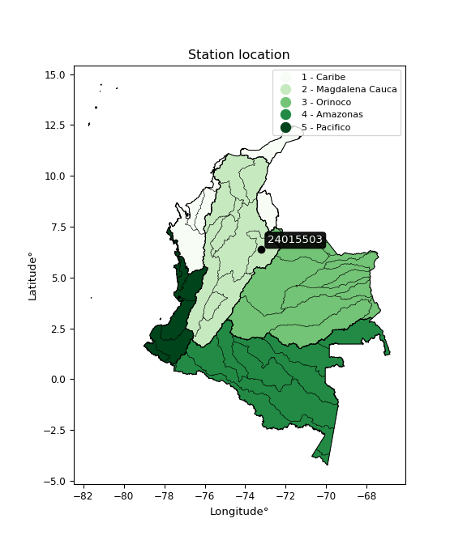

<div align="center">


</div>

# PMP Station (Rain, Pmax24h): 24015503

Probable Maximum Precipitation (PMP) is the greatest amount of rainfall for a specific duration that is meteorologically possible for a given location, acting as a "worst-case" scenario for extreme storms, crucial for designing safety-critical infrastructure like bridges, river deviations, dams, spillways, and nuclear plants to prevent catastrophic failure. PMP is calculated by hydrologists using meteorological data to determine the upper limit of extreme rainfall, often leading to the Probable Maximum Flood (PMF) for flood control design, and is increasingly being studied for climate change impacts. Probable Maximum Precipitation (PMP) is the theoretical upper limit of rainfall, a deterministic estimate for extreme events, while probability distributions (like GEV, Gumbel) describe the likelihood and frequency of various precipitation amounts, including rare ones, showing how often events occur, with PMP representing the extreme end of these distributions, used for critical infrastructure design to ensure safety against the worst conceivable weather, unlike standard statistical forecasts which cover typical probabilities.

The most common probability distributions in hydrology, used for analyzing floods, rainfall, and streamflow, include the Normal, Log-Normal, Gumbel, Gamma (including Log-Pearson Type III), and Generalized Extreme Value (GEV) distributions, often chosen based on the data´s skewness and whether modeling extremes or general conditions, with Gumbel and GEV popular for extreme events like floods, while the Normal distribution serves as a baseline, though often requiring transformations for skewed hydrological data. These distributions help in designing water infrastructure, managing water resources, and forecasting hydrologic events.

> Hydrological data often isn´t perfectly normal (it´s skewed), so different distributions are needed for different applications, such as: **Flood Frequency Analysis**: Using Gumbel, GEV, or Log-Pearson Type III for predicting extreme flood magnitudes and their return periods, **Rainfall Analysis**: Normal for annual totals, but Log-Normal, Weibull, or GEV for intensity or extreme daily rainfall, **Streamflow Modeling**: Gamma and Log-Normal for maximum flows, GEV for minimum flows, and Kappa for daily flows.

<div align="center">

</img>

</div>


## A. General information


### 1. General running parameters

• app_version: _v20260108_. • runtime: _2026-01-08 18:05:13.093906_. • Python version: _3.14.0_. • SciPy version: _1.16.3_. • Pandas version: _2.3.3_. • NumPy version: _2.3.5_. • Stations dataset (station_dataset_file): _dataset/pmax24h_in/automatic_colombia_2003_2024.csv_. • Stations catalog (station_catalog_file): _dataset/CNE.xls_. • Minimum year to eval til year_max (date_min): _1900_. • Maximum year to eval since year_min (date_max): _2024_. • Creates, save and include plots into reports (create_plot): _False_. • Plot only fit distributions with Δo > Δ (plot_only_fit): _True_. • Plot only simple graphs avoiding multiple CDFs and multiple Extreme values plots (plot_only_simple): _False_. • Eval low extreme values, if False, evaluates high extreme values (low_extreme): _False_. • Eval every SciPy distribution as logarithmic (pdist_logarithmic_on): _True_. • Standard deviation normalized (ddof): _1.0_. • Return periods to eval in years (Tr): _[2, 2.33, 5, 10, 15, 20, 25, 50, 75, 100, 200, 250, 500, 750, 1000]_. • Minimum data sample per station, 0 means any (minimum_sample): _5_. • Z-Score maximum threshold to adjust a value, 0 means disable (zscore_max): _3.5_. • Z-Score minimum threshold to adjust a value, 0 means disable (zscore_min): _-2.5_. • Avoid zeros, e.g. rain = 0 (avoid_zeros): _True_. • Avoid null values (avoid_nans): _True_. 

:file_folder:Table: [dataset.csv](../../dataset/pmax24h_in/automatic_colombia_2003_2024.csv)

> Delta Degrees of Freedom (DDOF): is a parameter used in the formulas for calculating variance and standard deviation. When ddof=0, the divisor is $N$ (the total number of observations) and this is used when your data set is the entire population. When ddof=1, the divisor is $N-1$ and this is used when your data set is a sample drawn from a larger population. Using $N-1$ provides an unbiased estimate of the population variance (known as Bessel´s correction).


### 2. Station info and location

|   id |   CODIGO | NOMBRE                      | CATEGORIA               | TECNOLOGIA                | ESTADO   | FECHA_INSTALACION   |   FECHA_SUSPENSION |   ALTITUD |   LATITUD |   LONGITUD | DEPARTAMENTO   | MUNICIPIO   | AREA_OPERATIVA                         | ENTIDAD                                    | AREA_HIDROGRAFICA   | ZONA_HIDROGRAFICA   | SUBZONA_HIDROGRAFICA   |   CORRIENTE | Catalogo   |   Version |
|-----:|---------:|:----------------------------|:------------------------|:--------------------------|:---------|:--------------------|-------------------:|----------:|----------:|-----------:|:---------------|:------------|:---------------------------------------|:-------------------------------------------|:--------------------|:--------------------|:-----------------------|------------:|:-----------|----------:|
|    0 | 24015503 | CONFINES  - AUT  [24015503] | Climatológica Principal | Automática con Telemetría | Activa   | 10/05/2013          |                nan |      1937 |   6.37303 |   -73.2076 | Santander      | Confines    | Area Operativa 08 - Santanderes-Arauca | CENTRO NACIONAL DE INVESTIGACIONES DE CAFE | Magdalena Cauca     | Sogamoso            | Río Suárez             |         nan | CNE_OE     |  20251226 |

<div align="center">

Dynamic map: [:earth_americas:Google](http://maps.google.com/maps?q=6.373027778,-73.20760833) [:earth_americas:OSM](https://www.openstreetmap.org/#map=18/6.373027778/-73.20760833&layers=P) [:earth_americas:Bing](https://www.bing.com/maps?cp=6.373027778~-73.20760833&lvl=18) [:earth_americas:Apple](https://maps.apple.com/frame?center=6.373027778%2C-73.20760833&span=0.003%2C0.006)

</div>


<div align="center">

```geojson
{
  "type": "Feature",
  "geometry": {
    "type": "Point", 
    "coordinates": [-73.20760833, 6.373027778]
  }, 
  "properties": {
    "Name": "24015503"
  }
}
```

</div>


### 3. Discrete values table and plot

<div align="center">

|               |            0 |           1 |          2 |           3 |          4 |           5 |           6 |           7 |
|:--------------|-------------:|------------:|-----------:|------------:|-----------:|------------:|------------:|------------:|
| Date          | 2016         | 2017        | 2018       | 2019        | 2020       | 2021        | 2022        | 2023        |
| Value         |   52.9       |   49.8      |   58.1     |   50.1      |   75.6     |   44.4      |   48.1      |   48.9      |
| Value_initial |   52.9       |   49.8      |   58.1     |   50.1      |   75.6     |   44.4      |   48.1      |   48.9      |
| count         |    8         |    8        |    8       |    8        |    8       |    8        |    8        |    8        |
| mean          |   53.4875    |   53.4875   |   53.4875  |   53.4875   |   53.4875  |   53.4875   |   53.4875   |   53.4875   |
| std           |    9.77101   |    9.77101  |    9.77101 |    9.77101  |    9.77101 |    9.77101  |    9.77101  |    9.77101  |
| zscore        |   -0.0601268 |   -0.377392 |    0.47206 |   -0.346689 |    2.26307 |   -0.930047 |   -0.551376 |   -0.469501 |


</div>


> The initial value (value_initial) correspond to the initial obtained or null completed value, and value (value) is adjusted only when the initial value is outside the valid range (outlier) definite through the Z-Score value. If Z-Score is active, values out of range or outliers are replaced with the station mean value. A Z-Score (or standard score) measures how many standard deviations a data point is from the mean of a dataset, indicating its relative position; positive scores mean above the mean, negative mean below, and a score of zero is exactly at the mean, allowing for comparison of values from different distributions. It´s calculated using the formula $z=(x–μ)/σ$, where $x$ is the data point, $μ$ is the mean, and $σ$ is the standard deviation, helping identify outliers and understand probability.
>
> <sub>**Note**: In this study, "completing" (filling gaps in) and "extending" (forecasting or lengthening the historical record) rainfall data series are avoided for certain critical analyses because they introduce artificial bias and uncertainty, which can distort the statistics of rare events (extremes), alter day-to-day variability, and compromise the integrity and homogeneity of the original data. Some reasons against Completing/Extending rainfall data are: **Distortion of Extremes and Variability**: The primary issue is that most gap-filling or extension methods rely on averaging or regression with nearby stations, which inherently smooths the data. Rainfall is highly variable in space and time, with a large percentage of zero values and occasional large storms. Infilling methods often underestimate the highest values and overestimate the lowest (zero) values, which severely distorts analyses focused on flood frequency, drought severity, and intensity-duration-frequency (IDF) curves, **Loss of Data Homogeneity**: Infilled or extended data are synthetic estimates, not actual measurements. Combining these estimates with observed data can violate the assumption of data homogeneity, which requires that the data properties do not change over time. Inhomogeneity can lead to incorrect conclusions about long-term trends or changes in climate patterns, **Propagation of Errors**: Errors and biases from the original data (e.g., wind-induced undercatch, instrument errors, site changes) or the data used for imputation can propagate through the analysis, leading to unreliable hydrological models and inaccurate predictions, **Compromised Statistical Integrity**: For statistical analyses, especially those involving the frequency of events, using artificial data can introduce time bias or autocorrelation that doesn´t exist in reality, making it difficult to assess the true probability of events, **Difficulty in Validation**: It is difficult to accurately validate the quality of filled or extended data, especially for past periods where ground-truth measurements are unavailable. The reliability of imputation techniques heavily depends on the density of the surrounding station network and the complexity of the local topography.</sub>


### 4. Active continuous probability distributions from SciPy (43 of 104 available)

A Probability Density Function (PDF) describes the relative likelihood of a continuous random variable falling within a specific range, where the total area under its curve equals 1, and the area over any interval gives the actual probability for that range. Unlike discrete probabilities (like rolling a die), a PDF shows density, not direct probability for a single point (which is zero), with higher points indicating higher likelihood, often visualized as a bell curve for normal distributions.

A log of a probability density function (log-PDF) is simply the logarithm of the PDF´s value, denoted as $log(f(x))$, useful for converting multiplication of probabilities into addition, improving numerical stability with tiny numbers, and connecting to information theory concepts like entropy. Instead of dealing with very small probabilities (e.g., 0.000001), log-PDFs use negative numbers (e.g., $log(0.00001) ≈ -11.51$ that are easier for computers to handle, preventing underflow errors and simplifying complex calculations. In this study, each active probability distribution from SciPy is also evaluated in the $log$ form.

[scipy.stats](https://docs.scipy.org/doc/scipy/reference/stats.html) is a Python´s powerful submodule within the SciPy library for comprehensive statistical analysis, offering over 130 probability distributions (like Normal, Poisson), functions for descriptive stats (mean, variance), hypothesis testing (t-tests, chi-square), random variable generation, and statistical tests, making it essential for data science, modeling, and research. It provides tools to explore, model, and draw conclusions from data efficiently, working seamlessly with NumPy.

<div align="center">

|   id | p_dist             |   n_parameter | fit_method   | label                                                                       | active   | ref                                                                                                        |
|-----:|:-------------------|--------------:|:-------------|:----------------------------------------------------------------------------|:---------|:-----------------------------------------------------------------------------------------------------------|
|    0 | alpha              |             3 | MLE          | Alpha                                                                       | True     | [:mortar_board:](https://docs.scipy.org/doc/scipy/reference/generated/scipy.stats.alpha.html)              |
|    1 | betaprime          |             4 | MLE          | Beta prime                                                                  | True     | [:mortar_board:](https://docs.scipy.org/doc/scipy/reference/generated/scipy.stats.betaprime.html)          |
|    2 | chi2               |             3 | MLE          | Chi²                                                                        | True     | [:mortar_board:](https://docs.scipy.org/doc/scipy/reference/generated/scipy.stats.chi2.html)               |
|    3 | crystalball        |             4 | MLE          | Crystalball                                                                 | True     | [:mortar_board:](https://docs.scipy.org/doc/scipy/reference/generated/scipy.stats.crystalball.html)        |
|    4 | erlang             |             3 | MLE          | Erlang                                                                      | True     | [:mortar_board:](https://docs.scipy.org/doc/scipy/reference/generated/scipy.stats.erlang.html)             |
|    5 | expon              |             2 | MLE          | Exponential                                                                 | True     | [:mortar_board:](https://docs.scipy.org/doc/scipy/reference/generated/scipy.stats.expon.html)              |
|    6 | exponnorm          |             3 | MLE          | Exponentially modified Normal                                               | True     | [:mortar_board:](https://docs.scipy.org/doc/scipy/reference/generated/scipy.stats.exponnorm.html)          |
|    7 | f                  |             4 | MLE          | F                                                                           | True     | [:mortar_board:](https://docs.scipy.org/doc/scipy/reference/generated/scipy.stats.f.html)                  |
|    8 | fatiguelife        |             3 | MLE          | Fatigue-life (Birnbaum-Saunders)                                            | True     | [:mortar_board:](https://docs.scipy.org/doc/scipy/reference/generated/scipy.stats.fatiguelife.html)        |
|    9 | fisk               |             3 | MLE          | Fisk                                                                        | True     | [:mortar_board:](https://docs.scipy.org/doc/scipy/reference/generated/scipy.stats.fisk.html)               |
|   10 | gamma              |             3 | MLE          | Gamma                                                                       | True     | [:mortar_board:](https://docs.scipy.org/doc/scipy/reference/generated/scipy.stats.gamma.html)              |
|   11 | genexpon           |             5 | MLE          | Generalized exponential                                                     | True     | [:mortar_board:](https://docs.scipy.org/doc/scipy/reference/generated/scipy.stats.genexpon.html)           |
|   12 | genlogistic        |             3 | MLE          | Generalized logistic                                                        | True     | [:mortar_board:](https://docs.scipy.org/doc/scipy/reference/generated/scipy.stats.genlogistic.html)        |
|   13 | gibrat             |             2 | MM           | Gibrat                                                                      | True     | [:mortar_board:](https://docs.scipy.org/doc/scipy/reference/generated/scipy.stats.gibrat.html)             |
|   14 | gompertz           |             3 | MLE          | Gompertz (or truncated Gumbel)                                              | True     | [:mortar_board:](https://docs.scipy.org/doc/scipy/reference/generated/scipy.stats.gompertz.html)           |
|   15 | gumbel_l           |             2 | MM           | Gumbel Left Skew                                                            | True     | [:mortar_board:](https://docs.scipy.org/doc/scipy/reference/generated/scipy.stats.gumbel_l.html)           |
|   16 | gumbel_r           |             2 | MM           | Gumbel Right Skew                                                           | True     | [:mortar_board:](https://docs.scipy.org/doc/scipy/reference/generated/scipy.stats.gumbel_r.html)           |
|   17 | halflogistic       |             2 | MM           | Half-logistic                                                               | True     | [:mortar_board:](https://docs.scipy.org/doc/scipy/reference/generated/scipy.stats.halflogistic.html)       |
|   18 | halfnorm           |             2 | MM           | Half Normal                                                                 | True     | [:mortar_board:](https://docs.scipy.org/doc/scipy/reference/generated/scipy.stats.halfnorm.html)           |
|   19 | hypsecant          |             2 | MM           | hyperbolic secant                                                           | True     | [:mortar_board:](https://docs.scipy.org/doc/scipy/reference/generated/scipy.stats.hypsecant.html)          |
|   20 | invgamma           |             3 | MLE          | Inverted gamma                                                              | True     | [:mortar_board:](https://docs.scipy.org/doc/scipy/reference/generated/scipy.stats.invgamma.html)           |
|   21 | invgauss           |             3 | MLE          | Inverse Gaussian                                                            | True     | [:mortar_board:](https://docs.scipy.org/doc/scipy/reference/generated/scipy.stats.invgauss.html)           |
|   22 | invweibull         |             3 | MLE          | Inverted Weibull                                                            | True     | [:mortar_board:](https://docs.scipy.org/doc/scipy/reference/generated/scipy.stats.invweibull.html)         |
|   23 | kstwobign          |             2 | MLE          | Limiting distribution of scaled Kolmogorov-Smirnov two-sided test statistic | True     | [:mortar_board:](https://docs.scipy.org/doc/scipy/reference/generated/scipy.stats.kstwobign.html)          |
|   24 | laplace            |             2 | MM           | Laplace                                                                     | True     | [:mortar_board:](https://docs.scipy.org/doc/scipy/reference/generated/scipy.stats.laplace.html)            |
|   25 | laplace_asymmetric |             3 | MLE          | Asymmetric Laplace                                                          | True     | [:mortar_board:](https://docs.scipy.org/doc/scipy/reference/generated/scipy.stats.laplace_asymmetric.html) |
|   26 | loggamma           |             3 | MLE          | Log gamma                                                                   | True     | [:mortar_board:](https://docs.scipy.org/doc/scipy/reference/generated/scipy.stats.loggamma.html)           |
|   27 | logistic           |             2 | MM           | Logistic (or Sech-squared)                                                  | True     | [:mortar_board:](https://docs.scipy.org/doc/scipy/reference/generated/scipy.stats.logistic.html)           |
|   28 | lognorm            |             3 | MLE          | Log Normal                                                                  | True     | [:mortar_board:](https://docs.scipy.org/doc/scipy/reference/generated/scipy.stats.lognorm.html)            |
|   29 | maxwell            |             2 | MM           | Maxwell                                                                     | True     | [:mortar_board:](https://docs.scipy.org/doc/scipy/reference/generated/scipy.stats.maxwell.html)            |
|   30 | mielke             |             4 | MLE          | Mielke Beta-Kappa / Dagum                                                   | True     | [:mortar_board:](https://docs.scipy.org/doc/scipy/reference/generated/scipy.stats.mielke.html)             |
|   31 | moyal              |             2 | MM           | Moyal                                                                       | True     | [:mortar_board:](https://docs.scipy.org/doc/scipy/reference/generated/scipy.stats.moyal.html)              |
|   32 | nakagami           |             3 | MLE          | Nakagami                                                                    | True     | [:mortar_board:](https://docs.scipy.org/doc/scipy/reference/generated/scipy.stats.nakagami.html)           |
|   33 | ncf                |             5 | MLE          | Non-central F distribution                                                  | True     | [:mortar_board:](https://docs.scipy.org/doc/scipy/reference/generated/scipy.stats.ncf.html)                |
|   34 | nct                |             4 | MLE          | Non-central Student’s t                                                     | True     | [:mortar_board:](https://docs.scipy.org/doc/scipy/reference/generated/scipy.stats.nct.html)                |
|   35 | norm               |             2 | MM           | Normal                                                                      | True     | [:mortar_board:](https://docs.scipy.org/doc/scipy/reference/generated/scipy.stats.norm.html)               |
|   36 | pearson3           |             3 | MM           | Pearson type III                                                            | True     | [:mortar_board:](https://docs.scipy.org/doc/scipy/reference/generated/scipy.stats.pearson3.html)           |
|   37 | rayleigh           |             2 | MM           | Rayleigh                                                                    | True     | [:mortar_board:](https://docs.scipy.org/doc/scipy/reference/generated/scipy.stats.rayleigh.html)           |
|   38 | rice               |             3 | MLE          | Rice                                                                        | True     | [:mortar_board:](https://docs.scipy.org/doc/scipy/reference/generated/scipy.stats.rice.html)               |
|   39 | t                  |             3 | MLE          | Student’s t                                                                 | True     | [:mortar_board:](https://docs.scipy.org/doc/scipy/reference/generated/scipy.stats.t.html)                  |
|   40 | truncnorm          |             4 | MLE          | Truncated normal                                                            | True     | [:mortar_board:](https://docs.scipy.org/doc/scipy/reference/generated/scipy.stats.truncnorm.html)          |
|   41 | wald               |             2 | MM           | Wald                                                                        | True     | [:mortar_board:](https://docs.scipy.org/doc/scipy/reference/generated/scipy.stats.wald.html)               |
|   42 | weibull_min        |             3 | MLE          | Weibull minimum                                                             | True     | [:mortar_board:](https://docs.scipy.org/doc/scipy/reference/generated/scipy.stats.weibull_min.html)        |

</div>

> **n_parameter:** # arguments & localization & scale.
>
> **Fit methods:** (MLE) maximum likelihood, (MM) L-moments.
>
>**Inactive** (With the only purpose of prevent loops, zero divisions, infinite values, over high estimated values or horizontal trending for recurrence intervals estimations, the follow distributions were disabled.)**:** foldnorm, gennorm, norminvgauss, powernorm, powerlognorm, skewnorm, genextreme, anglit, arcsine, argus, beta, bradford, burr, burr12, cauchy, cosine, halfcauchy, foldcauchy, skewcauchy, wrapcauchy, dgamma, gengamma, exponweib, exponpow, truncexpon, gausshyper, genhalflogistic, genhyperbolic, geninvgauss, halfgennorm, johnsonsb, johnsonsu, kappa4, kappa3, ksone, kstwo, loglaplace, levy, levy_l, levy_stable, ncx2, pareto, genpareto, truncpareto, lomax, powerlaw, rdist, rel_breitwigner, recipinvgauss, semicircular, studentized_range, trapezoid, triang, truncweibull_min, tukeylambda, uniform, loguniform, vonmises, vonmises_line, weibull_max, dweibull, 


## B. Probability (PDF) vs. Empirical (EDF) distributions functions

A continuous probability distribution (CPD) describes probabilities for variables that can take any value within a range (like rain any time), unlike discrete variables with specific outcomes (like temperature). It uses a Probability Density Function (PDF), a curve where the total area under it equals 1, and the probability of the variable falling within an interval (a to b) is found by calculating the area under the curve between those points. A key feature is that the probability of hitting any single exact value is zero, so probabilities are always expressed for ranges, e.g., $P(a ≤ X ≤ b)$.

<div align="center">

Distributions parameters from station values
|    |   station | p_dist                |   n |            loc |          scale | shape                  | shape1                 | shape2              | shape3   |
|---:|----------:|:----------------------|----:|---------------:|---------------:|:-----------------------|:-----------------------|:--------------------|:---------|
|  0 |  24015503 | alpha                 |   8 |     34.7249    |   45.446       | 2.8465499637023113     |                        |                     |          |
|  1 |  24015503 | betaprime             |   8 |     -1.65467   |    5.8389      | 479.44463207373656     | 51.85330404850103      |                     |          |
|  2 |  24015503 | chi2                  |   8 |     44.4       |    2.8691      | 0.5065344967823322     |                        |                     |          |
|  3 |  24015503 | crystalball           |   8 |     53.4875    |    9.13994     | 18248.38924664435      | 573.2472850365275      |                     |          |
|  4 |  24015503 | erlang                |   8 |     44.4       |   12.9238      | 0.4160021831401205     |                        |                     |          |
|  5 |  24015503 | expon                 |   8 |     44.4       |    9.0875      |                        |                        |                     |          |
|  6 |  24015503 | exponnorm             |   8 |     45.6366    |    1.96389     | 3.997620170706227      |                        |                     |          |
|  7 |  24015503 | f                     |   8 |     41.3102    |   11.2319      | 9.996765734432522      | 7.374257608694087      |                     |          |
|  8 |  24015503 | fatiguelife           |   8 |     42.1852    |    8.63732     | 0.7864213365286633     |                        |                     |          |
|  9 |  24015503 | fisk                  |   8 |     42.846     |    7.78379     | 2.224845289994411      |                        |                     |          |
| 10 |  24015503 | gamma                 |   8 |     44.4       |    9.95763     | 0.41994221972120876    |                        |                     |          |
| 11 |  24015503 | genexpon              |   8 |     44.4       |   13.2929      | 1.4627563086827284     | 2.6862439307474737e-08 | 0.29113447894743183 |          |
| 12 |  24015503 | genlogistic           |   8 |      9.35996   |    5.42781     | 1721.1128186349197     |                        |                     |          |
| 13 |  24015503 | gibrat                |   8 |     46.5149    |    4.22911     |                        |                        |                     |          |
| 14 |  24015503 | gompertz              |   8 |     44.4       |    1.33014e+12 | 146956890331.12686     |                        |                     |          |
| 15 |  24015503 | gumbel_l              |   8 |     57.601     |    7.12639     |                        |                        |                     |          |
| 16 |  24015503 | gumbel_r              |   8 |     49.374     |    7.12639     |                        |                        |                     |          |
| 17 |  24015503 | halflogistic          |   8 |     42.6545    |    7.81433     |                        |                        |                     |          |
| 18 |  24015503 | halfnorm              |   8 |     41.3898    |   15.1622      |                        |                        |                     |          |
| 19 |  24015503 | hypsecant             |   8 |     53.4875    |    5.81867     |                        |                        |                     |          |
| 20 |  24015503 | invgamma              |   8 |     39.9804    |   33.9217      | 3.489098361117719      |                        |                     |          |
| 21 |  24015503 | invgauss              |   8 |     41.8148    |   18.6549      | 0.6257183063007417     |                        |                     |          |
| 22 |  24015503 | invweibull            |   8 |     35.2855    |   13.6685      | 3.05555894799463       |                        |                     |          |
| 23 |  24015503 | kstwobign             |   8 |     29.0318    |   28.528       |                        |                        |                     |          |
| 24 |  24015503 | laplace               |   8 |     53.4875    |    6.46292     |                        |                        |                     |          |
| 25 |  24015503 | laplace_asymmetric    |   8 |     48.1       |    3.97427     | 0.5302587670120908     |                        |                     |          |
| 26 |  24015503 | loggamma              |   8 |  -2355.55      |  337.511       | 1258.9549605734837     |                        |                     |          |
| 27 |  24015503 | logistic              |   8 |     53.4875    |    5.03912     |                        |                        |                     |          |
| 28 |  24015503 | lognorm               |   8 |     44.4       |    0.103561    | 11.474423025202054     |                        |                     |          |
| 29 |  24015503 | maxwell               |   8 |     31.8297    |   13.572       |                        |                        |                     |          |
| 30 |  24015503 | mielke                |   8 |     -2.45659   |   34.4305      | 786.9671441027654      | 10.466031238889274     |                     |          |
| 31 |  24015503 | moyal                 |   8 |     48.2607    |    4.11442     |                        |                        |                     |          |
| 32 |  24015503 | nakagami              |   8 |     44.4       |   15.1605      | 0.2827261278200808     |                        |                     |          |
| 33 |  24015503 | ncf                   |   8 |     -0.0183878 |    2.55895e-05 | 3.0151778144741984e-06 | 10.064992664382622     | 5.344021539308338   |          |
| 34 |  24015503 | nct                   |   8 |     -0.555424  |    0.665096    | 25.403787284033143     | 78.68155983609839      |                     |          |
| 35 |  24015503 | norm                  |   8 |     53.4875    |    9.13994     |                        |                        |                     |          |
| 36 |  24015503 | pearson3              |   8 |     53.4875    |    9.13995     | 1.6072311442290048     |                        |                     |          |
| 37 |  24015503 | rayleigh              |   8 |     36.0023    |   13.9512      |                        |                        |                     |          |
| 38 |  24015503 | rice                  |   8 |     39.8578    |   11.604       | 0.0009036597576130357  |                        |                     |          |
| 39 |  24015503 | t                     |   8 |     51.5878    |    8.89666     | 5.592468728797936      |                        |                     |          |
| 40 |  24015503 | truncnorm             |   8 | -18001.1       |  406.431       | 44.399988104369044     | 79.34499151519591      |                     |          |
| 41 |  24015503 | wald                  |   8 |     44.3476    |    9.13994     |                        |                        |                     |          |
| 42 |  24015503 | weibull_min           |   8 |     44.4       |   14.1755      | 0.3163269392740172     |                        |                     |          |
| 43 |  24015503 | logalpha              |   8 |      1.20179   |   53.3088      | 19.331501637915693     |                        |                     |          |
| 44 |  24015503 | logbetaprime          |   8 |      2.16496   | 1041.62        | 158.69876191725598     | 91764.8750131323       |                     |          |
| 45 |  24015503 | logchi2               |   8 |      3.79324   |    0.988682    | 0.9847565241494116     |                        |                     |          |
| 46 |  24015503 | logcrystalball        |   8 |      3.9668    |    0.153612    | 204.5414861094211      | 125.95289016351487     |                     |          |
| 47 |  24015503 | logerlang             |   8 |      3.79324   |    0.266864    | 0.2140894879861357     |                        |                     |          |
| 48 |  24015503 | logexpon              |   8 |      3.79324   |    0.173556    |                        |                        |                     |          |
| 49 |  24015503 | logexponnorm          |   8 |      3.82831   |    0.0441955   | 3.133501909218407      |                        |                     |          |
| 50 |  24015503 | logf                  |   8 |      3.67463   |    0.23514     | 933.2102233606336      | 10.106376791366351     |                     |          |
| 51 |  24015503 | logfatiguelife        |   8 |      3.7286    |    0.198442    | 0.6331086837908435     |                        |                     |          |
| 52 |  24015503 | logfisk               |   8 |      3.74428   |    0.180055    | 2.708195415482444      |                        |                     |          |
| 53 |  24015503 | loggamma              |   8 |      3.79324   |    0.242987    | 0.21945005994508382    |                        |                     |          |
| 54 |  24015503 | loggenexpon           |   8 |      3.79324   |    0.203569    | 0.8454969447169909     | 0.5514847351831864     | 1.822872828461345   |          |
| 55 |  24015503 | loggenlogistic        |   8 |      3.18703   |    0.100412    | 1239.447804558457      |                        |                     |          |
| 56 |  24015503 | loggibrat             |   8 |      3.84963   |    0.0710648   |                        |                        |                     |          |
| 57 |  24015503 | loggompertz           |   8 |      3.79324   |    1.1001      | 5.4609758293211215     |                        |                     |          |
| 58 |  24015503 | loggumbel_l           |   8 |      4.03593   |    0.119771    |                        |                        |                     |          |
| 59 |  24015503 | loggumbel_r           |   8 |      3.89766   |    0.119771    |                        |                        |                     |          |
| 60 |  24015503 | loghalflogistic       |   8 |      3.78473   |    0.131333    |                        |                        |                     |          |
| 61 |  24015503 | loghalfnorm           |   8 |      3.76347   |    0.254827    |                        |                        |                     |          |
| 62 |  24015503 | loghypsecant          |   8 |      3.9668    |    0.0977927   |                        |                        |                     |          |
| 63 |  24015503 | loginvgamma           |   8 |     -1.92323   | 9155.01        | 1555.3616448216553     |                        |                     |          |
| 64 |  24015503 | loginvgauss           |   8 |      3.72148   |    0.613029    | 0.4001593661620355     |                        |                     |          |
| 65 |  24015503 | loginvweibull         |   8 |      3.47235   |    0.418965    | 4.632594553768982      |                        |                     |          |
| 66 |  24015503 | logkstwobign          |   8 |      3.52802   |    0.509409    |                        |                        |                     |          |
| 67 |  24015503 | loglaplace            |   8 |      3.9668    |    0.10862     |                        |                        |                     |          |
| 68 |  24015503 | loglaplace_asymmetric |   8 |      3.88978   |    0.079694    | 0.6276903351628478     |                        |                     |          |
| 69 |  24015503 | logloggamma           |   8 |    -40.1011    |    6.06747     | 1426.725687827045      |                        |                     |          |
| 70 |  24015503 | loglogistic           |   8 |      3.9668    |    0.0846909   |                        |                        |                     |          |
| 71 |  24015503 | loglognorm            |   8 |      3.79324   |    0.00242417  | 11.09994589793636      |                        |                     |          |
| 72 |  24015503 | logmaxwell            |   8 |      3.6028    |    0.228101    |                        |                        |                     |          |
| 73 |  24015503 | logmielke             |   8 |      3.29473   |    0.276065    | 853.0318403028548      | 6.315949269591819      |                     |          |
| 74 |  24015503 | logmoyal              |   8 |      3.87895   |    0.0691499   |                        |                        |                     |          |
| 75 |  24015503 | lognakagami           |   8 |      3.79324   |    0.231995    | 0.0901545293401958     |                        |                     |          |
| 76 |  24015503 | logncf                |   8 |      3.67527   |    0.101539    | 419.28147521012977     | 10.106388797211403     | 549.5531366359676   |          |
| 77 |  24015503 | lognct                |   8 |     -4.09609   |    0.0663368   | 540.9379771493002      | 121.47423926577619     |                     |          |
| 78 |  24015503 | lognorm               |   8 |      3.9668    |    0.153612    |                        |                        |                     |          |
| 79 |  24015503 | logpearson3           |   8 |      3.9668    |    0.153612    | 1.384738363440508      |                        |                     |          |
| 80 |  24015503 | lograyleigh           |   8 |      3.67293   |    0.234474    |                        |                        |                     |          |
| 81 |  24015503 | logrice               |   8 |      3.7256    |    0.2022      | 0.0003327330368576004  |                        |                     |          |
| 82 |  24015503 | logt                  |   8 |      3.90413   |    0.0417811   | 0.980901343320291      |                        |                     |          |
| 83 |  24015503 | logtruncnorm          |   8 |     -0.484242  |    1.09535     | 3.9051373237212648     | 4.391026671294403      |                     |          |
| 84 |  24015503 | logwald               |   8 |      3.81318   |    0.153619    |                        |                        |                     |          |
| 85 |  24015503 | logweibull_min        |   8 |      3.79324   |    0.20049     | 0.23288222411703796    |                        |                     |          |

</div>

> **loc** (Location parameter): This shifts the distribution along the x-axis. For many common distributions, like the normal (Gaussian) distribution, loc represents the mean $μ$. For others, like the uniform distribution, it might represent the minimum value, or for the beta distribution, the left end of the support interval.
>
> **scale** (Scale parameter): This determines the width or spread of the distribution. For the normal distribution, scale represents the standard deviation $σ$. For a uniform distribution, it defines the length of the interval (from $loc$ to $loc + scale$).
>
> **shape** (Shape parameters): Refers to parameters that define the specific form of a probability distribution, distinct from its location (loc) and scale (scale). These parameters are required arguments for most distribution functions. For example, a normal (Gaussian) distribution is fully defined by its location (mean) and scale (standard deviation), so it has no specific shape parameters beyond loc and scale. However, other distributions have intrinsic properties that need specification, as Gamma distribution that takes a shape parameter, often named $a$ or $alpha$.


### 0. Cumulative distribution values - CDF (86 evaluated)

Cumulative Distribution Function (CDF), denoted as $F$<sub>$X$</sub>$(x)$, is a function that gives the probability that a random variable $X$ will take a value less than or equal to a specific value, $x$ (i.e., $(P(X≥x)$. It essentially "accumulates" probabilities from a given point up to the far right (positive infinity), providing a complete picture of the distribution´s probabilities for both discrete (like rain) and continuous (like temperature) variables, helping to find probabilities over ranges or above certain values. Each station is evaluated separately ordering the $x$ values ascending, calculating the CDF and PDF values for the activated distributions and their logarithmic forms.

<div align="center">

CDF ordered by x ascending and calculating $log(f(x))$ separately
|   id |   Station |   date |    x |   count |    mean |     std |     zscore |   Value_initial |   station |   m |     alpha |   alpha_pdf |   betaprime |   betaprime_pdf |        chi2 |    chi2_pdf |   crystalball |   crystalball_pdf |      erlang |   erlang_pdf |    expon |   expon_pdf |   exponnorm |   exponnorm_pdf |         f |      f_pdf |   fatiguelife |   fatiguelife_pdf |      fisk |   fisk_pdf |       gamma |   gamma_pdf |    genexpon |   genexpon_pdf |   genlogistic |   genlogistic_pdf |   gibrat |   gibrat_pdf |    gompertz |   gompertz_pdf |   gumbel_l |   gumbel_l_pdf |   gumbel_r |   gumbel_r_pdf |   halflogistic |   halflogistic_pdf |   halfnorm |   halfnorm_pdf |   hypsecant |   hypsecant_pdf |   invgamma |   invgamma_pdf |   invgauss |   invgauss_pdf |   invweibull |   invweibull_pdf |   kstwobign |   kstwobign_pdf |   laplace |   laplace_pdf |   laplace_asymmetric |   laplace_asymmetric_pdf |    loggamma |   loggamma_pdf |   logistic |   logistic_pdf |   lognorm |   lognorm_pdf |   maxwell |   maxwell_pdf |    mielke |   mielke_pdf |    moyal |   moyal_pdf |    nakagami |    nakagami_pdf |      ncf |    ncf_pdf |      nct |    nct_pdf |     norm |   norm_pdf |   pearson3 |   pearson3_pdf |   rayleigh |   rayleigh_pdf |     rice |   rice_pdf |        t |      t_pdf |   truncnorm |   truncnorm_pdf |        wald |    wald_pdf |   weibull_min |   weibull_min_pdf |   logalpha |   logalpha_pdf |   logbetaprime |   logbetaprime_pdf |   logchi2 |   logchi2_pdf |   logcrystalball |   logcrystalball_pdf |   logerlang |   logerlang_pdf |   logexpon |   logexpon_pdf |   logexponnorm |   logexponnorm_pdf |      logf |   logf_pdf |   logfatiguelife |   logfatiguelife_pdf |   logfisk |   logfisk_pdf |   loggenexpon |   loggenexpon_pdf |   loggenlogistic |   loggenlogistic_pdf |   loggibrat |   loggibrat_pdf |   loggompertz |   loggompertz_pdf |   loggumbel_l |   loggumbel_l_pdf |   loggumbel_r |   loggumbel_r_pdf |   loghalflogistic |   loghalflogistic_pdf |   loghalfnorm |   loghalfnorm_pdf |   loghypsecant |   loghypsecant_pdf |   loginvgamma |   loginvgamma_pdf |   loginvgauss |   loginvgauss_pdf |   loginvweibull |   loginvweibull_pdf |   logkstwobign |   logkstwobign_pdf |   loglaplace |   loglaplace_pdf |   loglaplace_asymmetric |   loglaplace_asymmetric_pdf |   logloggamma |   logloggamma_pdf |   loglogistic |   loglogistic_pdf |   loglognorm |   loglognorm_pdf |   logmaxwell |   logmaxwell_pdf |   logmielke |   logmielke_pdf |   logmoyal |   logmoyal_pdf |   lognakagami |   lognakagami_pdf |    logncf |   logncf_pdf |   lognct |   lognct_pdf |   logpearson3 |   logpearson3_pdf |   lograyleigh |   lograyleigh_pdf |   logrice |   logrice_pdf |     logt |   logt_pdf |   logtruncnorm |   logtruncnorm_pdf |   logwald |   logwald_pdf |   logweibull_min |   logweibull_min_pdf |
|-----:|----------:|-------:|-----:|--------:|--------:|--------:|-----------:|----------------:|----------:|----:|----------:|------------:|------------:|----------------:|------------:|------------:|--------------:|------------------:|------------:|-------------:|---------:|------------:|------------:|----------------:|----------:|-----------:|--------------:|------------------:|----------:|-----------:|------------:|------------:|------------:|---------------:|--------------:|------------------:|---------:|-------------:|------------:|---------------:|-----------:|---------------:|-----------:|---------------:|---------------:|-------------------:|-----------:|---------------:|------------:|----------------:|-----------:|---------------:|-----------:|---------------:|-------------:|-----------------:|------------:|----------------:|----------:|--------------:|---------------------:|-------------------------:|------------:|---------------:|-----------:|---------------:|----------:|--------------:|----------:|--------------:|----------:|-------------:|---------:|------------:|------------:|----------------:|---------:|-----------:|---------:|-----------:|---------:|-----------:|-----------:|---------------:|-----------:|---------------:|---------:|-----------:|---------:|-----------:|------------:|----------------:|------------:|------------:|--------------:|------------------:|-----------:|---------------:|---------------:|-------------------:|----------:|--------------:|-----------------:|---------------------:|------------:|----------------:|-----------:|---------------:|---------------:|-------------------:|----------:|-----------:|-----------------:|---------------------:|----------:|--------------:|--------------:|------------------:|-----------------:|---------------------:|------------:|----------------:|--------------:|------------------:|--------------:|------------------:|--------------:|------------------:|------------------:|----------------------:|--------------:|------------------:|---------------:|-------------------:|--------------:|------------------:|--------------:|------------------:|----------------:|--------------------:|---------------:|-------------------:|-------------:|-----------------:|------------------------:|----------------------------:|--------------:|------------------:|--------------:|------------------:|-------------:|-----------------:|-------------:|-----------------:|------------:|----------------:|-----------:|---------------:|--------------:|------------------:|----------:|-------------:|---------:|-------------:|--------------:|------------------:|--------------:|------------------:|----------:|--------------:|---------:|-----------:|---------------:|-------------------:|----------:|--------------:|-----------------:|---------------------:|
|    0 |  24015503 |   2021 | 44.4 |       8 | 53.4875 | 9.77101 | -0.930047  |            44.4 |  24015503 |   1 | 0.0321792 |  0.035021   |    0.125306 |      0.0319296  | 0.000185139 | 6.59912e+09 |      0.160048 |         0.0266259 | 5.06066e-07 |  2.96287e+07 | 0        |   0.110041  |   0.0356032 |      0.0291498  | 0.0314612 | 0.0313473  |     0.0309359 |        0.0497128  | 0.0269957 |  0.0376064 | 4.91709e-07 | 2.90608e+07 | 2.42845e-11 |     0.11004    |      0.067017 |        0.0333453  | 0        |    0         | 8.63525e-15 |     0.110482   |   0.145176 |    0.0188156   |   0.134032 |     0.0377977  |       0.111221 |         0.0631935  |   0.157372 |     0.0515963  |    0.13163  |      0.0219828  |  0.0313838 |     0.0391828  |  0.0308822 |     0.0465415  |    0.0317677 |       0.0367345  |   0.0662942 |      0.0323632  |  0.122549 |    0.0189618  |            0.0379199 |               0.0179937  | 0.000638463 |    3.15501e+11 |   0.141439 |     0.0240982  |  0.129274 |       1.37181 |  0.164411 |    0.0328415  | 0.0533367 |    0.034248  | 0.109896 |  0.0431908  | 1.66969e-09 | 132875          | 0.553453 | 0.00832036 | 0.110207 | 0.0328474  | 0.160048 |  0.0266259 |  0.0990095 |     0.0591603  |   0.165702 |     0.0359965  | 0.073749 | 0.0312448  | 0.226059 | 0.0298081  |    0        |       0.109299  | 2.33439e-39 | 3.90052e-36 |   1.44614e-05 |       6.43805e+08 |   0.107573 |       1.46888  |       0.110459 |           1.4099   | 2.226e-08 |   2.46805e+07 |         0.129274 |              1.37181 | 0.000749552 |     3.61349e+11 |   0        |       5.76184  |       0.033556 |           1.30114  | 0.0316322 |   1.68317  |        0.0310205 |             1.98527  | 0.0285599 |      1.53466  |   1.51849e-10 |          4.15337  |         0.052004 |             1.52933  |    0        |        0        |    2.4558e-12 |           4.96407 |      0.123506 |        0.964709   |     0.0915089 |          1.82704  |         0.0323903 |              3.80312  |     0.0929915 |          3.10979  |       0.106909 |           1.07279  |      0.121543 |          1.4062   |     0.0310383 |           1.91551 |       0.0320675 |            1.5925   |      0.0508048 |           1.55218  |     0.101169 |         0.931398 |               0.0410299 |                    0.820218 |      0.141819 |          1.38447  |      0.114125 |          1.19376  |   0.00411851 |        2.467e+12 |     0.126104 |         1.72074  |    0.041008 |         1.64    |  0.0631054 |        1.90669 |    0.00186988 |        7.5921e+11 | 0.0316324 |     1.68318  | 0.243304 |     1.27562  |     0.0657664 |          2.4374   |      0.12335  |          1.91846  | 0.0544084 |      1.56428  | 0.116641 |  0.946465  |     2.0051e-06 |           4.28911  |  0        |       0       |      0.000386469 |          2.02627e+11 |
|    1 |  24015503 |   2022 | 48.1 |       8 | 53.4875 | 9.77101 | -0.551376  |            48.1 |  24015503 |   2 | 0.291371  |  0.087254   |    0.273111 |      0.0466896  | 0.879242    | 0.0354876   |      0.277781 |         0.0366876 | 0.618464    |  0.0566119   | 0.334457 |   0.0732371 |   0.260082  |      0.0808902  | 0.225841  | 0.0632514  |     0.31407   |        0.0776445  | 0.294321  |  0.0879507 | 0.67083     | 0.0582707   | 0.334455    |     0.0732368  |      0.254736 |        0.0641548  | 0.163216 |    0.155501  | 0.335542    |     0.0734107  |   0.231742 |    0.0284205   |   0.302476 |     0.0507532  |       0.334981 |         0.0568051  |   0.341916 |     0.0477141  |    0.240136 |      0.0374651  |  0.300238  |     0.0843837  |  0.3115    |     0.0797132  |    0.295856  |       0.0859158  |   0.237014  |      0.0562187  |  0.217241 |    0.0336134  |            0.219466  |               0.104141   | 0.811592    |    1.69253     |   0.255567 |     0.0377552  |  0.271342 |       2.1578  |  0.303151 |    0.0411836  | 0.262572  |    0.0720448 | 0.307861 |  0.0587877  | 0.348795    |      0.0526088  | 0.583246 | 0.0077873  | 0.267125 | 0.0502434  | 0.277781 |  0.0366876 |  0.330046  |     0.0606107  |   0.313378 |     0.0426774  | 0.222953 | 0.0475633  | 0.354765 | 0.0392245  |    0.332655 |       0.0729551 | 0.281162    | 0.108678    |   0.479958    |       0.0290702   |   0.266579 |       2.45397  |       0.262601 |           2.35994  | 0.22963   |   1.37466     |         0.271342 |              2.1578  | 0.803694    |     1.67433     |   0.369469 |       3.63302  |       0.269474 |           4.15994  | 0.29738   |   4.09705  |        0.308143  |             3.88937  | 0.288436  |      4.30869  |   0.325978    |          3.73375  |         0.263662 |             3.49854  |    0.135643 |        9.20931  |    0.337775   |           3.53543 |      0.226771 |        1.66033    |     0.293539  |          3.0041   |         0.324916  |              3.40519  |     0.333472  |          2.85346  |       0.233596 |           2.17998  |      0.269332 |          2.25833  |     0.306356  |           3.93842 |       0.293451  |            4.15713  |      0.252135  |           3.19233  |     0.211388 |         1.94611  |               0.203245  |                    4.06302  |      0.281781 |          2.09112  |      0.24896  |          2.20778  |   0.623639   |        0.427281  |     0.295903 |         2.43501  |    0.284776 |         3.8868  |  0.29749   |        3.49319 |    0.694847   |        1.54992    | 0.297381  |     4.09705  | 0.354841 |     1.49219  |     0.314559  |          3.31872  |      0.305859 |          2.52966  | 0.234105  |      2.76645  | 0.298506 |  4.89886   |     0.298427   |           3.21569  |  0.261791 |       6.60847 |      0.554021    |          1.04776     |
|    2 |  24015503 |   2023 | 48.9 |       8 | 53.4875 | 9.77101 | -0.469501  |            48.9 |  24015503 |   3 | 0.360407  |  0.0847719  |    0.311275 |      0.048629   | 0.903879    | 0.0266715   |      0.307863 |         0.0384824 | 0.65991     |  0.0474655   | 0.390542 |   0.0670655 |   0.324661  |      0.0798703  | 0.276459  | 0.0630146  |     0.374104  |        0.0723234  | 0.363742  |  0.085052  | 0.713127    | 0.0480007   | 0.39054     |     0.0670652  |      0.307222 |        0.0667773  | 0.283411 |    0.14196   | 0.39175     |     0.0672007  |   0.255431 |    0.0308165   |   0.343427 |     0.0515055  |       0.37962  |         0.054764   |   0.379628 |     0.046548   |    0.271611 |      0.0412173  |  0.366348  |     0.0804984  |  0.373279  |     0.0745536  |    0.363437  |       0.0825584  |   0.282853  |      0.0581856  |  0.245867 |    0.0380427  |            0.298487  |               0.0935979  | 0.836667    |    1.36627     |   0.286922 |     0.040602   |  0.308053 |       2.29033 |  0.336512 |    0.0421669  | 0.32106   |    0.0737772 | 0.354836 |  0.0584741  | 0.388932    |      0.0479306  | 0.589431 | 0.00767455 | 0.308198 | 0.052318   | 0.307863 |  0.0384824 |  0.377609  |     0.0582272  |   0.347759 |     0.0432214  | 0.261843 | 0.0495684  | 0.38674  | 0.0406624  |    0.388541 |       0.0668486 | 0.363288    | 0.0964241   |   0.50123     |       0.0243888   |   0.308278 |       2.59662  |       0.302812 |           2.51111  | 0.25114   |   1.23955     |         0.308053 |              2.29033 | 0.828559    |     1.35845     |   0.426637 |       3.30363  |       0.338605 |           4.18278  | 0.364316  |   3.9961   |        0.371038  |             3.72348  | 0.359596  |      4.2864   |   0.385781    |          3.51405  |         0.322637 |             3.63312  |    0.283994 |        8.44194  |    0.394001   |           3.28413 |      0.255584 |        1.83448    |     0.343682  |          3.06473  |         0.379891  |              3.25768  |     0.379858  |          2.76916  |       0.271815 |           2.4538   |      0.307748 |          2.39581  |     0.370144  |           3.78081 |       0.36162   |            4.0821   |      0.305709  |           3.28963  |     0.246055 |         2.26527  |               0.282638  |                    5.65013  |      0.317266 |          2.20871  |      0.287123 |          2.41683  |   0.63003    |        0.352343  |     0.33672  |         2.50924  |    0.349063 |         3.88442 |  0.355125  |        3.47891 |    0.718435   |        1.32278    | 0.364316  |     3.99609  | 0.379701 |     1.52104  |     0.368728  |          3.24071  |      0.347972 |          2.57182  | 0.280803  |      2.88794  | 0.395073 |  6.78186   |     0.349911   |           3.02835  |  0.363784 |       5.73214 |      0.569797    |          0.875379    |
|    3 |  24015503 |   2017 | 49.8 |       8 | 53.4875 | 9.77101 | -0.377392  |            49.8 |  24015503 |   4 | 0.434214  |  0.0788337  |    0.355772 |      0.0501306  | 0.924644    | 0.0198978   |      0.343309 |         0.0402366 | 0.699015    |  0.0398009   | 0.448009 |   0.0607418 |   0.394543  |      0.0749537  | 0.332416  | 0.0610977  |     0.436313  |        0.0658986  | 0.437626  |  0.0787398 | 0.752292    | 0.0394516   | 0.448006    |     0.0607416  |      0.367913 |        0.0677571  | 0.400294 |    0.117626  | 0.449321    |     0.0608402  |   0.284414 |    0.0336038   |   0.389856 |     0.0515318  |       0.427801 |         0.0522749  |   0.420887 |     0.0451198  |    0.310563 |      0.0452997  |  0.43602   |     0.074089   |  0.437439  |     0.0679594  |    0.435031  |       0.0762267  |   0.335727  |      0.0590965  |  0.282604 |    0.0437269  |            0.377864  |               0.0830072  | 0.859097    |    1.10734     |   0.324805 |     0.0435209  |  0.350989 |       2.41373 |  0.37482  |    0.0428966  | 0.387348  |    0.073116  | 0.406883 |  0.0570148  | 0.430138    |      0.043797   | 0.596282 | 0.00754888 | 0.356007 | 0.0537669  | 0.343309 |  0.0402366 |  0.428654  |     0.0551539  |   0.386798 |     0.0434699  | 0.30722  | 0.0511516  | 0.42392  | 0.041886   |    0.445841 |       0.0605872 | 0.443786    | 0.0826505   |   0.521409    |       0.0206595   |   0.356778 |       2.71469  |       0.349886 |           2.64488  | 0.272656  |   1.12489     |         0.350989 |              2.41373 | 0.850923    |     1.10739     |   0.48383  |       2.97409  |       0.41332  |           3.97891  | 0.435185  |   3.7589   |        0.43673   |             3.47227  | 0.436027  |      4.06733  |   0.447529    |          3.25578  |         0.389296 |             3.65621  |    0.422101 |        6.7022   |    0.451483   |           3.02231 |      0.290858 |        2.03498    |     0.399642  |          3.06039  |         0.437686  |              3.07779  |     0.429434  |          2.66582  |       0.319252 |           2.74414  |      0.35262  |          2.51967  |     0.436882  |           3.52819 |       0.434151  |            3.85182  |      0.366002  |           3.30789  |     0.291039 |         2.67941  |               0.378623  |                    4.89412  |      0.358582 |          2.31817  |      0.333132 |          2.62313  |   0.635901   |        0.294791  |     0.382984 |         2.55849  |    0.418792 |         3.74186 |  0.41768   |        3.3668  |    0.740812   |        1.14046    | 0.435186  |     3.7589   | 0.407678 |     1.54563  |     0.426661  |          3.1053   |      0.395061 |          2.58675  | 0.334303  |      2.97005  | 0.529367 |  7.52448   |     0.403343   |           2.83316  |  0.459248 |       4.75504 |      0.584463    |          0.740427    |
|    4 |  24015503 |   2019 | 50.1 |       8 | 53.4875 | 9.77101 | -0.346689  |            50.1 |  24015503 |   5 | 0.457504  |  0.0764081  |    0.370864 |      0.0504672  | 0.930344    | 0.018137    |      0.355458 |         0.040751  | 0.710633    |  0.0376789   | 0.465934 |   0.0587693 |   0.416714  |      0.0728281  | 0.350611  | 0.0601817  |     0.455761  |        0.06376    | 0.460872  |  0.076207  | 0.76377     | 0.0370988   | 0.465931    |     0.0587692  |      0.38823  |        0.0676563  | 0.434394 |    0.109769  | 0.467274    |     0.0588567  |   0.294637 |    0.0345479   |   0.405292 |     0.0513638  |       0.443354 |         0.0514079  |   0.434349 |     0.0446186  |    0.324347 |      0.0465849  |  0.457892  |     0.0717067  |  0.45749   |     0.0657164  |    0.457536  |       0.0737868  |   0.353463  |      0.0591239  |  0.296031 |    0.0458045  |            0.402274  |               0.0797503  | 0.865536    |    1.03814     |   0.337995 |     0.0444035  |  0.365591 |       2.44824 |  0.387714 |    0.0430513  | 0.409179  |    0.0723827 | 0.423885 |  0.0563194  | 0.443097    |      0.0426052  | 0.59854  | 0.00750727 | 0.372181 | 0.0540416  | 0.355458 |  0.040751  |  0.445038  |     0.0540702  |   0.39984  |     0.0434704  | 0.322623 | 0.0515235  | 0.436533 | 0.0421917  |    0.463722 |       0.0586332 | 0.467936    | 0.0783808   |   0.527454    |       0.0196583   |   0.373172 |       2.7437   |       0.36588  |           2.68029  | 0.279315  |   1.09281     |         0.365591 |              2.44824 | 0.857369    |     1.0402      |   0.501387 |       2.87293  |       0.436917 |           3.8766   | 0.457474  |   3.66218  |        0.457312  |             3.38084  | 0.460149  |      3.96337  |   0.466823    |          3.16914  |         0.411206 |             3.63792  |    0.460725 |        6.16551  |    0.469386   |           2.93967 |      0.303282 |        2.10215    |     0.417978  |          3.04425  |         0.455985  |              3.01553  |     0.445337  |          2.62968  |       0.336001 |           2.83241  |      0.367855 |          2.55315  |     0.457793  |           3.43465 |       0.456994  |            3.75356  |      0.385838  |           3.29604  |     0.307585 |         2.83174  |               0.407333  |                    4.66799  |      0.372598 |          2.34882  |      0.349068 |          2.68293  |   0.637625   |        0.279682  |     0.398379 |         2.56719  |    0.441058 |         3.67102 |  0.437743  |        3.313   |    0.747512   |        1.09118    | 0.457475  |     3.66218  | 0.41698  |     1.552    |     0.445154  |          3.05237  |      0.410593 |          2.58473  | 0.35219   |      2.98541  | 0.57367  |  7.18397   |     0.420173   |           2.7715   |  0.486921 |       4.46284 |      0.588801    |          0.704583    |
|    5 |  24015503 |   2016 | 52.9 |       8 | 53.4875 | 9.77101 | -0.0601268 |            52.9 |  24015503 |   6 | 0.636771  |  0.0518089  |    0.512797 |      0.0498144  | 0.965162    | 0.00826146  |      0.474374 |         0.0435581 | 0.794932    |  0.0240247   | 0.607552 |   0.0431855 |   0.590942  |      0.0520896  | 0.503711  | 0.0486277  |     0.608188  |        0.0458579  | 0.638624  |  0.05107   | 0.844405    | 0.0222113   | 0.607549    |     0.0431855  |      0.568414 |        0.0591486  | 0.659823 |    0.0573964 | 0.60902     |     0.0431963  |   0.403711 |    0.0432616   |   0.54351  |     0.0465007  |       0.575398 |         0.0428007  |   0.552229 |     0.0394491  |    0.467915 |      0.0544273  |  0.626932  |     0.0495264  |  0.613683  |     0.046587   |    0.630838  |       0.0504152  |   0.51419   |      0.0543939  |  0.456553 |    0.0706419  |            0.588607  |               0.0548892  | 0.909286    |    0.620929    |   0.470886 |     0.0494437  |  0.504177 |       2.59693 |  0.508261 |    0.04246    | 0.594311  |    0.0582669 | 0.569322 |  0.0469284  | 0.549603    |      0.0341042  | 0.619024 | 0.00712618 | 0.522505 | 0.0520495  | 0.474374 |  0.0435581 |  0.58174   |     0.0435504  |   0.519778 |     0.0416915  | 0.468269 | 0.0515021  | 0.55604  | 0.0423459  |    0.605154 |       0.0431766 | 0.641172    | 0.0481158   |   0.572852    |       0.0135218   |   0.525072 |       2.77302  |       0.516244 |           2.78257  | 0.332448  |   0.880336    |         0.504177 |              2.59693 | 0.901567    |     0.633484    |   0.635514 |       2.10011  |       0.617444 |           2.75689  | 0.629703  |   2.66124  |        0.617717  |             2.52372  | 0.644036  |      2.77018  |   0.618083    |          2.40531  |         0.596235 |             3.06996  |    0.696245 |        2.94375  |    0.610377   |           2.26795 |      0.433937 |        2.68945    |     0.574664  |          2.65796  |         0.603904  |              2.41866  |     0.578716  |          2.26599  |       0.505235 |           3.25451  |      0.511419 |          2.66851  |     0.620302  |           2.54563 |       0.632998  |            2.70325  |      0.556424  |           2.90811  |     0.507349 |         4.53553  |               0.61382   |                    3.04165  |      0.505214 |          2.48338  |      0.504747 |          2.95164  |   0.650107   |        0.190483  |     0.537055 |         2.48727  |  nan        |       nan       |  0.600478  |        2.63423 |    0.797582   |        0.783165   | 0.629704  |     2.66124  | 0.50219  |     1.56965  |     0.596048  |          2.47799  |      0.547975 |          2.42939  | 0.513707  |      2.8879   | 0.814807 |  2.25059   |     0.556767   |           2.26777  |  0.672246 |       2.55656 |      0.620553    |          0.48886     |
|    6 |  24015503 |   2018 | 58.1 |       8 | 53.4875 | 9.77101 |  0.47206   |            58.1 |  24015503 |   7 | 0.818371  |  0.0221337  |    0.740561 |      0.0360629  | 0.98922     | 0.00233721  |      0.693099 |         0.0384295 | 0.884533    |  0.0121577   | 0.778552 |   0.0243685 |   0.78907   |      0.0268671  | 0.700719  | 0.0284345  |     0.785028  |        0.0244425  | 0.817107  |  0.0217968 | 0.923071    | 0.00998927  | 0.778549    |     0.0243686  |      0.805134 |        0.0321491  | 0.843208 |    0.0207249 | 0.779885    |     0.0243188  |   0.657861 |    0.0514927   |   0.745338 |     0.0307403  |       0.756627 |         0.0273546  |   0.729579 |     0.02867    |    0.729418 |      0.0411008  |  0.806893  |     0.0230479  |  0.790466  |     0.023976   |    0.811389  |       0.0227128  |   0.749745  |      0.0355415  |  0.755083 |    0.0378958  |            0.794437  |               0.0274267  | 0.950287    |    0.302085    |   0.714091 |     0.040516   |  0.732652 |       2.14182 |  0.709845 |    0.0338349  | 0.815658  |    0.0286853 | 0.762279 |  0.0280183  | 0.69887     |      0.0240466  | 0.654315 | 0.0064555  | 0.753605 | 0.0353807  | 0.693099 |  0.0384295 |  0.761864  |     0.0266226  |   0.714758 |     0.0323845  | 0.709363 | 0.039374   | 0.75315  | 0.0317247  |    0.776415 |       0.0244561 | 0.811695    | 0.0217299   |   0.62815     |       0.00849368  |   0.756318 |       2.04232  |       0.753083 |           2.13048  | 0.404396  |   0.67537     |         0.732652 |              2.14182 | 0.943992    |     0.318287    |   0.787648 |       1.22354  |       0.805582 |           1.40388  | 0.810722  |   1.32811  |        0.796607  |             1.38451  | 0.823381  |      1.23893  |   0.791993    |          1.37673  |         0.816043 |             1.65198  |    0.863356 |        1.03006  |    0.779595   |           1.39709 |      0.712031 |        2.99315    |     0.776296  |          1.64126  |         0.784218  |              1.46575  |     0.758859  |          1.57526  |       0.770426 |           2.14927  |      0.741986 |          2.11694  |     0.799243  |           1.37109 |       0.8146    |            1.31198  |      0.778457  |           1.81659  |     0.792197 |         1.91311  |               0.815471  |                    1.4534   |      0.725176 |          2.08734  |      0.755119 |          2.1834   |   0.664302   |        0.122145  |     0.744488 |         1.86722  |  nan        |       nan       |  0.790345  |        1.48057 |    0.856909   |        0.513979   | 0.810723  |     1.32811  | 0.644705 |     1.43883  |     0.780839  |          1.50135  |      0.747891 |          1.78491  | 0.749745  |      2.06008  | 0.915832 |  0.499955  |     0.736146   |           1.59546  |  0.833156 |       1.11744 |      0.65726     |          0.317811    |
|    7 |  24015503 |   2020 | 75.6 |       8 | 53.4875 | 9.77101 |  2.26307   |            75.6 |  24015503 |   8 | 0.960728  |  0.00241544 |    0.989157 |      0.00229815 | 0.999693    | 5.98833e-05 |      0.992225 |         0.0023387 | 0.978879    |  0.00194105  | 0.967719 |   0.0035522 |   0.977297  |      0.00289173 | 0.929073  | 0.00497637 |     0.968171  |        0.00336553 | 0.960724  |  0.0025631 | 0.990743    | 0.00106894  | 0.967719    |     0.00355227 |      0.991412 |        0.00157537 | 0.973087 |    0.0021373 | 0.96816     |     0.00351771 |   0.999996 |    6.53965e-06 |   0.975095 |     0.00345081 |       0.970915 |         0.00366788 |   0.975947 |     0.00412786 |    0.985765 |      0.00244571 |  0.964354  |     0.00278195 |  0.966898  |     0.00325789 |    0.963965  |       0.00268142 |   0.990304  |      0.00221911 |  0.983667 |    0.00252713 |            0.980097  |               0.00265546 | 0.988562    |    0.0599996   |   0.987729 |     0.00240527 |  0.990224 |       0.1701  |  0.984551 |    0.00337166 | 0.985786  |    0.001892  | 0.971229 |  0.00349486 | 0.940857    |      0.00639681 | 0.749994 | 0.00457603 | 0.988504 | 0.00222083 | 0.992225 |  0.0023387 |  0.969916  |     0.00368672 |   0.98219  |     0.00362341 | 0.991293 | 0.00231108 | 0.980893 | 0.00274425 |    0.96706  |       0.0036065 | 0.966881    | 0.00293324  |   0.72292     |       0.0036055   |   0.988256 |       0.167483 |       0.991464 |           0.143694 | 0.542892  |   0.418049    |         0.990224 |              0.1701  | 0.985742    |     0.0693988   |   0.953418 |       0.268396 |       0.970956 |           0.209725 | 0.963707  |   0.200457 |        0.966266  |             0.229225 | 0.959823  |      0.179698 |   0.964998    |          0.239391 |         0.985338 |             0.144937 |    0.971379 |        0.137516 |    0.966556   |           0.26932 |      0.999987 |        0.00126021 |     0.972285  |          0.228161 |         0.967943  |              0.240178 |     0.972571  |          0.275157 |       0.983745 |           0.166145 |      0.989985 |          0.165121 |     0.965673  |           0.22489 |       0.963583  |            0.194108 |      0.985122  |           0.182883 |     0.981595 |         0.169446 |               0.976802  |                    0.182713 |      0.988024 |          0.197971 |      0.985726 |          0.166136 |   0.68642    |        0.0600162 |     0.981747 |         0.232211 |  nan        |       nan       |  0.9684    |        0.22837 |    0.944532   |        0.206298   | 0.963707  |     0.200456 | 0.91359  |     0.579005 |     0.968886  |          0.243437 |      0.979192 |          0.246967 | 0.987728  |      0.180052 | 0.96723  |  0.0758085 |     1          |           0.571537 |  0.964525 |       0.18833 |      0.715004    |          0.156541    |


</div>

An Empirical Distribution Function (EDF) is a step-function estimate of a true cumulative distribution function (CDF) based on observed sample data, representing the proportion of data points less than or equal to a given value. It is calculated by ordering your data and jumping up by $1/n$ (where $n$ is sample size) at each unique data point, allowing analysis without assuming an underlying population distribution, and it gets closer to the true CDF as the sample size grows. For the empirical probability calculations, the parameter $m$ correspond to the order number which means the position of the $x$ values in an ascending order list.

The Kolmogorov-Smirnov (K-S) test is a non-parametric statistical test used to determine if a sample data set comes from a specific theoretical distribution (one-sample) or if two different samples come from the same underlying distribution (two-sample), by comparing their cumulative distribution functions (CDFs). It calculates the maximum vertical difference (D statistic) between these functions, with a small p-value indicating a significant difference and rejection of the null hypothesis (that the data/samples match).


### 1. EDF California (1923)

California´s estimates the true probability distribution of water-related data (like rainfall, streamflow) using observed samples, crucial for risk assessment.

<div align="center">


$P=m/n$


</div>


**1.1. Empirical values**

<div align="center">

|                | 0                  | 1                  | 2              | 3              | 4                  | 5              | 6              | 7              |
|:---------------|:-------------------|:-------------------|:---------------|:---------------|:-------------------|:---------------|:---------------|:---------------|
| date           | 2021               | 2022               | 2023           | 2017           | 2019               | 2016           | 2018           | 2020           |
| x              | 44.4               | 48.1               | 48.9           | 49.8           | 50.1               | 52.9           | 58.1           | 75.6           |
| m              | 1                  | 2                  | 3              | 4              | 5                  | 6              | 7              | 8              |
| empirical_dist | edf_california     | edf_california     | edf_california | edf_california | edf_california     | edf_california | edf_california | edf_california |
| empirical      | 0.125              | 0.25               | 0.375          | 0.5            | 0.625              | 0.75           | 0.875          | 1.0            |
| empirical_tr   | 1.1428571428571428 | 1.3333333333333333 | 1.6            | 2.0            | 2.6666666666666665 | 4.0            | 8.0            | inf            |

</div>


**1.2. Kolmogorov-Smirnov fit test (sorted by Δ)**


<div align="center">

|                | 0                   | 1                  | 2                   | 3                   | 4                   | 5                   | 6                   | 7                   | 8                  | 9                   | 10                  | 11                  | 12                  | 13                  | 14                 | 15                  | 16                  | 17                 | 18                  | 19                 | 20                  | 21                 | 22                  | 23                  | 24                  | 25                 | 26                  | 27                  | 28                 | 29                 | 30                  | 31                 | 32                  | 33                 | 34                 | 35                  | 36                  | 37                  | 38                  | 39                  | 40                 | 41                  | 42                    | 43                  | 44                  | 45                  | 46                  | 47                 | 48                  | 49                  | 50                  | 51                  | 52                 | 53                  | 54                  | 55                  | 56                  | 57                  | 58                  | 59                 | 60                 | 61                  | 62                  | 63                 | 64                  | 65                  | 66                 | 67                  | 68                 | 69                  | 70                  | 71                 | 72                 | 73                  | 74                 | 75                  | 76                  | 77                  | 78                 | 79                  | 80                  | 81                 | 82                 | 83                 | 84                 | 85                 |
|:---------------|:--------------------|:-------------------|:--------------------|:--------------------|:--------------------|:--------------------|:--------------------|:--------------------|:-------------------|:--------------------|:--------------------|:--------------------|:--------------------|:--------------------|:-------------------|:--------------------|:--------------------|:-------------------|:--------------------|:-------------------|:--------------------|:-------------------|:--------------------|:--------------------|:--------------------|:-------------------|:--------------------|:--------------------|:-------------------|:-------------------|:--------------------|:-------------------|:--------------------|:-------------------|:-------------------|:--------------------|:--------------------|:--------------------|:--------------------|:--------------------|:-------------------|:--------------------|:----------------------|:--------------------|:--------------------|:--------------------|:--------------------|:-------------------|:--------------------|:--------------------|:--------------------|:--------------------|:-------------------|:--------------------|:--------------------|:--------------------|:--------------------|:--------------------|:--------------------|:-------------------|:-------------------|:--------------------|:--------------------|:-------------------|:--------------------|:--------------------|:-------------------|:--------------------|:-------------------|:--------------------|:--------------------|:-------------------|:-------------------|:--------------------|:-------------------|:--------------------|:--------------------|:--------------------|:-------------------|:--------------------|:--------------------|:-------------------|:-------------------|:-------------------|:-------------------|:-------------------|
| station        | 24015503            | 24015503           | 24015503            | 24015503            | 24015503            | 24015503            | 24015503            | 24015503            | 24015503           | 24015503            | 24015503            | 24015503            | 24015503            | 24015503            | 24015503           | 24015503            | 24015503            | 24015503           | 24015503            | 24015503           | 24015503            | 24015503           | 24015503            | 24015503            | 24015503            | 24015503           | 24015503            | 24015503            | 24015503           | 24015503           | 24015503            | 24015503           | 24015503            | 24015503           | 24015503           | 24015503            | 24015503            | 24015503            | 24015503            | 24015503            | 24015503           | 24015503            | 24015503              | 24015503            | 24015503            | 24015503            | 24015503            | 24015503           | 24015503            | 24015503            | 24015503            | 24015503            | 24015503           | 24015503            | 24015503            | 24015503            | 24015503            | 24015503            | 24015503            | 24015503           | 24015503           | 24015503            | 24015503            | 24015503           | 24015503            | 24015503            | 24015503           | 24015503            | 24015503           | 24015503            | 24015503            | 24015503           | 24015503           | 24015503            | 24015503           | 24015503            | 24015503            | 24015503            | 24015503           | 24015503            | 24015503            | 24015503           | 24015503           | 24015503           | 24015503           | 24015503           |
| empirical_dist | edf_california      | edf_california     | edf_california      | edf_california      | edf_california      | edf_california      | edf_california      | edf_california      | edf_california     | edf_california      | edf_california      | edf_california      | edf_california      | edf_california      | edf_california     | edf_california      | edf_california      | edf_california     | edf_california      | edf_california     | edf_california      | edf_california     | edf_california      | edf_california      | edf_california      | edf_california     | edf_california      | edf_california      | edf_california     | edf_california     | edf_california      | edf_california     | edf_california      | edf_california     | edf_california     | edf_california      | edf_california      | edf_california      | edf_california      | edf_california      | edf_california     | edf_california      | edf_california        | edf_california      | edf_california      | edf_california      | edf_california      | edf_california     | edf_california      | edf_california      | edf_california      | edf_california      | edf_california     | edf_california      | edf_california      | edf_california      | edf_california      | edf_california      | edf_california      | edf_california     | edf_california     | edf_california      | edf_california      | edf_california     | edf_california      | edf_california      | edf_california     | edf_california      | edf_california     | edf_california      | edf_california      | edf_california     | edf_california     | edf_california      | edf_california     | edf_california      | edf_california      | edf_california      | edf_california     | edf_california      | edf_california      | edf_california     | edf_california     | edf_california     | edf_california     | edf_california     |
| p_dist         | logt                | logexpon           | logwald             | loggompertz         | wald                | gompertz            | loggenexpon         | expon               | genexpon           | truncnorm           | fisk                | loggibrat           | logfisk             | invgamma            | loginvgauss        | invweibull          | alpha               | invgauss           | logncf              | logf               | logfatiguelife      | loginvweibull      | loghalflogistic     | fatiguelife         | loghalfnorm         | logpearson3        | pearson3            | halflogistic        | logmielke          | logmoyal           | logexponnorm        | gibrat             | t                   | halfnorm           | nakagami           | moyal               | logtruncnorm        | loggumbel_r         | exponnorm           | loggenlogistic      | lograyleigh        | mielke              | loglaplace_asymmetric | gumbel_r            | laplace_asymmetric  | logmaxwell          | rayleigh            | genlogistic        | logkstwobign        | maxwell             | lognct              | logalpha            | logloggamma        | nct                 | betaprime           | loginvgamma         | logbetaprime        | lognorm             | lognorm             | logcrystalball     | kstwobign          | logrice             | f                   | crystalball        | norm                | loglogistic         | weibull_min        | logistic            | loghypsecant       | hypsecant           | rice                | logweibull_min     | loglaplace         | loggumbel_l         | laplace            | gumbel_l            | erlang              | loglognorm          | gamma              | ncf                 | lognakagami         | logchi2            | logerlang          | loggamma           | loggamma           | chi2               |
| delta          | 0.06480710886884289 | 0.125              | 0.13807917879330112 | 0.15561430936428966 | 0.15706437397611056 | 0.15772585437006914 | 0.15817650203966538 | 0.15906634124086794 | 0.159068809912981  | 0.16127779832208977 | 0.16412811383517883 | 0.16427478463396394 | 0.16485081531448054 | 0.16710846349883213 | 0.1672066510613463 | 0.16746391192725535 | 0.16749602050828893 | 0.1675096812574624 | 0.16752501017301497 | 0.1675258650084619 | 0.16768813770969265 | 0.1680056611314632 | 0.16901503795280892 | 0.16923874049221188 | 0.17966304773753072 | 0.1798457469969938 | 0.17996210796905893 | 0.18164582887451042 | 0.1839421063880694 | 0.1872569822226796 | 0.18808323709176478 | 0.190605697925736  | 0.19395953565327773 | 0.1977706381378036 | 0.2003965587073554 | 0.20111491814988613 | 0.20482698219044654 | 0.20702199505001956 | 0.20828585705874347 | 0.21379396695147035 | 0.2144068014018794 | 0.21582104693264093 | 0.2176667808104168    | 0.21970795859983844 | 0.22272609240314334 | 0.22662143626117826 | 0.23022215130407564 | 0.2367703375832575 | 0.23916224786978862 | 0.24173889701210294 | 0.24780995079205526 | 0.25182790011254774 | 0.2524019290908887 | 0.25281905435066115 | 0.25413628668905336 | 0.25714476985223367 | 0.25912030245836953 | 0.25940884628813576 | 0.25940884628813576 | 0.2594090023902209 | 0.2715366769684819 | 0.27281024770885115 | 0.27438942496584534 | 0.2756256755079627 | 0.27562567870808496 | 0.27593158713468247 | 0.2770796300604743 | 0.28700476531108843 | 0.2889989994437642 | 0.30065293945391075 | 0.30237656605721014 | 0.3040207877291745 | 0.317415308283962  | 0.32171786047429773 | 0.3289690604847562 | 0.34628932760887954 | 0.36846358868078766 | 0.37363927557348564 | 0.4208298542591119 | 0.42845285787121046 | 0.44484663266433233 | 0.4706038108969228 | 0.5536938828965299 | 0.5615922073573613 | 0.5615922073573613 | 0.629241843244155  |
| deltao         | 0.4472608134160001  | 0.4472608134160001 | 0.4472608134160001  | 0.4472608134160001  | 0.4472608134160001  | 0.4472608134160001  | 0.4472608134160001  | 0.4472608134160001  | 0.4472608134160001 | 0.4472608134160001  | 0.4472608134160001  | 0.4472608134160001  | 0.4472608134160001  | 0.4472608134160001  | 0.4472608134160001 | 0.4472608134160001  | 0.4472608134160001  | 0.4472608134160001 | 0.4472608134160001  | 0.4472608134160001 | 0.4472608134160001  | 0.4472608134160001 | 0.4472608134160001  | 0.4472608134160001  | 0.4472608134160001  | 0.4472608134160001 | 0.4472608134160001  | 0.4472608134160001  | 0.4472608134160001 | 0.4472608134160001 | 0.4472608134160001  | 0.4472608134160001 | 0.4472608134160001  | 0.4472608134160001 | 0.4472608134160001 | 0.4472608134160001  | 0.4472608134160001  | 0.4472608134160001  | 0.4472608134160001  | 0.4472608134160001  | 0.4472608134160001 | 0.4472608134160001  | 0.4472608134160001    | 0.4472608134160001  | 0.4472608134160001  | 0.4472608134160001  | 0.4472608134160001  | 0.4472608134160001 | 0.4472608134160001  | 0.4472608134160001  | 0.4472608134160001  | 0.4472608134160001  | 0.4472608134160001 | 0.4472608134160001  | 0.4472608134160001  | 0.4472608134160001  | 0.4472608134160001  | 0.4472608134160001  | 0.4472608134160001  | 0.4472608134160001 | 0.4472608134160001 | 0.4472608134160001  | 0.4472608134160001  | 0.4472608134160001 | 0.4472608134160001  | 0.4472608134160001  | 0.4472608134160001 | 0.4472608134160001  | 0.4472608134160001 | 0.4472608134160001  | 0.4472608134160001  | 0.4472608134160001 | 0.4472608134160001 | 0.4472608134160001  | 0.4472608134160001 | 0.4472608134160001  | 0.4472608134160001  | 0.4472608134160001  | 0.4472608134160001 | 0.4472608134160001  | 0.4472608134160001  | 0.4472608134160001 | 0.4472608134160001 | 0.4472608134160001 | 0.4472608134160001 | 0.4472608134160001 |
| eval           | Δo > Δ              | Δo > Δ             | Δo > Δ              | Δo > Δ              | Δo > Δ              | Δo > Δ              | Δo > Δ              | Δo > Δ              | Δo > Δ             | Δo > Δ              | Δo > Δ              | Δo > Δ              | Δo > Δ              | Δo > Δ              | Δo > Δ             | Δo > Δ              | Δo > Δ              | Δo > Δ             | Δo > Δ              | Δo > Δ             | Δo > Δ              | Δo > Δ             | Δo > Δ              | Δo > Δ              | Δo > Δ              | Δo > Δ             | Δo > Δ              | Δo > Δ              | Δo > Δ             | Δo > Δ             | Δo > Δ              | Δo > Δ             | Δo > Δ              | Δo > Δ             | Δo > Δ             | Δo > Δ              | Δo > Δ              | Δo > Δ              | Δo > Δ              | Δo > Δ              | Δo > Δ             | Δo > Δ              | Δo > Δ                | Δo > Δ              | Δo > Δ              | Δo > Δ              | Δo > Δ              | Δo > Δ             | Δo > Δ              | Δo > Δ              | Δo > Δ              | Δo > Δ              | Δo > Δ             | Δo > Δ              | Δo > Δ              | Δo > Δ              | Δo > Δ              | Δo > Δ              | Δo > Δ              | Δo > Δ             | Δo > Δ             | Δo > Δ              | Δo > Δ              | Δo > Δ             | Δo > Δ              | Δo > Δ              | Δo > Δ             | Δo > Δ              | Δo > Δ             | Δo > Δ              | Δo > Δ              | Δo > Δ             | Δo > Δ             | Δo > Δ              | Δo > Δ             | Δo > Δ              | Δo > Δ              | Δo > Δ              | Δo > Δ             | Δo > Δ              | Δo > Δ              | Δo <= Δ            | Δo <= Δ            | Δo <= Δ            | Δo <= Δ            | Δo <= Δ            |
| fit            | 1                   | 1                  | 1                   | 1                   | 1                   | 1                   | 1                   | 1                   | 1                  | 1                   | 1                   | 1                   | 1                   | 1                   | 1                  | 1                   | 1                   | 1                  | 1                   | 1                  | 1                   | 1                  | 1                   | 1                   | 1                   | 1                  | 1                   | 1                   | 1                  | 1                  | 1                   | 1                  | 1                   | 1                  | 1                  | 1                   | 1                   | 1                   | 1                   | 1                   | 1                  | 1                   | 1                     | 1                   | 1                   | 1                   | 1                   | 1                  | 1                   | 1                   | 1                   | 1                   | 1                  | 1                   | 1                   | 1                   | 1                   | 1                   | 1                   | 1                  | 1                  | 1                   | 1                   | 1                  | 1                   | 1                   | 1                  | 1                   | 1                  | 1                   | 1                   | 1                  | 1                  | 1                   | 1                  | 1                   | 1                   | 1                   | 1                  | 1                   | 1                   | 0                  | 0                  | 0                  | 0                  | 0                  |
| n              | 8                   | 8                  | 8                   | 8                   | 8                   | 8                   | 8                   | 8                   | 8                  | 8                   | 8                   | 8                   | 8                   | 8                   | 8                  | 8                   | 8                   | 8                  | 8                   | 8                  | 8                   | 8                  | 8                   | 8                   | 8                   | 8                  | 8                   | 8                   | 8                  | 8                  | 8                   | 8                  | 8                   | 8                  | 8                  | 8                   | 8                   | 8                   | 8                   | 8                   | 8                  | 8                   | 8                     | 8                   | 8                   | 8                   | 8                   | 8                  | 8                   | 8                   | 8                   | 8                   | 8                  | 8                   | 8                   | 8                   | 8                   | 8                   | 8                   | 8                  | 8                  | 8                   | 8                   | 8                  | 8                   | 8                   | 8                  | 8                   | 8                  | 8                   | 8                   | 8                  | 8                  | 8                   | 8                  | 8                   | 8                   | 8                   | 8                  | 8                   | 8                   | 8                  | 8                  | 8                  | 8                  | 8                  |
| best_fit       | 1                   | 0                  | 0                   | 0                   | 0                   | 0                   | 0                   | 0                   | 0                  | 0                   | 0                   | 0                   | 0                   | 0                   | 0                  | 0                   | 0                   | 0                  | 0                   | 0                  | 0                   | 0                  | 0                   | 0                   | 0                   | 0                  | 0                   | 0                   | 0                  | 0                  | 0                   | 0                  | 0                   | 0                  | 0                  | 0                   | 0                   | 0                   | 0                   | 0                   | 0                  | 0                   | 0                     | 0                   | 0                   | 0                   | 0                   | 0                  | 0                   | 0                   | 0                   | 0                   | 0                  | 0                   | 0                   | 0                   | 0                   | 0                   | 0                   | 0                  | 0                  | 0                   | 0                   | 0                  | 0                   | 0                   | 0                  | 0                   | 0                  | 0                   | 0                   | 0                  | 0                  | 0                   | 0                  | 0                   | 0                   | 0                   | 0                  | 0                   | 0                   | 0                  | 0                  | 0                  | 0                  | 0                  |
| best_fit_sort  | 1                   | 2                  | 3                   | 4                   | 5                   | 6                   | 7                   | 8                   | 9                  | 10                  | 11                  | 12                  | 13                  | 14                  | 15                 | 16                  | 17                  | 18                 | 19                  | 20                 | 21                  | 22                 | 23                  | 24                  | 25                  | 26                 | 27                  | 28                  | 29                 | 30                 | 31                  | 32                 | 33                  | 34                 | 35                 | 36                  | 37                  | 38                  | 39                  | 40                  | 41                 | 42                  | 43                    | 44                  | 45                  | 46                  | 47                  | 48                 | 49                  | 50                  | 51                  | 52                  | 53                 | 54                  | 55                  | 56                  | 57                  | 58                  | 59                  | 60                 | 61                 | 62                  | 63                  | 64                 | 65                  | 66                  | 67                 | 68                  | 69                 | 70                  | 71                  | 72                 | 73                 | 74                  | 75                 | 76                  | 77                  | 78                  | 79                 | 80                  | 81                  | 82                 | 83                 | 84                 | 85                 | 86                 |

</div>


**1.3. Best fit**

<div align="center">

|   id |   station | empirical_dist   | p_dist   |     delta |   deltao | eval   |   fit |   n |   best_fit |   best_fit_sort |
|-----:|----------:|:-----------------|:---------|----------:|---------:|:-------|------:|----:|-----------:|----------------:|
|    0 |  24015503 | edf_california   | logt     | 0.0648071 | 0.447261 | Δo > Δ |     1 |   8 |          1 |               1 |

</div>


### 2. EDF Hazen (1930)

Hazen method for plotting positions is a formula used to estimate the empirical cumulative probability distribution of flood events or other hydrological data. This formula often results in biased estimations, particularly when extrapolating to extreme events (high return periods).

<div align="center">


$P=(m-0.5)/n$


</div>


**2.1. Empirical values**

<div align="center">

|                | 0                  | 1                  | 2                  | 3                  | 4                  | 5         | 6                 | 7         |
|:---------------|:-------------------|:-------------------|:-------------------|:-------------------|:-------------------|:----------|:------------------|:----------|
| date           | 2021               | 2022               | 2023               | 2017               | 2019               | 2016      | 2018              | 2020      |
| x              | 44.4               | 48.1               | 48.9               | 49.8               | 50.1               | 52.9      | 58.1              | 75.6      |
| m              | 1                  | 2                  | 3                  | 4                  | 5                  | 6         | 7                 | 8         |
| empirical_dist | edf_hazen          | edf_hazen          | edf_hazen          | edf_hazen          | edf_hazen          | edf_hazen | edf_hazen         | edf_hazen |
| empirical      | 0.0625             | 0.1875             | 0.3125             | 0.4375             | 0.5625             | 0.6875    | 0.8125            | 0.9375    |
| empirical_tr   | 1.0666666666666667 | 1.2307692307692308 | 1.4545454545454546 | 1.7777777777777777 | 2.2857142857142856 | 3.2       | 5.333333333333333 | 16.0      |

</div>


**2.2. Kolmogorov-Smirnov fit test (sorted by Δ)**


<div align="center">

|                | 0                   | 1                   | 2                   | 3                   | 4                   | 5                   | 6                   | 7                   | 8                   | 9                   | 10                  | 11                  | 12                  | 13                 | 14                  | 15                  | 16                  | 17                 | 18                  | 19                 | 20                 | 21                  | 22                  | 23                  | 24                  | 25                  | 26                  | 27                  | 28                  | 29                  | 30                  | 31                  | 32                 | 33                  | 34                  | 35                  | 36                 | 37                  | 38                  | 39                    | 40                  | 41                  | 42                 | 43                  | 44                  | 45                  | 46                 | 47                  | 48                  | 49                  | 50                  | 51                  | 52                 | 53                  | 54                  | 55                  | 56                  | 57                  | 58                  | 59                 | 60                  | 61                  | 62                  | 63                 | 64                  | 65                  | 66                  | 67                  | 68                  | 69                  | 70                 | 71                  | 72                 | 73                  | 74                  | 75                 | 76                 | 77                  | 78                  | 79                 | 80                  | 81                 | 82                 | 83                 | 84                 | 85                 |
|:---------------|:--------------------|:--------------------|:--------------------|:--------------------|:--------------------|:--------------------|:--------------------|:--------------------|:--------------------|:--------------------|:--------------------|:--------------------|:--------------------|:-------------------|:--------------------|:--------------------|:--------------------|:-------------------|:--------------------|:-------------------|:-------------------|:--------------------|:--------------------|:--------------------|:--------------------|:--------------------|:--------------------|:--------------------|:--------------------|:--------------------|:--------------------|:--------------------|:-------------------|:--------------------|:--------------------|:--------------------|:-------------------|:--------------------|:--------------------|:----------------------|:--------------------|:--------------------|:-------------------|:--------------------|:--------------------|:--------------------|:-------------------|:--------------------|:--------------------|:--------------------|:--------------------|:--------------------|:-------------------|:--------------------|:--------------------|:--------------------|:--------------------|:--------------------|:--------------------|:-------------------|:--------------------|:--------------------|:--------------------|:-------------------|:--------------------|:--------------------|:--------------------|:--------------------|:--------------------|:--------------------|:-------------------|:--------------------|:-------------------|:--------------------|:--------------------|:-------------------|:-------------------|:--------------------|:--------------------|:-------------------|:--------------------|:-------------------|:-------------------|:-------------------|:-------------------|:-------------------|
| station        | 24015503            | 24015503            | 24015503            | 24015503            | 24015503            | 24015503            | 24015503            | 24015503            | 24015503            | 24015503            | 24015503            | 24015503            | 24015503            | 24015503           | 24015503            | 24015503            | 24015503            | 24015503           | 24015503            | 24015503           | 24015503           | 24015503            | 24015503            | 24015503            | 24015503            | 24015503            | 24015503            | 24015503            | 24015503            | 24015503            | 24015503            | 24015503            | 24015503           | 24015503            | 24015503            | 24015503            | 24015503           | 24015503            | 24015503            | 24015503              | 24015503            | 24015503            | 24015503           | 24015503            | 24015503            | 24015503            | 24015503           | 24015503            | 24015503            | 24015503            | 24015503            | 24015503            | 24015503           | 24015503            | 24015503            | 24015503            | 24015503            | 24015503            | 24015503            | 24015503           | 24015503            | 24015503            | 24015503            | 24015503           | 24015503            | 24015503            | 24015503            | 24015503            | 24015503            | 24015503            | 24015503           | 24015503            | 24015503           | 24015503            | 24015503            | 24015503           | 24015503           | 24015503            | 24015503            | 24015503           | 24015503            | 24015503           | 24015503           | 24015503           | 24015503           | 24015503           |
| empirical_dist | edf_hazen           | edf_hazen           | edf_hazen           | edf_hazen           | edf_hazen           | edf_hazen           | edf_hazen           | edf_hazen           | edf_hazen           | edf_hazen           | edf_hazen           | edf_hazen           | edf_hazen           | edf_hazen          | edf_hazen           | edf_hazen           | edf_hazen           | edf_hazen          | edf_hazen           | edf_hazen          | edf_hazen          | edf_hazen           | edf_hazen           | edf_hazen           | edf_hazen           | edf_hazen           | edf_hazen           | edf_hazen           | edf_hazen           | edf_hazen           | edf_hazen           | edf_hazen           | edf_hazen          | edf_hazen           | edf_hazen           | edf_hazen           | edf_hazen          | edf_hazen           | edf_hazen           | edf_hazen             | edf_hazen           | edf_hazen           | edf_hazen          | edf_hazen           | edf_hazen           | edf_hazen           | edf_hazen          | edf_hazen           | edf_hazen           | edf_hazen           | edf_hazen           | edf_hazen           | edf_hazen          | edf_hazen           | edf_hazen           | edf_hazen           | edf_hazen           | edf_hazen           | edf_hazen           | edf_hazen          | edf_hazen           | edf_hazen           | edf_hazen           | edf_hazen          | edf_hazen           | edf_hazen           | edf_hazen           | edf_hazen           | edf_hazen           | edf_hazen           | edf_hazen          | edf_hazen           | edf_hazen          | edf_hazen           | edf_hazen           | edf_hazen          | edf_hazen          | edf_hazen           | edf_hazen           | edf_hazen          | edf_hazen           | edf_hazen          | edf_hazen          | edf_hazen          | edf_hazen          | edf_hazen          |
| p_dist         | logwald             | wald                | loggibrat           | logfisk             | alpha               | loginvweibull       | fisk                | invweibull          | logf                | logncf              | invgamma            | loginvgauss         | logfatiguelife      | logmielke          | invgauss            | logmoyal            | logexponnorm        | fatiguelife        | logpearson3         | logt               | gibrat             | loghalflogistic     | loggenexpon         | moyal               | logtruncnorm        | pearson3            | loggumbel_r         | truncnorm           | exponnorm           | loghalfnorm         | genexpon            | expon               | halflogistic       | gompertz            | loggompertz         | loggenlogistic      | lograyleigh        | mielke              | halfnorm            | loglaplace_asymmetric | gumbel_r            | laplace_asymmetric  | nakagami           | logmaxwell          | t                   | rayleigh            | genlogistic        | logkstwobign        | maxwell             | logexpon            | lognct              | logalpha            | logloggamma        | nct                 | betaprime           | loginvgamma         | logbetaprime        | lognorm             | lognorm             | logcrystalball     | kstwobign           | logrice             | f                   | crystalball        | norm                | loglogistic         | logistic            | loghypsecant        | hypsecant           | rice                | loglaplace         | loggumbel_l         | laplace            | gumbel_l            | weibull_min         | logweibull_min     | logchi2            | erlang              | loglognorm          | gamma              | ncf                 | lognakagami        | logerlang          | loggamma           | loggamma           | chi2               |
| delta          | 0.07557917879330112 | 0.09456437397611056 | 0.10177478463396394 | 0.10235081531448054 | 0.10499602050828893 | 0.10595104817277567 | 0.10682132572526648 | 0.10835566309010036 | 0.10988007366750979 | 0.10988098053692297 | 0.11273771333148758 | 0.11885566191171248 | 0.12064256188462852 | 0.1214421063880694 | 0.12399950784934155 | 0.12475698222267961 | 0.12558323709176478 | 0.1265698302276141 | 0.12705935649089528 | 0.1273071088688429 | 0.128105697925736  | 0.13741563130818096 | 0.13847836055938434 | 0.13861491814988613 | 0.14232698219044654 | 0.14254554028491762 | 0.14452199505001956 | 0.14515489119927205 | 0.14578585705874347 | 0.14597245950805976 | 0.14695543693513835 | 0.14695743399673405 | 0.1474805303481721 | 0.14804226346839372 | 0.15027477896194058 | 0.15129396695147035 | 0.1519068014018794 | 0.15332104693264093 | 0.15441649741693197 | 0.1551667808104168    | 0.15720795859983844 | 0.16022609240314334 | 0.1612952586113668 | 0.16412143626117826 | 0.16726455425106446 | 0.16772215130407564 | 0.1742703375832575 | 0.17666224786978862 | 0.17923889701210294 | 0.18196936599647928 | 0.18530995079205526 | 0.18932790011254774 | 0.1899019290908887 | 0.19031905435066115 | 0.19163628668905336 | 0.19464476985223367 | 0.19662030245836953 | 0.19690884628813576 | 0.19690884628813576 | 0.1969090023902209 | 0.20903667696848188 | 0.21031024770885115 | 0.21188942496584534 | 0.2131256755079627 | 0.21312567870808496 | 0.21343158713468247 | 0.22450476531108843 | 0.22649899944376423 | 0.23815293945391075 | 0.23987656605721014 | 0.254915308283962  | 0.25921786047429773 | 0.2664690604847562 | 0.28378932760887954 | 0.29245796830044557 | 0.3665207877291745 | 0.4081038108969228 | 0.43096358868078766 | 0.43613927557348564 | 0.4833298542591119 | 0.49095285787121046 | 0.5073466326643323 | 0.6161938828965299 | 0.6240922073573613 | 0.6240922073573613 | 0.691741843244155  |
| deltao         | 0.4472608134160001  | 0.4472608134160001  | 0.4472608134160001  | 0.4472608134160001  | 0.4472608134160001  | 0.4472608134160001  | 0.4472608134160001  | 0.4472608134160001  | 0.4472608134160001  | 0.4472608134160001  | 0.4472608134160001  | 0.4472608134160001  | 0.4472608134160001  | 0.4472608134160001 | 0.4472608134160001  | 0.4472608134160001  | 0.4472608134160001  | 0.4472608134160001 | 0.4472608134160001  | 0.4472608134160001 | 0.4472608134160001 | 0.4472608134160001  | 0.4472608134160001  | 0.4472608134160001  | 0.4472608134160001  | 0.4472608134160001  | 0.4472608134160001  | 0.4472608134160001  | 0.4472608134160001  | 0.4472608134160001  | 0.4472608134160001  | 0.4472608134160001  | 0.4472608134160001 | 0.4472608134160001  | 0.4472608134160001  | 0.4472608134160001  | 0.4472608134160001 | 0.4472608134160001  | 0.4472608134160001  | 0.4472608134160001    | 0.4472608134160001  | 0.4472608134160001  | 0.4472608134160001 | 0.4472608134160001  | 0.4472608134160001  | 0.4472608134160001  | 0.4472608134160001 | 0.4472608134160001  | 0.4472608134160001  | 0.4472608134160001  | 0.4472608134160001  | 0.4472608134160001  | 0.4472608134160001 | 0.4472608134160001  | 0.4472608134160001  | 0.4472608134160001  | 0.4472608134160001  | 0.4472608134160001  | 0.4472608134160001  | 0.4472608134160001 | 0.4472608134160001  | 0.4472608134160001  | 0.4472608134160001  | 0.4472608134160001 | 0.4472608134160001  | 0.4472608134160001  | 0.4472608134160001  | 0.4472608134160001  | 0.4472608134160001  | 0.4472608134160001  | 0.4472608134160001 | 0.4472608134160001  | 0.4472608134160001 | 0.4472608134160001  | 0.4472608134160001  | 0.4472608134160001 | 0.4472608134160001 | 0.4472608134160001  | 0.4472608134160001  | 0.4472608134160001 | 0.4472608134160001  | 0.4472608134160001 | 0.4472608134160001 | 0.4472608134160001 | 0.4472608134160001 | 0.4472608134160001 |
| eval           | Δo > Δ              | Δo > Δ              | Δo > Δ              | Δo > Δ              | Δo > Δ              | Δo > Δ              | Δo > Δ              | Δo > Δ              | Δo > Δ              | Δo > Δ              | Δo > Δ              | Δo > Δ              | Δo > Δ              | Δo > Δ             | Δo > Δ              | Δo > Δ              | Δo > Δ              | Δo > Δ             | Δo > Δ              | Δo > Δ             | Δo > Δ             | Δo > Δ              | Δo > Δ              | Δo > Δ              | Δo > Δ              | Δo > Δ              | Δo > Δ              | Δo > Δ              | Δo > Δ              | Δo > Δ              | Δo > Δ              | Δo > Δ              | Δo > Δ             | Δo > Δ              | Δo > Δ              | Δo > Δ              | Δo > Δ             | Δo > Δ              | Δo > Δ              | Δo > Δ                | Δo > Δ              | Δo > Δ              | Δo > Δ             | Δo > Δ              | Δo > Δ              | Δo > Δ              | Δo > Δ             | Δo > Δ              | Δo > Δ              | Δo > Δ              | Δo > Δ              | Δo > Δ              | Δo > Δ             | Δo > Δ              | Δo > Δ              | Δo > Δ              | Δo > Δ              | Δo > Δ              | Δo > Δ              | Δo > Δ             | Δo > Δ              | Δo > Δ              | Δo > Δ              | Δo > Δ             | Δo > Δ              | Δo > Δ              | Δo > Δ              | Δo > Δ              | Δo > Δ              | Δo > Δ              | Δo > Δ             | Δo > Δ              | Δo > Δ             | Δo > Δ              | Δo > Δ              | Δo > Δ             | Δo > Δ             | Δo > Δ              | Δo > Δ              | Δo <= Δ            | Δo <= Δ             | Δo <= Δ            | Δo <= Δ            | Δo <= Δ            | Δo <= Δ            | Δo <= Δ            |
| fit            | 1                   | 1                   | 1                   | 1                   | 1                   | 1                   | 1                   | 1                   | 1                   | 1                   | 1                   | 1                   | 1                   | 1                  | 1                   | 1                   | 1                   | 1                  | 1                   | 1                  | 1                  | 1                   | 1                   | 1                   | 1                   | 1                   | 1                   | 1                   | 1                   | 1                   | 1                   | 1                   | 1                  | 1                   | 1                   | 1                   | 1                  | 1                   | 1                   | 1                     | 1                   | 1                   | 1                  | 1                   | 1                   | 1                   | 1                  | 1                   | 1                   | 1                   | 1                   | 1                   | 1                  | 1                   | 1                   | 1                   | 1                   | 1                   | 1                   | 1                  | 1                   | 1                   | 1                   | 1                  | 1                   | 1                   | 1                   | 1                   | 1                   | 1                   | 1                  | 1                   | 1                  | 1                   | 1                   | 1                  | 1                  | 1                   | 1                   | 0                  | 0                   | 0                  | 0                  | 0                  | 0                  | 0                  |
| n              | 8                   | 8                   | 8                   | 8                   | 8                   | 8                   | 8                   | 8                   | 8                   | 8                   | 8                   | 8                   | 8                   | 8                  | 8                   | 8                   | 8                   | 8                  | 8                   | 8                  | 8                  | 8                   | 8                   | 8                   | 8                   | 8                   | 8                   | 8                   | 8                   | 8                   | 8                   | 8                   | 8                  | 8                   | 8                   | 8                   | 8                  | 8                   | 8                   | 8                     | 8                   | 8                   | 8                  | 8                   | 8                   | 8                   | 8                  | 8                   | 8                   | 8                   | 8                   | 8                   | 8                  | 8                   | 8                   | 8                   | 8                   | 8                   | 8                   | 8                  | 8                   | 8                   | 8                   | 8                  | 8                   | 8                   | 8                   | 8                   | 8                   | 8                   | 8                  | 8                   | 8                  | 8                   | 8                   | 8                  | 8                  | 8                   | 8                   | 8                  | 8                   | 8                  | 8                  | 8                  | 8                  | 8                  |
| best_fit       | 1                   | 0                   | 0                   | 0                   | 0                   | 0                   | 0                   | 0                   | 0                   | 0                   | 0                   | 0                   | 0                   | 0                  | 0                   | 0                   | 0                   | 0                  | 0                   | 0                  | 0                  | 0                   | 0                   | 0                   | 0                   | 0                   | 0                   | 0                   | 0                   | 0                   | 0                   | 0                   | 0                  | 0                   | 0                   | 0                   | 0                  | 0                   | 0                   | 0                     | 0                   | 0                   | 0                  | 0                   | 0                   | 0                   | 0                  | 0                   | 0                   | 0                   | 0                   | 0                   | 0                  | 0                   | 0                   | 0                   | 0                   | 0                   | 0                   | 0                  | 0                   | 0                   | 0                   | 0                  | 0                   | 0                   | 0                   | 0                   | 0                   | 0                   | 0                  | 0                   | 0                  | 0                   | 0                   | 0                  | 0                  | 0                   | 0                   | 0                  | 0                   | 0                  | 0                  | 0                  | 0                  | 0                  |
| best_fit_sort  | 1                   | 2                   | 3                   | 4                   | 5                   | 6                   | 7                   | 8                   | 9                   | 10                  | 11                  | 12                  | 13                  | 14                 | 15                  | 16                  | 17                  | 18                 | 19                  | 20                 | 21                 | 22                  | 23                  | 24                  | 25                  | 26                  | 27                  | 28                  | 29                  | 30                  | 31                  | 32                  | 33                 | 34                  | 35                  | 36                  | 37                 | 38                  | 39                  | 40                    | 41                  | 42                  | 43                 | 44                  | 45                  | 46                  | 47                 | 48                  | 49                  | 50                  | 51                  | 52                  | 53                 | 54                  | 55                  | 56                  | 57                  | 58                  | 59                  | 60                 | 61                  | 62                  | 63                  | 64                 | 65                  | 66                  | 67                  | 68                  | 69                  | 70                  | 71                 | 72                  | 73                 | 74                  | 75                  | 76                 | 77                 | 78                  | 79                  | 80                 | 81                  | 82                 | 83                 | 84                 | 85                 | 86                 |

</div>


**2.3. Best fit**

<div align="center">

|   id |   station | empirical_dist   | p_dist   |     delta |   deltao | eval   |   fit |   n |   best_fit |   best_fit_sort |
|-----:|----------:|:-----------------|:---------|----------:|---------:|:-------|------:|----:|-----------:|----------------:|
|    0 |  24015503 | edf_hazen        | logwald  | 0.0755792 | 0.447261 | Δo > Δ |     1 |   8 |          1 |               1 |

</div>


### 3. EDF Weibull (1939)

Weibull plotting position formula is an empirical method used to estimate the non-exceedance probability or plotting position for a set of observed data, is often recommended or widely used in practice, particularly in flood frequency analysis.

<div align="center">


$P=m/(n+1)$


</div>


**3.1. Empirical values**

<div align="center">

|                | 0                  | 1                  | 2                  | 3                  | 4                  | 5                  | 6                  | 7                  |
|:---------------|:-------------------|:-------------------|:-------------------|:-------------------|:-------------------|:-------------------|:-------------------|:-------------------|
| date           | 2021               | 2022               | 2023               | 2017               | 2019               | 2016               | 2018               | 2020               |
| x              | 44.4               | 48.1               | 48.9               | 49.8               | 50.1               | 52.9               | 58.1               | 75.6               |
| m              | 1                  | 2                  | 3                  | 4                  | 5                  | 6                  | 7                  | 8                  |
| empirical_dist | edf_weibull        | edf_weibull        | edf_weibull        | edf_weibull        | edf_weibull        | edf_weibull        | edf_weibull        | edf_weibull        |
| empirical      | 0.1111111111111111 | 0.2222222222222222 | 0.3333333333333333 | 0.4444444444444444 | 0.5555555555555556 | 0.6666666666666666 | 0.7777777777777778 | 0.8888888888888888 |
| empirical_tr   | 1.125              | 1.2857142857142856 | 1.4999999999999998 | 1.7999999999999998 | 2.25               | 2.9999999999999996 | 4.5                | 8.999999999999996  |

</div>


**3.2. Kolmogorov-Smirnov fit test (sorted by Δ)**


<div align="center">

|                | 0                   | 1                   | 2                   | 3                   | 4                   | 5                   | 6                   | 7                   | 8                   | 9                   | 10                  | 11                  | 12                  | 13                  | 14                 | 15                  | 16                 | 17                 | 18                 | 19                 | 20                  | 21                  | 22                  | 23                  | 24                  | 25                  | 26                  | 27                 | 28                  | 29                  | 30                  | 31                  | 32                  | 33                  | 34                  | 35                  | 36                  | 37                  | 38                  | 39                 | 40                  | 41                  | 42                    | 43                  | 44                  | 45                 | 46                  | 47                  | 48                  | 49                  | 50                 | 51                  | 52                 | 53                  | 54                  | 55                  | 56                 | 57                  | 58                  | 59                 | 60                  | 61                 | 62                  | 63                  | 64                  | 65                  | 66                 | 67                 | 68                  | 69                  | 70                 | 71                 | 72                  | 73                 | 74                  | 75                 | 76                 | 77                  | 78                  | 79                  | 80                 | 81                 | 82                 | 83                 | 84                 | 85                 |
|:---------------|:--------------------|:--------------------|:--------------------|:--------------------|:--------------------|:--------------------|:--------------------|:--------------------|:--------------------|:--------------------|:--------------------|:--------------------|:--------------------|:--------------------|:-------------------|:--------------------|:-------------------|:-------------------|:-------------------|:-------------------|:--------------------|:--------------------|:--------------------|:--------------------|:--------------------|:--------------------|:--------------------|:-------------------|:--------------------|:--------------------|:--------------------|:--------------------|:--------------------|:--------------------|:--------------------|:--------------------|:--------------------|:--------------------|:--------------------|:-------------------|:--------------------|:--------------------|:----------------------|:--------------------|:--------------------|:-------------------|:--------------------|:--------------------|:--------------------|:--------------------|:-------------------|:--------------------|:-------------------|:--------------------|:--------------------|:--------------------|:-------------------|:--------------------|:--------------------|:-------------------|:--------------------|:-------------------|:--------------------|:--------------------|:--------------------|:--------------------|:-------------------|:-------------------|:--------------------|:--------------------|:-------------------|:-------------------|:--------------------|:-------------------|:--------------------|:-------------------|:-------------------|:--------------------|:--------------------|:--------------------|:-------------------|:-------------------|:-------------------|:-------------------|:-------------------|:-------------------|
| station        | 24015503            | 24015503            | 24015503            | 24015503            | 24015503            | 24015503            | 24015503            | 24015503            | 24015503            | 24015503            | 24015503            | 24015503            | 24015503            | 24015503            | 24015503           | 24015503            | 24015503           | 24015503           | 24015503           | 24015503           | 24015503            | 24015503            | 24015503            | 24015503            | 24015503            | 24015503            | 24015503            | 24015503           | 24015503            | 24015503            | 24015503            | 24015503            | 24015503            | 24015503            | 24015503            | 24015503            | 24015503            | 24015503            | 24015503            | 24015503           | 24015503            | 24015503            | 24015503              | 24015503            | 24015503            | 24015503           | 24015503            | 24015503            | 24015503            | 24015503            | 24015503           | 24015503            | 24015503           | 24015503            | 24015503            | 24015503            | 24015503           | 24015503            | 24015503            | 24015503           | 24015503            | 24015503           | 24015503            | 24015503            | 24015503            | 24015503            | 24015503           | 24015503           | 24015503            | 24015503            | 24015503           | 24015503           | 24015503            | 24015503           | 24015503            | 24015503           | 24015503           | 24015503            | 24015503            | 24015503            | 24015503           | 24015503           | 24015503           | 24015503           | 24015503           | 24015503           |
| empirical_dist | edf_weibull         | edf_weibull         | edf_weibull         | edf_weibull         | edf_weibull         | edf_weibull         | edf_weibull         | edf_weibull         | edf_weibull         | edf_weibull         | edf_weibull         | edf_weibull         | edf_weibull         | edf_weibull         | edf_weibull        | edf_weibull         | edf_weibull        | edf_weibull        | edf_weibull        | edf_weibull        | edf_weibull         | edf_weibull         | edf_weibull         | edf_weibull         | edf_weibull         | edf_weibull         | edf_weibull         | edf_weibull        | edf_weibull         | edf_weibull         | edf_weibull         | edf_weibull         | edf_weibull         | edf_weibull         | edf_weibull         | edf_weibull         | edf_weibull         | edf_weibull         | edf_weibull         | edf_weibull        | edf_weibull         | edf_weibull         | edf_weibull           | edf_weibull         | edf_weibull         | edf_weibull        | edf_weibull         | edf_weibull         | edf_weibull         | edf_weibull         | edf_weibull        | edf_weibull         | edf_weibull        | edf_weibull         | edf_weibull         | edf_weibull         | edf_weibull        | edf_weibull         | edf_weibull         | edf_weibull        | edf_weibull         | edf_weibull        | edf_weibull         | edf_weibull         | edf_weibull         | edf_weibull         | edf_weibull        | edf_weibull        | edf_weibull         | edf_weibull         | edf_weibull        | edf_weibull        | edf_weibull         | edf_weibull        | edf_weibull         | edf_weibull        | edf_weibull        | edf_weibull         | edf_weibull         | edf_weibull         | edf_weibull        | edf_weibull        | edf_weibull        | edf_weibull        | edf_weibull        | edf_weibull        |
| p_dist         | fisk                | logfisk             | invgamma            | loginvgauss         | invweibull          | alpha               | invgauss            | logncf              | logf                | logfatiguelife      | loginvweibull       | fatiguelife         | loghalflogistic     | logpearson3         | pearson3           | loggenexpon         | truncnorm          | wald               | loggibrat          | logwald            | loghalfnorm         | genexpon            | expon               | halflogistic        | gompertz            | logmielke           | loggompertz         | logmoyal           | logexponnorm        | gibrat              | halfnorm            | nakagami            | moyal               | t                   | logtruncnorm        | loggumbel_r         | exponnorm           | loggenlogistic      | lograyleigh         | mielke             | logexpon            | logt                | loglaplace_asymmetric | gumbel_r            | laplace_asymmetric  | rayleigh           | logmaxwell          | lognct              | genlogistic         | maxwell             | logkstwobign       | logalpha            | logloggamma        | nct                 | betaprime           | loginvgamma         | logbetaprime       | lognorm             | lognorm             | logcrystalball     | crystalball         | norm               | kstwobign           | logrice             | f                   | loglogistic         | logistic           | loghypsecant       | hypsecant           | rice                | loglaplace         | loggumbel_l        | weibull_min         | laplace            | gumbel_l            | logweibull_min     | logchi2            | erlang              | loglognorm          | ncf                 | gamma              | lognakagami        | logerlang          | loggamma           | loggamma           | chi2               |
| delta          | 0.09468366939073442 | 0.09540637087003612 | 0.09766401905438771 | 0.09776220661690188 | 0.09801946748281093 | 0.09805157606384451 | 0.09806523681301799 | 0.09808056572857055 | 0.09808142056401747 | 0.09824369326524823 | 0.09856121668701878 | 0.09979429604776746 | 0.10269340908595875 | 0.11040130255254937 | 0.1105176635246145 | 0.11111111095926163 | 0.1111111111111111 | 0.1111111111111111 | 0.1111111111111111 | 0.1111111111111111 | 0.11125023728583755 | 0.11223321471291614 | 0.11223521177451184 | 0.11275830812594989 | 0.11332004124617151 | 0.11449766194362498 | 0.11555255673971837 | 0.1178125377782352 | 0.11863879264732036 | 0.12116125348129159 | 0.12120705522333741 | 0.12657303638914458 | 0.13167047370544172 | 0.13254233202884225 | 0.13538253774600212 | 0.13757755060557514 | 0.13884141261429905 | 0.14434952250702593 | 0.14496235695743498 | 0.1463766024881965 | 0.14724714377425707 | 0.14814044220217626 | 0.14822233636597237   | 0.15026351415539402 | 0.15328164795869892 | 0.1557156625662809 | 0.15717699181673384 | 0.16447661745872189 | 0.16732589313881308 | 0.16784204275856118 | 0.1697178034253442 | 0.18238345566810332 | 0.1829574846464443 | 0.18337460990621673 | 0.18469184224460894 | 0.18770032540778925 | 0.1896758580139251 | 0.18996440184369134 | 0.18996440184369134 | 0.1899645579457765 | 0.20009744605536872 | 0.2000974481212624 | 0.20209223252403746 | 0.20336580326440673 | 0.20494498052140092 | 0.20648714269023805 | 0.217560320866644  | 0.2195545549993198 | 0.23120849500946633 | 0.23293212161276572 | 0.2479708638395176 | 0.2522734160298533 | 0.25773574607822336 | 0.2595246160403118 | 0.26295599427554617 | 0.3317985655069523 | 0.3733815886747006 | 0.39624136645856545 | 0.40141705335126343 | 0.44234174676009935 | 0.4486076320368897 | 0.4726244104421101 | 0.5814716606743077 | 0.589369985135139  | 0.589369985135139  | 0.6570196210219328 |
| deltao         | 0.4472608134160001  | 0.4472608134160001  | 0.4472608134160001  | 0.4472608134160001  | 0.4472608134160001  | 0.4472608134160001  | 0.4472608134160001  | 0.4472608134160001  | 0.4472608134160001  | 0.4472608134160001  | 0.4472608134160001  | 0.4472608134160001  | 0.4472608134160001  | 0.4472608134160001  | 0.4472608134160001 | 0.4472608134160001  | 0.4472608134160001 | 0.4472608134160001 | 0.4472608134160001 | 0.4472608134160001 | 0.4472608134160001  | 0.4472608134160001  | 0.4472608134160001  | 0.4472608134160001  | 0.4472608134160001  | 0.4472608134160001  | 0.4472608134160001  | 0.4472608134160001 | 0.4472608134160001  | 0.4472608134160001  | 0.4472608134160001  | 0.4472608134160001  | 0.4472608134160001  | 0.4472608134160001  | 0.4472608134160001  | 0.4472608134160001  | 0.4472608134160001  | 0.4472608134160001  | 0.4472608134160001  | 0.4472608134160001 | 0.4472608134160001  | 0.4472608134160001  | 0.4472608134160001    | 0.4472608134160001  | 0.4472608134160001  | 0.4472608134160001 | 0.4472608134160001  | 0.4472608134160001  | 0.4472608134160001  | 0.4472608134160001  | 0.4472608134160001 | 0.4472608134160001  | 0.4472608134160001 | 0.4472608134160001  | 0.4472608134160001  | 0.4472608134160001  | 0.4472608134160001 | 0.4472608134160001  | 0.4472608134160001  | 0.4472608134160001 | 0.4472608134160001  | 0.4472608134160001 | 0.4472608134160001  | 0.4472608134160001  | 0.4472608134160001  | 0.4472608134160001  | 0.4472608134160001 | 0.4472608134160001 | 0.4472608134160001  | 0.4472608134160001  | 0.4472608134160001 | 0.4472608134160001 | 0.4472608134160001  | 0.4472608134160001 | 0.4472608134160001  | 0.4472608134160001 | 0.4472608134160001 | 0.4472608134160001  | 0.4472608134160001  | 0.4472608134160001  | 0.4472608134160001 | 0.4472608134160001 | 0.4472608134160001 | 0.4472608134160001 | 0.4472608134160001 | 0.4472608134160001 |
| eval           | Δo > Δ              | Δo > Δ              | Δo > Δ              | Δo > Δ              | Δo > Δ              | Δo > Δ              | Δo > Δ              | Δo > Δ              | Δo > Δ              | Δo > Δ              | Δo > Δ              | Δo > Δ              | Δo > Δ              | Δo > Δ              | Δo > Δ             | Δo > Δ              | Δo > Δ             | Δo > Δ             | Δo > Δ             | Δo > Δ             | Δo > Δ              | Δo > Δ              | Δo > Δ              | Δo > Δ              | Δo > Δ              | Δo > Δ              | Δo > Δ              | Δo > Δ             | Δo > Δ              | Δo > Δ              | Δo > Δ              | Δo > Δ              | Δo > Δ              | Δo > Δ              | Δo > Δ              | Δo > Δ              | Δo > Δ              | Δo > Δ              | Δo > Δ              | Δo > Δ             | Δo > Δ              | Δo > Δ              | Δo > Δ                | Δo > Δ              | Δo > Δ              | Δo > Δ             | Δo > Δ              | Δo > Δ              | Δo > Δ              | Δo > Δ              | Δo > Δ             | Δo > Δ              | Δo > Δ             | Δo > Δ              | Δo > Δ              | Δo > Δ              | Δo > Δ             | Δo > Δ              | Δo > Δ              | Δo > Δ             | Δo > Δ              | Δo > Δ             | Δo > Δ              | Δo > Δ              | Δo > Δ              | Δo > Δ              | Δo > Δ             | Δo > Δ             | Δo > Δ              | Δo > Δ              | Δo > Δ             | Δo > Δ             | Δo > Δ              | Δo > Δ             | Δo > Δ              | Δo > Δ             | Δo > Δ             | Δo > Δ              | Δo > Δ              | Δo > Δ              | Δo <= Δ            | Δo <= Δ            | Δo <= Δ            | Δo <= Δ            | Δo <= Δ            | Δo <= Δ            |
| fit            | 1                   | 1                   | 1                   | 1                   | 1                   | 1                   | 1                   | 1                   | 1                   | 1                   | 1                   | 1                   | 1                   | 1                   | 1                  | 1                   | 1                  | 1                  | 1                  | 1                  | 1                   | 1                   | 1                   | 1                   | 1                   | 1                   | 1                   | 1                  | 1                   | 1                   | 1                   | 1                   | 1                   | 1                   | 1                   | 1                   | 1                   | 1                   | 1                   | 1                  | 1                   | 1                   | 1                     | 1                   | 1                   | 1                  | 1                   | 1                   | 1                   | 1                   | 1                  | 1                   | 1                  | 1                   | 1                   | 1                   | 1                  | 1                   | 1                   | 1                  | 1                   | 1                  | 1                   | 1                   | 1                   | 1                   | 1                  | 1                  | 1                   | 1                   | 1                  | 1                  | 1                   | 1                  | 1                   | 1                  | 1                  | 1                   | 1                   | 1                   | 0                  | 0                  | 0                  | 0                  | 0                  | 0                  |
| n              | 8                   | 8                   | 8                   | 8                   | 8                   | 8                   | 8                   | 8                   | 8                   | 8                   | 8                   | 8                   | 8                   | 8                   | 8                  | 8                   | 8                  | 8                  | 8                  | 8                  | 8                   | 8                   | 8                   | 8                   | 8                   | 8                   | 8                   | 8                  | 8                   | 8                   | 8                   | 8                   | 8                   | 8                   | 8                   | 8                   | 8                   | 8                   | 8                   | 8                  | 8                   | 8                   | 8                     | 8                   | 8                   | 8                  | 8                   | 8                   | 8                   | 8                   | 8                  | 8                   | 8                  | 8                   | 8                   | 8                   | 8                  | 8                   | 8                   | 8                  | 8                   | 8                  | 8                   | 8                   | 8                   | 8                   | 8                  | 8                  | 8                   | 8                   | 8                  | 8                  | 8                   | 8                  | 8                   | 8                  | 8                  | 8                   | 8                   | 8                   | 8                  | 8                  | 8                  | 8                  | 8                  | 8                  |
| best_fit       | 1                   | 0                   | 0                   | 0                   | 0                   | 0                   | 0                   | 0                   | 0                   | 0                   | 0                   | 0                   | 0                   | 0                   | 0                  | 0                   | 0                  | 0                  | 0                  | 0                  | 0                   | 0                   | 0                   | 0                   | 0                   | 0                   | 0                   | 0                  | 0                   | 0                   | 0                   | 0                   | 0                   | 0                   | 0                   | 0                   | 0                   | 0                   | 0                   | 0                  | 0                   | 0                   | 0                     | 0                   | 0                   | 0                  | 0                   | 0                   | 0                   | 0                   | 0                  | 0                   | 0                  | 0                   | 0                   | 0                   | 0                  | 0                   | 0                   | 0                  | 0                   | 0                  | 0                   | 0                   | 0                   | 0                   | 0                  | 0                  | 0                   | 0                   | 0                  | 0                  | 0                   | 0                  | 0                   | 0                  | 0                  | 0                   | 0                   | 0                   | 0                  | 0                  | 0                  | 0                  | 0                  | 0                  |
| best_fit_sort  | 1                   | 2                   | 3                   | 4                   | 5                   | 6                   | 7                   | 8                   | 9                   | 10                  | 11                  | 12                  | 13                  | 14                  | 15                 | 16                  | 17                 | 18                 | 19                 | 20                 | 21                  | 22                  | 23                  | 24                  | 25                  | 26                  | 27                  | 28                 | 29                  | 30                  | 31                  | 32                  | 33                  | 34                  | 35                  | 36                  | 37                  | 38                  | 39                  | 40                 | 41                  | 42                  | 43                    | 44                  | 45                  | 46                 | 47                  | 48                  | 49                  | 50                  | 51                 | 52                  | 53                 | 54                  | 55                  | 56                  | 57                 | 58                  | 59                  | 60                 | 61                  | 62                 | 63                  | 64                  | 65                  | 66                  | 67                 | 68                 | 69                  | 70                  | 71                 | 72                 | 73                  | 74                 | 75                  | 76                 | 77                 | 78                  | 79                  | 80                  | 81                 | 82                 | 83                 | 84                 | 85                 | 86                 |

</div>


**3.3. Best fit**

<div align="center">

|   id |   station | empirical_dist   | p_dist   |     delta |   deltao | eval   |   fit |   n |   best_fit |   best_fit_sort |
|-----:|----------:|:-----------------|:---------|----------:|---------:|:-------|------:|----:|-----------:|----------------:|
|    0 |  24015503 | edf_weibull      | fisk     | 0.0946837 | 0.447261 | Δo > Δ |     1 |   8 |          1 |               1 |

</div>


### 4. EDF Beard (1943)

The Beard formula (or Beard´s plotting position formula) in hydrology is used to estimate the empirical non-exceedance probability _(P)_ of a flood event (or other extreme hydrological data point) within a given dataset.

<div align="center">


$P=(m-0.31)/(n+0.38)$


</div>


**4.1. Empirical values**

<div align="center">

|                | 0                   | 1                   | 2                  | 3                   | 4                  | 5                  | 6                  | 7                  |
|:---------------|:--------------------|:--------------------|:-------------------|:--------------------|:-------------------|:-------------------|:-------------------|:-------------------|
| date           | 2021                | 2022                | 2023               | 2017                | 2019               | 2016               | 2018               | 2020               |
| x              | 44.4                | 48.1                | 48.9               | 49.8                | 50.1               | 52.9               | 58.1               | 75.6               |
| m              | 1                   | 2                   | 3                  | 4                   | 5                  | 6                  | 7                  | 8                  |
| empirical_dist | edf_beard           | edf_beard           | edf_beard          | edf_beard           | edf_beard          | edf_beard          | edf_beard          | edf_beard          |
| empirical      | 0.08233890214797135 | 0.20167064439140808 | 0.3210023866348448 | 0.44033412887828155 | 0.5596658711217184 | 0.6789976133651551 | 0.7983293556085919 | 0.9176610978520287 |
| empirical_tr   | 1.0897269180754225  | 1.2526158445440956  | 1.4727592267135323 | 1.7867803837953091  | 2.2710027100271004 | 3.115241635687732  | 4.958579881656804  | 12.144927536231886 |

</div>


**4.2. Kolmogorov-Smirnov fit test (sorted by Δ)**


<div align="center">

|                | 0                   | 1                   | 2                   | 3                   | 4                   | 5                   | 6                   | 7                   | 8                   | 9                   | 10                 | 11                 | 12                  | 13                  | 14                 | 15                  | 16                 | 17                  | 18                  | 19                  | 20                  | 21                 | 22                  | 23                  | 24                  | 25                  | 26                  | 27                  | 28                  | 29                  | 30                  | 31                 | 32                  | 33                 | 34                  | 35                  | 36                 | 37                  | 38                 | 39                  | 40                    | 41                  | 42                  | 43                  | 44                 | 45                  | 46                 | 47                 | 48                 | 49                  | 50                  | 51                  | 52                 | 53                  | 54                  | 55                  | 56                  | 57                  | 58                  | 59                 | 60                  | 61                  | 62                  | 63                  | 64                  | 65                  | 66                  | 67                  | 68                  | 69                  | 70                 | 71                  | 72                 | 73                 | 74                 | 75                  | 76                 | 77                 | 78                  | 79                 | 80                 | 81                  | 82                 | 83                 | 84                 | 85                 |
|:---------------|:--------------------|:--------------------|:--------------------|:--------------------|:--------------------|:--------------------|:--------------------|:--------------------|:--------------------|:--------------------|:-------------------|:-------------------|:--------------------|:--------------------|:-------------------|:--------------------|:-------------------|:--------------------|:--------------------|:--------------------|:--------------------|:-------------------|:--------------------|:--------------------|:--------------------|:--------------------|:--------------------|:--------------------|:--------------------|:--------------------|:--------------------|:-------------------|:--------------------|:-------------------|:--------------------|:--------------------|:-------------------|:--------------------|:-------------------|:--------------------|:----------------------|:--------------------|:--------------------|:--------------------|:-------------------|:--------------------|:-------------------|:-------------------|:-------------------|:--------------------|:--------------------|:--------------------|:-------------------|:--------------------|:--------------------|:--------------------|:--------------------|:--------------------|:--------------------|:-------------------|:--------------------|:--------------------|:--------------------|:--------------------|:--------------------|:--------------------|:--------------------|:--------------------|:--------------------|:--------------------|:-------------------|:--------------------|:-------------------|:-------------------|:-------------------|:--------------------|:-------------------|:-------------------|:--------------------|:-------------------|:-------------------|:--------------------|:-------------------|:-------------------|:-------------------|:-------------------|
| station        | 24015503            | 24015503            | 24015503            | 24015503            | 24015503            | 24015503            | 24015503            | 24015503            | 24015503            | 24015503            | 24015503           | 24015503           | 24015503            | 24015503            | 24015503           | 24015503            | 24015503           | 24015503            | 24015503            | 24015503            | 24015503            | 24015503           | 24015503            | 24015503            | 24015503            | 24015503            | 24015503            | 24015503            | 24015503            | 24015503            | 24015503            | 24015503           | 24015503            | 24015503           | 24015503            | 24015503            | 24015503           | 24015503            | 24015503           | 24015503            | 24015503              | 24015503            | 24015503            | 24015503            | 24015503           | 24015503            | 24015503           | 24015503           | 24015503           | 24015503            | 24015503            | 24015503            | 24015503           | 24015503            | 24015503            | 24015503            | 24015503            | 24015503            | 24015503            | 24015503           | 24015503            | 24015503            | 24015503            | 24015503            | 24015503            | 24015503            | 24015503            | 24015503            | 24015503            | 24015503            | 24015503           | 24015503            | 24015503           | 24015503           | 24015503           | 24015503            | 24015503           | 24015503           | 24015503            | 24015503           | 24015503           | 24015503            | 24015503           | 24015503           | 24015503           | 24015503           |
| empirical_dist | edf_beard           | edf_beard           | edf_beard           | edf_beard           | edf_beard           | edf_beard           | edf_beard           | edf_beard           | edf_beard           | edf_beard           | edf_beard          | edf_beard          | edf_beard           | edf_beard           | edf_beard          | edf_beard           | edf_beard          | edf_beard           | edf_beard           | edf_beard           | edf_beard           | edf_beard          | edf_beard           | edf_beard           | edf_beard           | edf_beard           | edf_beard           | edf_beard           | edf_beard           | edf_beard           | edf_beard           | edf_beard          | edf_beard           | edf_beard          | edf_beard           | edf_beard           | edf_beard          | edf_beard           | edf_beard          | edf_beard           | edf_beard             | edf_beard           | edf_beard           | edf_beard           | edf_beard          | edf_beard           | edf_beard          | edf_beard          | edf_beard          | edf_beard           | edf_beard           | edf_beard           | edf_beard          | edf_beard           | edf_beard           | edf_beard           | edf_beard           | edf_beard           | edf_beard           | edf_beard          | edf_beard           | edf_beard           | edf_beard           | edf_beard           | edf_beard           | edf_beard           | edf_beard           | edf_beard           | edf_beard           | edf_beard           | edf_beard          | edf_beard           | edf_beard          | edf_beard          | edf_beard          | edf_beard           | edf_beard          | edf_beard          | edf_beard           | edf_beard          | edf_beard          | edf_beard           | edf_beard          | edf_beard          | edf_beard          | edf_beard          |
| p_dist         | logwald             | wald                | fisk                | loggibrat           | logfisk             | invgamma            | invweibull          | alpha               | logncf              | logf                | loginvweibull      | loginvgauss        | logfatiguelife      | invgauss            | fatiguelife        | logpearson3         | logmielke          | logmoyal            | logexponnorm        | loghalflogistic     | loggenexpon         | gibrat             | pearson3            | truncnorm           | loghalfnorm         | genexpon            | expon               | halflogistic        | gompertz            | moyal               | logt                | loggompertz        | logtruncnorm        | halfnorm           | loggumbel_r         | exponnorm           | nakagami           | loggenlogistic      | lograyleigh        | mielke              | loglaplace_asymmetric | t                   | gumbel_r            | laplace_asymmetric  | rayleigh           | logmaxwell          | logexpon           | genlogistic        | maxwell            | logkstwobign        | lognct              | logalpha            | logloggamma        | nct                 | betaprime           | loginvgamma         | logbetaprime        | lognorm             | lognorm             | logcrystalball     | crystalball         | norm                | kstwobign           | logrice             | f                   | loglogistic         | logistic            | loghypsecant        | hypsecant           | rice                | loglaplace         | loggumbel_l         | laplace            | gumbel_l           | weibull_min        | logweibull_min      | logchi2            | erlang             | loglognorm          | gamma              | ncf                | lognakagami         | logerlang          | loggamma           | loggamma           | chi2               |
| delta          | 0.08233890214797135 | 0.09173024509782896 | 0.09879398495689723 | 0.09894065575568234 | 0.09951668643619893 | 0.10177433462055052 | 0.10212978304897374 | 0.10216189163000733 | 0.10219088129473336 | 0.10219173613018029 | 0.1026715322531816 | 0.1046850175203044 | 0.10647191749322044 | 0.10982886345793347 | 0.112399185836206  | 0.11451161811871219 | 0.1186079775097878 | 0.12192285334439801 | 0.12274910821348317 | 0.12324498691677288 | 0.12430771616797626 | 0.1252715690474544 | 0.12837489589350953 | 0.13098424680786397 | 0.13180181511665168 | 0.13278479254373027 | 0.13278678960532597 | 0.13330988595676402 | 0.13387161907698564 | 0.13578078927160453 | 0.13580949550368782 | 0.1361041345705325 | 0.13949285331216493 | 0.1402458530255239 | 0.14168786617173795 | 0.14295172818046187 | 0.1471246142199587 | 0.14845983807318874 | 0.1490726725235978 | 0.15048691805435932 | 0.1523326519321352    | 0.15309390985965637 | 0.15437382972155683 | 0.15739196352486173 | 0.1598259781324437 | 0.16128730738289665 | 0.1677987216050712 | 0.1714362087049759 | 0.171952358324724  | 0.17382811899150702 | 0.17680756415721033 | 0.18649377123426614 | 0.1870678002126071 | 0.18748492547237955 | 0.18880215781077175 | 0.19181064097395206 | 0.19378617358008793 | 0.19407471740985416 | 0.19407471740985416 | 0.1940748735119393 | 0.20462328887311776 | 0.20462329207324004 | 0.20620254809020028 | 0.20747611883056954 | 0.20905529608756374 | 0.21059745825640086 | 0.22167063643280682 | 0.22366487056548262 | 0.23531881057562914 | 0.23704243717892853 | 0.2520811794056804 | 0.25638373159601613 | 0.2636349316064746 | 0.2752869409740346 | 0.2782873239090375 | 0.35235014333776643 | 0.3939331665055147 | 0.4167929442893796 | 0.42196863118207756 | 0.4691592098677038 | 0.4711139557232391 | 0.49317598827292425 | 0.6020232385051218 | 0.6099215629659531 | 0.6099215629659531 | 0.6775711988527469 |
| deltao         | 0.4472608134160001  | 0.4472608134160001  | 0.4472608134160001  | 0.4472608134160001  | 0.4472608134160001  | 0.4472608134160001  | 0.4472608134160001  | 0.4472608134160001  | 0.4472608134160001  | 0.4472608134160001  | 0.4472608134160001 | 0.4472608134160001 | 0.4472608134160001  | 0.4472608134160001  | 0.4472608134160001 | 0.4472608134160001  | 0.4472608134160001 | 0.4472608134160001  | 0.4472608134160001  | 0.4472608134160001  | 0.4472608134160001  | 0.4472608134160001 | 0.4472608134160001  | 0.4472608134160001  | 0.4472608134160001  | 0.4472608134160001  | 0.4472608134160001  | 0.4472608134160001  | 0.4472608134160001  | 0.4472608134160001  | 0.4472608134160001  | 0.4472608134160001 | 0.4472608134160001  | 0.4472608134160001 | 0.4472608134160001  | 0.4472608134160001  | 0.4472608134160001 | 0.4472608134160001  | 0.4472608134160001 | 0.4472608134160001  | 0.4472608134160001    | 0.4472608134160001  | 0.4472608134160001  | 0.4472608134160001  | 0.4472608134160001 | 0.4472608134160001  | 0.4472608134160001 | 0.4472608134160001 | 0.4472608134160001 | 0.4472608134160001  | 0.4472608134160001  | 0.4472608134160001  | 0.4472608134160001 | 0.4472608134160001  | 0.4472608134160001  | 0.4472608134160001  | 0.4472608134160001  | 0.4472608134160001  | 0.4472608134160001  | 0.4472608134160001 | 0.4472608134160001  | 0.4472608134160001  | 0.4472608134160001  | 0.4472608134160001  | 0.4472608134160001  | 0.4472608134160001  | 0.4472608134160001  | 0.4472608134160001  | 0.4472608134160001  | 0.4472608134160001  | 0.4472608134160001 | 0.4472608134160001  | 0.4472608134160001 | 0.4472608134160001 | 0.4472608134160001 | 0.4472608134160001  | 0.4472608134160001 | 0.4472608134160001 | 0.4472608134160001  | 0.4472608134160001 | 0.4472608134160001 | 0.4472608134160001  | 0.4472608134160001 | 0.4472608134160001 | 0.4472608134160001 | 0.4472608134160001 |
| eval           | Δo > Δ              | Δo > Δ              | Δo > Δ              | Δo > Δ              | Δo > Δ              | Δo > Δ              | Δo > Δ              | Δo > Δ              | Δo > Δ              | Δo > Δ              | Δo > Δ             | Δo > Δ             | Δo > Δ              | Δo > Δ              | Δo > Δ             | Δo > Δ              | Δo > Δ             | Δo > Δ              | Δo > Δ              | Δo > Δ              | Δo > Δ              | Δo > Δ             | Δo > Δ              | Δo > Δ              | Δo > Δ              | Δo > Δ              | Δo > Δ              | Δo > Δ              | Δo > Δ              | Δo > Δ              | Δo > Δ              | Δo > Δ             | Δo > Δ              | Δo > Δ             | Δo > Δ              | Δo > Δ              | Δo > Δ             | Δo > Δ              | Δo > Δ             | Δo > Δ              | Δo > Δ                | Δo > Δ              | Δo > Δ              | Δo > Δ              | Δo > Δ             | Δo > Δ              | Δo > Δ             | Δo > Δ             | Δo > Δ             | Δo > Δ              | Δo > Δ              | Δo > Δ              | Δo > Δ             | Δo > Δ              | Δo > Δ              | Δo > Δ              | Δo > Δ              | Δo > Δ              | Δo > Δ              | Δo > Δ             | Δo > Δ              | Δo > Δ              | Δo > Δ              | Δo > Δ              | Δo > Δ              | Δo > Δ              | Δo > Δ              | Δo > Δ              | Δo > Δ              | Δo > Δ              | Δo > Δ             | Δo > Δ              | Δo > Δ             | Δo > Δ             | Δo > Δ             | Δo > Δ              | Δo > Δ             | Δo > Δ             | Δo > Δ              | Δo <= Δ            | Δo <= Δ            | Δo <= Δ             | Δo <= Δ            | Δo <= Δ            | Δo <= Δ            | Δo <= Δ            |
| fit            | 1                   | 1                   | 1                   | 1                   | 1                   | 1                   | 1                   | 1                   | 1                   | 1                   | 1                  | 1                  | 1                   | 1                   | 1                  | 1                   | 1                  | 1                   | 1                   | 1                   | 1                   | 1                  | 1                   | 1                   | 1                   | 1                   | 1                   | 1                   | 1                   | 1                   | 1                   | 1                  | 1                   | 1                  | 1                   | 1                   | 1                  | 1                   | 1                  | 1                   | 1                     | 1                   | 1                   | 1                   | 1                  | 1                   | 1                  | 1                  | 1                  | 1                   | 1                   | 1                   | 1                  | 1                   | 1                   | 1                   | 1                   | 1                   | 1                   | 1                  | 1                   | 1                   | 1                   | 1                   | 1                   | 1                   | 1                   | 1                   | 1                   | 1                   | 1                  | 1                   | 1                  | 1                  | 1                  | 1                   | 1                  | 1                  | 1                   | 0                  | 0                  | 0                   | 0                  | 0                  | 0                  | 0                  |
| n              | 8                   | 8                   | 8                   | 8                   | 8                   | 8                   | 8                   | 8                   | 8                   | 8                   | 8                  | 8                  | 8                   | 8                   | 8                  | 8                   | 8                  | 8                   | 8                   | 8                   | 8                   | 8                  | 8                   | 8                   | 8                   | 8                   | 8                   | 8                   | 8                   | 8                   | 8                   | 8                  | 8                   | 8                  | 8                   | 8                   | 8                  | 8                   | 8                  | 8                   | 8                     | 8                   | 8                   | 8                   | 8                  | 8                   | 8                  | 8                  | 8                  | 8                   | 8                   | 8                   | 8                  | 8                   | 8                   | 8                   | 8                   | 8                   | 8                   | 8                  | 8                   | 8                   | 8                   | 8                   | 8                   | 8                   | 8                   | 8                   | 8                   | 8                   | 8                  | 8                   | 8                  | 8                  | 8                  | 8                   | 8                  | 8                  | 8                   | 8                  | 8                  | 8                   | 8                  | 8                  | 8                  | 8                  |
| best_fit       | 1                   | 0                   | 0                   | 0                   | 0                   | 0                   | 0                   | 0                   | 0                   | 0                   | 0                  | 0                  | 0                   | 0                   | 0                  | 0                   | 0                  | 0                   | 0                   | 0                   | 0                   | 0                  | 0                   | 0                   | 0                   | 0                   | 0                   | 0                   | 0                   | 0                   | 0                   | 0                  | 0                   | 0                  | 0                   | 0                   | 0                  | 0                   | 0                  | 0                   | 0                     | 0                   | 0                   | 0                   | 0                  | 0                   | 0                  | 0                  | 0                  | 0                   | 0                   | 0                   | 0                  | 0                   | 0                   | 0                   | 0                   | 0                   | 0                   | 0                  | 0                   | 0                   | 0                   | 0                   | 0                   | 0                   | 0                   | 0                   | 0                   | 0                   | 0                  | 0                   | 0                  | 0                  | 0                  | 0                   | 0                  | 0                  | 0                   | 0                  | 0                  | 0                   | 0                  | 0                  | 0                  | 0                  |
| best_fit_sort  | 1                   | 2                   | 3                   | 4                   | 5                   | 6                   | 7                   | 8                   | 9                   | 10                  | 11                 | 12                 | 13                  | 14                  | 15                 | 16                  | 17                 | 18                  | 19                  | 20                  | 21                  | 22                 | 23                  | 24                  | 25                  | 26                  | 27                  | 28                  | 29                  | 30                  | 31                  | 32                 | 33                  | 34                 | 35                  | 36                  | 37                 | 38                  | 39                 | 40                  | 41                    | 42                  | 43                  | 44                  | 45                 | 46                  | 47                 | 48                 | 49                 | 50                  | 51                  | 52                  | 53                 | 54                  | 55                  | 56                  | 57                  | 58                  | 59                  | 60                 | 61                  | 62                  | 63                  | 64                  | 65                  | 66                  | 67                  | 68                  | 69                  | 70                  | 71                 | 72                  | 73                 | 74                 | 75                 | 76                  | 77                 | 78                 | 79                  | 80                 | 81                 | 82                  | 83                 | 84                 | 85                 | 86                 |

</div>


**4.3. Best fit**

<div align="center">

|   id |   station | empirical_dist   | p_dist   |     delta |   deltao | eval   |   fit |   n |   best_fit |   best_fit_sort |
|-----:|----------:|:-----------------|:---------|----------:|---------:|:-------|------:|----:|-----------:|----------------:|
|    0 |  24015503 | edf_beard        | logwald  | 0.0823389 | 0.447261 | Δo > Δ |     1 |   8 |          1 |               1 |

</div>


### 5. EDF Chegodayev (1955)

The Chegodayev formula is an empirical plotting position formula used in hydrological frequency analysis to estimate the exceedance probability or return period of a specific event from a set of observed data. It is primarily used for plotting observed data points on probability paper to fit a theoretical distribution, particularly for analyzing extreme events like maximum flood flows or rainfall intensities. The constant _b_ value in the generalized plotting position formula is 0.3.

<div align="center">


$P=(m-b)/(n+1-2b)$


</div>


**5.1. Empirical values**

<div align="center">

|                | 0                   | 1                   | 2                   | 3                   | 4                  | 5                  | 6                  | 7                  |
|:---------------|:--------------------|:--------------------|:--------------------|:--------------------|:-------------------|:-------------------|:-------------------|:-------------------|
| date           | 2021                | 2022                | 2023                | 2017                | 2019               | 2016               | 2018               | 2020               |
| x              | 44.4                | 48.1                | 48.9                | 49.8                | 50.1               | 52.9               | 58.1               | 75.6               |
| m              | 1                   | 2                   | 3                   | 4                   | 5                  | 6                  | 7                  | 8                  |
| empirical_dist | edf_chegodayev      | edf_chegodayev      | edf_chegodayev      | edf_chegodayev      | edf_chegodayev     | edf_chegodayev     | edf_chegodayev     | edf_chegodayev     |
| empirical      | 0.08333333333333333 | 0.20238095238095236 | 0.32142857142857145 | 0.44047619047619047 | 0.5595238095238095 | 0.6785714285714286 | 0.7976190476190476 | 0.9166666666666666 |
| empirical_tr   | 1.090909090909091   | 1.253731343283582   | 1.4736842105263157  | 1.7872340425531914  | 2.27027027027027   | 3.1111111111111116 | 4.941176470588234  | 11.999999999999995 |

</div>


**5.2. Kolmogorov-Smirnov fit test (sorted by Δ)**


<div align="center">

|                | 0                   | 1                  | 2                   | 3                   | 4                   | 5                   | 6                   | 7                   | 8                  | 9                   | 10                  | 11                  | 12                  | 13                 | 14                  | 15                  | 16                  | 17                  | 18                  | 19                  | 20                  | 21                  | 22                  | 23                 | 24                 | 25                 | 26                 | 27                  | 28                  | 29                  | 30                  | 31                  | 32                  | 33                  | 34                 | 35                 | 36                  | 37                  | 38                  | 39                  | 40                    | 41                 | 42                  | 43                  | 44                  | 45                 | 46                  | 47                  | 48                  | 49                  | 50                  | 51                  | 52                  | 53                 | 54                 | 55                 | 56                  | 57                 | 58                 | 59                  | 60                 | 61                  | 62                  | 63                  | 64                  | 65                 | 66                  | 67                  | 68                  | 69                  | 70                  | 71                  | 72                  | 73                  | 74                  | 75                 | 76                 | 77                  | 78                 | 79                 | 80                  | 81                 | 82                 | 83                 | 84                 | 85                 |
|:---------------|:--------------------|:-------------------|:--------------------|:--------------------|:--------------------|:--------------------|:--------------------|:--------------------|:-------------------|:--------------------|:--------------------|:--------------------|:--------------------|:-------------------|:--------------------|:--------------------|:--------------------|:--------------------|:--------------------|:--------------------|:--------------------|:--------------------|:--------------------|:-------------------|:-------------------|:-------------------|:-------------------|:--------------------|:--------------------|:--------------------|:--------------------|:--------------------|:--------------------|:--------------------|:-------------------|:-------------------|:--------------------|:--------------------|:--------------------|:--------------------|:----------------------|:-------------------|:--------------------|:--------------------|:--------------------|:-------------------|:--------------------|:--------------------|:--------------------|:--------------------|:--------------------|:--------------------|:--------------------|:-------------------|:-------------------|:-------------------|:--------------------|:-------------------|:-------------------|:--------------------|:-------------------|:--------------------|:--------------------|:--------------------|:--------------------|:-------------------|:--------------------|:--------------------|:--------------------|:--------------------|:--------------------|:--------------------|:--------------------|:--------------------|:--------------------|:-------------------|:-------------------|:--------------------|:-------------------|:-------------------|:--------------------|:-------------------|:-------------------|:-------------------|:-------------------|:-------------------|
| station        | 24015503            | 24015503           | 24015503            | 24015503            | 24015503            | 24015503            | 24015503            | 24015503            | 24015503           | 24015503            | 24015503            | 24015503            | 24015503            | 24015503           | 24015503            | 24015503            | 24015503            | 24015503            | 24015503            | 24015503            | 24015503            | 24015503            | 24015503            | 24015503           | 24015503           | 24015503           | 24015503           | 24015503            | 24015503            | 24015503            | 24015503            | 24015503            | 24015503            | 24015503            | 24015503           | 24015503           | 24015503            | 24015503            | 24015503            | 24015503            | 24015503              | 24015503           | 24015503            | 24015503            | 24015503            | 24015503           | 24015503            | 24015503            | 24015503            | 24015503            | 24015503            | 24015503            | 24015503            | 24015503           | 24015503           | 24015503           | 24015503            | 24015503           | 24015503           | 24015503            | 24015503           | 24015503            | 24015503            | 24015503            | 24015503            | 24015503           | 24015503            | 24015503            | 24015503            | 24015503            | 24015503            | 24015503            | 24015503            | 24015503            | 24015503            | 24015503           | 24015503           | 24015503            | 24015503           | 24015503           | 24015503            | 24015503           | 24015503           | 24015503           | 24015503           | 24015503           |
| empirical_dist | edf_chegodayev      | edf_chegodayev     | edf_chegodayev      | edf_chegodayev      | edf_chegodayev      | edf_chegodayev      | edf_chegodayev      | edf_chegodayev      | edf_chegodayev     | edf_chegodayev      | edf_chegodayev      | edf_chegodayev      | edf_chegodayev      | edf_chegodayev     | edf_chegodayev      | edf_chegodayev      | edf_chegodayev      | edf_chegodayev      | edf_chegodayev      | edf_chegodayev      | edf_chegodayev      | edf_chegodayev      | edf_chegodayev      | edf_chegodayev     | edf_chegodayev     | edf_chegodayev     | edf_chegodayev     | edf_chegodayev      | edf_chegodayev      | edf_chegodayev      | edf_chegodayev      | edf_chegodayev      | edf_chegodayev      | edf_chegodayev      | edf_chegodayev     | edf_chegodayev     | edf_chegodayev      | edf_chegodayev      | edf_chegodayev      | edf_chegodayev      | edf_chegodayev        | edf_chegodayev     | edf_chegodayev      | edf_chegodayev      | edf_chegodayev      | edf_chegodayev     | edf_chegodayev      | edf_chegodayev      | edf_chegodayev      | edf_chegodayev      | edf_chegodayev      | edf_chegodayev      | edf_chegodayev      | edf_chegodayev     | edf_chegodayev     | edf_chegodayev     | edf_chegodayev      | edf_chegodayev     | edf_chegodayev     | edf_chegodayev      | edf_chegodayev     | edf_chegodayev      | edf_chegodayev      | edf_chegodayev      | edf_chegodayev      | edf_chegodayev     | edf_chegodayev      | edf_chegodayev      | edf_chegodayev      | edf_chegodayev      | edf_chegodayev      | edf_chegodayev      | edf_chegodayev      | edf_chegodayev      | edf_chegodayev      | edf_chegodayev     | edf_chegodayev     | edf_chegodayev      | edf_chegodayev     | edf_chegodayev     | edf_chegodayev      | edf_chegodayev     | edf_chegodayev     | edf_chegodayev     | edf_chegodayev     | edf_chegodayev     |
| p_dist         | logwald             | wald               | fisk                | loggibrat           | logfisk             | invgamma            | invweibull          | alpha               | logncf             | logf                | loginvweibull       | loginvgauss         | logfatiguelife      | invgauss           | fatiguelife         | logpearson3         | logmielke           | logmoyal            | loghalflogistic     | logexponnorm        | loggenexpon         | gibrat              | pearson3            | truncnorm          | loghalfnorm        | genexpon           | expon              | halflogistic        | gompertz            | loggompertz         | moyal               | logt                | logtruncnorm        | halfnorm            | loggumbel_r        | exponnorm          | nakagami            | loggenlogistic      | lograyleigh         | mielke              | loglaplace_asymmetric | t                  | gumbel_r            | laplace_asymmetric  | rayleigh            | logmaxwell         | logexpon            | genlogistic         | maxwell             | logkstwobign        | lognct              | logalpha            | logloggamma         | nct                | betaprime          | loginvgamma        | logbetaprime        | lognorm            | lognorm            | logcrystalball      | crystalball        | norm                | kstwobign           | logrice             | f                   | loglogistic        | logistic            | loghypsecant        | hypsecant           | rice                | loglaplace          | loggumbel_l         | laplace             | gumbel_l            | weibull_min         | logweibull_min     | logchi2            | erlang              | loglognorm         | gamma              | ncf                 | lognakagami        | logerlang          | loggamma           | loggamma           | chi2               |
| delta          | 0.08333333333333333 | 0.0915881834999201 | 0.09865192335898837 | 0.09879859415777348 | 0.09937462483829007 | 0.10163227302264166 | 0.10198772145106488 | 0.10201983003209847 | 0.1020488196968245 | 0.10204967453227143 | 0.10252947065527274 | 0.10397470953076013 | 0.10576160950367616 | 0.1091185554683892 | 0.11168887784666173 | 0.11436955652080333 | 0.11846591591187894 | 0.12178079174648915 | 0.12253467892722861 | 0.12260704661557431 | 0.12359740817843198 | 0.12512950744954554 | 0.12766458790396526 | 0.1302739388183197 | 0.1310915071271074 | 0.132074484554186  | 0.1320764816157817 | 0.13259957796721974 | 0.13316131108744136 | 0.13539382658098822 | 0.13563872767369567 | 0.13623568029741429 | 0.13935079171425607 | 0.13953554503597962 | 0.1415458045738291 | 0.142809666582553  | 0.14641430623041443 | 0.14831777647527988 | 0.14893061092568893 | 0.15034485645645046 | 0.15219059033422633   | 0.1523836018701121 | 0.15423176812364797 | 0.15724990192695287 | 0.15968391653453484 | 0.1611452457849878 | 0.16708841361552693 | 0.17129414710706703 | 0.17181029672681514 | 0.17368605739359816 | 0.17638137936348386 | 0.18635170963635728 | 0.18692573861469824 | 0.1873428638744707 | 0.1886600962128629 | 0.1916685793760432 | 0.19364411198217907 | 0.1939326558119453 | 0.1939326558119453 | 0.19393281191403045 | 0.2041971040793913 | 0.20419710727951357 | 0.20606048649229142 | 0.20733405723266068 | 0.20891323448965488 | 0.210455396658492  | 0.22152857483489796 | 0.22352280896757376 | 0.23517674897772028 | 0.23690037558101967 | 0.25193911780777156 | 0.25624166999810727 | 0.26349287000856575 | 0.27486075618030814 | 0.27757701591949324 | 0.3516398353482222 | 0.3932228585159704 | 0.41608263629983533 | 0.4212583231925333 | 0.4684489018781596 | 0.47011952453787714 | 0.49246568028338   | 0.6013129305155775 | 0.6092112549764089 | 0.6092112549764089 | 0.6768608908632027 |
| deltao         | 0.4472608134160001  | 0.4472608134160001 | 0.4472608134160001  | 0.4472608134160001  | 0.4472608134160001  | 0.4472608134160001  | 0.4472608134160001  | 0.4472608134160001  | 0.4472608134160001 | 0.4472608134160001  | 0.4472608134160001  | 0.4472608134160001  | 0.4472608134160001  | 0.4472608134160001 | 0.4472608134160001  | 0.4472608134160001  | 0.4472608134160001  | 0.4472608134160001  | 0.4472608134160001  | 0.4472608134160001  | 0.4472608134160001  | 0.4472608134160001  | 0.4472608134160001  | 0.4472608134160001 | 0.4472608134160001 | 0.4472608134160001 | 0.4472608134160001 | 0.4472608134160001  | 0.4472608134160001  | 0.4472608134160001  | 0.4472608134160001  | 0.4472608134160001  | 0.4472608134160001  | 0.4472608134160001  | 0.4472608134160001 | 0.4472608134160001 | 0.4472608134160001  | 0.4472608134160001  | 0.4472608134160001  | 0.4472608134160001  | 0.4472608134160001    | 0.4472608134160001 | 0.4472608134160001  | 0.4472608134160001  | 0.4472608134160001  | 0.4472608134160001 | 0.4472608134160001  | 0.4472608134160001  | 0.4472608134160001  | 0.4472608134160001  | 0.4472608134160001  | 0.4472608134160001  | 0.4472608134160001  | 0.4472608134160001 | 0.4472608134160001 | 0.4472608134160001 | 0.4472608134160001  | 0.4472608134160001 | 0.4472608134160001 | 0.4472608134160001  | 0.4472608134160001 | 0.4472608134160001  | 0.4472608134160001  | 0.4472608134160001  | 0.4472608134160001  | 0.4472608134160001 | 0.4472608134160001  | 0.4472608134160001  | 0.4472608134160001  | 0.4472608134160001  | 0.4472608134160001  | 0.4472608134160001  | 0.4472608134160001  | 0.4472608134160001  | 0.4472608134160001  | 0.4472608134160001 | 0.4472608134160001 | 0.4472608134160001  | 0.4472608134160001 | 0.4472608134160001 | 0.4472608134160001  | 0.4472608134160001 | 0.4472608134160001 | 0.4472608134160001 | 0.4472608134160001 | 0.4472608134160001 |
| eval           | Δo > Δ              | Δo > Δ             | Δo > Δ              | Δo > Δ              | Δo > Δ              | Δo > Δ              | Δo > Δ              | Δo > Δ              | Δo > Δ             | Δo > Δ              | Δo > Δ              | Δo > Δ              | Δo > Δ              | Δo > Δ             | Δo > Δ              | Δo > Δ              | Δo > Δ              | Δo > Δ              | Δo > Δ              | Δo > Δ              | Δo > Δ              | Δo > Δ              | Δo > Δ              | Δo > Δ             | Δo > Δ             | Δo > Δ             | Δo > Δ             | Δo > Δ              | Δo > Δ              | Δo > Δ              | Δo > Δ              | Δo > Δ              | Δo > Δ              | Δo > Δ              | Δo > Δ             | Δo > Δ             | Δo > Δ              | Δo > Δ              | Δo > Δ              | Δo > Δ              | Δo > Δ                | Δo > Δ             | Δo > Δ              | Δo > Δ              | Δo > Δ              | Δo > Δ             | Δo > Δ              | Δo > Δ              | Δo > Δ              | Δo > Δ              | Δo > Δ              | Δo > Δ              | Δo > Δ              | Δo > Δ             | Δo > Δ             | Δo > Δ             | Δo > Δ              | Δo > Δ             | Δo > Δ             | Δo > Δ              | Δo > Δ             | Δo > Δ              | Δo > Δ              | Δo > Δ              | Δo > Δ              | Δo > Δ             | Δo > Δ              | Δo > Δ              | Δo > Δ              | Δo > Δ              | Δo > Δ              | Δo > Δ              | Δo > Δ              | Δo > Δ              | Δo > Δ              | Δo > Δ             | Δo > Δ             | Δo > Δ              | Δo > Δ             | Δo <= Δ            | Δo <= Δ             | Δo <= Δ            | Δo <= Δ            | Δo <= Δ            | Δo <= Δ            | Δo <= Δ            |
| fit            | 1                   | 1                  | 1                   | 1                   | 1                   | 1                   | 1                   | 1                   | 1                  | 1                   | 1                   | 1                   | 1                   | 1                  | 1                   | 1                   | 1                   | 1                   | 1                   | 1                   | 1                   | 1                   | 1                   | 1                  | 1                  | 1                  | 1                  | 1                   | 1                   | 1                   | 1                   | 1                   | 1                   | 1                   | 1                  | 1                  | 1                   | 1                   | 1                   | 1                   | 1                     | 1                  | 1                   | 1                   | 1                   | 1                  | 1                   | 1                   | 1                   | 1                   | 1                   | 1                   | 1                   | 1                  | 1                  | 1                  | 1                   | 1                  | 1                  | 1                   | 1                  | 1                   | 1                   | 1                   | 1                   | 1                  | 1                   | 1                   | 1                   | 1                   | 1                   | 1                   | 1                   | 1                   | 1                   | 1                  | 1                  | 1                   | 1                  | 0                  | 0                   | 0                  | 0                  | 0                  | 0                  | 0                  |
| n              | 8                   | 8                  | 8                   | 8                   | 8                   | 8                   | 8                   | 8                   | 8                  | 8                   | 8                   | 8                   | 8                   | 8                  | 8                   | 8                   | 8                   | 8                   | 8                   | 8                   | 8                   | 8                   | 8                   | 8                  | 8                  | 8                  | 8                  | 8                   | 8                   | 8                   | 8                   | 8                   | 8                   | 8                   | 8                  | 8                  | 8                   | 8                   | 8                   | 8                   | 8                     | 8                  | 8                   | 8                   | 8                   | 8                  | 8                   | 8                   | 8                   | 8                   | 8                   | 8                   | 8                   | 8                  | 8                  | 8                  | 8                   | 8                  | 8                  | 8                   | 8                  | 8                   | 8                   | 8                   | 8                   | 8                  | 8                   | 8                   | 8                   | 8                   | 8                   | 8                   | 8                   | 8                   | 8                   | 8                  | 8                  | 8                   | 8                  | 8                  | 8                   | 8                  | 8                  | 8                  | 8                  | 8                  |
| best_fit       | 1                   | 0                  | 0                   | 0                   | 0                   | 0                   | 0                   | 0                   | 0                  | 0                   | 0                   | 0                   | 0                   | 0                  | 0                   | 0                   | 0                   | 0                   | 0                   | 0                   | 0                   | 0                   | 0                   | 0                  | 0                  | 0                  | 0                  | 0                   | 0                   | 0                   | 0                   | 0                   | 0                   | 0                   | 0                  | 0                  | 0                   | 0                   | 0                   | 0                   | 0                     | 0                  | 0                   | 0                   | 0                   | 0                  | 0                   | 0                   | 0                   | 0                   | 0                   | 0                   | 0                   | 0                  | 0                  | 0                  | 0                   | 0                  | 0                  | 0                   | 0                  | 0                   | 0                   | 0                   | 0                   | 0                  | 0                   | 0                   | 0                   | 0                   | 0                   | 0                   | 0                   | 0                   | 0                   | 0                  | 0                  | 0                   | 0                  | 0                  | 0                   | 0                  | 0                  | 0                  | 0                  | 0                  |
| best_fit_sort  | 1                   | 2                  | 3                   | 4                   | 5                   | 6                   | 7                   | 8                   | 9                  | 10                  | 11                  | 12                  | 13                  | 14                 | 15                  | 16                  | 17                  | 18                  | 19                  | 20                  | 21                  | 22                  | 23                  | 24                 | 25                 | 26                 | 27                 | 28                  | 29                  | 30                  | 31                  | 32                  | 33                  | 34                  | 35                 | 36                 | 37                  | 38                  | 39                  | 40                  | 41                    | 42                 | 43                  | 44                  | 45                  | 46                 | 47                  | 48                  | 49                  | 50                  | 51                  | 52                  | 53                  | 54                 | 55                 | 56                 | 57                  | 58                 | 59                 | 60                  | 61                 | 62                  | 63                  | 64                  | 65                  | 66                 | 67                  | 68                  | 69                  | 70                  | 71                  | 72                  | 73                  | 74                  | 75                  | 76                 | 77                 | 78                  | 79                 | 80                 | 81                  | 82                 | 83                 | 84                 | 85                 | 86                 |

</div>


**5.3. Best fit**

<div align="center">

|   id |   station | empirical_dist   | p_dist   |     delta |   deltao | eval   |   fit |   n |   best_fit |   best_fit_sort |
|-----:|----------:|:-----------------|:---------|----------:|---------:|:-------|------:|----:|-----------:|----------------:|
|    0 |  24015503 | edf_chegodayev   | logwald  | 0.0833333 | 0.447261 | Δo > Δ |     1 |   8 |          1 |               1 |

</div>


### 6. EDF Blom (1958)

The Blom formula is a specific "plotting position" formula used in hydrology and statistical analysis to estimate the empirical cumulative probability (or non-exceedance probability) of a data series. It is particularly recommended for data that are approximately normally distributed. The constant _a_ is set to 0.375 (or 3/8).

<div align="center">


$P=(m-a)/(n+1-2a)$


</div>


**6.1. Empirical values**

<div align="center">

|                | 0                   | 1                   | 2                  | 3                  | 4                  | 5                  | 6                 | 7                  |
|:---------------|:--------------------|:--------------------|:-------------------|:-------------------|:-------------------|:-------------------|:------------------|:-------------------|
| date           | 2021                | 2022                | 2023               | 2017               | 2019               | 2016               | 2018              | 2020               |
| x              | 44.4                | 48.1                | 48.9               | 49.8               | 50.1               | 52.9               | 58.1              | 75.6               |
| m              | 1                   | 2                   | 3                  | 4                  | 5                  | 6                  | 7                 | 8                  |
| empirical_dist | edf_blom            | edf_blom            | edf_blom           | edf_blom           | edf_blom           | edf_blom           | edf_blom          | edf_blom           |
| empirical      | 0.07575757575757576 | 0.19696969696969696 | 0.3181818181818182 | 0.4393939393939394 | 0.5606060606060606 | 0.6818181818181818 | 0.803030303030303 | 0.9242424242424242 |
| empirical_tr   | 1.0819672131147542  | 1.2452830188679247  | 1.4666666666666666 | 1.783783783783784  | 2.275862068965517  | 3.1428571428571423 | 5.076923076923076 | 13.199999999999992 |

</div>


**6.2. Kolmogorov-Smirnov fit test (sorted by Δ)**


<div align="center">

|                | 0                   | 1                   | 2                   | 3                  | 4                   | 5                  | 6                   | 7                   | 8                   | 9                   | 10                  | 11                  | 12                  | 13                  | 14                  | 15                  | 16                  | 17                  | 18                  | 19                  | 20                 | 21                  | 22                  | 23                  | 24                 | 25                 | 26                 | 27                 | 28                 | 29                  | 30                  | 31                 | 32                  | 33                 | 34                  | 35                 | 36                 | 37                  | 38                  | 39                  | 40                    | 41                 | 42                 | 43                 | 44                 | 45                 | 46                  | 47                  | 48                 | 49                  | 50                  | 51                 | 52                  | 53                 | 54                 | 55                  | 56                  | 57                  | 58                  | 59                  | 60                  | 61                  | 62                  | 63                 | 64                 | 65                  | 66                  | 67                  | 68                 | 69                 | 70                 | 71                 | 72                  | 73                 | 74                 | 75                  | 76                 | 77                 | 78                 | 79                  | 80                 | 81                  | 82                 | 83                 | 84                 | 85                 |
|:---------------|:--------------------|:--------------------|:--------------------|:-------------------|:--------------------|:-------------------|:--------------------|:--------------------|:--------------------|:--------------------|:--------------------|:--------------------|:--------------------|:--------------------|:--------------------|:--------------------|:--------------------|:--------------------|:--------------------|:--------------------|:-------------------|:--------------------|:--------------------|:--------------------|:-------------------|:-------------------|:-------------------|:-------------------|:-------------------|:--------------------|:--------------------|:-------------------|:--------------------|:-------------------|:--------------------|:-------------------|:-------------------|:--------------------|:--------------------|:--------------------|:----------------------|:-------------------|:-------------------|:-------------------|:-------------------|:-------------------|:--------------------|:--------------------|:-------------------|:--------------------|:--------------------|:-------------------|:--------------------|:-------------------|:-------------------|:--------------------|:--------------------|:--------------------|:--------------------|:--------------------|:--------------------|:--------------------|:--------------------|:-------------------|:-------------------|:--------------------|:--------------------|:--------------------|:-------------------|:-------------------|:-------------------|:-------------------|:--------------------|:-------------------|:-------------------|:--------------------|:-------------------|:-------------------|:-------------------|:--------------------|:-------------------|:--------------------|:-------------------|:-------------------|:-------------------|:-------------------|
| station        | 24015503            | 24015503            | 24015503            | 24015503           | 24015503            | 24015503           | 24015503            | 24015503            | 24015503            | 24015503            | 24015503            | 24015503            | 24015503            | 24015503            | 24015503            | 24015503            | 24015503            | 24015503            | 24015503            | 24015503            | 24015503           | 24015503            | 24015503            | 24015503            | 24015503           | 24015503           | 24015503           | 24015503           | 24015503           | 24015503            | 24015503            | 24015503           | 24015503            | 24015503           | 24015503            | 24015503           | 24015503           | 24015503            | 24015503            | 24015503            | 24015503              | 24015503           | 24015503           | 24015503           | 24015503           | 24015503           | 24015503            | 24015503            | 24015503           | 24015503            | 24015503            | 24015503           | 24015503            | 24015503           | 24015503           | 24015503            | 24015503            | 24015503            | 24015503            | 24015503            | 24015503            | 24015503            | 24015503            | 24015503           | 24015503           | 24015503            | 24015503            | 24015503            | 24015503           | 24015503           | 24015503           | 24015503           | 24015503            | 24015503           | 24015503           | 24015503            | 24015503           | 24015503           | 24015503           | 24015503            | 24015503           | 24015503            | 24015503           | 24015503           | 24015503           | 24015503           |
| empirical_dist | edf_blom            | edf_blom            | edf_blom            | edf_blom           | edf_blom            | edf_blom           | edf_blom            | edf_blom            | edf_blom            | edf_blom            | edf_blom            | edf_blom            | edf_blom            | edf_blom            | edf_blom            | edf_blom            | edf_blom            | edf_blom            | edf_blom            | edf_blom            | edf_blom           | edf_blom            | edf_blom            | edf_blom            | edf_blom           | edf_blom           | edf_blom           | edf_blom           | edf_blom           | edf_blom            | edf_blom            | edf_blom           | edf_blom            | edf_blom           | edf_blom            | edf_blom           | edf_blom           | edf_blom            | edf_blom            | edf_blom            | edf_blom              | edf_blom           | edf_blom           | edf_blom           | edf_blom           | edf_blom           | edf_blom            | edf_blom            | edf_blom           | edf_blom            | edf_blom            | edf_blom           | edf_blom            | edf_blom           | edf_blom           | edf_blom            | edf_blom            | edf_blom            | edf_blom            | edf_blom            | edf_blom            | edf_blom            | edf_blom            | edf_blom           | edf_blom           | edf_blom            | edf_blom            | edf_blom            | edf_blom           | edf_blom           | edf_blom           | edf_blom           | edf_blom            | edf_blom           | edf_blom           | edf_blom            | edf_blom           | edf_blom           | edf_blom           | edf_blom            | edf_blom           | edf_blom            | edf_blom           | edf_blom           | edf_blom           | edf_blom           |
| p_dist         | logwald             | wald                | fisk                | loggibrat          | logfisk             | invweibull         | alpha               | logncf              | logf                | invgamma            | loginvweibull       | loginvgauss         | logfatiguelife      | invgauss            | fatiguelife         | logpearson3         | logmielke           | logmoyal            | logexponnorm        | gibrat              | loghalflogistic    | loggenexpon         | logt                | pearson3            | truncnorm          | loghalfnorm        | moyal              | genexpon           | expon              | halflogistic        | gompertz            | logtruncnorm       | loggompertz         | loggumbel_r        | exponnorm           | halfnorm           | loggenlogistic     | lograyleigh         | mielke              | nakagami            | loglaplace_asymmetric | gumbel_r           | t                  | laplace_asymmetric | rayleigh           | logmaxwell         | genlogistic         | logexpon            | maxwell            | logkstwobign        | lognct              | logalpha           | logloggamma         | nct                | betaprime          | loginvgamma         | logbetaprime        | lognorm             | lognorm             | logcrystalball      | kstwobign           | crystalball         | norm                | logrice            | f                  | loglogistic         | logistic            | loghypsecant        | hypsecant          | rice               | loglaplace         | loggumbel_l        | laplace             | gumbel_l           | weibull_min        | logweibull_min      | logchi2            | erlang             | loglognorm         | gamma               | ncf                | lognakagami         | logerlang          | loggamma           | loggamma           | chi2               |
| delta          | 0.07575757575757576 | 0.09267043458217111 | 0.09973417444123939 | 0.0998808452400245 | 0.10045687592054109 | 0.1030699725333159 | 0.10310208111434949 | 0.10313107077907552 | 0.10313192561452245 | 0.10326801636179062 | 0.10361172173752375 | 0.10938596494201552 | 0.11117286491493156 | 0.11452981087964459 | 0.11710013325791713 | 0.11758965952119832 | 0.11954816699412996 | 0.12286304282874017 | 0.12368929769782533 | 0.12621175853179656 | 0.127945934338484  | 0.12900866358968738 | 0.13298892705066112 | 0.13307584331522065 | 0.1356851942295751 | 0.1365027625383628 | 0.1367209787559467 | 0.1374857399654414 | 0.1374877370270371 | 0.13801083337847514 | 0.13857256649869676 | 0.1404330427965071 | 0.14080508199224362 | 0.1426280556560801 | 0.14389191766480403 | 0.144946800447235  | 0.1494000275575309 | 0.15001286200793995 | 0.15142710753870148 | 0.15182556164166983 | 0.15327284141647735   | 0.155314019205899  | 0.1577948572813675 | 0.1583321530092039 | 0.1620403331222574 | 0.1622274968672388 | 0.17237639818931805 | 0.17249966902678232 | 0.1735570788302847 | 0.17476830847584918 | 0.17962813261023702 | 0.1874339607186083 | 0.18800798969694926 | 0.1884251149567217 | 0.1897423472951139 | 0.19275083045829422 | 0.19472636306443009 | 0.19501490689419632 | 0.19501490689419632 | 0.19501506299628146 | 0.20714273757454243 | 0.20744385732614445 | 0.20744386052626673 | 0.2084163083149117 | 0.2099954855719059 | 0.21153764774074302 | 0.22261082591714898 | 0.22460506004982478 | 0.2362590000599713 | 0.2379826266632707 | 0.2530213688900226 | 0.2573239210803583 | 0.26457512109081677 | 0.2781075094270613 | 0.2829882713307486 | 0.35705109075947755 | 0.3986341139272258 | 0.4214938917110907 | 0.4266695786037887 | 0.47386015728941494 | 0.4776952821136347 | 0.49787693569463537 | 0.6067241859268329 | 0.6146225103876644 | 0.6146225103876644 | 0.6822721462744581 |
| deltao         | 0.4472608134160001  | 0.4472608134160001  | 0.4472608134160001  | 0.4472608134160001 | 0.4472608134160001  | 0.4472608134160001 | 0.4472608134160001  | 0.4472608134160001  | 0.4472608134160001  | 0.4472608134160001  | 0.4472608134160001  | 0.4472608134160001  | 0.4472608134160001  | 0.4472608134160001  | 0.4472608134160001  | 0.4472608134160001  | 0.4472608134160001  | 0.4472608134160001  | 0.4472608134160001  | 0.4472608134160001  | 0.4472608134160001 | 0.4472608134160001  | 0.4472608134160001  | 0.4472608134160001  | 0.4472608134160001 | 0.4472608134160001 | 0.4472608134160001 | 0.4472608134160001 | 0.4472608134160001 | 0.4472608134160001  | 0.4472608134160001  | 0.4472608134160001 | 0.4472608134160001  | 0.4472608134160001 | 0.4472608134160001  | 0.4472608134160001 | 0.4472608134160001 | 0.4472608134160001  | 0.4472608134160001  | 0.4472608134160001  | 0.4472608134160001    | 0.4472608134160001 | 0.4472608134160001 | 0.4472608134160001 | 0.4472608134160001 | 0.4472608134160001 | 0.4472608134160001  | 0.4472608134160001  | 0.4472608134160001 | 0.4472608134160001  | 0.4472608134160001  | 0.4472608134160001 | 0.4472608134160001  | 0.4472608134160001 | 0.4472608134160001 | 0.4472608134160001  | 0.4472608134160001  | 0.4472608134160001  | 0.4472608134160001  | 0.4472608134160001  | 0.4472608134160001  | 0.4472608134160001  | 0.4472608134160001  | 0.4472608134160001 | 0.4472608134160001 | 0.4472608134160001  | 0.4472608134160001  | 0.4472608134160001  | 0.4472608134160001 | 0.4472608134160001 | 0.4472608134160001 | 0.4472608134160001 | 0.4472608134160001  | 0.4472608134160001 | 0.4472608134160001 | 0.4472608134160001  | 0.4472608134160001 | 0.4472608134160001 | 0.4472608134160001 | 0.4472608134160001  | 0.4472608134160001 | 0.4472608134160001  | 0.4472608134160001 | 0.4472608134160001 | 0.4472608134160001 | 0.4472608134160001 |
| eval           | Δo > Δ              | Δo > Δ              | Δo > Δ              | Δo > Δ             | Δo > Δ              | Δo > Δ             | Δo > Δ              | Δo > Δ              | Δo > Δ              | Δo > Δ              | Δo > Δ              | Δo > Δ              | Δo > Δ              | Δo > Δ              | Δo > Δ              | Δo > Δ              | Δo > Δ              | Δo > Δ              | Δo > Δ              | Δo > Δ              | Δo > Δ             | Δo > Δ              | Δo > Δ              | Δo > Δ              | Δo > Δ             | Δo > Δ             | Δo > Δ             | Δo > Δ             | Δo > Δ             | Δo > Δ              | Δo > Δ              | Δo > Δ             | Δo > Δ              | Δo > Δ             | Δo > Δ              | Δo > Δ             | Δo > Δ             | Δo > Δ              | Δo > Δ              | Δo > Δ              | Δo > Δ                | Δo > Δ             | Δo > Δ             | Δo > Δ             | Δo > Δ             | Δo > Δ             | Δo > Δ              | Δo > Δ              | Δo > Δ             | Δo > Δ              | Δo > Δ              | Δo > Δ             | Δo > Δ              | Δo > Δ             | Δo > Δ             | Δo > Δ              | Δo > Δ              | Δo > Δ              | Δo > Δ              | Δo > Δ              | Δo > Δ              | Δo > Δ              | Δo > Δ              | Δo > Δ             | Δo > Δ             | Δo > Δ              | Δo > Δ              | Δo > Δ              | Δo > Δ             | Δo > Δ             | Δo > Δ             | Δo > Δ             | Δo > Δ              | Δo > Δ             | Δo > Δ             | Δo > Δ              | Δo > Δ             | Δo > Δ             | Δo > Δ             | Δo <= Δ             | Δo <= Δ            | Δo <= Δ             | Δo <= Δ            | Δo <= Δ            | Δo <= Δ            | Δo <= Δ            |
| fit            | 1                   | 1                   | 1                   | 1                  | 1                   | 1                  | 1                   | 1                   | 1                   | 1                   | 1                   | 1                   | 1                   | 1                   | 1                   | 1                   | 1                   | 1                   | 1                   | 1                   | 1                  | 1                   | 1                   | 1                   | 1                  | 1                  | 1                  | 1                  | 1                  | 1                   | 1                   | 1                  | 1                   | 1                  | 1                   | 1                  | 1                  | 1                   | 1                   | 1                   | 1                     | 1                  | 1                  | 1                  | 1                  | 1                  | 1                   | 1                   | 1                  | 1                   | 1                   | 1                  | 1                   | 1                  | 1                  | 1                   | 1                   | 1                   | 1                   | 1                   | 1                   | 1                   | 1                   | 1                  | 1                  | 1                   | 1                   | 1                   | 1                  | 1                  | 1                  | 1                  | 1                   | 1                  | 1                  | 1                   | 1                  | 1                  | 1                  | 0                   | 0                  | 0                   | 0                  | 0                  | 0                  | 0                  |
| n              | 8                   | 8                   | 8                   | 8                  | 8                   | 8                  | 8                   | 8                   | 8                   | 8                   | 8                   | 8                   | 8                   | 8                   | 8                   | 8                   | 8                   | 8                   | 8                   | 8                   | 8                  | 8                   | 8                   | 8                   | 8                  | 8                  | 8                  | 8                  | 8                  | 8                   | 8                   | 8                  | 8                   | 8                  | 8                   | 8                  | 8                  | 8                   | 8                   | 8                   | 8                     | 8                  | 8                  | 8                  | 8                  | 8                  | 8                   | 8                   | 8                  | 8                   | 8                   | 8                  | 8                   | 8                  | 8                  | 8                   | 8                   | 8                   | 8                   | 8                   | 8                   | 8                   | 8                   | 8                  | 8                  | 8                   | 8                   | 8                   | 8                  | 8                  | 8                  | 8                  | 8                   | 8                  | 8                  | 8                   | 8                  | 8                  | 8                  | 8                   | 8                  | 8                   | 8                  | 8                  | 8                  | 8                  |
| best_fit       | 1                   | 0                   | 0                   | 0                  | 0                   | 0                  | 0                   | 0                   | 0                   | 0                   | 0                   | 0                   | 0                   | 0                   | 0                   | 0                   | 0                   | 0                   | 0                   | 0                   | 0                  | 0                   | 0                   | 0                   | 0                  | 0                  | 0                  | 0                  | 0                  | 0                   | 0                   | 0                  | 0                   | 0                  | 0                   | 0                  | 0                  | 0                   | 0                   | 0                   | 0                     | 0                  | 0                  | 0                  | 0                  | 0                  | 0                   | 0                   | 0                  | 0                   | 0                   | 0                  | 0                   | 0                  | 0                  | 0                   | 0                   | 0                   | 0                   | 0                   | 0                   | 0                   | 0                   | 0                  | 0                  | 0                   | 0                   | 0                   | 0                  | 0                  | 0                  | 0                  | 0                   | 0                  | 0                  | 0                   | 0                  | 0                  | 0                  | 0                   | 0                  | 0                   | 0                  | 0                  | 0                  | 0                  |
| best_fit_sort  | 1                   | 2                   | 3                   | 4                  | 5                   | 6                  | 7                   | 8                   | 9                   | 10                  | 11                  | 12                  | 13                  | 14                  | 15                  | 16                  | 17                  | 18                  | 19                  | 20                  | 21                 | 22                  | 23                  | 24                  | 25                 | 26                 | 27                 | 28                 | 29                 | 30                  | 31                  | 32                 | 33                  | 34                 | 35                  | 36                 | 37                 | 38                  | 39                  | 40                  | 41                    | 42                 | 43                 | 44                 | 45                 | 46                 | 47                  | 48                  | 49                 | 50                  | 51                  | 52                 | 53                  | 54                 | 55                 | 56                  | 57                  | 58                  | 59                  | 60                  | 61                  | 62                  | 63                  | 64                 | 65                 | 66                  | 67                  | 68                  | 69                 | 70                 | 71                 | 72                 | 73                  | 74                 | 75                 | 76                  | 77                 | 78                 | 79                 | 80                  | 81                 | 82                  | 83                 | 84                 | 85                 | 86                 |

</div>


**6.3. Best fit**

<div align="center">

|   id |   station | empirical_dist   | p_dist   |     delta |   deltao | eval   |   fit |   n |   best_fit |   best_fit_sort |
|-----:|----------:|:-----------------|:---------|----------:|---------:|:-------|------:|----:|-----------:|----------------:|
|    0 |  24015503 | edf_blom         | logwald  | 0.0757576 | 0.447261 | Δo > Δ |     1 |   8 |          1 |               1 |

</div>


### 7. EDF Tukey (1962)

In hydrology, the Tukey formula is used as a plotting position formula to estimate the empirical probability or frequency of a flood event (or other hydrological data). The formula parameter is given as _c=0.333_ (or 1/3).

<div align="center">


$P=(m-c)/(n+1-2c)$


</div>


**7.1. Empirical values**

<div align="center">

|                | 0                  | 1         | 2                  | 3                  | 4                 | 5                  | 6                 | 7                  |
|:---------------|:-------------------|:----------|:-------------------|:-------------------|:------------------|:-------------------|:------------------|:-------------------|
| date           | 2021               | 2022      | 2023               | 2017               | 2019              | 2016               | 2018              | 2020               |
| x              | 44.4               | 48.1      | 48.9               | 49.8               | 50.1              | 52.9               | 58.1              | 75.6               |
| m              | 1                  | 2         | 3                  | 4                  | 5                 | 6                  | 7                 | 8                  |
| empirical_dist | edf_tukey          | edf_tukey | edf_tukey          | edf_tukey          | edf_tukey         | edf_tukey          | edf_tukey         | edf_tukey          |
| empirical      | 0.08               | 0.2       | 0.32               | 0.44               | 0.56              | 0.68               | 0.8               | 0.92               |
| empirical_tr   | 1.0869565217391304 | 1.25      | 1.4705882352941178 | 1.7857142857142856 | 2.272727272727273 | 3.1250000000000004 | 5.000000000000001 | 12.500000000000007 |

</div>


**7.2. Kolmogorov-Smirnov fit test (sorted by Δ)**


<div align="center">

|                | 0                  | 1                   | 2                   | 3                  | 4                   | 5                   | 6                  | 7                   | 8                   | 9                   | 10                  | 11                  | 12                  | 13                  | 14                  | 15                  | 16                  | 17                  | 18                  | 19                  | 20                  | 21                  | 22                 | 23                  | 24                  | 25                  | 26                  | 27                  | 28                 | 29                 | 30                 | 31                  | 32                 | 33                  | 34                 | 35                  | 36                 | 37                  | 38                  | 39                  | 40                    | 41                 | 42                  | 43                 | 44                 | 45                 | 46                  | 47                  | 48                  | 49                  | 50                 | 51                 | 52                  | 53                 | 54                 | 55                  | 56                 | 57                  | 58                  | 59                  | 60                  | 61                 | 62                  | 63                 | 64                 | 65                  | 66                  | 67                  | 68                 | 69                 | 70                 | 71                 | 72                  | 73                 | 74                  | 75                 | 76                  | 77                  | 78                  | 79                 | 80                  | 81                 | 82                 | 83                 | 84                 | 85                 |
|:---------------|:-------------------|:--------------------|:--------------------|:-------------------|:--------------------|:--------------------|:-------------------|:--------------------|:--------------------|:--------------------|:--------------------|:--------------------|:--------------------|:--------------------|:--------------------|:--------------------|:--------------------|:--------------------|:--------------------|:--------------------|:--------------------|:--------------------|:-------------------|:--------------------|:--------------------|:--------------------|:--------------------|:--------------------|:-------------------|:-------------------|:-------------------|:--------------------|:-------------------|:--------------------|:-------------------|:--------------------|:-------------------|:--------------------|:--------------------|:--------------------|:----------------------|:-------------------|:--------------------|:-------------------|:-------------------|:-------------------|:--------------------|:--------------------|:--------------------|:--------------------|:-------------------|:-------------------|:--------------------|:-------------------|:-------------------|:--------------------|:-------------------|:--------------------|:--------------------|:--------------------|:--------------------|:-------------------|:--------------------|:-------------------|:-------------------|:--------------------|:--------------------|:--------------------|:-------------------|:-------------------|:-------------------|:-------------------|:--------------------|:-------------------|:--------------------|:-------------------|:--------------------|:--------------------|:--------------------|:-------------------|:--------------------|:-------------------|:-------------------|:-------------------|:-------------------|:-------------------|
| station        | 24015503           | 24015503            | 24015503            | 24015503           | 24015503            | 24015503            | 24015503           | 24015503            | 24015503            | 24015503            | 24015503            | 24015503            | 24015503            | 24015503            | 24015503            | 24015503            | 24015503            | 24015503            | 24015503            | 24015503            | 24015503            | 24015503            | 24015503           | 24015503            | 24015503            | 24015503            | 24015503            | 24015503            | 24015503           | 24015503           | 24015503           | 24015503            | 24015503           | 24015503            | 24015503           | 24015503            | 24015503           | 24015503            | 24015503            | 24015503            | 24015503              | 24015503           | 24015503            | 24015503           | 24015503           | 24015503           | 24015503            | 24015503            | 24015503            | 24015503            | 24015503           | 24015503           | 24015503            | 24015503           | 24015503           | 24015503            | 24015503           | 24015503            | 24015503            | 24015503            | 24015503            | 24015503           | 24015503            | 24015503           | 24015503           | 24015503            | 24015503            | 24015503            | 24015503           | 24015503           | 24015503           | 24015503           | 24015503            | 24015503           | 24015503            | 24015503           | 24015503            | 24015503            | 24015503            | 24015503           | 24015503            | 24015503           | 24015503           | 24015503           | 24015503           | 24015503           |
| empirical_dist | edf_tukey          | edf_tukey           | edf_tukey           | edf_tukey          | edf_tukey           | edf_tukey           | edf_tukey          | edf_tukey           | edf_tukey           | edf_tukey           | edf_tukey           | edf_tukey           | edf_tukey           | edf_tukey           | edf_tukey           | edf_tukey           | edf_tukey           | edf_tukey           | edf_tukey           | edf_tukey           | edf_tukey           | edf_tukey           | edf_tukey          | edf_tukey           | edf_tukey           | edf_tukey           | edf_tukey           | edf_tukey           | edf_tukey          | edf_tukey          | edf_tukey          | edf_tukey           | edf_tukey          | edf_tukey           | edf_tukey          | edf_tukey           | edf_tukey          | edf_tukey           | edf_tukey           | edf_tukey           | edf_tukey             | edf_tukey          | edf_tukey           | edf_tukey          | edf_tukey          | edf_tukey          | edf_tukey           | edf_tukey           | edf_tukey           | edf_tukey           | edf_tukey          | edf_tukey          | edf_tukey           | edf_tukey          | edf_tukey          | edf_tukey           | edf_tukey          | edf_tukey           | edf_tukey           | edf_tukey           | edf_tukey           | edf_tukey          | edf_tukey           | edf_tukey          | edf_tukey          | edf_tukey           | edf_tukey           | edf_tukey           | edf_tukey          | edf_tukey          | edf_tukey          | edf_tukey          | edf_tukey           | edf_tukey          | edf_tukey           | edf_tukey          | edf_tukey           | edf_tukey           | edf_tukey           | edf_tukey          | edf_tukey           | edf_tukey          | edf_tukey          | edf_tukey          | edf_tukey          | edf_tukey          |
| p_dist         | logwald            | wald                | fisk                | loggibrat          | logfisk             | invgamma            | invweibull         | alpha               | logncf              | logf                | loginvweibull       | loginvgauss         | logfatiguelife      | invgauss            | fatiguelife         | logpearson3         | logmielke           | logmoyal            | logexponnorm        | loghalflogistic     | gibrat              | loggenexpon         | pearson3           | truncnorm           | loghalfnorm         | genexpon            | expon               | logt                | halflogistic       | gompertz           | moyal              | loggompertz         | logtruncnorm       | halfnorm            | loggumbel_r        | exponnorm           | loggenlogistic     | nakagami            | lograyleigh         | mielke              | loglaplace_asymmetric | gumbel_r           | t                   | laplace_asymmetric | rayleigh           | logmaxwell         | logexpon            | genlogistic         | maxwell             | logkstwobign        | lognct             | logalpha           | logloggamma         | nct                | betaprime          | loginvgamma         | logbetaprime       | lognorm             | lognorm             | logcrystalball      | crystalball         | norm               | kstwobign           | logrice            | f                  | loglogistic         | logistic            | loghypsecant        | hypsecant          | rice               | loglaplace         | loggumbel_l        | laplace             | gumbel_l           | weibull_min         | logweibull_min     | logchi2             | erlang              | loglognorm          | gamma              | ncf                 | lognakagami        | logerlang          | loggamma           | loggamma           | chi2               |
| delta          | 0.08               | 0.09206437397611061 | 0.09912811383517889 | 0.099274784633964  | 0.09985081531448059 | 0.10210846349883218 | 0.1024639119272554 | 0.10249602050828899 | 0.10252501017301502 | 0.10252586500846195 | 0.10300566113146326 | 0.10635566191171247 | 0.10814256188462851 | 0.11149950784934154 | 0.11406983022761408 | 0.11484574699699385 | 0.11894210638806946 | 0.12225698222267967 | 0.12308323709176483 | 0.12491563130818095 | 0.12560569792573606 | 0.12597836055938433 | 0.1300455402849176 | 0.13265489119927204 | 0.13347245950805975 | 0.13445543693513834 | 0.13445743399673404 | 0.13480710886884284 | 0.1349805303481721 | 0.1355422634683937 | 0.1361149181498862 | 0.13777477896194057 | 0.1398269821904466 | 0.14191649741693196 | 0.1420219950500196 | 0.14328585705874353 | 0.1487939669514704 | 0.14879525861136678 | 0.14940680140187945 | 0.15082104693264098 | 0.15266678081041685   | 0.1547079585998385 | 0.15476455425106445 | 0.1577260924031434 | 0.1602221513040757 | 0.1616214362611783 | 0.16946936599647927 | 0.17177033758325755 | 0.17228648720300566 | 0.17416224786978868 | 0.1778099507920553 | 0.1868279001125478 | 0.18740192909088876 | 0.1878190543506612 | 0.1891362866890534 | 0.19214476985223372 | 0.1941203024583696 | 0.19440884628813582 | 0.19440884628813582 | 0.19440900239022096 | 0.20562567550796274 | 0.205625678708085  | 0.20653667696848194 | 0.2078102477088512 | 0.2093894249658454 | 0.21093158713468252 | 0.22200476531108848 | 0.22399899944376428 | 0.2356529394539108 | 0.2373765660572102 | 0.2524153082839621 | 0.2567178604742978 | 0.26396906048475627 | 0.2762893276088796 | 0.27995796830044556 | 0.3540207877291745 | 0.39560381089692287 | 0.41846358868078765 | 0.42363927557348563 | 0.4708298542591119 | 0.47345285787121044 | 0.4948466326643323 | 0.6036938828965299 | 0.6115922073573612 | 0.6115922073573612 | 0.6792418432441549 |
| deltao         | 0.4472608134160001 | 0.4472608134160001  | 0.4472608134160001  | 0.4472608134160001 | 0.4472608134160001  | 0.4472608134160001  | 0.4472608134160001 | 0.4472608134160001  | 0.4472608134160001  | 0.4472608134160001  | 0.4472608134160001  | 0.4472608134160001  | 0.4472608134160001  | 0.4472608134160001  | 0.4472608134160001  | 0.4472608134160001  | 0.4472608134160001  | 0.4472608134160001  | 0.4472608134160001  | 0.4472608134160001  | 0.4472608134160001  | 0.4472608134160001  | 0.4472608134160001 | 0.4472608134160001  | 0.4472608134160001  | 0.4472608134160001  | 0.4472608134160001  | 0.4472608134160001  | 0.4472608134160001 | 0.4472608134160001 | 0.4472608134160001 | 0.4472608134160001  | 0.4472608134160001 | 0.4472608134160001  | 0.4472608134160001 | 0.4472608134160001  | 0.4472608134160001 | 0.4472608134160001  | 0.4472608134160001  | 0.4472608134160001  | 0.4472608134160001    | 0.4472608134160001 | 0.4472608134160001  | 0.4472608134160001 | 0.4472608134160001 | 0.4472608134160001 | 0.4472608134160001  | 0.4472608134160001  | 0.4472608134160001  | 0.4472608134160001  | 0.4472608134160001 | 0.4472608134160001 | 0.4472608134160001  | 0.4472608134160001 | 0.4472608134160001 | 0.4472608134160001  | 0.4472608134160001 | 0.4472608134160001  | 0.4472608134160001  | 0.4472608134160001  | 0.4472608134160001  | 0.4472608134160001 | 0.4472608134160001  | 0.4472608134160001 | 0.4472608134160001 | 0.4472608134160001  | 0.4472608134160001  | 0.4472608134160001  | 0.4472608134160001 | 0.4472608134160001 | 0.4472608134160001 | 0.4472608134160001 | 0.4472608134160001  | 0.4472608134160001 | 0.4472608134160001  | 0.4472608134160001 | 0.4472608134160001  | 0.4472608134160001  | 0.4472608134160001  | 0.4472608134160001 | 0.4472608134160001  | 0.4472608134160001 | 0.4472608134160001 | 0.4472608134160001 | 0.4472608134160001 | 0.4472608134160001 |
| eval           | Δo > Δ             | Δo > Δ              | Δo > Δ              | Δo > Δ             | Δo > Δ              | Δo > Δ              | Δo > Δ             | Δo > Δ              | Δo > Δ              | Δo > Δ              | Δo > Δ              | Δo > Δ              | Δo > Δ              | Δo > Δ              | Δo > Δ              | Δo > Δ              | Δo > Δ              | Δo > Δ              | Δo > Δ              | Δo > Δ              | Δo > Δ              | Δo > Δ              | Δo > Δ             | Δo > Δ              | Δo > Δ              | Δo > Δ              | Δo > Δ              | Δo > Δ              | Δo > Δ             | Δo > Δ             | Δo > Δ             | Δo > Δ              | Δo > Δ             | Δo > Δ              | Δo > Δ             | Δo > Δ              | Δo > Δ             | Δo > Δ              | Δo > Δ              | Δo > Δ              | Δo > Δ                | Δo > Δ             | Δo > Δ              | Δo > Δ             | Δo > Δ             | Δo > Δ             | Δo > Δ              | Δo > Δ              | Δo > Δ              | Δo > Δ              | Δo > Δ             | Δo > Δ             | Δo > Δ              | Δo > Δ             | Δo > Δ             | Δo > Δ              | Δo > Δ             | Δo > Δ              | Δo > Δ              | Δo > Δ              | Δo > Δ              | Δo > Δ             | Δo > Δ              | Δo > Δ             | Δo > Δ             | Δo > Δ              | Δo > Δ              | Δo > Δ              | Δo > Δ             | Δo > Δ             | Δo > Δ             | Δo > Δ             | Δo > Δ              | Δo > Δ             | Δo > Δ              | Δo > Δ             | Δo > Δ              | Δo > Δ              | Δo > Δ              | Δo <= Δ            | Δo <= Δ             | Δo <= Δ            | Δo <= Δ            | Δo <= Δ            | Δo <= Δ            | Δo <= Δ            |
| fit            | 1                  | 1                   | 1                   | 1                  | 1                   | 1                   | 1                  | 1                   | 1                   | 1                   | 1                   | 1                   | 1                   | 1                   | 1                   | 1                   | 1                   | 1                   | 1                   | 1                   | 1                   | 1                   | 1                  | 1                   | 1                   | 1                   | 1                   | 1                   | 1                  | 1                  | 1                  | 1                   | 1                  | 1                   | 1                  | 1                   | 1                  | 1                   | 1                   | 1                   | 1                     | 1                  | 1                   | 1                  | 1                  | 1                  | 1                   | 1                   | 1                   | 1                   | 1                  | 1                  | 1                   | 1                  | 1                  | 1                   | 1                  | 1                   | 1                   | 1                   | 1                   | 1                  | 1                   | 1                  | 1                  | 1                   | 1                   | 1                   | 1                  | 1                  | 1                  | 1                  | 1                   | 1                  | 1                   | 1                  | 1                   | 1                   | 1                   | 0                  | 0                   | 0                  | 0                  | 0                  | 0                  | 0                  |
| n              | 8                  | 8                   | 8                   | 8                  | 8                   | 8                   | 8                  | 8                   | 8                   | 8                   | 8                   | 8                   | 8                   | 8                   | 8                   | 8                   | 8                   | 8                   | 8                   | 8                   | 8                   | 8                   | 8                  | 8                   | 8                   | 8                   | 8                   | 8                   | 8                  | 8                  | 8                  | 8                   | 8                  | 8                   | 8                  | 8                   | 8                  | 8                   | 8                   | 8                   | 8                     | 8                  | 8                   | 8                  | 8                  | 8                  | 8                   | 8                   | 8                   | 8                   | 8                  | 8                  | 8                   | 8                  | 8                  | 8                   | 8                  | 8                   | 8                   | 8                   | 8                   | 8                  | 8                   | 8                  | 8                  | 8                   | 8                   | 8                   | 8                  | 8                  | 8                  | 8                  | 8                   | 8                  | 8                   | 8                  | 8                   | 8                   | 8                   | 8                  | 8                   | 8                  | 8                  | 8                  | 8                  | 8                  |
| best_fit       | 1                  | 0                   | 0                   | 0                  | 0                   | 0                   | 0                  | 0                   | 0                   | 0                   | 0                   | 0                   | 0                   | 0                   | 0                   | 0                   | 0                   | 0                   | 0                   | 0                   | 0                   | 0                   | 0                  | 0                   | 0                   | 0                   | 0                   | 0                   | 0                  | 0                  | 0                  | 0                   | 0                  | 0                   | 0                  | 0                   | 0                  | 0                   | 0                   | 0                   | 0                     | 0                  | 0                   | 0                  | 0                  | 0                  | 0                   | 0                   | 0                   | 0                   | 0                  | 0                  | 0                   | 0                  | 0                  | 0                   | 0                  | 0                   | 0                   | 0                   | 0                   | 0                  | 0                   | 0                  | 0                  | 0                   | 0                   | 0                   | 0                  | 0                  | 0                  | 0                  | 0                   | 0                  | 0                   | 0                  | 0                   | 0                   | 0                   | 0                  | 0                   | 0                  | 0                  | 0                  | 0                  | 0                  |
| best_fit_sort  | 1                  | 2                   | 3                   | 4                  | 5                   | 6                   | 7                  | 8                   | 9                   | 10                  | 11                  | 12                  | 13                  | 14                  | 15                  | 16                  | 17                  | 18                  | 19                  | 20                  | 21                  | 22                  | 23                 | 24                  | 25                  | 26                  | 27                  | 28                  | 29                 | 30                 | 31                 | 32                  | 33                 | 34                  | 35                 | 36                  | 37                 | 38                  | 39                  | 40                  | 41                    | 42                 | 43                  | 44                 | 45                 | 46                 | 47                  | 48                  | 49                  | 50                  | 51                 | 52                 | 53                  | 54                 | 55                 | 56                  | 57                 | 58                  | 59                  | 60                  | 61                  | 62                 | 63                  | 64                 | 65                 | 66                  | 67                  | 68                  | 69                 | 70                 | 71                 | 72                 | 73                  | 74                 | 75                  | 76                 | 77                  | 78                  | 79                  | 80                 | 81                  | 82                 | 83                 | 84                 | 85                 | 86                 |

</div>


**7.3. Best fit**

<div align="center">

|   id |   station | empirical_dist   | p_dist   |   delta |   deltao | eval   |   fit |   n |   best_fit |   best_fit_sort |
|-----:|----------:|:-----------------|:---------|--------:|---------:|:-------|------:|----:|-----------:|----------------:|
|    0 |  24015503 | edf_tukey        | logwald  |    0.08 | 0.447261 | Δo > Δ |     1 |   8 |          1 |               1 |

</div>


### 8. EDF Gringorten (1963)

Gringorten plotting position formula is essential for estimating the probability and return periods of extreme events like floods and heavy rainfall. The constant _a=0.44_.

<div align="center">


$P=(m-a)/(n+1-2a)$


</div>


**8.1. Empirical values**

<div align="center">

|                | 0                   | 1                   | 2                  | 3                  | 4                  | 5                  | 6                  | 7                  |
|:---------------|:--------------------|:--------------------|:-------------------|:-------------------|:-------------------|:-------------------|:-------------------|:-------------------|
| date           | 2021                | 2022                | 2023               | 2017               | 2019               | 2016               | 2018               | 2020               |
| x              | 44.4                | 48.1                | 48.9               | 49.8               | 50.1               | 52.9               | 58.1               | 75.6               |
| m              | 1                   | 2                   | 3                  | 4                  | 5                  | 6                  | 7                  | 8                  |
| empirical_dist | edf_gringorten      | edf_gringorten      | edf_gringorten     | edf_gringorten     | edf_gringorten     | edf_gringorten     | edf_gringorten     | edf_gringorten     |
| empirical      | 0.06896551724137932 | 0.19211822660098524 | 0.3152709359605912 | 0.4384236453201971 | 0.5615763546798029 | 0.6847290640394089 | 0.8078817733990148 | 0.9310344827586208 |
| empirical_tr   | 1.0740740740740742  | 1.2378048780487805  | 1.460431654676259  | 1.780701754385965  | 2.2808988764044944 | 3.1718750000000004 | 5.205128205128205  | 14.500000000000018 |

</div>


**8.2. Kolmogorov-Smirnov fit test (sorted by Δ)**


<div align="center">

|                | 0                   | 1                  | 2                   | 3                   | 4                   | 5                   | 6                   | 7                   | 8                   | 9                   | 10                  | 11                  | 12                  | 13                  | 14                  | 15                  | 16                  | 17                  | 18                  | 19                  | 20                  | 21                  | 22                 | 23                  | 24                  | 25                  | 26                  | 27                  | 28                 | 29                  | 30                  | 31                  | 32                 | 33                 | 34                  | 35                  | 36                  | 37                  | 38                  | 39                    | 40                  | 41                  | 42                  | 43                  | 44                 | 45                  | 46                  | 47                  | 48                  | 49                  | 50                  | 51                  | 52                  | 53                 | 54                 | 55                 | 56                  | 57                 | 58                 | 59                  | 60                  | 61                 | 62                 | 63                  | 64                  | 65                 | 66                  | 67                  | 68                 | 69                  | 70                  | 71                  | 72                  | 73                  | 74                  | 75                 | 76                 | 77                  | 78                  | 79                 | 80                 | 81                 | 82                 | 83                 | 84                 | 85                 |
|:---------------|:--------------------|:-------------------|:--------------------|:--------------------|:--------------------|:--------------------|:--------------------|:--------------------|:--------------------|:--------------------|:--------------------|:--------------------|:--------------------|:--------------------|:--------------------|:--------------------|:--------------------|:--------------------|:--------------------|:--------------------|:--------------------|:--------------------|:-------------------|:--------------------|:--------------------|:--------------------|:--------------------|:--------------------|:-------------------|:--------------------|:--------------------|:--------------------|:-------------------|:-------------------|:--------------------|:--------------------|:--------------------|:--------------------|:--------------------|:----------------------|:--------------------|:--------------------|:--------------------|:--------------------|:-------------------|:--------------------|:--------------------|:--------------------|:--------------------|:--------------------|:--------------------|:--------------------|:--------------------|:-------------------|:-------------------|:-------------------|:--------------------|:-------------------|:-------------------|:--------------------|:--------------------|:-------------------|:-------------------|:--------------------|:--------------------|:-------------------|:--------------------|:--------------------|:-------------------|:--------------------|:--------------------|:--------------------|:--------------------|:--------------------|:--------------------|:-------------------|:-------------------|:--------------------|:--------------------|:-------------------|:-------------------|:-------------------|:-------------------|:-------------------|:-------------------|:-------------------|
| station        | 24015503            | 24015503           | 24015503            | 24015503            | 24015503            | 24015503            | 24015503            | 24015503            | 24015503            | 24015503            | 24015503            | 24015503            | 24015503            | 24015503            | 24015503            | 24015503            | 24015503            | 24015503            | 24015503            | 24015503            | 24015503            | 24015503            | 24015503           | 24015503            | 24015503            | 24015503            | 24015503            | 24015503            | 24015503           | 24015503            | 24015503            | 24015503            | 24015503           | 24015503           | 24015503            | 24015503            | 24015503            | 24015503            | 24015503            | 24015503              | 24015503            | 24015503            | 24015503            | 24015503            | 24015503           | 24015503            | 24015503            | 24015503            | 24015503            | 24015503            | 24015503            | 24015503            | 24015503            | 24015503           | 24015503           | 24015503           | 24015503            | 24015503           | 24015503           | 24015503            | 24015503            | 24015503           | 24015503           | 24015503            | 24015503            | 24015503           | 24015503            | 24015503            | 24015503           | 24015503            | 24015503            | 24015503            | 24015503            | 24015503            | 24015503            | 24015503           | 24015503           | 24015503            | 24015503            | 24015503           | 24015503           | 24015503           | 24015503           | 24015503           | 24015503           | 24015503           |
| empirical_dist | edf_gringorten      | edf_gringorten     | edf_gringorten      | edf_gringorten      | edf_gringorten      | edf_gringorten      | edf_gringorten      | edf_gringorten      | edf_gringorten      | edf_gringorten      | edf_gringorten      | edf_gringorten      | edf_gringorten      | edf_gringorten      | edf_gringorten      | edf_gringorten      | edf_gringorten      | edf_gringorten      | edf_gringorten      | edf_gringorten      | edf_gringorten      | edf_gringorten      | edf_gringorten     | edf_gringorten      | edf_gringorten      | edf_gringorten      | edf_gringorten      | edf_gringorten      | edf_gringorten     | edf_gringorten      | edf_gringorten      | edf_gringorten      | edf_gringorten     | edf_gringorten     | edf_gringorten      | edf_gringorten      | edf_gringorten      | edf_gringorten      | edf_gringorten      | edf_gringorten        | edf_gringorten      | edf_gringorten      | edf_gringorten      | edf_gringorten      | edf_gringorten     | edf_gringorten      | edf_gringorten      | edf_gringorten      | edf_gringorten      | edf_gringorten      | edf_gringorten      | edf_gringorten      | edf_gringorten      | edf_gringorten     | edf_gringorten     | edf_gringorten     | edf_gringorten      | edf_gringorten     | edf_gringorten     | edf_gringorten      | edf_gringorten      | edf_gringorten     | edf_gringorten     | edf_gringorten      | edf_gringorten      | edf_gringorten     | edf_gringorten      | edf_gringorten      | edf_gringorten     | edf_gringorten      | edf_gringorten      | edf_gringorten      | edf_gringorten      | edf_gringorten      | edf_gringorten      | edf_gringorten     | edf_gringorten     | edf_gringorten      | edf_gringorten      | edf_gringorten     | edf_gringorten     | edf_gringorten     | edf_gringorten     | edf_gringorten     | edf_gringorten     | edf_gringorten     |
| p_dist         | logwald             | wald               | loggibrat           | logfisk             | fisk                | invweibull          | alpha               | loginvweibull       | logf                | logncf              | invgamma            | loginvgauss         | logfatiguelife      | invgauss            | logmielke           | fatiguelife         | logpearson3         | logmoyal            | logexponnorm        | gibrat              | logt                | loghalflogistic     | loggenexpon        | moyal               | pearson3            | truncnorm           | loghalfnorm         | logtruncnorm        | genexpon           | expon               | halflogistic        | gompertz            | loggumbel_r        | exponnorm          | loggompertz         | halfnorm            | loggenlogistic      | lograyleigh         | mielke              | loglaplace_asymmetric | gumbel_r            | nakagami            | laplace_asymmetric  | t                   | logmaxwell         | rayleigh            | genlogistic         | logkstwobign        | maxwell             | logexpon            | lognct              | logalpha            | logloggamma         | nct                | betaprime          | loginvgamma        | logbetaprime        | lognorm            | lognorm            | logcrystalball      | kstwobign           | logrice            | crystalball        | norm                | f                   | loglogistic        | logistic            | loghypsecant        | hypsecant          | rice                | loglaplace          | loggumbel_l         | laplace             | gumbel_l            | weibull_min         | logweibull_min     | logchi2            | erlang              | loglognorm          | gamma              | ncf                | lognakagami        | logerlang          | loggamma           | loggamma           | chi2               |
| delta          | 0.07465553347310405 | 0.0936407286559135 | 0.10085113931376688 | 0.10142716999428347 | 0.10220309912428124 | 0.10404026660705828 | 0.10407237518809187 | 0.10458201581126614 | 0.10526184706652456 | 0.10526275393593773 | 0.10811948673050234 | 0.11423743531072725 | 0.11602433528364328 | 0.11938128124835631 | 0.12051846106787234 | 0.12195160362662885 | 0.12244112988991004 | 0.12383333690248255 | 0.12465959177156771 | 0.12718205260553894 | 0.13007804482943397 | 0.13279740470719573 | 0.1338601339583991 | 0.13769127282968907 | 0.13792731368393238 | 0.14053666459828681 | 0.14135423290707452 | 0.14140333687024947 | 0.1423372103341531 | 0.14233920739574882 | 0.14286230374718686 | 0.14342403686740848 | 0.1435983497298225 | 0.1448622117385464 | 0.14565655236095534 | 0.14979827081594674 | 0.15037032163127328 | 0.15098315608168233 | 0.15239740161244386 | 0.15424313549021973   | 0.15628431327964137 | 0.15667703201038155 | 0.15930244708294627 | 0.16264632765007922 | 0.1631977909409812 | 0.16495121534348456 | 0.17334669226306043 | 0.17573860254959156 | 0.17646796105151186 | 0.17735113939549405 | 0.18253901483146417 | 0.18840425479235068 | 0.18897828377069165 | 0.1893954090304641 | 0.1907126413688563 | 0.1937211245320366 | 0.19569665713817247 | 0.1959852009679387 | 0.1959852009679387 | 0.19598535707002385 | 0.20811303164828482 | 0.2093866023886541 | 0.2103547395473716 | 0.21035474274749388 | 0.21096577964564828 | 0.2125079418144854 | 0.22358111999089136 | 0.22557535412356716 | 0.2372292941337137 | 0.23895292073701307 | 0.25399166296376496 | 0.25829421515410067 | 0.26554541516455915 | 0.28101839164828846 | 0.28783974169946036 | 0.3619025611281893 | 0.4034855842959376 | 0.42634536207980245 | 0.43152104897250043 | 0.4787116276581267 | 0.4844873406298311 | 0.5027284060633471 | 0.6115756562955447 | 0.619473980756376  | 0.619473980756376  | 0.6871236166431698 |
| deltao         | 0.4472608134160001  | 0.4472608134160001 | 0.4472608134160001  | 0.4472608134160001  | 0.4472608134160001  | 0.4472608134160001  | 0.4472608134160001  | 0.4472608134160001  | 0.4472608134160001  | 0.4472608134160001  | 0.4472608134160001  | 0.4472608134160001  | 0.4472608134160001  | 0.4472608134160001  | 0.4472608134160001  | 0.4472608134160001  | 0.4472608134160001  | 0.4472608134160001  | 0.4472608134160001  | 0.4472608134160001  | 0.4472608134160001  | 0.4472608134160001  | 0.4472608134160001 | 0.4472608134160001  | 0.4472608134160001  | 0.4472608134160001  | 0.4472608134160001  | 0.4472608134160001  | 0.4472608134160001 | 0.4472608134160001  | 0.4472608134160001  | 0.4472608134160001  | 0.4472608134160001 | 0.4472608134160001 | 0.4472608134160001  | 0.4472608134160001  | 0.4472608134160001  | 0.4472608134160001  | 0.4472608134160001  | 0.4472608134160001    | 0.4472608134160001  | 0.4472608134160001  | 0.4472608134160001  | 0.4472608134160001  | 0.4472608134160001 | 0.4472608134160001  | 0.4472608134160001  | 0.4472608134160001  | 0.4472608134160001  | 0.4472608134160001  | 0.4472608134160001  | 0.4472608134160001  | 0.4472608134160001  | 0.4472608134160001 | 0.4472608134160001 | 0.4472608134160001 | 0.4472608134160001  | 0.4472608134160001 | 0.4472608134160001 | 0.4472608134160001  | 0.4472608134160001  | 0.4472608134160001 | 0.4472608134160001 | 0.4472608134160001  | 0.4472608134160001  | 0.4472608134160001 | 0.4472608134160001  | 0.4472608134160001  | 0.4472608134160001 | 0.4472608134160001  | 0.4472608134160001  | 0.4472608134160001  | 0.4472608134160001  | 0.4472608134160001  | 0.4472608134160001  | 0.4472608134160001 | 0.4472608134160001 | 0.4472608134160001  | 0.4472608134160001  | 0.4472608134160001 | 0.4472608134160001 | 0.4472608134160001 | 0.4472608134160001 | 0.4472608134160001 | 0.4472608134160001 | 0.4472608134160001 |
| eval           | Δo > Δ              | Δo > Δ             | Δo > Δ              | Δo > Δ              | Δo > Δ              | Δo > Δ              | Δo > Δ              | Δo > Δ              | Δo > Δ              | Δo > Δ              | Δo > Δ              | Δo > Δ              | Δo > Δ              | Δo > Δ              | Δo > Δ              | Δo > Δ              | Δo > Δ              | Δo > Δ              | Δo > Δ              | Δo > Δ              | Δo > Δ              | Δo > Δ              | Δo > Δ             | Δo > Δ              | Δo > Δ              | Δo > Δ              | Δo > Δ              | Δo > Δ              | Δo > Δ             | Δo > Δ              | Δo > Δ              | Δo > Δ              | Δo > Δ             | Δo > Δ             | Δo > Δ              | Δo > Δ              | Δo > Δ              | Δo > Δ              | Δo > Δ              | Δo > Δ                | Δo > Δ              | Δo > Δ              | Δo > Δ              | Δo > Δ              | Δo > Δ             | Δo > Δ              | Δo > Δ              | Δo > Δ              | Δo > Δ              | Δo > Δ              | Δo > Δ              | Δo > Δ              | Δo > Δ              | Δo > Δ             | Δo > Δ             | Δo > Δ             | Δo > Δ              | Δo > Δ             | Δo > Δ             | Δo > Δ              | Δo > Δ              | Δo > Δ             | Δo > Δ             | Δo > Δ              | Δo > Δ              | Δo > Δ             | Δo > Δ              | Δo > Δ              | Δo > Δ             | Δo > Δ              | Δo > Δ              | Δo > Δ              | Δo > Δ              | Δo > Δ              | Δo > Δ              | Δo > Δ             | Δo > Δ             | Δo > Δ              | Δo > Δ              | Δo <= Δ            | Δo <= Δ            | Δo <= Δ            | Δo <= Δ            | Δo <= Δ            | Δo <= Δ            | Δo <= Δ            |
| fit            | 1                   | 1                  | 1                   | 1                   | 1                   | 1                   | 1                   | 1                   | 1                   | 1                   | 1                   | 1                   | 1                   | 1                   | 1                   | 1                   | 1                   | 1                   | 1                   | 1                   | 1                   | 1                   | 1                  | 1                   | 1                   | 1                   | 1                   | 1                   | 1                  | 1                   | 1                   | 1                   | 1                  | 1                  | 1                   | 1                   | 1                   | 1                   | 1                   | 1                     | 1                   | 1                   | 1                   | 1                   | 1                  | 1                   | 1                   | 1                   | 1                   | 1                   | 1                   | 1                   | 1                   | 1                  | 1                  | 1                  | 1                   | 1                  | 1                  | 1                   | 1                   | 1                  | 1                  | 1                   | 1                   | 1                  | 1                   | 1                   | 1                  | 1                   | 1                   | 1                   | 1                   | 1                   | 1                   | 1                  | 1                  | 1                   | 1                   | 0                  | 0                  | 0                  | 0                  | 0                  | 0                  | 0                  |
| n              | 8                   | 8                  | 8                   | 8                   | 8                   | 8                   | 8                   | 8                   | 8                   | 8                   | 8                   | 8                   | 8                   | 8                   | 8                   | 8                   | 8                   | 8                   | 8                   | 8                   | 8                   | 8                   | 8                  | 8                   | 8                   | 8                   | 8                   | 8                   | 8                  | 8                   | 8                   | 8                   | 8                  | 8                  | 8                   | 8                   | 8                   | 8                   | 8                   | 8                     | 8                   | 8                   | 8                   | 8                   | 8                  | 8                   | 8                   | 8                   | 8                   | 8                   | 8                   | 8                   | 8                   | 8                  | 8                  | 8                  | 8                   | 8                  | 8                  | 8                   | 8                   | 8                  | 8                  | 8                   | 8                   | 8                  | 8                   | 8                   | 8                  | 8                   | 8                   | 8                   | 8                   | 8                   | 8                   | 8                  | 8                  | 8                   | 8                   | 8                  | 8                  | 8                  | 8                  | 8                  | 8                  | 8                  |
| best_fit       | 1                   | 0                  | 0                   | 0                   | 0                   | 0                   | 0                   | 0                   | 0                   | 0                   | 0                   | 0                   | 0                   | 0                   | 0                   | 0                   | 0                   | 0                   | 0                   | 0                   | 0                   | 0                   | 0                  | 0                   | 0                   | 0                   | 0                   | 0                   | 0                  | 0                   | 0                   | 0                   | 0                  | 0                  | 0                   | 0                   | 0                   | 0                   | 0                   | 0                     | 0                   | 0                   | 0                   | 0                   | 0                  | 0                   | 0                   | 0                   | 0                   | 0                   | 0                   | 0                   | 0                   | 0                  | 0                  | 0                  | 0                   | 0                  | 0                  | 0                   | 0                   | 0                  | 0                  | 0                   | 0                   | 0                  | 0                   | 0                   | 0                  | 0                   | 0                   | 0                   | 0                   | 0                   | 0                   | 0                  | 0                  | 0                   | 0                   | 0                  | 0                  | 0                  | 0                  | 0                  | 0                  | 0                  |
| best_fit_sort  | 1                   | 2                  | 3                   | 4                   | 5                   | 6                   | 7                   | 8                   | 9                   | 10                  | 11                  | 12                  | 13                  | 14                  | 15                  | 16                  | 17                  | 18                  | 19                  | 20                  | 21                  | 22                  | 23                 | 24                  | 25                  | 26                  | 27                  | 28                  | 29                 | 30                  | 31                  | 32                  | 33                 | 34                 | 35                  | 36                  | 37                  | 38                  | 39                  | 40                    | 41                  | 42                  | 43                  | 44                  | 45                 | 46                  | 47                  | 48                  | 49                  | 50                  | 51                  | 52                  | 53                  | 54                 | 55                 | 56                 | 57                  | 58                 | 59                 | 60                  | 61                  | 62                 | 63                 | 64                  | 65                  | 66                 | 67                  | 68                  | 69                 | 70                  | 71                  | 72                  | 73                  | 74                  | 75                  | 76                 | 77                 | 78                  | 79                  | 80                 | 81                 | 82                 | 83                 | 84                 | 85                 | 86                 |

</div>


**8.3. Best fit**

<div align="center">

|   id |   station | empirical_dist   | p_dist   |     delta |   deltao | eval   |   fit |   n |   best_fit |   best_fit_sort |
|-----:|----------:|:-----------------|:---------|----------:|---------:|:-------|------:|----:|-----------:|----------------:|
|    0 |  24015503 | edf_gringorten   | logwald  | 0.0746555 | 0.447261 | Δo > Δ |     1 |   8 |          1 |               1 |

</div>


### 9. EDF Filliben (1975)

The specific values of the constants (0.3175) (often denoted as $alpha$) and (0.365) are derived from a method proposed by James J. Filliben in a 1975 paper. This particular formula is the mean value of the $i$-th order statistic of the normal distribution and is considered a robust and effective plotting position formula for the normal probability plot correlation coefficient test for normality.

<div align="center">


$P=(m-0.3175)/(n+0.365)$


</div>


**9.1. Empirical values**

<div align="center">

|                | 0                  | 1                   | 2                  | 3                   | 4                  | 5                  | 6                  | 7                  |
|:---------------|:-------------------|:--------------------|:-------------------|:--------------------|:-------------------|:-------------------|:-------------------|:-------------------|
| date           | 2021               | 2022                | 2023               | 2017                | 2019               | 2016               | 2018               | 2020               |
| x              | 44.4               | 48.1                | 48.9               | 49.8                | 50.1               | 52.9               | 58.1               | 75.6               |
| m              | 1                  | 2                   | 3                  | 4                   | 5                  | 6                  | 7                  | 8                  |
| empirical_dist | edf_filliben       | edf_filliben        | edf_filliben       | edf_filliben        | edf_filliben       | edf_filliben       | edf_filliben       | edf_filliben       |
| empirical      | 0.0815899581589958 | 0.20113568439928273 | 0.3206814106395696 | 0.44022713687985654 | 0.5597728631201434 | 0.6793185893604303 | 0.7988643156007172 | 0.9184100418410042 |
| empirical_tr   | 1.0888382687927107 | 1.2517770295548074  | 1.4720633523977125 | 1.7864388681260008  | 2.271554650373387  | 3.118359739049394  | 4.971768202080237  | 12.256410256410254 |

</div>


**9.2. Kolmogorov-Smirnov fit test (sorted by Δ)**


<div align="center">

|                | 0                  | 1                   | 2                   | 3                   | 4                   | 5                   | 6                   | 7                   | 8                   | 9                  | 10                 | 11                  | 12                  | 13                  | 14                  | 15                 | 16                  | 17                  | 18                  | 19                  | 20                  | 21                 | 22                 | 23                  | 24                  | 25                  | 26                  | 27                  | 28                 | 29                  | 30                  | 31                  | 32                  | 33                  | 34                  | 35                  | 36                  | 37                  | 38                 | 39                  | 40                    | 41                  | 42                  | 43                  | 44                 | 45                  | 46                  | 47                 | 48                 | 49                  | 50                  | 51                  | 52                  | 53                  | 54                  | 55                  | 56                  | 57                  | 58                  | 59                  | 60                 | 61                 | 62                 | 63                  | 64                  | 65                  | 66                  | 67                  | 68                  | 69                  | 70                  | 71                  | 72                 | 73                  | 74                 | 75                  | 76                  | 77                 | 78                 | 79                  | 80                 | 81                 | 82                 | 83                 | 84                 | 85                 |
|:---------------|:-------------------|:--------------------|:--------------------|:--------------------|:--------------------|:--------------------|:--------------------|:--------------------|:--------------------|:-------------------|:-------------------|:--------------------|:--------------------|:--------------------|:--------------------|:-------------------|:--------------------|:--------------------|:--------------------|:--------------------|:--------------------|:-------------------|:-------------------|:--------------------|:--------------------|:--------------------|:--------------------|:--------------------|:-------------------|:--------------------|:--------------------|:--------------------|:--------------------|:--------------------|:--------------------|:--------------------|:--------------------|:--------------------|:-------------------|:--------------------|:----------------------|:--------------------|:--------------------|:--------------------|:-------------------|:--------------------|:--------------------|:-------------------|:-------------------|:--------------------|:--------------------|:--------------------|:--------------------|:--------------------|:--------------------|:--------------------|:--------------------|:--------------------|:--------------------|:--------------------|:-------------------|:-------------------|:-------------------|:--------------------|:--------------------|:--------------------|:--------------------|:--------------------|:--------------------|:--------------------|:--------------------|:--------------------|:-------------------|:--------------------|:-------------------|:--------------------|:--------------------|:-------------------|:-------------------|:--------------------|:-------------------|:-------------------|:-------------------|:-------------------|:-------------------|:-------------------|
| station        | 24015503           | 24015503            | 24015503            | 24015503            | 24015503            | 24015503            | 24015503            | 24015503            | 24015503            | 24015503           | 24015503           | 24015503            | 24015503            | 24015503            | 24015503            | 24015503           | 24015503            | 24015503            | 24015503            | 24015503            | 24015503            | 24015503           | 24015503           | 24015503            | 24015503            | 24015503            | 24015503            | 24015503            | 24015503           | 24015503            | 24015503            | 24015503            | 24015503            | 24015503            | 24015503            | 24015503            | 24015503            | 24015503            | 24015503           | 24015503            | 24015503              | 24015503            | 24015503            | 24015503            | 24015503           | 24015503            | 24015503            | 24015503           | 24015503           | 24015503            | 24015503            | 24015503            | 24015503            | 24015503            | 24015503            | 24015503            | 24015503            | 24015503            | 24015503            | 24015503            | 24015503           | 24015503           | 24015503           | 24015503            | 24015503            | 24015503            | 24015503            | 24015503            | 24015503            | 24015503            | 24015503            | 24015503            | 24015503           | 24015503            | 24015503           | 24015503            | 24015503            | 24015503           | 24015503           | 24015503            | 24015503           | 24015503           | 24015503           | 24015503           | 24015503           | 24015503           |
| empirical_dist | edf_filliben       | edf_filliben        | edf_filliben        | edf_filliben        | edf_filliben        | edf_filliben        | edf_filliben        | edf_filliben        | edf_filliben        | edf_filliben       | edf_filliben       | edf_filliben        | edf_filliben        | edf_filliben        | edf_filliben        | edf_filliben       | edf_filliben        | edf_filliben        | edf_filliben        | edf_filliben        | edf_filliben        | edf_filliben       | edf_filliben       | edf_filliben        | edf_filliben        | edf_filliben        | edf_filliben        | edf_filliben        | edf_filliben       | edf_filliben        | edf_filliben        | edf_filliben        | edf_filliben        | edf_filliben        | edf_filliben        | edf_filliben        | edf_filliben        | edf_filliben        | edf_filliben       | edf_filliben        | edf_filliben          | edf_filliben        | edf_filliben        | edf_filliben        | edf_filliben       | edf_filliben        | edf_filliben        | edf_filliben       | edf_filliben       | edf_filliben        | edf_filliben        | edf_filliben        | edf_filliben        | edf_filliben        | edf_filliben        | edf_filliben        | edf_filliben        | edf_filliben        | edf_filliben        | edf_filliben        | edf_filliben       | edf_filliben       | edf_filliben       | edf_filliben        | edf_filliben        | edf_filliben        | edf_filliben        | edf_filliben        | edf_filliben        | edf_filliben        | edf_filliben        | edf_filliben        | edf_filliben       | edf_filliben        | edf_filliben       | edf_filliben        | edf_filliben        | edf_filliben       | edf_filliben       | edf_filliben        | edf_filliben       | edf_filliben       | edf_filliben       | edf_filliben       | edf_filliben       | edf_filliben       |
| p_dist         | logwald            | wald                | fisk                | loggibrat           | logfisk             | invgamma            | invweibull          | alpha               | logncf              | logf               | loginvweibull      | loginvgauss         | logfatiguelife      | invgauss            | fatiguelife         | logpearson3        | logmielke           | logmoyal            | logexponnorm        | loghalflogistic     | loggenexpon         | gibrat             | pearson3           | truncnorm           | loghalfnorm         | genexpon            | expon               | halflogistic        | gompertz           | logt                | moyal               | loggompertz         | logtruncnorm        | halfnorm            | loggumbel_r         | exponnorm           | nakagami            | loggenlogistic      | lograyleigh        | mielke              | loglaplace_asymmetric | t                   | gumbel_r            | laplace_asymmetric  | rayleigh           | logmaxwell          | logexpon            | genlogistic        | maxwell            | logkstwobign        | lognct              | logalpha            | logloggamma         | nct                 | betaprime           | loginvgamma         | logbetaprime        | lognorm             | lognorm             | logcrystalball      | crystalball        | norm               | kstwobign          | logrice             | f                   | loglogistic         | logistic            | loghypsecant        | hypsecant           | rice                | loglaplace          | loggumbel_l         | laplace            | gumbel_l            | weibull_min        | logweibull_min      | logchi2             | erlang             | loglognorm         | gamma               | ncf                | lognakagami        | logerlang          | loggamma           | loggamma           | chi2               |
| delta          | 0.0815899581589958 | 0.09183723709625397 | 0.09890097695532224 | 0.09904764775410735 | 0.09962367843462394 | 0.10188132661897553 | 0.10223677504739875 | 0.10226888362843234 | 0.10229787329315837 | 0.1022987281286053 | 0.1027785242516066 | 0.10521997751242976 | 0.10700687748534579 | 0.11036382345005882 | 0.11293414582833136 | 0.1146186101171372 | 0.11871496950821281 | 0.12202984534282302 | 0.12285610021190818 | 0.12377994690889824 | 0.12484267616010161 | 0.1253785610458794 | 0.1289098558856349 | 0.13151920679998932 | 0.13233677510877703 | 0.13331975253585562 | 0.13332174959745133 | 0.13384484594888937 | 0.134406579069111  | 0.13548851950841256 | 0.13588778127002954 | 0.13663909456265785 | 0.13959984531058994 | 0.14078081301764925 | 0.14179485817016296 | 0.14305872017888688 | 0.14765957421208406 | 0.14856683007161375 | 0.1491796645220228 | 0.15059391005278433 | 0.1524396439305602    | 0.15362886985178173 | 0.15448082171998184 | 0.15749895552328674 | 0.1599329701308687 | 0.16139429938132166 | 0.16833368159719655 | 0.1715432007034009 | 0.172059350323149  | 0.17393511098993203 | 0.17712854015248558 | 0.18660076323269115 | 0.18717479221103211 | 0.18759191747080456 | 0.18890914980919676 | 0.19191763297237707 | 0.19389316557851294 | 0.19418170940827917 | 0.19418170940827917 | 0.19418186551036432 | 0.204944264868393  | 0.2049442680685153 | 0.2063095400886253 | 0.20758311082899455 | 0.20916228808598875 | 0.21070445025482587 | 0.22177762843123183 | 0.22377186256390763 | 0.23542580257405415 | 0.23714942917735354 | 0.25218817140410543 | 0.25649072359444114 | 0.2637419236048996 | 0.27560791696930986 | 0.2788222839011628 | 0.35288510332989176 | 0.39446812649764007 | 0.4173279042815049 | 0.4225035911742029 | 0.46969416985982915 | 0.4718628997122146 | 0.4937109482650496 | 0.6025581984972471 | 0.6104565229580785 | 0.6104565229580785 | 0.6781061588448722 |
| deltao         | 0.4472608134160001 | 0.4472608134160001  | 0.4472608134160001  | 0.4472608134160001  | 0.4472608134160001  | 0.4472608134160001  | 0.4472608134160001  | 0.4472608134160001  | 0.4472608134160001  | 0.4472608134160001 | 0.4472608134160001 | 0.4472608134160001  | 0.4472608134160001  | 0.4472608134160001  | 0.4472608134160001  | 0.4472608134160001 | 0.4472608134160001  | 0.4472608134160001  | 0.4472608134160001  | 0.4472608134160001  | 0.4472608134160001  | 0.4472608134160001 | 0.4472608134160001 | 0.4472608134160001  | 0.4472608134160001  | 0.4472608134160001  | 0.4472608134160001  | 0.4472608134160001  | 0.4472608134160001 | 0.4472608134160001  | 0.4472608134160001  | 0.4472608134160001  | 0.4472608134160001  | 0.4472608134160001  | 0.4472608134160001  | 0.4472608134160001  | 0.4472608134160001  | 0.4472608134160001  | 0.4472608134160001 | 0.4472608134160001  | 0.4472608134160001    | 0.4472608134160001  | 0.4472608134160001  | 0.4472608134160001  | 0.4472608134160001 | 0.4472608134160001  | 0.4472608134160001  | 0.4472608134160001 | 0.4472608134160001 | 0.4472608134160001  | 0.4472608134160001  | 0.4472608134160001  | 0.4472608134160001  | 0.4472608134160001  | 0.4472608134160001  | 0.4472608134160001  | 0.4472608134160001  | 0.4472608134160001  | 0.4472608134160001  | 0.4472608134160001  | 0.4472608134160001 | 0.4472608134160001 | 0.4472608134160001 | 0.4472608134160001  | 0.4472608134160001  | 0.4472608134160001  | 0.4472608134160001  | 0.4472608134160001  | 0.4472608134160001  | 0.4472608134160001  | 0.4472608134160001  | 0.4472608134160001  | 0.4472608134160001 | 0.4472608134160001  | 0.4472608134160001 | 0.4472608134160001  | 0.4472608134160001  | 0.4472608134160001 | 0.4472608134160001 | 0.4472608134160001  | 0.4472608134160001 | 0.4472608134160001 | 0.4472608134160001 | 0.4472608134160001 | 0.4472608134160001 | 0.4472608134160001 |
| eval           | Δo > Δ             | Δo > Δ              | Δo > Δ              | Δo > Δ              | Δo > Δ              | Δo > Δ              | Δo > Δ              | Δo > Δ              | Δo > Δ              | Δo > Δ             | Δo > Δ             | Δo > Δ              | Δo > Δ              | Δo > Δ              | Δo > Δ              | Δo > Δ             | Δo > Δ              | Δo > Δ              | Δo > Δ              | Δo > Δ              | Δo > Δ              | Δo > Δ             | Δo > Δ             | Δo > Δ              | Δo > Δ              | Δo > Δ              | Δo > Δ              | Δo > Δ              | Δo > Δ             | Δo > Δ              | Δo > Δ              | Δo > Δ              | Δo > Δ              | Δo > Δ              | Δo > Δ              | Δo > Δ              | Δo > Δ              | Δo > Δ              | Δo > Δ             | Δo > Δ              | Δo > Δ                | Δo > Δ              | Δo > Δ              | Δo > Δ              | Δo > Δ             | Δo > Δ              | Δo > Δ              | Δo > Δ             | Δo > Δ             | Δo > Δ              | Δo > Δ              | Δo > Δ              | Δo > Δ              | Δo > Δ              | Δo > Δ              | Δo > Δ              | Δo > Δ              | Δo > Δ              | Δo > Δ              | Δo > Δ              | Δo > Δ             | Δo > Δ             | Δo > Δ             | Δo > Δ              | Δo > Δ              | Δo > Δ              | Δo > Δ              | Δo > Δ              | Δo > Δ              | Δo > Δ              | Δo > Δ              | Δo > Δ              | Δo > Δ             | Δo > Δ              | Δo > Δ             | Δo > Δ              | Δo > Δ              | Δo > Δ             | Δo > Δ             | Δo <= Δ             | Δo <= Δ            | Δo <= Δ            | Δo <= Δ            | Δo <= Δ            | Δo <= Δ            | Δo <= Δ            |
| fit            | 1                  | 1                   | 1                   | 1                   | 1                   | 1                   | 1                   | 1                   | 1                   | 1                  | 1                  | 1                   | 1                   | 1                   | 1                   | 1                  | 1                   | 1                   | 1                   | 1                   | 1                   | 1                  | 1                  | 1                   | 1                   | 1                   | 1                   | 1                   | 1                  | 1                   | 1                   | 1                   | 1                   | 1                   | 1                   | 1                   | 1                   | 1                   | 1                  | 1                   | 1                     | 1                   | 1                   | 1                   | 1                  | 1                   | 1                   | 1                  | 1                  | 1                   | 1                   | 1                   | 1                   | 1                   | 1                   | 1                   | 1                   | 1                   | 1                   | 1                   | 1                  | 1                  | 1                  | 1                   | 1                   | 1                   | 1                   | 1                   | 1                   | 1                   | 1                   | 1                   | 1                  | 1                   | 1                  | 1                   | 1                   | 1                  | 1                  | 0                   | 0                  | 0                  | 0                  | 0                  | 0                  | 0                  |
| n              | 8                  | 8                   | 8                   | 8                   | 8                   | 8                   | 8                   | 8                   | 8                   | 8                  | 8                  | 8                   | 8                   | 8                   | 8                   | 8                  | 8                   | 8                   | 8                   | 8                   | 8                   | 8                  | 8                  | 8                   | 8                   | 8                   | 8                   | 8                   | 8                  | 8                   | 8                   | 8                   | 8                   | 8                   | 8                   | 8                   | 8                   | 8                   | 8                  | 8                   | 8                     | 8                   | 8                   | 8                   | 8                  | 8                   | 8                   | 8                  | 8                  | 8                   | 8                   | 8                   | 8                   | 8                   | 8                   | 8                   | 8                   | 8                   | 8                   | 8                   | 8                  | 8                  | 8                  | 8                   | 8                   | 8                   | 8                   | 8                   | 8                   | 8                   | 8                   | 8                   | 8                  | 8                   | 8                  | 8                   | 8                   | 8                  | 8                  | 8                   | 8                  | 8                  | 8                  | 8                  | 8                  | 8                  |
| best_fit       | 1                  | 0                   | 0                   | 0                   | 0                   | 0                   | 0                   | 0                   | 0                   | 0                  | 0                  | 0                   | 0                   | 0                   | 0                   | 0                  | 0                   | 0                   | 0                   | 0                   | 0                   | 0                  | 0                  | 0                   | 0                   | 0                   | 0                   | 0                   | 0                  | 0                   | 0                   | 0                   | 0                   | 0                   | 0                   | 0                   | 0                   | 0                   | 0                  | 0                   | 0                     | 0                   | 0                   | 0                   | 0                  | 0                   | 0                   | 0                  | 0                  | 0                   | 0                   | 0                   | 0                   | 0                   | 0                   | 0                   | 0                   | 0                   | 0                   | 0                   | 0                  | 0                  | 0                  | 0                   | 0                   | 0                   | 0                   | 0                   | 0                   | 0                   | 0                   | 0                   | 0                  | 0                   | 0                  | 0                   | 0                   | 0                  | 0                  | 0                   | 0                  | 0                  | 0                  | 0                  | 0                  | 0                  |
| best_fit_sort  | 1                  | 2                   | 3                   | 4                   | 5                   | 6                   | 7                   | 8                   | 9                   | 10                 | 11                 | 12                  | 13                  | 14                  | 15                  | 16                 | 17                  | 18                  | 19                  | 20                  | 21                  | 22                 | 23                 | 24                  | 25                  | 26                  | 27                  | 28                  | 29                 | 30                  | 31                  | 32                  | 33                  | 34                  | 35                  | 36                  | 37                  | 38                  | 39                 | 40                  | 41                    | 42                  | 43                  | 44                  | 45                 | 46                  | 47                  | 48                 | 49                 | 50                  | 51                  | 52                  | 53                  | 54                  | 55                  | 56                  | 57                  | 58                  | 59                  | 60                  | 61                 | 62                 | 63                 | 64                  | 65                  | 66                  | 67                  | 68                  | 69                  | 70                  | 71                  | 72                  | 73                 | 74                  | 75                 | 76                  | 77                  | 78                 | 79                 | 80                  | 81                 | 82                 | 83                 | 84                 | 85                 | 86                 |

</div>


**9.3. Best fit**

<div align="center">

|   id |   station | empirical_dist   | p_dist   |   delta |   deltao | eval   |   fit |   n |   best_fit |   best_fit_sort |
|-----:|----------:|:-----------------|:---------|--------:|---------:|:-------|------:|----:|-----------:|----------------:|
|    0 |  24015503 | edf_filliben     | logwald  | 0.08159 | 0.447261 | Δo > Δ |     1 |   8 |          1 |               1 |

</div>


### 10. EDF Jenkinson (1977)

The Jenkinson formula in hydrology is an empirical plotting position formula used to estimate the non-exceedance probability _(P)_ or return period _(T)_ of a given ordered observation within a sample. It is a widely used method in the frequency analysis of extreme events such as floods and rainfall, as it provides a distribution-free way to plot data. _a≈0.31_ and _b≈0.38_ are constants derived to approximate the median of the probability distribution for the given rank.

<div align="center">


$P=(m-a)/(n+b)$


</div>


**10.1. Empirical values**

<div align="center">

|                | 0                   | 1                   | 2                  | 3                   | 4                  | 5                  | 6                  | 7                  |
|:---------------|:--------------------|:--------------------|:-------------------|:--------------------|:-------------------|:-------------------|:-------------------|:-------------------|
| date           | 2021                | 2022                | 2023               | 2017                | 2019               | 2016               | 2018               | 2020               |
| x              | 44.4                | 48.1                | 48.9               | 49.8                | 50.1               | 52.9               | 58.1               | 75.6               |
| m              | 1                   | 2                   | 3                  | 4                   | 5                  | 6                  | 7                  | 8                  |
| empirical_dist | edf_jenkinson       | edf_jenkinson       | edf_jenkinson      | edf_jenkinson       | edf_jenkinson      | edf_jenkinson      | edf_jenkinson      | edf_jenkinson      |
| empirical      | 0.08233890214797135 | 0.20167064439140808 | 0.3210023866348448 | 0.44033412887828155 | 0.5596658711217184 | 0.6789976133651551 | 0.7983293556085919 | 0.9176610978520287 |
| empirical_tr   | 1.0897269180754225  | 1.2526158445440956  | 1.4727592267135323 | 1.7867803837953091  | 2.2710027100271004 | 3.115241635687732  | 4.958579881656804  | 12.144927536231886 |

</div>


**10.2. Kolmogorov-Smirnov fit test (sorted by Δ)**


<div align="center">

|                | 0                   | 1                   | 2                   | 3                   | 4                   | 5                   | 6                   | 7                   | 8                   | 9                   | 10                 | 11                 | 12                  | 13                  | 14                 | 15                  | 16                 | 17                  | 18                  | 19                  | 20                  | 21                 | 22                  | 23                  | 24                  | 25                  | 26                  | 27                  | 28                  | 29                  | 30                  | 31                 | 32                  | 33                 | 34                  | 35                  | 36                 | 37                  | 38                 | 39                  | 40                    | 41                  | 42                  | 43                  | 44                 | 45                  | 46                 | 47                 | 48                 | 49                  | 50                  | 51                  | 52                 | 53                  | 54                  | 55                  | 56                  | 57                  | 58                  | 59                 | 60                  | 61                  | 62                  | 63                  | 64                  | 65                  | 66                  | 67                  | 68                  | 69                  | 70                 | 71                  | 72                 | 73                 | 74                 | 75                  | 76                 | 77                 | 78                  | 79                 | 80                 | 81                  | 82                 | 83                 | 84                 | 85                 |
|:---------------|:--------------------|:--------------------|:--------------------|:--------------------|:--------------------|:--------------------|:--------------------|:--------------------|:--------------------|:--------------------|:-------------------|:-------------------|:--------------------|:--------------------|:-------------------|:--------------------|:-------------------|:--------------------|:--------------------|:--------------------|:--------------------|:-------------------|:--------------------|:--------------------|:--------------------|:--------------------|:--------------------|:--------------------|:--------------------|:--------------------|:--------------------|:-------------------|:--------------------|:-------------------|:--------------------|:--------------------|:-------------------|:--------------------|:-------------------|:--------------------|:----------------------|:--------------------|:--------------------|:--------------------|:-------------------|:--------------------|:-------------------|:-------------------|:-------------------|:--------------------|:--------------------|:--------------------|:-------------------|:--------------------|:--------------------|:--------------------|:--------------------|:--------------------|:--------------------|:-------------------|:--------------------|:--------------------|:--------------------|:--------------------|:--------------------|:--------------------|:--------------------|:--------------------|:--------------------|:--------------------|:-------------------|:--------------------|:-------------------|:-------------------|:-------------------|:--------------------|:-------------------|:-------------------|:--------------------|:-------------------|:-------------------|:--------------------|:-------------------|:-------------------|:-------------------|:-------------------|
| station        | 24015503            | 24015503            | 24015503            | 24015503            | 24015503            | 24015503            | 24015503            | 24015503            | 24015503            | 24015503            | 24015503           | 24015503           | 24015503            | 24015503            | 24015503           | 24015503            | 24015503           | 24015503            | 24015503            | 24015503            | 24015503            | 24015503           | 24015503            | 24015503            | 24015503            | 24015503            | 24015503            | 24015503            | 24015503            | 24015503            | 24015503            | 24015503           | 24015503            | 24015503           | 24015503            | 24015503            | 24015503           | 24015503            | 24015503           | 24015503            | 24015503              | 24015503            | 24015503            | 24015503            | 24015503           | 24015503            | 24015503           | 24015503           | 24015503           | 24015503            | 24015503            | 24015503            | 24015503           | 24015503            | 24015503            | 24015503            | 24015503            | 24015503            | 24015503            | 24015503           | 24015503            | 24015503            | 24015503            | 24015503            | 24015503            | 24015503            | 24015503            | 24015503            | 24015503            | 24015503            | 24015503           | 24015503            | 24015503           | 24015503           | 24015503           | 24015503            | 24015503           | 24015503           | 24015503            | 24015503           | 24015503           | 24015503            | 24015503           | 24015503           | 24015503           | 24015503           |
| empirical_dist | edf_jenkinson       | edf_jenkinson       | edf_jenkinson       | edf_jenkinson       | edf_jenkinson       | edf_jenkinson       | edf_jenkinson       | edf_jenkinson       | edf_jenkinson       | edf_jenkinson       | edf_jenkinson      | edf_jenkinson      | edf_jenkinson       | edf_jenkinson       | edf_jenkinson      | edf_jenkinson       | edf_jenkinson      | edf_jenkinson       | edf_jenkinson       | edf_jenkinson       | edf_jenkinson       | edf_jenkinson      | edf_jenkinson       | edf_jenkinson       | edf_jenkinson       | edf_jenkinson       | edf_jenkinson       | edf_jenkinson       | edf_jenkinson       | edf_jenkinson       | edf_jenkinson       | edf_jenkinson      | edf_jenkinson       | edf_jenkinson      | edf_jenkinson       | edf_jenkinson       | edf_jenkinson      | edf_jenkinson       | edf_jenkinson      | edf_jenkinson       | edf_jenkinson         | edf_jenkinson       | edf_jenkinson       | edf_jenkinson       | edf_jenkinson      | edf_jenkinson       | edf_jenkinson      | edf_jenkinson      | edf_jenkinson      | edf_jenkinson       | edf_jenkinson       | edf_jenkinson       | edf_jenkinson      | edf_jenkinson       | edf_jenkinson       | edf_jenkinson       | edf_jenkinson       | edf_jenkinson       | edf_jenkinson       | edf_jenkinson      | edf_jenkinson       | edf_jenkinson       | edf_jenkinson       | edf_jenkinson       | edf_jenkinson       | edf_jenkinson       | edf_jenkinson       | edf_jenkinson       | edf_jenkinson       | edf_jenkinson       | edf_jenkinson      | edf_jenkinson       | edf_jenkinson      | edf_jenkinson      | edf_jenkinson      | edf_jenkinson       | edf_jenkinson      | edf_jenkinson      | edf_jenkinson       | edf_jenkinson      | edf_jenkinson      | edf_jenkinson       | edf_jenkinson      | edf_jenkinson      | edf_jenkinson      | edf_jenkinson      |
| p_dist         | logwald             | wald                | fisk                | loggibrat           | logfisk             | invgamma            | invweibull          | alpha               | logncf              | logf                | loginvweibull      | loginvgauss        | logfatiguelife      | invgauss            | fatiguelife        | logpearson3         | logmielke          | logmoyal            | logexponnorm        | loghalflogistic     | loggenexpon         | gibrat             | pearson3            | truncnorm           | loghalfnorm         | genexpon            | expon               | halflogistic        | gompertz            | moyal               | logt                | loggompertz        | logtruncnorm        | halfnorm           | loggumbel_r         | exponnorm           | nakagami           | loggenlogistic      | lograyleigh        | mielke              | loglaplace_asymmetric | t                   | gumbel_r            | laplace_asymmetric  | rayleigh           | logmaxwell          | logexpon           | genlogistic        | maxwell            | logkstwobign        | lognct              | logalpha            | logloggamma        | nct                 | betaprime           | loginvgamma         | logbetaprime        | lognorm             | lognorm             | logcrystalball     | crystalball         | norm                | kstwobign           | logrice             | f                   | loglogistic         | logistic            | loghypsecant        | hypsecant           | rice                | loglaplace         | loggumbel_l         | laplace            | gumbel_l           | weibull_min        | logweibull_min      | logchi2            | erlang             | loglognorm          | gamma              | ncf                | lognakagami         | logerlang          | loggamma           | loggamma           | chi2               |
| delta          | 0.08233890214797135 | 0.09173024509782896 | 0.09879398495689723 | 0.09894065575568234 | 0.09951668643619893 | 0.10177433462055052 | 0.10212978304897374 | 0.10216189163000733 | 0.10219088129473336 | 0.10219173613018029 | 0.1026715322531816 | 0.1046850175203044 | 0.10647191749322044 | 0.10982886345793347 | 0.112399185836206  | 0.11451161811871219 | 0.1186079775097878 | 0.12192285334439801 | 0.12274910821348317 | 0.12324498691677288 | 0.12430771616797626 | 0.1252715690474544 | 0.12837489589350953 | 0.13098424680786397 | 0.13180181511665168 | 0.13278479254373027 | 0.13278678960532597 | 0.13330988595676402 | 0.13387161907698564 | 0.13578078927160453 | 0.13580949550368782 | 0.1361041345705325 | 0.13949285331216493 | 0.1402458530255239 | 0.14168786617173795 | 0.14295172818046187 | 0.1471246142199587 | 0.14845983807318874 | 0.1490726725235978 | 0.15048691805435932 | 0.1523326519321352    | 0.15309390985965637 | 0.15437382972155683 | 0.15739196352486173 | 0.1598259781324437 | 0.16128730738289665 | 0.1677987216050712 | 0.1714362087049759 | 0.171952358324724  | 0.17382811899150702 | 0.17680756415721033 | 0.18649377123426614 | 0.1870678002126071 | 0.18748492547237955 | 0.18880215781077175 | 0.19181064097395206 | 0.19378617358008793 | 0.19407471740985416 | 0.19407471740985416 | 0.1940748735119393 | 0.20462328887311776 | 0.20462329207324004 | 0.20620254809020028 | 0.20747611883056954 | 0.20905529608756374 | 0.21059745825640086 | 0.22167063643280682 | 0.22366487056548262 | 0.23531881057562914 | 0.23704243717892853 | 0.2520811794056804 | 0.25638373159601613 | 0.2636349316064746 | 0.2752869409740346 | 0.2782873239090375 | 0.35235014333776643 | 0.3939331665055147 | 0.4167929442893796 | 0.42196863118207756 | 0.4691592098677038 | 0.4711139557232391 | 0.49317598827292425 | 0.6020232385051218 | 0.6099215629659531 | 0.6099215629659531 | 0.6775711988527469 |
| deltao         | 0.4472608134160001  | 0.4472608134160001  | 0.4472608134160001  | 0.4472608134160001  | 0.4472608134160001  | 0.4472608134160001  | 0.4472608134160001  | 0.4472608134160001  | 0.4472608134160001  | 0.4472608134160001  | 0.4472608134160001 | 0.4472608134160001 | 0.4472608134160001  | 0.4472608134160001  | 0.4472608134160001 | 0.4472608134160001  | 0.4472608134160001 | 0.4472608134160001  | 0.4472608134160001  | 0.4472608134160001  | 0.4472608134160001  | 0.4472608134160001 | 0.4472608134160001  | 0.4472608134160001  | 0.4472608134160001  | 0.4472608134160001  | 0.4472608134160001  | 0.4472608134160001  | 0.4472608134160001  | 0.4472608134160001  | 0.4472608134160001  | 0.4472608134160001 | 0.4472608134160001  | 0.4472608134160001 | 0.4472608134160001  | 0.4472608134160001  | 0.4472608134160001 | 0.4472608134160001  | 0.4472608134160001 | 0.4472608134160001  | 0.4472608134160001    | 0.4472608134160001  | 0.4472608134160001  | 0.4472608134160001  | 0.4472608134160001 | 0.4472608134160001  | 0.4472608134160001 | 0.4472608134160001 | 0.4472608134160001 | 0.4472608134160001  | 0.4472608134160001  | 0.4472608134160001  | 0.4472608134160001 | 0.4472608134160001  | 0.4472608134160001  | 0.4472608134160001  | 0.4472608134160001  | 0.4472608134160001  | 0.4472608134160001  | 0.4472608134160001 | 0.4472608134160001  | 0.4472608134160001  | 0.4472608134160001  | 0.4472608134160001  | 0.4472608134160001  | 0.4472608134160001  | 0.4472608134160001  | 0.4472608134160001  | 0.4472608134160001  | 0.4472608134160001  | 0.4472608134160001 | 0.4472608134160001  | 0.4472608134160001 | 0.4472608134160001 | 0.4472608134160001 | 0.4472608134160001  | 0.4472608134160001 | 0.4472608134160001 | 0.4472608134160001  | 0.4472608134160001 | 0.4472608134160001 | 0.4472608134160001  | 0.4472608134160001 | 0.4472608134160001 | 0.4472608134160001 | 0.4472608134160001 |
| eval           | Δo > Δ              | Δo > Δ              | Δo > Δ              | Δo > Δ              | Δo > Δ              | Δo > Δ              | Δo > Δ              | Δo > Δ              | Δo > Δ              | Δo > Δ              | Δo > Δ             | Δo > Δ             | Δo > Δ              | Δo > Δ              | Δo > Δ             | Δo > Δ              | Δo > Δ             | Δo > Δ              | Δo > Δ              | Δo > Δ              | Δo > Δ              | Δo > Δ             | Δo > Δ              | Δo > Δ              | Δo > Δ              | Δo > Δ              | Δo > Δ              | Δo > Δ              | Δo > Δ              | Δo > Δ              | Δo > Δ              | Δo > Δ             | Δo > Δ              | Δo > Δ             | Δo > Δ              | Δo > Δ              | Δo > Δ             | Δo > Δ              | Δo > Δ             | Δo > Δ              | Δo > Δ                | Δo > Δ              | Δo > Δ              | Δo > Δ              | Δo > Δ             | Δo > Δ              | Δo > Δ             | Δo > Δ             | Δo > Δ             | Δo > Δ              | Δo > Δ              | Δo > Δ              | Δo > Δ             | Δo > Δ              | Δo > Δ              | Δo > Δ              | Δo > Δ              | Δo > Δ              | Δo > Δ              | Δo > Δ             | Δo > Δ              | Δo > Δ              | Δo > Δ              | Δo > Δ              | Δo > Δ              | Δo > Δ              | Δo > Δ              | Δo > Δ              | Δo > Δ              | Δo > Δ              | Δo > Δ             | Δo > Δ              | Δo > Δ             | Δo > Δ             | Δo > Δ             | Δo > Δ              | Δo > Δ             | Δo > Δ             | Δo > Δ              | Δo <= Δ            | Δo <= Δ            | Δo <= Δ             | Δo <= Δ            | Δo <= Δ            | Δo <= Δ            | Δo <= Δ            |
| fit            | 1                   | 1                   | 1                   | 1                   | 1                   | 1                   | 1                   | 1                   | 1                   | 1                   | 1                  | 1                  | 1                   | 1                   | 1                  | 1                   | 1                  | 1                   | 1                   | 1                   | 1                   | 1                  | 1                   | 1                   | 1                   | 1                   | 1                   | 1                   | 1                   | 1                   | 1                   | 1                  | 1                   | 1                  | 1                   | 1                   | 1                  | 1                   | 1                  | 1                   | 1                     | 1                   | 1                   | 1                   | 1                  | 1                   | 1                  | 1                  | 1                  | 1                   | 1                   | 1                   | 1                  | 1                   | 1                   | 1                   | 1                   | 1                   | 1                   | 1                  | 1                   | 1                   | 1                   | 1                   | 1                   | 1                   | 1                   | 1                   | 1                   | 1                   | 1                  | 1                   | 1                  | 1                  | 1                  | 1                   | 1                  | 1                  | 1                   | 0                  | 0                  | 0                   | 0                  | 0                  | 0                  | 0                  |
| n              | 8                   | 8                   | 8                   | 8                   | 8                   | 8                   | 8                   | 8                   | 8                   | 8                   | 8                  | 8                  | 8                   | 8                   | 8                  | 8                   | 8                  | 8                   | 8                   | 8                   | 8                   | 8                  | 8                   | 8                   | 8                   | 8                   | 8                   | 8                   | 8                   | 8                   | 8                   | 8                  | 8                   | 8                  | 8                   | 8                   | 8                  | 8                   | 8                  | 8                   | 8                     | 8                   | 8                   | 8                   | 8                  | 8                   | 8                  | 8                  | 8                  | 8                   | 8                   | 8                   | 8                  | 8                   | 8                   | 8                   | 8                   | 8                   | 8                   | 8                  | 8                   | 8                   | 8                   | 8                   | 8                   | 8                   | 8                   | 8                   | 8                   | 8                   | 8                  | 8                   | 8                  | 8                  | 8                  | 8                   | 8                  | 8                  | 8                   | 8                  | 8                  | 8                   | 8                  | 8                  | 8                  | 8                  |
| best_fit       | 1                   | 0                   | 0                   | 0                   | 0                   | 0                   | 0                   | 0                   | 0                   | 0                   | 0                  | 0                  | 0                   | 0                   | 0                  | 0                   | 0                  | 0                   | 0                   | 0                   | 0                   | 0                  | 0                   | 0                   | 0                   | 0                   | 0                   | 0                   | 0                   | 0                   | 0                   | 0                  | 0                   | 0                  | 0                   | 0                   | 0                  | 0                   | 0                  | 0                   | 0                     | 0                   | 0                   | 0                   | 0                  | 0                   | 0                  | 0                  | 0                  | 0                   | 0                   | 0                   | 0                  | 0                   | 0                   | 0                   | 0                   | 0                   | 0                   | 0                  | 0                   | 0                   | 0                   | 0                   | 0                   | 0                   | 0                   | 0                   | 0                   | 0                   | 0                  | 0                   | 0                  | 0                  | 0                  | 0                   | 0                  | 0                  | 0                   | 0                  | 0                  | 0                   | 0                  | 0                  | 0                  | 0                  |
| best_fit_sort  | 1                   | 2                   | 3                   | 4                   | 5                   | 6                   | 7                   | 8                   | 9                   | 10                  | 11                 | 12                 | 13                  | 14                  | 15                 | 16                  | 17                 | 18                  | 19                  | 20                  | 21                  | 22                 | 23                  | 24                  | 25                  | 26                  | 27                  | 28                  | 29                  | 30                  | 31                  | 32                 | 33                  | 34                 | 35                  | 36                  | 37                 | 38                  | 39                 | 40                  | 41                    | 42                  | 43                  | 44                  | 45                 | 46                  | 47                 | 48                 | 49                 | 50                  | 51                  | 52                  | 53                 | 54                  | 55                  | 56                  | 57                  | 58                  | 59                  | 60                 | 61                  | 62                  | 63                  | 64                  | 65                  | 66                  | 67                  | 68                  | 69                  | 70                  | 71                 | 72                  | 73                 | 74                 | 75                 | 76                  | 77                 | 78                 | 79                  | 80                 | 81                 | 82                  | 83                 | 84                 | 85                 | 86                 |

</div>


**10.3. Best fit**

<div align="center">

|   id |   station | empirical_dist   | p_dist   |     delta |   deltao | eval   |   fit |   n |   best_fit |   best_fit_sort |
|-----:|----------:|:-----------------|:---------|----------:|---------:|:-------|------:|----:|-----------:|----------------:|
|    0 |  24015503 | edf_jenkinson    | logwald  | 0.0823389 | 0.447261 | Δo > Δ |     1 |   8 |          1 |               1 |

</div>


### 11. EDF Cunnane (1978)

Cunnane´s work in statistical hydrology has focused on the performance and evaluation of different probability distributions (such as GEV, Gumbel, Lognormal) for flood frequency estimation. _b_ is a constant, typically set to 0.4.

<div align="center">


$P=(m-b)/(n+1-2b)$


</div>


**11.1. Empirical values**

<div align="center">

|                | 0                   | 1                   | 2                  | 3                  | 4                  | 5                  | 6                  | 7                  |
|:---------------|:--------------------|:--------------------|:-------------------|:-------------------|:-------------------|:-------------------|:-------------------|:-------------------|
| date           | 2021                | 2022                | 2023               | 2017               | 2019               | 2016               | 2018               | 2020               |
| x              | 44.4                | 48.1                | 48.9               | 49.8               | 50.1               | 52.9               | 58.1               | 75.6               |
| m              | 1                   | 2                   | 3                  | 4                  | 5                  | 6                  | 7                  | 8                  |
| empirical_dist | edf_cunnane         | edf_cunnane         | edf_cunnane        | edf_cunnane        | edf_cunnane        | edf_cunnane        | edf_cunnane        | edf_cunnane        |
| empirical      | 0.07317073170731708 | 0.19512195121951223 | 0.3170731707317074 | 0.4390243902439025 | 0.5609756097560976 | 0.6829268292682927 | 0.8048780487804879 | 0.926829268292683  |
| empirical_tr   | 1.0789473684210527  | 1.2424242424242424  | 1.4642857142857144 | 1.782608695652174  | 2.277777777777778  | 3.153846153846154  | 5.125000000000001  | 13.666666666666675 |

</div>


**11.2. Kolmogorov-Smirnov fit test (sorted by Δ)**


<div align="center">

|                | 0                   | 1                   | 2                   | 3                   | 4                   | 5                   | 6                   | 7                   | 8                   | 9                   | 10                  | 11                  | 12                  | 13                  | 14                  | 15                  | 16                  | 17                  | 18                  | 19                  | 20                  | 21                 | 22                  | 23                  | 24                  | 25                  | 26                  | 27                  | 28                  | 29                  | 30                 | 31                  | 32                  | 33                  | 34                 | 35                  | 36                  | 37                  | 38                  | 39                    | 40                  | 41                  | 42                  | 43                  | 44                  | 45                  | 46                 | 47                  | 48                  | 49                  | 50                 | 51                  | 52                  | 53                  | 54                  | 55                  | 56                  | 57                  | 58                  | 59                  | 60                 | 61                  | 62                 | 63                  | 64                  | 65                  | 66                  | 67                  | 68                  | 69                  | 70                  | 71                  | 72                  | 73                 | 74                 | 75                  | 76                 | 77                 | 78                 | 79                  | 80                 | 81                 | 82                 | 83                 | 84                 | 85                 |
|:---------------|:--------------------|:--------------------|:--------------------|:--------------------|:--------------------|:--------------------|:--------------------|:--------------------|:--------------------|:--------------------|:--------------------|:--------------------|:--------------------|:--------------------|:--------------------|:--------------------|:--------------------|:--------------------|:--------------------|:--------------------|:--------------------|:-------------------|:--------------------|:--------------------|:--------------------|:--------------------|:--------------------|:--------------------|:--------------------|:--------------------|:-------------------|:--------------------|:--------------------|:--------------------|:-------------------|:--------------------|:--------------------|:--------------------|:--------------------|:----------------------|:--------------------|:--------------------|:--------------------|:--------------------|:--------------------|:--------------------|:-------------------|:--------------------|:--------------------|:--------------------|:-------------------|:--------------------|:--------------------|:--------------------|:--------------------|:--------------------|:--------------------|:--------------------|:--------------------|:--------------------|:-------------------|:--------------------|:-------------------|:--------------------|:--------------------|:--------------------|:--------------------|:--------------------|:--------------------|:--------------------|:--------------------|:--------------------|:--------------------|:-------------------|:-------------------|:--------------------|:-------------------|:-------------------|:-------------------|:--------------------|:-------------------|:-------------------|:-------------------|:-------------------|:-------------------|:-------------------|
| station        | 24015503            | 24015503            | 24015503            | 24015503            | 24015503            | 24015503            | 24015503            | 24015503            | 24015503            | 24015503            | 24015503            | 24015503            | 24015503            | 24015503            | 24015503            | 24015503            | 24015503            | 24015503            | 24015503            | 24015503            | 24015503            | 24015503           | 24015503            | 24015503            | 24015503            | 24015503            | 24015503            | 24015503            | 24015503            | 24015503            | 24015503           | 24015503            | 24015503            | 24015503            | 24015503           | 24015503            | 24015503            | 24015503            | 24015503            | 24015503              | 24015503            | 24015503            | 24015503            | 24015503            | 24015503            | 24015503            | 24015503           | 24015503            | 24015503            | 24015503            | 24015503           | 24015503            | 24015503            | 24015503            | 24015503            | 24015503            | 24015503            | 24015503            | 24015503            | 24015503            | 24015503           | 24015503            | 24015503           | 24015503            | 24015503            | 24015503            | 24015503            | 24015503            | 24015503            | 24015503            | 24015503            | 24015503            | 24015503            | 24015503           | 24015503           | 24015503            | 24015503           | 24015503           | 24015503           | 24015503            | 24015503           | 24015503           | 24015503           | 24015503           | 24015503           | 24015503           |
| empirical_dist | edf_cunnane         | edf_cunnane         | edf_cunnane         | edf_cunnane         | edf_cunnane         | edf_cunnane         | edf_cunnane         | edf_cunnane         | edf_cunnane         | edf_cunnane         | edf_cunnane         | edf_cunnane         | edf_cunnane         | edf_cunnane         | edf_cunnane         | edf_cunnane         | edf_cunnane         | edf_cunnane         | edf_cunnane         | edf_cunnane         | edf_cunnane         | edf_cunnane        | edf_cunnane         | edf_cunnane         | edf_cunnane         | edf_cunnane         | edf_cunnane         | edf_cunnane         | edf_cunnane         | edf_cunnane         | edf_cunnane        | edf_cunnane         | edf_cunnane         | edf_cunnane         | edf_cunnane        | edf_cunnane         | edf_cunnane         | edf_cunnane         | edf_cunnane         | edf_cunnane           | edf_cunnane         | edf_cunnane         | edf_cunnane         | edf_cunnane         | edf_cunnane         | edf_cunnane         | edf_cunnane        | edf_cunnane         | edf_cunnane         | edf_cunnane         | edf_cunnane        | edf_cunnane         | edf_cunnane         | edf_cunnane         | edf_cunnane         | edf_cunnane         | edf_cunnane         | edf_cunnane         | edf_cunnane         | edf_cunnane         | edf_cunnane        | edf_cunnane         | edf_cunnane        | edf_cunnane         | edf_cunnane         | edf_cunnane         | edf_cunnane         | edf_cunnane         | edf_cunnane         | edf_cunnane         | edf_cunnane         | edf_cunnane         | edf_cunnane         | edf_cunnane        | edf_cunnane        | edf_cunnane         | edf_cunnane        | edf_cunnane        | edf_cunnane        | edf_cunnane         | edf_cunnane        | edf_cunnane        | edf_cunnane        | edf_cunnane        | edf_cunnane        | edf_cunnane        |
| p_dist         | logwald             | wald                | fisk                | loggibrat           | logfisk             | invweibull          | alpha               | logncf              | logf                | loginvweibull       | invgamma            | loginvgauss         | logfatiguelife      | invgauss            | fatiguelife         | logpearson3         | logmielke           | logmoyal            | logexponnorm        | gibrat              | loghalflogistic     | loggenexpon        | logt                | pearson3            | moyal               | truncnorm           | loghalfnorm         | genexpon            | expon               | halflogistic        | gompertz           | logtruncnorm        | loggompertz         | loggumbel_r         | exponnorm          | halfnorm            | loggenlogistic      | lograyleigh         | mielke              | loglaplace_asymmetric | nakagami            | gumbel_r            | laplace_asymmetric  | t                   | logmaxwell          | rayleigh            | genlogistic        | logexpon            | maxwell             | logkstwobign        | lognct             | logalpha            | logloggamma         | nct                 | betaprime           | loginvgamma         | logbetaprime        | lognorm             | lognorm             | logcrystalball      | kstwobign          | crystalball         | norm               | logrice             | f                   | loglogistic         | logistic            | loghypsecant        | hypsecant           | rice                | loglaplace          | loggumbel_l         | laplace             | gumbel_l           | weibull_min        | logweibull_min      | logchi2            | erlang             | loglognorm         | gamma               | ncf                | lognakagami        | logerlang          | loggamma           | loggamma           | chi2               |
| delta          | 0.07405478854939873 | 0.09303998373220818 | 0.10010372359127645 | 0.10025039439006156 | 0.10082642507057815 | 0.10343952168335296 | 0.10347163026438655 | 0.10350061992911258 | 0.10350147476455951 | 0.10398127088756082 | 0.10511576211197535 | 0.11123371069220025 | 0.11302061066511629 | 0.11637755662982932 | 0.11894787900810186 | 0.11943740527138305 | 0.11991771614416702 | 0.12323259197877723 | 0.12405884684786239 | 0.12658130768183362 | 0.12979368008866873 | 0.1308564093398721 | 0.13188027960055015 | 0.13492358906540539 | 0.13709052790598375 | 0.13753293997975982 | 0.13835050828854753 | 0.13933348571562612 | 0.13933548277722183 | 0.13985857912865987 | 0.1404203122488815 | 0.14080259194654415 | 0.14265282774242835 | 0.14299760480611717 | 0.1442614668148411 | 0.14679454619741975 | 0.14976957670756796 | 0.15038241115797701 | 0.15179665668873854 | 0.1536423905665144    | 0.15367330739185456 | 0.15568356835593605 | 0.15870170215924095 | 0.15964260303155223 | 0.16259704601727587 | 0.16314898057236837 | 0.1727459473393551 | 0.17434741477696705 | 0.17466572628039567 | 0.17513785762588624 | 0.180736780060348  | 0.18780350986864536 | 0.18837753884698633 | 0.18879466410675877 | 0.19011189644515097 | 0.19312037960833128 | 0.19509591221446715 | 0.19538445604423338 | 0.19538445604423338 | 0.19538461214631853 | 0.2075122867245795 | 0.20855250477625542 | 0.2085525079763777 | 0.20878585746494877 | 0.21036503472194296 | 0.21190719689078008 | 0.22298037506718604 | 0.22497460919986184 | 0.23662854921000837 | 0.23835217581330775 | 0.25339091804005964 | 0.25769347023039535 | 0.26494467024085383 | 0.2792161568771723 | 0.2848360170809333 | 0.35889883650966226 | 0.4004818596774107 | 0.4233416374612754 | 0.4285173243539734 | 0.47570790303959964 | 0.4802821261638934 | 0.4997246814448201 | 0.6085719316770176 | 0.616470256137849  | 0.616470256137849  | 0.6841198920246427 |
| deltao         | 0.4472608134160001  | 0.4472608134160001  | 0.4472608134160001  | 0.4472608134160001  | 0.4472608134160001  | 0.4472608134160001  | 0.4472608134160001  | 0.4472608134160001  | 0.4472608134160001  | 0.4472608134160001  | 0.4472608134160001  | 0.4472608134160001  | 0.4472608134160001  | 0.4472608134160001  | 0.4472608134160001  | 0.4472608134160001  | 0.4472608134160001  | 0.4472608134160001  | 0.4472608134160001  | 0.4472608134160001  | 0.4472608134160001  | 0.4472608134160001 | 0.4472608134160001  | 0.4472608134160001  | 0.4472608134160001  | 0.4472608134160001  | 0.4472608134160001  | 0.4472608134160001  | 0.4472608134160001  | 0.4472608134160001  | 0.4472608134160001 | 0.4472608134160001  | 0.4472608134160001  | 0.4472608134160001  | 0.4472608134160001 | 0.4472608134160001  | 0.4472608134160001  | 0.4472608134160001  | 0.4472608134160001  | 0.4472608134160001    | 0.4472608134160001  | 0.4472608134160001  | 0.4472608134160001  | 0.4472608134160001  | 0.4472608134160001  | 0.4472608134160001  | 0.4472608134160001 | 0.4472608134160001  | 0.4472608134160001  | 0.4472608134160001  | 0.4472608134160001 | 0.4472608134160001  | 0.4472608134160001  | 0.4472608134160001  | 0.4472608134160001  | 0.4472608134160001  | 0.4472608134160001  | 0.4472608134160001  | 0.4472608134160001  | 0.4472608134160001  | 0.4472608134160001 | 0.4472608134160001  | 0.4472608134160001 | 0.4472608134160001  | 0.4472608134160001  | 0.4472608134160001  | 0.4472608134160001  | 0.4472608134160001  | 0.4472608134160001  | 0.4472608134160001  | 0.4472608134160001  | 0.4472608134160001  | 0.4472608134160001  | 0.4472608134160001 | 0.4472608134160001 | 0.4472608134160001  | 0.4472608134160001 | 0.4472608134160001 | 0.4472608134160001 | 0.4472608134160001  | 0.4472608134160001 | 0.4472608134160001 | 0.4472608134160001 | 0.4472608134160001 | 0.4472608134160001 | 0.4472608134160001 |
| eval           | Δo > Δ              | Δo > Δ              | Δo > Δ              | Δo > Δ              | Δo > Δ              | Δo > Δ              | Δo > Δ              | Δo > Δ              | Δo > Δ              | Δo > Δ              | Δo > Δ              | Δo > Δ              | Δo > Δ              | Δo > Δ              | Δo > Δ              | Δo > Δ              | Δo > Δ              | Δo > Δ              | Δo > Δ              | Δo > Δ              | Δo > Δ              | Δo > Δ             | Δo > Δ              | Δo > Δ              | Δo > Δ              | Δo > Δ              | Δo > Δ              | Δo > Δ              | Δo > Δ              | Δo > Δ              | Δo > Δ             | Δo > Δ              | Δo > Δ              | Δo > Δ              | Δo > Δ             | Δo > Δ              | Δo > Δ              | Δo > Δ              | Δo > Δ              | Δo > Δ                | Δo > Δ              | Δo > Δ              | Δo > Δ              | Δo > Δ              | Δo > Δ              | Δo > Δ              | Δo > Δ             | Δo > Δ              | Δo > Δ              | Δo > Δ              | Δo > Δ             | Δo > Δ              | Δo > Δ              | Δo > Δ              | Δo > Δ              | Δo > Δ              | Δo > Δ              | Δo > Δ              | Δo > Δ              | Δo > Δ              | Δo > Δ             | Δo > Δ              | Δo > Δ             | Δo > Δ              | Δo > Δ              | Δo > Δ              | Δo > Δ              | Δo > Δ              | Δo > Δ              | Δo > Δ              | Δo > Δ              | Δo > Δ              | Δo > Δ              | Δo > Δ             | Δo > Δ             | Δo > Δ              | Δo > Δ             | Δo > Δ             | Δo > Δ             | Δo <= Δ             | Δo <= Δ            | Δo <= Δ            | Δo <= Δ            | Δo <= Δ            | Δo <= Δ            | Δo <= Δ            |
| fit            | 1                   | 1                   | 1                   | 1                   | 1                   | 1                   | 1                   | 1                   | 1                   | 1                   | 1                   | 1                   | 1                   | 1                   | 1                   | 1                   | 1                   | 1                   | 1                   | 1                   | 1                   | 1                  | 1                   | 1                   | 1                   | 1                   | 1                   | 1                   | 1                   | 1                   | 1                  | 1                   | 1                   | 1                   | 1                  | 1                   | 1                   | 1                   | 1                   | 1                     | 1                   | 1                   | 1                   | 1                   | 1                   | 1                   | 1                  | 1                   | 1                   | 1                   | 1                  | 1                   | 1                   | 1                   | 1                   | 1                   | 1                   | 1                   | 1                   | 1                   | 1                  | 1                   | 1                  | 1                   | 1                   | 1                   | 1                   | 1                   | 1                   | 1                   | 1                   | 1                   | 1                   | 1                  | 1                  | 1                   | 1                  | 1                  | 1                  | 0                   | 0                  | 0                  | 0                  | 0                  | 0                  | 0                  |
| n              | 8                   | 8                   | 8                   | 8                   | 8                   | 8                   | 8                   | 8                   | 8                   | 8                   | 8                   | 8                   | 8                   | 8                   | 8                   | 8                   | 8                   | 8                   | 8                   | 8                   | 8                   | 8                  | 8                   | 8                   | 8                   | 8                   | 8                   | 8                   | 8                   | 8                   | 8                  | 8                   | 8                   | 8                   | 8                  | 8                   | 8                   | 8                   | 8                   | 8                     | 8                   | 8                   | 8                   | 8                   | 8                   | 8                   | 8                  | 8                   | 8                   | 8                   | 8                  | 8                   | 8                   | 8                   | 8                   | 8                   | 8                   | 8                   | 8                   | 8                   | 8                  | 8                   | 8                  | 8                   | 8                   | 8                   | 8                   | 8                   | 8                   | 8                   | 8                   | 8                   | 8                   | 8                  | 8                  | 8                   | 8                  | 8                  | 8                  | 8                   | 8                  | 8                  | 8                  | 8                  | 8                  | 8                  |
| best_fit       | 1                   | 0                   | 0                   | 0                   | 0                   | 0                   | 0                   | 0                   | 0                   | 0                   | 0                   | 0                   | 0                   | 0                   | 0                   | 0                   | 0                   | 0                   | 0                   | 0                   | 0                   | 0                  | 0                   | 0                   | 0                   | 0                   | 0                   | 0                   | 0                   | 0                   | 0                  | 0                   | 0                   | 0                   | 0                  | 0                   | 0                   | 0                   | 0                   | 0                     | 0                   | 0                   | 0                   | 0                   | 0                   | 0                   | 0                  | 0                   | 0                   | 0                   | 0                  | 0                   | 0                   | 0                   | 0                   | 0                   | 0                   | 0                   | 0                   | 0                   | 0                  | 0                   | 0                  | 0                   | 0                   | 0                   | 0                   | 0                   | 0                   | 0                   | 0                   | 0                   | 0                   | 0                  | 0                  | 0                   | 0                  | 0                  | 0                  | 0                   | 0                  | 0                  | 0                  | 0                  | 0                  | 0                  |
| best_fit_sort  | 1                   | 2                   | 3                   | 4                   | 5                   | 6                   | 7                   | 8                   | 9                   | 10                  | 11                  | 12                  | 13                  | 14                  | 15                  | 16                  | 17                  | 18                  | 19                  | 20                  | 21                  | 22                 | 23                  | 24                  | 25                  | 26                  | 27                  | 28                  | 29                  | 30                  | 31                 | 32                  | 33                  | 34                  | 35                 | 36                  | 37                  | 38                  | 39                  | 40                    | 41                  | 42                  | 43                  | 44                  | 45                  | 46                  | 47                 | 48                  | 49                  | 50                  | 51                 | 52                  | 53                  | 54                  | 55                  | 56                  | 57                  | 58                  | 59                  | 60                  | 61                 | 62                  | 63                 | 64                  | 65                  | 66                  | 67                  | 68                  | 69                  | 70                  | 71                  | 72                  | 73                  | 74                 | 75                 | 76                  | 77                 | 78                 | 79                 | 80                  | 81                 | 82                 | 83                 | 84                 | 85                 | 86                 |

</div>


**11.3. Best fit**

<div align="center">

|   id |   station | empirical_dist   | p_dist   |     delta |   deltao | eval   |   fit |   n |   best_fit |   best_fit_sort |
|-----:|----------:|:-----------------|:---------|----------:|---------:|:-------|------:|----:|-----------:|----------------:|
|    0 |  24015503 | edf_cunnane      | logwald  | 0.0740548 | 0.447261 | Δo > Δ |     1 |   8 |          1 |               1 |

</div>


### 12. EDF Adamowski (1981)

The Adamowski formula in hydrology refers to a specific plotting position formula used for estimating the non-parametric empirical distribution of hydrological events (like flood peaks) to calculate their return periods. This formula provides an alternative to traditional parametric methods (like the Gumbel or Log Pearson Type III distributions). 

<div align="center">


$P=(m-0.25)/(n+0.5)$


</div>


**12.1. Empirical values**

<div align="center">

|                | 0                   | 1                   | 2                  | 3                  | 4                  | 5                  | 6                  | 7                  |
|:---------------|:--------------------|:--------------------|:-------------------|:-------------------|:-------------------|:-------------------|:-------------------|:-------------------|
| date           | 2021                | 2022                | 2023               | 2017               | 2019               | 2016               | 2018               | 2020               |
| x              | 44.4                | 48.1                | 48.9               | 49.8               | 50.1               | 52.9               | 58.1               | 75.6               |
| m              | 1                   | 2                   | 3                  | 4                  | 5                  | 6                  | 7                  | 8                  |
| empirical_dist | edf_adamowski       | edf_adamowski       | edf_adamowski      | edf_adamowski      | edf_adamowski      | edf_adamowski      | edf_adamowski      | edf_adamowski      |
| empirical      | 0.08823529411764706 | 0.20588235294117646 | 0.3235294117647059 | 0.4411764705882353 | 0.5588235294117647 | 0.6764705882352942 | 0.7941176470588235 | 0.9117647058823529 |
| empirical_tr   | 1.096774193548387   | 1.259259259259259   | 1.4782608695652173 | 1.7894736842105263 | 2.2666666666666666 | 3.0909090909090913 | 4.857142857142856  | 11.33333333333333  |

</div>


**12.2. Kolmogorov-Smirnov fit test (sorted by Δ)**


<div align="center">

|                | 0                   | 1                   | 2                   | 3                   | 4                   | 5                   | 6                   | 7                   | 8                   | 9                   | 10                  | 11                  | 12                  | 13                  | 14                  | 15                  | 16                  | 17                 | 18                  | 19                  | 20                 | 21                  | 22                  | 23                 | 24                 | 25                 | 26                 | 27                  | 28                  | 29                  | 30                  | 31                  | 32                  | 33                  | 34                  | 35                 | 36                  | 37                  | 38                  | 39                 | 40                  | 41                    | 42                  | 43                  | 44                  | 45                  | 46                  | 47                  | 48                  | 49                  | 50                 | 51                  | 52                  | 53                  | 54                  | 55                 | 56                  | 57                  | 58                  | 59                  | 60                  | 61                  | 62                 | 63                  | 64                  | 65                  | 66                  | 67                  | 68                  | 69                  | 70                  | 71                  | 72                  | 73                 | 74                 | 75                  | 76                 | 77                 | 78                 | 79                  | 80                 | 81                  | 82                 | 83                 | 84                 | 85                 |
|:---------------|:--------------------|:--------------------|:--------------------|:--------------------|:--------------------|:--------------------|:--------------------|:--------------------|:--------------------|:--------------------|:--------------------|:--------------------|:--------------------|:--------------------|:--------------------|:--------------------|:--------------------|:-------------------|:--------------------|:--------------------|:-------------------|:--------------------|:--------------------|:-------------------|:-------------------|:-------------------|:-------------------|:--------------------|:--------------------|:--------------------|:--------------------|:--------------------|:--------------------|:--------------------|:--------------------|:-------------------|:--------------------|:--------------------|:--------------------|:-------------------|:--------------------|:----------------------|:--------------------|:--------------------|:--------------------|:--------------------|:--------------------|:--------------------|:--------------------|:--------------------|:-------------------|:--------------------|:--------------------|:--------------------|:--------------------|:-------------------|:--------------------|:--------------------|:--------------------|:--------------------|:--------------------|:--------------------|:-------------------|:--------------------|:--------------------|:--------------------|:--------------------|:--------------------|:--------------------|:--------------------|:--------------------|:--------------------|:--------------------|:-------------------|:-------------------|:--------------------|:-------------------|:-------------------|:-------------------|:--------------------|:-------------------|:--------------------|:-------------------|:-------------------|:-------------------|:-------------------|
| station        | 24015503            | 24015503            | 24015503            | 24015503            | 24015503            | 24015503            | 24015503            | 24015503            | 24015503            | 24015503            | 24015503            | 24015503            | 24015503            | 24015503            | 24015503            | 24015503            | 24015503            | 24015503           | 24015503            | 24015503            | 24015503           | 24015503            | 24015503            | 24015503           | 24015503           | 24015503           | 24015503           | 24015503            | 24015503            | 24015503            | 24015503            | 24015503            | 24015503            | 24015503            | 24015503            | 24015503           | 24015503            | 24015503            | 24015503            | 24015503           | 24015503            | 24015503              | 24015503            | 24015503            | 24015503            | 24015503            | 24015503            | 24015503            | 24015503            | 24015503            | 24015503           | 24015503            | 24015503            | 24015503            | 24015503            | 24015503           | 24015503            | 24015503            | 24015503            | 24015503            | 24015503            | 24015503            | 24015503           | 24015503            | 24015503            | 24015503            | 24015503            | 24015503            | 24015503            | 24015503            | 24015503            | 24015503            | 24015503            | 24015503           | 24015503           | 24015503            | 24015503           | 24015503           | 24015503           | 24015503            | 24015503           | 24015503            | 24015503           | 24015503           | 24015503           | 24015503           |
| empirical_dist | edf_adamowski       | edf_adamowski       | edf_adamowski       | edf_adamowski       | edf_adamowski       | edf_adamowski       | edf_adamowski       | edf_adamowski       | edf_adamowski       | edf_adamowski       | edf_adamowski       | edf_adamowski       | edf_adamowski       | edf_adamowski       | edf_adamowski       | edf_adamowski       | edf_adamowski       | edf_adamowski      | edf_adamowski       | edf_adamowski       | edf_adamowski      | edf_adamowski       | edf_adamowski       | edf_adamowski      | edf_adamowski      | edf_adamowski      | edf_adamowski      | edf_adamowski       | edf_adamowski       | edf_adamowski       | edf_adamowski       | edf_adamowski       | edf_adamowski       | edf_adamowski       | edf_adamowski       | edf_adamowski      | edf_adamowski       | edf_adamowski       | edf_adamowski       | edf_adamowski      | edf_adamowski       | edf_adamowski         | edf_adamowski       | edf_adamowski       | edf_adamowski       | edf_adamowski       | edf_adamowski       | edf_adamowski       | edf_adamowski       | edf_adamowski       | edf_adamowski      | edf_adamowski       | edf_adamowski       | edf_adamowski       | edf_adamowski       | edf_adamowski      | edf_adamowski       | edf_adamowski       | edf_adamowski       | edf_adamowski       | edf_adamowski       | edf_adamowski       | edf_adamowski      | edf_adamowski       | edf_adamowski       | edf_adamowski       | edf_adamowski       | edf_adamowski       | edf_adamowski       | edf_adamowski       | edf_adamowski       | edf_adamowski       | edf_adamowski       | edf_adamowski      | edf_adamowski      | edf_adamowski       | edf_adamowski      | edf_adamowski      | edf_adamowski      | edf_adamowski       | edf_adamowski      | edf_adamowski       | edf_adamowski      | edf_adamowski      | edf_adamowski      | edf_adamowski      |
| p_dist         | logwald             | wald                | fisk                | loggibrat           | logfisk             | invgamma            | loginvgauss         | invweibull          | alpha               | logncf              | logf                | loginvweibull       | logfatiguelife      | invgauss            | fatiguelife         | logpearson3         | logmielke           | loghalflogistic    | loggenexpon         | logmoyal            | logexponnorm       | pearson3            | gibrat              | truncnorm          | loghalfnorm        | genexpon           | expon              | halflogistic        | gompertz            | loggompertz         | moyal               | halfnorm            | logt                | logtruncnorm        | loggumbel_r         | exponnorm          | nakagami            | loggenlogistic      | lograyleigh         | t                  | mielke              | loglaplace_asymmetric | gumbel_r            | laplace_asymmetric  | rayleigh            | logmaxwell          | logexpon            | genlogistic         | maxwell             | logkstwobign        | lognct             | logalpha            | logloggamma         | nct                 | betaprime           | loginvgamma        | logbetaprime        | lognorm             | lognorm             | logcrystalball      | crystalball         | norm                | kstwobign          | logrice             | f                   | loglogistic         | logistic            | loghypsecant        | hypsecant           | rice                | loglaplace          | loggumbel_l         | laplace             | gumbel_l           | weibull_min        | logweibull_min      | logchi2            | erlang             | loglognorm         | gamma               | ncf                | lognakagami         | logerlang          | loggamma           | loggamma           | chi2               |
| delta          | 0.08823529411764706 | 0.09088790338787528 | 0.09795164324694355 | 0.09809831404572866 | 0.09867434472624526 | 0.10093199291059685 | 0.10103018047311102 | 0.10128744133902007 | 0.10131954992005365 | 0.10134853958477968 | 0.10134939442022661 | 0.10182919054322792 | 0.10226020894345206 | 0.10561715490816509 | 0.10818747728643763 | 0.11366927640875851 | 0.11776563579983412 | 0.1190332783670045 | 0.12009600761820788 | 0.12108051163444433 | 0.1219067665035295 | 0.12416318734374115 | 0.12442922733750073 | 0.1267725382580956 | 0.1275901065668833 | 0.1285730839939619 | 0.1285750810555576 | 0.12909817740699564 | 0.12965991052721726 | 0.13189242602076412 | 0.13493844756165085 | 0.13603414447575551 | 0.13833652063354873 | 0.13865051160221126 | 0.14084552446178428 | 0.1421093864705082 | 0.14291290567019033 | 0.14761749636323507 | 0.14823033081364412 | 0.148882201309888  | 0.14964457634440564 | 0.1514903102221815    | 0.15353148801160316 | 0.15654962181490806 | 0.15898363642249003 | 0.16044496567294297 | 0.16358701305530282 | 0.17059386699502221 | 0.17111001661477032 | 0.17298577728155334 | 0.1742805390273494 | 0.18565142952431246 | 0.18622545850265343 | 0.18664258376242587 | 0.18795981610081808 | 0.1909682992639984 | 0.19294383187013425 | 0.19323237569990048 | 0.19323237569990048 | 0.19323253180198563 | 0.20336541991157786 | 0.20336542197747154 | 0.2053602063802466 | 0.20663377712061587 | 0.20821295437761006 | 0.20975511654644718 | 0.22082829472285315 | 0.22282252885552895 | 0.23447646886567547 | 0.23620009546897486 | 0.25123883769572675 | 0.25554138988606245 | 0.26279258989652093 | 0.2727599158441737 | 0.2740756153592691 | 0.34813843478799805 | 0.3897214579557463 | 0.4125812357396112 | 0.4177569226323092 | 0.46494750131793544 | 0.4652175637535634 | 0.48896427972315587 | 0.5978115299553535 | 0.6057098544161847 | 0.6057098544161847 | 0.6733594903029785 |
| deltao         | 0.4472608134160001  | 0.4472608134160001  | 0.4472608134160001  | 0.4472608134160001  | 0.4472608134160001  | 0.4472608134160001  | 0.4472608134160001  | 0.4472608134160001  | 0.4472608134160001  | 0.4472608134160001  | 0.4472608134160001  | 0.4472608134160001  | 0.4472608134160001  | 0.4472608134160001  | 0.4472608134160001  | 0.4472608134160001  | 0.4472608134160001  | 0.4472608134160001 | 0.4472608134160001  | 0.4472608134160001  | 0.4472608134160001 | 0.4472608134160001  | 0.4472608134160001  | 0.4472608134160001 | 0.4472608134160001 | 0.4472608134160001 | 0.4472608134160001 | 0.4472608134160001  | 0.4472608134160001  | 0.4472608134160001  | 0.4472608134160001  | 0.4472608134160001  | 0.4472608134160001  | 0.4472608134160001  | 0.4472608134160001  | 0.4472608134160001 | 0.4472608134160001  | 0.4472608134160001  | 0.4472608134160001  | 0.4472608134160001 | 0.4472608134160001  | 0.4472608134160001    | 0.4472608134160001  | 0.4472608134160001  | 0.4472608134160001  | 0.4472608134160001  | 0.4472608134160001  | 0.4472608134160001  | 0.4472608134160001  | 0.4472608134160001  | 0.4472608134160001 | 0.4472608134160001  | 0.4472608134160001  | 0.4472608134160001  | 0.4472608134160001  | 0.4472608134160001 | 0.4472608134160001  | 0.4472608134160001  | 0.4472608134160001  | 0.4472608134160001  | 0.4472608134160001  | 0.4472608134160001  | 0.4472608134160001 | 0.4472608134160001  | 0.4472608134160001  | 0.4472608134160001  | 0.4472608134160001  | 0.4472608134160001  | 0.4472608134160001  | 0.4472608134160001  | 0.4472608134160001  | 0.4472608134160001  | 0.4472608134160001  | 0.4472608134160001 | 0.4472608134160001 | 0.4472608134160001  | 0.4472608134160001 | 0.4472608134160001 | 0.4472608134160001 | 0.4472608134160001  | 0.4472608134160001 | 0.4472608134160001  | 0.4472608134160001 | 0.4472608134160001 | 0.4472608134160001 | 0.4472608134160001 |
| eval           | Δo > Δ              | Δo > Δ              | Δo > Δ              | Δo > Δ              | Δo > Δ              | Δo > Δ              | Δo > Δ              | Δo > Δ              | Δo > Δ              | Δo > Δ              | Δo > Δ              | Δo > Δ              | Δo > Δ              | Δo > Δ              | Δo > Δ              | Δo > Δ              | Δo > Δ              | Δo > Δ             | Δo > Δ              | Δo > Δ              | Δo > Δ             | Δo > Δ              | Δo > Δ              | Δo > Δ             | Δo > Δ             | Δo > Δ             | Δo > Δ             | Δo > Δ              | Δo > Δ              | Δo > Δ              | Δo > Δ              | Δo > Δ              | Δo > Δ              | Δo > Δ              | Δo > Δ              | Δo > Δ             | Δo > Δ              | Δo > Δ              | Δo > Δ              | Δo > Δ             | Δo > Δ              | Δo > Δ                | Δo > Δ              | Δo > Δ              | Δo > Δ              | Δo > Δ              | Δo > Δ              | Δo > Δ              | Δo > Δ              | Δo > Δ              | Δo > Δ             | Δo > Δ              | Δo > Δ              | Δo > Δ              | Δo > Δ              | Δo > Δ             | Δo > Δ              | Δo > Δ              | Δo > Δ              | Δo > Δ              | Δo > Δ              | Δo > Δ              | Δo > Δ             | Δo > Δ              | Δo > Δ              | Δo > Δ              | Δo > Δ              | Δo > Δ              | Δo > Δ              | Δo > Δ              | Δo > Δ              | Δo > Δ              | Δo > Δ              | Δo > Δ             | Δo > Δ             | Δo > Δ              | Δo > Δ             | Δo > Δ             | Δo > Δ             | Δo <= Δ             | Δo <= Δ            | Δo <= Δ             | Δo <= Δ            | Δo <= Δ            | Δo <= Δ            | Δo <= Δ            |
| fit            | 1                   | 1                   | 1                   | 1                   | 1                   | 1                   | 1                   | 1                   | 1                   | 1                   | 1                   | 1                   | 1                   | 1                   | 1                   | 1                   | 1                   | 1                  | 1                   | 1                   | 1                  | 1                   | 1                   | 1                  | 1                  | 1                  | 1                  | 1                   | 1                   | 1                   | 1                   | 1                   | 1                   | 1                   | 1                   | 1                  | 1                   | 1                   | 1                   | 1                  | 1                   | 1                     | 1                   | 1                   | 1                   | 1                   | 1                   | 1                   | 1                   | 1                   | 1                  | 1                   | 1                   | 1                   | 1                   | 1                  | 1                   | 1                   | 1                   | 1                   | 1                   | 1                   | 1                  | 1                   | 1                   | 1                   | 1                   | 1                   | 1                   | 1                   | 1                   | 1                   | 1                   | 1                  | 1                  | 1                   | 1                  | 1                  | 1                  | 0                   | 0                  | 0                   | 0                  | 0                  | 0                  | 0                  |
| n              | 8                   | 8                   | 8                   | 8                   | 8                   | 8                   | 8                   | 8                   | 8                   | 8                   | 8                   | 8                   | 8                   | 8                   | 8                   | 8                   | 8                   | 8                  | 8                   | 8                   | 8                  | 8                   | 8                   | 8                  | 8                  | 8                  | 8                  | 8                   | 8                   | 8                   | 8                   | 8                   | 8                   | 8                   | 8                   | 8                  | 8                   | 8                   | 8                   | 8                  | 8                   | 8                     | 8                   | 8                   | 8                   | 8                   | 8                   | 8                   | 8                   | 8                   | 8                  | 8                   | 8                   | 8                   | 8                   | 8                  | 8                   | 8                   | 8                   | 8                   | 8                   | 8                   | 8                  | 8                   | 8                   | 8                   | 8                   | 8                   | 8                   | 8                   | 8                   | 8                   | 8                   | 8                  | 8                  | 8                   | 8                  | 8                  | 8                  | 8                   | 8                  | 8                   | 8                  | 8                  | 8                  | 8                  |
| best_fit       | 1                   | 0                   | 0                   | 0                   | 0                   | 0                   | 0                   | 0                   | 0                   | 0                   | 0                   | 0                   | 0                   | 0                   | 0                   | 0                   | 0                   | 0                  | 0                   | 0                   | 0                  | 0                   | 0                   | 0                  | 0                  | 0                  | 0                  | 0                   | 0                   | 0                   | 0                   | 0                   | 0                   | 0                   | 0                   | 0                  | 0                   | 0                   | 0                   | 0                  | 0                   | 0                     | 0                   | 0                   | 0                   | 0                   | 0                   | 0                   | 0                   | 0                   | 0                  | 0                   | 0                   | 0                   | 0                   | 0                  | 0                   | 0                   | 0                   | 0                   | 0                   | 0                   | 0                  | 0                   | 0                   | 0                   | 0                   | 0                   | 0                   | 0                   | 0                   | 0                   | 0                   | 0                  | 0                  | 0                   | 0                  | 0                  | 0                  | 0                   | 0                  | 0                   | 0                  | 0                  | 0                  | 0                  |
| best_fit_sort  | 1                   | 2                   | 3                   | 4                   | 5                   | 6                   | 7                   | 8                   | 9                   | 10                  | 11                  | 12                  | 13                  | 14                  | 15                  | 16                  | 17                  | 18                 | 19                  | 20                  | 21                 | 22                  | 23                  | 24                 | 25                 | 26                 | 27                 | 28                  | 29                  | 30                  | 31                  | 32                  | 33                  | 34                  | 35                  | 36                 | 37                  | 38                  | 39                  | 40                 | 41                  | 42                    | 43                  | 44                  | 45                  | 46                  | 47                  | 48                  | 49                  | 50                  | 51                 | 52                  | 53                  | 54                  | 55                  | 56                 | 57                  | 58                  | 59                  | 60                  | 61                  | 62                  | 63                 | 64                  | 65                  | 66                  | 67                  | 68                  | 69                  | 70                  | 71                  | 72                  | 73                  | 74                 | 75                 | 76                  | 77                 | 78                 | 79                 | 80                  | 81                 | 82                  | 83                 | 84                 | 85                 | 86                 |

</div>


**12.3. Best fit**

<div align="center">

|   id |   station | empirical_dist   | p_dist   |     delta |   deltao | eval   |   fit |   n |   best_fit |   best_fit_sort |
|-----:|----------:|:-----------------|:---------|----------:|---------:|:-------|------:|----:|-----------:|----------------:|
|    0 |  24015503 | edf_adamowski    | logwald  | 0.0882353 | 0.447261 | Δo > Δ |     1 |   8 |          1 |               1 |

</div>


## C. Best fit & Estimate extreme values for specific return periods - Tr

Best fit in probability distribution analysis means finding the theoretical distribution (like Normal, Poisson, Exponential) that most accurately mirrors your real-world data´s patterns (shape, center, spread) for better predictions, using methods like visual checks (Q-Q plots), goodness-of-fit tests (Kolmogorov-Smirnov, Chi-Squared), and information criteria (AIC) to score and select the simplest, most representative model.


### 1. Best fit (ordered by delta Δ)

:file_folder:Table: [bestfit_24015503.csv](table/bestfit_24015503.csv)

<div align="center">

|   id |   station | empirical_dist   | p_dist   |     delta |   deltao | eval   |   fit |   n |   best_fit |   best_fit_sort |
|-----:|----------:|:-----------------|:---------|----------:|---------:|:-------|------:|----:|-----------:|----------------:|
|    0 |  24015503 | edf_california   | logt     | 0.0648071 | 0.447261 | Δo > Δ |     1 |   8 |          1 |               1 |
|    1 |  24015503 | edf_cunnane      | logwald  | 0.0740548 | 0.447261 | Δo > Δ |     1 |   8 |          1 |               2 |
|    2 |  24015503 | edf_gringorten   | logwald  | 0.0746555 | 0.447261 | Δo > Δ |     1 |   8 |          1 |               3 |
|    3 |  24015503 | edf_hazen        | logwald  | 0.0755792 | 0.447261 | Δo > Δ |     1 |   8 |          1 |               4 |
|    4 |  24015503 | edf_blom         | logwald  | 0.0757576 | 0.447261 | Δo > Δ |     1 |   8 |          1 |               5 |
|    5 |  24015503 | edf_tukey        | logwald  | 0.08      | 0.447261 | Δo > Δ |     1 |   8 |          1 |               6 |
|    6 |  24015503 | edf_filliben     | logwald  | 0.08159   | 0.447261 | Δo > Δ |     1 |   8 |          1 |               7 |
|    7 |  24015503 | edf_jenkinson    | logwald  | 0.0823389 | 0.447261 | Δo > Δ |     1 |   8 |          1 |               8 |
|    8 |  24015503 | edf_beard        | logwald  | 0.0823389 | 0.447261 | Δo > Δ |     1 |   8 |          1 |               9 |
|    9 |  24015503 | edf_chegodayev   | logwald  | 0.0833333 | 0.447261 | Δo > Δ |     1 |   8 |          1 |              10 |
|   10 |  24015503 | edf_adamowski    | logwald  | 0.0882353 | 0.447261 | Δo > Δ |     1 |   8 |          1 |              11 |
|   11 |  24015503 | edf_weibull      | fisk     | 0.0946837 | 0.447261 | Δo > Δ |     1 |   8 |          1 |              12 |

</div>


### 2. Extreme values and % difference analysis

In hydrology, a return period (or recurrence interval $Tr$) is the statistical average time between extreme events like floods or droughts of a specific magnitude, indicating how rare an event is, with a 100-year flood, for example, having a 1% chance of occurring in any given year, not that it happens exactly every century. It is a key tool for infrastructure design (like bridges or dams) and risk assessment, calculated from historical data to determine the probability of future events, although it is important to remember it is statistical average, and events can cluster or be missed.

> risk_rate: assuming the return period as the project useful life.

:file_folder:Table: [extreme_24015503.csv](table/extreme_24015503.csv), all PDFs.  
:file_folder:Table: [extremepdiff_24015503.csv](table/extremepdiff_24015503.csv), % difference between bestfit and most used PDFs in Hydrology.

<div align="center">

Extreme values table for only best fit PDFs
|   id |      tr |   prob_l |     prob_g |    alpha |   betaprime |    chi2 |   crystalball |   erlang |    expon |   exponnorm |        f |   fatiguelife |     fisk |   gamma |   genexpon |   genlogistic |   gibrat |   gompertz |   gumbel_l |   gumbel_r |   halflogistic |   halfnorm |   hypsecant |   invgamma |   invgauss |   invweibull |   kstwobign |   laplace |   laplace_asymmetric |   loggamma |   logistic |   lognorm |   maxwell |   mielke |    moyal |   nakagami |      ncf |     nct |    norm |   pearson3 |   rayleigh |    rice |        t |   truncnorm |     wald |   weibull_min |   logalpha |   logbetaprime |          logchi2 |   logcrystalball |   logerlang |   logexpon |   logexponnorm |     logf |   logfatiguelife |   logfisk |   loggenexpon |   loggenlogistic |   loggibrat |   loggompertz |   loggumbel_l |   loggumbel_r |   loghalflogistic |   loghalfnorm |   loghypsecant |   loginvgamma |   loginvgauss |   loginvweibull |   logkstwobign |   loglaplace |   loglaplace_asymmetric |   logloggamma |   loglogistic |    loglognorm |   logmaxwell |   logmielke |   logmoyal |   lognakagami |   logncf |   lognct |   logpearson3 |   lograyleigh |   logrice |            logt |   logtruncnorm |   logwald |   logweibull_min |   station |   n |   risk_rate |
|-----:|--------:|---------:|-----------:|---------:|------------:|--------:|--------------:|---------:|---------:|------------:|---------:|--------------:|---------:|--------:|-----------:|--------------:|---------:|-----------:|-----------:|-----------:|---------------:|-----------:|------------:|-----------:|-----------:|-------------:|------------:|----------:|---------------------:|-----------:|-----------:|----------:|----------:|---------:|---------:|-----------:|---------:|--------:|--------:|-----------:|-----------:|--------:|---------:|------------:|---------:|--------------:|-----------:|---------------:|-----------------:|-----------------:|------------:|-----------:|---------------:|---------:|-----------------:|----------:|--------------:|-----------------:|------------:|--------------:|--------------:|--------------:|------------------:|--------------:|---------------:|--------------:|--------------:|----------------:|---------------:|-------------:|------------------------:|--------------:|--------------:|--------------:|-------------:|------------:|-----------:|--------------:|---------:|---------:|--------------:|--------------:|----------:|----------------:|---------------:|----------:|-----------------:|----------:|----:|------------:|
|    0 |    2    | 0.5      | 0.5        |  50.6747 |     52.644  | 44.6606 |       53.4875 |  46.4383 |  50.699  |     51.3217 |  52.824  |       50.8225 |  50.6298 | 46.0019 |    50.699  |       51.7894 |  50.744  |    50.6738 |    54.989  |    51.986  |        51.2395 |    51.6166 |     53.4875 |    50.7083 |    50.7724 |      50.6958 |     52.6409 |   53.4875 |              51.438  |    44.7114 |    53.4875 |   52.815  |   52.7058 |  51.3981 |  51.5012 |    51.5186 |  38.3065 | 52.4709 | 53.4875 |    51.1546 |    52.4285 | 53.5205 |  51.5878 |     50.7406 |  50.5247 |       48.8498 |    52.426  |        52.5926 |     68.7257      |          52.815  |     44.7143 |    50.0759 |        50.9588 |  50.7022 |          50.7566 |   50.6194 |       50.6405 |          51.3661 |     50.4354 |       50.6377 |       54.1648 |       51.4988 |           50.8567 |       51.1801 |        52.815  |       52.6743 |       50.7386 |         50.694  |        51.9145 |      52.815  |                 51.1933 |       52.7891 |       52.815  |  44.5078      |      52.1256 |     50.9372 |    51.081  |       44.9738 |  50.7022 |  52.8263 |       51.0358 |       51.8833 |   52.6505 |    49.6071      |        51.6487 |   50.2494 |    46.2838       |  24015503 |   8 |    0.75     |
|    1 |    2.33 | 0.570815 | 0.429185   |  51.7375 |     54.0877 | 44.8513 |       55.1185 |  47.3355 |  52.0868 |     52.5228 |  54.3796 |       52.1227 |  51.6943 | 46.7008 |    52.0869 |       52.9407 |  51.5702 |    52.0562 |    56.4081 |    53.4973 |        52.7933 |    53.3769 |     54.7928 |    51.8495 |    52.0299 |      51.8034 |     53.9737 |   54.4745 |              52.5827 |    44.9828 |    54.9245 |   54.2828 |   54.4003 |  52.5051 |  52.9319 |    53.5362 |  46.5263 | 53.8473 | 55.1185 |    52.6518 |    54.1481 | 54.9508 |  53.2502 |     52.1374 |  51.5942 |       52.7507 |    53.7905 |        53.9579 |     81.0961      |          54.2828 |     44.9966 |    51.4209 |        52.0611 |  51.8189 |          51.975  |   51.6417 |       51.9212 |          52.472  |     51.1405 |       52.0218 |       55.4721 |       52.8237 |           52.2024 |       52.7169 |        53.9864 |       54.1008 |       51.9365 |         51.7823 |        53.1648 |      53.6984 |                 52.1956 |       54.3231 |       54.1061 |  45.1871      |      53.6315 |     52.0579 |    52.3241 |       45.6052 |  51.8189 |  55.2878 |       52.3758 |       53.4047 |   53.9792 |    50.0801      |        53.2326 |   51.1608 |    48.9572       |  24015503 |   8 |    0.729209 |
|    2 |    5    | 0.8      | 0.2        |  57.3211 |     59.8995 | 46.5203 |       61.1799 |  53.1143 |  59.0258 |     58.5177 |  62.4835 |       58.7361 |  57.3604 | 51.1843 |    59.0259 |       57.9421 |  56.3269 |    58.9674 |    60.9923 |    60.0632 |        59.8244 |    60.821  |     60.0287 |    57.8072 |    58.5079 |      57.6165 |     59.6353 |   59.4094 |              58.3056 |    47.7866 |    60.4732 |   60.1041 |   61.0699 |  57.5758 |  59.5588 |    63.0289 |  87.9257 | 59.5153 | 61.1799 |    59.6497 |    61.0324 | 60.6769 |  59.6901 |     59.1191 |  57.5812 |      108.211  |    59.4374 |        59.4766 |    219.455       |          60.1041 |     47.9956 |    58.7074 |        57.8727 |  57.6467 |          58.2438 |   57.0935 |       58.4453 |          57.5588 |     55.3961 |       58.9911 |       59.9149 |       58.9866 |           58.7503 |       59.7427 |        58.9525 |       59.8347 |       58.1321 |         57.4837 |        58.8206 |      58.342  |                 57.5091 |       60.4012 |       59.3945 |   4.53243e+13 |      59.9931 |     57.7308 |    58.4888 |       53.0649 |  57.6467 |  65.7199 |       58.8767 |       59.9554 |   59.643  |    52.576       |        60.678  |   56.5768 |   208.611        |  24015503 |   8 |    0.67232  |
|    3 |   10    | 0.9      | 0.1        |  63.5567 |     64.1833 | 48.7581 |       65.2008 |  59.4792 |  65.3247 |     63.9596 |  70.9025 |       64.957  |  63.7435 | 56.108  |    65.3249 |       62.0155 |  61.7491 |    65.2412 |    63.5446 |    65.411  |        65.6634 |    66.3294 |     64.2097 |    64.0463 |    64.7947 |      63.8331 |     63.9458 |   63.8892 |              63.5007 |    52.1615 |    64.5596 |   64.3063 |   65.7635 |  62.0431 |  65.3287 |    70.5232 | 128.462  | 63.8278 | 65.2008 |    65.6313 |    65.9411 | 64.7597 |  64.5123 |     65.4546 |  63.9348 |      242.372  |    63.7644 |        63.5643 |    623.75        |          64.3063 |     52.7707 |    66.2123 |        63.7034 |  63.8456 |          64.4643 |   63.4062 |       64.804  |          62.0639 |     60.6804 |       65.3835 |       62.541  |       64.5339 |           64.8081 |       65.5377 |        63.244  |       64.0507 |       64.373  |         63.6465 |        63.5269 |      62.9042 |                 62.7996 |       64.7819 |       63.617  | inf           |      64.9173 |     63.5524 |    64.4446 |       64.2507 |  63.8456 |  73.9425 |       64.8571 |       65.1113 |   64.0407 |    56.568       |        66.1945 |   62.9529 | 59589.3          |  24015503 |   8 |    0.651322 |
|    4 |   15    | 0.933333 | 0.0666667  |  68.111  |     66.4627 | 50.2691 |       67.2073 |  63.4936 |  69.0094 |     67.1428 |  76.4897 |       68.6806 |  68.3343 | 59.2103 |    69.0096 |       64.3136 |  65.489  |    68.9112 |    64.7005 |    68.4282 |        68.9677 |    69.196  |     66.5958 |    68.218  |    68.6533 |      68.0759 |     66.2342 |   66.5097 |              66.5397 |    55.4255 |    66.786  |   66.5119 |   68.1718 |  64.7073 |  68.6772 |    74.482  | 154.197  | 66.1702 | 67.2073 |    69.0395 |    68.4702 | 66.8633 |  67.2041 |     69.1595 |  68.0148 |      374.989  |    66.1257 |        65.7451 |   1191.48        |          66.5119 |     56.373  |    71.0395 |        67.3828 |  68.0887 |          68.4054 |   68.1276 |       68.7907 |          64.7594 |     64.6162 |       69.1498 |       63.7678 |       67.8907 |           68.5091 |       68.7725 |        65.8318 |       66.2899 |       68.3807 |         67.9325 |        66.1765 |      65.7365 |                 66.1171 |       67.0787 |       66.0426 | inf           |      67.5987 |     67.4449 |    68.1754 |       71.9193 |  68.0887 |  78.5005 |       68.4751 |       67.9387 |   66.4317 |    60.7192      |        68.693  |   67.4213 |     8.39074e+07  |  24015503 |   8 |    0.644736 |
|    5 |   20    | 0.95     | 0.05       |  71.9233 |     68.0098 | 51.4074 |       68.5214 |  66.4363 |  71.6237 |     69.4014 |  80.8058 |       71.3548 |  72.0843 | 61.4833 |    71.6239 |       65.9227 |  68.4227 |    71.5151 |    65.42   |    70.5408 |        71.2828 |    71.1072 |     68.2791 |    71.4569 |    71.4662 |      71.4165 |     67.7757 |   68.3689 |              68.6958 |    58.0451 |    68.3249 |   67.9971 |   69.7701 |  66.6377 |  71.0487 |    77.1321 | 173.535  | 67.7792 | 68.5214 |    71.4284 |    70.1513 | 68.2615 |  69.1039 |     71.7878 |  71.0552 |      499.283  |    67.7524 |        67.2273 |   1908.04        |          67.9971 |     59.2831 |    74.6765 |        70.1215 |  71.4504 |          71.3522 |   72.12   |       71.7556 |          66.7161 |     67.8814 |       71.8334 |       64.5436 |       70.3445 |           71.2273 |       71.0174 |        67.7208 |       67.808  |       71.4041 |         71.3661 |        68.0234 |      67.8231 |                 68.5767 |       68.6242 |       67.7729 | inf           |      69.4392 |     70.4827 |    70.9476 |       77.7273 |  71.4504 |  81.6663 |       71.1111 |       69.8855 |   68.0702 |    65.1575      |        70.1342 |   70.9562 |     2.13749e+11  |  24015503 |   8 |    0.641514 |
|    6 |   25    | 0.96     | 0.04       |  75.3029 |     69.1772 | 52.3217 |       69.4887 |  68.7636 |  73.6515 |     71.1533 |  84.376  |       73.4455 |  75.3214 | 63.2805 |    73.6517 |       67.1621 |  70.8684 |    73.5348 |    65.9319 |    72.168  |        73.0665 |    72.5292 |     69.5818 |    74.1463 |    73.6885 |      74.22   |     68.9304 |   69.8111 |              70.3683 |    60.2511 |    69.5021 |   69.1116 |   70.9566 |  68.1621 |  72.8869 |    79.1072 | 189.209  | 69.0038 | 69.4887 |    73.2674 |    71.4003 | 69.3004 |  70.5838 |     73.8262 |  73.4905 |      615.268  |    68.993  |        68.3468 |   2764.54        |          69.1116 |     61.7455 |    77.6253 |        72.3222 |  74.2913 |          73.7292 |   75.6748 |       74.1384 |          68.2634 |     70.7293 |       73.9213 |       65.1013 |       72.2949 |           73.3948 |       72.735  |        69.2198 |       68.9527 |       73.8592 |         74.2928 |        69.4405 |      69.4871 |                 70.5474 |       69.7833 |       69.1271 | inf           |      70.8379 |     73.0204 |    73.1736 |       82.4152 |  74.2913 |  84.0937 |       73.1995 |       71.368  |   69.3136 |    69.9243      |        71.0751 |   73.9208 |     6.74449e+14  |  24015503 |   8 |    0.639603 |
|    7 |   50    | 0.98     | 0.02       |  89.1119 |     72.6604 | 55.3027 |       72.2587 |  76.194  |  79.9505 |     76.5951 |  96.869  |       80.0192 |  87.6052 | 69.0166 |    79.9508 |       70.98   |  79.4896 |    79.8086 |    67.3217 |    77.1808 |        78.5623 |    76.6624 |     73.6207 |    83.6241 |    80.7987 |      84.2985 |     72.321  |   74.2908 |              75.5634 |    68.1023 |    73.0988 |   72.4051 |   74.3979 |  73.0724 |  78.5932 |    84.855  | 242.092  | 72.711  | 72.2587 |    78.9169 |    75.0259 | 72.316  |  75.2826 |     80.1565 |  81.4417 |     1101.92   |    72.7618 |        71.6917 |   8967.8         |          72.4051 |     70.5867 |    87.5485 |        79.6087 |  84.7065 |          81.6585 |   90.1973 |       82.04   |          73.2593 |     81.755  |       80.4407 |       66.6399 |       78.6495 |           80.497  |       77.9673 |        74.0817 |       72.3629 |       82.1489 |         85.2033 |        73.7746 |      74.9207 |                 77.0372 |       73.2058 |       73.4347 | inf           |      75.0556 |     82.1124 |    80.5389 |       97.8913 |  84.7064 |  91.5322 |       79.9579 |       75.852  |   73.0532 |    99.7387      |        73.1641 |   84.4901 |     1.26574e+32  |  24015503 |   8 |    0.63583  |
|    8 |   75    | 0.986667 | 0.0133333  | 100.605  |     74.6191 | 57.1255 |       73.7449 |  80.6542 |  83.6352 |     79.7783 | 105.298  |       83.9124 |  96.7168 | 72.4587 |    83.6355 |       73.1992 |  85.3123 |    83.4786 |    68.0245 |    80.0943 |        81.757  |    78.9124 |     75.9811 |    90.0722 |    85.0897 |      91.3157 |     74.1865 |   76.9113 |              78.6024 |    73.4333 |    75.1762 |   74.2365 |   76.2688 |  76.0816 |  81.9302 |    87.9844 | 276.301  | 74.8311 | 73.7449 |    82.1856 |    76.9983 | 73.9567 |  78.1446 |     83.8585 |  86.3346 |     1488.79   |    74.9264 |        73.5754 |  18104           |          74.2365 |     76.6517 |    93.9313 |        84.2067 |  92.1907 |          86.7088 |  102.164  |       87.0398 |          76.3295 |     90.1586 |       84.277  |       67.4317 |       82.5966 |           84.9372 |       80.972  |        77.0796 |       74.2772 |       87.5045 |         93.2036 |        76.2736 |      78.2941 |                 81.1069 |       75.107  |       76.0439 | inf           |      77.4532 |     88.4597 |    85.1849 |      107.543  |  92.1907 |  95.8436 |       84.12   |       78.4087 |   75.1718 |   142.702       |        73.9326 |   91.732  |     1.44505e+48  |  24015503 |   8 |    0.634587 |
|    9 |  100    | 0.99     | 0.01       | 111.055  |     75.9811 | 58.4471 |       74.7502 |  83.8599 |  86.2495 |     82.0369 | 111.851  |       86.693  | 104.246  | 74.9322 |    86.2498 |       74.7698 |  89.823  |    86.0825 |    68.4842 |    82.1565 |        84.0182 |    80.4451 |     77.6554 |    95.1116 |    88.1874 |      96.8812 |     75.4647 |   78.7706 |              80.7585 |    77.5701 |    76.6428 |   75.5014 |   77.5432 |  78.2835 |  84.2977 |    90.1154 | 302.202  | 76.3205 | 74.7502 |    84.4917 |    78.3421 | 75.0744 |  80.243  |     86.4846 |  89.9019 |     1815.52   |    76.4511 |        74.8863 |  29954.7         |          75.5014 |     81.3893 |    98.7402 |        87.6293 |  98.2866 |          90.4906 |  112.921  |       90.7692 |          78.5798 |     97.2579 |       87.0086 |       67.9547 |       85.5094 |           88.2272 |       83.0849 |        79.2793 |       75.6068 |       91.5512 |         99.8097 |        78.0344 |      80.7793 |                 84.1242 |       76.4192 |       77.9416 | inf           |      79.13   |     93.5256 |    88.6426 |      114.65   |  98.2865 |  98.8958 |       87.1745 |       80.1997 |   76.6502 |   204.629       |        74.3323 |   97.4003 |     1.01028e+63  |  24015503 |   8 |    0.633968 |
|   10 |  200    | 0.995    | 0.005      | 148.522  |     79.1867 | 61.7113 |       77.0304 |  91.7001 |  92.5485 |     87.4787 | 129.862  |       93.4469 | 126.88   | 80.9807 |    92.5488 |       78.5457 | 102.095  |    92.3563 |    69.4834 |    87.114  |        89.4542 |    83.9507 |     81.6889 |   109.071  |    95.8148 |     112.63   |     78.4087 |   83.2503 |              85.9537 |    88.8508 |    80.1611 |   78.451  |   80.4588 |  83.8328 |  90.0017 |    94.9845 | 370.754  | 79.8757 | 77.0304 |    90.0101 |    81.4169 | 77.6318 |  85.5818 |     92.8105 |  98.7878 |     2803.36   |    80.1041 |        77.9749 | 102256           |          78.451  |     94.4344 |   111.363  |        96.4579 | 116.41   |         100.331  |  150.747  |      100.421  |          84.2651 |    119.531  |       93.6219 |       69.1055 |       92.9393 |           96.6675 |       88.1272 |        84.8401 |       78.7314 |      102.217  |        119.882  |        82.2463 |      87.0959 |                 91.863  |       79.4763 |       82.6893 | inf           |      83.104  |    108.097  |    97.561  |      132.65   | 116.41   | 106.255  |       94.906  |       84.4531 |   80.1433 |   877.774       |        74.9528 |  113.089  |     4.76503e+113 |  24015503 |   8 |    0.633042 |
|   11 |  250    | 0.996    | 0.004      | 166.052  |     80.1996 | 62.7826 |       77.7273 |  94.2541 |  94.5763 |     89.2306 | 136.408  |       95.6357 | 135.787  | 82.9508 |    94.5766 |       79.7596 | 106.498  |    94.376  |    69.7774 |    88.7078 |        91.2019 |    85.0291 |     82.9874 |   114.179  |    98.3154 |     118.503  |     79.3197 |   84.6925 |              87.6261 |    92.9092 |    81.2906 |   79.3752 |   81.3563 |  85.6966 |  91.8379 |    96.4809 | 394.836  | 81.0138 | 77.7273 |    91.7768 |    82.3634 | 78.4191 |  87.3986 |     94.8466 | 101.727  |     3187.68   |    81.2776 |        78.9517 | 152399           |          79.3752 |     99.1694 |   115.76   |        99.4852 | 123.533  |         103.732  |  168.225  |      103.741  |          86.1789 |    128.711  |       95.7602 |       69.4478 |       95.4624 |           99.549  |       89.7391 |        86.7119 |       79.7173 |      105.947  |        127.933  |        83.5953 |      89.2328 |                 94.5028 |       80.4334 |       84.274  | inf           |      84.3671 |    113.644  |   100.619  |      138.71   | 123.533  | 108.632  |       97.5135 |       85.8072 |   81.2502 |  1828.83        |        75.08   |  118.817  |     2.4528e+135  |  24015503 |   8 |    0.632858 |
|   12 |  500    | 0.998    | 0.002      | 249.671  |     83.2996 | 66.1625 |       79.7937 | 102.265  | 100.875  |     94.6724 | 159.433  |      102.473  | 169.876  | 89.1295 |   100.876  |       83.5274 | 121.715  |   100.65   |    70.6202 |    93.6546 |        96.6262 |    88.2446 |     87.0206 |   132.28   |   106.208  |     139.728  |     82.0501 |   89.1722 |              92.8212 |   106.997  |    84.7935 |   82.1804 |   84.0344 |  91.7417 |  97.5417 |   100.937  | 476.642  | 84.5405 | 79.7937 |    97.2387 |    85.1874 | 80.7679 |  93.3989 |    101.17   | 111.075  |     4612.6    |    84.9267 |        81.9435 | 531482           |          82.1803 |    115.759  |   130.558  |       109.508  | 151.118  |         115.084  |  252.002  |      114.768  |          92.3999 |    166.213  |      102.43   |       70.4384 |      103.738  |          109.051  |       94.7221 |        92.7935 |       82.7302 |      118.547  |        159.883  |        87.7718 |      96.2105 |                103.196  |       83.336  |       89.3844 | inf           |      88.2513 |    134.312  |   110.742  |      158.371  | 151.118  | 116.057  |      106.009  |       89.978  |   84.6448 | 74384.2         |        75.3378 |  139.03   |     7.59008e+223 |  24015503 |   8 |    0.632489 |
|   13 |  750    | 0.998667 | 0.00133333 | 330.773  |     85.086  | 68.1713 |       80.9417 | 106.998  | 104.56   |     97.8557 | 175.034  |      106.497  | 195.315  | 92.7797 |   104.56   |       85.73   | 131.779  |   104.32   |    71.0706 |    96.5465 |        99.7972 |    90.0409 |     89.3799 |   144.647  |   110.906  |     154.561  |     83.5839 |   91.7927 |              95.8602 |   116.378  |    86.8401 |   83.7813 |   85.5323 |  95.4658 | 100.878  |   103.423  | 529.872  | 86.6031 | 80.9417 |   100.418  |    86.7665 | 82.0814 |  97.19   |    104.867  | 116.679  |     5622.93   |    87.0699 |        83.6689 |      1.11021e+06 |          83.7813 |    126.93   |   140.077  |       115.833  | 172.274  |         122.317  |  336.388  |      121.754  |          96.2427 |    196.837  |      106.35   |       70.9737 |      108.905  |          115.02   |       97.6254 |        96.5468 |       84.4634 |      126.688  |        185.14   |        90.209  |     100.542  |                108.648  |       84.9909 |       92.5124 | inf           |      90.5012 |    149.411  |   117.129  |      170.471  | 172.274  | 120.439  |      111.272  |       92.3981 |   86.6044 |     3.14222e+06 |        75.4247 |  152.763  |     1.48522e+293 |  24015503 |   8 |    0.632366 |
|   14 | 1000    | 0.999    | 0.001      | 410.997  |     86.3437 | 69.6087 |       81.7321 | 110.375  | 107.174  |    100.114  | 187.185  |      109.361  | 216.388  | 95.3835 |   107.175  |       87.2924 | 139.48   |   106.924  |    71.3737 |    98.5978 |       102.047  |    91.2815 |     91.0538 |   154.331  |   114.271  |     166.344  |     84.6465 |   93.652  |              98.0164 |   123.599  |    88.2914 |   84.9016 |   86.5676 |  98.1964 | 103.246  |   105.139  | 570.283  | 88.0685 | 81.7321 |   102.667  |    87.8578 | 82.9891 | 100.02   |    107.49   | 120.711  |     6425.88   |    88.5967 |        84.8842 |      1.87668e+06 |          84.9016 |    135.589  |   147.248  |       120.541  | 190.282  |         127.733  |  424.532  |      126.966  |          99.065  |    224.032  |      109.139  |       71.3362 |      112.725  |          119.452  |       99.6823 |        99.3016 |       85.6823 |      132.838  |        207.104  |        91.937  |     103.734  |                112.69   |       86.1483 |       94.7967 | inf           |      92.0897 |    161.828  |   121.883  |      179.329  | 190.282  | 123.57   |      115.145  |       94.1084 |   87.985  |     1.36074e+08 |        75.4683 |  163.472  |   inf            |  24015503 |   8 |    0.632305 |


</div>


<sub>**APP DISCLAIMER**: NO WARRANTY - This software is provided by [github.com/rcfdtools](https://github.com/rcfdtools) "as is", without any express or implied warranty, including warranties of merchantability, fitness for a particular purpose, or non-infringement. There is no guarantee that the software will be error-free or operate without interruption. LIMITATION OF LIABILITY - Neither the authors nor copyright holders will be liable for claims or damages arising from the software or its use. You are responsible for determining if the software is appropriate for your use and assume all associated risks, including errors, legal compliance, and data loss. NO PROFESSIONAL ADVICE - The software provides general information and does not offer professional advice. It should not replace consultation with professional advisors.</sub>