<div align="center">


</div>

# PMax24h Station (Rain): 24015504

Maximum Precipitation in 24 hours (PMax24h) is the greatest amount of rainfall for a specific duration that is meteorologically possible for a given location, acting as a "worst-case" scenario for extreme storms, crucial for designing safety-critical infrastructure like bridges, river deviations, dams, spillways, and nuclear plants to prevent catastrophic failure. The PMax24h is related with the Probable Maximum Precipitation (PMP) and it is calculated by hydrologists using meteorological data to determine the upper limit of extreme rainfall, often leading to the Probable Maximum Flood (PMF) for flood control design, and is increasingly being studied for climate change impacts. Probable Maximum Precipitation (PMP) is the theoretical upper limit of rainfall, a deterministic estimate for extreme events, while probability distributions (like GEV, Gumbel) describe the likelihood and frequency of various precipitation amounts, including rare ones, showing how often events occur, with PMP representing the extreme end of these distributions, used for critical infrastructure design to ensure safety against the worst conceivable weather, unlike standard statistical forecasts which cover typical probabilities.

The most common probability distributions in hydrology, used for analyzing floods, rainfall, and streamflow, include the Normal, Log-Normal, Gumbel, Gamma (including Log-Pearson Type III), and Generalized Extreme Value (GEV) distributions, often chosen based on the data´s skewness and whether modeling extremes or general conditions, with Gumbel and GEV popular for extreme events like floods, while the Normal distribution serves as a baseline, though often requiring transformations for skewed hydrological data. These distributions help in designing water infrastructure, managing water resources, and forecasting hydrologic events.

> Hydrological data often isn´t perfectly normal (it´s skewed), so different distributions are needed for different applications, such as: **Flood Frequency Analysis**: Using Gumbel, GEV, or Log-Pearson Type III for predicting extreme flood magnitudes and their return periods, **Rainfall Analysis**: Normal for annual totals, but Log-Normal, Weibull, or GEV for intensity or extreme daily rainfall, **Streamflow Modeling**: Gamma and Log-Normal for maximum flows, GEV for minimum flows, and Kappa for daily flows.

<div align="center">

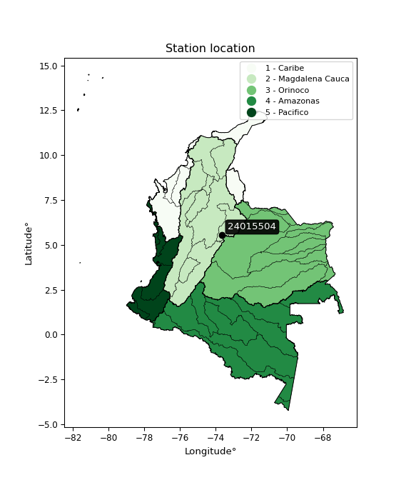</img>

</div>


## A. General information


### 1. General running parameters

• app_version: _v20260312_. • runtime: _2026-03-12 07:15:23.203550_. • Python version: _3.14.0_. • SciPy version: _1.16.3_. • Pandas version: _2.3.3_. • NumPy version: _2.3.5_. • Stations dataset (station_dataset_file): _dataset/pmax24h_in/automatic_colombia_2003_2025.csv_. • Stations catalog (station_catalog_file): _dataset/CNE.xls_. • Minimum year to eval til year_max (date_min): _1900_. • Maximum year to eval since year_min (date_max): _2025_. • Creates, save and include plots into reports (create_plot): _True_. • Plot only fit distributions with Δo > Δ (plot_only_fit): _True_. • Plot only simple graphs avoiding multiple CDFs and multiple Extreme values plots (plot_only_simple): _True_. • Eval low extreme values, if False, evaluates high extreme values (low_extreme): _False_. • Eval every SciPy distribution as logarithmic (pdist_logarithmic_on): _True_. • Standard deviation normalized (ddof): _1.0_. • Return periods to eval in years (Tr): _[2, 2.33, 5, 10, 15, 20, 25, 50, 75, 100, 200, 250, 500, 750, 1000]_. • Minimum data sample per station, 0 means any (minimum_sample): _5_. • Z-Score maximum threshold to adjust a value, 0 means disable (zscore_max): _3.5_. • Z-Score minimum threshold to adjust a value, 0 means disable (zscore_min): _-2.5_. • Avoid zeros, e.g. rain = 0 (avoid_zeros): _True_. • Avoid null values (avoid_nans): _True_. 

:file_folder:Table: [dataset.csv](../../dataset/pmax24h_in/automatic_colombia_2003_2025.csv)

> Delta Degrees of Freedom (DDOF): is a parameter used in the formulas for calculating variance and standard deviation. When ddof=0, the divisor is $N$ (the total number of observations) and this is used when your data set is the entire population. When ddof=1, the divisor is $N-1$ and this is used when your data set is a sample drawn from a larger population. Using $N-1$ provides an unbiased estimate of the population variance (known as Bessel´s correction).


### 2. Station info and location

|   id |   CODIGO | NOMBRE                     | CATEGORIA               | TECNOLOGIA                | ESTADO   |   FECHA_INSTALACION |   FECHA_SUSPENSION |   ALTITUD |   LATITUD |   LONGITUD | DEPARTAMENTO   | MUNICIPIO   | AREA_OPERATIVA                            | ENTIDAD                                       | AREA_HIDROGRAFICA   | ZONA_HIDROGRAFICA   | SUBZONA_HIDROGRAFICA   |   CORRIENTE | Catalogo   |   Version |
|-----:|---------:|:---------------------------|:------------------------|:--------------------------|:---------|--------------------:|-------------------:|----------:|----------:|-----------:|:---------------|:------------|:------------------------------------------|:----------------------------------------------|:--------------------|:--------------------|:-----------------------|------------:|:-----------|----------:|
|    0 | 24015504 | RAQUIRA  - AUT  [24015504] | Climatológica Principal | Automática con Telemetría | Activa   |                 nan |                nan |         2 |   5.53568 |   -73.6411 | Boyacá         | Ráquira     | Area Operativa 11 - Cundinamarca-Amazonas | CORPORACION AUTONOMA REGIONAL DE CUNDINAMARCA | Magdalena Cauca     | Sogamoso            | Río Suárez             |         nan | CNE_OE     |  20251226 |

<div align="center">

Dynamic map: [:earth_americas:Google](http://maps.google.com/maps?q=5.535677778,-73.64111111) [:earth_americas:OSM](https://www.openstreetmap.org/#map=18/5.535677778/-73.64111111&layers=P) [:earth_americas:Bing](https://www.bing.com/maps?cp=5.535677778~-73.64111111&lvl=18) [:earth_americas:Apple](https://maps.apple.com/frame?center=5.535677778%2C-73.64111111&span=0.003%2C0.006)

</div>


<div align="center">

```geojson
{
  "type": "Feature",
  "geometry": {
    "type": "Point", 
    "coordinates": [-73.64111111, 5.535677778]
  }, 
  "properties": {
    "Name": "24015504"
  }
}
```

</div>


### 3. Discrete values table and plot

<div align="center">

|               |          0 |           1 |           2 |          3 |          4 |           5 |           6 |
|:--------------|-----------:|------------:|------------:|-----------:|-----------:|------------:|------------:|
| Date          | 2015       | 2016        | 2017        | 2018       | 2019       | 2020        | 2021        |
| Value         |    7.8     |   43.9      |   39.1      |   74       |   96.9     |   39.4      |   28.3      |
| Value_initial |    7.8     |   43.9      |   39.1      |   74       |   96.9     |   39.4      |   28.3      |
| count         |    7       |    7        |    7        |    7       |    7       |    7        |    7        |
| mean          |   47.0571  |   47.0571   |   47.0571   |   47.0571  |   47.0571  |   47.0571   |   47.0571   |
| std           |   29.5384  |   29.5384   |   29.5384   |   29.5384  |   29.5384  |   29.5384   |   29.5384   |
| zscore        |   -1.32902 |   -0.106883 |   -0.269383 |    0.91213 |    1.68739 |   -0.259227 |   -0.635009 |


</div>


<div align="center">

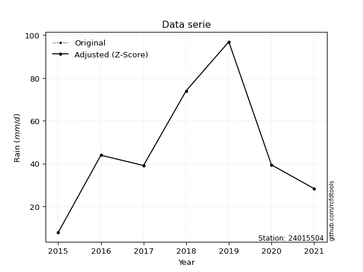</img>

</div>


> The initial value (value_initial) correspond to the initial obtained or null completed value, and value (value) is adjusted only when the initial value is outside the valid range (outlier) definite through the Z-Score value. If Z-Score is active, values out of range or outliers are replaced with the station mean value. A Z-Score (or standard score) measures how many standard deviations a data point is from the mean of a dataset, indicating its relative position; positive scores mean above the mean, negative mean below, and a score of zero is exactly at the mean, allowing for comparison of values from different distributions. It´s calculated using the formula $z=(x–μ)/σ$, where $x$ is the data point, $μ$ is the mean, and $σ$ is the standard deviation, helping identify outliers and understand probability.
>
> <sub>**Note**: In this study, "completing" (filling gaps in) and "extending" (forecasting or lengthening the historical record) rainfall data series are avoided for certain critical analyses because they introduce artificial bias and uncertainty, which can distort the statistics of rare events (extremes), alter day-to-day variability, and compromise the integrity and homogeneity of the original data. Some reasons against Completing/Extending rainfall data are: **Distortion of Extremes and Variability**: The primary issue is that most gap-filling or extension methods rely on averaging or regression with nearby stations, which inherently smooths the data. Rainfall is highly variable in space and time, with a large percentage of zero values and occasional large storms. Infilling methods often underestimate the highest values and overestimate the lowest (zero) values, which severely distorts analyses focused on flood frequency, drought severity, and intensity-duration-frequency (IDF) curves, **Loss of Data Homogeneity**: Infilled or extended data are synthetic estimates, not actual measurements. Combining these estimates with observed data can violate the assumption of data homogeneity, which requires that the data properties do not change over time. Inhomogeneity can lead to incorrect conclusions about long-term trends or changes in climate patterns, **Propagation of Errors**: Errors and biases from the original data (e.g., wind-induced undercatch, instrument errors, site changes) or the data used for imputation can propagate through the analysis, leading to unreliable hydrological models and inaccurate predictions, **Compromised Statistical Integrity**: For statistical analyses, especially those involving the frequency of events, using artificial data can introduce time bias or autocorrelation that doesn´t exist in reality, making it difficult to assess the true probability of events, **Difficulty in Validation**: It is difficult to accurately validate the quality of filled or extended data, especially for past periods where ground-truth measurements are unavailable. The reliability of imputation techniques heavily depends on the density of the surrounding station network and the complexity of the local topography.</sub>


### 4. Active continuous probability distributions from SciPy (80 of 104 available)

A Probability Density Function (PDF) describes the relative likelihood of a continuous random variable falling within a specific range, where the total area under its curve equals 1, and the area over any interval gives the actual probability for that range. Unlike discrete probabilities (like rolling a die), a PDF shows density, not direct probability for a single point (which is zero), with higher points indicating higher likelihood, often visualized as a bell curve for normal distributions.

A log of a probability density function (log-PDF) is simply the logarithm of the PDF´s value, denoted as $log(f(x))$, useful for converting multiplication of probabilities into addition, improving numerical stability with tiny numbers, and connecting to information theory concepts like entropy. Instead of dealing with very small probabilities (e.g., 0.000001), log-PDFs use negative numbers (e.g., $log(0.00001) ≈ -11.51$ that are easier for computers to handle, preventing underflow errors and simplifying complex calculations. In this study, each active probability distribution from SciPy is also evaluated in the $log$ form.

[scipy.stats](https://docs.scipy.org/doc/scipy/reference/stats.html) is a Python´s powerful submodule within the SciPy library for comprehensive statistical analysis, offering over 130 probability distributions (like Normal, Poisson, etc.), functions for descriptive stats (mean, variance), hypothesis testing (t-tests, chi-square), random variable generation, and statistical tests, making it essential for data science, modeling, and research. It provides tools to explore, model, and draw conclusions from data efficiently, working seamlessly with [NumPy](https://numpy.org/).

<div align="center">

|   id | p_dist           |   n_parameter | fit_method   | label                                                                       | active   | ref                                                                                                      |
|-----:|:-----------------|--------------:|:-------------|:----------------------------------------------------------------------------|:---------|:---------------------------------------------------------------------------------------------------------|
|    0 | alpha            |             3 | MLE          | Alpha                                                                       | True     | [:mortar_board:](https://docs.scipy.org/doc/scipy/reference/generated/scipy.stats.alpha.html)            |
|    1 | anglit           |             2 | MM           | Anglit                                                                      | True     | [:mortar_board:](https://docs.scipy.org/doc/scipy/reference/generated/scipy.stats.anglit.html)           |
|    2 | arcsine          |             2 | MM           | Arcsine                                                                     | True     | [:mortar_board:](https://docs.scipy.org/doc/scipy/reference/generated/scipy.stats.arcsine.html)          |
|    3 | argus            |             3 | MLE          | Argus                                                                       | True     | [:mortar_board:](https://docs.scipy.org/doc/scipy/reference/generated/scipy.stats.argus.html)            |
|    4 | beta             |             4 | MLE          | Beta                                                                        | True     | [:mortar_board:](https://docs.scipy.org/doc/scipy/reference/generated/scipy.stats.beta.html)             |
|    5 | betaprime        |             4 | MLE          | Beta prime                                                                  | True     | [:mortar_board:](https://docs.scipy.org/doc/scipy/reference/generated/scipy.stats.betaprime.html)        |
|    6 | bradford         |             3 | MLE          | Bradford                                                                    | True     | [:mortar_board:](https://docs.scipy.org/doc/scipy/reference/generated/scipy.stats.bradford.html)         |
|    7 | burr             |             4 | MLE          | Burr (Type III)                                                             | True     | [:mortar_board:](https://docs.scipy.org/doc/scipy/reference/generated/scipy.stats.burr.html)             |
|    8 | burr12           |             4 | MLE          | Burr (Type III) 12                                                          | True     | [:mortar_board:](https://docs.scipy.org/doc/scipy/reference/generated/scipy.stats.burr12.html)           |
|    9 | cosine           |             2 | MLE          | Cosine                                                                      | True     | [:mortar_board:](https://docs.scipy.org/doc/scipy/reference/generated/scipy.stats.cosine.html)           |
|   10 | crystalball      |             4 | MLE          | Crystalball                                                                 | True     | [:mortar_board:](https://docs.scipy.org/doc/scipy/reference/generated/scipy.stats.crystalball.html)      |
|   11 | dgamma           |             3 | MLE          | Double gamma                                                                | True     | [:mortar_board:](https://docs.scipy.org/doc/scipy/reference/generated/scipy.stats.dgamma.html)           |
|   12 | dweibull         |             3 | MLE          | Double Weibull                                                              | True     | [:mortar_board:](https://docs.scipy.org/doc/scipy/reference/generated/scipy.stats.dweibull.html)         |
|   13 | erlang           |             3 | MLE          | Erlang                                                                      | True     | [:mortar_board:](https://docs.scipy.org/doc/scipy/reference/generated/scipy.stats.erlang.html)           |
|   14 | exponnorm        |             3 | MLE          | Exponentially modified Normal                                               | True     | [:mortar_board:](https://docs.scipy.org/doc/scipy/reference/generated/scipy.stats.exponnorm.html)        |
|   15 | exponpow         |             3 | MLE          | Exponential power                                                           | True     | [:mortar_board:](https://docs.scipy.org/doc/scipy/reference/generated/scipy.stats.exponpow.html)         |
|   16 | exponweib        |             4 | MLE          | Exponentiated Weibull                                                       | True     | [:mortar_board:](https://docs.scipy.org/doc/scipy/reference/generated/scipy.stats.exponweib.html)        |
|   17 | f                |             4 | MLE          | F                                                                           | True     | [:mortar_board:](https://docs.scipy.org/doc/scipy/reference/generated/scipy.stats.f.html)                |
|   18 | fatiguelife      |             3 | MLE          | Fatigue-life (Birnbaum-Saunders)                                            | True     | [:mortar_board:](https://docs.scipy.org/doc/scipy/reference/generated/scipy.stats.fatiguelife.html)      |
|   19 | foldnorm         |             3 | MM           | Fold Normal                                                                 | True     | [:mortar_board:](https://docs.scipy.org/doc/scipy/reference/generated/scipy.stats.foldnorm.html)         |
|   20 | gamma            |             3 | MLE          | Gamma                                                                       | True     | [:mortar_board:](https://docs.scipy.org/doc/scipy/reference/generated/scipy.stats.gamma.html)            |
|   21 | gausshyper       |             6 | MLE          | Gauss hypergeometric                                                        | True     | [:mortar_board:](https://docs.scipy.org/doc/scipy/reference/generated/scipy.stats.gausshyper.html)       |
|   22 | genexpon         |             5 | MLE          | Generalized exponential                                                     | True     | [:mortar_board:](https://docs.scipy.org/doc/scipy/reference/generated/scipy.stats.genexpon.html)         |
|   23 | genextreme       |             3 | MLE          | Generalized exponential                                                     | True     | [:mortar_board:](https://docs.scipy.org/doc/scipy/reference/generated/scipy.stats.genextreme.html)       |
|   24 | gengamma         |             4 | MLE          | Generalized gamma                                                           | True     | [:mortar_board:](https://docs.scipy.org/doc/scipy/reference/generated/scipy.stats.gengamma.html)         |
|   25 | genhalflogistic  |             3 | MLE          | Generalized half-logistic                                                   | True     | [:mortar_board:](https://docs.scipy.org/doc/scipy/reference/generated/scipy.stats.genhalflogistic.html)  |
|   26 | genlogistic      |             3 | MLE          | Generalized logistic                                                        | True     | [:mortar_board:](https://docs.scipy.org/doc/scipy/reference/generated/scipy.stats.genlogistic.html)      |
|   27 | gennorm          |             3 | MLE          | Generalized Normal                                                          | True     | [:mortar_board:](https://docs.scipy.org/doc/scipy/reference/generated/scipy.stats.gennorm.html)          |
|   28 | genpareto        |             3 | MLE          | Generalized Pareto                                                          | True     | [:mortar_board:](https://docs.scipy.org/doc/scipy/reference/generated/scipy.stats.genpareto.html)        |
|   29 | gompertz         |             3 | MLE          | Gompertz (or truncated Gumbel)                                              | True     | [:mortar_board:](https://docs.scipy.org/doc/scipy/reference/generated/scipy.stats.gompertz.html)         |
|   30 | gumbel_l         |             2 | MM           | Gumbel Left Skew                                                            | True     | [:mortar_board:](https://docs.scipy.org/doc/scipy/reference/generated/scipy.stats.gumbel_l.html)         |
|   31 | gumbel_r         |             2 | MM           | Gumbel Right Skew                                                           | True     | [:mortar_board:](https://docs.scipy.org/doc/scipy/reference/generated/scipy.stats.gumbel_r.html)         |
|   32 | halfgennorm      |             3 | MLE          | Upper half of a generalized normal                                          | True     | [:mortar_board:](https://docs.scipy.org/doc/scipy/reference/generated/scipy.stats.halfgennorm.html)      |
|   33 | halflogistic     |             2 | MM           | Half-logistic                                                               | True     | [:mortar_board:](https://docs.scipy.org/doc/scipy/reference/generated/scipy.stats.halflogistic.html)     |
|   34 | halfnorm         |             2 | MM           | Half Normal                                                                 | True     | [:mortar_board:](https://docs.scipy.org/doc/scipy/reference/generated/scipy.stats.halfnorm.html)         |
|   35 | hypsecant        |             2 | MM           | hyperbolic secant                                                           | True     | [:mortar_board:](https://docs.scipy.org/doc/scipy/reference/generated/scipy.stats.hypsecant.html)        |
|   36 | invgamma         |             3 | MLE          | Inverted gamma                                                              | True     | [:mortar_board:](https://docs.scipy.org/doc/scipy/reference/generated/scipy.stats.invgamma.html)         |
|   37 | invgauss         |             3 | MLE          | Inverse Gaussian                                                            | True     | [:mortar_board:](https://docs.scipy.org/doc/scipy/reference/generated/scipy.stats.invgauss.html)         |
|   38 | invweibull       |             3 | MLE          | Inverted Weibull                                                            | True     | [:mortar_board:](https://docs.scipy.org/doc/scipy/reference/generated/scipy.stats.invweibull.html)       |
|   39 | johnsonsb        |             4 | MLE          | Johnson SB                                                                  | True     | [:mortar_board:](https://docs.scipy.org/doc/scipy/reference/generated/scipy.stats.johnsonsb.html)        |
|   40 | johnsonsu        |             4 | MLE          | Johnson Su                                                                  | True     | [:mortar_board:](https://docs.scipy.org/doc/scipy/reference/generated/scipy.stats.johnsonsu.html)        |
|   41 | kappa3           |             3 | MLE          | Kappa 3                                                                     | True     | [:mortar_board:](https://docs.scipy.org/doc/scipy/reference/generated/scipy.stats.kappa3.html)           |
|   42 | kappa4           |             4 | MLE          | Kappa 4                                                                     | True     | [:mortar_board:](https://docs.scipy.org/doc/scipy/reference/generated/scipy.stats.kappa4.html)           |
|   43 | ksone            |             3 | MLE          | Kolmogorov-Smirnov one-sided test statistic distribution                    | True     | [:mortar_board:](https://docs.scipy.org/doc/scipy/reference/generated/scipy.stats.ksone.html)            |
|   44 | kstwobign        |             2 | MLE          | Limiting distribution of scaled Kolmogorov-Smirnov two-sided test statistic | True     | [:mortar_board:](https://docs.scipy.org/doc/scipy/reference/generated/scipy.stats.kstwobign.html)        |
|   45 | laplace          |             2 | MM           | Laplace                                                                     | True     | [:mortar_board:](https://docs.scipy.org/doc/scipy/reference/generated/scipy.stats.laplace.html)          |
|   46 | levy_l           |             2 | MLE          | Left-skewed Levy                                                            | True     | [:mortar_board:](https://docs.scipy.org/doc/scipy/reference/generated/scipy.stats.levy_l.html)           |
|   47 | loggamma         |             3 | MLE          | Log gamma                                                                   | True     | [:mortar_board:](https://docs.scipy.org/doc/scipy/reference/generated/scipy.stats.loggamma.html)         |
|   48 | logistic         |             2 | MM           | Logistic (or Sech-squared)                                                  | True     | [:mortar_board:](https://docs.scipy.org/doc/scipy/reference/generated/scipy.stats.logistic.html)         |
|   49 | loglaplace       |             3 | MLE          | Log-Laplace                                                                 | True     | [:mortar_board:](https://docs.scipy.org/doc/scipy/reference/generated/scipy.stats.loglaplace.html)       |
|   50 | lomax            |             3 | MLE          | Lomax (Pareto of the second kind)                                           | True     | [:mortar_board:](https://docs.scipy.org/doc/scipy/reference/generated/scipy.stats.lomax.html)            |
|   51 | maxwell          |             2 | MM           | Maxwell                                                                     | True     | [:mortar_board:](https://docs.scipy.org/doc/scipy/reference/generated/scipy.stats.maxwell.html)          |
|   52 | mielke           |             4 | MLE          | Mielke Beta-Kappa / Dagum                                                   | True     | [:mortar_board:](https://docs.scipy.org/doc/scipy/reference/generated/scipy.stats.mielke.html)           |
|   53 | moyal            |             2 | MM           | Moyal                                                                       | True     | [:mortar_board:](https://docs.scipy.org/doc/scipy/reference/generated/scipy.stats.moyal.html)            |
|   54 | nakagami         |             3 | MLE          | Nakagami                                                                    | True     | [:mortar_board:](https://docs.scipy.org/doc/scipy/reference/generated/scipy.stats.nakagami.html)         |
|   55 | ncf              |             5 | MLE          | Non-central F distribution                                                  | True     | [:mortar_board:](https://docs.scipy.org/doc/scipy/reference/generated/scipy.stats.ncf.html)              |
|   56 | nct              |             4 | MLE          | Non-central Student’s t                                                     | True     | [:mortar_board:](https://docs.scipy.org/doc/scipy/reference/generated/scipy.stats.nct.html)              |
|   57 | norm             |             2 | MM           | Normal                                                                      | True     | [:mortar_board:](https://docs.scipy.org/doc/scipy/reference/generated/scipy.stats.norm.html)             |
|   58 | pearson3         |             3 | MM           | Pearson type III                                                            | True     | [:mortar_board:](https://docs.scipy.org/doc/scipy/reference/generated/scipy.stats.pearson3.html)         |
|   59 | powerlaw         |             3 | MLE          | Power-function                                                              | True     | [:mortar_board:](https://docs.scipy.org/doc/scipy/reference/generated/scipy.stats.powerlaw.html)         |
|   60 | rayleigh         |             2 | MM           | Rayleigh                                                                    | True     | [:mortar_board:](https://docs.scipy.org/doc/scipy/reference/generated/scipy.stats.rayleigh.html)         |
|   61 | rdist            |             3 | MLE          | R-distributed (symmetric beta)                                              | True     | [:mortar_board:](https://docs.scipy.org/doc/scipy/reference/generated/scipy.stats.rdist.html)            |
|   62 | rice             |             3 | MLE          | Rice                                                                        | True     | [:mortar_board:](https://docs.scipy.org/doc/scipy/reference/generated/scipy.stats.rice.html)             |
|   63 | semicircular     |             2 | MM           | Semicircular                                                                | True     | [:mortar_board:](https://docs.scipy.org/doc/scipy/reference/generated/scipy.stats.semicircular.html)     |
|   64 | skewnorm         |             3 | MLE          | Skew normal                                                                 | True     | [:mortar_board:](https://docs.scipy.org/doc/scipy/reference/generated/scipy.stats.skewnorm.html)         |
|   65 | t                |             3 | MLE          | Student’s t                                                                 | True     | [:mortar_board:](https://docs.scipy.org/doc/scipy/reference/generated/scipy.stats.t.html)                |
|   66 | trapezoid        |             4 | MLE          | Trapezoid                                                                   | True     | [:mortar_board:](https://docs.scipy.org/doc/scipy/reference/generated/scipy.stats.trapezoid.html)        |
|   67 | triang           |             3 | MLE          | Triangular                                                                  | True     | [:mortar_board:](https://docs.scipy.org/doc/scipy/reference/generated/scipy.stats.triang.html)           |
|   68 | truncexpon       |             3 | MLE          | Truncated exponential                                                       | True     | [:mortar_board:](https://docs.scipy.org/doc/scipy/reference/generated/scipy.stats.truncexpon.html)       |
|   69 | truncnorm        |             4 | MLE          | Truncated normal                                                            | True     | [:mortar_board:](https://docs.scipy.org/doc/scipy/reference/generated/scipy.stats.truncnorm.html)        |
|   70 | truncpareto      |             4 | MLE          | Upper truncated Pareto                                                      | True     | [:mortar_board:](https://docs.scipy.org/doc/scipy/reference/generated/scipy.stats.truncpareto.html)      |
|   71 | truncweibull_min |             5 | MLE          | Doubly truncated Weibull minimum                                            | True     | [:mortar_board:](https://docs.scipy.org/doc/scipy/reference/generated/scipy.stats.truncweibull_min.html) |
|   72 | tukeylambda      |             3 | MLE          | Tukey-Lamdba                                                                | True     | [:mortar_board:](https://docs.scipy.org/doc/scipy/reference/generated/scipy.stats.tukeylambda.html)      |
|   73 | uniform          |             2 | MLE          | Uniform                                                                     | True     | [:mortar_board:](https://docs.scipy.org/doc/scipy/reference/generated/scipy.stats.uniform.html)          |
|   74 | vonmises         |             3 | MLE          | Von Mises                                                                   | True     | [:mortar_board:](https://docs.scipy.org/doc/scipy/reference/generated/scipy.stats.vonmises.html)         |
|   75 | vonmises_line    |             3 | MLE          | Von Mises line                                                              | True     | [:mortar_board:](https://docs.scipy.org/doc/scipy/reference/generated/scipy.stats.vonmises_line.html)    |
|   76 | wald             |             2 | MM           | Wald                                                                        | True     | [:mortar_board:](https://docs.scipy.org/doc/scipy/reference/generated/scipy.stats.wald.html)             |
|   77 | weibull_max      |             3 | MLE          | Weibull maximum                                                             | True     | [:mortar_board:](https://docs.scipy.org/doc/scipy/reference/generated/scipy.stats.weibull_max.html)      |
|   78 | weibull_min      |             3 | MLE          | Weibull minimum                                                             | True     | [:mortar_board:](https://docs.scipy.org/doc/scipy/reference/generated/scipy.stats.weibull_min.html)      |
|   79 | wrapcauchy       |             3 | MLE          | Wrapped  Cauchy                                                             | True     | [:mortar_board:](https://docs.scipy.org/doc/scipy/reference/generated/scipy.stats.wrapcauchy.html)       |

</div>

> **n_parameter:** # arguments & localization & scale.
>
> **Fit methods:** (MLE) maximum likelihood, (MM) L-moments.
>
>**Inactive** (With the only purpose of prevent loops, zero divisions, infinite values, over high estimated values or horizontal trending for recurrence intervals estimations, the follow distributions were disabled.)**:** lognorm, norminvgauss, powernorm, powerlognorm, cauchy, halfcauchy, foldcauchy, skewcauchy, chi2, expon, fisk, genhyperbolic, geninvgauss, gibrat, kstwo, laplace_asymmetric, levy, levy_stable, ncx2, pareto, rel_breitwigner, recipinvgauss, studentized_range, loguniform, 


## B. Probability (PDF) vs. Empirical (EDF) distributions functions

A continuous probability distribution (CPD) describes probabilities for variables that can take any value within a range (like rain any time), unlike discrete variables with specific outcomes (like temperature). It uses a Probability Density Function (PDF), a curve where the total area under it equals 1, and the probability of the variable falling within an interval (a to b) is found by calculating the area under the curve between those points. A key feature is that the probability of hitting any single exact value is zero, so probabilities are always expressed for ranges, e.g., $P(a ≤ X ≤ b)$.

<div align="center">

Distributions parameters from station values
|     |   station | p_dist              |   n |               loc |            scale | shape                  | shape1                | shape2                 | shape3             |
|----:|----------:|:--------------------|----:|------------------:|-----------------:|:-----------------------|:----------------------|:-----------------------|:-------------------|
|   0 |  24015504 | alpha               |   7 |      -0.050407    |     18.9318      | 1.692788731226889e-11  |                       |                        |                    |
|   1 |  24015504 | anglit              |   7 |      47.0571      |     80.0016      |                        |                       |                        |                    |
|   2 |  24015504 | arcsine             |   7 |       8.38229     |     77.3497      |                        |                       |                        |                    |
|   3 |  24015504 | argus               |   7 |     -15.4177      |    117.101       | 2.0192660734077137e-06 |                       |                        |                    |
|   4 |  24015504 | beta                |   7 |       7.8         |    114.336       | 0.7160578100016358     | 2.0017062580153606    |                        |                    |
|   5 |  24015504 | betaprime           |   7 |     -10.5671      | 335099           | 4.183236290318835      | 24359.246390132863    |                        |                    |
|   6 |  24015504 | bradford            |   7 |       7.8         |     89.1         | 1.1119023946987447     |                       |                        |                    |
|   7 |  24015504 | burr                |   7 |       7.79999     |     59.5936      | 3.07775115643944       | 0.26399281513108686   |                        |                    |
|   8 |  24015504 | burr12              |   7 |      -1.83147     |      9.50233     | 303.2136158814078      | 0.002289220514876268  |                        |                    |
|   9 |  24015504 | cosine              |   7 |      49.1276      |     23.0954      |                        |                       |                        |                    |
|  10 |  24015504 | crystalball         |   7 |      47.0571      |     27.3472      | 18901.706342516612     | 2424.772658593796     |                        |                    |
|  11 |  24015504 | dgamma              |   7 |      39.1         |     24.7664      | 0.7740738282183159     |                       |                        |                    |
|  12 |  24015504 | dweibull            |   7 |      39.1         |     23.1         | 0.7980928412862393     |                       |                        |                    |
|  13 |  24015504 | erlang              |   7 |      -8.14192     |     14.8019      | 3.729176806745966      |                       |                        |                    |
|  14 |  24015504 | exponnorm           |   7 |      21.0797      |     13.9508      | 1.8620734418724525     |                       |                        |                    |
|  15 |  24015504 | exponpow            |   7 |       7.8         |     16.7903      | 0.35955067695089693    |                       |                        |                    |
|  16 |  24015504 | exponweib           |   7 |     -35.1969      |     39.0806      | 8.135262121639219      | 1.3280187949398288    |                        |                    |
|  17 |  24015504 | f                   |   7 |      -8.17443     |     55.2312      | 7.478329526008924      | 161214.10378095513    |                        |                    |
|  18 |  24015504 | fatiguelife         |   7 |       7.8         |      0.000302051 | 298.1122371656335      |                       |                        |                    |
|  19 |  24015504 | foldnorm            |   7 |       3.50513     |     31.5895      | 1.2846093959611955     |                       |                        |                    |
|  20 |  24015504 | gamma               |   7 |      -8.14188     |     14.802       | 3.7291697732405478     |                       |                        |                    |
|  21 |  24015504 | gausshyper          |   7 |       7.8         |     89.1         | 0.7022634909735108     | 0.6891018921369998    | 0.5511668139236203     | 1.258584878457382  |
|  22 |  24015504 | genexpon            |   7 |       7.8         |      1.09673     | 0.015084019052946951   | 0.2830553859143541    | 0.0017696115368100234  |                    |
|  23 |  24015504 | genextreme          |   7 |      35.035       |     23.0662      | 0.07114487787222773    |                       |                        |                    |
|  24 |  24015504 | gengamma            |   7 |       7.8         |     53.1579      | 0.4517318169534926     | 1.72921767467462      |                        |                    |
|  25 |  24015504 | genhalflogistic     |   7 |      -1.14805     |    101.852       | 1.0387921377439087     |                       |                        |                    |
|  26 |  24015504 | genlogistic         |   7 |     -81.526       |     22.4506      | 173.60331913536993     |                       |                        |                    |
|  27 |  24015504 | gennorm             |   7 |      39.3981      |      7.3367e-06  | 0.14325019634038316    |                       |                        |                    |
|  28 |  24015504 | genpareto           |   7 |      -0.0048508   |    166.189       | -1.714973888244449     |                       |                        |                    |
|  29 |  24015504 | gompertz            |   7 |      -0.434554    |      2.44904     | 3.8305916138787014e-17 |                       |                        |                    |
|  30 |  24015504 | gumbel_l            |   7 |      59.3649      |     21.3225      |                        |                       |                        |                    |
|  31 |  24015504 | gumbel_r            |   7 |      34.7494      |     21.3225      |                        |                       |                        |                    |
|  32 |  24015504 | halfgennorm         |   7 |       7.8         |     91.0332      | 140.19567642539482     |                       |                        |                    |
|  33 |  24015504 | halflogistic        |   7 |      14.6443      |     23.3809      |                        |                       |                        |                    |
|  34 |  24015504 | halfnorm            |   7 |      10.8601      |     45.3663      |                        |                       |                        |                    |
|  35 |  24015504 | hypsecant           |   7 |      47.0571      |     17.4098      |                        |                       |                        |                    |
|  36 |  24015504 | invgamma            |   7 |     -72.1446      |   2260.85        | 19.958140301523162     |                       |                        |                    |
|  37 |  24015504 | invgauss            |   7 |     -40.2369      |    842.172       | 0.1036534578612382     |                       |                        |                    |
|  38 |  24015504 | invweibull          |   7 |      -8.32126e+08 |      8.32126e+08 | 37182612.887841865     |                       |                        |                    |
|  39 |  24015504 | johnsonsb           |   7 |       4.53625     |     92.3638      | -0.5001533344408835    | 0.10146720535312875   |                        |                    |
|  40 |  24015504 | johnsonsu           |   7 |     -41.0005      |      8.91676     | -9.516020522003965     | 3.2385610998908       |                        |                    |
|  41 |  24015504 | kappa3              |   7 |       7.8         |     89.0962      | 45012.93175994336      |                       |                        |                    |
|  42 |  24015504 | kappa4              |   7 |      -1.11459     |     97.3213      | 1.1007603495988585     | 0.9855309802528054    |                        |                    |
|  43 |  24015504 | ksone               |   7 |      -1.11        |    106.92        | 1.0                    |                       |                        |                    |
|  44 |  24015504 | kstwobign           |   7 |     -46.1005      |    106.988       |                        |                       |                        |                    |
|  45 |  24015504 | laplace             |   7 |      47.0571      |     19.3374      |                        |                       |                        |                    |
|  46 |  24015504 | levy_l              |   7 |     102.226       |     23.6316      |                        |                       |                        |                    |
|  47 |  24015504 | loggamma            |   7 |   -6620.78        |    944.923       | 1160.9960393926567     |                       |                        |                    |
|  48 |  24015504 | logistic            |   7 |      47.0571      |     15.0773      |                        |                       |                        |                    |
|  49 |  24015504 | loglaplace          |   7 |      -0.0922744   |     39.4922      | 1.9487583014367265     |                       |                        |                    |
|  50 |  24015504 | lomax               |   7 |       7.8         |      1.44674e+11 | 2814507846.8788357     |                       |                        |                    |
|  51 |  24015504 | maxwell             |   7 |     -17.7443      |     40.6083      |                        |                       |                        |                    |
|  52 |  24015504 | mielke              |   7 |       7.8         |    110.884       | 0.38685862572955376    | 7.126369470015332     |                        |                    |
|  53 |  24015504 | moyal               |   7 |      31.4182      |     12.3106      |                        |                       |                        |                    |
|  54 |  24015504 | nakagami            |   7 |      28.3         |     36.1689      | 0.19531346103368707    |                       |                        |                    |
|  55 |  24015504 | ncf                 |   7 |      -0.0470593   |      1.51834e-05 | 4.097691914223844e-06  | 5.769162399946124     | 10.454929407293289     |                    |
|  56 |  24015504 | nct                 |   7 |      -0.0447727   |     20.1351      | 6.5583127664182115     | 2.0596196337986314    |                        |                    |
|  57 |  24015504 | norm                |   7 |      47.0571      |     27.3472      |                        |                       |                        |                    |
|  58 |  24015504 | pearson3            |   7 |      47.0571      |     27.3472      | 0.5259598783143464     |                       |                        |                    |
|  59 |  24015504 | powerlaw            |   7 |       7.8         |     89.1         | 0.15945424151732177    |                       |                        |                    |
|  60 |  24015504 | rayleigh            |   7 |      -5.25971     |     41.7428      |                        |                       |                        |                    |
|  61 |  24015504 | rdist               |   7 |      -0.115874    |     44.0159      | 1.1403401190849811     |                       |                        |                    |
|  62 |  24015504 | rice                |   7 |      -3.09687     |     39.6514      | 0.2749152925549071     |                       |                        |                    |
|  63 |  24015504 | semicircular        |   7 |      47.0571      |     54.6945      |                        |                       |                        |                    |
|  64 |  24015504 | skewnorm            |   7 |      15.2309      |     41.9617      | 3.1636442173088524     |                       |                        |                    |
|  65 |  24015504 | t                   |   7 |      47.0571      |     27.3471      | 173544.09818569006     |                       |                        |                    |
|  66 |  24015504 | trapezoid           |   7 |      -1.1655      |    106.92        | 1.0                    | 1.0                   |                        |                    |
|  67 |  24015504 | triang              |   7 |      -1.22488     |     98.125       | 0.9999990369635599     |                       |                        |                    |
|  68 |  24015504 | truncexpon          |   7 |       7.8         |     89.1943      | 0.9989427806666114     |                       |                        |                    |
|  69 |  24015504 | truncnorm           |   7 |      47.0571      |     27.3472      | -279.3463939509703     | 1561.5885312971327    |                        |                    |
|  70 |  24015504 | truncpareto         |   7 |       7.76118     |      0.0388159   | 0.16792234872477466    | 2296.4490311588       |                        |                    |
|  71 |  24015504 | truncweibull_min    |   7 |       7.73396     |     98.4041      | 0.8477872236965123     | 0.0006711469809201486 | 0.9061207704840621     |                    |
|  72 |  24015504 | tukeylambda         |   7 |      -0.111874    |     46.4977      | 1.0564814599798218     |                       |                        |                    |
|  73 |  24015504 | uniform             |   7 |       7.8         |     89.1         |                        |                       |                        |                    |
|  74 |  24015504 | vonmises            |   7 |       1.82872     |      1           | 0.7419931471903449     |                       |                        |                    |
|  75 |  24015504 | vonmises_line       |   7 |      40.2072      |     18.0459      | 1.1579811410188534     |                       |                        |                    |
|  76 |  24015504 | wald                |   7 |      19.7099      |     27.3472      |                        |                       |                        |                    |
|  77 |  24015504 | weibull_max         |   7 |      96.9         |      1.69517     | 0.24416103692059543    |                       |                        |                    |
|  78 |  24015504 | weibull_min         |   7 |       2.61872     |     49.3478      | 1.6032238437059245     |                       |                        |                    |
|  79 |  24015504 | wrapcauchy          |   7 |       7.79921     |     14.1808      | 0.005913162194964024   |                       |                        |                    |
|  80 |  24015504 | logalpha            |   7 |     -15.4887      |    469.173       | 24.591621786873304     |                       |                        |                    |
|  81 |  24015504 | loganglit           |   7 |       3.62808     |      2.19391     |                        |                       |                        |                    |
|  82 |  24015504 | logarcsine          |   7 |       2.56748     |      2.12118     |                        |                       |                        |                    |
|  83 |  24015504 | logargus            |   7 |       1.35578     |      3.30021     | 1.8780648674889067     |                       |                        |                    |
|  84 |  24015504 | logbeta             |   7 |       1.99826     |      2.57542     | 1.288619072805223      | 0.9693607473950572    |                        |                    |
|  85 |  24015504 | logbetaprime        |   7 |     -12.2126      |    273.657       | 431.1031075135877      | 7455.2873147534265    |                        |                    |
|  86 |  24015504 | logbradford         |   7 |       2.05411     |      2.51959     | 1.1188170578518681     |                       |                        |                    |
|  87 |  24015504 | logburr             |   7 |      -6.94895     |     11.5495      | 1109.9652782778512     | 0.009912247356185906  |                        |                    |
|  88 |  24015504 | logburr12           |   7 |    -302.005       |    312.392       | 558.3962492028829      | 107164.3517048147     |                        |                    |
|  89 |  24015504 | logcosine           |   7 |       3.51877     |      0.662386    |                        |                       |                        |                    |
|  90 |  24015504 | logcrystalball      |   7 |       3.62808     |      0.749952    | 125.32101984711412     | 254.67579004347124    |                        |                    |
|  91 |  24015504 | logdgamma           |   7 |       3.67377     |      0.540314    | 0.8821507980661847     |                       |                        |                    |
|  92 |  24015504 | logdweibull         |   7 |       3.67377     |      0.540223    | 0.8831477855676535     |                       |                        |                    |
|  93 |  24015504 | logerlang           |   7 |      -9.84173     |      0.0442996   | 304.1388421834615      |                       |                        |                    |
|  94 |  24015504 | logexponnorm        |   7 |       3.6275      |      0.749951    | 0.0007719237536670812  |                       |                        |                    |
|  95 |  24015504 | logexponpow         |   7 |       2.05412     |      1.26058     | 0.5888947049761131     |                       |                        |                    |
|  96 |  24015504 | logexponweib        |   7 |       2.05412     |      1.52956     | 0.31542260355290064    | 0.5479368284890139    |                        |                    |
|  97 |  24015504 | logf                |   7 |    -725.38        |    729.007       | 4414235.096692886      | 3257612.7048631683    |                        |                    |
|  98 |  24015504 | logfatiguelife      |   7 |    -464.907       |    468.533       | 0.001597977778962742   |                       |                        |                    |
|  99 |  24015504 | logfoldnorm         |   7 |       2.59208     |      0.843019    | 1.100210712891351      |                       |                        |                    |
| 100 |  24015504 | loggamma            |   7 |      -9.91423     |      0.0449272   | 301.4214097695201      |                       |                        |                    |
| 101 |  24015504 | loggausshyper       |   7 |       2.01088     |      2.5628      | 1.0991190027654647     | 0.7468899047237669    | 1.0745661609999833     | 1.0109372388064313 |
| 102 |  24015504 | loggenexpon         |   7 |       2.05118     |      0.00374609  | 0.0007367144956921595  | 0.1300923068547859    | 4.7792057706077065e-05 |                    |
| 103 |  24015504 | loggenextreme       |   7 |       3.75183     |      0.901342    | 1.096726513051681      |                       |                        |                    |
| 104 |  24015504 | loggengamma         |   7 |       1.15099     |      3.4164      | 0.2058258214078964     | 13.322731779487402    |                        |                    |
| 105 |  24015504 | loggenhalflogistic  |   7 |       1.89389     |      2.73591     | 1.020938974557693      |                       |                        |                    |
| 106 |  24015504 | loggenlogistic      |   7 |       4.18363     |      0.240199    | 0.36094312051902905    |                       |                        |                    |
| 107 |  24015504 | loggennorm          |   7 |       3.67375     |      5.2454e-10  | 0.11331210045004025    |                       |                        |                    |
| 108 |  24015504 | loggenpareto        |   7 |      -0.00231636  |      8.68866     | -1.8987474110256626    |                       |                        |                    |
| 109 |  24015504 | loggompertz         |   7 |       2.05412     |      0.649473    | 0.05834402781500469    |                       |                        |                    |
| 110 |  24015504 | loggumbel_l         |   7 |       3.96559     |      0.584736    |                        |                       |                        |                    |
| 111 |  24015504 | loggumbel_r         |   7 |       3.29056     |      0.584736    |                        |                       |                        |                    |
| 112 |  24015504 | loghalfgennorm      |   7 |       2.05412     |      1.08303     | 0.8264120533826573     |                       |                        |                    |
| 113 |  24015504 | loghalflogistic     |   7 |       2.73922     |      0.641177    |                        |                       |                        |                    |
| 114 |  24015504 | loghalfnorm         |   7 |       2.63541     |      1.24412     |                        |                       |                        |                    |
| 115 |  24015504 | loghypsecant        |   7 |       3.62808     |      0.477435    |                        |                       |                        |                    |
| 116 |  24015504 | loginvgamma         |   7 |     -13.7255      |   8406.26        | 485.5143657427027      |                       |                        |                    |
| 117 |  24015504 | loginvgauss         |   7 |      -4.59403     |    863.24        | 0.009528845216424024   |                       |                        |                    |
| 118 |  24015504 | loginvweibull       |   7 | -186096           | 186099           | 219046.16070840735     |                       |                        |                    |
| 119 |  24015504 | logjohnsonsb        |   7 |       2.05412     |      2.51965     | 0.41384896044068686    | 0.07559911009780197   |                        |                    |
| 120 |  24015504 | logjohnsonsu        |   7 |       5.19644     |      0.0491556   | 8.452093674422418      | 2.0897907999156895    |                        |                    |
| 121 |  24015504 | logkappa3           |   7 |       2.05412     |      2.51932     | 28321.81559509637      |                       |                        |                    |
| 122 |  24015504 | logkappa4           |   7 |       1.85192     |      2.74648     | 1.0794835708037738     | 1.003022089778615     |                        |                    |
| 123 |  24015504 | logksone            |   7 |       1.80217     |      3.02347     | 1.0                    |                       |                        |                    |
| 124 |  24015504 | logkstwobign        |   7 |       0.168245    |      3.95927     |                        |                       |                        |                    |
| 125 |  24015504 | loglaplace          |   7 |       3.62808     |      0.530297    |                        |                       |                        |                    |
| 126 |  24015504 | loglevy_l           |   7 |       4.65597     |      0.362474    |                        |                       |                        |                    |
| 127 |  24015504 | logloggamma         |   7 |       4.27183     |      0.3976      | 0.5790353234493613     |                       |                        |                    |
| 128 |  24015504 | loglogistic         |   7 |       3.62808     |      0.41347     |                        |                       |                        |                    |
| 129 |  24015504 | logloglaplace       |   7 |      -0.0449305   |      3.7187      | 6.555337439018977      |                       |                        |                    |
| 130 |  24015504 | loglomax            |   7 |       2.05412     |    261.52        | 166.84762454920116     |                       |                        |                    |
| 131 |  24015504 | logmaxwell          |   7 |       1.851       |      1.11362     |                        |                       |                        |                    |
| 132 |  24015504 | logmielke           |   7 |       1.15475     |      3.42036     | 2.5302480494447197     | 15177.183107186935    |                        |                    |
| 133 |  24015504 | logmoyal            |   7 |       3.19921     |      0.337597    |                        |                       |                        |                    |
| 134 |  24015504 | lognakagami         |   7 |       3.34286     |      0.650732    | 0.3080000416759448     |                       |                        |                    |
| 135 |  24015504 | logncf              |   7 |     -17.9269      |     21.5445      | 2491.7120105567783     | 3992.1006125416607    | 0.0035095307435124012  |                    |
| 136 |  24015504 | lognct              |   7 |     -35.6359      |      0.689311    | 8237.733587857867      | 56.954168869093536    |                        |                    |
| 137 |  24015504 | lognorm             |   7 |       3.62808     |      0.749953    |                        |                       |                        |                    |
| 138 |  24015504 | logpearson3         |   7 |       3.62808     |      0.749951    | -0.936192307807032     |                       |                        |                    |
| 139 |  24015504 | logpowerlaw         |   7 |       2.05412     |      2.51956     | 0.1826535933555161     |                       |                        |                    |
| 140 |  24015504 | lograyleigh         |   7 |       2.19336     |      1.14474     |                        |                       |                        |                    |
| 141 |  24015504 | logrdist            |   7 |       2.79957     |      1.5045      | 1.0283718436658495     |                       |                        |                    |
| 142 |  24015504 | logrice             |   7 |    -208.305       |      0.749935    | 282.6001718106581      |                       |                        |                    |
| 143 |  24015504 | logsemicircular     |   7 |       3.62808     |      1.49985     |                        |                       |                        |                    |
| 144 |  24015504 | logskewnorm         |   7 |       4.57368     |      1.20695     | -8717103.801794883     |                       |                        |                    |
| 145 |  24015504 | logt                |   7 |       3.75265     |      0.458033    | 2.3255023433413666     |                       |                        |                    |
| 146 |  24015504 | logtrapezoid        |   7 |       1.50689     |      3.18178     | 1.0                    | 1.0                   |                        |                    |
| 147 |  24015504 | logtriang           |   7 |       1.54754     |      3.02618     | 0.9999859693946072     |                       |                        |                    |
| 148 |  24015504 | logtruncexpon       |   7 |       2.05373     |      3.86709     | 0.6516383618979451     |                       |                        |                    |
| 149 |  24015504 | logtruncnorm        |   7 |      -0.334434    |      1.95986     | 1.8763012922488853     | 2.504326755078278     |                        |                    |
| 150 |  24015504 | logtruncpareto      |   7 |       2.05241     |      0.00171431  | 0.16781124357321842    | 1470.7222124867812    |                        |                    |
| 151 |  24015504 | logtruncweibull_min |   7 |       2.0509      |      3.30468     | 0.9104752791970114     | 0.0009768707770110578 | 0.7633963945135778     |                    |
| 152 |  24015504 | logtukeylambda      |   7 |       3.30735     |      1.52634     | 1.2053321060766398     |                       |                        |                    |
| 153 |  24015504 | loguniform          |   7 |       2.05412     |      2.51956     |                        |                       |                        |                    |
| 154 |  24015504 | logvonmises         |   7 |      -2.58138     |      1           | 2.4582855240995647     |                       |                        |                    |
| 155 |  24015504 | logvonmises_line    |   7 |       3.7409      |      0.536918    | 1.1076026734787385     |                       |                        |                    |
| 156 |  24015504 | logwald             |   7 |       2.87811     |      0.749964    |                        |                       |                        |                    |
| 157 |  24015504 | logweibull_max      |   7 |       4.57368     |      0.942839    | 0.8071194715314944     |                       |                        |                    |
| 158 |  24015504 | logweibull_min      |   7 |      -1.26577e+07 |      1.26577e+07 | 22227786.68997017      |                       |                        |                    |
| 159 |  24015504 | logwrapcauchy       |   7 |       2.05412     |      0.401003    | 0.05667407931713171    |                       |                        |                    |

</div>

> **loc** (Location parameter): This shifts the distribution along the x-axis. For many common distributions, like the normal (Gaussian) distribution, loc represents the mean $μ$. For others, like the uniform distribution, it might represent the minimum value, or for the beta distribution, the left end of the support interval.
>
> **scale** (Scale parameter): This determines the width or spread of the distribution. For the normal distribution, scale represents the standard deviation $σ$. For a uniform distribution, it defines the length of the interval (from $loc$ to $loc + scale$).
>
> **shape** (Shape parameters): Refers to parameters that define the specific form of a probability distribution, distinct from its location (loc) and scale (scale). These parameters are required arguments for most distribution functions. For example, a normal (Gaussian) distribution is fully defined by its location (mean) and scale (standard deviation), so it has no specific shape parameters beyond loc and scale. However, other distributions have intrinsic properties that need specification, as Gamma distribution that takes a shape parameter, often named $a$ or $alpha$.


### 0. Cumulative distribution values - CDF (160 evaluated)

Cumulative Distribution Function (CDF), denoted as $F$<sub>$X$</sub>$(x)$, is a function that gives the probability that a random variable $X$ will take a value less than or equal to a specific value, $x$ (i.e., $(P(X≥x)$. It essentially "accumulates" probabilities from a given point up to the far right (positive infinity), providing a complete picture of the distribution´s probabilities for both discrete (like rain) and continuous (like temperature) variables, helping to find probabilities over ranges or above certain values. Each station is evaluated separately ordering the $x$ values ascending, calculating the CDF and PDF values for the activated distributions and their logarithmic forms.

<div align="center">

CDF ordered by x ascending and calculating $log(f(x))$ separately
|   id |   Station |   date |    x |   count |    mean |     std |    zscore |   Value_initial |   station |   m |     alpha |   alpha_pdf |    anglit |   anglit_pdf |   arcsine |   arcsine_pdf |     argus |   argus_pdf |       beta |     beta_pdf |   betaprime |   betaprime_pdf |    bradford |   bradford_pdf |        burr |   burr_pdf |     burr12 |   burr12_pdf |    cosine |   cosine_pdf |   crystalball |   crystalball_pdf |   dgamma |   dgamma_pdf |   dweibull |   dweibull_pdf |    erlang |   erlang_pdf |   exponnorm |   exponnorm_pdf |    exponpow |   exponpow_pdf |   exponweib |   exponweib_pdf |         f |      f_pdf |   fatiguelife |   fatiguelife_pdf |   foldnorm |   foldnorm_pdf |     gamma |   gamma_pdf |   gausshyper |   gausshyper_pdf |    genexpon |   genexpon_pdf |   genextreme |   genextreme_pdf |    gengamma |   gengamma_pdf |   genhalflogistic |   genhalflogistic_pdf |   genlogistic |   genlogistic_pdf |   gennorm |   gennorm_pdf |   genpareto |   genpareto_pdf |    gompertz |   gompertz_pdf |   gumbel_l |   gumbel_l_pdf |   gumbel_r |   gumbel_r_pdf |   halfgennorm |   halfgennorm_pdf |   halflogistic |   halflogistic_pdf |   halfnorm |   halfnorm_pdf |   hypsecant |   hypsecant_pdf |   invgamma |   invgamma_pdf |   invgauss |   invgauss_pdf |   invweibull |   invweibull_pdf |   johnsonsb |   johnsonsb_pdf |   johnsonsu |   johnsonsu_pdf |      kappa3 |   kappa3_pdf |      kappa4 |   kappa4_pdf |     ksone |   ksone_pdf |   kstwobign |   kstwobign_pdf |   laplace |   laplace_pdf |   levy_l |   levy_l_pdf |   loggamma |   loggamma_pdf |   logistic |   logistic_pdf |   loglaplace |   loglaplace_pdf |       lomax |   lomax_pdf |   maxwell |   maxwell_pdf |     mielke |   mielke_pdf |      moyal |   moyal_pdf |    nakagami |   nakagami_pdf |       ncf |    ncf_pdf |       nct |    nct_pdf |      norm |   norm_pdf |   pearson3 |   pearson3_pdf |   powerlaw |   powerlaw_pdf |   rayleigh |   rayleigh_pdf |    rdist |      rdist_pdf |     rice |   rice_pdf |   semicircular |   semicircular_pdf |   skewnorm |   skewnorm_pdf |         t |      t_pdf |   trapezoid |   trapezoid_pdf |     triang |   triang_pdf |   truncexpon |   truncexpon_pdf |   truncnorm |   truncnorm_pdf |   truncpareto |   truncpareto_pdf |   truncweibull_min |   truncweibull_min_pdf |   tukeylambda |   tukeylambda_pdf |   uniform |   uniform_pdf |   vonmises |   vonmises_pdf |   vonmises_line |   vonmises_line_pdf |     wald |   wald_pdf |   weibull_max |   weibull_max_pdf |   weibull_min |   weibull_min_pdf |   wrapcauchy |   wrapcauchy_pdf |   logalpha |   logalpha_pdf |   loganglit |   loganglit_pdf |   logarcsine |   logarcsine_pdf |   logargus |   logargus_pdf |    logbeta |   logbeta_pdf |   logbetaprime |   logbetaprime_pdf |   logbradford |   logbradford_pdf |   logburr |   logburr_pdf |   logburr12 |   logburr12_pdf |   logcosine |   logcosine_pdf |   logcrystalball |   logcrystalball_pdf |   logdgamma |   logdgamma_pdf |   logdweibull |   logdweibull_pdf |   logerlang |   logerlang_pdf |   logexponnorm |   logexponnorm_pdf |   logexponpow |   logexponpow_pdf |   logexponweib |   logexponweib_pdf |      logf |   logf_pdf |   logfatiguelife |   logfatiguelife_pdf |   logfoldnorm |   logfoldnorm_pdf |   loggausshyper |   loggausshyper_pdf |   loggenexpon |   loggenexpon_pdf |   loggenextreme |   loggenextreme_pdf |   loggengamma |   loggengamma_pdf |   loggenhalflogistic |   loggenhalflogistic_pdf |   loggenlogistic |   loggenlogistic_pdf |   loggennorm |   loggennorm_pdf |   loggenpareto |   loggenpareto_pdf |   loggompertz |   loggompertz_pdf |   loggumbel_l |   loggumbel_l_pdf |   loggumbel_r |   loggumbel_r_pdf |   loghalfgennorm |   loghalfgennorm_pdf |   loghalflogistic |   loghalflogistic_pdf |   loghalfnorm |   loghalfnorm_pdf |   loghypsecant |   loghypsecant_pdf |   loginvgamma |   loginvgamma_pdf |   loginvgauss |   loginvgauss_pdf |   loginvweibull |   loginvweibull_pdf |   logjohnsonsb |   logjohnsonsb_pdf |   logjohnsonsu |   logjohnsonsu_pdf |   logkappa3 |   logkappa3_pdf |   logkappa4 |   logkappa4_pdf |   logksone |   logksone_pdf |   logkstwobign |   logkstwobign_pdf |   loglevy_l |   loglevy_l_pdf |   logloggamma |   logloggamma_pdf |   loglogistic |   loglogistic_pdf |   logloglaplace |   logloglaplace_pdf |    loglomax |   loglomax_pdf |   logmaxwell |   logmaxwell_pdf |   logmielke |   logmielke_pdf |    logmoyal |   logmoyal_pdf |   lognakagami |   lognakagami_pdf |    logncf |   logncf_pdf |    lognct |   lognct_pdf |   lognorm |   lognorm_pdf |   logpearson3 |   logpearson3_pdf |   logpowerlaw |   logpowerlaw_pdf |   lograyleigh |   lograyleigh_pdf |   logrdist |   logrdist_pdf |   logrice |   logrice_pdf |   logsemicircular |   logsemicircular_pdf |   logskewnorm |   logskewnorm_pdf |      logt |   logt_pdf |   logtrapezoid |   logtrapezoid_pdf |   logtriang |   logtriang_pdf |   logtruncexpon |   logtruncexpon_pdf |   logtruncnorm |   logtruncnorm_pdf |   logtruncpareto |   logtruncpareto_pdf |   logtruncweibull_min |   logtruncweibull_min_pdf |   logtukeylambda |   logtukeylambda_pdf |   loguniform |   loguniform_pdf |   logvonmises |   logvonmises_pdf |   logvonmises_line |   logvonmises_line_pdf |   logwald |   logwald_pdf |   logweibull_max |   logweibull_max_pdf |   logweibull_min |   logweibull_min_pdf |   logwrapcauchy |   logwrapcauchy_pdf |
|-----:|----------:|-------:|-----:|--------:|--------:|--------:|----------:|----------------:|----------:|----:|----------:|------------:|----------:|-------------:|----------:|--------------:|----------:|------------:|-----------:|-------------:|------------:|----------------:|------------:|---------------:|------------:|-----------:|-----------:|-------------:|----------:|-------------:|--------------:|------------------:|---------:|-------------:|-----------:|---------------:|----------:|-------------:|------------:|----------------:|------------:|---------------:|------------:|----------------:|----------:|-----------:|--------------:|------------------:|-----------:|---------------:|----------:|------------:|-------------:|-----------------:|------------:|---------------:|-------------:|-----------------:|------------:|---------------:|------------------:|----------------------:|--------------:|------------------:|----------:|--------------:|------------:|----------------:|------------:|---------------:|-----------:|---------------:|-----------:|---------------:|--------------:|------------------:|---------------:|-------------------:|-----------:|---------------:|------------:|----------------:|-----------:|---------------:|-----------:|---------------:|-------------:|-----------------:|------------:|----------------:|------------:|----------------:|------------:|-------------:|------------:|-------------:|----------:|------------:|------------:|----------------:|----------:|--------------:|---------:|-------------:|-----------:|---------------:|-----------:|---------------:|-------------:|-----------------:|------------:|------------:|----------:|--------------:|-----------:|-------------:|-----------:|------------:|------------:|---------------:|----------:|-----------:|----------:|-----------:|----------:|-----------:|-----------:|---------------:|-----------:|---------------:|-----------:|---------------:|---------:|---------------:|---------:|-----------:|---------------:|-------------------:|-----------:|---------------:|----------:|-----------:|------------:|----------------:|-----------:|-------------:|-------------:|-----------------:|------------:|----------------:|--------------:|------------------:|-------------------:|-----------------------:|--------------:|------------------:|----------:|--------------:|-----------:|---------------:|----------------:|--------------------:|---------:|-----------:|--------------:|------------------:|--------------:|------------------:|-------------:|-----------------:|-----------:|---------------:|------------:|----------------:|-------------:|-----------------:|-----------:|---------------:|-----------:|--------------:|---------------:|-------------------:|--------------:|------------------:|----------:|--------------:|------------:|----------------:|------------:|----------------:|-----------------:|---------------------:|------------:|----------------:|--------------:|------------------:|------------:|----------------:|---------------:|-------------------:|--------------:|------------------:|---------------:|-------------------:|----------:|-----------:|-----------------:|---------------------:|--------------:|------------------:|----------------:|--------------------:|--------------:|------------------:|----------------:|--------------------:|--------------:|------------------:|---------------------:|-------------------------:|-----------------:|---------------------:|-------------:|-----------------:|---------------:|-------------------:|--------------:|------------------:|--------------:|------------------:|--------------:|------------------:|-----------------:|---------------------:|------------------:|----------------------:|--------------:|------------------:|---------------:|-------------------:|--------------:|------------------:|--------------:|------------------:|----------------:|--------------------:|---------------:|-------------------:|---------------:|-------------------:|------------:|----------------:|------------:|----------------:|-----------:|---------------:|---------------:|-------------------:|------------:|----------------:|--------------:|------------------:|--------------:|------------------:|----------------:|--------------------:|------------:|---------------:|-------------:|-----------------:|------------:|----------------:|------------:|---------------:|--------------:|------------------:|----------:|-------------:|----------:|-------------:|----------:|--------------:|--------------:|------------------:|--------------:|------------------:|--------------:|------------------:|-----------:|---------------:|----------:|--------------:|------------------:|----------------------:|--------------:|------------------:|----------:|-----------:|---------------:|-------------------:|------------:|----------------:|----------------:|--------------------:|---------------:|-------------------:|-----------------:|---------------------:|----------------------:|--------------------------:|-----------------:|---------------------:|-------------:|-----------------:|--------------:|------------------:|-------------------:|-----------------------:|----------:|--------------:|-----------------:|---------------------:|-----------------:|---------------------:|----------------:|--------------------:|
|    0 |  24015504 |   2015 |  7.8 |       7 | 47.0571 | 29.5384 | -1.32902  |             7.8 |  24015504 |   1 | 0.0158842 |  0.0133812  | 0.0843592 |   0.00694801 |  0        |    0          | 0.0583835 |  0.00497864 | 9.6226e-13 | 775.783      |   0.0368175 |      0.00632593 | 1.03265e-09 |     0.0166927  | 2.69853e-06 | 0.262854   | 0.00936347 |   0.0702215  | 0.0598372 |   0.00539653 |     0.0755713 |        0.00520626 | 0.100375 |   0.00452922 |   0.139804 |     0.00454279 | 0.0356824 |   0.00652873 |   0.0391256 |      0.00506017 | 1.40525e-06 |    5.68869e+08 |   0.0426965 |      0.00576694 | 0.0356065 | 0.00651533 |     0.0216777 |       6.28792e+07 |  0.0476288 |     0.0111335  | 0.0356823 |  0.00652873 |  6.81719e-11 |     148.7        | 2.60461e-08 |     0.0137536  |    0.0447218 |       0.00555769 | 2.90848e-06 |     0.610698   |         0.0460298 |            0.00539067 |     0.0400407 |        0.00568619 |  0.106068 |   0.00187981  |   0.0477836 |      0.00623161 | 1.0671e-15  |    4.51363e-16 |  0.0852191 |    0.00382131  |  0.0290373 |     0.00481969 |      0        |         0.0110299 |       0        |          0         |   0        |     0          |   0.0665287 |      0.00379358 |   0.042231 |     0.0056632  |  0.0400583 |     0.00590641 |    0.0391656 |       0.00567016 |    0.201664 |     0.00906756  |   0.0409654 |      0.00573563 | 2.42122e-08 |    0.0112212 | 3.20513e-15 |   0.296227   | 0.0833333 |  0.00935279 |   0.0385376 |      0.00623551 | 0.0656603 |    0.00339551 | 0.383113 |   0.00186499 |  0.0186692 |      0.0635933 |  0.0688993 |     0.00425488 |    0.0257014 |        0.0484662 | 5.28184e-11 |  0.0194541  | 0.0588693 |    0.00637912 | 0.00103787 | 187.011      | 0.00906004 |  0.00280709 | 0           |    0           | 0.0687101 | 0.0118593  | 0.0469521 | 0.00489649 | 0.0755713 | 0.00520626 |  0.0570803 |     0.00577113 | 0.00194562 |    3.49296e+11 |  0.0477628 |     0.00713699 | 0.562926 |     0.00802476 | 0.035709 | 0.00643565 |      0.0860888 |         0.0081046  |  0.0424419 |     0.00538457 | 0.0755718 | 0.00520625 |  0.00703123 |      0.00156851 | 0.00845909 |   0.00187462 |    7.291e-08 |       0.0177472  |   0.0755713 |      0.00520626 |      0        |       5.94777     |        1.93724e-10 |             0.0436205  |      0.5885   |         0.011192  |  0        |     0.0112233 |    1.40983 |       0.28228  |       0.0705682 |          0.00499214 | 0        | 0          |     0.0720071 |       0.00051915  |     0.0265995 |        0.00812013 |  8.97454e-06 |        0.0113568 |  0.0156702 |      0.0599422 |  0.00461409 |       0.0617803 |     0        |         0        |  0.0305639 |      0.0900007 | 0.00692566 |      0.1598   |      0.0204248 |          0.0676328 |   5.42341e-06 |          0.591385 | 0.0645423 |     0.0788742 |   0.0293074 |       0.0530257 |   0.0204595 |       0.0967123 |         0.01792  |            0.0588042 |   0.0196267 |       0.0374528 |     0.0357845 |         0.0514558 |   0.0175139 |       0.0608429 |      0.0179198 |          0.0588038 |   7.93875e-10 |       1.05274e+06 |     0.00206394 |        8.03251e+11 | 0.0182805 |  0.0597008 |        0.0176806 |            0.0584262 |      0        |          0        |       0.0130543 |            0.329603 |   0.000579785 |          0.19785  |       0.0622064 |           0.0625223 |     0.0284014 |          0.086234 |            0.0301873 |                 0.1942   |        0.0407614 |            0.0612429 |     0.074328 |        0.0265845 |       0.269687 |        0.152657    |   5.86394e-09 |         0.0898328 |     0.0373317 |         0.0626369 |   0.000252124 |        0.00357255 |      8.48768e-09 |             0.83343  |          0        |              0        |      0        |          0        |      0.0235477 |          0.0492764 |     0.0182181 |         0.0644271 |     0.0162051 |         0.0627882 |       0.0192913 |           0.0896487 |      0.0099433 |        4.51464e+12 |      0.0459616 |           0.064111 | 1.08368e-06 |        0.396789 | 1.66022e-15 |        5.44601  |  0.0833333 |       0.330746 |      0.0228901 |           0.119863 |    0.291036 |       0.0533796 |     0.0443321 |         0.0644075 |     0.0217386 |         0.0514331 |       0.0117717 |           0.0367631 | 2.51287e-10 |       0.637993 |   0.00159787 |        0.0234432 |   0.0340503 |       0.0957954 | 4.98895e-08 |    2.26566e-06 |   0           |          0        | 0.0188822 |    0.0635173 | 0.0180587 |    0.0596065 | 0.0179201 |     0.0588043 |     0.0362107 |          0.067596 |    0.00132587 |       5.45331e+11 |      0        |          0        |   0.331991 |    0.247338    | 0.0179182 |     0.0588006 |          0        |              0        |     0.0368395 |         0.0748105 | 0.0259254 |  0.0315029 |      0.0295805 |           0.108109 |    0.028023 |        0.110636 |     0.000211433 |            0.540019 |    0           |           0        |         0        |          138.666     |           1.71094e-09 |                  0.94592  |        0.0066233 |             0.483307 |     0        |         0.396895 |       1.01872 |          0.041348 |        1.99489e-09 |              0.0735697 |  0        |      0        |         0.109614 |            0.0776295 |        0.0342264 |            0.0590634 |      3.0162e-06 |            0.444582 |
|    1 |  24015504 |   2021 | 28.3 |       7 | 47.0571 | 29.5384 | -0.635009 |            28.3 |  24015504 |   2 | 0.504276  |  0.0150377  | 0.274039  |   0.0111505  |  0.338821 |    0.00941139 | 0.201603  |  0.00887287 | 0.463981   |   0.0143735  |   0.27932   |      0.0154939  | 0.304703    |     0.0132922  | 0.416132    | 0.0158975  | 0.551138   |   0.0103402  | 0.231624  |   0.0111651  |     0.246392  |        0.0115303  | 0.262906 |   0.0131798  |   0.289891 |     0.0116773  | 0.283957  |   0.015606   |   0.267006  |      0.0165763  | 0.854601    |    0.00802325  |   0.269652  |      0.0152799  | 0.283712  | 0.015608   |     0.808907  |       0.00580447  |  0.289394  |     0.0126304  | 0.283957  |  0.015606   |  0.327674    |       0.0108888  | 0.308227    |     0.0153235  |    0.263136  |       0.0149205  | 0.506025    |     0.0168604  |         0.17024   |            0.0068131  |     0.272965  |        0.0157278  |  0.175772 |   0.00650596  |   0.182434  |      0.0069493  | 4.77352e-12 |    1.94916e-12 |  0.207812  |    0.00865495  |  0.258413  |     0.0163997  |      0.226112 |         0.0110299 |       0.283999 |          0.0196601 |   0.299336 |     0.0163349  |   0.20892   |      0.0111569  |   0.266925 |     0.0152045  |  0.272525  |     0.0153648  |    0.273533  |       0.0158445  |    0.271686 |     0.00190678  |   0.268562  |      0.0152845  | 0.230034    |    0.0112212 | 0.264288    |   0.0116888  | 0.275065  |  0.00935279 |   0.28114   |      0.0155011  | 0.189543  |    0.00980188 | 0.428192 |   0.00260045 |  0.363673  |      0.488134  |  0.223729  |     0.0115189  |    0.292004  |        0.550644  | 0.328881    |  0.013056   | 0.267456  |    0.0132823  | 0.520461   |   0.00982163 | 0.256368   |  0.0193148  | 4.41454e-07 |    4.85386e+07 | 0.36945   | 0.0140673  | 0.254771  | 0.0152018  | 0.246392  | 0.0115303  |  0.260141  |     0.0135362  | 0.791131   |    0.00615362  |  0.276156  |     0.0139412  | 0.741468 |     0.00997576 | 0.260587 | 0.0142213  |      0.286033  |         0.0109337  |  0.263914  |     0.0151756  | 0.246392  | 0.0115303  |  0.0759468  |      0.00515497 | 0.0905352  |   0.00613281 |    0.325036  |       0.0141031  |   0.246392  |      0.0115303  |      0.895219 |       0.0039214   |        0.385289    |             0.0139918  |      0.819039 |         0.0113386 |  0.230079 |     0.0112233 |    4.82454 |       0.165255 |       0.273719  |          0.0161378  | 0.180863 | 0.0391878  |     0.0847307 |       0.000744367 |     0.29598   |        0.0154243  |  0.231954    |        0.011239  |  0.373545  |      0.501056  |  0.371457   |       0.440487  |     0.413333 |         0.311604 |  0.300573  |      0.366387  | 0.422071   |      0.409097 |      0.370612  |          0.487737  |   0.602668    |          0.376137 | 0.281246  |     0.30066   |   0.270633  |       0.420921  |   0.415962  |       0.472127  |         0.351858 |            0.494845  |   0.241135  |       0.490491  |     0.261378  |         0.452485  |   0.360484  |       0.491484  |      0.351857  |          0.494845  |   0.82694     |       0.22065     |     0.850126   |        0.0698803   | 0.3531    |  0.493641  |        0.352161  |            0.496124  |      0.393728 |          0.528178 |       0.482336  |            0.359017 |   0.462915    |          0.410466 |       0.235695  |           0.252343  |     0.32288   |          0.403037 |            0.363621  |                 0.345292 |        0.279672  |            0.407943  |     0.159565 |        0.188489  |       0.499218 |        0.214283    |   0.306525    |         0.453136  |     0.291591  |         0.417646  |   0.400743    |        0.626699   |      0.601178    |             0.262695 |          0.438789 |              0.629673 |      0.430397 |          0.545587 |      0.32024   |          0.56319   |     0.370362  |         0.489882  |     0.37529   |         0.490217  |       0.420557  |           0.428768  |      0.661778  |        0.0439094   |      0.280116  |           0.379464 | 0.511358    |        0.396789 | 0.533123    |        0.383677 |  0.509578  |       0.330746 |      0.458815  |           0.410143 |    0.400694 |       0.139046  |     0.280027  |         0.383433  |     0.334076  |         0.538054  |       0.271425  |           0.525204  | 0.55965     |       0.279562 |   0.383905   |        0.524182  |   0.322942  |       0.373439  | 0.418891    |    0.689001    |   3.53029e-10 |     489690        | 0.362219  |    0.487654  | 0.354219  |    0.494401  | 0.351858  |     0.494845  |     0.303467  |          0.415614 |    0.884746   |       0.125396    |      0.395993 |          0.529834 |   0.619822 |    0.230854    | 0.351859  |     0.494858  |          0.379671 |              0.41671  |     0.307835  |         0.393034  | 0.226883  |  0.47967   |      0.33296   |           0.362707 |    0.351966 |        0.392092 |     0.592067    |            0.38697  |    7.68923e-06 |           1.4484   |         0.950447 |            0.0606155 |           0.63724     |                  0.362238 |        0.513411  |             0.377706 |     0.511494 |         0.396895 |       1.30102 |          0.49893  |        0.255976    |              0.504095  |  0.460946 |      0.970338 |         0.289378 |            0.235309  |        0.284504  |            0.420637  |      0.510261   |            0.354412 |
|    2 |  24015504 |   2017 | 39.1 |       7 | 47.0571 | 29.5384 | -0.269383 |            39.1 |  24015504 |   3 | 0.628695  |  0.00876763 | 0.401192  |   0.0122533  |  0.434038 |    0.00841035 | 0.30681   |  0.0105558  | 0.601405   |   0.0112767  |   0.448955  |      0.0154228  | 0.441066    |     0.0120039  | 0.572765    | 0.0130673  | 0.637116   |   0.00615386 | 0.363947  |   0.013143   |     0.385538  |        0.0139834  | 0.5      |  54.8615     |   0.5      |    23.4099     | 0.4533    |   0.0152779  |   0.454534  |      0.0172163  | 0.917404    |    0.00414691  |   0.441366  |      0.0159319  | 0.453125  | 0.0152875  |     0.859887  |       0.00384149  |  0.429355  |     0.0131624  | 0.4533    |  0.0152779  |  0.437082    |       0.00951975 | 0.467988    |     0.0140794  |    0.432795  |       0.0159135  | 0.663637    |     0.0124869  |         0.249019  |            0.00781109 |     0.447654  |        0.015989   |  0.409734 |   0.145106    |   0.260152  |      0.00746375 | 3.92677e-10 |    1.6034e-10  |  0.320629  |    0.0123173   |  0.442448  |     0.0169204  |      0.345235 |         0.0110299 |       0.48     |          0.0164579 |   0.466378 |     0.0144899  |   0.359332  |      0.0165269  |   0.438092 |     0.0159018  |  0.443141  |     0.0156764  |    0.449294  |       0.0160625  |    0.290362 |     0.00160674  |   0.439806  |      0.0158479  | 0.351222    |    0.0112212 | 0.387802    |   0.0112178  | 0.376076  |  0.00935279 |   0.449919  |      0.0152648  | 0.331331  |    0.0171342  | 0.459361 |   0.00320668 |  0.527221  |      0.509264  |  0.37104   |     0.0154782  |    0.534616  |        0.877592  | 0.456058    |  0.0105819  | 0.419144  |    0.0144534  | 0.613036   |   0.00757602 | 0.464179   |  0.0181462  | 0.491674    |    0.0175261   | 0.506074  | 0.0111945  | 0.431984  | 0.0168523  | 0.385538  | 0.0139834  |  0.41669   |     0.0150206  | 0.846359   |    0.00431168  |  0.431444  |     0.0144743  | 0.87071  |     0.0155964  | 0.42037  | 0.0149856  |      0.40771   |         0.0115157  |  0.433378  |     0.0155926  | 0.385539  | 0.0139834  |  0.141824   |      0.00704442 | 0.168884   |   0.00837615 |    0.468489  |       0.0124948  |   0.385538  |      0.0139834  |      0.928072 |       0.00239397  |        0.523296    |             0.0117062  |      0.942766 |         0.0116409 |  0.351291 |     0.0112233 |    6.37758 |       0.273642 |       0.477231  |          0.0205334  | 0.521466 | 0.0230181  |     0.0937457 |       0.000937409 |     0.45996   |        0.0146221  |  0.352805    |        0.0111441 |  0.539024  |      0.507692  |  0.517338   |       0.455533  |     0.511421 |         0.300318 |  0.436465  |      0.477103  | 0.55928    |      0.439425 |      0.533515  |          0.505881  |   0.719024    |          0.34467  | 0.395238  |     0.409655  |   0.434349  |       0.588765  |   0.570519  |       0.47463   |         0.52023  |            0.531273  |   0.487857  |       1.39096   |     0.488499  |         1.31346   |   0.525469  |       0.514405  |      0.52023   |          0.531274  |   0.886578    |       0.152135    |     0.869845   |        0.0533599   | 0.520891  |  0.529018  |        0.520887  |            0.532067  |      0.560208 |          0.494383 |       0.598863  |            0.363491 |   0.589915    |          0.37106  |       0.33465   |           0.368046  |     0.469704  |          0.504968 |            0.485585  |                 0.41239  |        0.441646  |            0.594692  |     0.387773 |        5.95848   |       0.573459 |        0.247525    |   0.47258     |         0.56691   |     0.450752  |         0.56284   |   0.59091     |        0.531646   |      0.676815    |             0.207768 |          0.618649 |              0.481359 |      0.592594 |          0.455027 |      0.525339  |          0.664598  |     0.533142  |         0.502919  |     0.536491  |         0.493283  |       0.55319   |           0.385501  |      0.676262  |        0.0467819   |      0.427722  |           0.535551 | 0.639624    |        0.396789 | 0.656148    |        0.377738 |  0.616496  |       0.330746 |      0.58404   |           0.360879 |    0.454913 |       0.203086  |     0.42961   |         0.543832  |     0.522988  |         0.60336   |       0.493301  |           0.871385  | 0.641306    |       0.227442 |   0.552361   |        0.504259  |   0.457656  |       0.461096  | 0.616505    |    0.52206     |   0.495654    |          0.89099  | 0.525923  |    0.510668  | 0.521974  |    0.528014  | 0.52023   |     0.531273  |     0.457818  |          0.534355 |    0.921664   |       0.104433    |      0.562905 |          0.491243 |   0.698825 |    0.262364    | 0.520236  |     0.531286  |          0.516145 |              0.424319 |     0.452086  |         0.498278  | 0.432699  |  0.764797  |      0.460531  |           0.426569 |    0.490125 |        0.462692 |     0.712073    |            0.355937 |    0.401018    |           1.04852  |         0.967609 |            0.0466882 |           0.747749    |                  0.322607 |        0.635779  |             0.380045 |     0.639795 |         0.396895 |       1.47919 |          0.582644 |        0.449769    |              0.66695   |  0.687593 |      0.49329  |         0.379202 |            0.327014  |        0.446006  |            0.574567  |      0.6264     |            0.367819 |
|    3 |  24015504 |   2020 | 39.4 |       7 | 47.0571 | 29.5384 | -0.259227 |            39.4 |  24015504 |   4 | 0.631307  |  0.0086501  | 0.404871  |   0.0122714  |  0.436559 |    0.00839663 | 0.309983  |  0.0105976  | 0.604778   |   0.0112055  |   0.453576  |      0.0153821  | 0.444662    |     0.0119717  | 0.576673    | 0.0129847  | 0.63895    |   0.00607819 | 0.367895  |   0.0131801  |     0.38974   |        0.0140273  | 0.517658 |   0.0452525  |   0.515368 |     0.0402485  | 0.457877  |   0.0152323  |   0.459691  |      0.0171592  | 0.918638    |    0.00407758  |   0.446141  |      0.0159027  | 0.457704  | 0.015242   |     0.861033  |       0.00380191  |  0.433305  |     0.0131649  | 0.457877  |  0.0152323  |  0.439934    |       0.00949275 | 0.472204    |     0.0140305  |    0.437566  |       0.0158932  | 0.667366    |     0.0123782  |         0.251367  |            0.007842   |     0.452445  |        0.0159466  |  0.503907 |   1.54282     |   0.262394  |      0.00747996 | 4.4385e-10  |    1.81234e-10 |  0.32434   |    0.0124236   |  0.447517  |     0.0168752  |      0.348544 |         0.0110299 |       0.484922 |          0.0163563 |   0.470716 |     0.01443    |   0.364308  |      0.0166472  |   0.442858 |     0.0158734  |  0.447839  |     0.0156412  |    0.454106  |       0.0160184  |    0.290844 |     0.00160246  |   0.444556  |      0.0158171  | 0.354588    |    0.0112212 | 0.391166    |   0.0112072  | 0.378881  |  0.00935279 |   0.454492  |      0.015221   | 0.336512  |    0.0174021  | 0.460326 |   0.00322679 |  0.531111  |      0.508709  |  0.375696  |     0.0155564  |    0.541276  |        0.865034  | 0.459224    |  0.0105203  | 0.423481  |    0.0144557  | 0.615302   |   0.00753177 | 0.469607   |  0.0180424  | 0.496885    |    0.017219    | 0.50942   | 0.0111145  | 0.437037  | 0.016834   | 0.38974   | 0.0140273  |  0.421197  |     0.0150246  | 0.847647   |    0.00427725  |  0.435785  |     0.014461   | 0.87545  |     0.0160103  | 0.424864 | 0.0149752  |      0.411166  |         0.0115249  |  0.43805   |     0.0155571  | 0.389741  | 0.0140273  |  0.143945   |      0.0070969  | 0.171406   |   0.00843846 |    0.472231  |       0.0124528  |   0.38974   |      0.0140273  |      0.928786 |       0.00236748  |        0.5268      |             0.0116533  |      0.946261 |         0.0116587 |  0.354658 |     0.0112233 |    6.46268 |       0.290803 |       0.483395  |          0.0205544  | 0.528311 | 0.0226126  |     0.0940279 |       0.000943937 |     0.46434   |        0.0145753  |  0.356148    |        0.0111419 |  0.542901  |      0.506777  |  0.52082    |       0.455412  |     0.513717 |         0.300404 |  0.440123  |      0.479895  | 0.562641   |      0.44012  |      0.53738   |          0.505272  |   0.721656    |          0.343989 | 0.398381  |     0.412615  |   0.438863  |       0.592265  |   0.574144  |       0.474002  |         0.52429  |            0.530971  |   0.5       |      47.1857    |     0.5       |        47.3323    |   0.529399  |       0.513862  |      0.524289  |          0.530971  |   0.887735    |       0.150776    |     0.870251   |        0.0530501   | 0.524932  |  0.528704  |        0.524953  |            0.531747  |      0.563981 |          0.493027 |       0.601643  |            0.363723 |   0.592746    |          0.369849 |       0.337476  |           0.371431  |     0.473573  |          0.507291 |            0.488744  |                 0.414217 |        0.446207  |            0.598822  |     0.503233 |      164.579     |       0.575355 |        0.248518    |   0.476921    |         0.5689    |     0.455066  |         0.565767  |   0.594961    |        0.528339   |      0.678399    |             0.20664  |          0.622315 |              0.477812 |      0.596063 |          0.452709 |      0.530415  |          0.663668  |     0.536983  |         0.502198  |     0.540257  |         0.492377  |       0.556131  |           0.38408   |      0.67662   |        0.0469351   |      0.43183   |           0.539234 | 0.642657    |        0.396789 | 0.659035    |        0.377616 |  0.619024  |       0.330746 |      0.586793  |           0.359485 |    0.456473 |       0.205169  |     0.433781  |         0.547598  |     0.527598  |         0.602796  |       0.5       |           0.881403  | 0.643041    |       0.226336 |   0.55621    |        0.502845  |   0.461189  |       0.463246  | 0.620479    |    0.517635    |   0.502421    |          0.879825 | 0.529825  |    0.510152  | 0.526008  |    0.527659  | 0.52429   |     0.53097   |     0.461912  |          0.536665 |    0.922461   |       0.10403     |      0.566653 |          0.489558 |   0.700835 |    0.263493    | 0.524295  |     0.530984  |          0.519388 |              0.424258 |     0.455903  |         0.500646  | 0.438557  |  0.768054  |      0.463797  |           0.428079 |    0.493667 |        0.464361 |     0.714791    |            0.355234 |    0.409       |           1.0402   |         0.967965 |            0.0464313 |           0.750212    |                  0.321747 |        0.638684  |             0.380151 |     0.642828 |         0.396895 |       1.48364 |          0.582992 |        0.454872    |              0.668337  |  0.691335 |      0.485944 |         0.381712 |            0.329715  |        0.450409  |            0.577702  |      0.629214   |            0.368393 |
|    4 |  24015504 |   2016 | 43.9 |       7 | 47.0571 | 29.5384 | -0.106883 |            43.9 |  24015504 |   5 | 0.666648  |  0.00712712 | 0.460577  |   0.0124608  |  0.473987 |    0.00825797 | 0.359029  |  0.0111892  | 0.652902   |   0.010202   |   0.521139  |      0.0145936  | 0.497478    |     0.0115082  | 0.632281    | 0.0117242  | 0.663999   |   0.00509991 | 0.428259  |   0.0136066  |     0.454046  |        0.0144911  | 0.639738 |   0.0201693  |   0.624131 |     0.0178342  | 0.524623  |   0.0143856  |   0.53443   |      0.015961   | 0.934885    |    0.00318684  |   0.516339  |      0.0152257  | 0.524497  | 0.0143962  |     0.876906  |       0.00327106  |  0.492476  |     0.0131014  | 0.524623  |  0.0143855  |  0.48182     |       0.00913872 | 0.533579    |     0.0132266  |    0.508     |       0.0153353  | 0.719514    |     0.010821   |         0.287736  |            0.00832977 |     0.522406  |        0.0150806  |  0.75747  |   0.0165051   |   0.296624  |      0.00773845 | 2.78762e-09 |    1.13825e-09 |  0.383803  |    0.0139925   |  0.521491  |     0.0159232  |      0.398178 |         0.0110299 |       0.555037 |          0.014797  |   0.533565 |     0.0134906  |   0.442591  |      0.0179868  |   0.512949 |     0.0152066  |  0.516703  |     0.0149035  |    0.524332  |       0.0151266  |    0.29794  |     0.00155701  |   0.514328  |      0.0151248  | 0.405084    |    0.0112212 | 0.441258    |   0.0110589  | 0.420969  |  0.00935279 |   0.52125   |      0.0144024  | 0.424683  |    0.0219617  | 0.475567 |   0.00355537 |  0.585515  |      0.495867  |  0.447841  |     0.0164008  |    0.625905  |        0.705445  | 0.504552    |  0.00963849 | 0.48832   |    0.014305   | 0.647816   |   0.00693986 | 0.546956   |  0.0162811  | 0.56589     |    0.0137452   | 0.556791  | 0.00995188 | 0.511613  | 0.0162062  | 0.454046  | 0.0144911  |  0.488587  |     0.0148569  | 0.865834   |    0.0038244   |  0.500159  |     0.0141019  | 1        | 23328.1        | 0.49162  | 0.0146399  |      0.463273  |         0.0116202  |  0.50654   |     0.0148257  | 0.454046  | 0.0144912  |  0.177652   |      0.00788418 | 0.211482   |   0.00937319 |    0.526879  |       0.0118401  |   0.454046  |      0.0144911  |      0.938637 |       0.00202691  |        0.577536    |             0.010911   |      1        |         0.0185591 |  0.405163 |     0.0112233 |    7.09823 |       0.108756 |       0.575382  |          0.020087   | 0.617759 | 0.0174036  |     0.0985109 |       0.00105177  |     0.528176  |        0.0137641  |  0.406219    |        0.0111137 |  0.59683   |      0.489102  |  0.569891   |       0.451332  |     0.546334 |         0.303333 |  0.494176  |      0.519805  | 0.610769   |      0.449899 |      0.591375  |          0.49178   |   0.758347    |          0.334642 | 0.445347  |     0.456611  |   0.505382  |       0.635838  |   0.624804  |       0.461838  |         0.581265 |            0.520882  |   0.615433  |       0.845114  |     0.60731   |         0.774707  |   0.584363  |       0.50103   |      0.581264  |          0.520883  |   0.903042    |       0.132635    |     0.875763   |        0.0489653   | 0.581654  |  0.518523  |        0.581997  |            0.521375  |      0.61616  |          0.47106  |       0.641188  |            0.367864 |   0.631779    |          0.351672 |       0.380386  |           0.423411  |     0.53016   |          0.538627 |            0.534992  |                 0.44151  |        0.513881  |            0.650114  |     0.767509 |        0.614769  |       0.603045 |        0.264045    |   0.539759    |         0.591251  |     0.518297  |         0.601723  |   0.649483    |        0.479367   |      0.699911    |             0.191418 |          0.671302 |              0.428394 |      0.643231 |          0.41944  |      0.600835  |          0.633535  |     0.590566  |         0.487272  |     0.592653  |         0.475289  |       0.596534  |           0.36274   |      0.681834  |        0.0496682   |      0.492883  |           0.58894  | 0.685569    |        0.396789 | 0.699783    |        0.375962 |  0.654793  |       0.330746 |      0.62458   |           0.339123 |    0.480409 |       0.238886  |     0.495785  |         0.597996  |     0.591958  |         0.584186  |       0.585662  |           0.709756  | 0.666693    |       0.211252 |   0.609368   |        0.479089  |   0.512946  |       0.494024  | 0.673109    |    0.456095    |   0.589861    |          0.742902 | 0.584412  |    0.497786  | 0.582589  |    0.516954  | 0.581265  |     0.520882  |     0.521561  |          0.564981 |    0.933416   |       0.0986762   |      0.6182   |          0.462836 |   0.730305 |    0.282555    | 0.581272  |     0.520893  |          0.565181 |              0.422217 |     0.511821  |         0.533093  | 0.522935  |  0.782126  |      0.511248  |           0.449444 |    0.545165 |        0.48798  |     0.752677    |            0.345437 |    0.515328    |           0.927774 |         0.972799 |            0.0430588 |           0.784364    |                  0.309925 |        0.679889  |             0.381955 |     0.685752 |         0.396895 |       1.54662 |          0.578974 |        0.527619    |              0.671967  |  0.73877  |      0.39513  |         0.419566 |            0.371474  |        0.515081  |            0.61633   |      0.669535   |            0.377592 |
|    5 |  24015504 |   2018 | 74   |       7 | 47.0571 | 29.5384 |  0.91213  |            74   |  24015504 |   6 | 0.798213  |  0.00266614 | 0.811886  |   0.0097699  |  0.745327 |    0.0114724  | 0.730795  |  0.0126314  | 0.88022    |   0.00527973 |   0.841211  |      0.00663972 | 0.805519    |     0.00914103 | 0.866134    | 0.00446273 | 0.763469   |   0.00216508 | 0.811539  |   0.0101578  |     0.83774   |        0.00897891 | 0.914617 |   0.00382132 |   0.875468 |     0.00395857 | 0.838824  |   0.00654238 |   0.849386  |      0.00579503 | 0.984126    |    0.00072617  |   0.848728  |      0.00669364 | 0.838927  | 0.00654522 |     0.941837  |       0.00137887  |  0.827957  |     0.00809167 | 0.838824  |  0.00654238 |  0.741424    |       0.00863759 | 0.833267    |     0.00665276 |    0.847601  |       0.0069058  | 0.923962    |     0.00366739 |         0.604371  |            0.0133413  |     0.843554  |        0.00638934 |  0.899257 |   0.0016726   |   0.568796  |      0.0109797  | 0.00060648  |    0.000247565 |  0.862824  |    0.0127798   |  0.853261  |     0.00635028 |      0.730177 |         0.0110299 |       0.853613 |          0.0058027 |   0.836011 |     0.00667699 |   0.86654   |      0.00744317 |   0.845067 |     0.00669229 |  0.842727  |     0.00667424 |    0.845172  |       0.00635273 |    0.349171 |     0.00218036  |   0.844863  |      0.0066943  | 0.74284     |    0.0112212 | 0.762556    |   0.0103404  | 0.702488  |  0.00935279 |   0.839212  |      0.0067377  | 0.875873  |    0.00641901 | 0.639811 |   0.0085091  |  0.808424  |      0.338484  |  0.856557  |     0.00814916 |    0.860248  |        0.263536  | 0.72414     |  0.00536661 | 0.835677  |    0.00781427 | 0.817993   |   0.00466209 | 0.859212   |  0.00565844 | 0.825591    |    0.00542077  | 0.765463  | 0.004605   | 0.853488  | 0.00641337 | 0.83774   | 0.00897891 |  0.840643  |     0.00760681 | 0.953734   |    0.00229723  |  0.835139  |     0.00749908 | 1        |     0          | 0.838194 | 0.00764989 |      0.800413  |         0.0101294  |  0.838649  |     0.00713095 | 0.837741  | 0.00897887 |  0.494219   |      0.0131501  | 0.587712   |   0.0156255  |    0.829363  |       0.00844884 |   0.83774   |      0.00897891 |      0.980836 |       0.000998871 |        0.848987    |             0.0074665  |      1        |         0         |  0.742985 |     0.0112233 |   11.9943  |       0.066514 |       0.936059  |          0.00458159 | 0.883838 | 0.00408427 |     0.15134   |       0.00304683  |     0.835898  |        0.0066611  |  0.741108    |        0.0112166 |  0.812576  |      0.322268  |  0.788986   |       0.371964  |     0.719978 |         0.389491 |  0.810098  |      0.659532  | 0.858396   |      0.500765 |      0.811845  |          0.333885  |   0.922532    |          0.295829 | 0.751141  |     0.734403  |   0.838806  |       0.536323  |   0.836177  |       0.330567  |         0.816306 |            0.354363  |   0.86737   |       0.261218  |     0.841032  |         0.255238  |   0.809353  |       0.34073   |      0.816306  |          0.354364  |   0.954133    |       0.0689301   |     0.897325   |        0.0349013   | 0.815701  |  0.353288  |        0.816947  |            0.35367   |      0.823089 |          0.310445 |       0.846006  |            0.438345 |   0.789169    |          0.248904 |       0.696321  |           0.852335  |     0.828678  |          0.540082 |            0.809198  |                 0.627041 |        0.842887  |            0.47777   |     0.878706 |        0.0888086 |       0.774918 |        0.439673    |   0.835674    |         0.471681  |     0.832031  |         0.512459  |   0.838027    |        0.253248   |      0.783782    |             0.133715 |          0.83974  |              0.229918 |      0.820155 |          0.260886 |      0.848416  |          0.305633  |     0.808121  |         0.329174  |     0.803671  |         0.319345  |       0.756222  |           0.248712  |      0.71709   |        0.106193    |      0.827389  |           0.597506 | 0.892752    |        0.396789 | 0.894359    |        0.369857 |  0.827493  |       0.330746 |      0.77477   |           0.236669 |    0.689852 |       0.687458  |     0.830295  |         0.578947  |     0.836842  |         0.330223  |       0.820849  |           0.270038  | 0.760525    |       0.15148  |   0.817062   |        0.307249  |   0.811476  |       0.651963  | 0.845637    |    0.225746    |   0.85658     |          0.323071 | 0.808502  |    0.340486  | 0.815546  |    0.35133   | 0.816306  |     0.354363  |     0.818599  |          0.508139 |    0.97954    |       0.0795205   |      0.817291 |          0.29429  |   1        |    4.42678e+06 | 0.816315  |     0.354361  |          0.776891 |              0.378901 |     0.823236  |         0.644784  | 0.831595  |  0.350535  |      0.772857  |           0.552598 |    0.829736 |        0.602016 |     0.9214      |            0.301807 |    0.882581    |           0.511693 |         0.992018 |            0.0316412 |           0.932761    |                  0.260384 |        0.883858  |             0.405002 |     0.892991 |         0.396895 |       1.80621 |          0.378657 |        0.817556    |              0.386843  |  0.874011 |      0.163865 |         0.694849 |            0.757284  |        0.836444  |            0.520033  |      0.881235   |            0.432589 |
|    6 |  24015504 |   2019 | 96.9 |       7 | 47.0571 | 29.5384 |  1.68739  |            96.9 |  24015504 |   7 | 0.845179  |  0.00157671 | 0.973865  |   0.00398831 |  1        |    0          | 0.977362  |  0.00695124 | 0.968751   |   0.00254126 |   0.942926  |      0.00269508 | 1           |     0.00790409 | 0.934988    | 0.00191669 | 0.803059   |   0.00138458 | 0.969057  |   0.00360137 |     0.965817  |        0.0027712  | 0.968791 |   0.00135253 |   0.937484 |     0.00179477 | 0.940005  |   0.00272465 |   0.937619  |      0.00240135 | 0.994405    |    0.000254521 |   0.948535  |      0.00254766 | 0.940114  | 0.00272319 |     0.965763  |       0.000775829 |  0.952717  |     0.0031232  | 0.940005  |  0.00272465 |  1           |     434.297      | 0.939312    |     0.00293209 |    0.950282  |       0.00259637 | 0.976862    |     0.00128805 |         1         |            0.0774217  |     0.940478  |        0.00257026 |  0.926348 |   0.000845693 |   1         |  26969.8        | 0.99907     |    0.00265102  |  0.997016  |    0.000813726 |  0.947228  |     0.00240847 |      0.982421 |         0.010499  |       0.942395 |          0.0023928 |   0.942114 |     0.00291166 |   0.963687  |      0.00208124 |   0.945156 |     0.00257495 |  0.94394   |     0.0026493  |    0.941332  |       0.00254309 |    0.999375 |     2.16001e+10 |   0.945343  |      0.00259419 | 0.999805    |    0.0112195 | 0.993066    |   0.00956875 | 0.916667  |  0.00935279 |   0.94386   |      0.00280526 | 0.962019  |    0.00196409 | 0.964835 |   0.0171616  |  0.885825  |      0.236688  |  0.964628  |     0.00226307 |    0.915947  |        0.158502  | 0.82331     |  0.00343734 | 0.953371  |    0.00291118 | 0.909389   |   0.00326207 | 0.944211   |  0.0022622  | 0.91777     |    0.00286316  | 0.846407  | 0.00267002 | 0.946342  | 0.00232179 | 0.965817  | 0.0027712  |  0.953287  |     0.00275741 | 1          |    0.00178961  |  0.949953  |     0.00293425 | 1        |     0          | 0.953361 | 0.00286224 |      0.984356  |         0.00479261 |  0.948379  |     0.00286111 | 0.965817  | 0.00277117 |  0.84123    |      0.0171565  | 0.999999   |   0.0203822  |    1         |       0.00653574 |   0.965817  |      0.0027712  |      1        |       0.000706156 |        1           |             0.00581597 |      1        |         0         |  1        |     0.0112233 |   15.7227  |       0.230674 |       1         |          0.00203048 | 0.945569 | 0.00170793 |     0.999634  |       6.27974e+09 |     0.940591  |        0.0028522  |  1           |        0.0113568 |  0.886089  |      0.224728  |  0.879581   |       0.296685  |     0.850404 |         0.662734 |  0.973214  |      0.465395  | 1          |      1.45572  |      0.888113  |          0.232942  |   0.999994    |          0.279113 | 0.973964  |     0.865024  |   0.949361  |       0.27513   |   0.912586  |       0.235039  |         0.896325 |            0.240242  |   0.921698  |       0.152078  |     0.895914  |         0.160308  |   0.887096  |       0.237055  |      0.896325  |          0.240242  |   0.969729    |       0.0478449   |     0.906048   |        0.0300036   | 0.895572  |  0.240187  |        0.896755  |            0.239434  |      0.894141 |          0.217785 |       1         |         2166.62     |   0.849024    |          0.195734 |       1         |          28.3293    |     0.947862  |          0.315236 |            1         |                 1.55292  |        0.93712   |            0.231889  |     0.897854 |        0.0571941 |       1        |        4.10152e+06 |   0.937035    |         0.273734  |     0.940929  |         0.285791  |   0.894554    |        0.17047    |      0.816775    |             0.111754 |          0.891777 |              0.159654 |      0.880754 |          0.190555 |      0.912706  |          0.180557  |     0.883541  |         0.231521  |     0.877238  |         0.227729  |       0.815919  |           0.195376  |      0.881324  |      153.321       |      0.954866  |           0.31785  | 0.999732    |        0.396588 | 0.9939      |        0.369938 |  0.916667  |       0.330746 |      0.831968  |           0.188554 |    0.964167 |       1.12465   |     0.951477  |         0.299403  |     0.907794  |         0.202443  |       0.879225  |           0.17142   | 0.798056    |       0.127609 |   0.887291   |        0.215637  |   0.998941  |       0.738005  | 0.896098    |    0.153012    |   0.924817    |          0.191151 | 0.886318  |    0.23772   | 0.895014  |    0.239212  | 0.896325  |     0.240242  |     0.932412  |          0.321371 |    1          |       0.0724944   |      0.88489  |          0.209092 |   1        |    0           | 0.896333  |     0.240235  |          0.872908 |              0.329471 |     1         |         0.661074  | 0.901527  |  0.185301  |      0.929026  |           0.605862 |    0.999986 |        0.660899 |     1           |            0.281482 |    0.999993    |           0.366014 |         1        |            0.0277264 |           1           |                  0.238785 |        1         |             0.654346 |     1        |         0.396895 |       1.88956 |          0.242865 |        0.899011    |              0.22763   |  0.910371 |      0.110095 |         1        |          677.191     |        0.94536   |            0.27893   |      0.999995   |            0.444582 |


</div>

An Empirical Distribution Function (EDF) is a step-function estimate of a true cumulative distribution function (CDF) based on observed sample data, representing the proportion of data points less than or equal to a given value. It is calculated by ordering your data and jumping up by $1/n$ (where $n$ is sample size) at each unique data point, allowing analysis without assuming an underlying population distribution, and it gets closer to the true CDF as the sample size grows. For the empirical probability calculations, the parameter $m$ correspond to the order number which means the position of the $x$ values in an ascending order list.

The Kolmogorov-Smirnov (K-S) test is a non-parametric statistical test used to determine if a sample data set comes from a specific theoretical distribution (one-sample) or if two different samples come from the same underlying distribution (two-sample), by comparing their cumulative distribution functions (CDFs). It calculates the maximum vertical difference (D statistic) between these functions, with a small p-value indicating a significant difference and rejection of the null hypothesis (that the data/samples match).


### 1. EDF California (1923)

California´s estimates the true probability distribution of water-related data (like rainfall, streamflow) using observed samples, crucial for risk assessment.

<div align="center">


$P=m/n$


</div>


**1.1. Empirical values**

<div align="center">

|                | 0                   | 1                  | 2                   | 3                  | 4                  | 5                  | 6              |
|:---------------|:--------------------|:-------------------|:--------------------|:-------------------|:-------------------|:-------------------|:---------------|
| date           | 2015                | 2021               | 2017                | 2020               | 2016               | 2018               | 2019           |
| x              | 7.8                 | 28.3               | 39.1                | 39.4               | 43.9               | 74.0               | 96.9           |
| m              | 1                   | 2                  | 3                   | 4                  | 5                  | 6                  | 7              |
| empirical_dist | edf_california      | edf_california     | edf_california      | edf_california     | edf_california     | edf_california     | edf_california |
| empirical      | 0.14285714285714285 | 0.2857142857142857 | 0.42857142857142855 | 0.5714285714285714 | 0.7142857142857143 | 0.8571428571428571 | 1.0            |
| empirical_tr   | 1.1666666666666665  | 1.4                | 1.75                | 2.333333333333333  | 3.5                | 6.999999999999997  | inf            |

</div>


**1.2. Kolmogorov-Smirnov fit test (sorted by Δ)**


<div align="center">

|                | 0                   | 1                   | 2                   | 3                   | 4                   | 5                   | 6                   | 7                   | 8                   | 9                   | 10                  | 11                  | 12                  | 13                  | 14                  | 15                  | 16                  | 17                  | 18                  | 19                  | 20                  | 21                  | 22                  | 23                  | 24                  | 25                  | 26                  | 27                  | 28                  | 29                  | 30                  | 31                  | 32                  | 33                  | 34                  | 35                  | 36                  | 37                  | 38                  | 39                  | 40                  | 41                  | 42                  | 43                  | 44                  | 45                  | 46                  | 47                  | 48                  | 49                  | 50                  | 51                  | 52                  | 53                  | 54                  | 55                  | 56                  | 57                  | 58                  | 59                  | 60                  | 61                  | 62                  | 63                  | 64                  | 65                  | 66                  | 67                  | 68                  | 69                  | 70                  | 71                  | 72                  | 73                  | 74                  | 75                  | 76                  | 77                  | 78                  | 79                  | 80                  | 81                  | 82                  | 83                  | 84                  | 85                  | 86                  | 87                  | 88                  | 89                  | 90                  | 91                  | 92                  | 93                  | 94                  | 95                  | 96                  | 97                  | 98                  | 99                  | 100                 | 101                 | 102                 | 103                 | 104                 | 105                 | 106                 | 107                 | 108                 | 109                 | 110                 | 111                 | 112                 | 113                 | 114                 | 115                 | 116                 | 117                 | 118                 | 119                 | 120                 | 121                 | 122                 | 123                 | 124                 | 125                 | 126                 | 127                 | 128                 | 129                 | 130                 | 131                 | 132                 | 133                 | 134                 | 135                 | 136                 | 137                 | 138                 | 139                 | 140                 | 141                 | 142                 | 143                 | 144                 | 145                 | 146                 | 147                 | 148                 | 149                 | 150                 | 151                 | 152                 | 153                 | 154                 | 155                 | 156                 | 157                 | 158                 | 159                 |
|:---------------|:--------------------|:--------------------|:--------------------|:--------------------|:--------------------|:--------------------|:--------------------|:--------------------|:--------------------|:--------------------|:--------------------|:--------------------|:--------------------|:--------------------|:--------------------|:--------------------|:--------------------|:--------------------|:--------------------|:--------------------|:--------------------|:--------------------|:--------------------|:--------------------|:--------------------|:--------------------|:--------------------|:--------------------|:--------------------|:--------------------|:--------------------|:--------------------|:--------------------|:--------------------|:--------------------|:--------------------|:--------------------|:--------------------|:--------------------|:--------------------|:--------------------|:--------------------|:--------------------|:--------------------|:--------------------|:--------------------|:--------------------|:--------------------|:--------------------|:--------------------|:--------------------|:--------------------|:--------------------|:--------------------|:--------------------|:--------------------|:--------------------|:--------------------|:--------------------|:--------------------|:--------------------|:--------------------|:--------------------|:--------------------|:--------------------|:--------------------|:--------------------|:--------------------|:--------------------|:--------------------|:--------------------|:--------------------|:--------------------|:--------------------|:--------------------|:--------------------|:--------------------|:--------------------|:--------------------|:--------------------|:--------------------|:--------------------|:--------------------|:--------------------|:--------------------|:--------------------|:--------------------|:--------------------|:--------------------|:--------------------|:--------------------|:--------------------|:--------------------|:--------------------|:--------------------|:--------------------|:--------------------|:--------------------|:--------------------|:--------------------|:--------------------|:--------------------|:--------------------|:--------------------|:--------------------|:--------------------|:--------------------|:--------------------|:--------------------|:--------------------|:--------------------|:--------------------|:--------------------|:--------------------|:--------------------|:--------------------|:--------------------|:--------------------|:--------------------|:--------------------|:--------------------|:--------------------|:--------------------|:--------------------|:--------------------|:--------------------|:--------------------|:--------------------|:--------------------|:--------------------|:--------------------|:--------------------|:--------------------|:--------------------|:--------------------|:--------------------|:--------------------|:--------------------|:--------------------|:--------------------|:--------------------|:--------------------|:--------------------|:--------------------|:--------------------|:--------------------|:--------------------|:--------------------|:--------------------|:--------------------|:--------------------|:--------------------|:--------------------|:--------------------|:--------------------|:--------------------|:--------------------|:--------------------|:--------------------|:--------------------|
| station        | 24015504            | 24015504            | 24015504            | 24015504            | 24015504            | 24015504            | 24015504            | 24015504            | 24015504            | 24015504            | 24015504            | 24015504            | 24015504            | 24015504            | 24015504            | 24015504            | 24015504            | 24015504            | 24015504            | 24015504            | 24015504            | 24015504            | 24015504            | 24015504            | 24015504            | 24015504            | 24015504            | 24015504            | 24015504            | 24015504            | 24015504            | 24015504            | 24015504            | 24015504            | 24015504            | 24015504            | 24015504            | 24015504            | 24015504            | 24015504            | 24015504            | 24015504            | 24015504            | 24015504            | 24015504            | 24015504            | 24015504            | 24015504            | 24015504            | 24015504            | 24015504            | 24015504            | 24015504            | 24015504            | 24015504            | 24015504            | 24015504            | 24015504            | 24015504            | 24015504            | 24015504            | 24015504            | 24015504            | 24015504            | 24015504            | 24015504            | 24015504            | 24015504            | 24015504            | 24015504            | 24015504            | 24015504            | 24015504            | 24015504            | 24015504            | 24015504            | 24015504            | 24015504            | 24015504            | 24015504            | 24015504            | 24015504            | 24015504            | 24015504            | 24015504            | 24015504            | 24015504            | 24015504            | 24015504            | 24015504            | 24015504            | 24015504            | 24015504            | 24015504            | 24015504            | 24015504            | 24015504            | 24015504            | 24015504            | 24015504            | 24015504            | 24015504            | 24015504            | 24015504            | 24015504            | 24015504            | 24015504            | 24015504            | 24015504            | 24015504            | 24015504            | 24015504            | 24015504            | 24015504            | 24015504            | 24015504            | 24015504            | 24015504            | 24015504            | 24015504            | 24015504            | 24015504            | 24015504            | 24015504            | 24015504            | 24015504            | 24015504            | 24015504            | 24015504            | 24015504            | 24015504            | 24015504            | 24015504            | 24015504            | 24015504            | 24015504            | 24015504            | 24015504            | 24015504            | 24015504            | 24015504            | 24015504            | 24015504            | 24015504            | 24015504            | 24015504            | 24015504            | 24015504            | 24015504            | 24015504            | 24015504            | 24015504            | 24015504            | 24015504            | 24015504            | 24015504            | 24015504            | 24015504            | 24015504            | 24015504            |
| empirical_dist | edf_california      | edf_california      | edf_california      | edf_california      | edf_california      | edf_california      | edf_california      | edf_california      | edf_california      | edf_california      | edf_california      | edf_california      | edf_california      | edf_california      | edf_california      | edf_california      | edf_california      | edf_california      | edf_california      | edf_california      | edf_california      | edf_california      | edf_california      | edf_california      | edf_california      | edf_california      | edf_california      | edf_california      | edf_california      | edf_california      | edf_california      | edf_california      | edf_california      | edf_california      | edf_california      | edf_california      | edf_california      | edf_california      | edf_california      | edf_california      | edf_california      | edf_california      | edf_california      | edf_california      | edf_california      | edf_california      | edf_california      | edf_california      | edf_california      | edf_california      | edf_california      | edf_california      | edf_california      | edf_california      | edf_california      | edf_california      | edf_california      | edf_california      | edf_california      | edf_california      | edf_california      | edf_california      | edf_california      | edf_california      | edf_california      | edf_california      | edf_california      | edf_california      | edf_california      | edf_california      | edf_california      | edf_california      | edf_california      | edf_california      | edf_california      | edf_california      | edf_california      | edf_california      | edf_california      | edf_california      | edf_california      | edf_california      | edf_california      | edf_california      | edf_california      | edf_california      | edf_california      | edf_california      | edf_california      | edf_california      | edf_california      | edf_california      | edf_california      | edf_california      | edf_california      | edf_california      | edf_california      | edf_california      | edf_california      | edf_california      | edf_california      | edf_california      | edf_california      | edf_california      | edf_california      | edf_california      | edf_california      | edf_california      | edf_california      | edf_california      | edf_california      | edf_california      | edf_california      | edf_california      | edf_california      | edf_california      | edf_california      | edf_california      | edf_california      | edf_california      | edf_california      | edf_california      | edf_california      | edf_california      | edf_california      | edf_california      | edf_california      | edf_california      | edf_california      | edf_california      | edf_california      | edf_california      | edf_california      | edf_california      | edf_california      | edf_california      | edf_california      | edf_california      | edf_california      | edf_california      | edf_california      | edf_california      | edf_california      | edf_california      | edf_california      | edf_california      | edf_california      | edf_california      | edf_california      | edf_california      | edf_california      | edf_california      | edf_california      | edf_california      | edf_california      | edf_california      | edf_california      | edf_california      | edf_california      | edf_california      |
| p_dist         | dgamma              | dweibull            | logdweibull         | gennorm             | loglaplace          | loglaplace          | loghypsecant        | loglogistic         | logbetaprime        | logdgamma           | loginvgamma         | loggennorm          | loginvgauss         | logalpha            | loggamma            | loggamma            | logncf              | logerlang           | logloglaplace       | lognct              | logfatiguelife      | logf                | logrice             | logcrystalball      | lognorm             | logexponnorm        | logbeta             | vonmises_line       | logmaxwell          | logcosine           | truncweibull_min    | wald                | lograyleigh         | logfoldnorm         | burr                | loganglit           | logsemicircular     | ncf                 | halflogistic        | loggumbel_r         | loghalfnorm         | moyal               | logarcsine          | logtriang           | logkstwobign        | loggompertz         | loggenexpon         | beta                | loggenhalflogistic  | exponnorm           | genexpon            | halfnorm            | loginvweibull       | loggengamma         | weibull_min         | logvonmises_line    | truncexpon          | logmoyal            | erlang              | gamma               | f                   | invweibull          | loghalflogistic     | logt                | genlogistic         | logpearson3         | gumbel_r            | kstwobign           | betaprime           | loggumbel_l         | loggausshyper       | invgauss            | exponweib           | logweibull_min      | johnsonsu           | loggenlogistic      | invgamma            | logmielke           | logskewnorm         | nct                 | logtrapezoid        | genextreme          | skewnorm            | logburr12           | lomax               | loggenpareto        | rayleigh            | bradford            | logloggamma         | alpha               | logargus            | logjohnsonsu        | foldnorm            | rice                | logksone            | logwrapcauchy       | logkappa3           | pearson3            | loguniform          | maxwell             | logtukeylambda      | gausshyper          | loglevy_l           | mielke              | gengamma            | levy_l              | arcsine             | logkappa4           | semicircular        | anglit              | logwald             | t                   | crystalball         | norm                | truncnorm           | burr12              | logistic            | logburr             | hypsecant           | kappa4              | loglomax            | logtruncnorm        | nakagami            | lognakagami         | cosine              | laplace             | ksone               | logweibull_max      | logtruncexpon       | wrapcauchy          | uniform             | kappa3              | loghalfgennorm      | halfgennorm         | logbradford         | gumbel_l            | loggenextreme       | logrdist            | logtruncweibull_min | argus               | logjohnsonsb        | genpareto           | genhalflogistic     | rdist               | triang              | powerlaw            | johnsonsb           | fatiguelife         | tukeylambda         | trapezoid           | logexponpow         | logexponweib        | exponpow            | logpowerlaw         | truncpareto         | logtruncpareto      | weibull_max         | gompertz            | logvonmises         | vonmises            |
| delta          | 0.0745479366199695  | 0.09015454981551763 | 0.10707264723329307 | 0.10994190896008374 | 0.1171556998690082  | 0.1171556998690082  | 0.11930941054872089 | 0.12232767054821181 | 0.12291029023305733 | 0.1232304166404229  | 0.12463899568556051 | 0.1261490813294775  | 0.12665203157019733 | 0.1271869707076501  | 0.12877044799965576 | 0.12877044799965576 | 0.12987384805871516 | 0.1299224519781994  | 0.13108541587276726 | 0.1316963039925959  | 0.1322890130064548  | 0.13263124223212164 | 0.13301398563850553 | 0.13302069599182365 | 0.13302075783598544 | 0.13302131976795128 | 0.13635690687845675 | 0.1389037904588103  | 0.14125926897686994 | 0.1419473390547557  | 0.14285714266341884 | 0.14285714285714285 | 0.14285714285714285 | 0.14285714285714285 | 0.14419377483012136 | 0.1443947865008547  | 0.14910493695688498 | 0.15749472860327818 | 0.1592486649475191  | 0.16233905902971552 | 0.1640224329672722  | 0.16733011363090755 | 0.16795142653467277 | 0.16912114211183105 | 0.1731007486220884  | 0.17452664928504735 | 0.17720104792633184 | 0.17826695791278568 | 0.17929414855243808 | 0.1798552275938431  | 0.1807064279596835  | 0.18072030219831814 | 0.18408080223191614 | 0.18412603295173235 | 0.1861099128155136  | 0.18666662399802814 | 0.1874067695642424  | 0.1879340080492849  | 0.18966284354689777 | 0.18966304597605776 | 0.1897888884427814  | 0.18995359091038544 | 0.19007745625875688 | 0.19135081600686643 | 0.19187970755874728 | 0.19272476616457845 | 0.19279428159660028 | 0.19303618198965145 | 0.19314670401274991 | 0.1959887833729257  | 0.19662145776829465 | 0.19758265804249586 | 0.1979471940418418  | 0.199204377423277   | 0.1999572505774192  | 0.2004044338772707  | 0.2013371079037919  | 0.20133943029135593 | 0.20246478525329137 | 0.20267278306967285 | 0.20303724277136326 | 0.2062857801487683  | 0.20774550224890032 | 0.20890379562688044 | 0.20973370088183774 | 0.21350411087539006 | 0.21412624485242238 | 0.21680754615236608 | 0.2185003579183174  | 0.21856129292851623 | 0.22010997896284878 | 0.22140268472304747 | 0.2218093833101425  | 0.22266523635565205 | 0.22386418129272878 | 0.22454675313974948 | 0.22564334510827366 | 0.22569884202862717 | 0.22577987469413174 | 0.22596548680954548 | 0.2276969117578308  | 0.23246552326780517 | 0.23387676864730633 | 0.23474646741138605 | 0.23506524298859582 | 0.2402554516342374  | 0.24029916917442506 | 0.2474090491748977  | 0.25101306857285166 | 0.2537082679121593  | 0.2590218200193653  | 0.2602392325275392  | 0.2602401019770973  | 0.26024011408036785 | 0.2602401189404149  | 0.2654241585128799  | 0.2664444798448277  | 0.268938259036573   | 0.2716951811043907  | 0.27302809167258685 | 0.27393611053508693 | 0.2857065964861743  | 0.285713844260134   | 0.28571428536125676 | 0.28602714403486124 | 0.2896031208520612  | 0.29331676553898783 | 0.2947197024254159  | 0.3063525943294564  | 0.3080665723235097  | 0.3091229757896425  | 0.3092021475970712  | 0.3154639544410449  | 0.3161077408596171  | 0.3169533327031685  | 0.33048293297246867 | 0.33390018759538964 | 0.3341076875016884  | 0.3515258212357283  | 0.35525661953054266 | 0.37606329764486157 | 0.41766145123719084 | 0.4265492407150149  | 0.45575389791650767 | 0.5028037579372798  | 0.5054167948108267  | 0.507971429545258   | 0.5231930665207812  | 0.5333245130533005  | 0.5366335561738214  | 0.5412255116998389  | 0.5644120221154828  | 0.5688869992629776  | 0.599031910058161   | 0.6095050366234739  | 0.664732312519129   | 0.7058028731153687  | 0.8565363775334568  | 1.0506139160749113  | 14.722730126416408  |
| deltao         | 0.48442053926100004 | 0.48442053926100004 | 0.48442053926100004 | 0.48442053926100004 | 0.48442053926100004 | 0.48442053926100004 | 0.48442053926100004 | 0.48442053926100004 | 0.48442053926100004 | 0.48442053926100004 | 0.48442053926100004 | 0.48442053926100004 | 0.48442053926100004 | 0.48442053926100004 | 0.48442053926100004 | 0.48442053926100004 | 0.48442053926100004 | 0.48442053926100004 | 0.48442053926100004 | 0.48442053926100004 | 0.48442053926100004 | 0.48442053926100004 | 0.48442053926100004 | 0.48442053926100004 | 0.48442053926100004 | 0.48442053926100004 | 0.48442053926100004 | 0.48442053926100004 | 0.48442053926100004 | 0.48442053926100004 | 0.48442053926100004 | 0.48442053926100004 | 0.48442053926100004 | 0.48442053926100004 | 0.48442053926100004 | 0.48442053926100004 | 0.48442053926100004 | 0.48442053926100004 | 0.48442053926100004 | 0.48442053926100004 | 0.48442053926100004 | 0.48442053926100004 | 0.48442053926100004 | 0.48442053926100004 | 0.48442053926100004 | 0.48442053926100004 | 0.48442053926100004 | 0.48442053926100004 | 0.48442053926100004 | 0.48442053926100004 | 0.48442053926100004 | 0.48442053926100004 | 0.48442053926100004 | 0.48442053926100004 | 0.48442053926100004 | 0.48442053926100004 | 0.48442053926100004 | 0.48442053926100004 | 0.48442053926100004 | 0.48442053926100004 | 0.48442053926100004 | 0.48442053926100004 | 0.48442053926100004 | 0.48442053926100004 | 0.48442053926100004 | 0.48442053926100004 | 0.48442053926100004 | 0.48442053926100004 | 0.48442053926100004 | 0.48442053926100004 | 0.48442053926100004 | 0.48442053926100004 | 0.48442053926100004 | 0.48442053926100004 | 0.48442053926100004 | 0.48442053926100004 | 0.48442053926100004 | 0.48442053926100004 | 0.48442053926100004 | 0.48442053926100004 | 0.48442053926100004 | 0.48442053926100004 | 0.48442053926100004 | 0.48442053926100004 | 0.48442053926100004 | 0.48442053926100004 | 0.48442053926100004 | 0.48442053926100004 | 0.48442053926100004 | 0.48442053926100004 | 0.48442053926100004 | 0.48442053926100004 | 0.48442053926100004 | 0.48442053926100004 | 0.48442053926100004 | 0.48442053926100004 | 0.48442053926100004 | 0.48442053926100004 | 0.48442053926100004 | 0.48442053926100004 | 0.48442053926100004 | 0.48442053926100004 | 0.48442053926100004 | 0.48442053926100004 | 0.48442053926100004 | 0.48442053926100004 | 0.48442053926100004 | 0.48442053926100004 | 0.48442053926100004 | 0.48442053926100004 | 0.48442053926100004 | 0.48442053926100004 | 0.48442053926100004 | 0.48442053926100004 | 0.48442053926100004 | 0.48442053926100004 | 0.48442053926100004 | 0.48442053926100004 | 0.48442053926100004 | 0.48442053926100004 | 0.48442053926100004 | 0.48442053926100004 | 0.48442053926100004 | 0.48442053926100004 | 0.48442053926100004 | 0.48442053926100004 | 0.48442053926100004 | 0.48442053926100004 | 0.48442053926100004 | 0.48442053926100004 | 0.48442053926100004 | 0.48442053926100004 | 0.48442053926100004 | 0.48442053926100004 | 0.48442053926100004 | 0.48442053926100004 | 0.48442053926100004 | 0.48442053926100004 | 0.48442053926100004 | 0.48442053926100004 | 0.48442053926100004 | 0.48442053926100004 | 0.48442053926100004 | 0.48442053926100004 | 0.48442053926100004 | 0.48442053926100004 | 0.48442053926100004 | 0.48442053926100004 | 0.48442053926100004 | 0.48442053926100004 | 0.48442053926100004 | 0.48442053926100004 | 0.48442053926100004 | 0.48442053926100004 | 0.48442053926100004 | 0.48442053926100004 | 0.48442053926100004 | 0.48442053926100004 | 0.48442053926100004 | 0.48442053926100004 |
| eval           | Δo > Δ              | Δo > Δ              | Δo > Δ              | Δo > Δ              | Δo > Δ              | Δo > Δ              | Δo > Δ              | Δo > Δ              | Δo > Δ              | Δo > Δ              | Δo > Δ              | Δo > Δ              | Δo > Δ              | Δo > Δ              | Δo > Δ              | Δo > Δ              | Δo > Δ              | Δo > Δ              | Δo > Δ              | Δo > Δ              | Δo > Δ              | Δo > Δ              | Δo > Δ              | Δo > Δ              | Δo > Δ              | Δo > Δ              | Δo > Δ              | Δo > Δ              | Δo > Δ              | Δo > Δ              | Δo > Δ              | Δo > Δ              | Δo > Δ              | Δo > Δ              | Δo > Δ              | Δo > Δ              | Δo > Δ              | Δo > Δ              | Δo > Δ              | Δo > Δ              | Δo > Δ              | Δo > Δ              | Δo > Δ              | Δo > Δ              | Δo > Δ              | Δo > Δ              | Δo > Δ              | Δo > Δ              | Δo > Δ              | Δo > Δ              | Δo > Δ              | Δo > Δ              | Δo > Δ              | Δo > Δ              | Δo > Δ              | Δo > Δ              | Δo > Δ              | Δo > Δ              | Δo > Δ              | Δo > Δ              | Δo > Δ              | Δo > Δ              | Δo > Δ              | Δo > Δ              | Δo > Δ              | Δo > Δ              | Δo > Δ              | Δo > Δ              | Δo > Δ              | Δo > Δ              | Δo > Δ              | Δo > Δ              | Δo > Δ              | Δo > Δ              | Δo > Δ              | Δo > Δ              | Δo > Δ              | Δo > Δ              | Δo > Δ              | Δo > Δ              | Δo > Δ              | Δo > Δ              | Δo > Δ              | Δo > Δ              | Δo > Δ              | Δo > Δ              | Δo > Δ              | Δo > Δ              | Δo > Δ              | Δo > Δ              | Δo > Δ              | Δo > Δ              | Δo > Δ              | Δo > Δ              | Δo > Δ              | Δo > Δ              | Δo > Δ              | Δo > Δ              | Δo > Δ              | Δo > Δ              | Δo > Δ              | Δo > Δ              | Δo > Δ              | Δo > Δ              | Δo > Δ              | Δo > Δ              | Δo > Δ              | Δo > Δ              | Δo > Δ              | Δo > Δ              | Δo > Δ              | Δo > Δ              | Δo > Δ              | Δo > Δ              | Δo > Δ              | Δo > Δ              | Δo > Δ              | Δo > Δ              | Δo > Δ              | Δo > Δ              | Δo > Δ              | Δo > Δ              | Δo > Δ              | Δo > Δ              | Δo > Δ              | Δo > Δ              | Δo > Δ              | Δo > Δ              | Δo > Δ              | Δo > Δ              | Δo > Δ              | Δo > Δ              | Δo > Δ              | Δo > Δ              | Δo > Δ              | Δo > Δ              | Δo > Δ              | Δo > Δ              | Δo > Δ              | Δo > Δ              | Δo > Δ              | Δo > Δ              | Δo > Δ              | Δo > Δ              | Δo <= Δ             | Δo <= Δ             | Δo <= Δ             | Δo <= Δ             | Δo <= Δ             | Δo <= Δ             | Δo <= Δ             | Δo <= Δ             | Δo <= Δ             | Δo <= Δ             | Δo <= Δ             | Δo <= Δ             | Δo <= Δ             | Δo <= Δ             | Δo <= Δ             | Δo <= Δ             |
| fit            | 1                   | 1                   | 1                   | 1                   | 1                   | 1                   | 1                   | 1                   | 1                   | 1                   | 1                   | 1                   | 1                   | 1                   | 1                   | 1                   | 1                   | 1                   | 1                   | 1                   | 1                   | 1                   | 1                   | 1                   | 1                   | 1                   | 1                   | 1                   | 1                   | 1                   | 1                   | 1                   | 1                   | 1                   | 1                   | 1                   | 1                   | 1                   | 1                   | 1                   | 1                   | 1                   | 1                   | 1                   | 1                   | 1                   | 1                   | 1                   | 1                   | 1                   | 1                   | 1                   | 1                   | 1                   | 1                   | 1                   | 1                   | 1                   | 1                   | 1                   | 1                   | 1                   | 1                   | 1                   | 1                   | 1                   | 1                   | 1                   | 1                   | 1                   | 1                   | 1                   | 1                   | 1                   | 1                   | 1                   | 1                   | 1                   | 1                   | 1                   | 1                   | 1                   | 1                   | 1                   | 1                   | 1                   | 1                   | 1                   | 1                   | 1                   | 1                   | 1                   | 1                   | 1                   | 1                   | 1                   | 1                   | 1                   | 1                   | 1                   | 1                   | 1                   | 1                   | 1                   | 1                   | 1                   | 1                   | 1                   | 1                   | 1                   | 1                   | 1                   | 1                   | 1                   | 1                   | 1                   | 1                   | 1                   | 1                   | 1                   | 1                   | 1                   | 1                   | 1                   | 1                   | 1                   | 1                   | 1                   | 1                   | 1                   | 1                   | 1                   | 1                   | 1                   | 1                   | 1                   | 1                   | 1                   | 1                   | 1                   | 1                   | 1                   | 1                   | 1                   | 0                   | 0                   | 0                   | 0                   | 0                   | 0                   | 0                   | 0                   | 0                   | 0                   | 0                   | 0                   | 0                   | 0                   | 0                   | 0                   |
| n              | 7                   | 7                   | 7                   | 7                   | 7                   | 7                   | 7                   | 7                   | 7                   | 7                   | 7                   | 7                   | 7                   | 7                   | 7                   | 7                   | 7                   | 7                   | 7                   | 7                   | 7                   | 7                   | 7                   | 7                   | 7                   | 7                   | 7                   | 7                   | 7                   | 7                   | 7                   | 7                   | 7                   | 7                   | 7                   | 7                   | 7                   | 7                   | 7                   | 7                   | 7                   | 7                   | 7                   | 7                   | 7                   | 7                   | 7                   | 7                   | 7                   | 7                   | 7                   | 7                   | 7                   | 7                   | 7                   | 7                   | 7                   | 7                   | 7                   | 7                   | 7                   | 7                   | 7                   | 7                   | 7                   | 7                   | 7                   | 7                   | 7                   | 7                   | 7                   | 7                   | 7                   | 7                   | 7                   | 7                   | 7                   | 7                   | 7                   | 7                   | 7                   | 7                   | 7                   | 7                   | 7                   | 7                   | 7                   | 7                   | 7                   | 7                   | 7                   | 7                   | 7                   | 7                   | 7                   | 7                   | 7                   | 7                   | 7                   | 7                   | 7                   | 7                   | 7                   | 7                   | 7                   | 7                   | 7                   | 7                   | 7                   | 7                   | 7                   | 7                   | 7                   | 7                   | 7                   | 7                   | 7                   | 7                   | 7                   | 7                   | 7                   | 7                   | 7                   | 7                   | 7                   | 7                   | 7                   | 7                   | 7                   | 7                   | 7                   | 7                   | 7                   | 7                   | 7                   | 7                   | 7                   | 7                   | 7                   | 7                   | 7                   | 7                   | 7                   | 7                   | 7                   | 7                   | 7                   | 7                   | 7                   | 7                   | 7                   | 7                   | 7                   | 7                   | 7                   | 7                   | 7                   | 7                   | 7                   | 7                   |
| best_fit       | 1                   | 0                   | 0                   | 0                   | 0                   | 0                   | 0                   | 0                   | 0                   | 0                   | 0                   | 0                   | 0                   | 0                   | 0                   | 0                   | 0                   | 0                   | 0                   | 0                   | 0                   | 0                   | 0                   | 0                   | 0                   | 0                   | 0                   | 0                   | 0                   | 0                   | 0                   | 0                   | 0                   | 0                   | 0                   | 0                   | 0                   | 0                   | 0                   | 0                   | 0                   | 0                   | 0                   | 0                   | 0                   | 0                   | 0                   | 0                   | 0                   | 0                   | 0                   | 0                   | 0                   | 0                   | 0                   | 0                   | 0                   | 0                   | 0                   | 0                   | 0                   | 0                   | 0                   | 0                   | 0                   | 0                   | 0                   | 0                   | 0                   | 0                   | 0                   | 0                   | 0                   | 0                   | 0                   | 0                   | 0                   | 0                   | 0                   | 0                   | 0                   | 0                   | 0                   | 0                   | 0                   | 0                   | 0                   | 0                   | 0                   | 0                   | 0                   | 0                   | 0                   | 0                   | 0                   | 0                   | 0                   | 0                   | 0                   | 0                   | 0                   | 0                   | 0                   | 0                   | 0                   | 0                   | 0                   | 0                   | 0                   | 0                   | 0                   | 0                   | 0                   | 0                   | 0                   | 0                   | 0                   | 0                   | 0                   | 0                   | 0                   | 0                   | 0                   | 0                   | 0                   | 0                   | 0                   | 0                   | 0                   | 0                   | 0                   | 0                   | 0                   | 0                   | 0                   | 0                   | 0                   | 0                   | 0                   | 0                   | 0                   | 0                   | 0                   | 0                   | 0                   | 0                   | 0                   | 0                   | 0                   | 0                   | 0                   | 0                   | 0                   | 0                   | 0                   | 0                   | 0                   | 0                   | 0                   | 0                   |
| best_fit_sort  | 1                   | 2                   | 3                   | 4                   | 5                   | 6                   | 7                   | 8                   | 9                   | 10                  | 11                  | 12                  | 13                  | 14                  | 15                  | 16                  | 17                  | 18                  | 19                  | 20                  | 21                  | 22                  | 23                  | 24                  | 25                  | 26                  | 27                  | 28                  | 29                  | 30                  | 31                  | 32                  | 33                  | 34                  | 35                  | 36                  | 37                  | 38                  | 39                  | 40                  | 41                  | 42                  | 43                  | 44                  | 45                  | 46                  | 47                  | 48                  | 49                  | 50                  | 51                  | 52                  | 53                  | 54                  | 55                  | 56                  | 57                  | 58                  | 59                  | 60                  | 61                  | 62                  | 63                  | 64                  | 65                  | 66                  | 67                  | 68                  | 69                  | 70                  | 71                  | 72                  | 73                  | 74                  | 75                  | 76                  | 77                  | 78                  | 79                  | 80                  | 81                  | 82                  | 83                  | 84                  | 85                  | 86                  | 87                  | 88                  | 89                  | 90                  | 91                  | 92                  | 93                  | 94                  | 95                  | 96                  | 97                  | 98                  | 99                  | 100                 | 101                 | 102                 | 103                 | 104                 | 105                 | 106                 | 107                 | 108                 | 109                 | 110                 | 111                 | 112                 | 113                 | 114                 | 115                 | 116                 | 117                 | 118                 | 119                 | 120                 | 121                 | 122                 | 123                 | 124                 | 125                 | 126                 | 127                 | 128                 | 129                 | 130                 | 131                 | 132                 | 133                 | 134                 | 135                 | 136                 | 137                 | 138                 | 139                 | 140                 | 141                 | 142                 | 143                 | 144                 | 145                 | 146                 | 147                 | 148                 | 149                 | 150                 | 151                 | 152                 | 153                 | 154                 | 155                 | 156                 | 157                 | 158                 | 159                 | 160                 |

</div>


**1.3. Best fit**

<div align="center">

|   id |   station | empirical_dist   | p_dist   |     delta |   deltao | eval   |   fit |   n |   best_fit |   best_fit_sort |
|-----:|----------:|:-----------------|:---------|----------:|---------:|:-------|------:|----:|-----------:|----------------:|
|    0 |  24015504 | edf_california   | dgamma   | 0.0745479 | 0.484421 | Δo > Δ |     1 |   7 |          1 |               1 |

</div>


<div align="center">

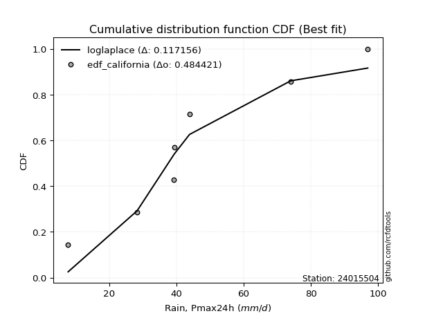</img>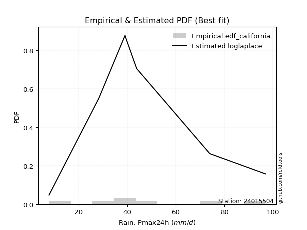</img>

</div>


### 2. EDF Hazen (1930)

Hazen method for plotting positions is a formula used to estimate the empirical cumulative probability distribution of flood events or other hydrological data. This formula often results in biased estimations, particularly when extrapolating to extreme events (high return periods).

<div align="center">


$P=(m-0.5)/n$


</div>


**2.1. Empirical values**

<div align="center">

|                | 0                   | 1                   | 2                   | 3         | 4                  | 5                  | 6                  |
|:---------------|:--------------------|:--------------------|:--------------------|:----------|:-------------------|:-------------------|:-------------------|
| date           | 2015                | 2021                | 2017                | 2020      | 2016               | 2018               | 2019               |
| x              | 7.8                 | 28.3                | 39.1                | 39.4      | 43.9               | 74.0               | 96.9               |
| m              | 1                   | 2                   | 3                   | 4         | 5                  | 6                  | 7                  |
| empirical_dist | edf_hazen           | edf_hazen           | edf_hazen           | edf_hazen | edf_hazen          | edf_hazen          | edf_hazen          |
| empirical      | 0.07142857142857142 | 0.21428571428571427 | 0.35714285714285715 | 0.5       | 0.6428571428571429 | 0.7857142857142857 | 0.9285714285714286 |
| empirical_tr   | 1.0769230769230769  | 1.2727272727272727  | 1.5555555555555558  | 2.0       | 2.8000000000000003 | 4.666666666666666  | 14.000000000000007 |

</div>


**2.2. Kolmogorov-Smirnov fit test (sorted by Δ)**


<div align="center">

|                | 0                   | 1                   | 2                   | 3                   | 4                   | 5                   | 6                   | 7                   | 8                   | 9                   | 10                  | 11                  | 12                  | 13                  | 14                  | 15                  | 16                  | 17                  | 18                  | 19                  | 20                  | 21                  | 22                  | 23                  | 24                  | 25                  | 26                  | 27                  | 28                  | 29                  | 30                  | 31                  | 32                  | 33                  | 34                  | 35                  | 36                  | 37                  | 38                  | 39                  | 40                  | 41                  | 42                  | 43                  | 44                  | 45                  | 46                  | 47                  | 48                  | 49                  | 50                  | 51                  | 52                  | 53                  | 54                  | 55                  | 56                  | 57                  | 58                  | 59                  | 60                  | 61                  | 62                  | 63                  | 64                  | 65                  | 66                  | 67                  | 68                  | 69                  | 70                  | 71                  | 72                  | 73                  | 74                  | 75                  | 76                  | 77                  | 78                  | 79                  | 80                  | 81                  | 82                  | 83                  | 84                  | 85                  | 86                  | 87                  | 88                  | 89                  | 90                  | 91                  | 92                  | 93                  | 94                  | 95                  | 96                  | 97                  | 98                  | 99                  | 100                 | 101                 | 102                 | 103                 | 104                 | 105                 | 106                 | 107                 | 108                 | 109                 | 110                 | 111                 | 112                 | 113                 | 114                 | 115                 | 116                 | 117                 | 118                 | 119                 | 120                 | 121                 | 122                 | 123                 | 124                 | 125                 | 126                 | 127                 | 128                 | 129                 | 130                 | 131                 | 132                 | 133                 | 134                 | 135                 | 136                 | 137                 | 138                 | 139                 | 140                 | 141                 | 142                 | 143                 | 144                 | 145                 | 146                 | 147                 | 148                 | 149                 | 150                 | 151                 | 152                 | 153                 | 154                 | 155                 | 156                 | 157                 | 158                 | 159                 |
|:---------------|:--------------------|:--------------------|:--------------------|:--------------------|:--------------------|:--------------------|:--------------------|:--------------------|:--------------------|:--------------------|:--------------------|:--------------------|:--------------------|:--------------------|:--------------------|:--------------------|:--------------------|:--------------------|:--------------------|:--------------------|:--------------------|:--------------------|:--------------------|:--------------------|:--------------------|:--------------------|:--------------------|:--------------------|:--------------------|:--------------------|:--------------------|:--------------------|:--------------------|:--------------------|:--------------------|:--------------------|:--------------------|:--------------------|:--------------------|:--------------------|:--------------------|:--------------------|:--------------------|:--------------------|:--------------------|:--------------------|:--------------------|:--------------------|:--------------------|:--------------------|:--------------------|:--------------------|:--------------------|:--------------------|:--------------------|:--------------------|:--------------------|:--------------------|:--------------------|:--------------------|:--------------------|:--------------------|:--------------------|:--------------------|:--------------------|:--------------------|:--------------------|:--------------------|:--------------------|:--------------------|:--------------------|:--------------------|:--------------------|:--------------------|:--------------------|:--------------------|:--------------------|:--------------------|:--------------------|:--------------------|:--------------------|:--------------------|:--------------------|:--------------------|:--------------------|:--------------------|:--------------------|:--------------------|:--------------------|:--------------------|:--------------------|:--------------------|:--------------------|:--------------------|:--------------------|:--------------------|:--------------------|:--------------------|:--------------------|:--------------------|:--------------------|:--------------------|:--------------------|:--------------------|:--------------------|:--------------------|:--------------------|:--------------------|:--------------------|:--------------------|:--------------------|:--------------------|:--------------------|:--------------------|:--------------------|:--------------------|:--------------------|:--------------------|:--------------------|:--------------------|:--------------------|:--------------------|:--------------------|:--------------------|:--------------------|:--------------------|:--------------------|:--------------------|:--------------------|:--------------------|:--------------------|:--------------------|:--------------------|:--------------------|:--------------------|:--------------------|:--------------------|:--------------------|:--------------------|:--------------------|:--------------------|:--------------------|:--------------------|:--------------------|:--------------------|:--------------------|:--------------------|:--------------------|:--------------------|:--------------------|:--------------------|:--------------------|:--------------------|:--------------------|:--------------------|:--------------------|:--------------------|:--------------------|:--------------------|:--------------------|
| station        | 24015504            | 24015504            | 24015504            | 24015504            | 24015504            | 24015504            | 24015504            | 24015504            | 24015504            | 24015504            | 24015504            | 24015504            | 24015504            | 24015504            | 24015504            | 24015504            | 24015504            | 24015504            | 24015504            | 24015504            | 24015504            | 24015504            | 24015504            | 24015504            | 24015504            | 24015504            | 24015504            | 24015504            | 24015504            | 24015504            | 24015504            | 24015504            | 24015504            | 24015504            | 24015504            | 24015504            | 24015504            | 24015504            | 24015504            | 24015504            | 24015504            | 24015504            | 24015504            | 24015504            | 24015504            | 24015504            | 24015504            | 24015504            | 24015504            | 24015504            | 24015504            | 24015504            | 24015504            | 24015504            | 24015504            | 24015504            | 24015504            | 24015504            | 24015504            | 24015504            | 24015504            | 24015504            | 24015504            | 24015504            | 24015504            | 24015504            | 24015504            | 24015504            | 24015504            | 24015504            | 24015504            | 24015504            | 24015504            | 24015504            | 24015504            | 24015504            | 24015504            | 24015504            | 24015504            | 24015504            | 24015504            | 24015504            | 24015504            | 24015504            | 24015504            | 24015504            | 24015504            | 24015504            | 24015504            | 24015504            | 24015504            | 24015504            | 24015504            | 24015504            | 24015504            | 24015504            | 24015504            | 24015504            | 24015504            | 24015504            | 24015504            | 24015504            | 24015504            | 24015504            | 24015504            | 24015504            | 24015504            | 24015504            | 24015504            | 24015504            | 24015504            | 24015504            | 24015504            | 24015504            | 24015504            | 24015504            | 24015504            | 24015504            | 24015504            | 24015504            | 24015504            | 24015504            | 24015504            | 24015504            | 24015504            | 24015504            | 24015504            | 24015504            | 24015504            | 24015504            | 24015504            | 24015504            | 24015504            | 24015504            | 24015504            | 24015504            | 24015504            | 24015504            | 24015504            | 24015504            | 24015504            | 24015504            | 24015504            | 24015504            | 24015504            | 24015504            | 24015504            | 24015504            | 24015504            | 24015504            | 24015504            | 24015504            | 24015504            | 24015504            | 24015504            | 24015504            | 24015504            | 24015504            | 24015504            | 24015504            |
| empirical_dist | edf_hazen           | edf_hazen           | edf_hazen           | edf_hazen           | edf_hazen           | edf_hazen           | edf_hazen           | edf_hazen           | edf_hazen           | edf_hazen           | edf_hazen           | edf_hazen           | edf_hazen           | edf_hazen           | edf_hazen           | edf_hazen           | edf_hazen           | edf_hazen           | edf_hazen           | edf_hazen           | edf_hazen           | edf_hazen           | edf_hazen           | edf_hazen           | edf_hazen           | edf_hazen           | edf_hazen           | edf_hazen           | edf_hazen           | edf_hazen           | edf_hazen           | edf_hazen           | edf_hazen           | edf_hazen           | edf_hazen           | edf_hazen           | edf_hazen           | edf_hazen           | edf_hazen           | edf_hazen           | edf_hazen           | edf_hazen           | edf_hazen           | edf_hazen           | edf_hazen           | edf_hazen           | edf_hazen           | edf_hazen           | edf_hazen           | edf_hazen           | edf_hazen           | edf_hazen           | edf_hazen           | edf_hazen           | edf_hazen           | edf_hazen           | edf_hazen           | edf_hazen           | edf_hazen           | edf_hazen           | edf_hazen           | edf_hazen           | edf_hazen           | edf_hazen           | edf_hazen           | edf_hazen           | edf_hazen           | edf_hazen           | edf_hazen           | edf_hazen           | edf_hazen           | edf_hazen           | edf_hazen           | edf_hazen           | edf_hazen           | edf_hazen           | edf_hazen           | edf_hazen           | edf_hazen           | edf_hazen           | edf_hazen           | edf_hazen           | edf_hazen           | edf_hazen           | edf_hazen           | edf_hazen           | edf_hazen           | edf_hazen           | edf_hazen           | edf_hazen           | edf_hazen           | edf_hazen           | edf_hazen           | edf_hazen           | edf_hazen           | edf_hazen           | edf_hazen           | edf_hazen           | edf_hazen           | edf_hazen           | edf_hazen           | edf_hazen           | edf_hazen           | edf_hazen           | edf_hazen           | edf_hazen           | edf_hazen           | edf_hazen           | edf_hazen           | edf_hazen           | edf_hazen           | edf_hazen           | edf_hazen           | edf_hazen           | edf_hazen           | edf_hazen           | edf_hazen           | edf_hazen           | edf_hazen           | edf_hazen           | edf_hazen           | edf_hazen           | edf_hazen           | edf_hazen           | edf_hazen           | edf_hazen           | edf_hazen           | edf_hazen           | edf_hazen           | edf_hazen           | edf_hazen           | edf_hazen           | edf_hazen           | edf_hazen           | edf_hazen           | edf_hazen           | edf_hazen           | edf_hazen           | edf_hazen           | edf_hazen           | edf_hazen           | edf_hazen           | edf_hazen           | edf_hazen           | edf_hazen           | edf_hazen           | edf_hazen           | edf_hazen           | edf_hazen           | edf_hazen           | edf_hazen           | edf_hazen           | edf_hazen           | edf_hazen           | edf_hazen           | edf_hazen           | edf_hazen           | edf_hazen           | edf_hazen           | edf_hazen           |
| p_dist         | moyal               | exponnorm           | halfnorm            | genexpon            | loggengamma         | gennorm             | weibull_min         | logvonmises_line    | loggompertz         | truncexpon          | erlang              | gamma               | f                   | invweibull          | logt                | genlogistic         | logpearson3         | gumbel_r            | kstwobign           | betaprime           | halflogistic        | loggumbel_l         | loggennorm          | invgauss            | exponweib           | logweibull_min      | johnsonsu           | loggenlogistic      | invgamma            | logmielke           | logdgamma           | logskewnorm         | nct                 | logdweibull         | logtrapezoid        | genextreme          | logloglaplace       | skewnorm            | logburr12           | logtriang           | lomax               | rayleigh            | dgamma              | dweibull            | bradford            | logloggamma         | logargus            | loggenhalflogistic  | logjohnsonsu        | vonmises_line       | foldnorm            | rice                | pearson3            | maxwell             | ncf                 | loganglit           | gausshyper          | logexponnorm        | lognorm             | logcrystalball      | logrice             | logfatiguelife      | logf                | wald                | lognct              | logsemicircular     | loglogistic         | loghypsecant        | logerlang           | logncf              | arcsine             | loggamma            | loggamma            | truncweibull_min    | loginvgamma         | logbetaprime        | loglaplace          | loglaplace          | loginvgauss         | semicircular        | logalpha            | anglit              | t                   | crystalball         | norm                | truncnorm           | logistic            | logmaxwell          | logburr             | logarcsine          | hypsecant           | kappa4              | logfoldnorm         | lograyleigh         | loginvweibull       | logbeta             | logcosine           | logtruncnorm        | nakagami            | lognakagami         | cosine              | burr                | laplace             | loglevy_l           | ksone               | logweibull_max      | loggumbel_r         | loghalfnorm         | wrapcauchy          | uniform             | kappa3              | logkstwobign        | halfgennorm         | loggenexpon         | beta                | gumbel_l            | logmoyal            | loghalflogistic     | loggenextreme       | loggausshyper       | argus               | loggenpareto        | alpha               | logksone            | logwrapcauchy       | logkappa3           | loguniform          | logtukeylambda      | mielke              | gengamma            | levy_l              | logkappa4           | logwald             | burr12              | loglomax            | genpareto           | genhalflogistic     | logtruncexpon       | loghalfgennorm      | logbradford         | logrdist            | logtruncweibull_min | triang              | johnsonsb           | logjohnsonsb        | trapezoid           | rdist               | powerlaw            | fatiguelife         | tukeylambda         | logexponpow         | weibull_max         | logexponweib        | exponpow            | logpowerlaw         | truncpareto         | logtruncpareto      | gompertz            | logvonmises         | vonmises            |
| delta          | 0.10703622266943086 | 0.1084266561652717  | 0.10929173076974674 | 0.1108446451139426  | 0.11269746152316096 | 0.11461255817066507 | 0.11468134138694219 | 0.11523805256945674 | 0.11543745387125987 | 0.115978198135671   | 0.11823427211832638 | 0.11823447454748637 | 0.11836031701421001 | 0.11852501948181404 | 0.11992224457829503 | 0.12045113613017588 | 0.12129619473600706 | 0.12136571016802888 | 0.12160761056108005 | 0.12171813258417852 | 0.12285700492873969 | 0.1245602119443543  | 0.12465187748245243 | 0.12615408661392447 | 0.1265186226132704  | 0.12777580599470562 | 0.1285286791488478  | 0.1289758624486993  | 0.1299085364752205  | 0.12991085886278453 | 0.13071425825723665 | 0.13103621382471997 | 0.13124421164110145 | 0.1313562667202125  | 0.13160867134279186 | 0.1348572087201969  | 0.1361586175276122  | 0.13631693082032892 | 0.13747522419830904 | 0.13767982272095755 | 0.13830512945326634 | 0.14269767342385098 | 0.14285714285663925 | 0.14285714285735135 | 0.14537897472379468 | 0.147071786489746   | 0.1486814075342774  | 0.14933484973334812 | 0.14997411329447607 | 0.15034474903893658 | 0.1503808118815711  | 0.15123666492708066 | 0.15427027060005577 | 0.15453691538097408 | 0.15516394525947616 | 0.16019546749372976 | 0.16103695183923378 | 0.16308679748478222 | 0.16308748108142307 | 0.1630875005308931  | 0.16309279024308937 | 0.163744290922818   | 0.16374771962826656 | 0.16432358772555583 | 0.16483070870716215 | 0.16538526338319318 | 0.16584520199842717 | 0.1681961837521732  | 0.1683259400144687  | 0.16878047232600296 | 0.16887059774585367 | 0.17007774303595763 | 0.17007774303595763 | 0.17100349861383604 | 0.17599917603001586 | 0.17637260071072786 | 0.17747324430727446 | 0.17747324430727446 | 0.1793476756581937  | 0.17958449714428026 | 0.18188110068122837 | 0.18227969648358788 | 0.18881066109896782 | 0.1888115305485259  | 0.18881154265179645 | 0.18881154751184348 | 0.19501590841625632 | 0.19521855226488533 | 0.19750968760800158 | 0.1990476333013955  | 0.20026660967581933 | 0.20159952024401545 | 0.203064959202025   | 0.2057622328569772  | 0.20627098998513813 | 0.20778547830702818 | 0.2133759104833271  | 0.21427802505760288 | 0.21428527283156257 | 0.21428571393268533 | 0.21459857260628984 | 0.21562234625869275 | 0.2181745494234898  | 0.2196076799183377  | 0.22188819411041644 | 0.2232911309968445  | 0.2337676304582869  | 0.2354510043958436  | 0.2366380008949383  | 0.2376944043610711  | 0.2377735761684998  | 0.24452932005065983 | 0.24467916943104573 | 0.24862961935490327 | 0.2496955293413571  | 0.25905436154389727 | 0.2593625794778563  | 0.2615060276873283  | 0.26247161616681824 | 0.26805002919686605 | 0.28382804810197126 | 0.2849326823039615  | 0.2899898643570876  | 0.2952927527213002  | 0.2959753245683209  | 0.29707191653684506 | 0.29720844612270314 | 0.2991254831864022  | 0.30617503883995745 | 0.3064938144171672  | 0.31168402306280885 | 0.3188376206034691  | 0.3304503914479367  | 0.3368527299414513  | 0.3453646819636583  | 0.34623287980861944 | 0.3551206692864435  | 0.3777811657580278  | 0.3868925258696163  | 0.3883819041317399  | 0.4055362589302598  | 0.4229543926642997  | 0.43137518650870843 | 0.4365428581166865  | 0.44749186907343297 | 0.4652049847452499  | 0.5271824693450791  | 0.5768453662393981  | 0.5946216379493526  | 0.6047530844818719  | 0.6126540831284103  | 0.6343743016867973  | 0.6358405935440542  | 0.640315570691549   | 0.6704604814867324  | 0.6809336080520453  | 0.7361608839477004  | 0.7851078061048854  | 1.1220424875034827  | 14.79415869784498   |
| deltao         | 0.48442053926100004 | 0.48442053926100004 | 0.48442053926100004 | 0.48442053926100004 | 0.48442053926100004 | 0.48442053926100004 | 0.48442053926100004 | 0.48442053926100004 | 0.48442053926100004 | 0.48442053926100004 | 0.48442053926100004 | 0.48442053926100004 | 0.48442053926100004 | 0.48442053926100004 | 0.48442053926100004 | 0.48442053926100004 | 0.48442053926100004 | 0.48442053926100004 | 0.48442053926100004 | 0.48442053926100004 | 0.48442053926100004 | 0.48442053926100004 | 0.48442053926100004 | 0.48442053926100004 | 0.48442053926100004 | 0.48442053926100004 | 0.48442053926100004 | 0.48442053926100004 | 0.48442053926100004 | 0.48442053926100004 | 0.48442053926100004 | 0.48442053926100004 | 0.48442053926100004 | 0.48442053926100004 | 0.48442053926100004 | 0.48442053926100004 | 0.48442053926100004 | 0.48442053926100004 | 0.48442053926100004 | 0.48442053926100004 | 0.48442053926100004 | 0.48442053926100004 | 0.48442053926100004 | 0.48442053926100004 | 0.48442053926100004 | 0.48442053926100004 | 0.48442053926100004 | 0.48442053926100004 | 0.48442053926100004 | 0.48442053926100004 | 0.48442053926100004 | 0.48442053926100004 | 0.48442053926100004 | 0.48442053926100004 | 0.48442053926100004 | 0.48442053926100004 | 0.48442053926100004 | 0.48442053926100004 | 0.48442053926100004 | 0.48442053926100004 | 0.48442053926100004 | 0.48442053926100004 | 0.48442053926100004 | 0.48442053926100004 | 0.48442053926100004 | 0.48442053926100004 | 0.48442053926100004 | 0.48442053926100004 | 0.48442053926100004 | 0.48442053926100004 | 0.48442053926100004 | 0.48442053926100004 | 0.48442053926100004 | 0.48442053926100004 | 0.48442053926100004 | 0.48442053926100004 | 0.48442053926100004 | 0.48442053926100004 | 0.48442053926100004 | 0.48442053926100004 | 0.48442053926100004 | 0.48442053926100004 | 0.48442053926100004 | 0.48442053926100004 | 0.48442053926100004 | 0.48442053926100004 | 0.48442053926100004 | 0.48442053926100004 | 0.48442053926100004 | 0.48442053926100004 | 0.48442053926100004 | 0.48442053926100004 | 0.48442053926100004 | 0.48442053926100004 | 0.48442053926100004 | 0.48442053926100004 | 0.48442053926100004 | 0.48442053926100004 | 0.48442053926100004 | 0.48442053926100004 | 0.48442053926100004 | 0.48442053926100004 | 0.48442053926100004 | 0.48442053926100004 | 0.48442053926100004 | 0.48442053926100004 | 0.48442053926100004 | 0.48442053926100004 | 0.48442053926100004 | 0.48442053926100004 | 0.48442053926100004 | 0.48442053926100004 | 0.48442053926100004 | 0.48442053926100004 | 0.48442053926100004 | 0.48442053926100004 | 0.48442053926100004 | 0.48442053926100004 | 0.48442053926100004 | 0.48442053926100004 | 0.48442053926100004 | 0.48442053926100004 | 0.48442053926100004 | 0.48442053926100004 | 0.48442053926100004 | 0.48442053926100004 | 0.48442053926100004 | 0.48442053926100004 | 0.48442053926100004 | 0.48442053926100004 | 0.48442053926100004 | 0.48442053926100004 | 0.48442053926100004 | 0.48442053926100004 | 0.48442053926100004 | 0.48442053926100004 | 0.48442053926100004 | 0.48442053926100004 | 0.48442053926100004 | 0.48442053926100004 | 0.48442053926100004 | 0.48442053926100004 | 0.48442053926100004 | 0.48442053926100004 | 0.48442053926100004 | 0.48442053926100004 | 0.48442053926100004 | 0.48442053926100004 | 0.48442053926100004 | 0.48442053926100004 | 0.48442053926100004 | 0.48442053926100004 | 0.48442053926100004 | 0.48442053926100004 | 0.48442053926100004 | 0.48442053926100004 | 0.48442053926100004 | 0.48442053926100004 | 0.48442053926100004 | 0.48442053926100004 |
| eval           | Δo > Δ              | Δo > Δ              | Δo > Δ              | Δo > Δ              | Δo > Δ              | Δo > Δ              | Δo > Δ              | Δo > Δ              | Δo > Δ              | Δo > Δ              | Δo > Δ              | Δo > Δ              | Δo > Δ              | Δo > Δ              | Δo > Δ              | Δo > Δ              | Δo > Δ              | Δo > Δ              | Δo > Δ              | Δo > Δ              | Δo > Δ              | Δo > Δ              | Δo > Δ              | Δo > Δ              | Δo > Δ              | Δo > Δ              | Δo > Δ              | Δo > Δ              | Δo > Δ              | Δo > Δ              | Δo > Δ              | Δo > Δ              | Δo > Δ              | Δo > Δ              | Δo > Δ              | Δo > Δ              | Δo > Δ              | Δo > Δ              | Δo > Δ              | Δo > Δ              | Δo > Δ              | Δo > Δ              | Δo > Δ              | Δo > Δ              | Δo > Δ              | Δo > Δ              | Δo > Δ              | Δo > Δ              | Δo > Δ              | Δo > Δ              | Δo > Δ              | Δo > Δ              | Δo > Δ              | Δo > Δ              | Δo > Δ              | Δo > Δ              | Δo > Δ              | Δo > Δ              | Δo > Δ              | Δo > Δ              | Δo > Δ              | Δo > Δ              | Δo > Δ              | Δo > Δ              | Δo > Δ              | Δo > Δ              | Δo > Δ              | Δo > Δ              | Δo > Δ              | Δo > Δ              | Δo > Δ              | Δo > Δ              | Δo > Δ              | Δo > Δ              | Δo > Δ              | Δo > Δ              | Δo > Δ              | Δo > Δ              | Δo > Δ              | Δo > Δ              | Δo > Δ              | Δo > Δ              | Δo > Δ              | Δo > Δ              | Δo > Δ              | Δo > Δ              | Δo > Δ              | Δo > Δ              | Δo > Δ              | Δo > Δ              | Δo > Δ              | Δo > Δ              | Δo > Δ              | Δo > Δ              | Δo > Δ              | Δo > Δ              | Δo > Δ              | Δo > Δ              | Δo > Δ              | Δo > Δ              | Δo > Δ              | Δo > Δ              | Δo > Δ              | Δo > Δ              | Δo > Δ              | Δo > Δ              | Δo > Δ              | Δo > Δ              | Δo > Δ              | Δo > Δ              | Δo > Δ              | Δo > Δ              | Δo > Δ              | Δo > Δ              | Δo > Δ              | Δo > Δ              | Δo > Δ              | Δo > Δ              | Δo > Δ              | Δo > Δ              | Δo > Δ              | Δo > Δ              | Δo > Δ              | Δo > Δ              | Δo > Δ              | Δo > Δ              | Δo > Δ              | Δo > Δ              | Δo > Δ              | Δo > Δ              | Δo > Δ              | Δo > Δ              | Δo > Δ              | Δo > Δ              | Δo > Δ              | Δo > Δ              | Δo > Δ              | Δo > Δ              | Δo > Δ              | Δo > Δ              | Δo > Δ              | Δo > Δ              | Δo > Δ              | Δo > Δ              | Δo > Δ              | Δo > Δ              | Δo <= Δ             | Δo <= Δ             | Δo <= Δ             | Δo <= Δ             | Δo <= Δ             | Δo <= Δ             | Δo <= Δ             | Δo <= Δ             | Δo <= Δ             | Δo <= Δ             | Δo <= Δ             | Δo <= Δ             | Δo <= Δ             | Δo <= Δ             |
| fit            | 1                   | 1                   | 1                   | 1                   | 1                   | 1                   | 1                   | 1                   | 1                   | 1                   | 1                   | 1                   | 1                   | 1                   | 1                   | 1                   | 1                   | 1                   | 1                   | 1                   | 1                   | 1                   | 1                   | 1                   | 1                   | 1                   | 1                   | 1                   | 1                   | 1                   | 1                   | 1                   | 1                   | 1                   | 1                   | 1                   | 1                   | 1                   | 1                   | 1                   | 1                   | 1                   | 1                   | 1                   | 1                   | 1                   | 1                   | 1                   | 1                   | 1                   | 1                   | 1                   | 1                   | 1                   | 1                   | 1                   | 1                   | 1                   | 1                   | 1                   | 1                   | 1                   | 1                   | 1                   | 1                   | 1                   | 1                   | 1                   | 1                   | 1                   | 1                   | 1                   | 1                   | 1                   | 1                   | 1                   | 1                   | 1                   | 1                   | 1                   | 1                   | 1                   | 1                   | 1                   | 1                   | 1                   | 1                   | 1                   | 1                   | 1                   | 1                   | 1                   | 1                   | 1                   | 1                   | 1                   | 1                   | 1                   | 1                   | 1                   | 1                   | 1                   | 1                   | 1                   | 1                   | 1                   | 1                   | 1                   | 1                   | 1                   | 1                   | 1                   | 1                   | 1                   | 1                   | 1                   | 1                   | 1                   | 1                   | 1                   | 1                   | 1                   | 1                   | 1                   | 1                   | 1                   | 1                   | 1                   | 1                   | 1                   | 1                   | 1                   | 1                   | 1                   | 1                   | 1                   | 1                   | 1                   | 1                   | 1                   | 1                   | 1                   | 1                   | 1                   | 1                   | 1                   | 0                   | 0                   | 0                   | 0                   | 0                   | 0                   | 0                   | 0                   | 0                   | 0                   | 0                   | 0                   | 0                   | 0                   |
| n              | 7                   | 7                   | 7                   | 7                   | 7                   | 7                   | 7                   | 7                   | 7                   | 7                   | 7                   | 7                   | 7                   | 7                   | 7                   | 7                   | 7                   | 7                   | 7                   | 7                   | 7                   | 7                   | 7                   | 7                   | 7                   | 7                   | 7                   | 7                   | 7                   | 7                   | 7                   | 7                   | 7                   | 7                   | 7                   | 7                   | 7                   | 7                   | 7                   | 7                   | 7                   | 7                   | 7                   | 7                   | 7                   | 7                   | 7                   | 7                   | 7                   | 7                   | 7                   | 7                   | 7                   | 7                   | 7                   | 7                   | 7                   | 7                   | 7                   | 7                   | 7                   | 7                   | 7                   | 7                   | 7                   | 7                   | 7                   | 7                   | 7                   | 7                   | 7                   | 7                   | 7                   | 7                   | 7                   | 7                   | 7                   | 7                   | 7                   | 7                   | 7                   | 7                   | 7                   | 7                   | 7                   | 7                   | 7                   | 7                   | 7                   | 7                   | 7                   | 7                   | 7                   | 7                   | 7                   | 7                   | 7                   | 7                   | 7                   | 7                   | 7                   | 7                   | 7                   | 7                   | 7                   | 7                   | 7                   | 7                   | 7                   | 7                   | 7                   | 7                   | 7                   | 7                   | 7                   | 7                   | 7                   | 7                   | 7                   | 7                   | 7                   | 7                   | 7                   | 7                   | 7                   | 7                   | 7                   | 7                   | 7                   | 7                   | 7                   | 7                   | 7                   | 7                   | 7                   | 7                   | 7                   | 7                   | 7                   | 7                   | 7                   | 7                   | 7                   | 7                   | 7                   | 7                   | 7                   | 7                   | 7                   | 7                   | 7                   | 7                   | 7                   | 7                   | 7                   | 7                   | 7                   | 7                   | 7                   | 7                   |
| best_fit       | 1                   | 0                   | 0                   | 0                   | 0                   | 0                   | 0                   | 0                   | 0                   | 0                   | 0                   | 0                   | 0                   | 0                   | 0                   | 0                   | 0                   | 0                   | 0                   | 0                   | 0                   | 0                   | 0                   | 0                   | 0                   | 0                   | 0                   | 0                   | 0                   | 0                   | 0                   | 0                   | 0                   | 0                   | 0                   | 0                   | 0                   | 0                   | 0                   | 0                   | 0                   | 0                   | 0                   | 0                   | 0                   | 0                   | 0                   | 0                   | 0                   | 0                   | 0                   | 0                   | 0                   | 0                   | 0                   | 0                   | 0                   | 0                   | 0                   | 0                   | 0                   | 0                   | 0                   | 0                   | 0                   | 0                   | 0                   | 0                   | 0                   | 0                   | 0                   | 0                   | 0                   | 0                   | 0                   | 0                   | 0                   | 0                   | 0                   | 0                   | 0                   | 0                   | 0                   | 0                   | 0                   | 0                   | 0                   | 0                   | 0                   | 0                   | 0                   | 0                   | 0                   | 0                   | 0                   | 0                   | 0                   | 0                   | 0                   | 0                   | 0                   | 0                   | 0                   | 0                   | 0                   | 0                   | 0                   | 0                   | 0                   | 0                   | 0                   | 0                   | 0                   | 0                   | 0                   | 0                   | 0                   | 0                   | 0                   | 0                   | 0                   | 0                   | 0                   | 0                   | 0                   | 0                   | 0                   | 0                   | 0                   | 0                   | 0                   | 0                   | 0                   | 0                   | 0                   | 0                   | 0                   | 0                   | 0                   | 0                   | 0                   | 0                   | 0                   | 0                   | 0                   | 0                   | 0                   | 0                   | 0                   | 0                   | 0                   | 0                   | 0                   | 0                   | 0                   | 0                   | 0                   | 0                   | 0                   | 0                   |
| best_fit_sort  | 1                   | 2                   | 3                   | 4                   | 5                   | 6                   | 7                   | 8                   | 9                   | 10                  | 11                  | 12                  | 13                  | 14                  | 15                  | 16                  | 17                  | 18                  | 19                  | 20                  | 21                  | 22                  | 23                  | 24                  | 25                  | 26                  | 27                  | 28                  | 29                  | 30                  | 31                  | 32                  | 33                  | 34                  | 35                  | 36                  | 37                  | 38                  | 39                  | 40                  | 41                  | 42                  | 43                  | 44                  | 45                  | 46                  | 47                  | 48                  | 49                  | 50                  | 51                  | 52                  | 53                  | 54                  | 55                  | 56                  | 57                  | 58                  | 59                  | 60                  | 61                  | 62                  | 63                  | 64                  | 65                  | 66                  | 67                  | 68                  | 69                  | 70                  | 71                  | 72                  | 73                  | 74                  | 75                  | 76                  | 77                  | 78                  | 79                  | 80                  | 81                  | 82                  | 83                  | 84                  | 85                  | 86                  | 87                  | 88                  | 89                  | 90                  | 91                  | 92                  | 93                  | 94                  | 95                  | 96                  | 97                  | 98                  | 99                  | 100                 | 101                 | 102                 | 103                 | 104                 | 105                 | 106                 | 107                 | 108                 | 109                 | 110                 | 111                 | 112                 | 113                 | 114                 | 115                 | 116                 | 117                 | 118                 | 119                 | 120                 | 121                 | 122                 | 123                 | 124                 | 125                 | 126                 | 127                 | 128                 | 129                 | 130                 | 131                 | 132                 | 133                 | 134                 | 135                 | 136                 | 137                 | 138                 | 139                 | 140                 | 141                 | 142                 | 143                 | 144                 | 145                 | 146                 | 147                 | 148                 | 149                 | 150                 | 151                 | 152                 | 153                 | 154                 | 155                 | 156                 | 157                 | 158                 | 159                 | 160                 |

</div>


**2.3. Best fit**

<div align="center">

|   id |   station | empirical_dist   | p_dist   |    delta |   deltao | eval   |   fit |   n |   best_fit |   best_fit_sort |
|-----:|----------:|:-----------------|:---------|---------:|---------:|:-------|------:|----:|-----------:|----------------:|
|    0 |  24015504 | edf_hazen        | moyal    | 0.107036 | 0.484421 | Δo > Δ |     1 |   7 |          1 |               1 |

</div>


<div align="center">

</img></img>

</div>


### 3. EDF Weibull (1939)

Weibull plotting position formula is an empirical method used to estimate the non-exceedance probability or plotting position for a set of observed data, is often recommended or widely used in practice, particularly in flood frequency analysis.

<div align="center">


$P=m/(n+1)$


</div>


**3.1. Empirical values**

<div align="center">

|                | 0                  | 1                  | 2           | 3           | 4                  | 5           | 6           |
|:---------------|:-------------------|:-------------------|:------------|:------------|:-------------------|:------------|:------------|
| date           | 2015               | 2021               | 2017        | 2020        | 2016               | 2018        | 2019        |
| x              | 7.8                | 28.3               | 39.1        | 39.4        | 43.9               | 74.0        | 96.9        |
| m              | 1                  | 2                  | 3           | 4           | 5                  | 6           | 7           |
| empirical_dist | edf_weibull        | edf_weibull        | edf_weibull | edf_weibull | edf_weibull        | edf_weibull | edf_weibull |
| empirical      | 0.125              | 0.25               | 0.375       | 0.5         | 0.625              | 0.75        | 0.875       |
| empirical_tr   | 1.1428571428571428 | 1.3333333333333333 | 1.6         | 2.0         | 2.6666666666666665 | 4.0         | 8.0         |

</div>


**3.2. Kolmogorov-Smirnov fit test (sorted by Δ)**


<div align="center">

|                | 0                   | 1                   | 2                   | 3                   | 4                   | 5                   | 6                   | 7                   | 8                   | 9                   | 10                  | 11                  | 12                  | 13                  | 14                  | 15                  | 16                  | 17                  | 18                  | 19                  | 20                  | 21                  | 22                  | 23                  | 24                  | 25                  | 26                  | 27                  | 28                  | 29                  | 30                  | 31                  | 32                  | 33                  | 34                  | 35                  | 36                  | 37                  | 38                  | 39                  | 40                  | 41                  | 42                  | 43                  | 44                  | 45                  | 46                  | 47                  | 48                  | 49                  | 50                  | 51                  | 52                  | 53                  | 54                  | 55                  | 56                  | 57                  | 58                  | 59                  | 60                  | 61                  | 62                  | 63                  | 64                  | 65                  | 66                  | 67                  | 68                  | 69                  | 70                  | 71                  | 72                  | 73                  | 74                  | 75                  | 76                  | 77                  | 78                  | 79                  | 80                  | 81                  | 82                  | 83                  | 84                  | 85                  | 86                  | 87                  | 88                  | 89                  | 90                  | 91                  | 92                  | 93                  | 94                  | 95                  | 96                  | 97                  | 98                  | 99                  | 100                 | 101                 | 102                 | 103                 | 104                 | 105                 | 106                 | 107                 | 108                 | 109                 | 110                 | 111                 | 112                 | 113                 | 114                 | 115                 | 116                 | 117                 | 118                 | 119                 | 120                 | 121                 | 122                 | 123                 | 124                 | 125                 | 126                 | 127                 | 128                 | 129                 | 130                 | 131                 | 132                 | 133                 | 134                 | 135                 | 136                 | 137                 | 138                 | 139                 | 140                 | 141                 | 142                 | 143                 | 144                 | 145                 | 146                 | 147                 | 148                 | 149                 | 150                 | 151                 | 152                 | 153                 | 154                 | 155                 | 156                 | 157                 | 158                 | 159                 |
|:---------------|:--------------------|:--------------------|:--------------------|:--------------------|:--------------------|:--------------------|:--------------------|:--------------------|:--------------------|:--------------------|:--------------------|:--------------------|:--------------------|:--------------------|:--------------------|:--------------------|:--------------------|:--------------------|:--------------------|:--------------------|:--------------------|:--------------------|:--------------------|:--------------------|:--------------------|:--------------------|:--------------------|:--------------------|:--------------------|:--------------------|:--------------------|:--------------------|:--------------------|:--------------------|:--------------------|:--------------------|:--------------------|:--------------------|:--------------------|:--------------------|:--------------------|:--------------------|:--------------------|:--------------------|:--------------------|:--------------------|:--------------------|:--------------------|:--------------------|:--------------------|:--------------------|:--------------------|:--------------------|:--------------------|:--------------------|:--------------------|:--------------------|:--------------------|:--------------------|:--------------------|:--------------------|:--------------------|:--------------------|:--------------------|:--------------------|:--------------------|:--------------------|:--------------------|:--------------------|:--------------------|:--------------------|:--------------------|:--------------------|:--------------------|:--------------------|:--------------------|:--------------------|:--------------------|:--------------------|:--------------------|:--------------------|:--------------------|:--------------------|:--------------------|:--------------------|:--------------------|:--------------------|:--------------------|:--------------------|:--------------------|:--------------------|:--------------------|:--------------------|:--------------------|:--------------------|:--------------------|:--------------------|:--------------------|:--------------------|:--------------------|:--------------------|:--------------------|:--------------------|:--------------------|:--------------------|:--------------------|:--------------------|:--------------------|:--------------------|:--------------------|:--------------------|:--------------------|:--------------------|:--------------------|:--------------------|:--------------------|:--------------------|:--------------------|:--------------------|:--------------------|:--------------------|:--------------------|:--------------------|:--------------------|:--------------------|:--------------------|:--------------------|:--------------------|:--------------------|:--------------------|:--------------------|:--------------------|:--------------------|:--------------------|:--------------------|:--------------------|:--------------------|:--------------------|:--------------------|:--------------------|:--------------------|:--------------------|:--------------------|:--------------------|:--------------------|:--------------------|:--------------------|:--------------------|:--------------------|:--------------------|:--------------------|:--------------------|:--------------------|:--------------------|:--------------------|:--------------------|:--------------------|:--------------------|:--------------------|:--------------------|
| station        | 24015504            | 24015504            | 24015504            | 24015504            | 24015504            | 24015504            | 24015504            | 24015504            | 24015504            | 24015504            | 24015504            | 24015504            | 24015504            | 24015504            | 24015504            | 24015504            | 24015504            | 24015504            | 24015504            | 24015504            | 24015504            | 24015504            | 24015504            | 24015504            | 24015504            | 24015504            | 24015504            | 24015504            | 24015504            | 24015504            | 24015504            | 24015504            | 24015504            | 24015504            | 24015504            | 24015504            | 24015504            | 24015504            | 24015504            | 24015504            | 24015504            | 24015504            | 24015504            | 24015504            | 24015504            | 24015504            | 24015504            | 24015504            | 24015504            | 24015504            | 24015504            | 24015504            | 24015504            | 24015504            | 24015504            | 24015504            | 24015504            | 24015504            | 24015504            | 24015504            | 24015504            | 24015504            | 24015504            | 24015504            | 24015504            | 24015504            | 24015504            | 24015504            | 24015504            | 24015504            | 24015504            | 24015504            | 24015504            | 24015504            | 24015504            | 24015504            | 24015504            | 24015504            | 24015504            | 24015504            | 24015504            | 24015504            | 24015504            | 24015504            | 24015504            | 24015504            | 24015504            | 24015504            | 24015504            | 24015504            | 24015504            | 24015504            | 24015504            | 24015504            | 24015504            | 24015504            | 24015504            | 24015504            | 24015504            | 24015504            | 24015504            | 24015504            | 24015504            | 24015504            | 24015504            | 24015504            | 24015504            | 24015504            | 24015504            | 24015504            | 24015504            | 24015504            | 24015504            | 24015504            | 24015504            | 24015504            | 24015504            | 24015504            | 24015504            | 24015504            | 24015504            | 24015504            | 24015504            | 24015504            | 24015504            | 24015504            | 24015504            | 24015504            | 24015504            | 24015504            | 24015504            | 24015504            | 24015504            | 24015504            | 24015504            | 24015504            | 24015504            | 24015504            | 24015504            | 24015504            | 24015504            | 24015504            | 24015504            | 24015504            | 24015504            | 24015504            | 24015504            | 24015504            | 24015504            | 24015504            | 24015504            | 24015504            | 24015504            | 24015504            | 24015504            | 24015504            | 24015504            | 24015504            | 24015504            | 24015504            |
| empirical_dist | edf_weibull         | edf_weibull         | edf_weibull         | edf_weibull         | edf_weibull         | edf_weibull         | edf_weibull         | edf_weibull         | edf_weibull         | edf_weibull         | edf_weibull         | edf_weibull         | edf_weibull         | edf_weibull         | edf_weibull         | edf_weibull         | edf_weibull         | edf_weibull         | edf_weibull         | edf_weibull         | edf_weibull         | edf_weibull         | edf_weibull         | edf_weibull         | edf_weibull         | edf_weibull         | edf_weibull         | edf_weibull         | edf_weibull         | edf_weibull         | edf_weibull         | edf_weibull         | edf_weibull         | edf_weibull         | edf_weibull         | edf_weibull         | edf_weibull         | edf_weibull         | edf_weibull         | edf_weibull         | edf_weibull         | edf_weibull         | edf_weibull         | edf_weibull         | edf_weibull         | edf_weibull         | edf_weibull         | edf_weibull         | edf_weibull         | edf_weibull         | edf_weibull         | edf_weibull         | edf_weibull         | edf_weibull         | edf_weibull         | edf_weibull         | edf_weibull         | edf_weibull         | edf_weibull         | edf_weibull         | edf_weibull         | edf_weibull         | edf_weibull         | edf_weibull         | edf_weibull         | edf_weibull         | edf_weibull         | edf_weibull         | edf_weibull         | edf_weibull         | edf_weibull         | edf_weibull         | edf_weibull         | edf_weibull         | edf_weibull         | edf_weibull         | edf_weibull         | edf_weibull         | edf_weibull         | edf_weibull         | edf_weibull         | edf_weibull         | edf_weibull         | edf_weibull         | edf_weibull         | edf_weibull         | edf_weibull         | edf_weibull         | edf_weibull         | edf_weibull         | edf_weibull         | edf_weibull         | edf_weibull         | edf_weibull         | edf_weibull         | edf_weibull         | edf_weibull         | edf_weibull         | edf_weibull         | edf_weibull         | edf_weibull         | edf_weibull         | edf_weibull         | edf_weibull         | edf_weibull         | edf_weibull         | edf_weibull         | edf_weibull         | edf_weibull         | edf_weibull         | edf_weibull         | edf_weibull         | edf_weibull         | edf_weibull         | edf_weibull         | edf_weibull         | edf_weibull         | edf_weibull         | edf_weibull         | edf_weibull         | edf_weibull         | edf_weibull         | edf_weibull         | edf_weibull         | edf_weibull         | edf_weibull         | edf_weibull         | edf_weibull         | edf_weibull         | edf_weibull         | edf_weibull         | edf_weibull         | edf_weibull         | edf_weibull         | edf_weibull         | edf_weibull         | edf_weibull         | edf_weibull         | edf_weibull         | edf_weibull         | edf_weibull         | edf_weibull         | edf_weibull         | edf_weibull         | edf_weibull         | edf_weibull         | edf_weibull         | edf_weibull         | edf_weibull         | edf_weibull         | edf_weibull         | edf_weibull         | edf_weibull         | edf_weibull         | edf_weibull         | edf_weibull         | edf_weibull         | edf_weibull         | edf_weibull         | edf_weibull         |
| p_dist         | loggengamma         | weibull_min         | exponnorm           | erlang              | gamma               | f                   | invweibull          | logt                | genlogistic         | logpearson3         | gumbel_r            | kstwobign           | betaprime           | loggumbel_l         | invgauss            | exponweib           | logweibull_min      | johnsonsu           | loggenlogistic      | invgamma            | nct                 | logdweibull         | logtrapezoid        | moyal               | genextreme          | logdgamma           | logloglaplace       | skewnorm            | logburr12           | logmielke           | rayleigh            | logtriang           | logskewnorm         | truncexpon          | genexpon            | loggompertz         | logvonmises_line    | lomax               | loggenhalflogistic  | halfnorm            | halflogistic        | dweibull            | bradford            | logloggamma         | logargus            | ncf                 | logjohnsonsu        | foldnorm            | rice                | pearson3            | maxwell             | logsemicircular     | loganglit           | loggennorm          | gausshyper          | logexponnorm        | lognorm             | logcrystalball      | logrice             | logfatiguelife      | logf                | wald                | lognct              | loglogistic         | truncweibull_min    | gennorm             | loghypsecant        | logerlang           | logncf              | arcsine             | loggamma            | loggamma            | loginvgamma         | logbetaprime        | loglaplace          | loglaplace          | loginvgauss         | semicircular        | logarcsine          | logalpha            | anglit              | dgamma              | loglevy_l           | t                   | crystalball         | norm                | truncnorm           | logistic            | logmaxwell          | loginvweibull       | logburr             | hypsecant           | kappa4              | logbeta             | logfoldnorm         | vonmises_line       | lograyleigh         | logcosine           | cosine              | burr                | laplace             | ksone               | logweibull_max      | logkstwobign        | loggenexpon         | loggumbel_r         | loghalfnorm         | wrapcauchy          | uniform             | kappa3              | beta                | halfgennorm         | loggausshyper       | gumbel_l            | logmoyal            | loghalflogistic     | loggenextreme       | loggenpareto        | logtruncnorm        | nakagami            | lognakagami         | alpha               | levy_l              | logksone            | logwrapcauchy       | logtukeylambda      | logkappa3           | loguniform          | argus               | mielke              | logkappa4           | gengamma            | burr12              | loglomax            | logwald             | genpareto           | genhalflogistic     | logtruncexpon       | loghalfgennorm      | logbradford         | logrdist            | logtruncweibull_min | johnsonsb           | logjohnsonsb        | triang              | trapezoid           | rdist               | powerlaw            | fatiguelife         | tukeylambda         | logexponpow         | weibull_max         | logexponweib        | exponpow            | logpowerlaw         | truncpareto         | logtruncpareto      | gompertz            | logvonmises         | vonmises            |
| delta          | 0.09659860528701975 | 0.0984005147489602  | 0.09938569308223921 | 0.10037712926118347 | 0.10037733169034346 | 0.10050317415706711 | 0.10066787662467114 | 0.10206510172115213 | 0.10259399327303298 | 0.10343905187886415 | 0.10350856731088598 | 0.10375046770393714 | 0.10386098972703561 | 0.10670306908721139 | 0.10829694375678156 | 0.1086614797561275  | 0.10991866313756271 | 0.1106715362917049  | 0.11111871959155639 | 0.11205139361807759 | 0.11338706878395854 | 0.11349912386306965 | 0.11375152848564896 | 0.11593996142207125 | 0.117000065863054   | 0.11737026153152141 | 0.11830147467046936 | 0.11845978796318601 | 0.11961808134116614 | 0.12394063098065833 | 0.12484053056670807 | 0.1249859667469082  | 0.12499951598485737 | 0.12499992709002994 | 0.12499997395387419 | 0.12499999413605636 | 0.12499999800510575 | 0.12499999994718156 | 0.12499999999999956 | 0.125               | 0.125               | 0.12546809870857456 | 0.12752183186665178 | 0.1292146436326031  | 0.13082426467713448 | 0.13107404535924116 | 0.13211697043733317 | 0.1325236690244282  | 0.13337952206993775 | 0.13641312774291287 | 0.13667977252383118 | 0.1411452529495908  | 0.1423383246365869  | 0.14250902033959534 | 0.14317980898209087 | 0.14522965462763937 | 0.14523033822428022 | 0.14523035767375025 | 0.14523564738594652 | 0.14588714806567515 | 0.14589057677112371 | 0.14646644486841298 | 0.1469735658500193  | 0.14798805914128432 | 0.1482957127926703  | 0.1492567029974753  | 0.15033904089503036 | 0.15046879715732586 | 0.1509233294688601  | 0.15101345488871076 | 0.15222060017881478 | 0.15222060017881478 | 0.158142033172873   | 0.158515457853585   | 0.1596161014501316  | 0.1596161014501316  | 0.16149053280105086 | 0.16172735428713736 | 0.16333334758710977 | 0.16402395782408552 | 0.16442255362644498 | 0.16461679977125576 | 0.16603625134690914 | 0.17095351824182492 | 0.170954387691383   | 0.17095439979465354 | 0.17095440465470058 | 0.17715876555911342 | 0.17736140940774248 | 0.17818994741996674 | 0.17965254475085868 | 0.18240946681867642 | 0.18374237738687255 | 0.1842800906887646  | 0.18520781634488215 | 0.18605903475322227 | 0.18790508999983435 | 0.19551876762618425 | 0.19674142974914693 | 0.1977652034015499  | 0.2003174065663469  | 0.20403105125327353 | 0.2054339881397016  | 0.2090404232524361  | 0.21491458965088373 | 0.21591048760114406 | 0.21759386153870075 | 0.2187808580377954  | 0.21983726150392818 | 0.2199164333113569  | 0.2264053679787904  | 0.22682202657390282 | 0.23233574348258035 | 0.24119721868675437 | 0.24150543662071344 | 0.24364888483018543 | 0.24461447330967534 | 0.24921839658967576 | 0.2499923107718886  | 0.2499995585458483  | 0.24999999964697106 | 0.2542755786428019  | 0.25811259449138024 | 0.2595784670070145  | 0.2602610388540352  | 0.2634111974721165  | 0.26462376949515454 | 0.2647948173102519  | 0.26597090524482836 | 0.27046075312567175 | 0.2831233348891834  | 0.28863667156002437 | 0.3011384442271656  | 0.30965039624937263 | 0.31259324859079385 | 0.32837573695147654 | 0.3372635264293006  | 0.3420668800437421  | 0.3511782401553306  | 0.3526676184174542  | 0.3698219732159741  | 0.387240106950014   | 0.40082857240240083 | 0.41177758335914727 | 0.4135180436515655  | 0.447347841888107   | 0.4957099350902292  | 0.5411310805251124  | 0.5589073522350669  | 0.5690387987675862  | 0.5769397974141246  | 0.5986600159725115  | 0.6001263078297685  | 0.6046012849772633  | 0.6347461957724467  | 0.6452193223377596  | 0.7004465982334147  | 0.7493935203905997  | 1.1041853446463399  | 14.847730126416408  |
| deltao         | 0.48442053926100004 | 0.48442053926100004 | 0.48442053926100004 | 0.48442053926100004 | 0.48442053926100004 | 0.48442053926100004 | 0.48442053926100004 | 0.48442053926100004 | 0.48442053926100004 | 0.48442053926100004 | 0.48442053926100004 | 0.48442053926100004 | 0.48442053926100004 | 0.48442053926100004 | 0.48442053926100004 | 0.48442053926100004 | 0.48442053926100004 | 0.48442053926100004 | 0.48442053926100004 | 0.48442053926100004 | 0.48442053926100004 | 0.48442053926100004 | 0.48442053926100004 | 0.48442053926100004 | 0.48442053926100004 | 0.48442053926100004 | 0.48442053926100004 | 0.48442053926100004 | 0.48442053926100004 | 0.48442053926100004 | 0.48442053926100004 | 0.48442053926100004 | 0.48442053926100004 | 0.48442053926100004 | 0.48442053926100004 | 0.48442053926100004 | 0.48442053926100004 | 0.48442053926100004 | 0.48442053926100004 | 0.48442053926100004 | 0.48442053926100004 | 0.48442053926100004 | 0.48442053926100004 | 0.48442053926100004 | 0.48442053926100004 | 0.48442053926100004 | 0.48442053926100004 | 0.48442053926100004 | 0.48442053926100004 | 0.48442053926100004 | 0.48442053926100004 | 0.48442053926100004 | 0.48442053926100004 | 0.48442053926100004 | 0.48442053926100004 | 0.48442053926100004 | 0.48442053926100004 | 0.48442053926100004 | 0.48442053926100004 | 0.48442053926100004 | 0.48442053926100004 | 0.48442053926100004 | 0.48442053926100004 | 0.48442053926100004 | 0.48442053926100004 | 0.48442053926100004 | 0.48442053926100004 | 0.48442053926100004 | 0.48442053926100004 | 0.48442053926100004 | 0.48442053926100004 | 0.48442053926100004 | 0.48442053926100004 | 0.48442053926100004 | 0.48442053926100004 | 0.48442053926100004 | 0.48442053926100004 | 0.48442053926100004 | 0.48442053926100004 | 0.48442053926100004 | 0.48442053926100004 | 0.48442053926100004 | 0.48442053926100004 | 0.48442053926100004 | 0.48442053926100004 | 0.48442053926100004 | 0.48442053926100004 | 0.48442053926100004 | 0.48442053926100004 | 0.48442053926100004 | 0.48442053926100004 | 0.48442053926100004 | 0.48442053926100004 | 0.48442053926100004 | 0.48442053926100004 | 0.48442053926100004 | 0.48442053926100004 | 0.48442053926100004 | 0.48442053926100004 | 0.48442053926100004 | 0.48442053926100004 | 0.48442053926100004 | 0.48442053926100004 | 0.48442053926100004 | 0.48442053926100004 | 0.48442053926100004 | 0.48442053926100004 | 0.48442053926100004 | 0.48442053926100004 | 0.48442053926100004 | 0.48442053926100004 | 0.48442053926100004 | 0.48442053926100004 | 0.48442053926100004 | 0.48442053926100004 | 0.48442053926100004 | 0.48442053926100004 | 0.48442053926100004 | 0.48442053926100004 | 0.48442053926100004 | 0.48442053926100004 | 0.48442053926100004 | 0.48442053926100004 | 0.48442053926100004 | 0.48442053926100004 | 0.48442053926100004 | 0.48442053926100004 | 0.48442053926100004 | 0.48442053926100004 | 0.48442053926100004 | 0.48442053926100004 | 0.48442053926100004 | 0.48442053926100004 | 0.48442053926100004 | 0.48442053926100004 | 0.48442053926100004 | 0.48442053926100004 | 0.48442053926100004 | 0.48442053926100004 | 0.48442053926100004 | 0.48442053926100004 | 0.48442053926100004 | 0.48442053926100004 | 0.48442053926100004 | 0.48442053926100004 | 0.48442053926100004 | 0.48442053926100004 | 0.48442053926100004 | 0.48442053926100004 | 0.48442053926100004 | 0.48442053926100004 | 0.48442053926100004 | 0.48442053926100004 | 0.48442053926100004 | 0.48442053926100004 | 0.48442053926100004 | 0.48442053926100004 | 0.48442053926100004 | 0.48442053926100004 | 0.48442053926100004 |
| eval           | Δo > Δ              | Δo > Δ              | Δo > Δ              | Δo > Δ              | Δo > Δ              | Δo > Δ              | Δo > Δ              | Δo > Δ              | Δo > Δ              | Δo > Δ              | Δo > Δ              | Δo > Δ              | Δo > Δ              | Δo > Δ              | Δo > Δ              | Δo > Δ              | Δo > Δ              | Δo > Δ              | Δo > Δ              | Δo > Δ              | Δo > Δ              | Δo > Δ              | Δo > Δ              | Δo > Δ              | Δo > Δ              | Δo > Δ              | Δo > Δ              | Δo > Δ              | Δo > Δ              | Δo > Δ              | Δo > Δ              | Δo > Δ              | Δo > Δ              | Δo > Δ              | Δo > Δ              | Δo > Δ              | Δo > Δ              | Δo > Δ              | Δo > Δ              | Δo > Δ              | Δo > Δ              | Δo > Δ              | Δo > Δ              | Δo > Δ              | Δo > Δ              | Δo > Δ              | Δo > Δ              | Δo > Δ              | Δo > Δ              | Δo > Δ              | Δo > Δ              | Δo > Δ              | Δo > Δ              | Δo > Δ              | Δo > Δ              | Δo > Δ              | Δo > Δ              | Δo > Δ              | Δo > Δ              | Δo > Δ              | Δo > Δ              | Δo > Δ              | Δo > Δ              | Δo > Δ              | Δo > Δ              | Δo > Δ              | Δo > Δ              | Δo > Δ              | Δo > Δ              | Δo > Δ              | Δo > Δ              | Δo > Δ              | Δo > Δ              | Δo > Δ              | Δo > Δ              | Δo > Δ              | Δo > Δ              | Δo > Δ              | Δo > Δ              | Δo > Δ              | Δo > Δ              | Δo > Δ              | Δo > Δ              | Δo > Δ              | Δo > Δ              | Δo > Δ              | Δo > Δ              | Δo > Δ              | Δo > Δ              | Δo > Δ              | Δo > Δ              | Δo > Δ              | Δo > Δ              | Δo > Δ              | Δo > Δ              | Δo > Δ              | Δo > Δ              | Δo > Δ              | Δo > Δ              | Δo > Δ              | Δo > Δ              | Δo > Δ              | Δo > Δ              | Δo > Δ              | Δo > Δ              | Δo > Δ              | Δo > Δ              | Δo > Δ              | Δo > Δ              | Δo > Δ              | Δo > Δ              | Δo > Δ              | Δo > Δ              | Δo > Δ              | Δo > Δ              | Δo > Δ              | Δo > Δ              | Δo > Δ              | Δo > Δ              | Δo > Δ              | Δo > Δ              | Δo > Δ              | Δo > Δ              | Δo > Δ              | Δo > Δ              | Δo > Δ              | Δo > Δ              | Δo > Δ              | Δo > Δ              | Δo > Δ              | Δo > Δ              | Δo > Δ              | Δo > Δ              | Δo > Δ              | Δo > Δ              | Δo > Δ              | Δo > Δ              | Δo > Δ              | Δo > Δ              | Δo > Δ              | Δo > Δ              | Δo > Δ              | Δo > Δ              | Δo > Δ              | Δo > Δ              | Δo > Δ              | Δo <= Δ             | Δo <= Δ             | Δo <= Δ             | Δo <= Δ             | Δo <= Δ             | Δo <= Δ             | Δo <= Δ             | Δo <= Δ             | Δo <= Δ             | Δo <= Δ             | Δo <= Δ             | Δo <= Δ             | Δo <= Δ             | Δo <= Δ             |
| fit            | 1                   | 1                   | 1                   | 1                   | 1                   | 1                   | 1                   | 1                   | 1                   | 1                   | 1                   | 1                   | 1                   | 1                   | 1                   | 1                   | 1                   | 1                   | 1                   | 1                   | 1                   | 1                   | 1                   | 1                   | 1                   | 1                   | 1                   | 1                   | 1                   | 1                   | 1                   | 1                   | 1                   | 1                   | 1                   | 1                   | 1                   | 1                   | 1                   | 1                   | 1                   | 1                   | 1                   | 1                   | 1                   | 1                   | 1                   | 1                   | 1                   | 1                   | 1                   | 1                   | 1                   | 1                   | 1                   | 1                   | 1                   | 1                   | 1                   | 1                   | 1                   | 1                   | 1                   | 1                   | 1                   | 1                   | 1                   | 1                   | 1                   | 1                   | 1                   | 1                   | 1                   | 1                   | 1                   | 1                   | 1                   | 1                   | 1                   | 1                   | 1                   | 1                   | 1                   | 1                   | 1                   | 1                   | 1                   | 1                   | 1                   | 1                   | 1                   | 1                   | 1                   | 1                   | 1                   | 1                   | 1                   | 1                   | 1                   | 1                   | 1                   | 1                   | 1                   | 1                   | 1                   | 1                   | 1                   | 1                   | 1                   | 1                   | 1                   | 1                   | 1                   | 1                   | 1                   | 1                   | 1                   | 1                   | 1                   | 1                   | 1                   | 1                   | 1                   | 1                   | 1                   | 1                   | 1                   | 1                   | 1                   | 1                   | 1                   | 1                   | 1                   | 1                   | 1                   | 1                   | 1                   | 1                   | 1                   | 1                   | 1                   | 1                   | 1                   | 1                   | 1                   | 1                   | 0                   | 0                   | 0                   | 0                   | 0                   | 0                   | 0                   | 0                   | 0                   | 0                   | 0                   | 0                   | 0                   | 0                   |
| n              | 7                   | 7                   | 7                   | 7                   | 7                   | 7                   | 7                   | 7                   | 7                   | 7                   | 7                   | 7                   | 7                   | 7                   | 7                   | 7                   | 7                   | 7                   | 7                   | 7                   | 7                   | 7                   | 7                   | 7                   | 7                   | 7                   | 7                   | 7                   | 7                   | 7                   | 7                   | 7                   | 7                   | 7                   | 7                   | 7                   | 7                   | 7                   | 7                   | 7                   | 7                   | 7                   | 7                   | 7                   | 7                   | 7                   | 7                   | 7                   | 7                   | 7                   | 7                   | 7                   | 7                   | 7                   | 7                   | 7                   | 7                   | 7                   | 7                   | 7                   | 7                   | 7                   | 7                   | 7                   | 7                   | 7                   | 7                   | 7                   | 7                   | 7                   | 7                   | 7                   | 7                   | 7                   | 7                   | 7                   | 7                   | 7                   | 7                   | 7                   | 7                   | 7                   | 7                   | 7                   | 7                   | 7                   | 7                   | 7                   | 7                   | 7                   | 7                   | 7                   | 7                   | 7                   | 7                   | 7                   | 7                   | 7                   | 7                   | 7                   | 7                   | 7                   | 7                   | 7                   | 7                   | 7                   | 7                   | 7                   | 7                   | 7                   | 7                   | 7                   | 7                   | 7                   | 7                   | 7                   | 7                   | 7                   | 7                   | 7                   | 7                   | 7                   | 7                   | 7                   | 7                   | 7                   | 7                   | 7                   | 7                   | 7                   | 7                   | 7                   | 7                   | 7                   | 7                   | 7                   | 7                   | 7                   | 7                   | 7                   | 7                   | 7                   | 7                   | 7                   | 7                   | 7                   | 7                   | 7                   | 7                   | 7                   | 7                   | 7                   | 7                   | 7                   | 7                   | 7                   | 7                   | 7                   | 7                   | 7                   |
| best_fit       | 1                   | 0                   | 0                   | 0                   | 0                   | 0                   | 0                   | 0                   | 0                   | 0                   | 0                   | 0                   | 0                   | 0                   | 0                   | 0                   | 0                   | 0                   | 0                   | 0                   | 0                   | 0                   | 0                   | 0                   | 0                   | 0                   | 0                   | 0                   | 0                   | 0                   | 0                   | 0                   | 0                   | 0                   | 0                   | 0                   | 0                   | 0                   | 0                   | 0                   | 0                   | 0                   | 0                   | 0                   | 0                   | 0                   | 0                   | 0                   | 0                   | 0                   | 0                   | 0                   | 0                   | 0                   | 0                   | 0                   | 0                   | 0                   | 0                   | 0                   | 0                   | 0                   | 0                   | 0                   | 0                   | 0                   | 0                   | 0                   | 0                   | 0                   | 0                   | 0                   | 0                   | 0                   | 0                   | 0                   | 0                   | 0                   | 0                   | 0                   | 0                   | 0                   | 0                   | 0                   | 0                   | 0                   | 0                   | 0                   | 0                   | 0                   | 0                   | 0                   | 0                   | 0                   | 0                   | 0                   | 0                   | 0                   | 0                   | 0                   | 0                   | 0                   | 0                   | 0                   | 0                   | 0                   | 0                   | 0                   | 0                   | 0                   | 0                   | 0                   | 0                   | 0                   | 0                   | 0                   | 0                   | 0                   | 0                   | 0                   | 0                   | 0                   | 0                   | 0                   | 0                   | 0                   | 0                   | 0                   | 0                   | 0                   | 0                   | 0                   | 0                   | 0                   | 0                   | 0                   | 0                   | 0                   | 0                   | 0                   | 0                   | 0                   | 0                   | 0                   | 0                   | 0                   | 0                   | 0                   | 0                   | 0                   | 0                   | 0                   | 0                   | 0                   | 0                   | 0                   | 0                   | 0                   | 0                   | 0                   |
| best_fit_sort  | 1                   | 2                   | 3                   | 4                   | 5                   | 6                   | 7                   | 8                   | 9                   | 10                  | 11                  | 12                  | 13                  | 14                  | 15                  | 16                  | 17                  | 18                  | 19                  | 20                  | 21                  | 22                  | 23                  | 24                  | 25                  | 26                  | 27                  | 28                  | 29                  | 30                  | 31                  | 32                  | 33                  | 34                  | 35                  | 36                  | 37                  | 38                  | 39                  | 40                  | 41                  | 42                  | 43                  | 44                  | 45                  | 46                  | 47                  | 48                  | 49                  | 50                  | 51                  | 52                  | 53                  | 54                  | 55                  | 56                  | 57                  | 58                  | 59                  | 60                  | 61                  | 62                  | 63                  | 64                  | 65                  | 66                  | 67                  | 68                  | 69                  | 70                  | 71                  | 72                  | 73                  | 74                  | 75                  | 76                  | 77                  | 78                  | 79                  | 80                  | 81                  | 82                  | 83                  | 84                  | 85                  | 86                  | 87                  | 88                  | 89                  | 90                  | 91                  | 92                  | 93                  | 94                  | 95                  | 96                  | 97                  | 98                  | 99                  | 100                 | 101                 | 102                 | 103                 | 104                 | 105                 | 106                 | 107                 | 108                 | 109                 | 110                 | 111                 | 112                 | 113                 | 114                 | 115                 | 116                 | 117                 | 118                 | 119                 | 120                 | 121                 | 122                 | 123                 | 124                 | 125                 | 126                 | 127                 | 128                 | 129                 | 130                 | 131                 | 132                 | 133                 | 134                 | 135                 | 136                 | 137                 | 138                 | 139                 | 140                 | 141                 | 142                 | 143                 | 144                 | 145                 | 146                 | 147                 | 148                 | 149                 | 150                 | 151                 | 152                 | 153                 | 154                 | 155                 | 156                 | 157                 | 158                 | 159                 | 160                 |

</div>


**3.3. Best fit**

<div align="center">

|   id |   station | empirical_dist   | p_dist      |     delta |   deltao | eval   |   fit |   n |   best_fit |   best_fit_sort |
|-----:|----------:|:-----------------|:------------|----------:|---------:|:-------|------:|----:|-----------:|----------------:|
|    0 |  24015504 | edf_weibull      | loggengamma | 0.0965986 | 0.484421 | Δo > Δ |     1 |   7 |          1 |               1 |

</div>


<div align="center">

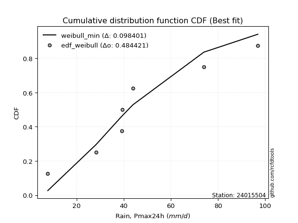</img>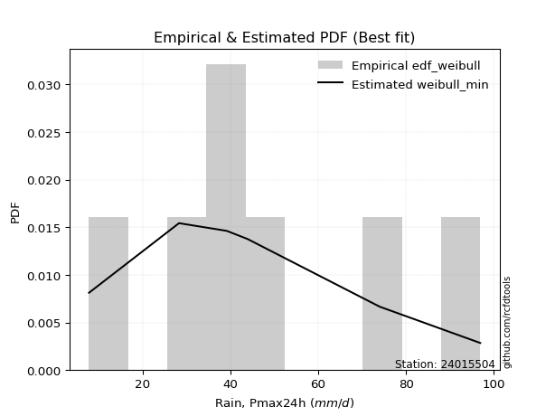</img>

</div>


### 4. EDF Beard (1943)

The Beard formula (or Beard´s plotting position formula) in hydrology is used to estimate the empirical non-exceedance probability _(P)_ of a flood event (or other extreme hydrological data point) within a given dataset.

<div align="center">


$P=(m-0.31)/(n+0.38)$


</div>


**4.1. Empirical values**

<div align="center">

|                | 0                   | 1                   | 2                   | 3         | 4                  | 5                  | 6                  |
|:---------------|:--------------------|:--------------------|:--------------------|:----------|:-------------------|:-------------------|:-------------------|
| date           | 2015                | 2021                | 2017                | 2020      | 2016               | 2018               | 2019               |
| x              | 7.8                 | 28.3                | 39.1                | 39.4      | 43.9               | 74.0               | 96.9               |
| m              | 1                   | 2                   | 3                   | 4         | 5                  | 6                  | 7                  |
| empirical_dist | edf_beard           | edf_beard           | edf_beard           | edf_beard | edf_beard          | edf_beard          | edf_beard          |
| empirical      | 0.09349593495934959 | 0.22899728997289973 | 0.36449864498644985 | 0.5       | 0.6355013550135502 | 0.7710027100271003 | 0.9065040650406505 |
| empirical_tr   | 1.1031390134529149  | 1.29701230228471    | 1.5735607675906182  | 2.0       | 2.743494423791822  | 4.366863905325444  | 10.695652173913055 |

</div>


**4.2. Kolmogorov-Smirnov fit test (sorted by Δ)**


<div align="center">

|                | 0                   | 1                   | 2                   | 3                   | 4                   | 5                   | 6                   | 7                   | 8                   | 9                   | 10                  | 11                  | 12                  | 13                  | 14                  | 15                  | 16                  | 17                  | 18                  | 19                  | 20                  | 21                  | 22                  | 23                  | 24                  | 25                  | 26                  | 27                  | 28                  | 29                  | 30                  | 31                  | 32                  | 33                  | 34                  | 35                  | 36                  | 37                  | 38                  | 39                  | 40                  | 41                  | 42                  | 43                  | 44                  | 45                  | 46                  | 47                  | 48                  | 49                  | 50                  | 51                  | 52                  | 53                  | 54                  | 55                  | 56                  | 57                  | 58                  | 59                  | 60                  | 61                  | 62                  | 63                  | 64                  | 65                  | 66                  | 67                  | 68                  | 69                  | 70                  | 71                  | 72                  | 73                  | 74                  | 75                  | 76                  | 77                  | 78                  | 79                  | 80                  | 81                  | 82                  | 83                  | 84                  | 85                  | 86                  | 87                  | 88                  | 89                  | 90                  | 91                  | 92                  | 93                  | 94                  | 95                  | 96                  | 97                  | 98                  | 99                  | 100                 | 101                 | 102                 | 103                 | 104                 | 105                 | 106                 | 107                 | 108                 | 109                 | 110                 | 111                 | 112                 | 113                 | 114                 | 115                 | 116                 | 117                 | 118                 | 119                 | 120                 | 121                 | 122                 | 123                 | 124                 | 125                 | 126                 | 127                 | 128                 | 129                 | 130                 | 131                 | 132                 | 133                 | 134                 | 135                 | 136                 | 137                 | 138                 | 139                 | 140                 | 141                 | 142                 | 143                 | 144                 | 145                 | 146                 | 147                 | 148                 | 149                 | 150                 | 151                 | 152                 | 153                 | 154                 | 155                 | 156                 | 157                 | 158                 | 159                 |
|:---------------|:--------------------|:--------------------|:--------------------|:--------------------|:--------------------|:--------------------|:--------------------|:--------------------|:--------------------|:--------------------|:--------------------|:--------------------|:--------------------|:--------------------|:--------------------|:--------------------|:--------------------|:--------------------|:--------------------|:--------------------|:--------------------|:--------------------|:--------------------|:--------------------|:--------------------|:--------------------|:--------------------|:--------------------|:--------------------|:--------------------|:--------------------|:--------------------|:--------------------|:--------------------|:--------------------|:--------------------|:--------------------|:--------------------|:--------------------|:--------------------|:--------------------|:--------------------|:--------------------|:--------------------|:--------------------|:--------------------|:--------------------|:--------------------|:--------------------|:--------------------|:--------------------|:--------------------|:--------------------|:--------------------|:--------------------|:--------------------|:--------------------|:--------------------|:--------------------|:--------------------|:--------------------|:--------------------|:--------------------|:--------------------|:--------------------|:--------------------|:--------------------|:--------------------|:--------------------|:--------------------|:--------------------|:--------------------|:--------------------|:--------------------|:--------------------|:--------------------|:--------------------|:--------------------|:--------------------|:--------------------|:--------------------|:--------------------|:--------------------|:--------------------|:--------------------|:--------------------|:--------------------|:--------------------|:--------------------|:--------------------|:--------------------|:--------------------|:--------------------|:--------------------|:--------------------|:--------------------|:--------------------|:--------------------|:--------------------|:--------------------|:--------------------|:--------------------|:--------------------|:--------------------|:--------------------|:--------------------|:--------------------|:--------------------|:--------------------|:--------------------|:--------------------|:--------------------|:--------------------|:--------------------|:--------------------|:--------------------|:--------------------|:--------------------|:--------------------|:--------------------|:--------------------|:--------------------|:--------------------|:--------------------|:--------------------|:--------------------|:--------------------|:--------------------|:--------------------|:--------------------|:--------------------|:--------------------|:--------------------|:--------------------|:--------------------|:--------------------|:--------------------|:--------------------|:--------------------|:--------------------|:--------------------|:--------------------|:--------------------|:--------------------|:--------------------|:--------------------|:--------------------|:--------------------|:--------------------|:--------------------|:--------------------|:--------------------|:--------------------|:--------------------|:--------------------|:--------------------|:--------------------|:--------------------|:--------------------|:--------------------|
| station        | 24015504            | 24015504            | 24015504            | 24015504            | 24015504            | 24015504            | 24015504            | 24015504            | 24015504            | 24015504            | 24015504            | 24015504            | 24015504            | 24015504            | 24015504            | 24015504            | 24015504            | 24015504            | 24015504            | 24015504            | 24015504            | 24015504            | 24015504            | 24015504            | 24015504            | 24015504            | 24015504            | 24015504            | 24015504            | 24015504            | 24015504            | 24015504            | 24015504            | 24015504            | 24015504            | 24015504            | 24015504            | 24015504            | 24015504            | 24015504            | 24015504            | 24015504            | 24015504            | 24015504            | 24015504            | 24015504            | 24015504            | 24015504            | 24015504            | 24015504            | 24015504            | 24015504            | 24015504            | 24015504            | 24015504            | 24015504            | 24015504            | 24015504            | 24015504            | 24015504            | 24015504            | 24015504            | 24015504            | 24015504            | 24015504            | 24015504            | 24015504            | 24015504            | 24015504            | 24015504            | 24015504            | 24015504            | 24015504            | 24015504            | 24015504            | 24015504            | 24015504            | 24015504            | 24015504            | 24015504            | 24015504            | 24015504            | 24015504            | 24015504            | 24015504            | 24015504            | 24015504            | 24015504            | 24015504            | 24015504            | 24015504            | 24015504            | 24015504            | 24015504            | 24015504            | 24015504            | 24015504            | 24015504            | 24015504            | 24015504            | 24015504            | 24015504            | 24015504            | 24015504            | 24015504            | 24015504            | 24015504            | 24015504            | 24015504            | 24015504            | 24015504            | 24015504            | 24015504            | 24015504            | 24015504            | 24015504            | 24015504            | 24015504            | 24015504            | 24015504            | 24015504            | 24015504            | 24015504            | 24015504            | 24015504            | 24015504            | 24015504            | 24015504            | 24015504            | 24015504            | 24015504            | 24015504            | 24015504            | 24015504            | 24015504            | 24015504            | 24015504            | 24015504            | 24015504            | 24015504            | 24015504            | 24015504            | 24015504            | 24015504            | 24015504            | 24015504            | 24015504            | 24015504            | 24015504            | 24015504            | 24015504            | 24015504            | 24015504            | 24015504            | 24015504            | 24015504            | 24015504            | 24015504            | 24015504            | 24015504            |
| empirical_dist | edf_beard           | edf_beard           | edf_beard           | edf_beard           | edf_beard           | edf_beard           | edf_beard           | edf_beard           | edf_beard           | edf_beard           | edf_beard           | edf_beard           | edf_beard           | edf_beard           | edf_beard           | edf_beard           | edf_beard           | edf_beard           | edf_beard           | edf_beard           | edf_beard           | edf_beard           | edf_beard           | edf_beard           | edf_beard           | edf_beard           | edf_beard           | edf_beard           | edf_beard           | edf_beard           | edf_beard           | edf_beard           | edf_beard           | edf_beard           | edf_beard           | edf_beard           | edf_beard           | edf_beard           | edf_beard           | edf_beard           | edf_beard           | edf_beard           | edf_beard           | edf_beard           | edf_beard           | edf_beard           | edf_beard           | edf_beard           | edf_beard           | edf_beard           | edf_beard           | edf_beard           | edf_beard           | edf_beard           | edf_beard           | edf_beard           | edf_beard           | edf_beard           | edf_beard           | edf_beard           | edf_beard           | edf_beard           | edf_beard           | edf_beard           | edf_beard           | edf_beard           | edf_beard           | edf_beard           | edf_beard           | edf_beard           | edf_beard           | edf_beard           | edf_beard           | edf_beard           | edf_beard           | edf_beard           | edf_beard           | edf_beard           | edf_beard           | edf_beard           | edf_beard           | edf_beard           | edf_beard           | edf_beard           | edf_beard           | edf_beard           | edf_beard           | edf_beard           | edf_beard           | edf_beard           | edf_beard           | edf_beard           | edf_beard           | edf_beard           | edf_beard           | edf_beard           | edf_beard           | edf_beard           | edf_beard           | edf_beard           | edf_beard           | edf_beard           | edf_beard           | edf_beard           | edf_beard           | edf_beard           | edf_beard           | edf_beard           | edf_beard           | edf_beard           | edf_beard           | edf_beard           | edf_beard           | edf_beard           | edf_beard           | edf_beard           | edf_beard           | edf_beard           | edf_beard           | edf_beard           | edf_beard           | edf_beard           | edf_beard           | edf_beard           | edf_beard           | edf_beard           | edf_beard           | edf_beard           | edf_beard           | edf_beard           | edf_beard           | edf_beard           | edf_beard           | edf_beard           | edf_beard           | edf_beard           | edf_beard           | edf_beard           | edf_beard           | edf_beard           | edf_beard           | edf_beard           | edf_beard           | edf_beard           | edf_beard           | edf_beard           | edf_beard           | edf_beard           | edf_beard           | edf_beard           | edf_beard           | edf_beard           | edf_beard           | edf_beard           | edf_beard           | edf_beard           | edf_beard           | edf_beard           | edf_beard           | edf_beard           |
| p_dist         | moyal               | exponnorm           | halfnorm            | genexpon            | loggengamma         | weibull_min         | logvonmises_line    | loggompertz         | truncexpon          | erlang              | gamma               | f                   | invweibull          | logt                | genlogistic         | logpearson3         | gumbel_r            | kstwobign           | betaprime           | halflogistic        | loggumbel_l         | invgauss            | exponweib           | logweibull_min      | johnsonsu           | loggenlogistic      | invgamma            | logmielke           | logdgamma           | logskewnorm         | nct                 | logdweibull         | logtrapezoid        | logtriang           | genextreme          | gennorm             | logloglaplace       | skewnorm            | logburr12           | lomax               | loggennorm          | loggenhalflogistic  | rayleigh            | dweibull            | bradford            | logloggamma         | logargus            | ncf                 | logjohnsonsu        | foldnorm            | dgamma              | rice                | pearson3            | maxwell             | logsemicircular     | loganglit           | gausshyper          | logexponnorm        | lognorm             | logcrystalball      | logrice             | logfatiguelife      | logf                | wald                | lognct              | loglogistic         | truncweibull_min    | loghypsecant        | logerlang           | logncf              | arcsine             | loggamma            | loggamma            | vonmises_line       | loginvgamma         | logbetaprime        | loglaplace          | loglaplace          | loginvgauss         | semicircular        | logalpha            | anglit              | t                   | crystalball         | norm                | truncnorm           | logarcsine          | logistic            | logmaxwell          | logburr             | loginvweibull       | hypsecant           | kappa4              | logbeta             | logfoldnorm         | loglevy_l           | lograyleigh         | logcosine           | cosine              | burr                | laplace             | ksone               | logweibull_max      | loggumbel_r         | loghalfnorm         | logtruncnorm        | nakagami            | lognakagami         | wrapcauchy          | logkstwobign        | uniform             | kappa3              | loggenexpon         | beta                | halfgennorm         | gumbel_l            | logmoyal            | loggausshyper       | loghalflogistic     | loggenextreme       | loggenpareto        | alpha               | argus               | logksone            | logwrapcauchy       | logkappa3           | loguniform          | logtukeylambda      | levy_l              | mielke              | gengamma            | logkappa4           | burr12              | logwald             | loglomax            | genpareto           | genhalflogistic     | logtruncexpon       | loghalfgennorm      | logbradford         | logrdist            | logtruncweibull_min | johnsonsb           | triang              | logjohnsonsb        | trapezoid           | rdist               | powerlaw            | fatiguelife         | tukeylambda         | logexponpow         | weibull_max         | logexponweib        | exponpow            | logpowerlaw         | truncpareto         | logtruncpareto      | gompertz            | logvonmises         | vonmises            |
| delta          | 0.09968043482583816 | 0.101070868321679   | 0.10193594292615404 | 0.1034888572703499  | 0.10534167367956826 | 0.1073255535433495  | 0.10788226472586404 | 0.10808166602766717 | 0.10862241029207831 | 0.11087848427473368 | 0.11087868670389367 | 0.11100452917061732 | 0.11116923163822134 | 0.11256645673470234 | 0.11309534828658319 | 0.11394040689241436 | 0.11400992232443619 | 0.11425182271748735 | 0.11436234474058582 | 0.11550121708514699 | 0.1172044241007616  | 0.11879829877033177 | 0.1191628347696777  | 0.12042001815111292 | 0.1211728913052551  | 0.1216200746051066  | 0.1225527486316278  | 0.12255507101919183 | 0.12335847041364395 | 0.12368042598112727 | 0.12388842379750875 | 0.1240004788766198  | 0.12425288349919916 | 0.1256259069249932  | 0.1275014208766042  | 0.12825399297037499 | 0.12880282968401952 | 0.12896114297673622 | 0.13011943635471634 | 0.13094934160967364 | 0.13200766532604513 | 0.13462327404616267 | 0.13534188558025828 | 0.13550135501375865 | 0.138023186880202   | 0.1397159986461533  | 0.1413256196906847  | 0.14157540037279132 | 0.14261832545088338 | 0.1430250240379784  | 0.14361408974415546 | 0.14388087708348796 | 0.14691448275646307 | 0.14718112753738138 | 0.15164660796314094 | 0.15283967965013706 | 0.15368116399564108 | 0.15573100964118952 | 0.15573169323783037 | 0.1557317126873004  | 0.15573700239949667 | 0.1563885030792253  | 0.15639193178467387 | 0.15696779988196313 | 0.15747492086356946 | 0.15848941415483447 | 0.15879706780622044 | 0.1608403959085805  | 0.160970152170876   | 0.16142468448241026 | 0.16151480990226097 | 0.16272195519236493 | 0.16272195519236493 | 0.16505632472612197 | 0.16864338818642316 | 0.16901681286713516 | 0.17011745646368176 | 0.17011745646368176 | 0.171991887814601   | 0.17222870930068757 | 0.17452531283763567 | 0.17492390863999518 | 0.18145487325537513 | 0.1814557427049332  | 0.18145575480820375 | 0.18145575966825078 | 0.18433605761421004 | 0.18766012057266362 | 0.18786276442129263 | 0.19015389976440888 | 0.19155941429795267 | 0.19291082183222663 | 0.19424373240042275 | 0.19478144570231476 | 0.1957091713584323  | 0.19754031638755953 | 0.1984064450133845  | 0.2060201226397344  | 0.20724278476269714 | 0.20826655841510006 | 0.2108187615798971  | 0.21453240626682374 | 0.2159353431532518  | 0.22641184261469421 | 0.2280952165522509  | 0.22898960074478833 | 0.22899684851874802 | 0.2289972896198708  | 0.2292822130513456  | 0.22981774436347438 | 0.2303386165174784  | 0.2304177883249071  | 0.23391804366771782 | 0.23690672299234056 | 0.23732338158745303 | 0.2516985737003046  | 0.2520067916342636  | 0.25333845350968065 | 0.2541502398437356  | 0.25511582832322555 | 0.270221106616776   | 0.2752782886699022  | 0.27647226025837857 | 0.2805811770341148  | 0.2812637488811355  | 0.28236034084965966 | 0.28249687043551774 | 0.2844139074992168  | 0.28961665953203064 | 0.29146346315277205 | 0.2991380265735745  | 0.3041260449162837  | 0.3221411542542659  | 0.323094603604344   | 0.33065310627647293 | 0.33887709196502674 | 0.3477648814428508  | 0.3630695900708424  | 0.3721809501824309  | 0.3736703284445545  | 0.3908246832430744  | 0.4082428169771143  | 0.42183128242950113 | 0.42401939866511573 | 0.43278029338624757 | 0.4578491969016572  | 0.5124708936578937  | 0.5621337905522127  | 0.5799100622621672  | 0.5900415087946865  | 0.5979425074412249  | 0.6196627259996119  | 0.6211290178568688  | 0.6256039950043636  | 0.655748905799547   | 0.6662220323648599  | 0.721449308260515   | 0.7703962304177     | 1.11468669965989    | 14.816226061375758  |
| deltao         | 0.48442053926100004 | 0.48442053926100004 | 0.48442053926100004 | 0.48442053926100004 | 0.48442053926100004 | 0.48442053926100004 | 0.48442053926100004 | 0.48442053926100004 | 0.48442053926100004 | 0.48442053926100004 | 0.48442053926100004 | 0.48442053926100004 | 0.48442053926100004 | 0.48442053926100004 | 0.48442053926100004 | 0.48442053926100004 | 0.48442053926100004 | 0.48442053926100004 | 0.48442053926100004 | 0.48442053926100004 | 0.48442053926100004 | 0.48442053926100004 | 0.48442053926100004 | 0.48442053926100004 | 0.48442053926100004 | 0.48442053926100004 | 0.48442053926100004 | 0.48442053926100004 | 0.48442053926100004 | 0.48442053926100004 | 0.48442053926100004 | 0.48442053926100004 | 0.48442053926100004 | 0.48442053926100004 | 0.48442053926100004 | 0.48442053926100004 | 0.48442053926100004 | 0.48442053926100004 | 0.48442053926100004 | 0.48442053926100004 | 0.48442053926100004 | 0.48442053926100004 | 0.48442053926100004 | 0.48442053926100004 | 0.48442053926100004 | 0.48442053926100004 | 0.48442053926100004 | 0.48442053926100004 | 0.48442053926100004 | 0.48442053926100004 | 0.48442053926100004 | 0.48442053926100004 | 0.48442053926100004 | 0.48442053926100004 | 0.48442053926100004 | 0.48442053926100004 | 0.48442053926100004 | 0.48442053926100004 | 0.48442053926100004 | 0.48442053926100004 | 0.48442053926100004 | 0.48442053926100004 | 0.48442053926100004 | 0.48442053926100004 | 0.48442053926100004 | 0.48442053926100004 | 0.48442053926100004 | 0.48442053926100004 | 0.48442053926100004 | 0.48442053926100004 | 0.48442053926100004 | 0.48442053926100004 | 0.48442053926100004 | 0.48442053926100004 | 0.48442053926100004 | 0.48442053926100004 | 0.48442053926100004 | 0.48442053926100004 | 0.48442053926100004 | 0.48442053926100004 | 0.48442053926100004 | 0.48442053926100004 | 0.48442053926100004 | 0.48442053926100004 | 0.48442053926100004 | 0.48442053926100004 | 0.48442053926100004 | 0.48442053926100004 | 0.48442053926100004 | 0.48442053926100004 | 0.48442053926100004 | 0.48442053926100004 | 0.48442053926100004 | 0.48442053926100004 | 0.48442053926100004 | 0.48442053926100004 | 0.48442053926100004 | 0.48442053926100004 | 0.48442053926100004 | 0.48442053926100004 | 0.48442053926100004 | 0.48442053926100004 | 0.48442053926100004 | 0.48442053926100004 | 0.48442053926100004 | 0.48442053926100004 | 0.48442053926100004 | 0.48442053926100004 | 0.48442053926100004 | 0.48442053926100004 | 0.48442053926100004 | 0.48442053926100004 | 0.48442053926100004 | 0.48442053926100004 | 0.48442053926100004 | 0.48442053926100004 | 0.48442053926100004 | 0.48442053926100004 | 0.48442053926100004 | 0.48442053926100004 | 0.48442053926100004 | 0.48442053926100004 | 0.48442053926100004 | 0.48442053926100004 | 0.48442053926100004 | 0.48442053926100004 | 0.48442053926100004 | 0.48442053926100004 | 0.48442053926100004 | 0.48442053926100004 | 0.48442053926100004 | 0.48442053926100004 | 0.48442053926100004 | 0.48442053926100004 | 0.48442053926100004 | 0.48442053926100004 | 0.48442053926100004 | 0.48442053926100004 | 0.48442053926100004 | 0.48442053926100004 | 0.48442053926100004 | 0.48442053926100004 | 0.48442053926100004 | 0.48442053926100004 | 0.48442053926100004 | 0.48442053926100004 | 0.48442053926100004 | 0.48442053926100004 | 0.48442053926100004 | 0.48442053926100004 | 0.48442053926100004 | 0.48442053926100004 | 0.48442053926100004 | 0.48442053926100004 | 0.48442053926100004 | 0.48442053926100004 | 0.48442053926100004 | 0.48442053926100004 | 0.48442053926100004 | 0.48442053926100004 |
| eval           | Δo > Δ              | Δo > Δ              | Δo > Δ              | Δo > Δ              | Δo > Δ              | Δo > Δ              | Δo > Δ              | Δo > Δ              | Δo > Δ              | Δo > Δ              | Δo > Δ              | Δo > Δ              | Δo > Δ              | Δo > Δ              | Δo > Δ              | Δo > Δ              | Δo > Δ              | Δo > Δ              | Δo > Δ              | Δo > Δ              | Δo > Δ              | Δo > Δ              | Δo > Δ              | Δo > Δ              | Δo > Δ              | Δo > Δ              | Δo > Δ              | Δo > Δ              | Δo > Δ              | Δo > Δ              | Δo > Δ              | Δo > Δ              | Δo > Δ              | Δo > Δ              | Δo > Δ              | Δo > Δ              | Δo > Δ              | Δo > Δ              | Δo > Δ              | Δo > Δ              | Δo > Δ              | Δo > Δ              | Δo > Δ              | Δo > Δ              | Δo > Δ              | Δo > Δ              | Δo > Δ              | Δo > Δ              | Δo > Δ              | Δo > Δ              | Δo > Δ              | Δo > Δ              | Δo > Δ              | Δo > Δ              | Δo > Δ              | Δo > Δ              | Δo > Δ              | Δo > Δ              | Δo > Δ              | Δo > Δ              | Δo > Δ              | Δo > Δ              | Δo > Δ              | Δo > Δ              | Δo > Δ              | Δo > Δ              | Δo > Δ              | Δo > Δ              | Δo > Δ              | Δo > Δ              | Δo > Δ              | Δo > Δ              | Δo > Δ              | Δo > Δ              | Δo > Δ              | Δo > Δ              | Δo > Δ              | Δo > Δ              | Δo > Δ              | Δo > Δ              | Δo > Δ              | Δo > Δ              | Δo > Δ              | Δo > Δ              | Δo > Δ              | Δo > Δ              | Δo > Δ              | Δo > Δ              | Δo > Δ              | Δo > Δ              | Δo > Δ              | Δo > Δ              | Δo > Δ              | Δo > Δ              | Δo > Δ              | Δo > Δ              | Δo > Δ              | Δo > Δ              | Δo > Δ              | Δo > Δ              | Δo > Δ              | Δo > Δ              | Δo > Δ              | Δo > Δ              | Δo > Δ              | Δo > Δ              | Δo > Δ              | Δo > Δ              | Δo > Δ              | Δo > Δ              | Δo > Δ              | Δo > Δ              | Δo > Δ              | Δo > Δ              | Δo > Δ              | Δo > Δ              | Δo > Δ              | Δo > Δ              | Δo > Δ              | Δo > Δ              | Δo > Δ              | Δo > Δ              | Δo > Δ              | Δo > Δ              | Δo > Δ              | Δo > Δ              | Δo > Δ              | Δo > Δ              | Δo > Δ              | Δo > Δ              | Δo > Δ              | Δo > Δ              | Δo > Δ              | Δo > Δ              | Δo > Δ              | Δo > Δ              | Δo > Δ              | Δo > Δ              | Δo > Δ              | Δo > Δ              | Δo > Δ              | Δo > Δ              | Δo > Δ              | Δo > Δ              | Δo > Δ              | Δo > Δ              | Δo <= Δ             | Δo <= Δ             | Δo <= Δ             | Δo <= Δ             | Δo <= Δ             | Δo <= Δ             | Δo <= Δ             | Δo <= Δ             | Δo <= Δ             | Δo <= Δ             | Δo <= Δ             | Δo <= Δ             | Δo <= Δ             | Δo <= Δ             |
| fit            | 1                   | 1                   | 1                   | 1                   | 1                   | 1                   | 1                   | 1                   | 1                   | 1                   | 1                   | 1                   | 1                   | 1                   | 1                   | 1                   | 1                   | 1                   | 1                   | 1                   | 1                   | 1                   | 1                   | 1                   | 1                   | 1                   | 1                   | 1                   | 1                   | 1                   | 1                   | 1                   | 1                   | 1                   | 1                   | 1                   | 1                   | 1                   | 1                   | 1                   | 1                   | 1                   | 1                   | 1                   | 1                   | 1                   | 1                   | 1                   | 1                   | 1                   | 1                   | 1                   | 1                   | 1                   | 1                   | 1                   | 1                   | 1                   | 1                   | 1                   | 1                   | 1                   | 1                   | 1                   | 1                   | 1                   | 1                   | 1                   | 1                   | 1                   | 1                   | 1                   | 1                   | 1                   | 1                   | 1                   | 1                   | 1                   | 1                   | 1                   | 1                   | 1                   | 1                   | 1                   | 1                   | 1                   | 1                   | 1                   | 1                   | 1                   | 1                   | 1                   | 1                   | 1                   | 1                   | 1                   | 1                   | 1                   | 1                   | 1                   | 1                   | 1                   | 1                   | 1                   | 1                   | 1                   | 1                   | 1                   | 1                   | 1                   | 1                   | 1                   | 1                   | 1                   | 1                   | 1                   | 1                   | 1                   | 1                   | 1                   | 1                   | 1                   | 1                   | 1                   | 1                   | 1                   | 1                   | 1                   | 1                   | 1                   | 1                   | 1                   | 1                   | 1                   | 1                   | 1                   | 1                   | 1                   | 1                   | 1                   | 1                   | 1                   | 1                   | 1                   | 1                   | 1                   | 0                   | 0                   | 0                   | 0                   | 0                   | 0                   | 0                   | 0                   | 0                   | 0                   | 0                   | 0                   | 0                   | 0                   |
| n              | 7                   | 7                   | 7                   | 7                   | 7                   | 7                   | 7                   | 7                   | 7                   | 7                   | 7                   | 7                   | 7                   | 7                   | 7                   | 7                   | 7                   | 7                   | 7                   | 7                   | 7                   | 7                   | 7                   | 7                   | 7                   | 7                   | 7                   | 7                   | 7                   | 7                   | 7                   | 7                   | 7                   | 7                   | 7                   | 7                   | 7                   | 7                   | 7                   | 7                   | 7                   | 7                   | 7                   | 7                   | 7                   | 7                   | 7                   | 7                   | 7                   | 7                   | 7                   | 7                   | 7                   | 7                   | 7                   | 7                   | 7                   | 7                   | 7                   | 7                   | 7                   | 7                   | 7                   | 7                   | 7                   | 7                   | 7                   | 7                   | 7                   | 7                   | 7                   | 7                   | 7                   | 7                   | 7                   | 7                   | 7                   | 7                   | 7                   | 7                   | 7                   | 7                   | 7                   | 7                   | 7                   | 7                   | 7                   | 7                   | 7                   | 7                   | 7                   | 7                   | 7                   | 7                   | 7                   | 7                   | 7                   | 7                   | 7                   | 7                   | 7                   | 7                   | 7                   | 7                   | 7                   | 7                   | 7                   | 7                   | 7                   | 7                   | 7                   | 7                   | 7                   | 7                   | 7                   | 7                   | 7                   | 7                   | 7                   | 7                   | 7                   | 7                   | 7                   | 7                   | 7                   | 7                   | 7                   | 7                   | 7                   | 7                   | 7                   | 7                   | 7                   | 7                   | 7                   | 7                   | 7                   | 7                   | 7                   | 7                   | 7                   | 7                   | 7                   | 7                   | 7                   | 7                   | 7                   | 7                   | 7                   | 7                   | 7                   | 7                   | 7                   | 7                   | 7                   | 7                   | 7                   | 7                   | 7                   | 7                   |
| best_fit       | 1                   | 0                   | 0                   | 0                   | 0                   | 0                   | 0                   | 0                   | 0                   | 0                   | 0                   | 0                   | 0                   | 0                   | 0                   | 0                   | 0                   | 0                   | 0                   | 0                   | 0                   | 0                   | 0                   | 0                   | 0                   | 0                   | 0                   | 0                   | 0                   | 0                   | 0                   | 0                   | 0                   | 0                   | 0                   | 0                   | 0                   | 0                   | 0                   | 0                   | 0                   | 0                   | 0                   | 0                   | 0                   | 0                   | 0                   | 0                   | 0                   | 0                   | 0                   | 0                   | 0                   | 0                   | 0                   | 0                   | 0                   | 0                   | 0                   | 0                   | 0                   | 0                   | 0                   | 0                   | 0                   | 0                   | 0                   | 0                   | 0                   | 0                   | 0                   | 0                   | 0                   | 0                   | 0                   | 0                   | 0                   | 0                   | 0                   | 0                   | 0                   | 0                   | 0                   | 0                   | 0                   | 0                   | 0                   | 0                   | 0                   | 0                   | 0                   | 0                   | 0                   | 0                   | 0                   | 0                   | 0                   | 0                   | 0                   | 0                   | 0                   | 0                   | 0                   | 0                   | 0                   | 0                   | 0                   | 0                   | 0                   | 0                   | 0                   | 0                   | 0                   | 0                   | 0                   | 0                   | 0                   | 0                   | 0                   | 0                   | 0                   | 0                   | 0                   | 0                   | 0                   | 0                   | 0                   | 0                   | 0                   | 0                   | 0                   | 0                   | 0                   | 0                   | 0                   | 0                   | 0                   | 0                   | 0                   | 0                   | 0                   | 0                   | 0                   | 0                   | 0                   | 0                   | 0                   | 0                   | 0                   | 0                   | 0                   | 0                   | 0                   | 0                   | 0                   | 0                   | 0                   | 0                   | 0                   | 0                   |
| best_fit_sort  | 1                   | 2                   | 3                   | 4                   | 5                   | 6                   | 7                   | 8                   | 9                   | 10                  | 11                  | 12                  | 13                  | 14                  | 15                  | 16                  | 17                  | 18                  | 19                  | 20                  | 21                  | 22                  | 23                  | 24                  | 25                  | 26                  | 27                  | 28                  | 29                  | 30                  | 31                  | 32                  | 33                  | 34                  | 35                  | 36                  | 37                  | 38                  | 39                  | 40                  | 41                  | 42                  | 43                  | 44                  | 45                  | 46                  | 47                  | 48                  | 49                  | 50                  | 51                  | 52                  | 53                  | 54                  | 55                  | 56                  | 57                  | 58                  | 59                  | 60                  | 61                  | 62                  | 63                  | 64                  | 65                  | 66                  | 67                  | 68                  | 69                  | 70                  | 71                  | 72                  | 73                  | 74                  | 75                  | 76                  | 77                  | 78                  | 79                  | 80                  | 81                  | 82                  | 83                  | 84                  | 85                  | 86                  | 87                  | 88                  | 89                  | 90                  | 91                  | 92                  | 93                  | 94                  | 95                  | 96                  | 97                  | 98                  | 99                  | 100                 | 101                 | 102                 | 103                 | 104                 | 105                 | 106                 | 107                 | 108                 | 109                 | 110                 | 111                 | 112                 | 113                 | 114                 | 115                 | 116                 | 117                 | 118                 | 119                 | 120                 | 121                 | 122                 | 123                 | 124                 | 125                 | 126                 | 127                 | 128                 | 129                 | 130                 | 131                 | 132                 | 133                 | 134                 | 135                 | 136                 | 137                 | 138                 | 139                 | 140                 | 141                 | 142                 | 143                 | 144                 | 145                 | 146                 | 147                 | 148                 | 149                 | 150                 | 151                 | 152                 | 153                 | 154                 | 155                 | 156                 | 157                 | 158                 | 159                 | 160                 |

</div>


**4.3. Best fit**

<div align="center">

|   id |   station | empirical_dist   | p_dist   |     delta |   deltao | eval   |   fit |   n |   best_fit |   best_fit_sort |
|-----:|----------:|:-----------------|:---------|----------:|---------:|:-------|------:|----:|-----------:|----------------:|
|    0 |  24015504 | edf_beard        | moyal    | 0.0996804 | 0.484421 | Δo > Δ |     1 |   7 |          1 |               1 |

</div>


<div align="center">

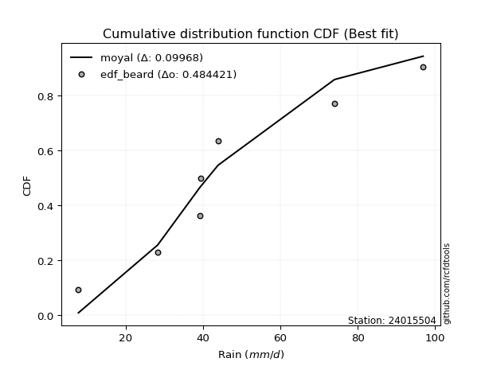</img>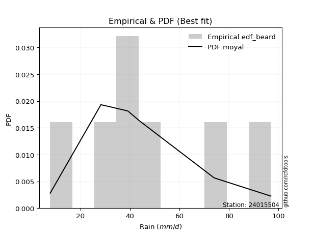</img>

</div>


### 5. EDF Chegodayev (1955)

The Chegodayev formula is an empirical plotting position formula used in hydrological frequency analysis to estimate the exceedance probability or return period of a specific event from a set of observed data. It is primarily used for plotting observed data points on probability paper to fit a theoretical distribution, particularly for analyzing extreme events like maximum flood flows or rainfall intensities. The constant _b_ value in the generalized plotting position formula is 0.3.

<div align="center">


$P=(m-b)/(n+1-2b)$


</div>


**5.1. Empirical values**

<div align="center">

|                | 0                   | 1                   | 2                   | 3              | 4                  | 5                  | 6                  |
|:---------------|:--------------------|:--------------------|:--------------------|:---------------|:-------------------|:-------------------|:-------------------|
| date           | 2015                | 2021                | 2017                | 2020           | 2016               | 2018               | 2019               |
| x              | 7.8                 | 28.3                | 39.1                | 39.4           | 43.9               | 74.0               | 96.9               |
| m              | 1                   | 2                   | 3                   | 4              | 5                  | 6                  | 7                  |
| empirical_dist | edf_chegodayev      | edf_chegodayev      | edf_chegodayev      | edf_chegodayev | edf_chegodayev     | edf_chegodayev     | edf_chegodayev     |
| empirical      | 0.09459459459459459 | 0.22972972972972971 | 0.36486486486486486 | 0.5            | 0.6351351351351351 | 0.7702702702702703 | 0.9054054054054054 |
| empirical_tr   | 1.1044776119402986  | 1.2982456140350878  | 1.574468085106383   | 2.0            | 2.7407407407407405 | 4.352941176470589  | 10.571428571428568 |

</div>


**5.2. Kolmogorov-Smirnov fit test (sorted by Δ)**


<div align="center">

|                | 0                   | 1                   | 2                   | 3                   | 4                   | 5                   | 6                   | 7                   | 8                   | 9                   | 10                  | 11                  | 12                  | 13                  | 14                  | 15                  | 16                  | 17                  | 18                  | 19                  | 20                  | 21                  | 22                  | 23                  | 24                  | 25                  | 26                  | 27                  | 28                  | 29                  | 30                  | 31                  | 32                  | 33                  | 34                  | 35                  | 36                  | 37                  | 38                  | 39                  | 40                  | 41                  | 42                  | 43                  | 44                  | 45                  | 46                  | 47                  | 48                  | 49                  | 50                  | 51                  | 52                  | 53                  | 54                  | 55                  | 56                  | 57                  | 58                  | 59                  | 60                  | 61                  | 62                  | 63                  | 64                  | 65                  | 66                  | 67                  | 68                  | 69                  | 70                  | 71                  | 72                  | 73                  | 74                  | 75                  | 76                  | 77                  | 78                  | 79                  | 80                  | 81                  | 82                  | 83                  | 84                  | 85                  | 86                  | 87                  | 88                  | 89                  | 90                  | 91                  | 92                  | 93                  | 94                  | 95                  | 96                  | 97                  | 98                  | 99                  | 100                 | 101                 | 102                 | 103                 | 104                 | 105                 | 106                 | 107                 | 108                 | 109                 | 110                 | 111                 | 112                 | 113                 | 114                 | 115                 | 116                 | 117                 | 118                 | 119                 | 120                 | 121                 | 122                 | 123                 | 124                 | 125                 | 126                 | 127                 | 128                 | 129                 | 130                 | 131                 | 132                 | 133                 | 134                 | 135                 | 136                 | 137                 | 138                 | 139                 | 140                 | 141                 | 142                 | 143                 | 144                 | 145                 | 146                 | 147                 | 148                 | 149                 | 150                 | 151                 | 152                 | 153                 | 154                 | 155                 | 156                 | 157                 | 158                 | 159                 |
|:---------------|:--------------------|:--------------------|:--------------------|:--------------------|:--------------------|:--------------------|:--------------------|:--------------------|:--------------------|:--------------------|:--------------------|:--------------------|:--------------------|:--------------------|:--------------------|:--------------------|:--------------------|:--------------------|:--------------------|:--------------------|:--------------------|:--------------------|:--------------------|:--------------------|:--------------------|:--------------------|:--------------------|:--------------------|:--------------------|:--------------------|:--------------------|:--------------------|:--------------------|:--------------------|:--------------------|:--------------------|:--------------------|:--------------------|:--------------------|:--------------------|:--------------------|:--------------------|:--------------------|:--------------------|:--------------------|:--------------------|:--------------------|:--------------------|:--------------------|:--------------------|:--------------------|:--------------------|:--------------------|:--------------------|:--------------------|:--------------------|:--------------------|:--------------------|:--------------------|:--------------------|:--------------------|:--------------------|:--------------------|:--------------------|:--------------------|:--------------------|:--------------------|:--------------------|:--------------------|:--------------------|:--------------------|:--------------------|:--------------------|:--------------------|:--------------------|:--------------------|:--------------------|:--------------------|:--------------------|:--------------------|:--------------------|:--------------------|:--------------------|:--------------------|:--------------------|:--------------------|:--------------------|:--------------------|:--------------------|:--------------------|:--------------------|:--------------------|:--------------------|:--------------------|:--------------------|:--------------------|:--------------------|:--------------------|:--------------------|:--------------------|:--------------------|:--------------------|:--------------------|:--------------------|:--------------------|:--------------------|:--------------------|:--------------------|:--------------------|:--------------------|:--------------------|:--------------------|:--------------------|:--------------------|:--------------------|:--------------------|:--------------------|:--------------------|:--------------------|:--------------------|:--------------------|:--------------------|:--------------------|:--------------------|:--------------------|:--------------------|:--------------------|:--------------------|:--------------------|:--------------------|:--------------------|:--------------------|:--------------------|:--------------------|:--------------------|:--------------------|:--------------------|:--------------------|:--------------------|:--------------------|:--------------------|:--------------------|:--------------------|:--------------------|:--------------------|:--------------------|:--------------------|:--------------------|:--------------------|:--------------------|:--------------------|:--------------------|:--------------------|:--------------------|:--------------------|:--------------------|:--------------------|:--------------------|:--------------------|:--------------------|
| station        | 24015504            | 24015504            | 24015504            | 24015504            | 24015504            | 24015504            | 24015504            | 24015504            | 24015504            | 24015504            | 24015504            | 24015504            | 24015504            | 24015504            | 24015504            | 24015504            | 24015504            | 24015504            | 24015504            | 24015504            | 24015504            | 24015504            | 24015504            | 24015504            | 24015504            | 24015504            | 24015504            | 24015504            | 24015504            | 24015504            | 24015504            | 24015504            | 24015504            | 24015504            | 24015504            | 24015504            | 24015504            | 24015504            | 24015504            | 24015504            | 24015504            | 24015504            | 24015504            | 24015504            | 24015504            | 24015504            | 24015504            | 24015504            | 24015504            | 24015504            | 24015504            | 24015504            | 24015504            | 24015504            | 24015504            | 24015504            | 24015504            | 24015504            | 24015504            | 24015504            | 24015504            | 24015504            | 24015504            | 24015504            | 24015504            | 24015504            | 24015504            | 24015504            | 24015504            | 24015504            | 24015504            | 24015504            | 24015504            | 24015504            | 24015504            | 24015504            | 24015504            | 24015504            | 24015504            | 24015504            | 24015504            | 24015504            | 24015504            | 24015504            | 24015504            | 24015504            | 24015504            | 24015504            | 24015504            | 24015504            | 24015504            | 24015504            | 24015504            | 24015504            | 24015504            | 24015504            | 24015504            | 24015504            | 24015504            | 24015504            | 24015504            | 24015504            | 24015504            | 24015504            | 24015504            | 24015504            | 24015504            | 24015504            | 24015504            | 24015504            | 24015504            | 24015504            | 24015504            | 24015504            | 24015504            | 24015504            | 24015504            | 24015504            | 24015504            | 24015504            | 24015504            | 24015504            | 24015504            | 24015504            | 24015504            | 24015504            | 24015504            | 24015504            | 24015504            | 24015504            | 24015504            | 24015504            | 24015504            | 24015504            | 24015504            | 24015504            | 24015504            | 24015504            | 24015504            | 24015504            | 24015504            | 24015504            | 24015504            | 24015504            | 24015504            | 24015504            | 24015504            | 24015504            | 24015504            | 24015504            | 24015504            | 24015504            | 24015504            | 24015504            | 24015504            | 24015504            | 24015504            | 24015504            | 24015504            | 24015504            |
| empirical_dist | edf_chegodayev      | edf_chegodayev      | edf_chegodayev      | edf_chegodayev      | edf_chegodayev      | edf_chegodayev      | edf_chegodayev      | edf_chegodayev      | edf_chegodayev      | edf_chegodayev      | edf_chegodayev      | edf_chegodayev      | edf_chegodayev      | edf_chegodayev      | edf_chegodayev      | edf_chegodayev      | edf_chegodayev      | edf_chegodayev      | edf_chegodayev      | edf_chegodayev      | edf_chegodayev      | edf_chegodayev      | edf_chegodayev      | edf_chegodayev      | edf_chegodayev      | edf_chegodayev      | edf_chegodayev      | edf_chegodayev      | edf_chegodayev      | edf_chegodayev      | edf_chegodayev      | edf_chegodayev      | edf_chegodayev      | edf_chegodayev      | edf_chegodayev      | edf_chegodayev      | edf_chegodayev      | edf_chegodayev      | edf_chegodayev      | edf_chegodayev      | edf_chegodayev      | edf_chegodayev      | edf_chegodayev      | edf_chegodayev      | edf_chegodayev      | edf_chegodayev      | edf_chegodayev      | edf_chegodayev      | edf_chegodayev      | edf_chegodayev      | edf_chegodayev      | edf_chegodayev      | edf_chegodayev      | edf_chegodayev      | edf_chegodayev      | edf_chegodayev      | edf_chegodayev      | edf_chegodayev      | edf_chegodayev      | edf_chegodayev      | edf_chegodayev      | edf_chegodayev      | edf_chegodayev      | edf_chegodayev      | edf_chegodayev      | edf_chegodayev      | edf_chegodayev      | edf_chegodayev      | edf_chegodayev      | edf_chegodayev      | edf_chegodayev      | edf_chegodayev      | edf_chegodayev      | edf_chegodayev      | edf_chegodayev      | edf_chegodayev      | edf_chegodayev      | edf_chegodayev      | edf_chegodayev      | edf_chegodayev      | edf_chegodayev      | edf_chegodayev      | edf_chegodayev      | edf_chegodayev      | edf_chegodayev      | edf_chegodayev      | edf_chegodayev      | edf_chegodayev      | edf_chegodayev      | edf_chegodayev      | edf_chegodayev      | edf_chegodayev      | edf_chegodayev      | edf_chegodayev      | edf_chegodayev      | edf_chegodayev      | edf_chegodayev      | edf_chegodayev      | edf_chegodayev      | edf_chegodayev      | edf_chegodayev      | edf_chegodayev      | edf_chegodayev      | edf_chegodayev      | edf_chegodayev      | edf_chegodayev      | edf_chegodayev      | edf_chegodayev      | edf_chegodayev      | edf_chegodayev      | edf_chegodayev      | edf_chegodayev      | edf_chegodayev      | edf_chegodayev      | edf_chegodayev      | edf_chegodayev      | edf_chegodayev      | edf_chegodayev      | edf_chegodayev      | edf_chegodayev      | edf_chegodayev      | edf_chegodayev      | edf_chegodayev      | edf_chegodayev      | edf_chegodayev      | edf_chegodayev      | edf_chegodayev      | edf_chegodayev      | edf_chegodayev      | edf_chegodayev      | edf_chegodayev      | edf_chegodayev      | edf_chegodayev      | edf_chegodayev      | edf_chegodayev      | edf_chegodayev      | edf_chegodayev      | edf_chegodayev      | edf_chegodayev      | edf_chegodayev      | edf_chegodayev      | edf_chegodayev      | edf_chegodayev      | edf_chegodayev      | edf_chegodayev      | edf_chegodayev      | edf_chegodayev      | edf_chegodayev      | edf_chegodayev      | edf_chegodayev      | edf_chegodayev      | edf_chegodayev      | edf_chegodayev      | edf_chegodayev      | edf_chegodayev      | edf_chegodayev      | edf_chegodayev      | edf_chegodayev      | edf_chegodayev      | edf_chegodayev      |
| p_dist         | moyal               | exponnorm           | halfnorm            | genexpon            | loggengamma         | weibull_min         | logvonmises_line    | loggompertz         | truncexpon          | erlang              | gamma               | f                   | invweibull          | logt                | genlogistic         | logpearson3         | gumbel_r            | kstwobign           | betaprime           | halflogistic        | loggumbel_l         | invgauss            | exponweib           | logweibull_min      | johnsonsu           | loggenlogistic      | invgamma            | logmielke           | logdgamma           | logskewnorm         | nct                 | logdweibull         | logtrapezoid        | logtriang           | genextreme          | logloglaplace       | skewnorm            | gennorm             | logburr12           | lomax               | loggennorm          | loggenhalflogistic  | rayleigh            | dweibull            | bradford            | logloggamma         | logargus            | ncf                 | logjohnsonsu        | foldnorm            | rice                | dgamma              | pearson3            | maxwell             | logsemicircular     | loganglit           | gausshyper          | logexponnorm        | lognorm             | logcrystalball      | logrice             | logfatiguelife      | logf                | wald                | lognct              | loglogistic         | truncweibull_min    | loghypsecant        | logerlang           | logncf              | arcsine             | loggamma            | loggamma            | vonmises_line       | loginvgamma         | logbetaprime        | loglaplace          | loglaplace          | loginvgauss         | semicircular        | logalpha            | anglit              | t                   | crystalball         | norm                | truncnorm           | logarcsine          | logistic            | logmaxwell          | logburr             | loginvweibull       | hypsecant           | kappa4              | logbeta             | logfoldnorm         | loglevy_l           | lograyleigh         | logcosine           | cosine              | burr                | laplace             | ksone               | logweibull_max      | loggumbel_r         | loghalfnorm         | wrapcauchy          | logkstwobign        | logtruncnorm        | nakagami            | lognakagami         | uniform             | kappa3              | loggenexpon         | beta                | halfgennorm         | gumbel_l            | logmoyal            | loggausshyper       | loghalflogistic     | loggenextreme       | loggenpareto        | alpha               | argus               | logksone            | logwrapcauchy       | logkappa3           | loguniform          | logtukeylambda      | levy_l              | mielke              | gengamma            | logkappa4           | burr12              | logwald             | loglomax            | genpareto           | genhalflogistic     | logtruncexpon       | loghalfgennorm      | logbradford         | logrdist            | logtruncweibull_min | johnsonsb           | triang              | logjohnsonsb        | trapezoid           | rdist               | powerlaw            | fatiguelife         | tukeylambda         | logexponpow         | weibull_max         | logexponweib        | exponpow            | logpowerlaw         | truncpareto         | logtruncpareto      | gompertz            | logvonmises         | vonmises            |
| delta          | 0.09931421494742315 | 0.10070464844326388 | 0.10156972304773892 | 0.10312263739193489 | 0.10497545380115314 | 0.10695933366493438 | 0.10751604484744892 | 0.10771544614925216 | 0.10825619041366319 | 0.11051226439631856 | 0.11051246682547855 | 0.1106383092922022  | 0.11080301175980622 | 0.11220023685628722 | 0.11272912840816807 | 0.11357418701399924 | 0.11364370244602107 | 0.11388560283907223 | 0.1139961248621707  | 0.11513499720673198 | 0.11683820422234648 | 0.11843207889191665 | 0.11879661489126259 | 0.1200537982726978  | 0.12080667142683998 | 0.12125385472669148 | 0.12218652875321268 | 0.12218885114077671 | 0.12299225053522894 | 0.12331420610271215 | 0.12352220391909363 | 0.1236342589982048  | 0.12388666362078404 | 0.1252596870465782  | 0.1271352009981891  | 0.1284366098056045  | 0.1285949230983211  | 0.128986432727205   | 0.12975321647630123 | 0.13058312173125852 | 0.13237388520446025 | 0.13389083428933268 | 0.13497566570184316 | 0.13513513513534364 | 0.13765696700178687 | 0.13934977876773819 | 0.14095939981226957 | 0.1412091804943763  | 0.14225210557246826 | 0.14265880415956328 | 0.14351465720507284 | 0.14434652950098548 | 0.14654826287804795 | 0.14681490765896626 | 0.15128038808472594 | 0.15247345977172205 | 0.15331494411722596 | 0.1553647897627745  | 0.15536547335941536 | 0.1553654928088854  | 0.15537078252108166 | 0.1560222832008103  | 0.15602571190625886 | 0.15660158000354812 | 0.15710870098515445 | 0.15812319427641947 | 0.15843084792780543 | 0.1604741760301655  | 0.160603932292461   | 0.16105846460399525 | 0.16114859002384585 | 0.16235573531394992 | 0.16235573531394992 | 0.165788764482952   | 0.16827716830800815 | 0.16865059298872015 | 0.16975123658526675 | 0.16975123658526675 | 0.171625667936186   | 0.17186248942227245 | 0.17415909295922066 | 0.17455768876158007 | 0.18108865337696    | 0.18108952282651808 | 0.18108953492978863 | 0.18108953978983566 | 0.18360361785738005 | 0.1872939006942485  | 0.18749654454287762 | 0.18978767988599377 | 0.19082697454112268 | 0.1925446019538115  | 0.19387751252200763 | 0.19441522582389975 | 0.1953429514800173  | 0.19644165675231456 | 0.1980402251349695  | 0.2056539027613194  | 0.20687656488428202 | 0.20790033853668505 | 0.21045254170148198 | 0.21416618638840862 | 0.21556912327483668 | 0.2260456227362792  | 0.2277289966738359  | 0.2289159931729305  | 0.2290853046066444  | 0.22972204050161832 | 0.229729288275578   | 0.22972972937670078 | 0.22997239663906327 | 0.230051568446492   | 0.23318560391088783 | 0.23654050311392555 | 0.2369571617090379  | 0.25133235382188945 | 0.2516405717558486  | 0.25260601375285063 | 0.2537840199653206  | 0.2547496084448104  | 0.26948866685994605 | 0.2745458489130722  | 0.27610604037996345 | 0.27984873727728476 | 0.28053130912430546 | 0.28162790109282965 | 0.2817644306786877  | 0.2836814677423868  | 0.28851799989678567 | 0.29073102339594203 | 0.2987718066951595  | 0.3033936051594537  | 0.3214087144974359  | 0.322728383725929   | 0.3299206665196429  | 0.3385108720866116  | 0.34739866156443566 | 0.36233715031401237 | 0.3714485104256009  | 0.3729378886877245  | 0.3900922434862444  | 0.40751037722028427 | 0.4210988426726711  | 0.4236531787867006  | 0.43204785362941756 | 0.4574829770232421  | 0.5117384539010637  | 0.5614013507953827  | 0.5791776225053372  | 0.5893090690378565  | 0.5972100676843949  | 0.6189302862427819  | 0.6203965781000388  | 0.6248715552475336  | 0.655016466042717   | 0.6654895926080299  | 0.720716868503685   | 0.76966379066087    | 1.114320479781475   | 14.817324721011003  |
| deltao         | 0.48442053926100004 | 0.48442053926100004 | 0.48442053926100004 | 0.48442053926100004 | 0.48442053926100004 | 0.48442053926100004 | 0.48442053926100004 | 0.48442053926100004 | 0.48442053926100004 | 0.48442053926100004 | 0.48442053926100004 | 0.48442053926100004 | 0.48442053926100004 | 0.48442053926100004 | 0.48442053926100004 | 0.48442053926100004 | 0.48442053926100004 | 0.48442053926100004 | 0.48442053926100004 | 0.48442053926100004 | 0.48442053926100004 | 0.48442053926100004 | 0.48442053926100004 | 0.48442053926100004 | 0.48442053926100004 | 0.48442053926100004 | 0.48442053926100004 | 0.48442053926100004 | 0.48442053926100004 | 0.48442053926100004 | 0.48442053926100004 | 0.48442053926100004 | 0.48442053926100004 | 0.48442053926100004 | 0.48442053926100004 | 0.48442053926100004 | 0.48442053926100004 | 0.48442053926100004 | 0.48442053926100004 | 0.48442053926100004 | 0.48442053926100004 | 0.48442053926100004 | 0.48442053926100004 | 0.48442053926100004 | 0.48442053926100004 | 0.48442053926100004 | 0.48442053926100004 | 0.48442053926100004 | 0.48442053926100004 | 0.48442053926100004 | 0.48442053926100004 | 0.48442053926100004 | 0.48442053926100004 | 0.48442053926100004 | 0.48442053926100004 | 0.48442053926100004 | 0.48442053926100004 | 0.48442053926100004 | 0.48442053926100004 | 0.48442053926100004 | 0.48442053926100004 | 0.48442053926100004 | 0.48442053926100004 | 0.48442053926100004 | 0.48442053926100004 | 0.48442053926100004 | 0.48442053926100004 | 0.48442053926100004 | 0.48442053926100004 | 0.48442053926100004 | 0.48442053926100004 | 0.48442053926100004 | 0.48442053926100004 | 0.48442053926100004 | 0.48442053926100004 | 0.48442053926100004 | 0.48442053926100004 | 0.48442053926100004 | 0.48442053926100004 | 0.48442053926100004 | 0.48442053926100004 | 0.48442053926100004 | 0.48442053926100004 | 0.48442053926100004 | 0.48442053926100004 | 0.48442053926100004 | 0.48442053926100004 | 0.48442053926100004 | 0.48442053926100004 | 0.48442053926100004 | 0.48442053926100004 | 0.48442053926100004 | 0.48442053926100004 | 0.48442053926100004 | 0.48442053926100004 | 0.48442053926100004 | 0.48442053926100004 | 0.48442053926100004 | 0.48442053926100004 | 0.48442053926100004 | 0.48442053926100004 | 0.48442053926100004 | 0.48442053926100004 | 0.48442053926100004 | 0.48442053926100004 | 0.48442053926100004 | 0.48442053926100004 | 0.48442053926100004 | 0.48442053926100004 | 0.48442053926100004 | 0.48442053926100004 | 0.48442053926100004 | 0.48442053926100004 | 0.48442053926100004 | 0.48442053926100004 | 0.48442053926100004 | 0.48442053926100004 | 0.48442053926100004 | 0.48442053926100004 | 0.48442053926100004 | 0.48442053926100004 | 0.48442053926100004 | 0.48442053926100004 | 0.48442053926100004 | 0.48442053926100004 | 0.48442053926100004 | 0.48442053926100004 | 0.48442053926100004 | 0.48442053926100004 | 0.48442053926100004 | 0.48442053926100004 | 0.48442053926100004 | 0.48442053926100004 | 0.48442053926100004 | 0.48442053926100004 | 0.48442053926100004 | 0.48442053926100004 | 0.48442053926100004 | 0.48442053926100004 | 0.48442053926100004 | 0.48442053926100004 | 0.48442053926100004 | 0.48442053926100004 | 0.48442053926100004 | 0.48442053926100004 | 0.48442053926100004 | 0.48442053926100004 | 0.48442053926100004 | 0.48442053926100004 | 0.48442053926100004 | 0.48442053926100004 | 0.48442053926100004 | 0.48442053926100004 | 0.48442053926100004 | 0.48442053926100004 | 0.48442053926100004 | 0.48442053926100004 | 0.48442053926100004 | 0.48442053926100004 | 0.48442053926100004 |
| eval           | Δo > Δ              | Δo > Δ              | Δo > Δ              | Δo > Δ              | Δo > Δ              | Δo > Δ              | Δo > Δ              | Δo > Δ              | Δo > Δ              | Δo > Δ              | Δo > Δ              | Δo > Δ              | Δo > Δ              | Δo > Δ              | Δo > Δ              | Δo > Δ              | Δo > Δ              | Δo > Δ              | Δo > Δ              | Δo > Δ              | Δo > Δ              | Δo > Δ              | Δo > Δ              | Δo > Δ              | Δo > Δ              | Δo > Δ              | Δo > Δ              | Δo > Δ              | Δo > Δ              | Δo > Δ              | Δo > Δ              | Δo > Δ              | Δo > Δ              | Δo > Δ              | Δo > Δ              | Δo > Δ              | Δo > Δ              | Δo > Δ              | Δo > Δ              | Δo > Δ              | Δo > Δ              | Δo > Δ              | Δo > Δ              | Δo > Δ              | Δo > Δ              | Δo > Δ              | Δo > Δ              | Δo > Δ              | Δo > Δ              | Δo > Δ              | Δo > Δ              | Δo > Δ              | Δo > Δ              | Δo > Δ              | Δo > Δ              | Δo > Δ              | Δo > Δ              | Δo > Δ              | Δo > Δ              | Δo > Δ              | Δo > Δ              | Δo > Δ              | Δo > Δ              | Δo > Δ              | Δo > Δ              | Δo > Δ              | Δo > Δ              | Δo > Δ              | Δo > Δ              | Δo > Δ              | Δo > Δ              | Δo > Δ              | Δo > Δ              | Δo > Δ              | Δo > Δ              | Δo > Δ              | Δo > Δ              | Δo > Δ              | Δo > Δ              | Δo > Δ              | Δo > Δ              | Δo > Δ              | Δo > Δ              | Δo > Δ              | Δo > Δ              | Δo > Δ              | Δo > Δ              | Δo > Δ              | Δo > Δ              | Δo > Δ              | Δo > Δ              | Δo > Δ              | Δo > Δ              | Δo > Δ              | Δo > Δ              | Δo > Δ              | Δo > Δ              | Δo > Δ              | Δo > Δ              | Δo > Δ              | Δo > Δ              | Δo > Δ              | Δo > Δ              | Δo > Δ              | Δo > Δ              | Δo > Δ              | Δo > Δ              | Δo > Δ              | Δo > Δ              | Δo > Δ              | Δo > Δ              | Δo > Δ              | Δo > Δ              | Δo > Δ              | Δo > Δ              | Δo > Δ              | Δo > Δ              | Δo > Δ              | Δo > Δ              | Δo > Δ              | Δo > Δ              | Δo > Δ              | Δo > Δ              | Δo > Δ              | Δo > Δ              | Δo > Δ              | Δo > Δ              | Δo > Δ              | Δo > Δ              | Δo > Δ              | Δo > Δ              | Δo > Δ              | Δo > Δ              | Δo > Δ              | Δo > Δ              | Δo > Δ              | Δo > Δ              | Δo > Δ              | Δo > Δ              | Δo > Δ              | Δo > Δ              | Δo > Δ              | Δo > Δ              | Δo > Δ              | Δo > Δ              | Δo > Δ              | Δo <= Δ             | Δo <= Δ             | Δo <= Δ             | Δo <= Δ             | Δo <= Δ             | Δo <= Δ             | Δo <= Δ             | Δo <= Δ             | Δo <= Δ             | Δo <= Δ             | Δo <= Δ             | Δo <= Δ             | Δo <= Δ             | Δo <= Δ             |
| fit            | 1                   | 1                   | 1                   | 1                   | 1                   | 1                   | 1                   | 1                   | 1                   | 1                   | 1                   | 1                   | 1                   | 1                   | 1                   | 1                   | 1                   | 1                   | 1                   | 1                   | 1                   | 1                   | 1                   | 1                   | 1                   | 1                   | 1                   | 1                   | 1                   | 1                   | 1                   | 1                   | 1                   | 1                   | 1                   | 1                   | 1                   | 1                   | 1                   | 1                   | 1                   | 1                   | 1                   | 1                   | 1                   | 1                   | 1                   | 1                   | 1                   | 1                   | 1                   | 1                   | 1                   | 1                   | 1                   | 1                   | 1                   | 1                   | 1                   | 1                   | 1                   | 1                   | 1                   | 1                   | 1                   | 1                   | 1                   | 1                   | 1                   | 1                   | 1                   | 1                   | 1                   | 1                   | 1                   | 1                   | 1                   | 1                   | 1                   | 1                   | 1                   | 1                   | 1                   | 1                   | 1                   | 1                   | 1                   | 1                   | 1                   | 1                   | 1                   | 1                   | 1                   | 1                   | 1                   | 1                   | 1                   | 1                   | 1                   | 1                   | 1                   | 1                   | 1                   | 1                   | 1                   | 1                   | 1                   | 1                   | 1                   | 1                   | 1                   | 1                   | 1                   | 1                   | 1                   | 1                   | 1                   | 1                   | 1                   | 1                   | 1                   | 1                   | 1                   | 1                   | 1                   | 1                   | 1                   | 1                   | 1                   | 1                   | 1                   | 1                   | 1                   | 1                   | 1                   | 1                   | 1                   | 1                   | 1                   | 1                   | 1                   | 1                   | 1                   | 1                   | 1                   | 1                   | 0                   | 0                   | 0                   | 0                   | 0                   | 0                   | 0                   | 0                   | 0                   | 0                   | 0                   | 0                   | 0                   | 0                   |
| n              | 7                   | 7                   | 7                   | 7                   | 7                   | 7                   | 7                   | 7                   | 7                   | 7                   | 7                   | 7                   | 7                   | 7                   | 7                   | 7                   | 7                   | 7                   | 7                   | 7                   | 7                   | 7                   | 7                   | 7                   | 7                   | 7                   | 7                   | 7                   | 7                   | 7                   | 7                   | 7                   | 7                   | 7                   | 7                   | 7                   | 7                   | 7                   | 7                   | 7                   | 7                   | 7                   | 7                   | 7                   | 7                   | 7                   | 7                   | 7                   | 7                   | 7                   | 7                   | 7                   | 7                   | 7                   | 7                   | 7                   | 7                   | 7                   | 7                   | 7                   | 7                   | 7                   | 7                   | 7                   | 7                   | 7                   | 7                   | 7                   | 7                   | 7                   | 7                   | 7                   | 7                   | 7                   | 7                   | 7                   | 7                   | 7                   | 7                   | 7                   | 7                   | 7                   | 7                   | 7                   | 7                   | 7                   | 7                   | 7                   | 7                   | 7                   | 7                   | 7                   | 7                   | 7                   | 7                   | 7                   | 7                   | 7                   | 7                   | 7                   | 7                   | 7                   | 7                   | 7                   | 7                   | 7                   | 7                   | 7                   | 7                   | 7                   | 7                   | 7                   | 7                   | 7                   | 7                   | 7                   | 7                   | 7                   | 7                   | 7                   | 7                   | 7                   | 7                   | 7                   | 7                   | 7                   | 7                   | 7                   | 7                   | 7                   | 7                   | 7                   | 7                   | 7                   | 7                   | 7                   | 7                   | 7                   | 7                   | 7                   | 7                   | 7                   | 7                   | 7                   | 7                   | 7                   | 7                   | 7                   | 7                   | 7                   | 7                   | 7                   | 7                   | 7                   | 7                   | 7                   | 7                   | 7                   | 7                   | 7                   |
| best_fit       | 1                   | 0                   | 0                   | 0                   | 0                   | 0                   | 0                   | 0                   | 0                   | 0                   | 0                   | 0                   | 0                   | 0                   | 0                   | 0                   | 0                   | 0                   | 0                   | 0                   | 0                   | 0                   | 0                   | 0                   | 0                   | 0                   | 0                   | 0                   | 0                   | 0                   | 0                   | 0                   | 0                   | 0                   | 0                   | 0                   | 0                   | 0                   | 0                   | 0                   | 0                   | 0                   | 0                   | 0                   | 0                   | 0                   | 0                   | 0                   | 0                   | 0                   | 0                   | 0                   | 0                   | 0                   | 0                   | 0                   | 0                   | 0                   | 0                   | 0                   | 0                   | 0                   | 0                   | 0                   | 0                   | 0                   | 0                   | 0                   | 0                   | 0                   | 0                   | 0                   | 0                   | 0                   | 0                   | 0                   | 0                   | 0                   | 0                   | 0                   | 0                   | 0                   | 0                   | 0                   | 0                   | 0                   | 0                   | 0                   | 0                   | 0                   | 0                   | 0                   | 0                   | 0                   | 0                   | 0                   | 0                   | 0                   | 0                   | 0                   | 0                   | 0                   | 0                   | 0                   | 0                   | 0                   | 0                   | 0                   | 0                   | 0                   | 0                   | 0                   | 0                   | 0                   | 0                   | 0                   | 0                   | 0                   | 0                   | 0                   | 0                   | 0                   | 0                   | 0                   | 0                   | 0                   | 0                   | 0                   | 0                   | 0                   | 0                   | 0                   | 0                   | 0                   | 0                   | 0                   | 0                   | 0                   | 0                   | 0                   | 0                   | 0                   | 0                   | 0                   | 0                   | 0                   | 0                   | 0                   | 0                   | 0                   | 0                   | 0                   | 0                   | 0                   | 0                   | 0                   | 0                   | 0                   | 0                   | 0                   |
| best_fit_sort  | 1                   | 2                   | 3                   | 4                   | 5                   | 6                   | 7                   | 8                   | 9                   | 10                  | 11                  | 12                  | 13                  | 14                  | 15                  | 16                  | 17                  | 18                  | 19                  | 20                  | 21                  | 22                  | 23                  | 24                  | 25                  | 26                  | 27                  | 28                  | 29                  | 30                  | 31                  | 32                  | 33                  | 34                  | 35                  | 36                  | 37                  | 38                  | 39                  | 40                  | 41                  | 42                  | 43                  | 44                  | 45                  | 46                  | 47                  | 48                  | 49                  | 50                  | 51                  | 52                  | 53                  | 54                  | 55                  | 56                  | 57                  | 58                  | 59                  | 60                  | 61                  | 62                  | 63                  | 64                  | 65                  | 66                  | 67                  | 68                  | 69                  | 70                  | 71                  | 72                  | 73                  | 74                  | 75                  | 76                  | 77                  | 78                  | 79                  | 80                  | 81                  | 82                  | 83                  | 84                  | 85                  | 86                  | 87                  | 88                  | 89                  | 90                  | 91                  | 92                  | 93                  | 94                  | 95                  | 96                  | 97                  | 98                  | 99                  | 100                 | 101                 | 102                 | 103                 | 104                 | 105                 | 106                 | 107                 | 108                 | 109                 | 110                 | 111                 | 112                 | 113                 | 114                 | 115                 | 116                 | 117                 | 118                 | 119                 | 120                 | 121                 | 122                 | 123                 | 124                 | 125                 | 126                 | 127                 | 128                 | 129                 | 130                 | 131                 | 132                 | 133                 | 134                 | 135                 | 136                 | 137                 | 138                 | 139                 | 140                 | 141                 | 142                 | 143                 | 144                 | 145                 | 146                 | 147                 | 148                 | 149                 | 150                 | 151                 | 152                 | 153                 | 154                 | 155                 | 156                 | 157                 | 158                 | 159                 | 160                 |

</div>


**5.3. Best fit**

<div align="center">

|   id |   station | empirical_dist   | p_dist   |     delta |   deltao | eval   |   fit |   n |   best_fit |   best_fit_sort |
|-----:|----------:|:-----------------|:---------|----------:|---------:|:-------|------:|----:|-----------:|----------------:|
|    0 |  24015504 | edf_chegodayev   | moyal    | 0.0993142 | 0.484421 | Δo > Δ |     1 |   7 |          1 |               1 |

</div>


<div align="center">

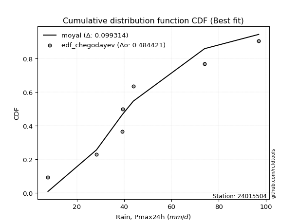</img>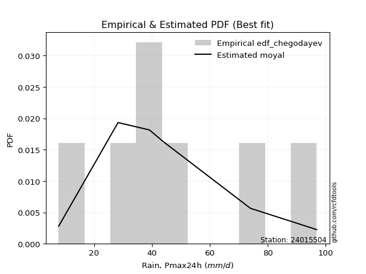</img>

</div>


### 6. EDF Blom (1958)

The Blom formula is a specific "plotting position" formula used in hydrology and statistical analysis to estimate the empirical cumulative probability (or non-exceedance probability) of a data series. It is particularly recommended for data that are approximately normally distributed. The constant _a_ is set to 0.375 (or 3/8).

<div align="center">


$P=(m-a)/(n+1-2a)$


</div>


**6.1. Empirical values**

<div align="center">

|                | 0                   | 1                   | 2                  | 3        | 4                  | 5                  | 6                  |
|:---------------|:--------------------|:--------------------|:-------------------|:---------|:-------------------|:-------------------|:-------------------|
| date           | 2015                | 2021                | 2017               | 2020     | 2016               | 2018               | 2019               |
| x              | 7.8                 | 28.3                | 39.1               | 39.4     | 43.9               | 74.0               | 96.9               |
| m              | 1                   | 2                   | 3                  | 4        | 5                  | 6                  | 7                  |
| empirical_dist | edf_blom            | edf_blom            | edf_blom           | edf_blom | edf_blom           | edf_blom           | edf_blom           |
| empirical      | 0.08620689655172414 | 0.22413793103448276 | 0.3620689655172414 | 0.5      | 0.6379310344827587 | 0.7758620689655172 | 0.9137931034482759 |
| empirical_tr   | 1.0943396226415094  | 1.288888888888889   | 1.5675675675675675 | 2.0      | 2.7619047619047623 | 4.461538461538462  | 11.600000000000007 |

</div>


**6.2. Kolmogorov-Smirnov fit test (sorted by Δ)**


<div align="center">

|                | 0                   | 1                   | 2                   | 3                   | 4                   | 5                   | 6                   | 7                   | 8                   | 9                   | 10                  | 11                  | 12                  | 13                  | 14                  | 15                  | 16                  | 17                  | 18                  | 19                  | 20                  | 21                  | 22                  | 23                  | 24                  | 25                  | 26                  | 27                  | 28                  | 29                  | 30                  | 31                  | 32                  | 33                  | 34                  | 35                  | 36                  | 37                  | 38                  | 39                  | 40                  | 41                  | 42                  | 43                  | 44                  | 45                  | 46                  | 47                  | 48                  | 49                  | 50                  | 51                  | 52                  | 53                  | 54                  | 55                  | 56                  | 57                  | 58                  | 59                  | 60                  | 61                  | 62                  | 63                  | 64                  | 65                  | 66                  | 67                  | 68                  | 69                  | 70                  | 71                  | 72                  | 73                  | 74                  | 75                  | 76                  | 77                  | 78                  | 79                  | 80                  | 81                  | 82                  | 83                  | 84                  | 85                  | 86                  | 87                  | 88                  | 89                  | 90                  | 91                  | 92                  | 93                  | 94                  | 95                  | 96                  | 97                  | 98                  | 99                  | 100                 | 101                 | 102                 | 103                 | 104                 | 105                 | 106                 | 107                 | 108                 | 109                 | 110                 | 111                 | 112                 | 113                 | 114                 | 115                 | 116                 | 117                 | 118                 | 119                 | 120                 | 121                 | 122                 | 123                 | 124                 | 125                 | 126                 | 127                 | 128                 | 129                 | 130                 | 131                 | 132                 | 133                 | 134                 | 135                 | 136                 | 137                 | 138                 | 139                 | 140                 | 141                 | 142                 | 143                 | 144                 | 145                 | 146                 | 147                 | 148                 | 149                 | 150                 | 151                 | 152                 | 153                 | 154                 | 155                 | 156                 | 157                 | 158                 | 159                 |
|:---------------|:--------------------|:--------------------|:--------------------|:--------------------|:--------------------|:--------------------|:--------------------|:--------------------|:--------------------|:--------------------|:--------------------|:--------------------|:--------------------|:--------------------|:--------------------|:--------------------|:--------------------|:--------------------|:--------------------|:--------------------|:--------------------|:--------------------|:--------------------|:--------------------|:--------------------|:--------------------|:--------------------|:--------------------|:--------------------|:--------------------|:--------------------|:--------------------|:--------------------|:--------------------|:--------------------|:--------------------|:--------------------|:--------------------|:--------------------|:--------------------|:--------------------|:--------------------|:--------------------|:--------------------|:--------------------|:--------------------|:--------------------|:--------------------|:--------------------|:--------------------|:--------------------|:--------------------|:--------------------|:--------------------|:--------------------|:--------------------|:--------------------|:--------------------|:--------------------|:--------------------|:--------------------|:--------------------|:--------------------|:--------------------|:--------------------|:--------------------|:--------------------|:--------------------|:--------------------|:--------------------|:--------------------|:--------------------|:--------------------|:--------------------|:--------------------|:--------------------|:--------------------|:--------------------|:--------------------|:--------------------|:--------------------|:--------------------|:--------------------|:--------------------|:--------------------|:--------------------|:--------------------|:--------------------|:--------------------|:--------------------|:--------------------|:--------------------|:--------------------|:--------------------|:--------------------|:--------------------|:--------------------|:--------------------|:--------------------|:--------------------|:--------------------|:--------------------|:--------------------|:--------------------|:--------------------|:--------------------|:--------------------|:--------------------|:--------------------|:--------------------|:--------------------|:--------------------|:--------------------|:--------------------|:--------------------|:--------------------|:--------------------|:--------------------|:--------------------|:--------------------|:--------------------|:--------------------|:--------------------|:--------------------|:--------------------|:--------------------|:--------------------|:--------------------|:--------------------|:--------------------|:--------------------|:--------------------|:--------------------|:--------------------|:--------------------|:--------------------|:--------------------|:--------------------|:--------------------|:--------------------|:--------------------|:--------------------|:--------------------|:--------------------|:--------------------|:--------------------|:--------------------|:--------------------|:--------------------|:--------------------|:--------------------|:--------------------|:--------------------|:--------------------|:--------------------|:--------------------|:--------------------|:--------------------|:--------------------|:--------------------|
| station        | 24015504            | 24015504            | 24015504            | 24015504            | 24015504            | 24015504            | 24015504            | 24015504            | 24015504            | 24015504            | 24015504            | 24015504            | 24015504            | 24015504            | 24015504            | 24015504            | 24015504            | 24015504            | 24015504            | 24015504            | 24015504            | 24015504            | 24015504            | 24015504            | 24015504            | 24015504            | 24015504            | 24015504            | 24015504            | 24015504            | 24015504            | 24015504            | 24015504            | 24015504            | 24015504            | 24015504            | 24015504            | 24015504            | 24015504            | 24015504            | 24015504            | 24015504            | 24015504            | 24015504            | 24015504            | 24015504            | 24015504            | 24015504            | 24015504            | 24015504            | 24015504            | 24015504            | 24015504            | 24015504            | 24015504            | 24015504            | 24015504            | 24015504            | 24015504            | 24015504            | 24015504            | 24015504            | 24015504            | 24015504            | 24015504            | 24015504            | 24015504            | 24015504            | 24015504            | 24015504            | 24015504            | 24015504            | 24015504            | 24015504            | 24015504            | 24015504            | 24015504            | 24015504            | 24015504            | 24015504            | 24015504            | 24015504            | 24015504            | 24015504            | 24015504            | 24015504            | 24015504            | 24015504            | 24015504            | 24015504            | 24015504            | 24015504            | 24015504            | 24015504            | 24015504            | 24015504            | 24015504            | 24015504            | 24015504            | 24015504            | 24015504            | 24015504            | 24015504            | 24015504            | 24015504            | 24015504            | 24015504            | 24015504            | 24015504            | 24015504            | 24015504            | 24015504            | 24015504            | 24015504            | 24015504            | 24015504            | 24015504            | 24015504            | 24015504            | 24015504            | 24015504            | 24015504            | 24015504            | 24015504            | 24015504            | 24015504            | 24015504            | 24015504            | 24015504            | 24015504            | 24015504            | 24015504            | 24015504            | 24015504            | 24015504            | 24015504            | 24015504            | 24015504            | 24015504            | 24015504            | 24015504            | 24015504            | 24015504            | 24015504            | 24015504            | 24015504            | 24015504            | 24015504            | 24015504            | 24015504            | 24015504            | 24015504            | 24015504            | 24015504            | 24015504            | 24015504            | 24015504            | 24015504            | 24015504            | 24015504            |
| empirical_dist | edf_blom            | edf_blom            | edf_blom            | edf_blom            | edf_blom            | edf_blom            | edf_blom            | edf_blom            | edf_blom            | edf_blom            | edf_blom            | edf_blom            | edf_blom            | edf_blom            | edf_blom            | edf_blom            | edf_blom            | edf_blom            | edf_blom            | edf_blom            | edf_blom            | edf_blom            | edf_blom            | edf_blom            | edf_blom            | edf_blom            | edf_blom            | edf_blom            | edf_blom            | edf_blom            | edf_blom            | edf_blom            | edf_blom            | edf_blom            | edf_blom            | edf_blom            | edf_blom            | edf_blom            | edf_blom            | edf_blom            | edf_blom            | edf_blom            | edf_blom            | edf_blom            | edf_blom            | edf_blom            | edf_blom            | edf_blom            | edf_blom            | edf_blom            | edf_blom            | edf_blom            | edf_blom            | edf_blom            | edf_blom            | edf_blom            | edf_blom            | edf_blom            | edf_blom            | edf_blom            | edf_blom            | edf_blom            | edf_blom            | edf_blom            | edf_blom            | edf_blom            | edf_blom            | edf_blom            | edf_blom            | edf_blom            | edf_blom            | edf_blom            | edf_blom            | edf_blom            | edf_blom            | edf_blom            | edf_blom            | edf_blom            | edf_blom            | edf_blom            | edf_blom            | edf_blom            | edf_blom            | edf_blom            | edf_blom            | edf_blom            | edf_blom            | edf_blom            | edf_blom            | edf_blom            | edf_blom            | edf_blom            | edf_blom            | edf_blom            | edf_blom            | edf_blom            | edf_blom            | edf_blom            | edf_blom            | edf_blom            | edf_blom            | edf_blom            | edf_blom            | edf_blom            | edf_blom            | edf_blom            | edf_blom            | edf_blom            | edf_blom            | edf_blom            | edf_blom            | edf_blom            | edf_blom            | edf_blom            | edf_blom            | edf_blom            | edf_blom            | edf_blom            | edf_blom            | edf_blom            | edf_blom            | edf_blom            | edf_blom            | edf_blom            | edf_blom            | edf_blom            | edf_blom            | edf_blom            | edf_blom            | edf_blom            | edf_blom            | edf_blom            | edf_blom            | edf_blom            | edf_blom            | edf_blom            | edf_blom            | edf_blom            | edf_blom            | edf_blom            | edf_blom            | edf_blom            | edf_blom            | edf_blom            | edf_blom            | edf_blom            | edf_blom            | edf_blom            | edf_blom            | edf_blom            | edf_blom            | edf_blom            | edf_blom            | edf_blom            | edf_blom            | edf_blom            | edf_blom            | edf_blom            | edf_blom            | edf_blom            |
| p_dist         | moyal               | exponnorm           | halfnorm            | genexpon            | loggengamma         | weibull_min         | logvonmises_line    | loggompertz         | truncexpon          | erlang              | gamma               | f                   | invweibull          | logt                | genlogistic         | logpearson3         | gumbel_r            | kstwobign           | betaprime           | halflogistic        | loggumbel_l         | invgauss            | exponweib           | logweibull_min      | gennorm             | johnsonsu           | loggenlogistic      | invgamma            | logmielke           | logdgamma           | logskewnorm         | nct                 | logdweibull         | logtrapezoid        | logtriang           | loggennorm          | genextreme          | logloglaplace       | skewnorm            | logburr12           | lomax               | rayleigh            | dweibull            | dgamma              | loggenhalflogistic  | bradford            | logloggamma         | logargus            | logjohnsonsu        | ncf                 | foldnorm            | rice                | pearson3            | maxwell             | loganglit           | logsemicircular     | gausshyper          | logexponnorm        | lognorm             | logcrystalball      | logrice             | logfatiguelife      | logf                | wald                | lognct              | vonmises_line       | loglogistic         | truncweibull_min    | loghypsecant        | logerlang           | logncf              | arcsine             | loggamma            | loggamma            | loginvgamma         | logbetaprime        | loglaplace          | loglaplace          | loginvgauss         | semicircular        | logalpha            | anglit              | t                   | crystalball         | norm                | truncnorm           | logarcsine          | logistic            | logmaxwell          | logburr             | hypsecant           | loginvweibull       | kappa4              | logbeta             | logfoldnorm         | lograyleigh         | loglevy_l           | logcosine           | cosine              | burr                | laplace             | ksone               | logweibull_max      | logtruncnorm        | nakagami            | lognakagami         | loggumbel_r         | loghalfnorm         | wrapcauchy          | uniform             | kappa3              | logkstwobign        | loggenexpon         | halfgennorm         | beta                | gumbel_l            | logmoyal            | loghalflogistic     | loggenextreme       | loggausshyper       | loggenpareto        | argus               | alpha               | logksone            | logwrapcauchy       | logkappa3           | loguniform          | logtukeylambda      | mielke              | levy_l              | gengamma            | logkappa4           | logwald             | burr12              | loglomax            | genpareto           | genhalflogistic     | logtruncexpon       | loghalfgennorm      | logbradford         | logrdist            | logtruncweibull_min | triang              | johnsonsb           | logjohnsonsb        | trapezoid           | rdist               | powerlaw            | fatiguelife         | tukeylambda         | logexponpow         | weibull_max         | logexponweib        | exponpow            | logpowerlaw         | truncpareto         | logtruncpareto      | gompertz            | logvonmises         | vonmises            |
| delta          | 0.10211011429504663 | 0.10350054779088746 | 0.10436562239536251 | 0.10591853673955837 | 0.10777135314877673 | 0.10975523301255796 | 0.11031194419507251 | 0.11051134549687563 | 0.11105208976128678 | 0.11330816374394215 | 0.11330836617310214 | 0.11343420863982578 | 0.11359891110742981 | 0.1149961362039108  | 0.11552502775579165 | 0.11637008636162283 | 0.11643960179364465 | 0.11668150218669582 | 0.11679202420979429 | 0.11793089655435546 | 0.11963410356997006 | 0.12122797823954023 | 0.12159251423888617 | 0.12284969762032139 | 0.12339463403195805 | 0.12360257077446357 | 0.12404975407431507 | 0.12498242810083626 | 0.1249847504884003  | 0.12578814988285242 | 0.12611010545033574 | 0.12631810326671722 | 0.12643015834582827 | 0.12668256296840763 | 0.12805558639420167 | 0.12957798585683666 | 0.12993110034581268 | 0.13123250915322798 | 0.1313908224459447  | 0.1325491158239248  | 0.1333790210788821  | 0.13777156504946675 | 0.13793103448296712 | 0.13875473080573852 | 0.13948263298457964 | 0.14045286634941045 | 0.14214567811536177 | 0.14375529915989316 | 0.14504800492009184 | 0.14531172851070767 | 0.14545470350718687 | 0.14631055655269642 | 0.14934416222567154 | 0.14961080700658985 | 0.15526935911934553 | 0.1555330466344247  | 0.15611084346484955 | 0.158160689110398   | 0.15816137270703884 | 0.15816139215650887 | 0.15816668186870514 | 0.15881818254843377 | 0.15882161125388233 | 0.1593974793511716  | 0.15990460033277792 | 0.16019696578770504 | 0.16091909362404294 | 0.1612267472754289  | 0.16327007537778898 | 0.16339983164008448 | 0.16385436395161873 | 0.16394448937146944 | 0.1651516346615734  | 0.1651516346615734  | 0.17107306765563163 | 0.17144649233634363 | 0.17254713593289023 | 0.17254713593289023 | 0.17442156728380948 | 0.17465838876989603 | 0.17695499230684414 | 0.17735358810920365 | 0.1838845527245836  | 0.18388542217414167 | 0.18388543427741222 | 0.18388543913745925 | 0.189195416552627   | 0.1900898000418721  | 0.1902924438905011  | 0.19258357923361735 | 0.1953405013014351  | 0.19641877323636964 | 0.19667341186963122 | 0.1979332615582597  | 0.19813885082764077 | 0.20083612448259297 | 0.204829354795185   | 0.20844980210894287 | 0.2096724642319056  | 0.21069623788430852 | 0.21324844104910556 | 0.2169620857360322  | 0.21836502262246027 | 0.22413024180637137 | 0.22413748958033106 | 0.22413793068145382 | 0.22884152208390268 | 0.23052489602145937 | 0.23171189252055407 | 0.23276829598668686 | 0.23284746779411558 | 0.23467710330189134 | 0.23877740260613478 | 0.2397530610566615  | 0.23984331259258862 | 0.25412825316951304 | 0.25443647110347206 | 0.25657991931294405 | 0.257545507792434   | 0.2581978124480976  | 0.275080465555193   | 0.27890193972758703 | 0.28013764760831916 | 0.2854405359725317  | 0.2861231078195524  | 0.2872196997880766  | 0.2873562293739347  | 0.28927326643763374 | 0.296322822091189   | 0.2969056979396561  | 0.301567706042783   | 0.30898540385470064 | 0.32552428307355247 | 0.32700051319268286 | 0.33551246521488987 | 0.3413067714342352  | 0.35019456091205925 | 0.3679289490092593  | 0.37704030912084785 | 0.37852968738297144 | 0.39568404218149134 | 0.4131021759155312  | 0.4264490781343242  | 0.42669064136791807 | 0.4376396523246645  | 0.4602788763708657  | 0.5173302525963106  | 0.5669931494906296  | 0.5847694212005842  | 0.5949008677331035  | 0.6028018663796418  | 0.6245220849380289  | 0.6259883767952857  | 0.6304633539427805  | 0.660608264737964   | 0.6710813913032768  | 0.726308667198932   | 0.7752555893561169  | 1.1171163791290986  | 14.808937022968133  |
| deltao         | 0.48442053926100004 | 0.48442053926100004 | 0.48442053926100004 | 0.48442053926100004 | 0.48442053926100004 | 0.48442053926100004 | 0.48442053926100004 | 0.48442053926100004 | 0.48442053926100004 | 0.48442053926100004 | 0.48442053926100004 | 0.48442053926100004 | 0.48442053926100004 | 0.48442053926100004 | 0.48442053926100004 | 0.48442053926100004 | 0.48442053926100004 | 0.48442053926100004 | 0.48442053926100004 | 0.48442053926100004 | 0.48442053926100004 | 0.48442053926100004 | 0.48442053926100004 | 0.48442053926100004 | 0.48442053926100004 | 0.48442053926100004 | 0.48442053926100004 | 0.48442053926100004 | 0.48442053926100004 | 0.48442053926100004 | 0.48442053926100004 | 0.48442053926100004 | 0.48442053926100004 | 0.48442053926100004 | 0.48442053926100004 | 0.48442053926100004 | 0.48442053926100004 | 0.48442053926100004 | 0.48442053926100004 | 0.48442053926100004 | 0.48442053926100004 | 0.48442053926100004 | 0.48442053926100004 | 0.48442053926100004 | 0.48442053926100004 | 0.48442053926100004 | 0.48442053926100004 | 0.48442053926100004 | 0.48442053926100004 | 0.48442053926100004 | 0.48442053926100004 | 0.48442053926100004 | 0.48442053926100004 | 0.48442053926100004 | 0.48442053926100004 | 0.48442053926100004 | 0.48442053926100004 | 0.48442053926100004 | 0.48442053926100004 | 0.48442053926100004 | 0.48442053926100004 | 0.48442053926100004 | 0.48442053926100004 | 0.48442053926100004 | 0.48442053926100004 | 0.48442053926100004 | 0.48442053926100004 | 0.48442053926100004 | 0.48442053926100004 | 0.48442053926100004 | 0.48442053926100004 | 0.48442053926100004 | 0.48442053926100004 | 0.48442053926100004 | 0.48442053926100004 | 0.48442053926100004 | 0.48442053926100004 | 0.48442053926100004 | 0.48442053926100004 | 0.48442053926100004 | 0.48442053926100004 | 0.48442053926100004 | 0.48442053926100004 | 0.48442053926100004 | 0.48442053926100004 | 0.48442053926100004 | 0.48442053926100004 | 0.48442053926100004 | 0.48442053926100004 | 0.48442053926100004 | 0.48442053926100004 | 0.48442053926100004 | 0.48442053926100004 | 0.48442053926100004 | 0.48442053926100004 | 0.48442053926100004 | 0.48442053926100004 | 0.48442053926100004 | 0.48442053926100004 | 0.48442053926100004 | 0.48442053926100004 | 0.48442053926100004 | 0.48442053926100004 | 0.48442053926100004 | 0.48442053926100004 | 0.48442053926100004 | 0.48442053926100004 | 0.48442053926100004 | 0.48442053926100004 | 0.48442053926100004 | 0.48442053926100004 | 0.48442053926100004 | 0.48442053926100004 | 0.48442053926100004 | 0.48442053926100004 | 0.48442053926100004 | 0.48442053926100004 | 0.48442053926100004 | 0.48442053926100004 | 0.48442053926100004 | 0.48442053926100004 | 0.48442053926100004 | 0.48442053926100004 | 0.48442053926100004 | 0.48442053926100004 | 0.48442053926100004 | 0.48442053926100004 | 0.48442053926100004 | 0.48442053926100004 | 0.48442053926100004 | 0.48442053926100004 | 0.48442053926100004 | 0.48442053926100004 | 0.48442053926100004 | 0.48442053926100004 | 0.48442053926100004 | 0.48442053926100004 | 0.48442053926100004 | 0.48442053926100004 | 0.48442053926100004 | 0.48442053926100004 | 0.48442053926100004 | 0.48442053926100004 | 0.48442053926100004 | 0.48442053926100004 | 0.48442053926100004 | 0.48442053926100004 | 0.48442053926100004 | 0.48442053926100004 | 0.48442053926100004 | 0.48442053926100004 | 0.48442053926100004 | 0.48442053926100004 | 0.48442053926100004 | 0.48442053926100004 | 0.48442053926100004 | 0.48442053926100004 | 0.48442053926100004 | 0.48442053926100004 | 0.48442053926100004 |
| eval           | Δo > Δ              | Δo > Δ              | Δo > Δ              | Δo > Δ              | Δo > Δ              | Δo > Δ              | Δo > Δ              | Δo > Δ              | Δo > Δ              | Δo > Δ              | Δo > Δ              | Δo > Δ              | Δo > Δ              | Δo > Δ              | Δo > Δ              | Δo > Δ              | Δo > Δ              | Δo > Δ              | Δo > Δ              | Δo > Δ              | Δo > Δ              | Δo > Δ              | Δo > Δ              | Δo > Δ              | Δo > Δ              | Δo > Δ              | Δo > Δ              | Δo > Δ              | Δo > Δ              | Δo > Δ              | Δo > Δ              | Δo > Δ              | Δo > Δ              | Δo > Δ              | Δo > Δ              | Δo > Δ              | Δo > Δ              | Δo > Δ              | Δo > Δ              | Δo > Δ              | Δo > Δ              | Δo > Δ              | Δo > Δ              | Δo > Δ              | Δo > Δ              | Δo > Δ              | Δo > Δ              | Δo > Δ              | Δo > Δ              | Δo > Δ              | Δo > Δ              | Δo > Δ              | Δo > Δ              | Δo > Δ              | Δo > Δ              | Δo > Δ              | Δo > Δ              | Δo > Δ              | Δo > Δ              | Δo > Δ              | Δo > Δ              | Δo > Δ              | Δo > Δ              | Δo > Δ              | Δo > Δ              | Δo > Δ              | Δo > Δ              | Δo > Δ              | Δo > Δ              | Δo > Δ              | Δo > Δ              | Δo > Δ              | Δo > Δ              | Δo > Δ              | Δo > Δ              | Δo > Δ              | Δo > Δ              | Δo > Δ              | Δo > Δ              | Δo > Δ              | Δo > Δ              | Δo > Δ              | Δo > Δ              | Δo > Δ              | Δo > Δ              | Δo > Δ              | Δo > Δ              | Δo > Δ              | Δo > Δ              | Δo > Δ              | Δo > Δ              | Δo > Δ              | Δo > Δ              | Δo > Δ              | Δo > Δ              | Δo > Δ              | Δo > Δ              | Δo > Δ              | Δo > Δ              | Δo > Δ              | Δo > Δ              | Δo > Δ              | Δo > Δ              | Δo > Δ              | Δo > Δ              | Δo > Δ              | Δo > Δ              | Δo > Δ              | Δo > Δ              | Δo > Δ              | Δo > Δ              | Δo > Δ              | Δo > Δ              | Δo > Δ              | Δo > Δ              | Δo > Δ              | Δo > Δ              | Δo > Δ              | Δo > Δ              | Δo > Δ              | Δo > Δ              | Δo > Δ              | Δo > Δ              | Δo > Δ              | Δo > Δ              | Δo > Δ              | Δo > Δ              | Δo > Δ              | Δo > Δ              | Δo > Δ              | Δo > Δ              | Δo > Δ              | Δo > Δ              | Δo > Δ              | Δo > Δ              | Δo > Δ              | Δo > Δ              | Δo > Δ              | Δo > Δ              | Δo > Δ              | Δo > Δ              | Δo > Δ              | Δo > Δ              | Δo > Δ              | Δo > Δ              | Δo > Δ              | Δo <= Δ             | Δo <= Δ             | Δo <= Δ             | Δo <= Δ             | Δo <= Δ             | Δo <= Δ             | Δo <= Δ             | Δo <= Δ             | Δo <= Δ             | Δo <= Δ             | Δo <= Δ             | Δo <= Δ             | Δo <= Δ             | Δo <= Δ             |
| fit            | 1                   | 1                   | 1                   | 1                   | 1                   | 1                   | 1                   | 1                   | 1                   | 1                   | 1                   | 1                   | 1                   | 1                   | 1                   | 1                   | 1                   | 1                   | 1                   | 1                   | 1                   | 1                   | 1                   | 1                   | 1                   | 1                   | 1                   | 1                   | 1                   | 1                   | 1                   | 1                   | 1                   | 1                   | 1                   | 1                   | 1                   | 1                   | 1                   | 1                   | 1                   | 1                   | 1                   | 1                   | 1                   | 1                   | 1                   | 1                   | 1                   | 1                   | 1                   | 1                   | 1                   | 1                   | 1                   | 1                   | 1                   | 1                   | 1                   | 1                   | 1                   | 1                   | 1                   | 1                   | 1                   | 1                   | 1                   | 1                   | 1                   | 1                   | 1                   | 1                   | 1                   | 1                   | 1                   | 1                   | 1                   | 1                   | 1                   | 1                   | 1                   | 1                   | 1                   | 1                   | 1                   | 1                   | 1                   | 1                   | 1                   | 1                   | 1                   | 1                   | 1                   | 1                   | 1                   | 1                   | 1                   | 1                   | 1                   | 1                   | 1                   | 1                   | 1                   | 1                   | 1                   | 1                   | 1                   | 1                   | 1                   | 1                   | 1                   | 1                   | 1                   | 1                   | 1                   | 1                   | 1                   | 1                   | 1                   | 1                   | 1                   | 1                   | 1                   | 1                   | 1                   | 1                   | 1                   | 1                   | 1                   | 1                   | 1                   | 1                   | 1                   | 1                   | 1                   | 1                   | 1                   | 1                   | 1                   | 1                   | 1                   | 1                   | 1                   | 1                   | 1                   | 1                   | 0                   | 0                   | 0                   | 0                   | 0                   | 0                   | 0                   | 0                   | 0                   | 0                   | 0                   | 0                   | 0                   | 0                   |
| n              | 7                   | 7                   | 7                   | 7                   | 7                   | 7                   | 7                   | 7                   | 7                   | 7                   | 7                   | 7                   | 7                   | 7                   | 7                   | 7                   | 7                   | 7                   | 7                   | 7                   | 7                   | 7                   | 7                   | 7                   | 7                   | 7                   | 7                   | 7                   | 7                   | 7                   | 7                   | 7                   | 7                   | 7                   | 7                   | 7                   | 7                   | 7                   | 7                   | 7                   | 7                   | 7                   | 7                   | 7                   | 7                   | 7                   | 7                   | 7                   | 7                   | 7                   | 7                   | 7                   | 7                   | 7                   | 7                   | 7                   | 7                   | 7                   | 7                   | 7                   | 7                   | 7                   | 7                   | 7                   | 7                   | 7                   | 7                   | 7                   | 7                   | 7                   | 7                   | 7                   | 7                   | 7                   | 7                   | 7                   | 7                   | 7                   | 7                   | 7                   | 7                   | 7                   | 7                   | 7                   | 7                   | 7                   | 7                   | 7                   | 7                   | 7                   | 7                   | 7                   | 7                   | 7                   | 7                   | 7                   | 7                   | 7                   | 7                   | 7                   | 7                   | 7                   | 7                   | 7                   | 7                   | 7                   | 7                   | 7                   | 7                   | 7                   | 7                   | 7                   | 7                   | 7                   | 7                   | 7                   | 7                   | 7                   | 7                   | 7                   | 7                   | 7                   | 7                   | 7                   | 7                   | 7                   | 7                   | 7                   | 7                   | 7                   | 7                   | 7                   | 7                   | 7                   | 7                   | 7                   | 7                   | 7                   | 7                   | 7                   | 7                   | 7                   | 7                   | 7                   | 7                   | 7                   | 7                   | 7                   | 7                   | 7                   | 7                   | 7                   | 7                   | 7                   | 7                   | 7                   | 7                   | 7                   | 7                   | 7                   |
| best_fit       | 1                   | 0                   | 0                   | 0                   | 0                   | 0                   | 0                   | 0                   | 0                   | 0                   | 0                   | 0                   | 0                   | 0                   | 0                   | 0                   | 0                   | 0                   | 0                   | 0                   | 0                   | 0                   | 0                   | 0                   | 0                   | 0                   | 0                   | 0                   | 0                   | 0                   | 0                   | 0                   | 0                   | 0                   | 0                   | 0                   | 0                   | 0                   | 0                   | 0                   | 0                   | 0                   | 0                   | 0                   | 0                   | 0                   | 0                   | 0                   | 0                   | 0                   | 0                   | 0                   | 0                   | 0                   | 0                   | 0                   | 0                   | 0                   | 0                   | 0                   | 0                   | 0                   | 0                   | 0                   | 0                   | 0                   | 0                   | 0                   | 0                   | 0                   | 0                   | 0                   | 0                   | 0                   | 0                   | 0                   | 0                   | 0                   | 0                   | 0                   | 0                   | 0                   | 0                   | 0                   | 0                   | 0                   | 0                   | 0                   | 0                   | 0                   | 0                   | 0                   | 0                   | 0                   | 0                   | 0                   | 0                   | 0                   | 0                   | 0                   | 0                   | 0                   | 0                   | 0                   | 0                   | 0                   | 0                   | 0                   | 0                   | 0                   | 0                   | 0                   | 0                   | 0                   | 0                   | 0                   | 0                   | 0                   | 0                   | 0                   | 0                   | 0                   | 0                   | 0                   | 0                   | 0                   | 0                   | 0                   | 0                   | 0                   | 0                   | 0                   | 0                   | 0                   | 0                   | 0                   | 0                   | 0                   | 0                   | 0                   | 0                   | 0                   | 0                   | 0                   | 0                   | 0                   | 0                   | 0                   | 0                   | 0                   | 0                   | 0                   | 0                   | 0                   | 0                   | 0                   | 0                   | 0                   | 0                   | 0                   |
| best_fit_sort  | 1                   | 2                   | 3                   | 4                   | 5                   | 6                   | 7                   | 8                   | 9                   | 10                  | 11                  | 12                  | 13                  | 14                  | 15                  | 16                  | 17                  | 18                  | 19                  | 20                  | 21                  | 22                  | 23                  | 24                  | 25                  | 26                  | 27                  | 28                  | 29                  | 30                  | 31                  | 32                  | 33                  | 34                  | 35                  | 36                  | 37                  | 38                  | 39                  | 40                  | 41                  | 42                  | 43                  | 44                  | 45                  | 46                  | 47                  | 48                  | 49                  | 50                  | 51                  | 52                  | 53                  | 54                  | 55                  | 56                  | 57                  | 58                  | 59                  | 60                  | 61                  | 62                  | 63                  | 64                  | 65                  | 66                  | 67                  | 68                  | 69                  | 70                  | 71                  | 72                  | 73                  | 74                  | 75                  | 76                  | 77                  | 78                  | 79                  | 80                  | 81                  | 82                  | 83                  | 84                  | 85                  | 86                  | 87                  | 88                  | 89                  | 90                  | 91                  | 92                  | 93                  | 94                  | 95                  | 96                  | 97                  | 98                  | 99                  | 100                 | 101                 | 102                 | 103                 | 104                 | 105                 | 106                 | 107                 | 108                 | 109                 | 110                 | 111                 | 112                 | 113                 | 114                 | 115                 | 116                 | 117                 | 118                 | 119                 | 120                 | 121                 | 122                 | 123                 | 124                 | 125                 | 126                 | 127                 | 128                 | 129                 | 130                 | 131                 | 132                 | 133                 | 134                 | 135                 | 136                 | 137                 | 138                 | 139                 | 140                 | 141                 | 142                 | 143                 | 144                 | 145                 | 146                 | 147                 | 148                 | 149                 | 150                 | 151                 | 152                 | 153                 | 154                 | 155                 | 156                 | 157                 | 158                 | 159                 | 160                 |

</div>


**6.3. Best fit**

<div align="center">

|   id |   station | empirical_dist   | p_dist   |   delta |   deltao | eval   |   fit |   n |   best_fit |   best_fit_sort |
|-----:|----------:|:-----------------|:---------|--------:|---------:|:-------|------:|----:|-----------:|----------------:|
|    0 |  24015504 | edf_blom         | moyal    | 0.10211 | 0.484421 | Δo > Δ |     1 |   7 |          1 |               1 |

</div>


<div align="center">

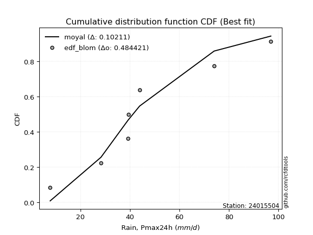</img>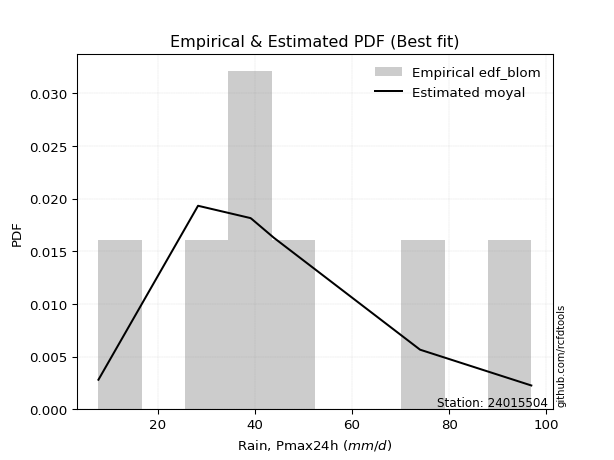</img>

</div>


### 7. EDF Tukey (1962)

In hydrology, the Tukey formula is used as a plotting position formula to estimate the empirical probability or frequency of a flood event (or other hydrological data). The formula parameter is given as _c=0.333_ (or 1/3).

<div align="center">


$P=(m-c)/(n+1-2c)$


</div>


**7.1. Empirical values**

<div align="center">

|                | 0                   | 1                   | 2                   | 3         | 4                  | 5                  | 6                  |
|:---------------|:--------------------|:--------------------|:--------------------|:----------|:-------------------|:-------------------|:-------------------|
| date           | 2015                | 2021                | 2017                | 2020      | 2016               | 2018               | 2019               |
| x              | 7.8                 | 28.3                | 39.1                | 39.4      | 43.9               | 74.0               | 96.9               |
| m              | 1                   | 2                   | 3                   | 4         | 5                  | 6                  | 7                  |
| empirical_dist | edf_tukey           | edf_tukey           | edf_tukey           | edf_tukey | edf_tukey          | edf_tukey          | edf_tukey          |
| empirical      | 0.09090909090909091 | 0.22727272727272727 | 0.36363636363636365 | 0.5       | 0.6363636363636364 | 0.7727272727272727 | 0.9090909090909091 |
| empirical_tr   | 1.1                 | 1.2941176470588236  | 1.5714285714285714  | 2.0       | 2.75               | 4.3999999999999995 | 10.999999999999996 |

</div>


**7.2. Kolmogorov-Smirnov fit test (sorted by Δ)**


<div align="center">

|                | 0                   | 1                   | 2                   | 3                   | 4                   | 5                   | 6                   | 7                   | 8                   | 9                   | 10                  | 11                  | 12                  | 13                  | 14                  | 15                  | 16                  | 17                  | 18                  | 19                  | 20                  | 21                  | 22                  | 23                  | 24                  | 25                  | 26                  | 27                  | 28                  | 29                  | 30                  | 31                  | 32                  | 33                  | 34                  | 35                  | 36                  | 37                  | 38                  | 39                  | 40                  | 41                  | 42                  | 43                  | 44                  | 45                  | 46                  | 47                  | 48                  | 49                  | 50                  | 51                  | 52                  | 53                  | 54                  | 55                  | 56                  | 57                  | 58                  | 59                  | 60                  | 61                  | 62                  | 63                  | 64                  | 65                  | 66                  | 67                  | 68                  | 69                  | 70                  | 71                  | 72                  | 73                  | 74                  | 75                  | 76                  | 77                  | 78                  | 79                  | 80                  | 81                  | 82                  | 83                  | 84                  | 85                  | 86                  | 87                  | 88                  | 89                  | 90                  | 91                  | 92                  | 93                  | 94                  | 95                  | 96                  | 97                  | 98                  | 99                  | 100                 | 101                 | 102                 | 103                 | 104                 | 105                 | 106                 | 107                 | 108                 | 109                 | 110                 | 111                 | 112                 | 113                 | 114                 | 115                 | 116                 | 117                 | 118                 | 119                 | 120                 | 121                 | 122                 | 123                 | 124                 | 125                 | 126                 | 127                 | 128                 | 129                 | 130                 | 131                 | 132                 | 133                 | 134                 | 135                 | 136                 | 137                 | 138                 | 139                 | 140                 | 141                 | 142                 | 143                 | 144                 | 145                 | 146                 | 147                 | 148                 | 149                 | 150                 | 151                 | 152                 | 153                 | 154                 | 155                 | 156                 | 157                 | 158                 | 159                 |
|:---------------|:--------------------|:--------------------|:--------------------|:--------------------|:--------------------|:--------------------|:--------------------|:--------------------|:--------------------|:--------------------|:--------------------|:--------------------|:--------------------|:--------------------|:--------------------|:--------------------|:--------------------|:--------------------|:--------------------|:--------------------|:--------------------|:--------------------|:--------------------|:--------------------|:--------------------|:--------------------|:--------------------|:--------------------|:--------------------|:--------------------|:--------------------|:--------------------|:--------------------|:--------------------|:--------------------|:--------------------|:--------------------|:--------------------|:--------------------|:--------------------|:--------------------|:--------------------|:--------------------|:--------------------|:--------------------|:--------------------|:--------------------|:--------------------|:--------------------|:--------------------|:--------------------|:--------------------|:--------------------|:--------------------|:--------------------|:--------------------|:--------------------|:--------------------|:--------------------|:--------------------|:--------------------|:--------------------|:--------------------|:--------------------|:--------------------|:--------------------|:--------------------|:--------------------|:--------------------|:--------------------|:--------------------|:--------------------|:--------------------|:--------------------|:--------------------|:--------------------|:--------------------|:--------------------|:--------------------|:--------------------|:--------------------|:--------------------|:--------------------|:--------------------|:--------------------|:--------------------|:--------------------|:--------------------|:--------------------|:--------------------|:--------------------|:--------------------|:--------------------|:--------------------|:--------------------|:--------------------|:--------------------|:--------------------|:--------------------|:--------------------|:--------------------|:--------------------|:--------------------|:--------------------|:--------------------|:--------------------|:--------------------|:--------------------|:--------------------|:--------------------|:--------------------|:--------------------|:--------------------|:--------------------|:--------------------|:--------------------|:--------------------|:--------------------|:--------------------|:--------------------|:--------------------|:--------------------|:--------------------|:--------------------|:--------------------|:--------------------|:--------------------|:--------------------|:--------------------|:--------------------|:--------------------|:--------------------|:--------------------|:--------------------|:--------------------|:--------------------|:--------------------|:--------------------|:--------------------|:--------------------|:--------------------|:--------------------|:--------------------|:--------------------|:--------------------|:--------------------|:--------------------|:--------------------|:--------------------|:--------------------|:--------------------|:--------------------|:--------------------|:--------------------|:--------------------|:--------------------|:--------------------|:--------------------|:--------------------|:--------------------|
| station        | 24015504            | 24015504            | 24015504            | 24015504            | 24015504            | 24015504            | 24015504            | 24015504            | 24015504            | 24015504            | 24015504            | 24015504            | 24015504            | 24015504            | 24015504            | 24015504            | 24015504            | 24015504            | 24015504            | 24015504            | 24015504            | 24015504            | 24015504            | 24015504            | 24015504            | 24015504            | 24015504            | 24015504            | 24015504            | 24015504            | 24015504            | 24015504            | 24015504            | 24015504            | 24015504            | 24015504            | 24015504            | 24015504            | 24015504            | 24015504            | 24015504            | 24015504            | 24015504            | 24015504            | 24015504            | 24015504            | 24015504            | 24015504            | 24015504            | 24015504            | 24015504            | 24015504            | 24015504            | 24015504            | 24015504            | 24015504            | 24015504            | 24015504            | 24015504            | 24015504            | 24015504            | 24015504            | 24015504            | 24015504            | 24015504            | 24015504            | 24015504            | 24015504            | 24015504            | 24015504            | 24015504            | 24015504            | 24015504            | 24015504            | 24015504            | 24015504            | 24015504            | 24015504            | 24015504            | 24015504            | 24015504            | 24015504            | 24015504            | 24015504            | 24015504            | 24015504            | 24015504            | 24015504            | 24015504            | 24015504            | 24015504            | 24015504            | 24015504            | 24015504            | 24015504            | 24015504            | 24015504            | 24015504            | 24015504            | 24015504            | 24015504            | 24015504            | 24015504            | 24015504            | 24015504            | 24015504            | 24015504            | 24015504            | 24015504            | 24015504            | 24015504            | 24015504            | 24015504            | 24015504            | 24015504            | 24015504            | 24015504            | 24015504            | 24015504            | 24015504            | 24015504            | 24015504            | 24015504            | 24015504            | 24015504            | 24015504            | 24015504            | 24015504            | 24015504            | 24015504            | 24015504            | 24015504            | 24015504            | 24015504            | 24015504            | 24015504            | 24015504            | 24015504            | 24015504            | 24015504            | 24015504            | 24015504            | 24015504            | 24015504            | 24015504            | 24015504            | 24015504            | 24015504            | 24015504            | 24015504            | 24015504            | 24015504            | 24015504            | 24015504            | 24015504            | 24015504            | 24015504            | 24015504            | 24015504            | 24015504            |
| empirical_dist | edf_tukey           | edf_tukey           | edf_tukey           | edf_tukey           | edf_tukey           | edf_tukey           | edf_tukey           | edf_tukey           | edf_tukey           | edf_tukey           | edf_tukey           | edf_tukey           | edf_tukey           | edf_tukey           | edf_tukey           | edf_tukey           | edf_tukey           | edf_tukey           | edf_tukey           | edf_tukey           | edf_tukey           | edf_tukey           | edf_tukey           | edf_tukey           | edf_tukey           | edf_tukey           | edf_tukey           | edf_tukey           | edf_tukey           | edf_tukey           | edf_tukey           | edf_tukey           | edf_tukey           | edf_tukey           | edf_tukey           | edf_tukey           | edf_tukey           | edf_tukey           | edf_tukey           | edf_tukey           | edf_tukey           | edf_tukey           | edf_tukey           | edf_tukey           | edf_tukey           | edf_tukey           | edf_tukey           | edf_tukey           | edf_tukey           | edf_tukey           | edf_tukey           | edf_tukey           | edf_tukey           | edf_tukey           | edf_tukey           | edf_tukey           | edf_tukey           | edf_tukey           | edf_tukey           | edf_tukey           | edf_tukey           | edf_tukey           | edf_tukey           | edf_tukey           | edf_tukey           | edf_tukey           | edf_tukey           | edf_tukey           | edf_tukey           | edf_tukey           | edf_tukey           | edf_tukey           | edf_tukey           | edf_tukey           | edf_tukey           | edf_tukey           | edf_tukey           | edf_tukey           | edf_tukey           | edf_tukey           | edf_tukey           | edf_tukey           | edf_tukey           | edf_tukey           | edf_tukey           | edf_tukey           | edf_tukey           | edf_tukey           | edf_tukey           | edf_tukey           | edf_tukey           | edf_tukey           | edf_tukey           | edf_tukey           | edf_tukey           | edf_tukey           | edf_tukey           | edf_tukey           | edf_tukey           | edf_tukey           | edf_tukey           | edf_tukey           | edf_tukey           | edf_tukey           | edf_tukey           | edf_tukey           | edf_tukey           | edf_tukey           | edf_tukey           | edf_tukey           | edf_tukey           | edf_tukey           | edf_tukey           | edf_tukey           | edf_tukey           | edf_tukey           | edf_tukey           | edf_tukey           | edf_tukey           | edf_tukey           | edf_tukey           | edf_tukey           | edf_tukey           | edf_tukey           | edf_tukey           | edf_tukey           | edf_tukey           | edf_tukey           | edf_tukey           | edf_tukey           | edf_tukey           | edf_tukey           | edf_tukey           | edf_tukey           | edf_tukey           | edf_tukey           | edf_tukey           | edf_tukey           | edf_tukey           | edf_tukey           | edf_tukey           | edf_tukey           | edf_tukey           | edf_tukey           | edf_tukey           | edf_tukey           | edf_tukey           | edf_tukey           | edf_tukey           | edf_tukey           | edf_tukey           | edf_tukey           | edf_tukey           | edf_tukey           | edf_tukey           | edf_tukey           | edf_tukey           | edf_tukey           | edf_tukey           | edf_tukey           |
| p_dist         | moyal               | exponnorm           | halfnorm            | genexpon            | loggengamma         | weibull_min         | logvonmises_line    | loggompertz         | truncexpon          | erlang              | gamma               | f                   | invweibull          | logt                | genlogistic         | logpearson3         | gumbel_r            | kstwobign           | betaprime           | halflogistic        | loggumbel_l         | invgauss            | exponweib           | logweibull_min      | johnsonsu           | loggenlogistic      | invgamma            | logmielke           | logdgamma           | logskewnorm         | nct                 | logdweibull         | logtrapezoid        | logtriang           | gennorm             | genextreme          | logloglaplace       | skewnorm            | logburr12           | loggennorm          | lomax               | rayleigh            | loggenhalflogistic  | dweibull            | bradford            | logloggamma         | dgamma              | logargus            | ncf                 | logjohnsonsu        | foldnorm            | rice                | pearson3            | maxwell             | logsemicircular     | loganglit           | gausshyper          | logexponnorm        | lognorm             | logcrystalball      | logrice             | logfatiguelife      | logf                | wald                | lognct              | loglogistic         | truncweibull_min    | loghypsecant        | logerlang           | logncf              | arcsine             | vonmises_line       | loggamma            | loggamma            | loginvgamma         | logbetaprime        | loglaplace          | loglaplace          | loginvgauss         | semicircular        | logalpha            | anglit              | t                   | crystalball         | norm                | truncnorm           | logarcsine          | logistic            | logmaxwell          | logburr             | loginvweibull       | hypsecant           | kappa4              | logbeta             | logfoldnorm         | lograyleigh         | loglevy_l           | logcosine           | cosine              | burr                | laplace             | ksone               | logweibull_max      | logtruncnorm        | nakagami            | lognakagami         | loggumbel_r         | loghalfnorm         | wrapcauchy          | uniform             | kappa3              | logkstwobign        | loggenexpon         | beta                | halfgennorm         | gumbel_l            | logmoyal            | loghalflogistic     | loggausshyper       | loggenextreme       | loggenpareto        | alpha               | argus               | logksone            | logwrapcauchy       | logkappa3           | loguniform          | logtukeylambda      | levy_l              | mielke              | gengamma            | logkappa4           | burr12              | logwald             | loglomax            | genpareto           | genhalflogistic     | logtruncexpon       | loghalfgennorm      | logbradford         | logrdist            | logtruncweibull_min | johnsonsb           | triang              | logjohnsonsb        | trapezoid           | rdist               | powerlaw            | fatiguelife         | tukeylambda         | logexponpow         | weibull_max         | logexponweib        | exponpow            | logpowerlaw         | truncpareto         | logtruncpareto      | gompertz            | logvonmises         | vonmises            |
| delta          | 0.10054271617592436 | 0.10193314967176514 | 0.10279822427624019 | 0.1043511386204361  | 0.1062039550296544  | 0.10818783489343564 | 0.10874454607595019 | 0.10894394737775337 | 0.10948469164216446 | 0.11174076562481983 | 0.11174096805397982 | 0.11186681052070346 | 0.11203151298830749 | 0.11342873808478848 | 0.11395762963666933 | 0.1148026882425005  | 0.11487220367452233 | 0.1151141040675735  | 0.11522462609067197 | 0.11636349843523319 | 0.11806670545084774 | 0.11966058012041791 | 0.12002511611976385 | 0.12128229950119906 | 0.12203517265534125 | 0.12248235595519275 | 0.12341502998171394 | 0.12341735236927798 | 0.12422075176373015 | 0.12454270733121342 | 0.1247507051475949  | 0.124862760226706   | 0.1251151648492853  | 0.1264881882750794  | 0.12652943027020258 | 0.12836370222669036 | 0.12966511103410572 | 0.12982342432682237 | 0.1309817177048025  | 0.13114538397595898 | 0.1318116229597598  | 0.13620416693034443 | 0.13634783674633513 | 0.13636363636384485 | 0.13888546823028813 | 0.14057827999623945 | 0.14188952704398305 | 0.14218790104077084 | 0.14243768172287752 | 0.14348060680096952 | 0.14388730538806455 | 0.1447431584335741  | 0.14777676410654922 | 0.14804340888746753 | 0.15250888931322715 | 0.15370196100022326 | 0.15454344534572723 | 0.15659329099127572 | 0.15659397458791657 | 0.1565939940373866  | 0.15659928374958287 | 0.1572507844293115  | 0.15725421313476007 | 0.15783008123204934 | 0.15833720221365566 | 0.15935169550492068 | 0.15965934915630664 | 0.16170267725866672 | 0.16183243352096222 | 0.16228696583249647 | 0.16237709125234712 | 0.16333176202594957 | 0.16358423654245113 | 0.16358423654245113 | 0.16950566953650936 | 0.16987909421722136 | 0.17097973781376796 | 0.17097973781376796 | 0.1728541691646872  | 0.1730909906507737  | 0.17538759418772187 | 0.17578618999008133 | 0.18231715460546127 | 0.18231802405501935 | 0.1823180361582899  | 0.18231804101833693 | 0.1860606203143825  | 0.18852240192274977 | 0.18872504577137883 | 0.19101618111449503 | 0.19328397699812513 | 0.19377310318231278 | 0.1951060137505089  | 0.19564372705240096 | 0.1965714527085185  | 0.1992687263634707  | 0.20012716043781822 | 0.2068824039898206  | 0.2081050661127833  | 0.20912883976518626 | 0.21168104292998324 | 0.21539468761690989 | 0.21679762450333795 | 0.22726503804461587 | 0.22727228581857556 | 0.22727272691969833 | 0.22727412396478042 | 0.2289574979023371  | 0.23014449440143175 | 0.23120089786756454 | 0.23128006967499326 | 0.23154230706364684 | 0.23564260636789028 | 0.23776900434242676 | 0.23818566293753918 | 0.2525608550503907  | 0.2528690729843498  | 0.2550125211938218  | 0.25506301620985306 | 0.2559781096733117  | 0.2719456693169485  | 0.27700285137007463 | 0.2773345416084647  | 0.2823057397342872  | 0.2829883115813079  | 0.28408490354983207 | 0.28422143313569015 | 0.2861384701993892  | 0.2922035035822893  | 0.29318802585294446 | 0.3000003079236607  | 0.3058506076164561  | 0.32386571695443833 | 0.3239568849544302  | 0.33237766897664534 | 0.3397393733151129  | 0.34862716279293693 | 0.3647941527710148  | 0.3739055128826033  | 0.3753948911447269  | 0.3925492459432468  | 0.4099673796772867  | 0.42355584512967354 | 0.4248816800152019  | 0.43450485608642    | 0.45871147825174335 | 0.5141954563580661  | 0.5638583532523851  | 0.5816346249623396  | 0.5917660714948589  | 0.5996670701413973  | 0.6213872886997842  | 0.6228535805570412  | 0.627328557704536   | 0.6574734684997194  | 0.6679465950650323  | 0.7231738709606874  | 0.7721207931178724  | 1.1155489810099763  | 14.8136392173255    |
| deltao         | 0.48442053926100004 | 0.48442053926100004 | 0.48442053926100004 | 0.48442053926100004 | 0.48442053926100004 | 0.48442053926100004 | 0.48442053926100004 | 0.48442053926100004 | 0.48442053926100004 | 0.48442053926100004 | 0.48442053926100004 | 0.48442053926100004 | 0.48442053926100004 | 0.48442053926100004 | 0.48442053926100004 | 0.48442053926100004 | 0.48442053926100004 | 0.48442053926100004 | 0.48442053926100004 | 0.48442053926100004 | 0.48442053926100004 | 0.48442053926100004 | 0.48442053926100004 | 0.48442053926100004 | 0.48442053926100004 | 0.48442053926100004 | 0.48442053926100004 | 0.48442053926100004 | 0.48442053926100004 | 0.48442053926100004 | 0.48442053926100004 | 0.48442053926100004 | 0.48442053926100004 | 0.48442053926100004 | 0.48442053926100004 | 0.48442053926100004 | 0.48442053926100004 | 0.48442053926100004 | 0.48442053926100004 | 0.48442053926100004 | 0.48442053926100004 | 0.48442053926100004 | 0.48442053926100004 | 0.48442053926100004 | 0.48442053926100004 | 0.48442053926100004 | 0.48442053926100004 | 0.48442053926100004 | 0.48442053926100004 | 0.48442053926100004 | 0.48442053926100004 | 0.48442053926100004 | 0.48442053926100004 | 0.48442053926100004 | 0.48442053926100004 | 0.48442053926100004 | 0.48442053926100004 | 0.48442053926100004 | 0.48442053926100004 | 0.48442053926100004 | 0.48442053926100004 | 0.48442053926100004 | 0.48442053926100004 | 0.48442053926100004 | 0.48442053926100004 | 0.48442053926100004 | 0.48442053926100004 | 0.48442053926100004 | 0.48442053926100004 | 0.48442053926100004 | 0.48442053926100004 | 0.48442053926100004 | 0.48442053926100004 | 0.48442053926100004 | 0.48442053926100004 | 0.48442053926100004 | 0.48442053926100004 | 0.48442053926100004 | 0.48442053926100004 | 0.48442053926100004 | 0.48442053926100004 | 0.48442053926100004 | 0.48442053926100004 | 0.48442053926100004 | 0.48442053926100004 | 0.48442053926100004 | 0.48442053926100004 | 0.48442053926100004 | 0.48442053926100004 | 0.48442053926100004 | 0.48442053926100004 | 0.48442053926100004 | 0.48442053926100004 | 0.48442053926100004 | 0.48442053926100004 | 0.48442053926100004 | 0.48442053926100004 | 0.48442053926100004 | 0.48442053926100004 | 0.48442053926100004 | 0.48442053926100004 | 0.48442053926100004 | 0.48442053926100004 | 0.48442053926100004 | 0.48442053926100004 | 0.48442053926100004 | 0.48442053926100004 | 0.48442053926100004 | 0.48442053926100004 | 0.48442053926100004 | 0.48442053926100004 | 0.48442053926100004 | 0.48442053926100004 | 0.48442053926100004 | 0.48442053926100004 | 0.48442053926100004 | 0.48442053926100004 | 0.48442053926100004 | 0.48442053926100004 | 0.48442053926100004 | 0.48442053926100004 | 0.48442053926100004 | 0.48442053926100004 | 0.48442053926100004 | 0.48442053926100004 | 0.48442053926100004 | 0.48442053926100004 | 0.48442053926100004 | 0.48442053926100004 | 0.48442053926100004 | 0.48442053926100004 | 0.48442053926100004 | 0.48442053926100004 | 0.48442053926100004 | 0.48442053926100004 | 0.48442053926100004 | 0.48442053926100004 | 0.48442053926100004 | 0.48442053926100004 | 0.48442053926100004 | 0.48442053926100004 | 0.48442053926100004 | 0.48442053926100004 | 0.48442053926100004 | 0.48442053926100004 | 0.48442053926100004 | 0.48442053926100004 | 0.48442053926100004 | 0.48442053926100004 | 0.48442053926100004 | 0.48442053926100004 | 0.48442053926100004 | 0.48442053926100004 | 0.48442053926100004 | 0.48442053926100004 | 0.48442053926100004 | 0.48442053926100004 | 0.48442053926100004 | 0.48442053926100004 | 0.48442053926100004 |
| eval           | Δo > Δ              | Δo > Δ              | Δo > Δ              | Δo > Δ              | Δo > Δ              | Δo > Δ              | Δo > Δ              | Δo > Δ              | Δo > Δ              | Δo > Δ              | Δo > Δ              | Δo > Δ              | Δo > Δ              | Δo > Δ              | Δo > Δ              | Δo > Δ              | Δo > Δ              | Δo > Δ              | Δo > Δ              | Δo > Δ              | Δo > Δ              | Δo > Δ              | Δo > Δ              | Δo > Δ              | Δo > Δ              | Δo > Δ              | Δo > Δ              | Δo > Δ              | Δo > Δ              | Δo > Δ              | Δo > Δ              | Δo > Δ              | Δo > Δ              | Δo > Δ              | Δo > Δ              | Δo > Δ              | Δo > Δ              | Δo > Δ              | Δo > Δ              | Δo > Δ              | Δo > Δ              | Δo > Δ              | Δo > Δ              | Δo > Δ              | Δo > Δ              | Δo > Δ              | Δo > Δ              | Δo > Δ              | Δo > Δ              | Δo > Δ              | Δo > Δ              | Δo > Δ              | Δo > Δ              | Δo > Δ              | Δo > Δ              | Δo > Δ              | Δo > Δ              | Δo > Δ              | Δo > Δ              | Δo > Δ              | Δo > Δ              | Δo > Δ              | Δo > Δ              | Δo > Δ              | Δo > Δ              | Δo > Δ              | Δo > Δ              | Δo > Δ              | Δo > Δ              | Δo > Δ              | Δo > Δ              | Δo > Δ              | Δo > Δ              | Δo > Δ              | Δo > Δ              | Δo > Δ              | Δo > Δ              | Δo > Δ              | Δo > Δ              | Δo > Δ              | Δo > Δ              | Δo > Δ              | Δo > Δ              | Δo > Δ              | Δo > Δ              | Δo > Δ              | Δo > Δ              | Δo > Δ              | Δo > Δ              | Δo > Δ              | Δo > Δ              | Δo > Δ              | Δo > Δ              | Δo > Δ              | Δo > Δ              | Δo > Δ              | Δo > Δ              | Δo > Δ              | Δo > Δ              | Δo > Δ              | Δo > Δ              | Δo > Δ              | Δo > Δ              | Δo > Δ              | Δo > Δ              | Δo > Δ              | Δo > Δ              | Δo > Δ              | Δo > Δ              | Δo > Δ              | Δo > Δ              | Δo > Δ              | Δo > Δ              | Δo > Δ              | Δo > Δ              | Δo > Δ              | Δo > Δ              | Δo > Δ              | Δo > Δ              | Δo > Δ              | Δo > Δ              | Δo > Δ              | Δo > Δ              | Δo > Δ              | Δo > Δ              | Δo > Δ              | Δo > Δ              | Δo > Δ              | Δo > Δ              | Δo > Δ              | Δo > Δ              | Δo > Δ              | Δo > Δ              | Δo > Δ              | Δo > Δ              | Δo > Δ              | Δo > Δ              | Δo > Δ              | Δo > Δ              | Δo > Δ              | Δo > Δ              | Δo > Δ              | Δo > Δ              | Δo > Δ              | Δo > Δ              | Δo > Δ              | Δo <= Δ             | Δo <= Δ             | Δo <= Δ             | Δo <= Δ             | Δo <= Δ             | Δo <= Δ             | Δo <= Δ             | Δo <= Δ             | Δo <= Δ             | Δo <= Δ             | Δo <= Δ             | Δo <= Δ             | Δo <= Δ             | Δo <= Δ             |
| fit            | 1                   | 1                   | 1                   | 1                   | 1                   | 1                   | 1                   | 1                   | 1                   | 1                   | 1                   | 1                   | 1                   | 1                   | 1                   | 1                   | 1                   | 1                   | 1                   | 1                   | 1                   | 1                   | 1                   | 1                   | 1                   | 1                   | 1                   | 1                   | 1                   | 1                   | 1                   | 1                   | 1                   | 1                   | 1                   | 1                   | 1                   | 1                   | 1                   | 1                   | 1                   | 1                   | 1                   | 1                   | 1                   | 1                   | 1                   | 1                   | 1                   | 1                   | 1                   | 1                   | 1                   | 1                   | 1                   | 1                   | 1                   | 1                   | 1                   | 1                   | 1                   | 1                   | 1                   | 1                   | 1                   | 1                   | 1                   | 1                   | 1                   | 1                   | 1                   | 1                   | 1                   | 1                   | 1                   | 1                   | 1                   | 1                   | 1                   | 1                   | 1                   | 1                   | 1                   | 1                   | 1                   | 1                   | 1                   | 1                   | 1                   | 1                   | 1                   | 1                   | 1                   | 1                   | 1                   | 1                   | 1                   | 1                   | 1                   | 1                   | 1                   | 1                   | 1                   | 1                   | 1                   | 1                   | 1                   | 1                   | 1                   | 1                   | 1                   | 1                   | 1                   | 1                   | 1                   | 1                   | 1                   | 1                   | 1                   | 1                   | 1                   | 1                   | 1                   | 1                   | 1                   | 1                   | 1                   | 1                   | 1                   | 1                   | 1                   | 1                   | 1                   | 1                   | 1                   | 1                   | 1                   | 1                   | 1                   | 1                   | 1                   | 1                   | 1                   | 1                   | 1                   | 1                   | 0                   | 0                   | 0                   | 0                   | 0                   | 0                   | 0                   | 0                   | 0                   | 0                   | 0                   | 0                   | 0                   | 0                   |
| n              | 7                   | 7                   | 7                   | 7                   | 7                   | 7                   | 7                   | 7                   | 7                   | 7                   | 7                   | 7                   | 7                   | 7                   | 7                   | 7                   | 7                   | 7                   | 7                   | 7                   | 7                   | 7                   | 7                   | 7                   | 7                   | 7                   | 7                   | 7                   | 7                   | 7                   | 7                   | 7                   | 7                   | 7                   | 7                   | 7                   | 7                   | 7                   | 7                   | 7                   | 7                   | 7                   | 7                   | 7                   | 7                   | 7                   | 7                   | 7                   | 7                   | 7                   | 7                   | 7                   | 7                   | 7                   | 7                   | 7                   | 7                   | 7                   | 7                   | 7                   | 7                   | 7                   | 7                   | 7                   | 7                   | 7                   | 7                   | 7                   | 7                   | 7                   | 7                   | 7                   | 7                   | 7                   | 7                   | 7                   | 7                   | 7                   | 7                   | 7                   | 7                   | 7                   | 7                   | 7                   | 7                   | 7                   | 7                   | 7                   | 7                   | 7                   | 7                   | 7                   | 7                   | 7                   | 7                   | 7                   | 7                   | 7                   | 7                   | 7                   | 7                   | 7                   | 7                   | 7                   | 7                   | 7                   | 7                   | 7                   | 7                   | 7                   | 7                   | 7                   | 7                   | 7                   | 7                   | 7                   | 7                   | 7                   | 7                   | 7                   | 7                   | 7                   | 7                   | 7                   | 7                   | 7                   | 7                   | 7                   | 7                   | 7                   | 7                   | 7                   | 7                   | 7                   | 7                   | 7                   | 7                   | 7                   | 7                   | 7                   | 7                   | 7                   | 7                   | 7                   | 7                   | 7                   | 7                   | 7                   | 7                   | 7                   | 7                   | 7                   | 7                   | 7                   | 7                   | 7                   | 7                   | 7                   | 7                   | 7                   |
| best_fit       | 1                   | 0                   | 0                   | 0                   | 0                   | 0                   | 0                   | 0                   | 0                   | 0                   | 0                   | 0                   | 0                   | 0                   | 0                   | 0                   | 0                   | 0                   | 0                   | 0                   | 0                   | 0                   | 0                   | 0                   | 0                   | 0                   | 0                   | 0                   | 0                   | 0                   | 0                   | 0                   | 0                   | 0                   | 0                   | 0                   | 0                   | 0                   | 0                   | 0                   | 0                   | 0                   | 0                   | 0                   | 0                   | 0                   | 0                   | 0                   | 0                   | 0                   | 0                   | 0                   | 0                   | 0                   | 0                   | 0                   | 0                   | 0                   | 0                   | 0                   | 0                   | 0                   | 0                   | 0                   | 0                   | 0                   | 0                   | 0                   | 0                   | 0                   | 0                   | 0                   | 0                   | 0                   | 0                   | 0                   | 0                   | 0                   | 0                   | 0                   | 0                   | 0                   | 0                   | 0                   | 0                   | 0                   | 0                   | 0                   | 0                   | 0                   | 0                   | 0                   | 0                   | 0                   | 0                   | 0                   | 0                   | 0                   | 0                   | 0                   | 0                   | 0                   | 0                   | 0                   | 0                   | 0                   | 0                   | 0                   | 0                   | 0                   | 0                   | 0                   | 0                   | 0                   | 0                   | 0                   | 0                   | 0                   | 0                   | 0                   | 0                   | 0                   | 0                   | 0                   | 0                   | 0                   | 0                   | 0                   | 0                   | 0                   | 0                   | 0                   | 0                   | 0                   | 0                   | 0                   | 0                   | 0                   | 0                   | 0                   | 0                   | 0                   | 0                   | 0                   | 0                   | 0                   | 0                   | 0                   | 0                   | 0                   | 0                   | 0                   | 0                   | 0                   | 0                   | 0                   | 0                   | 0                   | 0                   | 0                   |
| best_fit_sort  | 1                   | 2                   | 3                   | 4                   | 5                   | 6                   | 7                   | 8                   | 9                   | 10                  | 11                  | 12                  | 13                  | 14                  | 15                  | 16                  | 17                  | 18                  | 19                  | 20                  | 21                  | 22                  | 23                  | 24                  | 25                  | 26                  | 27                  | 28                  | 29                  | 30                  | 31                  | 32                  | 33                  | 34                  | 35                  | 36                  | 37                  | 38                  | 39                  | 40                  | 41                  | 42                  | 43                  | 44                  | 45                  | 46                  | 47                  | 48                  | 49                  | 50                  | 51                  | 52                  | 53                  | 54                  | 55                  | 56                  | 57                  | 58                  | 59                  | 60                  | 61                  | 62                  | 63                  | 64                  | 65                  | 66                  | 67                  | 68                  | 69                  | 70                  | 71                  | 72                  | 73                  | 74                  | 75                  | 76                  | 77                  | 78                  | 79                  | 80                  | 81                  | 82                  | 83                  | 84                  | 85                  | 86                  | 87                  | 88                  | 89                  | 90                  | 91                  | 92                  | 93                  | 94                  | 95                  | 96                  | 97                  | 98                  | 99                  | 100                 | 101                 | 102                 | 103                 | 104                 | 105                 | 106                 | 107                 | 108                 | 109                 | 110                 | 111                 | 112                 | 113                 | 114                 | 115                 | 116                 | 117                 | 118                 | 119                 | 120                 | 121                 | 122                 | 123                 | 124                 | 125                 | 126                 | 127                 | 128                 | 129                 | 130                 | 131                 | 132                 | 133                 | 134                 | 135                 | 136                 | 137                 | 138                 | 139                 | 140                 | 141                 | 142                 | 143                 | 144                 | 145                 | 146                 | 147                 | 148                 | 149                 | 150                 | 151                 | 152                 | 153                 | 154                 | 155                 | 156                 | 157                 | 158                 | 159                 | 160                 |

</div>


**7.3. Best fit**

<div align="center">

|   id |   station | empirical_dist   | p_dist   |    delta |   deltao | eval   |   fit |   n |   best_fit |   best_fit_sort |
|-----:|----------:|:-----------------|:---------|---------:|---------:|:-------|------:|----:|-----------:|----------------:|
|    0 |  24015504 | edf_tukey        | moyal    | 0.100543 | 0.484421 | Δo > Δ |     1 |   7 |          1 |               1 |

</div>


<div align="center">

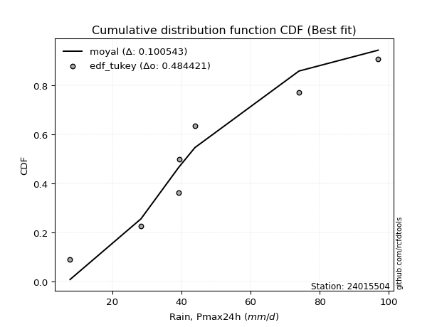</img></img>

</div>


### 8. EDF Gringorten (1963)

Gringorten plotting position formula is essential for estimating the probability and return periods of extreme events like floods and heavy rainfall. The constant _a=0.44_.

<div align="center">


$P=(m-a)/(n+1-2a)$


</div>


**8.1. Empirical values**

<div align="center">

|                | 0                   | 1                   | 2                  | 3              | 4                  | 5                  | 6                  |
|:---------------|:--------------------|:--------------------|:-------------------|:---------------|:-------------------|:-------------------|:-------------------|
| date           | 2015                | 2021                | 2017               | 2020           | 2016               | 2018               | 2019               |
| x              | 7.8                 | 28.3                | 39.1               | 39.4           | 43.9               | 74.0               | 96.9               |
| m              | 1                   | 2                   | 3                  | 4              | 5                  | 6                  | 7                  |
| empirical_dist | edf_gringorten      | edf_gringorten      | edf_gringorten     | edf_gringorten | edf_gringorten     | edf_gringorten     | edf_gringorten     |
| empirical      | 0.07865168539325844 | 0.21910112359550563 | 0.3595505617977528 | 0.5            | 0.6404494382022471 | 0.7808988764044943 | 0.9213483146067415 |
| empirical_tr   | 1.0853658536585364  | 1.2805755395683454  | 1.5614035087719298 | 2.0            | 2.781249999999999  | 4.564102564102562  | 12.714285714285701 |

</div>


**8.2. Kolmogorov-Smirnov fit test (sorted by Δ)**


<div align="center">

|                | 0                   | 1                   | 2                   | 3                   | 4                   | 5                   | 6                   | 7                   | 8                   | 9                   | 10                  | 11                  | 12                  | 13                  | 14                  | 15                  | 16                  | 17                  | 18                  | 19                  | 20                  | 21                  | 22                  | 23                  | 24                  | 25                  | 26                  | 27                  | 28                  | 29                  | 30                  | 31                  | 32                  | 33                  | 34                  | 35                  | 36                  | 37                  | 38                  | 39                  | 40                  | 41                  | 42                  | 43                  | 44                  | 45                  | 46                  | 47                  | 48                  | 49                  | 50                  | 51                  | 52                  | 53                  | 54                  | 55                  | 56                  | 57                  | 58                  | 59                  | 60                  | 61                  | 62                  | 63                  | 64                  | 65                  | 66                  | 67                  | 68                  | 69                  | 70                  | 71                  | 72                  | 73                  | 74                  | 75                  | 76                  | 77                  | 78                  | 79                  | 80                  | 81                  | 82                  | 83                  | 84                  | 85                  | 86                  | 87                  | 88                  | 89                  | 90                  | 91                  | 92                  | 93                  | 94                  | 95                  | 96                  | 97                  | 98                  | 99                  | 100                 | 101                 | 102                 | 103                 | 104                 | 105                 | 106                 | 107                 | 108                 | 109                 | 110                 | 111                 | 112                 | 113                 | 114                 | 115                 | 116                 | 117                 | 118                 | 119                 | 120                 | 121                 | 122                 | 123                 | 124                 | 125                 | 126                 | 127                 | 128                 | 129                 | 130                 | 131                 | 132                 | 133                 | 134                 | 135                 | 136                 | 137                 | 138                 | 139                 | 140                 | 141                 | 142                 | 143                 | 144                 | 145                 | 146                 | 147                 | 148                 | 149                 | 150                 | 151                 | 152                 | 153                 | 154                 | 155                 | 156                 | 157                 | 158                 | 159                 |
|:---------------|:--------------------|:--------------------|:--------------------|:--------------------|:--------------------|:--------------------|:--------------------|:--------------------|:--------------------|:--------------------|:--------------------|:--------------------|:--------------------|:--------------------|:--------------------|:--------------------|:--------------------|:--------------------|:--------------------|:--------------------|:--------------------|:--------------------|:--------------------|:--------------------|:--------------------|:--------------------|:--------------------|:--------------------|:--------------------|:--------------------|:--------------------|:--------------------|:--------------------|:--------------------|:--------------------|:--------------------|:--------------------|:--------------------|:--------------------|:--------------------|:--------------------|:--------------------|:--------------------|:--------------------|:--------------------|:--------------------|:--------------------|:--------------------|:--------------------|:--------------------|:--------------------|:--------------------|:--------------------|:--------------------|:--------------------|:--------------------|:--------------------|:--------------------|:--------------------|:--------------------|:--------------------|:--------------------|:--------------------|:--------------------|:--------------------|:--------------------|:--------------------|:--------------------|:--------------------|:--------------------|:--------------------|:--------------------|:--------------------|:--------------------|:--------------------|:--------------------|:--------------------|:--------------------|:--------------------|:--------------------|:--------------------|:--------------------|:--------------------|:--------------------|:--------------------|:--------------------|:--------------------|:--------------------|:--------------------|:--------------------|:--------------------|:--------------------|:--------------------|:--------------------|:--------------------|:--------------------|:--------------------|:--------------------|:--------------------|:--------------------|:--------------------|:--------------------|:--------------------|:--------------------|:--------------------|:--------------------|:--------------------|:--------------------|:--------------------|:--------------------|:--------------------|:--------------------|:--------------------|:--------------------|:--------------------|:--------------------|:--------------------|:--------------------|:--------------------|:--------------------|:--------------------|:--------------------|:--------------------|:--------------------|:--------------------|:--------------------|:--------------------|:--------------------|:--------------------|:--------------------|:--------------------|:--------------------|:--------------------|:--------------------|:--------------------|:--------------------|:--------------------|:--------------------|:--------------------|:--------------------|:--------------------|:--------------------|:--------------------|:--------------------|:--------------------|:--------------------|:--------------------|:--------------------|:--------------------|:--------------------|:--------------------|:--------------------|:--------------------|:--------------------|:--------------------|:--------------------|:--------------------|:--------------------|:--------------------|:--------------------|
| station        | 24015504            | 24015504            | 24015504            | 24015504            | 24015504            | 24015504            | 24015504            | 24015504            | 24015504            | 24015504            | 24015504            | 24015504            | 24015504            | 24015504            | 24015504            | 24015504            | 24015504            | 24015504            | 24015504            | 24015504            | 24015504            | 24015504            | 24015504            | 24015504            | 24015504            | 24015504            | 24015504            | 24015504            | 24015504            | 24015504            | 24015504            | 24015504            | 24015504            | 24015504            | 24015504            | 24015504            | 24015504            | 24015504            | 24015504            | 24015504            | 24015504            | 24015504            | 24015504            | 24015504            | 24015504            | 24015504            | 24015504            | 24015504            | 24015504            | 24015504            | 24015504            | 24015504            | 24015504            | 24015504            | 24015504            | 24015504            | 24015504            | 24015504            | 24015504            | 24015504            | 24015504            | 24015504            | 24015504            | 24015504            | 24015504            | 24015504            | 24015504            | 24015504            | 24015504            | 24015504            | 24015504            | 24015504            | 24015504            | 24015504            | 24015504            | 24015504            | 24015504            | 24015504            | 24015504            | 24015504            | 24015504            | 24015504            | 24015504            | 24015504            | 24015504            | 24015504            | 24015504            | 24015504            | 24015504            | 24015504            | 24015504            | 24015504            | 24015504            | 24015504            | 24015504            | 24015504            | 24015504            | 24015504            | 24015504            | 24015504            | 24015504            | 24015504            | 24015504            | 24015504            | 24015504            | 24015504            | 24015504            | 24015504            | 24015504            | 24015504            | 24015504            | 24015504            | 24015504            | 24015504            | 24015504            | 24015504            | 24015504            | 24015504            | 24015504            | 24015504            | 24015504            | 24015504            | 24015504            | 24015504            | 24015504            | 24015504            | 24015504            | 24015504            | 24015504            | 24015504            | 24015504            | 24015504            | 24015504            | 24015504            | 24015504            | 24015504            | 24015504            | 24015504            | 24015504            | 24015504            | 24015504            | 24015504            | 24015504            | 24015504            | 24015504            | 24015504            | 24015504            | 24015504            | 24015504            | 24015504            | 24015504            | 24015504            | 24015504            | 24015504            | 24015504            | 24015504            | 24015504            | 24015504            | 24015504            | 24015504            |
| empirical_dist | edf_gringorten      | edf_gringorten      | edf_gringorten      | edf_gringorten      | edf_gringorten      | edf_gringorten      | edf_gringorten      | edf_gringorten      | edf_gringorten      | edf_gringorten      | edf_gringorten      | edf_gringorten      | edf_gringorten      | edf_gringorten      | edf_gringorten      | edf_gringorten      | edf_gringorten      | edf_gringorten      | edf_gringorten      | edf_gringorten      | edf_gringorten      | edf_gringorten      | edf_gringorten      | edf_gringorten      | edf_gringorten      | edf_gringorten      | edf_gringorten      | edf_gringorten      | edf_gringorten      | edf_gringorten      | edf_gringorten      | edf_gringorten      | edf_gringorten      | edf_gringorten      | edf_gringorten      | edf_gringorten      | edf_gringorten      | edf_gringorten      | edf_gringorten      | edf_gringorten      | edf_gringorten      | edf_gringorten      | edf_gringorten      | edf_gringorten      | edf_gringorten      | edf_gringorten      | edf_gringorten      | edf_gringorten      | edf_gringorten      | edf_gringorten      | edf_gringorten      | edf_gringorten      | edf_gringorten      | edf_gringorten      | edf_gringorten      | edf_gringorten      | edf_gringorten      | edf_gringorten      | edf_gringorten      | edf_gringorten      | edf_gringorten      | edf_gringorten      | edf_gringorten      | edf_gringorten      | edf_gringorten      | edf_gringorten      | edf_gringorten      | edf_gringorten      | edf_gringorten      | edf_gringorten      | edf_gringorten      | edf_gringorten      | edf_gringorten      | edf_gringorten      | edf_gringorten      | edf_gringorten      | edf_gringorten      | edf_gringorten      | edf_gringorten      | edf_gringorten      | edf_gringorten      | edf_gringorten      | edf_gringorten      | edf_gringorten      | edf_gringorten      | edf_gringorten      | edf_gringorten      | edf_gringorten      | edf_gringorten      | edf_gringorten      | edf_gringorten      | edf_gringorten      | edf_gringorten      | edf_gringorten      | edf_gringorten      | edf_gringorten      | edf_gringorten      | edf_gringorten      | edf_gringorten      | edf_gringorten      | edf_gringorten      | edf_gringorten      | edf_gringorten      | edf_gringorten      | edf_gringorten      | edf_gringorten      | edf_gringorten      | edf_gringorten      | edf_gringorten      | edf_gringorten      | edf_gringorten      | edf_gringorten      | edf_gringorten      | edf_gringorten      | edf_gringorten      | edf_gringorten      | edf_gringorten      | edf_gringorten      | edf_gringorten      | edf_gringorten      | edf_gringorten      | edf_gringorten      | edf_gringorten      | edf_gringorten      | edf_gringorten      | edf_gringorten      | edf_gringorten      | edf_gringorten      | edf_gringorten      | edf_gringorten      | edf_gringorten      | edf_gringorten      | edf_gringorten      | edf_gringorten      | edf_gringorten      | edf_gringorten      | edf_gringorten      | edf_gringorten      | edf_gringorten      | edf_gringorten      | edf_gringorten      | edf_gringorten      | edf_gringorten      | edf_gringorten      | edf_gringorten      | edf_gringorten      | edf_gringorten      | edf_gringorten      | edf_gringorten      | edf_gringorten      | edf_gringorten      | edf_gringorten      | edf_gringorten      | edf_gringorten      | edf_gringorten      | edf_gringorten      | edf_gringorten      | edf_gringorten      | edf_gringorten      | edf_gringorten      |
| p_dist         | moyal               | exponnorm           | halfnorm            | genexpon            | loggengamma         | weibull_min         | logvonmises_line    | loggompertz         | truncexpon          | erlang              | gamma               | f                   | invweibull          | logt                | genlogistic         | gennorm             | logpearson3         | gumbel_r            | kstwobign           | betaprime           | halflogistic        | loggumbel_l         | invgauss            | exponweib           | logweibull_min      | johnsonsu           | loggenlogistic      | loggennorm          | invgamma            | logmielke           | logdgamma           | logskewnorm         | nct                 | logdweibull         | logtrapezoid        | genextreme          | logtriang           | logloglaplace       | skewnorm            | logburr12           | lomax               | rayleigh            | dgamma              | dweibull            | bradford            | loggenhalflogistic  | logloggamma         | logargus            | logjohnsonsu        | foldnorm            | rice                | ncf                 | pearson3            | maxwell             | vonmises_line       | loganglit           | gausshyper          | logsemicircular     | logexponnorm        | lognorm             | logcrystalball      | logrice             | logfatiguelife      | logf                | wald                | lognct              | loglogistic         | loghypsecant        | logerlang           | truncweibull_min    | logncf              | arcsine             | loggamma            | loggamma            | loginvgamma         | logbetaprime        | loglaplace          | loglaplace          | loginvgauss         | semicircular        | logalpha            | anglit              | t                   | crystalball         | norm                | truncnorm           | logistic            | logmaxwell          | logarcsine          | logburr             | hypsecant           | kappa4              | logfoldnorm         | loginvweibull       | logbeta             | lograyleigh         | logcosine           | cosine              | loglevy_l           | burr                | laplace             | logtruncnorm        | nakagami            | lognakagami         | ksone               | logweibull_max      | loggumbel_r         | loghalfnorm         | wrapcauchy          | uniform             | kappa3              | logkstwobign        | halfgennorm         | loggenexpon         | beta                | gumbel_l            | logmoyal            | loghalflogistic     | loggenextreme       | loggausshyper       | loggenpareto        | argus               | alpha               | logksone            | logwrapcauchy       | logkappa3           | loguniform          | logtukeylambda      | mielke              | gengamma            | levy_l              | logkappa4           | logwald             | burr12              | loglomax            | genpareto           | genhalflogistic     | logtruncexpon       | loghalfgennorm      | logbradford         | logrdist            | logtruncweibull_min | triang              | johnsonsb           | logjohnsonsb        | trapezoid           | rdist               | powerlaw            | fatiguelife         | tukeylambda         | logexponpow         | weibull_max         | logexponweib        | exponpow            | logpowerlaw         | truncpareto         | logtruncpareto      | gompertz            | logvonmises         | vonmises            |
| delta          | 0.10462851801453521 | 0.10601895151037588 | 0.10688402611485093 | 0.10843694045904695 | 0.11028975686826514 | 0.11227363673204638 | 0.11283034791456092 | 0.11302974921636422 | 0.11357049348077519 | 0.11582656746343056 | 0.11582676989259055 | 0.1159526123593142  | 0.11611731482691823 | 0.11751453992339922 | 0.11804343147528007 | 0.118357826592981   | 0.11888849008111124 | 0.11895800551313307 | 0.11919990590618423 | 0.1193104279292827  | 0.12044930027384404 | 0.12215250728945848 | 0.12374638195902865 | 0.12411091795837459 | 0.1253681013398098  | 0.126120974493952   | 0.12656815779380348 | 0.12705958213734825 | 0.12750083182032468 | 0.1275031542078887  | 0.128306553602341   | 0.12862850916982416 | 0.12883650698620563 | 0.12894856206531685 | 0.12920096668789605 | 0.1324495040653011  | 0.1328644134111662  | 0.13375091287271657 | 0.1339092261654331  | 0.13506751954341323 | 0.13589742479837053 | 0.14028996876895516 | 0.1404494382017436  | 0.1404494382024557  | 0.14297127006889887 | 0.14451944042355677 | 0.1446640818348502  | 0.14627370287938157 | 0.14756640863958026 | 0.14797310722667528 | 0.14882896027218484 | 0.1503485359496848  | 0.15186256594515996 | 0.15212921072607827 | 0.15516015834872798 | 0.1577877628388341  | 0.15862924718433796 | 0.16056985407340182 | 0.16067909282988657 | 0.16067977642652742 | 0.16067979587599746 | 0.16068508558819372 | 0.16133658626792236 | 0.16134001497337092 | 0.16191588307066018 | 0.1624230040522665  | 0.16343749734353152 | 0.16578847909727756 | 0.16591823535957306 | 0.1661880893040447  | 0.1663727676711073  | 0.16646289309095785 | 0.16767003838106198 | 0.16767003838106198 | 0.1735914713751202  | 0.1739648960558322  | 0.1750655396523788  | 0.1750655396523788  | 0.17693997100329806 | 0.17717679248938445 | 0.17947339602633272 | 0.17987199182869207 | 0.186402956444072   | 0.18640382589363008 | 0.18640383799690063 | 0.18640384285694767 | 0.1926082037613605  | 0.19281084760998968 | 0.19423222399160414 | 0.19510198295310577 | 0.19785890502092351 | 0.19919181558911964 | 0.20065725454712935 | 0.20145558067534677 | 0.20297006899723682 | 0.20335452820208155 | 0.21096820582843145 | 0.21219086795139402 | 0.21238456595365068 | 0.2132146416037971  | 0.21576684476859398 | 0.21909343436739423 | 0.21910068214135392 | 0.2191011232424767  | 0.21948048945552062 | 0.22088342634194869 | 0.23135992580339126 | 0.23304329974094795 | 0.2342302962400425  | 0.23528669970617527 | 0.235365871513604   | 0.23971391074086848 | 0.24227146477614991 | 0.24381421004511192 | 0.24488012003156576 | 0.25664665688900146 | 0.25695487482296064 | 0.25909832303243263 | 0.26006391151192243 | 0.26323461988707475 | 0.2801172729941701  | 0.28142034344707545 | 0.2851744550472963  | 0.2904773434115089  | 0.2911599152585296  | 0.29225650722705376 | 0.29239303681291184 | 0.2943100738766109  | 0.30135962953016615 | 0.3040861097622716  | 0.3044609090981218  | 0.3140222112936778  | 0.32804268679304105 | 0.33203732063166    | 0.34054927265386703 | 0.34382517515372363 | 0.35271296463154767 | 0.3729657564482365  | 0.382077116559825   | 0.3835664948219486  | 0.4007208496204685  | 0.4181389833545084  | 0.4289674818538126  | 0.4317274488068951  | 0.44267645976364167 | 0.4627972800903541  | 0.5223670600352878  | 0.5720299569296068  | 0.5898062286395613  | 0.5999376751720806  | 0.607838673818619   | 0.6295588923770059  | 0.6310251842342629  | 0.6355001613817577  | 0.6656450721769411  | 0.676118198742254   | 0.7313454746379091  | 0.780292396795094   | 1.119634782848587   | 14.801381811809668  |
| deltao         | 0.48442053926100004 | 0.48442053926100004 | 0.48442053926100004 | 0.48442053926100004 | 0.48442053926100004 | 0.48442053926100004 | 0.48442053926100004 | 0.48442053926100004 | 0.48442053926100004 | 0.48442053926100004 | 0.48442053926100004 | 0.48442053926100004 | 0.48442053926100004 | 0.48442053926100004 | 0.48442053926100004 | 0.48442053926100004 | 0.48442053926100004 | 0.48442053926100004 | 0.48442053926100004 | 0.48442053926100004 | 0.48442053926100004 | 0.48442053926100004 | 0.48442053926100004 | 0.48442053926100004 | 0.48442053926100004 | 0.48442053926100004 | 0.48442053926100004 | 0.48442053926100004 | 0.48442053926100004 | 0.48442053926100004 | 0.48442053926100004 | 0.48442053926100004 | 0.48442053926100004 | 0.48442053926100004 | 0.48442053926100004 | 0.48442053926100004 | 0.48442053926100004 | 0.48442053926100004 | 0.48442053926100004 | 0.48442053926100004 | 0.48442053926100004 | 0.48442053926100004 | 0.48442053926100004 | 0.48442053926100004 | 0.48442053926100004 | 0.48442053926100004 | 0.48442053926100004 | 0.48442053926100004 | 0.48442053926100004 | 0.48442053926100004 | 0.48442053926100004 | 0.48442053926100004 | 0.48442053926100004 | 0.48442053926100004 | 0.48442053926100004 | 0.48442053926100004 | 0.48442053926100004 | 0.48442053926100004 | 0.48442053926100004 | 0.48442053926100004 | 0.48442053926100004 | 0.48442053926100004 | 0.48442053926100004 | 0.48442053926100004 | 0.48442053926100004 | 0.48442053926100004 | 0.48442053926100004 | 0.48442053926100004 | 0.48442053926100004 | 0.48442053926100004 | 0.48442053926100004 | 0.48442053926100004 | 0.48442053926100004 | 0.48442053926100004 | 0.48442053926100004 | 0.48442053926100004 | 0.48442053926100004 | 0.48442053926100004 | 0.48442053926100004 | 0.48442053926100004 | 0.48442053926100004 | 0.48442053926100004 | 0.48442053926100004 | 0.48442053926100004 | 0.48442053926100004 | 0.48442053926100004 | 0.48442053926100004 | 0.48442053926100004 | 0.48442053926100004 | 0.48442053926100004 | 0.48442053926100004 | 0.48442053926100004 | 0.48442053926100004 | 0.48442053926100004 | 0.48442053926100004 | 0.48442053926100004 | 0.48442053926100004 | 0.48442053926100004 | 0.48442053926100004 | 0.48442053926100004 | 0.48442053926100004 | 0.48442053926100004 | 0.48442053926100004 | 0.48442053926100004 | 0.48442053926100004 | 0.48442053926100004 | 0.48442053926100004 | 0.48442053926100004 | 0.48442053926100004 | 0.48442053926100004 | 0.48442053926100004 | 0.48442053926100004 | 0.48442053926100004 | 0.48442053926100004 | 0.48442053926100004 | 0.48442053926100004 | 0.48442053926100004 | 0.48442053926100004 | 0.48442053926100004 | 0.48442053926100004 | 0.48442053926100004 | 0.48442053926100004 | 0.48442053926100004 | 0.48442053926100004 | 0.48442053926100004 | 0.48442053926100004 | 0.48442053926100004 | 0.48442053926100004 | 0.48442053926100004 | 0.48442053926100004 | 0.48442053926100004 | 0.48442053926100004 | 0.48442053926100004 | 0.48442053926100004 | 0.48442053926100004 | 0.48442053926100004 | 0.48442053926100004 | 0.48442053926100004 | 0.48442053926100004 | 0.48442053926100004 | 0.48442053926100004 | 0.48442053926100004 | 0.48442053926100004 | 0.48442053926100004 | 0.48442053926100004 | 0.48442053926100004 | 0.48442053926100004 | 0.48442053926100004 | 0.48442053926100004 | 0.48442053926100004 | 0.48442053926100004 | 0.48442053926100004 | 0.48442053926100004 | 0.48442053926100004 | 0.48442053926100004 | 0.48442053926100004 | 0.48442053926100004 | 0.48442053926100004 | 0.48442053926100004 | 0.48442053926100004 |
| eval           | Δo > Δ              | Δo > Δ              | Δo > Δ              | Δo > Δ              | Δo > Δ              | Δo > Δ              | Δo > Δ              | Δo > Δ              | Δo > Δ              | Δo > Δ              | Δo > Δ              | Δo > Δ              | Δo > Δ              | Δo > Δ              | Δo > Δ              | Δo > Δ              | Δo > Δ              | Δo > Δ              | Δo > Δ              | Δo > Δ              | Δo > Δ              | Δo > Δ              | Δo > Δ              | Δo > Δ              | Δo > Δ              | Δo > Δ              | Δo > Δ              | Δo > Δ              | Δo > Δ              | Δo > Δ              | Δo > Δ              | Δo > Δ              | Δo > Δ              | Δo > Δ              | Δo > Δ              | Δo > Δ              | Δo > Δ              | Δo > Δ              | Δo > Δ              | Δo > Δ              | Δo > Δ              | Δo > Δ              | Δo > Δ              | Δo > Δ              | Δo > Δ              | Δo > Δ              | Δo > Δ              | Δo > Δ              | Δo > Δ              | Δo > Δ              | Δo > Δ              | Δo > Δ              | Δo > Δ              | Δo > Δ              | Δo > Δ              | Δo > Δ              | Δo > Δ              | Δo > Δ              | Δo > Δ              | Δo > Δ              | Δo > Δ              | Δo > Δ              | Δo > Δ              | Δo > Δ              | Δo > Δ              | Δo > Δ              | Δo > Δ              | Δo > Δ              | Δo > Δ              | Δo > Δ              | Δo > Δ              | Δo > Δ              | Δo > Δ              | Δo > Δ              | Δo > Δ              | Δo > Δ              | Δo > Δ              | Δo > Δ              | Δo > Δ              | Δo > Δ              | Δo > Δ              | Δo > Δ              | Δo > Δ              | Δo > Δ              | Δo > Δ              | Δo > Δ              | Δo > Δ              | Δo > Δ              | Δo > Δ              | Δo > Δ              | Δo > Δ              | Δo > Δ              | Δo > Δ              | Δo > Δ              | Δo > Δ              | Δo > Δ              | Δo > Δ              | Δo > Δ              | Δo > Δ              | Δo > Δ              | Δo > Δ              | Δo > Δ              | Δo > Δ              | Δo > Δ              | Δo > Δ              | Δo > Δ              | Δo > Δ              | Δo > Δ              | Δo > Δ              | Δo > Δ              | Δo > Δ              | Δo > Δ              | Δo > Δ              | Δo > Δ              | Δo > Δ              | Δo > Δ              | Δo > Δ              | Δo > Δ              | Δo > Δ              | Δo > Δ              | Δo > Δ              | Δo > Δ              | Δo > Δ              | Δo > Δ              | Δo > Δ              | Δo > Δ              | Δo > Δ              | Δo > Δ              | Δo > Δ              | Δo > Δ              | Δo > Δ              | Δo > Δ              | Δo > Δ              | Δo > Δ              | Δo > Δ              | Δo > Δ              | Δo > Δ              | Δo > Δ              | Δo > Δ              | Δo > Δ              | Δo > Δ              | Δo > Δ              | Δo > Δ              | Δo > Δ              | Δo > Δ              | Δo > Δ              | Δo <= Δ             | Δo <= Δ             | Δo <= Δ             | Δo <= Δ             | Δo <= Δ             | Δo <= Δ             | Δo <= Δ             | Δo <= Δ             | Δo <= Δ             | Δo <= Δ             | Δo <= Δ             | Δo <= Δ             | Δo <= Δ             | Δo <= Δ             |
| fit            | 1                   | 1                   | 1                   | 1                   | 1                   | 1                   | 1                   | 1                   | 1                   | 1                   | 1                   | 1                   | 1                   | 1                   | 1                   | 1                   | 1                   | 1                   | 1                   | 1                   | 1                   | 1                   | 1                   | 1                   | 1                   | 1                   | 1                   | 1                   | 1                   | 1                   | 1                   | 1                   | 1                   | 1                   | 1                   | 1                   | 1                   | 1                   | 1                   | 1                   | 1                   | 1                   | 1                   | 1                   | 1                   | 1                   | 1                   | 1                   | 1                   | 1                   | 1                   | 1                   | 1                   | 1                   | 1                   | 1                   | 1                   | 1                   | 1                   | 1                   | 1                   | 1                   | 1                   | 1                   | 1                   | 1                   | 1                   | 1                   | 1                   | 1                   | 1                   | 1                   | 1                   | 1                   | 1                   | 1                   | 1                   | 1                   | 1                   | 1                   | 1                   | 1                   | 1                   | 1                   | 1                   | 1                   | 1                   | 1                   | 1                   | 1                   | 1                   | 1                   | 1                   | 1                   | 1                   | 1                   | 1                   | 1                   | 1                   | 1                   | 1                   | 1                   | 1                   | 1                   | 1                   | 1                   | 1                   | 1                   | 1                   | 1                   | 1                   | 1                   | 1                   | 1                   | 1                   | 1                   | 1                   | 1                   | 1                   | 1                   | 1                   | 1                   | 1                   | 1                   | 1                   | 1                   | 1                   | 1                   | 1                   | 1                   | 1                   | 1                   | 1                   | 1                   | 1                   | 1                   | 1                   | 1                   | 1                   | 1                   | 1                   | 1                   | 1                   | 1                   | 1                   | 1                   | 0                   | 0                   | 0                   | 0                   | 0                   | 0                   | 0                   | 0                   | 0                   | 0                   | 0                   | 0                   | 0                   | 0                   |
| n              | 7                   | 7                   | 7                   | 7                   | 7                   | 7                   | 7                   | 7                   | 7                   | 7                   | 7                   | 7                   | 7                   | 7                   | 7                   | 7                   | 7                   | 7                   | 7                   | 7                   | 7                   | 7                   | 7                   | 7                   | 7                   | 7                   | 7                   | 7                   | 7                   | 7                   | 7                   | 7                   | 7                   | 7                   | 7                   | 7                   | 7                   | 7                   | 7                   | 7                   | 7                   | 7                   | 7                   | 7                   | 7                   | 7                   | 7                   | 7                   | 7                   | 7                   | 7                   | 7                   | 7                   | 7                   | 7                   | 7                   | 7                   | 7                   | 7                   | 7                   | 7                   | 7                   | 7                   | 7                   | 7                   | 7                   | 7                   | 7                   | 7                   | 7                   | 7                   | 7                   | 7                   | 7                   | 7                   | 7                   | 7                   | 7                   | 7                   | 7                   | 7                   | 7                   | 7                   | 7                   | 7                   | 7                   | 7                   | 7                   | 7                   | 7                   | 7                   | 7                   | 7                   | 7                   | 7                   | 7                   | 7                   | 7                   | 7                   | 7                   | 7                   | 7                   | 7                   | 7                   | 7                   | 7                   | 7                   | 7                   | 7                   | 7                   | 7                   | 7                   | 7                   | 7                   | 7                   | 7                   | 7                   | 7                   | 7                   | 7                   | 7                   | 7                   | 7                   | 7                   | 7                   | 7                   | 7                   | 7                   | 7                   | 7                   | 7                   | 7                   | 7                   | 7                   | 7                   | 7                   | 7                   | 7                   | 7                   | 7                   | 7                   | 7                   | 7                   | 7                   | 7                   | 7                   | 7                   | 7                   | 7                   | 7                   | 7                   | 7                   | 7                   | 7                   | 7                   | 7                   | 7                   | 7                   | 7                   | 7                   |
| best_fit       | 1                   | 0                   | 0                   | 0                   | 0                   | 0                   | 0                   | 0                   | 0                   | 0                   | 0                   | 0                   | 0                   | 0                   | 0                   | 0                   | 0                   | 0                   | 0                   | 0                   | 0                   | 0                   | 0                   | 0                   | 0                   | 0                   | 0                   | 0                   | 0                   | 0                   | 0                   | 0                   | 0                   | 0                   | 0                   | 0                   | 0                   | 0                   | 0                   | 0                   | 0                   | 0                   | 0                   | 0                   | 0                   | 0                   | 0                   | 0                   | 0                   | 0                   | 0                   | 0                   | 0                   | 0                   | 0                   | 0                   | 0                   | 0                   | 0                   | 0                   | 0                   | 0                   | 0                   | 0                   | 0                   | 0                   | 0                   | 0                   | 0                   | 0                   | 0                   | 0                   | 0                   | 0                   | 0                   | 0                   | 0                   | 0                   | 0                   | 0                   | 0                   | 0                   | 0                   | 0                   | 0                   | 0                   | 0                   | 0                   | 0                   | 0                   | 0                   | 0                   | 0                   | 0                   | 0                   | 0                   | 0                   | 0                   | 0                   | 0                   | 0                   | 0                   | 0                   | 0                   | 0                   | 0                   | 0                   | 0                   | 0                   | 0                   | 0                   | 0                   | 0                   | 0                   | 0                   | 0                   | 0                   | 0                   | 0                   | 0                   | 0                   | 0                   | 0                   | 0                   | 0                   | 0                   | 0                   | 0                   | 0                   | 0                   | 0                   | 0                   | 0                   | 0                   | 0                   | 0                   | 0                   | 0                   | 0                   | 0                   | 0                   | 0                   | 0                   | 0                   | 0                   | 0                   | 0                   | 0                   | 0                   | 0                   | 0                   | 0                   | 0                   | 0                   | 0                   | 0                   | 0                   | 0                   | 0                   | 0                   |
| best_fit_sort  | 1                   | 2                   | 3                   | 4                   | 5                   | 6                   | 7                   | 8                   | 9                   | 10                  | 11                  | 12                  | 13                  | 14                  | 15                  | 16                  | 17                  | 18                  | 19                  | 20                  | 21                  | 22                  | 23                  | 24                  | 25                  | 26                  | 27                  | 28                  | 29                  | 30                  | 31                  | 32                  | 33                  | 34                  | 35                  | 36                  | 37                  | 38                  | 39                  | 40                  | 41                  | 42                  | 43                  | 44                  | 45                  | 46                  | 47                  | 48                  | 49                  | 50                  | 51                  | 52                  | 53                  | 54                  | 55                  | 56                  | 57                  | 58                  | 59                  | 60                  | 61                  | 62                  | 63                  | 64                  | 65                  | 66                  | 67                  | 68                  | 69                  | 70                  | 71                  | 72                  | 73                  | 74                  | 75                  | 76                  | 77                  | 78                  | 79                  | 80                  | 81                  | 82                  | 83                  | 84                  | 85                  | 86                  | 87                  | 88                  | 89                  | 90                  | 91                  | 92                  | 93                  | 94                  | 95                  | 96                  | 97                  | 98                  | 99                  | 100                 | 101                 | 102                 | 103                 | 104                 | 105                 | 106                 | 107                 | 108                 | 109                 | 110                 | 111                 | 112                 | 113                 | 114                 | 115                 | 116                 | 117                 | 118                 | 119                 | 120                 | 121                 | 122                 | 123                 | 124                 | 125                 | 126                 | 127                 | 128                 | 129                 | 130                 | 131                 | 132                 | 133                 | 134                 | 135                 | 136                 | 137                 | 138                 | 139                 | 140                 | 141                 | 142                 | 143                 | 144                 | 145                 | 146                 | 147                 | 148                 | 149                 | 150                 | 151                 | 152                 | 153                 | 154                 | 155                 | 156                 | 157                 | 158                 | 159                 | 160                 |

</div>


**8.3. Best fit**

<div align="center">

|   id |   station | empirical_dist   | p_dist   |    delta |   deltao | eval   |   fit |   n |   best_fit |   best_fit_sort |
|-----:|----------:|:-----------------|:---------|---------:|---------:|:-------|------:|----:|-----------:|----------------:|
|    0 |  24015504 | edf_gringorten   | moyal    | 0.104629 | 0.484421 | Δo > Δ |     1 |   7 |          1 |               1 |

</div>


<div align="center">

</img></img>

</div>


### 9. EDF Filliben (1975)

The specific values of the constants (0.3175) (often denoted as $alpha$) and (0.365) are derived from a method proposed by James J. Filliben in a 1975 paper. This particular formula is the mean value of the $i$-th order statistic of the normal distribution and is considered a robust and effective plotting position formula for the normal probability plot correlation coefficient test for normality.

<div align="center">


$P=(m-0.3175)/(n+0.365)$


</div>


**9.1. Empirical values**

<div align="center">

|                | 0                   | 1                   | 2                   | 3            | 4                  | 5                  | 6                  |
|:---------------|:--------------------|:--------------------|:--------------------|:-------------|:-------------------|:-------------------|:-------------------|
| date           | 2015                | 2021                | 2017                | 2020         | 2016               | 2018               | 2019               |
| x              | 7.8                 | 28.3                | 39.1                | 39.4         | 43.9               | 74.0               | 96.9               |
| m              | 1                   | 2                   | 3                   | 4            | 5                  | 6                  | 7                  |
| empirical_dist | edf_filliben        | edf_filliben        | edf_filliben        | edf_filliben | edf_filliben       | edf_filliben       | edf_filliben       |
| empirical      | 0.09266802443991853 | 0.22844534962661237 | 0.36422267481330617 | 0.5          | 0.6357773251866938 | 0.7715546503733877 | 0.9073319755600815 |
| empirical_tr   | 1.1021324354657687  | 1.2960844698636163  | 1.5728777362520021  | 2.0          | 2.7455731593662627 | 4.377414561664191  | 10.791208791208794 |

</div>


**9.2. Kolmogorov-Smirnov fit test (sorted by Δ)**


<div align="center">

|                | 0                   | 1                   | 2                   | 3                   | 4                   | 5                   | 6                   | 7                   | 8                   | 9                   | 10                  | 11                  | 12                  | 13                  | 14                  | 15                  | 16                  | 17                  | 18                  | 19                  | 20                  | 21                  | 22                  | 23                  | 24                  | 25                  | 26                  | 27                  | 28                  | 29                  | 30                  | 31                  | 32                  | 33                  | 34                  | 35                  | 36                  | 37                  | 38                  | 39                  | 40                  | 41                  | 42                  | 43                  | 44                  | 45                  | 46                  | 47                  | 48                  | 49                  | 50                  | 51                  | 52                  | 53                  | 54                  | 55                  | 56                  | 57                  | 58                  | 59                  | 60                  | 61                  | 62                  | 63                  | 64                  | 65                  | 66                  | 67                  | 68                  | 69                  | 70                  | 71                  | 72                  | 73                  | 74                  | 75                  | 76                  | 77                  | 78                  | 79                  | 80                  | 81                  | 82                  | 83                  | 84                  | 85                  | 86                  | 87                  | 88                  | 89                  | 90                  | 91                  | 92                  | 93                  | 94                  | 95                  | 96                  | 97                  | 98                  | 99                  | 100                 | 101                 | 102                 | 103                 | 104                 | 105                 | 106                 | 107                 | 108                 | 109                 | 110                 | 111                 | 112                 | 113                 | 114                 | 115                 | 116                 | 117                 | 118                 | 119                 | 120                 | 121                 | 122                 | 123                 | 124                 | 125                 | 126                 | 127                 | 128                 | 129                 | 130                 | 131                 | 132                 | 133                 | 134                 | 135                 | 136                 | 137                 | 138                 | 139                 | 140                 | 141                 | 142                 | 143                 | 144                 | 145                 | 146                 | 147                 | 148                 | 149                 | 150                 | 151                 | 152                 | 153                 | 154                 | 155                 | 156                 | 157                 | 158                 | 159                 |
|:---------------|:--------------------|:--------------------|:--------------------|:--------------------|:--------------------|:--------------------|:--------------------|:--------------------|:--------------------|:--------------------|:--------------------|:--------------------|:--------------------|:--------------------|:--------------------|:--------------------|:--------------------|:--------------------|:--------------------|:--------------------|:--------------------|:--------------------|:--------------------|:--------------------|:--------------------|:--------------------|:--------------------|:--------------------|:--------------------|:--------------------|:--------------------|:--------------------|:--------------------|:--------------------|:--------------------|:--------------------|:--------------------|:--------------------|:--------------------|:--------------------|:--------------------|:--------------------|:--------------------|:--------------------|:--------------------|:--------------------|:--------------------|:--------------------|:--------------------|:--------------------|:--------------------|:--------------------|:--------------------|:--------------------|:--------------------|:--------------------|:--------------------|:--------------------|:--------------------|:--------------------|:--------------------|:--------------------|:--------------------|:--------------------|:--------------------|:--------------------|:--------------------|:--------------------|:--------------------|:--------------------|:--------------------|:--------------------|:--------------------|:--------------------|:--------------------|:--------------------|:--------------------|:--------------------|:--------------------|:--------------------|:--------------------|:--------------------|:--------------------|:--------------------|:--------------------|:--------------------|:--------------------|:--------------------|:--------------------|:--------------------|:--------------------|:--------------------|:--------------------|:--------------------|:--------------------|:--------------------|:--------------------|:--------------------|:--------------------|:--------------------|:--------------------|:--------------------|:--------------------|:--------------------|:--------------------|:--------------------|:--------------------|:--------------------|:--------------------|:--------------------|:--------------------|:--------------------|:--------------------|:--------------------|:--------------------|:--------------------|:--------------------|:--------------------|:--------------------|:--------------------|:--------------------|:--------------------|:--------------------|:--------------------|:--------------------|:--------------------|:--------------------|:--------------------|:--------------------|:--------------------|:--------------------|:--------------------|:--------------------|:--------------------|:--------------------|:--------------------|:--------------------|:--------------------|:--------------------|:--------------------|:--------------------|:--------------------|:--------------------|:--------------------|:--------------------|:--------------------|:--------------------|:--------------------|:--------------------|:--------------------|:--------------------|:--------------------|:--------------------|:--------------------|:--------------------|:--------------------|:--------------------|:--------------------|:--------------------|:--------------------|
| station        | 24015504            | 24015504            | 24015504            | 24015504            | 24015504            | 24015504            | 24015504            | 24015504            | 24015504            | 24015504            | 24015504            | 24015504            | 24015504            | 24015504            | 24015504            | 24015504            | 24015504            | 24015504            | 24015504            | 24015504            | 24015504            | 24015504            | 24015504            | 24015504            | 24015504            | 24015504            | 24015504            | 24015504            | 24015504            | 24015504            | 24015504            | 24015504            | 24015504            | 24015504            | 24015504            | 24015504            | 24015504            | 24015504            | 24015504            | 24015504            | 24015504            | 24015504            | 24015504            | 24015504            | 24015504            | 24015504            | 24015504            | 24015504            | 24015504            | 24015504            | 24015504            | 24015504            | 24015504            | 24015504            | 24015504            | 24015504            | 24015504            | 24015504            | 24015504            | 24015504            | 24015504            | 24015504            | 24015504            | 24015504            | 24015504            | 24015504            | 24015504            | 24015504            | 24015504            | 24015504            | 24015504            | 24015504            | 24015504            | 24015504            | 24015504            | 24015504            | 24015504            | 24015504            | 24015504            | 24015504            | 24015504            | 24015504            | 24015504            | 24015504            | 24015504            | 24015504            | 24015504            | 24015504            | 24015504            | 24015504            | 24015504            | 24015504            | 24015504            | 24015504            | 24015504            | 24015504            | 24015504            | 24015504            | 24015504            | 24015504            | 24015504            | 24015504            | 24015504            | 24015504            | 24015504            | 24015504            | 24015504            | 24015504            | 24015504            | 24015504            | 24015504            | 24015504            | 24015504            | 24015504            | 24015504            | 24015504            | 24015504            | 24015504            | 24015504            | 24015504            | 24015504            | 24015504            | 24015504            | 24015504            | 24015504            | 24015504            | 24015504            | 24015504            | 24015504            | 24015504            | 24015504            | 24015504            | 24015504            | 24015504            | 24015504            | 24015504            | 24015504            | 24015504            | 24015504            | 24015504            | 24015504            | 24015504            | 24015504            | 24015504            | 24015504            | 24015504            | 24015504            | 24015504            | 24015504            | 24015504            | 24015504            | 24015504            | 24015504            | 24015504            | 24015504            | 24015504            | 24015504            | 24015504            | 24015504            | 24015504            |
| empirical_dist | edf_filliben        | edf_filliben        | edf_filliben        | edf_filliben        | edf_filliben        | edf_filliben        | edf_filliben        | edf_filliben        | edf_filliben        | edf_filliben        | edf_filliben        | edf_filliben        | edf_filliben        | edf_filliben        | edf_filliben        | edf_filliben        | edf_filliben        | edf_filliben        | edf_filliben        | edf_filliben        | edf_filliben        | edf_filliben        | edf_filliben        | edf_filliben        | edf_filliben        | edf_filliben        | edf_filliben        | edf_filliben        | edf_filliben        | edf_filliben        | edf_filliben        | edf_filliben        | edf_filliben        | edf_filliben        | edf_filliben        | edf_filliben        | edf_filliben        | edf_filliben        | edf_filliben        | edf_filliben        | edf_filliben        | edf_filliben        | edf_filliben        | edf_filliben        | edf_filliben        | edf_filliben        | edf_filliben        | edf_filliben        | edf_filliben        | edf_filliben        | edf_filliben        | edf_filliben        | edf_filliben        | edf_filliben        | edf_filliben        | edf_filliben        | edf_filliben        | edf_filliben        | edf_filliben        | edf_filliben        | edf_filliben        | edf_filliben        | edf_filliben        | edf_filliben        | edf_filliben        | edf_filliben        | edf_filliben        | edf_filliben        | edf_filliben        | edf_filliben        | edf_filliben        | edf_filliben        | edf_filliben        | edf_filliben        | edf_filliben        | edf_filliben        | edf_filliben        | edf_filliben        | edf_filliben        | edf_filliben        | edf_filliben        | edf_filliben        | edf_filliben        | edf_filliben        | edf_filliben        | edf_filliben        | edf_filliben        | edf_filliben        | edf_filliben        | edf_filliben        | edf_filliben        | edf_filliben        | edf_filliben        | edf_filliben        | edf_filliben        | edf_filliben        | edf_filliben        | edf_filliben        | edf_filliben        | edf_filliben        | edf_filliben        | edf_filliben        | edf_filliben        | edf_filliben        | edf_filliben        | edf_filliben        | edf_filliben        | edf_filliben        | edf_filliben        | edf_filliben        | edf_filliben        | edf_filliben        | edf_filliben        | edf_filliben        | edf_filliben        | edf_filliben        | edf_filliben        | edf_filliben        | edf_filliben        | edf_filliben        | edf_filliben        | edf_filliben        | edf_filliben        | edf_filliben        | edf_filliben        | edf_filliben        | edf_filliben        | edf_filliben        | edf_filliben        | edf_filliben        | edf_filliben        | edf_filliben        | edf_filliben        | edf_filliben        | edf_filliben        | edf_filliben        | edf_filliben        | edf_filliben        | edf_filliben        | edf_filliben        | edf_filliben        | edf_filliben        | edf_filliben        | edf_filliben        | edf_filliben        | edf_filliben        | edf_filliben        | edf_filliben        | edf_filliben        | edf_filliben        | edf_filliben        | edf_filliben        | edf_filliben        | edf_filliben        | edf_filliben        | edf_filliben        | edf_filliben        | edf_filliben        | edf_filliben        | edf_filliben        |
| p_dist         | moyal               | exponnorm           | halfnorm            | genexpon            | loggengamma         | weibull_min         | logvonmises_line    | loggompertz         | truncexpon          | erlang              | gamma               | f                   | invweibull          | logt                | genlogistic         | logpearson3         | gumbel_r            | kstwobign           | betaprime           | halflogistic        | loggumbel_l         | invgauss            | exponweib           | logweibull_min      | johnsonsu           | loggenlogistic      | invgamma            | logmielke           | logdgamma           | logskewnorm         | nct                 | logdweibull         | logtrapezoid        | logtriang           | gennorm             | genextreme          | logloglaplace       | skewnorm            | logburr12           | lomax               | loggennorm          | loggenhalflogistic  | rayleigh            | dweibull            | bradford            | logloggamma         | logargus            | ncf                 | logjohnsonsu        | dgamma              | foldnorm            | rice                | pearson3            | maxwell             | logsemicircular     | loganglit           | gausshyper          | logexponnorm        | lognorm             | logcrystalball      | logrice             | logfatiguelife      | logf                | wald                | lognct              | loglogistic         | truncweibull_min    | loghypsecant        | logerlang           | logncf              | arcsine             | loggamma            | loggamma            | vonmises_line       | loginvgamma         | logbetaprime        | loglaplace          | loglaplace          | loginvgauss         | semicircular        | logalpha            | anglit              | t                   | crystalball         | norm                | truncnorm           | logarcsine          | logistic            | logmaxwell          | logburr             | loginvweibull       | hypsecant           | kappa4              | logbeta             | logfoldnorm         | loglevy_l           | lograyleigh         | logcosine           | cosine              | burr                | laplace             | ksone               | logweibull_max      | loggumbel_r         | loghalfnorm         | logtruncnorm        | nakagami            | lognakagami         | wrapcauchy          | logkstwobign        | uniform             | kappa3              | loggenexpon         | beta                | halfgennorm         | gumbel_l            | logmoyal            | loggausshyper       | loghalflogistic     | loggenextreme       | loggenpareto        | alpha               | argus               | logksone            | logwrapcauchy       | logkappa3           | loguniform          | logtukeylambda      | levy_l              | mielke              | gengamma            | logkappa4           | burr12              | logwald             | loglomax            | genpareto           | genhalflogistic     | logtruncexpon       | loghalfgennorm      | logbradford         | logrdist            | logtruncweibull_min | johnsonsb           | triang              | logjohnsonsb        | trapezoid           | rdist               | powerlaw            | fatiguelife         | tukeylambda         | logexponpow         | weibull_max         | logexponweib        | exponpow            | logpowerlaw         | truncpareto         | logtruncpareto      | gompertz            | logvonmises         | vonmises            |
| delta          | 0.09995640499898184 | 0.10134683849482262 | 0.10221191309929767 | 0.10376482744349358 | 0.10561764385271188 | 0.10760152371649312 | 0.10815823489900767 | 0.10835763620081085 | 0.10889838046522193 | 0.1111544544478773  | 0.1111546568770373  | 0.11128049934376094 | 0.11144520181136497 | 0.11284242690784596 | 0.11337131845972681 | 0.11421637706555798 | 0.11428589249757981 | 0.11452779289063098 | 0.11463831491372944 | 0.11577718725829067 | 0.11748039427390522 | 0.11907426894347539 | 0.11943880494282133 | 0.12069598832425654 | 0.12144886147839873 | 0.12189604477825022 | 0.12282871880477142 | 0.12283104119233546 | 0.12363444058678763 | 0.1239563961542709  | 0.12416439397065238 | 0.12427644904976348 | 0.12452885367234279 | 0.12590187709813688 | 0.12770205262408763 | 0.12777739104974783 | 0.1290787998571632  | 0.12923711314987985 | 0.13039540652785997 | 0.13122531178281727 | 0.1317316951529015  | 0.13517521439245003 | 0.1356178557534019  | 0.13577732518690233 | 0.1382991570533456  | 0.13999196881929693 | 0.14160158986382831 | 0.141851370545935   | 0.142894295624027   | 0.1430621493978681  | 0.14330099421112202 | 0.14415684725663158 | 0.1471904529296067  | 0.147457097710525   | 0.15192257813628463 | 0.15311564982328074 | 0.1539571341687847  | 0.1560069798143332  | 0.15600766341097405 | 0.15600768286044409 | 0.15601297257264035 | 0.15666447325236899 | 0.15666790195781755 | 0.1572437700551068  | 0.15775089103671314 | 0.15876538432797815 | 0.15907303797936412 | 0.1611163660817242  | 0.1612461223440197  | 0.16170065465555394 | 0.1617907800754046  | 0.1629979253655086  | 0.1629979253655086  | 0.1645043843798346  | 0.16891935835956684 | 0.16929278304027884 | 0.17039342663682544 | 0.17039342663682544 | 0.1722678579877447  | 0.1725046794738312  | 0.17480128301077935 | 0.1751998788131388  | 0.18173084342851875 | 0.18173171287807682 | 0.18173172498134738 | 0.1817317298413944  | 0.1848879979604974  | 0.18793609074580725 | 0.1881387345944363  | 0.1904298699375525  | 0.19211135464424003 | 0.19318679200537026 | 0.19451970257356638 | 0.19505741587545844 | 0.19598514153157598 | 0.1983682269069906  | 0.19868241518652818 | 0.20629609281287808 | 0.20751875493584077 | 0.20854252858824374 | 0.21109473175304072 | 0.21480837643996736 | 0.21621131332639543 | 0.2266878127878379  | 0.22837118672539458 | 0.22843766039850097 | 0.22844490817246066 | 0.22844534927358343 | 0.22955818322448923 | 0.23036968470976174 | 0.23061458669062201 | 0.23069375849805074 | 0.23446998401400518 | 0.23718269316548424 | 0.23759935176059666 | 0.2519745438734482  | 0.2522827618074073  | 0.253890393855968   | 0.25442621001687926 | 0.25539179849636917 | 0.27077304696306337 | 0.2758302290161896  | 0.2767482304315222  | 0.28113311738040214 | 0.28181568922742284 | 0.282912281195947   | 0.2830488107818051  | 0.28496584784550416 | 0.29044457005146174 | 0.2920154034990594  | 0.2994139967467182  | 0.30467798526257106 | 0.3226930946005533  | 0.3233705737774877  | 0.3312050466227603  | 0.33915306213817037 | 0.3480408516159944  | 0.36362153041712975 | 0.3727328905287183  | 0.37422226879084186 | 0.39137662358936176 | 0.40879475732340165 | 0.4223832227757885  | 0.42429536883825936 | 0.43333223373253493 | 0.45812516707480083 | 0.513022834004181   | 0.5626857308985     | 0.5804620026084546  | 0.5905934491409739  | 0.5984944477875123  | 0.6202146663458992  | 0.6216809582031562  | 0.626155935350651   | 0.6563008461458344  | 0.6667739727111472  | 0.7220012486068024  | 0.7709481707639874  | 1.1149626698330337  | 14.815398150856327  |
| deltao         | 0.48442053926100004 | 0.48442053926100004 | 0.48442053926100004 | 0.48442053926100004 | 0.48442053926100004 | 0.48442053926100004 | 0.48442053926100004 | 0.48442053926100004 | 0.48442053926100004 | 0.48442053926100004 | 0.48442053926100004 | 0.48442053926100004 | 0.48442053926100004 | 0.48442053926100004 | 0.48442053926100004 | 0.48442053926100004 | 0.48442053926100004 | 0.48442053926100004 | 0.48442053926100004 | 0.48442053926100004 | 0.48442053926100004 | 0.48442053926100004 | 0.48442053926100004 | 0.48442053926100004 | 0.48442053926100004 | 0.48442053926100004 | 0.48442053926100004 | 0.48442053926100004 | 0.48442053926100004 | 0.48442053926100004 | 0.48442053926100004 | 0.48442053926100004 | 0.48442053926100004 | 0.48442053926100004 | 0.48442053926100004 | 0.48442053926100004 | 0.48442053926100004 | 0.48442053926100004 | 0.48442053926100004 | 0.48442053926100004 | 0.48442053926100004 | 0.48442053926100004 | 0.48442053926100004 | 0.48442053926100004 | 0.48442053926100004 | 0.48442053926100004 | 0.48442053926100004 | 0.48442053926100004 | 0.48442053926100004 | 0.48442053926100004 | 0.48442053926100004 | 0.48442053926100004 | 0.48442053926100004 | 0.48442053926100004 | 0.48442053926100004 | 0.48442053926100004 | 0.48442053926100004 | 0.48442053926100004 | 0.48442053926100004 | 0.48442053926100004 | 0.48442053926100004 | 0.48442053926100004 | 0.48442053926100004 | 0.48442053926100004 | 0.48442053926100004 | 0.48442053926100004 | 0.48442053926100004 | 0.48442053926100004 | 0.48442053926100004 | 0.48442053926100004 | 0.48442053926100004 | 0.48442053926100004 | 0.48442053926100004 | 0.48442053926100004 | 0.48442053926100004 | 0.48442053926100004 | 0.48442053926100004 | 0.48442053926100004 | 0.48442053926100004 | 0.48442053926100004 | 0.48442053926100004 | 0.48442053926100004 | 0.48442053926100004 | 0.48442053926100004 | 0.48442053926100004 | 0.48442053926100004 | 0.48442053926100004 | 0.48442053926100004 | 0.48442053926100004 | 0.48442053926100004 | 0.48442053926100004 | 0.48442053926100004 | 0.48442053926100004 | 0.48442053926100004 | 0.48442053926100004 | 0.48442053926100004 | 0.48442053926100004 | 0.48442053926100004 | 0.48442053926100004 | 0.48442053926100004 | 0.48442053926100004 | 0.48442053926100004 | 0.48442053926100004 | 0.48442053926100004 | 0.48442053926100004 | 0.48442053926100004 | 0.48442053926100004 | 0.48442053926100004 | 0.48442053926100004 | 0.48442053926100004 | 0.48442053926100004 | 0.48442053926100004 | 0.48442053926100004 | 0.48442053926100004 | 0.48442053926100004 | 0.48442053926100004 | 0.48442053926100004 | 0.48442053926100004 | 0.48442053926100004 | 0.48442053926100004 | 0.48442053926100004 | 0.48442053926100004 | 0.48442053926100004 | 0.48442053926100004 | 0.48442053926100004 | 0.48442053926100004 | 0.48442053926100004 | 0.48442053926100004 | 0.48442053926100004 | 0.48442053926100004 | 0.48442053926100004 | 0.48442053926100004 | 0.48442053926100004 | 0.48442053926100004 | 0.48442053926100004 | 0.48442053926100004 | 0.48442053926100004 | 0.48442053926100004 | 0.48442053926100004 | 0.48442053926100004 | 0.48442053926100004 | 0.48442053926100004 | 0.48442053926100004 | 0.48442053926100004 | 0.48442053926100004 | 0.48442053926100004 | 0.48442053926100004 | 0.48442053926100004 | 0.48442053926100004 | 0.48442053926100004 | 0.48442053926100004 | 0.48442053926100004 | 0.48442053926100004 | 0.48442053926100004 | 0.48442053926100004 | 0.48442053926100004 | 0.48442053926100004 | 0.48442053926100004 | 0.48442053926100004 | 0.48442053926100004 |
| eval           | Δo > Δ              | Δo > Δ              | Δo > Δ              | Δo > Δ              | Δo > Δ              | Δo > Δ              | Δo > Δ              | Δo > Δ              | Δo > Δ              | Δo > Δ              | Δo > Δ              | Δo > Δ              | Δo > Δ              | Δo > Δ              | Δo > Δ              | Δo > Δ              | Δo > Δ              | Δo > Δ              | Δo > Δ              | Δo > Δ              | Δo > Δ              | Δo > Δ              | Δo > Δ              | Δo > Δ              | Δo > Δ              | Δo > Δ              | Δo > Δ              | Δo > Δ              | Δo > Δ              | Δo > Δ              | Δo > Δ              | Δo > Δ              | Δo > Δ              | Δo > Δ              | Δo > Δ              | Δo > Δ              | Δo > Δ              | Δo > Δ              | Δo > Δ              | Δo > Δ              | Δo > Δ              | Δo > Δ              | Δo > Δ              | Δo > Δ              | Δo > Δ              | Δo > Δ              | Δo > Δ              | Δo > Δ              | Δo > Δ              | Δo > Δ              | Δo > Δ              | Δo > Δ              | Δo > Δ              | Δo > Δ              | Δo > Δ              | Δo > Δ              | Δo > Δ              | Δo > Δ              | Δo > Δ              | Δo > Δ              | Δo > Δ              | Δo > Δ              | Δo > Δ              | Δo > Δ              | Δo > Δ              | Δo > Δ              | Δo > Δ              | Δo > Δ              | Δo > Δ              | Δo > Δ              | Δo > Δ              | Δo > Δ              | Δo > Δ              | Δo > Δ              | Δo > Δ              | Δo > Δ              | Δo > Δ              | Δo > Δ              | Δo > Δ              | Δo > Δ              | Δo > Δ              | Δo > Δ              | Δo > Δ              | Δo > Δ              | Δo > Δ              | Δo > Δ              | Δo > Δ              | Δo > Δ              | Δo > Δ              | Δo > Δ              | Δo > Δ              | Δo > Δ              | Δo > Δ              | Δo > Δ              | Δo > Δ              | Δo > Δ              | Δo > Δ              | Δo > Δ              | Δo > Δ              | Δo > Δ              | Δo > Δ              | Δo > Δ              | Δo > Δ              | Δo > Δ              | Δo > Δ              | Δo > Δ              | Δo > Δ              | Δo > Δ              | Δo > Δ              | Δo > Δ              | Δo > Δ              | Δo > Δ              | Δo > Δ              | Δo > Δ              | Δo > Δ              | Δo > Δ              | Δo > Δ              | Δo > Δ              | Δo > Δ              | Δo > Δ              | Δo > Δ              | Δo > Δ              | Δo > Δ              | Δo > Δ              | Δo > Δ              | Δo > Δ              | Δo > Δ              | Δo > Δ              | Δo > Δ              | Δo > Δ              | Δo > Δ              | Δo > Δ              | Δo > Δ              | Δo > Δ              | Δo > Δ              | Δo > Δ              | Δo > Δ              | Δo > Δ              | Δo > Δ              | Δo > Δ              | Δo > Δ              | Δo > Δ              | Δo > Δ              | Δo > Δ              | Δo > Δ              | Δo > Δ              | Δo <= Δ             | Δo <= Δ             | Δo <= Δ             | Δo <= Δ             | Δo <= Δ             | Δo <= Δ             | Δo <= Δ             | Δo <= Δ             | Δo <= Δ             | Δo <= Δ             | Δo <= Δ             | Δo <= Δ             | Δo <= Δ             | Δo <= Δ             |
| fit            | 1                   | 1                   | 1                   | 1                   | 1                   | 1                   | 1                   | 1                   | 1                   | 1                   | 1                   | 1                   | 1                   | 1                   | 1                   | 1                   | 1                   | 1                   | 1                   | 1                   | 1                   | 1                   | 1                   | 1                   | 1                   | 1                   | 1                   | 1                   | 1                   | 1                   | 1                   | 1                   | 1                   | 1                   | 1                   | 1                   | 1                   | 1                   | 1                   | 1                   | 1                   | 1                   | 1                   | 1                   | 1                   | 1                   | 1                   | 1                   | 1                   | 1                   | 1                   | 1                   | 1                   | 1                   | 1                   | 1                   | 1                   | 1                   | 1                   | 1                   | 1                   | 1                   | 1                   | 1                   | 1                   | 1                   | 1                   | 1                   | 1                   | 1                   | 1                   | 1                   | 1                   | 1                   | 1                   | 1                   | 1                   | 1                   | 1                   | 1                   | 1                   | 1                   | 1                   | 1                   | 1                   | 1                   | 1                   | 1                   | 1                   | 1                   | 1                   | 1                   | 1                   | 1                   | 1                   | 1                   | 1                   | 1                   | 1                   | 1                   | 1                   | 1                   | 1                   | 1                   | 1                   | 1                   | 1                   | 1                   | 1                   | 1                   | 1                   | 1                   | 1                   | 1                   | 1                   | 1                   | 1                   | 1                   | 1                   | 1                   | 1                   | 1                   | 1                   | 1                   | 1                   | 1                   | 1                   | 1                   | 1                   | 1                   | 1                   | 1                   | 1                   | 1                   | 1                   | 1                   | 1                   | 1                   | 1                   | 1                   | 1                   | 1                   | 1                   | 1                   | 1                   | 1                   | 0                   | 0                   | 0                   | 0                   | 0                   | 0                   | 0                   | 0                   | 0                   | 0                   | 0                   | 0                   | 0                   | 0                   |
| n              | 7                   | 7                   | 7                   | 7                   | 7                   | 7                   | 7                   | 7                   | 7                   | 7                   | 7                   | 7                   | 7                   | 7                   | 7                   | 7                   | 7                   | 7                   | 7                   | 7                   | 7                   | 7                   | 7                   | 7                   | 7                   | 7                   | 7                   | 7                   | 7                   | 7                   | 7                   | 7                   | 7                   | 7                   | 7                   | 7                   | 7                   | 7                   | 7                   | 7                   | 7                   | 7                   | 7                   | 7                   | 7                   | 7                   | 7                   | 7                   | 7                   | 7                   | 7                   | 7                   | 7                   | 7                   | 7                   | 7                   | 7                   | 7                   | 7                   | 7                   | 7                   | 7                   | 7                   | 7                   | 7                   | 7                   | 7                   | 7                   | 7                   | 7                   | 7                   | 7                   | 7                   | 7                   | 7                   | 7                   | 7                   | 7                   | 7                   | 7                   | 7                   | 7                   | 7                   | 7                   | 7                   | 7                   | 7                   | 7                   | 7                   | 7                   | 7                   | 7                   | 7                   | 7                   | 7                   | 7                   | 7                   | 7                   | 7                   | 7                   | 7                   | 7                   | 7                   | 7                   | 7                   | 7                   | 7                   | 7                   | 7                   | 7                   | 7                   | 7                   | 7                   | 7                   | 7                   | 7                   | 7                   | 7                   | 7                   | 7                   | 7                   | 7                   | 7                   | 7                   | 7                   | 7                   | 7                   | 7                   | 7                   | 7                   | 7                   | 7                   | 7                   | 7                   | 7                   | 7                   | 7                   | 7                   | 7                   | 7                   | 7                   | 7                   | 7                   | 7                   | 7                   | 7                   | 7                   | 7                   | 7                   | 7                   | 7                   | 7                   | 7                   | 7                   | 7                   | 7                   | 7                   | 7                   | 7                   | 7                   |
| best_fit       | 1                   | 0                   | 0                   | 0                   | 0                   | 0                   | 0                   | 0                   | 0                   | 0                   | 0                   | 0                   | 0                   | 0                   | 0                   | 0                   | 0                   | 0                   | 0                   | 0                   | 0                   | 0                   | 0                   | 0                   | 0                   | 0                   | 0                   | 0                   | 0                   | 0                   | 0                   | 0                   | 0                   | 0                   | 0                   | 0                   | 0                   | 0                   | 0                   | 0                   | 0                   | 0                   | 0                   | 0                   | 0                   | 0                   | 0                   | 0                   | 0                   | 0                   | 0                   | 0                   | 0                   | 0                   | 0                   | 0                   | 0                   | 0                   | 0                   | 0                   | 0                   | 0                   | 0                   | 0                   | 0                   | 0                   | 0                   | 0                   | 0                   | 0                   | 0                   | 0                   | 0                   | 0                   | 0                   | 0                   | 0                   | 0                   | 0                   | 0                   | 0                   | 0                   | 0                   | 0                   | 0                   | 0                   | 0                   | 0                   | 0                   | 0                   | 0                   | 0                   | 0                   | 0                   | 0                   | 0                   | 0                   | 0                   | 0                   | 0                   | 0                   | 0                   | 0                   | 0                   | 0                   | 0                   | 0                   | 0                   | 0                   | 0                   | 0                   | 0                   | 0                   | 0                   | 0                   | 0                   | 0                   | 0                   | 0                   | 0                   | 0                   | 0                   | 0                   | 0                   | 0                   | 0                   | 0                   | 0                   | 0                   | 0                   | 0                   | 0                   | 0                   | 0                   | 0                   | 0                   | 0                   | 0                   | 0                   | 0                   | 0                   | 0                   | 0                   | 0                   | 0                   | 0                   | 0                   | 0                   | 0                   | 0                   | 0                   | 0                   | 0                   | 0                   | 0                   | 0                   | 0                   | 0                   | 0                   | 0                   |
| best_fit_sort  | 1                   | 2                   | 3                   | 4                   | 5                   | 6                   | 7                   | 8                   | 9                   | 10                  | 11                  | 12                  | 13                  | 14                  | 15                  | 16                  | 17                  | 18                  | 19                  | 20                  | 21                  | 22                  | 23                  | 24                  | 25                  | 26                  | 27                  | 28                  | 29                  | 30                  | 31                  | 32                  | 33                  | 34                  | 35                  | 36                  | 37                  | 38                  | 39                  | 40                  | 41                  | 42                  | 43                  | 44                  | 45                  | 46                  | 47                  | 48                  | 49                  | 50                  | 51                  | 52                  | 53                  | 54                  | 55                  | 56                  | 57                  | 58                  | 59                  | 60                  | 61                  | 62                  | 63                  | 64                  | 65                  | 66                  | 67                  | 68                  | 69                  | 70                  | 71                  | 72                  | 73                  | 74                  | 75                  | 76                  | 77                  | 78                  | 79                  | 80                  | 81                  | 82                  | 83                  | 84                  | 85                  | 86                  | 87                  | 88                  | 89                  | 90                  | 91                  | 92                  | 93                  | 94                  | 95                  | 96                  | 97                  | 98                  | 99                  | 100                 | 101                 | 102                 | 103                 | 104                 | 105                 | 106                 | 107                 | 108                 | 109                 | 110                 | 111                 | 112                 | 113                 | 114                 | 115                 | 116                 | 117                 | 118                 | 119                 | 120                 | 121                 | 122                 | 123                 | 124                 | 125                 | 126                 | 127                 | 128                 | 129                 | 130                 | 131                 | 132                 | 133                 | 134                 | 135                 | 136                 | 137                 | 138                 | 139                 | 140                 | 141                 | 142                 | 143                 | 144                 | 145                 | 146                 | 147                 | 148                 | 149                 | 150                 | 151                 | 152                 | 153                 | 154                 | 155                 | 156                 | 157                 | 158                 | 159                 | 160                 |

</div>


**9.3. Best fit**

<div align="center">

|   id |   station | empirical_dist   | p_dist   |     delta |   deltao | eval   |   fit |   n |   best_fit |   best_fit_sort |
|-----:|----------:|:-----------------|:---------|----------:|---------:|:-------|------:|----:|-----------:|----------------:|
|    0 |  24015504 | edf_filliben     | moyal    | 0.0999564 | 0.484421 | Δo > Δ |     1 |   7 |          1 |               1 |

</div>


<div align="center">

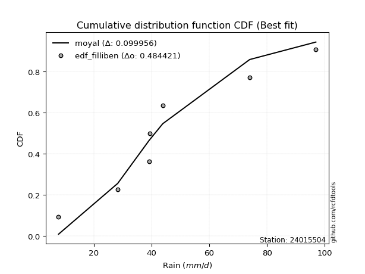</img>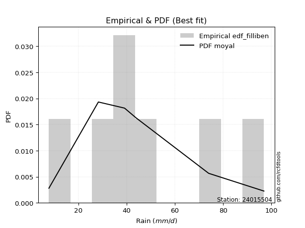</img>

</div>


### 10. EDF Jenkinson (1977)

The Jenkinson formula in hydrology is an empirical plotting position formula used to estimate the non-exceedance probability _(P)_ or return period _(T)_ of a given ordered observation within a sample. It is a widely used method in the frequency analysis of extreme events such as floods and rainfall, as it provides a distribution-free way to plot data. _a≈0.31_ and _b≈0.38_ are constants derived to approximate the median of the probability distribution for the given rank.

<div align="center">


$P=(m-a)/(n+b)$


</div>


**10.1. Empirical values**

<div align="center">

|                | 0                   | 1                   | 2                   | 3             | 4                  | 5                  | 6                  |
|:---------------|:--------------------|:--------------------|:--------------------|:--------------|:-------------------|:-------------------|:-------------------|
| date           | 2015                | 2021                | 2017                | 2020          | 2016               | 2018               | 2019               |
| x              | 7.8                 | 28.3                | 39.1                | 39.4          | 43.9               | 74.0               | 96.9               |
| m              | 1                   | 2                   | 3                   | 4             | 5                  | 6                  | 7                  |
| empirical_dist | edf_jenkinson       | edf_jenkinson       | edf_jenkinson       | edf_jenkinson | edf_jenkinson      | edf_jenkinson      | edf_jenkinson      |
| empirical      | 0.09349593495934959 | 0.22899728997289973 | 0.36449864498644985 | 0.5           | 0.6355013550135502 | 0.7710027100271003 | 0.9065040650406505 |
| empirical_tr   | 1.1031390134529149  | 1.29701230228471    | 1.5735607675906182  | 2.0           | 2.743494423791822  | 4.366863905325444  | 10.695652173913055 |

</div>


**10.2. Kolmogorov-Smirnov fit test (sorted by Δ)**


<div align="center">

|                | 0                   | 1                   | 2                   | 3                   | 4                   | 5                   | 6                   | 7                   | 8                   | 9                   | 10                  | 11                  | 12                  | 13                  | 14                  | 15                  | 16                  | 17                  | 18                  | 19                  | 20                  | 21                  | 22                  | 23                  | 24                  | 25                  | 26                  | 27                  | 28                  | 29                  | 30                  | 31                  | 32                  | 33                  | 34                  | 35                  | 36                  | 37                  | 38                  | 39                  | 40                  | 41                  | 42                  | 43                  | 44                  | 45                  | 46                  | 47                  | 48                  | 49                  | 50                  | 51                  | 52                  | 53                  | 54                  | 55                  | 56                  | 57                  | 58                  | 59                  | 60                  | 61                  | 62                  | 63                  | 64                  | 65                  | 66                  | 67                  | 68                  | 69                  | 70                  | 71                  | 72                  | 73                  | 74                  | 75                  | 76                  | 77                  | 78                  | 79                  | 80                  | 81                  | 82                  | 83                  | 84                  | 85                  | 86                  | 87                  | 88                  | 89                  | 90                  | 91                  | 92                  | 93                  | 94                  | 95                  | 96                  | 97                  | 98                  | 99                  | 100                 | 101                 | 102                 | 103                 | 104                 | 105                 | 106                 | 107                 | 108                 | 109                 | 110                 | 111                 | 112                 | 113                 | 114                 | 115                 | 116                 | 117                 | 118                 | 119                 | 120                 | 121                 | 122                 | 123                 | 124                 | 125                 | 126                 | 127                 | 128                 | 129                 | 130                 | 131                 | 132                 | 133                 | 134                 | 135                 | 136                 | 137                 | 138                 | 139                 | 140                 | 141                 | 142                 | 143                 | 144                 | 145                 | 146                 | 147                 | 148                 | 149                 | 150                 | 151                 | 152                 | 153                 | 154                 | 155                 | 156                 | 157                 | 158                 | 159                 |
|:---------------|:--------------------|:--------------------|:--------------------|:--------------------|:--------------------|:--------------------|:--------------------|:--------------------|:--------------------|:--------------------|:--------------------|:--------------------|:--------------------|:--------------------|:--------------------|:--------------------|:--------------------|:--------------------|:--------------------|:--------------------|:--------------------|:--------------------|:--------------------|:--------------------|:--------------------|:--------------------|:--------------------|:--------------------|:--------------------|:--------------------|:--------------------|:--------------------|:--------------------|:--------------------|:--------------------|:--------------------|:--------------------|:--------------------|:--------------------|:--------------------|:--------------------|:--------------------|:--------------------|:--------------------|:--------------------|:--------------------|:--------------------|:--------------------|:--------------------|:--------------------|:--------------------|:--------------------|:--------------------|:--------------------|:--------------------|:--------------------|:--------------------|:--------------------|:--------------------|:--------------------|:--------------------|:--------------------|:--------------------|:--------------------|:--------------------|:--------------------|:--------------------|:--------------------|:--------------------|:--------------------|:--------------------|:--------------------|:--------------------|:--------------------|:--------------------|:--------------------|:--------------------|:--------------------|:--------------------|:--------------------|:--------------------|:--------------------|:--------------------|:--------------------|:--------------------|:--------------------|:--------------------|:--------------------|:--------------------|:--------------------|:--------------------|:--------------------|:--------------------|:--------------------|:--------------------|:--------------------|:--------------------|:--------------------|:--------------------|:--------------------|:--------------------|:--------------------|:--------------------|:--------------------|:--------------------|:--------------------|:--------------------|:--------------------|:--------------------|:--------------------|:--------------------|:--------------------|:--------------------|:--------------------|:--------------------|:--------------------|:--------------------|:--------------------|:--------------------|:--------------------|:--------------------|:--------------------|:--------------------|:--------------------|:--------------------|:--------------------|:--------------------|:--------------------|:--------------------|:--------------------|:--------------------|:--------------------|:--------------------|:--------------------|:--------------------|:--------------------|:--------------------|:--------------------|:--------------------|:--------------------|:--------------------|:--------------------|:--------------------|:--------------------|:--------------------|:--------------------|:--------------------|:--------------------|:--------------------|:--------------------|:--------------------|:--------------------|:--------------------|:--------------------|:--------------------|:--------------------|:--------------------|:--------------------|:--------------------|:--------------------|
| station        | 24015504            | 24015504            | 24015504            | 24015504            | 24015504            | 24015504            | 24015504            | 24015504            | 24015504            | 24015504            | 24015504            | 24015504            | 24015504            | 24015504            | 24015504            | 24015504            | 24015504            | 24015504            | 24015504            | 24015504            | 24015504            | 24015504            | 24015504            | 24015504            | 24015504            | 24015504            | 24015504            | 24015504            | 24015504            | 24015504            | 24015504            | 24015504            | 24015504            | 24015504            | 24015504            | 24015504            | 24015504            | 24015504            | 24015504            | 24015504            | 24015504            | 24015504            | 24015504            | 24015504            | 24015504            | 24015504            | 24015504            | 24015504            | 24015504            | 24015504            | 24015504            | 24015504            | 24015504            | 24015504            | 24015504            | 24015504            | 24015504            | 24015504            | 24015504            | 24015504            | 24015504            | 24015504            | 24015504            | 24015504            | 24015504            | 24015504            | 24015504            | 24015504            | 24015504            | 24015504            | 24015504            | 24015504            | 24015504            | 24015504            | 24015504            | 24015504            | 24015504            | 24015504            | 24015504            | 24015504            | 24015504            | 24015504            | 24015504            | 24015504            | 24015504            | 24015504            | 24015504            | 24015504            | 24015504            | 24015504            | 24015504            | 24015504            | 24015504            | 24015504            | 24015504            | 24015504            | 24015504            | 24015504            | 24015504            | 24015504            | 24015504            | 24015504            | 24015504            | 24015504            | 24015504            | 24015504            | 24015504            | 24015504            | 24015504            | 24015504            | 24015504            | 24015504            | 24015504            | 24015504            | 24015504            | 24015504            | 24015504            | 24015504            | 24015504            | 24015504            | 24015504            | 24015504            | 24015504            | 24015504            | 24015504            | 24015504            | 24015504            | 24015504            | 24015504            | 24015504            | 24015504            | 24015504            | 24015504            | 24015504            | 24015504            | 24015504            | 24015504            | 24015504            | 24015504            | 24015504            | 24015504            | 24015504            | 24015504            | 24015504            | 24015504            | 24015504            | 24015504            | 24015504            | 24015504            | 24015504            | 24015504            | 24015504            | 24015504            | 24015504            | 24015504            | 24015504            | 24015504            | 24015504            | 24015504            | 24015504            |
| empirical_dist | edf_jenkinson       | edf_jenkinson       | edf_jenkinson       | edf_jenkinson       | edf_jenkinson       | edf_jenkinson       | edf_jenkinson       | edf_jenkinson       | edf_jenkinson       | edf_jenkinson       | edf_jenkinson       | edf_jenkinson       | edf_jenkinson       | edf_jenkinson       | edf_jenkinson       | edf_jenkinson       | edf_jenkinson       | edf_jenkinson       | edf_jenkinson       | edf_jenkinson       | edf_jenkinson       | edf_jenkinson       | edf_jenkinson       | edf_jenkinson       | edf_jenkinson       | edf_jenkinson       | edf_jenkinson       | edf_jenkinson       | edf_jenkinson       | edf_jenkinson       | edf_jenkinson       | edf_jenkinson       | edf_jenkinson       | edf_jenkinson       | edf_jenkinson       | edf_jenkinson       | edf_jenkinson       | edf_jenkinson       | edf_jenkinson       | edf_jenkinson       | edf_jenkinson       | edf_jenkinson       | edf_jenkinson       | edf_jenkinson       | edf_jenkinson       | edf_jenkinson       | edf_jenkinson       | edf_jenkinson       | edf_jenkinson       | edf_jenkinson       | edf_jenkinson       | edf_jenkinson       | edf_jenkinson       | edf_jenkinson       | edf_jenkinson       | edf_jenkinson       | edf_jenkinson       | edf_jenkinson       | edf_jenkinson       | edf_jenkinson       | edf_jenkinson       | edf_jenkinson       | edf_jenkinson       | edf_jenkinson       | edf_jenkinson       | edf_jenkinson       | edf_jenkinson       | edf_jenkinson       | edf_jenkinson       | edf_jenkinson       | edf_jenkinson       | edf_jenkinson       | edf_jenkinson       | edf_jenkinson       | edf_jenkinson       | edf_jenkinson       | edf_jenkinson       | edf_jenkinson       | edf_jenkinson       | edf_jenkinson       | edf_jenkinson       | edf_jenkinson       | edf_jenkinson       | edf_jenkinson       | edf_jenkinson       | edf_jenkinson       | edf_jenkinson       | edf_jenkinson       | edf_jenkinson       | edf_jenkinson       | edf_jenkinson       | edf_jenkinson       | edf_jenkinson       | edf_jenkinson       | edf_jenkinson       | edf_jenkinson       | edf_jenkinson       | edf_jenkinson       | edf_jenkinson       | edf_jenkinson       | edf_jenkinson       | edf_jenkinson       | edf_jenkinson       | edf_jenkinson       | edf_jenkinson       | edf_jenkinson       | edf_jenkinson       | edf_jenkinson       | edf_jenkinson       | edf_jenkinson       | edf_jenkinson       | edf_jenkinson       | edf_jenkinson       | edf_jenkinson       | edf_jenkinson       | edf_jenkinson       | edf_jenkinson       | edf_jenkinson       | edf_jenkinson       | edf_jenkinson       | edf_jenkinson       | edf_jenkinson       | edf_jenkinson       | edf_jenkinson       | edf_jenkinson       | edf_jenkinson       | edf_jenkinson       | edf_jenkinson       | edf_jenkinson       | edf_jenkinson       | edf_jenkinson       | edf_jenkinson       | edf_jenkinson       | edf_jenkinson       | edf_jenkinson       | edf_jenkinson       | edf_jenkinson       | edf_jenkinson       | edf_jenkinson       | edf_jenkinson       | edf_jenkinson       | edf_jenkinson       | edf_jenkinson       | edf_jenkinson       | edf_jenkinson       | edf_jenkinson       | edf_jenkinson       | edf_jenkinson       | edf_jenkinson       | edf_jenkinson       | edf_jenkinson       | edf_jenkinson       | edf_jenkinson       | edf_jenkinson       | edf_jenkinson       | edf_jenkinson       | edf_jenkinson       | edf_jenkinson       | edf_jenkinson       | edf_jenkinson       |
| p_dist         | moyal               | exponnorm           | halfnorm            | genexpon            | loggengamma         | weibull_min         | logvonmises_line    | loggompertz         | truncexpon          | erlang              | gamma               | f                   | invweibull          | logt                | genlogistic         | logpearson3         | gumbel_r            | kstwobign           | betaprime           | halflogistic        | loggumbel_l         | invgauss            | exponweib           | logweibull_min      | johnsonsu           | loggenlogistic      | invgamma            | logmielke           | logdgamma           | logskewnorm         | nct                 | logdweibull         | logtrapezoid        | logtriang           | genextreme          | gennorm             | logloglaplace       | skewnorm            | logburr12           | lomax               | loggennorm          | loggenhalflogistic  | rayleigh            | dweibull            | bradford            | logloggamma         | logargus            | ncf                 | logjohnsonsu        | foldnorm            | dgamma              | rice                | pearson3            | maxwell             | logsemicircular     | loganglit           | gausshyper          | logexponnorm        | lognorm             | logcrystalball      | logrice             | logfatiguelife      | logf                | wald                | lognct              | loglogistic         | truncweibull_min    | loghypsecant        | logerlang           | logncf              | arcsine             | loggamma            | loggamma            | vonmises_line       | loginvgamma         | logbetaprime        | loglaplace          | loglaplace          | loginvgauss         | semicircular        | logalpha            | anglit              | t                   | crystalball         | norm                | truncnorm           | logarcsine          | logistic            | logmaxwell          | logburr             | loginvweibull       | hypsecant           | kappa4              | logbeta             | logfoldnorm         | loglevy_l           | lograyleigh         | logcosine           | cosine              | burr                | laplace             | ksone               | logweibull_max      | loggumbel_r         | loghalfnorm         | logtruncnorm        | nakagami            | lognakagami         | wrapcauchy          | logkstwobign        | uniform             | kappa3              | loggenexpon         | beta                | halfgennorm         | gumbel_l            | logmoyal            | loggausshyper       | loghalflogistic     | loggenextreme       | loggenpareto        | alpha               | argus               | logksone            | logwrapcauchy       | logkappa3           | loguniform          | logtukeylambda      | levy_l              | mielke              | gengamma            | logkappa4           | burr12              | logwald             | loglomax            | genpareto           | genhalflogistic     | logtruncexpon       | loghalfgennorm      | logbradford         | logrdist            | logtruncweibull_min | johnsonsb           | triang              | logjohnsonsb        | trapezoid           | rdist               | powerlaw            | fatiguelife         | tukeylambda         | logexponpow         | weibull_max         | logexponweib        | exponpow            | logpowerlaw         | truncpareto         | logtruncpareto      | gompertz            | logvonmises         | vonmises            |
| delta          | 0.09968043482583816 | 0.101070868321679   | 0.10193594292615404 | 0.1034888572703499  | 0.10534167367956826 | 0.1073255535433495  | 0.10788226472586404 | 0.10808166602766717 | 0.10862241029207831 | 0.11087848427473368 | 0.11087868670389367 | 0.11100452917061732 | 0.11116923163822134 | 0.11256645673470234 | 0.11309534828658319 | 0.11394040689241436 | 0.11400992232443619 | 0.11425182271748735 | 0.11436234474058582 | 0.11550121708514699 | 0.1172044241007616  | 0.11879829877033177 | 0.1191628347696777  | 0.12042001815111292 | 0.1211728913052551  | 0.1216200746051066  | 0.1225527486316278  | 0.12255507101919183 | 0.12335847041364395 | 0.12368042598112727 | 0.12388842379750875 | 0.1240004788766198  | 0.12425288349919916 | 0.1256259069249932  | 0.1275014208766042  | 0.12825399297037499 | 0.12880282968401952 | 0.12896114297673622 | 0.13011943635471634 | 0.13094934160967364 | 0.13200766532604513 | 0.13462327404616267 | 0.13534188558025828 | 0.13550135501375865 | 0.138023186880202   | 0.1397159986461533  | 0.1413256196906847  | 0.14157540037279132 | 0.14261832545088338 | 0.1430250240379784  | 0.14361408974415546 | 0.14388087708348796 | 0.14691448275646307 | 0.14718112753738138 | 0.15164660796314094 | 0.15283967965013706 | 0.15368116399564108 | 0.15573100964118952 | 0.15573169323783037 | 0.1557317126873004  | 0.15573700239949667 | 0.1563885030792253  | 0.15639193178467387 | 0.15696779988196313 | 0.15747492086356946 | 0.15848941415483447 | 0.15879706780622044 | 0.1608403959085805  | 0.160970152170876   | 0.16142468448241026 | 0.16151480990226097 | 0.16272195519236493 | 0.16272195519236493 | 0.16505632472612197 | 0.16864338818642316 | 0.16901681286713516 | 0.17011745646368176 | 0.17011745646368176 | 0.171991887814601   | 0.17222870930068757 | 0.17452531283763567 | 0.17492390863999518 | 0.18145487325537513 | 0.1814557427049332  | 0.18145575480820375 | 0.18145575966825078 | 0.18433605761421004 | 0.18766012057266362 | 0.18786276442129263 | 0.19015389976440888 | 0.19155941429795267 | 0.19291082183222663 | 0.19424373240042275 | 0.19478144570231476 | 0.1957091713584323  | 0.19754031638755953 | 0.1984064450133845  | 0.2060201226397344  | 0.20724278476269714 | 0.20826655841510006 | 0.2108187615798971  | 0.21453240626682374 | 0.2159353431532518  | 0.22641184261469421 | 0.2280952165522509  | 0.22898960074478833 | 0.22899684851874802 | 0.2289972896198708  | 0.2292822130513456  | 0.22981774436347438 | 0.2303386165174784  | 0.2304177883249071  | 0.23391804366771782 | 0.23690672299234056 | 0.23732338158745303 | 0.2516985737003046  | 0.2520067916342636  | 0.25333845350968065 | 0.2541502398437356  | 0.25511582832322555 | 0.270221106616776   | 0.2752782886699022  | 0.27647226025837857 | 0.2805811770341148  | 0.2812637488811355  | 0.28236034084965966 | 0.28249687043551774 | 0.2844139074992168  | 0.28961665953203064 | 0.29146346315277205 | 0.2991380265735745  | 0.3041260449162837  | 0.3221411542542659  | 0.323094603604344   | 0.33065310627647293 | 0.33887709196502674 | 0.3477648814428508  | 0.3630695900708424  | 0.3721809501824309  | 0.3736703284445545  | 0.3908246832430744  | 0.4082428169771143  | 0.42183128242950113 | 0.42401939866511573 | 0.43278029338624757 | 0.4578491969016572  | 0.5124708936578937  | 0.5621337905522127  | 0.5799100622621672  | 0.5900415087946865  | 0.5979425074412249  | 0.6196627259996119  | 0.6211290178568688  | 0.6256039950043636  | 0.655748905799547   | 0.6662220323648599  | 0.721449308260515   | 0.7703962304177     | 1.11468669965989    | 14.816226061375758  |
| deltao         | 0.48442053926100004 | 0.48442053926100004 | 0.48442053926100004 | 0.48442053926100004 | 0.48442053926100004 | 0.48442053926100004 | 0.48442053926100004 | 0.48442053926100004 | 0.48442053926100004 | 0.48442053926100004 | 0.48442053926100004 | 0.48442053926100004 | 0.48442053926100004 | 0.48442053926100004 | 0.48442053926100004 | 0.48442053926100004 | 0.48442053926100004 | 0.48442053926100004 | 0.48442053926100004 | 0.48442053926100004 | 0.48442053926100004 | 0.48442053926100004 | 0.48442053926100004 | 0.48442053926100004 | 0.48442053926100004 | 0.48442053926100004 | 0.48442053926100004 | 0.48442053926100004 | 0.48442053926100004 | 0.48442053926100004 | 0.48442053926100004 | 0.48442053926100004 | 0.48442053926100004 | 0.48442053926100004 | 0.48442053926100004 | 0.48442053926100004 | 0.48442053926100004 | 0.48442053926100004 | 0.48442053926100004 | 0.48442053926100004 | 0.48442053926100004 | 0.48442053926100004 | 0.48442053926100004 | 0.48442053926100004 | 0.48442053926100004 | 0.48442053926100004 | 0.48442053926100004 | 0.48442053926100004 | 0.48442053926100004 | 0.48442053926100004 | 0.48442053926100004 | 0.48442053926100004 | 0.48442053926100004 | 0.48442053926100004 | 0.48442053926100004 | 0.48442053926100004 | 0.48442053926100004 | 0.48442053926100004 | 0.48442053926100004 | 0.48442053926100004 | 0.48442053926100004 | 0.48442053926100004 | 0.48442053926100004 | 0.48442053926100004 | 0.48442053926100004 | 0.48442053926100004 | 0.48442053926100004 | 0.48442053926100004 | 0.48442053926100004 | 0.48442053926100004 | 0.48442053926100004 | 0.48442053926100004 | 0.48442053926100004 | 0.48442053926100004 | 0.48442053926100004 | 0.48442053926100004 | 0.48442053926100004 | 0.48442053926100004 | 0.48442053926100004 | 0.48442053926100004 | 0.48442053926100004 | 0.48442053926100004 | 0.48442053926100004 | 0.48442053926100004 | 0.48442053926100004 | 0.48442053926100004 | 0.48442053926100004 | 0.48442053926100004 | 0.48442053926100004 | 0.48442053926100004 | 0.48442053926100004 | 0.48442053926100004 | 0.48442053926100004 | 0.48442053926100004 | 0.48442053926100004 | 0.48442053926100004 | 0.48442053926100004 | 0.48442053926100004 | 0.48442053926100004 | 0.48442053926100004 | 0.48442053926100004 | 0.48442053926100004 | 0.48442053926100004 | 0.48442053926100004 | 0.48442053926100004 | 0.48442053926100004 | 0.48442053926100004 | 0.48442053926100004 | 0.48442053926100004 | 0.48442053926100004 | 0.48442053926100004 | 0.48442053926100004 | 0.48442053926100004 | 0.48442053926100004 | 0.48442053926100004 | 0.48442053926100004 | 0.48442053926100004 | 0.48442053926100004 | 0.48442053926100004 | 0.48442053926100004 | 0.48442053926100004 | 0.48442053926100004 | 0.48442053926100004 | 0.48442053926100004 | 0.48442053926100004 | 0.48442053926100004 | 0.48442053926100004 | 0.48442053926100004 | 0.48442053926100004 | 0.48442053926100004 | 0.48442053926100004 | 0.48442053926100004 | 0.48442053926100004 | 0.48442053926100004 | 0.48442053926100004 | 0.48442053926100004 | 0.48442053926100004 | 0.48442053926100004 | 0.48442053926100004 | 0.48442053926100004 | 0.48442053926100004 | 0.48442053926100004 | 0.48442053926100004 | 0.48442053926100004 | 0.48442053926100004 | 0.48442053926100004 | 0.48442053926100004 | 0.48442053926100004 | 0.48442053926100004 | 0.48442053926100004 | 0.48442053926100004 | 0.48442053926100004 | 0.48442053926100004 | 0.48442053926100004 | 0.48442053926100004 | 0.48442053926100004 | 0.48442053926100004 | 0.48442053926100004 | 0.48442053926100004 | 0.48442053926100004 |
| eval           | Δo > Δ              | Δo > Δ              | Δo > Δ              | Δo > Δ              | Δo > Δ              | Δo > Δ              | Δo > Δ              | Δo > Δ              | Δo > Δ              | Δo > Δ              | Δo > Δ              | Δo > Δ              | Δo > Δ              | Δo > Δ              | Δo > Δ              | Δo > Δ              | Δo > Δ              | Δo > Δ              | Δo > Δ              | Δo > Δ              | Δo > Δ              | Δo > Δ              | Δo > Δ              | Δo > Δ              | Δo > Δ              | Δo > Δ              | Δo > Δ              | Δo > Δ              | Δo > Δ              | Δo > Δ              | Δo > Δ              | Δo > Δ              | Δo > Δ              | Δo > Δ              | Δo > Δ              | Δo > Δ              | Δo > Δ              | Δo > Δ              | Δo > Δ              | Δo > Δ              | Δo > Δ              | Δo > Δ              | Δo > Δ              | Δo > Δ              | Δo > Δ              | Δo > Δ              | Δo > Δ              | Δo > Δ              | Δo > Δ              | Δo > Δ              | Δo > Δ              | Δo > Δ              | Δo > Δ              | Δo > Δ              | Δo > Δ              | Δo > Δ              | Δo > Δ              | Δo > Δ              | Δo > Δ              | Δo > Δ              | Δo > Δ              | Δo > Δ              | Δo > Δ              | Δo > Δ              | Δo > Δ              | Δo > Δ              | Δo > Δ              | Δo > Δ              | Δo > Δ              | Δo > Δ              | Δo > Δ              | Δo > Δ              | Δo > Δ              | Δo > Δ              | Δo > Δ              | Δo > Δ              | Δo > Δ              | Δo > Δ              | Δo > Δ              | Δo > Δ              | Δo > Δ              | Δo > Δ              | Δo > Δ              | Δo > Δ              | Δo > Δ              | Δo > Δ              | Δo > Δ              | Δo > Δ              | Δo > Δ              | Δo > Δ              | Δo > Δ              | Δo > Δ              | Δo > Δ              | Δo > Δ              | Δo > Δ              | Δo > Δ              | Δo > Δ              | Δo > Δ              | Δo > Δ              | Δo > Δ              | Δo > Δ              | Δo > Δ              | Δo > Δ              | Δo > Δ              | Δo > Δ              | Δo > Δ              | Δo > Δ              | Δo > Δ              | Δo > Δ              | Δo > Δ              | Δo > Δ              | Δo > Δ              | Δo > Δ              | Δo > Δ              | Δo > Δ              | Δo > Δ              | Δo > Δ              | Δo > Δ              | Δo > Δ              | Δo > Δ              | Δo > Δ              | Δo > Δ              | Δo > Δ              | Δo > Δ              | Δo > Δ              | Δo > Δ              | Δo > Δ              | Δo > Δ              | Δo > Δ              | Δo > Δ              | Δo > Δ              | Δo > Δ              | Δo > Δ              | Δo > Δ              | Δo > Δ              | Δo > Δ              | Δo > Δ              | Δo > Δ              | Δo > Δ              | Δo > Δ              | Δo > Δ              | Δo > Δ              | Δo > Δ              | Δo > Δ              | Δo > Δ              | Δo > Δ              | Δo <= Δ             | Δo <= Δ             | Δo <= Δ             | Δo <= Δ             | Δo <= Δ             | Δo <= Δ             | Δo <= Δ             | Δo <= Δ             | Δo <= Δ             | Δo <= Δ             | Δo <= Δ             | Δo <= Δ             | Δo <= Δ             | Δo <= Δ             |
| fit            | 1                   | 1                   | 1                   | 1                   | 1                   | 1                   | 1                   | 1                   | 1                   | 1                   | 1                   | 1                   | 1                   | 1                   | 1                   | 1                   | 1                   | 1                   | 1                   | 1                   | 1                   | 1                   | 1                   | 1                   | 1                   | 1                   | 1                   | 1                   | 1                   | 1                   | 1                   | 1                   | 1                   | 1                   | 1                   | 1                   | 1                   | 1                   | 1                   | 1                   | 1                   | 1                   | 1                   | 1                   | 1                   | 1                   | 1                   | 1                   | 1                   | 1                   | 1                   | 1                   | 1                   | 1                   | 1                   | 1                   | 1                   | 1                   | 1                   | 1                   | 1                   | 1                   | 1                   | 1                   | 1                   | 1                   | 1                   | 1                   | 1                   | 1                   | 1                   | 1                   | 1                   | 1                   | 1                   | 1                   | 1                   | 1                   | 1                   | 1                   | 1                   | 1                   | 1                   | 1                   | 1                   | 1                   | 1                   | 1                   | 1                   | 1                   | 1                   | 1                   | 1                   | 1                   | 1                   | 1                   | 1                   | 1                   | 1                   | 1                   | 1                   | 1                   | 1                   | 1                   | 1                   | 1                   | 1                   | 1                   | 1                   | 1                   | 1                   | 1                   | 1                   | 1                   | 1                   | 1                   | 1                   | 1                   | 1                   | 1                   | 1                   | 1                   | 1                   | 1                   | 1                   | 1                   | 1                   | 1                   | 1                   | 1                   | 1                   | 1                   | 1                   | 1                   | 1                   | 1                   | 1                   | 1                   | 1                   | 1                   | 1                   | 1                   | 1                   | 1                   | 1                   | 1                   | 0                   | 0                   | 0                   | 0                   | 0                   | 0                   | 0                   | 0                   | 0                   | 0                   | 0                   | 0                   | 0                   | 0                   |
| n              | 7                   | 7                   | 7                   | 7                   | 7                   | 7                   | 7                   | 7                   | 7                   | 7                   | 7                   | 7                   | 7                   | 7                   | 7                   | 7                   | 7                   | 7                   | 7                   | 7                   | 7                   | 7                   | 7                   | 7                   | 7                   | 7                   | 7                   | 7                   | 7                   | 7                   | 7                   | 7                   | 7                   | 7                   | 7                   | 7                   | 7                   | 7                   | 7                   | 7                   | 7                   | 7                   | 7                   | 7                   | 7                   | 7                   | 7                   | 7                   | 7                   | 7                   | 7                   | 7                   | 7                   | 7                   | 7                   | 7                   | 7                   | 7                   | 7                   | 7                   | 7                   | 7                   | 7                   | 7                   | 7                   | 7                   | 7                   | 7                   | 7                   | 7                   | 7                   | 7                   | 7                   | 7                   | 7                   | 7                   | 7                   | 7                   | 7                   | 7                   | 7                   | 7                   | 7                   | 7                   | 7                   | 7                   | 7                   | 7                   | 7                   | 7                   | 7                   | 7                   | 7                   | 7                   | 7                   | 7                   | 7                   | 7                   | 7                   | 7                   | 7                   | 7                   | 7                   | 7                   | 7                   | 7                   | 7                   | 7                   | 7                   | 7                   | 7                   | 7                   | 7                   | 7                   | 7                   | 7                   | 7                   | 7                   | 7                   | 7                   | 7                   | 7                   | 7                   | 7                   | 7                   | 7                   | 7                   | 7                   | 7                   | 7                   | 7                   | 7                   | 7                   | 7                   | 7                   | 7                   | 7                   | 7                   | 7                   | 7                   | 7                   | 7                   | 7                   | 7                   | 7                   | 7                   | 7                   | 7                   | 7                   | 7                   | 7                   | 7                   | 7                   | 7                   | 7                   | 7                   | 7                   | 7                   | 7                   | 7                   |
| best_fit       | 1                   | 0                   | 0                   | 0                   | 0                   | 0                   | 0                   | 0                   | 0                   | 0                   | 0                   | 0                   | 0                   | 0                   | 0                   | 0                   | 0                   | 0                   | 0                   | 0                   | 0                   | 0                   | 0                   | 0                   | 0                   | 0                   | 0                   | 0                   | 0                   | 0                   | 0                   | 0                   | 0                   | 0                   | 0                   | 0                   | 0                   | 0                   | 0                   | 0                   | 0                   | 0                   | 0                   | 0                   | 0                   | 0                   | 0                   | 0                   | 0                   | 0                   | 0                   | 0                   | 0                   | 0                   | 0                   | 0                   | 0                   | 0                   | 0                   | 0                   | 0                   | 0                   | 0                   | 0                   | 0                   | 0                   | 0                   | 0                   | 0                   | 0                   | 0                   | 0                   | 0                   | 0                   | 0                   | 0                   | 0                   | 0                   | 0                   | 0                   | 0                   | 0                   | 0                   | 0                   | 0                   | 0                   | 0                   | 0                   | 0                   | 0                   | 0                   | 0                   | 0                   | 0                   | 0                   | 0                   | 0                   | 0                   | 0                   | 0                   | 0                   | 0                   | 0                   | 0                   | 0                   | 0                   | 0                   | 0                   | 0                   | 0                   | 0                   | 0                   | 0                   | 0                   | 0                   | 0                   | 0                   | 0                   | 0                   | 0                   | 0                   | 0                   | 0                   | 0                   | 0                   | 0                   | 0                   | 0                   | 0                   | 0                   | 0                   | 0                   | 0                   | 0                   | 0                   | 0                   | 0                   | 0                   | 0                   | 0                   | 0                   | 0                   | 0                   | 0                   | 0                   | 0                   | 0                   | 0                   | 0                   | 0                   | 0                   | 0                   | 0                   | 0                   | 0                   | 0                   | 0                   | 0                   | 0                   | 0                   |
| best_fit_sort  | 1                   | 2                   | 3                   | 4                   | 5                   | 6                   | 7                   | 8                   | 9                   | 10                  | 11                  | 12                  | 13                  | 14                  | 15                  | 16                  | 17                  | 18                  | 19                  | 20                  | 21                  | 22                  | 23                  | 24                  | 25                  | 26                  | 27                  | 28                  | 29                  | 30                  | 31                  | 32                  | 33                  | 34                  | 35                  | 36                  | 37                  | 38                  | 39                  | 40                  | 41                  | 42                  | 43                  | 44                  | 45                  | 46                  | 47                  | 48                  | 49                  | 50                  | 51                  | 52                  | 53                  | 54                  | 55                  | 56                  | 57                  | 58                  | 59                  | 60                  | 61                  | 62                  | 63                  | 64                  | 65                  | 66                  | 67                  | 68                  | 69                  | 70                  | 71                  | 72                  | 73                  | 74                  | 75                  | 76                  | 77                  | 78                  | 79                  | 80                  | 81                  | 82                  | 83                  | 84                  | 85                  | 86                  | 87                  | 88                  | 89                  | 90                  | 91                  | 92                  | 93                  | 94                  | 95                  | 96                  | 97                  | 98                  | 99                  | 100                 | 101                 | 102                 | 103                 | 104                 | 105                 | 106                 | 107                 | 108                 | 109                 | 110                 | 111                 | 112                 | 113                 | 114                 | 115                 | 116                 | 117                 | 118                 | 119                 | 120                 | 121                 | 122                 | 123                 | 124                 | 125                 | 126                 | 127                 | 128                 | 129                 | 130                 | 131                 | 132                 | 133                 | 134                 | 135                 | 136                 | 137                 | 138                 | 139                 | 140                 | 141                 | 142                 | 143                 | 144                 | 145                 | 146                 | 147                 | 148                 | 149                 | 150                 | 151                 | 152                 | 153                 | 154                 | 155                 | 156                 | 157                 | 158                 | 159                 | 160                 |

</div>


**10.3. Best fit**

<div align="center">

|   id |   station | empirical_dist   | p_dist   |     delta |   deltao | eval   |   fit |   n |   best_fit |   best_fit_sort |
|-----:|----------:|:-----------------|:---------|----------:|---------:|:-------|------:|----:|-----------:|----------------:|
|    0 |  24015504 | edf_jenkinson    | moyal    | 0.0996804 | 0.484421 | Δo > Δ |     1 |   7 |          1 |               1 |

</div>


<div align="center">

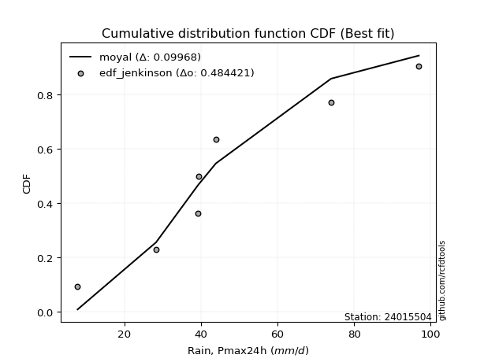</img>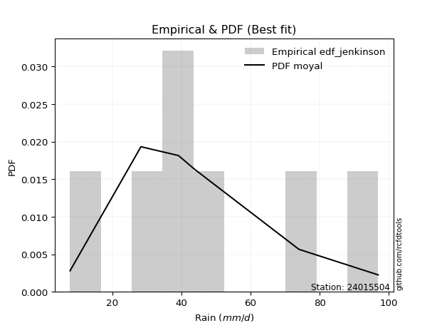</img>

</div>


### 11. EDF Cunnane (1978)

Cunnane´s work in statistical hydrology has focused on the performance and evaluation of different probability distributions (such as GEV, Gumbel, Lognormal) for flood frequency estimation. _b_ is a constant, typically set to 0.4.

<div align="center">


$P=(m-b)/(n+1-2b)$


</div>


**11.1. Empirical values**

<div align="center">

|                | 0                   | 1                   | 2                  | 3           | 4                  | 5                  | 6                  |
|:---------------|:--------------------|:--------------------|:-------------------|:------------|:-------------------|:-------------------|:-------------------|
| date           | 2015                | 2021                | 2017               | 2020        | 2016               | 2018               | 2019               |
| x              | 7.8                 | 28.3                | 39.1               | 39.4        | 43.9               | 74.0               | 96.9               |
| m              | 1                   | 2                   | 3                  | 4           | 5                  | 6                  | 7                  |
| empirical_dist | edf_cunnane         | edf_cunnane         | edf_cunnane        | edf_cunnane | edf_cunnane        | edf_cunnane        | edf_cunnane        |
| empirical      | 0.08333333333333333 | 0.22222222222222224 | 0.3611111111111111 | 0.5         | 0.6388888888888888 | 0.7777777777777777 | 0.9166666666666666 |
| empirical_tr   | 1.090909090909091   | 1.2857142857142856  | 1.565217391304348  | 2.0         | 2.7692307692307687 | 4.499999999999998  | 11.999999999999995 |

</div>


**11.2. Kolmogorov-Smirnov fit test (sorted by Δ)**


<div align="center">

|                | 0                   | 1                   | 2                   | 3                   | 4                   | 5                   | 6                   | 7                   | 8                   | 9                   | 10                  | 11                  | 12                  | 13                  | 14                  | 15                  | 16                  | 17                  | 18                  | 19                  | 20                  | 21                  | 22                  | 23                  | 24                  | 25                  | 26                  | 27                  | 28                  | 29                  | 30                  | 31                  | 32                  | 33                  | 34                  | 35                  | 36                  | 37                  | 38                  | 39                  | 40                  | 41                  | 42                  | 43                  | 44                  | 45                  | 46                  | 47                  | 48                  | 49                  | 50                  | 51                  | 52                  | 53                  | 54                  | 55                  | 56                  | 57                  | 58                  | 59                  | 60                  | 61                  | 62                  | 63                  | 64                  | 65                  | 66                  | 67                  | 68                  | 69                  | 70                  | 71                  | 72                  | 73                  | 74                  | 75                  | 76                  | 77                  | 78                  | 79                  | 80                  | 81                  | 82                  | 83                  | 84                  | 85                  | 86                  | 87                  | 88                  | 89                  | 90                  | 91                  | 92                  | 93                  | 94                  | 95                  | 96                  | 97                  | 98                  | 99                  | 100                 | 101                 | 102                 | 103                 | 104                 | 105                 | 106                 | 107                 | 108                 | 109                 | 110                 | 111                 | 112                 | 113                 | 114                 | 115                 | 116                 | 117                 | 118                 | 119                 | 120                 | 121                 | 122                 | 123                 | 124                 | 125                 | 126                 | 127                 | 128                 | 129                 | 130                 | 131                 | 132                 | 133                 | 134                 | 135                 | 136                 | 137                 | 138                 | 139                 | 140                 | 141                 | 142                 | 143                 | 144                 | 145                 | 146                 | 147                 | 148                 | 149                 | 150                 | 151                 | 152                 | 153                 | 154                 | 155                 | 156                 | 157                 | 158                 | 159                 |
|:---------------|:--------------------|:--------------------|:--------------------|:--------------------|:--------------------|:--------------------|:--------------------|:--------------------|:--------------------|:--------------------|:--------------------|:--------------------|:--------------------|:--------------------|:--------------------|:--------------------|:--------------------|:--------------------|:--------------------|:--------------------|:--------------------|:--------------------|:--------------------|:--------------------|:--------------------|:--------------------|:--------------------|:--------------------|:--------------------|:--------------------|:--------------------|:--------------------|:--------------------|:--------------------|:--------------------|:--------------------|:--------------------|:--------------------|:--------------------|:--------------------|:--------------------|:--------------------|:--------------------|:--------------------|:--------------------|:--------------------|:--------------------|:--------------------|:--------------------|:--------------------|:--------------------|:--------------------|:--------------------|:--------------------|:--------------------|:--------------------|:--------------------|:--------------------|:--------------------|:--------------------|:--------------------|:--------------------|:--------------------|:--------------------|:--------------------|:--------------------|:--------------------|:--------------------|:--------------------|:--------------------|:--------------------|:--------------------|:--------------------|:--------------------|:--------------------|:--------------------|:--------------------|:--------------------|:--------------------|:--------------------|:--------------------|:--------------------|:--------------------|:--------------------|:--------------------|:--------------------|:--------------------|:--------------------|:--------------------|:--------------------|:--------------------|:--------------------|:--------------------|:--------------------|:--------------------|:--------------------|:--------------------|:--------------------|:--------------------|:--------------------|:--------------------|:--------------------|:--------------------|:--------------------|:--------------------|:--------------------|:--------------------|:--------------------|:--------------------|:--------------------|:--------------------|:--------------------|:--------------------|:--------------------|:--------------------|:--------------------|:--------------------|:--------------------|:--------------------|:--------------------|:--------------------|:--------------------|:--------------------|:--------------------|:--------------------|:--------------------|:--------------------|:--------------------|:--------------------|:--------------------|:--------------------|:--------------------|:--------------------|:--------------------|:--------------------|:--------------------|:--------------------|:--------------------|:--------------------|:--------------------|:--------------------|:--------------------|:--------------------|:--------------------|:--------------------|:--------------------|:--------------------|:--------------------|:--------------------|:--------------------|:--------------------|:--------------------|:--------------------|:--------------------|:--------------------|:--------------------|:--------------------|:--------------------|:--------------------|:--------------------|
| station        | 24015504            | 24015504            | 24015504            | 24015504            | 24015504            | 24015504            | 24015504            | 24015504            | 24015504            | 24015504            | 24015504            | 24015504            | 24015504            | 24015504            | 24015504            | 24015504            | 24015504            | 24015504            | 24015504            | 24015504            | 24015504            | 24015504            | 24015504            | 24015504            | 24015504            | 24015504            | 24015504            | 24015504            | 24015504            | 24015504            | 24015504            | 24015504            | 24015504            | 24015504            | 24015504            | 24015504            | 24015504            | 24015504            | 24015504            | 24015504            | 24015504            | 24015504            | 24015504            | 24015504            | 24015504            | 24015504            | 24015504            | 24015504            | 24015504            | 24015504            | 24015504            | 24015504            | 24015504            | 24015504            | 24015504            | 24015504            | 24015504            | 24015504            | 24015504            | 24015504            | 24015504            | 24015504            | 24015504            | 24015504            | 24015504            | 24015504            | 24015504            | 24015504            | 24015504            | 24015504            | 24015504            | 24015504            | 24015504            | 24015504            | 24015504            | 24015504            | 24015504            | 24015504            | 24015504            | 24015504            | 24015504            | 24015504            | 24015504            | 24015504            | 24015504            | 24015504            | 24015504            | 24015504            | 24015504            | 24015504            | 24015504            | 24015504            | 24015504            | 24015504            | 24015504            | 24015504            | 24015504            | 24015504            | 24015504            | 24015504            | 24015504            | 24015504            | 24015504            | 24015504            | 24015504            | 24015504            | 24015504            | 24015504            | 24015504            | 24015504            | 24015504            | 24015504            | 24015504            | 24015504            | 24015504            | 24015504            | 24015504            | 24015504            | 24015504            | 24015504            | 24015504            | 24015504            | 24015504            | 24015504            | 24015504            | 24015504            | 24015504            | 24015504            | 24015504            | 24015504            | 24015504            | 24015504            | 24015504            | 24015504            | 24015504            | 24015504            | 24015504            | 24015504            | 24015504            | 24015504            | 24015504            | 24015504            | 24015504            | 24015504            | 24015504            | 24015504            | 24015504            | 24015504            | 24015504            | 24015504            | 24015504            | 24015504            | 24015504            | 24015504            | 24015504            | 24015504            | 24015504            | 24015504            | 24015504            | 24015504            |
| empirical_dist | edf_cunnane         | edf_cunnane         | edf_cunnane         | edf_cunnane         | edf_cunnane         | edf_cunnane         | edf_cunnane         | edf_cunnane         | edf_cunnane         | edf_cunnane         | edf_cunnane         | edf_cunnane         | edf_cunnane         | edf_cunnane         | edf_cunnane         | edf_cunnane         | edf_cunnane         | edf_cunnane         | edf_cunnane         | edf_cunnane         | edf_cunnane         | edf_cunnane         | edf_cunnane         | edf_cunnane         | edf_cunnane         | edf_cunnane         | edf_cunnane         | edf_cunnane         | edf_cunnane         | edf_cunnane         | edf_cunnane         | edf_cunnane         | edf_cunnane         | edf_cunnane         | edf_cunnane         | edf_cunnane         | edf_cunnane         | edf_cunnane         | edf_cunnane         | edf_cunnane         | edf_cunnane         | edf_cunnane         | edf_cunnane         | edf_cunnane         | edf_cunnane         | edf_cunnane         | edf_cunnane         | edf_cunnane         | edf_cunnane         | edf_cunnane         | edf_cunnane         | edf_cunnane         | edf_cunnane         | edf_cunnane         | edf_cunnane         | edf_cunnane         | edf_cunnane         | edf_cunnane         | edf_cunnane         | edf_cunnane         | edf_cunnane         | edf_cunnane         | edf_cunnane         | edf_cunnane         | edf_cunnane         | edf_cunnane         | edf_cunnane         | edf_cunnane         | edf_cunnane         | edf_cunnane         | edf_cunnane         | edf_cunnane         | edf_cunnane         | edf_cunnane         | edf_cunnane         | edf_cunnane         | edf_cunnane         | edf_cunnane         | edf_cunnane         | edf_cunnane         | edf_cunnane         | edf_cunnane         | edf_cunnane         | edf_cunnane         | edf_cunnane         | edf_cunnane         | edf_cunnane         | edf_cunnane         | edf_cunnane         | edf_cunnane         | edf_cunnane         | edf_cunnane         | edf_cunnane         | edf_cunnane         | edf_cunnane         | edf_cunnane         | edf_cunnane         | edf_cunnane         | edf_cunnane         | edf_cunnane         | edf_cunnane         | edf_cunnane         | edf_cunnane         | edf_cunnane         | edf_cunnane         | edf_cunnane         | edf_cunnane         | edf_cunnane         | edf_cunnane         | edf_cunnane         | edf_cunnane         | edf_cunnane         | edf_cunnane         | edf_cunnane         | edf_cunnane         | edf_cunnane         | edf_cunnane         | edf_cunnane         | edf_cunnane         | edf_cunnane         | edf_cunnane         | edf_cunnane         | edf_cunnane         | edf_cunnane         | edf_cunnane         | edf_cunnane         | edf_cunnane         | edf_cunnane         | edf_cunnane         | edf_cunnane         | edf_cunnane         | edf_cunnane         | edf_cunnane         | edf_cunnane         | edf_cunnane         | edf_cunnane         | edf_cunnane         | edf_cunnane         | edf_cunnane         | edf_cunnane         | edf_cunnane         | edf_cunnane         | edf_cunnane         | edf_cunnane         | edf_cunnane         | edf_cunnane         | edf_cunnane         | edf_cunnane         | edf_cunnane         | edf_cunnane         | edf_cunnane         | edf_cunnane         | edf_cunnane         | edf_cunnane         | edf_cunnane         | edf_cunnane         | edf_cunnane         | edf_cunnane         | edf_cunnane         | edf_cunnane         |
| p_dist         | moyal               | exponnorm           | halfnorm            | genexpon            | loggengamma         | weibull_min         | logvonmises_line    | loggompertz         | truncexpon          | erlang              | gamma               | f                   | invweibull          | logt                | genlogistic         | logpearson3         | gumbel_r            | kstwobign           | betaprime           | halflogistic        | loggumbel_l         | gennorm             | invgauss            | exponweib           | logweibull_min      | johnsonsu           | loggenlogistic      | invgamma            | logmielke           | logdgamma           | logskewnorm         | nct                 | logdweibull         | logtrapezoid        | loggennorm          | logtriang           | genextreme          | logloglaplace       | skewnorm            | logburr12           | lomax               | rayleigh            | dgamma              | dweibull            | loggenhalflogistic  | bradford            | logloggamma         | logargus            | logjohnsonsu        | foldnorm            | ncf                 | rice                | pearson3            | maxwell             | loganglit           | gausshyper          | logsemicircular     | vonmises_line       | logexponnorm        | lognorm             | logcrystalball      | logrice             | logfatiguelife      | logf                | wald                | lognct              | loglogistic         | truncweibull_min    | loghypsecant        | logerlang           | logncf              | arcsine             | loggamma            | loggamma            | loginvgamma         | logbetaprime        | loglaplace          | loglaplace          | loginvgauss         | semicircular        | logalpha            | anglit              | t                   | crystalball         | norm                | truncnorm           | logistic            | logarcsine          | logmaxwell          | logburr             | hypsecant           | kappa4              | loginvweibull       | logfoldnorm         | logbeta             | lograyleigh         | loglevy_l           | logcosine           | cosine              | burr                | laplace             | ksone               | logweibull_max      | logtruncnorm        | nakagami            | lognakagami         | loggumbel_r         | loghalfnorm         | wrapcauchy          | uniform             | kappa3              | logkstwobign        | loggenexpon         | halfgennorm         | beta                | gumbel_l            | logmoyal            | loghalflogistic     | loggenextreme       | loggausshyper       | loggenpareto        | argus               | alpha               | logksone            | logwrapcauchy       | logkappa3           | loguniform          | logtukeylambda      | mielke              | levy_l              | gengamma            | logkappa4           | logwald             | burr12              | loglomax            | genpareto           | genhalflogistic     | logtruncexpon       | loghalfgennorm      | logbradford         | logrdist            | logtruncweibull_min | triang              | johnsonsb           | logjohnsonsb        | trapezoid           | rdist               | powerlaw            | fatiguelife         | tukeylambda         | logexponpow         | weibull_max         | logexponweib        | exponpow            | logpowerlaw         | truncpareto         | logtruncpareto      | gompertz            | logvonmises         | vonmises            |
| delta          | 0.1030679687011769  | 0.10445840219701763 | 0.10532347680149268 | 0.10687639114568864 | 0.10872920755490689 | 0.11071308741868813 | 0.11126979860120267 | 0.11146919990300591 | 0.11200994416741694 | 0.11426601815007231 | 0.1142662205792323  | 0.11439206304595595 | 0.11455676551355998 | 0.11595399061004097 | 0.11648288216192182 | 0.11732794076775299 | 0.11739745619977482 | 0.11763935659282598 | 0.11774987861592445 | 0.11888875096048573 | 0.12059195797610023 | 0.12147892521969761 | 0.1221858326456704  | 0.12255036864501634 | 0.12380755202645155 | 0.12456042518059374 | 0.12500760848044523 | 0.12594028250696643 | 0.12594260489453046 | 0.1267460042889827  | 0.1270679598564659  | 0.12727595767284738 | 0.12738801275195855 | 0.1276404173745378  | 0.1286201314507065  | 0.1297433147844496  | 0.13088895475194284 | 0.13219036355935826 | 0.13234867685207485 | 0.13350697023005498 | 0.13433687548501227 | 0.13872941945559691 | 0.1388888888883853  | 0.1388888888890974  | 0.14139834179684016 | 0.14141072075554062 | 0.14310353252149194 | 0.14471315356602332 | 0.146005859326222   | 0.14641255791331703 | 0.1472274373229682  | 0.1472684109588266  | 0.1503020166318017  | 0.15056866141272002 | 0.1562272135254758  | 0.1570686978709797  | 0.1574487554466852  | 0.1582812569754446  | 0.15911854351652827 | 0.15911922711316911 | 0.15911924656263915 | 0.15912453627483542 | 0.15977603695456405 | 0.1597794656600126  | 0.16035533375730188 | 0.1608624547389082  | 0.16187694803017322 | 0.16306699067732808 | 0.16422792978391926 | 0.16435768604621476 | 0.164812218357749   | 0.1649023437775996  | 0.16610948906770368 | 0.16610948906770368 | 0.1720309220617619  | 0.1724043467424739  | 0.1735049903390205  | 0.1735049903390205  | 0.17537942168993975 | 0.1756162431760262  | 0.17791284671297442 | 0.17831144251533382 | 0.18484240713071376 | 0.18484327658027183 | 0.18484328868354238 | 0.18484329354358942 | 0.19104765444800226 | 0.19111112536488753 | 0.19125029829663137 | 0.19354143363974752 | 0.19629835570756526 | 0.19763126627576139 | 0.19833448204863016 | 0.19909670523377104 | 0.1998489703705202  | 0.20179397888872325 | 0.20770291801357582 | 0.20940765651507315 | 0.21063031863803577 | 0.2116540922904388  | 0.21420629545523573 | 0.21791994014216237 | 0.21932287702859043 | 0.22221453299411084 | 0.22222178076807053 | 0.2222222218691933  | 0.22979937649003296 | 0.23148275042758965 | 0.23266974692668424 | 0.23372615039281702 | 0.23380532220024575 | 0.23659281211415187 | 0.2406931114183953  | 0.24071091546279166 | 0.24175902140484914 | 0.2550861075756432  | 0.25539432550960234 | 0.2575377737190743  | 0.2585033621985642  | 0.26011352126035814 | 0.2769961743674535  | 0.2798597941337172  | 0.2820533564205797  | 0.28735624478479227 | 0.28803881663181297 | 0.28913540860033715 | 0.28927193818619523 | 0.2911889752498943  | 0.29823853090344954 | 0.29977926115804693 | 0.30252556044891327 | 0.3109011126669612  | 0.32648213747968274 | 0.3289162220049434  | 0.3374281740271504  | 0.3422646258403654  | 0.3511524153181894  | 0.3698446578215199  | 0.3789560179331084  | 0.380445396195232   | 0.3975997509937519  | 0.4150178847277918  | 0.42740693254045437 | 0.4286063501801785  | 0.43955536113692506 | 0.46123673077699584 | 0.5192459614085712  | 0.5689088583028902  | 0.5866851300128447  | 0.596816576545364   | 0.6047175751919024  | 0.6264377937502892  | 0.6279040856075463  | 0.6323790627550411  | 0.6625239735502245  | 0.6729971001155374  | 0.7282243760111925  | 0.7771712981683774  | 1.1180742335352287  | 14.806063459749742  |
| deltao         | 0.48442053926100004 | 0.48442053926100004 | 0.48442053926100004 | 0.48442053926100004 | 0.48442053926100004 | 0.48442053926100004 | 0.48442053926100004 | 0.48442053926100004 | 0.48442053926100004 | 0.48442053926100004 | 0.48442053926100004 | 0.48442053926100004 | 0.48442053926100004 | 0.48442053926100004 | 0.48442053926100004 | 0.48442053926100004 | 0.48442053926100004 | 0.48442053926100004 | 0.48442053926100004 | 0.48442053926100004 | 0.48442053926100004 | 0.48442053926100004 | 0.48442053926100004 | 0.48442053926100004 | 0.48442053926100004 | 0.48442053926100004 | 0.48442053926100004 | 0.48442053926100004 | 0.48442053926100004 | 0.48442053926100004 | 0.48442053926100004 | 0.48442053926100004 | 0.48442053926100004 | 0.48442053926100004 | 0.48442053926100004 | 0.48442053926100004 | 0.48442053926100004 | 0.48442053926100004 | 0.48442053926100004 | 0.48442053926100004 | 0.48442053926100004 | 0.48442053926100004 | 0.48442053926100004 | 0.48442053926100004 | 0.48442053926100004 | 0.48442053926100004 | 0.48442053926100004 | 0.48442053926100004 | 0.48442053926100004 | 0.48442053926100004 | 0.48442053926100004 | 0.48442053926100004 | 0.48442053926100004 | 0.48442053926100004 | 0.48442053926100004 | 0.48442053926100004 | 0.48442053926100004 | 0.48442053926100004 | 0.48442053926100004 | 0.48442053926100004 | 0.48442053926100004 | 0.48442053926100004 | 0.48442053926100004 | 0.48442053926100004 | 0.48442053926100004 | 0.48442053926100004 | 0.48442053926100004 | 0.48442053926100004 | 0.48442053926100004 | 0.48442053926100004 | 0.48442053926100004 | 0.48442053926100004 | 0.48442053926100004 | 0.48442053926100004 | 0.48442053926100004 | 0.48442053926100004 | 0.48442053926100004 | 0.48442053926100004 | 0.48442053926100004 | 0.48442053926100004 | 0.48442053926100004 | 0.48442053926100004 | 0.48442053926100004 | 0.48442053926100004 | 0.48442053926100004 | 0.48442053926100004 | 0.48442053926100004 | 0.48442053926100004 | 0.48442053926100004 | 0.48442053926100004 | 0.48442053926100004 | 0.48442053926100004 | 0.48442053926100004 | 0.48442053926100004 | 0.48442053926100004 | 0.48442053926100004 | 0.48442053926100004 | 0.48442053926100004 | 0.48442053926100004 | 0.48442053926100004 | 0.48442053926100004 | 0.48442053926100004 | 0.48442053926100004 | 0.48442053926100004 | 0.48442053926100004 | 0.48442053926100004 | 0.48442053926100004 | 0.48442053926100004 | 0.48442053926100004 | 0.48442053926100004 | 0.48442053926100004 | 0.48442053926100004 | 0.48442053926100004 | 0.48442053926100004 | 0.48442053926100004 | 0.48442053926100004 | 0.48442053926100004 | 0.48442053926100004 | 0.48442053926100004 | 0.48442053926100004 | 0.48442053926100004 | 0.48442053926100004 | 0.48442053926100004 | 0.48442053926100004 | 0.48442053926100004 | 0.48442053926100004 | 0.48442053926100004 | 0.48442053926100004 | 0.48442053926100004 | 0.48442053926100004 | 0.48442053926100004 | 0.48442053926100004 | 0.48442053926100004 | 0.48442053926100004 | 0.48442053926100004 | 0.48442053926100004 | 0.48442053926100004 | 0.48442053926100004 | 0.48442053926100004 | 0.48442053926100004 | 0.48442053926100004 | 0.48442053926100004 | 0.48442053926100004 | 0.48442053926100004 | 0.48442053926100004 | 0.48442053926100004 | 0.48442053926100004 | 0.48442053926100004 | 0.48442053926100004 | 0.48442053926100004 | 0.48442053926100004 | 0.48442053926100004 | 0.48442053926100004 | 0.48442053926100004 | 0.48442053926100004 | 0.48442053926100004 | 0.48442053926100004 | 0.48442053926100004 | 0.48442053926100004 | 0.48442053926100004 |
| eval           | Δo > Δ              | Δo > Δ              | Δo > Δ              | Δo > Δ              | Δo > Δ              | Δo > Δ              | Δo > Δ              | Δo > Δ              | Δo > Δ              | Δo > Δ              | Δo > Δ              | Δo > Δ              | Δo > Δ              | Δo > Δ              | Δo > Δ              | Δo > Δ              | Δo > Δ              | Δo > Δ              | Δo > Δ              | Δo > Δ              | Δo > Δ              | Δo > Δ              | Δo > Δ              | Δo > Δ              | Δo > Δ              | Δo > Δ              | Δo > Δ              | Δo > Δ              | Δo > Δ              | Δo > Δ              | Δo > Δ              | Δo > Δ              | Δo > Δ              | Δo > Δ              | Δo > Δ              | Δo > Δ              | Δo > Δ              | Δo > Δ              | Δo > Δ              | Δo > Δ              | Δo > Δ              | Δo > Δ              | Δo > Δ              | Δo > Δ              | Δo > Δ              | Δo > Δ              | Δo > Δ              | Δo > Δ              | Δo > Δ              | Δo > Δ              | Δo > Δ              | Δo > Δ              | Δo > Δ              | Δo > Δ              | Δo > Δ              | Δo > Δ              | Δo > Δ              | Δo > Δ              | Δo > Δ              | Δo > Δ              | Δo > Δ              | Δo > Δ              | Δo > Δ              | Δo > Δ              | Δo > Δ              | Δo > Δ              | Δo > Δ              | Δo > Δ              | Δo > Δ              | Δo > Δ              | Δo > Δ              | Δo > Δ              | Δo > Δ              | Δo > Δ              | Δo > Δ              | Δo > Δ              | Δo > Δ              | Δo > Δ              | Δo > Δ              | Δo > Δ              | Δo > Δ              | Δo > Δ              | Δo > Δ              | Δo > Δ              | Δo > Δ              | Δo > Δ              | Δo > Δ              | Δo > Δ              | Δo > Δ              | Δo > Δ              | Δo > Δ              | Δo > Δ              | Δo > Δ              | Δo > Δ              | Δo > Δ              | Δo > Δ              | Δo > Δ              | Δo > Δ              | Δo > Δ              | Δo > Δ              | Δo > Δ              | Δo > Δ              | Δo > Δ              | Δo > Δ              | Δo > Δ              | Δo > Δ              | Δo > Δ              | Δo > Δ              | Δo > Δ              | Δo > Δ              | Δo > Δ              | Δo > Δ              | Δo > Δ              | Δo > Δ              | Δo > Δ              | Δo > Δ              | Δo > Δ              | Δo > Δ              | Δo > Δ              | Δo > Δ              | Δo > Δ              | Δo > Δ              | Δo > Δ              | Δo > Δ              | Δo > Δ              | Δo > Δ              | Δo > Δ              | Δo > Δ              | Δo > Δ              | Δo > Δ              | Δo > Δ              | Δo > Δ              | Δo > Δ              | Δo > Δ              | Δo > Δ              | Δo > Δ              | Δo > Δ              | Δo > Δ              | Δo > Δ              | Δo > Δ              | Δo > Δ              | Δo > Δ              | Δo > Δ              | Δo > Δ              | Δo > Δ              | Δo > Δ              | Δo <= Δ             | Δo <= Δ             | Δo <= Δ             | Δo <= Δ             | Δo <= Δ             | Δo <= Δ             | Δo <= Δ             | Δo <= Δ             | Δo <= Δ             | Δo <= Δ             | Δo <= Δ             | Δo <= Δ             | Δo <= Δ             | Δo <= Δ             |
| fit            | 1                   | 1                   | 1                   | 1                   | 1                   | 1                   | 1                   | 1                   | 1                   | 1                   | 1                   | 1                   | 1                   | 1                   | 1                   | 1                   | 1                   | 1                   | 1                   | 1                   | 1                   | 1                   | 1                   | 1                   | 1                   | 1                   | 1                   | 1                   | 1                   | 1                   | 1                   | 1                   | 1                   | 1                   | 1                   | 1                   | 1                   | 1                   | 1                   | 1                   | 1                   | 1                   | 1                   | 1                   | 1                   | 1                   | 1                   | 1                   | 1                   | 1                   | 1                   | 1                   | 1                   | 1                   | 1                   | 1                   | 1                   | 1                   | 1                   | 1                   | 1                   | 1                   | 1                   | 1                   | 1                   | 1                   | 1                   | 1                   | 1                   | 1                   | 1                   | 1                   | 1                   | 1                   | 1                   | 1                   | 1                   | 1                   | 1                   | 1                   | 1                   | 1                   | 1                   | 1                   | 1                   | 1                   | 1                   | 1                   | 1                   | 1                   | 1                   | 1                   | 1                   | 1                   | 1                   | 1                   | 1                   | 1                   | 1                   | 1                   | 1                   | 1                   | 1                   | 1                   | 1                   | 1                   | 1                   | 1                   | 1                   | 1                   | 1                   | 1                   | 1                   | 1                   | 1                   | 1                   | 1                   | 1                   | 1                   | 1                   | 1                   | 1                   | 1                   | 1                   | 1                   | 1                   | 1                   | 1                   | 1                   | 1                   | 1                   | 1                   | 1                   | 1                   | 1                   | 1                   | 1                   | 1                   | 1                   | 1                   | 1                   | 1                   | 1                   | 1                   | 1                   | 1                   | 0                   | 0                   | 0                   | 0                   | 0                   | 0                   | 0                   | 0                   | 0                   | 0                   | 0                   | 0                   | 0                   | 0                   |
| n              | 7                   | 7                   | 7                   | 7                   | 7                   | 7                   | 7                   | 7                   | 7                   | 7                   | 7                   | 7                   | 7                   | 7                   | 7                   | 7                   | 7                   | 7                   | 7                   | 7                   | 7                   | 7                   | 7                   | 7                   | 7                   | 7                   | 7                   | 7                   | 7                   | 7                   | 7                   | 7                   | 7                   | 7                   | 7                   | 7                   | 7                   | 7                   | 7                   | 7                   | 7                   | 7                   | 7                   | 7                   | 7                   | 7                   | 7                   | 7                   | 7                   | 7                   | 7                   | 7                   | 7                   | 7                   | 7                   | 7                   | 7                   | 7                   | 7                   | 7                   | 7                   | 7                   | 7                   | 7                   | 7                   | 7                   | 7                   | 7                   | 7                   | 7                   | 7                   | 7                   | 7                   | 7                   | 7                   | 7                   | 7                   | 7                   | 7                   | 7                   | 7                   | 7                   | 7                   | 7                   | 7                   | 7                   | 7                   | 7                   | 7                   | 7                   | 7                   | 7                   | 7                   | 7                   | 7                   | 7                   | 7                   | 7                   | 7                   | 7                   | 7                   | 7                   | 7                   | 7                   | 7                   | 7                   | 7                   | 7                   | 7                   | 7                   | 7                   | 7                   | 7                   | 7                   | 7                   | 7                   | 7                   | 7                   | 7                   | 7                   | 7                   | 7                   | 7                   | 7                   | 7                   | 7                   | 7                   | 7                   | 7                   | 7                   | 7                   | 7                   | 7                   | 7                   | 7                   | 7                   | 7                   | 7                   | 7                   | 7                   | 7                   | 7                   | 7                   | 7                   | 7                   | 7                   | 7                   | 7                   | 7                   | 7                   | 7                   | 7                   | 7                   | 7                   | 7                   | 7                   | 7                   | 7                   | 7                   | 7                   |
| best_fit       | 1                   | 0                   | 0                   | 0                   | 0                   | 0                   | 0                   | 0                   | 0                   | 0                   | 0                   | 0                   | 0                   | 0                   | 0                   | 0                   | 0                   | 0                   | 0                   | 0                   | 0                   | 0                   | 0                   | 0                   | 0                   | 0                   | 0                   | 0                   | 0                   | 0                   | 0                   | 0                   | 0                   | 0                   | 0                   | 0                   | 0                   | 0                   | 0                   | 0                   | 0                   | 0                   | 0                   | 0                   | 0                   | 0                   | 0                   | 0                   | 0                   | 0                   | 0                   | 0                   | 0                   | 0                   | 0                   | 0                   | 0                   | 0                   | 0                   | 0                   | 0                   | 0                   | 0                   | 0                   | 0                   | 0                   | 0                   | 0                   | 0                   | 0                   | 0                   | 0                   | 0                   | 0                   | 0                   | 0                   | 0                   | 0                   | 0                   | 0                   | 0                   | 0                   | 0                   | 0                   | 0                   | 0                   | 0                   | 0                   | 0                   | 0                   | 0                   | 0                   | 0                   | 0                   | 0                   | 0                   | 0                   | 0                   | 0                   | 0                   | 0                   | 0                   | 0                   | 0                   | 0                   | 0                   | 0                   | 0                   | 0                   | 0                   | 0                   | 0                   | 0                   | 0                   | 0                   | 0                   | 0                   | 0                   | 0                   | 0                   | 0                   | 0                   | 0                   | 0                   | 0                   | 0                   | 0                   | 0                   | 0                   | 0                   | 0                   | 0                   | 0                   | 0                   | 0                   | 0                   | 0                   | 0                   | 0                   | 0                   | 0                   | 0                   | 0                   | 0                   | 0                   | 0                   | 0                   | 0                   | 0                   | 0                   | 0                   | 0                   | 0                   | 0                   | 0                   | 0                   | 0                   | 0                   | 0                   | 0                   |
| best_fit_sort  | 1                   | 2                   | 3                   | 4                   | 5                   | 6                   | 7                   | 8                   | 9                   | 10                  | 11                  | 12                  | 13                  | 14                  | 15                  | 16                  | 17                  | 18                  | 19                  | 20                  | 21                  | 22                  | 23                  | 24                  | 25                  | 26                  | 27                  | 28                  | 29                  | 30                  | 31                  | 32                  | 33                  | 34                  | 35                  | 36                  | 37                  | 38                  | 39                  | 40                  | 41                  | 42                  | 43                  | 44                  | 45                  | 46                  | 47                  | 48                  | 49                  | 50                  | 51                  | 52                  | 53                  | 54                  | 55                  | 56                  | 57                  | 58                  | 59                  | 60                  | 61                  | 62                  | 63                  | 64                  | 65                  | 66                  | 67                  | 68                  | 69                  | 70                  | 71                  | 72                  | 73                  | 74                  | 75                  | 76                  | 77                  | 78                  | 79                  | 80                  | 81                  | 82                  | 83                  | 84                  | 85                  | 86                  | 87                  | 88                  | 89                  | 90                  | 91                  | 92                  | 93                  | 94                  | 95                  | 96                  | 97                  | 98                  | 99                  | 100                 | 101                 | 102                 | 103                 | 104                 | 105                 | 106                 | 107                 | 108                 | 109                 | 110                 | 111                 | 112                 | 113                 | 114                 | 115                 | 116                 | 117                 | 118                 | 119                 | 120                 | 121                 | 122                 | 123                 | 124                 | 125                 | 126                 | 127                 | 128                 | 129                 | 130                 | 131                 | 132                 | 133                 | 134                 | 135                 | 136                 | 137                 | 138                 | 139                 | 140                 | 141                 | 142                 | 143                 | 144                 | 145                 | 146                 | 147                 | 148                 | 149                 | 150                 | 151                 | 152                 | 153                 | 154                 | 155                 | 156                 | 157                 | 158                 | 159                 | 160                 |

</div>


**11.3. Best fit**

<div align="center">

|   id |   station | empirical_dist   | p_dist   |    delta |   deltao | eval   |   fit |   n |   best_fit |   best_fit_sort |
|-----:|----------:|:-----------------|:---------|---------:|---------:|:-------|------:|----:|-----------:|----------------:|
|    0 |  24015504 | edf_cunnane      | moyal    | 0.103068 | 0.484421 | Δo > Δ |     1 |   7 |          1 |               1 |

</div>


<div align="center">

</img></img>

</div>


### 12. EDF Adamowski (1981)

The Adamowski formula in hydrology refers to a specific plotting position formula used for estimating the non-parametric empirical distribution of hydrological events (like flood peaks) to calculate their return periods. This formula provides an alternative to traditional parametric methods (like the Gumbel or Log Pearson Type III distributions). 

<div align="center">


$P=(m-0.25)/(n+0.5)$


</div>


**12.1. Empirical values**

<div align="center">

|                | 0                  | 1                   | 2                   | 3             | 4                  | 5                  | 6                  |
|:---------------|:-------------------|:--------------------|:--------------------|:--------------|:-------------------|:-------------------|:-------------------|
| date           | 2015               | 2021                | 2017                | 2020          | 2016               | 2018               | 2019               |
| x              | 7.8                | 28.3                | 39.1                | 39.4          | 43.9               | 74.0               | 96.9               |
| m              | 1                  | 2                   | 3                   | 4             | 5                  | 6                  | 7                  |
| empirical_dist | edf_adamowski      | edf_adamowski       | edf_adamowski       | edf_adamowski | edf_adamowski      | edf_adamowski      | edf_adamowski      |
| empirical      | 0.1                | 0.23333333333333334 | 0.36666666666666664 | 0.5           | 0.6333333333333333 | 0.7666666666666667 | 0.9                |
| empirical_tr   | 1.1111111111111112 | 1.3043478260869565  | 1.5789473684210527  | 2.0           | 2.727272727272727  | 4.2857142857142865 | 10.000000000000002 |

</div>


**12.2. Kolmogorov-Smirnov fit test (sorted by Δ)**


<div align="center">

|                | 0                   | 1                   | 2                   | 3                   | 4                   | 5                   | 6                   | 7                   | 8                   | 9                   | 10                  | 11                  | 12                  | 13                  | 14                  | 15                  | 16                  | 17                  | 18                  | 19                  | 20                  | 21                  | 22                  | 23                  | 24                  | 25                  | 26                  | 27                  | 28                  | 29                  | 30                  | 31                  | 32                  | 33                  | 34                  | 35                  | 36                  | 37                  | 38                  | 39                  | 40                  | 41                  | 42                  | 43                  | 44                  | 45                  | 46                  | 47                  | 48                  | 49                  | 50                  | 51                  | 52                  | 53                  | 54                  | 55                  | 56                  | 57                  | 58                  | 59                  | 60                  | 61                  | 62                  | 63                  | 64                  | 65                  | 66                  | 67                  | 68                  | 69                  | 70                  | 71                  | 72                  | 73                  | 74                  | 75                  | 76                  | 77                  | 78                  | 79                  | 80                  | 81                  | 82                  | 83                  | 84                  | 85                  | 86                  | 87                  | 88                  | 89                  | 90                  | 91                  | 92                  | 93                  | 94                  | 95                  | 96                  | 97                  | 98                  | 99                  | 100                 | 101                 | 102                 | 103                 | 104                 | 105                 | 106                 | 107                 | 108                 | 109                 | 110                 | 111                 | 112                 | 113                 | 114                 | 115                 | 116                 | 117                 | 118                 | 119                 | 120                 | 121                 | 122                 | 123                 | 124                 | 125                 | 126                 | 127                 | 128                 | 129                 | 130                 | 131                 | 132                 | 133                 | 134                 | 135                 | 136                 | 137                 | 138                 | 139                 | 140                 | 141                 | 142                 | 143                 | 144                 | 145                 | 146                 | 147                 | 148                 | 149                 | 150                 | 151                 | 152                 | 153                 | 154                 | 155                 | 156                 | 157                 | 158                 | 159                 |
|:---------------|:--------------------|:--------------------|:--------------------|:--------------------|:--------------------|:--------------------|:--------------------|:--------------------|:--------------------|:--------------------|:--------------------|:--------------------|:--------------------|:--------------------|:--------------------|:--------------------|:--------------------|:--------------------|:--------------------|:--------------------|:--------------------|:--------------------|:--------------------|:--------------------|:--------------------|:--------------------|:--------------------|:--------------------|:--------------------|:--------------------|:--------------------|:--------------------|:--------------------|:--------------------|:--------------------|:--------------------|:--------------------|:--------------------|:--------------------|:--------------------|:--------------------|:--------------------|:--------------------|:--------------------|:--------------------|:--------------------|:--------------------|:--------------------|:--------------------|:--------------------|:--------------------|:--------------------|:--------------------|:--------------------|:--------------------|:--------------------|:--------------------|:--------------------|:--------------------|:--------------------|:--------------------|:--------------------|:--------------------|:--------------------|:--------------------|:--------------------|:--------------------|:--------------------|:--------------------|:--------------------|:--------------------|:--------------------|:--------------------|:--------------------|:--------------------|:--------------------|:--------------------|:--------------------|:--------------------|:--------------------|:--------------------|:--------------------|:--------------------|:--------------------|:--------------------|:--------------------|:--------------------|:--------------------|:--------------------|:--------------------|:--------------------|:--------------------|:--------------------|:--------------------|:--------------------|:--------------------|:--------------------|:--------------------|:--------------------|:--------------------|:--------------------|:--------------------|:--------------------|:--------------------|:--------------------|:--------------------|:--------------------|:--------------------|:--------------------|:--------------------|:--------------------|:--------------------|:--------------------|:--------------------|:--------------------|:--------------------|:--------------------|:--------------------|:--------------------|:--------------------|:--------------------|:--------------------|:--------------------|:--------------------|:--------------------|:--------------------|:--------------------|:--------------------|:--------------------|:--------------------|:--------------------|:--------------------|:--------------------|:--------------------|:--------------------|:--------------------|:--------------------|:--------------------|:--------------------|:--------------------|:--------------------|:--------------------|:--------------------|:--------------------|:--------------------|:--------------------|:--------------------|:--------------------|:--------------------|:--------------------|:--------------------|:--------------------|:--------------------|:--------------------|:--------------------|:--------------------|:--------------------|:--------------------|:--------------------|:--------------------|
| station        | 24015504            | 24015504            | 24015504            | 24015504            | 24015504            | 24015504            | 24015504            | 24015504            | 24015504            | 24015504            | 24015504            | 24015504            | 24015504            | 24015504            | 24015504            | 24015504            | 24015504            | 24015504            | 24015504            | 24015504            | 24015504            | 24015504            | 24015504            | 24015504            | 24015504            | 24015504            | 24015504            | 24015504            | 24015504            | 24015504            | 24015504            | 24015504            | 24015504            | 24015504            | 24015504            | 24015504            | 24015504            | 24015504            | 24015504            | 24015504            | 24015504            | 24015504            | 24015504            | 24015504            | 24015504            | 24015504            | 24015504            | 24015504            | 24015504            | 24015504            | 24015504            | 24015504            | 24015504            | 24015504            | 24015504            | 24015504            | 24015504            | 24015504            | 24015504            | 24015504            | 24015504            | 24015504            | 24015504            | 24015504            | 24015504            | 24015504            | 24015504            | 24015504            | 24015504            | 24015504            | 24015504            | 24015504            | 24015504            | 24015504            | 24015504            | 24015504            | 24015504            | 24015504            | 24015504            | 24015504            | 24015504            | 24015504            | 24015504            | 24015504            | 24015504            | 24015504            | 24015504            | 24015504            | 24015504            | 24015504            | 24015504            | 24015504            | 24015504            | 24015504            | 24015504            | 24015504            | 24015504            | 24015504            | 24015504            | 24015504            | 24015504            | 24015504            | 24015504            | 24015504            | 24015504            | 24015504            | 24015504            | 24015504            | 24015504            | 24015504            | 24015504            | 24015504            | 24015504            | 24015504            | 24015504            | 24015504            | 24015504            | 24015504            | 24015504            | 24015504            | 24015504            | 24015504            | 24015504            | 24015504            | 24015504            | 24015504            | 24015504            | 24015504            | 24015504            | 24015504            | 24015504            | 24015504            | 24015504            | 24015504            | 24015504            | 24015504            | 24015504            | 24015504            | 24015504            | 24015504            | 24015504            | 24015504            | 24015504            | 24015504            | 24015504            | 24015504            | 24015504            | 24015504            | 24015504            | 24015504            | 24015504            | 24015504            | 24015504            | 24015504            | 24015504            | 24015504            | 24015504            | 24015504            | 24015504            | 24015504            |
| empirical_dist | edf_adamowski       | edf_adamowski       | edf_adamowski       | edf_adamowski       | edf_adamowski       | edf_adamowski       | edf_adamowski       | edf_adamowski       | edf_adamowski       | edf_adamowski       | edf_adamowski       | edf_adamowski       | edf_adamowski       | edf_adamowski       | edf_adamowski       | edf_adamowski       | edf_adamowski       | edf_adamowski       | edf_adamowski       | edf_adamowski       | edf_adamowski       | edf_adamowski       | edf_adamowski       | edf_adamowski       | edf_adamowski       | edf_adamowski       | edf_adamowski       | edf_adamowski       | edf_adamowski       | edf_adamowski       | edf_adamowski       | edf_adamowski       | edf_adamowski       | edf_adamowski       | edf_adamowski       | edf_adamowski       | edf_adamowski       | edf_adamowski       | edf_adamowski       | edf_adamowski       | edf_adamowski       | edf_adamowski       | edf_adamowski       | edf_adamowski       | edf_adamowski       | edf_adamowski       | edf_adamowski       | edf_adamowski       | edf_adamowski       | edf_adamowski       | edf_adamowski       | edf_adamowski       | edf_adamowski       | edf_adamowski       | edf_adamowski       | edf_adamowski       | edf_adamowski       | edf_adamowski       | edf_adamowski       | edf_adamowski       | edf_adamowski       | edf_adamowski       | edf_adamowski       | edf_adamowski       | edf_adamowski       | edf_adamowski       | edf_adamowski       | edf_adamowski       | edf_adamowski       | edf_adamowski       | edf_adamowski       | edf_adamowski       | edf_adamowski       | edf_adamowski       | edf_adamowski       | edf_adamowski       | edf_adamowski       | edf_adamowski       | edf_adamowski       | edf_adamowski       | edf_adamowski       | edf_adamowski       | edf_adamowski       | edf_adamowski       | edf_adamowski       | edf_adamowski       | edf_adamowski       | edf_adamowski       | edf_adamowski       | edf_adamowski       | edf_adamowski       | edf_adamowski       | edf_adamowski       | edf_adamowski       | edf_adamowski       | edf_adamowski       | edf_adamowski       | edf_adamowski       | edf_adamowski       | edf_adamowski       | edf_adamowski       | edf_adamowski       | edf_adamowski       | edf_adamowski       | edf_adamowski       | edf_adamowski       | edf_adamowski       | edf_adamowski       | edf_adamowski       | edf_adamowski       | edf_adamowski       | edf_adamowski       | edf_adamowski       | edf_adamowski       | edf_adamowski       | edf_adamowski       | edf_adamowski       | edf_adamowski       | edf_adamowski       | edf_adamowski       | edf_adamowski       | edf_adamowski       | edf_adamowski       | edf_adamowski       | edf_adamowski       | edf_adamowski       | edf_adamowski       | edf_adamowski       | edf_adamowski       | edf_adamowski       | edf_adamowski       | edf_adamowski       | edf_adamowski       | edf_adamowski       | edf_adamowski       | edf_adamowski       | edf_adamowski       | edf_adamowski       | edf_adamowski       | edf_adamowski       | edf_adamowski       | edf_adamowski       | edf_adamowski       | edf_adamowski       | edf_adamowski       | edf_adamowski       | edf_adamowski       | edf_adamowski       | edf_adamowski       | edf_adamowski       | edf_adamowski       | edf_adamowski       | edf_adamowski       | edf_adamowski       | edf_adamowski       | edf_adamowski       | edf_adamowski       | edf_adamowski       | edf_adamowski       | edf_adamowski       |
| p_dist         | moyal               | exponnorm           | halfnorm            | genexpon            | loggengamma         | weibull_min         | logvonmises_line    | loggompertz         | truncexpon          | erlang              | gamma               | f                   | invweibull          | logt                | genlogistic         | logpearson3         | gumbel_r            | kstwobign           | betaprime           | halflogistic        | loggumbel_l         | invgauss            | exponweib           | logweibull_min      | johnsonsu           | loggenlogistic      | invgamma            | logmielke           | logdgamma           | logskewnorm         | nct                 | logdweibull         | logtrapezoid        | logtriang           | genextreme          | logloglaplace       | skewnorm            | logburr12           | lomax               | loggenhalflogistic  | gennorm             | rayleigh            | dweibull            | loggennorm          | bradford            | logloggamma         | logargus            | ncf                 | logjohnsonsu        | foldnorm            | rice                | pearson3            | maxwell             | dgamma              | logsemicircular     | loganglit           | gausshyper          | logexponnorm        | lognorm             | logcrystalball      | logrice             | logfatiguelife      | logf                | wald                | lognct              | loglogistic         | truncweibull_min    | loghypsecant        | logerlang           | logncf              | arcsine             | loggamma            | loggamma            | loginvgamma         | logbetaprime        | loglaplace          | loglaplace          | vonmises_line       | loginvgauss         | semicircular        | logalpha            | anglit              | t                   | crystalball         | norm                | truncnorm           | logarcsine          | logistic            | logmaxwell          | loginvweibull       | logburr             | hypsecant           | loglevy_l           | kappa4              | logbeta             | logfoldnorm         | lograyleigh         | logcosine           | cosine              | burr                | laplace             | ksone               | logweibull_max      | loggumbel_r         | logkstwobign        | loghalfnorm         | wrapcauchy          | uniform             | kappa3              | loggenexpon         | logtruncnorm        | nakagami            | lognakagami         | beta                | halfgennorm         | loggausshyper       | gumbel_l            | logmoyal            | loghalflogistic     | loggenextreme       | loggenpareto        | alpha               | argus               | logksone            | logwrapcauchy       | logkappa3           | loguniform          | logtukeylambda      | levy_l              | mielke              | gengamma            | logkappa4           | burr12              | logwald             | loglomax            | genpareto           | genhalflogistic     | logtruncexpon       | loghalfgennorm      | logbradford         | logrdist            | logtruncweibull_min | johnsonsb           | triang              | logjohnsonsb        | trapezoid           | rdist               | powerlaw            | fatiguelife         | tukeylambda         | logexponpow         | weibull_max         | logexponweib        | exponpow            | logpowerlaw         | truncpareto         | logtruncpareto      | gompertz            | logvonmises         | vonmises            |
| delta          | 0.09751241314562137 | 0.0989028466414621  | 0.1                 | 0.10132083559013311 | 0.10317365199935136 | 0.10515753186313259 | 0.10571424304564714 | 0.10591364434745038 | 0.1064543886118614  | 0.10871046259451678 | 0.10871066502367677 | 0.10883650749040041 | 0.10900120995800444 | 0.11039843505448543 | 0.11092732660636628 | 0.11177238521219746 | 0.11184190064421928 | 0.11208380103727045 | 0.11219432306036892 | 0.1133331954049302  | 0.11503640242054469 | 0.11663027709011486 | 0.1169948130894608  | 0.11825199647089601 | 0.1190048696250382  | 0.1194520529248897  | 0.12038472695141089 | 0.12038704933897493 | 0.12119044873342716 | 0.12151240430091037 | 0.12172040211729185 | 0.12183245719640301 | 0.12208486181898226 | 0.12345788524477641 | 0.1253333991963873  | 0.12663480800380272 | 0.12679312129651932 | 0.12795141467449944 | 0.12878131992945674 | 0.13028723068572906 | 0.13259003633080857 | 0.13317386390004138 | 0.13333333333354186 | 0.13417568700626203 | 0.13585516519998508 | 0.1375479769659364  | 0.1391575980104678  | 0.13940737869257452 | 0.14045030377066647 | 0.1408570023577615  | 0.14171285540327105 | 0.14474646107624617 | 0.14501310585716448 | 0.14795013310458904 | 0.14947858628292415 | 0.15067165796992027 | 0.15151314231542418 | 0.15356298796097273 | 0.15356367155761358 | 0.1535636910070836  | 0.15356898071927988 | 0.1542204813990085  | 0.15422391010445707 | 0.15479977820174634 | 0.15530689918335266 | 0.15632139247461768 | 0.15662904612600365 | 0.15867237422836372 | 0.15880213049065922 | 0.15925666280219347 | 0.15934678822204407 | 0.16055393351214814 | 0.16055393351214814 | 0.16647536650620637 | 0.16684879118691837 | 0.16794943478346497 | 0.16794943478346497 | 0.16939236808655556 | 0.16982386613438422 | 0.17006068762047066 | 0.17235729115741888 | 0.17275588695977828 | 0.17928685157515822 | 0.1792877210247163  | 0.17928773312798685 | 0.17928773798803388 | 0.18000001425377643 | 0.18549209889244672 | 0.18569474274107584 | 0.18722337093751906 | 0.18798587808419198 | 0.19074280015200973 | 0.19103625134690913 | 0.19207571072020585 | 0.19261342402209797 | 0.1935411496782155  | 0.1962384233331677  | 0.2038521009595176  | 0.20507476308248024 | 0.20609853673488326 | 0.2086507398996802  | 0.21236438458660684 | 0.2137673214730349  | 0.22424382093447742 | 0.22548170100304077 | 0.2259271948720341  | 0.2271141913711287  | 0.2281705948372615  | 0.2282497666446902  | 0.2295820003072842  | 0.23332564410522194 | 0.23333289187918163 | 0.2333333329803044  | 0.23473870131212377 | 0.23515535990723613 | 0.249002410149247   | 0.24953055202008767 | 0.2498387699540468  | 0.2519822181635188  | 0.25294780664300864 | 0.2658850632563424  | 0.2709422453094686  | 0.27430423857816166 | 0.27624513367368114 | 0.27692770552070184 | 0.278024297489226   | 0.2781608270750841  | 0.28007786413878316 | 0.28311259449138027 | 0.2871274197923384  | 0.29697000489335773 | 0.29979000155585006 | 0.3178051108938323  | 0.3209265819241272  | 0.3263170629160393  | 0.33670907028480984 | 0.3455968597626339  | 0.35873354671040875 | 0.3678449068219973  | 0.36933428508412086 | 0.38648863988264076 | 0.40390677361668065 | 0.41749523906906755 | 0.42185137698489883 | 0.42844425002581393 | 0.4556811752214403  | 0.5081348502974601  | 0.557797747191779   | 0.5755740189017335  | 0.5857054654342528  | 0.5936064640807912  | 0.6153266826391783  | 0.6167929744964351  | 0.6212679516439299  | 0.6514128624391133  | 0.6618859890044262  | 0.7171132649000813  | 0.7660601870572664  | 1.1125186779796732  | 14.822730126416408  |
| deltao         | 0.48442053926100004 | 0.48442053926100004 | 0.48442053926100004 | 0.48442053926100004 | 0.48442053926100004 | 0.48442053926100004 | 0.48442053926100004 | 0.48442053926100004 | 0.48442053926100004 | 0.48442053926100004 | 0.48442053926100004 | 0.48442053926100004 | 0.48442053926100004 | 0.48442053926100004 | 0.48442053926100004 | 0.48442053926100004 | 0.48442053926100004 | 0.48442053926100004 | 0.48442053926100004 | 0.48442053926100004 | 0.48442053926100004 | 0.48442053926100004 | 0.48442053926100004 | 0.48442053926100004 | 0.48442053926100004 | 0.48442053926100004 | 0.48442053926100004 | 0.48442053926100004 | 0.48442053926100004 | 0.48442053926100004 | 0.48442053926100004 | 0.48442053926100004 | 0.48442053926100004 | 0.48442053926100004 | 0.48442053926100004 | 0.48442053926100004 | 0.48442053926100004 | 0.48442053926100004 | 0.48442053926100004 | 0.48442053926100004 | 0.48442053926100004 | 0.48442053926100004 | 0.48442053926100004 | 0.48442053926100004 | 0.48442053926100004 | 0.48442053926100004 | 0.48442053926100004 | 0.48442053926100004 | 0.48442053926100004 | 0.48442053926100004 | 0.48442053926100004 | 0.48442053926100004 | 0.48442053926100004 | 0.48442053926100004 | 0.48442053926100004 | 0.48442053926100004 | 0.48442053926100004 | 0.48442053926100004 | 0.48442053926100004 | 0.48442053926100004 | 0.48442053926100004 | 0.48442053926100004 | 0.48442053926100004 | 0.48442053926100004 | 0.48442053926100004 | 0.48442053926100004 | 0.48442053926100004 | 0.48442053926100004 | 0.48442053926100004 | 0.48442053926100004 | 0.48442053926100004 | 0.48442053926100004 | 0.48442053926100004 | 0.48442053926100004 | 0.48442053926100004 | 0.48442053926100004 | 0.48442053926100004 | 0.48442053926100004 | 0.48442053926100004 | 0.48442053926100004 | 0.48442053926100004 | 0.48442053926100004 | 0.48442053926100004 | 0.48442053926100004 | 0.48442053926100004 | 0.48442053926100004 | 0.48442053926100004 | 0.48442053926100004 | 0.48442053926100004 | 0.48442053926100004 | 0.48442053926100004 | 0.48442053926100004 | 0.48442053926100004 | 0.48442053926100004 | 0.48442053926100004 | 0.48442053926100004 | 0.48442053926100004 | 0.48442053926100004 | 0.48442053926100004 | 0.48442053926100004 | 0.48442053926100004 | 0.48442053926100004 | 0.48442053926100004 | 0.48442053926100004 | 0.48442053926100004 | 0.48442053926100004 | 0.48442053926100004 | 0.48442053926100004 | 0.48442053926100004 | 0.48442053926100004 | 0.48442053926100004 | 0.48442053926100004 | 0.48442053926100004 | 0.48442053926100004 | 0.48442053926100004 | 0.48442053926100004 | 0.48442053926100004 | 0.48442053926100004 | 0.48442053926100004 | 0.48442053926100004 | 0.48442053926100004 | 0.48442053926100004 | 0.48442053926100004 | 0.48442053926100004 | 0.48442053926100004 | 0.48442053926100004 | 0.48442053926100004 | 0.48442053926100004 | 0.48442053926100004 | 0.48442053926100004 | 0.48442053926100004 | 0.48442053926100004 | 0.48442053926100004 | 0.48442053926100004 | 0.48442053926100004 | 0.48442053926100004 | 0.48442053926100004 | 0.48442053926100004 | 0.48442053926100004 | 0.48442053926100004 | 0.48442053926100004 | 0.48442053926100004 | 0.48442053926100004 | 0.48442053926100004 | 0.48442053926100004 | 0.48442053926100004 | 0.48442053926100004 | 0.48442053926100004 | 0.48442053926100004 | 0.48442053926100004 | 0.48442053926100004 | 0.48442053926100004 | 0.48442053926100004 | 0.48442053926100004 | 0.48442053926100004 | 0.48442053926100004 | 0.48442053926100004 | 0.48442053926100004 | 0.48442053926100004 | 0.48442053926100004 |
| eval           | Δo > Δ              | Δo > Δ              | Δo > Δ              | Δo > Δ              | Δo > Δ              | Δo > Δ              | Δo > Δ              | Δo > Δ              | Δo > Δ              | Δo > Δ              | Δo > Δ              | Δo > Δ              | Δo > Δ              | Δo > Δ              | Δo > Δ              | Δo > Δ              | Δo > Δ              | Δo > Δ              | Δo > Δ              | Δo > Δ              | Δo > Δ              | Δo > Δ              | Δo > Δ              | Δo > Δ              | Δo > Δ              | Δo > Δ              | Δo > Δ              | Δo > Δ              | Δo > Δ              | Δo > Δ              | Δo > Δ              | Δo > Δ              | Δo > Δ              | Δo > Δ              | Δo > Δ              | Δo > Δ              | Δo > Δ              | Δo > Δ              | Δo > Δ              | Δo > Δ              | Δo > Δ              | Δo > Δ              | Δo > Δ              | Δo > Δ              | Δo > Δ              | Δo > Δ              | Δo > Δ              | Δo > Δ              | Δo > Δ              | Δo > Δ              | Δo > Δ              | Δo > Δ              | Δo > Δ              | Δo > Δ              | Δo > Δ              | Δo > Δ              | Δo > Δ              | Δo > Δ              | Δo > Δ              | Δo > Δ              | Δo > Δ              | Δo > Δ              | Δo > Δ              | Δo > Δ              | Δo > Δ              | Δo > Δ              | Δo > Δ              | Δo > Δ              | Δo > Δ              | Δo > Δ              | Δo > Δ              | Δo > Δ              | Δo > Δ              | Δo > Δ              | Δo > Δ              | Δo > Δ              | Δo > Δ              | Δo > Δ              | Δo > Δ              | Δo > Δ              | Δo > Δ              | Δo > Δ              | Δo > Δ              | Δo > Δ              | Δo > Δ              | Δo > Δ              | Δo > Δ              | Δo > Δ              | Δo > Δ              | Δo > Δ              | Δo > Δ              | Δo > Δ              | Δo > Δ              | Δo > Δ              | Δo > Δ              | Δo > Δ              | Δo > Δ              | Δo > Δ              | Δo > Δ              | Δo > Δ              | Δo > Δ              | Δo > Δ              | Δo > Δ              | Δo > Δ              | Δo > Δ              | Δo > Δ              | Δo > Δ              | Δo > Δ              | Δo > Δ              | Δo > Δ              | Δo > Δ              | Δo > Δ              | Δo > Δ              | Δo > Δ              | Δo > Δ              | Δo > Δ              | Δo > Δ              | Δo > Δ              | Δo > Δ              | Δo > Δ              | Δo > Δ              | Δo > Δ              | Δo > Δ              | Δo > Δ              | Δo > Δ              | Δo > Δ              | Δo > Δ              | Δo > Δ              | Δo > Δ              | Δo > Δ              | Δo > Δ              | Δo > Δ              | Δo > Δ              | Δo > Δ              | Δo > Δ              | Δo > Δ              | Δo > Δ              | Δo > Δ              | Δo > Δ              | Δo > Δ              | Δo > Δ              | Δo > Δ              | Δo > Δ              | Δo > Δ              | Δo > Δ              | Δo > Δ              | Δo <= Δ             | Δo <= Δ             | Δo <= Δ             | Δo <= Δ             | Δo <= Δ             | Δo <= Δ             | Δo <= Δ             | Δo <= Δ             | Δo <= Δ             | Δo <= Δ             | Δo <= Δ             | Δo <= Δ             | Δo <= Δ             | Δo <= Δ             |
| fit            | 1                   | 1                   | 1                   | 1                   | 1                   | 1                   | 1                   | 1                   | 1                   | 1                   | 1                   | 1                   | 1                   | 1                   | 1                   | 1                   | 1                   | 1                   | 1                   | 1                   | 1                   | 1                   | 1                   | 1                   | 1                   | 1                   | 1                   | 1                   | 1                   | 1                   | 1                   | 1                   | 1                   | 1                   | 1                   | 1                   | 1                   | 1                   | 1                   | 1                   | 1                   | 1                   | 1                   | 1                   | 1                   | 1                   | 1                   | 1                   | 1                   | 1                   | 1                   | 1                   | 1                   | 1                   | 1                   | 1                   | 1                   | 1                   | 1                   | 1                   | 1                   | 1                   | 1                   | 1                   | 1                   | 1                   | 1                   | 1                   | 1                   | 1                   | 1                   | 1                   | 1                   | 1                   | 1                   | 1                   | 1                   | 1                   | 1                   | 1                   | 1                   | 1                   | 1                   | 1                   | 1                   | 1                   | 1                   | 1                   | 1                   | 1                   | 1                   | 1                   | 1                   | 1                   | 1                   | 1                   | 1                   | 1                   | 1                   | 1                   | 1                   | 1                   | 1                   | 1                   | 1                   | 1                   | 1                   | 1                   | 1                   | 1                   | 1                   | 1                   | 1                   | 1                   | 1                   | 1                   | 1                   | 1                   | 1                   | 1                   | 1                   | 1                   | 1                   | 1                   | 1                   | 1                   | 1                   | 1                   | 1                   | 1                   | 1                   | 1                   | 1                   | 1                   | 1                   | 1                   | 1                   | 1                   | 1                   | 1                   | 1                   | 1                   | 1                   | 1                   | 1                   | 1                   | 0                   | 0                   | 0                   | 0                   | 0                   | 0                   | 0                   | 0                   | 0                   | 0                   | 0                   | 0                   | 0                   | 0                   |
| n              | 7                   | 7                   | 7                   | 7                   | 7                   | 7                   | 7                   | 7                   | 7                   | 7                   | 7                   | 7                   | 7                   | 7                   | 7                   | 7                   | 7                   | 7                   | 7                   | 7                   | 7                   | 7                   | 7                   | 7                   | 7                   | 7                   | 7                   | 7                   | 7                   | 7                   | 7                   | 7                   | 7                   | 7                   | 7                   | 7                   | 7                   | 7                   | 7                   | 7                   | 7                   | 7                   | 7                   | 7                   | 7                   | 7                   | 7                   | 7                   | 7                   | 7                   | 7                   | 7                   | 7                   | 7                   | 7                   | 7                   | 7                   | 7                   | 7                   | 7                   | 7                   | 7                   | 7                   | 7                   | 7                   | 7                   | 7                   | 7                   | 7                   | 7                   | 7                   | 7                   | 7                   | 7                   | 7                   | 7                   | 7                   | 7                   | 7                   | 7                   | 7                   | 7                   | 7                   | 7                   | 7                   | 7                   | 7                   | 7                   | 7                   | 7                   | 7                   | 7                   | 7                   | 7                   | 7                   | 7                   | 7                   | 7                   | 7                   | 7                   | 7                   | 7                   | 7                   | 7                   | 7                   | 7                   | 7                   | 7                   | 7                   | 7                   | 7                   | 7                   | 7                   | 7                   | 7                   | 7                   | 7                   | 7                   | 7                   | 7                   | 7                   | 7                   | 7                   | 7                   | 7                   | 7                   | 7                   | 7                   | 7                   | 7                   | 7                   | 7                   | 7                   | 7                   | 7                   | 7                   | 7                   | 7                   | 7                   | 7                   | 7                   | 7                   | 7                   | 7                   | 7                   | 7                   | 7                   | 7                   | 7                   | 7                   | 7                   | 7                   | 7                   | 7                   | 7                   | 7                   | 7                   | 7                   | 7                   | 7                   |
| best_fit       | 1                   | 0                   | 0                   | 0                   | 0                   | 0                   | 0                   | 0                   | 0                   | 0                   | 0                   | 0                   | 0                   | 0                   | 0                   | 0                   | 0                   | 0                   | 0                   | 0                   | 0                   | 0                   | 0                   | 0                   | 0                   | 0                   | 0                   | 0                   | 0                   | 0                   | 0                   | 0                   | 0                   | 0                   | 0                   | 0                   | 0                   | 0                   | 0                   | 0                   | 0                   | 0                   | 0                   | 0                   | 0                   | 0                   | 0                   | 0                   | 0                   | 0                   | 0                   | 0                   | 0                   | 0                   | 0                   | 0                   | 0                   | 0                   | 0                   | 0                   | 0                   | 0                   | 0                   | 0                   | 0                   | 0                   | 0                   | 0                   | 0                   | 0                   | 0                   | 0                   | 0                   | 0                   | 0                   | 0                   | 0                   | 0                   | 0                   | 0                   | 0                   | 0                   | 0                   | 0                   | 0                   | 0                   | 0                   | 0                   | 0                   | 0                   | 0                   | 0                   | 0                   | 0                   | 0                   | 0                   | 0                   | 0                   | 0                   | 0                   | 0                   | 0                   | 0                   | 0                   | 0                   | 0                   | 0                   | 0                   | 0                   | 0                   | 0                   | 0                   | 0                   | 0                   | 0                   | 0                   | 0                   | 0                   | 0                   | 0                   | 0                   | 0                   | 0                   | 0                   | 0                   | 0                   | 0                   | 0                   | 0                   | 0                   | 0                   | 0                   | 0                   | 0                   | 0                   | 0                   | 0                   | 0                   | 0                   | 0                   | 0                   | 0                   | 0                   | 0                   | 0                   | 0                   | 0                   | 0                   | 0                   | 0                   | 0                   | 0                   | 0                   | 0                   | 0                   | 0                   | 0                   | 0                   | 0                   | 0                   |
| best_fit_sort  | 1                   | 2                   | 3                   | 4                   | 5                   | 6                   | 7                   | 8                   | 9                   | 10                  | 11                  | 12                  | 13                  | 14                  | 15                  | 16                  | 17                  | 18                  | 19                  | 20                  | 21                  | 22                  | 23                  | 24                  | 25                  | 26                  | 27                  | 28                  | 29                  | 30                  | 31                  | 32                  | 33                  | 34                  | 35                  | 36                  | 37                  | 38                  | 39                  | 40                  | 41                  | 42                  | 43                  | 44                  | 45                  | 46                  | 47                  | 48                  | 49                  | 50                  | 51                  | 52                  | 53                  | 54                  | 55                  | 56                  | 57                  | 58                  | 59                  | 60                  | 61                  | 62                  | 63                  | 64                  | 65                  | 66                  | 67                  | 68                  | 69                  | 70                  | 71                  | 72                  | 73                  | 74                  | 75                  | 76                  | 77                  | 78                  | 79                  | 80                  | 81                  | 82                  | 83                  | 84                  | 85                  | 86                  | 87                  | 88                  | 89                  | 90                  | 91                  | 92                  | 93                  | 94                  | 95                  | 96                  | 97                  | 98                  | 99                  | 100                 | 101                 | 102                 | 103                 | 104                 | 105                 | 106                 | 107                 | 108                 | 109                 | 110                 | 111                 | 112                 | 113                 | 114                 | 115                 | 116                 | 117                 | 118                 | 119                 | 120                 | 121                 | 122                 | 123                 | 124                 | 125                 | 126                 | 127                 | 128                 | 129                 | 130                 | 131                 | 132                 | 133                 | 134                 | 135                 | 136                 | 137                 | 138                 | 139                 | 140                 | 141                 | 142                 | 143                 | 144                 | 145                 | 146                 | 147                 | 148                 | 149                 | 150                 | 151                 | 152                 | 153                 | 154                 | 155                 | 156                 | 157                 | 158                 | 159                 | 160                 |

</div>


**12.3. Best fit**

<div align="center">

|   id |   station | empirical_dist   | p_dist   |     delta |   deltao | eval   |   fit |   n |   best_fit |   best_fit_sort |
|-----:|----------:|:-----------------|:---------|----------:|---------:|:-------|------:|----:|-----------:|----------------:|
|    0 |  24015504 | edf_adamowski    | moyal    | 0.0975124 | 0.484421 | Δo > Δ |     1 |   7 |          1 |               1 |

</div>


<div align="center">

</img>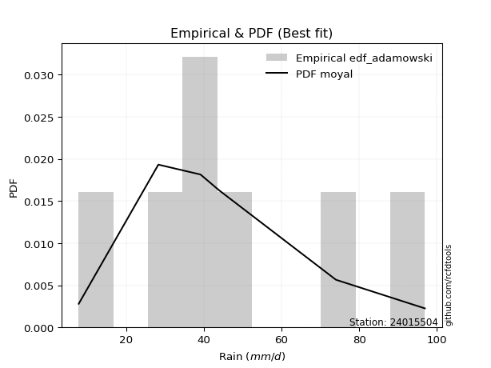</img>

</div>


## C. Best fit & Estimate extreme values for specific return periods - Tr

Best fit in probability distribution analysis means finding the theoretical distribution (like Normal, Poisson, Exponential, etc.) that most accurately mirrors your real-world data´s patterns (shape, center, spread) for better predictions, using methods like visual checks (Q-Q plots), goodness-of-fit tests (Kolmogorov-Smirnov, Chi-Squared), and information criteria (AIC) to score and select the simplest, most representative model.


### 1. Best fit (ordered by delta Δ)

:file_folder:Table: [bestfit_24015504.csv](table/bestfit_24015504.csv)

<div align="center">

|   id |   station | empirical_dist   | p_dist      |     delta |   deltao | eval   |   fit |   n |   best_fit |   best_fit_sort |
|-----:|----------:|:-----------------|:------------|----------:|---------:|:-------|------:|----:|-----------:|----------------:|
|    0 |  24015504 | edf_california   | dgamma      | 0.0745479 | 0.484421 | Δo > Δ |     1 |   7 |          1 |               1 |
|    1 |  24015504 | edf_weibull      | loggengamma | 0.0965986 | 0.484421 | Δo > Δ |     1 |   7 |          1 |               2 |
|    2 |  24015504 | edf_adamowski    | moyal       | 0.0975124 | 0.484421 | Δo > Δ |     1 |   7 |          1 |               3 |
|    3 |  24015504 | edf_chegodayev   | moyal       | 0.0993142 | 0.484421 | Δo > Δ |     1 |   7 |          1 |               4 |
|    4 |  24015504 | edf_jenkinson    | moyal       | 0.0996804 | 0.484421 | Δo > Δ |     1 |   7 |          1 |               5 |
|    5 |  24015504 | edf_beard        | moyal       | 0.0996804 | 0.484421 | Δo > Δ |     1 |   7 |          1 |               6 |
|    6 |  24015504 | edf_filliben     | moyal       | 0.0999564 | 0.484421 | Δo > Δ |     1 |   7 |          1 |               7 |
|    7 |  24015504 | edf_tukey        | moyal       | 0.100543  | 0.484421 | Δo > Δ |     1 |   7 |          1 |               8 |
|    8 |  24015504 | edf_blom         | moyal       | 0.10211   | 0.484421 | Δo > Δ |     1 |   7 |          1 |               9 |
|    9 |  24015504 | edf_cunnane      | moyal       | 0.103068  | 0.484421 | Δo > Δ |     1 |   7 |          1 |              10 |
|   10 |  24015504 | edf_gringorten   | moyal       | 0.104629  | 0.484421 | Δo > Δ |     1 |   7 |          1 |              11 |
|   11 |  24015504 | edf_hazen        | moyal       | 0.107036  | 0.484421 | Δo > Δ |     1 |   7 |          1 |              12 |

</div>


### 2. Extreme values and % difference analysis

In hydrology, a return period (or recurrence interval $Tr$) is the statistical average time between extreme events like floods or droughts of a specific magnitude, indicating how rare an event is, with a 100-year flood, for example, having a 1% chance of occurring in any given year, not that it happens exactly every century. It is a key tool for infrastructure design (like bridges or dams) and risk assessment, calculated from historical data to determine the probability of future events, although it is important to remember it is statistical average, and events can cluster or be missed.

The extreme value porcentage difference is evaluated as $pdiff = 1 - (ETrBf / ETr) * 100$, where _ETrBf_ correspond to the bestfit extreme value for a specific recurrence interval and _ETr_ correspond to the extreme value for one of the most used PDFsused in hydrology.

> risk_rate: assuming the return period as the project useful life.

:file_folder:Table: [extreme_24015504.csv](table/extreme_24015504.csv), all PDFs.  
:file_folder:Table: [extremepdiff_24015504.csv](table/extremepdiff_24015504.csv), % difference between bestfit and most used PDFs in Hydrology.

<div align="center">

Extreme values table for only best fit PDFs
|   id |      tr |   prob_l |     prob_g |      alpha |   anglit |   arcsine |    argus |     beta |   betaprime |   bradford |     burr |   burr12 |   cosine |   crystalball |   dgamma |   dweibull |   erlang |   exponnorm |   exponpow |   exponweib |        f |   fatiguelife |   foldnorm |    gamma |   gausshyper |   genexpon |   genextreme |   gengamma |   genhalflogistic |   genlogistic |   gennorm |   genpareto |   gompertz |   gumbel_l |   gumbel_r |   halfgennorm |   halflogistic |   halfnorm |   hypsecant |   invgamma |   invgauss |   invweibull |   johnsonsb |   johnsonsu |   kappa3 |   kappa4 |    ksone |   kstwobign |   laplace |   levy_l |   loggamma |   logistic |   loglaplace |    lomax |   maxwell |   mielke |    moyal |   nakagami |      ncf |      nct |     norm |   pearson3 |   powerlaw |   rayleigh |     rdist |     rice |   semicircular |   skewnorm |        t |   trapezoid |   triang |   truncexpon |   truncnorm |   truncpareto |   truncweibull_min |   tukeylambda |   uniform |   vonmises |   vonmises_line |     wald |   weibull_max |   weibull_min |   wrapcauchy |   logalpha |   loganglit |   logarcsine |   logargus |   logbeta |   logbetaprime |   logbradford |   logburr |   logburr12 |   logcosine |   logcrystalball |   logdgamma |   logdweibull |   logerlang |   logexponnorm |   logexponpow |     logexponweib |     logf |   logfatiguelife |   logfoldnorm |   loggausshyper |   loggenexpon |   loggenextreme |   loggengamma |   loggenhalflogistic |   loggenlogistic |     loggennorm |   loggenpareto |   loggompertz |   loggumbel_l |   loggumbel_r |   loghalfgennorm |   loghalflogistic |   loghalfnorm |   loghypsecant |   loginvgamma |   loginvgauss |   loginvweibull |   logjohnsonsb |   logjohnsonsu |   logkappa3 |   logkappa4 |   logksone |   logkstwobign |   loglevy_l |   logloggamma |   loglogistic |   logloglaplace |    loglomax |   logmaxwell |   logmielke |   logmoyal |   lognakagami |   logncf |   lognct |   lognorm |   logpearson3 |   logpowerlaw |   lograyleigh |   logrdist |   logrice |   logsemicircular |   logskewnorm |       logt |   logtrapezoid |   logtriang |   logtruncexpon |   logtruncnorm |   logtruncpareto |   logtruncweibull_min |   logtukeylambda |   loguniform |   logvonmises |   logvonmises_line |   logwald |   logweibull_max |   logweibull_min |   logwrapcauchy |   station |   n |   risk_rate |
|-----:|--------:|---------:|-----------:|-----------:|---------:|----------:|---------:|---------:|------------:|-----------:|---------:|---------:|---------:|--------------:|---------:|-----------:|---------:|------------:|-----------:|------------:|---------:|--------------:|-----------:|---------:|-------------:|-----------:|-------------:|-----------:|------------------:|--------------:|----------:|------------:|-----------:|-----------:|-----------:|--------------:|---------------:|-----------:|------------:|-----------:|-----------:|-------------:|------------:|------------:|---------:|---------:|---------:|------------:|----------:|---------:|-----------:|-----------:|-------------:|---------:|----------:|---------:|---------:|-----------:|---------:|---------:|---------:|-----------:|-----------:|-----------:|----------:|---------:|---------------:|-----------:|---------:|------------:|---------:|-------------:|------------:|--------------:|-------------------:|--------------:|----------:|-----------:|----------------:|---------:|--------------:|--------------:|-------------:|-----------:|------------:|-------------:|-----------:|----------:|---------------:|--------------:|----------:|------------:|------------:|-----------------:|------------:|--------------:|------------:|---------------:|--------------:|-----------------:|---------:|-----------------:|--------------:|----------------:|--------------:|----------------:|--------------:|---------------------:|-----------------:|---------------:|---------------:|--------------:|--------------:|--------------:|-----------------:|------------------:|--------------:|---------------:|--------------:|--------------:|----------------:|---------------:|---------------:|------------:|------------:|-----------:|---------------:|------------:|--------------:|--------------:|----------------:|------------:|-------------:|------------:|-----------:|--------------:|---------:|---------:|----------:|--------------:|--------------:|--------------:|-----------:|----------:|------------------:|--------------:|-----------:|---------------:|------------:|----------------:|---------------:|-----------------:|----------------------:|-----------------:|-------------:|--------------:|-------------------:|----------:|-----------------:|-----------------:|----------------:|----------:|----:|------------:|
|    0 |    2    | 0.5      | 0.5        |    28.0179 |  47.0571 |   47.0571 |  55.8158 |  30.8847 |     42.4657 |    44.1193 |  33.82   |  23.9623 |  49.1276 |       47.0571 |  39.1    |    39.1    |  42.2093 |     41.7861 |    10.621  |     42.834  |  42.2191 |       7.8003  |    44.4747 |  42.2093 |      45.9039 |    41.4053 |      43.3798 |    27.9444 |           65.5809 |       42.4304 |   39.3981 |     67.382  |    91.2437 |    51.5499 |    42.5644 |       53.1315 |        40.3309 |    41.4592 |     47.0571 |    43.0529 |    42.7874 |      42.3107 |     96.2368 |     42.9583 |   7.8    |  49.2501 |  52.35   |     42.4398 |   47.0571 |  50.2809 |    37.0706 |    47.0571 |      37.6403 |  43.4299 |   44.7182 |  26.2812 |  41.114  |    39.5818 |  38.5609 |  43.1866 |  47.0571 |    44.6699 |    8.95346 |    43.8887 | -0.115874 |  44.4736 |        47.0571 |    43.4601 |  47.0571 |     74.4384 |  68.1599 |      41.6583 |     47.0571 |       8.33415 |            37.1396 |     -0.111874 |   52.35   |    1.82872 |         40.2072 |  38.1923 |       96.5222 |       41.8818 |      52.3496 |    36.2271 |     37.6403 |      37.6403 |    44.3927 |   34.0991 |        36.6028 |       21.762  |   49.1761 |     43.5291 |     33.7429 |          37.6403 |     39.4    |       39.4    |     37.216  |        37.6404 |       11.9216 |      8.04424     |  37.5867 |          37.5962 |       34.6957 |         29.727  |       31.0037 |         55.9165 |       41.4747 |              40.4768 |          42.9664 |   39.3995      |        28.4033 |       41.0169 |       42.5756 |       33.2771 |      20.1794     |           31.3002 |       32.2835 |        37.6403 |       36.618  |       36.3314 |         34.1987 |        7.8825  |        44.4314 |     7.79998 |     25.9647 |    27.4922 |        31.3379 |     47.4278 |       44.2097 |       37.6403 |         39.4    |     23.1694 |      35.3018 |     3.17324 |    31.9795 |       39.292  |  37.1694 |  37.5081 |   37.6403 |       42.2435 |       8.25466 |       34.5078 |    16.4375 |   37.64   |           37.6405 |       42.9314 |    42.6338 |        42.809  |     39.9392 |         22.4654 |        43.1869 |          7.96741 |               19.8628 |          27.3127 |      27.4922 |     0.0756698 |            42.1359 |   29.5171 |          53.2479 |          42.8323 |         27.4923 |  24015504 |   7 |    0.75     |
|    1 |    2.33 | 0.570815 | 0.429185   |    33.3477 |  52.7416 |   55.5905 |  61.4616 |  36.4627 |     47.3968 |    50.4505 |  38.951  |  30.3101 |  54.2871 |       51.9373 |  40.9695 |    41.293  |  47.1975 |     46.238  |    12.1036 |     47.5733 |  47.2041 |       8.65543 |    49.9586 |  47.1975 |      53.9501 |    46.7768 |      48.1099 |    32.3574 |           71.4259 |       47.2002 |   39.5807 |     74.1836 |    91.7314 |    55.7956 |    47.0864 |       59.5518 |        44.9802 |    46.7261 |     50.9627 |    47.8136 |    47.6338 |      47.0568 |     96.7851 |     47.7404 |   7.8    |  55.796  |  59.9216 |     47.4382 |   50.0104 |  64.417  |    42.6234 |    51.3569 |      40.8156 |  51.2802 |   49.7884 |  33.8274 |  45.3947 |    44.2612 |  45.3348 |  47.6559 |  51.9373 |    49.5607 |   10.4471  |    49.0338 |  8.78131  |  49.4521 |        53.1538 |    48.3807 |  51.9372 |     79.6151 |  72.9108 |      47.6902 |     51.9373 |       8.70838 |            43.2868 |      6.21967  |   58.6597 |    2.07254 |         43.673  |  41.3922 |       96.7415 |       47.074  |      58.7319 |    41.6485 |     43.99   |      47.5645 |    50.5196 |   40.1372 |        42.114  |       26.0283 |   56.0786 |     48.5449 |     39.1244 |          43.0303 |     41.808  |       42.0184 |     42.7336 |        43.0304 |       13.5063 |      8.36937     |  42.9943 |          42.9712 |       39.9514 |         36.1884 |       37.1584 |         62.6747 |       47.2786 |              47.5185 |          47.8268 |   39.5038      |        38.6834 |       46.2536 |       47.833  |       37.6706 |      25.3298     |           35.5565 |       37.3001 |        41.8956 |       42.168  |       41.9454 |         40.9506 |        8.68256 |        49.8396 |     7.79998 |     31.2294 |    34.0561 |        37.7055 |     58.9114 |       49.5304 |       42.3509 |         43.0094 |     29.4684 |      40.5678 |     3.17324 |    35.9628 |       42.8097 |  42.7219 |  42.9145 |   43.0303 |       47.8387 |       8.76811 |       39.7371 |    22.7676 |   43.0298 |           44.4901 |       48.8874 |    46.7014 |        49.9388 |     46.2414 |         26.7981 |        46.6996 |          8.08061 |               23.7006 |          32.942  |      32.8623 |     0.0854962 |            46.8382 |   32.2244 |          61.1485 |          47.9752 |         33.5468 |  24015504 |   7 |    0.729209 |
|    2 |    5    | 0.8      | 0.2        |    74.6762 |  72.7977 |   78.3457 |  79.5716 |  61.0251 |     68.371  |    73.3975 |  62.1386 |  94.7321 |  72.8801 |       70.0732 |  55.4963 |    59.8033 |  68.5884 |     66.6231 |    22.7507 |     67.5454 |  68.5778 |      26.8146  |    70.7081 |  68.5885 |      80.6295 |    69.3385 |      67.8509 |    52.376  |           86.8959 |       67.907  |   47.3691 |     90.7676 |    93.3068 |    69.5119 |    66.732  |       80.3304 |        66.0175 |    68.9993 |     66.6288 |    67.9795 |    68.2268 |      67.6762 |     96.8998 |     67.9986 |   7.8    |  77.6343 |  84.426  |     68.6706 |   64.7758 |  87.8371 |    72.2056 |    67.9587 |      61.1899 |  90.53   |   69.744  |  70.2269 |  65.223  |    69.5566 |  82.293  |  66.8216 |  70.0732 |    69.101  |   29.7845  |    69.632  | 33.7642   |  69.3788 |        73.9593 |    69.0069 |  70.0731 |     94.4667 |  86.5407 |      70.5906 |     70.0732 |      14.747   |            67.6762 |     26.6191   |   79.08   |    3.02613 |         57.2107 |  59.3056 |       96.8964 |       69.0205 |      79.2391 |    71.2282 |     76.2462 |      88.7756 |    72.8759 |   65.7512 |        71.4698 |       49.8167 |   78.9413 |     69.0671 |     66.6866 |          70.757  |     60.1763 |       64.2688 |     72.0264 |        70.7571 |       25.2412 |     16.5907      |  70.8624 |          70.6299 |       68.8947 |         66.3762 |       77.3529 |         82.6865 |       70.2504 |              72.9164 |          68.1068 |   47.0063      |        78.1198 |       68.8368 |       69.6764 |       64.562  |      83.9787     |           63.3092 |       68.7044 |        64.3796 |       72.2207 |       73.1594 |         89.5806 |       96.0645  |        70.7561 |     7.79998 |     57.3848 |    68.0976 |        82.7269 |     84.3745 |       70.3344 |       66.7709 |         68.8299 |     98.3949 |      70.1212 |     3.17324 |    61.9448 |       63.5136 |  72.1997 |  70.8752 |   70.757  |       71.3847 |      16.3909  |       69.9066 |    54.8351 |   70.7552 |           78.7124 |       71.3718 |    68.1767 |        77.6926 |     70.4019 |         50.4708 |        63.8467 |          9.93531 |               46.1921 |          59.9225 |      58.5434 |     0.135966  |            70.8386 |   52.6664 |          83.6522 |          69.1999 |         61.0823 |  24015504 |   7 |    0.67232  |
|    3 |   10    | 0.9      | 0.1        |   150.607  |  84.1497 |   83.8391 |  88.3046 |  77.9384 |     84.6936 |    84.7097 |  82.9136 | inf      |  84.1133 |       82.104  |  70.4829 |    81.0345 |  85.3796 |     84.6409 |    35.3385 |     83.0999 |  85.3522 |      51.8878  |    84.5795 |  85.3797 |      90.6824 |    86.1273 |      83.0004 |    68.2071 |           92.2966 |       84.7622 |   74.4481 |     95.032  |    94.1839 |    77.1485 |    82.733  |       89.3967 |        83.488  |    85.481  |     79.1387 |    83.8893 |    84.3563 |      84.4703 |     96.9    |     83.9076 |   7.8    |  87.4782 |  95.118  |     84.8363 |   78.1795 |  93.4913 |   103.186  |    80.1854 |      88.372  | 126.16   |   83.7877 |  94.1048 |  82.4866 |    91.1939 | 123.298  |  82.6812 |  82.104  |    83.281  |   53.8166  |    84.3189 | 40.8241   |  83.5816 |        84.6349 |    84.2517 |  82.104  |    100.268  |  91.8646 |      82.7788 |     82.104  |      29.5625  |            81.111  |     35.3993   |   87.99   |    3.72359 |         67.6065 |  78.3159 |       96.8998 |       85.6416 |      88.088  |   103.412  |    104.092  |     103.209  |    85.0271 |   80.3419 |       102.192  |       68.6171 |   89.1673 |     84.0625 |     92.0359 |          98.4135 |     85.4627 |       99.4572 |    102.574  |        98.4136 |       42.9177 |     80.0362      |  98.7318 |          98.2379 |       99.5982 |         83.1487 |      131.144  |         90.3804 |       85.454  |              84.8658 |          85.0706 |  100.707       |        91.4603 |       86.2689 |       85.9085 |      100.126  |     267.507      |          102.22   |      107.965  |        90.7274 |      104.47   |      107.947  |        169.474  |       96.907   |        84.5568 |     7.79998 |     75.1375 |    92.1381 |       150.473  |     92.0187 |       84.5871 |       93.3694 |        110.897  |    295.377  |     103.064  |    84.4037  |    99.4515 |       86.3669 | 102.924  |  98.9777 |   98.4136 |       88.5122 |      32.1141  |      104.577  |    68.3247 |   98.4103 |          105.483  |       83.2637 |    96.1122 |        92.332  |     82.9641 |         68.9789 |        76.6177 |         15.6729  |               65.4155 |          76.9943 |      75.3184 |     0.189255  |            97.3236 |   88.7046 |          91.4381 |          84.8553 |         77.2673 |  24015504 |   7 |    0.651322 |
|    4 |   15    | 0.933333 | 0.0666667  |   226.266  |  88.9972 |   84.8868 |  91.6247 |  85.7185 |     93.5869 |    88.6723 |  96.05   | inf      |  89.2302 |       88.1077 |  79.5587 |    94.6697 |  94.5677 |     95.1739 |    43.4193 |     91.619  |  94.5302 |      68.2862  |    91.5096 |  94.5677 |      93.4085 |    94.9408 |      91.1974 |    76.7024 |           93.933  |       94.2698 |  106.07   |     95.9681 |    94.5811 |    80.607  |    91.7606 |       92.4188 |        93.3748 |    94.058  |     86.278  |    92.7226 |    93.209  |      93.9454 |     96.9    |     92.69   |   7.8    |  90.8122 |  98.682  |     93.4183 |   86.0202 |  95.1994 |   123.582  |    86.8471 |     109.571  | 147.002  |   90.9933 | 104.959  |  92.5056 |   102.829  | 151.79   |  91.9091 |  88.1077 |    90.7293 |   65.6052  |    91.8863 | 42.382    |  90.8976 |        88.798  |    92.1851 |  88.1077 |    102.129  |  93.5728 |      87.242  |     88.1077 |      41.3907  |            86.081  |     38.2881   |   90.96   |    4.06237 |         73.4157 |  90.5235 |       96.9    |       94.4805 |      91.0278 |   125.221  |    118.892  |     106.218  |    89.8644 |   85.6967 |       122.402  |       76.7633 |   92.6103 |     91.8893 |    106.584  |         116.026  |    105.282  |      130.059  |    122.633  |       116.027  |       57.3601 |    321.72        | 116.51   |         115.83   |      119.788  |         88.6042 |      172.339  |         92.7492 |       92.8288 |              88.9046 |          95.3701 |  275.959       |        94.3419 |       95.6221 |       94.4552 |      128.252  |     540.25       |          134.055  |      136.595  |       110.348  |      126.076  |      131.881  |        242.841  |       96.9093  |        91.2206 |     7.79998 |     82.2329 |   101.908  |       206.723  |     94.4614 |       91.741  |      112.084  |        150.191  |    563.067  |     125.581  |    88.5093  |   130.899  |      101.543  | 123.085  | 116.968  |  116.027  |       97.1793 |      43.8632  |      128.696  |    71.3522 |  116.022  |          118.24   |       87.5944 |   120.577  |        97.5906 |     87.4519 |         77.0001 |        82.25   |         22.051   |               74.1628 |          83.4476 |      81.9172 |     0.226193  |           116.05   |  123.976  |          93.6293 |          93.0662 |         83.3705 |  24015504 |   7 |    0.644736 |
|    5 |   20    | 0.95     | 0.05       |   301.859  |  91.8488 |   85.2558 |  93.447  |  90.4323 |     99.6865 |    90.6909 | 106.078  | inf      |  92.377  |       92.0393 |  86.0866 |   104.785  | 100.883  |    102.647  |    49.3588 |     97.4827 | 100.838  |      80.4271  |    96.0493 | 100.883  |      94.5889 |   100.851  |      96.7916 |    82.4507 |           94.719  |      100.926  |  138.607  |     96.331  |    94.8284 |    82.7597 |    98.0816 |       93.9301 |       100.302  |    99.7763 |     91.3144 |    98.8655 |    99.3107 |     100.58   |     96.9    |     98.7717 |   7.8    |  92.4923 | 100.464  |     99.1995 |   91.5832 |  96.0741 |   139.187  |    91.4514 |     127.629  | 161.79   |   95.7755 | 111.86   |  99.6013 |   110.653  | 174.432  |  98.535  |  92.0393 |    95.743  |   72.3913  |    96.9161 | 42.9817   |  95.7595 |        91.1072 |    97.4743 |  92.0393 |    103.047  |  94.4155 |      89.5602 |     92.0393 |      50.0513  |            88.6708 |     39.7204   |   92.445  |    4.26185 |         77.3594 |  99.6206 |       96.9    |      100.451  |      92.4965 |   142.221  |    128.562  |     107.298  |    92.5688 |   88.4585 |       137.858  |       81.2785 |   94.3421 |     97.1262 |    116.651  |         129.236  |    122.189  |      158.033  |    137.957  |       129.236  |       69.8499 |   1067.38        | 129.856  |         129.029  |      135.195  |         91.16   |      206.725  |         93.8831 |       97.5674 |              90.9255 |         103.03   |  839.788       |        95.4102 |      101.968  |      100.199  |      152.526  |     898.467      |          162.1    |      159.787  |       126.692  |      142.792  |      150.701  |        312.393  |       96.9095  |        95.4707 |     7.79998 |     86.0322 |   107.175  |       256.036  |     95.7373 |       96.4277 |      127.169  |        188.438  |    890.773  |     143.179  |    90.6016  |   159.017  |      113.155  | 138.481  | 130.503  |  129.236  |      102.821  |      52.2896  |      147.73   |    72.4725 |  129.23   |          125.969  |       89.8369 |   144.139  |       100.294  |     89.7544 |         81.4514 |        85.4303 |         28.0929  |               79.122  |          86.7935 |      85.4304 |     0.256018  |           130.574  |  159.105  |          94.6228 |          98.5736 |         86.5774 |  24015504 |   7 |    0.641514 |
|    6 |   25    | 0.96     | 0.04       |   377.425  |  93.7813 |   85.427  |  94.6222 |  93.6804 |    104.318  |    91.9143 | 114.35   | inf      |  94.5837 |       94.9336 |  91.1899 |   112.856  | 105.685  |    108.444  |    54.0532 |    101.946  | 105.634  |      90.0736  |    99.3915 | 105.685  |      95.2239 |   105.268  |     101.021  |    86.7682 |           95.1794 |      106.053  |  170.997  |     96.5119 |    95.0043 |    84.2916 |   102.95   |       94.8376 |       105.639  |   104.031  |     95.2122 |   103.58   |   103.96   |     105.69   |     96.9    |    103.424  |   7.8    |  93.5055 | 101.533  |    103.53   |   95.8982 |  96.6231 |   151.982  |    94.9737 |     143.662  | 173.26   |   99.3257 | 116.918  | 105.101  |   116.495  | 193.551  | 103.746  |  94.9336 |    99.5032 |   76.7753  |   100.653  | 43.2785   |  99.3714 |        92.6052 |   101.41   |  94.9336 |    103.594  |  94.9175 |      90.9807 |     94.9336 |      56.4963  |            90.26   |     40.5744   |   93.336  |    4.39174 |         80.2381 | 106.907  |       96.9    |      104.935  |      93.3774 |   156.353  |    135.559  |     107.803  |    94.331  |   90.1391 |       150.525  |       84.1431 |   95.3911 |    101.034  |    124.272  |         139.911  |    137.211  |      184.229  |    150.509  |       139.911  |       80.9942 |   3050.75        | 140.649  |         139.699  |      147.795  |         92.6025 |      236.686  |         94.5433 |      101.008  |              92.1364 |         109.227  | 2685.08        |        95.9221 |      106.747  |      104.498  |      174.313  |    1340.16       |          187.648  |      179.562  |       140.984  |      156.608  |      166.443  |        379.274  |       96.9095  |        98.5341 |     7.79998 |     88.3963 |   110.465  |       300.537  |     96.5469 |       99.8759 |      140.065  |        226.269  |   1272.1    |     157.82   |    91.8697  |   184.904  |      122.662  | 151.087  | 141.467  |  139.911  |      106.934  |      58.5021  |      163.673  |    73.0059 |  139.905  |          131.252  |       91.2084 |   167.588  |       101.94   |     91.1549 |         84.2782 |        87.4751 |         33.5269  |               82.3096 |          88.8299 |      87.6102 |     0.281741  |           142.149  |  194.297  |          95.1789 |         102.69   |         88.555  |  24015504 |   7 |    0.639603 |
|    7 |   50    | 0.98     | 0.02       |   755.139  |  98.5382 |   85.6557 |  97.2866 | 101.845  |    118.249  |    94.3885 | 143.452  | inf      | 100.362  |      103.221  | 107.213  |   139.044  | 120.16   |    126.45   |    68.9609 |    115.421  | 120.092  |     121.024   |   108.963  | 120.16   |      96.2844 |   118.2    |     113.625  |    99.4984 |           96.0713 |      121.847  |  323.445  |     96.7818 |    95.482  |    88.45   |   117.949  |       96.6712 |       122.082  |   116.398  |    107.297  |   118.057  |   118.038  |     121.432  |     96.9    |    117.618  |   7.8    |  95.5476 | 103.672  |    116.246  |  109.302  |  97.8592 |   195.879  |   105.735  |     207.48   | 208.89   |  109.622  | 131.798  | 122.175  |   133.521  | 263.009  | 120.487  | 103.221  |   110.599  |   86.297   |   111.501  | 43.7155   | 109.854  |        96.0273 |   112.848  | 103.222  |    104.68   |  95.9138 |      93.8912 |    103.221  |      73.1694  |            93.5218 |     42.2648   |   95.118  |    4.6721  |         87.5507 | 130.698  |       96.9    |      118.17   |      95.1389 |   206.093  |    154.448  |     108.481  |    98.3787 |   93.5388 |       193.951  |       90.2496 |   97.5973 |    112.457  |    146.673  |         175.614  |    197.065  |      299.935  |    193.497  |       175.614  |      125.165  | 153033           | 176.789  |         175.402  |      190.779  |         95.1731 |      350.864  |         95.8032 |      110.643  |              94.5467 |         130.235  |    1.03047e+06 |        96.6368 |      120.913  |      117.121  |      263.002  |    4768.8        |          294.567  |      252.059  |       196.38   |      204.712  |      222.435  |        689.436  |       96.9095  |       106.965  |    92.1991  |     93.3211 |   117.351  |       481.132  |     98.3949 |      109.729  |      188.148  |        416.306  |   3859.68   |     209.31   |    94.4349  |   295.319  |      155.112  | 194.233  | 178.283  |  175.614  |      118.41   |      74.43    |      220.382  |    73.7402 |  175.606  |          144.165  |       94.0121 |   291.682  |       105.287  |     93.9992 |         90.3121 |        91.9158 |         52.4051  |               89.2124 |          92.9324 |      92.1381 |     0.381515  |           175.462  |  373.089  |          96.1763 |         114.752  |         92.6375 |  24015504 |   7 |    0.63583  |
|    8 |   75    | 0.986667 | 0.0133333  |  1132.8    | 100.632  |   85.698  |  98.3433 | 105.508  |    126.138  |    95.2215 | 163.379  | inf      | 103.122  |      107.669  | 116.68   |   155.063  | 128.375  |    136.983  |    77.8183 |    123.079  | 128.297  |     139.663   |   114.1    | 128.375  |      96.5578 |   125.301  |     120.667  |   106.533  |           96.3581 |      131.026  |  459.811  |     96.841  |    95.7235 |    90.5528 |   126.666  |       97.3125 |       131.641  |   123.13   |    114.359  |   126.469  |   126.071  |     130.581  |     96.9    |    125.798  |  95.7292 |  96.2349 | 104.384  |    123.242  |  117.143  |  98.3672 |   224.709  |   111.951  |     257.251  | 229.732  |  115.22   | 140.336  | 132.159  |   142.793  | 311.917  | 130.769  | 107.669  |   116.755  |   89.7065  |   117.403  | 43.8094   | 115.555  |        97.3944 |   119.075  | 107.669  |    105.039  |  96.2437 |      94.8829 |    107.669  |      80.1501  |            94.6346 |     42.8204   |   95.712  |    4.7703  |         90.4918 | 145.337  |       96.9    |      125.501  |      95.726  |   239.755  |    163.575  |     108.607  |   100.004  |   94.6759 |       222.447  |       92.4037 |   98.456  |    118.717  |    158.753  |         198.391  |    243.79   |      401.581  |    221.676  |       198.391  |      158.944  |      2.35898e+06 | 199.876  |         198.194  |      218.796  |         95.892  |      434.858  |         96.1981 |      115.683  |              95.3432 |         144.001  |    3.314e+08   |        96.778  |      128.795  |      124.073  |      334.029  |   10198.4        |          382.847  |      303.166  |       238.346  |      236.849  |      260.763  |        975.774  |       96.9095  |       111.264  |    93.7613  |     95.0218 |   119.74   |       623.313  |     99.1645 |      114.996  |      223.113  |        613.467  |   7403.75   |     244.04   |    95.2985  |   388.334  |      176.256  | 222.494  | 201.879  |  198.392  |      124.314  |      81.0576  |      259.099  |    73.8818 |  198.381  |          149.672  |       94.9652 |   434.989  |       106.419  |     94.9603 |         92.4436 |        93.5121 |         62.9352  |               91.6825 |          94.2922 |      93.6988 |     0.459748  |           190.581  |  557.404  |          96.4632 |         121.381  |         94.0379 |  24015504 |   7 |    0.634587 |
|    9 |  100    | 0.99     | 0.01       |  1510.45   | 101.877  |   85.7129 |  98.9332 | 107.705  |    131.64   |    95.6396 | 179.073  | inf      | 104.851  |      110.676  | 123.429  |   166.709  | 134.111  |    144.456  |    84.1325 |    128.428  | 134.026  |     153.075   |   117.574  | 134.111  |      96.6745 |   130.164  |     125.529  |   111.364  |           96.4988 |      137.522  |  583.599  |     96.864  |    95.8815 |    91.9282 |   132.836  |       97.6548 |       138.407  |   127.716  |    119.369  |   132.435  |   131.699  |     137.057  |     96.9    |    131.568  |  96.0262 |  96.5805 | 104.741  |    128.035  |  122.706  |  98.6641 |   246.693  |   116.339  |     299.648  | 244.52   |  119.033  | 146.453  | 139.243  |   149.104  | 350.976  | 138.325  | 110.676  |   120.999  |   91.4574  |   121.424  | 43.8453   | 119.439  |        98.16   |   123.317  | 110.677  |    105.219  |  96.4082 |      95.3829 |    110.676  |      83.9649  |            95.1959 |     43.0958   |   96.009  |    4.81998 |         92.0435 | 156.011  |       96.9    |      130.546  |      96.0195 |   265.92   |    169.256  |     108.651  |   100.916  |   95.2427 |       244.162  |       93.5042 |   98.9613 |    123      |    166.826  |         215.449  |    283.617  |      495.29   |    243.138  |       215.449  |      187.115  |      1.99291e+07 | 217.179  |         215.27   |      240.046  |         96.2129 |      503.41   |         96.3884 |      119.042  |              95.739  |         154.54   |    8.11712e+10 |        96.8293 |      134.233  |      128.843  |      395.61   |   17617          |          460.893  |      343.796  |       273.446  |      261.618  |      290.76   |       1247.72   |       96.9095  |       114.078  |    94.5522  |     95.8831 |   120.953  |       744.297  |     99.6172 |      118.549  |      251.646  |        819.848  |  11764.9    |     270.94   |    95.732   |   471.595  |      192.282  | 244.007  | 219.6    |  215.45   |      128.183  |      84.6723  |      289.302  |    73.9324 |  215.438  |          152.848  |       95.4453 |   602.381  |       106.988  |     95.4433 |         93.5331 |        94.3341 |         69.4994  |               92.9514 |          94.9654 |      94.4891 |     0.527867  |           199.002  |  746.954  |          96.5946 |         125.922  |         94.7458 |  24015504 |   7 |    0.633968 |
|   10 |  200    | 0.995    | 0.005      |  3021      | 104.229  |   85.7272 |  99.9585 | 111.89   |    144.622  |    96.2686 | 223.18   | inf      | 108.368  |      117.499  | 139.781  |   195.649  | 147.666  |    162.462  |    99.3731 |    141.063  | 147.563  |     185.905   |   125.455  | 147.666  |      96.8175 |   141.362  |     136.815  |   122.526  |           96.7052 |      153.141  |  998.181  |     96.889  |    96.2248 |    94.9178 |   147.67   |       98.2433 |       154.672  |   138.205  |    131.437  |   146.856  |   145.064  |     152.626  |     96.9    |    145.405  |  96.4718 |  97.1025 | 105.275  |    139.076  |  136.109  |  99.2267 |   305.284  |   126.866  |     432.759  | 280.15   |  127.757  | 161.692  | 156.31   |   163.514  | 462.587  | 157.55   | 117.499  |   130.871  |   94.1427  |   130.623  | 43.8838   | 128.323  |        99.4946 |   133.019  | 117.499  |    105.487  |  96.6544 |      96.1383 |    117.499  |      90.1366  |            96.0441 |     43.5044   |   96.4545 |    4.89499 |         94.4463 | 182.598  |       96.9    |      142.238  |      96.4597 |   337.641  |    180.532  |     108.694  |   102.509  |   96.0861 |       301.988  |       95.1847 |   99.9772 |    132.852  |    184.531  |         259.777  |    408.786  |      827.724  |    300.25   |       259.777  |      271.855  |      6.46375e+09 | 262.196  |         259.671  |      296.221  |         96.6277 |      704.052  |         96.6611 |      126.524  |              96.3276 |         182.954  |    2.94545e+19 |        96.881  |      146.874  |      139.851  |      594.195  |   67303.3        |          719.967  |      458.378  |       380.72   |      328.671  |      373.746  |       2253.22   |       96.9095  |       120.17   |    95.7512  |     97.1885 |   122.795  |      1119.92   |    100.48   |      126.576  |      335.862  |       1741.32   |  36028.2    |     344.167  |    96.3842  |   753.058  |      234.591  | 301.214  | 265.84   |  259.778  |      136.528  |      90.5114  |      372.324  |    73.9824 |  259.762  |          158.545  |       96.1699 |  1576.12   |       107.846  |     96.1708 |         95.1978 |        95.5984 |         81.5033  |               94.8987 |          95.9588 |      95.6869 |     0.748095  |           212.707  | 1548.62   |          96.7709 |         136.388  |         95.8175 |  24015504 |   7 |    0.633042 |
|   11 |  250    | 0.996    | 0.004      |  3776.27   | 104.827  |   85.7289 | 100.198  | 112.962  |    148.729  |    96.3947 | 239.557  | inf      | 109.332  |      119.584  | 145.068  |   205.211  | 151.96   |    168.259  |   104.273  |    145.063  | 151.851  |     196.604   |   127.863  | 151.96   |      96.8403 |   144.829  |     140.326  |   125.99   |           96.7456 |      158.162  | 1173.83   |     96.8925 |    96.3259 |    95.7975 |   152.438  |       98.3854 |       159.901  |   141.432  |    135.322  |   151.525  |   149.316  |     157.631  |     96.9    |    149.85   |  96.5609 |  97.2077 | 105.382  |    142.493  |  140.424  |  99.3731 |   325.952  |   130.246  |     487.122  | 291.62   |  130.442  | 166.807  | 161.804  |   167.938  | 504.573  | 164.079  | 119.584  |   133.955  |   94.6883  |   133.455  | 43.889    | 131.058  |        99.8077 |   136.003  | 119.584  |    105.54   |  96.7036 |      96.2901 |    119.584  |      91.4399  |            96.2147 |     43.5851   |   96.5436 |    4.91004 |         94.9345 | 191.394  |       96.9    |      145.877  |      96.5478 |   363.594  |    183.52   |     108.699  |   102.884  |   96.253  |       322.369  |       95.5252 |  100.267  |    135.899  |    189.704  |         275.063  |    459.955  |      978.744  |    320.368  |       275.063  |      304.937  |      5.01854e+10 | 277.736  |         274.99   |      315.883  |         96.6979 |      780.743  |         96.713  |      128.773  |              96.4442 |         193.115  |    1.97424e+23 |        96.8876 |      150.819  |      143.265  |      677.21   |  104306          |          830.977  |      500.79   |       423.522  |      352.658  |      404.015  |       2724.74   |       96.9095  |       121.95   |    95.9929  |     97.4513 |   123.167  |      1270.87   |    100.706  |      129.02   |      368.478  |       2258.26   |  51706.7    |     370.469  |    96.515   |   875.512  |      249.379  | 321.353  | 281.844  |  275.064  |      138.949  |      91.7433  |      402.391  |    73.9886 |  275.047  |          159.913  |       96.3155 |  2289.78   |       108.018  |     96.3168 |         95.5352 |        95.8559 |         84.2773  |               95.2945 |          96.1536 |      95.9283 |     0.836586  |           215.597  | 1971.07   |          96.8021 |         139.63   |         96.0333 |  24015504 |   7 |    0.632858 |
|   12 |  500    | 0.998    | 0.002      |  7552.62   | 106.311  |   85.7312 | 100.75   | 115.632  |    161.296  |    96.6472 | 298.55   | inf      | 111.898  |      125.767  | 161.55   |   235.615  | 165.114  |    186.265  |   119.43   |    157.298  | 164.988  |     230.168   |   135.005  | 165.114  |      96.8782 |   155.225  |     150.875  |   136.397  |           96.8249 |      173.746  | 1885.13   |     96.8977 |    96.6155 |    98.3191 |   167.239  |       98.7361 |       176.131  |   151.052  |    147.39   |   166.15   |   162.4    |     173.165  |     96.9    |    163.665  |  96.7392 |  97.4194 | 105.596  |    152.732  |  153.828  |  99.7512 |   396.262  |   140.727  |     703.514  | 327.25   |  138.455  | 183.534  | 178.87   |   181.1    | 657.674  | 185.552  | 125.767  |   143.29   |   95.7883  |   141.905  | 43.8967   | 139.215  |       100.529  |   144.902  | 125.768  |    105.648  |  96.8019 |      96.5945 |    125.767  |      94.1196  |            96.5567 |     43.745    |   96.7218 |    4.94016 |         95.9156 | 219.361  |       96.9    |      156.844  |      96.7239 |   454.277  |    191.143  |     108.706  |   103.747  |   96.583  |       391.647  |       96.2106 |  101.107  |    145.027  |    204.189  |         325.89   |    663.879  |     1657.79   |    388.716  |       325.889  |      429.113  |      5.15893e+13 | 329.454  |         325.956  |      382.203  |         96.82   |     1063.27   |         96.8126 |      135.349  |              96.6753 |         228.307  |    4.67365e+39 |        96.8967 |      162.736  |      153.523  |     1016.25   |  414657          |         1296.82   |      651.989  |       589.658  |      435.452  |      510.594  |       4914.21   |       96.9095  |       127.005  |    96.4779  |     97.9786 |   123.914  |      1856.39   |    101.292  |      136.237  |      491.177  |       5370.3    | 159322      |     461.516  |    96.7767  |  1398.03   |      299.185  | 389.722  | 335.251  |  325.89   |      145.741  |      94.2748  |      507.32   |    73.997  |  325.869  |          163.105  |       96.6074 |  9393.72   |       108.363  |     96.6091 |         96.2146 |        96.3757 |         90.2638  |               96.0929 |          96.5364 |      96.4129 |     1.13602   |           221.518  | 4244.19   |          96.8586 |         149.357  |         96.4663 |  24015504 |   7 |    0.632489 |
|   13 |  750    | 0.998667 | 0.00133333 | 11329      | 106.968  |   85.7316 | 100.972  | 116.819  |    168.531  |    96.7314 | 339.664  | inf      | 113.141  |      129.202  | 171.227  |   253.862  | 172.695  |    196.798  |   128.234  |    164.334  | 172.558  |     249.999   |   138.973  | 172.695  |      96.8879 |   161.072  |     156.805  |   142.26   |           96.8507 |      182.857  | 2440.57   |     96.8989 |    96.7703 |    99.6667 |   175.892  |       98.8961 |       185.619  |   156.427  |    154.449  |   174.81   |   169.979  |     182.247  |     96.9    |    171.765  |  96.7986 |  97.4906 | 105.667  |    158.484  |  161.669  |  99.9306 |   441.981  |   146.85   |     872.275  | 348.092  |  142.937  | 193.993  | 188.853  |   188.433  | 765.792  | 199.029  | 129.202  |   148.597  |   96.1576  |   146.63   | 43.8984   | 143.775  |       100.819  |   149.874  | 129.202  |    105.683  |  96.8346 |      96.6962 |    129.202  |      95.035   |            96.671  |     43.7976   |   96.7812 |    4.95021 |         96.2435 | 236.13   |       96.9    |      163.045  |      96.7826 |   515.13   |    194.619  |     108.707  |   104.094  |   96.6913 |       436.651  |       96.4404 |  101.572  |    150.156  |    211.601  |         358.078  |    823.157  |     2265.75   |    433.092  |       358.078  |      518.964  |      4.40982e+15 | 362.245  |         358.253  |      424.889  |         96.8535 |     1264.01   |         96.844  |      138.943  |              96.7515 |         251.737  |    1.66041e+53 |        96.8985 |      169.492  |      159.303  |     1288.4    |  941595          |         1682.21   |      755.533  |       715.603  |      490.212  |      582.722  |       6937.23   |       96.9095  |       129.668  |    96.6402  |     98.1547 |   124.164  |      2296.77   |    101.571  |      140.228  |      580.988  |       9316.18   | 308395      |     521.873  |    96.8641  |  1838.29   |      331.183  | 434.077  | 369.218  |  358.079  |      149.254  |      95.1393  |      577.505  |    73.9987 |  358.054  |          164.408  |       96.7048 | 26571.8    |       108.478  |     96.7067 |         96.4424 |        96.5504 |         92.3995  |               96.3609 |          96.6611 |      96.575  |     1.29655   |           223.533  | 6722.18   |          96.8749 |         154.831  |         96.611  |  24015504 |   7 |    0.632366 |
|   14 | 1000    | 0.999    | 0.001      | 15105.3    | 107.36   |   85.7318 | 101.096  | 117.528  |    173.617  |    96.7735 | 372.275  | inf      | 113.925  |      131.566  | 178.106  |   267.002  | 178.029  |    204.271  |   134.446  |    169.276  | 177.885  |     264.144   |   141.704  | 178.029  |      96.892  |   165.126  |     160.908  |   146.329  |           96.8635 |      189.319  | 2909.21   |     96.8993 |    96.8745 |   100.574  |   182.03   |       98.9954 |       192.349  |   160.139  |    159.458  |   181.009  |   175.328  |     188.689  |     96.9    |    177.528  |  96.8283 |  97.5264 | 105.703  |    162.469  |  167.232  | 100.043  |   476.626  |   151.192  |    1016.03   | 362.88   |  146.035  | 201.752  | 195.936  |   193.49   | 852.24   | 209.038  | 131.566  |   152.303  |   96.3427  |   149.895  | 43.899    | 146.926  |       100.982  |   153.307  | 131.567  |    105.701  |  96.851  |      96.7471 |    131.566  |      95.4969  |            96.7282 |     43.8237   |   96.8109 |    4.95523 |         96.4076 | 248.192  |       96.9    |      167.359  |      96.812  |   562.181  |    196.72   |     108.708  |   104.29   |   96.7448 |       470.732  |       96.5555 |  101.895  |    153.709  |    216.415  |         382.069  |    958.982  |     2832.91   |    466.687  |       382.069  |      591.544  |      1.22968e+17 | 386.702  |         382.336  |      457.018  |         96.8684 |     1424.6    |         96.8592 |      141.395  |              96.7893 |         269.788  |    1.16296e+65 |        96.8991 |      174.199  |      163.315  |     1524.58   |       1.6941e+06 |         2023.18   |      836.492  |       820.961  |      532.157  |      638.777  |       8859.25   |       96.9095  |       131.442  |    96.7214  |     98.2427 |   124.289  |      2661.74   |    101.747  |      142.967  |      654.463  |      14066.4    | 493219      |     568.142  |    96.9078  |  2232.39   |      355.239  | 467.64   | 394.602  |  382.07   |      151.561  |      95.5755  |      631.602  |    73.9992 |  382.043  |          165.145  |       96.7536 | 62455.2    |       108.536  |     96.7555 |         96.5565 |        96.638  |         93.4954  |               96.4953 |          96.7226 |      96.6562 |     1.39271   |           224.547  | 9357.73   |          96.8825 |         158.627  |         96.6835 |  24015504 |   7 |    0.632305 |


</div>


<div align="center">

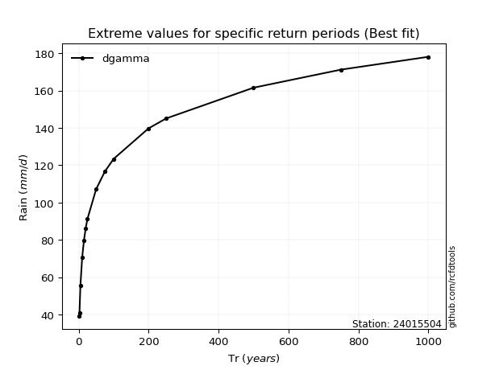</img>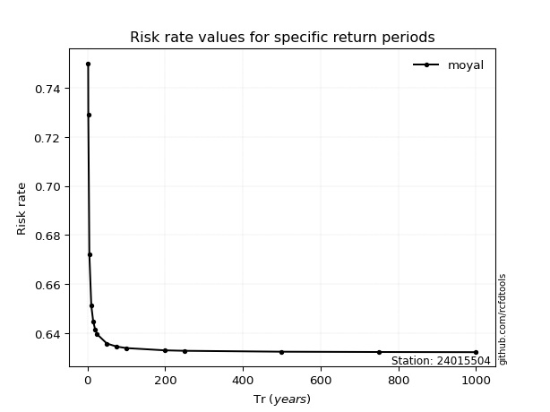</img>

</div>


<sub>**APP DISCLAIMER**: NO WARRANTY - This software is provided by [github.com/rcfdtools](https://github.com/rcfdtools) "as is", without any express or implied warranty, including warranties of merchantability, fitness for a particular purpose, or non-infringement. There is no guarantee that the software will be error-free or operate without interruption. LIMITATION OF LIABILITY - Neither the authors nor copyright holders will be liable for claims or damages arising from the software or its use. You are responsible for determining if the software is appropriate for your use and assume all associated risks, including errors, legal compliance, and data loss. NO PROFESSIONAL ADVICE - The software provides general information and does not offer professional advice. It should not replace consultation with professional advisors.</sub>