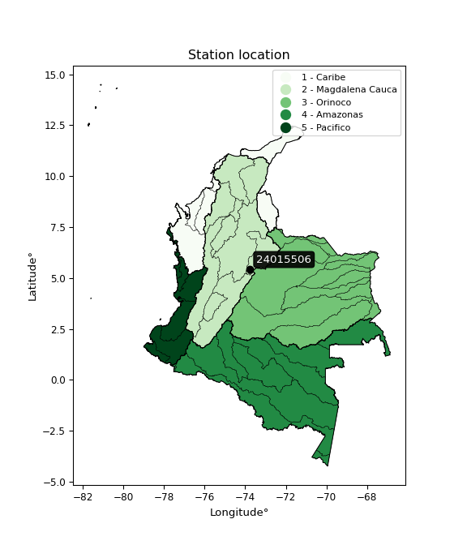

<div align="center">


</div>

# PMP Station (Rain, Pmax24h): 24015506

Probable Maximum Precipitation (PMP) is the greatest amount of rainfall for a specific duration that is meteorologically possible for a given location, acting as a "worst-case" scenario for extreme storms, crucial for designing safety-critical infrastructure like bridges, river deviations, dams, spillways, and nuclear plants to prevent catastrophic failure. PMP is calculated by hydrologists using meteorological data to determine the upper limit of extreme rainfall, often leading to the Probable Maximum Flood (PMF) for flood control design, and is increasingly being studied for climate change impacts. Probable Maximum Precipitation (PMP) is the theoretical upper limit of rainfall, a deterministic estimate for extreme events, while probability distributions (like GEV, Gumbel) describe the likelihood and frequency of various precipitation amounts, including rare ones, showing how often events occur, with PMP representing the extreme end of these distributions, used for critical infrastructure design to ensure safety against the worst conceivable weather, unlike standard statistical forecasts which cover typical probabilities.

The most common probability distributions in hydrology, used for analyzing floods, rainfall, and streamflow, include the Normal, Log-Normal, Gumbel, Gamma (including Log-Pearson Type III), and Generalized Extreme Value (GEV) distributions, often chosen based on the data´s skewness and whether modeling extremes or general conditions, with Gumbel and GEV popular for extreme events like floods, while the Normal distribution serves as a baseline, though often requiring transformations for skewed hydrological data. These distributions help in designing water infrastructure, managing water resources, and forecasting hydrologic events.

> Hydrological data often isn´t perfectly normal (it´s skewed), so different distributions are needed for different applications, such as: **Flood Frequency Analysis**: Using Gumbel, GEV, or Log-Pearson Type III for predicting extreme flood magnitudes and their return periods, **Rainfall Analysis**: Normal for annual totals, but Log-Normal, Weibull, or GEV for intensity or extreme daily rainfall, **Streamflow Modeling**: Gamma and Log-Normal for maximum flows, GEV for minimum flows, and Kappa for daily flows.

<div align="center">

</img>

</div>


## A. General information


### 1. General running parameters

• app_version: _v20260108_. • runtime: _2026-01-09 11:32:22.148588_. • Python version: _3.14.0_. • SciPy version: _1.16.3_. • Pandas version: _2.3.3_. • NumPy version: _2.3.5_. • Stations dataset (station_dataset_file): _dataset/pmax24h_in/automatic_colombia_2003_2024.csv_. • Stations catalog (station_catalog_file): _dataset/CNE.xls_. • Minimum year to eval til year_max (date_min): _1900_. • Maximum year to eval since year_min (date_max): _2024_. • Creates, save and include plots into reports (create_plot): _False_. • Plot only fit distributions with Δo > Δ (plot_only_fit): _True_. • Plot only simple graphs avoiding multiple CDFs and multiple Extreme values plots (plot_only_simple): _True_. • Eval low extreme values, if False, evaluates high extreme values (low_extreme): _False_. • Eval every SciPy distribution as logarithmic (pdist_logarithmic_on): _True_. • Standard deviation normalized (ddof): _1.0_. • Return periods to eval in years (Tr): _[2, 2.33, 5, 10, 15, 20, 25, 50, 75, 100, 200, 250, 500, 750, 1000]_. • Minimum data sample per station, 0 means any (minimum_sample): _5_. • Z-Score maximum threshold to adjust a value, 0 means disable (zscore_max): _3.5_. • Z-Score minimum threshold to adjust a value, 0 means disable (zscore_min): _-2.5_. • Avoid zeros, e.g. rain = 0 (avoid_zeros): _True_. • Avoid null values (avoid_nans): _True_. 

:file_folder:Table: [dataset.csv](../../dataset/pmax24h_in/automatic_colombia_2003_2024.csv)

> Delta Degrees of Freedom (DDOF): is a parameter used in the formulas for calculating variance and standard deviation. When ddof=0, the divisor is $N$ (the total number of observations) and this is used when your data set is the entire population. When ddof=1, the divisor is $N-1$ and this is used when your data set is a sample drawn from a larger population. Using $N-1$ provides an unbiased estimate of the population variance (known as Bessel´s correction).


### 2. Station info and location

|   id |   CODIGO | NOMBRE                     | CATEGORIA               | TECNOLOGIA                | ESTADO   |   FECHA_INSTALACION |   FECHA_SUSPENSION |   ALTITUD |   LATITUD |   LONGITUD | DEPARTAMENTO   | MUNICIPIO   | AREA_OPERATIVA                            | ENTIDAD                                       | AREA_HIDROGRAFICA   | ZONA_HIDROGRAFICA   | SUBZONA_HIDROGRAFICA   |   CORRIENTE | Catalogo   |   Version |
|-----:|---------:|:---------------------------|:------------------------|:--------------------------|:---------|--------------------:|-------------------:|----------:|----------:|-----------:|:---------------|:------------|:------------------------------------------|:----------------------------------------------|:--------------------|:--------------------|:-----------------------|------------:|:-----------|----------:|
|    0 | 24015506 | CAPELLANIA -AUT [24015506] | Climatológica Principal | Automática con Telemetría | Activa   |                 nan |                nan |         3 |   5.44897 |   -73.7691 | Cundinamarca   | Fúquene     | Area Operativa 11 - Cundinamarca-Amazonas | CORPORACION AUTONOMA REGIONAL DE CUNDINAMARCA | Magdalena Cauca     | Sogamoso            | Río Suárez             |         nan | CNE_OE     |  20251226 |

<div align="center">

Dynamic map: [:earth_americas:Google](http://maps.google.com/maps?q=5.448972222,-73.76905556) [:earth_americas:OSM](https://www.openstreetmap.org/#map=18/5.448972222/-73.76905556&layers=P) [:earth_americas:Bing](https://www.bing.com/maps?cp=5.448972222~-73.76905556&lvl=18) [:earth_americas:Apple](https://maps.apple.com/frame?center=5.448972222%2C-73.76905556&span=0.003%2C0.006)

</div>


<div align="center">

```geojson
{
  "type": "Feature",
  "geometry": {
    "type": "Point", 
    "coordinates": [-73.76905556, 5.448972222]
  }, 
  "properties": {
    "Name": "24015506"
  }
}
```

</div>


### 3. Discrete values table and plot

<div align="center">

|               |           0 |          1 |          2 |          3 |           4 |           5 |           6 |
|:--------------|------------:|-----------:|-----------:|-----------:|------------:|------------:|------------:|
| Date          | 2015        | 2016       | 2017       | 2018       | 2019        | 2020        | 2021        |
| Value         |    6.1      |   38.3     |   30.5     |  213.2     |  153        |   92.7      |   17.7      |
| Value_initial |    6.1      |   38.3     |   30.5     |  213.2     |  153        |   92.7      |   17.7      |
| count         |    7        |    7       |    7       |    7       |    7        |    7        |    7        |
| mean          |   78.7857   |   78.7857  |   78.7857  |   78.7857  |   78.7857   |   78.7857   |   78.7857   |
| std           |   78.2665   |   78.2665  |   78.2665  |   78.2665  |   78.2665   |   78.2665   |   78.2665   |
| zscore        |   -0.928695 |   -0.51728 |   -0.61694 |    1.71739 |    0.948226 |    0.177781 |   -0.780484 |


</div>


> The initial value (value_initial) correspond to the initial obtained or null completed value, and value (value) is adjusted only when the initial value is outside the valid range (outlier) definite through the Z-Score value. If Z-Score is active, values out of range or outliers are replaced with the station mean value. A Z-Score (or standard score) measures how many standard deviations a data point is from the mean of a dataset, indicating its relative position; positive scores mean above the mean, negative mean below, and a score of zero is exactly at the mean, allowing for comparison of values from different distributions. It´s calculated using the formula $z=(x–μ)/σ$, where $x$ is the data point, $μ$ is the mean, and $σ$ is the standard deviation, helping identify outliers and understand probability.
>
> <sub>**Note**: In this study, "completing" (filling gaps in) and "extending" (forecasting or lengthening the historical record) rainfall data series are avoided for certain critical analyses because they introduce artificial bias and uncertainty, which can distort the statistics of rare events (extremes), alter day-to-day variability, and compromise the integrity and homogeneity of the original data. Some reasons against Completing/Extending rainfall data are: **Distortion of Extremes and Variability**: The primary issue is that most gap-filling or extension methods rely on averaging or regression with nearby stations, which inherently smooths the data. Rainfall is highly variable in space and time, with a large percentage of zero values and occasional large storms. Infilling methods often underestimate the highest values and overestimate the lowest (zero) values, which severely distorts analyses focused on flood frequency, drought severity, and intensity-duration-frequency (IDF) curves, **Loss of Data Homogeneity**: Infilled or extended data are synthetic estimates, not actual measurements. Combining these estimates with observed data can violate the assumption of data homogeneity, which requires that the data properties do not change over time. Inhomogeneity can lead to incorrect conclusions about long-term trends or changes in climate patterns, **Propagation of Errors**: Errors and biases from the original data (e.g., wind-induced undercatch, instrument errors, site changes) or the data used for imputation can propagate through the analysis, leading to unreliable hydrological models and inaccurate predictions, **Compromised Statistical Integrity**: For statistical analyses, especially those involving the frequency of events, using artificial data can introduce time bias or autocorrelation that doesn´t exist in reality, making it difficult to assess the true probability of events, **Difficulty in Validation**: It is difficult to accurately validate the quality of filled or extended data, especially for past periods where ground-truth measurements are unavailable. The reliability of imputation techniques heavily depends on the density of the surrounding station network and the complexity of the local topography.</sub>


### 4. Active continuous probability distributions from SciPy (45 of 104 available)

A Probability Density Function (PDF) describes the relative likelihood of a continuous random variable falling within a specific range, where the total area under its curve equals 1, and the area over any interval gives the actual probability for that range. Unlike discrete probabilities (like rolling a die), a PDF shows density, not direct probability for a single point (which is zero), with higher points indicating higher likelihood, often visualized as a bell curve for normal distributions.

A log of a probability density function (log-PDF) is simply the logarithm of the PDF´s value, denoted as $log(f(x))$, useful for converting multiplication of probabilities into addition, improving numerical stability with tiny numbers, and connecting to information theory concepts like entropy. Instead of dealing with very small probabilities (e.g., 0.000001), log-PDFs use negative numbers (e.g., $log(0.00001) ≈ -11.51$ that are easier for computers to handle, preventing underflow errors and simplifying complex calculations. In this study, each active probability distribution from SciPy is also evaluated in the $log$ form.

[scipy.stats](https://docs.scipy.org/doc/scipy/reference/stats.html) is a Python´s powerful submodule within the SciPy library for comprehensive statistical analysis, offering over 130 probability distributions (like Normal, Poisson), functions for descriptive stats (mean, variance), hypothesis testing (t-tests, chi-square), random variable generation, and statistical tests, making it essential for data science, modeling, and research. It provides tools to explore, model, and draw conclusions from data efficiently, working seamlessly with NumPy.

<div align="center">

|   id | p_dist             |   n_parameter | fit_method   | label                                                                       | active   | ref                                                                                                        |
|-----:|:-------------------|--------------:|:-------------|:----------------------------------------------------------------------------|:---------|:-----------------------------------------------------------------------------------------------------------|
|    0 | alpha              |             3 | MLE          | Alpha                                                                       | True     | [:mortar_board:](https://docs.scipy.org/doc/scipy/reference/generated/scipy.stats.alpha.html)              |
|    1 | betaprime          |             4 | MLE          | Beta prime                                                                  | True     | [:mortar_board:](https://docs.scipy.org/doc/scipy/reference/generated/scipy.stats.betaprime.html)          |
|    2 | chi2               |             3 | MLE          | Chi²                                                                        | True     | [:mortar_board:](https://docs.scipy.org/doc/scipy/reference/generated/scipy.stats.chi2.html)               |
|    3 | crystalball        |             4 | MLE          | Crystalball                                                                 | True     | [:mortar_board:](https://docs.scipy.org/doc/scipy/reference/generated/scipy.stats.crystalball.html)        |
|    4 | dweibull           |             3 | MLE          | Double Weibull                                                              | True     | [:mortar_board:](https://docs.scipy.org/doc/scipy/reference/generated/scipy.stats.dweibull.html)           |
|    5 | erlang             |             3 | MLE          | Erlang                                                                      | True     | [:mortar_board:](https://docs.scipy.org/doc/scipy/reference/generated/scipy.stats.erlang.html)             |
|    6 | expon              |             2 | MLE          | Exponential                                                                 | True     | [:mortar_board:](https://docs.scipy.org/doc/scipy/reference/generated/scipy.stats.expon.html)              |
|    7 | exponnorm          |             3 | MLE          | Exponentially modified Normal                                               | True     | [:mortar_board:](https://docs.scipy.org/doc/scipy/reference/generated/scipy.stats.exponnorm.html)          |
|    8 | f                  |             4 | MLE          | F                                                                           | True     | [:mortar_board:](https://docs.scipy.org/doc/scipy/reference/generated/scipy.stats.f.html)                  |
|    9 | fatiguelife        |             3 | MLE          | Fatigue-life (Birnbaum-Saunders)                                            | True     | [:mortar_board:](https://docs.scipy.org/doc/scipy/reference/generated/scipy.stats.fatiguelife.html)        |
|   10 | fisk               |             3 | MLE          | Fisk                                                                        | True     | [:mortar_board:](https://docs.scipy.org/doc/scipy/reference/generated/scipy.stats.fisk.html)               |
|   11 | gamma              |             3 | MLE          | Gamma                                                                       | True     | [:mortar_board:](https://docs.scipy.org/doc/scipy/reference/generated/scipy.stats.gamma.html)              |
|   12 | genexpon           |             5 | MLE          | Generalized exponential                                                     | True     | [:mortar_board:](https://docs.scipy.org/doc/scipy/reference/generated/scipy.stats.genexpon.html)           |
|   13 | genlogistic        |             3 | MLE          | Generalized logistic                                                        | True     | [:mortar_board:](https://docs.scipy.org/doc/scipy/reference/generated/scipy.stats.genlogistic.html)        |
|   14 | gibrat             |             2 | MM           | Gibrat                                                                      | True     | [:mortar_board:](https://docs.scipy.org/doc/scipy/reference/generated/scipy.stats.gibrat.html)             |
|   15 | gompertz           |             3 | MLE          | Gompertz (or truncated Gumbel)                                              | True     | [:mortar_board:](https://docs.scipy.org/doc/scipy/reference/generated/scipy.stats.gompertz.html)           |
|   16 | gumbel_l           |             2 | MM           | Gumbel Left Skew                                                            | True     | [:mortar_board:](https://docs.scipy.org/doc/scipy/reference/generated/scipy.stats.gumbel_l.html)           |
|   17 | gumbel_r           |             2 | MM           | Gumbel Right Skew                                                           | True     | [:mortar_board:](https://docs.scipy.org/doc/scipy/reference/generated/scipy.stats.gumbel_r.html)           |
|   18 | halflogistic       |             2 | MM           | Half-logistic                                                               | True     | [:mortar_board:](https://docs.scipy.org/doc/scipy/reference/generated/scipy.stats.halflogistic.html)       |
|   19 | halfnorm           |             2 | MM           | Half Normal                                                                 | True     | [:mortar_board:](https://docs.scipy.org/doc/scipy/reference/generated/scipy.stats.halfnorm.html)           |
|   20 | hypsecant          |             2 | MM           | hyperbolic secant                                                           | True     | [:mortar_board:](https://docs.scipy.org/doc/scipy/reference/generated/scipy.stats.hypsecant.html)          |
|   21 | invgamma           |             3 | MLE          | Inverted gamma                                                              | True     | [:mortar_board:](https://docs.scipy.org/doc/scipy/reference/generated/scipy.stats.invgamma.html)           |
|   22 | invgauss           |             3 | MLE          | Inverse Gaussian                                                            | True     | [:mortar_board:](https://docs.scipy.org/doc/scipy/reference/generated/scipy.stats.invgauss.html)           |
|   23 | invweibull         |             3 | MLE          | Inverted Weibull                                                            | True     | [:mortar_board:](https://docs.scipy.org/doc/scipy/reference/generated/scipy.stats.invweibull.html)         |
|   24 | kappa4             |             4 | MLE          | Kappa 4                                                                     | True     | [:mortar_board:](https://docs.scipy.org/doc/scipy/reference/generated/scipy.stats.kappa4.html)             |
|   25 | kstwobign          |             2 | MLE          | Limiting distribution of scaled Kolmogorov-Smirnov two-sided test statistic | True     | [:mortar_board:](https://docs.scipy.org/doc/scipy/reference/generated/scipy.stats.kstwobign.html)          |
|   26 | laplace            |             2 | MM           | Laplace                                                                     | True     | [:mortar_board:](https://docs.scipy.org/doc/scipy/reference/generated/scipy.stats.laplace.html)            |
|   27 | laplace_asymmetric |             3 | MLE          | Asymmetric Laplace                                                          | True     | [:mortar_board:](https://docs.scipy.org/doc/scipy/reference/generated/scipy.stats.laplace_asymmetric.html) |
|   28 | loggamma           |             3 | MLE          | Log gamma                                                                   | True     | [:mortar_board:](https://docs.scipy.org/doc/scipy/reference/generated/scipy.stats.loggamma.html)           |
|   29 | logistic           |             2 | MM           | Logistic (or Sech-squared)                                                  | True     | [:mortar_board:](https://docs.scipy.org/doc/scipy/reference/generated/scipy.stats.logistic.html)           |
|   30 | lognorm            |             3 | MLE          | Log Normal                                                                  | True     | [:mortar_board:](https://docs.scipy.org/doc/scipy/reference/generated/scipy.stats.lognorm.html)            |
|   31 | maxwell            |             2 | MM           | Maxwell                                                                     | True     | [:mortar_board:](https://docs.scipy.org/doc/scipy/reference/generated/scipy.stats.maxwell.html)            |
|   32 | mielke             |             4 | MLE          | Mielke Beta-Kappa / Dagum                                                   | True     | [:mortar_board:](https://docs.scipy.org/doc/scipy/reference/generated/scipy.stats.mielke.html)             |
|   33 | moyal              |             2 | MM           | Moyal                                                                       | True     | [:mortar_board:](https://docs.scipy.org/doc/scipy/reference/generated/scipy.stats.moyal.html)              |
|   34 | nakagami           |             3 | MLE          | Nakagami                                                                    | True     | [:mortar_board:](https://docs.scipy.org/doc/scipy/reference/generated/scipy.stats.nakagami.html)           |
|   35 | ncf                |             5 | MLE          | Non-central F distribution                                                  | True     | [:mortar_board:](https://docs.scipy.org/doc/scipy/reference/generated/scipy.stats.ncf.html)                |
|   36 | nct                |             4 | MLE          | Non-central Student’s t                                                     | True     | [:mortar_board:](https://docs.scipy.org/doc/scipy/reference/generated/scipy.stats.nct.html)                |
|   37 | norm               |             2 | MM           | Normal                                                                      | True     | [:mortar_board:](https://docs.scipy.org/doc/scipy/reference/generated/scipy.stats.norm.html)               |
|   38 | pearson3           |             3 | MM           | Pearson type III                                                            | True     | [:mortar_board:](https://docs.scipy.org/doc/scipy/reference/generated/scipy.stats.pearson3.html)           |
|   39 | rayleigh           |             2 | MM           | Rayleigh                                                                    | True     | [:mortar_board:](https://docs.scipy.org/doc/scipy/reference/generated/scipy.stats.rayleigh.html)           |
|   40 | rice               |             3 | MLE          | Rice                                                                        | True     | [:mortar_board:](https://docs.scipy.org/doc/scipy/reference/generated/scipy.stats.rice.html)               |
|   41 | t                  |             3 | MLE          | Student’s t                                                                 | True     | [:mortar_board:](https://docs.scipy.org/doc/scipy/reference/generated/scipy.stats.t.html)                  |
|   42 | truncnorm          |             4 | MLE          | Truncated normal                                                            | True     | [:mortar_board:](https://docs.scipy.org/doc/scipy/reference/generated/scipy.stats.truncnorm.html)          |
|   43 | wald               |             2 | MM           | Wald                                                                        | True     | [:mortar_board:](https://docs.scipy.org/doc/scipy/reference/generated/scipy.stats.wald.html)               |
|   44 | weibull_min        |             3 | MLE          | Weibull minimum                                                             | True     | [:mortar_board:](https://docs.scipy.org/doc/scipy/reference/generated/scipy.stats.weibull_min.html)        |

</div>

> **n_parameter:** # arguments & localization & scale.
>
> **Fit methods:** (MLE) maximum likelihood, (MM) L-moments.
>
>**Inactive** (With the only purpose of prevent loops, zero divisions, infinite values, over high estimated values or horizontal trending for recurrence intervals estimations, the follow distributions were disabled.)**:** foldnorm, gennorm, norminvgauss, powernorm, powerlognorm, skewnorm, genextreme, anglit, arcsine, argus, beta, bradford, burr, burr12, cauchy, cosine, halfcauchy, foldcauchy, skewcauchy, wrapcauchy, dgamma, gengamma, exponweib, exponpow, truncexpon, gausshyper, genhalflogistic, genhyperbolic, geninvgauss, halfgennorm, johnsonsb, johnsonsu, kappa3, ksone, kstwo, loglaplace, levy, levy_l, levy_stable, ncx2, pareto, genpareto, truncpareto, lomax, powerlaw, rdist, rel_breitwigner, recipinvgauss, semicircular, studentized_range, trapezoid, triang, truncweibull_min, tukeylambda, uniform, loguniform, vonmises, vonmises_line, weibull_max, 


## B. Probability (PDF) vs. Empirical (EDF) distributions functions

A continuous probability distribution (CPD) describes probabilities for variables that can take any value within a range (like rain any time), unlike discrete variables with specific outcomes (like temperature). It uses a Probability Density Function (PDF), a curve where the total area under it equals 1, and the probability of the variable falling within an interval (a to b) is found by calculating the area under the curve between those points. A key feature is that the probability of hitting any single exact value is zero, so probabilities are always expressed for ranges, e.g., $P(a ≤ X ≤ b)$.

<div align="center">

Distributions parameters from station values
|    |   station | p_dist                |   n |              loc |          scale | shape                  | shape1                 | shape2                | shape3   |
|---:|----------:|:----------------------|----:|-----------------:|---------------:|:-----------------------|:-----------------------|:----------------------|:---------|
|  0 |  24015506 | alpha                 |   7 |    -13.3519      |   42.3439      | 0.23703054240486676    |                        |                       |          |
|  1 |  24015506 | betaprime             |   7 |      6.1         |  230.472       | 0.5549676489396121     | 2.6620768754400976     |                       |          |
|  2 |  24015506 | chi2                  |   7 |      6.1         |   35.7083      | 1.424838372052313      |                        |                       |          |
|  3 |  24015506 | crystalball           |   7 |     78.7857      |   72.4607      | 5357.035275899364      | 7660.313345567903      |                       |          |
|  4 |  24015506 | dweibull              |   7 |     76.2405      |   71.4801      | 1.8858371125217888     |                        |                       |          |
|  5 |  24015506 | erlang                |   7 |      6.1         |   72.2143      | 0.7666613007354925     |                        |                       |          |
|  6 |  24015506 | expon                 |   7 |      6.1         |   72.6857      |                        |                        |                       |          |
|  7 |  24015506 | exponnorm             |   7 |      6.0361      |    0.0198368   | 3665.289153102003      |                        |                       |          |
|  8 |  24015506 | f                     |   7 |      6.1         |   57.1985      | 1.1368124183717314     | 84.86929108420593      |                       |          |
|  9 |  24015506 | fatiguelife           |   7 |      6.1         |    0.000389588 | 384.87169682633635     |                        |                       |          |
| 10 |  24015506 | fisk                  |   7 |      6.1         |   31.9434      | 0.9645414702580595     |                        |                       |          |
| 11 |  24015506 | gamma                 |   7 |      6.1         |   98.3567      | 0.3963606288674575     |                        |                       |          |
| 12 |  24015506 | genexpon              |   7 |      6.1         |  108.404       | 1.4904489277913942     | 3.4464465735621795e-05 | 2.3315038925690637    |          |
| 13 |  24015506 | genlogistic           |   7 |   -327.933       |   51.1349      | 1496.1908792805007     |                        |                       |          |
| 14 |  24015506 | gibrat                |   7 |     23.5074      |   33.528       |                        |                        |                       |          |
| 15 |  24015506 | gompertz              |   7 |      6.06754     |  779.893       | 9.822064646606695      |                        |                       |          |
| 16 |  24015506 | gumbel_l              |   7 |    111.397       |   56.4974      |                        |                        |                       |          |
| 17 |  24015506 | gumbel_r              |   7 |     46.1746      |   56.4974      |                        |                        |                       |          |
| 18 |  24015506 | halflogistic          |   7 |     -7.09703     |   61.9513      |                        |                        |                       |          |
| 19 |  24015506 | halfnorm              |   7 |    -17.1238      |  120.205       |                        |                        |                       |          |
| 20 |  24015506 | hypsecant             |   7 |     78.7857      |   46.1299      |                        |                        |                       |          |
| 21 |  24015506 | invgamma              |   7 |     -9.8663      |   64.4886      | 1.5183877907489371     |                        |                       |          |
| 22 |  24015506 | invgauss              |   7 |     -3.46281     |   49.4661      | 1.6627255902283005     |                        |                       |          |
| 23 |  24015506 | invweibull            |   7 |      6.1         |    4.59241     | 0.056372560892290674   |                        |                       |          |
| 24 |  24015506 | kappa4                |   7 |    -15.6539      |  224.338       | 1.1071415665378113     | 0.9595165484917898     |                       |          |
| 25 |  24015506 | kstwobign             |   7 |   -133.083       |  243.442       |                        |                        |                       |          |
| 26 |  24015506 | laplace               |   7 |     78.7857      |   51.2374      |                        |                        |                       |          |
| 27 |  24015506 | laplace_asymmetric    |   7 |      6.1         |    1.24697     | 0.017223476980886845   |                        |                       |          |
| 28 |  24015506 | loggamma              |   7 | -23317.2         | 3126.57        | 1777.8701444269473     |                        |                       |          |
| 29 |  24015506 | logistic              |   7 |     78.7857      |   39.9497      |                        |                        |                       |          |
| 30 |  24015506 | lognorm               |   7 |      6.1         |    0.215131    | 13.554744845246951     |                        |                       |          |
| 31 |  24015506 | maxwell               |   7 |    -92.9157      |  107.598       |                        |                        |                       |          |
| 32 |  24015506 | mielke                |   7 |      6.1         |   99.1721      | 0.5207876370603153     | 2.659459276016634      |                       |          |
| 33 |  24015506 | moyal                 |   7 |     37.348       |   32.6188      |                        |                        |                       |          |
| 34 |  24015506 | nakagami              |   7 |      6.1         |  151.685       | 0.16336224290936685    |                        |                       |          |
| 35 |  24015506 | ncf                   |   7 |      6.09997     |   51.9372      | 1.2417917658281228     | 1274.1145390198017     | 0.9813642313875142    |          |
| 36 |  24015506 | nct                   |   7 |    -19.596       |    2.68434     | 1.376817875416089      | 17.863153780869737     |                       |          |
| 37 |  24015506 | norm                  |   7 |     78.7857      |   72.4607      |                        |                        |                       |          |
| 38 |  24015506 | pearson3              |   7 |     78.7857      |   72.4607      | 0.769395538971541      |                        |                       |          |
| 39 |  24015506 | rayleigh              |   7 |    -59.8358      |  110.604       |                        |                        |                       |          |
| 40 |  24015506 | rice                  |   7 |    -36.6802      |   96.3922      | 0.0005106388913105342  |                        |                       |          |
| 41 |  24015506 | t                     |   7 |     78.786       |   72.4596      | 209703736.7858099      |                        |                       |          |
| 42 |  24015506 | truncnorm             |   7 |  -2889.85        |  474.745       | 6.100012103731489      | 261.9617934878462      |                       |          |
| 43 |  24015506 | wald                  |   7 |      6.32504     |   72.4607      |                        |                        |                       |          |
| 44 |  24015506 | weibull_min           |   7 |      6.1         |  105.722       | 0.8253411101179096     |                        |                       |          |
| 45 |  24015506 | logalpha              |   7 |    -20.0482      |  475.524       | 19.997714638408084     |                        |                       |          |
| 46 |  24015506 | logbetaprime          |   7 |      0.0132471   |    2.01247e+09 | 8.354923723043804      | 4405469196.342161      |                       |          |
| 47 |  24015506 | logchi2               |   7 |      1.80829     |    1.32776     | 1.2925498228069747     |                        |                       |          |
| 48 |  24015506 | logcrystalball        |   7 |      3.80958     |    1.1638      | 7.4540276667148095     | 107.08342977991356     |                       |          |
| 49 |  24015506 | logdweibull           |   7 |      4.01249     |    1.16444     | 1.886628317904468      |                        |                       |          |
| 50 |  24015506 | logerlang             |   7 |    -18.2949      |    0.0627299   | 352.23280096631174     |                        |                       |          |
| 51 |  24015506 | logexpon              |   7 |      1.80829     |    2.00129     |                        |                        |                       |          |
| 52 |  24015506 | logexponnorm          |   7 |      3.8085      |    1.1638      | 0.0009304558189728567  |                        |                       |          |
| 53 |  24015506 | logf                  |   7 |   -362.2         |  366.012       | 564683.5452207255      | 300926.0831859963      |                       |          |
| 54 |  24015506 | logfatiguelife        |   7 |   -193.681       |  197.491       | 0.005889235116299515   |                        |                       |          |
| 55 |  24015506 | logfisk               |   7 |     -2.93044e+07 |    2.93044e+07 | 42133237.043848395     |                        |                       |          |
| 56 |  24015506 | loggamma              |   7 |    -16.5484      |    0.0673587   | 302.1012245986974      |                        |                       |          |
| 57 |  24015506 | loggenexpon           |   7 |      1.80829     |    0.0240339   | 0.004923984100862481   | 2.575736173420817      | 4.968949187220586e-05 |          |
| 58 |  24015506 | loggenlogistic        |   7 |      4.39665     |    0.56077     | 0.5877126642965989     |                        |                       |          |
| 59 |  24015506 | loggibrat             |   7 |      2.92171     |    0.538516    |                        |                        |                       |          |
| 60 |  24015506 | loggompertz           |   7 |      1.80829     |    1.35678     | 0.1983838771636069     |                        |                       |          |
| 61 |  24015506 | loggumbel_l           |   7 |      4.33336     |    0.907415    |                        |                        |                       |          |
| 62 |  24015506 | loggumbel_r           |   7 |      3.28581     |    0.907415    |                        |                        |                       |          |
| 63 |  24015506 | loghalflogistic       |   7 |      2.43022     |    0.995       |                        |                        |                       |          |
| 64 |  24015506 | loghalfnorm           |   7 |      2.26919     |    1.9306      |                        |                        |                       |          |
| 65 |  24015506 | loghypsecant          |   7 |      3.80958     |    0.740901    |                        |                        |                       |          |
| 66 |  24015506 | loginvgamma           |   7 |    -15.7871      | 5298.76        | 271.56452822476376     |                        |                       |          |
| 67 |  24015506 | loginvgauss           |   7 |     -5.81033     |  598.186       | 0.016053614521380336   |                        |                       |          |
| 68 |  24015506 | loginvweibull         |   7 |     -9.0271e+07  |    9.0271e+07  | 79344439.24039322      |                        |                       |          |
| 69 |  24015506 | logkappa4             |   7 |      1.65333     |    4.07627     | 1.034051875770133      | 1.0990508074695555     |                       |          |
| 70 |  24015506 | logkstwobign          |   7 |     -0.769143    |    5.2316      |                        |                        |                       |          |
| 71 |  24015506 | loglaplace            |   7 |      3.80958     |    0.822934    |                        |                        |                       |          |
| 72 |  24015506 | loglaplace_asymmetric |   7 |      3.64545     |    0.964197    | 0.9184920659540634     |                        |                       |          |
| 73 |  24015506 | logloggamma           |   7 |      3.25254     |    1.4653      | 1.9352550295498352     |                        |                       |          |
| 74 |  24015506 | loglogistic           |   7 |      3.80958     |    0.641639    |                        |                        |                       |          |
| 75 |  24015506 | loglognorm            |   7 |      1.80829     |    0.0111772   | 12.886091741338662     |                        |                       |          |
| 76 |  24015506 | logmaxwell            |   7 |      1.05185     |    1.72815     |                        |                        |                       |          |
| 77 |  24015506 | logmielke             |   7 |      1.80829     |    3.56885     | 0.7908753987468992     | 1303.3082186699648     |                       |          |
| 78 |  24015506 | logmoyal              |   7 |      3.14404     |    0.523896    |                        |                        |                       |          |
| 79 |  24015506 | lognakagami           |   7 |      2.87356     |    1.62703     | 0.06946036917825887    |                        |                       |          |
| 80 |  24015506 | logncf                |   7 |     -0.74785     |    1.10072e-06 | 1.6042110958435196e-05 | 133.92352702799374     | 65.54984057813755     |          |
| 81 |  24015506 | lognct                |   7 |     65.4686      |    1.15574     | 97586.47833095895      | -53.34942721204165     |                       |          |
| 82 |  24015506 | lognorm               |   7 |      3.80958     |    1.1638      |                        |                        |                       |          |
| 83 |  24015506 | logpearson3           |   7 |      3.80958     |    1.16381     | -0.2686576173041535    |                        |                       |          |
| 84 |  24015506 | lograyleigh           |   7 |      1.58315     |    1.77643     |                        |                        |                       |          |
| 85 |  24015506 | logrice               |   7 |      1.16891     |    1.30433     | 1.70145128023647       |                        |                       |          |
| 86 |  24015506 | logt                  |   7 |      3.80958     |    1.1638      | 227892358.4349283      |                        |                       |          |
| 87 |  24015506 | logtruncnorm          |   7 |      0.0825439   |    3.02463     | 0.5705647761410492     | 17.584984288877507     |                       |          |
| 88 |  24015506 | logwald               |   7 |      2.64574     |    1.16384     |                        |                        |                       |          |
| 89 |  24015506 | logweibull_min        |   7 |     -1.77005     |    6.04783     | 5.709532938105385      |                        |                       |          |

</div>

> **loc** (Location parameter): This shifts the distribution along the x-axis. For many common distributions, like the normal (Gaussian) distribution, loc represents the mean $μ$. For others, like the uniform distribution, it might represent the minimum value, or for the beta distribution, the left end of the support interval.
>
> **scale** (Scale parameter): This determines the width or spread of the distribution. For the normal distribution, scale represents the standard deviation $σ$. For a uniform distribution, it defines the length of the interval (from $loc$ to $loc + scale$).
>
> **shape** (Shape parameters): Refers to parameters that define the specific form of a probability distribution, distinct from its location (loc) and scale (scale). These parameters are required arguments for most distribution functions. For example, a normal (Gaussian) distribution is fully defined by its location (mean) and scale (standard deviation), so it has no specific shape parameters beyond loc and scale. However, other distributions have intrinsic properties that need specification, as Gamma distribution that takes a shape parameter, often named $a$ or $alpha$.


### 0. Cumulative distribution values - CDF (90 evaluated)

Cumulative Distribution Function (CDF), denoted as $F$<sub>$X$</sub>$(x)$, is a function that gives the probability that a random variable $X$ will take a value less than or equal to a specific value, $x$ (i.e., $(P(X≥x)$. It essentially "accumulates" probabilities from a given point up to the far right (positive infinity), providing a complete picture of the distribution´s probabilities for both discrete (like rain) and continuous (like temperature) variables, helping to find probabilities over ranges or above certain values. Each station is evaluated separately ordering the $x$ values ascending, calculating the CDF and PDF values for the activated distributions and their logarithmic forms.

<div align="center">

CDF ordered by x ascending and calculating $log(f(x))$ separately
|   id |   Station |   date |     x |   count |    mean |     std |    zscore |   Value_initial |   station |   m |     alpha |   alpha_pdf |   betaprime |   betaprime_pdf |        chi2 |      chi2_pdf |   crystalball |   crystalball_pdf |   dweibull |   dweibull_pdf |     erlang |    erlang_pdf |    expon |   expon_pdf |   exponnorm |   exponnorm_pdf |           f |        f_pdf |   fatiguelife |   fatiguelife_pdf |       fisk |    fisk_pdf |       gamma |   gamma_pdf |   genexpon |   genexpon_pdf |   genlogistic |   genlogistic_pdf |    gibrat |   gibrat_pdf |    gompertz |   gompertz_pdf |   gumbel_l |   gumbel_l_pdf |   gumbel_r |   gumbel_r_pdf |   halflogistic |   halflogistic_pdf |   halfnorm |   halfnorm_pdf |   hypsecant |   hypsecant_pdf |   invgamma |   invgamma_pdf |   invgauss |   invgauss_pdf |   invweibull |   invweibull_pdf |      kappa4 |   kappa4_pdf |   kstwobign |   kstwobign_pdf |   laplace |   laplace_pdf |   laplace_asymmetric |   laplace_asymmetric_pdf |   loggamma |   loggamma_pdf |   logistic |   logistic_pdf |   lognorm |   lognorm_pdf |   maxwell |   maxwell_pdf |      mielke |   mielke_pdf |    moyal |   moyal_pdf |    nakagami |   nakagami_pdf |        ncf |    ncf_pdf |       nct |     nct_pdf |     norm |    norm_pdf |   pearson3 |   pearson3_pdf |   rayleigh |   rayleigh_pdf |      rice |    rice_pdf |        t |       t_pdf |   truncnorm |   truncnorm_pdf |      wald |    wald_pdf |   weibull_min |   weibull_min_pdf |   logalpha |   logalpha_pdf |   logbetaprime |   logbetaprime_pdf |    logchi2 |    logchi2_pdf |   logcrystalball |   logcrystalball_pdf |   logdweibull |   logdweibull_pdf |   logerlang |   logerlang_pdf |   logexpon |   logexpon_pdf |   logexponnorm |   logexponnorm_pdf |      logf |   logf_pdf |   logfatiguelife |   logfatiguelife_pdf |   logfisk |   logfisk_pdf |   loggenexpon |   loggenexpon_pdf |   loggenlogistic |   loggenlogistic_pdf |   loggibrat |   loggibrat_pdf |   loggompertz |   loggompertz_pdf |   loggumbel_l |   loggumbel_l_pdf |   loggumbel_r |   loggumbel_r_pdf |   loghalflogistic |   loghalflogistic_pdf |   loghalfnorm |   loghalfnorm_pdf |   loghypsecant |   loghypsecant_pdf |   loginvgamma |   loginvgamma_pdf |   loginvgauss |   loginvgauss_pdf |   loginvweibull |   loginvweibull_pdf |   logkappa4 |   logkappa4_pdf |   logkstwobign |   logkstwobign_pdf |   loglaplace |   loglaplace_pdf |   loglaplace_asymmetric |   loglaplace_asymmetric_pdf |   logloggamma |   logloggamma_pdf |   loglogistic |   loglogistic_pdf |   loglognorm |   loglognorm_pdf |   logmaxwell |   logmaxwell_pdf |   logmielke |   logmielke_pdf |    logmoyal |   logmoyal_pdf |   lognakagami |   lognakagami_pdf |    logncf |   logncf_pdf |    lognct |   lognct_pdf |   logpearson3 |   logpearson3_pdf |   lograyleigh |   lograyleigh_pdf |   logrice |   logrice_pdf |      logt |   logt_pdf |   logtruncnorm |   logtruncnorm_pdf |   logwald |   logwald_pdf |   logweibull_min |   logweibull_min_pdf |
|-----:|----------:|-------:|------:|--------:|--------:|--------:|----------:|----------------:|----------:|----:|----------:|------------:|------------:|----------------:|------------:|--------------:|--------------:|------------------:|-----------:|---------------:|-----------:|--------------:|---------:|------------:|------------:|----------------:|------------:|-------------:|--------------:|------------------:|-----------:|------------:|------------:|------------:|-----------:|---------------:|--------------:|------------------:|----------:|-------------:|------------:|---------------:|-----------:|---------------:|-----------:|---------------:|---------------:|-------------------:|-----------:|---------------:|------------:|----------------:|-----------:|---------------:|-----------:|---------------:|-------------:|-----------------:|------------:|-------------:|------------:|----------------:|----------:|--------------:|---------------------:|-------------------------:|-----------:|---------------:|-----------:|---------------:|----------:|--------------:|----------:|--------------:|------------:|-------------:|---------:|------------:|------------:|---------------:|-----------:|-----------:|----------:|------------:|---------:|------------:|-----------:|---------------:|-----------:|---------------:|----------:|------------:|---------:|------------:|------------:|----------------:|----------:|------------:|--------------:|------------------:|-----------:|---------------:|---------------:|-------------------:|-----------:|---------------:|-----------------:|---------------------:|--------------:|------------------:|------------:|----------------:|-----------:|---------------:|---------------:|-------------------:|----------:|-----------:|-----------------:|---------------------:|----------:|--------------:|--------------:|------------------:|-----------------:|---------------------:|------------:|----------------:|--------------:|------------------:|--------------:|------------------:|--------------:|------------------:|------------------:|----------------------:|--------------:|------------------:|---------------:|-------------------:|--------------:|------------------:|--------------:|------------------:|----------------:|--------------------:|------------:|----------------:|---------------:|-------------------:|-------------:|-----------------:|------------------------:|----------------------------:|--------------:|------------------:|--------------:|------------------:|-------------:|-----------------:|-------------:|-----------------:|------------:|----------------:|------------:|---------------:|--------------:|------------------:|----------:|-------------:|----------:|-------------:|--------------:|------------------:|--------------:|------------------:|----------:|--------------:|----------:|-----------:|---------------:|-------------------:|----------:|--------------:|-----------------:|---------------------:|
|    0 |  24015506 |   2015 |   6.1 |       7 | 78.7857 | 78.2665 | -0.928695 |             6.1 |  24015506 |   1 | 0.0441327 | 0.0114582   | 2.98805e-07 |  1244.54        | 9.92654e-13 | 796.22        |      0.157905 |       0.00332897  |   0.190501 |    0.0049424   | 1.1762e-13 | 101.528       | 0        | 0.0137579   | 0.000878421 |     0.0137328   | 4.89085e-05 | 12.9282      |     0.0346751 |       8.73229e+07 | 1.0744e-16 | 0.116677    | 1.97768e-07 | 8.82565e+07 | 1.7377e-08 |    0.013749    |      0.113479 |       0.0048258   | 0         |  0           | 0.000408787 |    0.0125895   |   0.143662 |    0.00235072  |   0.130994 |    0.00471277  |       0.10611  |        0.00797998  |   0.153199 |     0.00651498 |    0.129864 |     0.00273774  |  0.0457281 |    0.0103591   |  0.0407368 |    0.0125877   |  0.000458301 |      2.2363e+11  | 3.88495e-15 |   0.15534    |    0.100641 |     0.00473507  |  0.121026 |   0.00236206  |           0.00029656 |              0.0138081   |  0.0408026 |      0.0801371 |   0.139502 |    0.00300481  | 0.0427515 |     0.0781469 |  0.161766 |    0.00411195 | 4.03582e-05 | 58.0169      | 0.106432 | 0.00536399  | 1.87629e-06 |    6.90212e+08 | 7.0902e-05 | 1.37241    | 0.0496041 | 0.00989819  | 0.157905 | 0.00332897  |   0.149397 |    0.00445437  |   0.162801 |     0.00451241 | 0.0937909 | 0.00417241  | 0.1579   | 0.00332895  | 1.10134e-13 |      0.0131779  | 0         | 0           |    8.0677e-15 |        7.49692    |  0.0392937 |      0.0845466 |       0.0347   |          0.0973415 | 4.5222e-11 | 131621         |        0.0427515 |            0.0781469 |     0.0178405 |         0.0508973 |   0.0419838 |       0.0810905 |   0        |      0.499677  |      0.0427509 |           0.078146 | 0.0427244 |  0.0782807 |        0.0418514 |            0.0776496 | 0.0507043 |     0.0692051 |   3.07234e-09 |          0.204876 |         0.065973 |            0.0684652 |    0        |       0         |   2.85307e-10 |          0.146217 |     0.0599959 |         0.0640931 |    0.00612693 |         0.0344022 |          0        |             0         |      0        |          0        |      0.0426708 |          0.0574207 |     0.0397385 |         0.0831091 |     0.0382215 |          0.086786 |       0.0317126 |           0.0961944 |  0.00633506 |        0.292592 |      0.0315571 |           0.112221 |     0.043935 |        0.0533882 |               0.0574843 |                   0.0649094 |     0.0618091 |         0.0715964 |     0.0423291 |         0.0631777 |   0.00717544 |      6.96095e+12 |    0.0210652 |        0.0803779 | 6.48292e-11 |      109.539    | 0.000346126 |     0.00452118 |    0          |       0           | 0.0350378 |     0.08917  | 0.0428133 |    0.0781411 |     0.0498205 |         0.0769862 |    0.00799861 |         0.0707713 | 0.0289575 |     0.0926092 | 0.0427504 |  0.0781457 |    9.15268e-13 |           0.394461 | 0         |     0         |        0.0487403 |            0.0758424 |
|    1 |  24015506 |   2021 |  17.7 |       7 | 78.7857 | 78.2665 | -0.780484 |            17.7 |  24015506 |   2 | 0.218891  | 0.0156441   | 0.332961    |     0.0143824   | 0.281371    |   0.0156983   |      0.199609 |       0.00385909  |   0.251746 |    0.00556485  | 0.248991   |   0.0150088   | 0.147508 | 0.0117285   | 0.148216    |     0.0117152   | 0.314602    |  0.0143022   |     0.673042  |       0.0069727   | 0.273479   | 0.0165209   | 0.467307    | 0.0146656   | 0.147421   |    0.0117222   |      0.176449 |       0.00598247  | 0         |  0           | 0.137223    |    0.0110292   |   0.173403 |    0.00278624  |   0.19103  |    0.00559701  |       0.197503 |        0.00775603  |   0.227957 |     0.00636493 |    0.165516 |     0.00342852  |  0.201133  |    0.0143276   |  0.218945  |    0.0151263   |  0.387087    |      0.00178539  | 0.0751444   |   0.00584406 |    0.162371 |     0.00584913  |  0.151775 |   0.00296219  |           0.148298   |              0.0117639   |  0.216213  |      0.258286  |   0.17813  |    0.00366461  | 0.21062   |     0.248066  |  0.212508 |    0.00462023 | 0.326873    |  0.0146265   | 0.176552 | 0.00663195  | 0.345717    |    0.00972944  | 0.197958   | 0.0103789  | 0.200229  | 0.0142019   | 0.199609 | 0.00385909  |   0.204934 |    0.0050934   |   0.217856 |     0.00495733 | 0.147119  | 0.00499166  | 0.199604 | 0.00385909  | 0.142003    |      0.0113497  | 0.0296068 | 0.00920392  |    0.149051   |        0.00977218 |  0.227287  |      0.272994  |       0.249114 |          0.290887  | 0.530033   |      0.250228  |        0.21062   |            0.248066  |     0.191624  |         0.304433  |   0.217425  |       0.257037  |   0.412744 |      0.293439  |      0.210618  |           0.248065 | 0.210696  |  0.247872  |        0.20989   |            0.248898  | 0.198121  |     0.228419  |   0.290985    |          0.312429 |         0.195166 |            0.191855  |    0        |       0         |   0.210708    |          0.253058 |     0.181384  |         0.180555  |    0.206992   |         0.359293  |          0.219173 |             0.478374  |      0.245758 |          0.39352  |      0.175399  |          0.224938  |     0.223388  |         0.267712  |     0.231818  |          0.278112 |       0.258457  |           0.307371  |  0.292742   |        0.265168 |      0.282596  |           0.317245 |     0.160324 |        0.19482   |               0.191404  |                   0.216128  |     0.196662  |         0.196188  |     0.188653  |         0.23855   |   0.638198   |      0.0273004   |    0.225632  |        0.294346  | 0.38436     |        0.285354 | 0.195485    |     0.426463   |    0.00593116 |       1.85539e+12 | 0.237815  |     0.286723 | 0.210556  |    0.247841  |     0.205706  |         0.228414  |    0.231898   |         0.314087  | 0.221892  |     0.268319  | 0.210618  |  0.248066  |    0.373337    |           0.303246 | 0.0599685 |     0.758498  |        0.198478  |            0.218036  |
|    2 |  24015506 |   2017 |  30.5 |       7 | 78.7857 | 78.2665 | -0.61694  |            30.5 |  24015506 |   3 | 0.392682  | 0.0113475   | 0.475016    |     0.00875238  | 0.445341    |   0.0105961   |      0.252587 |       0.00440944  |   0.324965 |    0.00577306  | 0.409302   |   0.0105685   | 0.285157 | 0.00983472  | 0.285712    |     0.00982411  | 0.459172    |  0.00912603  |     0.742229  |       0.00430292  | 0.435405   | 0.00971766  | 0.605916    | 0.00821954  | 0.285003   |    0.00983058  |      0.259047 |       0.00683973  | 0.0584959 |  0.0166997   | 0.26844     |    0.00950656  |   0.212476 |    0.00332952  |   0.267203 |    0.00624171  |       0.294458 |        0.00737107  |   0.308034 |     0.00613668 |    0.214948 |     0.00431347  |  0.368613  |    0.0115131   |  0.386083  |    0.0110295   |  0.402466    |      0.000846287 | 0.146909    |   0.0054239  |    0.242737 |     0.00662485  |  0.194847 |   0.00380283  |           0.286316   |              0.00985757  |  0.378274  |      0.328879  |   0.229938 |    0.00443223  | 0.368171  |     0.323901  |  0.274575 |    0.00505341 | 0.479538    |  0.00999515  | 0.266707 | 0.00733089  | 0.440587    |    0.00587821  | 0.309479   | 0.00749731 | 0.368799  | 0.0117007   | 0.252587 | 0.00440944  |   0.273542 |    0.00558712  |   0.283617 |     0.0052901  | 0.215624  | 0.00567128  | 0.252582 | 0.00440946  | 0.275903    |      0.00961863 | 0.201715  | 0.0146857   |    0.257813   |        0.00748511 |  0.394837  |      0.332474  |       0.417831 |          0.31819   | 0.6443     |      0.176178  |        0.368171  |            0.323901  |     0.37731   |         0.33696   |   0.378527  |       0.326792  |   0.552554 |      0.223579  |      0.368169  |           0.323901 | 0.367951  |  0.322986  |        0.367924  |            0.324679  | 0.350761  |     0.327422  |   0.460108    |          0.302821 |         0.326116 |            0.290998  |    0.46724  |       0.801581  |   0.363174    |          0.30492  |     0.305501  |         0.279023  |    0.42118    |         0.401351  |          0.459151 |             0.396573  |      0.448098 |          0.346254 |      0.33899   |          0.375825  |     0.388833  |         0.330658  |     0.400564  |          0.331283 |       0.43229   |           0.318661  |  0.437524   |        0.267446 |      0.456351  |           0.310899 |     0.31058  |        0.377405  |               0.353838  |                   0.399542  |     0.327344  |         0.284443  |     0.351898  |         0.355442  |   0.650129   |      0.0178573   |    0.401081  |        0.338998  | 0.532687    |        0.261762 | 0.441225    |     0.435951   |    0.739593   |       0.187446    | 0.408254  |     0.328065 | 0.367982  |    0.323693  |     0.353316  |         0.309932  |    0.413313   |         0.34107   | 0.385589  |     0.325264  | 0.36817   |  0.323903  |    0.524599    |           0.252736 | 0.491592  |     0.582545  |        0.340666  |            0.30225   |
|    3 |  24015506 |   2016 |  38.3 |       7 | 78.7857 | 78.2665 | -0.51728  |            38.3 |  24015506 |   4 | 0.471676  | 0.00899968  | 0.536095    |     0.00702099  | 0.520511    |   0.00877138  |      0.288174 |       0.00470999  |   0.369352 |    0.00556008  | 0.484896   |   0.00889194  | 0.357895 | 0.00883399  | 0.358373    |     0.00882475  | 0.52358     |  0.00748859  |     0.77246   |       0.00350089  | 0.501929   | 0.00748856  | 0.662512    | 0.00642227  | 0.357713   |    0.0088309   |      0.313572 |       0.00710898  | 0.206606  |  0.0192964   | 0.339293    |    0.00867213  |   0.239838 |    0.00368963  |   0.316776 |    0.00644549  |       0.350833 |        0.00707747  |   0.355258 |     0.00596835 |    0.25084  |     0.00489211  |  0.450638  |    0.00955711  |  0.463906  |    0.00900659  |  0.40819     |      0.000640314 | 0.188591    |   0.00527122 |    0.295433 |     0.00685815  |  0.226886 |   0.00442814  |           0.359208   |              0.00885077  |  0.454702  |      0.340257  |   0.266311 |    0.0048909   | 0.443923  |     0.339399  |  0.314768 |    0.0052428  | 0.55133     |  0.00849066  | 0.324372 | 0.00741658  | 0.48217     |    0.00486157  | 0.364064   | 0.00655153 | 0.452265  | 0.00972767  | 0.288174 | 0.00470999  |   0.317893 |    0.00576975  |   0.325394 |     0.00541174 | 0.261059  | 0.0059631   | 0.28817  | 0.00471002  | 0.347259    |      0.00869285 | 0.311102  | 0.0131864   |    0.312613   |        0.00660459 |  0.471313  |      0.33705   |       0.489673 |          0.311174  | 0.681854   |      0.154304  |        0.443923  |            0.339399  |     0.446463  |         0.259897  |   0.454479  |       0.338211  |   0.600678 |      0.199532  |      0.443922  |           0.3394   | 0.443463  |  0.338219  |        0.443822  |            0.339885  | 0.428425  |     0.352079  |   0.527558    |          0.288742 |         0.396915 |            0.329636  |    0.616237 |       0.527658  |   0.434463    |          0.320271 |     0.374096  |         0.323196  |    0.510288   |         0.37834   |          0.544598 |             0.353474  |      0.524072 |          0.320551 |      0.430055  |          0.419295  |     0.465145  |         0.337443  |     0.476444  |          0.333082 |       0.503322  |           0.303718  |  0.498625   |        0.269264 |      0.525263  |           0.29332  |     0.409592 |        0.497722  |               0.457591  |                   0.516698  |     0.396071  |         0.31833   |     0.436397  |         0.383322  |   0.653925   |      0.0155812   |    0.478296  |        0.337211  | 0.591461    |        0.254617 | 0.535462    |     0.389449   |    0.776003   |       0.137635    | 0.482802  |     0.324753 | 0.443692  |    0.339247  |     0.426664  |         0.33263   |    0.490267   |         0.333117  | 0.46071   |     0.332668  | 0.443922  |  0.339401  |    0.579778    |           0.231943 | 0.605341  |     0.425614  |        0.412754  |            0.32957   |
|    4 |  24015506 |   2020 |  92.7 |       7 | 78.7857 | 78.2665 |  0.177781 |            92.7 |  24015506 |   5 | 0.733651  | 0.00249685  | 0.762439    |     0.00246723  | 0.809544    |   0.003081    |      0.576139 |       0.00540506  |   0.530388 |    0.00337365  | 0.786909   |   0.00332338  | 0.696214 | 0.00417945  | 0.696371    |     0.00417602  | 0.775507    |  0.00284642  |     0.889714  |       0.00133243  | 0.723516   | 0.00222803  | 0.860173    | 0.00203294  | 0.695985   |    0.00417998  |      0.670085 |       0.0052456   | 0.765625  |  0.00443471  | 0.684617    |    0.00443863  |   0.512397 |    0.00619892  |   0.644749 |    0.00500867  |       0.667071 |        0.00447945  |   0.639094 |     0.00437278 |    0.594589 |     0.00659787  |  0.7453    |    0.00289761  |  0.747668  |    0.00295363  |  0.42852     |      0.000236384 | 0.458111    |   0.00472077 |    0.644054 |     0.00533051  |  0.618907 |   0.00743778  |           0.69773    |              0.00417502  |  0.737023  |      0.272202  |   0.586204 |    0.00607186  | 0.73187   |     0.283118  |  0.604648 |    0.00498362 | 0.840131    |  0.00297663  | 0.6686   | 0.00477713  | 0.661936    |    0.00238544  | 0.621661   | 0.00347283 | 0.748598  | 0.00285716  | 0.576139 | 0.00540506  |   0.623767 |    0.00497588  |   0.613638 |     0.00481753 | 0.59375   | 0.00565689  | 0.576138 | 0.00540514  | 0.685717    |      0.0042596  | 0.734852  | 0.00416545  |    0.571804   |        0.00346133 |  0.742098  |      0.254278  |       0.730542 |          0.223048  | 0.790094   |      0.0962667 |        0.73187   |            0.283118  |     0.597148  |         0.31767   |   0.735659  |       0.271902  |   0.743252 |      0.128291  |      0.731869  |           0.283119 | 0.730323  |  0.282245  |        0.731593  |            0.282416  | 0.727624  |     0.28495   |   0.747474    |          0.203561 |         0.710397 |            0.328418  |    0.86296  |       0.136446  |   0.720745    |          0.303384 |     0.710939  |         0.395363  |    0.775696   |         0.217125  |          0.783685 |             0.193889  |      0.758286 |          0.208272 |      0.769641  |          0.28448   |     0.739262  |         0.259946  |     0.741428  |          0.247539 |       0.729296  |           0.202355  |  0.741842   |        0.28354  |      0.743458  |           0.197388 |     0.791498 |        0.253364  |               0.766309  |                   0.222614  |     0.706142  |         0.346483  |     0.754321  |         0.288824  |   0.6651     |      0.0103887   |    0.743806  |        0.246859  | 0.806947    |        0.234537 | 0.789804    |     0.195902   |    0.859711   |       0.0674318   | 0.73625   |     0.234189 | 0.731637  |    0.283254  |     0.722865  |         0.304842  |    0.74724    |         0.235981  | 0.734975  |     0.265325  | 0.73187   |  0.28312   |    0.750999    |           0.157518 | 0.83275   |     0.147926  |        0.716917  |            0.323801  |
|    5 |  24015506 |   2019 | 153   |       7 | 78.7857 | 78.2665 |  0.948226 |           153   |  24015506 |   6 | 0.830431  | 0.00102807  | 0.863187    |     0.00111385  | 0.926381    |   0.00113762  |      0.84713  |       0.00325854  |   0.840702 |    0.00447656  | 0.915126   |   0.00127463  | 0.867481 | 0.00182318  | 0.867517    |     0.00182214  | 0.89143     |  0.00125468  |     0.944697  |       0.000606725 | 0.813313   | 0.000996944 | 0.938801    | 0.000800444 | 0.867313   |    0.00182436  |      0.884153 |       0.00212881  | 0.911691  |  0.00123648  | 0.869487    |    0.00198446  |   0.876108 |    0.00457949  |   0.85989  |    0.00229747  |       0.859681 |        0.00210608  |   0.843015 |     0.00243818 |    0.874257 |     0.0026555   |  0.85597   |    0.00114125  |  0.86502   |    0.00126053  |  0.439312    |      0.000138669 | 0.731766    |   0.00436732 |    0.873701 |     0.00243687  |  0.882532 |   0.00229263  |           0.868574   |              0.00181528  |  0.852906  |      0.189023  |   0.865028 |    0.00292254  | 0.852916  |     0.197729  |  0.843859 |    0.00284331 | 0.942689    |  0.000869616 | 0.86512  | 0.00204771  | 0.776154    |    0.00151228  | 0.781248   | 0.00197955 | 0.85676   | 0.00110671  | 0.84713  | 0.00325854  |   0.850599 |    0.00256898  |   0.842995 |     0.0027316  | 0.855736  | 0.00294507  | 0.847132 | 0.00325855  | 0.862292    |      0.00190245 | 0.888098  | 0.00147536  |    0.730694   |        0.001985   |  0.849991  |      0.176292  |       0.8267   |          0.161477  | 0.832768   |      0.0750869 |        0.852916  |            0.197729  |     0.769868  |         0.33096   |   0.851641  |       0.189623  |   0.800119 |      0.0998758 |      0.852916  |           0.19773  | 0.851166  |  0.197815  |        0.8523    |            0.197191  | 0.84593   |     0.187389  |   0.835986    |          0.15031  |         0.848328 |            0.217047  |    0.913877 |       0.0745216 |   0.855449    |          0.227197 |     0.884201  |         0.275124  |    0.863967   |         0.139219  |          0.863424 |             0.127889  |      0.847356 |          0.148609 |      0.878948  |          0.159475  |     0.849802  |         0.180788  |     0.84671   |          0.172859 |       0.816097  |           0.145774  |  0.88858    |        0.306174 |      0.828868  |           0.144777 |     0.886583 |        0.13782   |               0.855007  |                   0.13812   |     0.859417  |         0.253439  |     0.870199  |         0.176038  |   0.669864   |      0.00872352  |    0.848912  |        0.172872  | 0.922356    |        0.226392 | 0.868755    |     0.124123   |    0.889097   |       0.0510775   | 0.836277  |     0.165755 | 0.852769  |    0.197915  |     0.854846  |         0.216899  |    0.847852   |         0.166206  | 0.848854  |     0.187824  | 0.852917  |  0.197729  |    0.82075     |           0.121785 | 0.890712  |     0.089349  |        0.858244  |            0.232513  |
|    6 |  24015506 |   2018 | 213.2 |       7 | 78.7857 | 78.2665 |  1.71739  |           213.2 |  24015506 |   7 | 0.875868  | 0.000553688 | 0.912452    |     0.000593821 | 0.970621    |   0.000443627 |      0.968202 |       0.000985375 |   0.983456 |    0.000776473 | 0.965311   |   0.000511141 | 0.942112 | 0.000796409 | 0.942114    |     0.000796153 | 0.944766    |  0.000604426 |     0.970914  |       0.000303311 | 0.858508   | 0.000565739 | 0.971499    | 0.00035276  | 0.942009   |    0.000797335 |      0.962773 |       0.000714288 | 0.958454  |  0.000468474 | 0.949606    |    0.000827732 |   0.997668 |    0.000250139 |   0.94932  |    0.000873901 |       0.944478 |        0.000871339 |   0.944647 |     0.00105872 |    0.965486 |     0.000746731 |  0.904957  |    0.000575135 |  0.919863  |    0.000648605 |  0.446295    |      9.80081e-05 | 0.981992    |   0.00379578 |    0.965041 |     0.000817066 |  0.963721 |   0.000708062 |           0.942778   |              0.000790369 |  0.906604  |      0.135716  |   0.966579 |    0.000808609 | 0.908917  |     0.140779  |  0.955892 |    0.00104884 | 0.974484    |  0.000303013 | 0.94618  | 0.000823729 | 0.851626    |    0.00103156  | 0.873268   | 0.00115297 | 0.904192  | 0.000556783 | 0.968202 | 0.000985375 |   0.951573 |    0.000972671 |   0.952497 |     0.00106022 | 0.965268  | 0.000934079 | 0.968203 | 0.000985349 | 0.940523    |      0.00083724 | 0.947059  | 0.000624713 |    0.824804   |        0.00121615 |  0.900426  |      0.128845  |       0.874102 |          0.125089  | 0.855789   |      0.0640097 |        0.908917  |            0.140779  |     0.866604  |         0.246364  |   0.905586  |       0.136557  |   0.830656 |      0.0846173 |      0.908917  |           0.140779 | 0.907294  |  0.141428  |        0.908181  |            0.140607  | 0.898446  |     0.131184  |   0.880446    |          0.118293 |         0.907881 |            0.144276  |    0.934625 |       0.0521863 |   0.919934    |          0.160706 |     0.955292  |         0.15311   |    0.903535   |         0.101007  |          0.900219 |             0.0952793 |      0.890869 |          0.11452  |      0.922091  |          0.104107  |     0.901464  |         0.131704  |     0.896411  |          0.127802 |       0.859147  |           0.114644  |  1          |        6.72401  |      0.871808  |           0.11478  |     0.924216 |        0.0920897 |               0.894299  |                   0.100691  |     0.929296  |         0.167051  |     0.918326  |         0.116893  |   0.672614   |      0.00788247  |    0.898665  |        0.128035  | 0.996691    |        0.220856 | 0.904173    |     0.0910147  |    0.904714   |       0.0433666   | 0.884421  |     0.125449 | 0.908828  |    0.14094   |     0.915874  |         0.151434  |    0.89594    |         0.124615  | 0.90264   |     0.137212  | 0.908918  |  0.140779  |    0.857669    |           0.101169 | 0.916188  |     0.0656547 |        0.923027  |            0.158009  |


</div>

An Empirical Distribution Function (EDF) is a step-function estimate of a true cumulative distribution function (CDF) based on observed sample data, representing the proportion of data points less than or equal to a given value. It is calculated by ordering your data and jumping up by $1/n$ (where $n$ is sample size) at each unique data point, allowing analysis without assuming an underlying population distribution, and it gets closer to the true CDF as the sample size grows. For the empirical probability calculations, the parameter $m$ correspond to the order number which means the position of the $x$ values in an ascending order list.

The Kolmogorov-Smirnov (K-S) test is a non-parametric statistical test used to determine if a sample data set comes from a specific theoretical distribution (one-sample) or if two different samples come from the same underlying distribution (two-sample), by comparing their cumulative distribution functions (CDFs). It calculates the maximum vertical difference (D statistic) between these functions, with a small p-value indicating a significant difference and rejection of the null hypothesis (that the data/samples match).


### 1. EDF California (1923)

California´s estimates the true probability distribution of water-related data (like rainfall, streamflow) using observed samples, crucial for risk assessment.

<div align="center">


$P=m/n$


</div>


**1.1. Empirical values**

<div align="center">

|                | 0                   | 1                  | 2                   | 3                  | 4                  | 5                  | 6              |
|:---------------|:--------------------|:-------------------|:--------------------|:-------------------|:-------------------|:-------------------|:---------------|
| date           | 2015                | 2021               | 2017                | 2016               | 2020               | 2019               | 2018           |
| x              | 6.1                 | 17.7               | 30.5                | 38.3               | 92.7               | 153.0              | 213.2          |
| m              | 1                   | 2                  | 3                   | 4                  | 5                  | 6                  | 7              |
| empirical_dist | edf_california      | edf_california     | edf_california      | edf_california     | edf_california     | edf_california     | edf_california |
| empirical      | 0.14285714285714285 | 0.2857142857142857 | 0.42857142857142855 | 0.5714285714285714 | 0.7142857142857143 | 0.8571428571428571 | 1.0            |
| empirical_tr   | 1.1666666666666665  | 1.4                | 1.75                | 2.333333333333333  | 3.5                | 6.999999999999997  | inf            |

</div>


**1.2. Kolmogorov-Smirnov fit test (sorted by Δ)**


<div align="center">

|                | 0                   | 1                   | 2                   | 3                   | 4                     | 5                   | 6                   | 7                   | 8                   | 9                   | 10                  | 11                  | 12                  | 13                  | 14                  | 15                  | 16                  | 17                  | 18                  | 19                  | 20                  | 21                  | 22                  | 23                  | 24                  | 25                  | 26                  | 27                  | 28                  | 29                  | 30                  | 31                  | 32                  | 33                  | 34                  | 35                  | 36                  | 37                  | 38                  | 39                  | 40                  | 41                  | 42                  | 43                  | 44                  | 45                  | 46                  | 47                  | 48                  | 49                  | 50                  | 51                  | 52                  | 53                  | 54                  | 55                  | 56                  | 57                  | 58                  | 59                  | 60                  | 61                  | 62                  | 63                  | 64                  | 65                  | 66                  | 67                  | 68                  | 69                  | 70                  | 71                  | 72                  | 73                  | 74                  | 75                  | 76                  | 77                  | 78                  | 79                  | 80                  | 81                  | 82                  | 83                  | 84                  | 85                  | 86                  | 87                  | 88                  | 89                  |
|:---------------|:--------------------|:--------------------|:--------------------|:--------------------|:----------------------|:--------------------|:--------------------|:--------------------|:--------------------|:--------------------|:--------------------|:--------------------|:--------------------|:--------------------|:--------------------|:--------------------|:--------------------|:--------------------|:--------------------|:--------------------|:--------------------|:--------------------|:--------------------|:--------------------|:--------------------|:--------------------|:--------------------|:--------------------|:--------------------|:--------------------|:--------------------|:--------------------|:--------------------|:--------------------|:--------------------|:--------------------|:--------------------|:--------------------|:--------------------|:--------------------|:--------------------|:--------------------|:--------------------|:--------------------|:--------------------|:--------------------|:--------------------|:--------------------|:--------------------|:--------------------|:--------------------|:--------------------|:--------------------|:--------------------|:--------------------|:--------------------|:--------------------|:--------------------|:--------------------|:--------------------|:--------------------|:--------------------|:--------------------|:--------------------|:--------------------|:--------------------|:--------------------|:--------------------|:--------------------|:--------------------|:--------------------|:--------------------|:--------------------|:--------------------|:--------------------|:--------------------|:--------------------|:--------------------|:--------------------|:--------------------|:--------------------|:--------------------|:--------------------|:--------------------|:--------------------|:--------------------|:--------------------|:--------------------|:--------------------|:--------------------|
| station        | 24015506            | 24015506            | 24015506            | 24015506            | 24015506              | 24015506            | 24015506            | 24015506            | 24015506            | 24015506            | 24015506            | 24015506            | 24015506            | 24015506            | 24015506            | 24015506            | 24015506            | 24015506            | 24015506            | 24015506            | 24015506            | 24015506            | 24015506            | 24015506            | 24015506            | 24015506            | 24015506            | 24015506            | 24015506            | 24015506            | 24015506            | 24015506            | 24015506            | 24015506            | 24015506            | 24015506            | 24015506            | 24015506            | 24015506            | 24015506            | 24015506            | 24015506            | 24015506            | 24015506            | 24015506            | 24015506            | 24015506            | 24015506            | 24015506            | 24015506            | 24015506            | 24015506            | 24015506            | 24015506            | 24015506            | 24015506            | 24015506            | 24015506            | 24015506            | 24015506            | 24015506            | 24015506            | 24015506            | 24015506            | 24015506            | 24015506            | 24015506            | 24015506            | 24015506            | 24015506            | 24015506            | 24015506            | 24015506            | 24015506            | 24015506            | 24015506            | 24015506            | 24015506            | 24015506            | 24015506            | 24015506            | 24015506            | 24015506            | 24015506            | 24015506            | 24015506            | 24015506            | 24015506            | 24015506            | 24015506            |
| empirical_dist | edf_california      | edf_california      | edf_california      | edf_california      | edf_california        | edf_california      | edf_california      | edf_california      | edf_california      | edf_california      | edf_california      | edf_california      | edf_california      | edf_california      | edf_california      | edf_california      | edf_california      | edf_california      | edf_california      | edf_california      | edf_california      | edf_california      | edf_california      | edf_california      | edf_california      | edf_california      | edf_california      | edf_california      | edf_california      | edf_california      | edf_california      | edf_california      | edf_california      | edf_california      | edf_california      | edf_california      | edf_california      | edf_california      | edf_california      | edf_california      | edf_california      | edf_california      | edf_california      | edf_california      | edf_california      | edf_california      | edf_california      | edf_california      | edf_california      | edf_california      | edf_california      | edf_california      | edf_california      | edf_california      | edf_california      | edf_california      | edf_california      | edf_california      | edf_california      | edf_california      | edf_california      | edf_california      | edf_california      | edf_california      | edf_california      | edf_california      | edf_california      | edf_california      | edf_california      | edf_california      | edf_california      | edf_california      | edf_california      | edf_california      | edf_california      | edf_california      | edf_california      | edf_california      | edf_california      | edf_california      | edf_california      | edf_california      | edf_california      | edf_california      | edf_california      | edf_california      | edf_california      | edf_california      | edf_california      | edf_california      |
| p_dist         | logalpha            | loginvgauss         | loginvgamma         | invgauss            | loglaplace_asymmetric | logrice             | logncf              | loggamma            | loggamma            | logerlang           | nct                 | invgamma            | logmaxwell          | alpha               | logbetaprime        | lognorm             | lognorm             | logcrystalball      | logt                | logexponnorm        | logfatiguelife      | lognct              | logf                | logkstwobign        | logdweibull         | lograyleigh         | loglogistic         | logkappa4           | loggumbel_r         | loginvweibull       | loghypsecant        | logmoyal            | f                   | mielke              | betaprime           | loggenexpon         | loggompertz         | logmielke           | chi2                | logtruncnorm        | erlang              | fisk                | loghalflogistic     | loghalfnorm         | logfisk             | logpearson3         | nakagami            | logweibull_min      | loglaplace          | logexpon            | loggenlogistic      | logloggamma         | gamma               | loggumbel_l         | dweibull            | ncf                 | laplace_asymmetric  | exponnorm           | expon               | genexpon            | halfnorm            | halflogistic        | truncnorm           | logwald             | gompertz            | logchi2             | rayleigh            | moyal               | pearson3            | gumbel_r            | maxwell             | genlogistic         | weibull_min         | wald                | kstwobign           | crystalball         | norm                | t                   | loggibrat           | logistic            | rice                | lognakagami         | hypsecant           | gumbel_l            | laplace             | loglognorm          | gibrat              | kappa4              | fatiguelife         | invweibull          |
| delta          | 0.1035634125759147  | 0.10463568820304317 | 0.10628357280354583 | 0.1075227026577169  | 0.11383742007132114   | 0.11389966553070871 | 0.11557871432105704 | 0.11672638723323009 | 0.11672638723323009 | 0.11694924828019615 | 0.11916359399466314 | 0.12079040035400512 | 0.12179189519310292 | 0.12413192851590704 | 0.12589778912266147 | 0.12750535214891046 | 0.12750535214891046 | 0.12750535351128767 | 0.12750643253080218 | 0.12750702434289396 | 0.1276062391878967  | 0.12773622602611118 | 0.12796522842730274 | 0.12819182936785445 | 0.13339623513106447 | 0.13485853656186586 | 0.1350320512948187  | 0.13652208098160928 | 0.13673021308782615 | 0.1408532316028307  | 0.14137366998887685 | 0.14251101701010135 | 0.1428082343732466  | 0.14281678470495954 | 0.1428568440523456  | 0.14285713978480422 | 0.1428571425718359  | 0.14285714279231362 | 0.1428571428561502  | 0.14285714285622758 | 0.14285714285702522 | 0.14285714285714274 | 0.14285714285714285 | 0.14285714285714285 | 0.1430031955140797  | 0.1447644966788948  | 0.14837380509788234 | 0.1586750207611678  | 0.16183642061551506 | 0.16934392621904704 | 0.17451347375871346 | 0.17535711124530418 | 0.18159270743972583 | 0.19733214591675857 | 0.20207670002170253 | 0.20736434258873726 | 0.21222052756709586 | 0.2130555358744879  | 0.21353375931448793 | 0.21371518019618507 | 0.2161709486211736  | 0.22059602812407714 | 0.22416985623023122 | 0.2257458255911141  | 0.23213546966241516 | 0.24431873125404235 | 0.24603504151201    | 0.2470568356464382  | 0.2535357115916407  | 0.25465241169428765 | 0.2566605909383129  | 0.2578564272017057  | 0.25881540737147346 | 0.26032645075926825 | 0.2759953891065578  | 0.28325442750262037 | 0.28325443961749    | 0.28325869188540376 | 0.2857142857142857  | 0.3051171170222184  | 0.3103695243835144  | 0.3110211126197366  | 0.32058842476693666 | 0.33159045423125094 | 0.3445422192861484  | 0.3524836633288714  | 0.3700755241167353  | 0.3828372971047225  | 0.38732740804449317 | 0.5537045198090493  |
| deltao         | 0.48442053926100004 | 0.48442053926100004 | 0.48442053926100004 | 0.48442053926100004 | 0.48442053926100004   | 0.48442053926100004 | 0.48442053926100004 | 0.48442053926100004 | 0.48442053926100004 | 0.48442053926100004 | 0.48442053926100004 | 0.48442053926100004 | 0.48442053926100004 | 0.48442053926100004 | 0.48442053926100004 | 0.48442053926100004 | 0.48442053926100004 | 0.48442053926100004 | 0.48442053926100004 | 0.48442053926100004 | 0.48442053926100004 | 0.48442053926100004 | 0.48442053926100004 | 0.48442053926100004 | 0.48442053926100004 | 0.48442053926100004 | 0.48442053926100004 | 0.48442053926100004 | 0.48442053926100004 | 0.48442053926100004 | 0.48442053926100004 | 0.48442053926100004 | 0.48442053926100004 | 0.48442053926100004 | 0.48442053926100004 | 0.48442053926100004 | 0.48442053926100004 | 0.48442053926100004 | 0.48442053926100004 | 0.48442053926100004 | 0.48442053926100004 | 0.48442053926100004 | 0.48442053926100004 | 0.48442053926100004 | 0.48442053926100004 | 0.48442053926100004 | 0.48442053926100004 | 0.48442053926100004 | 0.48442053926100004 | 0.48442053926100004 | 0.48442053926100004 | 0.48442053926100004 | 0.48442053926100004 | 0.48442053926100004 | 0.48442053926100004 | 0.48442053926100004 | 0.48442053926100004 | 0.48442053926100004 | 0.48442053926100004 | 0.48442053926100004 | 0.48442053926100004 | 0.48442053926100004 | 0.48442053926100004 | 0.48442053926100004 | 0.48442053926100004 | 0.48442053926100004 | 0.48442053926100004 | 0.48442053926100004 | 0.48442053926100004 | 0.48442053926100004 | 0.48442053926100004 | 0.48442053926100004 | 0.48442053926100004 | 0.48442053926100004 | 0.48442053926100004 | 0.48442053926100004 | 0.48442053926100004 | 0.48442053926100004 | 0.48442053926100004 | 0.48442053926100004 | 0.48442053926100004 | 0.48442053926100004 | 0.48442053926100004 | 0.48442053926100004 | 0.48442053926100004 | 0.48442053926100004 | 0.48442053926100004 | 0.48442053926100004 | 0.48442053926100004 | 0.48442053926100004 |
| eval           | Δo > Δ              | Δo > Δ              | Δo > Δ              | Δo > Δ              | Δo > Δ                | Δo > Δ              | Δo > Δ              | Δo > Δ              | Δo > Δ              | Δo > Δ              | Δo > Δ              | Δo > Δ              | Δo > Δ              | Δo > Δ              | Δo > Δ              | Δo > Δ              | Δo > Δ              | Δo > Δ              | Δo > Δ              | Δo > Δ              | Δo > Δ              | Δo > Δ              | Δo > Δ              | Δo > Δ              | Δo > Δ              | Δo > Δ              | Δo > Δ              | Δo > Δ              | Δo > Δ              | Δo > Δ              | Δo > Δ              | Δo > Δ              | Δo > Δ              | Δo > Δ              | Δo > Δ              | Δo > Δ              | Δo > Δ              | Δo > Δ              | Δo > Δ              | Δo > Δ              | Δo > Δ              | Δo > Δ              | Δo > Δ              | Δo > Δ              | Δo > Δ              | Δo > Δ              | Δo > Δ              | Δo > Δ              | Δo > Δ              | Δo > Δ              | Δo > Δ              | Δo > Δ              | Δo > Δ              | Δo > Δ              | Δo > Δ              | Δo > Δ              | Δo > Δ              | Δo > Δ              | Δo > Δ              | Δo > Δ              | Δo > Δ              | Δo > Δ              | Δo > Δ              | Δo > Δ              | Δo > Δ              | Δo > Δ              | Δo > Δ              | Δo > Δ              | Δo > Δ              | Δo > Δ              | Δo > Δ              | Δo > Δ              | Δo > Δ              | Δo > Δ              | Δo > Δ              | Δo > Δ              | Δo > Δ              | Δo > Δ              | Δo > Δ              | Δo > Δ              | Δo > Δ              | Δo > Δ              | Δo > Δ              | Δo > Δ              | Δo > Δ              | Δo > Δ              | Δo > Δ              | Δo > Δ              | Δo > Δ              | Δo <= Δ             |
| fit            | 1                   | 1                   | 1                   | 1                   | 1                     | 1                   | 1                   | 1                   | 1                   | 1                   | 1                   | 1                   | 1                   | 1                   | 1                   | 1                   | 1                   | 1                   | 1                   | 1                   | 1                   | 1                   | 1                   | 1                   | 1                   | 1                   | 1                   | 1                   | 1                   | 1                   | 1                   | 1                   | 1                   | 1                   | 1                   | 1                   | 1                   | 1                   | 1                   | 1                   | 1                   | 1                   | 1                   | 1                   | 1                   | 1                   | 1                   | 1                   | 1                   | 1                   | 1                   | 1                   | 1                   | 1                   | 1                   | 1                   | 1                   | 1                   | 1                   | 1                   | 1                   | 1                   | 1                   | 1                   | 1                   | 1                   | 1                   | 1                   | 1                   | 1                   | 1                   | 1                   | 1                   | 1                   | 1                   | 1                   | 1                   | 1                   | 1                   | 1                   | 1                   | 1                   | 1                   | 1                   | 1                   | 1                   | 1                   | 1                   | 1                   | 0                   |
| n              | 7                   | 7                   | 7                   | 7                   | 7                     | 7                   | 7                   | 7                   | 7                   | 7                   | 7                   | 7                   | 7                   | 7                   | 7                   | 7                   | 7                   | 7                   | 7                   | 7                   | 7                   | 7                   | 7                   | 7                   | 7                   | 7                   | 7                   | 7                   | 7                   | 7                   | 7                   | 7                   | 7                   | 7                   | 7                   | 7                   | 7                   | 7                   | 7                   | 7                   | 7                   | 7                   | 7                   | 7                   | 7                   | 7                   | 7                   | 7                   | 7                   | 7                   | 7                   | 7                   | 7                   | 7                   | 7                   | 7                   | 7                   | 7                   | 7                   | 7                   | 7                   | 7                   | 7                   | 7                   | 7                   | 7                   | 7                   | 7                   | 7                   | 7                   | 7                   | 7                   | 7                   | 7                   | 7                   | 7                   | 7                   | 7                   | 7                   | 7                   | 7                   | 7                   | 7                   | 7                   | 7                   | 7                   | 7                   | 7                   | 7                   | 7                   |
| best_fit       | 1                   | 0                   | 0                   | 0                   | 0                     | 0                   | 0                   | 0                   | 0                   | 0                   | 0                   | 0                   | 0                   | 0                   | 0                   | 0                   | 0                   | 0                   | 0                   | 0                   | 0                   | 0                   | 0                   | 0                   | 0                   | 0                   | 0                   | 0                   | 0                   | 0                   | 0                   | 0                   | 0                   | 0                   | 0                   | 0                   | 0                   | 0                   | 0                   | 0                   | 0                   | 0                   | 0                   | 0                   | 0                   | 0                   | 0                   | 0                   | 0                   | 0                   | 0                   | 0                   | 0                   | 0                   | 0                   | 0                   | 0                   | 0                   | 0                   | 0                   | 0                   | 0                   | 0                   | 0                   | 0                   | 0                   | 0                   | 0                   | 0                   | 0                   | 0                   | 0                   | 0                   | 0                   | 0                   | 0                   | 0                   | 0                   | 0                   | 0                   | 0                   | 0                   | 0                   | 0                   | 0                   | 0                   | 0                   | 0                   | 0                   | 0                   |
| best_fit_sort  | 1                   | 2                   | 3                   | 4                   | 5                     | 6                   | 7                   | 8                   | 9                   | 10                  | 11                  | 12                  | 13                  | 14                  | 15                  | 16                  | 17                  | 18                  | 19                  | 20                  | 21                  | 22                  | 23                  | 24                  | 25                  | 26                  | 27                  | 28                  | 29                  | 30                  | 31                  | 32                  | 33                  | 34                  | 35                  | 36                  | 37                  | 38                  | 39                  | 40                  | 41                  | 42                  | 43                  | 44                  | 45                  | 46                  | 47                  | 48                  | 49                  | 50                  | 51                  | 52                  | 53                  | 54                  | 55                  | 56                  | 57                  | 58                  | 59                  | 60                  | 61                  | 62                  | 63                  | 64                  | 65                  | 66                  | 67                  | 68                  | 69                  | 70                  | 71                  | 72                  | 73                  | 74                  | 75                  | 76                  | 77                  | 78                  | 79                  | 80                  | 81                  | 82                  | 83                  | 84                  | 85                  | 86                  | 87                  | 88                  | 89                  | 90                  |

</div>


**1.3. Best fit**

<div align="center">

|   id |   station | empirical_dist   | p_dist   |    delta |   deltao | eval   |   fit |   n |   best_fit |   best_fit_sort |
|-----:|----------:|:-----------------|:---------|---------:|---------:|:-------|------:|----:|-----------:|----------------:|
|    0 |  24015506 | edf_california   | logalpha | 0.103563 | 0.484421 | Δo > Δ |     1 |   7 |          1 |               1 |

</div>


### 2. EDF Hazen (1930)

Hazen method for plotting positions is a formula used to estimate the empirical cumulative probability distribution of flood events or other hydrological data. This formula often results in biased estimations, particularly when extrapolating to extreme events (high return periods).

<div align="center">


$P=(m-0.5)/n$


</div>


**2.1. Empirical values**

<div align="center">

|                | 0                   | 1                   | 2                   | 3         | 4                  | 5                  | 6                  |
|:---------------|:--------------------|:--------------------|:--------------------|:----------|:-------------------|:-------------------|:-------------------|
| date           | 2015                | 2021                | 2017                | 2016      | 2020               | 2019               | 2018               |
| x              | 6.1                 | 17.7                | 30.5                | 38.3      | 92.7               | 153.0              | 213.2              |
| m              | 1                   | 2                   | 3                   | 4         | 5                  | 6                  | 7                  |
| empirical_dist | edf_hazen           | edf_hazen           | edf_hazen           | edf_hazen | edf_hazen          | edf_hazen          | edf_hazen          |
| empirical      | 0.07142857142857142 | 0.21428571428571427 | 0.35714285714285715 | 0.5       | 0.6428571428571429 | 0.7857142857142857 | 0.9285714285714286 |
| empirical_tr   | 1.0769230769230769  | 1.2727272727272727  | 1.5555555555555558  | 2.0       | 2.8000000000000003 | 4.666666666666666  | 14.000000000000007 |

</div>


**2.2. Kolmogorov-Smirnov fit test (sorted by Δ)**


<div align="center">

|                | 0                   | 1                   | 2                   | 3                   | 4                   | 5                   | 6                   | 7                   | 8                   | 9                   | 10                  | 11                  | 12                  | 13                  | 14                  | 15                  | 16                  | 17                  | 18                  | 19                  | 20                  | 21                  | 22                  | 23                  | 24                  | 25                  | 26                  | 27                  | 28                  | 29                  | 30                  | 31                  | 32                  | 33                  | 34                  | 35                  | 36                  | 37                  | 38                    | 39                  | 40                  | 41                  | 42                  | 43                  | 44                  | 45                  | 46                  | 47                  | 48                  | 49                  | 50                  | 51                  | 52                  | 53                  | 54                  | 55                  | 56                  | 57                  | 58                  | 59                  | 60                  | 61                  | 62                  | 63                  | 64                  | 65                  | 66                  | 67                  | 68                  | 69                  | 70                  | 71                  | 72                  | 73                  | 74                  | 75                  | 76                  | 77                  | 78                  | 79                  | 80                  | 81                  | 82                  | 83                  | 84                  | 85                  | 86                  | 87                  | 88                  | 89                  |
|:---------------|:--------------------|:--------------------|:--------------------|:--------------------|:--------------------|:--------------------|:--------------------|:--------------------|:--------------------|:--------------------|:--------------------|:--------------------|:--------------------|:--------------------|:--------------------|:--------------------|:--------------------|:--------------------|:--------------------|:--------------------|:--------------------|:--------------------|:--------------------|:--------------------|:--------------------|:--------------------|:--------------------|:--------------------|:--------------------|:--------------------|:--------------------|:--------------------|:--------------------|:--------------------|:--------------------|:--------------------|:--------------------|:--------------------|:----------------------|:--------------------|:--------------------|:--------------------|:--------------------|:--------------------|:--------------------|:--------------------|:--------------------|:--------------------|:--------------------|:--------------------|:--------------------|:--------------------|:--------------------|:--------------------|:--------------------|:--------------------|:--------------------|:--------------------|:--------------------|:--------------------|:--------------------|:--------------------|:--------------------|:--------------------|:--------------------|:--------------------|:--------------------|:--------------------|:--------------------|:--------------------|:--------------------|:--------------------|:--------------------|:--------------------|:--------------------|:--------------------|:--------------------|:--------------------|:--------------------|:--------------------|:--------------------|:--------------------|:--------------------|:--------------------|:--------------------|:--------------------|:--------------------|:--------------------|:--------------------|:--------------------|
| station        | 24015506            | 24015506            | 24015506            | 24015506            | 24015506            | 24015506            | 24015506            | 24015506            | 24015506            | 24015506            | 24015506            | 24015506            | 24015506            | 24015506            | 24015506            | 24015506            | 24015506            | 24015506            | 24015506            | 24015506            | 24015506            | 24015506            | 24015506            | 24015506            | 24015506            | 24015506            | 24015506            | 24015506            | 24015506            | 24015506            | 24015506            | 24015506            | 24015506            | 24015506            | 24015506            | 24015506            | 24015506            | 24015506            | 24015506              | 24015506            | 24015506            | 24015506            | 24015506            | 24015506            | 24015506            | 24015506            | 24015506            | 24015506            | 24015506            | 24015506            | 24015506            | 24015506            | 24015506            | 24015506            | 24015506            | 24015506            | 24015506            | 24015506            | 24015506            | 24015506            | 24015506            | 24015506            | 24015506            | 24015506            | 24015506            | 24015506            | 24015506            | 24015506            | 24015506            | 24015506            | 24015506            | 24015506            | 24015506            | 24015506            | 24015506            | 24015506            | 24015506            | 24015506            | 24015506            | 24015506            | 24015506            | 24015506            | 24015506            | 24015506            | 24015506            | 24015506            | 24015506            | 24015506            | 24015506            | 24015506            |
| empirical_dist | edf_hazen           | edf_hazen           | edf_hazen           | edf_hazen           | edf_hazen           | edf_hazen           | edf_hazen           | edf_hazen           | edf_hazen           | edf_hazen           | edf_hazen           | edf_hazen           | edf_hazen           | edf_hazen           | edf_hazen           | edf_hazen           | edf_hazen           | edf_hazen           | edf_hazen           | edf_hazen           | edf_hazen           | edf_hazen           | edf_hazen           | edf_hazen           | edf_hazen           | edf_hazen           | edf_hazen           | edf_hazen           | edf_hazen           | edf_hazen           | edf_hazen           | edf_hazen           | edf_hazen           | edf_hazen           | edf_hazen           | edf_hazen           | edf_hazen           | edf_hazen           | edf_hazen             | edf_hazen           | edf_hazen           | edf_hazen           | edf_hazen           | edf_hazen           | edf_hazen           | edf_hazen           | edf_hazen           | edf_hazen           | edf_hazen           | edf_hazen           | edf_hazen           | edf_hazen           | edf_hazen           | edf_hazen           | edf_hazen           | edf_hazen           | edf_hazen           | edf_hazen           | edf_hazen           | edf_hazen           | edf_hazen           | edf_hazen           | edf_hazen           | edf_hazen           | edf_hazen           | edf_hazen           | edf_hazen           | edf_hazen           | edf_hazen           | edf_hazen           | edf_hazen           | edf_hazen           | edf_hazen           | edf_hazen           | edf_hazen           | edf_hazen           | edf_hazen           | edf_hazen           | edf_hazen           | edf_hazen           | edf_hazen           | edf_hazen           | edf_hazen           | edf_hazen           | edf_hazen           | edf_hazen           | edf_hazen           | edf_hazen           | edf_hazen           | edf_hazen           |
| p_dist         | logdweibull         | loggompertz         | logpearson3         | fisk                | logfisk             | loginvweibull       | logweibull_min      | logf                | logbetaprime        | logfatiguelife      | lognct              | logexponnorm        | lognorm             | lognorm             | logcrystalball      | logt                | alpha               | logrice             | logerlang           | logncf              | loggamma            | loggamma            | loginvgamma         | loginvgauss         | logalpha            | logkstwobign        | logmaxwell          | invgamma            | logkappa4           | loggenlogistic      | logloggamma         | lograyleigh         | loggenexpon         | invgauss            | nct                 | loglogistic         | loghalfnorm         | betaprime           | loglaplace_asymmetric | loggumbel_l         | loghypsecant        | dweibull            | nakagami            | f                   | loggumbel_r         | ncf                 | laplace_asymmetric  | loghalflogistic     | exponnorm           | expon               | genexpon            | erlang              | halfnorm            | logmoyal            | loglaplace          | halflogistic        | truncnorm           | gompertz            | chi2                | logtruncnorm        | rayleigh            | logmielke           | moyal               | pearson3            | gumbel_r            | maxwell             | genlogistic         | weibull_min         | wald                | logwald             | mielke              | logexpon            | kstwobign           | crystalball         | norm                | t                   | loggibrat           | logistic            | rice                | hypsecant           | gamma               | gumbel_l            | laplace             | gibrat              | kappa4              | logchi2             | lognakagami         | loglognorm          | fatiguelife         | invweibull          |
| delta          | 0.06196766370249307 | 0.0778881489791915  | 0.08000789304655587 | 0.08065886966978475 | 0.08476685046074017 | 0.08643843350387093 | 0.0872464493325964  | 0.08746597408058088 | 0.0876845545027084  | 0.08873572647915517 | 0.08877976576577329 | 0.08901177121930348 | 0.08901263627968181 | 0.08901263627968181 | 0.08901263660174996 | 0.08901335472432481 | 0.09079386969779923 | 0.09211767467422605 | 0.09280209293774933 | 0.09339313599408317 | 0.09416613450182532 | 0.09416613450182532 | 0.096404462357495   | 0.09857097037031948 | 0.09924067441005613 | 0.100601219075242   | 0.10094869858767519 | 0.10244283678222688 | 0.10286602502783082 | 0.10308490233014206 | 0.10392853981673278 | 0.10438251262148357 | 0.10461682669297079 | 0.10481038513856988 | 0.10574099582472918 | 0.11146430182654554 | 0.11542874733800756 | 0.11958152257187638 | 0.12345157263553153   | 0.12590357448818718 | 0.12678343184451035 | 0.13064812859313113 | 0.1314313970501537  | 0.13265009410970807 | 0.1328392345047945  | 0.13593577116016586 | 0.14079195613852447 | 0.14082737920185473 | 0.1416269644459165  | 0.14210518788591653 | 0.14228660876761368 | 0.14405222311531263 | 0.1447423771926022  | 0.14694703611090976 | 0.1486408981815539  | 0.14916745669550574 | 0.15274128480165983 | 0.16070689823384376 | 0.1666864778849021  | 0.167456261365663   | 0.1746064700834386  | 0.17554421145437976 | 0.17562826421786681 | 0.18210714016306928 | 0.18322384026571625 | 0.1852320195097415  | 0.1864278557731343  | 0.18738683594290206 | 0.18889787933069685 | 0.18989256292473555 | 0.1972736585225382  | 0.19845803323445024 | 0.2045668176779864  | 0.21182585607404897 | 0.21182586818891858 | 0.21183012045683236 | 0.2201031123842102  | 0.233688545593647   | 0.238940952954943   | 0.24915985333836527 | 0.2530212788682973  | 0.26016188280267954 | 0.273113647857577   | 0.2986469526881639  | 0.3114087256761511  | 0.31574730268261375 | 0.382449684048308   | 0.4239122347574428  | 0.45875597947306457 | 0.48227594838047794 |
| deltao         | 0.48442053926100004 | 0.48442053926100004 | 0.48442053926100004 | 0.48442053926100004 | 0.48442053926100004 | 0.48442053926100004 | 0.48442053926100004 | 0.48442053926100004 | 0.48442053926100004 | 0.48442053926100004 | 0.48442053926100004 | 0.48442053926100004 | 0.48442053926100004 | 0.48442053926100004 | 0.48442053926100004 | 0.48442053926100004 | 0.48442053926100004 | 0.48442053926100004 | 0.48442053926100004 | 0.48442053926100004 | 0.48442053926100004 | 0.48442053926100004 | 0.48442053926100004 | 0.48442053926100004 | 0.48442053926100004 | 0.48442053926100004 | 0.48442053926100004 | 0.48442053926100004 | 0.48442053926100004 | 0.48442053926100004 | 0.48442053926100004 | 0.48442053926100004 | 0.48442053926100004 | 0.48442053926100004 | 0.48442053926100004 | 0.48442053926100004 | 0.48442053926100004 | 0.48442053926100004 | 0.48442053926100004   | 0.48442053926100004 | 0.48442053926100004 | 0.48442053926100004 | 0.48442053926100004 | 0.48442053926100004 | 0.48442053926100004 | 0.48442053926100004 | 0.48442053926100004 | 0.48442053926100004 | 0.48442053926100004 | 0.48442053926100004 | 0.48442053926100004 | 0.48442053926100004 | 0.48442053926100004 | 0.48442053926100004 | 0.48442053926100004 | 0.48442053926100004 | 0.48442053926100004 | 0.48442053926100004 | 0.48442053926100004 | 0.48442053926100004 | 0.48442053926100004 | 0.48442053926100004 | 0.48442053926100004 | 0.48442053926100004 | 0.48442053926100004 | 0.48442053926100004 | 0.48442053926100004 | 0.48442053926100004 | 0.48442053926100004 | 0.48442053926100004 | 0.48442053926100004 | 0.48442053926100004 | 0.48442053926100004 | 0.48442053926100004 | 0.48442053926100004 | 0.48442053926100004 | 0.48442053926100004 | 0.48442053926100004 | 0.48442053926100004 | 0.48442053926100004 | 0.48442053926100004 | 0.48442053926100004 | 0.48442053926100004 | 0.48442053926100004 | 0.48442053926100004 | 0.48442053926100004 | 0.48442053926100004 | 0.48442053926100004 | 0.48442053926100004 | 0.48442053926100004 |
| eval           | Δo > Δ              | Δo > Δ              | Δo > Δ              | Δo > Δ              | Δo > Δ              | Δo > Δ              | Δo > Δ              | Δo > Δ              | Δo > Δ              | Δo > Δ              | Δo > Δ              | Δo > Δ              | Δo > Δ              | Δo > Δ              | Δo > Δ              | Δo > Δ              | Δo > Δ              | Δo > Δ              | Δo > Δ              | Δo > Δ              | Δo > Δ              | Δo > Δ              | Δo > Δ              | Δo > Δ              | Δo > Δ              | Δo > Δ              | Δo > Δ              | Δo > Δ              | Δo > Δ              | Δo > Δ              | Δo > Δ              | Δo > Δ              | Δo > Δ              | Δo > Δ              | Δo > Δ              | Δo > Δ              | Δo > Δ              | Δo > Δ              | Δo > Δ                | Δo > Δ              | Δo > Δ              | Δo > Δ              | Δo > Δ              | Δo > Δ              | Δo > Δ              | Δo > Δ              | Δo > Δ              | Δo > Δ              | Δo > Δ              | Δo > Δ              | Δo > Δ              | Δo > Δ              | Δo > Δ              | Δo > Δ              | Δo > Δ              | Δo > Δ              | Δo > Δ              | Δo > Δ              | Δo > Δ              | Δo > Δ              | Δo > Δ              | Δo > Δ              | Δo > Δ              | Δo > Δ              | Δo > Δ              | Δo > Δ              | Δo > Δ              | Δo > Δ              | Δo > Δ              | Δo > Δ              | Δo > Δ              | Δo > Δ              | Δo > Δ              | Δo > Δ              | Δo > Δ              | Δo > Δ              | Δo > Δ              | Δo > Δ              | Δo > Δ              | Δo > Δ              | Δo > Δ              | Δo > Δ              | Δo > Δ              | Δo > Δ              | Δo > Δ              | Δo > Δ              | Δo > Δ              | Δo > Δ              | Δo > Δ              | Δo > Δ              |
| fit            | 1                   | 1                   | 1                   | 1                   | 1                   | 1                   | 1                   | 1                   | 1                   | 1                   | 1                   | 1                   | 1                   | 1                   | 1                   | 1                   | 1                   | 1                   | 1                   | 1                   | 1                   | 1                   | 1                   | 1                   | 1                   | 1                   | 1                   | 1                   | 1                   | 1                   | 1                   | 1                   | 1                   | 1                   | 1                   | 1                   | 1                   | 1                   | 1                     | 1                   | 1                   | 1                   | 1                   | 1                   | 1                   | 1                   | 1                   | 1                   | 1                   | 1                   | 1                   | 1                   | 1                   | 1                   | 1                   | 1                   | 1                   | 1                   | 1                   | 1                   | 1                   | 1                   | 1                   | 1                   | 1                   | 1                   | 1                   | 1                   | 1                   | 1                   | 1                   | 1                   | 1                   | 1                   | 1                   | 1                   | 1                   | 1                   | 1                   | 1                   | 1                   | 1                   | 1                   | 1                   | 1                   | 1                   | 1                   | 1                   | 1                   | 1                   |
| n              | 7                   | 7                   | 7                   | 7                   | 7                   | 7                   | 7                   | 7                   | 7                   | 7                   | 7                   | 7                   | 7                   | 7                   | 7                   | 7                   | 7                   | 7                   | 7                   | 7                   | 7                   | 7                   | 7                   | 7                   | 7                   | 7                   | 7                   | 7                   | 7                   | 7                   | 7                   | 7                   | 7                   | 7                   | 7                   | 7                   | 7                   | 7                   | 7                     | 7                   | 7                   | 7                   | 7                   | 7                   | 7                   | 7                   | 7                   | 7                   | 7                   | 7                   | 7                   | 7                   | 7                   | 7                   | 7                   | 7                   | 7                   | 7                   | 7                   | 7                   | 7                   | 7                   | 7                   | 7                   | 7                   | 7                   | 7                   | 7                   | 7                   | 7                   | 7                   | 7                   | 7                   | 7                   | 7                   | 7                   | 7                   | 7                   | 7                   | 7                   | 7                   | 7                   | 7                   | 7                   | 7                   | 7                   | 7                   | 7                   | 7                   | 7                   |
| best_fit       | 1                   | 0                   | 0                   | 0                   | 0                   | 0                   | 0                   | 0                   | 0                   | 0                   | 0                   | 0                   | 0                   | 0                   | 0                   | 0                   | 0                   | 0                   | 0                   | 0                   | 0                   | 0                   | 0                   | 0                   | 0                   | 0                   | 0                   | 0                   | 0                   | 0                   | 0                   | 0                   | 0                   | 0                   | 0                   | 0                   | 0                   | 0                   | 0                     | 0                   | 0                   | 0                   | 0                   | 0                   | 0                   | 0                   | 0                   | 0                   | 0                   | 0                   | 0                   | 0                   | 0                   | 0                   | 0                   | 0                   | 0                   | 0                   | 0                   | 0                   | 0                   | 0                   | 0                   | 0                   | 0                   | 0                   | 0                   | 0                   | 0                   | 0                   | 0                   | 0                   | 0                   | 0                   | 0                   | 0                   | 0                   | 0                   | 0                   | 0                   | 0                   | 0                   | 0                   | 0                   | 0                   | 0                   | 0                   | 0                   | 0                   | 0                   |
| best_fit_sort  | 1                   | 2                   | 3                   | 4                   | 5                   | 6                   | 7                   | 8                   | 9                   | 10                  | 11                  | 12                  | 13                  | 14                  | 15                  | 16                  | 17                  | 18                  | 19                  | 20                  | 21                  | 22                  | 23                  | 24                  | 25                  | 26                  | 27                  | 28                  | 29                  | 30                  | 31                  | 32                  | 33                  | 34                  | 35                  | 36                  | 37                  | 38                  | 39                    | 40                  | 41                  | 42                  | 43                  | 44                  | 45                  | 46                  | 47                  | 48                  | 49                  | 50                  | 51                  | 52                  | 53                  | 54                  | 55                  | 56                  | 57                  | 58                  | 59                  | 60                  | 61                  | 62                  | 63                  | 64                  | 65                  | 66                  | 67                  | 68                  | 69                  | 70                  | 71                  | 72                  | 73                  | 74                  | 75                  | 76                  | 77                  | 78                  | 79                  | 80                  | 81                  | 82                  | 83                  | 84                  | 85                  | 86                  | 87                  | 88                  | 89                  | 90                  |

</div>


**2.3. Best fit**

<div align="center">

|   id |   station | empirical_dist   | p_dist      |     delta |   deltao | eval   |   fit |   n |   best_fit |   best_fit_sort |
|-----:|----------:|:-----------------|:------------|----------:|---------:|:-------|------:|----:|-----------:|----------------:|
|    0 |  24015506 | edf_hazen        | logdweibull | 0.0619677 | 0.484421 | Δo > Δ |     1 |   7 |          1 |               1 |

</div>


### 3. EDF Weibull (1939)

Weibull plotting position formula is an empirical method used to estimate the non-exceedance probability or plotting position for a set of observed data, is often recommended or widely used in practice, particularly in flood frequency analysis.

<div align="center">


$P=m/(n+1)$


</div>


**3.1. Empirical values**

<div align="center">

|                | 0                  | 1                  | 2           | 3           | 4                  | 5           | 6           |
|:---------------|:-------------------|:-------------------|:------------|:------------|:-------------------|:------------|:------------|
| date           | 2015               | 2021               | 2017        | 2016        | 2020               | 2019        | 2018        |
| x              | 6.1                | 17.7               | 30.5        | 38.3        | 92.7               | 153.0       | 213.2       |
| m              | 1                  | 2                  | 3           | 4           | 5                  | 6           | 7           |
| empirical_dist | edf_weibull        | edf_weibull        | edf_weibull | edf_weibull | edf_weibull        | edf_weibull | edf_weibull |
| empirical      | 0.125              | 0.25               | 0.375       | 0.5         | 0.625              | 0.75        | 0.875       |
| empirical_tr   | 1.1428571428571428 | 1.3333333333333333 | 1.6         | 2.0         | 2.6666666666666665 | 4.0         | 8.0         |

</div>


**3.2. Kolmogorov-Smirnov fit test (sorted by Δ)**


<div align="center">

|                | 0                   | 1                   | 2                   | 3                   | 4                   | 5                   | 6                   | 7                   | 8                   | 9                   | 10                  | 11                  | 12                  | 13                  | 14                  | 15                  | 16                  | 17                  | 18                  | 19                  | 20                  | 21                  | 22                  | 23                  | 24                  | 25                  | 26                  | 27                  | 28                  | 29                  | 30                  | 31                  | 32                  | 33                  | 34                  | 35                  | 36                  | 37                  | 38                  | 39                  | 40                  | 41                  | 42                  | 43                    | 44                  | 45                  | 46                  | 47                  | 48                  | 49                  | 50                  | 51                  | 52                  | 53                  | 54                  | 55                  | 56                  | 57                  | 58                  | 59                  | 60                  | 61                  | 62                  | 63                  | 64                  | 65                  | 66                  | 67                  | 68                  | 69                  | 70                  | 71                  | 72                  | 73                  | 74                  | 75                  | 76                  | 77                  | 78                  | 79                  | 80                  | 81                  | 82                  | 83                  | 84                  | 85                  | 86                  | 87                  | 88                  | 89                  |
|:---------------|:--------------------|:--------------------|:--------------------|:--------------------|:--------------------|:--------------------|:--------------------|:--------------------|:--------------------|:--------------------|:--------------------|:--------------------|:--------------------|:--------------------|:--------------------|:--------------------|:--------------------|:--------------------|:--------------------|:--------------------|:--------------------|:--------------------|:--------------------|:--------------------|:--------------------|:--------------------|:--------------------|:--------------------|:--------------------|:--------------------|:--------------------|:--------------------|:--------------------|:--------------------|:--------------------|:--------------------|:--------------------|:--------------------|:--------------------|:--------------------|:--------------------|:--------------------|:--------------------|:----------------------|:--------------------|:--------------------|:--------------------|:--------------------|:--------------------|:--------------------|:--------------------|:--------------------|:--------------------|:--------------------|:--------------------|:--------------------|:--------------------|:--------------------|:--------------------|:--------------------|:--------------------|:--------------------|:--------------------|:--------------------|:--------------------|:--------------------|:--------------------|:--------------------|:--------------------|:--------------------|:--------------------|:--------------------|:--------------------|:--------------------|:--------------------|:--------------------|:--------------------|:--------------------|:--------------------|:--------------------|:--------------------|:--------------------|:--------------------|:--------------------|:--------------------|:--------------------|:--------------------|:--------------------|:--------------------|:--------------------|
| station        | 24015506            | 24015506            | 24015506            | 24015506            | 24015506            | 24015506            | 24015506            | 24015506            | 24015506            | 24015506            | 24015506            | 24015506            | 24015506            | 24015506            | 24015506            | 24015506            | 24015506            | 24015506            | 24015506            | 24015506            | 24015506            | 24015506            | 24015506            | 24015506            | 24015506            | 24015506            | 24015506            | 24015506            | 24015506            | 24015506            | 24015506            | 24015506            | 24015506            | 24015506            | 24015506            | 24015506            | 24015506            | 24015506            | 24015506            | 24015506            | 24015506            | 24015506            | 24015506            | 24015506              | 24015506            | 24015506            | 24015506            | 24015506            | 24015506            | 24015506            | 24015506            | 24015506            | 24015506            | 24015506            | 24015506            | 24015506            | 24015506            | 24015506            | 24015506            | 24015506            | 24015506            | 24015506            | 24015506            | 24015506            | 24015506            | 24015506            | 24015506            | 24015506            | 24015506            | 24015506            | 24015506            | 24015506            | 24015506            | 24015506            | 24015506            | 24015506            | 24015506            | 24015506            | 24015506            | 24015506            | 24015506            | 24015506            | 24015506            | 24015506            | 24015506            | 24015506            | 24015506            | 24015506            | 24015506            | 24015506            |
| empirical_dist | edf_weibull         | edf_weibull         | edf_weibull         | edf_weibull         | edf_weibull         | edf_weibull         | edf_weibull         | edf_weibull         | edf_weibull         | edf_weibull         | edf_weibull         | edf_weibull         | edf_weibull         | edf_weibull         | edf_weibull         | edf_weibull         | edf_weibull         | edf_weibull         | edf_weibull         | edf_weibull         | edf_weibull         | edf_weibull         | edf_weibull         | edf_weibull         | edf_weibull         | edf_weibull         | edf_weibull         | edf_weibull         | edf_weibull         | edf_weibull         | edf_weibull         | edf_weibull         | edf_weibull         | edf_weibull         | edf_weibull         | edf_weibull         | edf_weibull         | edf_weibull         | edf_weibull         | edf_weibull         | edf_weibull         | edf_weibull         | edf_weibull         | edf_weibull           | edf_weibull         | edf_weibull         | edf_weibull         | edf_weibull         | edf_weibull         | edf_weibull         | edf_weibull         | edf_weibull         | edf_weibull         | edf_weibull         | edf_weibull         | edf_weibull         | edf_weibull         | edf_weibull         | edf_weibull         | edf_weibull         | edf_weibull         | edf_weibull         | edf_weibull         | edf_weibull         | edf_weibull         | edf_weibull         | edf_weibull         | edf_weibull         | edf_weibull         | edf_weibull         | edf_weibull         | edf_weibull         | edf_weibull         | edf_weibull         | edf_weibull         | edf_weibull         | edf_weibull         | edf_weibull         | edf_weibull         | edf_weibull         | edf_weibull         | edf_weibull         | edf_weibull         | edf_weibull         | edf_weibull         | edf_weibull         | edf_weibull         | edf_weibull         | edf_weibull         | edf_weibull         |
| p_dist         | logfisk             | loggenlogistic      | loginvweibull       | logpearson3         | logf                | logbetaprime        | logfatiguelife      | lognct              | logexponnorm        | lognorm             | lognorm             | logcrystalball      | logt                | logdweibull         | logweibull_min      | alpha               | logloggamma         | logrice             | logerlang           | logncf              | loggamma            | loggamma            | loginvgamma         | loginvgauss         | logalpha            | logkstwobign        | logmaxwell          | invgamma            | lograyleigh         | invgauss            | nct                 | nakagami            | loggenexpon         | loggompertz         | fisk                | loglogistic         | dweibull            | loghalfnorm         | loggumbel_l         | ncf                 | betaprime           | logkappa4           | laplace_asymmetric  | loglaplace_asymmetric | exponnorm           | expon               | genexpon            | loghypsecant        | halfnorm            | halflogistic        | logtruncnorm        | f                   | loggumbel_r         | truncnorm           | loghalflogistic     | gompertz            | logmoyal            | erlang              | loglaplace          | rayleigh            | moyal               | logexpon            | logmielke           | pearson3            | gumbel_r            | chi2                | maxwell             | genlogistic         | weibull_min         | kstwobign           | logwald             | crystalball         | norm                | t                   | mielke              | wald                | logistic            | gamma               | rice                | hypsecant           | loggibrat           | gumbel_l            | laplace             | logchi2             | kappa4              | gibrat              | lognakagami         | loglognorm          | fatiguelife         | invweibull          |
| delta          | 0.10262399331788308 | 0.10308490233014206 | 0.10429557636101383 | 0.10484607411933877 | 0.10532311693772378 | 0.1055416973598513  | 0.10659286933629808 | 0.1066369086229162  | 0.10686891407644639 | 0.10686977913682472 | 0.10686977913682472 | 0.10686977945889287 | 0.10687049758146772 | 0.10715948809796857 | 0.10824444215143003 | 0.10865101255494214 | 0.10941700908876806 | 0.10997481753136895 | 0.11065923579489223 | 0.11125027885122607 | 0.11202327735896822 | 0.11202327735896822 | 0.1142616052146379  | 0.11642811322746238 | 0.11709781726719903 | 0.1184583619323849  | 0.1188058414448181  | 0.12029997963936978 | 0.12223965547862647 | 0.12266752799571279 | 0.12359813868187208 | 0.12499812370504    | 0.12499999692766137 | 0.12499999971469306 | 0.12499999999999989 | 0.12932144468368845 | 0.13064812859313113 | 0.13328589019515047 | 0.1342008330676533  | 0.13593577116016586 | 0.13743866542901928 | 0.13858031074211652 | 0.14079195613852447 | 0.14130871549267443   | 0.1416269644459165  | 0.14210518788591653 | 0.14228660876761368 | 0.14464057470165326 | 0.1447423771926022  | 0.14916745669550574 | 0.14959911850852015 | 0.15050723696685098 | 0.15069637736193742 | 0.15274128480165983 | 0.15868452205899763 | 0.16070689823384376 | 0.16480417896805266 | 0.16512576448856298 | 0.1664980410386968  | 0.1746064700834386  | 0.17562826421786681 | 0.17755396781884225 | 0.1819465355928268  | 0.18210714016306928 | 0.18322384026571625 | 0.184543620742045   | 0.1852320195097415  | 0.1864278557731343  | 0.18738683594290206 | 0.2045668176779864  | 0.20774970578187846 | 0.21182585607404897 | 0.21182586818891858 | 0.21183012045683236 | 0.2151308013796811  | 0.22039318097819033 | 0.233688545593647   | 0.23517297734099007 | 0.238940952954943   | 0.24915985333836527 | 0.25                | 0.26016188280267954 | 0.273113647857577   | 0.28003301696832805 | 0.3114087256761511  | 0.31650409554530673 | 0.36459254119116513 | 0.3881979490431571  | 0.42304169375877887 | 0.42870451980904933 |
| deltao         | 0.48442053926100004 | 0.48442053926100004 | 0.48442053926100004 | 0.48442053926100004 | 0.48442053926100004 | 0.48442053926100004 | 0.48442053926100004 | 0.48442053926100004 | 0.48442053926100004 | 0.48442053926100004 | 0.48442053926100004 | 0.48442053926100004 | 0.48442053926100004 | 0.48442053926100004 | 0.48442053926100004 | 0.48442053926100004 | 0.48442053926100004 | 0.48442053926100004 | 0.48442053926100004 | 0.48442053926100004 | 0.48442053926100004 | 0.48442053926100004 | 0.48442053926100004 | 0.48442053926100004 | 0.48442053926100004 | 0.48442053926100004 | 0.48442053926100004 | 0.48442053926100004 | 0.48442053926100004 | 0.48442053926100004 | 0.48442053926100004 | 0.48442053926100004 | 0.48442053926100004 | 0.48442053926100004 | 0.48442053926100004 | 0.48442053926100004 | 0.48442053926100004 | 0.48442053926100004 | 0.48442053926100004 | 0.48442053926100004 | 0.48442053926100004 | 0.48442053926100004 | 0.48442053926100004 | 0.48442053926100004   | 0.48442053926100004 | 0.48442053926100004 | 0.48442053926100004 | 0.48442053926100004 | 0.48442053926100004 | 0.48442053926100004 | 0.48442053926100004 | 0.48442053926100004 | 0.48442053926100004 | 0.48442053926100004 | 0.48442053926100004 | 0.48442053926100004 | 0.48442053926100004 | 0.48442053926100004 | 0.48442053926100004 | 0.48442053926100004 | 0.48442053926100004 | 0.48442053926100004 | 0.48442053926100004 | 0.48442053926100004 | 0.48442053926100004 | 0.48442053926100004 | 0.48442053926100004 | 0.48442053926100004 | 0.48442053926100004 | 0.48442053926100004 | 0.48442053926100004 | 0.48442053926100004 | 0.48442053926100004 | 0.48442053926100004 | 0.48442053926100004 | 0.48442053926100004 | 0.48442053926100004 | 0.48442053926100004 | 0.48442053926100004 | 0.48442053926100004 | 0.48442053926100004 | 0.48442053926100004 | 0.48442053926100004 | 0.48442053926100004 | 0.48442053926100004 | 0.48442053926100004 | 0.48442053926100004 | 0.48442053926100004 | 0.48442053926100004 | 0.48442053926100004 |
| eval           | Δo > Δ              | Δo > Δ              | Δo > Δ              | Δo > Δ              | Δo > Δ              | Δo > Δ              | Δo > Δ              | Δo > Δ              | Δo > Δ              | Δo > Δ              | Δo > Δ              | Δo > Δ              | Δo > Δ              | Δo > Δ              | Δo > Δ              | Δo > Δ              | Δo > Δ              | Δo > Δ              | Δo > Δ              | Δo > Δ              | Δo > Δ              | Δo > Δ              | Δo > Δ              | Δo > Δ              | Δo > Δ              | Δo > Δ              | Δo > Δ              | Δo > Δ              | Δo > Δ              | Δo > Δ              | Δo > Δ              | Δo > Δ              | Δo > Δ              | Δo > Δ              | Δo > Δ              | Δo > Δ              | Δo > Δ              | Δo > Δ              | Δo > Δ              | Δo > Δ              | Δo > Δ              | Δo > Δ              | Δo > Δ              | Δo > Δ                | Δo > Δ              | Δo > Δ              | Δo > Δ              | Δo > Δ              | Δo > Δ              | Δo > Δ              | Δo > Δ              | Δo > Δ              | Δo > Δ              | Δo > Δ              | Δo > Δ              | Δo > Δ              | Δo > Δ              | Δo > Δ              | Δo > Δ              | Δo > Δ              | Δo > Δ              | Δo > Δ              | Δo > Δ              | Δo > Δ              | Δo > Δ              | Δo > Δ              | Δo > Δ              | Δo > Δ              | Δo > Δ              | Δo > Δ              | Δo > Δ              | Δo > Δ              | Δo > Δ              | Δo > Δ              | Δo > Δ              | Δo > Δ              | Δo > Δ              | Δo > Δ              | Δo > Δ              | Δo > Δ              | Δo > Δ              | Δo > Δ              | Δo > Δ              | Δo > Δ              | Δo > Δ              | Δo > Δ              | Δo > Δ              | Δo > Δ              | Δo > Δ              | Δo > Δ              |
| fit            | 1                   | 1                   | 1                   | 1                   | 1                   | 1                   | 1                   | 1                   | 1                   | 1                   | 1                   | 1                   | 1                   | 1                   | 1                   | 1                   | 1                   | 1                   | 1                   | 1                   | 1                   | 1                   | 1                   | 1                   | 1                   | 1                   | 1                   | 1                   | 1                   | 1                   | 1                   | 1                   | 1                   | 1                   | 1                   | 1                   | 1                   | 1                   | 1                   | 1                   | 1                   | 1                   | 1                   | 1                     | 1                   | 1                   | 1                   | 1                   | 1                   | 1                   | 1                   | 1                   | 1                   | 1                   | 1                   | 1                   | 1                   | 1                   | 1                   | 1                   | 1                   | 1                   | 1                   | 1                   | 1                   | 1                   | 1                   | 1                   | 1                   | 1                   | 1                   | 1                   | 1                   | 1                   | 1                   | 1                   | 1                   | 1                   | 1                   | 1                   | 1                   | 1                   | 1                   | 1                   | 1                   | 1                   | 1                   | 1                   | 1                   | 1                   |
| n              | 7                   | 7                   | 7                   | 7                   | 7                   | 7                   | 7                   | 7                   | 7                   | 7                   | 7                   | 7                   | 7                   | 7                   | 7                   | 7                   | 7                   | 7                   | 7                   | 7                   | 7                   | 7                   | 7                   | 7                   | 7                   | 7                   | 7                   | 7                   | 7                   | 7                   | 7                   | 7                   | 7                   | 7                   | 7                   | 7                   | 7                   | 7                   | 7                   | 7                   | 7                   | 7                   | 7                   | 7                     | 7                   | 7                   | 7                   | 7                   | 7                   | 7                   | 7                   | 7                   | 7                   | 7                   | 7                   | 7                   | 7                   | 7                   | 7                   | 7                   | 7                   | 7                   | 7                   | 7                   | 7                   | 7                   | 7                   | 7                   | 7                   | 7                   | 7                   | 7                   | 7                   | 7                   | 7                   | 7                   | 7                   | 7                   | 7                   | 7                   | 7                   | 7                   | 7                   | 7                   | 7                   | 7                   | 7                   | 7                   | 7                   | 7                   |
| best_fit       | 1                   | 0                   | 0                   | 0                   | 0                   | 0                   | 0                   | 0                   | 0                   | 0                   | 0                   | 0                   | 0                   | 0                   | 0                   | 0                   | 0                   | 0                   | 0                   | 0                   | 0                   | 0                   | 0                   | 0                   | 0                   | 0                   | 0                   | 0                   | 0                   | 0                   | 0                   | 0                   | 0                   | 0                   | 0                   | 0                   | 0                   | 0                   | 0                   | 0                   | 0                   | 0                   | 0                   | 0                     | 0                   | 0                   | 0                   | 0                   | 0                   | 0                   | 0                   | 0                   | 0                   | 0                   | 0                   | 0                   | 0                   | 0                   | 0                   | 0                   | 0                   | 0                   | 0                   | 0                   | 0                   | 0                   | 0                   | 0                   | 0                   | 0                   | 0                   | 0                   | 0                   | 0                   | 0                   | 0                   | 0                   | 0                   | 0                   | 0                   | 0                   | 0                   | 0                   | 0                   | 0                   | 0                   | 0                   | 0                   | 0                   | 0                   |
| best_fit_sort  | 1                   | 2                   | 3                   | 4                   | 5                   | 6                   | 7                   | 8                   | 9                   | 10                  | 11                  | 12                  | 13                  | 14                  | 15                  | 16                  | 17                  | 18                  | 19                  | 20                  | 21                  | 22                  | 23                  | 24                  | 25                  | 26                  | 27                  | 28                  | 29                  | 30                  | 31                  | 32                  | 33                  | 34                  | 35                  | 36                  | 37                  | 38                  | 39                  | 40                  | 41                  | 42                  | 43                  | 44                    | 45                  | 46                  | 47                  | 48                  | 49                  | 50                  | 51                  | 52                  | 53                  | 54                  | 55                  | 56                  | 57                  | 58                  | 59                  | 60                  | 61                  | 62                  | 63                  | 64                  | 65                  | 66                  | 67                  | 68                  | 69                  | 70                  | 71                  | 72                  | 73                  | 74                  | 75                  | 76                  | 77                  | 78                  | 79                  | 80                  | 81                  | 82                  | 83                  | 84                  | 85                  | 86                  | 87                  | 88                  | 89                  | 90                  |

</div>


**3.3. Best fit**

<div align="center">

|   id |   station | empirical_dist   | p_dist   |    delta |   deltao | eval   |   fit |   n |   best_fit |   best_fit_sort |
|-----:|----------:|:-----------------|:---------|---------:|---------:|:-------|------:|----:|-----------:|----------------:|
|    0 |  24015506 | edf_weibull      | logfisk  | 0.102624 | 0.484421 | Δo > Δ |     1 |   7 |          1 |               1 |

</div>


### 4. EDF Beard (1943)

The Beard formula (or Beard´s plotting position formula) in hydrology is used to estimate the empirical non-exceedance probability _(P)_ of a flood event (or other extreme hydrological data point) within a given dataset.

<div align="center">


$P=(m-0.31)/(n+0.38)$


</div>


**4.1. Empirical values**

<div align="center">

|                | 0                   | 1                   | 2                   | 3         | 4                  | 5                  | 6                  |
|:---------------|:--------------------|:--------------------|:--------------------|:----------|:-------------------|:-------------------|:-------------------|
| date           | 2015                | 2021                | 2017                | 2016      | 2020               | 2019               | 2018               |
| x              | 6.1                 | 17.7                | 30.5                | 38.3      | 92.7               | 153.0              | 213.2              |
| m              | 1                   | 2                   | 3                   | 4         | 5                  | 6                  | 7                  |
| empirical_dist | edf_beard           | edf_beard           | edf_beard           | edf_beard | edf_beard          | edf_beard          | edf_beard          |
| empirical      | 0.09349593495934959 | 0.22899728997289973 | 0.36449864498644985 | 0.5       | 0.6355013550135502 | 0.7710027100271003 | 0.9065040650406505 |
| empirical_tr   | 1.1031390134529149  | 1.29701230228471    | 1.5735607675906182  | 2.0       | 2.743494423791822  | 4.366863905325444  | 10.695652173913055 |

</div>


**4.2. Kolmogorov-Smirnov fit test (sorted by Δ)**


<div align="center">

|                | 0                   | 1                   | 2                   | 3                   | 4                   | 5                   | 6                   | 7                   | 8                   | 9                   | 10                  | 11                  | 12                  | 13                  | 14                  | 15                  | 16                  | 17                  | 18                  | 19                  | 20                  | 21                  | 22                  | 23                  | 24                  | 25                  | 26                  | 27                  | 28                  | 29                  | 30                  | 31                  | 32                  | 33                  | 34                  | 35                  | 36                  | 37                  | 38                  | 39                  | 40                  | 41                    | 42                  | 43                  | 44                  | 45                  | 46                  | 47                  | 48                  | 49                  | 50                  | 51                  | 52                  | 53                  | 54                  | 55                  | 56                  | 57                  | 58                  | 59                  | 60                  | 61                  | 62                  | 63                  | 64                  | 65                  | 66                  | 67                  | 68                  | 69                  | 70                  | 71                  | 72                  | 73                  | 74                  | 75                  | 76                  | 77                  | 78                  | 79                  | 80                  | 81                  | 82                  | 83                  | 84                  | 85                  | 86                  | 87                  | 88                  | 89                  |
|:---------------|:--------------------|:--------------------|:--------------------|:--------------------|:--------------------|:--------------------|:--------------------|:--------------------|:--------------------|:--------------------|:--------------------|:--------------------|:--------------------|:--------------------|:--------------------|:--------------------|:--------------------|:--------------------|:--------------------|:--------------------|:--------------------|:--------------------|:--------------------|:--------------------|:--------------------|:--------------------|:--------------------|:--------------------|:--------------------|:--------------------|:--------------------|:--------------------|:--------------------|:--------------------|:--------------------|:--------------------|:--------------------|:--------------------|:--------------------|:--------------------|:--------------------|:----------------------|:--------------------|:--------------------|:--------------------|:--------------------|:--------------------|:--------------------|:--------------------|:--------------------|:--------------------|:--------------------|:--------------------|:--------------------|:--------------------|:--------------------|:--------------------|:--------------------|:--------------------|:--------------------|:--------------------|:--------------------|:--------------------|:--------------------|:--------------------|:--------------------|:--------------------|:--------------------|:--------------------|:--------------------|:--------------------|:--------------------|:--------------------|:--------------------|:--------------------|:--------------------|:--------------------|:--------------------|:--------------------|:--------------------|:--------------------|:--------------------|:--------------------|:--------------------|:--------------------|:--------------------|:--------------------|:--------------------|:--------------------|:--------------------|
| station        | 24015506            | 24015506            | 24015506            | 24015506            | 24015506            | 24015506            | 24015506            | 24015506            | 24015506            | 24015506            | 24015506            | 24015506            | 24015506            | 24015506            | 24015506            | 24015506            | 24015506            | 24015506            | 24015506            | 24015506            | 24015506            | 24015506            | 24015506            | 24015506            | 24015506            | 24015506            | 24015506            | 24015506            | 24015506            | 24015506            | 24015506            | 24015506            | 24015506            | 24015506            | 24015506            | 24015506            | 24015506            | 24015506            | 24015506            | 24015506            | 24015506            | 24015506              | 24015506            | 24015506            | 24015506            | 24015506            | 24015506            | 24015506            | 24015506            | 24015506            | 24015506            | 24015506            | 24015506            | 24015506            | 24015506            | 24015506            | 24015506            | 24015506            | 24015506            | 24015506            | 24015506            | 24015506            | 24015506            | 24015506            | 24015506            | 24015506            | 24015506            | 24015506            | 24015506            | 24015506            | 24015506            | 24015506            | 24015506            | 24015506            | 24015506            | 24015506            | 24015506            | 24015506            | 24015506            | 24015506            | 24015506            | 24015506            | 24015506            | 24015506            | 24015506            | 24015506            | 24015506            | 24015506            | 24015506            | 24015506            |
| empirical_dist | edf_beard           | edf_beard           | edf_beard           | edf_beard           | edf_beard           | edf_beard           | edf_beard           | edf_beard           | edf_beard           | edf_beard           | edf_beard           | edf_beard           | edf_beard           | edf_beard           | edf_beard           | edf_beard           | edf_beard           | edf_beard           | edf_beard           | edf_beard           | edf_beard           | edf_beard           | edf_beard           | edf_beard           | edf_beard           | edf_beard           | edf_beard           | edf_beard           | edf_beard           | edf_beard           | edf_beard           | edf_beard           | edf_beard           | edf_beard           | edf_beard           | edf_beard           | edf_beard           | edf_beard           | edf_beard           | edf_beard           | edf_beard           | edf_beard             | edf_beard           | edf_beard           | edf_beard           | edf_beard           | edf_beard           | edf_beard           | edf_beard           | edf_beard           | edf_beard           | edf_beard           | edf_beard           | edf_beard           | edf_beard           | edf_beard           | edf_beard           | edf_beard           | edf_beard           | edf_beard           | edf_beard           | edf_beard           | edf_beard           | edf_beard           | edf_beard           | edf_beard           | edf_beard           | edf_beard           | edf_beard           | edf_beard           | edf_beard           | edf_beard           | edf_beard           | edf_beard           | edf_beard           | edf_beard           | edf_beard           | edf_beard           | edf_beard           | edf_beard           | edf_beard           | edf_beard           | edf_beard           | edf_beard           | edf_beard           | edf_beard           | edf_beard           | edf_beard           | edf_beard           | edf_beard           |
| p_dist         | logdweibull         | logweibull_min      | logpearson3         | logfisk             | loggompertz         | fisk                | loginvweibull       | logf                | logbetaprime        | logfatiguelife      | lognct              | logexponnorm        | lognorm             | lognorm             | logcrystalball      | logt                | alpha               | logrice             | logerlang           | logncf              | loggamma            | loggamma            | loggenlogistic      | loginvgamma         | logloggamma         | loginvgauss         | logalpha            | logkstwobign        | logmaxwell          | invgamma            | lograyleigh         | loggenexpon         | invgauss            | nct                 | nakagami            | logkappa4           | loglogistic         | loghalfnorm         | loggumbel_l         | betaprime           | dweibull            | loglaplace_asymmetric | loghypsecant        | ncf                 | f                   | loggumbel_r         | laplace_asymmetric  | exponnorm           | expon               | genexpon            | halfnorm            | loghalflogistic     | halflogistic        | erlang              | truncnorm           | logmoyal            | loglaplace          | logtruncnorm        | gompertz            | logmielke           | chi2                | rayleigh            | moyal               | pearson3            | gumbel_r            | maxwell             | genlogistic         | weibull_min         | logexpon            | logwald             | wald                | kstwobign           | mielke              | crystalball         | norm                | t                   | loggibrat           | logistic            | rice                | gamma               | hypsecant           | gumbel_l            | laplace             | logchi2             | gibrat              | kappa4              | lognakagami         | loglognorm          | fatiguelife         | invweibull          |
| delta          | 0.07565542305731816 | 0.0872464493325964  | 0.08736368089014857 | 0.09212263830433287 | 0.09349593467404264 | 0.09349593495934948 | 0.09379422134746362 | 0.09482176192417358 | 0.0950403423463011  | 0.09609151432274787 | 0.09613555360936599 | 0.09636755906289618 | 0.09636842412327451 | 0.09636842412327451 | 0.09636842444534266 | 0.09636914256791751 | 0.09814965754139193 | 0.09947346251781874 | 0.10015788078134202 | 0.10074892383767586 | 0.10152192234541801 | 0.10152192234541801 | 0.10308490233014206 | 0.1037602502010877  | 0.10392853981673278 | 0.10592675821391218 | 0.10659646225364883 | 0.1079570069188347  | 0.10830448643126789 | 0.10979862462581957 | 0.11173830046507627 | 0.11197261453656349 | 0.11216617298216258 | 0.11309678366832188 | 0.11671982136296824 | 0.11757760071501622 | 0.11882008967013824 | 0.12278453518160026 | 0.12590357448818718 | 0.12693731041546907 | 0.13064812859313113 | 0.13080736047912422   | 0.13413921968810305 | 0.13593577116016586 | 0.14000588195330077 | 0.1401950223483872  | 0.14079195613852447 | 0.1416269644459165  | 0.14210518788591653 | 0.14228660876761368 | 0.1447423771926022  | 0.14818316704544743 | 0.14916745669550574 | 0.15140801095890533 | 0.15274128480165983 | 0.15430282395450245 | 0.1559966860251466  | 0.1601004735220703  | 0.16070689823384376 | 0.1714451805792766  | 0.1740422657284948  | 0.1746064700834386  | 0.17562826421786681 | 0.18210714016306928 | 0.18322384026571625 | 0.1852320195097415  | 0.1864278557731343  | 0.18738683594290206 | 0.1880553228323924  | 0.19724835076832825 | 0.19939047095109003 | 0.2045668176779864  | 0.2046294463661309  | 0.21182585607404897 | 0.21182586818891858 | 0.21183012045683236 | 0.22899728997289973 | 0.233688545593647   | 0.238940952954943   | 0.24141780350262237 | 0.24915985333836527 | 0.26016188280267954 | 0.273113647857577   | 0.30103572699542835 | 0.3060027405317566  | 0.3114087256761511  | 0.3750938962047153  | 0.4092006590702574  | 0.44404440378587917 | 0.46020858484969984 |
| deltao         | 0.48442053926100004 | 0.48442053926100004 | 0.48442053926100004 | 0.48442053926100004 | 0.48442053926100004 | 0.48442053926100004 | 0.48442053926100004 | 0.48442053926100004 | 0.48442053926100004 | 0.48442053926100004 | 0.48442053926100004 | 0.48442053926100004 | 0.48442053926100004 | 0.48442053926100004 | 0.48442053926100004 | 0.48442053926100004 | 0.48442053926100004 | 0.48442053926100004 | 0.48442053926100004 | 0.48442053926100004 | 0.48442053926100004 | 0.48442053926100004 | 0.48442053926100004 | 0.48442053926100004 | 0.48442053926100004 | 0.48442053926100004 | 0.48442053926100004 | 0.48442053926100004 | 0.48442053926100004 | 0.48442053926100004 | 0.48442053926100004 | 0.48442053926100004 | 0.48442053926100004 | 0.48442053926100004 | 0.48442053926100004 | 0.48442053926100004 | 0.48442053926100004 | 0.48442053926100004 | 0.48442053926100004 | 0.48442053926100004 | 0.48442053926100004 | 0.48442053926100004   | 0.48442053926100004 | 0.48442053926100004 | 0.48442053926100004 | 0.48442053926100004 | 0.48442053926100004 | 0.48442053926100004 | 0.48442053926100004 | 0.48442053926100004 | 0.48442053926100004 | 0.48442053926100004 | 0.48442053926100004 | 0.48442053926100004 | 0.48442053926100004 | 0.48442053926100004 | 0.48442053926100004 | 0.48442053926100004 | 0.48442053926100004 | 0.48442053926100004 | 0.48442053926100004 | 0.48442053926100004 | 0.48442053926100004 | 0.48442053926100004 | 0.48442053926100004 | 0.48442053926100004 | 0.48442053926100004 | 0.48442053926100004 | 0.48442053926100004 | 0.48442053926100004 | 0.48442053926100004 | 0.48442053926100004 | 0.48442053926100004 | 0.48442053926100004 | 0.48442053926100004 | 0.48442053926100004 | 0.48442053926100004 | 0.48442053926100004 | 0.48442053926100004 | 0.48442053926100004 | 0.48442053926100004 | 0.48442053926100004 | 0.48442053926100004 | 0.48442053926100004 | 0.48442053926100004 | 0.48442053926100004 | 0.48442053926100004 | 0.48442053926100004 | 0.48442053926100004 | 0.48442053926100004 |
| eval           | Δo > Δ              | Δo > Δ              | Δo > Δ              | Δo > Δ              | Δo > Δ              | Δo > Δ              | Δo > Δ              | Δo > Δ              | Δo > Δ              | Δo > Δ              | Δo > Δ              | Δo > Δ              | Δo > Δ              | Δo > Δ              | Δo > Δ              | Δo > Δ              | Δo > Δ              | Δo > Δ              | Δo > Δ              | Δo > Δ              | Δo > Δ              | Δo > Δ              | Δo > Δ              | Δo > Δ              | Δo > Δ              | Δo > Δ              | Δo > Δ              | Δo > Δ              | Δo > Δ              | Δo > Δ              | Δo > Δ              | Δo > Δ              | Δo > Δ              | Δo > Δ              | Δo > Δ              | Δo > Δ              | Δo > Δ              | Δo > Δ              | Δo > Δ              | Δo > Δ              | Δo > Δ              | Δo > Δ                | Δo > Δ              | Δo > Δ              | Δo > Δ              | Δo > Δ              | Δo > Δ              | Δo > Δ              | Δo > Δ              | Δo > Δ              | Δo > Δ              | Δo > Δ              | Δo > Δ              | Δo > Δ              | Δo > Δ              | Δo > Δ              | Δo > Δ              | Δo > Δ              | Δo > Δ              | Δo > Δ              | Δo > Δ              | Δo > Δ              | Δo > Δ              | Δo > Δ              | Δo > Δ              | Δo > Δ              | Δo > Δ              | Δo > Δ              | Δo > Δ              | Δo > Δ              | Δo > Δ              | Δo > Δ              | Δo > Δ              | Δo > Δ              | Δo > Δ              | Δo > Δ              | Δo > Δ              | Δo > Δ              | Δo > Δ              | Δo > Δ              | Δo > Δ              | Δo > Δ              | Δo > Δ              | Δo > Δ              | Δo > Δ              | Δo > Δ              | Δo > Δ              | Δo > Δ              | Δo > Δ              | Δo > Δ              |
| fit            | 1                   | 1                   | 1                   | 1                   | 1                   | 1                   | 1                   | 1                   | 1                   | 1                   | 1                   | 1                   | 1                   | 1                   | 1                   | 1                   | 1                   | 1                   | 1                   | 1                   | 1                   | 1                   | 1                   | 1                   | 1                   | 1                   | 1                   | 1                   | 1                   | 1                   | 1                   | 1                   | 1                   | 1                   | 1                   | 1                   | 1                   | 1                   | 1                   | 1                   | 1                   | 1                     | 1                   | 1                   | 1                   | 1                   | 1                   | 1                   | 1                   | 1                   | 1                   | 1                   | 1                   | 1                   | 1                   | 1                   | 1                   | 1                   | 1                   | 1                   | 1                   | 1                   | 1                   | 1                   | 1                   | 1                   | 1                   | 1                   | 1                   | 1                   | 1                   | 1                   | 1                   | 1                   | 1                   | 1                   | 1                   | 1                   | 1                   | 1                   | 1                   | 1                   | 1                   | 1                   | 1                   | 1                   | 1                   | 1                   | 1                   | 1                   |
| n              | 7                   | 7                   | 7                   | 7                   | 7                   | 7                   | 7                   | 7                   | 7                   | 7                   | 7                   | 7                   | 7                   | 7                   | 7                   | 7                   | 7                   | 7                   | 7                   | 7                   | 7                   | 7                   | 7                   | 7                   | 7                   | 7                   | 7                   | 7                   | 7                   | 7                   | 7                   | 7                   | 7                   | 7                   | 7                   | 7                   | 7                   | 7                   | 7                   | 7                   | 7                   | 7                     | 7                   | 7                   | 7                   | 7                   | 7                   | 7                   | 7                   | 7                   | 7                   | 7                   | 7                   | 7                   | 7                   | 7                   | 7                   | 7                   | 7                   | 7                   | 7                   | 7                   | 7                   | 7                   | 7                   | 7                   | 7                   | 7                   | 7                   | 7                   | 7                   | 7                   | 7                   | 7                   | 7                   | 7                   | 7                   | 7                   | 7                   | 7                   | 7                   | 7                   | 7                   | 7                   | 7                   | 7                   | 7                   | 7                   | 7                   | 7                   |
| best_fit       | 1                   | 0                   | 0                   | 0                   | 0                   | 0                   | 0                   | 0                   | 0                   | 0                   | 0                   | 0                   | 0                   | 0                   | 0                   | 0                   | 0                   | 0                   | 0                   | 0                   | 0                   | 0                   | 0                   | 0                   | 0                   | 0                   | 0                   | 0                   | 0                   | 0                   | 0                   | 0                   | 0                   | 0                   | 0                   | 0                   | 0                   | 0                   | 0                   | 0                   | 0                   | 0                     | 0                   | 0                   | 0                   | 0                   | 0                   | 0                   | 0                   | 0                   | 0                   | 0                   | 0                   | 0                   | 0                   | 0                   | 0                   | 0                   | 0                   | 0                   | 0                   | 0                   | 0                   | 0                   | 0                   | 0                   | 0                   | 0                   | 0                   | 0                   | 0                   | 0                   | 0                   | 0                   | 0                   | 0                   | 0                   | 0                   | 0                   | 0                   | 0                   | 0                   | 0                   | 0                   | 0                   | 0                   | 0                   | 0                   | 0                   | 0                   |
| best_fit_sort  | 1                   | 2                   | 3                   | 4                   | 5                   | 6                   | 7                   | 8                   | 9                   | 10                  | 11                  | 12                  | 13                  | 14                  | 15                  | 16                  | 17                  | 18                  | 19                  | 20                  | 21                  | 22                  | 23                  | 24                  | 25                  | 26                  | 27                  | 28                  | 29                  | 30                  | 31                  | 32                  | 33                  | 34                  | 35                  | 36                  | 37                  | 38                  | 39                  | 40                  | 41                  | 42                    | 43                  | 44                  | 45                  | 46                  | 47                  | 48                  | 49                  | 50                  | 51                  | 52                  | 53                  | 54                  | 55                  | 56                  | 57                  | 58                  | 59                  | 60                  | 61                  | 62                  | 63                  | 64                  | 65                  | 66                  | 67                  | 68                  | 69                  | 70                  | 71                  | 72                  | 73                  | 74                  | 75                  | 76                  | 77                  | 78                  | 79                  | 80                  | 81                  | 82                  | 83                  | 84                  | 85                  | 86                  | 87                  | 88                  | 89                  | 90                  |

</div>


**4.3. Best fit**

<div align="center">

|   id |   station | empirical_dist   | p_dist      |     delta |   deltao | eval   |   fit |   n |   best_fit |   best_fit_sort |
|-----:|----------:|:-----------------|:------------|----------:|---------:|:-------|------:|----:|-----------:|----------------:|
|    0 |  24015506 | edf_beard        | logdweibull | 0.0756554 | 0.484421 | Δo > Δ |     1 |   7 |          1 |               1 |

</div>


### 5. EDF Chegodayev (1955)

The Chegodayev formula is an empirical plotting position formula used in hydrological frequency analysis to estimate the exceedance probability or return period of a specific event from a set of observed data. It is primarily used for plotting observed data points on probability paper to fit a theoretical distribution, particularly for analyzing extreme events like maximum flood flows or rainfall intensities. The constant _b_ value in the generalized plotting position formula is 0.3.

<div align="center">


$P=(m-b)/(n+1-2b)$


</div>


**5.1. Empirical values**

<div align="center">

|                | 0                   | 1                   | 2                   | 3              | 4                  | 5                  | 6                  |
|:---------------|:--------------------|:--------------------|:--------------------|:---------------|:-------------------|:-------------------|:-------------------|
| date           | 2015                | 2021                | 2017                | 2016           | 2020               | 2019               | 2018               |
| x              | 6.1                 | 17.7                | 30.5                | 38.3           | 92.7               | 153.0              | 213.2              |
| m              | 1                   | 2                   | 3                   | 4              | 5                  | 6                  | 7                  |
| empirical_dist | edf_chegodayev      | edf_chegodayev      | edf_chegodayev      | edf_chegodayev | edf_chegodayev     | edf_chegodayev     | edf_chegodayev     |
| empirical      | 0.09459459459459459 | 0.22972972972972971 | 0.36486486486486486 | 0.5            | 0.6351351351351351 | 0.7702702702702703 | 0.9054054054054054 |
| empirical_tr   | 1.1044776119402986  | 1.2982456140350878  | 1.574468085106383   | 2.0            | 2.7407407407407405 | 4.352941176470589  | 10.571428571428568 |

</div>


**5.2. Kolmogorov-Smirnov fit test (sorted by Δ)**


<div align="center">

|                | 0                   | 1                   | 2                   | 3                   | 4                   | 5                   | 6                   | 7                   | 8                   | 9                   | 10                  | 11                  | 12                  | 13                  | 14                  | 15                  | 16                  | 17                  | 18                  | 19                  | 20                  | 21                  | 22                  | 23                  | 24                  | 25                  | 26                  | 27                  | 28                  | 29                  | 30                  | 31                  | 32                  | 33                  | 34                  | 35                  | 36                  | 37                  | 38                  | 39                  | 40                  | 41                    | 42                  | 43                  | 44                  | 45                  | 46                  | 47                  | 48                  | 49                  | 50                  | 51                  | 52                  | 53                  | 54                  | 55                  | 56                  | 57                  | 58                  | 59                  | 60                  | 61                  | 62                  | 63                  | 64                  | 65                  | 66                  | 67                  | 68                  | 69                  | 70                  | 71                  | 72                  | 73                  | 74                  | 75                  | 76                  | 77                  | 78                  | 79                  | 80                  | 81                  | 82                  | 83                  | 84                  | 85                  | 86                  | 87                  | 88                  | 89                  |
|:---------------|:--------------------|:--------------------|:--------------------|:--------------------|:--------------------|:--------------------|:--------------------|:--------------------|:--------------------|:--------------------|:--------------------|:--------------------|:--------------------|:--------------------|:--------------------|:--------------------|:--------------------|:--------------------|:--------------------|:--------------------|:--------------------|:--------------------|:--------------------|:--------------------|:--------------------|:--------------------|:--------------------|:--------------------|:--------------------|:--------------------|:--------------------|:--------------------|:--------------------|:--------------------|:--------------------|:--------------------|:--------------------|:--------------------|:--------------------|:--------------------|:--------------------|:----------------------|:--------------------|:--------------------|:--------------------|:--------------------|:--------------------|:--------------------|:--------------------|:--------------------|:--------------------|:--------------------|:--------------------|:--------------------|:--------------------|:--------------------|:--------------------|:--------------------|:--------------------|:--------------------|:--------------------|:--------------------|:--------------------|:--------------------|:--------------------|:--------------------|:--------------------|:--------------------|:--------------------|:--------------------|:--------------------|:--------------------|:--------------------|:--------------------|:--------------------|:--------------------|:--------------------|:--------------------|:--------------------|:--------------------|:--------------------|:--------------------|:--------------------|:--------------------|:--------------------|:--------------------|:--------------------|:--------------------|:--------------------|:--------------------|
| station        | 24015506            | 24015506            | 24015506            | 24015506            | 24015506            | 24015506            | 24015506            | 24015506            | 24015506            | 24015506            | 24015506            | 24015506            | 24015506            | 24015506            | 24015506            | 24015506            | 24015506            | 24015506            | 24015506            | 24015506            | 24015506            | 24015506            | 24015506            | 24015506            | 24015506            | 24015506            | 24015506            | 24015506            | 24015506            | 24015506            | 24015506            | 24015506            | 24015506            | 24015506            | 24015506            | 24015506            | 24015506            | 24015506            | 24015506            | 24015506            | 24015506            | 24015506              | 24015506            | 24015506            | 24015506            | 24015506            | 24015506            | 24015506            | 24015506            | 24015506            | 24015506            | 24015506            | 24015506            | 24015506            | 24015506            | 24015506            | 24015506            | 24015506            | 24015506            | 24015506            | 24015506            | 24015506            | 24015506            | 24015506            | 24015506            | 24015506            | 24015506            | 24015506            | 24015506            | 24015506            | 24015506            | 24015506            | 24015506            | 24015506            | 24015506            | 24015506            | 24015506            | 24015506            | 24015506            | 24015506            | 24015506            | 24015506            | 24015506            | 24015506            | 24015506            | 24015506            | 24015506            | 24015506            | 24015506            | 24015506            |
| empirical_dist | edf_chegodayev      | edf_chegodayev      | edf_chegodayev      | edf_chegodayev      | edf_chegodayev      | edf_chegodayev      | edf_chegodayev      | edf_chegodayev      | edf_chegodayev      | edf_chegodayev      | edf_chegodayev      | edf_chegodayev      | edf_chegodayev      | edf_chegodayev      | edf_chegodayev      | edf_chegodayev      | edf_chegodayev      | edf_chegodayev      | edf_chegodayev      | edf_chegodayev      | edf_chegodayev      | edf_chegodayev      | edf_chegodayev      | edf_chegodayev      | edf_chegodayev      | edf_chegodayev      | edf_chegodayev      | edf_chegodayev      | edf_chegodayev      | edf_chegodayev      | edf_chegodayev      | edf_chegodayev      | edf_chegodayev      | edf_chegodayev      | edf_chegodayev      | edf_chegodayev      | edf_chegodayev      | edf_chegodayev      | edf_chegodayev      | edf_chegodayev      | edf_chegodayev      | edf_chegodayev        | edf_chegodayev      | edf_chegodayev      | edf_chegodayev      | edf_chegodayev      | edf_chegodayev      | edf_chegodayev      | edf_chegodayev      | edf_chegodayev      | edf_chegodayev      | edf_chegodayev      | edf_chegodayev      | edf_chegodayev      | edf_chegodayev      | edf_chegodayev      | edf_chegodayev      | edf_chegodayev      | edf_chegodayev      | edf_chegodayev      | edf_chegodayev      | edf_chegodayev      | edf_chegodayev      | edf_chegodayev      | edf_chegodayev      | edf_chegodayev      | edf_chegodayev      | edf_chegodayev      | edf_chegodayev      | edf_chegodayev      | edf_chegodayev      | edf_chegodayev      | edf_chegodayev      | edf_chegodayev      | edf_chegodayev      | edf_chegodayev      | edf_chegodayev      | edf_chegodayev      | edf_chegodayev      | edf_chegodayev      | edf_chegodayev      | edf_chegodayev      | edf_chegodayev      | edf_chegodayev      | edf_chegodayev      | edf_chegodayev      | edf_chegodayev      | edf_chegodayev      | edf_chegodayev      | edf_chegodayev      |
| p_dist         | logdweibull         | logpearson3         | logweibull_min      | logfisk             | loginvweibull       | loggompertz         | fisk                | logf                | logbetaprime        | logfatiguelife      | lognct              | logexponnorm        | lognorm             | lognorm             | logcrystalball      | logt                | alpha               | logrice             | logerlang           | logncf              | loggamma            | loggamma            | loggenlogistic      | logloggamma         | loginvgamma         | loginvgauss         | logalpha            | logkstwobign        | logmaxwell          | invgamma            | lograyleigh         | loggenexpon         | invgauss            | nct                 | nakagami            | logkappa4           | loglogistic         | loghalfnorm         | loggumbel_l         | betaprime           | dweibull            | loglaplace_asymmetric | loghypsecant        | ncf                 | f                   | loggumbel_r         | laplace_asymmetric  | exponnorm           | expon               | genexpon            | halfnorm            | loghalflogistic     | halflogistic        | erlang              | truncnorm           | logmoyal            | loglaplace          | logtruncnorm        | gompertz            | logmielke           | chi2                | rayleigh            | moyal               | pearson3            | gumbel_r            | maxwell             | genlogistic         | weibull_min         | logexpon            | logwald             | wald                | kstwobign           | mielke              | crystalball         | norm                | t                   | loggibrat           | logistic            | rice                | gamma               | hypsecant           | gumbel_l            | laplace             | logchi2             | gibrat              | kappa4              | lognakagami         | loglognorm          | fatiguelife         | invweibull          |
| delta          | 0.07675408269256316 | 0.08772990076856368 | 0.08797417188115975 | 0.09248885818274799 | 0.09416044122587874 | 0.09459459430928764 | 0.09459459459459447 | 0.0951879818025887  | 0.09540656222471622 | 0.09645773420116299 | 0.0965017734877811  | 0.0967337789413113  | 0.09673464400168963 | 0.09673464400168963 | 0.09673464432375778 | 0.09673536244633263 | 0.09851587741980705 | 0.09983968239623386 | 0.10052410065975714 | 0.10111514371609098 | 0.10188814222383313 | 0.10188814222383313 | 0.10308490233014206 | 0.10392853981673278 | 0.10412647007950282 | 0.1062929780923273  | 0.10696268213206395 | 0.10832322679724982 | 0.10867070630968301 | 0.1101648445042347  | 0.11210452034349139 | 0.1123388344149786  | 0.1125323928605777  | 0.113463003546737   | 0.11598738160613825 | 0.11831004047184623 | 0.11918630954855336 | 0.12315075506001538 | 0.12590357448818718 | 0.1273035302938842  | 0.13064812859313113 | 0.13117358035753934   | 0.13450543956651817 | 0.13593577116016586 | 0.1403721018317159  | 0.14056124222680233 | 0.14079195613852447 | 0.1416269644459165  | 0.14210518788591653 | 0.14228660876761368 | 0.1447423771926022  | 0.14854938692386255 | 0.14916745669550574 | 0.15177423083732045 | 0.15274128480165983 | 0.15466904383291757 | 0.15636290590356172 | 0.1597342536436553  | 0.16070689823384376 | 0.17181140045769172 | 0.1744084856069099  | 0.1746064700834386  | 0.17562826421786681 | 0.18210714016306928 | 0.18322384026571625 | 0.1852320195097415  | 0.1864278557731343  | 0.18738683594290206 | 0.1876891029539774  | 0.19761457064674337 | 0.20012291070792004 | 0.2045668176779864  | 0.20499566624454602 | 0.21182585607404897 | 0.21182586818891858 | 0.21183012045683236 | 0.22972972972972971 | 0.233688545593647   | 0.238940952954943   | 0.24105158362420737 | 0.24915985333836527 | 0.26016188280267954 | 0.273113647857577   | 0.30030328723859834 | 0.3063689604101716  | 0.3114087256761511  | 0.3747276763263003  | 0.40846821931342736 | 0.44331196402904915 | 0.4591099252144547  |
| deltao         | 0.48442053926100004 | 0.48442053926100004 | 0.48442053926100004 | 0.48442053926100004 | 0.48442053926100004 | 0.48442053926100004 | 0.48442053926100004 | 0.48442053926100004 | 0.48442053926100004 | 0.48442053926100004 | 0.48442053926100004 | 0.48442053926100004 | 0.48442053926100004 | 0.48442053926100004 | 0.48442053926100004 | 0.48442053926100004 | 0.48442053926100004 | 0.48442053926100004 | 0.48442053926100004 | 0.48442053926100004 | 0.48442053926100004 | 0.48442053926100004 | 0.48442053926100004 | 0.48442053926100004 | 0.48442053926100004 | 0.48442053926100004 | 0.48442053926100004 | 0.48442053926100004 | 0.48442053926100004 | 0.48442053926100004 | 0.48442053926100004 | 0.48442053926100004 | 0.48442053926100004 | 0.48442053926100004 | 0.48442053926100004 | 0.48442053926100004 | 0.48442053926100004 | 0.48442053926100004 | 0.48442053926100004 | 0.48442053926100004 | 0.48442053926100004 | 0.48442053926100004   | 0.48442053926100004 | 0.48442053926100004 | 0.48442053926100004 | 0.48442053926100004 | 0.48442053926100004 | 0.48442053926100004 | 0.48442053926100004 | 0.48442053926100004 | 0.48442053926100004 | 0.48442053926100004 | 0.48442053926100004 | 0.48442053926100004 | 0.48442053926100004 | 0.48442053926100004 | 0.48442053926100004 | 0.48442053926100004 | 0.48442053926100004 | 0.48442053926100004 | 0.48442053926100004 | 0.48442053926100004 | 0.48442053926100004 | 0.48442053926100004 | 0.48442053926100004 | 0.48442053926100004 | 0.48442053926100004 | 0.48442053926100004 | 0.48442053926100004 | 0.48442053926100004 | 0.48442053926100004 | 0.48442053926100004 | 0.48442053926100004 | 0.48442053926100004 | 0.48442053926100004 | 0.48442053926100004 | 0.48442053926100004 | 0.48442053926100004 | 0.48442053926100004 | 0.48442053926100004 | 0.48442053926100004 | 0.48442053926100004 | 0.48442053926100004 | 0.48442053926100004 | 0.48442053926100004 | 0.48442053926100004 | 0.48442053926100004 | 0.48442053926100004 | 0.48442053926100004 | 0.48442053926100004 |
| eval           | Δo > Δ              | Δo > Δ              | Δo > Δ              | Δo > Δ              | Δo > Δ              | Δo > Δ              | Δo > Δ              | Δo > Δ              | Δo > Δ              | Δo > Δ              | Δo > Δ              | Δo > Δ              | Δo > Δ              | Δo > Δ              | Δo > Δ              | Δo > Δ              | Δo > Δ              | Δo > Δ              | Δo > Δ              | Δo > Δ              | Δo > Δ              | Δo > Δ              | Δo > Δ              | Δo > Δ              | Δo > Δ              | Δo > Δ              | Δo > Δ              | Δo > Δ              | Δo > Δ              | Δo > Δ              | Δo > Δ              | Δo > Δ              | Δo > Δ              | Δo > Δ              | Δo > Δ              | Δo > Δ              | Δo > Δ              | Δo > Δ              | Δo > Δ              | Δo > Δ              | Δo > Δ              | Δo > Δ                | Δo > Δ              | Δo > Δ              | Δo > Δ              | Δo > Δ              | Δo > Δ              | Δo > Δ              | Δo > Δ              | Δo > Δ              | Δo > Δ              | Δo > Δ              | Δo > Δ              | Δo > Δ              | Δo > Δ              | Δo > Δ              | Δo > Δ              | Δo > Δ              | Δo > Δ              | Δo > Δ              | Δo > Δ              | Δo > Δ              | Δo > Δ              | Δo > Δ              | Δo > Δ              | Δo > Δ              | Δo > Δ              | Δo > Δ              | Δo > Δ              | Δo > Δ              | Δo > Δ              | Δo > Δ              | Δo > Δ              | Δo > Δ              | Δo > Δ              | Δo > Δ              | Δo > Δ              | Δo > Δ              | Δo > Δ              | Δo > Δ              | Δo > Δ              | Δo > Δ              | Δo > Δ              | Δo > Δ              | Δo > Δ              | Δo > Δ              | Δo > Δ              | Δo > Δ              | Δo > Δ              | Δo > Δ              |
| fit            | 1                   | 1                   | 1                   | 1                   | 1                   | 1                   | 1                   | 1                   | 1                   | 1                   | 1                   | 1                   | 1                   | 1                   | 1                   | 1                   | 1                   | 1                   | 1                   | 1                   | 1                   | 1                   | 1                   | 1                   | 1                   | 1                   | 1                   | 1                   | 1                   | 1                   | 1                   | 1                   | 1                   | 1                   | 1                   | 1                   | 1                   | 1                   | 1                   | 1                   | 1                   | 1                     | 1                   | 1                   | 1                   | 1                   | 1                   | 1                   | 1                   | 1                   | 1                   | 1                   | 1                   | 1                   | 1                   | 1                   | 1                   | 1                   | 1                   | 1                   | 1                   | 1                   | 1                   | 1                   | 1                   | 1                   | 1                   | 1                   | 1                   | 1                   | 1                   | 1                   | 1                   | 1                   | 1                   | 1                   | 1                   | 1                   | 1                   | 1                   | 1                   | 1                   | 1                   | 1                   | 1                   | 1                   | 1                   | 1                   | 1                   | 1                   |
| n              | 7                   | 7                   | 7                   | 7                   | 7                   | 7                   | 7                   | 7                   | 7                   | 7                   | 7                   | 7                   | 7                   | 7                   | 7                   | 7                   | 7                   | 7                   | 7                   | 7                   | 7                   | 7                   | 7                   | 7                   | 7                   | 7                   | 7                   | 7                   | 7                   | 7                   | 7                   | 7                   | 7                   | 7                   | 7                   | 7                   | 7                   | 7                   | 7                   | 7                   | 7                   | 7                     | 7                   | 7                   | 7                   | 7                   | 7                   | 7                   | 7                   | 7                   | 7                   | 7                   | 7                   | 7                   | 7                   | 7                   | 7                   | 7                   | 7                   | 7                   | 7                   | 7                   | 7                   | 7                   | 7                   | 7                   | 7                   | 7                   | 7                   | 7                   | 7                   | 7                   | 7                   | 7                   | 7                   | 7                   | 7                   | 7                   | 7                   | 7                   | 7                   | 7                   | 7                   | 7                   | 7                   | 7                   | 7                   | 7                   | 7                   | 7                   |
| best_fit       | 1                   | 0                   | 0                   | 0                   | 0                   | 0                   | 0                   | 0                   | 0                   | 0                   | 0                   | 0                   | 0                   | 0                   | 0                   | 0                   | 0                   | 0                   | 0                   | 0                   | 0                   | 0                   | 0                   | 0                   | 0                   | 0                   | 0                   | 0                   | 0                   | 0                   | 0                   | 0                   | 0                   | 0                   | 0                   | 0                   | 0                   | 0                   | 0                   | 0                   | 0                   | 0                     | 0                   | 0                   | 0                   | 0                   | 0                   | 0                   | 0                   | 0                   | 0                   | 0                   | 0                   | 0                   | 0                   | 0                   | 0                   | 0                   | 0                   | 0                   | 0                   | 0                   | 0                   | 0                   | 0                   | 0                   | 0                   | 0                   | 0                   | 0                   | 0                   | 0                   | 0                   | 0                   | 0                   | 0                   | 0                   | 0                   | 0                   | 0                   | 0                   | 0                   | 0                   | 0                   | 0                   | 0                   | 0                   | 0                   | 0                   | 0                   |
| best_fit_sort  | 1                   | 2                   | 3                   | 4                   | 5                   | 6                   | 7                   | 8                   | 9                   | 10                  | 11                  | 12                  | 13                  | 14                  | 15                  | 16                  | 17                  | 18                  | 19                  | 20                  | 21                  | 22                  | 23                  | 24                  | 25                  | 26                  | 27                  | 28                  | 29                  | 30                  | 31                  | 32                  | 33                  | 34                  | 35                  | 36                  | 37                  | 38                  | 39                  | 40                  | 41                  | 42                    | 43                  | 44                  | 45                  | 46                  | 47                  | 48                  | 49                  | 50                  | 51                  | 52                  | 53                  | 54                  | 55                  | 56                  | 57                  | 58                  | 59                  | 60                  | 61                  | 62                  | 63                  | 64                  | 65                  | 66                  | 67                  | 68                  | 69                  | 70                  | 71                  | 72                  | 73                  | 74                  | 75                  | 76                  | 77                  | 78                  | 79                  | 80                  | 81                  | 82                  | 83                  | 84                  | 85                  | 86                  | 87                  | 88                  | 89                  | 90                  |

</div>


**5.3. Best fit**

<div align="center">

|   id |   station | empirical_dist   | p_dist      |     delta |   deltao | eval   |   fit |   n |   best_fit |   best_fit_sort |
|-----:|----------:|:-----------------|:------------|----------:|---------:|:-------|------:|----:|-----------:|----------------:|
|    0 |  24015506 | edf_chegodayev   | logdweibull | 0.0767541 | 0.484421 | Δo > Δ |     1 |   7 |          1 |               1 |

</div>


### 6. EDF Blom (1958)

The Blom formula is a specific "plotting position" formula used in hydrology and statistical analysis to estimate the empirical cumulative probability (or non-exceedance probability) of a data series. It is particularly recommended for data that are approximately normally distributed. The constant _a_ is set to 0.375 (or 3/8).

<div align="center">


$P=(m-a)/(n+1-2a)$


</div>


**6.1. Empirical values**

<div align="center">

|                | 0                   | 1                   | 2                  | 3        | 4                  | 5                  | 6                  |
|:---------------|:--------------------|:--------------------|:-------------------|:---------|:-------------------|:-------------------|:-------------------|
| date           | 2015                | 2021                | 2017               | 2016     | 2020               | 2019               | 2018               |
| x              | 6.1                 | 17.7                | 30.5               | 38.3     | 92.7               | 153.0              | 213.2              |
| m              | 1                   | 2                   | 3                  | 4        | 5                  | 6                  | 7                  |
| empirical_dist | edf_blom            | edf_blom            | edf_blom           | edf_blom | edf_blom           | edf_blom           | edf_blom           |
| empirical      | 0.08620689655172414 | 0.22413793103448276 | 0.3620689655172414 | 0.5      | 0.6379310344827587 | 0.7758620689655172 | 0.9137931034482759 |
| empirical_tr   | 1.0943396226415094  | 1.288888888888889   | 1.5675675675675675 | 2.0      | 2.7619047619047623 | 4.461538461538462  | 11.600000000000007 |

</div>


**6.2. Kolmogorov-Smirnov fit test (sorted by Δ)**


<div align="center">

|                | 0                   | 1                   | 2                   | 3                   | 4                   | 5                   | 6                   | 7                   | 8                   | 9                   | 10                  | 11                  | 12                  | 13                  | 14                  | 15                  | 16                  | 17                  | 18                  | 19                  | 20                  | 21                  | 22                  | 23                  | 24                  | 25                  | 26                  | 27                  | 28                  | 29                  | 30                  | 31                  | 32                  | 33                  | 34                  | 35                  | 36                  | 37                  | 38                  | 39                  | 40                    | 41                  | 42                  | 43                  | 44                  | 45                  | 46                  | 47                  | 48                  | 49                  | 50                  | 51                  | 52                  | 53                  | 54                  | 55                  | 56                  | 57                  | 58                  | 59                  | 60                  | 61                  | 62                  | 63                  | 64                  | 65                  | 66                  | 67                  | 68                  | 69                  | 70                  | 71                  | 72                  | 73                  | 74                  | 75                  | 76                  | 77                  | 78                  | 79                  | 80                  | 81                  | 82                  | 83                  | 84                  | 85                  | 86                  | 87                  | 88                  | 89                  |
|:---------------|:--------------------|:--------------------|:--------------------|:--------------------|:--------------------|:--------------------|:--------------------|:--------------------|:--------------------|:--------------------|:--------------------|:--------------------|:--------------------|:--------------------|:--------------------|:--------------------|:--------------------|:--------------------|:--------------------|:--------------------|:--------------------|:--------------------|:--------------------|:--------------------|:--------------------|:--------------------|:--------------------|:--------------------|:--------------------|:--------------------|:--------------------|:--------------------|:--------------------|:--------------------|:--------------------|:--------------------|:--------------------|:--------------------|:--------------------|:--------------------|:----------------------|:--------------------|:--------------------|:--------------------|:--------------------|:--------------------|:--------------------|:--------------------|:--------------------|:--------------------|:--------------------|:--------------------|:--------------------|:--------------------|:--------------------|:--------------------|:--------------------|:--------------------|:--------------------|:--------------------|:--------------------|:--------------------|:--------------------|:--------------------|:--------------------|:--------------------|:--------------------|:--------------------|:--------------------|:--------------------|:--------------------|:--------------------|:--------------------|:--------------------|:--------------------|:--------------------|:--------------------|:--------------------|:--------------------|:--------------------|:--------------------|:--------------------|:--------------------|:--------------------|:--------------------|:--------------------|:--------------------|:--------------------|:--------------------|:--------------------|
| station        | 24015506            | 24015506            | 24015506            | 24015506            | 24015506            | 24015506            | 24015506            | 24015506            | 24015506            | 24015506            | 24015506            | 24015506            | 24015506            | 24015506            | 24015506            | 24015506            | 24015506            | 24015506            | 24015506            | 24015506            | 24015506            | 24015506            | 24015506            | 24015506            | 24015506            | 24015506            | 24015506            | 24015506            | 24015506            | 24015506            | 24015506            | 24015506            | 24015506            | 24015506            | 24015506            | 24015506            | 24015506            | 24015506            | 24015506            | 24015506            | 24015506              | 24015506            | 24015506            | 24015506            | 24015506            | 24015506            | 24015506            | 24015506            | 24015506            | 24015506            | 24015506            | 24015506            | 24015506            | 24015506            | 24015506            | 24015506            | 24015506            | 24015506            | 24015506            | 24015506            | 24015506            | 24015506            | 24015506            | 24015506            | 24015506            | 24015506            | 24015506            | 24015506            | 24015506            | 24015506            | 24015506            | 24015506            | 24015506            | 24015506            | 24015506            | 24015506            | 24015506            | 24015506            | 24015506            | 24015506            | 24015506            | 24015506            | 24015506            | 24015506            | 24015506            | 24015506            | 24015506            | 24015506            | 24015506            | 24015506            |
| empirical_dist | edf_blom            | edf_blom            | edf_blom            | edf_blom            | edf_blom            | edf_blom            | edf_blom            | edf_blom            | edf_blom            | edf_blom            | edf_blom            | edf_blom            | edf_blom            | edf_blom            | edf_blom            | edf_blom            | edf_blom            | edf_blom            | edf_blom            | edf_blom            | edf_blom            | edf_blom            | edf_blom            | edf_blom            | edf_blom            | edf_blom            | edf_blom            | edf_blom            | edf_blom            | edf_blom            | edf_blom            | edf_blom            | edf_blom            | edf_blom            | edf_blom            | edf_blom            | edf_blom            | edf_blom            | edf_blom            | edf_blom            | edf_blom              | edf_blom            | edf_blom            | edf_blom            | edf_blom            | edf_blom            | edf_blom            | edf_blom            | edf_blom            | edf_blom            | edf_blom            | edf_blom            | edf_blom            | edf_blom            | edf_blom            | edf_blom            | edf_blom            | edf_blom            | edf_blom            | edf_blom            | edf_blom            | edf_blom            | edf_blom            | edf_blom            | edf_blom            | edf_blom            | edf_blom            | edf_blom            | edf_blom            | edf_blom            | edf_blom            | edf_blom            | edf_blom            | edf_blom            | edf_blom            | edf_blom            | edf_blom            | edf_blom            | edf_blom            | edf_blom            | edf_blom            | edf_blom            | edf_blom            | edf_blom            | edf_blom            | edf_blom            | edf_blom            | edf_blom            | edf_blom            | edf_blom            |
| p_dist         | logdweibull         | logpearson3         | loggompertz         | fisk                | logweibull_min      | logfisk             | loginvweibull       | logf                | logbetaprime        | logfatiguelife      | lognct              | logexponnorm        | lognorm             | lognorm             | logcrystalball      | logt                | alpha               | logrice             | logerlang           | logncf              | loggamma            | loggamma            | loginvgamma         | loggenlogistic      | loginvgauss         | logloggamma         | logalpha            | logkstwobign        | logmaxwell          | invgamma            | lograyleigh         | loggenexpon         | invgauss            | nct                 | logkappa4           | loglogistic         | loghalfnorm         | nakagami            | betaprime           | loggumbel_l         | loglaplace_asymmetric | dweibull            | loghypsecant        | ncf                 | f                   | loggumbel_r         | laplace_asymmetric  | exponnorm           | expon               | genexpon            | halfnorm            | loghalflogistic     | erlang              | halflogistic        | logmoyal            | truncnorm           | loglaplace          | gompertz            | logtruncnorm        | logmielke           | chi2                | rayleigh            | moyal               | pearson3            | gumbel_r            | maxwell             | genlogistic         | weibull_min         | logexpon            | wald                | logwald             | mielke              | kstwobign           | crystalball         | norm                | t                   | loggibrat           | logistic            | rice                | gamma               | hypsecant           | gumbel_l            | laplace             | gibrat              | logchi2             | kappa4              | lognakagami         | loglognorm          | fatiguelife         | invweibull          |
| delta          | 0.06836638464969272 | 0.0849340014209401  | 0.0862068962664172  | 0.08620689655172403 | 0.0872464493325964  | 0.0896929588351244  | 0.09136454187825516 | 0.09239208245496511 | 0.09261066287709263 | 0.0936618348535394  | 0.09370587414015752 | 0.09393787959368771 | 0.09393874465406604 | 0.09393874465406604 | 0.09393874497613419 | 0.09393946309870904 | 0.09571997807218346 | 0.09704378304861028 | 0.09772820131213356 | 0.0983192443684674  | 0.09909224287620955 | 0.09909224287620955 | 0.10133057073187923 | 0.10308490233014206 | 0.10349707874470371 | 0.10392853981673278 | 0.10416678278444036 | 0.10552732744962623 | 0.10587480696205942 | 0.1073689451566111  | 0.1093086209958678  | 0.10954293506735502 | 0.10973649351295411 | 0.11066710419911341 | 0.11271824177659928 | 0.11639041020092977 | 0.1203548557123918  | 0.1215791803013852  | 0.1245076309462606  | 0.12590357448818718 | 0.12837768100991576   | 0.13064812859313113 | 0.13170954021889458 | 0.13593577116016586 | 0.1375762024840923  | 0.13776534287917874 | 0.14079195613852447 | 0.1416269644459165  | 0.14210518788591653 | 0.14228660876761368 | 0.1447423771926022  | 0.14575348757623896 | 0.14897833148969686 | 0.14916745669550574 | 0.151873144485294   | 0.15274128480165983 | 0.15356700655593813 | 0.16070689823384376 | 0.16253015299127876 | 0.17061810307999553 | 0.17161258625928633 | 0.1746064700834386  | 0.17562826421786681 | 0.18210714016306928 | 0.18322384026571625 | 0.1852320195097415  | 0.1864278557731343  | 0.18738683594290206 | 0.19048500230160087 | 0.1945311120126731  | 0.19481867129911978 | 0.20219976689692243 | 0.2045668176779864  | 0.21182585607404897 | 0.21182586818891858 | 0.21183012045683236 | 0.22502922075859444 | 0.233688545593647   | 0.238940952954943   | 0.24384748297183084 | 0.24915985333836527 | 0.26016188280267954 | 0.273113647857577   | 0.3035730610625481  | 0.3058950859338453  | 0.3114087256761511  | 0.37752357567392375 | 0.4140600180086743  | 0.4489037627242961  | 0.46749762325732525 |
| deltao         | 0.48442053926100004 | 0.48442053926100004 | 0.48442053926100004 | 0.48442053926100004 | 0.48442053926100004 | 0.48442053926100004 | 0.48442053926100004 | 0.48442053926100004 | 0.48442053926100004 | 0.48442053926100004 | 0.48442053926100004 | 0.48442053926100004 | 0.48442053926100004 | 0.48442053926100004 | 0.48442053926100004 | 0.48442053926100004 | 0.48442053926100004 | 0.48442053926100004 | 0.48442053926100004 | 0.48442053926100004 | 0.48442053926100004 | 0.48442053926100004 | 0.48442053926100004 | 0.48442053926100004 | 0.48442053926100004 | 0.48442053926100004 | 0.48442053926100004 | 0.48442053926100004 | 0.48442053926100004 | 0.48442053926100004 | 0.48442053926100004 | 0.48442053926100004 | 0.48442053926100004 | 0.48442053926100004 | 0.48442053926100004 | 0.48442053926100004 | 0.48442053926100004 | 0.48442053926100004 | 0.48442053926100004 | 0.48442053926100004 | 0.48442053926100004   | 0.48442053926100004 | 0.48442053926100004 | 0.48442053926100004 | 0.48442053926100004 | 0.48442053926100004 | 0.48442053926100004 | 0.48442053926100004 | 0.48442053926100004 | 0.48442053926100004 | 0.48442053926100004 | 0.48442053926100004 | 0.48442053926100004 | 0.48442053926100004 | 0.48442053926100004 | 0.48442053926100004 | 0.48442053926100004 | 0.48442053926100004 | 0.48442053926100004 | 0.48442053926100004 | 0.48442053926100004 | 0.48442053926100004 | 0.48442053926100004 | 0.48442053926100004 | 0.48442053926100004 | 0.48442053926100004 | 0.48442053926100004 | 0.48442053926100004 | 0.48442053926100004 | 0.48442053926100004 | 0.48442053926100004 | 0.48442053926100004 | 0.48442053926100004 | 0.48442053926100004 | 0.48442053926100004 | 0.48442053926100004 | 0.48442053926100004 | 0.48442053926100004 | 0.48442053926100004 | 0.48442053926100004 | 0.48442053926100004 | 0.48442053926100004 | 0.48442053926100004 | 0.48442053926100004 | 0.48442053926100004 | 0.48442053926100004 | 0.48442053926100004 | 0.48442053926100004 | 0.48442053926100004 | 0.48442053926100004 |
| eval           | Δo > Δ              | Δo > Δ              | Δo > Δ              | Δo > Δ              | Δo > Δ              | Δo > Δ              | Δo > Δ              | Δo > Δ              | Δo > Δ              | Δo > Δ              | Δo > Δ              | Δo > Δ              | Δo > Δ              | Δo > Δ              | Δo > Δ              | Δo > Δ              | Δo > Δ              | Δo > Δ              | Δo > Δ              | Δo > Δ              | Δo > Δ              | Δo > Δ              | Δo > Δ              | Δo > Δ              | Δo > Δ              | Δo > Δ              | Δo > Δ              | Δo > Δ              | Δo > Δ              | Δo > Δ              | Δo > Δ              | Δo > Δ              | Δo > Δ              | Δo > Δ              | Δo > Δ              | Δo > Δ              | Δo > Δ              | Δo > Δ              | Δo > Δ              | Δo > Δ              | Δo > Δ                | Δo > Δ              | Δo > Δ              | Δo > Δ              | Δo > Δ              | Δo > Δ              | Δo > Δ              | Δo > Δ              | Δo > Δ              | Δo > Δ              | Δo > Δ              | Δo > Δ              | Δo > Δ              | Δo > Δ              | Δo > Δ              | Δo > Δ              | Δo > Δ              | Δo > Δ              | Δo > Δ              | Δo > Δ              | Δo > Δ              | Δo > Δ              | Δo > Δ              | Δo > Δ              | Δo > Δ              | Δo > Δ              | Δo > Δ              | Δo > Δ              | Δo > Δ              | Δo > Δ              | Δo > Δ              | Δo > Δ              | Δo > Δ              | Δo > Δ              | Δo > Δ              | Δo > Δ              | Δo > Δ              | Δo > Δ              | Δo > Δ              | Δo > Δ              | Δo > Δ              | Δo > Δ              | Δo > Δ              | Δo > Δ              | Δo > Δ              | Δo > Δ              | Δo > Δ              | Δo > Δ              | Δo > Δ              | Δo > Δ              |
| fit            | 1                   | 1                   | 1                   | 1                   | 1                   | 1                   | 1                   | 1                   | 1                   | 1                   | 1                   | 1                   | 1                   | 1                   | 1                   | 1                   | 1                   | 1                   | 1                   | 1                   | 1                   | 1                   | 1                   | 1                   | 1                   | 1                   | 1                   | 1                   | 1                   | 1                   | 1                   | 1                   | 1                   | 1                   | 1                   | 1                   | 1                   | 1                   | 1                   | 1                   | 1                     | 1                   | 1                   | 1                   | 1                   | 1                   | 1                   | 1                   | 1                   | 1                   | 1                   | 1                   | 1                   | 1                   | 1                   | 1                   | 1                   | 1                   | 1                   | 1                   | 1                   | 1                   | 1                   | 1                   | 1                   | 1                   | 1                   | 1                   | 1                   | 1                   | 1                   | 1                   | 1                   | 1                   | 1                   | 1                   | 1                   | 1                   | 1                   | 1                   | 1                   | 1                   | 1                   | 1                   | 1                   | 1                   | 1                   | 1                   | 1                   | 1                   |
| n              | 7                   | 7                   | 7                   | 7                   | 7                   | 7                   | 7                   | 7                   | 7                   | 7                   | 7                   | 7                   | 7                   | 7                   | 7                   | 7                   | 7                   | 7                   | 7                   | 7                   | 7                   | 7                   | 7                   | 7                   | 7                   | 7                   | 7                   | 7                   | 7                   | 7                   | 7                   | 7                   | 7                   | 7                   | 7                   | 7                   | 7                   | 7                   | 7                   | 7                   | 7                     | 7                   | 7                   | 7                   | 7                   | 7                   | 7                   | 7                   | 7                   | 7                   | 7                   | 7                   | 7                   | 7                   | 7                   | 7                   | 7                   | 7                   | 7                   | 7                   | 7                   | 7                   | 7                   | 7                   | 7                   | 7                   | 7                   | 7                   | 7                   | 7                   | 7                   | 7                   | 7                   | 7                   | 7                   | 7                   | 7                   | 7                   | 7                   | 7                   | 7                   | 7                   | 7                   | 7                   | 7                   | 7                   | 7                   | 7                   | 7                   | 7                   |
| best_fit       | 1                   | 0                   | 0                   | 0                   | 0                   | 0                   | 0                   | 0                   | 0                   | 0                   | 0                   | 0                   | 0                   | 0                   | 0                   | 0                   | 0                   | 0                   | 0                   | 0                   | 0                   | 0                   | 0                   | 0                   | 0                   | 0                   | 0                   | 0                   | 0                   | 0                   | 0                   | 0                   | 0                   | 0                   | 0                   | 0                   | 0                   | 0                   | 0                   | 0                   | 0                     | 0                   | 0                   | 0                   | 0                   | 0                   | 0                   | 0                   | 0                   | 0                   | 0                   | 0                   | 0                   | 0                   | 0                   | 0                   | 0                   | 0                   | 0                   | 0                   | 0                   | 0                   | 0                   | 0                   | 0                   | 0                   | 0                   | 0                   | 0                   | 0                   | 0                   | 0                   | 0                   | 0                   | 0                   | 0                   | 0                   | 0                   | 0                   | 0                   | 0                   | 0                   | 0                   | 0                   | 0                   | 0                   | 0                   | 0                   | 0                   | 0                   |
| best_fit_sort  | 1                   | 2                   | 3                   | 4                   | 5                   | 6                   | 7                   | 8                   | 9                   | 10                  | 11                  | 12                  | 13                  | 14                  | 15                  | 16                  | 17                  | 18                  | 19                  | 20                  | 21                  | 22                  | 23                  | 24                  | 25                  | 26                  | 27                  | 28                  | 29                  | 30                  | 31                  | 32                  | 33                  | 34                  | 35                  | 36                  | 37                  | 38                  | 39                  | 40                  | 41                    | 42                  | 43                  | 44                  | 45                  | 46                  | 47                  | 48                  | 49                  | 50                  | 51                  | 52                  | 53                  | 54                  | 55                  | 56                  | 57                  | 58                  | 59                  | 60                  | 61                  | 62                  | 63                  | 64                  | 65                  | 66                  | 67                  | 68                  | 69                  | 70                  | 71                  | 72                  | 73                  | 74                  | 75                  | 76                  | 77                  | 78                  | 79                  | 80                  | 81                  | 82                  | 83                  | 84                  | 85                  | 86                  | 87                  | 88                  | 89                  | 90                  |

</div>


**6.3. Best fit**

<div align="center">

|   id |   station | empirical_dist   | p_dist      |     delta |   deltao | eval   |   fit |   n |   best_fit |   best_fit_sort |
|-----:|----------:|:-----------------|:------------|----------:|---------:|:-------|------:|----:|-----------:|----------------:|
|    0 |  24015506 | edf_blom         | logdweibull | 0.0683664 | 0.484421 | Δo > Δ |     1 |   7 |          1 |               1 |

</div>


### 7. EDF Tukey (1962)

In hydrology, the Tukey formula is used as a plotting position formula to estimate the empirical probability or frequency of a flood event (or other hydrological data). The formula parameter is given as _c=0.333_ (or 1/3).

<div align="center">


$P=(m-c)/(n+1-2c)$


</div>


**7.1. Empirical values**

<div align="center">

|                | 0                   | 1                   | 2                   | 3         | 4                  | 5                  | 6                  |
|:---------------|:--------------------|:--------------------|:--------------------|:----------|:-------------------|:-------------------|:-------------------|
| date           | 2015                | 2021                | 2017                | 2016      | 2020               | 2019               | 2018               |
| x              | 6.1                 | 17.7                | 30.5                | 38.3      | 92.7               | 153.0              | 213.2              |
| m              | 1                   | 2                   | 3                   | 4         | 5                  | 6                  | 7                  |
| empirical_dist | edf_tukey           | edf_tukey           | edf_tukey           | edf_tukey | edf_tukey          | edf_tukey          | edf_tukey          |
| empirical      | 0.09090909090909091 | 0.22727272727272727 | 0.36363636363636365 | 0.5       | 0.6363636363636364 | 0.7727272727272727 | 0.9090909090909091 |
| empirical_tr   | 1.1                 | 1.2941176470588236  | 1.5714285714285714  | 2.0       | 2.75               | 4.3999999999999995 | 10.999999999999996 |

</div>


**7.2. Kolmogorov-Smirnov fit test (sorted by Δ)**


<div align="center">

|                | 0                   | 1                   | 2                   | 3                   | 4                   | 5                   | 6                   | 7                   | 8                   | 9                   | 10                  | 11                  | 12                  | 13                  | 14                  | 15                  | 16                  | 17                  | 18                  | 19                  | 20                  | 21                  | 22                  | 23                  | 24                  | 25                  | 26                  | 27                  | 28                  | 29                  | 30                  | 31                  | 32                  | 33                  | 34                  | 35                  | 36                  | 37                  | 38                  | 39                  | 40                    | 41                  | 42                  | 43                  | 44                  | 45                  | 46                  | 47                  | 48                  | 49                  | 50                  | 51                  | 52                  | 53                  | 54                  | 55                  | 56                  | 57                  | 58                  | 59                  | 60                  | 61                  | 62                  | 63                  | 64                  | 65                  | 66                  | 67                  | 68                  | 69                  | 70                  | 71                  | 72                  | 73                  | 74                  | 75                  | 76                  | 77                  | 78                  | 79                  | 80                  | 81                  | 82                  | 83                  | 84                  | 85                  | 86                  | 87                  | 88                  | 89                  |
|:---------------|:--------------------|:--------------------|:--------------------|:--------------------|:--------------------|:--------------------|:--------------------|:--------------------|:--------------------|:--------------------|:--------------------|:--------------------|:--------------------|:--------------------|:--------------------|:--------------------|:--------------------|:--------------------|:--------------------|:--------------------|:--------------------|:--------------------|:--------------------|:--------------------|:--------------------|:--------------------|:--------------------|:--------------------|:--------------------|:--------------------|:--------------------|:--------------------|:--------------------|:--------------------|:--------------------|:--------------------|:--------------------|:--------------------|:--------------------|:--------------------|:----------------------|:--------------------|:--------------------|:--------------------|:--------------------|:--------------------|:--------------------|:--------------------|:--------------------|:--------------------|:--------------------|:--------------------|:--------------------|:--------------------|:--------------------|:--------------------|:--------------------|:--------------------|:--------------------|:--------------------|:--------------------|:--------------------|:--------------------|:--------------------|:--------------------|:--------------------|:--------------------|:--------------------|:--------------------|:--------------------|:--------------------|:--------------------|:--------------------|:--------------------|:--------------------|:--------------------|:--------------------|:--------------------|:--------------------|:--------------------|:--------------------|:--------------------|:--------------------|:--------------------|:--------------------|:--------------------|:--------------------|:--------------------|:--------------------|:--------------------|
| station        | 24015506            | 24015506            | 24015506            | 24015506            | 24015506            | 24015506            | 24015506            | 24015506            | 24015506            | 24015506            | 24015506            | 24015506            | 24015506            | 24015506            | 24015506            | 24015506            | 24015506            | 24015506            | 24015506            | 24015506            | 24015506            | 24015506            | 24015506            | 24015506            | 24015506            | 24015506            | 24015506            | 24015506            | 24015506            | 24015506            | 24015506            | 24015506            | 24015506            | 24015506            | 24015506            | 24015506            | 24015506            | 24015506            | 24015506            | 24015506            | 24015506              | 24015506            | 24015506            | 24015506            | 24015506            | 24015506            | 24015506            | 24015506            | 24015506            | 24015506            | 24015506            | 24015506            | 24015506            | 24015506            | 24015506            | 24015506            | 24015506            | 24015506            | 24015506            | 24015506            | 24015506            | 24015506            | 24015506            | 24015506            | 24015506            | 24015506            | 24015506            | 24015506            | 24015506            | 24015506            | 24015506            | 24015506            | 24015506            | 24015506            | 24015506            | 24015506            | 24015506            | 24015506            | 24015506            | 24015506            | 24015506            | 24015506            | 24015506            | 24015506            | 24015506            | 24015506            | 24015506            | 24015506            | 24015506            | 24015506            |
| empirical_dist | edf_tukey           | edf_tukey           | edf_tukey           | edf_tukey           | edf_tukey           | edf_tukey           | edf_tukey           | edf_tukey           | edf_tukey           | edf_tukey           | edf_tukey           | edf_tukey           | edf_tukey           | edf_tukey           | edf_tukey           | edf_tukey           | edf_tukey           | edf_tukey           | edf_tukey           | edf_tukey           | edf_tukey           | edf_tukey           | edf_tukey           | edf_tukey           | edf_tukey           | edf_tukey           | edf_tukey           | edf_tukey           | edf_tukey           | edf_tukey           | edf_tukey           | edf_tukey           | edf_tukey           | edf_tukey           | edf_tukey           | edf_tukey           | edf_tukey           | edf_tukey           | edf_tukey           | edf_tukey           | edf_tukey             | edf_tukey           | edf_tukey           | edf_tukey           | edf_tukey           | edf_tukey           | edf_tukey           | edf_tukey           | edf_tukey           | edf_tukey           | edf_tukey           | edf_tukey           | edf_tukey           | edf_tukey           | edf_tukey           | edf_tukey           | edf_tukey           | edf_tukey           | edf_tukey           | edf_tukey           | edf_tukey           | edf_tukey           | edf_tukey           | edf_tukey           | edf_tukey           | edf_tukey           | edf_tukey           | edf_tukey           | edf_tukey           | edf_tukey           | edf_tukey           | edf_tukey           | edf_tukey           | edf_tukey           | edf_tukey           | edf_tukey           | edf_tukey           | edf_tukey           | edf_tukey           | edf_tukey           | edf_tukey           | edf_tukey           | edf_tukey           | edf_tukey           | edf_tukey           | edf_tukey           | edf_tukey           | edf_tukey           | edf_tukey           | edf_tukey           |
| p_dist         | logdweibull         | logpearson3         | logweibull_min      | loggompertz         | fisk                | logfisk             | loginvweibull       | logf                | logbetaprime        | logfatiguelife      | lognct              | logexponnorm        | lognorm             | lognorm             | logcrystalball      | logt                | alpha               | logrice             | logerlang           | logncf              | loggamma            | loggamma            | loginvgamma         | loggenlogistic      | logloggamma         | loginvgauss         | logalpha            | logkstwobign        | logmaxwell          | invgamma            | lograyleigh         | loggenexpon         | invgauss            | nct                 | logkappa4           | loglogistic         | nakagami            | loghalfnorm         | loggumbel_l         | betaprime           | loglaplace_asymmetric | dweibull            | loghypsecant        | ncf                 | f                   | loggumbel_r         | laplace_asymmetric  | exponnorm           | expon               | genexpon            | halfnorm            | loghalflogistic     | halflogistic        | erlang              | truncnorm           | logmoyal            | loglaplace          | gompertz            | logtruncnorm        | logmielke           | chi2                | rayleigh            | moyal               | pearson3            | gumbel_r            | maxwell             | genlogistic         | weibull_min         | logexpon            | logwald             | wald                | mielke              | kstwobign           | crystalball         | norm                | t                   | loggibrat           | logistic            | rice                | gamma               | hypsecant           | gumbel_l            | laplace             | logchi2             | gibrat              | kappa4              | lognakagami         | loglognorm          | fatiguelife         | invweibull          |
| delta          | 0.07306857900705949 | 0.08650139954006242 | 0.0872464493325964  | 0.09090909062378397 | 0.0909090909090908  | 0.09126035695424672 | 0.09293193999737748 | 0.09395948057408743 | 0.09417806099621495 | 0.09522923297266173 | 0.09527327225927984 | 0.09550527771281003 | 0.09550614277318836 | 0.09550614277318836 | 0.09550614309525651 | 0.09550686121783136 | 0.09728737619130579 | 0.0986111811677326  | 0.09929559943125588 | 0.09988664248758972 | 0.10065964099533187 | 0.10065964099533187 | 0.10289796885100155 | 0.10308490233014206 | 0.10392853981673278 | 0.10506447686382603 | 0.10573418090356268 | 0.10709472556874855 | 0.10744220508118174 | 0.10893634327573343 | 0.11087601911499012 | 0.11111033318647734 | 0.11130389163207643 | 0.11223450231823573 | 0.11585303801484381 | 0.1179578083200521  | 0.1184443840631407  | 0.12192225383151412 | 0.12590357448818718 | 0.12607502906538293 | 0.12994507912903808   | 0.13064812859313113 | 0.1332769383380169  | 0.13593577116016586 | 0.13914360060321462 | 0.13933274099830106 | 0.14079195613852447 | 0.1416269644459165  | 0.14210518788591653 | 0.14228660876761368 | 0.1447423771926022  | 0.14732088569536128 | 0.14916745669550574 | 0.15054572960881918 | 0.15274128480165983 | 0.1534405426044163  | 0.15513440467506046 | 0.16070689823384376 | 0.1609627548721565  | 0.17058289922919045 | 0.17317998437840865 | 0.1746064700834386  | 0.17562826421786681 | 0.18210714016306928 | 0.18322384026571625 | 0.1852320195097415  | 0.1864278557731343  | 0.18738683594290206 | 0.1889176041824786  | 0.1963860694182421  | 0.19766590825091757 | 0.20376716501604475 | 0.2045668176779864  | 0.21182585607404897 | 0.21182586818891858 | 0.21183012045683236 | 0.22727272727272727 | 0.233688545593647   | 0.238940952954943   | 0.24228008485270858 | 0.24915985333836527 | 0.26016188280267954 | 0.273113647857577   | 0.30276028969560076 | 0.3051404591816704  | 0.3114087256761511  | 0.3759561775548015  | 0.4109252217704298  | 0.4457689664860516  | 0.4627954288999584  |
| deltao         | 0.48442053926100004 | 0.48442053926100004 | 0.48442053926100004 | 0.48442053926100004 | 0.48442053926100004 | 0.48442053926100004 | 0.48442053926100004 | 0.48442053926100004 | 0.48442053926100004 | 0.48442053926100004 | 0.48442053926100004 | 0.48442053926100004 | 0.48442053926100004 | 0.48442053926100004 | 0.48442053926100004 | 0.48442053926100004 | 0.48442053926100004 | 0.48442053926100004 | 0.48442053926100004 | 0.48442053926100004 | 0.48442053926100004 | 0.48442053926100004 | 0.48442053926100004 | 0.48442053926100004 | 0.48442053926100004 | 0.48442053926100004 | 0.48442053926100004 | 0.48442053926100004 | 0.48442053926100004 | 0.48442053926100004 | 0.48442053926100004 | 0.48442053926100004 | 0.48442053926100004 | 0.48442053926100004 | 0.48442053926100004 | 0.48442053926100004 | 0.48442053926100004 | 0.48442053926100004 | 0.48442053926100004 | 0.48442053926100004 | 0.48442053926100004   | 0.48442053926100004 | 0.48442053926100004 | 0.48442053926100004 | 0.48442053926100004 | 0.48442053926100004 | 0.48442053926100004 | 0.48442053926100004 | 0.48442053926100004 | 0.48442053926100004 | 0.48442053926100004 | 0.48442053926100004 | 0.48442053926100004 | 0.48442053926100004 | 0.48442053926100004 | 0.48442053926100004 | 0.48442053926100004 | 0.48442053926100004 | 0.48442053926100004 | 0.48442053926100004 | 0.48442053926100004 | 0.48442053926100004 | 0.48442053926100004 | 0.48442053926100004 | 0.48442053926100004 | 0.48442053926100004 | 0.48442053926100004 | 0.48442053926100004 | 0.48442053926100004 | 0.48442053926100004 | 0.48442053926100004 | 0.48442053926100004 | 0.48442053926100004 | 0.48442053926100004 | 0.48442053926100004 | 0.48442053926100004 | 0.48442053926100004 | 0.48442053926100004 | 0.48442053926100004 | 0.48442053926100004 | 0.48442053926100004 | 0.48442053926100004 | 0.48442053926100004 | 0.48442053926100004 | 0.48442053926100004 | 0.48442053926100004 | 0.48442053926100004 | 0.48442053926100004 | 0.48442053926100004 | 0.48442053926100004 |
| eval           | Δo > Δ              | Δo > Δ              | Δo > Δ              | Δo > Δ              | Δo > Δ              | Δo > Δ              | Δo > Δ              | Δo > Δ              | Δo > Δ              | Δo > Δ              | Δo > Δ              | Δo > Δ              | Δo > Δ              | Δo > Δ              | Δo > Δ              | Δo > Δ              | Δo > Δ              | Δo > Δ              | Δo > Δ              | Δo > Δ              | Δo > Δ              | Δo > Δ              | Δo > Δ              | Δo > Δ              | Δo > Δ              | Δo > Δ              | Δo > Δ              | Δo > Δ              | Δo > Δ              | Δo > Δ              | Δo > Δ              | Δo > Δ              | Δo > Δ              | Δo > Δ              | Δo > Δ              | Δo > Δ              | Δo > Δ              | Δo > Δ              | Δo > Δ              | Δo > Δ              | Δo > Δ                | Δo > Δ              | Δo > Δ              | Δo > Δ              | Δo > Δ              | Δo > Δ              | Δo > Δ              | Δo > Δ              | Δo > Δ              | Δo > Δ              | Δo > Δ              | Δo > Δ              | Δo > Δ              | Δo > Δ              | Δo > Δ              | Δo > Δ              | Δo > Δ              | Δo > Δ              | Δo > Δ              | Δo > Δ              | Δo > Δ              | Δo > Δ              | Δo > Δ              | Δo > Δ              | Δo > Δ              | Δo > Δ              | Δo > Δ              | Δo > Δ              | Δo > Δ              | Δo > Δ              | Δo > Δ              | Δo > Δ              | Δo > Δ              | Δo > Δ              | Δo > Δ              | Δo > Δ              | Δo > Δ              | Δo > Δ              | Δo > Δ              | Δo > Δ              | Δo > Δ              | Δo > Δ              | Δo > Δ              | Δo > Δ              | Δo > Δ              | Δo > Δ              | Δo > Δ              | Δo > Δ              | Δo > Δ              | Δo > Δ              |
| fit            | 1                   | 1                   | 1                   | 1                   | 1                   | 1                   | 1                   | 1                   | 1                   | 1                   | 1                   | 1                   | 1                   | 1                   | 1                   | 1                   | 1                   | 1                   | 1                   | 1                   | 1                   | 1                   | 1                   | 1                   | 1                   | 1                   | 1                   | 1                   | 1                   | 1                   | 1                   | 1                   | 1                   | 1                   | 1                   | 1                   | 1                   | 1                   | 1                   | 1                   | 1                     | 1                   | 1                   | 1                   | 1                   | 1                   | 1                   | 1                   | 1                   | 1                   | 1                   | 1                   | 1                   | 1                   | 1                   | 1                   | 1                   | 1                   | 1                   | 1                   | 1                   | 1                   | 1                   | 1                   | 1                   | 1                   | 1                   | 1                   | 1                   | 1                   | 1                   | 1                   | 1                   | 1                   | 1                   | 1                   | 1                   | 1                   | 1                   | 1                   | 1                   | 1                   | 1                   | 1                   | 1                   | 1                   | 1                   | 1                   | 1                   | 1                   |
| n              | 7                   | 7                   | 7                   | 7                   | 7                   | 7                   | 7                   | 7                   | 7                   | 7                   | 7                   | 7                   | 7                   | 7                   | 7                   | 7                   | 7                   | 7                   | 7                   | 7                   | 7                   | 7                   | 7                   | 7                   | 7                   | 7                   | 7                   | 7                   | 7                   | 7                   | 7                   | 7                   | 7                   | 7                   | 7                   | 7                   | 7                   | 7                   | 7                   | 7                   | 7                     | 7                   | 7                   | 7                   | 7                   | 7                   | 7                   | 7                   | 7                   | 7                   | 7                   | 7                   | 7                   | 7                   | 7                   | 7                   | 7                   | 7                   | 7                   | 7                   | 7                   | 7                   | 7                   | 7                   | 7                   | 7                   | 7                   | 7                   | 7                   | 7                   | 7                   | 7                   | 7                   | 7                   | 7                   | 7                   | 7                   | 7                   | 7                   | 7                   | 7                   | 7                   | 7                   | 7                   | 7                   | 7                   | 7                   | 7                   | 7                   | 7                   |
| best_fit       | 1                   | 0                   | 0                   | 0                   | 0                   | 0                   | 0                   | 0                   | 0                   | 0                   | 0                   | 0                   | 0                   | 0                   | 0                   | 0                   | 0                   | 0                   | 0                   | 0                   | 0                   | 0                   | 0                   | 0                   | 0                   | 0                   | 0                   | 0                   | 0                   | 0                   | 0                   | 0                   | 0                   | 0                   | 0                   | 0                   | 0                   | 0                   | 0                   | 0                   | 0                     | 0                   | 0                   | 0                   | 0                   | 0                   | 0                   | 0                   | 0                   | 0                   | 0                   | 0                   | 0                   | 0                   | 0                   | 0                   | 0                   | 0                   | 0                   | 0                   | 0                   | 0                   | 0                   | 0                   | 0                   | 0                   | 0                   | 0                   | 0                   | 0                   | 0                   | 0                   | 0                   | 0                   | 0                   | 0                   | 0                   | 0                   | 0                   | 0                   | 0                   | 0                   | 0                   | 0                   | 0                   | 0                   | 0                   | 0                   | 0                   | 0                   |
| best_fit_sort  | 1                   | 2                   | 3                   | 4                   | 5                   | 6                   | 7                   | 8                   | 9                   | 10                  | 11                  | 12                  | 13                  | 14                  | 15                  | 16                  | 17                  | 18                  | 19                  | 20                  | 21                  | 22                  | 23                  | 24                  | 25                  | 26                  | 27                  | 28                  | 29                  | 30                  | 31                  | 32                  | 33                  | 34                  | 35                  | 36                  | 37                  | 38                  | 39                  | 40                  | 41                    | 42                  | 43                  | 44                  | 45                  | 46                  | 47                  | 48                  | 49                  | 50                  | 51                  | 52                  | 53                  | 54                  | 55                  | 56                  | 57                  | 58                  | 59                  | 60                  | 61                  | 62                  | 63                  | 64                  | 65                  | 66                  | 67                  | 68                  | 69                  | 70                  | 71                  | 72                  | 73                  | 74                  | 75                  | 76                  | 77                  | 78                  | 79                  | 80                  | 81                  | 82                  | 83                  | 84                  | 85                  | 86                  | 87                  | 88                  | 89                  | 90                  |

</div>


**7.3. Best fit**

<div align="center">

|   id |   station | empirical_dist   | p_dist      |     delta |   deltao | eval   |   fit |   n |   best_fit |   best_fit_sort |
|-----:|----------:|:-----------------|:------------|----------:|---------:|:-------|------:|----:|-----------:|----------------:|
|    0 |  24015506 | edf_tukey        | logdweibull | 0.0730686 | 0.484421 | Δo > Δ |     1 |   7 |          1 |               1 |

</div>


### 8. EDF Gringorten (1963)

Gringorten plotting position formula is essential for estimating the probability and return periods of extreme events like floods and heavy rainfall. The constant _a=0.44_.

<div align="center">


$P=(m-a)/(n+1-2a)$


</div>


**8.1. Empirical values**

<div align="center">

|                | 0                   | 1                   | 2                  | 3              | 4                  | 5                  | 6                  |
|:---------------|:--------------------|:--------------------|:-------------------|:---------------|:-------------------|:-------------------|:-------------------|
| date           | 2015                | 2021                | 2017               | 2016           | 2020               | 2019               | 2018               |
| x              | 6.1                 | 17.7                | 30.5               | 38.3           | 92.7               | 153.0              | 213.2              |
| m              | 1                   | 2                   | 3                  | 4              | 5                  | 6                  | 7                  |
| empirical_dist | edf_gringorten      | edf_gringorten      | edf_gringorten     | edf_gringorten | edf_gringorten     | edf_gringorten     | edf_gringorten     |
| empirical      | 0.07865168539325844 | 0.21910112359550563 | 0.3595505617977528 | 0.5            | 0.6404494382022471 | 0.7808988764044943 | 0.9213483146067415 |
| empirical_tr   | 1.0853658536585364  | 1.2805755395683454  | 1.5614035087719298 | 2.0            | 2.781249999999999  | 4.564102564102562  | 12.714285714285701 |

</div>


**8.2. Kolmogorov-Smirnov fit test (sorted by Δ)**


<div align="center">

|                | 0                    | 1                   | 2                   | 3                   | 4                   | 5                   | 6                   | 7                   | 8                   | 9                   | 10                  | 11                  | 12                  | 13                  | 14                  | 15                  | 16                  | 17                  | 18                  | 19                  | 20                  | 21                  | 22                  | 23                  | 24                  | 25                  | 26                  | 27                  | 28                  | 29                  | 30                  | 31                  | 32                  | 33                  | 34                  | 35                  | 36                  | 37                  | 38                    | 39                  | 40                  | 41                  | 42                  | 43                  | 44                  | 45                  | 46                  | 47                  | 48                  | 49                  | 50                  | 51                  | 52                  | 53                  | 54                  | 55                  | 56                  | 57                  | 58                  | 59                  | 60                  | 61                  | 62                  | 63                  | 64                  | 65                  | 66                  | 67                  | 68                  | 69                  | 70                  | 71                  | 72                  | 73                  | 74                  | 75                  | 76                  | 77                  | 78                  | 79                  | 80                  | 81                  | 82                  | 83                  | 84                  | 85                  | 86                  | 87                  | 88                  | 89                  |
|:---------------|:---------------------|:--------------------|:--------------------|:--------------------|:--------------------|:--------------------|:--------------------|:--------------------|:--------------------|:--------------------|:--------------------|:--------------------|:--------------------|:--------------------|:--------------------|:--------------------|:--------------------|:--------------------|:--------------------|:--------------------|:--------------------|:--------------------|:--------------------|:--------------------|:--------------------|:--------------------|:--------------------|:--------------------|:--------------------|:--------------------|:--------------------|:--------------------|:--------------------|:--------------------|:--------------------|:--------------------|:--------------------|:--------------------|:----------------------|:--------------------|:--------------------|:--------------------|:--------------------|:--------------------|:--------------------|:--------------------|:--------------------|:--------------------|:--------------------|:--------------------|:--------------------|:--------------------|:--------------------|:--------------------|:--------------------|:--------------------|:--------------------|:--------------------|:--------------------|:--------------------|:--------------------|:--------------------|:--------------------|:--------------------|:--------------------|:--------------------|:--------------------|:--------------------|:--------------------|:--------------------|:--------------------|:--------------------|:--------------------|:--------------------|:--------------------|:--------------------|:--------------------|:--------------------|:--------------------|:--------------------|:--------------------|:--------------------|:--------------------|:--------------------|:--------------------|:--------------------|:--------------------|:--------------------|:--------------------|:--------------------|
| station        | 24015506             | 24015506            | 24015506            | 24015506            | 24015506            | 24015506            | 24015506            | 24015506            | 24015506            | 24015506            | 24015506            | 24015506            | 24015506            | 24015506            | 24015506            | 24015506            | 24015506            | 24015506            | 24015506            | 24015506            | 24015506            | 24015506            | 24015506            | 24015506            | 24015506            | 24015506            | 24015506            | 24015506            | 24015506            | 24015506            | 24015506            | 24015506            | 24015506            | 24015506            | 24015506            | 24015506            | 24015506            | 24015506            | 24015506              | 24015506            | 24015506            | 24015506            | 24015506            | 24015506            | 24015506            | 24015506            | 24015506            | 24015506            | 24015506            | 24015506            | 24015506            | 24015506            | 24015506            | 24015506            | 24015506            | 24015506            | 24015506            | 24015506            | 24015506            | 24015506            | 24015506            | 24015506            | 24015506            | 24015506            | 24015506            | 24015506            | 24015506            | 24015506            | 24015506            | 24015506            | 24015506            | 24015506            | 24015506            | 24015506            | 24015506            | 24015506            | 24015506            | 24015506            | 24015506            | 24015506            | 24015506            | 24015506            | 24015506            | 24015506            | 24015506            | 24015506            | 24015506            | 24015506            | 24015506            | 24015506            |
| empirical_dist | edf_gringorten       | edf_gringorten      | edf_gringorten      | edf_gringorten      | edf_gringorten      | edf_gringorten      | edf_gringorten      | edf_gringorten      | edf_gringorten      | edf_gringorten      | edf_gringorten      | edf_gringorten      | edf_gringorten      | edf_gringorten      | edf_gringorten      | edf_gringorten      | edf_gringorten      | edf_gringorten      | edf_gringorten      | edf_gringorten      | edf_gringorten      | edf_gringorten      | edf_gringorten      | edf_gringorten      | edf_gringorten      | edf_gringorten      | edf_gringorten      | edf_gringorten      | edf_gringorten      | edf_gringorten      | edf_gringorten      | edf_gringorten      | edf_gringorten      | edf_gringorten      | edf_gringorten      | edf_gringorten      | edf_gringorten      | edf_gringorten      | edf_gringorten        | edf_gringorten      | edf_gringorten      | edf_gringorten      | edf_gringorten      | edf_gringorten      | edf_gringorten      | edf_gringorten      | edf_gringorten      | edf_gringorten      | edf_gringorten      | edf_gringorten      | edf_gringorten      | edf_gringorten      | edf_gringorten      | edf_gringorten      | edf_gringorten      | edf_gringorten      | edf_gringorten      | edf_gringorten      | edf_gringorten      | edf_gringorten      | edf_gringorten      | edf_gringorten      | edf_gringorten      | edf_gringorten      | edf_gringorten      | edf_gringorten      | edf_gringorten      | edf_gringorten      | edf_gringorten      | edf_gringorten      | edf_gringorten      | edf_gringorten      | edf_gringorten      | edf_gringorten      | edf_gringorten      | edf_gringorten      | edf_gringorten      | edf_gringorten      | edf_gringorten      | edf_gringorten      | edf_gringorten      | edf_gringorten      | edf_gringorten      | edf_gringorten      | edf_gringorten      | edf_gringorten      | edf_gringorten      | edf_gringorten      | edf_gringorten      | edf_gringorten      |
| p_dist         | logdweibull          | loggompertz         | logpearson3         | fisk                | logfisk             | logweibull_min      | loginvweibull       | logf                | logbetaprime        | logfatiguelife      | lognct              | logexponnorm        | lognorm             | lognorm             | logcrystalball      | logt                | alpha               | logrice             | logerlang           | logncf              | loggamma            | loggamma            | loginvgamma         | loginvgauss         | logalpha            | logkstwobign        | loggenlogistic      | logmaxwell          | logloggamma         | invgamma            | lograyleigh         | loggenexpon         | invgauss            | logkappa4           | nct                 | loglogistic         | loghalfnorm         | betaprime           | loglaplace_asymmetric | loggumbel_l         | nakagami            | loghypsecant        | dweibull            | f                   | loggumbel_r         | ncf                 | laplace_asymmetric  | exponnorm           | expon               | genexpon            | loghalflogistic     | halfnorm            | erlang              | halflogistic        | logmoyal            | loglaplace          | truncnorm           | gompertz            | logtruncnorm        | chi2                | logmielke           | rayleigh            | moyal               | pearson3            | gumbel_r            | maxwell             | genlogistic         | weibull_min         | wald                | logwald             | logexpon            | mielke              | kstwobign           | crystalball         | norm                | t                   | loggibrat           | logistic            | rice                | gamma               | hypsecant           | gumbel_l            | laplace             | gibrat              | logchi2             | kappa4              | lognakagami         | loglognorm          | fatiguelife         | invweibull          |
| delta          | 0.060811173491227014 | 0.08029585363408731 | 0.08241559770145168 | 0.08306657432468056 | 0.08717455511563599 | 0.0872464493325964  | 0.08884613815876674 | 0.08987367873547669 | 0.09009225915760422 | 0.09114343113405099 | 0.0911874704206691  | 0.0914194758741993  | 0.09142034093457763 | 0.09142034093457763 | 0.09142034125664578 | 0.09142105937922063 | 0.09320157435269505 | 0.09452537932912186 | 0.09520979759264514 | 0.09580084064897898 | 0.09657383915672113 | 0.09657383915672113 | 0.09881216701239082 | 0.10097867502521529 | 0.10164837906495194 | 0.10300892373013781 | 0.10308490233014206 | 0.103356403242571   | 0.10392853981673278 | 0.10485054143712269 | 0.10679021727637938 | 0.1070245313478666  | 0.1072180897934657  | 0.10768143433762223 | 0.10814870047962499 | 0.11387200648144136 | 0.11783645199290338 | 0.12198922722677219 | 0.12585927729042734   | 0.12590357448818718 | 0.12661598774036234 | 0.12919113649940617 | 0.13064812859313113 | 0.1350577987646039  | 0.13524693915969033 | 0.13593577116016586 | 0.14079195613852447 | 0.1416269644459165  | 0.14210518788591653 | 0.14228660876761368 | 0.14323508385675054 | 0.1447423771926022  | 0.14645992777020844 | 0.14916745669550574 | 0.14935474076580557 | 0.15104860283644972 | 0.15274128480165983 | 0.16070689823384376 | 0.16504855671076735 | 0.1690941825397979  | 0.1731365067994841  | 0.1746064700834386  | 0.17562826421786681 | 0.18210714016306928 | 0.18322384026571625 | 0.1852320195097415  | 0.1864278557731343  | 0.18738683594290206 | 0.18949430457369593 | 0.19230026757963137 | 0.1936426239246589  | 0.199681363177434   | 0.2045668176779864  | 0.21182585607404897 | 0.21182586818891858 | 0.21183012045683236 | 0.22251081703910602 | 0.233688545593647   | 0.238940952954943   | 0.2482058695585059  | 0.24915985333836527 | 0.26016188280267954 | 0.273113647857577   | 0.30105465734305953 | 0.31093189337282245 | 0.3114087256761511  | 0.38004197939341233 | 0.4190968254476515  | 0.45394057016327327 | 0.4750528344157908  |
| deltao         | 0.48442053926100004  | 0.48442053926100004 | 0.48442053926100004 | 0.48442053926100004 | 0.48442053926100004 | 0.48442053926100004 | 0.48442053926100004 | 0.48442053926100004 | 0.48442053926100004 | 0.48442053926100004 | 0.48442053926100004 | 0.48442053926100004 | 0.48442053926100004 | 0.48442053926100004 | 0.48442053926100004 | 0.48442053926100004 | 0.48442053926100004 | 0.48442053926100004 | 0.48442053926100004 | 0.48442053926100004 | 0.48442053926100004 | 0.48442053926100004 | 0.48442053926100004 | 0.48442053926100004 | 0.48442053926100004 | 0.48442053926100004 | 0.48442053926100004 | 0.48442053926100004 | 0.48442053926100004 | 0.48442053926100004 | 0.48442053926100004 | 0.48442053926100004 | 0.48442053926100004 | 0.48442053926100004 | 0.48442053926100004 | 0.48442053926100004 | 0.48442053926100004 | 0.48442053926100004 | 0.48442053926100004   | 0.48442053926100004 | 0.48442053926100004 | 0.48442053926100004 | 0.48442053926100004 | 0.48442053926100004 | 0.48442053926100004 | 0.48442053926100004 | 0.48442053926100004 | 0.48442053926100004 | 0.48442053926100004 | 0.48442053926100004 | 0.48442053926100004 | 0.48442053926100004 | 0.48442053926100004 | 0.48442053926100004 | 0.48442053926100004 | 0.48442053926100004 | 0.48442053926100004 | 0.48442053926100004 | 0.48442053926100004 | 0.48442053926100004 | 0.48442053926100004 | 0.48442053926100004 | 0.48442053926100004 | 0.48442053926100004 | 0.48442053926100004 | 0.48442053926100004 | 0.48442053926100004 | 0.48442053926100004 | 0.48442053926100004 | 0.48442053926100004 | 0.48442053926100004 | 0.48442053926100004 | 0.48442053926100004 | 0.48442053926100004 | 0.48442053926100004 | 0.48442053926100004 | 0.48442053926100004 | 0.48442053926100004 | 0.48442053926100004 | 0.48442053926100004 | 0.48442053926100004 | 0.48442053926100004 | 0.48442053926100004 | 0.48442053926100004 | 0.48442053926100004 | 0.48442053926100004 | 0.48442053926100004 | 0.48442053926100004 | 0.48442053926100004 | 0.48442053926100004 |
| eval           | Δo > Δ               | Δo > Δ              | Δo > Δ              | Δo > Δ              | Δo > Δ              | Δo > Δ              | Δo > Δ              | Δo > Δ              | Δo > Δ              | Δo > Δ              | Δo > Δ              | Δo > Δ              | Δo > Δ              | Δo > Δ              | Δo > Δ              | Δo > Δ              | Δo > Δ              | Δo > Δ              | Δo > Δ              | Δo > Δ              | Δo > Δ              | Δo > Δ              | Δo > Δ              | Δo > Δ              | Δo > Δ              | Δo > Δ              | Δo > Δ              | Δo > Δ              | Δo > Δ              | Δo > Δ              | Δo > Δ              | Δo > Δ              | Δo > Δ              | Δo > Δ              | Δo > Δ              | Δo > Δ              | Δo > Δ              | Δo > Δ              | Δo > Δ                | Δo > Δ              | Δo > Δ              | Δo > Δ              | Δo > Δ              | Δo > Δ              | Δo > Δ              | Δo > Δ              | Δo > Δ              | Δo > Δ              | Δo > Δ              | Δo > Δ              | Δo > Δ              | Δo > Δ              | Δo > Δ              | Δo > Δ              | Δo > Δ              | Δo > Δ              | Δo > Δ              | Δo > Δ              | Δo > Δ              | Δo > Δ              | Δo > Δ              | Δo > Δ              | Δo > Δ              | Δo > Δ              | Δo > Δ              | Δo > Δ              | Δo > Δ              | Δo > Δ              | Δo > Δ              | Δo > Δ              | Δo > Δ              | Δo > Δ              | Δo > Δ              | Δo > Δ              | Δo > Δ              | Δo > Δ              | Δo > Δ              | Δo > Δ              | Δo > Δ              | Δo > Δ              | Δo > Δ              | Δo > Δ              | Δo > Δ              | Δo > Δ              | Δo > Δ              | Δo > Δ              | Δo > Δ              | Δo > Δ              | Δo > Δ              | Δo > Δ              |
| fit            | 1                    | 1                   | 1                   | 1                   | 1                   | 1                   | 1                   | 1                   | 1                   | 1                   | 1                   | 1                   | 1                   | 1                   | 1                   | 1                   | 1                   | 1                   | 1                   | 1                   | 1                   | 1                   | 1                   | 1                   | 1                   | 1                   | 1                   | 1                   | 1                   | 1                   | 1                   | 1                   | 1                   | 1                   | 1                   | 1                   | 1                   | 1                   | 1                     | 1                   | 1                   | 1                   | 1                   | 1                   | 1                   | 1                   | 1                   | 1                   | 1                   | 1                   | 1                   | 1                   | 1                   | 1                   | 1                   | 1                   | 1                   | 1                   | 1                   | 1                   | 1                   | 1                   | 1                   | 1                   | 1                   | 1                   | 1                   | 1                   | 1                   | 1                   | 1                   | 1                   | 1                   | 1                   | 1                   | 1                   | 1                   | 1                   | 1                   | 1                   | 1                   | 1                   | 1                   | 1                   | 1                   | 1                   | 1                   | 1                   | 1                   | 1                   |
| n              | 7                    | 7                   | 7                   | 7                   | 7                   | 7                   | 7                   | 7                   | 7                   | 7                   | 7                   | 7                   | 7                   | 7                   | 7                   | 7                   | 7                   | 7                   | 7                   | 7                   | 7                   | 7                   | 7                   | 7                   | 7                   | 7                   | 7                   | 7                   | 7                   | 7                   | 7                   | 7                   | 7                   | 7                   | 7                   | 7                   | 7                   | 7                   | 7                     | 7                   | 7                   | 7                   | 7                   | 7                   | 7                   | 7                   | 7                   | 7                   | 7                   | 7                   | 7                   | 7                   | 7                   | 7                   | 7                   | 7                   | 7                   | 7                   | 7                   | 7                   | 7                   | 7                   | 7                   | 7                   | 7                   | 7                   | 7                   | 7                   | 7                   | 7                   | 7                   | 7                   | 7                   | 7                   | 7                   | 7                   | 7                   | 7                   | 7                   | 7                   | 7                   | 7                   | 7                   | 7                   | 7                   | 7                   | 7                   | 7                   | 7                   | 7                   |
| best_fit       | 1                    | 0                   | 0                   | 0                   | 0                   | 0                   | 0                   | 0                   | 0                   | 0                   | 0                   | 0                   | 0                   | 0                   | 0                   | 0                   | 0                   | 0                   | 0                   | 0                   | 0                   | 0                   | 0                   | 0                   | 0                   | 0                   | 0                   | 0                   | 0                   | 0                   | 0                   | 0                   | 0                   | 0                   | 0                   | 0                   | 0                   | 0                   | 0                     | 0                   | 0                   | 0                   | 0                   | 0                   | 0                   | 0                   | 0                   | 0                   | 0                   | 0                   | 0                   | 0                   | 0                   | 0                   | 0                   | 0                   | 0                   | 0                   | 0                   | 0                   | 0                   | 0                   | 0                   | 0                   | 0                   | 0                   | 0                   | 0                   | 0                   | 0                   | 0                   | 0                   | 0                   | 0                   | 0                   | 0                   | 0                   | 0                   | 0                   | 0                   | 0                   | 0                   | 0                   | 0                   | 0                   | 0                   | 0                   | 0                   | 0                   | 0                   |
| best_fit_sort  | 1                    | 2                   | 3                   | 4                   | 5                   | 6                   | 7                   | 8                   | 9                   | 10                  | 11                  | 12                  | 13                  | 14                  | 15                  | 16                  | 17                  | 18                  | 19                  | 20                  | 21                  | 22                  | 23                  | 24                  | 25                  | 26                  | 27                  | 28                  | 29                  | 30                  | 31                  | 32                  | 33                  | 34                  | 35                  | 36                  | 37                  | 38                  | 39                    | 40                  | 41                  | 42                  | 43                  | 44                  | 45                  | 46                  | 47                  | 48                  | 49                  | 50                  | 51                  | 52                  | 53                  | 54                  | 55                  | 56                  | 57                  | 58                  | 59                  | 60                  | 61                  | 62                  | 63                  | 64                  | 65                  | 66                  | 67                  | 68                  | 69                  | 70                  | 71                  | 72                  | 73                  | 74                  | 75                  | 76                  | 77                  | 78                  | 79                  | 80                  | 81                  | 82                  | 83                  | 84                  | 85                  | 86                  | 87                  | 88                  | 89                  | 90                  |

</div>


**8.3. Best fit**

<div align="center">

|   id |   station | empirical_dist   | p_dist      |     delta |   deltao | eval   |   fit |   n |   best_fit |   best_fit_sort |
|-----:|----------:|:-----------------|:------------|----------:|---------:|:-------|------:|----:|-----------:|----------------:|
|    0 |  24015506 | edf_gringorten   | logdweibull | 0.0608112 | 0.484421 | Δo > Δ |     1 |   7 |          1 |               1 |

</div>


### 9. EDF Filliben (1975)

The specific values of the constants (0.3175) (often denoted as $alpha$) and (0.365) are derived from a method proposed by James J. Filliben in a 1975 paper. This particular formula is the mean value of the $i$-th order statistic of the normal distribution and is considered a robust and effective plotting position formula for the normal probability plot correlation coefficient test for normality.

<div align="center">


$P=(m-0.3175)/(n+0.365)$


</div>


**9.1. Empirical values**

<div align="center">

|                | 0                   | 1                   | 2                   | 3            | 4                  | 5                  | 6                  |
|:---------------|:--------------------|:--------------------|:--------------------|:-------------|:-------------------|:-------------------|:-------------------|
| date           | 2015                | 2021                | 2017                | 2016         | 2020               | 2019               | 2018               |
| x              | 6.1                 | 17.7                | 30.5                | 38.3         | 92.7               | 153.0              | 213.2              |
| m              | 1                   | 2                   | 3                   | 4            | 5                  | 6                  | 7                  |
| empirical_dist | edf_filliben        | edf_filliben        | edf_filliben        | edf_filliben | edf_filliben       | edf_filliben       | edf_filliben       |
| empirical      | 0.09266802443991853 | 0.22844534962661237 | 0.36422267481330617 | 0.5          | 0.6357773251866938 | 0.7715546503733877 | 0.9073319755600815 |
| empirical_tr   | 1.1021324354657687  | 1.2960844698636163  | 1.5728777362520021  | 2.0          | 2.7455731593662627 | 4.377414561664191  | 10.791208791208794 |

</div>


**9.2. Kolmogorov-Smirnov fit test (sorted by Δ)**


<div align="center">

|                | 0                   | 1                   | 2                   | 3                   | 4                   | 5                   | 6                   | 7                   | 8                   | 9                   | 10                  | 11                  | 12                  | 13                  | 14                  | 15                  | 16                  | 17                  | 18                  | 19                  | 20                  | 21                  | 22                  | 23                  | 24                  | 25                  | 26                  | 27                  | 28                  | 29                  | 30                  | 31                  | 32                  | 33                  | 34                  | 35                  | 36                  | 37                  | 38                  | 39                  | 40                    | 41                  | 42                  | 43                  | 44                  | 45                  | 46                  | 47                  | 48                  | 49                  | 50                  | 51                  | 52                  | 53                  | 54                  | 55                  | 56                  | 57                  | 58                  | 59                  | 60                  | 61                  | 62                  | 63                  | 64                  | 65                  | 66                  | 67                  | 68                  | 69                  | 70                  | 71                  | 72                  | 73                  | 74                  | 75                  | 76                  | 77                  | 78                  | 79                  | 80                  | 81                  | 82                  | 83                  | 84                  | 85                  | 86                  | 87                  | 88                  | 89                  |
|:---------------|:--------------------|:--------------------|:--------------------|:--------------------|:--------------------|:--------------------|:--------------------|:--------------------|:--------------------|:--------------------|:--------------------|:--------------------|:--------------------|:--------------------|:--------------------|:--------------------|:--------------------|:--------------------|:--------------------|:--------------------|:--------------------|:--------------------|:--------------------|:--------------------|:--------------------|:--------------------|:--------------------|:--------------------|:--------------------|:--------------------|:--------------------|:--------------------|:--------------------|:--------------------|:--------------------|:--------------------|:--------------------|:--------------------|:--------------------|:--------------------|:----------------------|:--------------------|:--------------------|:--------------------|:--------------------|:--------------------|:--------------------|:--------------------|:--------------------|:--------------------|:--------------------|:--------------------|:--------------------|:--------------------|:--------------------|:--------------------|:--------------------|:--------------------|:--------------------|:--------------------|:--------------------|:--------------------|:--------------------|:--------------------|:--------------------|:--------------------|:--------------------|:--------------------|:--------------------|:--------------------|:--------------------|:--------------------|:--------------------|:--------------------|:--------------------|:--------------------|:--------------------|:--------------------|:--------------------|:--------------------|:--------------------|:--------------------|:--------------------|:--------------------|:--------------------|:--------------------|:--------------------|:--------------------|:--------------------|:--------------------|
| station        | 24015506            | 24015506            | 24015506            | 24015506            | 24015506            | 24015506            | 24015506            | 24015506            | 24015506            | 24015506            | 24015506            | 24015506            | 24015506            | 24015506            | 24015506            | 24015506            | 24015506            | 24015506            | 24015506            | 24015506            | 24015506            | 24015506            | 24015506            | 24015506            | 24015506            | 24015506            | 24015506            | 24015506            | 24015506            | 24015506            | 24015506            | 24015506            | 24015506            | 24015506            | 24015506            | 24015506            | 24015506            | 24015506            | 24015506            | 24015506            | 24015506              | 24015506            | 24015506            | 24015506            | 24015506            | 24015506            | 24015506            | 24015506            | 24015506            | 24015506            | 24015506            | 24015506            | 24015506            | 24015506            | 24015506            | 24015506            | 24015506            | 24015506            | 24015506            | 24015506            | 24015506            | 24015506            | 24015506            | 24015506            | 24015506            | 24015506            | 24015506            | 24015506            | 24015506            | 24015506            | 24015506            | 24015506            | 24015506            | 24015506            | 24015506            | 24015506            | 24015506            | 24015506            | 24015506            | 24015506            | 24015506            | 24015506            | 24015506            | 24015506            | 24015506            | 24015506            | 24015506            | 24015506            | 24015506            | 24015506            |
| empirical_dist | edf_filliben        | edf_filliben        | edf_filliben        | edf_filliben        | edf_filliben        | edf_filliben        | edf_filliben        | edf_filliben        | edf_filliben        | edf_filliben        | edf_filliben        | edf_filliben        | edf_filliben        | edf_filliben        | edf_filliben        | edf_filliben        | edf_filliben        | edf_filliben        | edf_filliben        | edf_filliben        | edf_filliben        | edf_filliben        | edf_filliben        | edf_filliben        | edf_filliben        | edf_filliben        | edf_filliben        | edf_filliben        | edf_filliben        | edf_filliben        | edf_filliben        | edf_filliben        | edf_filliben        | edf_filliben        | edf_filliben        | edf_filliben        | edf_filliben        | edf_filliben        | edf_filliben        | edf_filliben        | edf_filliben          | edf_filliben        | edf_filliben        | edf_filliben        | edf_filliben        | edf_filliben        | edf_filliben        | edf_filliben        | edf_filliben        | edf_filliben        | edf_filliben        | edf_filliben        | edf_filliben        | edf_filliben        | edf_filliben        | edf_filliben        | edf_filliben        | edf_filliben        | edf_filliben        | edf_filliben        | edf_filliben        | edf_filliben        | edf_filliben        | edf_filliben        | edf_filliben        | edf_filliben        | edf_filliben        | edf_filliben        | edf_filliben        | edf_filliben        | edf_filliben        | edf_filliben        | edf_filliben        | edf_filliben        | edf_filliben        | edf_filliben        | edf_filliben        | edf_filliben        | edf_filliben        | edf_filliben        | edf_filliben        | edf_filliben        | edf_filliben        | edf_filliben        | edf_filliben        | edf_filliben        | edf_filliben        | edf_filliben        | edf_filliben        | edf_filliben        |
| p_dist         | logdweibull         | logpearson3         | logweibull_min      | logfisk             | loggompertz         | fisk                | loginvweibull       | logf                | logbetaprime        | logfatiguelife      | lognct              | logexponnorm        | lognorm             | lognorm             | logcrystalball      | logt                | alpha               | logrice             | logerlang           | logncf              | loggamma            | loggamma            | loggenlogistic      | loginvgamma         | logloggamma         | loginvgauss         | logalpha            | logkstwobign        | logmaxwell          | invgamma            | lograyleigh         | loggenexpon         | invgauss            | nct                 | logkappa4           | nakagami            | loglogistic         | loghalfnorm         | loggumbel_l         | betaprime           | loglaplace_asymmetric | dweibull            | loghypsecant        | ncf                 | f                   | loggumbel_r         | laplace_asymmetric  | exponnorm           | expon               | genexpon            | halfnorm            | loghalflogistic     | halflogistic        | erlang              | truncnorm           | logmoyal            | loglaplace          | logtruncnorm        | gompertz            | logmielke           | chi2                | rayleigh            | moyal               | pearson3            | gumbel_r            | maxwell             | genlogistic         | weibull_min         | logexpon            | logwald             | wald                | mielke              | kstwobign           | crystalball         | norm                | t                   | loggibrat           | logistic            | rice                | gamma               | hypsecant           | gumbel_l            | laplace             | logchi2             | gibrat              | kappa4              | lognakagami         | loglognorm          | fatiguelife         | invweibull          |
| delta          | 0.07482751253788711 | 0.08708771071700494 | 0.0872464493325964  | 0.09184666813118925 | 0.09266802415461159 | 0.09266802443991842 | 0.09351825117432    | 0.09454579175102995 | 0.09476437217315747 | 0.09581554414960425 | 0.09585958343622236 | 0.09609158888975255 | 0.09609245395013088 | 0.09609245395013088 | 0.09609245427219903 | 0.09609317239477388 | 0.09787368736824831 | 0.09919749234467512 | 0.0998819106081984  | 0.10047295366453224 | 0.10124595217227439 | 0.10124595217227439 | 0.10308490233014206 | 0.10348428002794408 | 0.10392853981673278 | 0.10565078804076855 | 0.1063204920805052  | 0.10768103674569107 | 0.10802851625812426 | 0.10952265445267595 | 0.11146233029193264 | 0.11169664436341986 | 0.11189020280901896 | 0.11282081349517825 | 0.11702566036872886 | 0.1172717617092556  | 0.11854411949699462 | 0.12250856500845664 | 0.12590357448818718 | 0.12666134024232545 | 0.1305313903059806    | 0.13064812859313113 | 0.13386324951495943 | 0.13593577116016586 | 0.13972991178015715 | 0.13991905217524359 | 0.14079195613852447 | 0.1416269644459165  | 0.14210518788591653 | 0.14228660876761368 | 0.1447423771926022  | 0.1479071968723038  | 0.14916745669550574 | 0.1511320407857617  | 0.15274128480165983 | 0.15402685378135883 | 0.15572071585200298 | 0.16037644369521398 | 0.16070689823384376 | 0.17116921040613298 | 0.17376629555535117 | 0.1746064700834386  | 0.17562826421786681 | 0.18210714016306928 | 0.18322384026571625 | 0.1852320195097415  | 0.1864278557731343  | 0.18738683594290206 | 0.18833129300553608 | 0.19697238059518463 | 0.19883853060480267 | 0.20435347619298727 | 0.2045668176779864  | 0.21182585607404897 | 0.21182586818891858 | 0.21183012045683236 | 0.22844534962661237 | 0.233688545593647   | 0.238940952954943   | 0.24169377367576605 | 0.24915985333836527 | 0.26016188280267954 | 0.273113647857577   | 0.3015876673417157  | 0.3057267703586129  | 0.3114087256761511  | 0.37536986637785896 | 0.40975259941654474 | 0.44459634413216653 | 0.4610364953691308  |
| deltao         | 0.48442053926100004 | 0.48442053926100004 | 0.48442053926100004 | 0.48442053926100004 | 0.48442053926100004 | 0.48442053926100004 | 0.48442053926100004 | 0.48442053926100004 | 0.48442053926100004 | 0.48442053926100004 | 0.48442053926100004 | 0.48442053926100004 | 0.48442053926100004 | 0.48442053926100004 | 0.48442053926100004 | 0.48442053926100004 | 0.48442053926100004 | 0.48442053926100004 | 0.48442053926100004 | 0.48442053926100004 | 0.48442053926100004 | 0.48442053926100004 | 0.48442053926100004 | 0.48442053926100004 | 0.48442053926100004 | 0.48442053926100004 | 0.48442053926100004 | 0.48442053926100004 | 0.48442053926100004 | 0.48442053926100004 | 0.48442053926100004 | 0.48442053926100004 | 0.48442053926100004 | 0.48442053926100004 | 0.48442053926100004 | 0.48442053926100004 | 0.48442053926100004 | 0.48442053926100004 | 0.48442053926100004 | 0.48442053926100004 | 0.48442053926100004   | 0.48442053926100004 | 0.48442053926100004 | 0.48442053926100004 | 0.48442053926100004 | 0.48442053926100004 | 0.48442053926100004 | 0.48442053926100004 | 0.48442053926100004 | 0.48442053926100004 | 0.48442053926100004 | 0.48442053926100004 | 0.48442053926100004 | 0.48442053926100004 | 0.48442053926100004 | 0.48442053926100004 | 0.48442053926100004 | 0.48442053926100004 | 0.48442053926100004 | 0.48442053926100004 | 0.48442053926100004 | 0.48442053926100004 | 0.48442053926100004 | 0.48442053926100004 | 0.48442053926100004 | 0.48442053926100004 | 0.48442053926100004 | 0.48442053926100004 | 0.48442053926100004 | 0.48442053926100004 | 0.48442053926100004 | 0.48442053926100004 | 0.48442053926100004 | 0.48442053926100004 | 0.48442053926100004 | 0.48442053926100004 | 0.48442053926100004 | 0.48442053926100004 | 0.48442053926100004 | 0.48442053926100004 | 0.48442053926100004 | 0.48442053926100004 | 0.48442053926100004 | 0.48442053926100004 | 0.48442053926100004 | 0.48442053926100004 | 0.48442053926100004 | 0.48442053926100004 | 0.48442053926100004 | 0.48442053926100004 |
| eval           | Δo > Δ              | Δo > Δ              | Δo > Δ              | Δo > Δ              | Δo > Δ              | Δo > Δ              | Δo > Δ              | Δo > Δ              | Δo > Δ              | Δo > Δ              | Δo > Δ              | Δo > Δ              | Δo > Δ              | Δo > Δ              | Δo > Δ              | Δo > Δ              | Δo > Δ              | Δo > Δ              | Δo > Δ              | Δo > Δ              | Δo > Δ              | Δo > Δ              | Δo > Δ              | Δo > Δ              | Δo > Δ              | Δo > Δ              | Δo > Δ              | Δo > Δ              | Δo > Δ              | Δo > Δ              | Δo > Δ              | Δo > Δ              | Δo > Δ              | Δo > Δ              | Δo > Δ              | Δo > Δ              | Δo > Δ              | Δo > Δ              | Δo > Δ              | Δo > Δ              | Δo > Δ                | Δo > Δ              | Δo > Δ              | Δo > Δ              | Δo > Δ              | Δo > Δ              | Δo > Δ              | Δo > Δ              | Δo > Δ              | Δo > Δ              | Δo > Δ              | Δo > Δ              | Δo > Δ              | Δo > Δ              | Δo > Δ              | Δo > Δ              | Δo > Δ              | Δo > Δ              | Δo > Δ              | Δo > Δ              | Δo > Δ              | Δo > Δ              | Δo > Δ              | Δo > Δ              | Δo > Δ              | Δo > Δ              | Δo > Δ              | Δo > Δ              | Δo > Δ              | Δo > Δ              | Δo > Δ              | Δo > Δ              | Δo > Δ              | Δo > Δ              | Δo > Δ              | Δo > Δ              | Δo > Δ              | Δo > Δ              | Δo > Δ              | Δo > Δ              | Δo > Δ              | Δo > Δ              | Δo > Δ              | Δo > Δ              | Δo > Δ              | Δo > Δ              | Δo > Δ              | Δo > Δ              | Δo > Δ              | Δo > Δ              |
| fit            | 1                   | 1                   | 1                   | 1                   | 1                   | 1                   | 1                   | 1                   | 1                   | 1                   | 1                   | 1                   | 1                   | 1                   | 1                   | 1                   | 1                   | 1                   | 1                   | 1                   | 1                   | 1                   | 1                   | 1                   | 1                   | 1                   | 1                   | 1                   | 1                   | 1                   | 1                   | 1                   | 1                   | 1                   | 1                   | 1                   | 1                   | 1                   | 1                   | 1                   | 1                     | 1                   | 1                   | 1                   | 1                   | 1                   | 1                   | 1                   | 1                   | 1                   | 1                   | 1                   | 1                   | 1                   | 1                   | 1                   | 1                   | 1                   | 1                   | 1                   | 1                   | 1                   | 1                   | 1                   | 1                   | 1                   | 1                   | 1                   | 1                   | 1                   | 1                   | 1                   | 1                   | 1                   | 1                   | 1                   | 1                   | 1                   | 1                   | 1                   | 1                   | 1                   | 1                   | 1                   | 1                   | 1                   | 1                   | 1                   | 1                   | 1                   |
| n              | 7                   | 7                   | 7                   | 7                   | 7                   | 7                   | 7                   | 7                   | 7                   | 7                   | 7                   | 7                   | 7                   | 7                   | 7                   | 7                   | 7                   | 7                   | 7                   | 7                   | 7                   | 7                   | 7                   | 7                   | 7                   | 7                   | 7                   | 7                   | 7                   | 7                   | 7                   | 7                   | 7                   | 7                   | 7                   | 7                   | 7                   | 7                   | 7                   | 7                   | 7                     | 7                   | 7                   | 7                   | 7                   | 7                   | 7                   | 7                   | 7                   | 7                   | 7                   | 7                   | 7                   | 7                   | 7                   | 7                   | 7                   | 7                   | 7                   | 7                   | 7                   | 7                   | 7                   | 7                   | 7                   | 7                   | 7                   | 7                   | 7                   | 7                   | 7                   | 7                   | 7                   | 7                   | 7                   | 7                   | 7                   | 7                   | 7                   | 7                   | 7                   | 7                   | 7                   | 7                   | 7                   | 7                   | 7                   | 7                   | 7                   | 7                   |
| best_fit       | 1                   | 0                   | 0                   | 0                   | 0                   | 0                   | 0                   | 0                   | 0                   | 0                   | 0                   | 0                   | 0                   | 0                   | 0                   | 0                   | 0                   | 0                   | 0                   | 0                   | 0                   | 0                   | 0                   | 0                   | 0                   | 0                   | 0                   | 0                   | 0                   | 0                   | 0                   | 0                   | 0                   | 0                   | 0                   | 0                   | 0                   | 0                   | 0                   | 0                   | 0                     | 0                   | 0                   | 0                   | 0                   | 0                   | 0                   | 0                   | 0                   | 0                   | 0                   | 0                   | 0                   | 0                   | 0                   | 0                   | 0                   | 0                   | 0                   | 0                   | 0                   | 0                   | 0                   | 0                   | 0                   | 0                   | 0                   | 0                   | 0                   | 0                   | 0                   | 0                   | 0                   | 0                   | 0                   | 0                   | 0                   | 0                   | 0                   | 0                   | 0                   | 0                   | 0                   | 0                   | 0                   | 0                   | 0                   | 0                   | 0                   | 0                   |
| best_fit_sort  | 1                   | 2                   | 3                   | 4                   | 5                   | 6                   | 7                   | 8                   | 9                   | 10                  | 11                  | 12                  | 13                  | 14                  | 15                  | 16                  | 17                  | 18                  | 19                  | 20                  | 21                  | 22                  | 23                  | 24                  | 25                  | 26                  | 27                  | 28                  | 29                  | 30                  | 31                  | 32                  | 33                  | 34                  | 35                  | 36                  | 37                  | 38                  | 39                  | 40                  | 41                    | 42                  | 43                  | 44                  | 45                  | 46                  | 47                  | 48                  | 49                  | 50                  | 51                  | 52                  | 53                  | 54                  | 55                  | 56                  | 57                  | 58                  | 59                  | 60                  | 61                  | 62                  | 63                  | 64                  | 65                  | 66                  | 67                  | 68                  | 69                  | 70                  | 71                  | 72                  | 73                  | 74                  | 75                  | 76                  | 77                  | 78                  | 79                  | 80                  | 81                  | 82                  | 83                  | 84                  | 85                  | 86                  | 87                  | 88                  | 89                  | 90                  |

</div>


**9.3. Best fit**

<div align="center">

|   id |   station | empirical_dist   | p_dist      |     delta |   deltao | eval   |   fit |   n |   best_fit |   best_fit_sort |
|-----:|----------:|:-----------------|:------------|----------:|---------:|:-------|------:|----:|-----------:|----------------:|
|    0 |  24015506 | edf_filliben     | logdweibull | 0.0748275 | 0.484421 | Δo > Δ |     1 |   7 |          1 |               1 |

</div>


### 10. EDF Jenkinson (1977)

The Jenkinson formula in hydrology is an empirical plotting position formula used to estimate the non-exceedance probability _(P)_ or return period _(T)_ of a given ordered observation within a sample. It is a widely used method in the frequency analysis of extreme events such as floods and rainfall, as it provides a distribution-free way to plot data. _a≈0.31_ and _b≈0.38_ are constants derived to approximate the median of the probability distribution for the given rank.

<div align="center">


$P=(m-a)/(n+b)$


</div>


**10.1. Empirical values**

<div align="center">

|                | 0                   | 1                   | 2                   | 3             | 4                  | 5                  | 6                  |
|:---------------|:--------------------|:--------------------|:--------------------|:--------------|:-------------------|:-------------------|:-------------------|
| date           | 2015                | 2021                | 2017                | 2016          | 2020               | 2019               | 2018               |
| x              | 6.1                 | 17.7                | 30.5                | 38.3          | 92.7               | 153.0              | 213.2              |
| m              | 1                   | 2                   | 3                   | 4             | 5                  | 6                  | 7                  |
| empirical_dist | edf_jenkinson       | edf_jenkinson       | edf_jenkinson       | edf_jenkinson | edf_jenkinson      | edf_jenkinson      | edf_jenkinson      |
| empirical      | 0.09349593495934959 | 0.22899728997289973 | 0.36449864498644985 | 0.5           | 0.6355013550135502 | 0.7710027100271003 | 0.9065040650406505 |
| empirical_tr   | 1.1031390134529149  | 1.29701230228471    | 1.5735607675906182  | 2.0           | 2.743494423791822  | 4.366863905325444  | 10.695652173913055 |

</div>


**10.2. Kolmogorov-Smirnov fit test (sorted by Δ)**


<div align="center">

|                | 0                   | 1                   | 2                   | 3                   | 4                   | 5                   | 6                   | 7                   | 8                   | 9                   | 10                  | 11                  | 12                  | 13                  | 14                  | 15                  | 16                  | 17                  | 18                  | 19                  | 20                  | 21                  | 22                  | 23                  | 24                  | 25                  | 26                  | 27                  | 28                  | 29                  | 30                  | 31                  | 32                  | 33                  | 34                  | 35                  | 36                  | 37                  | 38                  | 39                  | 40                  | 41                    | 42                  | 43                  | 44                  | 45                  | 46                  | 47                  | 48                  | 49                  | 50                  | 51                  | 52                  | 53                  | 54                  | 55                  | 56                  | 57                  | 58                  | 59                  | 60                  | 61                  | 62                  | 63                  | 64                  | 65                  | 66                  | 67                  | 68                  | 69                  | 70                  | 71                  | 72                  | 73                  | 74                  | 75                  | 76                  | 77                  | 78                  | 79                  | 80                  | 81                  | 82                  | 83                  | 84                  | 85                  | 86                  | 87                  | 88                  | 89                  |
|:---------------|:--------------------|:--------------------|:--------------------|:--------------------|:--------------------|:--------------------|:--------------------|:--------------------|:--------------------|:--------------------|:--------------------|:--------------------|:--------------------|:--------------------|:--------------------|:--------------------|:--------------------|:--------------------|:--------------------|:--------------------|:--------------------|:--------------------|:--------------------|:--------------------|:--------------------|:--------------------|:--------------------|:--------------------|:--------------------|:--------------------|:--------------------|:--------------------|:--------------------|:--------------------|:--------------------|:--------------------|:--------------------|:--------------------|:--------------------|:--------------------|:--------------------|:----------------------|:--------------------|:--------------------|:--------------------|:--------------------|:--------------------|:--------------------|:--------------------|:--------------------|:--------------------|:--------------------|:--------------------|:--------------------|:--------------------|:--------------------|:--------------------|:--------------------|:--------------------|:--------------------|:--------------------|:--------------------|:--------------------|:--------------------|:--------------------|:--------------------|:--------------------|:--------------------|:--------------------|:--------------------|:--------------------|:--------------------|:--------------------|:--------------------|:--------------------|:--------------------|:--------------------|:--------------------|:--------------------|:--------------------|:--------------------|:--------------------|:--------------------|:--------------------|:--------------------|:--------------------|:--------------------|:--------------------|:--------------------|:--------------------|
| station        | 24015506            | 24015506            | 24015506            | 24015506            | 24015506            | 24015506            | 24015506            | 24015506            | 24015506            | 24015506            | 24015506            | 24015506            | 24015506            | 24015506            | 24015506            | 24015506            | 24015506            | 24015506            | 24015506            | 24015506            | 24015506            | 24015506            | 24015506            | 24015506            | 24015506            | 24015506            | 24015506            | 24015506            | 24015506            | 24015506            | 24015506            | 24015506            | 24015506            | 24015506            | 24015506            | 24015506            | 24015506            | 24015506            | 24015506            | 24015506            | 24015506            | 24015506              | 24015506            | 24015506            | 24015506            | 24015506            | 24015506            | 24015506            | 24015506            | 24015506            | 24015506            | 24015506            | 24015506            | 24015506            | 24015506            | 24015506            | 24015506            | 24015506            | 24015506            | 24015506            | 24015506            | 24015506            | 24015506            | 24015506            | 24015506            | 24015506            | 24015506            | 24015506            | 24015506            | 24015506            | 24015506            | 24015506            | 24015506            | 24015506            | 24015506            | 24015506            | 24015506            | 24015506            | 24015506            | 24015506            | 24015506            | 24015506            | 24015506            | 24015506            | 24015506            | 24015506            | 24015506            | 24015506            | 24015506            | 24015506            |
| empirical_dist | edf_jenkinson       | edf_jenkinson       | edf_jenkinson       | edf_jenkinson       | edf_jenkinson       | edf_jenkinson       | edf_jenkinson       | edf_jenkinson       | edf_jenkinson       | edf_jenkinson       | edf_jenkinson       | edf_jenkinson       | edf_jenkinson       | edf_jenkinson       | edf_jenkinson       | edf_jenkinson       | edf_jenkinson       | edf_jenkinson       | edf_jenkinson       | edf_jenkinson       | edf_jenkinson       | edf_jenkinson       | edf_jenkinson       | edf_jenkinson       | edf_jenkinson       | edf_jenkinson       | edf_jenkinson       | edf_jenkinson       | edf_jenkinson       | edf_jenkinson       | edf_jenkinson       | edf_jenkinson       | edf_jenkinson       | edf_jenkinson       | edf_jenkinson       | edf_jenkinson       | edf_jenkinson       | edf_jenkinson       | edf_jenkinson       | edf_jenkinson       | edf_jenkinson       | edf_jenkinson         | edf_jenkinson       | edf_jenkinson       | edf_jenkinson       | edf_jenkinson       | edf_jenkinson       | edf_jenkinson       | edf_jenkinson       | edf_jenkinson       | edf_jenkinson       | edf_jenkinson       | edf_jenkinson       | edf_jenkinson       | edf_jenkinson       | edf_jenkinson       | edf_jenkinson       | edf_jenkinson       | edf_jenkinson       | edf_jenkinson       | edf_jenkinson       | edf_jenkinson       | edf_jenkinson       | edf_jenkinson       | edf_jenkinson       | edf_jenkinson       | edf_jenkinson       | edf_jenkinson       | edf_jenkinson       | edf_jenkinson       | edf_jenkinson       | edf_jenkinson       | edf_jenkinson       | edf_jenkinson       | edf_jenkinson       | edf_jenkinson       | edf_jenkinson       | edf_jenkinson       | edf_jenkinson       | edf_jenkinson       | edf_jenkinson       | edf_jenkinson       | edf_jenkinson       | edf_jenkinson       | edf_jenkinson       | edf_jenkinson       | edf_jenkinson       | edf_jenkinson       | edf_jenkinson       | edf_jenkinson       |
| p_dist         | logdweibull         | logweibull_min      | logpearson3         | logfisk             | loggompertz         | fisk                | loginvweibull       | logf                | logbetaprime        | logfatiguelife      | lognct              | logexponnorm        | lognorm             | lognorm             | logcrystalball      | logt                | alpha               | logrice             | logerlang           | logncf              | loggamma            | loggamma            | loggenlogistic      | loginvgamma         | logloggamma         | loginvgauss         | logalpha            | logkstwobign        | logmaxwell          | invgamma            | lograyleigh         | loggenexpon         | invgauss            | nct                 | nakagami            | logkappa4           | loglogistic         | loghalfnorm         | loggumbel_l         | betaprime           | dweibull            | loglaplace_asymmetric | loghypsecant        | ncf                 | f                   | loggumbel_r         | laplace_asymmetric  | exponnorm           | expon               | genexpon            | halfnorm            | loghalflogistic     | halflogistic        | erlang              | truncnorm           | logmoyal            | loglaplace          | logtruncnorm        | gompertz            | logmielke           | chi2                | rayleigh            | moyal               | pearson3            | gumbel_r            | maxwell             | genlogistic         | weibull_min         | logexpon            | logwald             | wald                | kstwobign           | mielke              | crystalball         | norm                | t                   | loggibrat           | logistic            | rice                | gamma               | hypsecant           | gumbel_l            | laplace             | logchi2             | gibrat              | kappa4              | lognakagami         | loglognorm          | fatiguelife         | invweibull          |
| delta          | 0.07565542305731816 | 0.0872464493325964  | 0.08736368089014857 | 0.09212263830433287 | 0.09349593467404264 | 0.09349593495934948 | 0.09379422134746362 | 0.09482176192417358 | 0.0950403423463011  | 0.09609151432274787 | 0.09613555360936599 | 0.09636755906289618 | 0.09636842412327451 | 0.09636842412327451 | 0.09636842444534266 | 0.09636914256791751 | 0.09814965754139193 | 0.09947346251781874 | 0.10015788078134202 | 0.10074892383767586 | 0.10152192234541801 | 0.10152192234541801 | 0.10308490233014206 | 0.1037602502010877  | 0.10392853981673278 | 0.10592675821391218 | 0.10659646225364883 | 0.1079570069188347  | 0.10830448643126789 | 0.10979862462581957 | 0.11173830046507627 | 0.11197261453656349 | 0.11216617298216258 | 0.11309678366832188 | 0.11671982136296824 | 0.11757760071501622 | 0.11882008967013824 | 0.12278453518160026 | 0.12590357448818718 | 0.12693731041546907 | 0.13064812859313113 | 0.13080736047912422   | 0.13413921968810305 | 0.13593577116016586 | 0.14000588195330077 | 0.1401950223483872  | 0.14079195613852447 | 0.1416269644459165  | 0.14210518788591653 | 0.14228660876761368 | 0.1447423771926022  | 0.14818316704544743 | 0.14916745669550574 | 0.15140801095890533 | 0.15274128480165983 | 0.15430282395450245 | 0.1559966860251466  | 0.1601004735220703  | 0.16070689823384376 | 0.1714451805792766  | 0.1740422657284948  | 0.1746064700834386  | 0.17562826421786681 | 0.18210714016306928 | 0.18322384026571625 | 0.1852320195097415  | 0.1864278557731343  | 0.18738683594290206 | 0.1880553228323924  | 0.19724835076832825 | 0.19939047095109003 | 0.2045668176779864  | 0.2046294463661309  | 0.21182585607404897 | 0.21182586818891858 | 0.21183012045683236 | 0.22899728997289973 | 0.233688545593647   | 0.238940952954943   | 0.24141780350262237 | 0.24915985333836527 | 0.26016188280267954 | 0.273113647857577   | 0.30103572699542835 | 0.3060027405317566  | 0.3114087256761511  | 0.3750938962047153  | 0.4092006590702574  | 0.44404440378587917 | 0.46020858484969984 |
| deltao         | 0.48442053926100004 | 0.48442053926100004 | 0.48442053926100004 | 0.48442053926100004 | 0.48442053926100004 | 0.48442053926100004 | 0.48442053926100004 | 0.48442053926100004 | 0.48442053926100004 | 0.48442053926100004 | 0.48442053926100004 | 0.48442053926100004 | 0.48442053926100004 | 0.48442053926100004 | 0.48442053926100004 | 0.48442053926100004 | 0.48442053926100004 | 0.48442053926100004 | 0.48442053926100004 | 0.48442053926100004 | 0.48442053926100004 | 0.48442053926100004 | 0.48442053926100004 | 0.48442053926100004 | 0.48442053926100004 | 0.48442053926100004 | 0.48442053926100004 | 0.48442053926100004 | 0.48442053926100004 | 0.48442053926100004 | 0.48442053926100004 | 0.48442053926100004 | 0.48442053926100004 | 0.48442053926100004 | 0.48442053926100004 | 0.48442053926100004 | 0.48442053926100004 | 0.48442053926100004 | 0.48442053926100004 | 0.48442053926100004 | 0.48442053926100004 | 0.48442053926100004   | 0.48442053926100004 | 0.48442053926100004 | 0.48442053926100004 | 0.48442053926100004 | 0.48442053926100004 | 0.48442053926100004 | 0.48442053926100004 | 0.48442053926100004 | 0.48442053926100004 | 0.48442053926100004 | 0.48442053926100004 | 0.48442053926100004 | 0.48442053926100004 | 0.48442053926100004 | 0.48442053926100004 | 0.48442053926100004 | 0.48442053926100004 | 0.48442053926100004 | 0.48442053926100004 | 0.48442053926100004 | 0.48442053926100004 | 0.48442053926100004 | 0.48442053926100004 | 0.48442053926100004 | 0.48442053926100004 | 0.48442053926100004 | 0.48442053926100004 | 0.48442053926100004 | 0.48442053926100004 | 0.48442053926100004 | 0.48442053926100004 | 0.48442053926100004 | 0.48442053926100004 | 0.48442053926100004 | 0.48442053926100004 | 0.48442053926100004 | 0.48442053926100004 | 0.48442053926100004 | 0.48442053926100004 | 0.48442053926100004 | 0.48442053926100004 | 0.48442053926100004 | 0.48442053926100004 | 0.48442053926100004 | 0.48442053926100004 | 0.48442053926100004 | 0.48442053926100004 | 0.48442053926100004 |
| eval           | Δo > Δ              | Δo > Δ              | Δo > Δ              | Δo > Δ              | Δo > Δ              | Δo > Δ              | Δo > Δ              | Δo > Δ              | Δo > Δ              | Δo > Δ              | Δo > Δ              | Δo > Δ              | Δo > Δ              | Δo > Δ              | Δo > Δ              | Δo > Δ              | Δo > Δ              | Δo > Δ              | Δo > Δ              | Δo > Δ              | Δo > Δ              | Δo > Δ              | Δo > Δ              | Δo > Δ              | Δo > Δ              | Δo > Δ              | Δo > Δ              | Δo > Δ              | Δo > Δ              | Δo > Δ              | Δo > Δ              | Δo > Δ              | Δo > Δ              | Δo > Δ              | Δo > Δ              | Δo > Δ              | Δo > Δ              | Δo > Δ              | Δo > Δ              | Δo > Δ              | Δo > Δ              | Δo > Δ                | Δo > Δ              | Δo > Δ              | Δo > Δ              | Δo > Δ              | Δo > Δ              | Δo > Δ              | Δo > Δ              | Δo > Δ              | Δo > Δ              | Δo > Δ              | Δo > Δ              | Δo > Δ              | Δo > Δ              | Δo > Δ              | Δo > Δ              | Δo > Δ              | Δo > Δ              | Δo > Δ              | Δo > Δ              | Δo > Δ              | Δo > Δ              | Δo > Δ              | Δo > Δ              | Δo > Δ              | Δo > Δ              | Δo > Δ              | Δo > Δ              | Δo > Δ              | Δo > Δ              | Δo > Δ              | Δo > Δ              | Δo > Δ              | Δo > Δ              | Δo > Δ              | Δo > Δ              | Δo > Δ              | Δo > Δ              | Δo > Δ              | Δo > Δ              | Δo > Δ              | Δo > Δ              | Δo > Δ              | Δo > Δ              | Δo > Δ              | Δo > Δ              | Δo > Δ              | Δo > Δ              | Δo > Δ              |
| fit            | 1                   | 1                   | 1                   | 1                   | 1                   | 1                   | 1                   | 1                   | 1                   | 1                   | 1                   | 1                   | 1                   | 1                   | 1                   | 1                   | 1                   | 1                   | 1                   | 1                   | 1                   | 1                   | 1                   | 1                   | 1                   | 1                   | 1                   | 1                   | 1                   | 1                   | 1                   | 1                   | 1                   | 1                   | 1                   | 1                   | 1                   | 1                   | 1                   | 1                   | 1                   | 1                     | 1                   | 1                   | 1                   | 1                   | 1                   | 1                   | 1                   | 1                   | 1                   | 1                   | 1                   | 1                   | 1                   | 1                   | 1                   | 1                   | 1                   | 1                   | 1                   | 1                   | 1                   | 1                   | 1                   | 1                   | 1                   | 1                   | 1                   | 1                   | 1                   | 1                   | 1                   | 1                   | 1                   | 1                   | 1                   | 1                   | 1                   | 1                   | 1                   | 1                   | 1                   | 1                   | 1                   | 1                   | 1                   | 1                   | 1                   | 1                   |
| n              | 7                   | 7                   | 7                   | 7                   | 7                   | 7                   | 7                   | 7                   | 7                   | 7                   | 7                   | 7                   | 7                   | 7                   | 7                   | 7                   | 7                   | 7                   | 7                   | 7                   | 7                   | 7                   | 7                   | 7                   | 7                   | 7                   | 7                   | 7                   | 7                   | 7                   | 7                   | 7                   | 7                   | 7                   | 7                   | 7                   | 7                   | 7                   | 7                   | 7                   | 7                   | 7                     | 7                   | 7                   | 7                   | 7                   | 7                   | 7                   | 7                   | 7                   | 7                   | 7                   | 7                   | 7                   | 7                   | 7                   | 7                   | 7                   | 7                   | 7                   | 7                   | 7                   | 7                   | 7                   | 7                   | 7                   | 7                   | 7                   | 7                   | 7                   | 7                   | 7                   | 7                   | 7                   | 7                   | 7                   | 7                   | 7                   | 7                   | 7                   | 7                   | 7                   | 7                   | 7                   | 7                   | 7                   | 7                   | 7                   | 7                   | 7                   |
| best_fit       | 1                   | 0                   | 0                   | 0                   | 0                   | 0                   | 0                   | 0                   | 0                   | 0                   | 0                   | 0                   | 0                   | 0                   | 0                   | 0                   | 0                   | 0                   | 0                   | 0                   | 0                   | 0                   | 0                   | 0                   | 0                   | 0                   | 0                   | 0                   | 0                   | 0                   | 0                   | 0                   | 0                   | 0                   | 0                   | 0                   | 0                   | 0                   | 0                   | 0                   | 0                   | 0                     | 0                   | 0                   | 0                   | 0                   | 0                   | 0                   | 0                   | 0                   | 0                   | 0                   | 0                   | 0                   | 0                   | 0                   | 0                   | 0                   | 0                   | 0                   | 0                   | 0                   | 0                   | 0                   | 0                   | 0                   | 0                   | 0                   | 0                   | 0                   | 0                   | 0                   | 0                   | 0                   | 0                   | 0                   | 0                   | 0                   | 0                   | 0                   | 0                   | 0                   | 0                   | 0                   | 0                   | 0                   | 0                   | 0                   | 0                   | 0                   |
| best_fit_sort  | 1                   | 2                   | 3                   | 4                   | 5                   | 6                   | 7                   | 8                   | 9                   | 10                  | 11                  | 12                  | 13                  | 14                  | 15                  | 16                  | 17                  | 18                  | 19                  | 20                  | 21                  | 22                  | 23                  | 24                  | 25                  | 26                  | 27                  | 28                  | 29                  | 30                  | 31                  | 32                  | 33                  | 34                  | 35                  | 36                  | 37                  | 38                  | 39                  | 40                  | 41                  | 42                    | 43                  | 44                  | 45                  | 46                  | 47                  | 48                  | 49                  | 50                  | 51                  | 52                  | 53                  | 54                  | 55                  | 56                  | 57                  | 58                  | 59                  | 60                  | 61                  | 62                  | 63                  | 64                  | 65                  | 66                  | 67                  | 68                  | 69                  | 70                  | 71                  | 72                  | 73                  | 74                  | 75                  | 76                  | 77                  | 78                  | 79                  | 80                  | 81                  | 82                  | 83                  | 84                  | 85                  | 86                  | 87                  | 88                  | 89                  | 90                  |

</div>


**10.3. Best fit**

<div align="center">

|   id |   station | empirical_dist   | p_dist      |     delta |   deltao | eval   |   fit |   n |   best_fit |   best_fit_sort |
|-----:|----------:|:-----------------|:------------|----------:|---------:|:-------|------:|----:|-----------:|----------------:|
|    0 |  24015506 | edf_jenkinson    | logdweibull | 0.0756554 | 0.484421 | Δo > Δ |     1 |   7 |          1 |               1 |

</div>


### 11. EDF Cunnane (1978)

Cunnane´s work in statistical hydrology has focused on the performance and evaluation of different probability distributions (such as GEV, Gumbel, Lognormal) for flood frequency estimation. _b_ is a constant, typically set to 0.4.

<div align="center">


$P=(m-b)/(n+1-2b)$


</div>


**11.1. Empirical values**

<div align="center">

|                | 0                   | 1                   | 2                  | 3           | 4                  | 5                  | 6                  |
|:---------------|:--------------------|:--------------------|:-------------------|:------------|:-------------------|:-------------------|:-------------------|
| date           | 2015                | 2021                | 2017               | 2016        | 2020               | 2019               | 2018               |
| x              | 6.1                 | 17.7                | 30.5               | 38.3        | 92.7               | 153.0              | 213.2              |
| m              | 1                   | 2                   | 3                  | 4           | 5                  | 6                  | 7                  |
| empirical_dist | edf_cunnane         | edf_cunnane         | edf_cunnane        | edf_cunnane | edf_cunnane        | edf_cunnane        | edf_cunnane        |
| empirical      | 0.08333333333333333 | 0.22222222222222224 | 0.3611111111111111 | 0.5         | 0.6388888888888888 | 0.7777777777777777 | 0.9166666666666666 |
| empirical_tr   | 1.090909090909091   | 1.2857142857142856  | 1.565217391304348  | 2.0         | 2.7692307692307687 | 4.499999999999998  | 11.999999999999995 |

</div>


**11.2. Kolmogorov-Smirnov fit test (sorted by Δ)**


<div align="center">

|                | 0                   | 1                   | 2                   | 3                   | 4                   | 5                   | 6                   | 7                   | 8                   | 9                   | 10                  | 11                  | 12                  | 13                  | 14                  | 15                  | 16                  | 17                  | 18                  | 19                  | 20                  | 21                  | 22                  | 23                  | 24                  | 25                  | 26                  | 27                  | 28                  | 29                  | 30                  | 31                  | 32                  | 33                  | 34                  | 35                  | 36                  | 37                  | 38                  | 39                  | 40                    | 41                  | 42                  | 43                  | 44                  | 45                  | 46                  | 47                  | 48                  | 49                  | 50                  | 51                  | 52                  | 53                  | 54                  | 55                  | 56                  | 57                  | 58                  | 59                  | 60                  | 61                  | 62                  | 63                  | 64                  | 65                  | 66                  | 67                  | 68                  | 69                  | 70                  | 71                  | 72                  | 73                  | 74                  | 75                  | 76                  | 77                  | 78                  | 79                  | 80                  | 81                  | 82                  | 83                  | 84                  | 85                  | 86                  | 87                  | 88                  | 89                  |
|:---------------|:--------------------|:--------------------|:--------------------|:--------------------|:--------------------|:--------------------|:--------------------|:--------------------|:--------------------|:--------------------|:--------------------|:--------------------|:--------------------|:--------------------|:--------------------|:--------------------|:--------------------|:--------------------|:--------------------|:--------------------|:--------------------|:--------------------|:--------------------|:--------------------|:--------------------|:--------------------|:--------------------|:--------------------|:--------------------|:--------------------|:--------------------|:--------------------|:--------------------|:--------------------|:--------------------|:--------------------|:--------------------|:--------------------|:--------------------|:--------------------|:----------------------|:--------------------|:--------------------|:--------------------|:--------------------|:--------------------|:--------------------|:--------------------|:--------------------|:--------------------|:--------------------|:--------------------|:--------------------|:--------------------|:--------------------|:--------------------|:--------------------|:--------------------|:--------------------|:--------------------|:--------------------|:--------------------|:--------------------|:--------------------|:--------------------|:--------------------|:--------------------|:--------------------|:--------------------|:--------------------|:--------------------|:--------------------|:--------------------|:--------------------|:--------------------|:--------------------|:--------------------|:--------------------|:--------------------|:--------------------|:--------------------|:--------------------|:--------------------|:--------------------|:--------------------|:--------------------|:--------------------|:--------------------|:--------------------|:--------------------|
| station        | 24015506            | 24015506            | 24015506            | 24015506            | 24015506            | 24015506            | 24015506            | 24015506            | 24015506            | 24015506            | 24015506            | 24015506            | 24015506            | 24015506            | 24015506            | 24015506            | 24015506            | 24015506            | 24015506            | 24015506            | 24015506            | 24015506            | 24015506            | 24015506            | 24015506            | 24015506            | 24015506            | 24015506            | 24015506            | 24015506            | 24015506            | 24015506            | 24015506            | 24015506            | 24015506            | 24015506            | 24015506            | 24015506            | 24015506            | 24015506            | 24015506              | 24015506            | 24015506            | 24015506            | 24015506            | 24015506            | 24015506            | 24015506            | 24015506            | 24015506            | 24015506            | 24015506            | 24015506            | 24015506            | 24015506            | 24015506            | 24015506            | 24015506            | 24015506            | 24015506            | 24015506            | 24015506            | 24015506            | 24015506            | 24015506            | 24015506            | 24015506            | 24015506            | 24015506            | 24015506            | 24015506            | 24015506            | 24015506            | 24015506            | 24015506            | 24015506            | 24015506            | 24015506            | 24015506            | 24015506            | 24015506            | 24015506            | 24015506            | 24015506            | 24015506            | 24015506            | 24015506            | 24015506            | 24015506            | 24015506            |
| empirical_dist | edf_cunnane         | edf_cunnane         | edf_cunnane         | edf_cunnane         | edf_cunnane         | edf_cunnane         | edf_cunnane         | edf_cunnane         | edf_cunnane         | edf_cunnane         | edf_cunnane         | edf_cunnane         | edf_cunnane         | edf_cunnane         | edf_cunnane         | edf_cunnane         | edf_cunnane         | edf_cunnane         | edf_cunnane         | edf_cunnane         | edf_cunnane         | edf_cunnane         | edf_cunnane         | edf_cunnane         | edf_cunnane         | edf_cunnane         | edf_cunnane         | edf_cunnane         | edf_cunnane         | edf_cunnane         | edf_cunnane         | edf_cunnane         | edf_cunnane         | edf_cunnane         | edf_cunnane         | edf_cunnane         | edf_cunnane         | edf_cunnane         | edf_cunnane         | edf_cunnane         | edf_cunnane           | edf_cunnane         | edf_cunnane         | edf_cunnane         | edf_cunnane         | edf_cunnane         | edf_cunnane         | edf_cunnane         | edf_cunnane         | edf_cunnane         | edf_cunnane         | edf_cunnane         | edf_cunnane         | edf_cunnane         | edf_cunnane         | edf_cunnane         | edf_cunnane         | edf_cunnane         | edf_cunnane         | edf_cunnane         | edf_cunnane         | edf_cunnane         | edf_cunnane         | edf_cunnane         | edf_cunnane         | edf_cunnane         | edf_cunnane         | edf_cunnane         | edf_cunnane         | edf_cunnane         | edf_cunnane         | edf_cunnane         | edf_cunnane         | edf_cunnane         | edf_cunnane         | edf_cunnane         | edf_cunnane         | edf_cunnane         | edf_cunnane         | edf_cunnane         | edf_cunnane         | edf_cunnane         | edf_cunnane         | edf_cunnane         | edf_cunnane         | edf_cunnane         | edf_cunnane         | edf_cunnane         | edf_cunnane         | edf_cunnane         |
| p_dist         | logdweibull         | loggompertz         | logpearson3         | fisk                | logweibull_min      | logfisk             | loginvweibull       | logf                | logbetaprime        | logfatiguelife      | lognct              | logexponnorm        | lognorm             | lognorm             | logcrystalball      | logt                | alpha               | logrice             | logerlang           | logncf              | loggamma            | loggamma            | loginvgamma         | loginvgauss         | loggenlogistic      | logalpha            | logloggamma         | logkstwobign        | logmaxwell          | invgamma            | lograyleigh         | loggenexpon         | invgauss            | nct                 | logkappa4           | loglogistic         | loghalfnorm         | nakagami            | betaprime           | loggumbel_l         | loglaplace_asymmetric | dweibull            | loghypsecant        | ncf                 | f                   | loggumbel_r         | laplace_asymmetric  | exponnorm           | expon               | genexpon            | halfnorm            | loghalflogistic     | erlang              | halflogistic        | logmoyal            | loglaplace          | truncnorm           | gompertz            | logtruncnorm        | chi2                | logmielke           | rayleigh            | moyal               | pearson3            | gumbel_r            | maxwell             | genlogistic         | weibull_min         | logexpon            | wald                | logwald             | mielke              | kstwobign           | crystalball         | norm                | t                   | loggibrat           | logistic            | rice                | gamma               | hypsecant           | gumbel_l            | laplace             | gibrat              | logchi2             | kappa4              | lognakagami         | loglognorm          | fatiguelife         | invweibull          |
| delta          | 0.0654928214313019  | 0.08333333304802638 | 0.08397614701480993 | 0.08462712363803881 | 0.0872464493325964  | 0.08873510442899424 | 0.09040668747212499 | 0.09143422804883494 | 0.09165280847096247 | 0.09270398044740924 | 0.09274801973402735 | 0.09298002518755755 | 0.09298089024793588 | 0.09298089024793588 | 0.09298089057000403 | 0.09298160869257888 | 0.0947621236660533  | 0.09608592864248011 | 0.09677034690600339 | 0.09736138996233723 | 0.09813438847007938 | 0.09813438847007938 | 0.10037271632574907 | 0.10253922433857354 | 0.10308490233014206 | 0.1032089283783102  | 0.10392853981673278 | 0.10456947304349606 | 0.10491695255592925 | 0.10641109075048094 | 0.10835076658973763 | 0.10858508066122485 | 0.10877863910682395 | 0.10970924979298324 | 0.11080253296433884 | 0.11543255579479961 | 0.11939700130626163 | 0.12349488911364573 | 0.12354977654013044 | 0.12590357448818718 | 0.1274198266037856    | 0.13064812859313113 | 0.13075168581276442 | 0.13593577116016586 | 0.13661834807796214 | 0.13680748847304858 | 0.14079195613852447 | 0.1416269644459165  | 0.14210518788591653 | 0.14228660876761368 | 0.1447423771926022  | 0.1447956331701088  | 0.1480204770835667  | 0.14916745669550574 | 0.15091529007916382 | 0.15260915214980797 | 0.15274128480165983 | 0.16070689823384376 | 0.16348800739740904 | 0.17065473185315616 | 0.1715759574861258  | 0.1746064700834386  | 0.17562826421786681 | 0.18210714016306928 | 0.18322384026571625 | 0.1852320195097415  | 0.1864278557731343  | 0.18738683594290206 | 0.19144285670773115 | 0.19261540320041254 | 0.19386081689298962 | 0.20124191249079226 | 0.2045668176779864  | 0.21182585607404897 | 0.21182586818891858 | 0.21183012045683236 | 0.22407136635246427 | 0.233688545593647   | 0.238940952954943   | 0.2450847709317893  | 0.24915985333836527 | 0.26016188280267954 | 0.273113647857577   | 0.30261520665641783 | 0.30781079474610584 | 0.3114087256761511  | 0.378481430080054   | 0.41597572682093487 | 0.45081947153655666 | 0.47037118647571596 |
| deltao         | 0.48442053926100004 | 0.48442053926100004 | 0.48442053926100004 | 0.48442053926100004 | 0.48442053926100004 | 0.48442053926100004 | 0.48442053926100004 | 0.48442053926100004 | 0.48442053926100004 | 0.48442053926100004 | 0.48442053926100004 | 0.48442053926100004 | 0.48442053926100004 | 0.48442053926100004 | 0.48442053926100004 | 0.48442053926100004 | 0.48442053926100004 | 0.48442053926100004 | 0.48442053926100004 | 0.48442053926100004 | 0.48442053926100004 | 0.48442053926100004 | 0.48442053926100004 | 0.48442053926100004 | 0.48442053926100004 | 0.48442053926100004 | 0.48442053926100004 | 0.48442053926100004 | 0.48442053926100004 | 0.48442053926100004 | 0.48442053926100004 | 0.48442053926100004 | 0.48442053926100004 | 0.48442053926100004 | 0.48442053926100004 | 0.48442053926100004 | 0.48442053926100004 | 0.48442053926100004 | 0.48442053926100004 | 0.48442053926100004 | 0.48442053926100004   | 0.48442053926100004 | 0.48442053926100004 | 0.48442053926100004 | 0.48442053926100004 | 0.48442053926100004 | 0.48442053926100004 | 0.48442053926100004 | 0.48442053926100004 | 0.48442053926100004 | 0.48442053926100004 | 0.48442053926100004 | 0.48442053926100004 | 0.48442053926100004 | 0.48442053926100004 | 0.48442053926100004 | 0.48442053926100004 | 0.48442053926100004 | 0.48442053926100004 | 0.48442053926100004 | 0.48442053926100004 | 0.48442053926100004 | 0.48442053926100004 | 0.48442053926100004 | 0.48442053926100004 | 0.48442053926100004 | 0.48442053926100004 | 0.48442053926100004 | 0.48442053926100004 | 0.48442053926100004 | 0.48442053926100004 | 0.48442053926100004 | 0.48442053926100004 | 0.48442053926100004 | 0.48442053926100004 | 0.48442053926100004 | 0.48442053926100004 | 0.48442053926100004 | 0.48442053926100004 | 0.48442053926100004 | 0.48442053926100004 | 0.48442053926100004 | 0.48442053926100004 | 0.48442053926100004 | 0.48442053926100004 | 0.48442053926100004 | 0.48442053926100004 | 0.48442053926100004 | 0.48442053926100004 | 0.48442053926100004 |
| eval           | Δo > Δ              | Δo > Δ              | Δo > Δ              | Δo > Δ              | Δo > Δ              | Δo > Δ              | Δo > Δ              | Δo > Δ              | Δo > Δ              | Δo > Δ              | Δo > Δ              | Δo > Δ              | Δo > Δ              | Δo > Δ              | Δo > Δ              | Δo > Δ              | Δo > Δ              | Δo > Δ              | Δo > Δ              | Δo > Δ              | Δo > Δ              | Δo > Δ              | Δo > Δ              | Δo > Δ              | Δo > Δ              | Δo > Δ              | Δo > Δ              | Δo > Δ              | Δo > Δ              | Δo > Δ              | Δo > Δ              | Δo > Δ              | Δo > Δ              | Δo > Δ              | Δo > Δ              | Δo > Δ              | Δo > Δ              | Δo > Δ              | Δo > Δ              | Δo > Δ              | Δo > Δ                | Δo > Δ              | Δo > Δ              | Δo > Δ              | Δo > Δ              | Δo > Δ              | Δo > Δ              | Δo > Δ              | Δo > Δ              | Δo > Δ              | Δo > Δ              | Δo > Δ              | Δo > Δ              | Δo > Δ              | Δo > Δ              | Δo > Δ              | Δo > Δ              | Δo > Δ              | Δo > Δ              | Δo > Δ              | Δo > Δ              | Δo > Δ              | Δo > Δ              | Δo > Δ              | Δo > Δ              | Δo > Δ              | Δo > Δ              | Δo > Δ              | Δo > Δ              | Δo > Δ              | Δo > Δ              | Δo > Δ              | Δo > Δ              | Δo > Δ              | Δo > Δ              | Δo > Δ              | Δo > Δ              | Δo > Δ              | Δo > Δ              | Δo > Δ              | Δo > Δ              | Δo > Δ              | Δo > Δ              | Δo > Δ              | Δo > Δ              | Δo > Δ              | Δo > Δ              | Δo > Δ              | Δo > Δ              | Δo > Δ              |
| fit            | 1                   | 1                   | 1                   | 1                   | 1                   | 1                   | 1                   | 1                   | 1                   | 1                   | 1                   | 1                   | 1                   | 1                   | 1                   | 1                   | 1                   | 1                   | 1                   | 1                   | 1                   | 1                   | 1                   | 1                   | 1                   | 1                   | 1                   | 1                   | 1                   | 1                   | 1                   | 1                   | 1                   | 1                   | 1                   | 1                   | 1                   | 1                   | 1                   | 1                   | 1                     | 1                   | 1                   | 1                   | 1                   | 1                   | 1                   | 1                   | 1                   | 1                   | 1                   | 1                   | 1                   | 1                   | 1                   | 1                   | 1                   | 1                   | 1                   | 1                   | 1                   | 1                   | 1                   | 1                   | 1                   | 1                   | 1                   | 1                   | 1                   | 1                   | 1                   | 1                   | 1                   | 1                   | 1                   | 1                   | 1                   | 1                   | 1                   | 1                   | 1                   | 1                   | 1                   | 1                   | 1                   | 1                   | 1                   | 1                   | 1                   | 1                   |
| n              | 7                   | 7                   | 7                   | 7                   | 7                   | 7                   | 7                   | 7                   | 7                   | 7                   | 7                   | 7                   | 7                   | 7                   | 7                   | 7                   | 7                   | 7                   | 7                   | 7                   | 7                   | 7                   | 7                   | 7                   | 7                   | 7                   | 7                   | 7                   | 7                   | 7                   | 7                   | 7                   | 7                   | 7                   | 7                   | 7                   | 7                   | 7                   | 7                   | 7                   | 7                     | 7                   | 7                   | 7                   | 7                   | 7                   | 7                   | 7                   | 7                   | 7                   | 7                   | 7                   | 7                   | 7                   | 7                   | 7                   | 7                   | 7                   | 7                   | 7                   | 7                   | 7                   | 7                   | 7                   | 7                   | 7                   | 7                   | 7                   | 7                   | 7                   | 7                   | 7                   | 7                   | 7                   | 7                   | 7                   | 7                   | 7                   | 7                   | 7                   | 7                   | 7                   | 7                   | 7                   | 7                   | 7                   | 7                   | 7                   | 7                   | 7                   |
| best_fit       | 1                   | 0                   | 0                   | 0                   | 0                   | 0                   | 0                   | 0                   | 0                   | 0                   | 0                   | 0                   | 0                   | 0                   | 0                   | 0                   | 0                   | 0                   | 0                   | 0                   | 0                   | 0                   | 0                   | 0                   | 0                   | 0                   | 0                   | 0                   | 0                   | 0                   | 0                   | 0                   | 0                   | 0                   | 0                   | 0                   | 0                   | 0                   | 0                   | 0                   | 0                     | 0                   | 0                   | 0                   | 0                   | 0                   | 0                   | 0                   | 0                   | 0                   | 0                   | 0                   | 0                   | 0                   | 0                   | 0                   | 0                   | 0                   | 0                   | 0                   | 0                   | 0                   | 0                   | 0                   | 0                   | 0                   | 0                   | 0                   | 0                   | 0                   | 0                   | 0                   | 0                   | 0                   | 0                   | 0                   | 0                   | 0                   | 0                   | 0                   | 0                   | 0                   | 0                   | 0                   | 0                   | 0                   | 0                   | 0                   | 0                   | 0                   |
| best_fit_sort  | 1                   | 2                   | 3                   | 4                   | 5                   | 6                   | 7                   | 8                   | 9                   | 10                  | 11                  | 12                  | 13                  | 14                  | 15                  | 16                  | 17                  | 18                  | 19                  | 20                  | 21                  | 22                  | 23                  | 24                  | 25                  | 26                  | 27                  | 28                  | 29                  | 30                  | 31                  | 32                  | 33                  | 34                  | 35                  | 36                  | 37                  | 38                  | 39                  | 40                  | 41                    | 42                  | 43                  | 44                  | 45                  | 46                  | 47                  | 48                  | 49                  | 50                  | 51                  | 52                  | 53                  | 54                  | 55                  | 56                  | 57                  | 58                  | 59                  | 60                  | 61                  | 62                  | 63                  | 64                  | 65                  | 66                  | 67                  | 68                  | 69                  | 70                  | 71                  | 72                  | 73                  | 74                  | 75                  | 76                  | 77                  | 78                  | 79                  | 80                  | 81                  | 82                  | 83                  | 84                  | 85                  | 86                  | 87                  | 88                  | 89                  | 90                  |

</div>


**11.3. Best fit**

<div align="center">

|   id |   station | empirical_dist   | p_dist      |     delta |   deltao | eval   |   fit |   n |   best_fit |   best_fit_sort |
|-----:|----------:|:-----------------|:------------|----------:|---------:|:-------|------:|----:|-----------:|----------------:|
|    0 |  24015506 | edf_cunnane      | logdweibull | 0.0654928 | 0.484421 | Δo > Δ |     1 |   7 |          1 |               1 |

</div>


### 12. EDF Adamowski (1981)

The Adamowski formula in hydrology refers to a specific plotting position formula used for estimating the non-parametric empirical distribution of hydrological events (like flood peaks) to calculate their return periods. This formula provides an alternative to traditional parametric methods (like the Gumbel or Log Pearson Type III distributions). 

<div align="center">


$P=(m-0.25)/(n+0.5)$


</div>


**12.1. Empirical values**

<div align="center">

|                | 0                  | 1                   | 2                   | 3             | 4                  | 5                  | 6                  |
|:---------------|:-------------------|:--------------------|:--------------------|:--------------|:-------------------|:-------------------|:-------------------|
| date           | 2015               | 2021                | 2017                | 2016          | 2020               | 2019               | 2018               |
| x              | 6.1                | 17.7                | 30.5                | 38.3          | 92.7               | 153.0              | 213.2              |
| m              | 1                  | 2                   | 3                   | 4             | 5                  | 6                  | 7                  |
| empirical_dist | edf_adamowski      | edf_adamowski       | edf_adamowski       | edf_adamowski | edf_adamowski      | edf_adamowski      | edf_adamowski      |
| empirical      | 0.1                | 0.23333333333333334 | 0.36666666666666664 | 0.5           | 0.6333333333333333 | 0.7666666666666667 | 0.9                |
| empirical_tr   | 1.1111111111111112 | 1.3043478260869565  | 1.5789473684210527  | 2.0           | 2.727272727272727  | 4.2857142857142865 | 10.000000000000002 |

</div>


**12.2. Kolmogorov-Smirnov fit test (sorted by Δ)**


<div align="center">

|                | 0                   | 1                   | 2                   | 3                   | 4                   | 5                   | 6                   | 7                   | 8                   | 9                   | 10                  | 11                  | 12                  | 13                  | 14                  | 15                  | 16                  | 17                  | 18                  | 19                  | 20                  | 21                  | 22                  | 23                  | 24                  | 25                  | 26                  | 27                  | 28                  | 29                  | 30                  | 31                  | 32                  | 33                  | 34                  | 35                  | 36                  | 37                  | 38                  | 39                  | 40                  | 41                    | 42                  | 43                  | 44                  | 45                  | 46                  | 47                  | 48                  | 49                  | 50                  | 51                  | 52                  | 53                  | 54                  | 55                  | 56                  | 57                  | 58                  | 59                  | 60                  | 61                  | 62                  | 63                  | 64                  | 65                  | 66                  | 67                  | 68                  | 69                  | 70                  | 71                  | 72                  | 73                  | 74                  | 75                  | 76                  | 77                  | 78                  | 79                  | 80                  | 81                  | 82                  | 83                  | 84                  | 85                  | 86                  | 87                  | 88                  | 89                  |
|:---------------|:--------------------|:--------------------|:--------------------|:--------------------|:--------------------|:--------------------|:--------------------|:--------------------|:--------------------|:--------------------|:--------------------|:--------------------|:--------------------|:--------------------|:--------------------|:--------------------|:--------------------|:--------------------|:--------------------|:--------------------|:--------------------|:--------------------|:--------------------|:--------------------|:--------------------|:--------------------|:--------------------|:--------------------|:--------------------|:--------------------|:--------------------|:--------------------|:--------------------|:--------------------|:--------------------|:--------------------|:--------------------|:--------------------|:--------------------|:--------------------|:--------------------|:----------------------|:--------------------|:--------------------|:--------------------|:--------------------|:--------------------|:--------------------|:--------------------|:--------------------|:--------------------|:--------------------|:--------------------|:--------------------|:--------------------|:--------------------|:--------------------|:--------------------|:--------------------|:--------------------|:--------------------|:--------------------|:--------------------|:--------------------|:--------------------|:--------------------|:--------------------|:--------------------|:--------------------|:--------------------|:--------------------|:--------------------|:--------------------|:--------------------|:--------------------|:--------------------|:--------------------|:--------------------|:--------------------|:--------------------|:--------------------|:--------------------|:--------------------|:--------------------|:--------------------|:--------------------|:--------------------|:--------------------|:--------------------|:--------------------|
| station        | 24015506            | 24015506            | 24015506            | 24015506            | 24015506            | 24015506            | 24015506            | 24015506            | 24015506            | 24015506            | 24015506            | 24015506            | 24015506            | 24015506            | 24015506            | 24015506            | 24015506            | 24015506            | 24015506            | 24015506            | 24015506            | 24015506            | 24015506            | 24015506            | 24015506            | 24015506            | 24015506            | 24015506            | 24015506            | 24015506            | 24015506            | 24015506            | 24015506            | 24015506            | 24015506            | 24015506            | 24015506            | 24015506            | 24015506            | 24015506            | 24015506            | 24015506              | 24015506            | 24015506            | 24015506            | 24015506            | 24015506            | 24015506            | 24015506            | 24015506            | 24015506            | 24015506            | 24015506            | 24015506            | 24015506            | 24015506            | 24015506            | 24015506            | 24015506            | 24015506            | 24015506            | 24015506            | 24015506            | 24015506            | 24015506            | 24015506            | 24015506            | 24015506            | 24015506            | 24015506            | 24015506            | 24015506            | 24015506            | 24015506            | 24015506            | 24015506            | 24015506            | 24015506            | 24015506            | 24015506            | 24015506            | 24015506            | 24015506            | 24015506            | 24015506            | 24015506            | 24015506            | 24015506            | 24015506            | 24015506            |
| empirical_dist | edf_adamowski       | edf_adamowski       | edf_adamowski       | edf_adamowski       | edf_adamowski       | edf_adamowski       | edf_adamowski       | edf_adamowski       | edf_adamowski       | edf_adamowski       | edf_adamowski       | edf_adamowski       | edf_adamowski       | edf_adamowski       | edf_adamowski       | edf_adamowski       | edf_adamowski       | edf_adamowski       | edf_adamowski       | edf_adamowski       | edf_adamowski       | edf_adamowski       | edf_adamowski       | edf_adamowski       | edf_adamowski       | edf_adamowski       | edf_adamowski       | edf_adamowski       | edf_adamowski       | edf_adamowski       | edf_adamowski       | edf_adamowski       | edf_adamowski       | edf_adamowski       | edf_adamowski       | edf_adamowski       | edf_adamowski       | edf_adamowski       | edf_adamowski       | edf_adamowski       | edf_adamowski       | edf_adamowski         | edf_adamowski       | edf_adamowski       | edf_adamowski       | edf_adamowski       | edf_adamowski       | edf_adamowski       | edf_adamowski       | edf_adamowski       | edf_adamowski       | edf_adamowski       | edf_adamowski       | edf_adamowski       | edf_adamowski       | edf_adamowski       | edf_adamowski       | edf_adamowski       | edf_adamowski       | edf_adamowski       | edf_adamowski       | edf_adamowski       | edf_adamowski       | edf_adamowski       | edf_adamowski       | edf_adamowski       | edf_adamowski       | edf_adamowski       | edf_adamowski       | edf_adamowski       | edf_adamowski       | edf_adamowski       | edf_adamowski       | edf_adamowski       | edf_adamowski       | edf_adamowski       | edf_adamowski       | edf_adamowski       | edf_adamowski       | edf_adamowski       | edf_adamowski       | edf_adamowski       | edf_adamowski       | edf_adamowski       | edf_adamowski       | edf_adamowski       | edf_adamowski       | edf_adamowski       | edf_adamowski       | edf_adamowski       |
| p_dist         | logdweibull         | logpearson3         | logweibull_min      | logfisk             | loginvweibull       | logf                | logbetaprime        | logfatiguelife      | lognct              | logexponnorm        | lognorm             | lognorm             | logcrystalball      | logt                | loggompertz         | fisk                | alpha               | logrice             | logerlang           | logncf              | loggenlogistic      | loggamma            | loggamma            | logloggamma         | loginvgamma         | loginvgauss         | logalpha            | logkstwobign        | logmaxwell          | invgamma            | nakagami            | lograyleigh         | loggenexpon         | invgauss            | nct                 | loglogistic         | logkappa4           | loghalfnorm         | loggumbel_l         | betaprime           | dweibull            | loglaplace_asymmetric | ncf                 | loghypsecant        | laplace_asymmetric  | exponnorm           | expon               | f                   | genexpon            | loggumbel_r         | halfnorm            | halflogistic        | loghalflogistic     | truncnorm           | erlang              | logmoyal            | logtruncnorm        | loglaplace          | gompertz            | logmielke           | rayleigh            | moyal               | chi2                | pearson3            | gumbel_r            | maxwell             | logexpon            | genlogistic         | weibull_min         | logwald             | wald                | kstwobign           | mielke              | crystalball         | norm                | t                   | loggibrat           | logistic            | rice                | gamma               | hypsecant           | gumbel_l            | laplace             | logchi2             | gibrat              | kappa4              | lognakagami         | loglognorm          | fatiguelife         | invweibull          |
| delta          | 0.08215948809796858 | 0.08953170257036547 | 0.09157777548476331 | 0.09429065998454977 | 0.09596224302768053 | 0.09698978360439048 | 0.097208364026518   | 0.09825953600296478 | 0.09830357528958289 | 0.09853558074311308 | 0.09853644580349141 | 0.09853644580349141 | 0.09853644612555956 | 0.09853716424813441 | 0.09999999971469306 | 0.0999999999999999  | 0.10031767922160884 | 0.10164148419803565 | 0.10232590246155893 | 0.10291694551789277 | 0.10308490233014206 | 0.10368994402563492 | 0.10368994402563492 | 0.10392853981673278 | 0.1059282718813046  | 0.10809477989412908 | 0.10876448393386573 | 0.1101250285990516  | 0.11047250811148479 | 0.11196664630603648 | 0.11238377800253463 | 0.11390632214529317 | 0.11414063621678039 | 0.11433419466237948 | 0.11526480534853878 | 0.12098811135035514 | 0.1219136440754498  | 0.12495255686181717 | 0.12590357448818718 | 0.12910533209568598 | 0.13064812859313113 | 0.13297538215934113   | 0.13593577116016586 | 0.13630724136831995 | 0.14079195613852447 | 0.1416269644459165  | 0.14210518788591653 | 0.14217390363351767 | 0.14228660876761368 | 0.1423630440286041  | 0.1447423771926022  | 0.14916745669550574 | 0.15035118872566433 | 0.15274128480165983 | 0.15357603263912223 | 0.15647084563471936 | 0.1579324518418535  | 0.1581647077053635  | 0.16070689823384376 | 0.1736132022594935  | 0.1746064700834386  | 0.17562826421786681 | 0.1762102874087117  | 0.18210714016306928 | 0.18322384026571625 | 0.1852320195097415  | 0.1858873011521756  | 0.1864278557731343  | 0.18738683594290206 | 0.19941637244854515 | 0.20372651431152367 | 0.2045668176779864  | 0.2067974680463478  | 0.21182585607404897 | 0.21182586818891858 | 0.21183012045683236 | 0.23333333333333334 | 0.233688545593647   | 0.238940952954943   | 0.23924978182240558 | 0.24915985333836527 | 0.26016188280267954 | 0.273113647857577   | 0.2966996836349947  | 0.30817076221197337 | 0.3114087256761511  | 0.3729258745244985  | 0.40486461570982374 | 0.43970836042544553 | 0.45370451980904936 |
| deltao         | 0.48442053926100004 | 0.48442053926100004 | 0.48442053926100004 | 0.48442053926100004 | 0.48442053926100004 | 0.48442053926100004 | 0.48442053926100004 | 0.48442053926100004 | 0.48442053926100004 | 0.48442053926100004 | 0.48442053926100004 | 0.48442053926100004 | 0.48442053926100004 | 0.48442053926100004 | 0.48442053926100004 | 0.48442053926100004 | 0.48442053926100004 | 0.48442053926100004 | 0.48442053926100004 | 0.48442053926100004 | 0.48442053926100004 | 0.48442053926100004 | 0.48442053926100004 | 0.48442053926100004 | 0.48442053926100004 | 0.48442053926100004 | 0.48442053926100004 | 0.48442053926100004 | 0.48442053926100004 | 0.48442053926100004 | 0.48442053926100004 | 0.48442053926100004 | 0.48442053926100004 | 0.48442053926100004 | 0.48442053926100004 | 0.48442053926100004 | 0.48442053926100004 | 0.48442053926100004 | 0.48442053926100004 | 0.48442053926100004 | 0.48442053926100004 | 0.48442053926100004   | 0.48442053926100004 | 0.48442053926100004 | 0.48442053926100004 | 0.48442053926100004 | 0.48442053926100004 | 0.48442053926100004 | 0.48442053926100004 | 0.48442053926100004 | 0.48442053926100004 | 0.48442053926100004 | 0.48442053926100004 | 0.48442053926100004 | 0.48442053926100004 | 0.48442053926100004 | 0.48442053926100004 | 0.48442053926100004 | 0.48442053926100004 | 0.48442053926100004 | 0.48442053926100004 | 0.48442053926100004 | 0.48442053926100004 | 0.48442053926100004 | 0.48442053926100004 | 0.48442053926100004 | 0.48442053926100004 | 0.48442053926100004 | 0.48442053926100004 | 0.48442053926100004 | 0.48442053926100004 | 0.48442053926100004 | 0.48442053926100004 | 0.48442053926100004 | 0.48442053926100004 | 0.48442053926100004 | 0.48442053926100004 | 0.48442053926100004 | 0.48442053926100004 | 0.48442053926100004 | 0.48442053926100004 | 0.48442053926100004 | 0.48442053926100004 | 0.48442053926100004 | 0.48442053926100004 | 0.48442053926100004 | 0.48442053926100004 | 0.48442053926100004 | 0.48442053926100004 | 0.48442053926100004 |
| eval           | Δo > Δ              | Δo > Δ              | Δo > Δ              | Δo > Δ              | Δo > Δ              | Δo > Δ              | Δo > Δ              | Δo > Δ              | Δo > Δ              | Δo > Δ              | Δo > Δ              | Δo > Δ              | Δo > Δ              | Δo > Δ              | Δo > Δ              | Δo > Δ              | Δo > Δ              | Δo > Δ              | Δo > Δ              | Δo > Δ              | Δo > Δ              | Δo > Δ              | Δo > Δ              | Δo > Δ              | Δo > Δ              | Δo > Δ              | Δo > Δ              | Δo > Δ              | Δo > Δ              | Δo > Δ              | Δo > Δ              | Δo > Δ              | Δo > Δ              | Δo > Δ              | Δo > Δ              | Δo > Δ              | Δo > Δ              | Δo > Δ              | Δo > Δ              | Δo > Δ              | Δo > Δ              | Δo > Δ                | Δo > Δ              | Δo > Δ              | Δo > Δ              | Δo > Δ              | Δo > Δ              | Δo > Δ              | Δo > Δ              | Δo > Δ              | Δo > Δ              | Δo > Δ              | Δo > Δ              | Δo > Δ              | Δo > Δ              | Δo > Δ              | Δo > Δ              | Δo > Δ              | Δo > Δ              | Δo > Δ              | Δo > Δ              | Δo > Δ              | Δo > Δ              | Δo > Δ              | Δo > Δ              | Δo > Δ              | Δo > Δ              | Δo > Δ              | Δo > Δ              | Δo > Δ              | Δo > Δ              | Δo > Δ              | Δo > Δ              | Δo > Δ              | Δo > Δ              | Δo > Δ              | Δo > Δ              | Δo > Δ              | Δo > Δ              | Δo > Δ              | Δo > Δ              | Δo > Δ              | Δo > Δ              | Δo > Δ              | Δo > Δ              | Δo > Δ              | Δo > Δ              | Δo > Δ              | Δo > Δ              | Δo > Δ              |
| fit            | 1                   | 1                   | 1                   | 1                   | 1                   | 1                   | 1                   | 1                   | 1                   | 1                   | 1                   | 1                   | 1                   | 1                   | 1                   | 1                   | 1                   | 1                   | 1                   | 1                   | 1                   | 1                   | 1                   | 1                   | 1                   | 1                   | 1                   | 1                   | 1                   | 1                   | 1                   | 1                   | 1                   | 1                   | 1                   | 1                   | 1                   | 1                   | 1                   | 1                   | 1                   | 1                     | 1                   | 1                   | 1                   | 1                   | 1                   | 1                   | 1                   | 1                   | 1                   | 1                   | 1                   | 1                   | 1                   | 1                   | 1                   | 1                   | 1                   | 1                   | 1                   | 1                   | 1                   | 1                   | 1                   | 1                   | 1                   | 1                   | 1                   | 1                   | 1                   | 1                   | 1                   | 1                   | 1                   | 1                   | 1                   | 1                   | 1                   | 1                   | 1                   | 1                   | 1                   | 1                   | 1                   | 1                   | 1                   | 1                   | 1                   | 1                   |
| n              | 7                   | 7                   | 7                   | 7                   | 7                   | 7                   | 7                   | 7                   | 7                   | 7                   | 7                   | 7                   | 7                   | 7                   | 7                   | 7                   | 7                   | 7                   | 7                   | 7                   | 7                   | 7                   | 7                   | 7                   | 7                   | 7                   | 7                   | 7                   | 7                   | 7                   | 7                   | 7                   | 7                   | 7                   | 7                   | 7                   | 7                   | 7                   | 7                   | 7                   | 7                   | 7                     | 7                   | 7                   | 7                   | 7                   | 7                   | 7                   | 7                   | 7                   | 7                   | 7                   | 7                   | 7                   | 7                   | 7                   | 7                   | 7                   | 7                   | 7                   | 7                   | 7                   | 7                   | 7                   | 7                   | 7                   | 7                   | 7                   | 7                   | 7                   | 7                   | 7                   | 7                   | 7                   | 7                   | 7                   | 7                   | 7                   | 7                   | 7                   | 7                   | 7                   | 7                   | 7                   | 7                   | 7                   | 7                   | 7                   | 7                   | 7                   |
| best_fit       | 1                   | 0                   | 0                   | 0                   | 0                   | 0                   | 0                   | 0                   | 0                   | 0                   | 0                   | 0                   | 0                   | 0                   | 0                   | 0                   | 0                   | 0                   | 0                   | 0                   | 0                   | 0                   | 0                   | 0                   | 0                   | 0                   | 0                   | 0                   | 0                   | 0                   | 0                   | 0                   | 0                   | 0                   | 0                   | 0                   | 0                   | 0                   | 0                   | 0                   | 0                   | 0                     | 0                   | 0                   | 0                   | 0                   | 0                   | 0                   | 0                   | 0                   | 0                   | 0                   | 0                   | 0                   | 0                   | 0                   | 0                   | 0                   | 0                   | 0                   | 0                   | 0                   | 0                   | 0                   | 0                   | 0                   | 0                   | 0                   | 0                   | 0                   | 0                   | 0                   | 0                   | 0                   | 0                   | 0                   | 0                   | 0                   | 0                   | 0                   | 0                   | 0                   | 0                   | 0                   | 0                   | 0                   | 0                   | 0                   | 0                   | 0                   |
| best_fit_sort  | 1                   | 2                   | 3                   | 4                   | 5                   | 6                   | 7                   | 8                   | 9                   | 10                  | 11                  | 12                  | 13                  | 14                  | 15                  | 16                  | 17                  | 18                  | 19                  | 20                  | 21                  | 22                  | 23                  | 24                  | 25                  | 26                  | 27                  | 28                  | 29                  | 30                  | 31                  | 32                  | 33                  | 34                  | 35                  | 36                  | 37                  | 38                  | 39                  | 40                  | 41                  | 42                    | 43                  | 44                  | 45                  | 46                  | 47                  | 48                  | 49                  | 50                  | 51                  | 52                  | 53                  | 54                  | 55                  | 56                  | 57                  | 58                  | 59                  | 60                  | 61                  | 62                  | 63                  | 64                  | 65                  | 66                  | 67                  | 68                  | 69                  | 70                  | 71                  | 72                  | 73                  | 74                  | 75                  | 76                  | 77                  | 78                  | 79                  | 80                  | 81                  | 82                  | 83                  | 84                  | 85                  | 86                  | 87                  | 88                  | 89                  | 90                  |

</div>


**12.3. Best fit**

<div align="center">

|   id |   station | empirical_dist   | p_dist      |     delta |   deltao | eval   |   fit |   n |   best_fit |   best_fit_sort |
|-----:|----------:|:-----------------|:------------|----------:|---------:|:-------|------:|----:|-----------:|----------------:|
|    0 |  24015506 | edf_adamowski    | logdweibull | 0.0821595 | 0.484421 | Δo > Δ |     1 |   7 |          1 |               1 |

</div>


## C. Best fit & Estimate extreme values for specific return periods - Tr

Best fit in probability distribution analysis means finding the theoretical distribution (like Normal, Poisson, Exponential) that most accurately mirrors your real-world data´s patterns (shape, center, spread) for better predictions, using methods like visual checks (Q-Q plots), goodness-of-fit tests (Kolmogorov-Smirnov, Chi-Squared), and information criteria (AIC) to score and select the simplest, most representative model.


### 1. Best fit (ordered by delta Δ)

:file_folder:Table: [bestfit_24015506.csv](table/bestfit_24015506.csv)

<div align="center">

|   id |   station | empirical_dist   | p_dist      |     delta |   deltao | eval   |   fit |   n |   best_fit |   best_fit_sort |
|-----:|----------:|:-----------------|:------------|----------:|---------:|:-------|------:|----:|-----------:|----------------:|
|    0 |  24015506 | edf_gringorten   | logdweibull | 0.0608112 | 0.484421 | Δo > Δ |     1 |   7 |          1 |               1 |
|    1 |  24015506 | edf_hazen        | logdweibull | 0.0619677 | 0.484421 | Δo > Δ |     1 |   7 |          1 |               2 |
|    2 |  24015506 | edf_cunnane      | logdweibull | 0.0654928 | 0.484421 | Δo > Δ |     1 |   7 |          1 |               3 |
|    3 |  24015506 | edf_blom         | logdweibull | 0.0683664 | 0.484421 | Δo > Δ |     1 |   7 |          1 |               4 |
|    4 |  24015506 | edf_tukey        | logdweibull | 0.0730686 | 0.484421 | Δo > Δ |     1 |   7 |          1 |               5 |
|    5 |  24015506 | edf_filliben     | logdweibull | 0.0748275 | 0.484421 | Δo > Δ |     1 |   7 |          1 |               6 |
|    6 |  24015506 | edf_beard        | logdweibull | 0.0756554 | 0.484421 | Δo > Δ |     1 |   7 |          1 |               7 |
|    7 |  24015506 | edf_jenkinson    | logdweibull | 0.0756554 | 0.484421 | Δo > Δ |     1 |   7 |          1 |               8 |
|    8 |  24015506 | edf_chegodayev   | logdweibull | 0.0767541 | 0.484421 | Δo > Δ |     1 |   7 |          1 |               9 |
|    9 |  24015506 | edf_adamowski    | logdweibull | 0.0821595 | 0.484421 | Δo > Δ |     1 |   7 |          1 |              10 |
|   10 |  24015506 | edf_weibull      | logfisk     | 0.102624  | 0.484421 | Δo > Δ |     1 |   7 |          1 |              11 |
|   11 |  24015506 | edf_california   | logalpha    | 0.103563  | 0.484421 | Δo > Δ |     1 |   7 |          1 |              12 |

</div>


### 2. Extreme values and % difference analysis

In hydrology, a return period (or recurrence interval $Tr$) is the statistical average time between extreme events like floods or droughts of a specific magnitude, indicating how rare an event is, with a 100-year flood, for example, having a 1% chance of occurring in any given year, not that it happens exactly every century. It is a key tool for infrastructure design (like bridges or dams) and risk assessment, calculated from historical data to determine the probability of future events, although it is important to remember it is statistical average, and events can cluster or be missed.

The extreme value porcentage difference is evaluated as $pdiff = 1 - (ETrBf / ETr) * 100$, where _ETrBf_ correspond to the bestfit extreme value for a specific recurrence interval and _ETr_ correspond to the extreme value for one of the most used PDFsused in hydrology.

> risk_rate: assuming the return period as the project useful life.

:file_folder:Table: [extreme_24015506.csv](table/extreme_24015506.csv), all PDFs.  
:file_folder:Table: [extremepdiff_24015506.csv](table/extremepdiff_24015506.csv), % difference between bestfit and most used PDFs in Hydrology.

<div align="center">

Extreme values table for only best fit PDFs
|   id |      tr |   prob_l |     prob_g |      alpha |   betaprime |     chi2 |   crystalball |   dweibull |   erlang |    expon |   exponnorm |        f |   fatiguelife |       fisk |    gamma |   genexpon |   genlogistic |   gibrat |   gompertz |   gumbel_l |   gumbel_r |   halflogistic |   halfnorm |   hypsecant |   invgamma |   invgauss |       invweibull |   kappa4 |   kstwobign |   laplace |   laplace_asymmetric |   loggamma |   logistic |   lognorm |   maxwell |   mielke |    moyal |   nakagami |      ncf |       nct |     norm |   pearson3 |   rayleigh |     rice |        t |   truncnorm |     wald |   weibull_min |   logalpha |   logbetaprime |          logchi2 |   logcrystalball |   logdweibull |   logerlang |         logexpon |   logexponnorm |      logf |   logfatiguelife |   logfisk |   loggenexpon |   loggenlogistic |        loggibrat |   loggompertz |   loggumbel_l |   loggumbel_r |   loghalflogistic |   loghalfnorm |   loghypsecant |   loginvgamma |   loginvgauss |   loginvweibull |   logkappa4 |   logkstwobign |   loglaplace |   loglaplace_asymmetric |   logloggamma |   loglogistic |     loglognorm |   logmaxwell |   logmielke |   logmoyal |   lognakagami |    logncf |    lognct |   logpearson3 |   lograyleigh |   logrice |      logt |   logtruncnorm |     logwald |   logweibull_min |   station |   n |   risk_rate |
|-----:|--------:|---------:|-----------:|-----------:|------------:|---------:|--------------:|-----------:|---------:|---------:|------------:|---------:|--------------:|-----------:|---------:|-----------:|--------------:|---------:|-----------:|-----------:|-----------:|---------------:|-----------:|------------:|-----------:|-----------:|-----------------:|---------:|------------:|----------:|---------------------:|-----------:|-----------:|----------:|----------:|---------:|---------:|-----------:|---------:|----------:|---------:|-----------:|-----------:|---------:|---------:|------------:|---------:|--------------:|-----------:|---------------:|-----------------:|-----------------:|--------------:|------------:|-----------------:|---------------:|----------:|-----------------:|----------:|--------------:|-----------------:|-----------------:|--------------:|--------------:|--------------:|------------------:|--------------:|---------------:|--------------:|--------------:|----------------:|------------:|---------------:|-------------:|------------------------:|--------------:|--------------:|---------------:|-------------:|------------:|-----------:|--------------:|----------:|----------:|--------------:|--------------:|----------:|----------:|---------------:|------------:|-----------------:|----------:|----:|------------:|
|    0 |    2    | 0.5      | 0.5        |    41.6019 |     33.4847 |  36.0227 |       78.7857 |    76.2405 |  40.0296 |  56.4819 |     56.4332 |  35.2639 |       6.10039 |    38.0434 |  20.0901 |    56.5139 |       64.6269 |  57.0354 |    59.2497 |    90.6899 |    66.8816 |        60.9634 |    63.9531 |     78.7857 |    43.8231 |    42.524  |   3065.65        |  101.629 |     68.383  |   78.7857 |              56.2621 |    43.7414 |    78.7857 |   45.1315 |   72.5884 |  32.5954 |  63.0385 |    42.1137 |  62.7622 |   43.5326 |  78.7857 |    69.5798 |    70.3904 |  76.813  |  78.786  |     58.252  |  55.297  |       73.9123 |    41.7091 |        39.5961 |     15.7755      |          45.1315 |       55.2845 |     43.8042 |     24.4219      |        45.1317 |   45.2195 |          45.1372 |   46.8032 |       34.851  |          51.4858 |     31.8242      |       46.8604 |       54.6405 |       37.2774 |           33.8974 |       35.5649 |        45.1315 |       42.4719 |       41.1143 |         37.884  |     38.4961 |        35.177  |      45.1315 |                 41.7172 |       52.146  |       45.1315 |   6.16856      |      40.8556 |      6.1    |    35.046  |       18.2825 |   40.3904 |   45.1647 |       47.543  |       39.4385 |   43.1015 |   45.1316 |        27.7176 |     30.948  |          49.4889 |  24015506 |   7 |    0.75     |
|    1 |    2.33 | 0.570815 | 0.429185   |    51.5388 |     43.583  |  44.4388 |       91.7164 |   102.63   |  49.0628 |  67.5825 |     67.5372 |  45.1039 |       7.93847 |    49.0325 |  26.5306 |    67.6215 |       75.4736 |  63.5856 |    70.4952 |   101.94   |    78.8633 |        73.2825 |    77.9086 |     89.1341 |    53.3282 |    52.3269 | 131676           |  116.974 |     79.7566 |   86.6108 |              67.3191 |    53.9361 |    90.1785 |   55.5488 |   86.0225 |  40.6477 |  74.3807 |    60.3887 |  79.0356 |   52.8192 |  91.7164 |    82.4317 |    84.0232 |  88.6941 |  91.7165 |     69.6248 |  63.7757 |       92.4149 |    51.6672 |        50.0837 |     21.0414      |          55.5488 |       84.993  |     54.0749 |     33.1525      |        55.5491 |   55.705  |          55.5545 |   57.0712 |       44.6276 |          62.4552 |     35.3548      |       58.073  |       65.4615 |       45.1878 |           41.3137 |       44.5004 |        53.2921 |       52.5645 |       51.0992 |         48.2218 |     50.009  |        44.9168 |      51.1755 |                 48.9713 |       63.5487 |       54.1936 |   6.81905      |      50.6942 |      6.1    |    42.0488 |       19.2515 |   50.5627 |   55.5924 |       58.3776 |       49.0923 |   53.4622 |   55.5489 |        36.8589 |     35.463  |          60.5242 |  24015506 |   7 |    0.729209 |
|    2 |    5    | 0.8      | 0.2        |   127.855  |    109.951  |  89.6828 |      139.77   |   144.483  |  96.7728 | 123.083  |    123.055  | 101.899  |      46.977   |   140.554  |  68.9505 |   123.157  |      122.593  | 101.297  |   124.41   |   138.283  |   130.917  |       129.024  |   136.925  |    130.644  |   115.641  |   113.514  |      1.65039e+12 |  168.788 |    128.069  |  125.734  |             122.601  |   118.982  |   134.168  |  120.189  |  138.898  |  80.793  | 126.919  |   169.649  | 162.903  |  114.454  | 139.77   |   135.525  |   138.601  | 136.259  | 139.77   |    125.872  | 111.24   |      194.282  |   118.563  |       130.852  |    103.032       |         120.189  |      168.04   |    119.689  |    152.817       |       120.189  |  121.051  |         120.421  |  122.749  |      122.492  |         125.198  |     64.789       |      122.282  |      117.352  |      104.259  |          101.135  |      114.819  |       103.802  |      119.35   |      119.791  |        137.558  |    113.556  |       126.856  |      95.9309 |                109.158  |      123.594  |      109.846  |   5.56683e+249 |     118.517  |     89.9977 |    97.7738 |       46.4593 |  124.958  |  120.284  |      121.649  |      117.953  |  120.785  |  120.188  |       129.98   |     76.0086 |         121.932  |  24015506 |   7 |    0.67232  |
|    3 |   10    | 0.9      | 0.1        |   267.241  |    194.109  | 133.287  |      171.648  |   168.238  | 142.106  | 173.465  |    173.452  | 160.143  |     100.879   |   317.776  | 116.394  |   173.57   |      160.968  | 144.283  |   170.32   |   158.518  |   173.314  |       175.315  |   180.595  |    163.791  |   204.936  |   186.586  |      9.97427e+17 |  192.621 |    164.853  |  161.249  |             172.785  |   203.329  |   166.564  |  200.549  |  176.109  | 118.745  | 172.661  |   268.604  | 239.191  |  205.942  | 171.648  |   175.553  |   177.517  | 170.174  | 171.647  |    176.077  | 161.611  |      296.526  |   212.498  |       267.595  |    491.298       |         200.549  |      247.402  |    204.836  |    611.818       |       200.549  |  202.774  |         201.517  |  215.759  |      254.488  |         202.253  |    129.226       |      189.935  |      162.417  |      205.989  |          212.711  |      231.538  |       176.772  |      210.857  |      219.358  |        323.051  |    158.785  |       279.651  |     169.702  |                225.978  |      182.374  |      184.824  | inf            |     215.445  |    138.658  |   203.84   |      191.764  |  243.222  |  200.68   |      193.174  |      220.372  |  209.178  |  200.547  |       344.918  |    170.696  |         186.609  |  24015506 |   7 |    0.651322 |
|    4 |   15    | 0.933333 | 0.0666667  |   405.928  |    255.634  | 159.429  |      187.555  |   179.879  | 169.13   | 202.937  |    202.932  | 196.121  |     136.132   |   498.869  | 146.483  |   203.06   |      182.618  | 173.933  |   195.974  |   167.681  |   197.234  |       201.511  |   203.321  |    182.707  |   279.141  |   236.436  |      1.82238e+21 |  200.817 |    184.38   |  182.024  |             202.14   |   266.542  |   184.215  |  258.929  |  195.201  | 143.232  | 199.208  |   322.493  | 283.428  |  284.442  | 187.555  |   197.01   |   197.567  | 187.649  | 187.554  |    205.084  | 193.957  |      359.595  |   287.288  |       391.727  |   1262.73        |         258.929  |      299.029  |    268.651  |   1377.31        |       258.929  |  262.387  |         260.683  |  293.378  |      371.736  |         261.052  |    208.053       |      232.883  |      188.17   |      302.478  |          323.979  |      333.535  |       239.532  |      282.315  |      300.342  |        522.958  |    176.511  |       425.47   |     236.918  |                345.876  |      218.518  |      245.404  | inf            |     292.761  |    160.614  |   312.222  |      467.994  |  346.41   |  259.068  |      241.566  |      304.1    |  275.606  |  258.926  |       579.356  |    286.981  |         228.308  |  24015506 |   7 |    0.644736 |
|    5 |   20    | 0.95     | 0.05       |   544.438  |    305.665  | 178.183  |      197.973  |   187.479  | 188.467  | 223.847  |    223.849  | 222.328  |     162.233   |   682.408  | 168.59   |   223.983  |      197.777  | 197.191  |   213.678  |   173.385  |   213.983  |       219.865  |   218.473  |    196.052  |   345.092  |   274.689  |      3.50299e+23 |  204.986 |    197.535  |  196.764  |             222.968  |   318.623  |   196.415  |  306.087  |  207.872  | 162.165  | 218.009  |   358.853  | 314.621  |  355.754  | 197.973  |   211.606  |   210.895  | 199.264  | 197.972  |    225.507  | 218.061  |      405.592  |   351.383  |       507.231  |   2491.29        |         306.087  |      338.417  |    321.222  |   2449.46        |       306.087  |  310.664  |         308.608  |  362.803  |      478.508  |         310.922  |    302.282       |      264.699  |      206.224  |      395.839  |          435.05   |      425.429  |       296.788  |      342.767  |      370.645  |        732.723  |    185.774  |       564.471  |     300.203  |                467.817  |      244.909  |      298.524  | inf            |     358.837  |    172.954  |   422.285  |      874.668  |  440.235  |  306.224  |      278.931  |      376.685  |  330.33   |  306.084  |       821.431  |    422.659  |         259.604  |  24015506 |   7 |    0.641514 |
|    6 |   25    | 0.96     | 0.04       |   682.877  |    348.522  | 192.826  |      205.642  |   193.071  | 203.544  | 240.066  |    240.073  | 243.001  |     182.971   |   867.752  | 186.096  |   240.213  |      209.453  | 216.58   |   227.138  |   177.444  |   226.883  |       234.006  |   229.747  |    206.38   |   405.54   |   305.89   |      2.0117e+25  |  207.518 |    207.388  |  208.198  |             239.124  |   363.58   |   205.748  |  346.207  |  217.279  | 177.942  | 232.582  |   386.038  | 338.709  |  422.207  | 205.642  |   222.629  |   220.797  | 207.893  | 205.64   |    241.261  | 237.367  |      441.925  |   408.362  |       616.276  |   4239.83        |         346.207  |      370.673  |    366.595  |   3828.39        |       346.207  |  351.81   |         349.463  |  426.812  |      577.406  |         355.189  |    412.726       |      290.097  |      220.115  |      486.971  |          545.978  |      509.872  |       350.337  |      395.985  |      433.721  |        950.085  |    191.418  |       697.593  |     360.716  |                591.3    |      265.791  |      346.799  | inf            |     417.362  |    180.839  |   533.647  |     1406.61   |  527.403  |  346.337  |      309.68   |      441.618  |  377.532  |  346.204  |      1066.76   |    576.322  |         284.85   |  24015506 |   7 |    0.639603 |
|    7 |   50    | 0.98     | 0.02       |  1374.75   |    507.741  | 238.754  |      227.602  |   209.104  | 250.727  | 290.448  |    290.47   | 308.924  |     249.507   |  1812.08   | 242.092  |   290.626  |      245.422  | 284.928  |   267.526  |   188.462  |   266.624  |       277.577  |   262.514  |    238.4    |   661.229  |   410.503  |      5.27952e+30 |  212.677 |    236.322  |  243.713  |             289.307  |   532.095  |   234.263  |  492.623  |  244.561  | 234.564  | 277.822  |   465.345  | 412.962  |  712.454  | 227.602  |   255.513  |   249.54   | 232.943  | 227.6    |    289.72   | 300.404  |      558.092  |   634.157  |      1099.6    |  22581.4         |         492.623  |      481.217  |    536.608  |  15327.3         |       492.623  |  502.465  |         499.12   |  701.191  |      997.303  |         532.201  |   1237.15        |      372.706  |      262.728  |      921.944  |         1099.23   |      863.022  |       585.919  |      602.927  |      687.823  |       2115.03   |    202.735  |      1299.1    |     638.106  |               1224.1    |      332.862  |      548.247  | inf            |     646.863  |    197.775  |  1103.61   |     5733.41   |  903.078  |  492.683  |      415.289  |      700.713  |  553.964  |  492.616  |      2295.27   |   1586.28   |         368.654  |  24015506 |   7 |    0.63583  |
|    8 |   75    | 0.986667 | 0.0133333  |  2066.47   |    622.383  | 265.869  |      239.385  |   217.731  | 278.526  | 319.92   |    319.951  | 348.559  |     289.579   |  2775.14   | 275.759  |   320.116  |      266.328  | 331.09   |   290.217  |   194.034  |   289.722  |       302.904  |   280.352  |    257.113  |   874.673  |   476.498  |      7.45319e+33 |  214.439 |    252.241  |  264.488  |             318.663  |   653.868  |   250.732  |  595.258  |  259.394  | 274.295  | 304.277  |   508.548  | 456.032  |  963.53   | 239.385  |   273.972  |   265.178  | 246.572  | 239.383  |    317.741  | 339.194  |      628.151  |   808.07   |      1520.18   |  60788.8         |         595.258  |      553.776  |    659.399  |  34504.5         |       595.257  |  608.461  |         604.479  |  934.026  |     1343.44   |         671.517  |   2596.72        |      423.448  |      287.323  |     1336.06   |         1651.01   |     1149.32   |       791.339  |      758.866  |      886.997  |       3367.65   |    206.437  |      1829.02   |     890.85   |               1873.58   |      373.576  |      714.254  | inf            |     820.87   |    203.788  |  1687.9    |    12386.8    | 1220.99   |  595.236  |      484.329  |      900.776  |  680.87   |  595.249  |      3495.91   |   2957.73   |         421.434  |  24015506 |   7 |    0.634587 |
|    9 |  100    | 0.99     | 0.01       |  2758.16   |    715.111  | 285.199  |      247.354  |   223.579  | 298.322  | 340.83   |    340.867  | 377.117  |     318.411   |  3750.48   | 299.975  |   341.039  |      281.125  | 366.85   |   305.926  |   197.678  |   306.071  |       320.83   |   292.503  |    270.386  |  1064.63   |   525.215  |      1.26361e+36 |  215.334 |    263.148  |  279.228  |             339.491  |   752.188  |   262.359  |  676.543  |  269.497  | 306.102  | 323.046  |   537.952  | 486.443  | 1192.19   | 247.354  |   286.783  |   275.831  | 255.856  | 247.352  |    337.48   | 367.476  |      678.719  |   954.411  |      1902.48   | 123265           |         676.543  |      609.09   |    758.501  |  61364.1         |       676.542  |  692.602  |         688.15   | 1143.6    |     1646.13   |         791.097  |   4611.78        |      460.459  |      304.643  |     1737.24   |         2201.86   |     1397.01   |       979.378  |      888.205  |     1056.39   |       4680.61   |    208.248  |      2312.16   |    1128.81   |               2534.12   |      403.099  |      860.91   | inf            |     965.487  |    206.867  |  2281.74   |    20928.1    | 1505.33   |  676.44   |      536.65   |     1068.88   |  782.952  |  676.533  |      4662.25   |   4658.4    |         460.559  |  24015506 |   7 |    0.633968 |
|   10 |  200    | 0.995    | 0.005      |  5524.81   |    984.702  | 332.031  |      265.432  |   236.891  | 346.226  | 391.212  |    391.264  | 447.315  |     388.989   |  7728.37   | 359.256  |   391.452  |      316.698  | 464.14   |   342.523  |   205.6    |   345.374  |       363.927  |   320.295  |    302.364  |  1701.3    |   648.3    |      2.8907e+41  |  216.701 |    288.27   |  314.743  |             389.675  |  1035.68   |   290.251  |  904.465  |  292.612  | 397.699  | 368.267  |   605.051  | 559.261  | 1985.6    | 265.432  |   316.826  |   300.207  | 277.1    | 265.43   |    384.57   | 437.922  |      803.264  |  1403.09   |      3215.37   | 685336           |         904.465  |      756.473  |   1044.07   | 245676           |       904.464  |  929.307  |         923.695  | 1858.52   |     2621.99   |        1171.38   |  22004.5         |      552.861  |      345.976  |     3265.95   |         4399.45   |     2183      |      1636.83   |     1276.21   |     1583.55   |      10328.3    |    210.874  |      3967.17   |    1996.86   |               5246.1    |      476.318  |     1347.46   | inf            |    1399.51   |    211.578  |  4717.29   |    69122.8    | 2460.79   |  904.067  |      674.362  |     1581.1    | 1075.41   |  904.45   |      9038.03   |  14442.3    |         560.543  |  24015506 |   7 |    0.633042 |
|   11 |  250    | 0.996    | 0.004      |  6908.12   |   1087.61   | 347.175  |      270.956  |   240.973  | 361.702  | 407.431  |    407.489  | 470.311  |     411.99    |  9748.59   | 378.58   |   407.682  |      328.134  | 499.047  |   353.948  |   207.931  |   358.009  |       377.782  |   328.845  |    312.658  |  1976.29   |   689.466  |      1.52745e+43 |  216.98  |    296.045  |  326.176  |             405.83   |  1142.68   |   299.206  |  988.386  |  299.727  | 432.467  | 382.824  |   625.642  | 582.578  | 2338.49   | 270.956  |   326.282  |   307.711  | 283.64   | 270.954  |    399.592  | 461.228  |      844.121  |  1581.94   |      3791.46   |      1.19438e+06 |         988.385  |      808.444  |   1151.78   | 383980           |       988.384  | 1016.71   |        1010.73   | 2172.07   |     3026.39   |        1328.53   |  38548.8         |      583.531  |      359.173  |     4000.78   |         5495.91   |     2504.32   |      1931.11   |     1427.88   |     1796.29   |      13320.9    |    211.377  |      4688.59   |    2399.38   |               6630.84   |      500.497  |     1555.88   | inf            |    1568.94   |    212.535  |  5959.85   |    99643.2    | 2873.15   |  987.857  |      722.269  |     1783.61   | 1185.1    |  988.368  |     11089.1    |  20999.2    |         594.45   |  24015506 |   7 |    0.632858 |
|   12 |  500    | 0.998    | 0.002      | 13824.6    |   1468.48   | 394.39   |      287.339  |   253.118  | 409.912  | 457.813  |    457.886  | 542.91   |     484.145   | 20035.6    | 439.227  |   458.095  |      363.629  | 619.688  |   388.407  |   214.612  |   397.227  |       420.785  |   354.337  |    344.633  |  3140.29   |   821.506  |      3.40174e+48 |  217.548 |    319.344  |  361.691  |             456.014  |  1531.91   |   326.977  | 1285.88   |  320.959  | 560.697  | 428.044  |   686.869  | 654.66   | 3881.84   | 287.339  |   355.084  |   330.1    | 303.152  | 287.337  |    445.839  | 535.332  |      973.227  |  2272.1    |      6257.73   |      6.76221e+06 |        1285.88   |      985.155  |   1543.34   |      1.5373e+06  |      1285.88   | 1327.49   |        1320.41   | 3522.5    |     4644.66   |        1962.64   | 267631           |      681.497  |      399.86   |     7511.02   |        10964.7    |     3771.38   |      3227.33   |     2000.76   |     2627.65   |      29343.7    |    212.347  |      7735.58   |    4244.51   |              13727.1    |      577.419  |     2430.45   | inf            |    2206.52   |    214.481  | 12321.2    |   294641      | 4610.69   | 1284.8    |      882.467  |     2555.44   | 1581.17   | 1285.86   |     20448.9    |  69042.9    |         705.119  |  24015506 |   7 |    0.632489 |
|   13 |  750    | 0.998667 | 0.00133333 | 20741.2    |   1741.94   | 422.116  |      296.44   |   259.891  | 438.199  | 487.285  |    487.366  | 586.172  |     526.777   | 30522.6    | 475.079  |   487.585  |      384.38   | 699.472  |   407.881  |   218.183  |   420.154  |       445.925  |   368.578  |    363.337  |  4112.4    |   901.36   |      4.54965e+51 |  217.742 |    332.433  |  382.466  |             485.369  |  1804.7    |   343.202  | 1488.27   |  332.834  | 652.534  | 454.495  |   720.961  | 696.604  | 5217.94   | 296.44   |   371.579  |   342.619  | 314.062  | 296.437  |    472.607  | 579.764  |     1050.2    |  2789.86   |      8332.6    |      1.87381e+07 |        1488.27   |     1099.97   |   1817.53   |      3.46073e+06 |      1488.27   | 1539.64   |        1531.99   | 4672.27   |     5903.04   |        2464.95   | 963981           |      740.609  |      423.463  |    10854.7    |        16419.2    |     4740.63   |      4358.23   |     2419.94   |     3259.77   |      46560.8    |    212.653  |     10248.3    |    5925.69   |              21010.3    |      623.651  |     3153.99   | inf            |    2670.18   |    215.174  | 18843.5    |   537619      | 6050.42   | 1486.76   |      984.316  |     3124.59   | 1856.21   | 1488.24   |     28820.9    | 140945      |         773.614  |  24015506 |   7 |    0.632366 |
|   14 | 1000    | 0.999    | 0.001      | 27657.7    |   1962.87   | 441.83   |      302.706  |   264.565  | 458.302  | 508.195  |    508.283  | 617.211  |     557.187   | 41141.6    | 500.663  |   508.508  |      399.099  | 760.526  |   421.408  |   220.586  |   436.416  |       463.758  |   378.413  |    376.608  |  4977.68   |   959.062  |      7.50874e+53 |  217.84  |    341.5    |  397.206  |             506.197  |  2021.12   |   354.708  | 1645.84   |  341.042  | 726.66   | 473.263  |   744.457  | 726.274  | 6435.08   | 302.706  |   383.143  |   351.271  | 321.602  | 302.703  |    491.476  | 611.724  |     1105.42   |  3219.12   |     10182.6    |      3.86935e+07 |        1645.84   |     1186.93   |   2034.93   |      6.1547e+06  |      1645.84   | 1705.16   |        1697.16   | 5708.55   |     6967.32   |        2897.2    |      2.57013e+06 |      783.321  |      440.128  |    14094.7    |        21864.4    |     5551.85   |      5393.59   |     2761.84   |     3788.1    |      64602.2    |    212.801  |     12453.2    |    7508.53   |              28417.6    |      656.99   |     3794.19   | inf            |    3046.44   |    215.555  | 25472.5    |   812937      | 7323.47   | 1643.95   |     1060.29   |     3590.37   | 2073.06   | 1645.81   |     36546.7    | 235500      |         823.899  |  24015506 |   7 |    0.632305 |


</div>


<sub>**APP DISCLAIMER**: NO WARRANTY - This software is provided by [github.com/rcfdtools](https://github.com/rcfdtools) "as is", without any express or implied warranty, including warranties of merchantability, fitness for a particular purpose, or non-infringement. There is no guarantee that the software will be error-free or operate without interruption. LIMITATION OF LIABILITY - Neither the authors nor copyright holders will be liable for claims or damages arising from the software or its use. You are responsible for determining if the software is appropriate for your use and assume all associated risks, including errors, legal compliance, and data loss. NO PROFESSIONAL ADVICE - The software provides general information and does not offer professional advice. It should not replace consultation with professional advisors.</sub>