<div align="center">


</div>

# PMax24h Station (Rain): 24015506

Maximum Precipitation in 24 hours (PMax24h) is the greatest amount of rainfall for a specific duration that is meteorologically possible for a given location, acting as a "worst-case" scenario for extreme storms, crucial for designing safety-critical infrastructure like bridges, river deviations, dams, spillways, and nuclear plants to prevent catastrophic failure. The PMax24h is related with the Probable Maximum Precipitation (PMP) and it is calculated by hydrologists using meteorological data to determine the upper limit of extreme rainfall, often leading to the Probable Maximum Flood (PMF) for flood control design, and is increasingly being studied for climate change impacts. Probable Maximum Precipitation (PMP) is the theoretical upper limit of rainfall, a deterministic estimate for extreme events, while probability distributions (like GEV, Gumbel) describe the likelihood and frequency of various precipitation amounts, including rare ones, showing how often events occur, with PMP representing the extreme end of these distributions, used for critical infrastructure design to ensure safety against the worst conceivable weather, unlike standard statistical forecasts which cover typical probabilities.

The most common probability distributions in hydrology, used for analyzing floods, rainfall, and streamflow, include the Normal, Log-Normal, Gumbel, Gamma (including Log-Pearson Type III), and Generalized Extreme Value (GEV) distributions, often chosen based on the data´s skewness and whether modeling extremes or general conditions, with Gumbel and GEV popular for extreme events like floods, while the Normal distribution serves as a baseline, though often requiring transformations for skewed hydrological data. These distributions help in designing water infrastructure, managing water resources, and forecasting hydrologic events.

> Hydrological data often isn´t perfectly normal (it´s skewed), so different distributions are needed for different applications, such as: **Flood Frequency Analysis**: Using Gumbel, GEV, or Log-Pearson Type III for predicting extreme flood magnitudes and their return periods, **Rainfall Analysis**: Normal for annual totals, but Log-Normal, Weibull, or GEV for intensity or extreme daily rainfall, **Streamflow Modeling**: Gamma and Log-Normal for maximum flows, GEV for minimum flows, and Kappa for daily flows.

<div align="center">

</img>

</div>


## A. General information


### 1. General running parameters

• app_version: _v20260312_. • runtime: _2026-03-12 07:15:23.203550_. • Python version: _3.14.0_. • SciPy version: _1.16.3_. • Pandas version: _2.3.3_. • NumPy version: _2.3.5_. • Stations dataset (station_dataset_file): _dataset/pmax24h_in/automatic_colombia_2003_2025.csv_. • Stations catalog (station_catalog_file): _dataset/CNE.xls_. • Minimum year to eval til year_max (date_min): _1900_. • Maximum year to eval since year_min (date_max): _2025_. • Creates, save and include plots into reports (create_plot): _True_. • Plot only fit distributions with Δo > Δ (plot_only_fit): _True_. • Plot only simple graphs avoiding multiple CDFs and multiple Extreme values plots (plot_only_simple): _True_. • Eval low extreme values, if False, evaluates high extreme values (low_extreme): _False_. • Eval every SciPy distribution as logarithmic (pdist_logarithmic_on): _True_. • Standard deviation normalized (ddof): _1.0_. • Return periods to eval in years (Tr): _[2, 2.33, 5, 10, 15, 20, 25, 50, 75, 100, 200, 250, 500, 750, 1000]_. • Minimum data sample per station, 0 means any (minimum_sample): _5_. • Z-Score maximum threshold to adjust a value, 0 means disable (zscore_max): _3.5_. • Z-Score minimum threshold to adjust a value, 0 means disable (zscore_min): _-2.5_. • Avoid zeros, e.g. rain = 0 (avoid_zeros): _True_. • Avoid null values (avoid_nans): _True_. 

:file_folder:Table: [dataset.csv](../../dataset/pmax24h_in/automatic_colombia_2003_2025.csv)

> Delta Degrees of Freedom (DDOF): is a parameter used in the formulas for calculating variance and standard deviation. When ddof=0, the divisor is $N$ (the total number of observations) and this is used when your data set is the entire population. When ddof=1, the divisor is $N-1$ and this is used when your data set is a sample drawn from a larger population. Using $N-1$ provides an unbiased estimate of the population variance (known as Bessel´s correction).


### 2. Station info and location

|   id |   CODIGO | NOMBRE                     | CATEGORIA               | TECNOLOGIA                | ESTADO   |   FECHA_INSTALACION |   FECHA_SUSPENSION |   ALTITUD |   LATITUD |   LONGITUD | DEPARTAMENTO   | MUNICIPIO   | AREA_OPERATIVA                            | ENTIDAD                                       | AREA_HIDROGRAFICA   | ZONA_HIDROGRAFICA   | SUBZONA_HIDROGRAFICA   |   CORRIENTE | Catalogo   |   Version |
|-----:|---------:|:---------------------------|:------------------------|:--------------------------|:---------|--------------------:|-------------------:|----------:|----------:|-----------:|:---------------|:------------|:------------------------------------------|:----------------------------------------------|:--------------------|:--------------------|:-----------------------|------------:|:-----------|----------:|
|    0 | 24015506 | CAPELLANIA -AUT [24015506] | Climatológica Principal | Automática con Telemetría | Activa   |                 nan |                nan |         3 |   5.44897 |   -73.7691 | Cundinamarca   | Fúquene     | Area Operativa 11 - Cundinamarca-Amazonas | CORPORACION AUTONOMA REGIONAL DE CUNDINAMARCA | Magdalena Cauca     | Sogamoso            | Río Suárez             |         nan | CNE_OE     |  20251226 |

<div align="center">

Dynamic map: [:earth_americas:Google](http://maps.google.com/maps?q=5.448972222,-73.76905556) [:earth_americas:OSM](https://www.openstreetmap.org/#map=18/5.448972222/-73.76905556&layers=P) [:earth_americas:Bing](https://www.bing.com/maps?cp=5.448972222~-73.76905556&lvl=18) [:earth_americas:Apple](https://maps.apple.com/frame?center=5.448972222%2C-73.76905556&span=0.003%2C0.006)

</div>


<div align="center">

```geojson
{
  "type": "Feature",
  "geometry": {
    "type": "Point", 
    "coordinates": [-73.76905556, 5.448972222]
  }, 
  "properties": {
    "Name": "24015506"
  }
}
```

</div>


### 3. Discrete values table and plot

<div align="center">

|               |           0 |          1 |          2 |          3 |           4 |           5 |           6 |
|:--------------|------------:|-----------:|-----------:|-----------:|------------:|------------:|------------:|
| Date          | 2015        | 2016       | 2017       | 2018       | 2019        | 2020        | 2021        |
| Value         |    6.1      |   38.3     |   30.5     |  213.2     |  153        |   92.7      |   17.7      |
| Value_initial |    6.1      |   38.3     |   30.5     |  213.2     |  153        |   92.7      |   17.7      |
| count         |    7        |    7       |    7       |    7       |    7        |    7        |    7        |
| mean          |   78.7857   |   78.7857  |   78.7857  |   78.7857  |   78.7857   |   78.7857   |   78.7857   |
| std           |   78.2665   |   78.2665  |   78.2665  |   78.2665  |   78.2665   |   78.2665   |   78.2665   |
| zscore        |   -0.928695 |   -0.51728 |   -0.61694 |    1.71739 |    0.948226 |    0.177781 |   -0.780484 |


</div>


<div align="center">

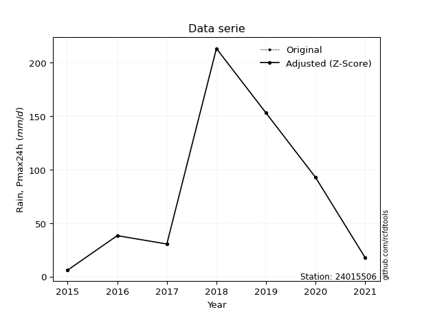</img>

</div>


> The initial value (value_initial) correspond to the initial obtained or null completed value, and value (value) is adjusted only when the initial value is outside the valid range (outlier) definite through the Z-Score value. If Z-Score is active, values out of range or outliers are replaced with the station mean value. A Z-Score (or standard score) measures how many standard deviations a data point is from the mean of a dataset, indicating its relative position; positive scores mean above the mean, negative mean below, and a score of zero is exactly at the mean, allowing for comparison of values from different distributions. It´s calculated using the formula $z=(x–μ)/σ$, where $x$ is the data point, $μ$ is the mean, and $σ$ is the standard deviation, helping identify outliers and understand probability.
>
> <sub>**Note**: In this study, "completing" (filling gaps in) and "extending" (forecasting or lengthening the historical record) rainfall data series are avoided for certain critical analyses because they introduce artificial bias and uncertainty, which can distort the statistics of rare events (extremes), alter day-to-day variability, and compromise the integrity and homogeneity of the original data. Some reasons against Completing/Extending rainfall data are: **Distortion of Extremes and Variability**: The primary issue is that most gap-filling or extension methods rely on averaging or regression with nearby stations, which inherently smooths the data. Rainfall is highly variable in space and time, with a large percentage of zero values and occasional large storms. Infilling methods often underestimate the highest values and overestimate the lowest (zero) values, which severely distorts analyses focused on flood frequency, drought severity, and intensity-duration-frequency (IDF) curves, **Loss of Data Homogeneity**: Infilled or extended data are synthetic estimates, not actual measurements. Combining these estimates with observed data can violate the assumption of data homogeneity, which requires that the data properties do not change over time. Inhomogeneity can lead to incorrect conclusions about long-term trends or changes in climate patterns, **Propagation of Errors**: Errors and biases from the original data (e.g., wind-induced undercatch, instrument errors, site changes) or the data used for imputation can propagate through the analysis, leading to unreliable hydrological models and inaccurate predictions, **Compromised Statistical Integrity**: For statistical analyses, especially those involving the frequency of events, using artificial data can introduce time bias or autocorrelation that doesn´t exist in reality, making it difficult to assess the true probability of events, **Difficulty in Validation**: It is difficult to accurately validate the quality of filled or extended data, especially for past periods where ground-truth measurements are unavailable. The reliability of imputation techniques heavily depends on the density of the surrounding station network and the complexity of the local topography.</sub>


### 4. Active continuous probability distributions from SciPy (80 of 104 available)

A Probability Density Function (PDF) describes the relative likelihood of a continuous random variable falling within a specific range, where the total area under its curve equals 1, and the area over any interval gives the actual probability for that range. Unlike discrete probabilities (like rolling a die), a PDF shows density, not direct probability for a single point (which is zero), with higher points indicating higher likelihood, often visualized as a bell curve for normal distributions.

A log of a probability density function (log-PDF) is simply the logarithm of the PDF´s value, denoted as $log(f(x))$, useful for converting multiplication of probabilities into addition, improving numerical stability with tiny numbers, and connecting to information theory concepts like entropy. Instead of dealing with very small probabilities (e.g., 0.000001), log-PDFs use negative numbers (e.g., $log(0.00001) ≈ -11.51$ that are easier for computers to handle, preventing underflow errors and simplifying complex calculations. In this study, each active probability distribution from SciPy is also evaluated in the $log$ form.

[scipy.stats](https://docs.scipy.org/doc/scipy/reference/stats.html) is a Python´s powerful submodule within the SciPy library for comprehensive statistical analysis, offering over 130 probability distributions (like Normal, Poisson, etc.), functions for descriptive stats (mean, variance), hypothesis testing (t-tests, chi-square), random variable generation, and statistical tests, making it essential for data science, modeling, and research. It provides tools to explore, model, and draw conclusions from data efficiently, working seamlessly with [NumPy](https://numpy.org/).

<div align="center">

|   id | p_dist           |   n_parameter | fit_method   | label                                                                       | active   | ref                                                                                                      |
|-----:|:-----------------|--------------:|:-------------|:----------------------------------------------------------------------------|:---------|:---------------------------------------------------------------------------------------------------------|
|    0 | alpha            |             3 | MLE          | Alpha                                                                       | True     | [:mortar_board:](https://docs.scipy.org/doc/scipy/reference/generated/scipy.stats.alpha.html)            |
|    1 | anglit           |             2 | MM           | Anglit                                                                      | True     | [:mortar_board:](https://docs.scipy.org/doc/scipy/reference/generated/scipy.stats.anglit.html)           |
|    2 | arcsine          |             2 | MM           | Arcsine                                                                     | True     | [:mortar_board:](https://docs.scipy.org/doc/scipy/reference/generated/scipy.stats.arcsine.html)          |
|    3 | argus            |             3 | MLE          | Argus                                                                       | True     | [:mortar_board:](https://docs.scipy.org/doc/scipy/reference/generated/scipy.stats.argus.html)            |
|    4 | beta             |             4 | MLE          | Beta                                                                        | True     | [:mortar_board:](https://docs.scipy.org/doc/scipy/reference/generated/scipy.stats.beta.html)             |
|    5 | betaprime        |             4 | MLE          | Beta prime                                                                  | True     | [:mortar_board:](https://docs.scipy.org/doc/scipy/reference/generated/scipy.stats.betaprime.html)        |
|    6 | bradford         |             3 | MLE          | Bradford                                                                    | True     | [:mortar_board:](https://docs.scipy.org/doc/scipy/reference/generated/scipy.stats.bradford.html)         |
|    7 | burr             |             4 | MLE          | Burr (Type III)                                                             | True     | [:mortar_board:](https://docs.scipy.org/doc/scipy/reference/generated/scipy.stats.burr.html)             |
|    8 | burr12           |             4 | MLE          | Burr (Type III) 12                                                          | True     | [:mortar_board:](https://docs.scipy.org/doc/scipy/reference/generated/scipy.stats.burr12.html)           |
|    9 | cosine           |             2 | MLE          | Cosine                                                                      | True     | [:mortar_board:](https://docs.scipy.org/doc/scipy/reference/generated/scipy.stats.cosine.html)           |
|   10 | crystalball      |             4 | MLE          | Crystalball                                                                 | True     | [:mortar_board:](https://docs.scipy.org/doc/scipy/reference/generated/scipy.stats.crystalball.html)      |
|   11 | dgamma           |             3 | MLE          | Double gamma                                                                | True     | [:mortar_board:](https://docs.scipy.org/doc/scipy/reference/generated/scipy.stats.dgamma.html)           |
|   12 | dweibull         |             3 | MLE          | Double Weibull                                                              | True     | [:mortar_board:](https://docs.scipy.org/doc/scipy/reference/generated/scipy.stats.dweibull.html)         |
|   13 | erlang           |             3 | MLE          | Erlang                                                                      | True     | [:mortar_board:](https://docs.scipy.org/doc/scipy/reference/generated/scipy.stats.erlang.html)           |
|   14 | exponnorm        |             3 | MLE          | Exponentially modified Normal                                               | True     | [:mortar_board:](https://docs.scipy.org/doc/scipy/reference/generated/scipy.stats.exponnorm.html)        |
|   15 | exponpow         |             3 | MLE          | Exponential power                                                           | True     | [:mortar_board:](https://docs.scipy.org/doc/scipy/reference/generated/scipy.stats.exponpow.html)         |
|   16 | exponweib        |             4 | MLE          | Exponentiated Weibull                                                       | True     | [:mortar_board:](https://docs.scipy.org/doc/scipy/reference/generated/scipy.stats.exponweib.html)        |
|   17 | f                |             4 | MLE          | F                                                                           | True     | [:mortar_board:](https://docs.scipy.org/doc/scipy/reference/generated/scipy.stats.f.html)                |
|   18 | fatiguelife      |             3 | MLE          | Fatigue-life (Birnbaum-Saunders)                                            | True     | [:mortar_board:](https://docs.scipy.org/doc/scipy/reference/generated/scipy.stats.fatiguelife.html)      |
|   19 | foldnorm         |             3 | MM           | Fold Normal                                                                 | True     | [:mortar_board:](https://docs.scipy.org/doc/scipy/reference/generated/scipy.stats.foldnorm.html)         |
|   20 | gamma            |             3 | MLE          | Gamma                                                                       | True     | [:mortar_board:](https://docs.scipy.org/doc/scipy/reference/generated/scipy.stats.gamma.html)            |
|   21 | gausshyper       |             6 | MLE          | Gauss hypergeometric                                                        | True     | [:mortar_board:](https://docs.scipy.org/doc/scipy/reference/generated/scipy.stats.gausshyper.html)       |
|   22 | genexpon         |             5 | MLE          | Generalized exponential                                                     | True     | [:mortar_board:](https://docs.scipy.org/doc/scipy/reference/generated/scipy.stats.genexpon.html)         |
|   23 | genextreme       |             3 | MLE          | Generalized exponential                                                     | True     | [:mortar_board:](https://docs.scipy.org/doc/scipy/reference/generated/scipy.stats.genextreme.html)       |
|   24 | gengamma         |             4 | MLE          | Generalized gamma                                                           | True     | [:mortar_board:](https://docs.scipy.org/doc/scipy/reference/generated/scipy.stats.gengamma.html)         |
|   25 | genhalflogistic  |             3 | MLE          | Generalized half-logistic                                                   | True     | [:mortar_board:](https://docs.scipy.org/doc/scipy/reference/generated/scipy.stats.genhalflogistic.html)  |
|   26 | genlogistic      |             3 | MLE          | Generalized logistic                                                        | True     | [:mortar_board:](https://docs.scipy.org/doc/scipy/reference/generated/scipy.stats.genlogistic.html)      |
|   27 | gennorm          |             3 | MLE          | Generalized Normal                                                          | True     | [:mortar_board:](https://docs.scipy.org/doc/scipy/reference/generated/scipy.stats.gennorm.html)          |
|   28 | genpareto        |             3 | MLE          | Generalized Pareto                                                          | True     | [:mortar_board:](https://docs.scipy.org/doc/scipy/reference/generated/scipy.stats.genpareto.html)        |
|   29 | gompertz         |             3 | MLE          | Gompertz (or truncated Gumbel)                                              | True     | [:mortar_board:](https://docs.scipy.org/doc/scipy/reference/generated/scipy.stats.gompertz.html)         |
|   30 | gumbel_l         |             2 | MM           | Gumbel Left Skew                                                            | True     | [:mortar_board:](https://docs.scipy.org/doc/scipy/reference/generated/scipy.stats.gumbel_l.html)         |
|   31 | gumbel_r         |             2 | MM           | Gumbel Right Skew                                                           | True     | [:mortar_board:](https://docs.scipy.org/doc/scipy/reference/generated/scipy.stats.gumbel_r.html)         |
|   32 | halfgennorm      |             3 | MLE          | Upper half of a generalized normal                                          | True     | [:mortar_board:](https://docs.scipy.org/doc/scipy/reference/generated/scipy.stats.halfgennorm.html)      |
|   33 | halflogistic     |             2 | MM           | Half-logistic                                                               | True     | [:mortar_board:](https://docs.scipy.org/doc/scipy/reference/generated/scipy.stats.halflogistic.html)     |
|   34 | halfnorm         |             2 | MM           | Half Normal                                                                 | True     | [:mortar_board:](https://docs.scipy.org/doc/scipy/reference/generated/scipy.stats.halfnorm.html)         |
|   35 | hypsecant        |             2 | MM           | hyperbolic secant                                                           | True     | [:mortar_board:](https://docs.scipy.org/doc/scipy/reference/generated/scipy.stats.hypsecant.html)        |
|   36 | invgamma         |             3 | MLE          | Inverted gamma                                                              | True     | [:mortar_board:](https://docs.scipy.org/doc/scipy/reference/generated/scipy.stats.invgamma.html)         |
|   37 | invgauss         |             3 | MLE          | Inverse Gaussian                                                            | True     | [:mortar_board:](https://docs.scipy.org/doc/scipy/reference/generated/scipy.stats.invgauss.html)         |
|   38 | invweibull       |             3 | MLE          | Inverted Weibull                                                            | True     | [:mortar_board:](https://docs.scipy.org/doc/scipy/reference/generated/scipy.stats.invweibull.html)       |
|   39 | johnsonsb        |             4 | MLE          | Johnson SB                                                                  | True     | [:mortar_board:](https://docs.scipy.org/doc/scipy/reference/generated/scipy.stats.johnsonsb.html)        |
|   40 | johnsonsu        |             4 | MLE          | Johnson Su                                                                  | True     | [:mortar_board:](https://docs.scipy.org/doc/scipy/reference/generated/scipy.stats.johnsonsu.html)        |
|   41 | kappa3           |             3 | MLE          | Kappa 3                                                                     | True     | [:mortar_board:](https://docs.scipy.org/doc/scipy/reference/generated/scipy.stats.kappa3.html)           |
|   42 | kappa4           |             4 | MLE          | Kappa 4                                                                     | True     | [:mortar_board:](https://docs.scipy.org/doc/scipy/reference/generated/scipy.stats.kappa4.html)           |
|   43 | ksone            |             3 | MLE          | Kolmogorov-Smirnov one-sided test statistic distribution                    | True     | [:mortar_board:](https://docs.scipy.org/doc/scipy/reference/generated/scipy.stats.ksone.html)            |
|   44 | kstwobign        |             2 | MLE          | Limiting distribution of scaled Kolmogorov-Smirnov two-sided test statistic | True     | [:mortar_board:](https://docs.scipy.org/doc/scipy/reference/generated/scipy.stats.kstwobign.html)        |
|   45 | laplace          |             2 | MM           | Laplace                                                                     | True     | [:mortar_board:](https://docs.scipy.org/doc/scipy/reference/generated/scipy.stats.laplace.html)          |
|   46 | levy_l           |             2 | MLE          | Left-skewed Levy                                                            | True     | [:mortar_board:](https://docs.scipy.org/doc/scipy/reference/generated/scipy.stats.levy_l.html)           |
|   47 | loggamma         |             3 | MLE          | Log gamma                                                                   | True     | [:mortar_board:](https://docs.scipy.org/doc/scipy/reference/generated/scipy.stats.loggamma.html)         |
|   48 | logistic         |             2 | MM           | Logistic (or Sech-squared)                                                  | True     | [:mortar_board:](https://docs.scipy.org/doc/scipy/reference/generated/scipy.stats.logistic.html)         |
|   49 | loglaplace       |             3 | MLE          | Log-Laplace                                                                 | True     | [:mortar_board:](https://docs.scipy.org/doc/scipy/reference/generated/scipy.stats.loglaplace.html)       |
|   50 | lomax            |             3 | MLE          | Lomax (Pareto of the second kind)                                           | True     | [:mortar_board:](https://docs.scipy.org/doc/scipy/reference/generated/scipy.stats.lomax.html)            |
|   51 | maxwell          |             2 | MM           | Maxwell                                                                     | True     | [:mortar_board:](https://docs.scipy.org/doc/scipy/reference/generated/scipy.stats.maxwell.html)          |
|   52 | mielke           |             4 | MLE          | Mielke Beta-Kappa / Dagum                                                   | True     | [:mortar_board:](https://docs.scipy.org/doc/scipy/reference/generated/scipy.stats.mielke.html)           |
|   53 | moyal            |             2 | MM           | Moyal                                                                       | True     | [:mortar_board:](https://docs.scipy.org/doc/scipy/reference/generated/scipy.stats.moyal.html)            |
|   54 | nakagami         |             3 | MLE          | Nakagami                                                                    | True     | [:mortar_board:](https://docs.scipy.org/doc/scipy/reference/generated/scipy.stats.nakagami.html)         |
|   55 | ncf              |             5 | MLE          | Non-central F distribution                                                  | True     | [:mortar_board:](https://docs.scipy.org/doc/scipy/reference/generated/scipy.stats.ncf.html)              |
|   56 | nct              |             4 | MLE          | Non-central Student’s t                                                     | True     | [:mortar_board:](https://docs.scipy.org/doc/scipy/reference/generated/scipy.stats.nct.html)              |
|   57 | norm             |             2 | MM           | Normal                                                                      | True     | [:mortar_board:](https://docs.scipy.org/doc/scipy/reference/generated/scipy.stats.norm.html)             |
|   58 | pearson3         |             3 | MM           | Pearson type III                                                            | True     | [:mortar_board:](https://docs.scipy.org/doc/scipy/reference/generated/scipy.stats.pearson3.html)         |
|   59 | powerlaw         |             3 | MLE          | Power-function                                                              | True     | [:mortar_board:](https://docs.scipy.org/doc/scipy/reference/generated/scipy.stats.powerlaw.html)         |
|   60 | rayleigh         |             2 | MM           | Rayleigh                                                                    | True     | [:mortar_board:](https://docs.scipy.org/doc/scipy/reference/generated/scipy.stats.rayleigh.html)         |
|   61 | rdist            |             3 | MLE          | R-distributed (symmetric beta)                                              | True     | [:mortar_board:](https://docs.scipy.org/doc/scipy/reference/generated/scipy.stats.rdist.html)            |
|   62 | rice             |             3 | MLE          | Rice                                                                        | True     | [:mortar_board:](https://docs.scipy.org/doc/scipy/reference/generated/scipy.stats.rice.html)             |
|   63 | semicircular     |             2 | MM           | Semicircular                                                                | True     | [:mortar_board:](https://docs.scipy.org/doc/scipy/reference/generated/scipy.stats.semicircular.html)     |
|   64 | skewnorm         |             3 | MLE          | Skew normal                                                                 | True     | [:mortar_board:](https://docs.scipy.org/doc/scipy/reference/generated/scipy.stats.skewnorm.html)         |
|   65 | t                |             3 | MLE          | Student’s t                                                                 | True     | [:mortar_board:](https://docs.scipy.org/doc/scipy/reference/generated/scipy.stats.t.html)                |
|   66 | trapezoid        |             4 | MLE          | Trapezoid                                                                   | True     | [:mortar_board:](https://docs.scipy.org/doc/scipy/reference/generated/scipy.stats.trapezoid.html)        |
|   67 | triang           |             3 | MLE          | Triangular                                                                  | True     | [:mortar_board:](https://docs.scipy.org/doc/scipy/reference/generated/scipy.stats.triang.html)           |
|   68 | truncexpon       |             3 | MLE          | Truncated exponential                                                       | True     | [:mortar_board:](https://docs.scipy.org/doc/scipy/reference/generated/scipy.stats.truncexpon.html)       |
|   69 | truncnorm        |             4 | MLE          | Truncated normal                                                            | True     | [:mortar_board:](https://docs.scipy.org/doc/scipy/reference/generated/scipy.stats.truncnorm.html)        |
|   70 | truncpareto      |             4 | MLE          | Upper truncated Pareto                                                      | True     | [:mortar_board:](https://docs.scipy.org/doc/scipy/reference/generated/scipy.stats.truncpareto.html)      |
|   71 | truncweibull_min |             5 | MLE          | Doubly truncated Weibull minimum                                            | True     | [:mortar_board:](https://docs.scipy.org/doc/scipy/reference/generated/scipy.stats.truncweibull_min.html) |
|   72 | tukeylambda      |             3 | MLE          | Tukey-Lamdba                                                                | True     | [:mortar_board:](https://docs.scipy.org/doc/scipy/reference/generated/scipy.stats.tukeylambda.html)      |
|   73 | uniform          |             2 | MLE          | Uniform                                                                     | True     | [:mortar_board:](https://docs.scipy.org/doc/scipy/reference/generated/scipy.stats.uniform.html)          |
|   74 | vonmises         |             3 | MLE          | Von Mises                                                                   | True     | [:mortar_board:](https://docs.scipy.org/doc/scipy/reference/generated/scipy.stats.vonmises.html)         |
|   75 | vonmises_line    |             3 | MLE          | Von Mises line                                                              | True     | [:mortar_board:](https://docs.scipy.org/doc/scipy/reference/generated/scipy.stats.vonmises_line.html)    |
|   76 | wald             |             2 | MM           | Wald                                                                        | True     | [:mortar_board:](https://docs.scipy.org/doc/scipy/reference/generated/scipy.stats.wald.html)             |
|   77 | weibull_max      |             3 | MLE          | Weibull maximum                                                             | True     | [:mortar_board:](https://docs.scipy.org/doc/scipy/reference/generated/scipy.stats.weibull_max.html)      |
|   78 | weibull_min      |             3 | MLE          | Weibull minimum                                                             | True     | [:mortar_board:](https://docs.scipy.org/doc/scipy/reference/generated/scipy.stats.weibull_min.html)      |
|   79 | wrapcauchy       |             3 | MLE          | Wrapped  Cauchy                                                             | True     | [:mortar_board:](https://docs.scipy.org/doc/scipy/reference/generated/scipy.stats.wrapcauchy.html)       |

</div>

> **n_parameter:** # arguments & localization & scale.
>
> **Fit methods:** (MLE) maximum likelihood, (MM) L-moments.
>
>**Inactive** (With the only purpose of prevent loops, zero divisions, infinite values, over high estimated values or horizontal trending for recurrence intervals estimations, the follow distributions were disabled.)**:** lognorm, norminvgauss, powernorm, powerlognorm, cauchy, halfcauchy, foldcauchy, skewcauchy, chi2, expon, fisk, genhyperbolic, geninvgauss, gibrat, kstwo, laplace_asymmetric, levy, levy_stable, ncx2, pareto, rel_breitwigner, recipinvgauss, studentized_range, loguniform, 


## B. Probability (PDF) vs. Empirical (EDF) distributions functions

A continuous probability distribution (CPD) describes probabilities for variables that can take any value within a range (like rain any time), unlike discrete variables with specific outcomes (like temperature). It uses a Probability Density Function (PDF), a curve where the total area under it equals 1, and the probability of the variable falling within an interval (a to b) is found by calculating the area under the curve between those points. A key feature is that the probability of hitting any single exact value is zero, so probabilities are always expressed for ranges, e.g., $P(a ≤ X ≤ b)$.

<div align="center">

Distributions parameters from station values
|     |   station | p_dist              |   n |             loc |          scale | shape                  | shape1                 | shape2                | shape3             |
|----:|----------:|:--------------------|----:|----------------:|---------------:|:-----------------------|:-----------------------|:----------------------|:-------------------|
|   0 |  24015506 | alpha               |   7 |    -13.3519     |   42.3439      | 0.23703054240486676    |                        |                       |                    |
|   1 |  24015506 | anglit              |   7 |     78.7857     |  211.976       |                        |                        |                       |                    |
|   2 |  24015506 | arcsine             |   7 |    -23.6892     |  204.95        |                        |                        |                       |                    |
|   3 |  24015506 | argus               |   7 |    -78.4222     |  303.891       | 2.855145519600348e-07  |                        |                       |                    |
|   4 |  24015506 | beta                |   7 |    -14.4435     |  227.643       | 0.3093071350343668     | 0.6094573315349221     |                       |                    |
|   5 |  24015506 | betaprime           |   7 |      6.1        |  230.472       | 0.5549676489396121     | 2.6620768754400976     |                       |                    |
|   6 |  24015506 | bradford            |   7 |      6.09998    |  207.1         | 1.4945581672713795     |                        |                       |                    |
|   7 |  24015506 | burr                |   7 |      6.1        |  358.723       | 4.1755816515760324     | 0.07086970798880982    |                       |                    |
|   8 |  24015506 | burr12              |   7 |     -1.36569    |    7.32507     | 210.1619474697119      | 0.0025400392924761735  |                       |                    |
|   9 |  24015506 | cosine              |   7 |     87.2035     |   60.0328      |                        |                        |                       |                    |
|  10 |  24015506 | crystalball         |   7 |     78.7857     |   72.4607      | 5357.035275899364      | 7660.313345567903      |                       |                    |
|  11 |  24015506 | dgamma              |   7 |     71.1669     |   19.7364      | 3.166505479617733      |                        |                       |                    |
|  12 |  24015506 | dweibull            |   7 |     76.2405     |   71.4801      | 1.8858371125217888     |                        |                       |                    |
|  13 |  24015506 | erlang              |   7 |      6.1        |   72.2143      | 0.7666613007354925     |                        |                       |                    |
|  14 |  24015506 | exponnorm           |   7 |      6.0361     |    0.0198368   | 3665.289153102003      |                        |                       |                    |
|  15 |  24015506 | exponpow            |   7 |      6.1        |  162.416       | 0.6405055061661648     |                        |                       |                    |
|  16 |  24015506 | exponweib           |   7 |      6.1        |    4.51316     | 3.1035621939754856     | 0.27933268862712246    |                       |                    |
|  17 |  24015506 | f                   |   7 |      6.1        |   57.1985      | 1.1368124183717314     | 84.86929108420593      |                       |                    |
|  18 |  24015506 | fatiguelife         |   7 |      6.1        |    0.000389588 | 384.87169682633635     |                        |                       |                    |
|  19 |  24015506 | foldnorm            |   7 |    -24.0832     |   94.0694      | 0.8883596805768651     |                        |                       |                    |
|  20 |  24015506 | gamma               |   7 |      6.1        |   98.3567      | 0.3963606288674575     |                        |                       |                    |
|  21 |  24015506 | gausshyper          |   7 |    -32.5289     |  245.729       | 1.0898531815895511     | 0.8046066317285829     | 1.078605119392614     | 1.0837707933352438 |
|  22 |  24015506 | genexpon            |   7 |      6.1        |  108.404       | 1.4904489277913942     | 3.4464465735621795e-05 | 2.3315038925690637    |                    |
|  23 |  24015506 | genextreme          |   7 |      8.27809    |   14.9481      | -6.86292206740329      |                        |                       |                    |
|  24 |  24015506 | gengamma            |   7 |      6.1        |    3.4849      | 2.311974064953257      | 0.3628723486788653     |                       |                    |
|  25 |  24015506 | genhalflogistic     |   7 |    -15.0889     |  237.555       | 1.040589913135647      |                        |                       |                    |
|  26 |  24015506 | genlogistic         |   7 |   -327.933      |   51.1349      | 1496.1908792805007     |                        |                       |                    |
|  27 |  24015506 | gennorm             |   7 |     38.3        |    2.49806     | 0.3803921543267445     |                        |                       |                    |
|  28 |  24015506 | genpareto           |   7 |      6.1        |   73.9303      | -0.017001008711327675  |                        |                       |                    |
|  29 |  24015506 | gompertz            |   7 |      6.06754    |  779.893       | 9.822064646606695      |                        |                       |                    |
|  30 |  24015506 | gumbel_l            |   7 |    111.397      |   56.4974      |                        |                        |                       |                    |
|  31 |  24015506 | gumbel_r            |   7 |     46.1746     |   56.4974      |                        |                        |                       |                    |
|  32 |  24015506 | halfgennorm         |   7 |      6.1        |    4.36172     | 0.37363058440856023    |                        |                       |                    |
|  33 |  24015506 | halflogistic        |   7 |     -7.09703    |   61.9513      |                        |                        |                       |                    |
|  34 |  24015506 | halfnorm            |   7 |    -17.1238     |  120.205       |                        |                        |                       |                    |
|  35 |  24015506 | hypsecant           |   7 |     78.7857     |   46.1299      |                        |                        |                       |                    |
|  36 |  24015506 | invgamma            |   7 |     -9.8663     |   64.4886      | 1.5183877907489371     |                        |                       |                    |
|  37 |  24015506 | invgauss            |   7 |     -3.46281    |   49.4661      | 1.6627255902283005     |                        |                       |                    |
|  38 |  24015506 | invweibull          |   7 |      6.1        |    4.59241     | 0.056372560892290674   |                        |                       |                    |
|  39 |  24015506 | johnsonsb           |   7 |      6.1        |  631.967       | 1.5580976877028825     | 0.15993294448103007    |                       |                    |
|  40 |  24015506 | johnsonsu           |   7 |      3.36505    |    0.106149    | -4.718046401858163     | 0.7195402617869628     |                       |                    |
|  41 |  24015506 | kappa3              |   7 |      6.1        |   45.2459      | 1.3967227536825157     |                        |                       |                    |
|  42 |  24015506 | kappa4              |   7 |    -15.6539     |  224.338       | 1.1071415665378113     | 0.9595165484917898     |                       |                    |
|  43 |  24015506 | ksone               |   7 |    -14.61       |  248.52        | 1.0                    |                        |                       |                    |
|  44 |  24015506 | kstwobign           |   7 |   -133.083      |  243.442       |                        |                        |                       |                    |
|  45 |  24015506 | laplace             |   7 |     78.7857     |   51.2374      |                        |                        |                       |                    |
|  46 |  24015506 | levy_l              |   7 |    227.486      |   63.3544      |                        |                        |                       |                    |
|  47 |  24015506 | loggamma            |   7 | -23317.2        | 3126.57        | 1777.8701444269473     |                        |                       |                    |
|  48 |  24015506 | logistic            |   7 |     78.7857     |   39.9497      |                        |                        |                       |                    |
|  49 |  24015506 | loglaplace          |   7 |     -0.10407    |   38.4041      | 1.029608409122774      |                        |                       |                    |
|  50 |  24015506 | lomax               |   7 |      6.1        |    4.15901e+08 | 5717565.319805088      |                        |                       |                    |
|  51 |  24015506 | maxwell             |   7 |    -92.9157     |  107.598       |                        |                        |                       |                    |
|  52 |  24015506 | mielke              |   7 |      6.1        |   99.1721      | 0.5207876370603153     | 2.659459276016634      |                       |                    |
|  53 |  24015506 | moyal               |   7 |     37.348      |   32.6188      |                        |                        |                       |                    |
|  54 |  24015506 | nakagami            |   7 |      6.1        |  151.685       | 0.16336224290936685    |                        |                       |                    |
|  55 |  24015506 | ncf                 |   7 |      6.09997    |   51.9372      | 1.2417917658281228     | 1274.1145390198017     | 0.9813642313875142    |                    |
|  56 |  24015506 | nct                 |   7 |    -19.596      |    2.68434     | 1.376817875416089      | 17.863153780869737     |                       |                    |
|  57 |  24015506 | norm                |   7 |     78.7857     |   72.4607      |                        |                        |                       |                    |
|  58 |  24015506 | pearson3            |   7 |     78.7857     |   72.4607      | 0.769395538971541      |                        |                       |                    |
|  59 |  24015506 | powerlaw            |   7 |      6.1        |  207.1         | 0.14556657331787776    |                        |                       |                    |
|  60 |  24015506 | rayleigh            |   7 |    -59.8358     |  110.604       |                        |                        |                       |                    |
|  61 |  24015506 | rdist               |   7 |    -13.6843     |  106.384       | 1.1433977083839482     |                        |                       |                    |
|  62 |  24015506 | rice                |   7 |    -36.6802     |   96.3922      | 0.0005106388913105342  |                        |                       |                    |
|  63 |  24015506 | semicircular        |   7 |     78.7857     |  144.921       |                        |                        |                       |                    |
|  64 |  24015506 | skewnorm            |   7 |      6.09998    |  102.641       | 26983967.813921444     |                        |                       |                    |
|  65 |  24015506 | t                   |   7 |     78.786      |   72.4596      | 209703736.7858099      |                        |                       |                    |
|  66 |  24015506 | trapezoid           |   7 |    -15.3405     |  248.52        | 1.0                    | 1.0                    |                       |                    |
|  67 |  24015506 | triang              |   7 |    -16.2762     |  229.477       | 0.9999991629716134     |                        |                       |                    |
|  68 |  24015506 | truncexpon          |   7 |      6.1        |  173.777       | 1.1917568065366844     |                        |                       |                    |
|  69 |  24015506 | truncnorm           |   7 |  -2889.85       |  474.745       | 6.100012103731489      | 261.9617934878462      |                       |                    |
|  70 |  24015506 | truncpareto         |   7 |      6.04699    |    0.0530143   | 0.16853429412611712    | 3907.492820223375      |                       |                    |
|  71 |  24015506 | truncweibull_min    |   7 |      4.61197    |  209.313       | 0.45206623135784685    | 0.007108972833649967   | 0.9965357360768472    |                    |
|  72 |  24015506 | tukeylambda         |   7 |    -13.7609     |  117.166       | 1.1005519828109127     |                        |                       |                    |
|  73 |  24015506 | uniform             |   7 |      6.1        |  207.1         |                        |                        |                       |                    |
|  74 |  24015506 | vonmises            |   7 |     -0.547524   |    1           | 1.2565611181681138     |                        |                       |                    |
|  75 |  24015506 | vonmises_line       |   7 |    110.057      |   33.0907      | 3.772425142247892e-07  |                        |                       |                    |
|  76 |  24015506 | wald                |   7 |      6.32504    |   72.4607      |                        |                        |                       |                    |
|  77 |  24015506 | weibull_max         |   7 |    213.2        |    1.60293     | 0.19547222051128466    |                        |                       |                    |
|  78 |  24015506 | weibull_min         |   7 |      6.1        |  105.722       | 0.8253411101179096     |                        |                       |                    |
|  79 |  24015506 | wrapcauchy          |   7 |      6.1        |   32.961       | 0.5150996548047815     |                        |                       |                    |
|  80 |  24015506 | logalpha            |   7 |    -20.0482     |  475.524       | 19.997714638408084     |                        |                       |                    |
|  81 |  24015506 | loganglit           |   7 |      3.80958    |    3.40459     |                        |                        |                       |                    |
|  82 |  24015506 | logarcsine          |   7 |      2.16371    |    3.29175     |                        |                        |                       |                    |
|  83 |  24015506 | logargus            |   7 |      0.961037   |    4.57859     | 1.211775768012945      |                        |                       |                    |
|  84 |  24015506 | logbeta             |   7 |      1.44575    |    3.91648     | 1.6984053826987344     | 0.8258737377534349     |                       |                    |
|  85 |  24015506 | logbetaprime        |   7 |      0.0132471  |    2.01247e+09 | 8.354923723043804      | 4405469196.342161      |                       |                    |
|  86 |  24015506 | logbradford         |   7 |      1.80828    |    3.55398     | 1.006402782205877      |                        |                       |                    |
|  87 |  24015506 | logburr             |   7 |      1.80826    |    3.68348     | 55.8360318586561       | 0.014469875948628256   |                       |                    |
|  88 |  24015506 | logburr12           |   7 |     -1.84934    |   21.1284      | 5.7941479713651525     | 1302.0378078256786     |                       |                    |
|  89 |  24015506 | logcosine           |   7 |      3.75254    |    0.960869    |                        |                        |                       |                    |
|  90 |  24015506 | logcrystalball      |   7 |      3.80958    |    1.1638      | 7.4540276667148095     | 107.08342977991356     |                       |                    |
|  91 |  24015506 | logdgamma           |   7 |      4.05657    |    0.308747    | 3.3469384798266635     |                        |                       |                    |
|  92 |  24015506 | logdweibull         |   7 |      4.01249    |    1.16444     | 1.886628317904468      |                        |                       |                    |
|  93 |  24015506 | logerlang           |   7 |    -18.2949     |    0.0627299   | 352.23280096631174     |                        |                       |                    |
|  94 |  24015506 | logexponnorm        |   7 |      3.8085     |    1.1638      | 0.0009304558189728567  |                        |                       |                    |
|  95 |  24015506 | logexponpow         |   7 |      1.80829    |    1.38534     | 0.394727295273943      |                        |                       |                    |
|  96 |  24015506 | logexponweib        |   7 |      1.80829    |    1.14672     | 1.2272462126585917     | 0.6398472299829305     |                       |                    |
|  97 |  24015506 | logf                |   7 |   -362.2        |  366.012       | 564683.5452207255      | 300926.0831859963      |                       |                    |
|  98 |  24015506 | logfatiguelife      |   7 |   -193.681      |  197.491       | 0.005889235116299515   |                        |                       |                    |
|  99 |  24015506 | logfoldnorm         |   7 |     -3.75251    |    1.14179     | 6.626520722804165      |                        |                       |                    |
| 100 |  24015506 | loggamma            |   7 |    -16.5484     |    0.0673587   | 302.1012245986974      |                        |                       |                    |
| 101 |  24015506 | loggausshyper       |   7 |      1.79366    |    3.56857     | 1.177174254297132      | 0.771614608795451      | 1.0588939201513974    | 0.786738222151638  |
| 102 |  24015506 | loggenexpon         |   7 |      1.80829    |    0.0240339   | 0.004923984100862481   | 2.575736173420817      | 4.968949187220586e-05 |                    |
| 103 |  24015506 | loggenextreme       |   7 |      4.02865    |    1.41207     | 1.058857761698083      |                        |                       |                    |
| 104 |  24015506 | loggengamma         |   7 |      1.80829    |    1.10816     | 1.2169455208864761     | 0.6405323836564003     |                       |                    |
| 105 |  24015506 | loggenhalflogistic  |   7 |      1.42971    |    4.26699     | 1.0850519071285367     |                        |                       |                    |
| 106 |  24015506 | loggenlogistic      |   7 |      4.39665    |    0.56077     | 0.5877126642965989     |                        |                       |                    |
| 107 |  24015506 | loggennorm          |   7 |      3.58526    |    1.77697     | 15534775.900553074     |                        |                       |                    |
| 108 |  24015506 | loggenpareto        |   7 |     -0.00405052 |    9.14229     | -1.7036549636349845    |                        |                       |                    |
| 109 |  24015506 | loggompertz         |   7 |      1.80829    |    1.35678     | 0.1983838771636069     |                        |                       |                    |
| 110 |  24015506 | loggumbel_l         |   7 |      4.33336    |    0.907415    |                        |                        |                       |                    |
| 111 |  24015506 | loggumbel_r         |   7 |      3.28581    |    0.907415    |                        |                        |                       |                    |
| 112 |  24015506 | loghalfgennorm      |   7 |      1.80829    |    0.981767    | 0.684524444735968      |                        |                       |                    |
| 113 |  24015506 | loghalflogistic     |   7 |      2.43022    |    0.995       |                        |                        |                       |                    |
| 114 |  24015506 | loghalfnorm         |   7 |      2.26919    |    1.9306      |                        |                        |                       |                    |
| 115 |  24015506 | loghypsecant        |   7 |      3.80958    |    0.740901    |                        |                        |                       |                    |
| 116 |  24015506 | loginvgamma         |   7 |    -15.7871     | 5298.76        | 271.56452822476376     |                        |                       |                    |
| 117 |  24015506 | loginvgauss         |   7 |     -5.81033    |  598.186       | 0.016053614521380336   |                        |                       |                    |
| 118 |  24015506 | loginvweibull       |   7 |     -9.0271e+07 |    9.0271e+07  | 79344439.24039322      |                        |                       |                    |
| 119 |  24015506 | logjohnsonsb        |   7 |      1.80829    |    3.58708     | 0.03548670538097649    | 0.11528256197759529    |                       |                    |
| 120 |  24015506 | logjohnsonsu        |   7 |      7.19984    |    0.16618     | 10.214017406878796     | 2.799918329868108      |                       |                    |
| 121 |  24015506 | logkappa3           |   7 |      1.80808    |    3.5541      | 115841.83977472287     |                        |                       |                    |
| 122 |  24015506 | logkappa4           |   7 |      1.65333    |    4.07627     | 1.034051875770133      | 1.0990508074695555     |                       |                    |
| 123 |  24015506 | logksone            |   7 |      1.79381    |    4.03154     | 1.0                    |                        |                       |                    |
| 124 |  24015506 | logkstwobign        |   7 |     -0.769143   |    5.2316      |                        |                        |                       |                    |
| 125 |  24015506 | loglaplace          |   7 |      3.80958    |    0.822934    |                        |                        |                       |                    |
| 126 |  24015506 | loglevy_l           |   7 |      5.48423    |    0.53309     |                        |                        |                       |                    |
| 127 |  24015506 | logloggamma         |   7 |      3.25254    |    1.4653      | 1.9352550295498352     |                        |                       |                    |
| 128 |  24015506 | loglogistic         |   7 |      3.80958    |    0.641639    |                        |                        |                       |                    |
| 129 |  24015506 | logloglaplace       |   7 |     -0.033875   |    3.67932     | 3.6681092962402078     |                        |                       |                    |
| 130 |  24015506 | loglomax            |   7 |      1.80829    |    1.27393e+11 | 49831013285.72967      |                        |                       |                    |
| 131 |  24015506 | logmaxwell          |   7 |      1.05185    |    1.72815     |                        |                        |                       |                    |
| 132 |  24015506 | logmielke           |   7 |      1.80829    |    3.56885     | 0.7908753987468992     | 1303.3082186699648     |                       |                    |
| 133 |  24015506 | logmoyal            |   7 |      3.14404    |    0.523896    |                        |                        |                       |                    |
| 134 |  24015506 | lognakagami         |   7 |      2.87356    |    1.62703     | 0.06946036917825887    |                        |                       |                    |
| 135 |  24015506 | logncf              |   7 |     -0.74785    |    1.10072e-06 | 1.6042110958435196e-05 | 133.92352702799374     | 65.54984057813755     |                    |
| 136 |  24015506 | lognct              |   7 |     65.4686     |    1.15574     | 97586.47833095895      | -53.34942721204165     |                       |                    |
| 137 |  24015506 | lognorm             |   7 |      3.80958    |    1.1638      |                        |                        |                       |                    |
| 138 |  24015506 | logpearson3         |   7 |      3.80958    |    1.16381     | -0.2686576173041535    |                        |                       |                    |
| 139 |  24015506 | logpowerlaw         |   7 |      1.80829    |    3.55394     | 0.17355265724785365    |                        |                       |                    |
| 140 |  24015506 | lograyleigh         |   7 |      1.58315    |    1.77643     |                        |                        |                       |                    |
| 141 |  24015506 | logrdist            |   7 |      2.54086    |    1.98851     | 1.0734200990895855     |                        |                       |                    |
| 142 |  24015506 | logrice             |   7 |      1.16891    |    1.30433     | 1.70145128023647       |                        |                       |                    |
| 143 |  24015506 | logsemicircular     |   7 |      3.80958    |    2.32761     |                        |                        |                       |                    |
| 144 |  24015506 | logskewnorm         |   7 |      5.36223    |    1.94007     | -9351963.959157042     |                        |                       |                    |
| 145 |  24015506 | logt                |   7 |      3.80958    |    1.1638      | 227892358.4349283      |                        |                       |                    |
| 146 |  24015506 | logtrapezoid        |   7 |      0.517844   |    4.93761     | 1.0                    | 1.0                    |                       |                    |
| 147 |  24015506 | logtriang           |   7 |      0.859473   |    4.51028     | 0.9999999997553093     |                        |                       |                    |
| 148 |  24015506 | logtruncexpon       |   7 |      1.80581    |    4.77561     | 0.7447043025135718     |                        |                       |                    |
| 149 |  24015506 | logtruncnorm        |   7 |      0.0825439  |    3.02463     | 0.5705647761410492     | 17.584984288877507     |                       |                    |
| 150 |  24015506 | logtruncpareto      |   7 |      1.80623    |    0.00206362  | 0.16789571347737164    | 1723.1861295347062     |                       |                    |
| 151 |  24015506 | logtruncweibull_min |   7 |      1.51575    |    5.11089     | 1.1529059473122452     | 1.4680711788544399e-07 | 0.7526041921857609    |                    |
| 152 |  24015506 | logtukeylambda      |   7 |      3.58118    |    1.8849      | 1.0583112457072033     |                        |                       |                    |
| 153 |  24015506 | loguniform          |   7 |      1.80829    |    3.55394     |                        |                        |                       |                    |
| 154 |  24015506 | logvonmises         |   7 |     -2.36798    |    1           | 1.037774055740554      |                        |                       |                    |
| 155 |  24015506 | logvonmises_line    |   7 |      3.5854     |    0.56568     | 1.8930424815874112e-05 |                        |                       |                    |
| 156 |  24015506 | logwald             |   7 |      2.64574    |    1.16384     |                        |                        |                       |                    |
| 157 |  24015506 | logweibull_max      |   7 |      5.36223    |    1.57355     | 0.612545876896208      |                        |                       |                    |
| 158 |  24015506 | logweibull_min      |   7 |     -1.77005    |    6.04783     | 5.709532938105385      |                        |                       |                    |
| 159 |  24015506 | logwrapcauchy       |   7 |      1.80826    |    0.565634    | 0.13738921459007902    |                        |                       |                    |

</div>

> **loc** (Location parameter): This shifts the distribution along the x-axis. For many common distributions, like the normal (Gaussian) distribution, loc represents the mean $μ$. For others, like the uniform distribution, it might represent the minimum value, or for the beta distribution, the left end of the support interval.
>
> **scale** (Scale parameter): This determines the width or spread of the distribution. For the normal distribution, scale represents the standard deviation $σ$. For a uniform distribution, it defines the length of the interval (from $loc$ to $loc + scale$).
>
> **shape** (Shape parameters): Refers to parameters that define the specific form of a probability distribution, distinct from its location (loc) and scale (scale). These parameters are required arguments for most distribution functions. For example, a normal (Gaussian) distribution is fully defined by its location (mean) and scale (standard deviation), so it has no specific shape parameters beyond loc and scale. However, other distributions have intrinsic properties that need specification, as Gamma distribution that takes a shape parameter, often named $a$ or $alpha$.


### 0. Cumulative distribution values - CDF (160 evaluated)

Cumulative Distribution Function (CDF), denoted as $F$<sub>$X$</sub>$(x)$, is a function that gives the probability that a random variable $X$ will take a value less than or equal to a specific value, $x$ (i.e., $(P(X≥x)$. It essentially "accumulates" probabilities from a given point up to the far right (positive infinity), providing a complete picture of the distribution´s probabilities for both discrete (like rain) and continuous (like temperature) variables, helping to find probabilities over ranges or above certain values. Each station is evaluated separately ordering the $x$ values ascending, calculating the CDF and PDF values for the activated distributions and their logarithmic forms.

<div align="center">

CDF ordered by x ascending and calculating $log(f(x))$ separately
|   id |   Station |   date |     x |   count |    mean |     std |    zscore |   Value_initial |   station |   m |     alpha |   alpha_pdf |   anglit |   anglit_pdf |   arcsine |   arcsine_pdf |    argus |   argus_pdf |     beta |      beta_pdf |   betaprime |   betaprime_pdf |    bradford |   bradford_pdf |       burr |      burr_pdf |    burr12 |   burr12_pdf |   cosine |   cosine_pdf |   crystalball |   crystalball_pdf |   dgamma |   dgamma_pdf |   dweibull |   dweibull_pdf |     erlang |    erlang_pdf |   exponnorm |   exponnorm_pdf |    exponpow |   exponpow_pdf |   exponweib |   exponweib_pdf |           f |        f_pdf |   fatiguelife |   fatiguelife_pdf |   foldnorm |   foldnorm_pdf |       gamma |   gamma_pdf |   gausshyper |   gausshyper_pdf |   genexpon |   genexpon_pdf |   genextreme |   genextreme_pdf |    gengamma |   gengamma_pdf |   genhalflogistic |   genhalflogistic_pdf |   genlogistic |   genlogistic_pdf |   gennorm |   gennorm_pdf |   genpareto |   genpareto_pdf |    gompertz |   gompertz_pdf |   gumbel_l |   gumbel_l_pdf |   gumbel_r |   gumbel_r_pdf |   halfgennorm |   halfgennorm_pdf |   halflogistic |   halflogistic_pdf |   halfnorm |   halfnorm_pdf |   hypsecant |   hypsecant_pdf |   invgamma |   invgamma_pdf |   invgauss |   invgauss_pdf |   invweibull |   invweibull_pdf |   johnsonsb |   johnsonsb_pdf |   johnsonsu |   johnsonsu_pdf |      kappa3 |   kappa3_pdf |      kappa4 |   kappa4_pdf |     ksone |   ksone_pdf |   kstwobign |   kstwobign_pdf |   laplace |   laplace_pdf |   levy_l |   levy_l_pdf |   loggamma |   loggamma_pdf |   logistic |   logistic_pdf |   loglaplace |   loglaplace_pdf |       lomax |   lomax_pdf |   maxwell |   maxwell_pdf |      mielke |   mielke_pdf |    moyal |   moyal_pdf |    nakagami |   nakagami_pdf |        ncf |    ncf_pdf |       nct |     nct_pdf |     norm |    norm_pdf |   pearson3 |   pearson3_pdf |   powerlaw |   powerlaw_pdf |   rayleigh |   rayleigh_pdf |    rdist |      rdist_pdf |      rice |    rice_pdf |   semicircular |   semicircular_pdf |   skewnorm |   skewnorm_pdf |        t |       t_pdf |   trapezoid |   trapezoid_pdf |    triang |   triang_pdf |   truncexpon |   truncexpon_pdf |   truncnorm |   truncnorm_pdf |   truncpareto |   truncpareto_pdf |   truncweibull_min |   truncweibull_min_pdf |   tukeylambda |   tukeylambda_pdf |   uniform |   uniform_pdf |   vonmises |   vonmises_pdf |   vonmises_line |   vonmises_line_pdf |      wald |    wald_pdf |   weibull_max |   weibull_max_pdf |   weibull_min |   weibull_min_pdf |   wrapcauchy |   wrapcauchy_pdf |   logalpha |   logalpha_pdf |   loganglit |   loganglit_pdf |   logarcsine |   logarcsine_pdf |   logargus |   logargus_pdf |   logbeta |   logbeta_pdf |   logbetaprime |   logbetaprime_pdf |   logbradford |   logbradford_pdf |     logburr |   logburr_pdf |   logburr12 |   logburr12_pdf |   logcosine |   logcosine_pdf |   logcrystalball |   logcrystalball_pdf |   logdgamma |   logdgamma_pdf |   logdweibull |   logdweibull_pdf |   logerlang |   logerlang_pdf |   logexponnorm |   logexponnorm_pdf |   logexponpow |   logexponpow_pdf |   logexponweib |   logexponweib_pdf |      logf |   logf_pdf |   logfatiguelife |   logfatiguelife_pdf |   logfoldnorm |   logfoldnorm_pdf |   loggausshyper |   loggausshyper_pdf |   loggenexpon |   loggenexpon_pdf |   loggenextreme |   loggenextreme_pdf |   loggengamma |   loggengamma_pdf |   loggenhalflogistic |   loggenhalflogistic_pdf |   loggenlogistic |   loggenlogistic_pdf |   loggennorm |   loggennorm_pdf |   loggenpareto |   loggenpareto_pdf |   loggompertz |   loggompertz_pdf |   loggumbel_l |   loggumbel_l_pdf |   loggumbel_r |   loggumbel_r_pdf |   loghalfgennorm |   loghalfgennorm_pdf |   loghalflogistic |   loghalflogistic_pdf |   loghalfnorm |   loghalfnorm_pdf |   loghypsecant |   loghypsecant_pdf |   loginvgamma |   loginvgamma_pdf |   loginvgauss |   loginvgauss_pdf |   loginvweibull |   loginvweibull_pdf |   logjohnsonsb |   logjohnsonsb_pdf |   logjohnsonsu |   logjohnsonsu_pdf |   logkappa3 |   logkappa3_pdf |   logkappa4 |   logkappa4_pdf |   logksone |   logksone_pdf |   logkstwobign |   logkstwobign_pdf |   loglevy_l |   loglevy_l_pdf |   logloggamma |   logloggamma_pdf |   loglogistic |   loglogistic_pdf |   logloglaplace |   logloglaplace_pdf |    loglomax |   loglomax_pdf |   logmaxwell |   logmaxwell_pdf |   logmielke |   logmielke_pdf |    logmoyal |   logmoyal_pdf |   lognakagami |   lognakagami_pdf |    logncf |   logncf_pdf |    lognct |   lognct_pdf |   lognorm |   lognorm_pdf |   logpearson3 |   logpearson3_pdf |   logpowerlaw |   logpowerlaw_pdf |   lograyleigh |   lograyleigh_pdf |   logrdist |   logrdist_pdf |   logrice |   logrice_pdf |   logsemicircular |   logsemicircular_pdf |   logskewnorm |   logskewnorm_pdf |      logt |   logt_pdf |   logtrapezoid |   logtrapezoid_pdf |   logtriang |   logtriang_pdf |   logtruncexpon |   logtruncexpon_pdf |   logtruncnorm |   logtruncnorm_pdf |   logtruncpareto |   logtruncpareto_pdf |   logtruncweibull_min |   logtruncweibull_min_pdf |   logtukeylambda |   logtukeylambda_pdf |   loguniform |   loguniform_pdf |   logvonmises |   logvonmises_pdf |   logvonmises_line |   logvonmises_line_pdf |   logwald |   logwald_pdf |   logweibull_max |   logweibull_max_pdf |   logweibull_min |   logweibull_min_pdf |   logwrapcauchy |   logwrapcauchy_pdf |
|-----:|----------:|-------:|------:|--------:|--------:|--------:|----------:|----------------:|----------:|----:|----------:|------------:|---------:|-------------:|----------:|--------------:|---------:|------------:|---------:|--------------:|------------:|----------------:|------------:|---------------:|-----------:|--------------:|----------:|-------------:|---------:|-------------:|--------------:|------------------:|---------:|-------------:|-----------:|---------------:|-----------:|--------------:|------------:|----------------:|------------:|---------------:|------------:|----------------:|------------:|-------------:|--------------:|------------------:|-----------:|---------------:|------------:|------------:|-------------:|-----------------:|-----------:|---------------:|-------------:|-----------------:|------------:|---------------:|------------------:|----------------------:|--------------:|------------------:|----------:|--------------:|------------:|----------------:|------------:|---------------:|-----------:|---------------:|-----------:|---------------:|--------------:|------------------:|---------------:|-------------------:|-----------:|---------------:|------------:|----------------:|-----------:|---------------:|-----------:|---------------:|-------------:|-----------------:|------------:|----------------:|------------:|----------------:|------------:|-------------:|------------:|-------------:|----------:|------------:|------------:|----------------:|----------:|--------------:|---------:|-------------:|-----------:|---------------:|-----------:|---------------:|-------------:|-----------------:|------------:|------------:|----------:|--------------:|------------:|-------------:|---------:|------------:|------------:|---------------:|-----------:|-----------:|----------:|------------:|---------:|------------:|-----------:|---------------:|-----------:|---------------:|-----------:|---------------:|---------:|---------------:|----------:|------------:|---------------:|-------------------:|-----------:|---------------:|---------:|------------:|------------:|----------------:|----------:|-------------:|-------------:|-----------------:|------------:|----------------:|--------------:|------------------:|-------------------:|-----------------------:|--------------:|------------------:|----------:|--------------:|-----------:|---------------:|----------------:|--------------------:|----------:|------------:|--------------:|------------------:|--------------:|------------------:|-------------:|-----------------:|-----------:|---------------:|------------:|----------------:|-------------:|-----------------:|-----------:|---------------:|----------:|--------------:|---------------:|-------------------:|--------------:|------------------:|------------:|--------------:|------------:|----------------:|------------:|----------------:|-----------------:|---------------------:|------------:|----------------:|--------------:|------------------:|------------:|----------------:|---------------:|-------------------:|--------------:|------------------:|---------------:|-------------------:|----------:|-----------:|-----------------:|---------------------:|--------------:|------------------:|----------------:|--------------------:|--------------:|------------------:|----------------:|--------------------:|--------------:|------------------:|---------------------:|-------------------------:|-----------------:|---------------------:|-------------:|-----------------:|---------------:|-------------------:|--------------:|------------------:|--------------:|------------------:|--------------:|------------------:|-----------------:|---------------------:|------------------:|----------------------:|--------------:|------------------:|---------------:|-------------------:|--------------:|------------------:|--------------:|------------------:|----------------:|--------------------:|---------------:|-------------------:|---------------:|-------------------:|------------:|----------------:|------------:|----------------:|-----------:|---------------:|---------------:|-------------------:|------------:|----------------:|--------------:|------------------:|--------------:|------------------:|----------------:|--------------------:|------------:|---------------:|-------------:|-----------------:|------------:|----------------:|------------:|---------------:|--------------:|------------------:|----------:|-------------:|----------:|-------------:|----------:|--------------:|--------------:|------------------:|--------------:|------------------:|--------------:|------------------:|-----------:|---------------:|----------:|--------------:|------------------:|----------------------:|--------------:|------------------:|----------:|-----------:|---------------:|-------------------:|------------:|----------------:|----------------:|--------------------:|---------------:|-------------------:|-----------------:|---------------------:|----------------------:|--------------------------:|-----------------:|---------------------:|-------------:|-----------------:|--------------:|------------------:|-------------------:|-----------------------:|----------:|--------------:|-----------------:|---------------------:|-----------------:|---------------------:|----------------:|--------------------:|
|    0 |  24015506 |   2015 |   6.1 |       7 | 78.7857 | 78.2665 | -0.928695 |             6.1 |  24015506 |   1 | 0.0441327 | 0.0114582   | 0.183357 |   0.00365097 |  0.24901  |    0.00440659 | 0.113763 |  0.00263738 | 0.384068 |    0.00594882 | 2.98805e-07 |  1244.54        | 1.54597e-07 |     0.00789465 | 0.00138352 | 5233.31       | 0.0101449 |  0.0694999   | 0.129658 |   0.0032292  |      0.157905 |       0.00332897  | 0.198686 |   0.0053001  |   0.190501 |    0.0049424   | 1.1762e-13 | 101.528       | 0.000878421 |     0.0137328   | 8.78034e-12 |  6331.9        | 2.42127e-14 |    23.6329      | 4.89085e-05 | 12.9282      |     0.0346751 |       8.73229e+07 |   0.171899 |     0.00565166 | 1.97768e-07 | 8.82565e+07 |     0.158323 |       0.00419319 | 1.7377e-08 |    0.013749    |  0.000273815 |    281.444       | 3.04486e-14 |   28.7609      |         0.0467711 |            0.00231504 |      0.113479 |       0.0048258   |  0.207131 |   0.00370184  | 6.33015e-09 |     0.0135262   | 0.000408787 |    0.0125895   |   0.143662 |    0.00235072  |   0.130994 |    0.00471277  |   7.60924e-13 |       0.0564964   |       0.10611  |        0.00797998  |   0.153199 |     0.00651498 |    0.129864 |     0.00273774  |  0.0457281 |    0.0103591   |  0.0407368 |    0.0125877   |  0.000458301 |      2.2363e+11  | 2.63603e-07 |     2.46927e+08 |   0.0299707 |     0.0178732   | 4.09632e-11 |  0.0173991   | 3.88495e-15 |   0.15534    | 0.0833333 |  0.00402382 |    0.100641 |     0.00473507  |  0.121026 |   0.00236206  | 0.407316 |  0.000835472 |  0.0408026 |      0.0801371 |   0.139502 |    0.00300481  |     0.043935 |        0.0533882 | 8.87023e-11 | 0.0137474   |  0.161766 |    0.00411195 | 4.03582e-05 | 58.0169      | 0.106432 | 0.00536399  | 1.87629e-06 |    6.90212e+08 | 7.0902e-05 | 1.37241    | 0.0496041 | 0.00989819  | 0.157905 | 0.00332897  |   0.149397 |    0.00445437  | 0.00296378 |    4.85744e+11 |   0.162801 |     0.00451241 | 0.565209 |     0.00332935 | 0.0937909 | 0.00417241  |       0.194645 |         0.00380039 |  0         |     0.00777358 | 0.1579   | 0.00332895  |  0.00744298 |     0.000694292 | 0.0095082 |  0.000849847 |  4.00289e-08 |       0.00826424 | 1.10134e-13 |      0.0131779  |      0        |       4.22805     |        1.38805e-06 |             0.0550337  |      0.590919 |        0.00458246 | 0         |    0.00482859 |    1.6381  |      0.3587    |     6.65516e-07 |          0.00480966 | 0         | 0           |     0.0752916 |       0.0001838   |    8.0677e-15 |        7.49692    |  5.02676e-10 |       0.0150872  |  0.0392937 |      0.0845466 |   0.0385314 |        0.113068 |     0        |         0        |  0.0377253 |      0.0893929 | 0.0136927 |     0.0645593 |       0.0347   |          0.0973415 |   1.95264e-06 |          0.406661 | 7.39797e-05 |      2.10424  |   0.0490382 |       0.0757446 |   0.0348331 |       0.0931975 |        0.0427515 |            0.0781469 |   0.0178426 |       0.0417397 |     0.0178405 |         0.0508973 |   0.0419838 |       0.0810905 |      0.0427509 |           0.078146 |   5.82421e-07 |       1.03537e+09 |    4.58515e-13 |       1621.51      | 0.0427244 |  0.0782807 |        0.0418514 |            0.0776496 |     0.0395198 |         0.0747349 |      0.00170558 |            0.13708  |   3.07234e-09 |          0.204876 |        0.080167 |            0.053762 |   5.21491e-13 |      1830.71      |            0.0466102 |                 0.129379 |         0.065973 |            0.0684652 |  5.13715e-07 |         0.281377 |       0.214849 |           0.129677 |   2.85307e-10 |          0.146217 |     0.0599959 |         0.0640931 |    0.00612693 |         0.0344022 |      1.05594e-09 |            0.787301  |          0        |             0         |      0        |          0        |      0.0426708 |          0.0574207 |     0.0397385 |         0.0831091 |     0.0382215 |          0.086786 |       0.0317126 |           0.0961944 |    9.90716e-06 |        2.30474e+10 |      0.0708124 |          0.0703155 | 5.74979e-05 |        0.281337 |  0.00633506 |        0.292592 | 0.00359093 |       0.248044 |      0.0315571 |           0.112221 |    0.296661 |       0.0384385 |     0.0618091 |         0.0715964 |     0.0423291 |         0.0631777 |       0.0395297 |           0.0787114 | 6.64616e-13 |      0.391161  |    0.0210652 |        0.0803779 | 6.48292e-11 |      109.539    | 0.000346126 |     0.00452118 |    0          |       0           | 0.0350378 |     0.08917  | 0.0428133 |    0.0781411 | 0.0427515 |     0.0781469 |     0.0498205 |         0.0769862 |    0.00154066 |        1.2042e+12 |    0.00799861 |         0.0707713 |   0.374122 |    0.179829    | 0.0289575 |     0.0926092 |         0.0308354 |              0.139659 |     0.0669716 |         0.0768132 | 0.0427504 |  0.0781457 |       0.068304 |           0.105861 |   0.0442545 |       0.0932837 |      0.00098773 |            0.39855  |    9.15268e-13 |           0.394461 |         0        |          113.977     |             0.0706564 |                  0.273348 |       0.00259292 |             0.310892 |     0        |         0.281378 |       1.05464 |         0.0727298 |        8.07121e-06 |               0.281346 | 0         |     0         |         0.192596 |            0.0546778 |        0.0487403 |            0.0758424 |     9.79134e-06 |            0.371004 |
|    1 |  24015506 |   2021 |  17.7 |       7 | 78.7857 | 78.2665 | -0.780484 |            17.7 |  24015506 |   2 | 0.218891  | 0.0156441   | 0.227519 |   0.00395544 |  0.296714 |    0.00386872 | 0.146254 |  0.00296223 | 0.443371 |    0.00446605 | 0.332961    |     0.0143824   | 0.0879463   |     0.00728482 | 0.362232   |    0.00924072 | 0.399892  |  0.0168024   | 0.169966 |   0.00371528 |      0.199609 |       0.00385909  | 0.265906 |   0.00623435 |   0.251746 |    0.00556485  | 0.248991   |   0.0150088   | 0.148216    |     0.0117152   | 0.183357    |     0.0100017  | 0.373252    |     0.0135712   | 0.314602    |  0.0143022   |     0.673042  |       0.0069727   |   0.237112 |     0.0055879  | 0.467307    | 0.0146656   |     0.206705 |       0.00414611 | 0.147421   |    0.0117222   |  0.456706    |      0.00449602  | 0.364979    |    0.0155403   |         0.0743642 |            0.00244419 |      0.176449 |       0.00598247  |  0.259801 |   0.00559598  | 0.145394    |     0.0115905   | 0.137223    |    0.0110292   |   0.173403 |    0.00278624  |   0.19103  |    0.00559701  |   0.240647    |       0.0133705   |       0.197503 |        0.00775603  |   0.227957 |     0.00636493 |    0.165516 |     0.00342852  |  0.201133  |    0.0143276   |  0.218945  |    0.0151263   |  0.387087    |      0.00178539  | 0.821651    |     0.00366414  |   0.245253  |     0.0157878   | 0.187666    |  0.0146148   | 0.0751444   |   0.00584406 | 0.13001   |  0.00402382 |    0.162371 |     0.00584913  |  0.151775 |   0.00296219  | 0.417366 |  0.000898579 |  0.216213  |      0.258286  |   0.17813  |    0.00366461  |     0.160324 |        0.19482   | 0.147404    | 0.011721    |  0.212508 |    0.00462023 | 0.326873    |  0.0146265   | 0.176552 | 0.00663195  | 0.345717    |    0.00972944  | 0.197958   | 0.0103789  | 0.200229  | 0.0142019   | 0.199609 | 0.00385909  |   0.204934 |    0.0050934   | 0.657342   |    0.00824888  |   0.217856 |     0.00495733 | 0.604255 |     0.00340996 | 0.147119  | 0.00499166  |       0.239831 |         0.00398355 |  0.0899821 |     0.00772409 | 0.199604 | 0.00385909  |  0.0176755  |     0.00106993  | 0.0219217 |  0.00129041  |  0.0927357   |       0.0077306  | 0.142003    |      0.0113497  |      0.794022 |       0.0077514   |        0.277395    |             0.0139836  |      0.644134 |        0.00459345 | 0.0560116 |    0.00482859 |    3.28186 |      0.312326  |     0.0557927   |          0.00480966 | 0.0296068 | 0.00920392  |     0.0775053 |       0.000198185 |    0.149051   |        0.00977218 |  0.161416    |       0.0118933  |  0.227287  |      0.272994  |   0.238718  |        0.250426 |     0.307444 |         0.235123 |  0.194898  |      0.206797  | 0.145661  |     0.178928  |       0.249114 |          0.290887  |   0.378609    |          0.312417 | 0.367024    |      0.278355 |   0.198362  |       0.217424  |   0.228291  |       0.26667   |        0.21062   |            0.248066  |   0.165998  |       0.291423  |     0.191624  |         0.304433  |   0.217425  |       0.257037  |      0.210618  |           0.248065 |   0.768526    |       0.190466    |    0.550443    |          0.24253   | 0.210696  |  0.247872  |        0.20989   |            0.248898  |     0.205169  |         0.248963  |      0.248471   |            0.255018 |   0.290985    |          0.312429 |        0.164879 |            0.112784 |   0.529744    |         0.240653  |            0.207765  |                 0.17717  |         0.195166 |            0.191855  |  0.5         |         0.281377 |       0.363024 |           0.150236 |   0.210708    |          0.253058 |     0.181384  |         0.180555  |    0.206992   |         0.359293  |      0.465889    |            0.273456  |          0.219173 |             0.478374  |      0.245758 |          0.39352  |      0.175399  |          0.224938  |     0.223388  |         0.267712  |     0.231818  |          0.278112 |       0.258457  |           0.307371  |    0.474542    |        0.0612852   |      0.196608  |          0.179195  | 0.299759    |        0.281337 |  0.292742   |        0.265168 | 0.267827   |       0.248044 |      0.282596  |           0.317245 |    0.348646 |       0.0623509 |     0.196662  |         0.196188  |     0.188653  |         0.23855   |       0.210804  |           0.265956  | 0.340778    |      0.257862  |    0.225632  |        0.294346  | 0.38436     |        0.285354 | 0.195485    |     0.426463   |    0.00593116 |       1.85539e+12 | 0.237815  |     0.286723 | 0.210556  |    0.247841  | 0.21062   |     0.248066  |     0.205706  |         0.228414  |    0.811314   |        0.132178   |    0.231898   |         0.314087  |   0.556165 |    0.170304    | 0.221892  |     0.268319  |         0.25107   |              0.250418 |     0.199572  |         0.180637  | 0.210618  |  0.248066  |       0.227622 |           0.193251 |   0.199412  |       0.198017  |      0.381533   |            0.318865 |    0.373337    |           0.303246 |         0.91023  |            0.0771849 |             0.379747  |                  0.288729 |       0.304263   |             0.277469 |     0.299745 |         0.281378 |       1.19223 |         0.208664  |        0.299722    |               0.281353 | 0.0599685 |     0.758498  |         0.26602  |            0.0867031 |        0.198478  |            0.218036  |     0.339468    |            0.250199 |
|    2 |  24015506 |   2017 |  30.5 |       7 | 78.7857 | 78.2665 | -0.61694  |            30.5 |  24015506 |   3 | 0.392682  | 0.0113475   | 0.28001  |   0.00423636 |  0.343823 |    0.00352168 | 0.186374 |  0.00330326 | 0.494715 |    0.00363799 | 0.475016    |     0.00875238  | 0.17743     |     0.00671265 | 0.451387   |    0.00547433 | 0.543805  |  0.00764225  | 0.22072  |   0.004205   |      0.252587 |       0.00440944  | 0.349087 |   0.00659138 |   0.324965 |    0.00577306  | 0.409302   |   0.0105685   | 0.285712    |     0.00982411  | 0.292327    |     0.00742417 | 0.497502    |     0.00714443  | 0.459172    |  0.00912603  |     0.742229  |       0.00430292  |   0.308027 |     0.00548684 | 0.605916    | 0.00821954  |     0.259383 |       0.00408396 | 0.285003   |    0.00983058  |  0.494979    |      0.0020787   | 0.510763    |    0.00853773  |         0.106632  |            0.00260007 |      0.259047 |       0.00683973  |  0.359445 |   0.0111473   | 0.281773    |     0.00976973  | 0.26844     |    0.00950656  |   0.212476 |    0.00332952  |   0.267203 |    0.00624171  |   0.375311    |       0.00842754  |       0.294458 |        0.00737107  |   0.308034 |     0.00613668 |    0.214948 |     0.00431347  |  0.368613  |    0.0115131   |  0.386083  |    0.0110295   |  0.402466    |      0.000846287 | 0.851742    |     0.00157729  |   0.408907  |     0.0103017   | 0.351407    |  0.0110596   | 0.146909    |   0.0054239  | 0.181515  |  0.00402382 |    0.242737 |     0.00662485  |  0.194847 |   0.00380283  | 0.429364 |  0.000977928 |  0.378274  |      0.328879  |   0.229938 |    0.00443223  |     0.31058  |        0.377405  | 0.284974    | 0.00982975  |  0.274575 |    0.00505341 | 0.479538    |  0.00999515  | 0.266707 | 0.00733089  | 0.440587    |    0.00587821  | 0.309479   | 0.00749731 | 0.368799  | 0.0117007   | 0.252587 | 0.00440944  |   0.273542 |    0.00558712  | 0.732486   |    0.0043699   |   0.283617 |     0.0052901  | 0.648766 |     0.00355658 | 0.215624  | 0.00567128  |       0.29188  |         0.00414186 |  0.187904  |     0.007557   | 0.252582 | 0.00440946  |  0.0340233  |     0.00148442  | 0.0415503 |  0.00177656  |  0.188131    |       0.00718165 | 0.275903    |      0.00961863 |      0.856959 |       0.00326014  |        0.416326    |             0.00867982 |      0.703045 |        0.00461281 | 0.117817  |    0.00482859 |    5.36044 |      0.358044  |     0.117356    |          0.00480966 | 0.201715  | 0.0146857   |     0.0801559 |       0.000216438 |    0.257813   |        0.00748511 |  0.280464    |       0.00702816 |  0.394837  |      0.332474  |   0.385918  |        0.285973 |     0.423481 |         0.199125 |  0.32416   |      0.268138  | 0.257926  |     0.234032  |       0.417831 |          0.31819   |   0.539282    |          0.279348 | 0.512252    |      0.257147 |   0.340236  |       0.301787  |   0.3902    |       0.321319  |        0.368171  |            0.323901  |   0.367     |       0.399885  |     0.37731   |         0.33696   |   0.378527  |       0.326792  |      0.368169  |           0.323901 |   0.848804    |       0.113669    |    0.658264    |          0.161963  | 0.367951  |  0.322986  |        0.367924  |            0.324679  |     0.364403  |         0.329018  |      0.389471   |            0.262973 |   0.460108    |          0.302821 |        0.239822 |            0.166314 |   0.637654    |         0.163592  |            0.313601  |                 0.213674 |         0.326116 |            0.290998  |  0.5         |         0.281377 |       0.448908 |           0.166354 |   0.363174    |          0.30492  |     0.305501  |         0.279023  |    0.42118    |         0.401351  |      0.59126     |            0.193636  |          0.459151 |             0.396573  |      0.448098 |          0.346254 |      0.33899   |          0.375825  |     0.388833  |         0.330658  |     0.400564  |          0.331283 |       0.43229   |           0.318661  |    0.504682    |        0.0518278   |      0.316417  |          0.263234  | 0.452852    |        0.281337 |  0.437524   |        0.267446 | 0.402803   |       0.248044 |      0.456351  |           0.310899 |    0.38848  |       0.0861866 |     0.327344  |         0.284443  |     0.351898  |         0.355442  |       0.395539  |           0.42035   | 0.467168    |      0.208423  |    0.401081  |        0.338998  | 0.532687    |        0.261762 | 0.441225    |     0.435951   |    0.739593   |       0.187446    | 0.408254  |     0.328065 | 0.367982  |    0.323693  | 0.368171  |     0.323901  |     0.353316  |         0.309932  |    0.871549   |        0.0939829  |    0.413313   |         0.34107   |   0.652235 |    0.185788    | 0.385589  |     0.325264  |         0.393333  |              0.269604 |     0.316205  |         0.248875  | 0.36817   |  0.323903  |       0.344928 |           0.237891 |   0.321722  |       0.251517  |      0.545527   |            0.284525 |    0.524599    |           0.252736 |         0.943024 |            0.0477049 |             0.533176  |                  0.274243 |       0.454848   |             0.276269 |     0.45286  |         0.281378 |       1.33352 |         0.307611  |        0.452825    |               0.281357 | 0.491592  |     0.582545  |         0.320319 |            0.114874  |        0.340666  |            0.30225   |     0.464139    |            0.21539  |
|    3 |  24015506 |   2016 |  38.3 |       7 | 78.7857 | 78.2665 | -0.51728  |            38.3 |  24015506 |   4 | 0.471676  | 0.00899968  | 0.313619 |   0.0043775  |  0.370717 |    0.0033813  | 0.212916 |  0.00350089 | 0.521764 |    0.00331328 | 0.536095    |     0.00702099  | 0.228575    |     0.00640605 | 0.490001   |    0.00450298 | 0.594129  |  0.0054622   | 0.254571 |   0.00447021 |      0.288174 |       0.00470999  | 0.399245 |   0.0061695  |   0.369352 |    0.00556008  | 0.484896   |   0.00889194  | 0.358373    |     0.00882475  | 0.346729    |     0.0065717  | 0.546202    |     0.00547751  | 0.52358     |  0.00748859  |     0.77246   |       0.00350089  |   0.350524 |     0.00540749 | 0.662512    | 0.00642227  |     0.291085 |       0.00404478 | 0.357713   |    0.0088309   |  0.508961    |      0.0015555   | 0.56918     |    0.006588    |         0.127309  |            0.00270274 |      0.313572 |       0.00710898  |  0.5      |   0.0520845   | 0.354136    |     0.00880129  | 0.339293    |    0.00867213  |   0.239838 |    0.00368963  |   0.316776 |    0.00644549  |   0.434488    |       0.00684643  |       0.350833 |        0.00707747  |   0.355258 |     0.00596835 |    0.25084  |     0.00489211  |  0.450638  |    0.00955711  |  0.463906  |    0.00900659  |  0.40819     |      0.000640314 | 0.862223    |     0.00115223  |   0.480637  |     0.00820713  | 0.430407    |  0.00924898  | 0.188591    |   0.00527122 | 0.2129    |  0.00402382 |    0.295433 |     0.00685815  |  0.226886 |   0.00442814  | 0.4372   |  0.00103216  |  0.454702  |      0.340257  |   0.266311 |    0.0048909   |     0.409592 |        0.497722  | 0.357679    | 0.00883025  |  0.314768 |    0.0052428  | 0.55133     |  0.00849066  | 0.324372 | 0.00741658  | 0.48217     |    0.00486157  | 0.364064   | 0.00655153 | 0.452265  | 0.00972767  | 0.288174 | 0.00470999  |   0.317893 |    0.00576975  | 0.762667   |    0.00344779  |   0.325394 |     0.00541174 | 0.676989 |     0.00368605 | 0.261059  | 0.0059631   |       0.324493 |         0.00421796 |  0.246263  |     0.00740031 | 0.28817  | 0.00471002  |  0.0465868  |     0.001737    | 0.0565628 |  0.0020728   |  0.242909    |       0.00686642 | 0.347259    |      0.00869285 |      0.878523 |       0.00235903  |        0.477652    |             0.0071531  |      0.739087 |        0.00462926 | 0.15548   |    0.00482859 |    6.85385 |      0.185585  |     0.154872    |          0.00480966 | 0.311102  | 0.0131864   |     0.0818925 |       0.000229027 |    0.312613   |        0.00660459 |  0.327451    |       0.00514982 |  0.471313  |      0.33705   |   0.451866  |        0.292357 |     0.468204 |         0.194368 |  0.388074  |      0.293042  | 0.313946  |     0.258132  |       0.489673 |          0.311174  |   0.601527    |          0.267498 | 0.570056    |      0.250694 |   0.41224   |       0.329307  |   0.46456   |       0.330245  |        0.443923  |            0.339399  |   0.448824  |       0.29716   |     0.446463  |         0.259897  |   0.454479  |       0.338211  |      0.443922  |           0.3394   |   0.872332    |       0.0937788   |    0.692519    |          0.139677  | 0.443463  |  0.338219  |        0.443822  |            0.339885  |     0.441459  |         0.345631  |      0.449745   |            0.266482 |   0.527558    |          0.288742 |        0.281001 |            0.196224 |   0.672365    |         0.142003  |            0.364383  |                 0.232775 |         0.396915 |            0.329636  |  0.5         |         0.281377 |       0.487761 |           0.175136 |   0.434463    |          0.320271 |     0.374096  |         0.323196  |    0.510288   |         0.37834   |      0.63253     |            0.169522  |          0.544598 |             0.353474  |      0.524072 |          0.320551 |      0.430055  |          0.419295  |     0.465145  |         0.337443  |     0.476444  |          0.333082 |       0.503322  |           0.303718  |    0.51639     |        0.0512723   |      0.380547  |          0.299739  | 0.516919    |        0.281337 |  0.498625   |        0.269264 | 0.459288   |       0.248044 |      0.525263  |           0.29332  |    0.409725 |       0.101056  |     0.396071  |         0.31833   |     0.436397  |         0.383322  |       0.5       |           0.498476  | 0.512579    |      0.19066   |    0.478296  |        0.337211  | 0.591461    |        0.254617 | 0.535462    |     0.389449   |    0.776003   |       0.137635    | 0.482802  |     0.324753 | 0.443692  |    0.339247  | 0.443923  |     0.339399  |     0.426664  |         0.33263   |    0.891797   |        0.0842462  |    0.490267   |         0.333117  |   0.695977 |    0.199413    | 0.46071   |     0.332668  |         0.455146  |              0.272827 |     0.376206  |         0.278025  | 0.443922  |  0.339401  |       0.401228 |           0.256572 |   0.381548  |       0.273906  |      0.608799   |            0.271276 |    0.579778    |           0.231943 |         0.953073 |            0.0408809 |             0.594798  |                  0.266867 |       0.517751   |             0.276217 |     0.516936 |         0.281378 |       1.40706 |         0.335995  |        0.516897    |               0.281357 | 0.605341  |     0.425614  |         0.348258 |            0.131069  |        0.412754  |            0.32957   |     0.512851    |            0.213655 |
|    4 |  24015506 |   2020 |  92.7 |       7 | 78.7857 | 78.2665 |  0.177781 |            92.7 |  24015506 |   5 | 0.733651  | 0.00249685  | 0.565452 |   0.00467691 |  0.543355 |    0.00313526 | 0.435649 |  0.00459383 | 0.66929  |    0.00234885 | 0.762439    |     0.00246723  | 0.531096    |     0.00485838 | 0.656543   |    0.00223756 | 0.744025  |  0.00145265  | 0.529124 |   0.00529117 |      0.576139 |       0.00540506  | 0.539601 |   0.00438293 |   0.530388 |    0.00337365  | 0.786909   |   0.00332338  | 0.696371    |     0.00417602  | 0.613729    |     0.00372626 | 0.716034    |     0.00185907  | 0.775507    |  0.00284642  |     0.889714  |       0.00133243  |   0.621399 |     0.00442362 | 0.860173    | 0.00203294  |     0.504452 |       0.00382031 | 0.695985   |    0.00417998  |  0.557264    |      0.00054825  | 0.770988    |    0.00213421  |         0.297723  |            0.00363407 |      0.670085 |       0.0052456   |  0.854149 |   0.0020648   | 0.693701    |     0.00422726  | 0.684617    |    0.00443863  |   0.512397 |    0.00619892  |   0.644749 |    0.00500867  |   0.664216    |       0.0026641   |       0.667071 |        0.00447945  |   0.639094 |     0.00437278 |    0.594589 |     0.00659787  |  0.7453    |    0.00289761  |  0.747668  |    0.00295363  |  0.42852     |      0.000236384 | 0.896848    |     0.00038416  |   0.734678  |     0.0026398   | 0.725978    |  0.00302325  | 0.458111    |   0.00472077 | 0.431796  |  0.00402382 |    0.644054 |     0.00533051  |  0.618907 |   0.00743778  | 0.50703  |  0.00160422  |  0.737023  |      0.272202  |   0.586204 |    0.00607186  |     0.791498 |        0.253364  | 0.695939    | 0.00418006  |  0.604648 |    0.00498362 | 0.840131    |  0.00297663  | 0.6686   | 0.00477713  | 0.661936    |    0.00238544  | 0.621661   | 0.00347283 | 0.748598  | 0.00285716  | 0.576139 | 0.00540506  |   0.623767 |    0.00497588  | 0.880804   |    0.00148055  |   0.613638 |     0.00481753 | 1        | 12340.1        | 0.59375   | 0.00565689  |       0.56103  |         0.00437257 |  0.601175  |     0.00544554 | 0.576138 | 0.00540514  |  0.188995   |     0.0034986   | 0.225521  |  0.00413891  |  0.563628    |       0.00502085 | 0.685717    |      0.0042596  |      0.94779  |       0.000743332 |        0.735775    |             0.00332864 |      1        |        0.00822414 | 0.418155  |    0.00482859 |   15.1761  |      0.218559  |     0.416517    |          0.00480966 | 0.734852  | 0.00416545  |     0.0976281 |       0.000368462 |    0.571804   |        0.00346133 |  0.473276    |       0.00164059 |  0.742098  |      0.254278  |   0.705173  |        0.267853 |     0.644075 |         0.215054 |  0.683614  |      0.365642  | 0.588589  |     0.370677  |       0.730542 |          0.223048  |   0.820412    |          0.229682 | 0.782971    |      0.232477 |   0.716604  |       0.324433  |   0.743776  |       0.280027  |        0.73187   |            0.283118  |   0.57081   |       0.337844  |     0.597148  |         0.31767   |   0.735659  |       0.271902  |      0.731869  |           0.283119 |   0.932051    |       0.0474653   |    0.78875     |          0.084406  | 0.730323  |  0.282245  |        0.731593  |            0.282416  |     0.734631  |         0.287071  |      0.694862   |            0.293656 |   0.747474    |          0.203561 |        0.526719 |            0.3829   |   0.771215    |         0.0876846 |            0.613958  |                 0.344725 |         0.710397 |            0.328418  |  0.5         |         0.281377 |       0.664973 |           0.236116 |   0.720745    |          0.303384 |     0.710939  |         0.395363  |    0.775696   |         0.217125  |      0.751299    |            0.105555  |          0.783685 |             0.193889  |      0.758286 |          0.208272 |      0.769641  |          0.28448   |     0.739262  |         0.259946  |     0.741428  |          0.247539 |       0.729296  |           0.202355  |    0.566501    |        0.0690343   |      0.689825  |          0.369272  | 0.765598    |        0.281337 |  0.741842   |        0.28354  | 0.678539   |       0.248044 |      0.743458  |           0.197388 |    0.54505  |       0.23614   |     0.706142  |         0.346483  |     0.754321  |         0.288824  |       0.773023  |           0.182453  | 0.655059    |      0.134928  |    0.743806  |        0.246859  | 0.806947    |        0.234537 | 0.789804    |     0.195902   |    0.859711   |       0.0674318   | 0.73625   |     0.234189 | 0.731637  |    0.283254  | 0.73187   |     0.283118  |     0.722865  |         0.304842  |    0.954714   |        0.0608924  |    0.74724    |         0.235981  |   1        |    2.17863e+06 | 0.734975  |     0.265325  |         0.693683  |              0.260102 |     0.667708  |         0.375063  | 0.73187   |  0.28312   |       0.660064 |           0.329084 |   0.662066  |       0.360809  |      0.827702   |            0.225438 |    0.750999    |           0.157518 |         0.98163  |            0.0258505 |             0.816912  |                  0.2352   |       0.762618   |             0.278657 |     0.765651 |         0.281378 |       1.70128 |         0.288582  |        0.765591    |               0.281351 | 0.83275   |     0.147926  |         0.508013 |            0.25304   |        0.716917  |            0.323801  |     0.721813    |            0.278318 |
|    5 |  24015506 |   2019 | 153   |       7 | 78.7857 | 78.2665 |  0.948226 |           153   |  24015506 |   6 | 0.830431  | 0.00102807  | 0.82219  |   0.0036075  |  0.7578   |    0.00450458 | 0.727739 |  0.0048725  | 0.804622 |    0.00226274 | 0.863187    |     0.00111385  | 0.790673    |     0.00383214 | 0.766529   |    0.00150788 | 0.8035    |  0.000679526 | 0.815986 |   0.0038631  |      0.84713  |       0.00325854  | 0.876907 |   0.00372447 |   0.840702 |    0.00447656  | 0.915126   |   0.00127463  | 0.867517    |     0.00182214  | 0.788627    |     0.00220731 | 0.795747    |     0.000949069 | 0.89143     |  0.00125468  |     0.944697  |       0.000606725 |   0.837121 |     0.00267866 | 0.938801    | 0.000800444 |     0.732824 |       0.00382165 | 0.867313   |    0.00182436  |  0.581944    |      0.000312503 | 0.858982    |    0.000994752 |         0.565222  |            0.00543172 |      0.884153 |       0.00212881  |  0.927905 |   0.00071593  | 0.867523    |     0.00185457  | 0.869487    |    0.00198446  |   0.876108 |    0.00457949  |   0.85989  |    0.00229747  |   0.779337    |       0.00136771  |       0.859681 |        0.00210608  |   0.843015 |     0.00243818 |    0.874257 |     0.0026555   |  0.85597   |    0.00114125  |  0.86502   |    0.00126053  |  0.439312    |      0.000138669 | 0.914196    |     0.000222284 |   0.8409    |     0.00116568  | 0.842891    |  0.00121854  | 0.731766    |   0.00436732 | 0.674433  |  0.00402382 |    0.873701 |     0.00243687  |  0.882532 |   0.00229263  | 0.643605 |  0.00322843  |  0.852906  |      0.189023  |   0.865028 |    0.00292254  |     0.886583 |        0.13782   | 0.867277    | 0.00182459  |  0.843859 |    0.00284331 | 0.942689    |  0.000869616 | 0.86512  | 0.00204771  | 0.776154    |    0.00151228  | 0.781248   | 0.00197955 | 0.85676   | 0.00110671  | 0.84713  | 0.00325854  |   0.850599 |    0.00256898  | 0.951234   |    0.0009426   |   0.842995 |     0.0027316  | 1        |     0          | 0.855736  | 0.00294507  |       0.811143 |         0.00377314 |  0.847629  |     0.00279143 | 0.847132 | 0.00325855  |  0.458833   |     0.00545125  | 0.544146  |  0.00642909  |  0.819441    |       0.00354877 | 0.862292    |      0.00190245 |      0.980342 |       0.000400984 |        0.8936      |             0.00208975 |      1        |        0          | 0.709319  |    0.00482859 |   24.9873  |      0.0346899 |     0.70654     |          0.00480966 | 0.888098  | 0.00147536  |     0.131145  |       0.000865061 |    0.730694   |        0.001985   |  0.577127    |       0.00232497 |  0.849991  |      0.176292  |   0.828632  |        0.221366 |     0.766012 |         0.288372 |  0.866093  |      0.348751  | 0.799005  |     0.483353  |       0.8267   |          0.161477  |   0.931119    |          0.212641 | 0.897528    |      0.224921 |   0.858252  |       0.233059  |   0.866227  |       0.205147  |        0.852916  |            0.197729  |   0.765298  |       0.363425  |     0.769868  |         0.33096   |   0.851641  |       0.189623  |      0.852916  |           0.19773  |   0.952004    |       0.0331189   |    0.826094    |          0.0656802 | 0.851166  |  0.197815  |        0.8523    |            0.197191  |     0.856726  |         0.198013  |      0.852672   |            0.347875 |   0.835986    |          0.15031  |        0.764296 |            0.584772 |   0.810206    |         0.0689372 |            0.814198  |                 0.468154 |         0.848328 |            0.217047  |  0.5         |         0.281377 |       0.804808 |           0.345314 |   0.855449    |          0.227197 |     0.884201  |         0.275124  |    0.863967   |         0.139219  |      0.798125    |            0.0824977 |          0.863424 |             0.127889  |      0.847356 |          0.148609 |      0.878948  |          0.159475  |     0.849802  |         0.180788  |     0.84671   |          0.172859 |       0.816097  |           0.145774  |    0.612784    |        0.134655    |      0.858991  |          0.287828  | 0.906567    |        0.281337 |  0.88858    |        0.306174 | 0.802827   |       0.248044 |      0.828868  |           0.144777 |    0.721572 |       0.529583  |     0.859417  |         0.253439  |     0.870199  |         0.176038  |       0.845114  |           0.112184  | 0.716454    |      0.110912  |    0.848912  |        0.172872  | 0.922356    |        0.226392 | 0.868755    |     0.124123   |    0.889097   |       0.0510775   | 0.836277  |     0.165755 | 0.852769  |    0.197915  | 0.852916  |     0.197729  |     0.854846  |         0.216899  |    0.983134   |        0.052954   |    0.847852   |         0.166206  |   1        |    0           | 0.848854  |     0.187824  |         0.8179    |              0.232866 |     0.864207  |         0.405295  | 0.852917  |  0.197729  |       0.835256 |           0.370189 |   0.855198  |       0.410072  |      0.934938   |            0.202983 |    0.82075     |           0.121785 |         0.993352 |            0.0212227 |             0.930118  |                  0.216681 |       0.903368   |             0.284208 |     0.906641 |         0.281378 |       1.82262 |         0.195086  |        0.906567    |               0.281347 | 0.890712  |     0.089349  |         0.68018  |            0.483955  |        0.858244  |            0.232513  |     0.87937     |            0.349432 |
|    6 |  24015506 |   2018 | 213.2 |       7 | 78.7857 | 78.2665 |  1.71739  |           213.2 |  24015506 |   7 | 0.875868  | 0.000553688 | 0.977283 |   0.00140581 |  1        |    0          | 0.977747 |  0.00266464 | 1        | 1852.9        | 0.912452    |     0.000593821 | 0.999999    |     0.00316475 | 0.844192   |    0.00109572 | 0.835176  |  0.000410067 | 0.971514 |   0.00131548 |      0.968202 |       0.000985375 | 0.984474 |   0.00058233 |   0.983456 |    0.000776473 | 0.965311   |   0.000511141 | 0.942114    |     0.000796153 | 0.891061    |     0.00126642 | 0.8407      |     0.000589247 | 0.944766    |  0.000604426 |     0.970914  |       0.000303311 |   0.948554 |     0.00112856 | 0.971499    | 0.00035276  |     1        |       3.36848    | 0.942009   |    0.000797335 |  0.597527    |      0.00021649  | 0.904105    |    0.000561875 |         1         |            0.0352858  |      0.962773 |       0.000714288 |  0.957787 |   0.000339416 | 0.943312    |     0.000805123 | 0.949606    |    0.000827732 |   0.997668 |    0.000250139 |   0.94932  |    0.000873901 |   0.843265    |       0.000821722 |       0.944478 |        0.000871339 |   0.944647 |     0.00105872 |    0.965486 |     0.000746731 |  0.904957  |    0.000575135 |  0.919863  |    0.000648605 |  0.446295    |      9.80081e-05 | 0.925514    |     0.000161751 |   0.892782  |     0.000633018 | 0.895383    |  0.000618347 | 0.981992    |   0.00379578 | 0.916667  |  0.00402382 |    0.965041 |     0.000817066 |  0.963721 |   0.000708062 | 0.964786 |  0.00640389  |  0.906604  |      0.135716  |   0.966579 |    0.000808609 |     0.924216 |        0.0920897 | 0.941987    | 0.000797528 |  0.955892 |    0.00104884 | 0.974484    |  0.000303013 | 0.94618  | 0.000823729 | 0.851626    |    0.00103156  | 0.873268   | 0.00115297 | 0.904192  | 0.000556783 | 0.968202 | 0.000985375 |   0.951573 |    0.000972671 | 1          |    0.000702881 |   0.952497 |     0.00106022 | 1        |     0          | 0.965268  | 0.000934079 |       0.988411 |         0.00164217 |  0.95638   |     0.00101525 | 0.968203 | 0.000985349 |  0.845675   |     0.00740066  | 0.999998  |  0.00871548  |  1           |       0.00250975 | 0.940523    |      0.00083724 |      1        |       0.000268463 |        1           |             0.00150381 |      1        |        0          | 1         |    0.00482859 |   34.5463  |      0.386081  |     0.996081    |          0.00480966 | 0.947059  | 0.000624713 |     0.997951  |       1.40784e+10 |    0.824804   |        0.00121615 |  0.999998    |       0.0150872  |  0.900426  |      0.128845  |   0.895393  |        0.179785 |     0.892352 |         0.58292  |  0.969114  |      0.250329  | 1         |   200.705     |       0.874102 |          0.125089  |   0.999993    |          0.202683 | 0.969711    |      0.194136 |   0.923167  |       0.158254  |   0.924911  |       0.148368  |        0.908917  |            0.140779  |   0.867007  |       0.24691   |     0.866604  |         0.246364  |   0.905586  |       0.136557  |      0.908917  |           0.140779 |   0.961805    |       0.0262433   |    0.846258    |          0.0561831 | 0.907294  |  0.141428  |        0.908181  |            0.140607  |     0.9125    |         0.139272  |      1          |          866.753    |   0.880446    |          0.118293 |        1        |            5.45752  |   0.831434    |         0.0593366 |            1         |                 8.34663  |         0.907881 |            0.144276  |  0.999999    |         0.281377 |       1        |      425223        |   0.919934    |          0.160706 |     0.955292  |         0.15311   |    0.903535   |         0.101007  |      0.823452    |            0.0705439 |          0.900219 |             0.0952793 |      0.890869 |          0.11452  |      0.922091  |          0.104107  |     0.901464  |         0.131704  |     0.896411  |          0.127802 |       0.859147  |           0.114644  |    0.717167    |        1.18772     |      0.93809   |          0.185251  | 0.999913    |        0.281325 |  1          |        6.72401  | 0.885126   |       0.248044 |      0.871808  |           0.11478  |    0.963416 |       0.76899   |     0.929296  |         0.167051  |     0.918326  |         0.116893  |       0.877279  |           0.0834219 | 0.750966    |      0.0974131 |    0.898665  |        0.128035  | 0.996691    |        0.220856 | 0.904173    |     0.0910147  |    0.904714   |       0.0433666   | 0.884421  |     0.125449 | 0.908828  |    0.14094   | 0.908917  |     0.140779  |     0.915874  |         0.151434  |    1          |        0.0488338  |    0.89594    |         0.124615  |   1        |    0           | 0.90264   |     0.137212  |         0.890634  |              0.203765 |     1         |         0.411266  | 0.908918  |  0.140779  |       0.962598 |           0.397407 |   0.996669  |       0.442693  |      1          |            0.189359 |    0.857669    |           0.101169 |         1        |            0.0189287 |             1         |                  0.204597 |       1          |             0.461485 |     1        |         0.281378 |       1.87795 |         0.140467  |        0.999916    |               0.281346 | 0.916188  |     0.0656547 |         1        |       240807         |        0.923027  |            0.158009  |     0.999995    |            0.371004 |


</div>

An Empirical Distribution Function (EDF) is a step-function estimate of a true cumulative distribution function (CDF) based on observed sample data, representing the proportion of data points less than or equal to a given value. It is calculated by ordering your data and jumping up by $1/n$ (where $n$ is sample size) at each unique data point, allowing analysis without assuming an underlying population distribution, and it gets closer to the true CDF as the sample size grows. For the empirical probability calculations, the parameter $m$ correspond to the order number which means the position of the $x$ values in an ascending order list.

The Kolmogorov-Smirnov (K-S) test is a non-parametric statistical test used to determine if a sample data set comes from a specific theoretical distribution (one-sample) or if two different samples come from the same underlying distribution (two-sample), by comparing their cumulative distribution functions (CDFs). It calculates the maximum vertical difference (D statistic) between these functions, with a small p-value indicating a significant difference and rejection of the null hypothesis (that the data/samples match).


### 1. EDF California (1923)

California´s estimates the true probability distribution of water-related data (like rainfall, streamflow) using observed samples, crucial for risk assessment.

<div align="center">


$P=m/n$


</div>


**1.1. Empirical values**

<div align="center">

|                | 0                   | 1                  | 2                   | 3                  | 4                  | 5                  | 6              |
|:---------------|:--------------------|:-------------------|:--------------------|:-------------------|:-------------------|:-------------------|:---------------|
| date           | 2015                | 2021               | 2017                | 2016               | 2020               | 2019               | 2018           |
| x              | 6.1                 | 17.7               | 30.5                | 38.3               | 92.7               | 153.0              | 213.2          |
| m              | 1                   | 2                  | 3                   | 4                  | 5                  | 6                  | 7              |
| empirical_dist | edf_california      | edf_california     | edf_california      | edf_california     | edf_california     | edf_california     | edf_california |
| empirical      | 0.14285714285714285 | 0.2857142857142857 | 0.42857142857142855 | 0.5714285714285714 | 0.7142857142857143 | 0.8571428571428571 | 1.0            |
| empirical_tr   | 1.1666666666666665  | 1.4                | 1.75                | 2.333333333333333  | 3.5                | 6.999999999999997  | inf            |

</div>


**1.2. Kolmogorov-Smirnov fit test (sorted by Δ)**


<div align="center">

|                | 0                   | 1                   | 2                   | 3                   | 4                   | 5                   | 6                   | 7                   | 8                   | 9                   | 10                  | 11                  | 12                  | 13                  | 14                  | 15                  | 16                  | 17                  | 18                  | 19                  | 20                  | 21                  | 22                  | 23                  | 24                  | 25                  | 26                  | 27                  | 28                  | 29                  | 30                  | 31                  | 32                  | 33                  | 34                  | 35                  | 36                  | 37                  | 38                  | 39                  | 40                  | 41                  | 42                  | 43                  | 44                  | 45                  | 46                  | 47                  | 48                  | 49                  | 50                  | 51                  | 52                  | 53                  | 54                  | 55                  | 56                  | 57                  | 58                  | 59                  | 60                  | 61                  | 62                  | 63                  | 64                  | 65                  | 66                  | 67                  | 68                  | 69                  | 70                  | 71                  | 72                  | 73                  | 74                  | 75                  | 76                  | 77                  | 78                  | 79                  | 80                  | 81                  | 82                  | 83                  | 84                  | 85                  | 86                  | 87                  | 88                  | 89                  | 90                  | 91                  | 92                  | 93                  | 94                  | 95                  | 96                  | 97                  | 98                  | 99                  | 100                 | 101                 | 102                 | 103                 | 104                 | 105                 | 106                 | 107                 | 108                 | 109                 | 110                 | 111                 | 112                 | 113                 | 114                 | 115                 | 116                 | 117                 | 118                 | 119                 | 120                 | 121                 | 122                 | 123                 | 124                 | 125                 | 126                 | 127                 | 128                 | 129                 | 130                 | 131                 | 132                 | 133                 | 134                 | 135                 | 136                 | 137                 | 138                 | 139                 | 140                 | 141                 | 142                 | 143                 | 144                 | 145                 | 146                 | 147                 | 148                 | 149                 | 150                 | 151                 | 152                 | 153                 | 154                 | 155                 | 156                 | 157                 | 158                 | 159                 |
|:---------------|:--------------------|:--------------------|:--------------------|:--------------------|:--------------------|:--------------------|:--------------------|:--------------------|:--------------------|:--------------------|:--------------------|:--------------------|:--------------------|:--------------------|:--------------------|:--------------------|:--------------------|:--------------------|:--------------------|:--------------------|:--------------------|:--------------------|:--------------------|:--------------------|:--------------------|:--------------------|:--------------------|:--------------------|:--------------------|:--------------------|:--------------------|:--------------------|:--------------------|:--------------------|:--------------------|:--------------------|:--------------------|:--------------------|:--------------------|:--------------------|:--------------------|:--------------------|:--------------------|:--------------------|:--------------------|:--------------------|:--------------------|:--------------------|:--------------------|:--------------------|:--------------------|:--------------------|:--------------------|:--------------------|:--------------------|:--------------------|:--------------------|:--------------------|:--------------------|:--------------------|:--------------------|:--------------------|:--------------------|:--------------------|:--------------------|:--------------------|:--------------------|:--------------------|:--------------------|:--------------------|:--------------------|:--------------------|:--------------------|:--------------------|:--------------------|:--------------------|:--------------------|:--------------------|:--------------------|:--------------------|:--------------------|:--------------------|:--------------------|:--------------------|:--------------------|:--------------------|:--------------------|:--------------------|:--------------------|:--------------------|:--------------------|:--------------------|:--------------------|:--------------------|:--------------------|:--------------------|:--------------------|:--------------------|:--------------------|:--------------------|:--------------------|:--------------------|:--------------------|:--------------------|:--------------------|:--------------------|:--------------------|:--------------------|:--------------------|:--------------------|:--------------------|:--------------------|:--------------------|:--------------------|:--------------------|:--------------------|:--------------------|:--------------------|:--------------------|:--------------------|:--------------------|:--------------------|:--------------------|:--------------------|:--------------------|:--------------------|:--------------------|:--------------------|:--------------------|:--------------------|:--------------------|:--------------------|:--------------------|:--------------------|:--------------------|:--------------------|:--------------------|:--------------------|:--------------------|:--------------------|:--------------------|:--------------------|:--------------------|:--------------------|:--------------------|:--------------------|:--------------------|:--------------------|:--------------------|:--------------------|:--------------------|:--------------------|:--------------------|:--------------------|:--------------------|:--------------------|:--------------------|:--------------------|:--------------------|:--------------------|
| station        | 24015506            | 24015506            | 24015506            | 24015506            | 24015506            | 24015506            | 24015506            | 24015506            | 24015506            | 24015506            | 24015506            | 24015506            | 24015506            | 24015506            | 24015506            | 24015506            | 24015506            | 24015506            | 24015506            | 24015506            | 24015506            | 24015506            | 24015506            | 24015506            | 24015506            | 24015506            | 24015506            | 24015506            | 24015506            | 24015506            | 24015506            | 24015506            | 24015506            | 24015506            | 24015506            | 24015506            | 24015506            | 24015506            | 24015506            | 24015506            | 24015506            | 24015506            | 24015506            | 24015506            | 24015506            | 24015506            | 24015506            | 24015506            | 24015506            | 24015506            | 24015506            | 24015506            | 24015506            | 24015506            | 24015506            | 24015506            | 24015506            | 24015506            | 24015506            | 24015506            | 24015506            | 24015506            | 24015506            | 24015506            | 24015506            | 24015506            | 24015506            | 24015506            | 24015506            | 24015506            | 24015506            | 24015506            | 24015506            | 24015506            | 24015506            | 24015506            | 24015506            | 24015506            | 24015506            | 24015506            | 24015506            | 24015506            | 24015506            | 24015506            | 24015506            | 24015506            | 24015506            | 24015506            | 24015506            | 24015506            | 24015506            | 24015506            | 24015506            | 24015506            | 24015506            | 24015506            | 24015506            | 24015506            | 24015506            | 24015506            | 24015506            | 24015506            | 24015506            | 24015506            | 24015506            | 24015506            | 24015506            | 24015506            | 24015506            | 24015506            | 24015506            | 24015506            | 24015506            | 24015506            | 24015506            | 24015506            | 24015506            | 24015506            | 24015506            | 24015506            | 24015506            | 24015506            | 24015506            | 24015506            | 24015506            | 24015506            | 24015506            | 24015506            | 24015506            | 24015506            | 24015506            | 24015506            | 24015506            | 24015506            | 24015506            | 24015506            | 24015506            | 24015506            | 24015506            | 24015506            | 24015506            | 24015506            | 24015506            | 24015506            | 24015506            | 24015506            | 24015506            | 24015506            | 24015506            | 24015506            | 24015506            | 24015506            | 24015506            | 24015506            | 24015506            | 24015506            | 24015506            | 24015506            | 24015506            | 24015506            |
| empirical_dist | edf_california      | edf_california      | edf_california      | edf_california      | edf_california      | edf_california      | edf_california      | edf_california      | edf_california      | edf_california      | edf_california      | edf_california      | edf_california      | edf_california      | edf_california      | edf_california      | edf_california      | edf_california      | edf_california      | edf_california      | edf_california      | edf_california      | edf_california      | edf_california      | edf_california      | edf_california      | edf_california      | edf_california      | edf_california      | edf_california      | edf_california      | edf_california      | edf_california      | edf_california      | edf_california      | edf_california      | edf_california      | edf_california      | edf_california      | edf_california      | edf_california      | edf_california      | edf_california      | edf_california      | edf_california      | edf_california      | edf_california      | edf_california      | edf_california      | edf_california      | edf_california      | edf_california      | edf_california      | edf_california      | edf_california      | edf_california      | edf_california      | edf_california      | edf_california      | edf_california      | edf_california      | edf_california      | edf_california      | edf_california      | edf_california      | edf_california      | edf_california      | edf_california      | edf_california      | edf_california      | edf_california      | edf_california      | edf_california      | edf_california      | edf_california      | edf_california      | edf_california      | edf_california      | edf_california      | edf_california      | edf_california      | edf_california      | edf_california      | edf_california      | edf_california      | edf_california      | edf_california      | edf_california      | edf_california      | edf_california      | edf_california      | edf_california      | edf_california      | edf_california      | edf_california      | edf_california      | edf_california      | edf_california      | edf_california      | edf_california      | edf_california      | edf_california      | edf_california      | edf_california      | edf_california      | edf_california      | edf_california      | edf_california      | edf_california      | edf_california      | edf_california      | edf_california      | edf_california      | edf_california      | edf_california      | edf_california      | edf_california      | edf_california      | edf_california      | edf_california      | edf_california      | edf_california      | edf_california      | edf_california      | edf_california      | edf_california      | edf_california      | edf_california      | edf_california      | edf_california      | edf_california      | edf_california      | edf_california      | edf_california      | edf_california      | edf_california      | edf_california      | edf_california      | edf_california      | edf_california      | edf_california      | edf_california      | edf_california      | edf_california      | edf_california      | edf_california      | edf_california      | edf_california      | edf_california      | edf_california      | edf_california      | edf_california      | edf_california      | edf_california      | edf_california      | edf_california      | edf_california      | edf_california      | edf_california      | edf_california      |
| p_dist         | loggenpareto        | logalpha            | logtruncweibull_min | loginvgauss         | loginvgamma         | invgauss            | logcosine           | johnsonsu           | logrice             | logncf              | logsemicircular     | loggamma            | loggamma            | logerlang           | nct                 | loganglit           | invgamma            | logmaxwell          | logloglaplace       | alpha               | logbetaprime        | lognorm             | logcrystalball      | logt                | logexponnorm        | logfatiguelife      | lognct              | logf                | logkstwobign        | logfoldnorm         | logdweibull         | lograyleigh         | loglogistic         | logkappa4           | loggumbel_r         | logksone            | gennorm             | logtukeylambda      | loginvweibull       | loggausshyper       | loghypsecant        | logtruncexpon       | logmoyal            | logburr             | logkappa3           | f                   | mielke              | logwrapcauchy       | logvonmises_line    | logbradford         | truncweibull_min    | betaprime           | loggenexpon         | loggompertz         | logmielke           | kappa3              | logtruncnorm        | erlang              | gengamma            | logarcsine          | loghalflogistic     | loguniform          | loghalfnorm         | logdgamma           | logpearson3         | nakagami            | burr                | halfgennorm         | logweibull_min      | logburr12           | exponweib           | loglaplace          | loglaplace          | burr12              | loglevy_l           | logtrapezoid        | loggenlogistic      | dgamma              | logloggamma         | loghalfgennorm      | gamma               | logargus            | logtriang           | logjohnsonsu        | logskewnorm         | loggumbel_l         | arcsine             | dweibull            | loggenhalflogistic  | ncf                 | exponnorm           | genexpon            | lomax               | halfnorm            | genpareto           | halflogistic        | foldnorm            | logweibull_max      | truncnorm           | exponpow            | logwald             | gompertz            | beta                | loggengamma         | rayleigh            | semicircular        | moyal               | loglomax            | pearson3            | gumbel_r            | maxwell             | logbeta             | anglit              | genlogistic         | weibull_min         | wald                | levy_l              | logexponweib        | kstwobign           | wrapcauchy          | gausshyper          | logjohnsonsb        | crystalball         | norm                | t                   | logrdist            | loggenextreme       | logistic            | rice                | lognakagami         | cosine              | hypsecant           | skewnorm            | truncexpon          | gumbel_l            | bradford            | laplace             | loggennorm          | argus               | ksone               | powerlaw            | kappa4              | fatiguelife         | genextreme          | uniform             | vonmises_line       | rdist               | genhalflogistic     | tukeylambda         | logexponpow         | truncpareto         | triang              | trapezoid           | logpowerlaw         | johnsonsb           | invweibull          | logtruncpareto      | weibull_max         | logvonmises         | vonmises            |
| delta          | 0.08366743051653769 | 0.1035634125759147  | 0.1046044011786717  | 0.10463568820304317 | 0.10628357280354583 | 0.1075227026577169  | 0.10802401250609425 | 0.1128864835202207  | 0.11389966553070871 | 0.11557871432105704 | 0.11628250551669572 | 0.11672638723323009 | 0.11672638723323009 | 0.11694924828019615 | 0.11916359399466314 | 0.11956263339147505 | 0.12079040035400512 | 0.12179189519310292 | 0.12272082978887766 | 0.12413192851590704 | 0.12589778912266147 | 0.12750535214891046 | 0.12750535351128767 | 0.12750643253080218 | 0.12750702434289396 | 0.1276062391878967  | 0.12773622602611118 | 0.12796522842730274 | 0.12819182936785445 | 0.12996962142274532 | 0.13339623513106447 | 0.13485853656186586 | 0.1350320512948187  | 0.13652208098160928 | 0.13673021308782615 | 0.13926621651261206 | 0.139862796268853   | 0.14026422285124035 | 0.1408532316028307  | 0.14115156293387754 | 0.14137366998887685 | 0.1418694126163978  | 0.14251101701010135 | 0.14278316316808903 | 0.1427996449994008  | 0.1428082343732466  | 0.14281678470495954 | 0.14284735151937392 | 0.142849071642924   | 0.14285519021836598 | 0.1428557548116781  | 0.1428568440523456  | 0.14285713978480422 | 0.1428571425718359  | 0.14285714279231362 | 0.14285714281617962 | 0.14285714285622758 | 0.14285714285702522 | 0.1428571428571124  | 0.14285714285714285 | 0.14285714285714285 | 0.14285714285714285 | 0.14285714285714285 | 0.14347545159666164 | 0.1447644966788948  | 0.14837380509788234 | 0.1558084020762327  | 0.15673510994745965 | 0.1586750207611678  | 0.1591886910719188  | 0.15929994970680328 | 0.16183642061551506 | 0.16183642061551506 | 0.1648241760530238  | 0.1692353458933077  | 0.17020053591731926 | 0.17451347375871346 | 0.17468503494371712 | 0.17535711124530418 | 0.18017485911768238 | 0.18159270743972583 | 0.18335462261010094 | 0.18988091459997486 | 0.19088194963712424 | 0.19522221964312086 | 0.19733214591675857 | 0.2007114781723236  | 0.20207670002170253 | 0.20704577792418588 | 0.20736434258873726 | 0.2130555358744879  | 0.21371518019618507 | 0.21374988561518593 | 0.2161709486211736  | 0.21729290861760026 | 0.22059602812407714 | 0.22090430503535485 | 0.22317028878597583 | 0.22416985623023122 | 0.2246998971123746  | 0.2257458255911141  | 0.23213546966241516 | 0.24121100552303942 | 0.2440302107621426  | 0.24603504151201    | 0.2469356058824016  | 0.2470568356464382  | 0.24903438889143348 | 0.2535357115916407  | 0.25465241169428765 | 0.2566605909383129  | 0.25748248619736164 | 0.2578093118657646  | 0.2578564272017057  | 0.25881540737147346 | 0.26032645075926825 | 0.26445854314931    | 0.2647290702969105  | 0.2759953891065578  | 0.28001600570946794 | 0.2803431638278634  | 0.2828330805207032  | 0.28325442750262037 | 0.28325443961749    | 0.28325869188540376 | 0.28571428392198384 | 0.2904275097829231  | 0.3051171170222184  | 0.3103695243835144  | 0.3110211126197366  | 0.31685714207018045 | 0.32058842476693666 | 0.3251651703969167  | 0.32851937531318376 | 0.33159045423125094 | 0.3428539368794753  | 0.3445422192861484  | 0.3571428571428571  | 0.3585126956341883  | 0.35852820123703755 | 0.3716272903450948  | 0.3828372971047225  | 0.38732740804449317 | 0.40247260945486407 | 0.41594812719873075 | 0.4165569017513129  | 0.4223514743356798  | 0.444119960491094   | 0.4480622961691582  | 0.482811781995959   | 0.5083081130726903  | 0.5148657484289944  | 0.5252906419825467  | 0.5255995421083087  | 0.5359368258737163  | 0.5537045198090493  | 0.6245155747315397  | 0.7259977611597459  | 0.9869954511010245  | 33.546304598141134  |
| deltao         | 0.48442053926100004 | 0.48442053926100004 | 0.48442053926100004 | 0.48442053926100004 | 0.48442053926100004 | 0.48442053926100004 | 0.48442053926100004 | 0.48442053926100004 | 0.48442053926100004 | 0.48442053926100004 | 0.48442053926100004 | 0.48442053926100004 | 0.48442053926100004 | 0.48442053926100004 | 0.48442053926100004 | 0.48442053926100004 | 0.48442053926100004 | 0.48442053926100004 | 0.48442053926100004 | 0.48442053926100004 | 0.48442053926100004 | 0.48442053926100004 | 0.48442053926100004 | 0.48442053926100004 | 0.48442053926100004 | 0.48442053926100004 | 0.48442053926100004 | 0.48442053926100004 | 0.48442053926100004 | 0.48442053926100004 | 0.48442053926100004 | 0.48442053926100004 | 0.48442053926100004 | 0.48442053926100004 | 0.48442053926100004 | 0.48442053926100004 | 0.48442053926100004 | 0.48442053926100004 | 0.48442053926100004 | 0.48442053926100004 | 0.48442053926100004 | 0.48442053926100004 | 0.48442053926100004 | 0.48442053926100004 | 0.48442053926100004 | 0.48442053926100004 | 0.48442053926100004 | 0.48442053926100004 | 0.48442053926100004 | 0.48442053926100004 | 0.48442053926100004 | 0.48442053926100004 | 0.48442053926100004 | 0.48442053926100004 | 0.48442053926100004 | 0.48442053926100004 | 0.48442053926100004 | 0.48442053926100004 | 0.48442053926100004 | 0.48442053926100004 | 0.48442053926100004 | 0.48442053926100004 | 0.48442053926100004 | 0.48442053926100004 | 0.48442053926100004 | 0.48442053926100004 | 0.48442053926100004 | 0.48442053926100004 | 0.48442053926100004 | 0.48442053926100004 | 0.48442053926100004 | 0.48442053926100004 | 0.48442053926100004 | 0.48442053926100004 | 0.48442053926100004 | 0.48442053926100004 | 0.48442053926100004 | 0.48442053926100004 | 0.48442053926100004 | 0.48442053926100004 | 0.48442053926100004 | 0.48442053926100004 | 0.48442053926100004 | 0.48442053926100004 | 0.48442053926100004 | 0.48442053926100004 | 0.48442053926100004 | 0.48442053926100004 | 0.48442053926100004 | 0.48442053926100004 | 0.48442053926100004 | 0.48442053926100004 | 0.48442053926100004 | 0.48442053926100004 | 0.48442053926100004 | 0.48442053926100004 | 0.48442053926100004 | 0.48442053926100004 | 0.48442053926100004 | 0.48442053926100004 | 0.48442053926100004 | 0.48442053926100004 | 0.48442053926100004 | 0.48442053926100004 | 0.48442053926100004 | 0.48442053926100004 | 0.48442053926100004 | 0.48442053926100004 | 0.48442053926100004 | 0.48442053926100004 | 0.48442053926100004 | 0.48442053926100004 | 0.48442053926100004 | 0.48442053926100004 | 0.48442053926100004 | 0.48442053926100004 | 0.48442053926100004 | 0.48442053926100004 | 0.48442053926100004 | 0.48442053926100004 | 0.48442053926100004 | 0.48442053926100004 | 0.48442053926100004 | 0.48442053926100004 | 0.48442053926100004 | 0.48442053926100004 | 0.48442053926100004 | 0.48442053926100004 | 0.48442053926100004 | 0.48442053926100004 | 0.48442053926100004 | 0.48442053926100004 | 0.48442053926100004 | 0.48442053926100004 | 0.48442053926100004 | 0.48442053926100004 | 0.48442053926100004 | 0.48442053926100004 | 0.48442053926100004 | 0.48442053926100004 | 0.48442053926100004 | 0.48442053926100004 | 0.48442053926100004 | 0.48442053926100004 | 0.48442053926100004 | 0.48442053926100004 | 0.48442053926100004 | 0.48442053926100004 | 0.48442053926100004 | 0.48442053926100004 | 0.48442053926100004 | 0.48442053926100004 | 0.48442053926100004 | 0.48442053926100004 | 0.48442053926100004 | 0.48442053926100004 | 0.48442053926100004 | 0.48442053926100004 | 0.48442053926100004 | 0.48442053926100004 |
| eval           | Δo > Δ              | Δo > Δ              | Δo > Δ              | Δo > Δ              | Δo > Δ              | Δo > Δ              | Δo > Δ              | Δo > Δ              | Δo > Δ              | Δo > Δ              | Δo > Δ              | Δo > Δ              | Δo > Δ              | Δo > Δ              | Δo > Δ              | Δo > Δ              | Δo > Δ              | Δo > Δ              | Δo > Δ              | Δo > Δ              | Δo > Δ              | Δo > Δ              | Δo > Δ              | Δo > Δ              | Δo > Δ              | Δo > Δ              | Δo > Δ              | Δo > Δ              | Δo > Δ              | Δo > Δ              | Δo > Δ              | Δo > Δ              | Δo > Δ              | Δo > Δ              | Δo > Δ              | Δo > Δ              | Δo > Δ              | Δo > Δ              | Δo > Δ              | Δo > Δ              | Δo > Δ              | Δo > Δ              | Δo > Δ              | Δo > Δ              | Δo > Δ              | Δo > Δ              | Δo > Δ              | Δo > Δ              | Δo > Δ              | Δo > Δ              | Δo > Δ              | Δo > Δ              | Δo > Δ              | Δo > Δ              | Δo > Δ              | Δo > Δ              | Δo > Δ              | Δo > Δ              | Δo > Δ              | Δo > Δ              | Δo > Δ              | Δo > Δ              | Δo > Δ              | Δo > Δ              | Δo > Δ              | Δo > Δ              | Δo > Δ              | Δo > Δ              | Δo > Δ              | Δo > Δ              | Δo > Δ              | Δo > Δ              | Δo > Δ              | Δo > Δ              | Δo > Δ              | Δo > Δ              | Δo > Δ              | Δo > Δ              | Δo > Δ              | Δo > Δ              | Δo > Δ              | Δo > Δ              | Δo > Δ              | Δo > Δ              | Δo > Δ              | Δo > Δ              | Δo > Δ              | Δo > Δ              | Δo > Δ              | Δo > Δ              | Δo > Δ              | Δo > Δ              | Δo > Δ              | Δo > Δ              | Δo > Δ              | Δo > Δ              | Δo > Δ              | Δo > Δ              | Δo > Δ              | Δo > Δ              | Δo > Δ              | Δo > Δ              | Δo > Δ              | Δo > Δ              | Δo > Δ              | Δo > Δ              | Δo > Δ              | Δo > Δ              | Δo > Δ              | Δo > Δ              | Δo > Δ              | Δo > Δ              | Δo > Δ              | Δo > Δ              | Δo > Δ              | Δo > Δ              | Δo > Δ              | Δo > Δ              | Δo > Δ              | Δo > Δ              | Δo > Δ              | Δo > Δ              | Δo > Δ              | Δo > Δ              | Δo > Δ              | Δo > Δ              | Δo > Δ              | Δo > Δ              | Δo > Δ              | Δo > Δ              | Δo > Δ              | Δo > Δ              | Δo > Δ              | Δo > Δ              | Δo > Δ              | Δo > Δ              | Δo > Δ              | Δo > Δ              | Δo > Δ              | Δo > Δ              | Δo > Δ              | Δo > Δ              | Δo > Δ              | Δo > Δ              | Δo > Δ              | Δo > Δ              | Δo > Δ              | Δo > Δ              | Δo > Δ              | Δo > Δ              | Δo <= Δ             | Δo <= Δ             | Δo <= Δ             | Δo <= Δ             | Δo <= Δ             | Δo <= Δ             | Δo <= Δ             | Δo <= Δ             | Δo <= Δ             | Δo <= Δ             |
| fit            | 1                   | 1                   | 1                   | 1                   | 1                   | 1                   | 1                   | 1                   | 1                   | 1                   | 1                   | 1                   | 1                   | 1                   | 1                   | 1                   | 1                   | 1                   | 1                   | 1                   | 1                   | 1                   | 1                   | 1                   | 1                   | 1                   | 1                   | 1                   | 1                   | 1                   | 1                   | 1                   | 1                   | 1                   | 1                   | 1                   | 1                   | 1                   | 1                   | 1                   | 1                   | 1                   | 1                   | 1                   | 1                   | 1                   | 1                   | 1                   | 1                   | 1                   | 1                   | 1                   | 1                   | 1                   | 1                   | 1                   | 1                   | 1                   | 1                   | 1                   | 1                   | 1                   | 1                   | 1                   | 1                   | 1                   | 1                   | 1                   | 1                   | 1                   | 1                   | 1                   | 1                   | 1                   | 1                   | 1                   | 1                   | 1                   | 1                   | 1                   | 1                   | 1                   | 1                   | 1                   | 1                   | 1                   | 1                   | 1                   | 1                   | 1                   | 1                   | 1                   | 1                   | 1                   | 1                   | 1                   | 1                   | 1                   | 1                   | 1                   | 1                   | 1                   | 1                   | 1                   | 1                   | 1                   | 1                   | 1                   | 1                   | 1                   | 1                   | 1                   | 1                   | 1                   | 1                   | 1                   | 1                   | 1                   | 1                   | 1                   | 1                   | 1                   | 1                   | 1                   | 1                   | 1                   | 1                   | 1                   | 1                   | 1                   | 1                   | 1                   | 1                   | 1                   | 1                   | 1                   | 1                   | 1                   | 1                   | 1                   | 1                   | 1                   | 1                   | 1                   | 1                   | 1                   | 1                   | 1                   | 1                   | 1                   | 0                   | 0                   | 0                   | 0                   | 0                   | 0                   | 0                   | 0                   | 0                   | 0                   |
| n              | 7                   | 7                   | 7                   | 7                   | 7                   | 7                   | 7                   | 7                   | 7                   | 7                   | 7                   | 7                   | 7                   | 7                   | 7                   | 7                   | 7                   | 7                   | 7                   | 7                   | 7                   | 7                   | 7                   | 7                   | 7                   | 7                   | 7                   | 7                   | 7                   | 7                   | 7                   | 7                   | 7                   | 7                   | 7                   | 7                   | 7                   | 7                   | 7                   | 7                   | 7                   | 7                   | 7                   | 7                   | 7                   | 7                   | 7                   | 7                   | 7                   | 7                   | 7                   | 7                   | 7                   | 7                   | 7                   | 7                   | 7                   | 7                   | 7                   | 7                   | 7                   | 7                   | 7                   | 7                   | 7                   | 7                   | 7                   | 7                   | 7                   | 7                   | 7                   | 7                   | 7                   | 7                   | 7                   | 7                   | 7                   | 7                   | 7                   | 7                   | 7                   | 7                   | 7                   | 7                   | 7                   | 7                   | 7                   | 7                   | 7                   | 7                   | 7                   | 7                   | 7                   | 7                   | 7                   | 7                   | 7                   | 7                   | 7                   | 7                   | 7                   | 7                   | 7                   | 7                   | 7                   | 7                   | 7                   | 7                   | 7                   | 7                   | 7                   | 7                   | 7                   | 7                   | 7                   | 7                   | 7                   | 7                   | 7                   | 7                   | 7                   | 7                   | 7                   | 7                   | 7                   | 7                   | 7                   | 7                   | 7                   | 7                   | 7                   | 7                   | 7                   | 7                   | 7                   | 7                   | 7                   | 7                   | 7                   | 7                   | 7                   | 7                   | 7                   | 7                   | 7                   | 7                   | 7                   | 7                   | 7                   | 7                   | 7                   | 7                   | 7                   | 7                   | 7                   | 7                   | 7                   | 7                   | 7                   | 7                   |
| best_fit       | 1                   | 0                   | 0                   | 0                   | 0                   | 0                   | 0                   | 0                   | 0                   | 0                   | 0                   | 0                   | 0                   | 0                   | 0                   | 0                   | 0                   | 0                   | 0                   | 0                   | 0                   | 0                   | 0                   | 0                   | 0                   | 0                   | 0                   | 0                   | 0                   | 0                   | 0                   | 0                   | 0                   | 0                   | 0                   | 0                   | 0                   | 0                   | 0                   | 0                   | 0                   | 0                   | 0                   | 0                   | 0                   | 0                   | 0                   | 0                   | 0                   | 0                   | 0                   | 0                   | 0                   | 0                   | 0                   | 0                   | 0                   | 0                   | 0                   | 0                   | 0                   | 0                   | 0                   | 0                   | 0                   | 0                   | 0                   | 0                   | 0                   | 0                   | 0                   | 0                   | 0                   | 0                   | 0                   | 0                   | 0                   | 0                   | 0                   | 0                   | 0                   | 0                   | 0                   | 0                   | 0                   | 0                   | 0                   | 0                   | 0                   | 0                   | 0                   | 0                   | 0                   | 0                   | 0                   | 0                   | 0                   | 0                   | 0                   | 0                   | 0                   | 0                   | 0                   | 0                   | 0                   | 0                   | 0                   | 0                   | 0                   | 0                   | 0                   | 0                   | 0                   | 0                   | 0                   | 0                   | 0                   | 0                   | 0                   | 0                   | 0                   | 0                   | 0                   | 0                   | 0                   | 0                   | 0                   | 0                   | 0                   | 0                   | 0                   | 0                   | 0                   | 0                   | 0                   | 0                   | 0                   | 0                   | 0                   | 0                   | 0                   | 0                   | 0                   | 0                   | 0                   | 0                   | 0                   | 0                   | 0                   | 0                   | 0                   | 0                   | 0                   | 0                   | 0                   | 0                   | 0                   | 0                   | 0                   | 0                   |
| best_fit_sort  | 1                   | 2                   | 3                   | 4                   | 5                   | 6                   | 7                   | 8                   | 9                   | 10                  | 11                  | 12                  | 13                  | 14                  | 15                  | 16                  | 17                  | 18                  | 19                  | 20                  | 21                  | 22                  | 23                  | 24                  | 25                  | 26                  | 27                  | 28                  | 29                  | 30                  | 31                  | 32                  | 33                  | 34                  | 35                  | 36                  | 37                  | 38                  | 39                  | 40                  | 41                  | 42                  | 43                  | 44                  | 45                  | 46                  | 47                  | 48                  | 49                  | 50                  | 51                  | 52                  | 53                  | 54                  | 55                  | 56                  | 57                  | 58                  | 59                  | 60                  | 61                  | 62                  | 63                  | 64                  | 65                  | 66                  | 67                  | 68                  | 69                  | 70                  | 71                  | 72                  | 73                  | 74                  | 75                  | 76                  | 77                  | 78                  | 79                  | 80                  | 81                  | 82                  | 83                  | 84                  | 85                  | 86                  | 87                  | 88                  | 89                  | 90                  | 91                  | 92                  | 93                  | 94                  | 95                  | 96                  | 97                  | 98                  | 99                  | 100                 | 101                 | 102                 | 103                 | 104                 | 105                 | 106                 | 107                 | 108                 | 109                 | 110                 | 111                 | 112                 | 113                 | 114                 | 115                 | 116                 | 117                 | 118                 | 119                 | 120                 | 121                 | 122                 | 123                 | 124                 | 125                 | 126                 | 127                 | 128                 | 129                 | 130                 | 131                 | 132                 | 133                 | 134                 | 135                 | 136                 | 137                 | 138                 | 139                 | 140                 | 141                 | 142                 | 143                 | 144                 | 145                 | 146                 | 147                 | 148                 | 149                 | 150                 | 151                 | 152                 | 153                 | 154                 | 155                 | 156                 | 157                 | 158                 | 159                 | 160                 |

</div>


**1.3. Best fit**

<div align="center">

|   id |   station | empirical_dist   | p_dist       |     delta |   deltao | eval   |   fit |   n |   best_fit |   best_fit_sort |
|-----:|----------:|:-----------------|:-------------|----------:|---------:|:-------|------:|----:|-----------:|----------------:|
|    0 |  24015506 | edf_california   | loggenpareto | 0.0836674 | 0.484421 | Δo > Δ |     1 |   7 |          1 |               1 |

</div>


<div align="center">

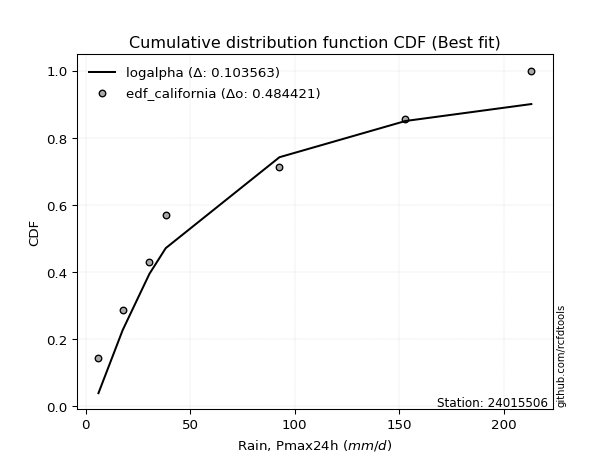</img>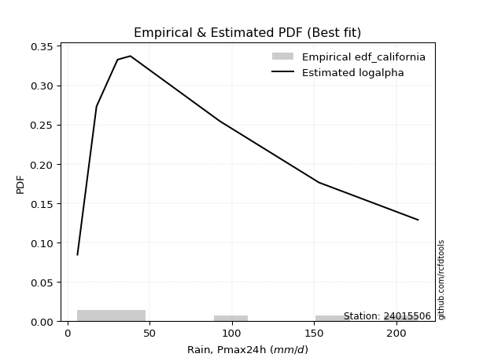</img>

</div>


### 2. EDF Hazen (1930)

Hazen method for plotting positions is a formula used to estimate the empirical cumulative probability distribution of flood events or other hydrological data. This formula often results in biased estimations, particularly when extrapolating to extreme events (high return periods).

<div align="center">


$P=(m-0.5)/n$


</div>


**2.1. Empirical values**

<div align="center">

|                | 0                   | 1                   | 2                   | 3         | 4                  | 5                  | 6                  |
|:---------------|:--------------------|:--------------------|:--------------------|:----------|:-------------------|:-------------------|:-------------------|
| date           | 2015                | 2021                | 2017                | 2016      | 2020               | 2019               | 2018               |
| x              | 6.1                 | 17.7                | 30.5                | 38.3      | 92.7               | 153.0              | 213.2              |
| m              | 1                   | 2                   | 3                   | 4         | 5                  | 6                  | 7                  |
| empirical_dist | edf_hazen           | edf_hazen           | edf_hazen           | edf_hazen | edf_hazen          | edf_hazen          | edf_hazen          |
| empirical      | 0.07142857142857142 | 0.21428571428571427 | 0.35714285714285715 | 0.5       | 0.6428571428571429 | 0.7857142857142857 | 0.9285714285714286 |
| empirical_tr   | 1.0769230769230769  | 1.2727272727272727  | 1.5555555555555558  | 2.0       | 2.8000000000000003 | 4.666666666666666  | 14.000000000000007 |

</div>


**2.2. Kolmogorov-Smirnov fit test (sorted by Δ)**


<div align="center">

|                | 0                   | 1                   | 2                    | 3                   | 4                   | 5                   | 6                   | 7                   | 8                   | 9                   | 10                  | 11                  | 12                  | 13                  | 14                  | 15                  | 16                  | 17                  | 18                  | 19                  | 20                  | 21                  | 22                  | 23                  | 24                  | 25                  | 26                  | 27                  | 28                  | 29                  | 30                  | 31                  | 32                  | 33                  | 34                  | 35                  | 36                  | 37                  | 38                  | 39                  | 40                  | 41                  | 42                  | 43                  | 44                  | 45                  | 46                  | 47                  | 48                  | 49                  | 50                  | 51                  | 52                  | 53                  | 54                  | 55                  | 56                  | 57                  | 58                  | 59                  | 60                  | 61                  | 62                  | 63                  | 64                  | 65                  | 66                  | 67                  | 68                  | 69                  | 70                  | 71                  | 72                  | 73                  | 74                  | 75                  | 76                  | 77                  | 78                  | 79                  | 80                  | 81                  | 82                  | 83                  | 84                  | 85                  | 86                  | 87                  | 88                  | 89                  | 90                  | 91                  | 92                  | 93                  | 94                  | 95                  | 96                  | 97                  | 98                  | 99                  | 100                 | 101                 | 102                 | 103                 | 104                 | 105                 | 106                 | 107                 | 108                 | 109                 | 110                 | 111                 | 112                 | 113                 | 114                 | 115                 | 116                 | 117                 | 118                 | 119                 | 120                 | 121                 | 122                 | 123                 | 124                 | 125                 | 126                 | 127                 | 128                 | 129                 | 130                 | 131                 | 132                 | 133                 | 134                 | 135                 | 136                 | 137                 | 138                 | 139                 | 140                 | 141                 | 142                 | 143                 | 144                 | 145                 | 146                 | 147                 | 148                 | 149                 | 150                 | 151                 | 152                 | 153                 | 154                 | 155                 | 156                 | 157                 | 158                 | 159                 |
|:---------------|:--------------------|:--------------------|:---------------------|:--------------------|:--------------------|:--------------------|:--------------------|:--------------------|:--------------------|:--------------------|:--------------------|:--------------------|:--------------------|:--------------------|:--------------------|:--------------------|:--------------------|:--------------------|:--------------------|:--------------------|:--------------------|:--------------------|:--------------------|:--------------------|:--------------------|:--------------------|:--------------------|:--------------------|:--------------------|:--------------------|:--------------------|:--------------------|:--------------------|:--------------------|:--------------------|:--------------------|:--------------------|:--------------------|:--------------------|:--------------------|:--------------------|:--------------------|:--------------------|:--------------------|:--------------------|:--------------------|:--------------------|:--------------------|:--------------------|:--------------------|:--------------------|:--------------------|:--------------------|:--------------------|:--------------------|:--------------------|:--------------------|:--------------------|:--------------------|:--------------------|:--------------------|:--------------------|:--------------------|:--------------------|:--------------------|:--------------------|:--------------------|:--------------------|:--------------------|:--------------------|:--------------------|:--------------------|:--------------------|:--------------------|:--------------------|:--------------------|:--------------------|:--------------------|:--------------------|:--------------------|:--------------------|:--------------------|:--------------------|:--------------------|:--------------------|:--------------------|:--------------------|:--------------------|:--------------------|:--------------------|:--------------------|:--------------------|:--------------------|:--------------------|:--------------------|:--------------------|:--------------------|:--------------------|:--------------------|:--------------------|:--------------------|:--------------------|:--------------------|:--------------------|:--------------------|:--------------------|:--------------------|:--------------------|:--------------------|:--------------------|:--------------------|:--------------------|:--------------------|:--------------------|:--------------------|:--------------------|:--------------------|:--------------------|:--------------------|:--------------------|:--------------------|:--------------------|:--------------------|:--------------------|:--------------------|:--------------------|:--------------------|:--------------------|:--------------------|:--------------------|:--------------------|:--------------------|:--------------------|:--------------------|:--------------------|:--------------------|:--------------------|:--------------------|:--------------------|:--------------------|:--------------------|:--------------------|:--------------------|:--------------------|:--------------------|:--------------------|:--------------------|:--------------------|:--------------------|:--------------------|:--------------------|:--------------------|:--------------------|:--------------------|:--------------------|:--------------------|:--------------------|:--------------------|:--------------------|:--------------------|
| station        | 24015506            | 24015506            | 24015506             | 24015506            | 24015506            | 24015506            | 24015506            | 24015506            | 24015506            | 24015506            | 24015506            | 24015506            | 24015506            | 24015506            | 24015506            | 24015506            | 24015506            | 24015506            | 24015506            | 24015506            | 24015506            | 24015506            | 24015506            | 24015506            | 24015506            | 24015506            | 24015506            | 24015506            | 24015506            | 24015506            | 24015506            | 24015506            | 24015506            | 24015506            | 24015506            | 24015506            | 24015506            | 24015506            | 24015506            | 24015506            | 24015506            | 24015506            | 24015506            | 24015506            | 24015506            | 24015506            | 24015506            | 24015506            | 24015506            | 24015506            | 24015506            | 24015506            | 24015506            | 24015506            | 24015506            | 24015506            | 24015506            | 24015506            | 24015506            | 24015506            | 24015506            | 24015506            | 24015506            | 24015506            | 24015506            | 24015506            | 24015506            | 24015506            | 24015506            | 24015506            | 24015506            | 24015506            | 24015506            | 24015506            | 24015506            | 24015506            | 24015506            | 24015506            | 24015506            | 24015506            | 24015506            | 24015506            | 24015506            | 24015506            | 24015506            | 24015506            | 24015506            | 24015506            | 24015506            | 24015506            | 24015506            | 24015506            | 24015506            | 24015506            | 24015506            | 24015506            | 24015506            | 24015506            | 24015506            | 24015506            | 24015506            | 24015506            | 24015506            | 24015506            | 24015506            | 24015506            | 24015506            | 24015506            | 24015506            | 24015506            | 24015506            | 24015506            | 24015506            | 24015506            | 24015506            | 24015506            | 24015506            | 24015506            | 24015506            | 24015506            | 24015506            | 24015506            | 24015506            | 24015506            | 24015506            | 24015506            | 24015506            | 24015506            | 24015506            | 24015506            | 24015506            | 24015506            | 24015506            | 24015506            | 24015506            | 24015506            | 24015506            | 24015506            | 24015506            | 24015506            | 24015506            | 24015506            | 24015506            | 24015506            | 24015506            | 24015506            | 24015506            | 24015506            | 24015506            | 24015506            | 24015506            | 24015506            | 24015506            | 24015506            | 24015506            | 24015506            | 24015506            | 24015506            | 24015506            | 24015506            |
| empirical_dist | edf_hazen           | edf_hazen           | edf_hazen            | edf_hazen           | edf_hazen           | edf_hazen           | edf_hazen           | edf_hazen           | edf_hazen           | edf_hazen           | edf_hazen           | edf_hazen           | edf_hazen           | edf_hazen           | edf_hazen           | edf_hazen           | edf_hazen           | edf_hazen           | edf_hazen           | edf_hazen           | edf_hazen           | edf_hazen           | edf_hazen           | edf_hazen           | edf_hazen           | edf_hazen           | edf_hazen           | edf_hazen           | edf_hazen           | edf_hazen           | edf_hazen           | edf_hazen           | edf_hazen           | edf_hazen           | edf_hazen           | edf_hazen           | edf_hazen           | edf_hazen           | edf_hazen           | edf_hazen           | edf_hazen           | edf_hazen           | edf_hazen           | edf_hazen           | edf_hazen           | edf_hazen           | edf_hazen           | edf_hazen           | edf_hazen           | edf_hazen           | edf_hazen           | edf_hazen           | edf_hazen           | edf_hazen           | edf_hazen           | edf_hazen           | edf_hazen           | edf_hazen           | edf_hazen           | edf_hazen           | edf_hazen           | edf_hazen           | edf_hazen           | edf_hazen           | edf_hazen           | edf_hazen           | edf_hazen           | edf_hazen           | edf_hazen           | edf_hazen           | edf_hazen           | edf_hazen           | edf_hazen           | edf_hazen           | edf_hazen           | edf_hazen           | edf_hazen           | edf_hazen           | edf_hazen           | edf_hazen           | edf_hazen           | edf_hazen           | edf_hazen           | edf_hazen           | edf_hazen           | edf_hazen           | edf_hazen           | edf_hazen           | edf_hazen           | edf_hazen           | edf_hazen           | edf_hazen           | edf_hazen           | edf_hazen           | edf_hazen           | edf_hazen           | edf_hazen           | edf_hazen           | edf_hazen           | edf_hazen           | edf_hazen           | edf_hazen           | edf_hazen           | edf_hazen           | edf_hazen           | edf_hazen           | edf_hazen           | edf_hazen           | edf_hazen           | edf_hazen           | edf_hazen           | edf_hazen           | edf_hazen           | edf_hazen           | edf_hazen           | edf_hazen           | edf_hazen           | edf_hazen           | edf_hazen           | edf_hazen           | edf_hazen           | edf_hazen           | edf_hazen           | edf_hazen           | edf_hazen           | edf_hazen           | edf_hazen           | edf_hazen           | edf_hazen           | edf_hazen           | edf_hazen           | edf_hazen           | edf_hazen           | edf_hazen           | edf_hazen           | edf_hazen           | edf_hazen           | edf_hazen           | edf_hazen           | edf_hazen           | edf_hazen           | edf_hazen           | edf_hazen           | edf_hazen           | edf_hazen           | edf_hazen           | edf_hazen           | edf_hazen           | edf_hazen           | edf_hazen           | edf_hazen           | edf_hazen           | edf_hazen           | edf_hazen           | edf_hazen           | edf_hazen           | edf_hazen           | edf_hazen           | edf_hazen           | edf_hazen           |
| p_dist         | logsemicircular     | logdweibull         | loganglit            | logksone            | loggausshyper       | logdgamma           | loggompertz         | logpearson3         | kappa3              | halfgennorm         | loginvweibull       | logweibull_min      | logf                | logbetaprime        | logburr12           | logfatiguelife      | lognct              | logexponnorm        | lognorm             | logcrystalball      | logt                | alpha               | logfoldnorm         | johnsonsu           | logrice             | logerlang           | logarcsine          | logncf              | loggamma            | loggamma            | loginvgamma         | loginvgauss         | logtrapezoid        | logalpha            | logkstwobign        | logcosine           | logmaxwell          | invgamma            | logkappa4           | loggenlogistic      | logloggamma         | lograyleigh         | loggenexpon         | invgauss            | nct                 | truncweibull_min    | loglogistic         | logargus            | loghalfnorm         | logtriang           | logjohnsonsu        | betaprime           | logtukeylambda      | logvonmises_line    | logkappa3           | loguniform          | logskewnorm         | logwrapcauchy       | loggumbel_l         | loghypsecant        | dgamma              | logloglaplace       | dweibull            | nakagami            | f                   | loggumbel_r         | loggenhalflogistic  | ncf                 | loghalflogistic     | exponnorm           | genexpon            | lomax               | erlang              | halfnorm            | genpareto           | logmoyal            | burr                | loglaplace          | loglaplace          | loggenpareto        | halflogistic        | foldnorm            | logweibull_max      | truncnorm           | exponpow            | gengamma            | logburr             | exponweib           | gompertz            | logtruncnorm        | rayleigh            | semicircular        | logmielke           | moyal               | logtruncweibull_min | arcsine             | loglomax            | pearson3            | logbradford         | gumbel_r            | maxwell             | logbeta             | anglit              | genlogistic         | burr12              | weibull_min         | logtruncexpon       | wald                | logwald             | mielke              | kstwobign           | wrapcauchy          | gausshyper          | gennorm             | crystalball         | norm                | t                   | loggenextreme       | loglevy_l           | logistic            | rice                | cosine              | hypsecant           | loghalfgennorm      | gamma               | skewnorm            | truncexpon          | gumbel_l            | logjohnsonsb        | bradford            | laplace             | loggennorm          | argus               | ksone               | kappa4              | beta                | loggengamma         | genextreme          | levy_l              | logexponweib        | uniform             | vonmises_line       | logrdist            | genhalflogistic     | lognakagami         | powerlaw            | triang              | trapezoid           | fatiguelife         | invweibull          | rdist               | tukeylambda         | logexponpow         | truncpareto         | logpowerlaw         | johnsonsb           | weibull_max         | logtruncpareto      | logvonmises         | vonmises            |
| delta          | 0.05082612906646056 | 0.06196766370249307 | 0.062315694547305234 | 0.06783764508404065 | 0.07142857143097858 | 0.07204688016809024 | 0.0778881489791915  | 0.08000789304655587 | 0.08312065446307892 | 0.08530653851888825 | 0.08643843350387093 | 0.0872464493325964  | 0.08746597408058088 | 0.0876845545027084  | 0.0877601196433474  | 0.08873572647915517 | 0.08877976576577329 | 0.08901177121930348 | 0.08901263627968181 | 0.08901263660174996 | 0.08901335472432481 | 0.09079386969779923 | 0.09177345922762459 | 0.09182066565036162 | 0.09211767467422605 | 0.09280209293774933 | 0.09315871611993762 | 0.09339313599408317 | 0.09416613450182532 | 0.09416613450182532 | 0.096404462357495   | 0.09857097037031948 | 0.09877196448874787 | 0.09924067441005613 | 0.100601219075242   | 0.1009188942778455  | 0.10094869858767519 | 0.10244283678222688 | 0.10286602502783082 | 0.10308490233014206 | 0.10392853981673278 | 0.10438251262148357 | 0.10461682669297079 | 0.10481038513856988 | 0.10574099582472918 | 0.10788602269715786 | 0.11146430182654554 | 0.11192605118152954 | 0.11542874733800756 | 0.11845234317140346 | 0.11945337820855284 | 0.11958152257187638 | 0.11976125809555371 | 0.1227342641623339  | 0.12274085734043294 | 0.12279400220738168 | 0.12379364821454947 | 0.12518210079672573 | 0.12590357448818718 | 0.12678343184451035 | 0.12725742548873806 | 0.130165985932868   | 0.13064812859313113 | 0.1314313970501537  | 0.13265009410970807 | 0.1328392345047945  | 0.13561720649561448 | 0.13593577116016586 | 0.14082737920185473 | 0.1416269644459165  | 0.14228660876761368 | 0.14232131418661453 | 0.14405222311531263 | 0.1447423771926022  | 0.14586433718902886 | 0.14694703611090976 | 0.14794610602559097 | 0.1486408981815539  | 0.1486408981815539  | 0.14873837045211266 | 0.14916745669550574 | 0.14947573360678346 | 0.15174171735740444 | 0.15274128480165983 | 0.1532713256838032  | 0.15362032291232036 | 0.15510917997595236 | 0.1589664360649973  | 0.16070689823384376 | 0.167456261365663   | 0.1746064700834386  | 0.1755070344538302  | 0.17554421145437976 | 0.17562826421786681 | 0.1760329726072431  | 0.17758136685018044 | 0.17760581746286208 | 0.18210714016306928 | 0.182138968105865   | 0.18322384026571625 | 0.1852320195097415  | 0.18605391476879024 | 0.18638074043719322 | 0.1864278557731343  | 0.18666263361079088 | 0.18738683594290206 | 0.188383829259328   | 0.18889787933069685 | 0.18989256292473555 | 0.1972736585225382  | 0.2045668176779864  | 0.20858743428089654 | 0.208914592399292   | 0.2112913676974244  | 0.21182585607404897 | 0.21182586818891858 | 0.21183012045683236 | 0.2189989383543517  | 0.22523214143444356 | 0.233688545593647   | 0.238940952954943   | 0.24542857064160906 | 0.24915985333836527 | 0.2516034305462538  | 0.2530212788682973  | 0.25373659896834533 | 0.25709080388461236 | 0.26016188280267954 | 0.2602563303607861  | 0.2714253654509039  | 0.273113647857577   | 0.2857142857142857  | 0.2870841242056169  | 0.28709962980846615 | 0.3114087256761511  | 0.3126395769516108  | 0.315458782190714   | 0.3310440380262927  | 0.33588711457788145 | 0.3361576417254819  | 0.34451955577015936 | 0.3451283303227415  | 0.35714285535055523 | 0.3726913890625226  | 0.382449684048308   | 0.4430558617736662  | 0.443437177000423   | 0.4538620705539753  | 0.45875597947306457 | 0.48227594838047794 | 0.4937800457642513  | 0.5194908675977297  | 0.5542403534245304  | 0.5797366845012617  | 0.5970281135368801  | 0.6073653973022877  | 0.6545691897311745  | 0.6959441461601111  | 1.058424022529596   | 33.6177331695697    |
| deltao         | 0.48442053926100004 | 0.48442053926100004 | 0.48442053926100004  | 0.48442053926100004 | 0.48442053926100004 | 0.48442053926100004 | 0.48442053926100004 | 0.48442053926100004 | 0.48442053926100004 | 0.48442053926100004 | 0.48442053926100004 | 0.48442053926100004 | 0.48442053926100004 | 0.48442053926100004 | 0.48442053926100004 | 0.48442053926100004 | 0.48442053926100004 | 0.48442053926100004 | 0.48442053926100004 | 0.48442053926100004 | 0.48442053926100004 | 0.48442053926100004 | 0.48442053926100004 | 0.48442053926100004 | 0.48442053926100004 | 0.48442053926100004 | 0.48442053926100004 | 0.48442053926100004 | 0.48442053926100004 | 0.48442053926100004 | 0.48442053926100004 | 0.48442053926100004 | 0.48442053926100004 | 0.48442053926100004 | 0.48442053926100004 | 0.48442053926100004 | 0.48442053926100004 | 0.48442053926100004 | 0.48442053926100004 | 0.48442053926100004 | 0.48442053926100004 | 0.48442053926100004 | 0.48442053926100004 | 0.48442053926100004 | 0.48442053926100004 | 0.48442053926100004 | 0.48442053926100004 | 0.48442053926100004 | 0.48442053926100004 | 0.48442053926100004 | 0.48442053926100004 | 0.48442053926100004 | 0.48442053926100004 | 0.48442053926100004 | 0.48442053926100004 | 0.48442053926100004 | 0.48442053926100004 | 0.48442053926100004 | 0.48442053926100004 | 0.48442053926100004 | 0.48442053926100004 | 0.48442053926100004 | 0.48442053926100004 | 0.48442053926100004 | 0.48442053926100004 | 0.48442053926100004 | 0.48442053926100004 | 0.48442053926100004 | 0.48442053926100004 | 0.48442053926100004 | 0.48442053926100004 | 0.48442053926100004 | 0.48442053926100004 | 0.48442053926100004 | 0.48442053926100004 | 0.48442053926100004 | 0.48442053926100004 | 0.48442053926100004 | 0.48442053926100004 | 0.48442053926100004 | 0.48442053926100004 | 0.48442053926100004 | 0.48442053926100004 | 0.48442053926100004 | 0.48442053926100004 | 0.48442053926100004 | 0.48442053926100004 | 0.48442053926100004 | 0.48442053926100004 | 0.48442053926100004 | 0.48442053926100004 | 0.48442053926100004 | 0.48442053926100004 | 0.48442053926100004 | 0.48442053926100004 | 0.48442053926100004 | 0.48442053926100004 | 0.48442053926100004 | 0.48442053926100004 | 0.48442053926100004 | 0.48442053926100004 | 0.48442053926100004 | 0.48442053926100004 | 0.48442053926100004 | 0.48442053926100004 | 0.48442053926100004 | 0.48442053926100004 | 0.48442053926100004 | 0.48442053926100004 | 0.48442053926100004 | 0.48442053926100004 | 0.48442053926100004 | 0.48442053926100004 | 0.48442053926100004 | 0.48442053926100004 | 0.48442053926100004 | 0.48442053926100004 | 0.48442053926100004 | 0.48442053926100004 | 0.48442053926100004 | 0.48442053926100004 | 0.48442053926100004 | 0.48442053926100004 | 0.48442053926100004 | 0.48442053926100004 | 0.48442053926100004 | 0.48442053926100004 | 0.48442053926100004 | 0.48442053926100004 | 0.48442053926100004 | 0.48442053926100004 | 0.48442053926100004 | 0.48442053926100004 | 0.48442053926100004 | 0.48442053926100004 | 0.48442053926100004 | 0.48442053926100004 | 0.48442053926100004 | 0.48442053926100004 | 0.48442053926100004 | 0.48442053926100004 | 0.48442053926100004 | 0.48442053926100004 | 0.48442053926100004 | 0.48442053926100004 | 0.48442053926100004 | 0.48442053926100004 | 0.48442053926100004 | 0.48442053926100004 | 0.48442053926100004 | 0.48442053926100004 | 0.48442053926100004 | 0.48442053926100004 | 0.48442053926100004 | 0.48442053926100004 | 0.48442053926100004 | 0.48442053926100004 | 0.48442053926100004 | 0.48442053926100004 | 0.48442053926100004 |
| eval           | Δo > Δ              | Δo > Δ              | Δo > Δ               | Δo > Δ              | Δo > Δ              | Δo > Δ              | Δo > Δ              | Δo > Δ              | Δo > Δ              | Δo > Δ              | Δo > Δ              | Δo > Δ              | Δo > Δ              | Δo > Δ              | Δo > Δ              | Δo > Δ              | Δo > Δ              | Δo > Δ              | Δo > Δ              | Δo > Δ              | Δo > Δ              | Δo > Δ              | Δo > Δ              | Δo > Δ              | Δo > Δ              | Δo > Δ              | Δo > Δ              | Δo > Δ              | Δo > Δ              | Δo > Δ              | Δo > Δ              | Δo > Δ              | Δo > Δ              | Δo > Δ              | Δo > Δ              | Δo > Δ              | Δo > Δ              | Δo > Δ              | Δo > Δ              | Δo > Δ              | Δo > Δ              | Δo > Δ              | Δo > Δ              | Δo > Δ              | Δo > Δ              | Δo > Δ              | Δo > Δ              | Δo > Δ              | Δo > Δ              | Δo > Δ              | Δo > Δ              | Δo > Δ              | Δo > Δ              | Δo > Δ              | Δo > Δ              | Δo > Δ              | Δo > Δ              | Δo > Δ              | Δo > Δ              | Δo > Δ              | Δo > Δ              | Δo > Δ              | Δo > Δ              | Δo > Δ              | Δo > Δ              | Δo > Δ              | Δo > Δ              | Δo > Δ              | Δo > Δ              | Δo > Δ              | Δo > Δ              | Δo > Δ              | Δo > Δ              | Δo > Δ              | Δo > Δ              | Δo > Δ              | Δo > Δ              | Δo > Δ              | Δo > Δ              | Δo > Δ              | Δo > Δ              | Δo > Δ              | Δo > Δ              | Δo > Δ              | Δo > Δ              | Δo > Δ              | Δo > Δ              | Δo > Δ              | Δo > Δ              | Δo > Δ              | Δo > Δ              | Δo > Δ              | Δo > Δ              | Δo > Δ              | Δo > Δ              | Δo > Δ              | Δo > Δ              | Δo > Δ              | Δo > Δ              | Δo > Δ              | Δo > Δ              | Δo > Δ              | Δo > Δ              | Δo > Δ              | Δo > Δ              | Δo > Δ              | Δo > Δ              | Δo > Δ              | Δo > Δ              | Δo > Δ              | Δo > Δ              | Δo > Δ              | Δo > Δ              | Δo > Δ              | Δo > Δ              | Δo > Δ              | Δo > Δ              | Δo > Δ              | Δo > Δ              | Δo > Δ              | Δo > Δ              | Δo > Δ              | Δo > Δ              | Δo > Δ              | Δo > Δ              | Δo > Δ              | Δo > Δ              | Δo > Δ              | Δo > Δ              | Δo > Δ              | Δo > Δ              | Δo > Δ              | Δo > Δ              | Δo > Δ              | Δo > Δ              | Δo > Δ              | Δo > Δ              | Δo > Δ              | Δo > Δ              | Δo > Δ              | Δo > Δ              | Δo > Δ              | Δo > Δ              | Δo > Δ              | Δo > Δ              | Δo > Δ              | Δo > Δ              | Δo > Δ              | Δo > Δ              | Δo > Δ              | Δo <= Δ             | Δo <= Δ             | Δo <= Δ             | Δo <= Δ             | Δo <= Δ             | Δo <= Δ             | Δo <= Δ             | Δo <= Δ             | Δo <= Δ             | Δo <= Δ             |
| fit            | 1                   | 1                   | 1                    | 1                   | 1                   | 1                   | 1                   | 1                   | 1                   | 1                   | 1                   | 1                   | 1                   | 1                   | 1                   | 1                   | 1                   | 1                   | 1                   | 1                   | 1                   | 1                   | 1                   | 1                   | 1                   | 1                   | 1                   | 1                   | 1                   | 1                   | 1                   | 1                   | 1                   | 1                   | 1                   | 1                   | 1                   | 1                   | 1                   | 1                   | 1                   | 1                   | 1                   | 1                   | 1                   | 1                   | 1                   | 1                   | 1                   | 1                   | 1                   | 1                   | 1                   | 1                   | 1                   | 1                   | 1                   | 1                   | 1                   | 1                   | 1                   | 1                   | 1                   | 1                   | 1                   | 1                   | 1                   | 1                   | 1                   | 1                   | 1                   | 1                   | 1                   | 1                   | 1                   | 1                   | 1                   | 1                   | 1                   | 1                   | 1                   | 1                   | 1                   | 1                   | 1                   | 1                   | 1                   | 1                   | 1                   | 1                   | 1                   | 1                   | 1                   | 1                   | 1                   | 1                   | 1                   | 1                   | 1                   | 1                   | 1                   | 1                   | 1                   | 1                   | 1                   | 1                   | 1                   | 1                   | 1                   | 1                   | 1                   | 1                   | 1                   | 1                   | 1                   | 1                   | 1                   | 1                   | 1                   | 1                   | 1                   | 1                   | 1                   | 1                   | 1                   | 1                   | 1                   | 1                   | 1                   | 1                   | 1                   | 1                   | 1                   | 1                   | 1                   | 1                   | 1                   | 1                   | 1                   | 1                   | 1                   | 1                   | 1                   | 1                   | 1                   | 1                   | 1                   | 1                   | 1                   | 1                   | 0                   | 0                   | 0                   | 0                   | 0                   | 0                   | 0                   | 0                   | 0                   | 0                   |
| n              | 7                   | 7                   | 7                    | 7                   | 7                   | 7                   | 7                   | 7                   | 7                   | 7                   | 7                   | 7                   | 7                   | 7                   | 7                   | 7                   | 7                   | 7                   | 7                   | 7                   | 7                   | 7                   | 7                   | 7                   | 7                   | 7                   | 7                   | 7                   | 7                   | 7                   | 7                   | 7                   | 7                   | 7                   | 7                   | 7                   | 7                   | 7                   | 7                   | 7                   | 7                   | 7                   | 7                   | 7                   | 7                   | 7                   | 7                   | 7                   | 7                   | 7                   | 7                   | 7                   | 7                   | 7                   | 7                   | 7                   | 7                   | 7                   | 7                   | 7                   | 7                   | 7                   | 7                   | 7                   | 7                   | 7                   | 7                   | 7                   | 7                   | 7                   | 7                   | 7                   | 7                   | 7                   | 7                   | 7                   | 7                   | 7                   | 7                   | 7                   | 7                   | 7                   | 7                   | 7                   | 7                   | 7                   | 7                   | 7                   | 7                   | 7                   | 7                   | 7                   | 7                   | 7                   | 7                   | 7                   | 7                   | 7                   | 7                   | 7                   | 7                   | 7                   | 7                   | 7                   | 7                   | 7                   | 7                   | 7                   | 7                   | 7                   | 7                   | 7                   | 7                   | 7                   | 7                   | 7                   | 7                   | 7                   | 7                   | 7                   | 7                   | 7                   | 7                   | 7                   | 7                   | 7                   | 7                   | 7                   | 7                   | 7                   | 7                   | 7                   | 7                   | 7                   | 7                   | 7                   | 7                   | 7                   | 7                   | 7                   | 7                   | 7                   | 7                   | 7                   | 7                   | 7                   | 7                   | 7                   | 7                   | 7                   | 7                   | 7                   | 7                   | 7                   | 7                   | 7                   | 7                   | 7                   | 7                   | 7                   |
| best_fit       | 1                   | 0                   | 0                    | 0                   | 0                   | 0                   | 0                   | 0                   | 0                   | 0                   | 0                   | 0                   | 0                   | 0                   | 0                   | 0                   | 0                   | 0                   | 0                   | 0                   | 0                   | 0                   | 0                   | 0                   | 0                   | 0                   | 0                   | 0                   | 0                   | 0                   | 0                   | 0                   | 0                   | 0                   | 0                   | 0                   | 0                   | 0                   | 0                   | 0                   | 0                   | 0                   | 0                   | 0                   | 0                   | 0                   | 0                   | 0                   | 0                   | 0                   | 0                   | 0                   | 0                   | 0                   | 0                   | 0                   | 0                   | 0                   | 0                   | 0                   | 0                   | 0                   | 0                   | 0                   | 0                   | 0                   | 0                   | 0                   | 0                   | 0                   | 0                   | 0                   | 0                   | 0                   | 0                   | 0                   | 0                   | 0                   | 0                   | 0                   | 0                   | 0                   | 0                   | 0                   | 0                   | 0                   | 0                   | 0                   | 0                   | 0                   | 0                   | 0                   | 0                   | 0                   | 0                   | 0                   | 0                   | 0                   | 0                   | 0                   | 0                   | 0                   | 0                   | 0                   | 0                   | 0                   | 0                   | 0                   | 0                   | 0                   | 0                   | 0                   | 0                   | 0                   | 0                   | 0                   | 0                   | 0                   | 0                   | 0                   | 0                   | 0                   | 0                   | 0                   | 0                   | 0                   | 0                   | 0                   | 0                   | 0                   | 0                   | 0                   | 0                   | 0                   | 0                   | 0                   | 0                   | 0                   | 0                   | 0                   | 0                   | 0                   | 0                   | 0                   | 0                   | 0                   | 0                   | 0                   | 0                   | 0                   | 0                   | 0                   | 0                   | 0                   | 0                   | 0                   | 0                   | 0                   | 0                   | 0                   |
| best_fit_sort  | 1                   | 2                   | 3                    | 4                   | 5                   | 6                   | 7                   | 8                   | 9                   | 10                  | 11                  | 12                  | 13                  | 14                  | 15                  | 16                  | 17                  | 18                  | 19                  | 20                  | 21                  | 22                  | 23                  | 24                  | 25                  | 26                  | 27                  | 28                  | 29                  | 30                  | 31                  | 32                  | 33                  | 34                  | 35                  | 36                  | 37                  | 38                  | 39                  | 40                  | 41                  | 42                  | 43                  | 44                  | 45                  | 46                  | 47                  | 48                  | 49                  | 50                  | 51                  | 52                  | 53                  | 54                  | 55                  | 56                  | 57                  | 58                  | 59                  | 60                  | 61                  | 62                  | 63                  | 64                  | 65                  | 66                  | 67                  | 68                  | 69                  | 70                  | 71                  | 72                  | 73                  | 74                  | 75                  | 76                  | 77                  | 78                  | 79                  | 80                  | 81                  | 82                  | 83                  | 84                  | 85                  | 86                  | 87                  | 88                  | 89                  | 90                  | 91                  | 92                  | 93                  | 94                  | 95                  | 96                  | 97                  | 98                  | 99                  | 100                 | 101                 | 102                 | 103                 | 104                 | 105                 | 106                 | 107                 | 108                 | 109                 | 110                 | 111                 | 112                 | 113                 | 114                 | 115                 | 116                 | 117                 | 118                 | 119                 | 120                 | 121                 | 122                 | 123                 | 124                 | 125                 | 126                 | 127                 | 128                 | 129                 | 130                 | 131                 | 132                 | 133                 | 134                 | 135                 | 136                 | 137                 | 138                 | 139                 | 140                 | 141                 | 142                 | 143                 | 144                 | 145                 | 146                 | 147                 | 148                 | 149                 | 150                 | 151                 | 152                 | 153                 | 154                 | 155                 | 156                 | 157                 | 158                 | 159                 | 160                 |

</div>


**2.3. Best fit**

<div align="center">

|   id |   station | empirical_dist   | p_dist          |     delta |   deltao | eval   |   fit |   n |   best_fit |   best_fit_sort |
|-----:|----------:|:-----------------|:----------------|----------:|---------:|:-------|------:|----:|-----------:|----------------:|
|    0 |  24015506 | edf_hazen        | logsemicircular | 0.0508261 | 0.484421 | Δo > Δ |     1 |   7 |          1 |               1 |

</div>


<div align="center">

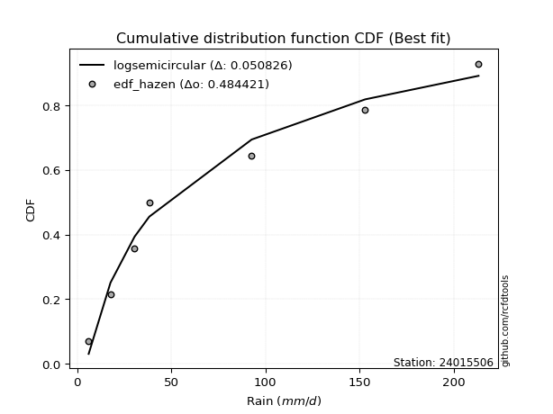</img>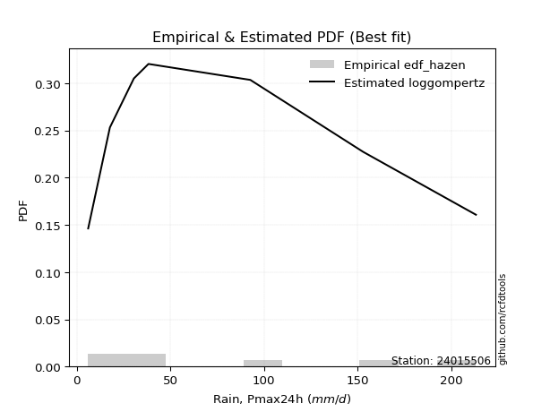</img>

</div>


### 3. EDF Weibull (1939)

Weibull plotting position formula is an empirical method used to estimate the non-exceedance probability or plotting position for a set of observed data, is often recommended or widely used in practice, particularly in flood frequency analysis.

<div align="center">


$P=m/(n+1)$


</div>


**3.1. Empirical values**

<div align="center">

|                | 0                  | 1                  | 2           | 3           | 4                  | 5           | 6           |
|:---------------|:-------------------|:-------------------|:------------|:------------|:-------------------|:------------|:------------|
| date           | 2015               | 2021               | 2017        | 2016        | 2020               | 2019        | 2018        |
| x              | 6.1                | 17.7               | 30.5        | 38.3        | 92.7               | 153.0       | 213.2       |
| m              | 1                  | 2                  | 3           | 4           | 5                  | 6           | 7           |
| empirical_dist | edf_weibull        | edf_weibull        | edf_weibull | edf_weibull | edf_weibull        | edf_weibull | edf_weibull |
| empirical      | 0.125              | 0.25               | 0.375       | 0.5         | 0.625              | 0.75        | 0.875       |
| empirical_tr   | 1.1428571428571428 | 1.3333333333333333 | 1.6         | 2.0         | 2.6666666666666665 | 4.0         | 8.0         |

</div>


**3.2. Kolmogorov-Smirnov fit test (sorted by Δ)**


<div align="center">

|                | 0                   | 1                   | 2                   | 3                   | 4                   | 5                   | 6                   | 7                   | 8                   | 9                   | 10                  | 11                  | 12                  | 13                  | 14                  | 15                  | 16                  | 17                  | 18                  | 19                  | 20                  | 21                  | 22                  | 23                  | 24                  | 25                  | 26                  | 27                  | 28                  | 29                  | 30                  | 31                  | 32                  | 33                  | 34                  | 35                  | 36                  | 37                  | 38                  | 39                  | 40                  | 41                  | 42                  | 43                  | 44                  | 45                  | 46                  | 47                  | 48                  | 49                  | 50                  | 51                  | 52                  | 53                  | 54                  | 55                  | 56                  | 57                  | 58                  | 59                  | 60                  | 61                  | 62                  | 63                  | 64                  | 65                  | 66                  | 67                  | 68                  | 69                  | 70                  | 71                  | 72                  | 73                  | 74                  | 75                  | 76                  | 77                  | 78                  | 79                  | 80                  | 81                  | 82                  | 83                  | 84                  | 85                  | 86                  | 87                  | 88                  | 89                  | 90                  | 91                  | 92                  | 93                  | 94                  | 95                  | 96                  | 97                  | 98                  | 99                  | 100                 | 101                 | 102                 | 103                 | 104                 | 105                 | 106                 | 107                 | 108                 | 109                 | 110                 | 111                 | 112                 | 113                 | 114                 | 115                 | 116                 | 117                 | 118                 | 119                 | 120                 | 121                 | 122                 | 123                 | 124                 | 125                 | 126                 | 127                 | 128                 | 129                 | 130                 | 131                 | 132                 | 133                 | 134                 | 135                 | 136                 | 137                 | 138                 | 139                 | 140                 | 141                 | 142                 | 143                 | 144                 | 145                 | 146                 | 147                 | 148                 | 149                 | 150                 | 151                 | 152                 | 153                 | 154                 | 155                 | 156                 | 157                 | 158                 | 159                 |
|:---------------|:--------------------|:--------------------|:--------------------|:--------------------|:--------------------|:--------------------|:--------------------|:--------------------|:--------------------|:--------------------|:--------------------|:--------------------|:--------------------|:--------------------|:--------------------|:--------------------|:--------------------|:--------------------|:--------------------|:--------------------|:--------------------|:--------------------|:--------------------|:--------------------|:--------------------|:--------------------|:--------------------|:--------------------|:--------------------|:--------------------|:--------------------|:--------------------|:--------------------|:--------------------|:--------------------|:--------------------|:--------------------|:--------------------|:--------------------|:--------------------|:--------------------|:--------------------|:--------------------|:--------------------|:--------------------|:--------------------|:--------------------|:--------------------|:--------------------|:--------------------|:--------------------|:--------------------|:--------------------|:--------------------|:--------------------|:--------------------|:--------------------|:--------------------|:--------------------|:--------------------|:--------------------|:--------------------|:--------------------|:--------------------|:--------------------|:--------------------|:--------------------|:--------------------|:--------------------|:--------------------|:--------------------|:--------------------|:--------------------|:--------------------|:--------------------|:--------------------|:--------------------|:--------------------|:--------------------|:--------------------|:--------------------|:--------------------|:--------------------|:--------------------|:--------------------|:--------------------|:--------------------|:--------------------|:--------------------|:--------------------|:--------------------|:--------------------|:--------------------|:--------------------|:--------------------|:--------------------|:--------------------|:--------------------|:--------------------|:--------------------|:--------------------|:--------------------|:--------------------|:--------------------|:--------------------|:--------------------|:--------------------|:--------------------|:--------------------|:--------------------|:--------------------|:--------------------|:--------------------|:--------------------|:--------------------|:--------------------|:--------------------|:--------------------|:--------------------|:--------------------|:--------------------|:--------------------|:--------------------|:--------------------|:--------------------|:--------------------|:--------------------|:--------------------|:--------------------|:--------------------|:--------------------|:--------------------|:--------------------|:--------------------|:--------------------|:--------------------|:--------------------|:--------------------|:--------------------|:--------------------|:--------------------|:--------------------|:--------------------|:--------------------|:--------------------|:--------------------|:--------------------|:--------------------|:--------------------|:--------------------|:--------------------|:--------------------|:--------------------|:--------------------|:--------------------|:--------------------|:--------------------|:--------------------|:--------------------|:--------------------|
| station        | 24015506            | 24015506            | 24015506            | 24015506            | 24015506            | 24015506            | 24015506            | 24015506            | 24015506            | 24015506            | 24015506            | 24015506            | 24015506            | 24015506            | 24015506            | 24015506            | 24015506            | 24015506            | 24015506            | 24015506            | 24015506            | 24015506            | 24015506            | 24015506            | 24015506            | 24015506            | 24015506            | 24015506            | 24015506            | 24015506            | 24015506            | 24015506            | 24015506            | 24015506            | 24015506            | 24015506            | 24015506            | 24015506            | 24015506            | 24015506            | 24015506            | 24015506            | 24015506            | 24015506            | 24015506            | 24015506            | 24015506            | 24015506            | 24015506            | 24015506            | 24015506            | 24015506            | 24015506            | 24015506            | 24015506            | 24015506            | 24015506            | 24015506            | 24015506            | 24015506            | 24015506            | 24015506            | 24015506            | 24015506            | 24015506            | 24015506            | 24015506            | 24015506            | 24015506            | 24015506            | 24015506            | 24015506            | 24015506            | 24015506            | 24015506            | 24015506            | 24015506            | 24015506            | 24015506            | 24015506            | 24015506            | 24015506            | 24015506            | 24015506            | 24015506            | 24015506            | 24015506            | 24015506            | 24015506            | 24015506            | 24015506            | 24015506            | 24015506            | 24015506            | 24015506            | 24015506            | 24015506            | 24015506            | 24015506            | 24015506            | 24015506            | 24015506            | 24015506            | 24015506            | 24015506            | 24015506            | 24015506            | 24015506            | 24015506            | 24015506            | 24015506            | 24015506            | 24015506            | 24015506            | 24015506            | 24015506            | 24015506            | 24015506            | 24015506            | 24015506            | 24015506            | 24015506            | 24015506            | 24015506            | 24015506            | 24015506            | 24015506            | 24015506            | 24015506            | 24015506            | 24015506            | 24015506            | 24015506            | 24015506            | 24015506            | 24015506            | 24015506            | 24015506            | 24015506            | 24015506            | 24015506            | 24015506            | 24015506            | 24015506            | 24015506            | 24015506            | 24015506            | 24015506            | 24015506            | 24015506            | 24015506            | 24015506            | 24015506            | 24015506            | 24015506            | 24015506            | 24015506            | 24015506            | 24015506            | 24015506            |
| empirical_dist | edf_weibull         | edf_weibull         | edf_weibull         | edf_weibull         | edf_weibull         | edf_weibull         | edf_weibull         | edf_weibull         | edf_weibull         | edf_weibull         | edf_weibull         | edf_weibull         | edf_weibull         | edf_weibull         | edf_weibull         | edf_weibull         | edf_weibull         | edf_weibull         | edf_weibull         | edf_weibull         | edf_weibull         | edf_weibull         | edf_weibull         | edf_weibull         | edf_weibull         | edf_weibull         | edf_weibull         | edf_weibull         | edf_weibull         | edf_weibull         | edf_weibull         | edf_weibull         | edf_weibull         | edf_weibull         | edf_weibull         | edf_weibull         | edf_weibull         | edf_weibull         | edf_weibull         | edf_weibull         | edf_weibull         | edf_weibull         | edf_weibull         | edf_weibull         | edf_weibull         | edf_weibull         | edf_weibull         | edf_weibull         | edf_weibull         | edf_weibull         | edf_weibull         | edf_weibull         | edf_weibull         | edf_weibull         | edf_weibull         | edf_weibull         | edf_weibull         | edf_weibull         | edf_weibull         | edf_weibull         | edf_weibull         | edf_weibull         | edf_weibull         | edf_weibull         | edf_weibull         | edf_weibull         | edf_weibull         | edf_weibull         | edf_weibull         | edf_weibull         | edf_weibull         | edf_weibull         | edf_weibull         | edf_weibull         | edf_weibull         | edf_weibull         | edf_weibull         | edf_weibull         | edf_weibull         | edf_weibull         | edf_weibull         | edf_weibull         | edf_weibull         | edf_weibull         | edf_weibull         | edf_weibull         | edf_weibull         | edf_weibull         | edf_weibull         | edf_weibull         | edf_weibull         | edf_weibull         | edf_weibull         | edf_weibull         | edf_weibull         | edf_weibull         | edf_weibull         | edf_weibull         | edf_weibull         | edf_weibull         | edf_weibull         | edf_weibull         | edf_weibull         | edf_weibull         | edf_weibull         | edf_weibull         | edf_weibull         | edf_weibull         | edf_weibull         | edf_weibull         | edf_weibull         | edf_weibull         | edf_weibull         | edf_weibull         | edf_weibull         | edf_weibull         | edf_weibull         | edf_weibull         | edf_weibull         | edf_weibull         | edf_weibull         | edf_weibull         | edf_weibull         | edf_weibull         | edf_weibull         | edf_weibull         | edf_weibull         | edf_weibull         | edf_weibull         | edf_weibull         | edf_weibull         | edf_weibull         | edf_weibull         | edf_weibull         | edf_weibull         | edf_weibull         | edf_weibull         | edf_weibull         | edf_weibull         | edf_weibull         | edf_weibull         | edf_weibull         | edf_weibull         | edf_weibull         | edf_weibull         | edf_weibull         | edf_weibull         | edf_weibull         | edf_weibull         | edf_weibull         | edf_weibull         | edf_weibull         | edf_weibull         | edf_weibull         | edf_weibull         | edf_weibull         | edf_weibull         | edf_weibull         | edf_weibull         | edf_weibull         |
| p_dist         | loganglit           | logsemicircular     | logtrapezoid        | loggenlogistic      | loginvweibull       | logpearson3         | logf                | logbetaprime        | logfatiguelife      | lognct              | logexponnorm        | lognorm             | logcrystalball      | logt                | logdgamma           | logdweibull         | logweibull_min      | logburr12           | alpha               | logloggamma         | logfoldnorm         | johnsonsu           | logrice             | logerlang           | logncf              | loggamma            | loggamma            | loginvgamma         | logargus            | loginvgauss         | logalpha            | logkstwobign        | logcosine           | logmaxwell          | logjohnsonsu        | invgamma            | logksone            | logtriang           | lograyleigh         | invgauss            | nct                 | burr                | nakagami            | logskewnorm         | loggenexpon         | loggompertz         | kappa3              | halfgennorm         | loglomax            | exponweib           | loggenpareto        | logarcsine          | loggausshyper       | dgamma              | arcsine             | loglogistic         | logwrapcauchy       | dweibull            | loghalfnorm         | loggumbel_l         | loggenhalflogistic  | ncf                 | betaprime           | logkappa4           | exponnorm           | genexpon            | lomax               | truncweibull_min    | loghypsecant        | halfnorm            | genpareto           | gengamma            | logloglaplace       | halflogistic        | foldnorm            | logtruncnorm        | f                   | loggumbel_r         | logweibull_max      | truncnorm           | exponpow            | logtukeylambda      | logvonmises_line    | logkappa3           | loguniform          | logburr             | loghalflogistic     | gompertz            | logmoyal            | erlang              | loglaplace          | loglaplace          | burr12              | loglevy_l           | wrapcauchy          | rayleigh            | semicircular        | moyal               | logmielke           | pearson3            | gumbel_r            | maxwell             | logbeta             | anglit              | genlogistic         | weibull_min         | logtruncweibull_min | logbradford         | logtruncexpon       | kstwobign           | logwald             | gausshyper          | crystalball         | norm                | t                   | mielke              | loghalfgennorm      | loggenextreme       | wald                | logjohnsonsb        | gennorm             | logistic            | gamma               | rice                | cosine              | hypsecant           | loggennorm          | skewnorm            | truncexpon          | beta                | gumbel_l            | bradford            | laplace             | genextreme          | loggengamma         | levy_l              | argus               | ksone               | logexponweib        | kappa4              | uniform             | vonmises_line       | lognakagami         | genhalflogistic     | logrdist            | powerlaw            | fatiguelife         | invweibull          | rdist               | triang              | trapezoid           | tukeylambda         | logexponpow         | truncpareto         | logpowerlaw         | johnsonsb           | weibull_max         | logtruncpareto      | logvonmises         | vonmises            |
| delta          | 0.08646863906446148 | 0.09416464898955584 | 0.09877196448874787 | 0.10308490233014206 | 0.10429557636101383 | 0.10484607411933877 | 0.10532311693772378 | 0.1055416973598513  | 0.10659286933629808 | 0.1066369086229162  | 0.10686891407644639 | 0.10686977913682472 | 0.10686977945889287 | 0.10687049758146772 | 0.10715740412843278 | 0.10715948809796857 | 0.10824444215143003 | 0.1082515518419509  | 0.10865101255494214 | 0.10941700908876806 | 0.10963060208476749 | 0.10967780850750453 | 0.10997481753136895 | 0.11065923579489223 | 0.11125027885122607 | 0.11202327735896822 | 0.11202327735896822 | 0.1142616052146379  | 0.11609254524660106 | 0.11642811322746238 | 0.11709781726719903 | 0.1184583619323849  | 0.11877603713498841 | 0.1188058414448181  | 0.11945337820855284 | 0.12029997963936978 | 0.12140907365546923 | 0.1216689760817351  | 0.12223965547862647 | 0.12266752799571279 | 0.12359813868187208 | 0.12361648288533968 | 0.12499812370504    | 0.12499956972176474 | 0.12499999692766137 | 0.12499999971469306 | 0.12499999995903678 | 0.12499999999923908 | 0.12499999999933538 | 0.12499999999997578 | 0.125               | 0.125               | 0.12500000000240719 | 0.1269072175935816  | 0.1292829067437522  | 0.12932144468368845 | 0.12936962533289753 | 0.13064812859313113 | 0.13328589019515047 | 0.1342008330676533  | 0.13561720649561448 | 0.13593577116016586 | 0.13743866542901928 | 0.13858031074211652 | 0.1416269644459165  | 0.14228660876761368 | 0.14232131418661453 | 0.14360030841144356 | 0.14464057470165326 | 0.1447423771926022  | 0.14586433718902886 | 0.1459880469102749  | 0.1480231287900109  | 0.14916745669550574 | 0.14947573360678346 | 0.14959911850852015 | 0.15050723696685098 | 0.15069637736193742 | 0.15174171735740444 | 0.15274128480165983 | 0.1532713256838032  | 0.15336836584432234 | 0.15656680719778882 | 0.15656739457473412 | 0.1566409135928144  | 0.15797112837196037 | 0.15868452205899763 | 0.16070689823384376 | 0.16480417896805266 | 0.16512576448856298 | 0.1664980410386968  | 0.1664980410386968  | 0.16880549075364804 | 0.17166071286301499 | 0.17287314856661085 | 0.1746064700834386  | 0.1755070344538302  | 0.17562826421786681 | 0.1819465355928268  | 0.18210714016306928 | 0.18322384026571625 | 0.1852320195097415  | 0.18605391476879024 | 0.18638074043719322 | 0.1864278557731343  | 0.18738683594290206 | 0.1919119588289364  | 0.19541171299499704 | 0.20270184693860116 | 0.2045668176779864  | 0.20774970578187846 | 0.208914592399292   | 0.21182585607404897 | 0.21182586818891858 | 0.21183012045683236 | 0.2151308013796811  | 0.2162602664022355  | 0.2189989383543517  | 0.22039318097819033 | 0.22454204464650035 | 0.2291485105545673  | 0.233688545593647   | 0.23517297734099007 | 0.238940952954943   | 0.24542857064160906 | 0.24915985333836527 | 0.25                | 0.25373659896834533 | 0.25709080388461236 | 0.2590681483801823  | 0.26016188280267954 | 0.2714253654509039  | 0.273113647857577   | 0.27747260945486407 | 0.2797444964764283  | 0.28231568600645285 | 0.2870841242056169  | 0.28709962980846615 | 0.3004433560111962  | 0.3114087256761511  | 0.34451955577015936 | 0.3451283303227415  | 0.36459254119116513 | 0.3726913890625226  | 0.37499999820769814 | 0.4073415760593805  | 0.42304169375877887 | 0.42870451980904933 | 0.44020861719282267 | 0.443437177000423   | 0.45341319306172145 | 0.46591943902630106 | 0.5185260677102447  | 0.544022398786976   | 0.5613138278225944  | 0.571651111588002   | 0.6188549040168889  | 0.6602298604458254  | 1.0762811653867388  | 33.671304598141134  |
| deltao         | 0.48442053926100004 | 0.48442053926100004 | 0.48442053926100004 | 0.48442053926100004 | 0.48442053926100004 | 0.48442053926100004 | 0.48442053926100004 | 0.48442053926100004 | 0.48442053926100004 | 0.48442053926100004 | 0.48442053926100004 | 0.48442053926100004 | 0.48442053926100004 | 0.48442053926100004 | 0.48442053926100004 | 0.48442053926100004 | 0.48442053926100004 | 0.48442053926100004 | 0.48442053926100004 | 0.48442053926100004 | 0.48442053926100004 | 0.48442053926100004 | 0.48442053926100004 | 0.48442053926100004 | 0.48442053926100004 | 0.48442053926100004 | 0.48442053926100004 | 0.48442053926100004 | 0.48442053926100004 | 0.48442053926100004 | 0.48442053926100004 | 0.48442053926100004 | 0.48442053926100004 | 0.48442053926100004 | 0.48442053926100004 | 0.48442053926100004 | 0.48442053926100004 | 0.48442053926100004 | 0.48442053926100004 | 0.48442053926100004 | 0.48442053926100004 | 0.48442053926100004 | 0.48442053926100004 | 0.48442053926100004 | 0.48442053926100004 | 0.48442053926100004 | 0.48442053926100004 | 0.48442053926100004 | 0.48442053926100004 | 0.48442053926100004 | 0.48442053926100004 | 0.48442053926100004 | 0.48442053926100004 | 0.48442053926100004 | 0.48442053926100004 | 0.48442053926100004 | 0.48442053926100004 | 0.48442053926100004 | 0.48442053926100004 | 0.48442053926100004 | 0.48442053926100004 | 0.48442053926100004 | 0.48442053926100004 | 0.48442053926100004 | 0.48442053926100004 | 0.48442053926100004 | 0.48442053926100004 | 0.48442053926100004 | 0.48442053926100004 | 0.48442053926100004 | 0.48442053926100004 | 0.48442053926100004 | 0.48442053926100004 | 0.48442053926100004 | 0.48442053926100004 | 0.48442053926100004 | 0.48442053926100004 | 0.48442053926100004 | 0.48442053926100004 | 0.48442053926100004 | 0.48442053926100004 | 0.48442053926100004 | 0.48442053926100004 | 0.48442053926100004 | 0.48442053926100004 | 0.48442053926100004 | 0.48442053926100004 | 0.48442053926100004 | 0.48442053926100004 | 0.48442053926100004 | 0.48442053926100004 | 0.48442053926100004 | 0.48442053926100004 | 0.48442053926100004 | 0.48442053926100004 | 0.48442053926100004 | 0.48442053926100004 | 0.48442053926100004 | 0.48442053926100004 | 0.48442053926100004 | 0.48442053926100004 | 0.48442053926100004 | 0.48442053926100004 | 0.48442053926100004 | 0.48442053926100004 | 0.48442053926100004 | 0.48442053926100004 | 0.48442053926100004 | 0.48442053926100004 | 0.48442053926100004 | 0.48442053926100004 | 0.48442053926100004 | 0.48442053926100004 | 0.48442053926100004 | 0.48442053926100004 | 0.48442053926100004 | 0.48442053926100004 | 0.48442053926100004 | 0.48442053926100004 | 0.48442053926100004 | 0.48442053926100004 | 0.48442053926100004 | 0.48442053926100004 | 0.48442053926100004 | 0.48442053926100004 | 0.48442053926100004 | 0.48442053926100004 | 0.48442053926100004 | 0.48442053926100004 | 0.48442053926100004 | 0.48442053926100004 | 0.48442053926100004 | 0.48442053926100004 | 0.48442053926100004 | 0.48442053926100004 | 0.48442053926100004 | 0.48442053926100004 | 0.48442053926100004 | 0.48442053926100004 | 0.48442053926100004 | 0.48442053926100004 | 0.48442053926100004 | 0.48442053926100004 | 0.48442053926100004 | 0.48442053926100004 | 0.48442053926100004 | 0.48442053926100004 | 0.48442053926100004 | 0.48442053926100004 | 0.48442053926100004 | 0.48442053926100004 | 0.48442053926100004 | 0.48442053926100004 | 0.48442053926100004 | 0.48442053926100004 | 0.48442053926100004 | 0.48442053926100004 | 0.48442053926100004 | 0.48442053926100004 | 0.48442053926100004 |
| eval           | Δo > Δ              | Δo > Δ              | Δo > Δ              | Δo > Δ              | Δo > Δ              | Δo > Δ              | Δo > Δ              | Δo > Δ              | Δo > Δ              | Δo > Δ              | Δo > Δ              | Δo > Δ              | Δo > Δ              | Δo > Δ              | Δo > Δ              | Δo > Δ              | Δo > Δ              | Δo > Δ              | Δo > Δ              | Δo > Δ              | Δo > Δ              | Δo > Δ              | Δo > Δ              | Δo > Δ              | Δo > Δ              | Δo > Δ              | Δo > Δ              | Δo > Δ              | Δo > Δ              | Δo > Δ              | Δo > Δ              | Δo > Δ              | Δo > Δ              | Δo > Δ              | Δo > Δ              | Δo > Δ              | Δo > Δ              | Δo > Δ              | Δo > Δ              | Δo > Δ              | Δo > Δ              | Δo > Δ              | Δo > Δ              | Δo > Δ              | Δo > Δ              | Δo > Δ              | Δo > Δ              | Δo > Δ              | Δo > Δ              | Δo > Δ              | Δo > Δ              | Δo > Δ              | Δo > Δ              | Δo > Δ              | Δo > Δ              | Δo > Δ              | Δo > Δ              | Δo > Δ              | Δo > Δ              | Δo > Δ              | Δo > Δ              | Δo > Δ              | Δo > Δ              | Δo > Δ              | Δo > Δ              | Δo > Δ              | Δo > Δ              | Δo > Δ              | Δo > Δ              | Δo > Δ              | Δo > Δ              | Δo > Δ              | Δo > Δ              | Δo > Δ              | Δo > Δ              | Δo > Δ              | Δo > Δ              | Δo > Δ              | Δo > Δ              | Δo > Δ              | Δo > Δ              | Δo > Δ              | Δo > Δ              | Δo > Δ              | Δo > Δ              | Δo > Δ              | Δo > Δ              | Δo > Δ              | Δo > Δ              | Δo > Δ              | Δo > Δ              | Δo > Δ              | Δo > Δ              | Δo > Δ              | Δo > Δ              | Δo > Δ              | Δo > Δ              | Δo > Δ              | Δo > Δ              | Δo > Δ              | Δo > Δ              | Δo > Δ              | Δo > Δ              | Δo > Δ              | Δo > Δ              | Δo > Δ              | Δo > Δ              | Δo > Δ              | Δo > Δ              | Δo > Δ              | Δo > Δ              | Δo > Δ              | Δo > Δ              | Δo > Δ              | Δo > Δ              | Δo > Δ              | Δo > Δ              | Δo > Δ              | Δo > Δ              | Δo > Δ              | Δo > Δ              | Δo > Δ              | Δo > Δ              | Δo > Δ              | Δo > Δ              | Δo > Δ              | Δo > Δ              | Δo > Δ              | Δo > Δ              | Δo > Δ              | Δo > Δ              | Δo > Δ              | Δo > Δ              | Δo > Δ              | Δo > Δ              | Δo > Δ              | Δo > Δ              | Δo > Δ              | Δo > Δ              | Δo > Δ              | Δo > Δ              | Δo > Δ              | Δo > Δ              | Δo > Δ              | Δo > Δ              | Δo > Δ              | Δo > Δ              | Δo > Δ              | Δo > Δ              | Δo > Δ              | Δo > Δ              | Δo > Δ              | Δo <= Δ             | Δo <= Δ             | Δo <= Δ             | Δo <= Δ             | Δo <= Δ             | Δo <= Δ             | Δo <= Δ             | Δo <= Δ             |
| fit            | 1                   | 1                   | 1                   | 1                   | 1                   | 1                   | 1                   | 1                   | 1                   | 1                   | 1                   | 1                   | 1                   | 1                   | 1                   | 1                   | 1                   | 1                   | 1                   | 1                   | 1                   | 1                   | 1                   | 1                   | 1                   | 1                   | 1                   | 1                   | 1                   | 1                   | 1                   | 1                   | 1                   | 1                   | 1                   | 1                   | 1                   | 1                   | 1                   | 1                   | 1                   | 1                   | 1                   | 1                   | 1                   | 1                   | 1                   | 1                   | 1                   | 1                   | 1                   | 1                   | 1                   | 1                   | 1                   | 1                   | 1                   | 1                   | 1                   | 1                   | 1                   | 1                   | 1                   | 1                   | 1                   | 1                   | 1                   | 1                   | 1                   | 1                   | 1                   | 1                   | 1                   | 1                   | 1                   | 1                   | 1                   | 1                   | 1                   | 1                   | 1                   | 1                   | 1                   | 1                   | 1                   | 1                   | 1                   | 1                   | 1                   | 1                   | 1                   | 1                   | 1                   | 1                   | 1                   | 1                   | 1                   | 1                   | 1                   | 1                   | 1                   | 1                   | 1                   | 1                   | 1                   | 1                   | 1                   | 1                   | 1                   | 1                   | 1                   | 1                   | 1                   | 1                   | 1                   | 1                   | 1                   | 1                   | 1                   | 1                   | 1                   | 1                   | 1                   | 1                   | 1                   | 1                   | 1                   | 1                   | 1                   | 1                   | 1                   | 1                   | 1                   | 1                   | 1                   | 1                   | 1                   | 1                   | 1                   | 1                   | 1                   | 1                   | 1                   | 1                   | 1                   | 1                   | 1                   | 1                   | 1                   | 1                   | 1                   | 1                   | 0                   | 0                   | 0                   | 0                   | 0                   | 0                   | 0                   | 0                   |
| n              | 7                   | 7                   | 7                   | 7                   | 7                   | 7                   | 7                   | 7                   | 7                   | 7                   | 7                   | 7                   | 7                   | 7                   | 7                   | 7                   | 7                   | 7                   | 7                   | 7                   | 7                   | 7                   | 7                   | 7                   | 7                   | 7                   | 7                   | 7                   | 7                   | 7                   | 7                   | 7                   | 7                   | 7                   | 7                   | 7                   | 7                   | 7                   | 7                   | 7                   | 7                   | 7                   | 7                   | 7                   | 7                   | 7                   | 7                   | 7                   | 7                   | 7                   | 7                   | 7                   | 7                   | 7                   | 7                   | 7                   | 7                   | 7                   | 7                   | 7                   | 7                   | 7                   | 7                   | 7                   | 7                   | 7                   | 7                   | 7                   | 7                   | 7                   | 7                   | 7                   | 7                   | 7                   | 7                   | 7                   | 7                   | 7                   | 7                   | 7                   | 7                   | 7                   | 7                   | 7                   | 7                   | 7                   | 7                   | 7                   | 7                   | 7                   | 7                   | 7                   | 7                   | 7                   | 7                   | 7                   | 7                   | 7                   | 7                   | 7                   | 7                   | 7                   | 7                   | 7                   | 7                   | 7                   | 7                   | 7                   | 7                   | 7                   | 7                   | 7                   | 7                   | 7                   | 7                   | 7                   | 7                   | 7                   | 7                   | 7                   | 7                   | 7                   | 7                   | 7                   | 7                   | 7                   | 7                   | 7                   | 7                   | 7                   | 7                   | 7                   | 7                   | 7                   | 7                   | 7                   | 7                   | 7                   | 7                   | 7                   | 7                   | 7                   | 7                   | 7                   | 7                   | 7                   | 7                   | 7                   | 7                   | 7                   | 7                   | 7                   | 7                   | 7                   | 7                   | 7                   | 7                   | 7                   | 7                   | 7                   |
| best_fit       | 1                   | 0                   | 0                   | 0                   | 0                   | 0                   | 0                   | 0                   | 0                   | 0                   | 0                   | 0                   | 0                   | 0                   | 0                   | 0                   | 0                   | 0                   | 0                   | 0                   | 0                   | 0                   | 0                   | 0                   | 0                   | 0                   | 0                   | 0                   | 0                   | 0                   | 0                   | 0                   | 0                   | 0                   | 0                   | 0                   | 0                   | 0                   | 0                   | 0                   | 0                   | 0                   | 0                   | 0                   | 0                   | 0                   | 0                   | 0                   | 0                   | 0                   | 0                   | 0                   | 0                   | 0                   | 0                   | 0                   | 0                   | 0                   | 0                   | 0                   | 0                   | 0                   | 0                   | 0                   | 0                   | 0                   | 0                   | 0                   | 0                   | 0                   | 0                   | 0                   | 0                   | 0                   | 0                   | 0                   | 0                   | 0                   | 0                   | 0                   | 0                   | 0                   | 0                   | 0                   | 0                   | 0                   | 0                   | 0                   | 0                   | 0                   | 0                   | 0                   | 0                   | 0                   | 0                   | 0                   | 0                   | 0                   | 0                   | 0                   | 0                   | 0                   | 0                   | 0                   | 0                   | 0                   | 0                   | 0                   | 0                   | 0                   | 0                   | 0                   | 0                   | 0                   | 0                   | 0                   | 0                   | 0                   | 0                   | 0                   | 0                   | 0                   | 0                   | 0                   | 0                   | 0                   | 0                   | 0                   | 0                   | 0                   | 0                   | 0                   | 0                   | 0                   | 0                   | 0                   | 0                   | 0                   | 0                   | 0                   | 0                   | 0                   | 0                   | 0                   | 0                   | 0                   | 0                   | 0                   | 0                   | 0                   | 0                   | 0                   | 0                   | 0                   | 0                   | 0                   | 0                   | 0                   | 0                   | 0                   |
| best_fit_sort  | 1                   | 2                   | 3                   | 4                   | 5                   | 6                   | 7                   | 8                   | 9                   | 10                  | 11                  | 12                  | 13                  | 14                  | 15                  | 16                  | 17                  | 18                  | 19                  | 20                  | 21                  | 22                  | 23                  | 24                  | 25                  | 26                  | 27                  | 28                  | 29                  | 30                  | 31                  | 32                  | 33                  | 34                  | 35                  | 36                  | 37                  | 38                  | 39                  | 40                  | 41                  | 42                  | 43                  | 44                  | 45                  | 46                  | 47                  | 48                  | 49                  | 50                  | 51                  | 52                  | 53                  | 54                  | 55                  | 56                  | 57                  | 58                  | 59                  | 60                  | 61                  | 62                  | 63                  | 64                  | 65                  | 66                  | 67                  | 68                  | 69                  | 70                  | 71                  | 72                  | 73                  | 74                  | 75                  | 76                  | 77                  | 78                  | 79                  | 80                  | 81                  | 82                  | 83                  | 84                  | 85                  | 86                  | 87                  | 88                  | 89                  | 90                  | 91                  | 92                  | 93                  | 94                  | 95                  | 96                  | 97                  | 98                  | 99                  | 100                 | 101                 | 102                 | 103                 | 104                 | 105                 | 106                 | 107                 | 108                 | 109                 | 110                 | 111                 | 112                 | 113                 | 114                 | 115                 | 116                 | 117                 | 118                 | 119                 | 120                 | 121                 | 122                 | 123                 | 124                 | 125                 | 126                 | 127                 | 128                 | 129                 | 130                 | 131                 | 132                 | 133                 | 134                 | 135                 | 136                 | 137                 | 138                 | 139                 | 140                 | 141                 | 142                 | 143                 | 144                 | 145                 | 146                 | 147                 | 148                 | 149                 | 150                 | 151                 | 152                 | 153                 | 154                 | 155                 | 156                 | 157                 | 158                 | 159                 | 160                 |

</div>


**3.3. Best fit**

<div align="center">

|   id |   station | empirical_dist   | p_dist    |     delta |   deltao | eval   |   fit |   n |   best_fit |   best_fit_sort |
|-----:|----------:|:-----------------|:----------|----------:|---------:|:-------|------:|----:|-----------:|----------------:|
|    0 |  24015506 | edf_weibull      | loganglit | 0.0864686 | 0.484421 | Δo > Δ |     1 |   7 |          1 |               1 |

</div>


<div align="center">

</img>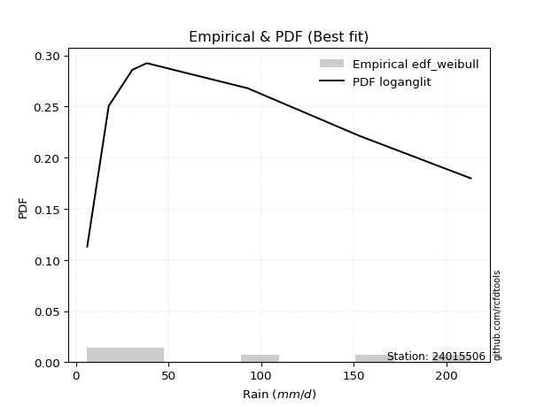</img>

</div>


### 4. EDF Beard (1943)

The Beard formula (or Beard´s plotting position formula) in hydrology is used to estimate the empirical non-exceedance probability _(P)_ of a flood event (or other extreme hydrological data point) within a given dataset.

<div align="center">


$P=(m-0.31)/(n+0.38)$


</div>


**4.1. Empirical values**

<div align="center">

|                | 0                   | 1                   | 2                   | 3         | 4                  | 5                  | 6                  |
|:---------------|:--------------------|:--------------------|:--------------------|:----------|:-------------------|:-------------------|:-------------------|
| date           | 2015                | 2021                | 2017                | 2016      | 2020               | 2019               | 2018               |
| x              | 6.1                 | 17.7                | 30.5                | 38.3      | 92.7               | 153.0              | 213.2              |
| m              | 1                   | 2                   | 3                   | 4         | 5                  | 6                  | 7                  |
| empirical_dist | edf_beard           | edf_beard           | edf_beard           | edf_beard | edf_beard          | edf_beard          | edf_beard          |
| empirical      | 0.09349593495934959 | 0.22899728997289973 | 0.36449864498644985 | 0.5       | 0.6355013550135502 | 0.7710027100271003 | 0.9065040650406505 |
| empirical_tr   | 1.1031390134529149  | 1.29701230228471    | 1.5735607675906182  | 2.0       | 2.743494423791822  | 4.366863905325444  | 10.695652173913055 |

</div>


**4.2. Kolmogorov-Smirnov fit test (sorted by Δ)**


<div align="center">

|                | 0                   | 1                   | 2                   | 3                   | 4                   | 5                   | 6                   | 7                   | 8                   | 9                   | 10                  | 11                  | 12                  | 13                  | 14                  | 15                  | 16                  | 17                  | 18                  | 19                  | 20                  | 21                  | 22                  | 23                  | 24                  | 25                  | 26                  | 27                  | 28                  | 29                  | 30                  | 31                  | 32                  | 33                  | 34                  | 35                  | 36                  | 37                  | 38                  | 39                  | 40                  | 41                  | 42                  | 43                  | 44                  | 45                  | 46                  | 47                  | 48                  | 49                  | 50                  | 51                  | 52                  | 53                  | 54                  | 55                  | 56                  | 57                  | 58                  | 59                  | 60                  | 61                  | 62                  | 63                  | 64                  | 65                  | 66                  | 67                  | 68                  | 69                  | 70                  | 71                  | 72                  | 73                  | 74                  | 75                  | 76                  | 77                  | 78                  | 79                  | 80                  | 81                  | 82                  | 83                  | 84                  | 85                  | 86                  | 87                  | 88                  | 89                  | 90                  | 91                  | 92                  | 93                  | 94                  | 95                  | 96                  | 97                  | 98                  | 99                  | 100                 | 101                 | 102                 | 103                 | 104                 | 105                 | 106                 | 107                 | 108                 | 109                 | 110                 | 111                 | 112                 | 113                 | 114                 | 115                 | 116                 | 117                 | 118                 | 119                 | 120                 | 121                 | 122                 | 123                 | 124                 | 125                 | 126                 | 127                 | 128                 | 129                 | 130                 | 131                 | 132                 | 133                 | 134                 | 135                 | 136                 | 137                 | 138                 | 139                 | 140                 | 141                 | 142                 | 143                 | 144                 | 145                 | 146                 | 147                 | 148                 | 149                 | 150                 | 151                 | 152                 | 153                 | 154                 | 155                 | 156                 | 157                 | 158                 | 159                 |
|:---------------|:--------------------|:--------------------|:--------------------|:--------------------|:--------------------|:--------------------|:--------------------|:--------------------|:--------------------|:--------------------|:--------------------|:--------------------|:--------------------|:--------------------|:--------------------|:--------------------|:--------------------|:--------------------|:--------------------|:--------------------|:--------------------|:--------------------|:--------------------|:--------------------|:--------------------|:--------------------|:--------------------|:--------------------|:--------------------|:--------------------|:--------------------|:--------------------|:--------------------|:--------------------|:--------------------|:--------------------|:--------------------|:--------------------|:--------------------|:--------------------|:--------------------|:--------------------|:--------------------|:--------------------|:--------------------|:--------------------|:--------------------|:--------------------|:--------------------|:--------------------|:--------------------|:--------------------|:--------------------|:--------------------|:--------------------|:--------------------|:--------------------|:--------------------|:--------------------|:--------------------|:--------------------|:--------------------|:--------------------|:--------------------|:--------------------|:--------------------|:--------------------|:--------------------|:--------------------|:--------------------|:--------------------|:--------------------|:--------------------|:--------------------|:--------------------|:--------------------|:--------------------|:--------------------|:--------------------|:--------------------|:--------------------|:--------------------|:--------------------|:--------------------|:--------------------|:--------------------|:--------------------|:--------------------|:--------------------|:--------------------|:--------------------|:--------------------|:--------------------|:--------------------|:--------------------|:--------------------|:--------------------|:--------------------|:--------------------|:--------------------|:--------------------|:--------------------|:--------------------|:--------------------|:--------------------|:--------------------|:--------------------|:--------------------|:--------------------|:--------------------|:--------------------|:--------------------|:--------------------|:--------------------|:--------------------|:--------------------|:--------------------|:--------------------|:--------------------|:--------------------|:--------------------|:--------------------|:--------------------|:--------------------|:--------------------|:--------------------|:--------------------|:--------------------|:--------------------|:--------------------|:--------------------|:--------------------|:--------------------|:--------------------|:--------------------|:--------------------|:--------------------|:--------------------|:--------------------|:--------------------|:--------------------|:--------------------|:--------------------|:--------------------|:--------------------|:--------------------|:--------------------|:--------------------|:--------------------|:--------------------|:--------------------|:--------------------|:--------------------|:--------------------|:--------------------|:--------------------|:--------------------|:--------------------|:--------------------|:--------------------|
| station        | 24015506            | 24015506            | 24015506            | 24015506            | 24015506            | 24015506            | 24015506            | 24015506            | 24015506            | 24015506            | 24015506            | 24015506            | 24015506            | 24015506            | 24015506            | 24015506            | 24015506            | 24015506            | 24015506            | 24015506            | 24015506            | 24015506            | 24015506            | 24015506            | 24015506            | 24015506            | 24015506            | 24015506            | 24015506            | 24015506            | 24015506            | 24015506            | 24015506            | 24015506            | 24015506            | 24015506            | 24015506            | 24015506            | 24015506            | 24015506            | 24015506            | 24015506            | 24015506            | 24015506            | 24015506            | 24015506            | 24015506            | 24015506            | 24015506            | 24015506            | 24015506            | 24015506            | 24015506            | 24015506            | 24015506            | 24015506            | 24015506            | 24015506            | 24015506            | 24015506            | 24015506            | 24015506            | 24015506            | 24015506            | 24015506            | 24015506            | 24015506            | 24015506            | 24015506            | 24015506            | 24015506            | 24015506            | 24015506            | 24015506            | 24015506            | 24015506            | 24015506            | 24015506            | 24015506            | 24015506            | 24015506            | 24015506            | 24015506            | 24015506            | 24015506            | 24015506            | 24015506            | 24015506            | 24015506            | 24015506            | 24015506            | 24015506            | 24015506            | 24015506            | 24015506            | 24015506            | 24015506            | 24015506            | 24015506            | 24015506            | 24015506            | 24015506            | 24015506            | 24015506            | 24015506            | 24015506            | 24015506            | 24015506            | 24015506            | 24015506            | 24015506            | 24015506            | 24015506            | 24015506            | 24015506            | 24015506            | 24015506            | 24015506            | 24015506            | 24015506            | 24015506            | 24015506            | 24015506            | 24015506            | 24015506            | 24015506            | 24015506            | 24015506            | 24015506            | 24015506            | 24015506            | 24015506            | 24015506            | 24015506            | 24015506            | 24015506            | 24015506            | 24015506            | 24015506            | 24015506            | 24015506            | 24015506            | 24015506            | 24015506            | 24015506            | 24015506            | 24015506            | 24015506            | 24015506            | 24015506            | 24015506            | 24015506            | 24015506            | 24015506            | 24015506            | 24015506            | 24015506            | 24015506            | 24015506            | 24015506            |
| empirical_dist | edf_beard           | edf_beard           | edf_beard           | edf_beard           | edf_beard           | edf_beard           | edf_beard           | edf_beard           | edf_beard           | edf_beard           | edf_beard           | edf_beard           | edf_beard           | edf_beard           | edf_beard           | edf_beard           | edf_beard           | edf_beard           | edf_beard           | edf_beard           | edf_beard           | edf_beard           | edf_beard           | edf_beard           | edf_beard           | edf_beard           | edf_beard           | edf_beard           | edf_beard           | edf_beard           | edf_beard           | edf_beard           | edf_beard           | edf_beard           | edf_beard           | edf_beard           | edf_beard           | edf_beard           | edf_beard           | edf_beard           | edf_beard           | edf_beard           | edf_beard           | edf_beard           | edf_beard           | edf_beard           | edf_beard           | edf_beard           | edf_beard           | edf_beard           | edf_beard           | edf_beard           | edf_beard           | edf_beard           | edf_beard           | edf_beard           | edf_beard           | edf_beard           | edf_beard           | edf_beard           | edf_beard           | edf_beard           | edf_beard           | edf_beard           | edf_beard           | edf_beard           | edf_beard           | edf_beard           | edf_beard           | edf_beard           | edf_beard           | edf_beard           | edf_beard           | edf_beard           | edf_beard           | edf_beard           | edf_beard           | edf_beard           | edf_beard           | edf_beard           | edf_beard           | edf_beard           | edf_beard           | edf_beard           | edf_beard           | edf_beard           | edf_beard           | edf_beard           | edf_beard           | edf_beard           | edf_beard           | edf_beard           | edf_beard           | edf_beard           | edf_beard           | edf_beard           | edf_beard           | edf_beard           | edf_beard           | edf_beard           | edf_beard           | edf_beard           | edf_beard           | edf_beard           | edf_beard           | edf_beard           | edf_beard           | edf_beard           | edf_beard           | edf_beard           | edf_beard           | edf_beard           | edf_beard           | edf_beard           | edf_beard           | edf_beard           | edf_beard           | edf_beard           | edf_beard           | edf_beard           | edf_beard           | edf_beard           | edf_beard           | edf_beard           | edf_beard           | edf_beard           | edf_beard           | edf_beard           | edf_beard           | edf_beard           | edf_beard           | edf_beard           | edf_beard           | edf_beard           | edf_beard           | edf_beard           | edf_beard           | edf_beard           | edf_beard           | edf_beard           | edf_beard           | edf_beard           | edf_beard           | edf_beard           | edf_beard           | edf_beard           | edf_beard           | edf_beard           | edf_beard           | edf_beard           | edf_beard           | edf_beard           | edf_beard           | edf_beard           | edf_beard           | edf_beard           | edf_beard           | edf_beard           | edf_beard           | edf_beard           |
| p_dist         | logsemicircular     | loganglit           | logdgamma           | logdweibull         | logweibull_min      | logpearson3         | logburr12           | logksone            | loggompertz         | kappa3              | halfgennorm         | logarcsine          | loggausshyper       | loginvweibull       | logf                | logbetaprime        | logfatiguelife      | lognct              | logexponnorm        | lognorm             | logcrystalball      | logt                | alpha               | logtrapezoid        | logfoldnorm         | johnsonsu           | logrice             | logerlang           | logncf              | loggamma            | loggamma            | loggenlogistic      | loginvgamma         | logloggamma         | dgamma              | loginvgauss         | logalpha            | logkstwobign        | logcosine           | logmaxwell          | invgamma            | logwrapcauchy       | lograyleigh         | logargus            | loggenexpon         | invgauss            | nct                 | nakagami            | logkappa4           | logtriang           | loglogistic         | logjohnsonsu        | truncweibull_min    | loghalfnorm         | logskewnorm         | loggumbel_l         | betaprime           | dweibull            | logtukeylambda      | burr                | loggenpareto        | loghypsecant        | logvonmises_line    | logkappa3           | loggenhalflogistic  | loguniform          | ncf                 | logloglaplace       | f                   | loggumbel_r         | exponnorm           | genexpon            | lomax               | exponweib           | halfnorm            | genpareto           | gengamma            | logburr             | loghalflogistic     | halflogistic        | foldnorm            | erlang              | logweibull_max      | truncnorm           | exponpow            | logmoyal            | arcsine             | loglomax            | loglaplace          | loglaplace          | logtruncnorm        | gompertz            | logmielke           | rayleigh            | semicircular        | moyal               | burr12              | logtruncweibull_min | pearson3            | gumbel_r            | logbradford         | maxwell             | logbeta             | anglit              | genlogistic         | weibull_min         | logtruncexpon       | wrapcauchy          | logwald             | wald                | loglevy_l           | kstwobign           | mielke              | gausshyper          | crystalball         | norm                | t                   | gennorm             | loggenextreme       | logistic            | loghalfgennorm      | rice                | gamma               | cosine              | logjohnsonsb        | hypsecant           | skewnorm            | truncexpon          | gumbel_l            | loggennorm          | bradford            | laplace             | argus               | ksone               | beta                | loggengamma         | genextreme          | kappa4              | levy_l              | logexponweib        | uniform             | vonmises_line       | logrdist            | genhalflogistic     | lognakagami         | powerlaw            | triang              | fatiguelife         | trapezoid           | invweibull          | rdist               | tukeylambda         | logexponpow         | truncpareto         | logpowerlaw         | johnsonsb           | weibull_max         | logtruncpareto      | logvonmises         | vonmises            |
| delta          | 0.06266058394890543 | 0.06967148239089793 | 0.07565333908778236 | 0.07565542305731816 | 0.0872464493325964  | 0.08736368089014857 | 0.0877601196433474  | 0.08990500861481882 | 0.09349593467404264 | 0.09349593491838637 | 0.09349593495858867 | 0.09349593495934959 | 0.09349593496175668 | 0.09379422134746362 | 0.09482176192417358 | 0.0950403423463011  | 0.09609151432274787 | 0.09613555360936599 | 0.09636755906289618 | 0.09636842412327451 | 0.09636842444534266 | 0.09636914256791751 | 0.09814965754139193 | 0.09877196448874787 | 0.09912924707121729 | 0.09917645349395432 | 0.09947346251781874 | 0.10015788078134202 | 0.10074892383767586 | 0.10152192234541801 | 0.10152192234541801 | 0.10308490233014206 | 0.1037602502010877  | 0.10392853981673278 | 0.10590450756648129 | 0.10592675821391218 | 0.10659646225364883 | 0.1079570069188347  | 0.1082746821214382  | 0.10830448643126789 | 0.10979862462581957 | 0.11047052510954028 | 0.11173830046507627 | 0.11192605118152954 | 0.11197261453656349 | 0.11216617298216258 | 0.11309678366832188 | 0.11671982136296824 | 0.11757760071501622 | 0.11845234317140346 | 0.11882008967013824 | 0.11945337820855284 | 0.12259759838434325 | 0.12278453518160026 | 0.12379364821454947 | 0.12590357448818718 | 0.12693731041546907 | 0.13064812859313113 | 0.13236565581722204 | 0.13323453033840552 | 0.1340267947649272  | 0.13413921968810305 | 0.1355640971706885  | 0.13556468454763382 | 0.13561720649561448 | 0.1356382035657141  | 0.13593577116016586 | 0.1375217737764607  | 0.14000588195330077 | 0.1401950223483872  | 0.1416269644459165  | 0.14228660876761368 | 0.14232131418661453 | 0.14425486037781185 | 0.1447423771926022  | 0.14586433718902886 | 0.14626453506872766 | 0.14775339213235966 | 0.14818316704544743 | 0.14916745669550574 | 0.14947573360678346 | 0.15140801095890533 | 0.15174171735740444 | 0.15274128480165983 | 0.1532713256838032  | 0.15430282395450245 | 0.1555140033194023  | 0.155538453932084   | 0.1559966860251466  | 0.1559966860251466  | 0.1601004735220703  | 0.16070689823384376 | 0.1714451805792766  | 0.1746064700834386  | 0.1755070344538302  | 0.17562826421786681 | 0.1793068457671982  | 0.1814106038153862  | 0.18210714016306928 | 0.18322384026571625 | 0.18491035798144684 | 0.1852320195097415  | 0.18605391476879024 | 0.18638074043719322 | 0.1864278557731343  | 0.18738683594290206 | 0.19220049192505095 | 0.19387585859371115 | 0.19724835076832825 | 0.19939047095109003 | 0.20316477790366538 | 0.2045668176779864  | 0.2046294463661309  | 0.208914592399292   | 0.21182585607404897 | 0.21182586818891858 | 0.21183012045683236 | 0.2186471555410171  | 0.2189989383543517  | 0.233688545593647   | 0.23689185485906836 | 0.238940952954943   | 0.24141780350262237 | 0.24542857064160906 | 0.24554475467360062 | 0.24915985333836527 | 0.25373659896834533 | 0.25709080388461236 | 0.26016188280267954 | 0.2710027100271003  | 0.2714253654509039  | 0.273113647857577   | 0.2870841242056169  | 0.28709962980846615 | 0.29057221342083267 | 0.3007472065035286  | 0.3089766744955146  | 0.3114087256761511  | 0.31381975104710325 | 0.3214460660382965  | 0.34451955577015936 | 0.3451283303227415  | 0.36449864319414793 | 0.3726913890625226  | 0.3750938962047153  | 0.4283442860864808  | 0.443437177000423   | 0.44404440378587917 | 0.45341319306172145 | 0.46020858484969984 | 0.47171268223347307 | 0.49742350406695146 | 0.539528777737345   | 0.5650251088140763  | 0.5823165378496947  | 0.5926538216151023  | 0.6398576140439891  | 0.6812325704729257  | 1.0657798103731886  | 33.639800533100484  |
| deltao         | 0.48442053926100004 | 0.48442053926100004 | 0.48442053926100004 | 0.48442053926100004 | 0.48442053926100004 | 0.48442053926100004 | 0.48442053926100004 | 0.48442053926100004 | 0.48442053926100004 | 0.48442053926100004 | 0.48442053926100004 | 0.48442053926100004 | 0.48442053926100004 | 0.48442053926100004 | 0.48442053926100004 | 0.48442053926100004 | 0.48442053926100004 | 0.48442053926100004 | 0.48442053926100004 | 0.48442053926100004 | 0.48442053926100004 | 0.48442053926100004 | 0.48442053926100004 | 0.48442053926100004 | 0.48442053926100004 | 0.48442053926100004 | 0.48442053926100004 | 0.48442053926100004 | 0.48442053926100004 | 0.48442053926100004 | 0.48442053926100004 | 0.48442053926100004 | 0.48442053926100004 | 0.48442053926100004 | 0.48442053926100004 | 0.48442053926100004 | 0.48442053926100004 | 0.48442053926100004 | 0.48442053926100004 | 0.48442053926100004 | 0.48442053926100004 | 0.48442053926100004 | 0.48442053926100004 | 0.48442053926100004 | 0.48442053926100004 | 0.48442053926100004 | 0.48442053926100004 | 0.48442053926100004 | 0.48442053926100004 | 0.48442053926100004 | 0.48442053926100004 | 0.48442053926100004 | 0.48442053926100004 | 0.48442053926100004 | 0.48442053926100004 | 0.48442053926100004 | 0.48442053926100004 | 0.48442053926100004 | 0.48442053926100004 | 0.48442053926100004 | 0.48442053926100004 | 0.48442053926100004 | 0.48442053926100004 | 0.48442053926100004 | 0.48442053926100004 | 0.48442053926100004 | 0.48442053926100004 | 0.48442053926100004 | 0.48442053926100004 | 0.48442053926100004 | 0.48442053926100004 | 0.48442053926100004 | 0.48442053926100004 | 0.48442053926100004 | 0.48442053926100004 | 0.48442053926100004 | 0.48442053926100004 | 0.48442053926100004 | 0.48442053926100004 | 0.48442053926100004 | 0.48442053926100004 | 0.48442053926100004 | 0.48442053926100004 | 0.48442053926100004 | 0.48442053926100004 | 0.48442053926100004 | 0.48442053926100004 | 0.48442053926100004 | 0.48442053926100004 | 0.48442053926100004 | 0.48442053926100004 | 0.48442053926100004 | 0.48442053926100004 | 0.48442053926100004 | 0.48442053926100004 | 0.48442053926100004 | 0.48442053926100004 | 0.48442053926100004 | 0.48442053926100004 | 0.48442053926100004 | 0.48442053926100004 | 0.48442053926100004 | 0.48442053926100004 | 0.48442053926100004 | 0.48442053926100004 | 0.48442053926100004 | 0.48442053926100004 | 0.48442053926100004 | 0.48442053926100004 | 0.48442053926100004 | 0.48442053926100004 | 0.48442053926100004 | 0.48442053926100004 | 0.48442053926100004 | 0.48442053926100004 | 0.48442053926100004 | 0.48442053926100004 | 0.48442053926100004 | 0.48442053926100004 | 0.48442053926100004 | 0.48442053926100004 | 0.48442053926100004 | 0.48442053926100004 | 0.48442053926100004 | 0.48442053926100004 | 0.48442053926100004 | 0.48442053926100004 | 0.48442053926100004 | 0.48442053926100004 | 0.48442053926100004 | 0.48442053926100004 | 0.48442053926100004 | 0.48442053926100004 | 0.48442053926100004 | 0.48442053926100004 | 0.48442053926100004 | 0.48442053926100004 | 0.48442053926100004 | 0.48442053926100004 | 0.48442053926100004 | 0.48442053926100004 | 0.48442053926100004 | 0.48442053926100004 | 0.48442053926100004 | 0.48442053926100004 | 0.48442053926100004 | 0.48442053926100004 | 0.48442053926100004 | 0.48442053926100004 | 0.48442053926100004 | 0.48442053926100004 | 0.48442053926100004 | 0.48442053926100004 | 0.48442053926100004 | 0.48442053926100004 | 0.48442053926100004 | 0.48442053926100004 | 0.48442053926100004 | 0.48442053926100004 | 0.48442053926100004 |
| eval           | Δo > Δ              | Δo > Δ              | Δo > Δ              | Δo > Δ              | Δo > Δ              | Δo > Δ              | Δo > Δ              | Δo > Δ              | Δo > Δ              | Δo > Δ              | Δo > Δ              | Δo > Δ              | Δo > Δ              | Δo > Δ              | Δo > Δ              | Δo > Δ              | Δo > Δ              | Δo > Δ              | Δo > Δ              | Δo > Δ              | Δo > Δ              | Δo > Δ              | Δo > Δ              | Δo > Δ              | Δo > Δ              | Δo > Δ              | Δo > Δ              | Δo > Δ              | Δo > Δ              | Δo > Δ              | Δo > Δ              | Δo > Δ              | Δo > Δ              | Δo > Δ              | Δo > Δ              | Δo > Δ              | Δo > Δ              | Δo > Δ              | Δo > Δ              | Δo > Δ              | Δo > Δ              | Δo > Δ              | Δo > Δ              | Δo > Δ              | Δo > Δ              | Δo > Δ              | Δo > Δ              | Δo > Δ              | Δo > Δ              | Δo > Δ              | Δo > Δ              | Δo > Δ              | Δo > Δ              | Δo > Δ              | Δo > Δ              | Δo > Δ              | Δo > Δ              | Δo > Δ              | Δo > Δ              | Δo > Δ              | Δo > Δ              | Δo > Δ              | Δo > Δ              | Δo > Δ              | Δo > Δ              | Δo > Δ              | Δo > Δ              | Δo > Δ              | Δo > Δ              | Δo > Δ              | Δo > Δ              | Δo > Δ              | Δo > Δ              | Δo > Δ              | Δo > Δ              | Δo > Δ              | Δo > Δ              | Δo > Δ              | Δo > Δ              | Δo > Δ              | Δo > Δ              | Δo > Δ              | Δo > Δ              | Δo > Δ              | Δo > Δ              | Δo > Δ              | Δo > Δ              | Δo > Δ              | Δo > Δ              | Δo > Δ              | Δo > Δ              | Δo > Δ              | Δo > Δ              | Δo > Δ              | Δo > Δ              | Δo > Δ              | Δo > Δ              | Δo > Δ              | Δo > Δ              | Δo > Δ              | Δo > Δ              | Δo > Δ              | Δo > Δ              | Δo > Δ              | Δo > Δ              | Δo > Δ              | Δo > Δ              | Δo > Δ              | Δo > Δ              | Δo > Δ              | Δo > Δ              | Δo > Δ              | Δo > Δ              | Δo > Δ              | Δo > Δ              | Δo > Δ              | Δo > Δ              | Δo > Δ              | Δo > Δ              | Δo > Δ              | Δo > Δ              | Δo > Δ              | Δo > Δ              | Δo > Δ              | Δo > Δ              | Δo > Δ              | Δo > Δ              | Δo > Δ              | Δo > Δ              | Δo > Δ              | Δo > Δ              | Δo > Δ              | Δo > Δ              | Δo > Δ              | Δo > Δ              | Δo > Δ              | Δo > Δ              | Δo > Δ              | Δo > Δ              | Δo > Δ              | Δo > Δ              | Δo > Δ              | Δo > Δ              | Δo > Δ              | Δo > Δ              | Δo > Δ              | Δo > Δ              | Δo > Δ              | Δo > Δ              | Δo > Δ              | Δo > Δ              | Δo <= Δ             | Δo <= Δ             | Δo <= Δ             | Δo <= Δ             | Δo <= Δ             | Δo <= Δ             | Δo <= Δ             | Δo <= Δ             | Δo <= Δ             |
| fit            | 1                   | 1                   | 1                   | 1                   | 1                   | 1                   | 1                   | 1                   | 1                   | 1                   | 1                   | 1                   | 1                   | 1                   | 1                   | 1                   | 1                   | 1                   | 1                   | 1                   | 1                   | 1                   | 1                   | 1                   | 1                   | 1                   | 1                   | 1                   | 1                   | 1                   | 1                   | 1                   | 1                   | 1                   | 1                   | 1                   | 1                   | 1                   | 1                   | 1                   | 1                   | 1                   | 1                   | 1                   | 1                   | 1                   | 1                   | 1                   | 1                   | 1                   | 1                   | 1                   | 1                   | 1                   | 1                   | 1                   | 1                   | 1                   | 1                   | 1                   | 1                   | 1                   | 1                   | 1                   | 1                   | 1                   | 1                   | 1                   | 1                   | 1                   | 1                   | 1                   | 1                   | 1                   | 1                   | 1                   | 1                   | 1                   | 1                   | 1                   | 1                   | 1                   | 1                   | 1                   | 1                   | 1                   | 1                   | 1                   | 1                   | 1                   | 1                   | 1                   | 1                   | 1                   | 1                   | 1                   | 1                   | 1                   | 1                   | 1                   | 1                   | 1                   | 1                   | 1                   | 1                   | 1                   | 1                   | 1                   | 1                   | 1                   | 1                   | 1                   | 1                   | 1                   | 1                   | 1                   | 1                   | 1                   | 1                   | 1                   | 1                   | 1                   | 1                   | 1                   | 1                   | 1                   | 1                   | 1                   | 1                   | 1                   | 1                   | 1                   | 1                   | 1                   | 1                   | 1                   | 1                   | 1                   | 1                   | 1                   | 1                   | 1                   | 1                   | 1                   | 1                   | 1                   | 1                   | 1                   | 1                   | 1                   | 1                   | 0                   | 0                   | 0                   | 0                   | 0                   | 0                   | 0                   | 0                   | 0                   |
| n              | 7                   | 7                   | 7                   | 7                   | 7                   | 7                   | 7                   | 7                   | 7                   | 7                   | 7                   | 7                   | 7                   | 7                   | 7                   | 7                   | 7                   | 7                   | 7                   | 7                   | 7                   | 7                   | 7                   | 7                   | 7                   | 7                   | 7                   | 7                   | 7                   | 7                   | 7                   | 7                   | 7                   | 7                   | 7                   | 7                   | 7                   | 7                   | 7                   | 7                   | 7                   | 7                   | 7                   | 7                   | 7                   | 7                   | 7                   | 7                   | 7                   | 7                   | 7                   | 7                   | 7                   | 7                   | 7                   | 7                   | 7                   | 7                   | 7                   | 7                   | 7                   | 7                   | 7                   | 7                   | 7                   | 7                   | 7                   | 7                   | 7                   | 7                   | 7                   | 7                   | 7                   | 7                   | 7                   | 7                   | 7                   | 7                   | 7                   | 7                   | 7                   | 7                   | 7                   | 7                   | 7                   | 7                   | 7                   | 7                   | 7                   | 7                   | 7                   | 7                   | 7                   | 7                   | 7                   | 7                   | 7                   | 7                   | 7                   | 7                   | 7                   | 7                   | 7                   | 7                   | 7                   | 7                   | 7                   | 7                   | 7                   | 7                   | 7                   | 7                   | 7                   | 7                   | 7                   | 7                   | 7                   | 7                   | 7                   | 7                   | 7                   | 7                   | 7                   | 7                   | 7                   | 7                   | 7                   | 7                   | 7                   | 7                   | 7                   | 7                   | 7                   | 7                   | 7                   | 7                   | 7                   | 7                   | 7                   | 7                   | 7                   | 7                   | 7                   | 7                   | 7                   | 7                   | 7                   | 7                   | 7                   | 7                   | 7                   | 7                   | 7                   | 7                   | 7                   | 7                   | 7                   | 7                   | 7                   | 7                   |
| best_fit       | 1                   | 0                   | 0                   | 0                   | 0                   | 0                   | 0                   | 0                   | 0                   | 0                   | 0                   | 0                   | 0                   | 0                   | 0                   | 0                   | 0                   | 0                   | 0                   | 0                   | 0                   | 0                   | 0                   | 0                   | 0                   | 0                   | 0                   | 0                   | 0                   | 0                   | 0                   | 0                   | 0                   | 0                   | 0                   | 0                   | 0                   | 0                   | 0                   | 0                   | 0                   | 0                   | 0                   | 0                   | 0                   | 0                   | 0                   | 0                   | 0                   | 0                   | 0                   | 0                   | 0                   | 0                   | 0                   | 0                   | 0                   | 0                   | 0                   | 0                   | 0                   | 0                   | 0                   | 0                   | 0                   | 0                   | 0                   | 0                   | 0                   | 0                   | 0                   | 0                   | 0                   | 0                   | 0                   | 0                   | 0                   | 0                   | 0                   | 0                   | 0                   | 0                   | 0                   | 0                   | 0                   | 0                   | 0                   | 0                   | 0                   | 0                   | 0                   | 0                   | 0                   | 0                   | 0                   | 0                   | 0                   | 0                   | 0                   | 0                   | 0                   | 0                   | 0                   | 0                   | 0                   | 0                   | 0                   | 0                   | 0                   | 0                   | 0                   | 0                   | 0                   | 0                   | 0                   | 0                   | 0                   | 0                   | 0                   | 0                   | 0                   | 0                   | 0                   | 0                   | 0                   | 0                   | 0                   | 0                   | 0                   | 0                   | 0                   | 0                   | 0                   | 0                   | 0                   | 0                   | 0                   | 0                   | 0                   | 0                   | 0                   | 0                   | 0                   | 0                   | 0                   | 0                   | 0                   | 0                   | 0                   | 0                   | 0                   | 0                   | 0                   | 0                   | 0                   | 0                   | 0                   | 0                   | 0                   | 0                   |
| best_fit_sort  | 1                   | 2                   | 3                   | 4                   | 5                   | 6                   | 7                   | 8                   | 9                   | 10                  | 11                  | 12                  | 13                  | 14                  | 15                  | 16                  | 17                  | 18                  | 19                  | 20                  | 21                  | 22                  | 23                  | 24                  | 25                  | 26                  | 27                  | 28                  | 29                  | 30                  | 31                  | 32                  | 33                  | 34                  | 35                  | 36                  | 37                  | 38                  | 39                  | 40                  | 41                  | 42                  | 43                  | 44                  | 45                  | 46                  | 47                  | 48                  | 49                  | 50                  | 51                  | 52                  | 53                  | 54                  | 55                  | 56                  | 57                  | 58                  | 59                  | 60                  | 61                  | 62                  | 63                  | 64                  | 65                  | 66                  | 67                  | 68                  | 69                  | 70                  | 71                  | 72                  | 73                  | 74                  | 75                  | 76                  | 77                  | 78                  | 79                  | 80                  | 81                  | 82                  | 83                  | 84                  | 85                  | 86                  | 87                  | 88                  | 89                  | 90                  | 91                  | 92                  | 93                  | 94                  | 95                  | 96                  | 97                  | 98                  | 99                  | 100                 | 101                 | 102                 | 103                 | 104                 | 105                 | 106                 | 107                 | 108                 | 109                 | 110                 | 111                 | 112                 | 113                 | 114                 | 115                 | 116                 | 117                 | 118                 | 119                 | 120                 | 121                 | 122                 | 123                 | 124                 | 125                 | 126                 | 127                 | 128                 | 129                 | 130                 | 131                 | 132                 | 133                 | 134                 | 135                 | 136                 | 137                 | 138                 | 139                 | 140                 | 141                 | 142                 | 143                 | 144                 | 145                 | 146                 | 147                 | 148                 | 149                 | 150                 | 151                 | 152                 | 153                 | 154                 | 155                 | 156                 | 157                 | 158                 | 159                 | 160                 |

</div>


**4.3. Best fit**

<div align="center">

|   id |   station | empirical_dist   | p_dist          |     delta |   deltao | eval   |   fit |   n |   best_fit |   best_fit_sort |
|-----:|----------:|:-----------------|:----------------|----------:|---------:|:-------|------:|----:|-----------:|----------------:|
|    0 |  24015506 | edf_beard        | logsemicircular | 0.0626606 | 0.484421 | Δo > Δ |     1 |   7 |          1 |               1 |

</div>


<div align="center">

</img>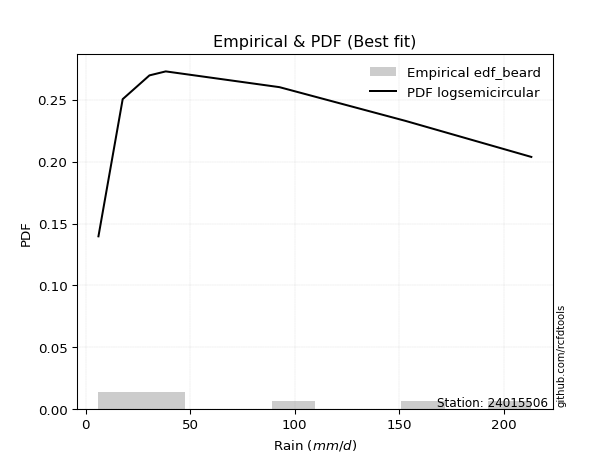</img>

</div>


### 5. EDF Chegodayev (1955)

The Chegodayev formula is an empirical plotting position formula used in hydrological frequency analysis to estimate the exceedance probability or return period of a specific event from a set of observed data. It is primarily used for plotting observed data points on probability paper to fit a theoretical distribution, particularly for analyzing extreme events like maximum flood flows or rainfall intensities. The constant _b_ value in the generalized plotting position formula is 0.3.

<div align="center">


$P=(m-b)/(n+1-2b)$


</div>


**5.1. Empirical values**

<div align="center">

|                | 0                   | 1                   | 2                   | 3              | 4                  | 5                  | 6                  |
|:---------------|:--------------------|:--------------------|:--------------------|:---------------|:-------------------|:-------------------|:-------------------|
| date           | 2015                | 2021                | 2017                | 2016           | 2020               | 2019               | 2018               |
| x              | 6.1                 | 17.7                | 30.5                | 38.3           | 92.7               | 153.0              | 213.2              |
| m              | 1                   | 2                   | 3                   | 4              | 5                  | 6                  | 7                  |
| empirical_dist | edf_chegodayev      | edf_chegodayev      | edf_chegodayev      | edf_chegodayev | edf_chegodayev     | edf_chegodayev     | edf_chegodayev     |
| empirical      | 0.09459459459459459 | 0.22972972972972971 | 0.36486486486486486 | 0.5            | 0.6351351351351351 | 0.7702702702702703 | 0.9054054054054054 |
| empirical_tr   | 1.1044776119402986  | 1.2982456140350878  | 1.574468085106383   | 2.0            | 2.7407407407407405 | 4.352941176470589  | 10.571428571428568 |

</div>


**5.2. Kolmogorov-Smirnov fit test (sorted by Δ)**


<div align="center">

|                | 0                   | 1                   | 2                   | 3                   | 4                   | 5                   | 6                   | 7                   | 8                   | 9                   | 10                  | 11                  | 12                  | 13                  | 14                  | 15                  | 16                  | 17                  | 18                  | 19                  | 20                  | 21                  | 22                  | 23                  | 24                  | 25                  | 26                  | 27                  | 28                  | 29                  | 30                  | 31                  | 32                  | 33                  | 34                  | 35                  | 36                  | 37                  | 38                  | 39                  | 40                  | 41                  | 42                  | 43                  | 44                  | 45                  | 46                  | 47                  | 48                  | 49                  | 50                  | 51                  | 52                  | 53                  | 54                  | 55                  | 56                  | 57                  | 58                  | 59                  | 60                  | 61                  | 62                  | 63                  | 64                  | 65                  | 66                  | 67                  | 68                  | 69                  | 70                  | 71                  | 72                  | 73                  | 74                  | 75                  | 76                  | 77                  | 78                  | 79                  | 80                  | 81                  | 82                  | 83                  | 84                  | 85                  | 86                  | 87                  | 88                  | 89                  | 90                  | 91                  | 92                  | 93                  | 94                  | 95                  | 96                  | 97                  | 98                  | 99                  | 100                 | 101                 | 102                 | 103                 | 104                 | 105                 | 106                 | 107                 | 108                 | 109                 | 110                 | 111                 | 112                 | 113                 | 114                 | 115                 | 116                 | 117                 | 118                 | 119                 | 120                 | 121                 | 122                 | 123                 | 124                 | 125                 | 126                 | 127                 | 128                 | 129                 | 130                 | 131                 | 132                 | 133                 | 134                 | 135                 | 136                 | 137                 | 138                 | 139                 | 140                 | 141                 | 142                 | 143                 | 144                 | 145                 | 146                 | 147                 | 148                 | 149                 | 150                 | 151                 | 152                 | 153                 | 154                 | 155                 | 156                 | 157                 | 158                 | 159                 |
|:---------------|:--------------------|:--------------------|:--------------------|:--------------------|:--------------------|:--------------------|:--------------------|:--------------------|:--------------------|:--------------------|:--------------------|:--------------------|:--------------------|:--------------------|:--------------------|:--------------------|:--------------------|:--------------------|:--------------------|:--------------------|:--------------------|:--------------------|:--------------------|:--------------------|:--------------------|:--------------------|:--------------------|:--------------------|:--------------------|:--------------------|:--------------------|:--------------------|:--------------------|:--------------------|:--------------------|:--------------------|:--------------------|:--------------------|:--------------------|:--------------------|:--------------------|:--------------------|:--------------------|:--------------------|:--------------------|:--------------------|:--------------------|:--------------------|:--------------------|:--------------------|:--------------------|:--------------------|:--------------------|:--------------------|:--------------------|:--------------------|:--------------------|:--------------------|:--------------------|:--------------------|:--------------------|:--------------------|:--------------------|:--------------------|:--------------------|:--------------------|:--------------------|:--------------------|:--------------------|:--------------------|:--------------------|:--------------------|:--------------------|:--------------------|:--------------------|:--------------------|:--------------------|:--------------------|:--------------------|:--------------------|:--------------------|:--------------------|:--------------------|:--------------------|:--------------------|:--------------------|:--------------------|:--------------------|:--------------------|:--------------------|:--------------------|:--------------------|:--------------------|:--------------------|:--------------------|:--------------------|:--------------------|:--------------------|:--------------------|:--------------------|:--------------------|:--------------------|:--------------------|:--------------------|:--------------------|:--------------------|:--------------------|:--------------------|:--------------------|:--------------------|:--------------------|:--------------------|:--------------------|:--------------------|:--------------------|:--------------------|:--------------------|:--------------------|:--------------------|:--------------------|:--------------------|:--------------------|:--------------------|:--------------------|:--------------------|:--------------------|:--------------------|:--------------------|:--------------------|:--------------------|:--------------------|:--------------------|:--------------------|:--------------------|:--------------------|:--------------------|:--------------------|:--------------------|:--------------------|:--------------------|:--------------------|:--------------------|:--------------------|:--------------------|:--------------------|:--------------------|:--------------------|:--------------------|:--------------------|:--------------------|:--------------------|:--------------------|:--------------------|:--------------------|:--------------------|:--------------------|:--------------------|:--------------------|:--------------------|:--------------------|
| station        | 24015506            | 24015506            | 24015506            | 24015506            | 24015506            | 24015506            | 24015506            | 24015506            | 24015506            | 24015506            | 24015506            | 24015506            | 24015506            | 24015506            | 24015506            | 24015506            | 24015506            | 24015506            | 24015506            | 24015506            | 24015506            | 24015506            | 24015506            | 24015506            | 24015506            | 24015506            | 24015506            | 24015506            | 24015506            | 24015506            | 24015506            | 24015506            | 24015506            | 24015506            | 24015506            | 24015506            | 24015506            | 24015506            | 24015506            | 24015506            | 24015506            | 24015506            | 24015506            | 24015506            | 24015506            | 24015506            | 24015506            | 24015506            | 24015506            | 24015506            | 24015506            | 24015506            | 24015506            | 24015506            | 24015506            | 24015506            | 24015506            | 24015506            | 24015506            | 24015506            | 24015506            | 24015506            | 24015506            | 24015506            | 24015506            | 24015506            | 24015506            | 24015506            | 24015506            | 24015506            | 24015506            | 24015506            | 24015506            | 24015506            | 24015506            | 24015506            | 24015506            | 24015506            | 24015506            | 24015506            | 24015506            | 24015506            | 24015506            | 24015506            | 24015506            | 24015506            | 24015506            | 24015506            | 24015506            | 24015506            | 24015506            | 24015506            | 24015506            | 24015506            | 24015506            | 24015506            | 24015506            | 24015506            | 24015506            | 24015506            | 24015506            | 24015506            | 24015506            | 24015506            | 24015506            | 24015506            | 24015506            | 24015506            | 24015506            | 24015506            | 24015506            | 24015506            | 24015506            | 24015506            | 24015506            | 24015506            | 24015506            | 24015506            | 24015506            | 24015506            | 24015506            | 24015506            | 24015506            | 24015506            | 24015506            | 24015506            | 24015506            | 24015506            | 24015506            | 24015506            | 24015506            | 24015506            | 24015506            | 24015506            | 24015506            | 24015506            | 24015506            | 24015506            | 24015506            | 24015506            | 24015506            | 24015506            | 24015506            | 24015506            | 24015506            | 24015506            | 24015506            | 24015506            | 24015506            | 24015506            | 24015506            | 24015506            | 24015506            | 24015506            | 24015506            | 24015506            | 24015506            | 24015506            | 24015506            | 24015506            |
| empirical_dist | edf_chegodayev      | edf_chegodayev      | edf_chegodayev      | edf_chegodayev      | edf_chegodayev      | edf_chegodayev      | edf_chegodayev      | edf_chegodayev      | edf_chegodayev      | edf_chegodayev      | edf_chegodayev      | edf_chegodayev      | edf_chegodayev      | edf_chegodayev      | edf_chegodayev      | edf_chegodayev      | edf_chegodayev      | edf_chegodayev      | edf_chegodayev      | edf_chegodayev      | edf_chegodayev      | edf_chegodayev      | edf_chegodayev      | edf_chegodayev      | edf_chegodayev      | edf_chegodayev      | edf_chegodayev      | edf_chegodayev      | edf_chegodayev      | edf_chegodayev      | edf_chegodayev      | edf_chegodayev      | edf_chegodayev      | edf_chegodayev      | edf_chegodayev      | edf_chegodayev      | edf_chegodayev      | edf_chegodayev      | edf_chegodayev      | edf_chegodayev      | edf_chegodayev      | edf_chegodayev      | edf_chegodayev      | edf_chegodayev      | edf_chegodayev      | edf_chegodayev      | edf_chegodayev      | edf_chegodayev      | edf_chegodayev      | edf_chegodayev      | edf_chegodayev      | edf_chegodayev      | edf_chegodayev      | edf_chegodayev      | edf_chegodayev      | edf_chegodayev      | edf_chegodayev      | edf_chegodayev      | edf_chegodayev      | edf_chegodayev      | edf_chegodayev      | edf_chegodayev      | edf_chegodayev      | edf_chegodayev      | edf_chegodayev      | edf_chegodayev      | edf_chegodayev      | edf_chegodayev      | edf_chegodayev      | edf_chegodayev      | edf_chegodayev      | edf_chegodayev      | edf_chegodayev      | edf_chegodayev      | edf_chegodayev      | edf_chegodayev      | edf_chegodayev      | edf_chegodayev      | edf_chegodayev      | edf_chegodayev      | edf_chegodayev      | edf_chegodayev      | edf_chegodayev      | edf_chegodayev      | edf_chegodayev      | edf_chegodayev      | edf_chegodayev      | edf_chegodayev      | edf_chegodayev      | edf_chegodayev      | edf_chegodayev      | edf_chegodayev      | edf_chegodayev      | edf_chegodayev      | edf_chegodayev      | edf_chegodayev      | edf_chegodayev      | edf_chegodayev      | edf_chegodayev      | edf_chegodayev      | edf_chegodayev      | edf_chegodayev      | edf_chegodayev      | edf_chegodayev      | edf_chegodayev      | edf_chegodayev      | edf_chegodayev      | edf_chegodayev      | edf_chegodayev      | edf_chegodayev      | edf_chegodayev      | edf_chegodayev      | edf_chegodayev      | edf_chegodayev      | edf_chegodayev      | edf_chegodayev      | edf_chegodayev      | edf_chegodayev      | edf_chegodayev      | edf_chegodayev      | edf_chegodayev      | edf_chegodayev      | edf_chegodayev      | edf_chegodayev      | edf_chegodayev      | edf_chegodayev      | edf_chegodayev      | edf_chegodayev      | edf_chegodayev      | edf_chegodayev      | edf_chegodayev      | edf_chegodayev      | edf_chegodayev      | edf_chegodayev      | edf_chegodayev      | edf_chegodayev      | edf_chegodayev      | edf_chegodayev      | edf_chegodayev      | edf_chegodayev      | edf_chegodayev      | edf_chegodayev      | edf_chegodayev      | edf_chegodayev      | edf_chegodayev      | edf_chegodayev      | edf_chegodayev      | edf_chegodayev      | edf_chegodayev      | edf_chegodayev      | edf_chegodayev      | edf_chegodayev      | edf_chegodayev      | edf_chegodayev      | edf_chegodayev      | edf_chegodayev      | edf_chegodayev      | edf_chegodayev      | edf_chegodayev      | edf_chegodayev      |
| p_dist         | logsemicircular     | loganglit           | logdgamma           | logdweibull         | logpearson3         | logweibull_min      | logburr12           | logksone            | loginvweibull       | loggompertz         | kappa3              | halfgennorm         | logarcsine          | loggausshyper       | logf                | logbetaprime        | logfatiguelife      | lognct              | logexponnorm        | lognorm             | logcrystalball      | logt                | alpha               | logtrapezoid        | logfoldnorm         | johnsonsu           | logrice             | logerlang           | logncf              | loggamma            | loggamma            | loggenlogistic      | logloggamma         | loginvgamma         | loginvgauss         | dgamma              | logalpha            | logkstwobign        | logcosine           | logmaxwell          | logwrapcauchy       | invgamma            | logargus            | lograyleigh         | loggenexpon         | invgauss            | nct                 | nakagami            | logkappa4           | logtriang           | loglogistic         | logjohnsonsu        | loghalfnorm         | truncweibull_min    | logskewnorm         | loggumbel_l         | betaprime           | dweibull            | burr                | logtukeylambda      | loggenpareto        | loghypsecant        | loggenhalflogistic  | ncf                 | logvonmises_line    | logkappa3           | loguniform          | logloglaplace       | f                   | loggumbel_r         | exponnorm           | genexpon            | lomax               | exponweib           | halfnorm            | genpareto           | gengamma            | logburr             | loghalflogistic     | halflogistic        | foldnorm            | logweibull_max      | erlang              | truncnorm           | exponpow            | arcsine             | loglomax            | logmoyal            | loglaplace          | loglaplace          | logtruncnorm        | gompertz            | logmielke           | rayleigh            | semicircular        | moyal               | burr12              | logtruncweibull_min | pearson3            | gumbel_r            | maxwell             | logbradford         | logbeta             | anglit              | genlogistic         | weibull_min         | logtruncexpon       | wrapcauchy          | logwald             | wald                | loglevy_l           | kstwobign           | mielke              | gausshyper          | crystalball         | norm                | t                   | loggenextreme       | gennorm             | logistic            | loghalfgennorm      | rice                | gamma               | logjohnsonsb        | cosine              | hypsecant           | skewnorm            | truncexpon          | gumbel_l            | loggennorm          | bradford            | laplace             | argus               | ksone               | beta                | loggengamma         | genextreme          | kappa4              | levy_l              | logexponweib        | uniform             | vonmises_line       | logrdist            | genhalflogistic     | lognakagami         | powerlaw            | fatiguelife         | triang              | trapezoid           | invweibull          | rdist               | tukeylambda         | logexponpow         | truncpareto         | logpowerlaw         | johnsonsb           | weibull_max         | logtruncpareto      | logvonmises         | vonmises            |
| delta          | 0.06375924358415043 | 0.07003770226931305 | 0.07675199872302736 | 0.07675408269256316 | 0.08772990076856368 | 0.08797417188115975 | 0.08798128157168061 | 0.09100366825006381 | 0.09416044122587874 | 0.09459459430928764 | 0.09459459455363137 | 0.09459459459383367 | 0.09459459459459459 | 0.09459459459700181 | 0.0951879818025887  | 0.09540656222471622 | 0.09645773420116299 | 0.0965017734877811  | 0.0967337789413113  | 0.09673464400168963 | 0.09673464432375778 | 0.09673536244633263 | 0.09851587741980705 | 0.09877196448874787 | 0.0994954669496324  | 0.09954267337236944 | 0.09983968239623386 | 0.10052410065975714 | 0.10111514371609098 | 0.10188814222383313 | 0.10188814222383313 | 0.10308490233014206 | 0.10392853981673278 | 0.10412647007950282 | 0.1062929780923273  | 0.1066369473233113  | 0.10696268213206395 | 0.10832322679724982 | 0.10864090199985332 | 0.10867070630968301 | 0.10973808535271029 | 0.1101648445042347  | 0.11192605118152954 | 0.11210452034349139 | 0.1123388344149786  | 0.1125323928605777  | 0.113463003546737   | 0.11598738160613825 | 0.11831004047184623 | 0.11845234317140346 | 0.11918630954855336 | 0.11945337820855284 | 0.12315075506001538 | 0.12333003814117327 | 0.12379364821454947 | 0.12590357448818718 | 0.1273035302938842  | 0.13064812859313113 | 0.13250209058157553 | 0.13309809557405206 | 0.13329435500809722 | 0.13450543956651817 | 0.13561720649561448 | 0.13593577116016586 | 0.13629653692751853 | 0.13629712430446383 | 0.13637064332254412 | 0.1378879936548758  | 0.1403721018317159  | 0.14056124222680233 | 0.1416269644459165  | 0.14228660876761368 | 0.14232131418661453 | 0.14352242062098186 | 0.1447423771926022  | 0.14586433718902886 | 0.14589831519031266 | 0.14783599323682528 | 0.14854938692386255 | 0.14916745669550574 | 0.14947573360678346 | 0.15174171735740444 | 0.15177423083732045 | 0.15274128480165983 | 0.1532713256838032  | 0.15441534368415727 | 0.15443979429683885 | 0.15466904383291757 | 0.15636290590356172 | 0.15636290590356172 | 0.1597342536436553  | 0.16070689823384376 | 0.17181140045769172 | 0.1746064700834386  | 0.1755070344538302  | 0.17562826421786681 | 0.17894062588878318 | 0.18177682369380133 | 0.18210714016306928 | 0.18322384026571625 | 0.1852320195097415  | 0.18527657785986196 | 0.18605391476879024 | 0.18638074043719322 | 0.1864278557731343  | 0.18738683594290206 | 0.19256671180346607 | 0.19314341883688113 | 0.19761457064674337 | 0.20012291070792004 | 0.2020661182684204  | 0.2045668176779864  | 0.20499566624454602 | 0.208914592399292   | 0.21182585607404897 | 0.21182586818891858 | 0.21183012045683236 | 0.2189989383543517  | 0.21901337541943222 | 0.233688545593647   | 0.23615941510223837 | 0.238940952954943   | 0.24105158362420737 | 0.24481231491677063 | 0.24542857064160906 | 0.24915985333836527 | 0.25373659896834533 | 0.25709080388461236 | 0.26016188280267954 | 0.2702702702702703  | 0.2714253654509039  | 0.273113647857577   | 0.2870841242056169  | 0.28709962980846615 | 0.2894735537855877  | 0.3000147667466986  | 0.30787801486026944 | 0.3114087256761511  | 0.3127210914118583  | 0.3207136262814665  | 0.34451955577015936 | 0.3451283303227415  | 0.36486486307256305 | 0.3726913890625226  | 0.3747276763263003  | 0.42761184632965077 | 0.44331196402904915 | 0.443437177000423   | 0.45341319306172145 | 0.4591099252144547  | 0.4706140225982281  | 0.4963248444317065  | 0.538796337980515   | 0.5642926690572463  | 0.5815840980928647  | 0.5919213818582723  | 0.6391251742871591  | 0.6805001307160957  | 1.0661460302516037  | 33.64089919273573   |
| deltao         | 0.48442053926100004 | 0.48442053926100004 | 0.48442053926100004 | 0.48442053926100004 | 0.48442053926100004 | 0.48442053926100004 | 0.48442053926100004 | 0.48442053926100004 | 0.48442053926100004 | 0.48442053926100004 | 0.48442053926100004 | 0.48442053926100004 | 0.48442053926100004 | 0.48442053926100004 | 0.48442053926100004 | 0.48442053926100004 | 0.48442053926100004 | 0.48442053926100004 | 0.48442053926100004 | 0.48442053926100004 | 0.48442053926100004 | 0.48442053926100004 | 0.48442053926100004 | 0.48442053926100004 | 0.48442053926100004 | 0.48442053926100004 | 0.48442053926100004 | 0.48442053926100004 | 0.48442053926100004 | 0.48442053926100004 | 0.48442053926100004 | 0.48442053926100004 | 0.48442053926100004 | 0.48442053926100004 | 0.48442053926100004 | 0.48442053926100004 | 0.48442053926100004 | 0.48442053926100004 | 0.48442053926100004 | 0.48442053926100004 | 0.48442053926100004 | 0.48442053926100004 | 0.48442053926100004 | 0.48442053926100004 | 0.48442053926100004 | 0.48442053926100004 | 0.48442053926100004 | 0.48442053926100004 | 0.48442053926100004 | 0.48442053926100004 | 0.48442053926100004 | 0.48442053926100004 | 0.48442053926100004 | 0.48442053926100004 | 0.48442053926100004 | 0.48442053926100004 | 0.48442053926100004 | 0.48442053926100004 | 0.48442053926100004 | 0.48442053926100004 | 0.48442053926100004 | 0.48442053926100004 | 0.48442053926100004 | 0.48442053926100004 | 0.48442053926100004 | 0.48442053926100004 | 0.48442053926100004 | 0.48442053926100004 | 0.48442053926100004 | 0.48442053926100004 | 0.48442053926100004 | 0.48442053926100004 | 0.48442053926100004 | 0.48442053926100004 | 0.48442053926100004 | 0.48442053926100004 | 0.48442053926100004 | 0.48442053926100004 | 0.48442053926100004 | 0.48442053926100004 | 0.48442053926100004 | 0.48442053926100004 | 0.48442053926100004 | 0.48442053926100004 | 0.48442053926100004 | 0.48442053926100004 | 0.48442053926100004 | 0.48442053926100004 | 0.48442053926100004 | 0.48442053926100004 | 0.48442053926100004 | 0.48442053926100004 | 0.48442053926100004 | 0.48442053926100004 | 0.48442053926100004 | 0.48442053926100004 | 0.48442053926100004 | 0.48442053926100004 | 0.48442053926100004 | 0.48442053926100004 | 0.48442053926100004 | 0.48442053926100004 | 0.48442053926100004 | 0.48442053926100004 | 0.48442053926100004 | 0.48442053926100004 | 0.48442053926100004 | 0.48442053926100004 | 0.48442053926100004 | 0.48442053926100004 | 0.48442053926100004 | 0.48442053926100004 | 0.48442053926100004 | 0.48442053926100004 | 0.48442053926100004 | 0.48442053926100004 | 0.48442053926100004 | 0.48442053926100004 | 0.48442053926100004 | 0.48442053926100004 | 0.48442053926100004 | 0.48442053926100004 | 0.48442053926100004 | 0.48442053926100004 | 0.48442053926100004 | 0.48442053926100004 | 0.48442053926100004 | 0.48442053926100004 | 0.48442053926100004 | 0.48442053926100004 | 0.48442053926100004 | 0.48442053926100004 | 0.48442053926100004 | 0.48442053926100004 | 0.48442053926100004 | 0.48442053926100004 | 0.48442053926100004 | 0.48442053926100004 | 0.48442053926100004 | 0.48442053926100004 | 0.48442053926100004 | 0.48442053926100004 | 0.48442053926100004 | 0.48442053926100004 | 0.48442053926100004 | 0.48442053926100004 | 0.48442053926100004 | 0.48442053926100004 | 0.48442053926100004 | 0.48442053926100004 | 0.48442053926100004 | 0.48442053926100004 | 0.48442053926100004 | 0.48442053926100004 | 0.48442053926100004 | 0.48442053926100004 | 0.48442053926100004 | 0.48442053926100004 | 0.48442053926100004 | 0.48442053926100004 |
| eval           | Δo > Δ              | Δo > Δ              | Δo > Δ              | Δo > Δ              | Δo > Δ              | Δo > Δ              | Δo > Δ              | Δo > Δ              | Δo > Δ              | Δo > Δ              | Δo > Δ              | Δo > Δ              | Δo > Δ              | Δo > Δ              | Δo > Δ              | Δo > Δ              | Δo > Δ              | Δo > Δ              | Δo > Δ              | Δo > Δ              | Δo > Δ              | Δo > Δ              | Δo > Δ              | Δo > Δ              | Δo > Δ              | Δo > Δ              | Δo > Δ              | Δo > Δ              | Δo > Δ              | Δo > Δ              | Δo > Δ              | Δo > Δ              | Δo > Δ              | Δo > Δ              | Δo > Δ              | Δo > Δ              | Δo > Δ              | Δo > Δ              | Δo > Δ              | Δo > Δ              | Δo > Δ              | Δo > Δ              | Δo > Δ              | Δo > Δ              | Δo > Δ              | Δo > Δ              | Δo > Δ              | Δo > Δ              | Δo > Δ              | Δo > Δ              | Δo > Δ              | Δo > Δ              | Δo > Δ              | Δo > Δ              | Δo > Δ              | Δo > Δ              | Δo > Δ              | Δo > Δ              | Δo > Δ              | Δo > Δ              | Δo > Δ              | Δo > Δ              | Δo > Δ              | Δo > Δ              | Δo > Δ              | Δo > Δ              | Δo > Δ              | Δo > Δ              | Δo > Δ              | Δo > Δ              | Δo > Δ              | Δo > Δ              | Δo > Δ              | Δo > Δ              | Δo > Δ              | Δo > Δ              | Δo > Δ              | Δo > Δ              | Δo > Δ              | Δo > Δ              | Δo > Δ              | Δo > Δ              | Δo > Δ              | Δo > Δ              | Δo > Δ              | Δo > Δ              | Δo > Δ              | Δo > Δ              | Δo > Δ              | Δo > Δ              | Δo > Δ              | Δo > Δ              | Δo > Δ              | Δo > Δ              | Δo > Δ              | Δo > Δ              | Δo > Δ              | Δo > Δ              | Δo > Δ              | Δo > Δ              | Δo > Δ              | Δo > Δ              | Δo > Δ              | Δo > Δ              | Δo > Δ              | Δo > Δ              | Δo > Δ              | Δo > Δ              | Δo > Δ              | Δo > Δ              | Δo > Δ              | Δo > Δ              | Δo > Δ              | Δo > Δ              | Δo > Δ              | Δo > Δ              | Δo > Δ              | Δo > Δ              | Δo > Δ              | Δo > Δ              | Δo > Δ              | Δo > Δ              | Δo > Δ              | Δo > Δ              | Δo > Δ              | Δo > Δ              | Δo > Δ              | Δo > Δ              | Δo > Δ              | Δo > Δ              | Δo > Δ              | Δo > Δ              | Δo > Δ              | Δo > Δ              | Δo > Δ              | Δo > Δ              | Δo > Δ              | Δo > Δ              | Δo > Δ              | Δo > Δ              | Δo > Δ              | Δo > Δ              | Δo > Δ              | Δo > Δ              | Δo > Δ              | Δo > Δ              | Δo > Δ              | Δo > Δ              | Δo > Δ              | Δo > Δ              | Δo > Δ              | Δo <= Δ             | Δo <= Δ             | Δo <= Δ             | Δo <= Δ             | Δo <= Δ             | Δo <= Δ             | Δo <= Δ             | Δo <= Δ             | Δo <= Δ             |
| fit            | 1                   | 1                   | 1                   | 1                   | 1                   | 1                   | 1                   | 1                   | 1                   | 1                   | 1                   | 1                   | 1                   | 1                   | 1                   | 1                   | 1                   | 1                   | 1                   | 1                   | 1                   | 1                   | 1                   | 1                   | 1                   | 1                   | 1                   | 1                   | 1                   | 1                   | 1                   | 1                   | 1                   | 1                   | 1                   | 1                   | 1                   | 1                   | 1                   | 1                   | 1                   | 1                   | 1                   | 1                   | 1                   | 1                   | 1                   | 1                   | 1                   | 1                   | 1                   | 1                   | 1                   | 1                   | 1                   | 1                   | 1                   | 1                   | 1                   | 1                   | 1                   | 1                   | 1                   | 1                   | 1                   | 1                   | 1                   | 1                   | 1                   | 1                   | 1                   | 1                   | 1                   | 1                   | 1                   | 1                   | 1                   | 1                   | 1                   | 1                   | 1                   | 1                   | 1                   | 1                   | 1                   | 1                   | 1                   | 1                   | 1                   | 1                   | 1                   | 1                   | 1                   | 1                   | 1                   | 1                   | 1                   | 1                   | 1                   | 1                   | 1                   | 1                   | 1                   | 1                   | 1                   | 1                   | 1                   | 1                   | 1                   | 1                   | 1                   | 1                   | 1                   | 1                   | 1                   | 1                   | 1                   | 1                   | 1                   | 1                   | 1                   | 1                   | 1                   | 1                   | 1                   | 1                   | 1                   | 1                   | 1                   | 1                   | 1                   | 1                   | 1                   | 1                   | 1                   | 1                   | 1                   | 1                   | 1                   | 1                   | 1                   | 1                   | 1                   | 1                   | 1                   | 1                   | 1                   | 1                   | 1                   | 1                   | 1                   | 0                   | 0                   | 0                   | 0                   | 0                   | 0                   | 0                   | 0                   | 0                   |
| n              | 7                   | 7                   | 7                   | 7                   | 7                   | 7                   | 7                   | 7                   | 7                   | 7                   | 7                   | 7                   | 7                   | 7                   | 7                   | 7                   | 7                   | 7                   | 7                   | 7                   | 7                   | 7                   | 7                   | 7                   | 7                   | 7                   | 7                   | 7                   | 7                   | 7                   | 7                   | 7                   | 7                   | 7                   | 7                   | 7                   | 7                   | 7                   | 7                   | 7                   | 7                   | 7                   | 7                   | 7                   | 7                   | 7                   | 7                   | 7                   | 7                   | 7                   | 7                   | 7                   | 7                   | 7                   | 7                   | 7                   | 7                   | 7                   | 7                   | 7                   | 7                   | 7                   | 7                   | 7                   | 7                   | 7                   | 7                   | 7                   | 7                   | 7                   | 7                   | 7                   | 7                   | 7                   | 7                   | 7                   | 7                   | 7                   | 7                   | 7                   | 7                   | 7                   | 7                   | 7                   | 7                   | 7                   | 7                   | 7                   | 7                   | 7                   | 7                   | 7                   | 7                   | 7                   | 7                   | 7                   | 7                   | 7                   | 7                   | 7                   | 7                   | 7                   | 7                   | 7                   | 7                   | 7                   | 7                   | 7                   | 7                   | 7                   | 7                   | 7                   | 7                   | 7                   | 7                   | 7                   | 7                   | 7                   | 7                   | 7                   | 7                   | 7                   | 7                   | 7                   | 7                   | 7                   | 7                   | 7                   | 7                   | 7                   | 7                   | 7                   | 7                   | 7                   | 7                   | 7                   | 7                   | 7                   | 7                   | 7                   | 7                   | 7                   | 7                   | 7                   | 7                   | 7                   | 7                   | 7                   | 7                   | 7                   | 7                   | 7                   | 7                   | 7                   | 7                   | 7                   | 7                   | 7                   | 7                   | 7                   |
| best_fit       | 1                   | 0                   | 0                   | 0                   | 0                   | 0                   | 0                   | 0                   | 0                   | 0                   | 0                   | 0                   | 0                   | 0                   | 0                   | 0                   | 0                   | 0                   | 0                   | 0                   | 0                   | 0                   | 0                   | 0                   | 0                   | 0                   | 0                   | 0                   | 0                   | 0                   | 0                   | 0                   | 0                   | 0                   | 0                   | 0                   | 0                   | 0                   | 0                   | 0                   | 0                   | 0                   | 0                   | 0                   | 0                   | 0                   | 0                   | 0                   | 0                   | 0                   | 0                   | 0                   | 0                   | 0                   | 0                   | 0                   | 0                   | 0                   | 0                   | 0                   | 0                   | 0                   | 0                   | 0                   | 0                   | 0                   | 0                   | 0                   | 0                   | 0                   | 0                   | 0                   | 0                   | 0                   | 0                   | 0                   | 0                   | 0                   | 0                   | 0                   | 0                   | 0                   | 0                   | 0                   | 0                   | 0                   | 0                   | 0                   | 0                   | 0                   | 0                   | 0                   | 0                   | 0                   | 0                   | 0                   | 0                   | 0                   | 0                   | 0                   | 0                   | 0                   | 0                   | 0                   | 0                   | 0                   | 0                   | 0                   | 0                   | 0                   | 0                   | 0                   | 0                   | 0                   | 0                   | 0                   | 0                   | 0                   | 0                   | 0                   | 0                   | 0                   | 0                   | 0                   | 0                   | 0                   | 0                   | 0                   | 0                   | 0                   | 0                   | 0                   | 0                   | 0                   | 0                   | 0                   | 0                   | 0                   | 0                   | 0                   | 0                   | 0                   | 0                   | 0                   | 0                   | 0                   | 0                   | 0                   | 0                   | 0                   | 0                   | 0                   | 0                   | 0                   | 0                   | 0                   | 0                   | 0                   | 0                   | 0                   |
| best_fit_sort  | 1                   | 2                   | 3                   | 4                   | 5                   | 6                   | 7                   | 8                   | 9                   | 10                  | 11                  | 12                  | 13                  | 14                  | 15                  | 16                  | 17                  | 18                  | 19                  | 20                  | 21                  | 22                  | 23                  | 24                  | 25                  | 26                  | 27                  | 28                  | 29                  | 30                  | 31                  | 32                  | 33                  | 34                  | 35                  | 36                  | 37                  | 38                  | 39                  | 40                  | 41                  | 42                  | 43                  | 44                  | 45                  | 46                  | 47                  | 48                  | 49                  | 50                  | 51                  | 52                  | 53                  | 54                  | 55                  | 56                  | 57                  | 58                  | 59                  | 60                  | 61                  | 62                  | 63                  | 64                  | 65                  | 66                  | 67                  | 68                  | 69                  | 70                  | 71                  | 72                  | 73                  | 74                  | 75                  | 76                  | 77                  | 78                  | 79                  | 80                  | 81                  | 82                  | 83                  | 84                  | 85                  | 86                  | 87                  | 88                  | 89                  | 90                  | 91                  | 92                  | 93                  | 94                  | 95                  | 96                  | 97                  | 98                  | 99                  | 100                 | 101                 | 102                 | 103                 | 104                 | 105                 | 106                 | 107                 | 108                 | 109                 | 110                 | 111                 | 112                 | 113                 | 114                 | 115                 | 116                 | 117                 | 118                 | 119                 | 120                 | 121                 | 122                 | 123                 | 124                 | 125                 | 126                 | 127                 | 128                 | 129                 | 130                 | 131                 | 132                 | 133                 | 134                 | 135                 | 136                 | 137                 | 138                 | 139                 | 140                 | 141                 | 142                 | 143                 | 144                 | 145                 | 146                 | 147                 | 148                 | 149                 | 150                 | 151                 | 152                 | 153                 | 154                 | 155                 | 156                 | 157                 | 158                 | 159                 | 160                 |

</div>


**5.3. Best fit**

<div align="center">

|   id |   station | empirical_dist   | p_dist          |     delta |   deltao | eval   |   fit |   n |   best_fit |   best_fit_sort |
|-----:|----------:|:-----------------|:----------------|----------:|---------:|:-------|------:|----:|-----------:|----------------:|
|    0 |  24015506 | edf_chegodayev   | logsemicircular | 0.0637592 | 0.484421 | Δo > Δ |     1 |   7 |          1 |               1 |

</div>


<div align="center">

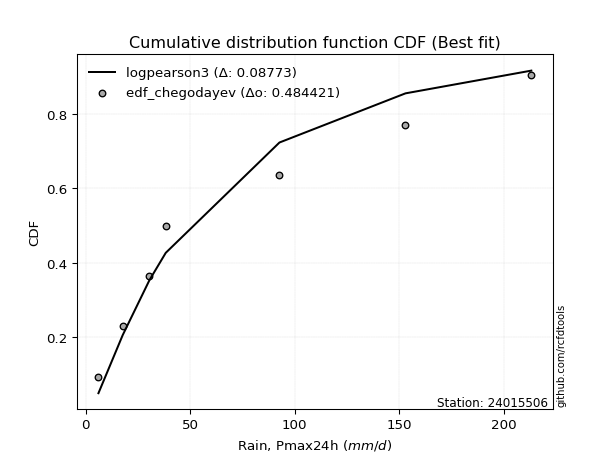</img></img>

</div>


### 6. EDF Blom (1958)

The Blom formula is a specific "plotting position" formula used in hydrology and statistical analysis to estimate the empirical cumulative probability (or non-exceedance probability) of a data series. It is particularly recommended for data that are approximately normally distributed. The constant _a_ is set to 0.375 (or 3/8).

<div align="center">


$P=(m-a)/(n+1-2a)$


</div>


**6.1. Empirical values**

<div align="center">

|                | 0                   | 1                   | 2                  | 3        | 4                  | 5                  | 6                  |
|:---------------|:--------------------|:--------------------|:-------------------|:---------|:-------------------|:-------------------|:-------------------|
| date           | 2015                | 2021                | 2017               | 2016     | 2020               | 2019               | 2018               |
| x              | 6.1                 | 17.7                | 30.5               | 38.3     | 92.7               | 153.0              | 213.2              |
| m              | 1                   | 2                   | 3                  | 4        | 5                  | 6                  | 7                  |
| empirical_dist | edf_blom            | edf_blom            | edf_blom           | edf_blom | edf_blom           | edf_blom           | edf_blom           |
| empirical      | 0.08620689655172414 | 0.22413793103448276 | 0.3620689655172414 | 0.5      | 0.6379310344827587 | 0.7758620689655172 | 0.9137931034482759 |
| empirical_tr   | 1.0943396226415094  | 1.288888888888889   | 1.5675675675675675 | 2.0      | 2.7619047619047623 | 4.461538461538462  | 11.600000000000007 |

</div>


**6.2. Kolmogorov-Smirnov fit test (sorted by Δ)**


<div align="center">

|                | 0                   | 1                   | 2                   | 3                   | 4                   | 5                   | 6                   | 7                   | 8                   | 9                   | 10                  | 11                  | 12                  | 13                  | 14                  | 15                  | 16                  | 17                  | 18                  | 19                  | 20                  | 21                  | 22                  | 23                  | 24                  | 25                  | 26                  | 27                  | 28                  | 29                  | 30                  | 31                  | 32                  | 33                  | 34                  | 35                  | 36                  | 37                  | 38                  | 39                  | 40                  | 41                  | 42                  | 43                  | 44                  | 45                  | 46                  | 47                  | 48                  | 49                  | 50                  | 51                  | 52                  | 53                  | 54                  | 55                  | 56                  | 57                  | 58                  | 59                  | 60                  | 61                  | 62                  | 63                  | 64                  | 65                  | 66                  | 67                  | 68                  | 69                  | 70                  | 71                  | 72                  | 73                  | 74                  | 75                  | 76                  | 77                  | 78                  | 79                  | 80                  | 81                  | 82                  | 83                  | 84                  | 85                  | 86                  | 87                  | 88                  | 89                  | 90                  | 91                  | 92                  | 93                  | 94                  | 95                  | 96                  | 97                  | 98                  | 99                  | 100                 | 101                 | 102                 | 103                 | 104                 | 105                 | 106                 | 107                 | 108                 | 109                 | 110                 | 111                 | 112                 | 113                 | 114                 | 115                 | 116                 | 117                 | 118                 | 119                 | 120                 | 121                 | 122                 | 123                 | 124                 | 125                 | 126                 | 127                 | 128                 | 129                 | 130                 | 131                 | 132                 | 133                 | 134                 | 135                 | 136                 | 137                 | 138                 | 139                 | 140                 | 141                 | 142                 | 143                 | 144                 | 145                 | 146                 | 147                 | 148                 | 149                 | 150                 | 151                 | 152                 | 153                 | 154                 | 155                 | 156                 | 157                 | 158                 | 159                 |
|:---------------|:--------------------|:--------------------|:--------------------|:--------------------|:--------------------|:--------------------|:--------------------|:--------------------|:--------------------|:--------------------|:--------------------|:--------------------|:--------------------|:--------------------|:--------------------|:--------------------|:--------------------|:--------------------|:--------------------|:--------------------|:--------------------|:--------------------|:--------------------|:--------------------|:--------------------|:--------------------|:--------------------|:--------------------|:--------------------|:--------------------|:--------------------|:--------------------|:--------------------|:--------------------|:--------------------|:--------------------|:--------------------|:--------------------|:--------------------|:--------------------|:--------------------|:--------------------|:--------------------|:--------------------|:--------------------|:--------------------|:--------------------|:--------------------|:--------------------|:--------------------|:--------------------|:--------------------|:--------------------|:--------------------|:--------------------|:--------------------|:--------------------|:--------------------|:--------------------|:--------------------|:--------------------|:--------------------|:--------------------|:--------------------|:--------------------|:--------------------|:--------------------|:--------------------|:--------------------|:--------------------|:--------------------|:--------------------|:--------------------|:--------------------|:--------------------|:--------------------|:--------------------|:--------------------|:--------------------|:--------------------|:--------------------|:--------------------|:--------------------|:--------------------|:--------------------|:--------------------|:--------------------|:--------------------|:--------------------|:--------------------|:--------------------|:--------------------|:--------------------|:--------------------|:--------------------|:--------------------|:--------------------|:--------------------|:--------------------|:--------------------|:--------------------|:--------------------|:--------------------|:--------------------|:--------------------|:--------------------|:--------------------|:--------------------|:--------------------|:--------------------|:--------------------|:--------------------|:--------------------|:--------------------|:--------------------|:--------------------|:--------------------|:--------------------|:--------------------|:--------------------|:--------------------|:--------------------|:--------------------|:--------------------|:--------------------|:--------------------|:--------------------|:--------------------|:--------------------|:--------------------|:--------------------|:--------------------|:--------------------|:--------------------|:--------------------|:--------------------|:--------------------|:--------------------|:--------------------|:--------------------|:--------------------|:--------------------|:--------------------|:--------------------|:--------------------|:--------------------|:--------------------|:--------------------|:--------------------|:--------------------|:--------------------|:--------------------|:--------------------|:--------------------|:--------------------|:--------------------|:--------------------|:--------------------|:--------------------|:--------------------|
| station        | 24015506            | 24015506            | 24015506            | 24015506            | 24015506            | 24015506            | 24015506            | 24015506            | 24015506            | 24015506            | 24015506            | 24015506            | 24015506            | 24015506            | 24015506            | 24015506            | 24015506            | 24015506            | 24015506            | 24015506            | 24015506            | 24015506            | 24015506            | 24015506            | 24015506            | 24015506            | 24015506            | 24015506            | 24015506            | 24015506            | 24015506            | 24015506            | 24015506            | 24015506            | 24015506            | 24015506            | 24015506            | 24015506            | 24015506            | 24015506            | 24015506            | 24015506            | 24015506            | 24015506            | 24015506            | 24015506            | 24015506            | 24015506            | 24015506            | 24015506            | 24015506            | 24015506            | 24015506            | 24015506            | 24015506            | 24015506            | 24015506            | 24015506            | 24015506            | 24015506            | 24015506            | 24015506            | 24015506            | 24015506            | 24015506            | 24015506            | 24015506            | 24015506            | 24015506            | 24015506            | 24015506            | 24015506            | 24015506            | 24015506            | 24015506            | 24015506            | 24015506            | 24015506            | 24015506            | 24015506            | 24015506            | 24015506            | 24015506            | 24015506            | 24015506            | 24015506            | 24015506            | 24015506            | 24015506            | 24015506            | 24015506            | 24015506            | 24015506            | 24015506            | 24015506            | 24015506            | 24015506            | 24015506            | 24015506            | 24015506            | 24015506            | 24015506            | 24015506            | 24015506            | 24015506            | 24015506            | 24015506            | 24015506            | 24015506            | 24015506            | 24015506            | 24015506            | 24015506            | 24015506            | 24015506            | 24015506            | 24015506            | 24015506            | 24015506            | 24015506            | 24015506            | 24015506            | 24015506            | 24015506            | 24015506            | 24015506            | 24015506            | 24015506            | 24015506            | 24015506            | 24015506            | 24015506            | 24015506            | 24015506            | 24015506            | 24015506            | 24015506            | 24015506            | 24015506            | 24015506            | 24015506            | 24015506            | 24015506            | 24015506            | 24015506            | 24015506            | 24015506            | 24015506            | 24015506            | 24015506            | 24015506            | 24015506            | 24015506            | 24015506            | 24015506            | 24015506            | 24015506            | 24015506            | 24015506            | 24015506            |
| empirical_dist | edf_blom            | edf_blom            | edf_blom            | edf_blom            | edf_blom            | edf_blom            | edf_blom            | edf_blom            | edf_blom            | edf_blom            | edf_blom            | edf_blom            | edf_blom            | edf_blom            | edf_blom            | edf_blom            | edf_blom            | edf_blom            | edf_blom            | edf_blom            | edf_blom            | edf_blom            | edf_blom            | edf_blom            | edf_blom            | edf_blom            | edf_blom            | edf_blom            | edf_blom            | edf_blom            | edf_blom            | edf_blom            | edf_blom            | edf_blom            | edf_blom            | edf_blom            | edf_blom            | edf_blom            | edf_blom            | edf_blom            | edf_blom            | edf_blom            | edf_blom            | edf_blom            | edf_blom            | edf_blom            | edf_blom            | edf_blom            | edf_blom            | edf_blom            | edf_blom            | edf_blom            | edf_blom            | edf_blom            | edf_blom            | edf_blom            | edf_blom            | edf_blom            | edf_blom            | edf_blom            | edf_blom            | edf_blom            | edf_blom            | edf_blom            | edf_blom            | edf_blom            | edf_blom            | edf_blom            | edf_blom            | edf_blom            | edf_blom            | edf_blom            | edf_blom            | edf_blom            | edf_blom            | edf_blom            | edf_blom            | edf_blom            | edf_blom            | edf_blom            | edf_blom            | edf_blom            | edf_blom            | edf_blom            | edf_blom            | edf_blom            | edf_blom            | edf_blom            | edf_blom            | edf_blom            | edf_blom            | edf_blom            | edf_blom            | edf_blom            | edf_blom            | edf_blom            | edf_blom            | edf_blom            | edf_blom            | edf_blom            | edf_blom            | edf_blom            | edf_blom            | edf_blom            | edf_blom            | edf_blom            | edf_blom            | edf_blom            | edf_blom            | edf_blom            | edf_blom            | edf_blom            | edf_blom            | edf_blom            | edf_blom            | edf_blom            | edf_blom            | edf_blom            | edf_blom            | edf_blom            | edf_blom            | edf_blom            | edf_blom            | edf_blom            | edf_blom            | edf_blom            | edf_blom            | edf_blom            | edf_blom            | edf_blom            | edf_blom            | edf_blom            | edf_blom            | edf_blom            | edf_blom            | edf_blom            | edf_blom            | edf_blom            | edf_blom            | edf_blom            | edf_blom            | edf_blom            | edf_blom            | edf_blom            | edf_blom            | edf_blom            | edf_blom            | edf_blom            | edf_blom            | edf_blom            | edf_blom            | edf_blom            | edf_blom            | edf_blom            | edf_blom            | edf_blom            | edf_blom            | edf_blom            | edf_blom            | edf_blom            |
| p_dist         | logsemicircular     | loganglit           | logdgamma           | logdweibull         | logksone            | logpearson3         | loggompertz         | halfgennorm         | logarcsine          | loggausshyper       | logweibull_min      | logburr12           | kappa3              | loginvweibull       | logf                | logbetaprime        | logfatiguelife      | lognct              | logexponnorm        | lognorm             | logcrystalball      | logt                | alpha               | logfoldnorm         | johnsonsu           | logrice             | logerlang           | logncf              | logtrapezoid        | loggamma            | loggamma            | loginvgamma         | loggenlogistic      | loginvgauss         | logloggamma         | logalpha            | logkstwobign        | logcosine           | logmaxwell          | invgamma            | lograyleigh         | loggenexpon         | invgauss            | nct                 | logargus            | dgamma              | logkappa4           | logwrapcauchy       | loglogistic         | truncweibull_min    | logtriang           | logjohnsonsu        | loghalfnorm         | nakagami            | logskewnorm         | betaprime           | loggumbel_l         | logtukeylambda      | dweibull            | logvonmises_line    | logkappa3           | loguniform          | loghypsecant        | logloglaplace       | loggenhalflogistic  | ncf                 | f                   | loggumbel_r         | burr                | loggenpareto        | exponnorm           | genexpon            | lomax               | halfnorm            | loghalflogistic     | genpareto           | gengamma            | erlang              | exponweib           | halflogistic        | foldnorm            | logburr             | logweibull_max      | logmoyal            | truncnorm           | exponpow            | loglaplace          | loglaplace          | gompertz            | logtruncnorm        | arcsine             | loglomax            | logmielke           | rayleigh            | semicircular        | moyal               | logtruncweibull_min | burr12              | pearson3            | logbradford         | gumbel_r            | maxwell             | logbeta             | anglit              | genlogistic         | weibull_min         | logtruncexpon       | wald                | logwald             | wrapcauchy          | mielke              | kstwobign           | gausshyper          | loglevy_l           | crystalball         | norm                | t                   | gennorm             | loggenextreme       | logistic            | rice                | loghalfgennorm      | gamma               | cosine              | hypsecant           | logjohnsonsb        | skewnorm            | truncexpon          | gumbel_l            | bradford            | laplace             | loggennorm          | argus               | ksone               | beta                | loggengamma         | kappa4              | genextreme          | levy_l              | logexponweib        | uniform             | vonmises_line       | logrdist            | genhalflogistic     | lognakagami         | powerlaw            | triang              | fatiguelife         | trapezoid           | invweibull          | rdist               | tukeylambda         | logexponpow         | truncpareto         | logpowerlaw         | johnsonsb           | weibull_max         | logtruncpareto      | logvonmises         | vonmises            |
| delta          | 0.05575223744084479 | 0.06724180292168946 | 0.06836430068015692 | 0.06836638464969272 | 0.08261597020719337 | 0.0849340014209401  | 0.0862068962664172  | 0.08620689655096322 | 0.08620689655172414 | 0.08620689655413127 | 0.0872464493325964  | 0.0877601196433474  | 0.08804676283746316 | 0.09136454187825516 | 0.09239208245496511 | 0.09261066287709263 | 0.0936618348535394  | 0.09370587414015752 | 0.09393787959368771 | 0.09393874465406604 | 0.09393874497613419 | 0.09393946309870904 | 0.09571997807218346 | 0.09669956760200882 | 0.09674677402474585 | 0.09704378304861028 | 0.09772820131213356 | 0.0983192443684674  | 0.09877196448874787 | 0.09909224287620955 | 0.09909224287620955 | 0.10133057073187923 | 0.10308490233014206 | 0.10349707874470371 | 0.10392853981673278 | 0.10416678278444036 | 0.10552732744962623 | 0.10584500265222974 | 0.10587480696205942 | 0.1073689451566111  | 0.1093086209958678  | 0.10954293506735502 | 0.10973649351295411 | 0.11066710419911341 | 0.11192605118152954 | 0.11247910036558534 | 0.11271824177659928 | 0.11532988404795724 | 0.11639041020092977 | 0.11773823944592632 | 0.11845234317140346 | 0.11945337820855284 | 0.1203548557123918  | 0.1215791803013852  | 0.12379364821454947 | 0.1245076309462606  | 0.12590357448818718 | 0.1275062968788051  | 0.13064812859313113 | 0.13070473823227158 | 0.13070532560921688 | 0.13077884462729716 | 0.13170954021889458 | 0.13509209430725222 | 0.13561720649561448 | 0.13593577116016586 | 0.1375762024840923  | 0.13776534287917874 | 0.13809388927682248 | 0.13888615370334417 | 0.1416269644459165  | 0.14228660876761368 | 0.14232131418661453 | 0.1447423771926022  | 0.14575348757623896 | 0.14586433718902886 | 0.14869421453793613 | 0.14897833148969686 | 0.1491142193162288  | 0.14916745669550574 | 0.14947573360678346 | 0.15018307160156813 | 0.15174171735740444 | 0.151873144485294   | 0.15274128480165983 | 0.1532713256838032  | 0.15356700655593813 | 0.15356700655593813 | 0.16070689823384376 | 0.16253015299127876 | 0.16280304172702773 | 0.1628274923397094  | 0.17061810307999553 | 0.1746064700834386  | 0.1755070344538302  | 0.17562826421786681 | 0.17898092434617774 | 0.18173652523640665 | 0.18210714016306928 | 0.18248067851223837 | 0.18322384026571625 | 0.1852320195097415  | 0.18605391476879024 | 0.18638074043719322 | 0.1864278557731343  | 0.18738683594290206 | 0.18977081245584249 | 0.1945311120126731  | 0.19481867129911978 | 0.19873521753212808 | 0.20219976689692243 | 0.2045668176779864  | 0.208914592399292   | 0.21045381631129084 | 0.21182585607404897 | 0.21182586818891858 | 0.21183012045683236 | 0.21621747607180863 | 0.2189989383543517  | 0.233688545593647   | 0.238940952954943   | 0.24175121379748532 | 0.24384748297183084 | 0.24542857064160906 | 0.24915985333836527 | 0.2504041136120176  | 0.25373659896834533 | 0.25709080388461236 | 0.26016188280267954 | 0.2714253654509039  | 0.273113647857577   | 0.27586206896551724 | 0.2870841242056169  | 0.28709962980846615 | 0.29786125182845813 | 0.30560656544194553 | 0.3114087256761511  | 0.31626571290314    | 0.3211087894547287  | 0.32630542497671344 | 0.34451955577015936 | 0.3451283303227415  | 0.36206896372493946 | 0.3726913890625226  | 0.37752357567392375 | 0.4332036450248977  | 0.443437177000423   | 0.4489037627242961  | 0.45341319306172145 | 0.46749762325732525 | 0.4790017206410985  | 0.5047125424745769  | 0.5443881366757619  | 0.5698844677524932  | 0.5871758967881117  | 0.5975131805535192  | 0.644716972982406   | 0.6860919294113427  | 1.0633501309039801  | 33.63251149469286   |
| deltao         | 0.48442053926100004 | 0.48442053926100004 | 0.48442053926100004 | 0.48442053926100004 | 0.48442053926100004 | 0.48442053926100004 | 0.48442053926100004 | 0.48442053926100004 | 0.48442053926100004 | 0.48442053926100004 | 0.48442053926100004 | 0.48442053926100004 | 0.48442053926100004 | 0.48442053926100004 | 0.48442053926100004 | 0.48442053926100004 | 0.48442053926100004 | 0.48442053926100004 | 0.48442053926100004 | 0.48442053926100004 | 0.48442053926100004 | 0.48442053926100004 | 0.48442053926100004 | 0.48442053926100004 | 0.48442053926100004 | 0.48442053926100004 | 0.48442053926100004 | 0.48442053926100004 | 0.48442053926100004 | 0.48442053926100004 | 0.48442053926100004 | 0.48442053926100004 | 0.48442053926100004 | 0.48442053926100004 | 0.48442053926100004 | 0.48442053926100004 | 0.48442053926100004 | 0.48442053926100004 | 0.48442053926100004 | 0.48442053926100004 | 0.48442053926100004 | 0.48442053926100004 | 0.48442053926100004 | 0.48442053926100004 | 0.48442053926100004 | 0.48442053926100004 | 0.48442053926100004 | 0.48442053926100004 | 0.48442053926100004 | 0.48442053926100004 | 0.48442053926100004 | 0.48442053926100004 | 0.48442053926100004 | 0.48442053926100004 | 0.48442053926100004 | 0.48442053926100004 | 0.48442053926100004 | 0.48442053926100004 | 0.48442053926100004 | 0.48442053926100004 | 0.48442053926100004 | 0.48442053926100004 | 0.48442053926100004 | 0.48442053926100004 | 0.48442053926100004 | 0.48442053926100004 | 0.48442053926100004 | 0.48442053926100004 | 0.48442053926100004 | 0.48442053926100004 | 0.48442053926100004 | 0.48442053926100004 | 0.48442053926100004 | 0.48442053926100004 | 0.48442053926100004 | 0.48442053926100004 | 0.48442053926100004 | 0.48442053926100004 | 0.48442053926100004 | 0.48442053926100004 | 0.48442053926100004 | 0.48442053926100004 | 0.48442053926100004 | 0.48442053926100004 | 0.48442053926100004 | 0.48442053926100004 | 0.48442053926100004 | 0.48442053926100004 | 0.48442053926100004 | 0.48442053926100004 | 0.48442053926100004 | 0.48442053926100004 | 0.48442053926100004 | 0.48442053926100004 | 0.48442053926100004 | 0.48442053926100004 | 0.48442053926100004 | 0.48442053926100004 | 0.48442053926100004 | 0.48442053926100004 | 0.48442053926100004 | 0.48442053926100004 | 0.48442053926100004 | 0.48442053926100004 | 0.48442053926100004 | 0.48442053926100004 | 0.48442053926100004 | 0.48442053926100004 | 0.48442053926100004 | 0.48442053926100004 | 0.48442053926100004 | 0.48442053926100004 | 0.48442053926100004 | 0.48442053926100004 | 0.48442053926100004 | 0.48442053926100004 | 0.48442053926100004 | 0.48442053926100004 | 0.48442053926100004 | 0.48442053926100004 | 0.48442053926100004 | 0.48442053926100004 | 0.48442053926100004 | 0.48442053926100004 | 0.48442053926100004 | 0.48442053926100004 | 0.48442053926100004 | 0.48442053926100004 | 0.48442053926100004 | 0.48442053926100004 | 0.48442053926100004 | 0.48442053926100004 | 0.48442053926100004 | 0.48442053926100004 | 0.48442053926100004 | 0.48442053926100004 | 0.48442053926100004 | 0.48442053926100004 | 0.48442053926100004 | 0.48442053926100004 | 0.48442053926100004 | 0.48442053926100004 | 0.48442053926100004 | 0.48442053926100004 | 0.48442053926100004 | 0.48442053926100004 | 0.48442053926100004 | 0.48442053926100004 | 0.48442053926100004 | 0.48442053926100004 | 0.48442053926100004 | 0.48442053926100004 | 0.48442053926100004 | 0.48442053926100004 | 0.48442053926100004 | 0.48442053926100004 | 0.48442053926100004 | 0.48442053926100004 | 0.48442053926100004 | 0.48442053926100004 |
| eval           | Δo > Δ              | Δo > Δ              | Δo > Δ              | Δo > Δ              | Δo > Δ              | Δo > Δ              | Δo > Δ              | Δo > Δ              | Δo > Δ              | Δo > Δ              | Δo > Δ              | Δo > Δ              | Δo > Δ              | Δo > Δ              | Δo > Δ              | Δo > Δ              | Δo > Δ              | Δo > Δ              | Δo > Δ              | Δo > Δ              | Δo > Δ              | Δo > Δ              | Δo > Δ              | Δo > Δ              | Δo > Δ              | Δo > Δ              | Δo > Δ              | Δo > Δ              | Δo > Δ              | Δo > Δ              | Δo > Δ              | Δo > Δ              | Δo > Δ              | Δo > Δ              | Δo > Δ              | Δo > Δ              | Δo > Δ              | Δo > Δ              | Δo > Δ              | Δo > Δ              | Δo > Δ              | Δo > Δ              | Δo > Δ              | Δo > Δ              | Δo > Δ              | Δo > Δ              | Δo > Δ              | Δo > Δ              | Δo > Δ              | Δo > Δ              | Δo > Δ              | Δo > Δ              | Δo > Δ              | Δo > Δ              | Δo > Δ              | Δo > Δ              | Δo > Δ              | Δo > Δ              | Δo > Δ              | Δo > Δ              | Δo > Δ              | Δo > Δ              | Δo > Δ              | Δo > Δ              | Δo > Δ              | Δo > Δ              | Δo > Δ              | Δo > Δ              | Δo > Δ              | Δo > Δ              | Δo > Δ              | Δo > Δ              | Δo > Δ              | Δo > Δ              | Δo > Δ              | Δo > Δ              | Δo > Δ              | Δo > Δ              | Δo > Δ              | Δo > Δ              | Δo > Δ              | Δo > Δ              | Δo > Δ              | Δo > Δ              | Δo > Δ              | Δo > Δ              | Δo > Δ              | Δo > Δ              | Δo > Δ              | Δo > Δ              | Δo > Δ              | Δo > Δ              | Δo > Δ              | Δo > Δ              | Δo > Δ              | Δo > Δ              | Δo > Δ              | Δo > Δ              | Δo > Δ              | Δo > Δ              | Δo > Δ              | Δo > Δ              | Δo > Δ              | Δo > Δ              | Δo > Δ              | Δo > Δ              | Δo > Δ              | Δo > Δ              | Δo > Δ              | Δo > Δ              | Δo > Δ              | Δo > Δ              | Δo > Δ              | Δo > Δ              | Δo > Δ              | Δo > Δ              | Δo > Δ              | Δo > Δ              | Δo > Δ              | Δo > Δ              | Δo > Δ              | Δo > Δ              | Δo > Δ              | Δo > Δ              | Δo > Δ              | Δo > Δ              | Δo > Δ              | Δo > Δ              | Δo > Δ              | Δo > Δ              | Δo > Δ              | Δo > Δ              | Δo > Δ              | Δo > Δ              | Δo > Δ              | Δo > Δ              | Δo > Δ              | Δo > Δ              | Δo > Δ              | Δo > Δ              | Δo > Δ              | Δo > Δ              | Δo > Δ              | Δo > Δ              | Δo > Δ              | Δo > Δ              | Δo > Δ              | Δo > Δ              | Δo > Δ              | Δo > Δ              | Δo > Δ              | Δo <= Δ             | Δo <= Δ             | Δo <= Δ             | Δo <= Δ             | Δo <= Δ             | Δo <= Δ             | Δo <= Δ             | Δo <= Δ             | Δo <= Δ             |
| fit            | 1                   | 1                   | 1                   | 1                   | 1                   | 1                   | 1                   | 1                   | 1                   | 1                   | 1                   | 1                   | 1                   | 1                   | 1                   | 1                   | 1                   | 1                   | 1                   | 1                   | 1                   | 1                   | 1                   | 1                   | 1                   | 1                   | 1                   | 1                   | 1                   | 1                   | 1                   | 1                   | 1                   | 1                   | 1                   | 1                   | 1                   | 1                   | 1                   | 1                   | 1                   | 1                   | 1                   | 1                   | 1                   | 1                   | 1                   | 1                   | 1                   | 1                   | 1                   | 1                   | 1                   | 1                   | 1                   | 1                   | 1                   | 1                   | 1                   | 1                   | 1                   | 1                   | 1                   | 1                   | 1                   | 1                   | 1                   | 1                   | 1                   | 1                   | 1                   | 1                   | 1                   | 1                   | 1                   | 1                   | 1                   | 1                   | 1                   | 1                   | 1                   | 1                   | 1                   | 1                   | 1                   | 1                   | 1                   | 1                   | 1                   | 1                   | 1                   | 1                   | 1                   | 1                   | 1                   | 1                   | 1                   | 1                   | 1                   | 1                   | 1                   | 1                   | 1                   | 1                   | 1                   | 1                   | 1                   | 1                   | 1                   | 1                   | 1                   | 1                   | 1                   | 1                   | 1                   | 1                   | 1                   | 1                   | 1                   | 1                   | 1                   | 1                   | 1                   | 1                   | 1                   | 1                   | 1                   | 1                   | 1                   | 1                   | 1                   | 1                   | 1                   | 1                   | 1                   | 1                   | 1                   | 1                   | 1                   | 1                   | 1                   | 1                   | 1                   | 1                   | 1                   | 1                   | 1                   | 1                   | 1                   | 1                   | 1                   | 0                   | 0                   | 0                   | 0                   | 0                   | 0                   | 0                   | 0                   | 0                   |
| n              | 7                   | 7                   | 7                   | 7                   | 7                   | 7                   | 7                   | 7                   | 7                   | 7                   | 7                   | 7                   | 7                   | 7                   | 7                   | 7                   | 7                   | 7                   | 7                   | 7                   | 7                   | 7                   | 7                   | 7                   | 7                   | 7                   | 7                   | 7                   | 7                   | 7                   | 7                   | 7                   | 7                   | 7                   | 7                   | 7                   | 7                   | 7                   | 7                   | 7                   | 7                   | 7                   | 7                   | 7                   | 7                   | 7                   | 7                   | 7                   | 7                   | 7                   | 7                   | 7                   | 7                   | 7                   | 7                   | 7                   | 7                   | 7                   | 7                   | 7                   | 7                   | 7                   | 7                   | 7                   | 7                   | 7                   | 7                   | 7                   | 7                   | 7                   | 7                   | 7                   | 7                   | 7                   | 7                   | 7                   | 7                   | 7                   | 7                   | 7                   | 7                   | 7                   | 7                   | 7                   | 7                   | 7                   | 7                   | 7                   | 7                   | 7                   | 7                   | 7                   | 7                   | 7                   | 7                   | 7                   | 7                   | 7                   | 7                   | 7                   | 7                   | 7                   | 7                   | 7                   | 7                   | 7                   | 7                   | 7                   | 7                   | 7                   | 7                   | 7                   | 7                   | 7                   | 7                   | 7                   | 7                   | 7                   | 7                   | 7                   | 7                   | 7                   | 7                   | 7                   | 7                   | 7                   | 7                   | 7                   | 7                   | 7                   | 7                   | 7                   | 7                   | 7                   | 7                   | 7                   | 7                   | 7                   | 7                   | 7                   | 7                   | 7                   | 7                   | 7                   | 7                   | 7                   | 7                   | 7                   | 7                   | 7                   | 7                   | 7                   | 7                   | 7                   | 7                   | 7                   | 7                   | 7                   | 7                   | 7                   |
| best_fit       | 1                   | 0                   | 0                   | 0                   | 0                   | 0                   | 0                   | 0                   | 0                   | 0                   | 0                   | 0                   | 0                   | 0                   | 0                   | 0                   | 0                   | 0                   | 0                   | 0                   | 0                   | 0                   | 0                   | 0                   | 0                   | 0                   | 0                   | 0                   | 0                   | 0                   | 0                   | 0                   | 0                   | 0                   | 0                   | 0                   | 0                   | 0                   | 0                   | 0                   | 0                   | 0                   | 0                   | 0                   | 0                   | 0                   | 0                   | 0                   | 0                   | 0                   | 0                   | 0                   | 0                   | 0                   | 0                   | 0                   | 0                   | 0                   | 0                   | 0                   | 0                   | 0                   | 0                   | 0                   | 0                   | 0                   | 0                   | 0                   | 0                   | 0                   | 0                   | 0                   | 0                   | 0                   | 0                   | 0                   | 0                   | 0                   | 0                   | 0                   | 0                   | 0                   | 0                   | 0                   | 0                   | 0                   | 0                   | 0                   | 0                   | 0                   | 0                   | 0                   | 0                   | 0                   | 0                   | 0                   | 0                   | 0                   | 0                   | 0                   | 0                   | 0                   | 0                   | 0                   | 0                   | 0                   | 0                   | 0                   | 0                   | 0                   | 0                   | 0                   | 0                   | 0                   | 0                   | 0                   | 0                   | 0                   | 0                   | 0                   | 0                   | 0                   | 0                   | 0                   | 0                   | 0                   | 0                   | 0                   | 0                   | 0                   | 0                   | 0                   | 0                   | 0                   | 0                   | 0                   | 0                   | 0                   | 0                   | 0                   | 0                   | 0                   | 0                   | 0                   | 0                   | 0                   | 0                   | 0                   | 0                   | 0                   | 0                   | 0                   | 0                   | 0                   | 0                   | 0                   | 0                   | 0                   | 0                   | 0                   |
| best_fit_sort  | 1                   | 2                   | 3                   | 4                   | 5                   | 6                   | 7                   | 8                   | 9                   | 10                  | 11                  | 12                  | 13                  | 14                  | 15                  | 16                  | 17                  | 18                  | 19                  | 20                  | 21                  | 22                  | 23                  | 24                  | 25                  | 26                  | 27                  | 28                  | 29                  | 30                  | 31                  | 32                  | 33                  | 34                  | 35                  | 36                  | 37                  | 38                  | 39                  | 40                  | 41                  | 42                  | 43                  | 44                  | 45                  | 46                  | 47                  | 48                  | 49                  | 50                  | 51                  | 52                  | 53                  | 54                  | 55                  | 56                  | 57                  | 58                  | 59                  | 60                  | 61                  | 62                  | 63                  | 64                  | 65                  | 66                  | 67                  | 68                  | 69                  | 70                  | 71                  | 72                  | 73                  | 74                  | 75                  | 76                  | 77                  | 78                  | 79                  | 80                  | 81                  | 82                  | 83                  | 84                  | 85                  | 86                  | 87                  | 88                  | 89                  | 90                  | 91                  | 92                  | 93                  | 94                  | 95                  | 96                  | 97                  | 98                  | 99                  | 100                 | 101                 | 102                 | 103                 | 104                 | 105                 | 106                 | 107                 | 108                 | 109                 | 110                 | 111                 | 112                 | 113                 | 114                 | 115                 | 116                 | 117                 | 118                 | 119                 | 120                 | 121                 | 122                 | 123                 | 124                 | 125                 | 126                 | 127                 | 128                 | 129                 | 130                 | 131                 | 132                 | 133                 | 134                 | 135                 | 136                 | 137                 | 138                 | 139                 | 140                 | 141                 | 142                 | 143                 | 144                 | 145                 | 146                 | 147                 | 148                 | 149                 | 150                 | 151                 | 152                 | 153                 | 154                 | 155                 | 156                 | 157                 | 158                 | 159                 | 160                 |

</div>


**6.3. Best fit**

<div align="center">

|   id |   station | empirical_dist   | p_dist          |     delta |   deltao | eval   |   fit |   n |   best_fit |   best_fit_sort |
|-----:|----------:|:-----------------|:----------------|----------:|---------:|:-------|------:|----:|-----------:|----------------:|
|    0 |  24015506 | edf_blom         | logsemicircular | 0.0557522 | 0.484421 | Δo > Δ |     1 |   7 |          1 |               1 |

</div>


<div align="center">

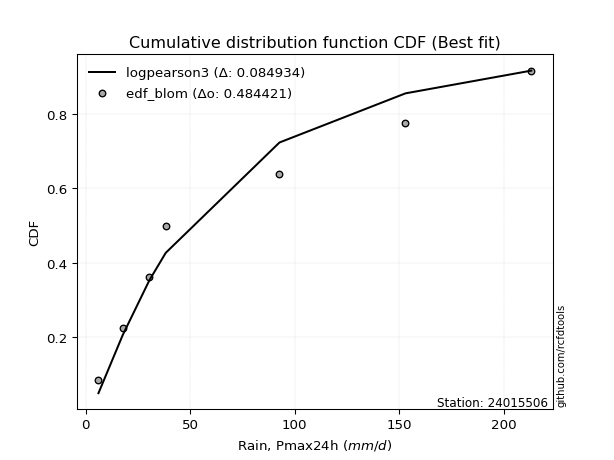</img></img>

</div>


### 7. EDF Tukey (1962)

In hydrology, the Tukey formula is used as a plotting position formula to estimate the empirical probability or frequency of a flood event (or other hydrological data). The formula parameter is given as _c=0.333_ (or 1/3).

<div align="center">


$P=(m-c)/(n+1-2c)$


</div>


**7.1. Empirical values**

<div align="center">

|                | 0                   | 1                   | 2                   | 3         | 4                  | 5                  | 6                  |
|:---------------|:--------------------|:--------------------|:--------------------|:----------|:-------------------|:-------------------|:-------------------|
| date           | 2015                | 2021                | 2017                | 2016      | 2020               | 2019               | 2018               |
| x              | 6.1                 | 17.7                | 30.5                | 38.3      | 92.7               | 153.0              | 213.2              |
| m              | 1                   | 2                   | 3                   | 4         | 5                  | 6                  | 7                  |
| empirical_dist | edf_tukey           | edf_tukey           | edf_tukey           | edf_tukey | edf_tukey          | edf_tukey          | edf_tukey          |
| empirical      | 0.09090909090909091 | 0.22727272727272727 | 0.36363636363636365 | 0.5       | 0.6363636363636364 | 0.7727272727272727 | 0.9090909090909091 |
| empirical_tr   | 1.1                 | 1.2941176470588236  | 1.5714285714285714  | 2.0       | 2.75               | 4.3999999999999995 | 10.999999999999996 |

</div>


**7.2. Kolmogorov-Smirnov fit test (sorted by Δ)**


<div align="center">

|                | 0                    | 1                   | 2                   | 3                   | 4                   | 5                   | 6                   | 7                   | 8                   | 9                   | 10                  | 11                  | 12                  | 13                  | 14                  | 15                  | 16                  | 17                  | 18                  | 19                  | 20                  | 21                  | 22                  | 23                  | 24                  | 25                  | 26                  | 27                  | 28                  | 29                  | 30                  | 31                  | 32                  | 33                  | 34                  | 35                  | 36                  | 37                  | 38                  | 39                  | 40                  | 41                  | 42                  | 43                  | 44                  | 45                  | 46                  | 47                  | 48                  | 49                  | 50                  | 51                  | 52                  | 53                  | 54                  | 55                  | 56                  | 57                  | 58                  | 59                  | 60                  | 61                  | 62                  | 63                  | 64                  | 65                  | 66                  | 67                  | 68                  | 69                  | 70                  | 71                  | 72                  | 73                  | 74                  | 75                  | 76                  | 77                  | 78                  | 79                  | 80                  | 81                  | 82                  | 83                  | 84                  | 85                  | 86                  | 87                  | 88                  | 89                  | 90                  | 91                  | 92                  | 93                  | 94                  | 95                  | 96                  | 97                  | 98                  | 99                  | 100                 | 101                 | 102                 | 103                 | 104                 | 105                 | 106                 | 107                 | 108                 | 109                 | 110                 | 111                 | 112                 | 113                 | 114                 | 115                 | 116                 | 117                 | 118                 | 119                 | 120                 | 121                 | 122                 | 123                 | 124                 | 125                 | 126                 | 127                 | 128                 | 129                 | 130                 | 131                 | 132                 | 133                 | 134                 | 135                 | 136                 | 137                 | 138                 | 139                 | 140                 | 141                 | 142                 | 143                 | 144                 | 145                 | 146                 | 147                 | 148                 | 149                 | 150                 | 151                 | 152                 | 153                 | 154                 | 155                 | 156                 | 157                 | 158                 | 159                 |
|:---------------|:---------------------|:--------------------|:--------------------|:--------------------|:--------------------|:--------------------|:--------------------|:--------------------|:--------------------|:--------------------|:--------------------|:--------------------|:--------------------|:--------------------|:--------------------|:--------------------|:--------------------|:--------------------|:--------------------|:--------------------|:--------------------|:--------------------|:--------------------|:--------------------|:--------------------|:--------------------|:--------------------|:--------------------|:--------------------|:--------------------|:--------------------|:--------------------|:--------------------|:--------------------|:--------------------|:--------------------|:--------------------|:--------------------|:--------------------|:--------------------|:--------------------|:--------------------|:--------------------|:--------------------|:--------------------|:--------------------|:--------------------|:--------------------|:--------------------|:--------------------|:--------------------|:--------------------|:--------------------|:--------------------|:--------------------|:--------------------|:--------------------|:--------------------|:--------------------|:--------------------|:--------------------|:--------------------|:--------------------|:--------------------|:--------------------|:--------------------|:--------------------|:--------------------|:--------------------|:--------------------|:--------------------|:--------------------|:--------------------|:--------------------|:--------------------|:--------------------|:--------------------|:--------------------|:--------------------|:--------------------|:--------------------|:--------------------|:--------------------|:--------------------|:--------------------|:--------------------|:--------------------|:--------------------|:--------------------|:--------------------|:--------------------|:--------------------|:--------------------|:--------------------|:--------------------|:--------------------|:--------------------|:--------------------|:--------------------|:--------------------|:--------------------|:--------------------|:--------------------|:--------------------|:--------------------|:--------------------|:--------------------|:--------------------|:--------------------|:--------------------|:--------------------|:--------------------|:--------------------|:--------------------|:--------------------|:--------------------|:--------------------|:--------------------|:--------------------|:--------------------|:--------------------|:--------------------|:--------------------|:--------------------|:--------------------|:--------------------|:--------------------|:--------------------|:--------------------|:--------------------|:--------------------|:--------------------|:--------------------|:--------------------|:--------------------|:--------------------|:--------------------|:--------------------|:--------------------|:--------------------|:--------------------|:--------------------|:--------------------|:--------------------|:--------------------|:--------------------|:--------------------|:--------------------|:--------------------|:--------------------|:--------------------|:--------------------|:--------------------|:--------------------|:--------------------|:--------------------|:--------------------|:--------------------|:--------------------|:--------------------|
| station        | 24015506             | 24015506            | 24015506            | 24015506            | 24015506            | 24015506            | 24015506            | 24015506            | 24015506            | 24015506            | 24015506            | 24015506            | 24015506            | 24015506            | 24015506            | 24015506            | 24015506            | 24015506            | 24015506            | 24015506            | 24015506            | 24015506            | 24015506            | 24015506            | 24015506            | 24015506            | 24015506            | 24015506            | 24015506            | 24015506            | 24015506            | 24015506            | 24015506            | 24015506            | 24015506            | 24015506            | 24015506            | 24015506            | 24015506            | 24015506            | 24015506            | 24015506            | 24015506            | 24015506            | 24015506            | 24015506            | 24015506            | 24015506            | 24015506            | 24015506            | 24015506            | 24015506            | 24015506            | 24015506            | 24015506            | 24015506            | 24015506            | 24015506            | 24015506            | 24015506            | 24015506            | 24015506            | 24015506            | 24015506            | 24015506            | 24015506            | 24015506            | 24015506            | 24015506            | 24015506            | 24015506            | 24015506            | 24015506            | 24015506            | 24015506            | 24015506            | 24015506            | 24015506            | 24015506            | 24015506            | 24015506            | 24015506            | 24015506            | 24015506            | 24015506            | 24015506            | 24015506            | 24015506            | 24015506            | 24015506            | 24015506            | 24015506            | 24015506            | 24015506            | 24015506            | 24015506            | 24015506            | 24015506            | 24015506            | 24015506            | 24015506            | 24015506            | 24015506            | 24015506            | 24015506            | 24015506            | 24015506            | 24015506            | 24015506            | 24015506            | 24015506            | 24015506            | 24015506            | 24015506            | 24015506            | 24015506            | 24015506            | 24015506            | 24015506            | 24015506            | 24015506            | 24015506            | 24015506            | 24015506            | 24015506            | 24015506            | 24015506            | 24015506            | 24015506            | 24015506            | 24015506            | 24015506            | 24015506            | 24015506            | 24015506            | 24015506            | 24015506            | 24015506            | 24015506            | 24015506            | 24015506            | 24015506            | 24015506            | 24015506            | 24015506            | 24015506            | 24015506            | 24015506            | 24015506            | 24015506            | 24015506            | 24015506            | 24015506            | 24015506            | 24015506            | 24015506            | 24015506            | 24015506            | 24015506            | 24015506            |
| empirical_dist | edf_tukey            | edf_tukey           | edf_tukey           | edf_tukey           | edf_tukey           | edf_tukey           | edf_tukey           | edf_tukey           | edf_tukey           | edf_tukey           | edf_tukey           | edf_tukey           | edf_tukey           | edf_tukey           | edf_tukey           | edf_tukey           | edf_tukey           | edf_tukey           | edf_tukey           | edf_tukey           | edf_tukey           | edf_tukey           | edf_tukey           | edf_tukey           | edf_tukey           | edf_tukey           | edf_tukey           | edf_tukey           | edf_tukey           | edf_tukey           | edf_tukey           | edf_tukey           | edf_tukey           | edf_tukey           | edf_tukey           | edf_tukey           | edf_tukey           | edf_tukey           | edf_tukey           | edf_tukey           | edf_tukey           | edf_tukey           | edf_tukey           | edf_tukey           | edf_tukey           | edf_tukey           | edf_tukey           | edf_tukey           | edf_tukey           | edf_tukey           | edf_tukey           | edf_tukey           | edf_tukey           | edf_tukey           | edf_tukey           | edf_tukey           | edf_tukey           | edf_tukey           | edf_tukey           | edf_tukey           | edf_tukey           | edf_tukey           | edf_tukey           | edf_tukey           | edf_tukey           | edf_tukey           | edf_tukey           | edf_tukey           | edf_tukey           | edf_tukey           | edf_tukey           | edf_tukey           | edf_tukey           | edf_tukey           | edf_tukey           | edf_tukey           | edf_tukey           | edf_tukey           | edf_tukey           | edf_tukey           | edf_tukey           | edf_tukey           | edf_tukey           | edf_tukey           | edf_tukey           | edf_tukey           | edf_tukey           | edf_tukey           | edf_tukey           | edf_tukey           | edf_tukey           | edf_tukey           | edf_tukey           | edf_tukey           | edf_tukey           | edf_tukey           | edf_tukey           | edf_tukey           | edf_tukey           | edf_tukey           | edf_tukey           | edf_tukey           | edf_tukey           | edf_tukey           | edf_tukey           | edf_tukey           | edf_tukey           | edf_tukey           | edf_tukey           | edf_tukey           | edf_tukey           | edf_tukey           | edf_tukey           | edf_tukey           | edf_tukey           | edf_tukey           | edf_tukey           | edf_tukey           | edf_tukey           | edf_tukey           | edf_tukey           | edf_tukey           | edf_tukey           | edf_tukey           | edf_tukey           | edf_tukey           | edf_tukey           | edf_tukey           | edf_tukey           | edf_tukey           | edf_tukey           | edf_tukey           | edf_tukey           | edf_tukey           | edf_tukey           | edf_tukey           | edf_tukey           | edf_tukey           | edf_tukey           | edf_tukey           | edf_tukey           | edf_tukey           | edf_tukey           | edf_tukey           | edf_tukey           | edf_tukey           | edf_tukey           | edf_tukey           | edf_tukey           | edf_tukey           | edf_tukey           | edf_tukey           | edf_tukey           | edf_tukey           | edf_tukey           | edf_tukey           | edf_tukey           | edf_tukey           | edf_tukey           | edf_tukey           |
| p_dist         | logsemicircular      | loganglit           | logdgamma           | logdweibull         | logpearson3         | logweibull_min      | logksone            | logburr12           | loggompertz         | kappa3              | halfgennorm         | logarcsine          | loggausshyper       | loginvweibull       | logf                | logbetaprime        | logfatiguelife      | lognct              | logexponnorm        | lognorm             | logcrystalball      | logt                | alpha               | logfoldnorm         | johnsonsu           | logrice             | logtrapezoid        | logerlang           | logncf              | loggamma            | loggamma            | loginvgamma         | loggenlogistic      | logloggamma         | loginvgauss         | logalpha            | logkstwobign        | logcosine           | logmaxwell          | dgamma              | invgamma            | lograyleigh         | loggenexpon         | invgauss            | logargus            | logwrapcauchy       | nct                 | logkappa4           | loglogistic         | nakagami            | logtriang           | logjohnsonsu        | truncweibull_min    | loghalfnorm         | logskewnorm         | loggumbel_l         | betaprime           | logtukeylambda      | dweibull            | loghypsecant        | logvonmises_line    | logkappa3           | loguniform          | burr                | loggenhalflogistic  | loggenpareto        | ncf                 | logloglaplace       | f                   | loggumbel_r         | exponnorm           | genexpon            | lomax               | halfnorm            | genpareto           | exponweib           | gengamma            | loghalflogistic     | logburr             | halflogistic        | foldnorm            | erlang              | logweibull_max      | truncnorm           | exponpow            | logmoyal            | loglaplace          | loglaplace          | arcsine             | loglomax            | gompertz            | logtruncnorm        | logmielke           | rayleigh            | semicircular        | moyal               | burr12              | logtruncweibull_min | pearson3            | gumbel_r            | logbradford         | maxwell             | logbeta             | anglit              | genlogistic         | weibull_min         | logtruncexpon       | wrapcauchy          | logwald             | wald                | mielke              | kstwobign           | loglevy_l           | gausshyper          | crystalball         | norm                | t                   | gennorm             | loggenextreme       | logistic            | loghalfgennorm      | rice                | gamma               | cosine              | logjohnsonsb        | hypsecant           | skewnorm            | truncexpon          | gumbel_l            | bradford            | loggennorm          | laplace             | argus               | ksone               | beta                | loggengamma         | kappa4              | genextreme          | levy_l              | logexponweib        | uniform             | vonmises_line       | logrdist            | genhalflogistic     | lognakagami         | powerlaw            | triang              | fatiguelife         | trapezoid           | invweibull          | rdist               | tukeylambda         | logexponpow         | truncpareto         | logpowerlaw         | johnsonsb           | weibull_max         | logtruncpareto      | logvonmises         | vonmises            |
| delta          | 0.060073739898646755 | 0.06880920104081178 | 0.07306649503752369 | 0.07306857900705949 | 0.08650139954006242 | 0.0872464493325964  | 0.08731816456456014 | 0.0877601196433474  | 0.09090909062378397 | 0.09090909086812769 | 0.09090909090832999 | 0.09090909090909091 | 0.09090909091149812 | 0.09293193999737748 | 0.09395948057408743 | 0.09417806099621495 | 0.09522923297266173 | 0.09527327225927984 | 0.09550527771281003 | 0.09550614277318836 | 0.09550614309525651 | 0.09550686121783136 | 0.09728737619130579 | 0.09826696572113114 | 0.09831417214386817 | 0.0986111811677326  | 0.09877196448874787 | 0.09929559943125588 | 0.09988664248758972 | 0.10065964099533187 | 0.10065964099533187 | 0.10289796885100155 | 0.10308490233014206 | 0.10392853981673278 | 0.10506447686382603 | 0.10573418090356268 | 0.10709472556874855 | 0.10741240077135206 | 0.10744220508118174 | 0.10777690600821857 | 0.10893634327573343 | 0.11087601911499012 | 0.11111033318647734 | 0.11130389163207643 | 0.11192605118152954 | 0.11219508780971274 | 0.11223450231823573 | 0.11585303801484381 | 0.1179578083200521  | 0.1184443840631407  | 0.11845234317140346 | 0.11945337820855284 | 0.12087303568417085 | 0.12192225383151412 | 0.12379364821454947 | 0.12590357448818718 | 0.12607502906538293 | 0.13064109311704963 | 0.13064812859313113 | 0.1332769383380169  | 0.1338395344705161  | 0.1338401218474614  | 0.1339136408655417  | 0.13495909303857798 | 0.13561720649561448 | 0.13575135746509967 | 0.13593577116016586 | 0.13665949242637454 | 0.13914360060321462 | 0.13933274099830106 | 0.1416269644459165  | 0.14228660876761368 | 0.14232131418661453 | 0.1447423771926022  | 0.14586433718902886 | 0.1459794230779843  | 0.14712681641881387 | 0.14732088569536128 | 0.14861567348244586 | 0.14916745669550574 | 0.14947573360678346 | 0.15054572960881918 | 0.15174171735740444 | 0.15274128480165983 | 0.1532713256838032  | 0.1534405426044163  | 0.15513440467506046 | 0.15513440467506046 | 0.15810084736966096 | 0.15812529798234254 | 0.16070689823384376 | 0.1609627548721565  | 0.17058289922919045 | 0.1746064700834386  | 0.1755070344538302  | 0.17562826421786681 | 0.1801691271172844  | 0.18054832246530006 | 0.18210714016306928 | 0.18322384026571625 | 0.1840480766313607  | 0.1852320195097415  | 0.18605391476879024 | 0.18638074043719322 | 0.1864278557731343  | 0.18738683594290206 | 0.1913382105749648  | 0.19560042129388355 | 0.1963860694182421  | 0.19766590825091757 | 0.20376716501604475 | 0.2045668176779864  | 0.20575162195392407 | 0.208914592399292   | 0.21182585607404897 | 0.21182586818891858 | 0.21183012045683236 | 0.21778487419093095 | 0.2189989383543517  | 0.233688545593647   | 0.23861641755924082 | 0.238940952954943   | 0.24228008485270858 | 0.24542857064160906 | 0.24726931737377308 | 0.24915985333836527 | 0.25373659896834533 | 0.25709080388461236 | 0.26016188280267954 | 0.2714253654509039  | 0.2727272727272727  | 0.273113647857577   | 0.2870841242056169  | 0.28709962980846615 | 0.2931590574710914  | 0.302471769203701   | 0.3114087256761511  | 0.31156351854577313 | 0.3164065950973619  | 0.3231706287384689  | 0.34451955577015936 | 0.3451283303227415  | 0.3636363618440618  | 0.3726913890625226  | 0.3759561775548015  | 0.4300688487866532  | 0.443437177000423   | 0.4457689664860516  | 0.45341319306172145 | 0.4627954288999584  | 0.47429952628373173 | 0.5000103481172101  | 0.5412533404375174  | 0.5667496715142487  | 0.5840411005498671  | 0.5943783843152747  | 0.6415821767441616  | 0.6829571331730981  | 1.0649175290231025  | 33.63721368905023   |
| deltao         | 0.48442053926100004  | 0.48442053926100004 | 0.48442053926100004 | 0.48442053926100004 | 0.48442053926100004 | 0.48442053926100004 | 0.48442053926100004 | 0.48442053926100004 | 0.48442053926100004 | 0.48442053926100004 | 0.48442053926100004 | 0.48442053926100004 | 0.48442053926100004 | 0.48442053926100004 | 0.48442053926100004 | 0.48442053926100004 | 0.48442053926100004 | 0.48442053926100004 | 0.48442053926100004 | 0.48442053926100004 | 0.48442053926100004 | 0.48442053926100004 | 0.48442053926100004 | 0.48442053926100004 | 0.48442053926100004 | 0.48442053926100004 | 0.48442053926100004 | 0.48442053926100004 | 0.48442053926100004 | 0.48442053926100004 | 0.48442053926100004 | 0.48442053926100004 | 0.48442053926100004 | 0.48442053926100004 | 0.48442053926100004 | 0.48442053926100004 | 0.48442053926100004 | 0.48442053926100004 | 0.48442053926100004 | 0.48442053926100004 | 0.48442053926100004 | 0.48442053926100004 | 0.48442053926100004 | 0.48442053926100004 | 0.48442053926100004 | 0.48442053926100004 | 0.48442053926100004 | 0.48442053926100004 | 0.48442053926100004 | 0.48442053926100004 | 0.48442053926100004 | 0.48442053926100004 | 0.48442053926100004 | 0.48442053926100004 | 0.48442053926100004 | 0.48442053926100004 | 0.48442053926100004 | 0.48442053926100004 | 0.48442053926100004 | 0.48442053926100004 | 0.48442053926100004 | 0.48442053926100004 | 0.48442053926100004 | 0.48442053926100004 | 0.48442053926100004 | 0.48442053926100004 | 0.48442053926100004 | 0.48442053926100004 | 0.48442053926100004 | 0.48442053926100004 | 0.48442053926100004 | 0.48442053926100004 | 0.48442053926100004 | 0.48442053926100004 | 0.48442053926100004 | 0.48442053926100004 | 0.48442053926100004 | 0.48442053926100004 | 0.48442053926100004 | 0.48442053926100004 | 0.48442053926100004 | 0.48442053926100004 | 0.48442053926100004 | 0.48442053926100004 | 0.48442053926100004 | 0.48442053926100004 | 0.48442053926100004 | 0.48442053926100004 | 0.48442053926100004 | 0.48442053926100004 | 0.48442053926100004 | 0.48442053926100004 | 0.48442053926100004 | 0.48442053926100004 | 0.48442053926100004 | 0.48442053926100004 | 0.48442053926100004 | 0.48442053926100004 | 0.48442053926100004 | 0.48442053926100004 | 0.48442053926100004 | 0.48442053926100004 | 0.48442053926100004 | 0.48442053926100004 | 0.48442053926100004 | 0.48442053926100004 | 0.48442053926100004 | 0.48442053926100004 | 0.48442053926100004 | 0.48442053926100004 | 0.48442053926100004 | 0.48442053926100004 | 0.48442053926100004 | 0.48442053926100004 | 0.48442053926100004 | 0.48442053926100004 | 0.48442053926100004 | 0.48442053926100004 | 0.48442053926100004 | 0.48442053926100004 | 0.48442053926100004 | 0.48442053926100004 | 0.48442053926100004 | 0.48442053926100004 | 0.48442053926100004 | 0.48442053926100004 | 0.48442053926100004 | 0.48442053926100004 | 0.48442053926100004 | 0.48442053926100004 | 0.48442053926100004 | 0.48442053926100004 | 0.48442053926100004 | 0.48442053926100004 | 0.48442053926100004 | 0.48442053926100004 | 0.48442053926100004 | 0.48442053926100004 | 0.48442053926100004 | 0.48442053926100004 | 0.48442053926100004 | 0.48442053926100004 | 0.48442053926100004 | 0.48442053926100004 | 0.48442053926100004 | 0.48442053926100004 | 0.48442053926100004 | 0.48442053926100004 | 0.48442053926100004 | 0.48442053926100004 | 0.48442053926100004 | 0.48442053926100004 | 0.48442053926100004 | 0.48442053926100004 | 0.48442053926100004 | 0.48442053926100004 | 0.48442053926100004 | 0.48442053926100004 | 0.48442053926100004 | 0.48442053926100004 |
| eval           | Δo > Δ               | Δo > Δ              | Δo > Δ              | Δo > Δ              | Δo > Δ              | Δo > Δ              | Δo > Δ              | Δo > Δ              | Δo > Δ              | Δo > Δ              | Δo > Δ              | Δo > Δ              | Δo > Δ              | Δo > Δ              | Δo > Δ              | Δo > Δ              | Δo > Δ              | Δo > Δ              | Δo > Δ              | Δo > Δ              | Δo > Δ              | Δo > Δ              | Δo > Δ              | Δo > Δ              | Δo > Δ              | Δo > Δ              | Δo > Δ              | Δo > Δ              | Δo > Δ              | Δo > Δ              | Δo > Δ              | Δo > Δ              | Δo > Δ              | Δo > Δ              | Δo > Δ              | Δo > Δ              | Δo > Δ              | Δo > Δ              | Δo > Δ              | Δo > Δ              | Δo > Δ              | Δo > Δ              | Δo > Δ              | Δo > Δ              | Δo > Δ              | Δo > Δ              | Δo > Δ              | Δo > Δ              | Δo > Δ              | Δo > Δ              | Δo > Δ              | Δo > Δ              | Δo > Δ              | Δo > Δ              | Δo > Δ              | Δo > Δ              | Δo > Δ              | Δo > Δ              | Δo > Δ              | Δo > Δ              | Δo > Δ              | Δo > Δ              | Δo > Δ              | Δo > Δ              | Δo > Δ              | Δo > Δ              | Δo > Δ              | Δo > Δ              | Δo > Δ              | Δo > Δ              | Δo > Δ              | Δo > Δ              | Δo > Δ              | Δo > Δ              | Δo > Δ              | Δo > Δ              | Δo > Δ              | Δo > Δ              | Δo > Δ              | Δo > Δ              | Δo > Δ              | Δo > Δ              | Δo > Δ              | Δo > Δ              | Δo > Δ              | Δo > Δ              | Δo > Δ              | Δo > Δ              | Δo > Δ              | Δo > Δ              | Δo > Δ              | Δo > Δ              | Δo > Δ              | Δo > Δ              | Δo > Δ              | Δo > Δ              | Δo > Δ              | Δo > Δ              | Δo > Δ              | Δo > Δ              | Δo > Δ              | Δo > Δ              | Δo > Δ              | Δo > Δ              | Δo > Δ              | Δo > Δ              | Δo > Δ              | Δo > Δ              | Δo > Δ              | Δo > Δ              | Δo > Δ              | Δo > Δ              | Δo > Δ              | Δo > Δ              | Δo > Δ              | Δo > Δ              | Δo > Δ              | Δo > Δ              | Δo > Δ              | Δo > Δ              | Δo > Δ              | Δo > Δ              | Δo > Δ              | Δo > Δ              | Δo > Δ              | Δo > Δ              | Δo > Δ              | Δo > Δ              | Δo > Δ              | Δo > Δ              | Δo > Δ              | Δo > Δ              | Δo > Δ              | Δo > Δ              | Δo > Δ              | Δo > Δ              | Δo > Δ              | Δo > Δ              | Δo > Δ              | Δo > Δ              | Δo > Δ              | Δo > Δ              | Δo > Δ              | Δo > Δ              | Δo > Δ              | Δo > Δ              | Δo > Δ              | Δo > Δ              | Δo > Δ              | Δo > Δ              | Δo > Δ              | Δo <= Δ             | Δo <= Δ             | Δo <= Δ             | Δo <= Δ             | Δo <= Δ             | Δo <= Δ             | Δo <= Δ             | Δo <= Δ             | Δo <= Δ             |
| fit            | 1                    | 1                   | 1                   | 1                   | 1                   | 1                   | 1                   | 1                   | 1                   | 1                   | 1                   | 1                   | 1                   | 1                   | 1                   | 1                   | 1                   | 1                   | 1                   | 1                   | 1                   | 1                   | 1                   | 1                   | 1                   | 1                   | 1                   | 1                   | 1                   | 1                   | 1                   | 1                   | 1                   | 1                   | 1                   | 1                   | 1                   | 1                   | 1                   | 1                   | 1                   | 1                   | 1                   | 1                   | 1                   | 1                   | 1                   | 1                   | 1                   | 1                   | 1                   | 1                   | 1                   | 1                   | 1                   | 1                   | 1                   | 1                   | 1                   | 1                   | 1                   | 1                   | 1                   | 1                   | 1                   | 1                   | 1                   | 1                   | 1                   | 1                   | 1                   | 1                   | 1                   | 1                   | 1                   | 1                   | 1                   | 1                   | 1                   | 1                   | 1                   | 1                   | 1                   | 1                   | 1                   | 1                   | 1                   | 1                   | 1                   | 1                   | 1                   | 1                   | 1                   | 1                   | 1                   | 1                   | 1                   | 1                   | 1                   | 1                   | 1                   | 1                   | 1                   | 1                   | 1                   | 1                   | 1                   | 1                   | 1                   | 1                   | 1                   | 1                   | 1                   | 1                   | 1                   | 1                   | 1                   | 1                   | 1                   | 1                   | 1                   | 1                   | 1                   | 1                   | 1                   | 1                   | 1                   | 1                   | 1                   | 1                   | 1                   | 1                   | 1                   | 1                   | 1                   | 1                   | 1                   | 1                   | 1                   | 1                   | 1                   | 1                   | 1                   | 1                   | 1                   | 1                   | 1                   | 1                   | 1                   | 1                   | 1                   | 0                   | 0                   | 0                   | 0                   | 0                   | 0                   | 0                   | 0                   | 0                   |
| n              | 7                    | 7                   | 7                   | 7                   | 7                   | 7                   | 7                   | 7                   | 7                   | 7                   | 7                   | 7                   | 7                   | 7                   | 7                   | 7                   | 7                   | 7                   | 7                   | 7                   | 7                   | 7                   | 7                   | 7                   | 7                   | 7                   | 7                   | 7                   | 7                   | 7                   | 7                   | 7                   | 7                   | 7                   | 7                   | 7                   | 7                   | 7                   | 7                   | 7                   | 7                   | 7                   | 7                   | 7                   | 7                   | 7                   | 7                   | 7                   | 7                   | 7                   | 7                   | 7                   | 7                   | 7                   | 7                   | 7                   | 7                   | 7                   | 7                   | 7                   | 7                   | 7                   | 7                   | 7                   | 7                   | 7                   | 7                   | 7                   | 7                   | 7                   | 7                   | 7                   | 7                   | 7                   | 7                   | 7                   | 7                   | 7                   | 7                   | 7                   | 7                   | 7                   | 7                   | 7                   | 7                   | 7                   | 7                   | 7                   | 7                   | 7                   | 7                   | 7                   | 7                   | 7                   | 7                   | 7                   | 7                   | 7                   | 7                   | 7                   | 7                   | 7                   | 7                   | 7                   | 7                   | 7                   | 7                   | 7                   | 7                   | 7                   | 7                   | 7                   | 7                   | 7                   | 7                   | 7                   | 7                   | 7                   | 7                   | 7                   | 7                   | 7                   | 7                   | 7                   | 7                   | 7                   | 7                   | 7                   | 7                   | 7                   | 7                   | 7                   | 7                   | 7                   | 7                   | 7                   | 7                   | 7                   | 7                   | 7                   | 7                   | 7                   | 7                   | 7                   | 7                   | 7                   | 7                   | 7                   | 7                   | 7                   | 7                   | 7                   | 7                   | 7                   | 7                   | 7                   | 7                   | 7                   | 7                   | 7                   |
| best_fit       | 1                    | 0                   | 0                   | 0                   | 0                   | 0                   | 0                   | 0                   | 0                   | 0                   | 0                   | 0                   | 0                   | 0                   | 0                   | 0                   | 0                   | 0                   | 0                   | 0                   | 0                   | 0                   | 0                   | 0                   | 0                   | 0                   | 0                   | 0                   | 0                   | 0                   | 0                   | 0                   | 0                   | 0                   | 0                   | 0                   | 0                   | 0                   | 0                   | 0                   | 0                   | 0                   | 0                   | 0                   | 0                   | 0                   | 0                   | 0                   | 0                   | 0                   | 0                   | 0                   | 0                   | 0                   | 0                   | 0                   | 0                   | 0                   | 0                   | 0                   | 0                   | 0                   | 0                   | 0                   | 0                   | 0                   | 0                   | 0                   | 0                   | 0                   | 0                   | 0                   | 0                   | 0                   | 0                   | 0                   | 0                   | 0                   | 0                   | 0                   | 0                   | 0                   | 0                   | 0                   | 0                   | 0                   | 0                   | 0                   | 0                   | 0                   | 0                   | 0                   | 0                   | 0                   | 0                   | 0                   | 0                   | 0                   | 0                   | 0                   | 0                   | 0                   | 0                   | 0                   | 0                   | 0                   | 0                   | 0                   | 0                   | 0                   | 0                   | 0                   | 0                   | 0                   | 0                   | 0                   | 0                   | 0                   | 0                   | 0                   | 0                   | 0                   | 0                   | 0                   | 0                   | 0                   | 0                   | 0                   | 0                   | 0                   | 0                   | 0                   | 0                   | 0                   | 0                   | 0                   | 0                   | 0                   | 0                   | 0                   | 0                   | 0                   | 0                   | 0                   | 0                   | 0                   | 0                   | 0                   | 0                   | 0                   | 0                   | 0                   | 0                   | 0                   | 0                   | 0                   | 0                   | 0                   | 0                   | 0                   |
| best_fit_sort  | 1                    | 2                   | 3                   | 4                   | 5                   | 6                   | 7                   | 8                   | 9                   | 10                  | 11                  | 12                  | 13                  | 14                  | 15                  | 16                  | 17                  | 18                  | 19                  | 20                  | 21                  | 22                  | 23                  | 24                  | 25                  | 26                  | 27                  | 28                  | 29                  | 30                  | 31                  | 32                  | 33                  | 34                  | 35                  | 36                  | 37                  | 38                  | 39                  | 40                  | 41                  | 42                  | 43                  | 44                  | 45                  | 46                  | 47                  | 48                  | 49                  | 50                  | 51                  | 52                  | 53                  | 54                  | 55                  | 56                  | 57                  | 58                  | 59                  | 60                  | 61                  | 62                  | 63                  | 64                  | 65                  | 66                  | 67                  | 68                  | 69                  | 70                  | 71                  | 72                  | 73                  | 74                  | 75                  | 76                  | 77                  | 78                  | 79                  | 80                  | 81                  | 82                  | 83                  | 84                  | 85                  | 86                  | 87                  | 88                  | 89                  | 90                  | 91                  | 92                  | 93                  | 94                  | 95                  | 96                  | 97                  | 98                  | 99                  | 100                 | 101                 | 102                 | 103                 | 104                 | 105                 | 106                 | 107                 | 108                 | 109                 | 110                 | 111                 | 112                 | 113                 | 114                 | 115                 | 116                 | 117                 | 118                 | 119                 | 120                 | 121                 | 122                 | 123                 | 124                 | 125                 | 126                 | 127                 | 128                 | 129                 | 130                 | 131                 | 132                 | 133                 | 134                 | 135                 | 136                 | 137                 | 138                 | 139                 | 140                 | 141                 | 142                 | 143                 | 144                 | 145                 | 146                 | 147                 | 148                 | 149                 | 150                 | 151                 | 152                 | 153                 | 154                 | 155                 | 156                 | 157                 | 158                 | 159                 | 160                 |

</div>


**7.3. Best fit**

<div align="center">

|   id |   station | empirical_dist   | p_dist          |     delta |   deltao | eval   |   fit |   n |   best_fit |   best_fit_sort |
|-----:|----------:|:-----------------|:----------------|----------:|---------:|:-------|------:|----:|-----------:|----------------:|
|    0 |  24015506 | edf_tukey        | logsemicircular | 0.0600737 | 0.484421 | Δo > Δ |     1 |   7 |          1 |               1 |

</div>


<div align="center">

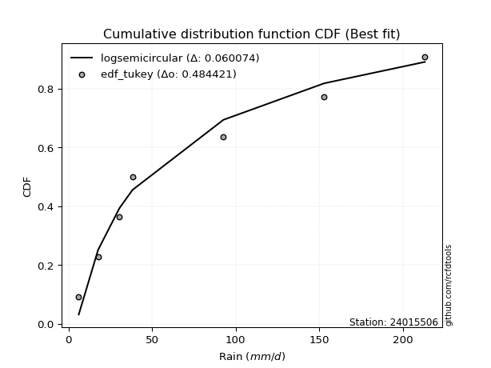</img>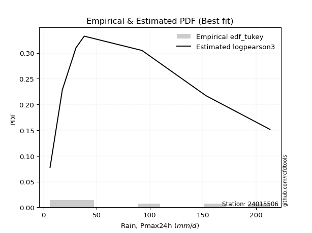</img>

</div>


### 8. EDF Gringorten (1963)

Gringorten plotting position formula is essential for estimating the probability and return periods of extreme events like floods and heavy rainfall. The constant _a=0.44_.

<div align="center">


$P=(m-a)/(n+1-2a)$


</div>


**8.1. Empirical values**

<div align="center">

|                | 0                   | 1                   | 2                  | 3              | 4                  | 5                  | 6                  |
|:---------------|:--------------------|:--------------------|:-------------------|:---------------|:-------------------|:-------------------|:-------------------|
| date           | 2015                | 2021                | 2017               | 2016           | 2020               | 2019               | 2018               |
| x              | 6.1                 | 17.7                | 30.5               | 38.3           | 92.7               | 153.0              | 213.2              |
| m              | 1                   | 2                   | 3                  | 4              | 5                  | 6                  | 7                  |
| empirical_dist | edf_gringorten      | edf_gringorten      | edf_gringorten     | edf_gringorten | edf_gringorten     | edf_gringorten     | edf_gringorten     |
| empirical      | 0.07865168539325844 | 0.21910112359550563 | 0.3595505617977528 | 0.5            | 0.6404494382022471 | 0.7808988764044943 | 0.9213483146067415 |
| empirical_tr   | 1.0853658536585364  | 1.2805755395683454  | 1.5614035087719298 | 2.0            | 2.781249999999999  | 4.564102564102562  | 12.714285714285701 |

</div>


**8.2. Kolmogorov-Smirnov fit test (sorted by Δ)**


<div align="center">

|                | 0                   | 1                    | 2                   | 3                   | 4                   | 5                   | 6                   | 7                   | 8                   | 9                   | 10                  | 11                  | 12                  | 13                  | 14                  | 15                  | 16                  | 17                  | 18                  | 19                  | 20                  | 21                  | 22                  | 23                  | 24                  | 25                  | 26                  | 27                  | 28                  | 29                  | 30                  | 31                  | 32                  | 33                  | 34                  | 35                  | 36                  | 37                  | 38                  | 39                  | 40                  | 41                  | 42                  | 43                  | 44                  | 45                  | 46                  | 47                  | 48                  | 49                  | 50                  | 51                  | 52                  | 53                  | 54                  | 55                  | 56                  | 57                  | 58                  | 59                  | 60                  | 61                  | 62                  | 63                  | 64                  | 65                  | 66                  | 67                  | 68                  | 69                  | 70                  | 71                  | 72                  | 73                  | 74                  | 75                  | 76                  | 77                  | 78                  | 79                  | 80                  | 81                  | 82                  | 83                  | 84                  | 85                  | 86                  | 87                  | 88                  | 89                  | 90                  | 91                  | 92                  | 93                  | 94                  | 95                  | 96                  | 97                  | 98                  | 99                  | 100                 | 101                 | 102                 | 103                 | 104                 | 105                 | 106                 | 107                 | 108                 | 109                 | 110                 | 111                 | 112                 | 113                 | 114                 | 115                 | 116                 | 117                 | 118                 | 119                 | 120                 | 121                 | 122                 | 123                 | 124                 | 125                 | 126                 | 127                 | 128                 | 129                 | 130                 | 131                 | 132                 | 133                 | 134                 | 135                 | 136                 | 137                 | 138                 | 139                 | 140                 | 141                 | 142                 | 143                 | 144                 | 145                 | 146                 | 147                 | 148                 | 149                 | 150                 | 151                 | 152                 | 153                 | 154                 | 155                 | 156                 | 157                 | 158                 | 159                 |
|:---------------|:--------------------|:---------------------|:--------------------|:--------------------|:--------------------|:--------------------|:--------------------|:--------------------|:--------------------|:--------------------|:--------------------|:--------------------|:--------------------|:--------------------|:--------------------|:--------------------|:--------------------|:--------------------|:--------------------|:--------------------|:--------------------|:--------------------|:--------------------|:--------------------|:--------------------|:--------------------|:--------------------|:--------------------|:--------------------|:--------------------|:--------------------|:--------------------|:--------------------|:--------------------|:--------------------|:--------------------|:--------------------|:--------------------|:--------------------|:--------------------|:--------------------|:--------------------|:--------------------|:--------------------|:--------------------|:--------------------|:--------------------|:--------------------|:--------------------|:--------------------|:--------------------|:--------------------|:--------------------|:--------------------|:--------------------|:--------------------|:--------------------|:--------------------|:--------------------|:--------------------|:--------------------|:--------------------|:--------------------|:--------------------|:--------------------|:--------------------|:--------------------|:--------------------|:--------------------|:--------------------|:--------------------|:--------------------|:--------------------|:--------------------|:--------------------|:--------------------|:--------------------|:--------------------|:--------------------|:--------------------|:--------------------|:--------------------|:--------------------|:--------------------|:--------------------|:--------------------|:--------------------|:--------------------|:--------------------|:--------------------|:--------------------|:--------------------|:--------------------|:--------------------|:--------------------|:--------------------|:--------------------|:--------------------|:--------------------|:--------------------|:--------------------|:--------------------|:--------------------|:--------------------|:--------------------|:--------------------|:--------------------|:--------------------|:--------------------|:--------------------|:--------------------|:--------------------|:--------------------|:--------------------|:--------------------|:--------------------|:--------------------|:--------------------|:--------------------|:--------------------|:--------------------|:--------------------|:--------------------|:--------------------|:--------------------|:--------------------|:--------------------|:--------------------|:--------------------|:--------------------|:--------------------|:--------------------|:--------------------|:--------------------|:--------------------|:--------------------|:--------------------|:--------------------|:--------------------|:--------------------|:--------------------|:--------------------|:--------------------|:--------------------|:--------------------|:--------------------|:--------------------|:--------------------|:--------------------|:--------------------|:--------------------|:--------------------|:--------------------|:--------------------|:--------------------|:--------------------|:--------------------|:--------------------|:--------------------|:--------------------|
| station        | 24015506            | 24015506             | 24015506            | 24015506            | 24015506            | 24015506            | 24015506            | 24015506            | 24015506            | 24015506            | 24015506            | 24015506            | 24015506            | 24015506            | 24015506            | 24015506            | 24015506            | 24015506            | 24015506            | 24015506            | 24015506            | 24015506            | 24015506            | 24015506            | 24015506            | 24015506            | 24015506            | 24015506            | 24015506            | 24015506            | 24015506            | 24015506            | 24015506            | 24015506            | 24015506            | 24015506            | 24015506            | 24015506            | 24015506            | 24015506            | 24015506            | 24015506            | 24015506            | 24015506            | 24015506            | 24015506            | 24015506            | 24015506            | 24015506            | 24015506            | 24015506            | 24015506            | 24015506            | 24015506            | 24015506            | 24015506            | 24015506            | 24015506            | 24015506            | 24015506            | 24015506            | 24015506            | 24015506            | 24015506            | 24015506            | 24015506            | 24015506            | 24015506            | 24015506            | 24015506            | 24015506            | 24015506            | 24015506            | 24015506            | 24015506            | 24015506            | 24015506            | 24015506            | 24015506            | 24015506            | 24015506            | 24015506            | 24015506            | 24015506            | 24015506            | 24015506            | 24015506            | 24015506            | 24015506            | 24015506            | 24015506            | 24015506            | 24015506            | 24015506            | 24015506            | 24015506            | 24015506            | 24015506            | 24015506            | 24015506            | 24015506            | 24015506            | 24015506            | 24015506            | 24015506            | 24015506            | 24015506            | 24015506            | 24015506            | 24015506            | 24015506            | 24015506            | 24015506            | 24015506            | 24015506            | 24015506            | 24015506            | 24015506            | 24015506            | 24015506            | 24015506            | 24015506            | 24015506            | 24015506            | 24015506            | 24015506            | 24015506            | 24015506            | 24015506            | 24015506            | 24015506            | 24015506            | 24015506            | 24015506            | 24015506            | 24015506            | 24015506            | 24015506            | 24015506            | 24015506            | 24015506            | 24015506            | 24015506            | 24015506            | 24015506            | 24015506            | 24015506            | 24015506            | 24015506            | 24015506            | 24015506            | 24015506            | 24015506            | 24015506            | 24015506            | 24015506            | 24015506            | 24015506            | 24015506            | 24015506            |
| empirical_dist | edf_gringorten      | edf_gringorten       | edf_gringorten      | edf_gringorten      | edf_gringorten      | edf_gringorten      | edf_gringorten      | edf_gringorten      | edf_gringorten      | edf_gringorten      | edf_gringorten      | edf_gringorten      | edf_gringorten      | edf_gringorten      | edf_gringorten      | edf_gringorten      | edf_gringorten      | edf_gringorten      | edf_gringorten      | edf_gringorten      | edf_gringorten      | edf_gringorten      | edf_gringorten      | edf_gringorten      | edf_gringorten      | edf_gringorten      | edf_gringorten      | edf_gringorten      | edf_gringorten      | edf_gringorten      | edf_gringorten      | edf_gringorten      | edf_gringorten      | edf_gringorten      | edf_gringorten      | edf_gringorten      | edf_gringorten      | edf_gringorten      | edf_gringorten      | edf_gringorten      | edf_gringorten      | edf_gringorten      | edf_gringorten      | edf_gringorten      | edf_gringorten      | edf_gringorten      | edf_gringorten      | edf_gringorten      | edf_gringorten      | edf_gringorten      | edf_gringorten      | edf_gringorten      | edf_gringorten      | edf_gringorten      | edf_gringorten      | edf_gringorten      | edf_gringorten      | edf_gringorten      | edf_gringorten      | edf_gringorten      | edf_gringorten      | edf_gringorten      | edf_gringorten      | edf_gringorten      | edf_gringorten      | edf_gringorten      | edf_gringorten      | edf_gringorten      | edf_gringorten      | edf_gringorten      | edf_gringorten      | edf_gringorten      | edf_gringorten      | edf_gringorten      | edf_gringorten      | edf_gringorten      | edf_gringorten      | edf_gringorten      | edf_gringorten      | edf_gringorten      | edf_gringorten      | edf_gringorten      | edf_gringorten      | edf_gringorten      | edf_gringorten      | edf_gringorten      | edf_gringorten      | edf_gringorten      | edf_gringorten      | edf_gringorten      | edf_gringorten      | edf_gringorten      | edf_gringorten      | edf_gringorten      | edf_gringorten      | edf_gringorten      | edf_gringorten      | edf_gringorten      | edf_gringorten      | edf_gringorten      | edf_gringorten      | edf_gringorten      | edf_gringorten      | edf_gringorten      | edf_gringorten      | edf_gringorten      | edf_gringorten      | edf_gringorten      | edf_gringorten      | edf_gringorten      | edf_gringorten      | edf_gringorten      | edf_gringorten      | edf_gringorten      | edf_gringorten      | edf_gringorten      | edf_gringorten      | edf_gringorten      | edf_gringorten      | edf_gringorten      | edf_gringorten      | edf_gringorten      | edf_gringorten      | edf_gringorten      | edf_gringorten      | edf_gringorten      | edf_gringorten      | edf_gringorten      | edf_gringorten      | edf_gringorten      | edf_gringorten      | edf_gringorten      | edf_gringorten      | edf_gringorten      | edf_gringorten      | edf_gringorten      | edf_gringorten      | edf_gringorten      | edf_gringorten      | edf_gringorten      | edf_gringorten      | edf_gringorten      | edf_gringorten      | edf_gringorten      | edf_gringorten      | edf_gringorten      | edf_gringorten      | edf_gringorten      | edf_gringorten      | edf_gringorten      | edf_gringorten      | edf_gringorten      | edf_gringorten      | edf_gringorten      | edf_gringorten      | edf_gringorten      | edf_gringorten      | edf_gringorten      | edf_gringorten      | edf_gringorten      |
| p_dist         | logsemicircular     | logdweibull          | loganglit           | logdgamma           | logksone            | halfgennorm         | loggausshyper       | loggompertz         | logpearson3         | kappa3              | logweibull_min      | logburr12           | logarcsine          | loginvweibull       | logf                | logbetaprime        | logfatiguelife      | lognct              | logexponnorm        | lognorm             | logcrystalball      | logt                | alpha               | logfoldnorm         | johnsonsu           | logrice             | logerlang           | logncf              | loggamma            | loggamma            | logtrapezoid        | loginvgamma         | loginvgauss         | logalpha            | logkstwobign        | loggenlogistic      | logcosine           | logmaxwell          | logloggamma         | invgamma            | lograyleigh         | loggenexpon         | invgauss            | logkappa4           | nct                 | logargus            | truncweibull_min    | loglogistic         | loghalfnorm         | logtriang           | logjohnsonsu        | dgamma              | logwrapcauchy       | betaprime           | logtukeylambda      | logskewnorm         | logvonmises_line    | logkappa3           | loguniform          | loggumbel_l         | nakagami            | loghypsecant        | dweibull            | logloglaplace       | f                   | loggumbel_r         | loggenhalflogistic  | ncf                 | exponnorm           | genexpon            | lomax               | burr                | loghalflogistic     | loggenpareto        | halfnorm            | genpareto           | erlang              | halflogistic        | logmoyal            | foldnorm            | loglaplace          | loglaplace          | gengamma            | logweibull_max      | logburr             | truncnorm           | exponpow            | exponweib           | gompertz            | logtruncnorm        | arcsine             | loglomax            | logmielke           | rayleigh            | semicircular        | moyal               | logtruncweibull_min | logbradford         | pearson3            | gumbel_r            | burr12              | maxwell             | logbeta             | anglit              | genlogistic         | logtruncexpon       | weibull_min         | wald                | logwald             | mielke              | wrapcauchy          | kstwobign           | gausshyper          | crystalball         | norm                | t                   | gennorm             | loglevy_l           | loggenextreme       | logistic            | rice                | cosine              | loghalfgennorm      | gamma               | hypsecant           | skewnorm            | logjohnsonsb        | truncexpon          | gumbel_l            | bradford            | laplace             | loggennorm          | argus               | ksone               | beta                | loggengamma         | kappa4              | genextreme          | levy_l              | logexponweib        | uniform             | vonmises_line       | logrdist            | genhalflogistic     | lognakagami         | powerlaw            | triang              | trapezoid           | fatiguelife         | invweibull          | rdist               | tukeylambda         | logexponpow         | truncpareto         | logpowerlaw         | johnsonsb           | weibull_max         | logtruncpareto      | logvonmises         | vonmises            |
| delta          | 0.05323383372135637 | 0.060811173491227014 | 0.06472339920220105 | 0.06963917551319443 | 0.07506075904872767 | 0.07865168539249752 | 0.0786516853956657  | 0.08029585363408731 | 0.08241559770145168 | 0.08552835911797474 | 0.0872464493325964  | 0.0877601196433474  | 0.08834330681014627 | 0.08884613815876674 | 0.08987367873547669 | 0.09009225915760422 | 0.09114343113405099 | 0.0911874704206691  | 0.0914194758741993  | 0.09142034093457763 | 0.09142034125664578 | 0.09142105937922063 | 0.09320157435269505 | 0.0941811638825204  | 0.09422837030525744 | 0.09452537932912186 | 0.09520979759264514 | 0.09580084064897898 | 0.09657383915672113 | 0.09657383915672113 | 0.09877196448874787 | 0.09881216701239082 | 0.10097867502521529 | 0.10164837906495194 | 0.10300892373013781 | 0.10308490233014206 | 0.10332659893274132 | 0.103356403242571   | 0.10392853981673278 | 0.10485054143712269 | 0.10679021727637938 | 0.1070245313478666  | 0.1072180897934657  | 0.10768143433762223 | 0.10814870047962499 | 0.11192605118152954 | 0.11270143200694926 | 0.11387200648144136 | 0.11783645199290338 | 0.11845234317140346 | 0.11945337820855284 | 0.12003431152405104 | 0.12036669148693438 | 0.12198922722677219 | 0.12246948943982805 | 0.12379364821454947 | 0.12566793079329452 | 0.12566851817023983 | 0.1257420371883201  | 0.12590357448818718 | 0.12661598774036234 | 0.12919113649940617 | 0.13064812859313113 | 0.1325736905877638  | 0.1350577987646039  | 0.13524693915969033 | 0.13561720649561448 | 0.13593577116016586 | 0.1416269644459165  | 0.14228660876761368 | 0.14232131418661453 | 0.14313069671579962 | 0.14323508385675054 | 0.1439229611423213  | 0.1447423771926022  | 0.14586433718902886 | 0.14645992777020844 | 0.14916745669550574 | 0.14935474076580557 | 0.14947573360678346 | 0.15104860283644972 | 0.15104860283644972 | 0.1512126182574247  | 0.15174171735740444 | 0.1527014753210567  | 0.15274128480165983 | 0.1532713256838032  | 0.15415102675520595 | 0.16070689823384376 | 0.16504855671076735 | 0.17035825288549344 | 0.17038270349817497 | 0.1731365067994841  | 0.1746064700834386  | 0.1755070344538302  | 0.17562826421786681 | 0.17646252062668932 | 0.17996227479274995 | 0.18210714016306928 | 0.18322384026571625 | 0.18425492895589524 | 0.1852320195097415  | 0.18605391476879024 | 0.18638074043719322 | 0.1864278557731343  | 0.18725240873635407 | 0.18738683594290206 | 0.18949430457369593 | 0.19230026757963137 | 0.199681363177434   | 0.20377202497110514 | 0.2045668176779864  | 0.208914592399292   | 0.21182585607404897 | 0.21182586818891858 | 0.21183012045683236 | 0.21369907235232022 | 0.21800902746975653 | 0.2189989383543517  | 0.233688545593647   | 0.238940952954943   | 0.24542857064160906 | 0.24678802123646246 | 0.2482058695585059  | 0.24915985333836527 | 0.25373659896834533 | 0.2554409210509947  | 0.25709080388461236 | 0.26016188280267954 | 0.2714253654509039  | 0.273113647857577   | 0.2808988764044944  | 0.2870841242056169  | 0.28709962980846615 | 0.3054164629869238  | 0.3106433728809227  | 0.3114087256761511  | 0.32382092406160556 | 0.3286640006131944  | 0.3313422324156906  | 0.34451955577015936 | 0.3451283303227415  | 0.35955056000545105 | 0.3726913890625226  | 0.38004197939341233 | 0.4382404524638749  | 0.443437177000423   | 0.45341319306172145 | 0.45394057016327327 | 0.4750528344157908  | 0.4865569317995642  | 0.5122677536330427  | 0.5494249441147391  | 0.5749212751914704  | 0.5922127042270888  | 0.6025499879924964  | 0.6497537804213831  | 0.6911287368503198  | 1.0608317271844916  | 33.624956283534395  |
| deltao         | 0.48442053926100004 | 0.48442053926100004  | 0.48442053926100004 | 0.48442053926100004 | 0.48442053926100004 | 0.48442053926100004 | 0.48442053926100004 | 0.48442053926100004 | 0.48442053926100004 | 0.48442053926100004 | 0.48442053926100004 | 0.48442053926100004 | 0.48442053926100004 | 0.48442053926100004 | 0.48442053926100004 | 0.48442053926100004 | 0.48442053926100004 | 0.48442053926100004 | 0.48442053926100004 | 0.48442053926100004 | 0.48442053926100004 | 0.48442053926100004 | 0.48442053926100004 | 0.48442053926100004 | 0.48442053926100004 | 0.48442053926100004 | 0.48442053926100004 | 0.48442053926100004 | 0.48442053926100004 | 0.48442053926100004 | 0.48442053926100004 | 0.48442053926100004 | 0.48442053926100004 | 0.48442053926100004 | 0.48442053926100004 | 0.48442053926100004 | 0.48442053926100004 | 0.48442053926100004 | 0.48442053926100004 | 0.48442053926100004 | 0.48442053926100004 | 0.48442053926100004 | 0.48442053926100004 | 0.48442053926100004 | 0.48442053926100004 | 0.48442053926100004 | 0.48442053926100004 | 0.48442053926100004 | 0.48442053926100004 | 0.48442053926100004 | 0.48442053926100004 | 0.48442053926100004 | 0.48442053926100004 | 0.48442053926100004 | 0.48442053926100004 | 0.48442053926100004 | 0.48442053926100004 | 0.48442053926100004 | 0.48442053926100004 | 0.48442053926100004 | 0.48442053926100004 | 0.48442053926100004 | 0.48442053926100004 | 0.48442053926100004 | 0.48442053926100004 | 0.48442053926100004 | 0.48442053926100004 | 0.48442053926100004 | 0.48442053926100004 | 0.48442053926100004 | 0.48442053926100004 | 0.48442053926100004 | 0.48442053926100004 | 0.48442053926100004 | 0.48442053926100004 | 0.48442053926100004 | 0.48442053926100004 | 0.48442053926100004 | 0.48442053926100004 | 0.48442053926100004 | 0.48442053926100004 | 0.48442053926100004 | 0.48442053926100004 | 0.48442053926100004 | 0.48442053926100004 | 0.48442053926100004 | 0.48442053926100004 | 0.48442053926100004 | 0.48442053926100004 | 0.48442053926100004 | 0.48442053926100004 | 0.48442053926100004 | 0.48442053926100004 | 0.48442053926100004 | 0.48442053926100004 | 0.48442053926100004 | 0.48442053926100004 | 0.48442053926100004 | 0.48442053926100004 | 0.48442053926100004 | 0.48442053926100004 | 0.48442053926100004 | 0.48442053926100004 | 0.48442053926100004 | 0.48442053926100004 | 0.48442053926100004 | 0.48442053926100004 | 0.48442053926100004 | 0.48442053926100004 | 0.48442053926100004 | 0.48442053926100004 | 0.48442053926100004 | 0.48442053926100004 | 0.48442053926100004 | 0.48442053926100004 | 0.48442053926100004 | 0.48442053926100004 | 0.48442053926100004 | 0.48442053926100004 | 0.48442053926100004 | 0.48442053926100004 | 0.48442053926100004 | 0.48442053926100004 | 0.48442053926100004 | 0.48442053926100004 | 0.48442053926100004 | 0.48442053926100004 | 0.48442053926100004 | 0.48442053926100004 | 0.48442053926100004 | 0.48442053926100004 | 0.48442053926100004 | 0.48442053926100004 | 0.48442053926100004 | 0.48442053926100004 | 0.48442053926100004 | 0.48442053926100004 | 0.48442053926100004 | 0.48442053926100004 | 0.48442053926100004 | 0.48442053926100004 | 0.48442053926100004 | 0.48442053926100004 | 0.48442053926100004 | 0.48442053926100004 | 0.48442053926100004 | 0.48442053926100004 | 0.48442053926100004 | 0.48442053926100004 | 0.48442053926100004 | 0.48442053926100004 | 0.48442053926100004 | 0.48442053926100004 | 0.48442053926100004 | 0.48442053926100004 | 0.48442053926100004 | 0.48442053926100004 | 0.48442053926100004 | 0.48442053926100004 | 0.48442053926100004 |
| eval           | Δo > Δ              | Δo > Δ               | Δo > Δ              | Δo > Δ              | Δo > Δ              | Δo > Δ              | Δo > Δ              | Δo > Δ              | Δo > Δ              | Δo > Δ              | Δo > Δ              | Δo > Δ              | Δo > Δ              | Δo > Δ              | Δo > Δ              | Δo > Δ              | Δo > Δ              | Δo > Δ              | Δo > Δ              | Δo > Δ              | Δo > Δ              | Δo > Δ              | Δo > Δ              | Δo > Δ              | Δo > Δ              | Δo > Δ              | Δo > Δ              | Δo > Δ              | Δo > Δ              | Δo > Δ              | Δo > Δ              | Δo > Δ              | Δo > Δ              | Δo > Δ              | Δo > Δ              | Δo > Δ              | Δo > Δ              | Δo > Δ              | Δo > Δ              | Δo > Δ              | Δo > Δ              | Δo > Δ              | Δo > Δ              | Δo > Δ              | Δo > Δ              | Δo > Δ              | Δo > Δ              | Δo > Δ              | Δo > Δ              | Δo > Δ              | Δo > Δ              | Δo > Δ              | Δo > Δ              | Δo > Δ              | Δo > Δ              | Δo > Δ              | Δo > Δ              | Δo > Δ              | Δo > Δ              | Δo > Δ              | Δo > Δ              | Δo > Δ              | Δo > Δ              | Δo > Δ              | Δo > Δ              | Δo > Δ              | Δo > Δ              | Δo > Δ              | Δo > Δ              | Δo > Δ              | Δo > Δ              | Δo > Δ              | Δo > Δ              | Δo > Δ              | Δo > Δ              | Δo > Δ              | Δo > Δ              | Δo > Δ              | Δo > Δ              | Δo > Δ              | Δo > Δ              | Δo > Δ              | Δo > Δ              | Δo > Δ              | Δo > Δ              | Δo > Δ              | Δo > Δ              | Δo > Δ              | Δo > Δ              | Δo > Δ              | Δo > Δ              | Δo > Δ              | Δo > Δ              | Δo > Δ              | Δo > Δ              | Δo > Δ              | Δo > Δ              | Δo > Δ              | Δo > Δ              | Δo > Δ              | Δo > Δ              | Δo > Δ              | Δo > Δ              | Δo > Δ              | Δo > Δ              | Δo > Δ              | Δo > Δ              | Δo > Δ              | Δo > Δ              | Δo > Δ              | Δo > Δ              | Δo > Δ              | Δo > Δ              | Δo > Δ              | Δo > Δ              | Δo > Δ              | Δo > Δ              | Δo > Δ              | Δo > Δ              | Δo > Δ              | Δo > Δ              | Δo > Δ              | Δo > Δ              | Δo > Δ              | Δo > Δ              | Δo > Δ              | Δo > Δ              | Δo > Δ              | Δo > Δ              | Δo > Δ              | Δo > Δ              | Δo > Δ              | Δo > Δ              | Δo > Δ              | Δo > Δ              | Δo > Δ              | Δo > Δ              | Δo > Δ              | Δo > Δ              | Δo > Δ              | Δo > Δ              | Δo > Δ              | Δo > Δ              | Δo > Δ              | Δo > Δ              | Δo > Δ              | Δo > Δ              | Δo > Δ              | Δo > Δ              | Δo > Δ              | Δo <= Δ             | Δo <= Δ             | Δo <= Δ             | Δo <= Δ             | Δo <= Δ             | Δo <= Δ             | Δo <= Δ             | Δo <= Δ             | Δo <= Δ             | Δo <= Δ             |
| fit            | 1                   | 1                    | 1                   | 1                   | 1                   | 1                   | 1                   | 1                   | 1                   | 1                   | 1                   | 1                   | 1                   | 1                   | 1                   | 1                   | 1                   | 1                   | 1                   | 1                   | 1                   | 1                   | 1                   | 1                   | 1                   | 1                   | 1                   | 1                   | 1                   | 1                   | 1                   | 1                   | 1                   | 1                   | 1                   | 1                   | 1                   | 1                   | 1                   | 1                   | 1                   | 1                   | 1                   | 1                   | 1                   | 1                   | 1                   | 1                   | 1                   | 1                   | 1                   | 1                   | 1                   | 1                   | 1                   | 1                   | 1                   | 1                   | 1                   | 1                   | 1                   | 1                   | 1                   | 1                   | 1                   | 1                   | 1                   | 1                   | 1                   | 1                   | 1                   | 1                   | 1                   | 1                   | 1                   | 1                   | 1                   | 1                   | 1                   | 1                   | 1                   | 1                   | 1                   | 1                   | 1                   | 1                   | 1                   | 1                   | 1                   | 1                   | 1                   | 1                   | 1                   | 1                   | 1                   | 1                   | 1                   | 1                   | 1                   | 1                   | 1                   | 1                   | 1                   | 1                   | 1                   | 1                   | 1                   | 1                   | 1                   | 1                   | 1                   | 1                   | 1                   | 1                   | 1                   | 1                   | 1                   | 1                   | 1                   | 1                   | 1                   | 1                   | 1                   | 1                   | 1                   | 1                   | 1                   | 1                   | 1                   | 1                   | 1                   | 1                   | 1                   | 1                   | 1                   | 1                   | 1                   | 1                   | 1                   | 1                   | 1                   | 1                   | 1                   | 1                   | 1                   | 1                   | 1                   | 1                   | 1                   | 1                   | 0                   | 0                   | 0                   | 0                   | 0                   | 0                   | 0                   | 0                   | 0                   | 0                   |
| n              | 7                   | 7                    | 7                   | 7                   | 7                   | 7                   | 7                   | 7                   | 7                   | 7                   | 7                   | 7                   | 7                   | 7                   | 7                   | 7                   | 7                   | 7                   | 7                   | 7                   | 7                   | 7                   | 7                   | 7                   | 7                   | 7                   | 7                   | 7                   | 7                   | 7                   | 7                   | 7                   | 7                   | 7                   | 7                   | 7                   | 7                   | 7                   | 7                   | 7                   | 7                   | 7                   | 7                   | 7                   | 7                   | 7                   | 7                   | 7                   | 7                   | 7                   | 7                   | 7                   | 7                   | 7                   | 7                   | 7                   | 7                   | 7                   | 7                   | 7                   | 7                   | 7                   | 7                   | 7                   | 7                   | 7                   | 7                   | 7                   | 7                   | 7                   | 7                   | 7                   | 7                   | 7                   | 7                   | 7                   | 7                   | 7                   | 7                   | 7                   | 7                   | 7                   | 7                   | 7                   | 7                   | 7                   | 7                   | 7                   | 7                   | 7                   | 7                   | 7                   | 7                   | 7                   | 7                   | 7                   | 7                   | 7                   | 7                   | 7                   | 7                   | 7                   | 7                   | 7                   | 7                   | 7                   | 7                   | 7                   | 7                   | 7                   | 7                   | 7                   | 7                   | 7                   | 7                   | 7                   | 7                   | 7                   | 7                   | 7                   | 7                   | 7                   | 7                   | 7                   | 7                   | 7                   | 7                   | 7                   | 7                   | 7                   | 7                   | 7                   | 7                   | 7                   | 7                   | 7                   | 7                   | 7                   | 7                   | 7                   | 7                   | 7                   | 7                   | 7                   | 7                   | 7                   | 7                   | 7                   | 7                   | 7                   | 7                   | 7                   | 7                   | 7                   | 7                   | 7                   | 7                   | 7                   | 7                   | 7                   |
| best_fit       | 1                   | 0                    | 0                   | 0                   | 0                   | 0                   | 0                   | 0                   | 0                   | 0                   | 0                   | 0                   | 0                   | 0                   | 0                   | 0                   | 0                   | 0                   | 0                   | 0                   | 0                   | 0                   | 0                   | 0                   | 0                   | 0                   | 0                   | 0                   | 0                   | 0                   | 0                   | 0                   | 0                   | 0                   | 0                   | 0                   | 0                   | 0                   | 0                   | 0                   | 0                   | 0                   | 0                   | 0                   | 0                   | 0                   | 0                   | 0                   | 0                   | 0                   | 0                   | 0                   | 0                   | 0                   | 0                   | 0                   | 0                   | 0                   | 0                   | 0                   | 0                   | 0                   | 0                   | 0                   | 0                   | 0                   | 0                   | 0                   | 0                   | 0                   | 0                   | 0                   | 0                   | 0                   | 0                   | 0                   | 0                   | 0                   | 0                   | 0                   | 0                   | 0                   | 0                   | 0                   | 0                   | 0                   | 0                   | 0                   | 0                   | 0                   | 0                   | 0                   | 0                   | 0                   | 0                   | 0                   | 0                   | 0                   | 0                   | 0                   | 0                   | 0                   | 0                   | 0                   | 0                   | 0                   | 0                   | 0                   | 0                   | 0                   | 0                   | 0                   | 0                   | 0                   | 0                   | 0                   | 0                   | 0                   | 0                   | 0                   | 0                   | 0                   | 0                   | 0                   | 0                   | 0                   | 0                   | 0                   | 0                   | 0                   | 0                   | 0                   | 0                   | 0                   | 0                   | 0                   | 0                   | 0                   | 0                   | 0                   | 0                   | 0                   | 0                   | 0                   | 0                   | 0                   | 0                   | 0                   | 0                   | 0                   | 0                   | 0                   | 0                   | 0                   | 0                   | 0                   | 0                   | 0                   | 0                   | 0                   |
| best_fit_sort  | 1                   | 2                    | 3                   | 4                   | 5                   | 6                   | 7                   | 8                   | 9                   | 10                  | 11                  | 12                  | 13                  | 14                  | 15                  | 16                  | 17                  | 18                  | 19                  | 20                  | 21                  | 22                  | 23                  | 24                  | 25                  | 26                  | 27                  | 28                  | 29                  | 30                  | 31                  | 32                  | 33                  | 34                  | 35                  | 36                  | 37                  | 38                  | 39                  | 40                  | 41                  | 42                  | 43                  | 44                  | 45                  | 46                  | 47                  | 48                  | 49                  | 50                  | 51                  | 52                  | 53                  | 54                  | 55                  | 56                  | 57                  | 58                  | 59                  | 60                  | 61                  | 62                  | 63                  | 64                  | 65                  | 66                  | 67                  | 68                  | 69                  | 70                  | 71                  | 72                  | 73                  | 74                  | 75                  | 76                  | 77                  | 78                  | 79                  | 80                  | 81                  | 82                  | 83                  | 84                  | 85                  | 86                  | 87                  | 88                  | 89                  | 90                  | 91                  | 92                  | 93                  | 94                  | 95                  | 96                  | 97                  | 98                  | 99                  | 100                 | 101                 | 102                 | 103                 | 104                 | 105                 | 106                 | 107                 | 108                 | 109                 | 110                 | 111                 | 112                 | 113                 | 114                 | 115                 | 116                 | 117                 | 118                 | 119                 | 120                 | 121                 | 122                 | 123                 | 124                 | 125                 | 126                 | 127                 | 128                 | 129                 | 130                 | 131                 | 132                 | 133                 | 134                 | 135                 | 136                 | 137                 | 138                 | 139                 | 140                 | 141                 | 142                 | 143                 | 144                 | 145                 | 146                 | 147                 | 148                 | 149                 | 150                 | 151                 | 152                 | 153                 | 154                 | 155                 | 156                 | 157                 | 158                 | 159                 | 160                 |

</div>


**8.3. Best fit**

<div align="center">

|   id |   station | empirical_dist   | p_dist          |     delta |   deltao | eval   |   fit |   n |   best_fit |   best_fit_sort |
|-----:|----------:|:-----------------|:----------------|----------:|---------:|:-------|------:|----:|-----------:|----------------:|
|    0 |  24015506 | edf_gringorten   | logsemicircular | 0.0532338 | 0.484421 | Δo > Δ |     1 |   7 |          1 |               1 |

</div>


<div align="center">

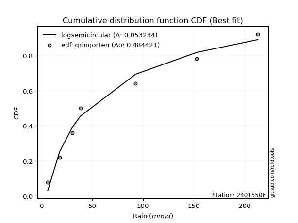</img>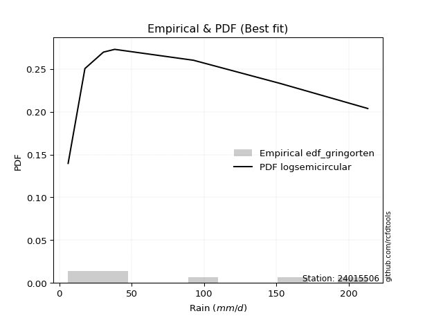</img>

</div>


### 9. EDF Filliben (1975)

The specific values of the constants (0.3175) (often denoted as $alpha$) and (0.365) are derived from a method proposed by James J. Filliben in a 1975 paper. This particular formula is the mean value of the $i$-th order statistic of the normal distribution and is considered a robust and effective plotting position formula for the normal probability plot correlation coefficient test for normality.

<div align="center">


$P=(m-0.3175)/(n+0.365)$


</div>


**9.1. Empirical values**

<div align="center">

|                | 0                   | 1                   | 2                   | 3            | 4                  | 5                  | 6                  |
|:---------------|:--------------------|:--------------------|:--------------------|:-------------|:-------------------|:-------------------|:-------------------|
| date           | 2015                | 2021                | 2017                | 2016         | 2020               | 2019               | 2018               |
| x              | 6.1                 | 17.7                | 30.5                | 38.3         | 92.7               | 153.0              | 213.2              |
| m              | 1                   | 2                   | 3                   | 4            | 5                  | 6                  | 7                  |
| empirical_dist | edf_filliben        | edf_filliben        | edf_filliben        | edf_filliben | edf_filliben       | edf_filliben       | edf_filliben       |
| empirical      | 0.09266802443991853 | 0.22844534962661237 | 0.36422267481330617 | 0.5          | 0.6357773251866938 | 0.7715546503733877 | 0.9073319755600815 |
| empirical_tr   | 1.1021324354657687  | 1.2960844698636163  | 1.5728777362520021  | 2.0          | 2.7455731593662627 | 4.377414561664191  | 10.791208791208794 |

</div>


**9.2. Kolmogorov-Smirnov fit test (sorted by Δ)**


<div align="center">

|                | 0                   | 1                   | 2                   | 3                   | 4                   | 5                   | 6                   | 7                   | 8                   | 9                   | 10                  | 11                  | 12                  | 13                  | 14                  | 15                  | 16                  | 17                  | 18                  | 19                  | 20                  | 21                  | 22                  | 23                  | 24                  | 25                  | 26                  | 27                  | 28                  | 29                  | 30                  | 31                  | 32                  | 33                  | 34                  | 35                  | 36                  | 37                  | 38                  | 39                  | 40                  | 41                  | 42                  | 43                  | 44                  | 45                  | 46                  | 47                  | 48                  | 49                  | 50                  | 51                  | 52                  | 53                  | 54                  | 55                  | 56                  | 57                  | 58                  | 59                  | 60                  | 61                  | 62                  | 63                  | 64                  | 65                  | 66                  | 67                  | 68                  | 69                  | 70                  | 71                  | 72                  | 73                  | 74                  | 75                  | 76                  | 77                  | 78                  | 79                  | 80                  | 81                  | 82                  | 83                  | 84                  | 85                  | 86                  | 87                  | 88                  | 89                  | 90                  | 91                  | 92                  | 93                  | 94                  | 95                  | 96                  | 97                  | 98                  | 99                  | 100                 | 101                 | 102                 | 103                 | 104                 | 105                 | 106                 | 107                 | 108                 | 109                 | 110                 | 111                 | 112                 | 113                 | 114                 | 115                 | 116                 | 117                 | 118                 | 119                 | 120                 | 121                 | 122                 | 123                 | 124                 | 125                 | 126                 | 127                 | 128                 | 129                 | 130                 | 131                 | 132                 | 133                 | 134                 | 135                 | 136                 | 137                 | 138                 | 139                 | 140                 | 141                 | 142                 | 143                 | 144                 | 145                 | 146                 | 147                 | 148                 | 149                 | 150                 | 151                 | 152                 | 153                 | 154                 | 155                 | 156                 | 157                 | 158                 | 159                 |
|:---------------|:--------------------|:--------------------|:--------------------|:--------------------|:--------------------|:--------------------|:--------------------|:--------------------|:--------------------|:--------------------|:--------------------|:--------------------|:--------------------|:--------------------|:--------------------|:--------------------|:--------------------|:--------------------|:--------------------|:--------------------|:--------------------|:--------------------|:--------------------|:--------------------|:--------------------|:--------------------|:--------------------|:--------------------|:--------------------|:--------------------|:--------------------|:--------------------|:--------------------|:--------------------|:--------------------|:--------------------|:--------------------|:--------------------|:--------------------|:--------------------|:--------------------|:--------------------|:--------------------|:--------------------|:--------------------|:--------------------|:--------------------|:--------------------|:--------------------|:--------------------|:--------------------|:--------------------|:--------------------|:--------------------|:--------------------|:--------------------|:--------------------|:--------------------|:--------------------|:--------------------|:--------------------|:--------------------|:--------------------|:--------------------|:--------------------|:--------------------|:--------------------|:--------------------|:--------------------|:--------------------|:--------------------|:--------------------|:--------------------|:--------------------|:--------------------|:--------------------|:--------------------|:--------------------|:--------------------|:--------------------|:--------------------|:--------------------|:--------------------|:--------------------|:--------------------|:--------------------|:--------------------|:--------------------|:--------------------|:--------------------|:--------------------|:--------------------|:--------------------|:--------------------|:--------------------|:--------------------|:--------------------|:--------------------|:--------------------|:--------------------|:--------------------|:--------------------|:--------------------|:--------------------|:--------------------|:--------------------|:--------------------|:--------------------|:--------------------|:--------------------|:--------------------|:--------------------|:--------------------|:--------------------|:--------------------|:--------------------|:--------------------|:--------------------|:--------------------|:--------------------|:--------------------|:--------------------|:--------------------|:--------------------|:--------------------|:--------------------|:--------------------|:--------------------|:--------------------|:--------------------|:--------------------|:--------------------|:--------------------|:--------------------|:--------------------|:--------------------|:--------------------|:--------------------|:--------------------|:--------------------|:--------------------|:--------------------|:--------------------|:--------------------|:--------------------|:--------------------|:--------------------|:--------------------|:--------------------|:--------------------|:--------------------|:--------------------|:--------------------|:--------------------|:--------------------|:--------------------|:--------------------|:--------------------|:--------------------|:--------------------|
| station        | 24015506            | 24015506            | 24015506            | 24015506            | 24015506            | 24015506            | 24015506            | 24015506            | 24015506            | 24015506            | 24015506            | 24015506            | 24015506            | 24015506            | 24015506            | 24015506            | 24015506            | 24015506            | 24015506            | 24015506            | 24015506            | 24015506            | 24015506            | 24015506            | 24015506            | 24015506            | 24015506            | 24015506            | 24015506            | 24015506            | 24015506            | 24015506            | 24015506            | 24015506            | 24015506            | 24015506            | 24015506            | 24015506            | 24015506            | 24015506            | 24015506            | 24015506            | 24015506            | 24015506            | 24015506            | 24015506            | 24015506            | 24015506            | 24015506            | 24015506            | 24015506            | 24015506            | 24015506            | 24015506            | 24015506            | 24015506            | 24015506            | 24015506            | 24015506            | 24015506            | 24015506            | 24015506            | 24015506            | 24015506            | 24015506            | 24015506            | 24015506            | 24015506            | 24015506            | 24015506            | 24015506            | 24015506            | 24015506            | 24015506            | 24015506            | 24015506            | 24015506            | 24015506            | 24015506            | 24015506            | 24015506            | 24015506            | 24015506            | 24015506            | 24015506            | 24015506            | 24015506            | 24015506            | 24015506            | 24015506            | 24015506            | 24015506            | 24015506            | 24015506            | 24015506            | 24015506            | 24015506            | 24015506            | 24015506            | 24015506            | 24015506            | 24015506            | 24015506            | 24015506            | 24015506            | 24015506            | 24015506            | 24015506            | 24015506            | 24015506            | 24015506            | 24015506            | 24015506            | 24015506            | 24015506            | 24015506            | 24015506            | 24015506            | 24015506            | 24015506            | 24015506            | 24015506            | 24015506            | 24015506            | 24015506            | 24015506            | 24015506            | 24015506            | 24015506            | 24015506            | 24015506            | 24015506            | 24015506            | 24015506            | 24015506            | 24015506            | 24015506            | 24015506            | 24015506            | 24015506            | 24015506            | 24015506            | 24015506            | 24015506            | 24015506            | 24015506            | 24015506            | 24015506            | 24015506            | 24015506            | 24015506            | 24015506            | 24015506            | 24015506            | 24015506            | 24015506            | 24015506            | 24015506            | 24015506            | 24015506            |
| empirical_dist | edf_filliben        | edf_filliben        | edf_filliben        | edf_filliben        | edf_filliben        | edf_filliben        | edf_filliben        | edf_filliben        | edf_filliben        | edf_filliben        | edf_filliben        | edf_filliben        | edf_filliben        | edf_filliben        | edf_filliben        | edf_filliben        | edf_filliben        | edf_filliben        | edf_filliben        | edf_filliben        | edf_filliben        | edf_filliben        | edf_filliben        | edf_filliben        | edf_filliben        | edf_filliben        | edf_filliben        | edf_filliben        | edf_filliben        | edf_filliben        | edf_filliben        | edf_filliben        | edf_filliben        | edf_filliben        | edf_filliben        | edf_filliben        | edf_filliben        | edf_filliben        | edf_filliben        | edf_filliben        | edf_filliben        | edf_filliben        | edf_filliben        | edf_filliben        | edf_filliben        | edf_filliben        | edf_filliben        | edf_filliben        | edf_filliben        | edf_filliben        | edf_filliben        | edf_filliben        | edf_filliben        | edf_filliben        | edf_filliben        | edf_filliben        | edf_filliben        | edf_filliben        | edf_filliben        | edf_filliben        | edf_filliben        | edf_filliben        | edf_filliben        | edf_filliben        | edf_filliben        | edf_filliben        | edf_filliben        | edf_filliben        | edf_filliben        | edf_filliben        | edf_filliben        | edf_filliben        | edf_filliben        | edf_filliben        | edf_filliben        | edf_filliben        | edf_filliben        | edf_filliben        | edf_filliben        | edf_filliben        | edf_filliben        | edf_filliben        | edf_filliben        | edf_filliben        | edf_filliben        | edf_filliben        | edf_filliben        | edf_filliben        | edf_filliben        | edf_filliben        | edf_filliben        | edf_filliben        | edf_filliben        | edf_filliben        | edf_filliben        | edf_filliben        | edf_filliben        | edf_filliben        | edf_filliben        | edf_filliben        | edf_filliben        | edf_filliben        | edf_filliben        | edf_filliben        | edf_filliben        | edf_filliben        | edf_filliben        | edf_filliben        | edf_filliben        | edf_filliben        | edf_filliben        | edf_filliben        | edf_filliben        | edf_filliben        | edf_filliben        | edf_filliben        | edf_filliben        | edf_filliben        | edf_filliben        | edf_filliben        | edf_filliben        | edf_filliben        | edf_filliben        | edf_filliben        | edf_filliben        | edf_filliben        | edf_filliben        | edf_filliben        | edf_filliben        | edf_filliben        | edf_filliben        | edf_filliben        | edf_filliben        | edf_filliben        | edf_filliben        | edf_filliben        | edf_filliben        | edf_filliben        | edf_filliben        | edf_filliben        | edf_filliben        | edf_filliben        | edf_filliben        | edf_filliben        | edf_filliben        | edf_filliben        | edf_filliben        | edf_filliben        | edf_filliben        | edf_filliben        | edf_filliben        | edf_filliben        | edf_filliben        | edf_filliben        | edf_filliben        | edf_filliben        | edf_filliben        | edf_filliben        | edf_filliben        | edf_filliben        |
| p_dist         | logsemicircular     | loganglit           | logdgamma           | logdweibull         | logpearson3         | logweibull_min      | logburr12           | logksone            | loggompertz         | kappa3              | halfgennorm         | logarcsine          | loggausshyper       | loginvweibull       | logf                | logbetaprime        | logfatiguelife      | lognct              | logexponnorm        | lognorm             | logcrystalball      | logt                | alpha               | logtrapezoid        | logfoldnorm         | johnsonsu           | logrice             | logerlang           | logncf              | loggamma            | loggamma            | loggenlogistic      | loginvgamma         | logloggamma         | loginvgauss         | dgamma              | logalpha            | logkstwobign        | logcosine           | logmaxwell          | invgamma            | logwrapcauchy       | lograyleigh         | loggenexpon         | invgauss            | logargus            | nct                 | logkappa4           | nakagami            | logtriang           | loglogistic         | logjohnsonsu        | truncweibull_min    | loghalfnorm         | logskewnorm         | loggumbel_l         | betaprime           | dweibull            | logtukeylambda      | burr                | loghypsecant        | loggenpareto        | logvonmises_line    | logkappa3           | loguniform          | loggenhalflogistic  | ncf                 | logloglaplace       | f                   | loggumbel_r         | exponnorm           | genexpon            | lomax               | halfnorm            | exponweib           | genpareto           | gengamma            | loghalflogistic     | logburr             | halflogistic        | foldnorm            | erlang              | logweibull_max      | truncnorm           | exponpow            | logmoyal            | loglaplace          | loglaplace          | arcsine             | loglomax            | logtruncnorm        | gompertz            | logmielke           | rayleigh            | semicircular        | moyal               | burr12              | logtruncweibull_min | pearson3            | gumbel_r            | logbradford         | maxwell             | logbeta             | anglit              | genlogistic         | weibull_min         | logtruncexpon       | wrapcauchy          | logwald             | wald                | loglevy_l           | mielke              | kstwobign           | gausshyper          | crystalball         | norm                | t                   | gennorm             | loggenextreme       | logistic            | loghalfgennorm      | rice                | gamma               | cosine              | logjohnsonsb        | hypsecant           | skewnorm            | truncexpon          | gumbel_l            | bradford            | loggennorm          | laplace             | argus               | ksone               | beta                | loggengamma         | genextreme          | kappa4              | levy_l              | logexponweib        | uniform             | vonmises_line       | logrdist            | genhalflogistic     | lognakagami         | powerlaw            | triang              | fatiguelife         | trapezoid           | invweibull          | rdist               | tukeylambda         | logexponpow         | truncpareto         | logpowerlaw         | johnsonsb           | weibull_max         | logtruncpareto      | logvonmises         | vonmises            |
| delta          | 0.06183267342947438 | 0.06939551221775431 | 0.07482542856835131 | 0.07482751253788711 | 0.08708771071700494 | 0.0872464493325964  | 0.0877601196433474  | 0.08907709809538776 | 0.09266802415461159 | 0.09266802439895531 | 0.09266802443915761 | 0.09266802443991853 | 0.09266802444232569 | 0.09351825117432    | 0.09454579175102995 | 0.09476437217315747 | 0.09581554414960425 | 0.09585958343622236 | 0.09609158888975255 | 0.09609245395013088 | 0.09609245427219903 | 0.09609317239477388 | 0.09787368736824831 | 0.09877196448874787 | 0.09885327689807366 | 0.0989004833208107  | 0.09919749234467512 | 0.0998819106081984  | 0.10047295366453224 | 0.10124595217227439 | 0.10124595217227439 | 0.10308490233014206 | 0.10348428002794408 | 0.10392853981673278 | 0.10565078804076855 | 0.10601797247739095 | 0.1063204920805052  | 0.10768103674569107 | 0.10799871194829458 | 0.10802851625812426 | 0.10952265445267595 | 0.11102246545582764 | 0.11146233029193264 | 0.11169664436341986 | 0.11189020280901896 | 0.11192605118152954 | 0.11282081349517825 | 0.11702566036872886 | 0.1172717617092556  | 0.11845234317140346 | 0.11854411949699462 | 0.11945337820855284 | 0.1220456580380559  | 0.12250856500845664 | 0.12379364821454947 | 0.12590357448818718 | 0.12666134024232545 | 0.13064812859313113 | 0.13181371547093468 | 0.13378647068469288 | 0.13386324951495943 | 0.13457873511121457 | 0.13501215682440115 | 0.13501274420134646 | 0.13508626321942674 | 0.13561720649561448 | 0.13593577116016586 | 0.13724580360331706 | 0.13972991178015715 | 0.13991905217524359 | 0.1416269644459165  | 0.14228660876761368 | 0.14232131418661453 | 0.1447423771926022  | 0.1448068007240992  | 0.14586433718902886 | 0.14654050524187134 | 0.1479071968723038  | 0.14802936230550334 | 0.14916745669550574 | 0.14947573360678346 | 0.1511320407857617  | 0.15174171735740444 | 0.15274128480165983 | 0.1532713256838032  | 0.15402685378135883 | 0.15572071585200298 | 0.15572071585200298 | 0.15634191383883334 | 0.15636636445151497 | 0.16037644369521398 | 0.16070689823384376 | 0.17116921040613298 | 0.1746064700834386  | 0.1755070344538302  | 0.17562826421786681 | 0.17958281594034187 | 0.18113463364224258 | 0.18210714016306928 | 0.18322384026571625 | 0.1846343878083032  | 0.1852320195097415  | 0.18605391476879024 | 0.18638074043719322 | 0.1864278557731343  | 0.18738683594290206 | 0.19192452175190733 | 0.1944277989399985  | 0.19697238059518463 | 0.19883853060480267 | 0.20399268842309645 | 0.20435347619298727 | 0.2045668176779864  | 0.208914592399292   | 0.21182585607404897 | 0.21182586818891858 | 0.21183012045683236 | 0.21837118536787348 | 0.2189989383543517  | 0.233688545593647   | 0.23744379520535572 | 0.238940952954943   | 0.24169377367576605 | 0.24542857064160906 | 0.24609669501988798 | 0.24915985333836527 | 0.25373659896834533 | 0.25709080388461236 | 0.26016188280267954 | 0.2714253654509039  | 0.27155465037338766 | 0.273113647857577   | 0.2870841242056169  | 0.28709962980846615 | 0.2914001239402637  | 0.30129914684981596 | 0.30980458501494557 | 0.3114087256761511  | 0.31464766156653434 | 0.32199800638458387 | 0.34451955577015936 | 0.3451283303227415  | 0.3642226730210043  | 0.3726913890625226  | 0.37536986637785896 | 0.42889622643276815 | 0.443437177000423   | 0.44459634413216653 | 0.45341319306172145 | 0.4610364953691308  | 0.47254059275290416 | 0.49825141458638256 | 0.5400807180836323  | 0.5655770491603637  | 0.5828684781959821  | 0.5932057619613896  | 0.6404095543902766  | 0.6817845108192131  | 1.065503840200045   | 33.63897262258105   |
| deltao         | 0.48442053926100004 | 0.48442053926100004 | 0.48442053926100004 | 0.48442053926100004 | 0.48442053926100004 | 0.48442053926100004 | 0.48442053926100004 | 0.48442053926100004 | 0.48442053926100004 | 0.48442053926100004 | 0.48442053926100004 | 0.48442053926100004 | 0.48442053926100004 | 0.48442053926100004 | 0.48442053926100004 | 0.48442053926100004 | 0.48442053926100004 | 0.48442053926100004 | 0.48442053926100004 | 0.48442053926100004 | 0.48442053926100004 | 0.48442053926100004 | 0.48442053926100004 | 0.48442053926100004 | 0.48442053926100004 | 0.48442053926100004 | 0.48442053926100004 | 0.48442053926100004 | 0.48442053926100004 | 0.48442053926100004 | 0.48442053926100004 | 0.48442053926100004 | 0.48442053926100004 | 0.48442053926100004 | 0.48442053926100004 | 0.48442053926100004 | 0.48442053926100004 | 0.48442053926100004 | 0.48442053926100004 | 0.48442053926100004 | 0.48442053926100004 | 0.48442053926100004 | 0.48442053926100004 | 0.48442053926100004 | 0.48442053926100004 | 0.48442053926100004 | 0.48442053926100004 | 0.48442053926100004 | 0.48442053926100004 | 0.48442053926100004 | 0.48442053926100004 | 0.48442053926100004 | 0.48442053926100004 | 0.48442053926100004 | 0.48442053926100004 | 0.48442053926100004 | 0.48442053926100004 | 0.48442053926100004 | 0.48442053926100004 | 0.48442053926100004 | 0.48442053926100004 | 0.48442053926100004 | 0.48442053926100004 | 0.48442053926100004 | 0.48442053926100004 | 0.48442053926100004 | 0.48442053926100004 | 0.48442053926100004 | 0.48442053926100004 | 0.48442053926100004 | 0.48442053926100004 | 0.48442053926100004 | 0.48442053926100004 | 0.48442053926100004 | 0.48442053926100004 | 0.48442053926100004 | 0.48442053926100004 | 0.48442053926100004 | 0.48442053926100004 | 0.48442053926100004 | 0.48442053926100004 | 0.48442053926100004 | 0.48442053926100004 | 0.48442053926100004 | 0.48442053926100004 | 0.48442053926100004 | 0.48442053926100004 | 0.48442053926100004 | 0.48442053926100004 | 0.48442053926100004 | 0.48442053926100004 | 0.48442053926100004 | 0.48442053926100004 | 0.48442053926100004 | 0.48442053926100004 | 0.48442053926100004 | 0.48442053926100004 | 0.48442053926100004 | 0.48442053926100004 | 0.48442053926100004 | 0.48442053926100004 | 0.48442053926100004 | 0.48442053926100004 | 0.48442053926100004 | 0.48442053926100004 | 0.48442053926100004 | 0.48442053926100004 | 0.48442053926100004 | 0.48442053926100004 | 0.48442053926100004 | 0.48442053926100004 | 0.48442053926100004 | 0.48442053926100004 | 0.48442053926100004 | 0.48442053926100004 | 0.48442053926100004 | 0.48442053926100004 | 0.48442053926100004 | 0.48442053926100004 | 0.48442053926100004 | 0.48442053926100004 | 0.48442053926100004 | 0.48442053926100004 | 0.48442053926100004 | 0.48442053926100004 | 0.48442053926100004 | 0.48442053926100004 | 0.48442053926100004 | 0.48442053926100004 | 0.48442053926100004 | 0.48442053926100004 | 0.48442053926100004 | 0.48442053926100004 | 0.48442053926100004 | 0.48442053926100004 | 0.48442053926100004 | 0.48442053926100004 | 0.48442053926100004 | 0.48442053926100004 | 0.48442053926100004 | 0.48442053926100004 | 0.48442053926100004 | 0.48442053926100004 | 0.48442053926100004 | 0.48442053926100004 | 0.48442053926100004 | 0.48442053926100004 | 0.48442053926100004 | 0.48442053926100004 | 0.48442053926100004 | 0.48442053926100004 | 0.48442053926100004 | 0.48442053926100004 | 0.48442053926100004 | 0.48442053926100004 | 0.48442053926100004 | 0.48442053926100004 | 0.48442053926100004 | 0.48442053926100004 | 0.48442053926100004 |
| eval           | Δo > Δ              | Δo > Δ              | Δo > Δ              | Δo > Δ              | Δo > Δ              | Δo > Δ              | Δo > Δ              | Δo > Δ              | Δo > Δ              | Δo > Δ              | Δo > Δ              | Δo > Δ              | Δo > Δ              | Δo > Δ              | Δo > Δ              | Δo > Δ              | Δo > Δ              | Δo > Δ              | Δo > Δ              | Δo > Δ              | Δo > Δ              | Δo > Δ              | Δo > Δ              | Δo > Δ              | Δo > Δ              | Δo > Δ              | Δo > Δ              | Δo > Δ              | Δo > Δ              | Δo > Δ              | Δo > Δ              | Δo > Δ              | Δo > Δ              | Δo > Δ              | Δo > Δ              | Δo > Δ              | Δo > Δ              | Δo > Δ              | Δo > Δ              | Δo > Δ              | Δo > Δ              | Δo > Δ              | Δo > Δ              | Δo > Δ              | Δo > Δ              | Δo > Δ              | Δo > Δ              | Δo > Δ              | Δo > Δ              | Δo > Δ              | Δo > Δ              | Δo > Δ              | Δo > Δ              | Δo > Δ              | Δo > Δ              | Δo > Δ              | Δo > Δ              | Δo > Δ              | Δo > Δ              | Δo > Δ              | Δo > Δ              | Δo > Δ              | Δo > Δ              | Δo > Δ              | Δo > Δ              | Δo > Δ              | Δo > Δ              | Δo > Δ              | Δo > Δ              | Δo > Δ              | Δo > Δ              | Δo > Δ              | Δo > Δ              | Δo > Δ              | Δo > Δ              | Δo > Δ              | Δo > Δ              | Δo > Δ              | Δo > Δ              | Δo > Δ              | Δo > Δ              | Δo > Δ              | Δo > Δ              | Δo > Δ              | Δo > Δ              | Δo > Δ              | Δo > Δ              | Δo > Δ              | Δo > Δ              | Δo > Δ              | Δo > Δ              | Δo > Δ              | Δo > Δ              | Δo > Δ              | Δo > Δ              | Δo > Δ              | Δo > Δ              | Δo > Δ              | Δo > Δ              | Δo > Δ              | Δo > Δ              | Δo > Δ              | Δo > Δ              | Δo > Δ              | Δo > Δ              | Δo > Δ              | Δo > Δ              | Δo > Δ              | Δo > Δ              | Δo > Δ              | Δo > Δ              | Δo > Δ              | Δo > Δ              | Δo > Δ              | Δo > Δ              | Δo > Δ              | Δo > Δ              | Δo > Δ              | Δo > Δ              | Δo > Δ              | Δo > Δ              | Δo > Δ              | Δo > Δ              | Δo > Δ              | Δo > Δ              | Δo > Δ              | Δo > Δ              | Δo > Δ              | Δo > Δ              | Δo > Δ              | Δo > Δ              | Δo > Δ              | Δo > Δ              | Δo > Δ              | Δo > Δ              | Δo > Δ              | Δo > Δ              | Δo > Δ              | Δo > Δ              | Δo > Δ              | Δo > Δ              | Δo > Δ              | Δo > Δ              | Δo > Δ              | Δo > Δ              | Δo > Δ              | Δo > Δ              | Δo > Δ              | Δo > Δ              | Δo > Δ              | Δo > Δ              | Δo <= Δ             | Δo <= Δ             | Δo <= Δ             | Δo <= Δ             | Δo <= Δ             | Δo <= Δ             | Δo <= Δ             | Δo <= Δ             | Δo <= Δ             |
| fit            | 1                   | 1                   | 1                   | 1                   | 1                   | 1                   | 1                   | 1                   | 1                   | 1                   | 1                   | 1                   | 1                   | 1                   | 1                   | 1                   | 1                   | 1                   | 1                   | 1                   | 1                   | 1                   | 1                   | 1                   | 1                   | 1                   | 1                   | 1                   | 1                   | 1                   | 1                   | 1                   | 1                   | 1                   | 1                   | 1                   | 1                   | 1                   | 1                   | 1                   | 1                   | 1                   | 1                   | 1                   | 1                   | 1                   | 1                   | 1                   | 1                   | 1                   | 1                   | 1                   | 1                   | 1                   | 1                   | 1                   | 1                   | 1                   | 1                   | 1                   | 1                   | 1                   | 1                   | 1                   | 1                   | 1                   | 1                   | 1                   | 1                   | 1                   | 1                   | 1                   | 1                   | 1                   | 1                   | 1                   | 1                   | 1                   | 1                   | 1                   | 1                   | 1                   | 1                   | 1                   | 1                   | 1                   | 1                   | 1                   | 1                   | 1                   | 1                   | 1                   | 1                   | 1                   | 1                   | 1                   | 1                   | 1                   | 1                   | 1                   | 1                   | 1                   | 1                   | 1                   | 1                   | 1                   | 1                   | 1                   | 1                   | 1                   | 1                   | 1                   | 1                   | 1                   | 1                   | 1                   | 1                   | 1                   | 1                   | 1                   | 1                   | 1                   | 1                   | 1                   | 1                   | 1                   | 1                   | 1                   | 1                   | 1                   | 1                   | 1                   | 1                   | 1                   | 1                   | 1                   | 1                   | 1                   | 1                   | 1                   | 1                   | 1                   | 1                   | 1                   | 1                   | 1                   | 1                   | 1                   | 1                   | 1                   | 1                   | 0                   | 0                   | 0                   | 0                   | 0                   | 0                   | 0                   | 0                   | 0                   |
| n              | 7                   | 7                   | 7                   | 7                   | 7                   | 7                   | 7                   | 7                   | 7                   | 7                   | 7                   | 7                   | 7                   | 7                   | 7                   | 7                   | 7                   | 7                   | 7                   | 7                   | 7                   | 7                   | 7                   | 7                   | 7                   | 7                   | 7                   | 7                   | 7                   | 7                   | 7                   | 7                   | 7                   | 7                   | 7                   | 7                   | 7                   | 7                   | 7                   | 7                   | 7                   | 7                   | 7                   | 7                   | 7                   | 7                   | 7                   | 7                   | 7                   | 7                   | 7                   | 7                   | 7                   | 7                   | 7                   | 7                   | 7                   | 7                   | 7                   | 7                   | 7                   | 7                   | 7                   | 7                   | 7                   | 7                   | 7                   | 7                   | 7                   | 7                   | 7                   | 7                   | 7                   | 7                   | 7                   | 7                   | 7                   | 7                   | 7                   | 7                   | 7                   | 7                   | 7                   | 7                   | 7                   | 7                   | 7                   | 7                   | 7                   | 7                   | 7                   | 7                   | 7                   | 7                   | 7                   | 7                   | 7                   | 7                   | 7                   | 7                   | 7                   | 7                   | 7                   | 7                   | 7                   | 7                   | 7                   | 7                   | 7                   | 7                   | 7                   | 7                   | 7                   | 7                   | 7                   | 7                   | 7                   | 7                   | 7                   | 7                   | 7                   | 7                   | 7                   | 7                   | 7                   | 7                   | 7                   | 7                   | 7                   | 7                   | 7                   | 7                   | 7                   | 7                   | 7                   | 7                   | 7                   | 7                   | 7                   | 7                   | 7                   | 7                   | 7                   | 7                   | 7                   | 7                   | 7                   | 7                   | 7                   | 7                   | 7                   | 7                   | 7                   | 7                   | 7                   | 7                   | 7                   | 7                   | 7                   | 7                   |
| best_fit       | 1                   | 0                   | 0                   | 0                   | 0                   | 0                   | 0                   | 0                   | 0                   | 0                   | 0                   | 0                   | 0                   | 0                   | 0                   | 0                   | 0                   | 0                   | 0                   | 0                   | 0                   | 0                   | 0                   | 0                   | 0                   | 0                   | 0                   | 0                   | 0                   | 0                   | 0                   | 0                   | 0                   | 0                   | 0                   | 0                   | 0                   | 0                   | 0                   | 0                   | 0                   | 0                   | 0                   | 0                   | 0                   | 0                   | 0                   | 0                   | 0                   | 0                   | 0                   | 0                   | 0                   | 0                   | 0                   | 0                   | 0                   | 0                   | 0                   | 0                   | 0                   | 0                   | 0                   | 0                   | 0                   | 0                   | 0                   | 0                   | 0                   | 0                   | 0                   | 0                   | 0                   | 0                   | 0                   | 0                   | 0                   | 0                   | 0                   | 0                   | 0                   | 0                   | 0                   | 0                   | 0                   | 0                   | 0                   | 0                   | 0                   | 0                   | 0                   | 0                   | 0                   | 0                   | 0                   | 0                   | 0                   | 0                   | 0                   | 0                   | 0                   | 0                   | 0                   | 0                   | 0                   | 0                   | 0                   | 0                   | 0                   | 0                   | 0                   | 0                   | 0                   | 0                   | 0                   | 0                   | 0                   | 0                   | 0                   | 0                   | 0                   | 0                   | 0                   | 0                   | 0                   | 0                   | 0                   | 0                   | 0                   | 0                   | 0                   | 0                   | 0                   | 0                   | 0                   | 0                   | 0                   | 0                   | 0                   | 0                   | 0                   | 0                   | 0                   | 0                   | 0                   | 0                   | 0                   | 0                   | 0                   | 0                   | 0                   | 0                   | 0                   | 0                   | 0                   | 0                   | 0                   | 0                   | 0                   | 0                   |
| best_fit_sort  | 1                   | 2                   | 3                   | 4                   | 5                   | 6                   | 7                   | 8                   | 9                   | 10                  | 11                  | 12                  | 13                  | 14                  | 15                  | 16                  | 17                  | 18                  | 19                  | 20                  | 21                  | 22                  | 23                  | 24                  | 25                  | 26                  | 27                  | 28                  | 29                  | 30                  | 31                  | 32                  | 33                  | 34                  | 35                  | 36                  | 37                  | 38                  | 39                  | 40                  | 41                  | 42                  | 43                  | 44                  | 45                  | 46                  | 47                  | 48                  | 49                  | 50                  | 51                  | 52                  | 53                  | 54                  | 55                  | 56                  | 57                  | 58                  | 59                  | 60                  | 61                  | 62                  | 63                  | 64                  | 65                  | 66                  | 67                  | 68                  | 69                  | 70                  | 71                  | 72                  | 73                  | 74                  | 75                  | 76                  | 77                  | 78                  | 79                  | 80                  | 81                  | 82                  | 83                  | 84                  | 85                  | 86                  | 87                  | 88                  | 89                  | 90                  | 91                  | 92                  | 93                  | 94                  | 95                  | 96                  | 97                  | 98                  | 99                  | 100                 | 101                 | 102                 | 103                 | 104                 | 105                 | 106                 | 107                 | 108                 | 109                 | 110                 | 111                 | 112                 | 113                 | 114                 | 115                 | 116                 | 117                 | 118                 | 119                 | 120                 | 121                 | 122                 | 123                 | 124                 | 125                 | 126                 | 127                 | 128                 | 129                 | 130                 | 131                 | 132                 | 133                 | 134                 | 135                 | 136                 | 137                 | 138                 | 139                 | 140                 | 141                 | 142                 | 143                 | 144                 | 145                 | 146                 | 147                 | 148                 | 149                 | 150                 | 151                 | 152                 | 153                 | 154                 | 155                 | 156                 | 157                 | 158                 | 159                 | 160                 |

</div>


**9.3. Best fit**

<div align="center">

|   id |   station | empirical_dist   | p_dist          |     delta |   deltao | eval   |   fit |   n |   best_fit |   best_fit_sort |
|-----:|----------:|:-----------------|:----------------|----------:|---------:|:-------|------:|----:|-----------:|----------------:|
|    0 |  24015506 | edf_filliben     | logsemicircular | 0.0618327 | 0.484421 | Δo > Δ |     1 |   7 |          1 |               1 |

</div>


<div align="center">

</img>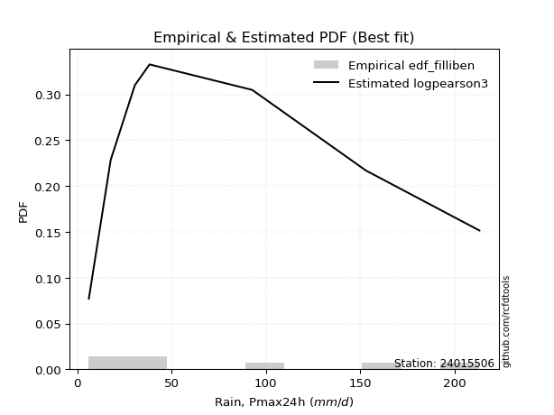</img>

</div>


### 10. EDF Jenkinson (1977)

The Jenkinson formula in hydrology is an empirical plotting position formula used to estimate the non-exceedance probability _(P)_ or return period _(T)_ of a given ordered observation within a sample. It is a widely used method in the frequency analysis of extreme events such as floods and rainfall, as it provides a distribution-free way to plot data. _a≈0.31_ and _b≈0.38_ are constants derived to approximate the median of the probability distribution for the given rank.

<div align="center">


$P=(m-a)/(n+b)$


</div>


**10.1. Empirical values**

<div align="center">

|                | 0                   | 1                   | 2                   | 3             | 4                  | 5                  | 6                  |
|:---------------|:--------------------|:--------------------|:--------------------|:--------------|:-------------------|:-------------------|:-------------------|
| date           | 2015                | 2021                | 2017                | 2016          | 2020               | 2019               | 2018               |
| x              | 6.1                 | 17.7                | 30.5                | 38.3          | 92.7               | 153.0              | 213.2              |
| m              | 1                   | 2                   | 3                   | 4             | 5                  | 6                  | 7                  |
| empirical_dist | edf_jenkinson       | edf_jenkinson       | edf_jenkinson       | edf_jenkinson | edf_jenkinson      | edf_jenkinson      | edf_jenkinson      |
| empirical      | 0.09349593495934959 | 0.22899728997289973 | 0.36449864498644985 | 0.5           | 0.6355013550135502 | 0.7710027100271003 | 0.9065040650406505 |
| empirical_tr   | 1.1031390134529149  | 1.29701230228471    | 1.5735607675906182  | 2.0           | 2.743494423791822  | 4.366863905325444  | 10.695652173913055 |

</div>


**10.2. Kolmogorov-Smirnov fit test (sorted by Δ)**


<div align="center">

|                | 0                   | 1                   | 2                   | 3                   | 4                   | 5                   | 6                   | 7                   | 8                   | 9                   | 10                  | 11                  | 12                  | 13                  | 14                  | 15                  | 16                  | 17                  | 18                  | 19                  | 20                  | 21                  | 22                  | 23                  | 24                  | 25                  | 26                  | 27                  | 28                  | 29                  | 30                  | 31                  | 32                  | 33                  | 34                  | 35                  | 36                  | 37                  | 38                  | 39                  | 40                  | 41                  | 42                  | 43                  | 44                  | 45                  | 46                  | 47                  | 48                  | 49                  | 50                  | 51                  | 52                  | 53                  | 54                  | 55                  | 56                  | 57                  | 58                  | 59                  | 60                  | 61                  | 62                  | 63                  | 64                  | 65                  | 66                  | 67                  | 68                  | 69                  | 70                  | 71                  | 72                  | 73                  | 74                  | 75                  | 76                  | 77                  | 78                  | 79                  | 80                  | 81                  | 82                  | 83                  | 84                  | 85                  | 86                  | 87                  | 88                  | 89                  | 90                  | 91                  | 92                  | 93                  | 94                  | 95                  | 96                  | 97                  | 98                  | 99                  | 100                 | 101                 | 102                 | 103                 | 104                 | 105                 | 106                 | 107                 | 108                 | 109                 | 110                 | 111                 | 112                 | 113                 | 114                 | 115                 | 116                 | 117                 | 118                 | 119                 | 120                 | 121                 | 122                 | 123                 | 124                 | 125                 | 126                 | 127                 | 128                 | 129                 | 130                 | 131                 | 132                 | 133                 | 134                 | 135                 | 136                 | 137                 | 138                 | 139                 | 140                 | 141                 | 142                 | 143                 | 144                 | 145                 | 146                 | 147                 | 148                 | 149                 | 150                 | 151                 | 152                 | 153                 | 154                 | 155                 | 156                 | 157                 | 158                 | 159                 |
|:---------------|:--------------------|:--------------------|:--------------------|:--------------------|:--------------------|:--------------------|:--------------------|:--------------------|:--------------------|:--------------------|:--------------------|:--------------------|:--------------------|:--------------------|:--------------------|:--------------------|:--------------------|:--------------------|:--------------------|:--------------------|:--------------------|:--------------------|:--------------------|:--------------------|:--------------------|:--------------------|:--------------------|:--------------------|:--------------------|:--------------------|:--------------------|:--------------------|:--------------------|:--------------------|:--------------------|:--------------------|:--------------------|:--------------------|:--------------------|:--------------------|:--------------------|:--------------------|:--------------------|:--------------------|:--------------------|:--------------------|:--------------------|:--------------------|:--------------------|:--------------------|:--------------------|:--------------------|:--------------------|:--------------------|:--------------------|:--------------------|:--------------------|:--------------------|:--------------------|:--------------------|:--------------------|:--------------------|:--------------------|:--------------------|:--------------------|:--------------------|:--------------------|:--------------------|:--------------------|:--------------------|:--------------------|:--------------------|:--------------------|:--------------------|:--------------------|:--------------------|:--------------------|:--------------------|:--------------------|:--------------------|:--------------------|:--------------------|:--------------------|:--------------------|:--------------------|:--------------------|:--------------------|:--------------------|:--------------------|:--------------------|:--------------------|:--------------------|:--------------------|:--------------------|:--------------------|:--------------------|:--------------------|:--------------------|:--------------------|:--------------------|:--------------------|:--------------------|:--------------------|:--------------------|:--------------------|:--------------------|:--------------------|:--------------------|:--------------------|:--------------------|:--------------------|:--------------------|:--------------------|:--------------------|:--------------------|:--------------------|:--------------------|:--------------------|:--------------------|:--------------------|:--------------------|:--------------------|:--------------------|:--------------------|:--------------------|:--------------------|:--------------------|:--------------------|:--------------------|:--------------------|:--------------------|:--------------------|:--------------------|:--------------------|:--------------------|:--------------------|:--------------------|:--------------------|:--------------------|:--------------------|:--------------------|:--------------------|:--------------------|:--------------------|:--------------------|:--------------------|:--------------------|:--------------------|:--------------------|:--------------------|:--------------------|:--------------------|:--------------------|:--------------------|:--------------------|:--------------------|:--------------------|:--------------------|:--------------------|:--------------------|
| station        | 24015506            | 24015506            | 24015506            | 24015506            | 24015506            | 24015506            | 24015506            | 24015506            | 24015506            | 24015506            | 24015506            | 24015506            | 24015506            | 24015506            | 24015506            | 24015506            | 24015506            | 24015506            | 24015506            | 24015506            | 24015506            | 24015506            | 24015506            | 24015506            | 24015506            | 24015506            | 24015506            | 24015506            | 24015506            | 24015506            | 24015506            | 24015506            | 24015506            | 24015506            | 24015506            | 24015506            | 24015506            | 24015506            | 24015506            | 24015506            | 24015506            | 24015506            | 24015506            | 24015506            | 24015506            | 24015506            | 24015506            | 24015506            | 24015506            | 24015506            | 24015506            | 24015506            | 24015506            | 24015506            | 24015506            | 24015506            | 24015506            | 24015506            | 24015506            | 24015506            | 24015506            | 24015506            | 24015506            | 24015506            | 24015506            | 24015506            | 24015506            | 24015506            | 24015506            | 24015506            | 24015506            | 24015506            | 24015506            | 24015506            | 24015506            | 24015506            | 24015506            | 24015506            | 24015506            | 24015506            | 24015506            | 24015506            | 24015506            | 24015506            | 24015506            | 24015506            | 24015506            | 24015506            | 24015506            | 24015506            | 24015506            | 24015506            | 24015506            | 24015506            | 24015506            | 24015506            | 24015506            | 24015506            | 24015506            | 24015506            | 24015506            | 24015506            | 24015506            | 24015506            | 24015506            | 24015506            | 24015506            | 24015506            | 24015506            | 24015506            | 24015506            | 24015506            | 24015506            | 24015506            | 24015506            | 24015506            | 24015506            | 24015506            | 24015506            | 24015506            | 24015506            | 24015506            | 24015506            | 24015506            | 24015506            | 24015506            | 24015506            | 24015506            | 24015506            | 24015506            | 24015506            | 24015506            | 24015506            | 24015506            | 24015506            | 24015506            | 24015506            | 24015506            | 24015506            | 24015506            | 24015506            | 24015506            | 24015506            | 24015506            | 24015506            | 24015506            | 24015506            | 24015506            | 24015506            | 24015506            | 24015506            | 24015506            | 24015506            | 24015506            | 24015506            | 24015506            | 24015506            | 24015506            | 24015506            | 24015506            |
| empirical_dist | edf_jenkinson       | edf_jenkinson       | edf_jenkinson       | edf_jenkinson       | edf_jenkinson       | edf_jenkinson       | edf_jenkinson       | edf_jenkinson       | edf_jenkinson       | edf_jenkinson       | edf_jenkinson       | edf_jenkinson       | edf_jenkinson       | edf_jenkinson       | edf_jenkinson       | edf_jenkinson       | edf_jenkinson       | edf_jenkinson       | edf_jenkinson       | edf_jenkinson       | edf_jenkinson       | edf_jenkinson       | edf_jenkinson       | edf_jenkinson       | edf_jenkinson       | edf_jenkinson       | edf_jenkinson       | edf_jenkinson       | edf_jenkinson       | edf_jenkinson       | edf_jenkinson       | edf_jenkinson       | edf_jenkinson       | edf_jenkinson       | edf_jenkinson       | edf_jenkinson       | edf_jenkinson       | edf_jenkinson       | edf_jenkinson       | edf_jenkinson       | edf_jenkinson       | edf_jenkinson       | edf_jenkinson       | edf_jenkinson       | edf_jenkinson       | edf_jenkinson       | edf_jenkinson       | edf_jenkinson       | edf_jenkinson       | edf_jenkinson       | edf_jenkinson       | edf_jenkinson       | edf_jenkinson       | edf_jenkinson       | edf_jenkinson       | edf_jenkinson       | edf_jenkinson       | edf_jenkinson       | edf_jenkinson       | edf_jenkinson       | edf_jenkinson       | edf_jenkinson       | edf_jenkinson       | edf_jenkinson       | edf_jenkinson       | edf_jenkinson       | edf_jenkinson       | edf_jenkinson       | edf_jenkinson       | edf_jenkinson       | edf_jenkinson       | edf_jenkinson       | edf_jenkinson       | edf_jenkinson       | edf_jenkinson       | edf_jenkinson       | edf_jenkinson       | edf_jenkinson       | edf_jenkinson       | edf_jenkinson       | edf_jenkinson       | edf_jenkinson       | edf_jenkinson       | edf_jenkinson       | edf_jenkinson       | edf_jenkinson       | edf_jenkinson       | edf_jenkinson       | edf_jenkinson       | edf_jenkinson       | edf_jenkinson       | edf_jenkinson       | edf_jenkinson       | edf_jenkinson       | edf_jenkinson       | edf_jenkinson       | edf_jenkinson       | edf_jenkinson       | edf_jenkinson       | edf_jenkinson       | edf_jenkinson       | edf_jenkinson       | edf_jenkinson       | edf_jenkinson       | edf_jenkinson       | edf_jenkinson       | edf_jenkinson       | edf_jenkinson       | edf_jenkinson       | edf_jenkinson       | edf_jenkinson       | edf_jenkinson       | edf_jenkinson       | edf_jenkinson       | edf_jenkinson       | edf_jenkinson       | edf_jenkinson       | edf_jenkinson       | edf_jenkinson       | edf_jenkinson       | edf_jenkinson       | edf_jenkinson       | edf_jenkinson       | edf_jenkinson       | edf_jenkinson       | edf_jenkinson       | edf_jenkinson       | edf_jenkinson       | edf_jenkinson       | edf_jenkinson       | edf_jenkinson       | edf_jenkinson       | edf_jenkinson       | edf_jenkinson       | edf_jenkinson       | edf_jenkinson       | edf_jenkinson       | edf_jenkinson       | edf_jenkinson       | edf_jenkinson       | edf_jenkinson       | edf_jenkinson       | edf_jenkinson       | edf_jenkinson       | edf_jenkinson       | edf_jenkinson       | edf_jenkinson       | edf_jenkinson       | edf_jenkinson       | edf_jenkinson       | edf_jenkinson       | edf_jenkinson       | edf_jenkinson       | edf_jenkinson       | edf_jenkinson       | edf_jenkinson       | edf_jenkinson       | edf_jenkinson       | edf_jenkinson       | edf_jenkinson       |
| p_dist         | logsemicircular     | loganglit           | logdgamma           | logdweibull         | logweibull_min      | logpearson3         | logburr12           | logksone            | loggompertz         | kappa3              | halfgennorm         | logarcsine          | loggausshyper       | loginvweibull       | logf                | logbetaprime        | logfatiguelife      | lognct              | logexponnorm        | lognorm             | logcrystalball      | logt                | alpha               | logtrapezoid        | logfoldnorm         | johnsonsu           | logrice             | logerlang           | logncf              | loggamma            | loggamma            | loggenlogistic      | loginvgamma         | logloggamma         | dgamma              | loginvgauss         | logalpha            | logkstwobign        | logcosine           | logmaxwell          | invgamma            | logwrapcauchy       | lograyleigh         | logargus            | loggenexpon         | invgauss            | nct                 | nakagami            | logkappa4           | logtriang           | loglogistic         | logjohnsonsu        | truncweibull_min    | loghalfnorm         | logskewnorm         | loggumbel_l         | betaprime           | dweibull            | logtukeylambda      | burr                | loggenpareto        | loghypsecant        | logvonmises_line    | logkappa3           | loggenhalflogistic  | loguniform          | ncf                 | logloglaplace       | f                   | loggumbel_r         | exponnorm           | genexpon            | lomax               | exponweib           | halfnorm            | genpareto           | gengamma            | logburr             | loghalflogistic     | halflogistic        | foldnorm            | erlang              | logweibull_max      | truncnorm           | exponpow            | logmoyal            | arcsine             | loglomax            | loglaplace          | loglaplace          | logtruncnorm        | gompertz            | logmielke           | rayleigh            | semicircular        | moyal               | burr12              | logtruncweibull_min | pearson3            | gumbel_r            | logbradford         | maxwell             | logbeta             | anglit              | genlogistic         | weibull_min         | logtruncexpon       | wrapcauchy          | logwald             | wald                | loglevy_l           | kstwobign           | mielke              | gausshyper          | crystalball         | norm                | t                   | gennorm             | loggenextreme       | logistic            | loghalfgennorm      | rice                | gamma               | cosine              | logjohnsonsb        | hypsecant           | skewnorm            | truncexpon          | gumbel_l            | loggennorm          | bradford            | laplace             | argus               | ksone               | beta                | loggengamma         | genextreme          | kappa4              | levy_l              | logexponweib        | uniform             | vonmises_line       | logrdist            | genhalflogistic     | lognakagami         | powerlaw            | triang              | fatiguelife         | trapezoid           | invweibull          | rdist               | tukeylambda         | logexponpow         | truncpareto         | logpowerlaw         | johnsonsb           | weibull_max         | logtruncpareto      | logvonmises         | vonmises            |
| delta          | 0.06266058394890543 | 0.06967148239089793 | 0.07565333908778236 | 0.07565542305731816 | 0.0872464493325964  | 0.08736368089014857 | 0.0877601196433474  | 0.08990500861481882 | 0.09349593467404264 | 0.09349593491838637 | 0.09349593495858867 | 0.09349593495934959 | 0.09349593496175668 | 0.09379422134746362 | 0.09482176192417358 | 0.0950403423463011  | 0.09609151432274787 | 0.09613555360936599 | 0.09636755906289618 | 0.09636842412327451 | 0.09636842444534266 | 0.09636914256791751 | 0.09814965754139193 | 0.09877196448874787 | 0.09912924707121729 | 0.09917645349395432 | 0.09947346251781874 | 0.10015788078134202 | 0.10074892383767586 | 0.10152192234541801 | 0.10152192234541801 | 0.10308490233014206 | 0.1037602502010877  | 0.10392853981673278 | 0.10590450756648129 | 0.10592675821391218 | 0.10659646225364883 | 0.1079570069188347  | 0.1082746821214382  | 0.10830448643126789 | 0.10979862462581957 | 0.11047052510954028 | 0.11173830046507627 | 0.11192605118152954 | 0.11197261453656349 | 0.11216617298216258 | 0.11309678366832188 | 0.11671982136296824 | 0.11757760071501622 | 0.11845234317140346 | 0.11882008967013824 | 0.11945337820855284 | 0.12259759838434325 | 0.12278453518160026 | 0.12379364821454947 | 0.12590357448818718 | 0.12693731041546907 | 0.13064812859313113 | 0.13236565581722204 | 0.13323453033840552 | 0.1340267947649272  | 0.13413921968810305 | 0.1355640971706885  | 0.13556468454763382 | 0.13561720649561448 | 0.1356382035657141  | 0.13593577116016586 | 0.1375217737764607  | 0.14000588195330077 | 0.1401950223483872  | 0.1416269644459165  | 0.14228660876761368 | 0.14232131418661453 | 0.14425486037781185 | 0.1447423771926022  | 0.14586433718902886 | 0.14626453506872766 | 0.14775339213235966 | 0.14818316704544743 | 0.14916745669550574 | 0.14947573360678346 | 0.15140801095890533 | 0.15174171735740444 | 0.15274128480165983 | 0.1532713256838032  | 0.15430282395450245 | 0.1555140033194023  | 0.155538453932084   | 0.1559966860251466  | 0.1559966860251466  | 0.1601004735220703  | 0.16070689823384376 | 0.1714451805792766  | 0.1746064700834386  | 0.1755070344538302  | 0.17562826421786681 | 0.1793068457671982  | 0.1814106038153862  | 0.18210714016306928 | 0.18322384026571625 | 0.18491035798144684 | 0.1852320195097415  | 0.18605391476879024 | 0.18638074043719322 | 0.1864278557731343  | 0.18738683594290206 | 0.19220049192505095 | 0.19387585859371115 | 0.19724835076832825 | 0.19939047095109003 | 0.20316477790366538 | 0.2045668176779864  | 0.2046294463661309  | 0.208914592399292   | 0.21182585607404897 | 0.21182586818891858 | 0.21183012045683236 | 0.2186471555410171  | 0.2189989383543517  | 0.233688545593647   | 0.23689185485906836 | 0.238940952954943   | 0.24141780350262237 | 0.24542857064160906 | 0.24554475467360062 | 0.24915985333836527 | 0.25373659896834533 | 0.25709080388461236 | 0.26016188280267954 | 0.2710027100271003  | 0.2714253654509039  | 0.273113647857577   | 0.2870841242056169  | 0.28709962980846615 | 0.29057221342083267 | 0.3007472065035286  | 0.3089766744955146  | 0.3114087256761511  | 0.31381975104710325 | 0.3214460660382965  | 0.34451955577015936 | 0.3451283303227415  | 0.36449864319414793 | 0.3726913890625226  | 0.3750938962047153  | 0.4283442860864808  | 0.443437177000423   | 0.44404440378587917 | 0.45341319306172145 | 0.46020858484969984 | 0.47171268223347307 | 0.49742350406695146 | 0.539528777737345   | 0.5650251088140763  | 0.5823165378496947  | 0.5926538216151023  | 0.6398576140439891  | 0.6812325704729257  | 1.0657798103731886  | 33.639800533100484  |
| deltao         | 0.48442053926100004 | 0.48442053926100004 | 0.48442053926100004 | 0.48442053926100004 | 0.48442053926100004 | 0.48442053926100004 | 0.48442053926100004 | 0.48442053926100004 | 0.48442053926100004 | 0.48442053926100004 | 0.48442053926100004 | 0.48442053926100004 | 0.48442053926100004 | 0.48442053926100004 | 0.48442053926100004 | 0.48442053926100004 | 0.48442053926100004 | 0.48442053926100004 | 0.48442053926100004 | 0.48442053926100004 | 0.48442053926100004 | 0.48442053926100004 | 0.48442053926100004 | 0.48442053926100004 | 0.48442053926100004 | 0.48442053926100004 | 0.48442053926100004 | 0.48442053926100004 | 0.48442053926100004 | 0.48442053926100004 | 0.48442053926100004 | 0.48442053926100004 | 0.48442053926100004 | 0.48442053926100004 | 0.48442053926100004 | 0.48442053926100004 | 0.48442053926100004 | 0.48442053926100004 | 0.48442053926100004 | 0.48442053926100004 | 0.48442053926100004 | 0.48442053926100004 | 0.48442053926100004 | 0.48442053926100004 | 0.48442053926100004 | 0.48442053926100004 | 0.48442053926100004 | 0.48442053926100004 | 0.48442053926100004 | 0.48442053926100004 | 0.48442053926100004 | 0.48442053926100004 | 0.48442053926100004 | 0.48442053926100004 | 0.48442053926100004 | 0.48442053926100004 | 0.48442053926100004 | 0.48442053926100004 | 0.48442053926100004 | 0.48442053926100004 | 0.48442053926100004 | 0.48442053926100004 | 0.48442053926100004 | 0.48442053926100004 | 0.48442053926100004 | 0.48442053926100004 | 0.48442053926100004 | 0.48442053926100004 | 0.48442053926100004 | 0.48442053926100004 | 0.48442053926100004 | 0.48442053926100004 | 0.48442053926100004 | 0.48442053926100004 | 0.48442053926100004 | 0.48442053926100004 | 0.48442053926100004 | 0.48442053926100004 | 0.48442053926100004 | 0.48442053926100004 | 0.48442053926100004 | 0.48442053926100004 | 0.48442053926100004 | 0.48442053926100004 | 0.48442053926100004 | 0.48442053926100004 | 0.48442053926100004 | 0.48442053926100004 | 0.48442053926100004 | 0.48442053926100004 | 0.48442053926100004 | 0.48442053926100004 | 0.48442053926100004 | 0.48442053926100004 | 0.48442053926100004 | 0.48442053926100004 | 0.48442053926100004 | 0.48442053926100004 | 0.48442053926100004 | 0.48442053926100004 | 0.48442053926100004 | 0.48442053926100004 | 0.48442053926100004 | 0.48442053926100004 | 0.48442053926100004 | 0.48442053926100004 | 0.48442053926100004 | 0.48442053926100004 | 0.48442053926100004 | 0.48442053926100004 | 0.48442053926100004 | 0.48442053926100004 | 0.48442053926100004 | 0.48442053926100004 | 0.48442053926100004 | 0.48442053926100004 | 0.48442053926100004 | 0.48442053926100004 | 0.48442053926100004 | 0.48442053926100004 | 0.48442053926100004 | 0.48442053926100004 | 0.48442053926100004 | 0.48442053926100004 | 0.48442053926100004 | 0.48442053926100004 | 0.48442053926100004 | 0.48442053926100004 | 0.48442053926100004 | 0.48442053926100004 | 0.48442053926100004 | 0.48442053926100004 | 0.48442053926100004 | 0.48442053926100004 | 0.48442053926100004 | 0.48442053926100004 | 0.48442053926100004 | 0.48442053926100004 | 0.48442053926100004 | 0.48442053926100004 | 0.48442053926100004 | 0.48442053926100004 | 0.48442053926100004 | 0.48442053926100004 | 0.48442053926100004 | 0.48442053926100004 | 0.48442053926100004 | 0.48442053926100004 | 0.48442053926100004 | 0.48442053926100004 | 0.48442053926100004 | 0.48442053926100004 | 0.48442053926100004 | 0.48442053926100004 | 0.48442053926100004 | 0.48442053926100004 | 0.48442053926100004 | 0.48442053926100004 | 0.48442053926100004 | 0.48442053926100004 |
| eval           | Δo > Δ              | Δo > Δ              | Δo > Δ              | Δo > Δ              | Δo > Δ              | Δo > Δ              | Δo > Δ              | Δo > Δ              | Δo > Δ              | Δo > Δ              | Δo > Δ              | Δo > Δ              | Δo > Δ              | Δo > Δ              | Δo > Δ              | Δo > Δ              | Δo > Δ              | Δo > Δ              | Δo > Δ              | Δo > Δ              | Δo > Δ              | Δo > Δ              | Δo > Δ              | Δo > Δ              | Δo > Δ              | Δo > Δ              | Δo > Δ              | Δo > Δ              | Δo > Δ              | Δo > Δ              | Δo > Δ              | Δo > Δ              | Δo > Δ              | Δo > Δ              | Δo > Δ              | Δo > Δ              | Δo > Δ              | Δo > Δ              | Δo > Δ              | Δo > Δ              | Δo > Δ              | Δo > Δ              | Δo > Δ              | Δo > Δ              | Δo > Δ              | Δo > Δ              | Δo > Δ              | Δo > Δ              | Δo > Δ              | Δo > Δ              | Δo > Δ              | Δo > Δ              | Δo > Δ              | Δo > Δ              | Δo > Δ              | Δo > Δ              | Δo > Δ              | Δo > Δ              | Δo > Δ              | Δo > Δ              | Δo > Δ              | Δo > Δ              | Δo > Δ              | Δo > Δ              | Δo > Δ              | Δo > Δ              | Δo > Δ              | Δo > Δ              | Δo > Δ              | Δo > Δ              | Δo > Δ              | Δo > Δ              | Δo > Δ              | Δo > Δ              | Δo > Δ              | Δo > Δ              | Δo > Δ              | Δo > Δ              | Δo > Δ              | Δo > Δ              | Δo > Δ              | Δo > Δ              | Δo > Δ              | Δo > Δ              | Δo > Δ              | Δo > Δ              | Δo > Δ              | Δo > Δ              | Δo > Δ              | Δo > Δ              | Δo > Δ              | Δo > Δ              | Δo > Δ              | Δo > Δ              | Δo > Δ              | Δo > Δ              | Δo > Δ              | Δo > Δ              | Δo > Δ              | Δo > Δ              | Δo > Δ              | Δo > Δ              | Δo > Δ              | Δo > Δ              | Δo > Δ              | Δo > Δ              | Δo > Δ              | Δo > Δ              | Δo > Δ              | Δo > Δ              | Δo > Δ              | Δo > Δ              | Δo > Δ              | Δo > Δ              | Δo > Δ              | Δo > Δ              | Δo > Δ              | Δo > Δ              | Δo > Δ              | Δo > Δ              | Δo > Δ              | Δo > Δ              | Δo > Δ              | Δo > Δ              | Δo > Δ              | Δo > Δ              | Δo > Δ              | Δo > Δ              | Δo > Δ              | Δo > Δ              | Δo > Δ              | Δo > Δ              | Δo > Δ              | Δo > Δ              | Δo > Δ              | Δo > Δ              | Δo > Δ              | Δo > Δ              | Δo > Δ              | Δo > Δ              | Δo > Δ              | Δo > Δ              | Δo > Δ              | Δo > Δ              | Δo > Δ              | Δo > Δ              | Δo > Δ              | Δo > Δ              | Δo > Δ              | Δo > Δ              | Δo > Δ              | Δo <= Δ             | Δo <= Δ             | Δo <= Δ             | Δo <= Δ             | Δo <= Δ             | Δo <= Δ             | Δo <= Δ             | Δo <= Δ             | Δo <= Δ             |
| fit            | 1                   | 1                   | 1                   | 1                   | 1                   | 1                   | 1                   | 1                   | 1                   | 1                   | 1                   | 1                   | 1                   | 1                   | 1                   | 1                   | 1                   | 1                   | 1                   | 1                   | 1                   | 1                   | 1                   | 1                   | 1                   | 1                   | 1                   | 1                   | 1                   | 1                   | 1                   | 1                   | 1                   | 1                   | 1                   | 1                   | 1                   | 1                   | 1                   | 1                   | 1                   | 1                   | 1                   | 1                   | 1                   | 1                   | 1                   | 1                   | 1                   | 1                   | 1                   | 1                   | 1                   | 1                   | 1                   | 1                   | 1                   | 1                   | 1                   | 1                   | 1                   | 1                   | 1                   | 1                   | 1                   | 1                   | 1                   | 1                   | 1                   | 1                   | 1                   | 1                   | 1                   | 1                   | 1                   | 1                   | 1                   | 1                   | 1                   | 1                   | 1                   | 1                   | 1                   | 1                   | 1                   | 1                   | 1                   | 1                   | 1                   | 1                   | 1                   | 1                   | 1                   | 1                   | 1                   | 1                   | 1                   | 1                   | 1                   | 1                   | 1                   | 1                   | 1                   | 1                   | 1                   | 1                   | 1                   | 1                   | 1                   | 1                   | 1                   | 1                   | 1                   | 1                   | 1                   | 1                   | 1                   | 1                   | 1                   | 1                   | 1                   | 1                   | 1                   | 1                   | 1                   | 1                   | 1                   | 1                   | 1                   | 1                   | 1                   | 1                   | 1                   | 1                   | 1                   | 1                   | 1                   | 1                   | 1                   | 1                   | 1                   | 1                   | 1                   | 1                   | 1                   | 1                   | 1                   | 1                   | 1                   | 1                   | 1                   | 0                   | 0                   | 0                   | 0                   | 0                   | 0                   | 0                   | 0                   | 0                   |
| n              | 7                   | 7                   | 7                   | 7                   | 7                   | 7                   | 7                   | 7                   | 7                   | 7                   | 7                   | 7                   | 7                   | 7                   | 7                   | 7                   | 7                   | 7                   | 7                   | 7                   | 7                   | 7                   | 7                   | 7                   | 7                   | 7                   | 7                   | 7                   | 7                   | 7                   | 7                   | 7                   | 7                   | 7                   | 7                   | 7                   | 7                   | 7                   | 7                   | 7                   | 7                   | 7                   | 7                   | 7                   | 7                   | 7                   | 7                   | 7                   | 7                   | 7                   | 7                   | 7                   | 7                   | 7                   | 7                   | 7                   | 7                   | 7                   | 7                   | 7                   | 7                   | 7                   | 7                   | 7                   | 7                   | 7                   | 7                   | 7                   | 7                   | 7                   | 7                   | 7                   | 7                   | 7                   | 7                   | 7                   | 7                   | 7                   | 7                   | 7                   | 7                   | 7                   | 7                   | 7                   | 7                   | 7                   | 7                   | 7                   | 7                   | 7                   | 7                   | 7                   | 7                   | 7                   | 7                   | 7                   | 7                   | 7                   | 7                   | 7                   | 7                   | 7                   | 7                   | 7                   | 7                   | 7                   | 7                   | 7                   | 7                   | 7                   | 7                   | 7                   | 7                   | 7                   | 7                   | 7                   | 7                   | 7                   | 7                   | 7                   | 7                   | 7                   | 7                   | 7                   | 7                   | 7                   | 7                   | 7                   | 7                   | 7                   | 7                   | 7                   | 7                   | 7                   | 7                   | 7                   | 7                   | 7                   | 7                   | 7                   | 7                   | 7                   | 7                   | 7                   | 7                   | 7                   | 7                   | 7                   | 7                   | 7                   | 7                   | 7                   | 7                   | 7                   | 7                   | 7                   | 7                   | 7                   | 7                   | 7                   |
| best_fit       | 1                   | 0                   | 0                   | 0                   | 0                   | 0                   | 0                   | 0                   | 0                   | 0                   | 0                   | 0                   | 0                   | 0                   | 0                   | 0                   | 0                   | 0                   | 0                   | 0                   | 0                   | 0                   | 0                   | 0                   | 0                   | 0                   | 0                   | 0                   | 0                   | 0                   | 0                   | 0                   | 0                   | 0                   | 0                   | 0                   | 0                   | 0                   | 0                   | 0                   | 0                   | 0                   | 0                   | 0                   | 0                   | 0                   | 0                   | 0                   | 0                   | 0                   | 0                   | 0                   | 0                   | 0                   | 0                   | 0                   | 0                   | 0                   | 0                   | 0                   | 0                   | 0                   | 0                   | 0                   | 0                   | 0                   | 0                   | 0                   | 0                   | 0                   | 0                   | 0                   | 0                   | 0                   | 0                   | 0                   | 0                   | 0                   | 0                   | 0                   | 0                   | 0                   | 0                   | 0                   | 0                   | 0                   | 0                   | 0                   | 0                   | 0                   | 0                   | 0                   | 0                   | 0                   | 0                   | 0                   | 0                   | 0                   | 0                   | 0                   | 0                   | 0                   | 0                   | 0                   | 0                   | 0                   | 0                   | 0                   | 0                   | 0                   | 0                   | 0                   | 0                   | 0                   | 0                   | 0                   | 0                   | 0                   | 0                   | 0                   | 0                   | 0                   | 0                   | 0                   | 0                   | 0                   | 0                   | 0                   | 0                   | 0                   | 0                   | 0                   | 0                   | 0                   | 0                   | 0                   | 0                   | 0                   | 0                   | 0                   | 0                   | 0                   | 0                   | 0                   | 0                   | 0                   | 0                   | 0                   | 0                   | 0                   | 0                   | 0                   | 0                   | 0                   | 0                   | 0                   | 0                   | 0                   | 0                   | 0                   |
| best_fit_sort  | 1                   | 2                   | 3                   | 4                   | 5                   | 6                   | 7                   | 8                   | 9                   | 10                  | 11                  | 12                  | 13                  | 14                  | 15                  | 16                  | 17                  | 18                  | 19                  | 20                  | 21                  | 22                  | 23                  | 24                  | 25                  | 26                  | 27                  | 28                  | 29                  | 30                  | 31                  | 32                  | 33                  | 34                  | 35                  | 36                  | 37                  | 38                  | 39                  | 40                  | 41                  | 42                  | 43                  | 44                  | 45                  | 46                  | 47                  | 48                  | 49                  | 50                  | 51                  | 52                  | 53                  | 54                  | 55                  | 56                  | 57                  | 58                  | 59                  | 60                  | 61                  | 62                  | 63                  | 64                  | 65                  | 66                  | 67                  | 68                  | 69                  | 70                  | 71                  | 72                  | 73                  | 74                  | 75                  | 76                  | 77                  | 78                  | 79                  | 80                  | 81                  | 82                  | 83                  | 84                  | 85                  | 86                  | 87                  | 88                  | 89                  | 90                  | 91                  | 92                  | 93                  | 94                  | 95                  | 96                  | 97                  | 98                  | 99                  | 100                 | 101                 | 102                 | 103                 | 104                 | 105                 | 106                 | 107                 | 108                 | 109                 | 110                 | 111                 | 112                 | 113                 | 114                 | 115                 | 116                 | 117                 | 118                 | 119                 | 120                 | 121                 | 122                 | 123                 | 124                 | 125                 | 126                 | 127                 | 128                 | 129                 | 130                 | 131                 | 132                 | 133                 | 134                 | 135                 | 136                 | 137                 | 138                 | 139                 | 140                 | 141                 | 142                 | 143                 | 144                 | 145                 | 146                 | 147                 | 148                 | 149                 | 150                 | 151                 | 152                 | 153                 | 154                 | 155                 | 156                 | 157                 | 158                 | 159                 | 160                 |

</div>


**10.3. Best fit**

<div align="center">

|   id |   station | empirical_dist   | p_dist          |     delta |   deltao | eval   |   fit |   n |   best_fit |   best_fit_sort |
|-----:|----------:|:-----------------|:----------------|----------:|---------:|:-------|------:|----:|-----------:|----------------:|
|    0 |  24015506 | edf_jenkinson    | logsemicircular | 0.0626606 | 0.484421 | Δo > Δ |     1 |   7 |          1 |               1 |

</div>


<div align="center">

</img>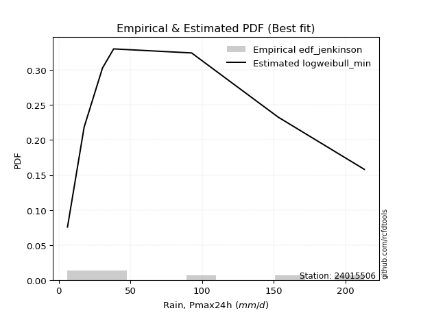</img>

</div>


### 11. EDF Cunnane (1978)

Cunnane´s work in statistical hydrology has focused on the performance and evaluation of different probability distributions (such as GEV, Gumbel, Lognormal) for flood frequency estimation. _b_ is a constant, typically set to 0.4.

<div align="center">


$P=(m-b)/(n+1-2b)$


</div>


**11.1. Empirical values**

<div align="center">

|                | 0                   | 1                   | 2                  | 3           | 4                  | 5                  | 6                  |
|:---------------|:--------------------|:--------------------|:-------------------|:------------|:-------------------|:-------------------|:-------------------|
| date           | 2015                | 2021                | 2017               | 2016        | 2020               | 2019               | 2018               |
| x              | 6.1                 | 17.7                | 30.5               | 38.3        | 92.7               | 153.0              | 213.2              |
| m              | 1                   | 2                   | 3                  | 4           | 5                  | 6                  | 7                  |
| empirical_dist | edf_cunnane         | edf_cunnane         | edf_cunnane        | edf_cunnane | edf_cunnane        | edf_cunnane        | edf_cunnane        |
| empirical      | 0.08333333333333333 | 0.22222222222222224 | 0.3611111111111111 | 0.5         | 0.6388888888888888 | 0.7777777777777777 | 0.9166666666666666 |
| empirical_tr   | 1.090909090909091   | 1.2857142857142856  | 1.565217391304348  | 2.0         | 2.7692307692307687 | 4.499999999999998  | 11.999999999999995 |

</div>


**11.2. Kolmogorov-Smirnov fit test (sorted by Δ)**


<div align="center">

|                | 0                   | 1                   | 2                   | 3                   | 4                   | 5                   | 6                   | 7                   | 8                   | 9                   | 10                  | 11                  | 12                  | 13                  | 14                  | 15                  | 16                  | 17                  | 18                  | 19                  | 20                  | 21                  | 22                  | 23                  | 24                  | 25                  | 26                  | 27                  | 28                  | 29                  | 30                  | 31                  | 32                  | 33                  | 34                  | 35                  | 36                  | 37                  | 38                  | 39                  | 40                  | 41                  | 42                  | 43                  | 44                  | 45                  | 46                  | 47                  | 48                  | 49                  | 50                  | 51                  | 52                  | 53                  | 54                  | 55                  | 56                  | 57                  | 58                  | 59                  | 60                  | 61                  | 62                  | 63                  | 64                  | 65                  | 66                  | 67                  | 68                  | 69                  | 70                  | 71                  | 72                  | 73                  | 74                  | 75                  | 76                  | 77                  | 78                  | 79                  | 80                  | 81                  | 82                  | 83                  | 84                  | 85                  | 86                  | 87                  | 88                  | 89                  | 90                  | 91                  | 92                  | 93                  | 94                  | 95                  | 96                  | 97                  | 98                  | 99                  | 100                 | 101                 | 102                 | 103                 | 104                 | 105                 | 106                 | 107                 | 108                 | 109                 | 110                 | 111                 | 112                 | 113                 | 114                 | 115                 | 116                 | 117                 | 118                 | 119                 | 120                 | 121                 | 122                 | 123                 | 124                 | 125                 | 126                 | 127                 | 128                 | 129                 | 130                 | 131                 | 132                 | 133                 | 134                 | 135                 | 136                 | 137                 | 138                 | 139                 | 140                 | 141                 | 142                 | 143                 | 144                 | 145                 | 146                 | 147                 | 148                 | 149                 | 150                 | 151                 | 152                 | 153                 | 154                 | 155                 | 156                 | 157                 | 158                 | 159                 |
|:---------------|:--------------------|:--------------------|:--------------------|:--------------------|:--------------------|:--------------------|:--------------------|:--------------------|:--------------------|:--------------------|:--------------------|:--------------------|:--------------------|:--------------------|:--------------------|:--------------------|:--------------------|:--------------------|:--------------------|:--------------------|:--------------------|:--------------------|:--------------------|:--------------------|:--------------------|:--------------------|:--------------------|:--------------------|:--------------------|:--------------------|:--------------------|:--------------------|:--------------------|:--------------------|:--------------------|:--------------------|:--------------------|:--------------------|:--------------------|:--------------------|:--------------------|:--------------------|:--------------------|:--------------------|:--------------------|:--------------------|:--------------------|:--------------------|:--------------------|:--------------------|:--------------------|:--------------------|:--------------------|:--------------------|:--------------------|:--------------------|:--------------------|:--------------------|:--------------------|:--------------------|:--------------------|:--------------------|:--------------------|:--------------------|:--------------------|:--------------------|:--------------------|:--------------------|:--------------------|:--------------------|:--------------------|:--------------------|:--------------------|:--------------------|:--------------------|:--------------------|:--------------------|:--------------------|:--------------------|:--------------------|:--------------------|:--------------------|:--------------------|:--------------------|:--------------------|:--------------------|:--------------------|:--------------------|:--------------------|:--------------------|:--------------------|:--------------------|:--------------------|:--------------------|:--------------------|:--------------------|:--------------------|:--------------------|:--------------------|:--------------------|:--------------------|:--------------------|:--------------------|:--------------------|:--------------------|:--------------------|:--------------------|:--------------------|:--------------------|:--------------------|:--------------------|:--------------------|:--------------------|:--------------------|:--------------------|:--------------------|:--------------------|:--------------------|:--------------------|:--------------------|:--------------------|:--------------------|:--------------------|:--------------------|:--------------------|:--------------------|:--------------------|:--------------------|:--------------------|:--------------------|:--------------------|:--------------------|:--------------------|:--------------------|:--------------------|:--------------------|:--------------------|:--------------------|:--------------------|:--------------------|:--------------------|:--------------------|:--------------------|:--------------------|:--------------------|:--------------------|:--------------------|:--------------------|:--------------------|:--------------------|:--------------------|:--------------------|:--------------------|:--------------------|:--------------------|:--------------------|:--------------------|:--------------------|:--------------------|:--------------------|
| station        | 24015506            | 24015506            | 24015506            | 24015506            | 24015506            | 24015506            | 24015506            | 24015506            | 24015506            | 24015506            | 24015506            | 24015506            | 24015506            | 24015506            | 24015506            | 24015506            | 24015506            | 24015506            | 24015506            | 24015506            | 24015506            | 24015506            | 24015506            | 24015506            | 24015506            | 24015506            | 24015506            | 24015506            | 24015506            | 24015506            | 24015506            | 24015506            | 24015506            | 24015506            | 24015506            | 24015506            | 24015506            | 24015506            | 24015506            | 24015506            | 24015506            | 24015506            | 24015506            | 24015506            | 24015506            | 24015506            | 24015506            | 24015506            | 24015506            | 24015506            | 24015506            | 24015506            | 24015506            | 24015506            | 24015506            | 24015506            | 24015506            | 24015506            | 24015506            | 24015506            | 24015506            | 24015506            | 24015506            | 24015506            | 24015506            | 24015506            | 24015506            | 24015506            | 24015506            | 24015506            | 24015506            | 24015506            | 24015506            | 24015506            | 24015506            | 24015506            | 24015506            | 24015506            | 24015506            | 24015506            | 24015506            | 24015506            | 24015506            | 24015506            | 24015506            | 24015506            | 24015506            | 24015506            | 24015506            | 24015506            | 24015506            | 24015506            | 24015506            | 24015506            | 24015506            | 24015506            | 24015506            | 24015506            | 24015506            | 24015506            | 24015506            | 24015506            | 24015506            | 24015506            | 24015506            | 24015506            | 24015506            | 24015506            | 24015506            | 24015506            | 24015506            | 24015506            | 24015506            | 24015506            | 24015506            | 24015506            | 24015506            | 24015506            | 24015506            | 24015506            | 24015506            | 24015506            | 24015506            | 24015506            | 24015506            | 24015506            | 24015506            | 24015506            | 24015506            | 24015506            | 24015506            | 24015506            | 24015506            | 24015506            | 24015506            | 24015506            | 24015506            | 24015506            | 24015506            | 24015506            | 24015506            | 24015506            | 24015506            | 24015506            | 24015506            | 24015506            | 24015506            | 24015506            | 24015506            | 24015506            | 24015506            | 24015506            | 24015506            | 24015506            | 24015506            | 24015506            | 24015506            | 24015506            | 24015506            | 24015506            |
| empirical_dist | edf_cunnane         | edf_cunnane         | edf_cunnane         | edf_cunnane         | edf_cunnane         | edf_cunnane         | edf_cunnane         | edf_cunnane         | edf_cunnane         | edf_cunnane         | edf_cunnane         | edf_cunnane         | edf_cunnane         | edf_cunnane         | edf_cunnane         | edf_cunnane         | edf_cunnane         | edf_cunnane         | edf_cunnane         | edf_cunnane         | edf_cunnane         | edf_cunnane         | edf_cunnane         | edf_cunnane         | edf_cunnane         | edf_cunnane         | edf_cunnane         | edf_cunnane         | edf_cunnane         | edf_cunnane         | edf_cunnane         | edf_cunnane         | edf_cunnane         | edf_cunnane         | edf_cunnane         | edf_cunnane         | edf_cunnane         | edf_cunnane         | edf_cunnane         | edf_cunnane         | edf_cunnane         | edf_cunnane         | edf_cunnane         | edf_cunnane         | edf_cunnane         | edf_cunnane         | edf_cunnane         | edf_cunnane         | edf_cunnane         | edf_cunnane         | edf_cunnane         | edf_cunnane         | edf_cunnane         | edf_cunnane         | edf_cunnane         | edf_cunnane         | edf_cunnane         | edf_cunnane         | edf_cunnane         | edf_cunnane         | edf_cunnane         | edf_cunnane         | edf_cunnane         | edf_cunnane         | edf_cunnane         | edf_cunnane         | edf_cunnane         | edf_cunnane         | edf_cunnane         | edf_cunnane         | edf_cunnane         | edf_cunnane         | edf_cunnane         | edf_cunnane         | edf_cunnane         | edf_cunnane         | edf_cunnane         | edf_cunnane         | edf_cunnane         | edf_cunnane         | edf_cunnane         | edf_cunnane         | edf_cunnane         | edf_cunnane         | edf_cunnane         | edf_cunnane         | edf_cunnane         | edf_cunnane         | edf_cunnane         | edf_cunnane         | edf_cunnane         | edf_cunnane         | edf_cunnane         | edf_cunnane         | edf_cunnane         | edf_cunnane         | edf_cunnane         | edf_cunnane         | edf_cunnane         | edf_cunnane         | edf_cunnane         | edf_cunnane         | edf_cunnane         | edf_cunnane         | edf_cunnane         | edf_cunnane         | edf_cunnane         | edf_cunnane         | edf_cunnane         | edf_cunnane         | edf_cunnane         | edf_cunnane         | edf_cunnane         | edf_cunnane         | edf_cunnane         | edf_cunnane         | edf_cunnane         | edf_cunnane         | edf_cunnane         | edf_cunnane         | edf_cunnane         | edf_cunnane         | edf_cunnane         | edf_cunnane         | edf_cunnane         | edf_cunnane         | edf_cunnane         | edf_cunnane         | edf_cunnane         | edf_cunnane         | edf_cunnane         | edf_cunnane         | edf_cunnane         | edf_cunnane         | edf_cunnane         | edf_cunnane         | edf_cunnane         | edf_cunnane         | edf_cunnane         | edf_cunnane         | edf_cunnane         | edf_cunnane         | edf_cunnane         | edf_cunnane         | edf_cunnane         | edf_cunnane         | edf_cunnane         | edf_cunnane         | edf_cunnane         | edf_cunnane         | edf_cunnane         | edf_cunnane         | edf_cunnane         | edf_cunnane         | edf_cunnane         | edf_cunnane         | edf_cunnane         | edf_cunnane         | edf_cunnane         | edf_cunnane         |
| p_dist         | logsemicircular     | logdweibull         | loganglit           | logdgamma           | logksone            | loggompertz         | halfgennorm         | loggausshyper       | logpearson3         | logarcsine          | kappa3              | logweibull_min      | logburr12           | loginvweibull       | logf                | logbetaprime        | logfatiguelife      | lognct              | logexponnorm        | lognorm             | logcrystalball      | logt                | alpha               | logfoldnorm         | johnsonsu           | logrice             | logerlang           | logncf              | loggamma            | loggamma            | logtrapezoid        | loginvgamma         | loginvgauss         | loggenlogistic      | logalpha            | logloggamma         | logkstwobign        | logcosine           | logmaxwell          | invgamma            | lograyleigh         | loggenexpon         | invgauss            | nct                 | logkappa4           | logargus            | dgamma              | loglogistic         | truncweibull_min    | logwrapcauchy       | logtriang           | loghalfnorm         | logjohnsonsu        | nakagami            | betaprime           | logskewnorm         | logtukeylambda      | loggumbel_l         | logvonmises_line    | logkappa3           | loguniform          | dweibull            | loghypsecant        | logloglaplace       | loggenhalflogistic  | ncf                 | f                   | loggumbel_r         | burr                | loggenpareto        | exponnorm           | genexpon            | lomax               | halfnorm            | loghalflogistic     | genpareto           | erlang              | halflogistic        | foldnorm            | gengamma            | logmoyal            | exponweib           | logburr             | logweibull_max      | loglaplace          | loglaplace          | truncnorm           | exponpow            | gompertz            | logtruncnorm        | arcsine             | loglomax            | logmielke           | rayleigh            | semicircular        | moyal               | logtruncweibull_min | logbradford         | pearson3            | burr12              | gumbel_r            | maxwell             | logbeta             | anglit              | genlogistic         | weibull_min         | logtruncexpon       | wald                | logwald             | wrapcauchy          | mielke              | kstwobign           | gausshyper          | crystalball         | norm                | t                   | loglevy_l           | gennorm             | loggenextreme       | logistic            | rice                | loghalfgennorm      | gamma               | cosine              | hypsecant           | logjohnsonsb        | skewnorm            | truncexpon          | gumbel_l            | bradford            | laplace             | loggennorm          | argus               | ksone               | beta                | loggengamma         | kappa4              | genextreme          | levy_l              | logexponweib        | uniform             | vonmises_line       | logrdist            | genhalflogistic     | lognakagami         | powerlaw            | triang              | fatiguelife         | trapezoid           | invweibull          | rdist               | tukeylambda         | logexponpow         | truncpareto         | logpowerlaw         | johnsonsb           | weibull_max         | logtruncpareto      | logvonmises         | vonmises            |
| delta          | 0.05479438303471462 | 0.0654928214313019  | 0.0662839485155593  | 0.06807862619983618 | 0.07974240698880256 | 0.08333333304802638 | 0.08333333333257241 | 0.08333333333574056 | 0.08397614701480993 | 0.08522220818342965 | 0.08708890843133299 | 0.0872464493325964  | 0.0877601196433474  | 0.09040668747212499 | 0.09143422804883494 | 0.09165280847096247 | 0.09270398044740924 | 0.09274801973402735 | 0.09298002518755755 | 0.09298089024793588 | 0.09298089057000403 | 0.09298160869257888 | 0.0947621236660533  | 0.09574171319587865 | 0.09578891961861569 | 0.09608592864248011 | 0.09677034690600339 | 0.09736138996233723 | 0.09813438847007938 | 0.09813438847007938 | 0.09877196448874787 | 0.10037271632574907 | 0.10253922433857354 | 0.10308490233014206 | 0.1032089283783102  | 0.10392853981673278 | 0.10456947304349606 | 0.10488714824609957 | 0.10491695255592925 | 0.10641109075048094 | 0.10835076658973763 | 0.10858508066122485 | 0.10877863910682395 | 0.10970924979298324 | 0.11080253296433884 | 0.11192605118152954 | 0.11535266358397615 | 0.11543255579479961 | 0.11582253063366588 | 0.11724559286021777 | 0.11845234317140346 | 0.11939700130626163 | 0.11945337820855284 | 0.12349488911364573 | 0.12354977654013044 | 0.12379364821454947 | 0.12559058806654466 | 0.12590357448818718 | 0.12878902942001114 | 0.12878961679695644 | 0.12886313581503672 | 0.13064812859313113 | 0.13075168581276442 | 0.13413423990112205 | 0.13561720649561448 | 0.13593577116016586 | 0.13661834807796214 | 0.13680748847304858 | 0.140009598089083   | 0.1408018625156047  | 0.1416269644459165  | 0.14228660876761368 | 0.14232131418661453 | 0.1447423771926022  | 0.1447956331701088  | 0.14586433718902886 | 0.1480204770835667  | 0.14916745669550574 | 0.14947573360678346 | 0.1496520689440664  | 0.15091529007916382 | 0.15102992812848934 | 0.1511409260076984  | 0.15174171735740444 | 0.15260915214980797 | 0.15260915214980797 | 0.15274128480165983 | 0.1532713256838032  | 0.16070689823384376 | 0.16348800739740904 | 0.16567660494541853 | 0.1657010555581001  | 0.1715759574861258  | 0.1746064700834386  | 0.1755070344538302  | 0.17562826421786681 | 0.17802306994004757 | 0.1815228241061082  | 0.18210714016306928 | 0.18269437964253693 | 0.18322384026571625 | 0.1852320195097415  | 0.18605391476879024 | 0.18638074043719322 | 0.1864278557731343  | 0.18738683594290206 | 0.18881295804971232 | 0.19261540320041254 | 0.19386081689298962 | 0.20065092634438852 | 0.20124191249079226 | 0.2045668176779864  | 0.208914592399292   | 0.21182585607404897 | 0.21182586818891858 | 0.21183012045683236 | 0.21332737952968167 | 0.21525962166567847 | 0.2189989383543517  | 0.233688545593647   | 0.238940952954943   | 0.24366692260974585 | 0.2450847709317893  | 0.24542857064160906 | 0.24915985333836527 | 0.2523198224242781  | 0.25373659896834533 | 0.25709080388461236 | 0.26016188280267954 | 0.2714253654509039  | 0.273113647857577   | 0.2777777777777778  | 0.2870841242056169  | 0.28709962980846615 | 0.30073481504684896 | 0.3075222742542061  | 0.3114087256761511  | 0.3191392761215307  | 0.32398235267311953 | 0.328221133788974   | 0.34451955577015936 | 0.3451283303227415  | 0.3611111093188093  | 0.3726913890625226  | 0.378481430080054   | 0.4351193538371583  | 0.443437177000423   | 0.45081947153655666 | 0.45341319306172145 | 0.47037118647571596 | 0.48187528385948936 | 0.5075861056929677  | 0.5463038454880225  | 0.5718001765647538  | 0.5890916056003722  | 0.5994288893657798  | 0.6466326817946666  | 0.6880076382236032  | 1.06239227649785    | 33.62963793147447   |
| deltao         | 0.48442053926100004 | 0.48442053926100004 | 0.48442053926100004 | 0.48442053926100004 | 0.48442053926100004 | 0.48442053926100004 | 0.48442053926100004 | 0.48442053926100004 | 0.48442053926100004 | 0.48442053926100004 | 0.48442053926100004 | 0.48442053926100004 | 0.48442053926100004 | 0.48442053926100004 | 0.48442053926100004 | 0.48442053926100004 | 0.48442053926100004 | 0.48442053926100004 | 0.48442053926100004 | 0.48442053926100004 | 0.48442053926100004 | 0.48442053926100004 | 0.48442053926100004 | 0.48442053926100004 | 0.48442053926100004 | 0.48442053926100004 | 0.48442053926100004 | 0.48442053926100004 | 0.48442053926100004 | 0.48442053926100004 | 0.48442053926100004 | 0.48442053926100004 | 0.48442053926100004 | 0.48442053926100004 | 0.48442053926100004 | 0.48442053926100004 | 0.48442053926100004 | 0.48442053926100004 | 0.48442053926100004 | 0.48442053926100004 | 0.48442053926100004 | 0.48442053926100004 | 0.48442053926100004 | 0.48442053926100004 | 0.48442053926100004 | 0.48442053926100004 | 0.48442053926100004 | 0.48442053926100004 | 0.48442053926100004 | 0.48442053926100004 | 0.48442053926100004 | 0.48442053926100004 | 0.48442053926100004 | 0.48442053926100004 | 0.48442053926100004 | 0.48442053926100004 | 0.48442053926100004 | 0.48442053926100004 | 0.48442053926100004 | 0.48442053926100004 | 0.48442053926100004 | 0.48442053926100004 | 0.48442053926100004 | 0.48442053926100004 | 0.48442053926100004 | 0.48442053926100004 | 0.48442053926100004 | 0.48442053926100004 | 0.48442053926100004 | 0.48442053926100004 | 0.48442053926100004 | 0.48442053926100004 | 0.48442053926100004 | 0.48442053926100004 | 0.48442053926100004 | 0.48442053926100004 | 0.48442053926100004 | 0.48442053926100004 | 0.48442053926100004 | 0.48442053926100004 | 0.48442053926100004 | 0.48442053926100004 | 0.48442053926100004 | 0.48442053926100004 | 0.48442053926100004 | 0.48442053926100004 | 0.48442053926100004 | 0.48442053926100004 | 0.48442053926100004 | 0.48442053926100004 | 0.48442053926100004 | 0.48442053926100004 | 0.48442053926100004 | 0.48442053926100004 | 0.48442053926100004 | 0.48442053926100004 | 0.48442053926100004 | 0.48442053926100004 | 0.48442053926100004 | 0.48442053926100004 | 0.48442053926100004 | 0.48442053926100004 | 0.48442053926100004 | 0.48442053926100004 | 0.48442053926100004 | 0.48442053926100004 | 0.48442053926100004 | 0.48442053926100004 | 0.48442053926100004 | 0.48442053926100004 | 0.48442053926100004 | 0.48442053926100004 | 0.48442053926100004 | 0.48442053926100004 | 0.48442053926100004 | 0.48442053926100004 | 0.48442053926100004 | 0.48442053926100004 | 0.48442053926100004 | 0.48442053926100004 | 0.48442053926100004 | 0.48442053926100004 | 0.48442053926100004 | 0.48442053926100004 | 0.48442053926100004 | 0.48442053926100004 | 0.48442053926100004 | 0.48442053926100004 | 0.48442053926100004 | 0.48442053926100004 | 0.48442053926100004 | 0.48442053926100004 | 0.48442053926100004 | 0.48442053926100004 | 0.48442053926100004 | 0.48442053926100004 | 0.48442053926100004 | 0.48442053926100004 | 0.48442053926100004 | 0.48442053926100004 | 0.48442053926100004 | 0.48442053926100004 | 0.48442053926100004 | 0.48442053926100004 | 0.48442053926100004 | 0.48442053926100004 | 0.48442053926100004 | 0.48442053926100004 | 0.48442053926100004 | 0.48442053926100004 | 0.48442053926100004 | 0.48442053926100004 | 0.48442053926100004 | 0.48442053926100004 | 0.48442053926100004 | 0.48442053926100004 | 0.48442053926100004 | 0.48442053926100004 | 0.48442053926100004 | 0.48442053926100004 |
| eval           | Δo > Δ              | Δo > Δ              | Δo > Δ              | Δo > Δ              | Δo > Δ              | Δo > Δ              | Δo > Δ              | Δo > Δ              | Δo > Δ              | Δo > Δ              | Δo > Δ              | Δo > Δ              | Δo > Δ              | Δo > Δ              | Δo > Δ              | Δo > Δ              | Δo > Δ              | Δo > Δ              | Δo > Δ              | Δo > Δ              | Δo > Δ              | Δo > Δ              | Δo > Δ              | Δo > Δ              | Δo > Δ              | Δo > Δ              | Δo > Δ              | Δo > Δ              | Δo > Δ              | Δo > Δ              | Δo > Δ              | Δo > Δ              | Δo > Δ              | Δo > Δ              | Δo > Δ              | Δo > Δ              | Δo > Δ              | Δo > Δ              | Δo > Δ              | Δo > Δ              | Δo > Δ              | Δo > Δ              | Δo > Δ              | Δo > Δ              | Δo > Δ              | Δo > Δ              | Δo > Δ              | Δo > Δ              | Δo > Δ              | Δo > Δ              | Δo > Δ              | Δo > Δ              | Δo > Δ              | Δo > Δ              | Δo > Δ              | Δo > Δ              | Δo > Δ              | Δo > Δ              | Δo > Δ              | Δo > Δ              | Δo > Δ              | Δo > Δ              | Δo > Δ              | Δo > Δ              | Δo > Δ              | Δo > Δ              | Δo > Δ              | Δo > Δ              | Δo > Δ              | Δo > Δ              | Δo > Δ              | Δo > Δ              | Δo > Δ              | Δo > Δ              | Δo > Δ              | Δo > Δ              | Δo > Δ              | Δo > Δ              | Δo > Δ              | Δo > Δ              | Δo > Δ              | Δo > Δ              | Δo > Δ              | Δo > Δ              | Δo > Δ              | Δo > Δ              | Δo > Δ              | Δo > Δ              | Δo > Δ              | Δo > Δ              | Δo > Δ              | Δo > Δ              | Δo > Δ              | Δo > Δ              | Δo > Δ              | Δo > Δ              | Δo > Δ              | Δo > Δ              | Δo > Δ              | Δo > Δ              | Δo > Δ              | Δo > Δ              | Δo > Δ              | Δo > Δ              | Δo > Δ              | Δo > Δ              | Δo > Δ              | Δo > Δ              | Δo > Δ              | Δo > Δ              | Δo > Δ              | Δo > Δ              | Δo > Δ              | Δo > Δ              | Δo > Δ              | Δo > Δ              | Δo > Δ              | Δo > Δ              | Δo > Δ              | Δo > Δ              | Δo > Δ              | Δo > Δ              | Δo > Δ              | Δo > Δ              | Δo > Δ              | Δo > Δ              | Δo > Δ              | Δo > Δ              | Δo > Δ              | Δo > Δ              | Δo > Δ              | Δo > Δ              | Δo > Δ              | Δo > Δ              | Δo > Δ              | Δo > Δ              | Δo > Δ              | Δo > Δ              | Δo > Δ              | Δo > Δ              | Δo > Δ              | Δo > Δ              | Δo > Δ              | Δo > Δ              | Δo > Δ              | Δo > Δ              | Δo > Δ              | Δo > Δ              | Δo > Δ              | Δo > Δ              | Δo > Δ              | Δo <= Δ             | Δo <= Δ             | Δo <= Δ             | Δo <= Δ             | Δo <= Δ             | Δo <= Δ             | Δo <= Δ             | Δo <= Δ             | Δo <= Δ             |
| fit            | 1                   | 1                   | 1                   | 1                   | 1                   | 1                   | 1                   | 1                   | 1                   | 1                   | 1                   | 1                   | 1                   | 1                   | 1                   | 1                   | 1                   | 1                   | 1                   | 1                   | 1                   | 1                   | 1                   | 1                   | 1                   | 1                   | 1                   | 1                   | 1                   | 1                   | 1                   | 1                   | 1                   | 1                   | 1                   | 1                   | 1                   | 1                   | 1                   | 1                   | 1                   | 1                   | 1                   | 1                   | 1                   | 1                   | 1                   | 1                   | 1                   | 1                   | 1                   | 1                   | 1                   | 1                   | 1                   | 1                   | 1                   | 1                   | 1                   | 1                   | 1                   | 1                   | 1                   | 1                   | 1                   | 1                   | 1                   | 1                   | 1                   | 1                   | 1                   | 1                   | 1                   | 1                   | 1                   | 1                   | 1                   | 1                   | 1                   | 1                   | 1                   | 1                   | 1                   | 1                   | 1                   | 1                   | 1                   | 1                   | 1                   | 1                   | 1                   | 1                   | 1                   | 1                   | 1                   | 1                   | 1                   | 1                   | 1                   | 1                   | 1                   | 1                   | 1                   | 1                   | 1                   | 1                   | 1                   | 1                   | 1                   | 1                   | 1                   | 1                   | 1                   | 1                   | 1                   | 1                   | 1                   | 1                   | 1                   | 1                   | 1                   | 1                   | 1                   | 1                   | 1                   | 1                   | 1                   | 1                   | 1                   | 1                   | 1                   | 1                   | 1                   | 1                   | 1                   | 1                   | 1                   | 1                   | 1                   | 1                   | 1                   | 1                   | 1                   | 1                   | 1                   | 1                   | 1                   | 1                   | 1                   | 1                   | 1                   | 0                   | 0                   | 0                   | 0                   | 0                   | 0                   | 0                   | 0                   | 0                   |
| n              | 7                   | 7                   | 7                   | 7                   | 7                   | 7                   | 7                   | 7                   | 7                   | 7                   | 7                   | 7                   | 7                   | 7                   | 7                   | 7                   | 7                   | 7                   | 7                   | 7                   | 7                   | 7                   | 7                   | 7                   | 7                   | 7                   | 7                   | 7                   | 7                   | 7                   | 7                   | 7                   | 7                   | 7                   | 7                   | 7                   | 7                   | 7                   | 7                   | 7                   | 7                   | 7                   | 7                   | 7                   | 7                   | 7                   | 7                   | 7                   | 7                   | 7                   | 7                   | 7                   | 7                   | 7                   | 7                   | 7                   | 7                   | 7                   | 7                   | 7                   | 7                   | 7                   | 7                   | 7                   | 7                   | 7                   | 7                   | 7                   | 7                   | 7                   | 7                   | 7                   | 7                   | 7                   | 7                   | 7                   | 7                   | 7                   | 7                   | 7                   | 7                   | 7                   | 7                   | 7                   | 7                   | 7                   | 7                   | 7                   | 7                   | 7                   | 7                   | 7                   | 7                   | 7                   | 7                   | 7                   | 7                   | 7                   | 7                   | 7                   | 7                   | 7                   | 7                   | 7                   | 7                   | 7                   | 7                   | 7                   | 7                   | 7                   | 7                   | 7                   | 7                   | 7                   | 7                   | 7                   | 7                   | 7                   | 7                   | 7                   | 7                   | 7                   | 7                   | 7                   | 7                   | 7                   | 7                   | 7                   | 7                   | 7                   | 7                   | 7                   | 7                   | 7                   | 7                   | 7                   | 7                   | 7                   | 7                   | 7                   | 7                   | 7                   | 7                   | 7                   | 7                   | 7                   | 7                   | 7                   | 7                   | 7                   | 7                   | 7                   | 7                   | 7                   | 7                   | 7                   | 7                   | 7                   | 7                   | 7                   |
| best_fit       | 1                   | 0                   | 0                   | 0                   | 0                   | 0                   | 0                   | 0                   | 0                   | 0                   | 0                   | 0                   | 0                   | 0                   | 0                   | 0                   | 0                   | 0                   | 0                   | 0                   | 0                   | 0                   | 0                   | 0                   | 0                   | 0                   | 0                   | 0                   | 0                   | 0                   | 0                   | 0                   | 0                   | 0                   | 0                   | 0                   | 0                   | 0                   | 0                   | 0                   | 0                   | 0                   | 0                   | 0                   | 0                   | 0                   | 0                   | 0                   | 0                   | 0                   | 0                   | 0                   | 0                   | 0                   | 0                   | 0                   | 0                   | 0                   | 0                   | 0                   | 0                   | 0                   | 0                   | 0                   | 0                   | 0                   | 0                   | 0                   | 0                   | 0                   | 0                   | 0                   | 0                   | 0                   | 0                   | 0                   | 0                   | 0                   | 0                   | 0                   | 0                   | 0                   | 0                   | 0                   | 0                   | 0                   | 0                   | 0                   | 0                   | 0                   | 0                   | 0                   | 0                   | 0                   | 0                   | 0                   | 0                   | 0                   | 0                   | 0                   | 0                   | 0                   | 0                   | 0                   | 0                   | 0                   | 0                   | 0                   | 0                   | 0                   | 0                   | 0                   | 0                   | 0                   | 0                   | 0                   | 0                   | 0                   | 0                   | 0                   | 0                   | 0                   | 0                   | 0                   | 0                   | 0                   | 0                   | 0                   | 0                   | 0                   | 0                   | 0                   | 0                   | 0                   | 0                   | 0                   | 0                   | 0                   | 0                   | 0                   | 0                   | 0                   | 0                   | 0                   | 0                   | 0                   | 0                   | 0                   | 0                   | 0                   | 0                   | 0                   | 0                   | 0                   | 0                   | 0                   | 0                   | 0                   | 0                   | 0                   |
| best_fit_sort  | 1                   | 2                   | 3                   | 4                   | 5                   | 6                   | 7                   | 8                   | 9                   | 10                  | 11                  | 12                  | 13                  | 14                  | 15                  | 16                  | 17                  | 18                  | 19                  | 20                  | 21                  | 22                  | 23                  | 24                  | 25                  | 26                  | 27                  | 28                  | 29                  | 30                  | 31                  | 32                  | 33                  | 34                  | 35                  | 36                  | 37                  | 38                  | 39                  | 40                  | 41                  | 42                  | 43                  | 44                  | 45                  | 46                  | 47                  | 48                  | 49                  | 50                  | 51                  | 52                  | 53                  | 54                  | 55                  | 56                  | 57                  | 58                  | 59                  | 60                  | 61                  | 62                  | 63                  | 64                  | 65                  | 66                  | 67                  | 68                  | 69                  | 70                  | 71                  | 72                  | 73                  | 74                  | 75                  | 76                  | 77                  | 78                  | 79                  | 80                  | 81                  | 82                  | 83                  | 84                  | 85                  | 86                  | 87                  | 88                  | 89                  | 90                  | 91                  | 92                  | 93                  | 94                  | 95                  | 96                  | 97                  | 98                  | 99                  | 100                 | 101                 | 102                 | 103                 | 104                 | 105                 | 106                 | 107                 | 108                 | 109                 | 110                 | 111                 | 112                 | 113                 | 114                 | 115                 | 116                 | 117                 | 118                 | 119                 | 120                 | 121                 | 122                 | 123                 | 124                 | 125                 | 126                 | 127                 | 128                 | 129                 | 130                 | 131                 | 132                 | 133                 | 134                 | 135                 | 136                 | 137                 | 138                 | 139                 | 140                 | 141                 | 142                 | 143                 | 144                 | 145                 | 146                 | 147                 | 148                 | 149                 | 150                 | 151                 | 152                 | 153                 | 154                 | 155                 | 156                 | 157                 | 158                 | 159                 | 160                 |

</div>


**11.3. Best fit**

<div align="center">

|   id |   station | empirical_dist   | p_dist          |     delta |   deltao | eval   |   fit |   n |   best_fit |   best_fit_sort |
|-----:|----------:|:-----------------|:----------------|----------:|---------:|:-------|------:|----:|-----------:|----------------:|
|    0 |  24015506 | edf_cunnane      | logsemicircular | 0.0547944 | 0.484421 | Δo > Δ |     1 |   7 |          1 |               1 |

</div>


<div align="center">

</img>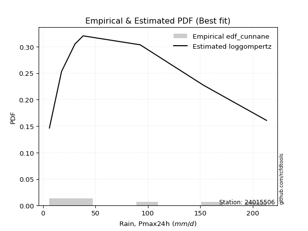</img>

</div>


### 12. EDF Adamowski (1981)

The Adamowski formula in hydrology refers to a specific plotting position formula used for estimating the non-parametric empirical distribution of hydrological events (like flood peaks) to calculate their return periods. This formula provides an alternative to traditional parametric methods (like the Gumbel or Log Pearson Type III distributions). 

<div align="center">


$P=(m-0.25)/(n+0.5)$


</div>


**12.1. Empirical values**

<div align="center">

|                | 0                  | 1                   | 2                   | 3             | 4                  | 5                  | 6                  |
|:---------------|:-------------------|:--------------------|:--------------------|:--------------|:-------------------|:-------------------|:-------------------|
| date           | 2015               | 2021                | 2017                | 2016          | 2020               | 2019               | 2018               |
| x              | 6.1                | 17.7                | 30.5                | 38.3          | 92.7               | 153.0              | 213.2              |
| m              | 1                  | 2                   | 3                   | 4             | 5                  | 6                  | 7                  |
| empirical_dist | edf_adamowski      | edf_adamowski       | edf_adamowski       | edf_adamowski | edf_adamowski      | edf_adamowski      | edf_adamowski      |
| empirical      | 0.1                | 0.23333333333333334 | 0.36666666666666664 | 0.5           | 0.6333333333333333 | 0.7666666666666667 | 0.9                |
| empirical_tr   | 1.1111111111111112 | 1.3043478260869565  | 1.5789473684210527  | 2.0           | 2.727272727272727  | 4.2857142857142865 | 10.000000000000002 |

</div>


**12.2. Kolmogorov-Smirnov fit test (sorted by Δ)**


<div align="center">

|                | 0                   | 1                   | 2                   | 3                   | 4                   | 5                   | 6                   | 7                   | 8                   | 9                   | 10                  | 11                  | 12                  | 13                  | 14                  | 15                  | 16                  | 17                  | 18                  | 19                  | 20                  | 21                  | 22                  | 23                  | 24                  | 25                  | 26                  | 27                  | 28                  | 29                  | 30                  | 31                  | 32                  | 33                  | 34                  | 35                  | 36                  | 37                  | 38                  | 39                  | 40                  | 41                  | 42                  | 43                  | 44                  | 45                  | 46                  | 47                  | 48                  | 49                  | 50                  | 51                  | 52                  | 53                  | 54                  | 55                  | 56                  | 57                  | 58                  | 59                  | 60                  | 61                  | 62                  | 63                  | 64                  | 65                  | 66                  | 67                  | 68                  | 69                  | 70                  | 71                  | 72                  | 73                  | 74                  | 75                  | 76                  | 77                  | 78                  | 79                  | 80                  | 81                  | 82                  | 83                  | 84                  | 85                  | 86                  | 87                  | 88                  | 89                  | 90                  | 91                  | 92                  | 93                  | 94                  | 95                  | 96                  | 97                  | 98                  | 99                  | 100                 | 101                 | 102                 | 103                 | 104                 | 105                 | 106                 | 107                 | 108                 | 109                 | 110                 | 111                 | 112                 | 113                 | 114                 | 115                 | 116                 | 117                 | 118                 | 119                 | 120                 | 121                 | 122                 | 123                 | 124                 | 125                 | 126                 | 127                 | 128                 | 129                 | 130                 | 131                 | 132                 | 133                 | 134                 | 135                 | 136                 | 137                 | 138                 | 139                 | 140                 | 141                 | 142                 | 143                 | 144                 | 145                 | 146                 | 147                 | 148                 | 149                 | 150                 | 151                 | 152                 | 153                 | 154                 | 155                 | 156                 | 157                 | 158                 | 159                 |
|:---------------|:--------------------|:--------------------|:--------------------|:--------------------|:--------------------|:--------------------|:--------------------|:--------------------|:--------------------|:--------------------|:--------------------|:--------------------|:--------------------|:--------------------|:--------------------|:--------------------|:--------------------|:--------------------|:--------------------|:--------------------|:--------------------|:--------------------|:--------------------|:--------------------|:--------------------|:--------------------|:--------------------|:--------------------|:--------------------|:--------------------|:--------------------|:--------------------|:--------------------|:--------------------|:--------------------|:--------------------|:--------------------|:--------------------|:--------------------|:--------------------|:--------------------|:--------------------|:--------------------|:--------------------|:--------------------|:--------------------|:--------------------|:--------------------|:--------------------|:--------------------|:--------------------|:--------------------|:--------------------|:--------------------|:--------------------|:--------------------|:--------------------|:--------------------|:--------------------|:--------------------|:--------------------|:--------------------|:--------------------|:--------------------|:--------------------|:--------------------|:--------------------|:--------------------|:--------------------|:--------------------|:--------------------|:--------------------|:--------------------|:--------------------|:--------------------|:--------------------|:--------------------|:--------------------|:--------------------|:--------------------|:--------------------|:--------------------|:--------------------|:--------------------|:--------------------|:--------------------|:--------------------|:--------------------|:--------------------|:--------------------|:--------------------|:--------------------|:--------------------|:--------------------|:--------------------|:--------------------|:--------------------|:--------------------|:--------------------|:--------------------|:--------------------|:--------------------|:--------------------|:--------------------|:--------------------|:--------------------|:--------------------|:--------------------|:--------------------|:--------------------|:--------------------|:--------------------|:--------------------|:--------------------|:--------------------|:--------------------|:--------------------|:--------------------|:--------------------|:--------------------|:--------------------|:--------------------|:--------------------|:--------------------|:--------------------|:--------------------|:--------------------|:--------------------|:--------------------|:--------------------|:--------------------|:--------------------|:--------------------|:--------------------|:--------------------|:--------------------|:--------------------|:--------------------|:--------------------|:--------------------|:--------------------|:--------------------|:--------------------|:--------------------|:--------------------|:--------------------|:--------------------|:--------------------|:--------------------|:--------------------|:--------------------|:--------------------|:--------------------|:--------------------|:--------------------|:--------------------|:--------------------|:--------------------|:--------------------|:--------------------|
| station        | 24015506            | 24015506            | 24015506            | 24015506            | 24015506            | 24015506            | 24015506            | 24015506            | 24015506            | 24015506            | 24015506            | 24015506            | 24015506            | 24015506            | 24015506            | 24015506            | 24015506            | 24015506            | 24015506            | 24015506            | 24015506            | 24015506            | 24015506            | 24015506            | 24015506            | 24015506            | 24015506            | 24015506            | 24015506            | 24015506            | 24015506            | 24015506            | 24015506            | 24015506            | 24015506            | 24015506            | 24015506            | 24015506            | 24015506            | 24015506            | 24015506            | 24015506            | 24015506            | 24015506            | 24015506            | 24015506            | 24015506            | 24015506            | 24015506            | 24015506            | 24015506            | 24015506            | 24015506            | 24015506            | 24015506            | 24015506            | 24015506            | 24015506            | 24015506            | 24015506            | 24015506            | 24015506            | 24015506            | 24015506            | 24015506            | 24015506            | 24015506            | 24015506            | 24015506            | 24015506            | 24015506            | 24015506            | 24015506            | 24015506            | 24015506            | 24015506            | 24015506            | 24015506            | 24015506            | 24015506            | 24015506            | 24015506            | 24015506            | 24015506            | 24015506            | 24015506            | 24015506            | 24015506            | 24015506            | 24015506            | 24015506            | 24015506            | 24015506            | 24015506            | 24015506            | 24015506            | 24015506            | 24015506            | 24015506            | 24015506            | 24015506            | 24015506            | 24015506            | 24015506            | 24015506            | 24015506            | 24015506            | 24015506            | 24015506            | 24015506            | 24015506            | 24015506            | 24015506            | 24015506            | 24015506            | 24015506            | 24015506            | 24015506            | 24015506            | 24015506            | 24015506            | 24015506            | 24015506            | 24015506            | 24015506            | 24015506            | 24015506            | 24015506            | 24015506            | 24015506            | 24015506            | 24015506            | 24015506            | 24015506            | 24015506            | 24015506            | 24015506            | 24015506            | 24015506            | 24015506            | 24015506            | 24015506            | 24015506            | 24015506            | 24015506            | 24015506            | 24015506            | 24015506            | 24015506            | 24015506            | 24015506            | 24015506            | 24015506            | 24015506            | 24015506            | 24015506            | 24015506            | 24015506            | 24015506            | 24015506            |
| empirical_dist | edf_adamowski       | edf_adamowski       | edf_adamowski       | edf_adamowski       | edf_adamowski       | edf_adamowski       | edf_adamowski       | edf_adamowski       | edf_adamowski       | edf_adamowski       | edf_adamowski       | edf_adamowski       | edf_adamowski       | edf_adamowski       | edf_adamowski       | edf_adamowski       | edf_adamowski       | edf_adamowski       | edf_adamowski       | edf_adamowski       | edf_adamowski       | edf_adamowski       | edf_adamowski       | edf_adamowski       | edf_adamowski       | edf_adamowski       | edf_adamowski       | edf_adamowski       | edf_adamowski       | edf_adamowski       | edf_adamowski       | edf_adamowski       | edf_adamowski       | edf_adamowski       | edf_adamowski       | edf_adamowski       | edf_adamowski       | edf_adamowski       | edf_adamowski       | edf_adamowski       | edf_adamowski       | edf_adamowski       | edf_adamowski       | edf_adamowski       | edf_adamowski       | edf_adamowski       | edf_adamowski       | edf_adamowski       | edf_adamowski       | edf_adamowski       | edf_adamowski       | edf_adamowski       | edf_adamowski       | edf_adamowski       | edf_adamowski       | edf_adamowski       | edf_adamowski       | edf_adamowski       | edf_adamowski       | edf_adamowski       | edf_adamowski       | edf_adamowski       | edf_adamowski       | edf_adamowski       | edf_adamowski       | edf_adamowski       | edf_adamowski       | edf_adamowski       | edf_adamowski       | edf_adamowski       | edf_adamowski       | edf_adamowski       | edf_adamowski       | edf_adamowski       | edf_adamowski       | edf_adamowski       | edf_adamowski       | edf_adamowski       | edf_adamowski       | edf_adamowski       | edf_adamowski       | edf_adamowski       | edf_adamowski       | edf_adamowski       | edf_adamowski       | edf_adamowski       | edf_adamowski       | edf_adamowski       | edf_adamowski       | edf_adamowski       | edf_adamowski       | edf_adamowski       | edf_adamowski       | edf_adamowski       | edf_adamowski       | edf_adamowski       | edf_adamowski       | edf_adamowski       | edf_adamowski       | edf_adamowski       | edf_adamowski       | edf_adamowski       | edf_adamowski       | edf_adamowski       | edf_adamowski       | edf_adamowski       | edf_adamowski       | edf_adamowski       | edf_adamowski       | edf_adamowski       | edf_adamowski       | edf_adamowski       | edf_adamowski       | edf_adamowski       | edf_adamowski       | edf_adamowski       | edf_adamowski       | edf_adamowski       | edf_adamowski       | edf_adamowski       | edf_adamowski       | edf_adamowski       | edf_adamowski       | edf_adamowski       | edf_adamowski       | edf_adamowski       | edf_adamowski       | edf_adamowski       | edf_adamowski       | edf_adamowski       | edf_adamowski       | edf_adamowski       | edf_adamowski       | edf_adamowski       | edf_adamowski       | edf_adamowski       | edf_adamowski       | edf_adamowski       | edf_adamowski       | edf_adamowski       | edf_adamowski       | edf_adamowski       | edf_adamowski       | edf_adamowski       | edf_adamowski       | edf_adamowski       | edf_adamowski       | edf_adamowski       | edf_adamowski       | edf_adamowski       | edf_adamowski       | edf_adamowski       | edf_adamowski       | edf_adamowski       | edf_adamowski       | edf_adamowski       | edf_adamowski       | edf_adamowski       | edf_adamowski       | edf_adamowski       |
| p_dist         | logsemicircular     | loganglit           | logdgamma           | logdweibull         | logpearson3         | logweibull_min      | logburr12           | loginvweibull       | logksone            | logf                | logbetaprime        | logfatiguelife      | lognct              | logexponnorm        | lognorm             | logcrystalball      | logt                | logtrapezoid        | loggompertz         | kappa3              | halfgennorm         | logarcsine          | loggausshyper       | alpha               | logfoldnorm         | johnsonsu           | logrice             | logerlang           | logncf              | loggenlogistic      | loggamma            | loggamma            | logloggamma         | loginvgamma         | loginvgauss         | logalpha            | logkstwobign        | dgamma              | logcosine           | logmaxwell          | logargus            | invgamma            | nakagami            | logwrapcauchy       | lograyleigh         | loggenexpon         | invgauss            | nct                 | logtriang           | logjohnsonsu        | loglogistic         | logkappa4           | logskewnorm         | loghalfnorm         | loggumbel_l         | truncweibull_min    | burr                | betaprime           | loggenpareto        | dweibull            | loggenhalflogistic  | ncf                 | loghypsecant        | logtukeylambda      | logloglaplace       | logvonmises_line    | logkappa3           | exponweib           | loguniform          | exponnorm           | f                   | genexpon            | lomax               | loggumbel_r         | gengamma            | halfnorm            | genpareto           | arcsine             | loglomax            | halflogistic        | foldnorm            | logburr             | loghalflogistic     | logweibull_max      | truncnorm           | exponpow            | erlang              | logmoyal            | logtruncnorm        | loglaplace          | loglaplace          | gompertz            | logmielke           | rayleigh            | semicircular        | moyal               | burr12              | pearson3            | gumbel_r            | logtruncweibull_min | maxwell             | logbeta             | anglit              | genlogistic         | logbradford         | weibull_min         | wrapcauchy          | logtruncexpon       | loglevy_l           | logwald             | wald                | kstwobign           | mielke              | gausshyper          | crystalball         | norm                | t                   | loggenextreme       | gennorm             | loghalfgennorm      | logistic            | rice                | gamma               | logjohnsonsb        | cosine              | hypsecant           | skewnorm            | truncexpon          | gumbel_l            | loggennorm          | bradford            | laplace             | beta                | argus               | ksone               | loggengamma         | genextreme          | levy_l              | kappa4              | logexponweib        | uniform             | vonmises_line       | logrdist            | genhalflogistic     | lognakagami         | powerlaw            | fatiguelife         | triang              | trapezoid           | invweibull          | rdist               | tukeylambda         | logexponpow         | truncpareto         | logpowerlaw         | johnsonsb           | weibull_max         | logtruncpareto      | logvonmises         | vonmises            |
| delta          | 0.06916464898955585 | 0.07183950407111483 | 0.08215740412843278 | 0.08215948809796858 | 0.08953170257036547 | 0.09157777548476331 | 0.09158488517528418 | 0.09596224302768053 | 0.09640907365546923 | 0.09698978360439048 | 0.097208364026518   | 0.09825953600296478 | 0.09830357528958289 | 0.09853558074311308 | 0.09853644580349141 | 0.09853644612555956 | 0.09853716424813441 | 0.09877196448874787 | 0.09999999971469306 | 0.09999999995903679 | 0.09999999999923909 | 0.1                 | 0.10000000000240716 | 0.10031767922160884 | 0.10129726875143419 | 0.10134447517417122 | 0.10164148419803565 | 0.10232590246155893 | 0.10291694551789277 | 0.10308490233014206 | 0.10368994402563492 | 0.10368994402563492 | 0.10392853981673278 | 0.1059282718813046  | 0.10809477989412908 | 0.10876448393386573 | 0.1101250285990516  | 0.11024055092691487 | 0.1104427038016551  | 0.11047250811148479 | 0.11192605118152954 | 0.11196664630603648 | 0.11238377800253463 | 0.11270295866623081 | 0.11390632214529317 | 0.11414063621678039 | 0.11433419466237948 | 0.11526480534853878 | 0.11845234317140346 | 0.11945337820855284 | 0.12098811135035514 | 0.1219136440754498  | 0.12379364821454947 | 0.12495255686181717 | 0.12590357448818718 | 0.12693364174477684 | 0.1288984869779719  | 0.12910533209568598 | 0.1296907514044936  | 0.13064812859313113 | 0.13561720649561448 | 0.13593577116016586 | 0.13630724136831995 | 0.13670169917765562 | 0.1396897954566776  | 0.1399001405311221  | 0.1399007279080674  | 0.13991881701737824 | 0.13997424692614768 | 0.1416269644459165  | 0.14217390363351767 | 0.14228660876761368 | 0.14232131418661453 | 0.1423630440286041  | 0.14409651338851087 | 0.1447423771926022  | 0.14586433718902886 | 0.14900993827875186 | 0.1490343888914335  | 0.14916745669550574 | 0.14947573360678346 | 0.14963779503862706 | 0.15035118872566433 | 0.15174171735740444 | 0.15274128480165983 | 0.1532713256838032  | 0.15357603263912223 | 0.15647084563471936 | 0.1579324518418535  | 0.1581647077053635  | 0.1581647077053635  | 0.16070689823384376 | 0.1736132022594935  | 0.1746064700834386  | 0.1755070344538302  | 0.17562826421786681 | 0.1771388240869814  | 0.18210714016306928 | 0.18322384026571625 | 0.1835786254956031  | 0.1852320195097415  | 0.18605391476879024 | 0.18638074043719322 | 0.1864278557731343  | 0.18707837966166374 | 0.18738683594290206 | 0.18953981523327756 | 0.19436851360526786 | 0.19666071286301498 | 0.19941637244854515 | 0.20372651431152367 | 0.2045668176779864  | 0.2067974680463478  | 0.208914592399292   | 0.21182585607404897 | 0.21182586818891858 | 0.21183012045683236 | 0.2189989383543517  | 0.220815177221234   | 0.23255581149863475 | 0.233688545593647   | 0.238940952954943   | 0.23924978182240558 | 0.241208711313167   | 0.24542857064160906 | 0.24915985333836527 | 0.25373659896834533 | 0.25709080388461236 | 0.26016188280267954 | 0.2666666666666667  | 0.2714253654509039  | 0.273113647857577   | 0.28406814838018224 | 0.2870841242056169  | 0.28709962980846615 | 0.29641116314309496 | 0.3024726094548641  | 0.30731568600645287 | 0.3114087256761511  | 0.31711002267786287 | 0.34451955577015936 | 0.3451283303227415  | 0.36666666487436483 | 0.3726913890625226  | 0.3729258745244985  | 0.42400824272604715 | 0.43970836042544553 | 0.443437177000423   | 0.45341319306172145 | 0.45370451980904936 | 0.4652086171928227  | 0.4909194390263011  | 0.5351927343769114  | 0.5606890654536427  | 0.577980494489261   | 0.5883177782546687  | 0.6355215706835555  | 0.676896527112492   | 1.0679478320534055  | 33.646304598141136  |
| deltao         | 0.48442053926100004 | 0.48442053926100004 | 0.48442053926100004 | 0.48442053926100004 | 0.48442053926100004 | 0.48442053926100004 | 0.48442053926100004 | 0.48442053926100004 | 0.48442053926100004 | 0.48442053926100004 | 0.48442053926100004 | 0.48442053926100004 | 0.48442053926100004 | 0.48442053926100004 | 0.48442053926100004 | 0.48442053926100004 | 0.48442053926100004 | 0.48442053926100004 | 0.48442053926100004 | 0.48442053926100004 | 0.48442053926100004 | 0.48442053926100004 | 0.48442053926100004 | 0.48442053926100004 | 0.48442053926100004 | 0.48442053926100004 | 0.48442053926100004 | 0.48442053926100004 | 0.48442053926100004 | 0.48442053926100004 | 0.48442053926100004 | 0.48442053926100004 | 0.48442053926100004 | 0.48442053926100004 | 0.48442053926100004 | 0.48442053926100004 | 0.48442053926100004 | 0.48442053926100004 | 0.48442053926100004 | 0.48442053926100004 | 0.48442053926100004 | 0.48442053926100004 | 0.48442053926100004 | 0.48442053926100004 | 0.48442053926100004 | 0.48442053926100004 | 0.48442053926100004 | 0.48442053926100004 | 0.48442053926100004 | 0.48442053926100004 | 0.48442053926100004 | 0.48442053926100004 | 0.48442053926100004 | 0.48442053926100004 | 0.48442053926100004 | 0.48442053926100004 | 0.48442053926100004 | 0.48442053926100004 | 0.48442053926100004 | 0.48442053926100004 | 0.48442053926100004 | 0.48442053926100004 | 0.48442053926100004 | 0.48442053926100004 | 0.48442053926100004 | 0.48442053926100004 | 0.48442053926100004 | 0.48442053926100004 | 0.48442053926100004 | 0.48442053926100004 | 0.48442053926100004 | 0.48442053926100004 | 0.48442053926100004 | 0.48442053926100004 | 0.48442053926100004 | 0.48442053926100004 | 0.48442053926100004 | 0.48442053926100004 | 0.48442053926100004 | 0.48442053926100004 | 0.48442053926100004 | 0.48442053926100004 | 0.48442053926100004 | 0.48442053926100004 | 0.48442053926100004 | 0.48442053926100004 | 0.48442053926100004 | 0.48442053926100004 | 0.48442053926100004 | 0.48442053926100004 | 0.48442053926100004 | 0.48442053926100004 | 0.48442053926100004 | 0.48442053926100004 | 0.48442053926100004 | 0.48442053926100004 | 0.48442053926100004 | 0.48442053926100004 | 0.48442053926100004 | 0.48442053926100004 | 0.48442053926100004 | 0.48442053926100004 | 0.48442053926100004 | 0.48442053926100004 | 0.48442053926100004 | 0.48442053926100004 | 0.48442053926100004 | 0.48442053926100004 | 0.48442053926100004 | 0.48442053926100004 | 0.48442053926100004 | 0.48442053926100004 | 0.48442053926100004 | 0.48442053926100004 | 0.48442053926100004 | 0.48442053926100004 | 0.48442053926100004 | 0.48442053926100004 | 0.48442053926100004 | 0.48442053926100004 | 0.48442053926100004 | 0.48442053926100004 | 0.48442053926100004 | 0.48442053926100004 | 0.48442053926100004 | 0.48442053926100004 | 0.48442053926100004 | 0.48442053926100004 | 0.48442053926100004 | 0.48442053926100004 | 0.48442053926100004 | 0.48442053926100004 | 0.48442053926100004 | 0.48442053926100004 | 0.48442053926100004 | 0.48442053926100004 | 0.48442053926100004 | 0.48442053926100004 | 0.48442053926100004 | 0.48442053926100004 | 0.48442053926100004 | 0.48442053926100004 | 0.48442053926100004 | 0.48442053926100004 | 0.48442053926100004 | 0.48442053926100004 | 0.48442053926100004 | 0.48442053926100004 | 0.48442053926100004 | 0.48442053926100004 | 0.48442053926100004 | 0.48442053926100004 | 0.48442053926100004 | 0.48442053926100004 | 0.48442053926100004 | 0.48442053926100004 | 0.48442053926100004 | 0.48442053926100004 | 0.48442053926100004 | 0.48442053926100004 |
| eval           | Δo > Δ              | Δo > Δ              | Δo > Δ              | Δo > Δ              | Δo > Δ              | Δo > Δ              | Δo > Δ              | Δo > Δ              | Δo > Δ              | Δo > Δ              | Δo > Δ              | Δo > Δ              | Δo > Δ              | Δo > Δ              | Δo > Δ              | Δo > Δ              | Δo > Δ              | Δo > Δ              | Δo > Δ              | Δo > Δ              | Δo > Δ              | Δo > Δ              | Δo > Δ              | Δo > Δ              | Δo > Δ              | Δo > Δ              | Δo > Δ              | Δo > Δ              | Δo > Δ              | Δo > Δ              | Δo > Δ              | Δo > Δ              | Δo > Δ              | Δo > Δ              | Δo > Δ              | Δo > Δ              | Δo > Δ              | Δo > Δ              | Δo > Δ              | Δo > Δ              | Δo > Δ              | Δo > Δ              | Δo > Δ              | Δo > Δ              | Δo > Δ              | Δo > Δ              | Δo > Δ              | Δo > Δ              | Δo > Δ              | Δo > Δ              | Δo > Δ              | Δo > Δ              | Δo > Δ              | Δo > Δ              | Δo > Δ              | Δo > Δ              | Δo > Δ              | Δo > Δ              | Δo > Δ              | Δo > Δ              | Δo > Δ              | Δo > Δ              | Δo > Δ              | Δo > Δ              | Δo > Δ              | Δo > Δ              | Δo > Δ              | Δo > Δ              | Δo > Δ              | Δo > Δ              | Δo > Δ              | Δo > Δ              | Δo > Δ              | Δo > Δ              | Δo > Δ              | Δo > Δ              | Δo > Δ              | Δo > Δ              | Δo > Δ              | Δo > Δ              | Δo > Δ              | Δo > Δ              | Δo > Δ              | Δo > Δ              | Δo > Δ              | Δo > Δ              | Δo > Δ              | Δo > Δ              | Δo > Δ              | Δo > Δ              | Δo > Δ              | Δo > Δ              | Δo > Δ              | Δo > Δ              | Δo > Δ              | Δo > Δ              | Δo > Δ              | Δo > Δ              | Δo > Δ              | Δo > Δ              | Δo > Δ              | Δo > Δ              | Δo > Δ              | Δo > Δ              | Δo > Δ              | Δo > Δ              | Δo > Δ              | Δo > Δ              | Δo > Δ              | Δo > Δ              | Δo > Δ              | Δo > Δ              | Δo > Δ              | Δo > Δ              | Δo > Δ              | Δo > Δ              | Δo > Δ              | Δo > Δ              | Δo > Δ              | Δo > Δ              | Δo > Δ              | Δo > Δ              | Δo > Δ              | Δo > Δ              | Δo > Δ              | Δo > Δ              | Δo > Δ              | Δo > Δ              | Δo > Δ              | Δo > Δ              | Δo > Δ              | Δo > Δ              | Δo > Δ              | Δo > Δ              | Δo > Δ              | Δo > Δ              | Δo > Δ              | Δo > Δ              | Δo > Δ              | Δo > Δ              | Δo > Δ              | Δo > Δ              | Δo > Δ              | Δo > Δ              | Δo > Δ              | Δo > Δ              | Δo > Δ              | Δo > Δ              | Δo > Δ              | Δo > Δ              | Δo > Δ              | Δo <= Δ             | Δo <= Δ             | Δo <= Δ             | Δo <= Δ             | Δo <= Δ             | Δo <= Δ             | Δo <= Δ             | Δo <= Δ             | Δo <= Δ             |
| fit            | 1                   | 1                   | 1                   | 1                   | 1                   | 1                   | 1                   | 1                   | 1                   | 1                   | 1                   | 1                   | 1                   | 1                   | 1                   | 1                   | 1                   | 1                   | 1                   | 1                   | 1                   | 1                   | 1                   | 1                   | 1                   | 1                   | 1                   | 1                   | 1                   | 1                   | 1                   | 1                   | 1                   | 1                   | 1                   | 1                   | 1                   | 1                   | 1                   | 1                   | 1                   | 1                   | 1                   | 1                   | 1                   | 1                   | 1                   | 1                   | 1                   | 1                   | 1                   | 1                   | 1                   | 1                   | 1                   | 1                   | 1                   | 1                   | 1                   | 1                   | 1                   | 1                   | 1                   | 1                   | 1                   | 1                   | 1                   | 1                   | 1                   | 1                   | 1                   | 1                   | 1                   | 1                   | 1                   | 1                   | 1                   | 1                   | 1                   | 1                   | 1                   | 1                   | 1                   | 1                   | 1                   | 1                   | 1                   | 1                   | 1                   | 1                   | 1                   | 1                   | 1                   | 1                   | 1                   | 1                   | 1                   | 1                   | 1                   | 1                   | 1                   | 1                   | 1                   | 1                   | 1                   | 1                   | 1                   | 1                   | 1                   | 1                   | 1                   | 1                   | 1                   | 1                   | 1                   | 1                   | 1                   | 1                   | 1                   | 1                   | 1                   | 1                   | 1                   | 1                   | 1                   | 1                   | 1                   | 1                   | 1                   | 1                   | 1                   | 1                   | 1                   | 1                   | 1                   | 1                   | 1                   | 1                   | 1                   | 1                   | 1                   | 1                   | 1                   | 1                   | 1                   | 1                   | 1                   | 1                   | 1                   | 1                   | 1                   | 0                   | 0                   | 0                   | 0                   | 0                   | 0                   | 0                   | 0                   | 0                   |
| n              | 7                   | 7                   | 7                   | 7                   | 7                   | 7                   | 7                   | 7                   | 7                   | 7                   | 7                   | 7                   | 7                   | 7                   | 7                   | 7                   | 7                   | 7                   | 7                   | 7                   | 7                   | 7                   | 7                   | 7                   | 7                   | 7                   | 7                   | 7                   | 7                   | 7                   | 7                   | 7                   | 7                   | 7                   | 7                   | 7                   | 7                   | 7                   | 7                   | 7                   | 7                   | 7                   | 7                   | 7                   | 7                   | 7                   | 7                   | 7                   | 7                   | 7                   | 7                   | 7                   | 7                   | 7                   | 7                   | 7                   | 7                   | 7                   | 7                   | 7                   | 7                   | 7                   | 7                   | 7                   | 7                   | 7                   | 7                   | 7                   | 7                   | 7                   | 7                   | 7                   | 7                   | 7                   | 7                   | 7                   | 7                   | 7                   | 7                   | 7                   | 7                   | 7                   | 7                   | 7                   | 7                   | 7                   | 7                   | 7                   | 7                   | 7                   | 7                   | 7                   | 7                   | 7                   | 7                   | 7                   | 7                   | 7                   | 7                   | 7                   | 7                   | 7                   | 7                   | 7                   | 7                   | 7                   | 7                   | 7                   | 7                   | 7                   | 7                   | 7                   | 7                   | 7                   | 7                   | 7                   | 7                   | 7                   | 7                   | 7                   | 7                   | 7                   | 7                   | 7                   | 7                   | 7                   | 7                   | 7                   | 7                   | 7                   | 7                   | 7                   | 7                   | 7                   | 7                   | 7                   | 7                   | 7                   | 7                   | 7                   | 7                   | 7                   | 7                   | 7                   | 7                   | 7                   | 7                   | 7                   | 7                   | 7                   | 7                   | 7                   | 7                   | 7                   | 7                   | 7                   | 7                   | 7                   | 7                   | 7                   |
| best_fit       | 1                   | 0                   | 0                   | 0                   | 0                   | 0                   | 0                   | 0                   | 0                   | 0                   | 0                   | 0                   | 0                   | 0                   | 0                   | 0                   | 0                   | 0                   | 0                   | 0                   | 0                   | 0                   | 0                   | 0                   | 0                   | 0                   | 0                   | 0                   | 0                   | 0                   | 0                   | 0                   | 0                   | 0                   | 0                   | 0                   | 0                   | 0                   | 0                   | 0                   | 0                   | 0                   | 0                   | 0                   | 0                   | 0                   | 0                   | 0                   | 0                   | 0                   | 0                   | 0                   | 0                   | 0                   | 0                   | 0                   | 0                   | 0                   | 0                   | 0                   | 0                   | 0                   | 0                   | 0                   | 0                   | 0                   | 0                   | 0                   | 0                   | 0                   | 0                   | 0                   | 0                   | 0                   | 0                   | 0                   | 0                   | 0                   | 0                   | 0                   | 0                   | 0                   | 0                   | 0                   | 0                   | 0                   | 0                   | 0                   | 0                   | 0                   | 0                   | 0                   | 0                   | 0                   | 0                   | 0                   | 0                   | 0                   | 0                   | 0                   | 0                   | 0                   | 0                   | 0                   | 0                   | 0                   | 0                   | 0                   | 0                   | 0                   | 0                   | 0                   | 0                   | 0                   | 0                   | 0                   | 0                   | 0                   | 0                   | 0                   | 0                   | 0                   | 0                   | 0                   | 0                   | 0                   | 0                   | 0                   | 0                   | 0                   | 0                   | 0                   | 0                   | 0                   | 0                   | 0                   | 0                   | 0                   | 0                   | 0                   | 0                   | 0                   | 0                   | 0                   | 0                   | 0                   | 0                   | 0                   | 0                   | 0                   | 0                   | 0                   | 0                   | 0                   | 0                   | 0                   | 0                   | 0                   | 0                   | 0                   |
| best_fit_sort  | 1                   | 2                   | 3                   | 4                   | 5                   | 6                   | 7                   | 8                   | 9                   | 10                  | 11                  | 12                  | 13                  | 14                  | 15                  | 16                  | 17                  | 18                  | 19                  | 20                  | 21                  | 22                  | 23                  | 24                  | 25                  | 26                  | 27                  | 28                  | 29                  | 30                  | 31                  | 32                  | 33                  | 34                  | 35                  | 36                  | 37                  | 38                  | 39                  | 40                  | 41                  | 42                  | 43                  | 44                  | 45                  | 46                  | 47                  | 48                  | 49                  | 50                  | 51                  | 52                  | 53                  | 54                  | 55                  | 56                  | 57                  | 58                  | 59                  | 60                  | 61                  | 62                  | 63                  | 64                  | 65                  | 66                  | 67                  | 68                  | 69                  | 70                  | 71                  | 72                  | 73                  | 74                  | 75                  | 76                  | 77                  | 78                  | 79                  | 80                  | 81                  | 82                  | 83                  | 84                  | 85                  | 86                  | 87                  | 88                  | 89                  | 90                  | 91                  | 92                  | 93                  | 94                  | 95                  | 96                  | 97                  | 98                  | 99                  | 100                 | 101                 | 102                 | 103                 | 104                 | 105                 | 106                 | 107                 | 108                 | 109                 | 110                 | 111                 | 112                 | 113                 | 114                 | 115                 | 116                 | 117                 | 118                 | 119                 | 120                 | 121                 | 122                 | 123                 | 124                 | 125                 | 126                 | 127                 | 128                 | 129                 | 130                 | 131                 | 132                 | 133                 | 134                 | 135                 | 136                 | 137                 | 138                 | 139                 | 140                 | 141                 | 142                 | 143                 | 144                 | 145                 | 146                 | 147                 | 148                 | 149                 | 150                 | 151                 | 152                 | 153                 | 154                 | 155                 | 156                 | 157                 | 158                 | 159                 | 160                 |

</div>


**12.3. Best fit**

<div align="center">

|   id |   station | empirical_dist   | p_dist          |     delta |   deltao | eval   |   fit |   n |   best_fit |   best_fit_sort |
|-----:|----------:|:-----------------|:----------------|----------:|---------:|:-------|------:|----:|-----------:|----------------:|
|    0 |  24015506 | edf_adamowski    | logsemicircular | 0.0691646 | 0.484421 | Δo > Δ |     1 |   7 |          1 |               1 |

</div>


<div align="center">

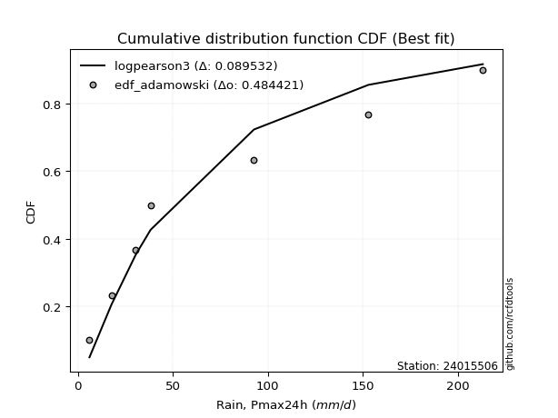</img>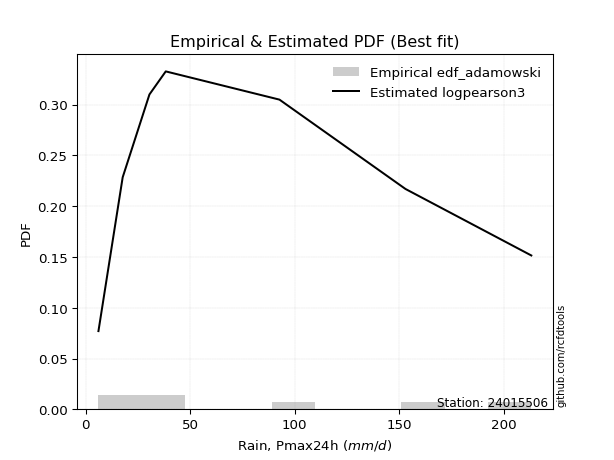</img>

</div>


## C. Best fit & Estimate extreme values for specific return periods - Tr

Best fit in probability distribution analysis means finding the theoretical distribution (like Normal, Poisson, Exponential, etc.) that most accurately mirrors your real-world data´s patterns (shape, center, spread) for better predictions, using methods like visual checks (Q-Q plots), goodness-of-fit tests (Kolmogorov-Smirnov, Chi-Squared), and information criteria (AIC) to score and select the simplest, most representative model.


### 1. Best fit (ordered by delta Δ)

:file_folder:Table: [bestfit_24015506.csv](table/bestfit_24015506.csv)

<div align="center">

|   id |   station | empirical_dist   | p_dist          |     delta |   deltao | eval   |   fit |   n |   best_fit |   best_fit_sort |
|-----:|----------:|:-----------------|:----------------|----------:|---------:|:-------|------:|----:|-----------:|----------------:|
|    0 |  24015506 | edf_hazen        | logsemicircular | 0.0508261 | 0.484421 | Δo > Δ |     1 |   7 |          1 |               1 |
|    1 |  24015506 | edf_gringorten   | logsemicircular | 0.0532338 | 0.484421 | Δo > Δ |     1 |   7 |          1 |               2 |
|    2 |  24015506 | edf_cunnane      | logsemicircular | 0.0547944 | 0.484421 | Δo > Δ |     1 |   7 |          1 |               3 |
|    3 |  24015506 | edf_blom         | logsemicircular | 0.0557522 | 0.484421 | Δo > Δ |     1 |   7 |          1 |               4 |
|    4 |  24015506 | edf_tukey        | logsemicircular | 0.0600737 | 0.484421 | Δo > Δ |     1 |   7 |          1 |               5 |
|    5 |  24015506 | edf_filliben     | logsemicircular | 0.0618327 | 0.484421 | Δo > Δ |     1 |   7 |          1 |               6 |
|    6 |  24015506 | edf_beard        | logsemicircular | 0.0626606 | 0.484421 | Δo > Δ |     1 |   7 |          1 |               7 |
|    7 |  24015506 | edf_jenkinson    | logsemicircular | 0.0626606 | 0.484421 | Δo > Δ |     1 |   7 |          1 |               8 |
|    8 |  24015506 | edf_chegodayev   | logsemicircular | 0.0637592 | 0.484421 | Δo > Δ |     1 |   7 |          1 |               9 |
|    9 |  24015506 | edf_adamowski    | logsemicircular | 0.0691646 | 0.484421 | Δo > Δ |     1 |   7 |          1 |              10 |
|   10 |  24015506 | edf_california   | loggenpareto    | 0.0836674 | 0.484421 | Δo > Δ |     1 |   7 |          1 |              11 |
|   11 |  24015506 | edf_weibull      | loganglit       | 0.0864686 | 0.484421 | Δo > Δ |     1 |   7 |          1 |              12 |

</div>


### 2. Extreme values and % difference analysis

In hydrology, a return period (or recurrence interval $Tr$) is the statistical average time between extreme events like floods or droughts of a specific magnitude, indicating how rare an event is, with a 100-year flood, for example, having a 1% chance of occurring in any given year, not that it happens exactly every century. It is a key tool for infrastructure design (like bridges or dams) and risk assessment, calculated from historical data to determine the probability of future events, although it is important to remember it is statistical average, and events can cluster or be missed.

The extreme value porcentage difference is evaluated as $pdiff = 1 - (ETrBf / ETr) * 100$, where _ETrBf_ correspond to the bestfit extreme value for a specific recurrence interval and _ETr_ correspond to the extreme value for one of the most used PDFsused in hydrology.

> risk_rate: assuming the return period as the project useful life.

:file_folder:Table: [extreme_24015506.csv](table/extreme_24015506.csv), all PDFs.  
:file_folder:Table: [extremepdiff_24015506.csv](table/extremepdiff_24015506.csv), % difference between bestfit and most used PDFs in Hydrology.

<div align="center">

Extreme values table for only best fit PDFs
|   id |      tr |   prob_l |     prob_g |      alpha |   anglit |   arcsine |   argus |     beta |   betaprime |   bradford |     burr |   burr12 |   cosine |   crystalball |   dgamma |   dweibull |   erlang |   exponnorm |   exponpow |   exponweib |        f |   fatiguelife |   foldnorm |    gamma |   gausshyper |   genexpon |      genextreme |   gengamma |   genhalflogistic |   genlogistic |   gennorm |   genpareto |   gompertz |   gumbel_l |   gumbel_r |   halfgennorm |   halflogistic |   halfnorm |   hypsecant |   invgamma |   invgauss |       invweibull |   johnsonsb |   johnsonsu |    kappa3 |   kappa4 |   ksone |   kstwobign |   laplace |   levy_l |   loggamma |   logistic |   loglaplace |    lomax |   maxwell |   mielke |    moyal |   nakagami |      ncf |       nct |     norm |   pearson3 |   powerlaw |   rayleigh |    rdist |     rice |   semicircular |   skewnorm |        t |   trapezoid |   triang |   truncexpon |   truncnorm |   truncpareto |   truncweibull_min |   tukeylambda |   uniform |   vonmises |   vonmises_line |     wald |   weibull_max |   weibull_min |   wrapcauchy |   logalpha |   loganglit |   logarcsine |   logargus |   logbeta |   logbetaprime |   logbradford |   logburr |   logburr12 |   logcosine |   logcrystalball |   logdgamma |   logdweibull |   logerlang |   logexponnorm |   logexponpow |     logexponweib |      logf |   logfatiguelife |   logfoldnorm |   loggausshyper |   loggenexpon |   loggenextreme |      loggengamma |   loggenhalflogistic |   loggenlogistic |   loggennorm |   loggenpareto |   loggompertz |   loggumbel_l |   loggumbel_r |   loghalfgennorm |   loghalflogistic |   loghalfnorm |   loghypsecant |   loginvgamma |   loginvgauss |   loginvweibull |   logjohnsonsb |   logjohnsonsu |   logkappa3 |   logkappa4 |   logksone |   logkstwobign |   loglevy_l |   logloggamma |   loglogistic |    logloglaplace |         loglomax |   logmaxwell |   logmielke |   logmoyal |   lognakagami |    logncf |    lognct |   lognorm |   logpearson3 |   logpowerlaw |   lograyleigh |   logrdist |   logrice |   logsemicircular |   logskewnorm |      logt |   logtrapezoid |   logtriang |   logtruncexpon |   logtruncnorm |   logtruncpareto |   logtruncweibull_min |   logtukeylambda |   loguniform |   logvonmises |   logvonmises_line |     logwald |   logweibull_max |   logweibull_min |   logwrapcauchy |   station |   n |   risk_rate |
|-----:|--------:|---------:|-----------:|-----------:|---------:|----------:|--------:|---------:|------------:|-----------:|---------:|---------:|---------:|--------------:|---------:|-----------:|---------:|------------:|-----------:|------------:|---------:|--------------:|-----------:|---------:|-------------:|-----------:|----------------:|-----------:|------------------:|--------------:|----------:|------------:|-----------:|-----------:|-----------:|--------------:|---------------:|-----------:|------------:|-----------:|-----------:|-----------------:|------------:|------------:|----------:|---------:|--------:|------------:|----------:|---------:|-----------:|-----------:|-------------:|---------:|----------:|---------:|---------:|-----------:|---------:|----------:|---------:|-----------:|-----------:|-----------:|---------:|---------:|---------------:|-----------:|---------:|------------:|---------:|-------------:|------------:|--------------:|-------------------:|--------------:|----------:|-----------:|----------------:|---------:|--------------:|--------------:|-------------:|-----------:|------------:|-------------:|-----------:|----------:|---------------:|--------------:|----------:|------------:|------------:|-----------------:|------------:|--------------:|------------:|---------------:|--------------:|-----------------:|----------:|-----------------:|--------------:|----------------:|--------------:|----------------:|-----------------:|---------------------:|-----------------:|-------------:|---------------:|--------------:|--------------:|--------------:|-----------------:|------------------:|--------------:|---------------:|--------------:|--------------:|----------------:|---------------:|---------------:|------------:|------------:|-----------:|---------------:|------------:|--------------:|--------------:|-----------------:|-----------------:|-------------:|------------:|-----------:|--------------:|----------:|----------:|----------:|--------------:|--------------:|--------------:|-----------:|----------:|------------------:|--------------:|----------:|---------------:|------------:|----------------:|---------------:|-----------------:|----------------------:|-----------------:|-------------:|--------------:|-------------------:|------------:|-----------------:|-----------------:|----------------:|----------:|----:|------------:|
|    0 |    2    | 0.5      | 0.5        |    41.6019 |  78.7857 |   78.7857 | 106.437 |  31.9667 |     33.4847 |    86.3895 |  40.5751 |  25.471  |  87.2035 |       78.7857 |  71.1669 |    76.2405 |  40.0296 |     56.4332 |    65.7723 |     30.852  |  35.2639 |       6.10039 |    66.9685 |  20.0901 |       91.535 |    56.5139 |    33.045       |    29.268  |           140.422 |       64.6269 |   38.3    |     57.0438 |    59.2497 |    90.6899 |    66.8816 |       49.1073 |        60.9634 |    63.9531 |     78.7857 |    43.8231 |    42.524  |   3065.65        |     6.13713 |     40.7388 |   46.5555 |  101.629 | 109.65  |     68.383  |   78.7857 |  88.2261 |    43.7414 |    78.7857 |      45.1315 |  56.5202 |   72.5884 |  32.5954 |  63.0385 |    42.1137 |  62.7622 |   43.5326 |  78.7857 |    69.5798 |    7.87089 |    70.3904 | -13.6843 |  76.813  |        78.7857 |    75.33   |  78.786  |     160.39  |  145.988 |      80.468  |     58.252  |       6.91683 |            41.5344 |     -13.7609  |   109.65  |  -0.547524 |         110.057 |  55.297  |       212.954 |       73.9123 |      109.65  |    41.7091 |     45.1315 |      45.1316 |    54.8528 |   72.0522 |        39.5961 |       26.5495 |   29.0848 |     49.5662 |     42.6293 |          45.1315 |     57.7755 |       55.2845 |     43.8042 |        45.1317 |       8.01364 |     14.617       |   45.2195 |          45.1372 |       45.3134 |         46.1945 |       34.851  |         86.2792 |     15.7331      |              64.6073 |          51.4858 |      36.0627 |        41.048  |       46.8604 |       54.6405 |       37.2774 |     20.1628      |           33.8974 |       35.5649 |        45.1315 |       42.4719 |       41.1143 |         37.884  |        27.8809 |        55.2367 |     6.09875 |     38.4961 |    45.1315 |        35.177  |     74.6223 |       52.146  |       45.1315 |     38.3         |     35.8848      |      40.8556 |      6.1    |    35.046  |       18.2825 |   40.3904 |   45.1647 |   45.1315 |       47.543  |       6.51288 |       39.4385 |    12.6906 |   43.1015 |           45.1315 |       57.6088 |   45.1316 |        55.106  |     57.324  |         26.0584 |        27.7176 |          6.26413 |               27.0466 |          35.9161 |      36.0627 |     0.0936698 |            36.0676 |     30.948  |          89.7667 |          49.4889 |         36.0625 |  24015506 |   7 |    0.75     |
|    1 |    2.33 | 0.570815 | 0.429185   |    51.5388 |  93.8476 |  101.396  | 121.089 |  54.2755 |     43.583  |   101.026  |  60.0426 |  34.3597 | 100.615  |       91.7164 |  98.9437 |   102.63   |  49.0628 |     67.5372 |    81.7385 |     43.1204 |  45.1039 |       7.93847 |    81.6    |  26.5306 |      110.166 |    67.6215 |   121.598       |    38.5492 |           154.026 |       75.4736 |   41.1346 |     68.1878 |    70.4952 |   101.94   |    78.8633 |       64.2716 |        73.2825 |    77.9086 |     89.1341 |    53.3282 |    52.3269 | 131676           |     6.2133  |     51.2584 |   56.8957 |  116.974 | 127.249 |     79.7566 |   86.6108 | 126.124  |    53.9361 |    90.1785 |      51.1755 |  67.6293 |   86.0225 |  40.6477 |  74.3807 |    60.3887 |  79.0356 |   52.8192 |  91.7164 |    82.4317 |   10.4992  |    84.0232 |   7.7818 |  88.6941 |        94.9398 |    87.2464 |  91.7165 |     172.422 |  157.099 |      94.1374 |     69.6248 |       7.52357 |            53.3612 |       1.71145 |   124.316 |  -0.364457 |         124.781 |  63.7757 |       213.117 |       92.4149 |      150.212 |    51.6672 |     57.4832 |      64.8925 |    67.6163 |   88.3154 |        50.0837 |       34.1874 |   38.4162 |     60.6125 |     52.8364 |          55.5488 |     92.7014 |       84.993  |     54.0749 |        55.5491 |       9.10818 |     19.3093      |   55.705  |          55.5545 |       55.5541 |         59.8829 |       44.6276 |        103.497  |     21.2542      |              81.4535 |          62.4552 |      36.0627 |        59.8695 |       58.073  |       65.4615 |       45.1878 |     27.5322      |           41.3137 |       44.5004 |        53.2921 |       52.5645 |       51.0992 |         48.2218 |        98.5311 |        67.2732 |     6.09875 |     50.009  |    60.0439 |        44.9168 |    102.65   |       63.5487 |       54.1936 |     44.7849      |     53.0239      |      50.6942 |      6.1    |    42.0488 |       19.2515 |   50.5627 |   55.5924 |   55.5488 |       58.3776 |       7.02013 |       49.0923 |    19.2839 |   53.4622 |           58.5005 |       70.9874 |   55.5489 |        69.9877 |     71.3139 |         33.3629 |        36.8589 |          6.37779 |               35.0257 |          46.4104 |      46.383  |     0.114921  |            46.3902 |     35.463  |         115.625  |          60.5242 |         50.0579 |  24015506 |   7 |    0.729209 |
|    2 |    5    | 0.8      | 0.2        |   127.855  | 146.989  |  161.69   | 168.087 | 150.953  |    109.951  |   155.444  | 176.644  | 147.978  | 148.944  |      139.77   | 135.986  |   144.483  |  96.7728 |    123.055  |   158.273  |    157.575  | 101.899  |      46.977   |   140.084  |  68.9505 |      170.35  |   123.157  | 64377.2         |   107.871  |           189.999 |      122.593  |   72.4859 |    123.473  |   124.41   |   138.283  |   130.917  |      169.274  |       129.024  |   136.925  |    130.644  |   115.641  |   113.514  |      1.65039e+12 |    13.1831  |    123.743  |  124.202  |  168.788 | 184.206 |    128.069  |  125.734  | 188.911  |   118.982  |   134.168  |      95.9309 | 123.172  |  138.898  |  80.793  | 126.919  |   169.649  | 162.903  |  114.454  | 139.77   |   135.525  |   50.8133  |   138.601  |  68.1156 | 136.259  |       150.067  |   137.639  | 139.77   |     206.943 |  188.974 |     147.606  |    125.872  |      18.5019  |           113.92   |      51.4073  |   171.78  |   0.348921 |         172.432 | 111.24   |       213.199 |      194.282  |      198.139 |   118.563  |    134.964  |     170.907  |   127.229  |  153.315  |       130.852  |       84.8706 |   99.7639 |    121.989  |    114.52   |         120.189  |    169.07   |      168.04   |    119.689  |       120.189  |      21.2141  |    106.428       |  121.051  |         120.421  |      118.458  |        130.68   |      122.492  |        162.357  |    132.591       |             148.378  |         125.198  |      36.0627 |       150.866  |      122.282  |      117.352  |      104.259  |    156.537       |          101.135  |      114.819  |       103.802  |      119.35   |      119.791  |        137.558  |       219.659  |       126.553  |     6.09875 |    113.556  |   151.266  |       126.856  |    174.102  |      123.594  |      109.846  |    108.801       |    373.457       |     118.517  |     89.9977 |    97.7738 |       46.4593 |  124.958  |  120.284  |  120.189  |      121.649  |      16.2934  |      117.953  |    60.8125 |  120.785  |          141.804  |      130.415  |  120.188  |       138.958  |    133.431  |         82.1086 |       129.98   |          8.37668 |               86.3031 |         105.985  |     104.736  |     0.255899  |           104.759  |     76.0086 |         186.097  |         121.932  |        120.604  |  24015506 |   7 |    0.67232  |
|    3 |   10    | 0.9      | 0.1        |   267.241  | 177.068  |  176.245  | 190.75  | 191.369  |    194.109  |   183.003  | 273.274  | inf      | 178.143  |      171.648  | 159.734  |   168.238  | 142.106  |    173.452  |   220.515  |    366.748  | 160.143  |     100.879   |   180.626  | 116.394  |      194.598 |   173.57   |     1.1101e+07  |   206.113  |           202.538 |      160.968  |  122.365  |    173.042  |   170.32   |   158.518  |   173.314  |      307.788  |       175.315  |   180.595  |    163.791  |   204.936  |   186.586  |      9.97427e+17 |   101.336   |    225.224  |  220.955  |  192.621 | 209.058 |    164.853  |  161.249  | 204.069  |   203.329  |   166.564  |     169.702  | 173.592  |  176.109  | 118.745  | 172.661  |   268.604  | 239.191  |  205.942  | 171.648  |   175.553  |  106.524   |   177.517  |  85.2154 | 170.174  |       178.354  |   174.929  | 171.647  |     220.426 |  201.424 |     177.327  |    176.077  |      49.1165  |           156.092  |      72.5984  |   192.49  |   0.895557 |         193.223 | 161.611  |       213.2   |      296.526  |      206.37  |   212.498  |    218.79   |     215.918  |   169.004  |  185.393  |       267.595  |      132.379  |  154.692  |    186.51   |    182.747  |         200.549  |    247.501  |      247.402  |    204.836  |       200.549  |      53.6472  |    737.42        |  202.774  |         201.517  |      195.756  |        174.203  |      254.488  |        188.511  |   1033.8         |             181.473  |         202.253  |      36.0627 |       191.724  |      189.935  |      162.417  |      205.989  |    941.742       |          212.711  |      231.538  |       176.772  |      210.857  |      219.358  |        323.051  |       220.368  |       178.504  |     6.09875 |    158.785  |   226.376  |       279.651  |    197.787  |      182.374  |      184.824  |    290.612       |   2196.95        |     215.445  |    138.658  |   203.84   |      191.764  |  243.222  |  200.68   |  200.549  |      193.174  |      42.3078  |      220.372  |    82.3237 |  209.178  |          223.355  |      167.075  |  200.547  |       181.648  |    170.425  |        129.198  |       344.918  |         15.6447  |              133.359  |         151.197  |     149.431  |     0.472545  |           149.47   |    170.696  |         204.853  |         186.609  |        162.214  |  24015506 |   7 |    0.651322 |
|    4 |   15    | 0.933333 | 0.0666667  |   405.928  | 189.912  |  179.021  | 199.366 | 201.741  |    255.634  |   192.764  | 324.409  | inf      | 191.444  |      187.555  | 172.253  |   179.879  | 169.13   |    202.932  |   253.833  |    552.091  | 196.121  |     136.132   |   201.067  | 146.483  |      201.873 |   203.06   |     2.02895e+08 |   280.386  |           206.334 |      182.618  |  161.016  |    201.768  |   195.974  |   167.681  |   197.234  |      408.675  |       201.511  |   203.321  |    182.707  |   279.141  |   236.436  |      1.82238e+21 |   266.352   |    304.376  |  302.48   |  200.817 | 217.342 |    184.38   |  182.024  | 208.649  |   266.542  |   184.215  |     236.918  | 203.086  |  195.201  | 143.232  | 199.208  |   322.493  | 283.428  |  284.442  | 187.555  |   197.01   |  135.026   |   197.567  |  88.9992 | 187.649  |       189.385  |   194.334  | 187.554  |     224.753 |  205.419 |     188.481  |    205.084  |      75.5665  |           173.206  |      79.5101  |   199.393 |   1.2045   |         200.154 | 193.957  |       213.2   |      359.595  |      208.723 |   287.288  |    268.918  |     225.764  |   187.617  |  195.813  |       391.727  |      154.603  |  179.606  |    228.061  |    226.102  |         258.929  |    302.355  |      299.029  |    268.651  |       258.929  |      95.2644  |   2656.26        |  262.387  |         260.683  |      251.522  |        189.111  |      371.736  |        197.082  |   3985.78        |             192.558  |         261.052  |      36.0627 |       202.152  |      232.883  |      188.17   |      302.478  |   2919.19        |          323.979  |      333.535  |       239.532  |      282.315  |      300.342  |        522.958  |       220.381  |       207.913  |     6.09875 |    176.511  |   258.936  |       425.47   |    205.557  |      218.518  |      245.404  |    566.163       |   6194.35        |     292.761  |    160.614  |   312.222  |      467.994  |  346.41   |  259.068  |  258.929  |      241.566  |      66.4502  |      304.1    |    87.6481 |  275.606  |          266.648  |      181.262  |  258.926  |       197.952  |    184.346  |        151.796  |       579.356  |         25.2479  |              155.29   |         169.937  |     168.225  |     0.660324  |           168.271  |    286.981  |         208.977  |         228.308  |        177.938  |  24015506 |   7 |    0.644736 |
|    5 |   20    | 0.95     | 0.05       |   544.438  | 197.468  |  179.999  | 204.095 | 205.993  |    305.665  |   197.757  | 359.677  | inf      | 199.623  |      197.973  | 180.755  |   187.479  | 188.467  |    223.849  |   276.235  |    717.949  | 222.328  |     162.233   |   214.496  | 168.59   |      205.249 |   223.983  |     1.55178e+09 |   341.017  |           208.155 |      197.777  |  192.787  |    222.03   |   213.678  |   173.385  |   213.983  |      489.447  |       219.865  |   218.473  |    196.052  |   345.092  |   274.689  |      3.50299e+23 |   405.745   |    370.949  |  375.862  |  204.986 | 221.484 |    197.535  |  196.764  | 210.994  |   318.623  |   196.415  |     300.203  | 224.013  |  207.872  | 162.165  | 218.009  |   358.853  | 314.621  |  355.754  | 197.973  |   211.606  |  151.695   |   210.895  |  90.4583 | 199.264  |       195.503  |   207.272  | 197.972  |     226.887 |  207.39  |     194.339  |    225.507  |      95.7333  |           182.44   |      82.9181  |   202.845 |   1.41863  |         203.619 | 218.061  |       213.2   |      405.592  |      209.861 |   351.383  |    303.615  |     229.337  |   198.533  |  200.804  |       507.231  |      167.305  |  193.828  |    259.225  |    257.729  |         306.087  |    346.308  |      338.417  |    321.222  |       306.087  |     144.196   |   7016.37        |  310.664  |         308.608  |      296.393  |        196.273  |      478.508  |        201.3    |  11035.4         |             198.025  |         310.922  |      36.0627 |       206.363  |      264.699  |      206.224  |      395.839  |   6735.6         |          435.05   |      425.429  |       296.788  |      342.767  |      370.645  |        732.723  |       220.383  |       228.316  |     6.09875 |    185.774  |   276.932  |       564.471  |    209.653  |      244.909  |      298.524  |    952.229       |  12924.1         |     358.837  |    172.954  |   422.285  |      874.668  |  440.235  |  306.224  |  306.087  |      278.931  |      85.8721  |      376.685  |    89.7047 |  330.33   |          294.182  |      188.779  |  306.084  |       206.526  |    191.626  |        164.881  |       821.431  |         35.5889  |              167.825  |         180.07   |     178.49   |     0.822494  |           178.54   |    422.659  |         210.587  |         259.604  |        186.234  |  24015506 |   7 |    0.641514 |
|    6 |   25    | 0.96     | 0.04       |   682.877  | 202.588  |  180.453  | 207.145 | 208.182  |    348.522  |   200.789  | 386.941  | inf      | 205.36   |      205.642  | 187.178  |   193.071  | 203.544  |    240.073  |   292.962  |    868.738  | 243.001  |     182.971   |   224.398  | 186.096  |      207.162 |   240.213  |     7.43705e+09 |   392.736  |           209.222 |      209.453  |  219.962  |    237.678  |   227.138  |   177.444  |   226.883  |      557.471  |       234.006  |   229.747  |    206.38   |   405.54   |   305.89   |      2.0117e+25  |   492.252   |    429.192  |  443.843  |  207.518 | 223.969 |    207.388  |  208.198  | 212.465  |   363.58   |   205.748  |     360.716  | 240.244  |  217.279  | 177.942  | 232.582  |   386.038  | 338.709  |  422.207  | 205.642  |   222.629  |  162.555   |   220.797  |  91.1813 | 207.893  |       199.472  |   216.898  | 205.64   |     228.158 |  208.564 |     197.951  |    241.261  |     111.11    |           188.213  |      84.942   |   204.916 |   1.57861  |         205.698 | 237.367  |       213.2   |      441.925  |      210.536 |   408.362  |    329.64   |     231.014  |   205.845  |  203.686  |       616.276  |      175.499  |  203.182  |    284.354  |    282.511  |         346.207  |    383.668  |      370.673  |    366.595  |       346.207  |     199.345   |  15420.9         |  351.81   |         349.463  |      334.462  |        200.382  |      577.406  |        203.799  |  25133.9         |             201.259  |         355.189  |      36.0627 |       208.501  |      290.097  |      220.115  |      486.971  |  13119.4         |          545.978  |      509.872  |       350.337  |      395.985  |      433.721  |        950.085  |       220.383  |       243.873  |     6.09875 |    191.418  |   288.325  |       697.593  |    212.266  |      265.791  |      346.799  |   1467.22        |  22863.9         |     417.362  |    180.839  |   533.647  |     1406.61   |  527.403  |  346.337  |  346.207  |      309.68   |     101.223   |      441.618  |    90.7109 |  377.532  |          313.547  |      193.433  |  346.204  |       211.81   |    196.1    |        173.388  |      1066.76   |         45.8047  |              175.914  |         186.396  |     184.948  |     0.960504  |           185      |    576.322  |         211.397  |         284.85   |        191.366  |  24015506 |   7 |    0.639603 |
|    7 |   50    | 0.98     | 0.02       |  1374.75   | 215.193  |  181.058  | 214.059 | 211.58   |    507.741  |   206.938  | 473.96   | inf      | 220.38   |      227.602  | 206.399  |   209.104  | 250.727  |    290.47   |   341.67   |   1479.97   | 308.924  |     249.507   |   252.803  | 242.092  |      210.639 |   290.626  |     9.28791e+11 |   580.628  |           211.286 |      245.422  |  318.854  |    285.909  |   267.526  |   188.462  |   266.624  |      799.562  |       277.577  |   262.514  |    238.4    |   661.229  |   410.503  |      5.27952e+30 |   610.801   |    652.229  |  737.987  |  212.677 | 228.94  |    236.322  |  243.713  | 215.779  |   532.095  |   234.263  |     638.106  | 290.664  |  244.561  | 234.564  | 277.822  |   465.345  | 412.962  |  712.454  | 227.602  |   255.513  |  186.363   |   249.54   |  92.2476 | 232.943  |       208.54   |   244.878  | 227.6    |     230.682 |  210.894 |     205.408  |    289.72   |     152.149   |           200.314  |      88.9223  |   209.058 |   2.00518  |         209.856 | 300.404  |       213.2   |      558.092  |      211.873 |   634.157  |    403.607  |     233.273  |   223.246  |  209.047  |      1099.6    |      193.305  |  225.681  |    367.711  |    359.289  |         492.623  |    521.064  |      481.217  |    536.608  |       492.623  |     547.554   | 213325           |  502.465  |         499.12   |      472.746  |        207.875  |      997.303  |        208.683  | 386174           |             207.547  |         532.201  |      36.0627 |       211.746  |      372.706  |      262.728  |      921.944  | 114484           |         1099.23   |      863.022  |       585.919  |      602.927  |      687.823  |       2115.03   |       220.383  |       290.688  |     6.09875 |    202.735  |   312.536  |      1299.1    |    218.268  |      332.862  |      548.247  |   6732.66        | 134503           |     646.863  |    197.775  |  1103.61   |     5733.41   |  903.078  |  492.683  |  492.623  |      415.289  |     144.272   |      700.713  |    92.1483 |  553.964  |          362.704  |      203.079  |  492.616  |       222.7    |    205.289  |        192.051  |      2295.27   |         87.1098  |              193.506  |         199.577  |     198.572  |     1.39368   |           198.63   |   1586.28   |         212.626  |         368.654  |        202.008  |  24015506 |   7 |    0.63583  |
|    8 |   75    | 0.986667 | 0.0133333  |  2066.47   | 220.74   |  181.171  | 216.802 | 212.366  |    622.383  |   209.013  | 528.268  | inf      | 227.553  |      239.385  | 217.242  |   217.731  | 278.526  |    319.951  |   368.139  |   1953.55   | 348.559  |     289.579   |   268.066  | 275.759  |      211.651 |   320.116  |     1.53636e+13 |   710.484  |           211.949 |      266.328  |  387.147  |    313.86   |   290.217  |   194.034  |   289.722  |      963.432  |       302.904  |   280.352  |    257.113  |   874.673  |   476.498  |      7.45319e+33 |   627.924   |    816.763  |  990.219  |  214.439 | 230.596 |    252.241  |  264.488  | 217.141  |   653.868  |   250.732  |     890.85   | 320.158  |  259.394  | 274.295  | 304.277  |   508.548  | 456.032  |  963.53   | 239.385  |   273.972  |  194.957   |   265.178  |  92.4773 | 246.572  |       212.162  |   260.109  | 239.383  |     231.517 |  211.665 |     207.967  |    317.741  |     169.81    |           204.519  |      90.2193  |   210.439 |   2.18612  |         211.243 | 339.194  |       213.2   |      628.151  |      212.316 |   808.07   |    441.216  |     233.694  |   230.473  |  210.65   |      1520.18   |      199.693  |  236.005  |    420.171  |    402.999  |         595.258  |    619.124  |      553.776  |    659.399  |       595.257  |     987.397   |      1.11953e+06 |  608.461  |         604.479  |      569.199  |        210.034  |     1343.44   |        210.259  |      2.14534e+06 |             209.555  |         671.517  |      36.0627 |       212.47   |      423.448  |      287.323  |     1336.06   | 433054           |         1651.01   |     1149.32   |       791.339  |      758.866  |      886.997  |       3367.65   |       220.384  |       317.02   |     6.09875 |    206.437  |   321.05   |      1829.02   |    220.784  |      373.576  |      714.254  |  18938.2         | 379233           |     820.87   |    203.788  |  1687.9    |    12386.8    | 1220.99   |  595.236  |  595.258  |      484.329  |     163.648   |      900.776  |    92.4403 |  680.87   |          384.431  |      206.399  |  595.249  |       226.427  |    208.425  |        198.806  |      3495.91   |        113.594   |              199.823  |         204.107  |     203.333  |     1.60599   |           203.393  |   2957.73   |         212.906  |         421.434  |        205.675  |  24015506 |   7 |    0.634587 |
|    9 |  100    | 0.99     | 0.01       |  2758.16   | 224.038  |  181.21   | 218.333 | 212.68   |    715.111  |   210.055  | 569.024  | inf      | 232.048  |      247.354  | 224.794  |   223.579  | 298.322  |    340.867  |   386.119  |   2349.34   | 377.117  |     318.411   |   278.394  | 299.975  |      212.116 |   341.039  |     1.11932e+14 |   811.935  |           212.275 |      281.125  |  440.414  |    333.575  |   305.926  |   197.678  |   306.071  |     1089.97   |       320.83   |   292.503  |    270.386  |  1064.63   |   525.215  |      1.26361e+36 |   632.926   |    951.1    | 1218.81   |  215.334 | 231.425 |    263.148  |  279.228  | 217.937  |   752.188  |   262.359  |    1128.81   | 341.085  |  269.497  | 306.102  | 323.046  |   537.952  | 486.443  | 1192.19   | 247.354  |   286.783  |  199.384   |   275.831  |  92.5654 | 255.856  |       214.191  |   270.485  | 247.352  |     231.934 |  212.05  |     209.261  |    337.48   |     179.571   |           206.655  |      90.8589  |   211.129 |   2.28355  |         211.936 | 367.476  |       213.2   |      678.719  |      212.537 |   954.411  |    465.221  |     233.842  |   234.59   |  211.398  |      1902.48   |      202.978  |  242.634  |    459.043  |    433.067  |         676.543  |    698.065  |      609.09   |    758.501  |       676.542  |    1497.1     |      3.82279e+06 |  692.602  |         688.15   |      645.361  |        211.013  |     1646.13   |        211.031  |      7.61109e+06 |             210.531  |         791.097  |      36.0627 |       212.753  |      460.459  |      304.643  |     1737.24   |      1.14322e+06 |         2201.86   |     1397.01   |       979.378  |      888.205  |     1056.39   |       4680.61   |       220.384  |       335.239  |     6.09875 |    208.248  |   325.393  |      2312.16   |    222.268  |      403.099  |      860.91   |  42413.9         | 791245           |     965.487  |    206.867  |  2281.74   |    20928.1    | 1505.33   |  676.44   |  676.543  |      536.65   |     174.56    |     1068.88   |    92.548  |  782.952  |          397.162  |      208.079  |  676.533  |       228.309  |    210.007  |        202.292  |      4662.25   |        131.222   |              203.072  |         206.391  |     205.756  |     1.7284    |           205.817  |   4658.4    |         213.016  |         460.559  |        207.532  |  24015506 |   7 |    0.633968 |
|   10 |  200    | 0.995    | 0.005      |  5524.81   | 230.27   |  181.248  | 220.993 | 213.033  |    984.702  |   211.624  | 676.859  | inf      | 241.19   |      265.432  | 242.596  |   236.891  | 346.226  |    391.264  |   427.006  |   3535.04   | 447.315  |     388.989   |   301.835  | 359.256  |      212.742 |   391.452  |     1.32556e+16 |  1089.44   |           212.751 |      316.698  |  585.633  |    380.682  |   342.523  |   205.6    |   345.374  |     1430.92   |       363.927  |   320.295  |    302.364  |  1701.3    |   648.3    |      2.8907e+41  |   636.979   |   1343.87   | 2006.7    |  216.701 | 232.667 |    288.27   |  314.743  | 219.445  |  1035.68   |   290.251  |    1996.86   | 391.505  |  292.612  | 397.699  | 368.267  |   605.051  | 559.261  | 1985.6    | 265.432  |   316.826  |  206.19    |   300.207  |  92.6599 | 277.1    |       217.727  |   294.216  | 265.43   |     232.557 |  212.626 |     211.219  |    384.57   |     195.516   |           209.902  |      91.8019  |   212.164 |   2.43646  |         212.975 | 437.922  |       213.2   |      803.264  |      212.869 |  1403.09   |    514.194  |     233.984  |   241.888  |  212.42   |      3215.37   |      208.021  |  257.336  |    558.325  |    501.301  |         904.465  |    926.055  |      756.473  |   1044.07   |       904.464  |    4039.13    |      8.73194e+07 |  929.307  |         923.695  |      858.053  |        212.307  |     2621.99   |        212.159  |      1.8919e+08  |             211.941  |        1171.38   |      36.0627 |       213.063  |      552.861  |      345.976  |     3265.95   |      1.29329e+07 |         4399.45   |     2183      |      1636.83   |     1276.21   |     1583.55   |      10328.3    |       220.384  |       377.586  |   209.509   |    210.874  |   332.019  |      3967.17   |    225.106  |      476.318  |     1347.46   | 391821           |      4.6547e+06  |    1399.51   |    211.578  |  4717.29   |    69122.8    | 2460.79   |  904.067  |  904.465  |      674.362  |     192.684   |     1581.1    |    92.6582 | 1075.41   |          420.373  |      210.624  |  904.45   |       231.155  |    212.397  |        207.659  |      9038.03   |        165.533   |              208.064  |         209.824  |     209.445  |     1.93412   |           209.507  |  14442.3    |         213.141  |         560.543  |        210.349  |  24015506 |   7 |    0.633042 |
|   11 |  250    | 0.996    | 0.004      |  6908.12   | 231.856  |  181.252  | 221.616 | 213.084  |   1087.61   |   211.939  | 714.98   | inf      | 243.696  |      270.956  | 248.227  |   240.973  | 361.702  |    407.489  |   439.504  |   3994.24   | 470.311  |     411.99    |   309      | 378.58   |      212.853 |   407.682  |     6.15149e+16 |  1189.05   |           212.844 |      328.134  |  637.581  |    395.73   |   353.948  |   207.931  |   358.009  |     1551.8    |       377.782  |   328.845  |    312.658  |  1976.29   |   689.466  |      1.52745e+43 |   637.391   |   1493.7    | 2355.29   |  216.98  | 232.916 |    296.045  |  326.176  | 219.838  |  1142.68   |   299.206  |    2399.38   | 407.737  |  299.727  | 432.467  | 382.824  |   625.642  | 582.578  | 2338.49   | 270.956  |   326.282  |  207.576   |   307.711  |  92.6729 | 283.64   |       218.556  |   301.516  | 270.954  |     232.682 |  212.741 |     211.613  |    399.592  |     198.907   |           210.557  |      91.987   |   212.372 |   2.46774  |         213.183 | 461.228  |       213.2   |      844.121  |      212.935 |  1581.94   |    527.46   |     234.001  |   243.623  |  212.604  |      3791.46   |      209.046  |  261.873  |    591.978  |    521.816  |         988.385  |   1012.57   |      808.444  |   1151.78   |       988.384  |    5539.36    |      2.5117e+08  | 1016.71   |        1010.73   |      936.095  |        212.531  |     3026.39   |        212.378  |      5.57927e+08 |             212.212  |        1328.53   |      36.0627 |       213.106  |      583.531  |      359.173  |     4000.78   |      2.89602e+07 |         5495.91   |     2504.32   |      1931.11   |     1427.88   |     1796.29   |      13320.9    |       220.384  |       390.764  |   210.255   |    211.377  |   333.36   |      4688.59   |    225.851  |      500.497  |     1555.88   | 880682           |      8.23457e+06 |    1568.94   |    212.535  |  5959.85   |    99643.2    | 2873.15   |  987.857  |  988.386  |      722.269  |     196.585   |     1783.61   |    92.6724 | 1185.1    |          426.012  |      211.137  |  988.368  |       231.728  |    212.878  |        208.753  |     11089.1    |        173.826   |              209.079  |         210.509  |     210.191  |     1.97856   |           210.253  |  20999.2    |         213.159  |         594.45   |        210.917  |  24015506 |   7 |    0.632858 |
|   12 |  500    | 0.998    | 0.002      | 13824.6    | 235.789  |  181.259  | 223.047 | 213.163  |   1468.48   |   212.569  | 846.048  | inf      | 250.364  |      287.339  | 265.457  |   253.118  | 409.912  |    457.886  |   476.502  |   5694.77   | 542.91   |     484.145   |   330.255  | 439.227  |      213.053 |   458.095  |     7.20964e+18 |  1531.77   |           213.027 |      363.629  |  815.587  |    442.109  |   388.407  |   214.612  |   397.227  |     1962.89   |       420.785  |   354.337  |    344.633  |  3140.29   |   821.506  |      3.40174e+48 |   637.902   |   2043.91   | 3871.48   |  217.548 | 233.413 |    319.344  |  361.691  | 220.852  |  1531.91   |   326.977  |    4244.51   | 458.157  |  320.959  | 560.697  | 428.044  |   686.869  | 654.66   | 3881.84   | 287.339  |   355.084  |  210.371   |   330.1    |  92.6919 | 303.152  |       220.467  |   323.283  | 287.337  |     232.931 |  212.971 |     212.405  |    445.839  |     205.904   |           211.874  |      92.3517  |   212.786 |   2.53075  |         213.599 | 535.332  |       213.2   |      973.227  |      213.068 |  2272.1    |    561.849  |     234.024  |   247.649  |  212.943  |      6257.73   |      211.115  |  275.829  |    701.778  |    580.595  |        1285.88   |   1330.6    |      985.155  |   1543.34   |      1285.88   |   14587.8     |      7.74958e+09 | 1327.49   |        1320.41   |     1211.81   |        212.927  |     4644.66   |        212.806  |      1.84666e+10 |             212.734  |        1962.64   |      36.0627 |       213.171  |      681.497  |      399.86   |     7511.02   |      3.81683e+08 |        10964.7    |     3771.38   |      3227.33   |     2000.76   |     2627.65   |      29343.7    |       220.384  |       430.332  |   211.755   |    212.347  |   336.059  |      7735.58   |    227.786  |      577.419  |     2430.45   |      1.52897e+07 |      4.84419e+07 |    2206.52   |    214.481  | 12321.2    |   294641      | 4610.69   | 1284.8    | 1285.88   |      882.467  |     204.685   |     2555.44   |    92.6924 | 1581.17   |          439.284  |      212.166  | 1285.86   |       232.877  |    213.842  |        210.963  |     20448.9    |        192.17    |              211.128  |         211.872  |     211.69   |     2.07081   |           211.753  |  69042.9    |         213.187  |         705.119  |        212.057  |  24015506 |   7 |    0.632489 |
|   13 |  750    | 0.998667 | 0.00133333 | 20741.2    | 237.53   |  181.26   | 223.623 | 213.181  |   1741.94   |   212.779  | 932.824  | inf      | 253.596  |      296.44   | 275.378  |   259.891  | 438.199  |    487.366  |   496.98   |   6901.85   | 586.172  |     526.777   |   342.065  | 475.079  |      213.111 |   487.585  |     1.16791e+20 |  1756.36   |           213.087 |      384.38   |  931.669  |    468.987  |   407.881  |   218.183  |   420.154  |     2228.97   |       445.925  |   368.578  |    363.337  |  4112.4    |   901.36   |      4.54965e+51 |   637.992   |   2433.07   | 5176.4    |  217.742 | 233.579 |    332.433  |  382.466  | 221.332  |  1804.7    |   343.202  |    5925.69   | 487.651  |  332.834  | 652.534  | 454.495  |   720.961  | 696.604  | 5217.94   | 296.44   |   371.579  |  211.31    |   342.619  |  92.696  | 314.062  |       221.236  |   335.444  | 296.437  |     233.014 |  213.047 |     212.67   |    472.607  |     208.302   |           212.315  |      92.4708  |   212.924 |   2.55183  |         213.738 | 579.764  |       213.2   |     1050.2    |      213.112 |  2789.86   |    577.782  |     234.028  |   249.282  |  213.042  |      8332.6    |      211.81   |  284.064  |    769.706  |    611.416  |        1488.27   |   1557.06   |     1099.97   |   1817.53   |      1488.27   |   25461.1     |      6.36761e+10 | 1539.64   |        1531.99   |     1398.66   |        213.039  |     5903.04   |        212.943  |      1.57312e+11 |             212.9    |        2464.95   |      36.0627 |       213.186  |      740.609  |      423.463  |    10854.7    |      1.81431e+09 |        16419.2    |     4740.63   |      4358.23   |     2419.94   |     3259.77   |      46560.8    |       220.384  |       452.551  |   212.258   |    212.653  |   336.964  |     10248.3    |    228.709  |      623.651  |     3153.99   |      1.06126e+08 |      1.36583e+08 |    2670.18   |    215.174  | 18843.5    |   537619      | 6050.42   | 1486.76   | 1488.27   |      984.316  |     207.476   |     3124.59   |    92.6964 | 1856.21   |          444.742  |      212.51   | 1488.24   |       233.261  |    214.164  |        211.705  |     28820.9    |        198.859   |              211.816  |         212.322  |     212.192  |     2.10257   |           212.256  | 140945      |         213.193  |         773.614  |        212.438  |  24015506 |   7 |    0.632366 |
|   14 | 1000    | 0.999    | 0.001      | 27657.7    | 238.567  |  181.26   | 223.946 | 213.188  |   1962.87   |   212.884  | 999.524  | inf      | 255.635  |      302.706  | 282.357  |   264.565  | 458.302  |    508.283  |   511.037  |   7863.08   | 617.211  |     557.187   |   350.196  | 500.663  |      213.138 |   508.508  |     8.42076e+20 |  1926.87   |           213.116 |      399.099  | 1019.51   |    487.945  |   421.408  |   220.586  |   436.416  |     2429.51   |       463.758  |   378.413  |    376.608  |  4977.68   |   959.062  |      7.50874e+53 |   638.023   |   2743.34   | 6360.75   |  217.84  | 233.661 |    341.5    |  397.206  | 221.635  |  2021.12   |   354.708  |    7508.53   | 508.577  |  341.042  | 726.66   | 473.263  |   744.457  | 726.274  | 6435.08   | 302.706  |   383.143  |  211.781   |   351.271  |  92.6976 | 321.602  |       221.667  |   343.842  | 302.703  |     233.055 |  213.085 |     212.802  |    491.476  |     209.514   |           212.536  |      92.5297  |   212.993 |   2.56239  |         213.807 | 611.724  |       213.2   |     1105.42   |      213.134 |  3219.12   |    587.492  |     234.03   |   250.203  |  213.089  |     10182.6    |      212.158  |  289.994  |    819.562  |    631.695  |        1645.84   |   1738.97   |     1186.93   |   2034.93   |      1645.84   |   37636       |      2.96386e+11 | 1705.16   |        1697.16   |     1543.81   |        213.089  |     6967.32   |        213.011  |      7.49563e+11 |             212.98   |        2897.2    |      36.0627 |       213.191  |      783.321  |      440.128  |    14094.7    |      5.60433e+09 |        21864.4    |     5551.85   |      5393.59   |     2761.84   |     3788.1    |      64602.2    |       220.384  |       467.915  |   212.509   |    212.801  |   337.417  |     12453.2    |    229.291  |      656.99   |     3794.19   |      4.80631e+08 |      2.84972e+08 |    3046.44   |    215.555  | 25472.5    |   812937      | 7323.47   | 1643.95   | 1645.84   |     1060.29   |     208.889   |     3590.37   |    92.6979 | 2073.06   |          447.838  |      212.682  | 1645.81   |       233.453  |    214.325  |        212.078  |     36546.7    |        202.321   |              212.161  |         212.545  |     212.444  |     2.11863   |           212.507  | 235500      |         213.196  |         823.899  |        212.629  |  24015506 |   7 |    0.632305 |


</div>


<div align="center">

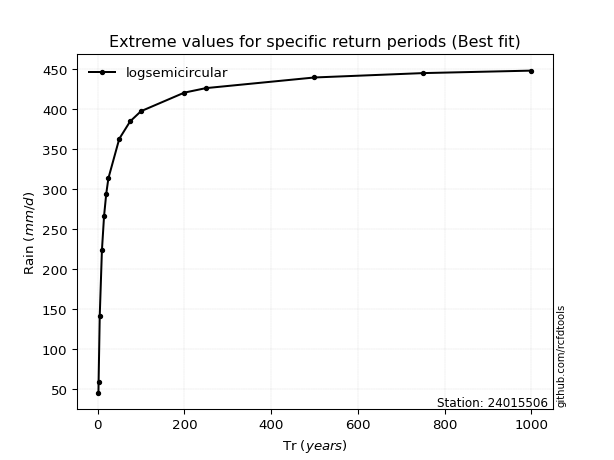</img>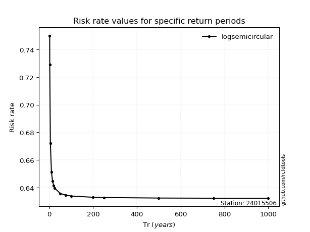</img>

</div>


<sub>**APP DISCLAIMER**: NO WARRANTY - This software is provided by [github.com/rcfdtools](https://github.com/rcfdtools) "as is", without any express or implied warranty, including warranties of merchantability, fitness for a particular purpose, or non-infringement. There is no guarantee that the software will be error-free or operate without interruption. LIMITATION OF LIABILITY - Neither the authors nor copyright holders will be liable for claims or damages arising from the software or its use. You are responsible for determining if the software is appropriate for your use and assume all associated risks, including errors, legal compliance, and data loss. NO PROFESSIONAL ADVICE - The software provides general information and does not offer professional advice. It should not replace consultation with professional advisors.</sub>